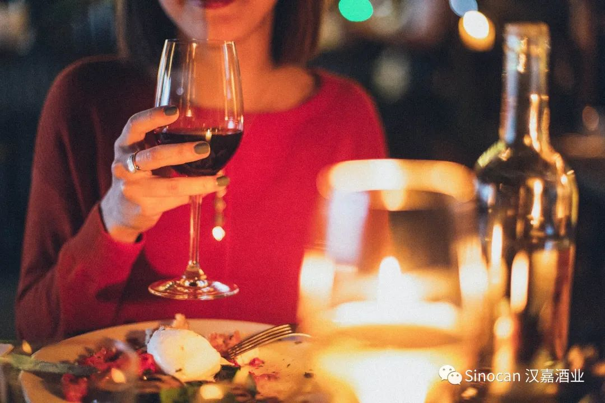
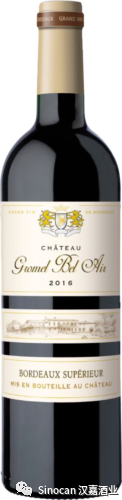
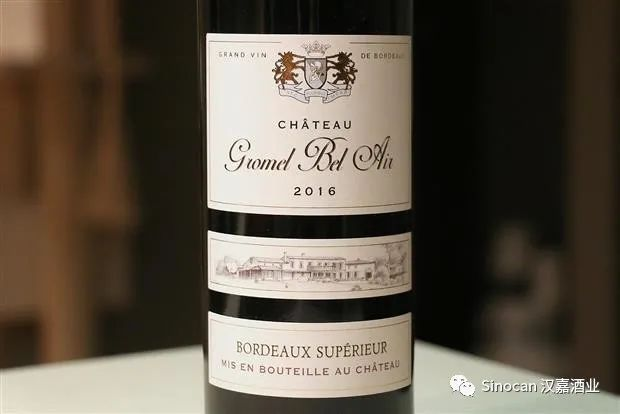
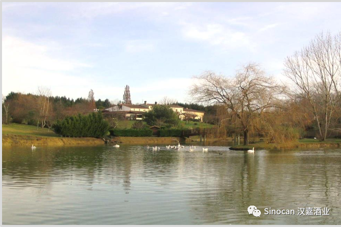
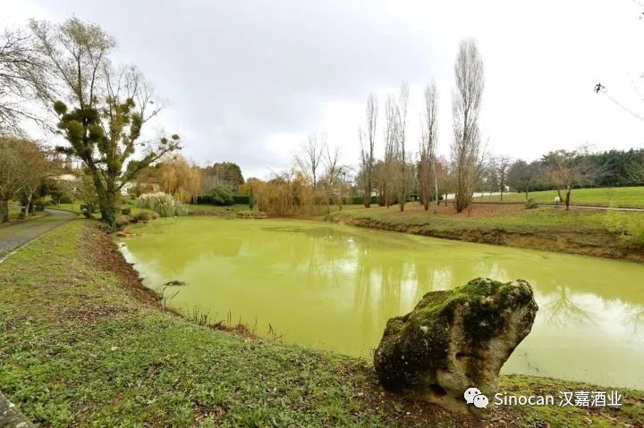
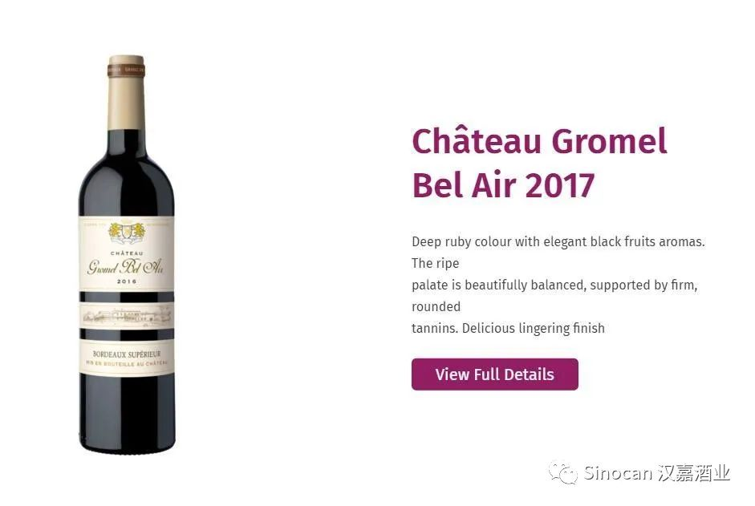
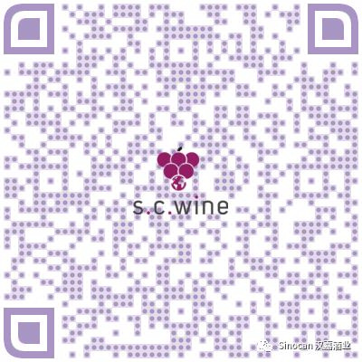
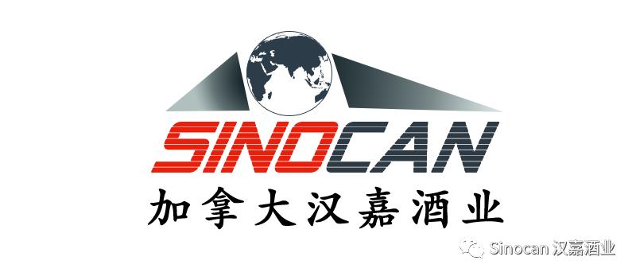
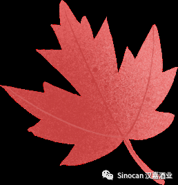

# 无标题

**链接地址:** http://mp.weixin.qq.com/s?__biz=MzIyMzU4OTc0MQ==&mid=2247484381&idx=2&sn=b3c18413f93a4d56a68b51a7b3b7c5b3&chksm=e81aa7dfdf6d2ec954c478fe9a17984749720f9af08dc4ded0899572c950e9460eba97653af1&mpshare=1&scene=2&srcid=0911wLa1633YeJpdux9ioopA&sharer_sharetime=1599783485552&sharer_shareid=be1c8edd6c93eec155a61c876e41d26a#rd
**作者:** 汉嘉酒业
**获取时间:** 2025/8/28 20:08:27
**图片数量:** 11

---

## 原始HTML内容

<section style="box-sizing: border-box;font-size: 16px;"><section style="margin: 17px 0%;box-sizing: border-box;" powered-by="xiumi.us"><section style="display: inline-block;width: 100%;vertical-align: top;border-left: 3px solid rgb(195, 163, 142);border-bottom-left-radius: 0px;padding-right: 5px;padding-left: 5px;border-right: 3px solid rgb(195, 163, 142);border-top-right-radius: 0px;box-sizing: border-box;"><section style="margin: -7px 0%;box-sizing: border-box;" powered-by="xiumi.us"><section style="display: inline-block;width: 100%;vertical-align: top;background-color: rgb(255, 244, 226);padding: 5px 10px;box-sizing: border-box;"><section style="color: rgb(158, 114, 84);font-size: 14px;box-sizing: border-box;" powered-by="xiumi.us">
<strong style="box-sizing: border-box;">点击蓝字 关注我们</strong>
</section></section></section></section></section><section style="box-sizing: border-box;" powered-by="xiumi.us">
 
</section><section style="text-align: right;justify-content: flex-end;margin-top: 10px;margin-right: 0%;margin-left: 0%;box-sizing: border-box;" powered-by="xiumi.us"><section style="display: inline-block;width: auto;vertical-align: top;min-width: 10%;max-width: 100%;height: auto;background-color: rgb(195, 163, 142);padding: 5px 10px;box-sizing: border-box;"><section style="text-align: justify;color: rgb(255, 255, 255);font-size: 14px;box-sizing: border-box;" powered-by="xiumi.us">
<strong style="box-sizing: border-box;">特别专题《红酒品鉴》系列 Vol.1.1</strong>
</section></section></section><section style="display: inline-block;width: 100%;vertical-align: top;border-left: 2px none rgb(195, 163, 142);border-bottom-left-radius: 0px;background-color: rgb(255, 244, 226);padding: 10px;border-right: 2px solid rgb(195, 163, 142);border-top-right-radius: 0px;box-sizing: border-box;" powered-by="xiumi.us"><section style="text-align: center;margin-right: 0%;margin-left: 0%;box-sizing: border-box;" powered-by="xiumi.us"><section style="max-width: 100%;vertical-align: middle;display: inline-block;line-height: 0;box-sizing: border-box;"></section></section></section><section style="text-align: right;justify-content: flex-end;margin-right: 0%;margin-bottom: 10px;margin-left: 0%;font-size: 0px;box-sizing: border-box;" powered-by="xiumi.us"><section style="display: inline-block;width: 50%;vertical-align: top;height: auto;line-height: 0;box-sizing: border-box;"><section style="margin-top: 0.5em;margin-bottom: 0.5em;box-sizing: border-box;" powered-by="xiumi.us"><section style="background-color: rgb(195, 163, 142);height: 2px;box-sizing: border-box;"><svg viewBox="0 0 1 1" style="float:left;line-height:0;width:0;vertical-align:top;"></svg></section></section></section></section><section style="box-sizing: border-box;" powered-by="xiumi.us"><section style="display: flex;flex-flow: row nowrap;margin: -10px 0% 10px;box-sizing: border-box;"><section style="display: inline-block;vertical-align: top;width: auto;flex: 0 0 auto;align-self: flex-start;min-width: 10%;max-width: 100%;height: auto;box-sizing: border-box;"><section style="color: rgb(195, 163, 142);font-size: 12px;box-sizing: border-box;" powered-by="xiumi.us">
专题出品 |&nbsp;加拿大汉嘉酒业&nbsp;
</section></section><section style="display: inline-block;vertical-align: top;width: auto;align-self: flex-start;flex: 100 100 0%;box-sizing: border-box;"><section style="margin-top: 0.5em;margin-bottom: 0.5em;box-sizing: border-box;" powered-by="xiumi.us"><section style="background-color: rgba(255, 213, 195, 0);height: 1px;box-sizing: border-box;"><svg viewBox="0 0 1 1" style="float:left;line-height:0;width:0;vertical-align:top;"></svg></section></section></section></section></section><section style="box-sizing: border-box;" powered-by="xiumi.us">
 
</section><section style="text-align: right;justify-content: flex-end;margin: 10px 0%;box-sizing: border-box;" powered-by="xiumi.us"><section style="display: inline-block;width: auto;vertical-align: top;min-width: 10%;max-width: 100%;height: auto;box-shadow: rgb(0, 0, 0) 0px 0px 0px;box-sizing: border-box;"><section style="justify-content: flex-end;margin-right: 0%;margin-left: 0%;font-size: 0px;box-sizing: border-box;" powered-by="xiumi.us"><section style="display: inline-block;width: 50%;vertical-align: top;height: auto;line-height: 0;box-sizing: border-box;"><section style="margin-top: 0.5em;margin-bottom: 0.5em;box-sizing: border-box;" powered-by="xiumi.us"><section style="background-color: rgb(195, 163, 142);height: 2px;box-sizing: border-box;"><svg viewBox="0 0 1 1" style="float:left;line-height:0;width:0;vertical-align:top;"></svg></section></section></section></section><section style="display: inline-block;width: 100%;vertical-align: top;background-color: rgb(255, 244, 226);padding: 3px 10px;border-style: solid;border-width: 0px;border-radius: 0px;border-color: rgb(62, 62, 62);box-sizing: border-box;" powered-by="xiumi.us"><section style="text-align: justify;color: rgb(158, 114, 84);font-size: 14px;box-sizing: border-box;" powered-by="xiumi.us">
<strong style="box-sizing: border-box;">酒款介绍</strong>
</section></section></section></section><section style="margin-top: -3px;margin-right: 0%;margin-left: 0%;box-sizing: border-box;" powered-by="xiumi.us"><section style="display: inline-block;width: 100%;vertical-align: top;border-left: 3px solid rgb(195, 163, 142);border-bottom-left-radius: 0px;padding-left: 5px;box-sizing: border-box;"><section style="margin: -7px 0%;box-sizing: border-box;" powered-by="xiumi.us"><section style="display: inline-block;width: 100%;vertical-align: top;background-color: rgb(255, 244, 226);padding: 5px 10px;box-sizing: border-box;"><section style="color: rgb(158, 114, 84);font-size: 14px;box-sizing: border-box;" powered-by="xiumi.us">
<strong style="box-sizing: border-box;">Château Gromel Bel Air 歌美酒庄贝爱尔干红</strong>
</section></section></section></section></section><section style="margin-right: 0%;margin-bottom: 10px;margin-left: 0%;box-sizing: border-box;" powered-by="xiumi.us"><section style="display: inline-block;width: 100%;vertical-align: top;padding-left: 8px;box-sizing: border-box;"><section style="margin-right: 0%;margin-left: 0%;box-sizing: border-box;" powered-by="xiumi.us"><section style="display: inline-block;width: 100%;vertical-align: top;background-color: rgb(255, 244, 226);padding-bottom: 10px;box-sizing: border-box;"><section style="box-sizing: border-box;" powered-by="xiumi.us">
 
</section><section style="margin-right: 0%;margin-bottom: 20px;margin-left: 0%;box-sizing: border-box;" powered-by="xiumi.us"><section style="display: inline-block;width: 100%;vertical-align: top;padding: 10px;box-sizing: border-box;"><section style="box-sizing: border-box;" powered-by="xiumi.us"><section style="display: inline-block;vertical-align: top;width: 40%;border-style: solid;border-width: 0px;border-radius: 0px;border-color: rgb(213, 181, 113);padding-right: 6px;height: auto;box-sizing: border-box;"><section style="text-align: center;margin-right: 0%;margin-left: 0%;box-sizing: border-box;" powered-by="xiumi.us"><section style="vertical-align: middle;display: inline-block;line-height: 0;width: 55%;height: auto;box-sizing: border-box;"></section></section></section><section style="display: inline-block;vertical-align: top;width: 60%;height: auto;box-sizing: border-box;"><section style="font-size: 12px;box-sizing: border-box;" powered-by="xiumi.us">
AB SKU# 831173

年份&nbsp;:&nbsp;2017

等级&nbsp;:&nbsp;Bordeaux Supérieur

产地&nbsp;:&nbsp;法国

净含量&nbsp;:&nbsp;750 ml

种类&nbsp;:&nbsp;红葡萄酒

酒精度&nbsp;:&nbsp;12.5％

含糖量&nbsp;:&nbsp;干型

瓶塞&nbsp;:&nbsp;原木

酒庄&nbsp;:&nbsp;歌美酒庄 (Chateau Gromel Bel Air)

葡萄品种&nbsp;: 70% Merlot 梅洛，

30% Cabernet Sauvignon 赤霞珠

适饮期：未来六年内
</section></section></section></section></section></section></section></section></section><section style="box-sizing: border-box;" powered-by="xiumi.us">
 
</section><section style="margin: 27px 0%;box-sizing: border-box;" powered-by="xiumi.us"><section style="display: inline-block;width: 100%;vertical-align: top;border-left: 3px solid rgb(195, 163, 142);border-bottom-left-radius: 0px;padding-right: 5px;padding-left: 5px;border-right: 3px solid rgb(195, 163, 142);border-top-right-radius: 0px;box-sizing: border-box;"><section style="margin: -17px 0%;box-sizing: border-box;" powered-by="xiumi.us"><section style="display: inline-block;width: 100%;vertical-align: top;background-color: rgb(255, 244, 226);padding: 10px;box-sizing: border-box;"><section style="text-align: center;margin-right: 0%;margin-left: 0%;box-sizing: border-box;" powered-by="xiumi.us"><section style="max-width: 100%;vertical-align: middle;display: inline-block;line-height: 0;box-sizing: border-box;"></section></section></section></section></section></section><section style="margin-top: -5px;margin-right: 0%;margin-left: 0%;box-sizing: border-box;" powered-by="xiumi.us"><section style="font-size: 12px;color: rgb(179, 179, 179);box-sizing: border-box;">
歌美酒庄贝爱尔干红（图片来源：cellartracker）
</section></section><section style="text-align: right;justify-content: flex-end;margin: 10px 0%;box-sizing: border-box;" powered-by="xiumi.us"><section style="display: inline-block;width: auto;vertical-align: top;min-width: 10%;max-width: 100%;height: auto;box-shadow: rgb(0, 0, 0) 0px 0px 0px;box-sizing: border-box;"><section style="justify-content: flex-end;margin-right: 0%;margin-left: 0%;font-size: 0px;box-sizing: border-box;" powered-by="xiumi.us"><section style="display: inline-block;width: 50%;vertical-align: top;height: auto;line-height: 0;box-sizing: border-box;"><section style="margin-top: 0.5em;margin-bottom: 0.5em;box-sizing: border-box;" powered-by="xiumi.us"><section style="background-color: rgb(195, 163, 142);height: 2px;box-sizing: border-box;"><svg viewBox="0 0 1 1" style="float:left;line-height:0;width:0;vertical-align:top;"></svg></section></section></section></section><section style="display: inline-block;width: 100%;vertical-align: top;background-color: rgb(255, 244, 226);padding: 3px 10px;border-style: solid;border-width: 0px;border-radius: 0px;border-color: rgb(62, 62, 62);box-sizing: border-box;" powered-by="xiumi.us"><section style="text-align: justify;color: rgb(158, 114, 84);font-size: 14px;box-sizing: border-box;" powered-by="xiumi.us">
<strong style="box-sizing: border-box;">酒款综述</strong>
</section></section></section></section><section style="margin: 10px 0% 15px;box-sizing: border-box;" powered-by="xiumi.us"><section style="display: inline-block;width: 100%;vertical-align: top;box-shadow: rgb(0, 0, 0) 0px 0px 0px;padding-right: 5px;padding-left: 5px;box-sizing: border-box;"><section style="text-align: right;justify-content: flex-end;margin-right: 0%;margin-bottom: -1px;margin-left: 0%;font-size: 0px;transform: translate3d(-1px, 0px, 0px);box-sizing: border-box;" powered-by="xiumi.us"><section style="display: inline-block;width: 50%;vertical-align: top;height: auto;line-height: 0;box-sizing: border-box;"><section style="box-sizing: border-box;" powered-by="xiumi.us"><section style="display: flex;flex-flow: row nowrap;box-sizing: border-box;"><section style="display: inline-block;vertical-align: top;width: auto;padding-right: 5px;padding-left: 5px;background-color: rgb(255, 255, 255);flex: 1 1 0%;align-self: flex-start;height: auto;box-sizing: border-box;"><section style="margin-top: 0.5em;margin-bottom: 0.5em;box-sizing: border-box;" powered-by="xiumi.us"><section style="background-color: rgb(195, 163, 142);height: 1px;box-sizing: border-box;"><svg viewBox="0 0 1 1" style="float:left;line-height:0;width:0;vertical-align:top;"></svg></section></section></section><section style="display: inline-block;vertical-align: top;width: auto;background-color: rgb(255, 255, 255);flex: 1 1 0%;height: auto;align-self: flex-start;box-sizing: border-box;"><section style="margin-top: 0.5em;margin-bottom: 0.5em;box-sizing: border-box;" powered-by="xiumi.us"><section style="background-color: rgb(195, 163, 142);height: 1px;box-sizing: border-box;"><svg viewBox="0 0 1 1" style="float:left;line-height:0;width:0;vertical-align:top;"></svg></section></section></section></section></section></section></section><section style="margin-top: -10px;margin-right: 0%;margin-left: 0%;box-sizing: border-box;" powered-by="xiumi.us"><section style="display: inline-block;width: 100%;vertical-align: top;border-style: solid;border-width: 1px;border-radius: 0px;border-color: rgb(195, 163, 142);box-shadow: rgb(255, 244, 226) 5px 5px 0px;box-sizing: border-box;"><section style="display: inline-block;width: 100%;vertical-align: top;background-color: rgb(255, 244, 226);padding: 15px 10px 10px 15px;box-shadow: rgb(255, 255, 255) 5px 5px 0px inset;box-sizing: border-box;" powered-by="xiumi.us"><section style="color: rgb(97, 97, 97);font-size: 14px;box-sizing: border-box;" powered-by="xiumi.us">
“此款红酒颜色宛如深红色的宝石，带有着黑樱桃和黑烟草的风味，和李子与可可的芳香。入口清新圆润，单宁坚实柔顺，余味馥郁悠长。极具优雅气息，可以与牛羊肉以及风干奶酪搭配饮用。”
</section></section></section></section><section style="text-align: left;justify-content: flex-start;margin-top: -1px;margin-right: 0%;margin-left: 0%;font-size: 0px;box-sizing: border-box;" powered-by="xiumi.us"><section style="display: inline-block;width: 50%;vertical-align: top;height: auto;line-height: 0;box-sizing: border-box;"><section style="box-sizing: border-box;" powered-by="xiumi.us"><section style="display: flex;flex-flow: row nowrap;box-sizing: border-box;"><section style="display: inline-block;vertical-align: top;width: auto;padding-right: 5px;background-color: rgb(255, 255, 255);flex: 2 2 0%;align-self: flex-start;height: auto;box-sizing: border-box;"><section style="margin-top: 0.5em;margin-bottom: 0.5em;box-sizing: border-box;" powered-by="xiumi.us"><section style="background-color: rgb(195, 163, 142);height: 1px;box-sizing: border-box;"><svg viewBox="0 0 1 1" style="float:left;line-height:0;width:0;vertical-align:top;"></svg></section></section></section><section style="display: inline-block;vertical-align: top;width: auto;background-color: rgb(255, 255, 255);padding-right: 5px;flex: 1 1 0%;height: auto;align-self: flex-start;box-sizing: border-box;"><section style="margin-top: 0.5em;margin-bottom: 0.5em;box-sizing: border-box;" powered-by="xiumi.us"><section style="background-color: rgb(195, 163, 142);height: 1px;box-sizing: border-box;"><svg viewBox="0 0 1 1" style="float:left;line-height:0;width:0;vertical-align:top;"></svg></section></section></section></section></section></section></section></section></section><section style="box-sizing: border-box;" powered-by="xiumi.us">
 
</section><section style="text-align: right;justify-content: flex-end;margin: 10px 0%;box-sizing: border-box;" powered-by="xiumi.us"><section style="display: inline-block;width: auto;vertical-align: top;min-width: 10%;max-width: 100%;height: auto;box-shadow: rgb(0, 0, 0) 0px 0px 0px;box-sizing: border-box;"><section style="justify-content: flex-end;margin-right: 0%;margin-left: 0%;font-size: 0px;box-sizing: border-box;" powered-by="xiumi.us"><section style="display: inline-block;width: 50%;vertical-align: top;height: auto;line-height: 0;box-sizing: border-box;"><section style="margin-top: 0.5em;margin-bottom: 0.5em;box-sizing: border-box;" powered-by="xiumi.us"><section style="background-color: rgb(195, 163, 142);height: 2px;box-sizing: border-box;"><svg viewBox="0 0 1 1" style="float:left;line-height:0;width:0;vertical-align:top;"></svg></section></section></section></section><section style="display: inline-block;width: 100%;vertical-align: top;background-color: rgb(255, 244, 226);padding: 3px 10px;border-style: solid;border-width: 0px;border-radius: 0px;border-color: rgb(62, 62, 62);box-sizing: border-box;" powered-by="xiumi.us"><section style="text-align: justify;color: rgb(158, 114, 84);font-size: 14px;box-sizing: border-box;" powered-by="xiumi.us">
<strong style="box-sizing: border-box;">酒庄介绍</strong>
</section></section></section></section><section style="margin: -10px 0% 10px;box-sizing: border-box;" powered-by="xiumi.us"><section style="display: inline-block;width: 100%;vertical-align: top;border-style: solid;border-width: 1px;border-radius: 0px;border-color: rgb(195, 163, 142);padding: 10px;box-sizing: border-box;"><section style="box-sizing: border-box;" powered-by="xiumi.us"><section style="display: flex;flex-flow: row nowrap;box-sizing: border-box;"><section style="display: inline-block;vertical-align: top;width: 40px;flex: 0 0 auto;align-self: stretch;height: auto;background-color: rgb(255, 244, 226);border-width: 0px;box-sizing: border-box;"><svg viewBox="0 0 1 1" style="float:left;line-height:0;width:0;vertical-align:top;"></svg></section><section style="display: inline-block;vertical-align: top;width: auto;flex: 100 100 0%;align-self: stretch;height: auto;padding-top: 10px;padding-bottom: 10px;margin-left: -25px;box-sizing: border-box;"><section style="text-align: center;box-sizing: border-box;" powered-by="xiumi.us"><section style="max-width: 100%;vertical-align: middle;display: inline-block;line-height: 0;width: 100%;height: auto;box-sizing: border-box;"></section></section></section></section></section></section></section><section style="margin: 10px 0%;box-sizing: border-box;" powered-by="xiumi.us"><section style="display: inline-block;width: 100%;vertical-align: top;border-style: solid;border-width: 1px;border-radius: 0px;border-color: rgb(195, 163, 142);padding: 10px;box-sizing: border-box;"><section style="box-sizing: border-box;" powered-by="xiumi.us"><section style="display: flex;flex-flow: row nowrap;box-sizing: border-box;"><section style="display: inline-block;vertical-align: top;width: auto;flex: 100 100 0%;align-self: flex-start;height: auto;padding-top: 10px;padding-bottom: 10px;margin-right: -25px;z-index: 1;box-sizing: border-box;"><section style="text-align: center;box-sizing: border-box;" powered-by="xiumi.us"><section style="max-width: 100%;vertical-align: middle;display: inline-block;line-height: 0;width: 100%;height: auto;box-sizing: border-box;"></section></section></section><section style="display: inline-block;vertical-align: top;width: 40px;flex: 0 0 auto;height: auto;align-self: stretch;background-color: rgb(255, 244, 226);border-width: 0px;box-sizing: border-box;"><svg viewBox="0 0 1 1" style="float:left;line-height:0;width:0;vertical-align:top;"></svg></section></section></section></section></section><section style="margin-top: -5px;margin-right: 0%;margin-left: 0%;box-sizing: border-box;" powered-by="xiumi.us"><section style="font-size: 12px;color: rgb(179, 179, 179);box-sizing: border-box;">
歌美酒庄庄园实景 （图片来源：知乎，作者：佳美利雅）
</section></section><section style="box-sizing: border-box;" powered-by="xiumi.us">
 
</section><section style="font-size: 14px;color: rgb(115, 115, 114);letter-spacing: 0px;padding-right: 15px;padding-left: 15px;box-sizing: border-box;" powered-by="xiumi.us">
歌美酒庄（Chateau Gromel Bel Air）位于位于波尔多两海之间&nbsp;（Entre-Deux-Mers）纪德龙大区的Bonzac小镇。  歌美酒庄葡萄种植园的面积不断扩大，由2003年和2004年的422公顷扩大至2005年的1,069公顷。土壤为粘土和石灰石，种有70%梅洛（Merlot），30%赤霞珠（Cabernet Sauvignon）。

 

葡萄株的平均树龄为20年。酒庄的葡萄酒产量产量也由2003年和2004年的30,000瓶扩大到2005年葡萄园扩建后的70,600瓶。  歌美酒庄采用传统酿方法进行葡萄酒酿造，并在法国或美国橡木桶中熟成。法国和美国的橡木桶数量各占一半。后期酿制时间为12个月，三分之一为新桶，三分之一为1年桶，还有三分之一为2年桶。  歌美酒庄以出产红葡萄酒为主。所产的红葡萄酒经常与大奖结缘，曾荣获2011年Bourg-Blaye国际葡萄酒挑战赛银奖，北利布尔讷金奖，2012《阿歇特葡萄酒指南》一星级葡萄酒称号，也在《葡萄酒观察家》（Wine Spectator）中荣获金奖等。
</section><section style="box-sizing: border-box;" powered-by="xiumi.us">
 
</section><section style="text-align: right;justify-content: flex-end;margin: 10px 0%;box-sizing: border-box;" powered-by="xiumi.us"><section style="display: inline-block;width: auto;vertical-align: top;min-width: 10%;max-width: 100%;height: auto;box-shadow: rgb(0, 0, 0) 0px 0px 0px;box-sizing: border-box;"><section style="justify-content: flex-end;margin-right: 0%;margin-left: 0%;font-size: 0px;box-sizing: border-box;" powered-by="xiumi.us"><section style="display: inline-block;width: 50%;vertical-align: top;height: auto;line-height: 0;box-sizing: border-box;"><section style="margin-top: 0.5em;margin-bottom: 0.5em;box-sizing: border-box;" powered-by="xiumi.us"><section style="background-color: rgba(255, 213, 195, 0);height: 2px;box-sizing: border-box;"><svg viewBox="0 0 1 1" style="float:left;line-height:0;width:0;vertical-align:top;"></svg></section></section></section></section><section style="display: inline-block;width: 100%;vertical-align: top;background-color: rgb(255, 244, 226);padding: 3px 10px;border-style: solid;border-width: 0px;border-radius: 0px;border-color: rgb(62, 62, 62);box-sizing: border-box;" powered-by="xiumi.us"><section style="text-align: justify;color: rgb(158, 114, 84);font-size: 14px;box-sizing: border-box;" powered-by="xiumi.us">
<strong style="box-sizing: border-box;">联系我们获取更多信息</strong>
</section></section></section></section><section style="margin-top: -10px;margin-right: 0%;margin-left: 0%;box-sizing: border-box;" powered-by="xiumi.us"><section style="display: inline-block;width: 100%;vertical-align: top;border-left: 2px solid rgba(255, 213, 195, 0);border-bottom-left-radius: 0px;background-color: rgb(255, 244, 226);padding: 10px;box-sizing: border-box;"><section style="margin: 17px 0%;box-sizing: border-box;" powered-by="xiumi.us"><section style="display: inline-block;width: 100%;vertical-align: top;border-left: 3px solid rgba(255, 213, 195, 0);border-bottom-left-radius: 0px;padding-left: 5px;box-sizing: border-box;"><section style="text-align: center;margin-top: 10px;margin-bottom: 10px;box-sizing: border-box;" powered-by="xiumi.us"><section style="max-width: 100%;vertical-align: middle;display: inline-block;line-height: 0;width: 35%;height: auto;box-sizing: border-box;"></section></section><section style="font-size: 12px;color: rgb(195, 163, 142);padding-right: 10px;padding-left: 10px;box-sizing: border-box;" powered-by="xiumi.us">
With roots in Edmonton, Alberta, S.C. Wine is a budding importation agency that prides itself on bringing only the best premium, quality wines to Western Canada at an exceptional value.
</section></section></section><section style="margin: 10px 0%;box-sizing: border-box;" powered-by="xiumi.us"><section style="display: inline-block;width: 100%;vertical-align: top;border-style: solid;border-width: 1px;border-radius: 0px;border-color: rgba(255, 213, 195, 0);padding: 10px;box-sizing: border-box;"><section style="text-align: left;justify-content: flex-start;margin-top: 10px;margin-right: 0%;margin-left: 0%;font-size: 0px;box-sizing: border-box;" powered-by="xiumi.us"><section style="display: inline-block;width: 50%;vertical-align: top;height: auto;line-height: 0;box-sizing: border-box;"><section style="margin-top: 0.5em;margin-bottom: 0.5em;box-sizing: border-box;" powered-by="xiumi.us"><section style="background-color: rgba(255, 213, 195, 0);height: 2px;box-sizing: border-box;"><svg viewBox="0 0 1 1" style="float:left;line-height:0;width:0;vertical-align:top;"></svg></section></section></section></section><section style="display: inline-block;width: 100%;vertical-align: top;border-left: 2px none rgb(195, 163, 142);border-bottom-left-radius: 0px;background-color: rgb(254, 244, 226);padding: 10px;border-right: 2px none rgb(195, 163, 142);border-top-right-radius: 0px;box-sizing: border-box;" powered-by="xiumi.us"><section style="text-align: center;margin-right: 0%;margin-left: 0%;box-sizing: border-box;" powered-by="xiumi.us"><section style="max-width: 100%;vertical-align: middle;display: inline-block;line-height: 0;box-sizing: border-box;"></section></section></section><section style="text-align: right;justify-content: flex-end;margin-right: 0%;margin-bottom: 10px;margin-left: 0%;font-size: 0px;box-sizing: border-box;" powered-by="xiumi.us"><section style="display: inline-block;width: 50%;vertical-align: top;height: auto;line-height: 0;box-sizing: border-box;"><section style="margin-top: 0.5em;margin-bottom: 0.5em;box-sizing: border-box;" powered-by="xiumi.us"><section style="background-color: rgba(255, 213, 195, 0);height: 2px;box-sizing: border-box;"><svg viewBox="0 0 1 1" style="float:left;line-height:0;width:0;vertical-align:top;"></svg></section></section></section></section></section></section><section style="color: rgb(158, 114, 84);font-size: 14px;padding-right: 10px;padding-left: 10px;box-sizing: border-box;" powered-by="xiumi.us">
<strong style="box-sizing: border-box;">Château Gromel Bel Air 歌美酒庄贝爱尔干红 2017</strong> 

http://www.scwineimport.com/products-2/2017-chateau-grome-bel-air/

 
</section><section style="box-sizing: border-box;" powered-by="xiumi.us"><section style="text-align: center;justify-content: center;display: flex;flex-flow: row nowrap;margin: 10px 0%;box-sizing: border-box;"><section style="display: inline-block;vertical-align: top;width: 33%;flex: 0 0 auto;height: auto;align-self: stretch;padding-right: 10px;padding-left: 10px;box-sizing: border-box;"><section style="margin-right: 0%;margin-left: 0%;opacity: 0.99;box-sizing: border-box;" powered-by="xiumi.us"><section style="max-width: 100%;vertical-align: middle;display: inline-block;line-height: 0;width: 100%;height: auto;box-sizing: border-box;"></section></section></section><section style="display: inline-block;vertical-align: top;width: auto;align-self: stretch;flex: 100 100 0%;height: auto;border-style: solid none;border-width: 2px;border-radius: 0px;border-color: rgba(255, 213, 195, 0) rgb(222, 222, 222);margin-top: 2px;margin-bottom: 2px;margin-left: 8px;padding-left: 10px;box-sizing: border-box;"><section style="margin-right: 0%;margin-bottom: 2px;margin-left: 0%;box-sizing: border-box;" powered-by="xiumi.us"><section style="font-size: 14px;line-height: 1;letter-spacing: 0px;box-sizing: border-box;">
<strong style="box-sizing: border-box;">请扫描二维码&nbsp;</strong>

<strong style="box-sizing: border-box;">联系我们获取更多信息</strong>
</section></section><section style="margin-top: 10px;margin-right: 0%;margin-left: 0%;box-sizing: border-box;" powered-by="xiumi.us"><section style="font-size: 14px;color: rgb(195, 163, 142);line-height: 1.6;letter-spacing: 0px;box-sizing: border-box;">
欢迎访问我们的官方网站 

浏览更多法国名庄红酒
</section></section></section></section></section></section></section><section style="text-align: left;justify-content: flex-start;margin-right: 0%;margin-bottom: 10px;margin-left: 0%;font-size: 0px;box-sizing: border-box;" powered-by="xiumi.us"><section style="display: inline-block;width: 50%;vertical-align: top;height: auto;line-height: 0;box-sizing: border-box;"><section style="margin-top: 0.5em;margin-bottom: 0.5em;box-sizing: border-box;" powered-by="xiumi.us"><section style="background-color: rgba(255, 213, 195, 0);height: 2px;box-sizing: border-box;"><svg viewBox="0 0 1 1" style="float:left;line-height:0;width:0;vertical-align:top;"></svg></section></section></section></section><section style="box-sizing: border-box;" powered-by="xiumi.us">
 
</section><section style="box-sizing: border-box;" powered-by="xiumi.us">
 
</section><section style="box-sizing: border-box;" powered-by="xiumi.us"><section style="text-align: center;display: flex;flex-flow: row nowrap;justify-content: center;margin: 10px 0%;box-sizing: border-box;"><section style="display: inline-block;width: auto;vertical-align: top;min-width: 10%;max-width: 100%;flex: 0 0 auto;height: auto;border-width: 2px 3px;border-radius: 0px;border-style: solid none;border-color: rgb(255, 213, 195) rgb(202, 29, 24);align-self: flex-start;box-sizing: border-box;"><section style="box-sizing: border-box;" powered-by="xiumi.us"><section style="display: flex;flex-flow: row nowrap;box-sizing: border-box;"><section style="display: inline-block;vertical-align: middle;width: auto;align-self: center;flex: 0 0 0%;height: auto;border-width: 0px;box-sizing: border-box;"><section style="font-size: 0px;margin-right: 0%;margin-left: 0%;box-sizing: border-box;" powered-by="xiumi.us"><section style="display: inline-block;width: 4px;height: 4px;vertical-align: top;overflow: hidden;background-color: rgb(115, 115, 114);box-sizing: border-box;"><svg viewBox="0 0 1 1" style="float:left;line-height:0;width:0;vertical-align:top;"></svg></section></section></section><section style="display: inline-block;vertical-align: middle;width: auto;align-self: center;min-width: 10%;max-width: 100%;flex: 0 0 auto;height: auto;box-sizing: border-box;"><section style="margin-right: 0%;margin-left: 0%;box-sizing: border-box;" powered-by="xiumi.us"><section style="text-align: justify;color: rgb(0, 0, 0);padding-right: 10px;padding-left: 10px;letter-spacing: 10px;line-height: 2;box-sizing: border-box;"><strong style="box-sizing: border-box;">关于我们</strong></section></section></section><section style="display: inline-block;vertical-align: middle;width: auto;flex: 0 0 0%;height: auto;align-self: center;box-sizing: border-box;"><section style="font-size: 0px;margin-right: 0%;margin-left: 0%;box-sizing: border-box;" powered-by="xiumi.us"><section style="display: inline-block;width: 4px;height: 4px;vertical-align: top;overflow: hidden;background-color: rgb(115, 115, 114);box-sizing: border-box;"><svg viewBox="0 0 1 1" style="float:left;line-height:0;width:0;vertical-align:top;"></svg></section></section></section></section></section></section></section></section><section style="display: inline-block;width: 100%;vertical-align: top;border-left: 5px solid rgba(255, 213, 195, 0);border-bottom-left-radius: 0px;padding: 10px;border-right: 5px solid rgba(255, 213, 195, 0);border-top-right-radius: 0px;box-sizing: border-box;" powered-by="xiumi.us"><section style="display: inline-block;width: 100%;vertical-align: top;border-left: 5px solid rgba(255, 213, 195, 0);border-bottom-left-radius: 0px;padding: 10px;border-right: 5px solid rgba(255, 213, 195, 0);border-top-right-radius: 0px;box-sizing: border-box;" powered-by="xiumi.us"><section style="text-align: center;margin-top: 10px;margin-bottom: 10px;box-sizing: border-box;" powered-by="xiumi.us"><section style="max-width: 100%;vertical-align: middle;display: inline-block;line-height: 0;box-sizing: border-box;"></section></section></section><section style="padding-right: 5px;padding-left: 5px;color: rgb(115, 115, 114);line-height: 2;font-size: 15px;letter-spacing: 2px;box-sizing: border-box;" powered-by="xiumi.us">
<strong style="box-sizing: border-box;">http://www.sinocansupply.com/</strong> 

 

加拿大汉嘉酒业，专注于为加国消费者提供优质的顶级名酿！

 

欢迎浏览我们的网页，从遍及各省的经销商处订购您心仪的酒类收藏！也欢迎感兴趣的经销商联系我们，让国酒的醇香香飘世界，让各国的美酒汇聚一堂！

 
</section><section style="padding-right: 5px;padding-left: 5px;color: rgb(115, 115, 114);line-height: 2;font-size: 15px;letter-spacing: 2px;box-sizing: border-box;" powered-by="xiumi.us">
 

<strong style="box-sizing: border-box;">传播酒文化，我们是认真的。</strong>

 

<strong style="box-sizing: border-box;">汉嘉酒业愿与你携手，让家乡的酒离我们更近，让中国文化走得更远。</strong>

 
</section></section><section style="margin: 10px 0%;box-sizing: border-box;" powered-by="xiumi.us"><section style="display: inline-block;width: 100%;vertical-align: top;background-color: rgba(255, 213, 195, 0.26);border-width: 1px 4px;border-radius: 0px;border-style: solid none;border-color: rgba(255, 213, 195, 0.26) rgb(205, 240, 255);box-sizing: border-box;"><section style="box-sizing: border-box;" powered-by="xiumi.us"><section style="display: inline-block;vertical-align: middle;width: 33%;align-self: center;height: auto;box-shadow: rgba(255, 213, 195, 0.26) 0px 0px 0px;box-sizing: border-box;"><section style="text-align: right;margin: -4px 0%;justify-content: flex-end;box-sizing: border-box;" powered-by="xiumi.us"><section style="max-width: 100%;vertical-align: middle;display: inline-block;line-height: 0;width: 90%;height: auto;box-shadow: rgb(219, 123, 123) 0px 0px 0px;border-style: solid none;border-width: 6px 4px;border-radius: 0px;border-color: rgb(219, 123, 123) rgb(255, 211, 44);box-sizing: border-box;"></section></section></section><section style="display: inline-block;vertical-align: middle;width: 66%;height: auto;align-self: center;box-sizing: border-box;"><section style="margin-right: 0%;margin-left: 0%;box-sizing: border-box;" powered-by="xiumi.us"><section style="text-align: center;font-size: 14px;color: rgb(124, 119, 219);letter-spacing: 0px;line-height: 1.6;padding-right: 20px;padding-left: 20px;box-sizing: border-box;">
<strong style="box-sizing: border-box;">汉嘉酒业</strong>

<strong style="box-sizing: border-box;">扫描二维码</strong><strong style="letter-spacing: 0px;box-sizing: border-box;">关注我们</strong>

http://www.sinocansupply.com/

Email: info@sinocansupply.com
</section></section></section></section></section></section><section style="box-sizing: border-box;" powered-by="xiumi.us">
 
</section><section style="margin-top: 10px;margin-bottom: 10px;text-align: right;box-sizing: border-box;" powered-by="xiumi.us"><section style="display: inline-block;vertical-align: middle;box-sizing: border-box;"><section style="display: inline-block;vertical-align: bottom;padding-left: 5px;padding-right: 5px;line-height: 1;margin-bottom: 2px;color: rgb(209, 66, 30);font-size: 14px;box-sizing: border-box;">
我知道你<strong style="box-sizing: border-box;">在看</strong>哟
</section><section style="max-width: 100%;display: inline-block;vertical-align: bottom;line-height: 0;width: 6%;box-sizing: border-box;"></section></section></section></section>
 

---

## 纯文本内容

点击蓝字 关注我们特别专题《红酒品鉴》系列 Vol.1.1专题出品 | 加拿大汉嘉酒业 酒款介绍Château Gromel Bel Air 歌美酒庄贝爱尔干红AB SKU# 831173年份 : 2017等级 : Bordeaux Supérieur产地 : 法国净含量 : 750 ml种类 : 红葡萄酒酒精度 : 12.5％含糖量 : 干型瓶塞 : 原木酒庄 : 歌美酒庄 (Chateau Gromel Bel Air)葡萄品种 : 70% Merlot 梅洛，30% Cabernet Sauvignon 赤霞珠适饮期：未来六年内歌美酒庄贝爱尔干红（图片来源：cellartracker）酒款综述“此款红酒颜色宛如深红色的宝石，带有着黑樱桃和黑烟草的风味，和李子与可可的芳香。入口清新圆润，单宁坚实柔顺，余味馥郁悠长。极具优雅气息，可以与牛羊肉以及风干奶酪搭配饮用。”酒庄介绍歌美酒庄庄园实景 （图片来源：知乎，作者：佳美利雅）歌美酒庄（Chateau Gromel Bel Air）位于位于波尔多两海之间 （Entre-Deux-Mers）纪德龙大区的Bonzac小镇。歌美酒庄葡萄种植园的面积不断扩大，由2003年和2004年的422公顷扩大至2005年的1,069公顷。土壤为粘土和石灰石，种有70%梅洛（Merlot），30%赤霞珠（Cabernet Sauvignon）。葡萄株的平均树龄为20年。酒庄的葡萄酒产量产量也由2003年和2004年的30,000瓶扩大到2005年葡萄园扩建后的70,600瓶。歌美酒庄采用传统酿方法进行葡萄酒酿造，并在法国或美国橡木桶中熟成。法国和美国的橡木桶数量各占一半。后期酿制时间为12个月，三分之一为新桶，三分之一为1年桶，还有三分之一为2年桶。歌美酒庄以出产红葡萄酒为主。所产的红葡萄酒经常与大奖结缘，曾荣获2011年Bourg-Blaye国际葡萄酒挑战赛银奖，北利布尔讷金奖，2012《阿歇特葡萄酒指南》一星级葡萄酒称号，也在《葡萄酒观察家》（Wine Spectator）中荣获金奖等。联系我们获取更多信息With roots in Edmonton, Alberta, S.C. Wine is a budding importation agency that prides itself on bringing only the best premium, quality wines to Western Canada at an exceptional value.Château Gromel Bel Air 歌美酒庄贝爱尔干红 2017http://www.scwineimport.com/products-2/2017-chateau-grome-bel-air/请扫描二维码 联系我们获取更多信息欢迎访问我们的官方网站浏览更多法国名庄红酒关于我们http://www.sinocansupply.com/ 加拿大汉嘉酒业，专注于为加国消费者提供优质的顶级名酿！欢迎浏览我们的网页，从遍及各省的经销商处订购您心仪的酒类收藏！也欢迎感兴趣的经销商联系我们，让国酒的醇香香飘世界，让各国的美酒汇聚一堂！传播酒文化，我们是认真的。汉嘉酒业愿与你携手，让家乡的酒离我们更近，让中国文化走得更远。汉嘉酒业扫描二维码关注我们http://www.sinocansupply.com/Email: info@sinocansupply.com我知道你在看哟

---

## 图片列表

-  (原始链接: https://mmbiz.qpic.cn/mmbiz_jpg/7CNdqYbqvBJweOgic21aIKrSzXmSaKWTE4bU1qF4yA6vNJiavjyCicfpSiabMpzPEibppNJ6WvlRP9M1ytojbDjtbicw/640?wx_fmt=jpeg)
-  (原始链接: https://mmbiz.qpic.cn/mmbiz_png/7CNdqYbqvBJweOgic21aIKrSzXmSaKWTEdH9kvHKMMfVgicJ2IS2TODwickzica9J9dvg6XQBuseqRTmL6LJ5GZcgw/640?wx_fmt=png)
-  (原始链接: https://mmbiz.qpic.cn/mmbiz_jpg/7CNdqYbqvBJweOgic21aIKrSzXmSaKWTEaoQjzibEhA1HaggmiaEMNqnrdoxtoeYUNj6LW3U1tepLUFfdIMHib6BDg/640?wx_fmt=jpeg)
-  (原始链接: https://mmbiz.qpic.cn/mmbiz_png/7CNdqYbqvBJweOgic21aIKrSzXmSaKWTExppJuWEO4Op9szuuHHRjy2TxOnZbBL8kF0h71IQLcF1tcGR74Drk2g/640?wx_fmt=png)
-  (原始链接: https://mmbiz.qpic.cn/mmbiz_jpg/7CNdqYbqvBJweOgic21aIKrSzXmSaKWTEZicRTpyXLyDmEUIePZcxrGDVOlZdGp1JXqoErp4M0TbIu8YibLiavTic3Q/640?wx_fmt=jpeg)
-  (原始链接: https://mmbiz.qpic.cn/mmbiz_png/7CNdqYbqvBIXHDqmSFchg3iaiazf3dESricTzqOxkGVYYuQ1gqxx1jGTcNPBNZWgQyHOHLSibG5RTBqiaZSCxR2C3hQ/640?wx_fmt=png)
-  (原始链接: https://mmbiz.qpic.cn/mmbiz_jpg/7CNdqYbqvBJweOgic21aIKrSzXmSaKWTEibS6WQRDDbomQq0GsWiag2ljefsyN6Kd4nofXWwqrcaicztibibXF4xppiag/640?wx_fmt=jpeg)
-  (原始链接: https://mmbiz.qpic.cn/mmbiz_png/7CNdqYbqvBJweOgic21aIKrSzXmSaKWTEfP3icbfjyA39pjrtZWrpzBKx9W6hxmXIABmuuojBR6H0icqA8EQXAjXg/640?wx_fmt=png)
-  (原始链接: https://mmbiz.qpic.cn/mmbiz_png/7CNdqYbqvBJweOgic21aIKrSzXmSaKWTEhfuMBrQo6G2NlSLaD8aaUjCbBJKvyHZPgq388XDHFATiavkgib3Nic2Eg/640?wx_fmt=png)
-  (原始链接: https://mmbiz.qpic.cn/mmbiz_jpg/7CNdqYbqvBJweOgic21aIKrSzXmSaKWTELb4xm3kzhDTe6ZQ9l2V8iazDIVfrJrusWAcH7JsOtQQEuP4QKTibicQmA/640?wx_fmt=jpeg)
-  (原始链接: https://mmbiz.qpic.cn/mmbiz_png/7CNdqYbqvBJweOgic21aIKrSzXmSaKWTEWN1y3Xg088CJ0e5ic2j6fejqGiadUYQ8giaYIJcXFy3hY6lBwj8wQ7Xvw/640?wx_fmt=png)
