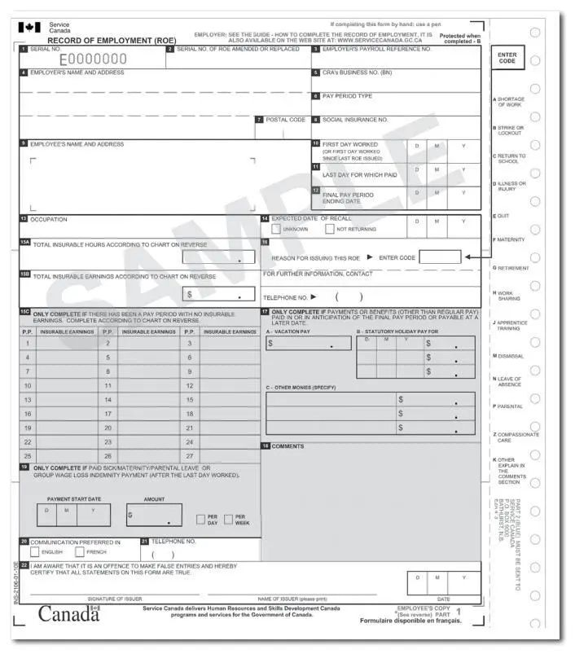
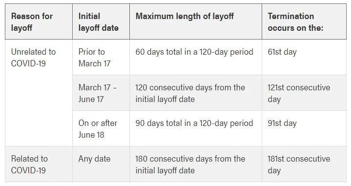
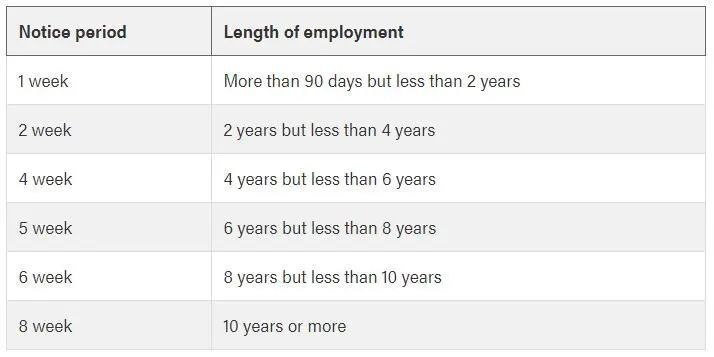

# 无标题

**链接地址:** http://mp.weixin.qq.com/s?__biz=MzI4NDYyNjAwNw==&mid=2247484428&idx=1&sn=12393aea83cd0d5e2584af206ea8ee4b&chksm=ebf9d934dc8e502220f2ab1ac6720fd775e4286f9b1e1782794068408e2324e75c6c4bbf89ab&mpshare=1&scene=2&srcid=0916jiDzdhrKEstRc872ylI7&sharer_sharetime=1600206509583&sharer_shareid=be1c8edd6c93eec155a61c876e41d26a#rd
**作者:** 关注我们
**获取时间:** 2025/8/28 20:07:42
**图片数量:** 33

---

## 原始HTML内容

<section style="box-sizing: border-box;font-size: 16px;"><section style="box-sizing: border-box;" powered-by="xiumi.us"><section style="display: flex;flex-flow: row nowrap;margin: 10px 0%;box-sizing: border-box;"><section style="display: inline-block;vertical-align: top;width: auto;flex: 100 100 0%;align-self: stretch;height: auto;background-color: rgb(246, 246, 246);box-sizing: border-box;"><section style="text-align: center;justify-content: center;box-sizing: border-box;" powered-by="xiumi.us"><section style="text-align: justify;padding-right: 10px;padding-left: 10px;color: rgb(88, 88, 88);letter-spacing: 1px;box-sizing: border-box;">
<strong style="box-sizing: border-box;">点击蓝字</strong>
</section></section></section><section style="display: inline-block;vertical-align: top;width: auto;align-self: stretch;flex: 100 100 0%;border-width: 1px;border-radius: 0px;border-style: solid;border-color: rgb(240, 240, 240);box-sizing: border-box;"><section style="text-align: left;color: rgb(51, 167, 233);letter-spacing: 1px;padding-right: 10px;padding-left: 10px;box-sizing: border-box;" powered-by="xiumi.us">
<strong style="box-sizing: border-box;">关注我们</strong>
</section></section></section></section><section style="text-align: center;margin-top: 10px;margin-right: 0%;margin-left: 0%;box-sizing: border-box;" powered-by="xiumi.us"><section style="max-width: 100%;vertical-align: middle;display: inline-block;line-height: 0;box-sizing: border-box;"></section></section><section style="margin-right: 0%;margin-bottom: 10px;margin-left: 0%;box-sizing: border-box;" powered-by="xiumi.us"><section style="display: inline-block;width: 100%;vertical-align: top;background-color: rgb(246, 246, 246);padding: 10px;box-sizing: border-box;"><section style="line-height: 1.8;box-sizing: border-box;" powered-by="xiumi.us">
<strong style="box-sizing: border-box;">导语</strong> 
</section><section style="margin: 5px 0%;box-sizing: border-box;" powered-by="xiumi.us"><section style="font-size: 14px;color: rgb(107, 107, 107);line-height: 1.8;padding-right: 10px;padding-left: 10px;box-sizing: border-box;">
 

这段日子 BadaB Counslting 微信和微博的公众号后台，接到了一些朋友们的咨询。这些咨询几乎都<strong style="box-sizing: border-box;">和“lay-off”这个关键词挂钩</strong>。BadaB掐指一算，疫情至此正好半年时间。该来的，总会来的…

 
</section></section><section style="text-align: center;margin-top: 10px;margin-bottom: 10px;box-sizing: border-box;" powered-by="xiumi.us"><section style="max-width: 100%;vertical-align: middle;display: inline-block;line-height: 0;width: 50%;height: auto;box-sizing: border-box;"></section></section><section style="margin: 5px 0%;box-sizing: border-box;" powered-by="xiumi.us"><section style="font-size: 14px;color: rgb(107, 107, 107);line-height: 1.8;padding-right: 10px;padding-left: 10px;box-sizing: border-box;">
 

疫情初期，除了部分服务型行业和体力劳动工种外，许多偏文职的工作都转为了<strong style="box-sizing: border-box;">居家办公WFH的模式</strong>。那时企业和员工多多少少都能收到部分<strong style="box-sizing: border-box;">来自政府的补贴</strong>，因此大家的日子还算可以苟下去…

 

然而，随着复工进程的开展，企业的补贴和减免政策逐渐消失，但<strong style="box-sizing: border-box;">社会离彻底步入正轨还差得远</strong>。这个青黄不接的时刻才<strong style="box-sizing: border-box;">对一个企业生存能力最严苛的考验。</strong>

 

员工的工资还需要照常发，但公司的业务量却恢复不到从前。于是不出所料的，<strong style="box-sizing: border-box;">随着第二波疫情凶猛的反扑，第二波的 "lay-off潮" 也如约而至。</strong>

 
</section></section><section style="text-align: center;margin-top: 10px;margin-bottom: 10px;box-sizing: border-box;" powered-by="xiumi.us"><section style="max-width: 100%;vertical-align: middle;display: inline-block;line-height: 0;box-sizing: border-box;"></section></section><section style="margin: 5px 0%;box-sizing: border-box;" powered-by="xiumi.us"><section style="font-size: 14px;color: rgb(107, 107, 107);line-height: 1.8;padding-right: 10px;padding-left: 10px;box-sizing: border-box;">
 

许多朋友在接到被lay-off的通知时，无助、恐惧、愤怒，夹杂委屈的复杂情绪喷涌而出。这样的反应十分正常，<strong style="box-sizing: border-box;">但千万别慌了神！</strong>在加拿大这个员工利益被保护地相对完善的国家，被lay-off是<strong style="box-sizing: border-box;">可以申请政府的补助</strong>的！和想象中的失业又没钱不沾边！

 

今天，BadaB Consulting就将带着大家认真讨论一下在加拿大<strong style="box-sizing: border-box;">被lay-off后需要注意的事项和必走的程序</strong>。虽然我们十分不希望读者们经历这些过程，但还是建议仔细阅读或收藏起来以备不时之需。

 
</section></section></section></section><section style="text-align: center;margin-top: -10px;margin-right: 0%;margin-left: 0%;box-sizing: border-box;" powered-by="xiumi.us"><section style="max-width: 100%;vertical-align: middle;display: inline-block;line-height: 0;box-sizing: border-box;"></section></section><section style="margin-right: 0%;margin-bottom: 10px;margin-left: 0%;box-sizing: border-box;" powered-by="xiumi.us"><section style="display: inline-block;width: 100%;vertical-align: top;background-color: rgb(246, 246, 246);padding: 10px;box-sizing: border-box;"><section style="margin: 5px 0%;box-sizing: border-box;" powered-by="xiumi.us"><section style="font-size: 14px;color: rgb(107, 107, 107);line-height: 1.8;padding-right: 10px;padding-left: 10px;box-sizing: border-box;">
 

首先在讲解步骤前，我们帮大家搞清楚的是<strong style="box-sizing: border-box;"> Lay-off 和 Termination 的区别</strong>。

 
</section></section><section style="box-sizing: border-box;" powered-by="xiumi.us"><section style="text-align: center;justify-content: center;display: flex;flex-flow: row nowrap;margin: 10px 0%;box-sizing: border-box;"><section style="display: inline-block;width: auto;vertical-align: top;flex: 100 100 0%;height: auto;align-self: stretch;padding-right: 10px;padding-left: 10px;border-style: solid;border-width: 0px;border-radius: 0px;border-color: rgb(62, 62, 62);box-sizing: border-box;"><section style="box-sizing: border-box;" powered-by="xiumi.us"><section style="display: flex;flex-flow: row nowrap;margin-right: 0%;margin-bottom: -9px;margin-left: 0%;box-sizing: border-box;"><section style="display: inline-block;vertical-align: top;width: auto;flex: 100 100 0%;align-self: flex-start;height: auto;line-height: 0;box-sizing: border-box;"><section style="text-align: left;justify-content: flex-start;margin-right: 0%;margin-left: 0%;transform: translate3d(-7px, 0px, 0px);box-sizing: border-box;" powered-by="xiumi.us"><section style="display: inline-block;width: 16px;vertical-align: top;height: auto;line-height: 0;background-color: rgb(125, 192, 232);box-sizing: border-box;"><section style="text-align: center;margin-right: 0%;margin-left: 0%;box-sizing: border-box;" powered-by="xiumi.us"><section style="max-width: 100%;vertical-align: middle;display: inline-block;line-height: 0;box-sizing: border-box;"></section></section></section></section></section><section style="display: inline-block;vertical-align: top;width: auto;align-self: flex-start;flex: 100 100 0%;line-height: 0;letter-spacing: 0px;box-sizing: border-box;"><section style="transform: perspective(0px);-webkit-transform: perspective(0px);-moz-transform: perspective(0px);-o-transform: perspective(0px);transform-style: flat;box-sizing: border-box;" powered-by="xiumi.us"><section style="text-align: left;justify-content: flex-start;transform: translate3d(7px, 0px, 0px) rotateY(180deg);-webkit-transform: translate3d(7px, 0px, 0px) rotateY(180deg);-moz-transform: translate3d(7px, 0px, 0px) rotateY(180deg);-o-transform: translate3d(7px, 0px, 0px) rotateY(180deg);box-sizing: border-box;"><section style="display: inline-block;width: 16px;vertical-align: top;height: auto;line-height: 0;background-color: rgb(125, 192, 232);box-sizing: border-box;"><section style="text-align: center;margin-right: 0%;margin-left: 0%;box-sizing: border-box;" powered-by="xiumi.us"><section style="max-width: 100%;vertical-align: middle;display: inline-block;line-height: 0;box-sizing: border-box;"></section></section></section></section></section></section></section></section><section style="box-sizing: border-box;" powered-by="xiumi.us"><section style="display: flex;flex-flow: row nowrap;box-sizing: border-box;"><section style="display: inline-block;width: auto;vertical-align: top;flex: 100 100 0%;align-self: flex-start;height: auto;z-index: 2;padding: 3px 10px;background-color: rgba(211, 226, 242, 0.43);box-sizing: border-box;"><section style="text-align: justify;font-size: 15px;color: rgb(106, 106, 106);line-height: 1.8;letter-spacing: 0px;box-sizing: border-box;" powered-by="xiumi.us">
 

<strong style="box-sizing: border-box;">Lay-off</strong>：公司因某些原因<strong style="box-sizing: border-box;">暂停</strong>你的职位工作和薪水，但不排除邀请你复工的机会。在疫情时期非常常见。<strong style="box-sizing: border-box;">可以申请领取EI。</strong>

 

<strong style="box-sizing: border-box;">Termination</strong>：公司因某些原因<strong style="box-sizing: border-box;">停止</strong>你的职位工作和薪水，且以后也不会继续聘用你。比如公司停业和项目解体时对员工进行遣散。<strong style="box-sizing: border-box;">视情况可领取雇主提供的赔偿 (severance)&nbsp;和申请EI</strong>。需要注意的是如果具体是因为你的重大失职而被 <strong style="box-sizing: border-box;">dismiss</strong>, 也就是俗称的炒鱿鱼，<strong style="box-sizing: border-box;">是很难争取到赔偿和EI的。</strong>

 
</section></section></section></section><section style="transform: perspective(0px);-webkit-transform: perspective(0px);-moz-transform: perspective(0px);-o-transform: perspective(0px);transform-style: flat;box-sizing: border-box;" powered-by="xiumi.us"><section style="display: flex;flex-flow: row nowrap;margin-top: -10px;margin-right: 0%;margin-left: 0%;transform: rotateX(180deg);box-sizing: border-box;"><section style="display: inline-block;vertical-align: top;width: auto;flex: 100 100 0%;align-self: flex-start;height: auto;line-height: 0;box-sizing: border-box;"><section style="text-align: left;justify-content: flex-start;margin-right: 0%;margin-bottom: 1px;margin-left: 0%;transform: translate3d(-7px, 0px, 0px);box-sizing: border-box;" powered-by="xiumi.us"><section style="display: inline-block;width: 16px;vertical-align: top;height: auto;line-height: 0;background-color: rgb(125, 192, 232);box-sizing: border-box;"><section style="text-align: center;margin-right: 0%;margin-left: 0%;box-sizing: border-box;" powered-by="xiumi.us"><section style="max-width: 100%;vertical-align: middle;display: inline-block;line-height: 0;box-sizing: border-box;"></section></section></section></section></section><section style="display: inline-block;vertical-align: top;width: auto;align-self: flex-start;flex: 100 100 0%;line-height: 0;letter-spacing: 0px;box-sizing: border-box;"><section style="transform: perspective(0px);-webkit-transform: perspective(0px);-moz-transform: perspective(0px);-o-transform: perspective(0px);transform-style: flat;box-sizing: border-box;" powered-by="xiumi.us"><section style="text-align: left;justify-content: flex-start;transform: translate3d(7px, 0px, 0px) rotateY(180deg);-webkit-transform: translate3d(7px, 0px, 0px) rotateY(180deg);-moz-transform: translate3d(7px, 0px, 0px) rotateY(180deg);-o-transform: translate3d(7px, 0px, 0px) rotateY(180deg);box-sizing: border-box;"><section style="display: inline-block;width: 16px;vertical-align: top;height: auto;line-height: 0;background-color: rgb(125, 192, 232);box-sizing: border-box;"><section style="text-align: center;margin-right: 0%;margin-left: 0%;box-sizing: border-box;" powered-by="xiumi.us"><section style="max-width: 100%;vertical-align: middle;display: inline-block;line-height: 0;box-sizing: border-box;"></section></section></section></section></section></section></section></section></section></section></section><section style="margin: 5px 0%;box-sizing: border-box;" powered-by="xiumi.us"><section style="font-size: 14px;color: rgb(107, 107, 107);line-height: 1.8;padding-right: 10px;padding-left: 10px;box-sizing: border-box;">
 

好啦，搞清楚这个分类，我们继续往下解读：<strong style="box-sizing: border-box;">被 lay-off 了到底应该怎么办？</strong>

 
</section></section><section style="text-align: center;margin-top: 10px;margin-bottom: 10px;box-sizing: border-box;" powered-by="xiumi.us"><section style="max-width: 100%;vertical-align: middle;display: inline-block;line-height: 0;width: 50%;height: auto;box-sizing: border-box;"></section></section><section style="box-sizing: border-box;" powered-by="xiumi.us">
 
</section><section style="box-sizing: border-box;" powered-by="xiumi.us">
 
</section><section style="line-height: 1.8;box-sizing: border-box;" powered-by="xiumi.us">
<strong style="box-sizing: border-box;">第一步 - 要求雇主出具文字版的正式通知</strong> 
</section><section style="margin: 5px 0%;box-sizing: border-box;" powered-by="xiumi.us"><section style="font-size: 14px;color: rgb(107, 107, 107);line-height: 1.8;padding-right: 10px;padding-left: 10px;box-sizing: border-box;">
 

许多朋友们听到自己被 lay-off 的消息，是从人力资源管理部门，或者老板那里以谈话的方式被通知的。然而这样<strong style="box-sizing: border-box;">口头通知的方式并不能较为有效地保护你作为雇员的权益</strong>。如若日后因赔偿或复工问题和雇主单位闹得不愉快而对簿公堂，你就失去了一项有力佐证。

 

因此要求雇主以<strong style="box-sizing: border-box;">正式的文本形式通知函</strong>，是十分必要的！这份通知需要涵盖许多内容，具体如下：

 
</section></section><section style="box-sizing: border-box;" powered-by="xiumi.us"><section style="text-align: center;justify-content: center;display: flex;flex-flow: row nowrap;margin: 10px 0%;box-sizing: border-box;"><section style="display: inline-block;width: auto;vertical-align: top;flex: 100 100 0%;height: auto;align-self: stretch;padding-right: 10px;padding-left: 10px;border-style: solid;border-width: 0px;border-radius: 0px;border-color: rgb(62, 62, 62);box-sizing: border-box;"><section style="box-sizing: border-box;" powered-by="xiumi.us"><section style="display: flex;flex-flow: row nowrap;margin-right: 0%;margin-bottom: -9px;margin-left: 0%;box-sizing: border-box;"><section style="display: inline-block;vertical-align: top;width: auto;flex: 100 100 0%;align-self: flex-start;height: auto;line-height: 0;box-sizing: border-box;"><section style="text-align: left;justify-content: flex-start;margin-right: 0%;margin-left: 0%;transform: translate3d(-7px, 0px, 0px);box-sizing: border-box;" powered-by="xiumi.us"><section style="display: inline-block;width: 16px;vertical-align: top;height: auto;line-height: 0;background-color: rgb(125, 192, 232);box-sizing: border-box;"><section style="text-align: center;margin-right: 0%;margin-left: 0%;box-sizing: border-box;" powered-by="xiumi.us"><section style="max-width: 100%;vertical-align: middle;display: inline-block;line-height: 0;box-sizing: border-box;"></section></section></section></section></section><section style="display: inline-block;vertical-align: top;width: auto;align-self: flex-start;flex: 100 100 0%;line-height: 0;letter-spacing: 0px;box-sizing: border-box;"><section style="transform: perspective(0px);-webkit-transform: perspective(0px);-moz-transform: perspective(0px);-o-transform: perspective(0px);transform-style: flat;box-sizing: border-box;" powered-by="xiumi.us"><section style="text-align: left;justify-content: flex-start;transform: translate3d(7px, 0px, 0px) rotateY(180deg);-webkit-transform: translate3d(7px, 0px, 0px) rotateY(180deg);-moz-transform: translate3d(7px, 0px, 0px) rotateY(180deg);-o-transform: translate3d(7px, 0px, 0px) rotateY(180deg);box-sizing: border-box;"><section style="display: inline-block;width: 16px;vertical-align: top;height: auto;line-height: 0;background-color: rgb(125, 192, 232);box-sizing: border-box;"><section style="text-align: center;margin-right: 0%;margin-left: 0%;box-sizing: border-box;" powered-by="xiumi.us"><section style="max-width: 100%;vertical-align: middle;display: inline-block;line-height: 0;box-sizing: border-box;"></section></section></section></section></section></section></section></section><section style="box-sizing: border-box;" powered-by="xiumi.us"><section style="display: flex;flex-flow: row nowrap;box-sizing: border-box;"><section style="display: inline-block;width: auto;vertical-align: top;flex: 100 100 0%;align-self: flex-start;height: auto;z-index: 2;padding: 3px 10px;background-color: rgba(211, 226, 242, 0.43);box-sizing: border-box;"><section style="text-align: justify;font-size: 15px;color: rgb(106, 106, 106);line-height: 1.8;letter-spacing: 0px;box-sizing: border-box;" powered-by="xiumi.us">
 

(a) state that it is a <strong style="box-sizing: border-box;">temporary layoff notice</strong>,&nbsp;

(b) state the <strong style="box-sizing: border-box;">date</strong> that the layoff is to commence,&nbsp;

(c) include a <strong style="box-sizing: border-box;">copy of section 62, 63 and 64</strong> of Alberta Employment Standards Code, and&nbsp;

(d) include any other information provided for in theregulations.

 

Alberta Employment Standards Code PDF阅读地址

https://www.qp.alberta.ca/documents/Acts/E09.pdf

 
</section></section></section></section><section style="transform: perspective(0px);-webkit-transform: perspective(0px);-moz-transform: perspective(0px);-o-transform: perspective(0px);transform-style: flat;box-sizing: border-box;" powered-by="xiumi.us"><section style="display: flex;flex-flow: row nowrap;margin-top: -10px;margin-right: 0%;margin-left: 0%;transform: rotateX(180deg);box-sizing: border-box;"><section style="display: inline-block;vertical-align: top;width: auto;flex: 100 100 0%;align-self: flex-start;height: auto;line-height: 0;box-sizing: border-box;"><section style="text-align: left;justify-content: flex-start;margin-right: 0%;margin-bottom: 1px;margin-left: 0%;transform: translate3d(-7px, 0px, 0px);box-sizing: border-box;" powered-by="xiumi.us"><section style="display: inline-block;width: 16px;vertical-align: top;height: auto;line-height: 0;background-color: rgb(125, 192, 232);box-sizing: border-box;"><section style="text-align: center;margin-right: 0%;margin-left: 0%;box-sizing: border-box;" powered-by="xiumi.us"><section style="max-width: 100%;vertical-align: middle;display: inline-block;line-height: 0;box-sizing: border-box;"></section></section></section></section></section><section style="display: inline-block;vertical-align: top;width: auto;align-self: flex-start;flex: 100 100 0%;line-height: 0;letter-spacing: 0px;box-sizing: border-box;"><section style="transform: perspective(0px);-webkit-transform: perspective(0px);-moz-transform: perspective(0px);-o-transform: perspective(0px);transform-style: flat;box-sizing: border-box;" powered-by="xiumi.us"><section style="text-align: left;justify-content: flex-start;transform: translate3d(7px, 0px, 0px) rotateY(180deg);-webkit-transform: translate3d(7px, 0px, 0px) rotateY(180deg);-moz-transform: translate3d(7px, 0px, 0px) rotateY(180deg);-o-transform: translate3d(7px, 0px, 0px) rotateY(180deg);box-sizing: border-box;"><section style="display: inline-block;width: 16px;vertical-align: top;height: auto;line-height: 0;background-color: rgb(125, 192, 232);box-sizing: border-box;"><section style="text-align: center;margin-right: 0%;margin-left: 0%;box-sizing: border-box;" powered-by="xiumi.us"><section style="max-width: 100%;vertical-align: middle;display: inline-block;line-height: 0;box-sizing: border-box;"></section></section></section></section></section></section></section></section></section></section></section><section style="margin: 5px 0%;box-sizing: border-box;" powered-by="xiumi.us"><section style="font-size: 14px;color: rgb(107, 107, 107);line-height: 1.8;padding-right: 10px;padding-left: 10px;box-sizing: border-box;">
 

除了通知的内容，通常对<strong style="box-sizing: border-box;">通知的时间</strong>也有非常严格的要求。具体如下：

 
</section></section><section style="box-sizing: border-box;" powered-by="xiumi.us"><section style="text-align: center;justify-content: center;display: flex;flex-flow: row nowrap;margin: 10px 0%;box-sizing: border-box;"><section style="display: inline-block;width: auto;vertical-align: top;flex: 100 100 0%;height: auto;align-self: stretch;padding-right: 10px;padding-left: 10px;border-style: solid;border-width: 0px;border-radius: 0px;border-color: rgb(62, 62, 62);box-sizing: border-box;"><section style="box-sizing: border-box;" powered-by="xiumi.us"><section style="display: flex;flex-flow: row nowrap;margin-right: 0%;margin-bottom: -9px;margin-left: 0%;box-sizing: border-box;"><section style="display: inline-block;vertical-align: top;width: auto;flex: 100 100 0%;align-self: flex-start;height: auto;line-height: 0;box-sizing: border-box;"><section style="text-align: left;justify-content: flex-start;margin-right: 0%;margin-left: 0%;transform: translate3d(-7px, 0px, 0px);box-sizing: border-box;" powered-by="xiumi.us"><section style="display: inline-block;width: 16px;vertical-align: top;height: auto;line-height: 0;background-color: rgb(125, 192, 232);box-sizing: border-box;"><section style="text-align: center;margin-right: 0%;margin-left: 0%;box-sizing: border-box;" powered-by="xiumi.us"><section style="max-width: 100%;vertical-align: middle;display: inline-block;line-height: 0;box-sizing: border-box;"></section></section></section></section></section><section style="display: inline-block;vertical-align: top;width: auto;align-self: flex-start;flex: 100 100 0%;line-height: 0;letter-spacing: 0px;box-sizing: border-box;"><section style="transform: perspective(0px);-webkit-transform: perspective(0px);-moz-transform: perspective(0px);-o-transform: perspective(0px);transform-style: flat;box-sizing: border-box;" powered-by="xiumi.us"><section style="text-align: left;justify-content: flex-start;transform: translate3d(7px, 0px, 0px) rotateY(180deg);-webkit-transform: translate3d(7px, 0px, 0px) rotateY(180deg);-moz-transform: translate3d(7px, 0px, 0px) rotateY(180deg);-o-transform: translate3d(7px, 0px, 0px) rotateY(180deg);box-sizing: border-box;"><section style="display: inline-block;width: 16px;vertical-align: top;height: auto;line-height: 0;background-color: rgb(125, 192, 232);box-sizing: border-box;"><section style="text-align: center;margin-right: 0%;margin-left: 0%;box-sizing: border-box;" powered-by="xiumi.us"><section style="max-width: 100%;vertical-align: middle;display: inline-block;line-height: 0;box-sizing: border-box;"></section></section></section></section></section></section></section></section><section style="box-sizing: border-box;" powered-by="xiumi.us"><section style="display: flex;flex-flow: row nowrap;box-sizing: border-box;"><section style="display: inline-block;width: auto;vertical-align: top;flex: 100 100 0%;align-self: flex-start;height: auto;z-index: 2;padding: 3px 10px;background-color: rgba(211, 226, 242, 0.43);box-sizing: border-box;"><section style="text-align: justify;font-size: 15px;color: rgb(106, 106, 106);line-height: 1.8;letter-spacing: 0px;box-sizing: border-box;" powered-by="xiumi.us">
 

(a) at least <strong style="box-sizing: border-box;">one week prior</strong> to the date layoff begins if the employee has been employed by the employer for <strong style="box-sizing: border-box;">less than 2 years</strong>

(b) at least<strong style="box-sizing: border-box;"> 2 weeks prior</strong> to the date layoff begins if the employee has been employed by the employer for <strong style="box-sizing: border-box;">2 or more years</strong> 

(c) if there are<strong style="box-sizing: border-box;"> unforeseeable circumstances</strong> (such as COVID-19), employers are required to provide <strong style="box-sizing: border-box;">as much notice as possible</strong> given the circumstances

 
</section></section></section></section><section style="transform: perspective(0px);-webkit-transform: perspective(0px);-moz-transform: perspective(0px);-o-transform: perspective(0px);transform-style: flat;box-sizing: border-box;" powered-by="xiumi.us"><section style="display: flex;flex-flow: row nowrap;margin-top: -10px;margin-right: 0%;margin-left: 0%;transform: rotateX(180deg);box-sizing: border-box;"><section style="display: inline-block;vertical-align: top;width: auto;flex: 100 100 0%;align-self: flex-start;height: auto;line-height: 0;box-sizing: border-box;"><section style="text-align: left;justify-content: flex-start;margin-right: 0%;margin-bottom: 1px;margin-left: 0%;transform: translate3d(-7px, 0px, 0px);box-sizing: border-box;" powered-by="xiumi.us"><section style="display: inline-block;width: 16px;vertical-align: top;height: auto;line-height: 0;background-color: rgb(125, 192, 232);box-sizing: border-box;"><section style="text-align: center;margin-right: 0%;margin-left: 0%;box-sizing: border-box;" powered-by="xiumi.us"><section style="max-width: 100%;vertical-align: middle;display: inline-block;line-height: 0;box-sizing: border-box;"></section></section></section></section></section><section style="display: inline-block;vertical-align: top;width: auto;align-self: flex-start;flex: 100 100 0%;line-height: 0;letter-spacing: 0px;box-sizing: border-box;"><section style="transform: perspective(0px);-webkit-transform: perspective(0px);-moz-transform: perspective(0px);-o-transform: perspective(0px);transform-style: flat;box-sizing: border-box;" powered-by="xiumi.us"><section style="text-align: left;justify-content: flex-start;transform: translate3d(7px, 0px, 0px) rotateY(180deg);-webkit-transform: translate3d(7px, 0px, 0px) rotateY(180deg);-moz-transform: translate3d(7px, 0px, 0px) rotateY(180deg);-o-transform: translate3d(7px, 0px, 0px) rotateY(180deg);box-sizing: border-box;"><section style="display: inline-block;width: 16px;vertical-align: top;height: auto;line-height: 0;background-color: rgb(125, 192, 232);box-sizing: border-box;"><section style="text-align: center;margin-right: 0%;margin-left: 0%;box-sizing: border-box;" powered-by="xiumi.us"><section style="max-width: 100%;vertical-align: middle;display: inline-block;line-height: 0;box-sizing: border-box;"></section></section></section></section></section></section></section></section></section></section></section><section style="margin: 5px 0%;box-sizing: border-box;" powered-by="xiumi.us"><section style="font-size: 14px;color: rgb(107, 107, 107);line-height: 1.8;padding-right: 10px;padding-left: 10px;box-sizing: border-box;">
 

现在因为疫情的缘由，很多人的情况都属于<strong style="box-sizing: border-box;">第三种</strong>，比如公司突然收到lockdown导致的停业禁令等。但收到意料之外收的 lay-off 通知也别慌，记得还得跟雇主索要<strong style="box-sizing: border-box;">最重要的&nbsp;</strong>

 

<strong style="box-sizing: border-box;">Record of Employment (ROE) </strong>！
</section></section><section style="box-sizing: border-box;" powered-by="xiumi.us">
 
</section><section style="box-sizing: border-box;" powered-by="xiumi.us">
 
</section><section style="line-height: 1.8;box-sizing: border-box;" powered-by="xiumi.us">
<strong style="box-sizing: border-box;">第二步 - 要求雇主出具ROE</strong> 
</section><section style="text-align: center;margin-top: 10px;margin-bottom: 10px;box-sizing: border-box;" powered-by="xiumi.us"><section style="max-width: 100%;vertical-align: middle;display: inline-block;line-height: 0;box-sizing: border-box;"></section></section><section style="margin-top: -10px;margin-right: 0%;margin-left: 0%;box-sizing: border-box;" powered-by="xiumi.us"><section style="box-sizing: border-box;">
ROE样表（点击查看图片） 
</section></section><section style="margin: 5px 0%;box-sizing: border-box;" powered-by="xiumi.us"><section style="font-size: 14px;color: rgb(107, 107, 107);line-height: 1.8;padding-right: 10px;padding-left: 10px;box-sizing: border-box;">
 

ROE这张表格非常重要。你的雇主将替你把这张表格交给Service Canada，让这个机构去判定你<strong style="box-sizing: border-box;">是否具备申请</strong><strong style="box-sizing: border-box;">Employment Insurance (EI)&nbsp;</strong><strong style="box-sizing: border-box;">的资格</strong>。

 

如果是因为疫情关系造成工作量不饱和而被Lay-off，请要求雇主在表格上填写上Code <strong style="box-sizing: border-box;">“A – work shortage”</strong>。这个Code通常可以顺利帮助你申请到EI。

 
</section></section><section style="box-sizing: border-box;" powered-by="xiumi.us">
 
</section><section style="line-height: 1.8;box-sizing: border-box;" powered-by="xiumi.us">
<strong style="box-sizing: border-box;">第三步 - 申请 EI</strong> 
</section><section style="margin: 5px 0%;box-sizing: border-box;" powered-by="xiumi.us"><section style="font-size: 14px;color: rgb(107, 107, 107);line-height: 1.8;padding-right: 10px;padding-left: 10px;box-sizing: border-box;">
 

关于如何申请EI的步骤，我们已经在往期的<strong style="box-sizing: border-box;">专题文章</strong>中手把手一步步地给大家列举了需要准备的文件和申请的方法。

 
</section></section><section style="min-height: 40px;margin: 10px 0%;box-sizing: border-box;" powered-by="xiumi.us"><section style="width: 100%;margin-right: auto;margin-bottom: -10px;margin-left: auto;box-sizing: border-box;"><table width="100%"><tbody style="box-sizing: border-box;"><tr opera-tn-ra-comp="_$.pages:0.layers:0.comps:4.col1:21.classicTable1:0" style="box-sizing: border-box;" powered-by="xiumi.us"><td colspan="1" rowspan="1" opera-tn-ra-cell="_$.pages:0.layers:0.comps:4.col1:21.classicTable1:0.td@@0" style="border-width: 0px;border-color: rgb(62, 62, 62) rgb(62, 62, 62) rgb(255, 255, 255);border-radius: 0px;border-style: none;box-sizing: border-box;padding: 0px;" width="100.0000%"><section style="min-height: 40px;margin-right: 0%;margin-bottom: 10px;margin-left: 0%;box-sizing: border-box;" powered-by="xiumi.us"><section style="width: 100%;margin-right: auto;margin-bottom: -10px;margin-left: auto;box-sizing: border-box;"><table width="100%"><tbody style="box-sizing: border-box;"><tr opera-tn-ra-comp="_$.pages:0.layers:0.comps:4.col1:21.classicTable1:0.td@@0:0.classicTable1:0" style="box-sizing: border-box;" powered-by="xiumi.us"><td colspan="1" opera-tn-ra-cell="_$.pages:0.layers:0.comps:4.col1:21.classicTable1:0.td@@0:0.classicTable1:0.td@@0" rowspan="2" style="border-color: rgb(62, 62, 62);border-radius: 0px;border-style: none;background-position: 50% 50%;background-repeat: no-repeat;background-size: cover;background-attachment: scroll;vertical-align: bottom;background-image: url(&quot;https://mmbiz.qpic.cn/mmbiz_jpg/cY0qSDjdkFeE3aFoicQHSpfAMlAnE8pXQXibmooCicNUk5Xf9d7zKzOzujyxlsFeA7Z49MxhT26Oq6ibHRwVlnPDVQ/640?wx_fmt=jpeg&quot;);box-sizing: border-box;padding: 0px;" width="30.0000%"><section style="margin-right: 0%;margin-bottom: 4px;margin-left: 0%;box-sizing: border-box;" powered-by="xiumi.us"><section style="text-align: right;padding-right: 4px;padding-left: 4px;letter-spacing: 0px;color: rgb(255, 255, 255);font-size: 32px;line-height: 1;box-sizing: border-box;">
 
<section style="line-height: 0;color:rgba(0,0,0,0);width:0;"><svg viewBox="0 0 1 1" style="vertical-align:top;"><text x="-10" y="-10">_</text></svg></section></section></section></td><td colspan="1" rowspan="1" opera-tn-ra-cell="_$.pages:0.layers:0.comps:4.col1:21.classicTable1:0.td@@0:0.classicTable1:0.td@@1" style="border-color: rgb(62, 62, 62);border-radius: 0px;border-style: none;padding-top: 0px;padding-bottom: 0px;background-color: rgb(255, 255, 255);box-sizing: border-box;" width="70.0000%"><section style="margin-top: 10px;margin-right: 0%;margin-left: 0%;box-sizing: border-box;" powered-by="xiumi.us"><section style="font-size: 14px;letter-spacing: 1px;line-height: 1.6;color: rgb(140, 140, 140);box-sizing: border-box;">
<a target="_blank" href="http://mp.weixin.qq.com/s?__biz=MzI4NDYyNjAwNw==&amp;mid=2247484007&amp;idx=1&amp;sn=d10ff2f91591c3869633e2f9e1efcee9&amp;chksm=ebf9df5fdc8e56493934b03e4256a9daa8b2a414118c2ffefbadc0d13c137e94db05ee608084&amp;scene=21#wechat_redirect" textvalue="●&nbsp;失业了怎么办？加拿大的你快去申请这些政府福利！" data-itemshowtype="0" tab="innerlink" data-linktype="2">●&nbsp;失业了怎么办？加拿大的你快去申请这些政府福利！</a>

 
</section></section></td></tr><tr opera-tn-ra-comp="_$.pages:0.layers:0.comps:4.col1:21.classicTable1:0.td@@0:0.classicTable1:1" style="box-sizing: border-box;" powered-by="xiumi.us"><td colspan="1" rowspan="1" opera-tn-ra-cell="_$.pages:0.layers:0.comps:4.col1:21.classicTable1:0.td@@0:0.classicTable1:1.td@@0" style="border-color: rgb(62, 62, 62);border-radius: 0px;border-style: none;padding-top: 0px;padding-bottom: 0px;background-color: rgb(255, 255, 255);box-sizing: border-box;" width="70.0000%"><section style="margin: 10px 0%;box-sizing: border-box;" powered-by="xiumi.us"><section style="font-size: 14px;letter-spacing: 1px;line-height: 1;color: rgb(140, 140, 140);box-sizing: border-box;">
<a target="_blank" href="http://mp.weixin.qq.com/s?__biz=MzI4NDYyNjAwNw==&amp;mid=2247484007&amp;idx=1&amp;sn=d10ff2f91591c3869633e2f9e1efcee9&amp;chksm=ebf9df5fdc8e56493934b03e4256a9daa8b2a414118c2ffefbadc0d13c137e94db05ee608084&amp;scene=21#wechat_redirect" textvalue="► 点击阅读" data-itemshowtype="0" tab="innerlink" data-linktype="2">► 点击阅读</a>
</section></section></td></tr></tbody></table></section></section></td></tr></tbody></table></section></section><section style="box-sizing: border-box;" powered-by="xiumi.us">
 
</section><section style="box-sizing: border-box;" powered-by="xiumi.us">
 
</section><section style="line-height: 1.8;box-sizing: border-box;" powered-by="xiumi.us">
<strong style="box-sizing: border-box;">第四步 - 调整心态</strong> 
</section><section style="margin: 5px 0%;box-sizing: border-box;" powered-by="xiumi.us"><section style="font-size: 14px;color: rgb(107, 107, 107);line-height: 1.8;padding-right: 10px;padding-left: 10px;box-sizing: border-box;">
 

说到调整心态，往往是被 lay-off 后大家<strong style="box-sizing: border-box;">最难跨越的一道坎</strong>。

 

很多人感到<strong style="box-sizing: border-box;">委屈</strong>：“平时我在单位里，业绩也不错，工作也积极，和上司同事的关系也融洽，怎么就裁到了我头上呢？实在想不通。”

 
</section></section><section style="text-align: center;margin-top: 10px;margin-bottom: 10px;box-sizing: border-box;" powered-by="xiumi.us"><section style="max-width: 100%;vertical-align: middle;display: inline-block;line-height: 0;box-sizing: border-box;"></section></section><section style="margin: 5px 0%;box-sizing: border-box;" powered-by="xiumi.us"><section style="font-size: 14px;color: rgb(107, 107, 107);line-height: 1.8;padding-right: 10px;padding-left: 10px;box-sizing: border-box;">
 

实际上对于“为什么公司会裁掉我”这个问题，往往<strong style="box-sizing: border-box;">因素复杂而无解</strong>。千万不要和单位撕破脸皮去争辩一个让自己信服的理由，搞得双方难看，再无合作余地。

 

要相信在这样的经济环境下，你的处境绝不是个例。你也很难跳脱出当事人的角色，以客观的态度去分析这背后的原因。不如趁着这个机会放松放松，去做<strong style="box-sizing: border-box;">一些充实自己生活的事情</strong>。

 

我们在往期的<strong style="box-sizing: border-box;">专题文章</strong>中也曾经帮助过大家调整到一个积极健康向上的心态去步入复工阶段。希望文章中的方法可以让大家迅速找回信心，振作起来！

 
</section></section><section style="min-height: 40px;margin: 10px 0%;box-sizing: border-box;" powered-by="xiumi.us"><section style="width: 100%;margin-right: auto;margin-bottom: -10px;margin-left: auto;box-sizing: border-box;"><table width="100%"><tbody style="box-sizing: border-box;"><tr opera-tn-ra-comp="_$.pages:0.layers:0.comps:4.col1:28.classicTable1:0" style="box-sizing: border-box;" powered-by="xiumi.us"><td colspan="1" rowspan="1" opera-tn-ra-cell="_$.pages:0.layers:0.comps:4.col1:28.classicTable1:0.td@@0" style="border-width: 0px;border-color: rgb(62, 62, 62) rgb(62, 62, 62) rgb(255, 255, 255);border-radius: 0px;border-style: none;box-sizing: border-box;padding: 0px;" width="100.0000%"><section style="min-height: 40px;margin-right: 0%;margin-bottom: 10px;margin-left: 0%;box-sizing: border-box;" powered-by="xiumi.us"><section style="width: 100%;margin-right: auto;margin-bottom: -10px;margin-left: auto;box-sizing: border-box;"><table width="100%"><tbody style="box-sizing: border-box;"><tr opera-tn-ra-comp="_$.pages:0.layers:0.comps:4.col1:28.classicTable1:0.td@@0:0.classicTable1:0" style="box-sizing: border-box;" powered-by="xiumi.us"><td colspan="1" opera-tn-ra-cell="_$.pages:0.layers:0.comps:4.col1:28.classicTable1:0.td@@0:0.classicTable1:0.td@@0" rowspan="2" style="border-color: rgb(62, 62, 62);border-radius: 0px;border-style: none;background-position: 50% 50%;background-repeat: no-repeat;background-size: cover;background-attachment: scroll;vertical-align: bottom;background-image: url(&quot;https://mmbiz.qpic.cn/mmbiz_jpg/cY0qSDjdkFeE3aFoicQHSpfAMlAnE8pXQtSVurV1dbxmYia1lbxia0PuelxatFicsVFUUmkA4DgjEcpvesaJ4IWeJQ/640?wx_fmt=jpeg&quot;);box-sizing: border-box;padding: 0px;" width="30.0000%"><section style="margin-right: 0%;margin-bottom: 4px;margin-left: 0%;box-sizing: border-box;" powered-by="xiumi.us"><section style="text-align: right;padding-right: 4px;padding-left: 4px;letter-spacing: 0px;color: rgb(255, 255, 255);font-size: 32px;line-height: 1;box-sizing: border-box;">
 
<section style="line-height: 0;color:rgba(0,0,0,0);width:0;"><svg viewBox="0 0 1 1" style="vertical-align:top;"><text x="-10" y="-10">_</text></svg></section></section></section></td><td colspan="1" rowspan="1" opera-tn-ra-cell="_$.pages:0.layers:0.comps:4.col1:28.classicTable1:0.td@@0:0.classicTable1:0.td@@1" style="border-color: rgb(62, 62, 62);border-radius: 0px;border-style: none;padding-top: 0px;padding-bottom: 0px;background-color: rgb(255, 255, 255);box-sizing: border-box;" width="70.0000%"><section style="margin-top: 10px;margin-right: 0%;margin-left: 0%;box-sizing: border-box;" powered-by="xiumi.us"><section style="font-size: 14px;letter-spacing: 1px;line-height: 1.6;color: rgb(140, 140, 140);box-sizing: border-box;">
<a target="_blank" href="http://mp.weixin.qq.com/s?__biz=MzI4NDYyNjAwNw==&amp;mid=2247484072&amp;idx=1&amp;sn=ee5eb5c24ac7a9e2fae1e04afe4d9b1a&amp;chksm=ebf9df90dc8e5686da1d42e58562d04cdecc6712cbf0123eaff9ed2adc46fd46621045829d56&amp;scene=21#wechat_redirect" textvalue="●&nbsp;消极复工综合症？你的心理健康状况还好吗？如何调整心态步入复工阶段！" data-itemshowtype="0" tab="innerlink" data-linktype="2">●&nbsp;消极复工综合症？你的心理健康状况还好吗？如何调整心态步入复工阶段！</a>
</section></section></td></tr><tr opera-tn-ra-comp="_$.pages:0.layers:0.comps:4.col1:28.classicTable1:0.td@@0:0.classicTable1:1" style="box-sizing: border-box;" powered-by="xiumi.us"><td colspan="1" rowspan="1" opera-tn-ra-cell="_$.pages:0.layers:0.comps:4.col1:28.classicTable1:0.td@@0:0.classicTable1:1.td@@0" style="border-color: rgb(62, 62, 62);border-radius: 0px;border-style: none;padding-top: 0px;padding-bottom: 0px;background-color: rgb(255, 255, 255);box-sizing: border-box;" width="70.0000%"><section style="margin: 10px 0%;box-sizing: border-box;" powered-by="xiumi.us"><section style="font-size: 14px;letter-spacing: 1px;line-height: 1;color: rgb(140, 140, 140);box-sizing: border-box;">
<a target="_blank" href="http://mp.weixin.qq.com/s?__biz=MzI4NDYyNjAwNw==&amp;mid=2247484072&amp;idx=1&amp;sn=ee5eb5c24ac7a9e2fae1e04afe4d9b1a&amp;chksm=ebf9df90dc8e5686da1d42e58562d04cdecc6712cbf0123eaff9ed2adc46fd46621045829d56&amp;scene=21#wechat_redirect" textvalue="► 点击阅读" data-itemshowtype="0" tab="innerlink" data-linktype="2">► 点击阅读</a>
</section></section></td></tr></tbody></table></section></section></td></tr></tbody></table></section></section><section style="box-sizing: border-box;" powered-by="xiumi.us">
 
</section><section style="line-height: 1.8;box-sizing: border-box;" powered-by="xiumi.us">
<strong style="box-sizing: border-box;">第五步 - 等待复工</strong> 
</section><section style="box-sizing: border-box;" powered-by="xiumi.us">
 
</section><section style="text-align: center;margin-top: 10px;margin-bottom: 10px;box-sizing: border-box;" powered-by="xiumi.us"><section style="max-width: 100%;vertical-align: middle;display: inline-block;line-height: 0;width: 50%;height: auto;box-sizing: border-box;"></section></section><section style="margin: 5px 0%;box-sizing: border-box;" powered-by="xiumi.us"><section style="font-size: 14px;color: rgb(107, 107, 107);line-height: 1.8;padding-right: 10px;padding-left: 10px;box-sizing: border-box;">
 

之前我们提到lay-off只是<strong style="box-sizing: border-box;">暂时</strong>和公司解除了聘用关系，那么我是否有可能重返工作岗位呢？<strong style="box-sizing: border-box;">当然！</strong>

 
</section></section><section style="text-align: center;margin-top: 10px;margin-bottom: 10px;box-sizing: border-box;" powered-by="xiumi.us"><section style="max-width: 100%;vertical-align: middle;display: inline-block;line-height: 0;box-sizing: border-box;"></section></section><section style="margin: 5px 0%;box-sizing: border-box;" powered-by="xiumi.us"><section style="font-size: 14px;color: rgb(107, 107, 107);line-height: 1.8;padding-right: 10px;padding-left: 10px;box-sizing: border-box;">
 

根据2020年最新修改的法律规定，如果你是因为新冠疫情相关的原因被 lay-off ，那么在<strong style="box-sizing: border-box;">长达180天</strong>，也就是接近半年的这段停工时间内，你都可能会被单位召回，在之前的岗位上继续从事以往的工作。

 

这份公司要求你回去上班的通知，同样也必须<strong style="box-sizing: border-box;">以书面的形式正式标注你回去上班的时间</strong>，通常是7天以内。如果你拒绝接受这份邀请，比方说你已经找到了其他心仪的工作，那么就视为你自己放弃这份原职。因此你的前老板也无需给你发放正式的辞退通知（Termination Notice）和辞退赔偿（Termination Pay）。

 
</section></section><section style="text-align: center;margin-top: 10px;margin-bottom: 10px;box-sizing: border-box;" powered-by="xiumi.us"><section style="max-width: 100%;vertical-align: middle;display: inline-block;line-height: 0;width: 50%;height: auto;box-sizing: border-box;"></section></section><section style="margin: 5px 0%;box-sizing: border-box;" powered-by="xiumi.us"><section style="font-size: 14px;color: rgb(107, 107, 107);line-height: 1.8;padding-right: 10px;padding-left: 10px;box-sizing: border-box;">
 

然而，不是所有的公司都能够幸运地捱过新冠疫情冲击。如果你在180天以内都没能接到公司邀请你回去上班的通知，或者公司也没有继续为你支付薪水，缴纳养老金等福利。那么很遗憾，你和这个单位的<strong style="box-sizing: border-box;">雇佣关系也将彻底终结</strong>。不过别难过！你还可以从前任老板那里获得一笔<strong style="box-sizing: border-box;">赔偿</strong>！

 

 
</section></section><section style="line-height: 1.8;box-sizing: border-box;" powered-by="xiumi.us">
<strong style="box-sizing: border-box;">第六步 - 要求前任老板支付辞退赔偿！</strong> 
</section><section style="margin: 5px 0%;box-sizing: border-box;" powered-by="xiumi.us"><section style="font-size: 14px;color: rgb(107, 107, 107);line-height: 1.8;padding-right: 10px;padding-left: 10px;box-sizing: border-box;">
 

虽然时间过去了半年，<strong style="box-sizing: border-box;">可千万别忘记这笔钱！</strong>很多朋友甚至不知道自己还可以拿到这笔赔偿！这里请做好笔记：<strong style="box-sizing: border-box;">拿！必须拿！</strong>

 
</section></section><section style="text-align: center;margin-top: 10px;margin-bottom: 10px;box-sizing: border-box;" powered-by="xiumi.us"><section style="max-width: 100%;vertical-align: middle;display: inline-block;line-height: 0;box-sizing: border-box;"></section></section><section style="margin: 5px 0%;box-sizing: border-box;" powered-by="xiumi.us"><section style="font-size: 14px;color: rgb(107, 107, 107);line-height: 1.8;padding-right: 10px;padding-left: 10px;box-sizing: border-box;">
 

这笔钱到底有多少呢？是根据你在这家公司的工龄去计算的。<strong style="box-sizing: border-box;">你在这家公司工作的时间对应老板应给你提前发送裁员通知的时间。而这段时间应付你的工资，则为你可以获得的赔偿金额。</strong>

 

比如，你在这家公司已工作满5年，那么你相应地可以收到原公司为你支付等同于你工作时4周收入的赔偿金。

 
</section></section><section style="box-sizing: border-box;" powered-by="xiumi.us"><section style="text-align: center;justify-content: center;display: flex;flex-flow: row nowrap;margin: 10px 0%;box-sizing: border-box;"><section style="display: inline-block;width: auto;vertical-align: top;flex: 100 100 0%;height: auto;align-self: stretch;padding-right: 10px;padding-left: 10px;border-style: solid;border-width: 0px;border-radius: 0px;border-color: rgb(62, 62, 62);box-sizing: border-box;"><section style="box-sizing: border-box;" powered-by="xiumi.us"><section style="display: flex;flex-flow: row nowrap;margin-right: 0%;margin-bottom: -9px;margin-left: 0%;box-sizing: border-box;"><section style="display: inline-block;vertical-align: top;width: auto;flex: 100 100 0%;align-self: flex-start;height: auto;line-height: 0;box-sizing: border-box;"><section style="text-align: left;justify-content: flex-start;margin-right: 0%;margin-left: 0%;transform: translate3d(-7px, 0px, 0px);box-sizing: border-box;" powered-by="xiumi.us"><section style="display: inline-block;width: 16px;vertical-align: top;height: auto;line-height: 0;background-color: rgb(125, 192, 232);box-sizing: border-box;"><section style="text-align: center;margin-right: 0%;margin-left: 0%;box-sizing: border-box;" powered-by="xiumi.us"><section style="max-width: 100%;vertical-align: middle;display: inline-block;line-height: 0;box-sizing: border-box;"></section></section></section></section></section><section style="display: inline-block;vertical-align: top;width: auto;align-self: flex-start;flex: 100 100 0%;line-height: 0;letter-spacing: 0px;box-sizing: border-box;"><section style="transform: perspective(0px);-webkit-transform: perspective(0px);-moz-transform: perspective(0px);-o-transform: perspective(0px);transform-style: flat;box-sizing: border-box;" powered-by="xiumi.us"><section style="text-align: left;justify-content: flex-start;transform: translate3d(7px, 0px, 0px) rotateY(180deg);-webkit-transform: translate3d(7px, 0px, 0px) rotateY(180deg);-moz-transform: translate3d(7px, 0px, 0px) rotateY(180deg);-o-transform: translate3d(7px, 0px, 0px) rotateY(180deg);box-sizing: border-box;"><section style="display: inline-block;width: 16px;vertical-align: top;height: auto;line-height: 0;background-color: rgb(125, 192, 232);box-sizing: border-box;"><section style="text-align: center;margin-right: 0%;margin-left: 0%;box-sizing: border-box;" powered-by="xiumi.us"><section style="max-width: 100%;vertical-align: middle;display: inline-block;line-height: 0;box-sizing: border-box;"></section></section></section></section></section></section></section></section><section style="box-sizing: border-box;" powered-by="xiumi.us"><section style="display: flex;flex-flow: row nowrap;box-sizing: border-box;"><section style="display: inline-block;width: auto;vertical-align: top;flex: 100 100 0%;align-self: flex-start;height: auto;z-index: 2;padding: 3px 10px;background-color: rgba(211, 226, 242, 0.43);box-sizing: border-box;"><section style="text-align: justify;font-size: 15px;color: rgb(106, 106, 106);line-height: 1.8;letter-spacing: 0px;padding-right: 10px;padding-left: 10px;box-sizing: border-box;" powered-by="xiumi.us">
 

<strong style="box-sizing: border-box;">具体赔偿金计算方法和个例请参照阿尔伯塔省官方网站信息：</strong>

https://www.alberta.ca/termination-pay.aspx

 
</section></section></section></section><section style="transform: perspective(0px);-webkit-transform: perspective(0px);-moz-transform: perspective(0px);-o-transform: perspective(0px);transform-style: flat;box-sizing: border-box;" powered-by="xiumi.us"><section style="display: flex;flex-flow: row nowrap;margin-top: -10px;margin-right: 0%;margin-left: 0%;transform: rotateX(180deg);box-sizing: border-box;"><section style="display: inline-block;vertical-align: top;width: auto;flex: 100 100 0%;align-self: flex-start;height: auto;line-height: 0;box-sizing: border-box;"><section style="text-align: left;justify-content: flex-start;margin-right: 0%;margin-bottom: 1px;margin-left: 0%;transform: translate3d(-7px, 0px, 0px);box-sizing: border-box;" powered-by="xiumi.us"><section style="display: inline-block;width: 16px;vertical-align: top;height: auto;line-height: 0;background-color: rgb(125, 192, 232);box-sizing: border-box;"><section style="text-align: center;margin-right: 0%;margin-left: 0%;box-sizing: border-box;" powered-by="xiumi.us"><section style="max-width: 100%;vertical-align: middle;display: inline-block;line-height: 0;box-sizing: border-box;"></section></section></section></section></section><section style="display: inline-block;vertical-align: top;width: auto;align-self: flex-start;flex: 100 100 0%;line-height: 0;letter-spacing: 0px;box-sizing: border-box;"><section style="transform: perspective(0px);-webkit-transform: perspective(0px);-moz-transform: perspective(0px);-o-transform: perspective(0px);transform-style: flat;box-sizing: border-box;" powered-by="xiumi.us"><section style="text-align: left;justify-content: flex-start;transform: translate3d(7px, 0px, 0px) rotateY(180deg);-webkit-transform: translate3d(7px, 0px, 0px) rotateY(180deg);-moz-transform: translate3d(7px, 0px, 0px) rotateY(180deg);-o-transform: translate3d(7px, 0px, 0px) rotateY(180deg);box-sizing: border-box;"><section style="display: inline-block;width: 16px;vertical-align: top;height: auto;line-height: 0;background-color: rgb(125, 192, 232);box-sizing: border-box;"><section style="text-align: center;margin-right: 0%;margin-left: 0%;box-sizing: border-box;" powered-by="xiumi.us"><section style="max-width: 100%;vertical-align: middle;display: inline-block;line-height: 0;box-sizing: border-box;"></section></section></section></section></section></section></section></section></section></section></section><section style="margin: 5px 0%;box-sizing: border-box;" powered-by="xiumi.us"><section style="font-size: 14px;color: rgb(107, 107, 107);line-height: 1.8;padding-right: 10px;padding-left: 10px;box-sizing: border-box;">
 

如果你在被彻底辞退之前，已进入了 lay-off 状态，那么原公司也无需提前数周告知。所以，<strong style="box-sizing: border-box;">这部分赔偿必须在你接到辞退通知的3天内发到你的手中</strong>。

 

如果公司没有在 lay-off 中直接发送给你裁员通知，那么这笔钱则应该在 lay-off 结束自动进入辞退后的第3天，也就是<strong style="box-sizing: border-box;">从你lay-off后开始计算的第183天内发到你的手中</strong>。

 
</section></section><section style="text-align: center;margin-top: 10px;margin-bottom: 10px;box-sizing: border-box;" powered-by="xiumi.us"><section style="max-width: 100%;vertical-align: middle;display: inline-block;line-height: 0;box-sizing: border-box;"></section></section><section style="margin: 5px 0%;box-sizing: border-box;" powered-by="xiumi.us"><section style="font-size: 14px;color: rgb(107, 107, 107);line-height: 1.8;padding-right: 10px;padding-left: 10px;box-sizing: border-box;">
 

很多朋友遇到这种情况也不好意思跟前公司索赔这笔钱，觉得时间都过去那么久就算了。朋友们！别犯傻！<strong style="box-sizing: border-box;">这是你应得的赔偿，也是法律规定公司必须支付的费用。</strong>
</section></section><section style="box-sizing: border-box;" powered-by="xiumi.us">
 
</section><section style="line-height: 1.8;box-sizing: border-box;" powered-by="xiumi.us">
<strong style="box-sizing: border-box;">第七步 - 为找新工作做好准备</strong> 
</section><section style="margin: 5px 0%;box-sizing: border-box;" powered-by="xiumi.us"><section style="font-size: 14px;color: rgb(107, 107, 107);line-height: 1.8;padding-right: 10px;padding-left: 10px;box-sizing: border-box;">
 

如果你幸运地提前结束 lay-off ，顺利回到了自己的岗位，那么恭喜你，请继续努力工作坚持进步去<strong style="box-sizing: border-box;">提升自己的职场竞争力</strong>。

 

如果你没能回到之前的工作岗位，也算不上是一件坏事。<strong style="box-sizing: border-box;">塞翁失马焉知非福。</strong>你可以利用这段待业时光<strong style="box-sizing: border-box;">去重新审视一下自己的工作方向和职业规划</strong>。

 

疫情改变了人们的生活习惯，也改变了经济结构和社会分工。如果你之前从事的行业或领域在疫情的冲击下深受重创，或许这对于待业你也是<strong style="box-sizing: border-box;">一个契机</strong>，去进入新兴行业开展一些更具发展潜质的工作目标。

 
</section></section><section style="text-align: center;margin-top: 10px;margin-bottom: 10px;box-sizing: border-box;" powered-by="xiumi.us"><section style="max-width: 100%;vertical-align: middle;display: inline-block;line-height: 0;box-sizing: border-box;"></section></section><section style="margin: 5px 0%;box-sizing: border-box;" powered-by="xiumi.us"><section style="font-size: 14px;color: rgb(107, 107, 107);line-height: 1.8;padding-right: 10px;padding-left: 10px;box-sizing: border-box;">
 

其实无论是否在 lay-off 时期等到了被召集回自己的工作岗位那一刻，许多人也<strong style="box-sizing: border-box;">早已动了物色新工作的心思</strong>。然而在如今经济大环境下，想要找到一份称心如意的工作实在难上加难。

 

<strong style="box-sizing: border-box;">别怕，BadaB Consulting 这就来帮助你了！</strong>

 
</section></section><section style="text-align: center;margin-top: 10px;margin-bottom: 10px;box-sizing: border-box;" powered-by="xiumi.us"><section style="max-width: 100%;vertical-align: middle;display: inline-block;line-height: 0;box-sizing: border-box;"></section></section><section style="margin: 10px 0% 20px;box-sizing: border-box;" powered-by="xiumi.us"><section style="font-size: 14px;color: rgb(121, 121, 121);line-height: 2;letter-spacing: 0px;padding-right: 15px;padding-left: 15px;box-sizing: border-box;">
（点击图片，观看清晰课程列表） 
</section></section><section style="margin: 10px 0%;box-sizing: border-box;" powered-by="xiumi.us"><section style="text-align: center;font-size: 14px;color: rgb(164, 193, 234);line-height: 1.8;letter-spacing: 2px;box-sizing: border-box;">
<strong style="letter-spacing: 1.8px;box-sizing: border-box;">这套在线课程分三个部分，由四位经验丰富的企业招聘、人力资源顾问</strong>从各种角度为你详细讲解。全方位帮你解答在求职和就职过程中遇到的各种问题！ 

 
</section></section><section style="text-align: center;justify-content: center;margin: 10px 0%;box-sizing: border-box;" powered-by="xiumi.us"><section style="display: inline-block;width: 95%;vertical-align: top;height: auto;border-width: 0px;border-radius: 5px;border-style: none;border-color: rgb(115, 115, 115);overflow: hidden;background-color: rgba(241, 247, 255, 0.92);box-shadow: rgba(183, 217, 255, 0.39) 0px 5px 5px;box-sizing: border-box;"><section style="justify-content: center;margin-right: 0%;margin-bottom: 5px;margin-left: 0%;box-sizing: border-box;" powered-by="xiumi.us"><section style="display: inline-block;width: 100%;vertical-align: top;height: auto;border-width: 0px;border-radius: 5px;border-style: none;border-color: rgb(115, 115, 115);overflow: hidden;background-color: rgba(240, 247, 255, 0.92);box-shadow: rgb(183, 217, 255) 0px 0px 4px;padding-right: 20px;padding-left: 20px;box-sizing: border-box;"><section style="text-align: justify;box-sizing: border-box;" powered-by="xiumi.us">
 
</section><section style="margin-top: 10px;margin-bottom: 10px;box-sizing: border-box;" powered-by="xiumi.us"><section style="padding-left: 1em;padding-right: 1em;display: inline-block;box-sizing: border-box;">
<strong style="box-sizing: border-box;">课程哪里找？</strong>
 </section><section style="border-width: 1px;border-style: solid;border-color: rgb(255, 255, 255);margin-top: -1em;padding: 20px 10px 10px;background-color: rgb(255, 255, 255);box-shadow: rgb(0, 0, 0) 0px 0px 0px;box-sizing: border-box;"><section style="text-align: justify;box-sizing: border-box;" powered-by="xiumi.us">
 
</section><section style="font-size: 14px;color: rgb(40, 115, 200);box-sizing: border-box;" powered-by="xiumi.us">
<strong style="box-sizing: border-box;">访问我们的官方网站</strong>
</section><section style="text-align: left;font-size: 14px;color: rgb(121, 121, 121);box-sizing: border-box;" powered-by="xiumi.us">
<strong style="box-sizing: border-box;">https://www.badab101.com/onlineclassforjobseekers</strong>
</section><section style="text-align: justify;box-sizing: border-box;" powered-by="xiumi.us">
 
</section><section style="color: rgb(121, 121, 121);font-size: 12px;box-sizing: border-box;" powered-by="xiumi.us">
或者扫描下方二维码访问网页
</section><section style="justify-content: center;margin: 10px 0%;opacity: 0.99;box-sizing: border-box;" powered-by="xiumi.us"><section style="display: inline-block;vertical-align: middle;width: auto;min-width: 10%;max-width: 100%;height: auto;align-self: center;line-height: 0;letter-spacing: 0px;box-sizing: border-box;"><svg viewBox="0 0 1 1" style="float:left;line-height:0;width:0;vertical-align:top;"></svg></section><section style="display: inline-block;vertical-align: middle;width: auto;min-width: 10%;max-width: 100%;height: auto;align-self: center;line-height: 0;letter-spacing: 0px;border-bottom: 1px solid rgb(255, 255, 255);border-bottom-right-radius: 0px;box-sizing: border-box;"><section style="box-sizing: border-box;" powered-by="xiumi.us"><section style="display: inline-block;width: 120px;height: 120px;vertical-align: top;overflow: hidden;box-sizing: border-box;"><section style="margin-right: 0%;margin-left: 0%;box-sizing: border-box;" powered-by="xiumi.us"><section style="max-width: 100%;vertical-align: middle;display: inline-block;line-height: 0;width: 100%;height: auto;box-sizing: border-box;"></section></section></section></section></section><section style="display: inline-block;vertical-align: middle;width: auto;min-width: 10%;max-width: 100%;height: auto;align-self: center;box-shadow: rgb(0, 0, 0) 0px 0px 0px;line-height: 0;letter-spacing: 0px;box-sizing: border-box;"><svg viewBox="0 0 1 1" style="float:left;line-height:0;width:0;vertical-align:top;"></svg></section></section><section style="text-align: justify;box-sizing: border-box;" powered-by="xiumi.us">
 
</section></section></section></section></section></section></section><section style="margin: 10px 0%;box-sizing: border-box;" powered-by="xiumi.us"><section style="text-align: center;font-size: 14px;color: rgb(164, 193, 234);line-height: 1.8;letter-spacing: 2px;box-sizing: border-box;">
 

比如我们今天聊到的如何应对 lay-off 的问题，就在这套课程的<strong style="box-sizing: border-box;">第20节《被老板“炒鱿鱼”，还是炒老板鱿鱼？……》</strong>中进行了更为详细的介绍。

 

希望感兴趣的朋友们<strong style="box-sizing: border-box;">扫描上方二维码</strong>，进入课程试听，去补全更多关于终结工作上所遇到的各种问题的应对方法。

 

<strong style="box-sizing: border-box;">另外，也希望这套课程可以帮助朋友们提高求职技巧，丰富职场经验。在这这段艰难又特殊的时期，获得或者锁住一份心仪的工作！</strong>
</section></section><section style="text-align: center;margin-top: 10px;margin-bottom: 10px;box-sizing: border-box;" powered-by="xiumi.us"><section style="max-width: 100%;vertical-align: middle;display: inline-block;line-height: 0;width: 50%;height: auto;box-sizing: border-box;"></section></section><section style="margin: 10px 0%;box-sizing: border-box;" powered-by="xiumi.us"><section style="text-align: center;font-size: 14px;color: rgb(164, 193, 234);line-height: 1.8;letter-spacing: 2px;box-sizing: border-box;">
 

<strong style="box-sizing: border-box;">把苦难当做一种历练，</strong>

<strong style="box-sizing: border-box;">让挫折成为进步的动力！</strong>

<strong style="box-sizing: border-box;">2020年，<strong style="box-sizing: border-box;">让我们一起加油！</strong></strong>
</section></section></section></section><section style="box-sizing: border-box;" powered-by="xiumi.us">
 
</section><section style="box-sizing: border-box;" powered-by="xiumi.us"><section style="display: flex;flex-flow: row nowrap;margin: 10px 0%;box-sizing: border-box;"><section style="display: inline-block;vertical-align: middle;width: auto;flex: 0 0 0%;align-self: center;height: auto;box-sizing: border-box;"><section style="text-align: center;box-sizing: border-box;" powered-by="xiumi.us"><section style="display: inline-block;width: 90px;height: 150px;vertical-align: top;overflow: hidden;border-style: solid;border-width: 4px;border-radius: 0px;border-color: rgb(15, 76, 129);box-sizing: border-box;"><svg viewBox="0 0 1 1" style="float:left;line-height:0;width:0;vertical-align:top;"></svg></section></section></section><section style="display: inline-block;vertical-align: middle;width: auto;flex: 89.2857 89.2857 0%;align-self: center;height: auto;background-color: rgb(255, 255, 255);margin-left: -65px;box-sizing: border-box;"><section style="box-sizing: border-box;" powered-by="xiumi.us"><section style="display: flex;flex-flow: row nowrap;box-sizing: border-box;"><section style="display: inline-block;vertical-align: middle;width: auto;padding-right: 5px;flex: 0 0 0%;height: auto;align-self: center;box-sizing: border-box;"><section style="box-sizing: border-box;" powered-by="xiumi.us"><section style="display: flex;flex-flow: row nowrap;box-sizing: border-box;"><section style="display: inline-block;width: 120px;vertical-align: top;flex: 0 0 auto;height: auto;align-self: flex-start;box-sizing: border-box;"><section style="text-align: center;margin-right: 0%;margin-left: 0%;box-sizing: border-box;" powered-by="xiumi.us"><section style="max-width: 100%;vertical-align: middle;display: inline-block;line-height: 0;width: 100%;border-color: rgba(118, 178, 124, 0);border-width: 5px;border-radius: 0px;border-style: solid;box-shadow: rgb(0, 0, 0) 0px 0px 0px;box-sizing: border-box;"></section></section></section></section></section></section><section style="display: inline-block;vertical-align: middle;width: auto;padding-left: 5px;flex: 100 100 0%;height: auto;align-self: center;box-sizing: border-box;"><section style="margin-right: 0%;margin-left: 0%;box-sizing: border-box;" powered-by="xiumi.us"><section style="color: rgb(121, 121, 121);font-size: 15px;box-sizing: border-box;">
<strong style="box-sizing: border-box;">Badab Consulting Inc.</strong>

微信号 : badab101

新浪微博：BadaB_Consulting
</section></section></section></section></section></section></section></section><section style="box-sizing: border-box;" powered-by="xiumi.us">
 
</section><section style="box-sizing: border-box;" powered-by="xiumi.us">
 
</section><section style="margin-top: 10px;margin-right: 0%;margin-left: 0%;box-sizing: border-box;" powered-by="xiumi.us"><section style="display: inline-block;width: auto;vertical-align: top;min-width: 10%;max-width: 100%;height: auto;box-sizing: border-box;"><section style="margin-right: 0%;margin-bottom: 3px;margin-left: 0%;box-sizing: border-box;" powered-by="xiumi.us"><section style="background-color: rgb(125, 192, 232);height: 2px;box-sizing: border-box;"><svg viewBox="0 0 1 1" style="float:left;line-height:0;width:0;vertical-align:top;"></svg></section></section><section style="margin-right: 0%;margin-left: 0%;box-sizing: border-box;" powered-by="xiumi.us"><section style="color: rgb(125, 192, 232);letter-spacing: 1px;line-height: 1.4;box-sizing: border-box;">
<strong style="box-sizing: border-box;">更多优秀文章</strong>
</section></section></section></section><section style="min-height: 40px;margin-top: 10px;margin-right: 0%;margin-left: 0%;box-sizing: border-box;" powered-by="xiumi.us"><section style="width: 100%;margin-right: auto;margin-bottom: -10px;margin-left: auto;box-sizing: border-box;"><table width="100%"><tbody style="box-sizing: border-box;"><tr opera-tn-ra-comp="_$.pages:0.layers:0.comps:10.classicTable1:0" style="box-sizing: border-box;" powered-by="xiumi.us"><td colspan="1" rowspan="1" opera-tn-ra-cell="_$.pages:0.layers:0.comps:10.classicTable1:0.td@@0" style="border-width: 0px;border-color: rgb(62, 62, 62) rgb(62, 62, 62) rgb(255, 255, 255);border-radius: 0px;border-style: none;padding: 0px;box-sizing: border-box;" width="100.0000%"><section style="min-height: 40px;margin-right: 0%;margin-bottom: 10px;margin-left: 0%;box-sizing: border-box;" powered-by="xiumi.us"><section style="width: 100%;margin-right: auto;margin-bottom: -10px;margin-left: auto;box-sizing: border-box;"><table width="100%"><tbody style="box-sizing: border-box;"><tr opera-tn-ra-comp="_$.pages:0.layers:0.comps:10.classicTable1:0.td@@0:0.classicTable1:0" style="box-sizing: border-box;" powered-by="xiumi.us"><td colspan="1" opera-tn-ra-cell="_$.pages:0.layers:0.comps:10.classicTable1:0.td@@0:0.classicTable1:0.td@@0" rowspan="2" style="border-color: rgb(62, 62, 62);border-radius: 0px;border-style: none;background-position: 50% 50%;background-repeat: no-repeat;background-size: cover;background-attachment: scroll;vertical-align: bottom;background-image: url(&quot;https://mmbiz.qpic.cn/mmbiz_jpg/cY0qSDjdkFeE3aFoicQHSpfAMlAnE8pXQnW3RN8rESEqNqHEMR2BYnKzroukuDycTzub5QnDBmtW1n8ZcBO8o5g/640?wx_fmt=jpeg&quot;);box-sizing: border-box;padding: 0px;" width="30.0000%"><section style="margin-right: 0%;margin-bottom: 4px;margin-left: 0%;box-sizing: border-box;" powered-by="xiumi.us"><section style="text-align: right;padding-right: 4px;padding-left: 4px;letter-spacing: 0px;color: rgb(255, 255, 255);font-size: 32px;line-height: 1;box-sizing: border-box;">
<strong style="box-sizing: border-box;">01</strong>
</section></section></td><td colspan="1" rowspan="1" opera-tn-ra-cell="_$.pages:0.layers:0.comps:10.classicTable1:0.td@@0:0.classicTable1:0.td@@1" style="border-color: rgb(62, 62, 62);border-radius: 0px;border-style: none;padding-top: 0px;padding-bottom: 0px;background-color: rgb(249, 249, 249);box-sizing: border-box;" width="70.0000%"><section style="margin-top: 10px;margin-right: 0%;margin-left: 0%;box-sizing: border-box;" powered-by="xiumi.us"><section style="font-size: 14px;letter-spacing: 1px;line-height: 1.6;color: rgb(140, 140, 140);box-sizing: border-box;">
<a target="_blank" href="http://mp.weixin.qq.com/s?__biz=MzI4NDYyNjAwNw==&amp;mid=2247484386&amp;idx=1&amp;sn=49a66242a8ee6ce7366917376209c015&amp;chksm=ebf9dedadc8e57ccb189b1a89481a48c0edfe11456d2ab8ee7e23234bcccc9890755a4027aed&amp;scene=21#wechat_redirect" textvalue="●&nbsp;自由职业真香吗？对话四位自由职业从业者，你最想了解的信息都在这儿啦！" data-itemshowtype="0" tab="innerlink" data-linktype="2">●&nbsp;自由职业真香吗？对话四位自由职业从业者，你最想了解的信息都在这儿啦！</a>
</section></section></td></tr><tr opera-tn-ra-comp="_$.pages:0.layers:0.comps:10.classicTable1:0.td@@0:0.classicTable1:1" style="box-sizing: border-box;" powered-by="xiumi.us"><td colspan="1" rowspan="1" opera-tn-ra-cell="_$.pages:0.layers:0.comps:10.classicTable1:0.td@@0:0.classicTable1:1.td@@0" style="border-color: rgb(62, 62, 62);border-radius: 0px;border-style: none;padding-top: 0px;padding-bottom: 0px;background-color: rgb(249, 249, 249);box-sizing: border-box;" width="70.0000%"><section style="margin: 10px 0%;box-sizing: border-box;" powered-by="xiumi.us"><section style="font-size: 14px;letter-spacing: 1px;line-height: 1;color: rgb(140, 140, 140);box-sizing: border-box;">
<a target="_blank" href="http://mp.weixin.qq.com/s?__biz=MzI4NDYyNjAwNw==&amp;mid=2247484386&amp;idx=1&amp;sn=49a66242a8ee6ce7366917376209c015&amp;chksm=ebf9dedadc8e57ccb189b1a89481a48c0edfe11456d2ab8ee7e23234bcccc9890755a4027aed&amp;scene=21#wechat_redirect" textvalue="► 点击阅读" data-itemshowtype="0" tab="innerlink" data-linktype="2">► 点击阅读</a>
</section></section></td></tr></tbody></table></section></section></td></tr></tbody></table></section></section><section style="min-height: 40px;margin-right: 0%;margin-left: 0%;box-sizing: border-box;" powered-by="xiumi.us"><section style="width: 100%;margin-right: auto;margin-bottom: -10px;margin-left: auto;box-sizing: border-box;"><table width="100%"><tbody style="box-sizing: border-box;"><tr opera-tn-ra-comp="_$.pages:0.layers:0.comps:11.classicTable1:0" style="box-sizing: border-box;" powered-by="xiumi.us"><td colspan="1" opera-tn-ra-cell="_$.pages:0.layers:0.comps:11.classicTable1:0.td@@0" rowspan="2" style="border-color: rgb(62, 62, 62);border-radius: 0px;border-style: none;background-position: 50% 50%;background-repeat: no-repeat;background-size: cover;background-attachment: scroll;vertical-align: bottom;background-image: url(&quot;https://mmbiz.qpic.cn/mmbiz_jpg/cY0qSDjdkFeE3aFoicQHSpfAMlAnE8pXQicaI1UeibYAksf1PoHSzLToxoSlYOf6vn4zH3a0tnydiaZXF5Ew0Wh1Xg/640?wx_fmt=jpeg&quot;);box-sizing: border-box;padding: 0px;" width="30.0000%"><section style="margin-right: 0%;margin-bottom: 4px;margin-left: 0%;box-sizing: border-box;" powered-by="xiumi.us"><section style="text-align: right;padding-right: 4px;padding-left: 4px;letter-spacing: 0px;color: rgb(255, 255, 255);font-size: 32px;line-height: 1;box-sizing: border-box;">
<strong style="box-sizing: border-box;">02</strong>
</section></section></td><td colspan="1" rowspan="1" opera-tn-ra-cell="_$.pages:0.layers:0.comps:11.classicTable1:0.td@@1" style="border-color: rgb(62, 62, 62);border-radius: 0px;border-style: none;padding-top: 0px;padding-bottom: 0px;background-color: rgb(249, 249, 249);box-sizing: border-box;" width="70.0000%"><section style="margin-top: 10px;margin-right: 0%;margin-left: 0%;box-sizing: border-box;" powered-by="xiumi.us"><section style="font-size: 14px;letter-spacing: 1px;line-height: 1.6;color: rgb(140, 140, 140);box-sizing: border-box;">
<a target="_blank" href="http://mp.weixin.qq.com/s?__biz=MzI4NDYyNjAwNw==&amp;mid=2247484218&amp;idx=1&amp;sn=eefd4f1cfdfa4db1a8f9ec2e3da5136f&amp;chksm=ebf9de02dc8e57141b654eb6ccb5c2c726e38c0b49515c00911d66326f4c8e009ae95c18cc3e&amp;scene=21#wechat_redirect" textvalue="●&nbsp;继续读书是好的选择吗？几种用学习提升自己的方法你都了解吗？" data-itemshowtype="0" tab="innerlink" data-linktype="2">●&nbsp;继续读书是好的选择吗？几种用学习提升自己的方法你都了解吗？</a>

 
</section></section></td></tr><tr opera-tn-ra-comp="_$.pages:0.layers:0.comps:11.classicTable1:1" style="box-sizing: border-box;" powered-by="xiumi.us"><td colspan="1" rowspan="1" opera-tn-ra-cell="_$.pages:0.layers:0.comps:11.classicTable1:1.td@@0" style="border-color: rgb(62, 62, 62);border-radius: 0px;border-style: none;padding-top: 0px;padding-bottom: 0px;background-color: rgb(249, 249, 249);box-sizing: border-box;" width="70.0000%"><section style="margin: 10px 0%;box-sizing: border-box;" powered-by="xiumi.us"><section style="font-size: 14px;letter-spacing: 1px;line-height: 1;color: rgb(140, 140, 140);box-sizing: border-box;">
<a target="_blank" href="http://mp.weixin.qq.com/s?__biz=MzI4NDYyNjAwNw==&amp;mid=2247484218&amp;idx=1&amp;sn=eefd4f1cfdfa4db1a8f9ec2e3da5136f&amp;chksm=ebf9de02dc8e57141b654eb6ccb5c2c726e38c0b49515c00911d66326f4c8e009ae95c18cc3e&amp;scene=21#wechat_redirect" textvalue="► 点击阅读" data-itemshowtype="0" tab="innerlink" data-linktype="2">► 点击阅读</a>
</section></section></td></tr></tbody></table></section></section><section style="min-height: 40px;margin-right: 0%;margin-bottom: 10px;margin-left: 0%;box-sizing: border-box;" powered-by="xiumi.us"><section style="width: 100%;margin-right: auto;margin-bottom: -10px;margin-left: auto;box-sizing: border-box;"><table width="100%"><tbody style="box-sizing: border-box;"><tr opera-tn-ra-comp="_$.pages:0.layers:0.comps:12.classicTable1:0" style="box-sizing: border-box;" powered-by="xiumi.us"><td colspan="1" rowspan="1" opera-tn-ra-cell="_$.pages:0.layers:0.comps:12.classicTable1:0.td@@0" style="border-width: 0px;border-color: rgb(62, 62, 62) rgb(62, 62, 62) rgb(255, 255, 255);border-radius: 0px;border-style: none;box-sizing: border-box;padding: 0px;" width="100.0000%"><section style="min-height: 40px;margin: 10px 0%;box-sizing: border-box;" powered-by="xiumi.us"><section style="width: 100%;margin-right: auto;margin-bottom: -10px;margin-left: auto;box-sizing: border-box;"><table width="100%"><tbody style="box-sizing: border-box;"><tr opera-tn-ra-comp="_$.pages:0.layers:0.comps:12.classicTable1:0.td@@0:0.classicTable1:0" style="box-sizing: border-box;" powered-by="xiumi.us"><td colspan="1" rowspan="1" opera-tn-ra-cell="_$.pages:0.layers:0.comps:12.classicTable1:0.td@@0:0.classicTable1:0.td@@0" style="border-width: 0px;border-color: rgb(62, 62, 62) rgb(62, 62, 62) rgb(255, 255, 255);border-radius: 0px;border-style: none;box-sizing: border-box;padding: 0px;" width="100.0000%"><section style="min-height: 40px;margin-right: 0%;margin-bottom: 10px;margin-left: 0%;box-sizing: border-box;" powered-by="xiumi.us"><section style="width: 100%;margin-right: auto;margin-bottom: -10px;margin-left: auto;box-sizing: border-box;"><table width="100%"><tbody style="box-sizing: border-box;"><tr opera-tn-ra-comp="_$.pages:0.layers:0.comps:12.classicTable1:0.td@@0:0.classicTable1:0.td@@0:0.classicTable1:0" style="box-sizing: border-box;" powered-by="xiumi.us"><td colspan="1" opera-tn-ra-cell="_$.pages:0.layers:0.comps:12.classicTable1:0.td@@0:0.classicTable1:0.td@@0:0.classicTable1:0.td@@0" rowspan="2" style="border-color: rgb(62, 62, 62);border-radius: 0px;border-style: none;background-position: 50% 50%;background-repeat: no-repeat;background-size: cover;background-attachment: scroll;vertical-align: bottom;background-image: url(&quot;https://mmbiz.qpic.cn/mmbiz_jpg/cY0qSDjdkFeE3aFoicQHSpfAMlAnE8pXQJeiaP71ge989qZzictEREibKYaSjplDyyBXiaS8vq4cEVfd8K6slG8q96Q/640?wx_fmt=jpeg&quot;);box-sizing: border-box;padding: 0px;" width="30.0000%"><section style="margin-right: 0%;margin-bottom: 4px;margin-left: 0%;box-sizing: border-box;" powered-by="xiumi.us"><section style="text-align: right;padding-right: 4px;padding-left: 4px;letter-spacing: 0px;color: rgb(255, 255, 255);font-size: 32px;line-height: 1;box-sizing: border-box;">
<strong style="box-sizing: border-box;">03</strong>
</section></section></td><td colspan="1" rowspan="1" opera-tn-ra-cell="_$.pages:0.layers:0.comps:12.classicTable1:0.td@@0:0.classicTable1:0.td@@0:0.classicTable1:0.td@@1" style="border-color: rgb(62, 62, 62);border-radius: 0px;border-style: none;padding-top: 0px;padding-bottom: 0px;background-color: rgb(249, 249, 249);box-sizing: border-box;" width="70.0000%"><section style="margin-top: 10px;margin-right: 0%;margin-left: 0%;box-sizing: border-box;" powered-by="xiumi.us"><section style="font-size: 14px;letter-spacing: 1px;line-height: 1.6;color: rgb(140, 140, 140);box-sizing: border-box;">
<a target="_blank" href="http://mp.weixin.qq.com/s?__biz=MzI4NDYyNjAwNw==&amp;mid=2247484015&amp;idx=1&amp;sn=71ffc395b4b99e949d9b4f52286be13d&amp;chksm=ebf9df57dc8e56413eac9cee47402d517f1d69902102d0de5b8cc5203d701702f276062f19e6&amp;scene=21#wechat_redirect" textvalue="●是时候重新出发？别大意！原来换职业前需要考虑的事情这么多！" data-itemshowtype="0" tab="innerlink" data-linktype="2">●是时候重新出发？别大意！原来换职业前需要考虑的事情这么多！</a>

 
</section></section></td></tr><tr opera-tn-ra-comp="_$.pages:0.layers:0.comps:12.classicTable1:0.td@@0:0.classicTable1:0.td@@0:0.classicTable1:1" style="box-sizing: border-box;" powered-by="xiumi.us"><td colspan="1" rowspan="1" opera-tn-ra-cell="_$.pages:0.layers:0.comps:12.classicTable1:0.td@@0:0.classicTable1:0.td@@0:0.classicTable1:1.td@@0" style="border-color: rgb(62, 62, 62);border-radius: 0px;border-style: none;padding-top: 0px;padding-bottom: 0px;background-color: rgb(249, 249, 249);box-sizing: border-box;" width="70.0000%"><section style="margin: 10px 0%;box-sizing: border-box;" powered-by="xiumi.us"><section style="font-size: 14px;letter-spacing: 1px;line-height: 1;color: rgb(140, 140, 140);box-sizing: border-box;">
<a target="_blank" href="http://mp.weixin.qq.com/s?__biz=MzI4NDYyNjAwNw==&amp;mid=2247484015&amp;idx=1&amp;sn=71ffc395b4b99e949d9b4f52286be13d&amp;chksm=ebf9df57dc8e56413eac9cee47402d517f1d69902102d0de5b8cc5203d701702f276062f19e6&amp;scene=21#wechat_redirect" textvalue="► 点击阅读" data-itemshowtype="0" tab="innerlink" data-linktype="2">► 点击阅读</a>
</section></section></td></tr></tbody></table></section></section></td></tr></tbody></table></section></section></td></tr><tr opera-tn-ra-comp="_$.pages:0.layers:0.comps:12.classicTable1:1" style="box-sizing: border-box;" powered-by="xiumi.us"><td colspan="1" rowspan="1" opera-tn-ra-cell="_$.pages:0.layers:0.comps:12.classicTable1:1.td@@0" style="border-width: 0px;border-color: rgb(62, 62, 62) rgb(62, 62, 62) rgb(255, 255, 255);border-radius: 0px;border-style: none;box-sizing: border-box;padding: 0px;" width="100.0000%"><section style="margin-top: 10px;margin-right: 0%;margin-left: 0%;box-sizing: border-box;" powered-by="xiumi.us"><section style="text-align: right;font-size: 14px;color: rgb(82, 175, 255);letter-spacing: 1px;line-height: 1.2;box-sizing: border-box;">
 

我知道你&nbsp;&nbsp;在看&nbsp;&nbsp;哦
</section></section></td></tr></tbody></table></section></section></section>
 

---

## 纯文本内容

点击蓝字关注我们导语这段日子 BadaB Counslting 微信和微博的公众号后台，接到了一些朋友们的咨询。这些咨询几乎都和“lay-off”这个关键词挂钩。BadaB掐指一算，疫情至此正好半年时间。该来的，总会来的…疫情初期，除了部分服务型行业和体力劳动工种外，许多偏文职的工作都转为了居家办公WFH的模式。那时企业和员工多多少少都能收到部分来自政府的补贴，因此大家的日子还算可以苟下去…然而，随着复工进程的开展，企业的补贴和减免政策逐渐消失，但社会离彻底步入正轨还差得远。这个青黄不接的时刻才对一个企业生存能力最严苛的考验。员工的工资还需要照常发，但公司的业务量却恢复不到从前。于是不出所料的，随着第二波疫情凶猛的反扑，第二波的 "lay-off潮" 也如约而至。许多朋友在接到被lay-off的通知时，无助、恐惧、愤怒，夹杂委屈的复杂情绪喷涌而出。这样的反应十分正常，但千万别慌了神！在加拿大这个员工利益被保护地相对完善的国家，被lay-off是可以申请政府的补助的！和想象中的失业又没钱不沾边！今天，BadaB Consulting就将带着大家认真讨论一下在加拿大被lay-off后需要注意的事项和必走的程序。虽然我们十分不希望读者们经历这些过程，但还是建议仔细阅读或收藏起来以备不时之需。首先在讲解步骤前，我们帮大家搞清楚的是 Lay-off 和 Termination 的区别。Lay-off：公司因某些原因暂停你的职位工作和薪水，但不排除邀请你复工的机会。在疫情时期非常常见。可以申请领取EI。Termination：公司因某些原因停止你的职位工作和薪水，且以后也不会继续聘用你。比如公司停业和项目解体时对员工进行遣散。视情况可领取雇主提供的赔偿 (severance) 和申请EI。需要注意的是如果具体是因为你的重大失职而被 dismiss, 也就是俗称的炒鱿鱼，是很难争取到赔偿和EI的。好啦，搞清楚这个分类，我们继续往下解读：被 lay-off 了到底应该怎么办？第一步 - 要求雇主出具文字版的正式通知许多朋友们听到自己被 lay-off 的消息，是从人力资源管理部门，或者老板那里以谈话的方式被通知的。然而这样口头通知的方式并不能较为有效地保护你作为雇员的权益。如若日后因赔偿或复工问题和雇主单位闹得不愉快而对簿公堂，你就失去了一项有力佐证。因此要求雇主以正式的文本形式通知函，是十分必要的！这份通知需要涵盖许多内容，具体如下：(a) state that it is a temporary layoff notice, (b) state the date that the layoff is to commence, (c) include a copy of section 62, 63 and 64 of Alberta Employment Standards Code, and (d) include any other information provided for in theregulations.Alberta Employment Standards Code PDF阅读地址https://www.qp.alberta.ca/documents/Acts/E09.pdf除了通知的内容，通常对通知的时间也有非常严格的要求。具体如下：(a) at least one week prior to the date layoff begins if the employee has been employed by the employer for less than 2 years(b) at least 2 weeks prior to the date layoff begins if the employee has been employed by the employer for 2 or more years(c) if there are unforeseeable circumstances (such as COVID-19), employers are required to provide as much notice as possible given the circumstances现在因为疫情的缘由，很多人的情况都属于第三种，比如公司突然收到lockdown导致的停业禁令等。但收到意料之外收的 lay-off 通知也别慌，记得还得跟雇主索要最重要的 Record of Employment (ROE) ！第二步 - 要求雇主出具ROEROE样表（点击查看图片）ROE这张表格非常重要。你的雇主将替你把这张表格交给Service Canada，让这个机构去判定你是否具备申请Employment Insurance (EI) 的资格。如果是因为疫情关系造成工作量不饱和而被Lay-off，请要求雇主在表格上填写上Code “A – work shortage”。这个Code通常可以顺利帮助你申请到EI。第三步 - 申请 EI关于如何申请EI的步骤，我们已经在往期的专题文章中手把手一步步地给大家列举了需要准备的文件和申请的方法。_● 失业了怎么办？加拿大的你快去申请这些政府福利！► 点击阅读第四步 - 调整心态说到调整心态，往往是被 lay-off 后大家最难跨越的一道坎。很多人感到委屈：“平时我在单位里，业绩也不错，工作也积极，和上司同事的关系也融洽，怎么就裁到了我头上呢？实在想不通。”实际上对于“为什么公司会裁掉我”这个问题，往往因素复杂而无解。千万不要和单位撕破脸皮去争辩一个让自己信服的理由，搞得双方难看，再无合作余地。要相信在这样的经济环境下，你的处境绝不是个例。你也很难跳脱出当事人的角色，以客观的态度去分析这背后的原因。不如趁着这个机会放松放松，去做一些充实自己生活的事情。我们在往期的专题文章中也曾经帮助过大家调整到一个积极健康向上的心态去步入复工阶段。希望文章中的方法可以让大家迅速找回信心，振作起来！_● 消极复工综合症？你的心理健康状况还好吗？如何调整心态步入复工阶段！► 点击阅读第五步 - 等待复工之前我们提到lay-off只是暂时和公司解除了聘用关系，那么我是否有可能重返工作岗位呢？当然！根据2020年最新修改的法律规定，如果你是因为新冠疫情相关的原因被 lay-off ，那么在长达180天，也就是接近半年的这段停工时间内，你都可能会被单位召回，在之前的岗位上继续从事以往的工作。这份公司要求你回去上班的通知，同样也必须以书面的形式正式标注你回去上班的时间，通常是7天以内。如果你拒绝接受这份邀请，比方说你已经找到了其他心仪的工作，那么就视为你自己放弃这份原职。因此你的前老板也无需给你发放正式的辞退通知（Termination Notice）和辞退赔偿（Termination Pay）。然而，不是所有的公司都能够幸运地捱过新冠疫情冲击。如果你在180天以内都没能接到公司邀请你回去上班的通知，或者公司也没有继续为你支付薪水，缴纳养老金等福利。那么很遗憾，你和这个单位的雇佣关系也将彻底终结。不过别难过！你还可以从前任老板那里获得一笔赔偿！第六步 - 要求前任老板支付辞退赔偿！虽然时间过去了半年，可千万别忘记这笔钱！很多朋友甚至不知道自己还可以拿到这笔赔偿！这里请做好笔记：拿！必须拿！这笔钱到底有多少呢？是根据你在这家公司的工龄去计算的。你在这家公司工作的时间对应老板应给你提前发送裁员通知的时间。而这段时间应付你的工资，则为你可以获得的赔偿金额。比如，你在这家公司已工作满5年，那么你相应地可以收到原公司为你支付等同于你工作时4周收入的赔偿金。具体赔偿金计算方法和个例请参照阿尔伯塔省官方网站信息：https://www.alberta.ca/termination-pay.aspx如果你在被彻底辞退之前，已进入了 lay-off 状态，那么原公司也无需提前数周告知。所以，这部分赔偿必须在你接到辞退通知的3天内发到你的手中。如果公司没有在 lay-off 中直接发送给你裁员通知，那么这笔钱则应该在 lay-off 结束自动进入辞退后的第3天，也就是从你lay-off后开始计算的第183天内发到你的手中。很多朋友遇到这种情况也不好意思跟前公司索赔这笔钱，觉得时间都过去那么久就算了。朋友们！别犯傻！这是你应得的赔偿，也是法律规定公司必须支付的费用。第七步 - 为找新工作做好准备如果你幸运地提前结束 lay-off ，顺利回到了自己的岗位，那么恭喜你，请继续努力工作坚持进步去提升自己的职场竞争力。如果你没能回到之前的工作岗位，也算不上是一件坏事。塞翁失马焉知非福。你可以利用这段待业时光去重新审视一下自己的工作方向和职业规划。疫情改变了人们的生活习惯，也改变了经济结构和社会分工。如果你之前从事的行业或领域在疫情的冲击下深受重创，或许这对于待业你也是一个契机，去进入新兴行业开展一些更具发展潜质的工作目标。其实无论是否在 lay-off 时期等到了被召集回自己的工作岗位那一刻，许多人也早已动了物色新工作的心思。然而在如今经济大环境下，想要找到一份称心如意的工作实在难上加难。别怕，BadaB Consulting 这就来帮助你了！（点击图片，观看清晰课程列表）这套在线课程分三个部分，由四位经验丰富的企业招聘、人力资源顾问从各种角度为你详细讲解。全方位帮你解答在求职和就职过程中遇到的各种问题！课程哪里找？ 访问我们的官方网站https://www.badab101.com/onlineclassforjobseekers或者扫描下方二维码访问网页比如我们今天聊到的如何应对 lay-off 的问题，就在这套课程的第20节《被老板“炒鱿鱼”，还是炒老板鱿鱼？……》中进行了更为详细的介绍。希望感兴趣的朋友们扫描上方二维码，进入课程试听，去补全更多关于终结工作上所遇到的各种问题的应对方法。另外，也希望这套课程可以帮助朋友们提高求职技巧，丰富职场经验。在这这段艰难又特殊的时期，获得或者锁住一份心仪的工作！把苦难当做一种历练，让挫折成为进步的动力！2020年，让我们一起加油！Badab Consulting Inc.微信号 : badab101新浪微博：BadaB_Consulting更多优秀文章01● 自由职业真香吗？对话四位自由职业从业者，你最想了解的信息都在这儿啦！► 点击阅读02● 继续读书是好的选择吗？几种用学习提升自己的方法你都了解吗？► 点击阅读03●是时候重新出发？别大意！原来换职业前需要考虑的事情这么多！► 点击阅读我知道你  在看  哦

---

## 图片列表

-  (原始链接: https://mmbiz.qpic.cn/mmbiz_jpg/cY0qSDjdkFeE3aFoicQHSpfAMlAnE8pXQ7QBJXvCwkxefkBbIGSb8FG3Qq9AibYkAibhKyhIECqxls1pRng3vD7cg/640?wx_fmt=jpeg)
-  (原始链接: https://mmbiz.qpic.cn/mmbiz_jpg/cY0qSDjdkFeE3aFoicQHSpfAMlAnE8pXQbmKJdYsl08GHSIyKshueREXarjTk6ibe3GHdG3l3CPuIDuYy2H3dPdQ/640?wx_fmt=jpeg)
-  (原始链接: https://mmbiz.qpic.cn/mmbiz_jpg/cY0qSDjdkFeE3aFoicQHSpfAMlAnE8pXQ9cAiahJuSGVDqPr2uIwaKEjicYWc0wrTXqAZ9Lib7bwf2pFsmkl1ovr6A/640?wx_fmt=jpeg)
-  (原始链接: https://mmbiz.qpic.cn/mmbiz_jpg/cY0qSDjdkFeE3aFoicQHSpfAMlAnE8pXQdBiaHxjF8L1GGGIqbScrppZhQ8ULPSE3VV7lNQyzUpkpl9tWyykicWzg/640?wx_fmt=jpeg)
-  (原始链接: https://mmbiz.qpic.cn/mmbiz_gif/cY0qSDjdkFeE3aFoicQHSpfAMlAnE8pXQnq95DgfBQLQXF5AOeZekmLZlhW66XZumCnwFAjm6CC5kYZbjLcibWibw/640?wx_fmt=gif)
-  (原始链接: https://mmbiz.qpic.cn/mmbiz_gif/cY0qSDjdkFeE3aFoicQHSpfAMlAnE8pXQnq95DgfBQLQXF5AOeZekmLZlhW66XZumCnwFAjm6CC5kYZbjLcibWibw/640?wx_fmt=gif)
-  (原始链接: https://mmbiz.qpic.cn/mmbiz_gif/cY0qSDjdkFeE3aFoicQHSpfAMlAnE8pXQnq95DgfBQLQXF5AOeZekmLZlhW66XZumCnwFAjm6CC5kYZbjLcibWibw/640?wx_fmt=gif)
-  (原始链接: https://mmbiz.qpic.cn/mmbiz_gif/cY0qSDjdkFeE3aFoicQHSpfAMlAnE8pXQnq95DgfBQLQXF5AOeZekmLZlhW66XZumCnwFAjm6CC5kYZbjLcibWibw/640?wx_fmt=gif)
-  (原始链接: https://mmbiz.qpic.cn/mmbiz_gif/cY0qSDjdkFeE3aFoicQHSpfAMlAnE8pXQsMcuPqntIkicpGnuUQb8ic3iaO86qkAmG1hRYj0C5BV1XCutHAhfbkDjA/640?wx_fmt=gif)
-  (原始链接: https://mmbiz.qpic.cn/mmbiz_gif/cY0qSDjdkFeE3aFoicQHSpfAMlAnE8pXQnq95DgfBQLQXF5AOeZekmLZlhW66XZumCnwFAjm6CC5kYZbjLcibWibw/640?wx_fmt=gif)
-  (原始链接: https://mmbiz.qpic.cn/mmbiz_gif/cY0qSDjdkFeE3aFoicQHSpfAMlAnE8pXQnq95DgfBQLQXF5AOeZekmLZlhW66XZumCnwFAjm6CC5kYZbjLcibWibw/640?wx_fmt=gif)
-  (原始链接: https://mmbiz.qpic.cn/mmbiz_gif/cY0qSDjdkFeE3aFoicQHSpfAMlAnE8pXQnq95DgfBQLQXF5AOeZekmLZlhW66XZumCnwFAjm6CC5kYZbjLcibWibw/640?wx_fmt=gif)
-  (原始链接: https://mmbiz.qpic.cn/mmbiz_gif/cY0qSDjdkFeE3aFoicQHSpfAMlAnE8pXQnq95DgfBQLQXF5AOeZekmLZlhW66XZumCnwFAjm6CC5kYZbjLcibWibw/640?wx_fmt=gif)
-  (原始链接: https://mmbiz.qpic.cn/mmbiz_gif/cY0qSDjdkFeE3aFoicQHSpfAMlAnE8pXQnq95DgfBQLQXF5AOeZekmLZlhW66XZumCnwFAjm6CC5kYZbjLcibWibw/640?wx_fmt=gif)
-  (原始链接: https://mmbiz.qpic.cn/mmbiz_gif/cY0qSDjdkFeE3aFoicQHSpfAMlAnE8pXQnq95DgfBQLQXF5AOeZekmLZlhW66XZumCnwFAjm6CC5kYZbjLcibWibw/640?wx_fmt=gif)
-  (原始链接: https://mmbiz.qpic.cn/mmbiz_gif/cY0qSDjdkFeE3aFoicQHSpfAMlAnE8pXQnq95DgfBQLQXF5AOeZekmLZlhW66XZumCnwFAjm6CC5kYZbjLcibWibw/640?wx_fmt=gif)
-  (原始链接: https://mmbiz.qpic.cn/mmbiz_gif/cY0qSDjdkFeE3aFoicQHSpfAMlAnE8pXQnq95DgfBQLQXF5AOeZekmLZlhW66XZumCnwFAjm6CC5kYZbjLcibWibw/640?wx_fmt=gif)
-  (原始链接: https://mmbiz.qpic.cn/mmbiz_jpg/cY0qSDjdkFeE3aFoicQHSpfAMlAnE8pXQ7MPCG24Yic54VgUQVt4QvnbdR5KkaiaMTcoDcy9aiaW41c9pr9icLjkXFA/640?wx_fmt=jpeg)
-  (原始链接: https://mmbiz.qpic.cn/mmbiz_jpg/cY0qSDjdkFeE3aFoicQHSpfAMlAnE8pXQOFCYCzUicsJrJ7fkOjiaTmXv6icw7OicenEGwpI7wicKY7gfib98tNFTNBDA/640?wx_fmt=jpeg)
-  (原始链接: https://mmbiz.qpic.cn/mmbiz_jpg/cY0qSDjdkFeE3aFoicQHSpfAMlAnE8pXQs5nUTESc6P2tLWFSDnVtFwkfrctAbKKmYsn1FueQXSiacOcf67mZkfQ/640?wx_fmt=jpeg)
-  (原始链接: https://mmbiz.qpic.cn/mmbiz_jpg/cY0qSDjdkFeE3aFoicQHSpfAMlAnE8pXQxINJNWElLVWuibPdEkb35qYBEh7SHia7ibXSu7UgxL7NeahuryKT6HGAg/640?wx_fmt=jpeg)
-  (原始链接: https://mmbiz.qpic.cn/mmbiz_jpg/cY0qSDjdkFeE3aFoicQHSpfAMlAnE8pXQaoqKfCogVLhjT8R6Xneo07pw53YNL96bmnYAnzviaicXbZHQLmDrjB5g/640?wx_fmt=jpeg)
-  (原始链接: https://mmbiz.qpic.cn/mmbiz_jpg/cY0qSDjdkFeE3aFoicQHSpfAMlAnE8pXQKicx89rm69ynd1YBKzNFnvSAJzDUMuawzic1bVUCHXhyrchbnDqHjIqQ/640?wx_fmt=jpeg)
-  (原始链接: https://mmbiz.qpic.cn/mmbiz_gif/cY0qSDjdkFeE3aFoicQHSpfAMlAnE8pXQnq95DgfBQLQXF5AOeZekmLZlhW66XZumCnwFAjm6CC5kYZbjLcibWibw/640?wx_fmt=gif)
-  (原始链接: https://mmbiz.qpic.cn/mmbiz_gif/cY0qSDjdkFeE3aFoicQHSpfAMlAnE8pXQnq95DgfBQLQXF5AOeZekmLZlhW66XZumCnwFAjm6CC5kYZbjLcibWibw/640?wx_fmt=gif)
-  (原始链接: https://mmbiz.qpic.cn/mmbiz_gif/cY0qSDjdkFeE3aFoicQHSpfAMlAnE8pXQnq95DgfBQLQXF5AOeZekmLZlhW66XZumCnwFAjm6CC5kYZbjLcibWibw/640?wx_fmt=gif)
-  (原始链接: https://mmbiz.qpic.cn/mmbiz_gif/cY0qSDjdkFeE3aFoicQHSpfAMlAnE8pXQnq95DgfBQLQXF5AOeZekmLZlhW66XZumCnwFAjm6CC5kYZbjLcibWibw/640?wx_fmt=gif)
-  (原始链接: https://mmbiz.qpic.cn/mmbiz_jpg/cY0qSDjdkFeE3aFoicQHSpfAMlAnE8pXQXTc1pxDYWibZs1ny2NfRUzLlKGI0hEXY5HOkmvWwBlMtVw2bgHVxsRQ/640?wx_fmt=jpeg)
-  (原始链接: https://mmbiz.qpic.cn/mmbiz_jpg/cY0qSDjdkFeE3aFoicQHSpfAMlAnE8pXQpyNOSjHWoVCxuV0rgAvg3Od3iaOiakOgwZGvKLYNIFquWE351jYyR68Q/640?wx_fmt=jpeg)
-  (原始链接: https://mmbiz.qpic.cn/mmbiz_jpg/cY0qSDjdkFeE3aFoicQHSpfAMlAnE8pXQxhEacxmv0tjwqW5OnibcwzJnuK3AYIdeed9a0icYYymQEk7U0zib2X8yQ/640?wx_fmt=jpeg)
-  (原始链接: https://mmbiz.qpic.cn/mmbiz_png/cY0qSDjdkFeE3aFoicQHSpfAMlAnE8pXQSDX6aT4n0VtZFeBZx6ttrRhC75cQh73ULdxNd179xXQ1lxic2HGx3QA/640?wx_fmt=png)
-  (原始链接: https://mmbiz.qpic.cn/mmbiz_gif/cY0qSDjdkFeE3aFoicQHSpfAMlAnE8pXQbVibyk3hRMJ3IoLtKibtnNmNF2LZPZ5iclT2LNzb4NR3xUQ02zekyWPwQ/640?wx_fmt=gif)
-  (原始链接: https://mmbiz.qpic.cn/mmbiz_jpg/cY0qSDjdkFeE3aFoicQHSpfAMlAnE8pXQZySdWzxMEfnJY5SPsuJtELZiapCL4hn2R2tt7Tm5fialxG8x8InYDcRw/640?wx_fmt=jpeg)
