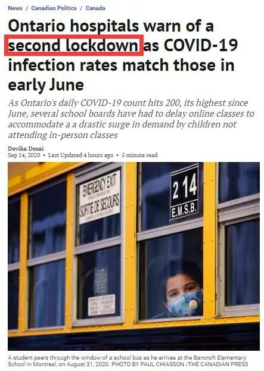
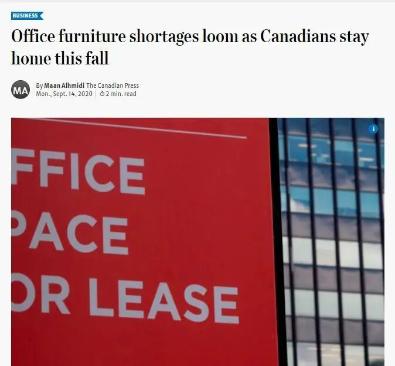
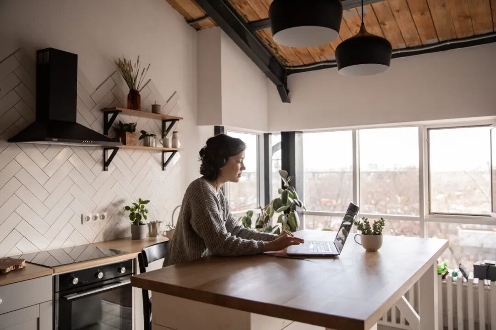

# 无标题

**链接地址:** http://mp.weixin.qq.com/s?__biz=MjM5MDEzNzY2NQ==&mid=2652791920&idx=5&sn=752c80e5a614cec899ca453711bb1fde&chksm=bda3a85e8ad42148aeec1af8bc893c718a78b2749e74483b99016a10a0be3503b646ee4730b4&mpshare=1&scene=2&srcid=0923cVKdVQYn6n4h2AUAUdKy&sharer_sharetime=1600828567694&sharer_shareid=be1c8edd6c93eec155a61c876e41d26a#rd
**作者:** 妮娜
**获取时间:** 2025/8/28 20:06:53
**图片数量:** 14

---

## 原始HTML内容

<section style="box-sizing: border-box;font-style: normal;font-weight: 400;text-align: justify;font-size: 16px;"><section style="margin: 10px 0%;box-sizing: border-box;" powered-by="xiumi.us"><section style="font-size: 15px;letter-spacing: 0px;line-height: 2;padding: 0px 15px;box-sizing: border-box;">
<a target="_blank" href="https://mp.weixin.qq.com/s?__biz=MjM5MjI1ODUyNw==&amp;mid=2247483808&amp;idx=1&amp;sn=f2944bd490e408325170494637aee989&amp;scene=21#wechat_redirect" textvalue="你已选中了添加链接的内容" tab="innerlink" data-linktype="1" style="color: var(--weui-LINK);-webkit-tap-highlight-color: rgba(0, 0, 0, 0);cursor: pointer;"></a>
<section style="font-family: -apple-system-font, BlinkMacSystemFont, &quot;Helvetica Neue&quot;, &quot;PingFang SC&quot;, &quot;Hiragino Sans GB&quot;, &quot;Microsoft YaHei UI&quot;, &quot;Microsoft YaHei&quot;, Arial, sans-serif;letter-spacing: 0.544px;white-space: normal;caret-color: rgb(51, 51, 51);text-size-adjust: auto;background-color: rgb(255, 255, 255);line-height: 2em;text-align: center;"><a target="_blank" href="https://mp.weixin.qq.com/s?__biz=MjM5MDEzNzY2NQ==&amp;mid=2652788839&amp;idx=2&amp;sn=3f89809bbe79ac24e6540a8067cb3c23&amp;chksm=bda394498ad41d5f1a724e4afe27ce31ef47a62f47b607a0c65173a933cd447228a1f2fb2152&amp;scene=21&amp;sessionid=1597457941&amp;key=5fd0c818f65a7570b62411ccb07209580c83cecf5a531de68810edae23e8e475aae43178f048ec74968d88b1192f048a756dc08849badf944c9763e8e8674ba19a27d0e93d4d7829b65d43efa0108c4e2ce77758ecddc1dc1c1258ce85f0c6d51b74fa37921387ff6929ad71d5b18656d5f91ddb52aad7cdfb3620d3e8ce8e57&amp;ascene=1&amp;uin=MTMyNTc2Mzc0MQ==&amp;devicetype=Windows 10 x64&amp;version=62090529&amp;lang=en&amp;exportkey=Aj j0LtLWGea5LXiE/TjJ1o=&amp;pass_ticket=Ju2ysoNrPw5dKY2EwFKKBrUHbpdBLVAQDY0p7ooqaruSgXuxlUuuG76OY86CbOLm#wechat_redirect" textvalue="你已选中了添加链接的内容" tab="innerlink" data-linktype="2" style="color: var(--weui-LINK);-webkit-tap-highlight-color: rgba(0, 0, 0, 0);cursor: pointer;">+++上方是可以点的广告+++</a></section>
 

 

自从三月起多伦多地区第一次封城算起，至今已经超过半年时间。虽然绝大多数的企业已经复工，但不少人还是继续进行着<strong style="box-sizing: border-box;">居家办公 / Work from Home （WFH）的工作状态</strong>。

 
</section></section><section style="text-align: center;margin-top: 10px;margin-bottom: 10px;box-sizing: border-box;" powered-by="xiumi.us"><section style="max-width: 100%;vertical-align: middle;display: inline-block;line-height: 0;box-sizing: border-box;"></section></section><section style="margin: 10px 0%;box-sizing: border-box;" powered-by="xiumi.us"><section style="font-size: 15px;letter-spacing: 0px;line-height: 2;padding: 0px 15px;box-sizing: border-box;">
 

本以为一个温度屡创新高的炎热夏日，可以暂时击退新冠疫情。然而不成想这温度刚掉下来没几天，<strong style="box-sizing: border-box;">第二波疫情的反扑也是相当惨烈</strong>。

 

而那些还在发愁在办公室里该不该带口罩上班的朋友们，这下似乎暂时也不用担心这个问题了。

 
</section></section><section style="text-align: center;margin-top: 10px;margin-bottom: 10px;box-sizing: border-box;" powered-by="xiumi.us"><section style="max-width: 100%;vertical-align: middle;display: inline-block;line-height: 0;box-sizing: border-box;"></section></section><section style="margin: 10px 0%;box-sizing: border-box;" powered-by="xiumi.us"><section style="font-size: 15px;letter-spacing: 0px;line-height: 2;padding: 0px 15px;box-sizing: border-box;">
 

相信看了这几天的新闻的朋友们难免在心中犯嘀咕：你看我说的啥来着？这舆论苗头已经往<strong style="box-sizing: border-box;">二次封城</strong>上开始倒了，这不，<strong style="box-sizing: border-box;">媒体的预防针都开始打上了</strong>。

 

<strong style="box-sizing: border-box;">二次封城意味着再次延长的居家办公状态</strong>，也就意味着不少民众再也不能抱着这样<strong style="box-sizing: border-box;">凑合凑合的心态</strong>了。

 

家里没有像样的办公桌唉…

用饭桌凑合凑合吧！

 

家里的椅子坐着不舒服，

要啥电脑椅？用板凳凑合凑合吧…

 

电子产品不够快，文具用品不够齐…

算了，再凑合凑合吧，没准过几天就返岗了呢？

 
</section></section><section style="text-align: center;margin-top: 10px;margin-bottom: 10px;box-sizing: border-box;" powered-by="xiumi.us"><section style="max-width: 100%;vertical-align: middle;display: inline-block;line-height: 0;box-sizing: border-box;"></section></section><section style="margin: 10px 0%;box-sizing: border-box;" powered-by="xiumi.us"><section style="font-size: 15px;letter-spacing: 0px;line-height: 2;padding: 0px 15px;box-sizing: border-box;">
 

打印机、扫描仪、碎纸机、护眼灯…这些办公室里常见的电子产品想要<strong style="box-sizing: border-box;">在家中配置齐全是一件难事</strong>，但随着居家办公时间的一再延后，加拿大民众守着日益增高的疫情曲线，终于对今年内的重回办公室计划不再抱有任何幻想。<strong style="box-sizing: border-box;">该买的，还是全部都买起来吧！</strong>

<strong style="box-sizing: border-box;"> </strong>
</section></section><section style="text-align: center;margin-top: 10px;margin-bottom: 10px;box-sizing: border-box;" powered-by="xiumi.us"><section style="max-width: 100%;vertical-align: middle;display: inline-block;line-height: 0;width: 100%;height: auto;box-sizing: border-box;"></section></section><section style="margin: 10px 0%;box-sizing: border-box;" powered-by="xiumi.us"><section style="font-size: 15px;letter-spacing: 0px;line-height: 2;padding: 0px 15px;box-sizing: border-box;">
 

于是乎，以抢购厕纸和洗手液出名的加拿大人，在这个传统上准备采购万圣节用品的季节，却<strong style="box-sizing: border-box;">掀起了对于办公家具的抢购狂潮</strong>！
</section></section><section style="text-align: center;margin-top: 10px;margin-bottom: 10px;box-sizing: border-box;" powered-by="xiumi.us"><section style="max-width: 100%;vertical-align: middle;display: inline-block;line-height: 0;box-sizing: border-box;"></section></section><section style="margin: 10px 0%;box-sizing: border-box;" powered-by="xiumi.us"><section style="font-size: 15px;letter-spacing: 0px;line-height: 2;padding: 0px 15px;box-sizing: border-box;">
 

加拿大<strong style="box-sizing: border-box;">宜家（Ikea）</strong>加拿大发言人克里斯汀·纽比格（Kristin Newbigging）于本周一向媒体发言，该公司看正在经历一场<strong style="box-sizing: border-box;">史无前例的供应短缺现象</strong>：疫情导致大量居家办公和学习的机会，因此民众<strong style="box-sizing: border-box;">对于办公家具用品的需求正在暴涨中</strong>！

 

然而，可惜的是：作为家居经销商的宜家，却<strong style="box-sizing: border-box;">没有办法完全满足这样巨大的供应需求！</strong>因为部分宜家的海外供应商受到疫情波及还处于停工状态。

 
</section></section><section style="text-align: center;margin-top: 10px;margin-bottom: 10px;box-sizing: border-box;" powered-by="xiumi.us"><section style="max-width: 100%;vertical-align: middle;display: inline-block;line-height: 0;box-sizing: border-box;"></section></section><section style="margin: 10px 0%;box-sizing: border-box;" powered-by="xiumi.us"><section style="font-size: 15px;letter-spacing: 0px;line-height: 2;padding: 0px 15px;box-sizing: border-box;">
 

据悉，宜家在50个国家/地区拥有约1,000个家居装饰供应商，包括中国，波兰，意大利，立陶宛，瑞典和德国在内，其中几个目前依然还在遭受疫情的袭击，一时半会儿还无法复产。

 

纽比格表示：“尽管我们的部分供应商已经复产投入运营，但他们<strong style="box-sizing: border-box;">收到的订单量大大高于正常需求</strong>。” 陡增的需求量正在产生连锁反应，给生产和分销带来额外压力。

 
</section></section><section style="text-align: center;margin-top: 10px;margin-bottom: 10px;box-sizing: border-box;" powered-by="xiumi.us"><section style="max-width: 100%;vertical-align: middle;display: inline-block;line-height: 0;box-sizing: border-box;"></section></section><section style="margin: 10px 0%;box-sizing: border-box;" powered-by="xiumi.us"><section style="font-size: 15px;letter-spacing: 0px;line-height: 2;padding: 0px 15px;box-sizing: border-box;">
 

<strong style="box-sizing: border-box;">加拿大零售委员会（&nbsp;the Retail Council of Canada）</strong>副主席卡尔·利特勒（Karl Littler）表示，市场没有预料到家庭办公用品的需求会如此走俏，但这并不令人感到意外。 

 

利特勒说，有些偶尔在家工作的人不需要创建独立的办公室，而是通过征用家里餐桌餐椅就足以搭建一套临时的设施。但当这样的需求如果开始每天以数小时计算，并以年为单位执行，那么人们就不得不考虑<strong style="box-sizing: border-box;">开始寻求更耐用，更适合用途的办公家具。</strong>

 
</section></section><section style="text-align: center;margin-top: 10px;margin-bottom: 10px;box-sizing: border-box;" powered-by="xiumi.us"><section style="max-width: 100%;vertical-align: middle;display: inline-block;line-height: 0;box-sizing: border-box;"></section></section><section style="margin: 10px 0%;box-sizing: border-box;" powered-by="xiumi.us"><section style="font-size: 15px;letter-spacing: 0px;line-height: 2;padding: 0px 15px;box-sizing: border-box;">
 

利特勒还说到：出了居高不下的需求之外，<strong style="box-sizing: border-box;">许多因素叠加</strong>给办公家具系统施加了巨大的压力，包括全国范围内长时间关闭的家具专卖店的进货和库存比例的不对等，以及国际和国内物流的延迟问题等。

 

他认为目前办公家具短缺的<strong style="box-sizing: border-box;">情况将持续几个月</strong>，但不断提升的供应水平将满足这终将放缓的社会需求。毕竟大部分<strong style="box-sizing: border-box;">办公家具不属于消耗品</strong>，一旦购买，则长期无需更换，也就自然会造就<strong style="box-sizing: border-box;">趋于平稳的需求量</strong>。

 
</section></section><section style="text-align: center;margin-top: 10px;margin-bottom: 10px;box-sizing: border-box;" powered-by="xiumi.us"><section style="max-width: 100%;vertical-align: middle;display: inline-block;line-height: 0;box-sizing: border-box;"></section></section><section style="margin: 10px 0%;box-sizing: border-box;" powered-by="xiumi.us"><section style="font-size: 15px;letter-spacing: 0px;line-height: 2;padding: 0px 15px;box-sizing: border-box;">
 

不过他依然看好办公家具的未来市场。随着经济结构和社会分工的重新调整，越来越多的人开始选择在家进行办公。纵使疫情结束后，<strong style="box-sizing: border-box;">人们对于家庭办公用具的需求也会较疫情前整体提升。</strong>

 

那么不知道屏幕前的各位是否也在疫情期间投资了新的办公家具呢？小编我就为了能给大家更好地码字儿敲新闻更换了一台舒适的电脑椅。

 
</section></section><section style="text-align: center;margin-top: 10px;margin-bottom: 10px;box-sizing: border-box;" powered-by="xiumi.us"><section style="max-width: 100%;vertical-align: middle;display: inline-block;line-height: 0;width: 50%;height: auto;box-sizing: border-box;"></section></section><section style="margin: 10px 0%;box-sizing: border-box;" powered-by="xiumi.us"><section style="font-size: 15px;letter-spacing: 0px;line-height: 2;padding: 0px 15px;box-sizing: border-box;">
 

这电脑椅坐上，嘿，您还真别说，是得劲儿！我连新闻标题都比以前起得更巨震惊体的风范了！咳咳，扯远了，扯远了。

 

对于目前办公家具如此短缺的情况，小编认为倒是<strong style="box-sizing: border-box;">不必追求挤到宜家或其他品牌店排队购买新产品</strong>。巧用平台和各种搜索引擎，也可以淘到不少品相良好，价格白菜的<strong style="box-sizing: border-box;">二手办公家具</strong>。
</section></section><section style="text-align: center;margin-top: 10px;margin-bottom: 10px;box-sizing: border-box;" powered-by="xiumi.us"><section style="max-width: 100%;vertical-align: middle;display: inline-block;line-height: 0;box-sizing: border-box;"></section></section><section style="margin: 10px 0%;box-sizing: border-box;" powered-by="xiumi.us"><section style="font-size: 15px;letter-spacing: 0px;line-height: 2;padding: 0px 15px;box-sizing: border-box;">
 

【注意】这不是一条掐饭文案！此时并没有品牌植入！小编只是衷心希望各位读者能<strong style="box-sizing: border-box;">该花的钱一定要花在刀刃上</strong>。毕竟这疫情暂时还看不到个头，<strong style="box-sizing: border-box;">早买早享受！</strong>
</section></section><section style="text-align: center;margin-top: 10px;margin-bottom: 10px;box-sizing: border-box;" powered-by="xiumi.us"><section style="max-width: 100%;vertical-align: middle;display: inline-block;line-height: 0;width: 40%;height: auto;box-sizing: border-box;"></section></section><section style="margin: 10px 0%;box-sizing: border-box;" powered-by="xiumi.us"><section style="font-size: 15px;letter-spacing: 0px;line-height: 2;padding: 0px 15px;box-sizing: border-box;">
 

<strong style="box-sizing: border-box;">工作都已经那么令人不开心了，还不让咱坐把好椅子，打个好键盘吗？</strong>

 

<strong style="box-sizing: border-box;">文章信息参考：</strong>

https://www.thestar.com/business/2020/09/14/office-furniture-shortages-loom-as-canadians-stay-home-this-fall.html

 
<section style="margin-right: 8px;margin-left: 8px;font-family: -apple-system-font, BlinkMacSystemFont, &quot;Helvetica Neue&quot;, &quot;PingFang SC&quot;, &quot;Hiragino Sans GB&quot;, &quot;Microsoft YaHei UI&quot;, &quot;Microsoft YaHei&quot;, Arial, sans-serif;letter-spacing: 0.544px;white-space: normal;font-size: 16px;background-color: rgb(255, 255, 255);text-size-adjust: auto;min-height: 1em;color: rgb(0, 0, 0);text-align: center;line-height: 2em;">+++全加拿大华人都在关注超级生活，就差你了+++</section><section style="margin-right: 8px;margin-left: 8px;font-family: -apple-system-font, BlinkMacSystemFont, &quot;Helvetica Neue&quot;, &quot;PingFang SC&quot;, &quot;Hiragino Sans GB&quot;, &quot;Microsoft YaHei UI&quot;, &quot;Microsoft YaHei&quot;, Arial, sans-serif;letter-spacing: 0.544px;white-space: normal;font-size: 16px;background-color: rgb(255, 255, 255);text-size-adjust: auto;min-height: 1em;color: rgb(0, 0, 0);text-align: center;line-height: 2em;"></section><section style="margin-right: 8px;margin-left: 8px;font-family: -apple-system-font, BlinkMacSystemFont, &quot;Helvetica Neue&quot;, &quot;PingFang SC&quot;, &quot;Hiragino Sans GB&quot;, &quot;Microsoft YaHei UI&quot;, &quot;Microsoft YaHei&quot;, Arial, sans-serif;letter-spacing: 0.544px;white-space: normal;background-color: rgb(255, 255, 255);text-align: right;line-height: 2em;"><strong style="font-size: 16px;letter-spacing: 0.544px;">喜欢点个“在看” ↓↓</strong></section>
  
</section></section></section>

---

## 纯文本内容

+++上方是可以点的广告+++自从三月起多伦多地区第一次封城算起，至今已经超过半年时间。虽然绝大多数的企业已经复工，但不少人还是继续进行着居家办公 / Work from Home （WFH）的工作状态。本以为一个温度屡创新高的炎热夏日，可以暂时击退新冠疫情。然而不成想这温度刚掉下来没几天，第二波疫情的反扑也是相当惨烈。而那些还在发愁在办公室里该不该带口罩上班的朋友们，这下似乎暂时也不用担心这个问题了。相信看了这几天的新闻的朋友们难免在心中犯嘀咕：你看我说的啥来着？这舆论苗头已经往二次封城上开始倒了，这不，媒体的预防针都开始打上了。二次封城意味着再次延长的居家办公状态，也就意味着不少民众再也不能抱着这样凑合凑合的心态了。家里没有像样的办公桌唉…用饭桌凑合凑合吧！家里的椅子坐着不舒服，要啥电脑椅？用板凳凑合凑合吧…电子产品不够快，文具用品不够齐…算了，再凑合凑合吧，没准过几天就返岗了呢？打印机、扫描仪、碎纸机、护眼灯…这些办公室里常见的电子产品想要在家中配置齐全是一件难事，但随着居家办公时间的一再延后，加拿大民众守着日益增高的疫情曲线，终于对今年内的重回办公室计划不再抱有任何幻想。该买的，还是全部都买起来吧！于是乎，以抢购厕纸和洗手液出名的加拿大人，在这个传统上准备采购万圣节用品的季节，却掀起了对于办公家具的抢购狂潮！加拿大宜家（Ikea）加拿大发言人克里斯汀·纽比格（Kristin Newbigging）于本周一向媒体发言，该公司看正在经历一场史无前例的供应短缺现象：疫情导致大量居家办公和学习的机会，因此民众对于办公家具用品的需求正在暴涨中！然而，可惜的是：作为家居经销商的宜家，却没有办法完全满足这样巨大的供应需求！因为部分宜家的海外供应商受到疫情波及还处于停工状态。据悉，宜家在50个国家/地区拥有约1,000个家居装饰供应商，包括中国，波兰，意大利，立陶宛，瑞典和德国在内，其中几个目前依然还在遭受疫情的袭击，一时半会儿还无法复产。纽比格表示：“尽管我们的部分供应商已经复产投入运营，但他们收到的订单量大大高于正常需求。” 陡增的需求量正在产生连锁反应，给生产和分销带来额外压力。加拿大零售委员会（ the Retail Council of Canada）副主席卡尔·利特勒（Karl Littler）表示，市场没有预料到家庭办公用品的需求会如此走俏，但这并不令人感到意外。利特勒说，有些偶尔在家工作的人不需要创建独立的办公室，而是通过征用家里餐桌餐椅就足以搭建一套临时的设施。但当这样的需求如果开始每天以数小时计算，并以年为单位执行，那么人们就不得不考虑开始寻求更耐用，更适合用途的办公家具。利特勒还说到：出了居高不下的需求之外，许多因素叠加给办公家具系统施加了巨大的压力，包括全国范围内长时间关闭的家具专卖店的进货和库存比例的不对等，以及国际和国内物流的延迟问题等。他认为目前办公家具短缺的情况将持续几个月，但不断提升的供应水平将满足这终将放缓的社会需求。毕竟大部分办公家具不属于消耗品，一旦购买，则长期无需更换，也就自然会造就趋于平稳的需求量。不过他依然看好办公家具的未来市场。随着经济结构和社会分工的重新调整，越来越多的人开始选择在家进行办公。纵使疫情结束后，人们对于家庭办公用具的需求也会较疫情前整体提升。那么不知道屏幕前的各位是否也在疫情期间投资了新的办公家具呢？小编我就为了能给大家更好地码字儿敲新闻更换了一台舒适的电脑椅。这电脑椅坐上，嘿，您还真别说，是得劲儿！我连新闻标题都比以前起得更巨震惊体的风范了！咳咳，扯远了，扯远了。对于目前办公家具如此短缺的情况，小编认为倒是不必追求挤到宜家或其他品牌店排队购买新产品。巧用平台和各种搜索引擎，也可以淘到不少品相良好，价格白菜的二手办公家具。【注意】这不是一条掐饭文案！此时并没有品牌植入！小编只是衷心希望各位读者能该花的钱一定要花在刀刃上。毕竟这疫情暂时还看不到个头，早买早享受！工作都已经那么令人不开心了，还不让咱坐把好椅子，打个好键盘吗？文章信息参考：https://www.thestar.com/business/2020/09/14/office-furniture-shortages-loom-as-canadians-stay-home-this-fall.html+++全加拿大华人都在关注超级生活，就差你了+++喜欢点个“在看” ↓↓

---

## 图片列表

-  (原始链接: https://mmbiz.qpic.cn/mmbiz_png/szJas1pFaJeJ1icazgfTXTj3Tbdgf5PN28C0VKnQGNS4Lgf3ZBBicK8Zkw4gwJd6OicoODcVFkKK7vicxSBXIJTfYg/640?wx_fmt=png)
-  (原始链接: https://mmbiz.qpic.cn/mmbiz_jpg/4kibCXA1QiblSqV0t7WFYia53JT13bbonzdTAU8EfOYAIIVyF7keVicfLrNaVEsSDnFk89SNyb2KHiblLTBSIOKericg/640?wx_fmt=jpeg)
-  (原始链接: https://mmbiz.qpic.cn/mmbiz_jpg/4kibCXA1QiblSqV0t7WFYia53JT13bbonzdOPt9X9sI3wT9QKY30LYMTslXsc76g4AnEiax8VajFuW98y7hyb9y3HA/640?wx_fmt=jpeg)
-  (原始链接: https://mmbiz.qpic.cn/mmbiz_jpg/4kibCXA1QiblSqV0t7WFYia53JT13bbonzdOULnzeX0rOlqDmbgZnS43AIEcKIMbThBsase1OgzxsqOeSezHvRibCw/640?wx_fmt=jpeg)
-  (原始链接: https://mmbiz.qpic.cn/mmbiz_jpg/4kibCXA1QiblSqV0t7WFYia53JT13bbonzdVk98h9T79ghKQ77Pw9CoANS2d6hyv7NufHicfcx2jf8LAQkmsxiaBs8w/640?wx_fmt=jpeg)
-  (原始链接: https://mmbiz.qpic.cn/mmbiz_png/4kibCXA1QiblSqV0t7WFYia53JT13bbonzdA1BCPn43UXwjWW1IOXJ7CnaTHicfHwKV5hJxPNKiabR0mRNWGAZc7o2A/640?wx_fmt=png)
-  (原始链接: https://mmbiz.qpic.cn/mmbiz_jpg/4kibCXA1QiblSqV0t7WFYia53JT13bbonzdWavc9V244LhKicmx6xKKWxF4c090QicAQQUXK3TopEib6EAP72EBXYzlg/640?wx_fmt=jpeg)
-  (原始链接: https://mmbiz.qpic.cn/mmbiz_jpg/4kibCXA1QiblSqV0t7WFYia53JT13bbonzdCQScowAnHVaRicVpJXTRibZMB2YBRS4mE4ZEQoOrzKf2vyEsX4a1bwEQ/640?wx_fmt=jpeg)
-  (原始链接: https://mmbiz.qpic.cn/mmbiz_jpg/4kibCXA1QiblSqV0t7WFYia53JT13bbonzdHZq5yTHmUj8WbpTcpDkoX5blMxVl30pFEHB5JPPy0DseNXyfQHOsYQ/640?wx_fmt=jpeg)
-  (原始链接: https://mmbiz.qpic.cn/mmbiz_jpg/4kibCXA1QiblSqV0t7WFYia53JT13bbonzdOXSSozNkzVKP0kUR1QQ56p25mXuyGHxIf6psmkd20fX4ELdBrva43w/640?wx_fmt=jpeg)
-  (原始链接: https://mmbiz.qpic.cn/mmbiz_jpg/4kibCXA1QiblSqV0t7WFYia53JT13bbonzdSjnyyFGKtRw5E8k5sbzyHJiaXB0IO9fw01YMpEy2SiciaKZAUP8ibvMogw/640?wx_fmt=jpeg)
-  (原始链接: https://mmbiz.qpic.cn/mmbiz_jpg/4kibCXA1QiblSqV0t7WFYia53JT13bbonzdxCrEJe5kY6EPuwetIyTRUsILibRojGKqq1mrzf9URMJoho3Aia5pNGhg/640?wx_fmt=jpeg)
-  (原始链接: https://mmbiz.qpic.cn/mmbiz_jpg/4kibCXA1QiblSqV0t7WFYia53JT13bbonzdBfZFpwribhM7rhicLtBets2uCpZFZrYciaerCD3ItlyPDGoF9kOkibD9sg/640?wx_fmt=jpeg)
-  (原始链接: https://mmbiz.qpic.cn/mmbiz_gif/szJas1pFaJdUFDPEKnLrCyGC4WgrAvl6lSC2beZFt6icTnXfebnRzcRialMg5VZujw1AhX9ribkSDQNZZukk8HX9w/640?wx_fmt=gif)
