# 无标题

**链接地址:** http://mp.weixin.qq.com/s?__biz=MjM5MDEzNzY2NQ==&mid=2652792254&idx=4&sn=149fdd71a735f35f348a43ac0571aea4&chksm=bda3a9908ad420860b9a73f044cd05a0e79d85e61a0e262cbd1fc0fec2fe727fd0386044cab9&mpshare=1&scene=2&srcid=0923VHhgfhmaz4VMfp9y1Arv&sharer_sharetime=1600804278597&sharer_shareid=be1c8edd6c93eec155a61c876e41d26a#rd
**作者:** 
**获取时间:** 2025/8/28 20:07:23
**图片数量:** 27

---

## 原始HTML内容

<section style="display: none;" data-tools="新媒体管家" data-label="powered by xmt.cn"> </section><section style="box-sizing: border-box;font-style: normal;font-weight: 400;text-align: justify;font-size: 16px;"><section style="text-align: center;margin: 10px 0% 0px;box-sizing: border-box;" powered-by="xiumi.us"><section style="max-width: 100%;vertical-align: middle;display: inline-block;line-height: 0;width: 100%;height: auto;box-sizing: border-box;"></section></section><section style="text-align: left;justify-content: flex-start;margin: -30px 0% 10px;opacity: 0.99;box-sizing: border-box;" powered-by="xiumi.us"><section style="display: inline-block;width: 100%;height: 30px;vertical-align: top;overflow: hidden;background-color: rgba(246, 247, 242, 0.74);padding: 0px 10px;box-sizing: border-box;"><section style="box-sizing: border-box;" powered-by="xiumi.us"><section style="display: flex;flex-flow: row nowrap;margin: 5px 0% 0px;box-sizing: border-box;"><section style="display: inline-block;vertical-align: middle;width: 19px;align-self: center;flex: 0 0 auto;line-height: 0;letter-spacing: 0px;height: auto;box-sizing: border-box;"><section style="text-align: center;margin: 0px 0%;box-sizing: border-box;" powered-by="xiumi.us"><section style="max-width: 100%;vertical-align: middle;display: inline-block;line-height: 0;box-sizing: border-box;"><svg xmlns="http://www.w3.org/2000/svg" x="0px" y="0px" viewBox="0 0 727.6 725.1" style="vertical-align: middle;max-width: 100%;box-sizing: border-box;" width="100%"><g style="box-sizing: border-box;"><path d="M373.9,725.1c-28,0-54.4-11.4-78.6-34l-0.4-0.3l-0.5,0.1c-8.1,1.4-20.8,3-35.8,3   c-62.4,0-106.3-28.1-123.6-79.1l-0.2-0.5l-0.5-0.2c-17-5.4-59.1-22.1-81.8-61C37.5,527.4,33.9,497,42,462.9l0.1-0.6l-0.5-0.4   c-12.9-10.8-35.2-34.1-40.5-69.2c-5-33.3,6.7-68.2,34.8-103.7l0.3-0.4l-0.1-0.5c-5.3-18.7-11.5-55.5,6-90.7   c13.2-26.7,37.3-46.3,71.5-58.4l0.6-0.2l0-0.7c0.8-15.8,5.5-38.9,23.7-59.4c22.6-25.4,58.8-38.2,107.6-38.2c3.6,0,7.3,0.1,11.1,0.2   l0.4,0l0.3-0.3C270.5,28.3,306,0,352,0c28.8,0,56.2,11.2,81.4,33.3l0.4,0.3l0.5-0.1c8.4-2,21.8-4.4,37.4-4.4   c32.2,0,89.8,11,113.7,84.4l0.2,0.6l0.7,0.1c14.8,1.4,43.1,7.5,65.9,32c24.1,25.9,35,64.8,32.4,115.5l0,0.5l0.3,0.3   c12.5,12.1,41.6,44.9,42.6,88.2c0.7,30.5-12.6,59.7-39.5,86.5l-0.5,0.5l0.2,0.6c6.2,15.9,14.7,47.5,2.9,81   c-10.8,30.6-35.7,54.9-74.1,72.4l-0.4,0.2l-0.1,0.5c-3.1,11.8-10.9,34.6-27.6,55.2c-22.7,28-53.4,42.2-91.3,42.2   c-10.7,0-22-1.2-33.7-3.5l-0.5-0.1l-0.4,0.3C450.3,698.1,416.8,725.1,373.9,725.1z M308.3,667.7c20.6,20.9,42.7,31.5,65.6,31.5   c42.1,0,75.1-35.6,75.4-35.9l5.1-5.6l7.4,1.7c12.5,2.9,24.4,4.4,35.4,4.4c80,0,94.5-80,95.1-83.5l1.2-7l6.6-2.8   c35-14.6,57.3-34.7,66.2-59.8c12.5-35.2-5.5-69.7-5.6-70.1l-4.8-8.9l7.5-6.8c26-23.5,38.9-48.3,38.3-73.7   c-1-41.5-37.1-72.5-38.6-73.8l-5.1-4.2l0.5-6.7c3.4-46.6-5-81.2-25.1-102.7c-21.4-23-50.2-24.2-55.7-24.2c-0.5,0-0.8,0-1,0   l-10.5,0.5l-2.7-10.1c-7.4-28-20.8-48.5-39.7-60.9C509.3,59.8,491.8,55,471.7,55c-20.7,0-36.6,5.1-37.3,5.3l-7.4,2.5l-5.6-5.4   c-21.8-20.9-45.2-31.5-69.4-31.5c-44.8,0-80.1,36.6-80.4,37l-4.1,4.4l-6-0.3c-5.4-0.3-10.8-0.5-15.9-0.5c-41,0-70.6,9.9-88.1,29.4   c-19.8,22.1-17.4,49.8-17.3,51l1.2,10.7l-10.4,3.1c-32.4,9.5-54.5,25.7-65.6,48.3c-17.8,36-2.6,77.4-2.4,77.9l2.7,7.1l-4.9,5.8   C34,331.4,22.6,361.4,26.7,389c5.5,36.5,36.8,57.2,37.2,57.4l8.1,5.2l-2.7,9.3c-9,30.8-7.1,57.4,5.6,79.2   c22.7,38.8,72.6,50.9,73.1,51l7.5,1.7l2.1,7.4c8.5,30.9,33,67.7,100.9,67.7c19.5,0,34.6-3.2,37.4-3.8l7.2-1.8L308.3,667.7z" fill="rgb(242,176,69)" style="box-sizing: border-box;"></path></g><g style="box-sizing: border-box;"><path d="M362.4,594.8c-128.3,0-232.6-104.4-232.6-232.6c0-128.3,104.4-232.6,232.6-232.6   C490.7,129.6,595,234,595,362.2C595,490.5,490.7,594.8,362.4,594.8z M362.4,153.5c-115.1,0-208.8,93.6-208.8,208.8   c0,115.1,93.6,208.8,208.8,208.8c115.1,0,208.8-93.6,208.8-208.8C571.1,247.1,477.5,153.5,362.4,153.5z" fill="rgb(242,176,69)" style="box-sizing: border-box;"></path></g><path d="M363.5,641.2c-153.8,0-279-125.2-279-279c0-153.9,125.2-279,279-279c153.9,0,279,125.2,279,279  C642.5,516.1,517.4,641.2,363.5,641.2z M363.5,107.9c-140.2,0-254.3,114.1-254.3,254.3c0,140.2,114.1,254.3,254.3,254.3  c140.2,0,254.3-114.1,254.3-254.3C617.8,222,503.7,107.9,363.5,107.9z" fill="rgb(242,176,69)" style="box-sizing: border-box;"></path><path d="M583.7,348.8v-21.4H403.5v-24.5h177.1L568,281.5H403.5V137.8h-21.4v113.1h-33.6V137.8h-21.4v143.7h-171v21.4  h171v24.5H143.9v21.4h106.9v39.7H143.9v21.4h183.3v27.5h-171v21.4h171v119.2h21.4v-97.8h33.6v97.8h21.4V458.8h164.9v-21.4H403.5  v-27.5h180.2v-21.4H479.9v-39.7L583.7,348.8L583.7,348.8z M327.1,388.5h-55v-39.7h55L327.1,388.5L327.1,388.5z M382.1,458.8h-33.6  V272.3h33.6V458.8z M458.5,388.5h-55v-39.7h55V388.5z M293.5,241.7L293.5,241.7v-85.6h-21.4v73.4h-48.9v21.4h70.2V241.7z   M437.1,250.9h64.1v-21.4h-42.8v-73.4h-21.4v85.6h0V250.9L437.1,250.9z M437.1,507.7L437.1,507.7l0,58.1h21.4v-58.1H486v-21.4h-48.9  L437.1,507.7L437.1,507.7z M244.7,507.7h27.5v58.1h21.4v-79.5h-48.9V507.7z" fill="rgb(242,176,69)" style="box-sizing: border-box;"></path></svg></section></section></section><section style="display: inline-block;vertical-align: middle;width: auto;flex: 100 100 0%;align-self: center;height: auto;margin: 0px 0px 0px 6px;box-sizing: border-box;"><section style="margin: 0px 0%;box-sizing: border-box;" powered-by="xiumi.us"><section style="text-align: justify;font-size: 13px;color: rgb(0, 0, 0);line-height: 1;letter-spacing: 0px;box-sizing: border-box;">
<strong style="box-sizing: border-box;">中秋寄思，双节同庆！Bake Code 的手工月饼礼盒来啦！</strong>
</section></section></section></section></section></section></section><section style="box-sizing: border-box;" powered-by="xiumi.us">
 
</section><section style="margin: 10px 0%;box-sizing: border-box;" powered-by="xiumi.us"><section style="display: inline-block;width: 100%;vertical-align: top;background-color: rgba(255, 217, 156, 0.24);padding: 0px;border-width: 0px;box-sizing: border-box;"><section style="box-sizing: border-box;" powered-by="xiumi.us"><section style="display: flex;flex-flow: row nowrap;margin: 5px 0% 0px;box-sizing: border-box;"><section style="display: inline-block;vertical-align: bottom;width: auto;flex: 0 0 0%;align-self: flex-end;height: auto;box-sizing: border-box;"><section style="text-align: center;color: rgb(242, 176, 69);font-size: 29px;line-height: 1;letter-spacing: 0px;box-sizing: border-box;" powered-by="xiumi.us">
 
</section><section style="box-sizing: border-box;" powered-by="xiumi.us"><section style="display: flex;flex-flow: row nowrap;margin: 0px 0%;box-sizing: border-box;"><section style="display: inline-block;vertical-align: top;width: 45px;align-self: flex-start;flex: 0 0 auto;height: auto;margin: 0px -4px 0px 0px;box-sizing: border-box;"><section style="margin: 0px 0%;box-sizing: border-box;" powered-by="xiumi.us"><section style="background-color: rgb(255, 217, 156);height: 1px;box-sizing: border-box;"><svg viewBox="0 0 1 1" style="float:left;line-height:0;width:0;vertical-align:top;"></svg></section></section></section><section style="display: inline-block;vertical-align: bottom;width: auto;line-height: 0;letter-spacing: 0px;flex: 0 0 0%;align-self: flex-end;height: auto;border-top: 0px solid rgb(62, 62, 62);border-top-left-radius: 0px;box-sizing: border-box;"><section style="text-align: center;transform: translate3d(4px, 0px, 0px);-webkit-transform: translate3d(4px, 0px, 0px);-moz-transform: translate3d(4px, 0px, 0px);-o-transform: translate3d(4px, 0px, 0px);margin: 0px 0% -1px;box-sizing: border-box;" powered-by="xiumi.us"><section style="display: inline-block;width: 4px;height: 4px;vertical-align: top;overflow: hidden;border-width: 1px;border-radius: 0px 50px 50px 0px;border-style: solid solid solid none;border-color: rgb(255, 217, 156) rgb(255, 217, 156) rgb(255, 217, 156) rgb(62, 62, 62);background-color: rgba(255, 255, 255, 0);box-sizing: border-box;"><svg viewBox="0 0 1 1" style="float:left;line-height:0;width:0;vertical-align:top;"></svg></section></section><section style="text-align: center;box-sizing: border-box;" powered-by="xiumi.us"><section style="display: inline-block;width: 4px;height: 4px;vertical-align: top;overflow: hidden;border-width: 1px;border-radius: 50px 0px 0px 50px;border-style: solid none solid solid;border-color: rgb(255, 217, 156) rgb(62, 62, 62) rgb(255, 217, 156) rgb(255, 217, 156);background-color: rgba(255, 255, 255, 0);box-sizing: border-box;"><svg viewBox="0 0 1 1" style="float:left;line-height:0;width:0;vertical-align:top;"></svg></section></section></section><section style="display: inline-block;vertical-align: bottom;width: 18px;align-self: flex-end;flex: 0 0 auto;line-height: 0;letter-spacing: 0px;height: auto;box-sizing: border-box;"><section style="margin: 0px 0%;box-sizing: border-box;" powered-by="xiumi.us"><section style="background-color: rgb(255, 217, 156);height: 1px;box-sizing: border-box;"><svg viewBox="0 0 1 1" style="float:left;line-height:0;width:0;vertical-align:top;"></svg></section></section></section></section></section></section><section style="display: inline-block;vertical-align: bottom;width: auto;align-self: flex-end;flex: 100 100 0%;box-sizing: border-box;"><section style="color: rgb(242, 176, 69);letter-spacing: 1px;box-sizing: border-box;" powered-by="xiumi.us">
<strong style="box-sizing: border-box;">月饼，秋天的美味念想</strong>
</section><section style="margin: 0px 0%;box-sizing: border-box;" powered-by="xiumi.us"><section style="background-color: rgb(255, 217, 156);height: 1px;box-sizing: border-box;"><svg viewBox="0 0 1 1" style="float:left;line-height:0;width:0;vertical-align:top;"></svg></section></section></section></section></section><section style="display: inline-block;width: 100%;vertical-align: top;background-color: rgba(252, 205, 69, 0.04);border-style: none;border-width: 0px;border-radius: 0px;border-color: rgb(255, 217, 156);padding: 10px 20px;box-shadow: rgb(0, 0, 0) 0px 0px 0px;box-sizing: border-box;" powered-by="xiumi.us"><section style="opacity: 0.99;box-sizing: border-box;" powered-by="xiumi.us"><section style="font-size: 15px;color: rgb(106, 94, 59);letter-spacing: 2px;line-height: 1.8;box-sizing: border-box;">
 

不经意间抬头望向窗外染上秋韵的红叶，才意识到秋天的来临。在渐渐凉爽的天气中换上了厚重的衣衫，开始<strong style="box-sizing: border-box;">期待秋天最具代表性的节日——中秋节</strong>。

 

今年的中秋节是很特殊，和国庆节恰好是同一天。双节同庆在中华传统文化中<strong style="box-sizing: border-box;">素有吉祥喜乐之意</strong>。

 

但疫情造成的特殊状况，却让亲朋好友间的团聚变成了<strong style="box-sizing: border-box;">一份奢侈的心愿</strong>。

 
</section></section><section style="margin: 10px 0%;box-sizing: border-box;" powered-by="xiumi.us"><section style="display: inline-block;vertical-align: top;width: 50%;box-shadow: rgb(0, 0, 0) 0px 0px 0px;padding: 0px 0px 0px 4px;box-sizing: border-box;"><section style="box-sizing: border-box;" powered-by="xiumi.us"><section style="display: flex;flex-flow: row nowrap;text-align: center;justify-content: center;box-sizing: border-box;"><section style="display: inline-block;width: 97%;vertical-align: top;flex: 0 0 auto;align-self: flex-start;height: auto;background-color: rgb(237, 128, 15);border-width: 0px;border-radius: 0px 18px;border-style: none;border-color: rgb(62, 62, 62);padding: 6px;overflow: hidden;box-shadow: rgb(221, 226, 255) -3px 3px 0px;box-sizing: border-box;"><section style="margin: 0px 0%;box-sizing: border-box;" powered-by="xiumi.us"><section style="max-width: 100%;vertical-align: middle;display: inline-block;line-height: 0;box-shadow: rgb(0, 0, 0) 0px 0px 0px;border-width: 2px;border-bottom-left-radius: 16px;border-style: solid;border-color: rgb(255, 255, 255);overflow: hidden;border-top-right-radius: 16px;box-sizing: border-box;"></section></section></section></section></section></section><section style="display: inline-block;vertical-align: top;width: 50%;padding: 0px 4px 0px 0px;box-sizing: border-box;"><section style="box-sizing: border-box;" powered-by="xiumi.us"><section style="display: flex;flex-flow: row nowrap;text-align: center;justify-content: center;box-sizing: border-box;"><section style="display: inline-block;width: 97%;vertical-align: top;flex: 0 0 auto;align-self: flex-start;height: auto;background-color: rgb(255, 255, 255);border-width: 0px;border-radius: 18px 0px;border-style: none;border-color: rgb(62, 62, 62);padding: 6px;box-shadow: rgb(221, 226, 255) 3px 3px 0px;box-sizing: border-box;"><section style="margin: 0px 0%;box-sizing: border-box;" powered-by="xiumi.us"><section style="max-width: 100%;vertical-align: middle;display: inline-block;line-height: 0;box-shadow: rgb(0, 0, 0) 0px 0px 0px;border-width: 2px;border-radius: 16px 0px;border-style: solid;border-color: rgb(255, 255, 255);overflow: hidden;box-sizing: border-box;"></section></section></section></section></section></section></section><section style="margin: 10px 0%;box-sizing: border-box;" powered-by="xiumi.us"><section style="display: inline-block;vertical-align: top;width: 50%;padding: 0px 0px 0px 4px;box-sizing: border-box;"><section style="box-sizing: border-box;" powered-by="xiumi.us"><section style="display: flex;flex-flow: row nowrap;text-align: center;justify-content: center;box-sizing: border-box;"><section style="display: inline-block;width: 97%;vertical-align: top;flex: 0 0 auto;align-self: flex-start;height: auto;background-color: rgb(255, 255, 255);border-width: 0px;border-radius: 18px 0px;border-style: none;border-color: rgb(62, 62, 62);padding: 6px;box-shadow: rgb(221, 226, 255) -3px -3px 0px;box-sizing: border-box;"><section style="margin: 0px 0%;box-sizing: border-box;" powered-by="xiumi.us"><section style="max-width: 100%;vertical-align: middle;display: inline-block;line-height: 0;box-shadow: rgb(255, 255, 255) 0px 0px 0px;border-width: 2px;border-radius: 16px 0px;border-style: solid;border-color: rgb(255, 255, 255);overflow: hidden;box-sizing: border-box;"></section></section></section></section></section></section><section style="display: inline-block;vertical-align: top;width: 50%;padding: 0px 4px 0px 0px;box-sizing: border-box;"><section style="box-sizing: border-box;" powered-by="xiumi.us"><section style="display: flex;flex-flow: row nowrap;text-align: center;justify-content: center;box-sizing: border-box;"><section style="display: inline-block;width: 97%;vertical-align: top;flex: 0 0 auto;align-self: flex-start;height: auto;background-color: rgb(237, 128, 15);border-width: 0px;border-radius: 0px 18px;border-style: none;border-color: rgb(62, 62, 62);padding: 6px;overflow: hidden;box-shadow: rgb(221, 226, 255) 3px -3px 0px;box-sizing: border-box;"><section style="margin: 0px 0%;box-sizing: border-box;" powered-by="xiumi.us"><section style="max-width: 100%;vertical-align: middle;display: inline-block;line-height: 0;box-shadow: rgb(0, 0, 0) 0px 0px 0px;border-width: 2px;border-bottom-left-radius: 16px;border-style: solid;border-color: rgb(255, 255, 255);overflow: hidden;border-top-right-radius: 16px;box-sizing: border-box;"></section></section></section></section></section></section></section><section style="text-align: center;font-size: 12px;color: rgba(0, 0, 0, 0.24);box-sizing: border-box;" powered-by="xiumi.us">
丰富多彩的中秋活动
</section><section style="opacity: 0.99;box-sizing: border-box;" powered-by="xiumi.us"><section style="font-size: 15px;color: rgb(106, 94, 59);letter-spacing: 2px;line-height: 1.8;box-sizing: border-box;">
 

然而，远了距离不远心。在这个良辰佳节中你还可以亲手选购一份<strong style="box-sizing: border-box;">珍贵又贴心的好礼</strong>，向你最珍重的亲友们捎去自己的一份心意。

 

<strong style="box-sizing: border-box;">月饼是中秋佳节馈赠亲友最为传统的好礼。</strong>然而挑选一份表达自己心意的月饼却并非易事。

<strong style="box-sizing: border-box;"> </strong>

<strong style="box-sizing: border-box;">月饼是馈赠者品位气质的彰显，也需要在口味和外形上满足收礼者的喜好。</strong>市面上月饼的选择琳琅满目，我到底该怎样选择呢？

 
</section></section><section style="text-align: center;margin: 0.5em 0px;padding-left: 0.5em;padding-right: 0.5em;box-sizing: border-box;" powered-by="xiumi.us"><section style="box-sizing: border-box;width: 100%;box-shadow: rgb(102, 102, 102) 3.2px 3.2px 8px;display: inline-block;line-height: 0;border-color: white;height: auto !important;"></section></section><section style="opacity: 0.99;box-sizing: border-box;" powered-by="xiumi.us"><section style="font-size: 15px;color: rgb(106, 94, 59);letter-spacing: 2px;line-height: 1.8;box-sizing: border-box;">
 

别发愁，今天小编就来给你推荐近期找到的真爱——来自 <strong style="box-sizing: border-box;">Bake Code的6种口味精美月饼礼盒套装</strong>！将传统与新奇完美融合，给你带来最精致美味的舌尖体验！

 

 
</section></section><section style="box-sizing: border-box;" powered-by="xiumi.us"><section style="display: flex;flex-flow: row nowrap;margin: 10px 0%;box-sizing: border-box;"><section style="display: inline-block;vertical-align: middle;width: auto;flex: 0 0 0%;align-self: center;height: auto;margin: 0px 0px 0px 3px;box-sizing: border-box;"><section style="box-sizing: border-box;" powered-by="xiumi.us"><section style="display: flex;flex-flow: row nowrap;margin: 0px 0%;box-sizing: border-box;"><section style="display: inline-block;width: auto;vertical-align: bottom;line-height: 0;letter-spacing: 0px;flex: 0 0 0%;align-self: flex-end;height: auto;border-width: 0px;border-top-style: solid;border-top-color: rgb(62, 62, 62);border-top-left-radius: 0px;box-sizing: border-box;"><section style="text-align: right;margin: 0px 0% -1px;justify-content: flex-end;transform: translate3d(6px, 0px, 0px);-webkit-transform: translate3d(6px, 0px, 0px);-moz-transform: translate3d(6px, 0px, 0px);-o-transform: translate3d(6px, 0px, 0px);box-sizing: border-box;" powered-by="xiumi.us"><section style="display: inline-block;width: 5px;height: 8px;vertical-align: top;overflow: hidden;border-left: 1px solid rgb(255, 255, 255);border-bottom-left-radius: 3px;border-bottom: 1px solid rgb(255, 255, 255);border-bottom-right-radius: 0px;box-sizing: border-box;"><svg viewBox="0 0 1 1" style="float:left;line-height:0;width:0;vertical-align:top;"></svg></section></section><section style="transform: translate3d(4px, 0px, 0px);-webkit-transform: translate3d(4px, 0px, 0px);-moz-transform: translate3d(4px, 0px, 0px);-o-transform: translate3d(4px, 0px, 0px);margin: 0px 0% -1px;box-sizing: border-box;" powered-by="xiumi.us"><section style="display: inline-block;width: 5px;vertical-align: top;border-style: none none solid;border-width: 0px 0px 1px;border-radius: 0px;border-top-color: rgb(255, 217, 156);height: auto;border-bottom-color: rgb(255, 255, 255);box-sizing: border-box;"><section style="text-align: right;transform: translate3d(3px, 0px, 0px);-webkit-transform: translate3d(3px, 0px, 0px);-moz-transform: translate3d(3px, 0px, 0px);-o-transform: translate3d(3px, 0px, 0px);margin: 0px 0% -1px;justify-content: flex-end;box-sizing: border-box;" powered-by="xiumi.us"><section style="display: inline-block;width: 4px;height: 4px;vertical-align: top;overflow: hidden;border-width: 1px;border-radius: 0px 50px 50px 0px;border-style: solid solid solid none;border-color: rgb(255, 255, 255) rgb(255, 255, 255) rgb(255, 255, 255) rgb(62, 62, 62);background-color: rgb(255, 255, 255);box-sizing: border-box;"><svg viewBox="0 0 1 1" style="float:left;line-height:0;width:0;vertical-align:top;"></svg></section></section></section></section><section style="text-align: left;justify-content: flex-start;box-sizing: border-box;" powered-by="xiumi.us"><section style="display: inline-block;width: 4px;height: 4px;vertical-align: top;overflow: hidden;border-width: 1px;border-radius: 50px 0px 0px 50px;border-style: solid none solid solid;border-color: rgb(255, 255, 255) rgb(62, 62, 62) rgb(255, 255, 255) rgb(255, 255, 255);background-color: rgb(255, 255, 255);box-sizing: border-box;"><svg viewBox="0 0 1 1" style="float:left;line-height:0;width:0;vertical-align:top;"></svg></section></section><section style="text-align: center;margin: -1px 0% 0px;transform: translate3d(2px, 0px, 0px);-webkit-transform: translate3d(2px, 0px, 0px);-moz-transform: translate3d(2px, 0px, 0px);-o-transform: translate3d(2px, 0px, 0px);box-sizing: border-box;" powered-by="xiumi.us"><section style="display: inline-block;width: 5px;height: 8px;vertical-align: top;overflow: hidden;border-width: 1px;border-radius: 0px 3px 0px 0px;border-style: solid solid none none;border-color: rgb(255, 255, 255) rgb(255, 255, 255) rgb(255, 217, 156) rgb(255, 217, 156);box-sizing: border-box;"><svg viewBox="0 0 1 1" style="float:left;line-height:0;width:0;vertical-align:top;"></svg></section></section></section></section></section></section><section style="display: inline-block;vertical-align: middle;width: auto;align-self: center;flex: 0 0 0%;height: auto;line-height: 0;margin: 0px 0px 0px -8px;box-sizing: border-box;"><section style="text-align: center;box-sizing: border-box;" powered-by="xiumi.us"><section style="display: inline-block;width: 20px;height: 20px;vertical-align: top;overflow: hidden;border-width: 0px;border-radius: 50%;border-style: none;border-color: rgb(62, 62, 62);background-color: rgb(255, 255, 255);box-sizing: border-box;"><svg viewBox="0 0 1 1" style="float:left;line-height:0;width:0;vertical-align:top;"></svg></section></section></section><section style="display: inline-block;vertical-align: middle;width: auto;align-self: center;flex: 100 100 0%;height: auto;padding: 0px 0px 0px 14px;box-sizing: border-box;"><section style="box-sizing: border-box;" powered-by="xiumi.us"><section style="display: flex;flex-flow: row nowrap;box-sizing: border-box;"><section style="display: inline-block;vertical-align: top;width: auto;min-width: 10%;max-width: 100%;flex: 0 0 auto;height: auto;align-self: stretch;box-sizing: border-box;"><section style="color: rgb(242, 176, 69);line-height: 1;letter-spacing: 1px;padding: 0px 1px;box-sizing: border-box;" powered-by="xiumi.us">
<strong style="box-sizing: border-box;">Bake Code</strong>
</section></section><section style="display: inline-block;vertical-align: top;width: auto;align-self: stretch;flex: 100 100 0%;height: auto;background-color: rgb(255, 255, 255);margin: 0px 0px 0px 8px;box-sizing: border-box;"><svg viewBox="0 0 1 1" style="float:left;line-height:0;width:0;vertical-align:top;"></svg></section></section></section></section></section></section><section style="box-sizing: border-box;" powered-by="xiumi.us">
 
</section><section style="text-align: center;margin-top: 10px;margin-bottom: 10px;box-sizing: border-box;" powered-by="xiumi.us"><section style="max-width: 100%;vertical-align: middle;display: inline-block;line-height: 0;width: 50%;height: auto;box-sizing: border-box;"></section></section><section style="opacity: 0.99;box-sizing: border-box;" powered-by="xiumi.us"><section style="font-size: 15px;color: rgb(106, 94, 59);letter-spacing: 2px;line-height: 1.8;box-sizing: border-box;">
 

Bake Code是大多地区非常著名的一家手工面包甜品店。目前在该地区已扩展至<strong style="box-sizing: border-box;">四家店面</strong>。

 

他们专注于将亚洲风味与现代欧洲烘焙技术巧妙融合，哪怕是最挑剔的食客也会被这样风味独具又精巧细腻的美味所震撼。

 
</section></section><section style="text-align: center;margin: 0.5em 0px;padding-left: 0.5em;padding-right: 0.5em;box-sizing: border-box;" powered-by="xiumi.us"><section style="box-sizing: border-box;width: 100%;box-shadow: rgb(102, 102, 102) 3.2px 3.2px 8px;display: inline-block;line-height: 0;border-color: white;height: auto !important;"></section></section><section style="text-align: center;font-size: 12px;color: rgba(0, 0, 0, 0.24);box-sizing: border-box;" powered-by="xiumi.us">
超级美味的爆浆咸蛋黄牛角包
</section><section style="opacity: 0.99;box-sizing: border-box;" powered-by="xiumi.us"><section style="font-size: 15px;color: rgb(106, 94, 59);letter-spacing: 2px;line-height: 1.8;box-sizing: border-box;">
 

还记得之前<strong style="box-sizing: border-box;">火爆朋友圈的咸蛋黄牛角包</strong>吗？在<strong style="box-sizing: border-box;">多伦多第一个</strong>用牛角包那多层次的酥脆包裹住咸蛋黄的丝滑咸香，让甜与咸共舞达到完美平衡，在舌尖绽放出创意火花的，<strong style="box-sizing: border-box;">正是Bake Code！</strong> 

 
</section></section><section style="margin: 10px 0%;box-sizing: border-box;" powered-by="xiumi.us"><section style="display: inline-block;vertical-align: top;width: 50%;box-shadow: rgb(0, 0, 0) 0px 0px 0px;padding: 0px 0px 0px 4px;box-sizing: border-box;"><section style="box-sizing: border-box;" powered-by="xiumi.us"><section style="display: flex;flex-flow: row nowrap;text-align: center;justify-content: center;box-sizing: border-box;"><section style="display: inline-block;width: 97%;vertical-align: top;flex: 0 0 auto;align-self: flex-start;height: auto;background-color: rgb(237, 128, 15);border-width: 0px;border-radius: 0px 18px;border-style: none;border-color: rgb(62, 62, 62);padding: 6px;overflow: hidden;box-shadow: rgb(221, 226, 255) -3px 3px 0px;box-sizing: border-box;"><section style="margin: 0px 0%;box-sizing: border-box;" powered-by="xiumi.us"><section style="max-width: 100%;vertical-align: middle;display: inline-block;line-height: 0;box-shadow: rgb(0, 0, 0) 0px 0px 0px;border-width: 2px;border-bottom-left-radius: 16px;border-style: solid;border-color: rgb(255, 255, 255);overflow: hidden;border-top-right-radius: 16px;box-sizing: border-box;"></section></section></section></section></section></section><section style="display: inline-block;vertical-align: top;width: 50%;padding: 0px 4px 0px 0px;box-sizing: border-box;"><section style="box-sizing: border-box;" powered-by="xiumi.us"><section style="display: flex;flex-flow: row nowrap;text-align: center;justify-content: center;box-sizing: border-box;"><section style="display: inline-block;width: 97%;vertical-align: top;flex: 0 0 auto;align-self: flex-start;height: auto;background-color: rgb(255, 255, 255);border-width: 0px;border-radius: 18px 0px;border-style: none;border-color: rgb(62, 62, 62);padding: 6px;box-shadow: rgb(221, 226, 255) 3px 3px 0px;box-sizing: border-box;"><section style="margin: 0px 0%;box-sizing: border-box;" powered-by="xiumi.us"><section style="max-width: 100%;vertical-align: middle;display: inline-block;line-height: 0;box-shadow: rgb(0, 0, 0) 0px 0px 0px;border-width: 2px;border-radius: 16px 0px;border-style: solid;border-color: rgb(255, 255, 255);overflow: hidden;box-sizing: border-box;"></section></section></section></section></section></section></section><section style="margin: 10px 0%;box-sizing: border-box;" powered-by="xiumi.us"><section style="display: inline-block;vertical-align: top;width: 50%;padding: 0px 0px 0px 4px;box-sizing: border-box;"><section style="box-sizing: border-box;" powered-by="xiumi.us"><section style="display: flex;flex-flow: row nowrap;text-align: center;justify-content: center;box-sizing: border-box;"><section style="display: inline-block;width: 97%;vertical-align: top;flex: 0 0 auto;align-self: flex-start;height: auto;background-color: rgb(255, 255, 255);border-width: 0px;border-radius: 18px 0px;border-style: none;border-color: rgb(62, 62, 62);padding: 6px;box-shadow: rgb(221, 226, 255) -3px -3px 0px;box-sizing: border-box;"><section style="margin: 0px 0%;box-sizing: border-box;" powered-by="xiumi.us"><section style="max-width: 100%;vertical-align: middle;display: inline-block;line-height: 0;box-shadow: rgb(255, 255, 255) 0px 0px 0px;border-width: 2px;border-radius: 16px 0px;border-style: solid;border-color: rgb(255, 255, 255);overflow: hidden;box-sizing: border-box;"></section></section></section></section></section></section><section style="display: inline-block;vertical-align: top;width: 50%;padding: 0px 4px 0px 0px;box-sizing: border-box;"><section style="box-sizing: border-box;" powered-by="xiumi.us"><section style="display: flex;flex-flow: row nowrap;text-align: center;justify-content: center;box-sizing: border-box;"><section style="display: inline-block;width: 97%;vertical-align: top;flex: 0 0 auto;align-self: flex-start;height: auto;background-color: rgb(237, 128, 15);border-width: 0px;border-radius: 0px 18px;border-style: none;border-color: rgb(62, 62, 62);padding: 6px;overflow: hidden;box-shadow: rgb(221, 226, 255) 3px -3px 0px;box-sizing: border-box;"><section style="margin: 0px 0%;box-sizing: border-box;" powered-by="xiumi.us"><section style="max-width: 100%;vertical-align: middle;display: inline-block;line-height: 0;box-shadow: rgb(0, 0, 0) 0px 0px 0px;border-width: 2px;border-bottom-left-radius: 16px;border-style: solid;border-color: rgb(255, 255, 255);overflow: hidden;border-top-right-radius: 16px;box-sizing: border-box;"></section></section></section></section></section></section></section><section style="text-align: center;font-size: 12px;color: rgba(0, 0, 0, 0.24);box-sizing: border-box;" powered-by="xiumi.us">
更多精彩美味，尽在 Bake Code ！
</section><section style="opacity: 0.99;box-sizing: border-box;" powered-by="xiumi.us"><section style="font-size: 15px;color: rgb(106, 94, 59);letter-spacing: 2px;line-height: 1.8;box-sizing: border-box;">
 

然而除了美味可口的牛角包和甜蜜诱人的精品蛋糕之外，这已经是Bake Code<strong style="box-sizing: border-box;">连续第三年在秋季限量推出的精美手工月饼礼盒</strong>。

 

无论是从口味的挑选，月饼的制作还是包装的创意上，都是<strong style="box-sizing: border-box;">堪称艺术品般的月饼收藏</strong>！

 

 
</section></section><section style="box-sizing: border-box;" powered-by="xiumi.us"><section style="display: flex;flex-flow: row nowrap;margin: 10px 0%;box-sizing: border-box;"><section style="display: inline-block;vertical-align: middle;width: auto;flex: 0 0 0%;align-self: center;height: auto;margin: 0px 0px 0px 3px;box-sizing: border-box;"><section style="box-sizing: border-box;" powered-by="xiumi.us"><section style="display: flex;flex-flow: row nowrap;margin: 0px 0%;box-sizing: border-box;"><section style="display: inline-block;width: auto;vertical-align: bottom;line-height: 0;letter-spacing: 0px;flex: 0 0 0%;align-self: flex-end;height: auto;border-width: 0px;border-top-style: solid;border-top-color: rgb(62, 62, 62);border-top-left-radius: 0px;box-sizing: border-box;"><section style="text-align: right;margin: 0px 0% -1px;justify-content: flex-end;transform: translate3d(6px, 0px, 0px);-webkit-transform: translate3d(6px, 0px, 0px);-moz-transform: translate3d(6px, 0px, 0px);-o-transform: translate3d(6px, 0px, 0px);box-sizing: border-box;" powered-by="xiumi.us"><section style="display: inline-block;width: 5px;height: 8px;vertical-align: top;overflow: hidden;border-left: 1px solid rgb(255, 255, 255);border-bottom-left-radius: 3px;border-bottom: 1px solid rgb(255, 255, 255);border-bottom-right-radius: 0px;box-sizing: border-box;"><svg viewBox="0 0 1 1" style="float:left;line-height:0;width:0;vertical-align:top;"></svg></section></section><section style="transform: translate3d(4px, 0px, 0px);-webkit-transform: translate3d(4px, 0px, 0px);-moz-transform: translate3d(4px, 0px, 0px);-o-transform: translate3d(4px, 0px, 0px);margin: 0px 0% -1px;box-sizing: border-box;" powered-by="xiumi.us"><section style="display: inline-block;width: 5px;vertical-align: top;border-style: none none solid;border-width: 0px 0px 1px;border-radius: 0px;border-top-color: rgb(255, 217, 156);height: auto;border-bottom-color: rgb(255, 255, 255);box-sizing: border-box;"><section style="text-align: right;transform: translate3d(3px, 0px, 0px);-webkit-transform: translate3d(3px, 0px, 0px);-moz-transform: translate3d(3px, 0px, 0px);-o-transform: translate3d(3px, 0px, 0px);margin: 0px 0% -1px;justify-content: flex-end;box-sizing: border-box;" powered-by="xiumi.us"><section style="display: inline-block;width: 4px;height: 4px;vertical-align: top;overflow: hidden;border-width: 1px;border-radius: 0px 50px 50px 0px;border-style: solid solid solid none;border-color: rgb(255, 255, 255) rgb(255, 255, 255) rgb(255, 255, 255) rgb(62, 62, 62);background-color: rgb(255, 255, 255);box-sizing: border-box;"><svg viewBox="0 0 1 1" style="float:left;line-height:0;width:0;vertical-align:top;"></svg></section></section></section></section><section style="text-align: left;justify-content: flex-start;box-sizing: border-box;" powered-by="xiumi.us"><section style="display: inline-block;width: 4px;height: 4px;vertical-align: top;overflow: hidden;border-width: 1px;border-radius: 50px 0px 0px 50px;border-style: solid none solid solid;border-color: rgb(255, 255, 255) rgb(62, 62, 62) rgb(255, 255, 255) rgb(255, 255, 255);background-color: rgb(255, 255, 255);box-sizing: border-box;"><svg viewBox="0 0 1 1" style="float:left;line-height:0;width:0;vertical-align:top;"></svg></section></section><section style="text-align: center;margin: -1px 0% 0px;transform: translate3d(2px, 0px, 0px);-webkit-transform: translate3d(2px, 0px, 0px);-moz-transform: translate3d(2px, 0px, 0px);-o-transform: translate3d(2px, 0px, 0px);box-sizing: border-box;" powered-by="xiumi.us"><section style="display: inline-block;width: 5px;height: 8px;vertical-align: top;overflow: hidden;border-width: 1px;border-radius: 0px 3px 0px 0px;border-style: solid solid none none;border-color: rgb(255, 255, 255) rgb(255, 255, 255) rgb(255, 217, 156) rgb(255, 217, 156);box-sizing: border-box;"><svg viewBox="0 0 1 1" style="float:left;line-height:0;width:0;vertical-align:top;"></svg></section></section></section></section></section></section><section style="display: inline-block;vertical-align: middle;width: auto;align-self: center;flex: 0 0 0%;height: auto;line-height: 0;margin: 0px 0px 0px -8px;box-sizing: border-box;"><section style="text-align: center;box-sizing: border-box;" powered-by="xiumi.us"><section style="display: inline-block;width: 20px;height: 20px;vertical-align: top;overflow: hidden;border-width: 0px;border-radius: 50%;border-style: none;border-color: rgb(62, 62, 62);background-color: rgb(255, 255, 255);box-sizing: border-box;"><svg viewBox="0 0 1 1" style="float:left;line-height:0;width:0;vertical-align:top;"></svg></section></section></section><section style="display: inline-block;vertical-align: middle;width: auto;align-self: center;flex: 100 100 0%;height: auto;padding: 0px 0px 0px 14px;box-sizing: border-box;"><section style="box-sizing: border-box;" powered-by="xiumi.us"><section style="display: flex;flex-flow: row nowrap;box-sizing: border-box;"><section style="display: inline-block;vertical-align: top;width: auto;min-width: 10%;max-width: 100%;flex: 0 0 auto;height: auto;align-self: stretch;box-sizing: border-box;"><section style="color: rgb(242, 176, 69);line-height: 1;letter-spacing: 1px;padding: 0px 1px;box-sizing: border-box;" powered-by="xiumi.us">
<strong style="box-sizing: border-box;">堪称艺术品的月饼礼盒</strong>
</section></section><section style="display: inline-block;vertical-align: top;width: auto;align-self: stretch;flex: 100 100 0%;height: auto;background-color: rgb(255, 255, 255);margin: 0px 0px 0px 8px;box-sizing: border-box;"><svg viewBox="0 0 1 1" style="float:left;line-height:0;width:0;vertical-align:top;"></svg></section></section></section></section></section></section><section style="opacity: 0.99;box-sizing: border-box;" powered-by="xiumi.us"><section style="font-size: 15px;color: rgb(106, 94, 59);letter-spacing: 2px;line-height: 1.8;box-sizing: border-box;">
 

今年，Bake Code更是给我们带来更多的惊喜！推出了两种规格的月饼礼盒。

 
</section></section><section style="text-align: center;margin: 0.5em 0px;padding-left: 0.5em;padding-right: 0.5em;box-sizing: border-box;" powered-by="xiumi.us"><section style="box-sizing: border-box;width: 100%;box-shadow: rgb(102, 102, 102) 0.2em 0.2em 0.5em;display: inline-block;line-height: 0;border-color: white;height: auto !important;"></section></section><section style="text-align: center;font-size: 12px;color: rgba(0, 0, 0, 0.24);box-sizing: border-box;" powered-by="xiumi.us">
六颗装售价 $48.00
</section><section style="opacity: 0.99;box-sizing: border-box;" powered-by="xiumi.us"><section style="font-size: 15px;color: rgb(106, 94, 59);letter-spacing: 2px;line-height: 1.8;box-sizing: border-box;">
 

6件套的月饼礼盒精致典雅，<strong style="box-sizing: border-box;">涵盖了今年推出的所有口味</strong>。其中包括经典的<strong style="box-sizing: border-box;">莲蓉流沙</strong>和<strong style="box-sizing: border-box;">黑芝麻流沙</strong>，以及这些年来风靡全球的<strong style="box-sizing: border-box;">抹茶红豆流沙</strong>及<strong style="box-sizing: border-box;">芋头流沙</strong>。

 
</section></section><section style="text-align: center;margin: 0.5em 0px;padding-left: 0.5em;padding-right: 0.5em;box-sizing: border-box;" powered-by="xiumi.us"><section style="box-sizing: border-box;width: 100%;box-shadow: rgb(102, 102, 102) 0.2em 0.2em 0.5em;display: inline-block;line-height: 0;border-color: white;height: auto !important;"></section></section><section style="opacity: 0.99;box-sizing: border-box;" powered-by="xiumi.us"><section style="font-size: 15px;color: rgb(106, 94, 59);letter-spacing: 2px;line-height: 1.8;box-sizing: border-box;">
 

今年新推出的口味中还有创意非凡的<strong style="box-sizing: border-box;">柚子百香麻薯</strong>和<strong style="box-sizing: border-box;">椰香牛扎糖</strong>。而且，<strong style="box-sizing: border-box;">每一种口味的月饼都有着独特的颜色和花纹</strong>。

 

这样<strong style="box-sizing: border-box;">色香味形俱全</strong>的精致月饼，真叫人捧在手中都舍不得吃下。
</section></section><section style="box-sizing: border-box;" powered-by="xiumi.us"><section style="text-align: center;margin: 13px 0px;justify-content: center;display: flex;flex-flow: row nowrap;box-sizing: border-box;"><section style="display: inline-block;vertical-align: top;width: 120px;align-self: flex-start;flex: 0 0 auto;border-width: 0px;height: auto;z-index: 3;box-sizing: border-box;"><section style="margin: 0px;opacity: 0.59;box-sizing: border-box;" powered-by="xiumi.us"><section style="max-width: 100%;vertical-align: middle;display: inline-block;line-height: 0;box-sizing: border-box;"></section></section></section><section style="display: inline-block;vertical-align: top;width: auto;flex: 100 100 0%;height: auto;border-color: rgb(121, 121, 121);border-width: 1px;border-radius: 0px;border-style: solid;padding: 0px 3px;align-self: flex-start;z-index: 1;margin: 40px -140px 40px -110px;box-sizing: border-box;"><section style="margin: -6px 0px;box-sizing: border-box;" powered-by="xiumi.us"><section style="display: inline-block;width: 100%;vertical-align: top;height: auto;border-width: 1px;padding: 15px 11px;border-style: solid;border-radius: 0px;border-color: rgb(255, 255, 255);background-color: rgba(242, 248, 208, 0.1);box-sizing: border-box;"><section style="margin: 0px;box-sizing: border-box;" powered-by="xiumi.us"><section style="max-width: 100%;vertical-align: middle;display: inline-block;line-height: 0;width: 100%;height: auto;box-shadow: rgb(0, 0, 0) 0px 0px 0px;box-sizing: border-box;"></section></section></section></section></section><section style="display: inline-block;vertical-align: bottom;width: 150px;align-self: flex-end;flex: 0 0 auto;height: auto;border-width: 0px;z-index: 3;box-sizing: border-box;"><section style="margin: 0px;box-sizing: border-box;" powered-by="xiumi.us"><section style="max-width: 100%;vertical-align: middle;display: inline-block;line-height: 0;box-sizing: border-box;"></section></section></section></section></section><section style="opacity: 0.99;box-sizing: border-box;" powered-by="xiumi.us"><section style="font-size: 15px;color: rgb(106, 94, 59);letter-spacing: 2px;line-height: 1.8;box-sizing: border-box;">
无论是口味保守的传统派还是喜欢尝鲜的探索派，都能在这这盒精致的月饼中挑选到自己的<strong style="box-sizing: border-box;">心头大爱</strong>。

 

Bake Code在对于口味的把控上做出了细致的甄选，然而<strong style="box-sizing: border-box;">让人心动的细节却远不止月饼的口味</strong>。 

 
</section></section><section style="margin: 10px 0%;box-sizing: border-box;" powered-by="xiumi.us"><section style="display: inline-block;width: 100%;vertical-align: top;box-sizing: border-box;"><section style="display: inline-block;width: 100%;vertical-align: top;padding: 0px 5px;box-sizing: border-box;" powered-by="xiumi.us"><section style="text-align: center;margin: 0px 0%;box-sizing: border-box;" powered-by="xiumi.us"><section style="max-width: 100%;vertical-align: middle;display: inline-block;line-height: 0;border-width: 0px;border-radius: 2px;border-style: none;border-color: rgb(62, 62, 62);overflow: hidden;width: 100%;height: auto;box-sizing: border-box;"></section></section></section><section style="box-sizing: border-box;" powered-by="xiumi.us"><section style="display: flex;flex-flow: row nowrap;margin: -49px 0% 0px;box-sizing: border-box;"><section style="display: inline-block;vertical-align: bottom;width: auto;flex: 0 0 0%;align-self: flex-end;height: auto;margin: 0px;box-sizing: border-box;"><section style="box-sizing: border-box;" powered-by="xiumi.us"><section style="display: flex;flex-flow: row nowrap;margin: 0px 0%;box-sizing: border-box;"><section style="display: inline-block;vertical-align: top;width: 45px;align-self: flex-start;flex: 0 0 auto;height: auto;margin: 0px -4px 0px 0px;border-width: 0px;box-sizing: border-box;"><section style="text-align: center;margin: 0px 0% 6px;box-sizing: border-box;" powered-by="xiumi.us"><section style="display: inline-block;width: 100%;height: 55px;vertical-align: top;overflow: hidden;border-left: 1px solid rgb(255, 217, 156);border-bottom-left-radius: 4px;border-bottom: 1px solid rgb(255, 217, 156);border-bottom-right-radius: 0px;box-sizing: border-box;"><svg viewBox="0 0 1 1" style="float:left;line-height:0;width:0;vertical-align:top;"></svg></section></section></section><section style="display: inline-block;vertical-align: bottom;width: auto;line-height: 0;letter-spacing: 0px;flex: 0 0 0%;align-self: flex-end;height: auto;border-top: 0px solid rgb(62, 62, 62);border-top-left-radius: 0px;box-sizing: border-box;"><section style="text-align: center;transform: translate3d(4px, 0px, 0px);-webkit-transform: translate3d(4px, 0px, 0px);-moz-transform: translate3d(4px, 0px, 0px);-o-transform: translate3d(4px, 0px, 0px);margin: 0px 0% -1px;box-sizing: border-box;" powered-by="xiumi.us"><section style="display: inline-block;width: 4px;height: 4px;vertical-align: top;overflow: hidden;border-width: 1px;border-radius: 0px 50px 50px 0px;border-style: solid solid solid none;border-color: rgb(255, 217, 156) rgb(255, 217, 156) rgb(255, 217, 156) rgb(62, 62, 62);background-color: rgba(255, 255, 255, 0);box-sizing: border-box;"><svg viewBox="0 0 1 1" style="float:left;line-height:0;width:0;vertical-align:top;"></svg></section></section><section style="text-align: center;box-sizing: border-box;" powered-by="xiumi.us"><section style="display: inline-block;width: 4px;height: 4px;vertical-align: top;overflow: hidden;border-width: 1px;border-radius: 50px 0px 0px 50px;border-style: solid none solid solid;border-color: rgb(255, 217, 156) rgb(62, 62, 62) rgb(255, 217, 156) rgb(255, 217, 156);background-color: rgba(255, 255, 255, 0);box-sizing: border-box;"><svg viewBox="0 0 1 1" style="float:left;line-height:0;width:0;vertical-align:top;"></svg></section></section></section><section style="display: inline-block;vertical-align: bottom;width: 18px;align-self: flex-end;flex: 0 0 auto;line-height: 0;letter-spacing: 0px;height: auto;box-sizing: border-box;"><section style="margin: 0px 0%;box-sizing: border-box;" powered-by="xiumi.us"><section style="background-color: rgb(255, 217, 156);height: 1px;box-sizing: border-box;"><svg viewBox="0 0 1 1" style="float:left;line-height:0;width:0;vertical-align:top;"></svg></section></section></section></section></section></section><section style="display: inline-block;vertical-align: bottom;width: auto;align-self: flex-end;flex: 100 100 0%;margin: 0px 50px 0px 0px;box-sizing: border-box;"><section style="transform: perspective(0px);-webkit-transform: perspective(0px);-moz-transform: perspective(0px);-o-transform: perspective(0px);transform-style: flat;box-sizing: border-box;" powered-by="xiumi.us"><section style="display: flex;flex-flow: row nowrap;margin: -1px 0% 3px;transform: translate3d(50px, 0px, 0px) rotateY(180deg);-webkit-transform: translate3d(50px, 0px, 0px) rotateY(180deg);-moz-transform: translate3d(50px, 0px, 0px) rotateY(180deg);-o-transform: translate3d(50px, 0px, 0px) rotateY(180deg);box-sizing: border-box;"><section style="display: inline-block;vertical-align: bottom;width: auto;flex: 0 0 0%;align-self: flex-end;height: auto;box-sizing: border-box;"><section style="box-sizing: border-box;" powered-by="xiumi.us"><section style="display: flex;flex-flow: row nowrap;margin: 0px 0%;box-sizing: border-box;"><section style="display: inline-block;vertical-align: top;width: 45px;align-self: flex-start;flex: 0 0 auto;height: auto;margin: 0px -4px 0px 0px;box-sizing: border-box;"><section style="text-align: center;margin: 0px 0% 6px;box-sizing: border-box;" powered-by="xiumi.us"><section style="display: inline-block;width: 100%;height: 55px;vertical-align: top;overflow: hidden;border-left: 1px solid rgb(255, 217, 156);border-bottom-left-radius: 4px;border-bottom: 1px solid rgb(255, 217, 156);border-bottom-right-radius: 0px;box-sizing: border-box;"><svg viewBox="0 0 1 1" style="float:left;line-height:0;width:0;vertical-align:top;"></svg></section></section></section><section style="display: inline-block;vertical-align: bottom;width: auto;line-height: 0;letter-spacing: 0px;flex: 0 0 0%;align-self: flex-end;height: auto;border-top: 0px solid rgb(62, 62, 62);border-top-left-radius: 0px;box-sizing: border-box;"><section style="text-align: center;transform: translate3d(4px, 0px, 0px);-webkit-transform: translate3d(4px, 0px, 0px);-moz-transform: translate3d(4px, 0px, 0px);-o-transform: translate3d(4px, 0px, 0px);margin: 0px 0% -1px;box-sizing: border-box;" powered-by="xiumi.us"><section style="display: inline-block;width: 4px;height: 4px;vertical-align: top;overflow: hidden;border-width: 1px;border-radius: 0px 50px 50px 0px;border-style: solid solid solid none;border-color: rgb(255, 217, 156) rgb(255, 217, 156) rgb(255, 217, 156) rgb(62, 62, 62);background-color: rgba(255, 255, 255, 0);box-sizing: border-box;"><svg viewBox="0 0 1 1" style="float:left;line-height:0;width:0;vertical-align:top;"></svg></section></section><section style="text-align: center;box-sizing: border-box;" powered-by="xiumi.us"><section style="display: inline-block;width: 4px;height: 4px;vertical-align: top;overflow: hidden;border-width: 1px;border-radius: 50px 0px 0px 50px;border-style: solid none solid solid;border-color: rgb(255, 217, 156) rgb(62, 62, 62) rgb(255, 217, 156) rgb(255, 217, 156);background-color: rgba(255, 255, 255, 0);box-sizing: border-box;"><svg viewBox="0 0 1 1" style="float:left;line-height:0;width:0;vertical-align:top;"></svg></section></section></section><section style="display: inline-block;vertical-align: bottom;width: 18px;align-self: flex-end;flex: 0 0 auto;line-height: 0;letter-spacing: 0px;height: auto;box-sizing: border-box;"><section style="margin: 0px 0%;box-sizing: border-box;" powered-by="xiumi.us"><section style="background-color: rgb(255, 217, 156);height: 1px;box-sizing: border-box;"><svg viewBox="0 0 1 1" style="float:left;line-height:0;width:0;vertical-align:top;"></svg></section></section></section></section></section></section><section style="display: inline-block;vertical-align: bottom;width: auto;align-self: flex-end;flex: 100 100 0%;box-sizing: border-box;"><section style="margin: 0px 0%;box-sizing: border-box;" powered-by="xiumi.us"><section style="background-color: rgb(255, 217, 156);height: 1px;box-sizing: border-box;"><svg viewBox="0 0 1 1" style="float:left;line-height:0;width:0;vertical-align:top;"></svg></section></section></section></section></section><section style="margin: 0px 0%;box-sizing: border-box;" powered-by="xiumi.us"><section style="background-color: rgb(255, 217, 156);height: 1px;box-sizing: border-box;"><svg viewBox="0 0 1 1" style="float:left;line-height:0;width:0;vertical-align:top;"></svg></section></section></section></section></section></section></section><section style="opacity: 0.99;box-sizing: border-box;" powered-by="xiumi.us"><section style="font-size: 15px;color: rgb(106, 94, 59);letter-spacing: 2px;line-height: 1.8;box-sizing: border-box;">
 

这件六件装的月饼礼盒，包装简洁又不失庄重。然而更妙的是，礼盒通过折叠还可以成为一件具有观赏价值的<strong style="box-sizing: border-box;">纸艺灯笼</strong>。放上一颗礼盒附送的安全电子蜡烛，点亮这金秋最温暖浪漫的氛围，<strong style="box-sizing: border-box;">为家庭团聚赏月增添一丝传统的趣味</strong>！

 
</section></section><section style="box-sizing: border-box;" powered-by="xiumi.us"><section style="display: flex;flex-flow: row nowrap;margin: 10px 0%;box-sizing: border-box;"><section style="display: inline-block;vertical-align: top;width: auto;border-left: 15px solid rgba(237, 146, 15, 0.1);border-bottom-left-radius: 0px;background-color: rgba(0, 0, 0, 0);flex: 50 50 0%;align-self: flex-start;height: auto;box-sizing: border-box;"><section style="text-align: center;margin: 0px 0%;box-sizing: border-box;" powered-by="xiumi.us"><section style="max-width: 100%;vertical-align: middle;display: inline-block;line-height: 0;width: 100%;height: auto;box-sizing: border-box;"></section></section></section><section style="display: inline-block;vertical-align: top;width: auto;background-color: rgba(237, 146, 15, 0.1);border-width: 0px 15px 0px 0px;border-top-right-radius: 0px;border-right-style: solid;border-right-color: rgba(237, 146, 15, 0.1);flex: 50 50 0%;align-self: stretch;height: auto;padding: 10px 0px;box-sizing: border-box;"><section style="transform-origin: center center;-webkit-transform-origin: center center;-moz-transform-origin: center center;-o-transform-origin: center center;box-sizing: border-box;" powered-by="xiumi.us"><section style="text-align: center;margin: 8px 0% 0px;justify-content: center;box-sizing: border-box;"><section style="max-width: 100%;vertical-align: middle;display: inline-block;line-height: 0;width: 80%;height: auto;box-sizing: border-box;"></section></section></section></section></section></section><section style="text-align: center;font-size: 12px;color: rgba(0, 0, 0, 0.24);box-sizing: border-box;" powered-by="xiumi.us">
两颗装售价 $16.00
</section><section style="opacity: 0.99;box-sizing: border-box;" powered-by="xiumi.us"><section style="font-size: 15px;color: rgb(106, 94, 59);letter-spacing: 2px;line-height: 1.8;box-sizing: border-box;">
 

除了传统六件套月饼礼盒之外，Bake Code 还特别推出了简洁精巧的<strong style="box-sizing: border-box;">两件套月饼礼盒</strong>。

 

<strong style="box-sizing: border-box;">从6中口味中挑选2种</strong>你的最爱！快快和最亲密的伙伴家人一起分享这份甜蜜的喜悦吧！

 

 
</section></section><section style="box-sizing: border-box;" powered-by="xiumi.us"><section style="display: flex;flex-flow: row nowrap;margin: 10px 0%;box-sizing: border-box;"><section style="display: inline-block;vertical-align: middle;width: auto;flex: 0 0 0%;align-self: center;height: auto;margin: 0px 0px 0px 3px;box-sizing: border-box;"><section style="box-sizing: border-box;" powered-by="xiumi.us"><section style="display: flex;flex-flow: row nowrap;margin: 0px 0%;box-sizing: border-box;"><section style="display: inline-block;width: auto;vertical-align: bottom;line-height: 0;letter-spacing: 0px;flex: 0 0 0%;align-self: flex-end;height: auto;border-width: 0px;border-top-style: solid;border-top-color: rgb(62, 62, 62);border-top-left-radius: 0px;box-sizing: border-box;"><section style="text-align: right;margin: 0px 0% -1px;justify-content: flex-end;transform: translate3d(6px, 0px, 0px);-webkit-transform: translate3d(6px, 0px, 0px);-moz-transform: translate3d(6px, 0px, 0px);-o-transform: translate3d(6px, 0px, 0px);box-sizing: border-box;" powered-by="xiumi.us"><section style="display: inline-block;width: 5px;height: 8px;vertical-align: top;overflow: hidden;border-left: 1px solid rgb(255, 255, 255);border-bottom-left-radius: 3px;border-bottom: 1px solid rgb(255, 255, 255);border-bottom-right-radius: 0px;box-sizing: border-box;"><svg viewBox="0 0 1 1" style="float:left;line-height:0;width:0;vertical-align:top;"></svg></section></section><section style="transform: translate3d(4px, 0px, 0px);-webkit-transform: translate3d(4px, 0px, 0px);-moz-transform: translate3d(4px, 0px, 0px);-o-transform: translate3d(4px, 0px, 0px);margin: 0px 0% -1px;box-sizing: border-box;" powered-by="xiumi.us"><section style="display: inline-block;width: 5px;vertical-align: top;border-style: none none solid;border-width: 0px 0px 1px;border-radius: 0px;border-top-color: rgb(255, 217, 156);height: auto;border-bottom-color: rgb(255, 255, 255);box-sizing: border-box;"><section style="text-align: right;transform: translate3d(3px, 0px, 0px);-webkit-transform: translate3d(3px, 0px, 0px);-moz-transform: translate3d(3px, 0px, 0px);-o-transform: translate3d(3px, 0px, 0px);margin: 0px 0% -1px;justify-content: flex-end;box-sizing: border-box;" powered-by="xiumi.us"><section style="display: inline-block;width: 4px;height: 4px;vertical-align: top;overflow: hidden;border-width: 1px;border-radius: 0px 50px 50px 0px;border-style: solid solid solid none;border-color: rgb(255, 255, 255) rgb(255, 255, 255) rgb(255, 255, 255) rgb(62, 62, 62);background-color: rgb(255, 255, 255);box-sizing: border-box;"><svg viewBox="0 0 1 1" style="float:left;line-height:0;width:0;vertical-align:top;"></svg></section></section></section></section><section style="text-align: left;justify-content: flex-start;box-sizing: border-box;" powered-by="xiumi.us"><section style="display: inline-block;width: 4px;height: 4px;vertical-align: top;overflow: hidden;border-width: 1px;border-radius: 50px 0px 0px 50px;border-style: solid none solid solid;border-color: rgb(255, 255, 255) rgb(62, 62, 62) rgb(255, 255, 255) rgb(255, 255, 255);background-color: rgb(255, 255, 255);box-sizing: border-box;"><svg viewBox="0 0 1 1" style="float:left;line-height:0;width:0;vertical-align:top;"></svg></section></section><section style="text-align: center;margin: -1px 0% 0px;transform: translate3d(2px, 0px, 0px);-webkit-transform: translate3d(2px, 0px, 0px);-moz-transform: translate3d(2px, 0px, 0px);-o-transform: translate3d(2px, 0px, 0px);box-sizing: border-box;" powered-by="xiumi.us"><section style="display: inline-block;width: 5px;height: 8px;vertical-align: top;overflow: hidden;border-width: 1px;border-radius: 0px 3px 0px 0px;border-style: solid solid none none;border-color: rgb(255, 255, 255) rgb(255, 255, 255) rgb(255, 217, 156) rgb(255, 217, 156);box-sizing: border-box;"><svg viewBox="0 0 1 1" style="float:left;line-height:0;width:0;vertical-align:top;"></svg></section></section></section></section></section></section><section style="display: inline-block;vertical-align: middle;width: auto;align-self: center;flex: 0 0 0%;height: auto;line-height: 0;margin: 0px 0px 0px -8px;box-sizing: border-box;"><section style="text-align: center;box-sizing: border-box;" powered-by="xiumi.us"><section style="display: inline-block;width: 20px;height: 20px;vertical-align: top;overflow: hidden;border-width: 0px;border-radius: 50%;border-style: none;border-color: rgb(62, 62, 62);background-color: rgb(255, 255, 255);box-sizing: border-box;"><svg viewBox="0 0 1 1" style="float:left;line-height:0;width:0;vertical-align:top;"></svg></section></section></section><section style="display: inline-block;vertical-align: middle;width: auto;align-self: center;flex: 100 100 0%;height: auto;padding: 0px 0px 0px 14px;box-sizing: border-box;"><section style="box-sizing: border-box;" powered-by="xiumi.us"><section style="display: flex;flex-flow: row nowrap;box-sizing: border-box;"><section style="display: inline-block;vertical-align: top;width: auto;min-width: 10%;max-width: 100%;flex: 0 0 auto;height: auto;align-self: stretch;box-sizing: border-box;"><section style="color: rgb(242, 176, 69);line-height: 1;letter-spacing: 1px;padding: 0px 1px;box-sizing: border-box;" powered-by="xiumi.us">
<strong style="box-sizing: border-box;">在这里购买</strong>
</section></section><section style="display: inline-block;vertical-align: top;width: auto;align-self: stretch;flex: 100 100 0%;height: auto;background-color: rgb(255, 255, 255);margin: 0px 0px 0px 8px;box-sizing: border-box;"><svg viewBox="0 0 1 1" style="float:left;line-height:0;width:0;vertical-align:top;"></svg></section></section></section></section></section></section><section style="opacity: 0.99;box-sizing: border-box;" powered-by="xiumi.us"><section style="font-size: 15px;color: rgb(106, 94, 59);letter-spacing: 2px;line-height: 1.8;box-sizing: border-box;">
 

<strong style="box-sizing: border-box;">2020年10月4日</strong>之前，两种规格的月饼礼盒均可在安大略省的 Bake Code <strong style="box-sizing: border-box;">实体店铺</strong>及以及<strong style="box-sizing: border-box;">官方网站</strong>上<strong style="color: rgb(106, 94, 59);font-size: 14px;letter-spacing: 2px;white-space: normal;background-color: rgba(252, 205, 69, 0.04);">（点“阅读原文”可直达）</strong>购买。

 
</section></section><section style="margin: 10px 0% 0px;box-sizing: border-box;" powered-by="xiumi.us"><section style="display: inline-block;width: 100%;vertical-align: top;background-color: rgba(255, 217, 156, 0.43);border-width: 0px;border-radius: 1px;border-style: none;border-color: rgb(62, 62, 62);overflow: hidden;box-sizing: border-box;"><section style="box-sizing: border-box;" powered-by="xiumi.us"><section style="display: flex;flex-flow: row nowrap;box-sizing: border-box;"><section style="display: inline-block;vertical-align: middle;width: auto;flex: 100 100 0%;align-self: center;height: auto;margin: 0px 0px 0px 20px;box-sizing: border-box;"><section style="color: rgb(242, 176, 69);line-height: 1;letter-spacing: 1px;padding: 0px 1px;box-sizing: border-box;" powered-by="xiumi.us">
<strong style="box-sizing: border-box;">四家实体店铺地址</strong>
</section></section><section style="display: inline-block;vertical-align: middle;width: 55px;align-self: center;flex: 0 0 auto;height: auto;margin: 0px 10px 0px 0px;box-sizing: border-box;"><section style="text-align: center;margin: -13px 0%;box-sizing: border-box;" powered-by="xiumi.us"><section style="max-width: 100%;vertical-align: middle;display: inline-block;line-height: 0;box-sizing: border-box;"><svg xmlns="http://www.w3.org/2000/svg" x="0px" y="0px" viewBox="0 0 727.6 725.1" style="vertical-align: middle;max-width: 100%;box-sizing: border-box;" width="100%"><g style="box-sizing: border-box;"><path d="M373.9,725.1c-28,0-54.4-11.4-78.6-34l-0.4-0.3l-0.5,0.1c-8.1,1.4-20.8,3-35.8,3   c-62.4,0-106.3-28.1-123.6-79.1l-0.2-0.5l-0.5-0.2c-17-5.4-59.1-22.1-81.8-61C37.5,527.4,33.9,497,42,462.9l0.1-0.6l-0.5-0.4   c-12.9-10.8-35.2-34.1-40.5-69.2c-5-33.3,6.7-68.2,34.8-103.7l0.3-0.4l-0.1-0.5c-5.3-18.7-11.5-55.5,6-90.7   c13.2-26.7,37.3-46.3,71.5-58.4l0.6-0.2l0-0.7c0.8-15.8,5.5-38.9,23.7-59.4c22.6-25.4,58.8-38.2,107.6-38.2c3.6,0,7.3,0.1,11.1,0.2   l0.4,0l0.3-0.3C270.5,28.3,306,0,352,0c28.8,0,56.2,11.2,81.4,33.3l0.4,0.3l0.5-0.1c8.4-2,21.8-4.4,37.4-4.4   c32.2,0,89.8,11,113.7,84.4l0.2,0.6l0.7,0.1c14.8,1.4,43.1,7.5,65.9,32c24.1,25.9,35,64.8,32.4,115.5l0,0.5l0.3,0.3   c12.5,12.1,41.6,44.9,42.6,88.2c0.7,30.5-12.6,59.7-39.5,86.5l-0.5,0.5l0.2,0.6c6.2,15.9,14.7,47.5,2.9,81   c-10.8,30.6-35.7,54.9-74.1,72.4l-0.4,0.2l-0.1,0.5c-3.1,11.8-10.9,34.6-27.6,55.2c-22.7,28-53.4,42.2-91.3,42.2   c-10.7,0-22-1.2-33.7-3.5l-0.5-0.1l-0.4,0.3C450.3,698.1,416.8,725.1,373.9,725.1z M308.3,667.7c20.6,20.9,42.7,31.5,65.6,31.5   c42.1,0,75.1-35.6,75.4-35.9l5.1-5.6l7.4,1.7c12.5,2.9,24.4,4.4,35.4,4.4c80,0,94.5-80,95.1-83.5l1.2-7l6.6-2.8   c35-14.6,57.3-34.7,66.2-59.8c12.5-35.2-5.5-69.7-5.6-70.1l-4.8-8.9l7.5-6.8c26-23.5,38.9-48.3,38.3-73.7   c-1-41.5-37.1-72.5-38.6-73.8l-5.1-4.2l0.5-6.7c3.4-46.6-5-81.2-25.1-102.7c-21.4-23-50.2-24.2-55.7-24.2c-0.5,0-0.8,0-1,0   l-10.5,0.5l-2.7-10.1c-7.4-28-20.8-48.5-39.7-60.9C509.3,59.8,491.8,55,471.7,55c-20.7,0-36.6,5.1-37.3,5.3l-7.4,2.5l-5.6-5.4   c-21.8-20.9-45.2-31.5-69.4-31.5c-44.8,0-80.1,36.6-80.4,37l-4.1,4.4l-6-0.3c-5.4-0.3-10.8-0.5-15.9-0.5c-41,0-70.6,9.9-88.1,29.4   c-19.8,22.1-17.4,49.8-17.3,51l1.2,10.7l-10.4,3.1c-32.4,9.5-54.5,25.7-65.6,48.3c-17.8,36-2.6,77.4-2.4,77.9l2.7,7.1l-4.9,5.8   C34,331.4,22.6,361.4,26.7,389c5.5,36.5,36.8,57.2,37.2,57.4l8.1,5.2l-2.7,9.3c-9,30.8-7.1,57.4,5.6,79.2   c22.7,38.8,72.6,50.9,73.1,51l7.5,1.7l2.1,7.4c8.5,30.9,33,67.7,100.9,67.7c19.5,0,34.6-3.2,37.4-3.8l7.2-1.8L308.3,667.7z" fill="rgba(255,217,156,0.43)" style="box-sizing: border-box;"></path></g><g style="box-sizing: border-box;"><path d="M362.4,594.8c-128.3,0-232.6-104.4-232.6-232.6c0-128.3,104.4-232.6,232.6-232.6   C490.7,129.6,595,234,595,362.2C595,490.5,490.7,594.8,362.4,594.8z M362.4,153.5c-115.1,0-208.8,93.6-208.8,208.8   c0,115.1,93.6,208.8,208.8,208.8c115.1,0,208.8-93.6,208.8-208.8C571.1,247.1,477.5,153.5,362.4,153.5z" fill="rgba(255,217,156,0.43)" style="box-sizing: border-box;"></path></g><path d="M363.5,641.2c-153.8,0-279-125.2-279-279c0-153.9,125.2-279,279-279c153.9,0,279,125.2,279,279  C642.5,516.1,517.4,641.2,363.5,641.2z M363.5,107.9c-140.2,0-254.3,114.1-254.3,254.3c0,140.2,114.1,254.3,254.3,254.3  c140.2,0,254.3-114.1,254.3-254.3C617.8,222,503.7,107.9,363.5,107.9z" fill="rgba(255,217,156,0.43)" style="box-sizing: border-box;"></path><path d="M583.7,348.8v-21.4H403.5v-24.5h177.1L568,281.5H403.5V137.8h-21.4v113.1h-33.6V137.8h-21.4v143.7h-171v21.4  h171v24.5H143.9v21.4h106.9v39.7H143.9v21.4h183.3v27.5h-171v21.4h171v119.2h21.4v-97.8h33.6v97.8h21.4V458.8h164.9v-21.4H403.5  v-27.5h180.2v-21.4H479.9v-39.7L583.7,348.8L583.7,348.8z M327.1,388.5h-55v-39.7h55L327.1,388.5L327.1,388.5z M382.1,458.8h-33.6  V272.3h33.6V458.8z M458.5,388.5h-55v-39.7h55V388.5z M293.5,241.7L293.5,241.7v-85.6h-21.4v73.4h-48.9v21.4h70.2V241.7z   M437.1,250.9h64.1v-21.4h-42.8v-73.4h-21.4v85.6h0V250.9L437.1,250.9z M437.1,507.7L437.1,507.7l0,58.1h21.4v-58.1H486v-21.4h-48.9  L437.1,507.7L437.1,507.7z M244.7,507.7h27.5v58.1h21.4v-79.5h-48.9V507.7z" fill="rgba(255,217,156,0.43)" style="box-sizing: border-box;"></path></svg></section></section></section></section></section></section></section><section style="margin: 0px 0% 10px;box-sizing: border-box;" powered-by="xiumi.us"><section style="display: inline-block;width: 100%;vertical-align: top;background-color: rgba(255, 217, 156, 0.17);padding: 6px;box-sizing: border-box;"><section style="display: inline-block;width: 100%;vertical-align: top;border-style: solid;border-width: 1px;border-radius: 0px;border-color: rgb(255, 217, 156);padding: 10px 14px;box-sizing: border-box;" powered-by="xiumi.us"><section style="text-align: center;margin: 3px 0% 10px;box-sizing: border-box;" powered-by="xiumi.us"><section style="max-width: 100%;vertical-align: middle;display: inline-block;line-height: 0;width: 100%;height: auto;box-sizing: border-box;"></section></section><section style="opacity: 0.99;box-sizing: border-box;" powered-by="xiumi.us"><section style="font-size: 15px;color: rgb(106, 94, 59);letter-spacing: 1px;line-height: 1.8;box-sizing: border-box;">
📍 4910 Yonge St&nbsp; (North York)
</section></section><section style="opacity: 0.99;box-sizing: border-box;" powered-by="xiumi.us"><section style="font-size: 15px;color: rgb(106, 94, 59);letter-spacing: 1px;line-height: 1.8;box-sizing: border-box;">
📍 9350 Yonge St (Richmond Hill) 

📍 9255 Woodbine Ave (Markham) 

📍 21 Famous Ave (Vaughan)
</section></section></section></section></section><section style="box-sizing: border-box;" powered-by="xiumi.us">
 
</section><section style="margin: 10px 0% 0px;box-sizing: border-box;" powered-by="xiumi.us"><section style="display: inline-block;width: 100%;vertical-align: top;background-color: rgba(255, 217, 156, 0.43);border-width: 0px;border-radius: 1px;border-style: none;border-color: rgb(62, 62, 62);overflow: hidden;box-sizing: border-box;"><section style="box-sizing: border-box;" powered-by="xiumi.us"><section style="display: flex;flex-flow: row nowrap;box-sizing: border-box;"><section style="display: inline-block;vertical-align: middle;width: auto;flex: 100 100 0%;align-self: center;height: auto;margin: 0px 0px 0px 20px;box-sizing: border-box;"><section style="color: rgb(242, 176, 69);line-height: 1;letter-spacing: 1px;padding: 0px 1px;box-sizing: border-box;" powered-by="xiumi.us">
<strong style="box-sizing: border-box;">官方网站地址</strong>
</section></section><section style="display: inline-block;vertical-align: middle;width: 55px;align-self: center;flex: 0 0 auto;height: auto;margin: 0px 10px 0px 0px;box-sizing: border-box;"><section style="text-align: center;margin: -13px 0%;box-sizing: border-box;" powered-by="xiumi.us"><section style="max-width: 100%;vertical-align: middle;display: inline-block;line-height: 0;box-sizing: border-box;"><svg xmlns="http://www.w3.org/2000/svg" x="0px" y="0px" viewBox="0 0 727.6 725.1" style="vertical-align: middle;max-width: 100%;box-sizing: border-box;" width="100%"><g style="box-sizing: border-box;"><path d="M373.9,725.1c-28,0-54.4-11.4-78.6-34l-0.4-0.3l-0.5,0.1c-8.1,1.4-20.8,3-35.8,3   c-62.4,0-106.3-28.1-123.6-79.1l-0.2-0.5l-0.5-0.2c-17-5.4-59.1-22.1-81.8-61C37.5,527.4,33.9,497,42,462.9l0.1-0.6l-0.5-0.4   c-12.9-10.8-35.2-34.1-40.5-69.2c-5-33.3,6.7-68.2,34.8-103.7l0.3-0.4l-0.1-0.5c-5.3-18.7-11.5-55.5,6-90.7   c13.2-26.7,37.3-46.3,71.5-58.4l0.6-0.2l0-0.7c0.8-15.8,5.5-38.9,23.7-59.4c22.6-25.4,58.8-38.2,107.6-38.2c3.6,0,7.3,0.1,11.1,0.2   l0.4,0l0.3-0.3C270.5,28.3,306,0,352,0c28.8,0,56.2,11.2,81.4,33.3l0.4,0.3l0.5-0.1c8.4-2,21.8-4.4,37.4-4.4   c32.2,0,89.8,11,113.7,84.4l0.2,0.6l0.7,0.1c14.8,1.4,43.1,7.5,65.9,32c24.1,25.9,35,64.8,32.4,115.5l0,0.5l0.3,0.3   c12.5,12.1,41.6,44.9,42.6,88.2c0.7,30.5-12.6,59.7-39.5,86.5l-0.5,0.5l0.2,0.6c6.2,15.9,14.7,47.5,2.9,81   c-10.8,30.6-35.7,54.9-74.1,72.4l-0.4,0.2l-0.1,0.5c-3.1,11.8-10.9,34.6-27.6,55.2c-22.7,28-53.4,42.2-91.3,42.2   c-10.7,0-22-1.2-33.7-3.5l-0.5-0.1l-0.4,0.3C450.3,698.1,416.8,725.1,373.9,725.1z M308.3,667.7c20.6,20.9,42.7,31.5,65.6,31.5   c42.1,0,75.1-35.6,75.4-35.9l5.1-5.6l7.4,1.7c12.5,2.9,24.4,4.4,35.4,4.4c80,0,94.5-80,95.1-83.5l1.2-7l6.6-2.8   c35-14.6,57.3-34.7,66.2-59.8c12.5-35.2-5.5-69.7-5.6-70.1l-4.8-8.9l7.5-6.8c26-23.5,38.9-48.3,38.3-73.7   c-1-41.5-37.1-72.5-38.6-73.8l-5.1-4.2l0.5-6.7c3.4-46.6-5-81.2-25.1-102.7c-21.4-23-50.2-24.2-55.7-24.2c-0.5,0-0.8,0-1,0   l-10.5,0.5l-2.7-10.1c-7.4-28-20.8-48.5-39.7-60.9C509.3,59.8,491.8,55,471.7,55c-20.7,0-36.6,5.1-37.3,5.3l-7.4,2.5l-5.6-5.4   c-21.8-20.9-45.2-31.5-69.4-31.5c-44.8,0-80.1,36.6-80.4,37l-4.1,4.4l-6-0.3c-5.4-0.3-10.8-0.5-15.9-0.5c-41,0-70.6,9.9-88.1,29.4   c-19.8,22.1-17.4,49.8-17.3,51l1.2,10.7l-10.4,3.1c-32.4,9.5-54.5,25.7-65.6,48.3c-17.8,36-2.6,77.4-2.4,77.9l2.7,7.1l-4.9,5.8   C34,331.4,22.6,361.4,26.7,389c5.5,36.5,36.8,57.2,37.2,57.4l8.1,5.2l-2.7,9.3c-9,30.8-7.1,57.4,5.6,79.2   c22.7,38.8,72.6,50.9,73.1,51l7.5,1.7l2.1,7.4c8.5,30.9,33,67.7,100.9,67.7c19.5,0,34.6-3.2,37.4-3.8l7.2-1.8L308.3,667.7z" fill="rgba(255,217,156,0.43)" style="box-sizing: border-box;"></path></g><g style="box-sizing: border-box;"><path d="M362.4,594.8c-128.3,0-232.6-104.4-232.6-232.6c0-128.3,104.4-232.6,232.6-232.6   C490.7,129.6,595,234,595,362.2C595,490.5,490.7,594.8,362.4,594.8z M362.4,153.5c-115.1,0-208.8,93.6-208.8,208.8   c0,115.1,93.6,208.8,208.8,208.8c115.1,0,208.8-93.6,208.8-208.8C571.1,247.1,477.5,153.5,362.4,153.5z" fill="rgba(255,217,156,0.43)" style="box-sizing: border-box;"></path></g><path d="M363.5,641.2c-153.8,0-279-125.2-279-279c0-153.9,125.2-279,279-279c153.9,0,279,125.2,279,279  C642.5,516.1,517.4,641.2,363.5,641.2z M363.5,107.9c-140.2,0-254.3,114.1-254.3,254.3c0,140.2,114.1,254.3,254.3,254.3  c140.2,0,254.3-114.1,254.3-254.3C617.8,222,503.7,107.9,363.5,107.9z" fill="rgba(255,217,156,0.43)" style="box-sizing: border-box;"></path><path d="M583.7,348.8v-21.4H403.5v-24.5h177.1L568,281.5H403.5V137.8h-21.4v113.1h-33.6V137.8h-21.4v143.7h-171v21.4  h171v24.5H143.9v21.4h106.9v39.7H143.9v21.4h183.3v27.5h-171v21.4h171v119.2h21.4v-97.8h33.6v97.8h21.4V458.8h164.9v-21.4H403.5  v-27.5h180.2v-21.4H479.9v-39.7L583.7,348.8L583.7,348.8z M327.1,388.5h-55v-39.7h55L327.1,388.5L327.1,388.5z M382.1,458.8h-33.6  V272.3h33.6V458.8z M458.5,388.5h-55v-39.7h55V388.5z M293.5,241.7L293.5,241.7v-85.6h-21.4v73.4h-48.9v21.4h70.2V241.7z   M437.1,250.9h64.1v-21.4h-42.8v-73.4h-21.4v85.6h0V250.9L437.1,250.9z M437.1,507.7L437.1,507.7l0,58.1h21.4v-58.1H486v-21.4h-48.9  L437.1,507.7L437.1,507.7z M244.7,507.7h27.5v58.1h21.4v-79.5h-48.9V507.7z" fill="rgba(255,217,156,0.43)" style="box-sizing: border-box;"></path></svg></section></section></section></section></section></section></section><section style="margin: 0px 0% 10px;box-sizing: border-box;" powered-by="xiumi.us"><section style="display: inline-block;width: 100%;vertical-align: top;background-color: rgba(255, 217, 156, 0.17);padding: 6px;box-sizing: border-box;"><section style="display: inline-block;width: 100%;vertical-align: top;border-style: solid;border-width: 1px;border-radius: 0px;border-color: rgb(255, 217, 156);padding: 10px 14px;box-sizing: border-box;" powered-by="xiumi.us"><section style="text-align: center;margin: 3px 0% 10px;box-sizing: border-box;" powered-by="xiumi.us"><section style="max-width: 100%;vertical-align: middle;display: inline-block;line-height: 0;width: 100%;height: auto;box-sizing: border-box;"></section></section><section style="opacity: 0.99;box-sizing: border-box;" powered-by="xiumi.us"><section style="text-align: center;font-size: 15px;color: rgb(0, 0, 0);letter-spacing: 1px;line-height: 1.8;box-sizing: border-box;">
<strong style="box-sizing: border-box;">www.bakecode.com</strong>
</section></section></section></section></section><section style="opacity: 0.99;box-sizing: border-box;" powered-by="xiumi.us"><section style="font-size: 15px;color: rgb(106, 94, 59);letter-spacing: 2px;line-height: 1.8;box-sizing: border-box;">
 

外市的小伙伴们也不要担心。这两种礼盒月饼还可以在 Bake Code 的姐妹品牌<strong style="box-sizing: border-box;"> Chatime 在安省和卑师省参与合作的实体店铺购买</strong>。

 
</section></section><section style="text-align: center;margin-top: 10px;margin-bottom: 10px;box-sizing: border-box;" powered-by="xiumi.us"><section style="max-width: 100%;vertical-align: middle;display: inline-block;line-height: 0;box-sizing: border-box;"></section></section><section style="box-sizing: border-box;" powered-by="xiumi.us">
 
</section><section style="opacity: 0.99;box-sizing: border-box;" powered-by="xiumi.us"><section style="font-size: 15px;color: rgb(106, 94, 59);letter-spacing: 2px;line-height: 1.8;box-sizing: border-box;">
不想出门喜欢网购的朋友们也可以使用<strong style="font-size: 14px;box-sizing: border-box;">Chatime在线订购服务</strong>，或者在Uber Eats和Doordash上搜索 Bake Code 的外卖服务进行订购。 

 
</section></section><section style="box-sizing: border-box;" powered-by="xiumi.us">
 
</section><section style="box-sizing: border-box;" powered-by="xiumi.us"><section style="display: flex;flex-flow: row nowrap;margin: 10px 0%;box-sizing: border-box;"><section style="display: inline-block;vertical-align: middle;width: auto;flex: 0 0 0%;align-self: center;height: auto;margin: 0px 0px 0px 3px;box-sizing: border-box;"><section style="box-sizing: border-box;" powered-by="xiumi.us"><section style="display: flex;flex-flow: row nowrap;margin: 0px 0%;box-sizing: border-box;"><section style="display: inline-block;width: auto;vertical-align: bottom;line-height: 0;letter-spacing: 0px;flex: 0 0 0%;align-self: flex-end;height: auto;border-width: 0px;border-top-style: solid;border-top-color: rgb(62, 62, 62);border-top-left-radius: 0px;box-sizing: border-box;"><section style="text-align: right;margin: 0px 0% -1px;justify-content: flex-end;transform: translate3d(6px, 0px, 0px);-webkit-transform: translate3d(6px, 0px, 0px);-moz-transform: translate3d(6px, 0px, 0px);-o-transform: translate3d(6px, 0px, 0px);box-sizing: border-box;" powered-by="xiumi.us"><section style="display: inline-block;width: 5px;height: 8px;vertical-align: top;overflow: hidden;border-left: 1px solid rgb(255, 255, 255);border-bottom-left-radius: 3px;border-bottom: 1px solid rgb(255, 255, 255);border-bottom-right-radius: 0px;box-sizing: border-box;"><svg viewBox="0 0 1 1" style="float:left;line-height:0;width:0;vertical-align:top;"></svg></section></section><section style="transform: translate3d(4px, 0px, 0px);-webkit-transform: translate3d(4px, 0px, 0px);-moz-transform: translate3d(4px, 0px, 0px);-o-transform: translate3d(4px, 0px, 0px);margin: 0px 0% -1px;box-sizing: border-box;" powered-by="xiumi.us"><section style="display: inline-block;width: 5px;vertical-align: top;border-style: none none solid;border-width: 0px 0px 1px;border-radius: 0px;border-top-color: rgb(255, 217, 156);height: auto;border-bottom-color: rgb(255, 255, 255);box-sizing: border-box;"><section style="text-align: right;transform: translate3d(3px, 0px, 0px);-webkit-transform: translate3d(3px, 0px, 0px);-moz-transform: translate3d(3px, 0px, 0px);-o-transform: translate3d(3px, 0px, 0px);margin: 0px 0% -1px;justify-content: flex-end;box-sizing: border-box;" powered-by="xiumi.us"><section style="display: inline-block;width: 4px;height: 4px;vertical-align: top;overflow: hidden;border-width: 1px;border-radius: 0px 50px 50px 0px;border-style: solid solid solid none;border-color: rgb(255, 255, 255) rgb(255, 255, 255) rgb(255, 255, 255) rgb(62, 62, 62);background-color: rgb(255, 255, 255);box-sizing: border-box;"><svg viewBox="0 0 1 1" style="float:left;line-height:0;width:0;vertical-align:top;"></svg></section></section></section></section><section style="text-align: left;justify-content: flex-start;box-sizing: border-box;" powered-by="xiumi.us"><section style="display: inline-block;width: 4px;height: 4px;vertical-align: top;overflow: hidden;border-width: 1px;border-radius: 50px 0px 0px 50px;border-style: solid none solid solid;border-color: rgb(255, 255, 255) rgb(62, 62, 62) rgb(255, 255, 255) rgb(255, 255, 255);background-color: rgb(255, 255, 255);box-sizing: border-box;"><svg viewBox="0 0 1 1" style="float:left;line-height:0;width:0;vertical-align:top;"></svg></section></section><section style="text-align: center;margin: -1px 0% 0px;transform: translate3d(2px, 0px, 0px);-webkit-transform: translate3d(2px, 0px, 0px);-moz-transform: translate3d(2px, 0px, 0px);-o-transform: translate3d(2px, 0px, 0px);box-sizing: border-box;" powered-by="xiumi.us"><section style="display: inline-block;width: 5px;height: 8px;vertical-align: top;overflow: hidden;border-width: 1px;border-radius: 0px 3px 0px 0px;border-style: solid solid none none;border-color: rgb(255, 255, 255) rgb(255, 255, 255) rgb(255, 217, 156) rgb(255, 217, 156);box-sizing: border-box;"><svg viewBox="0 0 1 1" style="float:left;line-height:0;width:0;vertical-align:top;"></svg></section></section></section></section></section></section><section style="display: inline-block;vertical-align: middle;width: auto;align-self: center;flex: 0 0 0%;height: auto;line-height: 0;margin: 0px 0px 0px -8px;box-sizing: border-box;"><section style="text-align: center;box-sizing: border-box;" powered-by="xiumi.us"><section style="display: inline-block;width: 20px;height: 20px;vertical-align: top;overflow: hidden;border-width: 0px;border-radius: 50%;border-style: none;border-color: rgb(62, 62, 62);background-color: rgb(255, 255, 255);box-sizing: border-box;"><svg viewBox="0 0 1 1" style="float:left;line-height:0;width:0;vertical-align:top;"></svg></section></section></section><section style="display: inline-block;vertical-align: middle;width: auto;align-self: center;flex: 100 100 0%;height: auto;padding: 0px 0px 0px 14px;box-sizing: border-box;"><section style="box-sizing: border-box;" powered-by="xiumi.us"><section style="display: flex;flex-flow: row nowrap;box-sizing: border-box;"><section style="display: inline-block;vertical-align: top;width: auto;min-width: 10%;max-width: 100%;flex: 0 0 auto;height: auto;align-self: stretch;box-sizing: border-box;"><section style="color: rgb(242, 176, 69);line-height: 1;letter-spacing: 1px;padding: 0px 1px;box-sizing: border-box;" powered-by="xiumi.us">
<strong style="box-sizing: border-box;">中秋将至，快买起来吧！</strong>
</section></section><section style="display: inline-block;vertical-align: top;width: auto;align-self: stretch;flex: 100 100 0%;height: auto;background-color: rgb(255, 255, 255);margin: 0px 0px 0px 8px;box-sizing: border-box;"><svg viewBox="0 0 1 1" style="float:left;line-height:0;width:0;vertical-align:top;"></svg></section></section></section></section></section></section><section style="opacity: 0.99;box-sizing: border-box;" powered-by="xiumi.us"><section style="font-size: 15px;color: rgb(106, 94, 59);letter-spacing: 2px;line-height: 1.8;box-sizing: border-box;">
 

中秋将至，留给大伙儿们准备中秋礼物的时间不多啦！还没想好送点什么的你请一定<strong style="box-sizing: border-box;">不要错过 Bake Code 出品的这套手工月饼礼盒</strong>！
</section></section><section style="box-sizing: border-box;" powered-by="xiumi.us"><section style="text-align: center;margin: 13px 0px;justify-content: center;display: flex;flex-flow: row nowrap;box-sizing: border-box;"><section style="display: inline-block;vertical-align: top;width: 120px;align-self: flex-start;flex: 0 0 auto;border-width: 0px;height: auto;z-index: 3;box-sizing: border-box;"><section style="margin: 0px;opacity: 0.59;box-sizing: border-box;" powered-by="xiumi.us"><section style="max-width: 100%;vertical-align: middle;display: inline-block;line-height: 0;box-sizing: border-box;"></section></section></section><section style="display: inline-block;vertical-align: top;width: auto;flex: 100 100 0%;height: auto;border-color: rgb(121, 121, 121);border-width: 1px;border-radius: 0px;border-style: solid;padding: 0px 3px;align-self: flex-start;z-index: 1;margin: 40px -140px 40px -110px;box-sizing: border-box;"><section style="margin: -6px 0px;box-sizing: border-box;" powered-by="xiumi.us"><section style="display: inline-block;width: 100%;vertical-align: top;height: auto;border-width: 1px;padding: 15px 11px;border-style: solid;border-radius: 0px;border-color: rgb(255, 255, 255);background-color: rgba(242, 248, 208, 0.1);box-sizing: border-box;"><section style="margin: 0px;box-sizing: border-box;" powered-by="xiumi.us"><section style="max-width: 100%;vertical-align: middle;display: inline-block;line-height: 0;width: 100%;height: auto;box-shadow: rgb(0, 0, 0) 0px 0px 0px;box-sizing: border-box;"></section></section></section></section></section><section style="display: inline-block;vertical-align: bottom;width: 150px;align-self: flex-end;flex: 0 0 auto;height: auto;border-width: 0px;z-index: 3;box-sizing: border-box;"><section style="margin: 0px;box-sizing: border-box;" powered-by="xiumi.us"><section style="max-width: 100%;vertical-align: middle;display: inline-block;line-height: 0;box-sizing: border-box;"></section></section></section></section></section><section style="opacity: 0.99;box-sizing: border-box;" powered-by="xiumi.us"><section style="font-size: 15px;color: rgb(106, 94, 59);letter-spacing: 2px;line-height: 1.8;box-sizing: border-box;">
<strong style="box-sizing: border-box;">无论是否有机会和挚爱的亲友们一同品尝着如此美味细腻的月饼；无论是否能够一同见证点亮这别处心裁的纸艺灯笼的那一刻，我想不到还有什么其他礼物能够像这盒月饼一样承载着我最真切的心意，为他们送去我最温暖的祝福</strong>！ 
</section></section><section style="text-align: center;margin-top: 10px;margin-bottom: 10px;box-sizing: border-box;" powered-by="xiumi.us"><section style="max-width: 100%;vertical-align: middle;display: inline-block;line-height: 0;width: 50%;height: auto;box-sizing: border-box;"></section></section><section style="text-align: center;font-size: 12px;color: rgba(0, 0, 0, 0.24);box-sizing: border-box;" powered-by="xiumi.us">
小编私心最爱的柚子百香麻薯口味，推荐给你们哟~
</section><section style="opacity: 0.99;box-sizing: border-box;" powered-by="xiumi.us"><section style="font-size: 15px;color: rgb(106, 94, 59);letter-spacing: 2px;line-height: 1.8;box-sizing: border-box;">
 
</section></section><section style="box-sizing: border-box;" powered-by="xiumi.us">
 
</section><section style="opacity: 0.99;box-sizing: border-box;" powered-by="xiumi.us"><section style="font-size: 15px;color: rgb(106, 94, 59);letter-spacing: 2px;line-height: 1.8;box-sizing: border-box;">
最后，给大家挑选完礼物完也记得给自己捎上几颗 Bake Code 的手工精制月饼。犒劳一下努力打拼的自己，<strong style="font-size: 14px;box-sizing: border-box;">用心去感受 Bake Code 将传统手工魅力和对每一位顾客的珍重，融化在浓情蜜意的月饼中的那份真诚</strong>。 

 

<strong style="box-sizing: border-box;">你，一定不会失望哒！</strong>
</section></section><section style="text-align: right;justify-content: flex-end;margin: -80px 0% 0px;box-sizing: border-box;" powered-by="xiumi.us"><section style="display: inline-block;width: 93px;vertical-align: top;height: auto;box-sizing: border-box;"><section style="text-align: center;margin: 0px 0%;box-sizing: border-box;" powered-by="xiumi.us"><section style="max-width: 100%;vertical-align: middle;display: inline-block;line-height: 0;box-sizing: border-box;"><svg xmlns="http://www.w3.org/2000/svg" x="0px" y="0px" viewBox="0 0 727.6 725.1" style="vertical-align: middle;max-width: 100%;box-sizing: border-box;" width="100%"><g style="box-sizing: border-box;"><path d="M373.9,725.1c-28,0-54.4-11.4-78.6-34l-0.4-0.3l-0.5,0.1c-8.1,1.4-20.8,3-35.8,3   c-62.4,0-106.3-28.1-123.6-79.1l-0.2-0.5l-0.5-0.2c-17-5.4-59.1-22.1-81.8-61C37.5,527.4,33.9,497,42,462.9l0.1-0.6l-0.5-0.4   c-12.9-10.8-35.2-34.1-40.5-69.2c-5-33.3,6.7-68.2,34.8-103.7l0.3-0.4l-0.1-0.5c-5.3-18.7-11.5-55.5,6-90.7   c13.2-26.7,37.3-46.3,71.5-58.4l0.6-0.2l0-0.7c0.8-15.8,5.5-38.9,23.7-59.4c22.6-25.4,58.8-38.2,107.6-38.2c3.6,0,7.3,0.1,11.1,0.2   l0.4,0l0.3-0.3C270.5,28.3,306,0,352,0c28.8,0,56.2,11.2,81.4,33.3l0.4,0.3l0.5-0.1c8.4-2,21.8-4.4,37.4-4.4   c32.2,0,89.8,11,113.7,84.4l0.2,0.6l0.7,0.1c14.8,1.4,43.1,7.5,65.9,32c24.1,25.9,35,64.8,32.4,115.5l0,0.5l0.3,0.3   c12.5,12.1,41.6,44.9,42.6,88.2c0.7,30.5-12.6,59.7-39.5,86.5l-0.5,0.5l0.2,0.6c6.2,15.9,14.7,47.5,2.9,81   c-10.8,30.6-35.7,54.9-74.1,72.4l-0.4,0.2l-0.1,0.5c-3.1,11.8-10.9,34.6-27.6,55.2c-22.7,28-53.4,42.2-91.3,42.2   c-10.7,0-22-1.2-33.7-3.5l-0.5-0.1l-0.4,0.3C450.3,698.1,416.8,725.1,373.9,725.1z M308.3,667.7c20.6,20.9,42.7,31.5,65.6,31.5   c42.1,0,75.1-35.6,75.4-35.9l5.1-5.6l7.4,1.7c12.5,2.9,24.4,4.4,35.4,4.4c80,0,94.5-80,95.1-83.5l1.2-7l6.6-2.8   c35-14.6,57.3-34.7,66.2-59.8c12.5-35.2-5.5-69.7-5.6-70.1l-4.8-8.9l7.5-6.8c26-23.5,38.9-48.3,38.3-73.7   c-1-41.5-37.1-72.5-38.6-73.8l-5.1-4.2l0.5-6.7c3.4-46.6-5-81.2-25.1-102.7c-21.4-23-50.2-24.2-55.7-24.2c-0.5,0-0.8,0-1,0   l-10.5,0.5l-2.7-10.1c-7.4-28-20.8-48.5-39.7-60.9C509.3,59.8,491.8,55,471.7,55c-20.7,0-36.6,5.1-37.3,5.3l-7.4,2.5l-5.6-5.4   c-21.8-20.9-45.2-31.5-69.4-31.5c-44.8,0-80.1,36.6-80.4,37l-4.1,4.4l-6-0.3c-5.4-0.3-10.8-0.5-15.9-0.5c-41,0-70.6,9.9-88.1,29.4   c-19.8,22.1-17.4,49.8-17.3,51l1.2,10.7l-10.4,3.1c-32.4,9.5-54.5,25.7-65.6,48.3c-17.8,36-2.6,77.4-2.4,77.9l2.7,7.1l-4.9,5.8   C34,331.4,22.6,361.4,26.7,389c5.5,36.5,36.8,57.2,37.2,57.4l8.1,5.2l-2.7,9.3c-9,30.8-7.1,57.4,5.6,79.2   c22.7,38.8,72.6,50.9,73.1,51l7.5,1.7l2.1,7.4c8.5,30.9,33,67.7,100.9,67.7c19.5,0,34.6-3.2,37.4-3.8l7.2-1.8L308.3,667.7z" fill="rgba(255,217,156,0.24)" style="box-sizing: border-box;"></path></g><g style="box-sizing: border-box;"><path d="M362.4,594.8c-128.3,0-232.6-104.4-232.6-232.6c0-128.3,104.4-232.6,232.6-232.6   C490.7,129.6,595,234,595,362.2C595,490.5,490.7,594.8,362.4,594.8z M362.4,153.5c-115.1,0-208.8,93.6-208.8,208.8   c0,115.1,93.6,208.8,208.8,208.8c115.1,0,208.8-93.6,208.8-208.8C571.1,247.1,477.5,153.5,362.4,153.5z" fill="rgba(255,217,156,0.24)" style="box-sizing: border-box;"></path></g><path d="M363.5,641.2c-153.8,0-279-125.2-279-279c0-153.9,125.2-279,279-279c153.9,0,279,125.2,279,279  C642.5,516.1,517.4,641.2,363.5,641.2z M363.5,107.9c-140.2,0-254.3,114.1-254.3,254.3c0,140.2,114.1,254.3,254.3,254.3  c140.2,0,254.3-114.1,254.3-254.3C617.8,222,503.7,107.9,363.5,107.9z" fill="rgba(255,217,156,0.24)" style="box-sizing: border-box;"></path><path d="M583.7,348.8v-21.4H403.5v-24.5h177.1L568,281.5H403.5V137.8h-21.4v113.1h-33.6V137.8h-21.4v143.7h-171v21.4  h171v24.5H143.9v21.4h106.9v39.7H143.9v21.4h183.3v27.5h-171v21.4h171v119.2h21.4v-97.8h33.6v97.8h21.4V458.8h164.9v-21.4H403.5  v-27.5h180.2v-21.4H479.9v-39.7L583.7,348.8L583.7,348.8z M327.1,388.5h-55v-39.7h55L327.1,388.5L327.1,388.5z M382.1,458.8h-33.6  V272.3h33.6V458.8z M458.5,388.5h-55v-39.7h55V388.5z M293.5,241.7L293.5,241.7v-85.6h-21.4v73.4h-48.9v21.4h70.2V241.7z   M437.1,250.9h64.1v-21.4h-42.8v-73.4h-21.4v85.6h0V250.9L437.1,250.9z M437.1,507.7L437.1,507.7l0,58.1h21.4v-58.1H486v-21.4h-48.9  L437.1,507.7L437.1,507.7z M244.7,507.7h27.5v58.1h21.4v-79.5h-48.9V507.7z" fill="rgba(255,217,156,0.24)" style="box-sizing: border-box;"></path></svg></section></section></section></section></section></section></section><section style="box-sizing: border-box;" powered-by="xiumi.us">
* 付费广告 
</section></section>

---

## 纯文本内容

中秋寄思，双节同庆！Bake Code 的手工月饼礼盒来啦！月饼，秋天的美味念想不经意间抬头望向窗外染上秋韵的红叶，才意识到秋天的来临。在渐渐凉爽的天气中换上了厚重的衣衫，开始期待秋天最具代表性的节日——中秋节。今年的中秋节是很特殊，和国庆节恰好是同一天。双节同庆在中华传统文化中素有吉祥喜乐之意。但疫情造成的特殊状况，却让亲朋好友间的团聚变成了一份奢侈的心愿。丰富多彩的中秋活动然而，远了距离不远心。在这个良辰佳节中你还可以亲手选购一份珍贵又贴心的好礼，向你最珍重的亲友们捎去自己的一份心意。月饼是中秋佳节馈赠亲友最为传统的好礼。然而挑选一份表达自己心意的月饼却并非易事。月饼是馈赠者品位气质的彰显，也需要在口味和外形上满足收礼者的喜好。市面上月饼的选择琳琅满目，我到底该怎样选择呢？别发愁，今天小编就来给你推荐近期找到的真爱——来自 Bake Code的6种口味精美月饼礼盒套装！将传统与新奇完美融合，给你带来最精致美味的舌尖体验！Bake CodeBake Code是大多地区非常著名的一家手工面包甜品店。目前在该地区已扩展至四家店面。他们专注于将亚洲风味与现代欧洲烘焙技术巧妙融合，哪怕是最挑剔的食客也会被这样风味独具又精巧细腻的美味所震撼。超级美味的爆浆咸蛋黄牛角包还记得之前火爆朋友圈的咸蛋黄牛角包吗？在多伦多第一个用牛角包那多层次的酥脆包裹住咸蛋黄的丝滑咸香，让甜与咸共舞达到完美平衡，在舌尖绽放出创意火花的，正是Bake Code！更多精彩美味，尽在 Bake Code ！然而除了美味可口的牛角包和甜蜜诱人的精品蛋糕之外，这已经是Bake Code连续第三年在秋季限量推出的精美手工月饼礼盒。无论是从口味的挑选，月饼的制作还是包装的创意上，都是堪称艺术品般的月饼收藏！堪称艺术品的月饼礼盒今年，Bake Code更是给我们带来更多的惊喜！推出了两种规格的月饼礼盒。六颗装售价 $48.006件套的月饼礼盒精致典雅，涵盖了今年推出的所有口味。其中包括经典的莲蓉流沙和黑芝麻流沙，以及这些年来风靡全球的抹茶红豆流沙及芋头流沙。今年新推出的口味中还有创意非凡的柚子百香麻薯和椰香牛扎糖。而且，每一种口味的月饼都有着独特的颜色和花纹。这样色香味形俱全的精致月饼，真叫人捧在手中都舍不得吃下。无论是口味保守的传统派还是喜欢尝鲜的探索派，都能在这这盒精致的月饼中挑选到自己的心头大爱。Bake Code在对于口味的把控上做出了细致的甄选，然而让人心动的细节却远不止月饼的口味。这件六件装的月饼礼盒，包装简洁又不失庄重。然而更妙的是，礼盒通过折叠还可以成为一件具有观赏价值的纸艺灯笼。放上一颗礼盒附送的安全电子蜡烛，点亮这金秋最温暖浪漫的氛围，为家庭团聚赏月增添一丝传统的趣味！两颗装售价 $16.00除了传统六件套月饼礼盒之外，Bake Code 还特别推出了简洁精巧的两件套月饼礼盒。从6中口味中挑选2种你的最爱！快快和最亲密的伙伴家人一起分享这份甜蜜的喜悦吧！在这里购买2020年10月4日之前，两种规格的月饼礼盒均可在安大略省的 Bake Code 实体店铺及以及官方网站上（点“阅读原文”可直达）购买。四家实体店铺地址📍 4910 Yonge St  (North York)📍 9350 Yonge St (Richmond Hill)📍 9255 Woodbine Ave (Markham)📍 21 Famous Ave (Vaughan)官方网站地址www.bakecode.com外市的小伙伴们也不要担心。这两种礼盒月饼还可以在 Bake Code 的姐妹品牌 Chatime 在安省和卑师省参与合作的实体店铺购买。不想出门喜欢网购的朋友们也可以使用Chatime在线订购服务，或者在Uber Eats和Doordash上搜索 Bake Code 的外卖服务进行订购。中秋将至，快买起来吧！中秋将至，留给大伙儿们准备中秋礼物的时间不多啦！还没想好送点什么的你请一定不要错过 Bake Code 出品的这套手工月饼礼盒！无论是否有机会和挚爱的亲友们一同品尝着如此美味细腻的月饼；无论是否能够一同见证点亮这别处心裁的纸艺灯笼的那一刻，我想不到还有什么其他礼物能够像这盒月饼一样承载着我最真切的心意，为他们送去我最温暖的祝福！小编私心最爱的柚子百香麻薯口味，推荐给你们哟~最后，给大家挑选完礼物完也记得给自己捎上几颗 Bake Code 的手工精制月饼。犒劳一下努力打拼的自己，用心去感受 Bake Code 将传统手工魅力和对每一位顾客的珍重，融化在浓情蜜意的月饼中的那份真诚。你，一定不会失望哒！* 付费广告

---

## 图片列表

- 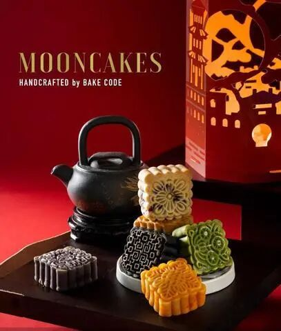 (原始链接: https://mmbiz.qpic.cn/mmbiz_jpg/4kibCXA1QiblQZIibkARVdibMg4iaQIicG46yOaNRnfJFDLRxCV8FiamsmWDn5QFrVTmeT7ViaY0nygDtvHVSJB8ccuHqg/640?wx_fmt=jpeg)
-  (原始链接: https://mmbiz.qpic.cn/mmbiz_png/4kibCXA1QiblQZIibkARVdibMg4iaQIicG46yOlT80WKp4YboLuQaDvKGDlKe15sDick9vUrmYJ9CCu210qxMjTOpnsNw/640?wx_fmt=png)
-  (原始链接: https://mmbiz.qpic.cn/mmbiz_jpg/4kibCXA1QiblQZIibkARVdibMg4iaQIicG46yO1I4cgumfzso4BhmOgdwmVJuPZTFbtIUkCLZ2iaoU7HHsKQ2RwyxL2wg/640?wx_fmt=jpeg)
-  (原始链接: https://mmbiz.qpic.cn/mmbiz_jpg/4kibCXA1QiblQZIibkARVdibMg4iaQIicG46yOeHNNZqppe8yK4ozvqYibNGoxO7tgtrtyia9zc84uib3n6yBEKD4dG7DCQ/640?wx_fmt=jpeg)
-  (原始链接: https://mmbiz.qpic.cn/mmbiz_jpg/4kibCXA1QiblQZIibkARVdibMg4iaQIicG46yOQOn0zHOUYdDQkiaMYH4jicwPDZj9lMWdXKkapt5rF4IkE3NO6Y7DluVQ/640?wx_fmt=jpeg)
- 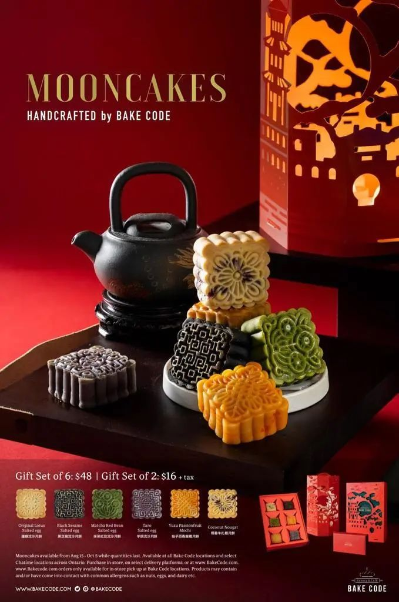 (原始链接: https://mmbiz.qpic.cn/mmbiz_jpg/4kibCXA1QiblQZIibkARVdibMg4iaQIicG46yO5T1l5cXicwQw1T0gULsbNVic9AiawUibI0QrZU9NwylVVhIVan0CHz1tsQ/640?wx_fmt=jpeg)
- 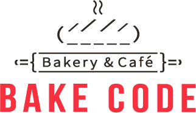 (原始链接: https://mmbiz.qpic.cn/mmbiz_png/4kibCXA1QiblQZIibkARVdibMg4iaQIicG46yOGlYBh4PF5sg48DoUOicYA2bP4RTfplUK75JpR0uzu8VyIlcqSCEian5A/640?wx_fmt=png)
- 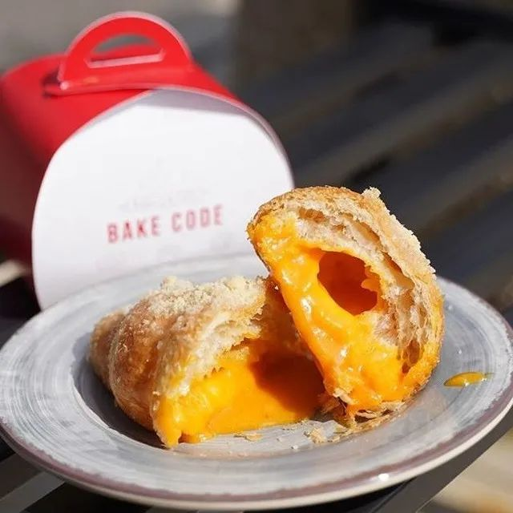 (原始链接: https://mmbiz.qpic.cn/mmbiz_jpg/4kibCXA1QiblQZIibkARVdibMg4iaQIicG46yOkmbq5DI50845ib4l8pot5icBPgn4w6EXhdQ51I2P8ZzerEIibuBiaJ5lWw/640?wx_fmt=jpeg)
- 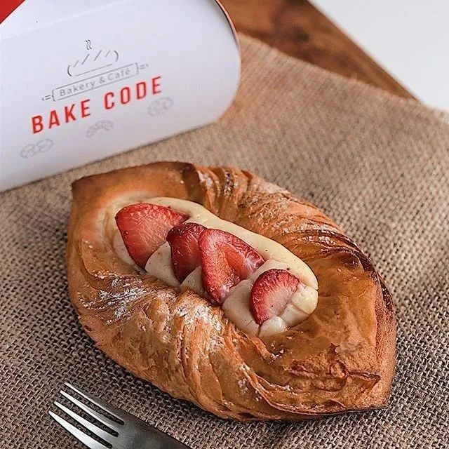 (原始链接: https://mmbiz.qpic.cn/mmbiz_jpg/4kibCXA1QiblQZIibkARVdibMg4iaQIicG46yOsDZPlmIibWl2lRmaWKNMicnltPoA62XfqNzkqwxsK4RWM0DPgj83t6pw/640?wx_fmt=jpeg)
- 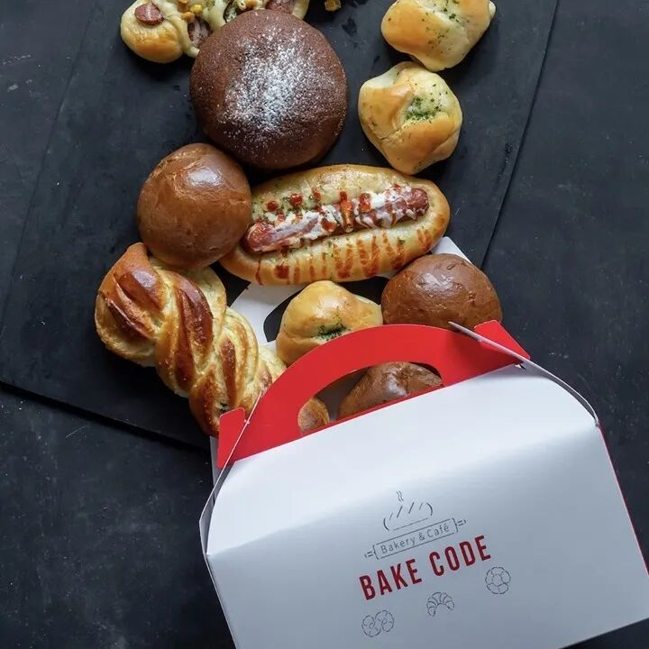 (原始链接: https://mmbiz.qpic.cn/mmbiz_jpg/4kibCXA1QiblQZIibkARVdibMg4iaQIicG46yOZUOdJuQY8vtibw0cibzwkuSic5cFfZ9aoPqu3jPBS7LSbFYT8WZ9w26Qg/640?wx_fmt=jpeg)
- 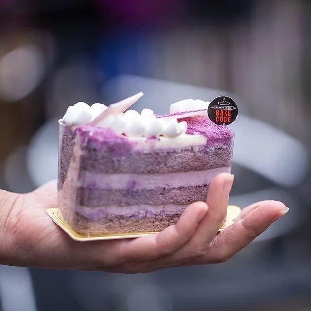 (原始链接: https://mmbiz.qpic.cn/mmbiz_jpg/4kibCXA1QiblQZIibkARVdibMg4iaQIicG46yOLKFRFqu0x5OKm3sJAFLR3MgHia4O8dgxylVWdONEmNS8ewqYwb6ictdw/640?wx_fmt=jpeg)
- 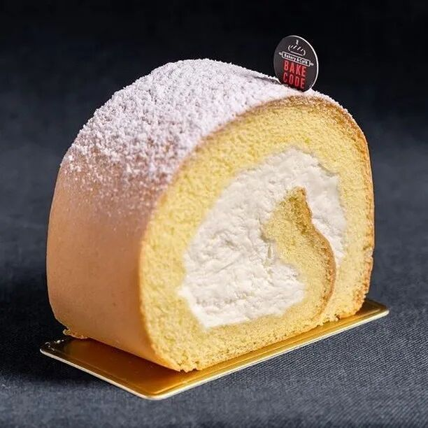 (原始链接: https://mmbiz.qpic.cn/mmbiz_jpg/4kibCXA1QiblQZIibkARVdibMg4iaQIicG46yO9yhYIMpPgdib7icWCh3p880UQLFNQAibXuG7w4Py90Aa59GjsCqgqu9kw/640?wx_fmt=jpeg)
- 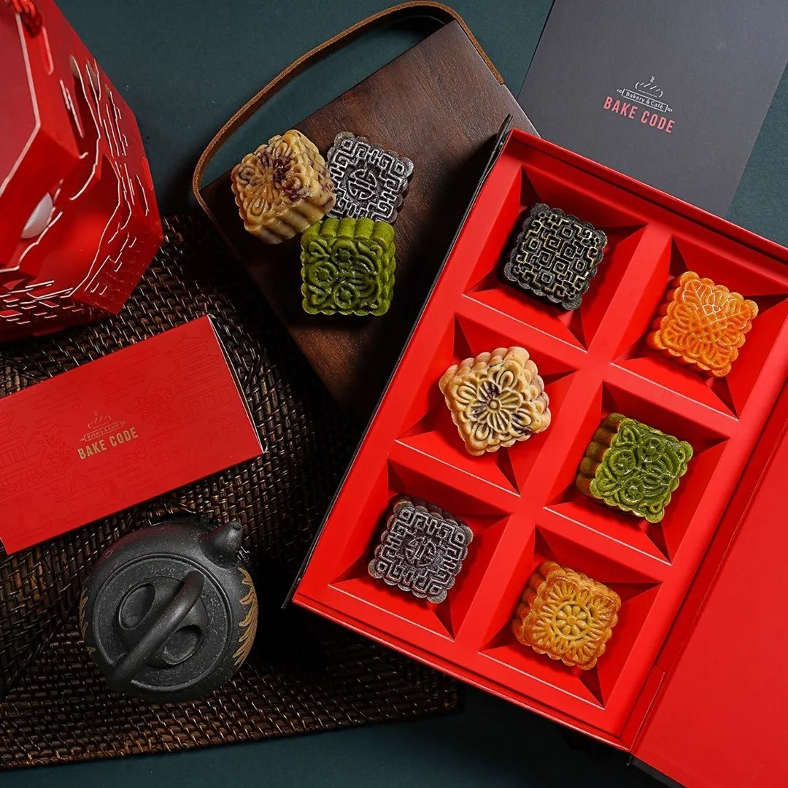 (原始链接: https://mmbiz.qpic.cn/mmbiz_jpg/4kibCXA1QiblQZIibkARVdibMg4iaQIicG46yOAZp9YoYk4zPibNNjzajoPBznUvyNG4AnhkP1KSOd3wco73rdBrnHicgA/640?wx_fmt=jpeg)
- 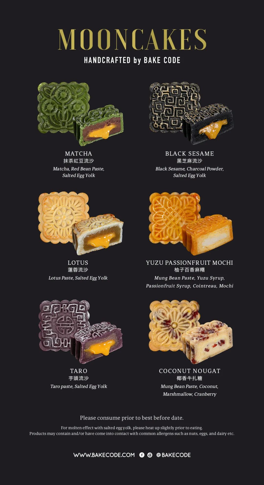 (原始链接: https://mmbiz.qpic.cn/mmbiz_jpg/4kibCXA1QiblQZIibkARVdibMg4iaQIicG46yOYcCqfSwTicy7iadTltbjwlf0bia6onicVpc8ADricAibluPgiaSH7A8kreSpg/640?wx_fmt=jpeg)
-  (原始链接: https://mmbiz.qpic.cn/sz_mmbiz_png/MVPvEL7Qg0EZzicmArliaFXTjjNpoiahMuyuO8VtAiadH9zX4gbLdMcaNBRUUmM8uaf4E8RGq5JhjTOTwjaall4MMA/640?wx_fmt=png)
- 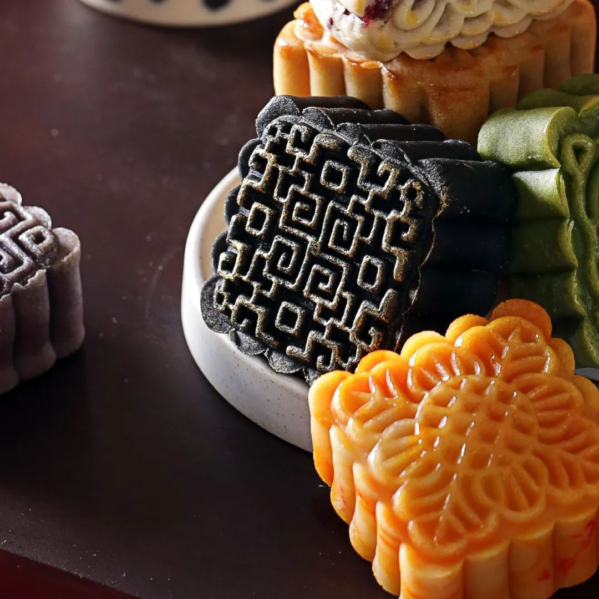 (原始链接: https://mmbiz.qpic.cn/mmbiz_jpg/4kibCXA1QiblQZIibkARVdibMg4iaQIicG46yOm56hpicZiaZwuibUlBAUBnG6fscl861COkAua8V1xrpdmNUUBxMJYlb0w/640?wx_fmt=jpeg)
- 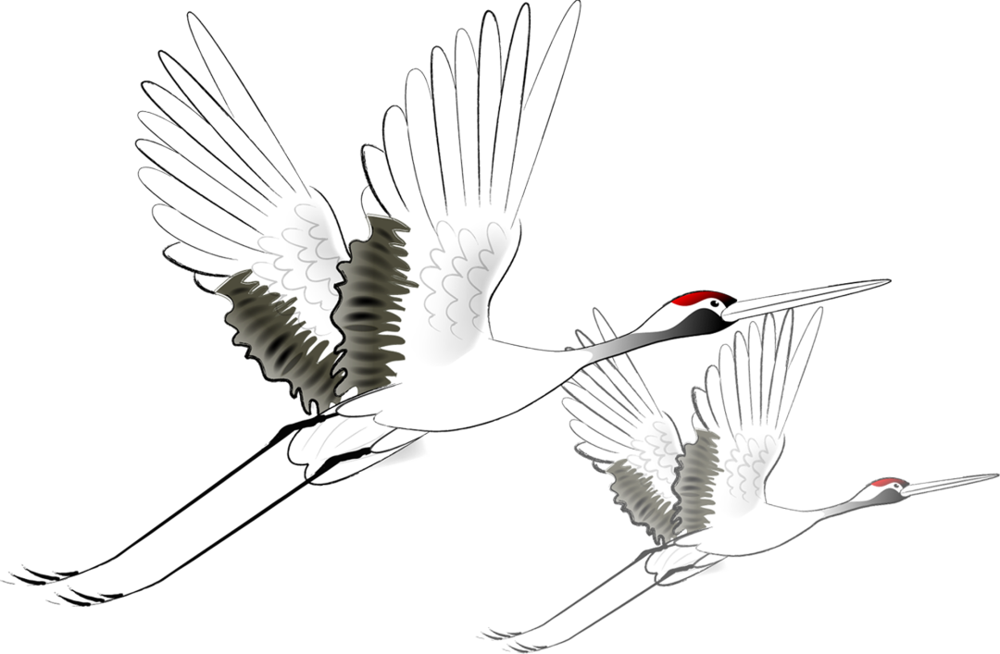 (原始链接: https://mmbiz.qpic.cn/mmbiz_png/KUf8GbdPia6AxH247zUyFe40QQJTNVwxetPiaRI7n6NtuT1GHYB4nFVuRNCJ4ceptiafE7GFzVibMwyVqIGvJWpS4g/640?wx_fmt=png)
- 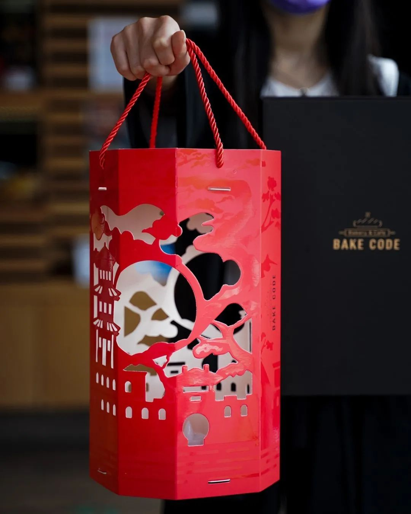 (原始链接: https://mmbiz.qpic.cn/mmbiz_jpg/4kibCXA1QiblQZIibkARVdibMg4iaQIicG46yOwabCgSeBa9V8J7OUmr37ib10tDrPiaWyjzW2eM2JmMDuqv8R64wPRBrA/640?wx_fmt=jpeg)
- 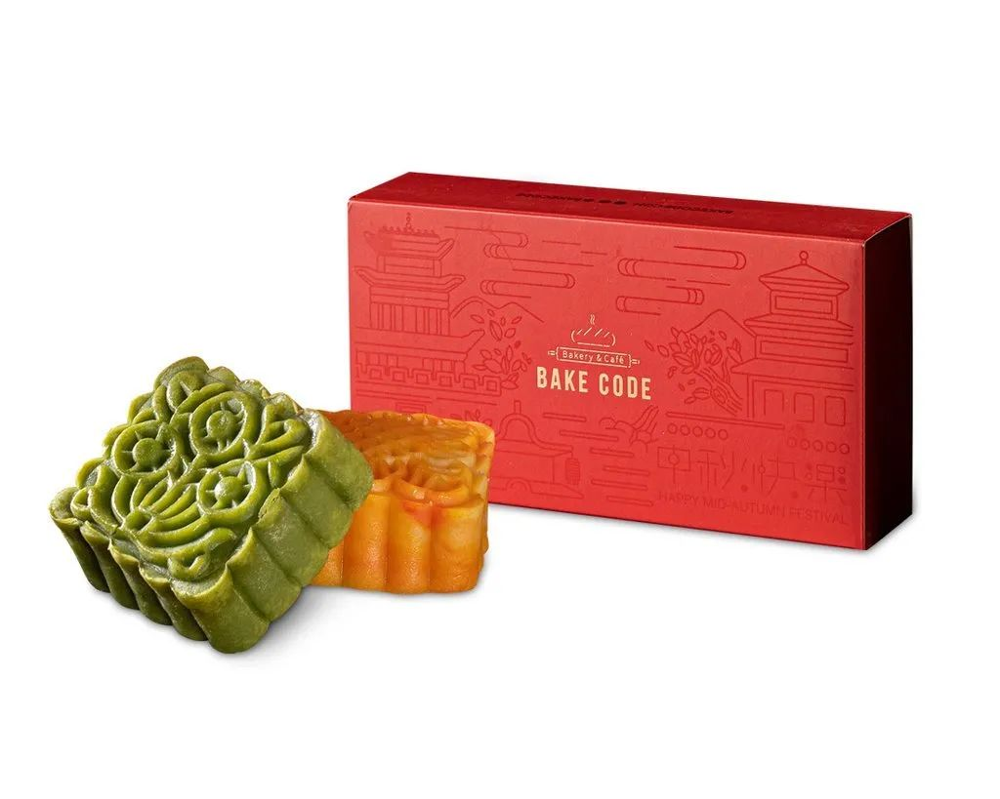 (原始链接: https://mmbiz.qpic.cn/mmbiz_jpg/4kibCXA1QiblQZIibkARVdibMg4iaQIicG46yOnxg9ibxiaGhcwDjRzUV4fZPtZBDulbIkpEzvYnsj9NicvAsPcdoliaOuaQ/640?wx_fmt=jpeg)
- 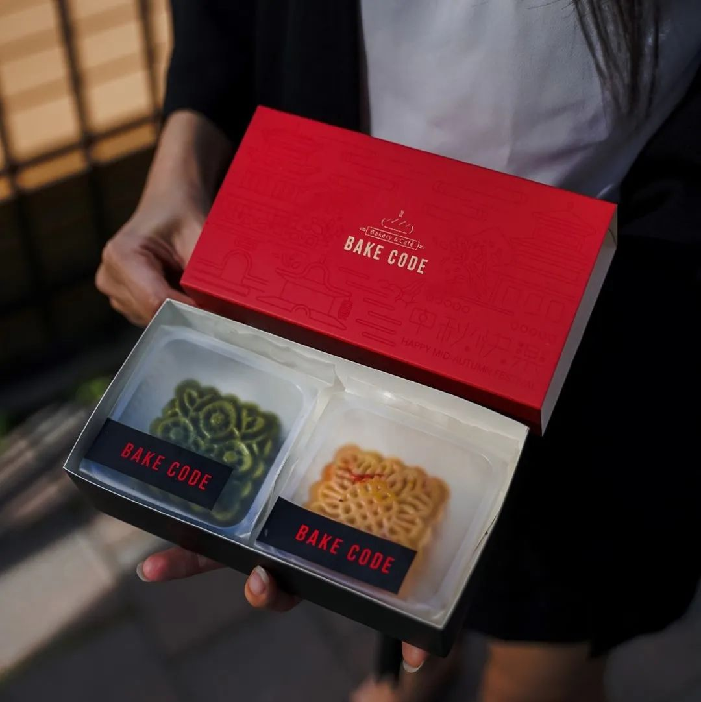 (原始链接: https://mmbiz.qpic.cn/mmbiz_jpg/4kibCXA1QiblQZIibkARVdibMg4iaQIicG46yO4elPnaEUYJz77FiaiciaGh4ibFyiaoibp7OVXf0unNqur6MsjXQtAQB5JUbg/640?wx_fmt=jpeg)
- 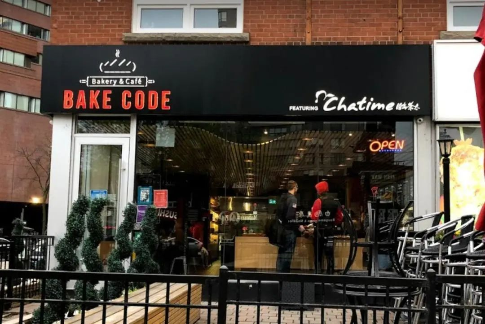 (原始链接: https://mmbiz.qpic.cn/mmbiz_jpg/4kibCXA1QiblQZIibkARVdibMg4iaQIicG46yO4d0H3PutVrB4IOnoV6aH41OHVyxtmB0ZyjSp8qUuv6a49HcJdgPRsg/640?wx_fmt=jpeg)
- 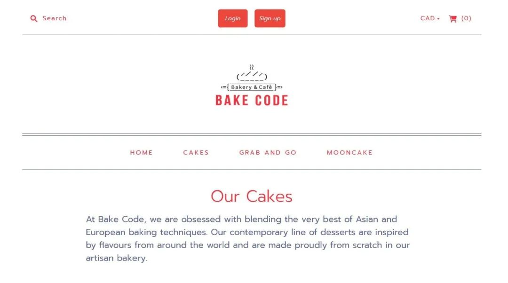 (原始链接: https://mmbiz.qpic.cn/mmbiz_jpg/4kibCXA1QiblQZIibkARVdibMg4iaQIicG46yOOibcyicsfPaDdX1954lJEIveWqwVgBlJ59a5k5iaLaeeSeQqMTVsiahicfg/640?wx_fmt=jpeg)
-  (原始链接: https://mmbiz.qpic.cn/mmbiz_png/4kibCXA1QiblQZIibkARVdibMg4iaQIicG46yOcXBBMPH5M2dLQRykEJJPXofHvRic8xDibHZRaD27z6d0qSR96ib8Isg1Q/640?wx_fmt=png)
-  (原始链接: https://mmbiz.qpic.cn/sz_mmbiz_png/MVPvEL7Qg0EZzicmArliaFXTjjNpoiahMuyuO8VtAiadH9zX4gbLdMcaNBRUUmM8uaf4E8RGq5JhjTOTwjaall4MMA/640?wx_fmt=png)
- 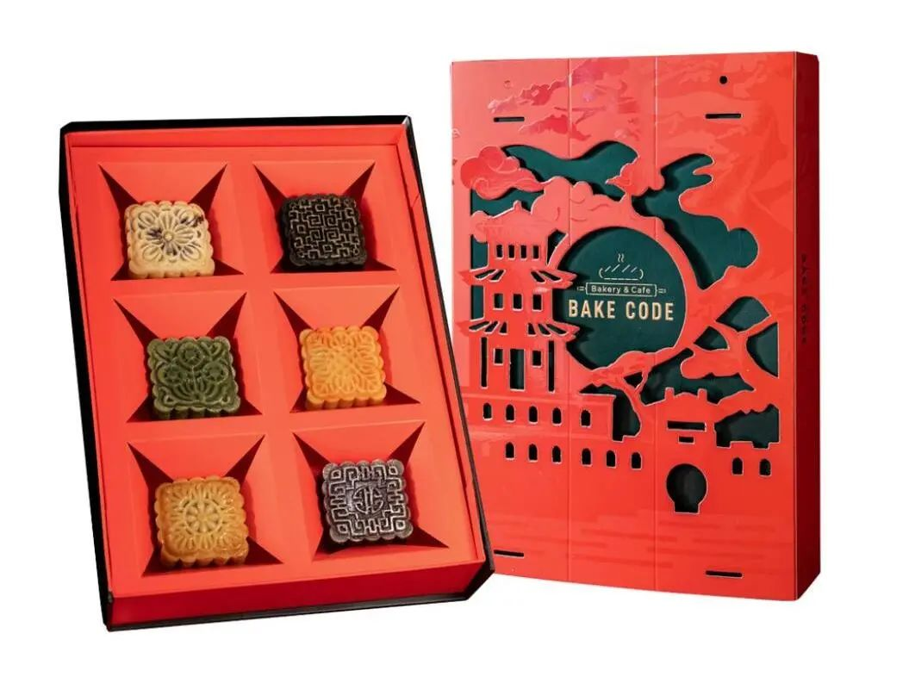 (原始链接: https://mmbiz.qpic.cn/mmbiz_jpg/4kibCXA1QiblQZIibkARVdibMg4iaQIicG46yOsmLvDgy2lPruC8S0TBibd8SwRaTEicxuHXklhnWeK6icoZ8Ln6LppkbYg/640?wx_fmt=jpeg)
-  (原始链接: https://mmbiz.qpic.cn/mmbiz_png/KUf8GbdPia6AxH247zUyFe40QQJTNVwxetPiaRI7n6NtuT1GHYB4nFVuRNCJ4ceptiafE7GFzVibMwyVqIGvJWpS4g/640?wx_fmt=png)
- 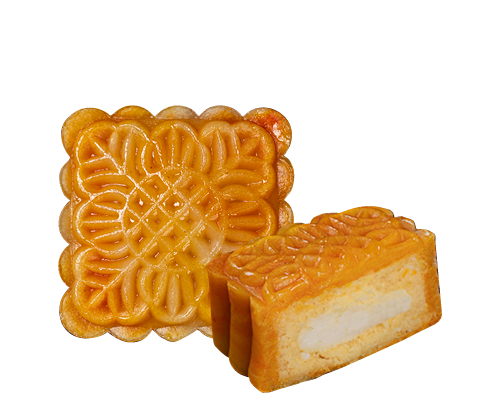 (原始链接: https://mmbiz.qpic.cn/mmbiz_png/4kibCXA1QiblQZIibkARVdibMg4iaQIicG46yOx3eRTLJkrXamNTX0jIvvBHmJFibjFqWOO9J7AUiauHrUxjwIXiaLorusg/640?wx_fmt=png)
