# 无标题

**链接地址:** http://mp.weixin.qq.com/s?__biz=MzIzODc2NzU4NA==&mid=2247527996&idx=6&sn=dc1e651098b221732a6dae047848c0ec&chksm=e93672b3de41fba5937f26b63bf727581b88bc3fbab2f60dc9370d9646e2090007846c875cfc&mpshare=1&scene=2&srcid=1001eaTfGZhzkHNyGXxzfmcS&sharer_sharetime=1601505777259&sharer_shareid=be1c8edd6c93eec155a61c876e41d26a#rd
**作者:** 妮娜
**获取时间:** 2025/8/28 20:05:06
**图片数量:** 22

---

## 原始HTML内容

 

 

 

 
<section style="display: none;" data-tools="新媒体管家" data-label="powered by xmt.cn"> </section><section style="box-sizing: border-box;font-style: normal;font-weight: 400;text-align: justify;font-size: 16px;"><section style="margin: 10px 0%;box-sizing: border-box;" powered-by="xiumi.us"><section style="font-size: 15px;letter-spacing: 0px;line-height: 2;padding: 0px 15px;box-sizing: border-box;">
 

2020年的国际市场着实扑朔迷离。从年初的澳洲火灾，到随后的新冠疫情，美股熔断，油价暴跌等等劫难，让这个世界<strong style="box-sizing: border-box;">到处都在经历着前所未有的严峻挑战</strong>。

 
</section></section><section style="text-align: center;margin-top: 10px;margin-bottom: 10px;box-sizing: border-box;" powered-by="xiumi.us"><section style="max-width: 100%;vertical-align: middle;display: inline-block;line-height: 0;box-sizing: border-box;"></section></section><section style="margin: 10px 0%;box-sizing: border-box;" powered-by="xiumi.us"><section style="font-size: 15px;letter-spacing: 0px;line-height: 2;padding: 0px 15px;box-sizing: border-box;">
 

而对于加拿大来说更是极其艰难。前天，多伦多的新冠病例数日增已突破700例，今天也有500多例，城市随即离<strong style="box-sizing: border-box;">进入紧急封城状态只有一步之遥</strong>。

 

<strong style="box-sizing: border-box;">比第一波疫情还要猛烈的第二波疫情让人看不到一切恢复如常的希望。</strong>

 

尽管官方已在极力阻止疫情导致的封城，但如此严重的病情早已导致了民众<strong style="box-sizing: border-box;">严重下跌的消费意愿</strong>。

 
</section></section><section style="text-align: center;margin-top: 10px;margin-bottom: 10px;box-sizing: border-box;" powered-by="xiumi.us"><section style="max-width: 100%;vertical-align: middle;display: inline-block;line-height: 0;box-sizing: border-box;"></section></section><section style="margin: 10px 0%;box-sizing: border-box;" powered-by="xiumi.us"><section style="font-size: 15px;letter-spacing: 0px;line-height: 2;padding: 0px 15px;box-sizing: border-box;">
 

全加范围内的经济形势都异常低迷，今年进入倒闭清算或者缩减规模的公司数量更是<strong style="box-sizing: border-box;">创纪录的飙升</strong>。

 

然而在疫情的影响下，这个社会也开<strong style="box-sizing: border-box;">创出了许多新兴的市场需求和行业风口</strong>。一些企业因其特殊的经营理念和产品提供而在这样的风口迅速起飞，<strong style="box-sizing: border-box;">逆市创造出了公司扩张的神话</strong>。

 
</section></section><section style="text-align: center;margin-top: 10px;margin-bottom: 10px;box-sizing: border-box;" powered-by="xiumi.us"><section style="max-width: 100%;vertical-align: middle;display: inline-block;line-height: 0;box-sizing: border-box;"></section></section><section style="margin: 10px 0%;box-sizing: border-box;" powered-by="xiumi.us"><section style="font-size: 15px;letter-spacing: 0px;line-height: 2;padding: 0px 15px;box-sizing: border-box;">
 

根据《环球邮报》（The Global and Mail）近日整理出的<strong style="box-sizing: border-box;">加拿大2020年增长最迅速的公司名单</strong>，三年内业务<strong style="box-sizing: border-box;">收入增长突破1000%的新公司</strong>比比皆是。

 

他们到底是怎样在如此恶劣的经济环境下做出这样傲人成绩的？今天就随着我们整理的 Top 10名单一起解读，<strong style="box-sizing: border-box;">看看下一个行业风口，会集中在哪些领域？</strong>

 

 
</section></section><section style="box-sizing: border-box;" powered-by="xiumi.us"><section style="display: flex;flex-flow: row nowrap;margin: 10px 0%;box-sizing: border-box;"><section style="display: inline-block;vertical-align: middle;width: auto;align-self: center;flex: 100 100 0%;box-sizing: border-box;"><section style="transform: perspective(0px);-webkit-transform: perspective(0px);-moz-transform: perspective(0px);-o-transform: perspective(0px);transform-style: flat;box-sizing: border-box;" powered-by="xiumi.us"><section style="margin: 0px 0%;transform: rotateY(180deg);-webkit-transform: rotateY(180deg);-moz-transform: rotateY(180deg);-o-transform: rotateY(180deg);box-sizing: border-box;"><section style="background-image: linear-gradient(90deg, rgba(252, 239, 193, 0) 0%, rgb(211, 179, 115) 9%, rgb(211, 179, 115) 50%, rgba(252, 239, 193, 0) 100%);height: 1px;box-sizing: border-box;"><svg viewBox="0 0 1 1" style="float:left;line-height:0;width:0;vertical-align:top;"></svg></section></section></section></section><section style="display: inline-block;vertical-align: middle;width: auto;flex: 0 0 auto;align-self: center;min-width: 10%;max-width: 100%;height: auto;margin: 0px 10px;box-sizing: border-box;"><section style="font-size: 17px;line-height: 1.8;letter-spacing: 1px;padding: 0px;box-sizing: border-box;" powered-by="xiumi.us">
<strong style="box-sizing: border-box;">2020年加拿大发展最快公司Top 10</strong>
</section></section><section style="display: inline-block;vertical-align: middle;width: auto;align-self: center;flex: 100 100 0%;box-sizing: border-box;"><section style="margin: 0px 0%;box-sizing: border-box;" powered-by="xiumi.us"><section style="background-image: linear-gradient(90deg, rgba(252, 239, 193, 0) 0%, rgb(211, 179, 115) 9%, rgb(211, 179, 115) 50%, rgba(252, 239, 193, 0) 100%);height: 1px;box-sizing: border-box;"><svg viewBox="0 0 1 1" style="float:left;line-height:0;width:0;vertical-align:top;"></svg></section></section></section></section></section><section style="box-sizing: border-box;" powered-by="xiumi.us">
 
</section><section style="margin: 10px 0%;box-sizing: border-box;" powered-by="xiumi.us"><section style="display: inline-block;width: 100%;vertical-align: top;background-color: rgb(246, 246, 246);box-sizing: border-box;"><section style="box-sizing: border-box;" powered-by="xiumi.us"><section style="display: flex;flex-flow: row nowrap;box-sizing: border-box;"><section style="display: inline-block;vertical-align: middle;width: auto;flex: 0 0 0%;align-self: center;height: auto;box-sizing: border-box;"><section style="text-align: center;box-sizing: border-box;" powered-by="xiumi.us"><section style="display: inline-block;width: 33px;height: 33px;vertical-align: top;overflow: hidden;background-color: rgb(224, 70, 70);box-sizing: border-box;"><section style="color: rgb(255, 255, 255);font-size: 18px;line-height: 2;letter-spacing: 0px;box-sizing: border-box;" powered-by="xiumi.us">
<strong style="box-sizing: border-box;">10</strong>
</section></section></section></section><section style="display: inline-block;vertical-align: middle;width: auto;align-self: center;flex: 100 100 0%;box-sizing: border-box;"><section style="color: rgb(224, 70, 70);padding: 0px 10px;box-sizing: border-box;" powered-by="xiumi.us">
<strong style="box-sizing: border-box;">Exzell Pharma Inc.</strong>
</section></section></section></section></section></section><section style="text-align: center;margin-top: 10px;margin-bottom: 10px;box-sizing: border-box;" powered-by="xiumi.us"><section style="max-width: 100%;vertical-align: middle;display: inline-block;line-height: 0;box-sizing: border-box;"></section></section><section style="margin: 10px 0%;box-sizing: border-box;" powered-by="xiumi.us"><section style="font-size: 15px;letter-spacing: 0px;line-height: 2;padding: 0px 15px;box-sizing: border-box;">
 

Exzell Pharma是一家针对特定顾客群体的制药公司。他们向加拿大市场出售药品和天然保健产品。Exzell Pharma由一位在世界顶尖医疗中心梅奥诊所医学中心接受培训的肠胃病学家创立。值得一提的是，这一家只有12名员工的小型私有企业，总部位于安大略省万锦市。 

 
</section></section><section style="text-align: center;margin-top: 10px;margin-bottom: 10px;box-sizing: border-box;" powered-by="xiumi.us"><section style="max-width: 100%;vertical-align: middle;display: inline-block;line-height: 0;width: 60%;height: auto;box-sizing: border-box;"></section></section><section style="margin: 10px 0%;box-sizing: border-box;" powered-by="xiumi.us"><section style="text-align: center;font-size: 12px;letter-spacing: 0px;line-height: 2;padding: 0px 15px;color: rgb(121, 121, 121);box-sizing: border-box;">
由Exzell Pharma研发的包含七种天然草药成分的胃药
</section></section><section style="margin: 10px 0%;box-sizing: border-box;" powered-by="xiumi.us"><section style="font-size: 15px;letter-spacing: 0px;line-height: 2;padding: 0px 15px;box-sizing: border-box;">
 
</section></section><section style="box-sizing: border-box;" powered-by="xiumi.us"><section style="display: flex;flex-flow: row nowrap;box-sizing: border-box;"><section style="display: inline-block;vertical-align: middle;width: auto;flex: 0 0 0%;align-self: center;height: auto;box-sizing: border-box;"><section style="text-align: center;box-sizing: border-box;" powered-by="xiumi.us"><section style="display: inline-block;width: 33px;height: 33px;vertical-align: top;overflow: hidden;background-color: rgb(224, 70, 70);box-sizing: border-box;"><section style="color: rgb(255, 255, 255);font-size: 18px;line-height: 2;letter-spacing: 0px;box-sizing: border-box;" powered-by="xiumi.us">
<strong style="box-sizing: border-box;">9</strong>
</section></section></section></section><section style="display: inline-block;vertical-align: middle;width: auto;align-self: center;flex: 100 100 0%;box-sizing: border-box;"><section style="color: rgb(224, 70, 70);padding: 0px 10px;box-sizing: border-box;" powered-by="xiumi.us">
<strong style="box-sizing: border-box;">LBC Studios&nbsp;</strong>
</section></section></section></section><section style="text-align: center;margin-top: 10px;margin-bottom: 10px;box-sizing: border-box;" powered-by="xiumi.us"><section style="max-width: 100%;vertical-align: middle;display: inline-block;line-height: 0;box-sizing: border-box;"></section></section><section style="margin: 10px 0%;box-sizing: border-box;" powered-by="xiumi.us"><section style="font-size: 15px;letter-spacing: 0px;line-height: 2;padding: 0px 15px;box-sizing: border-box;">
 

LBC Studios是由Solon Bucholtz和Dennis Molloy于2015年在不列颠哥伦比亚省兰利成立的独立游戏工作室。LBC最初成立是为了创建和开发高制作成本，以大麻为主题的手机游戏。 

 
</section></section><section style="text-align: center;margin-top: 10px;margin-bottom: 10px;box-sizing: border-box;" powered-by="xiumi.us"><section style="max-width: 100%;vertical-align: middle;display: inline-block;line-height: 0;box-sizing: border-box;"></section></section><section style="margin: 10px 0%;box-sizing: border-box;" powered-by="xiumi.us"><section style="text-align: center;font-size: 12px;letter-spacing: 0px;line-height: 2;padding: 0px 15px;color: rgb(121, 121, 121);box-sizing: border-box;">
由LBC Studios参与制作的手机游戏Hempire
</section></section><section style="box-sizing: border-box;" powered-by="xiumi.us">
 
</section><section style="box-sizing: border-box;" powered-by="xiumi.us"><section style="display: flex;flex-flow: row nowrap;box-sizing: border-box;"><section style="display: inline-block;vertical-align: middle;width: auto;flex: 0 0 0%;align-self: center;height: auto;box-sizing: border-box;"><section style="text-align: center;box-sizing: border-box;" powered-by="xiumi.us"><section style="display: inline-block;width: 33px;height: 33px;vertical-align: top;overflow: hidden;background-color: rgb(224, 70, 70);box-sizing: border-box;"><section style="color: rgb(255, 255, 255);font-size: 18px;line-height: 2;letter-spacing: 0px;box-sizing: border-box;" powered-by="xiumi.us">
<strong style="box-sizing: border-box;">8</strong>
</section></section></section></section><section style="display: inline-block;vertical-align: middle;width: auto;align-self: center;flex: 100 100 0%;box-sizing: border-box;"><section style="color: rgb(224, 70, 70);padding: 0px 10px;box-sizing: border-box;" powered-by="xiumi.us">
<strong style="box-sizing: border-box;">Smash + Tess</strong>
</section></section></section></section><section style="text-align: center;margin-top: 10px;margin-bottom: 10px;box-sizing: border-box;" powered-by="xiumi.us"><section style="max-width: 100%;vertical-align: middle;display: inline-block;line-height: 0;box-sizing: border-box;"></section></section><section style="margin: 10px 0%;box-sizing: border-box;" powered-by="xiumi.us"><section style="font-size: 15px;letter-spacing: 0px;line-height: 2;padding: 0px 15px;box-sizing: border-box;">
 

Smash+Tess是一家成立于温哥华的服装零售公司。该品牌最畅销的Romper面料是采用竹纤维和棉纤维混纺制成的可持续人造丝，并且在北美进行生产。该公司在倡导精致慢生活的品牌理念上塑造地非常成功，在互联网社区中拥有一大票忠实的拥簇。

 
</section></section><section style="box-sizing: border-box;" powered-by="xiumi.us"><section style="display: flex;flex-flow: row nowrap;box-sizing: border-box;"><section style="display: inline-block;vertical-align: middle;width: auto;flex: 0 0 0%;align-self: center;height: auto;box-sizing: border-box;"><section style="text-align: center;box-sizing: border-box;" powered-by="xiumi.us"><section style="display: inline-block;width: 33px;height: 33px;vertical-align: top;overflow: hidden;background-color: rgb(224, 70, 70);box-sizing: border-box;"><section style="color: rgb(255, 255, 255);font-size: 18px;line-height: 2;letter-spacing: 0px;box-sizing: border-box;" powered-by="xiumi.us">
<strong style="box-sizing: border-box;">7</strong>
</section></section></section></section><section style="display: inline-block;vertical-align: middle;width: auto;align-self: center;flex: 100 100 0%;box-sizing: border-box;"><section style="color: rgb(224, 70, 70);padding: 0px 10px;box-sizing: border-box;" powered-by="xiumi.us">
<strong style="box-sizing: border-box;">Dialogue</strong>
</section></section></section></section><section style="text-align: center;margin-top: 10px;margin-bottom: 10px;box-sizing: border-box;" powered-by="xiumi.us"><section style="max-width: 100%;vertical-align: middle;display: inline-block;line-height: 0;box-sizing: border-box;"></section></section><section style="margin: 10px 0%;box-sizing: border-box;" powered-by="xiumi.us"><section style="font-size: 15px;letter-spacing: 0px;line-height: 2;padding: 0px 15px;box-sizing: border-box;">
 

疫情在加国的传播给需要门诊看病的病人制造了许多困难，而对远程在线医疗服务的需求在瞬间暴涨至巅峰。Dialogue就是在这样环境下驶入发展快车道的公司之一。

 

该公司不仅提供个人服务，还针对商业团体提供咨询。并且除了传统身体疾病，该公司更着重于精神疾病方面的问诊。

 
</section></section><section style="box-sizing: border-box;" powered-by="xiumi.us"><section style="display: flex;flex-flow: row nowrap;box-sizing: border-box;"><section style="display: inline-block;vertical-align: middle;width: auto;flex: 0 0 0%;align-self: center;height: auto;box-sizing: border-box;"><section style="text-align: center;box-sizing: border-box;" powered-by="xiumi.us"><section style="display: inline-block;width: 33px;height: 33px;vertical-align: top;overflow: hidden;background-color: rgb(224, 70, 70);box-sizing: border-box;"><section style="color: rgb(255, 255, 255);font-size: 18px;line-height: 2;letter-spacing: 0px;box-sizing: border-box;" powered-by="xiumi.us">
<strong style="box-sizing: border-box;">6</strong>
</section></section></section></section><section style="display: inline-block;vertical-align: middle;width: auto;align-self: center;flex: 100 100 0%;box-sizing: border-box;"><section style="color: rgb(224, 70, 70);padding: 0px 10px;box-sizing: border-box;" powered-by="xiumi.us">
<strong style="box-sizing: border-box;">Flexiti&nbsp;</strong>
</section></section></section></section><section style="text-align: center;margin-top: 10px;margin-bottom: 10px;box-sizing: border-box;" powered-by="xiumi.us"><section style="max-width: 100%;vertical-align: middle;display: inline-block;line-height: 0;box-sizing: border-box;"></section></section><section style="margin: 10px 0%;box-sizing: border-box;" powered-by="xiumi.us"><section style="font-size: 15px;letter-spacing: 0px;line-height: 2;padding: 0px 15px;box-sizing: border-box;">
 

Flexiti是一家成立于2013年的多伦多金融科技公司。这家公司为零售消费者提供小额贷款服务，主打的是极其迅速的贷款审批过程和低至无息的贷款金额。目前Flexiti在全国和近5000个零售地点进行合作，拥有超过一百万的用户群体。

 
</section></section><section style="text-align: center;margin-top: 10px;margin-bottom: 10px;box-sizing: border-box;" powered-by="xiumi.us"><section style="max-width: 100%;vertical-align: middle;display: inline-block;line-height: 0;box-sizing: border-box;"></section></section><section style="margin: 10px 0%;box-sizing: border-box;" powered-by="xiumi.us"><section style="font-size: 15px;letter-spacing: 0px;line-height: 2;padding: 0px 15px;box-sizing: border-box;">
 
</section></section><section style="box-sizing: border-box;" powered-by="xiumi.us"><section style="display: flex;flex-flow: row nowrap;box-sizing: border-box;"><section style="display: inline-block;vertical-align: middle;width: auto;flex: 0 0 0%;align-self: center;height: auto;box-sizing: border-box;"><section style="text-align: center;box-sizing: border-box;" powered-by="xiumi.us"><section style="display: inline-block;width: 33px;height: 33px;vertical-align: top;overflow: hidden;background-color: rgb(224, 70, 70);box-sizing: border-box;"><section style="color: rgb(255, 255, 255);font-size: 18px;line-height: 2;letter-spacing: 0px;box-sizing: border-box;" powered-by="xiumi.us">
<strong style="box-sizing: border-box;">5</strong>
</section></section></section></section><section style="display: inline-block;vertical-align: middle;width: auto;align-self: center;flex: 100 100 0%;box-sizing: border-box;"><section style="color: rgb(224, 70, 70);padding: 0px 10px;box-sizing: border-box;" powered-by="xiumi.us">
<strong style="box-sizing: border-box;">Fuelled&nbsp;</strong>
</section></section></section></section><section style="text-align: center;margin-top: 10px;margin-bottom: 10px;box-sizing: border-box;" powered-by="xiumi.us"><section style="max-width: 100%;vertical-align: middle;display: inline-block;line-height: 0;box-sizing: border-box;"></section></section><section style="margin: 10px 0%;box-sizing: border-box;" powered-by="xiumi.us"><section style="font-size: 15px;letter-spacing: 0px;line-height: 2;padding: 0px 15px;box-sizing: border-box;">
 

这个年头在互联网上交易什么东西都不显得奇怪。来自卡尔加里的Fuelled公司，正是为各种与石油相关的器械打造了一个线上交易的平台，用仅有的8位员工，巧妙地通过满足这样看似小众但极其高涨的需求而在短期内获取了爆发式的增长。

 
</section></section><section style="box-sizing: border-box;" powered-by="xiumi.us"><section style="display: flex;flex-flow: row nowrap;box-sizing: border-box;"><section style="display: inline-block;vertical-align: middle;width: auto;flex: 0 0 0%;align-self: center;height: auto;box-sizing: border-box;"><section style="text-align: center;box-sizing: border-box;" powered-by="xiumi.us"><section style="display: inline-block;width: 33px;height: 33px;vertical-align: top;overflow: hidden;background-color: rgb(224, 70, 70);box-sizing: border-box;"><section style="color: rgb(255, 255, 255);font-size: 18px;line-height: 2;letter-spacing: 0px;box-sizing: border-box;" powered-by="xiumi.us">
<strong style="box-sizing: border-box;">4</strong>
</section></section></section></section><section style="display: inline-block;vertical-align: middle;width: auto;align-self: center;flex: 100 100 0%;box-sizing: border-box;"><section style="color: rgb(224, 70, 70);padding: 0px 10px;box-sizing: border-box;" powered-by="xiumi.us">
<strong style="box-sizing: border-box;">Mistplay&nbsp;</strong>
</section></section></section></section><section style="text-align: center;margin-top: 10px;margin-bottom: 10px;box-sizing: border-box;" powered-by="xiumi.us"><section style="max-width: 100%;vertical-align: middle;display: inline-block;line-height: 0;box-sizing: border-box;"></section></section><section style="margin: 10px 0%;box-sizing: border-box;" powered-by="xiumi.us"><section style="font-size: 15px;letter-spacing: 0px;line-height: 2;padding: 0px 15px;box-sizing: border-box;">
 

大家都知道玩游戏需要花钱，但你想过通过利用自己的碎片时间去玩游戏从而赚钱的吗？来自蒙特利尔的Mistplay公司正是通过利用这样的逆向思维，打造了一个用户过百万的特殊游戏品牌。

 

而且公司还推出一款通过玩游戏种植真正的树木的生态游戏。这样的营销理念…额，虽然好像或许可能在哪里听过，但移植过来水土都服，真是赢很大呢。

 
</section></section><section style="text-align: center;margin-top: 10px;margin-bottom: 10px;box-sizing: border-box;" powered-by="xiumi.us"><section style="max-width: 100%;vertical-align: middle;display: inline-block;line-height: 0;box-sizing: border-box;"></section></section><section style="box-sizing: border-box;" powered-by="xiumi.us">
 
</section><section style="box-sizing: border-box;" powered-by="xiumi.us"><section style="display: flex;flex-flow: row nowrap;box-sizing: border-box;"><section style="display: inline-block;vertical-align: middle;width: auto;flex: 0 0 0%;align-self: center;height: auto;box-sizing: border-box;"><section style="text-align: center;box-sizing: border-box;" powered-by="xiumi.us"><section style="display: inline-block;width: 33px;height: 33px;vertical-align: top;overflow: hidden;background-color: rgb(224, 70, 70);box-sizing: border-box;"><section style="color: rgb(255, 255, 255);font-size: 18px;line-height: 2;letter-spacing: 0px;box-sizing: border-box;" powered-by="xiumi.us">
<strong style="box-sizing: border-box;">3</strong>
</section></section></section></section><section style="display: inline-block;vertical-align: middle;width: auto;align-self: center;flex: 100 100 0%;box-sizing: border-box;"><section style="color: rgb(224, 70, 70);padding: 0px 10px;box-sizing: border-box;" powered-by="xiumi.us">
<strong style="box-sizing: border-box;">Vitalis Extraction Technology Inc.&nbsp;</strong>
</section></section></section></section><section style="text-align: center;margin-top: 10px;margin-bottom: 10px;box-sizing: border-box;" powered-by="xiumi.us"><section style="max-width: 100%;vertical-align: middle;display: inline-block;line-height: 0;box-sizing: border-box;"></section></section><section style="margin: 10px 0%;box-sizing: border-box;" powered-by="xiumi.us"><section style="font-size: 15px;letter-spacing: 0px;line-height: 2;padding: 0px 15px;box-sizing: border-box;">
 

Vitalis Extraction Technology Inc. 是一家拥有专利的提供超临界二氧化碳提取技术和设备的制造公司。该公司不仅是行业内标杆性的存在，更是为这个工业领域制定了艰巨安全性和可持续性发展的行业标准，为这项技术大规模工业化普及成为可能。该技术目前被广泛应用于石油天然气、水利甚至副食制造等方面。
</section></section><section style="margin: 10px 0%;box-sizing: border-box;" powered-by="xiumi.us"><section style="font-size: 15px;letter-spacing: 0px;line-height: 2;padding: 0px 15px;box-sizing: border-box;">
 
</section></section><section style="box-sizing: border-box;" powered-by="xiumi.us"><section style="display: flex;flex-flow: row nowrap;box-sizing: border-box;"><section style="display: inline-block;vertical-align: middle;width: auto;flex: 0 0 0%;align-self: center;height: auto;box-sizing: border-box;"><section style="text-align: center;box-sizing: border-box;" powered-by="xiumi.us"><section style="display: inline-block;width: 33px;height: 33px;vertical-align: top;overflow: hidden;background-color: rgb(224, 70, 70);box-sizing: border-box;"><section style="color: rgb(255, 255, 255);font-size: 18px;line-height: 2;letter-spacing: 0px;box-sizing: border-box;" powered-by="xiumi.us">
<strong style="box-sizing: border-box;">2</strong>
</section></section></section></section><section style="display: inline-block;vertical-align: middle;width: auto;align-self: center;flex: 100 100 0%;box-sizing: border-box;"><section style="color: rgb(224, 70, 70);padding: 0px 10px;box-sizing: border-box;" powered-by="xiumi.us">
<strong style="box-sizing: border-box;">Nova Leap Health Corp.&nbsp;</strong>
</section></section></section></section><section style="text-align: center;margin-top: 10px;margin-bottom: 10px;box-sizing: border-box;" powered-by="xiumi.us"><section style="max-width: 100%;vertical-align: middle;display: inline-block;line-height: 0;box-sizing: border-box;"></section></section><section style="margin: 10px 0%;box-sizing: border-box;" powered-by="xiumi.us"><section style="font-size: 15px;letter-spacing: 0px;line-height: 2;padding: 0px 15px;box-sizing: border-box;">
 

Nova Leap Health Corp.是一家成立于新斯科舍省首府哈利法克斯的个人家庭护理和支持服务的国际公司。他们通过收购，管理和建立家庭护理服务公司，为残障人士及老年人提供全方位的家庭和健康护理服务。

 

养老行业确实是公认的行业风口了。还没想好做点啥的朋友们，投它？

 
</section></section><section style="text-align: center;margin-top: 10px;margin-bottom: 10px;box-sizing: border-box;" powered-by="xiumi.us"><section style="max-width: 100%;vertical-align: middle;display: inline-block;line-height: 0;box-sizing: border-box;"></section></section><section style="box-sizing: border-box;" powered-by="xiumi.us">
 
</section><section style="box-sizing: border-box;" powered-by="xiumi.us">
 
</section><section style="box-sizing: border-box;" powered-by="xiumi.us"><section style="display: flex;flex-flow: row nowrap;box-sizing: border-box;"><section style="display: inline-block;vertical-align: middle;width: auto;flex: 0 0 0%;align-self: center;height: auto;box-sizing: border-box;"><section style="text-align: center;box-sizing: border-box;" powered-by="xiumi.us"><section style="display: inline-block;width: 33px;height: 33px;vertical-align: top;overflow: hidden;background-color: rgb(224, 70, 70);box-sizing: border-box;"><section style="color: rgb(255, 255, 255);font-size: 18px;line-height: 2;letter-spacing: 0px;box-sizing: border-box;" powered-by="xiumi.us">
<strong style="box-sizing: border-box;">1</strong>
</section></section></section></section><section style="display: inline-block;vertical-align: middle;width: auto;align-self: center;flex: 100 100 0%;box-sizing: border-box;"><section style="color: rgb(224, 70, 70);padding: 0px 10px;box-sizing: border-box;" powered-by="xiumi.us">
<strong style="box-sizing: border-box;">Rx Drug Mart&nbsp;</strong>
</section></section></section></section><section style="text-align: center;margin-top: 10px;margin-bottom: 10px;box-sizing: border-box;" powered-by="xiumi.us"><section style="max-width: 100%;vertical-align: middle;display: inline-block;line-height: 0;box-sizing: border-box;"></section></section><section style="margin: 10px 0%;box-sizing: border-box;" powered-by="xiumi.us"><section style="font-size: 15px;letter-spacing: 0px;line-height: 2;padding: 0px 15px;box-sizing: border-box;">
 

Rx Drug Mart 是一家成立于多伦多地区的连锁药房。该公司看准了当年婴儿潮时期出生的大量人群目前涌入退休阶段而对医药业带来的繁荣增长，机智地采取从农村包围城市的打法。

 

他们专门深入那些大药房不够开设资格的小村镇，在短期内取得大量民众基础，更是在疫情起价迅速增长，取得了巨大的商业成功，达成了3年内营业额暴增近140倍的行业神话。

 
</section></section><section style="text-align: center;margin-top: 10px;margin-bottom: 10px;box-sizing: border-box;" powered-by="xiumi.us"><section style="max-width: 100%;vertical-align: middle;display: inline-block;line-height: 0;box-sizing: border-box;"></section></section><section style="box-sizing: border-box;" powered-by="xiumi.us"><section style="display: flex;flex-flow: row nowrap;box-sizing: border-box;"><section style="display: inline-block;vertical-align: top;width: auto;flex: 10 10 0%;height: auto;align-self: flex-start;box-sizing: border-box;"><section style="margin: 0.5em 0px;box-sizing: border-box;" powered-by="xiumi.us"><section style="background-color: rgb(195, 163, 142);height: 2px;box-sizing: border-box;"><svg viewBox="0 0 1 1" style="float:left;line-height:0;width:0;vertical-align:top;"></svg></section></section></section><section style="display: inline-block;vertical-align: top;width: auto;flex: 100 100 0%;align-self: flex-start;height: auto;padding: 0px 4px;box-sizing: border-box;"><section style="margin: 0.5em 0px;box-sizing: border-box;" powered-by="xiumi.us"><section style="background-color: rgb(195, 163, 142);height: 2px;box-sizing: border-box;"><svg viewBox="0 0 1 1" style="float:left;line-height:0;width:0;vertical-align:top;"></svg></section></section></section><section style="display: inline-block;vertical-align: top;width: auto;flex: 10 10 0%;align-self: flex-start;height: auto;box-sizing: border-box;"><section style="margin: 0.5em 0px;box-sizing: border-box;" powered-by="xiumi.us"><section style="background-color: rgb(195, 163, 142);height: 2px;box-sizing: border-box;"><svg viewBox="0 0 1 1" style="float:left;line-height:0;width:0;vertical-align:top;"></svg></section></section></section></section></section><section style="margin: 10px 0%;box-sizing: border-box;" powered-by="xiumi.us"><section style="font-size: 15px;letter-spacing: 0px;line-height: 2;padding: 0px 15px;box-sizing: border-box;">
 

看完这篇盘点各位是不是也收益甚广，颇受启发呢？揭晓榜单前小编的猜测是<strong style="box-sizing: border-box;">大概率会被互联网公司霸占整个榜单</strong>，毕竟这是疫情期间唯一受到较小波及的产业，然而实际上却并非如此。

 

许多公司看似利用了互联网作为品牌运营的平台或者主要宣传推广媒介，但实际上他们得以爆发的必要条件，正是<strong style="box-sizing: border-box;">找准了一个看似小众但实则需求旺盛的市场</strong>。

 

如若手中没有掌握着获取专利的核心技术，也需要在<strong style="box-sizing: border-box;">品牌理念上下大工夫</strong>。只要找准自己的定位，精准服务到自己的目标群体，哪怕是从事传统零售行业或者制造业，在如此的凋敝经济环境下也可以取得企业的正向发展。

 

而反观大家一致看好的互联网行业，却因为过于激烈的市场竞争而<strong style="box-sizing: border-box;">很难赛出个一枝独秀</strong>。想要分蛋糕的人太多，为什么不想着自己去创造自己的蛋糕呢？

 
</section></section><section style="text-align: center;margin-top: 10px;margin-bottom: 10px;box-sizing: border-box;" powered-by="xiumi.us"><section style="max-width: 100%;vertical-align: middle;display: inline-block;line-height: 0;box-sizing: border-box;"></section></section><section style="margin: 10px 0%;box-sizing: border-box;" powered-by="xiumi.us"><section style="font-size: 15px;letter-spacing: 0px;line-height: 2;padding: 0px 15px;box-sizing: border-box;">
 

选择比努力更重要？那是你不知道这句话的下半部分：做出正确的选择需要步步为营，只有足够的人生积累，才能选择正确的道路。 

 

<strong style="box-sizing: border-box;">简而言之，努力是做出正确选择的基础。</strong>

<strong style="box-sizing: border-box;"> </strong>

<strong style="box-sizing: border-box;">站在风口就能起飞的时代一去不复返。想要创业或者找准行业投资的各位，不要迷信所谓的风口行业神话，咱们还是撸起袖子脚踏实地干起活儿来吧！</strong>

 

<strong style="box-sizing: border-box;">文章内容参考：</strong>

https://www.theglobeandmail.com/business/rob-magazine/top-growing-companies/article-canadas-top-growing-companies-2020/

 

---大家快来关注爆料君↓↓---
<section powered-by="xiumi.us" style="margin-top: 10px;margin-bottom: 10px;max-width: 100%;font-family: -apple-system-font, BlinkMacSystemFont, &quot;Helvetica Neue&quot;, &quot;PingFang SC&quot;, &quot;Hiragino Sans GB&quot;, &quot;Microsoft YaHei UI&quot;, &quot;Microsoft YaHei&quot;, Arial, sans-serif;font-size: 16px;letter-spacing: 0.544px;white-space: normal;background-color: rgb(255, 255, 255);box-sizing: border-box !important;overflow-wrap: break-word !important;"><section style="padding-right: 15px;padding-left: 15px;max-width: 100%;font-size: 15px;letter-spacing: 0px;line-height: 2;box-sizing: border-box !important;overflow-wrap: break-word !important;">

</section></section><section style="margin-top: 10px;margin-bottom: 10px;max-width: 100%;font-family: -apple-system-font, BlinkMacSystemFont, &quot;Helvetica Neue&quot;, &quot;PingFang SC&quot;, &quot;Hiragino Sans GB&quot;, &quot;Microsoft YaHei UI&quot;, &quot;Microsoft YaHei&quot;, Arial, sans-serif;font-size: 16px;letter-spacing: 0.544px;white-space: normal;background-color: rgb(255, 255, 255);text-align: right;box-sizing: border-box !important;overflow-wrap: break-word !important;"><section style="max-width: 100%;display: inline-block;vertical-align: middle;box-sizing: border-box !important;overflow-wrap: break-word !important;"><section style="margin-bottom: 2px;padding-right: 5px;padding-left: 5px;max-width: 100%;display: inline-block;vertical-align: bottom;line-height: 1;color: rgb(223, 21, 21);font-size: 14px;box-sizing: border-box !important;overflow-wrap: break-word !important;">
我知道你<strong style="max-width: 100%;box-sizing: border-box !important;overflow-wrap: break-word !important;">在看</strong>哟
</section><section style="max-width: 100%;display: inline-block;vertical-align: bottom;line-height: 0;width: 52.0156px;box-sizing: border-box !important;overflow-wrap: break-word !important;"></section></section></section>
 
</section></section></section>

---

## 纯文本内容

2020年的国际市场着实扑朔迷离。从年初的澳洲火灾，到随后的新冠疫情，美股熔断，油价暴跌等等劫难，让这个世界到处都在经历着前所未有的严峻挑战。而对于加拿大来说更是极其艰难。前天，多伦多的新冠病例数日增已突破700例，今天也有500多例，城市随即离进入紧急封城状态只有一步之遥。比第一波疫情还要猛烈的第二波疫情让人看不到一切恢复如常的希望。尽管官方已在极力阻止疫情导致的封城，但如此严重的病情早已导致了民众严重下跌的消费意愿。全加范围内的经济形势都异常低迷，今年进入倒闭清算或者缩减规模的公司数量更是创纪录的飙升。然而在疫情的影响下，这个社会也开创出了许多新兴的市场需求和行业风口。一些企业因其特殊的经营理念和产品提供而在这样的风口迅速起飞，逆市创造出了公司扩张的神话。根据《环球邮报》（The Global and Mail）近日整理出的加拿大2020年增长最迅速的公司名单，三年内业务收入增长突破1000%的新公司比比皆是。他们到底是怎样在如此恶劣的经济环境下做出这样傲人成绩的？今天就随着我们整理的 Top 10名单一起解读，看看下一个行业风口，会集中在哪些领域？2020年加拿大发展最快公司Top 1010Exzell Pharma Inc.Exzell Pharma是一家针对特定顾客群体的制药公司。他们向加拿大市场出售药品和天然保健产品。Exzell Pharma由一位在世界顶尖医疗中心梅奥诊所医学中心接受培训的肠胃病学家创立。值得一提的是，这一家只有12名员工的小型私有企业，总部位于安大略省万锦市。由Exzell Pharma研发的包含七种天然草药成分的胃药9LBC Studios LBC Studios是由Solon Bucholtz和Dennis Molloy于2015年在不列颠哥伦比亚省兰利成立的独立游戏工作室。LBC最初成立是为了创建和开发高制作成本，以大麻为主题的手机游戏。由LBC Studios参与制作的手机游戏Hempire8Smash + TessSmash+Tess是一家成立于温哥华的服装零售公司。该品牌最畅销的Romper面料是采用竹纤维和棉纤维混纺制成的可持续人造丝，并且在北美进行生产。该公司在倡导精致慢生活的品牌理念上塑造地非常成功，在互联网社区中拥有一大票忠实的拥簇。7Dialogue疫情在加国的传播给需要门诊看病的病人制造了许多困难，而对远程在线医疗服务的需求在瞬间暴涨至巅峰。Dialogue就是在这样环境下驶入发展快车道的公司之一。该公司不仅提供个人服务，还针对商业团体提供咨询。并且除了传统身体疾病，该公司更着重于精神疾病方面的问诊。6Flexiti Flexiti是一家成立于2013年的多伦多金融科技公司。这家公司为零售消费者提供小额贷款服务，主打的是极其迅速的贷款审批过程和低至无息的贷款金额。目前Flexiti在全国和近5000个零售地点进行合作，拥有超过一百万的用户群体。5Fuelled 这个年头在互联网上交易什么东西都不显得奇怪。来自卡尔加里的Fuelled公司，正是为各种与石油相关的器械打造了一个线上交易的平台，用仅有的8位员工，巧妙地通过满足这样看似小众但极其高涨的需求而在短期内获取了爆发式的增长。4Mistplay 大家都知道玩游戏需要花钱，但你想过通过利用自己的碎片时间去玩游戏从而赚钱的吗？来自蒙特利尔的Mistplay公司正是通过利用这样的逆向思维，打造了一个用户过百万的特殊游戏品牌。而且公司还推出一款通过玩游戏种植真正的树木的生态游戏。这样的营销理念…额，虽然好像或许可能在哪里听过，但移植过来水土都服，真是赢很大呢。3Vitalis Extraction Technology Inc. Vitalis Extraction Technology Inc. 是一家拥有专利的提供超临界二氧化碳提取技术和设备的制造公司。该公司不仅是行业内标杆性的存在，更是为这个工业领域制定了艰巨安全性和可持续性发展的行业标准，为这项技术大规模工业化普及成为可能。该技术目前被广泛应用于石油天然气、水利甚至副食制造等方面。2Nova Leap Health Corp. Nova Leap Health Corp.是一家成立于新斯科舍省首府哈利法克斯的个人家庭护理和支持服务的国际公司。他们通过收购，管理和建立家庭护理服务公司，为残障人士及老年人提供全方位的家庭和健康护理服务。养老行业确实是公认的行业风口了。还没想好做点啥的朋友们，投它？1Rx Drug Mart Rx Drug Mart 是一家成立于多伦多地区的连锁药房。该公司看准了当年婴儿潮时期出生的大量人群目前涌入退休阶段而对医药业带来的繁荣增长，机智地采取从农村包围城市的打法。他们专门深入那些大药房不够开设资格的小村镇，在短期内取得大量民众基础，更是在疫情起价迅速增长，取得了巨大的商业成功，达成了3年内营业额暴增近140倍的行业神话。看完这篇盘点各位是不是也收益甚广，颇受启发呢？揭晓榜单前小编的猜测是大概率会被互联网公司霸占整个榜单，毕竟这是疫情期间唯一受到较小波及的产业，然而实际上却并非如此。许多公司看似利用了互联网作为品牌运营的平台或者主要宣传推广媒介，但实际上他们得以爆发的必要条件，正是找准了一个看似小众但实则需求旺盛的市场。如若手中没有掌握着获取专利的核心技术，也需要在品牌理念上下大工夫。只要找准自己的定位，精准服务到自己的目标群体，哪怕是从事传统零售行业或者制造业，在如此的凋敝经济环境下也可以取得企业的正向发展。而反观大家一致看好的互联网行业，却因为过于激烈的市场竞争而很难赛出个一枝独秀。想要分蛋糕的人太多，为什么不想着自己去创造自己的蛋糕呢？选择比努力更重要？那是你不知道这句话的下半部分：做出正确的选择需要步步为营，只有足够的人生积累，才能选择正确的道路。简而言之，努力是做出正确选择的基础。站在风口就能起飞的时代一去不复返。想要创业或者找准行业投资的各位，不要迷信所谓的风口行业神话，咱们还是撸起袖子脚踏实地干起活儿来吧！文章内容参考：https://www.theglobeandmail.com/business/rob-magazine/top-growing-companies/article-canadas-top-growing-companies-2020/---大家快来关注爆料君↓↓---我知道你在看哟

---

## 图片列表

- 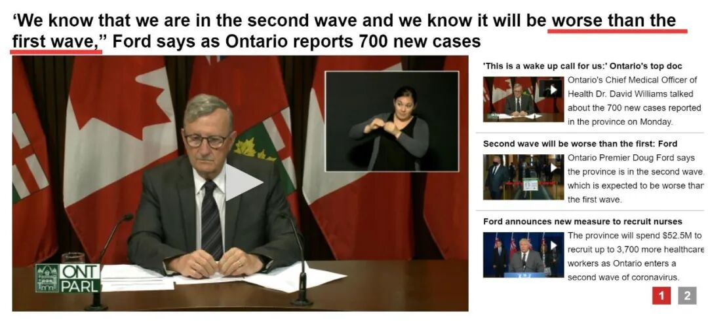 (原始链接: https://mmbiz.qpic.cn/mmbiz_jpg/4kibCXA1QiblTdqLtgURtw7ia5LP7fozDcm2oE5fqDKjBwe9mJybicY6ef16Qq8gO8qRibq33A4XlhRweEJJia7AiaypQ/640?wx_fmt=jpeg)
- 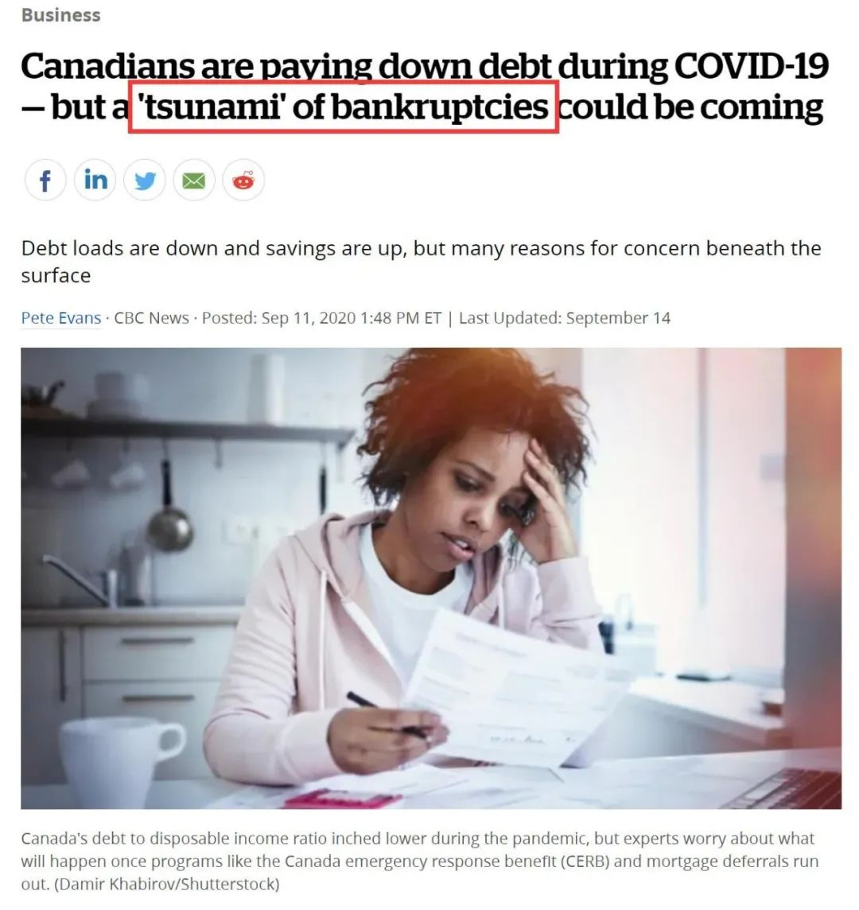 (原始链接: https://mmbiz.qpic.cn/mmbiz_jpg/4kibCXA1QiblTdqLtgURtw7ia5LP7fozDcmLiaqDXQeUDwicibicd5hYRzabUEn5RHvvT9JjIksIdb6CicjUEYb91pIOxQ/640?wx_fmt=jpeg)
- 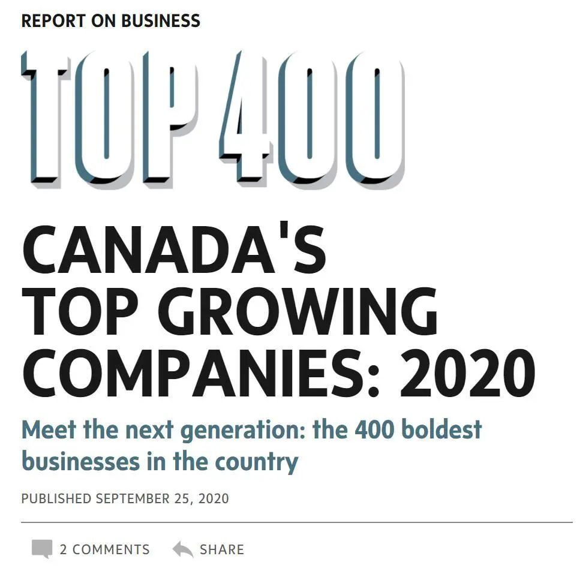 (原始链接: https://mmbiz.qpic.cn/mmbiz_jpg/4kibCXA1QiblTdqLtgURtw7ia5LP7fozDcmia4UdTX4Xzn5ibQqaQhVWoD5oqnyrDIzVckXWP77rvRIPRbDwROhk7ibg/640?wx_fmt=jpeg)
- 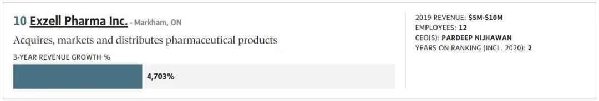 (原始链接: https://mmbiz.qpic.cn/mmbiz_jpg/4kibCXA1QiblTdqLtgURtw7ia5LP7fozDcmjsAndNYxBBcXukNQOwBCIZmfwguhs04aNe4Hjnicfn7WQK1rx9jn4pw/640?wx_fmt=jpeg)
- 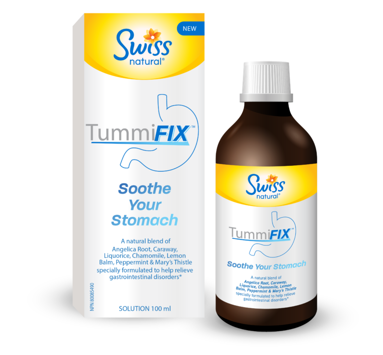 (原始链接: https://mmbiz.qpic.cn/mmbiz_png/4kibCXA1QiblTdqLtgURtw7ia5LP7fozDcmYRicXR3xkuic5bFqPLt8bGU0MiboWnvg65l3YZomptoFaibKQYprmotXOg/640?wx_fmt=png)
- 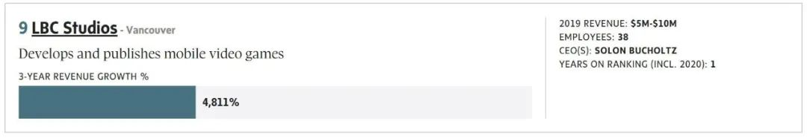 (原始链接: https://mmbiz.qpic.cn/mmbiz_jpg/4kibCXA1QiblTdqLtgURtw7ia5LP7fozDcmmoIDJC4w3vlVA5mKPR3zqVnwxL1DR7de0MEKAO8H9ytSGIFTAvpS4A/640?wx_fmt=jpeg)
-  (原始链接: https://mmbiz.qpic.cn/mmbiz_jpg/4kibCXA1QiblTdqLtgURtw7ia5LP7fozDcmHZyJz2NFnmaEwv2Rhkibnoe6zy3icoSm1LBeClXWEmKyGcMLVaEWk0rQ/640?wx_fmt=jpeg)
- 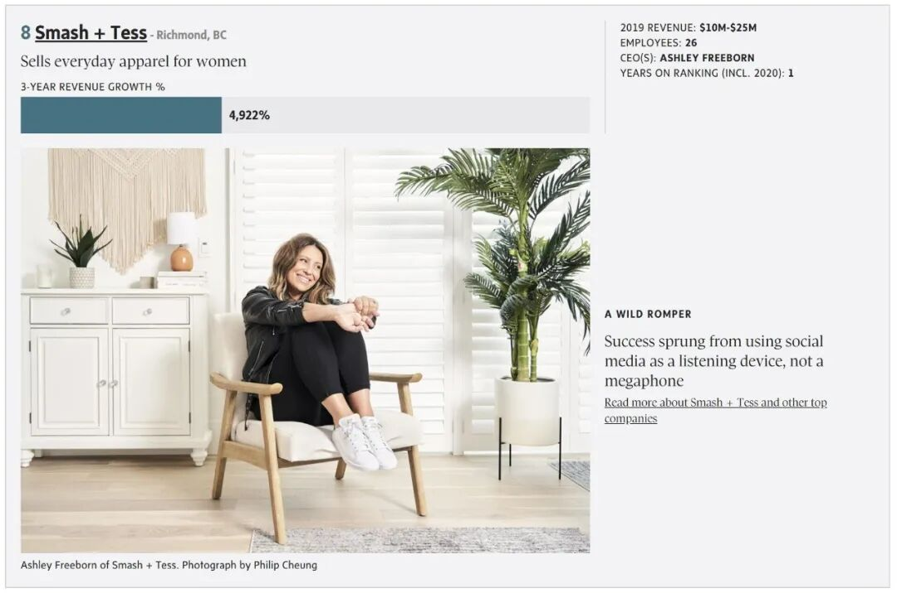 (原始链接: https://mmbiz.qpic.cn/mmbiz_jpg/4kibCXA1QiblTdqLtgURtw7ia5LP7fozDcm9EySURUTYP8p0n7EvTiadYjMxdGZsRWT7AOiaB19ChFia78GBmEcFK11w/640?wx_fmt=jpeg)
- 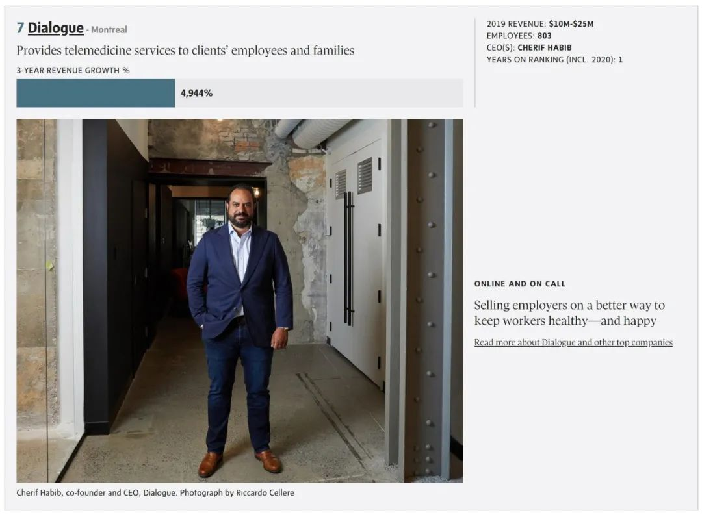 (原始链接: https://mmbiz.qpic.cn/mmbiz_jpg/4kibCXA1QiblTdqLtgURtw7ia5LP7fozDcmN7jAWQ3iaw4t8YtH9icAhgZn6PhfzO4bHDicxHiajG8N9SGqcQbJ3ibcttg/640?wx_fmt=jpeg)
- 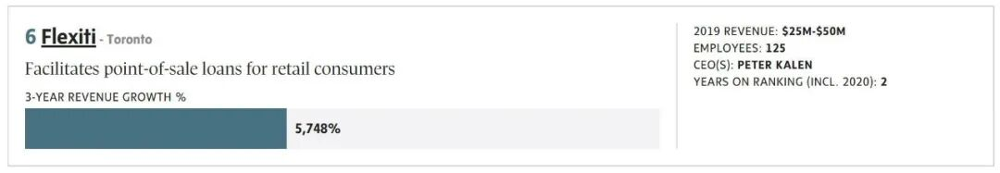 (原始链接: https://mmbiz.qpic.cn/mmbiz_jpg/4kibCXA1QiblTdqLtgURtw7ia5LP7fozDcm7F3KfAo6z78gzZLcwZON3Nv0sZIY77QLic6M9nM535Mu70kS4TT3tDw/640?wx_fmt=jpeg)
-  (原始链接: https://mmbiz.qpic.cn/mmbiz_jpg/4kibCXA1QiblTdqLtgURtw7ia5LP7fozDcmqyhR68M40qhkEEkjv7sZM2r3qtot07BDwDy53BicePqWJsHuNehiazEw/640?wx_fmt=jpeg)
- 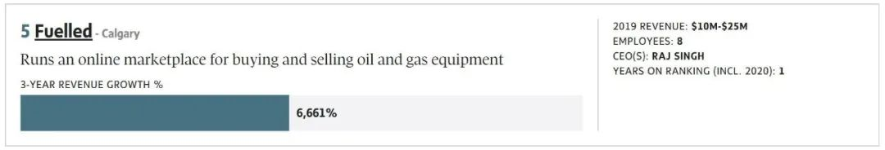 (原始链接: https://mmbiz.qpic.cn/mmbiz_jpg/4kibCXA1QiblTdqLtgURtw7ia5LP7fozDcmmzibvOjQIuH6eDQkQP97T1RnEHf03sx7GAibiaBl0tFSNicavqTan1fplw/640?wx_fmt=jpeg)
- 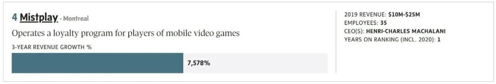 (原始链接: https://mmbiz.qpic.cn/mmbiz_jpg/4kibCXA1QiblTdqLtgURtw7ia5LP7fozDcmGSxAxvia0eF89EzM8z9994siaichlIe9ejqLy0YU7LR5Nx5JzeiaxxxE4w/640?wx_fmt=jpeg)
-  (原始链接: https://mmbiz.qpic.cn/mmbiz_jpg/4kibCXA1QiblTdqLtgURtw7ia5LP7fozDcmDSu1xx4gVEDHS16fHbjy7eibU5mrv9zfw5O3s18ysKAMyMKKvTnb81A/640?wx_fmt=jpeg)
- 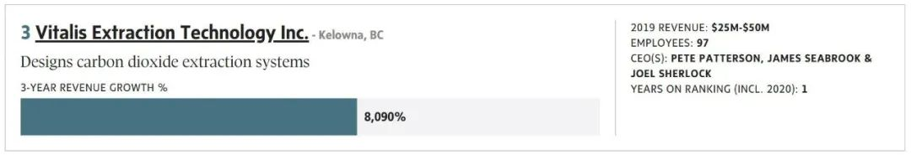 (原始链接: https://mmbiz.qpic.cn/mmbiz_jpg/4kibCXA1QiblTdqLtgURtw7ia5LP7fozDcmoahfqFETkKNaIrUzbUic7EZNc3OM5ibF5R94qPhypBvW8URyWTeDTuHQ/640?wx_fmt=jpeg)
- 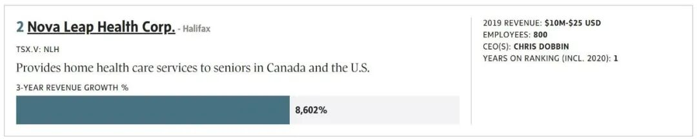 (原始链接: https://mmbiz.qpic.cn/mmbiz_jpg/4kibCXA1QiblTdqLtgURtw7ia5LP7fozDcmnIG58GSIc4gsVeic8YdK5LVAAA6ia0en5GAjGHFG0D1IAxex52B6KcjQ/640?wx_fmt=jpeg)
-  (原始链接: https://mmbiz.qpic.cn/mmbiz_jpg/4kibCXA1QiblTdqLtgURtw7ia5LP7fozDcmibtviauLfPiaxPcfBPIq2rcb3tEUYTk6Bicd0fTibMX5CcqrpvA914aWkoA/640?wx_fmt=jpeg)
- 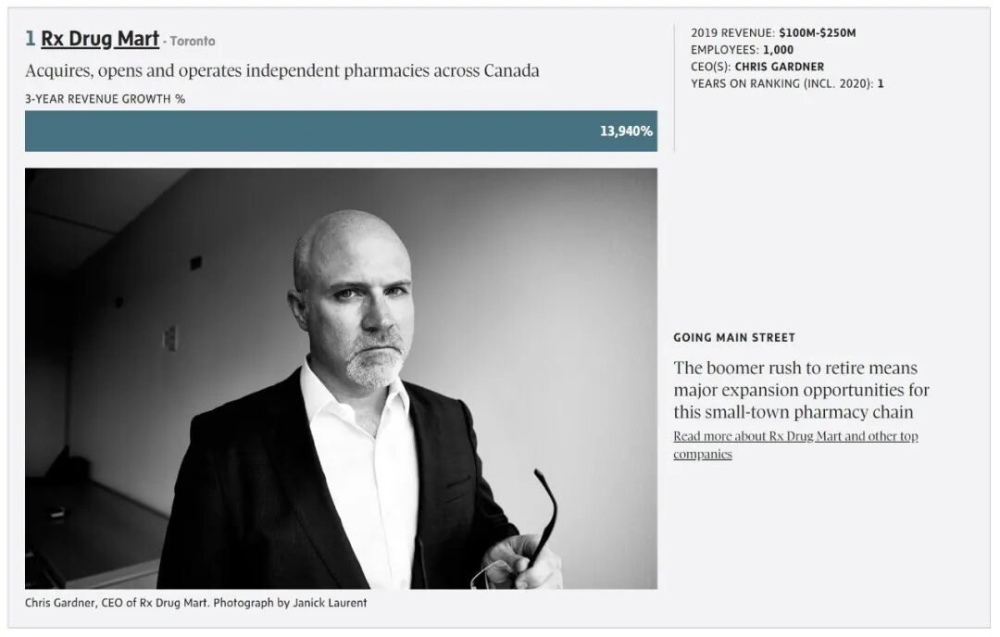 (原始链接: https://mmbiz.qpic.cn/mmbiz_jpg/4kibCXA1QiblTdqLtgURtw7ia5LP7fozDcmUUo8zrlgNXrcdou4jhjeZYbaUfSjdCK7re8dzBiba2Eib59BknKZ4qWw/640?wx_fmt=jpeg)
-  (原始链接: https://mmbiz.qpic.cn/mmbiz_jpg/4kibCXA1QiblTdqLtgURtw7ia5LP7fozDcmpyCZRgcVj9hicB7QU0ICicZ2tkYOqXddld8NE2LLTB807lHAPVibkwFFw/640?wx_fmt=jpeg)
-  (原始链接: https://mmbiz.qpic.cn/mmbiz_jpg/4kibCXA1QiblTdqLtgURtw7ia5LP7fozDcmno7cegpkZs8NeiaOMdr6iaECiafVRcRVu4MZ30Z6bE9MCJQ00DkiczT7rw/640?wx_fmt=jpeg)
-  (原始链接: https://mmbiz.qpic.cn/mmbiz_jpg/4kibCXA1QiblTBL8UtNoK5vrCnUIExUibiaLiaOAuocR7LvibeeabkEDRFqeMdiaxsZ18icWNc2Aoh8MVcFLyBQUIR3zxw/640?wx_fmt=jpeg)
-  (原始链接: https://mmbiz.qpic.cn/mmbiz_png/4kibCXA1QiblTCePmlRrEViaT39pQRvHteQHCJX0E0pQibzDrweJvHhgqYKeAdE0FnUnqiafEPWrYaNQNibb29KoDHCg/640?wx_fmt=png)
