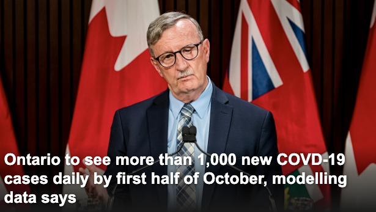
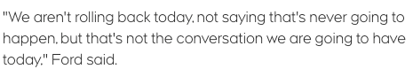
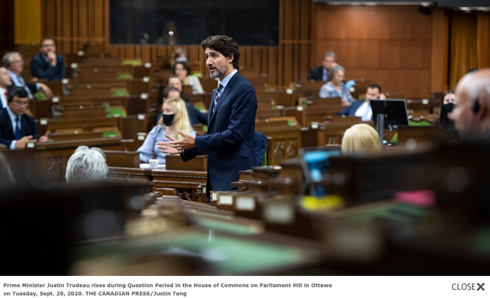
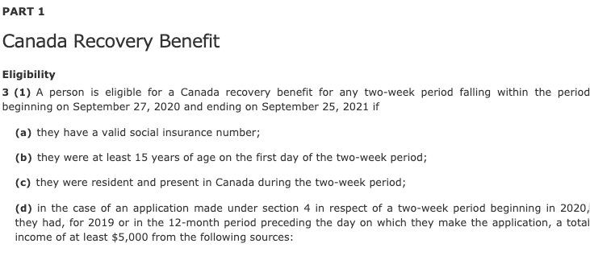
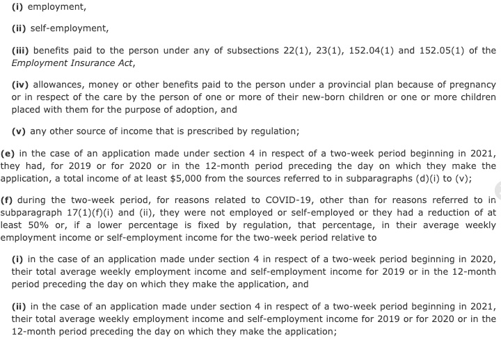
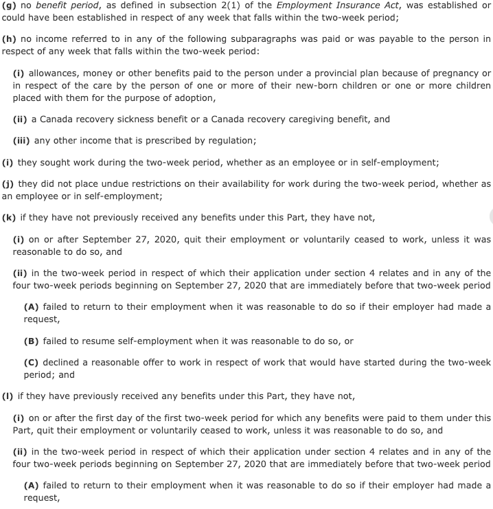
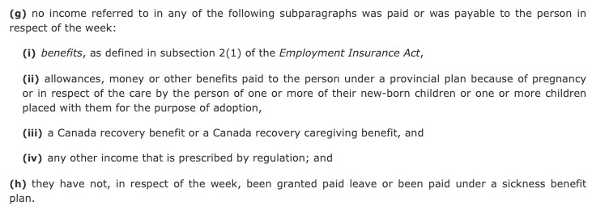
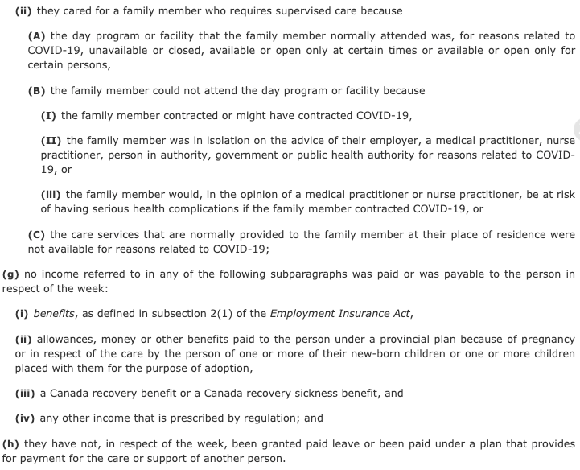

# 无标题

**链接地址:** http://mp.weixin.qq.com/s?__biz=MjM5MDEzNzY2NQ==&mid=2652792688&idx=1&sn=f8377ada757a08ec498dd42b0c3a0934&chksm=bda3ab5e8ad42248d2275c7998490415fa2d9623fffabb85c318ed546599559dad42edc1831d&mpshare=1&scene=2&srcid=1001SspxvCBGtzle9ueFmEVh&sharer_sharetime=1601500200826&sharer_shareid=be1c8edd6c93eec155a61c876e41d26a#rd
**作者:** 丁其
**获取时间:** 2025/8/28 20:05:24
**图片数量:** 14

---

## 原始HTML内容

<section style="line-height: 2em;margin-left: 8px;margin-right: 8px;"><section style="display: none;" data-tools="新媒体管家" data-label="powered by xmt.cn"> </section></section>
 

+++上方是广告+++
<section style="line-height: 2em;margin-left: 8px;margin-right: 8px;">今天，安省公布数据模型预测，显示疫情有恶化的迹象，目前新增病例安省以10-12天速度飙升，10月上旬将会破1000例，但福特省长在下午的发布会上表示，安省还没准备好退回第二阶段封锁。而在今天凌晨的国会信任投票中，特鲁多成功获得支持，将继续担任总理，秋季大选不会发生。而C-4福利法案已经在下议院通过，到明年9月前，都可以有机会获得每周500加元的三项新福利。</section><section style="line-height: 2em;margin-left: 8px;margin-right: 8px;"> </section>

<section style="line-height: 2em;margin-left: 8px;margin-right: 8px;"> </section><section>安省宣布新增625例，再次回到600+水平，其中多伦多市288例。</section><section> </section><section>安省卫生厅今天公布数据预测模型，显示该省正处于第二波感染浪潮中，因此到10月上旬，安省每天可能会收到1000多例的新增病例。</section><section> </section><section></section>
 

安省卫生厅首席医疗官大卫·威廉姆斯（David Williams）博士在今天（9月30日）上午的新闻发布会上介绍了安省COVID-19建模数据更新。

 

卫生官员指出，安省的病例在整个9月份一直在稳步上升，安省的上升趋势与其他国家地区（如澳大利亚）相似。

 

卫生官还说，病例目前大约每10至12天翻一番。

 

负责数据模型的多伦多大学卫生专家阿达斯坦·布朗（Adalsteinn Brown）说：“如果疫情随着我们预期般增长，我们将看到病例数量急剧增加，现在病例每10-12天增加一倍，并且可能在10月上旬日增超过1,000例，这是非常高的，除非采取严厉的公共卫生措施并开始遵守以遏制病毒传播，否则这种情况将恶化。”

 

根据模型，如果安省紧随澳大利亚维多利亚州之后，维多利亚州是世界上实施最严格的封城措施的地区之一。

 

布朗说：“我们现在正建模的数据表明，我们已经开始接近维多利亚州。”

 

除了多伦多大学专家暗示要封城外，加拿大医院协会周一已经呼吁省份考虑将疫情严重的大多伦多地区及渥太华退出第二阶段，重新进行封锁。

 

不过，福特在刚刚召开的记者会上表示，称安省尚未为此做好准备。 

 

 

福特说：“今天我们不会退回（第二阶段封锁），但不是说那永远不会发生，但这不是今天的谈话内容。”

 

而联邦政府方面，国会在WE慈善丑闻休会后重开，联邦自由党今天成功通过信任投票，特鲁多将继续担任总理，秋季大选不会发生。
<section style="line-height: 2em;margin-left: 8px;margin-right: 8px;"> </section>

<section style="line-height: 2em;margin-left: 8px;margin-right: 8px;"> </section><section style="line-height: 2em;margin-left: 8px;margin-right: 8px;">在令人惊讶的一致投票中，联邦国会下议院以306:0票数一致通过了C-4法案，该法案将为不具备就业保险EI资格的加拿大人创造三种新的联邦福利。即加拿大复苏福利CRB，带薪病假和在家照顾孩子的福利。</section><section style="line-height: 2em;margin-left: 8px;margin-right: 8px;"> </section><section style="line-height: 2em;margin-left: 8px;margin-right: 8px;">自由党议员下议院领袖帕勃罗·罗德里格斯（Pablo Rodriguez）周二在一条推文中说，由于创造福利是联邦政府针对第二波大流行应对计划的核心，因此将进行信任投票。</section><section style="line-height: 2em;margin-left: 8px;margin-right: 8px;"> </section><section style="line-height: 2em;margin-left: 8px;margin-right: 8px;"></section><section style="line-height: 2em;margin-left: 8px;margin-right: 8px;"> </section><section style="line-height: 2em;margin-left: 8px;margin-right: 8px;">由于执政自由党在国会少于过半席位，这意味着政府需要获得至少另一个反对党的支持，才能保持政权。</section><section style="line-height: 2em;margin-left: 8px;margin-right: 8px;"> </section><section style="line-height: 2em;margin-left: 8px;margin-right: 8px;">不过，周末自由党已经与新民主党NDP达成协议，而最终提交表决的c-4法案满足了NDP的关键要求，所以这个信任投票已经不存在悬念。</section><section style="line-height: 2em;margin-left: 8px;margin-right: 8px;"> </section><section style="line-height: 2em;margin-left: 8px;margin-right: 8px;">但是，令人惊讶的是，另外两个反对党，保守党和魁人政团早些时候提出抗议，但是，最后投票的时候，各方最终还是支持了特鲁多少数派政府。</section><section style="line-height: 2em;margin-left: 8px;margin-right: 8px;"> </section><section style="line-height: 2em;margin-left: 8px;margin-right: 8px;">306:0，国会一致通过C-4法案。 </section><section style="line-height: 2em;margin-left: 8px;margin-right: 8px;"> </section><section style="text-align: center;line-height: 2em;margin-left: 8px;margin-right: 8px;"></section><section style="line-height: 2em;margin-left: 8px;margin-right: 8px;">换言之，总理特鲁多成功通过信任投票，秋季大选不会再发生。 </section><section style="line-height: 2em;margin-left: 8px;margin-right: 8px;"> </section><section style="line-height: 2em;margin-left: 8px;margin-right: 8px;">随着本周加拿大紧急救济金CERB的结束，c-4法案将为不符合就业保险条件的加拿大人创造三种新的联邦福利。</section><section style="line-height: 2em;margin-left: 8px;margin-right: 8px;"> </section><section style="line-height: 2em;margin-left: 8px;margin-right: 8px;">c-4法案现在将发送给参议院，并定于今天周三举行投票。</section><section style="line-height: 2em;margin-left: 8px;margin-right: 8px;"> </section><section style="line-height: 2em;margin-left: 8px;margin-right: 8px;">联邦就业部长卡拉·夸特洛表示，新措施估计将耗资约340亿加元，该法案还包括与COVID-19大流行相关的170亿元其他支出。</section><section style="line-height: 2em;margin-left: 8px;margin-right: 8px;"> </section><section style="line-height: 2em;margin-left: 8px;margin-right: 8px;">根据自由党提交C-4法案看看三种新的联邦福利。</section><section style="line-height: 2em;margin-left: 8px;margin-right: 8px;"> </section><section style="line-height: 2em;margin-left: 8px;margin-right: 8px;">1、加拿大复苏福利CRB</section><section style="line-height: 2em;margin-left: 8px;margin-right: 8px;">在2020年9月27日至2021年9月25日任何两周期间内如果符合以下条件，则有资格享受加拿大复苏福利CRB：</section><section style="line-height: 2em;margin-left: 8px;margin-right: 8px;">a、有效的工卡号码SIN（或称社会保险号）</section><section style="line-height: 2em;margin-left: 8px;margin-right: 8px;">b、年满15岁 </section><section style="line-height: 2em;margin-left: 8px;margin-right: 8px;">c、加拿大居住 </section><section style="line-height: 2em;margin-left: 8px;margin-right: 8px;">d、$5000收入标准</section><section style="text-align: left;">其他具体还有f-i的条件，包括主动辞职和不愿复工则不符合资格。具体：https://parl.ca/DocumentViewer/en/43-2/bill/C-4/first-reading</section><section style="text-align: left;"> </section>

<section> </section><section>CRB福利每周500，每两周发一次，最多可领13次，即26周，相当于每月2000，最多领半年。 </section><section> </section><section>2、带薪病假CRSB </section><section> </section>

<section> </section><section>带薪病假每周500，最多领2周，即10个工作日。 </section><section> </section><section>3、在家照顾福利CRCB </section><section> </section><section>因为covid-19原因，需要在家照顾12岁以下小孩，但必须要学校或托儿所不能开门，否则不能领取，除非有医生证明。</section><section> </section>

<section> </section><section>在家照顾福利每周500元，最长可领26周。</section><section> </section><section>根据C-4法案，三个新福利均每周500加元，有效期均从2020年9月27日至2021年9月25日，其中CRB福利和在家照顾福利最长可领半年26周，另外带薪病假2周。</section><section> </section><section>三项福利不能同时领，但是，如果刚好错开，则未来一年都不需要为生计担心。</section><section> </section><section>在加拿大，生计暂时不担心，病毒呢？</section><section> </section><section>面对来势汹汹的病毒，无论联邦政府还是地方政府，都没有直接的压制措施，难道我们只有坐等安省新增过千，加拿大日增5000的那一天来临？</section><section> </section><section style="margin-right: 8px;margin-left: 8px;font-family: -apple-system-font, BlinkMacSystemFont, &quot;Helvetica Neue&quot;, &quot;PingFang SC&quot;, &quot;Hiragino Sans GB&quot;, &quot;Microsoft YaHei UI&quot;, &quot;Microsoft YaHei&quot;, Arial, sans-serif;letter-spacing: 0.544px;white-space: normal;background-color: rgb(255, 255, 255);text-align: center;line-height: 2em;">+++下方是可以点的广告+++</section><section style="margin-right: 8px;margin-left: 8px;font-family: -apple-system-font, system-ui, &quot;Helvetica Neue&quot;, &quot;PingFang SC&quot;, &quot;Hiragino Sans GB&quot;, &quot;Microsoft YaHei UI&quot;, &quot;Microsoft YaHei&quot;, Arial, sans-serif;letter-spacing: 0.544px;white-space: normal;background-color: rgb(255, 255, 255);text-size-adjust: auto;min-height: 1em;text-align: center;line-height: 2em;"><a target="_blank" href="https://mp.weixin.qq.com/s?__biz=MjM5MDEzNzY2NQ==&amp;mid=2652789757&amp;idx=2&amp;sn=65cc31d876f7911f42f371b08b7150fa&amp;chksm=bda397d38ad41ec5aa7ecfe55371115675cd2ac76764e53d0e458908eb36a3eb4b5bd3416517&amp;scene=21&amp;sessionid=1598386472&amp;key=4435c9834d0607a7d3544bbfc2ede212e70d724ae21d767fedfc57825f201c9a347f11cd60546c7173c4144f9d8822f40aa5559a741e804d4f3b426cbd4288384357a8b405ec2b777d81a47e75047b3b6b295585db05621d82f94d3c0474018b810dc30681a05ee98b2efd4081c20c63667e8323999500c1192d1d96ebcd4471&amp;ascene=1&amp;uin=MTMyNTc2Mzc0MQ==&amp;devicetype=Windows 10 x64&amp;version=62090529&amp;lang=en&amp;exportkey=Aj0GskZlgv3MqmP5OJ1Xrl8=&amp;pass_ticket=rOoERyY/q1NrKk us00iNTVgcImkFvuk8LVeuncAln8fl2XARekO2Vk 9NMo0Q8S#wechat_redirect" textvalue="你已选中了添加链接的内容" tab="innerlink" data-linktype="1" style="color: var(--weui-LINK);-webkit-tap-highlight-color: rgba(0, 0, 0, 0);cursor: pointer;"></a></section><section style="margin-right: 8px;margin-left: 8px;font-family: -apple-system-font, BlinkMacSystemFont, &quot;Helvetica Neue&quot;, &quot;PingFang SC&quot;, &quot;Hiragino Sans GB&quot;, &quot;Microsoft YaHei UI&quot;, &quot;Microsoft YaHei&quot;, Arial, sans-serif;letter-spacing: 0.544px;white-space: normal;background-color: rgb(255, 255, 255);text-align: center;line-height: 2em;"> </section><section style="margin-right: 8px;margin-left: 8px;font-family: -apple-system-font, BlinkMacSystemFont, &quot;Helvetica Neue&quot;, &quot;PingFang SC&quot;, &quot;Hiragino Sans GB&quot;, &quot;Microsoft YaHei UI&quot;, &quot;Microsoft YaHei&quot;, Arial, sans-serif;letter-spacing: 0.544px;white-space: normal;background-color: rgb(255, 255, 255);font-size: 16px;text-size-adjust: auto;min-height: 1em;color: rgb(0, 0, 0);text-align: center;line-height: 2em;">+++全加拿大华人都在关注超级生活，就差你了+++</section><section style="margin-right: 8px;margin-left: 8px;font-family: -apple-system-font, BlinkMacSystemFont, &quot;Helvetica Neue&quot;, &quot;PingFang SC&quot;, &quot;Hiragino Sans GB&quot;, &quot;Microsoft YaHei UI&quot;, &quot;Microsoft YaHei&quot;, Arial, sans-serif;letter-spacing: 0.544px;white-space: normal;background-color: rgb(255, 255, 255);font-size: 16px;text-size-adjust: auto;min-height: 1em;color: rgb(0, 0, 0);text-align: center;line-height: 2em;"></section><section style="margin-right: 8px;margin-left: 8px;font-family: -apple-system-font, BlinkMacSystemFont, &quot;Helvetica Neue&quot;, &quot;PingFang SC&quot;, &quot;Hiragino Sans GB&quot;, &quot;Microsoft YaHei UI&quot;, &quot;Microsoft YaHei&quot;, Arial, sans-serif;letter-spacing: 0.544px;white-space: normal;background-color: rgb(255, 255, 255);text-align: right;line-height: 2em;"><strong style="font-size: 16px;letter-spacing: 0.544px;">喜欢点个“在看” ↓↓</strong></section>

---

## 纯文本内容

+++上方是广告+++今天，安省公布数据模型预测，显示疫情有恶化的迹象，目前新增病例安省以10-12天速度飙升，10月上旬将会破1000例，但福特省长在下午的发布会上表示，安省还没准备好退回第二阶段封锁。而在今天凌晨的国会信任投票中，特鲁多成功获得支持，将继续担任总理，秋季大选不会发生。而C-4福利法案已经在下议院通过，到明年9月前，都可以有机会获得每周500加元的三项新福利。安省宣布新增625例，再次回到600+水平，其中多伦多市288例。安省卫生厅今天公布数据预测模型，显示该省正处于第二波感染浪潮中，因此到10月上旬，安省每天可能会收到1000多例的新增病例。安省卫生厅首席医疗官大卫·威廉姆斯（David Williams）博士在今天（9月30日）上午的新闻发布会上介绍了安省COVID-19建模数据更新。卫生官员指出，安省的病例在整个9月份一直在稳步上升，安省的上升趋势与其他国家地区（如澳大利亚）相似。卫生官还说，病例目前大约每10至12天翻一番。负责数据模型的多伦多大学卫生专家阿达斯坦·布朗（Adalsteinn Brown）说：“如果疫情随着我们预期般增长，我们将看到病例数量急剧增加，现在病例每10-12天增加一倍，并且可能在10月上旬日增超过1,000例，这是非常高的，除非采取严厉的公共卫生措施并开始遵守以遏制病毒传播，否则这种情况将恶化。”根据模型，如果安省紧随澳大利亚维多利亚州之后，维多利亚州是世界上实施最严格的封城措施的地区之一。布朗说：“我们现在正建模的数据表明，我们已经开始接近维多利亚州。”除了多伦多大学专家暗示要封城外，加拿大医院协会周一已经呼吁省份考虑将疫情严重的大多伦多地区及渥太华退出第二阶段，重新进行封锁。不过，福特在刚刚召开的记者会上表示，称安省尚未为此做好准备。福特说：“今天我们不会退回（第二阶段封锁），但不是说那永远不会发生，但这不是今天的谈话内容。”而联邦政府方面，国会在WE慈善丑闻休会后重开，联邦自由党今天成功通过信任投票，特鲁多将继续担任总理，秋季大选不会发生。在令人惊讶的一致投票中，联邦国会下议院以306:0票数一致通过了C-4法案，该法案将为不具备就业保险EI资格的加拿大人创造三种新的联邦福利。即加拿大复苏福利CRB，带薪病假和在家照顾孩子的福利。自由党议员下议院领袖帕勃罗·罗德里格斯（Pablo Rodriguez）周二在一条推文中说，由于创造福利是联邦政府针对第二波大流行应对计划的核心，因此将进行信任投票。由于执政自由党在国会少于过半席位，这意味着政府需要获得至少另一个反对党的支持，才能保持政权。不过，周末自由党已经与新民主党NDP达成协议，而最终提交表决的c-4法案满足了NDP的关键要求，所以这个信任投票已经不存在悬念。但是，令人惊讶的是，另外两个反对党，保守党和魁人政团早些时候提出抗议，但是，最后投票的时候，各方最终还是支持了特鲁多少数派政府。306:0，国会一致通过C-4法案。换言之，总理特鲁多成功通过信任投票，秋季大选不会再发生。随着本周加拿大紧急救济金CERB的结束，c-4法案将为不符合就业保险条件的加拿大人创造三种新的联邦福利。c-4法案现在将发送给参议院，并定于今天周三举行投票。联邦就业部长卡拉·夸特洛表示，新措施估计将耗资约340亿加元，该法案还包括与COVID-19大流行相关的170亿元其他支出。根据自由党提交C-4法案看看三种新的联邦福利。1、加拿大复苏福利CRB在2020年9月27日至2021年9月25日任何两周期间内如果符合以下条件，则有资格享受加拿大复苏福利CRB：a、有效的工卡号码SIN（或称社会保险号）b、年满15岁c、加拿大居住d、$5000收入标准其他具体还有f-i的条件，包括主动辞职和不愿复工则不符合资格。具体：https://parl.ca/DocumentViewer/en/43-2/bill/C-4/first-readingCRB福利每周500，每两周发一次，最多可领13次，即26周，相当于每月2000，最多领半年。2、带薪病假CRSB带薪病假每周500，最多领2周，即10个工作日。3、在家照顾福利CRCB因为covid-19原因，需要在家照顾12岁以下小孩，但必须要学校或托儿所不能开门，否则不能领取，除非有医生证明。在家照顾福利每周500元，最长可领26周。根据C-4法案，三个新福利均每周500加元，有效期均从2020年9月27日至2021年9月25日，其中CRB福利和在家照顾福利最长可领半年26周，另外带薪病假2周。三项福利不能同时领，但是，如果刚好错开，则未来一年都不需要为生计担心。在加拿大，生计暂时不担心，病毒呢？面对来势汹汹的病毒，无论联邦政府还是地方政府，都没有直接的压制措施，难道我们只有坐等安省新增过千，加拿大日增5000的那一天来临？+++下方是可以点的广告++++++全加拿大华人都在关注超级生活，就差你了+++喜欢点个“在看” ↓↓

---

## 图片列表

-  (原始链接: https://mmbiz.qpic.cn/mmbiz_jpg/szJas1pFaJem586PmFHpLDClKnWH5x7wnkBCTpbWqM9sgEOVkxAIicVxjRInHvb9ZQnMO8u0zhHTXJZ0s4fq7RQ/640?wx_fmt=jpeg)
-  (原始链接: https://mmbiz.qpic.cn/mmbiz_png/szJas1pFaJcfJQZwy2MF5obbIySvHL3XNfcfQdia0ILianTgCaORxejEJB3RxruxozcFJROEibuuicNElxYqR6u7HA/640?wx_fmt=png)
-  (原始链接: https://mmbiz.qpic.cn/mmbiz_png/icDcCacWsN1VFxVUx98FRs9RrEpic01aTPy4nGMp3jR26fFshOhyp5vW3L3oFby0BmVeSUrCawktbqKJicIyXYY5Q/640?wx_fmt=png)
-  (原始链接: https://mmbiz.qpic.cn/mmbiz_png/szJas1pFaJcfJQZwy2MF5obbIySvHL3XhkV7u5QSQibUXk9dx7rXOZKMK8ERMGQFBTsbEYgoaicfLEvFWvrewpKQ/640?wx_fmt=png)
-  (原始链接: https://mmbiz.qpic.cn/mmbiz_png/icDcCacWsN1VFxVUx98FRs9RrEpic01aTP5oC5Nbtnx3vJme4ntGVdt411ZvD4FL8lFP3fibibVSTic82Bgia1XcWfaw/640?wx_fmt=png)
-  (原始链接: https://mmbiz.qpic.cn/mmbiz_png/icDcCacWsN1VFxVUx98FRs9RrEpic01aTPnibhGp5EhoVicIwXoRQpAOTb6rHvKCKQZy2FquELFbJEB8yDCOXLp2sQ/640?wx_fmt=png)
-  (原始链接: https://mmbiz.qpic.cn/mmbiz_png/icDcCacWsN1VFxVUx98FRs9RrEpic01aTPAxI24c8A0sPaZIgBicgrIQsyjXv5Th5e89qqyxnyflPeMVo9nI1xyAg/640?wx_fmt=png)
-  (原始链接: https://mmbiz.qpic.cn/mmbiz_png/icDcCacWsN1VFxVUx98FRs9RrEpic01aTPVnEK4ojwmgVibcIYEAMrXEAHiaWjiaWsCo0YQ8oSVGYYmj4pPKAEia0BdA/640?wx_fmt=png)
-  (原始链接: https://mmbiz.qpic.cn/mmbiz_png/icDcCacWsN1VFxVUx98FRs9RrEpic01aTPVgA2dgcapC7mL2MjfKPoc9AHLNHHBIuACq5ocR2cib2ibBPmxVo9ACfg/640?wx_fmt=png)
-  (原始链接: https://mmbiz.qpic.cn/mmbiz_png/icDcCacWsN1VFxVUx98FRs9RrEpic01aTPUP9icYwK07AOYvuAb2WeESP2s3BicRHCt6UEjickkm3CxFC1P8KpgYGEw/640?wx_fmt=png)
-  (原始链接: https://mmbiz.qpic.cn/mmbiz_png/icDcCacWsN1VFxVUx98FRs9RrEpic01aTPSibzTic3593AWx1C6NOqQ8533Kmfj5fxJ4lvpA1xFHxOJrZSAfFSTQiaQ/640?wx_fmt=png)
-  (原始链接: https://mmbiz.qpic.cn/mmbiz_png/icDcCacWsN1VFxVUx98FRs9RrEpic01aTP6uKw2fuCWOFKUbibI0OOQ5pHugvDb92t84dRSgboAbq5hdZ6ztkfw0w/640?wx_fmt=png)
-  (原始链接: https://mmbiz.qpic.cn/mmbiz_gif/szJas1pFaJffCnqD2Oge3cx2KrIpvkCA2ibSyRnOqC1u5pBNau5FhhNvTdbGv0KQILUx8KW4oUQOO8mAicp05bJA/640?wx_fmt=gif)
-  (原始链接: https://mmbiz.qpic.cn/mmbiz_gif/szJas1pFaJdUFDPEKnLrCyGC4WgrAvl6lSC2beZFt6icTnXfebnRzcRialMg5VZujw1AhX9ribkSDQNZZukk8HX9w/640?wx_fmt=gif)
