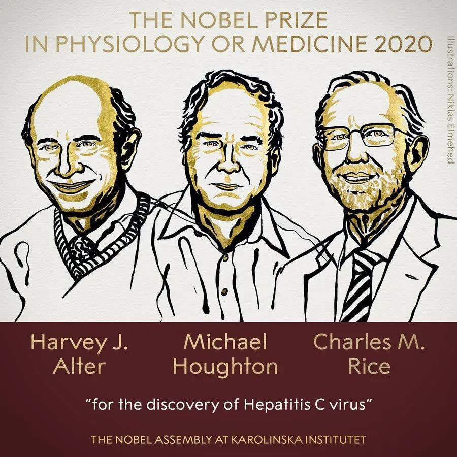
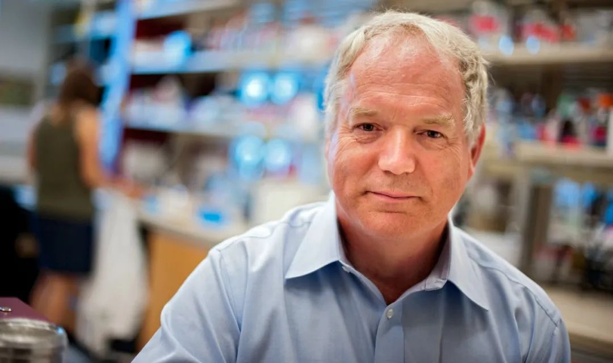

# 无标题

**链接地址:** http://mp.weixin.qq.com/s?__biz=MzUzNDgyNzcxOA==&mid=2247483833&idx=1&sn=766a760c8306b58294382150fbc950f4&chksm=fa8f8610cdf80f06fa7437d54f60dda21fb358cf496e62bf0934f1a6707250583b4b4097b267&mpshare=1&scene=2&srcid=10056JK7fblIUpbsfsTJ2C4h&sharer_sharetime=1601920894677&sharer_shareid=be1c8edd6c93eec155a61c876e41d26a#rd
**作者:** Tianlin Yang
**获取时间:** 2025/8/28 20:04:13
**图片数量:** 4

---

## 原始HTML内容

<section style="font-size: 14px;font-family: Optima-Regular, PingFangTC-light;line-height: 2;letter-spacing: 1px;box-sizing: border-box;font-style: normal;font-weight: 400;text-align: justify;"><section style="display: block;box-sizing: border-box;" powered-by="xiumi.us"><section style="text-align: center;margin: 0px 0% -5px;box-sizing: border-box;"><section style="max-width: 100%;vertical-align: middle;display: inline-block;line-height: 0;border-width: 0px;box-sizing: border-box;"></section></section></section><section style="margin: 10px 0%;box-sizing: border-box;" powered-by="xiumi.us"><section style="font-size: 16px;padding: 0px 15px;line-height: 1.8;font-family: Optima-Regular, PingFangTC-light;box-sizing: border-box;">
<strong style="box-sizing: border-box;">2020年10月5日，Michael Houghton因丙型肝炎病毒(HCV)的发现获2020年诺贝尔生理学或医学奖。</strong>

 

Michael Houghton博士自1989年起与同事开展新型肝炎的研究，致力于提高输血血源安全。他对丙型肝炎的发现使得快速检测方法得以实现。至1992年，含丙型肝炎的血液已从供血库中基本完全去除。而到1996年，全球每年的丙型肝炎患者已减少80%。

 

Michael Houghton博士于2010起受聘于阿尔伯塔大学，担任李嘉诚病毒研究中心加拿大卓越科研主席。之后的两年，他和他的团队致力于研究抗肝硬化与肝癌的疫苗，以治疗丙型肝炎患者常见的肝脏疾病。该疫苗研究现已进入临床前后期测试。

 

根据他对丙型肝炎病毒的发现，现今的抗病毒疗法已可以有效治疗95%的丙肝携带者。这也是人类史上首个可以治愈的长期病毒性疾病。

 

Houghton现在正与团队夜以继日，致力于发展<strong style="box-sizing: border-box;">COVID-19新冠疫苗</strong>。他曾在2004年成功研发SARS（SARS-CoV-1）疫苗。
</section></section><section style="display: block;box-sizing: border-box;" powered-by="xiumi.us"><section style="text-align: center;margin: 10px 0%;box-sizing: border-box;"><section style="max-width: 100%;vertical-align: middle;display: inline-block;line-height: 0;box-sizing: border-box;"></section></section></section><section style="margin: -5px 0% 10px;box-sizing: border-box;" powered-by="xiumi.us"><section style="font-size: 12px;color: rgb(8, 122, 66);padding: 0px 15px;text-align: center;line-height: 1;box-sizing: border-box;">
<strong style="box-sizing: border-box;">阿尔伯塔大学病毒学家Michael Houghton。</strong>

<strong style="box-sizing: border-box;">拍摄者：Richard Siemens</strong>
</section></section><section style="margin: 10px 0% 20px;box-sizing: border-box;" powered-by="xiumi.us"><section style="padding: 0px 15px;line-height: 1.8;font-family: Optima-Regular, PingFangTC-light;font-size: 16px;box-sizing: border-box;">
阿尔伯塔大学校长兼副校监Bill Flanagan表示:“Michael Houghton博士的成就不可低估，他使得这个世界更美好。作为阿尔伯塔大学的校长，我为他的工作所得到的认可表示由衷的高兴。” 

 

除了担任李嘉诚应用病毒所的主任，霍顿博士同时担任李嘉诚病毒中心教授，阿尔伯塔大学药学和牙科学院医学微生物和免疫学系教授。

 

李嘉诚病毒研究中心由李嘉诚基金会（加拿大分会）成立，该研究中心成立时获得李嘉诚基金会2500万加币支持，并获得阿尔伯塔省政府5250万加元的拨款支持。

 

李嘉诚病毒研究中心主任Lorne Tyrrell表示：“今天对于加拿大，阿尔伯塔大学，李嘉诚病毒研究中心，都是意义非同的一天。加拿大此前唯一获得此项诺贝尔奖是在1923年由Frederick Banting和John Macloead共同获得。<strong style="box-sizing: border-box;">97年后的今天，加拿大大学终于等来的该奖项的第二位获得者。</strong>我对Michael Houghton及他的两位同事Harvey Alter和Charlie Rice共同获此殊荣感到无比自豪。”
</section></section><section style="font-size: 12px;line-height: 1.2;letter-spacing: 1px;padding: 0px 5px;font-family: PingFangSC-light;box-sizing: border-box;" powered-by="xiumi.us">
<strong style="box-sizing: border-box;">UAlberta Alumni</strong>公众号是阿尔伯塔大学校友会所属媒体平台，阿尔伯塔大学发展办公室为该公众号提供技术和内容支持。如您有任何意见或建议，欢迎在公众号内留言，或发邮件至<strong style="box-sizing: border-box;">r</strong><strong style="box-sizing: border-box;">egionalchapters@ualberta.net</strong>
</section><section style="box-sizing: border-box;" powered-by="xiumi.us"><section style="display: inline-block;vertical-align: middle;width: 40%;align-self: center;box-sizing: border-box;"><section style="margin: 0.5em 0px;transform: translate3d(0px, 0px, 1px) rotateY(180deg);-webkit-transform: translate3d(0px, 0px, 1px) rotateY(180deg);-moz-transform: translate3d(0px, 0px, 1px) rotateY(180deg);-o-transform: translate3d(0px, 0px, 1px) rotateY(180deg);box-sizing: border-box;" powered-by="xiumi.us"><section style="background-image: linear-gradient(90deg, rgb(15, 77, 36) 0%, rgba(231, 222, 204, 0) 95%);height: 1px;box-sizing: border-box;"><svg viewBox="0 0 1 1" style="float:left;line-height:0;width:0;vertical-align:top;"></svg></section></section></section><section style="display: inline-block;vertical-align: middle;width: 20%;align-self: center;box-sizing: border-box;"><section style="text-align: center;margin-top: 10px;margin-bottom: 10px;box-sizing: border-box;" powered-by="xiumi.us"><section style="max-width: 100%;vertical-align: middle;display: inline-block;line-height: 0;width: 75%;height: auto;box-sizing: border-box;"></section></section></section><section style="display: inline-block;vertical-align: middle;width: 40%;align-self: center;box-sizing: border-box;"><section style="margin: 0.5em 0px;box-sizing: border-box;" powered-by="xiumi.us"><section style="background-image: linear-gradient(90deg, rgb(15, 77, 36) 0%, rgba(231, 222, 204, 0) 95%);height: 1px;box-sizing: border-box;"><svg viewBox="0 0 1 1" style="float:left;line-height:0;width:0;vertical-align:top;"></svg></section></section></section></section><section style="margin: 30px 0%;box-sizing: border-box;" powered-by="xiumi.us"><section style="display: inline-block;width: 100%;vertical-align: top;border-left: 3px none rgb(255, 208, 99);border-bottom-left-radius: 0px;background-color: rgb(0, 123, 67);box-sizing: border-box;"><section style="margin: -20px 0%;box-sizing: border-box;" powered-by="xiumi.us"><section style="display: inline-block;vertical-align: middle;width: 25%;padding: 0px 15px 0px 0px;box-sizing: border-box;"><section style="transform: translate3d(5px, 0px, 0px);-webkit-transform: translate3d(5px, 0px, 0px);-moz-transform: translate3d(5px, 0px, 0px);-o-transform: translate3d(5px, 0px, 0px);margin: 0px 0%;box-sizing: border-box;" powered-by="xiumi.us"><section style="text-align: right;font-size: 11px;color: rgb(255, 255, 255);box-sizing: border-box;">
<strong style="box-sizing: border-box;">欢迎校友</strong>

<strong style="box-sizing: border-box;">扫码回家</strong>
</section></section></section><section style="display: inline-block;vertical-align: middle;width: 30%;border-width: 0px;border-radius: 14px;border-style: none;border-color: rgb(62, 62, 62);overflow: hidden;padding: 4px;box-shadow: rgba(0, 0, 0, 0.4) 0px 0px 8px;background-color: rgb(210, 167, 0);box-sizing: border-box;"><section style="display: inline-block;width: 100%;vertical-align: top;padding: 8px;border-width: 0px;border-radius: 12px;border-style: none;border-color: rgb(62, 62, 62);overflow: hidden;box-shadow: rgb(0, 0, 0) 0px 0px 0px;background-color: rgb(209, 167, 0);box-sizing: border-box;" powered-by="xiumi.us"><section style="text-align: center;margin: 0px 0%;box-sizing: border-box;" powered-by="xiumi.us"><section style="max-width: 100%;vertical-align: middle;display: inline-block;line-height: 0;border-width: 0px;border-radius: 12px;border-style: none;border-color: rgb(0, 150, 136);overflow: hidden;box-shadow: rgb(0, 0, 0) 0px 0px 0px;box-sizing: border-box;"></section></section></section></section><section style="display: inline-block;vertical-align: middle;width: 45%;padding: 0px 0px 0px 15px;letter-spacing: 0px;box-sizing: border-box;"><section style="text-align: left;box-sizing: border-box;" powered-by="xiumi.us"><section style="display: inline-block;min-width: 10%;max-width: 100%;vertical-align: top;border-bottom: 5px solid rgba(255, 255, 255, 0);border-bottom-right-radius: 0px;box-sizing: border-box;"><section style="margin: 0px 0% -5px;box-sizing: border-box;" powered-by="xiumi.us"><section style="text-align: justify;color: rgb(255, 255, 255);line-height: 1.3;padding: 0px 4px;letter-spacing: 0px;box-sizing: border-box;">
<strong style="box-sizing: border-box;">UAlberta Alumni</strong>
</section></section></section></section><section style="color: rgb(255, 255, 255);line-height: 1.3;box-sizing: border-box;" powered-by="xiumi.us">
<strong style="box-sizing: border-box;">&nbsp;阿尔伯塔大学校友会</strong>
</section></section></section></section></section><section style="margin: 0px 0%;box-sizing: border-box;" powered-by="xiumi.us"><section style="text-align: right;font-size: 9px;color: rgb(160, 160, 160);letter-spacing: 0.9px;font-family: PingFangSC-light;box-sizing: border-box;">
<strong style="box-sizing: border-box;">Office of Advancement, University of Albert</strong><strong style="box-sizing: border-box;">a</strong>
</section></section></section>

---

## 纯文本内容

2020年10月5日，Michael Houghton因丙型肝炎病毒(HCV)的发现获2020年诺贝尔生理学或医学奖。Michael Houghton博士自1989年起与同事开展新型肝炎的研究，致力于提高输血血源安全。他对丙型肝炎的发现使得快速检测方法得以实现。至1992年，含丙型肝炎的血液已从供血库中基本完全去除。而到1996年，全球每年的丙型肝炎患者已减少80%。Michael Houghton博士于2010起受聘于阿尔伯塔大学，担任李嘉诚病毒研究中心加拿大卓越科研主席。之后的两年，他和他的团队致力于研究抗肝硬化与肝癌的疫苗，以治疗丙型肝炎患者常见的肝脏疾病。该疫苗研究现已进入临床前后期测试。根据他对丙型肝炎病毒的发现，现今的抗病毒疗法已可以有效治疗95%的丙肝携带者。这也是人类史上首个可以治愈的长期病毒性疾病。Houghton现在正与团队夜以继日，致力于发展COVID-19新冠疫苗。他曾在2004年成功研发SARS（SARS-CoV-1）疫苗。阿尔伯塔大学病毒学家Michael Houghton。拍摄者：Richard Siemens阿尔伯塔大学校长兼副校监Bill Flanagan表示:“Michael Houghton博士的成就不可低估，他使得这个世界更美好。作为阿尔伯塔大学的校长，我为他的工作所得到的认可表示由衷的高兴。”除了担任李嘉诚应用病毒所的主任，霍顿博士同时担任李嘉诚病毒中心教授，阿尔伯塔大学药学和牙科学院医学微生物和免疫学系教授。李嘉诚病毒研究中心由李嘉诚基金会（加拿大分会）成立，该研究中心成立时获得李嘉诚基金会2500万加币支持，并获得阿尔伯塔省政府5250万加元的拨款支持。李嘉诚病毒研究中心主任Lorne Tyrrell表示：“今天对于加拿大，阿尔伯塔大学，李嘉诚病毒研究中心，都是意义非同的一天。加拿大此前唯一获得此项诺贝尔奖是在1923年由Frederick Banting和John Macloead共同获得。97年后的今天，加拿大大学终于等来的该奖项的第二位获得者。我对Michael Houghton及他的两位同事Harvey Alter和Charlie Rice共同获此殊荣感到无比自豪。”UAlberta Alumni公众号是阿尔伯塔大学校友会所属媒体平台，阿尔伯塔大学发展办公室为该公众号提供技术和内容支持。如您有任何意见或建议，欢迎在公众号内留言，或发邮件至regionalchapters@ualberta.net欢迎校友扫码回家UAlberta Alumni 阿尔伯塔大学校友会Office of Advancement, University of Alberta

---

## 图片列表

-  (原始链接: https://mmbiz.qpic.cn/mmbiz_jpg/0bF8pnk7Chf1uqMzM9zicspKZB3bAzNHSq4sXjhcZ1Hgrf9dhlN2RCPZGeSdbDZ8PgunicpKN8dVXZxp1y2hJTsg/640?wx_fmt=jpeg)
-  (原始链接: https://mmbiz.qpic.cn/mmbiz_jpg/0bF8pnk7Chf1uqMzM9zicspKZB3bAzNHSIXX0T0KicTliaCgLbzC2BRyqGngeHibNE70l6aNcOwmMuCD6pibT9sklew/640?wx_fmt=jpeg)
-  (原始链接: https://mmbiz.qpic.cn/mmbiz_png/0bF8pnk7Chf1uqMzM9zicspKZB3bAzNHSenUoGtWvDQicA38tCG6cg34HC5qP8tZskicveZk1da2h5aia9BbnX177Q/640?wx_fmt=png)
-  (原始链接: https://mmbiz.qpic.cn/mmbiz_jpg/0bF8pnk7Chf1uqMzM9zicspKZB3bAzNHSnwZgalJdrl1ht5rt54g0bZzFEcs0aY0QJWfDn1YOIonfEP3SXaZrqw/640?wx_fmt=jpeg)
