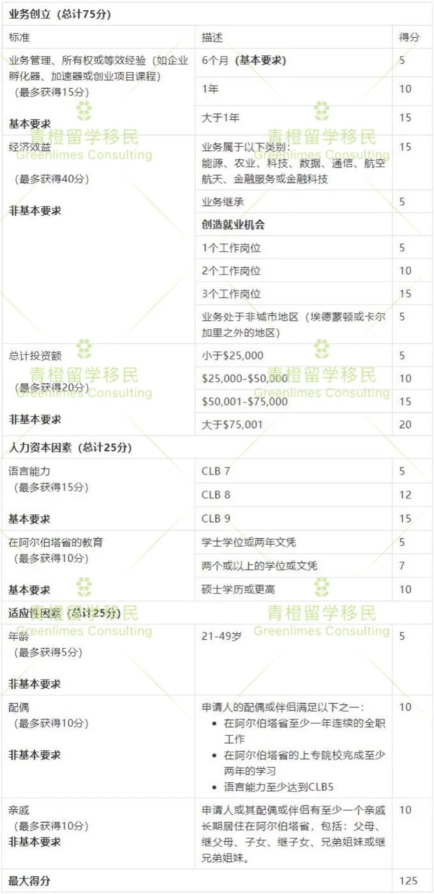
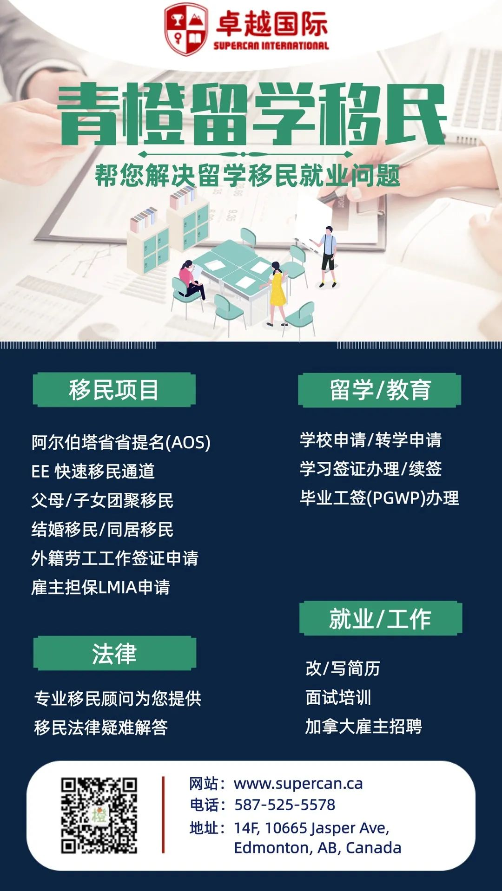

# 无标题

**链接地址:** http://mp.weixin.qq.com/s?__biz=MzU4MjAzMDcxNg==&mid=2247485039&idx=1&sn=57d597d8d2c6ffd887efb5c5347189f9&chksm=fdbfc27ccac84b6aee17a1603ecf4f3b0866706f5858eaedbc40d4fb6b3bde2b8e851c43d868&mpshare=1&scene=2&srcid=1028as7psu46KWX3rtrI2Sdf&sharer_sharetime=1603830513407&sharer_shareid=be1c8edd6c93eec155a61c876e41d26a#rd
**作者:** 大鹿
**获取时间:** 2025/8/28 20:03:09
**图片数量:** 12

---

## 原始HTML内容

<section style="box-sizing: border-box;font-size: 16px;"><section style="box-sizing: border-box;" powered-by="xiumi.us"><section style="text-align: center;margin-top: 10px;margin-bottom: 10px;box-sizing: border-box;"><section style="max-width: 100%;vertical-align: middle;display: inline-block;line-height: 0;box-sizing: border-box;"></section></section></section><section style="box-sizing: border-box;" powered-by="xiumi.us"><section style="margin-right: 0%;margin-left: 0%;box-sizing: border-box;"><section style="display: inline-block;vertical-align: middle;width: 35%;padding-right: 10px;box-sizing: border-box;"><section style="margin-top: 0.5em;margin-bottom: 0.5em;box-sizing: border-box;" powered-by="xiumi.us"><section style="background-color: rgb(226, 0, 0);height: 3px;box-sizing: border-box;"><section><svg viewBox="0 0 1 1" style="float:left;line-height:0;width:0;vertical-align:top;"></svg></section></section></section></section><section style="display: inline-block;vertical-align: middle;width: 30%;box-sizing: border-box;"><section style="text-align: center;margin-top: 10px;margin-bottom: 10px;box-sizing: border-box;" powered-by="xiumi.us"><section style="max-width: 100%;vertical-align: middle;display: inline-block;line-height: 0;width: 80%;box-sizing: border-box;"></section></section></section><section style="display: inline-block;vertical-align: middle;width: 35%;padding-left: 10px;box-sizing: border-box;"><section style="margin-top: 0.5em;margin-bottom: 0.5em;box-sizing: border-box;" powered-by="xiumi.us"><section style="background-color: rgb(226, 0, 0);height: 3px;box-sizing: border-box;"><section><svg viewBox="0 0 1 1" style="float:left;line-height:0;width:0;vertical-align:top;"></svg></section></section></section></section></section></section><section style="box-sizing: border-box;" powered-by="xiumi.us"><section style="display: flex;flex-flow: row nowrap;margin-top: 10px;margin-right: 0%;margin-left: 0%;box-sizing: border-box;"><section style="display: inline-block;width: auto;vertical-align: top;flex: 100 100 0%;align-self: flex-start;height: auto;line-height: 0;box-sizing: border-box;"><section style="text-align: center;margin-right: 0%;margin-bottom: -1px;margin-left: 0%;transform: translate3d(1px, 0px, 0px);box-sizing: border-box;" powered-by="xiumi.us"><section style="display: inline-block;width: 96%;height: 12px;vertical-align: top;overflow: hidden;background-color: rgb(255, 248, 225);border-width: 1px;border-top-left-radius: 16px;border-style: solid solid none;border-color: rgb(255, 214, 88);border-top-right-radius: 16px;border-bottom-right-radius: 0px;box-sizing: border-box;"><section><svg viewBox="0 0 1 1" style="float:left;line-height:0;width:0;vertical-align:top;"></svg></section></section></section></section></section></section><section style="box-sizing: border-box;" powered-by="xiumi.us"><section style="display: inline-block;width: 100%;vertical-align: top;background-color: rgb(255, 248, 225);border-width: 1px;border-radius: 10px;border-style: solid;border-color: rgb(255, 214, 88);overflow: hidden;padding-right: 10px;padding-left: 10px;box-sizing: border-box;"><section style="font-size: 15px;color: rgb(106, 94, 59);letter-spacing: 1px;line-height: 1.8;box-sizing: border-box;" powered-by="xiumi.us">
<strong style="box-sizing: border-box;">2020年10月26日，阿尔伯塔省移民局宣布启动两种全新的移民途径，以鼓励国际毕业生在阿省开创企业，同时也能为阿省当地创造更多的就业机会，实现经济多元化的目的。</strong>
</section></section></section><section style="transform: perspective(0px);transform-style: flat;box-sizing: border-box;" powered-by="xiumi.us"><section style="display: flex;flex-flow: row nowrap;transform: rotateX(180deg);margin-right: 0%;margin-bottom: 10px;margin-left: 0%;box-sizing: border-box;"><section style="display: inline-block;width: auto;vertical-align: top;flex: 100 100 0%;align-self: flex-start;height: auto;line-height: 0;box-sizing: border-box;"><section style="text-align: center;margin-right: 0%;margin-bottom: -1px;margin-left: 0%;transform: translate3d(1px, 0px, 0px);box-sizing: border-box;" powered-by="xiumi.us"><section style="display: inline-block;width: 96%;height: 12px;vertical-align: top;overflow: hidden;background-color: rgb(255, 248, 225);border-width: 1px;border-top-left-radius: 16px;border-style: solid solid none;border-color: rgb(255, 214, 88);border-top-right-radius: 16px;border-bottom-right-radius: 0px;box-sizing: border-box;"><section><svg viewBox="0 0 1 1" style="float:left;line-height:0;width:0;vertical-align:top;"></svg></section></section></section></section></section></section><section style="box-sizing: border-box;" powered-by="xiumi.us"><section style="text-align: center;margin-top: 10px;margin-bottom: 10px;box-sizing: border-box;"><section style="max-width: 100%;vertical-align: middle;display: inline-block;line-height: 0;box-sizing: border-box;"></section></section></section><section style="box-sizing: border-box;" powered-by="xiumi.us"><section style="margin-right: 0%;margin-left: 0%;text-align: center;box-sizing: border-box;"><section style="border-width: 3px;border-style: solid;border-color: rgb(206, 45, 25);padding: 3px;box-sizing: border-box;"><section style="border-color: rgb(206, 45, 25);border-width: 1px;border-style: solid;padding: 10px;background-color: rgb(255, 250, 240);border-radius: 0px;box-shadow: rgb(0, 0, 0) 0px 0px 0px;width: 100%;box-sizing: border-box;"><section style="font-size: 20px;color: rgb(206, 45, 25);line-height: 1.3;box-sizing: border-box;" powered-by="xiumi.us">
<strong style="box-sizing: border-box;">一、国际毕业生企业家移民</strong>

<strong style="box-sizing: border-box;">(IGEIS)</strong>
</section></section></section></section></section><section style="box-sizing: border-box;" powered-by="xiumi.us"><section style="box-sizing: border-box;">
 
</section></section><section style="box-sizing: border-box;" powered-by="xiumi.us"><section style="transform: translate3d(20px, 0px, 0px);-webkit-transform: translate3d(20px, 0px, 0px);-moz-transform: translate3d(20px, 0px, 0px);-o-transform: translate3d(20px, 0px, 0px);margin: 10px 0% -20px;box-sizing: border-box;"><section style="display: inline-block;width: auto;vertical-align: top;min-width: 10%;max-width: 100%;height: auto;box-sizing: border-box;"><section style="box-sizing: border-box;" powered-by="xiumi.us"><section style="display: inline-block;width: auto;vertical-align: top;min-width: 10%;max-width: 100%;height: auto;background-color: rgb(234, 44, 44);box-sizing: border-box;"><section style="color: rgba(255, 255, 255, 0.99);padding-right: 10px;padding-left: 10px;letter-spacing: 1px;line-height: 1.3;box-sizing: border-box;" powered-by="xiumi.us">
<strong style="box-sizing: border-box;">01 </strong>/ <strong style="box-sizing: border-box;">项目简介</strong>
</section></section></section><section style="text-align: left;justify-content: flex-start;font-size: 0px;margin-right: 0%;margin-left: 0%;box-sizing: border-box;" powered-by="xiumi.us"><section style="display: inline-block;width: 0px;height: 0px;vertical-align: top;overflow: hidden;border-style: solid;border-width: 3px;border-radius: 0px;border-color: rgb(234, 44, 44) rgba(255, 255, 255, 0) rgba(255, 255, 255, 0) rgb(234, 44, 44);box-sizing: border-box;"><section><svg viewBox="0 0 1 1" style="float:left;line-height:0;width:0;vertical-align:top;"></svg></section></section></section></section></section></section><section style="box-sizing: border-box;" powered-by="xiumi.us"><section style="margin-right: 0%;margin-bottom: 10px;margin-left: 0%;box-sizing: border-box;"><section style="display: inline-block;width: 100%;vertical-align: top;border-left: 2px solid rgb(234, 44, 44);border-bottom-left-radius: 0px;padding-left: 2px;box-sizing: border-box;"><section style="display: inline-block;width: 100%;vertical-align: top;border-width: 0px 0px 0px 1px;border-left-style: solid;border-bottom-left-radius: 0px;border-left-color: rgb(255, 172, 63);background-color: rgba(255, 250, 243, 0.99);box-sizing: border-box;" powered-by="xiumi.us"><section style="margin: 30px 0% 10px;box-sizing: border-box;" powered-by="xiumi.us"><section style="padding-right: 15px;padding-left: 15px;line-height: 1.8;letter-spacing: 1.8px;font-size: 15px;box-sizing: border-box;">
<strong style="box-sizing: border-box;">IGEIS是一个新的省提名（AINP）项目，针对的是阿尔伯塔省本科或大专院校的国际毕业生。现在这个项目已经可以开始申请，可以通过新的国际毕业生企业家项目递交意向书（Expression of Interest ）。</strong>

 

<strong style="box-sizing: border-box;">AINP将会根据申请者的年龄，学历，语言，工作经历和投资金额等方面评估打分(总分125分)。以下为具体评分标准：</strong>
</section></section><section style="text-align: center;margin-top: 10px;margin-bottom: 10px;box-sizing: border-box;" powered-by="xiumi.us"><section style="max-width: 100%;vertical-align: middle;display: inline-block;line-height: 0;box-sizing: border-box;"></section></section><section style="box-sizing: border-box;" powered-by="xiumi.us"><section style="margin: 10px 0%;display: flex;flex-flow: row nowrap;box-sizing: border-box;"><section style="display: inline-block;vertical-align: bottom;width: auto;align-self: flex-end;flex: 0 0 0%;height: auto;box-sizing: border-box;"><section style="transform: translate3d(5px, 0px, 0px);-webkit-transform: translate3d(5px, 0px, 0px);-moz-transform: translate3d(5px, 0px, 0px);-o-transform: translate3d(5px, 0px, 0px);box-sizing: border-box;" powered-by="xiumi.us"><section style="font-size: 14px;color: rgb(252, 104, 104);line-height: 1;letter-spacing: 0px;box-sizing: border-box;">
＋
</section></section></section><section style="display: inline-block;vertical-align: bottom;width: auto;min-width: 10%;max-width: 100%;flex: 0 0 auto;height: auto;align-self: flex-end;box-sizing: border-box;"><section style="font-size: 20px;color: rgb(252, 104, 104);line-height: 1;letter-spacing: 3px;padding-right: 8px;padding-left: 8px;box-sizing: border-box;" powered-by="xiumi.us">
<strong style="box-sizing: border-box;">加分项 </strong>
</section><section style="text-align: center;font-size: 0px;margin: -7px 0% 1px;box-sizing: border-box;" powered-by="xiumi.us"><section style="display: inline-block;width: 100%;height: 10px;vertical-align: top;overflow: hidden;background-color: rgba(241, 65, 65, 0.1);box-sizing: border-box;"><section><svg viewBox="0 0 1 1" style="float:left;line-height:0;width:0;vertical-align:top;"></svg></section></section></section></section><section style="display: inline-block;vertical-align: bottom;width: auto;align-self: flex-end;min-width: 10%;max-width: 100%;flex: 0 0 auto;height: auto;box-sizing: border-box;"><section style="font-size: 0px;margin-right: 0%;margin-bottom: 1px;margin-left: 0%;transform: translate3d(1px, 0px, 0px);box-sizing: border-box;" powered-by="xiumi.us"><section style="display: inline-block;width: 30px;vertical-align: top;height: auto;background-color: rgb(255, 235, 235);box-sizing: border-box;"><section style="text-align: center;margin-right: 0%;margin-bottom: -2px;margin-left: 0%;box-sizing: border-box;" powered-by="xiumi.us"><section style="max-width: 100%;vertical-align: middle;display: inline-block;line-height: 0;box-sizing: border-box;"></section></section></section></section></section></section></section><section style="box-sizing: border-box;" powered-by="xiumi.us"><section style="display: flex;flex-flow: row nowrap;box-sizing: border-box;"><section style="display: inline-block;vertical-align: middle;width: auto;flex: 0 0 0%;align-self: center;height: auto;line-height: 0;box-sizing: border-box;"><section style="text-align: left;justify-content: flex-start;box-sizing: border-box;" powered-by="xiumi.us"><section style="display: inline-block;width: 22px;height: 22px;vertical-align: top;overflow: hidden;border-width: 0px;border-radius: 50%;border-style: none;border-color: rgb(62, 62, 62);line-height: 0;background-image: linear-gradient(to left bottom, rgb(255, 63, 64) 0%, rgb(255, 133, 133) 100%);box-sizing: border-box;"><section style="transform: rotateZ(135deg);-webkit-transform: rotateZ(135deg);-moz-transform: rotateZ(135deg);-o-transform: rotateZ(135deg);box-sizing: border-box;" powered-by="xiumi.us"><section style="text-align: center;justify-content: center;margin-top: 6px;margin-right: 0%;margin-left: 0%;transform: translate3d(2px, 0px, 0px);box-sizing: border-box;"><section style="display: inline-block;width: 8px;height: 8px;vertical-align: top;overflow: hidden;border-style: solid none none solid;border-width: 1px;border-radius: 0px;border-color: rgb(255, 255, 255);box-sizing: border-box;"><section><svg viewBox="0 0 1 1" style="float:left;line-height:0;width:0;vertical-align:top;"></svg></section></section></section></section></section></section></section><section style="display: inline-block;vertical-align: middle;width: auto;align-self: center;flex: 100 100 0%;box-sizing: border-box;"><section style="font-size: 19px;color: rgb(231, 231, 231);line-height: 1;letter-spacing: 0px;padding-right: 4px;padding-left: 4px;box-sizing: border-box;" powered-by="xiumi.us">
<strong style="box-sizing: border-box;">NO.1</strong><strong style="box-sizing: border-box;"></strong><strong style="box-sizing: border-box;">年龄</strong>
</section></section></section></section><section style="box-sizing: border-box;" powered-by="xiumi.us"><section style="display: flex;flex-flow: row nowrap;box-sizing: border-box;"><section style="display: inline-block;width: auto;vertical-align: top;padding-top: 8px;padding-bottom: 20px;padding-left: 15px;border-style: solid;border-width: 0px 0px 0px 2px;border-radius: 0px;border-color: rgb(62, 62, 62) rgb(62, 62, 62) rgb(62, 62, 62) rgb(255, 64, 64);flex: 100 100 0%;align-self: flex-start;height: auto;margin-left: 10px;box-sizing: border-box;"><section style="font-size: 15px;color: rgb(27, 33, 111);line-height: 1.8;letter-spacing: 1px;box-sizing: border-box;" powered-by="xiumi.us">
<strong style="box-sizing: border-box;">21-49岁</strong>
</section></section></section></section><section style="box-sizing: border-box;" powered-by="xiumi.us"><section style="display: flex;flex-flow: row nowrap;box-sizing: border-box;"><section style="display: inline-block;vertical-align: middle;width: auto;flex: 0 0 0%;align-self: center;height: auto;line-height: 0;box-sizing: border-box;"><section style="text-align: left;justify-content: flex-start;box-sizing: border-box;" powered-by="xiumi.us"><section style="display: inline-block;width: 22px;height: 22px;vertical-align: top;overflow: hidden;border-width: 0px;border-radius: 50%;border-style: none;border-color: rgb(62, 62, 62);line-height: 0;background-image: linear-gradient(to left bottom, rgb(255, 63, 64) 0%, rgb(255, 133, 133) 100%);box-sizing: border-box;"><section style="transform: rotateZ(135deg);-webkit-transform: rotateZ(135deg);-moz-transform: rotateZ(135deg);-o-transform: rotateZ(135deg);box-sizing: border-box;" powered-by="xiumi.us"><section style="text-align: center;justify-content: center;margin-top: 6px;margin-right: 0%;margin-left: 0%;transform: translate3d(2px, 0px, 0px);box-sizing: border-box;"><section style="display: inline-block;width: 8px;height: 8px;vertical-align: top;overflow: hidden;border-style: solid none none solid;border-width: 1px;border-radius: 0px;border-color: rgb(255, 255, 255);box-sizing: border-box;"><section><svg viewBox="0 0 1 1" style="float:left;line-height:0;width:0;vertical-align:top;"></svg></section></section></section></section></section></section></section><section style="display: inline-block;vertical-align: middle;width: auto;align-self: center;flex: 100 100 0%;box-sizing: border-box;"><section style="font-size: 19px;color: rgb(231, 231, 231);line-height: 1;letter-spacing: 0px;padding-right: 4px;padding-left: 4px;box-sizing: border-box;" powered-by="xiumi.us">
<strong style="box-sizing: border-box;">NO.2 </strong><strong style="box-sizing: border-box;">创造经济利益</strong>
</section></section></section></section><section style="box-sizing: border-box;" powered-by="xiumi.us"><section style="display: flex;flex-flow: row nowrap;box-sizing: border-box;"><section style="display: inline-block;width: auto;vertical-align: top;padding-top: 8px;padding-bottom: 20px;padding-left: 15px;border-style: solid;border-width: 0px 0px 0px 2px;border-radius: 0px;border-color: rgb(62, 62, 62) rgb(62, 62, 62) rgb(62, 62, 62) rgb(255, 64, 64);flex: 100 100 0%;align-self: flex-start;height: auto;margin-left: 10px;box-sizing: border-box;"><section style="font-size: 15px;color: rgb(27, 33, 111);line-height: 1.8;letter-spacing: 1px;box-sizing: border-box;" powered-by="xiumi.us">
<strong style="box-sizing: border-box;">投资的金额和提供给加拿大本地人全职工作的名额</strong>
</section></section></section></section><section style="box-sizing: border-box;" powered-by="xiumi.us"><section style="display: flex;flex-flow: row nowrap;box-sizing: border-box;"><section style="display: inline-block;vertical-align: middle;width: auto;flex: 0 0 0%;align-self: center;height: auto;line-height: 0;box-sizing: border-box;"><section style="text-align: left;justify-content: flex-start;box-sizing: border-box;" powered-by="xiumi.us"><section style="display: inline-block;width: 22px;height: 22px;vertical-align: top;overflow: hidden;border-width: 0px;border-radius: 50%;border-style: none;border-color: rgb(62, 62, 62);line-height: 0;background-image: linear-gradient(to left bottom, rgb(255, 63, 64) 0%, rgb(255, 133, 133) 100%);box-sizing: border-box;"><section style="transform: rotateZ(135deg);-webkit-transform: rotateZ(135deg);-moz-transform: rotateZ(135deg);-o-transform: rotateZ(135deg);box-sizing: border-box;" powered-by="xiumi.us"><section style="text-align: center;justify-content: center;margin-top: 6px;margin-right: 0%;margin-left: 0%;transform: translate3d(2px, 0px, 0px);box-sizing: border-box;"><section style="display: inline-block;width: 8px;height: 8px;vertical-align: top;overflow: hidden;border-style: solid none none solid;border-width: 1px;border-radius: 0px;border-color: rgb(255, 255, 255);box-sizing: border-box;"><section><svg viewBox="0 0 1 1" style="float:left;line-height:0;width:0;vertical-align:top;"></svg></section></section></section></section></section></section></section><section style="display: inline-block;vertical-align: middle;width: auto;align-self: center;flex: 100 100 0%;box-sizing: border-box;"><section style="font-size: 19px;color: rgb(231, 231, 231);line-height: 1;letter-spacing: 0px;padding-right: 4px;padding-left: 4px;box-sizing: border-box;" powered-by="xiumi.us">
<strong style="box-sizing: border-box;">NO.3</strong><strong style="box-sizing: border-box;"></strong><strong style="box-sizing: border-box;">配偶/同居伴侣</strong>
</section></section></section></section><section style="box-sizing: border-box;" powered-by="xiumi.us"><section style="display: flex;flex-flow: row nowrap;box-sizing: border-box;"><section style="display: inline-block;width: auto;vertical-align: top;padding-top: 8px;padding-bottom: 20px;padding-left: 15px;border-style: solid;border-width: 0px 0px 0px 2px;border-radius: 0px;border-color: rgb(62, 62, 62) rgb(62, 62, 62) rgb(62, 62, 62) rgb(255, 64, 64);flex: 100 100 0%;align-self: flex-start;height: auto;margin-left: 10px;box-sizing: border-box;"><section style="font-size: 15px;color: rgb(27, 33, 111);line-height: 1.8;letter-spacing: 1px;box-sizing: border-box;" powered-by="xiumi.us">
<strong style="box-sizing: border-box;">配偶/同居伴侣至少符合以下条件之一：</strong>

<strong style="box-sizing: border-box;">英文达到CLB5；在阿省有一年全职工作经验；在阿省完成2年以上学历</strong>
</section></section></section></section><section style="box-sizing: border-box;" powered-by="xiumi.us"><section style="display: flex;flex-flow: row nowrap;box-sizing: border-box;"><section style="display: inline-block;vertical-align: middle;width: auto;flex: 0 0 0%;align-self: center;height: auto;line-height: 0;box-sizing: border-box;"><section style="text-align: left;justify-content: flex-start;box-sizing: border-box;" powered-by="xiumi.us"><section style="display: inline-block;width: 22px;height: 22px;vertical-align: top;overflow: hidden;border-width: 0px;border-radius: 50%;border-style: none;border-color: rgb(62, 62, 62);line-height: 0;background-image: linear-gradient(to left bottom, rgb(255, 63, 64) 0%, rgb(255, 133, 133) 100%);box-sizing: border-box;"><section style="transform: rotateZ(135deg);-webkit-transform: rotateZ(135deg);-moz-transform: rotateZ(135deg);-o-transform: rotateZ(135deg);box-sizing: border-box;" powered-by="xiumi.us"><section style="text-align: center;justify-content: center;margin-top: 6px;margin-right: 0%;margin-left: 0%;transform: translate3d(2px, 0px, 0px);box-sizing: border-box;"><section style="display: inline-block;width: 8px;height: 8px;vertical-align: top;overflow: hidden;border-style: solid none none solid;border-width: 1px;border-radius: 0px;border-color: rgb(255, 255, 255);box-sizing: border-box;"><section><svg viewBox="0 0 1 1" style="float:left;line-height:0;width:0;vertical-align:top;"></svg></section></section></section></section></section></section></section><section style="display: inline-block;vertical-align: middle;width: auto;align-self: center;flex: 100 100 0%;box-sizing: border-box;"><section style="font-size: 19px;color: rgb(231, 231, 231);line-height: 1;letter-spacing: 0px;padding-right: 4px;padding-left: 4px;box-sizing: border-box;" powered-by="xiumi.us">
<strong style="box-sizing: border-box;">NO.4</strong><strong style="box-sizing: border-box;"></strong><strong style="box-sizing: border-box;">亲属</strong>
</section></section></section></section><section style="box-sizing: border-box;" powered-by="xiumi.us"><section style="display: flex;flex-flow: row nowrap;box-sizing: border-box;"><section style="display: inline-block;width: auto;vertical-align: top;padding-top: 8px;padding-bottom: 20px;padding-left: 15px;border-style: solid;border-width: 0px 0px 0px 2px;border-radius: 0px;border-color: rgb(62, 62, 62) rgb(62, 62, 62) rgb(62, 62, 62) rgb(255, 64, 64);flex: 100 100 0%;align-self: flex-start;height: auto;margin-left: 10px;box-sizing: border-box;"><section style="font-size: 15px;color: rgb(27, 33, 111);line-height: 1.8;letter-spacing: 1px;box-sizing: border-box;" powered-by="xiumi.us">
<strong style="box-sizing: border-box;">申请人或申请人配偶/同居伴侣在阿省有直系亲属：父母，继父母，兄弟姐妹</strong>
</section></section></section></section><section style="margin: 30px 0% 10px;box-sizing: border-box;" powered-by="xiumi.us"><section style="padding-right: 15px;padding-left: 15px;line-height: 1.8;letter-spacing: 1.8px;font-size: 15px;box-sizing: border-box;">
<strong style="letter-spacing: 1.8px;box-sizing: border-box;">分数排名靠前的申请人将会收到一份要求提交商业申请的邀请信。只有受到邀请的申请人才可以使用AINP的网站并开始申请。</strong><strong style="letter-spacing: 1.8px;box-sizing: border-box;">需要注意的是，仅仅接受到邀请并不意味着可以获得永久居民资格。</strong> 
</section></section></section></section></section></section><section style="box-sizing: border-box;" powered-by="xiumi.us"><section style="text-align: center;margin-top: 10px;margin-bottom: 10px;box-sizing: border-box;"><section style="max-width: 100%;vertical-align: middle;display: inline-block;line-height: 0;box-sizing: border-box;"></section></section></section><section style="box-sizing: border-box;" powered-by="xiumi.us"><section style="transform: translate3d(20px, 0px, 0px);-webkit-transform: translate3d(20px, 0px, 0px);-moz-transform: translate3d(20px, 0px, 0px);-o-transform: translate3d(20px, 0px, 0px);margin: 10px 0% -20px;box-sizing: border-box;"><section style="display: inline-block;width: auto;vertical-align: top;min-width: 10%;max-width: 100%;height: auto;box-sizing: border-box;"><section style="box-sizing: border-box;" powered-by="xiumi.us"><section style="display: inline-block;width: auto;vertical-align: top;min-width: 10%;max-width: 100%;height: auto;background-color: rgb(234, 44, 44);box-sizing: border-box;"><section style="color: rgba(255, 255, 255, 0.99);padding-right: 10px;padding-left: 10px;letter-spacing: 1px;line-height: 1.3;box-sizing: border-box;" powered-by="xiumi.us">
<strong style="box-sizing: border-box;">02&nbsp;</strong>/ <strong style="box-sizing: border-box;">申请条件</strong>
</section></section></section><section style="text-align: left;justify-content: flex-start;font-size: 0px;margin-right: 0%;margin-left: 0%;box-sizing: border-box;" powered-by="xiumi.us"><section style="display: inline-block;width: 0px;height: 0px;vertical-align: top;overflow: hidden;border-style: solid;border-width: 3px;border-radius: 0px;border-color: rgb(234, 44, 44) rgba(255, 255, 255, 0) rgba(255, 255, 255, 0) rgb(234, 44, 44);box-sizing: border-box;"><section><svg viewBox="0 0 1 1" style="float:left;line-height:0;width:0;vertical-align:top;"></svg></section></section></section></section></section></section><section style="box-sizing: border-box;" powered-by="xiumi.us"><section style="margin-right: 0%;margin-bottom: 10px;margin-left: 0%;box-sizing: border-box;"><section style="display: inline-block;width: 100%;vertical-align: top;border-left: 2px solid rgb(234, 44, 44);border-bottom-left-radius: 0px;padding-left: 2px;box-sizing: border-box;"><section style="display: inline-block;width: 100%;vertical-align: top;border-width: 0px 0px 0px 1px;border-left-style: solid;border-bottom-left-radius: 0px;border-left-color: rgb(255, 172, 63);background-color: rgba(255, 250, 243, 0.99);box-sizing: border-box;" powered-by="xiumi.us"><section style="margin: 30px 0% 10px;box-sizing: border-box;" powered-by="xiumi.us"><section style="padding-right: 15px;padding-left: 15px;line-height: 1.8;letter-spacing: 1.8px;font-size: 15px;box-sizing: border-box;">
<strong style="box-sizing: border-box;">1）工作经验：</strong><strong style="letter-spacing: 1.8px;box-sizing: border-box;">在阿尔伯塔省至少有6个月的全职管理或是拥有公司的经验或有相关培训；</strong>

<strong style="box-sizing: border-box;"></strong>

<strong style="box-sizing: border-box;">2）学历：</strong><strong style="box-sizing: border-box;">在阿尔伯塔省完成至少两年的全职教育（包括大学本科或是大专）；</strong>

<strong style="box-sizing: border-box;">3）签证：</strong><strong style="box-sizing: border-box;">提交EOI申请时，毕业工签至少有两年有效期; </strong>

<strong style="box-sizing: border-box;">4）语言要求：</strong><strong style="box-sizing: border-box;">英文水平达到CLB7；</strong>

<strong style="box-sizing: border-box;">5）企业要求：</strong><strong style="box-sizing: border-box;">在阿省成立一个新的企业或购买现有企业，申请人所占股份不得少于34%，创办的企业不能是以下类型的生意。</strong>
</section></section><section style="box-sizing: border-box;" powered-by="xiumi.us"><section style="display: flex;flex-flow: row nowrap;margin: 10px 0% 20px;box-sizing: border-box;"><section style="display: inline-block;vertical-align: top;width: 60px;border-style: solid;border-width: 3px;border-radius: 0px;border-color: rgb(224, 26, 26);flex: 0 0 auto;height: auto;align-self: stretch;padding-top: 10px;box-sizing: border-box;"><section style="box-sizing: border-box;" powered-by="xiumi.us">
 
</section></section><section style="display: inline-block;vertical-align: top;width: auto;background-color: rgb(224, 152, 152);border-width: 0px;flex: 100 100 0%;align-self: stretch;height: auto;margin-top: 10px;margin-bottom: -10px;margin-left: -50px;padding: 5px 10px;box-sizing: border-box;"><section style="margin-top: 3px;margin-right: 0%;margin-left: 0%;box-sizing: border-box;" powered-by="xiumi.us"><section style="font-family: Optima-Regular, PingFangTC-light;font-size: 15px;color: rgb(255, 255, 255);box-sizing: border-box;">
<strong style="box-sizing: border-box;">不符合要求的企业：</strong>
</section></section></section></section></section><section style="margin: 30px 0% 10px;box-sizing: border-box;" powered-by="xiumi.us"><section style="padding-right: 15px;padding-left: 15px;line-height: 1.8;letter-spacing: 1.8px;font-size: 15px;color: rgb(62, 62, 62);box-sizing: border-box;">
<strong style="box-sizing: border-box;">1）违反《移民和难民保护法》的任何业务</strong>

<strong style="box-sizing: border-box;">2）没有增值经济成分的企业，如：</strong>
<ul class="list-paddingleft-2"><li style="box-sizing: border-box;">
<strong style="box-sizing: border-box;">发薪日贷款、支票兑现及相关业务</strong>
</li><li style="box-sizing: border-box;">
<strong style="box-sizing: border-box;">二手物品交易</strong>
</li></ul>
<strong style="box-sizing: border-box;">3）被视为被动投资或缺乏主动管理的企业，包括：</strong>
<ul class="list-paddingleft-2"><li style="box-sizing: border-box;">
<strong style="box-sizing: border-box;">物业租赁，投资和租赁活动</strong>
</li><li style="box-sizing: border-box;">
<strong style="box-sizing: border-box;">房地产开发/经纪，保险经纪或商业经纪</strong>
</li><li style="box-sizing: border-box;">
<strong style="box-sizing: border-box;">投币式业务，包括自助洗衣店和洗车业务</strong>
</li></ul>
<strong style="box-sizing: border-box;">4）季节性业务</strong>

<strong style="box-sizing: border-box;">5）家庭式企业，包括民宿和寄宿</strong>

<strong style="box-sizing: border-box;">6）属于继承计划一部分的企业，如：</strong>
<ul class="list-paddingleft-2"><li style="box-sizing: border-box;">
<strong style="box-sizing: border-box;">该企业被申请人的近亲所拥有或运营</strong>
</li><li style="box-sizing: border-box;">
<strong style="box-sizing: border-box;">过去四年内被先前该项目的申请人所运营</strong>
</li><li style="box-sizing: border-box;">
<strong style="box-sizing: border-box;">在申请该项目之前的三年内更换过所有权</strong>
</li></ul>
<strong style="box-sizing: border-box;">7）涉及生产，分发或销售色情产品或服务，或提供色情服务的企业。</strong>

<strong style="box-sizing: border-box;">8）任何会对该项目或阿尔伯塔政府产生负面影响的企业</strong>
</section></section></section></section></section></section><section style="text-align: center;margin-top: 10px;margin-bottom: 10px;box-sizing: border-box;" powered-by="xiumi.us"><section style="max-width: 100%;vertical-align: middle;display: inline-block;line-height: 0;box-sizing: border-box;"></section></section><section style="box-sizing: border-box;" powered-by="xiumi.us"><section style="transform: translate3d(20px, 0px, 0px);-webkit-transform: translate3d(20px, 0px, 0px);-moz-transform: translate3d(20px, 0px, 0px);-o-transform: translate3d(20px, 0px, 0px);margin: 10px 0% -20px;box-sizing: border-box;"><section style="display: inline-block;width: auto;vertical-align: top;min-width: 10%;max-width: 100%;height: auto;box-sizing: border-box;"><section style="box-sizing: border-box;" powered-by="xiumi.us"><section style="display: inline-block;width: auto;vertical-align: top;min-width: 10%;max-width: 100%;height: auto;background-color: rgb(234, 44, 44);box-sizing: border-box;"><section style="color: rgba(255, 255, 255, 0.99);padding-right: 10px;padding-left: 10px;letter-spacing: 1px;line-height: 1.3;box-sizing: border-box;" powered-by="xiumi.us">
<strong style="box-sizing: border-box;">03&nbsp;</strong>/ <strong style="box-sizing: border-box;">不符合申请资格的情况</strong>
</section></section></section><section style="text-align: left;justify-content: flex-start;font-size: 0px;margin-right: 0%;margin-left: 0%;box-sizing: border-box;" powered-by="xiumi.us"><section style="display: inline-block;width: 0px;height: 0px;vertical-align: top;overflow: hidden;border-style: solid;border-width: 3px;border-radius: 0px;border-color: rgb(234, 44, 44) rgba(255, 255, 255, 0) rgba(255, 255, 255, 0) rgb(234, 44, 44);box-sizing: border-box;"><section><svg viewBox="0 0 1 1" style="float:left;line-height:0;width:0;vertical-align:top;"></svg></section></section></section></section></section></section><section style="box-sizing: border-box;" powered-by="xiumi.us"><section style="margin-right: 0%;margin-bottom: 10px;margin-left: 0%;box-sizing: border-box;"><section style="display: inline-block;width: 100%;vertical-align: top;border-left: 2px solid rgb(234, 44, 44);border-bottom-left-radius: 0px;padding-left: 2px;box-sizing: border-box;"><section style="display: inline-block;width: 100%;vertical-align: top;border-width: 0px 0px 0px 1px;border-left-style: solid;border-bottom-left-radius: 0px;border-left-color: rgb(255, 172, 63);background-color: rgba(255, 250, 243, 0.99);box-sizing: border-box;" powered-by="xiumi.us"><section style="margin: 30px 0% 10px;box-sizing: border-box;" powered-by="xiumi.us"><section style="padding-right: 15px;padding-left: 15px;line-height: 1.8;letter-spacing: 1.8px;font-size: 15px;box-sizing: border-box;">
<strong style="box-sizing: border-box;">1）申请人只可以取得一份阿省省提名证书：</strong><strong style="box-sizing: border-box;">如果申请人持有效的阿省省提名信且尚未过期，或者持已过期的提名信，但可以获得阿省移民局给予延期的，都是不符合申请资格； </strong>

 

<strong style="box-sizing: border-box;">2）在先前的AINP申请中已向您发出一封信函，说明您在指定的时间内没有资格重新申请AINP。</strong><strong style="box-sizing: border-box;">如果申请人在阿省移民局限定的时间内提交IGEIS项目的申请，申请将会拒签。</strong>

 

<strong style="box-sizing: border-box;">3）申请人被加拿大联邦移民局或加拿大边境服务局发出遣送令。</strong><strong style="letter-spacing: 1.8px;box-sizing: border-box;">AINP不能干预联邦难民的申请、上诉或遣返过程；</strong>

 

<strong style="box-sizing: border-box;">4）申请人没有有效的临时居民身份，</strong><strong style="box-sizing: border-box;">是在加拿大非法居住或工作的外国人；</strong>

 

<strong style="box-sizing: border-box;">5）申请人的公司在不符合IGEIS项目申请要求的企业类型的列表中。</strong>
</section></section></section></section></section></section><section style="box-sizing: border-box;" powered-by="xiumi.us"><section style="box-sizing: border-box;">
 
</section></section><section style="margin-right: 0%;margin-left: 0%;text-align: center;box-sizing: border-box;" powered-by="xiumi.us"><section style="border-width: 3px;border-style: solid;border-color: rgb(206, 45, 25);padding: 3px;box-sizing: border-box;"><section style="border-color: rgb(206, 45, 25);border-width: 1px;border-style: solid;padding: 10px;background-color: rgb(255, 250, 240);border-radius: 0px;box-shadow: rgb(0, 0, 0) 0px 0px 0px;width: 100%;box-sizing: border-box;"><section style="font-size: 20px;color: rgb(206, 45, 25);box-sizing: border-box;" powered-by="xiumi.us">
<strong style="box-sizing: border-box;">二、海外毕业生创业签证</strong>

<strong style="box-sizing: border-box;">(FGSUVS)</strong>
</section></section></section></section><section style="box-sizing: border-box;" powered-by="xiumi.us">
 
</section><section style="box-sizing: border-box;" powered-by="xiumi.us"><section style="margin-right: 0%;margin-bottom: 10px;margin-left: 0%;box-sizing: border-box;"><section style="display: inline-block;width: 100%;vertical-align: top;border-left: 2px solid rgb(234, 44, 44);border-bottom-left-radius: 0px;padding-left: 2px;box-sizing: border-box;"><section style="display: inline-block;width: 100%;vertical-align: top;border-width: 0px 0px 0px 1px;border-left-style: solid;border-bottom-left-radius: 0px;border-left-color: rgb(255, 172, 63);background-color: rgba(255, 250, 243, 0.99);box-sizing: border-box;" powered-by="xiumi.us"><section style="margin: 30px 0% 10px;box-sizing: border-box;" powered-by="xiumi.us"><section style="padding-right: 15px;padding-left: 15px;line-height: 1.8;letter-spacing: 1.8px;font-size: 15px;box-sizing: border-box;">
<strong style="box-sizing: border-box;">除了以上针对阿省国际毕业生出台的移民新政，阿省还将于明年1月推出一项“外国毕业生创业签证计划”，以吸引来自美国顶尖大学和学院的毕业生来到阿省创业和定居。这是加拿大向高移民水平发展迈出的第一步！ </strong>

 

<strong style="box-sizing: border-box;">由于美国移民政策的动荡，许多留美毕业生也面临着更多的不可控风险，而这项政策的出台也为许多美国毕业生开辟了一条新的道路。</strong>

 

<strong style="box-sizing: border-box;">此项目将于2021年1月启动，项目细节将于今年晚些时候公布。</strong>
</section></section></section></section></section></section><section style="box-sizing: border-box;" powered-by="xiumi.us"><section style="box-sizing: border-box;">
 
</section></section><section style="box-sizing: border-box;" powered-by="xiumi.us"><section style="margin: 10px 0%;box-sizing: border-box;"><section style="display: inline-block;width: 100%;vertical-align: top;border-style: solid;border-width: 0px;border-radius: 0px;border-color: transparent;background-color: rgb(255, 250, 240);box-sizing: border-box;"><section style="box-sizing: border-box;" powered-by="xiumi.us"><section style="display: inline-block;vertical-align: bottom;width: 18%;box-sizing: border-box;"><section style="text-align: left;box-sizing: border-box;" powered-by="xiumi.us"><section style="display: inline-block;width: 40px;height: 40px;vertical-align: top;overflow: hidden;background-color: rgb(206, 45, 25);border-bottom: 0px none rgb(62, 62, 62);border-bottom-right-radius: 100%;box-sizing: border-box;"><section style="margin-top: 3px;margin-right: 0%;margin-left: 0%;transform: translate3d(4px, 0px, 0px);box-sizing: border-box;" powered-by="xiumi.us"><section style="max-width: 100%;vertical-align: middle;display: inline-block;line-height: 0;width: 60%;box-sizing: border-box;"></section></section></section></section></section><section style="display: inline-block;vertical-align: bottom;width: 82%;padding-top: 5px;padding-right: 5px;box-sizing: border-box;"><section style="transform: translate3d(-10px, 0px, 0px);-webkit-transform: translate3d(-10px, 0px, 0px);-moz-transform: translate3d(-10px, 0px, 0px);-o-transform: translate3d(-10px, 0px, 0px);box-sizing: border-box;" powered-by="xiumi.us"><section style="color: rgb(206, 45, 25);font-size: 17px;box-sizing: border-box;">
<strong style="box-sizing: border-box;">&nbsp;结语</strong>
</section></section></section></section><section style="display: inline-block;width: 100%;vertical-align: top;padding: 10px;box-sizing: border-box;" powered-by="xiumi.us"><section style="margin: 5px 0% 10px;box-sizing: border-box;" powered-by="xiumi.us"><section style="font-size: 15px;color: rgb(60, 60, 60);line-height: 1.75;letter-spacing: 1px;padding-right: 10px;padding-left: 10px;box-sizing: border-box;">
<strong style="box-sizing: border-box;">目前这两个项目对申请人的家庭资产，投资额都没有硬性要求：2万5千加币即可获得加分，7万5千加币即可获得投资额项的满分加分。企业的管理经验甚至都可以通过完成企业家学习课程来实现。由此可见阿省的企业家项目是非常看中申请人的教育背景和才能，申请人本人是否多金并不重要。</strong>

 

<strong style="box-sizing: border-box;">阿省最新设立的企业家项目为在阿省毕业的留学生开辟了新的移民申请通道，也给毕业生们一个新的人生方向。除此之外，海外毕业生创业项目让很多毕业后在美国申请H1B工签困难，继续读书又受限重重的在美留学生，可以赴加创业顺便解决身份问题。</strong>

 

<strong style="box-sizing: border-box;">青橙留学移民</strong><strong style="box-sizing: border-box;">长期与多家优质企业有着深度合作，欢迎想要自主创业的阿省毕业生添加下方二维码进行咨询！</strong>

<strong style="box-sizing: border-box;">对海外毕业生创业项目感兴趣的在美留学生，也欢迎添加我们的微信，待阿省公布项目具体细节，我们将会第一时间为大家更新！</strong>
</section></section></section></section></section></section><section style="box-sizing: border-box;" powered-by="xiumi.us"><section style="font-size: 15px;box-sizing: border-box;">
<strong style="box-sizing: border-box;">更多干货请点击：</strong>
</section></section><section style="box-sizing: border-box;" powered-by="xiumi.us"><section style="box-sizing: border-box;">
<a target="_blank" href="http://mp.weixin.qq.com/s?__biz=MzU4MjAzMDcxNg==&amp;mid=2247485022&amp;idx=1&amp;sn=30abcab2f575f5dff4e6f8fc3d7e7ac0&amp;chksm=fdbfc24dcac84b5bd82c1e3aafd7f46e39af0fb323971ae1cf2625970bec4c5b9177cd93ee24&amp;scene=21#wechat_redirect" data-itemshowtype="0" tab="innerlink" data-linktype="2">【青橙快报】官宣！魁省投资移民明年4月重启！</a> 

<a target="_blank" href="http://mp.weixin.qq.com/s?__biz=MzU4MjAzMDcxNg==&amp;mid=2247485010&amp;idx=1&amp;sn=dc2d6439c3d562079058949d0b758b0c&amp;chksm=fdbfc241cac84b57b833d23b88eda12de621bfd6339a84e0a479af71993bdc7b007a98234c53&amp;scene=21#wechat_redirect" data-itemshowtype="0" tab="innerlink" data-linktype="2">【青橙快报】BC省PNP-Tech Pilot又延期了！审理速度快，抽签分数低！</a> 

<a target="_blank" href="http://mp.weixin.qq.com/s?__biz=MzU4MjAzMDcxNg==&amp;mid=2247484950&amp;idx=1&amp;sn=1d753299d9b7e7fb56d6db14e85d42c2&amp;chksm=fdbfc205cac84b139914d8202775af46eaff763ff90872250a52eee370bdc5abfc43ee737755&amp;scene=21#wechat_redirect" data-itemshowtype="0" tab="innerlink" data-linktype="2">【青橙快报】最新！2020加拿大担保父母/祖父母团聚移民重开！预计发放4万名额！</a> 

<a target="_blank" href="http://mp.weixin.qq.com/s?__biz=MzU4MjAzMDcxNg==&amp;mid=2247484975&amp;idx=1&amp;sn=3480af4537edfd4fd4c8d814b74964d2&amp;chksm=fdbfc23ccac84b2a718e298ff137e70b00fbf6346d98b673a6a321964e89fb1d3fb7c2a24ebe&amp;scene=21#wechat_redirect" data-itemshowtype="0" tab="innerlink" data-linktype="2">【青橙快报】加拿大放宽入境限制！被疫情隔开的人们可以团聚了！</a> 
</section></section><section style="box-sizing: border-box;" powered-by="xiumi.us"><section style="box-sizing: border-box;">
 
</section></section><section style="box-sizing: border-box;" powered-by="xiumi.us"><section style="text-align: center;margin-top: 10px;margin-bottom: 10px;box-sizing: border-box;"><section style="max-width: 100%;vertical-align: middle;display: inline-block;line-height: 0;box-sizing: border-box;"></section></section></section><section style="box-sizing: border-box;" powered-by="xiumi.us"><section style="text-align: center;margin-top: 10px;margin-bottom: 10px;box-sizing: border-box;"><section style="max-width: 100%;vertical-align: middle;display: inline-block;line-height: 0;box-sizing: border-box;"></section></section></section><section style="box-sizing: border-box;" powered-by="xiumi.us"><section style="margin-right: 0%;margin-left: 0%;box-sizing: border-box;"><section style="display: inline-block;vertical-align: middle;width: 35%;padding-right: 10px;box-sizing: border-box;"><section style="margin-top: 0.5em;margin-bottom: 0.5em;box-sizing: border-box;" powered-by="xiumi.us"><section style="background-color: rgb(226, 0, 0);height: 3px;box-sizing: border-box;"><section><svg viewBox="0 0 1 1" style="float:left;line-height:0;width:0;vertical-align:top;"></svg></section></section></section></section><section style="display: inline-block;vertical-align: middle;width: 30%;box-sizing: border-box;"><section style="text-align: center;margin-top: 10px;margin-bottom: 10px;box-sizing: border-box;" powered-by="xiumi.us"><section style="max-width: 100%;vertical-align: middle;display: inline-block;line-height: 0;width: 80%;box-sizing: border-box;"></section></section></section><section style="display: inline-block;vertical-align: middle;width: 35%;padding-left: 10px;box-sizing: border-box;"><section style="margin-top: 0.5em;margin-bottom: 0.5em;box-sizing: border-box;" powered-by="xiumi.us"><section style="background-color: rgb(226, 0, 0);height: 3px;box-sizing: border-box;"><section><svg viewBox="0 0 1 1" style="float:left;line-height:0;width:0;vertical-align:top;"></svg></section></section></section></section></section></section><section style="box-sizing: border-box;" powered-by="xiumi.us"><section style="box-sizing: border-box;">
 
</section></section><section style="box-sizing: border-box;" powered-by="xiumi.us"><section style="margin-right: 0%;margin-left: 0%;text-align: center;box-sizing: border-box;"><section style="border-width: 3px;border-style: solid;border-color: rgb(206, 45, 25);padding: 3px;box-sizing: border-box;"><section style="border-color: rgb(206, 45, 25);border-width: 1px;border-style: solid;padding: 10px;background-color: rgb(255, 250, 240);border-radius: 0px;box-shadow: rgb(0, 0, 0) 0px 0px 0px;width: 100%;box-sizing: border-box;"><section style="margin-right: 0%;margin-left: 0%;box-sizing: border-box;" powered-by="xiumi.us"><section style="display: inline-block;vertical-align: middle;width: 70%;padding: 10px;box-sizing: border-box;"><section style="text-align: justify;font-size: 14px;line-height: 1.75;letter-spacing: 0px;color: rgb(224, 26, 26);box-sizing: border-box;" powered-by="xiumi.us">
<strong style="box-sizing: border-box;">青橙留学移民</strong>

 

<strong style="box-sizing: border-box;">微信服务号</strong>
</section></section><section style="display: inline-block;vertical-align: middle;width: 30%;padding: 10px;box-sizing: border-box;"><section style="margin-right: 0%;margin-left: 0%;box-sizing: border-box;" powered-by="xiumi.us"><section style="max-width: 100%;vertical-align: middle;display: inline-block;line-height: 0;width: 100%;box-shadow: transparent 0px 0px 0px;border-width: 0px;border-radius: 0px;border-style: none;border-color: rgb(62, 62, 62);box-sizing: border-box;"></section></section></section></section></section></section></section></section></section>
 

---

## 纯文本内容

2020年10月26日，阿尔伯塔省移民局宣布启动两种全新的移民途径，以鼓励国际毕业生在阿省开创企业，同时也能为阿省当地创造更多的就业机会，实现经济多元化的目的。一、国际毕业生企业家移民(IGEIS)01 / 项目简介IGEIS是一个新的省提名（AINP）项目，针对的是阿尔伯塔省本科或大专院校的国际毕业生。现在这个项目已经可以开始申请，可以通过新的国际毕业生企业家项目递交意向书（Expression of Interest ）。AINP将会根据申请者的年龄，学历，语言，工作经历和投资金额等方面评估打分(总分125分)。以下为具体评分标准：＋加分项NO.1年龄21-49岁NO.2 创造经济利益投资的金额和提供给加拿大本地人全职工作的名额NO.3配偶/同居伴侣配偶/同居伴侣至少符合以下条件之一：英文达到CLB5；在阿省有一年全职工作经验；在阿省完成2年以上学历NO.4亲属申请人或申请人配偶/同居伴侣在阿省有直系亲属：父母，继父母，兄弟姐妹分数排名靠前的申请人将会收到一份要求提交商业申请的邀请信。只有受到邀请的申请人才可以使用AINP的网站并开始申请。需要注意的是，仅仅接受到邀请并不意味着可以获得永久居民资格。02 / 申请条件1）工作经验：在阿尔伯塔省至少有6个月的全职管理或是拥有公司的经验或有相关培训；2）学历：在阿尔伯塔省完成至少两年的全职教育（包括大学本科或是大专）；3）签证：提交EOI申请时，毕业工签至少有两年有效期;4）语言要求：英文水平达到CLB7；5）企业要求：在阿省成立一个新的企业或购买现有企业，申请人所占股份不得少于34%，创办的企业不能是以下类型的生意。不符合要求的企业：1）违反《移民和难民保护法》的任何业务2）没有增值经济成分的企业，如：发薪日贷款、支票兑现及相关业务二手物品交易3）被视为被动投资或缺乏主动管理的企业，包括：物业租赁，投资和租赁活动房地产开发/经纪，保险经纪或商业经纪投币式业务，包括自助洗衣店和洗车业务4）季节性业务5）家庭式企业，包括民宿和寄宿6）属于继承计划一部分的企业，如：该企业被申请人的近亲所拥有或运营过去四年内被先前该项目的申请人所运营在申请该项目之前的三年内更换过所有权7）涉及生产，分发或销售色情产品或服务，或提供色情服务的企业。8）任何会对该项目或阿尔伯塔政府产生负面影响的企业03 / 不符合申请资格的情况1）申请人只可以取得一份阿省省提名证书：如果申请人持有效的阿省省提名信且尚未过期，或者持已过期的提名信，但可以获得阿省移民局给予延期的，都是不符合申请资格；2）在先前的AINP申请中已向您发出一封信函，说明您在指定的时间内没有资格重新申请AINP。如果申请人在阿省移民局限定的时间内提交IGEIS项目的申请，申请将会拒签。3）申请人被加拿大联邦移民局或加拿大边境服务局发出遣送令。AINP不能干预联邦难民的申请、上诉或遣返过程；4）申请人没有有效的临时居民身份，是在加拿大非法居住或工作的外国人；5）申请人的公司在不符合IGEIS项目申请要求的企业类型的列表中。二、海外毕业生创业签证(FGSUVS)除了以上针对阿省国际毕业生出台的移民新政，阿省还将于明年1月推出一项“外国毕业生创业签证计划”，以吸引来自美国顶尖大学和学院的毕业生来到阿省创业和定居。这是加拿大向高移民水平发展迈出的第一步！由于美国移民政策的动荡，许多留美毕业生也面临着更多的不可控风险，而这项政策的出台也为许多美国毕业生开辟了一条新的道路。此项目将于2021年1月启动，项目细节将于今年晚些时候公布。 结语目前这两个项目对申请人的家庭资产，投资额都没有硬性要求：2万5千加币即可获得加分，7万5千加币即可获得投资额项的满分加分。企业的管理经验甚至都可以通过完成企业家学习课程来实现。由此可见阿省的企业家项目是非常看中申请人的教育背景和才能，申请人本人是否多金并不重要。阿省最新设立的企业家项目为在阿省毕业的留学生开辟了新的移民申请通道，也给毕业生们一个新的人生方向。除此之外，海外毕业生创业项目让很多毕业后在美国申请H1B工签困难，继续读书又受限重重的在美留学生，可以赴加创业顺便解决身份问题。青橙留学移民长期与多家优质企业有着深度合作，欢迎想要自主创业的阿省毕业生添加下方二维码进行咨询！对海外毕业生创业项目感兴趣的在美留学生，也欢迎添加我们的微信，待阿省公布项目具体细节，我们将会第一时间为大家更新！更多干货请点击：【青橙快报】官宣！魁省投资移民明年4月重启！【青橙快报】BC省PNP-Tech Pilot又延期了！审理速度快，抽签分数低！【青橙快报】最新！2020加拿大担保父母/祖父母团聚移民重开！预计发放4万名额！【青橙快报】加拿大放宽入境限制！被疫情隔开的人们可以团聚了！青橙留学移民微信服务号

---

## 图片列表

-  (原始链接: https://mmbiz.qpic.cn/mmbiz_jpg/oK3ILNJYvFFdRBLNs91pU6SOZ2QgNlEUUDAX0e9l8QwY2ARl0O5DNIH1qKpCocvDnUxutibFlgWsDmTnQJdMbdw/640?wx_fmt=jpeg)
-  (原始链接: https://mmbiz.qpic.cn/mmbiz_gif/oK3ILNJYvFFdRBLNs91pU6SOZ2QgNlEUGrd5kVfQj9c01Zk4w9YlfuxYkue0evLbqOVotAlKm9YR4UMde62y3A/640?wx_fmt=gif)
-  (原始链接: https://mmbiz.qpic.cn/mmbiz_jpg/oK3ILNJYvFFdRBLNs91pU6SOZ2QgNlEU9MVySdzpQoe5w8Nj12DBf2iaDxqRTmtM6YrYs2XUEicqa762eGFxnqqQ/640?wx_fmt=jpeg)
-  (原始链接: https://mmbiz.qpic.cn/mmbiz_jpg/oK3ILNJYvFFdRBLNs91pU6SOZ2QgNlEUON0FGAH133JAJicxdTzozUBlQNFDp3UC5iamLTpe6YI0Nj5nFPg46esg/640?wx_fmt=jpeg)
-  (原始链接: https://mmbiz.qpic.cn/mmbiz_gif/oK3ILNJYvFFdRBLNs91pU6SOZ2QgNlEUopomfFGHZ46QlUcYlB8FF5COQW5iboz2mRobsGMEdsU191lA2YSGuuw/640?wx_fmt=gif)
-  (原始链接: https://mmbiz.qpic.cn/mmbiz_png/oK3ILNJYvFFdRBLNs91pU6SOZ2QgNlEUFlyvH3eYSNJ5CicqnZPTHG8NZwogERias5V2Cp5f4ibOoiaK2m2HNeicibXQ/640?wx_fmt=png)
-  (原始链接: https://mmbiz.qpic.cn/mmbiz_jpg/oK3ILNJYvFFdRBLNs91pU6SOZ2QgNlEUGjAicPRI7KQydcfU6D8SibvpFT4EywonDxESCnZBtIe6DctoJYSq010A/640?wx_fmt=jpeg)
-  (原始链接: https://mmbiz.qpic.cn/mmbiz_svg/j8JSzC6ialBZ8ITxavSJ1AFibLxmeRAQoqtGeqXLXGX4fj77lgZREwhSzdWYiaEPs07PudffkO8eNqsHzn1bY3ukRmZ5IKJWiapa/640?wx_fmt=svg)
-  (原始链接: https://mmbiz.qpic.cn/mmbiz_jpg/oK3ILNJYvFFdRBLNs91pU6SOZ2QgNlEUTH8dZdmMRKqmoFzIBeTu1O4uy8ZdlMW4eMTocvf8qlcmtChJHAAk9w/640?wx_fmt=jpeg)
-  (原始链接: https://mmbiz.qpic.cn/mmbiz_jpg/oK3ILNJYvFFdRBLNs91pU6SOZ2QgNlEUR8vWvwqzp4c4Q1up1gNHIZ5l4XXiboMr73abBh37Y241tz5jNTrM7Fw/640?wx_fmt=jpeg)
-  (原始链接: https://mmbiz.qpic.cn/mmbiz_gif/oK3ILNJYvFFdRBLNs91pU6SOZ2QgNlEUGrd5kVfQj9c01Zk4w9YlfuxYkue0evLbqOVotAlKm9YR4UMde62y3A/640?wx_fmt=gif)
-  (原始链接: https://mmbiz.qpic.cn/mmbiz_jpg/oK3ILNJYvFFdRBLNs91pU6SOZ2QgNlEUVnicZlyqPaKcxl4bdibMXjDJsbrKLFDKS8l0E2PXkibLOjwTYZXVYuEBg/640?wx_fmt=jpeg)
