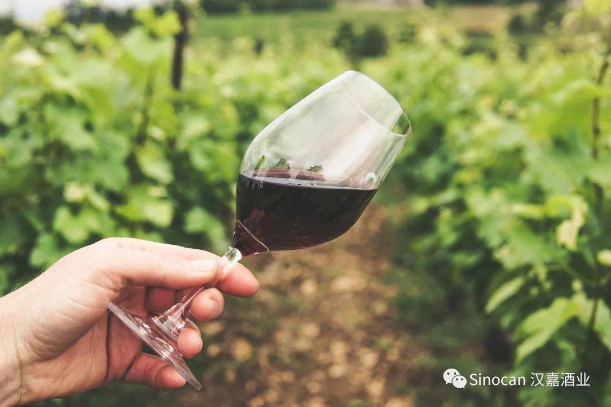
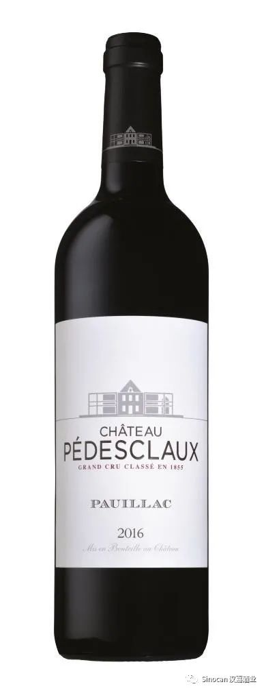
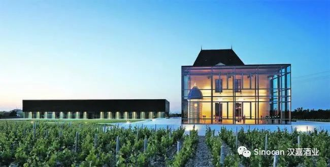
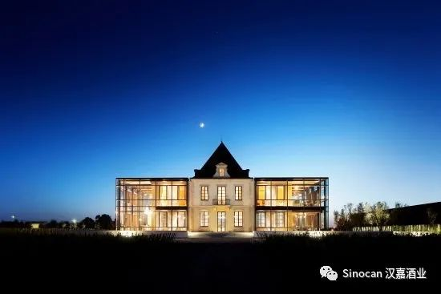
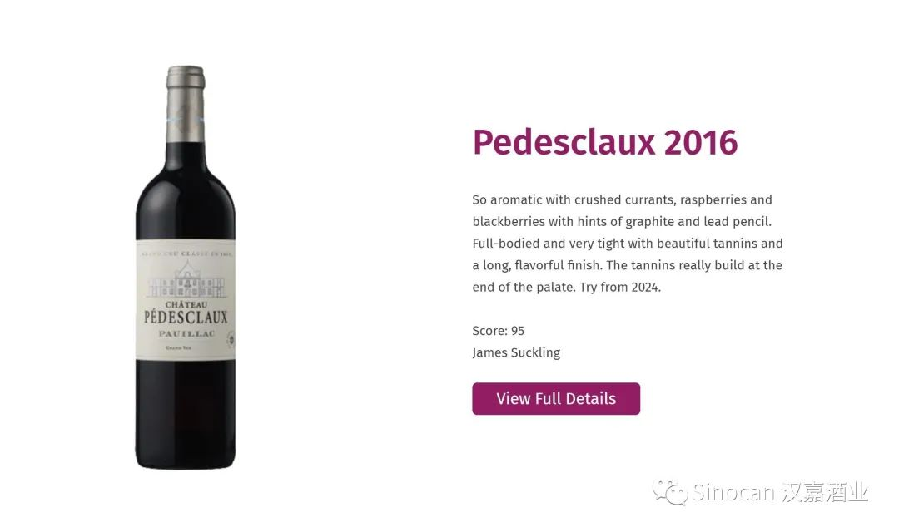
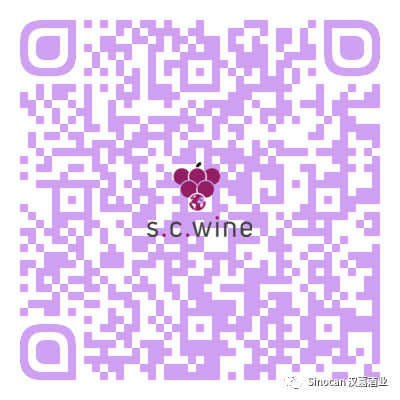

# 无标题

**链接地址:** http://mp.weixin.qq.com/s?__biz=MzIyMzU4OTc0MQ==&mid=2247484600&idx=1&sn=fc9f8a573ef8f059c0b93ec2eeecf777&chksm=e81aa0badf6d29ac92fea9c28469c07ea97fe65cf2e3753b239d5856844ffa32574eff38984e&mpshare=1&scene=2&srcid=1121HEgHvMwUQypp6Hc87xX6&sharer_sharetime=1605908660031&sharer_shareid=be1c8edd6c93eec155a61c876e41d26a#rd
**作者:** 
**获取时间:** 2025/8/28 20:00:43
**图片数量:** 7

---

## 原始HTML内容

<section style="box-sizing: border-box;font-size: 16px;"><section style="margin: 17px 0%;box-sizing: border-box;" powered-by="xiumi.us"><section style="display: inline-block;width: 100%;vertical-align: top;border-left: 3px solid rgb(166, 54, 49);border-bottom-left-radius: 0px;padding-right: 5px;padding-left: 5px;border-right: 3px solid rgb(166, 54, 49);border-top-right-radius: 0px;box-sizing: border-box;"><section style="margin: -7px 0%;box-sizing: border-box;" powered-by="xiumi.us"><section style="display: inline-block;width: 100%;vertical-align: top;background-color: rgb(255, 255, 255);padding: 5px 10px;box-sizing: border-box;"><section style="color: rgb(0, 0, 0);font-size: 14px;box-sizing: border-box;" powered-by="xiumi.us">
<strong style="box-sizing: border-box;">点击蓝字 关注我们</strong>
</section></section></section></section></section><section style="box-sizing: border-box;" powered-by="xiumi.us">
 
</section><section style="text-align: right;justify-content: flex-end;margin-top: 10px;margin-right: 0%;margin-left: 0%;box-sizing: border-box;" powered-by="xiumi.us"><section style="display: inline-block;width: auto;vertical-align: top;min-width: 10%;max-width: 100%;height: auto;background-color: rgb(166, 54, 49);padding: 5px 10px;box-sizing: border-box;"><section style="text-align: justify;color: rgb(255, 255, 255);font-size: 14px;box-sizing: border-box;" powered-by="xiumi.us">
<strong style="box-sizing: border-box;">特别专题《红酒品鉴》系列 Vol.2.1</strong>
</section></section></section><section style="display: inline-block;width: 100%;vertical-align: top;border-left: 2px none rgb(195, 163, 142);border-bottom-left-radius: 0px;background-color: rgba(255, 213, 195, 0);padding: 10px;border-right: 2px solid rgb(0, 0, 0);border-top-right-radius: 0px;box-sizing: border-box;" powered-by="xiumi.us"><section style="text-align: center;margin-right: 0%;margin-left: 0%;box-sizing: border-box;" powered-by="xiumi.us"><section style="max-width: 100%;vertical-align: middle;display: inline-block;line-height: 0;box-sizing: border-box;"></section></section></section><section style="text-align: right;justify-content: flex-end;margin-right: 0%;margin-bottom: 10px;margin-left: 0%;font-size: 0px;box-sizing: border-box;" powered-by="xiumi.us"><section style="display: inline-block;width: 50%;vertical-align: top;height: auto;line-height: 0;box-sizing: border-box;"><section style="margin-top: 0.5em;margin-bottom: 0.5em;box-sizing: border-box;" powered-by="xiumi.us"><section style="background-color: rgb(0, 0, 0);height: 2px;box-sizing: border-box;"><section><svg viewBox="0 0 1 1" style="float:left;line-height:0;width:0;vertical-align:top;"></svg></section></section></section></section></section><section style="box-sizing: border-box;" powered-by="xiumi.us"><section style="display: flex;flex-flow: row nowrap;margin: -10px 0% 10px;box-sizing: border-box;"><section style="display: inline-block;vertical-align: top;width: auto;flex: 0 0 auto;align-self: flex-start;min-width: 10%;max-width: 100%;height: auto;box-sizing: border-box;"><section style="color: rgb(0, 0, 0);font-size: 12px;box-sizing: border-box;" powered-by="xiumi.us">
专题出品 |&nbsp;加拿大汉嘉酒业&nbsp;
</section></section><section style="display: inline-block;vertical-align: top;width: auto;align-self: flex-start;flex: 100 100 0%;box-sizing: border-box;"><section style="margin-top: 0.5em;margin-bottom: 0.5em;box-sizing: border-box;" powered-by="xiumi.us"><section style="background-color: rgba(255, 213, 195, 0);height: 1px;box-sizing: border-box;"><section><svg viewBox="0 0 1 1" style="float:left;line-height:0;width:0;vertical-align:top;"></svg></section></section></section></section></section></section><section style="box-sizing: border-box;" powered-by="xiumi.us">
 
</section><section style="text-align: right;justify-content: flex-end;margin: 10px 0%;box-sizing: border-box;" powered-by="xiumi.us"><section style="display: inline-block;width: auto;vertical-align: top;min-width: 10%;max-width: 100%;height: auto;box-shadow: rgb(0, 0, 0) 0px 0px 0px;box-sizing: border-box;"><section style="justify-content: flex-end;margin-right: 0%;margin-left: 0%;font-size: 0px;box-sizing: border-box;" powered-by="xiumi.us"><section style="display: inline-block;width: 50%;vertical-align: top;height: auto;line-height: 0;box-sizing: border-box;"><section style="margin-top: 0.5em;margin-bottom: 0.5em;box-sizing: border-box;" powered-by="xiumi.us"><section style="background-color: rgba(255, 213, 195, 0);height: 2px;box-sizing: border-box;"><section><svg viewBox="0 0 1 1" style="float:left;line-height:0;width:0;vertical-align:top;"></svg></section></section></section></section></section><section style="display: inline-block;width: 100%;vertical-align: top;background-color: rgba(255, 213, 195, 0);padding: 3px 10px;border-style: solid;border-width: 0px;border-radius: 0px;border-color: rgb(62, 62, 62);box-sizing: border-box;" powered-by="xiumi.us"><section style="text-align: justify;color: rgb(0, 0, 0);font-size: 14px;box-sizing: border-box;" powered-by="xiumi.us">
<strong style="box-sizing: border-box;">酒款介绍</strong>
</section></section></section></section><section style="margin-top: -3px;margin-right: 0%;margin-left: 0%;box-sizing: border-box;" powered-by="xiumi.us"><section style="display: inline-block;width: 100%;vertical-align: top;border-left: 3px solid rgb(0, 0, 0);border-bottom-left-radius: 0px;padding-left: 5px;box-sizing: border-box;"><section style="margin: -7px 0%;box-sizing: border-box;" powered-by="xiumi.us"><section style="display: inline-block;width: 100%;vertical-align: top;background-color: rgba(255, 213, 195, 0);padding: 5px 10px;box-sizing: border-box;"><section style="text-align: left;color: rgb(158, 114, 84);font-size: 14px;box-sizing: border-box;" powered-by="xiumi.us">
<strong style="box-sizing: border-box;">Château Pédesclaux, Pauillac, Grand Cru Classé1855, 2016</strong>

<strong style="box-sizing: border-box;">百德诗歌酒庄红葡萄酒 2016</strong>
</section></section></section></section></section><section style="margin-right: 0%;margin-bottom: 10px;margin-left: 0%;box-sizing: border-box;" powered-by="xiumi.us"><section style="display: inline-block;width: 100%;vertical-align: top;padding-left: 8px;box-sizing: border-box;"><section style="margin-right: 0%;margin-left: 0%;box-sizing: border-box;" powered-by="xiumi.us"><section style="display: inline-block;width: 100%;vertical-align: top;background-color: rgba(255, 213, 195, 0);padding-bottom: 10px;box-sizing: border-box;"><section style="box-sizing: border-box;" powered-by="xiumi.us">
 
</section><section style="margin-right: 0%;margin-bottom: 20px;margin-left: 0%;box-sizing: border-box;" powered-by="xiumi.us"><section style="display: inline-block;width: 100%;vertical-align: top;padding: 10px;box-sizing: border-box;"><section style="box-sizing: border-box;" powered-by="xiumi.us"><section style="display: inline-block;vertical-align: top;width: 40%;border-style: solid;border-width: 0px;border-radius: 0px;border-color: rgb(213, 181, 113);padding-right: 6px;height: auto;box-sizing: border-box;"><section style="text-align: center;margin-right: 0%;margin-left: 0%;box-sizing: border-box;" powered-by="xiumi.us"><section style="max-width: 100%;vertical-align: middle;display: inline-block;line-height: 0;width: 100%;height: auto;box-sizing: border-box;"></section></section></section><section style="display: inline-block;vertical-align: top;width: 60%;height: auto;box-sizing: border-box;"><section style="font-size: 12px;box-sizing: border-box;" powered-by="xiumi.us">
AB SKU: 838149 

年份&nbsp;:&nbsp;2016

产区 :&nbsp;Pauillac

产地&nbsp;:&nbsp;法国

净含量&nbsp;:&nbsp;750 ml

种类&nbsp;: 红葡萄酒

酒精度&nbsp;:&nbsp;13.3％

酒庄&nbsp;:&nbsp;Château Pédesclaux （百德诗歌酒庄）

葡萄品种&nbsp;: 赤霞珠 48% 、&nbsp;梅洛 45% 、&nbsp;味而多 4% 、&nbsp;品丽珠 3%
</section></section></section></section></section></section></section></section></section><section style="box-sizing: border-box;" powered-by="xiumi.us">
 
</section><section style="text-align: right;justify-content: flex-end;margin: 10px 0%;box-sizing: border-box;" powered-by="xiumi.us"><section style="display: inline-block;width: auto;vertical-align: top;min-width: 10%;max-width: 100%;height: auto;box-shadow: rgb(0, 0, 0) 0px 0px 0px;box-sizing: border-box;"><section style="justify-content: flex-end;margin-right: 0%;margin-left: 0%;font-size: 0px;box-sizing: border-box;" powered-by="xiumi.us"><section style="display: inline-block;width: 50%;vertical-align: top;height: auto;line-height: 0;box-sizing: border-box;"><section style="margin-top: 0.5em;margin-bottom: 0.5em;box-sizing: border-box;" powered-by="xiumi.us"><section style="background-color: rgba(255, 213, 195, 0);height: 2px;box-sizing: border-box;"><section><svg viewBox="0 0 1 1" style="float:left;line-height:0;width:0;vertical-align:top;"></svg></section></section></section></section></section><section style="display: inline-block;width: 100%;vertical-align: top;background-color: rgba(255, 213, 195, 0);padding: 3px 10px;border-style: solid;border-width: 0px;border-radius: 0px;border-color: rgb(62, 62, 62);box-shadow: rgb(0, 0, 0) 0px 0px 0px;box-sizing: border-box;" powered-by="xiumi.us"><section style="text-align: justify;color: rgb(166, 54, 49);font-size: 14px;box-sizing: border-box;" powered-by="xiumi.us">
<strong style="box-sizing: border-box;">酒款综述</strong>
</section></section></section></section><section style="margin: 10px 0% 15px;box-sizing: border-box;" powered-by="xiumi.us"><section style="display: inline-block;width: 100%;vertical-align: top;box-shadow: rgb(0, 0, 0) 0px 0px 0px;padding-right: 5px;padding-left: 5px;border-width: 0px;box-sizing: border-box;"><section style="text-align: right;justify-content: flex-end;margin-right: 0%;margin-bottom: -1px;margin-left: 0%;font-size: 0px;transform: translate3d(-1px, 0px, 0px);box-sizing: border-box;" powered-by="xiumi.us"><section style="display: inline-block;width: 50%;vertical-align: top;height: auto;line-height: 0;box-sizing: border-box;"><section style="box-sizing: border-box;" powered-by="xiumi.us"><section style="display: flex;flex-flow: row nowrap;box-sizing: border-box;"><section style="display: inline-block;vertical-align: top;width: auto;padding-right: 5px;padding-left: 5px;background-color: rgb(255, 255, 255);flex: 1 1 0%;align-self: flex-start;height: auto;box-sizing: border-box;"><section style="margin-top: 0.5em;margin-bottom: 0.5em;box-sizing: border-box;" powered-by="xiumi.us"><section style="background-color: rgb(0, 0, 0);height: 1px;box-sizing: border-box;"><section><svg viewBox="0 0 1 1" style="float:left;line-height:0;width:0;vertical-align:top;"></svg></section></section></section></section><section style="display: inline-block;vertical-align: top;width: auto;background-color: rgb(255, 255, 255);flex: 1 1 0%;height: auto;align-self: flex-start;box-sizing: border-box;"><section style="margin-top: 0.5em;margin-bottom: 0.5em;box-sizing: border-box;" powered-by="xiumi.us"><section style="background-color: rgb(0, 0, 0);height: 1px;box-sizing: border-box;"><section><svg viewBox="0 0 1 1" style="float:left;line-height:0;width:0;vertical-align:top;"></svg></section></section></section></section></section></section></section></section><section style="color: rgb(97, 97, 97);font-size: 14px;padding-right: 10px;padding-left: 10px;box-sizing: border-box;" powered-by="xiumi.us">
 

“2016年份的这款百德诗歌酒庄红葡萄酒散发着破碎红醋栗、黑醋栗、黑莓、雪茄盒和铅笔芯的香气，口感平衡雅致，酒体偏饱满，单宁紧实，余味清新，带有矿物质的风味。”

 
</section><section style="text-align: left;justify-content: flex-start;margin-top: -1px;margin-right: 0%;margin-left: 0%;font-size: 0px;box-sizing: border-box;" powered-by="xiumi.us"><section style="display: inline-block;width: 50%;vertical-align: top;height: auto;line-height: 0;box-sizing: border-box;"><section style="box-sizing: border-box;" powered-by="xiumi.us"><section style="display: flex;flex-flow: row nowrap;box-sizing: border-box;"><section style="display: inline-block;vertical-align: top;width: auto;padding-right: 5px;background-color: rgb(255, 255, 255);flex: 2 2 0%;align-self: flex-start;height: auto;box-sizing: border-box;"><section style="margin-top: 0.5em;margin-bottom: 0.5em;box-sizing: border-box;" powered-by="xiumi.us"><section style="background-color: rgb(0, 0, 0);height: 1px;box-sizing: border-box;"><section><svg viewBox="0 0 1 1" style="float:left;line-height:0;width:0;vertical-align:top;"></svg></section></section></section></section><section style="display: inline-block;vertical-align: top;width: auto;background-color: rgb(255, 255, 255);padding-right: 5px;flex: 1 1 0%;height: auto;align-self: flex-start;box-sizing: border-box;"><section style="margin-top: 0.5em;margin-bottom: 0.5em;box-sizing: border-box;" powered-by="xiumi.us"><section style="background-color: rgb(0, 0, 0);height: 1px;box-sizing: border-box;"><section><svg viewBox="0 0 1 1" style="float:left;line-height:0;width:0;vertical-align:top;"></svg></section></section></section></section></section></section></section></section></section></section><section style="box-sizing: border-box;" powered-by="xiumi.us">
 
</section><section style="text-align: right;justify-content: flex-end;margin: 10px 0%;box-sizing: border-box;" powered-by="xiumi.us"><section style="display: inline-block;width: auto;vertical-align: top;min-width: 10%;max-width: 100%;height: auto;box-shadow: rgb(0, 0, 0) 0px 0px 0px;box-sizing: border-box;"><section style="justify-content: flex-end;margin-right: 0%;margin-left: 0%;font-size: 0px;box-sizing: border-box;" powered-by="xiumi.us"><section style="display: inline-block;width: 50%;vertical-align: top;height: auto;line-height: 0;box-sizing: border-box;"><section style="margin-top: 0.5em;margin-bottom: 0.5em;box-sizing: border-box;" powered-by="xiumi.us"><section style="background-color: rgba(255, 213, 195, 0);height: 2px;box-sizing: border-box;"><section><svg viewBox="0 0 1 1" style="float:left;line-height:0;width:0;vertical-align:top;"></svg></section></section></section></section></section><section style="display: inline-block;width: 100%;vertical-align: top;background-color: rgba(255, 213, 195, 0);padding: 3px 10px;border-style: solid;border-width: 0px;border-radius: 0px;border-color: rgb(62, 62, 62);box-sizing: border-box;" powered-by="xiumi.us"><section style="text-align: justify;color: rgb(166, 54, 49);font-size: 14px;box-sizing: border-box;" powered-by="xiumi.us">
<strong style="box-sizing: border-box;">酒庄介绍</strong>
</section></section></section></section><section style="margin: -10px 0% 10px;box-sizing: border-box;" powered-by="xiumi.us"><section style="display: inline-block;width: 100%;vertical-align: top;border-style: solid;border-width: 1px;border-radius: 0px;border-color: rgba(255, 213, 195, 0);padding: 10px;box-sizing: border-box;"><section style="box-sizing: border-box;" powered-by="xiumi.us"><section style="display: flex;flex-flow: row nowrap;box-sizing: border-box;"><section style="display: inline-block;vertical-align: top;width: 40px;flex: 0 0 auto;align-self: stretch;height: auto;background-color: rgba(255, 213, 195, 0);border-width: 0px;box-sizing: border-box;"><section><svg viewBox="0 0 1 1" style="float:left;line-height:0;width:0;vertical-align:top;"></svg></section></section><section style="display: inline-block;vertical-align: top;width: auto;flex: 100 100 0%;align-self: stretch;height: auto;padding-top: 10px;padding-bottom: 10px;margin-left: -25px;box-sizing: border-box;"><section style="text-align: center;box-sizing: border-box;" powered-by="xiumi.us"><section style="max-width: 100%;vertical-align: middle;display: inline-block;line-height: 0;width: 100%;height: auto;box-sizing: border-box;"></section></section></section></section></section></section></section><section style="font-size: 14px;color: rgb(115, 115, 114);letter-spacing: 0px;padding-right: 15px;padding-left: 15px;box-sizing: border-box;" powered-by="xiumi.us">
百德诗歌酒庄（Chateau Pedesclaux）是法国波尔多（Bordeaux）产区波雅克（Pauillac）村的酒庄之一，在1855年梅多克评级中被列为五级酒庄。

 

百德诗歌酒庄的历史可追溯至1810年。波尔多的酒商于尔班·皮埃尔·百德诗歌（Urbain Pierre Pedesclaux）从大普依庄园（Grand Puy）购得了葡萄园，建立了自己的酒庄，并将它打造成一所“优雅的”酒庄，那就是百德诗歌酒庄。

 

该酒庄的葡萄园总体上位于波雅克北界附近，毗邻拉菲古堡（Chateau Lafite-Rothschild）、木桐酒庄（Chateau Mouton-Rothschild）和庞特卡奈酒庄（Chateau Pontet-Canet）。酒庄葡萄园的表层土壤是砾石，较深层的土壤为粘土和石灰岩，种植的葡萄品种为赤霞珠（Cabernet Sauvignon）和梅洛（Merlot），以及少量的品丽珠（Cabernet Franc）和味而多（Petit Verdot）。

 
</section><section style="margin: -10px 0% 10px;box-sizing: border-box;" powered-by="xiumi.us"><section style="display: inline-block;width: 100%;vertical-align: top;border-style: solid;border-width: 1px;border-radius: 0px;border-color: rgba(255, 213, 195, 0);padding: 10px;box-sizing: border-box;"><section style="box-sizing: border-box;" powered-by="xiumi.us"><section style="display: flex;flex-flow: row nowrap;box-sizing: border-box;"><section style="display: inline-block;vertical-align: top;width: 40px;flex: 0 0 auto;align-self: stretch;height: auto;background-color: rgba(255, 213, 195, 0);border-width: 0px;box-sizing: border-box;"><section><svg viewBox="0 0 1 1" style="float:left;line-height:0;width:0;vertical-align:top;"></svg></section></section><section style="display: inline-block;vertical-align: top;width: auto;flex: 100 100 0%;align-self: stretch;height: auto;padding-top: 10px;padding-bottom: 10px;margin-left: -25px;box-sizing: border-box;"><section style="text-align: center;box-sizing: border-box;" powered-by="xiumi.us"><section style="max-width: 100%;vertical-align: middle;display: inline-block;line-height: 0;width: 100%;height: auto;box-sizing: border-box;"></section></section></section></section></section></section></section><section style="font-size: 14px;color: rgb(115, 115, 114);letter-spacing: 0px;padding-right: 15px;padding-left: 15px;box-sizing: border-box;" powered-by="xiumi.us">
2011年百德诗歌庄引进了一种独特的采摘法：酒农先从葡萄园中间区域开始采摘，再向周边扩散采摘。葡萄经过手工采收后，装进8公斤的板条箱。采收的葡萄在冷藏24小时后，进行手工分类、去梗、再次分类、进入控温不锈钢罐中发酵，然后再在橡木桶中熟成14至16个月，其中50%至70%是新橡木桶，余下的是用过一年的橡木桶。 

 

百德诗歌酒庄的正牌酒是百德诗歌酒庄红葡萄酒（Chateau Pedesclaux），副牌酒为百德诗歌之花干红葡萄酒（Fleur de Pedesclaux）。

 
</section><section style="box-sizing: border-box;" powered-by="xiumi.us"><section style="display: flex;flex-flow: row nowrap;box-sizing: border-box;"><section style="display: inline-block;vertical-align: top;width: auto;flex: 10 10 0%;height: auto;align-self: flex-start;box-sizing: border-box;"><section style="margin-top: 0.5em;margin-bottom: 0.5em;box-sizing: border-box;" powered-by="xiumi.us"><section style="background-color: rgb(166, 54, 49);height: 2px;box-sizing: border-box;"><section><svg viewBox="0 0 1 1" style="float:left;line-height:0;width:0;vertical-align:top;"></svg></section></section></section></section><section style="display: inline-block;vertical-align: top;width: auto;flex: 100 100 0%;align-self: flex-start;height: auto;padding-right: 4px;padding-left: 4px;box-sizing: border-box;"><section style="margin-top: 0.5em;margin-bottom: 0.5em;box-sizing: border-box;" powered-by="xiumi.us"><section style="background-color: rgb(166, 54, 49);height: 2px;box-sizing: border-box;"><section><svg viewBox="0 0 1 1" style="float:left;line-height:0;width:0;vertical-align:top;"></svg></section></section></section></section><section style="display: inline-block;vertical-align: top;width: auto;flex: 10 10 0%;align-self: flex-start;height: auto;box-sizing: border-box;"><section style="margin-top: 0.5em;margin-bottom: 0.5em;box-sizing: border-box;" powered-by="xiumi.us"><section style="background-color: rgb(166, 54, 49);height: 2px;box-sizing: border-box;"><section><svg viewBox="0 0 1 1" style="float:left;line-height:0;width:0;vertical-align:top;"></svg></section></section></section></section></section></section><section style="box-sizing: border-box;" powered-by="xiumi.us">
 
</section><section style="margin-top: -10px;margin-right: 0%;margin-left: 0%;box-sizing: border-box;" powered-by="xiumi.us"><section style="display: inline-block;width: 100%;vertical-align: top;border-left: 2px solid rgba(255, 213, 195, 0);border-bottom-left-radius: 0px;background-color: rgba(255, 213, 195, 0);padding: 10px;box-sizing: border-box;"><section style="margin: 17px 0%;box-sizing: border-box;" powered-by="xiumi.us"><section style="display: inline-block;width: 100%;vertical-align: top;border-left: 3px solid rgba(255, 213, 195, 0);border-bottom-left-radius: 0px;padding-left: 5px;box-sizing: border-box;"><section style="text-align: center;margin-top: 10px;margin-bottom: 10px;box-sizing: border-box;" powered-by="xiumi.us"><section style="max-width: 100%;vertical-align: middle;display: inline-block;line-height: 0;width: 35%;height: auto;box-sizing: border-box;"></section></section><section style="font-size: 12px;color: rgb(195, 163, 142);padding-right: 10px;padding-left: 10px;box-sizing: border-box;" powered-by="xiumi.us">
With roots in Edmonton, Alberta, S.C. Wine is a budding importation agency that prides itself on bringing only the best premium, quality wines to Western Canada at an exceptional value.
</section></section></section><section style="margin: 10px 0%;box-sizing: border-box;" powered-by="xiumi.us"><section style="display: inline-block;width: 100%;vertical-align: top;border-style: solid;border-width: 1px;border-radius: 0px;border-color: rgba(255, 213, 195, 0);padding: 10px;box-sizing: border-box;"><section style="text-align: left;justify-content: flex-start;margin-top: 10px;margin-right: 0%;margin-left: 0%;font-size: 0px;box-sizing: border-box;" powered-by="xiumi.us"><section style="display: inline-block;width: 50%;vertical-align: top;height: auto;line-height: 0;box-sizing: border-box;"><section style="margin-top: 0.5em;margin-bottom: 0.5em;box-sizing: border-box;" powered-by="xiumi.us"><section style="background-color: rgba(254, 213, 195, 0);height: 2px;box-sizing: border-box;"><section><svg viewBox="0 0 1 1" style="float:left;line-height:0;width:0;vertical-align:top;"></svg></section></section></section></section></section><section style="display: inline-block;width: 100%;vertical-align: top;border-left: 2px none rgb(195, 163, 142);border-bottom-left-radius: 0px;background-color: rgba(254, 213, 195, 0);padding: 10px;border-right: 2px none rgb(195, 163, 142);border-top-right-radius: 0px;box-sizing: border-box;" powered-by="xiumi.us"><section style="text-align: center;margin-right: 0%;margin-left: 0%;box-sizing: border-box;" powered-by="xiumi.us"><section style="max-width: 100%;vertical-align: middle;display: inline-block;line-height: 0;box-sizing: border-box;"></section></section></section><section style="text-align: right;justify-content: flex-end;margin-right: 0%;margin-bottom: 10px;margin-left: 0%;font-size: 0px;box-sizing: border-box;" powered-by="xiumi.us"><section style="display: inline-block;width: 50%;vertical-align: top;height: auto;line-height: 0;box-sizing: border-box;"><section style="margin-top: 0.5em;margin-bottom: 0.5em;box-sizing: border-box;" powered-by="xiumi.us"><section style="background-color: rgba(254, 213, 195, 0);height: 2px;box-sizing: border-box;"><section><svg viewBox="0 0 1 1" style="float:left;line-height:0;width:0;vertical-align:top;"></svg></section></section></section></section></section></section></section><section style="color: rgb(158, 114, 84);font-size: 14px;padding-right: 10px;padding-left: 10px;box-sizing: border-box;" powered-by="xiumi.us">
<strong style="box-sizing: border-box;">Château Pédesclaux, Pauillac, Grand Cru Classé 1855, 2016</strong>

<strong style="box-sizing: border-box;">百德诗歌酒庄红葡萄酒 2016</strong>

 

http://www.scwineimport.com/bordeaux-wines/pedesclaux-2016/ 

 

 
</section><section style="box-sizing: border-box;" powered-by="xiumi.us"><section style="text-align: center;justify-content: center;display: flex;flex-flow: row nowrap;margin: 10px 0%;box-sizing: border-box;"><section style="display: inline-block;vertical-align: top;width: 33%;flex: 0 0 auto;height: auto;align-self: stretch;padding-right: 10px;padding-left: 10px;box-sizing: border-box;"><section style="margin-right: 0%;margin-left: 0%;opacity: 0.99;box-sizing: border-box;" powered-by="xiumi.us"><section style="max-width: 100%;vertical-align: middle;display: inline-block;line-height: 0;width: 100%;height: auto;box-sizing: border-box;"></section></section></section><section style="display: inline-block;vertical-align: top;width: auto;align-self: stretch;flex: 100 100 0%;height: auto;border-style: solid none;border-width: 2px;border-radius: 0px;border-color: rgba(255, 213, 195, 0) rgb(222, 222, 222);margin-top: 2px;margin-bottom: 2px;margin-left: 8px;padding-left: 10px;box-sizing: border-box;"><section style="margin-right: 0%;margin-bottom: 2px;margin-left: 0%;box-sizing: border-box;" powered-by="xiumi.us"><section style="font-size: 14px;line-height: 1;letter-spacing: 0px;box-sizing: border-box;">
<strong style="box-sizing: border-box;">请扫描二维码&nbsp;</strong>

<strong style="box-sizing: border-box;">联系我们获取更多信息</strong>
</section></section><section style="margin-top: 10px;margin-right: 0%;margin-left: 0%;box-sizing: border-box;" powered-by="xiumi.us"><section style="font-size: 14px;color: rgb(166, 54, 49);line-height: 1.6;letter-spacing: 0px;box-sizing: border-box;">
欢迎访问我们的官方网站 

浏览更多法国名庄红酒
</section></section></section></section></section></section></section><section style="box-sizing: border-box;" powered-by="xiumi.us">
 
</section><section style="box-sizing: border-box;" powered-by="xiumi.us">
 
</section><section style="text-align: left;justify-content: flex-start;margin-right: 0%;margin-bottom: 10px;margin-left: 0%;font-size: 0px;box-sizing: border-box;" powered-by="xiumi.us"><section style="display: inline-block;width: 50%;vertical-align: top;height: auto;line-height: 0;box-sizing: border-box;"><section style="margin-top: 0.5em;margin-bottom: 0.5em;box-sizing: border-box;" powered-by="xiumi.us"><section style="background-color: rgba(255, 213, 195, 0);height: 2px;box-sizing: border-box;"><section><svg viewBox="0 0 1 1" style="float:left;line-height:0;width:0;vertical-align:top;"></svg></section></section></section></section></section><section style="margin-top: 10px;margin-right: 0%;margin-left: 0%;box-sizing: border-box;" powered-by="xiumi.us"><section style="display: inline-block;width: auto;vertical-align: top;min-width: 10%;max-width: 100%;height: auto;box-sizing: border-box;"><section style="margin-right: 0%;margin-bottom: 3px;margin-left: 0%;box-sizing: border-box;" powered-by="xiumi.us"><section style="background-color: rgb(0, 0, 0);height: 2px;box-sizing: border-box;"><section><svg viewBox="0 0 1 1" style="float:left;line-height:0;width:0;vertical-align:top;"></svg></section></section></section><section style="margin-right: 0%;margin-left: 0%;box-sizing: border-box;" powered-by="xiumi.us"><section style="font-size: 14px;color: rgb(166, 54, 49);letter-spacing: 2px;line-height: 1.4;box-sizing: border-box;">
<strong style="box-sizing: border-box;">更多名庄佳酿推荐</strong>
</section></section></section></section><section style="box-sizing: border-box;" powered-by="xiumi.us">
 
</section><section style="min-height: 40px;margin-right: 0%;margin-bottom: 10px;margin-left: 0%;box-sizing: border-box;" powered-by="xiumi.us"><section style="width: 100%;margin-right: auto;margin-bottom: -10px;margin-left: auto;box-sizing: border-box;"><table width="100%"><tbody style="box-sizing: border-box;"><tr opera-tn-ra-comp="_$.pages:0.layers:0.comps:27.classicTable1:0" style="box-sizing: border-box;" powered-by="xiumi.us"><td colspan="1" opera-tn-ra-cell="_$.pages:0.layers:0.comps:27.classicTable1:0.td@@0" rowspan="2" style="border-color: rgb(62, 62, 62);border-radius: 0px;border-style: none;background-position: 50% 50%;background-repeat: no-repeat;background-size: cover;background-attachment: scroll;vertical-align: bottom;background-image: url(&quot;https://mmbiz.qpic.cn/mmbiz_png/7CNdqYbqvBLu0eRDGGSqam3Gjfm1zZBZfp2RP2GqjNMZtpUs3DuWMicichm5GRmxugLBoIf65yXLl8MVQKnxhnrg/640?wx_fmt=png&quot;);box-sizing: border-box;padding: 0px;" width="30.0000%"><section style="margin-right: 0%;margin-bottom: 4px;margin-left: 0%;box-sizing: border-box;" powered-by="xiumi.us"><section style="text-align: right;padding-right: 4px;padding-left: 4px;letter-spacing: 0px;color: rgb(255, 255, 255);font-size: 32px;line-height: 1;box-sizing: border-box;">
 
<section style="line-height: 0;color:rgba(0,0,0,0);width:0;"><svg viewBox="0 0 1 1" style="vertical-align:top;"><text x="-10" y="-10">_</text></svg></section></section></section></td><td colspan="1" rowspan="1" opera-tn-ra-cell="_$.pages:0.layers:0.comps:27.classicTable1:0.td@@1" style="border-color: rgb(62, 62, 62);border-radius: 0px;border-style: none;padding-top: 0px;padding-bottom: 0px;background-color: rgb(249, 249, 249);box-sizing: border-box;" width="70.0000%"><section style="margin-top: 10px;margin-right: 0%;margin-left: 0%;box-sizing: border-box;" powered-by="xiumi.us"><section style="font-size: 14px;letter-spacing: 0px;line-height: 1.6;color: rgb(140, 140, 140);box-sizing: border-box;">
●&nbsp;<a target="_blank" href="http://mp.weixin.qq.com/s?__biz=MzIyMzU4OTc0MQ==&amp;mid=2247484381&amp;idx=2&amp;sn=b3c18413f93a4d56a68b51a7b3b7c5b3&amp;chksm=e81aa7dfdf6d2ec954c478fe9a17984749720f9af08dc4ded0899572c950e9460eba97653af1&amp;scene=21#wechat_redirect" textvalue="Château Gromel Bel Air&nbsp;歌美酒庄贝爱尔干红" data-itemshowtype="0" tab="innerlink" data-linktype="2"><strong style="box-sizing: border-box;">Château Gromel Bel Air&nbsp;</strong></a>

<a target="_blank" href="http://mp.weixin.qq.com/s?__biz=MzIyMzU4OTc0MQ==&amp;mid=2247484381&amp;idx=2&amp;sn=b3c18413f93a4d56a68b51a7b3b7c5b3&amp;chksm=e81aa7dfdf6d2ec954c478fe9a17984749720f9af08dc4ded0899572c950e9460eba97653af1&amp;scene=21#wechat_redirect" textvalue="Château Gromel Bel Air&nbsp;歌美酒庄贝爱尔干红" data-itemshowtype="0" tab="innerlink" data-linktype="2"><strong style="box-sizing: border-box;">歌美酒庄贝爱尔干红</strong></a>

 
</section></section></td></tr><tr opera-tn-ra-comp="_$.pages:0.layers:0.comps:27.classicTable1:1" style="box-sizing: border-box;" powered-by="xiumi.us"><td colspan="1" rowspan="1" opera-tn-ra-cell="_$.pages:0.layers:0.comps:27.classicTable1:1.td@@0" style="border-color: rgb(62, 62, 62);border-radius: 0px;border-style: none;padding-top: 0px;padding-bottom: 0px;background-color: rgb(249, 249, 249);box-sizing: border-box;" width="70.0000%"><section style="margin: 10px 0%;box-sizing: border-box;" powered-by="xiumi.us"><section style="font-size: 14px;letter-spacing: 1px;line-height: 1;color: rgb(140, 140, 140);box-sizing: border-box;">
<a target="_blank" href="http://mp.weixin.qq.com/s?__biz=MzIyMzU4OTc0MQ==&amp;mid=2247484381&amp;idx=2&amp;sn=b3c18413f93a4d56a68b51a7b3b7c5b3&amp;chksm=e81aa7dfdf6d2ec954c478fe9a17984749720f9af08dc4ded0899572c950e9460eba97653af1&amp;scene=21#wechat_redirect" textvalue="► 点击阅读" data-itemshowtype="0" tab="innerlink" data-linktype="2">► 点击阅读</a>
</section></section></td></tr></tbody></table></section></section><section style="min-height: 40px;margin-right: 0%;margin-bottom: 10px;margin-left: 0%;box-sizing: border-box;" powered-by="xiumi.us"><section style="width: 100%;margin-right: auto;margin-bottom: -10px;margin-left: auto;box-sizing: border-box;"><table width="100%"><tbody style="box-sizing: border-box;"><tr opera-tn-ra-comp="_$.pages:0.layers:0.comps:28.classicTable1:0" style="box-sizing: border-box;" powered-by="xiumi.us"><td colspan="1" opera-tn-ra-cell="_$.pages:0.layers:0.comps:28.classicTable1:0.td@@0" rowspan="2" style="border-color: rgb(62, 62, 62);border-radius: 0px;border-style: none;background-position: 50% 58.2051%;background-repeat: repeat;background-size: 110.435%;background-attachment: scroll;vertical-align: bottom;background-image: url(&quot;https://mmbiz.qpic.cn/mmbiz_png/7CNdqYbqvBLu0eRDGGSqam3Gjfm1zZBZp9k52lypPRqwxa2de58GI89ExDT87gvDJDsmOiaojPe0g5dBibO1C8uw/640?wx_fmt=png&quot;);box-sizing: border-box;padding: 0px;" width="30.0000%"><section style="margin-right: 0%;margin-bottom: 4px;margin-left: 0%;box-sizing: border-box;" powered-by="xiumi.us"><section style="text-align: right;padding-right: 4px;padding-left: 4px;letter-spacing: 0px;color: rgb(255, 255, 255);font-size: 32px;line-height: 1;box-sizing: border-box;">
 
<section style="line-height: 0;color:rgba(0,0,0,0);width:0;"><svg viewBox="0 0 1 1" style="vertical-align:top;"><text x="-10" y="-10">_</text></svg></section></section></section></td><td colspan="1" rowspan="1" opera-tn-ra-cell="_$.pages:0.layers:0.comps:28.classicTable1:0.td@@1" style="border-color: rgb(62, 62, 62);border-radius: 0px;border-style: none;padding-top: 0px;padding-bottom: 0px;background-color: rgb(249, 249, 249);box-sizing: border-box;" width="70.0000%"><section style="margin-top: 10px;margin-right: 0%;margin-left: 0%;box-sizing: border-box;" powered-by="xiumi.us"><section style="font-size: 14px;letter-spacing: 0px;line-height: 1.6;color: rgb(140, 140, 140);box-sizing: border-box;">
<a target="_blank" href="http://mp.weixin.qq.com/s?__biz=MzIyMzU4OTc0MQ==&amp;mid=2247484443&amp;idx=2&amp;sn=23c147aefc865691a73b9ea8790f75af&amp;chksm=e81aa019df6d290f13b318e5bede53c1a1c4d61c80895d036791b6e1dc4f14ffa521594a7cb8&amp;scene=21#wechat_redirect" textvalue="●&nbsp;Château Roquettes Saint-Emilion Grand Cru&nbsp;禄禧酒庄干红&nbsp;" data-itemshowtype="0" tab="innerlink" data-linktype="2">●&nbsp;<strong style="box-sizing: border-box;">Château Roquettes Saint-Emilion Grand Cru&nbsp;</strong></a>

<a target="_blank" href="http://mp.weixin.qq.com/s?__biz=MzIyMzU4OTc0MQ==&amp;mid=2247484443&amp;idx=2&amp;sn=23c147aefc865691a73b9ea8790f75af&amp;chksm=e81aa019df6d290f13b318e5bede53c1a1c4d61c80895d036791b6e1dc4f14ffa521594a7cb8&amp;scene=21#wechat_redirect" textvalue="●&nbsp;Château Roquettes Saint-Emilion Grand Cru&nbsp;禄禧酒庄干红&nbsp;" data-itemshowtype="0" tab="innerlink" data-linktype="2"><strong style="letter-spacing: 0px;box-sizing: border-box;">禄禧酒庄干红&nbsp;</strong></a><strong style="letter-spacing: 0px;box-sizing: border-box;"></strong>
</section></section></td></tr><tr opera-tn-ra-comp="_$.pages:0.layers:0.comps:28.classicTable1:1" style="box-sizing: border-box;" powered-by="xiumi.us"><td colspan="1" rowspan="1" opera-tn-ra-cell="_$.pages:0.layers:0.comps:28.classicTable1:1.td@@0" style="border-color: rgb(62, 62, 62);border-radius: 0px;border-style: none;padding-top: 0px;padding-bottom: 0px;background-color: rgb(249, 249, 249);box-sizing: border-box;" width="70.0000%"><section style="margin: 10px 0%;box-sizing: border-box;" powered-by="xiumi.us"><section style="font-size: 14px;letter-spacing: 1px;line-height: 1;color: rgb(140, 140, 140);box-sizing: border-box;">
<a target="_blank" href="http://mp.weixin.qq.com/s?__biz=MzIyMzU4OTc0MQ==&amp;mid=2247484443&amp;idx=2&amp;sn=23c147aefc865691a73b9ea8790f75af&amp;chksm=e81aa019df6d290f13b318e5bede53c1a1c4d61c80895d036791b6e1dc4f14ffa521594a7cb8&amp;scene=21#wechat_redirect" textvalue="► 点击阅读" data-itemshowtype="0" tab="innerlink" data-linktype="2">► 点击阅读</a>
</section></section></td></tr></tbody></table></section></section><section style="min-height: 40px;margin-right: 0%;margin-bottom: 10px;margin-left: 0%;box-sizing: border-box;" powered-by="xiumi.us"><section style="width: 100%;margin-right: auto;margin-bottom: -10px;margin-left: auto;box-sizing: border-box;"><table width="100%"><tbody style="box-sizing: border-box;"><tr opera-tn-ra-comp="_$.pages:0.layers:0.comps:29.classicTable1:0" style="box-sizing: border-box;" powered-by="xiumi.us"><td colspan="1" opera-tn-ra-cell="_$.pages:0.layers:0.comps:29.classicTable1:0.td@@0" rowspan="2" style="border-color: rgb(62, 62, 62);border-radius: 0px;border-style: none;background-position: 48.3862% 59.4937%;background-repeat: repeat;background-size: 168.291%;background-attachment: scroll;vertical-align: bottom;background-image: url(&quot;https://mmbiz.qpic.cn/mmbiz_jpg/7CNdqYbqvBLu0eRDGGSqam3Gjfm1zZBZIiaLLdzw3jJ8ZCZyDQSrkJYM2LlbAxT9bJSgICgo7MVib3jISWINiaU9w/640?wx_fmt=jpeg&quot;);box-sizing: border-box;padding: 0px;" width="30.0000%"><section style="margin-right: 0%;margin-bottom: 4px;margin-left: 0%;box-sizing: border-box;" powered-by="xiumi.us"><section style="text-align: right;padding-right: 4px;padding-left: 4px;letter-spacing: 0px;color: rgb(255, 255, 255);font-size: 32px;line-height: 1;box-sizing: border-box;">
 
<section style="line-height: 0;color:rgba(0,0,0,0);width:0;"><svg viewBox="0 0 1 1" style="vertical-align:top;"><text x="-10" y="-10">_</text></svg></section></section></section></td><td colspan="1" rowspan="1" opera-tn-ra-cell="_$.pages:0.layers:0.comps:29.classicTable1:0.td@@1" style="border-color: rgb(62, 62, 62);border-radius: 0px;border-style: none;padding-top: 0px;padding-bottom: 0px;background-color: rgb(249, 249, 249);box-sizing: border-box;" width="70.0000%"><section style="margin-top: 10px;margin-right: 0%;margin-left: 0%;box-sizing: border-box;" powered-by="xiumi.us"><section style="font-size: 14px;letter-spacing: 0px;line-height: 1.6;color: rgb(140, 140, 140);box-sizing: border-box;">
●&nbsp;<a target="_blank" href="http://mp.weixin.qq.com/s?__biz=MzIyMzU4OTc0MQ==&amp;mid=2247484510&amp;idx=2&amp;sn=2e263c6b5e014310729db6adeff3737c&amp;chksm=e81aa05cdf6d294a32c7ccfda5d410348a8a6ff3f68a6418e416770c692ca5e6660ac1541983&amp;scene=21#wechat_redirect" textvalue="Château Cazeau&nbsp;凯撒酒庄白葡萄酒" data-itemshowtype="0" tab="innerlink" data-linktype="2"><strong style="box-sizing: border-box;">Château Cazeau&nbsp;</strong></a>

<a target="_blank" href="http://mp.weixin.qq.com/s?__biz=MzIyMzU4OTc0MQ==&amp;mid=2247484510&amp;idx=2&amp;sn=2e263c6b5e014310729db6adeff3737c&amp;chksm=e81aa05cdf6d294a32c7ccfda5d410348a8a6ff3f68a6418e416770c692ca5e6660ac1541983&amp;scene=21#wechat_redirect" textvalue="Château Cazeau&nbsp;凯撒酒庄白葡萄酒" data-itemshowtype="0" tab="innerlink" data-linktype="2"><strong style="box-sizing: border-box;">凯撒酒庄白葡萄酒</strong></a><strong style="box-sizing: border-box;"></strong>

 
</section></section></td></tr><tr opera-tn-ra-comp="_$.pages:0.layers:0.comps:29.classicTable1:1" style="box-sizing: border-box;" powered-by="xiumi.us"><td colspan="1" rowspan="1" opera-tn-ra-cell="_$.pages:0.layers:0.comps:29.classicTable1:1.td@@0" style="border-color: rgb(62, 62, 62);border-radius: 0px;border-style: none;padding-top: 0px;padding-bottom: 0px;background-color: rgb(249, 249, 249);box-sizing: border-box;" width="70.0000%"><section style="margin: 10px 0%;box-sizing: border-box;" powered-by="xiumi.us"><section style="font-size: 14px;letter-spacing: 1px;line-height: 1;color: rgb(140, 140, 140);box-sizing: border-box;">
<a target="_blank" href="http://mp.weixin.qq.com/s?__biz=MzIyMzU4OTc0MQ==&amp;mid=2247484510&amp;idx=2&amp;sn=2e263c6b5e014310729db6adeff3737c&amp;chksm=e81aa05cdf6d294a32c7ccfda5d410348a8a6ff3f68a6418e416770c692ca5e6660ac1541983&amp;scene=21#wechat_redirect" textvalue="► 点击阅读" data-itemshowtype="0" tab="innerlink" data-linktype="2">► 点击阅读</a>
</section></section></td></tr></tbody></table></section></section></section>
 

---

## 纯文本内容

点击蓝字 关注我们特别专题《红酒品鉴》系列 Vol.2.1专题出品 | 加拿大汉嘉酒业 酒款介绍Château Pédesclaux, Pauillac, Grand Cru Classé1855, 2016百德诗歌酒庄红葡萄酒 2016AB SKU: 838149年份 : 2016产区 : Pauillac产地 : 法国净含量 : 750 ml种类 : 红葡萄酒酒精度 : 13.3％酒庄 : Château Pédesclaux （百德诗歌酒庄）葡萄品种 : 赤霞珠 48% 、 梅洛 45% 、 味而多 4% 、 品丽珠 3%酒款综述“2016年份的这款百德诗歌酒庄红葡萄酒散发着破碎红醋栗、黑醋栗、黑莓、雪茄盒和铅笔芯的香气，口感平衡雅致，酒体偏饱满，单宁紧实，余味清新，带有矿物质的风味。”酒庄介绍百德诗歌酒庄（Chateau Pedesclaux）是法国波尔多（Bordeaux）产区波雅克（Pauillac）村的酒庄之一，在1855年梅多克评级中被列为五级酒庄。百德诗歌酒庄的历史可追溯至1810年。波尔多的酒商于尔班·皮埃尔·百德诗歌（Urbain Pierre Pedesclaux）从大普依庄园（Grand Puy）购得了葡萄园，建立了自己的酒庄，并将它打造成一所“优雅的”酒庄，那就是百德诗歌酒庄。该酒庄的葡萄园总体上位于波雅克北界附近，毗邻拉菲古堡（Chateau Lafite-Rothschild）、木桐酒庄（Chateau Mouton-Rothschild）和庞特卡奈酒庄（Chateau Pontet-Canet）。酒庄葡萄园的表层土壤是砾石，较深层的土壤为粘土和石灰岩，种植的葡萄品种为赤霞珠（Cabernet Sauvignon）和梅洛（Merlot），以及少量的品丽珠（Cabernet Franc）和味而多（Petit Verdot）。2011年百德诗歌庄引进了一种独特的采摘法：酒农先从葡萄园中间区域开始采摘，再向周边扩散采摘。葡萄经过手工采收后，装进8公斤的板条箱。采收的葡萄在冷藏24小时后，进行手工分类、去梗、再次分类、进入控温不锈钢罐中发酵，然后再在橡木桶中熟成14至16个月，其中50%至70%是新橡木桶，余下的是用过一年的橡木桶。百德诗歌酒庄的正牌酒是百德诗歌酒庄红葡萄酒（Chateau Pedesclaux），副牌酒为百德诗歌之花干红葡萄酒（Fleur de Pedesclaux）。With roots in Edmonton, Alberta, S.C. Wine is a budding importation agency that prides itself on bringing only the best premium, quality wines to Western Canada at an exceptional value.Château Pédesclaux, Pauillac, Grand Cru Classé 1855, 2016百德诗歌酒庄红葡萄酒 2016http://www.scwineimport.com/bordeaux-wines/pedesclaux-2016/请扫描二维码 联系我们获取更多信息欢迎访问我们的官方网站浏览更多法国名庄红酒更多名庄佳酿推荐_● Château Gromel Bel Air 歌美酒庄贝爱尔干红► 点击阅读_● Château Roquettes Saint-Emilion Grand Cru 禄禧酒庄干红 ► 点击阅读_● Château Cazeau 凯撒酒庄白葡萄酒► 点击阅读

---

## 图片列表

-  (原始链接: https://mmbiz.qpic.cn/mmbiz_jpg/7CNdqYbqvBLu0eRDGGSqam3Gjfm1zZBZYvlkbdvKmrj2ntboczVx32jD6LEkYicpPUwqamXibN1uyUMBdclez5qw/640?wx_fmt=jpeg)
-  (原始链接: https://mmbiz.qpic.cn/mmbiz_jpg/7CNdqYbqvBLu0eRDGGSqam3Gjfm1zZBZibEvgUnL9ACQOxAepQs5o86tSiaxY3Z7FsrXKj6kuzBIKtA9w3kBiaP7Q/640?wx_fmt=jpeg)
-  (原始链接: https://mmbiz.qpic.cn/mmbiz_jpg/7CNdqYbqvBLu0eRDGGSqam3Gjfm1zZBZ9rQ3cgtPdY1asP3sftJJ08xmmNYT1WB3Fj40Q8L9m1Eia9YCJRxlITg/640?wx_fmt=jpeg)
-  (原始链接: https://mmbiz.qpic.cn/mmbiz_jpg/7CNdqYbqvBLu0eRDGGSqam3Gjfm1zZBZuKO2GQ9f3FE67WDrxMtdLw8q3iauyuYJFQkDq8BkX27QicfYWkiahak4g/640?wx_fmt=jpeg)
-  (原始链接: https://mmbiz.qpic.cn/mmbiz_png/7CNdqYbqvBIXHDqmSFchg3iaiazf3dESricTzqOxkGVYYuQ1gqxx1jGTcNPBNZWgQyHOHLSibG5RTBqiaZSCxR2C3hQ/640?wx_fmt=png)
-  (原始链接: https://mmbiz.qpic.cn/mmbiz_jpg/7CNdqYbqvBLu0eRDGGSqam3Gjfm1zZBZkscuFCp2uFC1R513YB1DWrkicP0UMmk5Q8sqcHMZJHp0RJOarlNZ44g/640?wx_fmt=jpeg)
-  (原始链接: https://mmbiz.qpic.cn/mmbiz_png/7CNdqYbqvBLu0eRDGGSqam3Gjfm1zZBZjYgIN5s7ibMAWYaZoOn6RBYicLy58XnzZb54pLzfnITbt6TAzgaWjFYw/640?wx_fmt=png)
