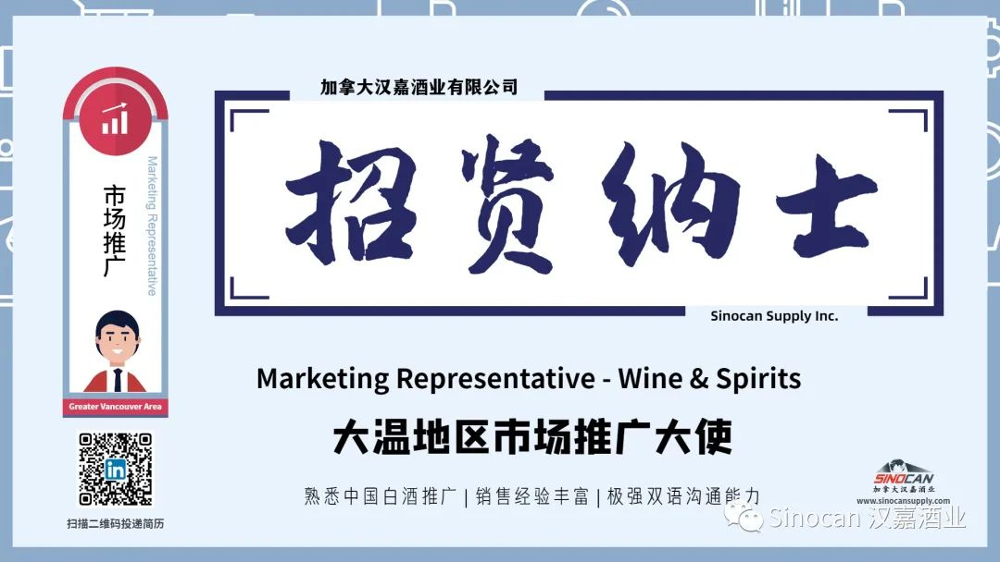

# 无标题

**链接地址:** http://mp.weixin.qq.com/s?__biz=MzIyMzU4OTc0MQ==&mid=2247484607&idx=1&sn=120f9750eb253222b66586dd5ae5b14f&chksm=e81aa0bddf6d29abd004d7b24fddbe6892cda99a4f5e57c513a58216a5df4d7cae03b9e75249&mpshare=1&scene=2&srcid=1121qE5GhVQKdtGCiPhDycIm&sharer_sharetime=1605908704718&sharer_shareid=be1c8edd6c93eec155a61c876e41d26a#rd
**作者:** 欢迎转发
**获取时间:** 2025/8/28 20:00:35
**图片数量:** 3

---

## 原始HTML内容

<section style="box-sizing: border-box;font-size: 16px;"><section style="text-align: center;justify-content: center;margin-top: 10px;margin-right: 0%;margin-left: 0%;box-sizing: border-box;" powered-by="xiumi.us"><section style="display: inline-block;vertical-align: bottom;width: auto;box-shadow: rgb(0, 0, 0) 0px 0px 0px;min-width: 10%;max-width: 100%;height: auto;align-self: flex-end;margin-right: -17px;box-sizing: border-box;"><section style="transform: translate3d(1px, 0px, 0px);margin-right: 0%;margin-bottom: 2px;margin-left: 0%;box-sizing: border-box;" powered-by="xiumi.us"><section style="text-align: justify;font-size: 18px;color: rgb(166, 54, 49);letter-spacing: 2px;line-height: 1;text-shadow: rgb(255, 255, 255) 0px 0px 5px, rgb(255, 255, 255) 0px 0px 5px;box-sizing: border-box;">
<strong style="box-sizing: border-box;">职位招聘</strong>
</section></section></section><section style="display: inline-block;vertical-align: bottom;width: auto;align-self: flex-end;box-shadow: rgb(0, 0, 0) 0px 0px 0px;min-width: 10%;max-width: 100%;height: auto;box-sizing: border-box;"><section style="text-align: left;font-size: 0px;justify-content: flex-start;margin-right: 0%;margin-bottom: 4px;margin-left: 0%;box-sizing: border-box;" powered-by="xiumi.us"><section style="display: inline-block;width: 28px;height: 28px;vertical-align: top;overflow: hidden;border-width: 0px;border-radius: 50%;border-style: none;border-color: rgb(62, 62, 62);box-shadow: rgba(255, 213, 195, 0) -4px 4px 12px inset;box-sizing: border-box;"><section><svg viewBox="0 0 1 1" style="float:left;line-height:0;width:0;vertical-align:top;"></svg></section></section></section></section></section><section style="margin: -2px 0% 12px;box-sizing: border-box;" powered-by="xiumi.us"><section style="background-color: rgba(160, 123, 249, 0);height: 2px;box-sizing: border-box;"><section><svg viewBox="0 0 1 1" style="float:left;line-height:0;width:0;vertical-align:top;"></svg></section></section></section><section style="margin: -10px 0% 10px;transform: translate3d(-10px, 0px, 0px);-webkit-transform: translate3d(-10px, 0px, 0px);-moz-transform: translate3d(-10px, 0px, 0px);-o-transform: translate3d(-10px, 0px, 0px);opacity: 0.71;box-sizing: border-box;" powered-by="xiumi.us"><section style="text-align: center;color: rgb(166, 54, 49);font-size: 12px;letter-spacing: 1px;box-sizing: border-box;">
<strong style="box-sizing: border-box;">Job Posting</strong>
</section></section><section style="box-sizing: border-box;" powered-by="xiumi.us">
 
</section><section style="margin-top: 8px;margin-right: 0%;margin-left: 0%;box-sizing: border-box;" powered-by="xiumi.us"><section style="background-color: rgb(0, 0, 0);height: 2px;box-sizing: border-box;"><section><svg viewBox="0 0 1 1" style="float:left;line-height:0;width:0;vertical-align:top;"></svg></section></section></section><section style="box-sizing: border-box;" powered-by="xiumi.us"><section style="display: flex;flex-flow: row nowrap;box-sizing: border-box;"><section style="display: inline-block;vertical-align: middle;width: auto;flex: 100 100 0%;align-self: center;height: auto;box-sizing: border-box;"><section style="margin-top: 0.5em;margin-bottom: 0.5em;box-sizing: border-box;" powered-by="xiumi.us"><section style="background-color: rgba(34, 82, 237, 0.14);height: 2px;box-sizing: border-box;"><section><svg viewBox="0 0 1 1" style="float:left;line-height:0;width:0;vertical-align:top;"></svg></section></section></section><section style="margin-top: 0.5em;margin-bottom: 0.5em;box-sizing: border-box;" powered-by="xiumi.us"><section style="background-color: rgba(34, 82, 237, 0.14);height: 2px;box-sizing: border-box;"><section><svg viewBox="0 0 1 1" style="float:left;line-height:0;width:0;vertical-align:top;"></svg></section></section></section><section style="margin-top: 0.5em;margin-bottom: 0.5em;box-sizing: border-box;" powered-by="xiumi.us"><section style="background-color: rgba(34, 82, 237, 0.14);height: 2px;box-sizing: border-box;"><section><svg viewBox="0 0 1 1" style="float:left;line-height:0;width:0;vertical-align:top;"></svg></section></section></section></section><section style="display: inline-block;vertical-align: middle;width: auto;min-width: 10%;max-width: 100%;flex: 0 0 auto;height: auto;align-self: center;box-sizing: border-box;"><section style="text-align: center;margin-right: 0%;margin-left: 0%;box-sizing: border-box;" powered-by="xiumi.us"><section style="display: inline-block;min-width: 10%;max-width: 100%;vertical-align: top;transform: matrix(1, 0, -0.2, 1, 0, 0);border-style: none;border-width: 0px;border-radius: 0px;border-color: rgb(37, 180, 170);background-color: rgba(255, 255, 255, 0);line-height: 1.6;box-sizing: border-box;"><section style="text-align: justify;color: rgb(166, 54, 49);padding-right: 10px;padding-left: 10px;letter-spacing: 3px;line-height: 1.5;font-size: 30px;box-sizing: border-box;" powered-by="xiumi.us">
<strong style="box-sizing: border-box;">市场推广大使</strong>
</section></section></section></section><section style="display: inline-block;vertical-align: middle;width: auto;flex: 100 100 0%;align-self: center;height: auto;box-sizing: border-box;"><section style="margin-top: 0.5em;margin-bottom: 0.5em;box-sizing: border-box;" powered-by="xiumi.us"><section style="background-color: rgba(34, 82, 237, 0.14);height: 2px;box-sizing: border-box;"><section><svg viewBox="0 0 1 1" style="float:left;line-height:0;width:0;vertical-align:top;"></svg></section></section></section><section style="margin-top: 0.5em;margin-bottom: 0.5em;box-sizing: border-box;" powered-by="xiumi.us"><section style="background-color: rgba(34, 82, 237, 0.14);height: 2px;box-sizing: border-box;"><section><svg viewBox="0 0 1 1" style="float:left;line-height:0;width:0;vertical-align:top;"></svg></section></section></section><section style="margin-top: 0.5em;margin-bottom: 0.5em;box-sizing: border-box;" powered-by="xiumi.us"><section style="background-color: rgba(34, 82, 237, 0.14);height: 2px;box-sizing: border-box;"><section><svg viewBox="0 0 1 1" style="float:left;line-height:0;width:0;vertical-align:top;"></svg></section></section></section></section></section></section><section style="margin-right: 0%;margin-bottom: 10px;margin-left: 0%;box-sizing: border-box;" powered-by="xiumi.us"><section style="display: inline-block;width: 100%;vertical-align: top;background-color: rgb(255, 255, 255);padding: 15px;box-sizing: border-box;"><section style="text-align: center;margin-right: 0%;margin-left: 0%;box-sizing: border-box;" powered-by="xiumi.us"><section style="max-width: 100%;vertical-align: middle;display: inline-block;line-height: 0;box-sizing: border-box;"></section></section><section style="box-sizing: border-box;" powered-by="xiumi.us">
 
</section><section style="box-sizing: border-box;" powered-by="xiumi.us"><section style="display: flex;flex-flow: row nowrap;margin-right: 0%;margin-left: 0%;box-sizing: border-box;"><section style="display: inline-block;vertical-align: top;width: auto;flex: 0 0 auto;align-self: stretch;min-width: 10%;max-width: 100%;height: auto;background-color: rgb(0, 0, 0);box-sizing: border-box;"><section style="margin: 6px 0%;box-sizing: border-box;" powered-by="xiumi.us"><section style="text-align: center;font-size: 12px;color: rgb(244, 244, 244);padding-right: 10px;padding-left: 10px;line-height: 1.3;letter-spacing: 0px;box-sizing: border-box;">
职位

简介
</section></section></section><section style="display: inline-block;vertical-align: top;width: auto;flex: 100 100 0%;align-self: stretch;height: auto;background-color: rgba(162, 162, 162, 0.36);box-sizing: border-box;"><section style="margin-top: 6px;margin-right: 0%;margin-left: 0%;box-sizing: border-box;" powered-by="xiumi.us"><section style="color: rgb(166, 54, 49);padding-right: 12px;padding-left: 12px;letter-spacing: 0.6px;line-height: 2;box-sizing: border-box;">
<strong style="box-sizing: border-box;">INTRODUCTION</strong>
</section></section></section></section></section><section style="display: inline-block;width: 100%;vertical-align: top;padding-left: 20px;box-sizing: border-box;" powered-by="xiumi.us"><section style="display: inline-block;width: 100%;vertical-align: top;border-left: 1px solid rgb(179, 179, 179);border-bottom-left-radius: 0px;padding-right: 10px;padding-bottom: 10px;padding-left: 15px;box-sizing: border-box;" powered-by="xiumi.us"><section style="margin: 10px 0% 6px;box-sizing: border-box;" powered-by="xiumi.us"><section style="text-align: left;font-size: 14px;letter-spacing: 0px;line-height: 1.6;box-sizing: border-box;">
<strong style="box-sizing: border-box;">Sinocan Supply Inc. </strong>is looking for a <strong style="box-sizing: border-box;">full-time marketing representative</strong> in the Greater Vancouver Area. We are a wine and spirits import and distribution company operating in Canada. The ideal candidate needs to be a self-starter, have excellent organizational skills and be driven to win. If this describes you and you have experience and desire to work, please send us your resume.
</section></section></section></section><section style="box-sizing: border-box;" powered-by="xiumi.us"><section style="display: flex;flex-flow: row nowrap;margin-right: 0%;margin-left: 0%;box-sizing: border-box;"><section style="display: inline-block;vertical-align: top;width: auto;flex: 0 0 auto;align-self: stretch;min-width: 10%;max-width: 100%;height: auto;background-color: rgb(0, 0, 0);box-sizing: border-box;"><section style="margin: 6px 0%;box-sizing: border-box;" powered-by="xiumi.us"><section style="text-align: center;font-size: 12px;color: rgb(244, 244, 244);padding-right: 10px;padding-left: 10px;line-height: 1.3;letter-spacing: 0px;box-sizing: border-box;">
职员

责任 
</section></section></section><section style="display: inline-block;vertical-align: top;width: auto;flex: 100 100 0%;align-self: stretch;height: auto;background-color: rgba(162, 162, 162, 0.36);box-sizing: border-box;"><section style="margin-top: 6px;margin-right: 0%;margin-left: 0%;box-sizing: border-box;" powered-by="xiumi.us"><section style="color: rgb(166, 54, 49);padding-right: 12px;padding-left: 12px;letter-spacing: 0.6px;line-height: 2;box-sizing: border-box;">
<strong style="box-sizing: border-box;">JOB DUTIES</strong>
</section></section></section></section></section><section style="display: inline-block;width: 100%;vertical-align: top;padding-left: 20px;border-width: 0px;box-sizing: border-box;" powered-by="xiumi.us"><section style="display: inline-block;width: 100%;vertical-align: top;border-left: 1px solid rgb(179, 179, 179);border-bottom-left-radius: 0px;padding-right: 10px;padding-bottom: 10px;padding-left: 15px;box-sizing: border-box;" powered-by="xiumi.us"><section style="margin: 10px 0% 6px;box-sizing: border-box;" powered-by="xiumi.us"><section style="text-align: left;font-size: 14px;letter-spacing: 0px;line-height: 1.6;box-sizing: border-box;"><ol class="list-paddingleft-2"><li style="box-sizing: border-box;">
Establish communication with BCLDB and work with BCLDB on the listing application 
</li><li style="box-sizing: border-box;">
Plan and execute sales calls and store visit to new and existing customers such as BC liquor stores, independent liquor retailers, restaurants, hotels and other similar venues. 
</li><li style="box-sizing: border-box;">
Create the territory sales plan and corresponding sales strategies 
</li><li style="box-sizing: border-box;">
Effectively petition new and existing customers to promote our brands on their shelves – strong oral and written communication skills are essential 
</li><li style="box-sizing: border-box;">
Present fact-based sales presentations to introduce new products and sell existing products 
</li><li style="box-sizing: border-box;">
Record and submit weekly sales and account activity in a timely fashion 
</li><li style="box-sizing: border-box;">
Act as a Brand Ambassador for the Sinocan Portfolio in BC 
</li><li style="box-sizing: border-box;">
Build excellent relationships with BCLDB, BC Liquor stores, private liquor stores, and restaurants. 
</li><li style="box-sizing: border-box;">
Establish and maintain a sales call and store visit cycle 
</li><li style="box-sizing: border-box;">
Attend and participate in various trade and public tastings and events 
</li><li style="box-sizing: border-box;">
Operate within an approved expense budget 
</li></ol></section></section></section></section><section style="box-sizing: border-box;" powered-by="xiumi.us"><section style="display: flex;flex-flow: row nowrap;margin-right: 0%;margin-left: 0%;box-sizing: border-box;"><section style="display: inline-block;vertical-align: top;width: auto;flex: 0 0 auto;align-self: stretch;min-width: 10%;max-width: 100%;height: auto;border-width: 0px;background-color: rgb(0, 0, 0);box-sizing: border-box;"><section style="margin: 6px 0%;box-sizing: border-box;" powered-by="xiumi.us"><section style="text-align: center;font-size: 12px;color: rgb(244, 244, 244);padding-right: 10px;padding-left: 10px;line-height: 1.3;letter-spacing: 0px;box-sizing: border-box;">
工作

要求
</section></section></section><section style="display: inline-block;vertical-align: top;width: auto;flex: 100 100 0%;align-self: stretch;height: auto;background-color: rgba(162, 162, 162, 0.36);box-sizing: border-box;"><section style="margin-top: 6px;margin-right: 0%;margin-left: 0%;box-sizing: border-box;" powered-by="xiumi.us"><section style="color: rgb(166, 54, 49);padding-right: 12px;padding-left: 12px;letter-spacing: 0.6px;line-height: 2;box-sizing: border-box;">
<strong style="box-sizing: border-box;">REQUIREMENTS</strong>
</section></section></section></section></section><section style="display: inline-block;width: 100%;vertical-align: top;padding-left: 20px;box-sizing: border-box;" powered-by="xiumi.us"><section style="display: inline-block;width: 100%;vertical-align: top;border-left: 1px solid rgb(179, 179, 179);border-bottom-left-radius: 0px;padding-right: 10px;padding-bottom: 10px;padding-left: 15px;box-sizing: border-box;" powered-by="xiumi.us"><section style="margin: 10px 0% 6px;box-sizing: border-box;" powered-by="xiumi.us"><section style="font-size: 14px;letter-spacing: 0px;line-height: 1.6;box-sizing: border-box;"><ol class="list-paddingleft-2"><li style="box-sizing: border-box;">
Excellent English &amp; Mandarin communication skills 
</li><li style="box-sizing: border-box;">
Minimum of 2 years’ experience in the sales and marketing 
</li><li style="box-sizing: border-box;">
Completed Bachelor’s Degree 
</li><li style="box-sizing: border-box;">
Completed Serving It Right (SIR) program 
</li><li style="box-sizing: border-box;">
Experience in alcohol beverage retail or BCLD is an asset 
</li><li style="box-sizing: border-box;">
WSET is an asset 
</li><li style="box-sizing: border-box;">
Strong interpersonal skills 
</li><li style="box-sizing: border-box;">
Organized with proven ability to multitask &amp; manage time effectively 
</li><li style="box-sizing: border-box;">
Self-starter with a strong desire to learn and develop as a sales professional 
</li><li style="box-sizing: border-box;">
Able to work well independently and in a team 
</li><li style="box-sizing: border-box;">
Achievement / results oriented 
</li><li style="box-sizing: border-box;">
Strong Computer skills including MS Office 
</li><li style="box-sizing: border-box;">
Available to travel and attend evening/ weekend events as necessary 
</li><li style="box-sizing: border-box;">
Legally able to sell alcohol beverages 
</li><li style="box-sizing: border-box;">
Valid Driver’s License in good standing.&nbsp;
</li></ol></section></section></section></section><section style="box-sizing: border-box;" powered-by="xiumi.us">
 
</section><section style="box-sizing: border-box;" powered-by="xiumi.us">
 
</section><section style="box-sizing: border-box;" powered-by="xiumi.us"><section style="display: flex;flex-flow: row nowrap;box-sizing: border-box;"><section style="display: inline-block;vertical-align: middle;width: auto;flex: 100 100 0%;align-self: center;height: auto;box-sizing: border-box;"><section style="margin-top: 0.5em;margin-bottom: 0.5em;box-sizing: border-box;" powered-by="xiumi.us"><section style="background-color: rgba(34, 82, 237, 0.14);height: 2px;box-sizing: border-box;"><section><svg viewBox="0 0 1 1" style="float:left;line-height:0;width:0;vertical-align:top;"></svg></section></section></section><section style="margin-top: 0.5em;margin-bottom: 0.5em;box-sizing: border-box;" powered-by="xiumi.us"><section style="background-color: rgba(34, 82, 237, 0.14);height: 2px;box-sizing: border-box;"><section><svg viewBox="0 0 1 1" style="float:left;line-height:0;width:0;vertical-align:top;"></svg></section></section></section><section style="margin-top: 0.5em;margin-bottom: 0.5em;box-sizing: border-box;" powered-by="xiumi.us"><section style="background-color: rgba(34, 82, 237, 0.14);height: 2px;box-sizing: border-box;"><section><svg viewBox="0 0 1 1" style="float:left;line-height:0;width:0;vertical-align:top;"></svg></section></section></section></section><section style="display: inline-block;vertical-align: middle;width: auto;min-width: 10%;max-width: 100%;flex: 0 0 auto;height: auto;align-self: center;box-sizing: border-box;"><section style="text-align: center;margin-right: 0%;margin-left: 0%;box-sizing: border-box;" powered-by="xiumi.us"><section style="display: inline-block;min-width: 10%;max-width: 100%;vertical-align: top;transform: matrix(1, 0, -0.2, 1, 0, 0);border-style: none;border-width: 0px;border-radius: 0px;border-color: rgb(37, 180, 170);background-color: rgba(255, 255, 255, 0);line-height: 1.6;box-sizing: border-box;"><section style="text-align: justify;color: rgb(166, 54, 49);padding-right: 10px;padding-left: 10px;letter-spacing: 3px;line-height: 1.5;font-size: 30px;box-sizing: border-box;" powered-by="xiumi.us">
<strong style="box-sizing: border-box;">简历投递</strong>
</section></section></section></section><section style="display: inline-block;vertical-align: middle;width: auto;flex: 100 100 0%;align-self: center;height: auto;box-sizing: border-box;"><section style="margin-top: 0.5em;margin-bottom: 0.5em;box-sizing: border-box;" powered-by="xiumi.us"><section style="background-color: rgba(34, 82, 237, 0.14);height: 2px;box-sizing: border-box;"><section><svg viewBox="0 0 1 1" style="float:left;line-height:0;width:0;vertical-align:top;"></svg></section></section></section><section style="margin-top: 0.5em;margin-bottom: 0.5em;box-sizing: border-box;" powered-by="xiumi.us"><section style="background-color: rgba(34, 82, 237, 0.14);height: 2px;box-sizing: border-box;"><section><svg viewBox="0 0 1 1" style="float:left;line-height:0;width:0;vertical-align:top;"></svg></section></section></section><section style="margin-top: 0.5em;margin-bottom: 0.5em;box-sizing: border-box;" powered-by="xiumi.us"><section style="background-color: rgba(34, 82, 237, 0.14);height: 2px;box-sizing: border-box;"><section><svg viewBox="0 0 1 1" style="float:left;line-height:0;width:0;vertical-align:top;"></svg></section></section></section></section></section></section><section style="text-align: center;margin-top: 10px;margin-bottom: 10px;box-sizing: border-box;" powered-by="xiumi.us"><section style="max-width: 100%;vertical-align: middle;display: inline-block;line-height: 0;box-sizing: border-box;"></section></section><section style="text-align: left;font-size: 14px;letter-spacing: 1px;line-height: 1.8;box-sizing: border-box;" powered-by="xiumi.us">
<strong style="box-sizing: border-box;">LinkedIn</strong>

https://www.linkedin.com/jobs/view/2286311930/
</section><section style="text-align: left;font-size: 14px;letter-spacing: 1px;line-height: 1.8;box-sizing: border-box;" powered-by="xiumi.us">
 

<strong style="box-sizing: border-box;">Indeed</strong>

https://ca.indeed.com/job/marketing-representative-wine-spirits-7e6e6de200532c09
</section></section></section><section style="box-sizing: border-box;" powered-by="xiumi.us">
 
</section><section style="box-sizing: border-box;" powered-by="xiumi.us">
 
</section><section style="margin: 10px 0%;box-sizing: border-box;" powered-by="xiumi.us"><section style="display: inline-block;width: 100%;vertical-align: top;background-color: rgba(162, 162, 162, 0.36);border-width: 1px 4px;border-radius: 0px;border-style: solid none;border-color: rgba(162, 162, 162, 0.36) rgb(205, 240, 255);box-sizing: border-box;"><section style="box-sizing: border-box;" powered-by="xiumi.us"><section style="display: inline-block;vertical-align: middle;width: 33%;align-self: center;height: auto;box-shadow: rgba(255, 213, 195, 0) 0px 0px 0px;box-sizing: border-box;"><section style="text-align: right;margin: -4px 0%;justify-content: flex-end;box-sizing: border-box;" powered-by="xiumi.us"><section style="max-width: 100%;vertical-align: middle;display: inline-block;line-height: 0;width: 90%;height: auto;box-shadow: rgb(166, 54, 49) 0px 0px 0px;border-style: solid none;border-width: 6px 4px;border-radius: 0px;border-color: rgb(166, 54, 49) rgb(255, 211, 44);box-sizing: border-box;"></section></section></section><section style="display: inline-block;vertical-align: middle;width: 66%;height: auto;align-self: center;box-sizing: border-box;"><section style="margin-right: 0%;margin-left: 0%;box-sizing: border-box;" powered-by="xiumi.us"><section style="text-align: center;font-size: 14px;color: rgb(124, 119, 219);letter-spacing: 0px;line-height: 1.6;padding-right: 20px;padding-left: 20px;box-sizing: border-box;">
<strong style="box-sizing: border-box;">汉嘉酒业</strong>

<strong style="box-sizing: border-box;">扫描二维码</strong><strong style="letter-spacing: 0px;box-sizing: border-box;">关注我们</strong>

http://www.sinocansupply.com/

Email: info@sinocansupply.com
</section></section></section></section></section></section></section>
 

---

## 纯文本内容

职位招聘Job Posting市场推广大使职位简介INTRODUCTIONSinocan Supply Inc. is looking for a full-time marketing representative in the Greater Vancouver Area. We are a wine and spirits import and distribution company operating in Canada. The ideal candidate needs to be a self-starter, have excellent organizational skills and be driven to win. If this describes you and you have experience and desire to work, please send us your resume.职员责任JOB DUTIESEstablish communication with BCLDB and work with BCLDB on the listing applicationPlan and execute sales calls and store visit to new and existing customers such as BC liquor stores, independent liquor retailers, restaurants, hotels and other similar venues.Create the territory sales plan and corresponding sales strategiesEffectively petition new and existing customers to promote our brands on their shelves – strong oral and written communication skills are essentialPresent fact-based sales presentations to introduce new products and sell existing productsRecord and submit weekly sales and account activity in a timely fashionAct as a Brand Ambassador for the Sinocan Portfolio in BCBuild excellent relationships with BCLDB, BC Liquor stores, private liquor stores, and restaurants.Establish and maintain a sales call and store visit cycleAttend and participate in various trade and public tastings and eventsOperate within an approved expense budget工作要求REQUIREMENTSExcellent English & Mandarin communication skillsMinimum of 2 years’ experience in the sales and marketingCompleted Bachelor’s DegreeCompleted Serving It Right (SIR) programExperience in alcohol beverage retail or BCLD is an assetWSET is an assetStrong interpersonal skillsOrganized with proven ability to multitask & manage time effectivelySelf-starter with a strong desire to learn and develop as a sales professionalAble to work well independently and in a teamAchievement / results orientedStrong Computer skills including MS OfficeAvailable to travel and attend evening/ weekend events as necessaryLegally able to sell alcohol beveragesValid Driver’s License in good standing. 简历投递LinkedInhttps://www.linkedin.com/jobs/view/2286311930/Indeedhttps://ca.indeed.com/job/marketing-representative-wine-spirits-7e6e6de200532c09汉嘉酒业扫描二维码关注我们http://www.sinocansupply.com/Email: info@sinocansupply.com

---

## 图片列表

-  (原始链接: https://mmbiz.qpic.cn/mmbiz_jpg/7CNdqYbqvBK6owMmykyJvYMLMtKBdoZfb9ExuskPicZEGBYkqu4gKIpmhiaSIBcmicfX5sgtjuW5qaGEWkK8BZruA/640?wx_fmt=jpeg)
-  (原始链接: https://mmbiz.qpic.cn/mmbiz_jpg/7CNdqYbqvBK6owMmykyJvYMLMtKBdoZfrSnHjLLs76rox5XwpwjtS9gMsZbtdJDALSYjtR35vux8prZfSxLdicw/640?wx_fmt=jpeg)
-  (原始链接: https://mmbiz.qpic.cn/mmbiz_jpg/7CNdqYbqvBK6owMmykyJvYMLMtKBdoZfCjtf1VTKPyjJj0fibND6xeKZL81iaSMVNuZf9pYLzeb8FLJaU5X5amZw/640?wx_fmt=jpeg)
