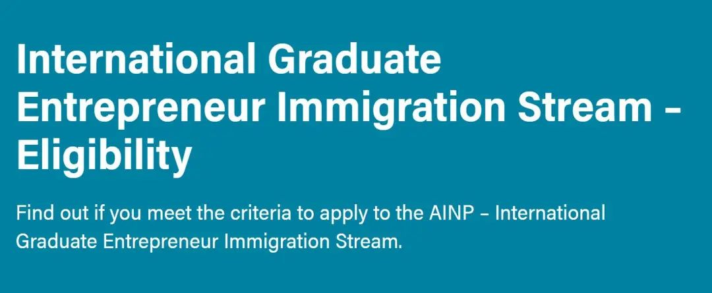
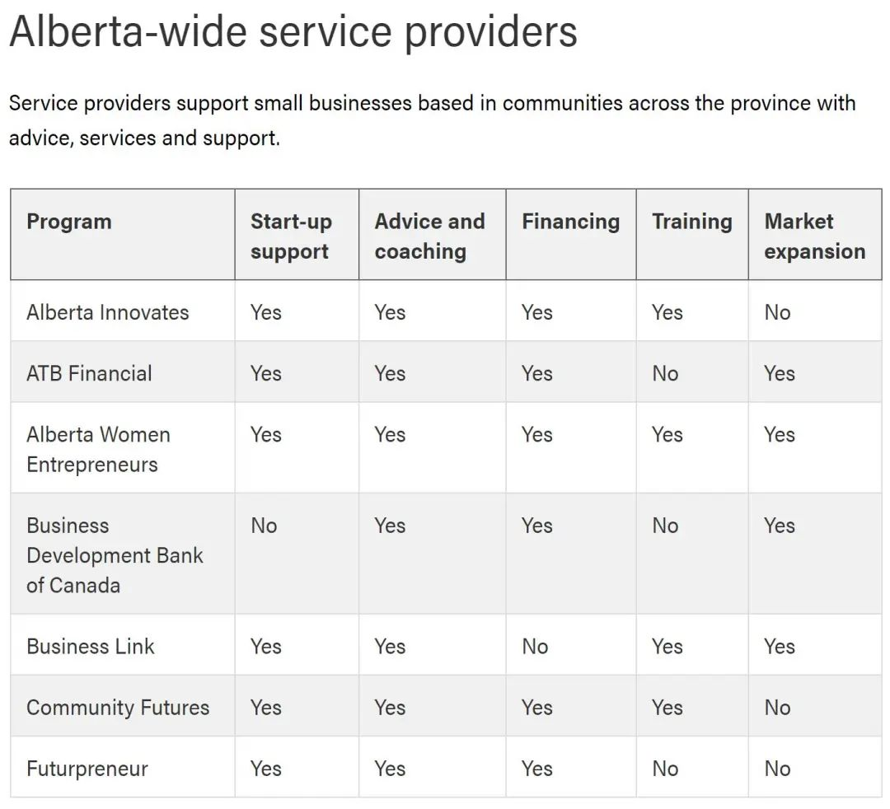
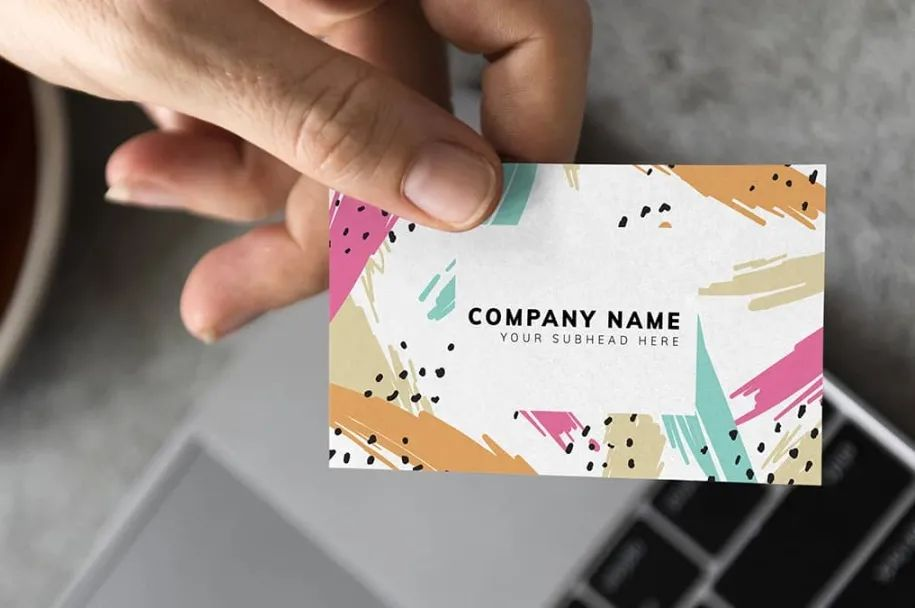
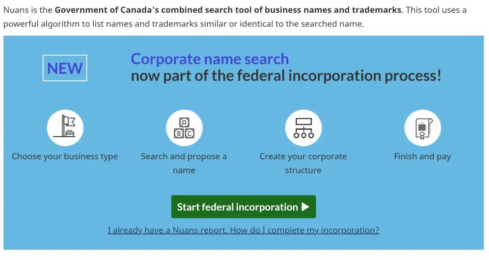
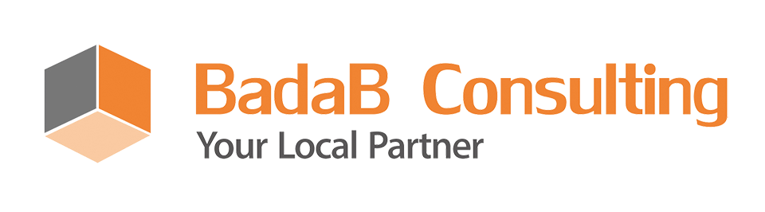
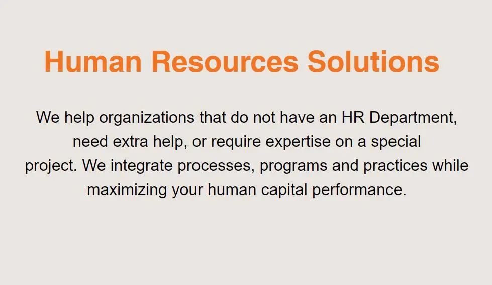

# 无标题

**链接地址:** http://mp.weixin.qq.com/s?__biz=MzI4NDYyNjAwNw==&mid=2247484552&idx=1&sn=b43a882699191b8040c8e48cd9fa7a2e&chksm=ebf9d9b0dc8e50a666eee885d4279c4d8f15bd6078632fe6138ac8fdfe40ff1aa3cec9f3297f&mpshare=1&scene=2&srcid=1201v3aBiWCMo5fahRaV1i91&sharer_sharetime=1606775281837&sharer_shareid=be1c8edd6c93eec155a61c876e41d26a#rd
**作者:** 关注我们
**获取时间:** 2025/8/28 20:00:29
**图片数量:** 24

---

## 原始HTML内容

<section style="box-sizing: border-box;font-size: 16px;"><section style="box-sizing: border-box;" powered-by="xiumi.us"><section style="margin: 20px 0%;display: flex;flex-flow: row nowrap;box-sizing: border-box;"><section style="display: inline-block;width: auto;vertical-align: top;border-style: solid;border-width: 1px;border-radius: 0px;border-color: rgb(103, 103, 103);box-shadow: rgba(211, 226, 242, 0.89) 9px 9px 0px;flex: 100 100 0%;align-self: flex-start;height: auto;margin-right: 10px;background-attachment: scroll;background-position: 0% 0%;background-repeat: repeat;background-size: 9.97305%;background-image: url(&quot;https://mmbiz.qpic.cn/mmbiz_png/cY0qSDjdkFe95vJ7Em838DGgicCvLZ7K9zf6ib3N979wcOic7B8gJvJ5hWXZaatolGda3hiaoiad5MIdTEWRaE2MiaEw/640?wx_fmt=png&quot;);box-sizing: border-box;"><section style="text-align: center;justify-content: center;margin-top: -14px;margin-right: 0%;margin-left: 0%;transform: translate3d(-1px, 0px, 0px);box-sizing: border-box;" powered-by="xiumi.us"><section style="display: inline-block;width: auto;vertical-align: top;box-shadow: rgb(103, 103, 103) 0px 0px 0px;border-width: 0px;min-width: 10%;max-width: 100%;height: auto;background-color: rgb(255, 255, 255);box-sizing: border-box;"><section style="margin-right: 0%;margin-bottom: 4px;margin-left: 0%;box-sizing: border-box;" powered-by="xiumi.us"><section style="text-align: justify;font-size: 17px;color: rgb(103, 103, 103);letter-spacing: 1px;padding-right: 10px;padding-left: 10px;box-sizing: border-box;">
<strong style="box-sizing: border-box;">点击蓝字 ｜关注我们</strong>
</section></section></section></section></section></section></section><section style="box-sizing: border-box;" powered-by="xiumi.us">
 
</section><section style="box-sizing: border-box;" powered-by="xiumi.us">
 
</section><section style="box-sizing: border-box;" powered-by="xiumi.us"><section style="display: flex;flex-flow: row nowrap;margin: 10px 0%;box-sizing: border-box;"><section style="display: inline-block;vertical-align: middle;width: auto;flex: 0 0 auto;align-self: center;min-width: 10%;max-width: 100%;height: auto;margin-right: -30px;z-index: 1;box-sizing: border-box;"><section style="box-sizing: border-box;" powered-by="xiumi.us"><section style="display: flex;flex-flow: row nowrap;box-sizing: border-box;"><section style="display: inline-block;vertical-align: bottom;width: auto;min-width: 10%;max-width: 100%;flex: 0 0 auto;height: auto;align-self: flex-end;margin-right: 7px;box-sizing: border-box;"><section style="text-align: left;justify-content: flex-start;box-sizing: border-box;" powered-by="xiumi.us"><section style="display: inline-block;width: 22px;height: 44px;vertical-align: top;overflow: hidden;background-color: rgba(211, 226, 242, 0.89);box-sizing: border-box;"><section><svg viewBox="0 0 1 1" style="float:left;line-height:0;width:0;vertical-align:top;"></svg></section></section></section></section><section style="display: inline-block;vertical-align: bottom;width: auto;align-self: flex-end;flex: 100 100 0%;height: auto;box-sizing: border-box;"><section style="transform: translate3d(-20px, 0px, 0px);-webkit-transform: translate3d(-20px, 0px, 0px);-moz-transform: translate3d(-20px, 0px, 0px);-o-transform: translate3d(-20px, 0px, 0px);box-sizing: border-box;" powered-by="xiumi.us"><section style="padding-right: 20px;padding-left: 20px;box-sizing: border-box;">
<strong style="box-sizing: border-box;">Starting</strong>

<strong style="box-sizing: border-box;">a business ...</strong>
</section></section><section style="margin-right: 0%;margin-bottom: 8px;margin-left: 0%;box-sizing: border-box;" powered-by="xiumi.us"><section style="background-color: rgb(103, 103, 103);height: 1px;box-sizing: border-box;"><section><svg viewBox="0 0 1 1" style="float:left;line-height:0;width:0;vertical-align:top;"></svg></section></section></section></section></section></section></section><section style="display: inline-block;vertical-align: middle;width: auto;align-self: center;flex: 100 100 0%;height: auto;box-sizing: border-box;"><section style="text-align: center;margin-right: 0%;margin-left: 0%;box-sizing: border-box;" powered-by="xiumi.us"><section style="max-width: 100%;vertical-align: middle;display: inline-block;line-height: 0;box-sizing: border-box;"></section></section></section><section style="display: inline-block;vertical-align: middle;width: auto;align-self: center;border-width: 1px;border-radius: 0px;border-style: solid solid solid none;border-color: rgb(62, 62, 62);padding: 10px;min-width: 10%;max-width: 100%;flex: 0 0 auto;height: auto;box-sizing: border-box;"><section style="color: rgb(121, 121, 121);letter-spacing: 1px;font-size: 26px;box-sizing: border-box;" powered-by="xiumi.us">
<strong style="box-sizing: border-box;">创业</strong>
</section></section></section></section><section style="font-size: 14px;color: rgb(121, 121, 121);padding-right: 20px;padding-left: 20px;letter-spacing: 2px;line-height: 2;box-sizing: border-box;" powered-by="xiumi.us">
 

2020年对于应届的留学毕业生同学们来说可真是<strong style="box-sizing: border-box;">“南上加南”</strong>。在疫情严重地冲击下，多数传统行业的发展面临阻碍，<strong style="box-sizing: border-box;">想找一份称心如意的工作简直比登天难</strong>。

 
</section><section style="text-align: center;margin-top: 10px;margin-bottom: 10px;box-sizing: border-box;" powered-by="xiumi.us"><section style="max-width: 100%;vertical-align: middle;display: inline-block;line-height: 0;width: 60%;height: auto;box-sizing: border-box;"></section></section><section style="font-size: 14px;color: rgb(121, 121, 121);padding-right: 20px;padding-left: 20px;letter-spacing: 2px;line-height: 2;box-sizing: border-box;" powered-by="xiumi.us">
 

特别是那些想要<strong style="box-sizing: border-box;">留在加拿大</strong>一展拳脚的朋友们，眼看着自己的毕业工签时间一天天在减少，但工作时长和经验的累积却一筹莫展，那种<strong style="box-sizing: border-box;">煎熬</strong>的心情可以想象。

 
</section><section style="text-align: center;margin-top: 10px;margin-bottom: 10px;box-sizing: border-box;" powered-by="xiumi.us"><section style="max-width: 100%;vertical-align: middle;display: inline-block;line-height: 0;box-sizing: border-box;"></section></section><section style="font-size: 14px;color: rgb(121, 121, 121);padding-right: 20px;padding-left: 20px;letter-spacing: 2px;line-height: 2;box-sizing: border-box;" powered-by="xiumi.us">
 

好在今年9月26日，阿省正式公布了大家期待已久的，最新<strong style="box-sizing: border-box;">国际学生创业项目</strong> / International Graduate Entrepreneur Immigration Stream (IGEIS)具体细节。

 
</section><section style="text-align: center;margin-top: 10px;margin-bottom: 10px;box-sizing: border-box;" powered-by="xiumi.us"><section style="max-width: 100%;vertical-align: middle;display: inline-block;line-height: 0;box-sizing: border-box;"></section></section><section style="font-size: 14px;color: rgb(121, 121, 121);padding-right: 20px;padding-left: 20px;letter-spacing: 2px;line-height: 2;box-sizing: border-box;" powered-by="xiumi.us">
 

许多苦于求职无门的留学毕业生朋友们转念一想，或许<strong style="box-sizing: border-box;">通过创业的方式移民</strong>也是一个好选择。危难孕育机遇，目前正是那些<strong style="box-sizing: border-box;">创新前沿的创业项目启动的最佳时机！</strong>

 
</section><section style="text-align: center;margin-top: 10px;margin-bottom: 10px;box-sizing: border-box;" powered-by="xiumi.us"><section style="max-width: 100%;vertical-align: middle;display: inline-block;line-height: 0;box-sizing: border-box;"></section></section><section style="font-size: 14px;color: rgb(121, 121, 121);padding-right: 20px;padding-left: 20px;letter-spacing: 2px;line-height: 2;box-sizing: border-box;" powered-by="xiumi.us">
 

然而对于大多数留学毕业生来说，大家在加拿大<strong style="box-sizing: border-box;">创业的经验几乎为零</strong>。而正经的创业可不是在社交平台上创建个页面，或者朋友圈发条广告就能开始业务的。（至少可以申请移民的创业项目不是）
</section><section style="text-align: center;margin-top: 10px;margin-bottom: 10px;box-sizing: border-box;" powered-by="xiumi.us"><section style="max-width: 100%;vertical-align: middle;display: inline-block;line-height: 0;box-sizing: border-box;"></section></section><section style="font-size: 14px;color: rgb(121, 121, 121);padding-right: 20px;padding-left: 20px;letter-spacing: 2px;line-height: 2;box-sizing: border-box;" powered-by="xiumi.us">
今天，BadaB Consulting 的小编就要带着大家去<strong style="box-sizing: border-box;">捋一捋在阿省创业的几个步骤与小细节</strong>。有创业打算或者观望中的同学们，快拿出小本本记好我们<strong style="box-sizing: border-box;">精心为你规划的重点</strong>吧！ 

 
</section><section style="box-sizing: border-box;" powered-by="xiumi.us"><section style="display: inline-block;vertical-align: top;width: 50%;padding-right: 8px;box-sizing: border-box;"><section style="margin-top: 0.5em;margin-bottom: 0.5em;box-sizing: border-box;" powered-by="xiumi.us"><section style="border-top: 4px solid rgb(125, 192, 232);box-sizing: border-box;"><section><svg viewBox="0 0 1 1" style="float:left;line-height:0;width:0;vertical-align:top;"></svg></section></section><section style="margin-top: 3px;border-top: 1px solid rgb(125, 192, 232);box-sizing: border-box;"><section><svg viewBox="0 0 1 1" style="float:left;line-height:0;width:0;vertical-align:top;"></svg></section></section></section></section><section style="display: inline-block;vertical-align: top;width: 50%;padding-left: 8px;box-sizing: border-box;"><section style="margin-top: 0.5em;margin-bottom: 0.5em;box-sizing: border-box;" powered-by="xiumi.us"><section style="border-top: 4px solid rgb(125, 192, 232);box-sizing: border-box;"><section><svg viewBox="0 0 1 1" style="float:left;line-height:0;width:0;vertical-align:top;"></svg></section></section><section style="margin-top: 3px;border-top: 1px solid rgb(125, 192, 232);box-sizing: border-box;"><section><svg viewBox="0 0 1 1" style="float:left;line-height:0;width:0;vertical-align:top;"></svg></section></section></section></section></section><section style="box-sizing: border-box;" powered-by="xiumi.us">
 
</section><section style="box-sizing: border-box;" powered-by="xiumi.us">
 
</section><section style="box-sizing: border-box;" powered-by="xiumi.us"><section style="display: flex;flex-flow: row nowrap;margin: 10px 0%;box-sizing: border-box;"><section style="display: inline-block;vertical-align: top;width: auto;background-color: rgb(51, 167, 233);flex: 0 0 auto;align-self: flex-start;min-width: 10%;max-width: 100%;height: auto;border-width: 0px;box-sizing: border-box;"><section style="transform: translate3d(-1px, 0px, 0px);-webkit-transform: translate3d(-1px, 0px, 0px);-moz-transform: translate3d(-1px, 0px, 0px);-o-transform: translate3d(-1px, 0px, 0px);box-sizing: border-box;" powered-by="xiumi.us"><section style="font-size: 19px;color: rgb(255, 255, 255);line-height: 2;letter-spacing: 1px;padding-right: 10px;padding-left: 10px;box-sizing: border-box;">
<strong style="box-sizing: border-box;">01</strong>
</section></section></section><section style="display: inline-block;vertical-align: top;width: auto;background-color: rgb(245, 245, 245);flex: 100 100 0%;height: auto;box-sizing: border-box;"><section style="transform: translate3d(-1px, 0px, 0px);-webkit-transform: translate3d(-1px, 0px, 0px);-moz-transform: translate3d(-1px, 0px, 0px);-o-transform: translate3d(-1px, 0px, 0px);box-sizing: border-box;" powered-by="xiumi.us"><section style="font-size: 19px;color: rgb(51, 167, 233);line-height: 2;letter-spacing: 1px;padding-right: 10px;padding-left: 10px;box-sizing: border-box;">
<strong style="box-sizing: border-box;">商业计划书</strong>
</section></section></section></section></section><section style="font-size: 14px;color: rgb(121, 121, 121);padding-right: 20px;padding-left: 20px;letter-spacing: 2px;line-height: 2;box-sizing: border-box;" powered-by="xiumi.us">
 

商业计划书虽然不是创业的必须步骤，却是我们<strong style="box-sizing: border-box;">强烈建议大家去实行的一个步骤</strong>，因为商业计划书会帮助你和你的合伙人将大胆的想法映射到实际的商业行为细节中。

 
</section><section style="text-align: center;margin-top: 10px;margin-bottom: 10px;box-sizing: border-box;" powered-by="xiumi.us"><section style="max-width: 100%;vertical-align: middle;display: inline-block;line-height: 0;box-sizing: border-box;"></section></section><section style="font-size: 14px;color: rgb(121, 121, 121);padding-right: 20px;padding-left: 20px;letter-spacing: 2px;line-height: 2;box-sizing: border-box;" powered-by="xiumi.us">
 

从前期市场调研，到可行性的讨论，再到风险分析与控制，用具体的数字和文字形式让你和你的合伙人对待即将开展的业务有一个<strong style="box-sizing: border-box;">理性的全局认识</strong>，同时开辟更广阔的市场和品牌可能性。

 

 
</section><section style="box-sizing: border-box;" powered-by="xiumi.us"><section style="display: flex;flex-flow: row nowrap;margin: 10px 0%;box-sizing: border-box;"><section style="display: inline-block;vertical-align: top;width: auto;background-color: rgb(51, 167, 233);flex: 0 0 auto;align-self: flex-start;min-width: 10%;max-width: 100%;height: auto;border-width: 0px;box-sizing: border-box;"><section style="transform: translate3d(-1px, 0px, 0px);-webkit-transform: translate3d(-1px, 0px, 0px);-moz-transform: translate3d(-1px, 0px, 0px);-o-transform: translate3d(-1px, 0px, 0px);box-sizing: border-box;" powered-by="xiumi.us"><section style="font-size: 19px;color: rgb(255, 255, 255);line-height: 2;letter-spacing: 1px;padding-right: 10px;padding-left: 10px;box-sizing: border-box;">
<strong style="box-sizing: border-box;">02</strong>
</section></section></section><section style="display: inline-block;vertical-align: top;width: auto;background-color: rgb(245, 245, 245);flex: 100 100 0%;height: auto;box-sizing: border-box;"><section style="transform: translate3d(-1px, 0px, 0px);-webkit-transform: translate3d(-1px, 0px, 0px);-moz-transform: translate3d(-1px, 0px, 0px);-o-transform: translate3d(-1px, 0px, 0px);box-sizing: border-box;" powered-by="xiumi.us"><section style="font-size: 19px;color: rgb(51, 167, 233);line-height: 2;letter-spacing: 1px;padding-right: 10px;padding-left: 10px;box-sizing: border-box;">
<strong style="box-sizing: border-box;">寻求资金及资源的援助</strong>
</section></section></section></section></section><section style="font-size: 14px;color: rgb(121, 121, 121);padding-right: 20px;padding-left: 20px;letter-spacing: 2px;line-height: 2;box-sizing: border-box;" powered-by="xiumi.us">
 

许多人想要创业但担心自己没有足够的财力和能力去支撑企业前期的发展，这时候可以带上写好的商业计划书去寻求<strong style="box-sizing: border-box;">资金及资源的援助</strong>。

 
</section><section style="text-align: center;margin-top: 10px;margin-bottom: 10px;box-sizing: border-box;" powered-by="xiumi.us"><section style="max-width: 100%;vertical-align: middle;display: inline-block;line-height: 0;box-sizing: border-box;"></section></section><section style="text-align: center;font-size: 12px;color: rgba(0, 0, 0, 0.24);box-sizing: border-box;" powered-by="xiumi.us">
图片来源：www.alberta.ca/small-business-resources
</section><section style="font-size: 14px;color: rgb(121, 121, 121);padding-right: 20px;padding-left: 20px;letter-spacing: 2px;line-height: 2;box-sizing: border-box;" powered-by="xiumi.us">
 

我们的政府和当地机构为了鼓励创业，<strong style="box-sizing: border-box;">为企业家们设计了许多从包括低息贷款、赠款奖金、技能培训、教育指导及市场拓展等方面的服务</strong>，对于处于不同阶段的中小企业都有各自的福利政策。 

 
</section><section style="text-align: center;margin-top: 10px;margin-bottom: 10px;box-sizing: border-box;" powered-by="xiumi.us"><section style="max-width: 100%;vertical-align: middle;display: inline-block;line-height: 0;box-sizing: border-box;"></section></section><section style="text-align: center;font-size: 12px;color: rgba(0, 0, 0, 0.24);box-sizing: border-box;" powered-by="xiumi.us">
图片来源：albertainnovates.ca/what-we-offer/funding-grants
</section><section style="font-size: 14px;color: rgb(121, 121, 121);padding-right: 20px;padding-left: 20px;letter-spacing: 2px;line-height: 2;box-sizing: border-box;" powered-by="xiumi.us">
 

比如，女性创业者可以在 Alberta Women Entrepreneurs 项目那里申请到最多十五万加币的<strong style="box-sizing: border-box;">低息贷款</strong>；而清洁能源等新兴行业的创业者们也可以尝试在 Alberta Innovates 项目中申请数量不等的<strong style="box-sizing: border-box;">无偿创业启动金</strong>。

 
</section><section style="text-align: center;margin-top: 10px;margin-bottom: 10px;box-sizing: border-box;" powered-by="xiumi.us"><section style="max-width: 100%;vertical-align: middle;display: inline-block;line-height: 0;box-sizing: border-box;"></section></section><section style="text-align: center;font-size: 12px;color: rgba(0, 0, 0, 0.24);box-sizing: border-box;" powered-by="xiumi.us">
图片来源：ATB Entrepreneur Centre YEG

 
</section><section style="font-size: 14px;color: rgb(121, 121, 121);padding-right: 20px;padding-left: 20px;letter-spacing: 2px;line-height: 2;box-sizing: border-box;" powered-by="xiumi.us">
 

另外，一些诸如<strong style="box-sizing: border-box;">ATB&nbsp;Entrepreneur Centre</strong> 的机构也给创业者们提供<strong style="box-sizing: border-box;">免费的创业咨询顾问服务和定期可远程参与的Workshop</strong>。选择参与这些活动都是在创业初期可以帮助大家少走许多弯路的好方法。

 

 
</section><section style="box-sizing: border-box;" powered-by="xiumi.us"><section style="display: flex;flex-flow: row nowrap;margin: 10px 0%;box-sizing: border-box;"><section style="display: inline-block;vertical-align: top;width: auto;background-color: rgb(51, 167, 233);flex: 0 0 auto;align-self: flex-start;min-width: 10%;max-width: 100%;height: auto;border-width: 0px;box-sizing: border-box;"><section style="transform: translate3d(-1px, 0px, 0px);-webkit-transform: translate3d(-1px, 0px, 0px);-moz-transform: translate3d(-1px, 0px, 0px);-o-transform: translate3d(-1px, 0px, 0px);box-sizing: border-box;" powered-by="xiumi.us"><section style="font-size: 19px;color: rgb(255, 255, 255);line-height: 2;letter-spacing: 1px;padding-right: 10px;padding-left: 10px;box-sizing: border-box;">
<strong style="box-sizing: border-box;">03</strong>
</section></section></section><section style="display: inline-block;vertical-align: top;width: auto;background-color: rgb(245, 245, 245);flex: 100 100 0%;height: auto;box-sizing: border-box;"><section style="transform: translate3d(-1px, 0px, 0px);-webkit-transform: translate3d(-1px, 0px, 0px);-moz-transform: translate3d(-1px, 0px, 0px);-o-transform: translate3d(-1px, 0px, 0px);box-sizing: border-box;" powered-by="xiumi.us"><section style="font-size: 19px;color: rgb(51, 167, 233);line-height: 2;letter-spacing: 1px;padding-right: 10px;padding-left: 10px;box-sizing: border-box;">
<strong style="box-sizing: border-box;">企业注册</strong>
</section></section></section></section></section><section style="font-size: 14px;color: rgb(121, 121, 121);padding-right: 20px;padding-left: 20px;letter-spacing: 2px;line-height: 2;box-sizing: border-box;" powered-by="xiumi.us">
 

想要在阿省创业，必要的一步就是创建一个企业，让自己的业务和营收合法化。而创建企业在法律上不可避免的一步就是<strong style="box-sizing: border-box;">企业注册</strong>。

 
</section><section style="text-align: center;margin-top: 10px;margin-bottom: 10px;box-sizing: border-box;" powered-by="xiumi.us"><section style="max-width: 100%;vertical-align: middle;display: inline-block;line-height: 0;box-sizing: border-box;"></section></section><section style="font-size: 14px;color: rgb(121, 121, 121);padding-right: 20px;padding-left: 20px;letter-spacing: 2px;line-height: 2;box-sizing: border-box;" powered-by="xiumi.us">
 

注册企业可以在阿省境内的任何<strong style="box-sizing: border-box;">Registry</strong>进行，然而前去注册之前请一定准备好以下<strong style="box-sizing: border-box;">四个关关键点</strong>：

 
</section><section style="box-sizing: border-box;" powered-by="xiumi.us"><section style="margin: 20px 0% 90px;display: flex;flex-flow: row nowrap;box-sizing: border-box;"><section style="display: inline-block;width: auto;vertical-align: top;border-style: solid;border-width: 1px;border-radius: 0px;border-color: rgb(103, 103, 103);box-shadow: rgba(211, 226, 242, 0.89) 9px 9px 0px;flex: 100 100 0%;align-self: flex-start;height: auto;margin-right: 10px;background-attachment: scroll;background-position: 0% 0%;background-repeat: repeat;background-size: 9.97305%;background-image: url(&quot;https://mmbiz.qpic.cn/mmbiz_png/cY0qSDjdkFe95vJ7Em838DGgicCvLZ7K9zf6ib3N979wcOic7B8gJvJ5hWXZaatolGda3hiaoiad5MIdTEWRaE2MiaEw/640?wx_fmt=png&quot;);box-sizing: border-box;"><section style="text-align: center;justify-content: center;margin-top: -14px;margin-right: 0%;margin-left: 0%;transform: translate3d(-1px, 0px, 0px);box-sizing: border-box;" powered-by="xiumi.us"><section style="display: inline-block;width: auto;vertical-align: top;box-shadow: rgb(103, 103, 103) 0px 0px 0px;border-width: 0px;min-width: 10%;max-width: 100%;height: auto;background-color: rgb(255, 255, 255);box-sizing: border-box;"><section style="text-align: justify;font-size: 22px;color: rgb(103, 103, 103);letter-spacing: 1px;padding-right: 10px;padding-left: 10px;box-sizing: border-box;" powered-by="xiumi.us">
<strong style="box-sizing: border-box;">1. 选择业务形式</strong>
</section></section></section><section style="font-size: 14px;color: rgb(192, 192, 192);line-height: 1;letter-spacing: 0px;box-sizing: border-box;" powered-by="xiumi.us">
&nbsp;1: CHOOSE A FORM OF BUSINESS
</section><section style="text-align: center;margin: 30px 0% -80px;box-sizing: border-box;" powered-by="xiumi.us"><section style="max-width: 100%;vertical-align: middle;display: inline-block;line-height: 0;width: 80%;height: auto;box-shadow: rgb(103, 103, 103) 0px 0px 0px;box-sizing: border-box;"></section></section></section></section></section><section style="font-size: 14px;color: rgb(121, 121, 121);padding-right: 20px;padding-left: 20px;letter-spacing: 2px;line-height: 2;box-sizing: border-box;" powered-by="xiumi.us">
 

首先，开展业务的<strong style="box-sizing: border-box;">第一步就是选择业务形式</strong>。每种业务形式都有不同的继承规则，以及特定的税收和责任后果。业务的<strong style="box-sizing: border-box;">三种主要形式</strong>，分别是独资（Sole Proprietorship），合伙（

Partnership），&nbsp;公司（Corporation）。
</section><section style="font-size: 14px;color: rgb(121, 121, 121);padding-right: 20px;padding-left: 20px;letter-spacing: 2px;line-height: 2;box-sizing: border-box;" powered-by="xiumi.us">
 

许多人搞不清楚<strong style="box-sizing: border-box;">“合伙”和“公司”的区别</strong>，在这里我们特别解释一下：与公司相比，建立合伙企业的文书，法律要求和纳税义务更少，但同时业主将面临更高的债务风险。而公司股东是<strong style="box-sizing: border-box;">有限责任制</strong>。也就是说，通常股东对公司的债务，义务和行为不承担个人责任。

 

 
</section><section style="box-sizing: border-box;" powered-by="xiumi.us"><section style="margin: 20px 0% 90px;display: flex;flex-flow: row nowrap;box-sizing: border-box;"><section style="display: inline-block;width: auto;vertical-align: top;border-style: solid;border-width: 1px;border-radius: 0px;border-color: rgb(103, 103, 103);box-shadow: rgba(211, 226, 242, 0.89) 9px 9px 0px;flex: 100 100 0%;align-self: flex-start;height: auto;margin-right: 10px;background-attachment: scroll;background-position: 0% 0%;background-repeat: repeat;background-size: 9.97305%;background-image: url(&quot;https://mmbiz.qpic.cn/mmbiz_png/cY0qSDjdkFe95vJ7Em838DGgicCvLZ7K9zf6ib3N979wcOic7B8gJvJ5hWXZaatolGda3hiaoiad5MIdTEWRaE2MiaEw/640?wx_fmt=png&quot;);box-sizing: border-box;"><section style="text-align: center;justify-content: center;margin-top: -14px;margin-right: 0%;margin-left: 0%;transform: translate3d(-1px, 0px, 0px);box-sizing: border-box;" powered-by="xiumi.us"><section style="display: inline-block;width: auto;vertical-align: top;box-shadow: rgb(103, 103, 103) 0px 0px 0px;border-width: 0px;min-width: 10%;max-width: 100%;height: auto;background-color: rgb(255, 255, 255);box-sizing: border-box;"><section style="text-align: justify;font-size: 22px;color: rgb(103, 103, 103);letter-spacing: 1px;padding-right: 10px;padding-left: 10px;box-sizing: border-box;" powered-by="xiumi.us">
<strong style="box-sizing: border-box;">2. 选择司法管辖区</strong>
</section></section></section><section style="font-size: 14px;color: rgb(192, 192, 192);line-height: 1;letter-spacing: 0px;box-sizing: border-box;" powered-by="xiumi.us">
2: CHOOSE THE JURISDICTION
</section><section style="text-align: center;margin: 30px 0% -80px;box-sizing: border-box;" powered-by="xiumi.us"><section style="max-width: 100%;vertical-align: middle;display: inline-block;line-height: 0;width: 80%;height: auto;box-shadow: rgb(103, 103, 103) 0px 0px 0px;box-sizing: border-box;"></section></section></section></section></section><section style="font-size: 14px;color: rgb(121, 121, 121);padding-right: 20px;padding-left: 20px;letter-spacing: 2px;line-height: 2;box-sizing: border-box;" powered-by="xiumi.us">
 

<strong style="box-sizing: border-box;">独资经营</strong>和<strong style="box-sizing: border-box;">合伙经营</strong>的企业受<strong style="box-sizing: border-box;">阿省</strong>法律管辖，而<strong style="box-sizing: border-box;">公司可由联邦或省级法律管辖</strong>。是否根据联邦或省级法律注册公司，必须遵循由总公司的位置，可以开展业务的位置，可以为公司选择的名称，如何保护公司的名称以及年度备案和资金等限制而决定。
</section><section style="box-sizing: border-box;" powered-by="xiumi.us">
 
</section><section style="box-sizing: border-box;" powered-by="xiumi.us">
 
</section><section style="box-sizing: border-box;" powered-by="xiumi.us"><section style="margin: 20px 0% 90px;display: flex;flex-flow: row nowrap;box-sizing: border-box;"><section style="display: inline-block;width: auto;vertical-align: top;border-style: solid;border-width: 1px;border-radius: 0px;border-color: rgb(103, 103, 103);box-shadow: rgba(211, 226, 242, 0.89) 9px 9px 0px;flex: 100 100 0%;align-self: flex-start;height: auto;margin-right: 10px;background-attachment: scroll;background-position: 0% 0%;background-repeat: repeat;background-size: 9.97305%;background-image: url(&quot;https://mmbiz.qpic.cn/mmbiz_png/cY0qSDjdkFe95vJ7Em838DGgicCvLZ7K9zf6ib3N979wcOic7B8gJvJ5hWXZaatolGda3hiaoiad5MIdTEWRaE2MiaEw/640?wx_fmt=png&quot;);box-sizing: border-box;"><section style="text-align: center;justify-content: center;margin-top: -14px;margin-right: 0%;margin-left: 0%;transform: translate3d(-1px, 0px, 0px);box-sizing: border-box;" powered-by="xiumi.us"><section style="display: inline-block;width: auto;vertical-align: top;box-shadow: rgb(103, 103, 103) 0px 0px 0px;border-width: 0px;min-width: 10%;max-width: 100%;height: auto;background-color: rgb(255, 255, 255);box-sizing: border-box;"><section style="text-align: justify;font-size: 22px;color: rgb(103, 103, 103);letter-spacing: 1px;padding-right: 10px;padding-left: 10px;box-sizing: border-box;" powered-by="xiumi.us">
<strong style="box-sizing: border-box;">3. 选择企业名称</strong>
</section></section></section><section style="font-size: 14px;color: rgb(192, 192, 192);line-height: 1;letter-spacing: 0px;box-sizing: border-box;" powered-by="xiumi.us">
3: CHOSE A BUSINESS NAME
</section><section style="text-align: center;margin: 30px 0% -80px;box-sizing: border-box;" powered-by="xiumi.us"><section style="max-width: 100%;vertical-align: middle;display: inline-block;line-height: 0;width: 80%;height: auto;box-shadow: rgb(103, 103, 103) 0px 0px 0px;box-sizing: border-box;"></section></section></section></section></section><section style="font-size: 14px;color: rgb(121, 121, 121);padding-right: 20px;padding-left: 20px;letter-spacing: 2px;line-height: 2;box-sizing: border-box;" powered-by="xiumi.us">
 

如果还没想好“唯一的”公司名字，则会被系统<strong style="box-sizing: border-box;">随机安排</strong>上类似“1234567 Alberta Ltd.”字样的企业名称，但<strong style="box-sizing: border-box;">建议你提前为企业想好名字</strong>，别等到企业都运营起来了却发现名称注册不了而被迫改名，甚至还会因为此被相同或类似名称的企业告上法庭！

 
</section><section style="text-align: center;margin-top: 10px;margin-bottom: 10px;box-sizing: border-box;" powered-by="xiumi.us"><section style="max-width: 100%;vertical-align: middle;display: inline-block;line-height: 0;box-sizing: border-box;"></section></section><section style="font-size: 14px;color: rgb(121, 121, 121);padding-right: 20px;padding-left: 20px;letter-spacing: 2px;line-height: 2;box-sizing: border-box;" powered-by="xiumi.us">
 

而且最好提前想好几个名称，因为企业必须要通过<strong style="box-sizing: border-box;">NUANS</strong>（Newly Upgraded Automated Name Search）系统提供的检索报告以<strong style="box-sizing: border-box;">排除相同或相似的企业名称</strong>。

 

阿省公司的名称必须包含三个要素：<strong style="box-sizing: border-box;">独一性</strong>, <strong style="box-sizing: border-box;">描述性</strong>和<strong style="box-sizing: border-box;">合法性</strong>。所谓“合法性”要素指的是后缀必须包含Limited，LTD，Corporation，Corp.等字样。我们的公司“<strong style="box-sizing: border-box;">BadaB&nbsp;</strong><strong style="box-sizing: border-box;">Consulting&nbsp;</strong><strong style="box-sizing: border-box;">Inc.</strong>”就是一个供大家参考的好例子。

 

 
</section><section style="box-sizing: border-box;" powered-by="xiumi.us"><section style="margin: 20px 0% 90px;display: flex;flex-flow: row nowrap;box-sizing: border-box;"><section style="display: inline-block;width: auto;vertical-align: top;border-style: solid;border-width: 1px;border-radius: 0px;border-color: rgb(103, 103, 103);box-shadow: rgba(211, 226, 242, 0.89) 9px 9px 0px;flex: 100 100 0%;align-self: flex-start;height: auto;margin-right: 10px;background-attachment: scroll;background-position: 0% 0%;background-repeat: repeat;background-size: 9.97305%;background-image: url(&quot;https://mmbiz.qpic.cn/mmbiz_png/cY0qSDjdkFe95vJ7Em838DGgicCvLZ7K9zf6ib3N979wcOic7B8gJvJ5hWXZaatolGda3hiaoiad5MIdTEWRaE2MiaEw/640?wx_fmt=png&quot;);box-sizing: border-box;"><section style="text-align: center;justify-content: center;margin-top: -14px;margin-right: 0%;margin-left: 0%;transform: translate3d(-1px, 0px, 0px);box-sizing: border-box;" powered-by="xiumi.us"><section style="display: inline-block;width: auto;vertical-align: top;box-shadow: rgb(103, 103, 103) 0px 0px 0px;border-width: 0px;min-width: 10%;max-width: 100%;height: auto;background-color: rgb(255, 255, 255);box-sizing: border-box;"><section style="text-align: justify;font-size: 22px;color: rgb(103, 103, 103);letter-spacing: 1px;padding-right: 10px;padding-left: 10px;box-sizing: border-box;" powered-by="xiumi.us">
<strong style="box-sizing: border-box;">4. 其他文件</strong>
</section></section></section><section style="font-size: 14px;color: rgb(192, 192, 192);line-height: 1;letter-spacing: 0px;box-sizing: border-box;" powered-by="xiumi.us">
4: OTHER MATERIALS
</section><section style="text-align: center;margin: 30px 0% -80px;box-sizing: border-box;" powered-by="xiumi.us"><section style="max-width: 100%;vertical-align: middle;display: inline-block;line-height: 0;width: 80%;height: auto;box-shadow: rgb(103, 103, 103) 0px 0px 0px;box-sizing: border-box;"></section></section></section></section></section><section style="font-size: 14px;color: rgb(121, 121, 121);padding-right: 20px;padding-left: 20px;letter-spacing: 2px;line-height: 2;box-sizing: border-box;" powered-by="xiumi.us">
 

除了提供商家名称信息，NUANS名称报告，有效的ID和相关费用外，根据公司注册不同性质不同，还需要提供一些<strong style="box-sizing: border-box;">额外的文件</strong>。

 

比如，普通合伙制的企业必要要提供一份合伙声明。而公司性质的阿省企业则需要提供《公司章程》（Articles of Incorporation），《地址声明》（Notice of Address）和《董事声明》（Notice of Directors）文件。

 

这些<strong style="box-sizing: border-box;">文件样件或电子表格</strong>在以下网址可以下载：
</section><section style="box-sizing: border-box;" powered-by="xiumi.us"><section style="text-align: center;justify-content: center;margin: 10px 0%;display: flex;flex-flow: row nowrap;box-sizing: border-box;"><section style="display: inline-block;width: auto;vertical-align: top;border-width: 0px;flex: 100 100 0%;height: auto;align-self: flex-start;box-sizing: border-box;"><section style="box-sizing: border-box;" powered-by="xiumi.us"><section style="display: flex;flex-flow: row nowrap;box-sizing: border-box;"><section style="display: inline-block;width: auto;vertical-align: top;flex: 100 100 0%;align-self: flex-start;height: auto;line-height: 0;margin-right: 10px;margin-left: 10px;border-width: 0px;box-sizing: border-box;"><section style="display: inline-block;width: 100%;height: 8px;vertical-align: top;overflow: hidden;background-color: rgb(227, 239, 255);box-sizing: border-box;" powered-by="xiumi.us"><section><svg viewBox="0 0 1 1" style="float:left;line-height:0;width:0;vertical-align:top;"></svg></section></section></section></section></section><section style="display: inline-block;width: 100%;vertical-align: top;border-width: 1px;border-radius: 0px;border-style: solid;border-color: rgb(62, 62, 62);padding: 20px;box-sizing: border-box;" powered-by="xiumi.us"><section style="text-align: left;color: rgb(51, 167, 233);font-size: 15px;line-height: 1.8;letter-spacing: 1px;box-sizing: border-box;" powered-by="xiumi.us">
https://www.ic.gc.ca/eic/site/cd-dgc.nsf/eng/cs05260.html
</section></section><section style="box-sizing: border-box;" powered-by="xiumi.us"><section style="display: flex;flex-flow: row nowrap;box-sizing: border-box;"><section style="display: inline-block;width: auto;vertical-align: top;flex: 100 100 0%;align-self: flex-start;height: auto;line-height: 0;margin-right: 10px;margin-left: 10px;border-width: 0px;box-sizing: border-box;"><section style="display: inline-block;width: 100%;height: 8px;vertical-align: top;overflow: hidden;background-color: rgb(227, 239, 255);box-sizing: border-box;" powered-by="xiumi.us"><section><svg viewBox="0 0 1 1" style="float:left;line-height:0;width:0;vertical-align:top;"></svg></section></section></section></section></section></section></section></section><section style="box-sizing: border-box;" powered-by="xiumi.us">
 
</section><section style="box-sizing: border-box;" powered-by="xiumi.us">
 
</section><section style="box-sizing: border-box;" powered-by="xiumi.us"><section style="display: flex;flex-flow: row nowrap;margin: 10px 0%;box-sizing: border-box;"><section style="display: inline-block;vertical-align: top;width: auto;background-color: rgb(51, 167, 233);flex: 0 0 auto;align-self: flex-start;min-width: 10%;max-width: 100%;height: auto;border-width: 0px;box-sizing: border-box;"><section style="transform: translate3d(-1px, 0px, 0px);-webkit-transform: translate3d(-1px, 0px, 0px);-moz-transform: translate3d(-1px, 0px, 0px);-o-transform: translate3d(-1px, 0px, 0px);box-sizing: border-box;" powered-by="xiumi.us"><section style="font-size: 19px;color: rgb(255, 255, 255);line-height: 2;letter-spacing: 1px;padding-right: 10px;padding-left: 10px;box-sizing: border-box;">
<strong style="box-sizing: border-box;">04</strong>
</section></section></section><section style="display: inline-block;vertical-align: top;width: auto;background-color: rgb(245, 245, 245);flex: 100 100 0%;height: auto;box-sizing: border-box;"><section style="transform: translate3d(-1px, 0px, 0px);-webkit-transform: translate3d(-1px, 0px, 0px);-moz-transform: translate3d(-1px, 0px, 0px);-o-transform: translate3d(-1px, 0px, 0px);box-sizing: border-box;" powered-by="xiumi.us"><section style="font-size: 19px;color: rgb(51, 167, 233);line-height: 2;letter-spacing: 1px;padding-right: 10px;padding-left: 10px;box-sizing: border-box;">
<strong style="box-sizing: border-box;">注册联邦和省份税号</strong>
</section></section></section></section></section><section style="font-size: 14px;color: rgb(121, 121, 121);padding-right: 20px;padding-left: 20px;letter-spacing: 2px;line-height: 2;box-sizing: border-box;" powered-by="xiumi.us">
 

想要让自己的企业营收合法，还有一个必须经历的步骤，就是在拿大税务局<strong style="box-sizing: border-box;">为企业注册商业税号</strong>。

 
</section><section style="text-align: center;margin-top: 10px;margin-bottom: 10px;box-sizing: border-box;" powered-by="xiumi.us"><section style="max-width: 100%;vertical-align: middle;display: inline-block;line-height: 0;box-sizing: border-box;"></section></section><section style="font-size: 14px;color: rgb(121, 121, 121);padding-right: 20px;padding-left: 20px;letter-spacing: 2px;line-height: 2;box-sizing: border-box;" powered-by="xiumi.us">
 

这个号码关系到公司的<strong style="box-sizing: border-box;">工资发放、商业进出口和报税等行为</strong>，如果不是有专业背景或有成熟经验的朋友们，<strong style="box-sizing: border-box;">建议寻找第三方会计机构代理</strong>，不仅可以做到账务和税务的优化，还可以避免出现法律上的纰漏。

 
</section><section style="box-sizing: border-box;" powered-by="xiumi.us">
 
</section><section style="box-sizing: border-box;" powered-by="xiumi.us"><section style="display: flex;flex-flow: row nowrap;margin: 10px 0%;box-sizing: border-box;"><section style="display: inline-block;vertical-align: top;width: auto;background-color: rgb(51, 167, 233);flex: 0 0 auto;align-self: flex-start;min-width: 10%;max-width: 100%;height: auto;border-width: 0px;box-sizing: border-box;"><section style="transform: translate3d(-1px, 0px, 0px);-webkit-transform: translate3d(-1px, 0px, 0px);-moz-transform: translate3d(-1px, 0px, 0px);-o-transform: translate3d(-1px, 0px, 0px);box-sizing: border-box;" powered-by="xiumi.us"><section style="font-size: 19px;color: rgb(255, 255, 255);line-height: 2;letter-spacing: 1px;padding-right: 10px;padding-left: 10px;box-sizing: border-box;">
<strong style="box-sizing: border-box;">05</strong>
</section></section></section><section style="display: inline-block;vertical-align: top;width: auto;background-color: rgb(245, 245, 245);flex: 100 100 0%;height: auto;box-sizing: border-box;"><section style="transform: translate3d(-1px, 0px, 0px);-webkit-transform: translate3d(-1px, 0px, 0px);-moz-transform: translate3d(-1px, 0px, 0px);-o-transform: translate3d(-1px, 0px, 0px);box-sizing: border-box;" powered-by="xiumi.us"><section style="font-size: 19px;color: rgb(51, 167, 233);line-height: 2;letter-spacing: 1px;padding-right: 10px;padding-left: 10px;box-sizing: border-box;">
<strong style="box-sizing: border-box;">注册企业银行账户</strong>
</section></section></section></section></section><section style="font-size: 14px;color: rgb(121, 121, 121);padding-right: 20px;padding-left: 20px;letter-spacing: 2px;line-height: 2;box-sizing: border-box;" powered-by="xiumi.us">
 

一个企业想要开始正常运营，就免不了开设<strong style="box-sizing: border-box;">企业的银行账户</strong>去承载开销和营收的日常流水记录。特别是对于<strong style="box-sizing: border-box;">规模稍大和合伙人众多的企业</strong>，企业银行账户是十分必要的存在。

 
</section><section style="text-align: center;margin-top: 10px;margin-bottom: 10px;box-sizing: border-box;" powered-by="xiumi.us"><section style="max-width: 100%;vertical-align: middle;display: inline-block;line-height: 0;box-sizing: border-box;"></section></section><section style="font-size: 14px;color: rgb(121, 121, 121);padding-right: 20px;padding-left: 20px;letter-spacing: 2px;line-height: 2;box-sizing: border-box;" powered-by="xiumi.us">
 

而且在企业注册前就<strong style="box-sizing: border-box;">提前注册好企业的银行账户</strong>可以有效地帮助你精确地记载创业过程中的每一笔花销。在企业建立初期还没有稳定盈利的时期，这些<strong style="box-sizing: border-box;">合理的支出</strong>都可以在公司报税时为你抵扣部分的营收。

 
</section><section style="box-sizing: border-box;" powered-by="xiumi.us">
 
</section><section style="box-sizing: border-box;" powered-by="xiumi.us"><section style="display: inline-block;vertical-align: top;width: 50%;padding-right: 8px;box-sizing: border-box;"><section style="margin-top: 0.5em;margin-bottom: 0.5em;box-sizing: border-box;" powered-by="xiumi.us"><section style="border-top: 4px solid rgb(125, 192, 232);box-sizing: border-box;"><section><svg viewBox="0 0 1 1" style="float:left;line-height:0;width:0;vertical-align:top;"></svg></section></section><section style="margin-top: 3px;border-top: 1px solid rgb(125, 192, 232);box-sizing: border-box;"><section><svg viewBox="0 0 1 1" style="float:left;line-height:0;width:0;vertical-align:top;"></svg></section></section></section></section><section style="display: inline-block;vertical-align: top;width: 50%;padding-left: 8px;box-sizing: border-box;"><section style="margin-top: 0.5em;margin-bottom: 0.5em;box-sizing: border-box;" powered-by="xiumi.us"><section style="border-top: 4px solid rgb(125, 192, 232);box-sizing: border-box;"><section><svg viewBox="0 0 1 1" style="float:left;line-height:0;width:0;vertical-align:top;"></svg></section></section><section style="margin-top: 3px;border-top: 1px solid rgb(125, 192, 232);box-sizing: border-box;"><section><svg viewBox="0 0 1 1" style="float:left;line-height:0;width:0;vertical-align:top;"></svg></section></section></section></section></section><section style="text-align: center;margin-top: 10px;margin-bottom: 10px;box-sizing: border-box;" powered-by="xiumi.us"><section style="max-width: 100%;vertical-align: middle;display: inline-block;line-height: 0;box-sizing: border-box;"></section></section><section style="font-size: 14px;color: rgb(121, 121, 121);padding-right: 20px;padding-left: 20px;letter-spacing: 2px;line-height: 2;box-sizing: border-box;" powered-by="xiumi.us">
 

看完以上步骤，是不是觉得创业还真是件<strong style="box-sizing: border-box;">麻烦</strong>事儿呢？醒醒！万事开头难的“开头”我们都还没完成呢，坐在家里<strong style="box-sizing: border-box;">“数钱数到手抽筋”的老板梦</strong>还是等等再做吧！接下来的<strong style="box-sizing: border-box;">“企业选址、营业执照、商业保险，员工招聘”</strong>等等的步骤，每一条都能让咱艰难的创业人掉层皮。

 
</section><section style="text-align: center;margin-top: 10px;margin-bottom: 10px;box-sizing: border-box;" powered-by="xiumi.us"><section style="max-width: 100%;vertical-align: middle;display: inline-block;line-height: 0;box-sizing: border-box;"></section></section><section style="font-size: 14px;color: rgb(121, 121, 121);padding-right: 20px;padding-left: 20px;letter-spacing: 2px;line-height: 2;box-sizing: border-box;" powered-by="xiumi.us">
单就关于阿省劳动法律对于工资，休假时间，工时，解雇等等条款的规定，大部分创业人还来不及考虑，<strong style="box-sizing: border-box;">心理根本就没数</strong>。要知道这些法律不遵守，后果真的会很严重哦！（不是小编故意吓唬你的） 

 
</section><section style="text-align: center;margin-top: 10px;margin-bottom: 10px;box-sizing: border-box;" powered-by="xiumi.us"><section style="max-width: 100%;vertical-align: middle;display: inline-block;line-height: 0;box-sizing: border-box;"></section></section><section style="font-size: 14px;color: rgb(121, 121, 121);padding-right: 20px;padding-left: 20px;letter-spacing: 2px;line-height: 2;box-sizing: border-box;" powered-by="xiumi.us">
 

不过不要害怕，我们 BadaB Consulting 这就来<strong style="box-sizing: border-box;">帮助咱创业人</strong>啦！

 
</section><section style="text-align: center;margin-top: 10px;margin-bottom: 10px;box-sizing: border-box;" powered-by="xiumi.us"><section style="max-width: 100%;vertical-align: middle;display: inline-block;line-height: 0;box-sizing: border-box;"></section></section><section style="font-size: 14px;color: rgb(121, 121, 121);padding-right: 20px;padding-left: 20px;letter-spacing: 2px;line-height: 2;box-sizing: border-box;" powered-by="xiumi.us">
 

我们公司除了帮助大家求职就业以外，也提供来自资深人力资源顾问的一对一咨询，通过远程演讲与培训及网络研讨会等方式<strong style="box-sizing: border-box;">为企业提供最专业的人力资源规划咨询，协助初创和中小型企业整合流程、制定策略，提高投资回报率、最优化人力资源的绩效！</strong>

 
</section><section style="text-align: center;margin-top: 10px;margin-bottom: 10px;box-sizing: border-box;" powered-by="xiumi.us"><section style="max-width: 100%;vertical-align: middle;display: inline-block;line-height: 0;box-sizing: border-box;"></section></section><section style="font-size: 14px;color: rgb(121, 121, 121);padding-right: 20px;padding-left: 20px;letter-spacing: 2px;line-height: 2;box-sizing: border-box;" powered-by="xiumi.us">
 

我们深刻明白在如今经济环境下的初创企业和中小型企业的不容易。<strong style="box-sizing: border-box;">希望在人力资源管理上需要帮助的初创和中小型企业主们尽快联系我们，获取富于经验的专业帮助！</strong> 

 
</section><section style="box-sizing: border-box;" powered-by="xiumi.us">
 
</section><section style="box-sizing: border-box;" powered-by="xiumi.us"><section style="display: flex;flex-flow: row nowrap;margin: 10px 0%;box-sizing: border-box;"><section style="display: inline-block;vertical-align: middle;width: auto;flex: 0 0 0%;align-self: center;height: auto;box-sizing: border-box;"><section style="text-align: center;box-sizing: border-box;" powered-by="xiumi.us"><section style="display: inline-block;width: 90px;height: 150px;vertical-align: top;overflow: hidden;border-style: solid;border-width: 4px;border-radius: 0px;border-color: rgb(237, 146, 15);box-sizing: border-box;"><section><svg viewBox="0 0 1 1" style="float:left;line-height:0;width:0;vertical-align:top;"></svg></section></section></section></section><section style="display: inline-block;vertical-align: middle;width: auto;flex: 89.2857 89.2857 0%;align-self: center;height: auto;background-color: rgb(255, 255, 255);margin-left: -65px;box-sizing: border-box;"><section style="box-sizing: border-box;" powered-by="xiumi.us"><section style="display: flex;flex-flow: row nowrap;box-sizing: border-box;"><section style="display: inline-block;vertical-align: middle;width: auto;padding-right: 5px;flex: 0 0 0%;height: auto;align-self: center;box-sizing: border-box;"><section style="box-sizing: border-box;" powered-by="xiumi.us"><section style="display: flex;flex-flow: row nowrap;box-sizing: border-box;"><section style="display: inline-block;width: 120px;vertical-align: top;flex: 0 0 auto;height: auto;align-self: flex-start;box-sizing: border-box;"><section style="text-align: center;margin-right: 0%;margin-left: 0%;box-sizing: border-box;" powered-by="xiumi.us"><section style="max-width: 100%;vertical-align: middle;display: inline-block;line-height: 0;width: 100%;border-color: rgba(118, 178, 124, 0);border-width: 5px;border-radius: 0px;border-style: solid;box-shadow: rgb(0, 0, 0) 0px 0px 0px;box-sizing: border-box;"></section></section></section></section></section></section><section style="display: inline-block;vertical-align: middle;width: auto;padding-left: 5px;flex: 100 100 0%;height: auto;align-self: center;box-sizing: border-box;"><section style="margin-right: 0%;margin-left: 0%;box-sizing: border-box;" powered-by="xiumi.us"><section style="color: rgb(121, 121, 121);font-size: 15px;box-sizing: border-box;">
<strong style="box-sizing: border-box;">Badab Consulting Inc.</strong>

微信号 : badab101

新浪微博：BadaB_Consulting
</section></section></section></section></section></section></section></section><section style="box-sizing: border-box;" powered-by="xiumi.us">
 
</section><section style="box-sizing: border-box;" powered-by="xiumi.us">
 
</section><section style="margin-top: 10px;margin-right: 0%;margin-left: 0%;box-sizing: border-box;" powered-by="xiumi.us"><section style="display: inline-block;width: auto;vertical-align: top;min-width: 10%;max-width: 100%;height: auto;box-sizing: border-box;"><section style="margin-right: 0%;margin-bottom: 3px;margin-left: 0%;box-sizing: border-box;" powered-by="xiumi.us"><section style="background-color: rgb(237, 146, 15);height: 2px;box-sizing: border-box;"><section><svg viewBox="0 0 1 1" style="float:left;line-height:0;width:0;vertical-align:top;"></svg></section></section></section><section style="margin-right: 0%;margin-left: 0%;box-sizing: border-box;" powered-by="xiumi.us"><section style="color: rgb(237, 146, 15);letter-spacing: 1px;line-height: 1.4;box-sizing: border-box;">
<strong style="box-sizing: border-box;">更多优秀文章</strong>
</section></section></section></section><section style="min-height: 40px;margin-top: 10px;margin-right: 0%;margin-left: 0%;box-sizing: border-box;" powered-by="xiumi.us"><section style="width: 100%;margin-right: auto;margin-bottom: -10px;margin-left: auto;box-sizing: border-box;"><table width="100%"><tbody style="box-sizing: border-box;"><tr opera-tn-ra-comp="_$.pages:0.layers:0.comps:79.classicTable1:0" style="box-sizing: border-box;" powered-by="xiumi.us"><td colspan="1" rowspan="1" opera-tn-ra-cell="_$.pages:0.layers:0.comps:79.classicTable1:0.td@@0" style="border-width: 0px;border-color: rgb(62, 62, 62) rgb(62, 62, 62) rgb(255, 255, 255);border-radius: 0px;border-style: none;padding: 0px;box-sizing: border-box;" width="100.0000%"><section style="min-height: 40px;margin-right: 0%;margin-bottom: 10px;margin-left: 0%;box-sizing: border-box;" powered-by="xiumi.us"><section style="width: 100%;margin-right: auto;margin-bottom: -10px;margin-left: auto;box-sizing: border-box;"><table width="100%"><tbody style="box-sizing: border-box;"><tr opera-tn-ra-comp="_$.pages:0.layers:0.comps:79.classicTable1:0.td@@0:0.classicTable1:0" style="box-sizing: border-box;" powered-by="xiumi.us"><td colspan="1" opera-tn-ra-cell="_$.pages:0.layers:0.comps:79.classicTable1:0.td@@0:0.classicTable1:0.td@@0" rowspan="2" style="border-color: rgb(62, 62, 62);border-radius: 0px;border-style: none;background-position: 50% 50%;background-repeat: no-repeat;background-size: cover;background-attachment: scroll;vertical-align: bottom;background-image: url(&quot;https://mmbiz.qpic.cn/mmbiz_jpg/cY0qSDjdkFe95vJ7Em838DGgicCvLZ7K9LlsXLXTutNFicLvlcicUvDLLXtQZLRET5n1icPLzSZjQU18YJLP2iberVQ/640?wx_fmt=jpeg&quot;);box-sizing: border-box;padding: 0px;" width="30.0000%"><section style="margin-right: 0%;margin-bottom: 4px;margin-left: 0%;box-sizing: border-box;" powered-by="xiumi.us"><section style="text-align: right;padding-right: 4px;padding-left: 4px;letter-spacing: 0px;color: rgb(255, 255, 255);font-size: 32px;line-height: 1;box-sizing: border-box;">
<strong style="box-sizing: border-box;">01</strong>
</section></section></td><td colspan="1" rowspan="1" opera-tn-ra-cell="_$.pages:0.layers:0.comps:79.classicTable1:0.td@@0:0.classicTable1:0.td@@1" style="border-color: rgb(62, 62, 62);border-radius: 0px;border-style: none;padding-top: 0px;padding-bottom: 0px;background-color: rgb(249, 249, 249);box-sizing: border-box;" width="70.0000%"><section style="margin-top: 10px;margin-right: 0%;margin-left: 0%;box-sizing: border-box;" powered-by="xiumi.us"><section style="font-size: 14px;letter-spacing: 1px;line-height: 1.6;color: rgb(140, 140, 140);box-sizing: border-box;">
<a target="_blank" href="http://mp.weixin.qq.com/s?__biz=MzI4NDYyNjAwNw==&amp;mid=2247484516&amp;idx=1&amp;sn=6b2823c9a4848a14394238fd245fa198&amp;chksm=ebf9d95cdc8e504aaa11e5e9248e2da102ccbbfa72a82715221df519cfe658dd0cdbc3f2b8d1&amp;scene=21#wechat_redirect" textvalue="●&nbsp;疫情期间如何社交？教你坐在家中就能拓展自己的职业前景！" data-itemshowtype="0" tab="innerlink" data-linktype="2">●&nbsp;疫情期间如何社交？教你坐在家中就能拓展自己的职业前景！</a>

 
</section></section></td></tr><tr opera-tn-ra-comp="_$.pages:0.layers:0.comps:79.classicTable1:0.td@@0:0.classicTable1:1" style="box-sizing: border-box;" powered-by="xiumi.us"><td colspan="1" rowspan="1" opera-tn-ra-cell="_$.pages:0.layers:0.comps:79.classicTable1:0.td@@0:0.classicTable1:1.td@@0" style="border-color: rgb(62, 62, 62);border-radius: 0px;border-style: none;padding-top: 0px;padding-bottom: 0px;background-color: rgb(249, 249, 249);box-sizing: border-box;" width="70.0000%"><section style="margin: 10px 0%;box-sizing: border-box;" powered-by="xiumi.us"><section style="font-size: 14px;letter-spacing: 1px;line-height: 1;color: rgb(140, 140, 140);box-sizing: border-box;">
<a target="_blank" href="http://mp.weixin.qq.com/s?__biz=MzI4NDYyNjAwNw==&amp;mid=2247484516&amp;idx=1&amp;sn=6b2823c9a4848a14394238fd245fa198&amp;chksm=ebf9d95cdc8e504aaa11e5e9248e2da102ccbbfa72a82715221df519cfe658dd0cdbc3f2b8d1&amp;scene=21#wechat_redirect" textvalue="► 点击阅读" data-itemshowtype="0" tab="innerlink" data-linktype="2">► 点击阅读</a>
</section></section></td></tr></tbody></table></section></section></td></tr></tbody></table></section></section><section style="min-height: 40px;margin-top: 10px;margin-right: 0%;margin-left: 0%;box-sizing: border-box;" powered-by="xiumi.us"><section style="width: 100%;margin-right: auto;margin-bottom: -10px;margin-left: auto;box-sizing: border-box;"><table width="100%"><tbody style="box-sizing: border-box;"><tr opera-tn-ra-comp="_$.pages:0.layers:0.comps:80.classicTable1:0" style="box-sizing: border-box;" powered-by="xiumi.us"><td colspan="1" rowspan="1" opera-tn-ra-cell="_$.pages:0.layers:0.comps:80.classicTable1:0.td@@0" style="border-width: 0px;border-color: rgb(62, 62, 62) rgb(62, 62, 62) rgb(255, 255, 255);border-radius: 0px;border-style: none;padding: 0px;box-sizing: border-box;" width="100.0000%"><section style="min-height: 40px;margin-right: 0%;margin-bottom: 10px;margin-left: 0%;box-sizing: border-box;" powered-by="xiumi.us"><section style="width: 100%;margin-right: auto;margin-bottom: -10px;margin-left: auto;box-sizing: border-box;"><table width="100%"><tbody style="box-sizing: border-box;"><tr opera-tn-ra-comp="_$.pages:0.layers:0.comps:80.classicTable1:0.td@@0:0.classicTable1:0" style="box-sizing: border-box;" powered-by="xiumi.us"><td colspan="1" opera-tn-ra-cell="_$.pages:0.layers:0.comps:80.classicTable1:0.td@@0:0.classicTable1:0.td@@0" rowspan="2" style="border-color: rgb(62, 62, 62);border-radius: 0px;border-style: none;background-position: 50% 50%;background-repeat: no-repeat;background-size: cover;background-attachment: scroll;vertical-align: bottom;background-image: url(&quot;https://mmbiz.qpic.cn/mmbiz_jpg/cY0qSDjdkFe95vJ7Em838DGgicCvLZ7K9L8aoFaKRO8dJ7Z0dYIVovNyNZjzQhCumuBkPXCAgq4a2yzA5MWdj1A/640?wx_fmt=jpeg&quot;);box-sizing: border-box;padding: 0px;" width="30.0000%"><section style="margin-right: 0%;margin-bottom: 4px;margin-left: 0%;box-sizing: border-box;" powered-by="xiumi.us"><section style="text-align: right;padding-right: 4px;padding-left: 4px;letter-spacing: 0px;color: rgb(255, 255, 255);font-size: 32px;line-height: 1;box-sizing: border-box;">
<strong style="box-sizing: border-box;">02</strong>
</section></section></td><td colspan="1" rowspan="1" opera-tn-ra-cell="_$.pages:0.layers:0.comps:80.classicTable1:0.td@@0:0.classicTable1:0.td@@1" style="border-color: rgb(62, 62, 62);border-radius: 0px;border-style: none;padding-top: 0px;padding-bottom: 0px;background-color: rgb(249, 249, 249);box-sizing: border-box;" width="70.0000%"><section style="margin-top: 10px;margin-right: 0%;margin-left: 0%;box-sizing: border-box;" powered-by="xiumi.us"><section style="font-size: 14px;letter-spacing: 1px;line-height: 1.6;color: rgb(140, 140, 140);box-sizing: border-box;">
<a target="_blank" href="http://mp.weixin.qq.com/s?__biz=MzI4NDYyNjAwNw==&amp;mid=2247484428&amp;idx=1&amp;sn=12393aea83cd0d5e2584af206ea8ee4b&amp;chksm=ebf9d934dc8e502220f2ab1ac6720fd775e4286f9b1e1782794068408e2324e75c6c4bbf89ab&amp;scene=21#wechat_redirect" textvalue="●&nbsp;我被Lay off了怎么办？几个步骤帮你搞定！记得还有补助可拿！" data-itemshowtype="0" tab="innerlink" data-linktype="2">●&nbsp;我被Lay off了怎么办？几个步骤帮你搞定！记得还有补助可拿！</a>

 
</section></section></td></tr><tr opera-tn-ra-comp="_$.pages:0.layers:0.comps:80.classicTable1:0.td@@0:0.classicTable1:1" style="box-sizing: border-box;" powered-by="xiumi.us"><td colspan="1" rowspan="1" opera-tn-ra-cell="_$.pages:0.layers:0.comps:80.classicTable1:0.td@@0:0.classicTable1:1.td@@0" style="border-color: rgb(62, 62, 62);border-radius: 0px;border-style: none;padding-top: 0px;padding-bottom: 0px;background-color: rgb(249, 249, 249);box-sizing: border-box;" width="70.0000%"><section style="margin: 10px 0%;box-sizing: border-box;" powered-by="xiumi.us"><section style="font-size: 14px;letter-spacing: 1px;line-height: 1;color: rgb(140, 140, 140);box-sizing: border-box;">
<a target="_blank" href="http://mp.weixin.qq.com/s?__biz=MzI4NDYyNjAwNw==&amp;mid=2247484428&amp;idx=1&amp;sn=12393aea83cd0d5e2584af206ea8ee4b&amp;chksm=ebf9d934dc8e502220f2ab1ac6720fd775e4286f9b1e1782794068408e2324e75c6c4bbf89ab&amp;scene=21#wechat_redirect" textvalue="► 点击阅读" data-itemshowtype="0" tab="innerlink" data-linktype="2">► 点击阅读</a>
</section></section></td></tr></tbody></table></section></section></td></tr></tbody></table></section></section><section style="min-height: 40px;margin-top: 10px;margin-right: 0%;margin-left: 0%;box-sizing: border-box;" powered-by="xiumi.us"><section style="width: 100%;margin-right: auto;margin-bottom: -10px;margin-left: auto;box-sizing: border-box;"><table width="100%"><tbody style="box-sizing: border-box;"><tr opera-tn-ra-comp="_$.pages:0.layers:0.comps:81.classicTable1:0" style="box-sizing: border-box;" powered-by="xiumi.us"><td colspan="1" rowspan="1" opera-tn-ra-cell="_$.pages:0.layers:0.comps:81.classicTable1:0.td@@0" style="border-width: 0px;border-color: rgb(62, 62, 62) rgb(62, 62, 62) rgb(255, 255, 255);border-radius: 0px;border-style: none;padding: 0px;box-sizing: border-box;" width="100.0000%"><section style="min-height: 40px;margin-top: -10px;margin-right: 0%;margin-left: 0%;box-sizing: border-box;" powered-by="xiumi.us"><section style="width: 100%;margin-right: auto;margin-bottom: -10px;margin-left: auto;box-sizing: border-box;"><table width="100%"><tbody style="box-sizing: border-box;"><tr opera-tn-ra-comp="_$.pages:0.layers:0.comps:81.classicTable1:0.td@@0:0.classicTable1:0" style="box-sizing: border-box;" powered-by="xiumi.us"><td colspan="1" opera-tn-ra-cell="_$.pages:0.layers:0.comps:81.classicTable1:0.td@@0:0.classicTable1:0.td@@0" rowspan="2" style="border-color: rgb(62, 62, 62);border-radius: 0px;border-style: none;background-position: 50% 50%;background-repeat: no-repeat;background-size: cover;background-attachment: scroll;vertical-align: bottom;background-image: url(&quot;https://mmbiz.qpic.cn/mmbiz_jpg/cY0qSDjdkFe95vJ7Em838DGgicCvLZ7K9amTbfaDN8jWRJlB5fNkCS8d3Z67mglrAcE3gIA57F4Nhr28AyiaicIAQ/640?wx_fmt=jpeg&quot;);box-sizing: border-box;padding: 0px;" width="30.0000%"><section style="margin-right: 0%;margin-bottom: 4px;margin-left: 0%;box-sizing: border-box;" powered-by="xiumi.us"><section style="text-align: right;padding-right: 4px;padding-left: 4px;letter-spacing: 0px;color: rgb(255, 255, 255);font-size: 32px;line-height: 1;box-sizing: border-box;">
<strong style="box-sizing: border-box;">03</strong>
</section></section></td><td colspan="1" rowspan="1" opera-tn-ra-cell="_$.pages:0.layers:0.comps:81.classicTable1:0.td@@0:0.classicTable1:0.td@@1" style="border-color: rgb(62, 62, 62);border-radius: 0px;border-style: none;padding-top: 0px;padding-bottom: 0px;background-color: rgb(249, 249, 249);box-sizing: border-box;" width="70.0000%"><section style="margin-top: 10px;margin-right: 0%;margin-left: 0%;box-sizing: border-box;" powered-by="xiumi.us"><section style="font-size: 14px;letter-spacing: 1px;line-height: 1.6;color: rgb(140, 140, 140);box-sizing: border-box;">
<a target="_blank" href="http://mp.weixin.qq.com/s?__biz=MzI4NDYyNjAwNw==&amp;mid=2247484386&amp;idx=1&amp;sn=49a66242a8ee6ce7366917376209c015&amp;chksm=ebf9dedadc8e57ccb189b1a89481a48c0edfe11456d2ab8ee7e23234bcccc9890755a4027aed&amp;scene=21#wechat_redirect" textvalue="●&nbsp;自由职业真香吗？对话四位自由职业从业者，你最想了解的信息都在这儿啦！" data-itemshowtype="0" tab="innerlink" data-linktype="2">●&nbsp;自由职业真香吗？对话四位自由职业从业者，你最想了解的信息都在这儿啦！</a>
</section></section></td></tr><tr opera-tn-ra-comp="_$.pages:0.layers:0.comps:81.classicTable1:0.td@@0:0.classicTable1:1" style="box-sizing: border-box;" powered-by="xiumi.us"><td colspan="1" rowspan="1" opera-tn-ra-cell="_$.pages:0.layers:0.comps:81.classicTable1:0.td@@0:0.classicTable1:1.td@@0" style="border-color: rgb(62, 62, 62);border-radius: 0px;border-style: none;padding-top: 0px;padding-bottom: 0px;background-color: rgb(249, 249, 249);box-sizing: border-box;" width="70.0000%"><section style="margin: 10px 0%;box-sizing: border-box;" powered-by="xiumi.us"><section style="font-size: 14px;letter-spacing: 1px;line-height: 1;color: rgb(140, 140, 140);box-sizing: border-box;">
<a target="_blank" href="http://mp.weixin.qq.com/s?__biz=MzI4NDYyNjAwNw==&amp;mid=2247484386&amp;idx=1&amp;sn=49a66242a8ee6ce7366917376209c015&amp;chksm=ebf9dedadc8e57ccb189b1a89481a48c0edfe11456d2ab8ee7e23234bcccc9890755a4027aed&amp;scene=21#wechat_redirect" textvalue="► 点击阅读" data-itemshowtype="0" tab="innerlink" data-linktype="2">► 点击阅读</a>
</section></section></td></tr></tbody></table></section></section></td></tr></tbody></table></section></section><section style="font-size: 14px;color: rgb(121, 121, 121);padding-right: 20px;padding-left: 20px;letter-spacing: 2px;line-height: 2;box-sizing: border-box;" powered-by="xiumi.us">
 
</section><section style="box-sizing: border-box;" powered-by="xiumi.us"><section style="text-align: right;justify-content: flex-end;margin: 10px 0%;display: flex;flex-flow: row nowrap;box-sizing: border-box;"><section style="display: inline-block;width: auto;vertical-align: top;background-color: rgb(243, 248, 255);flex: 100 100 0%;height: auto;padding: 20px 30px;border-bottom: 1px dotted rgb(51, 167, 233);border-bottom-right-radius: 0px;align-self: flex-start;margin-right: 5px;box-sizing: border-box;"><section style="margin-right: 0%;margin-bottom: 5px;margin-left: 0%;box-sizing: border-box;" powered-by="xiumi.us"><section style="text-align: left;color: rgb(121, 121, 121);letter-spacing: 2px;box-sizing: border-box;">
<strong style="box-sizing: border-box;">信息参考</strong>
</section></section><section style="text-align: justify;color: rgb(121, 121, 121);font-size: 15px;line-height: 1.8;letter-spacing: 1px;box-sizing: border-box;" powered-by="xiumi.us">
 

https://www.lawnow.org/steps-to-starting-a-business-in-alberta/

 

https://www.alberta.ca/small-business-resources.aspx

 
</section></section></section></section><section style="text-align: right;margin: -38px 0% 10px;justify-content: flex-end;box-sizing: border-box;" powered-by="xiumi.us"><section style="display: inline-block;width: 33px;height: 33px;vertical-align: top;overflow: hidden;background-color: rgba(211, 226, 242, 0.89);border-width: 0px;border-radius: 60px;border-style: none;border-color: rgb(62, 62, 62);box-sizing: border-box;"><section><svg viewBox="0 0 1 1" style="float:left;line-height:0;width:0;vertical-align:top;"></svg></section></section></section></section>
 

---

## 纯文本内容

点击蓝字 ｜关注我们Startinga business ...创业2020年对于应届的留学毕业生同学们来说可真是“南上加南”。在疫情严重地冲击下，多数传统行业的发展面临阻碍，想找一份称心如意的工作简直比登天难。特别是那些想要留在加拿大一展拳脚的朋友们，眼看着自己的毕业工签时间一天天在减少，但工作时长和经验的累积却一筹莫展，那种煎熬的心情可以想象。好在今年9月26日，阿省正式公布了大家期待已久的，最新国际学生创业项目 / International Graduate Entrepreneur Immigration Stream (IGEIS)具体细节。许多苦于求职无门的留学毕业生朋友们转念一想，或许通过创业的方式移民也是一个好选择。危难孕育机遇，目前正是那些创新前沿的创业项目启动的最佳时机！然而对于大多数留学毕业生来说，大家在加拿大创业的经验几乎为零。而正经的创业可不是在社交平台上创建个页面，或者朋友圈发条广告就能开始业务的。（至少可以申请移民的创业项目不是）今天，BadaB Consulting 的小编就要带着大家去捋一捋在阿省创业的几个步骤与小细节。有创业打算或者观望中的同学们，快拿出小本本记好我们精心为你规划的重点吧！01商业计划书商业计划书虽然不是创业的必须步骤，却是我们强烈建议大家去实行的一个步骤，因为商业计划书会帮助你和你的合伙人将大胆的想法映射到实际的商业行为细节中。从前期市场调研，到可行性的讨论，再到风险分析与控制，用具体的数字和文字形式让你和你的合伙人对待即将开展的业务有一个理性的全局认识，同时开辟更广阔的市场和品牌可能性。02寻求资金及资源的援助许多人想要创业但担心自己没有足够的财力和能力去支撑企业前期的发展，这时候可以带上写好的商业计划书去寻求资金及资源的援助。图片来源：www.alberta.ca/small-business-resources我们的政府和当地机构为了鼓励创业，为企业家们设计了许多从包括低息贷款、赠款奖金、技能培训、教育指导及市场拓展等方面的服务，对于处于不同阶段的中小企业都有各自的福利政策。图片来源：albertainnovates.ca/what-we-offer/funding-grants比如，女性创业者可以在 Alberta Women Entrepreneurs 项目那里申请到最多十五万加币的低息贷款；而清洁能源等新兴行业的创业者们也可以尝试在 Alberta Innovates 项目中申请数量不等的无偿创业启动金。图片来源：ATB Entrepreneur Centre YEG另外，一些诸如ATB Entrepreneur Centre 的机构也给创业者们提供免费的创业咨询顾问服务和定期可远程参与的Workshop。选择参与这些活动都是在创业初期可以帮助大家少走许多弯路的好方法。03企业注册想要在阿省创业，必要的一步就是创建一个企业，让自己的业务和营收合法化。而创建企业在法律上不可避免的一步就是企业注册。注册企业可以在阿省境内的任何Registry进行，然而前去注册之前请一定准备好以下四个关关键点：1. 选择业务形式 1: CHOOSE A FORM OF BUSINESS首先，开展业务的第一步就是选择业务形式。每种业务形式都有不同的继承规则，以及特定的税收和责任后果。业务的三种主要形式，分别是独资（Sole Proprietorship），合伙（Partnership）， 公司（Corporation）。许多人搞不清楚“合伙”和“公司”的区别，在这里我们特别解释一下：与公司相比，建立合伙企业的文书，法律要求和纳税义务更少，但同时业主将面临更高的债务风险。而公司股东是有限责任制。也就是说，通常股东对公司的债务，义务和行为不承担个人责任。2. 选择司法管辖区2: CHOOSE THE JURISDICTION独资经营和合伙经营的企业受阿省法律管辖，而公司可由联邦或省级法律管辖。是否根据联邦或省级法律注册公司，必须遵循由总公司的位置，可以开展业务的位置，可以为公司选择的名称，如何保护公司的名称以及年度备案和资金等限制而决定。3. 选择企业名称3: CHOSE A BUSINESS NAME如果还没想好“唯一的”公司名字，则会被系统随机安排上类似“1234567 Alberta Ltd.”字样的企业名称，但建议你提前为企业想好名字，别等到企业都运营起来了却发现名称注册不了而被迫改名，甚至还会因为此被相同或类似名称的企业告上法庭！而且最好提前想好几个名称，因为企业必须要通过NUANS（Newly Upgraded Automated Name Search）系统提供的检索报告以排除相同或相似的企业名称。阿省公司的名称必须包含三个要素：独一性, 描述性和合法性。所谓“合法性”要素指的是后缀必须包含Limited，LTD，Corporation，Corp.等字样。我们的公司“BadaB Consulting Inc.”就是一个供大家参考的好例子。4. 其他文件4: OTHER MATERIALS除了提供商家名称信息，NUANS名称报告，有效的ID和相关费用外，根据公司注册不同性质不同，还需要提供一些额外的文件。比如，普通合伙制的企业必要要提供一份合伙声明。而公司性质的阿省企业则需要提供《公司章程》（Articles of Incorporation），《地址声明》（Notice of Address）和《董事声明》（Notice of Directors）文件。这些文件样件或电子表格在以下网址可以下载：https://www.ic.gc.ca/eic/site/cd-dgc.nsf/eng/cs05260.html04注册联邦和省份税号想要让自己的企业营收合法，还有一个必须经历的步骤，就是在拿大税务局为企业注册商业税号。这个号码关系到公司的工资发放、商业进出口和报税等行为，如果不是有专业背景或有成熟经验的朋友们，建议寻找第三方会计机构代理，不仅可以做到账务和税务的优化，还可以避免出现法律上的纰漏。05注册企业银行账户一个企业想要开始正常运营，就免不了开设企业的银行账户去承载开销和营收的日常流水记录。特别是对于规模稍大和合伙人众多的企业，企业银行账户是十分必要的存在。而且在企业注册前就提前注册好企业的银行账户可以有效地帮助你精确地记载创业过程中的每一笔花销。在企业建立初期还没有稳定盈利的时期，这些合理的支出都可以在公司报税时为你抵扣部分的营收。看完以上步骤，是不是觉得创业还真是件麻烦事儿呢？醒醒！万事开头难的“开头”我们都还没完成呢，坐在家里“数钱数到手抽筋”的老板梦还是等等再做吧！接下来的“企业选址、营业执照、商业保险，员工招聘”等等的步骤，每一条都能让咱艰难的创业人掉层皮。单就关于阿省劳动法律对于工资，休假时间，工时，解雇等等条款的规定，大部分创业人还来不及考虑，心理根本就没数。要知道这些法律不遵守，后果真的会很严重哦！（不是小编故意吓唬你的）不过不要害怕，我们 BadaB Consulting 这就来帮助咱创业人啦！我们公司除了帮助大家求职就业以外，也提供来自资深人力资源顾问的一对一咨询，通过远程演讲与培训及网络研讨会等方式为企业提供最专业的人力资源规划咨询，协助初创和中小型企业整合流程、制定策略，提高投资回报率、最优化人力资源的绩效！我们深刻明白在如今经济环境下的初创企业和中小型企业的不容易。希望在人力资源管理上需要帮助的初创和中小型企业主们尽快联系我们，获取富于经验的专业帮助！Badab Consulting Inc.微信号 : badab101新浪微博：BadaB_Consulting更多优秀文章01● 疫情期间如何社交？教你坐在家中就能拓展自己的职业前景！► 点击阅读02● 我被Lay off了怎么办？几个步骤帮你搞定！记得还有补助可拿！► 点击阅读03● 自由职业真香吗？对话四位自由职业从业者，你最想了解的信息都在这儿啦！► 点击阅读信息参考https://www.lawnow.org/steps-to-starting-a-business-in-alberta/https://www.alberta.ca/small-business-resources.aspx

---

## 图片列表

-  (原始链接: https://mmbiz.qpic.cn/mmbiz_jpg/cY0qSDjdkFe95vJ7Em838DGgicCvLZ7K9cKR7gwI2S9K7aRru90u16Hy039ljibx2shRrMAPsgIxiaKbt3PvpGaDw/640?wx_fmt=jpeg)
-  (原始链接: https://mmbiz.qpic.cn/mmbiz_jpg/cY0qSDjdkFe95vJ7Em838DGgicCvLZ7K9Tgrb7ZncRb88PkLuopD9jsWBcn7cRnQattYf09fvuExLQ5y4vziaBBQ/640?wx_fmt=jpeg)
-  (原始链接: https://mmbiz.qpic.cn/mmbiz_png/cY0qSDjdkFe95vJ7Em838DGgicCvLZ7K9picF4KJJqCkzmv6tibvDOIy1JKzcbywWiczWGKkMfqicTicvHRV3XLA0wog/640?wx_fmt=png)
-  (原始链接: https://mmbiz.qpic.cn/mmbiz_jpg/cY0qSDjdkFe95vJ7Em838DGgicCvLZ7K9cMOw5DHoribDBs5lqIwNBfqNwJ0ziahspOaAnTmSiaDqykDm0KQhFJeXg/640?wx_fmt=jpeg)
-  (原始链接: https://mmbiz.qpic.cn/mmbiz_jpg/cY0qSDjdkFe95vJ7Em838DGgicCvLZ7K9zKy1TvccaqQ8jBNq2oaqHEOfeEl4RIJfFHxoY4hARFl4ftpTibaohlA/640?wx_fmt=jpeg)
-  (原始链接: https://mmbiz.qpic.cn/mmbiz_jpg/cY0qSDjdkFe95vJ7Em838DGgicCvLZ7K9Aibiayb8TvcEM7Zmes48zHJy7aYWX9rxDBtX39TujRRrIOSOjQPC3oRg/640?wx_fmt=jpeg)
-  (原始链接: https://mmbiz.qpic.cn/mmbiz_jpg/cY0qSDjdkFe95vJ7Em838DGgicCvLZ7K9A4SxqDia4y4I5Pvd0XicR9rJKibZ2yv0zia88lqrk3ULiaZHWnXF2F3038Q/640?wx_fmt=jpeg)
-  (原始链接: https://mmbiz.qpic.cn/mmbiz_jpg/cY0qSDjdkFe95vJ7Em838DGgicCvLZ7K9ibAeib7wmPUF4oQgrTZobZEdgttM7tfno0rYibrF4Kia8ibiaSLmRKWDS4jg/640?wx_fmt=jpeg)
-  (原始链接: https://mmbiz.qpic.cn/mmbiz_jpg/cY0qSDjdkFe95vJ7Em838DGgicCvLZ7K9aAScILRvhiaLIVWOO3oxHIQYia49AdrAWs0zVStmo8Z1nrI1D1TnAreQ/640?wx_fmt=jpeg)
-  (原始链接: https://mmbiz.qpic.cn/mmbiz_jpg/cY0qSDjdkFe95vJ7Em838DGgicCvLZ7K9zrOtHcym4syjruibZ7X77PFYfPYMPF4mFoQ3nlr6ia9rvwkmnxGLZ9yQ/640?wx_fmt=jpeg)
-  (原始链接: https://mmbiz.qpic.cn/mmbiz_jpg/cY0qSDjdkFe95vJ7Em838DGgicCvLZ7K9W4GCXiaAV9xJTXOeV2T3LOIlVE8CBabOgctibY9ZwrloZXTDtFsZ6nQA/640?wx_fmt=jpeg)
-  (原始链接: https://mmbiz.qpic.cn/mmbiz_jpg/cY0qSDjdkFe95vJ7Em838DGgicCvLZ7K93N8KDibIPcDveluZgr7qib9LYS28iacluWsX06lNQwxIROyEeQqXibbELQ/640?wx_fmt=jpeg)
-  (原始链接: https://mmbiz.qpic.cn/mmbiz_jpg/cY0qSDjdkFe95vJ7Em838DGgicCvLZ7K9d2Ml8DgAYxwyG2c6ZT8hUJbhRlKEc0DZgWsyxpdTYA3mYLfSJeaIPA/640?wx_fmt=jpeg)
-  (原始链接: https://mmbiz.qpic.cn/mmbiz_jpg/cY0qSDjdkFe95vJ7Em838DGgicCvLZ7K9jdZbxQWFOOiblLVSic6MQLofDbhHqQ8yQT1D0nL6jibXHe1YhwtsjFDvw/640?wx_fmt=jpeg)
-  (原始链接: https://mmbiz.qpic.cn/mmbiz_jpg/cY0qSDjdkFe95vJ7Em838DGgicCvLZ7K9Vn5VE1puJStXico6lZlq0QjKSyib25S8Tjt357ZGtcUo82JnmseIonnQ/640?wx_fmt=jpeg)
-  (原始链接: https://mmbiz.qpic.cn/mmbiz_jpg/cY0qSDjdkFe95vJ7Em838DGgicCvLZ7K9QseL15dbFJyA8Hia8bKD34kuqCd2zRTgibsGlaKIE7LvkrMLZOzZ8Pog/640?wx_fmt=jpeg)
-  (原始链接: https://mmbiz.qpic.cn/mmbiz_jpg/cY0qSDjdkFe95vJ7Em838DGgicCvLZ7K99JfUIF9P5cbMM8Kd4TOk7icMtwG0BiakIsm9BtK20QjPhX2HIkL8FTjg/640?wx_fmt=jpeg)
-  (原始链接: https://mmbiz.qpic.cn/mmbiz_jpg/cY0qSDjdkFe95vJ7Em838DGgicCvLZ7K9T5Zst68ibg7ChO4YaDWiaumw0MgtichdpiaeRs4gV0rzZjOp9UXJeGnOxA/640?wx_fmt=jpeg)
-  (原始链接: https://mmbiz.qpic.cn/mmbiz_jpg/cY0qSDjdkFe95vJ7Em838DGgicCvLZ7K9fwK2beASh9HIK9Hb2ukV92S3zHEk0TzibSvIGFtmPKmfFBAicBKlIiceg/640?wx_fmt=jpeg)
-  (原始链接: https://mmbiz.qpic.cn/mmbiz_jpg/cY0qSDjdkFe95vJ7Em838DGgicCvLZ7K9A2RuFlT5em37t5g1icd9JNRMqk5FibjNXoeRSFHHqpnmt2SUMo8AEEXQ/640?wx_fmt=jpeg)
-  (原始链接: https://mmbiz.qpic.cn/mmbiz_png/cY0qSDjdkFe95vJ7Em838DGgicCvLZ7K9o6RFOlribaCJZSNlFptU5wb7fgKCBfZwRnld2G0adRyjhV11dsNVTjw/640?wx_fmt=png)
-  (原始链接: https://mmbiz.qpic.cn/mmbiz_jpg/cY0qSDjdkFe95vJ7Em838DGgicCvLZ7K9tpjvQmnDzkicpsFowYQXISyhtI1JKScTGW4UEliaib8cReeT5nBj4WApg/640?wx_fmt=jpeg)
-  (原始链接: https://mmbiz.qpic.cn/mmbiz_jpg/cY0qSDjdkFe95vJ7Em838DGgicCvLZ7K9MgB6ndMKxe2hc6yBUyDKlYH0UV6SwpdIEKedh1SibVAOh8H8ibmwbhSg/640?wx_fmt=jpeg)
-  (原始链接: https://mmbiz.qpic.cn/mmbiz_jpg/cY0qSDjdkFe95vJ7Em838DGgicCvLZ7K9447bzSibDTc4BbLMvRSB1PKaQRjT061aaH9obNRGdsSuk6jFIKf0fIw/640?wx_fmt=jpeg)
