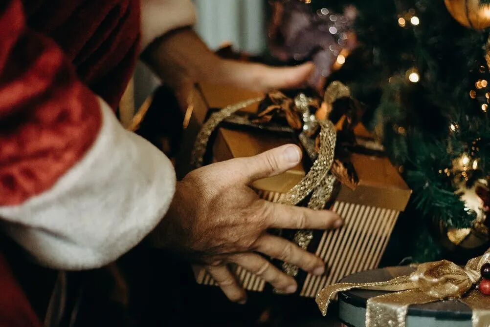
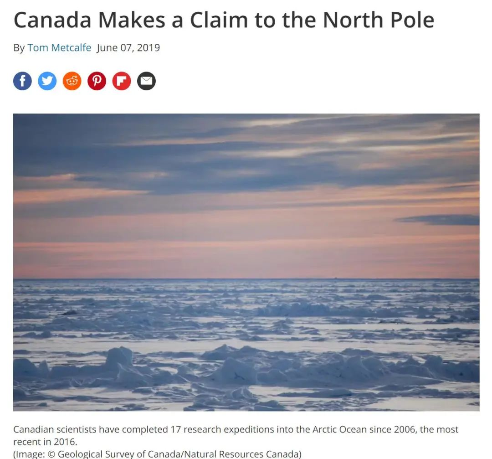
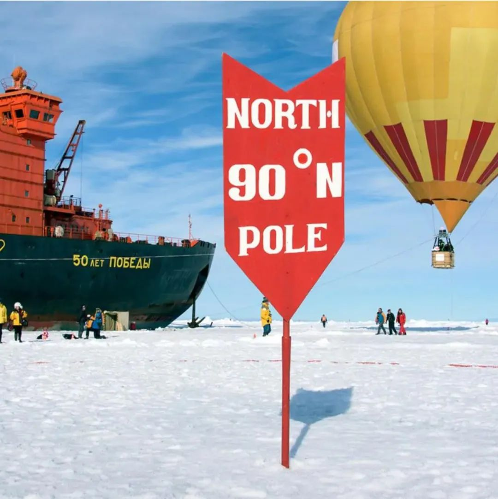
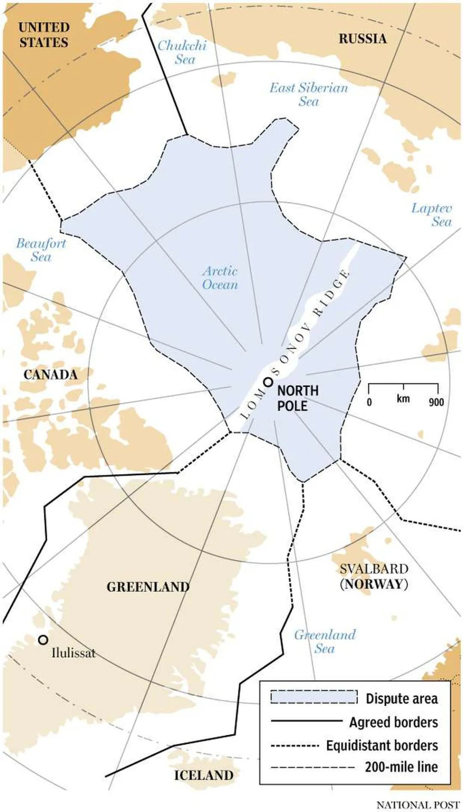
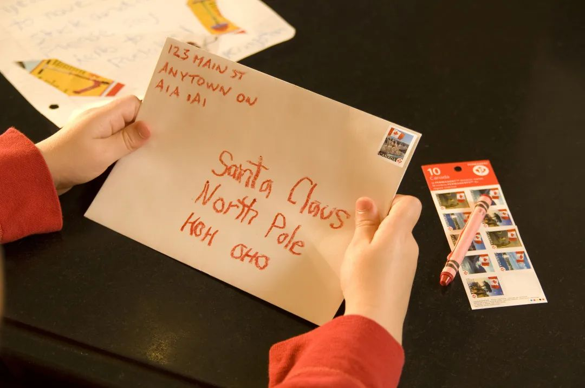
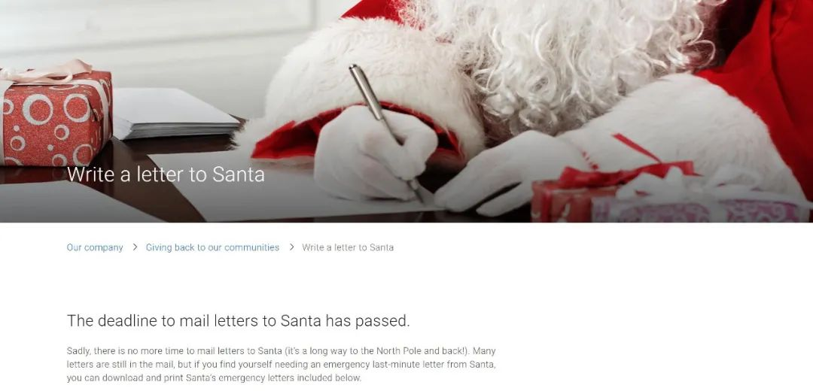
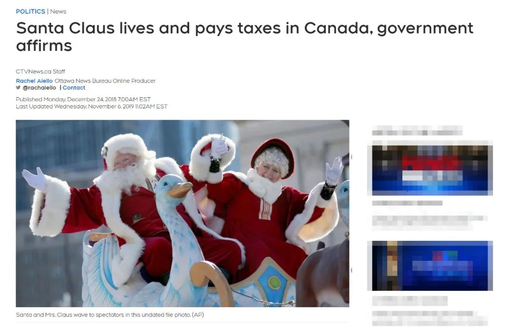
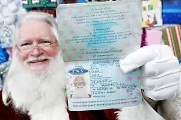

# 无标题

**链接地址:** http://mp.weixin.qq.com/s?__biz=MzIzODc2NzU4NA==&mid=2247544824&idx=8&sn=fd43e45e689c5508df2373a0e2905557&chksm=e9363377de41ba61a3c445ff2592d6bf9c508ce71e43faf59d8bf6443058f9485dbf40f118f2&mpshare=1&scene=2&srcid=1225i6AjzhfSiHzLOJ45ebyq&sharer_sharetime=1608851233208&sharer_shareid=be1c8edd6c93eec155a61c876e41d26a#rd
**作者:** 妮娜
**获取时间:** 2025/8/28 19:59:00
**图片数量:** 17

---

## 原始HTML内容

<section style="margin: 10px 0%;box-sizing: border-box;" powered-by="xiumi.us" data-mpa-powered-by="yiban.io"><section style="font-size: 15px;letter-spacing: 0px;line-height: 2;padding: 0px 15px;box-sizing: border-box;"><section style="white-space: normal;margin: 0px 16px;padding: 0px;box-sizing: border-box;">叮叮当，叮叮当，铃儿响叮当…加拿大一年中最重要的节日<strong style="box-sizing: border-box;">圣诞节已经悄悄来临</strong>！虽然今年的圣诞节有点特殊，但至少大家天天刷新的社交网络上早已<strong style="box-sizing: border-box;">弥漫着浓郁的节日气氛</strong>。</section><section style="white-space: normal;margin: 0px 16px;padding: 0px;box-sizing: border-box;"> </section></section></section><section style="text-align: center;margin: 10px 16px;box-sizing: border-box;"><section style="max-width: 100%;vertical-align: middle;display: inline-block;line-height: 0;box-sizing: border-box;"></section></section><section style="margin: 10px 0%;box-sizing: border-box;" powered-by="xiumi.us"><section style="font-size: 15px;letter-spacing: 0px;line-height: 2;padding: 0px 15px;box-sizing: border-box;"><section style="white-space: normal;margin: 0px 16px;padding: 0px;box-sizing: border-box;"> </section><section style="white-space: normal;margin: 0px 16px;padding: 0px;box-sizing: border-box;">街虽然不能逛，门也不能串，但节还是要过的，<strong style="box-sizing: border-box;">礼物嘛，也是不能少的</strong>。</section><section style="white-space: normal;margin: 0px 16px;padding: 0px;box-sizing: border-box;"> </section><section style="white-space: normal;margin: 0px 16px;padding: 0px;box-sizing: border-box;">说到送礼物，就难免想起乘坐驯鹿拉车从烟囱里爬进门给孩子们赠<strong style="box-sizing: border-box;">送</strong><strong style="box-sizing: border-box;">礼物的圣诞老人</strong>。关于“圣诞老人”的传说，那可真是多了去了。<strong style="box-sizing: border-box;">但你知道圣诞老人其实是加拿大人吗？</strong></section></section></section><section style="box-sizing: border-box;" powered-by="xiumi.us"><section style="white-space: normal;margin: 0px 16px;padding: 0px;box-sizing: border-box;"> </section></section><section style="margin: 10px 16px;box-sizing: border-box;"><section style="display: grid;width: 100%;vertical-align: top;overflow: hidden;align-self: flex-start;background-position: 0% 0%;background-repeat: repeat;background-size: 135.663%;background-attachment: scroll;background-image: url(&quot;https://mmbiz.qpic.cn/mmbiz_gif/4iaIegTJzAtUQA4BE0CMkibvDhHMDp6a4jXz3WclsuUSciaicXgsVoME5BUMO6nFMnpBEmFw97jAXf71vSbrd9HvNw/640?wx_fmt=gif&quot;);grid-template-columns: 100%;grid-template-rows: 100%;box-sizing: border-box;"><section style="width: 89.6%;height: 90.7787%;transform: rotate(0deg);-webkit-transform: rotate(0deg);-moz-transform: rotate(0deg);-o-transform: rotate(0deg);overflow: hidden;margin-left: 5.6%;margin-top: 5.57349%;grid-column-start: 1;grid-row-start: 1;box-sizing: border-box;" powered-by="xiumi.us"><section style="height: 100%;box-sizing: border-box;"><section style="width: 100%;height: 100%;background-position: center center;background-repeat: no-repeat;background-size: cover;background-image: url(&quot;https://mmbiz.qpic.cn/mmbiz_gif/qCjdayb8JLIQRLjdvkA0nfT03nOUHm9yBbSvicXI6ezvKiafjJzkvKZ2qUkINg0ejiafd2teLk8icJ5SlnMHIfSb6g/640?wx_fmt=gif&quot;);box-sizing: border-box;"><section><svg viewBox="0 0 1 1" style="float:left;line-height:0;width:0;vertical-align:top;"></svg></section></section></section></section><section style="width: 83.4667%;height: 85.8607%;transform: rotate(0deg);-webkit-transform: rotate(0deg);-moz-transform: rotate(0deg);-o-transform: rotate(0deg);overflow: hidden;margin-left: 8.52917%;margin-top: 9.01992%;grid-column-start: 1;grid-row-start: 1;box-sizing: border-box;" powered-by="xiumi.us"><section style="height: 100%;box-sizing: border-box;"><section style="width: 100%;height: 100%;background-position: 80.9375% 0%;background-repeat: no-repeat;background-size: 201.266%;border-style: solid;border-width: 2px;border-radius: 0px;border-color: rgb(255, 244, 210);background-image: url(&quot;https://mmbiz.qpic.cn/mmbiz_jpg/4kibCXA1QiblRIQ9t52LDPRmQ5X5hgia6wbicP4rWY0M4icL6RyIa8j7rdhtHo8ZSkHMFxUEC9BR7QZAW46ib3c7GKgg/640?wx_fmt=jpeg&quot;);box-sizing: border-box;"><section style="height: 100%;overflow: hidden;line-height: 0;vertical-align: middle;max-width: 100%;box-sizing: border-box;">&nbsp;</section></section></section></section><section style="width: 29.3333%;height: 25%;overflow: hidden;transform: rotate(0deg);-webkit-transform: rotate(0deg);-moz-transform: rotate(0deg);-o-transform: rotate(0deg);margin-left: -0.866667%;margin-top: 98.4989%;grid-column-start: 1;grid-row-start: 1;box-sizing: border-box;" powered-by="xiumi.us"><section style="height: 100%;box-sizing: border-box;"><section style="width: 100%;height: 100%;background-position: center center;background-repeat: no-repeat;background-size: cover;background-image: url(&quot;https://mmbiz.qpic.cn/mmbiz_gif/5MXhFCib6bX6TXaiaicDtVfyznzINwqcRJKaKoOoPAamL0iaflFaQvib3pkpWceMMlnqhicQegc9pY6EbqvgdwOzze4w/640?wx_fmt=gif&quot;);box-sizing: border-box;"><section><svg viewBox="0 0 1 1" style="float:left;line-height:0;width:0;vertical-align:top;"></svg></section></section></section></section><section style="width: 19.4667%;height: 17.418%;transform: perspective(0px) rotateZ(345deg);-webkit-transform: perspective(0px) rotateZ(345deg);-moz-transform: perspective(0px) rotateZ(345deg);-o-transform: perspective(0px) rotateZ(345deg);overflow: hidden;margin-left: 0.575%;margin-top: 28.2585%;grid-column-start: 1;grid-row-start: 1;transform-style: flat;box-sizing: border-box;" powered-by="xiumi.us"><section style="transform: rotateY(180deg);-webkit-transform: rotateY(180deg);-moz-transform: rotateY(180deg);-o-transform: rotateY(180deg);height: 100%;box-sizing: border-box;"><section style="width: 100%;height: 100%;background-position: center center;background-repeat: no-repeat;background-size: cover;background-image: url(&quot;https://mmbiz.qpic.cn/mmbiz_gif/Am71njUDtpzorY4ENkzoU94Sw1wLytexViaSibsW83ibU7bXCbhHJHPStJy5CRYmK3cPMDGeXia1wjfWrx2Pvxbnnw/640?wx_fmt=gif&quot;);box-sizing: border-box;"><section><svg viewBox="0 0 1 1" style="float:left;line-height:0;width:0;vertical-align:top;"></svg></section></section></section></section><section style="width: 20.8%;height: 9.22131%;overflow: hidden;transform: rotate(0deg);-webkit-transform: rotate(0deg);-moz-transform: rotate(0deg);-o-transform: rotate(0deg);margin-left: 7.66042%;margin-top: 7.51517%;grid-column-start: 1;grid-row-start: 1;box-sizing: border-box;" powered-by="xiumi.us"><section style="height: 100%;box-sizing: border-box;"><section style="width: 100%;height: 100%;background-position: center center;background-repeat: no-repeat;background-size: cover;background-image: url(&quot;https://mmbiz.qpic.cn/mmbiz_png/iajnCOkot5BK20RvtAY399YRViaBQHKcGLyupKJyu8IY98HSIjC2Olw9BGB1p65WFr16NzZJj8ib4l1LIV3LzC7ng/640?wx_fmt=png&quot;);box-sizing: border-box;"><section style="height: 100%;overflow: hidden;line-height: 0;vertical-align: middle;max-width: 100%;box-sizing: border-box;">&nbsp;</section></section></section></section><section style="width: 24%;height: 10.6557%;overflow: hidden;transform: rotate(0deg);-webkit-transform: rotate(0deg);-moz-transform: rotate(0deg);-o-transform: rotate(0deg);margin-left: 68.7292%;margin-top: 7.72122%;grid-column-start: 1;grid-row-start: 1;box-sizing: border-box;" powered-by="xiumi.us"><section style="height: 100%;box-sizing: border-box;"><section style="width: 100%;height: 100%;background-position: center center;background-repeat: no-repeat;background-size: cover;background-image: url(&quot;https://mmbiz.qpic.cn/mmbiz_png/iajnCOkot5BK20RvtAY399YRViaBQHKcGLwUjcUibCAKD75geqzUoLoFoMdEj40R4JbT0HCqCibCzoStFovdSPYkNA/640?wx_fmt=png&quot;);box-sizing: border-box;"><section style="height: 100%;overflow: hidden;line-height: 0;vertical-align: middle;max-width: 100%;box-sizing: border-box;">&nbsp;</section></section></section></section><section style="width: 13.6%;height: 7.37705%;overflow: hidden;transform: rotate(0deg);-webkit-transform: rotate(0deg);-moz-transform: rotate(0deg);-o-transform: rotate(0deg);margin-left: 70.3333%;margin-top: 49.0393%;grid-column-start: 1;grid-row-start: 1;box-sizing: border-box;" powered-by="xiumi.us"><section style="height: 100%;box-sizing: border-box;"><section style="width: 100%;height: 100%;background-position: center center;background-repeat: no-repeat;background-size: cover;background-image: url(&quot;https://mmbiz.qpic.cn/mmbiz_gif/CSwmPALiaVhP151duRgTEOk7zeEp0khpWfiaibgTTbdte1PJ9at4R8h17W95wgT7bibicJPCLADia0EZAxsxHhJpqUpQ/640?wx_fmt=gif&quot;);box-sizing: border-box;"><section><svg viewBox="0 0 1 1" style="float:left;line-height:0;width:0;vertical-align:top;"></svg></section></section></section></section><section style="width: 16.8%;height: 14.3443%;overflow: hidden;transform: perspective(0px) rotate(0deg);-webkit-transform: perspective(0px) rotate(0deg);-moz-transform: perspective(0px) rotate(0deg);-o-transform: perspective(0px) rotate(0deg);margin-left: 73.0521%;margin-top: 100.201%;grid-column-start: 1;grid-row-start: 1;transform-style: flat;box-sizing: border-box;" powered-by="xiumi.us"><section style="transform: rotateY(180deg);-webkit-transform: rotateY(180deg);-moz-transform: rotateY(180deg);-o-transform: rotateY(180deg);height: 100%;box-sizing: border-box;"><section style="width: 100%;height: 100%;background-position: center center;background-repeat: no-repeat;background-size: cover;background-image: url(&quot;https://mmbiz.qpic.cn/mmbiz_gif/Am71njUDtpzorY4ENkzoU94Sw1wLytexViaSibsW83ibU7bXCbhHJHPStJy5CRYmK3cPMDGeXia1wjfWrx2Pvxbnnw/640?wx_fmt=gif&quot;);box-sizing: border-box;"><section><svg viewBox="0 0 1 1" style="float:left;line-height:0;width:0;vertical-align:top;"></svg></section></section></section></section><section style="grid-column-start: 1;grid-row-start: 1;padding-top: 130%;box-sizing: border-box;"><section><svg viewBox="0 0 1 1" style="float:left;line-height:0;width:0;vertical-align:top;"></svg></section></section></section></section><section style="margin: 10px 0%;box-sizing: border-box;" powered-by="xiumi.us"><section style="font-size: 15px;letter-spacing: 0px;line-height: 2;padding: 0px 15px;box-sizing: border-box;"><section style="white-space: normal;margin: 0px 16px;padding: 0px;box-sizing: border-box;"> </section><section style="white-space: normal;margin: 0px 16px;padding: 0px;box-sizing: border-box;">觉得我在胡说，可别不信，<strong style="box-sizing: border-box;">我有证据！</strong> </section><section style="white-space: normal;margin: 0px 16px;padding: 0px;box-sizing: border-box;"> </section><section style="white-space: normal;margin: 0px 16px;padding: 0px;box-sizing: border-box;"> </section></section></section><section style="text-align: center;margin: 10px 16px;box-sizing: border-box;"><section style="display: inline-block;width: auto;vertical-align: top;min-width: 10%;max-width: 100%;height: auto;box-sizing: border-box;"><section style="box-sizing: border-box;" powered-by="xiumi.us"><section style="text-align: right;display: flex;flex-flow: row nowrap;box-sizing: border-box;"><section style="display: inline-block;vertical-align: top;width: auto;align-self: flex-start;flex: 0 0 0%;height: auto;box-sizing: border-box;"><section style="transform: translate3d(15px, 0px, 0px) rotateY(180deg);-webkit-transform: translate3d(15px, 0px, 0px) rotateY(180deg);-moz-transform: translate3d(15px, 0px, 0px) rotateY(180deg);-o-transform: translate3d(15px, 0px, 0px) rotateY(180deg);margin: 0px 0%;box-sizing: border-box;" powered-by="xiumi.us"><section style="display: inline-block;width: 45px;height: 50px;vertical-align: top;overflow: hidden;background-position: 50% 50%;background-repeat: no-repeat;background-size: contain;background-attachment: scroll;background-image: url(&quot;https://mmbiz.qpic.cn/mmbiz_gif/jAhWQu2GaC1F4oG2PQNvpUH0723DibOp3LnonfVYDVHzy3ADb4icuOoNrfJaPbgNtt5Fp4e9rvQaaRwl3XSqsnsw/640?wx_fmt=gif&quot;);box-sizing: border-box;"><section><svg viewBox="0 0 1 1" style="float:left;line-height:0;width:0;vertical-align:top;"></svg></section></section></section></section><section style="display: inline-block;vertical-align: top;width: auto;background-image: linear-gradient(0deg, rgb(222, 180, 96) 0%, rgb(255, 227, 172) 100%);padding: 3px;border-width: 0px;border-radius: 100px;border-style: none;border-color: rgb(62, 62, 62);overflow: hidden;height: auto;flex: 100 100 0%;align-self: flex-start;box-sizing: border-box;"><section powered-by="xiumi.us" style="display: inline-block;width: 100%;vertical-align: top;padding: 2px;border-width: 0px;border-radius: 100px;border-style: none;border-color: rgb(62, 62, 62);overflow: hidden;background-position: 0% 0%;background-repeat: repeat;background-size: 19.5767%;background-attachment: scroll;background-image: url(&quot;https://mmbiz.qpic.cn/mmbiz_gif/FW8KJA3YdNuqXO9poIyDy5GaqdycSqSyZnRS29IpUd2fe515HfPw4OxicmKTKZh3LguebQWqTDMn1HUsElhb5xQ/640?wx_fmt=gif&quot;);box-sizing: border-box;"><section style="display: inline-block;width: 100%;vertical-align: top;background-image: linear-gradient(0deg, rgb(205, 66, 65) 0%, rgba(205, 66, 65, 0) 100%);border-width: 0px;box-sizing: border-box;" powered-by="xiumi.us"><section powered-by="xiumi.us" style="display: inline-block;width: 100%;vertical-align: top;border-color: rgb(222, 180, 96);border-width: 1px;border-radius: 100px;border-style: dashed;overflow: hidden;background-position: 0% 0%;background-repeat: repeat;background-size: 237.106%;background-attachment: scroll;background-image: url(&quot;https://mmbiz.qpic.cn/mmbiz_gif/xyNLoP935S1muibzGjKicb7GhoohEW0oK3mPgvgDYyvVzssZFRFCCibEdfzDricicUsFTevCEibwiaZ1VtyLc2R3NDFkA/640?wx_fmt=gif&quot;);box-sizing: border-box;"><section style="margin: 12px 0% 0px;box-sizing: border-box;" powered-by="xiumi.us"><section style="text-align: justify;color: rgb(255, 224, 224);line-height: 1;letter-spacing: 3px;padding: 0px 40px;text-shadow: rgb(127, 7, 7) 0px 2px 3px;box-sizing: border-box;">
<strong style="box-sizing: border-box;">圣诞老人是加拿大人！</strong>
</section></section><section style="margin: 0px 0% 3px;box-sizing: border-box;" powered-by="xiumi.us"><section style="text-align: justify;font-size: 10px;color: rgba(255, 224, 224, 0.48);line-height: 1.3;letter-spacing: 0px;box-sizing: border-box;">
&nbsp;Santa is Canadian
</section></section></section></section></section></section><section style="display: inline-block;vertical-align: top;width: auto;align-self: flex-start;flex: 0 0 0%;height: auto;box-sizing: border-box;"><section style="transform: translate3d(-15px, 0px, 0px);-webkit-transform: translate3d(-15px, 0px, 0px);-moz-transform: translate3d(-15px, 0px, 0px);-o-transform: translate3d(-15px, 0px, 0px);margin: 0px 0%;box-sizing: border-box;" powered-by="xiumi.us"><section style="display: inline-block;width: 45px;height: 50px;vertical-align: top;overflow: hidden;background-position: 50% 50%;background-repeat: no-repeat;background-size: contain;background-attachment: scroll;background-image: url(&quot;https://mmbiz.qpic.cn/mmbiz_gif/jAhWQu2GaC1F4oG2PQNvpUH0723DibOp3LnonfVYDVHzy3ADb4icuOoNrfJaPbgNtt5Fp4e9rvQaaRwl3XSqsnsw/640?wx_fmt=gif&quot;);box-sizing: border-box;"><section><svg viewBox="0 0 1 1" style="float:left;line-height:0;width:0;vertical-align:top;"></svg></section></section></section></section></section></section></section></section><section style="margin: 10px 0%;box-sizing: border-box;" powered-by="xiumi.us"><section style="font-size: 15px;letter-spacing: 0px;line-height: 2;padding: 0px 15px;box-sizing: border-box;"><section style="white-space: normal;margin: 0px 16px;padding: 0px;box-sizing: border-box;"> </section></section></section><section style="text-align: center;transform: translate3d(-10px, 0px, 0px);margin: 10px 16px;box-sizing: border-box;"><section style="display: inline-block;vertical-align: middle;width: auto;min-width: 10%;max-width: 100%;height: auto;align-self: center;box-sizing: border-box;"><section style="text-align: right;margin: 0px 0%;transform: translate3d(-9px, 0px, 0px);-webkit-transform: translate3d(-9px, 0px, 0px);-moz-transform: translate3d(-9px, 0px, 0px);-o-transform: translate3d(-9px, 0px, 0px);box-sizing: border-box;" powered-by="xiumi.us"><section style="display: inline-block;width: 30px;height: 30px;vertical-align: top;overflow: hidden;background-position: 50% 50%;background-repeat: no-repeat;background-size: contain;background-attachment: scroll;background-image: url(&quot;https://mmbiz.qpic.cn/sz_mmbiz_png/MVPvEL7Qg0FMBTaxOMo7csmAKwGK8cKAUog7xoiampNG4wkP6P8yexHMSRNjbW2XwreHCGnQOr8onEAOSAd5gicQ/640?wx_fmt=png&quot;);box-sizing: border-box;"><section><svg viewBox="0 0 1 1" style="float:left;line-height:0;width:0;vertical-align:top;"></svg></section></section></section></section><section style="display: inline-block;vertical-align: middle;width: auto;min-width: 10%;max-width: 100%;height: auto;border-bottom: 7px solid rgb(255, 215, 158);border-bottom-right-radius: 0px;align-self: center;box-sizing: border-box;"><section style="margin: 0px 0% -5px;box-sizing: border-box;" powered-by="xiumi.us"><section style="text-align: justify;font-size: 17px;color: rgb(251, 73, 77);letter-spacing: 2px;padding: 0px;line-height: 1;box-sizing: border-box;">
<strong style="box-sizing: border-box;">证据一 . 这块北极被加拿大承包了&nbsp;</strong>
</section></section></section></section><section style="box-sizing: border-box;" powered-by="xiumi.us"><section style="white-space: normal;margin: 0px 16px;padding: 0px;box-sizing: border-box;"> </section></section><section style="text-align: center;margin: 10px 16px;box-sizing: border-box;"><section style="max-width: 100%;vertical-align: middle;display: inline-block;line-height: 0;box-sizing: border-box;"></section></section><section style="margin: 10px 0%;box-sizing: border-box;" powered-by="xiumi.us"><section style="font-size: 15px;letter-spacing: 0px;line-height: 2;padding: 0px 15px;box-sizing: border-box;"><section style="white-space: normal;margin: 0px 16px;padding: 0px;box-sizing: border-box;"> </section><section style="white-space: normal;margin: 0px 16px;padding: 0px;box-sizing: border-box;">传说中，圣诞老人的礼物作坊位于<strong style="box-sizing: border-box;">北极</strong>。然而北极在地理意义上来说并不属于任何国家。不过不怕冷的加拿大人在<strong style="box-sizing: border-box;">2019年向联合国递交了国土认领书</strong>，计划把北极的一部分土地规划到加拿大的国土范围内。</section><section style="white-space: normal;margin: 0px 16px;padding: 0px;box-sizing: border-box;"> </section></section></section><section style="text-align: center;margin: 10px 16px;box-sizing: border-box;"><section style="max-width: 100%;vertical-align: middle;display: inline-block;line-height: 0;box-sizing: border-box;"></section></section><section style="margin: 10px 0%;box-sizing: border-box;" powered-by="xiumi.us"><section style="font-size: 15px;letter-spacing: 0px;line-height: 2;padding: 0px 15px;box-sizing: border-box;"><section style="white-space: normal;margin: 0px 16px;padding: 0px;box-sizing: border-box;"> </section><section style="white-space: normal;margin: 0px 16px;padding: 0px;box-sizing: border-box;"><strong style="box-sizing: border-box;">北极这块鱼塘就被俺们承包啦！</strong>反正国土面积已经这么大了，也不怕再多一块儿啦！毕竟说不定哪天就会长出什么好吃的东西来呢？</section><section style="white-space: normal;margin: 0px 16px;padding: 0px;box-sizing: border-box;"> </section></section></section><section style="text-align: center;margin: 10px 16px;box-sizing: border-box;"><section style="max-width: 100%;vertical-align: middle;display: inline-block;line-height: 0;box-sizing: border-box;"></section></section><section style="margin: 10px 0%;box-sizing: border-box;" powered-by="xiumi.us"><section style="font-size: 15px;letter-spacing: 0px;line-height: 2;padding: 0px 15px;box-sizing: border-box;"><section style="white-space: normal;margin: 0px 16px;padding: 0px;box-sizing: border-box;"> </section><section style="white-space: normal;margin: 0px 16px;padding: 0px;box-sizing: border-box;">再说了，<strong style="box-sizing: border-box;">距离北极最近的人类自然居住区正位于加拿大境内的努纳武特（Nunavut）</strong>，这么说来把北极划近加拿大是不是靠谱的建议？正在北极加班加点赶工礼物的圣诞老人被归为咱加拿大人，是不是合情合理？！</section><section style="white-space: normal;margin: 0px 16px;padding: 0px;box-sizing: border-box;"> </section><section style="white-space: normal;margin: 0px 16px;padding: 0px;box-sizing: border-box;"> </section></section></section><section style="text-align: center;transform: translate3d(-10px, 0px, 0px);margin: 10px 16px;box-sizing: border-box;"><section style="display: inline-block;vertical-align: middle;width: auto;min-width: 10%;max-width: 100%;height: auto;align-self: center;box-sizing: border-box;"><section style="text-align: right;margin: 0px 0%;transform: translate3d(-9px, 0px, 0px);-webkit-transform: translate3d(-9px, 0px, 0px);-moz-transform: translate3d(-9px, 0px, 0px);-o-transform: translate3d(-9px, 0px, 0px);box-sizing: border-box;" powered-by="xiumi.us"><section style="display: inline-block;width: 30px;height: 30px;vertical-align: top;overflow: hidden;background-position: 50% 50%;background-repeat: no-repeat;background-size: contain;background-attachment: scroll;background-image: url(&quot;https://mmbiz.qpic.cn/sz_mmbiz_png/MVPvEL7Qg0FMBTaxOMo7csmAKwGK8cKAUog7xoiampNG4wkP6P8yexHMSRNjbW2XwreHCGnQOr8onEAOSAd5gicQ/640?wx_fmt=png&quot;);box-sizing: border-box;"><section><svg viewBox="0 0 1 1" style="float:left;line-height:0;width:0;vertical-align:top;"></svg></section></section></section></section><section style="display: inline-block;vertical-align: middle;width: auto;min-width: 10%;max-width: 100%;height: auto;border-bottom: 7px solid rgb(255, 215, 158);border-bottom-right-radius: 0px;align-self: center;box-sizing: border-box;"><section style="margin: 0px 0% -5px;box-sizing: border-box;" powered-by="xiumi.us"><section style="text-align: justify;font-size: 17px;color: rgb(251, 73, 77);letter-spacing: 2px;padding: 0px;line-height: 1;box-sizing: border-box;">
<strong style="box-sizing: border-box;">证据二 . 圣诞老人拥有加拿大邮编</strong>
</section></section></section></section><section style="margin: 10px 0%;box-sizing: border-box;" powered-by="xiumi.us"><section style="font-size: 15px;letter-spacing: 0px;line-height: 2;padding: 0px 15px;box-sizing: border-box;"><section style="white-space: normal;margin: 0px 16px;padding: 0px;box-sizing: border-box;"> </section><section style="white-space: normal;margin: 0px 16px;padding: 0px;box-sizing: border-box;">如果你觉得上述说法有点牵强，那么第二条证据：<strong style="box-sizing: border-box;">“圣诞老人拥有加拿大邮编”&nbsp;</strong>算得上石锤了吧？</section><section style="white-space: normal;margin: 0px 16px;padding: 0px;box-sizing: border-box;"> </section></section></section><section style="text-align: center;margin: 10px 16px;box-sizing: border-box;"><section style="max-width: 100%;vertical-align: middle;display: inline-block;line-height: 0;box-sizing: border-box;"></section></section><section style="margin: 10px 0%;box-sizing: border-box;" powered-by="xiumi.us"><section style="font-size: 15px;letter-spacing: 0px;line-height: 2;padding: 0px 15px;box-sizing: border-box;"><section style="white-space: normal;margin: 0px 16px;padding: 0px;box-sizing: border-box;"> </section><section style="white-space: normal;margin: 0px 16px;padding: 0px;box-sizing: border-box;">每年，加拿大邮政局都会帮助数以万计的加拿大儿童投递送给圣诞老人的邮件。只需要把信件填上<strong style="box-sizing: border-box;">“ North Pole，H0H 0H0”</strong>的地址，甚至不需要贴邮票，这封信也能被顺利寄到圣诞老人的手中，<strong style="box-sizing: border-box;">并且还有可能会收到回信哦</strong>！</section><section style="white-space: normal;margin: 0px 16px;padding: 0px;box-sizing: border-box;"> </section></section></section><section style="text-align: center;margin: 10px 16px;box-sizing: border-box;"><section style="max-width: 100%;vertical-align: middle;display: inline-block;line-height: 0;box-sizing: border-box;"></section></section><section style="margin: 10px 0%;box-sizing: border-box;" powered-by="xiumi.us"><section style="font-size: 15px;letter-spacing: 0px;line-height: 2;padding: 0px 15px;box-sizing: border-box;"><section style="white-space: normal;margin: 0px 16px;padding: 0px;box-sizing: border-box;"> </section><section style="white-space: normal;margin: 0px 16px;padding: 0px;box-sizing: border-box;">加拿大邮政局的官方网站上甚至专门有一页是用来介绍<strong style="box-sizing: border-box;">如何给圣诞老人写信</strong>以及告知每年的寄信截止日期。今年当然是来不及啦，毕竟我们<strong style="box-sizing: border-box;">“真正的圣诞老人”</strong>们在这个季节可是忙得脚不沾地的在各地飞驰着投送邮件呢。</section><section style="white-space: normal;margin: 0px 16px;padding: 0px;box-sizing: border-box;"> </section><section style="white-space: normal;margin: 0px 16px;padding: 0px;box-sizing: border-box;"><strong style="box-sizing: border-box;">想要收到圣诞老人的回邮，明年记得要趁早哦！</strong></section><section style="white-space: normal;margin: 0px 16px;padding: 0px;box-sizing: border-box;"><strong style="box-sizing: border-box;"> </strong></section><section style="white-space: normal;margin: 0px 16px;padding: 0px;box-sizing: border-box;"><strong style="box-sizing: border-box;"> </strong></section></section></section><section style="text-align: center;transform: translate3d(-10px, 0px, 0px);margin: 10px 16px;box-sizing: border-box;"><section style="display: inline-block;vertical-align: middle;width: auto;min-width: 10%;max-width: 100%;height: auto;align-self: center;box-sizing: border-box;"><section style="text-align: right;margin: 0px 0%;transform: translate3d(-9px, 0px, 0px);-webkit-transform: translate3d(-9px, 0px, 0px);-moz-transform: translate3d(-9px, 0px, 0px);-o-transform: translate3d(-9px, 0px, 0px);box-sizing: border-box;" powered-by="xiumi.us"><section style="display: inline-block;width: 30px;height: 30px;vertical-align: top;overflow: hidden;background-position: 50% 50%;background-repeat: no-repeat;background-size: contain;background-attachment: scroll;background-image: url(&quot;https://mmbiz.qpic.cn/sz_mmbiz_png/MVPvEL7Qg0FMBTaxOMo7csmAKwGK8cKAUog7xoiampNG4wkP6P8yexHMSRNjbW2XwreHCGnQOr8onEAOSAd5gicQ/640?wx_fmt=png&quot;);box-sizing: border-box;"><section><svg viewBox="0 0 1 1" style="float:left;line-height:0;width:0;vertical-align:top;"></svg></section></section></section></section><section style="display: inline-block;vertical-align: middle;width: auto;min-width: 10%;max-width: 100%;height: auto;border-bottom: 7px solid rgb(255, 215, 158);border-bottom-right-radius: 0px;align-self: center;box-sizing: border-box;"><section style="margin: 0px 0% -5px;box-sizing: border-box;" powered-by="xiumi.us"><section style="text-align: justify;font-size: 14px;color: rgb(251, 73, 77);letter-spacing: 2px;padding: 0px;line-height: 1;box-sizing: border-box;">
<strong style="box-sizing: border-box;">证据三 . 圣诞老人被官方认定为加拿大居民</strong>
</section></section></section></section><section style="margin: 10px 0%;box-sizing: border-box;" powered-by="xiumi.us"><section style="font-size: 15px;letter-spacing: 0px;line-height: 2;padding: 0px 15px;box-sizing: border-box;"><section style="white-space: normal;margin: 0px 16px;padding: 0px;box-sizing: border-box;"><strong style="box-sizing: border-box;"> </strong></section><section style="white-space: normal;margin: 0px 16px;padding: 0px;box-sizing: border-box;">有加拿大的居住地址，也不一定能证明他就是加拿大人啊！不过加拿大这么欢迎移民的国家，怎么可能放过这样<strong style="box-sizing: border-box;">给全世界带来期待和欢乐的“特殊型人才”？</strong></section><section style="white-space: normal;margin: 0px 16px;padding: 0px;box-sizing: border-box;"> </section></section></section><section style="text-align: center;margin: 10px 16px;box-sizing: border-box;"><section style="max-width: 100%;vertical-align: middle;display: inline-block;line-height: 0;box-sizing: border-box;"></section></section><section style="margin: 10px 0%;box-sizing: border-box;" powered-by="xiumi.us"><section style="font-size: 15px;letter-spacing: 0px;line-height: 2;padding: 0px 15px;box-sizing: border-box;"><section style="white-space: normal;margin: 0px 16px;padding: 0px;box-sizing: border-box;"> </section><section style="white-space: normal;margin: 0px 16px;padding: 0px;box-sizing: border-box;"><strong style="box-sizing: border-box;">2008年，圣诞老人被加拿大移民部长宣布为加拿大正式公民</strong>。他享有加拿大公民所有的权利！当然也需要履行加拿大公民的义务，<strong style="box-sizing: border-box;">包括交税！</strong></section><section style="white-space: normal;margin: 0px 16px;padding: 0px;box-sizing: border-box;"> </section></section></section><section style="text-align: center;margin: 10px 16px;box-sizing: border-box;"><section style="max-width: 100%;vertical-align: middle;display: inline-block;line-height: 0;box-sizing: border-box;"></section></section><section style="margin: 10px 0%;box-sizing: border-box;" powered-by="xiumi.us"><section style="font-size: 15px;letter-spacing: 0px;line-height: 2;padding: 0px 15px;box-sizing: border-box;"><section style="white-space: normal;margin: 0px 16px;padding: 0px;box-sizing: border-box;"> </section><section style="white-space: normal;margin: 0px 16px;padding: 0px;box-sizing: border-box;">真好奇赶着驯鹿飞车在天上飞奔的圣诞老人，是否需要为这辆特殊的交通工具<strong style="box-sizing: border-box;">注册牌照，</strong>甚至购买车辆保险呢？</section><section style="white-space: normal;margin: 0px 16px;padding: 0px;box-sizing: border-box;"> </section><section style="white-space: normal;margin: 0px 16px;padding: 0px;box-sizing: border-box;"> </section></section></section><section style="text-align: center;transform: translate3d(-10px, 0px, 0px);margin: 10px 16px;box-sizing: border-box;"><section style="display: inline-block;vertical-align: middle;width: auto;min-width: 10%;max-width: 100%;height: auto;align-self: center;box-sizing: border-box;"><section style="text-align: right;margin: 0px 0%;transform: translate3d(-9px, 0px, 0px);-webkit-transform: translate3d(-9px, 0px, 0px);-moz-transform: translate3d(-9px, 0px, 0px);-o-transform: translate3d(-9px, 0px, 0px);box-sizing: border-box;" powered-by="xiumi.us"><section style="display: inline-block;width: 30px;height: 30px;vertical-align: top;overflow: hidden;background-position: 50% 50%;background-repeat: no-repeat;background-size: contain;background-attachment: scroll;background-image: url(&quot;https://mmbiz.qpic.cn/sz_mmbiz_png/MVPvEL7Qg0FMBTaxOMo7csmAKwGK8cKAUog7xoiampNG4wkP6P8yexHMSRNjbW2XwreHCGnQOr8onEAOSAd5gicQ/640?wx_fmt=png&quot;);box-sizing: border-box;"><section><svg viewBox="0 0 1 1" style="float:left;line-height:0;width:0;vertical-align:top;"></svg></section></section></section></section><section style="display: inline-block;vertical-align: middle;width: auto;min-width: 10%;max-width: 100%;height: auto;border-bottom: 7px solid rgb(255, 215, 158);border-bottom-right-radius: 0px;align-self: center;box-sizing: border-box;"><section style="margin: 0px 0% -5px;box-sizing: border-box;" powered-by="xiumi.us"><section style="text-align: justify;font-size: 17px;color: rgb(251, 73, 77);letter-spacing: 2px;padding: 0px;line-height: 1;box-sizing: border-box;">
<strong style="box-sizing: border-box;">证据四 . 圣诞老人有加拿大护照</strong>
</section></section></section></section><section style="margin: 10px 0%;box-sizing: border-box;" powered-by="xiumi.us"><section style="font-size: 15px;letter-spacing: 0px;line-height: 2;padding: 0px 15px;box-sizing: border-box;"><section style="white-space: normal;margin: 0px 16px;padding: 0px;box-sizing: border-box;"> </section></section></section><section style="text-align: center;margin: 10px 16px;box-sizing: border-box;"><section style="max-width: 100%;vertical-align: middle;display: inline-block;line-height: 0;box-sizing: border-box;"></section></section><section style="margin: 10px 0%;box-sizing: border-box;" powered-by="xiumi.us"><section style="font-size: 15px;letter-spacing: 0px;line-height: 2;padding: 0px 15px;box-sizing: border-box;"><section style="white-space: normal;margin: 0px 16px;padding: 0px;box-sizing: border-box;"> </section><section style="white-space: normal;margin: 0px 16px;padding: 0px;box-sizing: border-box;">2013年12月20日，加拿大公民及移民部长克里斯·亚历山大（Chris Alexander）在<strong style="box-sizing: border-box;">安大略省旺市举行的特别仪式上向圣诞老人和他的夫人颁发了第2,999,999和3,000,000个电子护照。</strong></section><section style="white-space: normal;margin: 0px 16px;padding: 0px;box-sizing: border-box;"> </section></section></section><section style="text-align: center;margin: 10px 16px;box-sizing: border-box;"><section style="max-width: 100%;vertical-align: middle;display: inline-block;line-height: 0;box-sizing: border-box;"></section></section><section style="margin: 10px 0%;box-sizing: border-box;" powered-by="xiumi.us"><section style="font-size: 15px;letter-spacing: 0px;line-height: 2;padding: 0px 15px;box-sizing: border-box;"><section style="white-space: normal;margin: 0px 16px;padding: 0px;box-sizing: border-box;"> </section><section style="white-space: normal;margin: 0px 16px;padding: 0px;box-sizing: border-box;">加拿大护照作为<strong style="box-sizing: border-box;">全世界免签国家数量最多的护照之一</strong>，对于不停在全世界奔波的圣诞老人来说可真是太实用啦！毕竟一晚上就得送完这么多车的礼物，可<strong style="box-sizing: border-box;">真没工夫停下来办签证啊！</strong></section><section style="white-space: normal;margin: 0px 16px;padding: 0px;box-sizing: border-box;"><strong style="box-sizing: border-box;"> </strong></section></section></section><section style="box-sizing: border-box;font-style: normal;font-weight: 400;text-align: justify;font-size: 16px;margin-left: 16px;margin-right: 16px;"><section style="display: inline-block;width: 100%;vertical-align: top;line-height: 1;letter-spacing: 0px;box-sizing: border-box;" powered-by="xiumi.us"><section style="margin: 10px 0% 0px;box-sizing: border-box;" powered-by="xiumi.us"><section style="display: inline-block;vertical-align: bottom;width: 6%;align-self: flex-end;height: auto;box-sizing: border-box;"><section style="text-align: center;margin: 0px 0%;box-sizing: border-box;" powered-by="xiumi.us"><section style="max-width: 100%;vertical-align: middle;display: inline-block;line-height: 0;box-sizing: border-box;"></section></section></section><section style="display: inline-block;vertical-align: bottom;width: 50%;line-height: 2;letter-spacing: 0px;height: auto;align-self: flex-end;box-sizing: border-box;"><section><svg viewBox="0 0 1 1" style="float:left;line-height:0;width:0;vertical-align:top;"></svg></section></section><section style="display: inline-block;vertical-align: bottom;width: 44%;align-self: flex-end;height: auto;line-height: 1;letter-spacing: 0px;box-sizing: border-box;"><section style="text-align: right;margin: 0px 0%;box-sizing: border-box;" powered-by="xiumi.us"><section style="max-width: 100%;vertical-align: middle;display: inline-block;line-height: 0;width: 35%;height: auto;box-sizing: border-box;"></section></section></section></section><section style="display: inline-block;width: 100%;vertical-align: top;line-height: 0;letter-spacing: 0px;box-sizing: border-box;" powered-by="xiumi.us"><section powered-by="xiumi.us" style="display: inline-block;width: 100%;vertical-align: top;background-position: 0% 0%;background-repeat: repeat-y;background-size: 100%;background-attachment: scroll;line-height: 0;background-image: url(&quot;https://mmbiz.qpic.cn/mmbiz_gif/n4p7ssmqwmGHOiaBs4TLdiacnZ6Ub3E6Oqia4cJNlwjuvAI6fuDuXvUGb9FX2wTNgvRtdpqlSf4V780atTia0eorag/640?wx_fmt=gif&quot;);box-sizing: border-box;"><section style="text-align: center;box-sizing: border-box;" powered-by="xiumi.us"><section style="display: inline-block;width: 10px;height: 1px;vertical-align: top;overflow: hidden;box-sizing: border-box;"><section><svg viewBox="0 0 1 1" style="float:left;line-height:0;width:0;vertical-align:top;"></svg></section></section></section></section></section></section></section><section style="margin: 10px 0%;box-sizing: border-box;" powered-by="xiumi.us"><section style="font-size: 15px;letter-spacing: 0px;line-height: 2;padding: 0px 15px;box-sizing: border-box;"><section style="white-space: normal;margin: 0px 16px;padding: 0px;box-sizing: border-box;"> </section><section style="white-space: normal;margin: 0px 16px;padding: 0px;box-sizing: border-box;">虽然已经长大成人的我们已经不再相信圣诞老人的存在，但温暖的加拿大政府和邮政部门却一直<strong style="box-sizing: border-box;">为孩子们维护着这个童话的完整</strong>。</section><section style="white-space: normal;margin: 0px 16px;padding: 0px;box-sizing: border-box;"> </section></section></section><section style="text-align: center;margin: 10px 16px;box-sizing: border-box;"><section style="max-width: 100%;vertical-align: middle;display: inline-block;line-height: 0;box-sizing: border-box;"></section></section><section style="margin: 10px 0%;box-sizing: border-box;" powered-by="xiumi.us"><section style="font-size: 15px;letter-spacing: 0px;line-height: 2;padding: 0px 15px;box-sizing: border-box;"><section style="white-space: normal;margin: 0px 16px;padding: 0px;box-sizing: border-box;"> </section><section style="white-space: normal;margin: 0px 16px;padding: 0px;box-sizing: border-box;">在这个特殊的圣诞节，也别忘记向<strong style="box-sizing: border-box;">隐藏在我们身边的圣诞老人们送上最真诚的感谢</strong>。是他们趁着我们晚上熟睡时将精心准备好的礼物塞进圣诞袜中，小心翼翼地呵护着我们天真的童心和对美好的向往。</section><section style="white-space: normal;margin: 0px 16px;padding: 0px;box-sizing: border-box;"> </section><section style="white-space: normal;margin: 0px 16px;padding: 0px;box-sizing: border-box;">不管圣诞老人到底是哪国人，也不管他是否真的存在，<strong style="box-sizing: border-box;">我们的“圣诞老人”都会陪伴在我们身边，给予我们最温暖最无私的支持与爱。</strong></section></section></section><section style="box-sizing: border-box;" powered-by="xiumi.us"><section style="white-space: normal;margin: 0px 16px;padding: 0px;box-sizing: border-box;"> </section></section><section style="margin: 10px 0%;box-sizing: border-box;" powered-by="xiumi.us"><section style="font-size: 15px;letter-spacing: 0px;line-height: 2;padding: 0px 15px;box-sizing: border-box;"><section style="white-space: normal;margin: 0px 16px;padding: 0px;box-sizing: border-box;"><strong style="box-sizing: border-box;"> </strong></section><section style="white-space: normal;margin: 0px 16px;padding: 0px;box-sizing: border-box;"><strong style="box-sizing: border-box;">文章参考来源：</strong></section><section style="white-space: normal;margin: 0px 16px;padding: 0px;box-sizing: border-box;">https://www.redflagdeals.com/in/clover-bar/flyers/categories/black-friday/</section><section style="white-space: normal;margin: 0px 16px;padding: 0px;box-sizing: border-box;"> </section><section style="white-space: normal;margin: 0px 16px;padding: 0px;box-sizing: border-box;"> </section><section style="margin-right: 16px;margin-left: 16px;font-family: -apple-system-font, BlinkMacSystemFont, &quot;Helvetica Neue&quot;, &quot;PingFang SC&quot;, &quot;Hiragino Sans GB&quot;, &quot;Microsoft YaHei UI&quot;, &quot;Microsoft YaHei&quot;, Arial, sans-serif;letter-spacing: 0.544px;white-space: normal;background-color: rgb(255, 255, 255);font-size: 15px;text-align: center;line-height: 2em;">---更多新鲜事快关注爆料君↓↓---</section><section powered-by="xiumi.us" style="margin-top: 10px;margin-bottom: 10px;font-family: -apple-system-font, BlinkMacSystemFont, &quot;Helvetica Neue&quot;, &quot;PingFang SC&quot;, &quot;Hiragino Sans GB&quot;, &quot;Microsoft YaHei UI&quot;, &quot;Microsoft YaHei&quot;, Arial, sans-serif;font-size: 16px;letter-spacing: 0.544px;white-space: normal;background-color: rgb(255, 255, 255);"><section style="padding-right: 15px;padding-left: 15px;font-size: 15px;letter-spacing: 0px;line-height: 2;">

</section></section><section style="margin: 10px 16px;font-family: -apple-system-font, BlinkMacSystemFont, &quot;Helvetica Neue&quot;, &quot;PingFang SC&quot;, &quot;Hiragino Sans GB&quot;, &quot;Microsoft YaHei UI&quot;, &quot;Microsoft YaHei&quot;, Arial, sans-serif;font-size: 16px;letter-spacing: 0.544px;white-space: normal;background-color: rgb(255, 255, 255);text-align: right;line-height: 2em;"><section style="display: inline-block;vertical-align: middle;"><section style="margin-bottom: 2px;padding-right: 5px;padding-left: 5px;display: inline-block;vertical-align: bottom;line-height: 1;color: rgb(223, 21, 21);font-size: 14px;">
我知道你<strong>在看</strong>哟
</section></section></section></section></section>

---

## 纯文本内容

叮叮当，叮叮当，铃儿响叮当…加拿大一年中最重要的节日圣诞节已经悄悄来临！虽然今年的圣诞节有点特殊，但至少大家天天刷新的社交网络上早已弥漫着浓郁的节日气氛。街虽然不能逛，门也不能串，但节还是要过的，礼物嘛，也是不能少的。说到送礼物，就难免想起乘坐驯鹿拉车从烟囱里爬进门给孩子们赠送礼物的圣诞老人。关于“圣诞老人”的传说，那可真是多了去了。但你知道圣诞老人其实是加拿大人吗？   觉得我在胡说，可别不信，我有证据！圣诞老人是加拿大人！ Santa is Canadian证据一 . 这块北极被加拿大承包了 传说中，圣诞老人的礼物作坊位于北极。然而北极在地理意义上来说并不属于任何国家。不过不怕冷的加拿大人在2019年向联合国递交了国土认领书，计划把北极的一部分土地规划到加拿大的国土范围内。北极这块鱼塘就被俺们承包啦！反正国土面积已经这么大了，也不怕再多一块儿啦！毕竟说不定哪天就会长出什么好吃的东西来呢？再说了，距离北极最近的人类自然居住区正位于加拿大境内的努纳武特（Nunavut），这么说来把北极划近加拿大是不是靠谱的建议？正在北极加班加点赶工礼物的圣诞老人被归为咱加拿大人，是不是合情合理？！证据二 . 圣诞老人拥有加拿大邮编如果你觉得上述说法有点牵强，那么第二条证据：“圣诞老人拥有加拿大邮编” 算得上石锤了吧？每年，加拿大邮政局都会帮助数以万计的加拿大儿童投递送给圣诞老人的邮件。只需要把信件填上“ North Pole，H0H 0H0”的地址，甚至不需要贴邮票，这封信也能被顺利寄到圣诞老人的手中，并且还有可能会收到回信哦！加拿大邮政局的官方网站上甚至专门有一页是用来介绍如何给圣诞老人写信以及告知每年的寄信截止日期。今年当然是来不及啦，毕竟我们“真正的圣诞老人”们在这个季节可是忙得脚不沾地的在各地飞驰着投送邮件呢。想要收到圣诞老人的回邮，明年记得要趁早哦！证据三 . 圣诞老人被官方认定为加拿大居民有加拿大的居住地址，也不一定能证明他就是加拿大人啊！不过加拿大这么欢迎移民的国家，怎么可能放过这样给全世界带来期待和欢乐的“特殊型人才”？2008年，圣诞老人被加拿大移民部长宣布为加拿大正式公民。他享有加拿大公民所有的权利！当然也需要履行加拿大公民的义务，包括交税！真好奇赶着驯鹿飞车在天上飞奔的圣诞老人，是否需要为这辆特殊的交通工具注册牌照，甚至购买车辆保险呢？证据四 . 圣诞老人有加拿大护照2013年12月20日，加拿大公民及移民部长克里斯·亚历山大（Chris Alexander）在安大略省旺市举行的特别仪式上向圣诞老人和他的夫人颁发了第2,999,999和3,000,000个电子护照。加拿大护照作为全世界免签国家数量最多的护照之一，对于不停在全世界奔波的圣诞老人来说可真是太实用啦！毕竟一晚上就得送完这么多车的礼物，可真没工夫停下来办签证啊！虽然已经长大成人的我们已经不再相信圣诞老人的存在，但温暖的加拿大政府和邮政部门却一直为孩子们维护着这个童话的完整。在这个特殊的圣诞节，也别忘记向隐藏在我们身边的圣诞老人们送上最真诚的感谢。是他们趁着我们晚上熟睡时将精心准备好的礼物塞进圣诞袜中，小心翼翼地呵护着我们天真的童心和对美好的向往。不管圣诞老人到底是哪国人，也不管他是否真的存在，我们的“圣诞老人”都会陪伴在我们身边，给予我们最温暖最无私的支持与爱。文章参考来源：https://www.redflagdeals.com/in/clover-bar/flyers/categories/black-friday/---更多新鲜事快关注爆料君↓↓---我知道你在看哟

---

## 图片列表

-  (原始链接: https://mmbiz.qpic.cn/mmbiz_jpg/4kibCXA1QiblRIQ9t52LDPRmQ5X5hgia6wbUYvM6jUgsa7zr8r6gYxZ6OgC57bLxlMeiaH5YXAU5UUibLoaT8suwYcg/640?wx_fmt=jpeg)
-  (原始链接: https://mmbiz.qpic.cn/mmbiz_jpg/4kibCXA1QiblRIQ9t52LDPRmQ5X5hgia6wbicP4rWY0M4icL6RyIa8j7rdhtHo8ZSkHMFxUEC9BR7QZAW46ib3c7GKgg/640?wx_fmt=jpeg)
-  (原始链接: https://mmbiz.qpic.cn/mmbiz_png/iajnCOkot5BK20RvtAY399YRViaBQHKcGLyupKJyu8IY98HSIjC2Olw9BGB1p65WFr16NzZJj8ib4l1LIV3LzC7ng/640?wx_fmt=png)
-  (原始链接: https://mmbiz.qpic.cn/mmbiz_png/iajnCOkot5BK20RvtAY399YRViaBQHKcGLwUjcUibCAKD75geqzUoLoFoMdEj40R4JbT0HCqCibCzoStFovdSPYkNA/640?wx_fmt=png)
-  (原始链接: https://mmbiz.qpic.cn/mmbiz_jpg/4kibCXA1QiblRIQ9t52LDPRmQ5X5hgia6wbK1PLwpWhIBUCFxjbewVz4FYWQt4lc98Yp23d0WHlwDzQUgpFUQrmdw/640?wx_fmt=jpeg)
-  (原始链接: https://mmbiz.qpic.cn/mmbiz_jpg/4kibCXA1QiblRIQ9t52LDPRmQ5X5hgia6wbR4xogSjmAp5MKiaoAUGFuFNKRfw55K4rK70w39qlbKS7d5oDE2o6qhA/640?wx_fmt=jpeg)
-  (原始链接: https://mmbiz.qpic.cn/mmbiz_jpg/4kibCXA1QiblRIQ9t52LDPRmQ5X5hgia6wbDJnJllwg0xPYxc0oiaBwrN7ZpcTgL2dwj0BRN6F4cweRHPlTfyR7zmQ/640?wx_fmt=jpeg)
-  (原始链接: https://mmbiz.qpic.cn/mmbiz_jpg/4kibCXA1QiblRIQ9t52LDPRmQ5X5hgia6wbyemDpDr8vI5zR4QHNdFuNgVUcoXPxIzmrjxeP3Y5HniaxQiazmeXSssA/640?wx_fmt=jpeg)
-  (原始链接: https://mmbiz.qpic.cn/mmbiz_jpg/4kibCXA1QiblRIQ9t52LDPRmQ5X5hgia6wb3vIZ3C4jZVSeYH2SUapK309OjYDV1ys89YuyEGRDCZLGfzjEwLzA2Q/640?wx_fmt=jpeg)
-  (原始链接: https://mmbiz.qpic.cn/mmbiz_jpg/4kibCXA1QiblRIQ9t52LDPRmQ5X5hgia6wbnMYcoRCZ0btAtDI0UoXPYAAVJkcPbkcibNnJ57N7Wc2z9eMyh6dY3wQ/640?wx_fmt=jpeg)
-  (原始链接: https://mmbiz.qpic.cn/mmbiz_jpg/4kibCXA1QiblRIQ9t52LDPRmQ5X5hgia6wbsfKk9rS1Ezs88YzhpxDmw2qp39sK77pNbX657ib98mkeicSRa14rZkvg/640?wx_fmt=jpeg)
-  (原始链接: https://mmbiz.qpic.cn/mmbiz_jpg/4kibCXA1QiblRIQ9t52LDPRmQ5X5hgia6wb0p1IRQoO6BGzj4skjnSX4xbGBGDSn0wQIhQIocoTsgUpEEq1myHtwg/640?wx_fmt=jpeg)
-  (原始链接: https://mmbiz.qpic.cn/mmbiz_jpg/4kibCXA1QiblRIQ9t52LDPRmQ5X5hgia6wb5vQNIGMibPjVIiaAITCJxWibkD7s6VG447QuoiadGzKrTrqUrFlHVInU8Q/640?wx_fmt=jpeg)
-  (原始链接: https://mmbiz.qpic.cn/mmbiz_gif/YuRdnIKUIllkkskoczdK6OuwozlJtC6NeT2huPnyMQ04vzyVc1LqorSnaA2pegqiaVktKRbz5cP3qpKYCut1jqQ/640?wx_fmt=gif)
-  (原始链接: https://mmbiz.qpic.cn/sz_mmbiz_png/MVPvEL7Qg0FMBTaxOMo7csmAKwGK8cKAvSic47kuFFW9mAOj7OjjIHWqA8myr9BvCMTjMcZ3ES8hJ0fvorrPL9A/640?wx_fmt=png)
-  (原始链接: https://mmbiz.qpic.cn/mmbiz_jpg/4kibCXA1QiblRIQ9t52LDPRmQ5X5hgia6wb3ZXyeMy5H2DNDCPF1qvN3WBp4G9hwAM5kVicOXgycdKvfCyia6kgQuNw/640?wx_fmt=jpeg)
-  (原始链接: https://mmbiz.qpic.cn/mmbiz_jpg/4kibCXA1QiblTBL8UtNoK5vrCnUIExUibiaLiaOAuocR7LvibeeabkEDRFqeMdiaxsZ18icWNc2Aoh8MVcFLyBQUIR3zxw/640?wx_fmt=jpeg)
