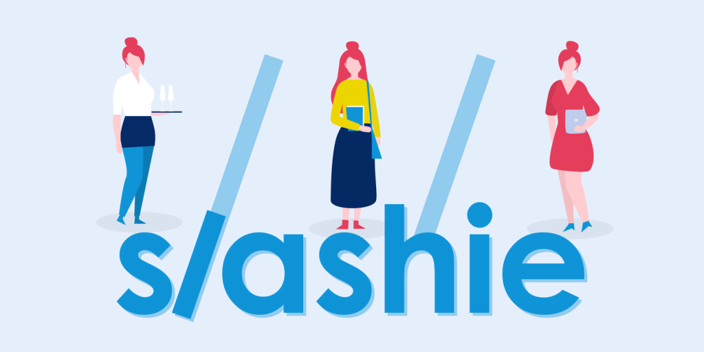
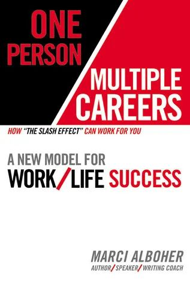
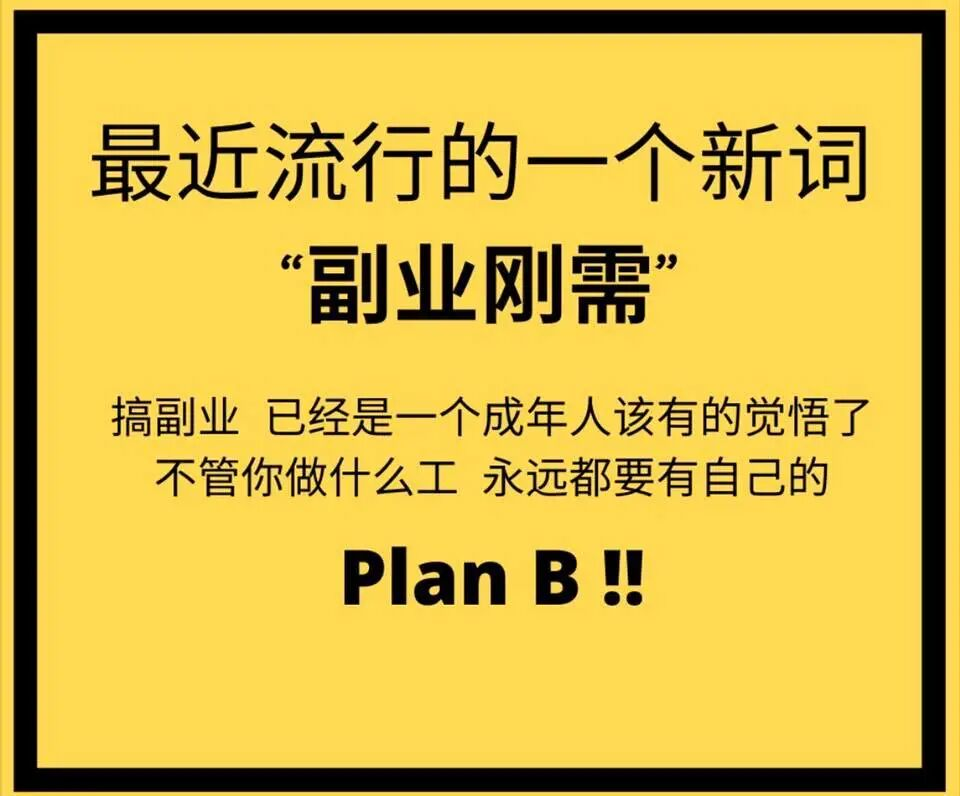
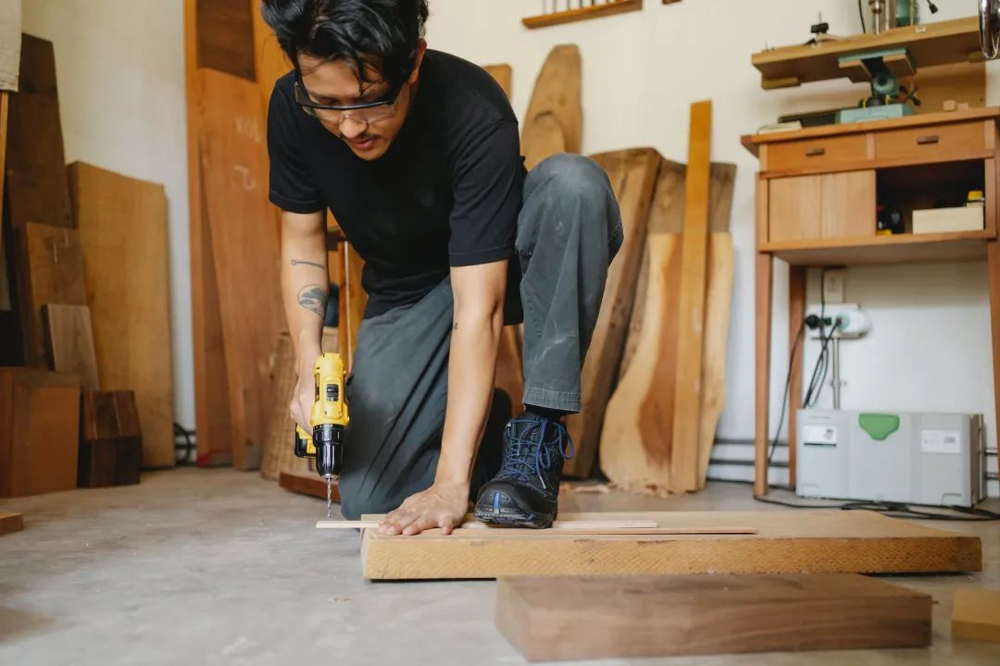
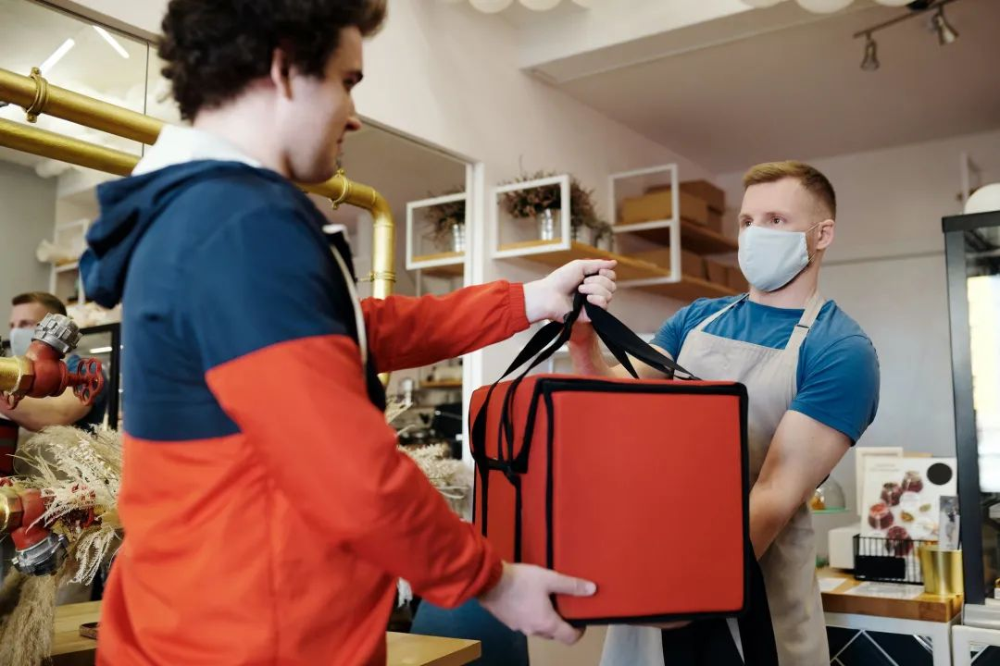
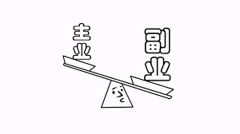

# 无标题

**链接地址:** http://mp.weixin.qq.com/s?__biz=MzI4NDYyNjAwNw==&mid=2247484736&idx=1&sn=d3a6cb1b970fa66694f60ba37a3fdcb6&chksm=ebf9d878dc8e516edd075a0ad559eab20b7f05d1ff8c6591aa2c4d522cff9f090049d8f5dded&mpshare=1&scene=2&srcid=0201o2IaVNt0tpvUbtrN6Jx3&sharer_sharetime=1612152551051&sharer_shareid=be1c8edd6c93eec155a61c876e41d26a#rd
**作者:** 关注我们
**获取时间:** 2025/8/28 19:56:14
**图片数量:** 25

---

## 原始HTML内容

<section style="box-sizing: border-box;font-size: 16px;"><section style="box-sizing: border-box;" powered-by="xiumi.us"><section style="display: flex;flex-flow: row nowrap;margin: 10px 0%;box-sizing: border-box;"><section style="display: inline-block;vertical-align: bottom;width: 50%;background-color: rgb(237, 128, 15);margin-right: 3px;flex: 0 0 auto;align-self: flex-end;height: auto;padding: 3px 10px;box-sizing: border-box;"><section style="text-align: right;font-size: 17px;color: rgb(255, 255, 255);letter-spacing: 4px;box-sizing: border-box;" powered-by="xiumi.us">
<strong style="box-sizing: border-box;">点击蓝字</strong>
</section></section><section style="display: inline-block;vertical-align: top;width: auto;border-left: 4px solid rgb(237, 128, 15);border-bottom-left-radius: 0px;flex: 100 100 0%;align-self: stretch;height: auto;padding: 3px 10px;background-color: rgb(255, 226, 196);box-sizing: border-box;"><section style="text-align: left;color: rgb(121, 121, 121);font-size: 17px;letter-spacing: 4px;box-sizing: border-box;" powered-by="xiumi.us">
<strong style="box-sizing: border-box;">关注我们</strong>
</section></section></section></section><section style="margin: 10px 0%;box-sizing: border-box;" powered-by="xiumi.us"><section style="display: inline-block;width: 100%;vertical-align: top;background-color: rgba(254, 245, 240, 0.8);padding-top: 20px;padding-bottom: 20px;box-sizing: border-box;"><section style="text-align: center;margin-top: 10px;margin-bottom: 10px;box-sizing: border-box;" powered-by="xiumi.us"><section style="max-width: 100%;vertical-align: middle;display: inline-block;line-height: 0;box-sizing: border-box;"></section></section><section style="margin-right: 0%;margin-bottom: 10px;margin-left: 0%;box-sizing: border-box;" powered-by="xiumi.us"><section style="font-size: 14px;color: rgb(97, 97, 97);letter-spacing: 2px;line-height: 2;padding-right: 20px;padding-left: 20px;box-sizing: border-box;">
 

最近经常关注求职信息的朋友们，一定会发现<strong style="box-sizing: border-box;">“斜杠族（slashie）”这个词汇频频出现在社交媒体上。</strong>成为了“打工人”们谈论的焦点。
</section></section><section style="box-sizing: border-box;" powered-by="xiumi.us">
 
</section><section style="display: inline-block;width: 100%;vertical-align: top;border-left: 3px solid rgba(187, 222, 251, 0);border-bottom-left-radius: 0px;padding-right: 20px;padding-left: 20px;box-sizing: border-box;" powered-by="xiumi.us"><section style="text-align: center;margin-right: 0%;margin-left: 0%;box-sizing: border-box;" powered-by="xiumi.us"><section style="max-width: 100%;vertical-align: middle;display: inline-block;line-height: 0;border-width: 0px;box-sizing: border-box;"></section></section><section style="box-sizing: border-box;" powered-by="xiumi.us">
 
</section><section style="box-sizing: border-box;" powered-by="xiumi.us">
 
</section></section><section style="margin-top: 10px;margin-right: 0%;margin-left: 0%;box-sizing: border-box;" powered-by="xiumi.us"><section style="display: inline-block;width: 100%;vertical-align: top;padding-right: 10px;padding-left: 22px;border-width: 0px;box-sizing: border-box;"><section style="margin-top: 10px;margin-bottom: 10px;text-align: left;justify-content: flex-start;box-sizing: border-box;" powered-by="xiumi.us"><section style="display: inline-block;vertical-align: top;box-sizing: border-box;"><section style="display: inline-block;vertical-align: bottom;margin-left: 2px;font-size: 17px;color: rgb(62, 62, 62);letter-spacing: 2px;box-sizing: border-box;">
<strong style="box-sizing: border-box;">什么是“斜杠族”</strong>
</section><section style="display: inline-block;vertical-align: bottom;margin-bottom: 2px;box-sizing: border-box;"><section style="width: 0.6em;height: 0.6em;display: inline-block;vertical-align: middle;margin-left: 6px;background-color: rgb(121, 121, 121);box-sizing: border-box;"><section><svg viewBox="0 0 1 1" style="float:left;line-height:0;width:0;vertical-align:top;"></svg></section></section><section style="width: 0.6em;height: 0.6em;display: inline-block;vertical-align: middle;margin-left: 6px;opacity: 0.8;background-color: rgb(121, 121, 121);box-sizing: border-box;"><section><svg viewBox="0 0 1 1" style="float:left;line-height:0;width:0;vertical-align:top;"></svg></section></section><section style="width: 0.6em;height: 0.6em;display: inline-block;vertical-align: middle;margin-left: 6px;opacity: 0.6;background-color: rgb(121, 121, 121);box-sizing: border-box;"><section><svg viewBox="0 0 1 1" style="float:left;line-height:0;width:0;vertical-align:top;"></svg></section></section><section style="width: 0.6em;height: 0.6em;display: inline-block;vertical-align: middle;margin-left: 6px;opacity: 0.4;background-color: rgb(121, 121, 121);box-sizing: border-box;"><section><svg viewBox="0 0 1 1" style="float:left;line-height:0;width:0;vertical-align:top;"></svg></section></section></section></section></section><section style="margin-right: 0%;margin-bottom: 10px;margin-left: 0%;box-sizing: border-box;" powered-by="xiumi.us"><section style="font-size: 14px;color: rgb(97, 97, 97);letter-spacing: 2px;line-height: 2;box-sizing: border-box;">
 

斜杠族（slashie）指的是一种始自美国纽约女专栏作家及谘询师马奇·艾波赫（Marci Alboher）的畅销书《One Person/Multiple Careers: A New Model for Work/Life Success》的工作态度。具体意指<strong style="box-sizing: border-box;">年轻人不再满足于专一职业的工作模式，而选择有多重职业及身份的生活。</strong>

 
</section></section><section style="margin: 10px 0%;box-sizing: border-box;" powered-by="xiumi.us"><section style="display: inline-block;vertical-align: top;width: 50%;background-color: rgba(255, 255, 255, 0);padding-right: 6px;padding-left: 12px;box-sizing: border-box;"><section style="box-sizing: border-box;" powered-by="xiumi.us"><section style="margin-right: 0%;margin-bottom: -12px;margin-left: 0%;text-align: left;justify-content: flex-start;display: flex;flex-flow: row nowrap;opacity: 0.99;box-sizing: border-box;"><section style="display: inline-block;vertical-align: bottom;width: auto;flex: 0 0 0%;align-self: flex-end;height: auto;line-height: 0;margin-left: -12px;box-sizing: border-box;"><section style="text-align: center;box-sizing: border-box;" powered-by="xiumi.us"><section style="display: inline-block;width: 12px;height: 12px;vertical-align: top;overflow: hidden;background-color: rgb(237, 128, 15);box-sizing: border-box;"><section><svg viewBox="0 0 1 1" style="float:left;line-height:0;width:0;vertical-align:top;"></svg></section></section></section></section><section style="display: inline-block;vertical-align: top;width: auto;flex: 0 0 0%;align-self: flex-start;height: auto;line-height: 0;box-sizing: border-box;"><section style="text-align: center;box-sizing: border-box;" powered-by="xiumi.us"><section style="display: inline-block;width: 12px;height: 12px;vertical-align: top;overflow: hidden;background-color: rgb(255, 255, 255);box-sizing: border-box;"><section><svg viewBox="0 0 1 1" style="float:left;line-height:0;width:0;vertical-align:top;"></svg></section></section></section></section></section></section><section style="text-align: center;margin-right: 0%;margin-left: 0%;box-sizing: border-box;" powered-by="xiumi.us"><section style="max-width: 100%;vertical-align: middle;display: inline-block;line-height: 0;box-sizing: border-box;"></section></section></section><section style="display: inline-block;vertical-align: top;width: 50%;padding-right: 12px;padding-left: 6px;box-sizing: border-box;"><section style="text-align: center;margin-right: 0%;margin-left: 0%;box-sizing: border-box;" powered-by="xiumi.us"><section style="max-width: 100%;vertical-align: middle;display: inline-block;line-height: 0;box-sizing: border-box;"></section></section><section style="box-sizing: border-box;" powered-by="xiumi.us"><section style="margin-top: -12px;margin-right: 0%;margin-left: 0%;text-align: right;justify-content: flex-end;display: flex;flex-flow: row nowrap;opacity: 0.99;box-sizing: border-box;"><section style="display: inline-block;vertical-align: bottom;width: auto;flex: 0 0 0%;align-self: flex-end;height: auto;line-height: 0;box-sizing: border-box;"><section style="text-align: center;box-sizing: border-box;" powered-by="xiumi.us"><section style="display: inline-block;width: 12px;height: 12px;vertical-align: top;overflow: hidden;background-color: rgb(255, 255, 255);box-sizing: border-box;"><section><svg viewBox="0 0 1 1" style="float:left;line-height:0;width:0;vertical-align:top;"></svg></section></section></section></section><section style="display: inline-block;vertical-align: top;width: auto;flex: 0 0 0%;align-self: flex-start;height: auto;line-height: 0;margin-right: -12px;box-sizing: border-box;"><section style="text-align: center;box-sizing: border-box;" powered-by="xiumi.us"><section style="display: inline-block;width: 12px;height: 12px;vertical-align: top;overflow: hidden;background-color: rgb(121, 121, 121);box-sizing: border-box;"><section><svg viewBox="0 0 1 1" style="float:left;line-height:0;width:0;vertical-align:top;"></svg></section></section></section></section></section></section></section></section><section style="box-sizing: border-box;" powered-by="xiumi.us">
Marci Alboher 和她于2007年出版的书籍《One Person / Multiple Careers: A New Model for Work / Life Success》封面

 
</section><section style="margin-right: 0%;margin-bottom: 10px;margin-left: 0%;box-sizing: border-box;" powered-by="xiumi.us"><section style="font-size: 14px;color: rgb(97, 97, 97);letter-spacing: 2px;line-height: 2;box-sizing: border-box;">
 

所谓斜杠族，其实是多职业者的一种<strong style="box-sizing: border-box;">象形的描述</strong>。当一个人拥有多重工作身份时，通常会在介绍中用一个“/”来进行分割，就像下面的名片这样。

 
</section></section><section style="text-align: center;margin: 10px 0%;box-sizing: border-box;" powered-by="xiumi.us"><section style="display: inline-block;vertical-align: middle;width: 38%;box-sizing: border-box;"><section style="font-size: 32px;margin: 10px 0%;box-sizing: border-box;" powered-by="xiumi.us"><section style="box-sizing: border-box;display: inline-block;vertical-align: bottom;margin: auto;width: 3em;height: 3em;border-radius: 100%;background-position: center center;background-repeat: no-repeat;background-size: cover;overflow: hidden;background-image: url(&quot;https://mmbiz.qpic.cn/mmbiz_jpg/cY0qSDjdkFcZSOdoFdp0rLquhPxJLwCYtb3SPoptEjs6rdECxrJp8QCUHSpXqbCDv8kiaDkMp2PutQpkCH2ZmHA/640?wx_fmt=jpeg&quot;);"><section style="height: 100%;overflow: hidden;line-height: 0;vertical-align: middle;max-width: 100%;box-sizing: border-box;"></section></section></section></section><section style="display: inline-block;vertical-align: middle;width: 48%;box-sizing: border-box;"><section style="margin-top: 0.5em;margin-bottom: 0.5em;box-sizing: border-box;" powered-by="xiumi.us"><section style="display: inline-block;box-sizing: border-box;"><section style="border-bottom: 1px solid rgb(0, 0, 0);display: inline-block;padding-right: 0.8em;padding-left: 0.8em;font-size: 17px;color: rgb(0, 0, 0);box-sizing: border-box;">
<strong style="box-sizing: border-box;">韩梅梅</strong>
</section><section style="margin-top: 5px;font-size: 14px;color: rgb(121, 121, 121);box-sizing: border-box;">
<strong style="box-sizing: border-box;">销售顾问 / 摄影师 / 作家</strong>
</section></section></section></section></section><section style="box-sizing: border-box;" powered-by="xiumi.us">
 
</section><section style="box-sizing: border-box;" powered-by="xiumi.us">
 
</section><section style="margin-top: 10px;margin-bottom: 10px;text-align: left;justify-content: flex-start;box-sizing: border-box;" powered-by="xiumi.us"><section style="display: inline-block;vertical-align: top;box-sizing: border-box;"><section style="display: inline-block;vertical-align: bottom;margin-left: 2px;font-size: 17px;color: rgb(62, 62, 62);letter-spacing: 2px;box-sizing: border-box;">
<strong style="box-sizing: border-box;">为什么“斜杠族”突然火了？</strong>
</section><section style="display: inline-block;vertical-align: bottom;margin-bottom: 2px;box-sizing: border-box;"><section style="width: 0.6em;height: 0.6em;display: inline-block;vertical-align: middle;margin-left: 6px;background-color: rgb(121, 121, 121);box-sizing: border-box;"><section><svg viewBox="0 0 1 1" style="float:left;line-height:0;width:0;vertical-align:top;"></svg></section></section><section style="width: 0.6em;height: 0.6em;display: inline-block;vertical-align: middle;margin-left: 6px;opacity: 0.8;background-color: rgb(121, 121, 121);box-sizing: border-box;"><section><svg viewBox="0 0 1 1" style="float:left;line-height:0;width:0;vertical-align:top;"></svg></section></section><section style="width: 0.6em;height: 0.6em;display: inline-block;vertical-align: middle;margin-left: 6px;opacity: 0.6;background-color: rgb(121, 121, 121);box-sizing: border-box;"><section><svg viewBox="0 0 1 1" style="float:left;line-height:0;width:0;vertical-align:top;"></svg></section></section><section style="width: 0.6em;height: 0.6em;display: inline-block;vertical-align: middle;margin-left: 6px;opacity: 0.4;background-color: rgb(121, 121, 121);box-sizing: border-box;"><section><svg viewBox="0 0 1 1" style="float:left;line-height:0;width:0;vertical-align:top;"></svg></section></section></section></section></section><section style="margin-right: 0%;margin-bottom: 10px;margin-left: 0%;box-sizing: border-box;" powered-by="xiumi.us"><section style="font-size: 14px;color: rgb(97, 97, 97);letter-spacing: 2px;line-height: 2;box-sizing: border-box;">
 

2020年，新冠疫情在加国上下肆虐，社交距离带来的居家工作形式转变，经济冲击带来的高失业率，影响了不少人的<strong style="box-sizing: border-box;">职业稳定性和就业方向</strong>。

 
</section></section><section style="text-align: center;margin-top: 10px;margin-bottom: 10px;box-sizing: border-box;" powered-by="xiumi.us"><section style="max-width: 100%;vertical-align: middle;display: inline-block;line-height: 0;box-sizing: border-box;"></section></section><section style="margin-right: 0%;margin-bottom: 10px;margin-left: 0%;box-sizing: border-box;" powered-by="xiumi.us"><section style="font-size: 14px;color: rgb(97, 97, 97);letter-spacing: 2px;line-height: 2;box-sizing: border-box;">
 

传统的雇佣模式在疫情冲击下遭遇挑战，生活和工作模式的改变也扭转了产业发展的趋势。于是“打工人”们纷纷意识到一个问题：<strong style="box-sizing: border-box;">“在一份工作上‘绑定’，风险太大了！这个世界已没有真正的‘铁饭碗’！”</strong>

 

无论是经济状况的压迫，还是职业规划的新尝试，或者只是因为疫情期间拥有了大把闲暇时间，许多人把目光聚焦在了<strong style="box-sizing: border-box;">搞“副业”</strong>上。

 

 
</section></section><section style="margin-top: 10px;margin-bottom: 10px;text-align: left;justify-content: flex-start;box-sizing: border-box;" powered-by="xiumi.us"><section style="display: inline-block;vertical-align: top;box-sizing: border-box;"><section style="display: inline-block;vertical-align: bottom;margin-left: 2px;font-size: 17px;color: rgb(62, 62, 62);letter-spacing: 2px;box-sizing: border-box;">
<strong style="box-sizing: border-box;">为什么要搞副业？</strong>
</section><section style="display: inline-block;vertical-align: bottom;margin-bottom: 2px;box-sizing: border-box;"><section style="width: 0.6em;height: 0.6em;display: inline-block;vertical-align: middle;margin-left: 6px;background-color: rgb(121, 121, 121);box-sizing: border-box;"><section><svg viewBox="0 0 1 1" style="float:left;line-height:0;width:0;vertical-align:top;"></svg></section></section><section style="width: 0.6em;height: 0.6em;display: inline-block;vertical-align: middle;margin-left: 6px;opacity: 0.8;background-color: rgb(121, 121, 121);box-sizing: border-box;"><section><svg viewBox="0 0 1 1" style="float:left;line-height:0;width:0;vertical-align:top;"></svg></section></section><section style="width: 0.6em;height: 0.6em;display: inline-block;vertical-align: middle;margin-left: 6px;opacity: 0.6;background-color: rgb(121, 121, 121);box-sizing: border-box;"><section><svg viewBox="0 0 1 1" style="float:left;line-height:0;width:0;vertical-align:top;"></svg></section></section><section style="width: 0.6em;height: 0.6em;display: inline-block;vertical-align: middle;margin-left: 6px;opacity: 0.4;background-color: rgb(121, 121, 121);box-sizing: border-box;"><section><svg viewBox="0 0 1 1" style="float:left;line-height:0;width:0;vertical-align:top;"></svg></section></section></section></section></section><section style="box-sizing: border-box;" powered-by="xiumi.us">
 
</section><section style="box-sizing: border-box;" powered-by="xiumi.us"><section style="display: flex;flex-flow: row nowrap;margin: 10px 0%;box-sizing: border-box;"><section style="display: inline-block;vertical-align: bottom;width: auto;background-color: rgb(237, 128, 15);margin-right: 3px;flex: 0 0 auto;align-self: flex-end;min-width: 10%;max-width: 100%;height: auto;padding: 5px;box-sizing: border-box;"><section style="text-align: center;font-size: 17px;color: rgb(255, 255, 255);line-height: 1.6;letter-spacing: 2px;box-sizing: border-box;" powered-by="xiumi.us">
<strong style="box-sizing: border-box;"><em style="box-sizing: border-box;">1</em></strong>
</section></section><section style="display: inline-block;vertical-align: top;width: auto;border-left: 4px solid rgb(237, 128, 15);border-bottom-left-radius: 0px;flex: 100 100 0%;align-self: stretch;height: auto;padding-top: 5px;padding-right: 10px;padding-left: 10px;background-color: rgba(253, 245, 240, 0.8);box-sizing: border-box;"><section style="color: rgb(0, 0, 0);font-size: 17px;letter-spacing: 4px;box-sizing: border-box;" powered-by="xiumi.us">
<strong style="box-sizing: border-box;">经济原因</strong>
</section></section></section></section><section style="box-sizing: border-box;" powered-by="xiumi.us">
 
</section><section style="margin-right: 0%;margin-bottom: 10px;margin-left: 0%;box-sizing: border-box;" powered-by="xiumi.us"><section style="font-size: 14px;color: rgb(97, 97, 97);letter-spacing: 2px;line-height: 2;box-sizing: border-box;">
许多人开始从事副业的初心，往往就是简单的一个字：<strong style="box-sizing: border-box;">“钱”</strong>！
</section></section><section style="text-align: center;margin-top: 10px;margin-bottom: 10px;box-sizing: border-box;" powered-by="xiumi.us"><section style="max-width: 100%;vertical-align: middle;display: inline-block;line-height: 0;width: 50%;height: auto;box-sizing: border-box;"></section></section><section style="margin-right: 0%;margin-bottom: 10px;margin-left: 0%;box-sizing: border-box;" powered-by="xiumi.us"><section style="font-size: 14px;color: rgb(97, 97, 97);letter-spacing: 2px;line-height: 2;box-sizing: border-box;">
 

是的，不然呢？<strong style="box-sizing: border-box;">经济利益就是最大的动力！</strong>特别是疫情当下，不少人都遭遇了失业、工时削减、奖金缩水、升职受挫的职业发展障碍。

 

这时候还有什么比<strong style="box-sizing: border-box;">多一份工作，多一个收入来源</strong>更实际的诉求？

 

 
</section></section><section style="box-sizing: border-box;" powered-by="xiumi.us"><section style="display: flex;flex-flow: row nowrap;margin: 10px 0%;box-sizing: border-box;"><section style="display: inline-block;vertical-align: bottom;width: auto;background-color: rgb(237, 128, 15);margin-right: 3px;flex: 0 0 auto;align-self: flex-end;min-width: 10%;max-width: 100%;height: auto;padding: 5px;box-sizing: border-box;"><section style="text-align: center;font-size: 17px;color: rgb(255, 255, 255);line-height: 1.6;letter-spacing: 2px;box-sizing: border-box;" powered-by="xiumi.us">
<strong style="box-sizing: border-box;"><em style="box-sizing: border-box;">2</em></strong>
</section></section><section style="display: inline-block;vertical-align: top;width: auto;border-left: 4px solid rgb(237, 128, 15);border-bottom-left-radius: 0px;flex: 100 100 0%;align-self: stretch;height: auto;padding-top: 5px;padding-right: 10px;padding-left: 10px;background-color: rgba(253, 245, 240, 0.8);box-sizing: border-box;"><section style="color: rgb(0, 0, 0);letter-spacing: 4px;box-sizing: border-box;" powered-by="xiumi.us">
<strong style="box-sizing: border-box;">降低风险，提升综合职场竞争力</strong>
</section></section></section></section><section style="margin-right: 0%;margin-bottom: 10px;margin-left: 0%;box-sizing: border-box;" powered-by="xiumi.us"><section style="font-size: 14px;color: rgb(97, 97, 97);letter-spacing: 2px;line-height: 2;box-sizing: border-box;">
 

多份职业不仅为你带来额外的收入渠道，同时<strong style="box-sizing: border-box;">降低失业带来的经济风险，避免简历上尴尬的空白。</strong>

 

就算疫情的原因让你不幸失业，也可以利用副业，在待业期间去做一个<strong style="box-sizing: border-box;">财务和心理上的缓冲</strong>。

 
</section></section><section style="text-align: center;margin-top: 10px;margin-bottom: 10px;box-sizing: border-box;" powered-by="xiumi.us"><section style="max-width: 100%;vertical-align: middle;display: inline-block;line-height: 0;box-sizing: border-box;"></section></section><section style="margin-right: 0%;margin-bottom: 10px;margin-left: 0%;box-sizing: border-box;" powered-by="xiumi.us"><section style="font-size: 14px;color: rgb(97, 97, 97);letter-spacing: 2px;line-height: 2;box-sizing: border-box;">
 

另外，多重职业可以帮助你培养多样的职业技能，大大<strong style="box-sizing: border-box;">增强你的职场综合竞争力</strong>。

 

俗话说得好“<strong style="box-sizing: border-box;">技多不压身</strong>”！当意外情况出现时，让你拥有更多的资本去快速适应产业结构的调整和工作职责及环境的变迁。

 

 
</section></section><section style="box-sizing: border-box;" powered-by="xiumi.us"><section style="display: flex;flex-flow: row nowrap;margin: 10px 0%;box-sizing: border-box;"><section style="display: inline-block;vertical-align: bottom;width: auto;background-color: rgb(237, 128, 15);margin-right: 3px;flex: 0 0 auto;align-self: flex-end;min-width: 10%;max-width: 100%;height: auto;padding: 5px;box-sizing: border-box;"><section style="text-align: center;font-size: 17px;color: rgb(255, 255, 255);line-height: 1.6;letter-spacing: 2px;box-sizing: border-box;" powered-by="xiumi.us">
<strong style="box-sizing: border-box;"><em style="box-sizing: border-box;">3</em></strong>
</section></section><section style="display: inline-block;vertical-align: top;width: auto;border-left: 4px solid rgb(237, 128, 15);border-bottom-left-radius: 0px;flex: 100 100 0%;align-self: stretch;height: auto;padding-top: 5px;padding-right: 10px;padding-left: 10px;background-color: rgba(253, 245, 240, 0.8);box-sizing: border-box;"><section style="color: rgb(0, 0, 0);font-size: 17px;letter-spacing: 4px;box-sizing: border-box;" powered-by="xiumi.us">
<strong style="box-sizing: border-box;">追求个人价值的体现</strong>
</section></section></section></section><section style="margin-right: 0%;margin-bottom: 10px;margin-left: 0%;box-sizing: border-box;" powered-by="xiumi.us"><section style="font-size: 14px;color: rgb(97, 97, 97);letter-spacing: 2px;line-height: 2;box-sizing: border-box;">
 

一些朋友开始副业的原因并非经济状况的驱势，可能只是作为一种<strong style="box-sizing: border-box;">新鲜的尝试，或对爱好的追求</strong>。

 
</section></section><section style="margin: 10px 0%;box-sizing: border-box;" powered-by="xiumi.us"><section style="display: inline-block;width: 100%;vertical-align: top;border-width: 0px;border-radius: 0px;border-style: solid;border-color: rgba(187, 222, 251, 0);box-sizing: border-box;"><section style="box-sizing: border-box;" powered-by="xiumi.us"><section style="display: flex;flex-flow: row nowrap;margin: 20px 0%;box-sizing: border-box;"><section style="display: inline-block;vertical-align: top;width: auto;flex: 100 100 0%;align-self: stretch;height: auto;padding-right: 10px;padding-left: 10px;border-width: 0px;box-sizing: border-box;"><section style="text-align: center;margin: -10px 0%;box-sizing: border-box;" powered-by="xiumi.us"><section style="max-width: 100%;vertical-align: middle;display: inline-block;line-height: 0;border-width: 0px;border-radius: 5px;border-style: none;border-color: rgb(62, 62, 62);overflow: hidden;box-sizing: border-box;"></section></section></section><section style="display: inline-block;vertical-align: top;width: auto;align-self: stretch;flex: 100 100 0%;border-left: 1px solid rgba(187, 222, 251, 0);border-bottom-left-radius: 0px;padding-right: 10px;padding-left: 10px;box-sizing: border-box;"><section style="text-align: center;margin: -10px 0%;box-sizing: border-box;" powered-by="xiumi.us"><section style="max-width: 100%;vertical-align: middle;display: inline-block;line-height: 0;border-width: 0px;border-radius: 5px;border-style: none;border-color: rgb(62, 62, 62);overflow: hidden;box-sizing: border-box;"></section></section></section></section></section><section style="box-sizing: border-box;" powered-by="xiumi.us"><section style="display: flex;flex-flow: row nowrap;box-sizing: border-box;"><section style="display: inline-block;vertical-align: top;width: auto;flex: 100 100 0%;align-self: flex-start;height: auto;padding-right: 20px;padding-left: 20px;box-sizing: border-box;"><section style="margin-right: 0%;margin-left: 0%;box-sizing: border-box;" powered-by="xiumi.us"><section style="background-color: rgba(187, 222, 251, 0);height: 1px;box-sizing: border-box;"><section><svg viewBox="0 0 1 1" style="float:left;line-height:0;width:0;vertical-align:top;"></svg></section></section></section></section><section style="display: inline-block;vertical-align: top;width: auto;align-self: flex-start;flex: 100 100 0%;padding-right: 20px;padding-left: 20px;box-sizing: border-box;"><section style="margin-right: 0%;margin-left: 0%;box-sizing: border-box;" powered-by="xiumi.us"><section style="background-color: rgba(187, 222, 251, 0);height: 1px;box-sizing: border-box;"><section><svg viewBox="0 0 1 1" style="float:left;line-height:0;width:0;vertical-align:top;"></svg></section></section></section></section></section></section><section style="box-sizing: border-box;" powered-by="xiumi.us"><section style="display: flex;flex-flow: row nowrap;margin: 20px 0%;box-sizing: border-box;"><section style="display: inline-block;vertical-align: top;width: auto;flex: 100 100 0%;align-self: stretch;height: auto;padding-right: 10px;padding-left: 10px;border-width: 0px;box-sizing: border-box;"><section style="text-align: center;margin: -10px 0%;box-sizing: border-box;" powered-by="xiumi.us"><section style="max-width: 100%;vertical-align: middle;display: inline-block;line-height: 0;border-width: 0px;border-radius: 5px;border-style: none;border-color: rgb(62, 62, 62);overflow: hidden;box-sizing: border-box;"></section></section></section><section style="display: inline-block;vertical-align: top;width: auto;align-self: stretch;flex: 100 100 0%;border-left: 1px solid rgba(187, 222, 251, 0);border-bottom-left-radius: 0px;padding-right: 10px;padding-left: 10px;box-sizing: border-box;"><section style="text-align: center;margin: -10px 0%;box-sizing: border-box;" powered-by="xiumi.us"><section style="max-width: 100%;vertical-align: middle;display: inline-block;line-height: 0;border-width: 0px;border-radius: 5px;border-style: none;border-color: rgb(62, 62, 62);overflow: hidden;box-sizing: border-box;"></section></section></section></section></section></section></section><section style="margin-right: 0%;margin-bottom: 10px;margin-left: 0%;box-sizing: border-box;" powered-by="xiumi.us"><section style="font-size: 14px;color: rgb(97, 97, 97);letter-spacing: 2px;line-height: 2;box-sizing: border-box;">
 

特别是对于那些选择了自己不是很感兴趣的职业作为主业的朋友们，把爱好当成一种副业，也是<strong style="box-sizing: border-box;">平衡工作和生活</strong>的不错选择。

 

如果能通过爱好取得经济上的收益，也是对你<strong style="box-sizing: border-box;">创作和能力的一种认可</strong>；如果不能靠之赚钱，至少也提升了自己的技能，丰富了业余的闲暇时间。

 

 
</section></section><section style="box-sizing: border-box;" powered-by="xiumi.us"><section style="display: flex;flex-flow: row nowrap;margin: 10px 0%;box-sizing: border-box;"><section style="display: inline-block;vertical-align: bottom;width: auto;background-color: rgb(237, 128, 15);margin-right: 3px;flex: 0 0 auto;align-self: flex-end;min-width: 10%;max-width: 100%;height: auto;padding: 5px;box-sizing: border-box;"><section style="text-align: center;font-size: 17px;color: rgb(255, 255, 255);line-height: 1.6;letter-spacing: 2px;box-sizing: border-box;" powered-by="xiumi.us">
<strong style="box-sizing: border-box;"><em style="box-sizing: border-box;">4</em></strong>
</section></section><section style="display: inline-block;vertical-align: top;width: auto;border-left: 4px solid rgb(237, 128, 15);border-bottom-left-radius: 0px;flex: 100 100 0%;align-self: stretch;height: auto;padding-top: 5px;padding-right: 10px;padding-left: 10px;background-color: rgba(253, 245, 240, 0.8);box-sizing: border-box;"><section style="color: rgb(0, 0, 0);font-size: 17px;letter-spacing: 4px;box-sizing: border-box;" powered-by="xiumi.us">
<strong style="box-sizing: border-box;">时代的召唤！</strong>
</section></section></section></section><section style="box-sizing: border-box;" powered-by="xiumi.us">
 
</section><section style="text-align: center;margin-top: 10px;margin-bottom: 10px;box-sizing: border-box;" powered-by="xiumi.us"><section style="max-width: 100%;vertical-align: middle;display: inline-block;line-height: 0;box-sizing: border-box;"></section></section><section style="font-size: 12px;color: rgb(121, 121, 121);box-sizing: border-box;" powered-by="xiumi.us">
来源：BMO Global Asset Management, 作者：Derek Devereaux
</section><section style="margin-right: 0%;margin-bottom: 10px;margin-left: 0%;box-sizing: border-box;" powered-by="xiumi.us"><section style="font-size: 14px;color: rgb(97, 97, 97);letter-spacing: 2px;line-height: 2;box-sizing: border-box;">
 

 

副业为什么这么火？正应了那句<strong style="box-sizing: border-box;">“有需求就有市场”</strong>。在新冠疫情的推波助澜之下，整个社会需求都在向<strong style="box-sizing: border-box;">“临工经济（gig economy）”</strong>进行过渡。 

 

科技发展和工业转型制造了大量新鲜的业务需求，但不是每个企业都有能力去提供足够的工作量和预算去支持这些业务的全职运营。

 

同时，包括自由职业者、学生、家庭主妇在内的人群也需要一个<strong style="box-sizing: border-box;">相对弹性的工作制度去磨合“碎片化”的日程安排</strong>。

 
</section></section><section style="text-align: center;margin-top: 10px;margin-bottom: 10px;box-sizing: border-box;" powered-by="xiumi.us"><section style="max-width: 100%;vertical-align: middle;display: inline-block;line-height: 0;box-sizing: border-box;"></section></section><section style="margin-right: 0%;margin-bottom: 10px;margin-left: 0%;box-sizing: border-box;" powered-by="xiumi.us"><section style="font-size: 14px;color: rgb(97, 97, 97);letter-spacing: 2px;line-height: 2;box-sizing: border-box;">
 

因此，企业可以通过互联网平台轻松 locate 到完成工作的合适人选，实现了<strong style="box-sizing: border-box;">企业和弹性工作者之间的双赢</strong>。

 
</section></section><section style="margin-right: 0%;margin-bottom: 10px;margin-left: 0%;box-sizing: border-box;" powered-by="xiumi.us"><section style="font-size: 14px;color: rgb(97, 97, 97);letter-spacing: 2px;line-height: 2;box-sizing: border-box;">
 
</section></section><section style="margin-top: 10px;margin-bottom: 10px;text-align: left;justify-content: flex-start;box-sizing: border-box;" powered-by="xiumi.us"><section style="display: inline-block;vertical-align: top;box-sizing: border-box;"><section style="display: inline-block;vertical-align: bottom;margin-left: 2px;font-size: 17px;color: rgb(62, 62, 62);letter-spacing: 2px;box-sizing: border-box;">
<strong style="box-sizing: border-box;">我应该怎样开启我的斜杠人生？</strong>
</section><section style="display: inline-block;vertical-align: bottom;margin-bottom: 2px;box-sizing: border-box;"><section style="width: 0.6em;height: 0.6em;display: inline-block;vertical-align: middle;margin-left: 6px;background-color: rgb(121, 121, 121);box-sizing: border-box;"><section><svg viewBox="0 0 1 1" style="float:left;line-height:0;width:0;vertical-align:top;"></svg></section></section><section style="width: 0.6em;height: 0.6em;display: inline-block;vertical-align: middle;margin-left: 6px;opacity: 0.8;background-color: rgb(121, 121, 121);box-sizing: border-box;"><section><svg viewBox="0 0 1 1" style="float:left;line-height:0;width:0;vertical-align:top;"></svg></section></section><section style="width: 0.6em;height: 0.6em;display: inline-block;vertical-align: middle;margin-left: 6px;opacity: 0.6;background-color: rgb(121, 121, 121);box-sizing: border-box;"><section><svg viewBox="0 0 1 1" style="float:left;line-height:0;width:0;vertical-align:top;"></svg></section></section><section style="width: 0.6em;height: 0.6em;display: inline-block;vertical-align: middle;margin-left: 6px;opacity: 0.4;background-color: rgb(121, 121, 121);box-sizing: border-box;"><section><svg viewBox="0 0 1 1" style="float:left;line-height:0;width:0;vertical-align:top;"></svg></section></section></section></section></section><section style="margin-right: 0%;margin-bottom: 10px;margin-left: 0%;box-sizing: border-box;" powered-by="xiumi.us"><section style="font-size: 14px;color: rgb(97, 97, 97);letter-spacing: 2px;line-height: 2;box-sizing: border-box;">
 

看到周围的人都纷纷开启了自己的斜杠人生，我的心里也痒痒的。但应该从哪里开始着手发展我的副业呢？

 

大部分人都会选择从自己<strong style="box-sizing: border-box;">擅长的领域入手</strong>。毕竟这些天赋、技能点、硬件装备、还有人脉等等因素，已经为你的副业起飞奠定了部分基础。纵使副业没有获得极大的成功，你也<strong style="box-sizing: border-box;">不会“亏本”</strong>。

 
</section></section><section style="text-align: center;margin-top: 10px;margin-bottom: 10px;box-sizing: border-box;" powered-by="xiumi.us"><section style="max-width: 100%;vertical-align: middle;display: inline-block;line-height: 0;width: 75%;height: auto;box-sizing: border-box;"></section></section><section style="margin-right: 0%;margin-bottom: 10px;margin-left: 0%;box-sizing: border-box;" powered-by="xiumi.us"><section style="font-size: 14px;color: rgb(97, 97, 97);letter-spacing: 2px;line-height: 2;box-sizing: border-box;">
 

另外，这项副业最好拥有<strong style="box-sizing: border-box;">弹性的工作制度</strong>，让你可以自如的调节工作地点、时间和工作量。毕竟不是每个人都是<strong style="box-sizing: border-box;">时间管理</strong><strong style="box-sizing: border-box;">大师</strong>。

 
</section></section><section style="text-align: center;margin-top: 10px;margin-bottom: 10px;box-sizing: border-box;" powered-by="xiumi.us"><section style="max-width: 100%;vertical-align: middle;display: inline-block;line-height: 0;width: 80%;height: auto;box-sizing: border-box;"></section></section><section style="margin-right: 0%;margin-bottom: 10px;margin-left: 0%;box-sizing: border-box;" powered-by="xiumi.us"><section style="font-size: 14px;color: rgb(97, 97, 97);letter-spacing: 2px;line-height: 2;box-sizing: border-box;">
 

如果经济压力是驱使你开展副业的头号原因，那么选择<strong style="box-sizing: border-box;">门槛低、投入低、收益快</strong>的副业是一个则是一个很实际的选择。

 
</section></section><section style="margin-right: 0%;margin-bottom: 10px;margin-left: 0%;box-sizing: border-box;" powered-by="xiumi.us"><section style="font-size: 14px;color: rgb(97, 97, 97);letter-spacing: 2px;line-height: 2;box-sizing: border-box;">
但选择副业前都请对感兴趣的行业进行做好前期调研，不要因为<strong style="box-sizing: border-box;">“看起来是个风口”</strong>就立刻不顾一切的纵身一跃。 

 
</section></section><section style="text-align: center;margin-top: 10px;margin-bottom: 10px;box-sizing: border-box;" powered-by="xiumi.us"><section style="max-width: 100%;vertical-align: middle;display: inline-block;line-height: 0;width: 80%;height: auto;box-sizing: border-box;"></section></section><section style="margin-right: 0%;margin-bottom: 10px;margin-left: 0%;box-sizing: border-box;" powered-by="xiumi.us"><section style="font-size: 14px;color: rgb(97, 97, 97);letter-spacing: 2px;line-height: 2;box-sizing: border-box;">
 

网上因为搞副业而误入歧途、惨遭诈骗或是赔个精光的<strong style="box-sizing: border-box;">反面教材</strong>多得不要不要的，BadaB 还是不转发过来恐吓大家了。总之谨记，<strong style="box-sizing: border-box;">三思而后行，擦亮双眼！</strong>

 
</section></section><section style="text-align: center;margin-top: 10px;margin-bottom: 10px;box-sizing: border-box;" powered-by="xiumi.us"><section style="max-width: 100%;vertical-align: middle;display: inline-block;line-height: 0;box-sizing: border-box;"></section></section><section style="margin-right: 0%;margin-bottom: 10px;margin-left: 0%;box-sizing: border-box;" powered-by="xiumi.us"><section style="font-size: 14px;color: rgb(97, 97, 97);letter-spacing: 2px;line-height: 2;box-sizing: border-box;">
 

同时要<strong style="box-sizing: border-box;">兼顾好主业、副业和生活的平衡</strong>。不要为了发展副业而严重干扰自己的主业发展（除非你想要把副业转成主业）；或者忙于工作，从而影响自己的生活质量和身心健康。

 
</section></section><section style="text-align: center;margin-top: 10px;margin-bottom: 10px;box-sizing: border-box;" powered-by="xiumi.us"><section style="max-width: 100%;vertical-align: middle;display: inline-block;line-height: 0;box-sizing: border-box;"></section></section><section style="margin-right: 0%;margin-bottom: 10px;margin-left: 0%;box-sizing: border-box;" powered-by="xiumi.us"><section style="font-size: 14px;color: rgb(97, 97, 97);letter-spacing: 2px;line-height: 2;box-sizing: border-box;">
 

其实对于副业的选择，每个人都需要<strong style="box-sizing: border-box;">根据自身的情况制详尽的职业发展规划</strong>。不同职业的发展潜力和成长曲线有着较大差异，千万不要为了眼前的利益做出<strong style="box-sizing: border-box;">“捡芝麻丢西瓜”</strong>的后悔事。

 

如果你需要任何职业规划上的建议，都欢迎联系我们——

 
</section></section><section style="font-size: 14px;padding-right: 20px;padding-left: 20px;letter-spacing: 2px;color: rgb(121, 121, 121);line-height: 2;box-sizing: border-box;" powered-by="xiumi.us">
我们的资深人力资源顾问&nbsp;<strong style="box-sizing: border-box;">Ada Tai</strong><strong style="box-sizing: border-box;">&nbsp;</strong>将从公司HR的专业角度，<strong style="box-sizing: border-box;">量身定做职业规划的最优方案</strong>。

 
</section><section style="margin-right: 0%;margin-bottom: 10px;margin-left: 0%;box-sizing: border-box;" powered-by="xiumi.us"><section style="font-size: 14px;color: rgb(97, 97, 97);letter-spacing: 2px;line-height: 2;box-sizing: border-box;">
 
</section></section><section style="text-align: center;margin: 10px 0%;box-sizing: border-box;" powered-by="xiumi.us"><section style="display: inline-block;width: 90%;vertical-align: top;border-style: solid;border-width: 2px;border-radius: 0px;border-color: rgb(237, 128, 15);letter-spacing: 0px;padding: 10px;box-sizing: border-box;"><section style="box-sizing: border-box;" powered-by="xiumi.us"><section style="display: inline-block;vertical-align: middle;width: 40%;box-sizing: border-box;"><section style="margin-right: 0%;margin-left: 0%;box-sizing: border-box;" powered-by="xiumi.us"><section style="max-width: 100%;vertical-align: middle;display: inline-block;line-height: 0;border-width: 0px;width: 100%;box-sizing: border-box;"></section></section></section><section style="display: inline-block;vertical-align: middle;width: 60%;padding-left: 10px;box-sizing: border-box;"><section style="margin-right: 0%;margin-bottom: 5px;margin-left: 0%;box-sizing: border-box;" powered-by="xiumi.us"><section style="display: inline-block;border-width: 2px;border-style: solid;border-color: rgb(237, 128, 15);padding: 0.1em 0.3em;background-color: rgb(237, 128, 15);color: rgb(255, 255, 255);font-size: 12px;box-sizing: border-box;">
<strong style="box-sizing: border-box;">Ada&nbsp; Tai</strong>
</section></section><section style="margin-right: 0%;margin-left: 0%;box-sizing: border-box;" powered-by="xiumi.us"><section style="font-size: 13px;box-sizing: border-box;">
<strong style="box-sizing: border-box;">MBA, CPHR, SHRM-SCP</strong>
</section></section><section style="box-sizing: border-box;" powered-by="xiumi.us"><section style="display: inline-block;vertical-align: middle;width: 10%;border-width: 0px;box-sizing: border-box;"><section style="margin: 5px 0%;text-align: left;font-size: 0px;box-sizing: border-box;" powered-by="xiumi.us"><section style="padding: 4px;display: inline-block;background-color: rgb(237, 128, 15);box-sizing: border-box;"><section style="border-color: rgba(255, 255, 255, 0);width: 1.6em;height: 1.6em;border-style: solid;border-width: 1px;text-align: center;line-height: 1.5em;color: rgb(255, 255, 255);box-sizing: border-box;">
 
</section></section></section></section><section style="display: inline-block;vertical-align: middle;width: 90%;box-sizing: border-box;"><section style="text-align: justify;font-size: 12px;box-sizing: border-box;" powered-by="xiumi.us">
修改简历与求职信
</section></section></section><section style="box-sizing: border-box;" powered-by="xiumi.us"><section style="display: inline-block;vertical-align: middle;width: 10%;box-sizing: border-box;"><section style="margin: 5px 0%;text-align: left;font-size: 0px;box-sizing: border-box;" powered-by="xiumi.us"><section style="padding: 4px;display: inline-block;background-color: rgb(237, 128, 15);box-sizing: border-box;"><section style="border-color: rgba(255, 255, 255, 0);width: 1.6em;height: 1.6em;border-style: solid;border-width: 1px;text-align: center;line-height: 1.5em;color: rgb(255, 255, 255);box-sizing: border-box;">
 
</section></section></section></section><section style="display: inline-block;vertical-align: middle;width: 90%;box-sizing: border-box;"><section style="text-align: justify;font-size: 12px;box-sizing: border-box;" powered-by="xiumi.us">
培训面试
</section></section></section><section style="box-sizing: border-box;" powered-by="xiumi.us"><section style="display: inline-block;vertical-align: middle;width: 10%;border-width: 0px;box-sizing: border-box;"><section style="margin: 5px 0%;text-align: left;font-size: 0px;box-sizing: border-box;" powered-by="xiumi.us"><section style="padding: 4px;display: inline-block;background-color: rgb(237, 128, 15);box-sizing: border-box;"><section style="border-color: rgba(255, 255, 255, 0);width: 1.6em;height: 1.6em;border-style: solid;border-width: 1px;text-align: center;line-height: 1.5em;color: rgb(255, 255, 255);box-sizing: border-box;">
 
</section></section></section></section><section style="display: inline-block;vertical-align: middle;width: 90%;box-sizing: border-box;"><section style="text-align: justify;font-size: 12px;box-sizing: border-box;" powered-by="xiumi.us">
建立LinkedIn Profile
</section></section></section><section style="box-sizing: border-box;" powered-by="xiumi.us"><section style="display: inline-block;vertical-align: middle;width: 10%;box-sizing: border-box;"><section style="margin: 5px 0%;text-align: left;font-size: 0px;box-sizing: border-box;" powered-by="xiumi.us"><section style="padding: 4px;display: inline-block;background-color: rgb(237, 128, 15);box-sizing: border-box;"><section style="border-color: rgba(255, 255, 255, 0);width: 1.6em;height: 1.6em;border-style: solid;border-width: 1px;text-align: center;line-height: 1.5em;color: rgb(255, 255, 255);box-sizing: border-box;">
 
</section></section></section></section><section style="display: inline-block;vertical-align: middle;width: 90%;box-sizing: border-box;"><section style="text-align: justify;font-size: 12px;box-sizing: border-box;" powered-by="xiumi.us">
职业评估与规划、社交培训
</section></section></section><section style="box-sizing: border-box;" powered-by="xiumi.us"><section style="display: inline-block;vertical-align: middle;width: 10%;box-sizing: border-box;"><section style="margin: 5px 0%;text-align: left;font-size: 0px;box-sizing: border-box;" powered-by="xiumi.us"><section style="padding: 4px;display: inline-block;background-color: rgb(237, 128, 15);box-sizing: border-box;"><section style="border-color: rgba(255, 255, 255, 0);width: 1.6em;height: 1.6em;border-style: solid;border-width: 1px;text-align: center;line-height: 1.5em;color: rgb(255, 255, 255);box-sizing: border-box;">
 
</section></section></section></section><section style="display: inline-block;vertical-align: middle;width: 90%;box-sizing: border-box;"><section style="text-align: justify;font-size: 12px;box-sizing: border-box;" powered-by="xiumi.us">
求职、职场文化等多种讲座
</section></section></section></section></section></section></section><section style="margin: 20px 0%;box-sizing: border-box;" powered-by="xiumi.us"><section style="letter-spacing: 2px;font-size: 14px;color: rgba(51, 51, 51, 0.61);padding-right: 20px;padding-left: 20px;line-height: 2;box-sizing: border-box;">
 

Ada Tai 毕业于埃尔伯塔大学工商管理硕士学位,并拥有加拿大和美国“注册人力资源管理师”资格证。十几年来 Ada 一直在不同的领域从事人力资源的管理工作。在最近的几年时间里，Ada与她的团队BadaB Consulting Inc. 已成功帮助超过500名不同年龄和职业背景的求职者找到心仪的工作，并帮助他们克服职场困难，向理想的职业成长方向稳步前进。

 
</section></section><section style="text-align: center;margin-top: 10px;margin-bottom: 10px;box-sizing: border-box;" powered-by="xiumi.us"><section style="max-width: 100%;vertical-align: middle;display: inline-block;line-height: 0;box-sizing: border-box;"></section></section><section style="margin-right: 0%;margin-bottom: 10px;margin-left: 0%;box-sizing: border-box;" powered-by="xiumi.us"><section style="font-size: 14px;color: rgb(97, 97, 97);letter-spacing: 2px;line-height: 2;box-sizing: border-box;">
 

副业的风潮势不可挡！一份好的副业不仅为你提供额外的经济支持，实现更多人生目标，甚至和你的主业相辅相成，带领你进入<strong style="box-sizing: border-box;">更广阔的职业发展平台</strong>。 

 

 
</section></section><section style="box-sizing: border-box;" powered-by="xiumi.us"><section style="display: flex;flex-flow: row nowrap;margin: 10px 0%;box-sizing: border-box;"><section style="display: inline-block;vertical-align: middle;width: auto;flex: 0 0 0%;align-self: center;height: auto;box-sizing: border-box;"><section style="text-align: center;box-sizing: border-box;" powered-by="xiumi.us"><section style="display: inline-block;width: 90px;height: 150px;vertical-align: top;overflow: hidden;border-style: solid;border-width: 4px;border-radius: 0px;border-color: rgb(255, 226, 196);box-sizing: border-box;"><section><svg viewBox="0 0 1 1" style="float:left;line-height:0;width:0;vertical-align:top;"></svg></section></section></section></section><section style="display: inline-block;vertical-align: middle;width: auto;flex: 89.2857 89.2857 0%;align-self: center;height: auto;background-color: rgb(255, 255, 255);margin-left: -65px;box-sizing: border-box;"><section style="box-sizing: border-box;" powered-by="xiumi.us"><section style="display: flex;flex-flow: row nowrap;box-sizing: border-box;"><section style="display: inline-block;vertical-align: middle;width: auto;padding-right: 5px;flex: 0 0 0%;height: auto;align-self: center;box-sizing: border-box;"><section style="box-sizing: border-box;" powered-by="xiumi.us"><section style="display: flex;flex-flow: row nowrap;box-sizing: border-box;"><section style="display: inline-block;width: 120px;vertical-align: top;flex: 0 0 auto;height: auto;align-self: flex-start;box-sizing: border-box;"><section style="text-align: center;margin-right: 0%;margin-left: 0%;box-sizing: border-box;" powered-by="xiumi.us"><section style="max-width: 100%;vertical-align: middle;display: inline-block;line-height: 0;width: 100%;border-color: rgba(118, 178, 124, 0);border-width: 5px;border-radius: 0px;border-style: solid;box-shadow: rgb(0, 0, 0) 0px 0px 0px;box-sizing: border-box;"></section></section></section></section></section></section><section style="display: inline-block;vertical-align: middle;width: auto;padding-left: 5px;flex: 100 100 0%;height: auto;align-self: center;box-sizing: border-box;"><section style="margin-right: 0%;margin-left: 0%;box-sizing: border-box;" powered-by="xiumi.us"><section style="color: rgb(121, 121, 121);font-size: 12px;box-sizing: border-box;">
<strong style="box-sizing: border-box;">Badab Consulting Inc.</strong>

微信号 : badab101

新浪微博：BadaB_Consulting
</section></section></section></section></section></section></section></section><section style="margin-right: 0%;margin-bottom: 10px;margin-left: 0%;box-sizing: border-box;" powered-by="xiumi.us"><section style="font-size: 14px;color: rgb(97, 97, 97);letter-spacing: 2px;line-height: 2;box-sizing: border-box;">
 
</section></section><section style="margin-right: 0%;margin-bottom: 10px;margin-left: 0%;box-sizing: border-box;" powered-by="xiumi.us"><section style="font-size: 14px;color: rgb(97, 97, 97);letter-spacing: 2px;line-height: 2;box-sizing: border-box;">
 
</section></section><section style="box-sizing: border-box;" powered-by="xiumi.us"><section style="display: flex;flex-flow: row nowrap;margin: 10px 0% -35px;box-sizing: border-box;"><section style="display: inline-block;vertical-align: bottom;width: auto;flex: 0 0 0%;height: auto;align-self: flex-end;box-sizing: border-box;"><section style="text-align: center;box-sizing: border-box;" powered-by="xiumi.us"><section style="display: inline-block;width: 33px;height: 33px;vertical-align: top;overflow: hidden;background-color: rgb(237, 128, 15);box-sizing: border-box;"><section><svg viewBox="0 0 1 1" style="float:left;line-height:0;width:0;vertical-align:top;"></svg></section></section></section></section><section style="display: inline-block;vertical-align: top;width: auto;align-self: flex-start;background-color: rgba(237, 146, 15, 0.1);margin-left: 10px;flex: 100 100 0%;height: auto;box-sizing: border-box;"><section style="transform: translate3d(1px, 0px, 0px);-webkit-transform: translate3d(1px, 0px, 0px);-moz-transform: translate3d(1px, 0px, 0px);-o-transform: translate3d(1px, 0px, 0px);box-sizing: border-box;" powered-by="xiumi.us"><section style="color: rgb(121, 121, 121);line-height: 1;letter-spacing: 0px;box-sizing: border-box;">
<strong style="box-sizing: border-box;">特别提示</strong>
</section></section></section></section></section><section style="margin: 10px 0%;box-sizing: border-box;" powered-by="xiumi.us"><section style="display: inline-block;width: 100%;vertical-align: top;background-color: rgba(237, 146, 15, 0.1);padding-top: 10px;padding-right: 10px;padding-left: 10px;box-sizing: border-box;"><section style="margin-right: 0%;margin-bottom: 10px;margin-left: 0%;box-sizing: border-box;" powered-by="xiumi.us"><section style="display: inline-block;width: 100%;vertical-align: top;background-color: rgb(255, 255, 255);padding: 15px 20px;box-sizing: border-box;"><section style="margin-right: 0%;margin-bottom: 10px;margin-left: 0%;box-sizing: border-box;" powered-by="xiumi.us"><section style="font-size: 15px;color: rgb(112, 112, 112);line-height: 1.5;letter-spacing: 1px;box-sizing: border-box;">
感谢小伙伴们耐心阅读到这里。最后 BadaB 附送各位一个<strong style="box-sizing: border-box;">爱心彩蛋</strong>： 

 

你知道吗？你在加拿大从事自由职业所赚取的收入是<strong style="box-sizing: border-box;">每年都需要报税</strong>的哦！同时你也可以将投入在自由职业上的如电话网络、办公器具、差旅油耗等花费进行<strong style="box-sizing: border-box;">抵扣申报</strong>。记得要留好记录哦！

 

<strong style="box-sizing: border-box;">关于加国自雇者的税收信息详情查询：</strong>

https://www.canada.ca/en/revenue-agency/services/tax/businesses/small-businesses-self-employed-income.html

 

另外，刚开始从事自由职业时，你不需要申请税号，从而也无需在你的服务中附加消费税。但当你的自由职业收入<strong style="box-sizing: border-box;">超过30,000加币/年</strong>时，就务必要向加拿大税务局<strong style="box-sizing: border-box;">申请GST/HST税号</strong>啦！

 

别认为这些信息用不上，没准咱的小事业哪天就乘风而起，飞黄腾达了呢？这里建议是，反手就把本文一个<strong style="box-sizing: border-box;">转赞评藏</strong>！毕竟，这些信息可能很快就用上啦！
</section></section></section></section></section></section><section style="box-sizing: border-box;" powered-by="xiumi.us">
 
</section><section style="text-align: center;box-sizing: border-box;" powered-by="xiumi.us">
<strong style="box-sizing: border-box;">· 下期再见 ·</strong>
</section></section></section></section></section><section style="margin: 10px 0%;box-sizing: border-box;" powered-by="xiumi.us"><section style="display: inline-block;width: 100%;vertical-align: top;box-shadow: rgb(0, 0, 0) 0px 0px 0px;background-color: rgb(241, 241, 241);padding: 10px;box-sizing: border-box;"><section style="text-align: center;justify-content: center;box-sizing: border-box;" powered-by="xiumi.us"><section style="display: inline-block;width: 100%;vertical-align: top;background-color: rgb(255, 255, 255);padding: 20px 10px;height: auto;box-shadow: rgb(198, 198, 198) 0px 0px 2px;border-width: 0px;border-radius: 6px;border-style: none;border-color: rgb(62, 62, 62);overflow: hidden;box-sizing: border-box;"><section style="text-align: justify;color: rgb(189, 189, 189);box-sizing: border-box;" powered-by="xiumi.us">
<strong style="box-sizing: border-box;">往期精品</strong>
</section><section style="text-align: justify;box-sizing: border-box;" powered-by="xiumi.us">
 
</section><section style="box-sizing: border-box;" powered-by="xiumi.us"><section style="display: flex;flex-flow: row nowrap;margin-right: 0%;margin-left: 0%;box-sizing: border-box;"><section style="display: inline-block;vertical-align: top;width: auto;flex: 100 100 0%;align-self: flex-start;height: auto;box-shadow: rgb(0, 0, 0) 0px 0px 0px;border-bottom: 1px dashed rgba(106, 106, 106, 0.25);border-bottom-right-radius: 0px;margin-right: 10px;box-sizing: border-box;"><section style="text-align: justify;font-size: 14px;box-sizing: border-box;" powered-by="xiumi.us">
<a target="_blank" href="http://mp.weixin.qq.com/s?__biz=MzI4NDYyNjAwNw==&amp;mid=2247484678&amp;idx=1&amp;sn=05a221df1071f0ea8c83994c7586057c&amp;chksm=ebf9d83edc8e51280d25202b7975abae93437ba2bb0c245bdb4ea841d8ae973b9f48a9d49afc&amp;scene=21#wechat_redirect" textvalue="打倒社交恐惧，线上招聘会这样参加才最有效！" data-itemshowtype="0" tab="innerlink" data-linktype="2">打倒社交恐惧，线上招聘会这样参加才最有效！</a>
</section></section><section style="display: inline-block;vertical-align: top;width: auto;flex: 20 20 0%;align-self: flex-start;height: auto;border-width: 0px;margin-left: 5px;box-sizing: border-box;"><section style="margin-right: 0%;margin-left: 0%;box-sizing: border-box;" powered-by="xiumi.us"><section style="max-width: 100%;vertical-align: middle;display: inline-block;line-height: 0;box-shadow: rgb(0, 0, 0) 0px 0px 0px;box-sizing: border-box;"><a target="_blank" href="http://mp.weixin.qq.com/s?__biz=MzI4NDYyNjAwNw==&amp;mid=2247484678&amp;idx=1&amp;sn=05a221df1071f0ea8c83994c7586057c&amp;chksm=ebf9d83edc8e51280d25202b7975abae93437ba2bb0c245bdb4ea841d8ae973b9f48a9d49afc&amp;scene=21#wechat_redirect" textvalue="你已选中了添加链接的内容" data-itemshowtype="0" tab="innerlink" data-linktype="1"></a></section></section></section></section></section><section style="text-align: justify;box-sizing: border-box;" powered-by="xiumi.us">
 
</section><section style="box-sizing: border-box;" powered-by="xiumi.us"><section style="display: flex;flex-flow: row nowrap;box-sizing: border-box;"><section style="display: inline-block;vertical-align: top;width: auto;flex: 100 100 0%;align-self: flex-start;height: auto;box-shadow: rgb(0, 0, 0) 0px 0px 0px;border-bottom: 1px dashed rgba(106, 106, 106, 0.25);border-bottom-right-radius: 0px;margin-right: 10px;box-sizing: border-box;"><section style="text-align: justify;font-size: 14px;box-sizing: border-box;" powered-by="xiumi.us">
<a target="_blank" href="http://mp.weixin.qq.com/s?__biz=MzI4NDYyNjAwNw==&amp;mid=2247484516&amp;idx=1&amp;sn=6b2823c9a4848a14394238fd245fa198&amp;chksm=ebf9d95cdc8e504aaa11e5e9248e2da102ccbbfa72a82715221df519cfe658dd0cdbc3f2b8d1&amp;scene=21#wechat_redirect" textvalue="疫情期间如何社交？教你坐在家中就能拓展自己的职业前景！" data-itemshowtype="0" tab="innerlink" data-linktype="2">疫情期间如何社交？教你坐在家中就能拓展自己的职业前景！</a>
</section></section><section style="display: inline-block;vertical-align: top;width: auto;flex: 20 20 0%;align-self: flex-start;height: auto;border-width: 0px;margin-left: 5px;box-sizing: border-box;"><section style="margin-right: 0%;margin-left: 0%;box-sizing: border-box;" powered-by="xiumi.us"><section style="max-width: 100%;vertical-align: middle;display: inline-block;line-height: 0;box-shadow: rgb(0, 0, 0) 0px 0px 0px;box-sizing: border-box;"><a target="_blank" href="http://mp.weixin.qq.com/s?__biz=MzI4NDYyNjAwNw==&amp;mid=2247484516&amp;idx=1&amp;sn=6b2823c9a4848a14394238fd245fa198&amp;chksm=ebf9d95cdc8e504aaa11e5e9248e2da102ccbbfa72a82715221df519cfe658dd0cdbc3f2b8d1&amp;scene=21#wechat_redirect" textvalue="你已选中了添加链接的内容" data-itemshowtype="0" tab="innerlink" data-linktype="1"></a></section></section></section></section></section><section style="text-align: justify;box-sizing: border-box;" powered-by="xiumi.us">
 
</section><section style="box-sizing: border-box;" powered-by="xiumi.us"><section style="display: flex;flex-flow: row nowrap;margin-right: 0%;margin-left: 0%;box-sizing: border-box;"><section style="display: inline-block;vertical-align: top;width: auto;flex: 100 100 0%;align-self: flex-start;height: auto;box-shadow: rgb(0, 0, 0) 0px 0px 0px;border-bottom: 1px dashed rgba(106, 106, 106, 0.25);border-bottom-right-radius: 0px;margin-right: 10px;box-sizing: border-box;"><section style="text-align: justify;font-size: 14px;box-sizing: border-box;" powered-by="xiumi.us">
<a target="_blank" href="http://mp.weixin.qq.com/s?__biz=MzI4NDYyNjAwNw==&amp;mid=2247484428&amp;idx=1&amp;sn=12393aea83cd0d5e2584af206ea8ee4b&amp;chksm=ebf9d934dc8e502220f2ab1ac6720fd775e4286f9b1e1782794068408e2324e75c6c4bbf89ab&amp;scene=21#wechat_redirect" textvalue="啊！我被Lay-off了怎么办？几个步骤帮你轻松搞定！" data-itemshowtype="0" tab="innerlink" data-linktype="2">啊！我被Lay-off了怎么办？几个步骤帮你轻松搞定！</a>
</section></section><section style="display: inline-block;vertical-align: top;width: auto;flex: 20 20 0%;align-self: flex-start;height: auto;border-width: 0px;margin-left: 5px;box-sizing: border-box;"><section style="margin-right: 0%;margin-left: 0%;box-sizing: border-box;" powered-by="xiumi.us"><section style="max-width: 100%;vertical-align: middle;display: inline-block;line-height: 0;box-sizing: border-box;"><a target="_blank" href="http://mp.weixin.qq.com/s?__biz=MzI4NDYyNjAwNw==&amp;mid=2247484428&amp;idx=1&amp;sn=12393aea83cd0d5e2584af206ea8ee4b&amp;chksm=ebf9d934dc8e502220f2ab1ac6720fd775e4286f9b1e1782794068408e2324e75c6c4bbf89ab&amp;scene=21#wechat_redirect" textvalue="你已选中了添加链接的内容" data-itemshowtype="0" tab="innerlink" data-linktype="1"></a></section></section></section></section></section></section></section></section></section></section>
 

---

## 纯文本内容

点击蓝字关注我们最近经常关注求职信息的朋友们，一定会发现“斜杠族（slashie）”这个词汇频频出现在社交媒体上。成为了“打工人”们谈论的焦点。什么是“斜杠族”斜杠族（slashie）指的是一种始自美国纽约女专栏作家及谘询师马奇·艾波赫（Marci Alboher）的畅销书《One Person/Multiple Careers: A New Model for Work/Life Success》的工作态度。具体意指年轻人不再满足于专一职业的工作模式，而选择有多重职业及身份的生活。Marci Alboher 和她于2007年出版的书籍《One Person / Multiple Careers: A New Model for Work / Life Success》封面所谓斜杠族，其实是多职业者的一种象形的描述。当一个人拥有多重工作身份时，通常会在介绍中用一个“/”来进行分割，就像下面的名片这样。韩梅梅销售顾问 / 摄影师 / 作家为什么“斜杠族”突然火了？2020年，新冠疫情在加国上下肆虐，社交距离带来的居家工作形式转变，经济冲击带来的高失业率，影响了不少人的职业稳定性和就业方向。传统的雇佣模式在疫情冲击下遭遇挑战，生活和工作模式的改变也扭转了产业发展的趋势。于是“打工人”们纷纷意识到一个问题：“在一份工作上‘绑定’，风险太大了！这个世界已没有真正的‘铁饭碗’！”无论是经济状况的压迫，还是职业规划的新尝试，或者只是因为疫情期间拥有了大把闲暇时间，许多人把目光聚焦在了搞“副业”上。为什么要搞副业？1经济原因许多人开始从事副业的初心，往往就是简单的一个字：“钱”！是的，不然呢？经济利益就是最大的动力！特别是疫情当下，不少人都遭遇了失业、工时削减、奖金缩水、升职受挫的职业发展障碍。这时候还有什么比多一份工作，多一个收入来源更实际的诉求？2降低风险，提升综合职场竞争力多份职业不仅为你带来额外的收入渠道，同时降低失业带来的经济风险，避免简历上尴尬的空白。就算疫情的原因让你不幸失业，也可以利用副业，在待业期间去做一个财务和心理上的缓冲。另外，多重职业可以帮助你培养多样的职业技能，大大增强你的职场综合竞争力。俗话说得好“技多不压身”！当意外情况出现时，让你拥有更多的资本去快速适应产业结构的调整和工作职责及环境的变迁。3追求个人价值的体现一些朋友开始副业的原因并非经济状况的驱势，可能只是作为一种新鲜的尝试，或对爱好的追求。特别是对于那些选择了自己不是很感兴趣的职业作为主业的朋友们，把爱好当成一种副业，也是平衡工作和生活的不错选择。如果能通过爱好取得经济上的收益，也是对你创作和能力的一种认可；如果不能靠之赚钱，至少也提升了自己的技能，丰富了业余的闲暇时间。4时代的召唤！来源：BMO Global Asset Management, 作者：Derek Devereaux副业为什么这么火？正应了那句“有需求就有市场”。在新冠疫情的推波助澜之下，整个社会需求都在向“临工经济（gig economy）”进行过渡。科技发展和工业转型制造了大量新鲜的业务需求，但不是每个企业都有能力去提供足够的工作量和预算去支持这些业务的全职运营。同时，包括自由职业者、学生、家庭主妇在内的人群也需要一个相对弹性的工作制度去磨合“碎片化”的日程安排。因此，企业可以通过互联网平台轻松 locate 到完成工作的合适人选，实现了企业和弹性工作者之间的双赢。我应该怎样开启我的斜杠人生？看到周围的人都纷纷开启了自己的斜杠人生，我的心里也痒痒的。但应该从哪里开始着手发展我的副业呢？大部分人都会选择从自己擅长的领域入手。毕竟这些天赋、技能点、硬件装备、还有人脉等等因素，已经为你的副业起飞奠定了部分基础。纵使副业没有获得极大的成功，你也不会“亏本”。另外，这项副业最好拥有弹性的工作制度，让你可以自如的调节工作地点、时间和工作量。毕竟不是每个人都是时间管理大师。如果经济压力是驱使你开展副业的头号原因，那么选择门槛低、投入低、收益快的副业是一个则是一个很实际的选择。但选择副业前都请对感兴趣的行业进行做好前期调研，不要因为“看起来是个风口”就立刻不顾一切的纵身一跃。网上因为搞副业而误入歧途、惨遭诈骗或是赔个精光的反面教材多得不要不要的，BadaB 还是不转发过来恐吓大家了。总之谨记，三思而后行，擦亮双眼！同时要兼顾好主业、副业和生活的平衡。不要为了发展副业而严重干扰自己的主业发展（除非你想要把副业转成主业）；或者忙于工作，从而影响自己的生活质量和身心健康。其实对于副业的选择，每个人都需要根据自身的情况制详尽的职业发展规划。不同职业的发展潜力和成长曲线有着较大差异，千万不要为了眼前的利益做出“捡芝麻丢西瓜”的后悔事。如果你需要任何职业规划上的建议，都欢迎联系我们——我们的资深人力资源顾问 Ada Tai 将从公司HR的专业角度，量身定做职业规划的最优方案。Ada  TaiMBA, CPHR, SHRM-SCP修改简历与求职信培训面试建立LinkedIn Profile职业评估与规划、社交培训求职、职场文化等多种讲座Ada Tai 毕业于埃尔伯塔大学工商管理硕士学位,并拥有加拿大和美国“注册人力资源管理师”资格证。十几年来 Ada 一直在不同的领域从事人力资源的管理工作。在最近的几年时间里，Ada与她的团队BadaB Consulting Inc. 已成功帮助超过500名不同年龄和职业背景的求职者找到心仪的工作，并帮助他们克服职场困难，向理想的职业成长方向稳步前进。副业的风潮势不可挡！一份好的副业不仅为你提供额外的经济支持，实现更多人生目标，甚至和你的主业相辅相成，带领你进入更广阔的职业发展平台。Badab Consulting Inc.微信号 : badab101新浪微博：BadaB_Consulting特别提示感谢小伙伴们耐心阅读到这里。最后 BadaB 附送各位一个爱心彩蛋：你知道吗？你在加拿大从事自由职业所赚取的收入是每年都需要报税的哦！同时你也可以将投入在自由职业上的如电话网络、办公器具、差旅油耗等花费进行抵扣申报。记得要留好记录哦！关于加国自雇者的税收信息详情查询：https://www.canada.ca/en/revenue-agency/services/tax/businesses/small-businesses-self-employed-income.html另外，刚开始从事自由职业时，你不需要申请税号，从而也无需在你的服务中附加消费税。但当你的自由职业收入超过30,000加币/年时，就务必要向加拿大税务局申请GST/HST税号啦！别认为这些信息用不上，没准咱的小事业哪天就乘风而起，飞黄腾达了呢？这里建议是，反手就把本文一个转赞评藏！毕竟，这些信息可能很快就用上啦！· 下期再见 ·往期精品打倒社交恐惧，线上招聘会这样参加才最有效！疫情期间如何社交？教你坐在家中就能拓展自己的职业前景！啊！我被Lay-off了怎么办？几个步骤帮你轻松搞定！

---

## 图片列表

-  (原始链接: https://mmbiz.qpic.cn/mmbiz_jpg/cY0qSDjdkFcZSOdoFdp0rLquhPxJLwCY9lmplOJB2vpNxGUpe6A9VyfLy2f9qDa6BWWvZ0QeaviaiantNIfM6EGQ/640?wx_fmt=jpeg)
-  (原始链接: https://mmbiz.qpic.cn/mmbiz_png/cY0qSDjdkFcZSOdoFdp0rLquhPxJLwCYu70NxPU7EO9eVGyQkqTAICQ9rtcJj6ko8FibdGhshq6hlGHav0SXBqg/640?wx_fmt=png)
-  (原始链接: https://mmbiz.qpic.cn/mmbiz_jpg/cY0qSDjdkFcZSOdoFdp0rLquhPxJLwCYLibyauw5w01bYic9wLZib7VjYtpp8HWiabGcdEulFCicboeI87b7P7u0ibDA/640?wx_fmt=jpeg)
-  (原始链接: https://mmbiz.qpic.cn/mmbiz_jpg/cY0qSDjdkFcZSOdoFdp0rLquhPxJLwCY9Ysc7bE00M2lHeSQBOx53T2Ugp3mgs41AK7RfGo14zpOr9squUHia7g/640?wx_fmt=jpeg)
-  (原始链接: https://mmbiz.qpic.cn/mmbiz_jpg/cY0qSDjdkFcZSOdoFdp0rLquhPxJLwCYtb3SPoptEjs6rdECxrJp8QCUHSpXqbCDv8kiaDkMp2PutQpkCH2ZmHA/640?wx_fmt=jpeg)
-  (原始链接: https://mmbiz.qpic.cn/mmbiz_jpg/cY0qSDjdkFcZSOdoFdp0rLquhPxJLwCYOicXLHibYcTKicarXibFAE2dbJQjkcBicxwLaGkichkQmlqrrqib3AF6J297Q/640?wx_fmt=jpeg)
-  (原始链接: https://mmbiz.qpic.cn/mmbiz_gif/cY0qSDjdkFcZSOdoFdp0rLquhPxJLwCYexicv1o1RkA0l22Z5v6aVBLUHFkqW0wkRJicibwNKFU6fFGLftPHZAEcw/640?wx_fmt=gif)
-  (原始链接: https://mmbiz.qpic.cn/mmbiz_jpg/cY0qSDjdkFcZSOdoFdp0rLquhPxJLwCYPNQN00kNlKwvzneIMKrZjTWUrd6j4qeGbQWhdRgg2gdS030l29yRdw/640?wx_fmt=jpeg)
-  (原始链接: https://mmbiz.qpic.cn/mmbiz_jpg/cY0qSDjdkFcZSOdoFdp0rLquhPxJLwCYcibIfgUMBlLJOnX4FBChBicGl0ttxiarFIucHyT5VShW7Y2zPjiaHobqag/640?wx_fmt=jpeg)
-  (原始链接: https://mmbiz.qpic.cn/mmbiz_jpg/cY0qSDjdkFcZSOdoFdp0rLquhPxJLwCYm2Zz3oREUfkSoGbx1XyJGzS2PmLHLicV4dpibK8ILpnkmuXjnhat8oFg/640?wx_fmt=jpeg)
-  (原始链接: https://mmbiz.qpic.cn/mmbiz_jpg/cY0qSDjdkFcZSOdoFdp0rLquhPxJLwCYfx8u2PjHaTTxKk4jTmnEfUicjSY3aw40qnR3UW5Q7I4Btj5KIYwwrEw/640?wx_fmt=jpeg)
-  (原始链接: https://mmbiz.qpic.cn/mmbiz_jpg/cY0qSDjdkFcZSOdoFdp0rLquhPxJLwCY7cibe651zfLEp8Gfp4rNlzQtPmgd6FQhwHhiaNezeKfm0ibrjxiad0erwg/640?wx_fmt=jpeg)
-  (原始链接: https://mmbiz.qpic.cn/mmbiz_jpg/cY0qSDjdkFcZSOdoFdp0rLquhPxJLwCYqxfMuWBCibBfnolC7uYkh6GAY9KRANLPe5wdB4zuia3pNA1Oe0Et2DvQ/640?wx_fmt=jpeg)
-  (原始链接: https://mmbiz.qpic.cn/mmbiz_jpg/cY0qSDjdkFcZSOdoFdp0rLquhPxJLwCYxwo645prnJFOciaGva81mbvTnccprVXzeuMNz8gAjvfCuZ3jhmCNSBg/640?wx_fmt=jpeg)
-  (原始链接: https://mmbiz.qpic.cn/mmbiz_jpg/cY0qSDjdkFcZSOdoFdp0rLquhPxJLwCYkLth1cibW2t5fd7Sr8zET0mzOiajBpCbQBKIthoyf2vLZ8SXlDwPKc9A/640?wx_fmt=jpeg)
-  (原始链接: https://mmbiz.qpic.cn/mmbiz_jpg/cY0qSDjdkFcZSOdoFdp0rLquhPxJLwCYT9Y4KpBGIzbU9mQL8v3FOH0P861rmy4oR6U1jNmrQOxlAj20K1ft7Q/640?wx_fmt=jpeg)
-  (原始链接: https://mmbiz.qpic.cn/mmbiz_jpg/cY0qSDjdkFcZSOdoFdp0rLquhPxJLwCYZ3ZfqTbDuNpsnU5TpEYpfujk8LCa145pvdxjAH60giaFkibpSnZ9j13w/640?wx_fmt=jpeg)
-  (原始链接: https://mmbiz.qpic.cn/mmbiz_png/cY0qSDjdkFcZSOdoFdp0rLquhPxJLwCYX6n10g5s9ibxl8YIqCtQtc2wxedbOwTsbDnHIa04pMP21rlAQuBjKAg/640?wx_fmt=png)
-  (原始链接: https://mmbiz.qpic.cn/mmbiz_gif/cY0qSDjdkFcZSOdoFdp0rLquhPxJLwCYjWej5AC6Kic2UHjicGzGaVvsvxGFfQx45Erut3CdKIcJ7h7LibRibOK8vA/640?wx_fmt=gif)
-  (原始链接: https://mmbiz.qpic.cn/mmbiz_jpg/cY0qSDjdkFcZSOdoFdp0rLquhPxJLwCYCWGlmadVoTXDy03gwba5rQfic8aib4nqtJAtOmeEFXygtE5CfpG43iaAw/640?wx_fmt=jpeg)
-  (原始链接: https://mmbiz.qpic.cn/mmbiz_png/cY0qSDjdkFcZSOdoFdp0rLquhPxJLwCYrSJsq4h9U5505QBx5MqIPSia3Oy7pPmo1VwpKZfjibTnkh1lyXHpugZQ/640?wx_fmt=png)
-  (原始链接: https://mmbiz.qpic.cn/mmbiz_jpg/cY0qSDjdkFcZSOdoFdp0rLquhPxJLwCYyUm6LPYicpu6nlXWex9vuryO4K3EfvfEDXDcvaxT0xqnWHjv4Bnvqqg/640?wx_fmt=jpeg)
-  (原始链接: https://mmbiz.qpic.cn/mmbiz_jpg/cY0qSDjdkFcZSOdoFdp0rLquhPxJLwCYib76UWsFlGwCFAgsRiby5WWH5l7ZLnU4XmTR76bjrk6L3AH51PgI6b7g/640?wx_fmt=jpeg)
-  (原始链接: https://mmbiz.qpic.cn/mmbiz_jpg/cY0qSDjdkFcZSOdoFdp0rLquhPxJLwCYCbBH9lvSuMTdfAWGNia0a1TITXIzsKGB9OKb85CVyvbcLHBLUjzF8cQ/640?wx_fmt=jpeg)
-  (原始链接: https://mmbiz.qpic.cn/mmbiz_jpg/cY0qSDjdkFcZSOdoFdp0rLquhPxJLwCYlXyvUT2wibUNwTA0By9dVzVPxDNeibFH8NbOXCrIXIiaySLnxNpgOFARg/640?wx_fmt=jpeg)
