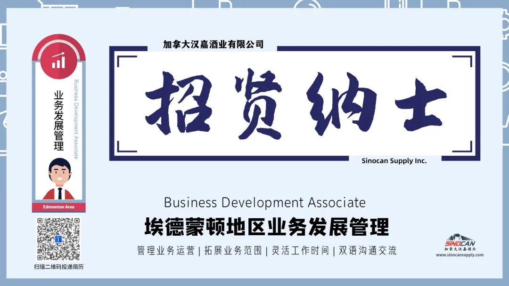

# 无标题

**链接地址:** http://mp.weixin.qq.com/s?__biz=MzIyMzU4OTc0MQ==&mid=2247485115&idx=1&sn=52bcbd0301a288737ec5a37404d903c7&chksm=e81aa2b9df6d2bafbe2e517746bb64ec68defcea9321ed247b17c9152d86e94ca3455b18b170&mpshare=1&scene=2&srcid=02087WAAzx3xsGWYvOE3kA9u&sharer_sharetime=1612734125325&sharer_shareid=be1c8edd6c93eec155a61c876e41d26a#rd
**作者:** 
**获取时间:** 2025/8/28 19:55:42
**图片数量:** 3

---

## 原始HTML内容

<section style="box-sizing: border-box;font-size: 16px;"><section style="text-align: center;justify-content: center;margin-top: 10px;margin-right: 0%;margin-left: 0%;box-sizing: border-box;" powered-by="xiumi.us"><section style="display: inline-block;vertical-align: bottom;width: auto;box-shadow: rgb(0, 0, 0) 0px 0px 0px;min-width: 10%;max-width: 100%;height: auto;align-self: flex-end;margin-right: -17px;box-sizing: border-box;"><section style="transform: translate3d(1px, 0px, 0px);margin-right: 0%;margin-bottom: 2px;margin-left: 0%;box-sizing: border-box;" powered-by="xiumi.us"><section style="text-align: justify;font-size: 18px;color: rgb(166, 54, 49);letter-spacing: 2px;line-height: 1;text-shadow: rgb(255, 255, 255) 0px 0px 5px, rgb(255, 255, 255) 0px 0px 5px;box-sizing: border-box;">
<strong style="box-sizing: border-box;">职位招聘</strong>
</section></section></section><section style="display: inline-block;vertical-align: bottom;width: auto;align-self: flex-end;box-shadow: rgb(0, 0, 0) 0px 0px 0px;min-width: 10%;max-width: 100%;height: auto;box-sizing: border-box;"><section style="text-align: left;font-size: 0px;justify-content: flex-start;margin-right: 0%;margin-bottom: 4px;margin-left: 0%;box-sizing: border-box;" powered-by="xiumi.us"><section style="display: inline-block;width: 28px;height: 28px;vertical-align: top;overflow: hidden;border-width: 0px;border-radius: 50%;border-style: none;border-color: rgb(62, 62, 62);box-shadow: rgba(255, 213, 195, 0) -4px 4px 12px inset;box-sizing: border-box;"><section><svg viewBox="0 0 1 1" style="float:left;line-height:0;width:0;vertical-align:top;"></svg></section></section></section></section></section><section style="margin: -2px 0% 12px;box-sizing: border-box;" powered-by="xiumi.us"><section style="background-color: rgba(160, 123, 249, 0);height: 2px;box-sizing: border-box;"><section><svg viewBox="0 0 1 1" style="float:left;line-height:0;width:0;vertical-align:top;"></svg></section></section></section><section style="margin: -10px 0% 10px;transform: translate3d(-10px, 0px, 0px);-webkit-transform: translate3d(-10px, 0px, 0px);-moz-transform: translate3d(-10px, 0px, 0px);-o-transform: translate3d(-10px, 0px, 0px);opacity: 0.71;box-sizing: border-box;" powered-by="xiumi.us"><section style="text-align: center;color: rgb(166, 54, 49);font-size: 12px;letter-spacing: 1px;box-sizing: border-box;">
<strong style="box-sizing: border-box;">Job Posting</strong>
</section></section><section style="box-sizing: border-box;" powered-by="xiumi.us">
 
</section><section style="margin-top: 8px;margin-right: 0%;margin-left: 0%;box-sizing: border-box;" powered-by="xiumi.us"><section style="background-color: rgb(0, 0, 0);height: 2px;box-sizing: border-box;"><section><svg viewBox="0 0 1 1" style="float:left;line-height:0;width:0;vertical-align:top;"></svg></section></section></section><section style="box-sizing: border-box;" powered-by="xiumi.us"><section style="display: flex;flex-flow: row nowrap;box-sizing: border-box;"><section style="display: inline-block;vertical-align: middle;width: auto;flex: 100 100 0%;align-self: center;height: auto;box-sizing: border-box;"><section style="margin-top: 0.5em;margin-bottom: 0.5em;box-sizing: border-box;" powered-by="xiumi.us"><section style="background-color: rgba(34, 82, 237, 0.14);height: 2px;box-sizing: border-box;"><section><svg viewBox="0 0 1 1" style="float:left;line-height:0;width:0;vertical-align:top;"></svg></section></section></section><section style="margin-top: 0.5em;margin-bottom: 0.5em;box-sizing: border-box;" powered-by="xiumi.us"><section style="background-color: rgba(34, 82, 237, 0.14);height: 2px;box-sizing: border-box;"><section><svg viewBox="0 0 1 1" style="float:left;line-height:0;width:0;vertical-align:top;"></svg></section></section></section><section style="margin-top: 0.5em;margin-bottom: 0.5em;box-sizing: border-box;" powered-by="xiumi.us"><section style="background-color: rgba(34, 82, 237, 0.14);height: 2px;box-sizing: border-box;"><section><svg viewBox="0 0 1 1" style="float:left;line-height:0;width:0;vertical-align:top;"></svg></section></section></section></section><section style="display: inline-block;vertical-align: middle;width: auto;min-width: 10%;max-width: 100%;flex: 0 0 auto;height: auto;align-self: center;box-sizing: border-box;"><section style="text-align: center;margin-right: 0%;margin-left: 0%;box-sizing: border-box;" powered-by="xiumi.us"><section style="display: inline-block;min-width: 10%;max-width: 100%;vertical-align: top;transform: matrix(1, 0, -0.2, 1, 0, 0);border-style: none;border-width: 0px;border-color: rgb(37, 180, 170);background-color: rgba(255, 255, 255, 0);line-height: 1.6;box-sizing: border-box;"><section style="text-align: justify;color: rgb(166, 54, 49);padding-right: 10px;padding-left: 10px;letter-spacing: 3px;line-height: 1.5;font-size: 30px;box-sizing: border-box;" powered-by="xiumi.us">
<strong style="box-sizing: border-box;">业务发展管理</strong>
</section></section></section></section><section style="display: inline-block;vertical-align: middle;width: auto;flex: 100 100 0%;align-self: center;height: auto;box-sizing: border-box;"><section style="margin-top: 0.5em;margin-bottom: 0.5em;box-sizing: border-box;" powered-by="xiumi.us"><section style="background-color: rgba(34, 82, 237, 0.14);height: 2px;box-sizing: border-box;"><section><svg viewBox="0 0 1 1" style="float:left;line-height:0;width:0;vertical-align:top;"></svg></section></section></section><section style="margin-top: 0.5em;margin-bottom: 0.5em;box-sizing: border-box;" powered-by="xiumi.us"><section style="background-color: rgba(34, 82, 237, 0.14);height: 2px;box-sizing: border-box;"><section><svg viewBox="0 0 1 1" style="float:left;line-height:0;width:0;vertical-align:top;"></svg></section></section></section><section style="margin-top: 0.5em;margin-bottom: 0.5em;box-sizing: border-box;" powered-by="xiumi.us"><section style="background-color: rgba(34, 82, 237, 0.14);height: 2px;box-sizing: border-box;"><section><svg viewBox="0 0 1 1" style="float:left;line-height:0;width:0;vertical-align:top;"></svg></section></section></section></section></section></section><section style="margin-right: 0%;margin-bottom: 10px;margin-left: 0%;box-sizing: border-box;" powered-by="xiumi.us"><section style="display: inline-block;width: 100%;vertical-align: top;background-color: rgb(255, 255, 255);padding: 15px;box-sizing: border-box;"><section style="text-align: center;margin-right: 0%;margin-left: 0%;box-sizing: border-box;" powered-by="xiumi.us"><section style="max-width: 100%;vertical-align: middle;display: inline-block;line-height: 0;box-sizing: border-box;"></section></section><section style="box-sizing: border-box;" powered-by="xiumi.us">
 
</section><section style="box-sizing: border-box;" powered-by="xiumi.us"><section style="display: flex;flex-flow: row nowrap;margin-right: 0%;margin-left: 0%;box-sizing: border-box;"><section style="display: inline-block;vertical-align: top;width: auto;flex: 0 0 auto;align-self: stretch;min-width: 10%;max-width: 100%;height: auto;background-color: rgb(0, 0, 0);box-sizing: border-box;"><section style="margin: 6px 0%;box-sizing: border-box;" powered-by="xiumi.us"><section style="text-align: center;font-size: 12px;color: rgb(244, 244, 244);padding-right: 10px;padding-left: 10px;line-height: 1.3;letter-spacing: 0px;box-sizing: border-box;">
职位

简介
</section></section></section><section style="display: inline-block;vertical-align: top;width: auto;flex: 100 100 0%;align-self: stretch;height: auto;background-color: rgba(162, 162, 162, 0.36);box-sizing: border-box;"><section style="margin-top: 6px;margin-right: 0%;margin-left: 0%;box-sizing: border-box;" powered-by="xiumi.us"><section style="color: rgb(166, 54, 49);padding-right: 12px;padding-left: 12px;letter-spacing: 0.6px;line-height: 2;box-sizing: border-box;">
<strong style="box-sizing: border-box;">INTRODUCTION</strong>
</section></section></section></section></section><section style="display: inline-block;width: 100%;vertical-align: top;padding-left: 20px;box-sizing: border-box;" powered-by="xiumi.us"><section style="display: inline-block;width: 100%;vertical-align: top;border-left: 1px solid rgb(179, 179, 179);border-bottom-left-radius: 0px;padding-right: 10px;padding-bottom: 10px;padding-left: 15px;box-sizing: border-box;" powered-by="xiumi.us"><section style="margin: 10px 0% 6px;box-sizing: border-box;" powered-by="xiumi.us"><section style="text-align: left;font-size: 14px;letter-spacing: 0px;line-height: 1.6;box-sizing: border-box;">
Sinocan Supply正在为处于埃德蒙顿的全职业务发展管理岗位招聘。作为合适人选，您需要识别，评估和执行增长机会，与业务合作伙伴发展和保持关系，确保业务符合监管机构的要求，并监督销售渠道的绩效。您还负责管理日常业务运营，包括数据分析，物流协调，库存管理，网站维护和报告编写。

 

理想的候选人必须能够在企业家文化中蓬勃发展，适应灵活的工作时间，并且中英双语流利。

 
</section></section></section></section><section style="box-sizing: border-box;" powered-by="xiumi.us"><section style="display: flex;flex-flow: row nowrap;margin-right: 0%;margin-left: 0%;box-sizing: border-box;"><section style="display: inline-block;vertical-align: top;width: auto;flex: 0 0 auto;align-self: stretch;min-width: 10%;max-width: 100%;height: auto;background-color: rgb(0, 0, 0);box-sizing: border-box;"><section style="margin: 6px 0%;box-sizing: border-box;" powered-by="xiumi.us"><section style="text-align: center;font-size: 12px;color: rgb(244, 244, 244);padding-right: 10px;padding-left: 10px;line-height: 1.3;letter-spacing: 0px;box-sizing: border-box;">
职员

责任 
</section></section></section><section style="display: inline-block;vertical-align: top;width: auto;flex: 100 100 0%;align-self: stretch;height: auto;background-color: rgba(162, 162, 162, 0.36);box-sizing: border-box;"><section style="margin-top: 6px;margin-right: 0%;margin-left: 0%;box-sizing: border-box;" powered-by="xiumi.us"><section style="color: rgb(166, 54, 49);padding-right: 12px;padding-left: 12px;letter-spacing: 0.6px;line-height: 2;box-sizing: border-box;">
<strong style="box-sizing: border-box;">JOB DUTIES</strong>
</section></section></section></section></section><section style="display: inline-block;width: 100%;vertical-align: top;padding-left: 20px;border-width: 0px;box-sizing: border-box;" powered-by="xiumi.us"><section style="display: inline-block;width: 100%;vertical-align: top;border-left: 1px solid rgb(179, 179, 179);border-bottom-left-radius: 0px;padding-right: 10px;padding-bottom: 10px;padding-left: 15px;box-sizing: border-box;" powered-by="xiumi.us"><section style="margin: 10px 0% 6px;box-sizing: border-box;" powered-by="xiumi.us"><section style="text-align: left;font-size: 14px;letter-spacing: 0px;line-height: 1.6;box-sizing: border-box;"><ol class="list-paddingleft-2"><li style="box-sizing: border-box;">
收集，处理和分析销售与库存数据，以监控绩效，促进运营并提出策略。 
</li><li style="box-sizing: border-box;">
与海外供应商，货运代理和艾伯塔省和不列颠哥伦比亚省的本地仓库协调物流。 
</li><li style="box-sizing: border-box;">
审查监管文件并确保遵守AGLC，BCLDB和LCBO等监管机构。 
</li><li style="box-sizing: border-box;">
与供应商，机构买家，零售商和最终客户建立并保持良好的关系。 
</li><li style="box-sizing: border-box;">
发起市场营销活动并从事市场营销材料的开发。 
</li><li style="box-sizing: border-box;">
根据供应商的要求编写性能和合规报告。 
</li><li style="box-sizing: border-box;">
参加，协调和记录营销活动。 
</li><li style="box-sizing: border-box;">
维护和更新公司网站。 
</li><li style="box-sizing: border-box;">
旅行和拜访零售商 
</li><li style="box-sizing: border-box;">
其他行政管理职

</li></ol></section></section></section></section><section style="box-sizing: border-box;" powered-by="xiumi.us"><section style="display: flex;flex-flow: row nowrap;margin-right: 0%;margin-left: 0%;box-sizing: border-box;"><section style="display: inline-block;vertical-align: top;width: auto;flex: 0 0 auto;align-self: stretch;min-width: 10%;max-width: 100%;height: auto;border-width: 0px;background-color: rgb(0, 0, 0);box-sizing: border-box;"><section style="margin: 6px 0%;box-sizing: border-box;" powered-by="xiumi.us"><section style="text-align: center;font-size: 12px;color: rgb(244, 244, 244);padding-right: 10px;padding-left: 10px;line-height: 1.3;letter-spacing: 0px;box-sizing: border-box;">
工作

要求
</section></section></section><section style="display: inline-block;vertical-align: top;width: auto;flex: 100 100 0%;align-self: stretch;height: auto;background-color: rgba(162, 162, 162, 0.36);box-sizing: border-box;"><section style="margin-top: 6px;margin-right: 0%;margin-left: 0%;box-sizing: border-box;" powered-by="xiumi.us"><section style="color: rgb(166, 54, 49);padding-right: 12px;padding-left: 12px;letter-spacing: 0.6px;line-height: 2;box-sizing: border-box;">
<strong style="box-sizing: border-box;">REQUIREMENTS</strong>
</section></section></section></section></section><section style="display: inline-block;width: 100%;vertical-align: top;padding-left: 20px;box-sizing: border-box;" powered-by="xiumi.us"><section style="display: inline-block;width: 100%;vertical-align: top;border-left: 1px solid rgb(179, 179, 179);border-bottom-left-radius: 0px;padding-right: 10px;padding-bottom: 10px;padding-left: 15px;box-sizing: border-box;" powered-by="xiumi.us"><section style="margin: 10px 0% 6px;box-sizing: border-box;" powered-by="xiumi.us"><section style="font-size: 14px;letter-spacing: 0px;line-height: 1.6;box-sizing: border-box;"><ol class="list-paddingleft-2"><li style="box-sizing: border-box;">
必须持有大学本科学位。 
</li><li style="box-sizing: border-box;">
必须掌握流利的中英双语交流能力。 
</li><li style="box-sizing: border-box;">
必须熟练运用Microsoft Excel和Word。 
</li><li style="box-sizing: border-box;">
必须持有有效的5类驾驶执照。 
</li><li style="box-sizing: border-box;">
建议了解Adobe Photoshop。 
</li><li style="box-sizing: border-box;">
建议拥有酒精饮料行业的经验 
</li><li style="box-sizing: border-box;">
建议持有WSET 1级证书
</li></ol>
 
</section></section></section></section><section style="box-sizing: border-box;" powered-by="xiumi.us"><section style="display: flex;flex-flow: row nowrap;margin-right: 0%;margin-left: 0%;box-sizing: border-box;"><section style="display: inline-block;vertical-align: top;width: auto;flex: 0 0 auto;align-self: stretch;min-width: 10%;max-width: 100%;height: auto;background-color: rgb(0, 0, 0);box-sizing: border-box;"><section style="margin: 6px 0%;box-sizing: border-box;" powered-by="xiumi.us"><section style="text-align: center;font-size: 12px;color: rgb(244, 244, 244);padding-right: 10px;padding-left: 10px;line-height: 1.3;letter-spacing: 0px;box-sizing: border-box;">
关于

我们
</section></section></section><section style="display: inline-block;vertical-align: top;width: auto;flex: 100 100 0%;align-self: stretch;height: auto;background-color: rgba(162, 162, 162, 0.36);box-sizing: border-box;"><section style="margin-top: 6px;margin-right: 0%;margin-left: 0%;box-sizing: border-box;" powered-by="xiumi.us"><section style="color: rgb(166, 54, 49);padding-right: 12px;padding-left: 12px;letter-spacing: 0.6px;line-height: 2;box-sizing: border-box;">
<strong style="box-sizing: border-box;">ABOUT US</strong>
</section></section></section></section></section><section style="display: inline-block;width: 100%;vertical-align: top;padding-left: 20px;box-sizing: border-box;" powered-by="xiumi.us"><section style="display: inline-block;width: 100%;vertical-align: top;border-left: 1px solid rgb(179, 179, 179);border-bottom-left-radius: 0px;padding-right: 10px;padding-bottom: 10px;padding-left: 15px;box-sizing: border-box;" powered-by="xiumi.us"><section style="margin: 10px 0% 6px;box-sizing: border-box;" powered-by="xiumi.us"><section style="text-align: left;font-size: 14px;letter-spacing: 0px;line-height: 1.6;box-sizing: border-box;">
Sinocan Supply是加拿大领先的国际贸易公司，目前最成熟的业务为酒精饮料的进口和分销。我们已经是中国各大白酒制造商的加拿大合作伙伴，同时也汇集了来自世界上最优质产区的完善的葡萄酒组合。此外，Sinocan Supply正在扩大出口业务，把握全球发展机遇。

 
</section></section></section></section><section style="box-sizing: border-box;" powered-by="xiumi.us">
 
</section><section style="box-sizing: border-box;" powered-by="xiumi.us">
 
</section><section style="box-sizing: border-box;" powered-by="xiumi.us"><section style="display: flex;flex-flow: row nowrap;box-sizing: border-box;"><section style="display: inline-block;vertical-align: middle;width: auto;flex: 100 100 0%;align-self: center;height: auto;box-sizing: border-box;"><section style="margin-top: 0.5em;margin-bottom: 0.5em;box-sizing: border-box;" powered-by="xiumi.us"><section style="background-color: rgba(34, 82, 237, 0.14);height: 2px;box-sizing: border-box;"><section><svg viewBox="0 0 1 1" style="float:left;line-height:0;width:0;vertical-align:top;"></svg></section></section></section><section style="margin-top: 0.5em;margin-bottom: 0.5em;box-sizing: border-box;" powered-by="xiumi.us"><section style="background-color: rgba(34, 82, 237, 0.14);height: 2px;box-sizing: border-box;"><section><svg viewBox="0 0 1 1" style="float:left;line-height:0;width:0;vertical-align:top;"></svg></section></section></section><section style="margin-top: 0.5em;margin-bottom: 0.5em;box-sizing: border-box;" powered-by="xiumi.us"><section style="background-color: rgba(34, 82, 237, 0.14);height: 2px;box-sizing: border-box;"><section><svg viewBox="0 0 1 1" style="float:left;line-height:0;width:0;vertical-align:top;"></svg></section></section></section></section><section style="display: inline-block;vertical-align: middle;width: auto;min-width: 10%;max-width: 100%;flex: 0 0 auto;height: auto;align-self: center;box-sizing: border-box;"><section style="text-align: center;margin-right: 0%;margin-left: 0%;box-sizing: border-box;" powered-by="xiumi.us"><section style="display: inline-block;min-width: 10%;max-width: 100%;vertical-align: top;transform: matrix(1, 0, -0.2, 1, 0, 0);border-style: none;border-width: 0px;border-color: rgb(37, 180, 170);background-color: rgba(255, 255, 255, 0);line-height: 1.6;box-sizing: border-box;"><section style="text-align: justify;color: rgb(166, 54, 49);padding-right: 10px;padding-left: 10px;letter-spacing: 3px;line-height: 1.5;font-size: 30px;box-sizing: border-box;" powered-by="xiumi.us">
<strong style="box-sizing: border-box;">简历投递</strong>
</section></section></section></section><section style="display: inline-block;vertical-align: middle;width: auto;flex: 100 100 0%;align-self: center;height: auto;box-sizing: border-box;"><section style="margin-top: 0.5em;margin-bottom: 0.5em;box-sizing: border-box;" powered-by="xiumi.us"><section style="background-color: rgba(34, 82, 237, 0.14);height: 2px;box-sizing: border-box;"><section><svg viewBox="0 0 1 1" style="float:left;line-height:0;width:0;vertical-align:top;"></svg></section></section></section><section style="margin-top: 0.5em;margin-bottom: 0.5em;box-sizing: border-box;" powered-by="xiumi.us"><section style="background-color: rgba(34, 82, 237, 0.14);height: 2px;box-sizing: border-box;"><section><svg viewBox="0 0 1 1" style="float:left;line-height:0;width:0;vertical-align:top;"></svg></section></section></section><section style="margin-top: 0.5em;margin-bottom: 0.5em;box-sizing: border-box;" powered-by="xiumi.us"><section style="background-color: rgba(34, 82, 237, 0.14);height: 2px;box-sizing: border-box;"><section><svg viewBox="0 0 1 1" style="float:left;line-height:0;width:0;vertical-align:top;"></svg></section></section></section></section></section></section><section style="text-align: center;margin-top: 10px;margin-bottom: 10px;box-sizing: border-box;" powered-by="xiumi.us"><section style="max-width: 100%;vertical-align: middle;display: inline-block;line-height: 0;box-sizing: border-box;"></section></section><section style="text-align: left;font-size: 14px;letter-spacing: 0px;line-height: 1.8;box-sizing: border-box;" powered-by="xiumi.us">
 

<strong style="box-sizing: border-box;">请发送简历与cover letter至：</strong>

<strong style="box-sizing: border-box;">info@sinocansupply.com</strong>

 

<strong style="box-sizing: border-box;">邮件标题请注明：</strong>

<strong style="box-sizing: border-box;">Business Development Associate - [Applicant Name]</strong>
</section></section></section><section style="box-sizing: border-box;" powered-by="xiumi.us">
 
</section><section style="margin: 10px 0%;box-sizing: border-box;" powered-by="xiumi.us"><section style="display: inline-block;width: 100%;vertical-align: top;background-color: rgba(162, 162, 162, 0.36);border-width: 1px 4px;border-style: solid none;border-color: rgba(162, 162, 162, 0.36) rgb(205, 240, 255);box-sizing: border-box;"><section style="box-sizing: border-box;" powered-by="xiumi.us"><section style="display: inline-block;vertical-align: middle;width: 33%;align-self: center;height: auto;box-shadow: rgba(255, 213, 195, 0) 0px 0px 0px;box-sizing: border-box;"><section style="text-align: right;margin: -4px 0%;justify-content: flex-end;box-sizing: border-box;" powered-by="xiumi.us"><section style="max-width: 100%;vertical-align: middle;display: inline-block;line-height: 0;width: 90%;height: auto;box-shadow: rgb(166, 54, 49) 0px 0px 0px;border-style: solid none;border-width: 6px 4px;border-color: rgb(166, 54, 49) rgb(255, 211, 44);box-sizing: border-box;"></section></section></section><section style="display: inline-block;vertical-align: middle;width: 66%;height: auto;align-self: center;box-sizing: border-box;"><section style="margin-right: 0%;margin-left: 0%;box-sizing: border-box;" powered-by="xiumi.us"><section style="text-align: center;font-size: 14px;color: rgb(124, 119, 219);letter-spacing: 0px;line-height: 1.6;padding-right: 20px;padding-left: 20px;box-sizing: border-box;">
<strong style="box-sizing: border-box;">汉嘉酒业</strong>

<strong style="box-sizing: border-box;">扫描二维码</strong><strong style="letter-spacing: 0px;box-sizing: border-box;">关注我们</strong>

http://www.sinocansupply.com/

Email: info@sinocansupply.com
</section></section></section></section></section></section></section>
 

---

## 纯文本内容

职位招聘Job Posting业务发展管理职位简介INTRODUCTIONSinocan Supply正在为处于埃德蒙顿的全职业务发展管理岗位招聘。作为合适人选，您需要识别，评估和执行增长机会，与业务合作伙伴发展和保持关系，确保业务符合监管机构的要求，并监督销售渠道的绩效。您还负责管理日常业务运营，包括数据分析，物流协调，库存管理，网站维护和报告编写。理想的候选人必须能够在企业家文化中蓬勃发展，适应灵活的工作时间，并且中英双语流利。职员责任JOB DUTIES收集，处理和分析销售与库存数据，以监控绩效，促进运营并提出策略。与海外供应商，货运代理和艾伯塔省和不列颠哥伦比亚省的本地仓库协调物流。审查监管文件并确保遵守AGLC，BCLDB和LCBO等监管机构。与供应商，机构买家，零售商和最终客户建立并保持良好的关系。发起市场营销活动并从事市场营销材料的开发。根据供应商的要求编写性能和合规报告。参加，协调和记录营销活动。维护和更新公司网站。旅行和拜访零售商其他行政管理职工作要求REQUIREMENTS必须持有大学本科学位。必须掌握流利的中英双语交流能力。必须熟练运用Microsoft Excel和Word。必须持有有效的5类驾驶执照。建议了解Adobe Photoshop。建议拥有酒精饮料行业的经验建议持有WSET 1级证书关于我们ABOUT USSinocan Supply是加拿大领先的国际贸易公司，目前最成熟的业务为酒精饮料的进口和分销。我们已经是中国各大白酒制造商的加拿大合作伙伴，同时也汇集了来自世界上最优质产区的完善的葡萄酒组合。此外，Sinocan Supply正在扩大出口业务，把握全球发展机遇。简历投递请发送简历与cover letter至：info@sinocansupply.com邮件标题请注明：Business Development Associate - [Applicant Name]汉嘉酒业扫描二维码关注我们http://www.sinocansupply.com/Email: info@sinocansupply.com

---

## 图片列表

-  (原始链接: https://mmbiz.qpic.cn/mmbiz_jpg/7CNdqYbqvBIwmicibiaoDeiahTq9gOXUVNpjWzsw72mDfLIp8Pcs9uQt3Ff7n9EMGaydTzDicibLicFV1ug8E77yEicsvg/640?wx_fmt=jpeg)
-  (原始链接: https://mmbiz.qpic.cn/mmbiz_jpg/7CNdqYbqvBIwmicibiaoDeiahTq9gOXUVNpjquy4RYmNoVIp6ahqjibPCqht2j026zLYrEFIydvaDLiajK6JkV0ESPxw/640?wx_fmt=jpeg)
-  (原始链接: https://mmbiz.qpic.cn/mmbiz_jpg/7CNdqYbqvBIwmicibiaoDeiahTq9gOXUVNpjNw3rqrQNou1Bykh9BVvRF9dibQncE4ABeaJVJNxynIm4SicDjvxylNqA/640?wx_fmt=jpeg)
