# 无标题

**链接地址:** http://mp.weixin.qq.com/s?__biz=MzIyMzU4OTc0MQ==&mid=2247485200&idx=1&sn=db80b7b0f9d3fdbf33511d46c2b6f85f&chksm=e81aa312df6d2a047b7d475c2b37f52ccf34126b057d9525103d0d1bff6bcf00e68dd54defb8&mpshare=1&scene=2&srcid=02119MyVBettFdnoBy4UMC8P&sharer_sharetime=1612998330170&sharer_shareid=be1c8edd6c93eec155a61c876e41d26a#rd
**作者:** 
**获取时间:** 2025/8/28 19:55:12
**图片数量:** 41

---

## 原始HTML内容

<section style="box-sizing: border-box;font-size: 16px;"><section style="margin: 10px 0%;box-sizing: border-box;" powered-by="xiumi.us"><section style="display: inline-block;width: 100%;vertical-align: top;background-color: rgb(166, 54, 49);padding: 3px;box-sizing: border-box;"><section style="box-sizing: border-box;" powered-by="xiumi.us"><section style="display: flex;flex-flow: row nowrap;box-sizing: border-box;"><section style="display: inline-block;vertical-align: top;width: auto;flex: 50 50 0%;align-self: stretch;height: auto;background-color: rgb(255, 247, 244);padding: 3px;box-sizing: border-box;"><section style="display: inline-block;width: 100%;vertical-align: middle;border-style: solid;border-width: 1px;border-color: rgb(166, 54, 49);padding: 3px 10px 5px;align-self: center;box-sizing: border-box;" powered-by="xiumi.us"><section style="margin-top: 3px;margin-right: 0%;margin-left: 0%;box-sizing: border-box;" powered-by="xiumi.us"><section style="text-align: center;color: rgb(106, 106, 106);line-height: 1.2;font-size: 14px;box-sizing: border-box;">
<strong style="box-sizing: border-box;">点击蓝字</strong>
</section></section></section></section><section style="display: inline-block;vertical-align: middle;width: auto;padding-left: 3px;background-color: rgba(255, 255, 255, 0);flex: 50 50 0%;align-self: center;height: auto;box-sizing: border-box;"><section style="margin-top: 3px;margin-right: 0%;margin-left: 0%;box-sizing: border-box;" powered-by="xiumi.us"><section style="text-align: center;font-size: 14px;color: rgb(255, 255, 255);line-height: 1.2;box-sizing: border-box;">
<strong style="box-sizing: border-box;">关注我们</strong>
</section></section></section></section></section></section></section><section style="box-sizing: border-box;" powered-by="xiumi.us">
 
</section><section style="text-align: right;justify-content: flex-end;margin-top: 10px;margin-right: 0%;margin-left: 0%;box-sizing: border-box;" powered-by="xiumi.us"><section style="display: inline-block;width: auto;vertical-align: top;min-width: 10%;max-width: 100%;height: auto;background-color: rgb(166, 54, 49);padding: 5px 10px;border-width: 0px;box-sizing: border-box;"><section style="text-align: justify;color: rgb(255, 255, 255);font-size: 14px;box-sizing: border-box;" powered-by="xiumi.us">
<strong style="box-sizing: border-box;">情人节特别企划 · 葡萄酒配餐指南</strong>
</section></section></section><section style="display: inline-block;width: 100%;vertical-align: top;border-left: 2px none rgb(195, 163, 142);border-bottom-left-radius: 0px;background-color: rgba(255, 213, 195, 0);padding: 10px;border-right: 2px solid rgb(0, 0, 0);border-top-right-radius: 0px;box-sizing: border-box;" powered-by="xiumi.us"><section style="text-align: center;margin-right: 0%;margin-left: 0%;box-sizing: border-box;" powered-by="xiumi.us"><section style="max-width: 100%;vertical-align: middle;display: inline-block;line-height: 0;box-sizing: border-box;"></section></section></section><section style="text-align: right;justify-content: flex-end;margin-right: 0%;margin-bottom: 10px;margin-left: 0%;font-size: 0px;box-sizing: border-box;" powered-by="xiumi.us"><section style="display: inline-block;width: 50%;vertical-align: top;height: auto;line-height: 0;box-sizing: border-box;"><section style="margin-top: 0.5em;margin-bottom: 0.5em;box-sizing: border-box;" powered-by="xiumi.us"><section style="background-color: rgb(0, 0, 0);height: 2px;box-sizing: border-box;"><section><svg viewBox="0 0 1 1" style="float:left;line-height:0;width:0;vertical-align:top;"></svg></section></section></section></section></section><section style="box-sizing: border-box;" powered-by="xiumi.us"><section style="display: flex;flex-flow: row nowrap;margin: -10px 0% 10px;box-sizing: border-box;"><section style="display: inline-block;vertical-align: top;width: auto;flex: 0 0 auto;align-self: flex-start;min-width: 10%;max-width: 100%;height: auto;box-sizing: border-box;"><section style="color: rgb(0, 0, 0);font-size: 12px;box-sizing: border-box;" powered-by="xiumi.us">
&nbsp; &nbsp;专题出品 |&nbsp;加拿大汉嘉酒业&nbsp;
</section></section><section style="display: inline-block;vertical-align: top;width: auto;align-self: flex-start;flex: 100 100 0%;box-sizing: border-box;"><section style="margin-top: 0.5em;margin-bottom: 0.5em;box-sizing: border-box;" powered-by="xiumi.us"><section style="background-color: rgba(255, 213, 195, 0);height: 1px;box-sizing: border-box;"><section><svg viewBox="0 0 1 1" style="float:left;line-height:0;width:0;vertical-align:top;"></svg></section></section></section></section></section></section><section style="text-align: center;padding-right: 20px;padding-left: 20px;line-height: 2;letter-spacing: 2px;color: rgb(115, 115, 114);font-size: 14px;box-sizing: border-box;" powered-by="xiumi.us">
 

2021年的<strong style="box-sizing: border-box;">情人节</strong>即将到来

然而加拿大的小伙伴们

却因为疫情的原因

难以像往常一样光顾一家精致的西餐厅

享用一顿轻松浪漫的情人节<strong style="box-sizing: border-box;">烛光晚餐</strong>

 
</section><section style="text-align: center;margin-top: 10px;margin-bottom: 10px;box-sizing: border-box;" powered-by="xiumi.us"><section style="max-width: 100%;vertical-align: middle;display: inline-block;line-height: 0;box-sizing: border-box;"></section></section><section style="text-align: center;padding-right: 20px;padding-left: 20px;line-height: 2;letter-spacing: 2px;color: rgb(115, 115, 114);font-size: 14px;box-sizing: border-box;" powered-by="xiumi.us">
 

无论如何

节日的<strong style="box-sizing: border-box;">仪式感</strong>还是要有的

在家中享用亲手烹制的一道西餐

也不失为一种<strong style="box-sizing: border-box;">新鲜有趣的尝试</strong>

 

说到西餐

就不得不考虑<strong style="box-sizing: border-box;">搭配饮用的红酒</strong>

<strong style="box-sizing: border-box;">如何根据菜肴的食材和口味选择合适的红酒？</strong>

其中的学问可是大大滴！

 
</section><section style="text-align: center;margin-top: 10px;margin-bottom: 10px;box-sizing: border-box;" powered-by="xiumi.us"><section style="max-width: 100%;vertical-align: middle;display: inline-block;line-height: 0;box-sizing: border-box;"></section></section><section style="text-align: center;padding-right: 20px;padding-left: 20px;line-height: 2;letter-spacing: 2px;color: rgb(115, 115, 114);font-size: 14px;box-sizing: border-box;" powered-by="xiumi.us">
 

别担心

今天我们即将推荐5款

在加拿大本地就可以买到的

<strong style="box-sizing: border-box;">法国名庄红酒！</strong>

 

更惊喜的是

它们的<strong style="box-sizing: border-box;">价格全部都在百元以内</strong>！

逼格到位又不会超预算

晒朋友圈小伙伴们都羡慕哭了！

 

 
</section><section style="box-sizing: border-box;" powered-by="xiumi.us"><section style="display: inline-block;vertical-align: top;width: 20%;box-sizing: border-box;"><section style="font-size: 21px;text-align: left;box-sizing: border-box;" powered-by="xiumi.us"><section style="box-sizing: border-box;margin: auto;width: 3em;height: 3em;vertical-align: top;background-position: center center;background-repeat: no-repeat;background-size: cover;display: inline-block;background-image: url(&quot;https://mmbiz.qpic.cn/mmbiz_png/7CNdqYbqvBKdF4peIzthY83XR2uL6kzQo14DEUiaTGsTTPnicNPJxsbPwlMelEqLkzlxEQUyqNbiciaLpicl0Thf7FQ/640?wx_fmt=png&quot;);"><section style="height: 100%;overflow: hidden;line-height: 0;vertical-align: middle;max-width: 100%;box-sizing: border-box;"></section></section></section></section><section style="display: inline-block;vertical-align: top;width: 80%;padding-right: 10px;padding-left: 10px;line-height: 2;box-sizing: border-box;"><section style="color: rgb(94, 126, 163);box-sizing: border-box;" powered-by="xiumi.us">
<strong style="box-sizing: border-box;">汉嘉酒业</strong>
</section><section style="box-sizing: border-box;" powered-by="xiumi.us">
跟着汉嘉推荐的名单买

一定不会出错哒！

低调地秀秀我的情人节大餐

百德诗歌酒庄的干红 + 三A西冷牛排！

嘿嘿~(#^.^#)

 
</section><section style="box-sizing: border-box;" powered-by="xiumi.us"><section style="display: inline-block;vertical-align: top;width: 72%;box-sizing: border-box;"><section style="box-sizing: border-box;" powered-by="xiumi.us"><section style="display: inline-block;vertical-align: top;width: 50%;padding-right: 3px;box-sizing: border-box;"><section style="text-align: center;margin-right: 0%;margin-left: 0%;box-sizing: border-box;" powered-by="xiumi.us"><section style="max-width: 100%;vertical-align: middle;display: inline-block;line-height: 0;box-sizing: border-box;"></section></section></section><section style="display: inline-block;vertical-align: top;width: 50%;padding-left: 3px;box-sizing: border-box;"><section style="text-align: center;margin-right: 0%;margin-left: 0%;box-sizing: border-box;" powered-by="xiumi.us"><section style="max-width: 100%;vertical-align: middle;display: inline-block;line-height: 0;box-sizing: border-box;"></section></section></section></section></section><section style="display: inline-block;vertical-align: top;width: 28%;box-sizing: border-box;"><section><svg viewBox="0 0 1 1" style="float:left;line-height:0;width:0;vertical-align:top;"></svg></section></section></section><section style="box-sizing: border-box;" powered-by="xiumi.us"><section style="display: inline-block;vertical-align: top;width: 89%;box-sizing: border-box;"><section style="margin-right: 0%;margin-left: 0%;box-sizing: border-box;" powered-by="xiumi.us"><section style="font-size: 14px;color: rgb(157, 164, 176);box-sizing: border-box;">
26分钟前
</section></section></section><section style="display: inline-block;vertical-align: top;width: 11%;box-sizing: border-box;"><section style="text-align: right;margin-top: -6px;margin-right: 0%;margin-left: 0%;box-sizing: border-box;" powered-by="xiumi.us"><section style="width: 85%;display: inline-block;vertical-align: middle;line-height: 0;box-sizing: border-box;"></section></section></section></section><section style="display: inline-block;width: 100%;vertical-align: top;box-sizing: border-box;" powered-by="xiumi.us"><section style="margin-right: 0%;margin-bottom: -2px;margin-left: 0%;text-align: left;line-height: 0.8;transform: translate3d(18px, 0px, 0px);font-size: 14px;box-sizing: border-box;" powered-by="xiumi.us"><section style="width: 0px;display: inline-block;border-bottom: 0.8em solid rgb(239, 239, 247);border-left: 0.7em solid transparent !important;border-right: 0.7em solid transparent !important;box-sizing: border-box;"><section><svg viewBox="0 0 1 1" style="float:left;line-height:0;width:0;vertical-align:top;"></svg></section></section></section><section style="margin-right: 0%;margin-left: 0%;box-sizing: border-box;" powered-by="xiumi.us"><section style="display: inline-block;width: 100%;border-width: 1px;border-style: solid;border-color: transparent;padding: 2px 5px;background-color: rgb(239, 239, 247);box-sizing: border-box;"><section style="margin-top: 0.5em;margin-bottom: 0.5em;box-sizing: border-box;" powered-by="xiumi.us"><section style="float: left;text-align: right;width: 11%;padding-right: 5px;line-height: 1.6;box-sizing: border-box;"><section style="margin-top: -6px;margin-right: 0%;margin-left: 0%;text-align: center;box-sizing: border-box;" powered-by="xiumi.us"><section style="width: 69%;display: inline-block;vertical-align: middle;line-height: 0;box-sizing: border-box;"></section></section></section><section style="box-sizing: border-box;"><section style="margin-right: 0%;margin-left: 0%;box-sizing: border-box;" powered-by="xiumi.us"><section style="line-height: 1.6;font-size: 14px;color: rgb(114, 150, 188);box-sizing: border-box;">
汉嘉酒业，Tony，小雪花，肉肉，㈱，王小明，对方正在输入……，张亮亮，王一博的老婆，Kittie Li，阿力，.,昵称太长已冲出天际，❤❤，冲业绩中（请骚扰），想药粗去丸，埃埃埃里克，小Z，韩梅梅，Luz L，冷儿
</section></section><section style="margin: 5px 0%;box-sizing: border-box;" powered-by="xiumi.us"><section style="line-height: 1.6;font-size: 14px;color: rgb(114, 150, 188);box-sizing: border-box;">
Tony：品味不错
</section></section><section style="margin: 5px 0%;box-sizing: border-box;" powered-by="xiumi.us"><section style="line-height: 1.6;font-size: 14px;color: rgb(114, 150, 188);box-sizing: border-box;">
小雪花：羡慕嫉妒！为什么我男朋友都不搞这些浪漫？嘤嘤嘤…
</section></section><section style="margin: 5px 0%;box-sizing: border-box;" powered-by="xiumi.us"><section style="line-height: 1.6;font-size: 14px;color: rgb(114, 150, 188);box-sizing: border-box;">
王小明：这个B装的我给100昏！
</section></section><section style="margin: 5px 0%;box-sizing: border-box;" powered-by="xiumi.us"><section style="line-height: 1.6;font-size: 14px;color: rgb(114, 150, 188);box-sizing: border-box;">
阿力：哪搞的？带带我！
</section></section><section style="margin: 5px 0%;box-sizing: border-box;" powered-by="xiumi.us"><section style="line-height: 1.6;font-size: 14px;color: rgb(114, 150, 188);box-sizing: border-box;">
想药粗去丸：现在去你家蹭饭还来得及吗？
</section></section><section style="margin: 5px 0%;box-sizing: border-box;" powered-by="xiumi.us"><section style="line-height: 1.6;font-size: 14px;color: rgb(114, 150, 188);box-sizing: border-box;">
小Z：星星眼~~~
</section></section><section style="margin: 5px 0%;box-sizing: border-box;" powered-by="xiumi.us"><section style="line-height: 1.6;font-size: 14px;color: rgb(114, 150, 188);box-sizing: border-box;">
Tony：收藏了
</section></section></section><section style="clear: both;box-sizing: border-box;"><section><svg viewBox="0 0 1 1" style="float:left;line-height:0;width:0;vertical-align:top;"></svg></section></section></section></section></section></section></section></section><section style="box-sizing: border-box;" powered-by="xiumi.us">
 
</section><section style="text-align: center;margin-top: 10px;margin-bottom: 10px;box-sizing: border-box;" powered-by="xiumi.us"><section style="max-width: 100%;vertical-align: middle;display: inline-block;line-height: 0;width: 50%;height: auto;box-sizing: border-box;"></section></section><section style="text-align: center;padding-right: 20px;padding-left: 20px;line-height: 2;letter-spacing: 2px;color: rgb(115, 115, 114);font-size: 14px;box-sizing: border-box;" powered-by="xiumi.us">
 

所以赶快拿着这份名单去酒铺里采购

用这几瓶精选的红酒

为你的节日<strong style="box-sizing: border-box;">更添浪漫优雅的氛围</strong>，

给心爱的另一半带来小惊喜！
</section><section style="box-sizing: border-box;" powered-by="xiumi.us">
 
</section><section style="box-sizing: border-box;" powered-by="xiumi.us">
 
</section><section style="box-sizing: border-box;" powered-by="xiumi.us">
 
</section><section style="text-align: center;margin: 10px 0%;box-sizing: border-box;" powered-by="xiumi.us"><section style="display: inline-block;width: 170px;height: 50px;vertical-align: top;overflow: hidden;background-position: 50% 50%;background-repeat: no-repeat;background-size: contain;background-attachment: scroll;background-image: url(&quot;https://mmbiz.qpic.cn/mmbiz_png/7CNdqYbqvBKdF4peIzthY83XR2uL6kzQV2iaRSibFlFHD6E15umeF11dcymkO2MJtdUicZYRyhB90YhA5jqQ4xmhw/640?wx_fmt=png&quot;);box-sizing: border-box;"><section style="margin-top: 12px;margin-right: 0%;margin-left: 0%;box-sizing: border-box;" powered-by="xiumi.us"><section style="font-size: 18px;color: rgb(255, 255, 255);box-sizing: border-box;">
<strong style="box-sizing: border-box;">五款名庄红酒推荐</strong>
</section></section></section></section><section style="box-sizing: border-box;" powered-by="xiumi.us">
 
</section><section style="box-sizing: border-box;" powered-by="xiumi.us"><section style="display: flex;flex-flow: row nowrap;margin: 10px 0% -35px;box-sizing: border-box;"><section style="display: inline-block;vertical-align: bottom;width: auto;flex: 0 0 0%;height: auto;align-self: flex-end;box-sizing: border-box;"><section style="text-align: center;box-sizing: border-box;" powered-by="xiumi.us"><section style="display: inline-block;width: 33px;height: 33px;vertical-align: top;overflow: hidden;background-color: rgb(179, 179, 179);box-sizing: border-box;"><section><svg viewBox="0 0 1 1" style="float:left;line-height:0;width:0;vertical-align:top;"></svg></section></section></section></section><section style="display: inline-block;vertical-align: top;width: auto;align-self: flex-start;background-color: rgba(255, 213, 195, 0.26);margin-left: 10px;flex: 100 100 0%;height: auto;box-sizing: border-box;"><section style="transform: translate3d(1px, 0px, 0px);-webkit-transform: translate3d(1px, 0px, 0px);-moz-transform: translate3d(1px, 0px, 0px);-o-transform: translate3d(1px, 0px, 0px);box-sizing: border-box;" powered-by="xiumi.us"><section style="text-align: right;color: rgb(0, 0, 0);line-height: 1;letter-spacing: 0px;font-size: 18px;box-sizing: border-box;">
<strong style="box-sizing: border-box;">01</strong>
</section></section></section></section></section><section style="margin: 10px 0%;box-sizing: border-box;" powered-by="xiumi.us"><section style="display: inline-block;width: 100%;vertical-align: top;background-color: rgba(255, 213, 195, 0.26);padding-top: 10px;padding-right: 10px;padding-left: 10px;box-sizing: border-box;"><section style="margin-right: 0%;margin-bottom: 10px;margin-left: 0%;box-sizing: border-box;" powered-by="xiumi.us"><section style="display: inline-block;width: 100%;vertical-align: top;background-color: rgb(255, 255, 255);padding: 15px 20px;box-sizing: border-box;"><section style="box-sizing: border-box;" powered-by="xiumi.us">
 
</section><section style="margin-top: -3px;margin-right: 0%;margin-left: 0%;box-sizing: border-box;" powered-by="xiumi.us"><section style="display: inline-block;width: 100%;vertical-align: top;border-left: 3px solid rgb(227, 225, 225);border-bottom-left-radius: 0px;padding-left: 5px;box-sizing: border-box;"><section style="margin: -7px 0%;box-sizing: border-box;" powered-by="xiumi.us"><section style="display: inline-block;width: 100%;vertical-align: top;background-color: rgba(255, 213, 195, 0);padding: 5px 10px;box-sizing: border-box;"><section style="text-align: left;color: rgb(0, 0, 0);font-size: 14px;box-sizing: border-box;" powered-by="xiumi.us">
<strong style="box-sizing: border-box;">Château Pédesclaux, Pauillac, Grand Cru Classé1855</strong>

<strong style="box-sizing: border-box;">百德诗歌酒庄红葡萄酒 2016</strong>
</section></section></section></section></section><section style="margin-right: 0%;margin-bottom: 10px;margin-left: 0%;box-sizing: border-box;" powered-by="xiumi.us"><section style="display: inline-block;width: 100%;vertical-align: top;padding-left: 8px;box-sizing: border-box;"><section style="margin-right: 0%;margin-left: 0%;box-sizing: border-box;" powered-by="xiumi.us"><section style="display: inline-block;width: 100%;vertical-align: top;background-color: rgba(255, 213, 195, 0);padding-bottom: 10px;box-sizing: border-box;"><section style="box-sizing: border-box;" powered-by="xiumi.us">
 
</section><section style="margin-right: 0%;margin-bottom: 20px;margin-left: 0%;box-sizing: border-box;" powered-by="xiumi.us"><section style="display: inline-block;width: 100%;vertical-align: top;padding: 10px;box-sizing: border-box;"><section style="box-sizing: border-box;" powered-by="xiumi.us"><section style="display: inline-block;vertical-align: top;width: 40%;border-style: solid;border-width: 0px;border-color: rgb(213, 181, 113);padding-right: 6px;height: auto;box-sizing: border-box;"><section style="text-align: center;margin-right: 0%;margin-left: 0%;box-sizing: border-box;" powered-by="xiumi.us"><section style="max-width: 100%;vertical-align: middle;display: inline-block;line-height: 0;width: 80%;height: auto;box-sizing: border-box;"></section></section></section><section style="display: inline-block;vertical-align: top;width: 60%;height: auto;box-sizing: border-box;"><section style="font-size: 12px;box-sizing: border-box;" powered-by="xiumi.us">
AB SKU: 838149 

BC SKU:&nbsp;093589

年份&nbsp;:&nbsp;2016

产区 :&nbsp;Pauillac

产地&nbsp;:&nbsp;法国

净含量&nbsp;:&nbsp;750 ml

种类&nbsp;: 红葡萄酒

酒精度&nbsp;:&nbsp;13.3％

酒庄&nbsp;:&nbsp;Château Pédesclaux （百德诗歌酒庄）

葡萄品种&nbsp;: 赤霞珠 48% 、&nbsp;梅洛 45% 、&nbsp;味而多 4% 、&nbsp;品丽珠 3%
</section></section></section></section></section></section></section></section></section><section style="text-align: right;justify-content: flex-end;margin: 10px 0%;box-sizing: border-box;" powered-by="xiumi.us"><section style="display: inline-block;width: auto;vertical-align: top;min-width: 10%;max-width: 100%;height: auto;box-shadow: rgb(0, 0, 0) 0px 0px 0px;box-sizing: border-box;"><section style="justify-content: flex-end;margin-right: 0%;margin-left: 0%;font-size: 0px;box-sizing: border-box;" powered-by="xiumi.us"><section style="display: inline-block;width: 50%;vertical-align: top;height: auto;line-height: 0;box-sizing: border-box;"><section style="margin-top: 0.5em;margin-bottom: 0.5em;box-sizing: border-box;" powered-by="xiumi.us"><section style="background-color: rgba(255, 213, 195, 0);height: 2px;box-sizing: border-box;"><section><svg viewBox="0 0 1 1" style="float:left;line-height:0;width:0;vertical-align:top;"></svg></section></section></section></section></section><section style="display: inline-block;width: 100%;vertical-align: top;background-color: rgba(255, 213, 195, 0);padding: 3px 10px;border-style: solid;border-width: 0px;border-color: rgb(62, 62, 62);box-shadow: rgb(0, 0, 0) 0px 0px 0px;box-sizing: border-box;" powered-by="xiumi.us"><section style="text-align: justify;color: rgb(166, 54, 49);font-size: 14px;box-sizing: border-box;" powered-by="xiumi.us">
<strong style="box-sizing: border-box;">酒款综述</strong>
</section></section></section></section><section style="margin: 10px 0% 15px;box-sizing: border-box;" powered-by="xiumi.us"><section style="display: inline-block;width: 100%;vertical-align: top;box-shadow: rgb(0, 0, 0) 0px 0px 0px;padding-right: 5px;padding-left: 5px;border-width: 0px;box-sizing: border-box;"><section style="color: rgb(97, 97, 97);font-size: 14px;padding-right: 10px;padding-left: 10px;box-sizing: border-box;" powered-by="xiumi.us">
<strong style="box-sizing: border-box;">“2016年份的这款百德诗歌酒庄红葡萄酒散发着破碎红醋栗、黑醋栗、黑莓、雪茄盒和铅笔芯的香气，口感平衡雅致，酒体偏饱满，单宁紧实，余味清新，带有矿物质的风味。”</strong> 
</section><section style="text-align: center;margin-top: 10px;margin-bottom: 10px;box-sizing: border-box;" powered-by="xiumi.us"><section style="max-width: 100%;vertical-align: middle;display: inline-block;line-height: 0;box-sizing: border-box;"></section></section></section></section><section style="box-sizing: border-box;" powered-by="xiumi.us">
 
</section><section style="text-align: right;justify-content: flex-end;margin: 10px 0%;box-sizing: border-box;" powered-by="xiumi.us"><section style="display: inline-block;width: auto;vertical-align: top;min-width: 10%;max-width: 100%;height: auto;box-shadow: rgb(0, 0, 0) 0px 0px 0px;box-sizing: border-box;"><section style="justify-content: flex-end;margin-right: 0%;margin-left: 0%;font-size: 0px;box-sizing: border-box;" powered-by="xiumi.us"><section style="display: inline-block;width: 50%;vertical-align: top;height: auto;line-height: 0;box-sizing: border-box;"><section style="margin-top: 0.5em;margin-bottom: 0.5em;box-sizing: border-box;" powered-by="xiumi.us"><section style="background-color: rgba(255, 213, 195, 0);height: 2px;box-sizing: border-box;"><section><svg viewBox="0 0 1 1" style="float:left;line-height:0;width:0;vertical-align:top;"></svg></section></section></section></section></section><section style="display: inline-block;width: 100%;vertical-align: top;background-color: rgba(255, 213, 195, 0);padding: 3px 10px;border-style: solid;border-width: 0px;border-color: rgb(62, 62, 62);box-sizing: border-box;" powered-by="xiumi.us"><section style="text-align: justify;color: rgb(166, 54, 49);font-size: 14px;box-sizing: border-box;" powered-by="xiumi.us"><strong style="box-sizing: border-box;">搭配推荐</strong></section></section></section></section><section style="box-sizing: border-box;" powered-by="xiumi.us"><section style="display: flex;flex-flow: row nowrap;margin: 10px 0%;box-sizing: border-box;"><section style="display: inline-block;vertical-align: top;width: auto;flex: 0 0 0%;align-self: stretch;height: auto;background-position: 50% 50%;background-repeat: no-repeat;background-size: 100% 100%;background-attachment: scroll;background-image: url(&quot;https://mmbiz.qpic.cn/mmbiz_png/7CNdqYbqvBKdF4peIzthY83XR2uL6kzQOhvkG2HMkku3iczBYQOLgxJzUBOKVdkmH7JPQljXS4tctpK2Mt2akiaw/640?wx_fmt=png&quot;);box-sizing: border-box;"><section style="text-align: center;box-sizing: border-box;" powered-by="xiumi.us"><section style="display: inline-block;width: 15px;height: 15px;vertical-align: top;overflow: hidden;box-sizing: border-box;"><section><svg viewBox="0 0 1 1" style="float:left;line-height:0;width:0;vertical-align:top;"></svg></section></section></section></section><section style="display: inline-block;vertical-align: top;width: auto;flex: 100 100 0%;align-self: stretch;height: auto;box-sizing: border-box;"><section style="display: inline-block;width: 100%;vertical-align: top;border-width: 7px;border-style: solid;border-color: rgb(255, 254, 251);box-shadow: rgb(218, 203, 158) 0px 0px 10px;box-sizing: border-box;" powered-by="xiumi.us"><section style="text-align: center;margin-right: 0%;margin-left: 0%;box-sizing: border-box;" powered-by="xiumi.us"><section style="max-width: 100%;vertical-align: middle;display: inline-block;line-height: 0;box-shadow: rgb(0, 0, 0) 0px 0px 0px;box-sizing: border-box;"></section></section></section></section><section style="display: inline-block;vertical-align: top;width: auto;flex: 0 0 0%;align-self: stretch;height: auto;background-position: 50% 50%;background-repeat: no-repeat;background-size: 100% 100%;background-attachment: scroll;background-image: url(&quot;https://mmbiz.qpic.cn/mmbiz_png/7CNdqYbqvBKdF4peIzthY83XR2uL6kzQ1aoG332IttlXjFYciaxiaqMXhvzTKQIicFN74cRcjvyKFgOgntnBJX60g/640?wx_fmt=png&quot;);box-sizing: border-box;"><section style="text-align: center;box-sizing: border-box;" powered-by="xiumi.us"><section style="display: inline-block;width: 15px;height: 15px;vertical-align: top;overflow: hidden;box-sizing: border-box;"><section><svg viewBox="0 0 1 1" style="float:left;line-height:0;width:0;vertical-align:top;"></svg></section></section></section></section></section></section><section style="display: inline-block;width: 100%;vertical-align: top;border-style: dashed;border-width: 1px;border-color: rgba(255, 213, 195, 0);padding: 3px 8px;box-sizing: border-box;" powered-by="xiumi.us"><section style="color: rgb(0, 0, 0);font-size: 14px;letter-spacing: 4px;box-sizing: border-box;" powered-by="xiumi.us">
<strong style="box-sizing: border-box;">五分熟的阿尔伯塔AAA西冷牛排</strong>
</section></section><section style="color: rgb(97, 97, 97);font-size: 14px;padding-right: 10px;padding-left: 10px;box-sizing: border-box;" powered-by="xiumi.us">
 

<strong style="box-sizing: border-box;">牛排是情人节大餐中最经典也是最常见的选择。嚼劲丰富，口感肥美的五分熟西冷，适合搭配口感饱满，酒体厚重的这款红酒。无论你是否使用浓稠的酱汁辅佐，酸涩的酒体都能很好的去除油腻，提升牛排鲜美的口味和质感。</strong>
</section><section style="box-sizing: border-box;" powered-by="xiumi.us">
 
</section><section style="box-sizing: border-box;" powered-by="xiumi.us">
 
</section><section style="text-align: right;justify-content: flex-end;margin: 10px 0%;box-sizing: border-box;" powered-by="xiumi.us"><section style="display: inline-block;width: auto;vertical-align: top;min-width: 10%;max-width: 100%;height: auto;box-shadow: rgb(0, 0, 0) 0px 0px 0px;box-sizing: border-box;"><section style="justify-content: flex-end;margin-right: 0%;margin-left: 0%;font-size: 0px;box-sizing: border-box;" powered-by="xiumi.us"><section style="display: inline-block;width: 50%;vertical-align: top;height: auto;line-height: 0;box-sizing: border-box;"><section style="margin-top: 0.5em;margin-bottom: 0.5em;box-sizing: border-box;" powered-by="xiumi.us"><section style="background-color: rgba(255, 213, 195, 0);height: 2px;box-sizing: border-box;"><section><svg viewBox="0 0 1 1" style="float:left;line-height:0;width:0;vertical-align:top;"></svg></section></section></section></section></section><section style="display: inline-block;width: 100%;vertical-align: top;background-color: rgba(255, 213, 195, 0);padding: 3px 10px;border-style: solid;border-width: 0px;border-color: rgb(62, 62, 62);box-sizing: border-box;" powered-by="xiumi.us"><section style="text-align: justify;color: rgb(166, 54, 49);font-size: 14px;box-sizing: border-box;" powered-by="xiumi.us">
<strong style="box-sizing: border-box;">酒庄简介</strong>
</section></section></section></section><section style="margin: -10px 0% 10px;box-sizing: border-box;" powered-by="xiumi.us"><section style="display: inline-block;width: 100%;vertical-align: top;border-style: solid;border-width: 1px;border-color: rgba(255, 213, 195, 0);padding: 10px;box-sizing: border-box;"><section style="box-sizing: border-box;" powered-by="xiumi.us"><section style="display: flex;flex-flow: row nowrap;box-sizing: border-box;"><section style="display: inline-block;vertical-align: top;width: 40px;flex: 0 0 auto;align-self: stretch;height: auto;background-color: rgba(255, 213, 195, 0);border-width: 0px;box-sizing: border-box;"><section><svg viewBox="0 0 1 1" style="float:left;line-height:0;width:0;vertical-align:top;"></svg></section></section><section style="display: inline-block;vertical-align: top;width: auto;flex: 100 100 0%;align-self: stretch;height: auto;padding-top: 10px;padding-bottom: 10px;margin-left: -25px;box-sizing: border-box;"><section style="text-align: center;box-sizing: border-box;" powered-by="xiumi.us"><section style="max-width: 100%;vertical-align: middle;display: inline-block;line-height: 0;width: 100%;height: auto;box-sizing: border-box;"></section></section></section></section></section></section></section><section style="margin: 10px 0% 15px;box-sizing: border-box;" powered-by="xiumi.us"><section style="display: inline-block;width: 100%;vertical-align: top;box-shadow: rgb(0, 0, 0) 0px 0px 0px;padding-right: 5px;padding-left: 5px;border-width: 0px;box-sizing: border-box;"><section style="color: rgb(97, 97, 97);font-size: 14px;padding-right: 10px;padding-left: 10px;box-sizing: border-box;" powered-by="xiumi.us">
<strong style="box-sizing: border-box;">百德诗歌酒庄（Chateau Pedesclaux）是法国波尔多（Bordeaux）产区波雅克（Pauillac）村的酒庄之一，在1855年梅多克评级中被列为五级酒庄。</strong>
</section></section></section><section style="box-sizing: border-box;" powered-by="xiumi.us">
 
</section><section style="box-sizing: border-box;" powered-by="xiumi.us"><section style="margin-top: 10px;margin-right: 0%;margin-left: 0%;display: flex;flex-flow: row nowrap;box-sizing: border-box;"><section style="display: inline-block;vertical-align: bottom;width: auto;min-width: 10%;max-width: 100%;flex: 0 0 auto;height: auto;background-color: rgba(162, 162, 162, 0.36);border-width: 0px;border-radius: 6px 8px 0px 0px;border-style: none;border-color: rgb(62, 62, 62);align-self: flex-end;z-index: 2;box-shadow: rgb(0, 0, 0) 0px 0px 0px;padding-top: 4px;box-sizing: border-box;"><section style="color: rgb(166, 54, 49);padding-right: 10px;padding-left: 10px;line-height: 1.5;letter-spacing: 3px;box-sizing: border-box;" powered-by="xiumi.us">
<strong style="box-sizing: border-box;">百德诗歌酒庄红葡萄酒 2016</strong>
</section></section><section style="display: inline-block;vertical-align: bottom;width: auto;flex: 100 100 0%;height: auto;align-self: flex-end;z-index: 2;line-height: 0.5;letter-spacing: 0px;background-color: rgb(142, 142, 142);border-right: 0px none rgb(62, 62, 62);border-top-right-radius: 6px;border-bottom: 0px none rgb(62, 62, 62);border-bottom-right-radius: 0px;box-sizing: border-box;"><section style="text-align: left;justify-content: flex-start;box-sizing: border-box;" powered-by="xiumi.us"><section style="display: inline-block;width: 12px;height: 12px;vertical-align: top;overflow: hidden;line-height: 0.5;box-sizing: border-box;"><section style="text-align: center;margin-right: 0%;margin-left: 0%;box-sizing: border-box;" powered-by="xiumi.us"><section style="max-width: 100%;vertical-align: middle;display: inline-block;line-height: 0;box-sizing: border-box;"></section></section></section></section></section></section></section><section style="margin-right: 0%;margin-bottom: 10px;margin-left: 0%;box-sizing: border-box;" powered-by="xiumi.us"><section style="display: inline-block;width: 100%;vertical-align: top;padding: 10px;background-color: rgba(162, 162, 162, 0.36);border-left: 0px none rgb(62, 62, 62);border-bottom-left-radius: 6px;overflow: hidden;border-bottom: 0px none rgb(62, 62, 62);border-bottom-right-radius: 6px;box-sizing: border-box;"><section style="box-sizing: border-box;" powered-by="xiumi.us"><section style="display: flex;flex-flow: row nowrap;margin-right: 0%;margin-left: 0%;box-sizing: border-box;"><section style="display: inline-block;vertical-align: middle;width: 40%;flex: 0 0 auto;align-self: center;height: auto;box-sizing: border-box;"><section style="text-align: center;margin-right: 0%;margin-left: 0%;isolation: isolate;box-sizing: border-box;" powered-by="xiumi.us"><section style="max-width: 100%;vertical-align: middle;display: inline-block;line-height: 0;width: 80%;height: auto;box-sizing: border-box;"></section></section></section><section style="display: inline-block;vertical-align: middle;width: auto;flex: 100 100 0%;height: auto;align-self: center;box-sizing: border-box;"><section style="margin: 10px 0%;box-sizing: border-box;" powered-by="xiumi.us"><section style="text-align: center;font-size: 12px;color: rgb(112, 112, 112);line-height: 1.8;letter-spacing: 1px;box-sizing: border-box;">
<strong style="box-sizing: border-box;">请扫描二维码&nbsp;</strong> 

<strong style="box-sizing: border-box;">联系我们获取更多信息</strong>
</section></section></section></section></section></section></section><section style="text-align: right;box-sizing: border-box;" powered-by="xiumi.us">
 

<strong style="box-sizing: border-box;">该酒款在BC省有售</strong>
</section></section></section></section></section><section style="box-sizing: border-box;" powered-by="xiumi.us">
 
</section><section style="box-sizing: border-box;" powered-by="xiumi.us"><section style="display: flex;flex-flow: row nowrap;margin: 10px 0% -35px;box-sizing: border-box;"><section style="display: inline-block;vertical-align: bottom;width: auto;flex: 0 0 0%;height: auto;align-self: flex-end;box-sizing: border-box;"><section style="text-align: center;box-sizing: border-box;" powered-by="xiumi.us"><section style="display: inline-block;width: 33px;height: 33px;vertical-align: top;overflow: hidden;background-color: rgb(179, 179, 179);box-sizing: border-box;"><section><svg viewBox="0 0 1 1" style="float:left;line-height:0;width:0;vertical-align:top;"></svg></section></section></section></section><section style="display: inline-block;vertical-align: top;width: auto;align-self: flex-start;background-color: rgba(255, 213, 195, 0.26);margin-left: 10px;flex: 100 100 0%;height: auto;box-sizing: border-box;"><section style="transform: translate3d(1px, 0px, 0px);-webkit-transform: translate3d(1px, 0px, 0px);-moz-transform: translate3d(1px, 0px, 0px);-o-transform: translate3d(1px, 0px, 0px);box-sizing: border-box;" powered-by="xiumi.us"><section style="text-align: right;color: rgb(0, 0, 0);line-height: 1;letter-spacing: 0px;font-size: 18px;box-sizing: border-box;">
<strong style="box-sizing: border-box;">02</strong>
</section></section></section></section></section><section style="margin: 10px 0%;box-sizing: border-box;" powered-by="xiumi.us"><section style="display: inline-block;width: 100%;vertical-align: top;background-color: rgba(255, 213, 195, 0.26);padding-top: 10px;padding-right: 10px;padding-left: 10px;box-sizing: border-box;"><section style="margin-right: 0%;margin-bottom: 10px;margin-left: 0%;box-sizing: border-box;" powered-by="xiumi.us"><section style="display: inline-block;width: 100%;vertical-align: top;background-color: rgb(255, 255, 255);padding: 15px 20px;box-sizing: border-box;"><section style="box-sizing: border-box;" powered-by="xiumi.us">
 
</section><section style="margin-top: -3px;margin-right: 0%;margin-left: 0%;box-sizing: border-box;" powered-by="xiumi.us"><section style="display: inline-block;width: 100%;vertical-align: top;border-left: 3px solid rgb(227, 225, 225);border-bottom-left-radius: 0px;padding-left: 5px;box-sizing: border-box;"><section style="margin: -7px 0%;box-sizing: border-box;" powered-by="xiumi.us"><section style="display: inline-block;width: 100%;vertical-align: top;background-color: rgba(255, 213, 195, 0);padding: 5px 10px;box-sizing: border-box;"><section style="text-align: left;color: rgb(0, 0, 0);font-size: 14px;box-sizing: border-box;" powered-by="xiumi.us">
<strong style="box-sizing: border-box;">Château Roquettes Saint-Emilion Grand Cru </strong>

<strong style="box-sizing: border-box;">禄禧酒庄干红 2014</strong>
</section></section></section></section></section><section style="margin-right: 0%;margin-bottom: 10px;margin-left: 0%;box-sizing: border-box;" powered-by="xiumi.us"><section style="display: inline-block;width: 100%;vertical-align: top;padding-left: 8px;box-sizing: border-box;"><section style="margin-right: 0%;margin-left: 0%;box-sizing: border-box;" powered-by="xiumi.us"><section style="display: inline-block;width: 100%;vertical-align: top;background-color: rgba(255, 213, 195, 0);padding-bottom: 10px;box-sizing: border-box;"><section style="box-sizing: border-box;" powered-by="xiumi.us">
 
</section><section style="margin-right: 0%;margin-bottom: 20px;margin-left: 0%;box-sizing: border-box;" powered-by="xiumi.us"><section style="display: inline-block;width: 100%;vertical-align: top;padding: 10px;box-sizing: border-box;"><section style="box-sizing: border-box;" powered-by="xiumi.us"><section style="display: inline-block;vertical-align: top;width: 40%;border-style: solid;border-width: 0px;border-color: rgb(213, 181, 113);padding-right: 6px;height: auto;box-sizing: border-box;"><section style="text-align: center;margin-right: 0%;margin-left: 0%;box-sizing: border-box;" powered-by="xiumi.us"><section style="max-width: 100%;vertical-align: middle;display: inline-block;line-height: 0;width: 55%;height: auto;box-sizing: border-box;"></section></section></section><section style="display: inline-block;vertical-align: top;width: 60%;height: auto;box-sizing: border-box;"><section style="font-size: 12px;box-sizing: border-box;" powered-by="xiumi.us">
AB SKU:&nbsp;#792781

BC SKU:&nbsp;#21921

年份&nbsp;:&nbsp;2014

产区 :&nbsp;Saint-Emilion

产地&nbsp;:&nbsp;法国

净含量&nbsp;:&nbsp;750 ml

种类&nbsp;:&nbsp;红葡萄酒

酒精度&nbsp;:&nbsp;13％

含糖量&nbsp;:&nbsp;干型

瓶塞&nbsp;:&nbsp;原木

酒庄&nbsp;:&nbsp;禄禧酒庄 (Château Roquettes)

葡萄品种&nbsp;: 80% Merlot 梅洛、15% Cabernet Franc 品丽珠、5%&nbsp;Cabernet Sauvignon 赤霞珠

适饮期：2022-2027
</section></section></section></section></section></section></section></section></section><section style="text-align: right;justify-content: flex-end;margin: 10px 0%;box-sizing: border-box;" powered-by="xiumi.us"><section style="display: inline-block;width: auto;vertical-align: top;min-width: 10%;max-width: 100%;height: auto;box-shadow: rgb(0, 0, 0) 0px 0px 0px;box-sizing: border-box;"><section style="justify-content: flex-end;margin-right: 0%;margin-left: 0%;font-size: 0px;box-sizing: border-box;" powered-by="xiumi.us"><section style="display: inline-block;width: 50%;vertical-align: top;height: auto;line-height: 0;box-sizing: border-box;"><section style="margin-top: 0.5em;margin-bottom: 0.5em;box-sizing: border-box;" powered-by="xiumi.us"><section style="background-color: rgba(255, 213, 195, 0);height: 2px;box-sizing: border-box;"><section><svg viewBox="0 0 1 1" style="float:left;line-height:0;width:0;vertical-align:top;"></svg></section></section></section></section></section><section style="display: inline-block;width: 100%;vertical-align: top;background-color: rgba(255, 213, 195, 0);padding: 3px 10px;border-style: solid;border-width: 0px;border-color: rgb(62, 62, 62);box-shadow: rgb(0, 0, 0) 0px 0px 0px;box-sizing: border-box;" powered-by="xiumi.us"><section style="text-align: justify;color: rgb(166, 54, 49);font-size: 14px;box-sizing: border-box;" powered-by="xiumi.us">
<strong style="box-sizing: border-box;">酒款综述</strong>
</section></section></section></section><section style="margin: 10px 0% 15px;box-sizing: border-box;" powered-by="xiumi.us"><section style="display: inline-block;width: 100%;vertical-align: top;box-shadow: rgb(0, 0, 0) 0px 0px 0px;padding-right: 5px;padding-left: 5px;border-width: 0px;box-sizing: border-box;"><section style="color: rgb(97, 97, 97);font-size: 14px;padding-right: 10px;padding-left: 10px;box-sizing: border-box;" powered-by="xiumi.us">
<strong style="box-sizing: border-box;">深邃迷人的深红酒体略带一丝庄重神秘的紫色。富含黑樱桃和李子的圆润与莓类水果的甜蜜芬芳。若隐若现的橡木香气和巧克力般的丝滑浓郁的口味更增添多重层次感。单宁柔和，酸度适中，口感平衡，表现力丰富。”</strong> 
</section><section style="text-align: center;margin-top: 10px;margin-bottom: 10px;box-sizing: border-box;" powered-by="xiumi.us"><section style="max-width: 100%;vertical-align: middle;display: inline-block;line-height: 0;box-sizing: border-box;"></section></section></section></section><section style="box-sizing: border-box;" powered-by="xiumi.us">
 
</section><section style="text-align: right;justify-content: flex-end;margin: 10px 0%;box-sizing: border-box;" powered-by="xiumi.us"><section style="display: inline-block;width: auto;vertical-align: top;min-width: 10%;max-width: 100%;height: auto;box-shadow: rgb(0, 0, 0) 0px 0px 0px;box-sizing: border-box;"><section style="justify-content: flex-end;margin-right: 0%;margin-left: 0%;font-size: 0px;box-sizing: border-box;" powered-by="xiumi.us"><section style="display: inline-block;width: 50%;vertical-align: top;height: auto;line-height: 0;box-sizing: border-box;"><section style="margin-top: 0.5em;margin-bottom: 0.5em;box-sizing: border-box;" powered-by="xiumi.us"><section style="background-color: rgba(255, 213, 195, 0);height: 2px;box-sizing: border-box;"><section><svg viewBox="0 0 1 1" style="float:left;line-height:0;width:0;vertical-align:top;"></svg></section></section></section></section></section><section style="display: inline-block;width: 100%;vertical-align: top;background-color: rgba(255, 213, 195, 0);padding: 3px 10px;border-style: solid;border-width: 0px;border-color: rgb(62, 62, 62);box-sizing: border-box;" powered-by="xiumi.us"><section style="text-align: justify;color: rgb(166, 54, 49);font-size: 14px;box-sizing: border-box;" powered-by="xiumi.us"><strong style="box-sizing: border-box;">搭配推荐</strong></section></section></section></section><section style="box-sizing: border-box;" powered-by="xiumi.us"><section style="display: flex;flex-flow: row nowrap;margin: 10px 0%;box-sizing: border-box;"><section style="display: inline-block;vertical-align: top;width: auto;flex: 0 0 0%;align-self: stretch;height: auto;background-position: 50% 50%;background-repeat: no-repeat;background-size: 100% 100%;background-attachment: scroll;background-image: url(&quot;https://mmbiz.qpic.cn/mmbiz_png/7CNdqYbqvBKdF4peIzthY83XR2uL6kzQOhvkG2HMkku3iczBYQOLgxJzUBOKVdkmH7JPQljXS4tctpK2Mt2akiaw/640?wx_fmt=png&quot;);box-sizing: border-box;"><section style="text-align: center;box-sizing: border-box;" powered-by="xiumi.us"><section style="display: inline-block;width: 15px;height: 15px;vertical-align: top;overflow: hidden;box-sizing: border-box;"><section><svg viewBox="0 0 1 1" style="float:left;line-height:0;width:0;vertical-align:top;"></svg></section></section></section></section><section style="display: inline-block;vertical-align: top;width: auto;flex: 100 100 0%;align-self: stretch;height: auto;box-sizing: border-box;"><section style="display: inline-block;width: 100%;vertical-align: top;border-width: 7px;border-style: solid;border-color: rgb(255, 254, 251);box-shadow: rgb(218, 203, 158) 0px 0px 10px;box-sizing: border-box;" powered-by="xiumi.us"><section style="text-align: center;margin-right: 0%;margin-left: 0%;box-sizing: border-box;" powered-by="xiumi.us"><section style="max-width: 100%;vertical-align: middle;display: inline-block;line-height: 0;box-shadow: rgb(0, 0, 0) 0px 0px 0px;box-sizing: border-box;"></section></section></section></section><section style="display: inline-block;vertical-align: top;width: auto;flex: 0 0 0%;align-self: stretch;height: auto;background-position: 50% 50%;background-repeat: no-repeat;background-size: 100% 100%;background-attachment: scroll;background-image: url(&quot;https://mmbiz.qpic.cn/mmbiz_png/7CNdqYbqvBKdF4peIzthY83XR2uL6kzQ1aoG332IttlXjFYciaxiaqMXhvzTKQIicFN74cRcjvyKFgOgntnBJX60g/640?wx_fmt=png&quot;);box-sizing: border-box;"><section style="text-align: center;box-sizing: border-box;" powered-by="xiumi.us"><section style="display: inline-block;width: 15px;height: 15px;vertical-align: top;overflow: hidden;box-sizing: border-box;"><section><svg viewBox="0 0 1 1" style="float:left;line-height:0;width:0;vertical-align:top;"></svg></section></section></section></section></section></section><section style="display: inline-block;width: 100%;vertical-align: top;border-style: dashed;border-width: 1px;border-color: rgba(255, 213, 195, 0);padding: 3px 8px;box-sizing: border-box;" powered-by="xiumi.us"><section style="color: rgb(0, 0, 0);font-size: 14px;letter-spacing: 4px;box-sizing: border-box;" powered-by="xiumi.us">
<strong style="box-sizing: border-box;">鲜嫩多汁的新西兰小羊排</strong>
</section></section><section style="color: rgb(97, 97, 97);font-size: 14px;padding-right: 10px;padding-left: 10px;box-sizing: border-box;" powered-by="xiumi.us">
 

<strong style="box-sizing: border-box;">近些年羊排靠着别致的造型和精致的美味，在情人节的餐桌上也开始流行起来。这款红酒拥有相对柔和轻盈的质感，更能承托出羊排的柔嫩鲜美。请不要使用过于复杂辛辣的调味料去烹调，从而影响这款红酒层次感的品鉴。</strong>
</section><section style="box-sizing: border-box;" powered-by="xiumi.us">
 
</section><section style="box-sizing: border-box;" powered-by="xiumi.us">
 
</section><section style="text-align: right;justify-content: flex-end;margin: 10px 0%;box-sizing: border-box;" powered-by="xiumi.us"><section style="display: inline-block;width: auto;vertical-align: top;min-width: 10%;max-width: 100%;height: auto;box-shadow: rgb(0, 0, 0) 0px 0px 0px;box-sizing: border-box;"><section style="justify-content: flex-end;margin-right: 0%;margin-left: 0%;font-size: 0px;box-sizing: border-box;" powered-by="xiumi.us"><section style="display: inline-block;width: 50%;vertical-align: top;height: auto;line-height: 0;box-sizing: border-box;"><section style="margin-top: 0.5em;margin-bottom: 0.5em;box-sizing: border-box;" powered-by="xiumi.us"><section style="background-color: rgba(255, 213, 195, 0);height: 2px;box-sizing: border-box;"><section><svg viewBox="0 0 1 1" style="float:left;line-height:0;width:0;vertical-align:top;"></svg></section></section></section></section></section><section style="display: inline-block;width: 100%;vertical-align: top;background-color: rgba(255, 213, 195, 0);padding: 3px 10px;border-style: solid;border-width: 0px;border-color: rgb(62, 62, 62);box-sizing: border-box;" powered-by="xiumi.us"><section style="text-align: justify;color: rgb(166, 54, 49);font-size: 14px;box-sizing: border-box;" powered-by="xiumi.us">
<strong style="box-sizing: border-box;">酒庄简介</strong>
</section></section></section></section><section style="margin: -10px 0% 10px;box-sizing: border-box;" powered-by="xiumi.us"><section style="display: inline-block;width: 100%;vertical-align: top;border-style: solid;border-width: 1px;border-color: rgba(255, 213, 195, 0);padding: 10px;box-sizing: border-box;"><section style="box-sizing: border-box;" powered-by="xiumi.us"><section style="display: flex;flex-flow: row nowrap;box-sizing: border-box;"><section style="display: inline-block;vertical-align: top;width: 40px;flex: 0 0 auto;align-self: stretch;height: auto;background-color: rgba(255, 213, 195, 0);border-width: 0px;box-sizing: border-box;"><section><svg viewBox="0 0 1 1" style="float:left;line-height:0;width:0;vertical-align:top;"></svg></section></section><section style="display: inline-block;vertical-align: top;width: auto;flex: 100 100 0%;align-self: stretch;height: auto;padding-top: 10px;padding-bottom: 10px;margin-left: -25px;box-sizing: border-box;"><section style="text-align: center;box-sizing: border-box;" powered-by="xiumi.us"><section style="max-width: 100%;vertical-align: middle;display: inline-block;line-height: 0;width: 100%;height: auto;box-sizing: border-box;"></section></section></section></section></section></section></section><section style="margin: 10px 0% 15px;box-sizing: border-box;" powered-by="xiumi.us"><section style="display: inline-block;width: 100%;vertical-align: top;box-shadow: rgb(0, 0, 0) 0px 0px 0px;padding-right: 5px;padding-left: 5px;border-width: 0px;box-sizing: border-box;"><section style="color: rgb(97, 97, 97);font-size: 14px;padding-right: 10px;padding-left: 10px;box-sizing: border-box;" powered-by="xiumi.us">
<strong style="box-sizing: border-box;">“禄禧”(Roquettes)&nbsp;来自法国波尔多最著名的葡萄酒产区圣艾美隆(St.Emilion)。这是法国唯一入选联合国教科文组织世界文化遗产的葡萄酒产区，同时也是法国史记中的“王室御用酒产区”。</strong>
</section></section></section><section style="box-sizing: border-box;" powered-by="xiumi.us">
 
</section><section style="box-sizing: border-box;" powered-by="xiumi.us"><section style="margin-top: 10px;margin-right: 0%;margin-left: 0%;display: flex;flex-flow: row nowrap;box-sizing: border-box;"><section style="display: inline-block;vertical-align: bottom;width: auto;min-width: 10%;max-width: 100%;flex: 0 0 auto;height: auto;background-color: rgba(162, 162, 162, 0.36);border-width: 0px;border-radius: 6px 8px 0px 0px;border-style: none;border-color: rgb(62, 62, 62);align-self: flex-end;z-index: 2;box-shadow: rgb(0, 0, 0) 0px 0px 0px;padding-top: 4px;box-sizing: border-box;"><section style="color: rgb(166, 54, 49);padding-right: 10px;padding-left: 10px;line-height: 1.5;letter-spacing: 3px;box-sizing: border-box;" powered-by="xiumi.us">
<strong style="box-sizing: border-box;">禄禧酒庄干红 2014</strong>
</section></section><section style="display: inline-block;vertical-align: bottom;width: auto;flex: 100 100 0%;height: auto;align-self: flex-end;z-index: 2;line-height: 0.5;letter-spacing: 0px;background-color: rgb(142, 142, 142);border-right: 0px none rgb(62, 62, 62);border-top-right-radius: 6px;border-bottom: 0px none rgb(62, 62, 62);border-bottom-right-radius: 0px;box-sizing: border-box;"><section style="text-align: left;justify-content: flex-start;box-sizing: border-box;" powered-by="xiumi.us"><section style="display: inline-block;width: 12px;height: 12px;vertical-align: top;overflow: hidden;line-height: 0.5;box-sizing: border-box;"><section style="text-align: center;margin-right: 0%;margin-left: 0%;box-sizing: border-box;" powered-by="xiumi.us"><section style="max-width: 100%;vertical-align: middle;display: inline-block;line-height: 0;box-sizing: border-box;"></section></section></section></section></section></section></section><section style="margin-right: 0%;margin-bottom: 10px;margin-left: 0%;box-sizing: border-box;" powered-by="xiumi.us"><section style="display: inline-block;width: 100%;vertical-align: top;padding: 10px;background-color: rgba(162, 162, 162, 0.36);border-left: 0px none rgb(62, 62, 62);border-bottom-left-radius: 6px;overflow: hidden;border-bottom: 0px none rgb(62, 62, 62);border-bottom-right-radius: 6px;box-sizing: border-box;"><section style="box-sizing: border-box;" powered-by="xiumi.us"><section style="display: flex;flex-flow: row nowrap;margin-right: 0%;margin-left: 0%;box-sizing: border-box;"><section style="display: inline-block;vertical-align: middle;width: 40%;flex: 0 0 auto;align-self: center;height: auto;box-sizing: border-box;"><section style="text-align: center;margin-right: 0%;margin-left: 0%;isolation: isolate;box-sizing: border-box;" powered-by="xiumi.us"><section style="max-width: 100%;vertical-align: middle;display: inline-block;line-height: 0;width: 80%;height: auto;box-sizing: border-box;"></section></section></section><section style="display: inline-block;vertical-align: middle;width: auto;flex: 100 100 0%;height: auto;align-self: center;box-sizing: border-box;"><section style="margin: 10px 0%;box-sizing: border-box;" powered-by="xiumi.us"><section style="text-align: center;font-size: 12px;color: rgb(112, 112, 112);line-height: 1.8;letter-spacing: 1px;box-sizing: border-box;">
<strong style="box-sizing: border-box;">请扫描二维码&nbsp;</strong> 

<strong style="box-sizing: border-box;">联系我们获取更多信息</strong>
</section></section></section></section></section></section></section><section style="text-align: right;box-sizing: border-box;" powered-by="xiumi.us">
 

<strong style="box-sizing: border-box;">该酒款在BC省有售</strong>
</section></section></section></section></section><section style="box-sizing: border-box;" powered-by="xiumi.us">
 
</section><section style="box-sizing: border-box;" powered-by="xiumi.us"><section style="display: flex;flex-flow: row nowrap;margin: 10px 0% -35px;box-sizing: border-box;"><section style="display: inline-block;vertical-align: bottom;width: auto;flex: 0 0 0%;height: auto;align-self: flex-end;box-sizing: border-box;"><section style="text-align: center;box-sizing: border-box;" powered-by="xiumi.us"><section style="display: inline-block;width: 33px;height: 33px;vertical-align: top;overflow: hidden;background-color: rgb(179, 179, 179);box-sizing: border-box;"><section><svg viewBox="0 0 1 1" style="float:left;line-height:0;width:0;vertical-align:top;"></svg></section></section></section></section><section style="display: inline-block;vertical-align: top;width: auto;align-self: flex-start;background-color: rgba(255, 213, 195, 0.26);margin-left: 10px;flex: 100 100 0%;height: auto;box-sizing: border-box;"><section style="transform: translate3d(1px, 0px, 0px);-webkit-transform: translate3d(1px, 0px, 0px);-moz-transform: translate3d(1px, 0px, 0px);-o-transform: translate3d(1px, 0px, 0px);box-sizing: border-box;" powered-by="xiumi.us"><section style="text-align: right;color: rgb(0, 0, 0);line-height: 1;letter-spacing: 0px;font-size: 18px;box-sizing: border-box;">
<strong style="box-sizing: border-box;">03</strong>
</section></section></section></section></section><section style="margin: 10px 0%;box-sizing: border-box;" powered-by="xiumi.us"><section style="display: inline-block;width: 100%;vertical-align: top;background-color: rgba(255, 213, 195, 0.26);padding-top: 10px;padding-right: 10px;padding-left: 10px;box-sizing: border-box;"><section style="margin-right: 0%;margin-bottom: 10px;margin-left: 0%;box-sizing: border-box;" powered-by="xiumi.us"><section style="display: inline-block;width: 100%;vertical-align: top;background-color: rgb(255, 255, 255);padding: 15px 20px;box-sizing: border-box;"><section style="box-sizing: border-box;" powered-by="xiumi.us">
 
</section><section style="margin-top: -3px;margin-right: 0%;margin-left: 0%;box-sizing: border-box;" powered-by="xiumi.us"><section style="display: inline-block;width: 100%;vertical-align: top;border-left: 3px solid rgb(227, 225, 225);border-bottom-left-radius: 0px;padding-left: 5px;box-sizing: border-box;"><section style="margin: -7px 0%;box-sizing: border-box;" powered-by="xiumi.us"><section style="display: inline-block;width: 100%;vertical-align: top;background-color: rgba(255, 213, 195, 0);padding: 5px 10px;box-sizing: border-box;"><section style="text-align: left;color: rgb(0, 0, 0);font-size: 14px;box-sizing: border-box;" powered-by="xiumi.us">
<strong style="box-sizing: border-box;">Château Gromel Bel Air&nbsp;</strong>

<strong style="box-sizing: border-box;">歌美酒庄贝爱尔干红 2017</strong>
</section></section></section></section></section><section style="margin-right: 0%;margin-bottom: 10px;margin-left: 0%;box-sizing: border-box;" powered-by="xiumi.us"><section style="display: inline-block;width: 100%;vertical-align: top;padding-left: 8px;box-sizing: border-box;"><section style="margin-right: 0%;margin-left: 0%;box-sizing: border-box;" powered-by="xiumi.us"><section style="display: inline-block;width: 100%;vertical-align: top;background-color: rgba(255, 213, 195, 0);padding-bottom: 10px;box-sizing: border-box;"><section style="box-sizing: border-box;" powered-by="xiumi.us">
 
</section><section style="margin-right: 0%;margin-bottom: 20px;margin-left: 0%;box-sizing: border-box;" powered-by="xiumi.us"><section style="display: inline-block;width: 100%;vertical-align: top;padding: 10px;box-sizing: border-box;"><section style="box-sizing: border-box;" powered-by="xiumi.us"><section style="display: inline-block;vertical-align: top;width: 40%;border-style: solid;border-width: 0px;border-color: rgb(213, 181, 113);padding-right: 6px;height: auto;box-sizing: border-box;"><section style="text-align: center;margin-right: 0%;margin-left: 0%;box-sizing: border-box;" powered-by="xiumi.us"><section style="max-width: 100%;vertical-align: middle;display: inline-block;line-height: 0;width: 55%;height: auto;box-sizing: border-box;"></section></section></section><section style="display: inline-block;vertical-align: top;width: 60%;height: auto;box-sizing: border-box;"><section style="font-size: 12px;box-sizing: border-box;" powered-by="xiumi.us">
AB SKU# 831173

年份&nbsp;:&nbsp;2017

等级&nbsp;:&nbsp;Bordeaux Supérieur

产地&nbsp;:&nbsp;法国

净含量&nbsp;:&nbsp;750 ml

种类&nbsp;:&nbsp;红葡萄酒

酒精度&nbsp;:&nbsp;12.5％

含糖量&nbsp;:&nbsp;干型

瓶塞&nbsp;:&nbsp;原木

酒庄&nbsp;:&nbsp;歌美酒庄 (Chateau Gromel Bel Air)

葡萄品种&nbsp;: 70% Merlot 梅洛，30% Cabernet Sauvignon 赤霞珠

适饮期：未来六年内
</section></section></section></section></section></section></section></section></section><section style="text-align: right;justify-content: flex-end;margin: 10px 0%;box-sizing: border-box;" powered-by="xiumi.us"><section style="display: inline-block;width: auto;vertical-align: top;min-width: 10%;max-width: 100%;height: auto;box-shadow: rgb(0, 0, 0) 0px 0px 0px;box-sizing: border-box;"><section style="justify-content: flex-end;margin-right: 0%;margin-left: 0%;font-size: 0px;box-sizing: border-box;" powered-by="xiumi.us"><section style="display: inline-block;width: 50%;vertical-align: top;height: auto;line-height: 0;box-sizing: border-box;"><section style="margin-top: 0.5em;margin-bottom: 0.5em;box-sizing: border-box;" powered-by="xiumi.us"><section style="background-color: rgba(255, 213, 195, 0);height: 2px;box-sizing: border-box;"><section><svg viewBox="0 0 1 1" style="float:left;line-height:0;width:0;vertical-align:top;"></svg></section></section></section></section></section><section style="display: inline-block;width: 100%;vertical-align: top;background-color: rgba(255, 213, 195, 0);padding: 3px 10px;border-style: solid;border-width: 0px;border-color: rgb(62, 62, 62);box-shadow: rgb(0, 0, 0) 0px 0px 0px;box-sizing: border-box;" powered-by="xiumi.us"><section style="text-align: justify;color: rgb(166, 54, 49);font-size: 14px;box-sizing: border-box;" powered-by="xiumi.us">
<strong style="box-sizing: border-box;">酒款综述</strong>
</section></section></section></section><section style="margin: 10px 0% 15px;box-sizing: border-box;" powered-by="xiumi.us"><section style="display: inline-block;width: 100%;vertical-align: top;box-shadow: rgb(0, 0, 0) 0px 0px 0px;padding-right: 5px;padding-left: 5px;border-width: 0px;box-sizing: border-box;"><section style="color: rgb(97, 97, 97);font-size: 14px;padding-right: 10px;padding-left: 10px;box-sizing: border-box;" powered-by="xiumi.us">
<strong style="box-sizing: border-box;">“此款红酒颜色宛如深红色的宝石，带有着黑樱桃和黑烟草的风味，和李子与可可的芳香。入口清新圆润，单宁坚实柔顺，余味饱满悠长。极具优雅气息，最适合搭配馥郁浓稠质感的食物。”</strong> 

 
</section><section style="text-align: center;margin-top: 10px;margin-bottom: 10px;box-sizing: border-box;" powered-by="xiumi.us"><section style="max-width: 100%;vertical-align: middle;display: inline-block;line-height: 0;box-sizing: border-box;"></section></section></section></section><section style="box-sizing: border-box;" powered-by="xiumi.us">
 
</section><section style="text-align: right;justify-content: flex-end;margin: 10px 0%;box-sizing: border-box;" powered-by="xiumi.us"><section style="display: inline-block;width: auto;vertical-align: top;min-width: 10%;max-width: 100%;height: auto;box-shadow: rgb(0, 0, 0) 0px 0px 0px;box-sizing: border-box;"><section style="justify-content: flex-end;margin-right: 0%;margin-left: 0%;font-size: 0px;box-sizing: border-box;" powered-by="xiumi.us"><section style="display: inline-block;width: 50%;vertical-align: top;height: auto;line-height: 0;box-sizing: border-box;"><section style="margin-top: 0.5em;margin-bottom: 0.5em;box-sizing: border-box;" powered-by="xiumi.us"><section style="background-color: rgba(255, 213, 195, 0);height: 2px;box-sizing: border-box;"><section><svg viewBox="0 0 1 1" style="float:left;line-height:0;width:0;vertical-align:top;"></svg></section></section></section></section></section><section style="display: inline-block;width: 100%;vertical-align: top;background-color: rgba(255, 213, 195, 0);padding: 3px 10px;border-style: solid;border-width: 0px;border-color: rgb(62, 62, 62);box-sizing: border-box;" powered-by="xiumi.us"><section style="text-align: justify;color: rgb(166, 54, 49);font-size: 14px;box-sizing: border-box;" powered-by="xiumi.us"><strong style="box-sizing: border-box;">搭配推荐</strong></section></section></section></section><section style="box-sizing: border-box;" powered-by="xiumi.us"><section style="display: flex;flex-flow: row nowrap;margin: 10px 0%;box-sizing: border-box;"><section style="display: inline-block;vertical-align: top;width: auto;flex: 0 0 0%;align-self: stretch;height: auto;background-position: 50% 50%;background-repeat: no-repeat;background-size: 100% 100%;background-attachment: scroll;background-image: url(&quot;https://mmbiz.qpic.cn/mmbiz_png/7CNdqYbqvBKdF4peIzthY83XR2uL6kzQOhvkG2HMkku3iczBYQOLgxJzUBOKVdkmH7JPQljXS4tctpK2Mt2akiaw/640?wx_fmt=png&quot;);box-sizing: border-box;"><section style="text-align: center;box-sizing: border-box;" powered-by="xiumi.us"><section style="display: inline-block;width: 15px;height: 15px;vertical-align: top;overflow: hidden;box-sizing: border-box;"><section><svg viewBox="0 0 1 1" style="float:left;line-height:0;width:0;vertical-align:top;"></svg></section></section></section></section><section style="display: inline-block;vertical-align: top;width: auto;flex: 100 100 0%;align-self: stretch;height: auto;box-sizing: border-box;"><section style="display: inline-block;width: 100%;vertical-align: top;border-width: 7px;border-style: solid;border-color: rgb(255, 254, 251);box-shadow: rgb(218, 203, 158) 0px 0px 10px;box-sizing: border-box;" powered-by="xiumi.us"><section style="text-align: center;margin-right: 0%;margin-left: 0%;box-sizing: border-box;" powered-by="xiumi.us"><section style="max-width: 100%;vertical-align: middle;display: inline-block;line-height: 0;box-shadow: rgb(0, 0, 0) 0px 0px 0px;box-sizing: border-box;"></section></section></section></section><section style="display: inline-block;vertical-align: top;width: auto;flex: 0 0 0%;align-self: stretch;height: auto;background-position: 50% 50%;background-repeat: no-repeat;background-size: 100% 100%;background-attachment: scroll;background-image: url(&quot;https://mmbiz.qpic.cn/mmbiz_png/7CNdqYbqvBKdF4peIzthY83XR2uL6kzQ1aoG332IttlXjFYciaxiaqMXhvzTKQIicFN74cRcjvyKFgOgntnBJX60g/640?wx_fmt=png&quot;);box-sizing: border-box;"><section style="text-align: center;box-sizing: border-box;" powered-by="xiumi.us"><section style="display: inline-block;width: 15px;height: 15px;vertical-align: top;overflow: hidden;box-sizing: border-box;"><section><svg viewBox="0 0 1 1" style="float:left;line-height:0;width:0;vertical-align:top;"></svg></section></section></section></section></section></section><section style="display: inline-block;width: 100%;vertical-align: top;border-style: dashed;border-width: 1px;border-color: rgba(255, 213, 195, 0);padding: 3px 8px;box-sizing: border-box;" powered-by="xiumi.us"><section style="color: rgb(0, 0, 0);font-size: 14px;letter-spacing: 4px;box-sizing: border-box;" powered-by="xiumi.us">
<strong style="box-sizing: border-box;">法式茄汁炖小牛肉</strong>
</section></section><section style="color: rgb(97, 97, 97);font-size: 14px;padding-right: 10px;padding-left: 10px;box-sizing: border-box;" powered-by="xiumi.us">
 

<strong style="box-sizing: border-box;">对于料理不太擅长的朋友，可能担心掌控不好烤肉排的火候，那么容错率极高的炖小牛肉则十分适合。该款红酒干爽的风味和滋味浓郁厚重的法式小炖牛肉相得益彰，搭配饮用更能凸显小牛肉细腻饱满的口感。</strong>
</section><section style="box-sizing: border-box;" powered-by="xiumi.us">
 
</section><section style="box-sizing: border-box;" powered-by="xiumi.us">
 
</section><section style="text-align: right;justify-content: flex-end;margin: 10px 0%;box-sizing: border-box;" powered-by="xiumi.us"><section style="display: inline-block;width: auto;vertical-align: top;min-width: 10%;max-width: 100%;height: auto;box-shadow: rgb(0, 0, 0) 0px 0px 0px;box-sizing: border-box;"><section style="justify-content: flex-end;margin-right: 0%;margin-left: 0%;font-size: 0px;box-sizing: border-box;" powered-by="xiumi.us"><section style="display: inline-block;width: 50%;vertical-align: top;height: auto;line-height: 0;box-sizing: border-box;"><section style="margin-top: 0.5em;margin-bottom: 0.5em;box-sizing: border-box;" powered-by="xiumi.us"><section style="background-color: rgba(255, 213, 195, 0);height: 2px;box-sizing: border-box;"><section><svg viewBox="0 0 1 1" style="float:left;line-height:0;width:0;vertical-align:top;"></svg></section></section></section></section></section><section style="display: inline-block;width: 100%;vertical-align: top;background-color: rgba(255, 213, 195, 0);padding: 3px 10px;border-style: solid;border-width: 0px;border-color: rgb(62, 62, 62);box-sizing: border-box;" powered-by="xiumi.us"><section style="text-align: justify;color: rgb(166, 54, 49);font-size: 14px;box-sizing: border-box;" powered-by="xiumi.us">
<strong style="box-sizing: border-box;">酒庄简介</strong>
</section></section></section></section><section style="margin: -10px 0% 10px;box-sizing: border-box;" powered-by="xiumi.us"><section style="display: inline-block;width: 100%;vertical-align: top;border-style: solid;border-width: 1px;border-color: rgba(255, 213, 195, 0);padding: 10px;box-sizing: border-box;"><section style="box-sizing: border-box;" powered-by="xiumi.us"><section style="display: flex;flex-flow: row nowrap;box-sizing: border-box;"><section style="display: inline-block;vertical-align: top;width: 40px;flex: 0 0 auto;align-self: stretch;height: auto;background-color: rgba(255, 213, 195, 0);border-width: 0px;box-sizing: border-box;"><section><svg viewBox="0 0 1 1" style="float:left;line-height:0;width:0;vertical-align:top;"></svg></section></section><section style="display: inline-block;vertical-align: top;width: auto;flex: 100 100 0%;align-self: stretch;height: auto;padding-top: 10px;padding-bottom: 10px;margin-left: -25px;box-sizing: border-box;"><section style="text-align: center;box-sizing: border-box;" powered-by="xiumi.us"><section style="max-width: 100%;vertical-align: middle;display: inline-block;line-height: 0;width: 100%;height: auto;box-sizing: border-box;"></section></section></section></section></section></section></section><section style="margin: 10px 0% 15px;box-sizing: border-box;" powered-by="xiumi.us"><section style="display: inline-block;width: 100%;vertical-align: top;box-shadow: rgb(0, 0, 0) 0px 0px 0px;padding-right: 5px;padding-left: 5px;border-width: 0px;box-sizing: border-box;"><section style="color: rgb(97, 97, 97);font-size: 14px;padding-right: 10px;padding-left: 10px;box-sizing: border-box;" powered-by="xiumi.us">
<strong style="box-sizing: border-box;">歌美酒庄位于位于波尔多两海之间的Bonzac小镇。以出产红葡萄酒为主。所产的红葡萄酒经常与大奖结缘，曾荣获2011年Bourg-Blaye国际葡萄酒挑战赛银奖，北利布尔讷金奖，2012《阿歇特葡萄酒指南》一星级葡萄酒称号，也在《葡萄酒观察家》（Wine Spectator）中荣获金奖等。</strong>

 
</section></section></section><section style="box-sizing: border-box;" powered-by="xiumi.us">
 
</section><section style="box-sizing: border-box;" powered-by="xiumi.us"><section style="margin-top: 10px;margin-right: 0%;margin-left: 0%;display: flex;flex-flow: row nowrap;box-sizing: border-box;"><section style="display: inline-block;vertical-align: bottom;width: auto;min-width: 10%;max-width: 100%;flex: 0 0 auto;height: auto;background-color: rgba(162, 162, 162, 0.36);border-width: 0px;border-radius: 6px 8px 0px 0px;border-style: none;border-color: rgb(62, 62, 62);align-self: flex-end;z-index: 2;box-shadow: rgb(0, 0, 0) 0px 0px 0px;padding-top: 4px;box-sizing: border-box;"><section style="color: rgb(166, 54, 49);padding-right: 10px;padding-left: 10px;line-height: 1.5;letter-spacing: 3px;box-sizing: border-box;" powered-by="xiumi.us">
<strong style="box-sizing: border-box;">歌美酒庄贝爱尔干红 2017</strong>
</section></section><section style="display: inline-block;vertical-align: bottom;width: auto;flex: 100 100 0%;height: auto;align-self: flex-end;z-index: 2;line-height: 0.5;letter-spacing: 0px;background-color: rgb(142, 142, 142);border-right: 0px none rgb(62, 62, 62);border-top-right-radius: 6px;border-bottom: 0px none rgb(62, 62, 62);border-bottom-right-radius: 0px;box-sizing: border-box;"><section style="text-align: left;justify-content: flex-start;box-sizing: border-box;" powered-by="xiumi.us"><section style="display: inline-block;width: 12px;height: 12px;vertical-align: top;overflow: hidden;line-height: 0.5;box-sizing: border-box;"><section style="text-align: center;margin-right: 0%;margin-left: 0%;box-sizing: border-box;" powered-by="xiumi.us"><section style="max-width: 100%;vertical-align: middle;display: inline-block;line-height: 0;box-sizing: border-box;"></section></section></section></section></section></section></section><section style="margin-right: 0%;margin-bottom: 10px;margin-left: 0%;box-sizing: border-box;" powered-by="xiumi.us"><section style="display: inline-block;width: 100%;vertical-align: top;padding: 10px;background-color: rgba(162, 162, 162, 0.36);border-left: 0px none rgb(62, 62, 62);border-bottom-left-radius: 6px;overflow: hidden;border-bottom: 0px none rgb(62, 62, 62);border-bottom-right-radius: 6px;box-sizing: border-box;"><section style="box-sizing: border-box;" powered-by="xiumi.us"><section style="display: flex;flex-flow: row nowrap;margin-right: 0%;margin-left: 0%;box-sizing: border-box;"><section style="display: inline-block;vertical-align: middle;width: 40%;flex: 0 0 auto;align-self: center;height: auto;box-sizing: border-box;"><section style="text-align: center;margin-right: 0%;margin-left: 0%;isolation: isolate;box-sizing: border-box;" powered-by="xiumi.us"><section style="max-width: 100%;vertical-align: middle;display: inline-block;line-height: 0;width: 80%;height: auto;box-sizing: border-box;"></section></section></section><section style="display: inline-block;vertical-align: middle;width: auto;flex: 100 100 0%;height: auto;align-self: center;box-sizing: border-box;"><section style="margin: 10px 0%;box-sizing: border-box;" powered-by="xiumi.us"><section style="text-align: center;font-size: 12px;color: rgb(112, 112, 112);line-height: 1.8;letter-spacing: 1px;box-sizing: border-box;">
<strong style="box-sizing: border-box;">请扫描二维码&nbsp;</strong> 

<strong style="box-sizing: border-box;">联系我们获取更多信息</strong>
</section></section></section></section></section></section></section></section></section></section></section><section style="box-sizing: border-box;" powered-by="xiumi.us">
 
</section><section style="box-sizing: border-box;" powered-by="xiumi.us"><section style="display: flex;flex-flow: row nowrap;margin: 10px 0% -35px;box-sizing: border-box;"><section style="display: inline-block;vertical-align: bottom;width: auto;flex: 0 0 0%;height: auto;align-self: flex-end;box-sizing: border-box;"><section style="text-align: center;box-sizing: border-box;" powered-by="xiumi.us"><section style="display: inline-block;width: 33px;height: 33px;vertical-align: top;overflow: hidden;background-color: rgb(179, 179, 179);box-sizing: border-box;"><section><svg viewBox="0 0 1 1" style="float:left;line-height:0;width:0;vertical-align:top;"></svg></section></section></section></section><section style="display: inline-block;vertical-align: top;width: auto;align-self: flex-start;background-color: rgba(255, 213, 195, 0.26);margin-left: 10px;flex: 100 100 0%;height: auto;box-sizing: border-box;"><section style="transform: translate3d(1px, 0px, 0px);-webkit-transform: translate3d(1px, 0px, 0px);-moz-transform: translate3d(1px, 0px, 0px);-o-transform: translate3d(1px, 0px, 0px);box-sizing: border-box;" powered-by="xiumi.us"><section style="text-align: right;color: rgb(0, 0, 0);line-height: 1;letter-spacing: 0px;font-size: 18px;box-sizing: border-box;">
<strong style="box-sizing: border-box;">04</strong>
</section></section></section></section></section><section style="margin: 10px 0%;box-sizing: border-box;" powered-by="xiumi.us"><section style="display: inline-block;width: 100%;vertical-align: top;background-color: rgba(255, 213, 195, 0.26);padding-top: 10px;padding-right: 10px;padding-left: 10px;box-sizing: border-box;"><section style="margin-right: 0%;margin-bottom: 10px;margin-left: 0%;box-sizing: border-box;" powered-by="xiumi.us"><section style="display: inline-block;width: 100%;vertical-align: top;background-color: rgb(255, 255, 255);padding: 15px 20px;box-sizing: border-box;"><section style="box-sizing: border-box;" powered-by="xiumi.us">
 
</section><section style="margin-top: -3px;margin-right: 0%;margin-left: 0%;box-sizing: border-box;" powered-by="xiumi.us"><section style="display: inline-block;width: 100%;vertical-align: top;border-left: 3px solid rgb(227, 225, 225);border-bottom-left-radius: 0px;padding-left: 5px;box-sizing: border-box;"><section style="margin: -7px 0%;box-sizing: border-box;" powered-by="xiumi.us"><section style="display: inline-block;width: 100%;vertical-align: top;background-color: rgba(255, 213, 195, 0);padding: 5px 10px;box-sizing: border-box;"><section style="text-align: left;color: rgb(0, 0, 0);font-size: 14px;box-sizing: border-box;" powered-by="xiumi.us">
<strong style="box-sizing: border-box;">Château Castelbruck&nbsp;</strong> 

<strong style="background-color: rgba(254, 213, 195, 0);box-sizing: border-box;">玛歌王后酒庄红葡萄酒 2016</strong> 
</section></section></section></section></section><section style="margin-right: 0%;margin-bottom: 10px;margin-left: 0%;box-sizing: border-box;" powered-by="xiumi.us"><section style="display: inline-block;width: 100%;vertical-align: top;padding-left: 8px;box-sizing: border-box;"><section style="margin-right: 0%;margin-left: 0%;box-sizing: border-box;" powered-by="xiumi.us"><section style="display: inline-block;width: 100%;vertical-align: top;background-color: rgba(255, 213, 195, 0);padding-bottom: 10px;box-sizing: border-box;"><section style="box-sizing: border-box;" powered-by="xiumi.us">
 
</section><section style="margin-right: 0%;margin-bottom: 20px;margin-left: 0%;box-sizing: border-box;" powered-by="xiumi.us"><section style="display: inline-block;width: 100%;vertical-align: top;padding: 10px;box-sizing: border-box;"><section style="box-sizing: border-box;" powered-by="xiumi.us"><section style="display: inline-block;vertical-align: top;width: 40%;border-style: solid;border-width: 0px;border-color: rgb(213, 181, 113);padding-right: 6px;height: auto;box-sizing: border-box;"><section style="text-align: center;margin-right: 0%;margin-left: 0%;box-sizing: border-box;" powered-by="xiumi.us"><section style="max-width: 100%;vertical-align: middle;display: inline-block;line-height: 0;width: 60%;height: auto;box-sizing: border-box;"></section></section></section><section style="display: inline-block;vertical-align: top;width: 60%;height: auto;box-sizing: border-box;"><section style="font-size: 12px;box-sizing: border-box;" powered-by="xiumi.us">
BC SKU: #21926&nbsp;

AB SKU: #792782 

年份&nbsp;:&nbsp;2016 

产区 :&nbsp;Margaux

产地&nbsp;:&nbsp;法国

净含量&nbsp;:&nbsp;750 ml

种类&nbsp;: 红葡萄酒

酒精度&nbsp;:&nbsp;12％

酒庄&nbsp;:&nbsp;Château Castelbruck&nbsp; （玛歌王后酒庄）

葡萄品种&nbsp;: 63% 赤霞珠；31% 梅洛；4% 小维多；2%品丽珠
</section></section></section></section></section></section></section></section></section><section style="text-align: right;justify-content: flex-end;margin: 10px 0%;box-sizing: border-box;" powered-by="xiumi.us"><section style="display: inline-block;width: auto;vertical-align: top;min-width: 10%;max-width: 100%;height: auto;box-shadow: rgb(0, 0, 0) 0px 0px 0px;box-sizing: border-box;"><section style="justify-content: flex-end;margin-right: 0%;margin-left: 0%;font-size: 0px;box-sizing: border-box;" powered-by="xiumi.us"><section style="display: inline-block;width: 50%;vertical-align: top;height: auto;line-height: 0;box-sizing: border-box;"><section style="margin-top: 0.5em;margin-bottom: 0.5em;box-sizing: border-box;" powered-by="xiumi.us"><section style="background-color: rgba(255, 213, 195, 0);height: 2px;box-sizing: border-box;"><section><svg viewBox="0 0 1 1" style="float:left;line-height:0;width:0;vertical-align:top;"></svg></section></section></section></section></section><section style="display: inline-block;width: 100%;vertical-align: top;background-color: rgba(255, 213, 195, 0);padding: 3px 10px;border-style: solid;border-width: 0px;border-color: rgb(62, 62, 62);box-shadow: rgb(0, 0, 0) 0px 0px 0px;box-sizing: border-box;" powered-by="xiumi.us"><section style="text-align: justify;color: rgb(166, 54, 49);font-size: 14px;box-sizing: border-box;" powered-by="xiumi.us">
<strong style="box-sizing: border-box;">酒款综述</strong>
</section></section></section></section><section style="margin: 10px 0% 15px;box-sizing: border-box;" powered-by="xiumi.us"><section style="display: inline-block;width: 100%;vertical-align: top;box-shadow: rgb(0, 0, 0) 0px 0px 0px;padding-right: 5px;padding-left: 5px;border-width: 0px;box-sizing: border-box;"><section style="color: rgb(97, 97, 97);font-size: 14px;padding-right: 10px;padding-left: 10px;box-sizing: border-box;" powered-by="xiumi.us">
<strong style="box-sizing: border-box;">“宝石红色的酒体色泽浓重，高雅的莓果类香气自然释放，有香草和咖啡豆的混合气息。口感优雅细腻，单宁精致柔滑，香气复杂多变，余韵连绵不绝。”</strong> 

 
</section><section style="text-align: center;margin-top: 10px;margin-bottom: 10px;box-sizing: border-box;" powered-by="xiumi.us"><section style="max-width: 100%;vertical-align: middle;display: inline-block;line-height: 0;box-sizing: border-box;"></section></section></section></section><section style="box-sizing: border-box;" powered-by="xiumi.us">
 
</section><section style="text-align: right;justify-content: flex-end;margin: 10px 0%;box-sizing: border-box;" powered-by="xiumi.us"><section style="display: inline-block;width: auto;vertical-align: top;min-width: 10%;max-width: 100%;height: auto;box-shadow: rgb(0, 0, 0) 0px 0px 0px;box-sizing: border-box;"><section style="justify-content: flex-end;margin-right: 0%;margin-left: 0%;font-size: 0px;box-sizing: border-box;" powered-by="xiumi.us"><section style="display: inline-block;width: 50%;vertical-align: top;height: auto;line-height: 0;box-sizing: border-box;"><section style="margin-top: 0.5em;margin-bottom: 0.5em;box-sizing: border-box;" powered-by="xiumi.us"><section style="background-color: rgba(255, 213, 195, 0);height: 2px;box-sizing: border-box;"><section><svg viewBox="0 0 1 1" style="float:left;line-height:0;width:0;vertical-align:top;"></svg></section></section></section></section></section><section style="display: inline-block;width: 100%;vertical-align: top;background-color: rgba(255, 213, 195, 0);padding: 3px 10px;border-style: solid;border-width: 0px;border-color: rgb(62, 62, 62);box-sizing: border-box;" powered-by="xiumi.us"><section style="text-align: justify;color: rgb(166, 54, 49);font-size: 14px;box-sizing: border-box;" powered-by="xiumi.us"><strong style="box-sizing: border-box;">搭配推荐</strong></section></section></section></section><section style="box-sizing: border-box;" powered-by="xiumi.us"><section style="display: flex;flex-flow: row nowrap;margin: 10px 0%;box-sizing: border-box;"><section style="display: inline-block;vertical-align: top;width: auto;flex: 0 0 0%;align-self: stretch;height: auto;background-position: 50% 50%;background-repeat: no-repeat;background-size: 100% 100%;background-attachment: scroll;background-image: url(&quot;https://mmbiz.qpic.cn/mmbiz_png/7CNdqYbqvBKdF4peIzthY83XR2uL6kzQOhvkG2HMkku3iczBYQOLgxJzUBOKVdkmH7JPQljXS4tctpK2Mt2akiaw/640?wx_fmt=png&quot;);box-sizing: border-box;"><section style="text-align: center;box-sizing: border-box;" powered-by="xiumi.us"><section style="display: inline-block;width: 15px;height: 15px;vertical-align: top;overflow: hidden;box-sizing: border-box;"><section><svg viewBox="0 0 1 1" style="float:left;line-height:0;width:0;vertical-align:top;"></svg></section></section></section></section><section style="display: inline-block;vertical-align: top;width: auto;flex: 100 100 0%;align-self: stretch;height: auto;box-sizing: border-box;"><section style="display: inline-block;width: 100%;vertical-align: top;border-width: 7px;border-style: solid;border-color: rgb(255, 254, 251);box-shadow: rgb(218, 203, 158) 0px 0px 10px;box-sizing: border-box;" powered-by="xiumi.us"><section style="text-align: center;margin-right: 0%;margin-left: 0%;box-sizing: border-box;" powered-by="xiumi.us"><section style="max-width: 100%;vertical-align: middle;display: inline-block;line-height: 0;box-shadow: rgb(0, 0, 0) 0px 0px 0px;box-sizing: border-box;"></section></section></section></section><section style="display: inline-block;vertical-align: top;width: auto;flex: 0 0 0%;align-self: stretch;height: auto;background-position: 50% 50%;background-repeat: no-repeat;background-size: 100% 100%;background-attachment: scroll;background-image: url(&quot;https://mmbiz.qpic.cn/mmbiz_png/7CNdqYbqvBKdF4peIzthY83XR2uL6kzQ1aoG332IttlXjFYciaxiaqMXhvzTKQIicFN74cRcjvyKFgOgntnBJX60g/640?wx_fmt=png&quot;);box-sizing: border-box;"><section style="text-align: center;box-sizing: border-box;" powered-by="xiumi.us"><section style="display: inline-block;width: 15px;height: 15px;vertical-align: top;overflow: hidden;box-sizing: border-box;"><section><svg viewBox="0 0 1 1" style="float:left;line-height:0;width:0;vertical-align:top;"></svg></section></section></section></section></section></section><section style="display: inline-block;width: 100%;vertical-align: top;border-style: dashed;border-width: 1px;border-color: rgba(255, 213, 195, 0);padding: 3px 8px;box-sizing: border-box;" powered-by="xiumi.us"><section style="color: rgb(0, 0, 0);font-size: 14px;letter-spacing: 4px;box-sizing: border-box;" powered-by="xiumi.us">
<strong style="box-sizing: border-box;">法国西南经典菜肴 - 樱桃酱汁油封鸭</strong>
</section></section><section style="color: rgb(97, 97, 97);font-size: 14px;padding-right: 10px;padding-left: 10px;box-sizing: border-box;" powered-by="xiumi.us">
 

<strong style="box-sizing: border-box;">不想在情人节晚餐中食用红肉的朋友们，也可以尝试使用这款酒体相对轻盈的干红搭配法餐经典油封鸭。干涩的酒体搭配浓稠的酱汁，偏酸的口感可以很好的去除鸭肉的腥膻与油腻。</strong>
</section><section style="box-sizing: border-box;" powered-by="xiumi.us">
 
</section><section style="box-sizing: border-box;" powered-by="xiumi.us">
 
</section><section style="text-align: right;justify-content: flex-end;margin: 10px 0%;box-sizing: border-box;" powered-by="xiumi.us"><section style="display: inline-block;width: auto;vertical-align: top;min-width: 10%;max-width: 100%;height: auto;box-shadow: rgb(0, 0, 0) 0px 0px 0px;box-sizing: border-box;"><section style="justify-content: flex-end;margin-right: 0%;margin-left: 0%;font-size: 0px;box-sizing: border-box;" powered-by="xiumi.us"><section style="display: inline-block;width: 50%;vertical-align: top;height: auto;line-height: 0;box-sizing: border-box;"><section style="margin-top: 0.5em;margin-bottom: 0.5em;box-sizing: border-box;" powered-by="xiumi.us"><section style="background-color: rgba(255, 213, 195, 0);height: 2px;box-sizing: border-box;"><section><svg viewBox="0 0 1 1" style="float:left;line-height:0;width:0;vertical-align:top;"></svg></section></section></section></section></section><section style="display: inline-block;width: 100%;vertical-align: top;background-color: rgba(255, 213, 195, 0);padding: 3px 10px;border-style: solid;border-width: 0px;border-color: rgb(62, 62, 62);box-sizing: border-box;" powered-by="xiumi.us"><section style="text-align: justify;color: rgb(166, 54, 49);font-size: 14px;box-sizing: border-box;" powered-by="xiumi.us">
<strong style="box-sizing: border-box;">酒庄简介</strong>
</section></section></section></section><section style="margin: -10px 0% 10px;box-sizing: border-box;" powered-by="xiumi.us"><section style="display: inline-block;width: 100%;vertical-align: top;border-style: solid;border-width: 1px;border-color: rgba(255, 213, 195, 0);padding: 10px;box-sizing: border-box;"><section style="box-sizing: border-box;" powered-by="xiumi.us"><section style="display: flex;flex-flow: row nowrap;box-sizing: border-box;"><section style="display: inline-block;vertical-align: top;width: 40px;flex: 0 0 auto;align-self: stretch;height: auto;background-color: rgba(255, 213, 195, 0);border-width: 0px;box-sizing: border-box;"><section><svg viewBox="0 0 1 1" style="float:left;line-height:0;width:0;vertical-align:top;"></svg></section></section><section style="display: inline-block;vertical-align: top;width: auto;flex: 100 100 0%;align-self: stretch;height: auto;padding-top: 10px;padding-bottom: 10px;margin-left: -25px;box-sizing: border-box;"><section style="text-align: center;box-sizing: border-box;" powered-by="xiumi.us"><section style="max-width: 100%;vertical-align: middle;display: inline-block;line-height: 0;width: 100%;height: auto;box-sizing: border-box;"></section></section></section></section></section></section></section><section style="margin: 10px 0% 15px;box-sizing: border-box;" powered-by="xiumi.us"><section style="display: inline-block;width: 100%;vertical-align: top;box-shadow: rgb(0, 0, 0) 0px 0px 0px;padding-right: 5px;padding-left: 5px;border-width: 0px;box-sizing: border-box;"><section style="color: rgb(97, 97, 97);font-size: 14px;padding-right: 10px;padding-left: 10px;box-sizing: border-box;" powered-by="xiumi.us">
<strong style="box-sizing: border-box;">玛歌王后酒庄葡园坐落于波尔多左岸梅铎克产区的玛歌村。最早被列在公元1838年出版的《波尔多葡萄酒酿酒名录(LE PRODUCTEUR 1838)》中。</strong><strong style="box-sizing: border-box;">所植葡萄品种以赤霞珠为主，出品强劲浑厚又温婉细腻，备受业界人士称赞。</strong>

 
</section></section></section><section style="box-sizing: border-box;" powered-by="xiumi.us">
 
</section><section style="box-sizing: border-box;" powered-by="xiumi.us"><section style="margin-top: 10px;margin-right: 0%;margin-left: 0%;display: flex;flex-flow: row nowrap;box-sizing: border-box;"><section style="display: inline-block;vertical-align: bottom;width: auto;min-width: 10%;max-width: 100%;flex: 0 0 auto;height: auto;background-color: rgba(162, 162, 162, 0.36);border-width: 0px;border-radius: 6px 8px 0px 0px;border-style: none;border-color: rgb(62, 62, 62);align-self: flex-end;z-index: 2;box-shadow: rgb(0, 0, 0) 0px 0px 0px;padding-top: 4px;box-sizing: border-box;"><section style="color: rgb(166, 54, 49);padding-right: 10px;padding-left: 10px;line-height: 1.5;letter-spacing: 3px;box-sizing: border-box;" powered-by="xiumi.us">
<strong style="box-sizing: border-box;">玛歌王后酒庄红葡萄酒 2016</strong>
</section></section><section style="display: inline-block;vertical-align: bottom;width: auto;flex: 100 100 0%;height: auto;align-self: flex-end;z-index: 2;line-height: 0.5;letter-spacing: 0px;background-color: rgb(142, 142, 142);border-right: 0px none rgb(62, 62, 62);border-top-right-radius: 6px;border-bottom: 0px none rgb(62, 62, 62);border-bottom-right-radius: 0px;box-sizing: border-box;"><section style="text-align: left;justify-content: flex-start;box-sizing: border-box;" powered-by="xiumi.us"><section style="display: inline-block;width: 12px;height: 12px;vertical-align: top;overflow: hidden;line-height: 0.5;box-sizing: border-box;"><section style="text-align: center;margin-right: 0%;margin-left: 0%;box-sizing: border-box;" powered-by="xiumi.us"><section style="max-width: 100%;vertical-align: middle;display: inline-block;line-height: 0;box-sizing: border-box;"></section></section></section></section></section></section></section><section style="margin-right: 0%;margin-bottom: 10px;margin-left: 0%;box-sizing: border-box;" powered-by="xiumi.us"><section style="display: inline-block;width: 100%;vertical-align: top;padding: 10px;background-color: rgba(162, 162, 162, 0.36);border-left: 0px none rgb(62, 62, 62);border-bottom-left-radius: 6px;overflow: hidden;border-bottom: 0px none rgb(62, 62, 62);border-bottom-right-radius: 6px;box-sizing: border-box;"><section style="box-sizing: border-box;" powered-by="xiumi.us"><section style="display: flex;flex-flow: row nowrap;margin-right: 0%;margin-left: 0%;box-sizing: border-box;"><section style="display: inline-block;vertical-align: middle;width: 40%;flex: 0 0 auto;align-self: center;height: auto;box-sizing: border-box;"><section style="text-align: center;margin-right: 0%;margin-left: 0%;isolation: isolate;box-sizing: border-box;" powered-by="xiumi.us"><section style="max-width: 100%;vertical-align: middle;display: inline-block;line-height: 0;width: 80%;height: auto;box-sizing: border-box;"></section></section></section><section style="display: inline-block;vertical-align: middle;width: auto;flex: 100 100 0%;height: auto;align-self: center;box-sizing: border-box;"><section style="margin: 10px 0%;box-sizing: border-box;" powered-by="xiumi.us"><section style="text-align: center;font-size: 12px;color: rgb(112, 112, 112);line-height: 1.8;letter-spacing: 1px;box-sizing: border-box;">
<strong style="box-sizing: border-box;">请扫描二维码&nbsp;</strong> 

<strong style="box-sizing: border-box;">联系我们获取更多信息</strong>
</section></section></section></section></section></section></section></section></section></section></section><section style="box-sizing: border-box;" powered-by="xiumi.us">
 
</section><section style="box-sizing: border-box;" powered-by="xiumi.us"><section style="display: flex;flex-flow: row nowrap;margin: 10px 0% -35px;box-sizing: border-box;"><section style="display: inline-block;vertical-align: bottom;width: auto;flex: 0 0 0%;height: auto;align-self: flex-end;box-sizing: border-box;"><section style="text-align: center;box-sizing: border-box;" powered-by="xiumi.us"><section style="display: inline-block;width: 33px;height: 33px;vertical-align: top;overflow: hidden;background-color: rgb(179, 179, 179);box-sizing: border-box;"><section><svg viewBox="0 0 1 1" style="float:left;line-height:0;width:0;vertical-align:top;"></svg></section></section></section></section><section style="display: inline-block;vertical-align: top;width: auto;align-self: flex-start;background-color: rgba(255, 213, 195, 0.26);margin-left: 10px;flex: 100 100 0%;height: auto;box-sizing: border-box;"><section style="transform: translate3d(1px, 0px, 0px);-webkit-transform: translate3d(1px, 0px, 0px);-moz-transform: translate3d(1px, 0px, 0px);-o-transform: translate3d(1px, 0px, 0px);box-sizing: border-box;" powered-by="xiumi.us"><section style="text-align: right;color: rgb(0, 0, 0);line-height: 1;letter-spacing: 0px;font-size: 18px;box-sizing: border-box;">
<strong style="box-sizing: border-box;">05</strong>
</section></section></section></section></section><section style="margin: 10px 0%;box-sizing: border-box;" powered-by="xiumi.us"><section style="display: inline-block;width: 100%;vertical-align: top;background-color: rgba(255, 213, 195, 0.26);padding-top: 10px;padding-right: 10px;padding-left: 10px;box-sizing: border-box;"><section style="margin-right: 0%;margin-bottom: 10px;margin-left: 0%;box-sizing: border-box;" powered-by="xiumi.us"><section style="display: inline-block;width: 100%;vertical-align: top;background-color: rgb(255, 255, 255);padding: 15px 20px;box-sizing: border-box;"><section style="box-sizing: border-box;" powered-by="xiumi.us">
 
</section><section style="margin-top: -3px;margin-right: 0%;margin-left: 0%;box-sizing: border-box;" powered-by="xiumi.us"><section style="display: inline-block;width: 100%;vertical-align: top;border-left: 3px solid rgb(227, 225, 225);border-bottom-left-radius: 0px;padding-left: 5px;box-sizing: border-box;"><section style="margin: -7px 0%;box-sizing: border-box;" powered-by="xiumi.us"><section style="display: inline-block;width: 100%;vertical-align: top;background-color: rgba(255, 213, 195, 0);padding: 5px 10px;box-sizing: border-box;"><section style="text-align: left;color: rgb(0, 0, 0);font-size: 14px;box-sizing: border-box;" powered-by="xiumi.us">
<strong style="box-sizing: border-box;">Château Tastin</strong> 

<strong style="box-sizing: border-box;">达斯汀酒庄干红葡萄酒 2014</strong>
</section></section></section></section></section><section style="margin-right: 0%;margin-bottom: 10px;margin-left: 0%;box-sizing: border-box;" powered-by="xiumi.us"><section style="display: inline-block;width: 100%;vertical-align: top;padding-left: 8px;box-sizing: border-box;"><section style="margin-right: 0%;margin-left: 0%;box-sizing: border-box;" powered-by="xiumi.us"><section style="display: inline-block;width: 100%;vertical-align: top;background-color: rgba(255, 213, 195, 0);padding-bottom: 10px;box-sizing: border-box;"><section style="box-sizing: border-box;" powered-by="xiumi.us">
 
</section><section style="margin-right: 0%;margin-bottom: 20px;margin-left: 0%;box-sizing: border-box;" powered-by="xiumi.us"><section style="display: inline-block;width: 100%;vertical-align: top;padding: 10px;box-sizing: border-box;"><section style="box-sizing: border-box;" powered-by="xiumi.us"><section style="display: inline-block;vertical-align: top;width: 40%;border-style: solid;border-width: 0px;border-color: rgb(213, 181, 113);padding-right: 6px;height: auto;box-sizing: border-box;"><section style="text-align: center;margin-right: 0%;margin-left: 0%;box-sizing: border-box;" powered-by="xiumi.us"><section style="max-width: 100%;vertical-align: middle;display: inline-block;line-height: 0;width: 60%;height: auto;box-sizing: border-box;"></section></section></section><section style="display: inline-block;vertical-align: top;width: 60%;height: auto;box-sizing: border-box;"><section style="font-size: 12px;box-sizing: border-box;" powered-by="xiumi.us">
BC SKU: #22412&nbsp;

AB SKU: #792915 

年份&nbsp;:&nbsp;2014

产区 :&nbsp;Pauillac

产地&nbsp;:&nbsp;法国

净含量&nbsp;:&nbsp;750 ml

种类&nbsp;: 红葡萄酒

酒精度&nbsp;:&nbsp;12.5％

酒庄&nbsp;:&nbsp;Château Tastin （达斯汀酒庄）

葡萄品种&nbsp;: 赤霞珠&nbsp;85% 、&nbsp;梅洛&nbsp;15%&nbsp;
</section></section></section></section></section></section></section></section></section><section style="text-align: right;justify-content: flex-end;margin: 10px 0%;box-sizing: border-box;" powered-by="xiumi.us"><section style="display: inline-block;width: auto;vertical-align: top;min-width: 10%;max-width: 100%;height: auto;box-shadow: rgb(0, 0, 0) 0px 0px 0px;box-sizing: border-box;"><section style="justify-content: flex-end;margin-right: 0%;margin-left: 0%;font-size: 0px;box-sizing: border-box;" powered-by="xiumi.us"><section style="display: inline-block;width: 50%;vertical-align: top;height: auto;line-height: 0;box-sizing: border-box;"><section style="margin-top: 0.5em;margin-bottom: 0.5em;box-sizing: border-box;" powered-by="xiumi.us"><section style="background-color: rgba(255, 213, 195, 0);height: 2px;box-sizing: border-box;"><section><svg viewBox="0 0 1 1" style="float:left;line-height:0;width:0;vertical-align:top;"></svg></section></section></section></section></section><section style="display: inline-block;width: 100%;vertical-align: top;background-color: rgba(255, 213, 195, 0);padding: 3px 10px;border-style: solid;border-width: 0px;border-color: rgb(62, 62, 62);box-shadow: rgb(0, 0, 0) 0px 0px 0px;box-sizing: border-box;" powered-by="xiumi.us"><section style="text-align: justify;color: rgb(166, 54, 49);font-size: 14px;box-sizing: border-box;" powered-by="xiumi.us">
<strong style="box-sizing: border-box;">酒款综述</strong>
</section></section></section></section><section style="margin: 10px 0% 15px;box-sizing: border-box;" powered-by="xiumi.us"><section style="display: inline-block;width: 100%;vertical-align: top;box-shadow: rgb(0, 0, 0) 0px 0px 0px;padding-right: 5px;padding-left: 5px;border-width: 0px;box-sizing: border-box;"><section style="color: rgb(97, 97, 97);font-size: 14px;padding-right: 10px;padding-left: 10px;box-sizing: border-box;" powered-by="xiumi.us">
<strong style="box-sizing: border-box;">“经典的波尔多混酿风格。酒体浑厚，单宁饱满，起初带有浓郁的黑莓和橡木气息。平衡度极佳，香味浓郁，回味悠长。是一款普遍接受度较高的红酒。”</strong> 
</section><section style="text-align: center;margin-top: 10px;margin-bottom: 10px;box-sizing: border-box;" powered-by="xiumi.us"><section style="max-width: 100%;vertical-align: middle;display: inline-block;line-height: 0;box-sizing: border-box;"></section></section></section></section><section style="box-sizing: border-box;" powered-by="xiumi.us">
 
</section><section style="text-align: right;justify-content: flex-end;margin: 10px 0%;box-sizing: border-box;" powered-by="xiumi.us"><section style="display: inline-block;width: auto;vertical-align: top;min-width: 10%;max-width: 100%;height: auto;box-shadow: rgb(0, 0, 0) 0px 0px 0px;box-sizing: border-box;"><section style="justify-content: flex-end;margin-right: 0%;margin-left: 0%;font-size: 0px;box-sizing: border-box;" powered-by="xiumi.us"><section style="display: inline-block;width: 50%;vertical-align: top;height: auto;line-height: 0;box-sizing: border-box;"><section style="margin-top: 0.5em;margin-bottom: 0.5em;box-sizing: border-box;" powered-by="xiumi.us"><section style="background-color: rgba(255, 213, 195, 0);height: 2px;box-sizing: border-box;"><section><svg viewBox="0 0 1 1" style="float:left;line-height:0;width:0;vertical-align:top;"></svg></section></section></section></section></section><section style="display: inline-block;width: 100%;vertical-align: top;background-color: rgba(255, 213, 195, 0);padding: 3px 10px;border-style: solid;border-width: 0px;border-color: rgb(62, 62, 62);box-sizing: border-box;" powered-by="xiumi.us"><section style="text-align: justify;color: rgb(166, 54, 49);font-size: 14px;box-sizing: border-box;" powered-by="xiumi.us"><strong style="box-sizing: border-box;">搭配推荐</strong></section></section></section></section><section style="margin: 10px 0%;box-sizing: border-box;" powered-by="xiumi.us"><section style="display: inline-block;vertical-align: top;width: 50%;background-color: rgba(255, 255, 255, 0);padding-right: 6px;padding-left: 12px;box-sizing: border-box;"><section style="box-sizing: border-box;" powered-by="xiumi.us"><section style="margin-right: 0%;margin-bottom: -12px;margin-left: 0%;text-align: left;justify-content: flex-start;display: flex;flex-flow: row nowrap;isolation: isolate;box-sizing: border-box;"><section style="display: inline-block;vertical-align: bottom;width: auto;flex: 0 0 0%;align-self: flex-end;height: auto;line-height: 0;margin-left: -12px;box-sizing: border-box;"><section style="text-align: center;box-sizing: border-box;" powered-by="xiumi.us"><section style="display: inline-block;width: 12px;height: 12px;vertical-align: top;overflow: hidden;background-color: rgb(242, 183, 183);box-sizing: border-box;"><section><svg viewBox="0 0 1 1" style="float:left;line-height:0;width:0;vertical-align:top;"></svg></section></section></section></section><section style="display: inline-block;vertical-align: top;width: auto;flex: 0 0 0%;align-self: flex-start;height: auto;line-height: 0;box-sizing: border-box;"><section style="text-align: center;box-sizing: border-box;" powered-by="xiumi.us"><section style="display: inline-block;width: 12px;height: 12px;vertical-align: top;overflow: hidden;box-sizing: border-box;"><section><svg viewBox="0 0 1 1" style="float:left;line-height:0;width:0;vertical-align:top;"></svg></section></section></section></section></section></section><section style="text-align: center;margin-right: 0%;margin-left: 0%;box-sizing: border-box;" powered-by="xiumi.us"><section style="max-width: 100%;vertical-align: middle;display: inline-block;line-height: 0;box-sizing: border-box;"></section></section></section><section style="display: inline-block;vertical-align: top;width: 50%;padding-right: 12px;padding-left: 6px;box-sizing: border-box;"><section style="text-align: center;margin-right: 0%;margin-left: 0%;box-sizing: border-box;" powered-by="xiumi.us"><section style="max-width: 100%;vertical-align: middle;display: inline-block;line-height: 0;box-sizing: border-box;"></section></section><section style="box-sizing: border-box;" powered-by="xiumi.us"><section style="margin-top: -12px;margin-right: 0%;margin-left: 0%;text-align: right;justify-content: flex-end;display: flex;flex-flow: row nowrap;isolation: isolate;box-sizing: border-box;"><section style="display: inline-block;vertical-align: bottom;width: auto;flex: 0 0 0%;align-self: flex-end;height: auto;line-height: 0;box-sizing: border-box;"><section style="text-align: center;box-sizing: border-box;" powered-by="xiumi.us"><section style="display: inline-block;width: 12px;height: 12px;vertical-align: top;overflow: hidden;background-color: rgb(254, 255, 255);box-sizing: border-box;"><section><svg viewBox="0 0 1 1" style="float:left;line-height:0;width:0;vertical-align:top;"></svg></section></section></section></section><section style="display: inline-block;vertical-align: top;width: auto;flex: 0 0 0%;align-self: flex-start;height: auto;line-height: 0;margin-right: -12px;box-sizing: border-box;"><section style="text-align: center;box-sizing: border-box;" powered-by="xiumi.us"><section style="display: inline-block;width: 12px;height: 12px;vertical-align: top;overflow: hidden;background-color: rgb(242, 183, 183);box-sizing: border-box;"><section><svg viewBox="0 0 1 1" style="float:left;line-height:0;width:0;vertical-align:top;"></svg></section></section></section></section></section></section></section></section><section style="box-sizing: border-box;" powered-by="xiumi.us">
 
</section><section style="display: inline-block;width: 100%;vertical-align: top;border-style: dashed;border-width: 1px;border-color: rgba(255, 213, 195, 0);padding: 3px 8px;box-sizing: border-box;" powered-by="xiumi.us"><section style="color: rgb(0, 0, 0);font-size: 14px;letter-spacing: 4px;box-sizing: border-box;" powered-by="xiumi.us"><strong style="box-sizing: border-box;">薄切野牛肉冷盘 or 烤野牛肉牛排</strong></section></section><section style="color: rgb(97, 97, 97);font-size: 14px;padding-right: 10px;padding-left: 10px;box-sizing: border-box;" powered-by="xiumi.us">
 

<strong style="box-sizing: border-box;">想要尝试一些新鲜的野味也是不错的选择。这款红酒口味绝对经典且均衡，不会和今晚餐桌上的绝对主角野牛肉抢风头。野牛肉肉质紧实高蛋白，薄切厚切体会截然不同的口感。提示：野牛肉低温烹调至三分熟口感最佳。</strong>
</section><section style="box-sizing: border-box;" powered-by="xiumi.us">
 
</section><section style="box-sizing: border-box;" powered-by="xiumi.us">
 
</section><section style="text-align: right;justify-content: flex-end;margin: 10px 0%;box-sizing: border-box;" powered-by="xiumi.us"><section style="display: inline-block;width: auto;vertical-align: top;min-width: 10%;max-width: 100%;height: auto;box-shadow: rgb(0, 0, 0) 0px 0px 0px;box-sizing: border-box;"><section style="justify-content: flex-end;margin-right: 0%;margin-left: 0%;font-size: 0px;box-sizing: border-box;" powered-by="xiumi.us"><section style="display: inline-block;width: 50%;vertical-align: top;height: auto;line-height: 0;box-sizing: border-box;"><section style="margin-top: 0.5em;margin-bottom: 0.5em;box-sizing: border-box;" powered-by="xiumi.us"><section style="background-color: rgba(255, 213, 195, 0);height: 2px;box-sizing: border-box;"><section><svg viewBox="0 0 1 1" style="float:left;line-height:0;width:0;vertical-align:top;"></svg></section></section></section></section></section><section style="display: inline-block;width: 100%;vertical-align: top;background-color: rgba(255, 213, 195, 0);padding: 3px 10px;border-style: solid;border-width: 0px;border-color: rgb(62, 62, 62);box-sizing: border-box;" powered-by="xiumi.us"><section style="text-align: justify;color: rgb(166, 54, 49);font-size: 14px;box-sizing: border-box;" powered-by="xiumi.us">
<strong style="box-sizing: border-box;">酒庄简介</strong>
</section></section></section></section><section style="margin: -10px 0% 10px;box-sizing: border-box;" powered-by="xiumi.us"><section style="display: inline-block;width: 100%;vertical-align: top;border-style: solid;border-width: 1px;border-color: rgba(255, 213, 195, 0);padding: 10px;box-sizing: border-box;"><section style="box-sizing: border-box;" powered-by="xiumi.us"><section style="display: flex;flex-flow: row nowrap;box-sizing: border-box;"><section style="display: inline-block;vertical-align: top;width: 40px;flex: 0 0 auto;align-self: stretch;height: auto;background-color: rgba(255, 213, 195, 0);border-width: 0px;box-sizing: border-box;"><section><svg viewBox="0 0 1 1" style="float:left;line-height:0;width:0;vertical-align:top;"></svg></section></section><section style="display: inline-block;vertical-align: top;width: auto;flex: 100 100 0%;align-self: stretch;height: auto;padding-top: 10px;padding-bottom: 10px;margin-left: -25px;box-sizing: border-box;"><section style="text-align: center;box-sizing: border-box;" powered-by="xiumi.us"><section style="max-width: 100%;vertical-align: middle;display: inline-block;line-height: 0;width: 100%;height: auto;box-sizing: border-box;"></section></section></section></section></section></section></section><section style="margin: 10px 0% 15px;box-sizing: border-box;" powered-by="xiumi.us"><section style="display: inline-block;width: 100%;vertical-align: top;box-shadow: rgb(0, 0, 0) 0px 0px 0px;padding-right: 5px;padding-left: 5px;border-width: 0px;box-sizing: border-box;"><section style="color: rgb(97, 97, 97);font-size: 14px;padding-right: 10px;padding-left: 10px;box-sizing: border-box;" powered-by="xiumi.us">
<strong style="box-sizing: border-box;">达斯汀酒庄位于著名的法国波亚克产区。于1901被Gaudin爵士的家族所收购，历经三代人的努力，现已发展成占地面积2.5公顷，年产量达1,6 500瓶的著名酒庄。2017年出产的红酒曾获得CWSA金牌。</strong>
</section></section></section><section style="box-sizing: border-box;" powered-by="xiumi.us">
 
</section><section style="box-sizing: border-box;" powered-by="xiumi.us"><section style="margin-top: 10px;margin-right: 0%;margin-left: 0%;display: flex;flex-flow: row nowrap;box-sizing: border-box;"><section style="display: inline-block;vertical-align: bottom;width: auto;min-width: 10%;max-width: 100%;flex: 0 0 auto;height: auto;background-color: rgba(162, 162, 162, 0.36);border-width: 0px;border-radius: 6px 8px 0px 0px;border-style: none;border-color: rgb(62, 62, 62);align-self: flex-end;z-index: 2;box-shadow: rgb(0, 0, 0) 0px 0px 0px;padding-top: 4px;box-sizing: border-box;"><section style="color: rgb(166, 54, 49);padding-right: 10px;padding-left: 10px;line-height: 1.5;letter-spacing: 3px;box-sizing: border-box;" powered-by="xiumi.us">
<strong style="box-sizing: border-box;">达斯汀酒庄干红葡萄酒 2014</strong>
</section></section><section style="display: inline-block;vertical-align: bottom;width: auto;flex: 100 100 0%;height: auto;align-self: flex-end;z-index: 2;line-height: 0.5;letter-spacing: 0px;background-color: rgb(142, 142, 142);border-right: 0px none rgb(62, 62, 62);border-top-right-radius: 6px;border-bottom: 0px none rgb(62, 62, 62);border-bottom-right-radius: 0px;box-sizing: border-box;"><section style="text-align: left;justify-content: flex-start;box-sizing: border-box;" powered-by="xiumi.us"><section style="display: inline-block;width: 12px;height: 12px;vertical-align: top;overflow: hidden;line-height: 0.5;box-sizing: border-box;"><section style="text-align: center;margin-right: 0%;margin-left: 0%;box-sizing: border-box;" powered-by="xiumi.us"><section style="max-width: 100%;vertical-align: middle;display: inline-block;line-height: 0;box-sizing: border-box;"></section></section></section></section></section></section></section><section style="margin-right: 0%;margin-bottom: 10px;margin-left: 0%;box-sizing: border-box;" powered-by="xiumi.us"><section style="display: inline-block;width: 100%;vertical-align: top;padding: 10px;background-color: rgba(162, 162, 162, 0.36);border-left: 0px none rgb(62, 62, 62);border-bottom-left-radius: 6px;overflow: hidden;border-bottom: 0px none rgb(62, 62, 62);border-bottom-right-radius: 6px;box-sizing: border-box;"><section style="box-sizing: border-box;" powered-by="xiumi.us"><section style="display: flex;flex-flow: row nowrap;margin-right: 0%;margin-left: 0%;box-sizing: border-box;"><section style="display: inline-block;vertical-align: middle;width: 40%;flex: 0 0 auto;align-self: center;height: auto;box-sizing: border-box;"><section style="text-align: center;margin-right: 0%;margin-left: 0%;isolation: isolate;box-sizing: border-box;" powered-by="xiumi.us"><section style="max-width: 100%;vertical-align: middle;display: inline-block;line-height: 0;width: 80%;height: auto;box-sizing: border-box;"></section></section></section><section style="display: inline-block;vertical-align: middle;width: auto;flex: 100 100 0%;height: auto;align-self: center;box-sizing: border-box;"><section style="margin: 10px 0%;box-sizing: border-box;" powered-by="xiumi.us"><section style="text-align: center;font-size: 12px;color: rgb(112, 112, 112);line-height: 1.8;letter-spacing: 1px;box-sizing: border-box;">
<strong style="box-sizing: border-box;">请扫描二维码&nbsp;</strong> 

<strong style="box-sizing: border-box;">联系我们获取更多信息</strong>
</section></section></section></section></section></section></section></section></section></section></section><section style="box-sizing: border-box;" powered-by="xiumi.us">
 
</section><section style="text-align: center;padding-right: 20px;padding-left: 20px;line-height: 2;letter-spacing: 2px;color: rgb(115, 115, 114);font-size: 14px;box-sizing: border-box;" powered-by="xiumi.us">
 

看完以上的推荐名单

你是否已为自己的情人节大餐

做好了主菜和红酒的的搭配呢

 

汉嘉酒业将陆续为加拿大各省市的朋友们

带来<strong style="box-sizing: border-box;">世界各国名庄生产的优质红酒</strong>

请关注我们的公众号

获取新鲜的酒类信息！

 

 
</section><section style="margin: 10px 0%;box-sizing: border-box;" powered-by="xiumi.us"><section style="display: inline-block;width: 100%;vertical-align: top;background-color: rgba(162, 162, 162, 0.36);border-width: 1px 4px;border-style: solid none;border-color: rgba(162, 162, 162, 0.36) rgb(205, 240, 255);box-sizing: border-box;"><section style="box-sizing: border-box;" powered-by="xiumi.us"><section style="display: inline-block;vertical-align: middle;width: 33%;align-self: center;height: auto;box-shadow: rgba(255, 213, 195, 0) 0px 0px 0px;box-sizing: border-box;"><section style="text-align: right;margin: -4px 0%;justify-content: flex-end;box-sizing: border-box;" powered-by="xiumi.us"><section style="max-width: 100%;vertical-align: middle;display: inline-block;line-height: 0;width: 90%;height: auto;box-shadow: rgb(166, 54, 49) 0px 0px 0px;border-style: solid none;border-width: 6px 4px;border-color: rgb(166, 54, 49) rgb(255, 211, 44);box-sizing: border-box;"></section></section></section><section style="display: inline-block;vertical-align: middle;width: 66%;height: auto;align-self: center;box-sizing: border-box;"><section style="margin-right: 0%;margin-left: 0%;box-sizing: border-box;" powered-by="xiumi.us"><section style="text-align: center;font-size: 14px;color: rgb(124, 119, 219);letter-spacing: 0px;line-height: 1.6;padding-right: 20px;padding-left: 20px;box-sizing: border-box;">
<strong style="box-sizing: border-box;">汉嘉酒业</strong>

<strong style="box-sizing: border-box;">扫描二维码</strong><strong style="letter-spacing: 0px;box-sizing: border-box;">关注我们</strong>

http://www.sinocansupply.com/

Email: info@sinocansupply.com
</section></section></section></section></section></section><section style="box-sizing: border-box;" powered-by="xiumi.us">
 
</section></section>
 

---

## 纯文本内容

点击蓝字关注我们情人节特别企划 · 葡萄酒配餐指南   专题出品 | 加拿大汉嘉酒业 2021年的情人节即将到来然而加拿大的小伙伴们却因为疫情的原因难以像往常一样光顾一家精致的西餐厅享用一顿轻松浪漫的情人节烛光晚餐无论如何节日的仪式感还是要有的在家中享用亲手烹制的一道西餐也不失为一种新鲜有趣的尝试说到西餐就不得不考虑搭配饮用的红酒如何根据菜肴的食材和口味选择合适的红酒？其中的学问可是大大滴！别担心今天我们即将推荐5款在加拿大本地就可以买到的法国名庄红酒！更惊喜的是它们的价格全部都在百元以内！逼格到位又不会超预算晒朋友圈小伙伴们都羡慕哭了！汉嘉酒业跟着汉嘉推荐的名单买一定不会出错哒！低调地秀秀我的情人节大餐百德诗歌酒庄的干红 + 三A西冷牛排！嘿嘿~(#^.^#)26分钟前汉嘉酒业，Tony，小雪花，肉肉，㈱，王小明，对方正在输入……，张亮亮，王一博的老婆，Kittie Li，阿力，.,昵称太长已冲出天际，❤❤，冲业绩中（请骚扰），想药粗去丸，埃埃埃里克，小Z，韩梅梅，Luz L，冷儿Tony：品味不错小雪花：羡慕嫉妒！为什么我男朋友都不搞这些浪漫？嘤嘤嘤…王小明：这个B装的我给100昏！阿力：哪搞的？带带我！想药粗去丸：现在去你家蹭饭还来得及吗？小Z：星星眼~~~Tony：收藏了所以赶快拿着这份名单去酒铺里采购用这几瓶精选的红酒为你的节日更添浪漫优雅的氛围，给心爱的另一半带来小惊喜！五款名庄红酒推荐01Château Pédesclaux, Pauillac, Grand Cru Classé1855百德诗歌酒庄红葡萄酒 2016AB SKU: 838149BC SKU: 093589年份 : 2016产区 : Pauillac产地 : 法国净含量 : 750 ml种类 : 红葡萄酒酒精度 : 13.3％酒庄 : Château Pédesclaux （百德诗歌酒庄）葡萄品种 : 赤霞珠 48% 、 梅洛 45% 、 味而多 4% 、 品丽珠 3%酒款综述“2016年份的这款百德诗歌酒庄红葡萄酒散发着破碎红醋栗、黑醋栗、黑莓、雪茄盒和铅笔芯的香气，口感平衡雅致，酒体偏饱满，单宁紧实，余味清新，带有矿物质的风味。”搭配推荐五分熟的阿尔伯塔AAA西冷牛排牛排是情人节大餐中最经典也是最常见的选择。嚼劲丰富，口感肥美的五分熟西冷，适合搭配口感饱满，酒体厚重的这款红酒。无论你是否使用浓稠的酱汁辅佐，酸涩的酒体都能很好的去除油腻，提升牛排鲜美的口味和质感。酒庄简介百德诗歌酒庄（Chateau Pedesclaux）是法国波尔多（Bordeaux）产区波雅克（Pauillac）村的酒庄之一，在1855年梅多克评级中被列为五级酒庄。百德诗歌酒庄红葡萄酒 2016请扫描二维码 联系我们获取更多信息该酒款在BC省有售02Château Roquettes Saint-Emilion Grand Cru禄禧酒庄干红 2014AB SKU: #792781BC SKU: #21921年份 : 2014产区 : Saint-Emilion产地 : 法国净含量 : 750 ml种类 : 红葡萄酒酒精度 : 13％含糖量 : 干型瓶塞 : 原木酒庄 : 禄禧酒庄 (Château Roquettes)葡萄品种 : 80% Merlot 梅洛、15% Cabernet Franc 品丽珠、5% Cabernet Sauvignon 赤霞珠适饮期：2022-2027酒款综述深邃迷人的深红酒体略带一丝庄重神秘的紫色。富含黑樱桃和李子的圆润与莓类水果的甜蜜芬芳。若隐若现的橡木香气和巧克力般的丝滑浓郁的口味更增添多重层次感。单宁柔和，酸度适中，口感平衡，表现力丰富。”搭配推荐鲜嫩多汁的新西兰小羊排近些年羊排靠着别致的造型和精致的美味，在情人节的餐桌上也开始流行起来。这款红酒拥有相对柔和轻盈的质感，更能承托出羊排的柔嫩鲜美。请不要使用过于复杂辛辣的调味料去烹调，从而影响这款红酒层次感的品鉴。酒庄简介“禄禧”(Roquettes) 来自法国波尔多最著名的葡萄酒产区圣艾美隆(St.Emilion)。这是法国唯一入选联合国教科文组织世界文化遗产的葡萄酒产区，同时也是法国史记中的“王室御用酒产区”。禄禧酒庄干红 2014请扫描二维码 联系我们获取更多信息该酒款在BC省有售03Château Gromel Bel Air 歌美酒庄贝爱尔干红 2017AB SKU# 831173年份 : 2017等级 : Bordeaux Supérieur产地 : 法国净含量 : 750 ml种类 : 红葡萄酒酒精度 : 12.5％含糖量 : 干型瓶塞 : 原木酒庄 : 歌美酒庄 (Chateau Gromel Bel Air)葡萄品种 : 70% Merlot 梅洛，30% Cabernet Sauvignon 赤霞珠适饮期：未来六年内酒款综述“此款红酒颜色宛如深红色的宝石，带有着黑樱桃和黑烟草的风味，和李子与可可的芳香。入口清新圆润，单宁坚实柔顺，余味饱满悠长。极具优雅气息，最适合搭配馥郁浓稠质感的食物。”搭配推荐法式茄汁炖小牛肉对于料理不太擅长的朋友，可能担心掌控不好烤肉排的火候，那么容错率极高的炖小牛肉则十分适合。该款红酒干爽的风味和滋味浓郁厚重的法式小炖牛肉相得益彰，搭配饮用更能凸显小牛肉细腻饱满的口感。酒庄简介歌美酒庄位于位于波尔多两海之间的Bonzac小镇。以出产红葡萄酒为主。所产的红葡萄酒经常与大奖结缘，曾荣获2011年Bourg-Blaye国际葡萄酒挑战赛银奖，北利布尔讷金奖，2012《阿歇特葡萄酒指南》一星级葡萄酒称号，也在《葡萄酒观察家》（Wine Spectator）中荣获金奖等。歌美酒庄贝爱尔干红 2017请扫描二维码 联系我们获取更多信息04Château Castelbruck 玛歌王后酒庄红葡萄酒 2016BC SKU: #21926 AB SKU: #792782年份 : 2016产区 : Margaux产地 : 法国净含量 : 750 ml种类 : 红葡萄酒酒精度 : 12％酒庄 : Château Castelbruck  （玛歌王后酒庄）葡萄品种 : 63% 赤霞珠；31% 梅洛；4% 小维多；2%品丽珠酒款综述“宝石红色的酒体色泽浓重，高雅的莓果类香气自然释放，有香草和咖啡豆的混合气息。口感优雅细腻，单宁精致柔滑，香气复杂多变，余韵连绵不绝。”搭配推荐法国西南经典菜肴 - 樱桃酱汁油封鸭不想在情人节晚餐中食用红肉的朋友们，也可以尝试使用这款酒体相对轻盈的干红搭配法餐经典油封鸭。干涩的酒体搭配浓稠的酱汁，偏酸的口感可以很好的去除鸭肉的腥膻与油腻。酒庄简介玛歌王后酒庄葡园坐落于波尔多左岸梅铎克产区的玛歌村。最早被列在公元1838年出版的《波尔多葡萄酒酿酒名录(LE PRODUCTEUR 1838)》中。所植葡萄品种以赤霞珠为主，出品强劲浑厚又温婉细腻，备受业界人士称赞。玛歌王后酒庄红葡萄酒 2016请扫描二维码 联系我们获取更多信息05Château Tastin达斯汀酒庄干红葡萄酒 2014BC SKU: #22412 AB SKU: #792915年份 : 2014产区 : Pauillac产地 : 法国净含量 : 750 ml种类 : 红葡萄酒酒精度 : 12.5％酒庄 : Château Tastin （达斯汀酒庄）葡萄品种 : 赤霞珠 85% 、 梅洛 15% 酒款综述“经典的波尔多混酿风格。酒体浑厚，单宁饱满，起初带有浓郁的黑莓和橡木气息。平衡度极佳，香味浓郁，回味悠长。是一款普遍接受度较高的红酒。”搭配推荐薄切野牛肉冷盘 or 烤野牛肉牛排想要尝试一些新鲜的野味也是不错的选择。这款红酒口味绝对经典且均衡，不会和今晚餐桌上的绝对主角野牛肉抢风头。野牛肉肉质紧实高蛋白，薄切厚切体会截然不同的口感。提示：野牛肉低温烹调至三分熟口感最佳。酒庄简介达斯汀酒庄位于著名的法国波亚克产区。于1901被Gaudin爵士的家族所收购，历经三代人的努力，现已发展成占地面积2.5公顷，年产量达1,6 500瓶的著名酒庄。2017年出产的红酒曾获得CWSA金牌。达斯汀酒庄干红葡萄酒 2014请扫描二维码 联系我们获取更多信息看完以上的推荐名单你是否已为自己的情人节大餐做好了主菜和红酒的的搭配呢汉嘉酒业将陆续为加拿大各省市的朋友们带来世界各国名庄生产的优质红酒请关注我们的公众号获取新鲜的酒类信息！汉嘉酒业扫描二维码关注我们http://www.sinocansupply.com/Email: info@sinocansupply.com

---

## 图片列表

- 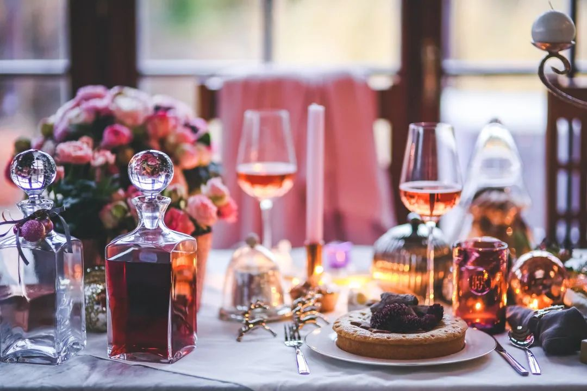 (原始链接: https://mmbiz.qpic.cn/mmbiz_jpg/7CNdqYbqvBKdF4peIzthY83XR2uL6kzQpybe8FoydJVwNPB674kVfslJPRyr6ZMyyTIkTRm31nPeLzDs3Fkx7g/640?wx_fmt=jpeg)
-  (原始链接: https://mmbiz.qpic.cn/mmbiz_jpg/7CNdqYbqvBKdF4peIzthY83XR2uL6kzQajicjWa6HqI0S42h8Mt2iaHVUnpaAYajpdtS0LYXPrX5gf59dgqpxTKw/640?wx_fmt=jpeg)
-  (原始链接: https://mmbiz.qpic.cn/mmbiz_jpg/7CNdqYbqvBKdF4peIzthY83XR2uL6kzQS92OicOrT6bV15jAKV2e5Hr82zyxLPISibru9vM70kof0167Unc9npIA/640?wx_fmt=jpeg)
-  (原始链接: https://mmbiz.qpic.cn/mmbiz_png/7CNdqYbqvBKdF4peIzthY83XR2uL6kzQo14DEUiaTGsTTPnicNPJxsbPwlMelEqLkzlxEQUyqNbiciaLpicl0Thf7FQ/640?wx_fmt=png)
- 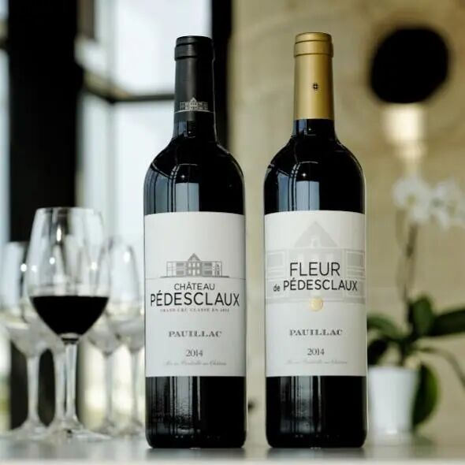 (原始链接: https://mmbiz.qpic.cn/mmbiz_jpg/7CNdqYbqvBKdF4peIzthY83XR2uL6kzQju1GtStXbhRyspUyZicNKNX1SWFruxKtjMfosFO8eiaC12rxnlbcEO9w/640?wx_fmt=jpeg)
- 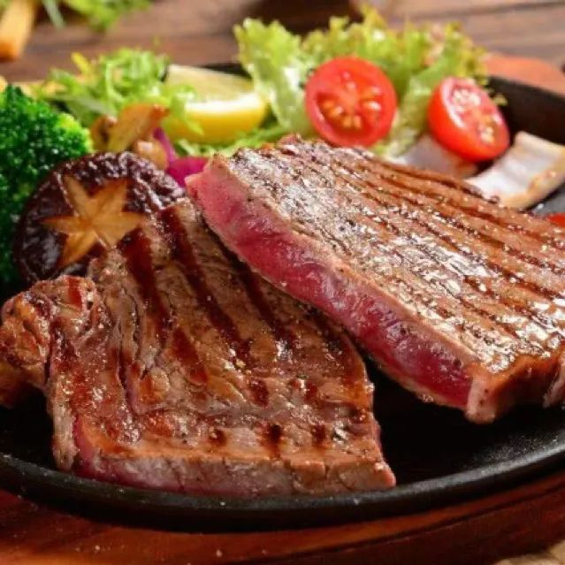 (原始链接: https://mmbiz.qpic.cn/mmbiz_jpg/7CNdqYbqvBKdF4peIzthY83XR2uL6kzQ1qjnEKuYFOWWu2bt24JtLr57S3d8iaYtte7YzgbLTTicM58GzwFW1hibg/640?wx_fmt=jpeg)
-  (原始链接: https://mmbiz.qpic.cn/mmbiz_png/7CNdqYbqvBKdF4peIzthY83XR2uL6kzQp8k1pYhPGsAcibZEEbfYJpo3BCCBwbZ5F0AOvxmRHcj5ZqWdsAUvl2g/640?wx_fmt=png)
-  (原始链接: https://mmbiz.qpic.cn/mmbiz_png/7CNdqYbqvBKdF4peIzthY83XR2uL6kzQzjI1qckUcHywia6J1TKOHrQw5jajl7xfSXjKPMicpFQfNP5xZklj1gEQ/640?wx_fmt=png)
-  (原始链接: https://mmbiz.qpic.cn/mmbiz_gif/7CNdqYbqvBKdF4peIzthY83XR2uL6kzQJXN8H9Ny9eKFOAVXD6Wyv74HiaOR8vtGZQia35yzuMZvicApRaZ0e5Jlg/640?wx_fmt=gif)
- 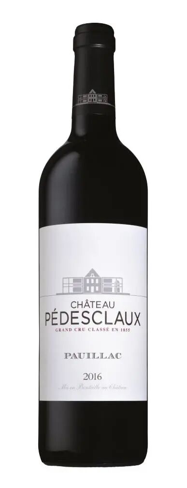 (原始链接: https://mmbiz.qpic.cn/mmbiz_jpg/7CNdqYbqvBKdF4peIzthY83XR2uL6kzQYwUFK3zOhicbpjs36tyXcuB03TwsGLWfxVXLcBRDSfUnVzwN63TDicqA/640?wx_fmt=jpeg)
- 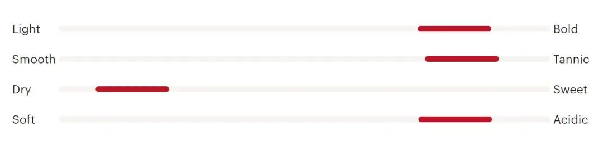 (原始链接: https://mmbiz.qpic.cn/mmbiz_jpg/7CNdqYbqvBKdF4peIzthY83XR2uL6kzQxy4OKaYkQdxUw3o8MJSnJ7VOjMkFCHOO2ww3vwuso4muJcNy5bXWOQ/640?wx_fmt=jpeg)
- 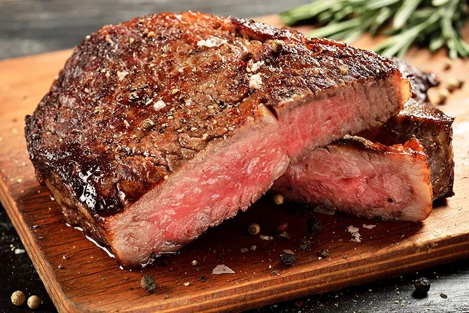 (原始链接: https://mmbiz.qpic.cn/mmbiz_jpg/7CNdqYbqvBKdF4peIzthY83XR2uL6kzQYTeenrx34vh8iaicFjTMKy4D3U5fWdK5LAmzAyAKlcnwVhuXLjXj44bQ/640?wx_fmt=jpeg)
- 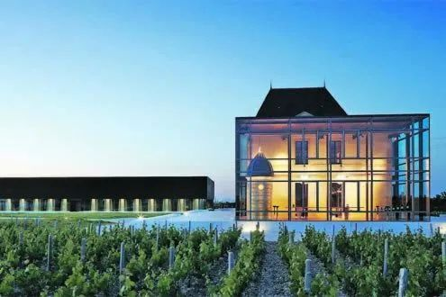 (原始链接: https://mmbiz.qpic.cn/mmbiz_jpg/7CNdqYbqvBKdF4peIzthY83XR2uL6kzQYVgCZyf8Qh6KMFYicftQxpZ91AQPaCnxyYuftWPfKb525RNhd4pNguw/640?wx_fmt=jpeg)
-  (原始链接: https://mmbiz.qpic.cn/mmbiz_svg/0sDCa2E8S1spUd3DZy9ln5WcKPyWXF5licOxMUoHSfr1ics1SNiacAWLc2xibhgHMfA3niauicPnP4xZFp6dzrsQJ7EfAxUMQg5riaR/640?wx_fmt=svg)
-  (原始链接: https://mmbiz.qpic.cn/mmbiz_png/7CNdqYbqvBKdF4peIzthY83XR2uL6kzQ0aXQoQqshTVuWyEDoze6iajfx575FqUEFw3GwUpYdJFDcdDrvgxYtcA/640?wx_fmt=png)
- 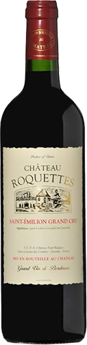 (原始链接: https://mmbiz.qpic.cn/mmbiz_png/7CNdqYbqvBKdF4peIzthY83XR2uL6kzQzeqYNH5blUWCNzSJZdZmBVAZWP8RicfJVmLbgGfpn28tP3OogGTvS9A/640?wx_fmt=png)
- 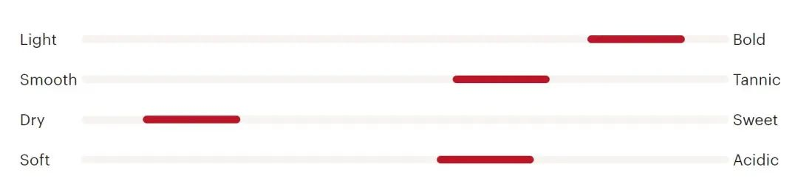 (原始链接: https://mmbiz.qpic.cn/mmbiz_jpg/7CNdqYbqvBKdF4peIzthY83XR2uL6kzQxgAKkribqnQAouj01SnUAWObE0VoO2ImLzcwL3YsaEI9H4l5pp8F39g/640?wx_fmt=jpeg)
- 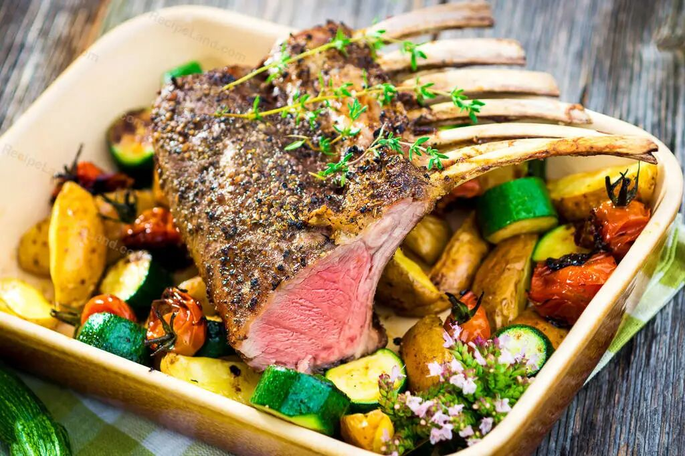 (原始链接: https://mmbiz.qpic.cn/mmbiz_jpg/7CNdqYbqvBKdF4peIzthY83XR2uL6kzQqbPsIaicXC3hE9xjjhgnyoZhAafF5ia660uNZq2EgTHy7ywJ5ujzLhSg/640?wx_fmt=jpeg)
-  (原始链接: https://mmbiz.qpic.cn/mmbiz_jpg/7CNdqYbqvBKdF4peIzthY83XR2uL6kzQT7d5ExhCgsdlg70WRHQwEpaswCsVViaWrjlPORibYfvSgZaoiaeqILWHg/640?wx_fmt=jpeg)
-  (原始链接: https://mmbiz.qpic.cn/mmbiz_svg/0sDCa2E8S1spUd3DZy9ln5WcKPyWXF5licOxMUoHSfr1ics1SNiacAWLc2xibhgHMfA3niauicPnP4xZFp6dzrsQJ7EfAxUMQg5riaR/640?wx_fmt=svg)
- 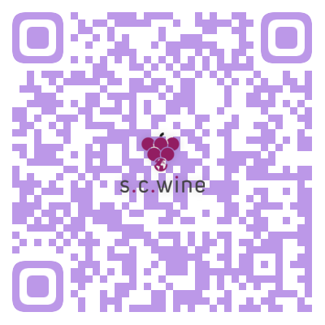 (原始链接: https://mmbiz.qpic.cn/mmbiz_png/7CNdqYbqvBKdF4peIzthY83XR2uL6kzQHXkSfibGrCITx2ibicHibDYWX45Gtna1caMSw09nIQkpOQLg7Zd1c00eBQ/640?wx_fmt=png)
- 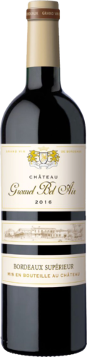 (原始链接: https://mmbiz.qpic.cn/mmbiz_png/7CNdqYbqvBKdF4peIzthY83XR2uL6kzQ0CL1jc6gPlhfq5cBKELMdMCibn7t9dJPibb7ap5WTZPoKXjPbr6Bb5OQ/640?wx_fmt=png)
- 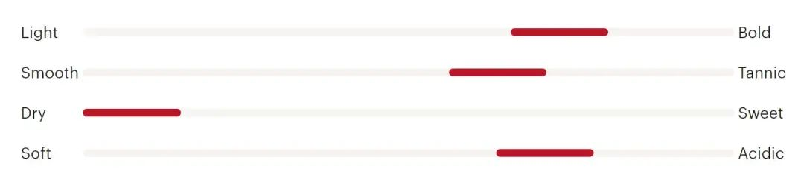 (原始链接: https://mmbiz.qpic.cn/mmbiz_jpg/7CNdqYbqvBKdF4peIzthY83XR2uL6kzQxKk2slicq8nIZW3KnwHtwziaCAicdYzibdknczgjJcGg6Z6zoI7cbnJicZQ/640?wx_fmt=jpeg)
- 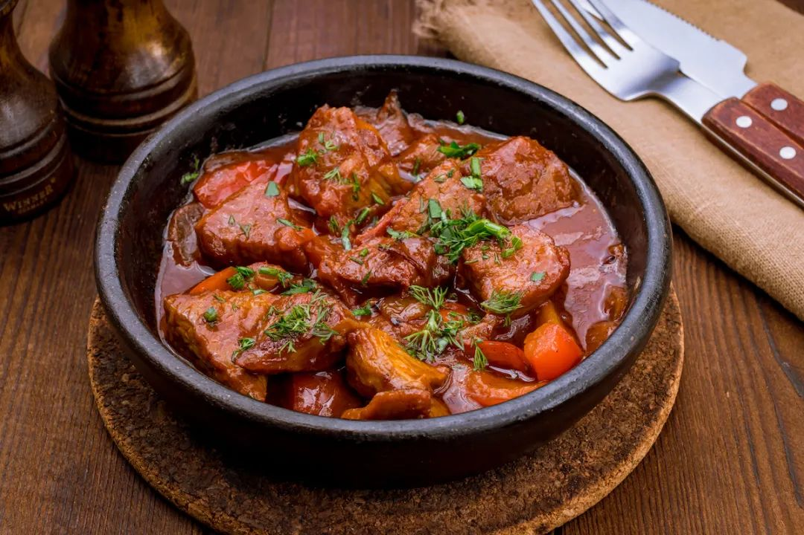 (原始链接: https://mmbiz.qpic.cn/mmbiz_jpg/7CNdqYbqvBKdF4peIzthY83XR2uL6kzQU0mp4bicdzQwqHj4ewJtV2xlKao4oqhiauUyNcu2S83QyjsgaGc7U1lg/640?wx_fmt=jpeg)
- 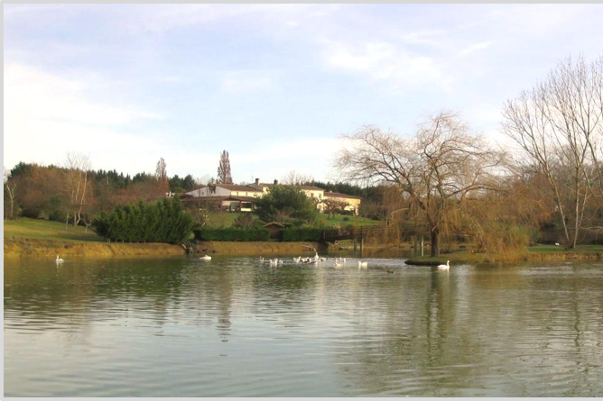 (原始链接: https://mmbiz.qpic.cn/mmbiz_png/7CNdqYbqvBKdF4peIzthY83XR2uL6kzQqWKYoVx9u7QlEk9ntWiatj4Jm08fjZ9GApR92EYz3kJ0l4EY2Twu2eQ/640?wx_fmt=png)
-  (原始链接: https://mmbiz.qpic.cn/mmbiz_svg/0sDCa2E8S1spUd3DZy9ln5WcKPyWXF5licOxMUoHSfr1ics1SNiacAWLc2xibhgHMfA3niauicPnP4xZFp6dzrsQJ7EfAxUMQg5riaR/640?wx_fmt=svg)
-  (原始链接: https://mmbiz.qpic.cn/mmbiz_png/7CNdqYbqvBKdF4peIzthY83XR2uL6kzQYao9U7GDoLTcibUqgS9ChVAEEer1vN3CIxAgeorr7grFutF6wzzuWPw/640?wx_fmt=png)
- 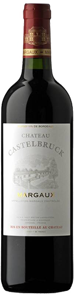 (原始链接: https://mmbiz.qpic.cn/mmbiz_png/7CNdqYbqvBKdF4peIzthY83XR2uL6kzQqBva0nSJ0SSdyRicTnrzHI8tERV76Q8JAaiaYklc7rUcf7yV5jdfXhZw/640?wx_fmt=png)
- 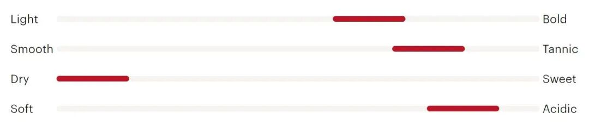 (原始链接: https://mmbiz.qpic.cn/mmbiz_jpg/7CNdqYbqvBKdF4peIzthY83XR2uL6kzQKJ4ibrw8elhTYaHuEnj6GTp0tOubfRiahlUaT3mKbN2Guh7HlY9DhJzw/640?wx_fmt=jpeg)
- 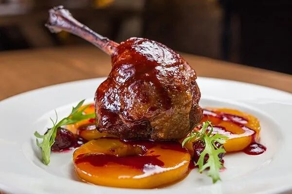 (原始链接: https://mmbiz.qpic.cn/mmbiz_jpg/7CNdqYbqvBKdF4peIzthY83XR2uL6kzQQ53WZg9oS3jK42NIDgCDuoSRFEoSZLZqQNT4d6UVxM2NeY8TicJ1UibA/640?wx_fmt=jpeg)
-  (原始链接: https://mmbiz.qpic.cn/mmbiz_jpg/7CNdqYbqvBKdF4peIzthY83XR2uL6kzQpiaiahezQGsDXvFiauz3gjNibl8fyZm5iclJJRUXo86wohZKQBKg40sGFiag/640?wx_fmt=jpeg)
-  (原始链接: https://mmbiz.qpic.cn/mmbiz_svg/0sDCa2E8S1spUd3DZy9ln5WcKPyWXF5licOxMUoHSfr1ics1SNiacAWLc2xibhgHMfA3niauicPnP4xZFp6dzrsQJ7EfAxUMQg5riaR/640?wx_fmt=svg)
- 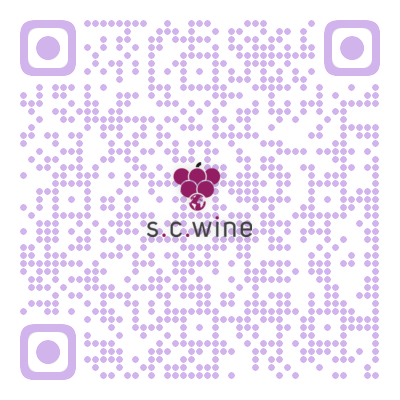 (原始链接: https://mmbiz.qpic.cn/mmbiz_png/7CNdqYbqvBKdF4peIzthY83XR2uL6kzQxcokiaq3nTgXcA5MEoia3DD355MRd2vW0Qww0aI0ftsMXjFBJTzlKVNw/640?wx_fmt=png)
- 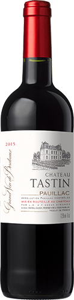 (原始链接: https://mmbiz.qpic.cn/mmbiz_png/7CNdqYbqvBKdF4peIzthY83XR2uL6kzQ56VPsqd7apdTicbg5D2mokvtKjaxwZ3PJcjBFeKxyau5ianJgKp256Jg/640?wx_fmt=png)
-  (原始链接: https://mmbiz.qpic.cn/mmbiz_jpg/7CNdqYbqvBKdF4peIzthY83XR2uL6kzQxy4OKaYkQdxUw3o8MJSnJ7VOjMkFCHOO2ww3vwuso4muJcNy5bXWOQ/640?wx_fmt=jpeg)
- 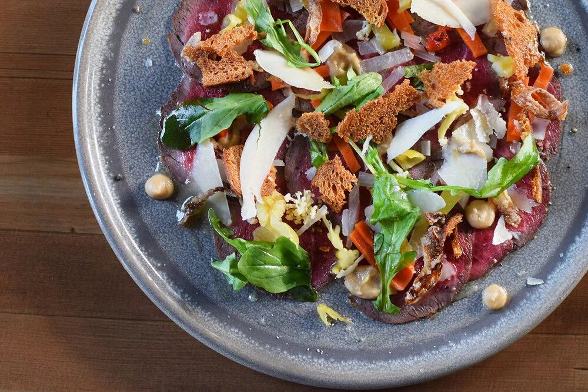 (原始链接: https://mmbiz.qpic.cn/mmbiz_jpg/7CNdqYbqvBKdF4peIzthY83XR2uL6kzQNvAQ8iasPVGVY0X2o3SIxsAWjhjSibTBPhaUDS6gQeDV8S3FuCcQeGNg/640?wx_fmt=jpeg)
- 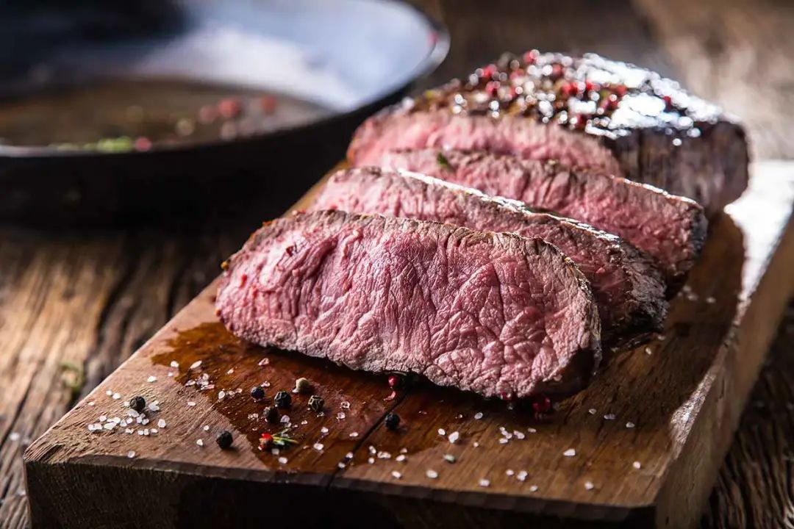 (原始链接: https://mmbiz.qpic.cn/mmbiz_jpg/7CNdqYbqvBKdF4peIzthY83XR2uL6kzQJVquOKE7hkMC5zNOyh3iag5tNWK40GSRZ8hhNicS1PC6dFA5RPFo8jBw/640?wx_fmt=jpeg)
- 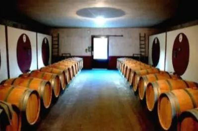 (原始链接: https://mmbiz.qpic.cn/mmbiz_jpg/7CNdqYbqvBKdF4peIzthY83XR2uL6kzQLloMk3q4QtN28d1sUAvzHo7xRcH90t37Dia9uLibLdQoAEruzC3oXtGQ/640?wx_fmt=jpeg)
-  (原始链接: https://mmbiz.qpic.cn/mmbiz_svg/0sDCa2E8S1spUd3DZy9ln5WcKPyWXF5licOxMUoHSfr1ics1SNiacAWLc2xibhgHMfA3niauicPnP4xZFp6dzrsQJ7EfAxUMQg5riaR/640?wx_fmt=svg)
- 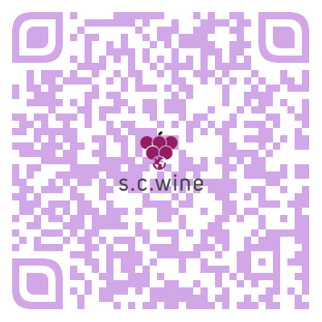 (原始链接: https://mmbiz.qpic.cn/mmbiz_png/7CNdqYbqvBKdF4peIzthY83XR2uL6kzQBbqpAr8ib9OdhFCpFiaGRdAJ7lOaiakpibnzVJGAmUnibGMSJHE7iaLVtKpA/640?wx_fmt=png)
-  (原始链接: https://mmbiz.qpic.cn/mmbiz_jpg/7CNdqYbqvBKdF4peIzthY83XR2uL6kzQAPmibQEKe8gdy270Llw5fJdDThFCTAOuCYiblsGa4RFmXYSH5tsX78DA/640?wx_fmt=jpeg)
