# 无标题

**链接地址:** http://mp.weixin.qq.com/s?__biz=MjM5MDEzNzY2NQ==&mid=2652808059&idx=1&sn=08806221b6b6f0b363021ff2f2c93e0b&chksm=bda36f558ad4e6431b44091c8fb203c3cd4fab07ccc8d5ff594a654e42f9000790366c1d7193&mpshare=1&scene=2&srcid=0214zis63zxLZfws6bhZwxYW&sharer_sharetime=1613245502078&sharer_shareid=be1c8edd6c93eec155a61c876e41d26a#rd
**作者:** 吴洺
**获取时间:** 2025/8/28 19:54:31
**图片数量:** 21

---

## 原始HTML内容

 

 

 

 

 

 

 

 
<section data-mpa-powered-by="yiban.io" style="margin-right: 8px;margin-left: 8px;white-space: normal;font-family: -apple-system, system-ui, &quot;Helvetica Neue&quot;, &quot;PingFang SC&quot;, &quot;Hiragino Sans GB&quot;, &quot;Microsoft YaHei UI&quot;, &quot;Microsoft YaHei&quot;, Arial, sans-serif;letter-spacing: 0.544px;background-color: rgb(255, 255, 255);text-align: center;line-height: 2em;"><a target="_blank" href="https://mp.weixin.qq.com/s?__biz=MjM5MDEzNzY2NQ==&amp;mid=2652805377&amp;idx=2&amp;sn=218f8d5c0d7a85f12a715b5da06b1060&amp;scene=21#wechat_redirect" textvalue="你已选中了添加链接的内容" tab="innerlink" data-linktype="1" style="-webkit-tap-highlight-color: rgba(0, 0, 0, 0);cursor: pointer;"></a></section><section style="margin-right: 8px;margin-left: 8px;white-space: normal;font-family: -apple-system, system-ui, &quot;Helvetica Neue&quot;, &quot;PingFang SC&quot;, &quot;Hiragino Sans GB&quot;, &quot;Microsoft YaHei UI&quot;, &quot;Microsoft YaHei&quot;, Arial, sans-serif;letter-spacing: 0.544px;background-color: rgb(255, 255, 255);text-align: center;line-height: 2em;">+++++上方是广告+++++</section>
 

幸福来得太突然！

 

2021年2月13日大年初二（星期六），加拿大移民局官方宣布进行第176轮快速通道EE抽选，邀请加拿大经验类CEC类别快速通道申请人27,300人，发出移民邀请，最低抽选分数为75分！！

 

牛年伊始，果然是“牛”转乾坤！！是不是有一种过年大赦的幻觉，还有一种过年清空购物车的错觉！

 

如果不是技术问题，这波春节送大礼的操作就是真的厉害了！

 

 

加拿大政府昨天才说要给留学生送助攻，今天好消息就来了~~

 

 

朋友圈里直接炸了！这是移民部版本的All in吗？？？ 

 

<section style="text-align: center;margin-left: 16px;margin-right: 16px;"></section><section style="text-align: center;margin-left: 16px;margin-right: 16px;"></section>
 

坛子里也是各种报喜：

 

 

很多人甚至不敢相信这是真的：

 
<section style="text-align: center;margin-left: 8px;margin-right: 8px;"></section>

 
<section style="line-height: 1.75em;margin-left: 32px;margin-right: 32px;">一般来说，留学生想移民，就要在毕业后拿工签，然后在加拿大积累工作经验，然后申请经验类移民CEC。<strong> </strong></section><section style="line-height: 1.75em;margin-left: 32px;margin-right: 32px;"> </section><section style="line-height: 1.75em;margin-left: 32px;margin-right: 32px;"><strong>申请移民时，需要加拿大移民局打分，分高者优先“录取”，分低的只能自己想办法努力找分，要么只能苦等。</strong></section><section style="line-height: 1.75em;margin-left: 32px;margin-right: 32px;"> </section><section style="line-height: 1.75em;margin-left: 32px;margin-right: 32px;">如果按照最近几年的正常情况，<strong>分数线都是在400多分。</strong><strong>CEC的移民方式就是高考“千军万马挤独木桥”的翻版：差一分就是一操场人。</strong></section>
 

但是，就在刚刚，移民局突然送上牛年大礼！

 

移民资讯网CICNews已经证实，只要在2020年9月12日以前提交自己的移民申请，然后分数在75分以上的“考生”，已经全被移民部“录取”了！

 

 

见过700分，见过600分，见过最低415分，你见过75分的CEC吗？！ 

 

如果加上周三邀请的省提名PNP的654名申请者，本周加拿大总共发出了27,986份ITA！

&nbsp;

实际上，这次的大赦CEC，也预示着移民部对2021年实现40.1万新移民的目标的承诺是很看重的。 

 

根据移民部2021年-2023年的移民目标，今年的EE会邀请108,500名新移民，然后2022年增加到110,500人，2023年增加到113,750人！

 

 

另外，加拿大为联邦经验类移民项目提供了未来三年最多的新移民额度分配，这些项目由EE系统管理。这也说明。在可以预见的未来，EE系统会是加拿大新移民的主要来源。

 

 

所以别等，赶紧上车才是正经！现在还很难说这是最后一次大赦！

 

BTW，房价要涨。

 
<section style="text-align: center;margin-left: 16px;margin-right: 16px;"></section>
 

+++++下方是广告+++++

+++全加拿大华人都在关注超级生活，就差你了+++ 

 

---

## 纯文本内容

+++++上方是广告+++++幸福来得太突然！2021年2月13日大年初二（星期六），加拿大移民局官方宣布进行第176轮快速通道EE抽选，邀请加拿大经验类CEC类别快速通道申请人27,300人，发出移民邀请，最低抽选分数为75分！！牛年伊始，果然是“牛”转乾坤！！是不是有一种过年大赦的幻觉，还有一种过年清空购物车的错觉！如果不是技术问题，这波春节送大礼的操作就是真的厉害了！加拿大政府昨天才说要给留学生送助攻，今天好消息就来了~~朋友圈里直接炸了！这是移民部版本的All in吗？？？坛子里也是各种报喜：很多人甚至不敢相信这是真的：一般来说，留学生想移民，就要在毕业后拿工签，然后在加拿大积累工作经验，然后申请经验类移民CEC。申请移民时，需要加拿大移民局打分，分高者优先“录取”，分低的只能自己想办法努力找分，要么只能苦等。如果按照最近几年的正常情况，分数线都是在400多分。CEC的移民方式就是高考“千军万马挤独木桥”的翻版：差一分就是一操场人。但是，就在刚刚，移民局突然送上牛年大礼！移民资讯网CICNews已经证实，只要在2020年9月12日以前提交自己的移民申请，然后分数在75分以上的“考生”，已经全被移民部“录取”了！见过700分，见过600分，见过最低415分，你见过75分的CEC吗？！如果加上周三邀请的省提名PNP的654名申请者，本周加拿大总共发出了27,986份ITA！ 实际上，这次的大赦CEC，也预示着移民部对2021年实现40.1万新移民的目标的承诺是很看重的。根据移民部2021年-2023年的移民目标，今年的EE会邀请108,500名新移民，然后2022年增加到110,500人，2023年增加到113,750人！另外，加拿大为联邦经验类移民项目提供了未来三年最多的新移民额度分配，这些项目由EE系统管理。这也说明。在可以预见的未来，EE系统会是加拿大新移民的主要来源。所以别等，赶紧上车才是正经！现在还很难说这是最后一次大赦！BTW，房价要涨。+++++下方是广告++++++++全加拿大华人都在关注超级生活，就差你了+++

---

## 图片列表

-  (原始链接: https://mmbiz.qpic.cn/mmbiz_jpg/szJas1pFaJfTTuHy2Dia0PPX2q1UGicHovfsyCarHVhibvic2SmB7r0UGNiaSLIPzcOG4W7LiafZJSl86BG7neicHkAYA/640?wx_fmt=jpeg)
-  (原始链接: https://mmbiz.qpic.cn/mmbiz_png/X9ZwD6DyyJCK2aMDHOTY4jibpDDC9j2piaf0yeiaPWcIPsge3pD4Rj4gPh5zRhXcI6Ft7VOP1IYXsC4t3ofnCJicTA/640?wx_fmt=png)
- 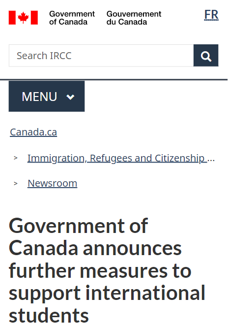 (原始链接: https://mmbiz.qpic.cn/mmbiz_png/X9ZwD6DyyJCK2aMDHOTY4jibpDDC9j2piaL7QhXA7pYVCzeMLLwZrbMAg08ycxzyZSbalMBO0jL6HLemXiblQfemQ/640?wx_fmt=png)
- 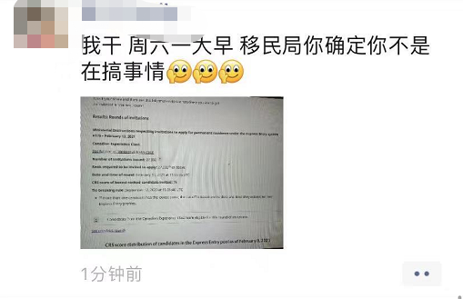 (原始链接: https://mmbiz.qpic.cn/mmbiz_png/X9ZwD6DyyJCK2aMDHOTY4jibpDDC9j2piactxYckutooc7kQ52jbEkMYgI0c4ghibNcJpHGnLWrp3CUezXUR37wzg/640?wx_fmt=png)
- 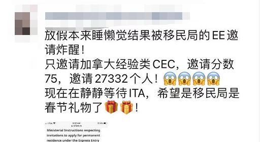 (原始链接: https://mmbiz.qpic.cn/mmbiz_png/X9ZwD6DyyJCK2aMDHOTY4jibpDDC9j2pia12nYnJ0jKfibsX6dWMRYUqmOWM7YRWYfgSncibIFr2RicdxibeQAGn7Xhw/640?wx_fmt=png)
- 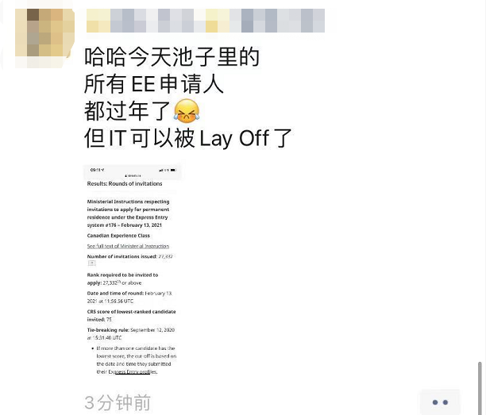 (原始链接: https://mmbiz.qpic.cn/mmbiz_png/X9ZwD6DyyJCK2aMDHOTY4jibpDDC9j2piaf8ugk6yvxUWZ2KWXJHNxy5RYFp5BnX9SPNgJfA4cpzs7lCjiaNOYgtA/640?wx_fmt=png)
- 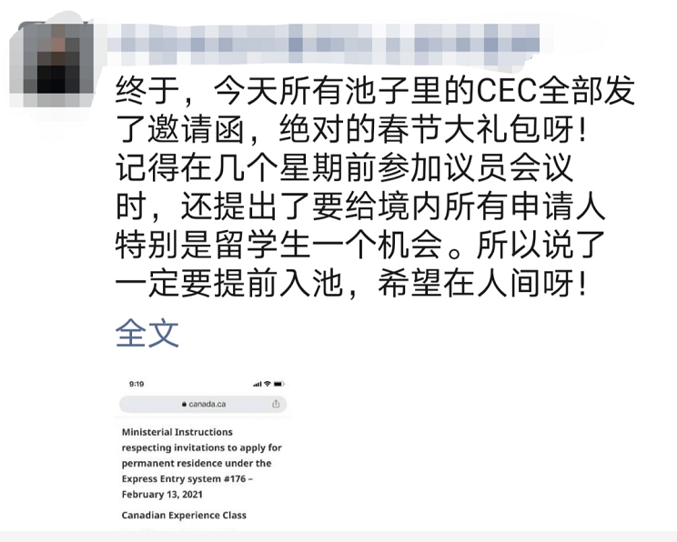 (原始链接: https://mmbiz.qpic.cn/mmbiz_png/X9ZwD6DyyJCK2aMDHOTY4jibpDDC9j2piazA7uM8EfNdIEeiavAqiaPAS9FcL8Liat47JAdP0eUpw9VhzpVBNE46dbw/640?wx_fmt=png)
- 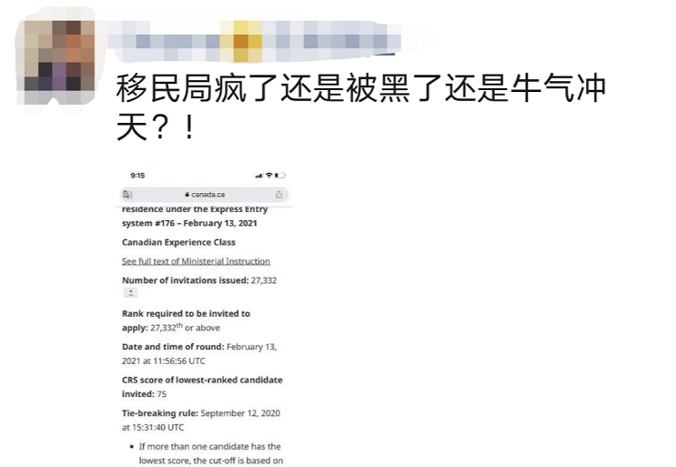 (原始链接: https://mmbiz.qpic.cn/mmbiz_png/X9ZwD6DyyJCK2aMDHOTY4jibpDDC9j2piarfqNzw0rdUlNvTLamV7aBw6jaicvVO7SXVoFS38bSUgSRib079Qc6bXQ/640?wx_fmt=png)
-  (原始链接: https://mmbiz.qpic.cn/mmbiz_png/X9ZwD6DyyJCK2aMDHOTY4jibpDDC9j2piax0yogYdJpfVztSnlOIKauor1xW6iaqiabToAUKrg9U3vA2gkTJlhggPg/640?wx_fmt=png)
-  (原始链接: https://mmbiz.qpic.cn/mmbiz_png/szJas1pFaJeWibhNPmmy9jsUrz2NKaibCrClVKQtmQOJencliahpNMFrxB2ZR9sdUr82NJLQgQxDdLEP5wyW3owgg/640?wx_fmt=png)
- 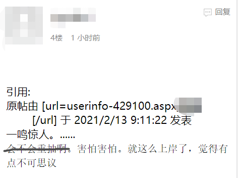 (原始链接: https://mmbiz.qpic.cn/mmbiz_png/X9ZwD6DyyJCK2aMDHOTY4jibpDDC9j2piaax9AiaTsEhWJe6MyT2jicc5kq2rzdmJyEcgB1jfG3vNKERdlsiazageOw/640?wx_fmt=png)
-  (原始链接: https://mmbiz.qpic.cn/mmbiz_png/szJas1pFaJeWibhNPmmy9jsUrz2NKaibCrlBBevl0P2gcfbO7icnECdJ9RQcKKfq920r13kECFAcA8PHhicfdicMheA/640?wx_fmt=png)
- 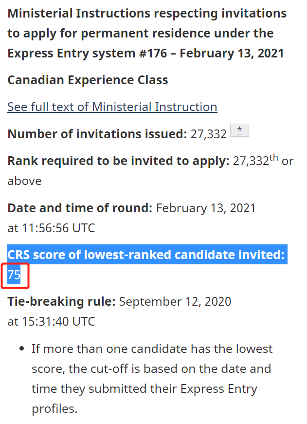 (原始链接: https://mmbiz.qpic.cn/mmbiz_png/X9ZwD6DyyJCK2aMDHOTY4jibpDDC9j2piatHLMrzqg8ea8WjnPH5r9LsvVFuAn6euIucyTqcG50bj5ESNEPpIJxg/640?wx_fmt=png)
- 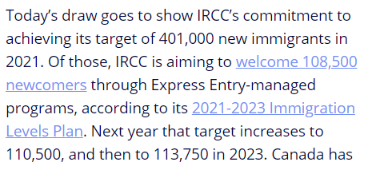 (原始链接: https://mmbiz.qpic.cn/mmbiz_png/X9ZwD6DyyJCK2aMDHOTY4jibpDDC9j2piaibicpgkHsr2oo9xcGGcAnKkZK7T4rPZXOR0YSfT8uC3vORcAYSAJEvnA/640?wx_fmt=png)
- 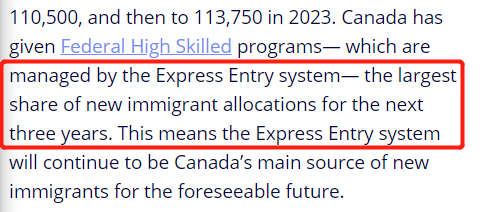 (原始链接: https://mmbiz.qpic.cn/mmbiz_png/X9ZwD6DyyJCK2aMDHOTY4jibpDDC9j2pia8NpLvFaia5SebhGg7kC1HJPU57kOSk3B3XylGTno4hibPKpsKPoDPxZQ/640?wx_fmt=png)
-  (原始链接: https://mmbiz.qpic.cn/mmbiz_png/X9ZwD6DyyJCK2aMDHOTY4jibpDDC9j2piaibfTzmatcGMDicvqlxEBHUQDPZMzVvlpBgZWlicibyOE453JENibBcWWxMA/640?wx_fmt=png)
-  (原始链接: https://mmbiz.qpic.cn/mmbiz_png/X9ZwD6DyyJCK2aMDHOTY4jibpDDC9j2piaibfTzmatcGMDicvqlxEBHUQDPZMzVvlpBgZWlicibyOE453JENibBcWWxMA/640?wx_fmt=png)
-  (原始链接: https://mmbiz.qpic.cn/mmbiz_png/X9ZwD6DyyJCK2aMDHOTY4jibpDDC9j2piaibfTzmatcGMDicvqlxEBHUQDPZMzVvlpBgZWlicibyOE453JENibBcWWxMA/640?wx_fmt=png)
- 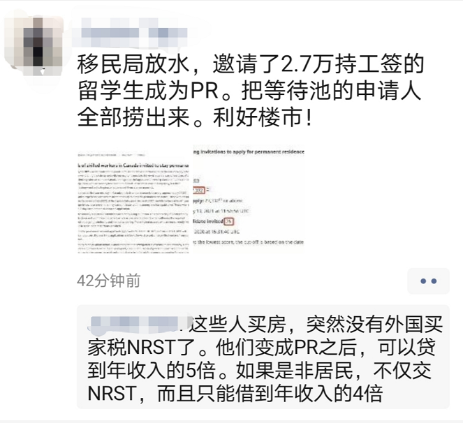 (原始链接: https://mmbiz.qpic.cn/mmbiz_png/X9ZwD6DyyJCK2aMDHOTY4jibpDDC9j2pianullicDjvaIz8BNcPI0roTJ9PmU0iciclKOu2icUTgDp74Oo03vkhCticog/640?wx_fmt=png)
-  (原始链接: https://mmbiz.qpic.cn/mmbiz_jpg/szJas1pFaJfTTuHy2Dia0PPX2q1UGicHovkEdBn1ibTHqR3pot9e00gomVmDniajhgibbXuIWicxtFtibhuXpicw7y82Rg/640?wx_fmt=jpeg)
-  (原始链接: https://mmbiz.qpic.cn/mmbiz_gif/szJas1pFaJdUFDPEKnLrCyGC4WgrAvl6lSC2beZFt6icTnXfebnRzcRialMg5VZujw1AhX9ribkSDQNZZukk8HX9w/640?wx_fmt=gif)
