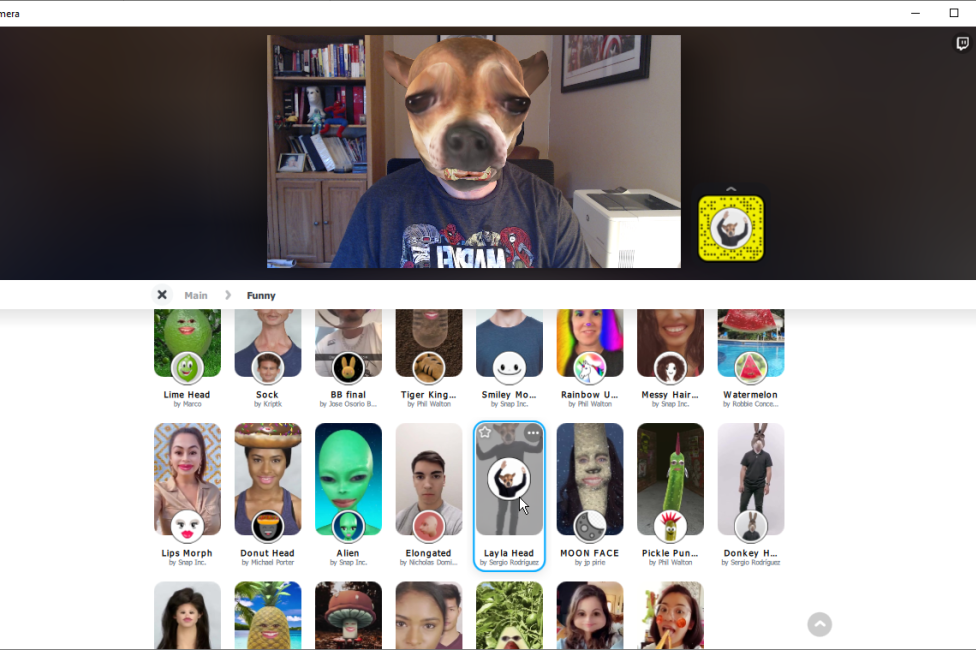
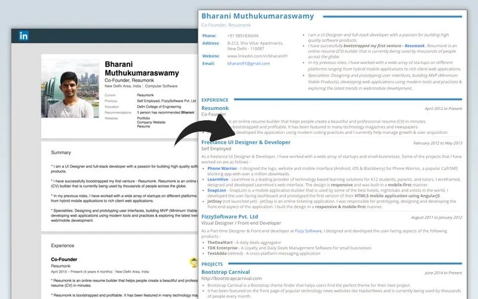
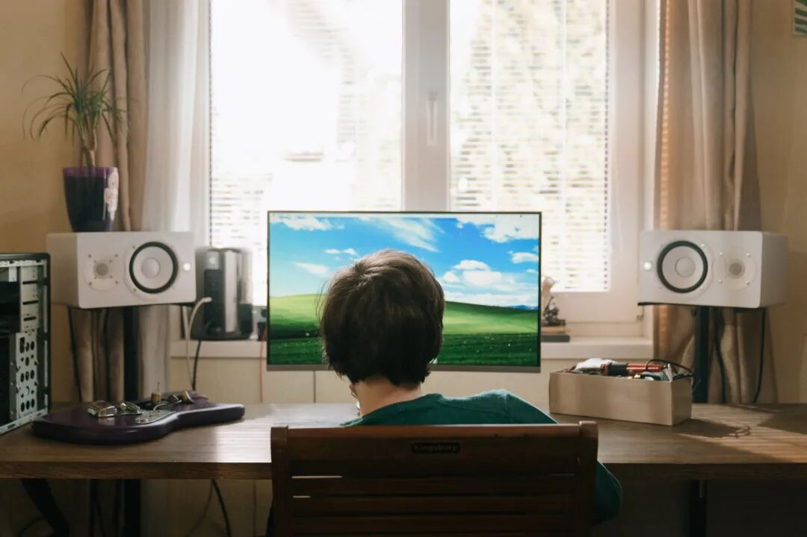
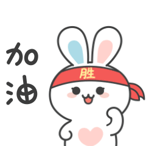

# 无标题

**链接地址:** http://mp.weixin.qq.com/s?__biz=MzI4NDYyNjAwNw==&mid=2247484816&idx=1&sn=44017f304e12471f68ea5bec00d3f6e3&chksm=ebf9d8a8dc8e51be638ef3698e3353ad50b8712cf11a22092a1e7501d84fcd698fba0dbed5f2&mpshare=1&scene=2&srcid=0301B1q95W1eKIdHVAkfixcJ&sharer_sharetime=1614570934398&sharer_shareid=be1c8edd6c93eec155a61c876e41d26a#rd
**作者:** 关注我们
**获取时间:** 2025/8/28 19:53:07
**图片数量:** 21

---

## 原始HTML内容

<section style="box-sizing: border-box;font-size: 16px;"><section style="transform: rotateZ(350deg);-webkit-transform: rotateZ(350deg);-moz-transform: rotateZ(350deg);-o-transform: rotateZ(350deg);box-sizing: border-box;" powered-by="xiumi.us"><section style="text-align: center;margin-right: 0%;margin-bottom: -33px;margin-left: 0%;box-sizing: border-box;"><section style="display: inline-block;width: 50%;height: 38.5684px;vertical-align: top;overflow: hidden;border-width: 0px;border-radius: 50%;border-style: none;border-color: rgb(62, 62, 62);background-image: linear-gradient(to top, rgb(255, 243, 240) 0%, rgb(255, 255, 255) 100%);box-sizing: border-box;"><section><svg viewBox="0 0 1 1" style="float:left;line-height:0;width:0;vertical-align:top;"></svg></section></section></section></section><section style="text-align: center;justify-content: center;transform: translate3d(4px, 0px, 0px);-webkit-transform: translate3d(4px, 0px, 0px);-moz-transform: translate3d(4px, 0px, 0px);-o-transform: translate3d(4px, 0px, 0px);box-sizing: border-box;" powered-by="xiumi.us"><section style="display: inline-block;width: auto;vertical-align: top;min-width: 10%;max-width: 100%;height: auto;box-sizing: border-box;"><section style="margin-right: 0%;margin-bottom: 11px;margin-left: 0%;box-sizing: border-box;" powered-by="xiumi.us"><section style="text-align: justify;color: rgb(237, 128, 15);letter-spacing: 9px;padding-right: 20px;padding-left: 20px;line-height: 1;font-family: PingFangSC-light;box-sizing: border-box;">
<strong style="box-sizing: border-box;">点击蓝字 关注我们</strong>
</section></section><section style="box-sizing: border-box;" powered-by="xiumi.us"><section style="display: inline-block;width: 50%;vertical-align: top;height: auto;box-sizing: border-box;"><section style="margin-right: 0%;margin-left: 0%;box-sizing: border-box;" powered-by="xiumi.us"><section style="background-color: rgb(237, 128, 15);height: 1px;box-sizing: border-box;"><section><svg viewBox="0 0 1 1" style="float:left;line-height:0;width:0;vertical-align:top;"></svg></section></section></section></section></section></section></section><section style="margin: 10px 0%;box-sizing: border-box;" powered-by="xiumi.us"><section style="display: inline-block;width: 100%;vertical-align: top;line-height: 0;background-image: linear-gradient(rgb(255, 243, 240) 0%, rgb(255, 209, 209) 100%);box-sizing: border-box;"><section style="transform: translate3d(-3px, 0px, 0px);margin-right: 0%;margin-bottom: 3px;margin-left: 0%;box-sizing: border-box;" powered-by="xiumi.us"><section style="display: inline-block;width: 100%;vertical-align: top;background-color: rgba(255, 255, 255, 0.76);line-height: 2;border-bottom: 0px none rgb(62, 62, 62);border-bottom-right-radius: 15px;overflow: hidden;box-sizing: border-box;"><section style="box-sizing: border-box;" powered-by="xiumi.us"><section style="display: flex;flex-flow: row nowrap;margin: 10px 0%;box-sizing: border-box;"><section style="display: inline-block;width: 100%;vertical-align: top;border-bottom: 3px solid rgb(255, 226, 196);border-bottom-right-radius: 0px;flex: 0 0 auto;align-self: flex-start;height: auto;padding-bottom: 3px;box-sizing: border-box;"><section style="box-sizing: border-box;" powered-by="xiumi.us"><section style="display: flex;flex-flow: row nowrap;box-sizing: border-box;"><section style="display: inline-block;vertical-align: bottom;width: auto;background-color: rgb(255, 226, 196);margin-right: 3px;flex: 0 0 auto;align-self: flex-end;min-width: 10%;max-width: 100%;height: auto;padding: 5px;box-sizing: border-box;"><section style="text-align: center;font-size: 17px;color: rgb(255, 255, 255);line-height: 1.6;letter-spacing: 2px;box-sizing: border-box;" powered-by="xiumi.us">
<strong style="box-sizing: border-box;"><em style="box-sizing: border-box;">序</em></strong>
</section></section><section style="display: inline-block;vertical-align: top;width: auto;border-left: 4px solid rgb(255, 226, 196);border-bottom-left-radius: 0px;flex: 100 100 0%;align-self: stretch;height: auto;padding-top: 5px;padding-right: 10px;padding-left: 10px;box-sizing: border-box;"><section style="color: rgb(97, 97, 97);font-size: 14px;letter-spacing: 4px;box-sizing: border-box;" powered-by="xiumi.us">
<strong style="box-sizing: border-box;">视频面试？习惯吧，这是常态！</strong>
</section></section></section></section></section></section></section><section style="margin: 30px 0% 20px;box-sizing: border-box;" powered-by="xiumi.us"><section style="font-size: 15px;color: rgb(121, 90, 91);line-height: 2;letter-spacing: 1px;padding-right: 25px;padding-left: 25px;box-sizing: border-box;">
参加年初招聘活动的朋友们，或许已经幸运地接到了面试机会。而今年特殊的环境，却逼迫着招聘单位和求职者们把<strong style="box-sizing: border-box;">面试活动放在了线上</strong>。

 
</section></section><section style="box-sizing: border-box;" powered-by="xiumi.us"><section style="display: flex;flex-flow: row nowrap;margin: 10px 0%;box-sizing: border-box;"><section style="display: inline-block;vertical-align: top;width: auto;flex: 0 0 0%;align-self: stretch;height: auto;background-position: 50% 50%;background-repeat: no-repeat;background-size: 100% 100%;background-attachment: scroll;background-image: url(&quot;https://mmbiz.qpic.cn/mmbiz_png/cY0qSDjdkFeLGNxVmHMR8OaiavMOSKkbWxQF0qrCKdjwIEK1d6omPCnez5aKld8SLGVZZGZDzf38olDBNqef2Zw/640?wx_fmt=png&quot;);box-sizing: border-box;"><section style="text-align: center;box-sizing: border-box;" powered-by="xiumi.us"><section style="display: inline-block;width: 15px;height: 15px;vertical-align: top;overflow: hidden;box-sizing: border-box;"><section><svg viewBox="0 0 1 1" style="float:left;line-height:0;width:0;vertical-align:top;"></svg></section></section></section></section><section style="display: inline-block;vertical-align: top;width: auto;flex: 100 100 0%;align-self: stretch;height: auto;box-sizing: border-box;"><section style="display: inline-block;width: 100%;vertical-align: top;border-width: 7px;border-style: solid;border-color: rgb(255, 254, 251);box-shadow: rgb(218, 203, 158) 0px 0px 10px;box-sizing: border-box;" powered-by="xiumi.us"><section style="text-align: center;margin-right: 0%;margin-left: 0%;box-sizing: border-box;" powered-by="xiumi.us"><section style="max-width: 100%;vertical-align: middle;display: inline-block;line-height: 0;box-shadow: rgb(0, 0, 0) 0px 0px 0px;box-sizing: border-box;"></section></section></section></section><section style="display: inline-block;vertical-align: top;width: auto;flex: 0 0 0%;align-self: stretch;height: auto;background-position: 50% 50%;background-repeat: no-repeat;background-size: 100% 100%;background-attachment: scroll;background-image: url(&quot;https://mmbiz.qpic.cn/mmbiz_png/cY0qSDjdkFeLGNxVmHMR8OaiavMOSKkbWXU1gP2nSS5pSlOEzFVibXMGb88u9vcDVKkIzhNj834kKkkq2coV7vLA/640?wx_fmt=png&quot;);box-sizing: border-box;"><section style="text-align: center;box-sizing: border-box;" powered-by="xiumi.us"><section style="display: inline-block;width: 15px;height: 15px;vertical-align: top;overflow: hidden;box-sizing: border-box;"><section><svg viewBox="0 0 1 1" style="float:left;line-height:0;width:0;vertical-align:top;"></svg></section></section></section></section></section></section><section style="margin: 30px 0% 20px;box-sizing: border-box;" powered-by="xiumi.us"><section style="font-size: 15px;color: rgb(121, 90, 91);line-height: 2;letter-spacing: 1px;padding-right: 25px;padding-left: 25px;box-sizing: border-box;">
虽然线上举行的视频面试问题准备和线下面试并无二致，但在<strong style="color: rgb(121, 121, 121);font-size: 14px;box-sizing: border-box;">细节准备上却大有不同</strong>。而小细节上的一个不注意，却<strong style="color: rgb(121, 121, 121);font-size: 14px;box-sizing: border-box;">很可能毁掉你的整个视频面试！</strong> 

 

<strong style="box-sizing: border-box;">视频面试的易踩坑远比你想象的多！</strong>甚至一些你从未意识到！不过好在想要<strong style="box-sizing: border-box;">避免这些错误的发生却也不难</strong>。今天就请跟着 BadaB Consulting 去学习几个线上视频面试的小技巧。

 
</section></section><section style="box-sizing: border-box;" powered-by="xiumi.us"><section style="display: flex;flex-flow: row nowrap;margin: 10px 0%;box-sizing: border-box;"><section style="display: inline-block;vertical-align: top;width: auto;flex: 0 0 0%;align-self: stretch;height: auto;background-position: 50% 50%;background-repeat: no-repeat;background-size: 100% 100%;background-attachment: scroll;background-image: url(&quot;https://mmbiz.qpic.cn/mmbiz_png/cY0qSDjdkFeLGNxVmHMR8OaiavMOSKkbWxQF0qrCKdjwIEK1d6omPCnez5aKld8SLGVZZGZDzf38olDBNqef2Zw/640?wx_fmt=png&quot;);box-sizing: border-box;"><section style="text-align: center;box-sizing: border-box;" powered-by="xiumi.us"><section style="display: inline-block;width: 15px;height: 15px;vertical-align: top;overflow: hidden;box-sizing: border-box;"><section><svg viewBox="0 0 1 1" style="float:left;line-height:0;width:0;vertical-align:top;"></svg></section></section></section></section><section style="display: inline-block;vertical-align: top;width: auto;flex: 100 100 0%;align-self: stretch;height: auto;box-sizing: border-box;"><section style="display: inline-block;width: 100%;vertical-align: top;border-width: 7px;border-style: solid;border-color: rgb(255, 254, 251);box-shadow: rgb(218, 203, 158) 0px 0px 10px;box-sizing: border-box;" powered-by="xiumi.us"><section style="transform: perspective(0px);-webkit-transform: perspective(0px);-moz-transform: perspective(0px);-o-transform: perspective(0px);transform-style: flat;box-sizing: border-box;" powered-by="xiumi.us"><section style="text-align: center;margin-right: 0%;margin-left: 0%;transform: rotateY(180deg);box-sizing: border-box;"><section style="max-width: 100%;vertical-align: middle;display: inline-block;line-height: 0;box-shadow: rgb(0, 0, 0) 0px 0px 0px;box-sizing: border-box;"></section></section></section></section></section><section style="display: inline-block;vertical-align: top;width: auto;flex: 0 0 0%;align-self: stretch;height: auto;background-position: 50% 50%;background-repeat: no-repeat;background-size: 100% 100%;background-attachment: scroll;background-image: url(&quot;https://mmbiz.qpic.cn/mmbiz_png/cY0qSDjdkFeLGNxVmHMR8OaiavMOSKkbWXU1gP2nSS5pSlOEzFVibXMGb88u9vcDVKkIzhNj834kKkkq2coV7vLA/640?wx_fmt=png&quot;);box-sizing: border-box;"><section style="text-align: center;box-sizing: border-box;" powered-by="xiumi.us"><section style="display: inline-block;width: 15px;height: 15px;vertical-align: top;overflow: hidden;box-sizing: border-box;"><section><svg viewBox="0 0 1 1" style="float:left;line-height:0;width:0;vertical-align:top;"></svg></section></section></section></section></section></section><section style="margin: 30px 0% 20px;box-sizing: border-box;" powered-by="xiumi.us"><section style="font-size: 15px;color: rgb(121, 90, 91);line-height: 2;letter-spacing: 1px;padding-right: 25px;padding-left: 25px;box-sizing: border-box;">
疫情时期得来的面试机会，其珍贵程度不言而喻，<strong style="color: rgb(121, 121, 121);font-size: 14px;box-sizing: border-box;">千万不要浪费！</strong>这篇文章句句都是干货，<strong style="color: rgb(121, 121, 121);font-size: 14px;box-sizing: border-box;">推荐收藏起来慢慢学习</strong>哦！ 
</section></section><section style="box-sizing: border-box;" powered-by="xiumi.us">
 
</section><section style="margin: -13px 0% 4px;transform: translate3d(-1px, 0px, 0px);-webkit-transform: translate3d(-1px, 0px, 0px);-moz-transform: translate3d(-1px, 0px, 0px);-o-transform: translate3d(-1px, 0px, 0px);box-sizing: border-box;" powered-by="xiumi.us"><section style="text-align: right;font-size: 15px;color: rgb(255, 226, 196);padding-right: 15px;padding-left: 15px;line-height: 1;letter-spacing: 0px;box-sizing: border-box;">
<strong style="box-sizing: border-box;">Are You Ready?</strong>
</section></section></section></section></section></section><section style="box-sizing: border-box;" powered-by="xiumi.us">
 
</section><section style="box-sizing: border-box;" powered-by="xiumi.us">
 
</section><section style="box-sizing: border-box;" powered-by="xiumi.us"><section style="display: flex;flex-flow: row nowrap;margin: 10px 0%;box-sizing: border-box;"><section style="display: inline-block;vertical-align: top;width: auto;flex: 0 0 auto;align-self: stretch;min-width: 10%;max-width: 100%;height: auto;background-color: rgb(237, 128, 15);box-sizing: border-box;"><section style="line-height: 1.5;letter-spacing: 0px;color: rgb(255, 255, 255);padding-right: 10px;padding-left: 10px;box-sizing: border-box;" powered-by="xiumi.us">
<strong style="box-sizing: border-box;">01</strong>
</section></section><section style="display: inline-block;vertical-align: top;width: auto;flex: 0 0 0%;align-self: stretch;height: auto;line-height: 0;box-sizing: border-box;"><section style="text-align: center;box-sizing: border-box;" powered-by="xiumi.us"><section style="display: inline-block;width: 6px;height: 12px;vertical-align: top;overflow: hidden;border-style: solid;border-width: 6px 3px;border-color: rgb(237, 128, 15) rgba(255, 255, 255, 0) rgba(255, 255, 255, 0) rgb(237, 128, 15);box-sizing: border-box;"><section><svg viewBox="0 0 1 1" style="float:left;line-height:0;width:0;vertical-align:top;"></svg></section></section></section><section style="transform: perspective(0px);-webkit-transform: perspective(0px);-moz-transform: perspective(0px);-o-transform: perspective(0px);transform-style: flat;box-sizing: border-box;" powered-by="xiumi.us"><section style="text-align: center;transform: rotateX(180deg);-webkit-transform: rotateX(180deg);-moz-transform: rotateX(180deg);-o-transform: rotateX(180deg);box-sizing: border-box;"><section style="display: inline-block;width: 6px;height: 12px;vertical-align: top;overflow: hidden;border-style: solid;border-width: 6px 3px;border-color: rgb(237, 128, 15) rgba(255, 255, 255, 0) rgba(255, 255, 255, 0) rgb(237, 128, 15);box-sizing: border-box;"><section><svg viewBox="0 0 1 1" style="float:left;line-height:0;width:0;vertical-align:top;"></svg></section></section></section></section></section><section style="display: inline-block;vertical-align: middle;width: auto;min-width: 10%;max-width: 100%;flex: 0 0 auto;height: auto;align-self: center;box-sizing: border-box;"><section style="color: rgb(120, 120, 120);line-height: 1;letter-spacing: 0px;padding-right: 10px;padding-left: 10px;box-sizing: border-box;" powered-by="xiumi.us">
<strong style="box-sizing: border-box;">Gear Up！提前设置好你的设备</strong>
</section></section><section style="display: inline-block;vertical-align: middle;width: auto;flex: 100 100 0%;height: auto;align-self: center;box-sizing: border-box;"><section style="margin-right: 0%;margin-left: 0%;box-sizing: border-box;" powered-by="xiumi.us"><section style="background-color: rgb(223, 223, 223);height: 1px;box-sizing: border-box;"><section><svg viewBox="0 0 1 1" style="float:left;line-height:0;width:0;vertical-align:top;"></svg></section></section></section></section></section></section><section style="margin: 30px 0% 20px;box-sizing: border-box;" powered-by="xiumi.us"><section style="font-size: 15px;color: rgb(121, 90, 91);line-height: 2;letter-spacing: 2px;padding-right: 25px;padding-left: 25px;box-sizing: border-box;">
首先，在<strong style="box-sizing: border-box;">硬件</strong>上为你的视频面试做好准备！

 

为了保障有质量的视频传输效果，请在面试前<strong style="box-sizing: border-box;">升级并设置好你的电子设备</strong>。

 
</section></section><section style="box-sizing: border-box;" powered-by="xiumi.us"><section style="display: flex;flex-flow: row nowrap;margin: 10px 0%;box-sizing: border-box;"><section style="display: inline-block;vertical-align: top;width: auto;flex: 0 0 0%;align-self: stretch;height: auto;background-position: 50% 50%;background-repeat: no-repeat;background-size: 100% 100%;background-attachment: scroll;background-image: url(&quot;https://mmbiz.qpic.cn/mmbiz_png/cY0qSDjdkFeLGNxVmHMR8OaiavMOSKkbWxQF0qrCKdjwIEK1d6omPCnez5aKld8SLGVZZGZDzf38olDBNqef2Zw/640?wx_fmt=png&quot;);box-sizing: border-box;"><section style="text-align: center;box-sizing: border-box;" powered-by="xiumi.us"><section style="display: inline-block;width: 15px;height: 15px;vertical-align: top;overflow: hidden;box-sizing: border-box;"><section><svg viewBox="0 0 1 1" style="float:left;line-height:0;width:0;vertical-align:top;"></svg></section></section></section></section><section style="display: inline-block;vertical-align: top;width: auto;flex: 100 100 0%;align-self: stretch;height: auto;box-sizing: border-box;"><section style="display: inline-block;width: 100%;vertical-align: top;border-width: 7px;border-style: solid;border-color: rgb(255, 254, 251);box-shadow: rgb(218, 203, 158) 0px 0px 10px;box-sizing: border-box;" powered-by="xiumi.us"><section style="text-align: center;margin-right: 0%;margin-left: 0%;box-sizing: border-box;" powered-by="xiumi.us"><section style="max-width: 100%;vertical-align: middle;display: inline-block;line-height: 0;box-shadow: rgb(0, 0, 0) 0px 0px 0px;box-sizing: border-box;"></section></section></section></section><section style="display: inline-block;vertical-align: top;width: auto;flex: 0 0 0%;align-self: stretch;height: auto;background-position: 50% 50%;background-repeat: no-repeat;background-size: 100% 100%;background-attachment: scroll;background-image: url(&quot;https://mmbiz.qpic.cn/mmbiz_png/cY0qSDjdkFeLGNxVmHMR8OaiavMOSKkbWXU1gP2nSS5pSlOEzFVibXMGb88u9vcDVKkIzhNj834kKkkq2coV7vLA/640?wx_fmt=png&quot;);box-sizing: border-box;"><section style="text-align: center;box-sizing: border-box;" powered-by="xiumi.us"><section style="display: inline-block;width: 15px;height: 15px;vertical-align: top;overflow: hidden;box-sizing: border-box;"><section><svg viewBox="0 0 1 1" style="float:left;line-height:0;width:0;vertical-align:top;"></svg></section></section></section></section></section></section><section style="margin: 30px 0% 20px;box-sizing: border-box;" powered-by="xiumi.us"><section style="font-size: 15px;color: rgb(121, 90, 91);line-height: 2;letter-spacing: 2px;padding-right: 25px;padding-left: 25px;box-sizing: border-box;">
<strong style="box-sizing: border-box;">畅通的网络传输、清晰的摄像头、还有话筒和耳机等设备</strong>，请尽可能在自己财务可以承受的范围内准备齐全，以辅助你更加自信满满地参参加面试。 

 

另外，请提前花点时间<strong style="box-sizing: border-box;">熟悉视频面试所用的软件或应用的的操作</strong>，为自己设置好包括姓名、头像和联系方式在内的<strong style="box-sizing: border-box;">专业个人档案</strong>。

 
</section></section><section style="margin-top: 10px;margin-bottom: 10px;text-align: left;box-sizing: border-box;" powered-by="xiumi.us"><section style="padding-left: 1em;padding-right: 1em;display: inline-block;text-align: center;box-sizing: border-box;">
<strong style="box-sizing: border-box;">小提示1</strong>
 </section><section style="border-width: 1px;border-style: solid;border-color: rgb(192, 200, 209);margin-top: -1em;padding: 20px 10px 10px;background-color: rgb(239, 239, 239);text-align: center;box-sizing: border-box;"><section style="box-sizing: border-box;" powered-by="xiumi.us"><section style="display: flex;flex-flow: row nowrap;margin: 10px 0%;box-sizing: border-box;"><section style="display: inline-block;vertical-align: top;width: auto;flex: 0 0 0%;align-self: stretch;height: auto;background-position: 50% 50%;background-repeat: no-repeat;background-size: 100% 100%;background-attachment: scroll;background-image: url(&quot;https://mmbiz.qpic.cn/mmbiz_png/cY0qSDjdkFeLGNxVmHMR8OaiavMOSKkbWxQF0qrCKdjwIEK1d6omPCnez5aKld8SLGVZZGZDzf38olDBNqef2Zw/640?wx_fmt=png&quot;);box-sizing: border-box;"><section style="box-sizing: border-box;" powered-by="xiumi.us"><section style="display: inline-block;width: 15px;height: 15px;vertical-align: top;overflow: hidden;box-sizing: border-box;"><section><svg viewBox="0 0 1 1" style="float:left;line-height:0;width:0;vertical-align:top;"></svg></section></section></section></section><section style="display: inline-block;vertical-align: top;width: auto;flex: 100 100 0%;align-self: stretch;height: auto;box-sizing: border-box;"><section style="display: inline-block;width: 100%;vertical-align: top;border-width: 6px;border-style: solid;border-color: rgb(255, 254, 251);box-shadow: rgb(218, 203, 158) 0px 0px 10px;box-sizing: border-box;" powered-by="xiumi.us"><section style="margin-top: 10px;margin-bottom: 10px;box-sizing: border-box;" powered-by="xiumi.us"><section style="max-width: 100%;vertical-align: middle;display: inline-block;line-height: 0;box-sizing: border-box;"></section></section></section></section><section style="display: inline-block;vertical-align: top;width: auto;flex: 0 0 0%;align-self: stretch;height: auto;background-position: 50% 50%;background-repeat: no-repeat;background-size: 100% 100%;background-attachment: scroll;background-image: url(&quot;https://mmbiz.qpic.cn/mmbiz_png/cY0qSDjdkFeLGNxVmHMR8OaiavMOSKkbWXU1gP2nSS5pSlOEzFVibXMGb88u9vcDVKkIzhNj834kKkkq2coV7vLA/640?wx_fmt=png&quot;);box-sizing: border-box;"><section style="box-sizing: border-box;" powered-by="xiumi.us"><section style="display: inline-block;width: 15px;height: 15px;vertical-align: top;overflow: hidden;box-sizing: border-box;"><section><svg viewBox="0 0 1 1" style="float:left;line-height:0;width:0;vertical-align:top;"></svg></section></section></section></section></section></section><section style="text-align: justify;font-size: 14px;line-height: 2;letter-spacing: 2px;padding-right: 20px;padding-left: 20px;box-sizing: border-box;" powered-by="xiumi.us">
 

幽默滑稽在生活中是件好事，但面试的时候…那些和朋友视频使用搞笑的滤镜、彰显态度的个人签名档，和搞笑的表情包，可<strong style="box-sizing: border-box;">千万记得提前藏起来</strong>啊！ 

 
</section></section></section><section style="margin: 30px 0% 20px;box-sizing: border-box;" powered-by="xiumi.us"><section style="font-size: 15px;color: rgb(121, 90, 91);line-height: 2;letter-spacing: 2px;padding-right: 25px;padding-left: 25px;box-sizing: border-box;">
 
</section></section><section style="box-sizing: border-box;" powered-by="xiumi.us"><section style="display: flex;flex-flow: row nowrap;margin: 10px 0%;box-sizing: border-box;"><section style="display: inline-block;vertical-align: top;width: auto;flex: 0 0 auto;align-self: stretch;min-width: 10%;max-width: 100%;height: auto;background-color: rgb(237, 128, 15);box-sizing: border-box;"><section style="line-height: 1.5;letter-spacing: 0px;color: rgb(255, 255, 255);padding-right: 10px;padding-left: 10px;box-sizing: border-box;" powered-by="xiumi.us">
<strong style="box-sizing: border-box;">02</strong>
</section></section><section style="display: inline-block;vertical-align: top;width: auto;flex: 0 0 0%;align-self: stretch;height: auto;line-height: 0;box-sizing: border-box;"><section style="text-align: center;box-sizing: border-box;" powered-by="xiumi.us"><section style="display: inline-block;width: 6px;height: 12px;vertical-align: top;overflow: hidden;border-style: solid;border-width: 6px 3px;border-color: rgb(237, 128, 15) rgba(255, 255, 255, 0) rgba(255, 255, 255, 0) rgb(237, 128, 15);box-sizing: border-box;"><section><svg viewBox="0 0 1 1" style="float:left;line-height:0;width:0;vertical-align:top;"></svg></section></section></section><section style="transform: perspective(0px);-webkit-transform: perspective(0px);-moz-transform: perspective(0px);-o-transform: perspective(0px);transform-style: flat;box-sizing: border-box;" powered-by="xiumi.us"><section style="text-align: center;transform: rotateX(180deg);-webkit-transform: rotateX(180deg);-moz-transform: rotateX(180deg);-o-transform: rotateX(180deg);box-sizing: border-box;"><section style="display: inline-block;width: 6px;height: 12px;vertical-align: top;overflow: hidden;border-style: solid;border-width: 6px 3px;border-color: rgb(237, 128, 15) rgba(255, 255, 255, 0) rgba(255, 255, 255, 0) rgb(237, 128, 15);box-sizing: border-box;"><section><svg viewBox="0 0 1 1" style="float:left;line-height:0;width:0;vertical-align:top;"></svg></section></section></section></section></section><section style="display: inline-block;vertical-align: middle;width: auto;min-width: 10%;max-width: 100%;flex: 0 0 auto;height: auto;align-self: center;box-sizing: border-box;"><section style="color: rgb(120, 120, 120);line-height: 1;letter-spacing: 0px;padding-right: 10px;padding-left: 10px;box-sizing: border-box;" powered-by="xiumi.us">
<strong style="box-sizing: border-box;">准备好随时解决“突发情况”</strong>
</section></section><section style="display: inline-block;vertical-align: middle;width: auto;flex: 100 100 0%;height: auto;align-self: center;box-sizing: border-box;"><section style="margin-right: 0%;margin-left: 0%;box-sizing: border-box;" powered-by="xiumi.us"><section style="background-color: rgb(223, 223, 223);height: 1px;box-sizing: border-box;"><section><svg viewBox="0 0 1 1" style="float:left;line-height:0;width:0;vertical-align:top;"></svg></section></section></section></section></section></section><section style="margin: 30px 0% 20px;box-sizing: border-box;" powered-by="xiumi.us"><section style="font-size: 15px;color: rgb(121, 90, 91);line-height: 2;letter-spacing: 1px;padding-right: 25px;padding-left: 25px;box-sizing: border-box;">
准备好基础的硬件软件装置，我的面试就一定不会发生技术问题吗？太天真！<strong style="box-sizing: border-box;">面试官那边的情况你却无法控制</strong>。

 

视频面试中遇到网络信号传输带来的卡顿是时常发生的。但是别怕，我们可以通过<strong style="box-sizing: border-box;">多种方式调节去保证面试的顺利进行</strong>。

 
</section></section><section style="box-sizing: border-box;" powered-by="xiumi.us"><section style="display: flex;flex-flow: row nowrap;margin: 10px 0%;box-sizing: border-box;"><section style="display: inline-block;vertical-align: top;width: auto;flex: 0 0 0%;align-self: stretch;height: auto;background-position: 50% 50%;background-repeat: no-repeat;background-size: 100% 100%;background-attachment: scroll;background-image: url(&quot;https://mmbiz.qpic.cn/mmbiz_png/cY0qSDjdkFeLGNxVmHMR8OaiavMOSKkbWxQF0qrCKdjwIEK1d6omPCnez5aKld8SLGVZZGZDzf38olDBNqef2Zw/640?wx_fmt=png&quot;);box-sizing: border-box;"><section style="text-align: center;box-sizing: border-box;" powered-by="xiumi.us"><section style="display: inline-block;width: 15px;height: 15px;vertical-align: top;overflow: hidden;box-sizing: border-box;"><section><svg viewBox="0 0 1 1" style="float:left;line-height:0;width:0;vertical-align:top;"></svg></section></section></section></section><section style="display: inline-block;vertical-align: top;width: auto;flex: 100 100 0%;align-self: stretch;height: auto;box-sizing: border-box;"><section style="display: inline-block;width: 100%;vertical-align: top;border-width: 7px;border-style: solid;border-color: rgb(255, 254, 251);box-shadow: rgb(218, 203, 158) 0px 0px 10px;box-sizing: border-box;" powered-by="xiumi.us"><section style="text-align: center;margin-right: 0%;margin-left: 0%;box-sizing: border-box;" powered-by="xiumi.us"><section style="max-width: 100%;vertical-align: middle;display: inline-block;line-height: 0;box-shadow: rgb(0, 0, 0) 0px 0px 0px;box-sizing: border-box;"></section></section></section></section><section style="display: inline-block;vertical-align: top;width: auto;flex: 0 0 0%;align-self: stretch;height: auto;background-position: 50% 50%;background-repeat: no-repeat;background-size: 100% 100%;background-attachment: scroll;background-image: url(&quot;https://mmbiz.qpic.cn/mmbiz_png/cY0qSDjdkFeLGNxVmHMR8OaiavMOSKkbWXU1gP2nSS5pSlOEzFVibXMGb88u9vcDVKkIzhNj834kKkkq2coV7vLA/640?wx_fmt=png&quot;);box-sizing: border-box;"><section style="text-align: center;box-sizing: border-box;" powered-by="xiumi.us"><section style="display: inline-block;width: 15px;height: 15px;vertical-align: top;overflow: hidden;box-sizing: border-box;"><section><svg viewBox="0 0 1 1" style="float:left;line-height:0;width:0;vertical-align:top;"></svg></section></section></section></section></section></section><section style="margin: 30px 0% 20px;box-sizing: border-box;" powered-by="xiumi.us"><section style="font-size: 15px;color: rgb(121, 90, 91);line-height: 2;letter-spacing: 1px;padding-right: 25px;padding-left: 25px;box-sizing: border-box;">
降低画质、更换电脑视频软件、更换手机视频应用、暂时关闭视频画面等都是可以参考的办法，但<strong style="font-size: 14px;color: rgb(121, 121, 121);box-sizing: border-box;">请一定要让面试官了解你这边的难处</strong>。 

 

不要假装一切都好，在听不清对方问题的前提下硬拗答案，因为对方可能会收到一个牛头不对马嘴的回答，从而<strong style="box-sizing: border-box;">直接给你的面试判下“死刑”！</strong>

 
</section></section><section style="box-sizing: border-box;" powered-by="xiumi.us">
 
</section><section style="box-sizing: border-box;" powered-by="xiumi.us">
 
</section><section style="box-sizing: border-box;" powered-by="xiumi.us"><section style="display: flex;flex-flow: row nowrap;margin: 10px 0%;box-sizing: border-box;"><section style="display: inline-block;vertical-align: top;width: auto;flex: 0 0 auto;align-self: stretch;min-width: 10%;max-width: 100%;height: auto;background-color: rgb(237, 128, 15);box-sizing: border-box;"><section style="line-height: 1.5;letter-spacing: 0px;color: rgb(255, 255, 255);padding-right: 10px;padding-left: 10px;box-sizing: border-box;" powered-by="xiumi.us">
<strong style="box-sizing: border-box;">03</strong>
</section></section><section style="display: inline-block;vertical-align: top;width: auto;flex: 0 0 0%;align-self: stretch;height: auto;line-height: 0;box-sizing: border-box;"><section style="text-align: center;box-sizing: border-box;" powered-by="xiumi.us"><section style="display: inline-block;width: 6px;height: 12px;vertical-align: top;overflow: hidden;border-style: solid;border-width: 6px 3px;border-color: rgb(237, 128, 15) rgba(255, 255, 255, 0) rgba(255, 255, 255, 0) rgb(237, 128, 15);box-sizing: border-box;"><section><svg viewBox="0 0 1 1" style="float:left;line-height:0;width:0;vertical-align:top;"></svg></section></section></section><section style="transform: perspective(0px);-webkit-transform: perspective(0px);-moz-transform: perspective(0px);-o-transform: perspective(0px);transform-style: flat;box-sizing: border-box;" powered-by="xiumi.us"><section style="text-align: center;transform: rotateX(180deg);-webkit-transform: rotateX(180deg);-moz-transform: rotateX(180deg);-o-transform: rotateX(180deg);box-sizing: border-box;"><section style="display: inline-block;width: 6px;height: 12px;vertical-align: top;overflow: hidden;border-style: solid;border-width: 6px 3px;border-color: rgb(237, 128, 15) rgba(255, 255, 255, 0) rgba(255, 255, 255, 0) rgb(237, 128, 15);box-sizing: border-box;"><section><svg viewBox="0 0 1 1" style="float:left;line-height:0;width:0;vertical-align:top;"></svg></section></section></section></section></section><section style="display: inline-block;vertical-align: middle;width: auto;min-width: 10%;max-width: 100%;flex: 0 0 auto;height: auto;align-self: center;box-sizing: border-box;"><section style="color: rgb(120, 120, 120);line-height: 1;letter-spacing: 0px;padding-right: 10px;padding-left: 10px;box-sizing: border-box;" powered-by="xiumi.us">
<strong style="box-sizing: border-box;">就算在家面试，也要“支棱起来”</strong>
</section></section><section style="display: inline-block;vertical-align: middle;width: auto;flex: 100 100 0%;height: auto;align-self: center;box-sizing: border-box;"><section style="margin-right: 0%;margin-left: 0%;box-sizing: border-box;" powered-by="xiumi.us"><section style="background-color: rgb(223, 223, 223);height: 1px;box-sizing: border-box;"><section><svg viewBox="0 0 1 1" style="float:left;line-height:0;width:0;vertical-align:top;"></svg></section></section></section></section></section></section><section style="margin: 30px 0% 20px;box-sizing: border-box;" powered-by="xiumi.us"><section style="font-size: 15px;color: rgb(121, 90, 91);line-height: 2;letter-spacing: 1px;padding-right: 25px;padding-left: 25px;box-sizing: border-box;">
虽然视频面试允许你坐在舒适熟悉的家中进行，但这不代表你可以休闲地穿着居家服饰进入视频模式！

 

视频面试依然遵循<strong style="box-sizing: border-box;">正式的面试“Dress Code”</strong>，衬衣和西装这些基础的服饰要求是必不可少的。

 
</section></section><section style="box-sizing: border-box;" powered-by="xiumi.us"><section style="display: flex;flex-flow: row nowrap;margin: 10px 0%;box-sizing: border-box;"><section style="display: inline-block;vertical-align: top;width: auto;flex: 0 0 0%;align-self: stretch;height: auto;background-position: 50% 50%;background-repeat: no-repeat;background-size: 100% 100%;background-attachment: scroll;background-image: url(&quot;https://mmbiz.qpic.cn/mmbiz_png/cY0qSDjdkFeLGNxVmHMR8OaiavMOSKkbWxQF0qrCKdjwIEK1d6omPCnez5aKld8SLGVZZGZDzf38olDBNqef2Zw/640?wx_fmt=png&quot;);box-sizing: border-box;"><section style="text-align: center;box-sizing: border-box;" powered-by="xiumi.us"><section style="display: inline-block;width: 15px;height: 15px;vertical-align: top;overflow: hidden;box-sizing: border-box;"><section><svg viewBox="0 0 1 1" style="float:left;line-height:0;width:0;vertical-align:top;"></svg></section></section></section></section><section style="display: inline-block;vertical-align: top;width: auto;flex: 100 100 0%;align-self: stretch;height: auto;box-sizing: border-box;"><section style="display: inline-block;width: 100%;vertical-align: top;border-width: 7px;border-style: solid;border-color: rgb(255, 254, 251);box-shadow: rgb(218, 203, 158) 0px 0px 10px;box-sizing: border-box;" powered-by="xiumi.us"><section style="text-align: center;margin-right: 0%;margin-left: 0%;box-sizing: border-box;" powered-by="xiumi.us"><section style="max-width: 100%;vertical-align: middle;display: inline-block;line-height: 0;box-shadow: rgb(0, 0, 0) 0px 0px 0px;box-sizing: border-box;"></section></section></section></section><section style="display: inline-block;vertical-align: top;width: auto;flex: 0 0 0%;align-self: stretch;height: auto;background-position: 50% 50%;background-repeat: no-repeat;background-size: 100% 100%;background-attachment: scroll;background-image: url(&quot;https://mmbiz.qpic.cn/mmbiz_png/cY0qSDjdkFeLGNxVmHMR8OaiavMOSKkbWXU1gP2nSS5pSlOEzFVibXMGb88u9vcDVKkIzhNj834kKkkq2coV7vLA/640?wx_fmt=png&quot;);box-sizing: border-box;"><section style="text-align: center;box-sizing: border-box;" powered-by="xiumi.us"><section style="display: inline-block;width: 15px;height: 15px;vertical-align: top;overflow: hidden;box-sizing: border-box;"><section><svg viewBox="0 0 1 1" style="float:left;line-height:0;width:0;vertical-align:top;"></svg></section></section></section></section></section></section><section style="margin: 30px 0% 20px;box-sizing: border-box;" powered-by="xiumi.us"><section style="font-size: 15px;color: rgb(121, 90, 91);line-height: 2;letter-spacing: 1px;padding-right: 25px;padding-left: 25px;box-sizing: border-box;">
 

想要偷个小懒？下半身穿上卡通睡裤？万一需要起身拿个物品就露馅啦！妥妥的<strong style="box-sizing: border-box;">直播事故</strong>，让谁辣眼睛都不敢让面试官辣眼睛啊！

 

虽然视频中可能看不到你的下半身穿着，但建议求职者们还是<strong style="box-sizing: border-box;">按照正式的面试场景穿戴整齐</strong>，以<strong style="box-sizing: border-box;">时刻提醒自己以最饱满的应聘状态去认真面对宝贵的求职机会。</strong>

 
</section></section><section style="margin-top: 10px;margin-bottom: 10px;text-align: left;box-sizing: border-box;" powered-by="xiumi.us"><section style="padding-left: 1em;padding-right: 1em;display: inline-block;text-align: center;box-sizing: border-box;">
<strong style="box-sizing: border-box;">小提示2</strong>
 </section><section style="border-width: 1px;border-style: solid;border-color: rgb(192, 200, 209);margin-top: -1em;padding: 20px 10px 10px;background-color: rgb(239, 239, 239);text-align: center;box-sizing: border-box;"><section style="box-sizing: border-box;" powered-by="xiumi.us"><section style="display: flex;flex-flow: row nowrap;margin: 10px 0%;box-sizing: border-box;"><section style="display: inline-block;vertical-align: top;width: auto;flex: 0 0 0%;align-self: stretch;height: auto;background-position: 50% 50%;background-repeat: no-repeat;background-size: 100% 100%;background-attachment: scroll;background-image: url(&quot;https://mmbiz.qpic.cn/mmbiz_png/cY0qSDjdkFeLGNxVmHMR8OaiavMOSKkbWxQF0qrCKdjwIEK1d6omPCnez5aKld8SLGVZZGZDzf38olDBNqef2Zw/640?wx_fmt=png&quot;);box-sizing: border-box;"><section style="box-sizing: border-box;" powered-by="xiumi.us"><section style="display: inline-block;width: 15px;height: 15px;vertical-align: top;overflow: hidden;box-sizing: border-box;"><section><svg viewBox="0 0 1 1" style="float:left;line-height:0;width:0;vertical-align:top;"></svg></section></section></section></section><section style="display: inline-block;vertical-align: top;width: auto;flex: 100 100 0%;align-self: stretch;height: auto;box-sizing: border-box;"><section style="display: inline-block;width: 100%;vertical-align: top;border-width: 5px;border-style: solid;border-color: rgb(255, 254, 251);box-shadow: rgb(218, 203, 158) 0px 0px 10px;box-sizing: border-box;" powered-by="xiumi.us"><section style="margin-top: 10px;margin-bottom: 10px;box-sizing: border-box;" powered-by="xiumi.us"><section style="max-width: 100%;vertical-align: middle;display: inline-block;line-height: 0;border-width: 0px;box-shadow: rgb(0, 0, 0) 0px 0px 0px;box-sizing: border-box;"></section></section></section></section><section style="display: inline-block;vertical-align: top;width: auto;flex: 0 0 0%;align-self: stretch;height: auto;background-position: 50% 50%;background-repeat: no-repeat;background-size: 100% 100%;background-attachment: scroll;background-image: url(&quot;https://mmbiz.qpic.cn/mmbiz_png/cY0qSDjdkFeLGNxVmHMR8OaiavMOSKkbWXU1gP2nSS5pSlOEzFVibXMGb88u9vcDVKkIzhNj834kKkkq2coV7vLA/640?wx_fmt=png&quot;);box-sizing: border-box;"><section style="box-sizing: border-box;" powered-by="xiumi.us"><section style="display: inline-block;width: 15px;height: 15px;vertical-align: top;overflow: hidden;box-sizing: border-box;"><section><svg viewBox="0 0 1 1" style="float:left;line-height:0;width:0;vertical-align:top;"></svg></section></section></section></section></section></section><section style="text-align: justify;font-size: 14px;line-height: 2;letter-spacing: 2px;padding-right: 20px;padding-left: 20px;box-sizing: border-box;" powered-by="xiumi.us">
 

戴眼镜的朋友们注意了！这里敲个黑板，一些朋友的镜片镀膜会造成<strong style="box-sizing: border-box;">屏幕的严重反光</strong>，会对视频面试造成较大干扰，建议是<strong style="box-sizing: border-box;">换成隐形眼镜</strong>进行面试哦！

 
</section></section></section><section style="box-sizing: border-box;" powered-by="xiumi.us">
 
</section><section style="box-sizing: border-box;" powered-by="xiumi.us"><section style="display: flex;flex-flow: row nowrap;margin: 10px 0%;box-sizing: border-box;"><section style="display: inline-block;vertical-align: top;width: auto;flex: 0 0 auto;align-self: stretch;min-width: 10%;max-width: 100%;height: auto;background-color: rgb(237, 128, 15);box-sizing: border-box;"><section style="line-height: 1.5;letter-spacing: 0px;color: rgb(255, 255, 255);padding-right: 10px;padding-left: 10px;box-sizing: border-box;" powered-by="xiumi.us">
<strong style="box-sizing: border-box;">04</strong>
</section></section><section style="display: inline-block;vertical-align: top;width: auto;flex: 0 0 0%;align-self: stretch;height: auto;line-height: 0;box-sizing: border-box;"><section style="text-align: center;box-sizing: border-box;" powered-by="xiumi.us"><section style="display: inline-block;width: 6px;height: 12px;vertical-align: top;overflow: hidden;border-style: solid;border-width: 6px 3px;border-color: rgb(237, 128, 15) rgba(255, 255, 255, 0) rgba(255, 255, 255, 0) rgb(237, 128, 15);box-sizing: border-box;"><section><svg viewBox="0 0 1 1" style="float:left;line-height:0;width:0;vertical-align:top;"></svg></section></section></section><section style="transform: perspective(0px);-webkit-transform: perspective(0px);-moz-transform: perspective(0px);-o-transform: perspective(0px);transform-style: flat;box-sizing: border-box;" powered-by="xiumi.us"><section style="text-align: center;transform: rotateX(180deg);-webkit-transform: rotateX(180deg);-moz-transform: rotateX(180deg);-o-transform: rotateX(180deg);box-sizing: border-box;"><section style="display: inline-block;width: 6px;height: 12px;vertical-align: top;overflow: hidden;border-style: solid;border-width: 6px 3px;border-color: rgb(237, 128, 15) rgba(255, 255, 255, 0) rgba(255, 255, 255, 0) rgb(237, 128, 15);box-sizing: border-box;"><section><svg viewBox="0 0 1 1" style="float:left;line-height:0;width:0;vertical-align:top;"></svg></section></section></section></section></section><section style="display: inline-block;vertical-align: middle;width: auto;min-width: 10%;max-width: 100%;flex: 0 0 auto;height: auto;align-self: center;box-sizing: border-box;"><section style="color: rgb(120, 120, 120);line-height: 1;letter-spacing: 0px;padding-right: 10px;padding-left: 10px;box-sizing: border-box;" powered-by="xiumi.us">
<strong style="box-sizing: border-box;">学会美化自己的“人设”</strong>
</section></section><section style="display: inline-block;vertical-align: middle;width: auto;flex: 100 100 0%;height: auto;align-self: center;box-sizing: border-box;"><section style="margin-right: 0%;margin-left: 0%;box-sizing: border-box;" powered-by="xiumi.us"><section style="background-color: rgb(223, 223, 223);height: 1px;box-sizing: border-box;"><section><svg viewBox="0 0 1 1" style="float:left;line-height:0;width:0;vertical-align:top;"></svg></section></section></section></section></section></section><section style="margin: 30px 0% 20px;box-sizing: border-box;" powered-by="xiumi.us"><section style="font-size: 15px;color: rgb(121, 90, 91);line-height: 2;letter-spacing: 1px;padding-right: 25px;padding-left: 25px;box-sizing: border-box;">
不管你平日的生活习惯如何，请一定要在家中找出<strong style="box-sizing: border-box;">最明亮、整洁、安静的角落</strong>进行视频面试。

 

适当布景去<strong style="box-sizing: border-box;">塑造提升自己的“人设”</strong>，虽然不能保证你在面试中脱颖而出，但绝对能够直接提升面试官对你本人的兴趣和印象。

 
</section></section><section style="box-sizing: border-box;" powered-by="xiumi.us"><section style="display: flex;flex-flow: row nowrap;margin: 10px 0%;box-sizing: border-box;"><section style="display: inline-block;vertical-align: top;width: auto;flex: 0 0 0%;align-self: stretch;height: auto;background-position: 50% 50%;background-repeat: no-repeat;background-size: 100% 100%;background-attachment: scroll;background-image: url(&quot;https://mmbiz.qpic.cn/mmbiz_png/cY0qSDjdkFeLGNxVmHMR8OaiavMOSKkbWxQF0qrCKdjwIEK1d6omPCnez5aKld8SLGVZZGZDzf38olDBNqef2Zw/640?wx_fmt=png&quot;);box-sizing: border-box;"><section style="text-align: center;box-sizing: border-box;" powered-by="xiumi.us"><section style="display: inline-block;width: 15px;height: 15px;vertical-align: top;overflow: hidden;box-sizing: border-box;"><section><svg viewBox="0 0 1 1" style="float:left;line-height:0;width:0;vertical-align:top;"></svg></section></section></section></section><section style="display: inline-block;vertical-align: top;width: auto;flex: 100 100 0%;align-self: stretch;height: auto;box-sizing: border-box;"><section style="display: inline-block;width: 100%;vertical-align: top;border-width: 7px;border-style: solid;border-color: rgb(255, 254, 251);box-shadow: rgb(218, 203, 158) 0px 0px 10px;box-sizing: border-box;" powered-by="xiumi.us"><section style="text-align: center;margin-right: 0%;margin-left: 0%;box-sizing: border-box;" powered-by="xiumi.us"><section style="max-width: 100%;vertical-align: middle;display: inline-block;line-height: 0;box-shadow: rgb(0, 0, 0) 0px 0px 0px;box-sizing: border-box;"></section></section></section></section><section style="display: inline-block;vertical-align: top;width: auto;flex: 0 0 0%;align-self: stretch;height: auto;background-position: 50% 50%;background-repeat: no-repeat;background-size: 100% 100%;background-attachment: scroll;background-image: url(&quot;https://mmbiz.qpic.cn/mmbiz_png/cY0qSDjdkFeLGNxVmHMR8OaiavMOSKkbWXU1gP2nSS5pSlOEzFVibXMGb88u9vcDVKkIzhNj834kKkkq2coV7vLA/640?wx_fmt=png&quot;);box-sizing: border-box;"><section style="text-align: center;box-sizing: border-box;" powered-by="xiumi.us"><section style="display: inline-block;width: 15px;height: 15px;vertical-align: top;overflow: hidden;box-sizing: border-box;"><section><svg viewBox="0 0 1 1" style="float:left;line-height:0;width:0;vertical-align:top;"></svg></section></section></section></section></section></section><section style="margin: 30px 0% 20px;box-sizing: border-box;" powered-by="xiumi.us"><section style="font-size: 15px;color: rgb(121, 90, 91);line-height: 2;letter-spacing: 1px;padding-right: 25px;padding-left: 25px;box-sizing: border-box;">
 

摆放了整齐书籍的书架、一幅看起来有品味的画作、几件简单的艺术摆设……这些<strong style="box-sizing: border-box;">“小心机”</strong>不难准备，却十分讨喜。

 

另外，面试前请<strong style="box-sizing: border-box;">托付他人照顾好自己的孩童和宠物</strong>。突然入镜的“家人”，不仅会影响面试的节奏，扰乱面试者的思维，更会<strong style="box-sizing: border-box;">给面试官留下“不专业”的坏印象</strong>。

 
</section></section><section style="margin-top: 10px;margin-bottom: 10px;text-align: left;box-sizing: border-box;" powered-by="xiumi.us"><section style="padding-left: 1em;padding-right: 1em;display: inline-block;text-align: center;box-sizing: border-box;">
<strong style="box-sizing: border-box;">小提示3</strong>
 </section><section style="border-width: 1px;border-style: solid;border-color: rgb(192, 200, 209);margin-top: -1em;padding: 20px 10px 10px;background-color: rgb(239, 239, 239);text-align: center;box-shadow: rgb(0, 0, 0) 0px 0px 0px;box-sizing: border-box;"><section style="box-sizing: border-box;" powered-by="xiumi.us"><section style="display: flex;flex-flow: row nowrap;margin: 10px 0%;box-sizing: border-box;"><section style="display: inline-block;vertical-align: top;width: auto;flex: 0 0 0%;align-self: stretch;height: auto;background-position: 50% 50%;background-repeat: no-repeat;background-size: 100% 100%;background-attachment: scroll;background-image: url(&quot;https://mmbiz.qpic.cn/mmbiz_png/cY0qSDjdkFeLGNxVmHMR8OaiavMOSKkbWxQF0qrCKdjwIEK1d6omPCnez5aKld8SLGVZZGZDzf38olDBNqef2Zw/640?wx_fmt=png&quot;);box-sizing: border-box;"><section style="box-sizing: border-box;" powered-by="xiumi.us"><section style="display: inline-block;width: 15px;height: 15px;vertical-align: top;overflow: hidden;box-sizing: border-box;"><section><svg viewBox="0 0 1 1" style="float:left;line-height:0;width:0;vertical-align:top;"></svg></section></section></section></section><section style="display: inline-block;vertical-align: top;width: auto;flex: 100 100 0%;align-self: stretch;height: auto;box-sizing: border-box;"><section style="display: inline-block;width: 100%;vertical-align: top;border-width: 6px;border-style: solid;border-color: rgb(255, 254, 251);box-shadow: rgb(218, 203, 158) 0px 0px 10px;box-sizing: border-box;" powered-by="xiumi.us"><section style="margin-top: 10px;margin-bottom: 10px;box-sizing: border-box;" powered-by="xiumi.us"><section style="max-width: 100%;vertical-align: middle;display: inline-block;line-height: 0;box-sizing: border-box;"></section></section></section></section><section style="display: inline-block;vertical-align: top;width: auto;flex: 0 0 0%;align-self: stretch;height: auto;background-position: 50% 50%;background-repeat: no-repeat;background-size: 100% 100%;background-attachment: scroll;background-image: url(&quot;https://mmbiz.qpic.cn/mmbiz_png/cY0qSDjdkFeLGNxVmHMR8OaiavMOSKkbWXU1gP2nSS5pSlOEzFVibXMGb88u9vcDVKkIzhNj834kKkkq2coV7vLA/640?wx_fmt=png&quot;);box-sizing: border-box;"><section style="box-sizing: border-box;" powered-by="xiumi.us"><section style="display: inline-block;width: 15px;height: 15px;vertical-align: top;overflow: hidden;box-sizing: border-box;"><section><svg viewBox="0 0 1 1" style="float:left;line-height:0;width:0;vertical-align:top;"></svg></section></section></section></section></section></section><section style="text-align: justify;font-size: 14px;line-height: 2;letter-spacing: 2px;padding-right: 20px;padding-left: 20px;box-sizing: border-box;" powered-by="xiumi.us">
 

<strong style="box-sizing: border-box;">安静的环境利于音频的捕捉、明亮的环境提升视频的质量。</strong>没有打光设备？没关系，<strong style="box-sizing: border-box;">非直射的自然散光</strong>是你的好朋友，效果棒棒哒！

 

但注意留意天气预报，<strong style="box-sizing: border-box;">光照过强</strong>的天气直接坐在窗边会造成严重反光，可用薄窗帘适当遮挡；而<strong style="box-sizing: border-box;">多云和雨雪天气</strong>还需要适当增加灯光来照亮房间哦。 

 
</section></section></section><section style="box-sizing: border-box;" powered-by="xiumi.us">
 
</section><section style="box-sizing: border-box;" powered-by="xiumi.us">
 
</section><section style="box-sizing: border-box;" powered-by="xiumi.us"><section style="display: flex;flex-flow: row nowrap;margin: 10px 0%;box-sizing: border-box;"><section style="display: inline-block;vertical-align: top;width: auto;flex: 0 0 auto;align-self: stretch;min-width: 10%;max-width: 100%;height: auto;background-color: rgb(237, 128, 15);box-sizing: border-box;"><section style="line-height: 1.5;letter-spacing: 0px;color: rgb(255, 255, 255);padding-right: 10px;padding-left: 10px;box-sizing: border-box;" powered-by="xiumi.us">
<strong style="box-sizing: border-box;">05</strong>
</section></section><section style="display: inline-block;vertical-align: top;width: auto;flex: 0 0 0%;align-self: stretch;height: auto;line-height: 0;box-sizing: border-box;"><section style="text-align: center;box-sizing: border-box;" powered-by="xiumi.us"><section style="display: inline-block;width: 6px;height: 12px;vertical-align: top;overflow: hidden;border-style: solid;border-width: 6px 3px;border-color: rgb(237, 128, 15) rgba(255, 255, 255, 0) rgba(255, 255, 255, 0) rgb(237, 128, 15);box-sizing: border-box;"><section><svg viewBox="0 0 1 1" style="float:left;line-height:0;width:0;vertical-align:top;"></svg></section></section></section><section style="transform: perspective(0px);-webkit-transform: perspective(0px);-moz-transform: perspective(0px);-o-transform: perspective(0px);transform-style: flat;box-sizing: border-box;" powered-by="xiumi.us"><section style="text-align: center;transform: rotateX(180deg);-webkit-transform: rotateX(180deg);-moz-transform: rotateX(180deg);-o-transform: rotateX(180deg);box-sizing: border-box;"><section style="display: inline-block;width: 6px;height: 12px;vertical-align: top;overflow: hidden;border-style: solid;border-width: 6px 3px;border-color: rgb(237, 128, 15) rgba(255, 255, 255, 0) rgba(255, 255, 255, 0) rgb(237, 128, 15);box-sizing: border-box;"><section><svg viewBox="0 0 1 1" style="float:left;line-height:0;width:0;vertical-align:top;"></svg></section></section></section></section></section><section style="display: inline-block;vertical-align: middle;width: auto;min-width: 10%;max-width: 100%;flex: 0 0 auto;height: auto;align-self: center;box-sizing: border-box;"><section style="color: rgb(120, 120, 120);line-height: 1;letter-spacing: 0px;padding-right: 10px;padding-left: 10px;box-sizing: border-box;" powered-by="xiumi.us">
<strong style="box-sizing: border-box;">练习自己的仪态和语气</strong>
</section></section><section style="display: inline-block;vertical-align: middle;width: auto;flex: 100 100 0%;height: auto;align-self: center;box-sizing: border-box;"><section style="margin-right: 0%;margin-left: 0%;box-sizing: border-box;" powered-by="xiumi.us"><section style="background-color: rgb(223, 223, 223);height: 1px;box-sizing: border-box;"><section><svg viewBox="0 0 1 1" style="float:left;line-height:0;width:0;vertical-align:top;"></svg></section></section></section></section></section></section><section style="margin: 30px 0% 20px;box-sizing: border-box;" powered-by="xiumi.us"><section style="font-size: 15px;color: rgb(121, 90, 91);line-height: 2;letter-spacing: 1px;padding-right: 25px;padding-left: 25px;box-sizing: border-box;">
在现场的面试活动中，你可以轻易地和面试人员进行眼神和肢体动作上的交流；但在进行视频面试时，大部分时间你的<strong style="box-sizing: border-box;">眼睛则要对着镜头直视</strong>。

 

很多朋友都把眼睛看着电脑屏幕，想看看面试官的反应。但是这样一来你自己就没有很好的<strong style="box-sizing: border-box;">eye contact</strong>了。因为如果你的眼睛看着电脑屏幕的话，面试官看到的你的眼睛是向下的，<strong style="box-sizing: border-box;">印象分会大打折扣。</strong>

 

我们建议在面试过程中当你回答问题的时候眼睛看着摄像镜头，<strong style="box-sizing: border-box;">偶尔“票一眼”</strong>面试官的反应就可以了

 
</section></section><section style="box-sizing: border-box;" powered-by="xiumi.us"><section style="display: flex;flex-flow: row nowrap;margin: 10px 0%;box-sizing: border-box;"><section style="display: inline-block;vertical-align: top;width: auto;flex: 0 0 0%;align-self: stretch;height: auto;background-position: 50% 50%;background-repeat: no-repeat;background-size: 100% 100%;background-attachment: scroll;background-image: url(&quot;https://mmbiz.qpic.cn/mmbiz_png/cY0qSDjdkFeLGNxVmHMR8OaiavMOSKkbWxQF0qrCKdjwIEK1d6omPCnez5aKld8SLGVZZGZDzf38olDBNqef2Zw/640?wx_fmt=png&quot;);box-sizing: border-box;"><section style="text-align: center;box-sizing: border-box;" powered-by="xiumi.us"><section style="display: inline-block;width: 15px;height: 15px;vertical-align: top;overflow: hidden;box-sizing: border-box;"><section><svg viewBox="0 0 1 1" style="float:left;line-height:0;width:0;vertical-align:top;"></svg></section></section></section></section><section style="display: inline-block;vertical-align: top;width: auto;flex: 100 100 0%;align-self: stretch;height: auto;box-sizing: border-box;"><section style="display: inline-block;width: 100%;vertical-align: top;border-width: 7px;border-style: solid;border-color: rgb(255, 254, 251);box-shadow: rgb(218, 203, 158) 0px 0px 10px;box-sizing: border-box;" powered-by="xiumi.us"><section style="text-align: center;margin-right: 0%;margin-left: 0%;box-sizing: border-box;" powered-by="xiumi.us"><section style="max-width: 100%;vertical-align: middle;display: inline-block;line-height: 0;box-shadow: rgb(0, 0, 0) 0px 0px 0px;box-sizing: border-box;"></section></section></section></section><section style="display: inline-block;vertical-align: top;width: auto;flex: 0 0 0%;align-self: stretch;height: auto;background-position: 50% 50%;background-repeat: no-repeat;background-size: 100% 100%;background-attachment: scroll;background-image: url(&quot;https://mmbiz.qpic.cn/mmbiz_png/cY0qSDjdkFeLGNxVmHMR8OaiavMOSKkbWXU1gP2nSS5pSlOEzFVibXMGb88u9vcDVKkIzhNj834kKkkq2coV7vLA/640?wx_fmt=png&quot;);box-sizing: border-box;"><section style="text-align: center;box-sizing: border-box;" powered-by="xiumi.us"><section style="display: inline-block;width: 15px;height: 15px;vertical-align: top;overflow: hidden;box-sizing: border-box;"><section><svg viewBox="0 0 1 1" style="float:left;line-height:0;width:0;vertical-align:top;"></svg></section></section></section></section></section></section><section style="margin: 30px 0% 20px;box-sizing: border-box;" powered-by="xiumi.us"><section style="font-size: 15px;color: rgb(121, 90, 91);line-height: 2;letter-spacing: 1px;padding-right: 25px;padding-left: 25px;box-sizing: border-box;">
另外，视频中随时可能发生的视频卡顿和掉帧问题，也会<strong style="color: rgb(121, 121, 121);font-size: 14px;box-sizing: border-box;">大大削弱你的肢体语言和手势可以传达的信息。</strong> 

 

因此我们建议求职者在参加活动时，以较平常<strong style="box-sizing: border-box;">更明显的语调及更夸张的面部表情和肢体语言去进行沟通</strong>。并提前多次练习，以让自己适应这样的表达方式。

 
</section></section><section style="margin-top: 10px;margin-bottom: 10px;text-align: left;box-sizing: border-box;" powered-by="xiumi.us"><section style="padding-left: 1em;padding-right: 1em;display: inline-block;text-align: center;box-sizing: border-box;">
<strong style="box-sizing: border-box;">小提示4</strong>
 </section><section style="border-width: 1px;border-style: solid;border-color: rgb(192, 200, 209);margin-top: -1em;padding: 20px 10px 10px;background-color: rgb(239, 239, 239);text-align: center;box-sizing: border-box;"><section style="box-sizing: border-box;" powered-by="xiumi.us"><section style="display: flex;flex-flow: row nowrap;margin: 10px 0%;box-sizing: border-box;"><section style="display: inline-block;vertical-align: top;width: auto;flex: 0 0 0%;align-self: stretch;height: auto;background-position: 50% 50%;background-repeat: no-repeat;background-size: 100% 100%;background-attachment: scroll;background-image: url(&quot;https://mmbiz.qpic.cn/mmbiz_png/cY0qSDjdkFeLGNxVmHMR8OaiavMOSKkbWxQF0qrCKdjwIEK1d6omPCnez5aKld8SLGVZZGZDzf38olDBNqef2Zw/640?wx_fmt=png&quot;);box-sizing: border-box;"><section style="box-sizing: border-box;" powered-by="xiumi.us"><section style="display: inline-block;width: 15px;height: 15px;vertical-align: top;overflow: hidden;box-sizing: border-box;"><section><svg viewBox="0 0 1 1" style="float:left;line-height:0;width:0;vertical-align:top;"></svg></section></section></section></section><section style="display: inline-block;vertical-align: top;width: auto;flex: 100 100 0%;align-self: stretch;height: auto;box-sizing: border-box;"><section style="display: inline-block;width: 100%;vertical-align: top;border-width: 6px;border-style: solid;border-color: rgb(255, 254, 251);box-shadow: rgb(218, 203, 158) 0px 0px 10px;box-sizing: border-box;" powered-by="xiumi.us"><section style="margin-top: 10px;margin-bottom: 10px;box-sizing: border-box;" powered-by="xiumi.us"><section style="max-width: 100%;vertical-align: middle;display: inline-block;line-height: 0;box-sizing: border-box;"></section></section></section></section><section style="display: inline-block;vertical-align: top;width: auto;flex: 0 0 0%;align-self: stretch;height: auto;background-position: 50% 50%;background-repeat: no-repeat;background-size: 100% 100%;background-attachment: scroll;background-image: url(&quot;https://mmbiz.qpic.cn/mmbiz_png/cY0qSDjdkFeLGNxVmHMR8OaiavMOSKkbWXU1gP2nSS5pSlOEzFVibXMGb88u9vcDVKkIzhNj834kKkkq2coV7vLA/640?wx_fmt=png&quot;);box-sizing: border-box;"><section style="box-sizing: border-box;" powered-by="xiumi.us"><section style="display: inline-block;width: 15px;height: 15px;vertical-align: top;overflow: hidden;box-sizing: border-box;"><section><svg viewBox="0 0 1 1" style="float:left;line-height:0;width:0;vertical-align:top;"></svg></section></section></section></section></section></section><section style="text-align: justify;font-size: 14px;line-height: 2;letter-spacing: 2px;padding-right: 20px;padding-left: 20px;box-sizing: border-box;" powered-by="xiumi.us">
 

由于信号传输带来的交流滞后容易给视频面试造成<strong style="box-sizing: border-box;">“抢话”现象</strong>。在面试开始时注意观察延迟的时长，并调整对话的间隔，尽可能在对方说完话后<strong style="box-sizing: border-box;">多停顿一会再开始陈述</strong>，可以有效避免这个问题。

 
</section></section></section><section style="box-sizing: border-box;" powered-by="xiumi.us">
 
</section><section style="box-sizing: border-box;" powered-by="xiumi.us">
 
</section><section style="box-sizing: border-box;" powered-by="xiumi.us"><section style="display: flex;flex-flow: row nowrap;margin: 10px 0%;box-sizing: border-box;"><section style="display: inline-block;vertical-align: top;width: auto;flex: 0 0 auto;align-self: stretch;min-width: 10%;max-width: 100%;height: auto;background-color: rgb(237, 128, 15);box-sizing: border-box;"><section style="line-height: 1.5;letter-spacing: 0px;color: rgb(255, 255, 255);padding-right: 10px;padding-left: 10px;box-sizing: border-box;" powered-by="xiumi.us">
<strong style="box-sizing: border-box;">06</strong>
</section></section><section style="display: inline-block;vertical-align: top;width: auto;flex: 0 0 0%;align-self: stretch;height: auto;line-height: 0;box-sizing: border-box;"><section style="text-align: center;box-sizing: border-box;" powered-by="xiumi.us"><section style="display: inline-block;width: 6px;height: 12px;vertical-align: top;overflow: hidden;border-style: solid;border-width: 6px 3px;border-color: rgb(237, 128, 15) rgba(255, 255, 255, 0) rgba(255, 255, 255, 0) rgb(237, 128, 15);box-sizing: border-box;"><section><svg viewBox="0 0 1 1" style="float:left;line-height:0;width:0;vertical-align:top;"></svg></section></section></section><section style="transform: perspective(0px);-webkit-transform: perspective(0px);-moz-transform: perspective(0px);-o-transform: perspective(0px);transform-style: flat;box-sizing: border-box;" powered-by="xiumi.us"><section style="text-align: center;transform: rotateX(180deg);-webkit-transform: rotateX(180deg);-moz-transform: rotateX(180deg);-o-transform: rotateX(180deg);box-sizing: border-box;"><section style="display: inline-block;width: 6px;height: 12px;vertical-align: top;overflow: hidden;border-style: solid;border-width: 6px 3px;border-color: rgb(237, 128, 15) rgba(255, 255, 255, 0) rgba(255, 255, 255, 0) rgb(237, 128, 15);box-sizing: border-box;"><section><svg viewBox="0 0 1 1" style="float:left;line-height:0;width:0;vertical-align:top;"></svg></section></section></section></section></section><section style="display: inline-block;vertical-align: middle;width: auto;min-width: 10%;max-width: 100%;flex: 0 0 auto;height: auto;align-self: center;box-sizing: border-box;"><section style="color: rgb(120, 120, 120);line-height: 1;letter-spacing: 0px;padding-right: 10px;padding-left: 10px;box-sizing: border-box;" powered-by="xiumi.us">
<strong style="box-sizing: border-box;">如何打开“话匣子”？</strong>
</section></section><section style="display: inline-block;vertical-align: middle;width: auto;flex: 100 100 0%;height: auto;align-self: center;box-sizing: border-box;"><section style="margin-right: 0%;margin-left: 0%;box-sizing: border-box;" powered-by="xiumi.us"><section style="background-color: rgb(223, 223, 223);height: 1px;box-sizing: border-box;"><section><svg viewBox="0 0 1 1" style="float:left;line-height:0;width:0;vertical-align:top;"></svg></section></section></section></section></section></section><section style="margin: 30px 0% 20px;box-sizing: border-box;" powered-by="xiumi.us"><section style="font-size: 15px;color: rgb(121, 90, 91);line-height: 2;letter-spacing: 1px;padding-right: 25px;padding-left: 25px;box-sizing: border-box;">
和普通的线下面试一样，如何打<strong style="box-sizing: border-box;">破视频面试刚开始的那种拘谨感</strong>对于一个气氛良好节奏流畅的面试十分重要。

 

因此为了建立良好的视频面试氛围，请在视频开始时，试着同面试官自然而然地进行一些简单随意的<strong style="box-sizing: border-box;"> "chit chat"</strong>。

 
</section></section><section style="box-sizing: border-box;" powered-by="xiumi.us"><section style="display: flex;flex-flow: row nowrap;margin: 10px 0%;box-sizing: border-box;"><section style="display: inline-block;vertical-align: top;width: auto;flex: 0 0 0%;align-self: stretch;height: auto;background-position: 50% 50%;background-repeat: no-repeat;background-size: 100% 100%;background-attachment: scroll;background-image: url(&quot;https://mmbiz.qpic.cn/mmbiz_png/cY0qSDjdkFeLGNxVmHMR8OaiavMOSKkbWxQF0qrCKdjwIEK1d6omPCnez5aKld8SLGVZZGZDzf38olDBNqef2Zw/640?wx_fmt=png&quot;);box-sizing: border-box;"><section style="text-align: center;box-sizing: border-box;" powered-by="xiumi.us"><section style="display: inline-block;width: 15px;height: 15px;vertical-align: top;overflow: hidden;box-sizing: border-box;"><section><svg viewBox="0 0 1 1" style="float:left;line-height:0;width:0;vertical-align:top;"></svg></section></section></section></section><section style="display: inline-block;vertical-align: top;width: auto;flex: 100 100 0%;align-self: stretch;height: auto;box-sizing: border-box;"><section style="display: inline-block;width: 100%;vertical-align: top;border-width: 7px;border-style: solid;border-color: rgb(255, 254, 251);box-shadow: rgb(218, 203, 158) 0px 0px 10px;box-sizing: border-box;" powered-by="xiumi.us"><section style="text-align: center;margin-right: 0%;margin-left: 0%;box-sizing: border-box;" powered-by="xiumi.us"><section style="max-width: 100%;vertical-align: middle;display: inline-block;line-height: 0;box-shadow: rgb(0, 0, 0) 0px 0px 0px;box-sizing: border-box;"></section></section></section></section><section style="display: inline-block;vertical-align: top;width: auto;flex: 0 0 0%;align-self: stretch;height: auto;background-position: 50% 50%;background-repeat: no-repeat;background-size: 100% 100%;background-attachment: scroll;background-image: url(&quot;https://mmbiz.qpic.cn/mmbiz_png/cY0qSDjdkFeLGNxVmHMR8OaiavMOSKkbWXU1gP2nSS5pSlOEzFVibXMGb88u9vcDVKkIzhNj834kKkkq2coV7vLA/640?wx_fmt=png&quot;);box-sizing: border-box;"><section style="text-align: center;box-sizing: border-box;" powered-by="xiumi.us"><section style="display: inline-block;width: 15px;height: 15px;vertical-align: top;overflow: hidden;box-sizing: border-box;"><section><svg viewBox="0 0 1 1" style="float:left;line-height:0;width:0;vertical-align:top;"></svg></section></section></section></section></section></section><section style="margin: 30px 0% 20px;box-sizing: border-box;" powered-by="xiumi.us"><section style="font-size: 15px;color: rgb(121, 90, 91);line-height: 2;letter-spacing: 1px;padding-right: 25px;padding-left: 25px;box-sizing: border-box;">
刚见到面试官的时候别忘了<strong style="box-sizing: border-box;">主动打招呼、积极地介绍自己的名字</strong>，然后大方地问对方 "How are you?"&nbsp; 

 

对方回答了以后你可以简单把对话继续两三句。这样一来你们就有了一个简单的对话过程，气氛也就不那么紧张了。同时这些都是至关重要的<strong style="box-sizing: border-box;">"First impression"的一部分</strong>。
</section></section><section style="margin: 30px 0% 20px;box-sizing: border-box;" powered-by="xiumi.us"><section style="font-size: 15px;color: rgb(121, 90, 91);line-height: 2;letter-spacing: 1px;padding-right: 25px;padding-left: 25px;box-sizing: border-box;">
 
</section></section><section style="box-sizing: border-box;" powered-by="xiumi.us"><section style="display: flex;flex-flow: row nowrap;margin: 10px 0%;box-sizing: border-box;"><section style="display: inline-block;vertical-align: top;width: auto;flex: 0 0 auto;align-self: stretch;min-width: 10%;max-width: 100%;height: auto;background-color: rgb(237, 128, 15);box-sizing: border-box;"><section style="line-height: 1.5;letter-spacing: 0px;color: rgb(255, 255, 255);padding-right: 10px;padding-left: 10px;box-sizing: border-box;" powered-by="xiumi.us">
<strong style="box-sizing: border-box;">07</strong>
</section></section><section style="display: inline-block;vertical-align: top;width: auto;flex: 0 0 0%;align-self: stretch;height: auto;line-height: 0;box-sizing: border-box;"><section style="text-align: center;box-sizing: border-box;" powered-by="xiumi.us"><section style="display: inline-block;width: 6px;height: 12px;vertical-align: top;overflow: hidden;border-style: solid;border-width: 6px 3px;border-color: rgb(237, 128, 15) rgba(255, 255, 255, 0) rgba(255, 255, 255, 0) rgb(237, 128, 15);box-sizing: border-box;"><section><svg viewBox="0 0 1 1" style="float:left;line-height:0;width:0;vertical-align:top;"></svg></section></section></section><section style="transform: perspective(0px);-webkit-transform: perspective(0px);-moz-transform: perspective(0px);-o-transform: perspective(0px);transform-style: flat;box-sizing: border-box;" powered-by="xiumi.us"><section style="text-align: center;transform: rotateX(180deg);-webkit-transform: rotateX(180deg);-moz-transform: rotateX(180deg);-o-transform: rotateX(180deg);box-sizing: border-box;"><section style="display: inline-block;width: 6px;height: 12px;vertical-align: top;overflow: hidden;border-style: solid;border-width: 6px 3px;border-color: rgb(237, 128, 15) rgba(255, 255, 255, 0) rgba(255, 255, 255, 0) rgb(237, 128, 15);box-sizing: border-box;"><section><svg viewBox="0 0 1 1" style="float:left;line-height:0;width:0;vertical-align:top;"></svg></section></section></section></section></section><section style="display: inline-block;vertical-align: middle;width: auto;min-width: 10%;max-width: 100%;flex: 0 0 auto;height: auto;align-self: center;box-sizing: border-box;"><section style="color: rgb(120, 120, 120);line-height: 1;letter-spacing: 0px;padding-right: 10px;padding-left: 10px;box-sizing: border-box;" powered-by="xiumi.us">
<strong style="box-sizing: border-box;">读小抄？大忌！</strong>
</section></section><section style="display: inline-block;vertical-align: middle;width: auto;flex: 100 100 0%;height: auto;align-self: center;box-sizing: border-box;"><section style="margin-right: 0%;margin-left: 0%;box-sizing: border-box;" powered-by="xiumi.us"><section style="background-color: rgb(223, 223, 223);height: 1px;box-sizing: border-box;"><section><svg viewBox="0 0 1 1" style="float:left;line-height:0;width:0;vertical-align:top;"></svg></section></section></section></section></section></section><section style="margin: 30px 0% 20px;box-sizing: border-box;" powered-by="xiumi.us"><section style="font-size: 15px;color: rgb(121, 90, 91);line-height: 2;letter-spacing: 1px;padding-right: 25px;padding-left: 25px;box-sizing: border-box;">
一些“机智”的小伙伴会天真地以为：“视频面试，那我岂不是不用'背诵'面试答案，直接照着屏幕上的小抄念就好啦？”

 

你自己录一段看看就会发现，一个人<strong style="box-sizing: border-box;">读稿的语气眼神和正常回答问题有着多大区别</strong>。这是一定会被对面经验丰富的面试官抓个现行的。

 
</section></section><section style="box-sizing: border-box;" powered-by="xiumi.us"><section style="display: flex;flex-flow: row nowrap;margin: 10px 0%;box-sizing: border-box;"><section style="display: inline-block;vertical-align: top;width: auto;flex: 0 0 0%;align-self: stretch;height: auto;background-position: 50% 50%;background-repeat: no-repeat;background-size: 100% 100%;background-attachment: scroll;background-image: url(&quot;https://mmbiz.qpic.cn/mmbiz_png/cY0qSDjdkFeLGNxVmHMR8OaiavMOSKkbWxQF0qrCKdjwIEK1d6omPCnez5aKld8SLGVZZGZDzf38olDBNqef2Zw/640?wx_fmt=png&quot;);box-sizing: border-box;"><section style="text-align: center;box-sizing: border-box;" powered-by="xiumi.us"><section style="display: inline-block;width: 15px;height: 15px;vertical-align: top;overflow: hidden;box-sizing: border-box;"><section><svg viewBox="0 0 1 1" style="float:left;line-height:0;width:0;vertical-align:top;"></svg></section></section></section></section><section style="display: inline-block;vertical-align: top;width: auto;flex: 100 100 0%;align-self: stretch;height: auto;box-sizing: border-box;"><section style="display: inline-block;width: 100%;vertical-align: top;border-width: 7px;border-style: solid;border-color: rgb(255, 254, 251);box-shadow: rgb(218, 203, 158) 0px 0px 10px;box-sizing: border-box;" powered-by="xiumi.us"><section style="text-align: center;margin-right: 0%;margin-left: 0%;box-sizing: border-box;" powered-by="xiumi.us"><section style="max-width: 100%;vertical-align: middle;display: inline-block;line-height: 0;box-shadow: rgb(0, 0, 0) 0px 0px 0px;box-sizing: border-box;"></section></section></section></section><section style="display: inline-block;vertical-align: top;width: auto;flex: 0 0 0%;align-self: stretch;height: auto;background-position: 50% 50%;background-repeat: no-repeat;background-size: 100% 100%;background-attachment: scroll;background-image: url(&quot;https://mmbiz.qpic.cn/mmbiz_png/cY0qSDjdkFeLGNxVmHMR8OaiavMOSKkbWXU1gP2nSS5pSlOEzFVibXMGb88u9vcDVKkIzhNj834kKkkq2coV7vLA/640?wx_fmt=png&quot;);box-sizing: border-box;"><section style="text-align: center;box-sizing: border-box;" powered-by="xiumi.us"><section style="display: inline-block;width: 15px;height: 15px;vertical-align: top;overflow: hidden;box-sizing: border-box;"><section><svg viewBox="0 0 1 1" style="float:left;line-height:0;width:0;vertical-align:top;"></svg></section></section></section></section></section></section><section style="margin: 30px 0% 20px;box-sizing: border-box;" powered-by="xiumi.us"><section style="font-size: 15px;color: rgb(121, 90, 91);line-height: 2;letter-spacing: 1px;padding-right: 25px;padding-left: 25px;box-sizing: border-box;">
不过视频面试过程前可以准备的材料也是非常丰富的。<strong style="box-sizing: border-box;">简历、LinkedIn、作品、及其他可以展示自己职业能力的文件都请备好。</strong> 

 

这不仅能够帮助你在需要迅速准确地展示出成就和才能做reference，更能鼓舞你的信心：<strong style="box-sizing: border-box;">“我可是有备而来的！”</strong>

 
</section></section><section style="margin-top: 10px;margin-bottom: 10px;text-align: left;box-sizing: border-box;" powered-by="xiumi.us"><section style="padding-left: 1em;padding-right: 1em;display: inline-block;text-align: center;box-sizing: border-box;">
<strong style="box-sizing: border-box;">小提示5</strong>
 </section><section style="border-width: 1px;border-style: solid;border-color: rgb(192, 200, 209);margin-top: -1em;padding: 20px 10px 10px;background-color: rgb(239, 239, 239);text-align: center;box-sizing: border-box;"><section style="box-sizing: border-box;" powered-by="xiumi.us"><section style="display: flex;flex-flow: row nowrap;margin: 10px 0%;box-sizing: border-box;"><section style="display: inline-block;vertical-align: top;width: auto;flex: 0 0 0%;align-self: stretch;height: auto;background-position: 50% 50%;background-repeat: no-repeat;background-size: 100% 100%;background-attachment: scroll;background-image: url(&quot;https://mmbiz.qpic.cn/mmbiz_png/cY0qSDjdkFeLGNxVmHMR8OaiavMOSKkbWxQF0qrCKdjwIEK1d6omPCnez5aKld8SLGVZZGZDzf38olDBNqef2Zw/640?wx_fmt=png&quot;);box-sizing: border-box;"><section style="box-sizing: border-box;" powered-by="xiumi.us"><section style="display: inline-block;width: 15px;height: 15px;vertical-align: top;overflow: hidden;box-sizing: border-box;"><section><svg viewBox="0 0 1 1" style="float:left;line-height:0;width:0;vertical-align:top;"></svg></section></section></section></section><section style="display: inline-block;vertical-align: top;width: auto;flex: 100 100 0%;align-self: stretch;height: auto;box-sizing: border-box;"><section style="display: inline-block;width: 100%;vertical-align: top;border-width: 6px;border-style: solid;border-color: rgb(255, 254, 251);box-shadow: rgb(218, 203, 158) 0px 0px 10px;box-sizing: border-box;" powered-by="xiumi.us"><section style="margin-top: 10px;margin-bottom: 10px;box-sizing: border-box;" powered-by="xiumi.us"><section style="max-width: 100%;vertical-align: middle;display: inline-block;line-height: 0;box-sizing: border-box;"></section></section></section></section><section style="display: inline-block;vertical-align: top;width: auto;flex: 0 0 0%;align-self: stretch;height: auto;background-position: 50% 50%;background-repeat: no-repeat;background-size: 100% 100%;background-attachment: scroll;background-image: url(&quot;https://mmbiz.qpic.cn/mmbiz_png/cY0qSDjdkFeLGNxVmHMR8OaiavMOSKkbWXU1gP2nSS5pSlOEzFVibXMGb88u9vcDVKkIzhNj834kKkkq2coV7vLA/640?wx_fmt=png&quot;);box-sizing: border-box;"><section style="box-sizing: border-box;" powered-by="xiumi.us"><section style="display: inline-block;width: 15px;height: 15px;vertical-align: top;overflow: hidden;box-sizing: border-box;"><section><svg viewBox="0 0 1 1" style="float:left;line-height:0;width:0;vertical-align:top;"></svg></section></section></section></section></section></section><section style="text-align: justify;font-size: 14px;line-height: 2;letter-spacing: 2px;padding-right: 20px;padding-left: 20px;box-sizing: border-box;" powered-by="xiumi.us">
 

小抄可以有，但请用<strong style="box-sizing: border-box;">大字体以"point form" 写出贴在屏幕旁边</strong>。如果放在桌面上，你的眼神就会无意识地往小抄上“躲”，以获取更多面试过程中的“安全感”，从而<strong style="box-sizing: border-box;">忘记和屏幕中面试官保持眼神的交流</strong>。 

 
</section></section></section><section style="margin: 30px 0% 20px;box-sizing: border-box;" powered-by="xiumi.us"><section style="font-size: 15px;color: rgb(121, 90, 91);line-height: 2;letter-spacing: 1px;padding-right: 25px;padding-left: 25px;box-sizing: border-box;">
 

<strong style="box-sizing: border-box;">看完上面干货满满的小贴士，视频面试的这些坑你有信心能绕过去了吗？</strong>

 

面试技巧的小贴士千千万，但能做到稔熟于心和活学活用需要的还是大量<strong style="box-sizing: border-box;">的勤奋练习和实战经验</strong>。

 
</section></section><section style="text-align: center;margin-top: 10px;margin-bottom: 10px;box-sizing: border-box;" powered-by="xiumi.us"><section style="max-width: 100%;vertical-align: middle;display: inline-block;line-height: 0;width: 50%;height: auto;box-sizing: border-box;"></section></section><section style="margin: 30px 0% 20px;box-sizing: border-box;" powered-by="xiumi.us"><section style="font-size: 15px;color: rgb(121, 90, 91);line-height: 2;letter-spacing: 1px;padding-right: 25px;padding-left: 25px;box-sizing: border-box;">
谁还能没在面试中犯过几个（啼笑皆非的）小错误，是吧？ 

 
</section></section><section style="box-sizing: border-box;" powered-by="xiumi.us"><section style="text-align: center;justify-content: center;margin: 10px 0%;display: flex;flex-flow: row nowrap;transform: translate3d(-1px, 0px, 0px);-webkit-transform: translate3d(-1px, 0px, 0px);-moz-transform: translate3d(-1px, 0px, 0px);-o-transform: translate3d(-1px, 0px, 0px);box-sizing: border-box;"><section style="display: inline-block;vertical-align: middle;width: auto;flex: 100 100 0%;align-self: center;height: auto;box-sizing: border-box;"><section style="margin-top: 0.5em;margin-bottom: 0.5em;box-sizing: border-box;" powered-by="xiumi.us"><section style="background-color: rgb(245, 67, 49);height: 3px;box-sizing: border-box;"><section><svg viewBox="0 0 1 1" style="float:left;line-height:0;width:0;vertical-align:top;"></svg></section></section></section></section><section style="display: inline-block;vertical-align: middle;width: auto;min-width: 10%;max-width: 100%;height: auto;padding-right: 7px;padding-left: 7px;border-style: solid;border-width: 0px;border-color: rgb(62, 62, 62);align-self: center;box-sizing: border-box;"><section style="box-sizing: border-box;" powered-by="xiumi.us"><section style="display: inline-block;width: 40px;height: 40px;vertical-align: top;overflow: hidden;border-width: 3px;border-radius: 50px;border-style: solid;border-color: rgb(245, 67, 49);background-color: rgb(255, 243, 237);box-sizing: border-box;"><section style="margin-top: 8px;margin-right: 0%;margin-left: 0%;box-sizing: border-box;" powered-by="xiumi.us"><section style="font-size: 18px;color: rgb(245, 67, 49);letter-spacing: 0px;line-height: 1;box-sizing: border-box;">
<strong style="box-sizing: border-box;">征</strong>
</section></section></section></section></section><section style="display: inline-block;vertical-align: middle;width: auto;min-width: 10%;max-width: 100%;height: auto;align-self: center;box-sizing: border-box;"><section style="box-sizing: border-box;" powered-by="xiumi.us"><section style="display: inline-block;width: 40px;height: 40px;vertical-align: top;overflow: hidden;border-width: 3px;border-radius: 50px;border-style: solid;border-color: rgb(245, 67, 49);background-color: rgb(255, 243, 237);box-sizing: border-box;"><section style="margin-top: 8px;margin-right: 0%;margin-left: 0%;box-sizing: border-box;" powered-by="xiumi.us"><section style="font-size: 18px;color: rgb(245, 67, 49);letter-spacing: 0px;line-height: 1;box-sizing: border-box;">
<strong style="box-sizing: border-box;">集</strong>
</section></section></section></section></section><section style="display: inline-block;vertical-align: middle;width: auto;min-width: 10%;max-width: 100%;height: auto;padding-right: 7px;padding-left: 7px;align-self: center;box-sizing: border-box;"><section style="box-sizing: border-box;" powered-by="xiumi.us"><section style="display: inline-block;width: 40px;height: 40px;vertical-align: top;overflow: hidden;border-width: 3px;border-radius: 50px;border-style: solid;border-color: rgb(245, 67, 49);background-color: rgb(255, 243, 237);box-sizing: border-box;"><section style="margin-top: 8px;margin-right: 0%;margin-left: 0%;box-sizing: border-box;" powered-by="xiumi.us"><section style="font-size: 18px;color: rgb(245, 67, 49);letter-spacing: 0px;line-height: 1;box-sizing: border-box;">
<strong style="box-sizing: border-box;">令</strong>
</section></section></section></section></section><section style="display: inline-block;vertical-align: middle;width: auto;flex: 100 100 0%;align-self: center;height: auto;box-sizing: border-box;"><section style="margin-top: 0.5em;margin-bottom: 0.5em;box-sizing: border-box;" powered-by="xiumi.us"><section style="background-color: rgb(245, 67, 49);height: 3px;box-sizing: border-box;"><section><svg viewBox="0 0 1 1" style="float:left;line-height:0;width:0;vertical-align:top;"></svg></section></section></section></section></section></section><section style="margin: -23px 0% 10px;text-align: center;justify-content: center;box-sizing: border-box;" powered-by="xiumi.us"><section style="display: inline-block;width: 100%;vertical-align: top;background-color: rgb(255, 243, 237);height: auto;padding: 10px;box-sizing: border-box;"><section style="box-sizing: border-box;" powered-by="xiumi.us"><section style="display: flex;flex-flow: row nowrap;box-sizing: border-box;"><section style="display: inline-block;vertical-align: top;width: auto;flex: 100 100 0%;align-self: flex-start;height: auto;line-height: 0;box-sizing: border-box;"><section style="text-align: left;justify-content: flex-start;box-sizing: border-box;" powered-by="xiumi.us"><section style="display: inline-block;width: 8px;height: 8px;vertical-align: top;overflow: hidden;border-style: solid none none solid;border-width: 1px;border-color: rgb(246, 59, 55) rgb(255, 243, 237) rgb(255, 243, 237) rgb(246, 59, 55);box-sizing: border-box;"><section><svg viewBox="0 0 1 1" style="float:left;line-height:0;width:0;vertical-align:top;"></svg></section></section></section></section><section style="display: inline-block;vertical-align: top;width: auto;flex: 0 0 0%;align-self: flex-start;height: auto;line-height: 0;box-sizing: border-box;"><section style="transform: perspective(0px);-webkit-transform: perspective(0px);-moz-transform: perspective(0px);-o-transform: perspective(0px);transform-style: flat;box-sizing: border-box;" powered-by="xiumi.us"><section style="text-align: left;justify-content: flex-start;transform: rotateY(180deg);-webkit-transform: rotateY(180deg);-moz-transform: rotateY(180deg);-o-transform: rotateY(180deg);box-sizing: border-box;"><section style="display: inline-block;width: 8px;height: 8px;vertical-align: top;overflow: hidden;border-style: solid none none solid;border-width: 1px;border-color: rgb(246, 59, 55) rgb(255, 243, 237) rgb(255, 243, 237) rgb(246, 59, 55);box-sizing: border-box;"><section><svg viewBox="0 0 1 1" style="float:left;line-height:0;width:0;vertical-align:top;"></svg></section></section></section></section></section></section></section><section style="margin: 10px 0%;box-sizing: border-box;" powered-by="xiumi.us"><section style="text-align: justify;font-size: 14px;color: rgb(121, 121, 121);line-height: 1.8;letter-spacing: 1px;padding-right: 20px;padding-left: 20px;box-sizing: border-box;">
 

下一期的活动中，我们将以<strong style="box-sizing: border-box;">“那些年，我们在面试中犯过的错”</strong>为主题，为大家<strong style="box-sizing: border-box;">真正经历过的那些“面试糗事”提出化解方案！</strong>

 

因此，特别向 BadaB 的读者朋友们征集那些<strong style="box-sizing: border-box;">真实发生在面试过程中的“小遭遇”</strong>，来避免我们的读者朋友们不在<strong style="box-sizing: border-box;">同一个坑里再次跌到</strong>，从而去抓住得来不易的面试机会。

 

如果你愿意和我们分享，请将你的面试经历<strong style="box-sizing: border-box;">留言给我们的微信公众号后台或用新浪微博私信我们</strong>，我们将在下一期的文章中进行选刊。感谢你的分享与支持哦~
</section></section><section style="transform: perspective(0px);-webkit-transform: perspective(0px);-moz-transform: perspective(0px);-o-transform: perspective(0px);transform-style: flat;box-sizing: border-box;" powered-by="xiumi.us"><section style="display: flex;flex-flow: row nowrap;transform: rotateX(180deg);-webkit-transform: rotateX(180deg);-moz-transform: rotateX(180deg);-o-transform: rotateX(180deg);box-sizing: border-box;"><section style="display: inline-block;vertical-align: top;width: auto;flex: 100 100 0%;align-self: flex-start;height: auto;line-height: 0;box-sizing: border-box;"><section style="text-align: left;justify-content: flex-start;box-sizing: border-box;" powered-by="xiumi.us"><section style="display: inline-block;width: 8px;height: 8px;vertical-align: top;overflow: hidden;border-style: solid none none solid;border-width: 1px;border-color: rgb(246, 59, 55) rgb(255, 243, 237) rgb(255, 243, 237) rgb(246, 59, 55);box-sizing: border-box;"><section><svg viewBox="0 0 1 1" style="float:left;line-height:0;width:0;vertical-align:top;"></svg></section></section></section></section><section style="display: inline-block;vertical-align: top;width: auto;flex: 0 0 0%;align-self: flex-start;height: auto;line-height: 0;box-sizing: border-box;"><section style="transform: perspective(0px);-webkit-transform: perspective(0px);-moz-transform: perspective(0px);-o-transform: perspective(0px);transform-style: flat;box-sizing: border-box;" powered-by="xiumi.us"><section style="text-align: left;justify-content: flex-start;transform: rotateY(180deg);-webkit-transform: rotateY(180deg);-moz-transform: rotateY(180deg);-o-transform: rotateY(180deg);box-sizing: border-box;"><section style="display: inline-block;width: 8px;height: 8px;vertical-align: top;overflow: hidden;border-style: solid none none solid;border-width: 1px;border-color: rgb(246, 59, 55) rgb(255, 243, 237) rgb(255, 243, 237) rgb(246, 59, 55);box-sizing: border-box;"><section><svg viewBox="0 0 1 1" style="float:left;line-height:0;width:0;vertical-align:top;"></svg></section></section></section></section></section></section></section></section></section><section style="box-sizing: border-box;" powered-by="xiumi.us">
 
</section><section style="text-align: center;margin-top: 10px;margin-bottom: 10px;box-sizing: border-box;" powered-by="xiumi.us"><section style="max-width: 100%;vertical-align: middle;display: inline-block;line-height: 0;width: 50%;height: auto;box-sizing: border-box;"></section></section><section style="margin: 30px 0% 20px;box-sizing: border-box;" powered-by="xiumi.us"><section style="font-size: 15px;color: rgb(121, 90, 91);line-height: 2;letter-spacing: 1px;padding-right: 25px;padding-left: 25px;box-sizing: border-box;">
2021年的加国求职市场风起云涌变幻莫测。BadaB Conuslting 在这里预祝各位能<strong style="box-sizing: border-box;">在激烈的求职竞争中脱颖而出，尽快斩获心仪的职位，美好的Offer正在前方向你招手！</strong> 

 

 

 
</section></section><section style="margin: 10px 0%;box-sizing: border-box;" powered-by="xiumi.us"><section style="display: inline-block;width: 100%;vertical-align: top;background-color: rgb(200, 232, 245);padding-right: 10px;padding-left: 10px;box-sizing: border-box;"><section style="box-sizing: border-box;" powered-by="xiumi.us"><section style="display: flex;flex-flow: row nowrap;margin: -5px 0%;text-align: center;justify-content: center;box-sizing: border-box;"><section style="display: inline-block;width: auto;min-width: 10%;max-width: 100%;flex: 0 0 auto;height: auto;border-style: solid;border-width: 1px;border-color: rgb(51, 167, 233);padding: 4px;background-color: rgb(255, 255, 255);box-shadow: rgb(255, 255, 255) 0px 0px 0px inset;vertical-align: middle;align-self: center;box-sizing: border-box;"><section style="display: inline-block;width: 100%;vertical-align: top;border-width: 0px;background-color: rgb(200, 232, 245);padding-right: 10px;padding-left: 10px;box-sizing: border-box;" powered-by="xiumi.us"><section style="text-align: justify;color: rgb(106, 106, 106);letter-spacing: 1px;box-sizing: border-box;" powered-by="xiumi.us">
<strong style="box-sizing: border-box;">关于我们</strong>
</section></section></section></section></section></section></section><section style="box-sizing: border-box;" powered-by="xiumi.us">
 
</section><section style="text-align: center;margin: 10px 0%;box-sizing: border-box;" powered-by="xiumi.us"><section style="display: inline-block;width: 90%;vertical-align: top;border-style: solid;border-width: 2px;border-color: rgb(237, 128, 15);letter-spacing: 0px;padding: 10px;box-sizing: border-box;"><section style="box-sizing: border-box;" powered-by="xiumi.us"><section style="display: inline-block;vertical-align: middle;width: 40%;box-sizing: border-box;"><section style="margin-right: 0%;margin-left: 0%;box-sizing: border-box;" powered-by="xiumi.us"><section style="max-width: 100%;vertical-align: middle;display: inline-block;line-height: 0;border-width: 0px;width: 100%;box-sizing: border-box;"></section></section></section><section style="display: inline-block;vertical-align: middle;width: 60%;padding-left: 10px;box-sizing: border-box;"><section style="margin-right: 0%;margin-bottom: 5px;margin-left: 0%;box-sizing: border-box;" powered-by="xiumi.us"><section style="display: inline-block;border-width: 2px;border-style: solid;border-color: rgb(237, 128, 15);padding: 0.1em 0.3em;background-color: rgb(237, 128, 15);color: rgb(255, 255, 255);font-size: 12px;box-sizing: border-box;">
<strong style="box-sizing: border-box;">Ada&nbsp; Tai</strong>
</section></section><section style="margin-right: 0%;margin-left: 0%;box-sizing: border-box;" powered-by="xiumi.us"><section style="font-size: 13px;box-sizing: border-box;">
<strong style="box-sizing: border-box;">MBA, CPHR, SHRM-SCP</strong>
</section></section><section style="box-sizing: border-box;" powered-by="xiumi.us"><section style="display: inline-block;vertical-align: middle;width: 10%;border-width: 0px;box-sizing: border-box;"><section style="margin: 5px 0%;text-align: left;font-size: 0px;box-sizing: border-box;" powered-by="xiumi.us"><section style="padding: 4px;display: inline-block;background-color: rgb(237, 128, 15);box-sizing: border-box;"><section style="border-color: rgba(255, 255, 255, 0);width: 1.6em;height: 1.6em;border-style: solid;border-width: 1px;text-align: center;line-height: 1.5em;color: rgb(255, 255, 255);box-sizing: border-box;">
 
</section></section></section></section><section style="display: inline-block;vertical-align: middle;width: 90%;box-sizing: border-box;"><section style="text-align: justify;font-size: 12px;box-sizing: border-box;" powered-by="xiumi.us">
修改简历与求职信
</section></section></section><section style="box-sizing: border-box;" powered-by="xiumi.us"><section style="display: inline-block;vertical-align: middle;width: 10%;box-sizing: border-box;"><section style="margin: 5px 0%;text-align: left;font-size: 0px;box-sizing: border-box;" powered-by="xiumi.us"><section style="padding: 4px;display: inline-block;background-color: rgb(237, 128, 15);box-sizing: border-box;"><section style="border-color: rgba(255, 255, 255, 0);width: 1.6em;height: 1.6em;border-style: solid;border-width: 1px;text-align: center;line-height: 1.5em;color: rgb(255, 255, 255);box-sizing: border-box;">
 
</section></section></section></section><section style="display: inline-block;vertical-align: middle;width: 90%;box-sizing: border-box;"><section style="text-align: justify;font-size: 12px;box-sizing: border-box;" powered-by="xiumi.us">
培训面试
</section></section></section><section style="box-sizing: border-box;" powered-by="xiumi.us"><section style="display: inline-block;vertical-align: middle;width: 10%;border-width: 0px;box-sizing: border-box;"><section style="margin: 5px 0%;text-align: left;font-size: 0px;box-sizing: border-box;" powered-by="xiumi.us"><section style="padding: 4px;display: inline-block;background-color: rgb(237, 128, 15);box-sizing: border-box;"><section style="border-color: rgba(255, 255, 255, 0);width: 1.6em;height: 1.6em;border-style: solid;border-width: 1px;text-align: center;line-height: 1.5em;color: rgb(255, 255, 255);box-sizing: border-box;">
 
</section></section></section></section><section style="display: inline-block;vertical-align: middle;width: 90%;box-sizing: border-box;"><section style="text-align: justify;font-size: 12px;box-sizing: border-box;" powered-by="xiumi.us">
建立LinkedIn Profile
</section></section></section><section style="box-sizing: border-box;" powered-by="xiumi.us"><section style="display: inline-block;vertical-align: middle;width: 10%;box-sizing: border-box;"><section style="margin: 5px 0%;text-align: left;font-size: 0px;box-sizing: border-box;" powered-by="xiumi.us"><section style="padding: 4px;display: inline-block;background-color: rgb(237, 128, 15);box-sizing: border-box;"><section style="border-color: rgba(255, 255, 255, 0);width: 1.6em;height: 1.6em;border-style: solid;border-width: 1px;text-align: center;line-height: 1.5em;color: rgb(255, 255, 255);box-sizing: border-box;">
 
</section></section></section></section><section style="display: inline-block;vertical-align: middle;width: 90%;box-sizing: border-box;"><section style="text-align: justify;font-size: 12px;box-sizing: border-box;" powered-by="xiumi.us">
职业评估与规划、社交培训
</section></section></section><section style="box-sizing: border-box;" powered-by="xiumi.us"><section style="display: inline-block;vertical-align: middle;width: 10%;box-sizing: border-box;"><section style="margin: 5px 0%;text-align: left;font-size: 0px;box-sizing: border-box;" powered-by="xiumi.us"><section style="padding: 4px;display: inline-block;background-color: rgb(237, 128, 15);box-sizing: border-box;"><section style="border-color: rgba(255, 255, 255, 0);width: 1.6em;height: 1.6em;border-style: solid;border-width: 1px;text-align: center;line-height: 1.5em;color: rgb(255, 255, 255);box-sizing: border-box;">
 
</section></section></section></section><section style="display: inline-block;vertical-align: middle;width: 90%;box-sizing: border-box;"><section style="text-align: justify;font-size: 12px;box-sizing: border-box;" powered-by="xiumi.us">
求职、职场文化等多种讲座
</section></section></section></section></section></section></section><section style="margin: 20px 0%;box-sizing: border-box;" powered-by="xiumi.us"><section style="letter-spacing: 2px;font-size: 14px;color: rgba(51, 51, 51, 0.61);padding-right: 20px;padding-left: 20px;line-height: 2;box-sizing: border-box;">
 

Ada Tai 毕业于埃尔伯塔大学工商管理硕士学位,并拥有加拿大和美国“注册人力资源管理师”资格证。十几年来 Ada 一直在不同的领域从事人力资源的管理工作。在最近的几年时间里，Ada与她的团队BadaB Consulting Inc. 已成功帮助超过500名不同年龄和职业背景的求职者找到心仪的工作，并帮助他们克服职场困难，向理想的职业成长方向稳步前进。

 
</section></section><section style="box-sizing: border-box;" powered-by="xiumi.us"><section style="display: flex;flex-flow: row nowrap;margin: 10px 0%;box-sizing: border-box;"><section style="display: inline-block;vertical-align: middle;width: auto;flex: 0 0 0%;align-self: center;height: auto;box-sizing: border-box;"><section style="text-align: center;box-sizing: border-box;" powered-by="xiumi.us"><section style="display: inline-block;width: 90px;height: 150px;vertical-align: top;overflow: hidden;border-style: solid;border-width: 4px;border-color: rgb(255, 226, 196);box-sizing: border-box;"><section><svg viewBox="0 0 1 1" style="float:left;line-height:0;width:0;vertical-align:top;"></svg></section></section></section></section><section style="display: inline-block;vertical-align: middle;width: auto;flex: 89.2857 89.2857 0%;align-self: center;height: auto;background-color: rgb(255, 255, 255);margin-left: -65px;box-sizing: border-box;"><section style="box-sizing: border-box;" powered-by="xiumi.us"><section style="display: flex;flex-flow: row nowrap;box-sizing: border-box;"><section style="display: inline-block;vertical-align: middle;width: auto;padding-right: 5px;flex: 0 0 0%;height: auto;align-self: center;box-sizing: border-box;"><section style="box-sizing: border-box;" powered-by="xiumi.us"><section style="display: flex;flex-flow: row nowrap;box-sizing: border-box;"><section style="display: inline-block;width: 120px;vertical-align: top;flex: 0 0 auto;height: auto;align-self: flex-start;box-sizing: border-box;"><section style="text-align: center;margin-right: 0%;margin-left: 0%;box-sizing: border-box;" powered-by="xiumi.us"><section style="max-width: 100%;vertical-align: middle;display: inline-block;line-height: 0;width: 100%;border-color: rgba(118, 178, 124, 0);border-width: 5px;border-style: solid;box-shadow: rgb(0, 0, 0) 0px 0px 0px;box-sizing: border-box;"></section></section></section></section></section></section><section style="display: inline-block;vertical-align: middle;width: auto;padding-left: 5px;flex: 100 100 0%;height: auto;align-self: center;box-sizing: border-box;"><section style="margin-right: 0%;margin-left: 0%;box-sizing: border-box;" powered-by="xiumi.us"><section style="color: rgb(121, 121, 121);font-size: 12px;box-sizing: border-box;">
<strong style="box-sizing: border-box;">Badab Consulting Inc.</strong>

微信号 : badab101

新浪微博：BadaB_Consulting
</section></section></section></section></section></section></section></section><section style="margin: 30px 0% 20px;box-sizing: border-box;" powered-by="xiumi.us"><section style="font-size: 15px;color: rgb(121, 90, 91);line-height: 2;letter-spacing: 1px;padding-right: 25px;padding-left: 25px;box-sizing: border-box;">
 
</section></section><section style="margin: 10px 0%;box-sizing: border-box;" powered-by="xiumi.us"><section style="display: inline-block;width: 100%;vertical-align: top;box-shadow: rgb(0, 0, 0) 0px 0px 0px;background-color: rgb(241, 241, 241);padding: 10px;box-sizing: border-box;"><section style="text-align: center;justify-content: center;box-sizing: border-box;" powered-by="xiumi.us"><section style="display: inline-block;width: 100%;vertical-align: top;background-color: rgb(255, 255, 255);padding: 20px 10px;height: auto;box-shadow: rgb(198, 198, 198) 0px 0px 2px;border-width: 0px;border-radius: 6px;border-style: none;border-color: rgb(62, 62, 62);overflow: hidden;box-sizing: border-box;"><section style="text-align: justify;color: rgb(189, 189, 189);box-sizing: border-box;" powered-by="xiumi.us">
<strong style="box-sizing: border-box;">往期精品</strong>
</section><section style="text-align: justify;box-sizing: border-box;" powered-by="xiumi.us">
 
</section><section style="box-sizing: border-box;" powered-by="xiumi.us"><section style="display: flex;flex-flow: row nowrap;box-sizing: border-box;"><section style="display: inline-block;vertical-align: top;width: auto;flex: 100 100 0%;align-self: flex-start;height: auto;box-shadow: rgb(0, 0, 0) 0px 0px 0px;border-bottom: 1px dashed rgba(106, 106, 106, 0.25);border-bottom-right-radius: 0px;margin-right: 10px;box-sizing: border-box;"><section style="text-align: justify;font-size: 14px;box-sizing: border-box;" powered-by="xiumi.us">
<a target="_blank" href="http://mp.weixin.qq.com/s?__biz=MzI4NDYyNjAwNw==&amp;mid=2247484763&amp;idx=1&amp;sn=30893910267afbd8efc876abd95e9fe4&amp;chksm=ebf9d863dc8e51758126516f623b2075de37e4f4a0969dccb38cfc00208dfaaf344eed653e7c&amp;scene=21#wechat_redirect" textvalue="疫情改变职场，2021年加国最热门十大职业盘点！" data-itemshowtype="0" tab="innerlink" data-linktype="2">疫情改变职场，2021年加国最热门十大职业盘点！</a>
</section></section><section style="display: inline-block;vertical-align: top;width: auto;flex: 20 20 0%;align-self: flex-start;height: auto;border-width: 0px;margin-left: 5px;box-sizing: border-box;"><section style="margin-right: 0%;margin-left: 0%;box-sizing: border-box;" powered-by="xiumi.us"><section style="max-width: 100%;vertical-align: middle;display: inline-block;line-height: 0;box-shadow: rgb(0, 0, 0) 0px 0px 0px;box-sizing: border-box;"><a target="_blank" href="http://mp.weixin.qq.com/s?__biz=MzI4NDYyNjAwNw==&amp;mid=2247484763&amp;idx=1&amp;sn=30893910267afbd8efc876abd95e9fe4&amp;chksm=ebf9d863dc8e51758126516f623b2075de37e4f4a0969dccb38cfc00208dfaaf344eed653e7c&amp;scene=21#wechat_redirect" textvalue="你已选中了添加链接的内容" data-itemshowtype="0" tab="innerlink" data-linktype="1"></a></section></section></section></section></section><section style="text-align: justify;box-sizing: border-box;" powered-by="xiumi.us">
 
</section><section style="box-sizing: border-box;" powered-by="xiumi.us"><section style="display: flex;flex-flow: row nowrap;margin-right: 0%;margin-left: 0%;box-sizing: border-box;"><section style="display: inline-block;vertical-align: top;width: auto;flex: 100 100 0%;align-self: flex-start;height: auto;box-shadow: rgb(0, 0, 0) 0px 0px 0px;border-bottom: 1px dashed rgba(106, 106, 106, 0.25);border-bottom-right-radius: 0px;margin-right: 10px;box-sizing: border-box;"><section style="text-align: justify;font-size: 14px;box-sizing: border-box;" powered-by="xiumi.us">
<a target="_blank" href="http://mp.weixin.qq.com/s?__biz=MzI4NDYyNjAwNw==&amp;mid=2247484736&amp;idx=1&amp;sn=d3a6cb1b970fa66694f60ba37a3fdcb6&amp;chksm=ebf9d878dc8e516edd075a0ad559eab20b7f05d1ff8c6591aa2c4d522cff9f090049d8f5dded&amp;scene=21#wechat_redirect" textvalue="搞副业也能起飞！“身兼数职”正流行，如何开启我的斜杠人生？" data-itemshowtype="0" tab="innerlink" data-linktype="2">搞副业也能起飞！“身兼数职”正流行，如何开启我的斜杠人生？</a>
</section></section><section style="display: inline-block;vertical-align: top;width: auto;flex: 20 20 0%;align-self: flex-start;height: auto;border-width: 0px;margin-left: 5px;box-sizing: border-box;"><section style="margin-right: 0%;margin-left: 0%;box-sizing: border-box;" powered-by="xiumi.us"><section style="max-width: 100%;vertical-align: middle;display: inline-block;line-height: 0;box-sizing: border-box;"><a target="_blank" href="http://mp.weixin.qq.com/s?__biz=MzI4NDYyNjAwNw==&amp;mid=2247484736&amp;idx=1&amp;sn=d3a6cb1b970fa66694f60ba37a3fdcb6&amp;chksm=ebf9d878dc8e516edd075a0ad559eab20b7f05d1ff8c6591aa2c4d522cff9f090049d8f5dded&amp;scene=21#wechat_redirect" textvalue="你已选中了添加链接的内容" data-itemshowtype="0" tab="innerlink" data-linktype="1"></a></section></section></section></section></section><section style="text-align: justify;box-sizing: border-box;" powered-by="xiumi.us">
 
</section><section style="box-sizing: border-box;" powered-by="xiumi.us"><section style="display: flex;flex-flow: row nowrap;margin-right: 0%;margin-left: 0%;box-sizing: border-box;"><section style="display: inline-block;vertical-align: top;width: auto;flex: 100 100 0%;align-self: flex-start;height: auto;box-shadow: rgb(0, 0, 0) 0px 0px 0px;border-bottom: 1px dashed rgba(106, 106, 106, 0.25);border-bottom-right-radius: 0px;margin-right: 10px;box-sizing: border-box;"><section style="text-align: justify;font-size: 14px;box-sizing: border-box;" powered-by="xiumi.us">
<a target="_blank" href="http://mp.weixin.qq.com/s?__biz=MzI4NDYyNjAwNw==&amp;mid=2247484678&amp;idx=1&amp;sn=05a221df1071f0ea8c83994c7586057c&amp;chksm=ebf9d83edc8e51280d25202b7975abae93437ba2bb0c245bdb4ea841d8ae973b9f48a9d49afc&amp;scene=21#wechat_redirect" textvalue="打倒社交恐惧，线上招聘会这样参加才最有效！" data-itemshowtype="0" tab="innerlink" data-linktype="2">打倒社交恐惧，线上招聘会这样参加才最有效！</a>
</section></section><section style="display: inline-block;vertical-align: top;width: auto;flex: 20 20 0%;align-self: flex-start;height: auto;border-width: 0px;margin-left: 5px;box-sizing: border-box;"><section style="margin-right: 0%;margin-left: 0%;box-sizing: border-box;" powered-by="xiumi.us"><section style="max-width: 100%;vertical-align: middle;display: inline-block;line-height: 0;box-shadow: rgb(0, 0, 0) 0px 0px 0px;box-sizing: border-box;"><a target="_blank" href="http://mp.weixin.qq.com/s?__biz=MzI4NDYyNjAwNw==&amp;mid=2247484678&amp;idx=1&amp;sn=05a221df1071f0ea8c83994c7586057c&amp;chksm=ebf9d83edc8e51280d25202b7975abae93437ba2bb0c245bdb4ea841d8ae973b9f48a9d49afc&amp;scene=21#wechat_redirect" textvalue="你已选中了添加链接的内容" data-itemshowtype="0" tab="innerlink" data-linktype="1"></a></section></section></section></section></section></section></section></section></section></section>
 

---

## 纯文本内容

点击蓝字 关注我们序视频面试？习惯吧，这是常态！参加年初招聘活动的朋友们，或许已经幸运地接到了面试机会。而今年特殊的环境，却逼迫着招聘单位和求职者们把面试活动放在了线上。虽然线上举行的视频面试问题准备和线下面试并无二致，但在细节准备上却大有不同。而小细节上的一个不注意，却很可能毁掉你的整个视频面试！视频面试的易踩坑远比你想象的多！甚至一些你从未意识到！不过好在想要避免这些错误的发生却也不难。今天就请跟着 BadaB Consulting 去学习几个线上视频面试的小技巧。疫情时期得来的面试机会，其珍贵程度不言而喻，千万不要浪费！这篇文章句句都是干货，推荐收藏起来慢慢学习哦！Are You Ready?01Gear Up！提前设置好你的设备首先，在硬件上为你的视频面试做好准备！为了保障有质量的视频传输效果，请在面试前升级并设置好你的电子设备。畅通的网络传输、清晰的摄像头、还有话筒和耳机等设备，请尽可能在自己财务可以承受的范围内准备齐全，以辅助你更加自信满满地参参加面试。另外，请提前花点时间熟悉视频面试所用的软件或应用的的操作，为自己设置好包括姓名、头像和联系方式在内的专业个人档案。小提示1 幽默滑稽在生活中是件好事，但面试的时候…那些和朋友视频使用搞笑的滤镜、彰显态度的个人签名档，和搞笑的表情包，可千万记得提前藏起来啊！02准备好随时解决“突发情况”准备好基础的硬件软件装置，我的面试就一定不会发生技术问题吗？太天真！面试官那边的情况你却无法控制。视频面试中遇到网络信号传输带来的卡顿是时常发生的。但是别怕，我们可以通过多种方式调节去保证面试的顺利进行。降低画质、更换电脑视频软件、更换手机视频应用、暂时关闭视频画面等都是可以参考的办法，但请一定要让面试官了解你这边的难处。不要假装一切都好，在听不清对方问题的前提下硬拗答案，因为对方可能会收到一个牛头不对马嘴的回答，从而直接给你的面试判下“死刑”！03就算在家面试，也要“支棱起来”虽然视频面试允许你坐在舒适熟悉的家中进行，但这不代表你可以休闲地穿着居家服饰进入视频模式！视频面试依然遵循正式的面试“Dress Code”，衬衣和西装这些基础的服饰要求是必不可少的。想要偷个小懒？下半身穿上卡通睡裤？万一需要起身拿个物品就露馅啦！妥妥的直播事故，让谁辣眼睛都不敢让面试官辣眼睛啊！虽然视频中可能看不到你的下半身穿着，但建议求职者们还是按照正式的面试场景穿戴整齐，以时刻提醒自己以最饱满的应聘状态去认真面对宝贵的求职机会。小提示2 戴眼镜的朋友们注意了！这里敲个黑板，一些朋友的镜片镀膜会造成屏幕的严重反光，会对视频面试造成较大干扰，建议是换成隐形眼镜进行面试哦！04学会美化自己的“人设”不管你平日的生活习惯如何，请一定要在家中找出最明亮、整洁、安静的角落进行视频面试。适当布景去塑造提升自己的“人设”，虽然不能保证你在面试中脱颖而出，但绝对能够直接提升面试官对你本人的兴趣和印象。摆放了整齐书籍的书架、一幅看起来有品味的画作、几件简单的艺术摆设……这些“小心机”不难准备，却十分讨喜。另外，面试前请托付他人照顾好自己的孩童和宠物。突然入镜的“家人”，不仅会影响面试的节奏，扰乱面试者的思维，更会给面试官留下“不专业”的坏印象。小提示3 安静的环境利于音频的捕捉、明亮的环境提升视频的质量。没有打光设备？没关系，非直射的自然散光是你的好朋友，效果棒棒哒！但注意留意天气预报，光照过强的天气直接坐在窗边会造成严重反光，可用薄窗帘适当遮挡；而多云和雨雪天气还需要适当增加灯光来照亮房间哦。05练习自己的仪态和语气在现场的面试活动中，你可以轻易地和面试人员进行眼神和肢体动作上的交流；但在进行视频面试时，大部分时间你的眼睛则要对着镜头直视。很多朋友都把眼睛看着电脑屏幕，想看看面试官的反应。但是这样一来你自己就没有很好的eye contact了。因为如果你的眼睛看着电脑屏幕的话，面试官看到的你的眼睛是向下的，印象分会大打折扣。我们建议在面试过程中当你回答问题的时候眼睛看着摄像镜头，偶尔“票一眼”面试官的反应就可以了另外，视频中随时可能发生的视频卡顿和掉帧问题，也会大大削弱你的肢体语言和手势可以传达的信息。因此我们建议求职者在参加活动时，以较平常更明显的语调及更夸张的面部表情和肢体语言去进行沟通。并提前多次练习，以让自己适应这样的表达方式。小提示4 由于信号传输带来的交流滞后容易给视频面试造成“抢话”现象。在面试开始时注意观察延迟的时长，并调整对话的间隔，尽可能在对方说完话后多停顿一会再开始陈述，可以有效避免这个问题。06如何打开“话匣子”？和普通的线下面试一样，如何打破视频面试刚开始的那种拘谨感对于一个气氛良好节奏流畅的面试十分重要。因此为了建立良好的视频面试氛围，请在视频开始时，试着同面试官自然而然地进行一些简单随意的 "chit chat"。刚见到面试官的时候别忘了主动打招呼、积极地介绍自己的名字，然后大方地问对方 "How are you?" 对方回答了以后你可以简单把对话继续两三句。这样一来你们就有了一个简单的对话过程，气氛也就不那么紧张了。同时这些都是至关重要的"First impression"的一部分。07读小抄？大忌！一些“机智”的小伙伴会天真地以为：“视频面试，那我岂不是不用'背诵'面试答案，直接照着屏幕上的小抄念就好啦？”你自己录一段看看就会发现，一个人读稿的语气眼神和正常回答问题有着多大区别。这是一定会被对面经验丰富的面试官抓个现行的。不过视频面试过程前可以准备的材料也是非常丰富的。简历、LinkedIn、作品、及其他可以展示自己职业能力的文件都请备好。这不仅能够帮助你在需要迅速准确地展示出成就和才能做reference，更能鼓舞你的信心：“我可是有备而来的！”小提示5 小抄可以有，但请用大字体以"point form" 写出贴在屏幕旁边。如果放在桌面上，你的眼神就会无意识地往小抄上“躲”，以获取更多面试过程中的“安全感”，从而忘记和屏幕中面试官保持眼神的交流。看完上面干货满满的小贴士，视频面试的这些坑你有信心能绕过去了吗？面试技巧的小贴士千千万，但能做到稔熟于心和活学活用需要的还是大量的勤奋练习和实战经验。谁还能没在面试中犯过几个（啼笑皆非的）小错误，是吧？征集令下一期的活动中，我们将以“那些年，我们在面试中犯过的错”为主题，为大家真正经历过的那些“面试糗事”提出化解方案！因此，特别向 BadaB 的读者朋友们征集那些真实发生在面试过程中的“小遭遇”，来避免我们的读者朋友们不在同一个坑里再次跌到，从而去抓住得来不易的面试机会。如果你愿意和我们分享，请将你的面试经历留言给我们的微信公众号后台或用新浪微博私信我们，我们将在下一期的文章中进行选刊。感谢你的分享与支持哦~2021年的加国求职市场风起云涌变幻莫测。BadaB Conuslting 在这里预祝各位能在激烈的求职竞争中脱颖而出，尽快斩获心仪的职位，美好的Offer正在前方向你招手！关于我们Ada  TaiMBA, CPHR, SHRM-SCP修改简历与求职信培训面试建立LinkedIn Profile职业评估与规划、社交培训求职、职场文化等多种讲座Ada Tai 毕业于埃尔伯塔大学工商管理硕士学位,并拥有加拿大和美国“注册人力资源管理师”资格证。十几年来 Ada 一直在不同的领域从事人力资源的管理工作。在最近的几年时间里，Ada与她的团队BadaB Consulting Inc. 已成功帮助超过500名不同年龄和职业背景的求职者找到心仪的工作，并帮助他们克服职场困难，向理想的职业成长方向稳步前进。Badab Consulting Inc.微信号 : badab101新浪微博：BadaB_Consulting往期精品疫情改变职场，2021年加国最热门十大职业盘点！搞副业也能起飞！“身兼数职”正流行，如何开启我的斜杠人生？打倒社交恐惧，线上招聘会这样参加才最有效！

---

## 图片列表

-  (原始链接: https://mmbiz.qpic.cn/mmbiz_jpg/cY0qSDjdkFeLGNxVmHMR8OaiavMOSKkbWBNuswjklvvicHE3JxKaGZsVxLaTISLtYjPYwW6t4RrZSXgPgMy8Wia0w/640?wx_fmt=jpeg)
-  (原始链接: https://mmbiz.qpic.cn/mmbiz_jpg/cY0qSDjdkFeLGNxVmHMR8OaiavMOSKkbWricYppibK4HuaTWT7ciaDSLJYmfJlK3dAy3hybtaNcEibkg7r3UHgl70icw/640?wx_fmt=jpeg)
-  (原始链接: https://mmbiz.qpic.cn/mmbiz_jpg/cY0qSDjdkFeLGNxVmHMR8OaiavMOSKkbWibTytkLO4Pl0zm7XBxlibu17Y9MjdiaLWR3AicT1DicgG2Fa0Mu1ia2tkBcA/640?wx_fmt=jpeg)
-  (原始链接: https://mmbiz.qpic.cn/mmbiz_png/cY0qSDjdkFeLGNxVmHMR8OaiavMOSKkbWbkIGWVALLOlicAKBsYcoFmcXYsb7s3OenI7vLQ1gelrx8gDNo14YSKg/640?wx_fmt=png)
-  (原始链接: https://mmbiz.qpic.cn/mmbiz_jpg/cY0qSDjdkFeLGNxVmHMR8OaiavMOSKkbWWRVn5zl17KgYYk2iaSAfQ3FwfRDSLUweMgrHR5BsOuenVyibTznZqiaJA/640?wx_fmt=jpeg)
-  (原始链接: https://mmbiz.qpic.cn/mmbiz_jpg/cY0qSDjdkFeLGNxVmHMR8OaiavMOSKkbWria8mhHOw2psqQBu2dcQmBvbdXibrSW38zKAnopDZGh7IpGwibCr26YRQ/640?wx_fmt=jpeg)
-  (原始链接: https://mmbiz.qpic.cn/mmbiz_jpg/cY0qSDjdkFeLGNxVmHMR8OaiavMOSKkbWD7fwXECY29KjH5EfgNycL67sZXibaWevb8EzUmr4icwLgaaKicM8DFJUQ/640?wx_fmt=jpeg)
-  (原始链接: https://mmbiz.qpic.cn/mmbiz_jpg/cY0qSDjdkFeLGNxVmHMR8OaiavMOSKkbWKaaw2a1WL74LiaX1PBnd7zMXkhjxz8sxw6jMRLeRsf4wKXP7NMIjibaQ/640?wx_fmt=jpeg)
-  (原始链接: https://mmbiz.qpic.cn/mmbiz_jpg/cY0qSDjdkFeLGNxVmHMR8OaiavMOSKkbWl3VdLJWzyHs38Psn1BsvbHKTPeUPia8Rps82xg4liaRKpWXyfL2Ag9gQ/640?wx_fmt=jpeg)
-  (原始链接: https://mmbiz.qpic.cn/mmbiz_jpg/cY0qSDjdkFeLGNxVmHMR8OaiavMOSKkbWLXO8W75V66pJjhTMFYtGlAgCl5C3WkGOcykialBkE8YIYrZlpxFQibJA/640?wx_fmt=jpeg)
-  (原始链接: https://mmbiz.qpic.cn/mmbiz_jpg/cY0qSDjdkFeLGNxVmHMR8OaiavMOSKkbWiaDUO7bHc78pbvbAbWloZTBsthWrYjlpIFfnZNE0drzcKia6gxEK1ECg/640?wx_fmt=jpeg)
-  (原始链接: https://mmbiz.qpic.cn/mmbiz_jpg/cY0qSDjdkFeLGNxVmHMR8OaiavMOSKkbWvSHRMkQaleKceicX0svB0pWZF59eUB7YicSmMZt4m8HPGIm1r5qUlicMw/640?wx_fmt=jpeg)
-  (原始链接: https://mmbiz.qpic.cn/mmbiz_jpg/cY0qSDjdkFeLGNxVmHMR8OaiavMOSKkbWC8EPm8yZibxMxBBfEWtLVwcamgKRPNtcaOEq4Hq9epGUwJ0ibsZtJcLA/640?wx_fmt=jpeg)
-  (原始链接: https://mmbiz.qpic.cn/mmbiz_jpg/cY0qSDjdkFeLGNxVmHMR8OaiavMOSKkbWvxBOnO80yeh36Y0oQkfrv48Nw3ibbTicUlABPzvyDR23a2klhSkuLmtQ/640?wx_fmt=jpeg)
-  (原始链接: https://mmbiz.qpic.cn/mmbiz_gif/cY0qSDjdkFeLGNxVmHMR8OaiavMOSKkbWBohicgicspR7uZ0syOA5XWqpciaMqqbtjL3tIfkavoCOh1wOOp3Yz9TdQ/640?wx_fmt=gif)
-  (原始链接: https://mmbiz.qpic.cn/mmbiz_gif/cY0qSDjdkFeLGNxVmHMR8OaiavMOSKkbWTgDMWTPFkoLzHReib0In7riaibeNaLwZV8IntiawIyibIvyrnueUuibASUicg/640?wx_fmt=gif)
-  (原始链接: https://mmbiz.qpic.cn/mmbiz_jpg/cY0qSDjdkFeLGNxVmHMR8OaiavMOSKkbWvk5IfgTmJcf3SfREtlpSf24qaRI64Jpd6S1Vh6vI9cde7FxvxHMcKQ/640?wx_fmt=jpeg)
-  (原始链接: https://mmbiz.qpic.cn/mmbiz_jpg/cY0qSDjdkFeLGNxVmHMR8OaiavMOSKkbWKiciaNSSBRmXvcJIkQEVibuluMiboniclvBr6fLf46Vic88qdLZricjzTXm9Q/640?wx_fmt=jpeg)
-  (原始链接: https://mmbiz.qpic.cn/mmbiz_jpg/cY0qSDjdkFeLGNxVmHMR8OaiavMOSKkbWLmkjvGiaRvkjgpRZIb4VbIlbAglzmXP8j0SiakZrCUc9ZibxbysrIKXeg/640?wx_fmt=jpeg)
-  (原始链接: https://mmbiz.qpic.cn/mmbiz_jpg/cY0qSDjdkFeLGNxVmHMR8OaiavMOSKkbWOxQic8CTwuLMa19T1wWeNSibfZ1sJr2T9VCiaJyVENuza5GQCDU1HlYbQ/640?wx_fmt=jpeg)
-  (原始链接: https://mmbiz.qpic.cn/mmbiz_jpg/cY0qSDjdkFeLGNxVmHMR8OaiavMOSKkbWDfXicNFsVwnOWYZQQibeZBBia0K6ADPyl3Y0yP6F1DRoMtFZfSpZU9eRA/640?wx_fmt=jpeg)
