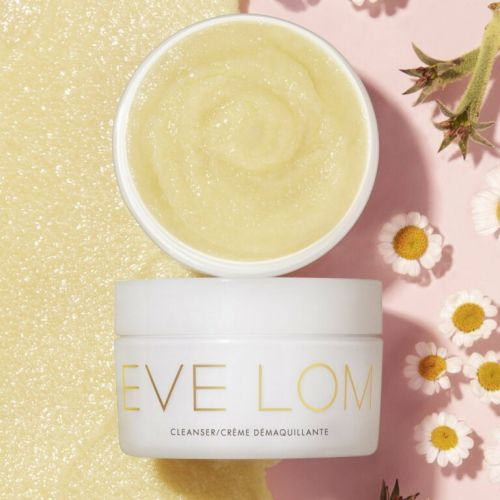

# 快讯｜完美日记母公司收购欧洲美妆护肤品牌Eve Lom_腾讯新闻

**链接地址:** https://xw.qq.com/cmsid/20210302A0EECP00
**作者:** 腾讯网
**获取时间:** 2025/8/28 19:52:46
**图片数量:** 3

---

## 原始HTML内容

        

                

          

<h1>快讯｜完美日记母公司收购欧洲美妆护肤品牌Eve Lom</h1>

<a href="https://news.qq.com/omn/author/8QMc33pb6YAUvTnd" target="_blank" rel="noopener">
财经网
</a>
2021-03-02 21:57财经网官方账号

财经网生活讯 3月2日，财经网生活由逸仙电商官方获悉，完美日记母公司逸仙电商（纽交所代码：YSG）宣布将收购护肤品牌Eve Lom。此交易卖方为Manzanita Capital，后者将继续在该业务中保留少数股权，并与逸仙电商达成战略合作关系。该收购预计将在未来数周内完成。

逸仙电商创始人、董事会主席兼CEO黄锦峰表示：“我们诚挚欢迎全球知名的Eve Lom加入逸仙。Eve Lom以其深厚的品牌根基以及高效的独家配方闻名，是深受消费者喜爱的护肤品牌之一。凭借洁颜霜等明星产品，品牌拥有着极高的消费者忠诚度，即使在新冠疫情期间，品牌也表现出了强劲的销售增长和盈利能力。我们非常期待充满激情的Eve Lom 团队加入逸仙，他们拥有资深的国际化时尚美妆行业经验。逸仙将携手EveLom团队共同打造下一个时代具有全球影响力的美妆品牌。”

Manzanita董事总经理Andras Szirtes补充：“在Eve Lom加入Manzanita品牌家族接近20年的时光里，我们一起经历了它令人难忘的成长旅程。我们很荣幸地见证Eve Lom从一个小众品牌成长为全球品牌，业务遍及北美，欧洲和亚洲。与逸仙电商的合作机会让我们感到无比兴奋。我们坚信，逸仙电商在亚洲市场打下的坚实基础，卓越的电商运营和非凡的创新能力，将会推动Eve Lom品牌发展再上新台阶。”

据了解，Eve Lom品牌由闻名欧洲的明星美容师Eve Lom女士于1985年在伦敦创立，并推出同名产品系列，秉持“发光肌，从清洁开始”的护肤理念。在其经典产品洁颜霜问世的35年以来，该品牌一直追求将高品质的天然成分与最前沿的科技创新相结合。

图片来源：逸仙电商官方

          

          

          

        

      

---

## 纯文本内容

快讯｜完美日记母公司收购欧洲美妆护肤品牌Eve Lom财经网2021-03-02 21:57财经网官方账号财经网生活讯 3月2日，财经网生活由逸仙电商官方获悉，完美日记母公司逸仙电商（纽交所代码：YSG）宣布将收购护肤品牌Eve Lom。此交易卖方为Manzanita Capital，后者将继续在该业务中保留少数股权，并与逸仙电商达成战略合作关系。该收购预计将在未来数周内完成。逸仙电商创始人、董事会主席兼CEO黄锦峰表示：“我们诚挚欢迎全球知名的Eve Lom加入逸仙。Eve Lom以其深厚的品牌根基以及高效的独家配方闻名，是深受消费者喜爱的护肤品牌之一。凭借洁颜霜等明星产品，品牌拥有着极高的消费者忠诚度，即使在新冠疫情期间，品牌也表现出了强劲的销售增长和盈利能力。我们非常期待充满激情的Eve Lom 团队加入逸仙，他们拥有资深的国际化时尚美妆行业经验。逸仙将携手EveLom团队共同打造下一个时代具有全球影响力的美妆品牌。”Manzanita董事总经理Andras Szirtes补充：“在Eve Lom加入Manzanita品牌家族接近20年的时光里，我们一起经历了它令人难忘的成长旅程。我们很荣幸地见证Eve Lom从一个小众品牌成长为全球品牌，业务遍及北美，欧洲和亚洲。与逸仙电商的合作机会让我们感到无比兴奋。我们坚信，逸仙电商在亚洲市场打下的坚实基础，卓越的电商运营和非凡的创新能力，将会推动Eve Lom品牌发展再上新台阶。”据了解，Eve Lom品牌由闻名欧洲的明星美容师Eve Lom女士于1985年在伦敦创立，并推出同名产品系列，秉持“发光肌，从清洁开始”的护肤理念。在其经典产品洁颜霜问世的35年以来，该品牌一直追求将高品质的天然成分与最前沿的科技创新相结合。图片来源：逸仙电商官方

---

## 图片列表

-  (原始链接: http://inews.gtimg.com/newsapp_ls/0/7051629375_200200/0)
-  (原始链接: http://inews.gtimg.com/newsapp_ls/0/14876049251/0)
-  (原始链接: http://inews.gtimg.com/newsapp_bt/0/13232170654/641)
