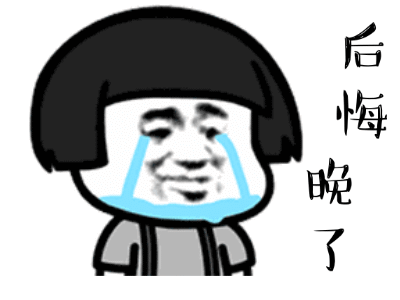

# 无标题

**链接地址:** http://mp.weixin.qq.com/s?__biz=MzI4NDYyNjAwNw==&mid=2247484849&idx=1&sn=1b603d74e08eeb5a15ce47d295ce14ac&chksm=ebf9d889dc8e519fcda78f3061a839fe80b07c4515e60f9ddb3fb4eabab5eaf7459f78ae86bf&mpshare=1&scene=2&srcid=03181oEMFVe2KC64mUSTdiYU&sharer_sharetime=1616036445977&sharer_shareid=be1c8edd6c93eec155a61c876e41d26a#rd
**作者:** 关注我们
**获取时间:** 2025/8/28 19:51:15
**图片数量:** 29

---

## 原始HTML内容

<section style="box-sizing: border-box;font-size: 16px;"><section style="margin: 10px 0% -10px;box-sizing: border-box;" powered-by="xiumi.us"><section style="display: inline-block;width: 100%;vertical-align: top;background-color: rgb(241, 248, 255);padding-top: 10px;box-sizing: border-box;"><section style="box-sizing: border-box;" powered-by="xiumi.us"><section style="display: flex;flex-flow: row nowrap;box-sizing: border-box;"><section style="display: inline-block;width: auto;vertical-align: top;flex: 100 100 0%;align-self: flex-start;height: auto;line-height: 0;padding-right: 12px;box-sizing: border-box;"><section style="box-sizing: border-box;" powered-by="xiumi.us"><section style="display: flex;flex-flow: row nowrap;text-align: right;justify-content: flex-end;margin: 4px 0%;transform: translate3d(-7px, 0px, 0px);-webkit-transform: translate3d(-7px, 0px, 0px);-moz-transform: translate3d(-7px, 0px, 0px);-o-transform: translate3d(-7px, 0px, 0px);box-sizing: border-box;"><section style="display: inline-block;vertical-align: top;width: auto;flex: 0 0 0%;height: auto;align-self: flex-start;box-sizing: border-box;"><section style="text-align: center;box-sizing: border-box;" powered-by="xiumi.us"><section style="display: inline-block;width: 6px;height: 6px;vertical-align: top;overflow: hidden;border-width: 0px;border-radius: 10px;border-style: none;border-color: rgb(62, 62, 62);background-color: rgb(241, 92, 25);box-sizing: border-box;"><section><svg viewBox="0 0 1 1" style="float:left;line-height:0;width:0;vertical-align:top;"></svg></section></section></section></section><section style="display: inline-block;vertical-align: top;width: auto;flex: 0 0 0%;height: auto;align-self: flex-start;margin-right: 10px;margin-left: 10px;box-sizing: border-box;"><section style="text-align: center;box-sizing: border-box;" powered-by="xiumi.us"><section style="display: inline-block;width: 6px;height: 6px;vertical-align: top;overflow: hidden;border-width: 0px;border-radius: 10px;border-style: none;border-color: rgb(62, 62, 62);background-color: rgb(247, 206, 42);box-sizing: border-box;"><section><svg viewBox="0 0 1 1" style="float:left;line-height:0;width:0;vertical-align:top;"></svg></section></section></section></section><section style="display: inline-block;vertical-align: top;width: auto;flex: 0 0 0%;height: auto;box-sizing: border-box;"><section style="text-align: center;box-sizing: border-box;" powered-by="xiumi.us"><section style="display: inline-block;width: 6px;height: 6px;vertical-align: top;overflow: hidden;border-width: 0px;border-radius: 10px;border-style: none;border-color: rgb(62, 62, 62);background-color: rgb(57, 219, 183);box-sizing: border-box;"><section><svg viewBox="0 0 1 1" style="float:left;line-height:0;width:0;vertical-align:top;"></svg></section></section></section></section></section></section></section></section></section><section style="text-align: center;margin: 10px 0% 20px;box-sizing: border-box;" powered-by="xiumi.us"><section style="max-width: 100%;vertical-align: middle;display: inline-block;line-height: 0;width: 90%;height: auto;box-sizing: border-box;"></section></section></section></section><section style="margin-right: 0%;margin-bottom: 10px;margin-left: 0%;box-sizing: border-box;" powered-by="xiumi.us"><section style="display: inline-block;width: 100%;vertical-align: top;border-style: solid;border-width: 6px;border-color: rgb(241, 248, 255);box-sizing: border-box;"><section style="margin: 20px 0%;box-sizing: border-box;" powered-by="xiumi.us"><section style="color: rgb(153, 153, 153);font-size: 14px;line-height: 2;letter-spacing: 2px;padding-right: 20px;padding-left: 20px;box-sizing: border-box;">
 

春暖花开的日子即将到来，春招的脚步也在加快！在这个期间进行求职的朋友们，或许已经<strong style="box-sizing: border-box;">幸运地接到了面试的通知</strong>。

 

疫情期间的求职面试机会有多么<strong style="box-sizing: border-box;">难得</strong>，相信不用我们着重强调。上千人竞争一个职位都很正常！

 
</section></section><section style="text-align: center;box-sizing: border-box;" powered-by="xiumi.us"><section style="max-width: 100%;vertical-align: middle;display: inline-block;line-height: 0;width: 90%;height: auto;box-sizing: border-box;"></section></section><section style="margin: 20px 0%;box-sizing: border-box;" powered-by="xiumi.us"><section style="color: rgb(153, 153, 153);font-size: 14px;line-height: 2;letter-spacing: 2px;padding-right: 20px;padding-left: 20px;box-sizing: border-box;">
 

<strong style="box-sizing: border-box;">过五关，斩六六六将</strong>，都突破艰难险阻来到了面试这一步，<strong style="box-sizing: border-box;">更不能松懈！</strong>

 

如何抓住难得的面试机会，成功拿下心仪的工作Offer是挡在众多求职者面前的大难题。千万别一个不留意犯下<strong style="box-sizing: border-box;">“致命的错误”</strong>让这来之不易的机会泡汤！

 
</section></section><section style="text-align: center;margin-top: 10px;margin-bottom: 10px;box-sizing: border-box;" powered-by="xiumi.us"><section style="max-width: 100%;vertical-align: middle;display: inline-block;line-height: 0;width: 65%;height: auto;box-sizing: border-box;"></section></section><section style="margin: 20px 0%;box-sizing: border-box;" powered-by="xiumi.us"><section style="color: rgb(153, 153, 153);font-size: 14px;line-height: 2;letter-spacing: 2px;padding-right: 20px;padding-left: 20px;box-sizing: border-box;">
 

在上一期文章的结尾，我们向读者朋友们公开征集了<strong style="box-sizing: border-box;">“那些年在面试中犯下的错”</strong>的真实案例。

 

今天就让我们从案例中挑一些十分常见的<strong style="box-sizing: border-box;">“反面教材”</strong>，来给大家进行提醒和纠正！快准备好自己的求职小本本！这些面试中的错误，<strong style="box-sizing: border-box;">今后可千万要避免啦！</strong>
</section></section></section></section><section style="box-sizing: border-box;" powered-by="xiumi.us">
 
</section><section style="box-sizing: border-box;" powered-by="xiumi.us"><section style="margin: 10px 0% -8px;text-align: left;justify-content: flex-start;display: flex;flex-flow: row nowrap;box-sizing: border-box;"><section style="display: inline-block;vertical-align: middle;width: auto;background-color: rgb(241, 248, 255);line-height: 0;min-width: 10%;max-width: 100%;flex: 0 0 auto;height: auto;align-self: center;box-sizing: border-box;"><section style="box-sizing: border-box;" powered-by="xiumi.us"><section style="display: flex;flex-flow: row nowrap;box-sizing: border-box;"><section style="display: inline-block;width: auto;vertical-align: middle;align-self: center;flex: 100 100 0%;height: auto;box-sizing: border-box;"><section style="margin-right: 0%;margin-left: 0%;box-sizing: border-box;" powered-by="xiumi.us"><section style="text-align: justify;font-size: 17px;color: rgb(241, 92, 25);letter-spacing: 1px;line-height: 3;padding-right: 26px;padding-left: 26px;box-sizing: border-box;">
<strong style="box-sizing: border-box;">“低级错误”，你确定能避免吗？</strong>
</section></section></section></section></section></section><section style="display: inline-block;vertical-align: middle;width: auto;min-width: 10%;max-width: 100%;flex: 0 0 auto;height: auto;align-self: center;line-height: 0;box-sizing: border-box;"><section style="box-sizing: border-box;" powered-by="xiumi.us"><section style="display: flex;flex-flow: row nowrap;text-align: right;justify-content: flex-end;margin: 4px 0%;transform: translate3d(15px, 0px, 0px);-webkit-transform: translate3d(15px, 0px, 0px);-moz-transform: translate3d(15px, 0px, 0px);-o-transform: translate3d(15px, 0px, 0px);box-sizing: border-box;"><section style="display: inline-block;vertical-align: top;width: auto;flex: 0 0 0%;height: auto;align-self: flex-start;box-sizing: border-box;"><section style="text-align: center;box-sizing: border-box;" powered-by="xiumi.us"><section style="display: inline-block;width: 6px;height: 6px;vertical-align: top;overflow: hidden;border-width: 0px;border-radius: 10px;border-style: none;border-color: rgb(62, 62, 62);background-color: rgb(241, 92, 25);box-sizing: border-box;"><section><svg viewBox="0 0 1 1" style="float:left;line-height:0;width:0;vertical-align:top;"></svg></section></section></section></section><section style="display: inline-block;vertical-align: top;width: auto;flex: 0 0 0%;height: auto;align-self: flex-start;margin-right: 10px;margin-left: 10px;box-sizing: border-box;"><section style="text-align: center;box-sizing: border-box;" powered-by="xiumi.us"><section style="display: inline-block;width: 6px;height: 6px;vertical-align: top;overflow: hidden;border-width: 0px;border-radius: 10px;border-style: none;border-color: rgb(62, 62, 62);background-color: rgb(247, 206, 42);box-sizing: border-box;"><section><svg viewBox="0 0 1 1" style="float:left;line-height:0;width:0;vertical-align:top;"></svg></section></section></section></section><section style="display: inline-block;vertical-align: top;width: auto;flex: 0 0 0%;height: auto;box-sizing: border-box;"><section style="text-align: center;box-sizing: border-box;" powered-by="xiumi.us"><section style="display: inline-block;width: 6px;height: 6px;vertical-align: top;overflow: hidden;border-width: 0px;border-radius: 10px;border-style: none;border-color: rgb(62, 62, 62);background-color: rgb(57, 219, 183);box-sizing: border-box;"><section><svg viewBox="0 0 1 1" style="float:left;line-height:0;width:0;vertical-align:top;"></svg></section></section></section></section></section></section></section></section></section><section style="margin-right: 0%;margin-bottom: 10px;margin-left: 0%;box-sizing: border-box;" powered-by="xiumi.us"><section style="display: inline-block;width: 100%;vertical-align: top;border-style: solid;border-width: 5px;border-color: rgb(241, 248, 255);box-sizing: border-box;"><section style="box-sizing: border-box;" powered-by="xiumi.us">
 
</section><section style="text-align: center;box-sizing: border-box;" powered-by="xiumi.us"><section style="max-width: 100%;vertical-align: middle;display: inline-block;line-height: 0;width: 90%;height: auto;box-sizing: border-box;"></section></section><section style="box-sizing: border-box;" powered-by="xiumi.us">
 
</section><section style="margin-top: 10px;margin-bottom: 10px;box-sizing: border-box;" powered-by="xiumi.us"><section style="width: 100%;box-sizing: border-box;"><section style="float: left;padding-right: 3px;line-height: 1;width: 20%;box-sizing: border-box;"><section style="text-align: center;margin-right: 0%;margin-left: 0%;box-sizing: border-box;" powered-by="xiumi.us"><section style="max-width: 100%;vertical-align: middle;display: inline-block;line-height: 0;width: 85%;box-sizing: border-box;"></section></section></section><section style="clear: right;box-sizing: border-box;min-height: 4.5em !important;"><section style="line-height: 2;padding-right: 15px;padding-left: 15px;font-size: 14px;color: rgb(121, 121, 121);letter-spacing: 2px;box-sizing: border-box;" powered-by="xiumi.us">
<strong style="box-sizing: border-box;">在面试第一份正式工作的时候，我曾经犯了一个特别“低级”的错误——迟到。工作面试的地点就在我家附近，所以我只提前了十分钟出发。没想到去了以后找不到面试的房间，结果反倒迟到了十分钟。当然最后面试也没能成功啦…</strong>

 

<strong style="box-sizing: border-box;">—— 讲述人：小罩罩</strong>
</section><section style="box-sizing: border-box;" powered-by="xiumi.us">
 
</section><section style="box-sizing: border-box;" powered-by="xiumi.us">
 
</section></section><section style="clear: both;box-sizing: border-box;"><section><svg viewBox="0 0 1 1" style="float:left;line-height:0;width:0;vertical-align:top;"></svg></section></section></section></section><section style="box-sizing: border-box;" powered-by="xiumi.us"><section style="display: flex;flex-flow: row nowrap;text-align: center;justify-content: center;margin: 10px 0% 4px;box-sizing: border-box;"><section style="display: inline-block;vertical-align: top;width: auto;flex: 0 0 0%;height: auto;align-self: flex-start;box-sizing: border-box;"><section style="box-sizing: border-box;" powered-by="xiumi.us"><section style="display: inline-block;width: 6px;height: 6px;vertical-align: top;overflow: hidden;border-width: 0px;border-radius: 10px;border-style: none;border-color: rgb(62, 62, 62);background-color: rgb(241, 92, 25);box-sizing: border-box;"><section><svg viewBox="0 0 1 1" style="float:left;line-height:0;width:0;vertical-align:top;"></svg></section></section></section></section><section style="display: inline-block;vertical-align: top;width: auto;flex: 0 0 0%;height: auto;align-self: flex-start;margin-right: 10px;margin-left: 10px;box-sizing: border-box;"><section style="box-sizing: border-box;" powered-by="xiumi.us"><section style="display: inline-block;width: 6px;height: 6px;vertical-align: top;overflow: hidden;border-width: 0px;border-radius: 10px;border-style: none;border-color: rgb(62, 62, 62);background-color: rgb(247, 206, 42);box-sizing: border-box;"><section><svg viewBox="0 0 1 1" style="float:left;line-height:0;width:0;vertical-align:top;"></svg></section></section></section></section><section style="display: inline-block;vertical-align: top;width: auto;flex: 0 0 0%;height: auto;box-sizing: border-box;"><section style="box-sizing: border-box;" powered-by="xiumi.us"><section style="display: inline-block;width: 6px;height: 6px;vertical-align: top;overflow: hidden;border-width: 0px;border-radius: 10px;border-style: none;border-color: rgb(62, 62, 62);background-color: rgb(57, 219, 183);box-sizing: border-box;"><section><svg viewBox="0 0 1 1" style="float:left;line-height:0;width:0;vertical-align:top;"></svg></section></section></section></section></section></section><section style="text-align: center;box-sizing: border-box;" powered-by="xiumi.us"><section style="max-width: 100%;vertical-align: middle;display: inline-block;line-height: 0;width: 90%;height: auto;box-sizing: border-box;"></section></section><section style="box-sizing: border-box;" powered-by="xiumi.us">
 
</section><section style="margin: 10px 0%;box-sizing: border-box;" powered-by="xiumi.us"><section style="float: right;text-align: left;width: 20%;padding-left: 5px;box-sizing: border-box;"><section style="text-align: center;margin-right: 0%;margin-left: 0%;box-sizing: border-box;" powered-by="xiumi.us"><section style="max-width: 100%;vertical-align: middle;display: inline-block;line-height: 0;width: 95%;box-sizing: border-box;"></section></section></section><section style="line-height: 2;color: rgb(121, 121, 121);font-size: 14px;letter-spacing: 2px;padding-right: 15px;padding-left: 15px;box-sizing: border-box;" powered-by="xiumi.us">
“迟到”这样的“低级错误”不应该犯是每个人都知道的，但就算你对面试的地点环境再熟悉，也<strong style="box-sizing: border-box;">尽量预算更充足的时间</strong>，提前几分钟抵达，以避免任何意外的发生。

 

提前几分钟抵达面试场所可以帮助你<strong style="box-sizing: border-box;">调整好心情、整理好着装，熟悉面试环境，帮助自己更加气定神闲、胸有成竹地进入面试程序</strong>。

 

—— <strong style="box-sizing: border-box;">BadaB</strong>
</section><section style="clear: both;box-sizing: border-box;"><section><svg viewBox="0 0 1 1" style="float:left;line-height:0;width:0;vertical-align:top;"></svg></section></section></section><section style="box-sizing: border-box;" powered-by="xiumi.us">
 
</section></section></section><section style="box-sizing: border-box;" powered-by="xiumi.us">
 
</section><section style="box-sizing: border-box;" powered-by="xiumi.us"><section style="margin: 10px 0% -8px;text-align: left;justify-content: flex-start;display: flex;flex-flow: row nowrap;box-sizing: border-box;"><section style="display: inline-block;vertical-align: middle;width: auto;background-color: rgb(241, 248, 255);line-height: 0;min-width: 10%;max-width: 100%;flex: 0 0 auto;height: auto;align-self: center;box-sizing: border-box;"><section style="box-sizing: border-box;" powered-by="xiumi.us"><section style="display: flex;flex-flow: row nowrap;box-sizing: border-box;"><section style="display: inline-block;width: auto;vertical-align: middle;align-self: center;flex: 100 100 0%;height: auto;box-sizing: border-box;"><section style="margin-right: 0%;margin-left: 0%;box-sizing: border-box;" powered-by="xiumi.us"><section style="text-align: justify;font-size: 17px;color: rgb(241, 92, 25);letter-spacing: 1px;line-height: 3;padding-right: 26px;padding-left: 26px;box-sizing: border-box;">
<strong style="box-sizing: border-box;">亲，您哪位？</strong>
</section></section></section></section></section></section><section style="display: inline-block;vertical-align: middle;width: auto;min-width: 10%;max-width: 100%;flex: 0 0 auto;height: auto;align-self: center;line-height: 0;box-sizing: border-box;"><section style="box-sizing: border-box;" powered-by="xiumi.us"><section style="display: flex;flex-flow: row nowrap;text-align: right;justify-content: flex-end;margin: 4px 0%;transform: translate3d(15px, 0px, 0px);-webkit-transform: translate3d(15px, 0px, 0px);-moz-transform: translate3d(15px, 0px, 0px);-o-transform: translate3d(15px, 0px, 0px);box-sizing: border-box;"><section style="display: inline-block;vertical-align: top;width: auto;flex: 0 0 0%;height: auto;align-self: flex-start;box-sizing: border-box;"><section style="text-align: center;box-sizing: border-box;" powered-by="xiumi.us"><section style="display: inline-block;width: 6px;height: 6px;vertical-align: top;overflow: hidden;border-width: 0px;border-radius: 10px;border-style: none;border-color: rgb(62, 62, 62);background-color: rgb(241, 92, 25);box-sizing: border-box;"><section><svg viewBox="0 0 1 1" style="float:left;line-height:0;width:0;vertical-align:top;"></svg></section></section></section></section><section style="display: inline-block;vertical-align: top;width: auto;flex: 0 0 0%;height: auto;align-self: flex-start;margin-right: 10px;margin-left: 10px;box-sizing: border-box;"><section style="text-align: center;box-sizing: border-box;" powered-by="xiumi.us"><section style="display: inline-block;width: 6px;height: 6px;vertical-align: top;overflow: hidden;border-width: 0px;border-radius: 10px;border-style: none;border-color: rgb(62, 62, 62);background-color: rgb(247, 206, 42);box-sizing: border-box;"><section><svg viewBox="0 0 1 1" style="float:left;line-height:0;width:0;vertical-align:top;"></svg></section></section></section></section><section style="display: inline-block;vertical-align: top;width: auto;flex: 0 0 0%;height: auto;box-sizing: border-box;"><section style="text-align: center;box-sizing: border-box;" powered-by="xiumi.us"><section style="display: inline-block;width: 6px;height: 6px;vertical-align: top;overflow: hidden;border-width: 0px;border-radius: 10px;border-style: none;border-color: rgb(62, 62, 62);background-color: rgb(57, 219, 183);box-sizing: border-box;"><section><svg viewBox="0 0 1 1" style="float:left;line-height:0;width:0;vertical-align:top;"></svg></section></section></section></section></section></section></section></section></section><section style="margin-right: 0%;margin-bottom: 10px;margin-left: 0%;box-sizing: border-box;" powered-by="xiumi.us"><section style="display: inline-block;width: 100%;vertical-align: top;border-style: solid;border-width: 5px;border-color: rgb(241, 248, 255);box-sizing: border-box;"><section style="box-sizing: border-box;" powered-by="xiumi.us">
 
</section><section style="text-align: center;box-sizing: border-box;" powered-by="xiumi.us"><section style="max-width: 100%;vertical-align: middle;display: inline-block;line-height: 0;width: 90%;height: auto;box-sizing: border-box;"></section></section><section style="box-sizing: border-box;" powered-by="xiumi.us">
 
</section><section style="margin-top: 10px;margin-bottom: 10px;box-sizing: border-box;" powered-by="xiumi.us"><section style="width: 100%;box-sizing: border-box;"><section style="float: left;padding-right: 3px;line-height: 1;width: 20%;box-sizing: border-box;"><section style="text-align: center;margin-right: 0%;margin-left: 0%;box-sizing: border-box;" powered-by="xiumi.us"><section style="max-width: 100%;vertical-align: middle;display: inline-block;line-height: 0;width: 85%;box-sizing: border-box;"></section></section></section><section style="clear: right;box-sizing: border-box;min-height: 4.5em !important;"><section style="line-height: 2;padding-right: 15px;padding-left: 15px;font-size: 14px;color: rgb(121, 121, 121);letter-spacing: 2px;box-sizing: border-box;" powered-by="xiumi.us">
<strong style="box-sizing: border-box;">说起面试中的蠢事我可太有发言权了！而且可能你都找不出比我这更尬的经历了！</strong>

 

<strong style="box-sizing: border-box;">有一次我去面试一个没太有把握的职位，所以去之前就没怎么对那家企业做research。结果面试的时候面试官问我：&nbsp;"What Do You Know about Our Company?"</strong>

 

<strong style="box-sizing: border-box;">我整个人就当场石化了…我什么都没说出来！</strong>

 

<strong style="box-sizing: border-box;">—— 讲述人：Brain</strong>
</section><section style="box-sizing: border-box;" powered-by="xiumi.us">
 
</section><section style="box-sizing: border-box;" powered-by="xiumi.us">
 
</section></section><section style="clear: both;box-sizing: border-box;"><section><svg viewBox="0 0 1 1" style="float:left;line-height:0;width:0;vertical-align:top;"></svg></section></section></section></section><section style="box-sizing: border-box;" powered-by="xiumi.us"><section style="display: flex;flex-flow: row nowrap;text-align: center;justify-content: center;margin: 10px 0% 4px;box-sizing: border-box;"><section style="display: inline-block;vertical-align: top;width: auto;flex: 0 0 0%;height: auto;align-self: flex-start;box-sizing: border-box;"><section style="box-sizing: border-box;" powered-by="xiumi.us"><section style="display: inline-block;width: 6px;height: 6px;vertical-align: top;overflow: hidden;border-width: 0px;border-radius: 10px;border-style: none;border-color: rgb(62, 62, 62);background-color: rgb(241, 92, 25);box-sizing: border-box;"><section><svg viewBox="0 0 1 1" style="float:left;line-height:0;width:0;vertical-align:top;"></svg></section></section></section></section><section style="display: inline-block;vertical-align: top;width: auto;flex: 0 0 0%;height: auto;align-self: flex-start;margin-right: 10px;margin-left: 10px;box-sizing: border-box;"><section style="box-sizing: border-box;" powered-by="xiumi.us"><section style="display: inline-block;width: 6px;height: 6px;vertical-align: top;overflow: hidden;border-width: 0px;border-radius: 10px;border-style: none;border-color: rgb(62, 62, 62);background-color: rgb(247, 206, 42);box-sizing: border-box;"><section><svg viewBox="0 0 1 1" style="float:left;line-height:0;width:0;vertical-align:top;"></svg></section></section></section></section><section style="display: inline-block;vertical-align: top;width: auto;flex: 0 0 0%;height: auto;box-sizing: border-box;"><section style="box-sizing: border-box;" powered-by="xiumi.us"><section style="display: inline-block;width: 6px;height: 6px;vertical-align: top;overflow: hidden;border-width: 0px;border-radius: 10px;border-style: none;border-color: rgb(62, 62, 62);background-color: rgb(57, 219, 183);box-sizing: border-box;"><section><svg viewBox="0 0 1 1" style="float:left;line-height:0;width:0;vertical-align:top;"></svg></section></section></section></section></section></section><section style="text-align: center;box-sizing: border-box;" powered-by="xiumi.us"><section style="max-width: 100%;vertical-align: middle;display: inline-block;line-height: 0;width: 90%;height: auto;box-sizing: border-box;"></section></section><section style="box-sizing: border-box;" powered-by="xiumi.us">
 
</section><section style="margin: 10px 0%;box-sizing: border-box;" powered-by="xiumi.us"><section style="float: right;text-align: left;width: 20%;padding-left: 5px;box-sizing: border-box;"><section style="text-align: center;margin-right: 0%;margin-left: 0%;box-sizing: border-box;" powered-by="xiumi.us"><section style="max-width: 100%;vertical-align: middle;display: inline-block;line-height: 0;width: 95%;box-sizing: border-box;"></section></section></section><section style="line-height: 2;color: rgb(121, 121, 121);font-size: 14px;letter-spacing: 2px;padding-right: 15px;padding-left: 15px;box-sizing: border-box;" powered-by="xiumi.us">
<strong style="box-sizing: border-box;">在面试前对应聘的公司和职位一定要做好充足的调查。</strong>

 

一方面是需要去应对类似于&nbsp;"What Do You Know about Our Company?"和“Why Do You Want to Work Here?”这样的问题；另一方面会让你在和面试官的交谈中表现得更加准备充分，展现<strong style="box-sizing: border-box;">更强烈地想要争取这份工作的决心和对公司的尊重。</strong>

 

—— <strong style="box-sizing: border-box;">BadaB</strong>
</section><section style="clear: both;box-sizing: border-box;"><section><svg viewBox="0 0 1 1" style="float:left;line-height:0;width:0;vertical-align:top;"></svg></section></section></section><section style="box-sizing: border-box;" powered-by="xiumi.us">
 
</section></section></section><section style="box-sizing: border-box;" powered-by="xiumi.us">
 
</section><section style="box-sizing: border-box;" powered-by="xiumi.us"><section style="margin: 10px 0% -8px;text-align: left;justify-content: flex-start;display: flex;flex-flow: row nowrap;box-sizing: border-box;"><section style="display: inline-block;vertical-align: middle;width: auto;background-color: rgb(241, 248, 255);line-height: 0;min-width: 10%;max-width: 100%;flex: 0 0 auto;height: auto;align-self: center;box-sizing: border-box;"><section style="box-sizing: border-box;" powered-by="xiumi.us"><section style="display: flex;flex-flow: row nowrap;box-sizing: border-box;"><section style="display: inline-block;width: auto;vertical-align: middle;align-self: center;flex: 100 100 0%;height: auto;box-sizing: border-box;"><section style="margin-right: 0%;margin-left: 0%;box-sizing: border-box;" powered-by="xiumi.us"><section style="text-align: justify;font-size: 17px;color: rgb(241, 92, 25);letter-spacing: 1px;line-height: 3;padding-right: 26px;padding-left: 26px;box-sizing: border-box;">
<strong style="box-sizing: border-box;">我在面试中哭了…</strong>
</section></section></section></section></section></section><section style="display: inline-block;vertical-align: middle;width: auto;min-width: 10%;max-width: 100%;flex: 0 0 auto;height: auto;align-self: center;line-height: 0;box-sizing: border-box;"><section style="box-sizing: border-box;" powered-by="xiumi.us"><section style="display: flex;flex-flow: row nowrap;text-align: right;justify-content: flex-end;margin: 4px 0%;transform: translate3d(15px, 0px, 0px);-webkit-transform: translate3d(15px, 0px, 0px);-moz-transform: translate3d(15px, 0px, 0px);-o-transform: translate3d(15px, 0px, 0px);box-sizing: border-box;"><section style="display: inline-block;vertical-align: top;width: auto;flex: 0 0 0%;height: auto;align-self: flex-start;box-sizing: border-box;"><section style="text-align: center;box-sizing: border-box;" powered-by="xiumi.us"><section style="display: inline-block;width: 6px;height: 6px;vertical-align: top;overflow: hidden;border-width: 0px;border-radius: 10px;border-style: none;border-color: rgb(62, 62, 62);background-color: rgb(241, 92, 25);box-sizing: border-box;"><section><svg viewBox="0 0 1 1" style="float:left;line-height:0;width:0;vertical-align:top;"></svg></section></section></section></section><section style="display: inline-block;vertical-align: top;width: auto;flex: 0 0 0%;height: auto;align-self: flex-start;margin-right: 10px;margin-left: 10px;box-sizing: border-box;"><section style="text-align: center;box-sizing: border-box;" powered-by="xiumi.us"><section style="display: inline-block;width: 6px;height: 6px;vertical-align: top;overflow: hidden;border-width: 0px;border-radius: 10px;border-style: none;border-color: rgb(62, 62, 62);background-color: rgb(247, 206, 42);box-sizing: border-box;"><section><svg viewBox="0 0 1 1" style="float:left;line-height:0;width:0;vertical-align:top;"></svg></section></section></section></section><section style="display: inline-block;vertical-align: top;width: auto;flex: 0 0 0%;height: auto;box-sizing: border-box;"><section style="text-align: center;box-sizing: border-box;" powered-by="xiumi.us"><section style="display: inline-block;width: 6px;height: 6px;vertical-align: top;overflow: hidden;border-width: 0px;border-radius: 10px;border-style: none;border-color: rgb(62, 62, 62);background-color: rgb(57, 219, 183);box-sizing: border-box;"><section><svg viewBox="0 0 1 1" style="float:left;line-height:0;width:0;vertical-align:top;"></svg></section></section></section></section></section></section></section></section></section><section style="margin-right: 0%;margin-bottom: 10px;margin-left: 0%;box-sizing: border-box;" powered-by="xiumi.us"><section style="display: inline-block;width: 100%;vertical-align: top;border-style: solid;border-width: 5px;border-color: rgb(241, 248, 255);box-sizing: border-box;"><section style="box-sizing: border-box;" powered-by="xiumi.us">
 
</section><section style="text-align: center;box-sizing: border-box;" powered-by="xiumi.us"><section style="max-width: 100%;vertical-align: middle;display: inline-block;line-height: 0;width: 90%;height: auto;box-sizing: border-box;"></section></section><section style="box-sizing: border-box;" powered-by="xiumi.us">
 
</section><section style="margin-top: 10px;margin-bottom: 10px;box-sizing: border-box;" powered-by="xiumi.us"><section style="width: 100%;box-sizing: border-box;"><section style="float: left;padding-right: 3px;line-height: 1;width: 20%;box-sizing: border-box;"><section style="text-align: center;margin-right: 0%;margin-left: 0%;box-sizing: border-box;" powered-by="xiumi.us"><section style="max-width: 100%;vertical-align: middle;display: inline-block;line-height: 0;width: 85%;box-sizing: border-box;"></section></section></section><section style="clear: right;box-sizing: border-box;min-height: 4.5em !important;"><section style="line-height: 2;padding-right: 15px;padding-left: 15px;font-size: 14px;color: rgb(121, 121, 121);letter-spacing: 2px;box-sizing: border-box;" powered-by="xiumi.us">
<strong style="box-sizing: border-box;">说来惭愧，有一次面试的过程中，我控制不住地哭了起来。</strong>

 

<strong style="box-sizing: border-box;">面试我的HR语气冰冷、面无表情。整个面试过程像拷问一样快问快答。我觉得我有几个问题回答得很差，后来越想思维越乱，表现得特别不好。那是一份我争取了很久的工作，我感觉我肯定得不到那份工作了，所以就没绷住，情绪崩溃了。</strong>

 

<strong style="box-sizing: border-box;">—— 讲述人：匿名</strong>
</section><section style="box-sizing: border-box;" powered-by="xiumi.us">
 
</section><section style="box-sizing: border-box;" powered-by="xiumi.us">
 
</section></section><section style="clear: both;box-sizing: border-box;"><section><svg viewBox="0 0 1 1" style="float:left;line-height:0;width:0;vertical-align:top;"></svg></section></section></section></section><section style="box-sizing: border-box;" powered-by="xiumi.us"><section style="display: flex;flex-flow: row nowrap;text-align: center;justify-content: center;margin: 10px 0% 4px;box-sizing: border-box;"><section style="display: inline-block;vertical-align: top;width: auto;flex: 0 0 0%;height: auto;align-self: flex-start;box-sizing: border-box;"><section style="box-sizing: border-box;" powered-by="xiumi.us"><section style="display: inline-block;width: 6px;height: 6px;vertical-align: top;overflow: hidden;border-width: 0px;border-radius: 10px;border-style: none;border-color: rgb(62, 62, 62);background-color: rgb(241, 92, 25);box-sizing: border-box;"><section><svg viewBox="0 0 1 1" style="float:left;line-height:0;width:0;vertical-align:top;"></svg></section></section></section></section><section style="display: inline-block;vertical-align: top;width: auto;flex: 0 0 0%;height: auto;align-self: flex-start;margin-right: 10px;margin-left: 10px;box-sizing: border-box;"><section style="box-sizing: border-box;" powered-by="xiumi.us"><section style="display: inline-block;width: 6px;height: 6px;vertical-align: top;overflow: hidden;border-width: 0px;border-radius: 10px;border-style: none;border-color: rgb(62, 62, 62);background-color: rgb(247, 206, 42);box-sizing: border-box;"><section><svg viewBox="0 0 1 1" style="float:left;line-height:0;width:0;vertical-align:top;"></svg></section></section></section></section><section style="display: inline-block;vertical-align: top;width: auto;flex: 0 0 0%;height: auto;box-sizing: border-box;"><section style="box-sizing: border-box;" powered-by="xiumi.us"><section style="display: inline-block;width: 6px;height: 6px;vertical-align: top;overflow: hidden;border-width: 0px;border-radius: 10px;border-style: none;border-color: rgb(62, 62, 62);background-color: rgb(57, 219, 183);box-sizing: border-box;"><section><svg viewBox="0 0 1 1" style="float:left;line-height:0;width:0;vertical-align:top;"></svg></section></section></section></section></section></section><section style="text-align: center;box-sizing: border-box;" powered-by="xiumi.us"><section style="max-width: 100%;vertical-align: middle;display: inline-block;line-height: 0;width: 90%;height: auto;box-sizing: border-box;"></section></section><section style="box-sizing: border-box;" powered-by="xiumi.us">
 
</section><section style="margin: 10px 0%;box-sizing: border-box;" powered-by="xiumi.us"><section style="float: right;text-align: left;width: 20%;padding-left: 5px;box-sizing: border-box;"><section style="text-align: center;margin-right: 0%;margin-left: 0%;box-sizing: border-box;" powered-by="xiumi.us"><section style="max-width: 100%;vertical-align: middle;display: inline-block;line-height: 0;width: 95%;box-sizing: border-box;"></section></section></section><section style="line-height: 2;color: rgb(121, 121, 121);font-size: 14px;letter-spacing: 2px;padding-right: 15px;padding-left: 15px;box-sizing: border-box;" powered-by="xiumi.us">
面试过程中，面试官和被面试者都顶着很大的压力。对于可能一天要看上百份简历，辛苦面试十个人的面试官来说，<strong style="box-sizing: border-box;">照顾你的情绪不是他们的职责。</strong>

 

遇到愿意和你寒暄，鼓励你的面试官当然是你的幸运。但请<strong style="box-sizing: border-box;">不要因为没有及时得到面试官正面的反馈就放弃对于这份工作的争取。</strong>

 

无论面试的表现如何，都请<strong style="box-sizing: border-box;">练习hold住自己的情绪</strong>。世界上没有拿不到天就塌了的offer，所以请一定调整好自己的心态，向着下一次的面试勇敢积极地进发！

 

—— <strong style="box-sizing: border-box;">BadaB</strong>
</section><section style="clear: both;box-sizing: border-box;"><section><svg viewBox="0 0 1 1" style="float:left;line-height:0;width:0;vertical-align:top;"></svg></section></section></section><section style="box-sizing: border-box;" powered-by="xiumi.us">
 
</section></section></section><section style="box-sizing: border-box;" powered-by="xiumi.us">
 
</section><section style="box-sizing: border-box;" powered-by="xiumi.us"><section style="margin: 10px 0% -8px;text-align: left;justify-content: flex-start;display: flex;flex-flow: row nowrap;box-sizing: border-box;"><section style="display: inline-block;vertical-align: middle;width: auto;background-color: rgb(241, 248, 255);line-height: 0;min-width: 10%;max-width: 100%;flex: 0 0 auto;height: auto;align-self: center;box-sizing: border-box;"><section style="box-sizing: border-box;" powered-by="xiumi.us"><section style="display: flex;flex-flow: row nowrap;box-sizing: border-box;"><section style="display: inline-block;width: auto;vertical-align: middle;align-self: center;flex: 100 100 0%;height: auto;box-sizing: border-box;"><section style="margin-right: 0%;margin-left: 0%;box-sizing: border-box;" powered-by="xiumi.us"><section style="text-align: justify;font-size: 17px;color: rgb(241, 92, 25);letter-spacing: 1px;line-height: 3;padding-right: 26px;padding-left: 26px;box-sizing: border-box;">
<strong style="box-sizing: border-box;">金刚钻和瓷器活</strong>
</section></section></section></section></section></section><section style="display: inline-block;vertical-align: middle;width: auto;min-width: 10%;max-width: 100%;flex: 0 0 auto;height: auto;align-self: center;line-height: 0;box-sizing: border-box;"><section style="box-sizing: border-box;" powered-by="xiumi.us"><section style="display: flex;flex-flow: row nowrap;text-align: right;justify-content: flex-end;margin: 4px 0%;transform: translate3d(15px, 0px, 0px);-webkit-transform: translate3d(15px, 0px, 0px);-moz-transform: translate3d(15px, 0px, 0px);-o-transform: translate3d(15px, 0px, 0px);box-sizing: border-box;"><section style="display: inline-block;vertical-align: top;width: auto;flex: 0 0 0%;height: auto;align-self: flex-start;box-sizing: border-box;"><section style="text-align: center;box-sizing: border-box;" powered-by="xiumi.us"><section style="display: inline-block;width: 6px;height: 6px;vertical-align: top;overflow: hidden;border-width: 0px;border-radius: 10px;border-style: none;border-color: rgb(62, 62, 62);background-color: rgb(241, 92, 25);box-sizing: border-box;"><section><svg viewBox="0 0 1 1" style="float:left;line-height:0;width:0;vertical-align:top;"></svg></section></section></section></section><section style="display: inline-block;vertical-align: top;width: auto;flex: 0 0 0%;height: auto;align-self: flex-start;margin-right: 10px;margin-left: 10px;box-sizing: border-box;"><section style="text-align: center;box-sizing: border-box;" powered-by="xiumi.us"><section style="display: inline-block;width: 6px;height: 6px;vertical-align: top;overflow: hidden;border-width: 0px;border-radius: 10px;border-style: none;border-color: rgb(62, 62, 62);background-color: rgb(247, 206, 42);box-sizing: border-box;"><section><svg viewBox="0 0 1 1" style="float:left;line-height:0;width:0;vertical-align:top;"></svg></section></section></section></section><section style="display: inline-block;vertical-align: top;width: auto;flex: 0 0 0%;height: auto;box-sizing: border-box;"><section style="text-align: center;box-sizing: border-box;" powered-by="xiumi.us"><section style="display: inline-block;width: 6px;height: 6px;vertical-align: top;overflow: hidden;border-width: 0px;border-radius: 10px;border-style: none;border-color: rgb(62, 62, 62);background-color: rgb(57, 219, 183);box-sizing: border-box;"><section><svg viewBox="0 0 1 1" style="float:left;line-height:0;width:0;vertical-align:top;"></svg></section></section></section></section></section></section></section></section></section><section style="margin-right: 0%;margin-bottom: 10px;margin-left: 0%;box-sizing: border-box;" powered-by="xiumi.us"><section style="display: inline-block;width: 100%;vertical-align: top;border-style: solid;border-width: 5px;border-color: rgb(241, 248, 255);box-sizing: border-box;"><section style="box-sizing: border-box;" powered-by="xiumi.us">
 
</section><section style="text-align: center;box-sizing: border-box;" powered-by="xiumi.us"><section style="max-width: 100%;vertical-align: middle;display: inline-block;line-height: 0;width: 90%;height: auto;box-sizing: border-box;"></section></section><section style="box-sizing: border-box;" powered-by="xiumi.us">
 
</section><section style="margin-top: 10px;margin-bottom: 10px;box-sizing: border-box;" powered-by="xiumi.us"><section style="width: 100%;box-sizing: border-box;"><section style="float: left;padding-right: 3px;line-height: 1;width: 20%;box-sizing: border-box;"><section style="text-align: center;margin-right: 0%;margin-left: 0%;box-sizing: border-box;" powered-by="xiumi.us"><section style="max-width: 100%;vertical-align: middle;display: inline-block;line-height: 0;width: 85%;box-sizing: border-box;"></section></section></section><section style="clear: right;box-sizing: border-box;min-height: 4.5em !important;"><section style="line-height: 2;padding-right: 15px;padding-left: 15px;font-size: 14px;color: rgb(121, 121, 121);letter-spacing: 2px;box-sizing: border-box;" powered-by="xiumi.us">
<strong style="box-sizing: border-box;">我来分享一个给我“惨痛教训”的面试经历吧。</strong>

 

<strong style="box-sizing: border-box;">大家会在写简历的时候尽量“美化”自己的成就，这很普遍。但是千万不要撒谎！我就是在面试的时候跟面试官吹了个大牛，结果被分配到了一个自己根本carry不动的项目中。</strong>

 

<strong style="box-sizing: border-box;">唉，说多了都是泪。三脚猫的功夫在一群大牛中连划水都划不起水花。后来没过试用期我自己找了个理由辞职跑了。这段经历虽然作为我职位的“高光时刻”，但我都不敢往简历上写。</strong>

 

<strong style="box-sizing: border-box;">—— 讲述人：匿名</strong>
</section><section style="box-sizing: border-box;" powered-by="xiumi.us">
 
</section><section style="box-sizing: border-box;" powered-by="xiumi.us">
 
</section></section><section style="clear: both;box-sizing: border-box;"><section><svg viewBox="0 0 1 1" style="float:left;line-height:0;width:0;vertical-align:top;"></svg></section></section></section></section><section style="box-sizing: border-box;" powered-by="xiumi.us"><section style="display: flex;flex-flow: row nowrap;text-align: center;justify-content: center;margin: 10px 0% 4px;box-sizing: border-box;"><section style="display: inline-block;vertical-align: top;width: auto;flex: 0 0 0%;height: auto;align-self: flex-start;box-sizing: border-box;"><section style="box-sizing: border-box;" powered-by="xiumi.us"><section style="display: inline-block;width: 6px;height: 6px;vertical-align: top;overflow: hidden;border-width: 0px;border-radius: 10px;border-style: none;border-color: rgb(62, 62, 62);background-color: rgb(241, 92, 25);box-sizing: border-box;"><section><svg viewBox="0 0 1 1" style="float:left;line-height:0;width:0;vertical-align:top;"></svg></section></section></section></section><section style="display: inline-block;vertical-align: top;width: auto;flex: 0 0 0%;height: auto;align-self: flex-start;margin-right: 10px;margin-left: 10px;box-sizing: border-box;"><section style="box-sizing: border-box;" powered-by="xiumi.us"><section style="display: inline-block;width: 6px;height: 6px;vertical-align: top;overflow: hidden;border-width: 0px;border-radius: 10px;border-style: none;border-color: rgb(62, 62, 62);background-color: rgb(247, 206, 42);box-sizing: border-box;"><section><svg viewBox="0 0 1 1" style="float:left;line-height:0;width:0;vertical-align:top;"></svg></section></section></section></section><section style="display: inline-block;vertical-align: top;width: auto;flex: 0 0 0%;height: auto;box-sizing: border-box;"><section style="box-sizing: border-box;" powered-by="xiumi.us"><section style="display: inline-block;width: 6px;height: 6px;vertical-align: top;overflow: hidden;border-width: 0px;border-radius: 10px;border-style: none;border-color: rgb(62, 62, 62);background-color: rgb(57, 219, 183);box-sizing: border-box;"><section><svg viewBox="0 0 1 1" style="float:left;line-height:0;width:0;vertical-align:top;"></svg></section></section></section></section></section></section><section style="text-align: center;box-sizing: border-box;" powered-by="xiumi.us"><section style="max-width: 100%;vertical-align: middle;display: inline-block;line-height: 0;width: 90%;height: auto;box-sizing: border-box;"></section></section><section style="box-sizing: border-box;" powered-by="xiumi.us">
 
</section><section style="margin: 10px 0%;box-sizing: border-box;" powered-by="xiumi.us"><section style="float: right;text-align: left;width: 20%;padding-left: 5px;box-sizing: border-box;"><section style="text-align: center;margin-right: 0%;margin-left: 0%;box-sizing: border-box;" powered-by="xiumi.us"><section style="max-width: 100%;vertical-align: middle;display: inline-block;line-height: 0;width: 95%;box-sizing: border-box;"></section></section></section><section style="line-height: 2;color: rgb(121, 121, 121);font-size: 14px;letter-spacing: 2px;padding-right: 15px;padding-left: 15px;box-sizing: border-box;" powered-by="xiumi.us">
拿到工作Offer是你一次求职之路的终点，却也只是你漫长职场生涯的起点或里程碑。

 

千万不要通过<strong style="box-sizing: border-box;">欺骗和隐瞒的方式去获取某个你完全不能胜任的职位。</strong>这不仅会造成你个人名誉的损失，职场升迁的受阻，还会给公司的财务带来危害、甚至某些极端情况下造成更严重的后果。

 

同时，这样不诚信的不光彩行为，不仅会影响到你的工作表现和职场交际，更会<strong style="box-sizing: border-box;">伴随着你的整个职业生涯，让你付出难以挽回的代价。</strong>

 

—— <strong style="box-sizing: border-box;">BadaB</strong>
</section><section style="clear: both;box-sizing: border-box;"><section><svg viewBox="0 0 1 1" style="float:left;line-height:0;width:0;vertical-align:top;"></svg></section></section></section><section style="box-sizing: border-box;" powered-by="xiumi.us">
 
</section></section></section><section style="box-sizing: border-box;" powered-by="xiumi.us">
 
</section><section style="box-sizing: border-box;" powered-by="xiumi.us"><section style="margin: 10px 0% -8px;text-align: left;justify-content: flex-start;display: flex;flex-flow: row nowrap;box-sizing: border-box;"><section style="display: inline-block;vertical-align: middle;width: auto;background-color: rgb(241, 248, 255);line-height: 0;min-width: 10%;max-width: 100%;flex: 0 0 auto;height: auto;align-self: center;box-sizing: border-box;"><section style="box-sizing: border-box;" powered-by="xiumi.us"><section style="display: flex;flex-flow: row nowrap;box-sizing: border-box;"><section style="display: inline-block;width: auto;vertical-align: middle;align-self: center;flex: 100 100 0%;height: auto;box-sizing: border-box;"><section style="margin-right: 0%;margin-left: 0%;box-sizing: border-box;" powered-by="xiumi.us"><section style="text-align: justify;font-size: 17px;color: rgb(241, 92, 25);letter-spacing: 1px;line-height: 3;padding-right: 26px;padding-left: 26px;box-sizing: border-box;">
<strong style="box-sizing: border-box;">铁憨憨就很诚实…</strong>
</section></section></section></section></section></section><section style="display: inline-block;vertical-align: middle;width: auto;min-width: 10%;max-width: 100%;flex: 0 0 auto;height: auto;align-self: center;line-height: 0;box-sizing: border-box;"><section style="box-sizing: border-box;" powered-by="xiumi.us"><section style="display: flex;flex-flow: row nowrap;text-align: right;justify-content: flex-end;margin: 4px 0%;transform: translate3d(15px, 0px, 0px);-webkit-transform: translate3d(15px, 0px, 0px);-moz-transform: translate3d(15px, 0px, 0px);-o-transform: translate3d(15px, 0px, 0px);box-sizing: border-box;"><section style="display: inline-block;vertical-align: top;width: auto;flex: 0 0 0%;height: auto;align-self: flex-start;box-sizing: border-box;"><section style="text-align: center;box-sizing: border-box;" powered-by="xiumi.us"><section style="display: inline-block;width: 6px;height: 6px;vertical-align: top;overflow: hidden;border-width: 0px;border-radius: 10px;border-style: none;border-color: rgb(62, 62, 62);background-color: rgb(241, 92, 25);box-sizing: border-box;"><section><svg viewBox="0 0 1 1" style="float:left;line-height:0;width:0;vertical-align:top;"></svg></section></section></section></section><section style="display: inline-block;vertical-align: top;width: auto;flex: 0 0 0%;height: auto;align-self: flex-start;margin-right: 10px;margin-left: 10px;box-sizing: border-box;"><section style="text-align: center;box-sizing: border-box;" powered-by="xiumi.us"><section style="display: inline-block;width: 6px;height: 6px;vertical-align: top;overflow: hidden;border-width: 0px;border-radius: 10px;border-style: none;border-color: rgb(62, 62, 62);background-color: rgb(247, 206, 42);box-sizing: border-box;"><section><svg viewBox="0 0 1 1" style="float:left;line-height:0;width:0;vertical-align:top;"></svg></section></section></section></section><section style="display: inline-block;vertical-align: top;width: auto;flex: 0 0 0%;height: auto;box-sizing: border-box;"><section style="text-align: center;box-sizing: border-box;" powered-by="xiumi.us"><section style="display: inline-block;width: 6px;height: 6px;vertical-align: top;overflow: hidden;border-width: 0px;border-radius: 10px;border-style: none;border-color: rgb(62, 62, 62);background-color: rgb(57, 219, 183);box-sizing: border-box;"><section><svg viewBox="0 0 1 1" style="float:left;line-height:0;width:0;vertical-align:top;"></svg></section></section></section></section></section></section></section></section></section><section style="margin-right: 0%;margin-bottom: 10px;margin-left: 0%;box-sizing: border-box;" powered-by="xiumi.us"><section style="display: inline-block;width: 100%;vertical-align: top;border-style: solid;border-width: 5px;border-color: rgb(241, 248, 255);box-sizing: border-box;"><section style="box-sizing: border-box;" powered-by="xiumi.us">
 
</section><section style="text-align: center;box-sizing: border-box;" powered-by="xiumi.us"><section style="max-width: 100%;vertical-align: middle;display: inline-block;line-height: 0;width: 90%;height: auto;box-sizing: border-box;"></section></section><section style="box-sizing: border-box;" powered-by="xiumi.us">
 
</section><section style="margin-top: 10px;margin-bottom: 10px;box-sizing: border-box;" powered-by="xiumi.us"><section style="width: 100%;box-sizing: border-box;"><section style="float: left;padding-right: 3px;line-height: 1;width: 20%;box-sizing: border-box;"><section style="text-align: center;margin-right: 0%;margin-left: 0%;box-sizing: border-box;" powered-by="xiumi.us"><section style="max-width: 100%;vertical-align: middle;display: inline-block;line-height: 0;width: 85%;box-sizing: border-box;"></section></section></section><section style="clear: right;box-sizing: border-box;min-height: 4.5em !important;"><section style="line-height: 2;padding-right: 15px;padding-left: 15px;font-size: 14px;color: rgb(121, 121, 121);letter-spacing: 2px;box-sizing: border-box;" powered-by="xiumi.us">
<strong style="box-sizing: border-box;">我要说的这个错儿，可能真有点好笑吧。</strong>

 

<strong style="box-sizing: border-box;">面试中我遇到了那个经典的“How would you describe yourself?”我也不知道当时是脑袋瓦特了还是咋的，我脑海里蹦出的第一个词是“幽默”，关键是我还直接把这个词从嘴里蹦出来了。甚至为了证明我确实是一个幽默的人，还当场给HR free style了一个幽默的段子。</strong>

 

<strong style="box-sizing: border-box;">HR强忍住打断的冲动，尴尬又不失礼貌地微笑着听完我的段子，还夸我确实是个幽默的人才…回去以后回想起来，后悔到锤墙！我在干嘛？</strong>

 

<strong style="box-sizing: border-box;">我说我应聘的其实是会计职位你能信？不知道的可能以为我应聘的是马戏团的小丑！</strong>

 

<strong style="box-sizing: border-box;">—— 讲述人：MC旺旺</strong>
</section><section style="box-sizing: border-box;" powered-by="xiumi.us">
 
</section><section style="box-sizing: border-box;" powered-by="xiumi.us">
 
</section></section><section style="clear: both;box-sizing: border-box;"><section><svg viewBox="0 0 1 1" style="float:left;line-height:0;width:0;vertical-align:top;"></svg></section></section></section></section><section style="box-sizing: border-box;" powered-by="xiumi.us"><section style="display: flex;flex-flow: row nowrap;text-align: center;justify-content: center;margin: 10px 0% 4px;box-sizing: border-box;"><section style="display: inline-block;vertical-align: top;width: auto;flex: 0 0 0%;height: auto;align-self: flex-start;box-sizing: border-box;"><section style="box-sizing: border-box;" powered-by="xiumi.us"><section style="display: inline-block;width: 6px;height: 6px;vertical-align: top;overflow: hidden;border-width: 0px;border-radius: 10px;border-style: none;border-color: rgb(62, 62, 62);background-color: rgb(241, 92, 25);box-sizing: border-box;"><section><svg viewBox="0 0 1 1" style="float:left;line-height:0;width:0;vertical-align:top;"></svg></section></section></section></section><section style="display: inline-block;vertical-align: top;width: auto;flex: 0 0 0%;height: auto;align-self: flex-start;margin-right: 10px;margin-left: 10px;box-sizing: border-box;"><section style="box-sizing: border-box;" powered-by="xiumi.us"><section style="display: inline-block;width: 6px;height: 6px;vertical-align: top;overflow: hidden;border-width: 0px;border-radius: 10px;border-style: none;border-color: rgb(62, 62, 62);background-color: rgb(247, 206, 42);box-sizing: border-box;"><section><svg viewBox="0 0 1 1" style="float:left;line-height:0;width:0;vertical-align:top;"></svg></section></section></section></section><section style="display: inline-block;vertical-align: top;width: auto;flex: 0 0 0%;height: auto;box-sizing: border-box;"><section style="box-sizing: border-box;" powered-by="xiumi.us"><section style="display: inline-block;width: 6px;height: 6px;vertical-align: top;overflow: hidden;border-width: 0px;border-radius: 10px;border-style: none;border-color: rgb(62, 62, 62);background-color: rgb(57, 219, 183);box-sizing: border-box;"><section><svg viewBox="0 0 1 1" style="float:left;line-height:0;width:0;vertical-align:top;"></svg></section></section></section></section></section></section><section style="text-align: center;box-sizing: border-box;" powered-by="xiumi.us"><section style="max-width: 100%;vertical-align: middle;display: inline-block;line-height: 0;width: 90%;height: auto;box-sizing: border-box;"></section></section><section style="box-sizing: border-box;" powered-by="xiumi.us">
 
</section><section style="margin: 10px 0%;box-sizing: border-box;" powered-by="xiumi.us"><section style="float: right;text-align: left;width: 20%;padding-left: 5px;box-sizing: border-box;"><section style="text-align: center;margin-right: 0%;margin-left: 0%;box-sizing: border-box;" powered-by="xiumi.us"><section style="max-width: 100%;vertical-align: middle;display: inline-block;line-height: 0;width: 95%;box-sizing: border-box;"></section></section></section><section style="line-height: 2;color: rgb(121, 121, 121);font-size: 14px;letter-spacing: 2px;padding-right: 15px;padding-left: 15px;box-sizing: border-box;" powered-by="xiumi.us">
“How would you describe yourself?”这个问题，看似开放且随意，但并不是留给你和面试官唠家常的时间。你要<strong style="box-sizing: border-box;">“猜到”</strong>他们想从你这里得到的<strong style="box-sizing: border-box;">关键词</strong>是什么。

 

每个人都会有着各种各样不同的<strong style="box-sizing: border-box;">特点“标签”</strong>。但面试的时候请尽量挑选能够<strong style="box-sizing: border-box;">对你的职业表现有所帮助的来突出介绍</strong>。

 

另外，不同的职位看重的特点标签也不尽相同，也需要根据情况在练习时提前调整自己的回答。<strong style="box-sizing: border-box;">当然，必须是自己确实拥有的特质哦！</strong>

 

—— <strong style="box-sizing: border-box;">BadaB</strong>
</section><section style="clear: both;box-sizing: border-box;"><section><svg viewBox="0 0 1 1" style="float:left;line-height:0;width:0;vertical-align:top;"></svg></section></section></section><section style="box-sizing: border-box;" powered-by="xiumi.us">
 
</section></section></section><section style="margin: 20px 0%;box-sizing: border-box;" powered-by="xiumi.us"><section style="color: rgb(153, 153, 153);font-size: 14px;line-height: 2;letter-spacing: 2px;padding-right: 20px;padding-left: 20px;box-sizing: border-box;">
 

看完这五个面试中常犯的错误，不知道大家有没有学习消化到一些可以<strong style="box-sizing: border-box;">帮助提高面试表现的实战经验</strong>呢？

 

如果你对自己的面试技巧没有信心，欢迎联系我们进行<strong style="box-sizing: border-box;">一对一的面试指导和模拟面试</strong>。让我们从专业企业HR的角度帮助优化你的面试表现！

 
</section></section><section style="text-align: center;margin-top: 10px;margin-bottom: 10px;box-sizing: border-box;" powered-by="xiumi.us"><section style="max-width: 100%;vertical-align: middle;display: inline-block;line-height: 0;width: 50%;height: auto;box-sizing: border-box;"></section></section><section style="margin: 20px 0%;box-sizing: border-box;" powered-by="xiumi.us"><section style="color: rgb(153, 153, 153);font-size: 14px;line-height: 2;letter-spacing: 2px;padding-right: 20px;padding-left: 20px;box-sizing: border-box;">
 

<strong style="box-sizing: border-box;">希望大家在这个紧张忙碌的求职季，都可以收获到心仪的Offer！加油！</strong>
</section></section><section style="box-sizing: border-box;" powered-by="xiumi.us">
 
</section><section style="box-sizing: border-box;" powered-by="xiumi.us">
 
</section><section style="margin: 10px 0%;box-sizing: border-box;" powered-by="xiumi.us"><section style="display: inline-block;width: 100%;vertical-align: top;background-color: rgb(200, 232, 245);padding-right: 10px;padding-left: 10px;box-sizing: border-box;"><section style="box-sizing: border-box;" powered-by="xiumi.us"><section style="display: flex;flex-flow: row nowrap;margin: -5px 0%;text-align: center;justify-content: center;box-sizing: border-box;"><section style="display: inline-block;width: auto;vertical-align: middle;min-width: 10%;max-width: 100%;flex: 0 0 auto;height: auto;border-style: solid;border-width: 1px;border-color: rgb(51, 167, 233);padding: 4px;background-color: rgb(255, 255, 255);box-shadow: rgb(255, 255, 255) 0px 0px 0px inset;align-self: center;box-sizing: border-box;"><section style="display: inline-block;width: 100%;vertical-align: top;border-width: 0px;background-color: rgb(200, 232, 245);padding-right: 10px;padding-left: 10px;box-sizing: border-box;" powered-by="xiumi.us"><section style="text-align: justify;color: rgb(106, 106, 106);letter-spacing: 1px;box-sizing: border-box;" powered-by="xiumi.us">
<strong style="box-sizing: border-box;">关于我们</strong>
</section></section></section></section></section></section></section><section style="box-sizing: border-box;" powered-by="xiumi.us">
 
</section><section style="text-align: center;margin: 10px 0%;box-sizing: border-box;" powered-by="xiumi.us"><section style="display: inline-block;width: 90%;vertical-align: top;border-style: solid;border-width: 2px;border-color: rgb(237, 128, 15);letter-spacing: 0px;padding: 10px;box-sizing: border-box;"><section style="box-sizing: border-box;" powered-by="xiumi.us"><section style="display: inline-block;vertical-align: middle;width: 40%;box-sizing: border-box;"><section style="margin-right: 0%;margin-left: 0%;box-sizing: border-box;" powered-by="xiumi.us"><section style="max-width: 100%;vertical-align: middle;display: inline-block;line-height: 0;border-width: 0px;width: 100%;box-sizing: border-box;"></section></section></section><section style="display: inline-block;vertical-align: middle;width: 60%;padding-left: 10px;box-sizing: border-box;"><section style="margin-right: 0%;margin-bottom: 5px;margin-left: 0%;box-sizing: border-box;" powered-by="xiumi.us"><section style="display: inline-block;border-width: 2px;border-style: solid;border-color: rgb(237, 128, 15);padding: 0.1em 0.3em;background-color: rgb(237, 128, 15);color: rgb(255, 255, 255);font-size: 12px;box-sizing: border-box;">
<strong style="box-sizing: border-box;">Ada&nbsp; Tai</strong>
</section></section><section style="margin-right: 0%;margin-left: 0%;box-sizing: border-box;" powered-by="xiumi.us"><section style="font-size: 13px;box-sizing: border-box;">
<strong style="box-sizing: border-box;">MBA, CPHR, SHRM-SCP</strong>
</section></section><section style="box-sizing: border-box;" powered-by="xiumi.us"><section style="display: inline-block;vertical-align: middle;width: 10%;border-width: 0px;box-sizing: border-box;"><section style="margin: 5px 0%;text-align: left;font-size: 0px;box-sizing: border-box;" powered-by="xiumi.us"><section style="padding: 4px;display: inline-block;background-color: rgb(237, 128, 15);box-sizing: border-box;"><section style="border-color: rgba(255, 255, 255, 0);width: 1.6em;height: 1.6em;border-style: solid;border-width: 1px;text-align: center;line-height: 1.5em;color: rgb(255, 255, 255);box-sizing: border-box;">
 
</section></section></section></section><section style="display: inline-block;vertical-align: middle;width: 90%;box-sizing: border-box;"><section style="text-align: justify;font-size: 12px;box-sizing: border-box;" powered-by="xiumi.us">
修改简历与求职信
</section></section></section><section style="box-sizing: border-box;" powered-by="xiumi.us"><section style="display: inline-block;vertical-align: middle;width: 10%;box-sizing: border-box;"><section style="margin: 5px 0%;text-align: left;font-size: 0px;box-sizing: border-box;" powered-by="xiumi.us"><section style="padding: 4px;display: inline-block;background-color: rgb(237, 128, 15);box-sizing: border-box;"><section style="border-color: rgba(255, 255, 255, 0);width: 1.6em;height: 1.6em;border-style: solid;border-width: 1px;text-align: center;line-height: 1.5em;color: rgb(255, 255, 255);box-sizing: border-box;">
 
</section></section></section></section><section style="display: inline-block;vertical-align: middle;width: 90%;box-sizing: border-box;"><section style="text-align: justify;font-size: 12px;box-sizing: border-box;" powered-by="xiumi.us">
培训面试
</section></section></section><section style="box-sizing: border-box;" powered-by="xiumi.us"><section style="display: inline-block;vertical-align: middle;width: 10%;border-width: 0px;box-sizing: border-box;"><section style="margin: 5px 0%;text-align: left;font-size: 0px;box-sizing: border-box;" powered-by="xiumi.us"><section style="padding: 4px;display: inline-block;background-color: rgb(237, 128, 15);box-sizing: border-box;"><section style="border-color: rgba(255, 255, 255, 0);width: 1.6em;height: 1.6em;border-style: solid;border-width: 1px;text-align: center;line-height: 1.5em;color: rgb(255, 255, 255);box-sizing: border-box;">
 
</section></section></section></section><section style="display: inline-block;vertical-align: middle;width: 90%;box-sizing: border-box;"><section style="text-align: justify;font-size: 12px;box-sizing: border-box;" powered-by="xiumi.us">
建立LinkedIn Profile
</section></section></section><section style="box-sizing: border-box;" powered-by="xiumi.us"><section style="display: inline-block;vertical-align: middle;width: 10%;box-sizing: border-box;"><section style="margin: 5px 0%;text-align: left;font-size: 0px;box-sizing: border-box;" powered-by="xiumi.us"><section style="padding: 4px;display: inline-block;background-color: rgb(237, 128, 15);box-sizing: border-box;"><section style="border-color: rgba(255, 255, 255, 0);width: 1.6em;height: 1.6em;border-style: solid;border-width: 1px;text-align: center;line-height: 1.5em;color: rgb(255, 255, 255);box-sizing: border-box;">
 
</section></section></section></section><section style="display: inline-block;vertical-align: middle;width: 90%;box-sizing: border-box;"><section style="text-align: justify;font-size: 12px;box-sizing: border-box;" powered-by="xiumi.us">
职业评估与规划、社交培训
</section></section></section><section style="box-sizing: border-box;" powered-by="xiumi.us"><section style="display: inline-block;vertical-align: middle;width: 10%;box-sizing: border-box;"><section style="margin: 5px 0%;text-align: left;font-size: 0px;box-sizing: border-box;" powered-by="xiumi.us"><section style="padding: 4px;display: inline-block;background-color: rgb(237, 128, 15);box-sizing: border-box;"><section style="border-color: rgba(255, 255, 255, 0);width: 1.6em;height: 1.6em;border-style: solid;border-width: 1px;text-align: center;line-height: 1.5em;color: rgb(255, 255, 255);box-sizing: border-box;">
 
</section></section></section></section><section style="display: inline-block;vertical-align: middle;width: 90%;box-sizing: border-box;"><section style="text-align: justify;font-size: 12px;box-sizing: border-box;" powered-by="xiumi.us">
求职、职场文化等多种讲座
</section></section></section></section></section></section></section><section style="margin: 20px 0%;box-sizing: border-box;" powered-by="xiumi.us"><section style="letter-spacing: 2px;font-size: 14px;color: rgba(51, 51, 51, 0.61);padding-right: 20px;padding-left: 20px;line-height: 2;box-sizing: border-box;">
 

Ada Tai 毕业于埃尔伯塔大学工商管理硕士学位,并拥有加拿大和美国“注册人力资源管理师”资格证。十几年来 Ada 一直在不同的领域从事人力资源的管理工作。在最近的几年时间里，Ada与她的团队BadaB Consulting Inc. 已成功帮助超过500名不同年龄和职业背景的求职者找到心仪的工作，并帮助他们克服职场困难，向理想的职业成长方向稳步前进。

 
</section></section><section style="box-sizing: border-box;" powered-by="xiumi.us"><section style="display: flex;flex-flow: row nowrap;margin: 10px 0%;box-sizing: border-box;"><section style="display: inline-block;vertical-align: middle;width: auto;flex: 0 0 0%;align-self: center;height: auto;box-sizing: border-box;"><section style="text-align: center;box-sizing: border-box;" powered-by="xiumi.us"><section style="display: inline-block;width: 90px;height: 150px;vertical-align: top;overflow: hidden;border-style: solid;border-width: 4px;border-color: rgb(255, 226, 196);box-sizing: border-box;"><section><svg viewBox="0 0 1 1" style="float:left;line-height:0;width:0;vertical-align:top;"></svg></section></section></section></section><section style="display: inline-block;vertical-align: middle;width: auto;flex: 89.2857 89.2857 0%;align-self: center;height: auto;background-color: rgb(255, 255, 255);margin-left: -65px;box-sizing: border-box;"><section style="box-sizing: border-box;" powered-by="xiumi.us"><section style="display: flex;flex-flow: row nowrap;box-sizing: border-box;"><section style="display: inline-block;vertical-align: middle;width: auto;padding-right: 5px;flex: 0 0 0%;height: auto;align-self: center;box-sizing: border-box;"><section style="box-sizing: border-box;" powered-by="xiumi.us"><section style="display: flex;flex-flow: row nowrap;box-sizing: border-box;"><section style="display: inline-block;width: 120px;vertical-align: top;flex: 0 0 auto;height: auto;align-self: flex-start;box-sizing: border-box;"><section style="text-align: center;margin-right: 0%;margin-left: 0%;box-sizing: border-box;" powered-by="xiumi.us"><section style="max-width: 100%;vertical-align: middle;display: inline-block;line-height: 0;width: 100%;border-color: rgba(118, 178, 124, 0);border-width: 5px;border-style: solid;box-shadow: rgb(0, 0, 0) 0px 0px 0px;box-sizing: border-box;"></section></section></section></section></section></section><section style="display: inline-block;vertical-align: middle;width: auto;padding-left: 5px;flex: 100 100 0%;height: auto;align-self: center;box-sizing: border-box;"><section style="margin-right: 0%;margin-left: 0%;box-sizing: border-box;" powered-by="xiumi.us"><section style="color: rgb(121, 121, 121);font-size: 12px;box-sizing: border-box;">
<strong style="box-sizing: border-box;">Badab Consulting Inc.</strong>

微信号 : badab101

新浪微博：BadaB_Consulting
</section></section></section></section></section></section></section></section><section style="box-sizing: border-box;" powered-by="xiumi.us">
 
</section><section style="margin: 10px 0%;box-sizing: border-box;" powered-by="xiumi.us"><section style="display: inline-block;width: 100%;vertical-align: top;box-shadow: rgb(0, 0, 0) 0px 0px 0px;background-color: rgb(241, 241, 241);padding: 10px;box-sizing: border-box;"><section style="text-align: center;justify-content: center;box-sizing: border-box;" powered-by="xiumi.us"><section style="display: inline-block;width: 100%;vertical-align: top;background-color: rgb(255, 255, 255);padding: 20px 10px;height: auto;box-shadow: rgb(198, 198, 198) 0px 0px 2px;border-width: 0px;border-radius: 6px;border-style: none;border-color: rgb(62, 62, 62);overflow: hidden;box-sizing: border-box;"><section style="text-align: justify;color: rgb(189, 189, 189);box-sizing: border-box;" powered-by="xiumi.us">
<strong style="box-sizing: border-box;">往期精品</strong>
</section><section style="text-align: justify;box-sizing: border-box;" powered-by="xiumi.us">
 
</section><section style="box-sizing: border-box;" powered-by="xiumi.us"><section style="display: flex;flex-flow: row nowrap;margin-right: 0%;margin-left: 0%;box-sizing: border-box;"><section style="display: inline-block;vertical-align: top;width: auto;flex: 100 100 0%;align-self: flex-start;height: auto;box-shadow: rgb(0, 0, 0) 0px 0px 0px;border-bottom: 1px dashed rgba(106, 106, 106, 0.25);border-bottom-right-radius: 0px;margin-right: 10px;box-sizing: border-box;"><section style="text-align: justify;font-size: 14px;box-sizing: border-box;" powered-by="xiumi.us">
<a target="_blank" href="http://mp.weixin.qq.com/s?__biz=MzI4NDYyNjAwNw==&amp;mid=2247484816&amp;idx=1&amp;sn=44017f304e12471f68ea5bec00d3f6e3&amp;chksm=ebf9d8a8dc8e51be638ef3698e3353ad50b8712cf11a22092a1e7501d84fcd698fba0dbed5f2&amp;scene=21#wechat_redirect" textvalue="七大视频面试易踩坑避雷指南，几个小巧思帮你拿到Offer！" data-itemshowtype="0" tab="innerlink" data-linktype="2">七大视频面试易踩坑避雷指南，几个小巧思帮你拿到Offer！</a>
</section></section><section style="display: inline-block;vertical-align: top;width: auto;flex: 20 20 0%;align-self: flex-start;height: auto;border-width: 0px;margin-left: 5px;box-sizing: border-box;"><section style="margin-right: 0%;margin-left: 0%;box-sizing: border-box;" powered-by="xiumi.us"><section style="max-width: 100%;vertical-align: middle;display: inline-block;line-height: 0;box-shadow: rgb(0, 0, 0) 0px 0px 0px;box-sizing: border-box;"><a target="_blank" href="http://mp.weixin.qq.com/s?__biz=MzI4NDYyNjAwNw==&amp;mid=2247484816&amp;idx=1&amp;sn=44017f304e12471f68ea5bec00d3f6e3&amp;chksm=ebf9d8a8dc8e51be638ef3698e3353ad50b8712cf11a22092a1e7501d84fcd698fba0dbed5f2&amp;scene=21#wechat_redirect" textvalue="你已选中了添加链接的内容" data-itemshowtype="0" tab="innerlink" data-linktype="1"></a></section></section></section></section></section><section style="text-align: justify;box-sizing: border-box;" powered-by="xiumi.us">
 
</section><section style="box-sizing: border-box;" powered-by="xiumi.us"><section style="display: flex;flex-flow: row nowrap;box-sizing: border-box;"><section style="display: inline-block;vertical-align: top;width: auto;flex: 100 100 0%;align-self: flex-start;height: auto;box-shadow: rgb(0, 0, 0) 0px 0px 0px;border-bottom: 1px dashed rgba(106, 106, 106, 0.25);border-bottom-right-radius: 0px;margin-right: 10px;box-sizing: border-box;"><section style="text-align: justify;font-size: 14px;box-sizing: border-box;" powered-by="xiumi.us">
<a target="_blank" href="http://mp.weixin.qq.com/s?__biz=MzI4NDYyNjAwNw==&amp;mid=2247484763&amp;idx=1&amp;sn=30893910267afbd8efc876abd95e9fe4&amp;chksm=ebf9d863dc8e51758126516f623b2075de37e4f4a0969dccb38cfc00208dfaaf344eed653e7c&amp;scene=21#wechat_redirect" textvalue="疫情改变职场，2021年加国最热门十大职业盘点！" data-itemshowtype="0" tab="innerlink" data-linktype="2">疫情改变职场，2021年加国最热门十大职业盘点！</a>
</section></section><section style="display: inline-block;vertical-align: top;width: auto;flex: 20 20 0%;align-self: flex-start;height: auto;border-width: 0px;margin-left: 5px;box-sizing: border-box;"><section style="margin-right: 0%;margin-left: 0%;box-sizing: border-box;" powered-by="xiumi.us"><section style="max-width: 100%;vertical-align: middle;display: inline-block;line-height: 0;box-shadow: rgb(0, 0, 0) 0px 0px 0px;box-sizing: border-box;"><a target="_blank" href="http://mp.weixin.qq.com/s?__biz=MzI4NDYyNjAwNw==&amp;mid=2247484763&amp;idx=1&amp;sn=30893910267afbd8efc876abd95e9fe4&amp;chksm=ebf9d863dc8e51758126516f623b2075de37e4f4a0969dccb38cfc00208dfaaf344eed653e7c&amp;scene=21#wechat_redirect" textvalue="你已选中了添加链接的内容" data-itemshowtype="0" tab="innerlink" data-linktype="1"></a></section></section></section></section></section><section style="text-align: justify;box-sizing: border-box;" powered-by="xiumi.us">
 
</section><section style="box-sizing: border-box;" powered-by="xiumi.us"><section style="display: flex;flex-flow: row nowrap;margin-right: 0%;margin-left: 0%;box-sizing: border-box;"><section style="display: inline-block;vertical-align: top;width: auto;flex: 100 100 0%;align-self: flex-start;height: auto;box-shadow: rgb(0, 0, 0) 0px 0px 0px;border-bottom: 1px dashed rgba(106, 106, 106, 0.25);border-bottom-right-radius: 0px;margin-right: 10px;box-sizing: border-box;"><section style="text-align: justify;font-size: 14px;box-sizing: border-box;" powered-by="xiumi.us">
<a target="_blank" href="http://mp.weixin.qq.com/s?__biz=MzI4NDYyNjAwNw==&amp;mid=2247484736&amp;idx=1&amp;sn=d3a6cb1b970fa66694f60ba37a3fdcb6&amp;chksm=ebf9d878dc8e516edd075a0ad559eab20b7f05d1ff8c6591aa2c4d522cff9f090049d8f5dded&amp;scene=21#wechat_redirect" textvalue="搞副业也能起飞！“身兼数职”正流行，如何开启我的斜杠人生？" data-itemshowtype="0" tab="innerlink" data-linktype="2">搞副业也能起飞！“身兼数职”正流行，如何开启我的斜杠人生？</a>
</section></section><section style="display: inline-block;vertical-align: top;width: auto;flex: 20 20 0%;align-self: flex-start;height: auto;border-width: 0px;margin-left: 5px;box-sizing: border-box;"><section style="margin-right: 0%;margin-left: 0%;box-sizing: border-box;" powered-by="xiumi.us"><section style="max-width: 100%;vertical-align: middle;display: inline-block;line-height: 0;box-sizing: border-box;"><a target="_blank" href="http://mp.weixin.qq.com/s?__biz=MzI4NDYyNjAwNw==&amp;mid=2247484736&amp;idx=1&amp;sn=d3a6cb1b970fa66694f60ba37a3fdcb6&amp;chksm=ebf9d878dc8e516edd075a0ad559eab20b7f05d1ff8c6591aa2c4d522cff9f090049d8f5dded&amp;scene=21#wechat_redirect" textvalue="你已选中了添加链接的内容" data-itemshowtype="0" tab="innerlink" data-linktype="1"></a></section></section></section></section></section></section></section></section></section></section>
 

---

## 纯文本内容

春暖花开的日子即将到来，春招的脚步也在加快！在这个期间进行求职的朋友们，或许已经幸运地接到了面试的通知。疫情期间的求职面试机会有多么难得，相信不用我们着重强调。上千人竞争一个职位都很正常！过五关，斩六六六将，都突破艰难险阻来到了面试这一步，更不能松懈！如何抓住难得的面试机会，成功拿下心仪的工作Offer是挡在众多求职者面前的大难题。千万别一个不留意犯下“致命的错误”让这来之不易的机会泡汤！在上一期文章的结尾，我们向读者朋友们公开征集了“那些年在面试中犯下的错”的真实案例。今天就让我们从案例中挑一些十分常见的“反面教材”，来给大家进行提醒和纠正！快准备好自己的求职小本本！这些面试中的错误，今后可千万要避免啦！“低级错误”，你确定能避免吗？在面试第一份正式工作的时候，我曾经犯了一个特别“低级”的错误——迟到。工作面试的地点就在我家附近，所以我只提前了十分钟出发。没想到去了以后找不到面试的房间，结果反倒迟到了十分钟。当然最后面试也没能成功啦…—— 讲述人：小罩罩“迟到”这样的“低级错误”不应该犯是每个人都知道的，但就算你对面试的地点环境再熟悉，也尽量预算更充足的时间，提前几分钟抵达，以避免任何意外的发生。提前几分钟抵达面试场所可以帮助你调整好心情、整理好着装，熟悉面试环境，帮助自己更加气定神闲、胸有成竹地进入面试程序。—— BadaB亲，您哪位？说起面试中的蠢事我可太有发言权了！而且可能你都找不出比我这更尬的经历了！有一次我去面试一个没太有把握的职位，所以去之前就没怎么对那家企业做research。结果面试的时候面试官问我： "What Do You Know about Our Company?"我整个人就当场石化了…我什么都没说出来！—— 讲述人：Brain在面试前对应聘的公司和职位一定要做好充足的调查。一方面是需要去应对类似于 "What Do You Know about Our Company?"和“Why Do You Want to Work Here?”这样的问题；另一方面会让你在和面试官的交谈中表现得更加准备充分，展现更强烈地想要争取这份工作的决心和对公司的尊重。—— BadaB我在面试中哭了…说来惭愧，有一次面试的过程中，我控制不住地哭了起来。面试我的HR语气冰冷、面无表情。整个面试过程像拷问一样快问快答。我觉得我有几个问题回答得很差，后来越想思维越乱，表现得特别不好。那是一份我争取了很久的工作，我感觉我肯定得不到那份工作了，所以就没绷住，情绪崩溃了。—— 讲述人：匿名面试过程中，面试官和被面试者都顶着很大的压力。对于可能一天要看上百份简历，辛苦面试十个人的面试官来说，照顾你的情绪不是他们的职责。遇到愿意和你寒暄，鼓励你的面试官当然是你的幸运。但请不要因为没有及时得到面试官正面的反馈就放弃对于这份工作的争取。无论面试的表现如何，都请练习hold住自己的情绪。世界上没有拿不到天就塌了的offer，所以请一定调整好自己的心态，向着下一次的面试勇敢积极地进发！—— BadaB金刚钻和瓷器活我来分享一个给我“惨痛教训”的面试经历吧。大家会在写简历的时候尽量“美化”自己的成就，这很普遍。但是千万不要撒谎！我就是在面试的时候跟面试官吹了个大牛，结果被分配到了一个自己根本carry不动的项目中。唉，说多了都是泪。三脚猫的功夫在一群大牛中连划水都划不起水花。后来没过试用期我自己找了个理由辞职跑了。这段经历虽然作为我职位的“高光时刻”，但我都不敢往简历上写。—— 讲述人：匿名拿到工作Offer是你一次求职之路的终点，却也只是你漫长职场生涯的起点或里程碑。千万不要通过欺骗和隐瞒的方式去获取某个你完全不能胜任的职位。这不仅会造成你个人名誉的损失，职场升迁的受阻，还会给公司的财务带来危害、甚至某些极端情况下造成更严重的后果。同时，这样不诚信的不光彩行为，不仅会影响到你的工作表现和职场交际，更会伴随着你的整个职业生涯，让你付出难以挽回的代价。—— BadaB铁憨憨就很诚实…我要说的这个错儿，可能真有点好笑吧。面试中我遇到了那个经典的“How would you describe yourself?”我也不知道当时是脑袋瓦特了还是咋的，我脑海里蹦出的第一个词是“幽默”，关键是我还直接把这个词从嘴里蹦出来了。甚至为了证明我确实是一个幽默的人，还当场给HR free style了一个幽默的段子。HR强忍住打断的冲动，尴尬又不失礼貌地微笑着听完我的段子，还夸我确实是个幽默的人才…回去以后回想起来，后悔到锤墙！我在干嘛？我说我应聘的其实是会计职位你能信？不知道的可能以为我应聘的是马戏团的小丑！—— 讲述人：MC旺旺“How would you describe yourself?”这个问题，看似开放且随意，但并不是留给你和面试官唠家常的时间。你要“猜到”他们想从你这里得到的关键词是什么。每个人都会有着各种各样不同的特点“标签”。但面试的时候请尽量挑选能够对你的职业表现有所帮助的来突出介绍。另外，不同的职位看重的特点标签也不尽相同，也需要根据情况在练习时提前调整自己的回答。当然，必须是自己确实拥有的特质哦！—— BadaB看完这五个面试中常犯的错误，不知道大家有没有学习消化到一些可以帮助提高面试表现的实战经验呢？如果你对自己的面试技巧没有信心，欢迎联系我们进行一对一的面试指导和模拟面试。让我们从专业企业HR的角度帮助优化你的面试表现！希望大家在这个紧张忙碌的求职季，都可以收获到心仪的Offer！加油！关于我们Ada  TaiMBA, CPHR, SHRM-SCP修改简历与求职信培训面试建立LinkedIn Profile职业评估与规划、社交培训求职、职场文化等多种讲座Ada Tai 毕业于埃尔伯塔大学工商管理硕士学位,并拥有加拿大和美国“注册人力资源管理师”资格证。十几年来 Ada 一直在不同的领域从事人力资源的管理工作。在最近的几年时间里，Ada与她的团队BadaB Consulting Inc. 已成功帮助超过500名不同年龄和职业背景的求职者找到心仪的工作，并帮助他们克服职场困难，向理想的职业成长方向稳步前进。Badab Consulting Inc.微信号 : badab101新浪微博：BadaB_Consulting往期精品七大视频面试易踩坑避雷指南，几个小巧思帮你拿到Offer！疫情改变职场，2021年加国最热门十大职业盘点！搞副业也能起飞！“身兼数职”正流行，如何开启我的斜杠人生？

---

## 图片列表

-  (原始链接: https://mmbiz.qpic.cn/mmbiz_jpg/cY0qSDjdkFcRhVTia0tZA7LjtsNqe3GUeOAOWcdj1xBdDDlX45rjgnfetibcBPEByKnb9El1jMic0ooC2Mibmawf1w/640?wx_fmt=jpeg)
-  (原始链接: https://mmbiz.qpic.cn/mmbiz_jpg/cY0qSDjdkFcRhVTia0tZA7LjtsNqe3GUenpGCwu3HJCGZAwdYr2g7wvPibiaL90H5pns0lRR5ic6PuUbE6CA1NVUxA/640?wx_fmt=jpeg)
-  (原始链接: https://mmbiz.qpic.cn/mmbiz_gif/cY0qSDjdkFcRhVTia0tZA7LjtsNqe3GUeZicyDDIex16WmwjHKEuy1Exb0DETZ2dTTp2AaFveib6rQwCneZks9CmQ/640?wx_fmt=gif)
-  (原始链接: https://mmbiz.qpic.cn/mmbiz_jpg/cY0qSDjdkFcRhVTia0tZA7LjtsNqe3GUekP64tFXEqnWQ9MspOPz0BVHakiadmUrBqxbvbKkfFRwGvDFPUFJFxew/640?wx_fmt=jpeg)
-  (原始链接: https://mmbiz.qpic.cn/mmbiz_svg/JiavaWZxX4YuoarIQia5B3kZK3K46qYIgyL6lI54XCZn6J1CyeAz7Iu2yEzl9gTfSKCPBibictldYwvCSUcopDOCMEfPKRk6z9F9/640?wx_fmt=svg)
-  (原始链接: https://mmbiz.qpic.cn/mmbiz_jpg/cY0qSDjdkFcRhVTia0tZA7LjtsNqe3GUe8YhWq3ibsFwWG9cTcfEkNGTtPj0CCGtmJMqpiczgMkxLXXRYNNlkrq4A/640?wx_fmt=jpeg)
-  (原始链接: https://mmbiz.qpic.cn/mmbiz_svg/JiavaWZxX4YuoarIQia5B3kZK3K46qYIgyMOFlMOhpAUosKPLiacspHovOXHFqlKibjEibmU6iabibDmEkZfxvV2WgvOfgm37TfT1By/640?wx_fmt=svg)
-  (原始链接: https://mmbiz.qpic.cn/mmbiz_jpg/cY0qSDjdkFcRhVTia0tZA7LjtsNqe3GUe4ZOmVIgqANeBV0KuIwA7xVFrPWS6MgwoE8hsGEeQ8BdRUdQWYTNLYg/640?wx_fmt=jpeg)
-  (原始链接: https://mmbiz.qpic.cn/mmbiz_svg/JiavaWZxX4YuoarIQia5B3kZK3K46qYIgyL6lI54XCZn6J1CyeAz7Iu2yEzl9gTfSKCPBibictldYwvCSUcopDOCMEfPKRk6z9F9/640?wx_fmt=svg)
-  (原始链接: https://mmbiz.qpic.cn/mmbiz_jpg/cY0qSDjdkFcRhVTia0tZA7LjtsNqe3GUeblIlPT98mqjLzbiaUk4hVWwDEOiaCiaKON9sSdtRKlhicGzcC0jT2iaOyFg/640?wx_fmt=jpeg)
-  (原始链接: https://mmbiz.qpic.cn/mmbiz_svg/JiavaWZxX4YuoarIQia5B3kZK3K46qYIgyMOFlMOhpAUosKPLiacspHovOXHFqlKibjEibmU6iabibDmEkZfxvV2WgvOfgm37TfT1By/640?wx_fmt=svg)
-  (原始链接: https://mmbiz.qpic.cn/mmbiz_jpg/cY0qSDjdkFcRhVTia0tZA7LjtsNqe3GUedEcPLKGT2hOmMMAlIkp89r2A4d5IrsAYUicHP4JQTm2nhuZM9J8j6gw/640?wx_fmt=jpeg)
-  (原始链接: https://mmbiz.qpic.cn/mmbiz_svg/JiavaWZxX4YuoarIQia5B3kZK3K46qYIgyL6lI54XCZn6J1CyeAz7Iu2yEzl9gTfSKCPBibictldYwvCSUcopDOCMEfPKRk6z9F9/640?wx_fmt=svg)
-  (原始链接: https://mmbiz.qpic.cn/mmbiz_jpg/cY0qSDjdkFcRhVTia0tZA7LjtsNqe3GUePDpxCyH3CwnNTkDAiaDU0WgRLB4dmMrx5OcTOEPLLJLd1wTayAfNemA/640?wx_fmt=jpeg)
-  (原始链接: https://mmbiz.qpic.cn/mmbiz_svg/JiavaWZxX4YuoarIQia5B3kZK3K46qYIgyMOFlMOhpAUosKPLiacspHovOXHFqlKibjEibmU6iabibDmEkZfxvV2WgvOfgm37TfT1By/640?wx_fmt=svg)
-  (原始链接: https://mmbiz.qpic.cn/mmbiz_jpg/cY0qSDjdkFcRhVTia0tZA7LjtsNqe3GUed4eIlHcibdL4WibdibjjicdN8Epx6oibgcGEoZw2zsR42fEzZlQFA9wdzSw/640?wx_fmt=jpeg)
-  (原始链接: https://mmbiz.qpic.cn/mmbiz_svg/JiavaWZxX4YuoarIQia5B3kZK3K46qYIgyL6lI54XCZn6J1CyeAz7Iu2yEzl9gTfSKCPBibictldYwvCSUcopDOCMEfPKRk6z9F9/640?wx_fmt=svg)
-  (原始链接: https://mmbiz.qpic.cn/mmbiz_jpg/cY0qSDjdkFcRhVTia0tZA7LjtsNqe3GUe1ITjumPJiamzlXlxDlVlUfTJlqIbyNDfxhUX7wtAmznmUeYiayW90osA/640?wx_fmt=jpeg)
-  (原始链接: https://mmbiz.qpic.cn/mmbiz_svg/JiavaWZxX4YuoarIQia5B3kZK3K46qYIgyMOFlMOhpAUosKPLiacspHovOXHFqlKibjEibmU6iabibDmEkZfxvV2WgvOfgm37TfT1By/640?wx_fmt=svg)
-  (原始链接: https://mmbiz.qpic.cn/mmbiz_jpg/cY0qSDjdkFcRhVTia0tZA7LjtsNqe3GUewKAv59ROQ6ic9CkX4qicdbwSzZCBfaGusqiasfEHsLgYERd58iaZqaZ4RQ/640?wx_fmt=jpeg)
-  (原始链接: https://mmbiz.qpic.cn/mmbiz_svg/JiavaWZxX4YuoarIQia5B3kZK3K46qYIgyL6lI54XCZn6J1CyeAz7Iu2yEzl9gTfSKCPBibictldYwvCSUcopDOCMEfPKRk6z9F9/640?wx_fmt=svg)
-  (原始链接: https://mmbiz.qpic.cn/mmbiz_jpg/cY0qSDjdkFcRhVTia0tZA7LjtsNqe3GUeXX9S6hkE1uaianwHh2mLSVIVFicz76rTohcXrLd5NialNkTjhXxSm2dGA/640?wx_fmt=jpeg)
-  (原始链接: https://mmbiz.qpic.cn/mmbiz_svg/JiavaWZxX4YuoarIQia5B3kZK3K46qYIgyMOFlMOhpAUosKPLiacspHovOXHFqlKibjEibmU6iabibDmEkZfxvV2WgvOfgm37TfT1By/640?wx_fmt=svg)
-  (原始链接: https://mmbiz.qpic.cn/mmbiz_gif/cY0qSDjdkFcRhVTia0tZA7LjtsNqe3GUeZ4nOtsxZmSPZiaQb5Pib61CP5kGtsopZmtHp77pb9aeibCh4ibcUhQVgTg/640?wx_fmt=gif)
-  (原始链接: https://mmbiz.qpic.cn/mmbiz_jpg/cY0qSDjdkFcRhVTia0tZA7LjtsNqe3GUe1KDAZxr6HVDFFaVMtrV5IhicGELf1ZxMAMz42IqLDR6fianB48HAC5ug/640?wx_fmt=jpeg)
-  (原始链接: https://mmbiz.qpic.cn/mmbiz_jpg/cY0qSDjdkFcRhVTia0tZA7LjtsNqe3GUeQyU0DJ8t0cUNE5Aox9iavKjWruCVeDuto3TLnzNI1GtyAr9YWV6VCibw/640?wx_fmt=jpeg)
-  (原始链接: https://mmbiz.qpic.cn/mmbiz_jpg/cY0qSDjdkFcRhVTia0tZA7LjtsNqe3GUeXnFf9tOibsUia0z5RN1nlf0KceVn5e6ibHLUiaeiajBNDGCUC3DqjefEr1A/640?wx_fmt=jpeg)
-  (原始链接: https://mmbiz.qpic.cn/mmbiz_jpg/cY0qSDjdkFcRhVTia0tZA7LjtsNqe3GUe6dHfxLkGeLXfoMuw61jVyoc4nYib5q7PZ5Vicnh3szcm6AQENQS809tA/640?wx_fmt=jpeg)
-  (原始链接: https://mmbiz.qpic.cn/mmbiz_jpg/cY0qSDjdkFcRhVTia0tZA7LjtsNqe3GUelcD0FS82bBN41LKCe7q64mFVWjYTXT3pJOhI3DQ8baPt9UoUlpdFMQ/640?wx_fmt=jpeg)
