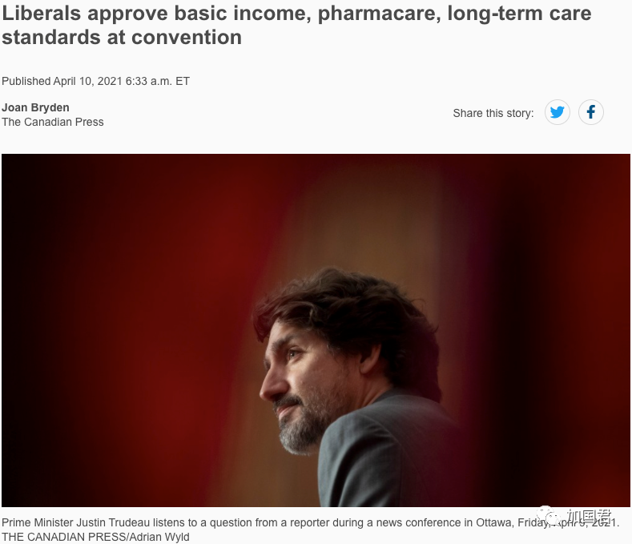
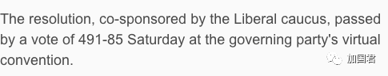
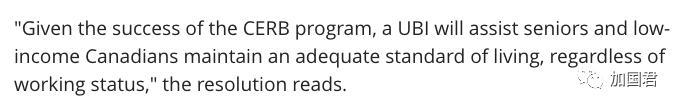
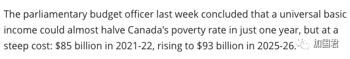

# 无标题

**链接地址:** http://mp.weixin.qq.com/s?__biz=MjM5MDEzNzY2NQ==&mid=2652813560&idx=1&sn=d81611a9443c33c237d94661f1c3b97f&chksm=bda374d68ad4fdc0351cb8de13cd531ad94c1a5391f00985093b5fe83f3b375bfe31a2b1e74a&mpshare=1&scene=2&srcid=0411feC5VeHC5x4ZAc0U4a19&sharer_sharetime=1618281673035&sharer_shareid=be1c8edd6c93eec155a61c876e41d26a#rd
**作者:** 丁其
**获取时间:** 2025/8/28 19:50:00
**图片数量:** 9

---

## 原始HTML内容

+++上方是广告+++ 

 

加拿大联邦自由党今天召开党大会，刚刚以<strong>491：85大比数票数</strong>通过<strong>基本收入等10多个方案，包括退休金OAS涨10%。</strong> 

 

 

基本收入决议由自由党核心小组共同提出，<strong>要求在加拿大建立全民基本收入</strong>（universal basic income，简称UBI）。

 

今天（4月10日），在自由党执政党的线上大会上，<strong>以491-85的投票结果获得通过。</strong>

 

 

它将自动正式成为执政自由党的政党政策。

 

参加政策会议的自由党议员<strong>今天投票大比数支持了这项永久实施的发钱方案</strong>，一项类似于加拿大紧急救济金（CERB）的收入计划，使数百万加拿大人在大流行期间<strong>每月都领取政府派发的$2000加元支票</strong>。

 

这项政策的支持者说，由于有8.7％的加拿大人生活在贫困线以下，还有成千上万的人为维持生计而挣扎，UBI将“确保处于危险中的社区（包括原住民）能够感到财务上的安全。”

 

 

决议写道：“鉴于CERB计划的成功，UBI将协助老年人和低收入一族维持适当的生活水平，而不论其工作状况如何。”

 

 

周六早上还通过了另外26项决议，但今天晚些时候仍必须进行另一项投票，将结果缩小至15项，并成为正式的政党政策。

 

今天自由党通过的26项决议中，除了基本收入外，<strong>还有将70岁及以上老人的OAS退休金提高10％；并实施全国药物保健计划。</strong>

 

同时，自由党也拒绝提高资本利得税的提案。

 

 

国会预算官员上周得出结论，如果实施全民基本收入UBI，加拿大可以在短短一年时间内几乎可以将贫困率减半，但代价却是高昂的：<strong>2021-2022年为850亿加元，2025-26年将增至930亿加元。</strong>

 

自由党政府表示，尽管<strong>上一财年年度的财政赤字达到创纪录的3,810亿加元</strong>，但特鲁多仍准备在今年动用高达1,000亿加元的资金来启动大流行后的经济复苏。

 

虽然基本收入UBI的想法已引起人们的注意，但研究扶贫的学者则对其价值存有分歧。

 

卑诗大学，西蒙弗雷泽大学和卡尔加里大学的研究人员在进行了为期三年的调查后撰写的一份529页的报告，并且得出结论，<strong>认为全民基本收入并不是解决贫困和其他社会问题的最佳方法。</strong>

 

支持者认为，该计划的巨大代价可能会因为取消现有的省级社会福利计划而得到抵消。

 

虽然总理贾斯汀·特鲁多早前曾对基本收入的想法的缺乏热情，但是，今天自由党以如此大比数的投票通过，并且自动成为自由党的纲领。特鲁多最初也反对大麻合法化，但是当自由党大会决议要求大麻合法化后，特鲁多后来改变了主意，并且在其第一任期内通过大麻合法化。

 

如果特鲁多最终在联邦政府立法通过全民UBI，以后，无论你干不干活，<strong>政府都保证你每月至少有$2000加元收入</strong>，那么，加拿大人日后不需要为生计，为两餐而劳苦奔波，可以追求自己的理想，可以追求诗和远方了！

 

大家是不是想想都觉得<strong>爽翻了</strong>？

 
<section style="margin-left: 8px;margin-right: 8px;line-height: normal;">本文参考：https://www.cbc.ca/news/politics/liberal-universal-basic-income-1.5982862</section><section style="margin-left: 8px;margin-right: 8px;line-height: normal;">https://beta.cp24.com/news/2021/4/10/1_5382246.html?s=05</section>
 
<section style="margin-right: 8px;margin-left: 8px;white-space: normal;font-family: -apple-system, BlinkMacSystemFont, &quot;Helvetica Neue&quot;, &quot;PingFang SC&quot;, &quot;Hiragino Sans GB&quot;, &quot;Microsoft YaHei UI&quot;, &quot;Microsoft YaHei&quot;, Arial, sans-serif;letter-spacing: 0.544px;background-color: rgb(255, 255, 255);color: rgb(160, 160, 160);font-size: 15px;text-align: center;line-height: 2em;"> </section><section style="margin-right: 8px;margin-left: 8px;letter-spacing: 0.544px;white-space: normal;font-family: -apple-system, system-ui, &quot;Helvetica Neue&quot;, &quot;PingFang SC&quot;, &quot;Hiragino Sans GB&quot;, &quot;Microsoft YaHei UI&quot;, &quot;Microsoft YaHei&quot;, Arial, sans-serif;background-color: rgb(255, 255, 255);color: rgb(160, 160, 160);font-size: 15px;text-align: center;line-height: 2em;">+++++下方是广告+++++</section>

<section style="margin-right: 8px;margin-left: 8px;font-family: -apple-system, BlinkMacSystemFont, &quot;Helvetica Neue&quot;, &quot;PingFang SC&quot;, &quot;Hiragino Sans GB&quot;, &quot;Microsoft YaHei UI&quot;, &quot;Microsoft YaHei&quot;, Arial, sans-serif;letter-spacing: 0.544px;white-space: normal;background-color: rgb(255, 255, 255);color: rgb(160, 160, 160);font-size: 15px;text-align: center;line-height: 2em;">+++全加拿大华人都在关注超级生活，就差你了+++ </section><section style="margin-right: 8px;margin-left: 8px;font-family: -apple-system, BlinkMacSystemFont, &quot;Helvetica Neue&quot;, &quot;PingFang SC&quot;, &quot;Hiragino Sans GB&quot;, &quot;Microsoft YaHei UI&quot;, &quot;Microsoft YaHei&quot;, Arial, sans-serif;letter-spacing: 0.544px;white-space: normal;background-color: rgb(255, 255, 255);color: rgb(160, 160, 160);font-size: 15px;text-align: center;line-height: 2em;"></section><section style="margin-right: 8px;margin-left: 8px;font-family: -apple-system, BlinkMacSystemFont, &quot;Helvetica Neue&quot;, &quot;PingFang SC&quot;, &quot;Hiragino Sans GB&quot;, &quot;Microsoft YaHei UI&quot;, &quot;Microsoft YaHei&quot;, Arial, sans-serif;letter-spacing: 0.544px;white-space: normal;background-color: rgb(255, 255, 255);color: rgb(160, 160, 160);font-size: 15px;text-align: right;line-height: 2em;"><strong style="letter-spacing: 0.544px;"><strong style="letter-spacing: 0.544px;">喜欢就点两下吧</strong><strong style="letter-spacing: 0.544px;"></strong></strong></section><section style="margin-right: 8px;margin-left: 8px;white-space: normal;font-family: -apple-system, BlinkMacSystemFont, &quot;Helvetica Neue&quot;, &quot;PingFang SC&quot;, &quot;Hiragino Sans GB&quot;, &quot;Microsoft YaHei UI&quot;, &quot;Microsoft YaHei&quot;, Arial, sans-serif;letter-spacing: 0.544px;background-color: rgb(255, 255, 255);color: rgb(160, 160, 160);font-size: 15px;text-align: center;line-height: 2em;"> </section>

---

## 纯文本内容

+++上方是广告+++加拿大联邦自由党今天召开党大会，刚刚以491：85大比数票数通过基本收入等10多个方案，包括退休金OAS涨10%。基本收入决议由自由党核心小组共同提出，要求在加拿大建立全民基本收入（universal basic income，简称UBI）。今天（4月10日），在自由党执政党的线上大会上，以491-85的投票结果获得通过。它将自动正式成为执政自由党的政党政策。参加政策会议的自由党议员今天投票大比数支持了这项永久实施的发钱方案，一项类似于加拿大紧急救济金（CERB）的收入计划，使数百万加拿大人在大流行期间每月都领取政府派发的$2000加元支票。这项政策的支持者说，由于有8.7％的加拿大人生活在贫困线以下，还有成千上万的人为维持生计而挣扎，UBI将“确保处于危险中的社区（包括原住民）能够感到财务上的安全。”决议写道：“鉴于CERB计划的成功，UBI将协助老年人和低收入一族维持适当的生活水平，而不论其工作状况如何。”周六早上还通过了另外26项决议，但今天晚些时候仍必须进行另一项投票，将结果缩小至15项，并成为正式的政党政策。今天自由党通过的26项决议中，除了基本收入外，还有将70岁及以上老人的OAS退休金提高10％；并实施全国药物保健计划。同时，自由党也拒绝提高资本利得税的提案。国会预算官员上周得出结论，如果实施全民基本收入UBI，加拿大可以在短短一年时间内几乎可以将贫困率减半，但代价却是高昂的：2021-2022年为850亿加元，2025-26年将增至930亿加元。自由党政府表示，尽管上一财年年度的财政赤字达到创纪录的3,810亿加元，但特鲁多仍准备在今年动用高达1,000亿加元的资金来启动大流行后的经济复苏。虽然基本收入UBI的想法已引起人们的注意，但研究扶贫的学者则对其价值存有分歧。卑诗大学，西蒙弗雷泽大学和卡尔加里大学的研究人员在进行了为期三年的调查后撰写的一份529页的报告，并且得出结论，认为全民基本收入并不是解决贫困和其他社会问题的最佳方法。支持者认为，该计划的巨大代价可能会因为取消现有的省级社会福利计划而得到抵消。虽然总理贾斯汀·特鲁多早前曾对基本收入的想法的缺乏热情，但是，今天自由党以如此大比数的投票通过，并且自动成为自由党的纲领。特鲁多最初也反对大麻合法化，但是当自由党大会决议要求大麻合法化后，特鲁多后来改变了主意，并且在其第一任期内通过大麻合法化。如果特鲁多最终在联邦政府立法通过全民UBI，以后，无论你干不干活，政府都保证你每月至少有$2000加元收入，那么，加拿大人日后不需要为生计，为两餐而劳苦奔波，可以追求自己的理想，可以追求诗和远方了！大家是不是想想都觉得爽翻了？本文参考：https://www.cbc.ca/news/politics/liberal-universal-basic-income-1.5982862https://beta.cp24.com/news/2021/4/10/1_5382246.html?s=05+++++下方是广告++++++++全加拿大华人都在关注超级生活，就差你了+++喜欢就点两下吧

---

## 图片列表

-  (原始链接: https://mmbiz.qpic.cn/mmbiz_jpg/szJas1pFaJfgDZtwMltYVh4mrkibBeQDzIRR356DcIF3p0j6XhuJ8gCwHZXFQG3Qb7qiczOJ7DliaNskooUHiaXYibg/640?wx_fmt=jpeg)
-  (原始链接: https://mmbiz.qpic.cn/mmbiz_png/icDcCacWsN1WIIZDZP0Uq3BO9YcJbvWGSy5lw0AmNd8VibZUBLMxibrxs0wHsAFlFsZxQCED9mPq4TrddaWcCj1SA/640?wx_fmt=png)
-  (原始链接: https://mmbiz.qpic.cn/mmbiz_png/icDcCacWsN1WIIZDZP0Uq3BO9YcJbvWGSFtUZWgyTUgo43riaqe7uZReH6bm51eUJSiasoMLScYyesX63icwich9gCA/640?wx_fmt=png)
-  (原始链接: https://mmbiz.qpic.cn/mmbiz_png/icDcCacWsN1WIIZDZP0Uq3BO9YcJbvWGSz316lW1GQ8P8uoy1k0u8RxoiaaMJK1JgeOLjMHZLKpZcl51nxDClRVA/640?wx_fmt=png)
-  (原始链接: https://mmbiz.qpic.cn/mmbiz_png/icDcCacWsN1WIIZDZP0Uq3BO9YcJbvWGS2c687kSOMfAqDb7YDYkgm0GZNfZ0kuIsdGMujFjy1RTMopzXrGN31g/640?wx_fmt=png)
-  (原始链接: https://mmbiz.qpic.cn/mmbiz_png/icDcCacWsN1WIIZDZP0Uq3BO9YcJbvWGSUvjj649XRPBVF8ia9kqsExhzDZEQIbqZ5uRibPoFBrcYkFTC58UNfZtA/640?wx_fmt=png)
-  (原始链接: https://mmbiz.qpic.cn/mmbiz_jpg/szJas1pFaJednVGkuNxykXB3dNw9QDticEDzsyPASz9cplzbpnARmxictkOrxFMibqicUAN7h3WoibgCnfKGFgHGyPw/640?wx_fmt=jpeg)
-  (原始链接: https://mmbiz.qpic.cn/mmbiz_gif/szJas1pFaJdUFDPEKnLrCyGC4WgrAvl6lSC2beZFt6icTnXfebnRzcRialMg5VZujw1AhX9ribkSDQNZZukk8HX9w/640?wx_fmt=gif)
-  (原始链接: https://mmbiz.qpic.cn/mmbiz_png/szJas1pFaJdux7mbDaq4CpWoWAUe3fNIlVYWrSfV7acu1tNBibI1icqvrlqkkqWdELW157V8YZVNxH7MLYksFHcA/640?wx_fmt=png)
