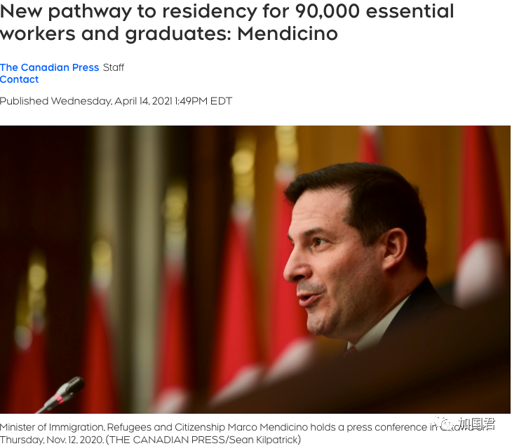
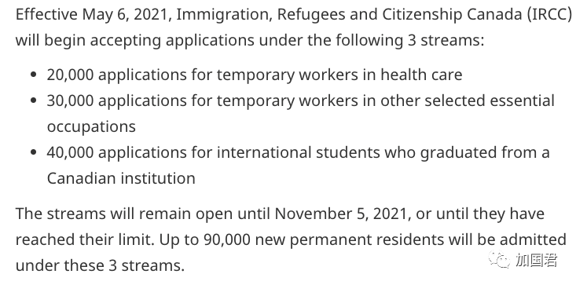
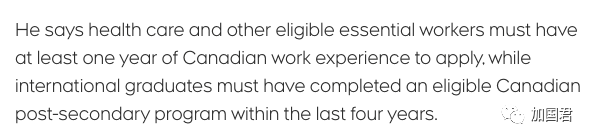
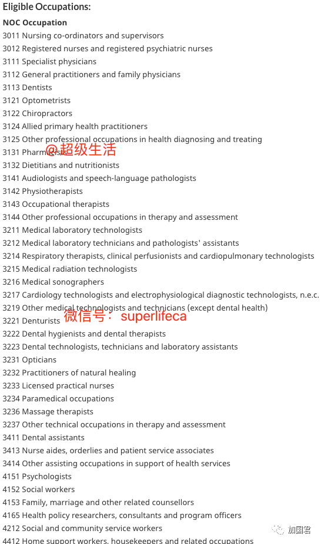
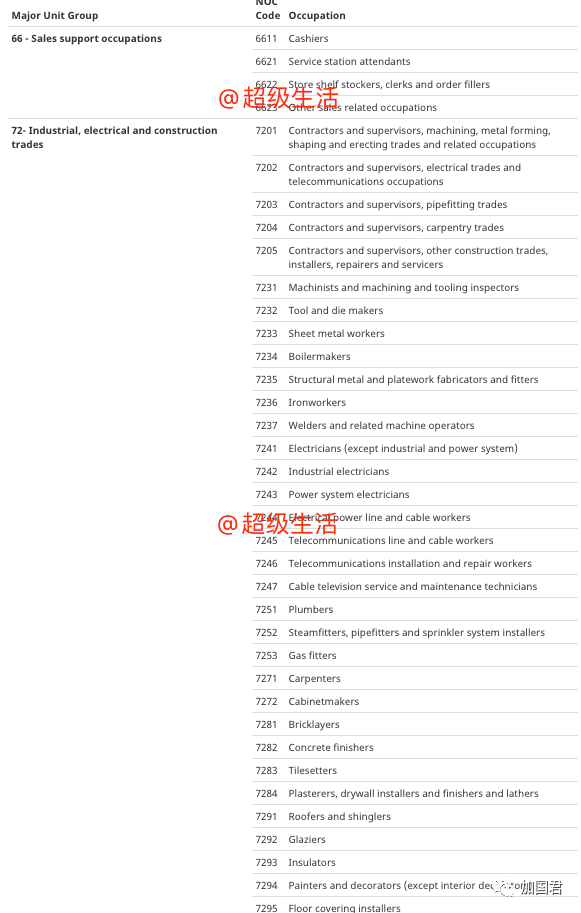
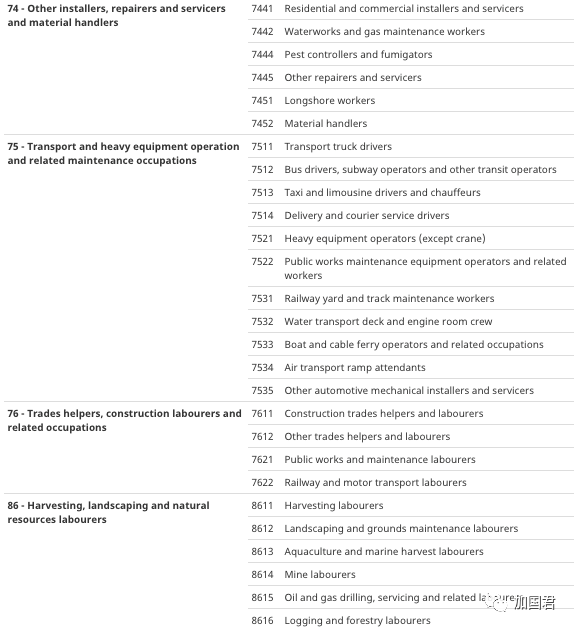
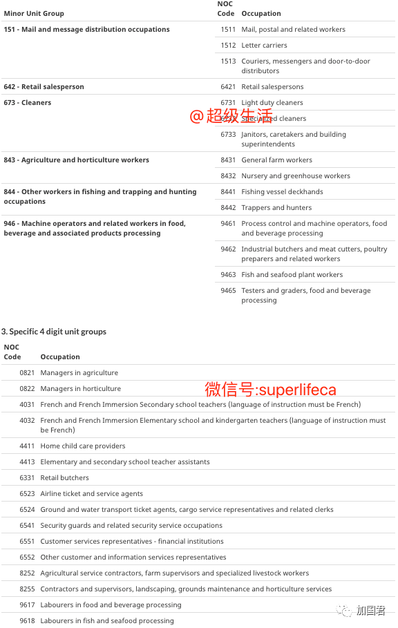
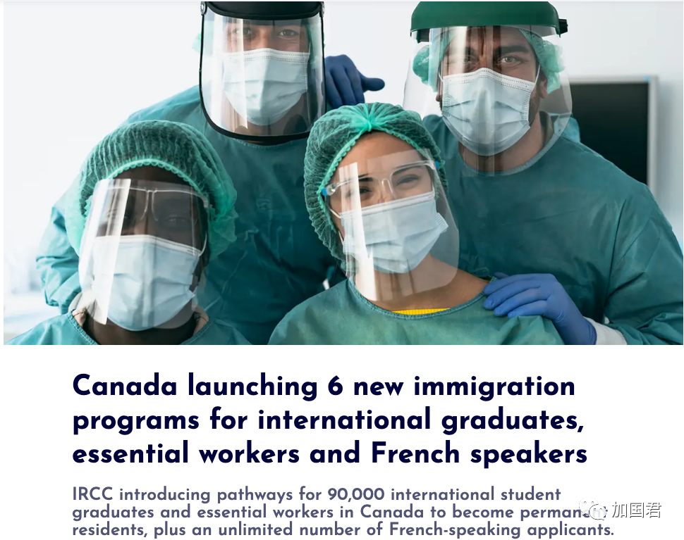

# 无标题

**链接地址:** http://mp.weixin.qq.com/s?__biz=MjM5MDEzNzY2NQ==&mid=2652814065&idx=1&sn=92c2a4506de0d0eee244073658fc936d&chksm=bda376df8ad4ffc947341fe0b2b994406672bca77b548e47f55c90a86b14848fb0c81de6595f&mpshare=1&scene=2&srcid=0415OS3OloXcDpifAFeyme5P&sharer_sharetime=1618435933792&sharer_shareid=be1c8edd6c93eec155a61c876e41d26a#rd
**作者:** 丁其
**获取时间:** 2025/8/28 19:49:51
**图片数量:** 12

---

## 原始HTML内容

+++上方是广告+++
<section style="line-height: 2em;"> </section><section style="line-height: 2em;">加拿大移民部长马可·门迪奇诺（Marco Mendicino）今天（4月14日）宣布了一项移民计划，向在加拿大90,000人提供永久居留PR身份，不但留学生和医护可以申请，连在超市打工的员工、送餐司机、出租车司机全部均可申请。 </section><section style="line-height: 2em;"> </section><section style="text-align: center;padding: 0px 0.5em;line-height: 2em;"></section><section style="line-height: 2em;"> </section><section style="line-height: 2em;"> </section><section style="line-height: 2em;">移民部长门迪奇诺说，移民部正在为目前在加拿大的90,000名必需工人和国际留学生开辟一条申请永久居留权的新途径。</section><section style="line-height: 2em;"> </section><section style="line-height: 2em;">门迪奇诺说，对于在加拿大抗击大流行和实现经济复苏所需技能和经验的临时工人和国际毕业生，新政策将赋予他们永久身份。</section><section style="line-height: 2em;"> </section><section style="line-height: 2em;">从5月6日起，必需工人、国际学生毕业生和在加拿大讲法语的人将有六种获得永久居留权的新途径。其中三类是针对说法语的申请者，移民名额没有上限。</section><section style="line-height: 2em;"> </section><section style="line-height: 2em;"></section><section style="line-height: 2em;">另外三类是针对留学生和必需工人，名额有9万个。</section><section style="line-height: 2em;"> </section><section style="text-align: center;padding: 0px 0.5em;line-height: 2em;"></section><section style="line-height: 2em;"> </section><ol class="list-paddingleft-2" style="list-style-type: decimal;"><li><section style="line-height: 2em;">20,000名申请是医疗保健的临时工人</section></li><li><section style="line-height: 2em;">30,000份申请是其他选定基本职业中的临时工人</section></li><li><section style="line-height: 2em;">40,000名申请给加拿大教育机构毕业的留学生</section><section style="line-height: 2em;"></section></li></ol><section style="line-height: 2em;">这三个类别从5月6日起将一直保持开放状态，直到2021年11月5日或收满申请为止。</section><section style="line-height: 2em;"> </section><section style="line-height: 2em;"></section><section style="line-height: 2em;"> </section><section style="line-height: 2em;">移民部长说，医疗保健和其他符合资格的必需工人必须具有至少一年的加拿大工作经验才能申请；国际毕业生必须在过去四年内且不早于2017年1月完成符合资格的加拿大专上课程。</section><section style="line-height: 2em;"> </section><section style="white-space: normal;line-height: 2em;">对于第一类申请者，从事与卫生保健相关的40个职业的临时外国工人将有资格申请。</section><section style="white-space: normal;line-height: 2em;"> </section><section style="white-space: normal;line-height: 2em;">下面是40项类别的详细列表：</section><section style="white-space: normal;line-height: 2em;"> </section><section style="text-align: center;padding: 0px 0.5em;line-height: 2em;"></section><section style="white-space: normal;line-height: 2em;"> </section><section style="white-space: normal;line-height: 2em;">根据政府对该计划的描述，这些类别不仅包括医生和护士，还包括家庭护理支持人员（home support workers,），家政（housekeepers）和“其他医疗服务的辅助职业”。</section><section style="white-space: normal;line-height: 2em;"> </section><section style="white-space: normal;line-height: 2em;">对于第二类的30000个名额申请者，将有95个基本职业符合资格：</section><section style="white-space: normal;line-height: 2em;"> </section><section style="text-align: center;padding: 0px 0.5em;line-height: 2em;"></section><section style="text-align: center;padding: 0px 0.5em;line-height: 2em;"></section><section style="text-align: center;line-height: 2em;"></section><section style="white-space: normal;line-height: 2em;"> </section><section style="white-space: normal;line-height: 2em;">收银员、超市员工、建筑工人，出租车司机、快递员、送餐司机，保姆等等统统均可申请。</section><section style="line-height: 2em;"> </section><section style="text-align: center;padding: 0px 0.5em;line-height: 2em;"></section><section style="line-height: 2em;"> </section><section style="line-height: 2em;">为了宣传加拿大的官方语言，移民部还为法语或双语候选人推出了另外三个没有名额上限的申请类别。</section><section style="line-height: 2em;"> </section><section style="line-height: 2em;">移民部门表示，新政策将帮助加拿大政府实现其今年接收401,000名永久居民的目标，而COVID-19出行限制措施则继续限制了加拿大新移民的数量。</section><section style="line-height: 2em;"> </section><section style="line-height: 2em;">移民部估计，政府通过鼓励从加拿大境内申请的措施，今年约有70,000人获得了永久居民身份。这些措施包括为加拿大的国际学生签发工作签证，并且在“快速入境”EE系统进行了一次有史以来最大的抽签等。</section><section style="line-height: 2em;"> </section><section style="line-height: 2em;">今天，移民再放大招，变相大赦，几乎在境内工作的所有没有身份的临时都有机会获得PR移民身份。</section><section style="line-height: 2em;"> </section><section style="margin-right: 8px;margin-left: 8px;font-family: -apple-system, system-ui, &quot;Helvetica Neue&quot;, &quot;PingFang SC&quot;, &quot;Hiragino Sans GB&quot;, &quot;Microsoft YaHei UI&quot;, &quot;Microsoft YaHei&quot;, Arial, sans-serif;letter-spacing: 0.544px;white-space: normal;background-color: rgb(255, 255, 255);color: rgb(160, 160, 160);font-size: 15px;text-align: center;line-height: 2em;">+++++下方是广告+++++</section>

<section style="margin-right: 8px;margin-left: 8px;font-family: -apple-system, BlinkMacSystemFont, &quot;Helvetica Neue&quot;, &quot;PingFang SC&quot;, &quot;Hiragino Sans GB&quot;, &quot;Microsoft YaHei UI&quot;, &quot;Microsoft YaHei&quot;, Arial, sans-serif;letter-spacing: 0.544px;white-space: normal;background-color: rgb(255, 255, 255);color: rgb(160, 160, 160);font-size: 15px;text-align: center;line-height: 2em;">+++全加拿大华人都在关注超级生活，就差你了+++ </section><section style="margin-right: 8px;margin-left: 8px;font-family: -apple-system, BlinkMacSystemFont, &quot;Helvetica Neue&quot;, &quot;PingFang SC&quot;, &quot;Hiragino Sans GB&quot;, &quot;Microsoft YaHei UI&quot;, &quot;Microsoft YaHei&quot;, Arial, sans-serif;letter-spacing: 0.544px;white-space: normal;background-color: rgb(255, 255, 255);color: rgb(160, 160, 160);font-size: 15px;text-align: center;line-height: 2em;"></section><section style="margin-right: 8px;margin-left: 8px;font-family: -apple-system, BlinkMacSystemFont, &quot;Helvetica Neue&quot;, &quot;PingFang SC&quot;, &quot;Hiragino Sans GB&quot;, &quot;Microsoft YaHei UI&quot;, &quot;Microsoft YaHei&quot;, Arial, sans-serif;letter-spacing: 0.544px;white-space: normal;background-color: rgb(255, 255, 255);color: rgb(160, 160, 160);font-size: 15px;text-align: right;line-height: 2em;"><strong style="letter-spacing: 0.544px;"><strong style="letter-spacing: 0.544px;">喜欢就狠点两下吧</strong><strong style="letter-spacing: 0.544px;"></strong></strong></section><section style="text-align: left;line-height: 2em;"></section>

---

## 纯文本内容

+++上方是广告+++加拿大移民部长马可·门迪奇诺（Marco Mendicino）今天（4月14日）宣布了一项移民计划，向在加拿大90,000人提供永久居留PR身份，不但留学生和医护可以申请，连在超市打工的员工、送餐司机、出租车司机全部均可申请。移民部长门迪奇诺说，移民部正在为目前在加拿大的90,000名必需工人和国际留学生开辟一条申请永久居留权的新途径。门迪奇诺说，对于在加拿大抗击大流行和实现经济复苏所需技能和经验的临时工人和国际毕业生，新政策将赋予他们永久身份。从5月6日起，必需工人、国际学生毕业生和在加拿大讲法语的人将有六种获得永久居留权的新途径。其中三类是针对说法语的申请者，移民名额没有上限。另外三类是针对留学生和必需工人，名额有9万个。20,000名申请是医疗保健的临时工人30,000份申请是其他选定基本职业中的临时工人40,000名申请给加拿大教育机构毕业的留学生这三个类别从5月6日起将一直保持开放状态，直到2021年11月5日或收满申请为止。移民部长说，医疗保健和其他符合资格的必需工人必须具有至少一年的加拿大工作经验才能申请；国际毕业生必须在过去四年内且不早于2017年1月完成符合资格的加拿大专上课程。对于第一类申请者，从事与卫生保健相关的40个职业的临时外国工人将有资格申请。下面是40项类别的详细列表：根据政府对该计划的描述，这些类别不仅包括医生和护士，还包括家庭护理支持人员（home support workers,），家政（housekeepers）和“其他医疗服务的辅助职业”。对于第二类的30000个名额申请者，将有95个基本职业符合资格：收银员、超市员工、建筑工人，出租车司机、快递员、送餐司机，保姆等等统统均可申请。为了宣传加拿大的官方语言，移民部还为法语或双语候选人推出了另外三个没有名额上限的申请类别。移民部门表示，新政策将帮助加拿大政府实现其今年接收401,000名永久居民的目标，而COVID-19出行限制措施则继续限制了加拿大新移民的数量。移民部估计，政府通过鼓励从加拿大境内申请的措施，今年约有70,000人获得了永久居民身份。这些措施包括为加拿大的国际学生签发工作签证，并且在“快速入境”EE系统进行了一次有史以来最大的抽签等。今天，移民再放大招，变相大赦，几乎在境内工作的所有没有身份的临时都有机会获得PR移民身份。+++++下方是广告++++++++全加拿大华人都在关注超级生活，就差你了+++喜欢就狠点两下吧

---

## 图片列表

-  (原始链接: https://mmbiz.qpic.cn/mmbiz_jpg/szJas1pFaJfgDZtwMltYVh4mrkibBeQDzIRR356DcIF3p0j6XhuJ8gCwHZXFQG3Qb7qiczOJ7DliaNskooUHiaXYibg/640?wx_fmt=jpeg)
-  (原始链接: https://mmbiz.qpic.cn/mmbiz_png/icDcCacWsN1XO3BNvqpM30SJJJ4dSpTx8ibRrEA00LlS7mQKXW2FSmvaibOd9te1ExzSrXeH6o9xKic1QuCicp8lHng/640?wx_fmt=png)
-  (原始链接: https://mmbiz.qpic.cn/mmbiz_png/icDcCacWsN1XO3BNvqpM30SJJJ4dSpTx8nDpBaY5ibdDCr4ujibvAtpn6ABF10zGdzhafEibs40QSMo1N4pOmQ0ubA/640?wx_fmt=png)
-  (原始链接: https://mmbiz.qpic.cn/mmbiz_png/icDcCacWsN1XO3BNvqpM30SJJJ4dSpTx89SdoP5nWY5wIqm4dZqf0RGVnxSC1N5CpvE9IzZGaxOHLyRjhZOCreQ/640?wx_fmt=png)
-  (原始链接: https://mmbiz.qpic.cn/mmbiz_png/icDcCacWsN1XO3BNvqpM30SJJJ4dSpTx8D2ic1uGoaGV56Aga7icxJwMGQ007MsmMWU9wpeDVMdzZs4gu9KibESYzQ/640?wx_fmt=png)
-  (原始链接: https://mmbiz.qpic.cn/mmbiz_png/icDcCacWsN1XO3BNvqpM30SJJJ4dSpTx8iaJBGVfoNgwtR0dEs06WGcmDnhS853ThOhgyKrjUvQBMm49dxmkLLxA/640?wx_fmt=png)
-  (原始链接: https://mmbiz.qpic.cn/mmbiz_png/icDcCacWsN1XO3BNvqpM30SJJJ4dSpTx8ib817ynXaMnvqle3Xm9qrWNIwphUS7afmos53beL5NmCDv2bPKiblwJg/640?wx_fmt=png)
-  (原始链接: https://mmbiz.qpic.cn/mmbiz_png/icDcCacWsN1XO3BNvqpM30SJJJ4dSpTx8kULDANICticO01EibVMUjkmlye6Zs5xD8lKoqC5aiczR3t30NJ04Dm62Q/640?wx_fmt=png)
-  (原始链接: https://mmbiz.qpic.cn/mmbiz_png/icDcCacWsN1XO3BNvqpM30SJJJ4dSpTx8ibEx1kvqPuibVsdrsMeG8hCvgQzjsYRvgW92JniaLQ600CBQnHjic2N5vQ/640?wx_fmt=png)
-  (原始链接: https://mmbiz.qpic.cn/mmbiz_jpg/szJas1pFaJednVGkuNxykXB3dNw9QDticEDzsyPASz9cplzbpnARmxictkOrxFMibqicUAN7h3WoibgCnfKGFgHGyPw/640?wx_fmt=jpeg)
-  (原始链接: https://mmbiz.qpic.cn/mmbiz_gif/szJas1pFaJdUFDPEKnLrCyGC4WgrAvl6lSC2beZFt6icTnXfebnRzcRialMg5VZujw1AhX9ribkSDQNZZukk8HX9w/640?wx_fmt=gif)
-  (原始链接: https://mmbiz.qpic.cn/mmbiz_png/szJas1pFaJdux7mbDaq4CpWoWAUe3fNIlVYWrSfV7acu1tNBibI1icqvrlqkkqWdELW157V8YZVNxH7MLYksFHcA/640?wx_fmt=png)
