# 无标题

**链接地址:** http://mp.weixin.qq.com/s?__biz=MzIyMzU4OTc0MQ==&mid=2247485513&idx=1&sn=c3a6a4fee238cd9409747ac2af54a5b7&chksm=e81aac4bdf6d255dfad0cba3052a73cf4714d8228a8f26395f878db6fd2c9157a126cf08aa6a&mpshare=1&scene=2&srcid=04184aTQiMLamL4G5uQQpUul&sharer_sharetime=1618709776110&sharer_shareid=be1c8edd6c93eec155a61c876e41d26a#rd
**作者:** 
**获取时间:** 2025/8/28 19:49:34
**图片数量:** 17

---

## 原始HTML内容

<section style="box-sizing: border-box;font-size: 16px;"><section style="margin: 10px 0%;box-sizing: border-box;" powered-by="xiumi.us"><section style="display: inline-block;width: 100%;vertical-align: top;background-color: rgb(166, 54, 49);padding: 3px;box-sizing: border-box;"><section style="box-sizing: border-box;" powered-by="xiumi.us"><section style="display: flex;flex-flow: row nowrap;box-sizing: border-box;"><section style="display: inline-block;vertical-align: top;width: auto;flex: 50 50 0%;align-self: stretch;height: auto;background-color: rgb(255, 247, 244);padding: 3px;box-sizing: border-box;"><section style="display: inline-block;width: 100%;vertical-align: middle;border-style: solid;border-width: 1px;border-color: rgb(166, 54, 49);padding: 3px 10px 5px;align-self: center;box-sizing: border-box;" powered-by="xiumi.us"><section style="margin-top: 3px;margin-right: 0%;margin-left: 0%;box-sizing: border-box;" powered-by="xiumi.us"><section style="text-align: center;color: rgb(106, 106, 106);line-height: 1.2;font-size: 14px;box-sizing: border-box;">
<strong style="box-sizing: border-box;">点击蓝字</strong>
</section></section></section></section><section style="display: inline-block;vertical-align: middle;width: auto;padding-left: 3px;background-color: rgba(255, 255, 255, 0);flex: 50 50 0%;align-self: center;height: auto;box-sizing: border-box;"><section style="margin-top: 3px;margin-right: 0%;margin-left: 0%;box-sizing: border-box;" powered-by="xiumi.us"><section style="text-align: center;font-size: 14px;color: rgb(255, 255, 255);line-height: 1.2;box-sizing: border-box;">
<strong style="box-sizing: border-box;">关注我们</strong>
</section></section></section></section></section></section></section><section style="box-sizing: border-box;" powered-by="xiumi.us">
 
</section><section style="text-align: right;justify-content: flex-end;margin-top: 10px;margin-right: 0%;margin-left: 0%;box-sizing: border-box;" powered-by="xiumi.us"><section style="display: inline-block;width: auto;vertical-align: top;min-width: 10%;max-width: 100%;height: auto;background-color: rgb(166, 54, 49);padding: 5px 10px;border-width: 0px;box-sizing: border-box;"><section style="text-align: justify;color: rgb(255, 255, 255);font-size: 14px;box-sizing: border-box;" powered-by="xiumi.us">
<strong style="box-sizing: border-box;">国际马尔贝克日就在今天，喝点啥？</strong>
</section></section></section><section style="display: inline-block;width: 100%;vertical-align: top;border-left: 2px none rgb(195, 163, 142);border-bottom-left-radius: 0px;background-color: rgba(255, 213, 195, 0);padding: 10px;border-right: 2px solid rgb(0, 0, 0);border-top-right-radius: 0px;box-sizing: border-box;" powered-by="xiumi.us"><section style="text-align: center;margin-right: 0%;margin-left: 0%;box-sizing: border-box;" powered-by="xiumi.us"><section style="max-width: 100%;vertical-align: middle;display: inline-block;line-height: 0;box-sizing: border-box;"></section></section></section><section style="text-align: right;justify-content: flex-end;margin-right: 0%;margin-bottom: 10px;margin-left: 0%;font-size: 0px;box-sizing: border-box;" powered-by="xiumi.us"><section style="display: inline-block;width: 50%;vertical-align: top;height: auto;line-height: 0;box-sizing: border-box;"><section style="margin-top: 0.5em;margin-bottom: 0.5em;box-sizing: border-box;" powered-by="xiumi.us"><section style="background-color: rgb(0, 0, 0);height: 2px;box-sizing: border-box;"><section><svg viewBox="0 0 1 1" style="float:left;line-height:0;width:0;vertical-align:top;"></svg></section></section></section></section></section><section style="box-sizing: border-box;" powered-by="xiumi.us"><section style="display: flex;flex-flow: row nowrap;margin: -10px 0% 10px;box-sizing: border-box;"><section style="display: inline-block;vertical-align: top;width: auto;flex: 0 0 auto;align-self: flex-start;min-width: 10%;max-width: 100%;height: auto;box-sizing: border-box;"><section style="color: rgb(0, 0, 0);font-size: 12px;box-sizing: border-box;" powered-by="xiumi.us">
&nbsp; &nbsp;专题出品 |&nbsp;加拿大汉嘉酒业&nbsp;
</section></section><section style="display: inline-block;vertical-align: top;width: auto;align-self: flex-start;flex: 100 100 0%;box-sizing: border-box;"><section style="margin-top: 0.5em;margin-bottom: 0.5em;box-sizing: border-box;" powered-by="xiumi.us"><section style="background-color: rgba(255, 213, 195, 0);height: 1px;box-sizing: border-box;"><section><svg viewBox="0 0 1 1" style="float:left;line-height:0;width:0;vertical-align:top;"></svg></section></section></section></section></section></section><section style="box-sizing: border-box;" powered-by="xiumi.us">
 
</section><section style="font-size: 14px;line-height: 2;letter-spacing: 2px;padding-right: 15px;padding-left: 15px;color: rgb(115, 115, 114);box-sizing: border-box;" powered-by="xiumi.us">
<strong style="box-sizing: border-box;">马尔贝克（Malbec）</strong>是一种发源于法国的特色葡萄酒，如今却在南美洲的<strong style="box-sizing: border-box;">阿根廷</strong>崛起，成为阿根廷<strong style="box-sizing: border-box;">最具代表性</strong>的红葡萄酒。

 

每年的<strong style="box-sizing: border-box;">4月17日</strong>，全世界都会举行以畅饮马尔贝克红酒作为主题的<strong style="box-sizing: border-box;">世界马尔贝克日</strong>（Malbec World Day）。今天就让我们聊聊这款传奇红酒的前世今生。

 

 
</section><section style="text-align: center;justify-content: center;margin-right: 0%;margin-left: 0%;box-sizing: border-box;" powered-by="xiumi.us"><section style="display: inline-block;width: auto;vertical-align: top;min-width: 10%;max-width: 100%;height: auto;border-bottom: 1px solid rgb(62, 62, 62);border-bottom-right-radius: 0px;box-sizing: border-box;"><section style="font-size: 26px;color: rgb(92, 92, 92);font-family: Optima-Regular, PingFangTC-light;padding-right: 31px;padding-left: 31px;line-height: 1.5;letter-spacing: 0px;box-sizing: border-box;" powered-by="xiumi.us">
<strong style="box-sizing: border-box;">#1</strong>
</section></section></section><section style="font-size: 14px;font-family: Optima-Regular, PingFangTC-light;color: rgb(181, 181, 181);line-height: 2;letter-spacing: 0px;box-sizing: border-box;" powered-by="xiumi.us">
<strong style="box-sizing: border-box;">从法国到阿根廷</strong>
</section><section style="font-size: 14px;line-height: 2;letter-spacing: 2px;padding-right: 15px;padding-left: 15px;color: rgb(115, 115, 114);box-sizing: border-box;" powered-by="xiumi.us">
 
</section><section style="font-size: 14px;line-height: 2;letter-spacing: 2px;padding-right: 15px;padding-left: 15px;color: rgb(115, 115, 114);box-sizing: border-box;" powered-by="xiumi.us">
马尔贝克最初起源于法国西南地区的<strong style="box-sizing: border-box;">卡奥（Cahors）产区</strong>。1855年时，马尔贝克能占到法国波尔多列级混酿的<strong style="box-sizing: border-box;">50%</strong>左右，占据了当时红酒生产的重要地位。

 
</section><section style="box-sizing: border-box;" powered-by="xiumi.us"><section style="display: flex;flex-flow: row nowrap;margin: 10px 0%;box-sizing: border-box;"><section style="display: inline-block;vertical-align: top;width: auto;flex: 0 0 0%;align-self: stretch;height: auto;background-position: 50% 50%;background-repeat: no-repeat;background-size: 100% 100%;background-attachment: scroll;background-image: url(&quot;https://mmbiz.qpic.cn/mmbiz_png/7CNdqYbqvBISYNmxxmTzicfrYxHtoXA1RKnfuQPmia2DMqORKibx5ARQSDyx9tOhWpRCUBTLCgsfwYlLdkEu3o2aQ/640?wx_fmt=png&quot;);box-sizing: border-box;"><section style="text-align: center;box-sizing: border-box;" powered-by="xiumi.us"><section style="display: inline-block;width: 15px;height: 15px;vertical-align: top;overflow: hidden;box-sizing: border-box;"><section><svg viewBox="0 0 1 1" style="float:left;line-height:0;width:0;vertical-align:top;"></svg></section></section></section></section><section style="display: inline-block;vertical-align: top;width: auto;flex: 100 100 0%;align-self: stretch;height: auto;box-sizing: border-box;"><section style="display: inline-block;width: 100%;vertical-align: top;border-width: 7px;border-style: solid;border-color: rgb(255, 254, 251);box-shadow: rgb(218, 203, 158) 0px 0px 10px;box-sizing: border-box;" powered-by="xiumi.us"><section style="text-align: center;margin-right: 0%;margin-left: 0%;box-sizing: border-box;" powered-by="xiumi.us"><section style="max-width: 100%;vertical-align: middle;display: inline-block;line-height: 0;box-shadow: rgb(0, 0, 0) 0px 0px 0px;box-sizing: border-box;"></section></section></section></section><section style="display: inline-block;vertical-align: top;width: auto;flex: 0 0 0%;align-self: stretch;height: auto;background-position: 50% 50%;background-repeat: no-repeat;background-size: 100% 100%;background-attachment: scroll;background-image: url(&quot;https://mmbiz.qpic.cn/mmbiz_png/7CNdqYbqvBISYNmxxmTzicfrYxHtoXA1Ryb60HicHrsKhfTLbpnbWiamL3VgXRX6KM0v47qokQRLLsbIwwRE21PFA/640?wx_fmt=png&quot;);box-sizing: border-box;"><section style="text-align: center;box-sizing: border-box;" powered-by="xiumi.us"><section style="display: inline-block;width: 15px;height: 15px;vertical-align: top;overflow: hidden;box-sizing: border-box;"><section><svg viewBox="0 0 1 1" style="float:left;line-height:0;width:0;vertical-align:top;"></svg></section></section></section></section></section></section><section style="font-size: 12px;color: rgb(179, 179, 179);text-align: center;box-sizing: border-box;" powered-by="xiumi.us">
马尔贝克葡萄，圆润的灰蓝色是它的特征
</section><section style="font-size: 14px;line-height: 2;letter-spacing: 2px;padding-right: 15px;padding-left: 15px;color: rgb(115, 115, 114);box-sizing: border-box;" powered-by="xiumi.us">
 

然而好景不长。19世纪末期，根瘤蚜病的爆发几乎摧毁整个法国和欧洲的葡萄藤，马尔贝克也濒于消失。

 

幸运的是，喜爱葡萄酒的阿根廷总统主张在<strong style="box-sizing: border-box;">门多萨地区（Mendoza）</strong>大量引种葡萄品种以酿造阿根廷自己的葡萄酒。而特别适应当地气候的马尔贝克则成为了<strong style="box-sizing: border-box;">重点培育对象</strong>。
</section><section style="text-align: center;margin-top: 10px;margin-bottom: 10px;box-sizing: border-box;" powered-by="xiumi.us"><section style="max-width: 100%;vertical-align: middle;display: inline-block;line-height: 0;width: 90%;height: auto;box-sizing: border-box;"></section></section><section style="font-size: 14px;line-height: 2;letter-spacing: 2px;padding-right: 15px;padding-left: 15px;color: rgb(115, 115, 114);box-sizing: border-box;" powered-by="xiumi.us">
 

尽管起源于法国，马尔贝克在法国现在只有15,000英亩种植面积；而大洋彼岸的阿根廷，其种植面积已<strong style="box-sizing: border-box;">超过75,000英亩</strong>，是世界种植马尔贝克的<strong style="box-sizing: border-box;">第一大国</strong>，占据着<strong style="box-sizing: border-box;">全世界75%的产量</strong>。

 

 

 
</section><section style="text-align: center;justify-content: center;margin-right: 0%;margin-left: 0%;box-sizing: border-box;" powered-by="xiumi.us"><section style="display: inline-block;width: auto;vertical-align: top;min-width: 10%;max-width: 100%;height: auto;border-bottom: 1px solid rgb(62, 62, 62);border-bottom-right-radius: 0px;box-sizing: border-box;"><section style="font-size: 26px;color: rgb(92, 92, 92);font-family: Optima-Regular, PingFangTC-light;padding-right: 31px;padding-left: 31px;line-height: 1.5;letter-spacing: 0px;box-sizing: border-box;" powered-by="xiumi.us">
<strong style="box-sizing: border-box;">#2</strong>
</section></section></section><section style="font-size: 14px;font-family: Optima-Regular, PingFangTC-light;color: rgb(181, 181, 181);line-height: 2;letter-spacing: 0px;box-sizing: border-box;" powered-by="xiumi.us">
<strong style="box-sizing: border-box;">马尔贝克到底是什么？</strong>
</section><section style="text-align: center;margin-top: 10px;margin-bottom: 10px;box-sizing: border-box;" powered-by="xiumi.us"><section style="vertical-align: middle;display: inline-block;line-height: 0;width: 90%;height: auto;box-sizing: border-box;"></section></section><section style="font-size: 14px;line-height: 2;letter-spacing: 2px;padding-right: 15px;padding-left: 15px;color: rgb(115, 115, 114);box-sizing: border-box;" powered-by="xiumi.us">
马尔贝克品种的葡萄是一种<strong style="box-sizing: border-box;">挑剔</strong>的蔓藤植物，没有适宜的生长环境，栽培者很难令其健康生长。马尔贝克品种<strong style="box-sizing: border-box;">不喜寒冷的天气</strong>，但在高海拔地区却能茁壮生长，适宜的生长环境要<strong style="box-sizing: border-box;">昼夜温差较大</strong>。

 

<iframe class="video_iframe rich_pages" data-vidtype="1" data-cover="http%3A%2F%2Fshp.qpic.cn%2Fqqvideo_ori%2F0%2Fc0187x22nse_496_280%2F0" allowfullscreen="" frameborder="0" data-ratio="1.8181818181818181" data-w="640" data-src="https://v.qq.com/iframe/preview.html?width=500&amp;height=375&amp;auto=0&amp;vid=c0187x22nse"></iframe>
</section><section style="text-align: center;margin-top: 10px;margin-bottom: 10px;box-sizing: border-box;" powered-by="xiumi.us"><section style="width: 100%;background-color: rgb(0, 0, 0);line-height: 0;box-sizing: border-box;"><section style="width: 100%;transform: rotate(0deg);box-sizing: border-box;"><section style="top: 0px;left: 0px;width: 100%;height: 40%;box-sizing: border-box;"><section><svg viewBox="0 0 1 1" style="float:left;line-height:0;width:0;vertical-align:top;"></svg></section></section></section></section></section><section style="font-size: 12px;color: rgb(179, 179, 179);padding-right: 15px;padding-left: 15px;box-sizing: border-box;" powered-by="xiumi.us">
阿根廷歌手卡洛斯·葛戴尔创作的探戈名曲《Por Una Cabeza / 一步之遥》
</section><section style="font-size: 14px;line-height: 2;letter-spacing: 2px;padding-right: 15px;padding-left: 15px;color: rgb(115, 115, 114);box-sizing: border-box;" powered-by="xiumi.us">
 

阿根廷门多萨地区拥有种植马尔贝克得天独厚的自然气候，孕育出拥有探戈一样<strong style="box-sizing: border-box;">感情浓郁外在性感</strong>的马尔贝克。这个地区酿造的马尔贝克<strong style="box-sizing: border-box;">颜色极深</strong>，通常为深邃的紫红色，有时能达到墨水般的深色。

 
</section><section style="text-align: center;margin-top: 10px;margin-bottom: 10px;box-sizing: border-box;" powered-by="xiumi.us"><section style="max-width: 100%;vertical-align: middle;display: inline-block;line-height: 0;width: 90%;height: auto;box-sizing: border-box;"></section></section><section style="font-size: 14px;line-height: 2;letter-spacing: 2px;padding-right: 15px;padding-left: 15px;color: rgb(115, 115, 114);box-sizing: border-box;" powered-by="xiumi.us">
 

香气会以李子、黑莓、黑樱桃等<strong style="box-sizing: border-box;">成熟水果</strong>香气为主要特点，有时甚至带有带果酱气息，同时会有香料、香草、可可、摩卡味。

 

口感单宁更加<strong style="box-sizing: border-box;">柔和丝滑，酒精度较高，酸度中等</strong>，回味有时会有黑巧以及令人印象深刻果味，开瓶后就能感受到<strong style="box-sizing: border-box;">丰富果味</strong>的特质。
</section><section style="text-align: center;margin-top: 10px;margin-bottom: 10px;box-sizing: border-box;" powered-by="xiumi.us"><section style="max-width: 100%;vertical-align: middle;display: inline-block;line-height: 0;box-sizing: border-box;"></section></section><section style="font-size: 14px;line-height: 2;letter-spacing: 2px;padding-right: 15px;padding-left: 15px;color: rgb(115, 115, 114);box-sizing: border-box;" powered-by="xiumi.us">
 

原产地卡奥地区酿造的马尔贝克，其果香不会如阿根廷的那样浓郁，而是更多展现出烟熏、烟草、泥土、皮革甚至动物类香气；单宁较重，酒体比较饱满，酸度较高，酒精度属于中等，<strong style="box-sizing: border-box;">更具陈年潜力</strong>。

 

 

 
</section><section style="text-align: center;justify-content: center;margin-right: 0%;margin-left: 0%;box-sizing: border-box;" powered-by="xiumi.us"><section style="display: inline-block;width: auto;vertical-align: top;min-width: 10%;max-width: 100%;height: auto;border-bottom: 1px solid rgb(62, 62, 62);border-bottom-right-radius: 0px;box-sizing: border-box;"><section style="font-size: 26px;color: rgb(92, 92, 92);font-family: Optima-Regular, PingFangTC-light;padding-right: 31px;padding-left: 31px;line-height: 1.5;letter-spacing: 0px;box-sizing: border-box;" powered-by="xiumi.us">
<strong style="box-sizing: border-box;">#3</strong>
</section></section></section><section style="text-align: center;font-size: 14px;font-family: Optima-Regular, PingFangTC-light;color: rgb(181, 181, 181);line-height: 2;letter-spacing: 0px;box-sizing: border-box;" powered-by="xiumi.us">
<strong style="box-sizing: border-box;">马尔贝克日产生</strong>
</section><section style="font-size: 14px;line-height: 2;letter-spacing: 2px;padding-right: 15px;padding-left: 15px;color: rgb(115, 115, 114);box-sizing: border-box;" powered-by="xiumi.us">
 
</section><section style="font-size: 14px;line-height: 2;letter-spacing: 2px;padding-right: 15px;padding-left: 15px;color: rgb(115, 115, 114);box-sizing: border-box;" powered-by="xiumi.us">
对于阿根廷的葡萄酒行业，<strong style="box-sizing: border-box;">4月17日</strong>是具有历史意义的一天。

 
</section><section style="text-align: center;margin-top: 10px;margin-bottom: 10px;box-sizing: border-box;" powered-by="xiumi.us"><section style="max-width: 100%;vertical-align: middle;display: inline-block;line-height: 0;width: 75%;height: auto;box-sizing: border-box;"></section></section><section style="font-size: 12px;color: rgb(179, 179, 179);box-sizing: border-box;" powered-by="xiumi.us">
阿根廷前总统 Domingo F. Sarmiento （&nbsp;02-15, 1811 – 09-11, 1888)&nbsp;
</section><section style="box-sizing: border-box;" powered-by="xiumi.us">
 
</section><section style="font-size: 14px;line-height: 2;letter-spacing: 2px;padding-right: 15px;padding-left: 15px;color: rgb(115, 115, 114);box-sizing: border-box;" powered-by="xiumi.us">
1853年的4月，阿根廷当时的<strong style="box-sizing: border-box;">总统Domingo F. Sarmiento</strong>委托了一名法国的土壤专家Michel Aimé Pouget从法国选择适合阿根廷的葡萄品种移植到阿根廷来。 

 

在Michel引入的所有葡萄品种里，马尔贝克成为了阿根廷最重要的葡萄品种。直至今日，说到阿根廷葡萄酒，许多人脑海里出现的<strong style="box-sizing: border-box;">第一个词</strong>就是马尔贝克。
</section><section style="text-align: center;margin-top: 10px;margin-bottom: 10px;box-sizing: border-box;" powered-by="xiumi.us"><section style="max-width: 100%;vertical-align: middle;display: inline-block;line-height: 0;box-sizing: border-box;"></section></section><section style="font-size: 14px;line-height: 2;letter-spacing: 2px;padding-right: 15px;padding-left: 15px;color: rgb(115, 115, 114);box-sizing: border-box;" powered-by="xiumi.us">
 

于是，2011年4月17日起，每年的这一天被<strong style="box-sizing: border-box;">阿根廷葡萄酒推广协会</strong>（Wine of Agentina）认定为<strong style="box-sizing: border-box;">世界马尔贝克日</strong>。

 

在这一天，享用一瓶产自阿根廷的马尔贝克，正是对这种身世曲折，历经风霜的葡萄酒最好的歌颂。马尔贝克不仅作为葡萄酒在新世界探索与传承的纽带；更代表着阿根廷日渐繁荣的葡萄酒文化在<strong style="box-sizing: border-box;">国际地位上冉冉上升的印证</strong>。

 

那么，在这个庆祝的日子里，爱酒懂酒的你，应该享用哪瓶阿根廷的马尔贝克呢？

 
</section><section style="text-align: center;margin-top: 10px;margin-bottom: 10px;box-sizing: border-box;" powered-by="xiumi.us"><section style="max-width: 100%;vertical-align: middle;display: inline-block;line-height: 0;box-sizing: border-box;"></section></section><section style="font-size: 14px;line-height: 2;letter-spacing: 2px;padding-right: 15px;padding-left: 15px;color: rgb(115, 115, 114);box-sizing: border-box;" powered-by="xiumi.us">
 
</section><section style="font-size: 14px;line-height: 2;letter-spacing: 2px;padding-right: 15px;padding-left: 15px;color: rgb(115, 115, 114);box-sizing: border-box;" powered-by="xiumi.us">
 

为了丰富加拿大葡萄酒爱好者们的酒藏，加拿大汉嘉酒业精心选择了 TripAdvisor上阿根廷Maipu 名产区<strong style="box-sizing: border-box;">十佳名酒庄</strong>之一的<strong style="box-sizing: border-box;"> Tempus Alba </strong>酒庄的几款葡萄酒进行引进。

 
</section><section style="text-align: center;margin-top: 10px;margin-bottom: 10px;box-sizing: border-box;" powered-by="xiumi.us"><section style="max-width: 100%;vertical-align: middle;display: inline-block;line-height: 0;width: 90%;height: auto;box-sizing: border-box;"></section></section><section style="text-align: center;margin-top: 10px;margin-bottom: 10px;box-sizing: border-box;" powered-by="xiumi.us"><section style="vertical-align: middle;display: inline-block;line-height: 0;width: 90%;height: auto;box-sizing: border-box;"></section></section><section style="font-size: 12px;color: rgb(179, 179, 179);text-align: center;box-sizing: border-box;" powered-by="xiumi.us">
位于阿根廷著名葡萄酒产区Maipu的Tempus Alba&nbsp;酒庄
</section><section style="box-sizing: border-box;" powered-by="xiumi.us">
 
</section><section style="font-size: 14px;line-height: 2;letter-spacing: 2px;padding-right: 15px;padding-left: 15px;color: rgb(115, 115, 114);box-sizing: border-box;" powered-by="xiumi.us">
 

想要在加拿大喝到这个屡获佳绩的<strong style="box-sizing: border-box;">小众精品酒庄</strong>那性价超高的正宗阿根廷马尔贝克？<strong style="box-sizing: border-box;">现在就可以！</strong>

 

这两款马尔贝克已于阿尔伯塔省和卑诗省同步上架，葡萄酒品藏爱好者们，快快出动吧！

 

 
</section><section style="text-align: right;justify-content: flex-end;margin: 10px 0%;box-sizing: border-box;" powered-by="xiumi.us"><section style="display: inline-block;width: auto;vertical-align: top;min-width: 10%;max-width: 100%;height: auto;box-shadow: rgb(0, 0, 0) 0px 0px 0px;box-sizing: border-box;"><section style="justify-content: flex-end;margin-right: 0%;margin-left: 0%;font-size: 0px;box-sizing: border-box;" powered-by="xiumi.us"><section style="display: inline-block;width: 50%;vertical-align: top;height: auto;line-height: 0;box-sizing: border-box;"><section style="margin-top: 0.5em;margin-bottom: 0.5em;box-sizing: border-box;" powered-by="xiumi.us"><section style="background-color: rgba(255, 213, 195, 0);height: 2px;box-sizing: border-box;"><section><svg viewBox="0 0 1 1" style="float:left;line-height:0;width:0;vertical-align:top;"></svg></section></section></section></section></section><section style="display: inline-block;width: 100%;vertical-align: top;background-color: rgba(255, 213, 195, 0);padding: 3px 10px;border-style: solid;border-width: 0px;border-color: rgb(62, 62, 62);box-sizing: border-box;" powered-by="xiumi.us"><section style="text-align: justify;color: rgb(0, 0, 0);font-size: 14px;box-sizing: border-box;" powered-by="xiumi.us">
<strong style="box-sizing: border-box;">酒款介绍</strong>
</section></section></section></section><section style="margin-top: -3px;margin-right: 0%;margin-left: 0%;box-sizing: border-box;" powered-by="xiumi.us"><section style="display: inline-block;width: 100%;vertical-align: top;border-left: 3px solid rgb(0, 0, 0);border-bottom-left-radius: 0px;padding-left: 5px;box-sizing: border-box;"><section style="margin: -7px 0%;box-sizing: border-box;" powered-by="xiumi.us"><section style="display: inline-block;width: 100%;vertical-align: top;background-color: rgba(255, 213, 195, 0);padding: 5px 10px;box-sizing: border-box;"><section style="color: rgb(166, 54, 49);font-size: 14px;text-align: left;box-sizing: border-box;" powered-by="xiumi.us">
<strong style="box-sizing: border-box;">Tempus Alba Malbec 2017,&nbsp; </strong>

<strong style="box-sizing: border-box;">泰姆帕斯马尔贝克红葡萄酒 2017</strong>
</section></section></section></section></section><section style="margin-right: 0%;margin-bottom: 10px;margin-left: 0%;box-sizing: border-box;" powered-by="xiumi.us"><section style="display: inline-block;width: 100%;vertical-align: top;padding-left: 8px;box-sizing: border-box;"><section style="margin-right: 0%;margin-left: 0%;box-sizing: border-box;" powered-by="xiumi.us"><section style="display: inline-block;width: 100%;vertical-align: top;background-color: rgba(255, 213, 195, 0);padding-bottom: 10px;box-sizing: border-box;"><section style="box-sizing: border-box;" powered-by="xiumi.us">
 
</section><section style="margin-right: 0%;margin-bottom: 20px;margin-left: 0%;box-sizing: border-box;" powered-by="xiumi.us"><section style="display: inline-block;width: 100%;vertical-align: top;padding: 10px;box-sizing: border-box;"><section style="box-sizing: border-box;" powered-by="xiumi.us"><section style="display: inline-block;vertical-align: top;width: 40%;border-style: solid;border-width: 0px;border-color: rgb(213, 181, 113);padding-right: 6px;height: auto;box-sizing: border-box;"><section style="text-align: center;margin-right: 0%;margin-left: 0%;box-sizing: border-box;" powered-by="xiumi.us"><section style="max-width: 100%;vertical-align: middle;display: inline-block;line-height: 0;width: 100%;height: auto;box-sizing: border-box;"></section></section></section><section style="display: inline-block;vertical-align: top;width: 60%;height: auto;box-sizing: border-box;"><section style="font-size: 12px;box-sizing: border-box;" powered-by="xiumi.us">
 

AB SKU: 846247 

BC SKU:&nbsp;048791

年份&nbsp;:&nbsp;2017

产区 :&nbsp;Lujan de Cuyo, Mendoza

产地&nbsp;: 阿根廷

净含量&nbsp;:&nbsp;750 ml

种类&nbsp;: 红葡萄酒

酒精度&nbsp;:&nbsp;14％

酒庄&nbsp;:&nbsp;Tempus Alba&nbsp;（泰姆帕斯酒庄）

葡萄品种&nbsp;: Malbec 100%
</section></section></section></section></section></section></section><section style="font-size: 14px;line-height: 2;letter-spacing: 2px;padding-right: 15px;padding-left: 15px;color: rgb(115, 115, 114);box-sizing: border-box;" powered-by="xiumi.us">
 

这是一款来自阿根廷门多萨产区的红葡萄酒，出自小型家族酒庄——泰姆帕斯酒庄。此酒由阿根廷标志性葡萄品种马尔贝克酿制而成，带有覆盆子、李子和咖啡的香气，架构优良，单宁柔顺，口感均衡，余味悠长。

 
</section><section style="text-align: right;justify-content: flex-end;margin: 10px 0%;box-sizing: border-box;" powered-by="xiumi.us"><section style="display: inline-block;width: auto;vertical-align: top;min-width: 10%;max-width: 100%;height: auto;box-shadow: rgb(0, 0, 0) 0px 0px 0px;box-sizing: border-box;"><section style="justify-content: flex-end;margin-right: 0%;margin-left: 0%;font-size: 0px;box-sizing: border-box;" powered-by="xiumi.us"><section style="display: inline-block;width: 50%;vertical-align: top;height: auto;line-height: 0;box-sizing: border-box;"><section style="margin-top: 0.5em;margin-bottom: 0.5em;box-sizing: border-box;" powered-by="xiumi.us"><section style="background-color: rgba(255, 213, 195, 0);height: 2px;box-sizing: border-box;"><section><svg viewBox="0 0 1 1" style="float:left;line-height:0;width:0;vertical-align:top;"></svg></section></section></section></section></section><section style="display: inline-block;width: 100%;vertical-align: top;background-color: rgba(255, 213, 195, 0);padding: 3px 10px;border-style: solid;border-width: 0px;border-color: rgb(62, 62, 62);box-sizing: border-box;" powered-by="xiumi.us"><section style="text-align: justify;color: rgb(0, 0, 0);font-size: 14px;box-sizing: border-box;" powered-by="xiumi.us">
<strong style="box-sizing: border-box;">酒款介绍</strong>
</section></section></section></section><section style="margin-top: -3px;margin-right: 0%;margin-left: 0%;box-sizing: border-box;" powered-by="xiumi.us"><section style="display: inline-block;width: 100%;vertical-align: top;border-left: 3px solid rgb(0, 0, 0);border-bottom-left-radius: 0px;padding-left: 5px;box-sizing: border-box;"><section style="margin: -7px 0%;box-sizing: border-box;" powered-by="xiumi.us"><section style="display: inline-block;width: 100%;vertical-align: top;background-color: rgba(255, 213, 195, 0);padding: 5px 10px;box-sizing: border-box;"><section style="text-align: left;color: rgb(166, 54, 49);font-size: 14px;box-sizing: border-box;" powered-by="xiumi.us">
<strong style="box-sizing: border-box;">Tempus Alba Loco Malbec 2019,&nbsp; </strong>

<strong style="box-sizing: border-box;">泰姆帕斯乐客马尔贝克红葡萄酒 2019</strong>
</section></section></section></section></section><section style="margin-right: 0%;margin-bottom: 10px;margin-left: 0%;box-sizing: border-box;" powered-by="xiumi.us"><section style="display: inline-block;width: 100%;vertical-align: top;padding-left: 8px;box-sizing: border-box;"><section style="margin-right: 0%;margin-left: 0%;box-sizing: border-box;" powered-by="xiumi.us"><section style="display: inline-block;width: 100%;vertical-align: top;background-color: rgba(255, 213, 195, 0);padding-bottom: 10px;box-sizing: border-box;"><section style="box-sizing: border-box;" powered-by="xiumi.us">
 
</section><section style="margin-right: 0%;margin-bottom: 20px;margin-left: 0%;box-sizing: border-box;" powered-by="xiumi.us"><section style="display: inline-block;width: 100%;vertical-align: top;padding: 10px;box-sizing: border-box;"><section style="box-sizing: border-box;" powered-by="xiumi.us"><section style="display: inline-block;vertical-align: top;width: 40%;border-style: solid;border-width: 0px;border-color: rgb(213, 181, 113);padding-right: 6px;height: auto;box-sizing: border-box;"><section style="text-align: center;margin-right: 0%;margin-left: 0%;box-sizing: border-box;" powered-by="xiumi.us"><section style="max-width: 100%;vertical-align: middle;display: inline-block;line-height: 0;width: 100%;height: auto;box-sizing: border-box;"></section></section></section><section style="display: inline-block;vertical-align: top;width: 60%;height: auto;box-sizing: border-box;"><section style="font-size: 12px;box-sizing: border-box;" powered-by="xiumi.us">
 

AB SKU: 846246 

BC SKU:&nbsp;048882

年份&nbsp;:&nbsp;2019

产区 :&nbsp;Lujan de Cuyo, Mendoza

产地&nbsp;: 阿根廷

净含量&nbsp;:&nbsp;750 ml

种类&nbsp;: 红葡萄酒

酒精度&nbsp;:&nbsp;13.9％

酒庄&nbsp;:&nbsp;Tempus Alba&nbsp;（泰姆帕斯酒庄）

葡萄品种&nbsp;: Malbec 100%
</section></section></section></section></section></section></section><section style="font-size: 14px;line-height: 2;letter-spacing: 2px;padding-right: 15px;padding-left: 15px;color: rgb(115, 115, 114);box-sizing: border-box;" powered-by="xiumi.us">
Tempus Alba Loco Malbec 系列拥有最年轻的酒体，适合立即饮用。果香浓郁，清新自然。性价比极高，适合日常佐餐饮用。

 
</section><section style="margin-top: 10px;margin-bottom: 10px;box-sizing: border-box;" powered-by="xiumi.us"><section style="padding-top: 1.1em;box-sizing: border-box;"><section style="display: inline-block;vertical-align: top;box-sizing: border-box;"><section style="border-radius: 0px 0.5em 0.5em 0px;font-size: 14px;padding: 0.2em 0.4em;color: rgb(255, 255, 255);background-color: rgb(166, 54, 49);box-sizing: border-box;">
<strong style="box-sizing: border-box;">小贴士</strong>
</section><section style="width: 0px;border-right: 4px solid rgb(166, 54, 49);border-top: 4px solid rgb(166, 54, 49);border-left: 4px solid transparent !important;border-bottom: 4px solid transparent !important;box-sizing: border-box;"><section><svg viewBox="0 0 1 1" style="float:left;line-height:0;width:0;vertical-align:top;"></svg></section></section></section><section style="display: inline-block;vertical-align: top;padding-left: 10px;color: rgb(0, 0, 0);font-size: 21px;box-sizing: border-box;">
 
</section><section style="border-color: rgb(204, 204, 204);border-width: 1px;border-style: solid;padding: 3.5em 10px 10px;margin-left: 8px;margin-top: -3.5em;background-color: rgba(162, 162, 162, 0.36);box-sizing: border-box;"><section style="font-size: 14px;color: rgb(0, 0, 0);letter-spacing: 2px;line-height: 2;padding-right: 15px;padding-left: 15px;box-sizing: border-box;" powered-by="xiumi.us">
 

这两款红酒均为五年以下的年轻马尔贝克，建议品尝时提前<strong style="box-sizing: border-box;">醒酒一个小时到一个半小时</strong>，以获取更具活力的圆润口感。

 
</section><section style="box-sizing: border-box;" powered-by="xiumi.us"><section style="display: flex;flex-flow: row nowrap;margin-top: 20px;margin-right: 0%;margin-left: 0%;box-sizing: border-box;"><section style="display: inline-block;vertical-align: top;width: auto;flex: 100 100 0%;align-self: flex-start;height: auto;box-sizing: border-box;"><section style="text-align: center;margin-right: 0%;margin-bottom: 5px;margin-left: 0%;box-sizing: border-box;" powered-by="xiumi.us"><section style="max-width: 100%;vertical-align: middle;display: inline-block;line-height: 0;box-sizing: border-box;"></section></section><section style="margin-right: 0%;margin-left: 0%;box-sizing: border-box;" powered-by="xiumi.us"><section style="height: 1px;background-color: rgb(166, 54, 49);box-sizing: border-box;"><section><svg viewBox="0 0 1 1" style="float:left;line-height:0;width:0;vertical-align:top;"></svg></section></section></section></section><section style="display: inline-block;vertical-align: top;width: auto;align-self: flex-start;flex: 100 100 0%;margin-right: 4px;margin-left: 5px;box-sizing: border-box;"><section style="margin-right: 0%;margin-left: 0%;box-sizing: border-box;" powered-by="xiumi.us"><section style="height: 1px;background-color: rgb(166, 54, 49);box-sizing: border-box;"><section><svg viewBox="0 0 1 1" style="float:left;line-height:0;width:0;vertical-align:top;"></svg></section></section></section><section style="text-align: center;margin: 5px 0% 10px;box-sizing: border-box;" powered-by="xiumi.us"><section style="max-width: 100%;vertical-align: middle;display: inline-block;line-height: 0;box-sizing: border-box;"></section></section></section><section style="display: inline-block;vertical-align: top;width: auto;align-self: flex-start;flex: 100 100 0%;box-sizing: border-box;"><section style="text-align: center;margin-right: 0%;margin-bottom: 5px;margin-left: 0%;box-sizing: border-box;" powered-by="xiumi.us"><section style="max-width: 100%;vertical-align: middle;display: inline-block;line-height: 0;box-sizing: border-box;"></section></section><section style="margin-right: 0%;margin-left: 0%;box-sizing: border-box;" powered-by="xiumi.us"><section style="height: 1px;background-color: rgb(166, 54, 49);box-sizing: border-box;"><section><svg viewBox="0 0 1 1" style="float:left;line-height:0;width:0;vertical-align:top;"></svg></section></section></section></section></section></section><section style="font-size: 14px;color: rgb(0, 0, 0);letter-spacing: 2px;line-height: 2;padding-right: 15px;padding-left: 15px;box-sizing: border-box;" powered-by="xiumi.us">
 

配餐建议：风味浓烈的南美烤牛肉、chimichurri酱、填料意面等。

 
</section></section></section></section><section style="box-sizing: border-box;" powered-by="xiumi.us">
 
</section><section style="font-size: 14px;line-height: 2;letter-spacing: 2px;padding-right: 15px;padding-left: 15px;color: rgb(115, 115, 114);box-sizing: border-box;" powered-by="xiumi.us">
 

这两款阿根廷马尔贝克葡萄酒，以及该酒庄出品的 <strong style="box-sizing: border-box;">Merlot （梅洛）和 Syrah （西拉）</strong>共四款葡萄酒，已于阿尔伯塔省和卑诗省同步上架！

 

我们将在下一期的文章中为大家隆重推荐其余的两款红酒，请加国的红酒爱好者们关注我们的公众号以获取更多信息。
</section><section style="box-sizing: border-box;" powered-by="xiumi.us">
 
</section></section></section><section style="box-sizing: border-box;" powered-by="xiumi.us">
 
</section></section></section><section style="margin: 10px 0%;box-sizing: border-box;" powered-by="xiumi.us"><section style="display: inline-block;width: 100%;vertical-align: top;background-color: rgba(162, 162, 162, 0.36);border-width: 1px 4px;border-style: solid none;border-color: rgba(162, 162, 162, 0.36) rgb(205, 240, 255);box-sizing: border-box;"><section style="box-sizing: border-box;" powered-by="xiumi.us"><section style="display: inline-block;vertical-align: middle;width: 33%;align-self: center;height: auto;box-shadow: rgba(255, 213, 195, 0) 0px 0px 0px;box-sizing: border-box;"><section style="text-align: right;margin: -4px 0%;justify-content: flex-end;box-sizing: border-box;" powered-by="xiumi.us"><section style="max-width: 100%;vertical-align: middle;display: inline-block;line-height: 0;width: 90%;height: auto;box-shadow: rgb(166, 54, 49) 0px 0px 0px;border-style: solid none;border-width: 6px 4px;border-color: rgb(166, 54, 49) rgb(255, 211, 44);box-sizing: border-box;"></section></section></section><section style="display: inline-block;vertical-align: middle;width: 66%;height: auto;align-self: center;box-sizing: border-box;"><section style="margin-right: 0%;margin-left: 0%;box-sizing: border-box;" powered-by="xiumi.us"><section style="text-align: center;font-size: 14px;color: rgb(124, 119, 219);letter-spacing: 0px;line-height: 1.6;padding-right: 20px;padding-left: 20px;box-sizing: border-box;">
<strong style="box-sizing: border-box;">汉嘉酒业</strong>

<strong style="box-sizing: border-box;">扫描二维码</strong><strong style="letter-spacing: 0px;box-sizing: border-box;">关注我们</strong>

http://www.sinocansupply.com/

Email: info@sinocansupply.com
</section></section></section></section></section></section><section style="box-sizing: border-box;" powered-by="xiumi.us">
 
</section><section style="box-sizing: border-box;" powered-by="xiumi.us">
 
</section><section style="box-sizing: border-box;" powered-by="xiumi.us">
 
</section><section style="margin-top: 10px;margin-right: 0%;margin-left: 0%;box-sizing: border-box;" powered-by="xiumi.us"><section style="display: inline-block;width: auto;vertical-align: top;min-width: 10%;max-width: 100%;height: auto;box-sizing: border-box;"><section style="margin-right: 0%;margin-bottom: 3px;margin-left: 0%;box-sizing: border-box;" powered-by="xiumi.us"><section style="background-color: rgb(0, 0, 0);height: 2px;box-sizing: border-box;"><section><svg viewBox="0 0 1 1" style="float:left;line-height:0;width:0;vertical-align:top;"></svg></section></section></section><section style="margin-right: 0%;margin-left: 0%;box-sizing: border-box;" powered-by="xiumi.us"><section style="font-size: 14px;color: rgb(166, 54, 49);letter-spacing: 2px;line-height: 1.4;box-sizing: border-box;">
<strong style="box-sizing: border-box;">更多名庄佳酿推荐</strong>
</section></section></section></section><section style="min-height: 40px;margin-right: 0%;margin-bottom: 10px;margin-left: 0%;box-sizing: border-box;" powered-by="xiumi.us"><section style="width: 100%;margin-right: auto;margin-bottom: -10px;margin-left: auto;box-sizing: border-box;"><table width="100%"><tbody style="box-sizing: border-box;"><tr opera-tn-ra-comp="_$.pages:0.layers:0.comps:54.classicTable1:0" style="box-sizing: border-box;" powered-by="xiumi.us"><td colspan="1" opera-tn-ra-cell="_$.pages:0.layers:0.comps:54.classicTable1:0.td@@0" rowspan="2" style="border-color: rgb(62, 62, 62);border-style: none;background-position: 11.7516% 58.9851%;background-repeat: repeat;background-size: 825.154%;background-attachment: scroll;vertical-align: bottom;background-image: url(&quot;https://mmbiz.qpic.cn/mmbiz_jpg/7CNdqYbqvBISYNmxxmTzicfrYxHtoXA1RKdGFmLvV0gUIK6nUGhrQDNZAP7jdSPU8R4hQ6KGqwY5ZpKiaicLfR8rg/640?wx_fmt=jpeg&quot;);box-sizing: border-box;padding: 0px;" width="30.0000%"><section style="margin-right: 0%;margin-bottom: 4px;margin-left: 0%;box-sizing: border-box;" powered-by="xiumi.us"><section style="text-align: right;padding-right: 4px;padding-left: 4px;letter-spacing: 0px;color: rgb(255, 255, 255);font-size: 32px;line-height: 1;box-sizing: border-box;">
 
<section style="line-height: 0;color:rgba(0,0,0,0);width:0;"><svg viewBox="0 0 1 1" style="vertical-align:top;"><text x="-10" y="-10">_</text></svg></section></section></section></td><td colspan="1" rowspan="1" opera-tn-ra-cell="_$.pages:0.layers:0.comps:54.classicTable1:0.td@@1" style="border-color: rgb(62, 62, 62);border-style: none;padding-top: 0px;padding-bottom: 0px;background-color: rgb(249, 249, 249);box-sizing: border-box;" width="70.0000%"><section style="margin-top: 10px;margin-right: 0%;margin-left: 0%;box-sizing: border-box;" powered-by="xiumi.us"><section style="font-size: 14px;letter-spacing: 0px;line-height: 1.6;color: rgb(140, 140, 140);box-sizing: border-box;">
●<strong style="box-sizing: border-box;">&nbsp;<a target="_blank" href="http://mp.weixin.qq.com/s?__biz=MzIyMzU4OTc0MQ==&amp;mid=2247484808&amp;idx=1&amp;sn=c503c4373749858cad7b42663340a7fa&amp;chksm=e81aa18adf6d289c3b4726943e0c1c07b84b8498fa80eaec6c7af79364601d6c5220ec49cca8&amp;scene=21#wechat_redirect" textvalue="智利酒王 Vina Almaviva&nbsp;&nbsp; &nbsp;活灵魂干红葡萄酒" data-itemshowtype="0" tab="innerlink" data-linktype="2">智利酒王 Vina Almaviva&nbsp;</a></strong>

<a target="_blank" href="http://mp.weixin.qq.com/s?__biz=MzIyMzU4OTc0MQ==&amp;mid=2247484808&amp;idx=1&amp;sn=c503c4373749858cad7b42663340a7fa&amp;chksm=e81aa18adf6d289c3b4726943e0c1c07b84b8498fa80eaec6c7af79364601d6c5220ec49cca8&amp;scene=21#wechat_redirect" textvalue="智利酒王 Vina Almaviva&nbsp;&nbsp; &nbsp;活灵魂干红葡萄酒" data-itemshowtype="0" tab="innerlink" data-linktype="2"><strong style="box-sizing: border-box;">&nbsp; &nbsp;活灵魂干红葡萄酒</strong></a><strong style="box-sizing: border-box;"></strong>

 
</section></section></td></tr><tr opera-tn-ra-comp="_$.pages:0.layers:0.comps:54.classicTable1:1" style="box-sizing: border-box;" powered-by="xiumi.us"><td colspan="1" rowspan="1" opera-tn-ra-cell="_$.pages:0.layers:0.comps:54.classicTable1:1.td@@0" style="border-color: rgb(62, 62, 62);border-style: none;padding-top: 0px;padding-bottom: 0px;background-color: rgb(249, 249, 249);box-sizing: border-box;" width="70.0000%"><section style="margin: 10px 0%;box-sizing: border-box;" powered-by="xiumi.us"><section style="font-size: 14px;letter-spacing: 1px;line-height: 1;color: rgb(140, 140, 140);box-sizing: border-box;">
<a target="_blank" href="http://mp.weixin.qq.com/s?__biz=MzIyMzU4OTc0MQ==&amp;mid=2247484808&amp;idx=1&amp;sn=c503c4373749858cad7b42663340a7fa&amp;chksm=e81aa18adf6d289c3b4726943e0c1c07b84b8498fa80eaec6c7af79364601d6c5220ec49cca8&amp;scene=21#wechat_redirect" textvalue="► 点击阅读" data-itemshowtype="0" tab="innerlink" data-linktype="2">► 点击阅读</a>
</section></section></td></tr></tbody></table></section></section><section style="min-height: 40px;margin-right: 0%;margin-bottom: 10px;margin-left: 0%;box-sizing: border-box;" powered-by="xiumi.us"><section style="width: 100%;margin-right: auto;margin-bottom: -10px;margin-left: auto;box-sizing: border-box;"><table width="100%"><tbody style="box-sizing: border-box;"><tr opera-tn-ra-comp="_$.pages:0.layers:0.comps:55.classicTable1:0" style="box-sizing: border-box;" powered-by="xiumi.us"><td colspan="1" opera-tn-ra-cell="_$.pages:0.layers:0.comps:55.classicTable1:0.td@@0" rowspan="2" style="border-color: rgb(62, 62, 62);border-style: none;background-position: 50% 50%;background-repeat: no-repeat;background-size: cover;background-attachment: scroll;vertical-align: bottom;background-image: url(&quot;https://mmbiz.qpic.cn/mmbiz_png/7CNdqYbqvBISYNmxxmTzicfrYxHtoXA1RTF5TmDKHyKY71FiaC7nDmelncH9VxbVia5RogeoHAPIQkBnKc1rVEQhw/640?wx_fmt=png&quot;);box-sizing: border-box;padding: 0px;" width="30.0000%"><section style="margin-right: 0%;margin-bottom: 4px;margin-left: 0%;box-sizing: border-box;" powered-by="xiumi.us"><section style="text-align: right;padding-right: 4px;padding-left: 4px;letter-spacing: 0px;color: rgb(255, 255, 255);font-size: 32px;line-height: 1;box-sizing: border-box;">
 
<section style="line-height: 0;color:rgba(0,0,0,0);width:0;"><svg viewBox="0 0 1 1" style="vertical-align:top;"><text x="-10" y="-10">_</text></svg></section></section></section></td><td colspan="1" rowspan="1" opera-tn-ra-cell="_$.pages:0.layers:0.comps:55.classicTable1:0.td@@1" style="border-color: rgb(62, 62, 62);border-style: none;padding-top: 0px;padding-bottom: 0px;background-color: rgb(249, 249, 249);box-sizing: border-box;" width="70.0000%"><section style="margin-top: 10px;margin-right: 0%;margin-left: 0%;box-sizing: border-box;" powered-by="xiumi.us"><section style="font-size: 14px;letter-spacing: 0px;line-height: 1.6;color: rgb(140, 140, 140);box-sizing: border-box;">
●&nbsp;<a target="_blank" href="http://mp.weixin.qq.com/s?__biz=MzIyMzU4OTc0MQ==&amp;mid=2247484381&amp;idx=2&amp;sn=b3c18413f93a4d56a68b51a7b3b7c5b3&amp;chksm=e81aa7dfdf6d2ec954c478fe9a17984749720f9af08dc4ded0899572c950e9460eba97653af1&amp;scene=21#wechat_redirect" textvalue="Château Gromel Bel Air&nbsp;&nbsp; &nbsp;歌美酒庄贝爱尔干红" data-itemshowtype="0" tab="innerlink" data-linktype="2"><strong style="box-sizing: border-box;">Château Gromel Bel Air&nbsp;</strong></a>

<a target="_blank" href="http://mp.weixin.qq.com/s?__biz=MzIyMzU4OTc0MQ==&amp;mid=2247484381&amp;idx=2&amp;sn=b3c18413f93a4d56a68b51a7b3b7c5b3&amp;chksm=e81aa7dfdf6d2ec954c478fe9a17984749720f9af08dc4ded0899572c950e9460eba97653af1&amp;scene=21#wechat_redirect" textvalue="Château Gromel Bel Air&nbsp;&nbsp; &nbsp;歌美酒庄贝爱尔干红" data-itemshowtype="0" tab="innerlink" data-linktype="2"><strong style="box-sizing: border-box;">&nbsp; &nbsp;歌美酒庄贝爱尔干红</strong></a><strong style="box-sizing: border-box;"></strong>

 
</section></section></td></tr><tr opera-tn-ra-comp="_$.pages:0.layers:0.comps:55.classicTable1:1" style="box-sizing: border-box;" powered-by="xiumi.us"><td colspan="1" rowspan="1" opera-tn-ra-cell="_$.pages:0.layers:0.comps:55.classicTable1:1.td@@0" style="border-color: rgb(62, 62, 62);border-style: none;padding-top: 0px;padding-bottom: 0px;background-color: rgb(249, 249, 249);box-sizing: border-box;" width="70.0000%"><section style="margin: 10px 0%;box-sizing: border-box;" powered-by="xiumi.us"><section style="font-size: 14px;letter-spacing: 1px;line-height: 1;color: rgb(140, 140, 140);box-sizing: border-box;">
<a target="_blank" href="http://mp.weixin.qq.com/s?__biz=MzIyMzU4OTc0MQ==&amp;mid=2247484381&amp;idx=2&amp;sn=b3c18413f93a4d56a68b51a7b3b7c5b3&amp;chksm=e81aa7dfdf6d2ec954c478fe9a17984749720f9af08dc4ded0899572c950e9460eba97653af1&amp;scene=21#wechat_redirect" textvalue="► 点击阅读" data-itemshowtype="0" tab="innerlink" data-linktype="2">► 点击阅读</a>
</section></section></td></tr></tbody></table></section></section><section style="min-height: 40px;margin-right: 0%;margin-bottom: 10px;margin-left: 0%;box-sizing: border-box;" powered-by="xiumi.us"><section style="width: 100%;margin-right: auto;margin-bottom: -10px;margin-left: auto;box-sizing: border-box;"><table width="100%"><tbody style="box-sizing: border-box;"><tr opera-tn-ra-comp="_$.pages:0.layers:0.comps:56.classicTable1:0" style="box-sizing: border-box;" powered-by="xiumi.us"><td colspan="1" opera-tn-ra-cell="_$.pages:0.layers:0.comps:56.classicTable1:0.td@@0" rowspan="2" style="border-color: rgb(62, 62, 62);border-style: none;background-position: 50% 58.2051%;background-repeat: repeat;background-size: 110.435%;background-attachment: scroll;vertical-align: bottom;background-image: url(&quot;https://mmbiz.qpic.cn/mmbiz_png/7CNdqYbqvBISYNmxxmTzicfrYxHtoXA1RuHMMef5g0icR1ob6HdfYdofNgf2e70oOH3bic4I1viaWqjyCfpvo8QfJA/640?wx_fmt=png&quot;);box-sizing: border-box;padding: 0px;" width="30.0000%"><section style="margin-right: 0%;margin-bottom: 4px;margin-left: 0%;box-sizing: border-box;" powered-by="xiumi.us"><section style="text-align: right;padding-right: 4px;padding-left: 4px;letter-spacing: 0px;color: rgb(255, 255, 255);font-size: 32px;line-height: 1;box-sizing: border-box;">
 
<section style="line-height: 0;color:rgba(0,0,0,0);width:0;"><svg viewBox="0 0 1 1" style="vertical-align:top;"><text x="-10" y="-10">_</text></svg></section></section></section></td><td colspan="1" rowspan="1" opera-tn-ra-cell="_$.pages:0.layers:0.comps:56.classicTable1:0.td@@1" style="border-color: rgb(62, 62, 62);border-style: none;padding-top: 0px;padding-bottom: 0px;background-color: rgb(249, 249, 249);box-sizing: border-box;" width="70.0000%"><section style="margin-top: 10px;margin-right: 0%;margin-left: 0%;box-sizing: border-box;" powered-by="xiumi.us"><section style="font-size: 14px;letter-spacing: 0px;line-height: 1.6;color: rgb(140, 140, 140);box-sizing: border-box;">
●&nbsp;<a target="_blank" href="http://mp.weixin.qq.com/s?__biz=MzIyMzU4OTc0MQ==&amp;mid=2247484443&amp;idx=2&amp;sn=23c147aefc865691a73b9ea8790f75af&amp;chksm=e81aa019df6d290f13b318e5bede53c1a1c4d61c80895d036791b6e1dc4f14ffa521594a7cb8&amp;scene=21#wechat_redirect" textvalue="Château Roquettes Saint-Emilion&nbsp; &nbsp; &nbsp;&nbsp;&nbsp;Grand Cru&nbsp;禄禧酒庄干红&nbsp;" data-itemshowtype="0" tab="innerlink" data-linktype="2"><strong style="box-sizing: border-box;">Château Roquettes Saint-Emilion&nbsp; &nbsp; &nbsp;&nbsp;</strong></a>

<a target="_blank" href="http://mp.weixin.qq.com/s?__biz=MzIyMzU4OTc0MQ==&amp;mid=2247484443&amp;idx=2&amp;sn=23c147aefc865691a73b9ea8790f75af&amp;chksm=e81aa019df6d290f13b318e5bede53c1a1c4d61c80895d036791b6e1dc4f14ffa521594a7cb8&amp;scene=21#wechat_redirect" textvalue="Château Roquettes Saint-Emilion&nbsp; &nbsp; &nbsp;&nbsp;&nbsp;Grand Cru&nbsp;禄禧酒庄干红&nbsp;" data-itemshowtype="0" tab="innerlink" data-linktype="2"><strong style="box-sizing: border-box;">&nbsp;Grand Cru&nbsp;</strong><strong style="letter-spacing: 0px;box-sizing: border-box;">禄禧酒庄干红&nbsp;</strong></a>

 
</section></section></td></tr><tr opera-tn-ra-comp="_$.pages:0.layers:0.comps:56.classicTable1:1" style="box-sizing: border-box;" powered-by="xiumi.us"><td colspan="1" rowspan="1" opera-tn-ra-cell="_$.pages:0.layers:0.comps:56.classicTable1:1.td@@0" style="border-color: rgb(62, 62, 62);border-style: none;padding-top: 0px;padding-bottom: 0px;background-color: rgb(249, 249, 249);box-sizing: border-box;" width="70.0000%"><section style="margin: 10px 0%;box-sizing: border-box;" powered-by="xiumi.us"><section style="font-size: 14px;letter-spacing: 1px;line-height: 1;color: rgb(140, 140, 140);box-sizing: border-box;">
<a target="_blank" href="http://mp.weixin.qq.com/s?__biz=MzIyMzU4OTc0MQ==&amp;mid=2247484443&amp;idx=2&amp;sn=23c147aefc865691a73b9ea8790f75af&amp;chksm=e81aa019df6d290f13b318e5bede53c1a1c4d61c80895d036791b6e1dc4f14ffa521594a7cb8&amp;scene=21#wechat_redirect" textvalue="► 点击阅读" data-itemshowtype="0" tab="innerlink" data-linktype="2">► 点击阅读</a>
</section></section></td></tr></tbody></table></section></section></section>
 

---

## 纯文本内容

点击蓝字关注我们国际马尔贝克日就在今天，喝点啥？   专题出品 | 加拿大汉嘉酒业 马尔贝克（Malbec）是一种发源于法国的特色葡萄酒，如今却在南美洲的阿根廷崛起，成为阿根廷最具代表性的红葡萄酒。每年的4月17日，全世界都会举行以畅饮马尔贝克红酒作为主题的世界马尔贝克日（Malbec World Day）。今天就让我们聊聊这款传奇红酒的前世今生。#1从法国到阿根廷马尔贝克最初起源于法国西南地区的卡奥（Cahors）产区。1855年时，马尔贝克能占到法国波尔多列级混酿的50%左右，占据了当时红酒生产的重要地位。马尔贝克葡萄，圆润的灰蓝色是它的特征然而好景不长。19世纪末期，根瘤蚜病的爆发几乎摧毁整个法国和欧洲的葡萄藤，马尔贝克也濒于消失。幸运的是，喜爱葡萄酒的阿根廷总统主张在门多萨地区（Mendoza）大量引种葡萄品种以酿造阿根廷自己的葡萄酒。而特别适应当地气候的马尔贝克则成为了重点培育对象。尽管起源于法国，马尔贝克在法国现在只有15,000英亩种植面积；而大洋彼岸的阿根廷，其种植面积已超过75,000英亩，是世界种植马尔贝克的第一大国，占据着全世界75%的产量。#2马尔贝克到底是什么？马尔贝克品种的葡萄是一种挑剔的蔓藤植物，没有适宜的生长环境，栽培者很难令其健康生长。马尔贝克品种不喜寒冷的天气，但在高海拔地区却能茁壮生长，适宜的生长环境要昼夜温差较大。阿根廷歌手卡洛斯·葛戴尔创作的探戈名曲《Por Una Cabeza / 一步之遥》阿根廷门多萨地区拥有种植马尔贝克得天独厚的自然气候，孕育出拥有探戈一样感情浓郁外在性感的马尔贝克。这个地区酿造的马尔贝克颜色极深，通常为深邃的紫红色，有时能达到墨水般的深色。香气会以李子、黑莓、黑樱桃等成熟水果香气为主要特点，有时甚至带有带果酱气息，同时会有香料、香草、可可、摩卡味。口感单宁更加柔和丝滑，酒精度较高，酸度中等，回味有时会有黑巧以及令人印象深刻果味，开瓶后就能感受到丰富果味的特质。原产地卡奥地区酿造的马尔贝克，其果香不会如阿根廷的那样浓郁，而是更多展现出烟熏、烟草、泥土、皮革甚至动物类香气；单宁较重，酒体比较饱满，酸度较高，酒精度属于中等，更具陈年潜力。#3马尔贝克日产生对于阿根廷的葡萄酒行业，4月17日是具有历史意义的一天。阿根廷前总统 Domingo F. Sarmiento （ 02-15, 1811 – 09-11, 1888) 1853年的4月，阿根廷当时的总统Domingo F. Sarmiento委托了一名法国的土壤专家Michel Aimé Pouget从法国选择适合阿根廷的葡萄品种移植到阿根廷来。在Michel引入的所有葡萄品种里，马尔贝克成为了阿根廷最重要的葡萄品种。直至今日，说到阿根廷葡萄酒，许多人脑海里出现的第一个词就是马尔贝克。于是，2011年4月17日起，每年的这一天被阿根廷葡萄酒推广协会（Wine of Agentina）认定为世界马尔贝克日。在这一天，享用一瓶产自阿根廷的马尔贝克，正是对这种身世曲折，历经风霜的葡萄酒最好的歌颂。马尔贝克不仅作为葡萄酒在新世界探索与传承的纽带；更代表着阿根廷日渐繁荣的葡萄酒文化在国际地位上冉冉上升的印证。那么，在这个庆祝的日子里，爱酒懂酒的你，应该享用哪瓶阿根廷的马尔贝克呢？为了丰富加拿大葡萄酒爱好者们的酒藏，加拿大汉嘉酒业精心选择了 TripAdvisor上阿根廷Maipu 名产区十佳名酒庄之一的 Tempus Alba 酒庄的几款葡萄酒进行引进。位于阿根廷著名葡萄酒产区Maipu的Tempus Alba 酒庄想要在加拿大喝到这个屡获佳绩的小众精品酒庄那性价超高的正宗阿根廷马尔贝克？现在就可以！这两款马尔贝克已于阿尔伯塔省和卑诗省同步上架，葡萄酒品藏爱好者们，快快出动吧！酒款介绍Tempus Alba Malbec 2017, 泰姆帕斯马尔贝克红葡萄酒 2017AB SKU: 846247BC SKU: 048791年份 : 2017产区 : Lujan de Cuyo, Mendoza产地 : 阿根廷净含量 : 750 ml种类 : 红葡萄酒酒精度 : 14％酒庄 : Tempus Alba （泰姆帕斯酒庄）葡萄品种 : Malbec 100%这是一款来自阿根廷门多萨产区的红葡萄酒，出自小型家族酒庄——泰姆帕斯酒庄。此酒由阿根廷标志性葡萄品种马尔贝克酿制而成，带有覆盆子、李子和咖啡的香气，架构优良，单宁柔顺，口感均衡，余味悠长。酒款介绍Tempus Alba Loco Malbec 2019, 泰姆帕斯乐客马尔贝克红葡萄酒 2019AB SKU: 846246BC SKU: 048882年份 : 2019产区 : Lujan de Cuyo, Mendoza产地 : 阿根廷净含量 : 750 ml种类 : 红葡萄酒酒精度 : 13.9％酒庄 : Tempus Alba （泰姆帕斯酒庄）葡萄品种 : Malbec 100%Tempus Alba Loco Malbec 系列拥有最年轻的酒体，适合立即饮用。果香浓郁，清新自然。性价比极高，适合日常佐餐饮用。小贴士这两款红酒均为五年以下的年轻马尔贝克，建议品尝时提前醒酒一个小时到一个半小时，以获取更具活力的圆润口感。配餐建议：风味浓烈的南美烤牛肉、chimichurri酱、填料意面等。这两款阿根廷马尔贝克葡萄酒，以及该酒庄出品的 Merlot （梅洛）和 Syrah （西拉）共四款葡萄酒，已于阿尔伯塔省和卑诗省同步上架！我们将在下一期的文章中为大家隆重推荐其余的两款红酒，请加国的红酒爱好者们关注我们的公众号以获取更多信息。汉嘉酒业扫描二维码关注我们http://www.sinocansupply.com/Email: info@sinocansupply.com更多名庄佳酿推荐_● 智利酒王 Vina Almaviva    活灵魂干红葡萄酒► 点击阅读_● Château Gromel Bel Air    歌美酒庄贝爱尔干红► 点击阅读_● Château Roquettes Saint-Emilion       Grand Cru 禄禧酒庄干红 ► 点击阅读

---

## 图片列表

- 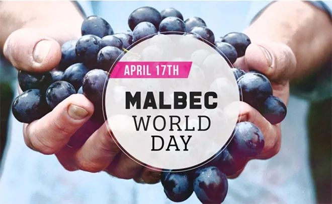 (原始链接: https://mmbiz.qpic.cn/mmbiz_jpg/7CNdqYbqvBISYNmxxmTzicfrYxHtoXA1RS58RnEfqHuuAdkpqpGnosfS3VdaoibzSwcUCicrvZtBqJnGrdTsXk7pw/640?wx_fmt=jpeg)
- 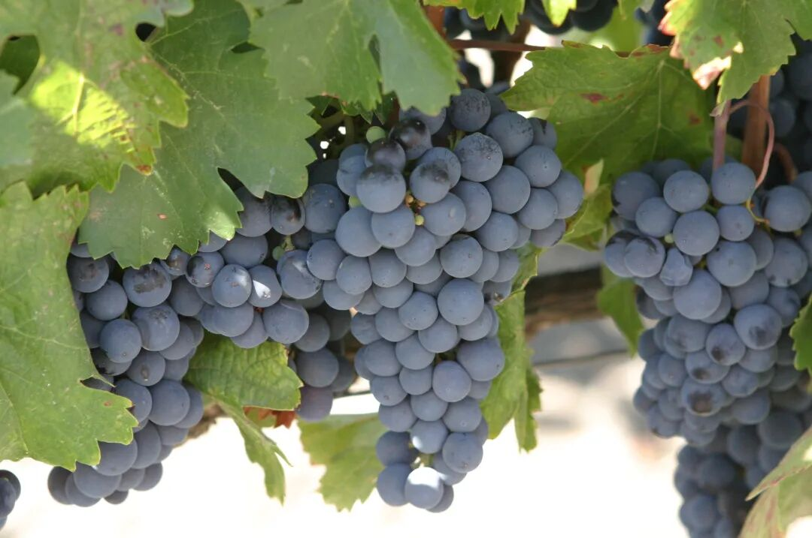 (原始链接: https://mmbiz.qpic.cn/mmbiz_jpg/7CNdqYbqvBISYNmxxmTzicfrYxHtoXA1RnNM7PGWeRaQNA0cGPY1kIJuuSiczb9jMhQ2ib2TU7fsnqC4Ql7GS5Fxg/640?wx_fmt=jpeg)
- 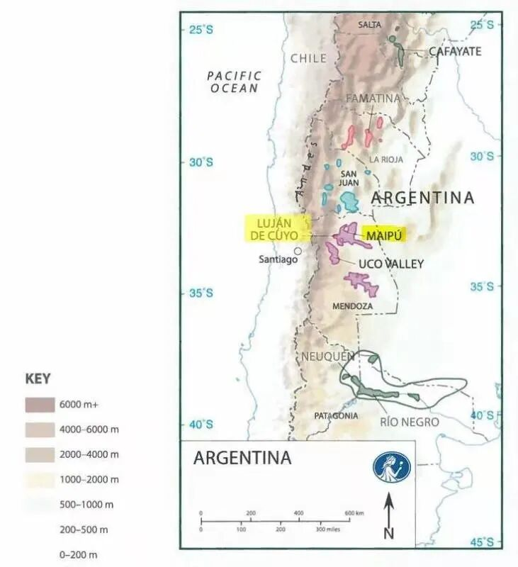 (原始链接: https://mmbiz.qpic.cn/mmbiz_jpg/7CNdqYbqvBISYNmxxmTzicfrYxHtoXA1RgVwls01lBeTlMyBxAk72TTicM36qIp2NVf0wm0sBOolUBAJhWtFKIeA/640?wx_fmt=jpeg)
- 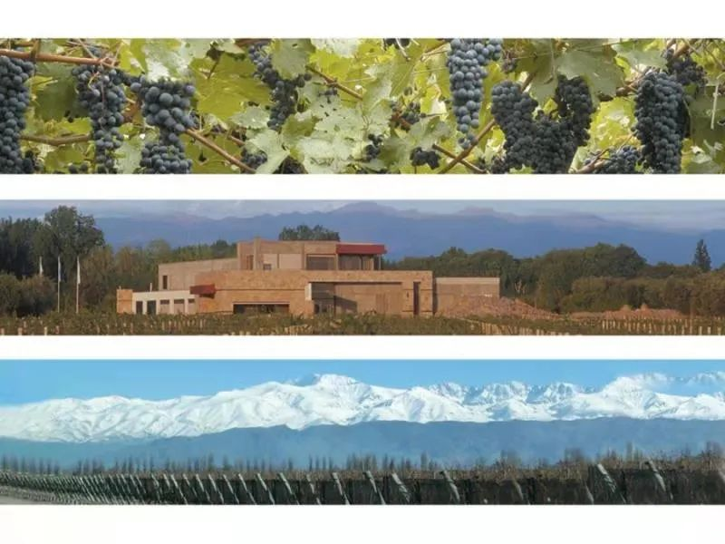 (原始链接: https://mmbiz.qpic.cn/mmbiz_jpg/7CNdqYbqvBISYNmxxmTzicfrYxHtoXA1R5gQy18Xt8GiaeX5wiaFia9ywVStwex8YAByzRhnTRJ8uMxs16hiaNhRt4A/640?wx_fmt=jpeg)
- 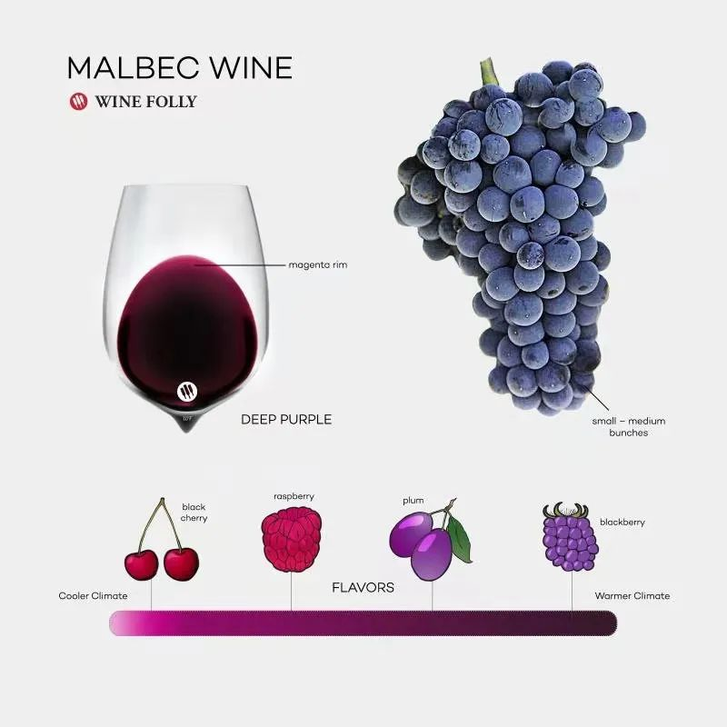 (原始链接: https://mmbiz.qpic.cn/mmbiz_jpg/7CNdqYbqvBISYNmxxmTzicfrYxHtoXA1RzGnj321qjiaZCBXsWzGpcj5hmQyf6C8xG8EWrU0099joR8ZDQuvxaFA/640?wx_fmt=jpeg)
- 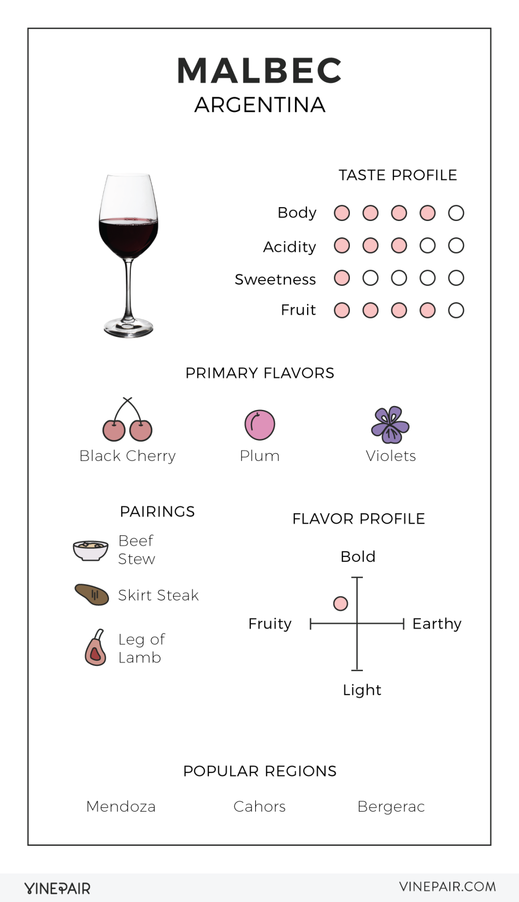 (原始链接: https://mmbiz.qpic.cn/mmbiz_png/7CNdqYbqvBISYNmxxmTzicfrYxHtoXA1RXWmia4VYXiadoMN5jKgJKQia7fLicGbicasQ4FblApS1VOO2GJxT2ndNZlw/640?wx_fmt=png)
- 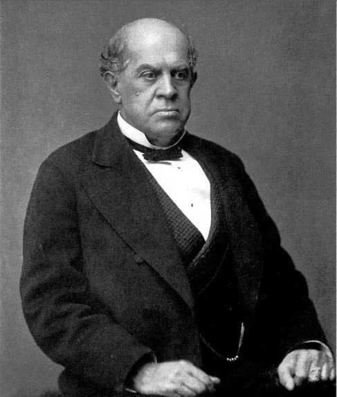 (原始链接: https://mmbiz.qpic.cn/mmbiz_jpg/7CNdqYbqvBISYNmxxmTzicfrYxHtoXA1RboHkWlDLjhRjibSQ8SWedaCzYn8ibadhAlkqvicNwAtHPZI83U92KPB6Q/640?wx_fmt=jpeg)
- 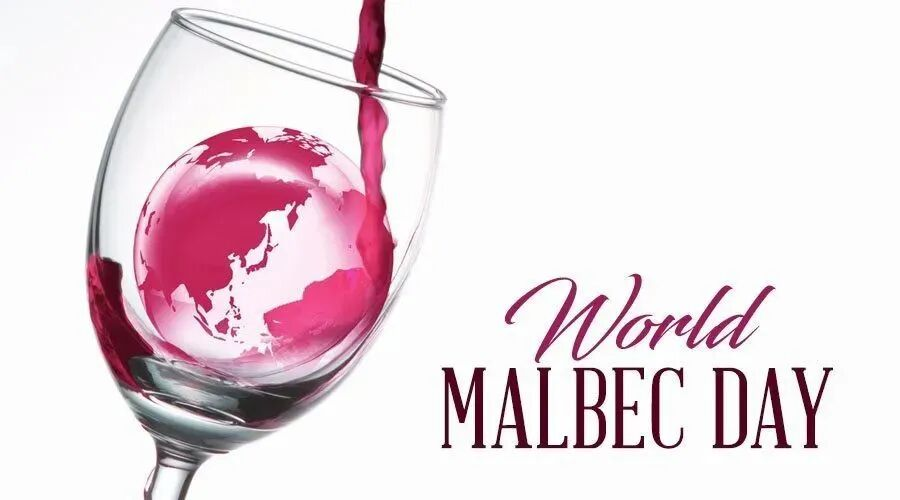 (原始链接: https://mmbiz.qpic.cn/mmbiz_jpg/7CNdqYbqvBISYNmxxmTzicfrYxHtoXA1RmHibSovsJm42uV1JXSwuDAAby4RXDbGrRmhCzTl4RaOawwXUH0ians3g/640?wx_fmt=jpeg)
-  (原始链接: https://mmbiz.qpic.cn/mmbiz_svg/0sDCa2E8S1spUd3DZy9lnxDUnzAlASEAHCQ7iavM9ZDu1TgzamfZ6KLIf1Ivcn9mvWoBZjJwdCPAWnulAwl8AcOs3b8GiafYWN/640?wx_fmt=svg)
- 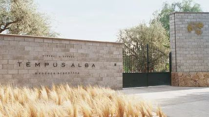 (原始链接: https://mmbiz.qpic.cn/mmbiz_jpg/7CNdqYbqvBISYNmxxmTzicfrYxHtoXA1Rn0zYia6U6Yo3CzPYF1oicf2bYOp2E2ibALcBdkzp53b5oMq8UMIULjCoQ/640?wx_fmt=jpeg)
- 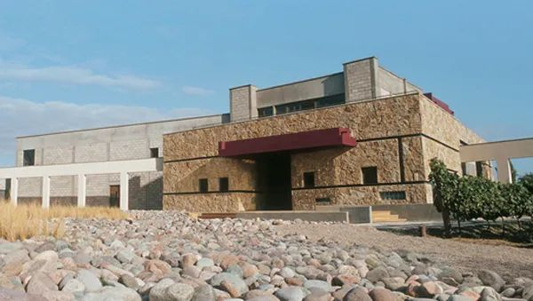 (原始链接: https://mmbiz.qpic.cn/mmbiz_jpg/7CNdqYbqvBISYNmxxmTzicfrYxHtoXA1R5S2AMYyv0zn2XviaRPrh5DWqpMV67ueNtYItoVvN2I205XqTLpFKic2Q/640?wx_fmt=jpeg)
- 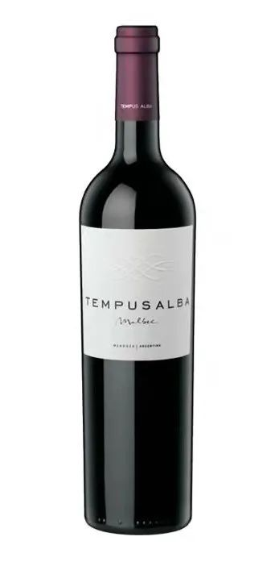 (原始链接: https://mmbiz.qpic.cn/mmbiz_jpg/7CNdqYbqvBISYNmxxmTzicfrYxHtoXA1RW7ibWYuphgaVYdE9DcL4M5a3OkHwoicQnNIMQicxHGuVuQ6WYVNCMKmsg/640?wx_fmt=jpeg)
- 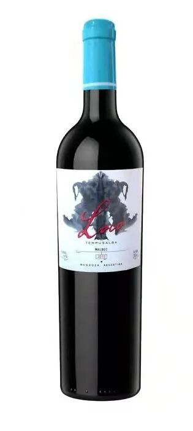 (原始链接: https://mmbiz.qpic.cn/mmbiz_jpg/7CNdqYbqvBISYNmxxmTzicfrYxHtoXA1RsVwFFw6ib6jBmUAQUKzXKxgcWcMiavTzHn8AqHeYHupFic5aNLia5oQjdQ/640?wx_fmt=jpeg)
- 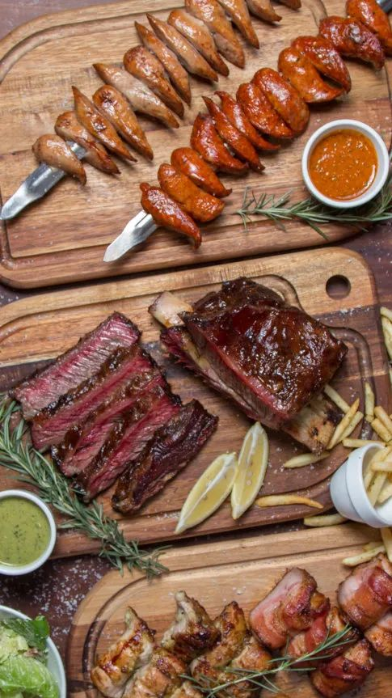 (原始链接: https://mmbiz.qpic.cn/mmbiz_jpg/7CNdqYbqvBISYNmxxmTzicfrYxHtoXA1RAJLzouDicup0mic7DXXRVJScEMhKu5ibtBT0ZKgyYfP666icfY6rLw4rTQ/640?wx_fmt=jpeg)
- 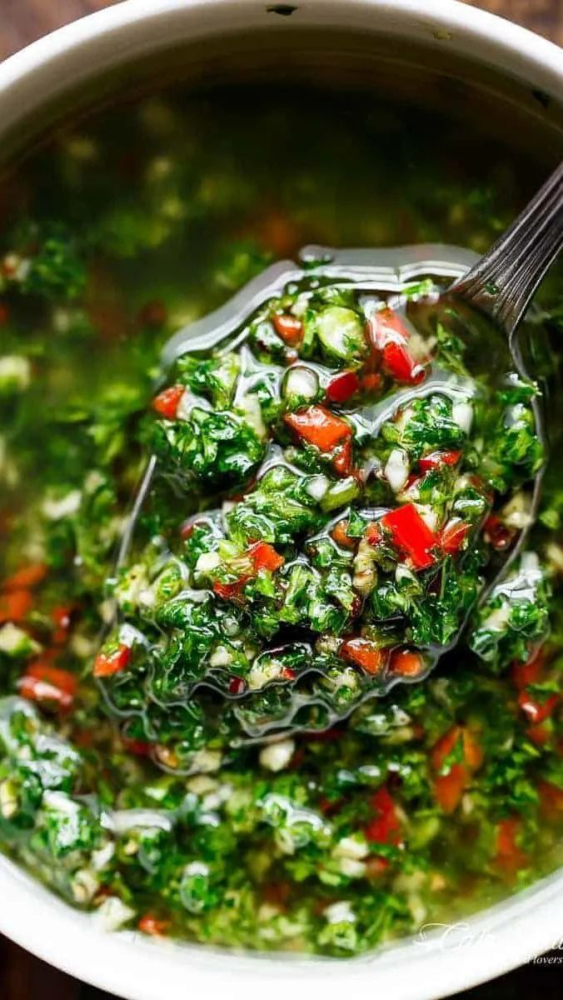 (原始链接: https://mmbiz.qpic.cn/mmbiz_jpg/7CNdqYbqvBISYNmxxmTzicfrYxHtoXA1Ra08Z7KxauVg3fS399mZ3D7kwficppE6MmltCyOYrYgLQpgjxs5KNZgQ/640?wx_fmt=jpeg)
- 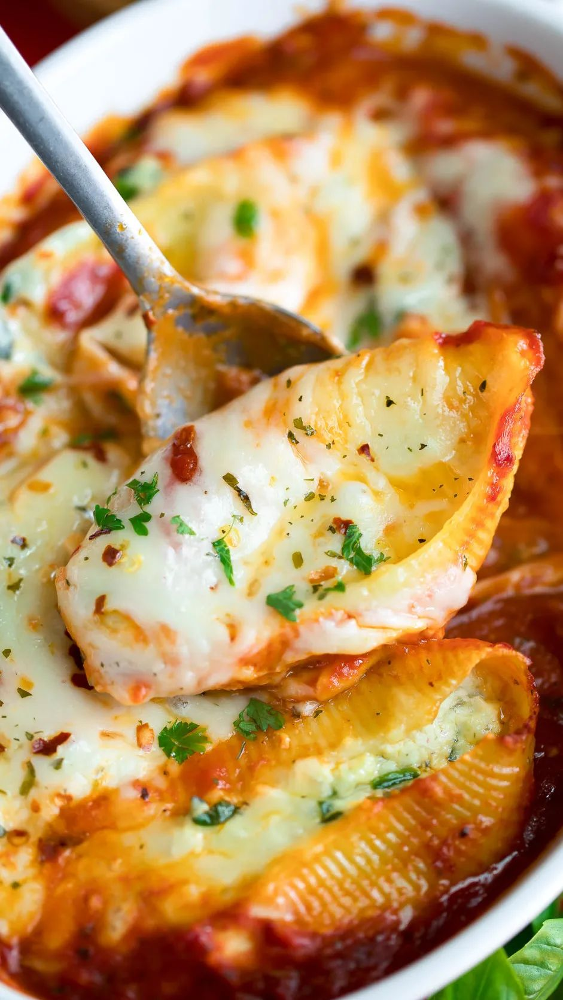 (原始链接: https://mmbiz.qpic.cn/mmbiz_jpg/7CNdqYbqvBISYNmxxmTzicfrYxHtoXA1RCSVaDoyo54czicPVDOfG9mvRXWHTnicu6BFNMj8E7Jj3YNey9ibgowRFQ/640?wx_fmt=jpeg)
-  (原始链接: https://mmbiz.qpic.cn/mmbiz_jpg/7CNdqYbqvBISYNmxxmTzicfrYxHtoXA1Rg3ntCav89ezOAKQq3HSfOZYJkMUicc1tJ0yfXCSx3edWSMM72QBz9icA/640?wx_fmt=jpeg)
