# 无标题

**链接地址:** http://mp.weixin.qq.com/s?__biz=MzIyMzU4OTc0MQ==&mid=2247485538&idx=1&sn=eec934858c760663b2eaed72b60445e0&chksm=e81aac60df6d257601e6d0097406b454920f2e78cee58db032294b5e9cca9a7a2468a0943a9b&mpshare=1&scene=2&srcid=0502tqAgQc6Ivim6LI5STkpb&sharer_sharetime=1619918696874&sharer_shareid=be1c8edd6c93eec155a61c876e41d26a#rd
**作者:** 关注我们
**获取时间:** 2025/8/28 19:47:53
**图片数量:** 21

---

## 原始HTML内容

<section style="box-sizing: border-box;font-size: 16px;"><section style="margin: 10px 0%;box-sizing: border-box;" powered-by="xiumi.us"><section style="display: inline-block;width: 100%;vertical-align: top;background-color: rgb(142, 142, 142);padding: 3px;box-sizing: border-box;"><section style="box-sizing: border-box;" powered-by="xiumi.us"><section style="display: flex;flex-flow: row nowrap;box-sizing: border-box;"><section style="display: inline-block;vertical-align: top;width: auto;flex: 50 50 0%;align-self: stretch;height: auto;background-color: rgb(227, 225, 225);padding: 3px;box-sizing: border-box;"><section style="display: inline-block;width: 100%;vertical-align: middle;border-style: solid;border-width: 1px;border-color: rgb(142, 142, 142);padding: 3px 10px 5px;align-self: center;box-sizing: border-box;" powered-by="xiumi.us"><section style="margin-top: 3px;margin-right: 0%;margin-left: 0%;box-sizing: border-box;" powered-by="xiumi.us"><section style="text-align: center;color: rgb(106, 106, 106);line-height: 1.2;font-size: 14px;box-sizing: border-box;">
<strong style="box-sizing: border-box;">点击蓝字</strong>
</section></section></section></section><section style="display: inline-block;vertical-align: middle;width: auto;padding-left: 3px;background-color: rgba(255, 255, 255, 0);flex: 50 50 0%;align-self: center;height: auto;box-sizing: border-box;"><section style="margin-top: 3px;margin-right: 0%;margin-left: 0%;box-sizing: border-box;" powered-by="xiumi.us"><section style="text-align: center;font-size: 14px;color: rgb(255, 255, 255);line-height: 1.2;box-sizing: border-box;">
<strong style="box-sizing: border-box;">关注我们</strong>
</section></section></section></section></section></section></section><section style="box-sizing: border-box;" powered-by="xiumi.us">
 
</section><section style="box-sizing: border-box;" powered-by="xiumi.us">
 
</section><section style="text-align: right;justify-content: flex-end;margin-top: 10px;margin-right: 0%;margin-left: 0%;box-sizing: border-box;" powered-by="xiumi.us"><section style="display: inline-block;width: auto;vertical-align: top;min-width: 10%;max-width: 100%;height: auto;background-color: rgb(142, 142, 142);padding: 5px 10px;border-width: 0px;box-sizing: border-box;"><section style="text-align: justify;color: rgb(255, 255, 255);font-size: 14px;box-sizing: border-box;" powered-by="xiumi.us">
<strong style="box-sizing: border-box;">特别专题《国际长相思日在即，咱们喝点啥？》</strong>
</section></section></section><section style="display: inline-block;width: 100%;vertical-align: top;border-left: 2px none rgb(195, 163, 142);border-bottom-left-radius: 0px;background-color: rgba(255, 213, 195, 0);padding: 10px;border-right: 2px solid rgb(0, 0, 0);border-top-right-radius: 0px;box-sizing: border-box;" powered-by="xiumi.us"><section style="text-align: center;margin-right: 0%;margin-left: 0%;box-sizing: border-box;" powered-by="xiumi.us"><section style="max-width: 100%;vertical-align: middle;display: inline-block;line-height: 0;box-sizing: border-box;"></section></section></section><section style="text-align: right;justify-content: flex-end;margin-right: 0%;margin-bottom: 10px;margin-left: 0%;font-size: 0px;box-sizing: border-box;" powered-by="xiumi.us"><section style="display: inline-block;width: 50%;vertical-align: top;height: auto;line-height: 0;box-sizing: border-box;"><section style="margin-top: 0.5em;margin-bottom: 0.5em;box-sizing: border-box;" powered-by="xiumi.us"><section style="background-color: rgb(0, 0, 0);height: 2px;box-sizing: border-box;"><section><svg viewBox="0 0 1 1" style="float:left;line-height:0;width:0;vertical-align:top;"></svg></section></section></section></section></section><section style="box-sizing: border-box;" powered-by="xiumi.us"><section style="display: flex;flex-flow: row nowrap;margin: -10px 0% 10px;box-sizing: border-box;"><section style="display: inline-block;vertical-align: top;width: auto;flex: 0 0 auto;align-self: flex-start;min-width: 10%;max-width: 100%;height: auto;box-sizing: border-box;"><section style="color: rgb(0, 0, 0);font-size: 12px;box-sizing: border-box;" powered-by="xiumi.us">
&nbsp; &nbsp;专题出品 |&nbsp;加拿大汉嘉酒业&nbsp;
</section></section><section style="display: inline-block;vertical-align: top;width: auto;align-self: flex-start;flex: 100 100 0%;box-sizing: border-box;"><section style="margin-top: 0.5em;margin-bottom: 0.5em;box-sizing: border-box;" powered-by="xiumi.us"><section style="background-color: rgba(255, 213, 195, 0);height: 1px;box-sizing: border-box;"><section><svg viewBox="0 0 1 1" style="float:left;line-height:0;width:0;vertical-align:top;"></svg></section></section></section></section></section></section><section style="box-sizing: border-box;" powered-by="xiumi.us">
 
</section><section style="text-align: center;justify-content: center;margin-right: 0%;margin-left: 0%;box-sizing: border-box;" powered-by="xiumi.us"><section style="display: inline-block;width: auto;vertical-align: top;min-width: 10%;max-width: 100%;height: auto;border-bottom: 1px solid rgb(62, 62, 62);border-bottom-right-radius: 0px;box-sizing: border-box;"><section style="font-size: 26px;color: rgb(92, 92, 92);font-family: Optima-Regular, PingFangTC-light;padding-right: 31px;padding-left: 31px;line-height: 1.5;letter-spacing: 0px;box-sizing: border-box;" powered-by="xiumi.us">
<strong style="box-sizing: border-box;">#1</strong>
</section></section></section><section style="font-size: 15px;font-family: Optima-Regular, PingFangTC-light;color: rgb(181, 181, 181);line-height: 2;letter-spacing: 0px;box-sizing: border-box;" powered-by="xiumi.us">
<strong style="box-sizing: border-box;">国际长相思日来临</strong>
</section><section style="margin: 10px 0%;box-sizing: border-box;" powered-by="xiumi.us"><section style="font-size: 14px;letter-spacing: 2px;line-height: 2;padding-right: 15px;padding-left: 15px;color: rgb(115, 115, 114);box-sizing: border-box;">
 

随着春夏脚步的来临，气温开始急速升高。人们用餐习惯开始变得<strong style="box-sizing: border-box;">清淡凉爽</strong>，大量的鱼虾海鲜被端上餐桌，而与之搭配的<strong style="box-sizing: border-box;">白葡萄酒</strong>也从珍藏的酒柜中被取出享用。

 
</section></section><section style="text-align: center;margin-top: 10px;margin-bottom: 10px;box-sizing: border-box;" powered-by="xiumi.us"><section style="max-width: 100%;vertical-align: middle;display: inline-block;line-height: 0;width: 90%;height: auto;box-sizing: border-box;"></section></section><section style="margin: 10px 0%;box-sizing: border-box;" powered-by="xiumi.us"><section style="font-size: 14px;letter-spacing: 2px;line-height: 2;padding-right: 15px;padding-left: 15px;color: rgb(115, 115, 114);box-sizing: border-box;">
 

为了庆祝这一年中最明媚轻快的日子，5月用白葡萄酿造的美酒开始<strong style="box-sizing: border-box;">扎堆过节</strong>。每年五月的第一个周五，都是著名的<strong style="box-sizing: border-box;">国际长相思日</strong>（International Sauvignon Blanc Day）。今年落到了5月7日。

 

说到长相思（Sauvignon Blanc），那也算得上是白酒中<strong style="box-sizing: border-box;">相当受欢迎</strong>的一种。那么长相思到底是什么？今天我们就来聊聊这一白葡萄品种及其所酿造的白葡萄酒。

 

文末团购福利精彩上线，酒友们赶紧冲冲冲！

 

 
</section></section><section style="text-align: center;justify-content: center;margin-right: 0%;margin-left: 0%;box-sizing: border-box;" powered-by="xiumi.us"><section style="display: inline-block;width: auto;vertical-align: top;min-width: 10%;max-width: 100%;height: auto;border-bottom: 1px solid rgb(62, 62, 62);border-bottom-right-radius: 0px;box-sizing: border-box;"><section style="font-size: 26px;color: rgb(92, 92, 92);font-family: Optima-Regular, PingFangTC-light;padding-right: 31px;padding-left: 31px;line-height: 1.5;letter-spacing: 0px;box-sizing: border-box;" powered-by="xiumi.us">
<strong style="box-sizing: border-box;">#2</strong>
</section></section></section><section style="font-size: 15px;font-family: Optima-Regular, PingFangTC-light;color: rgb(181, 181, 181);line-height: 2;letter-spacing: 0px;box-sizing: border-box;" powered-by="xiumi.us">
<strong style="box-sizing: border-box;">葡萄中的“野孩子”</strong>
</section><section style="margin: 10px 0%;box-sizing: border-box;" powered-by="xiumi.us"><section style="font-size: 14px;letter-spacing: 2px;line-height: 2;padding-right: 15px;padding-left: 15px;color: rgb(115, 115, 114);box-sizing: border-box;">
 

长相思（Sauvignon Blanc）原产自<strong style="box-sizing: border-box;">法国卢瓦尔河谷</strong>，适合温和的气候，特别喜欢生长在石灰质土上。主要用来制造多果味、早熟、简单易饮的<strong style="box-sizing: border-box;">干白葡萄酒</strong>。

 
</section></section><section style="text-align: center;margin-top: 10px;margin-bottom: 10px;box-sizing: border-box;" powered-by="xiumi.us"><section style="max-width: 100%;vertical-align: middle;display: inline-block;line-height: 0;width: 90%;height: auto;box-sizing: border-box;"></section></section><section style="margin: 10px 0%;box-sizing: border-box;" powered-by="xiumi.us"><section style="font-size: 14px;letter-spacing: 2px;line-height: 2;padding-right: 15px;padding-left: 15px;color: rgb(115, 115, 114);box-sizing: border-box;">
 

“Sauvignon” 在法文中的意思为“野生”，而 “Blanc”就是白的意思，组合起来即为<strong style="box-sizing: border-box;">“野生的白葡萄”</strong>。这样看似随意的起名方式，恰好点明了长相思的特性。

 
</section></section><section style="text-align: center;margin-top: 10px;margin-bottom: 10px;box-sizing: border-box;" powered-by="xiumi.us"><section style="max-width: 100%;vertical-align: middle;display: inline-block;line-height: 0;width: 90%;height: auto;box-sizing: border-box;"></section></section><section style="margin: 10px 0%;box-sizing: border-box;" powered-by="xiumi.us"><section style="font-size: 14px;letter-spacing: 2px;line-height: 2;padding-right: 15px;padding-left: 15px;color: rgb(115, 115, 114);box-sizing: border-box;">
 

这种易于种植生长的品种，有着葡萄界的<strong style="box-sizing: border-box;">“野孩子”</strong>之称。也正是由于这样的特性，为长相思<strong style="box-sizing: border-box;">用较高的产量和</strong>（相对）<strong style="box-sizing: border-box;">亲民的价格</strong>去征服全世界的葡萄酒爱好者奠定了基础。

 

 
</section></section><section style="text-align: center;justify-content: center;margin-right: 0%;margin-left: 0%;box-sizing: border-box;" powered-by="xiumi.us"><section style="display: inline-block;width: auto;vertical-align: top;min-width: 10%;max-width: 100%;height: auto;border-bottom: 1px solid rgb(62, 62, 62);border-bottom-right-radius: 0px;box-sizing: border-box;"><section style="font-size: 26px;color: rgb(92, 92, 92);font-family: Optima-Regular, PingFangTC-light;padding-right: 31px;padding-left: 31px;line-height: 1.5;letter-spacing: 0px;box-sizing: border-box;" powered-by="xiumi.us">
<strong style="box-sizing: border-box;">#3</strong>
</section></section></section><section style="font-size: 15px;font-family: Optima-Regular, PingFangTC-light;color: rgb(181, 181, 181);line-height: 2;letter-spacing: 0px;box-sizing: border-box;" powered-by="xiumi.us">
<strong style="box-sizing: border-box;">清新迷人的风味</strong>
</section><section style="margin: 10px 0%;box-sizing: border-box;" powered-by="xiumi.us"><section style="font-size: 14px;letter-spacing: 2px;line-height: 2;padding-right: 15px;padding-left: 15px;color: rgb(115, 115, 114);box-sizing: border-box;">
 

然而，光靠产量和价格坐稳白葡萄酒界的一番还是不够的，真正让长相思闻名遐迩的还数它那<strong style="box-sizing: border-box;">清新迷人的风味</strong>。

 
</section></section><section style="text-align: center;margin-top: 10px;margin-bottom: 10px;box-sizing: border-box;" powered-by="xiumi.us"><section style="max-width: 100%;vertical-align: middle;display: inline-block;line-height: 0;width: 90%;height: auto;box-sizing: border-box;"></section></section><section style="margin: 10px 0%;box-sizing: border-box;" powered-by="xiumi.us"><section style="font-size: 14px;letter-spacing: 2px;line-height: 2;padding-right: 15px;padding-left: 15px;color: rgb(115, 115, 114);box-sizing: border-box;">
 

以长相思酿造的白葡萄酒<strong style="box-sizing: border-box;">酸味浓重</strong>，口感清脆如雨后森林，香气清新如绿色蔬果，有时还会产生矿物和坚果的丰富风味。

 
</section></section><section style="margin: 10px 0%;text-align: center;justify-content: center;box-sizing: border-box;" powered-by="xiumi.us"><section style="display: inline-block;width: 80%;vertical-align: top;border-width: 1px;border-style: solid;border-color: rgba(255, 213, 195, 0);height: auto;box-sizing: border-box;"><section style="box-sizing: border-box;" powered-by="xiumi.us"><section style="display: flex;flex-flow: row nowrap;margin: 20px 0%;box-sizing: border-box;"><section style="display: inline-block;vertical-align: top;width: auto;flex: 100 100 0%;align-self: stretch;height: auto;padding-right: 10px;padding-left: 10px;border-width: 0px;box-sizing: border-box;"><section style="margin: -10px 0%;box-sizing: border-box;" powered-by="xiumi.us"><section style="max-width: 100%;vertical-align: middle;display: inline-block;line-height: 0;border-width: 0px;border-radius: 5px;border-style: none;border-color: rgb(62, 62, 62);overflow: hidden;box-sizing: border-box;"></section></section></section><section style="display: inline-block;vertical-align: top;width: auto;align-self: stretch;flex: 100 100 0%;border-left: 1px solid rgba(255, 213, 195, 0);border-bottom-left-radius: 0px;padding-right: 10px;padding-left: 10px;box-sizing: border-box;"><section style="margin: -10px 0%;box-sizing: border-box;" powered-by="xiumi.us"><section style="max-width: 100%;vertical-align: middle;display: inline-block;line-height: 0;border-width: 0px;border-radius: 5px;border-style: none;border-color: rgb(62, 62, 62);overflow: hidden;box-sizing: border-box;"></section></section></section></section></section><section style="box-sizing: border-box;" powered-by="xiumi.us"><section style="display: flex;flex-flow: row nowrap;box-sizing: border-box;"><section style="display: inline-block;vertical-align: top;width: auto;flex: 100 100 0%;align-self: flex-start;height: auto;padding-right: 20px;padding-left: 20px;box-sizing: border-box;"><section style="margin-right: 0%;margin-left: 0%;box-sizing: border-box;" powered-by="xiumi.us"><section style="background-color: rgba(255, 213, 195, 0);height: 1px;box-sizing: border-box;"><section><svg viewBox="0 0 1 1" style="float:left;line-height:0;width:0;vertical-align:top;"></svg></section></section></section></section><section style="display: inline-block;vertical-align: top;width: auto;align-self: flex-start;flex: 100 100 0%;padding-right: 20px;padding-left: 20px;box-sizing: border-box;"><section style="margin-right: 0%;margin-left: 0%;box-sizing: border-box;" powered-by="xiumi.us"><section style="background-color: rgba(255, 213, 195, 0);height: 1px;box-sizing: border-box;"><section><svg viewBox="0 0 1 1" style="float:left;line-height:0;width:0;vertical-align:top;"></svg></section></section></section></section></section></section><section style="box-sizing: border-box;" powered-by="xiumi.us"><section style="display: flex;flex-flow: row nowrap;margin: 20px 0%;box-sizing: border-box;"><section style="display: inline-block;vertical-align: top;width: auto;flex: 100 100 0%;align-self: stretch;height: auto;padding-right: 10px;padding-left: 10px;border-width: 0px;box-sizing: border-box;"><section style="margin: -10px 0%;box-sizing: border-box;" powered-by="xiumi.us"><section style="max-width: 100%;vertical-align: middle;display: inline-block;line-height: 0;border-width: 0px;border-radius: 5px;border-style: none;border-color: rgb(62, 62, 62);overflow: hidden;box-sizing: border-box;"></section></section></section><section style="display: inline-block;vertical-align: top;width: auto;align-self: stretch;flex: 100 100 0%;border-left: 1px solid rgba(255, 213, 195, 0);border-bottom-left-radius: 0px;padding-right: 10px;padding-left: 10px;box-sizing: border-box;"><section style="margin: -10px 0%;box-sizing: border-box;" powered-by="xiumi.us"><section style="max-width: 100%;vertical-align: middle;display: inline-block;line-height: 0;border-width: 0px;border-radius: 5px;border-style: none;border-color: rgb(62, 62, 62);overflow: hidden;box-sizing: border-box;"></section></section></section></section></section></section></section><section style="margin: 10px 0%;box-sizing: border-box;" powered-by="xiumi.us"><section style="font-size: 14px;letter-spacing: 2px;line-height: 2;padding-right: 15px;padding-left: 15px;color: rgb(115, 115, 114);box-sizing: border-box;">
 

其天然的酸度和高酒精张力很适合搭配略带腥鲜的海产，醇厚的羊奶酪，与一些辛辣的食品。驯服了这些<strong style="box-sizing: border-box;">“嚣张的”美食</strong>，碰撞出更丰富多元的美味。

 

 
</section></section><section style="text-align: center;justify-content: center;margin-right: 0%;margin-left: 0%;box-sizing: border-box;" powered-by="xiumi.us"><section style="display: inline-block;width: auto;vertical-align: top;min-width: 10%;max-width: 100%;height: auto;border-bottom: 1px solid rgb(62, 62, 62);border-bottom-right-radius: 0px;box-sizing: border-box;"><section style="font-size: 26px;color: rgb(92, 92, 92);font-family: Optima-Regular, PingFangTC-light;padding-right: 31px;padding-left: 31px;line-height: 1.5;letter-spacing: 0px;box-sizing: border-box;" powered-by="xiumi.us">
<strong style="box-sizing: border-box;">#4</strong>
</section></section></section><section style="font-size: 15px;font-family: Optima-Regular, PingFangTC-light;color: rgb(181, 181, 181);line-height: 2;letter-spacing: 0px;box-sizing: border-box;" powered-by="xiumi.us">
<strong style="box-sizing: border-box;">单酿 vs. 混酿</strong>
</section><section style="margin: 10px 0%;box-sizing: border-box;" powered-by="xiumi.us"><section style="font-size: 14px;letter-spacing: 2px;line-height: 2;padding-right: 15px;padding-left: 15px;color: rgb(115, 115, 114);box-sizing: border-box;">
 

长相思大部份的时候会以单酿的形式出现。但在以<strong style="box-sizing: border-box;">传统混酿</strong>出名的波尔多产区，我们却可以找到长相思与赛美蓉（Semillon）等其他品种的白葡萄所混酿的干白葡萄酒。

 

赛美蓉具有酸度低，香气微妙，浓郁圆润的特点；而长相思具有酸爽、清瘦、清新的特点，二者混酿能够取长补短，风味更加饱满浓郁，也更具<strong style="box-sizing: border-box;">陈年价值</strong>。

 
</section></section><section style="text-align: center;margin-top: 10px;margin-bottom: 10px;box-sizing: border-box;" powered-by="xiumi.us"><section style="max-width: 100%;vertical-align: middle;display: inline-block;line-height: 0;width: 80%;height: auto;box-sizing: border-box;"></section></section><section style="margin: 10px 0%;box-sizing: border-box;" powered-by="xiumi.us"><section style="font-size: 14px;letter-spacing: 2px;line-height: 2;padding-right: 15px;padding-left: 15px;color: rgb(115, 115, 114);box-sizing: border-box;">
 

然而，长相思在混酿过程中其风味容易被其他更厚重的葡萄品种所掩盖，因此其<strong style="box-sizing: border-box;">配比和酿造工艺十分考究</strong>。出产此类混酿白葡萄酒的最著名的产区还数法国波尔多的<strong style="box-sizing: border-box;">格拉夫（Graves）的佩萨克-雷奥良（Pessac-Leognan）</strong>。

 
</section></section><section style="text-align: center;margin-top: 10px;margin-bottom: 10px;box-sizing: border-box;" powered-by="xiumi.us"><section style="max-width: 100%;vertical-align: middle;display: inline-block;line-height: 0;width: 90%;height: auto;box-sizing: border-box;"></section></section><section style="margin: 10px 0%;box-sizing: border-box;" powered-by="xiumi.us"><section style="font-size: 14px;letter-spacing: 2px;line-height: 2;padding-right: 15px;padding-left: 15px;color: rgb(115, 115, 114);box-sizing: border-box;">
 

 
</section></section><section style="text-align: center;justify-content: center;margin-right: 0%;margin-left: 0%;box-sizing: border-box;" powered-by="xiumi.us"><section style="display: inline-block;width: auto;vertical-align: top;min-width: 10%;max-width: 100%;height: auto;border-bottom: 1px solid rgb(62, 62, 62);border-bottom-right-radius: 0px;box-sizing: border-box;"><section style="font-size: 26px;color: rgb(92, 92, 92);font-family: Optima-Regular, PingFangTC-light;padding-right: 31px;padding-left: 31px;line-height: 1.5;letter-spacing: 0px;box-sizing: border-box;" powered-by="xiumi.us">
<strong style="box-sizing: border-box;">#5</strong>
</section></section></section><section style="font-size: 15px;font-family: Optima-Regular, PingFangTC-light;color: rgb(181, 181, 181);line-height: 2;letter-spacing: 0px;box-sizing: border-box;" powered-by="xiumi.us">
<strong style="box-sizing: border-box;">四款干白葡萄酒</strong>
</section><section style="margin: 10px 0%;box-sizing: border-box;" powered-by="xiumi.us"><section style="font-size: 14px;letter-spacing: 2px;line-height: 2;padding-right: 15px;padding-left: 15px;color: rgb(115, 115, 114);box-sizing: border-box;">
 

介绍了这么多长相思的背景知识，葡萄酒爱好者肚中的酒虫是不是已经被馋醒了？

 

加拿大汉嘉酒业精挑细选了4款<strong style="box-sizing: border-box;">不同酒庄和价格区间的干白葡萄酒</strong>带给大家！就让我们一起举杯共庆五月白葡萄酒节日的到来吧！

 
</section></section><section style="margin: 10px 0%;box-sizing: border-box;" powered-by="xiumi.us"><section style="display: inline-block;width: 100%;vertical-align: top;background-color: rgb(255, 255, 255);padding: 20px;box-sizing: border-box;"><section style="text-align: left;justify-content: flex-start;margin-right: 0%;margin-left: 0%;box-sizing: border-box;" powered-by="xiumi.us"><section style="display: inline-block;vertical-align: middle;width: auto;min-width: 10%;max-width: 100%;height: auto;border-bottom: 1px solid rgb(62, 62, 62);border-bottom-right-radius: 0px;align-self: center;box-sizing: border-box;"><section style="text-align: center;font-size: 26px;color: rgb(92, 92, 92);font-family: Optima-Regular, PingFangTC-light;padding-right: 13px;padding-left: 13px;line-height: 1.5;letter-spacing: 0px;box-sizing: border-box;" powered-by="xiumi.us">
<strong style="box-sizing: border-box;">01</strong>
</section></section><section style="display: inline-block;vertical-align: middle;width: auto;align-self: center;border-width: 0px;min-width: 10%;max-width: 100%;height: auto;box-sizing: border-box;"><section style="text-align: justify;font-size: 26px;color: rgb(92, 92, 92);font-family: Optima-Regular, PingFangTC-light;letter-spacing: 0px;line-height: 1;padding-right: 8px;padding-left: 8px;box-sizing: border-box;" powered-by="xiumi.us">
<strong style="letter-spacing: 0px;box-sizing: border-box;">克莱蒙教皇堡白葡萄酒</strong> 

<strong style="box-sizing: border-box;">Chateau Pape Clement Blanc</strong>
</section></section></section><section style="margin-right: 0%;margin-bottom: 10px;margin-left: 0%;box-sizing: border-box;" powered-by="xiumi.us"><section style="display: inline-block;width: 100%;vertical-align: top;padding-left: 8px;box-sizing: border-box;"><section style="margin-right: 0%;margin-left: 0%;box-sizing: border-box;" powered-by="xiumi.us"><section style="display: inline-block;width: 100%;vertical-align: top;background-color: rgba(255, 213, 195, 0);padding-bottom: 10px;box-sizing: border-box;"><section style="box-sizing: border-box;" powered-by="xiumi.us">
 
</section><section style="margin-right: 0%;margin-bottom: 20px;margin-left: 0%;box-sizing: border-box;" powered-by="xiumi.us"><section style="display: inline-block;width: 100%;vertical-align: top;padding: 10px;box-sizing: border-box;"><section style="box-sizing: border-box;" powered-by="xiumi.us"><section style="display: inline-block;vertical-align: top;width: 40%;border-style: solid;border-width: 0px;border-color: rgb(213, 181, 113);padding-right: 6px;height: auto;box-sizing: border-box;"><section style="text-align: center;margin-right: 0%;margin-left: 0%;box-sizing: border-box;" powered-by="xiumi.us"><section style="max-width: 100%;vertical-align: middle;display: inline-block;line-height: 0;width: 85%;height: auto;box-sizing: border-box;"></section></section></section><section style="display: inline-block;vertical-align: top;width: 60%;height: auto;box-sizing: border-box;"><section style="font-size: 12px;box-sizing: border-box;" powered-by="xiumi.us">
AB SKU:&nbsp;840328

年份&nbsp;:&nbsp;2016

产区 :&nbsp;Pessac-Leognan, France

净含量&nbsp;:&nbsp;750 ml

种类&nbsp;: 干白葡萄酒

酒精度&nbsp;:&nbsp;13.3％

葡萄品种&nbsp;: 长相思 57% 、赛美蓉 39%、密斯卡岱 4%&nbsp;

适饮区：2018 - 2037
</section></section></section></section></section></section></section></section></section><section style="margin: 10px 0%;box-sizing: border-box;" powered-by="xiumi.us"><section style="font-size: 14px;letter-spacing: 2px;line-height: 2;padding-right: 15px;padding-left: 15px;color: rgb(115, 115, 114);box-sizing: border-box;">
克莱蒙教皇堡位于波尔多的佩萨克-雷奥良产区，历经700余年的历史洗礼，今日的酒庄在酒业巨擎贝尔纳·马格雷（Bernard Magrez）的领导下愈发闪耀。酒庄由飞行酿酒师米歇尔·罗兰（Michel Rolland）担任酿酒顾问，出品的红、白葡萄酒品质均十分优异。

 

这款克莱蒙教皇堡白葡萄酒香气浓郁且富有表现力，散发着柑橘类水果、苹果、蜂蜜、金合欢和花朵的芳香，伴有橡木、松木、香草、香料和烘烤的风味，口感清新圆润，酒体饱满，余味中带有些许矿物质气息。

 
</section></section></section></section><section style="margin: 10px 0%;box-sizing: border-box;" powered-by="xiumi.us"><section style="display: inline-block;width: 100%;vertical-align: top;background-color: rgb(255, 255, 255);padding: 20px;box-sizing: border-box;"><section style="text-align: left;justify-content: flex-start;margin-right: 0%;margin-left: 0%;box-sizing: border-box;" powered-by="xiumi.us"><section style="display: inline-block;vertical-align: middle;width: auto;min-width: 10%;max-width: 100%;height: auto;border-bottom: 1px solid rgb(62, 62, 62);border-bottom-right-radius: 0px;align-self: center;box-sizing: border-box;"><section style="text-align: center;font-size: 26px;color: rgb(92, 92, 92);font-family: Optima-Regular, PingFangTC-light;padding-right: 13px;padding-left: 13px;line-height: 1.5;letter-spacing: 0px;box-sizing: border-box;" powered-by="xiumi.us">
<strong style="box-sizing: border-box;">02</strong>
</section></section><section style="display: inline-block;vertical-align: middle;width: auto;align-self: center;border-width: 0px;min-width: 10%;max-width: 100%;height: auto;box-sizing: border-box;"><section style="text-align: justify;font-size: 26px;color: rgb(92, 92, 92);font-family: Optima-Regular, PingFangTC-light;letter-spacing: 0px;line-height: 1;padding-right: 8px;padding-left: 8px;box-sizing: border-box;" powered-by="xiumi.us">
<strong style="letter-spacing: 0px;box-sizing: border-box;">骑士酒庄白葡萄酒</strong> 

<strong style="box-sizing: border-box;">Domaine De Chevalier Blanc</strong>
</section></section></section><section style="margin-right: 0%;margin-bottom: 10px;margin-left: 0%;box-sizing: border-box;" powered-by="xiumi.us"><section style="display: inline-block;width: 100%;vertical-align: top;padding-left: 8px;box-sizing: border-box;"><section style="margin-right: 0%;margin-left: 0%;box-sizing: border-box;" powered-by="xiumi.us"><section style="display: inline-block;width: 100%;vertical-align: top;background-color: rgba(255, 213, 195, 0);padding-bottom: 10px;box-sizing: border-box;"><section style="box-sizing: border-box;" powered-by="xiumi.us">
 
</section><section style="margin-right: 0%;margin-bottom: 20px;margin-left: 0%;box-sizing: border-box;" powered-by="xiumi.us"><section style="display: inline-block;width: 100%;vertical-align: top;padding: 10px;box-sizing: border-box;"><section style="box-sizing: border-box;" powered-by="xiumi.us"><section style="display: inline-block;vertical-align: top;width: 40%;border-style: solid;border-width: 0px;border-color: rgb(213, 181, 113);padding-right: 6px;height: auto;box-sizing: border-box;"><section style="text-align: center;margin-right: 0%;margin-left: 0%;box-sizing: border-box;" powered-by="xiumi.us"><section style="max-width: 100%;vertical-align: middle;display: inline-block;line-height: 0;width: 85%;height: auto;box-sizing: border-box;"></section></section></section><section style="display: inline-block;vertical-align: top;width: 60%;height: auto;box-sizing: border-box;"><section style="font-size: 12px;box-sizing: border-box;" powered-by="xiumi.us">
AB SKU:&nbsp;840345

年份&nbsp;:&nbsp;2016

产区 :&nbsp;Pessac-Leognan, France

净含量&nbsp;:&nbsp;750 ml

种类&nbsp;: 干白葡萄酒

酒精度&nbsp;:&nbsp;13％

葡萄品种&nbsp;: 长相思 70%&nbsp;、赛美蓉 30%&nbsp;

适饮区：2019 - 2050
</section></section></section></section></section></section></section></section></section><section style="margin: 10px 0%;box-sizing: border-box;" powered-by="xiumi.us"><section style="font-size: 14px;letter-spacing: 2px;line-height: 2;padding-right: 15px;padding-left: 15px;color: rgb(115, 115, 114);box-sizing: border-box;">
这是一款来自法国波尔多产区的白葡萄酒，由长相思和赛美蓉混酿而成。该酒产自格拉夫列级酒庄——骑士酒庄，是一款远近驰名的优质白葡萄酒。在贝尔纳（Bernard）家族的带领下，骑士白涌现出了许多优质年份，其酒款的表现一直可圈可点，许多20世纪40、50年代的老年份在如今仍然散发着“不老佳酿”的魅力，侧面印证了骑士白不容小觑的陈年潜力。

 

这款酒呈诱人的金黄色，酒体轻盈，散发着草本植物、杨桃和青苹果的清新香气，风味集中，层次丰富。

 
</section></section></section></section><section style="margin: 10px 0%;box-sizing: border-box;" powered-by="xiumi.us"><section style="display: inline-block;width: 100%;vertical-align: top;background-color: rgb(255, 255, 255);padding: 20px;box-sizing: border-box;"><section style="text-align: left;justify-content: flex-start;margin-right: 0%;margin-left: 0%;box-sizing: border-box;" powered-by="xiumi.us"><section style="display: inline-block;vertical-align: middle;width: auto;min-width: 10%;max-width: 100%;height: auto;border-bottom: 1px solid rgb(62, 62, 62);border-bottom-right-radius: 0px;align-self: center;box-sizing: border-box;"><section style="text-align: center;font-size: 26px;color: rgb(92, 92, 92);font-family: Optima-Regular, PingFangTC-light;padding-right: 13px;padding-left: 13px;line-height: 1.5;letter-spacing: 0px;box-sizing: border-box;" powered-by="xiumi.us">
<strong style="box-sizing: border-box;">03</strong>
</section></section><section style="display: inline-block;vertical-align: middle;width: auto;align-self: center;border-width: 0px;min-width: 10%;max-width: 100%;height: auto;box-sizing: border-box;"><section style="text-align: justify;font-size: 26px;color: rgb(92, 92, 92);font-family: Optima-Regular, PingFangTC-light;letter-spacing: 0px;line-height: 1;padding-right: 8px;padding-left: 8px;box-sizing: border-box;" powered-by="xiumi.us">
<strong style="letter-spacing: 0px;box-sizing: border-box;">卡尔邦女酒庄干白葡萄酒</strong> 

<strong style="box-sizing: border-box;">Chateau Carbonnieux Blanc</strong>
</section></section></section><section style="margin-right: 0%;margin-bottom: 10px;margin-left: 0%;box-sizing: border-box;" powered-by="xiumi.us"><section style="display: inline-block;width: 100%;vertical-align: top;padding-left: 8px;box-sizing: border-box;"><section style="margin-right: 0%;margin-left: 0%;box-sizing: border-box;" powered-by="xiumi.us"><section style="display: inline-block;width: 100%;vertical-align: top;background-color: rgba(255, 213, 195, 0);padding-bottom: 10px;box-sizing: border-box;"><section style="box-sizing: border-box;" powered-by="xiumi.us">
 
</section><section style="margin-right: 0%;margin-bottom: 20px;margin-left: 0%;box-sizing: border-box;" powered-by="xiumi.us"><section style="display: inline-block;width: 100%;vertical-align: top;padding: 10px;box-sizing: border-box;"><section style="box-sizing: border-box;" powered-by="xiumi.us"><section style="display: inline-block;vertical-align: top;width: 40%;border-style: solid;border-width: 0px;border-color: rgb(213, 181, 113);padding-right: 6px;height: auto;box-sizing: border-box;"><section style="text-align: center;margin-right: 0%;margin-left: 0%;box-sizing: border-box;" powered-by="xiumi.us"><section style="max-width: 100%;vertical-align: middle;display: inline-block;line-height: 0;width: 85%;height: auto;box-sizing: border-box;"></section></section></section><section style="display: inline-block;vertical-align: top;width: 60%;height: auto;box-sizing: border-box;"><section style="font-size: 12px;box-sizing: border-box;" powered-by="xiumi.us">
AB SKU: 840324

年份&nbsp;:&nbsp;2016

产区 :&nbsp;Pessac-Leognan, France

净含量&nbsp;:&nbsp;750 ml

种类&nbsp;: 干白葡萄酒

酒精度&nbsp;:&nbsp;12.5％

葡萄品种&nbsp;: 长相思 80%&nbsp;、赛美蓉 20%&nbsp;

适饮区：2018 - 2040
</section></section></section></section></section></section></section><section style="margin-top: 10px;margin-bottom: 10px;text-align: center;justify-content: center;box-sizing: border-box;" powered-by="xiumi.us"><section style="padding-left: 1em;padding-right: 1em;display: inline-block;box-sizing: border-box;">
<strong style="box-sizing: border-box;">🔥 火热团购中&nbsp;🔥</strong>
 </section><section style="border-width: 1px;border-style: solid;border-color: rgb(192, 200, 209);margin-top: -1em;padding: 20px 10px 10px;background-color: rgb(239, 239, 239);width: 100%;height: auto;box-sizing: border-box;"><section style="justify-content: center;box-sizing: border-box;" powered-by="xiumi.us"><section style="font-size: 15px;line-height: 1.6;letter-spacing: 2px;box-sizing: border-box;">
 

<strong style="box-sizing: border-box;">原价：$75/瓶</strong>

<strong style="box-sizing: border-box;">团购价：$65/瓶&nbsp;</strong>

<strong style="box-sizing: border-box;">1瓶起订，6瓶/箱</strong> 

 
</section></section></section></section></section></section><section style="margin: 10px 0%;box-sizing: border-box;" powered-by="xiumi.us"><section style="font-size: 14px;letter-spacing: 2px;line-height: 2;padding-right: 15px;padding-left: 15px;color: rgb(115, 115, 114);box-sizing: border-box;">
 

卡尔邦女酒庄位于法国波尔多格拉夫的佩萨克-雷奥良产区，是波尔多最古老的酒庄之一，同时也是格拉夫仅有的6座红、白葡萄酒皆入选列级庄（Crus Classes de Graves）等级的酒庄之一。

 

年轻时，这款酒散发着纯净而新鲜的水果和花朵的芬芳。经过一定时间的陈年则会发展出坚果和糖渍水果的风味。酒体晶莹通透，口感圆润丝滑且复杂，结构平衡，余味悠长，具有不错的陈年潜力。

 
</section></section></section></section><section style="margin: 10px 0%;box-sizing: border-box;" powered-by="xiumi.us"><section style="display: inline-block;width: 100%;vertical-align: top;background-color: rgb(255, 255, 255);padding: 20px;box-sizing: border-box;"><section style="text-align: left;justify-content: flex-start;margin-right: 0%;margin-left: 0%;box-sizing: border-box;" powered-by="xiumi.us"><section style="display: inline-block;vertical-align: middle;width: auto;min-width: 10%;max-width: 100%;height: auto;border-bottom: 1px solid rgb(62, 62, 62);border-bottom-right-radius: 0px;align-self: center;box-sizing: border-box;"><section style="text-align: center;font-size: 26px;color: rgb(92, 92, 92);font-family: Optima-Regular, PingFangTC-light;padding-right: 13px;padding-left: 13px;line-height: 1.5;letter-spacing: 0px;box-sizing: border-box;" powered-by="xiumi.us">
<strong style="box-sizing: border-box;">04</strong>
</section></section><section style="display: inline-block;vertical-align: middle;width: auto;align-self: center;border-width: 0px;min-width: 10%;max-width: 100%;height: auto;box-sizing: border-box;"><section style="text-align: justify;font-size: 26px;color: rgb(92, 92, 92);font-family: Optima-Regular, PingFangTC-light;letter-spacing: 0px;line-height: 1;padding-right: 8px;padding-left: 8px;box-sizing: border-box;" powered-by="xiumi.us">
<strong style="letter-spacing: 0px;box-sizing: border-box;">圣科拉蒙白葡萄酒</strong> 

<strong style="box-sizing: border-box;">La Croix De Saint Clement Blanc&nbsp;</strong>
</section></section></section><section style="margin-right: 0%;margin-bottom: 10px;margin-left: 0%;box-sizing: border-box;" powered-by="xiumi.us"><section style="display: inline-block;width: 100%;vertical-align: top;padding-left: 8px;box-sizing: border-box;"><section style="margin-right: 0%;margin-left: 0%;box-sizing: border-box;" powered-by="xiumi.us"><section style="display: inline-block;width: 100%;vertical-align: top;background-color: rgba(255, 213, 195, 0);padding-bottom: 10px;box-sizing: border-box;"><section style="box-sizing: border-box;" powered-by="xiumi.us">
 
</section><section style="margin-right: 0%;margin-bottom: 20px;margin-left: 0%;box-sizing: border-box;" powered-by="xiumi.us"><section style="display: inline-block;width: 100%;vertical-align: top;padding: 10px;box-sizing: border-box;"><section style="box-sizing: border-box;" powered-by="xiumi.us"><section style="display: inline-block;vertical-align: top;width: 40%;border-style: solid;border-width: 0px;border-color: rgb(213, 181, 113);padding-right: 6px;height: auto;box-sizing: border-box;"><section style="text-align: center;margin-right: 0%;margin-left: 0%;box-sizing: border-box;" powered-by="xiumi.us"><section style="vertical-align: middle;display: inline-block;line-height: 0;width: 85%;height: auto;box-sizing: border-box;"></section></section></section><section style="display: inline-block;vertical-align: top;width: 60%;height: auto;box-sizing: border-box;"><section style="font-size: 12px;box-sizing: border-box;" powered-by="xiumi.us">
AB SKU:&nbsp;792733

年份&nbsp;:&nbsp;2016

产区 :&nbsp;Bordeaux, France

净含量&nbsp;:&nbsp;750 ml

种类&nbsp;: 干白葡萄酒

酒精度&nbsp;:&nbsp;12％

葡萄品种&nbsp;:&nbsp; 长相思 100%&nbsp;

 
</section></section></section></section></section></section></section></section></section><section style="margin: 10px 0%;box-sizing: border-box;" powered-by="xiumi.us"><section style="font-size: 14px;letter-spacing: 2px;line-height: 2;padding-right: 15px;padding-left: 15px;color: rgb(115, 115, 114);box-sizing: border-box;">
一款来自圣科拉蒙酒庄的白葡萄酒，经典的波尔多混酿风格。颜色清透带点琥珀的淡黄，酒体轻盈清爽，微酸带甜，拥有青柠、青苹果和西柚的清香，仿佛置身雨后的林地。性价比极高，适合日常佐餐搭配饮用，尤其适合夏天饮用。
</section></section></section></section><section style="box-sizing: border-box;" powered-by="xiumi.us">
 
</section><section style="margin: 10px 0%;box-sizing: border-box;" powered-by="xiumi.us"><section style="display: inline-block;width: 100%;vertical-align: top;background-color: rgb(239, 239, 239);padding-top: 32px;padding-bottom: 32px;box-sizing: border-box;"><section style="box-sizing: border-box;" powered-by="xiumi.us"><section style="display: flex;flex-flow: row nowrap;text-align: center;justify-content: center;margin-right: 0%;margin-left: 0%;box-sizing: border-box;"><section style="display: inline-block;width: auto;vertical-align: bottom;border-bottom: 4px solid rgb(179, 179, 179);border-bottom-right-radius: 0px;border-top: 0px solid rgb(62, 62, 62);border-top-left-radius: 0px;min-width: 10%;max-width: 100%;flex: 0 0 auto;height: auto;align-self: flex-end;box-sizing: border-box;"><section style="text-align: justify;font-size: 21px;font-family: Optima-Regular, PingFangTC-light;line-height: 1.2;letter-spacing: 0px;box-sizing: border-box;" powered-by="xiumi.us">
<strong style="box-sizing: border-box;">团购方式</strong>
</section></section></section></section><section style="text-align: center;margin-top: 10px;margin-bottom: 10px;box-sizing: border-box;" powered-by="xiumi.us"><section style="max-width: 100%;vertical-align: middle;display: inline-block;line-height: 0;width: 30%;height: auto;box-sizing: border-box;"></section></section><section style="text-align: center;justify-content: center;box-sizing: border-box;" powered-by="xiumi.us"><section style="display: inline-block;width: auto;vertical-align: top;min-width: 10%;max-width: 100%;height: auto;border-bottom: 1px dashed rgb(179, 179, 179);border-bottom-right-radius: 0px;border-top: 0px solid rgb(62, 62, 62);border-top-left-radius: 0px;border-right: 0px solid rgb(62, 62, 62);border-top-right-radius: 0px;box-sizing: border-box;"><section style="margin-top: 10px;margin-right: 0%;margin-left: 0%;box-sizing: border-box;" powered-by="xiumi.us"><section style="text-align: justify;font-size: 14px;color: rgb(0, 0, 0);font-family: Optima-Regular, PingFangTC-light;letter-spacing: 1px;line-height: 1.8;box-sizing: border-box;">
微信号｜Leo Lin
</section></section></section></section><section style="box-sizing: border-box;" powered-by="xiumi.us">
 
</section><section style="margin-top: 10px;margin-right: 0%;margin-left: 0%;box-sizing: border-box;" powered-by="xiumi.us"><section style="font-size: 14px;color: rgb(115, 115, 114);text-align: center;font-family: Optima-Regular, PingFangTC-light;letter-spacing: 1px;line-height: 1.8;padding-right: 20px;padding-left: 20px;box-sizing: border-box;">
欢迎扫描二维码添加团购负责人

进入帝国酒业酒水团购群

 

<strong style="box-sizing: border-box;">帝国酒业</strong>：我们经常更换不同品种的酒类进行团购，包括红酒，国酒，冰酒。各类高端名酒：波尔多列级庄酒，高端洋酒，高端威士忌等，欢迎进群选购。
</section></section><section style="box-sizing: border-box;" powered-by="xiumi.us">
 
</section></section></section><section style="box-sizing: border-box;" powered-by="xiumi.us">
 
</section><section style="margin: 10px 0%;box-sizing: border-box;" powered-by="xiumi.us"><section style="font-size: 12px;letter-spacing: 2px;line-height: 2;padding-right: 15px;padding-left: 15px;color: rgb(115, 115, 114);box-sizing: border-box;">
 

<strong style="box-sizing: border-box;">文章信息参考来源</strong>：百度百科、维基百科、Winefolly、Watson's Wine、红酒世界
</section></section><section style="box-sizing: border-box;" powered-by="xiumi.us">
 
</section><section style="margin: 10px 0%;box-sizing: border-box;" powered-by="xiumi.us"><section style="display: inline-block;width: 100%;vertical-align: top;box-shadow: rgb(0, 0, 0) 0px 0px 0px;background-color: rgb(241, 241, 241);padding: 10px;box-sizing: border-box;"><section style="text-align: center;justify-content: center;box-sizing: border-box;" powered-by="xiumi.us"><section style="display: inline-block;width: 100%;vertical-align: top;background-color: rgb(255, 255, 255);padding: 20px 10px;height: auto;box-shadow: rgb(198, 198, 198) 0px 0px 2px;border-width: 0px;border-radius: 6px;border-style: none;border-color: rgb(62, 62, 62);overflow: hidden;box-sizing: border-box;"><section style="text-align: justify;color: rgb(189, 189, 189);box-sizing: border-box;" powered-by="xiumi.us">
<strong style="box-sizing: border-box;">往期精品</strong>
</section><section style="text-align: justify;box-sizing: border-box;" powered-by="xiumi.us">
 
</section><section style="box-sizing: border-box;" powered-by="xiumi.us"><section style="display: flex;flex-flow: row nowrap;margin-right: 0%;margin-bottom: 20px;margin-left: 0%;box-sizing: border-box;"><section style="display: inline-block;vertical-align: top;width: auto;flex: 100 100 0%;align-self: flex-start;height: auto;box-shadow: rgb(0, 0, 0) 0px 0px 0px;border-bottom: 1px dashed rgba(106, 106, 106, 0.25);border-bottom-right-radius: 0px;margin-right: 10px;box-sizing: border-box;"><section style="text-align: justify;font-size: 14px;box-sizing: border-box;" powered-by="xiumi.us">
<a target="_blank" href="http://mp.weixin.qq.com/s?__biz=MzIyMzU4OTc0MQ==&amp;mid=2247485513&amp;idx=1&amp;sn=c3a6a4fee238cd9409747ac2af54a5b7&amp;chksm=e81aac4bdf6d255dfad0cba3052a73cf4714d8228a8f26395f878db6fd2c9157a126cf08aa6a&amp;scene=21#wechat_redirect" textvalue="国际马尔贝克（Malbec）日就在今天！两款精品阿根廷马尔贝克登陆加拿大！" data-itemshowtype="0" tab="innerlink" data-linktype="2">国际马尔贝克（Malbec）日就在今天！两款精品阿根廷马尔贝克登陆加拿大！</a>
</section></section><section style="display: inline-block;vertical-align: top;width: auto;flex: 20 20 0%;align-self: flex-start;height: auto;border-width: 0px;margin-left: 5px;box-sizing: border-box;"><section style="margin-right: 0%;margin-left: 0%;box-sizing: border-box;" powered-by="xiumi.us"><section style="max-width: 100%;vertical-align: middle;display: inline-block;line-height: 0;box-sizing: border-box;"><a target="_blank" href="http://mp.weixin.qq.com/s?__biz=MzIyMzU4OTc0MQ==&amp;mid=2247485513&amp;idx=1&amp;sn=c3a6a4fee238cd9409747ac2af54a5b7&amp;chksm=e81aac4bdf6d255dfad0cba3052a73cf4714d8228a8f26395f878db6fd2c9157a126cf08aa6a&amp;scene=21#wechat_redirect" textvalue="你已选中了添加链接的内容" data-itemshowtype="0" tab="innerlink" data-linktype="1"></a></section></section></section></section></section><section style="box-sizing: border-box;" powered-by="xiumi.us"><section style="display: flex;flex-flow: row nowrap;margin-right: 0%;margin-bottom: 20px;margin-left: 0%;box-sizing: border-box;"><section style="display: inline-block;vertical-align: top;width: auto;flex: 100 100 0%;align-self: flex-start;height: auto;box-shadow: rgb(0, 0, 0) 0px 0px 0px;border-bottom: 1px dashed rgba(106, 106, 106, 0.25);border-bottom-right-radius: 0px;margin-right: 10px;box-sizing: border-box;"><section style="text-align: justify;font-size: 14px;box-sizing: border-box;" powered-by="xiumi.us">
<a target="_blank" href="http://mp.weixin.qq.com/s?__biz=MzIyMzU4OTc0MQ==&amp;mid=2247485326&amp;idx=2&amp;sn=4e484e2a792e1a95843b3c8b1847196c&amp;chksm=e81aa38cdf6d2a9a40f5e0ba625c0c4790efe0575f78890fe708aa42daf52d079fb4fa94bbf7&amp;scene=21#wechat_redirect" textvalue="饮灯酒、唱酒歌、对酒联…元宵酒俗原来这么秀！" data-itemshowtype="0" tab="innerlink" data-linktype="2">饮灯酒、唱酒歌、对酒联…元宵酒俗原来这么秀！</a>
</section></section><section style="display: inline-block;vertical-align: top;width: auto;flex: 20 20 0%;align-self: flex-start;height: auto;border-width: 0px;margin-left: 5px;box-sizing: border-box;"><section style="margin-right: 0%;margin-left: 0%;box-sizing: border-box;" powered-by="xiumi.us"><section style="max-width: 100%;vertical-align: middle;display: inline-block;line-height: 0;box-shadow: rgb(0, 0, 0) 0px 0px 0px;box-sizing: border-box;"><a target="_blank" href="http://mp.weixin.qq.com/s?__biz=MzIyMzU4OTc0MQ==&amp;mid=2247485326&amp;idx=2&amp;sn=4e484e2a792e1a95843b3c8b1847196c&amp;chksm=e81aa38cdf6d2a9a40f5e0ba625c0c4790efe0575f78890fe708aa42daf52d079fb4fa94bbf7&amp;scene=21#wechat_redirect" textvalue="你已选中了添加链接的内容" data-itemshowtype="0" tab="innerlink" data-linktype="1"></a></section></section></section></section></section><section style="box-sizing: border-box;" powered-by="xiumi.us"><section style="display: flex;flex-flow: row nowrap;box-sizing: border-box;"><section style="display: inline-block;vertical-align: top;width: auto;flex: 100 100 0%;align-self: flex-start;height: auto;box-shadow: rgb(0, 0, 0) 0px 0px 0px;border-bottom: 1px dashed rgba(106, 106, 106, 0.25);border-bottom-right-radius: 0px;margin-right: 10px;box-sizing: border-box;"><section style="text-align: justify;font-size: 14px;box-sizing: border-box;" powered-by="xiumi.us">
<a target="_blank" href="http://mp.weixin.qq.com/s?__biz=MzIyMzU4OTc0MQ==&amp;mid=2247485262&amp;idx=1&amp;sn=5b7f6ce72209442f2188f47edc2cfd6e&amp;chksm=e81aa34cdf6d2a5af15e098ef8e5e0d35db93b8773ffc63b50588b2cf7af010b385c9caadc68&amp;scene=21#wechat_redirect" textvalue="国家喝酒日居然在这天！您，开瓶了吗？" data-itemshowtype="0" tab="innerlink" data-linktype="2">国家喝酒日居然在这天！您，开瓶了吗？</a>

 
</section></section><section style="display: inline-block;vertical-align: top;width: auto;flex: 20 20 0%;align-self: flex-start;height: auto;border-width: 0px;margin-left: 5px;box-sizing: border-box;"><section style="margin-right: 0%;margin-left: 0%;box-sizing: border-box;" powered-by="xiumi.us"><section style="max-width: 100%;vertical-align: middle;display: inline-block;line-height: 0;box-shadow: rgb(0, 0, 0) 0px 0px 0px;box-sizing: border-box;"><a target="_blank" href="http://mp.weixin.qq.com/s?__biz=MzIyMzU4OTc0MQ==&amp;mid=2247485262&amp;idx=1&amp;sn=5b7f6ce72209442f2188f47edc2cfd6e&amp;chksm=e81aa34cdf6d2a5af15e098ef8e5e0d35db93b8773ffc63b50588b2cf7af010b385c9caadc68&amp;scene=21#wechat_redirect" textvalue="你已选中了添加链接的内容" data-itemshowtype="0" tab="innerlink" data-linktype="1"></a></section></section></section></section></section><section style="text-align: justify;box-sizing: border-box;" powered-by="xiumi.us">
 
</section><section style="box-sizing: border-box;" powered-by="xiumi.us"><section style="display: flex;flex-flow: row nowrap;box-sizing: border-box;"><section style="display: inline-block;vertical-align: top;width: auto;flex: 100 100 0%;align-self: flex-start;height: auto;box-shadow: rgb(0, 0, 0) 0px 0px 0px;border-bottom: 1px dashed rgba(106, 106, 106, 0.25);border-bottom-right-radius: 0px;margin-right: 10px;box-sizing: border-box;"><section style="text-align: justify;font-size: 14px;box-sizing: border-box;" powered-by="xiumi.us">
<a target="_blank" href="http://mp.weixin.qq.com/s?__biz=MzIyMzU4OTc0MQ==&amp;mid=2247484720&amp;idx=1&amp;sn=6ed16c66a7e0fb0213a8dd1ee7e05cfb&amp;chksm=e81aa132df6d2824648fd50f0821bb078de9e28b52a12b0a59eb46e0a561ca5be0cbf5d6d30e&amp;scene=21#wechat_redirect" textvalue="葡萄酒为什么会有那么多的味道：主要的红葡萄品种解析" data-itemshowtype="0" tab="innerlink" data-linktype="2">葡萄酒为什么会有那么多的味道：主要的红葡萄品种解析</a>
</section></section><section style="display: inline-block;vertical-align: top;width: auto;flex: 20 20 0%;align-self: flex-start;height: auto;border-width: 0px;margin-left: 5px;box-sizing: border-box;"><section style="margin-right: 0%;margin-left: 0%;box-sizing: border-box;" powered-by="xiumi.us"><section style="max-width: 100%;vertical-align: middle;display: inline-block;line-height: 0;box-shadow: rgb(0, 0, 0) 0px 0px 0px;box-sizing: border-box;"><a target="_blank" href="http://mp.weixin.qq.com/s?__biz=MzIyMzU4OTc0MQ==&amp;mid=2247484720&amp;idx=1&amp;sn=6ed16c66a7e0fb0213a8dd1ee7e05cfb&amp;chksm=e81aa132df6d2824648fd50f0821bb078de9e28b52a12b0a59eb46e0a561ca5be0cbf5d6d30e&amp;scene=21#wechat_redirect" textvalue="你已选中了添加链接的内容" data-itemshowtype="0" tab="innerlink" data-linktype="1"></a></section></section></section></section></section><section style="text-align: justify;box-sizing: border-box;" powered-by="xiumi.us">
 
</section></section></section></section></section><section style="margin: 10px 0%;box-sizing: border-box;" powered-by="xiumi.us"><section style="display: inline-block;width: 100%;vertical-align: top;background-color: rgba(162, 162, 162, 0.36);border-width: 1px 4px;border-style: solid none;border-color: rgba(162, 162, 162, 0.36) rgb(205, 240, 255);box-sizing: border-box;"><section style="box-sizing: border-box;" powered-by="xiumi.us"><section style="display: inline-block;vertical-align: middle;width: 33%;align-self: center;height: auto;box-shadow: rgba(255, 213, 195, 0) 0px 0px 0px;box-sizing: border-box;"><section style="text-align: right;margin: -4px 0%;justify-content: flex-end;box-sizing: border-box;" powered-by="xiumi.us"><section style="max-width: 100%;vertical-align: middle;display: inline-block;line-height: 0;width: 90%;height: auto;box-shadow: rgb(166, 54, 49) 0px 0px 0px;border-style: solid none;border-width: 6px 4px;border-color: rgb(166, 54, 49) rgb(255, 211, 44);box-sizing: border-box;"></section></section></section><section style="display: inline-block;vertical-align: middle;width: 66%;height: auto;align-self: center;box-sizing: border-box;"><section style="margin-right: 0%;margin-left: 0%;box-sizing: border-box;" powered-by="xiumi.us"><section style="text-align: center;font-size: 14px;color: rgb(124, 119, 219);letter-spacing: 0px;line-height: 1.6;padding-right: 20px;padding-left: 20px;box-sizing: border-box;">
<strong style="box-sizing: border-box;">汉嘉酒业</strong>

<strong style="box-sizing: border-box;">扫描二维码</strong><strong style="letter-spacing: 0px;box-sizing: border-box;">关注我们</strong>

http://www.sinocansupply.com/

Email: info@sinocansupply.com
</section></section></section></section></section></section></section>
 

---

## 纯文本内容

点击蓝字关注我们特别专题《国际长相思日在即，咱们喝点啥？》   专题出品 | 加拿大汉嘉酒业 #1国际长相思日来临随着春夏脚步的来临，气温开始急速升高。人们用餐习惯开始变得清淡凉爽，大量的鱼虾海鲜被端上餐桌，而与之搭配的白葡萄酒也从珍藏的酒柜中被取出享用。为了庆祝这一年中最明媚轻快的日子，5月用白葡萄酿造的美酒开始扎堆过节。每年五月的第一个周五，都是著名的国际长相思日（International Sauvignon Blanc Day）。今年落到了5月7日。说到长相思（Sauvignon Blanc），那也算得上是白酒中相当受欢迎的一种。那么长相思到底是什么？今天我们就来聊聊这一白葡萄品种及其所酿造的白葡萄酒。文末团购福利精彩上线，酒友们赶紧冲冲冲！#2葡萄中的“野孩子”长相思（Sauvignon Blanc）原产自法国卢瓦尔河谷，适合温和的气候，特别喜欢生长在石灰质土上。主要用来制造多果味、早熟、简单易饮的干白葡萄酒。“Sauvignon” 在法文中的意思为“野生”，而 “Blanc”就是白的意思，组合起来即为“野生的白葡萄”。这样看似随意的起名方式，恰好点明了长相思的特性。这种易于种植生长的品种，有着葡萄界的“野孩子”之称。也正是由于这样的特性，为长相思用较高的产量和（相对）亲民的价格去征服全世界的葡萄酒爱好者奠定了基础。#3清新迷人的风味然而，光靠产量和价格坐稳白葡萄酒界的一番还是不够的，真正让长相思闻名遐迩的还数它那清新迷人的风味。以长相思酿造的白葡萄酒酸味浓重，口感清脆如雨后森林，香气清新如绿色蔬果，有时还会产生矿物和坚果的丰富风味。其天然的酸度和高酒精张力很适合搭配略带腥鲜的海产，醇厚的羊奶酪，与一些辛辣的食品。驯服了这些“嚣张的”美食，碰撞出更丰富多元的美味。#4单酿 vs. 混酿长相思大部份的时候会以单酿的形式出现。但在以传统混酿出名的波尔多产区，我们却可以找到长相思与赛美蓉（Semillon）等其他品种的白葡萄所混酿的干白葡萄酒。赛美蓉具有酸度低，香气微妙，浓郁圆润的特点；而长相思具有酸爽、清瘦、清新的特点，二者混酿能够取长补短，风味更加饱满浓郁，也更具陈年价值。然而，长相思在混酿过程中其风味容易被其他更厚重的葡萄品种所掩盖，因此其配比和酿造工艺十分考究。出产此类混酿白葡萄酒的最著名的产区还数法国波尔多的格拉夫（Graves）的佩萨克-雷奥良（Pessac-Leognan）。#5四款干白葡萄酒介绍了这么多长相思的背景知识，葡萄酒爱好者肚中的酒虫是不是已经被馋醒了？加拿大汉嘉酒业精挑细选了4款不同酒庄和价格区间的干白葡萄酒带给大家！就让我们一起举杯共庆五月白葡萄酒节日的到来吧！01克莱蒙教皇堡白葡萄酒Chateau Pape Clement BlancAB SKU: 840328年份 : 2016产区 : Pessac-Leognan, France净含量 : 750 ml种类 : 干白葡萄酒酒精度 : 13.3％葡萄品种 : 长相思 57% 、赛美蓉 39%、密斯卡岱 4% 适饮区：2018 - 2037克莱蒙教皇堡位于波尔多的佩萨克-雷奥良产区，历经700余年的历史洗礼，今日的酒庄在酒业巨擎贝尔纳·马格雷（Bernard Magrez）的领导下愈发闪耀。酒庄由飞行酿酒师米歇尔·罗兰（Michel Rolland）担任酿酒顾问，出品的红、白葡萄酒品质均十分优异。这款克莱蒙教皇堡白葡萄酒香气浓郁且富有表现力，散发着柑橘类水果、苹果、蜂蜜、金合欢和花朵的芳香，伴有橡木、松木、香草、香料和烘烤的风味，口感清新圆润，酒体饱满，余味中带有些许矿物质气息。02骑士酒庄白葡萄酒Domaine De Chevalier BlancAB SKU: 840345年份 : 2016产区 : Pessac-Leognan, France净含量 : 750 ml种类 : 干白葡萄酒酒精度 : 13％葡萄品种 : 长相思 70% 、赛美蓉 30% 适饮区：2019 - 2050这是一款来自法国波尔多产区的白葡萄酒，由长相思和赛美蓉混酿而成。该酒产自格拉夫列级酒庄——骑士酒庄，是一款远近驰名的优质白葡萄酒。在贝尔纳（Bernard）家族的带领下，骑士白涌现出了许多优质年份，其酒款的表现一直可圈可点，许多20世纪40、50年代的老年份在如今仍然散发着“不老佳酿”的魅力，侧面印证了骑士白不容小觑的陈年潜力。这款酒呈诱人的金黄色，酒体轻盈，散发着草本植物、杨桃和青苹果的清新香气，风味集中，层次丰富。03卡尔邦女酒庄干白葡萄酒Chateau Carbonnieux BlancAB SKU: 840324年份 : 2016产区 : Pessac-Leognan, France净含量 : 750 ml种类 : 干白葡萄酒酒精度 : 12.5％葡萄品种 : 长相思 80% 、赛美蓉 20% 适饮区：2018 - 2040🔥 火热团购中 🔥 原价：$75/瓶团购价：$65/瓶 1瓶起订，6瓶/箱卡尔邦女酒庄位于法国波尔多格拉夫的佩萨克-雷奥良产区，是波尔多最古老的酒庄之一，同时也是格拉夫仅有的6座红、白葡萄酒皆入选列级庄（Crus Classes de Graves）等级的酒庄之一。年轻时，这款酒散发着纯净而新鲜的水果和花朵的芬芳。经过一定时间的陈年则会发展出坚果和糖渍水果的风味。酒体晶莹通透，口感圆润丝滑且复杂，结构平衡，余味悠长，具有不错的陈年潜力。04圣科拉蒙白葡萄酒La Croix De Saint Clement Blanc AB SKU: 792733年份 : 2016产区 : Bordeaux, France净含量 : 750 ml种类 : 干白葡萄酒酒精度 : 12％葡萄品种 :  长相思 100% 一款来自圣科拉蒙酒庄的白葡萄酒，经典的波尔多混酿风格。颜色清透带点琥珀的淡黄，酒体轻盈清爽，微酸带甜，拥有青柠、青苹果和西柚的清香，仿佛置身雨后的林地。性价比极高，适合日常佐餐搭配饮用，尤其适合夏天饮用。团购方式微信号｜Leo Lin欢迎扫描二维码添加团购负责人进入帝国酒业酒水团购群帝国酒业：我们经常更换不同品种的酒类进行团购，包括红酒，国酒，冰酒。各类高端名酒：波尔多列级庄酒，高端洋酒，高端威士忌等，欢迎进群选购。文章信息参考来源：百度百科、维基百科、Winefolly、Watson's Wine、红酒世界往期精品国际马尔贝克（Malbec）日就在今天！两款精品阿根廷马尔贝克登陆加拿大！饮灯酒、唱酒歌、对酒联…元宵酒俗原来这么秀！国家喝酒日居然在这天！您，开瓶了吗？葡萄酒为什么会有那么多的味道：主要的红葡萄品种解析汉嘉酒业扫描二维码关注我们http://www.sinocansupply.com/Email: info@sinocansupply.com

---

## 图片列表

-  (原始链接: https://mmbiz.qpic.cn/mmbiz_jpg/7CNdqYbqvBJy8t6B26R2nkUhdtFZqvywQYKRJ9HOWcZMKDf8beWbwHDMZsptm2X7eSiabaNk9LbickB3FaRgHdFg/640?wx_fmt=jpeg)
- 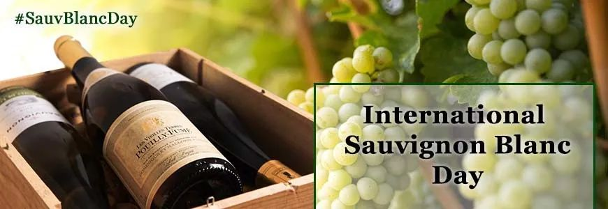 (原始链接: https://mmbiz.qpic.cn/mmbiz_jpg/7CNdqYbqvBJy8t6B26R2nkUhdtFZqvywgHBHeGk9Olv5hiaQ1jte9MwhghIupwjtg4DFgQ4z0zx6PeM7gOQreQA/640?wx_fmt=jpeg)
- 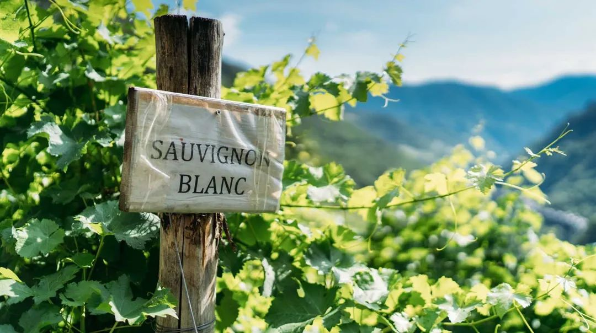 (原始链接: https://mmbiz.qpic.cn/mmbiz_jpg/7CNdqYbqvBJy8t6B26R2nkUhdtFZqvywu0WxibsXDqebIurdnDym9DzcrADCT3ExNuBm4u4R3lrZiazNB5vV1oibg/640?wx_fmt=jpeg)
- 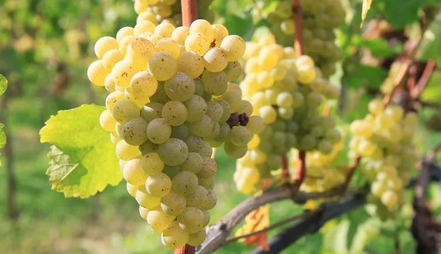 (原始链接: https://mmbiz.qpic.cn/mmbiz_jpg/7CNdqYbqvBJy8t6B26R2nkUhdtFZqvywiacOYjJx0zuxsdLjUAQQ537Zyx6HqAX3gbwibbciaa4RrfhxY4HEHuTlQ/640?wx_fmt=jpeg)
- 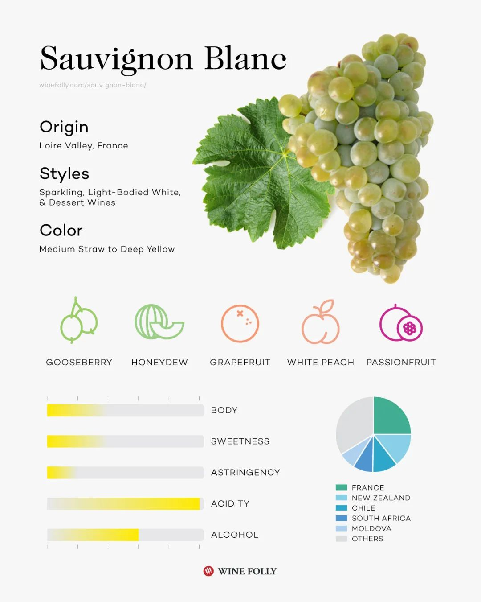 (原始链接: https://mmbiz.qpic.cn/mmbiz_jpg/7CNdqYbqvBJy8t6B26R2nkUhdtFZqvywMXEw31jTM9hnE8AlInhHsH2BnGia77RNVkPy0Cynyicnp8KCyZItjE3A/640?wx_fmt=jpeg)
- 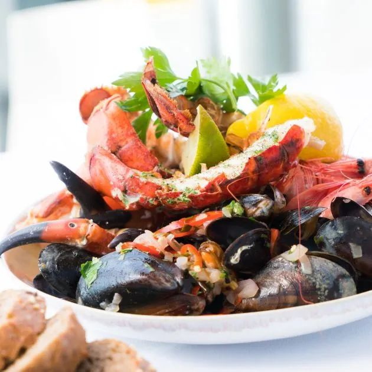 (原始链接: https://mmbiz.qpic.cn/mmbiz_jpg/7CNdqYbqvBJy8t6B26R2nkUhdtFZqvywRiakQl5jVerLcu013Cbfr2rGy0P88Zqr5xJnia4XvOsuqgcNfZKyVDUA/640?wx_fmt=jpeg)
- 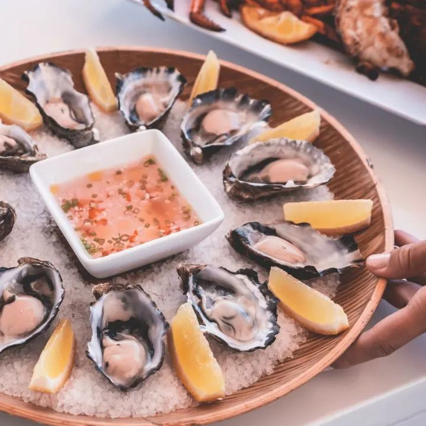 (原始链接: https://mmbiz.qpic.cn/mmbiz_jpg/7CNdqYbqvBJy8t6B26R2nkUhdtFZqvywEZ1ezjz4hMNqeUpUa5Xqctv52UXVE6dHQibg1mz0ia2WfAyeXuHOd64Q/640?wx_fmt=jpeg)
- 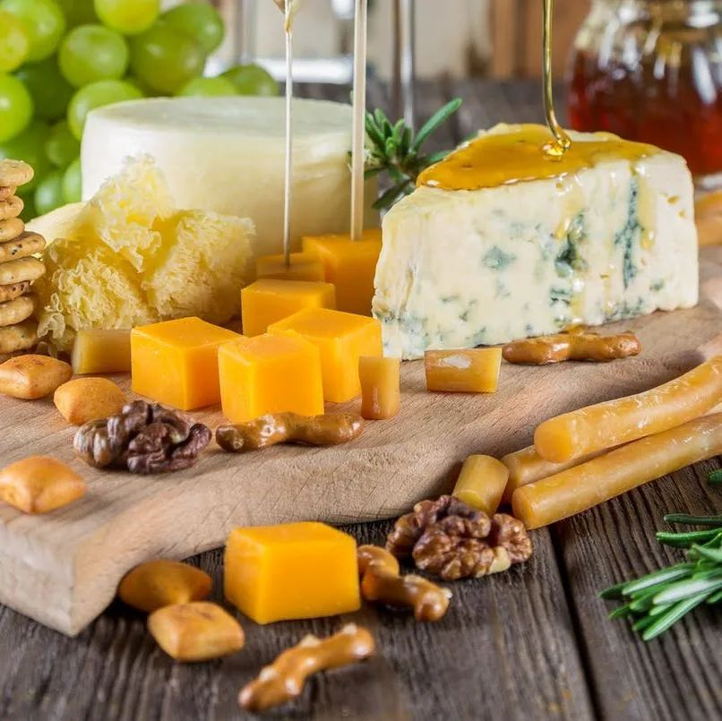 (原始链接: https://mmbiz.qpic.cn/mmbiz_jpg/7CNdqYbqvBJy8t6B26R2nkUhdtFZqvywyw3XRt8Tav9zoNEarJfhPicGicBW3BtalU6eU5GIEGb3icLtia1jUyIiaSQ/640?wx_fmt=jpeg)
- 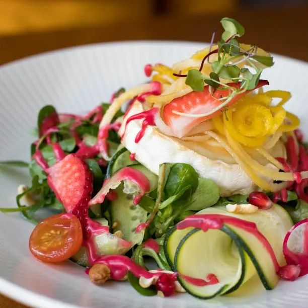 (原始链接: https://mmbiz.qpic.cn/mmbiz_jpg/7CNdqYbqvBJy8t6B26R2nkUhdtFZqvywzkl8RW4u42FKUEOg4ol8wbXOygbdyKorSiakc4bnMQjUkMdhI2Oc6CA/640?wx_fmt=jpeg)
- 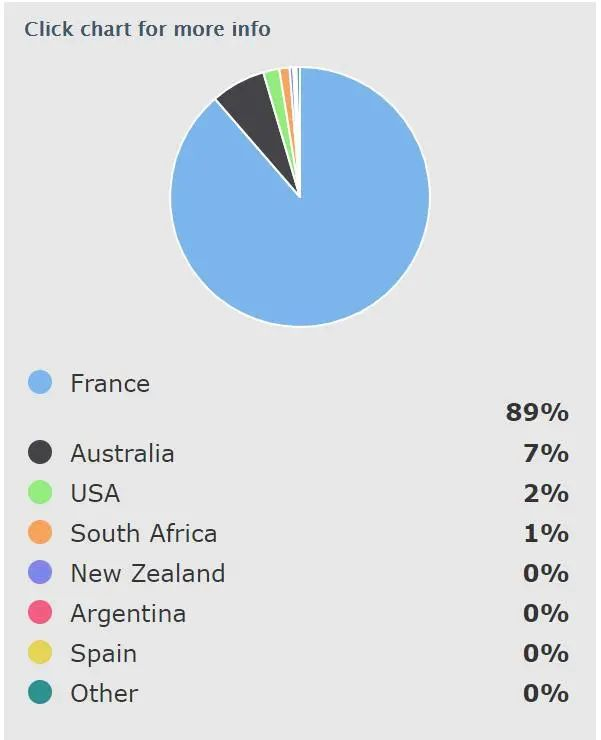 (原始链接: https://mmbiz.qpic.cn/mmbiz_jpg/7CNdqYbqvBJy8t6B26R2nkUhdtFZqvywy7BKBpgAjjXhJB6PKLVNdfsJNSbJmwkrFJsCFxGLCyehDIkxe13tqg/640?wx_fmt=jpeg)
- 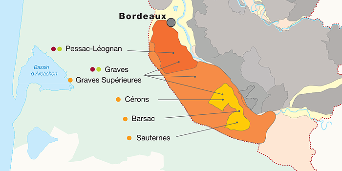 (原始链接: https://mmbiz.qpic.cn/mmbiz_png/7CNdqYbqvBJy8t6B26R2nkUhdtFZqvywXKPcz1U2Blu5BsRn5dTMGrOW7eMic2HRGbGp0kzUjFB6CXVdX7qeVQg/640?wx_fmt=png)
- 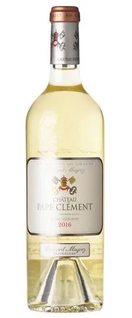 (原始链接: https://mmbiz.qpic.cn/mmbiz_jpg/7CNdqYbqvBJy8t6B26R2nkUhdtFZqvywr8v25OPbO5BWpcGkWibFeIMXiclkanO1XsAr7R99eYUvGEtCQPhEhnHQ/640?wx_fmt=jpeg)
- 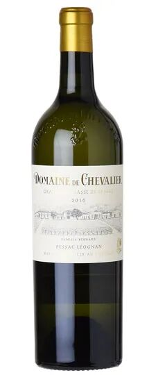 (原始链接: https://mmbiz.qpic.cn/mmbiz_jpg/7CNdqYbqvBJy8t6B26R2nkUhdtFZqvywsOO9NJpXyCByZ3wPpv4UhaicRQicKHvClLM0XyBmWc5wwglocNWh2GBg/640?wx_fmt=jpeg)
- 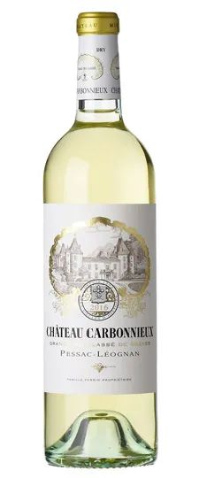 (原始链接: https://mmbiz.qpic.cn/mmbiz_jpg/7CNdqYbqvBJy8t6B26R2nkUhdtFZqvyw4HhzJVClttbrS2pXibv6mIv0T16bSoCOzTGHxMftgvS64Icqo1CxY1w/640?wx_fmt=jpeg)
- 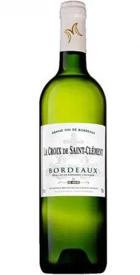 (原始链接: https://mmbiz.qpic.cn/mmbiz_jpg/7CNdqYbqvBJy8t6B26R2nkUhdtFZqvyw4uRXk0Vz7TUQDjL0lUvADibPGpZlq6icO5VUzj0rTJK9jDjibRzHXbvKQ/640?wx_fmt=jpeg)
-  (原始链接: https://mmbiz.qpic.cn/mmbiz_jpg/7CNdqYbqvBJy8t6B26R2nkUhdtFZqvywm0h6mMibdhETUjcVob1s8RyibzEU5yQ104MWZCYyMibN4JGKZqotic9TpA/640?wx_fmt=jpeg)
- 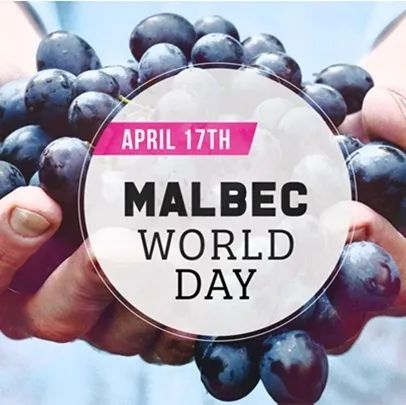 (原始链接: https://mmbiz.qpic.cn/mmbiz_jpg/7CNdqYbqvBJy8t6B26R2nkUhdtFZqvywohdueiaR26IYjcBT0xl7M5Z8IPg5vmzXurjqhlokCn9IZSBLdUUiblVQ/640?wx_fmt=jpeg)
-  (原始链接: https://mmbiz.qpic.cn/mmbiz_jpg/7CNdqYbqvBJy8t6B26R2nkUhdtFZqvywV2azyNUvYzpncl8XA0HbhV5k8u3z0eJGGIlhloH0ib7c4OJME6oZWyg/640?wx_fmt=jpeg)
-  (原始链接: https://mmbiz.qpic.cn/mmbiz_jpg/7CNdqYbqvBJy8t6B26R2nkUhdtFZqvywLev3DGBbial2F3KA1OrMTPGE5YZPjybnE9uQv2VgEbOLCQGfudyX60A/640?wx_fmt=jpeg)
-  (原始链接: https://mmbiz.qpic.cn/mmbiz_jpg/7CNdqYbqvBJy8t6B26R2nkUhdtFZqvywE5UZUhibZPSibgthTsHlOz3IJJTMcQSC41xONlS4kbCgtkMFZkYrdyxA/640?wx_fmt=jpeg)
-  (原始链接: https://mmbiz.qpic.cn/mmbiz_jpg/7CNdqYbqvBJy8t6B26R2nkUhdtFZqvywPN7hibAYgMEcqZmtYy08cIia11a1PKjupF3rAp2TD44XgfYA9lvuqMWw/640?wx_fmt=jpeg)
