# 无标题

**链接地址:** http://mp.weixin.qq.com/s?__biz=MzIyMzU4OTc0MQ==&mid=2247485591&idx=1&sn=9286ba977101287324547800f3bd5942&chksm=e81aac95df6d2583dcb93a483f56f253d055f288e7bcf3ff4802acecc6ee9012406bbef9cfed&mpshare=1&scene=2&srcid=0505OkonxYpFyxeAPibdISB4&sharer_sharetime=1620173184627&sharer_shareid=be1c8edd6c93eec155a61c876e41d26a#rd
**作者:** 
**获取时间:** 2025/8/28 19:47:26
**图片数量:** 24

---

## 原始HTML内容

<section style="box-sizing: border-box;font-size: 16px;"><section style="box-sizing: border-box;" powered-by="xiumi.us"><section style="text-align: center;justify-content: center;display: flex;flex-flow: row nowrap;font-size: 0px;margin: 10px 0% 8px;box-sizing: border-box;"><section style="display: inline-block;width: auto;vertical-align: top;flex: 0 0 0%;height: auto;align-self: flex-start;letter-spacing: 0px;margin-right: 1px;box-sizing: border-box;"><section style="box-sizing: border-box;" powered-by="xiumi.us"><section style="display: flex;flex-flow: row nowrap;box-sizing: border-box;"><section style="display: inline-block;vertical-align: top;width: auto;flex: 100 100 0%;align-self: flex-start;height: auto;box-sizing: border-box;"><section style="text-align: right;justify-content: flex-end;box-sizing: border-box;" powered-by="xiumi.us"><section style="display: inline-block;width: 6px;height: 3px;vertical-align: top;overflow: hidden;border-width: 0px;border-radius: 99px 99px 0px 0px;border-style: none;border-color: rgb(62, 62, 62);background-color: rgb(225, 188, 189);box-sizing: border-box;"><section><svg viewBox="0 0 1 1" style="float:left;line-height:0;width:0;vertical-align:top;"></svg></section></section></section></section><section style="display: inline-block;vertical-align: top;width: auto;align-self: flex-start;flex: 100 100 0%;height: auto;box-sizing: border-box;"><section style="text-align: right;justify-content: flex-end;box-sizing: border-box;" powered-by="xiumi.us"><section style="display: inline-block;width: 6px;height: 3px;vertical-align: top;overflow: hidden;border-width: 0px;border-radius: 99px 99px 0px 0px;border-style: none;border-color: rgb(62, 62, 62);background-color: rgb(225, 188, 189);box-sizing: border-box;"><section><svg viewBox="0 0 1 1" style="float:left;line-height:0;width:0;vertical-align:top;"></svg></section></section></section></section></section></section><section style="box-sizing: border-box;" powered-by="xiumi.us"><section style="display: inline-block;width: 12px;height: 6px;vertical-align: top;overflow: hidden;border-width: 0px;border-radius: 0% 0px 100px 100px;border-style: none;border-color: rgb(62, 62, 62);background-color: rgb(225, 188, 189);box-sizing: border-box;"><section><svg viewBox="0 0 1 1" style="float:left;line-height:0;width:0;vertical-align:top;"></svg></section></section></section><section style="transform: rotateZ(45deg);-webkit-transform: rotateZ(45deg);-moz-transform: rotateZ(45deg);-o-transform: rotateZ(45deg);box-sizing: border-box;" powered-by="xiumi.us"><section style="margin-top: -5px;margin-right: 0%;margin-left: 0%;box-sizing: border-box;"><section style="display: inline-block;width: 6px;height: 6px;vertical-align: top;overflow: hidden;border-width: 0px;border-style: none;border-color: rgb(62, 62, 62);background-color: rgb(225, 188, 189);box-sizing: border-box;"><section><svg viewBox="0 0 1 1" style="float:left;line-height:0;width:0;vertical-align:top;"></svg></section></section></section></section></section></section></section><section style="transform: rotateZ(350deg);-webkit-transform: rotateZ(350deg);-moz-transform: rotateZ(350deg);-o-transform: rotateZ(350deg);box-sizing: border-box;" powered-by="xiumi.us"><section style="text-align: center;margin-right: 0%;margin-bottom: -33px;margin-left: 0%;box-sizing: border-box;"><section style="display: inline-block;width: 50%;height: 38.5684px;vertical-align: top;overflow: hidden;border-width: 0px;border-radius: 50%;border-style: none;border-color: rgb(62, 62, 62);background-image: linear-gradient(to top, rgb(255, 243, 240) 0%, rgb(255, 255, 255) 100%);box-sizing: border-box;"><section><svg viewBox="0 0 1 1" style="float:left;line-height:0;width:0;vertical-align:top;"></svg></section></section></section></section><section style="text-align: center;justify-content: center;transform: translate3d(4px, 0px, 0px);-webkit-transform: translate3d(4px, 0px, 0px);-moz-transform: translate3d(4px, 0px, 0px);-o-transform: translate3d(4px, 0px, 0px);box-sizing: border-box;" powered-by="xiumi.us"><section style="display: inline-block;width: auto;vertical-align: top;min-width: 10%;max-width: 100%;height: auto;box-sizing: border-box;"><section style="margin-right: 0%;margin-bottom: 11px;margin-left: 0%;box-sizing: border-box;" powered-by="xiumi.us"><section style="text-align: justify;font-size: 12px;color: rgb(121, 90, 91);letter-spacing: 9px;padding-right: 20px;padding-left: 20px;line-height: 1;font-family: PingFangSC-light;box-sizing: border-box;">
<strong style="box-sizing: border-box;">点击蓝字 关注我们</strong>
</section></section><section style="box-sizing: border-box;" powered-by="xiumi.us"><section style="display: inline-block;width: 50%;vertical-align: top;height: auto;box-sizing: border-box;"><section style="margin-right: 0%;margin-left: 0%;box-sizing: border-box;" powered-by="xiumi.us"><section style="background-color: rgb(225, 188, 189);height: 1px;box-sizing: border-box;"><section><svg viewBox="0 0 1 1" style="float:left;line-height:0;width:0;vertical-align:top;"></svg></section></section></section></section></section></section></section><section style="box-sizing: border-box;" powered-by="xiumi.us">
 
</section><section style="box-sizing: border-box;" powered-by="xiumi.us"><section style="display: flex;flex-flow: row nowrap;box-sizing: border-box;"><section style="display: inline-block;vertical-align: top;width: auto;border-width: 0px;flex: 100 100 0%;align-self: flex-start;height: auto;margin-right: -80px;box-sizing: border-box;"><section style="margin-top: 70px;margin-right: 0%;margin-left: 0%;transform: translate3d(1px, 0px, 0px);box-sizing: border-box;" powered-by="xiumi.us"><section style="display: inline-block;width: 100%;vertical-align: top;border-width: 1px;border-style: solid;border-color: rgb(225, 188, 189);padding: 10px;box-sizing: border-box;"><section style="text-align: center;margin-right: 0%;margin-left: 0%;box-sizing: border-box;" powered-by="xiumi.us"><section style="max-width: 100%;vertical-align: middle;display: inline-block;line-height: 0;border-width: 1px;border-style: none;border-color: rgb(62, 62, 62);box-sizing: border-box;"></section></section></section></section><section style="box-sizing: border-box;" powered-by="xiumi.us"><section style="text-align: center;justify-content: center;display: flex;flex-flow: row nowrap;font-size: 0px;margin: 30px 0% 7px;transform: translate3d(-20px, 0px, 0px);-webkit-transform: translate3d(-20px, 0px, 0px);-moz-transform: translate3d(-20px, 0px, 0px);-o-transform: translate3d(-20px, 0px, 0px);box-sizing: border-box;"><section style="display: inline-block;width: auto;vertical-align: top;flex: 0 0 0%;height: auto;align-self: flex-start;letter-spacing: 0px;margin-right: 1px;box-sizing: border-box;"><section style="box-sizing: border-box;" powered-by="xiumi.us"><section style="display: flex;flex-flow: row nowrap;box-sizing: border-box;"><section style="display: inline-block;vertical-align: top;width: auto;flex: 100 100 0%;align-self: flex-start;height: auto;box-sizing: border-box;"><section style="text-align: right;justify-content: flex-end;box-sizing: border-box;" powered-by="xiumi.us"><section style="display: inline-block;width: 6px;height: 3px;vertical-align: top;overflow: hidden;border-width: 0px;border-radius: 99px 99px 0px 0px;border-style: none;border-color: rgb(62, 62, 62);background-color: rgb(225, 188, 189);box-sizing: border-box;"><section><svg viewBox="0 0 1 1" style="float:left;line-height:0;width:0;vertical-align:top;"></svg></section></section></section></section><section style="display: inline-block;vertical-align: top;width: auto;align-self: flex-start;flex: 100 100 0%;height: auto;box-sizing: border-box;"><section style="text-align: right;justify-content: flex-end;box-sizing: border-box;" powered-by="xiumi.us"><section style="display: inline-block;width: 6px;height: 3px;vertical-align: top;overflow: hidden;border-width: 0px;border-radius: 99px 99px 0px 0px;border-style: none;border-color: rgb(62, 62, 62);background-color: rgb(225, 188, 189);box-sizing: border-box;"><section><svg viewBox="0 0 1 1" style="float:left;line-height:0;width:0;vertical-align:top;"></svg></section></section></section></section></section></section><section style="box-sizing: border-box;" powered-by="xiumi.us"><section style="display: inline-block;width: 12px;height: 6px;vertical-align: top;overflow: hidden;border-width: 0px;border-radius: 0% 0px 100px 100px;border-style: none;border-color: rgb(62, 62, 62);background-color: rgb(225, 188, 189);box-sizing: border-box;"><section><svg viewBox="0 0 1 1" style="float:left;line-height:0;width:0;vertical-align:top;"></svg></section></section></section><section style="transform: rotateZ(45deg);-webkit-transform: rotateZ(45deg);-moz-transform: rotateZ(45deg);-o-transform: rotateZ(45deg);box-sizing: border-box;" powered-by="xiumi.us"><section style="margin-top: -5px;margin-right: 0%;margin-left: 0%;box-sizing: border-box;"><section style="display: inline-block;width: 6px;height: 6px;vertical-align: top;overflow: hidden;border-width: 0px;border-style: none;border-color: rgb(62, 62, 62);background-color: rgb(225, 188, 189);box-sizing: border-box;"><section><svg viewBox="0 0 1 1" style="float:left;line-height:0;width:0;vertical-align:top;"></svg></section></section></section></section></section></section></section><section style="margin: 30px 0%;transform: translate3d(-20px, 0px, 0px);-webkit-transform: translate3d(-20px, 0px, 0px);-moz-transform: translate3d(-20px, 0px, 0px);-o-transform: translate3d(-20px, 0px, 0px);box-sizing: border-box;" powered-by="xiumi.us"><section style="font-size: 12px;color: rgb(121, 90, 91);letter-spacing: 4px;line-height: 1;box-sizing: border-box;">
母亲节献礼

 

<strong style="box-sizing: border-box;">“贵腐” for “贵妇”</strong>

 
</section></section><section style="text-align: right;justify-content: flex-end;transform: translate3d(-20px, 0px, 0px);-webkit-transform: translate3d(-20px, 0px, 0px);-moz-transform: translate3d(-20px, 0px, 0px);-o-transform: translate3d(-20px, 0px, 0px);box-sizing: border-box;" powered-by="xiumi.us"><section style="display: inline-block;width: 50%;vertical-align: top;height: auto;box-sizing: border-box;"><section style="margin-right: 0%;margin-left: 0%;box-sizing: border-box;" powered-by="xiumi.us"><section style="background-color: rgb(121, 90, 91);height: 1px;box-sizing: border-box;"><section><svg viewBox="0 0 1 1" style="float:left;line-height:0;width:0;vertical-align:top;"></svg></section></section></section></section></section></section><section style="display: inline-block;vertical-align: top;width: auto;flex: 100 100 0%;align-self: flex-start;height: auto;box-sizing: border-box;"><section style="text-align: center;margin-top: 10px;margin-bottom: 10px;box-sizing: border-box;" powered-by="xiumi.us"><section style="max-width: 100%;vertical-align: middle;display: inline-block;line-height: 0;box-sizing: border-box;"></section></section></section></section></section><section style="text-align: right;font-size: 12px;color: rgb(180, 180, 180);box-sizing: border-box;" powered-by="xiumi.us">
专题出品：加拿大汉嘉酒业
</section><section style="box-sizing: border-box;" powered-by="xiumi.us">
 
</section><section style="margin: 30px 0%;box-sizing: border-box;" powered-by="xiumi.us"><section style="display: inline-block;width: 100%;vertical-align: top;box-shadow: rgb(0, 0, 0) 0px 0px 0px;padding: 15px;border-top: 1px dashed rgb(236, 217, 186);border-top-left-radius: 0px;border-bottom: 1px dashed rgb(236, 217, 186);border-bottom-right-radius: 0px;box-sizing: border-box;"><section style="text-align: left;transform: translate3d(-15px, 0px, 0px);margin-top: -30px;margin-right: 0%;margin-left: 0%;box-sizing: border-box;" powered-by="xiumi.us"><section style="display: inline-block;width: 40px;height: 25px;vertical-align: top;overflow: hidden;background-color: rgb(255, 255, 255);box-sizing: border-box;"><section style="transform: rotateZ(336deg);-webkit-transform: rotateZ(336deg);-moz-transform: rotateZ(336deg);-o-transform: rotateZ(336deg);box-sizing: border-box;" powered-by="xiumi.us"><section style="text-align: center;margin-right: 0%;margin-left: 0%;box-sizing: border-box;"><section style="max-width: 100%;vertical-align: middle;display: inline-block;line-height: 0;width: 55%;box-sizing: border-box;"></section></section></section></section></section><section style="margin-right: 0%;margin-left: 0%;box-sizing: border-box;" powered-by="xiumi.us"><section style="color: rgb(164, 127, 115);line-height: 2;letter-spacing: 2px;box-sizing: border-box;">
 

这个周日就是母亲节了，手机屏幕前的你是否已经准备好贴心的<strong style="box-sizing: border-box;">礼物</strong>？

 

说到每年的母亲节，送礼总是让我们这些好儿女们费尽了心思。美丽的鲜花显得没有新意，高级的珠宝又让预算吃紧，电子产品她们用不上。问妈妈需要点啥，妈妈们总是说：<strong style="box-sizing: border-box;">“你们好，就是给我最大的礼物。”</strong>
</section></section><section style="transform: rotateZ(5deg);-webkit-transform: rotateZ(5deg);-moz-transform: rotateZ(5deg);-o-transform: rotateZ(5deg);box-sizing: border-box;" powered-by="xiumi.us"><section style="text-align: right;margin: 10px 0% -30px;transform: translate3d(-5px, 0px, 0px);-webkit-transform: translate3d(-5px, 0px, 0px);-moz-transform: translate3d(-5px, 0px, 0px);-o-transform: translate3d(-5px, 0px, 0px);box-sizing: border-box;"><section style="display: inline-block;width: 10%;height: 60.8916px;vertical-align: top;overflow: hidden;background-position: 50% 50%;background-repeat: no-repeat;background-size: contain;background-attachment: scroll;background-image: url(&quot;https://mmbiz.qpic.cn/mmbiz_png/7CNdqYbqvBLY2Wl3Bpttx6JTeuFHQ8yBZpO1xDyZnQazyXrECzU3nDoyA466QiblQPaJTzGGkAmfHMjyrm3IicUA/640?wx_fmt=png&quot;);box-sizing: border-box;"><section style="margin-top: 13px;margin-right: 0%;margin-left: 0%;box-sizing: border-box;" powered-by="xiumi.us"><section style="text-align: center;font-size: 18px;color: rgb(255, 255, 255);box-sizing: border-box;">
 
</section></section></section></section></section><section style="text-align: center;margin: 10px 0%;box-sizing: border-box;" powered-by="xiumi.us"><section style="display: inline-block;width: 96%;vertical-align: top;padding: 5px;background-position: 73.0173% -1.74799%;background-repeat: repeat;background-size: 101.073%;background-attachment: scroll;border-width: 0px;border-radius: 10px;border-style: none;border-color: rgb(62, 62, 62);overflow: hidden;box-shadow: rgb(164, 127, 115) 0px 0px 5px;background-image: url(&quot;https://mmbiz.qpic.cn/mmbiz_jpg/7CNdqYbqvBLY2Wl3Bpttx6JTeuFHQ8yBG84SziaGnkgDc0m8o8ttLkstudhspyUniauJqGEcmyN9ibmdL8TZz3iajw/640?wx_fmt=jpeg&quot;);box-sizing: border-box;"><section style="display: inline-block;width: 100%;vertical-align: top;padding: 5px;border-style: dashed;border-width: 1px;border-radius: 10px;border-color: rgb(255, 255, 255);overflow: hidden;box-shadow: rgb(0, 0, 0) 0px 0px 0px;box-sizing: border-box;" powered-by="xiumi.us"><section style="margin-right: 0%;margin-left: 0%;box-sizing: border-box;" powered-by="xiumi.us"><section style="max-width: 100%;vertical-align: middle;display: inline-block;line-height: 0;border-width: 0px;border-radius: 6px;border-style: none;border-color: rgb(62, 62, 62);overflow: hidden;box-sizing: border-box;"></section></section></section></section></section><section style="margin-right: 0%;margin-left: 0%;box-sizing: border-box;" powered-by="xiumi.us"><section style="color: rgb(164, 127, 115);line-height: 2;letter-spacing: 2px;box-sizing: border-box;">
 

如果你还在为礼物发愁，那么你可算是来对了地方。今天我们就准备了两款从<strong style="box-sizing: border-box;">口味、品味和价位</strong>上都绝对符合心意的礼物，那就是“贵妇酒”~哦，不，是贵腐酒！

 
</section></section><section style="text-align: right;margin-right: 0%;margin-bottom: -28px;margin-left: 0%;box-sizing: border-box;" powered-by="xiumi.us"><section style="display: inline-block;width: 40px;height: 25px;vertical-align: top;overflow: hidden;background-color: rgb(255, 255, 255);box-sizing: border-box;"><section style="text-align: center;margin-right: 0%;margin-left: 0%;box-sizing: border-box;" powered-by="xiumi.us"><section style="max-width: 100%;vertical-align: middle;display: inline-block;line-height: 0;width: 65%;box-sizing: border-box;"></section></section></section></section></section></section><section style="box-sizing: border-box;" powered-by="xiumi.us">
 
</section><section style="text-align: center;box-sizing: border-box;" powered-by="xiumi.us"><section style="display: inline-block;min-width: 10%;max-width: 100%;vertical-align: top;padding: 5px 5px 5px 15px;box-sizing: border-box;"><section style="transform: rotateZ(354deg);-webkit-transform: rotateZ(354deg);-moz-transform: rotateZ(354deg);-o-transform: rotateZ(354deg);box-sizing: border-box;" powered-by="xiumi.us"><section style="text-align: left;transform: translate3d(-15px, 0px, 0px);margin-right: 0%;margin-bottom: -20px;margin-left: 0%;box-sizing: border-box;"><section style="display: inline-block;width: 45px;height: 40px;vertical-align: top;overflow: hidden;background-position: 50% 50%;background-repeat: no-repeat;background-size: contain;background-attachment: scroll;background-image: url(&quot;https://mmbiz.qpic.cn/mmbiz_png/7CNdqYbqvBLY2Wl3Bpttx6JTeuFHQ8yBZpO1xDyZnQazyXrECzU3nDoyA466QiblQPaJTzGGkAmfHMjyrm3IicUA/640?wx_fmt=png&quot;);box-sizing: border-box;"><section style="margin-top: 7px;margin-right: 0%;margin-left: 0%;box-sizing: border-box;" powered-by="xiumi.us"><section style="text-align: center;font-size: 18px;color: rgb(255, 255, 255);box-sizing: border-box;">
<strong style="box-sizing: border-box;">01 </strong>
</section></section></section></section></section><section style="box-sizing: border-box;" powered-by="xiumi.us"><section style="display: inline-block;min-width: 10%;max-width: 100%;vertical-align: top;letter-spacing: 0px;padding: 3px;background-position: 49.3376% 31.4319%;background-repeat: repeat;background-size: 265.934%;background-attachment: scroll;border-width: 0px;border-radius: 8px;border-style: none;border-color: rgb(62, 62, 62);overflow: hidden;background-image: url(&quot;https://mmbiz.qpic.cn/mmbiz_jpg/7CNdqYbqvBLY2Wl3Bpttx6JTeuFHQ8yB2tF769MCoscDHNthjMyN2Q8jZEPfoURM2Gx6d1HH4vxD0OnP6A1wPg/640?wx_fmt=jpeg&quot;);box-sizing: border-box;"><section style="box-sizing: border-box;" powered-by="xiumi.us"><section style="display: inline-block;min-width: 10%;max-width: 100%;vertical-align: top;padding: 5px 10px 5px 20px;border-style: dashed;border-width: 1px;border-radius: 6px;border-color: rgb(236, 217, 186);overflow: hidden;box-sizing: border-box;"><section style="margin-right: 0%;margin-left: 0%;transform: translate3d(1px, 0px, 0px);box-sizing: border-box;" powered-by="xiumi.us"><section style="text-align: justify;color: rgb(206, 171, 115);box-sizing: border-box;">
<strong style="box-sizing: border-box;">贵腐酒的“贵”</strong>
</section></section></section></section></section></section></section></section><section style="margin-right: 0%;margin-left: 0%;box-sizing: border-box;" powered-by="xiumi.us"><section style="color: rgb(164, 127, 115);line-height: 2;letter-spacing: 2px;padding-right: 15px;padding-left: 15px;box-sizing: border-box;">
 

说起贵腐酒，这种<strong style="box-sizing: border-box;">自挂神秘面纱</strong>的葡萄酒似乎总是出现在<strong style="box-sizing: border-box;">“世界上最昂贵的十款酒”</strong>的榜单中。

 

但如果你走进酒铺查询贵腐酒的价格，大部分的贵腐酒其实价格并不惊人。那么这个贵腐酒到底<strong style="box-sizing: border-box;">“贵”在哪里呢</strong>？

 
</section></section><section style="box-sizing: border-box;" powered-by="xiumi.us"><section style="display: flex;flex-flow: row nowrap;margin: 10px 0%;box-sizing: border-box;"><section style="display: inline-block;vertical-align: middle;width: auto;flex: 100 100 0%;align-self: center;height: auto;box-sizing: border-box;"><section style="margin-top: 0.5em;margin-bottom: 0.5em;box-sizing: border-box;" powered-by="xiumi.us"><section style="background-color: rgb(255, 185, 205);height: 1px;box-sizing: border-box;"><section><svg viewBox="0 0 1 1" style="float:left;line-height:0;width:0;vertical-align:top;"></svg></section></section></section></section><section style="display: inline-block;vertical-align: middle;width: auto;align-self: center;flex: 0 0 0%;height: auto;margin-right: 10px;margin-left: 10px;box-sizing: border-box;"><section style="text-align: center;font-size: 0px;margin-right: 0%;margin-left: 0%;box-sizing: border-box;" powered-by="xiumi.us"><section style="display: inline-block;width: 15px;height: 15px;vertical-align: top;overflow: hidden;border-width: 0px;border-radius: 50%;border-style: none;border-color: rgb(62, 62, 62);background-color: rgba(255, 185, 205, 0.36);padding-top: 4px;box-sizing: border-box;"><section style="box-sizing: border-box;" powered-by="xiumi.us"><section style="justify-content: center;display: flex;flex-flow: row nowrap;margin-right: 0%;margin-bottom: 4px;margin-left: 0%;box-sizing: border-box;"><section style="display: inline-block;width: auto;vertical-align: top;flex: 0 0 0%;height: auto;align-self: flex-start;box-sizing: border-box;"><section style="box-sizing: border-box;" powered-by="xiumi.us"><section style="display: flex;flex-flow: row nowrap;box-sizing: border-box;"><section style="display: inline-block;vertical-align: top;width: auto;flex: 100 100 0%;align-self: flex-start;height: auto;box-sizing: border-box;"><section style="text-align: right;justify-content: flex-end;box-sizing: border-box;" powered-by="xiumi.us"><section style="display: inline-block;width: 4px;height: 2px;vertical-align: top;overflow: hidden;border-width: 0px;border-radius: 99px 99px 0px 0px;border-style: none;border-color: rgb(62, 62, 62);background-color: rgb(240, 103, 121);box-sizing: border-box;"><section><svg viewBox="0 0 1 1" style="float:left;line-height:0;width:0;vertical-align:top;"></svg></section></section></section></section><section style="display: inline-block;vertical-align: top;width: auto;align-self: flex-start;flex: 100 100 0%;height: auto;box-sizing: border-box;"><section style="text-align: right;justify-content: flex-end;box-sizing: border-box;" powered-by="xiumi.us"><section style="display: inline-block;width: 4px;height: 2px;vertical-align: top;overflow: hidden;border-width: 0px;border-radius: 99px 99px 0px 0px;border-style: none;border-color: rgb(62, 62, 62);background-color: rgb(240, 103, 121);box-sizing: border-box;"><section><svg viewBox="0 0 1 1" style="float:left;line-height:0;width:0;vertical-align:top;"></svg></section></section></section></section></section></section><section style="margin-right: 0%;margin-left: 0%;box-sizing: border-box;" powered-by="xiumi.us"><section style="display: inline-block;width: 8px;height: 4px;vertical-align: top;overflow: hidden;border-width: 0px;border-radius: 0% 0px 100px 100px;border-style: none;border-color: rgb(62, 62, 62);background-color: rgb(240, 103, 121);box-sizing: border-box;"><section><svg viewBox="0 0 1 1" style="float:left;line-height:0;width:0;vertical-align:top;"></svg></section></section></section><section style="transform: rotateZ(45deg);-webkit-transform: rotateZ(45deg);-moz-transform: rotateZ(45deg);-o-transform: rotateZ(45deg);box-sizing: border-box;" powered-by="xiumi.us"><section style="margin-top: -3px;margin-right: 0%;margin-left: 0%;box-sizing: border-box;"><section style="display: inline-block;width: 0px;height: 0px;vertical-align: top;overflow: hidden;border-width: 2px;border-style: solid;border-color: rgba(255, 185, 205, 0.15) rgb(240, 103, 121) rgb(240, 103, 121) rgba(255, 185, 205, 0.15);background-color: rgb(240, 103, 121);box-sizing: border-box;"><section><svg viewBox="0 0 1 1" style="float:left;line-height:0;width:0;vertical-align:top;"></svg></section></section></section></section></section></section></section></section></section></section><section style="display: inline-block;vertical-align: middle;width: auto;align-self: center;flex: 100 100 0%;box-sizing: border-box;"><section style="margin-top: 0.5em;margin-bottom: 0.5em;box-sizing: border-box;" powered-by="xiumi.us"><section style="background-color: rgb(255, 185, 205);height: 1px;box-sizing: border-box;"><section><svg viewBox="0 0 1 1" style="float:left;line-height:0;width:0;vertical-align:top;"></svg></section></section></section></section></section></section><section style="margin-right: 0%;margin-left: 0%;box-sizing: border-box;" powered-by="xiumi.us"><section style="color: rgb(164, 127, 115);line-height: 2;letter-spacing: 2px;padding-right: 15px;padding-left: 15px;box-sizing: border-box;">
 

1650年，土耳其军队入侵匈牙利。当土军迫近托卡伊（Tokaji）时，正值葡萄收获季节。为免遭土军劫掠，托卡伊一位改革派基督教牧师号召农人推迟采摘。

 
</section></section><section style="box-sizing: border-box;" powered-by="xiumi.us"><section style="display: flex;flex-flow: row nowrap;margin: 10px 0%;box-sizing: border-box;"><section style="display: inline-block;vertical-align: top;width: auto;flex: 0 0 0%;align-self: stretch;height: auto;background-position: 50% 50%;background-repeat: no-repeat;background-size: 100% 100%;background-attachment: scroll;background-image: url(&quot;https://mmbiz.qpic.cn/mmbiz_png/7CNdqYbqvBLY2Wl3Bpttx6JTeuFHQ8yBkFjHbRHFNDm3WJnQFEZkAHZ4bhGao5wfZic7aibpNkXibicNakTG99dMkQ/640?wx_fmt=png&quot;);box-sizing: border-box;"><section style="text-align: center;box-sizing: border-box;" powered-by="xiumi.us"><section style="display: inline-block;width: 15px;height: 15px;vertical-align: top;overflow: hidden;box-sizing: border-box;"><section><svg viewBox="0 0 1 1" style="float:left;line-height:0;width:0;vertical-align:top;"></svg></section></section></section></section><section style="display: inline-block;vertical-align: top;width: auto;flex: 100 100 0%;align-self: stretch;height: auto;box-sizing: border-box;"><section style="display: inline-block;width: 100%;vertical-align: top;border-width: 7px;border-style: solid;border-color: rgb(255, 254, 251);box-shadow: rgb(218, 203, 158) 0px 0px 10px;box-sizing: border-box;" powered-by="xiumi.us"><section style="text-align: center;margin-right: 0%;margin-left: 0%;box-sizing: border-box;" powered-by="xiumi.us"><section style="max-width: 100%;vertical-align: middle;display: inline-block;line-height: 0;box-shadow: rgb(0, 0, 0) 0px 0px 0px;box-sizing: border-box;"></section></section></section></section><section style="display: inline-block;vertical-align: top;width: auto;flex: 0 0 0%;align-self: stretch;height: auto;background-position: 50% 50%;background-repeat: no-repeat;background-size: 100% 100%;background-attachment: scroll;background-image: url(&quot;https://mmbiz.qpic.cn/mmbiz_png/7CNdqYbqvBLY2Wl3Bpttx6JTeuFHQ8yB48KTUHDkiauOt2JqVIrACEAPdFW7DW2GJLuJ8K6dHL1dFk6SdDXvSEA/640?wx_fmt=png&quot;);box-sizing: border-box;"><section style="text-align: center;box-sizing: border-box;" powered-by="xiumi.us"><section style="display: inline-block;width: 15px;height: 15px;vertical-align: top;overflow: hidden;box-sizing: border-box;"><section><svg viewBox="0 0 1 1" style="float:left;line-height:0;width:0;vertical-align:top;"></svg></section></section></section></section></section></section><section style="text-align: center;font-size: 12px;color: rgb(180, 180, 180);box-sizing: border-box;" powered-by="xiumi.us">
感染了贵族霉的葡萄
</section><section style="margin-right: 0%;margin-left: 0%;box-sizing: border-box;" powered-by="xiumi.us"><section style="color: rgb(164, 127, 115);line-height: 2;letter-spacing: 2px;padding-right: 15px;padding-left: 15px;box-sizing: border-box;">
 

直到11月初上冻之前，人们才开始收获。因水份收缩，葡萄这时已经干蔫，表皮变薄发皱，并<strong style="box-sizing: border-box;">泛起一层霉菌</strong>。

 

人们<strong style="box-sizing: border-box;">无奈之中</strong>只能拿它来酿造葡萄酒。但没有想到的是，这一年酿出的葡萄酒较之正常季节采摘的葡萄所酿成的酒，味道要<strong style="box-sizing: border-box;">醇美</strong>得多。

 

偶然的推迟采摘，意外地为托卡伊贵腐葡萄酒带来新的命运，从此走向<strong style="box-sizing: border-box;">辉煌</strong>。 

 
</section></section><section style="box-sizing: border-box;" powered-by="xiumi.us"><section style="display: flex;flex-flow: row nowrap;margin: 10px 0%;box-sizing: border-box;"><section style="display: inline-block;vertical-align: top;width: auto;flex: 0 0 0%;align-self: stretch;height: auto;background-position: 50% 50%;background-repeat: no-repeat;background-size: 100% 100%;background-attachment: scroll;background-image: url(&quot;https://mmbiz.qpic.cn/mmbiz_png/7CNdqYbqvBLY2Wl3Bpttx6JTeuFHQ8yBkFjHbRHFNDm3WJnQFEZkAHZ4bhGao5wfZic7aibpNkXibicNakTG99dMkQ/640?wx_fmt=png&quot;);box-sizing: border-box;"><section style="text-align: center;box-sizing: border-box;" powered-by="xiumi.us"><section style="display: inline-block;width: 15px;height: 15px;vertical-align: top;overflow: hidden;box-sizing: border-box;"><section><svg viewBox="0 0 1 1" style="float:left;line-height:0;width:0;vertical-align:top;"></svg></section></section></section></section><section style="display: inline-block;vertical-align: top;width: auto;flex: 100 100 0%;align-self: stretch;height: auto;box-sizing: border-box;"><section style="display: inline-block;width: 100%;vertical-align: top;border-width: 7px;border-style: solid;border-color: rgb(255, 254, 251);box-shadow: rgb(218, 203, 158) 0px 0px 10px;box-sizing: border-box;" powered-by="xiumi.us"><section style="text-align: center;margin-right: 0%;margin-left: 0%;box-sizing: border-box;" powered-by="xiumi.us"><section style="max-width: 100%;vertical-align: middle;display: inline-block;line-height: 0;box-shadow: rgb(0, 0, 0) 0px 0px 0px;box-sizing: border-box;"></section></section></section></section><section style="display: inline-block;vertical-align: top;width: auto;flex: 0 0 0%;align-self: stretch;height: auto;background-position: 50% 50%;background-repeat: no-repeat;background-size: 100% 100%;background-attachment: scroll;background-image: url(&quot;https://mmbiz.qpic.cn/mmbiz_png/7CNdqYbqvBLY2Wl3Bpttx6JTeuFHQ8yB48KTUHDkiauOt2JqVIrACEAPdFW7DW2GJLuJ8K6dHL1dFk6SdDXvSEA/640?wx_fmt=png&quot;);box-sizing: border-box;"><section style="text-align: center;box-sizing: border-box;" powered-by="xiumi.us"><section style="display: inline-block;width: 15px;height: 15px;vertical-align: top;overflow: hidden;box-sizing: border-box;"><section><svg viewBox="0 0 1 1" style="float:left;line-height:0;width:0;vertical-align:top;"></svg></section></section></section></section></section></section><section style="text-align: center;font-size: 12px;color: rgb(180, 180, 180);box-sizing: border-box;" powered-by="xiumi.us">
历史最悠久的匈牙利托卡伊贵腐葡萄酒
</section><section style="margin-right: 0%;margin-left: 0%;box-sizing: border-box;" powered-by="xiumi.us"><section style="color: rgb(164, 127, 115);line-height: 2;letter-spacing: 2px;padding-right: 15px;padding-left: 15px;box-sizing: border-box;">
 

托卡伊贵腐酒从而被人们推举为<strong style="box-sizing: border-box;">“帝王葡萄酒”</strong>。就连法国上层社会也会备用匈牙利托卡伊贵腐酒，并将其称为<strong style="box-sizing: border-box;">酒中之王</strong>，成为了尊贵的象征。

 

 
</section></section><section style="text-align: center;box-sizing: border-box;" powered-by="xiumi.us"><section style="display: inline-block;min-width: 10%;max-width: 100%;vertical-align: top;padding: 5px 5px 5px 15px;box-sizing: border-box;"><section style="transform: rotateZ(354deg);-webkit-transform: rotateZ(354deg);-moz-transform: rotateZ(354deg);-o-transform: rotateZ(354deg);box-sizing: border-box;" powered-by="xiumi.us"><section style="text-align: left;transform: translate3d(-15px, 0px, 0px);margin-right: 0%;margin-bottom: -20px;margin-left: 0%;box-sizing: border-box;"><section style="display: inline-block;width: 45px;height: 40px;vertical-align: top;overflow: hidden;background-position: 50% 50%;background-repeat: no-repeat;background-size: contain;background-attachment: scroll;background-image: url(&quot;https://mmbiz.qpic.cn/mmbiz_png/7CNdqYbqvBLY2Wl3Bpttx6JTeuFHQ8yBZpO1xDyZnQazyXrECzU3nDoyA466QiblQPaJTzGGkAmfHMjyrm3IicUA/640?wx_fmt=png&quot;);box-sizing: border-box;"><section style="margin-top: 7px;margin-right: 0%;margin-left: 0%;box-sizing: border-box;" powered-by="xiumi.us"><section style="text-align: center;font-size: 18px;color: rgb(255, 255, 255);box-sizing: border-box;">
<strong style="box-sizing: border-box;">02 </strong>
</section></section></section></section></section><section style="box-sizing: border-box;" powered-by="xiumi.us"><section style="display: inline-block;min-width: 10%;max-width: 100%;vertical-align: top;letter-spacing: 0px;padding: 3px;background-position: 49.3376% 31.4319%;background-repeat: repeat;background-size: 265.934%;background-attachment: scroll;border-width: 0px;border-radius: 8px;border-style: none;border-color: rgb(62, 62, 62);overflow: hidden;background-image: url(&quot;https://mmbiz.qpic.cn/mmbiz_jpg/7CNdqYbqvBLY2Wl3Bpttx6JTeuFHQ8yB2tF769MCoscDHNthjMyN2Q8jZEPfoURM2Gx6d1HH4vxD0OnP6A1wPg/640?wx_fmt=jpeg&quot;);box-sizing: border-box;"><section style="box-sizing: border-box;" powered-by="xiumi.us"><section style="display: inline-block;min-width: 10%;max-width: 100%;vertical-align: top;padding: 5px 10px 5px 20px;border-style: dashed;border-width: 1px;border-radius: 6px;border-color: rgb(236, 217, 186);overflow: hidden;box-sizing: border-box;"><section style="margin-right: 0%;margin-left: 0%;transform: translate3d(1px, 0px, 0px);box-sizing: border-box;" powered-by="xiumi.us"><section style="text-align: justify;color: rgb(206, 171, 115);box-sizing: border-box;">
<strong style="box-sizing: border-box;">贵腐酒的“腐”</strong>
</section></section></section></section></section></section></section></section><section style="margin-right: 0%;margin-left: 0%;box-sizing: border-box;" powered-by="xiumi.us"><section style="color: rgb(164, 127, 115);line-height: 2;letter-spacing: 2px;padding-right: 15px;padding-left: 15px;box-sizing: border-box;">
 

然而，贵腐酒的“贵”并不单纯在于尊贵，更源于<strong style="box-sizing: border-box;">珍贵的“腐熟”过程</strong>。

 

能附着于葡萄皮上的霉菌及酵母、细菌等各种微生物的种类很多，而<strong style="box-sizing: border-box;">“贵族霉” (Botrytis cinerea)</strong> 的特殊之处在于：若附着在尚未成熟的葡萄皮上，则会导致葡萄的腐烂，故果农们很讨厌它；

 

但它若附着于已经成熟的葡萄皮上，则会繁殖而穿透葡萄皮，促使葡萄中的水分得以挥发，葡萄中的糖分、有机酸等有效成分呈<strong style="box-sizing: border-box;">高度浓缩</strong>的状态。

 
</section></section><section style="box-sizing: border-box;" powered-by="xiumi.us"><section style="display: flex;flex-flow: row nowrap;margin: 10px 0%;box-sizing: border-box;"><section style="display: inline-block;vertical-align: top;width: auto;flex: 0 0 0%;align-self: stretch;height: auto;background-position: 50% 50%;background-repeat: no-repeat;background-size: 100% 100%;background-attachment: scroll;background-image: url(&quot;https://mmbiz.qpic.cn/mmbiz_png/7CNdqYbqvBLY2Wl3Bpttx6JTeuFHQ8yBkFjHbRHFNDm3WJnQFEZkAHZ4bhGao5wfZic7aibpNkXibicNakTG99dMkQ/640?wx_fmt=png&quot;);box-sizing: border-box;"><section style="text-align: center;box-sizing: border-box;" powered-by="xiumi.us"><section style="display: inline-block;width: 15px;height: 15px;vertical-align: top;overflow: hidden;box-sizing: border-box;"><section><svg viewBox="0 0 1 1" style="float:left;line-height:0;width:0;vertical-align:top;"></svg></section></section></section></section><section style="display: inline-block;vertical-align: top;width: auto;flex: 100 100 0%;align-self: stretch;height: auto;box-sizing: border-box;"><section style="display: inline-block;width: 100%;vertical-align: top;border-width: 7px;border-style: solid;border-color: rgb(255, 254, 251);box-shadow: rgb(218, 203, 158) 0px 0px 10px;box-sizing: border-box;" powered-by="xiumi.us"><section style="text-align: center;margin-right: 0%;margin-left: 0%;box-sizing: border-box;" powered-by="xiumi.us"><section style="max-width: 100%;vertical-align: middle;display: inline-block;line-height: 0;box-shadow: rgb(0, 0, 0) 0px 0px 0px;box-sizing: border-box;"></section></section></section></section><section style="display: inline-block;vertical-align: top;width: auto;flex: 0 0 0%;align-self: stretch;height: auto;background-position: 50% 50%;background-repeat: no-repeat;background-size: 100% 100%;background-attachment: scroll;background-image: url(&quot;https://mmbiz.qpic.cn/mmbiz_png/7CNdqYbqvBLY2Wl3Bpttx6JTeuFHQ8yB48KTUHDkiauOt2JqVIrACEAPdFW7DW2GJLuJ8K6dHL1dFk6SdDXvSEA/640?wx_fmt=png&quot;);box-sizing: border-box;"><section style="text-align: center;box-sizing: border-box;" powered-by="xiumi.us"><section style="display: inline-block;width: 15px;height: 15px;vertical-align: top;overflow: hidden;box-sizing: border-box;"><section><svg viewBox="0 0 1 1" style="float:left;line-height:0;width:0;vertical-align:top;"></svg></section></section></section></section></section></section><section style="text-align: center;font-size: 12px;color: rgb(180, 180, 180);box-sizing: border-box;" powered-by="xiumi.us">
压榨贵腐葡萄用的筐式压榨机
</section><section style="margin-right: 0%;margin-left: 0%;box-sizing: border-box;" powered-by="xiumi.us"><section style="color: rgb(164, 127, 115);line-height: 2;letter-spacing: 2px;padding-right: 15px;padding-left: 15px;box-sizing: border-box;">
 

贵腐葡萄在压榨时必须非常小心，也不易操作，一些脱水特别严重的葡萄甚至要压榨<strong style="box-sizing: border-box;">两三次</strong>才会出汁。有的顶级酒庄至今仍在使用传统的<strong style="box-sizing: border-box;">筐式压榨机</strong>，避免葡萄籽被压破。 

 

另外，贵腐葡萄汁<strong style="box-sizing: border-box;">含糖量极高</strong>，而且浓缩粘稠，还缺乏维生素 B1 和氨等营养物质，极大地抑制了酵母活性，从而使得酒精<strong style="box-sizing: border-box;">发酵非常艰难</strong>。

 

有的酒庄如果酿出的贵腐酒不达标，会将其直接出售给酒商（Negociant），而不会贴上酒庄的标签进行出售，从而出现<strong style="box-sizing: border-box;">某些年份没有出品</strong>的情况。

 

因此，酿制贵腐酒风险很大。一般酒庄如果没有雄厚的资金支持是很难维持下去的。而且如果酒庄名气不大，贵腐酒卖不上价钱，甚至会<strong style="box-sizing: border-box;">无利可图</strong>。

 

 
</section></section><section style="text-align: center;box-sizing: border-box;" powered-by="xiumi.us"><section style="display: inline-block;min-width: 10%;max-width: 100%;vertical-align: top;padding: 5px 5px 5px 15px;box-sizing: border-box;"><section style="transform: rotateZ(354deg);-webkit-transform: rotateZ(354deg);-moz-transform: rotateZ(354deg);-o-transform: rotateZ(354deg);box-sizing: border-box;" powered-by="xiumi.us"><section style="text-align: left;transform: translate3d(-15px, 0px, 0px);margin-right: 0%;margin-bottom: -20px;margin-left: 0%;box-sizing: border-box;"><section style="display: inline-block;width: 45px;height: 40px;vertical-align: top;overflow: hidden;background-position: 50% 50%;background-repeat: no-repeat;background-size: contain;background-attachment: scroll;background-image: url(&quot;https://mmbiz.qpic.cn/mmbiz_png/7CNdqYbqvBLY2Wl3Bpttx6JTeuFHQ8yBZpO1xDyZnQazyXrECzU3nDoyA466QiblQPaJTzGGkAmfHMjyrm3IicUA/640?wx_fmt=png&quot;);box-sizing: border-box;"><section style="margin-top: 7px;margin-right: 0%;margin-left: 0%;box-sizing: border-box;" powered-by="xiumi.us"><section style="text-align: center;font-size: 18px;color: rgb(255, 255, 255);box-sizing: border-box;">
<strong style="box-sizing: border-box;">03 </strong>
</section></section></section></section></section><section style="box-sizing: border-box;" powered-by="xiumi.us"><section style="display: inline-block;min-width: 10%;max-width: 100%;vertical-align: top;letter-spacing: 0px;padding: 3px;background-position: 49.3376% 31.4319%;background-repeat: repeat;background-size: 265.934%;background-attachment: scroll;border-width: 0px;border-radius: 8px;border-style: none;border-color: rgb(62, 62, 62);overflow: hidden;background-image: url(&quot;https://mmbiz.qpic.cn/mmbiz_jpg/7CNdqYbqvBLY2Wl3Bpttx6JTeuFHQ8yB2tF769MCoscDHNthjMyN2Q8jZEPfoURM2Gx6d1HH4vxD0OnP6A1wPg/640?wx_fmt=jpeg&quot;);box-sizing: border-box;"><section style="box-sizing: border-box;" powered-by="xiumi.us"><section style="display: inline-block;min-width: 10%;max-width: 100%;vertical-align: top;padding: 5px 10px 5px 20px;border-style: dashed;border-width: 1px;border-radius: 6px;border-color: rgb(236, 217, 186);overflow: hidden;box-sizing: border-box;"><section style="margin-right: 0%;margin-left: 0%;transform: translate3d(1px, 0px, 0px);box-sizing: border-box;" powered-by="xiumi.us"><section style="text-align: justify;color: rgb(206, 171, 115);box-sizing: border-box;">
<strong style="box-sizing: border-box;">“贵妇们”的液体甜点</strong>
</section></section></section></section></section></section></section></section><section style="margin-right: 0%;margin-left: 0%;box-sizing: border-box;" powered-by="xiumi.us"><section style="color: rgb(164, 127, 115);line-height: 2;font-size: 14px;letter-spacing: 2px;padding-right: 15px;padding-left: 15px;box-sizing: border-box;">
 

要酿造贵腐甜白酒，必须使用感染了贵腐霉菌的白葡萄。这种微小的霉菌会使葡萄失去水分，因而糖份增浓。

 
</section></section><section style="margin-right: 0%;margin-bottom: 10px;margin-left: 0%;box-sizing: border-box;" powered-by="xiumi.us"><section style="display: inline-block;width: 100%;vertical-align: top;border-style: solid;border-width: 1px;border-color: rgba(160, 123, 249, 0);padding: 25px 15px 15px;box-sizing: border-box;"><section style="box-sizing: border-box;" powered-by="xiumi.us"><section style="margin-right: 0%;margin-left: 0%;display: flex;flex-flow: row nowrap;box-sizing: border-box;"><section style="display: inline-block;vertical-align: middle;width: auto;margin-right: 10px;flex: 1 1 0%;align-self: center;height: auto;box-sizing: border-box;"><section style="text-align: center;margin-right: 0%;margin-left: 0%;box-sizing: border-box;" powered-by="xiumi.us"><section style="max-width: 100%;vertical-align: middle;display: inline-block;line-height: 0;box-sizing: border-box;"></section></section></section><section style="display: inline-block;vertical-align: middle;width: auto;margin-right: 10px;flex: 1 1 0%;align-self: center;height: auto;box-sizing: border-box;"><section style="text-align: center;margin-right: 0%;margin-left: 0%;box-sizing: border-box;" powered-by="xiumi.us"><section style="max-width: 100%;vertical-align: middle;display: inline-block;line-height: 0;box-sizing: border-box;"></section></section></section><section style="display: inline-block;vertical-align: middle;width: auto;flex: 1 1 0%;align-self: center;height: auto;box-sizing: border-box;"><section style="text-align: center;margin-right: 0%;margin-left: 0%;box-sizing: border-box;" powered-by="xiumi.us"><section style="max-width: 100%;vertical-align: middle;display: inline-block;line-height: 0;box-sizing: border-box;"></section></section></section></section></section></section></section><section style="text-align: center;font-size: 12px;color: rgb(180, 180, 180);box-sizing: border-box;" powered-by="xiumi.us">
从左至右：赛美隆葡萄、长相思葡萄、密斯卡岱葡萄
</section><section style="box-sizing: border-box;" powered-by="xiumi.us">
 
</section><section style="margin-right: 0%;margin-left: 0%;box-sizing: border-box;" powered-by="xiumi.us"><section style="color: rgb(164, 127, 115);line-height: 2;font-size: 14px;letter-spacing: 2px;padding-right: 15px;padding-left: 15px;box-sizing: border-box;">
 

<strong style="box-sizing: border-box;">赛美隆（Semillion）</strong>葡萄具有皮薄容易感染霉菌的特性，故为酿造波尔多贵腐甜酒最主要的品种。

 

其次<strong style="box-sizing: border-box;">长相思（Sauvignon blanc）</strong>葡萄会被酒庄拿来做另外约20%的调配，以增添酸度和香气。

 

有时酒庄也会添加一些富含麝香气味的<strong style="box-sizing: border-box;">密斯卡岱（Muscadelle）</strong>进行调配以增加风味。

 

贵腐甜酒的<strong style="box-sizing: border-box;">颜色金黄</strong>，越陈年会变成琥珀色或橘红色，贵腐葡萄除了甜度非常高之外，还会产生让口感更润的甘油及特殊香气，如水果干、蜂蜜、葡萄干与贵腐霉的浓郁香味。

 
</section></section><section style="box-sizing: border-box;" powered-by="xiumi.us"><section style="display: flex;flex-flow: row nowrap;margin: 10px 0%;box-sizing: border-box;"><section style="display: inline-block;vertical-align: top;width: auto;flex: 0 0 0%;align-self: stretch;height: auto;background-position: 50% 50%;background-repeat: no-repeat;background-size: 100% 100%;background-attachment: scroll;background-image: url(&quot;https://mmbiz.qpic.cn/mmbiz_png/7CNdqYbqvBLY2Wl3Bpttx6JTeuFHQ8yBkFjHbRHFNDm3WJnQFEZkAHZ4bhGao5wfZic7aibpNkXibicNakTG99dMkQ/640?wx_fmt=png&quot;);box-sizing: border-box;"><section style="text-align: center;box-sizing: border-box;" powered-by="xiumi.us"><section style="display: inline-block;width: 15px;height: 15px;vertical-align: top;overflow: hidden;box-sizing: border-box;"><section><svg viewBox="0 0 1 1" style="float:left;line-height:0;width:0;vertical-align:top;"></svg></section></section></section></section><section style="display: inline-block;vertical-align: top;width: auto;flex: 100 100 0%;align-self: stretch;height: auto;box-sizing: border-box;"><section style="display: inline-block;width: 100%;vertical-align: top;border-width: 7px;border-style: solid;border-color: rgb(255, 254, 251);box-shadow: rgb(218, 203, 158) 0px 0px 10px;box-sizing: border-box;" powered-by="xiumi.us"><section style="text-align: center;margin-right: 0%;margin-left: 0%;box-sizing: border-box;" powered-by="xiumi.us"><section style="max-width: 100%;vertical-align: middle;display: inline-block;line-height: 0;box-shadow: rgb(0, 0, 0) 0px 0px 0px;box-sizing: border-box;"></section></section></section></section><section style="display: inline-block;vertical-align: top;width: auto;flex: 0 0 0%;align-self: stretch;height: auto;background-position: 50% 50%;background-repeat: no-repeat;background-size: 100% 100%;background-attachment: scroll;background-image: url(&quot;https://mmbiz.qpic.cn/mmbiz_png/7CNdqYbqvBLY2Wl3Bpttx6JTeuFHQ8yB48KTUHDkiauOt2JqVIrACEAPdFW7DW2GJLuJ8K6dHL1dFk6SdDXvSEA/640?wx_fmt=png&quot;);box-sizing: border-box;"><section style="text-align: center;box-sizing: border-box;" powered-by="xiumi.us"><section style="display: inline-block;width: 15px;height: 15px;vertical-align: top;overflow: hidden;box-sizing: border-box;"><section><svg viewBox="0 0 1 1" style="float:left;line-height:0;width:0;vertical-align:top;"></svg></section></section></section></section></section></section><section style="text-align: center;font-size: 12px;color: rgb(180, 180, 180);box-sizing: border-box;" powered-by="xiumi.us">
色泽如“液体黄金”般的莱斯古堡贵腐甜白葡萄酒
</section><section style="margin-right: 0%;margin-left: 0%;box-sizing: border-box;" powered-by="xiumi.us"><section style="color: rgb(164, 127, 115);line-height: 2;font-size: 14px;letter-spacing: 2px;padding-right: 15px;padding-left: 15px;box-sizing: border-box;">
 

贵腐葡萄酒在法国传统上被用来搭配鹅肝酱、蓝霉奶酪及油脂丰富的坚果，特别是用它来搭配法式蛋糕，为蛋糕轻盈质地增加了贵腐葡萄酒在口中的层次感。

 
</section></section><section style="box-sizing: border-box;" powered-by="xiumi.us"><section style="display: flex;flex-flow: row nowrap;margin: 10px 0%;box-sizing: border-box;"><section style="display: inline-block;vertical-align: top;width: auto;flex: 0 0 0%;align-self: stretch;height: auto;background-position: 50% 50%;background-repeat: no-repeat;background-size: 100% 100%;background-attachment: scroll;background-image: url(&quot;https://mmbiz.qpic.cn/mmbiz_png/7CNdqYbqvBLY2Wl3Bpttx6JTeuFHQ8yBkFjHbRHFNDm3WJnQFEZkAHZ4bhGao5wfZic7aibpNkXibicNakTG99dMkQ/640?wx_fmt=png&quot;);box-sizing: border-box;"><section style="text-align: center;box-sizing: border-box;" powered-by="xiumi.us"><section style="display: inline-block;width: 15px;height: 15px;vertical-align: top;overflow: hidden;box-sizing: border-box;"><section><svg viewBox="0 0 1 1" style="float:left;line-height:0;width:0;vertical-align:top;"></svg></section></section></section></section><section style="display: inline-block;vertical-align: top;width: auto;flex: 100 100 0%;align-self: stretch;height: auto;box-sizing: border-box;"><section style="display: inline-block;width: 100%;vertical-align: top;border-width: 7px;border-style: solid;border-color: rgb(255, 254, 251);box-shadow: rgb(218, 203, 158) 0px 0px 10px;box-sizing: border-box;" powered-by="xiumi.us"><section style="text-align: center;margin-right: 0%;margin-left: 0%;box-sizing: border-box;" powered-by="xiumi.us"><section style="max-width: 100%;vertical-align: middle;display: inline-block;line-height: 0;box-shadow: rgb(0, 0, 0) 0px 0px 0px;box-sizing: border-box;"></section></section></section></section><section style="display: inline-block;vertical-align: top;width: auto;flex: 0 0 0%;align-self: stretch;height: auto;background-position: 50% 50%;background-repeat: no-repeat;background-size: 100% 100%;background-attachment: scroll;background-image: url(&quot;https://mmbiz.qpic.cn/mmbiz_png/7CNdqYbqvBLY2Wl3Bpttx6JTeuFHQ8yB48KTUHDkiauOt2JqVIrACEAPdFW7DW2GJLuJ8K6dHL1dFk6SdDXvSEA/640?wx_fmt=png&quot;);box-sizing: border-box;"><section style="text-align: center;box-sizing: border-box;" powered-by="xiumi.us"><section style="display: inline-block;width: 15px;height: 15px;vertical-align: top;overflow: hidden;box-sizing: border-box;"><section><svg viewBox="0 0 1 1" style="float:left;line-height:0;width:0;vertical-align:top;"></svg></section></section></section></section></section></section><section style="margin-right: 0%;margin-left: 0%;box-sizing: border-box;" powered-by="xiumi.us"><section style="color: rgb(164, 127, 115);line-height: 2;font-size: 14px;letter-spacing: 2px;padding-right: 15px;padding-left: 15px;box-sizing: border-box;">
 

因此经常作为<strong style="box-sizing: border-box;">下午茶和餐前或餐后甜点</strong>的配酒使用，深受法国上流阶层贵妇们的喜爱。

 

 
</section></section><section style="text-align: center;box-sizing: border-box;" powered-by="xiumi.us"><section style="display: inline-block;min-width: 10%;max-width: 100%;vertical-align: top;padding: 5px 5px 5px 15px;box-sizing: border-box;"><section style="transform: rotateZ(354deg);-webkit-transform: rotateZ(354deg);-moz-transform: rotateZ(354deg);-o-transform: rotateZ(354deg);box-sizing: border-box;" powered-by="xiumi.us"><section style="text-align: left;transform: translate3d(-15px, 0px, 0px);margin-right: 0%;margin-bottom: -20px;margin-left: 0%;box-sizing: border-box;"><section style="display: inline-block;width: 45px;height: 40px;vertical-align: top;overflow: hidden;background-position: 50% 50%;background-repeat: no-repeat;background-size: contain;background-attachment: scroll;background-image: url(&quot;https://mmbiz.qpic.cn/mmbiz_png/7CNdqYbqvBLY2Wl3Bpttx6JTeuFHQ8yBZpO1xDyZnQazyXrECzU3nDoyA466QiblQPaJTzGGkAmfHMjyrm3IicUA/640?wx_fmt=png&quot;);box-sizing: border-box;"><section style="margin-top: 7px;margin-right: 0%;margin-left: 0%;box-sizing: border-box;" powered-by="xiumi.us"><section style="text-align: center;font-size: 18px;color: rgb(255, 255, 255);box-sizing: border-box;">
<strong style="box-sizing: border-box;">04 </strong>
</section></section></section></section></section><section style="box-sizing: border-box;" powered-by="xiumi.us"><section style="display: inline-block;min-width: 10%;max-width: 100%;vertical-align: top;letter-spacing: 0px;padding: 3px;background-position: 49.3376% 31.4319%;background-repeat: repeat;background-size: 265.934%;background-attachment: scroll;border-width: 0px;border-radius: 8px;border-style: none;border-color: rgb(62, 62, 62);overflow: hidden;background-image: url(&quot;https://mmbiz.qpic.cn/mmbiz_jpg/7CNdqYbqvBLY2Wl3Bpttx6JTeuFHQ8yB2tF769MCoscDHNthjMyN2Q8jZEPfoURM2Gx6d1HH4vxD0OnP6A1wPg/640?wx_fmt=jpeg&quot;);box-sizing: border-box;"><section style="box-sizing: border-box;" powered-by="xiumi.us"><section style="display: inline-block;min-width: 10%;max-width: 100%;vertical-align: top;padding: 5px 10px 5px 20px;border-style: dashed;border-width: 1px;border-radius: 6px;border-color: rgb(236, 217, 186);overflow: hidden;box-sizing: border-box;"><section style="margin-right: 0%;margin-left: 0%;transform: translate3d(1px, 0px, 0px);box-sizing: border-box;" powered-by="xiumi.us"><section style="text-align: justify;color: rgb(206, 171, 115);box-sizing: border-box;">
<strong style="box-sizing: border-box;">苏玳的贵腐酒</strong>
</section></section></section></section></section></section></section></section><section style="box-sizing: border-box;" powered-by="xiumi.us">
 
</section><section style="margin-right: 0%;margin-left: 0%;box-sizing: border-box;" powered-by="xiumi.us"><section style="color: rgb(164, 127, 115);line-height: 2;font-size: 14px;letter-spacing: 2px;padding-right: 15px;padding-left: 15px;box-sizing: border-box;">
目前世界三大顶级贵腐酒是匈牙利托卡伊（Tokaji）、德国莱茵高（Rheingau）和<strong style="box-sizing: border-box;">法国波尔多苏玳（Sauternes）</strong>三大产区。

 

贵腐酒的产地离不开河流等大型水域，苏玳就是很好的例子。位于加龙河（Garonne）及其支流锡龙河（Ciron）的交汇处，入秋后，两条河流的温差可以产生浓重的雾气，并穿过附近的大片森林直至葡萄园，为贵腐菌的生长提供了良好条件。 

 
</section></section><section style="box-sizing: border-box;" powered-by="xiumi.us"><section style="display: flex;flex-flow: row nowrap;margin: 10px 0%;box-sizing: border-box;"><section style="display: inline-block;vertical-align: top;width: auto;flex: 0 0 0%;align-self: stretch;height: auto;background-position: 50% 50%;background-repeat: no-repeat;background-size: 100% 100%;background-attachment: scroll;background-image: url(&quot;https://mmbiz.qpic.cn/mmbiz_png/7CNdqYbqvBLY2Wl3Bpttx6JTeuFHQ8yBkFjHbRHFNDm3WJnQFEZkAHZ4bhGao5wfZic7aibpNkXibicNakTG99dMkQ/640?wx_fmt=png&quot;);box-sizing: border-box;"><section style="text-align: center;box-sizing: border-box;" powered-by="xiumi.us"><section style="display: inline-block;width: 15px;height: 15px;vertical-align: top;overflow: hidden;box-sizing: border-box;"><section><svg viewBox="0 0 1 1" style="float:left;line-height:0;width:0;vertical-align:top;"></svg></section></section></section></section><section style="display: inline-block;vertical-align: top;width: auto;flex: 100 100 0%;align-self: stretch;height: auto;box-sizing: border-box;"><section style="display: inline-block;width: 100%;vertical-align: top;border-width: 7px;border-style: solid;border-color: rgb(255, 254, 251);box-shadow: rgb(218, 203, 158) 0px 0px 10px;box-sizing: border-box;" powered-by="xiumi.us"><section style="text-align: center;margin-right: 0%;margin-left: 0%;box-sizing: border-box;" powered-by="xiumi.us"><section style="max-width: 100%;vertical-align: middle;display: inline-block;line-height: 0;box-shadow: rgb(0, 0, 0) 0px 0px 0px;box-sizing: border-box;"></section></section></section></section><section style="display: inline-block;vertical-align: top;width: auto;flex: 0 0 0%;align-self: stretch;height: auto;background-position: 50% 50%;background-repeat: no-repeat;background-size: 100% 100%;background-attachment: scroll;background-image: url(&quot;https://mmbiz.qpic.cn/mmbiz_png/7CNdqYbqvBLY2Wl3Bpttx6JTeuFHQ8yB48KTUHDkiauOt2JqVIrACEAPdFW7DW2GJLuJ8K6dHL1dFk6SdDXvSEA/640?wx_fmt=png&quot;);box-sizing: border-box;"><section style="text-align: center;box-sizing: border-box;" powered-by="xiumi.us"><section style="display: inline-block;width: 15px;height: 15px;vertical-align: top;overflow: hidden;box-sizing: border-box;"><section><svg viewBox="0 0 1 1" style="float:left;line-height:0;width:0;vertical-align:top;"></svg></section></section></section></section></section></section><section style="text-align: center;font-size: 12px;color: rgb(180, 180, 180);box-sizing: border-box;" powered-by="xiumi.us">
苏玳产区葡萄园的优美景色
</section><section style="margin-right: 0%;margin-left: 0%;box-sizing: border-box;" powered-by="xiumi.us"><section style="color: rgb(164, 127, 115);line-height: 2;font-size: 14px;letter-spacing: 2px;padding-right: 15px;padding-left: 15px;box-sizing: border-box;">
 

苏玳贵腐酒的特色在于<strong style="box-sizing: border-box;">饱满的酒体和出众的陈年潜力</strong>，香气浓郁而富有层次，散发着热带水果、杏干和藏红花的气息，伴随橡木桶带来的香草和烘烤风味，并随着陈年逐渐发展出焦糖甚至是太妃糖的风味，<strong style="box-sizing: border-box;">复杂而迷人</strong>。

 

今天我们为大家推荐的贵腐酒，正是来源于<strong style="box-sizing: border-box;">法国波尔多苏玳产区的著名一级名庄莱斯古堡（Chateau Rieussec）</strong>的两款贵腐甜酒。

 
</section></section><section style="text-align: center;margin-top: 10px;margin-bottom: 10px;box-sizing: border-box;" powered-by="xiumi.us"><section style="max-width: 100%;vertical-align: middle;display: inline-block;line-height: 0;width: 90%;height: auto;box-sizing: border-box;"></section></section><section style="margin-right: 0%;margin-left: 0%;box-sizing: border-box;" powered-by="xiumi.us"><section style="color: rgb(164, 127, 115);line-height: 2;font-size: 14px;letter-spacing: 2px;padding-right: 15px;padding-left: 15px;box-sizing: border-box;">
 

莱斯古堡在法国就享有盛誉，<strong style="box-sizing: border-box;">以出产馥郁甜美的贵腐甜白葡萄酒而闻名</strong>。该酒庄在1855年分级中被评为<strong style="box-sizing: border-box;">苏玳一级酒庄（Premier Grand Cru Classe）</strong>。1984年，莱斯古堡成为拉菲罗斯柴尔德集团产业之一。
</section></section><section style="box-sizing: border-box;" powered-by="xiumi.us">
 
</section><section style="margin: 10px 0%;box-sizing: border-box;" powered-by="xiumi.us"><section style="display: inline-block;width: 100%;vertical-align: top;background-color: rgb(255, 255, 255);padding: 20px;box-sizing: border-box;"><section style="text-align: left;justify-content: flex-start;margin-right: 0%;margin-left: 0%;box-sizing: border-box;" powered-by="xiumi.us"><section style="display: inline-block;vertical-align: middle;width: auto;min-width: 10%;max-width: 100%;height: auto;border-bottom: 1px solid rgb(62, 62, 62);border-bottom-right-radius: 0px;align-self: center;box-sizing: border-box;"><section style="text-align: center;font-size: 26px;color: rgb(92, 92, 92);font-family: Optima-Regular, PingFangTC-light;padding-right: 13px;padding-left: 13px;line-height: 1.5;letter-spacing: 0px;box-sizing: border-box;" powered-by="xiumi.us">
<strong style="box-sizing: border-box;">01</strong>
</section></section><section style="display: inline-block;vertical-align: middle;width: auto;align-self: center;border-width: 0px;min-width: 10%;max-width: 100%;height: auto;box-sizing: border-box;"><section style="text-align: justify;font-size: 26px;color: rgb(92, 92, 92);font-family: Optima-Regular, PingFangTC-light;letter-spacing: 0px;line-height: 1;padding-right: 8px;padding-left: 8px;box-sizing: border-box;" powered-by="xiumi.us">
<strong style="letter-spacing: 0px;box-sizing: border-box;">莱斯古堡贵腐甜白葡萄酒</strong> 

<strong style="box-sizing: border-box;">Chateau Rieussec 2016</strong>
</section></section></section><section style="margin-right: 0%;margin-bottom: 10px;margin-left: 0%;box-sizing: border-box;" powered-by="xiumi.us"><section style="display: inline-block;width: 100%;vertical-align: top;padding-left: 8px;box-sizing: border-box;"><section style="margin-right: 0%;margin-left: 0%;box-sizing: border-box;" powered-by="xiumi.us"><section style="display: inline-block;width: 100%;vertical-align: top;background-color: rgba(255, 213, 195, 0);padding-bottom: 10px;box-sizing: border-box;"><section style="box-sizing: border-box;" powered-by="xiumi.us">
 
</section><section style="margin-right: 0%;margin-bottom: 20px;margin-left: 0%;box-sizing: border-box;" powered-by="xiumi.us"><section style="display: inline-block;width: 100%;vertical-align: top;padding: 10px;box-sizing: border-box;"><section style="box-sizing: border-box;" powered-by="xiumi.us"><section style="display: inline-block;vertical-align: top;width: 40%;border-style: solid;border-width: 0px;border-color: rgb(213, 181, 113);padding-right: 6px;height: auto;box-sizing: border-box;"><section style="text-align: center;margin-right: 0%;margin-left: 0%;box-sizing: border-box;" powered-by="xiumi.us"><section style="max-width: 100%;vertical-align: middle;display: inline-block;line-height: 0;width: 55%;height: auto;box-sizing: border-box;"></section></section></section><section style="display: inline-block;vertical-align: top;width: 60%;height: auto;box-sizing: border-box;"><section style="font-size: 12px;box-sizing: border-box;" powered-by="xiumi.us">
AB SKU:&nbsp;840336

年份&nbsp;:&nbsp;2016

产区 :&nbsp;Sauternes, France

净含量&nbsp;:&nbsp;750 ml

种类&nbsp;: 甜白葡萄酒

酒精度&nbsp;:&nbsp;12.5％

葡萄品种&nbsp;:&nbsp; 赛美蓉 95.5%&nbsp;、长相思 4.5%&nbsp;

醒酒：饮用前

侍酒：温度8~10摄氏度

 
</section></section></section></section></section></section></section></section></section><section style="margin: 10px 0%;box-sizing: border-box;" powered-by="xiumi.us"><section style="font-size: 14px;letter-spacing: 2px;line-height: 2;padding-right: 15px;padding-left: 15px;color: rgb(115, 115, 114);box-sizing: border-box;">
罗斯柴尔德（Rothschild）家族的埃里克·罗斯柴尔德男爵（Baron Eric de Rothschild）曾这样夸赞这款美酒：“苏玳琼浆美妙如斯，拉菲莱斯古堡酒庄所酿又是其中佼佼者”。  这款酒入口柔美，香气不断涌现，力量感在烘烤与木质香气中慢慢袭来，细腻清新的余韵里带有杏仁干、焦糖及苦橘的诱人风味。其2001年份在《葡萄酒观察家》（Wine Spectator）2004年百大葡萄酒榜单中<strong style="box-sizing: border-box;">位居榜首</strong>。
</section></section></section></section><section style="margin: 10px 0%;box-sizing: border-box;" powered-by="xiumi.us"><section style="display: inline-block;width: 100%;vertical-align: top;background-color: rgb(255, 255, 255);padding: 20px;box-sizing: border-box;"><section style="text-align: left;justify-content: flex-start;margin-right: 0%;margin-left: 0%;box-sizing: border-box;" powered-by="xiumi.us"><section style="display: inline-block;vertical-align: middle;width: auto;min-width: 10%;max-width: 100%;height: auto;border-bottom: 1px solid rgb(62, 62, 62);border-bottom-right-radius: 0px;align-self: center;box-sizing: border-box;"><section style="text-align: center;font-size: 26px;color: rgb(92, 92, 92);font-family: Optima-Regular, PingFangTC-light;padding-right: 13px;padding-left: 13px;line-height: 1.5;letter-spacing: 0px;box-sizing: border-box;" powered-by="xiumi.us">
<strong style="box-sizing: border-box;">02</strong>
</section></section><section style="display: inline-block;vertical-align: middle;width: auto;align-self: center;border-width: 0px;min-width: 10%;max-width: 100%;height: auto;box-sizing: border-box;"><section style="text-align: justify;font-size: 26px;color: rgb(92, 92, 92);font-family: Optima-Regular, PingFangTC-light;letter-spacing: 0px;line-height: 1;padding-right: 8px;padding-left: 8px;box-sizing: border-box;" powered-by="xiumi.us">
<strong style="letter-spacing: 0px;box-sizing: border-box;"></strong><strong style="box-sizing: border-box;">莱斯古堡副牌贵腐甜白葡萄酒</strong>

<strong style="box-sizing: border-box;">Chateau Rieussec 'Les Carmes de Rieussec'</strong>
</section></section></section><section style="margin-right: 0%;margin-bottom: 10px;margin-left: 0%;box-sizing: border-box;" powered-by="xiumi.us"><section style="display: inline-block;width: 100%;vertical-align: top;padding-left: 8px;box-sizing: border-box;"><section style="margin-right: 0%;margin-left: 0%;box-sizing: border-box;" powered-by="xiumi.us"><section style="display: inline-block;width: 100%;vertical-align: top;background-color: rgba(255, 213, 195, 0);padding-bottom: 10px;box-sizing: border-box;"><section style="box-sizing: border-box;" powered-by="xiumi.us">
 
</section><section style="margin-right: 0%;margin-bottom: 20px;margin-left: 0%;box-sizing: border-box;" powered-by="xiumi.us"><section style="display: inline-block;width: 100%;vertical-align: top;padding: 10px;box-sizing: border-box;"><section style="box-sizing: border-box;" powered-by="xiumi.us"><section style="display: inline-block;vertical-align: top;width: 40%;border-style: solid;border-width: 0px;border-color: rgb(213, 181, 113);padding-right: 6px;height: auto;box-sizing: border-box;"><section style="text-align: center;margin-right: 0%;margin-left: 0%;box-sizing: border-box;" powered-by="xiumi.us"><section style="max-width: 100%;vertical-align: middle;display: inline-block;line-height: 0;width: 55%;height: auto;box-sizing: border-box;"></section></section></section><section style="display: inline-block;vertical-align: top;width: 60%;height: auto;box-sizing: border-box;"><section style="font-size: 12px;box-sizing: border-box;" powered-by="xiumi.us">
AB SKU:&nbsp;840339

年份&nbsp;:&nbsp;2016

产区 :&nbsp;Sauternes, France

净含量&nbsp;:&nbsp;750 ml

种类&nbsp;: 甜白葡萄酒

酒精度&nbsp;:&nbsp;13％

葡萄品种&nbsp;:&nbsp; 赛美蓉 89%、密斯卡岱 6%、长相思 5%

醒酒：饮用前

侍酒：温度8~10摄氏度

&nbsp;
</section></section></section></section></section></section></section><section style="margin-top: 10px;margin-bottom: 10px;text-align: center;justify-content: center;box-sizing: border-box;" powered-by="xiumi.us"><section style="padding-left: 1em;padding-right: 1em;display: inline-block;box-sizing: border-box;">
<strong style="box-sizing: border-box;">🔥 火热团购中&nbsp;🔥</strong>
 </section><section style="border-width: 1px;border-style: solid;border-color: rgb(192, 200, 209);margin-top: -1em;padding: 20px 10px 10px;background-color: rgb(239, 239, 239);width: 100%;height: auto;box-sizing: border-box;"><section style="justify-content: center;box-sizing: border-box;" powered-by="xiumi.us"><section style="font-size: 15px;line-height: 1.6;letter-spacing: 2px;box-sizing: border-box;">
 

<strong style="box-sizing: border-box;">原价：$45/瓶</strong>

<strong style="box-sizing: border-box;">团购价：$38/瓶&nbsp;</strong>

<strong style="box-sizing: border-box;">1瓶起订，6瓶/箱</strong> 

 

团购截止日期：5月6日（周四）中午，欲购从速！
</section></section></section></section></section></section><section style="box-sizing: border-box;" powered-by="xiumi.us">
 
</section><section style="margin: 10px 0%;box-sizing: border-box;" powered-by="xiumi.us"><section style="font-size: 14px;letter-spacing: 2px;line-height: 2;padding-right: 15px;padding-left: 15px;color: rgb(115, 115, 114);box-sizing: border-box;">
拉菲莱斯古堡酒庄的副牌酒，选用与正牌相同的标准酿制而成。

 

此酒香气饱满丰富，散发着浓郁的柑橘、蜂蜜、洋槐花和菠萝的香气，入口柔和，随后在口腔内越来越有力道，口感饱满，酒体轻盈，酸度明快，余味极为美妙，令人感觉甜而不腻。
</section></section></section></section><section style="margin: 10px 0%;box-sizing: border-box;" powered-by="xiumi.us"><section style="display: inline-block;width: 100%;vertical-align: top;background-color: rgb(239, 239, 239);padding-top: 32px;padding-bottom: 32px;box-sizing: border-box;"><section style="box-sizing: border-box;" powered-by="xiumi.us"><section style="display: flex;flex-flow: row nowrap;text-align: center;justify-content: center;margin-right: 0%;margin-left: 0%;box-sizing: border-box;"><section style="display: inline-block;width: auto;vertical-align: bottom;border-bottom: 4px solid rgb(179, 179, 179);border-bottom-right-radius: 0px;border-top: 0px solid rgb(62, 62, 62);border-top-left-radius: 0px;min-width: 10%;max-width: 100%;flex: 0 0 auto;height: auto;align-self: flex-end;box-sizing: border-box;"><section style="text-align: justify;font-size: 21px;font-family: Optima-Regular, PingFangTC-light;line-height: 1.2;letter-spacing: 0px;box-sizing: border-box;" powered-by="xiumi.us">
<strong style="box-sizing: border-box;">团购方式</strong>
</section></section></section></section><section style="text-align: center;margin-top: 10px;margin-bottom: 10px;box-sizing: border-box;" powered-by="xiumi.us"><section style="max-width: 100%;vertical-align: middle;display: inline-block;line-height: 0;width: 30%;height: auto;box-sizing: border-box;"></section></section><section style="text-align: center;justify-content: center;box-sizing: border-box;" powered-by="xiumi.us"><section style="display: inline-block;width: auto;vertical-align: top;min-width: 10%;max-width: 100%;height: auto;border-bottom: 1px dashed rgb(179, 179, 179);border-bottom-right-radius: 0px;border-top: 0px solid rgb(62, 62, 62);border-top-left-radius: 0px;border-right: 0px solid rgb(62, 62, 62);border-top-right-radius: 0px;box-sizing: border-box;"><section style="margin-top: 10px;margin-right: 0%;margin-left: 0%;box-sizing: border-box;" powered-by="xiumi.us"><section style="text-align: justify;font-size: 14px;color: rgb(0, 0, 0);font-family: Optima-Regular, PingFangTC-light;letter-spacing: 1px;line-height: 1.8;box-sizing: border-box;">
微信号｜Leo Lin
</section></section></section></section><section style="box-sizing: border-box;" powered-by="xiumi.us">
 
</section><section style="margin-top: 10px;margin-right: 0%;margin-left: 0%;box-sizing: border-box;" powered-by="xiumi.us"><section style="text-align: center;font-size: 14px;color: rgb(115, 115, 114);font-family: Optima-Regular, PingFangTC-light;letter-spacing: 1px;line-height: 1.8;padding-right: 20px;padding-left: 20px;box-sizing: border-box;">
欢迎扫描二维码添加团购负责人

进入帝国酒业酒水团购群

 

<strong style="box-sizing: border-box;">帝国酒业</strong>：我们经常更换不同品种的酒类进行团购，包括红酒，国酒，冰酒。各类高端名酒：波尔多列级庄酒，高端洋酒，高端威士忌等，欢迎进群选购。
</section></section><section style="box-sizing: border-box;" powered-by="xiumi.us">
 
</section></section></section><section style="box-sizing: border-box;" powered-by="xiumi.us">
 
</section><section style="box-sizing: border-box;" powered-by="xiumi.us">
 
</section><section style="text-align: center;box-sizing: border-box;" powered-by="xiumi.us"><section style="display: inline-block;min-width: 10%;max-width: 100%;vertical-align: top;padding: 5px 5px 5px 15px;box-sizing: border-box;"><section style="transform: rotateZ(354deg);-webkit-transform: rotateZ(354deg);-moz-transform: rotateZ(354deg);-o-transform: rotateZ(354deg);box-sizing: border-box;" powered-by="xiumi.us"><section style="text-align: left;transform: translate3d(-15px, 0px, 0px);margin-right: 0%;margin-bottom: -20px;margin-left: 0%;box-sizing: border-box;"><section style="display: inline-block;width: 45px;height: 40px;vertical-align: top;overflow: hidden;background-position: 50% 50%;background-repeat: no-repeat;background-size: contain;background-attachment: scroll;background-image: url(&quot;https://mmbiz.qpic.cn/mmbiz_png/7CNdqYbqvBLY2Wl3Bpttx6JTeuFHQ8yBZpO1xDyZnQazyXrECzU3nDoyA466QiblQPaJTzGGkAmfHMjyrm3IicUA/640?wx_fmt=png&quot;);box-sizing: border-box;"><section style="margin-top: 7px;margin-right: 0%;margin-left: 0%;box-sizing: border-box;" powered-by="xiumi.us"><section style="text-align: center;font-size: 18px;color: rgb(255, 255, 255);box-sizing: border-box;">
<strong style="box-sizing: border-box;">05 </strong>
</section></section></section></section></section><section style="box-sizing: border-box;" powered-by="xiumi.us"><section style="display: inline-block;min-width: 10%;max-width: 100%;vertical-align: top;letter-spacing: 0px;padding: 3px;background-position: 49.3376% 31.4319%;background-repeat: repeat;background-size: 265.934%;background-attachment: scroll;border-width: 0px;border-radius: 8px;border-style: none;border-color: rgb(62, 62, 62);overflow: hidden;background-image: url(&quot;https://mmbiz.qpic.cn/mmbiz_jpg/7CNdqYbqvBLY2Wl3Bpttx6JTeuFHQ8yB2tF769MCoscDHNthjMyN2Q8jZEPfoURM2Gx6d1HH4vxD0OnP6A1wPg/640?wx_fmt=jpeg&quot;);box-sizing: border-box;"><section style="box-sizing: border-box;" powered-by="xiumi.us"><section style="display: inline-block;min-width: 10%;max-width: 100%;vertical-align: top;padding: 5px 10px 5px 20px;border-style: dashed;border-width: 1px;border-radius: 6px;border-color: rgb(236, 217, 186);overflow: hidden;box-sizing: border-box;"><section style="margin-right: 0%;margin-left: 0%;transform: translate3d(1px, 0px, 0px);box-sizing: border-box;" powered-by="xiumi.us"><section style="text-align: justify;color: rgb(206, 171, 115);box-sizing: border-box;">
<strong style="box-sizing: border-box;">给尊贵和珍贵的她</strong>
</section></section></section></section></section></section></section></section><section style="margin-right: 0%;margin-left: 0%;box-sizing: border-box;" powered-by="xiumi.us"><section style="color: rgb(164, 127, 115);line-height: 2;font-size: 14px;letter-spacing: 2px;padding-right: 15px;padding-left: 15px;box-sizing: border-box;">
 

以前总是想要尝尝贵腐酒的滋味，但似乎一直找不到合适的场合。不如借着母亲节这个由头，在春光明媚的周日午后和妈妈在花园中享用一场温馨的下午茶，开一瓶贵腐酒搭配精致的水果甜点，和她放松地聊聊天，谈谈心。

 
</section></section><section style="box-sizing: border-box;" powered-by="xiumi.us"><section style="display: flex;flex-flow: row nowrap;margin: 10px 0%;box-sizing: border-box;"><section style="display: inline-block;vertical-align: top;width: auto;flex: 0 0 0%;align-self: stretch;height: auto;background-position: 50% 50%;background-repeat: no-repeat;background-size: 100% 100%;background-attachment: scroll;background-image: url(&quot;https://mmbiz.qpic.cn/mmbiz_png/7CNdqYbqvBLY2Wl3Bpttx6JTeuFHQ8yBkFjHbRHFNDm3WJnQFEZkAHZ4bhGao5wfZic7aibpNkXibicNakTG99dMkQ/640?wx_fmt=png&quot;);box-sizing: border-box;"><section style="text-align: center;box-sizing: border-box;" powered-by="xiumi.us"><section style="display: inline-block;width: 15px;height: 15px;vertical-align: top;overflow: hidden;box-sizing: border-box;"><section><svg viewBox="0 0 1 1" style="float:left;line-height:0;width:0;vertical-align:top;"></svg></section></section></section></section><section style="display: inline-block;vertical-align: top;width: auto;flex: 100 100 0%;align-self: stretch;height: auto;box-sizing: border-box;"><section style="display: inline-block;width: 100%;vertical-align: top;border-width: 7px;border-style: solid;border-color: rgb(255, 254, 251);box-shadow: rgb(218, 203, 158) 0px 0px 10px;box-sizing: border-box;" powered-by="xiumi.us"><section style="text-align: center;margin-right: 0%;margin-left: 0%;box-sizing: border-box;" powered-by="xiumi.us"><section style="max-width: 100%;vertical-align: middle;display: inline-block;line-height: 0;box-shadow: rgb(0, 0, 0) 0px 0px 0px;box-sizing: border-box;"></section></section></section></section><section style="display: inline-block;vertical-align: top;width: auto;flex: 0 0 0%;align-self: stretch;height: auto;background-position: 50% 50%;background-repeat: no-repeat;background-size: 100% 100%;background-attachment: scroll;background-image: url(&quot;https://mmbiz.qpic.cn/mmbiz_png/7CNdqYbqvBLY2Wl3Bpttx6JTeuFHQ8yB48KTUHDkiauOt2JqVIrACEAPdFW7DW2GJLuJ8K6dHL1dFk6SdDXvSEA/640?wx_fmt=png&quot;);box-sizing: border-box;"><section style="text-align: center;box-sizing: border-box;" powered-by="xiumi.us"><section style="display: inline-block;width: 15px;height: 15px;vertical-align: top;overflow: hidden;box-sizing: border-box;"><section><svg viewBox="0 0 1 1" style="float:left;line-height:0;width:0;vertical-align:top;"></svg></section></section></section></section></section></section><section style="margin-right: 0%;margin-left: 0%;box-sizing: border-box;" powered-by="xiumi.us"><section style="color: rgb(164, 127, 115);line-height: 2;font-size: 14px;letter-spacing: 2px;padding-right: 15px;padding-left: 15px;box-sizing: border-box;">
 

<strong style="box-sizing: border-box;">就让我们在这个特别的节日中，用这样尊贵的贵腐酒和这样珍贵的陪伴时光，送给这个世界上最尊贵也最珍贵的人！</strong>

 
</section></section><section style="box-sizing: border-box;" powered-by="xiumi.us">
 
</section><section style="margin: 10px 0%;box-sizing: border-box;" powered-by="xiumi.us"><section style="display: inline-block;width: 100%;vertical-align: top;box-shadow: rgb(0, 0, 0) 0px 0px 0px;background-color: rgb(241, 241, 241);padding: 10px;box-sizing: border-box;"><section style="text-align: center;justify-content: center;box-sizing: border-box;" powered-by="xiumi.us"><section style="display: inline-block;width: 100%;vertical-align: top;background-color: rgb(255, 255, 255);padding: 20px 10px;height: auto;box-shadow: rgb(198, 198, 198) 0px 0px 2px;border-width: 0px;border-radius: 6px;border-style: none;border-color: rgb(62, 62, 62);overflow: hidden;box-sizing: border-box;"><section style="text-align: justify;color: rgb(189, 189, 189);box-sizing: border-box;" powered-by="xiumi.us">
<strong style="box-sizing: border-box;">往期精品</strong>
</section><section style="text-align: justify;box-sizing: border-box;" powered-by="xiumi.us">
 
</section><section style="box-sizing: border-box;" powered-by="xiumi.us"><section style="display: flex;flex-flow: row nowrap;margin-right: 0%;margin-bottom: 20px;margin-left: 0%;box-sizing: border-box;"><section style="display: inline-block;vertical-align: top;width: auto;flex: 100 100 0%;align-self: flex-start;height: auto;box-shadow: rgb(0, 0, 0) 0px 0px 0px;border-bottom: 1px dashed rgba(106, 106, 106, 0.25);border-bottom-right-radius: 0px;margin-right: 10px;box-sizing: border-box;"><section style="text-align: justify;font-size: 14px;box-sizing: border-box;" powered-by="xiumi.us">
<a target="_blank" href="http://mp.weixin.qq.com/s?__biz=MzIyMzU4OTc0MQ==&amp;mid=2247485538&amp;idx=1&amp;sn=eec934858c760663b2eaed72b60445e0&amp;chksm=e81aac60df6d257601e6d0097406b454920f2e78cee58db032294b5e9cca9a7a2468a0943a9b&amp;scene=21#wechat_redirect" textvalue="国际长相思日在即，法国精品白葡萄酒团购上线！" data-itemshowtype="0" tab="innerlink" data-linktype="2">国际长相思日在即，法国精品白葡萄酒团购上线！</a>
</section></section><section style="display: inline-block;vertical-align: top;width: auto;flex: 20 20 0%;align-self: flex-start;height: auto;border-width: 0px;margin-left: 5px;box-sizing: border-box;"><section style="margin-right: 0%;margin-left: 0%;box-sizing: border-box;" powered-by="xiumi.us"><section style="max-width: 100%;vertical-align: middle;display: inline-block;line-height: 0;box-shadow: rgb(0, 0, 0) 0px 0px 0px;box-sizing: border-box;"><a target="_blank" href="http://mp.weixin.qq.com/s?__biz=MzIyMzU4OTc0MQ==&amp;mid=2247485538&amp;idx=1&amp;sn=eec934858c760663b2eaed72b60445e0&amp;chksm=e81aac60df6d257601e6d0097406b454920f2e78cee58db032294b5e9cca9a7a2468a0943a9b&amp;scene=21#wechat_redirect" textvalue="你已选中了添加链接的内容" data-itemshowtype="0" tab="innerlink" data-linktype="1"></a></section></section></section></section></section><section style="box-sizing: border-box;" powered-by="xiumi.us"><section style="display: flex;flex-flow: row nowrap;box-sizing: border-box;"><section style="display: inline-block;vertical-align: top;width: auto;flex: 100 100 0%;align-self: flex-start;height: auto;box-shadow: rgb(0, 0, 0) 0px 0px 0px;border-bottom: 1px dashed rgba(106, 106, 106, 0.25);border-bottom-right-radius: 0px;margin-right: 10px;box-sizing: border-box;"><section style="text-align: justify;font-size: 14px;box-sizing: border-box;" powered-by="xiumi.us">
<a target="_blank" href="http://mp.weixin.qq.com/s?__biz=MzIyMzU4OTc0MQ==&amp;mid=2247485262&amp;idx=1&amp;sn=5b7f6ce72209442f2188f47edc2cfd6e&amp;chksm=e81aa34cdf6d2a5af15e098ef8e5e0d35db93b8773ffc63b50588b2cf7af010b385c9caadc68&amp;scene=21#wechat_redirect" textvalue="国家喝酒日居然在这天！您，开瓶了吗？" data-itemshowtype="0" tab="innerlink" data-linktype="2">国家喝酒日居然在这天！您，开瓶了吗？</a>

 
</section></section><section style="display: inline-block;vertical-align: top;width: auto;flex: 20 20 0%;align-self: flex-start;height: auto;border-width: 0px;margin-left: 5px;box-sizing: border-box;"><section style="margin-right: 0%;margin-left: 0%;box-sizing: border-box;" powered-by="xiumi.us"><section style="max-width: 100%;vertical-align: middle;display: inline-block;line-height: 0;box-shadow: rgb(0, 0, 0) 0px 0px 0px;box-sizing: border-box;"><a target="_blank" href="http://mp.weixin.qq.com/s?__biz=MzIyMzU4OTc0MQ==&amp;mid=2247485262&amp;idx=1&amp;sn=5b7f6ce72209442f2188f47edc2cfd6e&amp;chksm=e81aa34cdf6d2a5af15e098ef8e5e0d35db93b8773ffc63b50588b2cf7af010b385c9caadc68&amp;scene=21#wechat_redirect" textvalue="你已选中了添加链接的内容" data-itemshowtype="0" tab="innerlink" data-linktype="1"></a></section></section></section></section></section><section style="text-align: justify;box-sizing: border-box;" powered-by="xiumi.us">
 
</section><section style="box-sizing: border-box;" powered-by="xiumi.us"><section style="display: flex;flex-flow: row nowrap;box-sizing: border-box;"><section style="display: inline-block;vertical-align: top;width: auto;flex: 100 100 0%;align-self: flex-start;height: auto;box-shadow: rgb(0, 0, 0) 0px 0px 0px;border-bottom: 1px dashed rgba(106, 106, 106, 0.25);border-bottom-right-radius: 0px;margin-right: 10px;box-sizing: border-box;"><section style="text-align: justify;font-size: 14px;box-sizing: border-box;" powered-by="xiumi.us">
<a target="_blank" href="http://mp.weixin.qq.com/s?__biz=MzIyMzU4OTc0MQ==&amp;mid=2247484720&amp;idx=1&amp;sn=6ed16c66a7e0fb0213a8dd1ee7e05cfb&amp;chksm=e81aa132df6d2824648fd50f0821bb078de9e28b52a12b0a59eb46e0a561ca5be0cbf5d6d30e&amp;scene=21#wechat_redirect" textvalue="葡萄酒为什么会有那么多的味道：主要的红葡萄品种解析" data-itemshowtype="0" tab="innerlink" data-linktype="2">葡萄酒为什么会有那么多的味道：主要的红葡萄品种解析</a>
</section></section><section style="display: inline-block;vertical-align: top;width: auto;flex: 20 20 0%;align-self: flex-start;height: auto;border-width: 0px;margin-left: 5px;box-sizing: border-box;"><section style="margin-right: 0%;margin-left: 0%;box-sizing: border-box;" powered-by="xiumi.us"><section style="max-width: 100%;vertical-align: middle;display: inline-block;line-height: 0;box-shadow: rgb(0, 0, 0) 0px 0px 0px;box-sizing: border-box;"><a target="_blank" href="http://mp.weixin.qq.com/s?__biz=MzIyMzU4OTc0MQ==&amp;mid=2247484720&amp;idx=1&amp;sn=6ed16c66a7e0fb0213a8dd1ee7e05cfb&amp;chksm=e81aa132df6d2824648fd50f0821bb078de9e28b52a12b0a59eb46e0a561ca5be0cbf5d6d30e&amp;scene=21#wechat_redirect" textvalue="你已选中了添加链接的内容" data-itemshowtype="0" tab="innerlink" data-linktype="1"></a></section></section></section></section></section><section style="text-align: justify;box-sizing: border-box;" powered-by="xiumi.us">
 
</section><section style="box-sizing: border-box;" powered-by="xiumi.us"><section style="display: flex;flex-flow: row nowrap;margin-right: 0%;margin-bottom: 20px;margin-left: 0%;box-sizing: border-box;"><section style="display: inline-block;vertical-align: top;width: auto;flex: 100 100 0%;align-self: flex-start;height: auto;box-shadow: rgb(0, 0, 0) 0px 0px 0px;border-bottom: 1px dashed rgba(106, 106, 106, 0.25);border-bottom-right-radius: 0px;margin-right: 10px;box-sizing: border-box;"><section style="text-align: justify;font-size: 14px;box-sizing: border-box;" powered-by="xiumi.us">
<a target="_blank" href="http://mp.weixin.qq.com/s?__biz=MzIyMzU4OTc0MQ==&amp;mid=2247485513&amp;idx=1&amp;sn=c3a6a4fee238cd9409747ac2af54a5b7&amp;chksm=e81aac4bdf6d255dfad0cba3052a73cf4714d8228a8f26395f878db6fd2c9157a126cf08aa6a&amp;scene=21#wechat_redirect" textvalue="国际马尔贝克（Malbec）日就在今天！两款精品阿根廷马尔贝克登陆加拿大！" data-itemshowtype="0" tab="innerlink" data-linktype="2">国际马尔贝克（Malbec）日就在今天！两款精品阿根廷马尔贝克登陆加拿大！</a>
</section></section><section style="display: inline-block;vertical-align: top;width: auto;flex: 20 20 0%;align-self: flex-start;height: auto;border-width: 0px;margin-left: 5px;box-sizing: border-box;"><section style="margin-right: 0%;margin-left: 0%;box-sizing: border-box;" powered-by="xiumi.us"><section style="max-width: 100%;vertical-align: middle;display: inline-block;line-height: 0;box-sizing: border-box;"><a target="_blank" href="http://mp.weixin.qq.com/s?__biz=MzIyMzU4OTc0MQ==&amp;mid=2247485513&amp;idx=1&amp;sn=c3a6a4fee238cd9409747ac2af54a5b7&amp;chksm=e81aac4bdf6d255dfad0cba3052a73cf4714d8228a8f26395f878db6fd2c9157a126cf08aa6a&amp;scene=21#wechat_redirect" textvalue="你已选中了添加链接的内容" data-itemshowtype="0" tab="innerlink" data-linktype="1"></a></section></section></section></section></section></section></section></section></section><section style="box-sizing: border-box;" powered-by="xiumi.us">
 
</section><section style="margin: 10px 0%;box-sizing: border-box;" powered-by="xiumi.us"><section style="display: inline-block;width: 100%;vertical-align: top;background-color: rgba(162, 162, 162, 0.36);border-width: 1px 4px;border-style: solid none;border-color: rgba(162, 162, 162, 0.36) rgb(205, 240, 255);box-sizing: border-box;"><section style="box-sizing: border-box;" powered-by="xiumi.us"><section style="display: inline-block;vertical-align: middle;width: 33%;align-self: center;height: auto;box-shadow: rgba(255, 213, 195, 0) 0px 0px 0px;box-sizing: border-box;"><section style="text-align: right;margin: -4px 0%;justify-content: flex-end;box-sizing: border-box;" powered-by="xiumi.us"><section style="max-width: 100%;vertical-align: middle;display: inline-block;line-height: 0;width: 90%;height: auto;box-shadow: rgb(166, 54, 49) 0px 0px 0px;border-style: solid none;border-width: 6px 4px;border-color: rgb(166, 54, 49) rgb(255, 211, 44);box-sizing: border-box;"></section></section></section><section style="display: inline-block;vertical-align: middle;width: 66%;height: auto;align-self: center;box-sizing: border-box;"><section style="margin-right: 0%;margin-left: 0%;box-sizing: border-box;" powered-by="xiumi.us"><section style="text-align: center;font-size: 14px;color: rgb(124, 119, 219);letter-spacing: 0px;line-height: 1.6;padding-right: 20px;padding-left: 20px;box-sizing: border-box;">
<strong style="box-sizing: border-box;">汉嘉酒业</strong>

<strong style="box-sizing: border-box;">扫描二维码</strong><strong style="letter-spacing: 0px;box-sizing: border-box;">关注我们</strong>

http://www.sinocansupply.com/

Email: info@sinocansupply.com
</section></section></section></section></section></section><section style="box-sizing: border-box;" powered-by="xiumi.us">
 
</section><section style="font-size: 12px;padding-right: 15px;padding-left: 15px;box-sizing: border-box;" powered-by="xiumi.us">
<strong style="box-sizing: border-box;">文章参考来源：</strong>百度百科、红酒世界、拉菲官网
</section></section>
 

---

## 纯文本内容

点击蓝字 关注我们母亲节献礼“贵腐” for “贵妇”专题出品：加拿大汉嘉酒业这个周日就是母亲节了，手机屏幕前的你是否已经准备好贴心的礼物？说到每年的母亲节，送礼总是让我们这些好儿女们费尽了心思。美丽的鲜花显得没有新意，高级的珠宝又让预算吃紧，电子产品她们用不上。问妈妈需要点啥，妈妈们总是说：“你们好，就是给我最大的礼物。”如果你还在为礼物发愁，那么你可算是来对了地方。今天我们就准备了两款从口味、品味和价位上都绝对符合心意的礼物，那就是“贵妇酒”~哦，不，是贵腐酒！01贵腐酒的“贵”说起贵腐酒，这种自挂神秘面纱的葡萄酒似乎总是出现在“世界上最昂贵的十款酒”的榜单中。但如果你走进酒铺查询贵腐酒的价格，大部分的贵腐酒其实价格并不惊人。那么这个贵腐酒到底“贵”在哪里呢？1650年，土耳其军队入侵匈牙利。当土军迫近托卡伊（Tokaji）时，正值葡萄收获季节。为免遭土军劫掠，托卡伊一位改革派基督教牧师号召农人推迟采摘。感染了贵族霉的葡萄直到11月初上冻之前，人们才开始收获。因水份收缩，葡萄这时已经干蔫，表皮变薄发皱，并泛起一层霉菌。人们无奈之中只能拿它来酿造葡萄酒。但没有想到的是，这一年酿出的葡萄酒较之正常季节采摘的葡萄所酿成的酒，味道要醇美得多。偶然的推迟采摘，意外地为托卡伊贵腐葡萄酒带来新的命运，从此走向辉煌。历史最悠久的匈牙利托卡伊贵腐葡萄酒托卡伊贵腐酒从而被人们推举为“帝王葡萄酒”。就连法国上层社会也会备用匈牙利托卡伊贵腐酒，并将其称为酒中之王，成为了尊贵的象征。02贵腐酒的“腐”然而，贵腐酒的“贵”并不单纯在于尊贵，更源于珍贵的“腐熟”过程。能附着于葡萄皮上的霉菌及酵母、细菌等各种微生物的种类很多，而“贵族霉” (Botrytis cinerea) 的特殊之处在于：若附着在尚未成熟的葡萄皮上，则会导致葡萄的腐烂，故果农们很讨厌它；但它若附着于已经成熟的葡萄皮上，则会繁殖而穿透葡萄皮，促使葡萄中的水分得以挥发，葡萄中的糖分、有机酸等有效成分呈高度浓缩的状态。压榨贵腐葡萄用的筐式压榨机贵腐葡萄在压榨时必须非常小心，也不易操作，一些脱水特别严重的葡萄甚至要压榨两三次才会出汁。有的顶级酒庄至今仍在使用传统的筐式压榨机，避免葡萄籽被压破。另外，贵腐葡萄汁含糖量极高，而且浓缩粘稠，还缺乏维生素 B1 和氨等营养物质，极大地抑制了酵母活性，从而使得酒精发酵非常艰难。有的酒庄如果酿出的贵腐酒不达标，会将其直接出售给酒商（Negociant），而不会贴上酒庄的标签进行出售，从而出现某些年份没有出品的情况。因此，酿制贵腐酒风险很大。一般酒庄如果没有雄厚的资金支持是很难维持下去的。而且如果酒庄名气不大，贵腐酒卖不上价钱，甚至会无利可图。03“贵妇们”的液体甜点要酿造贵腐甜白酒，必须使用感染了贵腐霉菌的白葡萄。这种微小的霉菌会使葡萄失去水分，因而糖份增浓。从左至右：赛美隆葡萄、长相思葡萄、密斯卡岱葡萄赛美隆（Semillion）葡萄具有皮薄容易感染霉菌的特性，故为酿造波尔多贵腐甜酒最主要的品种。其次长相思（Sauvignon blanc）葡萄会被酒庄拿来做另外约20%的调配，以增添酸度和香气。有时酒庄也会添加一些富含麝香气味的密斯卡岱（Muscadelle）进行调配以增加风味。贵腐甜酒的颜色金黄，越陈年会变成琥珀色或橘红色，贵腐葡萄除了甜度非常高之外，还会产生让口感更润的甘油及特殊香气，如水果干、蜂蜜、葡萄干与贵腐霉的浓郁香味。色泽如“液体黄金”般的莱斯古堡贵腐甜白葡萄酒贵腐葡萄酒在法国传统上被用来搭配鹅肝酱、蓝霉奶酪及油脂丰富的坚果，特别是用它来搭配法式蛋糕，为蛋糕轻盈质地增加了贵腐葡萄酒在口中的层次感。因此经常作为下午茶和餐前或餐后甜点的配酒使用，深受法国上流阶层贵妇们的喜爱。04苏玳的贵腐酒目前世界三大顶级贵腐酒是匈牙利托卡伊（Tokaji）、德国莱茵高（Rheingau）和法国波尔多苏玳（Sauternes）三大产区。贵腐酒的产地离不开河流等大型水域，苏玳就是很好的例子。位于加龙河（Garonne）及其支流锡龙河（Ciron）的交汇处，入秋后，两条河流的温差可以产生浓重的雾气，并穿过附近的大片森林直至葡萄园，为贵腐菌的生长提供了良好条件。苏玳产区葡萄园的优美景色苏玳贵腐酒的特色在于饱满的酒体和出众的陈年潜力，香气浓郁而富有层次，散发着热带水果、杏干和藏红花的气息，伴随橡木桶带来的香草和烘烤风味，并随着陈年逐渐发展出焦糖甚至是太妃糖的风味，复杂而迷人。今天我们为大家推荐的贵腐酒，正是来源于法国波尔多苏玳产区的著名一级名庄莱斯古堡（Chateau Rieussec）的两款贵腐甜酒。莱斯古堡在法国就享有盛誉，以出产馥郁甜美的贵腐甜白葡萄酒而闻名。该酒庄在1855年分级中被评为苏玳一级酒庄（Premier Grand Cru Classe）。1984年，莱斯古堡成为拉菲罗斯柴尔德集团产业之一。01莱斯古堡贵腐甜白葡萄酒Chateau Rieussec 2016AB SKU: 840336年份 : 2016产区 : Sauternes, France净含量 : 750 ml种类 : 甜白葡萄酒酒精度 : 12.5％葡萄品种 :  赛美蓉 95.5% 、长相思 4.5% 醒酒：饮用前侍酒：温度8~10摄氏度罗斯柴尔德（Rothschild）家族的埃里克·罗斯柴尔德男爵（Baron Eric de Rothschild）曾这样夸赞这款美酒：“苏玳琼浆美妙如斯，拉菲莱斯古堡酒庄所酿又是其中佼佼者”。这款酒入口柔美，香气不断涌现，力量感在烘烤与木质香气中慢慢袭来，细腻清新的余韵里带有杏仁干、焦糖及苦橘的诱人风味。其2001年份在《葡萄酒观察家》（Wine Spectator）2004年百大葡萄酒榜单中位居榜首。02莱斯古堡副牌贵腐甜白葡萄酒Chateau Rieussec 'Les Carmes de Rieussec'AB SKU: 840339年份 : 2016产区 : Sauternes, France净含量 : 750 ml种类 : 甜白葡萄酒酒精度 : 13％葡萄品种 :  赛美蓉 89%、密斯卡岱 6%、长相思 5%醒酒：饮用前侍酒：温度8~10摄氏度 🔥 火热团购中 🔥 原价：$45/瓶团购价：$38/瓶 1瓶起订，6瓶/箱团购截止日期：5月6日（周四）中午，欲购从速！拉菲莱斯古堡酒庄的副牌酒，选用与正牌相同的标准酿制而成。此酒香气饱满丰富，散发着浓郁的柑橘、蜂蜜、洋槐花和菠萝的香气，入口柔和，随后在口腔内越来越有力道，口感饱满，酒体轻盈，酸度明快，余味极为美妙，令人感觉甜而不腻。团购方式微信号｜Leo Lin欢迎扫描二维码添加团购负责人进入帝国酒业酒水团购群帝国酒业：我们经常更换不同品种的酒类进行团购，包括红酒，国酒，冰酒。各类高端名酒：波尔多列级庄酒，高端洋酒，高端威士忌等，欢迎进群选购。05给尊贵和珍贵的她以前总是想要尝尝贵腐酒的滋味，但似乎一直找不到合适的场合。不如借着母亲节这个由头，在春光明媚的周日午后和妈妈在花园中享用一场温馨的下午茶，开一瓶贵腐酒搭配精致的水果甜点，和她放松地聊聊天，谈谈心。就让我们在这个特别的节日中，用这样尊贵的贵腐酒和这样珍贵的陪伴时光，送给这个世界上最尊贵也最珍贵的人！往期精品国际长相思日在即，法国精品白葡萄酒团购上线！国家喝酒日居然在这天！您，开瓶了吗？葡萄酒为什么会有那么多的味道：主要的红葡萄品种解析国际马尔贝克（Malbec）日就在今天！两款精品阿根廷马尔贝克登陆加拿大！汉嘉酒业扫描二维码关注我们http://www.sinocansupply.com/Email: info@sinocansupply.com文章参考来源：百度百科、红酒世界、拉菲官网

---

## 图片列表

- 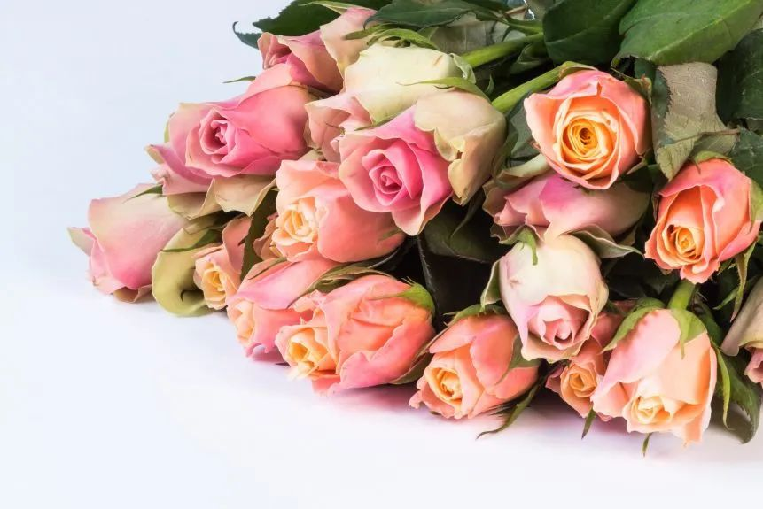 (原始链接: https://mmbiz.qpic.cn/mmbiz_jpg/7CNdqYbqvBLY2Wl3Bpttx6JTeuFHQ8yBsiaM5xiboKyOW4zX83AZIkXATAkz3MwAfnjrLH2ZR3aqppOQy8NT5dPQ/640?wx_fmt=jpeg)
- 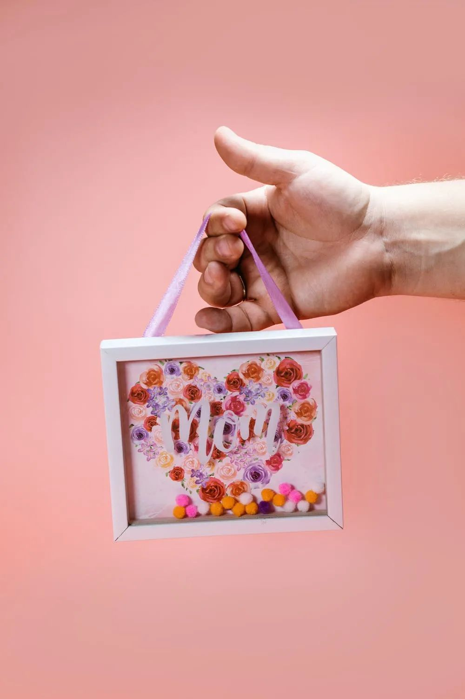 (原始链接: https://mmbiz.qpic.cn/mmbiz_jpg/7CNdqYbqvBLY2Wl3Bpttx6JTeuFHQ8yBaV0y52s5oWwm1ywLbyYtqdZaUiaONUShe76TwThvKnOJZur4lRKE4tA/640?wx_fmt=jpeg)
-  (原始链接: https://mmbiz.qpic.cn/mmbiz_png/7CNdqYbqvBLY2Wl3Bpttx6JTeuFHQ8yBze7dWyJdLA2I0k0mriarTYZqey6ku2So5WlRHBQiavbSywhsvKA4YMHg/640?wx_fmt=png)
-  (原始链接: https://mmbiz.qpic.cn/mmbiz_jpg/7CNdqYbqvBLY2Wl3Bpttx6JTeuFHQ8yBuawpDg5WmEn61UcCEA7fnVKLWtp6bqhQpibc1BMynDW4NCODkpHrq5w/640?wx_fmt=jpeg)
-  (原始链接: https://mmbiz.qpic.cn/mmbiz_png/7CNdqYbqvBLY2Wl3Bpttx6JTeuFHQ8yBA7CL887tc7BacpiadU3BWTwiauKvmng3kZJldL1uMicjRvQmx4DllewqQ/640?wx_fmt=png)
- 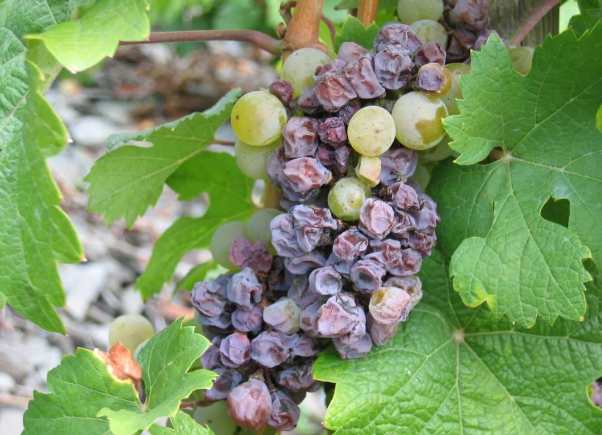 (原始链接: https://mmbiz.qpic.cn/mmbiz_jpg/7CNdqYbqvBLY2Wl3Bpttx6JTeuFHQ8yBMqib773T2AmretQsY5laRlxSJfMXEcnc2Bu9yiaxRIM3RmxpSfia5vWyA/640?wx_fmt=jpeg)
- 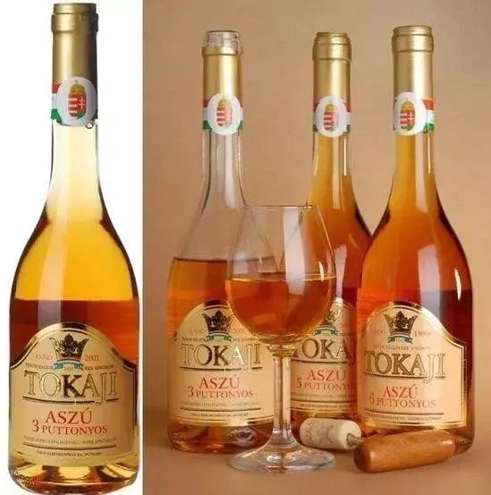 (原始链接: https://mmbiz.qpic.cn/mmbiz_jpg/7CNdqYbqvBLY2Wl3Bpttx6JTeuFHQ8yB05ub42UpYcyV8ibic0QQ1xpTMicjDWakWZx1xBoP7gqY8deoS6Vib8VJkQ/640?wx_fmt=jpeg)
- 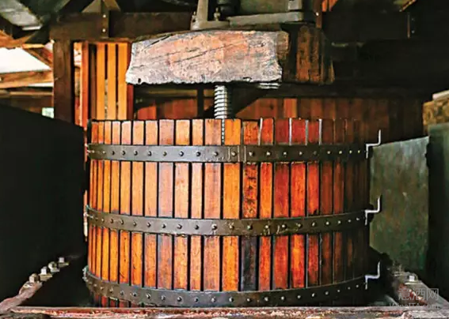 (原始链接: https://mmbiz.qpic.cn/mmbiz_png/7CNdqYbqvBLY2Wl3Bpttx6JTeuFHQ8yBPSU0vm8KznppHwMUyvPyRxBhr2wb0bPcruX3EMnbZeDdomJe4Sw9lQ/640?wx_fmt=png)
- 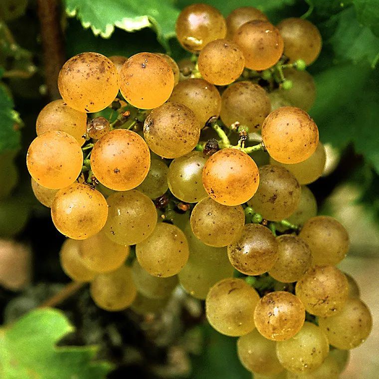 (原始链接: https://mmbiz.qpic.cn/mmbiz_jpg/7CNdqYbqvBLY2Wl3Bpttx6JTeuFHQ8yBfDQoxjOYl9HPIlu3dnvPmC5w1DEpMPaMnRlIewdibicIHb86gFHgVv5w/640?wx_fmt=jpeg)
- 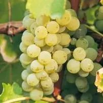 (原始链接: https://mmbiz.qpic.cn/mmbiz_jpg/7CNdqYbqvBLY2Wl3Bpttx6JTeuFHQ8yBFhN36kvqqqdjExVEcfZUTaGsjjZubSZjY8hicuVkSW2e4ObHKficEQrA/640?wx_fmt=jpeg)
-  (原始链接: https://mmbiz.qpic.cn/mmbiz_jpg/7CNdqYbqvBLY2Wl3Bpttx6JTeuFHQ8yBA2S8D7W0cA92nqux5xGXnnrsDuopCPsmN8rPZUHefX59gITlxVGEMg/640?wx_fmt=jpeg)
- 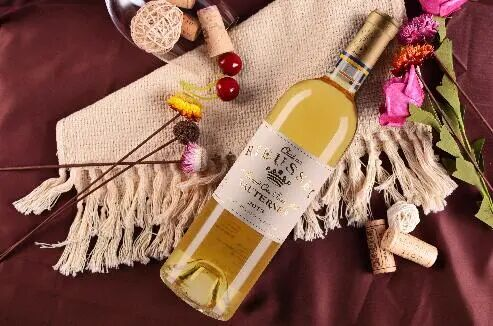 (原始链接: https://mmbiz.qpic.cn/mmbiz_jpg/7CNdqYbqvBLY2Wl3Bpttx6JTeuFHQ8yBuIbMrFWT8X8VJNCuZa4kkRX9HmlMBRa8QSWDxhGC8LzmnibsIMlP2KQ/640?wx_fmt=jpeg)
- 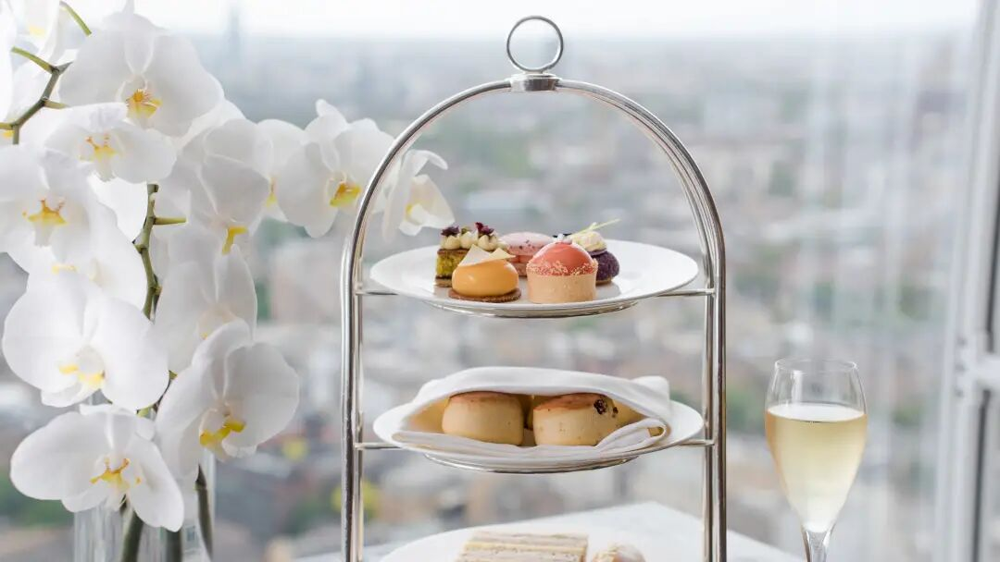 (原始链接: https://mmbiz.qpic.cn/mmbiz_jpg/7CNdqYbqvBLY2Wl3Bpttx6JTeuFHQ8yBqakb09PJPCIp74ahjz5wIkz2BibUnolb6oB6vRHmkwNYTMn74icBibevw/640?wx_fmt=jpeg)
- 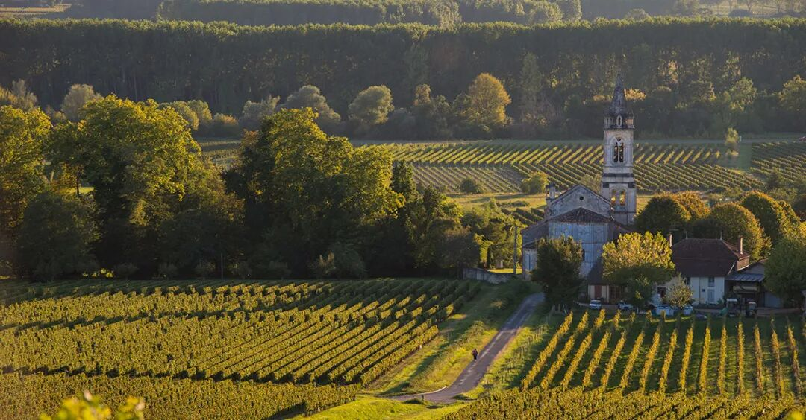 (原始链接: https://mmbiz.qpic.cn/mmbiz_jpg/7CNdqYbqvBLY2Wl3Bpttx6JTeuFHQ8yB8remhde6VAJ5woWIebG3vaOJ4at9uibrU5tobtf7r7pttrKEib8JicGgA/640?wx_fmt=jpeg)
- 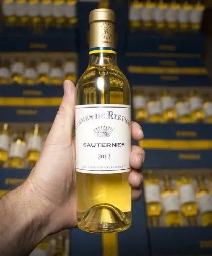 (原始链接: https://mmbiz.qpic.cn/mmbiz_jpg/7CNdqYbqvBLY2Wl3Bpttx6JTeuFHQ8yBBhygyu4ibV551PcvtrGQaaDO1cUsCzLia1I2nQ2oKelGEy6XxuxEeXAg/640?wx_fmt=jpeg)
- 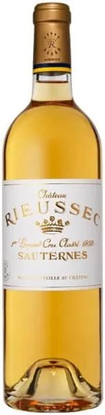 (原始链接: https://mmbiz.qpic.cn/mmbiz_jpg/7CNdqYbqvBLY2Wl3Bpttx6JTeuFHQ8yBqIwXCh14P0ibIlpOqibBx8bh23yJkl9VDG45kgOHX68X0h2pBEwIz4Yw/640?wx_fmt=jpeg)
- 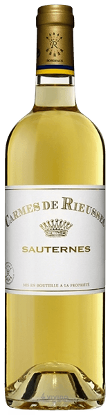 (原始链接: https://mmbiz.qpic.cn/mmbiz_png/7CNdqYbqvBLY2Wl3Bpttx6JTeuFHQ8yBsxnSvbZy86cjtLu5oT1WrTB1P4vrtuuCEicemG71Ypzj73MrMXPac4Q/640?wx_fmt=png)
-  (原始链接: https://mmbiz.qpic.cn/mmbiz_jpg/7CNdqYbqvBLY2Wl3Bpttx6JTeuFHQ8yBia6zSWozGuskHRvwFvmf4vacPFJQSSE4QFsgZFrSMgAiaCqibUE16Gib9Q/640?wx_fmt=jpeg)
-  (原始链接: https://mmbiz.qpic.cn/mmbiz_jpg/7CNdqYbqvBLY2Wl3Bpttx6JTeuFHQ8yBZaf63IBAlzPI5nd9PIOWtIQHrMo7K0ZdgxK4xobywwO85Ez3z5a89w/640?wx_fmt=jpeg)
-  (原始链接: https://mmbiz.qpic.cn/mmbiz_jpg/7CNdqYbqvBLY2Wl3Bpttx6JTeuFHQ8yBkb4GU0gictNN59h2KW5JalQHrwR4nevrp3XU5Va7yXfcLRXVk3aFIwQ/640?wx_fmt=jpeg)
-  (原始链接: https://mmbiz.qpic.cn/mmbiz_jpg/7CNdqYbqvBLY2Wl3Bpttx6JTeuFHQ8yBvYYPu5iaxM9UyzeibibxaAIFoGShx7vNraErZsMxibzeRjwjZSwHPC35Mg/640?wx_fmt=jpeg)
- 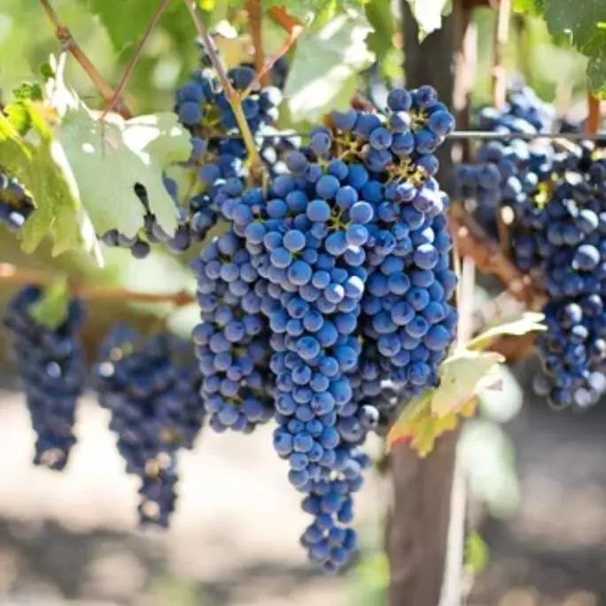 (原始链接: https://mmbiz.qpic.cn/mmbiz_jpg/7CNdqYbqvBLY2Wl3Bpttx6JTeuFHQ8yBZ7fwx5tGZxhbmTypiaXwqoXlMbvn4Xa2zppSUyXjMxTEhkic0XhZVfwQ/640?wx_fmt=jpeg)
- 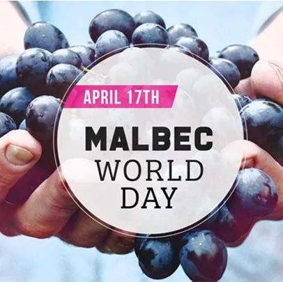 (原始链接: https://mmbiz.qpic.cn/mmbiz_jpg/7CNdqYbqvBLY2Wl3Bpttx6JTeuFHQ8yBVpm0sSDaQdAvGTlJwkn4AAibYx90wXx49Tbgonia7RuPoXPBWjic0aKYw/640?wx_fmt=jpeg)
-  (原始链接: https://mmbiz.qpic.cn/mmbiz_jpg/7CNdqYbqvBLY2Wl3Bpttx6JTeuFHQ8yBeWjScVB3r8G2Dyrtv6e6dIGyxMfAT7UticIaUbplEAzxELiaqjArYYGg/640?wx_fmt=jpeg)
