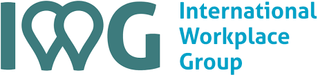
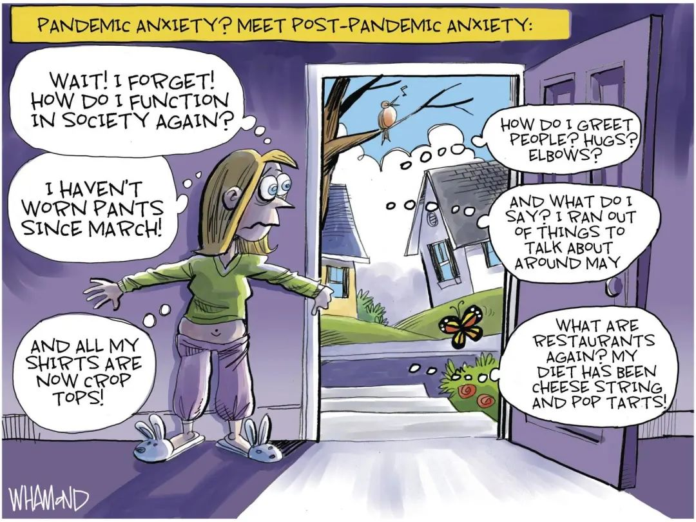
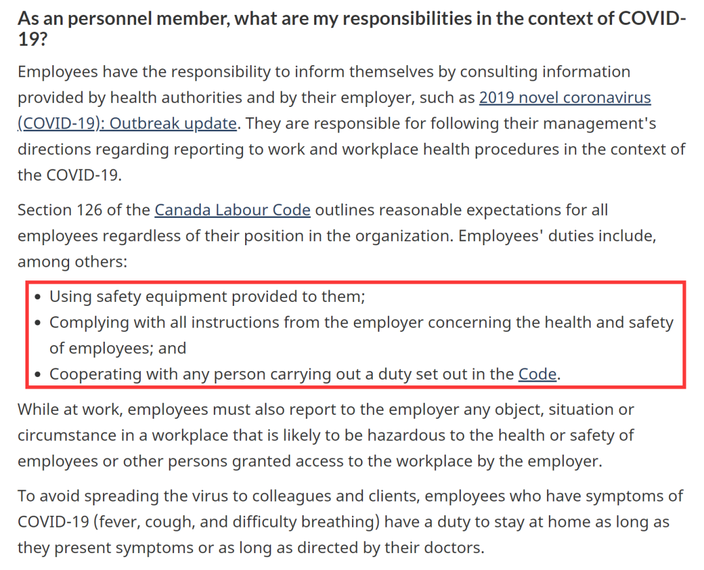
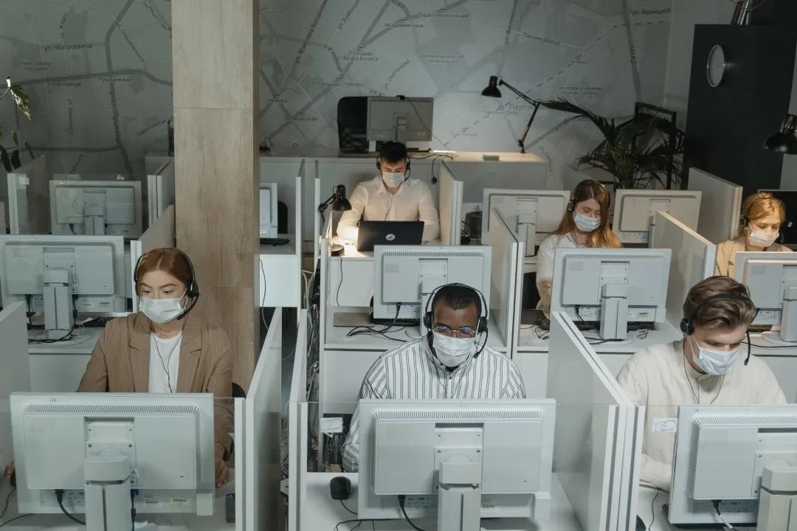

# 无标题

**链接地址:** http://mp.weixin.qq.com/s?__biz=MzI4NDYyNjAwNw==&mid=2247485001&idx=1&sn=3d2c2c3114bc15f83994936111651e9d&chksm=ebf9db71dc8e5267d695314a2e389a108844136aff6113b3f67cb7ee28cd1e49cb328c1ca023&mpshare=1&scene=2&srcid=06163Fxxd3dIZ0x9Pk1SxOle&sharer_sharetime=1623793676537&sharer_shareid=be1c8edd6c93eec155a61c876e41d26a#rd
**作者:** 关注我们
**获取时间:** 2025/8/28 19:45:46
**图片数量:** 16

---

## 原始HTML内容

<section style="box-sizing: border-box;font-size: 16px;"><section style="height: auto;box-sizing: border-box;" powered-by="xiumi.us"><section style="display: flex;flex-flow: row nowrap;text-align: center;justify-content: center;margin: 10px 0%;box-sizing: border-box;"><section style="display: inline-block;vertical-align: middle;width: auto;height: auto;flex: 0 0 0%;align-self: center;box-sizing: border-box;"><section style="font-size: 19px;margin-right: 0%;margin-left: 0%;box-sizing: border-box;" powered-by="xiumi.us"><section style="display: inline-block;border-width: 1px;border-style: solid;border-color: rgb(237, 128, 15);background-color: rgb(237, 128, 15);width: 1.8em;height: 1.8em;line-height: 1.8em;border-radius: 100%;margin-left: auto;margin-right: auto;font-size: 16px;color: rgb(255, 255, 255);font-family: Optima-Regular, PingFangTC-light;box-sizing: border-box;">
点
</section></section></section><section style="display: inline-block;vertical-align: middle;width: auto;height: auto;flex: 0 0 0%;align-self: center;box-sizing: border-box;"><section style="font-size: 19px;margin-right: 0%;margin-left: 0%;box-sizing: border-box;" powered-by="xiumi.us"><section style="display: inline-block;border-width: 1px;border-style: solid;border-color: rgb(237, 128, 15);background-color: rgb(237, 128, 15);width: 1.8em;height: 1.8em;line-height: 1.8em;border-radius: 100%;margin-left: auto;margin-right: auto;font-size: 16px;color: rgb(255, 255, 255);font-family: Optima-Regular, PingFangTC-light;box-sizing: border-box;">
击
</section></section></section><section style="display: inline-block;vertical-align: middle;width: auto;height: auto;flex: 0 0 0%;align-self: center;box-sizing: border-box;"><section style="font-size: 19px;margin-right: 0%;margin-left: 0%;box-sizing: border-box;" powered-by="xiumi.us"><section style="display: inline-block;border-width: 1px;border-style: solid;border-color: rgb(237, 128, 15);background-color: rgb(237, 128, 15);width: 1.8em;height: 1.8em;line-height: 1.8em;border-radius: 100%;margin-left: auto;margin-right: auto;font-size: 16px;color: rgb(255, 255, 255);font-family: Optima-Regular, PingFangTC-light;box-sizing: border-box;">
蓝
</section></section></section><section style="display: inline-block;vertical-align: middle;width: auto;height: auto;flex: 0 0 0%;align-self: center;box-sizing: border-box;"><section style="font-size: 19px;margin-right: 0%;margin-left: 0%;box-sizing: border-box;" powered-by="xiumi.us"><section style="display: inline-block;border-width: 1px;border-style: solid;border-color: rgb(237, 128, 15);background-color: rgb(237, 128, 15);width: 1.8em;height: 1.8em;line-height: 1.8em;border-radius: 100%;margin-left: auto;margin-right: auto;font-size: 16px;color: rgb(255, 255, 255);font-family: Optima-Regular, PingFangTC-light;box-sizing: border-box;">
字
</section></section></section><section style="display: inline-block;vertical-align: middle;width: 20px;flex: 0 0 auto;height: auto;align-self: center;box-sizing: border-box;"><section style="color: rgb(216, 202, 160);line-height: 1;box-sizing: border-box;" powered-by="xiumi.us">
/
</section></section><section style="display: inline-block;vertical-align: middle;width: auto;height: auto;flex: 0 0 0%;align-self: center;box-sizing: border-box;"><section style="font-size: 19px;margin-right: 0%;margin-left: 0%;box-sizing: border-box;" powered-by="xiumi.us"><section style="display: inline-block;border-width: 1px;border-style: solid;border-color: rgb(237, 128, 15);background-color: rgb(237, 128, 15);width: 1.8em;height: 1.8em;line-height: 1.8em;border-radius: 100%;margin-left: auto;margin-right: auto;font-size: 16px;color: rgb(255, 255, 255);font-family: Optima-Regular, PingFangTC-light;box-sizing: border-box;">
关
</section></section></section><section style="display: inline-block;vertical-align: middle;width: auto;height: auto;flex: 0 0 0%;align-self: center;box-sizing: border-box;"><section style="font-size: 19px;margin-right: 0%;margin-left: 0%;box-sizing: border-box;" powered-by="xiumi.us"><section style="display: inline-block;border-width: 1px;border-style: solid;border-color: rgb(237, 128, 15);background-color: rgb(237, 128, 15);width: 1.8em;height: 1.8em;line-height: 1.8em;border-radius: 100%;margin-left: auto;margin-right: auto;font-size: 16px;color: rgb(255, 255, 255);font-family: Optima-Regular, PingFangTC-light;box-sizing: border-box;">
注
</section></section></section><section style="display: inline-block;vertical-align: middle;width: auto;height: auto;flex: 0 0 0%;align-self: center;box-sizing: border-box;"><section style="font-size: 19px;margin-right: 0%;margin-left: 0%;box-sizing: border-box;" powered-by="xiumi.us"><section style="display: inline-block;border-width: 1px;border-style: solid;border-color: rgb(237, 128, 15);background-color: rgb(237, 128, 15);width: 1.8em;height: 1.8em;line-height: 1.8em;border-radius: 100%;margin-left: auto;margin-right: auto;font-size: 16px;color: rgb(255, 255, 255);font-family: Optima-Regular, PingFangTC-light;box-sizing: border-box;">
我
</section></section></section><section style="display: inline-block;vertical-align: middle;width: auto;height: auto;flex: 0 0 0%;align-self: center;box-sizing: border-box;"><section style="font-size: 19px;margin-right: 0%;margin-left: 0%;box-sizing: border-box;" powered-by="xiumi.us"><section style="display: inline-block;border-width: 1px;border-style: solid;border-color: rgb(237, 128, 15);background-color: rgb(237, 128, 15);width: 1.8em;height: 1.8em;line-height: 1.8em;border-radius: 100%;margin-left: auto;margin-right: auto;font-size: 16px;color: rgb(255, 255, 255);font-family: Optima-Regular, PingFangTC-light;box-sizing: border-box;">
们
</section></section></section></section></section><section style="box-sizing: border-box;" powered-by="xiumi.us">
 
</section><section style="text-align: right;margin: 10px 0% -71px;justify-content: flex-end;box-sizing: border-box;" powered-by="xiumi.us"><section style="max-width: 100%;vertical-align: middle;display: inline-block;line-height: 0;width: 84%;height: auto;box-sizing: border-box;"></section></section><section style="margin: 30px 0% 26px;box-sizing: border-box;" powered-by="xiumi.us"><section style="display: inline-block;width: 100%;vertical-align: top;background-color: rgb(244, 235, 229);box-sizing: border-box;"><section style="box-sizing: border-box;" powered-by="xiumi.us"><section style="display: flex;flex-flow: row nowrap;margin-top: -16px;margin-right: 0%;margin-left: 0%;text-align: left;justify-content: flex-start;transform: translate3d(18px, 0px, 0px);box-sizing: border-box;"><section style="display: inline-block;vertical-align: top;width: auto;min-width: 10%;max-width: 100%;flex: 0 0 auto;height: auto;align-self: flex-start;box-sizing: border-box;"><section style="justify-content: flex-start;margin-right: 0%;margin-left: 0%;box-sizing: border-box;" powered-by="xiumi.us"><section style="display: inline-block;width: 33px;height: 33px;vertical-align: top;overflow: hidden;background-color: rgb(102, 117, 149);border-width: 0px;border-radius: 66px;border-style: none;border-color: rgb(62, 62, 62);box-sizing: border-box;"><section style="transform: rotateZ(333deg) scale(0.6);transform-origin: left top;margin-right: -53px;margin-bottom: -27px;box-sizing: border-box;" powered-by="xiumi.us"><section style="display: flex;flex-flow: row nowrap;margin-top: 20px;margin-right: 0%;margin-left: 0%;justify-content: flex-start;transform: translate3d(5px, 0px, 0px);box-sizing: border-box;"><section style="display: inline-block;vertical-align: top;width: auto;flex: 0 0 0%;height: auto;align-self: flex-start;box-sizing: border-box;"><section style="text-align: right;margin-top: 4px;margin-right: 0%;margin-left: 0%;justify-content: flex-end;transform: translate3d(2px, 0px, 0px);box-sizing: border-box;" powered-by="xiumi.us"><section style="display: inline-block;width: 5px;height: 3px;vertical-align: top;overflow: hidden;background-color: rgb(244, 235, 229);box-sizing: border-box;"><section><svg viewBox="0 0 1 1" style="float:left;line-height:0;width:0;vertical-align:top;"></svg></section></section></section></section><section style="display: inline-block;vertical-align: top;width: auto;flex: 0 0 0%;align-self: flex-start;height: auto;box-sizing: border-box;"><section style="text-align: center;box-sizing: border-box;" powered-by="xiumi.us"><section style="display: inline-block;width: 16px;height: 16px;vertical-align: top;overflow: hidden;border-width: 3px;border-radius: 31px;border-style: solid;border-color: rgb(244, 235, 229);box-sizing: border-box;"><section><svg viewBox="0 0 1 1" style="float:left;line-height:0;width:0;vertical-align:top;"></svg></section></section></section></section><section style="display: inline-block;vertical-align: top;width: auto;flex: 0 0 0%;align-self: flex-start;height: auto;margin-right: -5px;margin-left: -5px;box-sizing: border-box;"><section style="text-align: center;margin-top: 2px;margin-right: 0%;margin-left: 0%;box-sizing: border-box;" powered-by="xiumi.us"><section style="display: inline-block;width: 16px;height: 16px;vertical-align: top;overflow: hidden;border-width: 3px;border-radius: 31px;border-style: solid;border-color: rgb(244, 235, 229) rgba(255, 255, 255, 0) rgba(255, 255, 255, 0);box-sizing: border-box;"><section><svg viewBox="0 0 1 1" style="float:left;line-height:0;width:0;vertical-align:top;"></svg></section></section></section></section><section style="display: inline-block;vertical-align: top;width: auto;flex: 0 0 0%;align-self: flex-start;height: auto;box-sizing: border-box;"><section style="text-align: center;box-sizing: border-box;" powered-by="xiumi.us"><section style="display: inline-block;width: 16px;height: 16px;vertical-align: top;overflow: hidden;border-width: 3px;border-radius: 31px;border-style: solid;border-color: rgb(244, 235, 229);box-sizing: border-box;"><section><svg viewBox="0 0 1 1" style="float:left;line-height:0;width:0;vertical-align:top;"></svg></section></section></section></section><section style="display: inline-block;vertical-align: top;width: auto;flex: 0 0 0%;height: auto;align-self: flex-start;box-sizing: border-box;"><section style="text-align: center;margin-top: 4px;margin-right: 0%;margin-left: 0%;transform: translate3d(-2px, 0px, 0px);box-sizing: border-box;" powered-by="xiumi.us"><section style="display: inline-block;width: 5px;height: 3px;vertical-align: top;overflow: hidden;background-color: rgb(244, 235, 229);box-sizing: border-box;"><section><svg viewBox="0 0 1 1" style="float:left;line-height:0;width:0;vertical-align:top;"></svg></section></section></section></section></section></section></section></section></section><section style="display: inline-block;vertical-align: top;width: auto;flex: 0 0 auto;align-self: flex-start;min-width: 10%;max-width: 100%;height: auto;box-sizing: border-box;"><section style="margin-right: 0%;margin-left: 0%;transform: translate3d(15px, 0px, 0px);justify-content: flex-start;box-sizing: border-box;" powered-by="xiumi.us"><section style="font-size: 22px;font-family: Optima-Regular, PingFangTC-light;color: rgb(43, 65, 110);letter-spacing: 0px;line-height: 1;padding-right: 7px;padding-left: 7px;box-sizing: border-box;">
<strong style="box-sizing: border-box;">如何应对“疫后焦虑”？</strong>

<strong style="box-sizing: border-box;">How to Cope With Post-Pandemic Anxiety？</strong>
</section></section></section></section></section></section></section><section style="font-size: 14px;padding-right: 15px;padding-left: 15px;line-height: 2;letter-spacing: 2px;color: rgb(121, 121, 121);box-sizing: border-box;" powered-by="xiumi.us">
 

最近加拿大在疫情控制方面取得了良好的进展。截止到目前，全国新增新冠确诊病例数<strong style="box-sizing: border-box;">持续降低</strong>，而新冠疫苗的的第一针接种率已<strong style="box-sizing: border-box;">达到65%</strong>。

 

阿省目前已经进入<strong style="box-sizing: border-box;">第二阶段的疫后重启</strong>，一些商业机构和公共设施逐步重新开放，终于看见了恢复正常生活的曙光。

 
</section><section style="text-align: center;margin-top: 10px;margin-bottom: 10px;box-sizing: border-box;" powered-by="xiumi.us"><section style="max-width: 100%;vertical-align: middle;display: inline-block;line-height: 0;box-sizing: border-box;"></section></section><section style="font-size: 14px;padding-right: 15px;padding-left: 15px;line-height: 2;letter-spacing: 2px;color: rgb(121, 121, 121);box-sizing: border-box;" powered-by="xiumi.us">
 

然而许多朋友们却表示：<strong style="box-sizing: border-box;">“我不开心”</strong>，因为：

 

<strong style="box-sizing: border-box;">我不想回去上班啊！！！</strong>

 

 
</section><section style="text-align: center;margin-top: 10px;margin-bottom: 10px;box-sizing: border-box;" powered-by="xiumi.us"><section style="max-width: 100%;vertical-align: middle;display: inline-block;line-height: 0;width: 75%;height: auto;box-sizing: border-box;"></section></section><section style="font-size: 14px;padding-right: 15px;padding-left: 15px;line-height: 2;letter-spacing: 2px;color: rgb(121, 121, 121);box-sizing: border-box;" powered-by="xiumi.us">
 

根据<strong style="box-sizing: border-box;"> International Workplace Group&nbsp;(IWC)</strong> 于六月初针对1,509加拿大成年人的在线调查显示，<strong style="box-sizing: border-box;">高达22%</strong>的受访者表示他们再也不想返回工作单位上班，而是更愿意延续<strong style="box-sizing: border-box;">居家办公</strong>（Work from Home，WFH）的工作状态。

 
</section><section style="text-align: center;margin-top: 10px;margin-bottom: 10px;box-sizing: border-box;" powered-by="xiumi.us"><section style="max-width: 100%;vertical-align: middle;display: inline-block;line-height: 0;box-sizing: border-box;"></section></section><section style="font-size: 14px;padding-right: 15px;padding-left: 15px;line-height: 2;letter-spacing: 2px;color: rgb(121, 121, 121);box-sizing: border-box;" powered-by="xiumi.us">
 

毕马威 (KPMG)会计事务所的近期的一项调查也显示，<strong style="box-sizing: border-box;">超过54%</strong>的加拿大人对重返工作场所感到焦虑与恐惧——这种症状被形容为——<strong style="box-sizing: border-box;">“疫后焦虑”症</strong>（Post-Pandemic Anxiety）。

 

习惯了无需打卡，无需通勤，无需社交，整天和家人黏在一起的“舒适生活”，想要一步踏回过去早睡早起<strong style="box-sizing: border-box;">快节奏的工作日常</strong>，对于许多人来说都是一个<strong style="box-sizing: border-box;">巨大的挑</strong><strong style="box-sizing: border-box;">战</strong>。

 
</section><section style="text-align: center;margin-top: 10px;margin-bottom: 10px;box-sizing: border-box;" powered-by="xiumi.us"><section style="max-width: 100%;vertical-align: middle;display: inline-block;line-height: 0;box-sizing: border-box;"></section></section><section style="font-size: 14px;padding-right: 15px;padding-left: 15px;line-height: 2;letter-spacing: 2px;color: rgb(121, 121, 121);box-sizing: border-box;" powered-by="xiumi.us">
 

打起精神来！今天小编为大家总结了<strong style="box-sizing: border-box;">几个帮助你逐步消除疫后焦虑，适应正常工作生活的小方法</strong>。回去上班并没有那么痛苦，请一定要试试看！
</section><section style="box-sizing: border-box;" powered-by="xiumi.us">
 
</section><section style="box-sizing: border-box;" powered-by="xiumi.us">
 
</section><section style="margin-top: 10px;margin-right: 0%;margin-left: 0%;box-sizing: border-box;" powered-by="xiumi.us"><section style="text-align: center;font-family: Optima-Regular, PingFangTC-light;color: rgb(102, 117, 149);font-size: 40px;line-height: 1;letter-spacing: 0px;box-sizing: border-box;">
<strong style="box-sizing: border-box;">#01</strong>
</section></section><section style="text-align: center;justify-content: center;transform: translate3d(10px, 0px, 0px);-webkit-transform: translate3d(10px, 0px, 0px);-moz-transform: translate3d(10px, 0px, 0px);-o-transform: translate3d(10px, 0px, 0px);margin: 10px 0% -17px;box-sizing: border-box;" powered-by="xiumi.us"><section style="font-family: Optima-Regular, PingFangTC-light;font-size: 12px;color: rgb(102, 117, 149);letter-spacing: 15px;line-height: 1;box-sizing: border-box;">
恢复正常的作息
</section></section><section style="margin-right: 0%;margin-bottom: 10px;margin-left: 0%;text-align: center;justify-content: center;box-sizing: border-box;" powered-by="xiumi.us"><section style="display: inline-block;width: auto;vertical-align: top;line-height: 0;min-width: 10%;max-width: 100%;height: auto;box-sizing: border-box;"><section style="box-sizing: border-box;" powered-by="xiumi.us"><section style="display: flex;flex-flow: row nowrap;text-align: left;justify-content: flex-start;margin-right: 0%;margin-left: 0%;box-sizing: border-box;"><section style="display: inline-block;vertical-align: top;width: auto;flex: 100 100 0%;align-self: flex-start;height: auto;box-sizing: border-box;"><section style="text-align: right;justify-content: flex-end;box-sizing: border-box;" powered-by="xiumi.us"><section style="display: inline-block;width: 162px;height: 15px;vertical-align: top;overflow: hidden;border-radius: 183%;border-style: solid;border-width: 1px;border-color: rgb(231, 217, 203) rgb(231, 217, 203) rgba(255, 255, 255, 0) rgba(255, 255, 255, 0);box-sizing: border-box;"><section><svg viewBox="0 0 1 1" style="float:left;line-height:0;width:0;vertical-align:top;"></svg></section></section></section></section><section style="display: inline-block;vertical-align: top;width: auto;flex: 0 0 auto;align-self: flex-start;min-width: 10%;max-width: 100%;height: auto;box-sizing: border-box;"><section style="justify-content: flex-start;margin: 6px 0% -3px;transform: translate3d(-8px, 0px, 0px);-webkit-transform: translate3d(-8px, 0px, 0px);-moz-transform: translate3d(-8px, 0px, 0px);-o-transform: translate3d(-8px, 0px, 0px);box-sizing: border-box;" powered-by="xiumi.us"><section style="display: inline-block;width: 70px;height: 16px;vertical-align: top;overflow: hidden;border-radius: 183%;border-style: solid;border-width: 1px;border-color: rgba(255, 255, 255, 0) rgba(255, 255, 255, 0) rgb(231, 217, 203) rgb(231, 217, 203);box-sizing: border-box;"><section><svg viewBox="0 0 1 1" style="float:left;line-height:0;width:0;vertical-align:top;"></svg></section></section></section></section></section></section></section></section><section style="font-size: 14px;padding-right: 15px;padding-left: 15px;line-height: 2;letter-spacing: 2px;color: rgb(121, 121, 121);box-sizing: border-box;" powered-by="xiumi.us">
 

想要恢复正常工作生活节奏的第一步就是<strong style="box-sizing: border-box;">“调整作息”</strong>。

 

疫情期间居家办公无需早起通勤，有些工作甚至不需要准时打卡，这就让许多朋友逐渐<strong style="box-sizing: border-box;">模糊了工作和生活时间的安排</strong>。虽然看起来很轻松，但也难以集中精力进行工作。

 
</section><section style="text-align: center;margin-top: 10px;margin-bottom: 10px;box-sizing: border-box;" powered-by="xiumi.us"><section style="max-width: 100%;vertical-align: middle;display: inline-block;line-height: 0;box-sizing: border-box;"></section></section><section style="font-size: 14px;padding-right: 15px;padding-left: 15px;line-height: 2;letter-spacing: 2px;color: rgb(121, 121, 121);box-sizing: border-box;" powered-by="xiumi.us">
 

提前把闹钟拨到正常shift的起床期间，安排好一日三餐和休息计划，预留出原本的通勤时间，这样才不会在第一周恢复办公室上班时<strong style="box-sizing: border-box;">手忙脚乱</strong>哦！

 

 
</section><section style="margin-top: 10px;margin-right: 0%;margin-left: 0%;box-sizing: border-box;" powered-by="xiumi.us"><section style="text-align: center;font-family: Optima-Regular, PingFangTC-light;color: rgb(102, 117, 149);font-size: 40px;line-height: 1;letter-spacing: 0px;box-sizing: border-box;">
<strong style="box-sizing: border-box;">#02</strong>
</section></section><section style="text-align: center;justify-content: center;transform: translate3d(10px, 0px, 0px);-webkit-transform: translate3d(10px, 0px, 0px);-moz-transform: translate3d(10px, 0px, 0px);-o-transform: translate3d(10px, 0px, 0px);margin: 10px 0% -17px;box-sizing: border-box;" powered-by="xiumi.us"><section style="font-family: Optima-Regular, PingFangTC-light;font-size: 12px;color: rgb(102, 117, 149);letter-spacing: 15px;line-height: 1;box-sizing: border-box;">
和家人们一同努力
</section></section><section style="margin-right: 0%;margin-bottom: 10px;margin-left: 0%;text-align: center;justify-content: center;box-sizing: border-box;" powered-by="xiumi.us"><section style="display: inline-block;width: auto;vertical-align: top;line-height: 0;min-width: 10%;max-width: 100%;height: auto;box-sizing: border-box;"><section style="box-sizing: border-box;" powered-by="xiumi.us"><section style="display: flex;flex-flow: row nowrap;text-align: left;justify-content: flex-start;margin-right: 0%;margin-left: 0%;box-sizing: border-box;"><section style="display: inline-block;vertical-align: top;width: auto;flex: 100 100 0%;align-self: flex-start;height: auto;box-sizing: border-box;"><section style="text-align: right;justify-content: flex-end;box-sizing: border-box;" powered-by="xiumi.us"><section style="display: inline-block;width: 162px;height: 15px;vertical-align: top;overflow: hidden;border-radius: 183%;border-style: solid;border-width: 1px;border-color: rgb(231, 217, 203) rgb(231, 217, 203) rgba(255, 255, 255, 0) rgba(255, 255, 255, 0);box-sizing: border-box;"><section><svg viewBox="0 0 1 1" style="float:left;line-height:0;width:0;vertical-align:top;"></svg></section></section></section></section><section style="display: inline-block;vertical-align: top;width: auto;flex: 0 0 auto;align-self: flex-start;min-width: 10%;max-width: 100%;height: auto;box-sizing: border-box;"><section style="justify-content: flex-start;margin: 6px 0% -3px;transform: translate3d(-8px, 0px, 0px);-webkit-transform: translate3d(-8px, 0px, 0px);-moz-transform: translate3d(-8px, 0px, 0px);-o-transform: translate3d(-8px, 0px, 0px);box-sizing: border-box;" powered-by="xiumi.us"><section style="display: inline-block;width: 70px;height: 16px;vertical-align: top;overflow: hidden;border-radius: 183%;border-style: solid;border-width: 1px;border-color: rgba(255, 255, 255, 0) rgba(255, 255, 255, 0) rgb(231, 217, 203) rgb(231, 217, 203);box-sizing: border-box;"><section><svg viewBox="0 0 1 1" style="float:left;line-height:0;width:0;vertical-align:top;"></svg></section></section></section></section></section></section></section></section><section style="font-size: 14px;padding-right: 15px;padding-left: 15px;line-height: 2;letter-spacing: 2px;color: rgb(121, 121, 121);box-sizing: border-box;" powered-by="xiumi.us">
 

疫情期间我们拥有了大把的时间陪伴家人。或许回到工作单位对于你来说不是个问题，但你确信你的家人也可以<strong style="box-sizing: border-box;">立刻接受这样的生活变化</strong>吗？

 

特别是<strong style="box-sizing: border-box;">带孩子的家长</strong>朋友们，提前告知你的家人关于你工作计划的安排，让他们渐渐习惯这样的日程安排也可以帮助你省去许多担忧与烦恼。

 
</section><section style="text-align: center;margin-top: 10px;margin-bottom: 10px;box-sizing: border-box;" powered-by="xiumi.us"><section style="max-width: 100%;vertical-align: middle;display: inline-block;line-height: 0;box-sizing: border-box;"></section></section><section style="font-size: 14px;padding-right: 15px;padding-left: 15px;line-height: 2;letter-spacing: 2px;color: rgb(121, 121, 121);box-sizing: border-box;" powered-by="xiumi.us">
 

试着<strong style="box-sizing: border-box;">安排固定的工作时间和休息时间</strong>，不要把工作拖延或者带入设立好的休息时间，有利于帮助他们建立和习惯你的新工作安排。

 

 
</section><section style="margin-top: 10px;margin-right: 0%;margin-left: 0%;box-sizing: border-box;" powered-by="xiumi.us"><section style="text-align: center;font-family: Optima-Regular, PingFangTC-light;color: rgb(102, 117, 149);font-size: 40px;line-height: 1;letter-spacing: 0px;box-sizing: border-box;">
<strong style="box-sizing: border-box;">#03</strong>
</section></section><section style="text-align: center;justify-content: center;transform: translate3d(10px, 0px, 0px);-webkit-transform: translate3d(10px, 0px, 0px);-moz-transform: translate3d(10px, 0px, 0px);-o-transform: translate3d(10px, 0px, 0px);margin: 10px 0% -17px;box-sizing: border-box;" powered-by="xiumi.us"><section style="font-family: Optima-Regular, PingFangTC-light;font-size: 12px;color: rgb(102, 117, 149);letter-spacing: 15px;line-height: 1;box-sizing: border-box;">
提前为工作“充值”
</section></section><section style="margin-right: 0%;margin-bottom: 10px;margin-left: 0%;text-align: center;justify-content: center;box-sizing: border-box;" powered-by="xiumi.us"><section style="display: inline-block;width: auto;vertical-align: top;line-height: 0;min-width: 10%;max-width: 100%;height: auto;box-sizing: border-box;"><section style="box-sizing: border-box;" powered-by="xiumi.us"><section style="display: flex;flex-flow: row nowrap;text-align: left;justify-content: flex-start;margin-right: 0%;margin-left: 0%;box-sizing: border-box;"><section style="display: inline-block;vertical-align: top;width: auto;flex: 100 100 0%;align-self: flex-start;height: auto;box-sizing: border-box;"><section style="text-align: right;justify-content: flex-end;box-sizing: border-box;" powered-by="xiumi.us"><section style="display: inline-block;width: 162px;height: 15px;vertical-align: top;overflow: hidden;border-radius: 183%;border-style: solid;border-width: 1px;border-color: rgb(231, 217, 203) rgb(231, 217, 203) rgba(255, 255, 255, 0) rgba(255, 255, 255, 0);box-sizing: border-box;"><section><svg viewBox="0 0 1 1" style="float:left;line-height:0;width:0;vertical-align:top;"></svg></section></section></section></section><section style="display: inline-block;vertical-align: top;width: auto;flex: 0 0 auto;align-self: flex-start;min-width: 10%;max-width: 100%;height: auto;box-sizing: border-box;"><section style="justify-content: flex-start;margin: 6px 0% -3px;transform: translate3d(-8px, 0px, 0px);-webkit-transform: translate3d(-8px, 0px, 0px);-moz-transform: translate3d(-8px, 0px, 0px);-o-transform: translate3d(-8px, 0px, 0px);box-sizing: border-box;" powered-by="xiumi.us"><section style="display: inline-block;width: 70px;height: 16px;vertical-align: top;overflow: hidden;border-radius: 183%;border-style: solid;border-width: 1px;border-color: rgba(255, 255, 255, 0) rgba(255, 255, 255, 0) rgb(231, 217, 203) rgb(231, 217, 203);box-sizing: border-box;"><section><svg viewBox="0 0 1 1" style="float:left;line-height:0;width:0;vertical-align:top;"></svg></section></section></section></section></section></section></section></section><section style="font-size: 14px;padding-right: 15px;padding-left: 15px;line-height: 2;letter-spacing: 2px;color: rgb(121, 121, 121);box-sizing: border-box;" powered-by="xiumi.us">
 

想要恢复以前的工作生活安排，那就把疫情期间暂时放弃的生活<strong style="box-sizing: border-box;">&nbsp;routine 快速捡起来</strong>！

 

赶快检查一下上下班交通工具的保养状态，提前为停车场租赁好车位；乘坐公共交通设施上班的朋友们则需要提前购买好月票，检查上下班路线的安排是否在过去一年多中进行了变更。

 
</section><section style="text-align: center;margin-top: 10px;margin-bottom: 10px;box-sizing: border-box;" powered-by="xiumi.us"><section style="max-width: 100%;vertical-align: middle;display: inline-block;line-height: 0;box-sizing: border-box;"></section></section><section style="font-size: 14px;padding-right: 15px;padding-left: 15px;line-height: 2;letter-spacing: 2px;color: rgb(121, 121, 121);box-sizing: border-box;" powered-by="xiumi.us">
 

楼下食堂的充值卡、下班后健身房的会员等等，都可以提前进行安排，这将有助于你以<strong style="box-sizing: border-box;">更自信的状态</strong>进入以往的工作生活的节奏：<strong style="box-sizing: border-box;">I'm ready for it!</strong>

 

 
</section><section style="margin-top: 10px;margin-right: 0%;margin-left: 0%;box-sizing: border-box;" powered-by="xiumi.us"><section style="text-align: center;font-family: Optima-Regular, PingFangTC-light;color: rgb(102, 117, 149);font-size: 40px;line-height: 1;letter-spacing: 0px;box-sizing: border-box;">
<strong style="box-sizing: border-box;">#04</strong>
</section></section><section style="text-align: center;justify-content: center;transform: translate3d(10px, 0px, 0px);-webkit-transform: translate3d(10px, 0px, 0px);-moz-transform: translate3d(10px, 0px, 0px);-o-transform: translate3d(10px, 0px, 0px);margin: 10px 0% -17px;box-sizing: border-box;" powered-by="xiumi.us"><section style="font-family: Optima-Regular, PingFangTC-light;font-size: 12px;color: rgb(102, 117, 149);letter-spacing: 15px;line-height: 1;box-sizing: border-box;">
和“老朋友”Say Hi&nbsp;
</section></section><section style="margin-right: 0%;margin-bottom: 10px;margin-left: 0%;text-align: center;justify-content: center;box-sizing: border-box;" powered-by="xiumi.us"><section style="display: inline-block;width: auto;vertical-align: top;line-height: 0;min-width: 10%;max-width: 100%;height: auto;box-sizing: border-box;"><section style="box-sizing: border-box;" powered-by="xiumi.us"><section style="display: flex;flex-flow: row nowrap;text-align: left;justify-content: flex-start;margin-right: 0%;margin-left: 0%;box-sizing: border-box;"><section style="display: inline-block;vertical-align: top;width: auto;flex: 100 100 0%;align-self: flex-start;height: auto;box-sizing: border-box;"><section style="text-align: right;justify-content: flex-end;box-sizing: border-box;" powered-by="xiumi.us"><section style="display: inline-block;width: 162px;height: 15px;vertical-align: top;overflow: hidden;border-radius: 183%;border-style: solid;border-width: 1px;border-color: rgb(231, 217, 203) rgb(231, 217, 203) rgba(255, 255, 255, 0) rgba(255, 255, 255, 0);box-sizing: border-box;"><section><svg viewBox="0 0 1 1" style="float:left;line-height:0;width:0;vertical-align:top;"></svg></section></section></section></section><section style="display: inline-block;vertical-align: top;width: auto;flex: 0 0 auto;align-self: flex-start;min-width: 10%;max-width: 100%;height: auto;box-sizing: border-box;"><section style="justify-content: flex-start;margin: 6px 0% -3px;transform: translate3d(-8px, 0px, 0px);-webkit-transform: translate3d(-8px, 0px, 0px);-moz-transform: translate3d(-8px, 0px, 0px);-o-transform: translate3d(-8px, 0px, 0px);box-sizing: border-box;" powered-by="xiumi.us"><section style="display: inline-block;width: 70px;height: 16px;vertical-align: top;overflow: hidden;border-radius: 183%;border-style: solid;border-width: 1px;border-color: rgba(255, 255, 255, 0) rgba(255, 255, 255, 0) rgb(231, 217, 203) rgb(231, 217, 203);box-sizing: border-box;"><section><svg viewBox="0 0 1 1" style="float:left;line-height:0;width:0;vertical-align:top;"></svg></section></section></section></section></section></section></section></section><section style="font-size: 14px;padding-right: 15px;padding-left: 15px;line-height: 2;letter-spacing: 2px;color: rgb(121, 121, 121);box-sizing: border-box;" powered-by="xiumi.us">
 

恢复上班前有时间不如叫来许久不见的，最亲近的几个<strong style="box-sizing: border-box;">工作单位中的同事</strong>叙叙旧。

 

聊聊疫情期间的情况，互相打气给予支持，共同展望下半年精彩的工作生活。这有助于你快速捡起过往的人际关系，让你在工作单位中<strong style="box-sizing: border-box;">不再感到陌生与孤独</strong>。

 
</section><section style="text-align: center;margin-top: 10px;margin-bottom: 10px;box-sizing: border-box;" powered-by="xiumi.us"><section style="max-width: 100%;vertical-align: middle;display: inline-block;line-height: 0;box-sizing: border-box;"></section></section><section style="font-size: 14px;padding-right: 15px;padding-left: 15px;line-height: 2;letter-spacing: 2px;color: rgb(121, 121, 121);box-sizing: border-box;" powered-by="xiumi.us">
 

并且锻炼一下疫情期间抛下的面对面的交际技巧，让你职场中开口<strong style="box-sizing: border-box;">不再感到拘谨害羞</strong>。<strong style="box-sizing: border-box;">（注意保持社交距离哦！）</strong>

 

 
</section><section style="margin-top: 10px;margin-right: 0%;margin-left: 0%;box-sizing: border-box;" powered-by="xiumi.us"><section style="text-align: center;font-family: Optima-Regular, PingFangTC-light;color: rgb(102, 117, 149);font-size: 40px;line-height: 1;letter-spacing: 0px;box-sizing: border-box;">
<strong style="box-sizing: border-box;">#05</strong>
</section></section><section style="text-align: center;justify-content: center;transform: translate3d(10px, 0px, 0px);-webkit-transform: translate3d(10px, 0px, 0px);-moz-transform: translate3d(10px, 0px, 0px);-o-transform: translate3d(10px, 0px, 0px);margin: 10px 0% -17px;box-sizing: border-box;" powered-by="xiumi.us"><section style="font-family: Optima-Regular, PingFangTC-light;font-size: 12px;color: rgb(102, 117, 149);letter-spacing: 15px;line-height: 1;box-sizing: border-box;">
积极参与办公场所的疫情监控
</section></section><section style="margin-right: 0%;margin-bottom: 10px;margin-left: 0%;text-align: center;justify-content: center;box-sizing: border-box;" powered-by="xiumi.us"><section style="display: inline-block;width: auto;vertical-align: top;line-height: 0;min-width: 10%;max-width: 100%;height: auto;box-sizing: border-box;"><section style="box-sizing: border-box;" powered-by="xiumi.us"><section style="display: flex;flex-flow: row nowrap;text-align: left;justify-content: flex-start;margin-right: 0%;margin-left: 0%;box-sizing: border-box;"><section style="display: inline-block;vertical-align: top;width: auto;flex: 100 100 0%;align-self: flex-start;height: auto;box-sizing: border-box;"><section style="text-align: right;justify-content: flex-end;box-sizing: border-box;" powered-by="xiumi.us"><section style="display: inline-block;width: 162px;height: 15px;vertical-align: top;overflow: hidden;border-radius: 183%;border-style: solid;border-width: 1px;border-color: rgb(231, 217, 203) rgb(231, 217, 203) rgba(255, 255, 255, 0) rgba(255, 255, 255, 0);box-sizing: border-box;"><section><svg viewBox="0 0 1 1" style="float:left;line-height:0;width:0;vertical-align:top;"></svg></section></section></section></section><section style="display: inline-block;vertical-align: top;width: auto;flex: 0 0 auto;align-self: flex-start;min-width: 10%;max-width: 100%;height: auto;box-sizing: border-box;"><section style="justify-content: flex-start;margin: 6px 0% -3px;transform: translate3d(-8px, 0px, 0px);-webkit-transform: translate3d(-8px, 0px, 0px);-moz-transform: translate3d(-8px, 0px, 0px);-o-transform: translate3d(-8px, 0px, 0px);box-sizing: border-box;" powered-by="xiumi.us"><section style="display: inline-block;width: 70px;height: 16px;vertical-align: top;overflow: hidden;border-radius: 183%;border-style: solid;border-width: 1px;border-color: rgba(255, 255, 255, 0) rgba(255, 255, 255, 0) rgb(231, 217, 203) rgb(231, 217, 203);box-sizing: border-box;"><section><svg viewBox="0 0 1 1" style="float:left;line-height:0;width:0;vertical-align:top;"></svg></section></section></section></section></section></section></section></section><section style="font-size: 14px;padding-right: 15px;padding-left: 15px;line-height: 2;letter-spacing: 2px;color: rgb(121, 121, 121);box-sizing: border-box;" powered-by="xiumi.us">
 

许多人对返回工作岗位最焦虑的便是<strong style="box-sizing: border-box;">“担心工作场所的健康安全”</strong>。

 
</section><section style="text-align: center;margin-top: 10px;margin-bottom: 10px;box-sizing: border-box;" powered-by="xiumi.us"><section style="max-width: 100%;vertical-align: middle;display: inline-block;line-height: 0;box-sizing: border-box;"></section></section><section style="font-size: 14px;padding-right: 15px;padding-left: 15px;line-height: 2;letter-spacing: 2px;color: rgb(121, 121, 121);box-sizing: border-box;" powered-by="xiumi.us">
 

<strong style="box-sizing: border-box;">加拿大的政府官网</strong>于近期更新了雇主和员工返回工作场所的<strong style="box-sizing: border-box;">健康安全指南</strong>，其中规定了一些必要的风险控制措施和卫生安全须知，建议大家在复工前前进行了解。

 

另外，复工前也鼓励和<strong style="box-sizing: border-box;">工作单位进行沟通</strong>，确认是否会被提供如口罩等个人护具（PPE），是否遵照安全社交距离安排工位，是否会采取分阶段复工的方式？以便你更好地去安排自己的复工计划。

 
</section><section style="margin-top: 10px;margin-bottom: 10px;text-align: center;box-sizing: border-box;" powered-by="xiumi.us"><section style="padding-left: 1em;padding-right: 1em;display: inline-block;box-sizing: border-box;">
<strong style="box-sizing: border-box;">复工员工指南</strong>
 </section><section style="border-width: 1px;border-style: solid;border-color: rgb(192, 200, 209);margin-top: -1em;padding: 20px 10px 10px;background-color: rgb(239, 239, 239);box-sizing: border-box;"><section style="text-align: justify;padding-right: 15px;padding-left: 15px;box-sizing: border-box;" powered-by="xiumi.us">
 

https://www.canada.ca/en/department-national-defence/campaigns/covid-19/resuming-work/frequently-asked-questions/staff.html

 
</section></section></section><section style="font-size: 14px;padding-right: 15px;padding-left: 15px;line-height: 2;letter-spacing: 2px;color: rgb(121, 121, 121);box-sizing: border-box;" powered-by="xiumi.us">
 

记住，根据《加拿大劳工法》：<strong style="box-sizing: border-box;">“如果员工有合理理由相信该工作对自己或其他员工构成健康风险，则员工有权拒绝从事这项工作。”</strong>

 

所以请积极参与并监督好工作场所的疫后检测和控制工作，和企业一同打造一个<strong style="box-sizing: border-box;">更安全的工作环境</strong>。

 

 
</section><section style="margin: 30px 0% 10px;box-sizing: border-box;" powered-by="xiumi.us"><section style="display: inline-block;width: 100%;vertical-align: top;background-color: rgb(244, 235, 229);box-sizing: border-box;"><section style="text-align: center;justify-content: center;margin-top: -17px;margin-right: 0%;margin-left: 0%;box-sizing: border-box;" powered-by="xiumi.us"><section style="display: inline-block;width: 33px;height: 33px;vertical-align: top;overflow: hidden;background-color: rgb(102, 117, 149);border-width: 0px;border-radius: 66px;border-style: none;border-color: rgb(62, 62, 62);box-sizing: border-box;"><section style="transform: rotateZ(333deg) scale(0.6);transform-origin: left top;margin-right: -53px;margin-bottom: -27px;box-sizing: border-box;" powered-by="xiumi.us"><section style="display: flex;flex-flow: row nowrap;margin-top: 20px;margin-right: 0%;margin-left: 0%;text-align: left;justify-content: flex-start;transform: translate3d(5px, 0px, 0px);box-sizing: border-box;"><section style="display: inline-block;vertical-align: top;width: auto;flex: 0 0 0%;height: auto;align-self: flex-start;box-sizing: border-box;"><section style="text-align: right;margin-top: 4px;margin-right: 0%;margin-left: 0%;justify-content: flex-end;transform: translate3d(2px, 0px, 0px);box-sizing: border-box;" powered-by="xiumi.us"><section style="display: inline-block;width: 5px;height: 3px;vertical-align: top;overflow: hidden;background-color: rgb(244, 235, 229);box-sizing: border-box;"><section><svg viewBox="0 0 1 1" style="float:left;line-height:0;width:0;vertical-align:top;"></svg></section></section></section></section><section style="display: inline-block;vertical-align: top;width: auto;flex: 0 0 0%;align-self: flex-start;height: auto;box-sizing: border-box;"><section style="text-align: center;box-sizing: border-box;" powered-by="xiumi.us"><section style="display: inline-block;width: 16px;height: 16px;vertical-align: top;overflow: hidden;border-width: 3px;border-radius: 31px;border-style: solid;border-color: rgb(244, 235, 229);box-sizing: border-box;"><section><svg viewBox="0 0 1 1" style="float:left;line-height:0;width:0;vertical-align:top;"></svg></section></section></section></section><section style="display: inline-block;vertical-align: top;width: auto;flex: 0 0 0%;align-self: flex-start;height: auto;margin-right: -5px;margin-left: -5px;box-sizing: border-box;"><section style="text-align: center;margin-top: 2px;margin-right: 0%;margin-left: 0%;box-sizing: border-box;" powered-by="xiumi.us"><section style="display: inline-block;width: 16px;height: 16px;vertical-align: top;overflow: hidden;border-width: 3px;border-radius: 31px;border-style: solid;border-color: rgb(244, 235, 229) rgba(255, 255, 255, 0) rgba(255, 255, 255, 0);box-sizing: border-box;"><section><svg viewBox="0 0 1 1" style="float:left;line-height:0;width:0;vertical-align:top;"></svg></section></section></section></section><section style="display: inline-block;vertical-align: top;width: auto;flex: 0 0 0%;align-self: flex-start;height: auto;box-sizing: border-box;"><section style="text-align: center;box-sizing: border-box;" powered-by="xiumi.us"><section style="display: inline-block;width: 16px;height: 16px;vertical-align: top;overflow: hidden;border-width: 3px;border-radius: 31px;border-style: solid;border-color: rgb(244, 235, 229);box-sizing: border-box;"><section><svg viewBox="0 0 1 1" style="float:left;line-height:0;width:0;vertical-align:top;"></svg></section></section></section></section><section style="display: inline-block;vertical-align: top;width: auto;flex: 0 0 0%;height: auto;align-self: flex-start;box-sizing: border-box;"><section style="text-align: center;margin-top: 4px;margin-right: 0%;margin-left: 0%;transform: translate3d(-2px, 0px, 0px);box-sizing: border-box;" powered-by="xiumi.us"><section style="display: inline-block;width: 5px;height: 3px;vertical-align: top;overflow: hidden;background-color: rgb(244, 235, 229);box-sizing: border-box;"><section><svg viewBox="0 0 1 1" style="float:left;line-height:0;width:0;vertical-align:top;"></svg></section></section></section></section></section></section></section></section></section></section><section style="font-size: 14px;padding-right: 15px;padding-left: 15px;line-height: 2;letter-spacing: 2px;color: rgb(121, 121, 121);box-sizing: border-box;" powered-by="xiumi.us">
 

这五步看下来非常简单，复工其实并没有什么可焦虑的。这些不过都是过去<strong style="box-sizing: border-box;">已经习惯过的日常</strong>，请相信自己有能力胜任，并能安排得很好！

 
</section><section style="text-align: center;margin-top: 10px;margin-bottom: 10px;box-sizing: border-box;" powered-by="xiumi.us"><section style="max-width: 100%;vertical-align: middle;display: inline-block;line-height: 0;box-sizing: border-box;"></section></section><section style="font-size: 14px;padding-right: 15px;padding-left: 15px;line-height: 2;letter-spacing: 2px;color: rgb(121, 121, 121);box-sizing: border-box;" powered-by="xiumi.us">
 

万众期待的<strong style="box-sizing: border-box;">“恢复日常”</strong>尽在眼前，希望大家能够更自信地参与到复工的进程中去！进入职场发展的快车道，BadaB Consulting 会跟你们一同努力，并肩前行！

 

 
</section><section style="box-sizing: border-box;" powered-by="xiumi.us">
 
</section><section style="margin: 10px 0%;box-sizing: border-box;" powered-by="xiumi.us"><section style="display: inline-block;width: 100%;vertical-align: top;background-color: rgb(200, 232, 245);padding-right: 10px;padding-left: 10px;box-sizing: border-box;"><section style="box-sizing: border-box;" powered-by="xiumi.us"><section style="display: flex;flex-flow: row nowrap;margin: -5px 0%;text-align: center;justify-content: center;box-sizing: border-box;"><section style="display: inline-block;width: auto;vertical-align: middle;min-width: 10%;max-width: 100%;flex: 0 0 auto;height: auto;border-style: solid;border-width: 1px;border-color: rgb(51, 167, 233);padding: 4px;background-color: rgb(255, 255, 255);box-shadow: rgb(255, 255, 255) 0px 0px 0px inset;align-self: center;box-sizing: border-box;"><section style="display: inline-block;width: 100%;vertical-align: top;border-width: 0px;background-color: rgb(200, 232, 245);padding-right: 10px;padding-left: 10px;box-sizing: border-box;" powered-by="xiumi.us"><section style="text-align: justify;color: rgb(106, 106, 106);letter-spacing: 1px;box-sizing: border-box;" powered-by="xiumi.us">
<strong style="box-sizing: border-box;">关于我们</strong>
</section></section></section></section></section></section></section><section style="box-sizing: border-box;" powered-by="xiumi.us">
 
</section><section style="text-align: center;margin: 10px 0%;box-sizing: border-box;" powered-by="xiumi.us"><section style="display: inline-block;width: 90%;vertical-align: top;border-style: solid;border-width: 2px;border-color: rgb(237, 128, 15);letter-spacing: 0px;padding: 10px;box-sizing: border-box;"><section style="box-sizing: border-box;" powered-by="xiumi.us"><section style="display: inline-block;vertical-align: middle;width: 40%;box-sizing: border-box;"><section style="margin-right: 0%;margin-left: 0%;box-sizing: border-box;" powered-by="xiumi.us"><section style="max-width: 100%;vertical-align: middle;display: inline-block;line-height: 0;border-width: 0px;width: 100%;box-sizing: border-box;"></section></section></section><section style="display: inline-block;vertical-align: middle;width: 60%;padding-left: 10px;box-sizing: border-box;"><section style="margin-right: 0%;margin-bottom: 5px;margin-left: 0%;box-sizing: border-box;" powered-by="xiumi.us"><section style="display: inline-block;border-width: 2px;border-style: solid;border-color: rgb(237, 128, 15);padding: 0.1em 0.3em;background-color: rgb(237, 128, 15);color: rgb(255, 255, 255);font-size: 12px;box-sizing: border-box;">
<strong style="box-sizing: border-box;">Ada&nbsp; Tai</strong>
</section></section><section style="margin-right: 0%;margin-left: 0%;box-sizing: border-box;" powered-by="xiumi.us"><section style="font-size: 13px;box-sizing: border-box;">
<strong style="box-sizing: border-box;">MBA, CPHR, SHRM-SCP</strong>
</section></section><section style="box-sizing: border-box;" powered-by="xiumi.us"><section style="display: inline-block;vertical-align: middle;width: 10%;border-width: 0px;box-sizing: border-box;"><section style="margin: 5px 0%;text-align: left;font-size: 0px;box-sizing: border-box;" powered-by="xiumi.us"><section style="padding: 4px;display: inline-block;background-color: rgb(237, 128, 15);box-sizing: border-box;"><section style="border-color: rgba(255, 255, 255, 0);width: 1.6em;height: 1.6em;border-style: solid;border-width: 1px;text-align: center;line-height: 1.5em;color: rgb(255, 255, 255);box-sizing: border-box;">
 
</section></section></section></section><section style="display: inline-block;vertical-align: middle;width: 90%;box-sizing: border-box;"><section style="text-align: justify;font-size: 12px;box-sizing: border-box;" powered-by="xiumi.us">
修改简历与求职信
</section></section></section><section style="box-sizing: border-box;" powered-by="xiumi.us"><section style="display: inline-block;vertical-align: middle;width: 10%;box-sizing: border-box;"><section style="margin: 5px 0%;text-align: left;font-size: 0px;box-sizing: border-box;" powered-by="xiumi.us"><section style="padding: 4px;display: inline-block;background-color: rgb(237, 128, 15);box-sizing: border-box;"><section style="border-color: rgba(255, 255, 255, 0);width: 1.6em;height: 1.6em;border-style: solid;border-width: 1px;text-align: center;line-height: 1.5em;color: rgb(255, 255, 255);box-sizing: border-box;">
 
</section></section></section></section><section style="display: inline-block;vertical-align: middle;width: 90%;box-sizing: border-box;"><section style="text-align: justify;font-size: 12px;box-sizing: border-box;" powered-by="xiumi.us">
培训面试
</section></section></section><section style="box-sizing: border-box;" powered-by="xiumi.us"><section style="display: inline-block;vertical-align: middle;width: 10%;border-width: 0px;box-sizing: border-box;"><section style="margin: 5px 0%;text-align: left;font-size: 0px;box-sizing: border-box;" powered-by="xiumi.us"><section style="padding: 4px;display: inline-block;background-color: rgb(237, 128, 15);box-sizing: border-box;"><section style="border-color: rgba(255, 255, 255, 0);width: 1.6em;height: 1.6em;border-style: solid;border-width: 1px;text-align: center;line-height: 1.5em;color: rgb(255, 255, 255);box-sizing: border-box;">
 
</section></section></section></section><section style="display: inline-block;vertical-align: middle;width: 90%;box-sizing: border-box;"><section style="text-align: justify;font-size: 12px;box-sizing: border-box;" powered-by="xiumi.us">
建立LinkedIn Profile
</section></section></section><section style="box-sizing: border-box;" powered-by="xiumi.us"><section style="display: inline-block;vertical-align: middle;width: 10%;box-sizing: border-box;"><section style="margin: 5px 0%;text-align: left;font-size: 0px;box-sizing: border-box;" powered-by="xiumi.us"><section style="padding: 4px;display: inline-block;background-color: rgb(237, 128, 15);box-sizing: border-box;"><section style="border-color: rgba(255, 255, 255, 0);width: 1.6em;height: 1.6em;border-style: solid;border-width: 1px;text-align: center;line-height: 1.5em;color: rgb(255, 255, 255);box-sizing: border-box;">
 
</section></section></section></section><section style="display: inline-block;vertical-align: middle;width: 90%;box-sizing: border-box;"><section style="text-align: justify;font-size: 12px;box-sizing: border-box;" powered-by="xiumi.us">
职业评估与规划、社交培训
</section></section></section><section style="box-sizing: border-box;" powered-by="xiumi.us"><section style="display: inline-block;vertical-align: middle;width: 10%;box-sizing: border-box;"><section style="margin: 5px 0%;text-align: left;font-size: 0px;box-sizing: border-box;" powered-by="xiumi.us"><section style="padding: 4px;display: inline-block;background-color: rgb(237, 128, 15);box-sizing: border-box;"><section style="border-color: rgba(255, 255, 255, 0);width: 1.6em;height: 1.6em;border-style: solid;border-width: 1px;text-align: center;line-height: 1.5em;color: rgb(255, 255, 255);box-sizing: border-box;">
 
</section></section></section></section><section style="display: inline-block;vertical-align: middle;width: 90%;box-sizing: border-box;"><section style="text-align: justify;font-size: 12px;box-sizing: border-box;" powered-by="xiumi.us">
求职、职场文化等多种讲座
</section></section></section></section></section></section></section><section style="margin: 20px 0%;box-sizing: border-box;" powered-by="xiumi.us"><section style="letter-spacing: 2px;font-size: 14px;color: rgba(51, 51, 51, 0.61);padding-right: 20px;padding-left: 20px;line-height: 2;box-sizing: border-box;">
 

Ada Tai 毕业于埃尔伯塔大学工商管理硕士学位,并拥有加拿大和美国“注册人力资源管理师”资格证。十几年来 Ada 一直在不同的领域从事人力资源的管理工作。在最近的几年时间里，Ada与她的团队BadaB Consulting Inc. 已成功帮助超过500名不同年龄和职业背景的求职者找到心仪的工作，并帮助他们克服职场困难，向理想的职业成长方向稳步前进。

 
</section></section><section style="box-sizing: border-box;" powered-by="xiumi.us"><section style="display: flex;flex-flow: row nowrap;margin: 10px 0%;box-sizing: border-box;"><section style="display: inline-block;vertical-align: middle;width: auto;flex: 0 0 0%;align-self: center;height: auto;box-sizing: border-box;"><section style="text-align: center;box-sizing: border-box;" powered-by="xiumi.us"><section style="display: inline-block;width: 90px;height: 150px;vertical-align: top;overflow: hidden;border-style: solid;border-width: 4px;border-color: rgb(255, 226, 196);box-sizing: border-box;"><section><svg viewBox="0 0 1 1" style="float:left;line-height:0;width:0;vertical-align:top;"></svg></section></section></section></section><section style="display: inline-block;vertical-align: middle;width: auto;flex: 89.2857 89.2857 0%;align-self: center;height: auto;background-color: rgb(255, 255, 255);margin-left: -65px;box-sizing: border-box;"><section style="box-sizing: border-box;" powered-by="xiumi.us"><section style="display: flex;flex-flow: row nowrap;box-sizing: border-box;"><section style="display: inline-block;vertical-align: middle;width: auto;padding-right: 5px;flex: 0 0 0%;height: auto;align-self: center;box-sizing: border-box;"><section style="box-sizing: border-box;" powered-by="xiumi.us"><section style="display: flex;flex-flow: row nowrap;box-sizing: border-box;"><section style="display: inline-block;width: 120px;vertical-align: top;flex: 0 0 auto;height: auto;align-self: flex-start;box-sizing: border-box;"><section style="text-align: center;margin-right: 0%;margin-left: 0%;box-sizing: border-box;" powered-by="xiumi.us"><section style="max-width: 100%;vertical-align: middle;display: inline-block;line-height: 0;width: 100%;border-color: rgba(118, 178, 124, 0);border-width: 5px;border-style: solid;box-shadow: rgb(0, 0, 0) 0px 0px 0px;box-sizing: border-box;"></section></section></section></section></section></section><section style="display: inline-block;vertical-align: middle;width: auto;padding-left: 5px;flex: 100 100 0%;height: auto;align-self: center;box-sizing: border-box;"><section style="margin-right: 0%;margin-left: 0%;box-sizing: border-box;" powered-by="xiumi.us"><section style="color: rgb(121, 121, 121);font-size: 12px;box-sizing: border-box;">
微信号 : badab101

新浪微博：BadaB_Consulting

LinkedIn：BadaB Consulting Inc.

Facebook：BadaB Consulting Inc.

YouTube:&nbsp;BadaB Consulting Inc.

Website：www.badab101.com
</section></section></section></section></section></section></section></section><section style="box-sizing: border-box;" powered-by="xiumi.us">
 
</section><section style="margin: 10px 0%;box-sizing: border-box;" powered-by="xiumi.us"><section style="display: inline-block;width: 100%;vertical-align: top;box-shadow: rgb(0, 0, 0) 0px 0px 0px;background-color: rgb(241, 241, 241);padding: 10px;box-sizing: border-box;"><section style="text-align: center;justify-content: center;box-sizing: border-box;" powered-by="xiumi.us"><section style="display: inline-block;width: 100%;vertical-align: top;background-color: rgb(255, 255, 255);padding: 20px 10px;height: auto;box-shadow: rgb(198, 198, 198) 0px 0px 2px;border-width: 0px;border-radius: 6px;border-style: none;border-color: rgb(62, 62, 62);overflow: hidden;box-sizing: border-box;"><section style="text-align: justify;color: rgb(189, 189, 189);box-sizing: border-box;" powered-by="xiumi.us">
<strong style="box-sizing: border-box;">往期精品</strong>
</section><section style="text-align: justify;box-sizing: border-box;" powered-by="xiumi.us">
 
</section><section style="box-sizing: border-box;" powered-by="xiumi.us"><section style="display: flex;flex-flow: row nowrap;margin-right: 0%;margin-left: 0%;box-sizing: border-box;"><section style="display: inline-block;vertical-align: top;width: auto;flex: 100 100 0%;align-self: flex-start;height: auto;box-shadow: rgb(0, 0, 0) 0px 0px 0px;border-bottom: 1px dashed rgba(106, 106, 106, 0.25);border-bottom-right-radius: 0px;margin-right: 10px;box-sizing: border-box;"><section style="text-align: justify;font-size: 14px;box-sizing: border-box;" powered-by="xiumi.us">
<a target="_blank" href="http://mp.weixin.qq.com/s?__biz=MzI4NDYyNjAwNw==&amp;mid=2247484928&amp;idx=1&amp;sn=deed0ec4f6d2a30ed7b42b2cd21636d6&amp;chksm=ebf9db38dc8e522ee2fe2cc7a5276fb3b12b9ed3a7ea2af9f12a04e58ed4f9f72fd2c0a2a104&amp;scene=21#wechat_redirect" textvalue="加拿大是带薪休假的天堂？为什么我没有加班工资！" data-itemshowtype="0" tab="innerlink" data-linktype="2">加拿大是带薪休假的天堂？为什么我没有加班工资！</a>
</section></section><section style="display: inline-block;vertical-align: top;width: auto;flex: 20 20 0%;align-self: flex-start;height: auto;border-width: 0px;margin-left: 5px;box-sizing: border-box;"><section style="margin-right: 0%;margin-left: 0%;box-sizing: border-box;" powered-by="xiumi.us"><section style="max-width: 100%;vertical-align: middle;display: inline-block;line-height: 0;box-shadow: rgb(0, 0, 0) 0px 0px 0px;box-sizing: border-box;"><a target="_blank" href="http://mp.weixin.qq.com/s?__biz=MzI4NDYyNjAwNw==&amp;mid=2247484928&amp;idx=1&amp;sn=deed0ec4f6d2a30ed7b42b2cd21636d6&amp;chksm=ebf9db38dc8e522ee2fe2cc7a5276fb3b12b9ed3a7ea2af9f12a04e58ed4f9f72fd2c0a2a104&amp;scene=21#wechat_redirect" textvalue="你已选中了添加链接的内容" data-itemshowtype="0" tab="innerlink" data-linktype="1"></a></section></section></section></section></section><section style="text-align: justify;box-sizing: border-box;" powered-by="xiumi.us">
 
</section><section style="box-sizing: border-box;" powered-by="xiumi.us"><section style="display: flex;flex-flow: row nowrap;box-sizing: border-box;"><section style="display: inline-block;vertical-align: top;width: auto;flex: 100 100 0%;align-self: flex-start;height: auto;box-shadow: rgb(0, 0, 0) 0px 0px 0px;border-bottom: 1px dashed rgba(106, 106, 106, 0.25);border-bottom-right-radius: 0px;margin-right: 10px;box-sizing: border-box;"><section style="text-align: justify;font-size: 14px;box-sizing: border-box;" powered-by="xiumi.us">
<a target="_blank" href="http://mp.weixin.qq.com/s?__biz=MzI4NDYyNjAwNw==&amp;mid=2247484979&amp;idx=1&amp;sn=4482d3048877c2d1b4d78661563683cd&amp;chksm=ebf9db0bdc8e521d7bd347671f5cb62822cb0a0d612badb1911aa4be804925a9a923a3b9fbdd&amp;scene=21#wechat_redirect" textvalue="视频解答：毕业生申请移民最关心的几大问题全收录！" data-itemshowtype="0" tab="innerlink" data-linktype="2">视频解答：毕业生申请移民最关心的几大问题全收录！</a>
</section></section><section style="display: inline-block;vertical-align: top;width: auto;flex: 20 20 0%;align-self: flex-start;height: auto;border-width: 0px;margin-left: 5px;box-sizing: border-box;"><section style="margin-right: 0%;margin-left: 0%;box-sizing: border-box;" powered-by="xiumi.us"><section style="max-width: 100%;vertical-align: middle;display: inline-block;line-height: 0;box-shadow: rgb(0, 0, 0) 0px 0px 0px;box-sizing: border-box;"><a target="_blank" href="http://mp.weixin.qq.com/s?__biz=MzI4NDYyNjAwNw==&amp;mid=2247484979&amp;idx=1&amp;sn=4482d3048877c2d1b4d78661563683cd&amp;chksm=ebf9db0bdc8e521d7bd347671f5cb62822cb0a0d612badb1911aa4be804925a9a923a3b9fbdd&amp;scene=21#wechat_redirect" textvalue="你已选中了添加链接的内容" data-itemshowtype="0" tab="innerlink" data-linktype="1"></a></section></section></section></section></section><section style="text-align: justify;box-sizing: border-box;" powered-by="xiumi.us">
 
</section><section style="box-sizing: border-box;" powered-by="xiumi.us"><section style="display: flex;flex-flow: row nowrap;margin-right: 0%;margin-left: 0%;box-sizing: border-box;"><section style="display: inline-block;vertical-align: top;width: auto;flex: 100 100 0%;align-self: flex-start;height: auto;box-shadow: rgb(0, 0, 0) 0px 0px 0px;border-bottom: 1px dashed rgba(106, 106, 106, 0.25);border-bottom-right-radius: 0px;margin-right: 10px;box-sizing: border-box;"><section style="text-align: justify;font-size: 14px;box-sizing: border-box;" powered-by="xiumi.us">
<a target="_blank" href="http://mp.weixin.qq.com/s?__biz=MzI4NDYyNjAwNw==&amp;mid=2247484866&amp;idx=1&amp;sn=3dad81686c52e33c75353610678426b5&amp;chksm=ebf9d8fadc8e51ecd343412eb9ac0dd5bcbc16eb17a0ac117f6d3bb009c0bbd8a1516a1a8b88&amp;scene=21#wechat_redirect" textvalue="北美职场种族歧视如何破？" data-itemshowtype="0" tab="innerlink" data-linktype="2">北美职场种族歧视如何破？</a>
</section></section><section style="display: inline-block;vertical-align: top;width: auto;flex: 20 20 0%;align-self: flex-start;height: auto;border-width: 0px;margin-left: 5px;box-sizing: border-box;"><section style="margin-right: 0%;margin-left: 0%;box-sizing: border-box;" powered-by="xiumi.us"><section style="max-width: 100%;vertical-align: middle;display: inline-block;line-height: 0;box-sizing: border-box;"><a target="_blank" href="http://mp.weixin.qq.com/s?__biz=MzI4NDYyNjAwNw==&amp;mid=2247484866&amp;idx=1&amp;sn=3dad81686c52e33c75353610678426b5&amp;chksm=ebf9d8fadc8e51ecd343412eb9ac0dd5bcbc16eb17a0ac117f6d3bb009c0bbd8a1516a1a8b88&amp;scene=21#wechat_redirect" textvalue="你已选中了添加链接的内容" data-itemshowtype="0" tab="innerlink" data-linktype="1"></a></section></section></section></section></section></section></section></section></section></section>
 

---

## 纯文本内容

点击蓝字/关注我们如何应对“疫后焦虑”？How to Cope With Post-Pandemic Anxiety？最近加拿大在疫情控制方面取得了良好的进展。截止到目前，全国新增新冠确诊病例数持续降低，而新冠疫苗的的第一针接种率已达到65%。阿省目前已经进入第二阶段的疫后重启，一些商业机构和公共设施逐步重新开放，终于看见了恢复正常生活的曙光。然而许多朋友们却表示：“我不开心”，因为：我不想回去上班啊！！！根据 International Workplace Group (IWC) 于六月初针对1,509加拿大成年人的在线调查显示，高达22%的受访者表示他们再也不想返回工作单位上班，而是更愿意延续居家办公（Work from Home，WFH）的工作状态。毕马威 (KPMG)会计事务所的近期的一项调查也显示，超过54%的加拿大人对重返工作场所感到焦虑与恐惧——这种症状被形容为——“疫后焦虑”症（Post-Pandemic Anxiety）。习惯了无需打卡，无需通勤，无需社交，整天和家人黏在一起的“舒适生活”，想要一步踏回过去早睡早起快节奏的工作日常，对于许多人来说都是一个巨大的挑战。打起精神来！今天小编为大家总结了几个帮助你逐步消除疫后焦虑，适应正常工作生活的小方法。回去上班并没有那么痛苦，请一定要试试看！#01恢复正常的作息想要恢复正常工作生活节奏的第一步就是“调整作息”。疫情期间居家办公无需早起通勤，有些工作甚至不需要准时打卡，这就让许多朋友逐渐模糊了工作和生活时间的安排。虽然看起来很轻松，但也难以集中精力进行工作。提前把闹钟拨到正常shift的起床期间，安排好一日三餐和休息计划，预留出原本的通勤时间，这样才不会在第一周恢复办公室上班时手忙脚乱哦！#02和家人们一同努力疫情期间我们拥有了大把的时间陪伴家人。或许回到工作单位对于你来说不是个问题，但你确信你的家人也可以立刻接受这样的生活变化吗？特别是带孩子的家长朋友们，提前告知你的家人关于你工作计划的安排，让他们渐渐习惯这样的日程安排也可以帮助你省去许多担忧与烦恼。试着安排固定的工作时间和休息时间，不要把工作拖延或者带入设立好的休息时间，有利于帮助他们建立和习惯你的新工作安排。#03提前为工作“充值”想要恢复以前的工作生活安排，那就把疫情期间暂时放弃的生活 routine 快速捡起来！赶快检查一下上下班交通工具的保养状态，提前为停车场租赁好车位；乘坐公共交通设施上班的朋友们则需要提前购买好月票，检查上下班路线的安排是否在过去一年多中进行了变更。楼下食堂的充值卡、下班后健身房的会员等等，都可以提前进行安排，这将有助于你以更自信的状态进入以往的工作生活的节奏：I'm ready for it!#04和“老朋友”Say Hi 恢复上班前有时间不如叫来许久不见的，最亲近的几个工作单位中的同事叙叙旧。聊聊疫情期间的情况，互相打气给予支持，共同展望下半年精彩的工作生活。这有助于你快速捡起过往的人际关系，让你在工作单位中不再感到陌生与孤独。并且锻炼一下疫情期间抛下的面对面的交际技巧，让你职场中开口不再感到拘谨害羞。（注意保持社交距离哦！）#05积极参与办公场所的疫情监控许多人对返回工作岗位最焦虑的便是“担心工作场所的健康安全”。加拿大的政府官网于近期更新了雇主和员工返回工作场所的健康安全指南，其中规定了一些必要的风险控制措施和卫生安全须知，建议大家在复工前前进行了解。另外，复工前也鼓励和工作单位进行沟通，确认是否会被提供如口罩等个人护具（PPE），是否遵照安全社交距离安排工位，是否会采取分阶段复工的方式？以便你更好地去安排自己的复工计划。复工员工指南 https://www.canada.ca/en/department-national-defence/campaigns/covid-19/resuming-work/frequently-asked-questions/staff.html记住，根据《加拿大劳工法》：“如果员工有合理理由相信该工作对自己或其他员工构成健康风险，则员工有权拒绝从事这项工作。”所以请积极参与并监督好工作场所的疫后检测和控制工作，和企业一同打造一个更安全的工作环境。这五步看下来非常简单，复工其实并没有什么可焦虑的。这些不过都是过去已经习惯过的日常，请相信自己有能力胜任，并能安排得很好！万众期待的“恢复日常”尽在眼前，希望大家能够更自信地参与到复工的进程中去！进入职场发展的快车道，BadaB Consulting 会跟你们一同努力，并肩前行！关于我们Ada  TaiMBA, CPHR, SHRM-SCP修改简历与求职信培训面试建立LinkedIn Profile职业评估与规划、社交培训求职、职场文化等多种讲座Ada Tai 毕业于埃尔伯塔大学工商管理硕士学位,并拥有加拿大和美国“注册人力资源管理师”资格证。十几年来 Ada 一直在不同的领域从事人力资源的管理工作。在最近的几年时间里，Ada与她的团队BadaB Consulting Inc. 已成功帮助超过500名不同年龄和职业背景的求职者找到心仪的工作，并帮助他们克服职场困难，向理想的职业成长方向稳步前进。微信号 : badab101新浪微博：BadaB_ConsultingLinkedIn：BadaB Consulting Inc.Facebook：BadaB Consulting Inc.YouTube: BadaB Consulting Inc.Website：www.badab101.com往期精品加拿大是带薪休假的天堂？为什么我没有加班工资！视频解答：毕业生申请移民最关心的几大问题全收录！北美职场种族歧视如何破？

---

## 图片列表

-  (原始链接: https://mmbiz.qpic.cn/mmbiz_jpg/cY0qSDjdkFdibu4bNakQbwYC5DqJklDiaIibwv6uUH6NljJu3KaKtuicaWj1WmFhkdSXHya1icTKH70CMHPhSCPleOA/640?wx_fmt=jpeg)
-  (原始链接: https://mmbiz.qpic.cn/mmbiz_jpg/cY0qSDjdkFdibu4bNakQbwYC5DqJklDiaI7YJ4vXJq11y7ia4hQne2PEfzKvqVRNttvEsaTCdcOOuZiadP0lVn1ibLw/640?wx_fmt=jpeg)
-  (原始链接: https://mmbiz.qpic.cn/mmbiz_png/cY0qSDjdkFdibu4bNakQbwYC5DqJklDiaIe1qV7W93xEGXjHnPRaLia7IHdnIesMDH1J6jlwZ9icJxa2GaicYxPUXvQ/640?wx_fmt=png)
-  (原始链接: https://mmbiz.qpic.cn/mmbiz_jpg/cY0qSDjdkFdibu4bNakQbwYC5DqJklDiaIBqeALULXAt3ZH9T6HRdMYpS7uzicibQG4ibGkib8PmymTb4h8efo8RmK5A/640?wx_fmt=jpeg)
-  (原始链接: https://mmbiz.qpic.cn/mmbiz_jpg/cY0qSDjdkFdibu4bNakQbwYC5DqJklDiaInoj28n2omvMyKIFmibDsbibqsNaNhAlzElSq3eSvBwiaT0YJEYlUFX4Tg/640?wx_fmt=jpeg)
-  (原始链接: https://mmbiz.qpic.cn/mmbiz_jpg/cY0qSDjdkFdibu4bNakQbwYC5DqJklDiaIH5MBUE6EQMmOAW2rwVAATBx6NfkkmR6vk66FUIForZZzLLI8cx91iaw/640?wx_fmt=jpeg)
-  (原始链接: https://mmbiz.qpic.cn/mmbiz_jpg/cY0qSDjdkFdibu4bNakQbwYC5DqJklDiaIlzqpl4CZSkD6BJnJsomwSb3HZNtSoCL0zSUxyrZ74zejSrk3bd06BA/640?wx_fmt=jpeg)
-  (原始链接: https://mmbiz.qpic.cn/mmbiz_jpg/cY0qSDjdkFdibu4bNakQbwYC5DqJklDiaIddgE6XjXHjg2uAXnQ9kXhiady658LibMb73LYbYggGcOH3XxBYSgHkGg/640?wx_fmt=jpeg)
-  (原始链接: https://mmbiz.qpic.cn/mmbiz_jpg/cY0qSDjdkFdibu4bNakQbwYC5DqJklDiaIUoFTNxyibF9UxfQ8dd5l19j2dehiaQ2BTcDtnicMLh0aibJiaSjxW0iaOQMQ/640?wx_fmt=jpeg)
-  (原始链接: https://mmbiz.qpic.cn/mmbiz_png/cY0qSDjdkFdibu4bNakQbwYC5DqJklDiaIchqicaiap11kzORxImKWuOH73jwFwGfwlLG4fx7rH8wSvE8Ww31atBrQ/640?wx_fmt=png)
-  (原始链接: https://mmbiz.qpic.cn/mmbiz_jpg/cY0qSDjdkFdibu4bNakQbwYC5DqJklDiaIFEJmjJoeKgl03lbeSfp4C3kZe7FIRFrsz6ehE77IqSwlIMsib8vGCyw/640?wx_fmt=jpeg)
-  (原始链接: https://mmbiz.qpic.cn/mmbiz_jpg/cY0qSDjdkFdibu4bNakQbwYC5DqJklDiaIw5GLJibcvIvaibSwvIYIS4V0iaUupTXicaVgicLJaBNr2t40bcHJhO24jvA/640?wx_fmt=jpeg)
-  (原始链接: https://mmbiz.qpic.cn/mmbiz_jpg/cY0qSDjdkFdibu4bNakQbwYC5DqJklDiaIYdfo3nGt2BSmzPPCpzgKbvhXFzPtAicK1AP8Wv2TmibrSR921tKqKApg/640?wx_fmt=jpeg)
-  (原始链接: https://mmbiz.qpic.cn/mmbiz_jpg/cY0qSDjdkFdibu4bNakQbwYC5DqJklDiaIffiaD1rr4QWMKrU6ZFRt40xKXyXL29aicKAD3J3BFjzO6U2VJajk3oicw/640?wx_fmt=jpeg)
-  (原始链接: https://mmbiz.qpic.cn/mmbiz_jpg/cY0qSDjdkFdibu4bNakQbwYC5DqJklDiaIFmGTXg2Xga2h7Lr8y2rkVw2w2u97sZx793UVGUX4p5udYnRIoR9RbA/640?wx_fmt=jpeg)
-  (原始链接: https://mmbiz.qpic.cn/mmbiz_jpg/cY0qSDjdkFdibu4bNakQbwYC5DqJklDiaIgfv6HAialRpCzI19LXaibBEy4eqoJwEZbicfOZ7m8QUwSaAuibrx1YB0dA/640?wx_fmt=jpeg)
