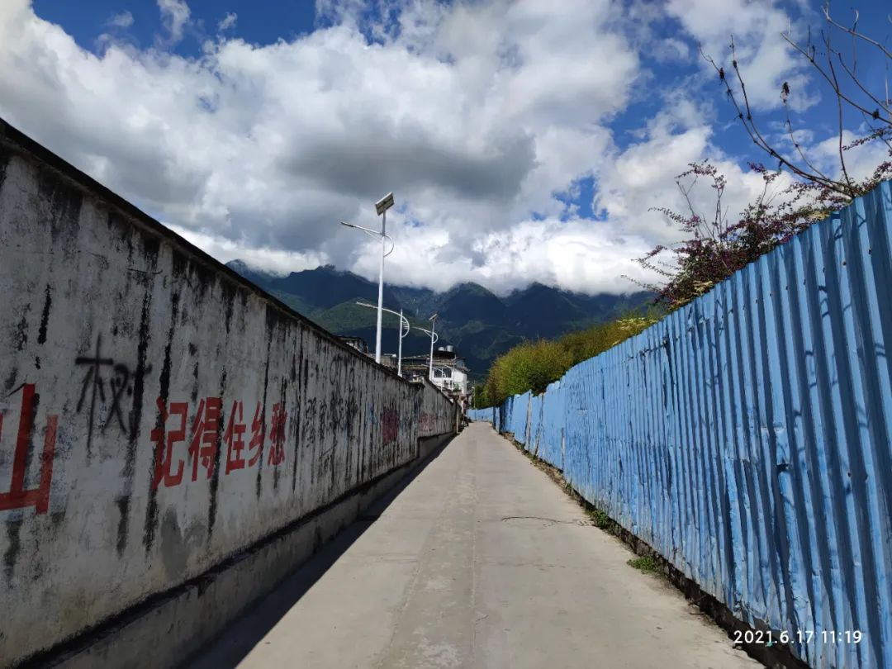
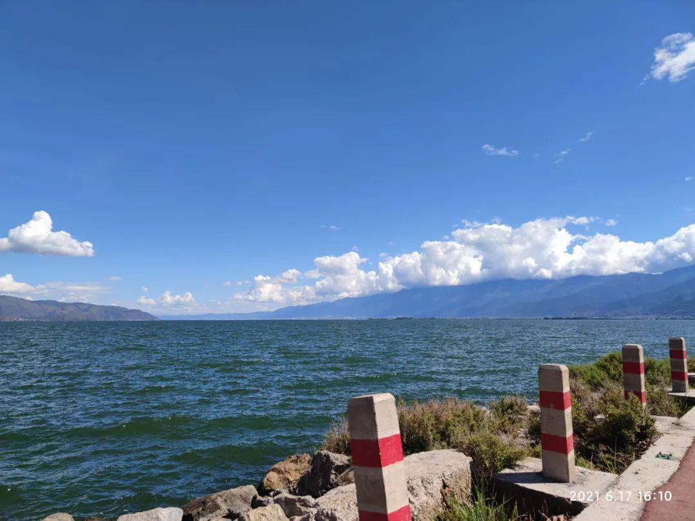
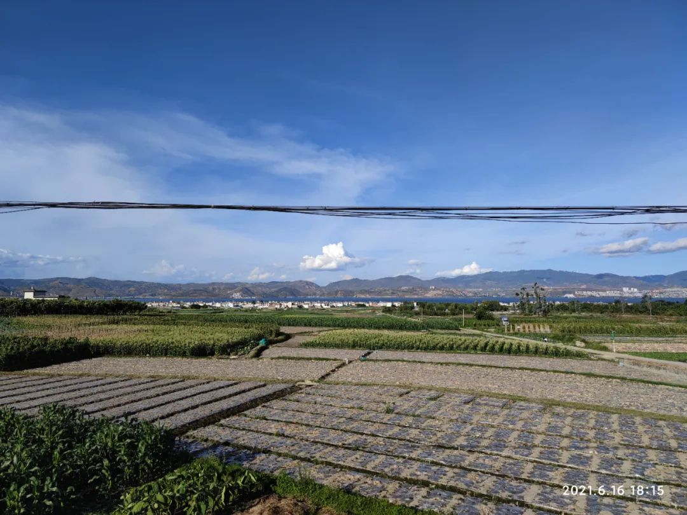
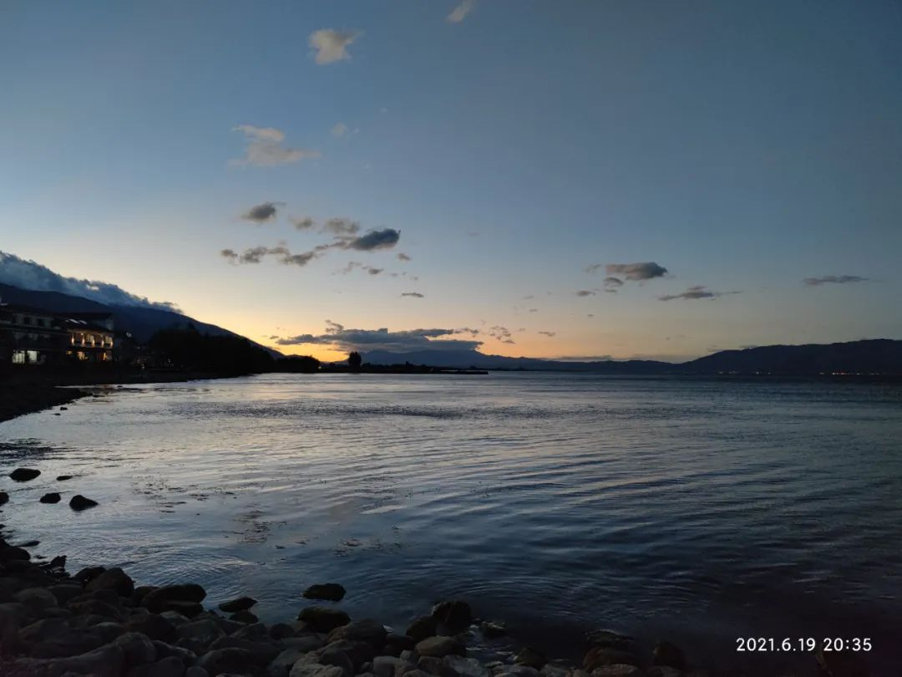

# 无标题

**链接地址:** http://mp.weixin.qq.com/s?__biz=MzI5NzQ5OTY4MQ==&mid=2247483897&idx=1&sn=3ecf94db2b2e7aee568fbbeccf34a5d3&chksm=ecb56cb7dbc2e5a12cfcdfedafbfa8d4fc807c91dccb0c9c961e609dcd1b7e2060b5f1bb50a1&mpshare=1&scene=2&srcid=0716Vro9eiYWBt2Qz3f2rsqs&sharer_sharetime=1626382699261&sharer_shareid=be1c8edd6c93eec155a61c876e41d26a#rd
**作者:** 尘
**获取时间:** 2025/8/28 19:44:32
**图片数量:** 4

---

## 原始HTML内容

 

六月忙碌了许多，再加上久治不愈的拖延症，公众号更新最终还是拖到了这最后一天。

 

 

 
<h3 data-foldable-wrapper="">
01 关于躺平

 
</h3>
本打算在月初蹭蹭热点话题，聊聊“躺平”。没蹭上。

现在热点凉了，还有想说的，就还是写写。

&nbsp;

从一开始，“两年不工作、月花二百、九零后”几个标签组合，达到了很好的传播效果。从那位“躺平大师”身上，让人看到了“佛系”的被动对抗“内卷”之外的另一种选择——主动躺下。

&nbsp;

联系到最近在思考了解的“消费主义”和“极简主义”。“躺平”的生活模式就是极端的“反消费”与“极简”。将物质欲求降到最低，舍弃近乎一切的物质享受，低成本生活。

具体到个人的生活实际中，就是抵制高房价，不买房；抵制家庭负担育儿压力，不结婚不生育；抵制资本主义物质诱惑，不消费；抵制劳动剥削职场内卷，不工作。最终从始至终形成闭环，低欲望低需求，无业自由的活着。

&nbsp;

老一辈的活法大多都比较简单，工作，然后赚到足够的钱，完成他们认为生来必然要完成的事情，达到满足平静离世。<strong>他们的对人对生活的价值判断，几乎完全凭借金钱。</strong>他们的时间几乎生来就是为了换取金钱。他们自然不会理解为何有人会为了更多空闲而放弃活得体面、正常。

但年轻人也年年增岁，一步步走向老一辈。新一代想法颇多，有些观点不合时宜，就如躺平，可也非人人都能做到无欲求。<strong>断绝人欲何其困难，甚至可以说人活着的因由有一部分就是为满足欲求。</strong>

<strong> </strong>

&nbsp;

“躺平”被传播讨论，各官媒大V也参与进来。有义正词严批评指教年轻人不该如此的，有老调重弹“X零后是垮掉的一代”的，甚至还有借此唱衰国家无望、后继无人的。当然其中也有明白人，“躺平”不过是青年们站立在冷酷现实前的自我调侃罢了。

想躺平是真的想，可躺平也是真的躺不平。

<strong>困兽绝境哀鸣，最终不也得再一搏生机。</strong>

&nbsp;

如若不是真的心清净如平镜，只是为了逃避责任、负担、压力而选择“躺平”，沦落为为了轻松自在而无欲爱无欢喜地活着，也很不值得吧。

<strong>简衣淡饭鸟鸣一二，陋居清茶书本三俩。</strong>

<strong>这样的生活想象起来是很美好，只是生命难承受如此之轻。</strong>

 

 
<h3 data-foldable-wrapper="">
02 去了大理

 
</h3>
我嘴上说着，不要躺平，身体却还是很诚实。扭头就在洱海边躺了个四平八稳。

&nbsp;

在泉州的新部门工作实在太过“内卷”，有些忍受不了的我请了年假，去了大理。

&nbsp;

从泉州出发，大理无法直达，落地昆明转车。

昆明给人的第一印象是宜居。不高不低的二十五度、不干燥不潮湿的舒适湿度，步行半天不流汗不粘腻，据说气候四季如此。春城昆明，课本诚不欺我。

昆明更靠近赤道，天黑得晚。我出地铁时已经七点多，天色还亮堂得如下午三四点。天黑得晚，也不耽误夜晚活动，几条步行街美食街，六七点天色敞亮时就开始人头攒动。

昆明借宿一夜，转天直奔大理。

&nbsp;

到了大理之后，手机和相机的相册，就染上了天蓝色。明媚的阳光，飘得低低的云朵，映衬这天空透亮明晰的蓝。

从大理站到古城的青旅，乘坐公交行驶在洱海边田野里的乡村公路上，大片大片的青绿色田地，点缀其中的楼房稀稀拉拉，洱海时而从楼房间闪现而出。车上的我们远远望着她，她在艳阳蓝天下闪耀。

&nbsp;

 

<strong>大理有种魔力，让人想就此留下，坐着躺着都好，洱海在眼前，苍山在背后，很踏实很满足。</strong>青旅里形形色色的人，有裸辞得闲来这放空的，有希望在大理找兼职做义工留下的，还有已经在这居住了几个月的无业游民。对于未来，他们或迷茫或无谓，但好像并不忧虑困扰。在大理古城里路边的街摊上，大家席地而坐，有卖小吃的、卖酒的、卖古着的、买首饰的、卖画的、卖书的、卖诗的，酒吧驻唱和街头歌手的歌声混杂着、此起彼伏，传入深夜。

我好像看到了生活在“996福报”之外的其他可能，不去参与“内卷”也不就此停滞“躺平”，可以为了小小爱好去努力试试，也可以在忙碌与闲适中寻找平衡，在取舍间贴近向往的生活。

临别前的那个黄昏，在洱海边摇摆着双腿坐着，背后是苍山，远处是不知名的山。我面朝着洱海，微风拂面，夕阳在我的左后方，映照着洱海，海面泛着微光。我手里抓着瓶“大乌苏”，目光迷离，涣散在远方。

<strong>此刻的“躺平”状态只是暂时，那自由松弛的感觉却可以永恒。</strong>

 

 
<h3 data-foldable-wrapper="">
03 尾巴

 
</h3>
关于躺平，去了大理。我们庸庸碌碌只为活着。减低所有缩小所有放下所有的“躺平”也好，奔忙不休的感受“996福报”、投身“内卷”也好，总归是要落地于“想要如何生活”这个问题上。

苏格拉底说，未经审视的人生是不值得过的。透过世俗物质的价值体系去审视，通过理性去思索人生命的终极本质，进而得到一种生活态度与方式。

可审视，或者说是思考，年未满三十的我们也难透彻明晰。环境周遭包裹着我们，世俗礼教推搡着我们。长辈们指指点点，告诉我们该如何，立着牌坊宣扬什么是“正确正常”。

这是在受锤的过程。

&nbsp;

 

想不明白，那就一直想好了。还搞不清楚想做什么，那就先弄清楚不想要什么，然后付出代价远离它们。

<strong>“躺平”或拼搏奋斗都好，提醒自己，不要偏离“理想的生活”太多就好。</strong>

<strong> </strong>

<strong> </strong>

<strong> </strong>

<strong> </strong>

<strong> </strong>

20210630 

福建泉州

 

---

## 纯文本内容

六月忙碌了许多，再加上久治不愈的拖延症，公众号更新最终还是拖到了这最后一天。01 关于躺平本打算在月初蹭蹭热点话题，聊聊“躺平”。没蹭上。现在热点凉了，还有想说的，就还是写写。 从一开始，“两年不工作、月花二百、九零后”几个标签组合，达到了很好的传播效果。从那位“躺平大师”身上，让人看到了“佛系”的被动对抗“内卷”之外的另一种选择——主动躺下。 联系到最近在思考了解的“消费主义”和“极简主义”。“躺平”的生活模式就是极端的“反消费”与“极简”。将物质欲求降到最低，舍弃近乎一切的物质享受，低成本生活。具体到个人的生活实际中，就是抵制高房价，不买房；抵制家庭负担育儿压力，不结婚不生育；抵制资本主义物质诱惑，不消费；抵制劳动剥削职场内卷，不工作。最终从始至终形成闭环，低欲望低需求，无业自由的活着。 老一辈的活法大多都比较简单，工作，然后赚到足够的钱，完成他们认为生来必然要完成的事情，达到满足平静离世。他们的对人对生活的价值判断，几乎完全凭借金钱。他们的时间几乎生来就是为了换取金钱。他们自然不会理解为何有人会为了更多空闲而放弃活得体面、正常。但年轻人也年年增岁，一步步走向老一辈。新一代想法颇多，有些观点不合时宜，就如躺平，可也非人人都能做到无欲求。断绝人欲何其困难，甚至可以说人活着的因由有一部分就是为满足欲求。 “躺平”被传播讨论，各官媒大V也参与进来。有义正词严批评指教年轻人不该如此的，有老调重弹“X零后是垮掉的一代”的，甚至还有借此唱衰国家无望、后继无人的。当然其中也有明白人，“躺平”不过是青年们站立在冷酷现实前的自我调侃罢了。想躺平是真的想，可躺平也是真的躺不平。困兽绝境哀鸣，最终不也得再一搏生机。 如若不是真的心清净如平镜，只是为了逃避责任、负担、压力而选择“躺平”，沦落为为了轻松自在而无欲爱无欢喜地活着，也很不值得吧。简衣淡饭鸟鸣一二，陋居清茶书本三俩。这样的生活想象起来是很美好，只是生命难承受如此之轻。02 去了大理我嘴上说着，不要躺平，身体却还是很诚实。扭头就在洱海边躺了个四平八稳。 在泉州的新部门工作实在太过“内卷”，有些忍受不了的我请了年假，去了大理。 从泉州出发，大理无法直达，落地昆明转车。昆明给人的第一印象是宜居。不高不低的二十五度、不干燥不潮湿的舒适湿度，步行半天不流汗不粘腻，据说气候四季如此。春城昆明，课本诚不欺我。昆明更靠近赤道，天黑得晚。我出地铁时已经七点多，天色还亮堂得如下午三四点。天黑得晚，也不耽误夜晚活动，几条步行街美食街，六七点天色敞亮时就开始人头攒动。昆明借宿一夜，转天直奔大理。 到了大理之后，手机和相机的相册，就染上了天蓝色。明媚的阳光，飘得低低的云朵，映衬这天空透亮明晰的蓝。从大理站到古城的青旅，乘坐公交行驶在洱海边田野里的乡村公路上，大片大片的青绿色田地，点缀其中的楼房稀稀拉拉，洱海时而从楼房间闪现而出。车上的我们远远望着她，她在艳阳蓝天下闪耀。 大理有种魔力，让人想就此留下，坐着躺着都好，洱海在眼前，苍山在背后，很踏实很满足。青旅里形形色色的人，有裸辞得闲来这放空的，有希望在大理找兼职做义工留下的，还有已经在这居住了几个月的无业游民。对于未来，他们或迷茫或无谓，但好像并不忧虑困扰。在大理古城里路边的街摊上，大家席地而坐，有卖小吃的、卖酒的、卖古着的、买首饰的、卖画的、卖书的、卖诗的，酒吧驻唱和街头歌手的歌声混杂着、此起彼伏，传入深夜。我好像看到了生活在“996福报”之外的其他可能，不去参与“内卷”也不就此停滞“躺平”，可以为了小小爱好去努力试试，也可以在忙碌与闲适中寻找平衡，在取舍间贴近向往的生活。临别前的那个黄昏，在洱海边摇摆着双腿坐着，背后是苍山，远处是不知名的山。我面朝着洱海，微风拂面，夕阳在我的左后方，映照着洱海，海面泛着微光。我手里抓着瓶“大乌苏”，目光迷离，涣散在远方。此刻的“躺平”状态只是暂时，那自由松弛的感觉却可以永恒。03 尾巴关于躺平，去了大理。我们庸庸碌碌只为活着。减低所有缩小所有放下所有的“躺平”也好，奔忙不休的感受“996福报”、投身“内卷”也好，总归是要落地于“想要如何生活”这个问题上。苏格拉底说，未经审视的人生是不值得过的。透过世俗物质的价值体系去审视，通过理性去思索人生命的终极本质，进而得到一种生活态度与方式。可审视，或者说是思考，年未满三十的我们也难透彻明晰。环境周遭包裹着我们，世俗礼教推搡着我们。长辈们指指点点，告诉我们该如何，立着牌坊宣扬什么是“正确正常”。这是在受锤的过程。 想不明白，那就一直想好了。还搞不清楚想做什么，那就先弄清楚不想要什么，然后付出代价远离它们。“躺平”或拼搏奋斗都好，提醒自己，不要偏离“理想的生活”太多就好。20210630福建泉州

---

## 图片列表

-  (原始链接: https://mmbiz.qpic.cn/mmbiz_jpg/YhCbICLRBqcb9cvswtqBWGoia1DKUGNVqrNfXkC0NT24Q6O4pLkjrdFJLJb5xjQcknVrFxHpIMedzeicKPbZLp8A/640?wx_fmt=jpeg)
-  (原始链接: https://mmbiz.qpic.cn/mmbiz_jpg/YhCbICLRBqcb9cvswtqBWGoia1DKUGNVq1514VkuBJpVKPsdXJB0ChN2VQVVibOgANZcXNQL1PAaETcF52Cn3VKw/640?wx_fmt=jpeg)
-  (原始链接: https://mmbiz.qpic.cn/mmbiz_jpg/YhCbICLRBqcb9cvswtqBWGoia1DKUGNVqt9KMTibzHf20HwfziaZm2ibmSvZu1f54NrAeGP6IeeSEUGNsQX5u8XkQQ/640?wx_fmt=jpeg)
-  (原始链接: https://mmbiz.qpic.cn/mmbiz_jpg/YhCbICLRBqcb9cvswtqBWGoia1DKUGNVqUjshCzJicQZTLaqyd4xg0QszrBh2vyhXvjFoZib8GvcDiaS5lf1aAUHEg/640?wx_fmt=jpeg)
