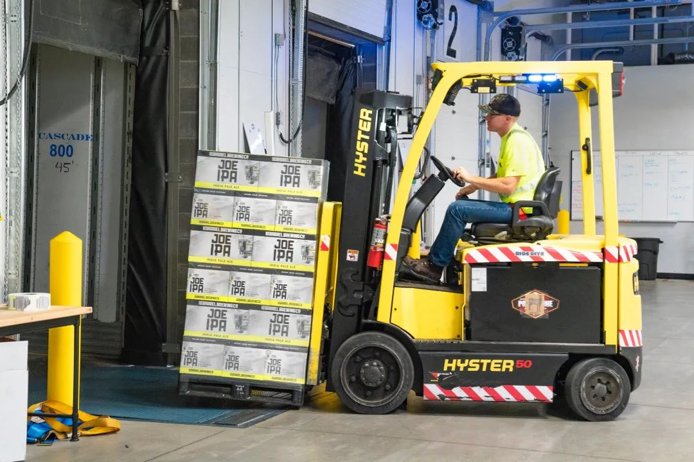

# 无标题

**链接地址:** http://mp.weixin.qq.com/s?__biz=MzI4NDYyNjAwNw==&mid=2247485074&idx=1&sn=e55758e5051aa2042e6422b7cbc6c794&chksm=ebf9dbaadc8e52bc406059d79bb98b49e992b3c0e62da5803ad136c1058934d9a137921a6710&mpshare=1&scene=2&srcid=0719CbWDuapcCqVY6RlZ9oio&sharer_sharetime=1626660007934&sharer_shareid=be1c8edd6c93eec155a61c876e41d26a#rd
**作者:** 关注我们
**获取时间:** 2025/8/28 19:44:21
**图片数量:** 22

---

## 原始HTML内容

<section style="box-sizing: border-box;font-size: 16px;"><section style="margin: 30px 0% 10px;box-sizing: border-box;" powered-by="xiumi.us"><section style="display: inline-block;width: 100%;vertical-align: top;background-color: rgb(244, 235, 229);box-sizing: border-box;"><section style="box-sizing: border-box;" powered-by="xiumi.us"><section style="display: flex;flex-flow: row nowrap;margin-top: -16px;margin-right: 0%;margin-left: 0%;text-align: left;justify-content: flex-start;transform: translate3d(18px, 0px, 0px);box-sizing: border-box;"><section style="display: inline-block;vertical-align: top;width: auto;min-width: 10%;max-width: 100%;flex: 0 0 auto;height: auto;align-self: flex-start;box-sizing: border-box;"><section style="justify-content: flex-start;margin-right: 0%;margin-left: 0%;box-sizing: border-box;" powered-by="xiumi.us"><section style="display: inline-block;width: 33px;height: 33px;vertical-align: top;overflow: hidden;background-color: rgb(237, 128, 15);border-width: 0px;border-radius: 66px;border-style: none;border-color: rgb(62, 62, 62);box-sizing: border-box;"><section style="transform: rotateZ(333deg) scale(0.6);transform-origin: left top;margin-right: -53px;margin-bottom: -27px;box-sizing: border-box;" powered-by="xiumi.us"><section style="display: flex;flex-flow: row nowrap;margin-top: 20px;margin-right: 0%;margin-left: 0%;justify-content: flex-start;transform: translate3d(5px, 0px, 0px);box-sizing: border-box;"><section style="display: inline-block;vertical-align: top;width: auto;flex: 0 0 0%;height: auto;align-self: flex-start;box-sizing: border-box;"><section style="text-align: right;margin-top: 4px;margin-right: 0%;margin-left: 0%;justify-content: flex-end;transform: translate3d(2px, 0px, 0px);box-sizing: border-box;" powered-by="xiumi.us"><section style="display: inline-block;width: 5px;height: 3px;vertical-align: top;overflow: hidden;background-color: rgb(244, 235, 229);box-sizing: border-box;"><section><svg viewBox="0 0 1 1" style="float:left;line-height:0;width:0;vertical-align:top;"></svg></section></section></section></section><section style="display: inline-block;vertical-align: top;width: auto;flex: 0 0 0%;align-self: flex-start;height: auto;box-sizing: border-box;"><section style="text-align: center;box-sizing: border-box;" powered-by="xiumi.us"><section style="display: inline-block;width: 16px;height: 16px;vertical-align: top;overflow: hidden;border-width: 3px;border-radius: 31px;border-style: solid;border-color: rgb(244, 235, 229);box-sizing: border-box;"><section><svg viewBox="0 0 1 1" style="float:left;line-height:0;width:0;vertical-align:top;"></svg></section></section></section></section><section style="display: inline-block;vertical-align: top;width: auto;flex: 0 0 0%;align-self: flex-start;height: auto;margin-right: -5px;margin-left: -5px;box-sizing: border-box;"><section style="text-align: center;margin-top: 2px;margin-right: 0%;margin-left: 0%;box-sizing: border-box;" powered-by="xiumi.us"><section style="display: inline-block;width: 16px;height: 16px;vertical-align: top;overflow: hidden;border-width: 3px;border-radius: 31px;border-style: solid;border-color: rgb(244, 235, 229) rgba(255, 255, 255, 0) rgba(255, 255, 255, 0);box-sizing: border-box;"><section><svg viewBox="0 0 1 1" style="float:left;line-height:0;width:0;vertical-align:top;"></svg></section></section></section></section><section style="display: inline-block;vertical-align: top;width: auto;flex: 0 0 0%;align-self: flex-start;height: auto;box-sizing: border-box;"><section style="text-align: center;box-sizing: border-box;" powered-by="xiumi.us"><section style="display: inline-block;width: 16px;height: 16px;vertical-align: top;overflow: hidden;border-width: 3px;border-radius: 31px;border-style: solid;border-color: rgb(244, 235, 229);box-sizing: border-box;"><section><svg viewBox="0 0 1 1" style="float:left;line-height:0;width:0;vertical-align:top;"></svg></section></section></section></section><section style="display: inline-block;vertical-align: top;width: auto;flex: 0 0 0%;height: auto;align-self: flex-start;box-sizing: border-box;"><section style="text-align: center;margin-top: 4px;margin-right: 0%;margin-left: 0%;transform: translate3d(-2px, 0px, 0px);box-sizing: border-box;" powered-by="xiumi.us"><section style="display: inline-block;width: 5px;height: 3px;vertical-align: top;overflow: hidden;background-color: rgb(244, 235, 229);box-sizing: border-box;"><section><svg viewBox="0 0 1 1" style="float:left;line-height:0;width:0;vertical-align:top;"></svg></section></section></section></section></section></section></section></section></section><section style="display: inline-block;vertical-align: top;width: auto;flex: 0 0 auto;align-self: flex-start;min-width: 10%;max-width: 100%;height: auto;box-sizing: border-box;"><section style="margin-right: 0%;margin-left: 0%;transform: translate3d(5px, 0px, 0px);justify-content: flex-start;box-sizing: border-box;" powered-by="xiumi.us"><section style="font-size: 18px;font-family: Optima-Regular, PingFangTC-light;color: rgb(84, 82, 82);letter-spacing: 1px;line-height: 2;padding-right: 7px;padding-left: 7px;box-sizing: border-box;">
<strong style="box-sizing: border-box;">点击蓝字 / 关注我们</strong>
</section></section></section></section></section></section></section><section style="box-sizing: border-box;" powered-by="xiumi.us">
 
</section><section style="box-sizing: border-box;" powered-by="xiumi.us"><section style="display: flex;flex-flow: row nowrap;box-sizing: border-box;"><section style="display: inline-block;vertical-align: bottom;width: auto;flex: 0 0 0%;height: auto;align-self: flex-end;box-sizing: border-box;"><section style="margin-right: 0%;margin-bottom: 63px;margin-left: 0%;box-sizing: border-box;" powered-by="xiumi.us"><section style="text-align: right;font-size: 42px;color: rgb(43, 65, 110);font-family: Optima-Regular, PingFangTC-light;letter-spacing: 0px;line-height: 2;padding-right: 7px;padding-left: 7px;box-sizing: border-box;">
 
</section></section><section style="text-align: left;margin-right: 0%;margin-bottom: 10px;margin-left: 0%;justify-content: flex-start;box-sizing: border-box;" powered-by="xiumi.us"><section style="max-width: 100%;vertical-align: middle;display: inline-block;line-height: 0;border-width: 0px;border-radius: 72%;border-style: none;border-color: rgb(62, 62, 62);overflow: hidden;width: 91px;height: auto;box-sizing: border-box;"></section></section></section><section style="display: inline-block;vertical-align: bottom;width: auto;flex: 100 100 0%;align-self: flex-end;height: auto;box-sizing: border-box;"><section style="text-align: center;margin: 10px 0% 63px;box-sizing: border-box;" powered-by="xiumi.us"><section style="max-width: 100%;vertical-align: middle;display: inline-block;line-height: 0;width: 82%;height: auto;box-sizing: border-box;"></section></section></section></section></section><section style="height: auto;box-sizing: border-box;" powered-by="xiumi.us"><section style="display: flex;flex-flow: row nowrap;margin: -52px 0% 26px;text-align: center;justify-content: center;transform: translate3d(-1px, 0px, 0px);-webkit-transform: translate3d(-1px, 0px, 0px);-moz-transform: translate3d(-1px, 0px, 0px);-o-transform: translate3d(-1px, 0px, 0px);box-sizing: border-box;"><section style="display: inline-block;vertical-align: middle;width: auto;min-width: 10%;max-width: 100%;flex: 0 0 auto;height: auto;align-self: center;box-sizing: border-box;"><section style="margin-right: 0%;margin-left: 0%;text-align: right;justify-content: flex-end;transform: translate3d(11px, 0px, 0px);box-sizing: border-box;" powered-by="xiumi.us"><section style="color: rgb(84, 82, 82);font-family: Optima-Regular, PingFangTC-light;line-height: 2;padding-right: 29px;padding-left: 29px;letter-spacing: 0px;box-sizing: border-box;">
<strong style="box-sizing: border-box;">加拿大常见雇佣关系解析</strong>
</section></section></section><section style="display: inline-block;vertical-align: middle;width: auto;flex: 100 100 0%;align-self: center;height: auto;box-sizing: border-box;"><section style="margin-top: 0.5em;margin-bottom: 0.5em;box-sizing: border-box;" powered-by="xiumi.us"><section style="background-color: rgb(226, 207, 188);height: 3px;box-sizing: border-box;"><section><svg viewBox="0 0 1 1" style="float:left;line-height:0;width:0;vertical-align:top;"></svg></section></section></section></section></section></section><section style="font-size: 14px;color: rgb(121, 121, 121);padding-right: 15px;padding-left: 15px;line-height: 2;letter-spacing: 2px;box-sizing: border-box;" powered-by="xiumi.us">
 

 

随着加拿大各市的逐步解禁，被疫情影响了事业发展和职业规划的小伙伴们，在这个火热的求职季，更是<strong style="box-sizing: border-box;">摩拳擦掌，铆足了劲儿</strong>地海投简历，准备面试，积极参加职场社交活动。

 

然而现实或许有点冰冷：那些大部分人争取的，传统稳定的<strong style="box-sizing: border-box;">永久全职职位</strong>似乎很难找到；而求职市场上却充斥着大量<strong style="box-sizing: border-box;"> Part-Time 和 Contract </strong>职位。这是为什么呢？

 
</section><section style="text-align: center;margin-top: 10px;margin-bottom: 10px;box-sizing: border-box;" powered-by="xiumi.us"><section style="max-width: 100%;vertical-align: middle;display: inline-block;line-height: 0;box-sizing: border-box;"></section></section><section style="font-size: 14px;color: rgb(121, 121, 121);padding-right: 15px;padding-left: 15px;line-height: 2;letter-spacing: 2px;box-sizing: border-box;" powered-by="xiumi.us">
 

加拿大的雇主们在疫情不断反复地<strong style="box-sizing: border-box;">“教育”</strong>下，体会到了裁员的苦衷和拥有不同类型雇佣模式员工的好处；而被疫情<strong style="box-sizing: border-box;">“养懒”</strong>了的加拿大人，也开始寻求<strong style="box-sizing: border-box;">更灵活多样，更抗风险的</strong>工作方式。

 

没错，加拿大的职场雇佣关系随着疫情的影响和经济发展正在进行着一次<strong style="box-sizing: border-box;">重大变革</strong>！雇主和雇员们都在主动或被动地进入这样雇佣关系的<strong style="box-sizing: border-box;">调整期</strong>。然而，作为求职者的我们，是否真的了解加拿大常见的雇佣方式呢？

 
</section><section style="text-align: center;margin-top: 10px;margin-bottom: 10px;box-sizing: border-box;" powered-by="xiumi.us"><section style="max-width: 100%;vertical-align: middle;display: inline-block;line-height: 0;box-sizing: border-box;"></section></section><section style="font-size: 14px;color: rgb(121, 121, 121);padding-right: 15px;padding-left: 15px;line-height: 2;letter-spacing: 2px;box-sizing: border-box;" powered-by="xiumi.us">
 

今天，我们将对比加拿大常见<strong style="box-sizing: border-box;">6大雇佣模式的</strong><strong style="box-sizing: border-box;">特点</strong>，并提出适合人群的工作建议。对自己职场发展方向不明朗的朋友们请仔细阅读收藏，不仅能帮助你更<strong style="box-sizing: border-box;">了解加拿大的职场运作</strong>，也会引导你找到<strong style="box-sizing: border-box;">最适合自己的工作模式</strong>哦！

 
</section><section style="box-sizing: border-box;" powered-by="xiumi.us">
 
</section><section style="margin: 10px 0% 5px;box-sizing: border-box;" powered-by="xiumi.us"><section style="font-size: 30px;color: rgb(206, 228, 249);font-family: Optima-Regular, PingFangTC-light;line-height: 1;letter-spacing: 0px;box-sizing: border-box;">
<strong style="box-sizing: border-box;">No.1&nbsp;永久全职岗位</strong>
</section></section><section style="margin-right: 0%;margin-left: 0%;text-align: left;justify-content: flex-start;box-sizing: border-box;" powered-by="xiumi.us"><section style="display: inline-block;width: auto;vertical-align: top;background-color: rgb(194, 218, 241);min-width: 10%;max-width: 100%;height: auto;box-sizing: border-box;"><section style="margin-right: 0%;margin-left: 0%;box-sizing: border-box;" powered-by="xiumi.us"><section style="text-align: justify;font-family: Optima-Regular, PingFangTC-light;color: rgb(255, 255, 255);font-size: 12px;padding-right: 3px;padding-left: 3px;line-height: 1.4;letter-spacing: 0px;box-sizing: border-box;">
<strong style="box-sizing: border-box;">Permanent Full-time Job</strong>
</section></section></section></section><section style="font-size: 14px;color: rgb(121, 121, 121);padding-right: 15px;padding-left: 15px;line-height: 2;letter-spacing: 2px;box-sizing: border-box;" powered-by="xiumi.us">
 

<strong style="box-sizing: border-box;">永久全职（Permanent Full-time）</strong>，也就是俗称的<strong style="box-sizing: border-box;">“铁饭碗”</strong>，指没有合同截止时间且作为全职员工工作的雇佣关系。是加拿大最常见的雇佣形式，也是<strong style="box-sizing: border-box;">大部分求职者比较倾向的一种雇佣形式</strong>。

 
</section><section style="text-align: center;margin-top: 10px;margin-bottom: 10px;box-sizing: border-box;" powered-by="xiumi.us"><section style="max-width: 100%;vertical-align: middle;display: inline-block;line-height: 0;box-sizing: border-box;"></section></section><section style="font-size: 14px;color: rgb(121, 121, 121);padding-right: 15px;padding-left: 15px;line-height: 2;letter-spacing: 2px;box-sizing: border-box;" powered-by="xiumi.us">
 

这种雇佣方式被大家追捧的原因那自是非常多啦。首先，通常永久全职的职位拥有<strong style="box-sizing: border-box;">较稳定的工作薪资和工作日程安排</strong>；

 

公司通常会提供包括<strong style="box-sizing: border-box;"> EI（Employment Insurance，就业保险）、</strong>

<strong style="box-sizing: border-box;">CPP（Canada Pension Plans&nbsp;，退休金）、Paid Timeoff （带薪假期）和更多职业培训发展机会</strong>。

 

这对于从事传统行业和职位的朋友们，从个人职业规划和事业发展上来说自然是<strong style="box-sizing: border-box;">最稳妥的选择</strong>。

 
</section><section style="text-align: center;margin-top: 10px;margin-bottom: 10px;box-sizing: border-box;" powered-by="xiumi.us"><section style="max-width: 100%;vertical-align: middle;display: inline-block;line-height: 0;box-sizing: border-box;"></section></section><section style="font-size: 14px;color: rgb(121, 121, 121);padding-right: 15px;padding-left: 15px;line-height: 2;letter-spacing: 2px;box-sizing: border-box;" powered-by="xiumi.us">
 

但近些年这样的工作岗位却变得越来越少，因为雇主在提供大量福利和培训的同时，也需要提供足够的工时和工作量去支撑员工的薪水发放，这让经历如疫情等<strong style="box-sizing: border-box;">特殊时期</strong>或<strong style="box-sizing: border-box;">公司业务不太稳定</strong>的雇主感到为难。

 

 
</section><section style="margin: 10px 0% 5px;box-sizing: border-box;" powered-by="xiumi.us"><section style="font-size: 30px;color: rgb(206, 228, 249);font-family: Optima-Regular, PingFangTC-light;line-height: 1;letter-spacing: 0px;box-sizing: border-box;">
<strong style="box-sizing: border-box;">No.2&nbsp;永久兼职岗位</strong>
</section></section><section style="margin-right: 0%;margin-left: 0%;text-align: left;justify-content: flex-start;box-sizing: border-box;" powered-by="xiumi.us"><section style="display: inline-block;width: auto;vertical-align: top;background-color: rgb(194, 218, 241);min-width: 10%;max-width: 100%;height: auto;box-sizing: border-box;"><section style="margin-right: 0%;margin-left: 0%;box-sizing: border-box;" powered-by="xiumi.us"><section style="text-align: justify;font-family: Optima-Regular, PingFangTC-light;color: rgb(255, 255, 255);font-size: 12px;padding-right: 3px;padding-left: 3px;line-height: 1.4;letter-spacing: 0px;box-sizing: border-box;">
<strong style="box-sizing: border-box;">Permanent Part-time Job</strong>
</section></section></section></section><section style="font-size: 14px;color: rgb(121, 121, 121);padding-right: 15px;padding-left: 15px;line-height: 2;letter-spacing: 2px;box-sizing: border-box;" powered-by="xiumi.us">
 

于是在时间安排上更加灵活的<strong style="box-sizing: border-box;">永久兼职岗位（Permanent Part-time Job）</strong>走入了许多雇主的视野。

 
</section><section style="text-align: center;margin-top: 10px;margin-bottom: 10px;box-sizing: border-box;" powered-by="xiumi.us"><section style="max-width: 100%;vertical-align: middle;display: inline-block;line-height: 0;box-sizing: border-box;"></section></section><section style="font-size: 14px;color: rgb(121, 121, 121);padding-right: 15px;padding-left: 15px;line-height: 2;letter-spacing: 2px;box-sizing: border-box;" powered-by="xiumi.us">
 

这种指没有合同截止时间且作为兼职员工工作的雇佣关系在加拿大也十分常见。雇主<strong style="box-sizing: border-box;">无需保证员工每周基础至少30小时（或等同）的工作时间</strong>，而是可以根据公司的业务量及时调整安排，当然在福利上也不一定按照永久全职员工的标准给予。

 

这样的雇佣关系也受到部分求职者的青睐，特别是有家人需要照顾，有学业需要兼顾，或者拥有超过一份工作，但又想有一份比较稳定收入来源作为依靠的雇员。

 
</section><section style="font-size: 14px;color: rgb(121, 121, 121);padding-right: 15px;padding-left: 15px;line-height: 2;letter-spacing: 2px;box-sizing: border-box;" powered-by="xiumi.us">
 
</section><section style="margin: 10px 0% 5px;box-sizing: border-box;" powered-by="xiumi.us"><section style="font-size: 30px;color: rgb(206, 228, 249);font-family: Optima-Regular, PingFangTC-light;line-height: 1;letter-spacing: 0px;box-sizing: border-box;">
<strong style="box-sizing: border-box;">No.3&nbsp;临时全职岗位</strong>
</section></section><section style="margin-right: 0%;margin-left: 0%;text-align: left;justify-content: flex-start;box-sizing: border-box;" powered-by="xiumi.us"><section style="display: inline-block;width: auto;vertical-align: top;background-color: rgb(194, 218, 241);min-width: 10%;max-width: 100%;height: auto;box-sizing: border-box;"><section style="margin-right: 0%;margin-left: 0%;box-sizing: border-box;" powered-by="xiumi.us"><section style="text-align: justify;font-family: Optima-Regular, PingFangTC-light;color: rgb(255, 255, 255);font-size: 12px;padding-right: 3px;padding-left: 3px;line-height: 1.4;letter-spacing: 0px;box-sizing: border-box;">
<strong style="box-sizing: border-box;">Temporary Full-time Job</strong>
</section></section></section></section><section style="font-size: 14px;color: rgb(121, 121, 121);padding-right: 15px;padding-left: 15px;line-height: 2;letter-spacing: 2px;box-sizing: border-box;" powered-by="xiumi.us">
 

临时全职岗位通常是指具<strong style="box-sizing: border-box;">有明确合同截止时间</strong>或以<strong style="box-sizing: border-box;">完成某项任务/工作</strong>为合同截止时间的全职雇佣形式。

 
</section><section style="text-align: center;margin-top: 10px;margin-bottom: 10px;box-sizing: border-box;" powered-by="xiumi.us"><section style="max-width: 100%;vertical-align: middle;display: inline-block;line-height: 0;box-sizing: border-box;"></section></section><section style="font-size: 14px;color: rgb(121, 121, 121);padding-right: 15px;padding-left: 15px;line-height: 2;letter-spacing: 2px;box-sizing: border-box;" powered-by="xiumi.us">
 

这样的雇佣方式会给雇主提供较灵活的工作安排空间。比如，公司的一个永久全职员工因病或因孕产休假，公司这时候就可以招聘一个临时全职员工的岗位，去<strong style="box-sizing: border-box;">接替休假员工的工作任务</strong>。

 

临时员工通常不会获得永久员工这样丰富多样的企业福利。但对于部分产业和工种的雇员来说，却是十分常见的雇佣模式。

 
</section><section style="text-align: center;margin-top: 10px;margin-bottom: 10px;box-sizing: border-box;" powered-by="xiumi.us"><section style="max-width: 100%;vertical-align: middle;display: inline-block;line-height: 0;box-sizing: border-box;"></section></section><section style="font-size: 14px;color: rgb(121, 121, 121);padding-right: 15px;padding-left: 15px;line-height: 2;letter-spacing: 2px;box-sizing: border-box;" powered-by="xiumi.us">
 

比如<strong style="box-sizing: border-box;">旅游区的服务人员、从事农林牧渔产业的季节性工人，还有在油田矿井项目中工作的雇员</strong>等。他们通常只需要在每年的特定时间或者特定的项目周期工作。

 

这种工作的好处还包括给<strong style="box-sizing: border-box;">没有太多工作经验</strong>的朋友，或者重返职场的朋友一个很好的<strong style="box-sizing: border-box;">锻炼和积累的平台</strong>。虽然在财务上不能给员工带来太多稳定感，附加一定的再求职时间成本，但在工作安排上带给他们更多的自由度，因此也受到许多<strong style="box-sizing: border-box;">“佛系”打工人</strong>的热爱。

 
</section><section style="font-size: 14px;color: rgb(121, 121, 121);padding-right: 15px;padding-left: 15px;line-height: 2;letter-spacing: 2px;box-sizing: border-box;" powered-by="xiumi.us">
 
</section><section style="margin: 10px 0% 5px;box-sizing: border-box;" powered-by="xiumi.us"><section style="font-size: 30px;color: rgb(206, 228, 249);font-family: Optima-Regular, PingFangTC-light;line-height: 1;letter-spacing: 0px;box-sizing: border-box;">
<strong style="box-sizing: border-box;">No.4&nbsp;临时兼职工</strong>
</section></section><section style="margin-right: 0%;margin-left: 0%;text-align: left;justify-content: flex-start;box-sizing: border-box;" powered-by="xiumi.us"><section style="display: inline-block;width: auto;vertical-align: top;background-color: rgb(194, 218, 241);min-width: 10%;max-width: 100%;height: auto;box-sizing: border-box;"><section style="margin-right: 0%;margin-left: 0%;box-sizing: border-box;" powered-by="xiumi.us"><section style="text-align: justify;font-family: Optima-Regular, PingFangTC-light;color: rgb(255, 255, 255);font-size: 12px;padding-right: 3px;padding-left: 3px;line-height: 1.4;letter-spacing: 0px;box-sizing: border-box;">
<strong style="box-sizing: border-box;">Temporary Part-time Job</strong>
</section></section></section></section><section style="font-size: 14px;color: rgb(121, 121, 121);padding-right: 15px;padding-left: 15px;line-height: 2;letter-spacing: 2px;box-sizing: border-box;" powered-by="xiumi.us">
 

和临时全职工相似的雇佣关系，只是雇主无需为该雇佣关系下的雇员保证工时的安排，当然福利什么的也不要指望啦。

 

觉得这样的工作形式很不稳定可靠，肯定没人愿意去做？<strong style="box-sizing: border-box;">非也！</strong>这种雇佣模式的应用场景其实很多：

 
</section><section style="text-align: center;margin-top: 10px;margin-bottom: 10px;box-sizing: border-box;" powered-by="xiumi.us"><section style="max-width: 100%;vertical-align: middle;display: inline-block;line-height: 0;box-sizing: border-box;"></section></section><section style="font-size: 14px;color: rgb(121, 121, 121);padding-right: 15px;padding-left: 15px;line-height: 2;letter-spacing: 2px;box-sizing: border-box;" powered-by="xiumi.us">
 

比如一些可能正在上学或者正在工作过渡期间的朋友想在假期或者闲暇时间赚取点<strong style="box-sizing: border-box;">“外快”</strong>，就可以通过和雇主签订这样雇佣方式的工作合同去达到这一目的。

 

或者一些朋友对某些工作领域<strong style="box-sizing: border-box;">感兴趣，想进行尝试</strong>但又不确定，或者不愿意一直在这个领域工作，临时兼职工就是一个可行的选择。

 

这样的工作方式可以让你获取额外的工作经验，开拓自己的职场可能性，拥有更多个人时间的同时赚取一定的酬劳，给自己和雇主都提供了极大的灵活度。

 

 
</section><section style="margin: 10px 0% 5px;box-sizing: border-box;" powered-by="xiumi.us"><section style="font-size: 30px;color: rgb(206, 228, 249);font-family: Optima-Regular, PingFangTC-light;line-height: 1;letter-spacing: 0px;box-sizing: border-box;">
<strong style="box-sizing: border-box;">No.5 “待机模式”</strong>
</section></section><section style="margin-right: 0%;margin-left: 0%;text-align: left;justify-content: flex-start;box-sizing: border-box;" powered-by="xiumi.us"><section style="display: inline-block;width: auto;vertical-align: top;background-color: rgb(194, 218, 241);min-width: 10%;max-width: 100%;height: auto;box-sizing: border-box;"><section style="margin-right: 0%;margin-left: 0%;box-sizing: border-box;" powered-by="xiumi.us"><section style="text-align: justify;font-family: Optima-Regular, PingFangTC-light;color: rgb(255, 255, 255);font-size: 12px;padding-right: 3px;padding-left: 3px;line-height: 1.4;letter-spacing: 0px;box-sizing: border-box;">
<strong style="box-sizing: border-box;">“On-Call”</strong>
</section></section></section></section><section style="font-size: 14px;color: rgb(121, 121, 121);padding-right: 15px;padding-left: 15px;line-height: 2;letter-spacing: 2px;box-sizing: border-box;" powered-by="xiumi.us">
 

还能有更灵活的雇佣方式？！没错，那就是“On-Call”。

 

单独把这一工作模式拎出来说的原因是这种雇佣模式和上面临时兼职工有着<strong style="box-sizing: border-box;">工作时间安排</strong>和<strong style="box-sizing: border-box;">资薪标准</strong>上的不同。

 
</section><section style="text-align: center;margin-top: 10px;margin-bottom: 10px;box-sizing: border-box;" powered-by="xiumi.us"><section style="max-width: 100%;vertical-align: middle;display: inline-block;line-height: 0;box-sizing: border-box;"></section></section><section style="font-size: 14px;color: rgb(121, 121, 121);padding-right: 15px;padding-left: 15px;line-height: 2;letter-spacing: 2px;box-sizing: border-box;" powered-by="xiumi.us">
 

通常临时兼职工会提前至少一日知道一段时间内的工作日程安排；但On-Call模式却是雇员在接到工作或任务的即刻就需要开工。

 

虽然On-Call通常会作为某些工种及产业（如医疗和餐饮）在普通雇佣方式基础上的一种<strong style="box-sizing: border-box;">附加工作模式</strong>，但近些年来（特别是疫情期间），越来越多的人开始<strong style="box-sizing: border-box;">“全职”做起了On-Call</strong>工作。

 

最常见的例子就是外卖平台的送餐员。从雇员上线应用程序准备接单就开始就进入了On-Call模式，但<strong style="box-sizing: border-box;">何时能接到任务和每一项任务能赚取多少佣金，雇主都不予以保证</strong>。

 

虽然几乎没有“福利”和职业上升通道，但这样对雇主和雇员都意味着<strong style="box-sizing: border-box;">最大化的灵活性</strong>。<strong style="box-sizing: border-box;">“想多赚钱就多干，想休息就随时下线”</strong>的工作模式也正符合许多<strong style="box-sizing: border-box;">“躺平随性派”</strong>朋友的生活理念。

 

 
</section><section style="margin: 10px 0% 5px;box-sizing: border-box;" powered-by="xiumi.us"><section style="font-size: 30px;color: rgb(206, 228, 249);font-family: Optima-Regular, PingFangTC-light;line-height: 1;letter-spacing: 0px;box-sizing: border-box;">
<strong style="box-sizing: border-box;">No.6&nbsp;独立合同工</strong>
</section></section><section style="margin-right: 0%;margin-left: 0%;text-align: left;justify-content: flex-start;box-sizing: border-box;" powered-by="xiumi.us"><section style="display: inline-block;width: auto;vertical-align: top;background-color: rgb(194, 218, 241);min-width: 10%;max-width: 100%;height: auto;box-sizing: border-box;"><section style="margin-right: 0%;margin-left: 0%;box-sizing: border-box;" powered-by="xiumi.us"><section style="text-align: justify;font-family: Optima-Regular, PingFangTC-light;color: rgb(255, 255, 255);font-size: 12px;padding-right: 3px;padding-left: 3px;line-height: 1.4;letter-spacing: 0px;box-sizing: border-box;">
<strong style="box-sizing: border-box;">Independent Contractor</strong>
</section></section></section></section><section style="font-size: 14px;color: rgb(121, 121, 121);padding-right: 15px;padding-left: 15px;line-height: 2;letter-spacing: 2px;box-sizing: border-box;" powered-by="xiumi.us">
 

这种合同严格上来说并非雇佣合同，而是商业合作关系。
</section><section style="text-align: center;margin-top: 10px;margin-bottom: 10px;box-sizing: border-box;" powered-by="xiumi.us"><section style="max-width: 100%;vertical-align: middle;display: inline-block;line-height: 0;box-sizing: border-box;"></section></section><section style="font-size: 14px;color: rgb(121, 121, 121);padding-right: 15px;padding-left: 15px;line-height: 2;letter-spacing: 2px;box-sizing: border-box;" powered-by="xiumi.us">
 

但会放在这篇文章里提到，是因为随着<strong style="box-sizing: border-box;">“Gig Economy（零工经济）”</strong>的流行，这些年在加拿大从事独立合同工作的人数激增，不失为一种时下流行的工作模式。

 

为公司提供外包服务的Freelancer<strong style="box-sizing: border-box;">（自由职业者）</strong>，提供一对一技能培训服务的家教，帮助你维护房屋的私人修理工和打扫的家政…这些以<strong style="box-sizing: border-box;">自雇形式</strong>提供服务的工作者通常属于这个范畴。

 
</section><section style="text-align: center;margin-top: 10px;margin-bottom: 10px;box-sizing: border-box;" powered-by="xiumi.us"><section style="max-width: 100%;vertical-align: middle;display: inline-block;line-height: 0;box-sizing: border-box;"></section></section><section style="font-size: 14px;color: rgb(121, 121, 121);padding-right: 15px;padding-left: 15px;line-height: 2;letter-spacing: 2px;box-sizing: border-box;" powered-by="xiumi.us">
 

<strong style="box-sizing: border-box;">“不为特定老板打工”</strong>听起来是不是很爽？独立合同工作制度带给工作者极大的时间和任务安排灵活度，但也给从业者带来较大的<strong style="box-sizing: border-box;">经济不稳定性和职业规划困扰</strong>。

 

所以许多人将这样的工作方式作为自己的<strong style="box-sizing: border-box;">“副业”</strong>开始经营。我们在过去的专题文章中曾经邀请了四位自由职业从业者讲述他们的职业心得，请感兴趣的朋友们点击文章进一步了解：

 
</section><section style="margin: 10px 0%;box-sizing: border-box;" powered-by="xiumi.us"><section style="display: inline-block;width: 100%;vertical-align: top;box-shadow: rgb(0, 0, 0) 0px 0px 0px;background-color: rgb(241, 241, 241);padding: 10px;box-sizing: border-box;"><section style="text-align: center;justify-content: center;box-sizing: border-box;" powered-by="xiumi.us"><section style="display: inline-block;width: 100%;vertical-align: top;background-color: rgb(255, 255, 255);padding: 20px 10px;height: auto;box-shadow: rgb(198, 198, 198) 0px 0px 2px;border-width: 0px;border-radius: 6px;border-style: none;border-color: rgb(62, 62, 62);overflow: hidden;box-sizing: border-box;"><section style="text-align: justify;color: rgb(189, 189, 189);box-sizing: border-box;" powered-by="xiumi.us">
<strong style="box-sizing: border-box;">点击阅读</strong>
</section><section style="text-align: justify;box-sizing: border-box;" powered-by="xiumi.us">
 
</section><section style="box-sizing: border-box;" powered-by="xiumi.us"><section style="display: flex;flex-flow: row nowrap;margin-right: 0%;margin-left: 0%;box-sizing: border-box;"><section style="display: inline-block;vertical-align: top;width: auto;flex: 100 100 0%;align-self: flex-start;height: auto;box-shadow: rgb(0, 0, 0) 0px 0px 0px;border-bottom: 1px dashed rgba(106, 106, 106, 0.25);border-bottom-right-radius: 0px;margin-right: 10px;box-sizing: border-box;"><section style="text-align: justify;font-size: 14px;box-sizing: border-box;" powered-by="xiumi.us">
<a target="_blank" href="http://mp.weixin.qq.com/s?__biz=MzI4NDYyNjAwNw==&amp;mid=2247484386&amp;idx=1&amp;sn=49a66242a8ee6ce7366917376209c015&amp;chksm=ebf9dedadc8e57ccb189b1a89481a48c0edfe11456d2ab8ee7e23234bcccc9890755a4027aed&amp;scene=21#wechat_redirect" textvalue="热门专题 | 自由职业真香吗？对话四位自由职业从业者。" data-itemshowtype="0" tab="innerlink" data-linktype="2">热门专题 | 自由职业真香吗？对话四位自由职业从业者。</a>
</section></section><section style="display: inline-block;vertical-align: top;width: auto;flex: 20 20 0%;align-self: flex-start;height: auto;border-width: 0px;margin-left: 5px;box-sizing: border-box;"><section style="margin-right: 0%;margin-left: 0%;box-sizing: border-box;" powered-by="xiumi.us"><section style="max-width: 100%;vertical-align: middle;display: inline-block;line-height: 0;box-shadow: rgb(0, 0, 0) 0px 0px 0px;box-sizing: border-box;"><a target="_blank" href="http://mp.weixin.qq.com/s?__biz=MzI4NDYyNjAwNw==&amp;mid=2247484386&amp;idx=1&amp;sn=49a66242a8ee6ce7366917376209c015&amp;chksm=ebf9dedadc8e57ccb189b1a89481a48c0edfe11456d2ab8ee7e23234bcccc9890755a4027aed&amp;scene=21#wechat_redirect" textvalue="你已选中了添加链接的内容" data-itemshowtype="0" tab="innerlink" data-linktype="1"></a></section></section></section></section></section><section style="text-align: justify;box-sizing: border-box;" powered-by="xiumi.us">
 
</section><section style="box-sizing: border-box;" powered-by="xiumi.us"><section style="display: flex;flex-flow: row nowrap;margin-right: 0%;margin-left: 0%;box-sizing: border-box;"><section style="display: inline-block;vertical-align: top;width: auto;flex: 100 100 0%;align-self: flex-start;height: auto;box-shadow: rgb(0, 0, 0) 0px 0px 0px;border-bottom: 1px dashed rgba(106, 106, 106, 0.25);border-bottom-right-radius: 0px;margin-right: 10px;box-sizing: border-box;"><section style="text-align: justify;font-size: 14px;box-sizing: border-box;" powered-by="xiumi.us">
<a target="_blank" href="http://mp.weixin.qq.com/s?__biz=MzI4NDYyNjAwNw==&amp;mid=2247484736&amp;idx=1&amp;sn=d3a6cb1b970fa66694f60ba37a3fdcb6&amp;chksm=ebf9d878dc8e516edd075a0ad559eab20b7f05d1ff8c6591aa2c4d522cff9f090049d8f5dded&amp;scene=21#wechat_redirect" textvalue="搞副业也能起飞！“身兼数职”正流行，如何开启我的斜杠人生？" data-itemshowtype="0" tab="innerlink" data-linktype="2">搞副业也能起飞！“身兼数职”正流行，如何开启我的斜杠人生？</a>
</section></section><section style="display: inline-block;vertical-align: top;width: auto;flex: 20 20 0%;align-self: flex-start;height: auto;border-width: 0px;margin-left: 5px;box-sizing: border-box;"><section style="margin-right: 0%;margin-left: 0%;box-sizing: border-box;" powered-by="xiumi.us"><section style="max-width: 100%;vertical-align: middle;display: inline-block;line-height: 0;box-sizing: border-box;"><a target="_blank" href="http://mp.weixin.qq.com/s?__biz=MzI4NDYyNjAwNw==&amp;mid=2247484736&amp;idx=1&amp;sn=d3a6cb1b970fa66694f60ba37a3fdcb6&amp;chksm=ebf9d878dc8e516edd075a0ad559eab20b7f05d1ff8c6591aa2c4d522cff9f090049d8f5dded&amp;scene=21#wechat_redirect" textvalue="你已选中了添加链接的内容" data-itemshowtype="0" tab="innerlink" data-linktype="1"></a></section></section></section></section></section></section></section></section></section><section style="font-size: 14px;color: rgb(121, 121, 121);padding-right: 15px;padding-left: 15px;line-height: 2;letter-spacing: 2px;box-sizing: border-box;" powered-by="xiumi.us">
 
</section><section style="margin: 30px 0% 10px;box-sizing: border-box;" powered-by="xiumi.us"><section style="display: inline-block;width: 100%;vertical-align: top;background-color: rgb(244, 235, 229);box-sizing: border-box;"><section style="text-align: center;justify-content: center;margin-top: -17px;margin-right: 0%;margin-left: 0%;box-sizing: border-box;" powered-by="xiumi.us"><section style="display: inline-block;width: 33px;height: 33px;vertical-align: top;overflow: hidden;background-color: rgb(43, 65, 110);border-width: 0px;border-radius: 66px;border-style: none;border-color: rgb(62, 62, 62);box-sizing: border-box;"><section style="transform: rotateZ(333deg) scale(0.6);transform-origin: left top;margin-right: -53px;margin-bottom: -27px;box-sizing: border-box;" powered-by="xiumi.us"><section style="display: flex;flex-flow: row nowrap;margin-top: 20px;margin-right: 0%;margin-left: 0%;text-align: left;justify-content: flex-start;transform: translate3d(5px, 0px, 0px);box-sizing: border-box;"><section style="display: inline-block;vertical-align: top;width: auto;flex: 0 0 0%;height: auto;align-self: flex-start;box-sizing: border-box;"><section style="text-align: right;margin-top: 4px;margin-right: 0%;margin-left: 0%;justify-content: flex-end;transform: translate3d(2px, 0px, 0px);box-sizing: border-box;" powered-by="xiumi.us"><section style="display: inline-block;width: 5px;height: 3px;vertical-align: top;overflow: hidden;background-color: rgb(244, 235, 229);box-sizing: border-box;"><section><svg viewBox="0 0 1 1" style="float:left;line-height:0;width:0;vertical-align:top;"></svg></section></section></section></section><section style="display: inline-block;vertical-align: top;width: auto;flex: 0 0 0%;align-self: flex-start;height: auto;box-sizing: border-box;"><section style="text-align: center;box-sizing: border-box;" powered-by="xiumi.us"><section style="display: inline-block;width: 16px;height: 16px;vertical-align: top;overflow: hidden;border-width: 3px;border-radius: 31px;border-style: solid;border-color: rgb(244, 235, 229);box-sizing: border-box;"><section><svg viewBox="0 0 1 1" style="float:left;line-height:0;width:0;vertical-align:top;"></svg></section></section></section></section><section style="display: inline-block;vertical-align: top;width: auto;flex: 0 0 0%;align-self: flex-start;height: auto;margin-right: -5px;margin-left: -5px;box-sizing: border-box;"><section style="text-align: center;margin-top: 2px;margin-right: 0%;margin-left: 0%;box-sizing: border-box;" powered-by="xiumi.us"><section style="display: inline-block;width: 16px;height: 16px;vertical-align: top;overflow: hidden;border-width: 3px;border-radius: 31px;border-style: solid;border-color: rgb(244, 235, 229) rgba(255, 255, 255, 0) rgba(255, 255, 255, 0);box-sizing: border-box;"><section><svg viewBox="0 0 1 1" style="float:left;line-height:0;width:0;vertical-align:top;"></svg></section></section></section></section><section style="display: inline-block;vertical-align: top;width: auto;flex: 0 0 0%;align-self: flex-start;height: auto;box-sizing: border-box;"><section style="text-align: center;box-sizing: border-box;" powered-by="xiumi.us"><section style="display: inline-block;width: 16px;height: 16px;vertical-align: top;overflow: hidden;border-width: 3px;border-radius: 31px;border-style: solid;border-color: rgb(244, 235, 229);box-sizing: border-box;"><section><svg viewBox="0 0 1 1" style="float:left;line-height:0;width:0;vertical-align:top;"></svg></section></section></section></section><section style="display: inline-block;vertical-align: top;width: auto;flex: 0 0 0%;height: auto;align-self: flex-start;box-sizing: border-box;"><section style="text-align: center;margin-top: 4px;margin-right: 0%;margin-left: 0%;transform: translate3d(-2px, 0px, 0px);box-sizing: border-box;" powered-by="xiumi.us"><section style="display: inline-block;width: 5px;height: 3px;vertical-align: top;overflow: hidden;background-color: rgb(244, 235, 229);box-sizing: border-box;"><section><svg viewBox="0 0 1 1" style="float:left;line-height:0;width:0;vertical-align:top;"></svg></section></section></section></section></section></section></section></section></section></section><section style="text-align: center;margin-top: 10px;margin-bottom: 10px;box-sizing: border-box;" powered-by="xiumi.us"><section style="max-width: 100%;vertical-align: middle;display: inline-block;line-height: 0;box-sizing: border-box;"></section></section><section style="font-size: 14px;color: rgb(121, 121, 121);padding-right: 15px;padding-left: 15px;line-height: 2;letter-spacing: 2px;box-sizing: border-box;" powered-by="xiumi.us">
 

随着经济发展和疫情的影响，加拿大的传统职业市场正在经历<strong style="box-sizing: border-box;">颠覆式革新</strong>。<strong style="box-sizing: border-box;">抱着“铁饭碗”，领着“死工资”过一辈子的就业观念，正在许多人的字典中被划去</strong>。 

 

随着Z世代（95后）职场新力量的入场，更灵活、也更复合的雇佣模式正在兴起；<strong style="box-sizing: border-box;">更多元的收入来源，更平衡的工作生活方式和自我价值的实现</strong>才是年轻人普遍追求的职业方向。

 
</section><section style="text-align: center;margin-top: 10px;margin-bottom: 10px;box-sizing: border-box;" powered-by="xiumi.us"><section style="max-width: 100%;vertical-align: middle;display: inline-block;line-height: 0;width: 50%;height: auto;box-sizing: border-box;"></section></section><section style="font-size: 14px;color: rgb(121, 121, 121);padding-right: 15px;padding-left: 15px;line-height: 2;letter-spacing: 2px;box-sizing: border-box;" powered-by="xiumi.us">
 

今天我们简要对比了加拿大常见的几种雇佣及工作模式，希望可以引导读者朋友们找到最适合自己的职业发展道路。

 

以上几种雇佣模式的<strong style="box-sizing: border-box;">工资标准、福利税收、法律法规以及职业规划方向</strong>都有所不同，我们将在未来的推文中“掰开了揉碎了”地进行讲解。请感兴趣的朋友们多多关注和支持哦~

 

如果求职的朋友对自己的<strong style="box-sizing: border-box;">工作合同</strong>有任何疑问，或者看到一些不同种类的工作，拿不准这样的职位享受怎样的福利待遇，需要履行怎样的责任义务，也请记得联系我们帮你解答疑问！

 
</section><section style="font-size: 14px;color: rgb(121, 121, 121);padding-right: 15px;padding-left: 15px;line-height: 2;letter-spacing: 2px;box-sizing: border-box;" powered-by="xiumi.us">
 
</section><section style="margin: 10px 0%;box-sizing: border-box;" powered-by="xiumi.us"><section style="display: inline-block;width: 100%;vertical-align: top;background-color: rgba(255, 174, 174, 0.13);padding-right: 10px;padding-left: 10px;box-sizing: border-box;"><section style="box-sizing: border-box;" powered-by="xiumi.us"><section style="display: flex;flex-flow: row nowrap;margin: -5px 0%;text-align: center;justify-content: center;box-sizing: border-box;"><section style="display: inline-block;width: auto;vertical-align: middle;min-width: 10%;max-width: 100%;flex: 0 0 auto;height: auto;border-style: solid;border-width: 1px;border-color: rgb(237, 128, 15);padding: 4px;background-color: rgb(255, 255, 255);box-shadow: rgb(255, 255, 255) 0px 0px 0px inset;align-self: center;box-sizing: border-box;"><section style="display: inline-block;width: 100%;vertical-align: top;border-width: 0px;background-color: rgba(255, 174, 174, 0.13);padding-right: 10px;padding-left: 10px;box-sizing: border-box;" powered-by="xiumi.us"><section style="text-align: justify;color: rgb(106, 106, 106);letter-spacing: 1px;box-sizing: border-box;" powered-by="xiumi.us">
<strong style="box-sizing: border-box;">关于我们</strong>
</section></section></section></section></section></section></section><section style="box-sizing: border-box;" powered-by="xiumi.us">
 
</section><section style="text-align: center;margin: 10px 0%;box-sizing: border-box;" powered-by="xiumi.us"><section style="display: inline-block;width: 90%;vertical-align: top;border-style: solid;border-width: 2px;border-color: rgb(237, 128, 15);letter-spacing: 0px;padding: 10px;box-sizing: border-box;"><section style="box-sizing: border-box;" powered-by="xiumi.us"><section style="display: inline-block;vertical-align: middle;width: 40%;box-sizing: border-box;"><section style="margin-right: 0%;margin-left: 0%;box-sizing: border-box;" powered-by="xiumi.us"><section style="max-width: 100%;vertical-align: middle;display: inline-block;line-height: 0;border-width: 0px;width: 100%;box-sizing: border-box;"></section></section></section><section style="display: inline-block;vertical-align: middle;width: 60%;padding-left: 10px;box-sizing: border-box;"><section style="margin-right: 0%;margin-bottom: 5px;margin-left: 0%;box-sizing: border-box;" powered-by="xiumi.us"><section style="display: inline-block;border-width: 2px;border-style: solid;border-color: rgb(237, 128, 15);padding: 0.1em 0.3em;background-color: rgb(237, 128, 15);color: rgb(255, 255, 255);font-size: 12px;box-sizing: border-box;">
<strong style="box-sizing: border-box;">Ada&nbsp; Tai</strong>
</section></section><section style="margin-right: 0%;margin-left: 0%;box-sizing: border-box;" powered-by="xiumi.us"><section style="font-size: 13px;box-sizing: border-box;">
<strong style="box-sizing: border-box;">MBA, CPHR, SHRM-SCP</strong>
</section></section><section style="box-sizing: border-box;" powered-by="xiumi.us"><section style="display: inline-block;vertical-align: middle;width: 10%;border-width: 0px;box-sizing: border-box;"><section style="margin: 5px 0%;text-align: left;font-size: 0px;box-sizing: border-box;" powered-by="xiumi.us"><section style="padding: 4px;display: inline-block;background-color: rgb(237, 128, 15);box-sizing: border-box;"><section style="border-color: rgba(255, 255, 255, 0);width: 1.6em;height: 1.6em;border-style: solid;border-width: 1px;text-align: center;line-height: 1.5em;color: rgb(255, 255, 255);box-sizing: border-box;">
 
</section></section></section></section><section style="display: inline-block;vertical-align: middle;width: 90%;box-sizing: border-box;"><section style="text-align: justify;font-size: 12px;box-sizing: border-box;" powered-by="xiumi.us">
修改简历与求职信
</section></section></section><section style="box-sizing: border-box;" powered-by="xiumi.us"><section style="display: inline-block;vertical-align: middle;width: 10%;box-sizing: border-box;"><section style="margin: 5px 0%;text-align: left;font-size: 0px;box-sizing: border-box;" powered-by="xiumi.us"><section style="padding: 4px;display: inline-block;background-color: rgb(237, 128, 15);box-sizing: border-box;"><section style="border-color: rgba(255, 255, 255, 0);width: 1.6em;height: 1.6em;border-style: solid;border-width: 1px;text-align: center;line-height: 1.5em;color: rgb(255, 255, 255);box-sizing: border-box;">
 
</section></section></section></section><section style="display: inline-block;vertical-align: middle;width: 90%;box-sizing: border-box;"><section style="text-align: justify;font-size: 12px;box-sizing: border-box;" powered-by="xiumi.us">
培训面试
</section></section></section><section style="box-sizing: border-box;" powered-by="xiumi.us"><section style="display: inline-block;vertical-align: middle;width: 10%;border-width: 0px;box-sizing: border-box;"><section style="margin: 5px 0%;text-align: left;font-size: 0px;box-sizing: border-box;" powered-by="xiumi.us"><section style="padding: 4px;display: inline-block;background-color: rgb(237, 128, 15);box-sizing: border-box;"><section style="border-color: rgba(255, 255, 255, 0);width: 1.6em;height: 1.6em;border-style: solid;border-width: 1px;text-align: center;line-height: 1.5em;color: rgb(255, 255, 255);box-sizing: border-box;">
 
</section></section></section></section><section style="display: inline-block;vertical-align: middle;width: 90%;box-sizing: border-box;"><section style="text-align: justify;font-size: 12px;box-sizing: border-box;" powered-by="xiumi.us">
建立LinkedIn Profile
</section></section></section><section style="box-sizing: border-box;" powered-by="xiumi.us"><section style="display: inline-block;vertical-align: middle;width: 10%;box-sizing: border-box;"><section style="margin: 5px 0%;text-align: left;font-size: 0px;box-sizing: border-box;" powered-by="xiumi.us"><section style="padding: 4px;display: inline-block;background-color: rgb(237, 128, 15);box-sizing: border-box;"><section style="border-color: rgba(255, 255, 255, 0);width: 1.6em;height: 1.6em;border-style: solid;border-width: 1px;text-align: center;line-height: 1.5em;color: rgb(255, 255, 255);box-sizing: border-box;">
 
</section></section></section></section><section style="display: inline-block;vertical-align: middle;width: 90%;box-sizing: border-box;"><section style="text-align: justify;font-size: 12px;box-sizing: border-box;" powered-by="xiumi.us">
职业评估与规划、社交培训
</section></section></section><section style="box-sizing: border-box;" powered-by="xiumi.us"><section style="display: inline-block;vertical-align: middle;width: 10%;box-sizing: border-box;"><section style="margin: 5px 0%;text-align: left;font-size: 0px;box-sizing: border-box;" powered-by="xiumi.us"><section style="padding: 4px;display: inline-block;background-color: rgb(237, 128, 15);box-sizing: border-box;"><section style="border-color: rgba(255, 255, 255, 0);width: 1.6em;height: 1.6em;border-style: solid;border-width: 1px;text-align: center;line-height: 1.5em;color: rgb(255, 255, 255);box-sizing: border-box;">
 
</section></section></section></section><section style="display: inline-block;vertical-align: middle;width: 90%;box-sizing: border-box;"><section style="text-align: justify;font-size: 12px;box-sizing: border-box;" powered-by="xiumi.us">
求职、职场文化等多种讲座
</section></section></section></section></section></section></section><section style="margin: 20px 0%;box-sizing: border-box;" powered-by="xiumi.us"><section style="letter-spacing: 2px;font-size: 14px;color: rgba(51, 51, 51, 0.61);padding-right: 20px;padding-left: 20px;line-height: 2;box-sizing: border-box;">
 

Ada Tai 毕业于埃尔伯塔大学工商管理硕士学位，并拥有加拿大和美国“注册人力资源管理师”资格证。十几年来 Ada 一直在不同的领域从事人力资源的管理工作。在最近的几年时间里，Ada与她的团队BadaB Consulting Inc. 已成功帮助超过500名不同年龄和职业背景的求职者找到心仪的工作，并帮助他们克服职场困难，向理想的职业成长方向稳步前进。
</section></section><section style="box-sizing: border-box;" powered-by="xiumi.us">
 
</section><section style="box-sizing: border-box;" powered-by="xiumi.us"><section style="display: flex;flex-flow: row nowrap;margin: 10px 0%;box-sizing: border-box;"><section style="display: inline-block;vertical-align: middle;width: auto;flex: 0 0 0%;align-self: center;height: auto;box-sizing: border-box;"><section style="text-align: center;box-sizing: border-box;" powered-by="xiumi.us"><section style="display: inline-block;width: 90px;height: 150px;vertical-align: top;overflow: hidden;border-style: solid;border-width: 4px;border-color: rgb(255, 226, 196);box-sizing: border-box;"><section><svg viewBox="0 0 1 1" style="float:left;line-height:0;width:0;vertical-align:top;"></svg></section></section></section></section><section style="display: inline-block;vertical-align: middle;width: auto;flex: 89.2857 89.2857 0%;align-self: center;height: auto;background-color: rgb(255, 255, 255);margin-left: -65px;box-sizing: border-box;"><section style="box-sizing: border-box;" powered-by="xiumi.us"><section style="display: flex;flex-flow: row nowrap;box-sizing: border-box;"><section style="display: inline-block;vertical-align: middle;width: auto;padding-right: 5px;flex: 0 0 0%;height: auto;align-self: center;box-sizing: border-box;"><section style="box-sizing: border-box;" powered-by="xiumi.us"><section style="display: flex;flex-flow: row nowrap;box-sizing: border-box;"><section style="display: inline-block;width: 120px;vertical-align: top;flex: 0 0 auto;height: auto;align-self: flex-start;box-sizing: border-box;"><section style="text-align: center;margin-right: 0%;margin-left: 0%;box-sizing: border-box;" powered-by="xiumi.us"><section style="max-width: 100%;vertical-align: middle;display: inline-block;line-height: 0;width: 100%;border-color: rgba(118, 178, 124, 0);border-width: 5px;border-style: solid;box-shadow: rgb(0, 0, 0) 0px 0px 0px;box-sizing: border-box;"></section></section></section></section></section></section><section style="display: inline-block;vertical-align: middle;width: auto;padding-left: 5px;flex: 100 100 0%;height: auto;align-self: center;box-sizing: border-box;"><section style="margin-right: 0%;margin-left: 0%;box-sizing: border-box;" powered-by="xiumi.us"><section style="color: rgb(121, 121, 121);font-size: 12px;box-sizing: border-box;">
微信号 : badab101

新浪微博：BadaB_Consulting

LinkedIn：BadaB Consulting Inc.

Facebook：BadaB Consulting Inc.

YouTube:&nbsp;BadaB Consulting Inc.

Website：www.badab101.com
</section></section></section></section></section></section></section></section><section style="box-sizing: border-box;" powered-by="xiumi.us">
 
</section><section style="margin: 10px 0%;box-sizing: border-box;" powered-by="xiumi.us"><section style="display: inline-block;width: 100%;vertical-align: top;box-shadow: rgb(0, 0, 0) 0px 0px 0px;background-color: rgb(241, 241, 241);padding: 10px;box-sizing: border-box;"><section style="text-align: center;justify-content: center;box-sizing: border-box;" powered-by="xiumi.us"><section style="display: inline-block;width: 100%;vertical-align: top;background-color: rgb(255, 255, 255);padding: 20px 10px;height: auto;box-shadow: rgb(198, 198, 198) 0px 0px 2px;border-width: 0px;border-radius: 6px;border-style: none;border-color: rgb(62, 62, 62);overflow: hidden;box-sizing: border-box;"><section style="text-align: justify;color: rgb(189, 189, 189);box-sizing: border-box;" powered-by="xiumi.us"><strong style="box-sizing: border-box;">欢迎阅读</strong></section><section style="text-align: justify;box-sizing: border-box;" powered-by="xiumi.us">
 
</section><section style="box-sizing: border-box;" powered-by="xiumi.us"><section style="display: flex;flex-flow: row nowrap;margin-right: 0%;margin-left: 0%;box-sizing: border-box;"><section style="display: inline-block;vertical-align: top;width: auto;flex: 100 100 0%;align-self: flex-start;height: auto;box-shadow: rgb(0, 0, 0) 0px 0px 0px;border-bottom: 1px dashed rgba(106, 106, 106, 0.25);border-bottom-right-radius: 0px;margin-right: 10px;box-sizing: border-box;"><section style="text-align: justify;font-size: 14px;box-sizing: border-box;" powered-by="xiumi.us">
<a target="_blank" href="http://mp.weixin.qq.com/s?__biz=MzI4NDYyNjAwNw==&amp;mid=2247485001&amp;idx=1&amp;sn=3d2c2c3114bc15f83994936111651e9d&amp;chksm=ebf9db71dc8e5267d695314a2e389a108844136aff6113b3f67cb7ee28cd1e49cb328c1ca023&amp;scene=21#wechat_redirect" textvalue="&nbsp;“我不想回去上班！”别急，几个步骤帮你搞定疫情后焦虑！" data-itemshowtype="0" tab="innerlink" data-linktype="2">&nbsp;“我不想回去上班！”别急，几个步骤帮你搞定疫情后焦虑！</a>
</section></section><section style="display: inline-block;vertical-align: top;width: auto;flex: 20 20 0%;align-self: flex-start;height: auto;border-width: 0px;margin-left: 5px;box-sizing: border-box;"><section style="margin-right: 0%;margin-left: 0%;box-sizing: border-box;" powered-by="xiumi.us"><section style="max-width: 100%;vertical-align: middle;display: inline-block;line-height: 0;box-shadow: rgb(0, 0, 0) 0px 0px 0px;box-sizing: border-box;"><a target="_blank" href="http://mp.weixin.qq.com/s?__biz=MzI4NDYyNjAwNw==&amp;mid=2247485001&amp;idx=1&amp;sn=3d2c2c3114bc15f83994936111651e9d&amp;chksm=ebf9db71dc8e5267d695314a2e389a108844136aff6113b3f67cb7ee28cd1e49cb328c1ca023&amp;scene=21#wechat_redirect" textvalue="你已选中了添加链接的内容" data-itemshowtype="0" tab="innerlink" data-linktype="1"></a></section></section></section></section></section><section style="text-align: justify;box-sizing: border-box;" powered-by="xiumi.us">
 
</section><section style="box-sizing: border-box;" powered-by="xiumi.us"><section style="display: flex;flex-flow: row nowrap;box-sizing: border-box;"><section style="display: inline-block;vertical-align: top;width: auto;flex: 100 100 0%;align-self: flex-start;height: auto;box-shadow: rgb(0, 0, 0) 0px 0px 0px;border-bottom: 1px dashed rgba(106, 106, 106, 0.25);border-bottom-right-radius: 0px;margin-right: 10px;box-sizing: border-box;"><section style="text-align: justify;font-size: 14px;box-sizing: border-box;" powered-by="xiumi.us">
<a target="_blank" href="http://mp.weixin.qq.com/s?__biz=MzI4NDYyNjAwNw==&amp;mid=2247484979&amp;idx=1&amp;sn=4482d3048877c2d1b4d78661563683cd&amp;chksm=ebf9db0bdc8e521d7bd347671f5cb62822cb0a0d612badb1911aa4be804925a9a923a3b9fbdd&amp;scene=21#wechat_redirect" textvalue="视频解答：毕业生申请移民最关心的几大问题全收录！" data-itemshowtype="0" tab="innerlink" data-linktype="2">视频解答：毕业生申请移民最关心的几大问题全收录！</a>
</section></section><section style="display: inline-block;vertical-align: top;width: auto;flex: 20 20 0%;align-self: flex-start;height: auto;border-width: 0px;margin-left: 5px;box-sizing: border-box;"><section style="margin-right: 0%;margin-left: 0%;box-sizing: border-box;" powered-by="xiumi.us"><section style="max-width: 100%;vertical-align: middle;display: inline-block;line-height: 0;box-shadow: rgb(0, 0, 0) 0px 0px 0px;box-sizing: border-box;"><a target="_blank" href="http://mp.weixin.qq.com/s?__biz=MzI4NDYyNjAwNw==&amp;mid=2247484979&amp;idx=1&amp;sn=4482d3048877c2d1b4d78661563683cd&amp;chksm=ebf9db0bdc8e521d7bd347671f5cb62822cb0a0d612badb1911aa4be804925a9a923a3b9fbdd&amp;scene=21#wechat_redirect" textvalue="你已选中了添加链接的内容" data-itemshowtype="0" tab="innerlink" data-linktype="1"></a></section></section></section></section></section><section style="text-align: justify;box-sizing: border-box;" powered-by="xiumi.us">
 
</section><section style="box-sizing: border-box;" powered-by="xiumi.us"><section style="display: flex;flex-flow: row nowrap;margin-right: 0%;margin-left: 0%;box-sizing: border-box;"><section style="display: inline-block;vertical-align: top;width: auto;flex: 100 100 0%;align-self: flex-start;height: auto;box-shadow: rgb(0, 0, 0) 0px 0px 0px;border-bottom: 1px dashed rgba(106, 106, 106, 0.25);border-bottom-right-radius: 0px;margin-right: 10px;box-sizing: border-box;"><section style="text-align: justify;font-size: 14px;box-sizing: border-box;" powered-by="xiumi.us">
<a target="_blank" href="http://mp.weixin.qq.com/s?__biz=MzI4NDYyNjAwNw==&amp;mid=2247484928&amp;idx=1&amp;sn=deed0ec4f6d2a30ed7b42b2cd21636d6&amp;chksm=ebf9db38dc8e522ee2fe2cc7a5276fb3b12b9ed3a7ea2af9f12a04e58ed4f9f72fd2c0a2a104&amp;scene=21#wechat_redirect" textvalue="加拿大是带薪休假的天堂？为什么我没有加班工资！" data-itemshowtype="0" tab="innerlink" data-linktype="2">加拿大是带薪休假的天堂？为什么我没有加班工资！</a>
</section></section><section style="display: inline-block;vertical-align: top;width: auto;flex: 20 20 0%;align-self: flex-start;height: auto;border-width: 0px;margin-left: 5px;box-sizing: border-box;"><section style="margin-right: 0%;margin-left: 0%;box-sizing: border-box;" powered-by="xiumi.us"><section style="max-width: 100%;vertical-align: middle;display: inline-block;line-height: 0;box-sizing: border-box;"><a target="_blank" href="http://mp.weixin.qq.com/s?__biz=MzI4NDYyNjAwNw==&amp;mid=2247484928&amp;idx=1&amp;sn=deed0ec4f6d2a30ed7b42b2cd21636d6&amp;chksm=ebf9db38dc8e522ee2fe2cc7a5276fb3b12b9ed3a7ea2af9f12a04e58ed4f9f72fd2c0a2a104&amp;scene=21#wechat_redirect" textvalue="你已选中了添加链接的内容" data-itemshowtype="0" tab="innerlink" data-linktype="1"></a></section></section></section></section></section></section></section></section></section></section>
 

---

## 纯文本内容

点击蓝字 / 关注我们加拿大常见雇佣关系解析随着加拿大各市的逐步解禁，被疫情影响了事业发展和职业规划的小伙伴们，在这个火热的求职季，更是摩拳擦掌，铆足了劲儿地海投简历，准备面试，积极参加职场社交活动。然而现实或许有点冰冷：那些大部分人争取的，传统稳定的永久全职职位似乎很难找到；而求职市场上却充斥着大量 Part-Time 和 Contract 职位。这是为什么呢？加拿大的雇主们在疫情不断反复地“教育”下，体会到了裁员的苦衷和拥有不同类型雇佣模式员工的好处；而被疫情“养懒”了的加拿大人，也开始寻求更灵活多样，更抗风险的工作方式。没错，加拿大的职场雇佣关系随着疫情的影响和经济发展正在进行着一次重大变革！雇主和雇员们都在主动或被动地进入这样雇佣关系的调整期。然而，作为求职者的我们，是否真的了解加拿大常见的雇佣方式呢？今天，我们将对比加拿大常见6大雇佣模式的特点，并提出适合人群的工作建议。对自己职场发展方向不明朗的朋友们请仔细阅读收藏，不仅能帮助你更了解加拿大的职场运作，也会引导你找到最适合自己的工作模式哦！No.1 永久全职岗位Permanent Full-time Job永久全职（Permanent Full-time），也就是俗称的“铁饭碗”，指没有合同截止时间且作为全职员工工作的雇佣关系。是加拿大最常见的雇佣形式，也是大部分求职者比较倾向的一种雇佣形式。这种雇佣方式被大家追捧的原因那自是非常多啦。首先，通常永久全职的职位拥有较稳定的工作薪资和工作日程安排；公司通常会提供包括 EI（Employment Insurance，就业保险）、CPP（Canada Pension Plans ，退休金）、Paid Timeoff （带薪假期）和更多职业培训发展机会。这对于从事传统行业和职位的朋友们，从个人职业规划和事业发展上来说自然是最稳妥的选择。但近些年这样的工作岗位却变得越来越少，因为雇主在提供大量福利和培训的同时，也需要提供足够的工时和工作量去支撑员工的薪水发放，这让经历如疫情等特殊时期或公司业务不太稳定的雇主感到为难。No.2 永久兼职岗位Permanent Part-time Job于是在时间安排上更加灵活的永久兼职岗位（Permanent Part-time Job）走入了许多雇主的视野。这种指没有合同截止时间且作为兼职员工工作的雇佣关系在加拿大也十分常见。雇主无需保证员工每周基础至少30小时（或等同）的工作时间，而是可以根据公司的业务量及时调整安排，当然在福利上也不一定按照永久全职员工的标准给予。这样的雇佣关系也受到部分求职者的青睐，特别是有家人需要照顾，有学业需要兼顾，或者拥有超过一份工作，但又想有一份比较稳定收入来源作为依靠的雇员。No.3 临时全职岗位Temporary Full-time Job临时全职岗位通常是指具有明确合同截止时间或以完成某项任务/工作为合同截止时间的全职雇佣形式。这样的雇佣方式会给雇主提供较灵活的工作安排空间。比如，公司的一个永久全职员工因病或因孕产休假，公司这时候就可以招聘一个临时全职员工的岗位，去接替休假员工的工作任务。临时员工通常不会获得永久员工这样丰富多样的企业福利。但对于部分产业和工种的雇员来说，却是十分常见的雇佣模式。比如旅游区的服务人员、从事农林牧渔产业的季节性工人，还有在油田矿井项目中工作的雇员等。他们通常只需要在每年的特定时间或者特定的项目周期工作。这种工作的好处还包括给没有太多工作经验的朋友，或者重返职场的朋友一个很好的锻炼和积累的平台。虽然在财务上不能给员工带来太多稳定感，附加一定的再求职时间成本，但在工作安排上带给他们更多的自由度，因此也受到许多“佛系”打工人的热爱。No.4 临时兼职工Temporary Part-time Job和临时全职工相似的雇佣关系，只是雇主无需为该雇佣关系下的雇员保证工时的安排，当然福利什么的也不要指望啦。觉得这样的工作形式很不稳定可靠，肯定没人愿意去做？非也！这种雇佣模式的应用场景其实很多：比如一些可能正在上学或者正在工作过渡期间的朋友想在假期或者闲暇时间赚取点“外快”，就可以通过和雇主签订这样雇佣方式的工作合同去达到这一目的。或者一些朋友对某些工作领域感兴趣，想进行尝试但又不确定，或者不愿意一直在这个领域工作，临时兼职工就是一个可行的选择。这样的工作方式可以让你获取额外的工作经验，开拓自己的职场可能性，拥有更多个人时间的同时赚取一定的酬劳，给自己和雇主都提供了极大的灵活度。No.5 “待机模式”“On-Call”还能有更灵活的雇佣方式？！没错，那就是“On-Call”。单独把这一工作模式拎出来说的原因是这种雇佣模式和上面临时兼职工有着工作时间安排和资薪标准上的不同。通常临时兼职工会提前至少一日知道一段时间内的工作日程安排；但On-Call模式却是雇员在接到工作或任务的即刻就需要开工。虽然On-Call通常会作为某些工种及产业（如医疗和餐饮）在普通雇佣方式基础上的一种附加工作模式，但近些年来（特别是疫情期间），越来越多的人开始“全职”做起了On-Call工作。最常见的例子就是外卖平台的送餐员。从雇员上线应用程序准备接单就开始就进入了On-Call模式，但何时能接到任务和每一项任务能赚取多少佣金，雇主都不予以保证。虽然几乎没有“福利”和职业上升通道，但这样对雇主和雇员都意味着最大化的灵活性。“想多赚钱就多干，想休息就随时下线”的工作模式也正符合许多“躺平随性派”朋友的生活理念。No.6 独立合同工Independent Contractor这种合同严格上来说并非雇佣合同，而是商业合作关系。但会放在这篇文章里提到，是因为随着“Gig Economy（零工经济）”的流行，这些年在加拿大从事独立合同工作的人数激增，不失为一种时下流行的工作模式。为公司提供外包服务的Freelancer（自由职业者），提供一对一技能培训服务的家教，帮助你维护房屋的私人修理工和打扫的家政…这些以自雇形式提供服务的工作者通常属于这个范畴。“不为特定老板打工”听起来是不是很爽？独立合同工作制度带给工作者极大的时间和任务安排灵活度，但也给从业者带来较大的经济不稳定性和职业规划困扰。所以许多人将这样的工作方式作为自己的“副业”开始经营。我们在过去的专题文章中曾经邀请了四位自由职业从业者讲述他们的职业心得，请感兴趣的朋友们点击文章进一步了解：点击阅读热门专题 | 自由职业真香吗？对话四位自由职业从业者。搞副业也能起飞！“身兼数职”正流行，如何开启我的斜杠人生？随着经济发展和疫情的影响，加拿大的传统职业市场正在经历颠覆式革新。抱着“铁饭碗”，领着“死工资”过一辈子的就业观念，正在许多人的字典中被划去。随着Z世代（95后）职场新力量的入场，更灵活、也更复合的雇佣模式正在兴起；更多元的收入来源，更平衡的工作生活方式和自我价值的实现才是年轻人普遍追求的职业方向。今天我们简要对比了加拿大常见的几种雇佣及工作模式，希望可以引导读者朋友们找到最适合自己的职业发展道路。以上几种雇佣模式的工资标准、福利税收、法律法规以及职业规划方向都有所不同，我们将在未来的推文中“掰开了揉碎了”地进行讲解。请感兴趣的朋友们多多关注和支持哦~如果求职的朋友对自己的工作合同有任何疑问，或者看到一些不同种类的工作，拿不准这样的职位享受怎样的福利待遇，需要履行怎样的责任义务，也请记得联系我们帮你解答疑问！关于我们Ada  TaiMBA, CPHR, SHRM-SCP修改简历与求职信培训面试建立LinkedIn Profile职业评估与规划、社交培训求职、职场文化等多种讲座Ada Tai 毕业于埃尔伯塔大学工商管理硕士学位，并拥有加拿大和美国“注册人力资源管理师”资格证。十几年来 Ada 一直在不同的领域从事人力资源的管理工作。在最近的几年时间里，Ada与她的团队BadaB Consulting Inc. 已成功帮助超过500名不同年龄和职业背景的求职者找到心仪的工作，并帮助他们克服职场困难，向理想的职业成长方向稳步前进。微信号 : badab101新浪微博：BadaB_ConsultingLinkedIn：BadaB Consulting Inc.Facebook：BadaB Consulting Inc.YouTube: BadaB Consulting Inc.Website：www.badab101.com欢迎阅读 “我不想回去上班！”别急，几个步骤帮你搞定疫情后焦虑！视频解答：毕业生申请移民最关心的几大问题全收录！加拿大是带薪休假的天堂？为什么我没有加班工资！

---

## 图片列表

-  (原始链接: https://mmbiz.qpic.cn/mmbiz_jpg/cY0qSDjdkFdIu1sNHlIiaxRBiaBgSP96ZqfQ8J5g0mFIFs0EsNUrV18liaDwic80Eib6jMLtYmajTXN1vGY44sfkX4g/640?wx_fmt=jpeg)
-  (原始链接: https://mmbiz.qpic.cn/mmbiz_jpg/cY0qSDjdkFdIu1sNHlIiaxRBiaBgSP96ZqNG43Ek4TQVUbZUblJdcE8KibxHoGhfGHmE7tmmsuE7icmzlyNMnNPFFg/640?wx_fmt=jpeg)
-  (原始链接: https://mmbiz.qpic.cn/mmbiz_jpg/cY0qSDjdkFdIu1sNHlIiaxRBiaBgSP96ZqQ0bwZQvwP56Y8SXSI3mAPv72Q7MXSmibq14T1ibicw4ia6DFyrAq0pia8ZQ/640?wx_fmt=jpeg)
-  (原始链接: https://mmbiz.qpic.cn/mmbiz_jpg/cY0qSDjdkFdIu1sNHlIiaxRBiaBgSP96ZqcqR1YI4ia00qCGvBy3jVsOAGNzYowwiaoZgwssUQaGTptxh9vF9zbMEg/640?wx_fmt=jpeg)
-  (原始链接: https://mmbiz.qpic.cn/mmbiz_jpg/cY0qSDjdkFdIu1sNHlIiaxRBiaBgSP96ZqricFS9ASg2jtc4icCwoQO8GW0y5epqVmx1SAqZHxMxROM0Z45e8X2KCA/640?wx_fmt=jpeg)
-  (原始链接: https://mmbiz.qpic.cn/mmbiz_jpg/cY0qSDjdkFdIu1sNHlIiaxRBiaBgSP96Zqdf0Q68s8Ex2lYfuC868oR9NPZBI5B0BFicMiaF8fsSUQRWaMZCOhFgVw/640?wx_fmt=jpeg)
-  (原始链接: https://mmbiz.qpic.cn/mmbiz_jpg/cY0qSDjdkFdIu1sNHlIiaxRBiaBgSP96ZqGUvJBAribXhXYeA8I9AKPAJr7mnHbG3yZbhiaQwibqra73uzJ0mtUoXxw/640?wx_fmt=jpeg)
-  (原始链接: https://mmbiz.qpic.cn/mmbiz_jpg/cY0qSDjdkFdIu1sNHlIiaxRBiaBgSP96ZqEDp4bCEDmVmJqTmoaOdX8G9hScAfPuhdPhvRv2Yp7GleIcPIf4icicKQ/640?wx_fmt=jpeg)
-  (原始链接: https://mmbiz.qpic.cn/mmbiz_jpg/cY0qSDjdkFdIu1sNHlIiaxRBiaBgSP96ZqqPOLmR4Baal9ndvxujcR94yia0Y1Xbw2WJR5bFCFwpPPzCKu40YLrIg/640?wx_fmt=jpeg)
-  (原始链接: https://mmbiz.qpic.cn/mmbiz_jpg/cY0qSDjdkFdIu1sNHlIiaxRBiaBgSP96ZqyGbqQhXlBfGVeib7rxYPfZYjbmvRn1qsd11Sfvt1nDIdEPJnm2gWxfQ/640?wx_fmt=jpeg)
-  (原始链接: https://mmbiz.qpic.cn/mmbiz_jpg/cY0qSDjdkFdIu1sNHlIiaxRBiaBgSP96ZqkwzF2MS3K7yKfy0KvvslVDKKOrUVEiaH2VOsIWk9AygfiaC0oiaxud5rA/640?wx_fmt=jpeg)
-  (原始链接: https://mmbiz.qpic.cn/mmbiz_jpg/cY0qSDjdkFdIu1sNHlIiaxRBiaBgSP96ZqwMfiaGf8g7IlAvACMtUv0vnZnOFXDkS1gYsu6ibTWyBH98ODEicrkPU9w/640?wx_fmt=jpeg)
-  (原始链接: https://mmbiz.qpic.cn/mmbiz_jpg/cY0qSDjdkFdIu1sNHlIiaxRBiaBgSP96Zqrzf02SlnLYNdLj5daOtvGiaZecvWHGkZBwuAnupdFhLNrfb7FHvHU2w/640?wx_fmt=jpeg)
-  (原始链接: https://mmbiz.qpic.cn/mmbiz_jpg/cY0qSDjdkFdIu1sNHlIiaxRBiaBgSP96ZqzlYz95U1fYTtqJOE6qDnXgutj6NdMVAZbGRKt0Z0tA6FicaIfOlgjSQ/640?wx_fmt=jpeg)
-  (原始链接: https://mmbiz.qpic.cn/mmbiz_jpg/cY0qSDjdkFdIu1sNHlIiaxRBiaBgSP96Zq68aWGuokscyiazSobxG8UxiczpgL0G8DxVKBgGjUyR9doGiaTzSKDM8cQ/640?wx_fmt=jpeg)
-  (原始链接: https://mmbiz.qpic.cn/mmbiz_jpg/cY0qSDjdkFdIu1sNHlIiaxRBiaBgSP96ZqOkvayMvM8xlmzI0JexIuXMH4bHKaniaonphM4jtB1Zv8Z6kibNMfyBWw/640?wx_fmt=jpeg)
-  (原始链接: https://mmbiz.qpic.cn/mmbiz_jpg/cY0qSDjdkFdIu1sNHlIiaxRBiaBgSP96Zq201lOzcewY103pCfRSOqsDbyYXqmZHoFdCQwQNJgIjibWiaoNcbAprgA/640?wx_fmt=jpeg)
-  (原始链接: https://mmbiz.qpic.cn/mmbiz_jpg/cY0qSDjdkFdIu1sNHlIiaxRBiaBgSP96ZqmXDRFibFqucatmUA9cWmiaHCq12JmJR0yswg18h1LVQ8AEia4MHnBnuuQ/640?wx_fmt=jpeg)
-  (原始链接: https://mmbiz.qpic.cn/mmbiz_jpg/cY0qSDjdkFdIu1sNHlIiaxRBiaBgSP96ZqcQWdpZm1UvszQ9bNSwwnZJCP8icZ0CYyIkf4Oib75iaLTDTFC0BuSh64A/640?wx_fmt=jpeg)
-  (原始链接: https://mmbiz.qpic.cn/mmbiz_jpg/cY0qSDjdkFdIu1sNHlIiaxRBiaBgSP96Zq9icJo8Y4eYL9Iuc0FVYeZMpicx3PBnfUjbkrNPq8CjYMxK9NOibXZ8ibxw/640?wx_fmt=jpeg)
-  (原始链接: https://mmbiz.qpic.cn/mmbiz_jpg/cY0qSDjdkFdIu1sNHlIiaxRBiaBgSP96ZqNsaOaHMbf47FOd8AASQcZswudlPOyibEaZBBficsJAtFg6Qx5S4Rgt7g/640?wx_fmt=jpeg)
-  (原始链接: https://mmbiz.qpic.cn/mmbiz_jpg/cY0qSDjdkFdIu1sNHlIiaxRBiaBgSP96ZqsQtammCrRK9UJ7fZb8NvCg2hGT3hmJATHqykoJ2ldbP8iarYetI1yhA/640?wx_fmt=jpeg)
