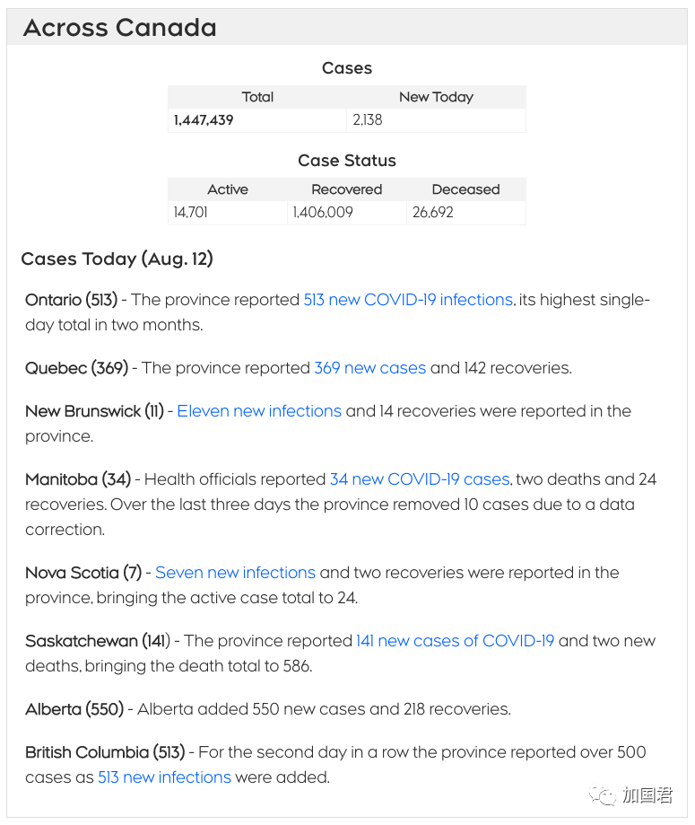
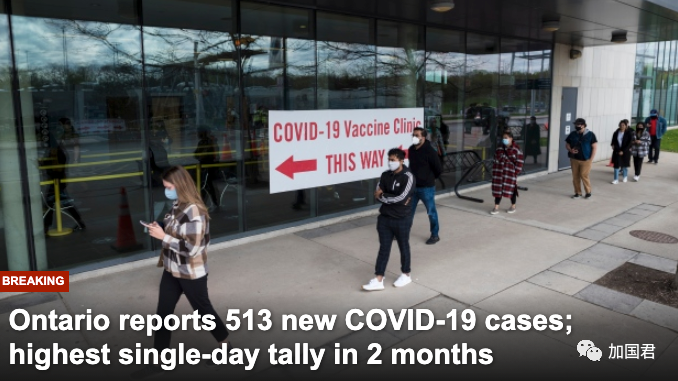
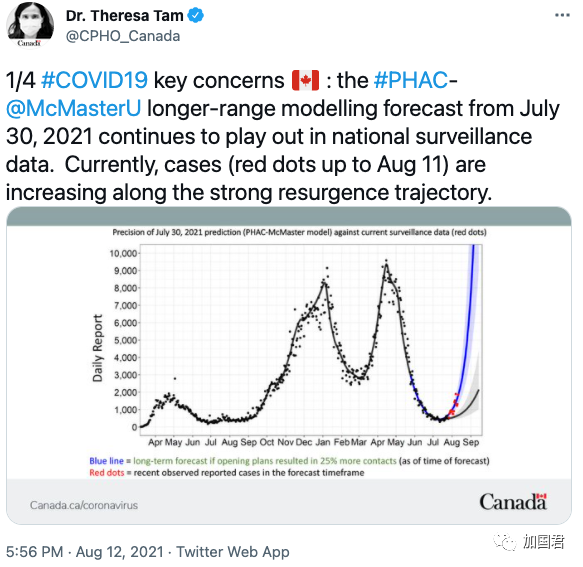
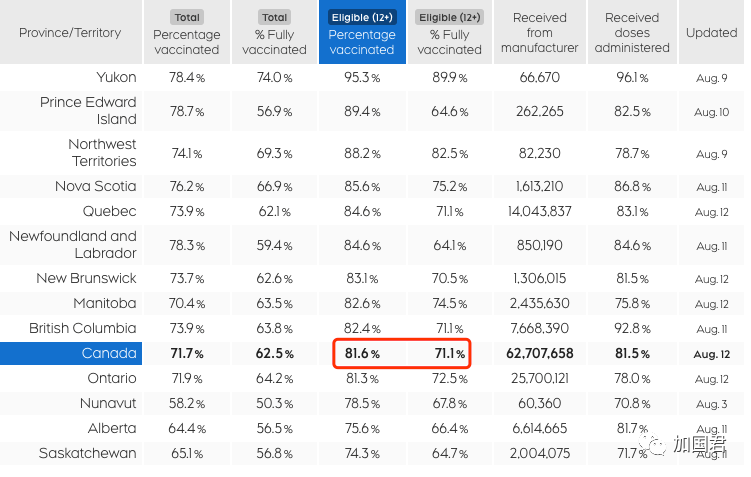

# 无标题

**链接地址:** http://mp.weixin.qq.com/s?__biz=MzIzODc2NzU4NA==&mid=2247589378&idx=1&sn=604a7ac2b7e0d8822452f9b9b8b67ab8&chksm=e937828dde400b9b19bbf729697592328e7db03a22b769436645520dcf5e1cf68bffa4e04b57&mpshare=1&scene=2&srcid=08133xDjgSI6uvGWTSkEBHyr&sharer_sharetime=1628807863290&sharer_shareid=be1c8edd6c93eec155a61c876e41d26a#rd
**作者:** 丁其
**获取时间:** 2025/8/28 19:43:22
**图片数量:** 7

---

## 原始HTML内容

加拿大8月12日新增2138例，反弹浪潮创下近期高位，安省、卑诗省和阿尔伯塔省新增突破500大关，首席卫生官今天首次宣称加拿大进入第四波浪潮。 

 

 

刚刚，卑诗省宣布513例，阿省550例，连续两天破500，而今天早上，安省新增513例，成为第三个加入500+行列的省份。

 

 

其中大多伦多五个地区均大幅反弹：

 

多伦多：105例

约克区：70例

皮尔区：64例

杜林区：44例

荷顿区：20例 

 

可见，GTA五区今天新增303例。

 

回顾：<a target="_blank" href="http://mp.weixin.qq.com/s?__biz=MzI2ODYyODQ0OA==&amp;mid=2247537696&amp;idx=1&amp;sn=c1b3bf12cfb25e87ef862facb94a3505&amp;chksm=eaeeacafdd9925b96da5fe438814a09ba7ff3247c36f385f71407746b632755f9c48f475d2ca&amp;scene=21#wechat_redirect" data-itemshowtype="0" tab="innerlink" data-linktype="2" style="text-decoration: underline;">513例大爆发！71%没打疫苗！安省专家组领导急了：不能再解封！第四波要来了</a>

 

加拿大首席卫生官谭咏诗博士今天首次承认，随着新冠病毒变种继续在未接种人群中传播，加拿大已经进入第四波浪潮，并且称疫情处于“强劲的反弹轨迹”上。

 

 

加拿大首席公共卫生官谭咏诗（Theresa Tam）博士今天召开记者会，自从两周前上一次模型更新以来，全加拿大病例数已经变得更得非常糟糕。

 

 

谭博士周四对记者说：“我们一直在密切关注全国 COVID-19 活动的增加情况。最新的国家监测数据表明，加拿大正在掀起第四波疫情，病例正沿着强劲的反弹轨迹发展。”

 

 

加拿大目前有超过 13,000 例活跃病例，是7月下旬的两倍多。谭说，全加拿大每天报告 1,500 例新病例，其中大多数是 20 至 39 岁的人。

 

 

 

谭说：“病例经过几个月的下降后，我们现在看到了在最近病例增加后严重疾病也随着增加的早期迹象。”

 

谭说：“平均而言，每天有511 名 COVID-19 患者在医院接受治疗，比上周增加了12%。”

 

谭补充说，加拿大有206名新冠患者在ICU重症监护病房，目前已经趋于平稳。

 

谭说，目前全加拿大平均每天有 7 人死亡。

 

虽然 Delta 变体更具传染性，但两剂疫苗仍可提供实质性保护，谭说：&nbsp;“绝大多数感染病例和住院患者都没有完全接种疫苗。”

 

 

迄今为止，接近 82% 的12岁以上加拿大人部分接种了疫苗，71%完全接种了疫苗。

 

谭呼吁尚未接种疫苗的加拿大人接种疫苗。

 

她说：“特别是，在这最后一段时期，为了进一步提高所有年龄组的疫苗接种率，我们需要加强在年轻人中的覆盖率，而年轻人是大多数传播发生的年龄组。”

 

 
<section style="margin-right: 16px;margin-left: 16px;white-space: normal;letter-spacing: 0.544px;caret-color: rgb(51, 51, 51);font-family: -apple-system-font, BlinkMacSystemFont, &quot;Helvetica Neue&quot;, &quot;PingFang SC&quot;, &quot;Hiragino Sans GB&quot;, &quot;Microsoft YaHei UI&quot;, &quot;Microsoft YaHei&quot;, Arial, sans-serif;background-color: rgb(255, 255, 255);min-height: 1em;font-size: 16px;text-align: center;line-height: 2em;">---大家快来关注爆料君↓↓--- </section><section class="mp_profile_iframe_wrp"><mpprofile class="js_uneditable custom_select_card mp_profile_iframe" data-pluginname="mpprofile" data-id="MzIzODc2NzU4NA==" data-headimg="http://mmbiz.qpic.cn/mmbiz_png/4kibCXA1QiblTfBBr3RFBSct0F4lniak8HwTuVicQvFBvW1d8coCdWE6eJA8MpFnF8uPsmbBoiba8zn8IzdkmOQsLUw/0?wx_fmt=png" data-nickname="超级爆料君" data-alias="superbaoliao" data-signature="这里有加拿大最In的吃喝玩乐生活资讯......" data-from="0"></mpprofile></section><section style="margin-right: 16px;margin-left: 16px;white-space: normal;letter-spacing: 0.544px;caret-color: rgb(51, 51, 51);font-family: -apple-system-font, BlinkMacSystemFont, &quot;Helvetica Neue&quot;, &quot;PingFang SC&quot;, &quot;Hiragino Sans GB&quot;, &quot;Microsoft YaHei UI&quot;, &quot;Microsoft YaHei&quot;, Arial, sans-serif;background-color: rgb(255, 255, 255);min-height: 1em;text-align: right;line-height: 2em;"><strong style="letter-spacing: 0.544px;">喜欢点个“在看” ↓↓</strong></section>
 

 

 

---

## 纯文本内容

加拿大8月12日新增2138例，反弹浪潮创下近期高位，安省、卑诗省和阿尔伯塔省新增突破500大关，首席卫生官今天首次宣称加拿大进入第四波浪潮。刚刚，卑诗省宣布513例，阿省550例，连续两天破500，而今天早上，安省新增513例，成为第三个加入500+行列的省份。其中大多伦多五个地区均大幅反弹：多伦多：105例约克区：70例皮尔区：64例杜林区：44例荷顿区：20例可见，GTA五区今天新增303例。回顾：513例大爆发！71%没打疫苗！安省专家组领导急了：不能再解封！第四波要来了加拿大首席卫生官谭咏诗博士今天首次承认，随着新冠病毒变种继续在未接种人群中传播，加拿大已经进入第四波浪潮，并且称疫情处于“强劲的反弹轨迹”上。加拿大首席公共卫生官谭咏诗（Theresa Tam）博士今天召开记者会，自从两周前上一次模型更新以来，全加拿大病例数已经变得更得非常糟糕。谭博士周四对记者说：“我们一直在密切关注全国 COVID-19 活动的增加情况。最新的国家监测数据表明，加拿大正在掀起第四波疫情，病例正沿着强劲的反弹轨迹发展。”加拿大目前有超过 13,000 例活跃病例，是7月下旬的两倍多。谭说，全加拿大每天报告 1,500 例新病例，其中大多数是 20 至 39 岁的人。谭说：“病例经过几个月的下降后，我们现在看到了在最近病例增加后严重疾病也随着增加的早期迹象。”谭说：“平均而言，每天有511 名 COVID-19 患者在医院接受治疗，比上周增加了12%。”谭补充说，加拿大有206名新冠患者在ICU重症监护病房，目前已经趋于平稳。谭说，目前全加拿大平均每天有 7 人死亡。虽然 Delta 变体更具传染性，但两剂疫苗仍可提供实质性保护，谭说： “绝大多数感染病例和住院患者都没有完全接种疫苗。”迄今为止，接近 82% 的12岁以上加拿大人部分接种了疫苗，71%完全接种了疫苗。谭呼吁尚未接种疫苗的加拿大人接种疫苗。她说：“特别是，在这最后一段时期，为了进一步提高所有年龄组的疫苗接种率，我们需要加强在年轻人中的覆盖率，而年轻人是大多数传播发生的年龄组。”---大家快来关注爆料君↓↓---喜欢点个“在看” ↓↓

---

## 图片列表

-  (原始链接: https://mmbiz.qpic.cn/mmbiz_png/icDcCacWsN1X9WIVSuzqZp3ORl2m63LGgguVZQzfhOhIAaF6vLVzP0XFtCic3fcBtibESCqISmicNOgnfCBe66Suiag/640?wx_fmt=png)
-  (原始链接: https://mmbiz.qpic.cn/mmbiz_png/icDcCacWsN1X9WIVSuzqZp3ORl2m63LGgcVjxf0ib3RwjI8ooduoF97axbTMkcibicogxxPUDcFCLbnNsB6R0lfETA/640?wx_fmt=png)
-  (原始链接: https://mmbiz.qpic.cn/mmbiz_png/icDcCacWsN1X9WIVSuzqZp3ORl2m63LGgZD2ZicZQU1jlicUWP1droMicyRh1kF8oQTGfJPIPUTzvKW86iaZoCI6c9w/640?wx_fmt=png)
-  (原始链接: https://mmbiz.qpic.cn/mmbiz_png/icDcCacWsN1X9WIVSuzqZp3ORl2m63LGgoBYL8ue5d1T9mPZjPiaE6wRXjNNuu9VS73QBCHKLpsYtLaz77qlT56Q/640?wx_fmt=png)
-  (原始链接: https://mmbiz.qpic.cn/mmbiz_jpg/icDcCacWsN1X9WIVSuzqZp3ORl2m63LGgKZosexo2V81JskoOdTCPnVAG9HZia7pbkcIIqGzRdQ4FwzN84vbJqRg/640?wx_fmt=jpeg)
-  (原始链接: https://mmbiz.qpic.cn/mmbiz_png/icDcCacWsN1X9WIVSuzqZp3ORl2m63LGgszicAzwibibbTqdH5qyHYkeWPaY4umIYiaqBhTKAPjRsml3nlHDD0fd6Tw/640?wx_fmt=png)
-  (原始链接: https://mmbiz.qpic.cn/mmbiz_png/4kibCXA1QiblSx7WEqW3MmFS9ArSqnrM4Nm1JkWk7QojbudibnicdquDRqxs5fuo9ibGtP5GjsdO5Fq3hjmKEiaZFJIg/640?wx_fmt=png)
