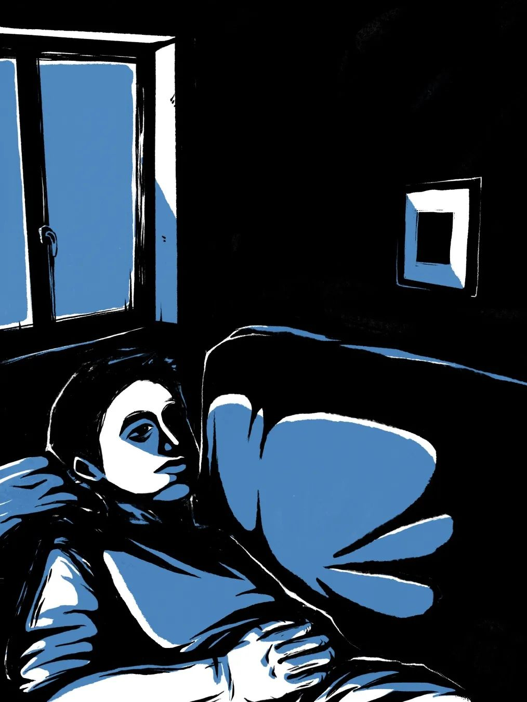
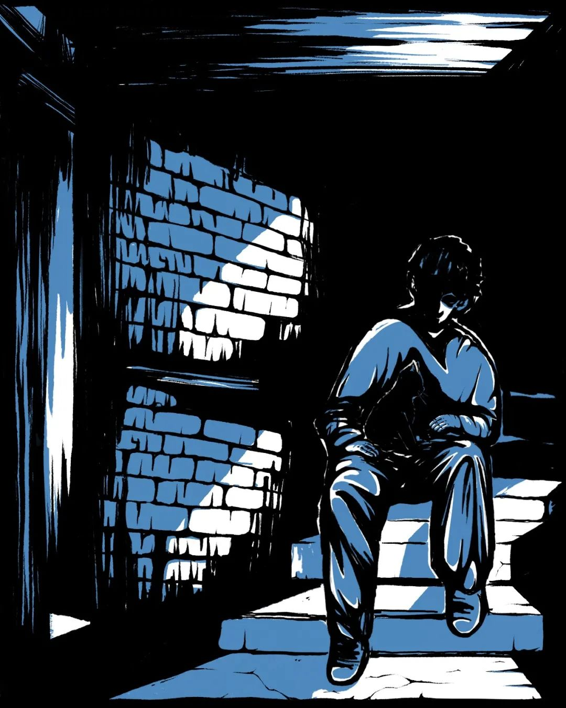
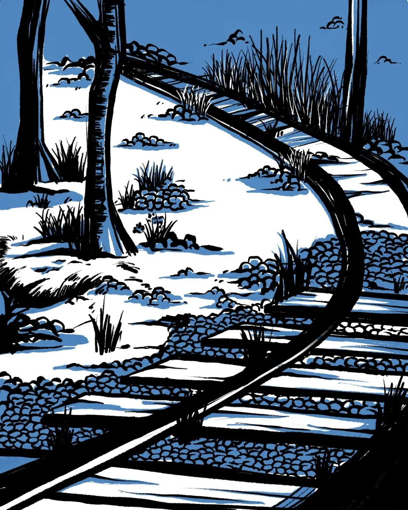
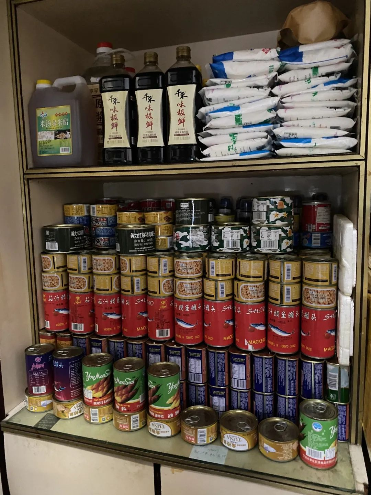
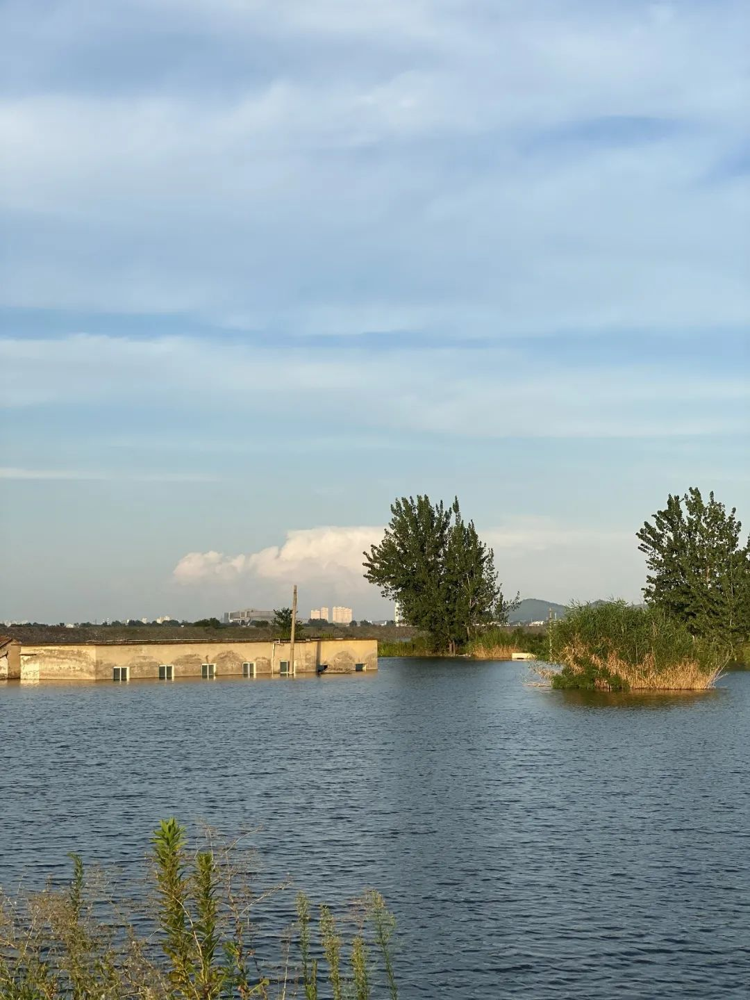
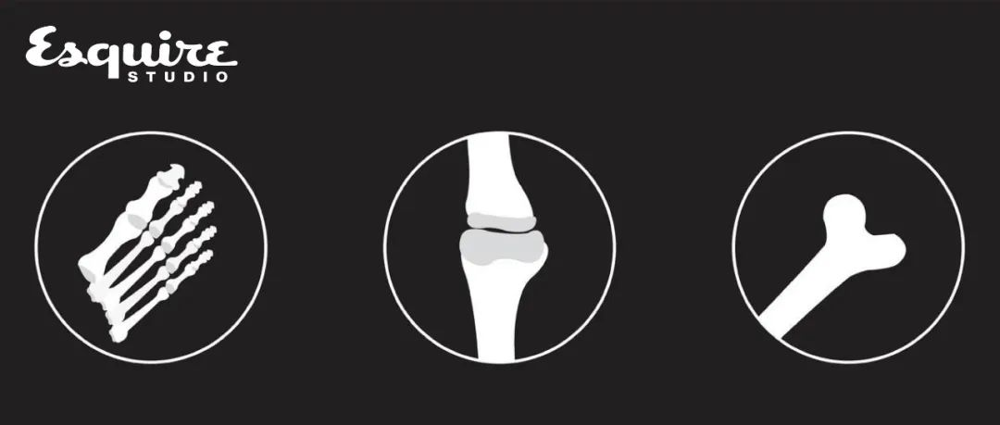
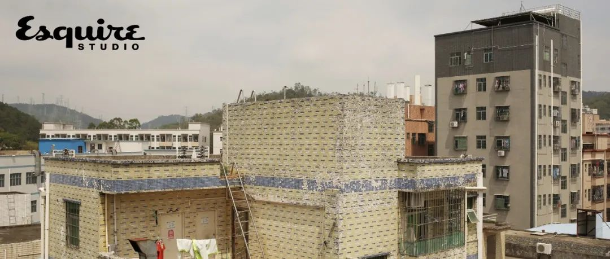

# 无标题

**链接地址:** http://mp.weixin.qq.com/s?__biz=MzAxNzQ5MDg2NA==&mid=2649617490&idx=1&sn=3b854274503fad926011a338ad377e4c&chksm=83fde28db48a6b9b202d6867885203ab858c00a6fcd2e81b2674f99e3079bd47ca08da4d06f4&mpshare=1&scene=2&srcid=0818ecgR8AA7rXqjOC1lbBkh&sharer_sharetime=1629257542615&sharer_shareid=be1c8edd6c93eec155a61c876e41d26a#rd
**作者:** 李颖迪
**获取时间:** 2025/8/28 19:42:52
**图片数量:** 11

---

## 原始HTML内容

<section style="box-sizing: border-box;font-style: normal;font-weight: 400;text-align: justify;font-size: 16px;"><section style="text-align: center;margin: 0px 0%;box-sizing: border-box;" powered-by="xiumi.us"><section style="max-width: 100%;vertical-align: middle;display: inline-block;line-height: 0;width: 100%;height: auto;box-sizing: border-box;"></section></section><section style="text-align: center;margin: 0px 0% 10px;box-sizing: border-box;" powered-by="xiumi.us"><section style="max-width: 100%;vertical-align: middle;display: inline-block;line-height: 0;box-sizing: border-box;"></section></section><section style="box-sizing: border-box;" powered-by="xiumi.us">
 
</section><section style="box-sizing: border-box;" powered-by="xiumi.us">
 
</section><section style="font-size: 18px;color: rgb(0, 0, 0);letter-spacing: -0.3px;line-height: 1.5;font-family: PingFangSC-light;padding: 0px 10px;box-sizing: border-box;" powered-by="xiumi.us">
隐居吧是一个论坛，大约有55万人关注，700万条帖子。这里的会员自称“隐士”，有人去山里开垦荒地，也有人去海边买房独居，他们希望得到自由，不被束缚的生活，一种可能会实现的田园梦。

 

但大约三、四年前，一些二十出头的年轻人在这里看到了生活的另一种可能。他们最有代表性的描述之一：每个月存5000元，存够30万就去隐居，或者，“上班上太久了，去上厕所都哭了，我已经存了17万元，想让大家推荐一个地方隐居。”

 

一个在河南鹤壁隐居的年轻人告诉我们：“生活得越久，努力了那么久，就感觉好像别人的起点就是我的终点，所以你努力还有什么用呢？”

 

他无法清楚描述自己理想的生活是什么样子，但一个明确的感受是，他似乎面对着一些隐形的壁垒。随着时间流逝，他对穿过这道壁垒的信心越来越小了。

 

我们对这个隐居吧产生了好奇，尤其是在里面寻找未来的年轻人。我们也试着提出一个问题：是什么原因让他们选择了这样的生活？
</section><section style="box-sizing: border-box;" powered-by="xiumi.us">
 
</section><section style="color: rgb(0, 0, 0);line-height: 1.5;font-size: 12px;padding: 0px 10px;font-family: PingFangSC-light;box-sizing: border-box;" powered-by="xiumi.us">
采访 文&nbsp; <strong style="box-sizing: border-box;">李颖迪</strong>

插画&nbsp; <strong style="box-sizing: border-box;">段新月</strong>

编辑<strong style="box-sizing: border-box;">&nbsp; 谢丁</strong>
</section><section style="box-sizing: border-box;" powered-by="xiumi.us">
 
</section><section style="box-sizing: border-box;" powered-by="xiumi.us">
 
</section><section style="display: inline-block;width: 100%;vertical-align: top;background-color: rgb(0, 0, 0);box-sizing: border-box;" powered-by="xiumi.us"><section style="margin: 5px 0%;box-sizing: border-box;" powered-by="xiumi.us"><section style="text-align: center;color: rgb(136, 136, 136);letter-spacing: 2px;font-size: 14px;font-family: -apple-system-font, BlinkMacSystemFont, &quot;Helvetica Neue&quot;, &quot;PingFang SC&quot;, &quot;Hiragino Sans GB&quot;, &quot;Microsoft YaHei UI&quot;, &quot;Microsoft YaHei&quot;, Arial, sans-serif;line-height: 1.6;padding: 0px;box-sizing: border-box;">
 
</section></section></section><section style="box-sizing: border-box;" powered-by="xiumi.us">
 
</section><section style="margin: 0px 0%;box-sizing: border-box;" powered-by="xiumi.us"><section style="line-height: 1.2;font-size: 30px;font-family: PingFangSC-light;color: rgb(255, 255, 255);padding: 0px 10px;box-sizing: border-box;">
<strong style="box-sizing: border-box;">&nbsp; 1&nbsp;&nbsp;</strong>
</section></section><section style="box-sizing: border-box;" powered-by="xiumi.us">
 
</section><section style="box-sizing: border-box;" powered-by="xiumi.us">
 
</section><section style="line-height: 1.8;letter-spacing: -0.2px;color: rgb(0, 0, 0);font-family: PingFangSC-light;padding: 0px 10px;box-sizing: border-box;" powered-by="xiumi.us">
杨明威的隐居地在地图上没有标记。当地人称呼这一片为小角楼。从长风路右拐，上一道长坡，先是一些灰色的楼房，枯萎的爬山虎占据了墙面。还有一些楼房的玻璃窗已破碎，留下黑色的空洞。附近有一条铁轨，火车呼啸而过，轰隆轰隆的。

 

再往前走，一片荒草幽深的空地，有人种了一些玉米和南瓜。一面墙上贴着告示：现已进入汛期，此为老旧小区，如遇家中漏雨请及时撤离。不过，这里的住户看起来并不担忧。老人们躺在竹椅上，悠闲地纳凉。杨明威是这里罕见的年轻人。他走到一栋米白色的楼房前，停下来。

 

“就是这里了。”他说。

 

七个月前，杨明威来到河南鹤壁，买了一套房子，随后过上了隐居的生活。他今年27岁，留着短发，是个大块头。这天，他穿着黑色紧身衣、黑色牛仔裤和黑色的运动鞋。他喜欢穿黑色，黑色能够修饰身材。

 

隐居之前，杨明威漂流过许多地方：江苏，安徽，北京，上海，有时是在一个小镇子，有时是在大城市里。他做过很多工作，比如，在建筑工地上拧钢筋，在别人的家中铺瓷砖，又或者，做保安，做淘宝客服，做高档酒店的服务生，做《英雄联盟》的游戏代练。过去十年，他忙忙碌碌的。他觉得自己看上去拥有许多的选择，可似乎这些选择又没有多大的不同。

 

2020年冬天，杨明威不愿再忍受这样的生活了。那时他已经在上海做了三年的保安。他辞去工作，买了一张车票，背着书包登上了驶离上海的列车。他的行李不多，书包里只有几件衣服，一些洗漱用品，还有一个性能良好的迷你主机——他最大的爱好就是打游戏。

 

他在火车上度过了安稳的一夜。第二天早晨六点，他到了鹤壁火车站。下车后，他去一家旅馆睡了回笼觉，起来吃了一份蛋炒饭。

 

他联系上一个鹤壁市的房产中介。中介推荐了许多位于山城区的房子，一套房的价格从两万八千元到六万元不等。这符合杨明威的预期。鹤壁位于河南省北部，曾是重要的煤炭城市，因煤而兴。山城区又被称作鹤壁的老区，在煤矿兴盛的时候，这是鹤壁最繁华的地带。但现在，杨明威很容易注意到这里的空旷。天灰蒙蒙的，街边梧桐树的叶子也掉光了。中午不到一点，餐馆门前寥寥，服务员在漫不经心地拖地。不过，这些没有打消杨明威的隐居决心。

 

四天时间，中介带他看了二十多套房子。那些房子比他想象中要差一些，地面起霉，天花板漏水，有些不带暖气。最后，当他来到小角楼，看到一套还算干净整洁的房子，他不再犹豫了。他花了三万七千元。这套房子在顶层，两室一厅，水泥地，几乎没有装修。

 

杨明威没有进行太多的调整。原主人的家具搬走后，他从网上买了一张沙发，一个金属储物架，一个小冰箱，一张床垫，一辆二手电瓶车。他卖掉了那个陪他长途跋涉的迷你主机，换了一个五百元的曲面显示屏，三千元的主机，以及一张一万元的显卡。这张显卡是他目前最珍贵的财产，能够让他流畅地享受游戏《铁甲战士》、《行星边际》、《英雄联盟》。

 

隐居的这七个月，他每隔五天出一趟门，坐上电动车来到离家两条街道的菜市场，买一份“如意水饺”，一份五花肉，一把长豆角，再买一把小米椒。做一次饭可以吃几天，这样最节省成本。每隔一个月，他会出门理一次发。除此之外，他没有什么需要出门办的事情。

 

他的大多数时间都花在了网上：通宵打游戏，逛各种各样的贴吧和网站。因为作息没有规律，杨明威的眼眶呈现出浓厚的青灰色，眼睛也有些充血。

 

杨明威的生活蜷缩在了这个不大的房子里。房子以外的世界让他感到不安。疫情、暴雨、台风，谁也无法预测下一次灾难会不会发生在自己身上。在厨房那个一米五高、四层的白色金属储物架上，他放了一桶大米、一箱“珍姨超爽大碗面”、24罐梅林午餐肉罐头、80包900牌压缩饼干、一些固体酒精。这是他陆续买来的储备物资（但最好不要动用它们）。如果真的发生意想不到的灾难，杨明威觉得，这些物资能够支撑他在家中活过一个月。
</section><section style="box-sizing: border-box;" powered-by="xiumi.us">
 
</section><section style="box-sizing: border-box;" powered-by="xiumi.us">
 
</section><section style="display: inline-block;width: 100%;vertical-align: top;background-color: rgb(20, 20, 20);box-sizing: border-box;" powered-by="xiumi.us"><section style="margin: 0px 0%;box-sizing: border-box;" powered-by="xiumi.us"><section style="text-align: center;color: rgb(136, 136, 136);letter-spacing: 2px;font-size: 12px;font-family: PingFangSC-light;line-height: 1.6;box-sizing: border-box;">
 
</section></section></section><section style="box-sizing: border-box;" powered-by="xiumi.us">
 
</section><section style="margin: 0px 0%;box-sizing: border-box;" powered-by="xiumi.us"><section style="line-height: 1.2;font-size: 30px;font-family: PingFangSC-light;color: rgb(255, 255, 255);padding: 0px 10px;box-sizing: border-box;">
<strong style="box-sizing: border-box;">&nbsp; 2&nbsp;&nbsp;</strong>
</section></section><section style="box-sizing: border-box;" powered-by="xiumi.us">
 
</section><section style="box-sizing: border-box;" powered-by="xiumi.us">
 
</section><section style="line-height: 1.8;letter-spacing: -0.2px;padding: 0px 10px;font-family: PingFangSC-light;color: rgb(0, 0, 0);box-sizing: border-box;" powered-by="xiumi.us">
杨明威出生在江西上饶市的一个村庄。父母很早离婚，他和外公外婆一起生活。初中毕业后，他没有再继续读书，和长辈一起在家中的院子里养兔子，养鸡，去集市上卖鸡蛋。直到外公外婆离世，他也成年了。杨明威面临着一个看似顺理成章的处境：他需要外出打工了。

 

但是，第一份工作让他感到了难以忍受的痛苦。他不愿对此多谈。那时，他前往江苏南通找亲戚，原本打算在当地玩一阵子，再看看能不能帮亲戚做些什么。亲戚在一个菜市场里摆摊，卖萝卜饼，他待了几天，觉得还不如自己找份工作。他联系上中介，对方给他推荐了两份工作：进电子厂，或者，去建筑工地上拧钢筋。

 

他选择了后者。这份工作每个月挣两三千元。他每天工作12个小时，戴着白色布手套，用手将一簇簇的钢筋拧成承重墙的框架，再灌注水泥。他经常需要克服恐高的情绪爬上很高的脚手架。那个夏天很热，很晒，他对那种席卷身体的疲倦印象深刻，“你下了班以后就什么时候都不想了，只想睡觉。”

 

半年后，他离开了工地，前往安徽的一个小城市，跟随一个建筑师傅学铺瓷砖。他负责从楼下搬运沙子水泥到顾客家里，再用小桶将瓷砖“泡发”，搅好水泥。大工一天能挣三四百元，但所有活计都需要自己寻找、商谈，价格也需要斡旋。如果熬过三四年，他的确可以当上大工。但和人斡旋让他感到疲惫，这仍不是他心中最理想的工作。

 

杨明威决定去上海看看，也许大城市会有更多的机会。起初，上海的确给了他这样的印象。他在58同城、赶集网上找到了许多工作：会展咨询员、在小公司敲excel的文员、平安保险销售、小区保安。这些工作通常是做六休一，休息的那一天，他还会去做兼职。有时是做游戏代练，打《英雄联盟》，他帮人从青铜段位升级到白银段位，每次需要14个回合，每回合40分钟。560分钟后，他将得到130元的报酬。

 

还有的时候，他会去举办婚宴的五星级酒店做临时服务生，从下午三点到晚上十一点，一天工资140元。他需要提前换上制服。他注意到，那些制服总是看上去很干净，但袖口、胳肢窝这些不起眼的地方总有抹不去的污渍。他负责给客人们上菜，端盘子。酒店多在上海最繁华的区域，离他所住的闵行区相隔很远。下班后，他总是赶不上地铁，要骑两个小时的自行车回家。即使是冬天——他说，相信我，再冷的天，你骑两个小时都会感到很暖和。

 

算上兼职，他一个月可以挣七千元。这也是他花费所有休息时间后所能赚的钱。

 

但那些婚宴让杨明威看到了一个完全不同的世界。一场酒席往往要办二十桌，每桌都会摆一瓶茅台酒，一条软中华香烟。他在一旁计算，一场下来要花费二十来万。他又想起自己刚到上海时，想在火车站吃饭，一碗面条五十块，正在他感到踌躇的时候，别人毫不在意地下单了。

 

他总结，上海是一个对有钱人很友好的城市。“生活得越久，努力了那么久，就感觉好像别人的起点就是我的终点，所以你努力还有什么用呢？”

 

不过，当他结束在酒店的兼职时，接下来的一份工作让他看到了一些希望。那是他在上海的倒数第二份工作。当时他在一家位于奉贤区的淘宝店做客服。店铺主营皮革，有三颗皇冠，在当时的淘宝店里已算不错。老板租下了一栋公寓，一楼摆放着各式各样的皮具：鸵鸟皮、蜥蜴皮、牛皮、猪皮。皮革有味道，但不难忍受。

 

这份工作包吃包住。让杨明威高兴的是，老板说，如果他干得好，之后将会让他负责整个店铺的运营。他负责回复客户，也要到一楼用道具切割皮革、发货，去皮具代工厂。有一阵子，他已经开始管理有五个人的客服部。

 

但是由于管理层的改变，店铺效益越来越差，五个客服变成三个，最后剩下他一个人。他意识到，老板的承诺只是一张空头支票。做客服管理的时候，他的工资和原来一样，每个月四五千元。但没人再提起他多干的那些活了。

 

杨明威觉得自己的运气越来越差，倒不如索性选择一份相对轻松的工作。最后，他重新做回了保安。

 

他无法清楚描述自己理想的生活究竟是什么样子，但一个明确的感受是，他似乎面对着一些隐形的壁垒。随着时间流逝，他对穿过这道壁垒的信心越来越小了。

 

"除非是看不到希望了，不然谁都想奋斗一下。”他说，“努努力，万一要是过得更好呢，对吧？”

 

2019年底，杨明威看到一则新闻报道说，有人在鹤岗用五万元买了一套房子。他上网搜了更详细的资料。随后，百度的信息流向他推荐了隐居吧。在这个贴吧里，他第一次知道，中国有如此多的小城市，几万元就能买一套房。除了鹤岗，还有东北的伊图里河、抚顺、阜新。但东北太冷，过冬会成为麻烦的问题。另一些热门的隐居地则分散在中原地带：河南鹤壁，安徽淮南，云南个旧。这些城市同样多为重工业起家，资源枯竭后，有些地段的房价降到了让人惊讶的程度：三四万元，你也许还无法买下北京或上海的一个洗手间，但在这里，你可以拥有一套两室一厅。

 

看了一些隐居吧的帖子后，杨明威也动了隐居的念头。他起初的计划是，攒下三十万，去鹤壁买房隐居后再也不出来打工了。当保安的工作干到第三年时，他和领导因为一件小事吵了一架。他觉得是时候辞职了。这时他刚攒够十万元。不过，这笔钱也够他隐居一阵子了。
</section><section style="box-sizing: border-box;" powered-by="xiumi.us">
 
</section><section style="text-align: center;margin: 10px 8px;box-sizing: border-box;"><section style="max-width: 100%;vertical-align: middle;display: inline-block;line-height: 0;box-sizing: border-box;"></section></section><section style="box-sizing: border-box;" powered-by="xiumi.us">
 
</section><section style="box-sizing: border-box;" powered-by="xiumi.us">
 
</section><section style="display: inline-block;width: 100%;vertical-align: top;background-color: rgb(20, 20, 20);box-sizing: border-box;" powered-by="xiumi.us"><section style="margin: 0px 0%;box-sizing: border-box;" powered-by="xiumi.us"><section style="text-align: center;color: rgb(136, 136, 136);letter-spacing: 2px;font-size: 12px;font-family: PingFangSC-light;line-height: 1.6;box-sizing: border-box;">
 
</section></section></section><section style="box-sizing: border-box;" powered-by="xiumi.us">
 
</section><section style="margin: 0px 0%;box-sizing: border-box;" powered-by="xiumi.us"><section style="line-height: 1.2;font-size: 30px;font-family: PingFangSC-light;color: rgb(255, 255, 255);padding: 0px 10px;box-sizing: border-box;">
<strong style="box-sizing: border-box;">&nbsp; 3&nbsp;&nbsp;</strong>
</section></section><section style="box-sizing: border-box;" powered-by="xiumi.us">
 
</section><section style="box-sizing: border-box;" powered-by="xiumi.us">
 
</section><section style="line-height: 1.8;letter-spacing: -0.2px;padding: 0px 10px;color: rgb(0, 0, 0);font-family: PingFangSC-light;box-sizing: border-box;" powered-by="xiumi.us">
隐居吧是一个有55万人关注、700万条帖子的论坛。隐居吧的会员名称叫做“隐士”。“隐士”们多为男性，年龄从二十岁至五十岁不等，背景条件各异。

 

一些“隐士”在此详细记录了他们的隐居生活。比如一位中年男人写道，他在陕西安康租了3亩荒地，正在“建设自己的家园”。他种了90颗莴笋，去山里挖荞麦叶、大百合，正要看书学习如何照料幼兔。另一位男人说，为了寻找一个合适的海边隐居地，他研究了许久中国的洋流规律，最后选择在乳山银滩买房隐居，还花了半年时间做了一套光伏发电和取暖系统。在他们的描述中，隐居象征着自由，生活不被束缚。

 

在贴吧里，还有一些“隐士”表达了逃离现实的迫切愿望。

 

一位21岁的男孩发帖说，他正在一家激光切割厂里工作，每月工资5500元，他打算一个月存5000元，存够30万就去隐居。

 

一个26岁的男人说，他在深圳一家物流站做仓库管理员，工作需要从第一天的八点半工作到第二天的八点半，中间睡六个小时，晚上还要继续干活。他写道，“上班上久了，去上厕所都哭了。”他说他已经存了17万元，想让大家推荐一个地方隐居。

 

这个帖子引起了许多人的共鸣。人们给男人出了许多主意。有人说，可以去广州的城中村隐居，东莞周边的村庄也很便宜。杨明威也看到了这个帖子。他向男人推荐了鹤壁。

 

在隐居吧里，杨明威认识了不少想来鹤壁隐居的人。2021年初，他将自己的客卧以一年1000元的价格租给了另一个男孩。那个男孩和他在隐居吧相识，年纪相仿，二十六七岁，同样想来鹤壁买房隐居，但试图先找到一个过渡的地方。

 

杨明威和那男孩交往不多，彼此也不提过往。他只知道，室友似乎比他更适应隐居生活：不工作，睡觉时间比他长，同样花大量时间窝在房间里打游戏。他总能听到隔壁室友骂手游中的队友：“这个傻X！”

 

杨明威刚来鹤壁买房的时候，一个年纪更大的男人从贴吧里联系过他，两人曾相约一起去看房。杨明威和男人在看房期间拼了几天旅馆，节省费用。他称呼男人为夏大哥。后来夏大哥告诉我，他觉得杨明威是一个很内向的男孩，不怎么说话，也不抽烟不喝酒，第一次吃火锅，杨明威还没有吃完就起身离开了。

 

但夏大哥不一样。或许是因为年纪更大，虽然来鹤壁买房，他还是希望能在当地扩展一些社交圈子。后来，他建立了一个微信群，里面都是在隐居吧里认识的，想要或已经在鹤壁买房的人。这个群有一百多人。有人的群聊昵称就是“攒钱去鹤壁买房”。他们在群里交流一些鹤壁老区的房源，以及各种与钱相关的话题：打工，炒股，有人还试图交流炒比特币。

 

我在群里认识了另一位已在鹤壁隐居了半年的男人，他经常会发一些鹤壁的风景照片。他今年33岁，声称自己曾从事金融行业。隐居之后，他每天在家里写小说，在网络上连载，不然他会觉得时间很难捱。他喜欢网络作家“南派三叔”和“我吃西红柿”。他说自己之所以来到鹤壁，是因为社会压力大，原生家庭不富裕也不幸福。

 

“奋斗毫无结果，也有感情失意，逃离跟自己相关的认识的人，脱离原来的生活圈，过一个人的生活。”他说。他拒绝与我见面。

 

大多隐居者都拒绝与外界有太多来往。杨明威曾帮我询问另一位年纪更小的鹤壁隐居者，那个男孩迅速给出了一个回答——“死也别让我见到媒体！”

 

杨明威说他第一次见到那个男孩时，男孩说自己22岁，高高瘦瘦的，皮肤黝黑，像是一个体力工作者。不过，作为隐居者来说，男孩未免太年轻了一些。他问男孩，为什么这么小就来了这里，不出去多接触几年生活吗？男孩笑了笑，没有回答。

 

所有这些前来隐居的人，几乎都住在鹤壁的老区。

 

如果你乘坐高铁，在鹤壁东站下车后，出租车司机会先带你穿过淇滨新区。那里是鹤壁市新的中心。二十年前，随着市区的周边逐渐成为塌陷区，鹤壁开始往东南搬迁。新区发展很快，窗外出现了一个大型的万达商业广场，还有标识着“阿里云”、“京东鹤壁”、“掌上科技”的科技园区。夜晚，一块霓虹灯牌格外显眼，“生态、活力、幸福之城”。对于鹤壁当地人来说，往新区迁徙是再自然不过的事情。

 

车继续向前开。一条蜿蜒二三十公里的省道连接了新区与老区，如同两个世界。出租车司机刚刚在新区买了一套房。至于那些老区的房子，他说，“还没有新区的一套坟墓贵呢。”

 

鹤壁老区建立在煤矿之上。原来，鹤壁有11个矿区。当地人告诉我，这些矿区已经废弃了一半。离杨明威居住地最近的六矿，2021年6月刚发生了一起生产事故，8名失联人员遇难，暂时停止生产。后来我去已经废弃的一矿转了转，只剩下一对夫妻看守，矿区变成了植物茂密的森林，一个被封住的矿井口长出了鲜花，只有一个由煤铅石堆积成的高山。

 

矿区周边的房子要更便宜一些——只需一两万，你就能够买下一整套房。从马路上望过去，这些房子破损、衰败，很难看见人们居住的痕迹。

 

杨明威介绍我认识了他的房产中介。中介带我去看了四套位于老区的房子，价格都在四万元以下。她说，这些房子的主人都刚刚在新区买房，急于将老房脱手。房间里还留存着他们没来得及处理的用品：一张十年前影楼风格的结婚照，一只含着铜钱的铁蛤蟆，一张新区楼盘的广告，上面写着一句振奋的广告语：“山登至顶人为峰！”

 

中介说，十年前，她走在新区的街道上，看见那些数量众多的新房子，她当时想，谁会去买这些房子呢。可最近三四年，新区的房子从三千元一平米涨到了七八千元，甚至一万元，人们像在超市抢购一样抢着去新区买房。而老区的医院、商场也开始往新区迁徙。

 

在老区，尤其是那些曾在六七十年代象征着身份的家属院——仪表厂家属院、矿务局家属院、粮食局家属楼，去年疫情过后，这些售价七八万的房子降到了三四万元。她一度为自己的售房生意发愁。但让她意外的是，有不少像杨明威这样的外地人来老区买房了。

 

她记得杨明威。看房的时候，她问杨明威为什么要来到鹤壁。这个年轻人对她说：“我不知道以后要继续做什么工作了。”
</section><section style="box-sizing: border-box;" powered-by="xiumi.us">
 
</section><section style="box-sizing: border-box;" powered-by="xiumi.us">
 
</section><section style="display: inline-block;width: 100%;vertical-align: top;background-color: rgb(20, 20, 20);box-sizing: border-box;" powered-by="xiumi.us"><section style="margin: 0px 0%;box-sizing: border-box;" powered-by="xiumi.us"><section style="text-align: center;color: rgb(136, 136, 136);letter-spacing: 2px;font-size: 12px;font-family: PingFangSC-light;line-height: 1.6;box-sizing: border-box;">
 
</section></section></section><section style="box-sizing: border-box;" powered-by="xiumi.us">
 
</section><section style="margin: 0px 0%;box-sizing: border-box;" powered-by="xiumi.us"><section style="line-height: 1.2;font-size: 30px;font-family: PingFangSC-light;color: rgb(255, 255, 255);padding: 0px 10px;box-sizing: border-box;">
<strong style="box-sizing: border-box;">&nbsp; 4&nbsp;&nbsp;</strong>
</section></section><section style="box-sizing: border-box;" powered-by="xiumi.us">
 
</section><section style="line-height: 1.8;letter-spacing: -0.2px;padding: 0px 10px;color: rgb(0, 0, 0);font-family: PingFangSC-light;box-sizing: border-box;" powered-by="xiumi.us">
对很多中国人来说，“隐居”两个字有着丰富的含义。从有文字记载的时候起，中国就有了隐士，比如许由、伯夷和叔齐、陶渊明。在那时，隐士和政治之间的联系尤为紧密。有人将隐居生活作为吸引政治资源的手段，也有一些人正是因为厌恶政治而远居深山。

 

但是新中国成立以后，尤其在最近几十年，如果我们要梳理中国的隐居潮流，也许要回到一个美国学者所作的研究上。1989年，学者比尔·波特来到中国的终南山，试图解答一个问题：经过一个世纪的革命和战争后，中国还有隐士吗？

 

他花了几年时间拜访南五台、香积寺、楼观台、终南山、太白山。他的确遇见了一些隐士，很多人在深山里度过了他们的一生，吃得很少，穿着节俭，在茅屋里居住，在高山上垦荒。不过，他们都是信仰佛教与道教的出家人。隐居对他们而言是一种修行的方式。就像一位出家人说，“唯一要紧的事情就是修行，如果不修行，你永远也摆脱不了妄尘。”

 

这种隐居文化曾在几十年前遭到过破坏。上世纪八十年代开始，这种文化逐渐回来了。比尔·波特在书中写道，到了1989年，中国有将近三千人的道士和道姑。那时的隐居仍然像是一种小众的宗教行为。

 

后来，比尔·波特将他寻访隐士的过程写成了一本书，名为《空谷幽兰》。一个意想不到的结果是，2009年，当《空谷幽兰》一书引进中国后，它引发了中国人去终南山隐居的热潮。这时，人们选择隐居不再是出于某种宗教信仰。他们声称，自己希望通过隐居来寻求内心的自由，并认为伴随现代城市化出现的高压竞争毫无必要。

 

这其中的代表人物之一，是在终南山隐居的二冬。二冬学美术出身。2013年，他来到终南山上一个农家小院，以20年4000元的价格长租在此，随后过上了种田犁地、养鸭养鹅的隐居生活。2015年的一天，二冬在自己的公众号上发表了一篇隐居小结，名为“借山而居”。24小时内，这篇文章意外有了超过10万的阅读量，又在随后的几天被800多个公众号转载，数家媒体跟踪报道了二冬的故事。

 

接受媒体采访时，二冬说：“于是你发现，这个时代对于闲适淡泊的日子是有多么饥渴。”

 

但当数量众多的人们涌向终南山后，在终南山隐居不可避免地带上了一些商业化的气质。一些“隐修培训班”应运而生，其中不乏骗局。终南山的房价也迅速上涨。2018年，在二冬的故事被广泛报道的三年后，媒体报道了另一位年轻女孩的故事。这位女孩在终南山租借的小院年租金从400元涨到2万元，她不得不结束隐居，回到城市寻找工作。

 

杨明威常去的百度贴吧“隐居吧”，曾经也一度以这些内容为主：田园牧歌式的隐居生活，在深山里拥有一个院子，几亩田地，远离城市的喧嚣。

 

直到2019年，一些年轻人——尤其是那些没有太多资源和背景的普通年轻人，发现了鹤岗，或者像鹤壁这样的城市。他们开始实践另一种隐居方式：背井离乡，前往遥远的三四线城市，以较低的价格买一套房子，不工作，蛰居在家，以极低的成本生活。他们有时也会称呼自己为“躺平一族”。

 

长期关注劳动领域的青年学者周燕玲说，在中国，专门研究躺平族的学术成果不算太多，而且大多发表在2010年之前。那时，他们被称为“新失业群体”，或是“三失青年”（即“失学、失业、失管”）。政府曾经想办法帮助他们。2012年，上海市曾启动一个就业启航计划，“帮助8000多名长期失业青年实现就业创业”。

 

但在公众视野中，躺平族真正得到关注是从深圳的“三和青年”开始的。周燕玲曾在上海访谈过一些从事快递行业的新农民工。她注意到，对于已经结婚的农民工来说，生活的负担是无法逃避的，也就很难出现躺平的想法。但对于那些更年轻一些，单身，处在不稳定就业状态中的年轻人，周燕玲感到，他们其中的一些人也开始“打工一阵子，躺平一阵子”。他们通常会流露出明显的对未来的不信任感，不相信自己能够完成阶层的流动。与此同时，和上一代农民工相比，新农民工希望能有自己的生活节奏，在意尊严和自我实现，“希望自己能活得更像人一点”。但实际的人生体验往往让他们感到失望。

 

“年轻人选择‘躺平’根本上是对社会结构性问题的消极反应。”周燕玲说，她也注意到社交平台上对躺平文化的讨论。有人称赞说，这是一种弱者的武器，是一种消极的抵抗。但周燕玲觉得，对此做出称赞，似乎又容易忽视选择躺平的人们所付出的代价。

 

“选择躺平之后，看上去的确是有一些所谓的选择空间，但这些选择空间又似乎是很虚幻的。”她说，“如果这是一种反抗，为什么代价要由他们来承担，而不是由那些拥有更多社会资本的人来承担？”

 

更重要的是：“他们以后怎么办？”
</section><section style="box-sizing: border-box;" powered-by="xiumi.us">
 
</section><section style="text-align: center;margin: 10px 8px;box-sizing: border-box;"><section style="max-width: 100%;vertical-align: middle;display: inline-block;line-height: 0;box-sizing: border-box;"></section></section><section style="box-sizing: border-box;" powered-by="xiumi.us">
 
</section><section style="box-sizing: border-box;" powered-by="xiumi.us">
 
</section><section style="display: inline-block;width: 100%;vertical-align: top;background-color: rgb(20, 20, 20);box-sizing: border-box;" powered-by="xiumi.us"><section style="margin: 0px 0%;box-sizing: border-box;" powered-by="xiumi.us"><section style="text-align: center;color: rgb(136, 136, 136);letter-spacing: 2px;font-size: 12px;font-family: PingFangSC-light;line-height: 1.6;box-sizing: border-box;">
 
</section></section></section><section style="box-sizing: border-box;" powered-by="xiumi.us">
 
</section><section style="margin: 0px 0%;box-sizing: border-box;" powered-by="xiumi.us"><section style="line-height: 1.2;font-size: 30px;font-family: PingFangSC-light;color: rgb(255, 255, 255);padding: 0px 10px;box-sizing: border-box;">
<strong style="box-sizing: border-box;">&nbsp; 5&nbsp;&nbsp;</strong>
</section></section><section style="box-sizing: border-box;" powered-by="xiumi.us">
 
</section><section style="line-height: 1.8;letter-spacing: -0.2px;padding: 0px 10px;box-sizing: border-box;" powered-by="xiumi.us">
如果年轻人选择隐居是对生活失望，那么中年人真的是在追求田园生活或自由吗？在隐居吧，我认识了一位仍然遵循传统隐居方式的“隐士”。他叫李杰，今年41岁，正在安徽六安隐居。

&nbsp;

李杰住在河背山上。河背山位于六安金寨县，属于大别山山脉，离七十年前“刘邓大军”的汇合地不远。从山路绕上去，土地里种着成片的黄芪和天麻，清澈的茶河在一旁流淌而过。

&nbsp;

李杰开着一辆长城风骏皮卡。他熟练开过山上的弯绕，经过村庄主路，再经过一个陡峭的泥坡，从一条被两旁灌木丛遮蔽的道路进去，一座白色农村平房出现在眼前。

&nbsp;

2021年4月，李杰来到这里。他对房屋周边的环境十分满意，便和房东签下了半年的租住合同。房屋左右各一棵高大的板栗树，带刺的栗子掉在地上。还有一棵尚未结果的柿子树和桃树。地上有野生的波斯菊、紫苏叶。平房旁边有一块接近两三百平米的菜地，他在这里种了不少四季豆、黄瓜、苋菜。

&nbsp;

李杰临时学了许多的农业知识：植物的生长季节，如何开荒，以什么间距播撒种子，如何用羊粪和牛粪堆肥。四季豆发芽后，他砍来竹子搭建架子，让藤蔓往上蔓延。苋菜被虫咬了，他就用烟蒂泡过的水浇菜。他很快得到了收获：四季豆、青瓜、辣椒都成熟了。

&nbsp;

李杰从来没有过种地的经验。他是土生土长的武汉人，从小在城市长大。在山上待了几个月后，他的皮肤因长时间的日照开始黝黑，身材也因为务农而变得紧实。

&nbsp;

他有过一段不顺利的婚姻，也干过许多工作：公交车司机，在电脑城卖电脑，开饭店。过去十年，他在一家电力公司给老板当助理。逢年过节，他常需要去老板的客户们家送礼，有时是1916烟，茅台五粮液，有时是一整只羊。项目的开启总需要人情维护，他是负责维护的那个人，点头哈腰，曲意逢迎。繁复的应酬逐渐让他感到厌烦。“有时候会觉得我像个奴才。”他说。

&nbsp;

2020年初，当新冠病毒抵达武汉时，电力公司失去了许多业务。后来的半年时间，李杰和母亲一起隔绝在家。时间变得漫长，他开始思考过去四十年的生活。他有许多后悔的事情，比如，没有去当一次兵，没有去外地打拼一次。这时候，一个原先出现过的念头变得迫不及待。他想要离开城市到乡村隐居，二十年都不再回来。

&nbsp;

在杨明威前往鹤壁的同一个时间点，李杰也开着一辆迈腾小轿车上路去寻找隐居地了。那时他还没有把小汽车换成更利于在山野中行驶的皮卡。离开的前一天，他骑着自行车从东湖栈桥一路转到汉口的江滩。后来，他将沿路的风景都发在了隐居吧，附上了一首日语歌《蜻蜓》，向这座他生活了四十年的城市告别（他将歌中的东京改成了武汉）：

&nbsp;

每当我踩着咯吱咯吱的脚步声，重重的嵌入柏油马路的时候，我只希望能够继续做我自己……在无法逃避的黑暗中，今天我又假装睡去，曾令我憧憬的要死的，花花都市"大武汉"，拎着单薄的旅行袋，我一路向西，向西。

&nbsp;

他去了许多地方，成都，重庆，广西，贵州，陕西。他一直没能找到理想的隐居地。后来，李杰漂流了四个月，饮食起居大多在车上度过，每隔一周去旅馆换洗一次衣物。起初当然是睡不着的，他把车停在省道的服务站，或是县城小区、超市的停车场，高速下的隧道。那是冬天，他买了一个睡袋，垫了两床被子，买了一个便携式酒精灯，一口铁锅。停车时，他就在车外生火炒一份土豆烧牛肉，喝一罐啤酒。他一开始对在公开场合做饭感到不好意思，后来习惯了。

&nbsp;

2021年春天，他在隐居吧上看到有一对夫妇正在转租农房。他开车来到了安徽六安。租下房子后，他对这里的隐居生活相当满意：早晨七点，他会在不同的鸟叫声中醒来。夏天，正午，知了近乎聒噪地鸣叫着。往前走五十米，避开粘在枯枝烂叶上的山蚂蝗，来到一条小溪边，溪水汩汩从上往下迅速流动，很凉，清澈见底。他在此接了水管，将溪水往家中引流。他正在开垦一个水塘，如果一切顺利，他将在九月投产河虾，等待虾苗过冬。当时就是这片水源吸引了他。

&nbsp;

走进李杰的房子，首先你会看到地上堆积着扳手、钳子，还有许多他做泥瓦工、电工会用到的工具。卧室只有一张床，一张桌子上摆放着电脑。地上还有一袋浓缩驱蛇颗粒。他来这三个月，蛇也光顾了四次。他只好在周边都撒上驱蛇颗粒。上一任房子的主人给他留下了一只黑脸黄狗，才五个月大，脾气温顺，他走到哪里狗跟到哪里。有时他会带着这条狗到周边的山野逡巡。

&nbsp;

“没有人打扰你，你才能真正得到快乐。”李杰总会强调自己作出隐居选择时的主动性。我和他聊起杨明威所代表的更年轻一些的隐居者，他想了想说，“我觉得他们是逃避，也许有点无奈。可能我没有这种无奈。我喜欢现在的这种隐居生活。”

&nbsp;

不过，当我见到李杰时，他正对能否在这里生活二十年产生了怀疑。对于当地的村民来说，李杰是一个外来人，一个有些古怪的，形单影只，放着城市生活不过的陌生人。他和当地村民的相处充满了紧张感。一位同村的大姐总是到他的田地里偷四季豆，竹子围成的栏杆都没能拦住她。一位独居的老人总来向他讨烟，次数多了，他也感到有些厌烦。百米来外住了一户邻居，这位邻居总想毒死那只陪伴他的黄狗——因为狗跑去撵了邻居的鸡。

&nbsp;

最重要的问题是，这里毕竟不是自己的土地，自己的房子。李杰想要翻新废弃的猪圈，屋顶上有一些遗留的瓦片。房东住在不远处的新房中。他问房东，可不可以用这些砖重新搭顶？房东没有同意。他意识到，自己并未拥有足够的自主权。

&nbsp;

在这一点上，杨明威或许更有先见之明。一套属于自己的房子，总是要更清静一些。

&nbsp;

八月，李杰又开车上路了。他打算去江西再次寻找他理想中的隐居地。
</section><section style="box-sizing: border-box;" powered-by="xiumi.us">
 
</section><section style="text-align: center;margin: 10px 8px;box-sizing: border-box;"><section style="max-width: 100%;vertical-align: middle;display: inline-block;line-height: 0;box-sizing: border-box;"></section></section><section style="box-sizing: border-box;" powered-by="xiumi.us">
 
</section><section style="box-sizing: border-box;" powered-by="xiumi.us">
 
</section><section style="display: inline-block;width: 100%;vertical-align: top;background-color: rgb(20, 20, 20);box-sizing: border-box;" powered-by="xiumi.us"><section style="margin: 0px 0%;box-sizing: border-box;" powered-by="xiumi.us"><section style="text-align: center;color: rgb(136, 136, 136);letter-spacing: 2px;font-size: 12px;font-family: PingFangSC-light;line-height: 1.6;box-sizing: border-box;">
 
</section></section></section><section style="box-sizing: border-box;" powered-by="xiumi.us">
 
</section><section style="margin: 0px 0%;box-sizing: border-box;" powered-by="xiumi.us"><section style="line-height: 1.2;font-size: 30px;font-family: PingFangSC-light;color: rgb(255, 255, 255);padding: 0px 10px;box-sizing: border-box;">
<strong style="box-sizing: border-box;">&nbsp; 6&nbsp;&nbsp;</strong>
</section></section><section style="box-sizing: border-box;" powered-by="xiumi.us">
 
</section><section style="line-height: 1.8;letter-spacing: -0.2px;padding: 0px 10px;box-sizing: border-box;" powered-by="xiumi.us">
鹤壁的天空阴沉沉的，天气预报提醒，鹤壁即将迎来汛期。杨明威带着我在鹤壁老区闲逛。老区不大，以一尊毛泽东雕像为中心，十条街道划分了一个井格形的区域：奔流街、红旗街、建设街、朝霞街、朝阳街，长风路、前进路、春雷路、铁西路、山城路。

&nbsp;

作为中心的红旗街还算热闹，不到一百米的街道开了四家奶茶店。但过了两个街道，人流消散下去，街上只能零星看见一些老年人。街边栽种着极高的梧桐。两元特色店、打折的日用品店和皮鞋店正吆喝叫卖。

&nbsp;

天气仍然很热，我们快步向前走。我问杨明威，隐居七个月的感受怎么样。杨明威说，不好也不坏，就像鹤壁这个城市，没有那么荒凉，但也没有多么繁华。

&nbsp;

我们走到了一个紧挨学校的小区。在这个小区里，每一盏路灯都挂上了高考状元的头像海报。我们聊起教育，他对自己初中毕业后没有继续读书感到遗憾（对他的家庭来说，如果要继续读书，高中学费也是一笔不小的负担）。但现在，有了大把的空闲时间后，他开始在网上学习许多新东西。隐居的日子里，他会看新闻时事，也会在B站上听一些老师的历史课，还学习了一些马列主义的观点。

&nbsp;

“马列主义说，人和动物最大的区别在于人会劳动。”他认同这一点，也认同劳动的价值。但与此同时，他也会想，那自己的劳动有没有得到应有的价值兑现？

&nbsp;

最近，他正在打一款名叫《行星边际2》的游戏。在这个游戏中，正常的玩法是要建基地，建防御墙，炮塔，轨道炮。和现实的逻辑一样，想打赢战争，你必须拥有更多的资源，更精锐的武器。杨明威高兴地说，原来他一直玩得很差劲，但他最近研究出了一种新鲜的玩法：使用一个矿车的道具。矿车原来只起到采矿的作用，没有攻击能力，只能逃跑，所以矿车有一个功能是隐身。

&nbsp;

隐身之后，杨明威坐在矿车上，跑到正在发生战争的地方去轧人。“十几个人都冒出来，轧一片过去，太爽了。”他说，“连续杀人超过七个就会有悬赏。”之前他从来没有得到过悬赏。在现实中，他选择了逃跑。但在游戏中，这种逃跑策略却意外带给了他收获。

&nbsp;

但网络无法为他解决一些现实的问题。比如说找女朋友。他沮丧地发现，想要在鹤壁认识同年龄的女孩是一件不太可能的事情。

&nbsp;

杨明威一直没有正儿八经谈过恋爱。在上海时，他曾经尝试追过两个女孩，一个是在做保险时认识的，另一个是在做兼职时认识的，都没有成功。他后来觉得，女孩不会因为对她们好就喜欢你，也不会因为送东西喜欢你。但正确的做法是什么，他也不知道。

&nbsp;

2020年夏天，也就是在决定隐居的半年前，26岁的杨明威做出了一个大胆的尝试。他在贴吧发帖说，“上海找个女朋友，一万元一个月。”他自称有十来个女孩应征了，他陆续选了三个，一个学民族舞的女孩，一个正在上大三的女孩，还有一个年纪比他大的女性。那时他正在一家航空公司做保安，随后，他在工作单位附近租了一间房，一千六百元一个月，三个女孩前后脚搬了进去。

&nbsp;

杨明威说，他和她们像正常恋爱一样：去城隍庙坐邮轮，吃五百元的海鲜自助餐，去上海迪士尼乐园。他喊她们“喂”。但女孩们对他很亲昵。她们以为他是有钱人。他也从来没有告诉她们，自己是一名保安。他只说自己在一家航空公司里上班。

&nbsp;

“怎么能够告诉她们呢？”他说。

&nbsp;

三段关系很快结束了。他说自己惊讶地发现，其中一个女孩还有一个谈了三年的男朋友。“太虚无了，太不靠谱了。”他分别付给了女孩们一笔钱。这花去了他不少的积蓄。

&nbsp;

这究竟算不算爱情，他不知道。杨明威想的其实并不复杂——什么是更好的生活呢？房子、车子、票子、女子。有时，他还会说，一个中国传统男人的愿望很简单，“老婆孩子热炕头”。可他觉得，现在的这个世界，如果你没有足够多的钱，即使是这样简单的愿望，你也无法实现。

&nbsp;

还有一个关键的问题，隐居是有成本的。隐居吧里的许多人大多是动用曾经的积蓄，或是开展一些副业，比如养殖，做民宿，做自媒体。杨明威的积蓄正在逐步减少。他现在还剩下三万元。这些钱能够支撑他再隐居半年。但以后呢？杨明威说，也许他还是要去上海打工，攒一些钱再回来隐居。再远一些的事情，他也不愿意想了。

&nbsp;

杨明威从贴吧里得知，有人正在大湖村出售独栋小楼，售价六七万。他不知道消息的真假。于是，我们又来到了大湖村，这里是鹤壁最初兴起的地方。我们远远看见一条马路，墙壁将那些房子遮挡了起来。杨明威走进一扇生锈的铁门，来到一栋红色宿舍楼。一个女人听到声响，走了出来。

&nbsp;

杨明威问她，这里有要卖的房子吗？

&nbsp;

女人摇摇头，用惊讶的目光看着杨明威，似乎对有人惦记这里的房屋感到不解，“这里的房子没有证件，你可以去新区看看更好的房子。”

&nbsp;

天下起了雨。杨明威套上雨衣，在雨中往前走。他一路看向周边的平房，试图分辨，哪栋房子在用塑料棚挡雨，哪栋房子像是建在宅基地上。如果真有一套独栋小院，六万他买，十万他也能接受。这将成为他未来很长一段时间的期盼：在院子里种上葡萄藤，养几只鸡，再养一只狗。只要这样想，再去上海打工的念头也显得不那么难以接受了。
</section><section style="box-sizing: border-box;" powered-by="xiumi.us">
 
</section><section style="box-sizing: border-box;" powered-by="xiumi.us">
 
</section><section style="display: inline-block;width: 100%;vertical-align: top;background-color: rgb(20, 20, 20);box-sizing: border-box;" powered-by="xiumi.us"><section style="margin: 0px 0%;box-sizing: border-box;" powered-by="xiumi.us"><section style="text-align: center;color: rgb(136, 136, 136);letter-spacing: 2px;font-size: 12px;font-family: PingFangSC-light;line-height: 1.6;box-sizing: border-box;">
 
</section></section></section><section style="box-sizing: border-box;" powered-by="xiumi.us">
 
</section><section style="margin: 0px 0%;box-sizing: border-box;" powered-by="xiumi.us"><section style="line-height: 1.2;font-size: 30px;font-family: PingFangSC-light;color: rgb(255, 255, 255);padding: 0px 10px;box-sizing: border-box;">
<strong style="box-sizing: border-box;">&nbsp; 7&nbsp;&nbsp;</strong>
</section></section><section style="box-sizing: border-box;" powered-by="xiumi.us">
 
</section><section style="padding: 0px 10px;line-height: 1.8;letter-spacing: -0.2px;box-sizing: border-box;" powered-by="xiumi.us">
七月底，暴雨抵达河南，鹤壁是受灾严重的城市之一。我问杨明威，他的隐居地情况怎么样。他说，起初主客卧都没漏水，但隔壁没有做防水，水渗进了客厅。他连夜买了一个皮划艇和一套救生衣。

&nbsp;

渐渐地，鹤壁的淇滨新区开始涨水，水淹过了周边的村庄。杨明威所在的老区因为地势较高，情况好一些。但雨越下越大，小区楼下贴的那张告示似乎成为了预言。又过了两天，雨水开始侵入杨明威的隐居地，越来越多的水珠像帘子一样滴落下来。再后来，网也断了，屋子里湿答答的。他开始担忧起这场连绵不断的大雨。有一两个晚上，他开始动用储备物资——因为找不到别的食物，他只好吃了几块压缩饼干。那阵子他都没能睡太好。

&nbsp;

灾难来得突然，他的隐居地不像原来想象的那样坚固，和现实的距离也没有那样遥远。他说，我从没想到过，鹤壁这里居然也会发大水。
</section><section style="box-sizing: border-box;" powered-by="xiumi.us">
 
</section><section style="margin: 5px 0% 0px;box-sizing: border-box;" powered-by="xiumi.us"><section style="text-align: right;padding: 0px;font-size: 12px;font-family: -apple-system-font, BlinkMacSystemFont, &quot;Helvetica Neue&quot;, &quot;PingFang SC&quot;, &quot;Hiragino Sans GB&quot;, &quot;Microsoft YaHei UI&quot;, &quot;Microsoft YaHei&quot;, Arial, sans-serif;letter-spacing: 0px;color: rgb(136, 136, 136);box-sizing: border-box;">
End
</section></section><section style="box-sizing: border-box;" powered-by="xiumi.us">
 
</section><section style="display: inline-block;width: 100%;vertical-align: top;background-color: rgb(20, 20, 20);box-sizing: border-box;" powered-by="xiumi.us"><section style="margin: 0px 0%;box-sizing: border-box;" powered-by="xiumi.us"><section style="text-align: center;color: rgb(136, 136, 136);letter-spacing: 2px;font-size: 12px;font-family: PingFangSC-light;line-height: 1.6;box-sizing: border-box;">
 
</section></section></section><section style="box-sizing: border-box;" powered-by="xiumi.us">
 
</section><section style="margin: 10px 0%;box-sizing: border-box;" powered-by="xiumi.us"><section style="text-align: center;font-size: 20px;color: rgb(0, 0, 0);line-height: 1.2;font-family: PingFangSC-light;box-sizing: border-box;">
<strong style="box-sizing: border-box;">后记：一个极端的人</strong>
</section></section><section style="box-sizing: border-box;" powered-by="xiumi.us">
 
</section><section style="line-height: 1.8;letter-spacing: -0.2px;padding: 0px 10px;box-sizing: border-box;" powered-by="xiumi.us">
星雷今年36岁，东北人，曾在沈阳的一家房地产公司做行政助理。后来他去日本留学，读了几年书后，不幸经历了一场心梗和脑梗，又回到了中国。

&nbsp;

他学过经济。出于经济学背景，星雷对当下的世界经济感到悲观。他觉得将来也许会发生世界战争。也出于逃离家庭关系的念头，2019年，他开始寻找隐居地。最后他来到安徽淮南，花了三万五千元买了一套房子。他觉得，像淮南这样被遗忘、不发达、矿产都被挖没了、已经不剩下多少利用价值的城市，将会成为未来最安全的地方。

&nbsp;

住进新房后不久，星雷开始了长达一年的探测计划。他探索了附近废弃的矿区，寻找可饮用的水源（别指望自来水会在战争时供应），取水回家化验，检测纯度，做电分解，上网买试纸测重金属含量（一些水源的重金属含量不少，有铅、铬）。所幸他在一个废弃的水泥厂附近发现了干净的水源，那是一个石头铺底的水潭。还有可食用的植物，他在一个废弃的矿附近发现了大片野苋菜，和少量的丝瓜、南瓜藤。如果这些都吃完了，那还有另一个矿区里的白玉兰树，上面结了不少粉红色的玉兰果。白玉兰的果子无毒，他觉得可以吃。

&nbsp;

到了2020年，疫情发生后，他对外界更加感到不安了。他开始往家里囤罐头。后来我在他家见到了他的仓库：柜子上，六百来个罐头整齐排列，盖上了一层遮光窗帘。罐头种类均衡：q3牌午餐肉、美力红烧猪肉、油焖笋、鲱鱼、金枪鱼、茄汁鲭鱼、香闷茄汁黄豆、酸奶水果、四鲜烤麸。更多的是压缩饼干——是那种海上救生艇的类型，储放时间最长。还有20来箱矿泉水。

&nbsp;

他储存物资的标准是：两个人吃三年的量。

&nbsp;

药物也是必不可少的：红霉素、青霉素、头孢、曲霉素各五盒，维生素ABC各十来罐。他还想过，假若真发生了战争，这些都是必不可少的用品，甚至也许能用这些药物换一些金银首饰——假如得了感染，那一盒红霉素，人们花再多的钱也会买。还有那些虽然他不用，却也容易发财的用品：烟、酒、盐。他买了最便宜的革命小酒，4块钱一瓶，买了12件，还有本地人都看不上的3元钱一包的香烟。如果真到了物资匮乏的时候，一包3元的香烟也会翻上数倍的身家。

&nbsp;

星雷的家在淮南西边的一个老小区。45平米，两室一厅。他的卧室里堆满了大大小小的快递盒。房间很暗，星雷装上了铝制的遮光窗帘，这样能够控制食物的储存条件：阳光、空气、湿度。塑料存储箱封存着十来包大米，封箱处塞上了报纸。桌上放着一桶棒棒糖，这是迫不得已时的糖类储备。他后来告诉我，门后放着两把野猪矛，一把铁锹，床下还有一袋化肥，如果战争到了紧急的时刻，这些就是他的武器。矛和铁锹用来防身、突围，化肥用来提纯硝做炸药。

&nbsp;

有时他会把自己储存物资的心得发在一个名为“生存狂吧”的贴吧。他是依据历史资料来判断自己应该储存什么物品的，比如，他会搜索苏联末期以及日本二战后人们的生存状况，看看当时的人们缺乏哪些物资。

&nbsp;

如果战争没有发生呢？他说，那这一切就将成为他为自己买的一份保险。就像当初，如果他在日本没有交够保险，他压根交不起那场脑梗手术所需的高额手术费。

&nbsp;

当我到达淮南后，星雷带我去看了看他探测过的区域。前几个地方没什么特别的，楼房倒塌，地面凹进去深深的空洞。但到了最后，星雷忽然说，要带我去一个地方。他保证我会对此印象深刻。

&nbsp;

二十分钟后，我们抵达目的地。这是一片很大的水域。我走向岸边，惊讶地发现，在灌木背后，水域的中央，三栋平房被水淹没至了屋顶。这是一个废弃的矿区，塌陷后，地下水上渗，形成一个硕大的塌陷湖。一些死去的鱼漂浮在岸边。星雷用试管取过这里的水，回到家，他用电解棒检验出许多黑色物质，那意味着水中有数目众多的重金属。

&nbsp;

对他来说，这片区域的利用价值不大。但星雷经常会来这里转转，毕竟这景象实在让人难忘。一些静静淹没在水中的房子。它们将继续下陷，直到完全沉没。
</section><section style="box-sizing: border-box;" powered-by="xiumi.us">
 
</section><section style="text-align: center;margin: 10px 8px;box-sizing: border-box;"><section style="max-width: 100%;vertical-align: middle;display: inline-block;line-height: 0;box-sizing: border-box;"></section></section><section style="text-align: center;margin: 10px 8px;box-sizing: border-box;"><section style="max-width: 100%;vertical-align: middle;display: inline-block;line-height: 0;box-sizing: border-box;"></section></section><section style="box-sizing: border-box;" powered-by="xiumi.us">
 
</section><section style="box-sizing: border-box;" powered-by="xiumi.us">
 
</section><section style="display: inline-block;width: 100%;vertical-align: top;background-color: rgb(0, 0, 0);box-sizing: border-box;" powered-by="xiumi.us"><section style="margin: 5px 0%;box-sizing: border-box;" powered-by="xiumi.us"><section style="text-align: center;color: rgb(136, 136, 136);letter-spacing: 2px;font-size: 14px;font-family: -apple-system-font, BlinkMacSystemFont, &quot;Helvetica Neue&quot;, &quot;PingFang SC&quot;, &quot;Hiragino Sans GB&quot;, &quot;Microsoft YaHei UI&quot;, &quot;Microsoft YaHei&quot;, Arial, sans-serif;line-height: 1.6;box-sizing: border-box;">
 
</section></section></section><section style="box-sizing: border-box;" powered-by="xiumi.us">
 
</section><section style="margin: 5px 0% 0px;box-sizing: border-box;" powered-by="xiumi.us"><section style="text-align: right;padding: 0px;font-size: 12px;font-family: -apple-system-font, BlinkMacSystemFont, &quot;Helvetica Neue&quot;, &quot;PingFang SC&quot;, &quot;Hiragino Sans GB&quot;, &quot;Microsoft YaHei UI&quot;, &quot;Microsoft YaHei&quot;, Arial, sans-serif;letter-spacing: 0px;color: rgb(136, 136, 136);box-sizing: border-box;">
*应采访对象要求，本文出现的杨明威、李杰、星雷都为化名
</section></section><section style="box-sizing: border-box;" powered-by="xiumi.us">
 
</section><section style="margin: 10px 0%;text-align: center;justify-content: center;box-sizing: border-box;" powered-by="xiumi.us"><section style="display: inline-block;width: 100%;vertical-align: top;background-color: rgba(26, 26, 26, 0);height: auto;box-sizing: border-box;"><section style="box-sizing: border-box;" powered-by="xiumi.us"><section style="display: flex;flex-flow: row nowrap;margin: 20px 0%;justify-content: center;box-sizing: border-box;"><section style="display: inline-block;vertical-align: middle;width: 30%;flex: 0 0 auto;align-self: center;height: auto;border-width: 3px;padding: 0px;border-radius: 100%;border-style: solid;border-color: rgb(0, 0, 0);overflow: hidden;box-sizing: border-box;"><section style="margin: 0px 0%;box-sizing: border-box;" powered-by="xiumi.us"><section style="max-width: 100%;vertical-align: middle;display: inline-block;line-height: 0;box-sizing: border-box;"></section></section></section><section style="display: inline-block;vertical-align: middle;width: 60%;align-self: center;flex: 0 0 auto;border-left: 0px solid rgb(88, 178, 188);border-bottom-left-radius: 0px;padding: 0px 10px 0px 30px;height: auto;box-sizing: border-box;"><section style="text-align: justify;font-size: 12px;color: rgb(255, 255, 255);box-sizing: border-box;" powered-by="xiumi.us">
<strong style="box-sizing: border-box;">&nbsp;作者&nbsp;</strong>
</section><section style="text-align: justify;letter-spacing: 1px;box-sizing: border-box;" powered-by="xiumi.us">
<strong style="box-sizing: border-box;">李颖迪</strong>
</section><section style="text-align: justify;font-size: 12px;color: rgb(146, 146, 146);letter-spacing: 1px;line-height: 1.2;box-sizing: border-box;" powered-by="xiumi.us">
茫茫黑夜漫游

echoliyingdi@gmail.com
</section></section></section></section></section></section><section style="box-sizing: border-box;" powered-by="xiumi.us">
 
</section><section style="box-sizing: border-box;" powered-by="xiumi.us">
 
</section><section style="display: inline-block;width: 100%;vertical-align: top;padding: 0px 25px;box-sizing: border-box;" powered-by="xiumi.us"><section style="text-align: center;margin: 0px 0%;box-sizing: border-box;" powered-by="xiumi.us"><section style="max-width: 100%;vertical-align: middle;display: inline-block;line-height: 0;box-sizing: border-box;"><a target="_blank" href="http://mp.weixin.qq.com/s?__biz=MzAxNzQ5MDg2NA==&amp;mid=2649617309&amp;idx=1&amp;sn=b550cc8a54b551be360fff98ee9a2b55&amp;chksm=83fde542b48a6c544f042ebb5eae1cb694da9332f73458f2c0e02c1d97b358af5d75f7650329&amp;scene=21#wechat_redirect" textvalue="你已选中了添加链接的内容" data-itemshowtype="0" tab="innerlink" data-linktype="1"></a></section></section><section style="display: inline-block;width: 100%;vertical-align: top;background-color: rgb(0, 0, 0);box-sizing: border-box;" powered-by="xiumi.us"><section style="margin: 5px 0%;box-sizing: border-box;" powered-by="xiumi.us"><section style="text-align: left;color: rgb(255, 255, 255);letter-spacing: 2px;font-size: 12px;font-family: -apple-system-font, BlinkMacSystemFont, &quot;Helvetica Neue&quot;, &quot;PingFang SC&quot;, &quot;Hiragino Sans GB&quot;, &quot;Microsoft YaHei UI&quot;, &quot;Microsoft YaHei&quot;, Arial, sans-serif;line-height: 1.6;padding: 0px 15px;box-sizing: border-box;">
骨科急诊室的律师们：车祸、流水线、人的价格
</section></section></section></section><section style="box-sizing: border-box;" powered-by="xiumi.us">
 
</section><section style="display: inline-block;width: 100%;vertical-align: top;padding: 0px 25px;box-sizing: border-box;" powered-by="xiumi.us"><section style="text-align: center;margin: 0px 0%;box-sizing: border-box;" powered-by="xiumi.us"><section style="max-width: 100%;vertical-align: middle;display: inline-block;line-height: 0;box-sizing: border-box;"><a target="_blank" href="http://mp.weixin.qq.com/s?__biz=MzAxNzQ5MDg2NA==&amp;mid=2649617140&amp;idx=1&amp;sn=322b36eb847e4c323ad41560e763b37f&amp;chksm=83fde42bb48a6d3dbfc079f4730309101314a6dcd8a2e352fc6623c598f774a2d80ef5466cd2&amp;scene=21#wechat_redirect" textvalue="你已选中了添加链接的内容" data-itemshowtype="0" tab="innerlink" data-linktype="1"></a></section></section><section style="display: inline-block;width: 100%;vertical-align: top;background-color: rgb(0, 0, 0);box-sizing: border-box;" powered-by="xiumi.us"><section style="margin: 5px 0%;box-sizing: border-box;" powered-by="xiumi.us"><section style="text-align: left;color: rgb(255, 255, 255);letter-spacing: 2px;font-size: 12px;font-family: -apple-system-font, BlinkMacSystemFont, &quot;Helvetica Neue&quot;, &quot;PingFang SC&quot;, &quot;Hiragino Sans GB&quot;, &quot;Microsoft YaHei UI&quot;, &quot;Microsoft YaHei&quot;, Arial, sans-serif;line-height: 1.6;padding: 0px 15px;box-sizing: border-box;">
新新工人：

从iPhone车间到脱口秀舞台，从富士康到深圳
</section></section></section></section><section style="box-sizing: border-box;" powered-by="xiumi.us">
 
</section><section style="text-align: center;margin-top: 10px;margin-bottom: 10px;box-sizing: border-box;" powered-by="xiumi.us"><section style="max-width: 100%;vertical-align: middle;display: inline-block;line-height: 0;width: 100%;height: auto;box-shadow: rgba(26, 26, 26, 0) 0px 0px 0px;box-sizing: border-box;"><svg xmlns="http://www.w3.org/2000/svg" x="0px" y="0px" viewBox="0 0 1125 330" style="box-sizing: border-box;" width="100%"><g style="box-sizing: border-box;"><g opacity="0.65" style="box-sizing: border-box;"><path d="M146.4,197.2c1.8-0.9,3.1-1.9,3.9-3.1c0.8-1.2,1.2-2.9,1.2-5.1v-35h-14.7v-1h12.9l4.4-8.9l16.2,8l-4.7,5.6v33    l14.7-4.8l0.5,0.6c-1.3,1.7-2.8,3.6-4.5,5.5c-1.8,2-3.6,3.9-5.6,5.9c-2,2-4.1,3.9-6.2,5.7c-2.1,1.8-4.2,3.5-6.3,5l-2.6,5.6    L146.4,197.2z M147.3,113.4c8.4,1.9,14.3,4,17.7,6.5c3.4,2.4,5.1,5.1,5.1,8.1c0,1.3-0.3,2.6-0.8,3.8c-0.5,1.2-1.2,2.2-2.1,3.1    c-0.9,0.9-1.8,1.6-2.9,2.2c-1.1,0.5-2.2,0.8-3.3,0.8c-1.6,0-2.9-0.4-3.7-1.3c-0.8-0.9-1.5-2.4-2.2-4.5c-0.9-3.3-2.1-6.5-3.4-9.6    c-1.3-3.1-2.9-6-4.9-8.8L147.3,113.4z M200.2,158h23.4v-35.5h-44.8v-1H221l4.7-9.6l17,8.5l-4.6,5.9v11.8c0,1.6,0,3.4,0.1,5.4    c0,2,0.1,4.2,0.1,6.4c0,2.2,0.1,4.5,0.1,6.7c0,2.2,0.1,4.3,0.2,6.1c0,0.9-0.1,1.5-0.4,1.9c-0.2,0.4-0.8,0.7-1.6,0.8    c-2,0.4-4.2,0.7-6.5,1c-2.3,0.3-4.5,0.4-6.6,0.4V159h-25.9v37.6c0,2.2,0.3,3.6,1,4.3c0.7,0.7,2.1,1.1,4.3,1.1h20    c1.8,0,3.5-0.4,5.2-1.3c1.6-0.9,3-2.6,4.1-5.3l8.6-20.2l0.7,0.2l-0.5,18.1c-0.1,2,0.1,3.6,0.5,4.6c0.4,1,1.1,1.9,2.1,2.7    c1.2,0.9,2,1.8,2.5,2.5c0.5,0.7,0.8,1.8,0.8,3.1c0,2.6-1.4,4.7-4.2,6.4c-2.8,1.7-6.9,2.5-12.2,2.5h-34c-4.5,0-7.9-1-10.1-3    c-2.2-2-3.3-5.3-3.3-10.1v-29.6c0-2.4,0-5.4-0.1-8.9c0-3.5-0.2-7.1-0.4-10.9L200.2,158z" fill="#FFFFFF" style="box-sizing: border-box;"></path><path d="M269.2,121.9v-1h52.4l4.7-8.7l16,8l-4.7,5.4l-2.2,28.6h6.6l7.1-10.3l12.9,9.7l-2.9,1.6h-43.7v3.4    c2.2,3.8,4.6,7.2,7.1,10.3c2.5,3.1,5.3,6,8.4,8.7c1.9-2.7,3.7-5.6,5.6-8.8c1.8-3.2,3.2-6,4.1-8.5l15.9,10.8l-6.5,1.5    c-2.5,1.3-5.2,2.5-8.2,3.7c-2.9,1.2-5.9,2.3-8.8,3.1c4.2,3.5,9,6.4,14.2,9c5.2,2.5,11.2,4.7,17.8,6.5l-0.2,0.7    c-3.8,1.6-6.7,3.6-8.9,6.2c-2.2,2.6-4.2,5.9-6.1,9.9c-5.1-3.4-9.5-6.9-13.2-10.5c-3.7-3.6-6.9-7.5-9.5-11.5    c-2.7-4-4.9-8.3-6.8-12.9c-1.8-4.6-3.5-9.6-4.9-15v8.2c0,4.7,0,9.9,0.1,15.5c0,5.6,0.2,11.2,0.4,16.9c0.1,2.1-0.2,4-0.9,5.8    c-0.7,1.7-1.9,3.2-3.5,4.5c-1.6,1.3-3.8,2.4-6.5,3.2c-2.7,0.9-6,1.5-9.9,2c-0.4-2.3-0.9-4.3-1.4-5.9c-0.5-1.7-1.4-3.2-2.4-4.5    c-1.1-1.3-2.5-2.4-4.2-3.4c-1.8-1-4.1-1.8-7-2.5l0.2-0.7l14.6,0.9c2.3,0.2,3.9-0.3,4.9-1.2c1-1,1.5-2.6,1.5-4.9v-14.2    c-4.2,3.6-9.1,7.3-14.9,11.2c-5.8,3.8-11.7,7.6-17.8,11.4l-2.5,5.5l-9.2-18.1c5.5-0.9,11.8-2.3,18.8-4.2c7.1-2,15.6-4.7,25.5-8.1    v-24h-44.1v-1h64.9l0.9-15.7h-50.8v-1h51l1.1-15.6H269.2z M269.5,160.9c4.2,0.5,7.6,1.1,10.2,1.9c2.7,0.8,4.8,1.6,6.3,2.6    c1.6,0.9,2.7,2,3.3,3.1c0.6,1.1,0.9,2.2,0.9,3.4c0,2.5-0.8,4.6-2.5,6.3c-1.6,1.7-3.7,2.5-6.2,2.5c-1.6,0-2.8-0.3-3.6-1    c-0.8-0.7-1.4-1.7-1.8-3.2c-0.5-1.6-0.9-3.1-1.4-4.4c-0.4-1.3-0.9-2.5-1.4-3.6c-0.5-1.1-1.1-2.3-1.8-3.4c-0.7-1.1-1.5-2.3-2.5-3.6    L269.5,160.9z" fill="#FFFFFF" style="box-sizing: border-box;"></path><path d="M373.8,184.2l0.4-0.9c17.3,3.3,28.4,8.2,33.2,14.8c1.3,2.4,1.9,4.7,1.9,7.2c-0.1,3.8-1.2,7-3.3,9.4    c-3,3.1-5.6,3-8-0.2C390.2,200.9,382.1,190.8,373.8,184.2z" fill="#FFFFFF" style="box-sizing: border-box;"></path><path d="M434,140.4c3.5,2.8,6.7,5.5,9.6,7.9c2.9,2.5,5.6,4.8,8,7.1c0.9-3.5,1.6-7.2,2.3-11.1    c0.7-3.8,1.3-8.2,1.9-13.2h-25.4v-1h23.4l5.1-9l16.7,9.3l-5.6,5.6c-1,5.9-2.2,11.3-3.4,16.2c-1.3,4.9-2.7,9.5-4.5,13.8    c4.2,4.9,7.1,9,8.7,12.5c1.6,3.5,2.4,6.5,2.4,9.2c0,3.8-0.9,6.6-2.6,8.6c-1.8,2-3.8,2.9-6.1,2.9c-1.3,0-2.5-0.4-3.4-1.2    c-0.9-0.8-1.7-2.2-2.3-4.2c-0.6-2.3-1.3-4.4-1.9-6.5c-0.7-2.1-1.4-4.1-2.1-6.2c-3.2,5.3-6.9,10.1-11.2,14.5    c-4.2,4.4-9.1,8.8-14.6,13l-0.5-0.6c4.5-7.4,8.4-14.5,11.7-21c3.3-6.6,6-13.5,8.3-20.7c-1.9-4.1-4-8.2-6.5-12.3    c-2.4-4.1-5.3-8.6-8.5-13.3L434,140.4z M514.8,135.7l-4.6,5.1v14c0,5.3-0.4,10.3-1.3,15.1l8.8,1.6l-2.9,3.6v23.8    c0,1.5,0.3,2.5,0.8,3.1c0.5,0.6,1.5,0.9,3,0.9h2c1.4,0,2.5-0.4,3.4-1.1c0.8-0.7,1.7-2.1,2.5-4.2l6.5-16.2l0.7,0.2l0.4,13.5    c0.1,1.6,0.3,2.9,0.8,4c0.4,1.1,1.2,2.2,2.3,3.2c1.6,1.4,2.4,3.1,2.4,5.2c0,2.3-1.2,4.2-3.6,5.6c-2.4,1.5-5.8,2.2-10.3,2.2h-11.9    c-4.4,0-7.4-0.9-9.1-2.6c-1.7-1.8-2.5-4.7-2.5-8.8v-14.3c-4,6.7-9.4,12.5-16.2,17.2c-6.8,4.7-15.1,8.8-24.9,12.2l-0.4-0.6    c6-4.3,11.2-8.7,15.8-13.2c4.5-4.5,8.3-9.2,11.4-14.3c3.1-5.1,5.4-10.6,6.9-16.5c1.6-6,2.4-12.6,2.4-20v-6.3c0-2.5,0-5-0.1-7.5    c-0.1-2.5-0.2-5.1-0.4-7.8L514.8,135.7z M531.9,140.5c0,3,0,7.3,0.1,13.1c0.1,5.8,0.2,12.2,0.4,19.2c0,0.9-0.2,1.7-0.6,2.3    c-0.4,0.6-1.1,1-2.2,1.2c-1.4,0.4-3.2,0.7-5.2,0.9c-2.1,0.2-4.1,0.4-6.1,0.5v-55.6h-27.9v53c0,1.9-0.9,3.1-2.8,3.5    c-1.7,0.4-3.6,0.7-5.8,1c-2.1,0.3-4,0.4-5.5,0.4c0.5-12.5,0.7-21,0.7-25.3v-16.8c0-0.7,0-1.9-0.1-3.7c0-1.8-0.1-3.7-0.1-5.9    c0-2.2-0.1-4.4-0.1-6.7c0-2.3-0.1-4.3-0.2-6l17,5.5h22.8l4-8.3l16.5,8.2l-4.9,5.1V140.5z" fill="#FFFFFF" style="box-sizing: border-box;"></path><path d="M546.8,215.4c6.2-5.6,11.7-11,16.6-16.4c4.9-5.4,8.4-10.3,10.7-14.8l16.1,8.6l-5.9,2.9    c-4.9,4.3-10.4,8.1-16.4,11.5c-6,3.3-12.9,6.2-20.6,8.8L546.8,215.4z M589.3,111.5c4.2-0.2,7.7-0.2,10.4,0s4.8,0.6,6.3,1.2    c1.5,0.5,2.6,1.3,3.2,2.2c0.6,0.9,0.9,1.9,0.9,3.1c0,2.4-0.9,4.6-2.7,6.6h28.2l6.2-8.6l15.8,10.5l-5.8,2.1c-2,1.3-4.2,2.6-6.5,3.8    c-2.3,1.2-4.7,2.2-7.1,3.2l11.8,8.2l-6,1.9c-2.9,2-5.5,3.7-7.8,4.9c-2.3,1.2-4.7,2.5-7.4,3.7c7.4,5.4,16.6,9.6,27.7,12.5l-0.2,0.7    c-1.4,0.9-2.7,1.8-3.8,2.7c-1.1,0.9-2.2,2-3.2,3.2c-1.1,1.2-2.1,2.5-3.1,4.1c-1,1.5-2.1,3.3-3.3,5.3c-5.3-3.2-10-6.6-14-10.3    c-4-3.6-7.5-7.7-10.4-12.1c-2.9-4.4-5.4-9.2-7.5-14.5c-2-5.2-3.8-11.1-5.3-17.5l0.6-0.4c2.3,3.8,4.8,7.6,7.5,11.2h15.6l4.7-6.7    l1.9,1.4l1.9-8.3h-73.3c0.2,1.2,0.3,2.2,0.4,2.7c0,0.6,0.1,1.2,0.1,1.8c0,3.8-1.1,6.6-3.2,8.4c-2.2,1.8-4.6,2.8-7.5,2.8    c-2,0-3.6-0.7-4.8-2.2c-1.1-1.4-1.7-3.2-1.7-5.2c0-1.7,0.5-3.2,1.5-4.4c1-1.2,2.1-2.1,3.5-2.7c1.7-0.9,3.3-2.1,4.7-3.8    c1.4-1.6,2.4-3.8,3.1-6.3h0.5c1.6,2.5,2.7,5.1,3.4,7.9h30.8c-0.3-1.2-0.6-2.1-0.8-2.9c-0.6-2.3-1.3-4.1-1.9-5.5    c-0.7-1.4-1.8-2.8-3.4-4.1L589.3,111.5z M569.1,179.5c-5.1,3.2-12,6.2-20.8,9.1l-0.5-0.6c3.8-2.8,7.3-5.5,10.5-8.2    c3.1-2.6,6-5.3,8.7-7.9c-0.9,0.1-1.7-0.1-2.4-0.5c-0.7-0.4-1.2-1.3-1.4-2.6c-0.2-1.8-0.4-3.3-0.6-4.4c-0.3-1.1-0.7-2.3-1.4-3.4    c-1.6,1.6-3.4,3.1-5.4,4.6c-1.9,1.5-3.8,3-5.6,4.3l-0.6-0.5c2.7-4.3,5-8.3,7.1-12.1c2.1-3.7,3.9-7.2,5.4-10.6    c1.5-3.3,2.8-6.6,3.9-9.8c1.1-3.2,2-6.4,2.8-9.6l16.8,5.6l-4.9,3.1c-0.5,0.9-1.1,1.7-1.6,2.6c-0.5,0.9-1.2,2-2.2,3.4h7.9l4.6-6.7    l13.6,8.9l-4.4,3.6c-1.5,2.7-3,5.3-4.6,7.8c-1.6,2.4-3.6,5.1-6,7.9h14.4l5.3-8.2l10.3,8.2l-2.2,1h-28.5c-2.2,2.4-4.6,4.7-7.1,6.9    C577.9,173.6,574.2,176.2,569.1,179.5z M570.9,150.5c-1.3,1.6-2.6,3.2-4.1,4.8c-1.5,1.6-2.9,3.1-4.4,4.5c3.5,0.4,6.1,1.2,7.6,2.3    c1.5,1.1,2.3,2.5,2.3,4.2c0.9-1.1,1.7-2.2,2.5-3.2c0.8-1.1,1.6-2.1,2.4-3.2c-0.2,0.1-0.5,0.1-0.9,0.1c-0.8,0-1.5-0.2-2.1-0.7    c-0.6-0.5-1-1.3-1.2-2.4c-0.2-1.4-0.5-2.6-0.8-3.5C571.9,152.4,571.5,151.5,570.9,150.5z M576.5,143c-1,1.4-1.9,2.6-2.5,3.5    c-0.7,0.9-1.3,1.7-1.9,2.5c3.1,0.2,5.4,0.8,6.8,1.6c1.4,0.8,2.3,1.7,2.6,2.6c0.9-1.5,1.7-3,2.4-4.5c0.7-1.5,1.5-3.4,2.3-5.7H576.5    z M572.9,179.2v-1h41.7l6.9-9.5l11.8,9.3l-2.6,1.2h-22.9v6.8c0,0.6,0,1.6,0,3c0,1.4,0,3,0.1,4.8c0,1.8,0.1,3.7,0.1,5.8    c0,2,0.1,4,0.2,5.9c0.1,2-0.2,3.8-0.8,5.3c-0.6,1.5-1.7,2.8-3.2,3.9c-1.5,1.1-3.5,2.1-5.9,2.8c-2.5,0.7-5.6,1.3-9.3,1.6    c-0.2-2-0.5-3.7-0.9-5.1c-0.4-1.5-1.1-2.7-2-3.8c-0.9-1.1-2.2-2-3.8-2.8c-1.6-0.8-3.6-1.6-6.2-2.4l0.2-0.7l12.1,0.7    c1.8,0.2,3-0.1,3.7-0.8c0.7-0.7,1-1.9,1-3.7v-21.3H572.9z M611.6,186.8c6.8,1.3,12.5,2.6,17,4c4.5,1.4,8.2,2.9,10.9,4.4    c2.7,1.5,4.7,3.1,5.8,4.7c1.1,1.6,1.7,3.2,1.7,4.9c0,2.7-0.8,5-2.4,6.7c-1.6,1.7-3.5,2.6-5.7,2.6c-1.3,0-2.5-0.3-3.5-1    c-1-0.7-1.9-1.6-2.8-2.8c-3.2-4.9-6.5-9.1-9.8-12.8c-3.3-3.6-7.2-7.1-11.8-10.3L611.6,186.8z M614.5,140c4,5.1,8.1,9.3,12.2,12.6    L631,140H614.5z" fill="#FFFFFF" style="box-sizing: border-box;"></path><path d="M664.5,184.2l0.4-0.9c17.3,3.3,28.4,8.2,33.2,14.8c1.3,2.4,1.9,4.7,1.9,7.2c-0.1,3.8-1.2,7-3.3,9.4    c-3,3.1-5.6,3-8-0.2C680.8,200.9,672.8,190.8,664.5,184.2z" fill="#FFFFFF" style="box-sizing: border-box;"></path><path d="M718.4,149.8c3.9-7.3,7-14.2,9.3-20.7c2.3-6.5,3.8-12.5,4.5-17.9l17.3,4.8l-4.8,3.4c-0.7,1.2-1.4,2.3-2.1,3.4    c-0.7,1.1-1.5,2.4-2.5,4h8.1l4.6-7l13.3,8.7l-5.4,2.1c-2.3,2.3-4.4,4.2-6.4,5.8c-2,1.6-4.3,3.6-6.9,6h9.9l4.5-7.4l13.6,6.7    l-4.7,4.8v12.7c0,3,0,6.4,0.1,10.4c0,4,0.1,8,0.1,12.1c0,4.1,0.1,8,0.1,11.8c0,3.7,0.1,6.8,0.2,9.1c0.2,4.5-0.8,7.8-2.8,9.9    c-2,2.1-5.5,3.5-10.5,4.2c-0.4-3.8-0.9-6.5-1.5-8.2c-0.6-1.7-1.6-3.1-3.1-4v5.8c0,1.5-0.8,2.5-2.4,2.9c-0.9,0.3-2.2,0.6-3.9,0.8    c-1.7,0.2-3.2,0.4-4.4,0.4c0.1-2.2,0.1-4.6,0.2-7.2c0-2.6,0.1-5.2,0.1-7.8c0-2.6,0.1-5.1,0.1-7.4c0-2.4,0.1-4.4,0.1-6.2v-2.1h-5.9    c-0.7,4.4-1.6,8.2-2.6,11.4c-1,3.2-2.3,6.2-3.7,8.9c-1.5,2.8-3.1,5.4-5.1,7.8c-1.9,2.4-4.1,4.7-6.5,7l-0.6-0.4    c1.3-3.7,2.3-7.4,3.2-11.1c0.9-3.7,1.6-7.7,2.2-12.1s1-9.2,1.3-14.5c0.3-5.3,0.4-11.4,0.4-18.4v-18.1c-1.1,1-2.2,2-3.4,3    c-1.2,1-2.4,2-3.8,3L718.4,149.8z M739.6,127.7c-2.9,4.3-5.8,8.1-8.7,11.4l10.1,3.3h4.4l3.9-14.7H739.6z M738.7,162.5    c0,4.1-0.1,7.7-0.3,10.7c-0.2,3.1-0.5,6.2-1,9.5h5.8v-20.3H738.7z M738.7,161.6h4.5v-18.3h-4.5V161.6z M753.3,143.3v18.3h5.2    v-18.3H753.3z M753.3,182.8h5.2v-20.3h-5.2V182.8z M755.6,202.9c1.9,0.2,2.8-0.9,2.8-3.2v-16h-5.2v19.1L755.6,202.9z M799.5,121.3    c-0.2,8.5-2.7,15.4-7.5,20.7c-4.8,5.4-11.5,9.9-20.2,13.7l-0.5-0.6c2.4-2.8,4.5-5.5,6.2-8.1c1.7-2.5,3.1-5.1,4.2-7.7    c1.1-2.6,1.9-5.3,2.5-8.1c0.5-2.8,0.9-6.1,1.2-10h-14.5v-1H810l3.5-7.5l15.5,7.1l-4.2,4.7c-0.1,2.2-0.2,4.6-0.4,7.2    c-0.2,2.6-0.5,5.3-1,8.2c-0.4,2-1,3.7-1.8,5.2c-0.8,1.5-1.9,2.8-3.3,3.8c-1.4,1.1-3.2,1.9-5.4,2.6c-2.2,0.7-4.9,1.2-8,1.5    c-0.3-3.3-1.1-5.9-2.4-7.8c-1.3-1.9-3.6-3.4-6.9-4.4l0.2-0.7l9.4,0.5c1.4,0.1,2.6-0.2,3.5-0.9c0.9-0.7,1.5-1.7,1.8-3.1    c0.7-4.5,1.1-9.6,1.1-15.3H799.5z M811.2,155.5l-4.7,4.1v10.7h4.1l5.6-8.2l10.6,8.1l-2.6,1.1h-17.8V190h5.5l6.1-9.4l11.3,9    l-2.8,1.3h-20.1c0,1.6,0,3.3,0,5.1c0,1.8,0,3.8,0,6c0,2.2,0,4.3,0.1,6.4c0,2.1,0.1,3.8,0.2,5.2c0.1,1.2-0.1,2.1-0.5,2.6    c-0.4,0.6-1.2,1-2.2,1.4c-1.6,0.4-3.5,0.7-5.7,0.9c-2.2,0.2-4.1,0.3-5.6,0.3c0.1-2.5,0.2-5.1,0.2-7.8c0.1-2.7,0.1-5.2,0.2-7.6    c0-2.4,0.1-4.7,0.1-6.7c0-2,0-4,0-5.7h-20.6v-1h20.6v-18.8h-9.2c-2,3.2-4,6-6,8.3s-4.1,4.7-6.4,6.9L771,186    c1.8-5.7,3.3-11.3,4.5-16.6c1.2-5.4,1.8-10.6,1.9-15.6l15.6,4.1v-5.4L811.2,155.5z M793.3,170.3c0-1.5,0-3.3-0.1-5.5    c0-2.2-0.1-4.4-0.2-6.6l-3.8,3.1c-0.6,1.4-1.3,2.8-1.9,4.1c-0.6,1.3-1.5,3-2.7,4.9H793.3z" fill="#FFFFFF" style="box-sizing: border-box;"></path><path d="M837,126.2c3.8-1.3,7.4-2.5,10.7-3.6c3.3-1.2,6.4-2.4,9.2-3.6c2.9-1.2,5.6-2.5,8.1-3.8c2.5-1.3,5-2.7,7.5-4.2    l12.1,12.7l-6.3-0.4c-1.7,0.4-3.5,0.7-5.2,0.9c-1.7,0.2-3.5,0.5-5.2,0.7v27.6c1.8-4.7,3.3-9,4.5-12.8c1.2-3.8,2.1-7.6,2.7-11.4    l13.9,6.9l-4.4,2c-1.3,1.6-2.6,3.2-3.9,4.6c-1.3,1.5-2.5,2.9-3.8,4.2c-1.3,1.4-2.7,2.7-4.1,4.1c-1.5,1.4-3.1,2.8-4.9,4.4v2.1h4.8    l4.4-7.3l8,7l-2.6,1.2h-14.6v9.2c6.1,2.3,10.3,4.5,12.6,6.6c2.3,2.1,3.4,4.3,3.4,6.6c0,2.3-0.7,4.1-2.1,5.5    c-1.4,1.4-3.1,2.1-5.2,2.1c-2.3,0-3.6-1.2-3.9-3.5c-0.5-3.4-1-6.3-1.7-8.6c-0.7-2.4-1.7-4.8-3.1-7.3v45.2c0,2.4-0.8,3.8-2.3,4.2    c-1.5,0.4-3.3,0.6-5.3,0.8c-2,0.2-3.9,0.2-5.6,0.2c0.2-7.4,0.3-14.6,0.4-21.4c0.1-6.8,0.2-12.7,0.3-17.6    c-2.7,4.1-5.6,7.8-8.8,11.2c-3.2,3.4-6.9,7-11.2,10.8l-0.5-0.6c2.1-4,4-7.8,5.8-11.3c1.7-3.5,3.3-7,4.6-10.4    c1.4-3.4,2.6-6.8,3.6-10.1c1-3.3,1.9-7.1,2.7-11.3h-14v-1h17.8v-30.6c-6,0.5-12.1,0.7-18.2,0.7L837,126.2z M839.6,130.3    c5.3,3.3,8.9,6.2,10.9,8.6c2,2.4,3,4.6,3,6.6c0,2.2-0.7,4-2.1,5.4c-1.4,1.4-3,2.1-4.9,2.1c-2.1,0-3.3-1.3-3.5-4    c-0.2-1.7-0.3-3.3-0.5-4.8c-0.2-1.5-0.4-2.9-0.7-4.4c-0.3-1.4-0.7-2.9-1.1-4.4c-0.4-1.5-0.9-3.1-1.5-4.7L839.6,130.3z     M878.2,164.2c10.3-6,18.7-12.3,25.4-18.7c-2.9-3-5.4-6.3-7.6-10.1c-2.2-3.8-4.3-8.5-6.4-14.3h-5.6v-1h35.3l5.8-8.1l16.3,10.7    l-5.9,3.2c-2.1,3.4-4.2,6.4-6.2,9.2c-2,2.8-4.2,5.4-6.3,7.7c3.4,1,7.2,1.8,11.3,2.4c4.1,0.5,8.7,1,13.9,1.3l-0.1,0.7    c-1.3,0.9-2.4,1.9-3.3,2.8c-0.9,0.9-1.8,2-2.6,3.2c-0.8,1.2-1.5,2.5-2.2,4c-0.7,1.5-1.4,3.3-2.1,5.4c-5.6-1.6-10.6-3.2-14.8-4.8    c-4.2-1.6-7.9-3.5-11.1-5.5c-4.4,2.9-9.3,5.4-14.6,7.3c-5.4,2-11.6,3.8-18.8,5.3L878.2,164.2z M922.5,161.8l-5.2,4.6v7.5h6.9    l6.3-9.2l11.8,9l-2.6,1.1h-22.5v8.9v9.2h9.9l7.1-10.3l12.9,10l-2.8,1.3h-27c0,3.9,0,7.5,0.1,10.8c0,3.3,0.1,6.3,0.3,9.1    c0.1,1.3-0.1,2.3-0.5,2.9c-0.4,0.6-1.1,1-2.2,1.1c-0.8,0.2-1.7,0.3-2.8,0.4c-1.1,0.1-2.2,0.2-3.4,0.4c-1.1,0.1-2.3,0.2-3.4,0.2    c-1.1,0-2,0.1-2.7,0.1c0.2-4.1,0.3-8.2,0.3-12.4c0-4.2,0.1-8.4,0.2-12.5h-23.9v-1h23.9v-3.6v-14.4h-18.8v-1h18.8    c0-2.9,0-5.7-0.1-8.4c0-2.7-0.1-4.9-0.3-6.6L922.5,161.8z M890.7,121c3.4,4.1,6.7,7.4,9.8,10c3.1,2.6,6.4,4.8,9.9,6.7    c2-2.4,3.7-4.8,5.3-7.5c1.6-2.6,3.1-5.7,4.5-9.2H890.7z" fill="#FFFFFF" style="box-sizing: border-box;"></path><path d="M980.5,184.6c4.5,0,8.5,1.8,11.8,5.3c2.7,3.1,4,6.7,4,10.8c0,4.9-1.8,8.8-5.3,11.9c-3.1,2.7-6.7,4.1-10.8,4.1    c-4.9,0-8.9-1.8-12-5.4c-2.7-3.1-4.1-6.7-4.1-10.7c0-4.6,1.8-8.6,5.4-12C972.3,186,976,184.6,980.5,184.6z M980,189    c-3.3,0-6.2,1.3-8.6,4c-1.9,2.2-2.9,4.8-2.9,7.8c0,3.5,1.3,6.3,3.8,8.5c2.4,2,5,3.1,7.9,3.1c3.4,0,6.4-1.3,8.8-4    c1.9-2,2.8-4.5,2.8-7.5c0.1-3.4-1.2-6.3-3.8-8.7C985.8,190,983.1,189,980,189z" fill="#FFFFFF" style="box-sizing: border-box;"></path></g><g style="box-sizing: border-box;"><g style="box-sizing: border-box;"><path d="M142.4,196.2c1.8-0.9,3.1-1.9,3.9-3.1c0.8-1.2,1.2-2.9,1.2-5.1v-35h-14.7v-1h12.9l4.4-8.9l16.2,8l-4.7,5.6v33l14.7-4.8     l0.5,0.6c-1.3,1.7-2.8,3.6-4.5,5.5c-1.8,2-3.6,3.9-5.6,5.9c-2,2-4.1,3.9-6.2,5.7c-2.1,1.8-4.2,3.5-6.3,5l-2.6,5.6L142.4,196.2z      M143.3,112.4c8.4,1.9,14.3,4,17.7,6.5c3.4,2.4,5.1,5.1,5.1,8.1c0,1.3-0.3,2.6-0.8,3.8c-0.5,1.2-1.2,2.2-2.1,3.1     c-0.9,0.9-1.8,1.6-2.9,2.2c-1.1,0.5-2.2,0.8-3.3,0.8c-1.6,0-2.9-0.4-3.7-1.3c-0.8-0.9-1.5-2.4-2.2-4.5c-0.9-3.3-2.1-6.5-3.4-9.6     c-1.3-3.1-2.9-6-4.9-8.8L143.3,112.4z M196.2,157h23.4v-35.5h-44.8v-1H217l4.7-9.6l17,8.5l-4.6,5.9v11.8c0,1.6,0,3.4,0.1,5.4     c0,2,0.1,4.2,0.1,6.4c0,2.2,0.1,4.5,0.1,6.7c0,2.2,0.1,4.3,0.2,6.1c0,0.9-0.1,1.5-0.4,1.9c-0.2,0.4-0.8,0.7-1.6,0.8     c-2,0.4-4.2,0.7-6.5,1c-2.3,0.3-4.5,0.4-6.6,0.4V158h-25.9v37.6c0,2.2,0.3,3.6,1,4.3c0.7,0.7,2.1,1.1,4.3,1.1h20     c1.8,0,3.5-0.4,5.2-1.3c1.6-0.9,3-2.6,4.1-5.3l8.6-20.2l0.7,0.2l-0.5,18.1c-0.1,2,0.1,3.6,0.5,4.6c0.4,1,1.1,1.9,2.1,2.7     c1.2,0.9,2,1.8,2.5,2.5c0.5,0.7,0.8,1.8,0.8,3.1c0,2.6-1.4,4.7-4.2,6.4c-2.8,1.7-6.9,2.5-12.2,2.5h-34c-4.5,0-7.9-1-10.1-3     c-2.2-2-3.3-5.3-3.3-10.1v-29.6c0-2.4,0-5.4-0.1-8.9c0-3.5-0.2-7.1-0.4-10.9L196.2,157z" fill="#000000" style="box-sizing: border-box;"></path><path d="M265.2,120.9v-1h52.4l4.7-8.7l16,8l-4.7,5.4l-2.2,28.6h6.6l7.1-10.3l12.9,9.7l-2.9,1.6h-43.7v3.4     c2.2,3.8,4.6,7.2,7.1,10.3c2.5,3.1,5.3,6,8.4,8.7c1.9-2.7,3.7-5.6,5.6-8.8c1.8-3.2,3.2-6,4.1-8.5l15.9,10.8l-6.5,1.5     c-2.5,1.3-5.2,2.5-8.2,3.7c-2.9,1.2-5.9,2.3-8.8,3.1c4.2,3.5,9,6.4,14.2,9c5.2,2.5,11.2,4.7,17.8,6.5l-0.2,0.7     c-3.8,1.6-6.7,3.6-8.9,6.2c-2.2,2.6-4.2,5.9-6.1,9.9c-5.1-3.4-9.5-6.9-13.2-10.5c-3.7-3.6-6.9-7.5-9.5-11.5     c-2.7-4-4.9-8.3-6.8-12.9c-1.8-4.6-3.5-9.6-4.9-15v8.2c0,4.7,0,9.9,0.1,15.5c0,5.6,0.2,11.2,0.4,16.9c0.1,2.1-0.2,4-0.9,5.8     c-0.7,1.7-1.9,3.2-3.5,4.5c-1.6,1.3-3.8,2.4-6.5,3.2c-2.7,0.9-6,1.5-9.9,2c-0.4-2.3-0.9-4.3-1.4-5.9c-0.5-1.7-1.4-3.2-2.4-4.5     c-1.1-1.3-2.5-2.4-4.2-3.4c-1.8-1-4.1-1.8-7-2.5l0.2-0.7l14.6,0.9c2.3,0.2,3.9-0.3,4.9-1.2c1-1,1.5-2.6,1.5-4.9v-14.2     c-4.2,3.6-9.1,7.3-14.9,11.2c-5.8,3.8-11.7,7.6-17.8,11.4l-2.5,5.5l-9.2-18.1c5.5-0.9,11.8-2.3,18.8-4.2c7.1-2,15.6-4.7,25.5-8.1     v-24h-44.1v-1h64.9l0.9-15.7h-50.8v-1h51l1.1-15.6H265.2z M265.5,159.9c4.2,0.5,7.6,1.1,10.2,1.9c2.7,0.8,4.8,1.6,6.3,2.6     c1.6,0.9,2.7,2,3.3,3.1c0.6,1.1,0.9,2.2,0.9,3.4c0,2.5-0.8,4.6-2.5,6.3c-1.6,1.7-3.7,2.5-6.2,2.5c-1.6,0-2.8-0.3-3.6-1     c-0.8-0.7-1.4-1.7-1.8-3.2c-0.5-1.6-0.9-3.1-1.4-4.4c-0.4-1.3-0.9-2.5-1.4-3.6c-0.5-1.1-1.1-2.3-1.8-3.4     c-0.7-1.1-1.5-2.3-2.5-3.6L265.5,159.9z" fill="#000000" style="box-sizing: border-box;"></path><path d="M369.8,183.2l0.4-0.9c17.3,3.3,28.4,8.2,33.2,14.8c1.3,2.4,1.9,4.7,1.9,7.2c-0.1,3.8-1.2,7-3.3,9.4c-3,3.1-5.6,3-8-0.2     C386.2,199.9,378.1,189.8,369.8,183.2z" fill="#000000" style="box-sizing: border-box;"></path><path d="M430,139.4c3.5,2.8,6.7,5.5,9.6,7.9c2.9,2.5,5.6,4.8,8,7.1c0.9-3.5,1.6-7.2,2.3-11.1c0.7-3.8,1.3-8.2,1.9-13.2h-25.4v-1     h23.4l5.1-9l16.7,9.3l-5.6,5.6c-1,5.9-2.2,11.3-3.4,16.2c-1.3,4.9-2.7,9.5-4.5,13.8c4.2,4.9,7.1,9,8.7,12.5     c1.6,3.5,2.4,6.5,2.4,9.2c0,3.8-0.9,6.6-2.6,8.6c-1.8,2-3.8,2.9-6.1,2.9c-1.3,0-2.5-0.4-3.4-1.2c-0.9-0.8-1.7-2.2-2.3-4.2     c-0.6-2.3-1.3-4.4-1.9-6.5c-0.7-2.1-1.4-4.1-2.1-6.2c-3.2,5.3-6.9,10.1-11.2,14.5c-4.2,4.4-9.1,8.8-14.6,13l-0.5-0.6     c4.5-7.4,8.4-14.5,11.7-21c3.3-6.6,6-13.5,8.3-20.7c-1.9-4.1-4-8.2-6.5-12.3c-2.4-4.1-5.3-8.6-8.5-13.3L430,139.4z M510.8,134.7     l-4.6,5.1v14c0,5.3-0.4,10.3-1.3,15.1l8.8,1.6l-2.9,3.6v23.8c0,1.5,0.3,2.5,0.8,3.1c0.5,0.6,1.5,0.9,3,0.9h2     c1.4,0,2.5-0.4,3.4-1.1c0.8-0.7,1.7-2.1,2.5-4.2l6.5-16.2l0.7,0.2l0.4,13.5c0.1,1.6,0.3,2.9,0.8,4c0.4,1.1,1.2,2.2,2.3,3.2     c1.6,1.4,2.4,3.1,2.4,5.2c0,2.3-1.2,4.2-3.6,5.6c-2.4,1.5-5.8,2.2-10.3,2.2h-11.9c-4.4,0-7.4-0.9-9.1-2.6     c-1.7-1.8-2.5-4.7-2.5-8.8v-14.3c-4,6.7-9.4,12.5-16.2,17.2c-6.8,4.7-15.1,8.8-24.9,12.2l-0.4-0.6c6-4.3,11.2-8.7,15.8-13.2     c4.5-4.5,8.3-9.2,11.4-14.3c3.1-5.1,5.4-10.6,6.9-16.5c1.6-6,2.4-12.6,2.4-20v-6.3c0-2.5,0-5-0.1-7.5c-0.1-2.5-0.2-5.1-0.4-7.8     L510.8,134.7z M527.9,139.5c0,3,0,7.3,0.1,13.1c0.1,5.8,0.2,12.2,0.4,19.2c0,0.9-0.2,1.7-0.6,2.3c-0.4,0.6-1.1,1-2.2,1.2     c-1.4,0.4-3.2,0.7-5.2,0.9c-2.1,0.2-4.1,0.4-6.1,0.5v-55.6h-27.9v53c0,1.9-0.9,3.1-2.8,3.5c-1.7,0.4-3.6,0.7-5.8,1     c-2.1,0.3-4,0.4-5.5,0.4c0.5-12.5,0.7-21,0.7-25.3v-16.8c0-0.7,0-1.9-0.1-3.7c0-1.8-0.1-3.7-0.1-5.9c0-2.2-0.1-4.4-0.1-6.7     c0-2.3-0.1-4.3-0.2-6l17,5.5h22.8l4-8.3l16.5,8.2l-4.9,5.1V139.5z" fill="#000000" style="box-sizing: border-box;"></path><path d="M542.8,214.4c6.2-5.6,11.7-11,16.6-16.4c4.9-5.4,8.4-10.3,10.7-14.8l16.1,8.6l-5.9,2.9c-4.9,4.3-10.4,8.1-16.4,11.5     c-6,3.3-12.9,6.2-20.6,8.8L542.8,214.4z M585.3,110.5c4.2-0.2,7.7-0.2,10.4,0s4.8,0.6,6.3,1.2c1.5,0.5,2.6,1.3,3.2,2.2     c0.6,0.9,0.9,1.9,0.9,3.1c0,2.4-0.9,4.6-2.7,6.6h28.2l6.2-8.6l15.8,10.5l-5.8,2.1c-2,1.3-4.2,2.6-6.5,3.8     c-2.3,1.2-4.7,2.2-7.1,3.2l11.8,8.2l-6,1.9c-2.9,2-5.5,3.7-7.8,4.9c-2.3,1.2-4.7,2.5-7.4,3.7c7.4,5.4,16.6,9.6,27.7,12.5     l-0.2,0.7c-1.4,0.9-2.7,1.8-3.8,2.7c-1.1,0.9-2.2,2-3.2,3.2c-1.1,1.2-2.1,2.5-3.1,4.1c-1,1.5-2.1,3.3-3.3,5.3     c-5.3-3.2-10-6.6-14-10.3c-4-3.6-7.5-7.7-10.4-12.1c-2.9-4.4-5.4-9.2-7.5-14.5c-2-5.2-3.8-11.1-5.3-17.5l0.6-0.4     c2.3,3.8,4.8,7.6,7.5,11.2h15.6l4.7-6.7l1.9,1.4l1.9-8.3h-73.3c0.2,1.2,0.3,2.2,0.4,2.7c0,0.6,0.1,1.2,0.1,1.8     c0,3.8-1.1,6.6-3.2,8.4c-2.2,1.8-4.6,2.8-7.5,2.8c-2,0-3.6-0.7-4.8-2.2c-1.1-1.4-1.7-3.2-1.7-5.2c0-1.7,0.5-3.2,1.5-4.4     c1-1.2,2.1-2.1,3.5-2.7c1.7-0.9,3.3-2.1,4.7-3.8c1.4-1.6,2.4-3.8,3.1-6.3h0.5c1.6,2.5,2.7,5.1,3.4,7.9h30.8     c-0.3-1.2-0.6-2.1-0.8-2.9c-0.6-2.3-1.3-4.1-1.9-5.5c-0.7-1.4-1.8-2.8-3.4-4.1L585.3,110.5z M565.1,178.5     c-5.1,3.2-12,6.2-20.8,9.1l-0.5-0.6c3.8-2.8,7.3-5.5,10.5-8.2c3.1-2.6,6-5.3,8.7-7.9c-0.9,0.1-1.7-0.1-2.4-0.5     c-0.7-0.4-1.2-1.3-1.4-2.6c-0.2-1.8-0.4-3.3-0.6-4.4c-0.3-1.1-0.7-2.3-1.4-3.4c-1.6,1.6-3.4,3.1-5.4,4.6c-1.9,1.5-3.8,3-5.6,4.3     l-0.6-0.5c2.7-4.3,5-8.3,7.1-12.1c2.1-3.7,3.9-7.2,5.4-10.6c1.5-3.3,2.8-6.6,3.9-9.8c1.1-3.2,2-6.4,2.8-9.6l16.8,5.6l-4.9,3.1     c-0.5,0.9-1.1,1.7-1.6,2.6c-0.5,0.9-1.2,2-2.2,3.4h7.9l4.6-6.7l13.6,8.9l-4.4,3.6c-1.5,2.7-3,5.3-4.6,7.8c-1.6,2.4-3.6,5.1-6,7.9     h14.4l5.3-8.2l10.3,8.2l-2.2,1h-28.5c-2.2,2.4-4.6,4.7-7.1,6.9C573.9,172.6,570.2,175.2,565.1,178.5z M566.9,149.5     c-1.3,1.6-2.6,3.2-4.1,4.8c-1.5,1.6-2.9,3.1-4.4,4.5c3.5,0.4,6.1,1.2,7.6,2.3c1.5,1.1,2.3,2.5,2.3,4.2c0.9-1.1,1.7-2.2,2.5-3.2     c0.8-1.1,1.6-2.1,2.4-3.2c-0.2,0.1-0.5,0.1-0.9,0.1c-0.8,0-1.5-0.2-2.1-0.7c-0.6-0.5-1-1.3-1.2-2.4c-0.2-1.4-0.5-2.6-0.8-3.5     C567.9,151.4,567.5,150.5,566.9,149.5z M572.5,142c-1,1.4-1.9,2.6-2.5,3.5c-0.7,0.9-1.3,1.7-1.9,2.5c3.1,0.2,5.4,0.8,6.8,1.6     c1.4,0.8,2.3,1.7,2.6,2.6c0.9-1.5,1.7-3,2.4-4.5c0.7-1.5,1.5-3.4,2.3-5.7H572.5z M568.9,178.2v-1h41.7l6.9-9.5l11.8,9.3l-2.6,1.2     h-22.9v6.8c0,0.6,0,1.6,0,3c0,1.4,0,3,0.1,4.8c0,1.8,0.1,3.7,0.1,5.8c0,2,0.1,4,0.2,5.9c0.1,2-0.2,3.8-0.8,5.3     c-0.6,1.5-1.7,2.8-3.2,3.9c-1.5,1.1-3.5,2.1-5.9,2.8c-2.5,0.7-5.6,1.3-9.3,1.6c-0.2-2-0.5-3.7-0.9-5.1c-0.4-1.5-1.1-2.7-2-3.8     c-0.9-1.1-2.2-2-3.8-2.8c-1.6-0.8-3.6-1.6-6.2-2.4l0.2-0.7l12.1,0.7c1.8,0.2,3-0.1,3.7-0.8c0.7-0.7,1-1.9,1-3.7v-21.3H568.9z      M607.6,185.8c6.8,1.3,12.5,2.6,17,4c4.5,1.4,8.2,2.9,10.9,4.4c2.7,1.5,4.7,3.1,5.8,4.7c1.1,1.6,1.7,3.2,1.7,4.9     c0,2.7-0.8,5-2.4,6.7c-1.6,1.7-3.5,2.6-5.7,2.6c-1.3,0-2.5-0.3-3.5-1c-1-0.7-1.9-1.6-2.8-2.8c-3.2-4.9-6.5-9.1-9.8-12.8     c-3.3-3.6-7.2-7.1-11.8-10.3L607.6,185.8z M610.5,139c4,5.1,8.1,9.3,12.2,12.6L627,139H610.5z" fill="#000000" style="box-sizing: border-box;"></path><path d="M660.5,183.2l0.4-0.9c17.3,3.3,28.4,8.2,33.2,14.8c1.3,2.4,1.9,4.7,1.9,7.2c-0.1,3.8-1.2,7-3.3,9.4c-3,3.1-5.6,3-8-0.2     C676.8,199.9,668.8,189.8,660.5,183.2z" fill="#000000" style="box-sizing: border-box;"></path><path d="M714.4,148.8c3.9-7.3,7-14.2,9.3-20.7c2.3-6.5,3.8-12.5,4.5-17.9l17.3,4.8l-4.8,3.4c-0.7,1.2-1.4,2.3-2.1,3.4     c-0.7,1.1-1.5,2.4-2.5,4h8.1l4.6-7l13.3,8.7l-5.4,2.1c-2.3,2.3-4.4,4.2-6.4,5.8c-2,1.6-4.3,3.6-6.9,6h9.9l4.5-7.4l13.6,6.7     l-4.7,4.8v12.7c0,3,0,6.4,0.1,10.4c0,4,0.1,8,0.1,12.1c0,4.1,0.1,8,0.1,11.8c0,3.7,0.1,6.8,0.2,9.1c0.2,4.5-0.8,7.8-2.8,9.9     c-2,2.1-5.5,3.5-10.5,4.2c-0.4-3.8-0.9-6.5-1.5-8.2c-0.6-1.7-1.6-3.1-3.1-4v5.8c0,1.5-0.8,2.5-2.4,2.9c-0.9,0.3-2.2,0.6-3.9,0.8     c-1.7,0.2-3.2,0.4-4.4,0.4c0.1-2.2,0.1-4.6,0.2-7.2c0-2.6,0.1-5.2,0.1-7.8c0-2.6,0.1-5.1,0.1-7.4c0-2.4,0.1-4.4,0.1-6.2v-2.1     h-5.9c-0.7,4.4-1.6,8.2-2.6,11.4c-1,3.2-2.3,6.2-3.7,8.9c-1.5,2.8-3.1,5.4-5.1,7.8c-1.9,2.4-4.1,4.7-6.5,7l-0.6-0.4     c1.3-3.7,2.3-7.4,3.2-11.1c0.9-3.7,1.6-7.7,2.2-12.1s1-9.2,1.3-14.5c0.3-5.3,0.4-11.4,0.4-18.4v-18.1c-1.1,1-2.2,2-3.4,3     c-1.2,1-2.4,2-3.8,3L714.4,148.8z M735.6,126.7c-2.9,4.3-5.8,8.1-8.7,11.4l10.1,3.3h4.4l3.9-14.7H735.6z M734.7,161.5     c0,4.1-0.1,7.7-0.3,10.7c-0.2,3.1-0.5,6.2-1,9.5h5.8v-20.3H734.7z M734.7,160.6h4.5v-18.3h-4.5V160.6z M749.3,142.3v18.3h5.2     v-18.3H749.3z M749.3,181.8h5.2v-20.3h-5.2V181.8z M751.6,201.9c1.9,0.2,2.8-0.9,2.8-3.2v-16h-5.2v19.1L751.6,201.9z      M795.5,120.3c-0.2,8.5-2.7,15.4-7.5,20.7c-4.8,5.4-11.5,9.9-20.2,13.7l-0.5-0.6c2.4-2.8,4.5-5.5,6.2-8.1     c1.7-2.5,3.1-5.1,4.2-7.7c1.1-2.6,1.9-5.3,2.5-8.1c0.5-2.8,0.9-6.1,1.2-10h-14.5v-1H806l3.5-7.5l15.5,7.1l-4.2,4.7     c-0.1,2.2-0.2,4.6-0.4,7.2c-0.2,2.6-0.5,5.3-1,8.2c-0.4,2-1,3.7-1.8,5.2c-0.8,1.5-1.9,2.8-3.3,3.8c-1.4,1.1-3.2,1.9-5.4,2.6     c-2.2,0.7-4.9,1.2-8,1.5c-0.3-3.3-1.1-5.9-2.4-7.8c-1.3-1.9-3.6-3.4-6.9-4.4l0.2-0.7l9.4,0.5c1.4,0.1,2.6-0.2,3.5-0.9     c0.9-0.7,1.5-1.7,1.8-3.1c0.7-4.5,1.1-9.6,1.1-15.3H795.5z M807.2,154.5l-4.7,4.1v10.7h4.1l5.6-8.2l10.6,8.1l-2.6,1.1h-17.8V189     h5.5l6.1-9.4l11.3,9l-2.8,1.3h-20.1c0,1.6,0,3.3,0,5.1c0,1.8,0,3.8,0,6c0,2.2,0,4.3,0.1,6.4c0,2.1,0.1,3.8,0.2,5.2     c0.1,1.2-0.1,2.1-0.5,2.6c-0.4,0.6-1.2,1-2.2,1.4c-1.6,0.4-3.5,0.7-5.7,0.9c-2.2,0.2-4.1,0.3-5.6,0.3c0.1-2.5,0.2-5.1,0.2-7.8     c0.1-2.7,0.1-5.2,0.2-7.6c0-2.4,0.1-4.7,0.1-6.7c0-2,0-4,0-5.7h-20.6v-1h20.6v-18.8h-9.2c-2,3.2-4,6-6,8.3s-4.1,4.7-6.4,6.9     L767,185c1.8-5.7,3.3-11.3,4.5-16.6c1.2-5.4,1.8-10.6,1.9-15.6l15.6,4.1v-5.4L807.2,154.5z M789.3,169.3c0-1.5,0-3.3-0.1-5.5     c0-2.2-0.1-4.4-0.2-6.6l-3.8,3.1c-0.6,1.4-1.3,2.8-1.9,4.1c-0.6,1.3-1.5,3-2.7,4.9H789.3z" fill="#000000" style="box-sizing: border-box;"></path><path d="M833,125.2c3.8-1.3,7.4-2.5,10.7-3.6c3.3-1.2,6.4-2.4,9.2-3.6c2.9-1.2,5.6-2.5,8.1-3.8c2.5-1.3,5-2.7,7.5-4.2l12.1,12.7     l-6.3-0.4c-1.7,0.4-3.5,0.7-5.2,0.9c-1.7,0.2-3.5,0.5-5.2,0.7v27.6c1.8-4.7,3.3-9,4.5-12.8c1.2-3.8,2.1-7.6,2.7-11.4l13.9,6.9     l-4.4,2c-1.3,1.6-2.6,3.2-3.9,4.6c-1.3,1.5-2.5,2.9-3.8,4.2c-1.3,1.4-2.7,2.7-4.1,4.1c-1.5,1.4-3.1,2.8-4.9,4.4v2.1h4.8l4.4-7.3     l8,7l-2.6,1.2h-14.6v9.2c6.1,2.3,10.3,4.5,12.6,6.6c2.3,2.1,3.4,4.3,3.4,6.6c0,2.3-0.7,4.1-2.1,5.5c-1.4,1.4-3.1,2.1-5.2,2.1     c-2.3,0-3.6-1.2-3.9-3.5c-0.5-3.4-1-6.3-1.7-8.6c-0.7-2.4-1.7-4.8-3.1-7.3v45.2c0,2.4-0.8,3.8-2.3,4.2c-1.5,0.4-3.3,0.6-5.3,0.8     c-2,0.2-3.9,0.2-5.6,0.2c0.2-7.4,0.3-14.6,0.4-21.4c0.1-6.8,0.2-12.7,0.3-17.6c-2.7,4.1-5.6,7.8-8.8,11.2     c-3.2,3.4-6.9,7-11.2,10.8l-0.5-0.6c2.1-4,4-7.8,5.8-11.3c1.7-3.5,3.3-7,4.6-10.4c1.4-3.4,2.6-6.8,3.6-10.1     c1-3.3,1.9-7.1,2.7-11.3h-14v-1h17.8v-30.6c-6,0.5-12.1,0.7-18.2,0.7L833,125.2z M835.6,129.3c5.3,3.3,8.9,6.2,10.9,8.6     c2,2.4,3,4.6,3,6.6c0,2.2-0.7,4-2.1,5.4c-1.4,1.4-3,2.1-4.9,2.1c-2.1,0-3.3-1.3-3.5-4c-0.2-1.7-0.3-3.3-0.5-4.8     c-0.2-1.5-0.4-2.9-0.7-4.4c-0.3-1.4-0.7-2.9-1.1-4.4c-0.4-1.5-0.9-3.1-1.5-4.7L835.6,129.3z M874.2,163.2     c10.3-6,18.7-12.3,25.4-18.7c-2.9-3-5.4-6.3-7.6-10.1c-2.2-3.8-4.3-8.5-6.4-14.3h-5.6v-1h35.3l5.8-8.1l16.3,10.7l-5.9,3.2     c-2.1,3.4-4.2,6.4-6.2,9.2c-2,2.8-4.2,5.4-6.3,7.7c3.4,1,7.2,1.8,11.3,2.4c4.1,0.5,8.7,1,13.9,1.3l-0.1,0.7     c-1.3,0.9-2.4,1.9-3.3,2.8c-0.9,0.9-1.8,2-2.6,3.2c-0.8,1.2-1.5,2.5-2.2,4c-0.7,1.5-1.4,3.3-2.1,5.4c-5.6-1.6-10.6-3.2-14.8-4.8     c-4.2-1.6-7.9-3.5-11.1-5.5c-4.4,2.9-9.3,5.4-14.6,7.3c-5.4,2-11.6,3.8-18.8,5.3L874.2,163.2z M918.5,160.8l-5.2,4.6v7.5h6.9     l6.3-9.2l11.8,9l-2.6,1.1h-22.5v8.9v9.2h9.9l7.1-10.3l12.9,10l-2.8,1.3h-27c0,3.9,0,7.5,0.1,10.8c0,3.3,0.1,6.3,0.3,9.1     c0.1,1.3-0.1,2.3-0.5,2.9c-0.4,0.6-1.1,1-2.2,1.1c-0.8,0.2-1.7,0.3-2.8,0.4c-1.1,0.1-2.2,0.2-3.4,0.4c-1.1,0.1-2.3,0.2-3.4,0.2     c-1.1,0-2,0.1-2.7,0.1c0.2-4.1,0.3-8.2,0.3-12.4c0-4.2,0.1-8.4,0.2-12.5h-23.9v-1h23.9v-3.6v-14.4h-18.8v-1h18.8     c0-2.9,0-5.7-0.1-8.4c0-2.7-0.1-4.9-0.3-6.6L918.5,160.8z M886.7,120c3.4,4.1,6.7,7.4,9.8,10c3.1,2.6,6.4,4.8,9.9,6.7     c2-2.4,3.7-4.8,5.3-7.5c1.6-2.6,3.1-5.7,4.5-9.2H886.7z" fill="#000000" style="box-sizing: border-box;"></path><path d="M976.5,183.6c4.5,0,8.5,1.8,11.8,5.3c2.7,3.1,4,6.7,4,10.8c0,4.9-1.8,8.8-5.3,11.9c-3.1,2.7-6.7,4.1-10.8,4.1     c-4.9,0-8.9-1.8-12-5.4c-2.7-3.1-4.1-6.7-4.1-10.7c0-4.6,1.8-8.6,5.4-12C968.3,185,972,183.6,976.5,183.6z M976,188     c-3.3,0-6.2,1.3-8.6,4c-1.9,2.2-2.9,4.8-2.9,7.8c0,3.5,1.3,6.3,3.8,8.5c2.4,2,5,3.1,7.9,3.1c3.4,0,6.4-1.3,8.8-4     c1.9-2,2.8-4.5,2.8-7.5c0.1-3.4-1.2-6.3-3.8-8.7C981.8,189,979.1,188,976,188z" fill="#000000" style="box-sizing: border-box;"></path></g></g></g></svg></section></section><section style="transform-origin: left top;-webkit-transform-origin: left top;-moz-transform-origin: left top;-o-transform-origin: left top;margin: 0px;box-sizing: border-box;" powered-by="xiumi.us"><section style="text-align: center;justify-content: center;box-sizing: border-box;"><section style="display: inline-block;vertical-align: bottom;width: 32%;height: auto;align-self: flex-end;box-sizing: border-box;"><section style="margin: 0px 0%;box-sizing: border-box;" powered-by="xiumi.us"><section style="max-width: 100%;vertical-align: middle;display: inline-block;line-height: 0;width: 100%;height: auto;box-sizing: border-box;"></section></section></section><section style="display: inline-block;vertical-align: middle;width: 65%;height: auto;padding: 0px 0px 0px 5px;align-self: center;box-sizing: border-box;"><section style="text-align: justify;font-size: 12px;line-height: 1.2;letter-spacing: -0.2px;font-family: -apple-system-font, BlinkMacSystemFont, &quot;Helvetica Neue&quot;, &quot;PingFang SC&quot;, &quot;Hiragino Sans GB&quot;, &quot;Microsoft YaHei UI&quot;, &quot;Microsoft YaHei&quot;, Arial, sans-serif;color: rgb(0, 0, 0);box-sizing: border-box;" powered-by="xiumi.us">
<strong style="box-sizing: border-box;">Weibo </strong>先生制造&nbsp;&nbsp;<strong style="box-sizing: border-box;">WeChat</strong>&nbsp;先生制造
</section><section style="text-align: justify;font-size: 12px;line-height: 1.2;letter-spacing: 0px;font-family: -apple-system-font, BlinkMacSystemFont, &quot;Helvetica Neue&quot;, &quot;PingFang SC&quot;, &quot;Hiragino Sans GB&quot;, &quot;Microsoft YaHei UI&quot;, &quot;Microsoft YaHei&quot;, Arial, sans-serif;color: rgb(0, 0, 0);box-sizing: border-box;" powered-by="xiumi.us">
© 图文版权归《时尚先生》杂志所有。
</section></section></section></section><section style="box-sizing: border-box;" powered-by="xiumi.us">
 
</section></section>

---

## 纯文本内容

隐居吧是一个论坛，大约有55万人关注，700万条帖子。这里的会员自称“隐士”，有人去山里开垦荒地，也有人去海边买房独居，他们希望得到自由，不被束缚的生活，一种可能会实现的田园梦。但大约三、四年前，一些二十出头的年轻人在这里看到了生活的另一种可能。他们最有代表性的描述之一：每个月存5000元，存够30万就去隐居，或者，“上班上太久了，去上厕所都哭了，我已经存了17万元，想让大家推荐一个地方隐居。”一个在河南鹤壁隐居的年轻人告诉我们：“生活得越久，努力了那么久，就感觉好像别人的起点就是我的终点，所以你努力还有什么用呢？”他无法清楚描述自己理想的生活是什么样子，但一个明确的感受是，他似乎面对着一些隐形的壁垒。随着时间流逝，他对穿过这道壁垒的信心越来越小了。我们对这个隐居吧产生了好奇，尤其是在里面寻找未来的年轻人。我们也试着提出一个问题：是什么原因让他们选择了这样的生活？采访 文  李颖迪插画  段新月编辑  谢丁  1  杨明威的隐居地在地图上没有标记。当地人称呼这一片为小角楼。从长风路右拐，上一道长坡，先是一些灰色的楼房，枯萎的爬山虎占据了墙面。还有一些楼房的玻璃窗已破碎，留下黑色的空洞。附近有一条铁轨，火车呼啸而过，轰隆轰隆的。再往前走，一片荒草幽深的空地，有人种了一些玉米和南瓜。一面墙上贴着告示：现已进入汛期，此为老旧小区，如遇家中漏雨请及时撤离。不过，这里的住户看起来并不担忧。老人们躺在竹椅上，悠闲地纳凉。杨明威是这里罕见的年轻人。他走到一栋米白色的楼房前，停下来。“就是这里了。”他说。七个月前，杨明威来到河南鹤壁，买了一套房子，随后过上了隐居的生活。他今年27岁，留着短发，是个大块头。这天，他穿着黑色紧身衣、黑色牛仔裤和黑色的运动鞋。他喜欢穿黑色，黑色能够修饰身材。隐居之前，杨明威漂流过许多地方：江苏，安徽，北京，上海，有时是在一个小镇子，有时是在大城市里。他做过很多工作，比如，在建筑工地上拧钢筋，在别人的家中铺瓷砖，又或者，做保安，做淘宝客服，做高档酒店的服务生，做《英雄联盟》的游戏代练。过去十年，他忙忙碌碌的。他觉得自己看上去拥有许多的选择，可似乎这些选择又没有多大的不同。2020年冬天，杨明威不愿再忍受这样的生活了。那时他已经在上海做了三年的保安。他辞去工作，买了一张车票，背着书包登上了驶离上海的列车。他的行李不多，书包里只有几件衣服，一些洗漱用品，还有一个性能良好的迷你主机——他最大的爱好就是打游戏。他在火车上度过了安稳的一夜。第二天早晨六点，他到了鹤壁火车站。下车后，他去一家旅馆睡了回笼觉，起来吃了一份蛋炒饭。他联系上一个鹤壁市的房产中介。中介推荐了许多位于山城区的房子，一套房的价格从两万八千元到六万元不等。这符合杨明威的预期。鹤壁位于河南省北部，曾是重要的煤炭城市，因煤而兴。山城区又被称作鹤壁的老区，在煤矿兴盛的时候，这是鹤壁最繁华的地带。但现在，杨明威很容易注意到这里的空旷。天灰蒙蒙的，街边梧桐树的叶子也掉光了。中午不到一点，餐馆门前寥寥，服务员在漫不经心地拖地。不过，这些没有打消杨明威的隐居决心。四天时间，中介带他看了二十多套房子。那些房子比他想象中要差一些，地面起霉，天花板漏水，有些不带暖气。最后，当他来到小角楼，看到一套还算干净整洁的房子，他不再犹豫了。他花了三万七千元。这套房子在顶层，两室一厅，水泥地，几乎没有装修。杨明威没有进行太多的调整。原主人的家具搬走后，他从网上买了一张沙发，一个金属储物架，一个小冰箱，一张床垫，一辆二手电瓶车。他卖掉了那个陪他长途跋涉的迷你主机，换了一个五百元的曲面显示屏，三千元的主机，以及一张一万元的显卡。这张显卡是他目前最珍贵的财产，能够让他流畅地享受游戏《铁甲战士》、《行星边际》、《英雄联盟》。隐居的这七个月，他每隔五天出一趟门，坐上电动车来到离家两条街道的菜市场，买一份“如意水饺”，一份五花肉，一把长豆角，再买一把小米椒。做一次饭可以吃几天，这样最节省成本。每隔一个月，他会出门理一次发。除此之外，他没有什么需要出门办的事情。他的大多数时间都花在了网上：通宵打游戏，逛各种各样的贴吧和网站。因为作息没有规律，杨明威的眼眶呈现出浓厚的青灰色，眼睛也有些充血。杨明威的生活蜷缩在了这个不大的房子里。房子以外的世界让他感到不安。疫情、暴雨、台风，谁也无法预测下一次灾难会不会发生在自己身上。在厨房那个一米五高、四层的白色金属储物架上，他放了一桶大米、一箱“珍姨超爽大碗面”、24罐梅林午餐肉罐头、80包900牌压缩饼干、一些固体酒精。这是他陆续买来的储备物资（但最好不要动用它们）。如果真的发生意想不到的灾难，杨明威觉得，这些物资能够支撑他在家中活过一个月。  2  杨明威出生在江西上饶市的一个村庄。父母很早离婚，他和外公外婆一起生活。初中毕业后，他没有再继续读书，和长辈一起在家中的院子里养兔子，养鸡，去集市上卖鸡蛋。直到外公外婆离世，他也成年了。杨明威面临着一个看似顺理成章的处境：他需要外出打工了。但是，第一份工作让他感到了难以忍受的痛苦。他不愿对此多谈。那时，他前往江苏南通找亲戚，原本打算在当地玩一阵子，再看看能不能帮亲戚做些什么。亲戚在一个菜市场里摆摊，卖萝卜饼，他待了几天，觉得还不如自己找份工作。他联系上中介，对方给他推荐了两份工作：进电子厂，或者，去建筑工地上拧钢筋。他选择了后者。这份工作每个月挣两三千元。他每天工作12个小时，戴着白色布手套，用手将一簇簇的钢筋拧成承重墙的框架，再灌注水泥。他经常需要克服恐高的情绪爬上很高的脚手架。那个夏天很热，很晒，他对那种席卷身体的疲倦印象深刻，“你下了班以后就什么时候都不想了，只想睡觉。”半年后，他离开了工地，前往安徽的一个小城市，跟随一个建筑师傅学铺瓷砖。他负责从楼下搬运沙子水泥到顾客家里，再用小桶将瓷砖“泡发”，搅好水泥。大工一天能挣三四百元，但所有活计都需要自己寻找、商谈，价格也需要斡旋。如果熬过三四年，他的确可以当上大工。但和人斡旋让他感到疲惫，这仍不是他心中最理想的工作。杨明威决定去上海看看，也许大城市会有更多的机会。起初，上海的确给了他这样的印象。他在58同城、赶集网上找到了许多工作：会展咨询员、在小公司敲excel的文员、平安保险销售、小区保安。这些工作通常是做六休一，休息的那一天，他还会去做兼职。有时是做游戏代练，打《英雄联盟》，他帮人从青铜段位升级到白银段位，每次需要14个回合，每回合40分钟。560分钟后，他将得到130元的报酬。还有的时候，他会去举办婚宴的五星级酒店做临时服务生，从下午三点到晚上十一点，一天工资140元。他需要提前换上制服。他注意到，那些制服总是看上去很干净，但袖口、胳肢窝这些不起眼的地方总有抹不去的污渍。他负责给客人们上菜，端盘子。酒店多在上海最繁华的区域，离他所住的闵行区相隔很远。下班后，他总是赶不上地铁，要骑两个小时的自行车回家。即使是冬天——他说，相信我，再冷的天，你骑两个小时都会感到很暖和。算上兼职，他一个月可以挣七千元。这也是他花费所有休息时间后所能赚的钱。但那些婚宴让杨明威看到了一个完全不同的世界。一场酒席往往要办二十桌，每桌都会摆一瓶茅台酒，一条软中华香烟。他在一旁计算，一场下来要花费二十来万。他又想起自己刚到上海时，想在火车站吃饭，一碗面条五十块，正在他感到踌躇的时候，别人毫不在意地下单了。他总结，上海是一个对有钱人很友好的城市。“生活得越久，努力了那么久，就感觉好像别人的起点就是我的终点，所以你努力还有什么用呢？”不过，当他结束在酒店的兼职时，接下来的一份工作让他看到了一些希望。那是他在上海的倒数第二份工作。当时他在一家位于奉贤区的淘宝店做客服。店铺主营皮革，有三颗皇冠，在当时的淘宝店里已算不错。老板租下了一栋公寓，一楼摆放着各式各样的皮具：鸵鸟皮、蜥蜴皮、牛皮、猪皮。皮革有味道，但不难忍受。这份工作包吃包住。让杨明威高兴的是，老板说，如果他干得好，之后将会让他负责整个店铺的运营。他负责回复客户，也要到一楼用道具切割皮革、发货，去皮具代工厂。有一阵子，他已经开始管理有五个人的客服部。但是由于管理层的改变，店铺效益越来越差，五个客服变成三个，最后剩下他一个人。他意识到，老板的承诺只是一张空头支票。做客服管理的时候，他的工资和原来一样，每个月四五千元。但没人再提起他多干的那些活了。杨明威觉得自己的运气越来越差，倒不如索性选择一份相对轻松的工作。最后，他重新做回了保安。他无法清楚描述自己理想的生活究竟是什么样子，但一个明确的感受是，他似乎面对着一些隐形的壁垒。随着时间流逝，他对穿过这道壁垒的信心越来越小了。"除非是看不到希望了，不然谁都想奋斗一下。”他说，“努努力，万一要是过得更好呢，对吧？”2019年底，杨明威看到一则新闻报道说，有人在鹤岗用五万元买了一套房子。他上网搜了更详细的资料。随后，百度的信息流向他推荐了隐居吧。在这个贴吧里，他第一次知道，中国有如此多的小城市，几万元就能买一套房。除了鹤岗，还有东北的伊图里河、抚顺、阜新。但东北太冷，过冬会成为麻烦的问题。另一些热门的隐居地则分散在中原地带：河南鹤壁，安徽淮南，云南个旧。这些城市同样多为重工业起家，资源枯竭后，有些地段的房价降到了让人惊讶的程度：三四万元，你也许还无法买下北京或上海的一个洗手间，但在这里，你可以拥有一套两室一厅。看了一些隐居吧的帖子后，杨明威也动了隐居的念头。他起初的计划是，攒下三十万，去鹤壁买房隐居后再也不出来打工了。当保安的工作干到第三年时，他和领导因为一件小事吵了一架。他觉得是时候辞职了。这时他刚攒够十万元。不过，这笔钱也够他隐居一阵子了。  3  隐居吧是一个有55万人关注、700万条帖子的论坛。隐居吧的会员名称叫做“隐士”。“隐士”们多为男性，年龄从二十岁至五十岁不等，背景条件各异。一些“隐士”在此详细记录了他们的隐居生活。比如一位中年男人写道，他在陕西安康租了3亩荒地，正在“建设自己的家园”。他种了90颗莴笋，去山里挖荞麦叶、大百合，正要看书学习如何照料幼兔。另一位男人说，为了寻找一个合适的海边隐居地，他研究了许久中国的洋流规律，最后选择在乳山银滩买房隐居，还花了半年时间做了一套光伏发电和取暖系统。在他们的描述中，隐居象征着自由，生活不被束缚。在贴吧里，还有一些“隐士”表达了逃离现实的迫切愿望。一位21岁的男孩发帖说，他正在一家激光切割厂里工作，每月工资5500元，他打算一个月存5000元，存够30万就去隐居。一个26岁的男人说，他在深圳一家物流站做仓库管理员，工作需要从第一天的八点半工作到第二天的八点半，中间睡六个小时，晚上还要继续干活。他写道，“上班上久了，去上厕所都哭了。”他说他已经存了17万元，想让大家推荐一个地方隐居。这个帖子引起了许多人的共鸣。人们给男人出了许多主意。有人说，可以去广州的城中村隐居，东莞周边的村庄也很便宜。杨明威也看到了这个帖子。他向男人推荐了鹤壁。在隐居吧里，杨明威认识了不少想来鹤壁隐居的人。2021年初，他将自己的客卧以一年1000元的价格租给了另一个男孩。那个男孩和他在隐居吧相识，年纪相仿，二十六七岁，同样想来鹤壁买房隐居，但试图先找到一个过渡的地方。杨明威和那男孩交往不多，彼此也不提过往。他只知道，室友似乎比他更适应隐居生活：不工作，睡觉时间比他长，同样花大量时间窝在房间里打游戏。他总能听到隔壁室友骂手游中的队友：“这个傻X！”杨明威刚来鹤壁买房的时候，一个年纪更大的男人从贴吧里联系过他，两人曾相约一起去看房。杨明威和男人在看房期间拼了几天旅馆，节省费用。他称呼男人为夏大哥。后来夏大哥告诉我，他觉得杨明威是一个很内向的男孩，不怎么说话，也不抽烟不喝酒，第一次吃火锅，杨明威还没有吃完就起身离开了。但夏大哥不一样。或许是因为年纪更大，虽然来鹤壁买房，他还是希望能在当地扩展一些社交圈子。后来，他建立了一个微信群，里面都是在隐居吧里认识的，想要或已经在鹤壁买房的人。这个群有一百多人。有人的群聊昵称就是“攒钱去鹤壁买房”。他们在群里交流一些鹤壁老区的房源，以及各种与钱相关的话题：打工，炒股，有人还试图交流炒比特币。我在群里认识了另一位已在鹤壁隐居了半年的男人，他经常会发一些鹤壁的风景照片。他今年33岁，声称自己曾从事金融行业。隐居之后，他每天在家里写小说，在网络上连载，不然他会觉得时间很难捱。他喜欢网络作家“南派三叔”和“我吃西红柿”。他说自己之所以来到鹤壁，是因为社会压力大，原生家庭不富裕也不幸福。“奋斗毫无结果，也有感情失意，逃离跟自己相关的认识的人，脱离原来的生活圈，过一个人的生活。”他说。他拒绝与我见面。大多隐居者都拒绝与外界有太多来往。杨明威曾帮我询问另一位年纪更小的鹤壁隐居者，那个男孩迅速给出了一个回答——“死也别让我见到媒体！”杨明威说他第一次见到那个男孩时，男孩说自己22岁，高高瘦瘦的，皮肤黝黑，像是一个体力工作者。不过，作为隐居者来说，男孩未免太年轻了一些。他问男孩，为什么这么小就来了这里，不出去多接触几年生活吗？男孩笑了笑，没有回答。所有这些前来隐居的人，几乎都住在鹤壁的老区。如果你乘坐高铁，在鹤壁东站下车后，出租车司机会先带你穿过淇滨新区。那里是鹤壁市新的中心。二十年前，随着市区的周边逐渐成为塌陷区，鹤壁开始往东南搬迁。新区发展很快，窗外出现了一个大型的万达商业广场，还有标识着“阿里云”、“京东鹤壁”、“掌上科技”的科技园区。夜晚，一块霓虹灯牌格外显眼，“生态、活力、幸福之城”。对于鹤壁当地人来说，往新区迁徙是再自然不过的事情。车继续向前开。一条蜿蜒二三十公里的省道连接了新区与老区，如同两个世界。出租车司机刚刚在新区买了一套房。至于那些老区的房子，他说，“还没有新区的一套坟墓贵呢。”鹤壁老区建立在煤矿之上。原来，鹤壁有11个矿区。当地人告诉我，这些矿区已经废弃了一半。离杨明威居住地最近的六矿，2021年6月刚发生了一起生产事故，8名失联人员遇难，暂时停止生产。后来我去已经废弃的一矿转了转，只剩下一对夫妻看守，矿区变成了植物茂密的森林，一个被封住的矿井口长出了鲜花，只有一个由煤铅石堆积成的高山。矿区周边的房子要更便宜一些——只需一两万，你就能够买下一整套房。从马路上望过去，这些房子破损、衰败，很难看见人们居住的痕迹。杨明威介绍我认识了他的房产中介。中介带我去看了四套位于老区的房子，价格都在四万元以下。她说，这些房子的主人都刚刚在新区买房，急于将老房脱手。房间里还留存着他们没来得及处理的用品：一张十年前影楼风格的结婚照，一只含着铜钱的铁蛤蟆，一张新区楼盘的广告，上面写着一句振奋的广告语：“山登至顶人为峰！”中介说，十年前，她走在新区的街道上，看见那些数量众多的新房子，她当时想，谁会去买这些房子呢。可最近三四年，新区的房子从三千元一平米涨到了七八千元，甚至一万元，人们像在超市抢购一样抢着去新区买房。而老区的医院、商场也开始往新区迁徙。在老区，尤其是那些曾在六七十年代象征着身份的家属院——仪表厂家属院、矿务局家属院、粮食局家属楼，去年疫情过后，这些售价七八万的房子降到了三四万元。她一度为自己的售房生意发愁。但让她意外的是，有不少像杨明威这样的外地人来老区买房了。她记得杨明威。看房的时候，她问杨明威为什么要来到鹤壁。这个年轻人对她说：“我不知道以后要继续做什么工作了。”  4  对很多中国人来说，“隐居”两个字有着丰富的含义。从有文字记载的时候起，中国就有了隐士，比如许由、伯夷和叔齐、陶渊明。在那时，隐士和政治之间的联系尤为紧密。有人将隐居生活作为吸引政治资源的手段，也有一些人正是因为厌恶政治而远居深山。但是新中国成立以后，尤其在最近几十年，如果我们要梳理中国的隐居潮流，也许要回到一个美国学者所作的研究上。1989年，学者比尔·波特来到中国的终南山，试图解答一个问题：经过一个世纪的革命和战争后，中国还有隐士吗？他花了几年时间拜访南五台、香积寺、楼观台、终南山、太白山。他的确遇见了一些隐士，很多人在深山里度过了他们的一生，吃得很少，穿着节俭，在茅屋里居住，在高山上垦荒。不过，他们都是信仰佛教与道教的出家人。隐居对他们而言是一种修行的方式。就像一位出家人说，“唯一要紧的事情就是修行，如果不修行，你永远也摆脱不了妄尘。”这种隐居文化曾在几十年前遭到过破坏。上世纪八十年代开始，这种文化逐渐回来了。比尔·波特在书中写道，到了1989年，中国有将近三千人的道士和道姑。那时的隐居仍然像是一种小众的宗教行为。后来，比尔·波特将他寻访隐士的过程写成了一本书，名为《空谷幽兰》。一个意想不到的结果是，2009年，当《空谷幽兰》一书引进中国后，它引发了中国人去终南山隐居的热潮。这时，人们选择隐居不再是出于某种宗教信仰。他们声称，自己希望通过隐居来寻求内心的自由，并认为伴随现代城市化出现的高压竞争毫无必要。这其中的代表人物之一，是在终南山隐居的二冬。二冬学美术出身。2013年，他来到终南山上一个农家小院，以20年4000元的价格长租在此，随后过上了种田犁地、养鸭养鹅的隐居生活。2015年的一天，二冬在自己的公众号上发表了一篇隐居小结，名为“借山而居”。24小时内，这篇文章意外有了超过10万的阅读量，又在随后的几天被800多个公众号转载，数家媒体跟踪报道了二冬的故事。接受媒体采访时，二冬说：“于是你发现，这个时代对于闲适淡泊的日子是有多么饥渴。”但当数量众多的人们涌向终南山后，在终南山隐居不可避免地带上了一些商业化的气质。一些“隐修培训班”应运而生，其中不乏骗局。终南山的房价也迅速上涨。2018年，在二冬的故事被广泛报道的三年后，媒体报道了另一位年轻女孩的故事。这位女孩在终南山租借的小院年租金从400元涨到2万元，她不得不结束隐居，回到城市寻找工作。杨明威常去的百度贴吧“隐居吧”，曾经也一度以这些内容为主：田园牧歌式的隐居生活，在深山里拥有一个院子，几亩田地，远离城市的喧嚣。直到2019年，一些年轻人——尤其是那些没有太多资源和背景的普通年轻人，发现了鹤岗，或者像鹤壁这样的城市。他们开始实践另一种隐居方式：背井离乡，前往遥远的三四线城市，以较低的价格买一套房子，不工作，蛰居在家，以极低的成本生活。他们有时也会称呼自己为“躺平一族”。长期关注劳动领域的青年学者周燕玲说，在中国，专门研究躺平族的学术成果不算太多，而且大多发表在2010年之前。那时，他们被称为“新失业群体”，或是“三失青年”（即“失学、失业、失管”）。政府曾经想办法帮助他们。2012年，上海市曾启动一个就业启航计划，“帮助8000多名长期失业青年实现就业创业”。但在公众视野中，躺平族真正得到关注是从深圳的“三和青年”开始的。周燕玲曾在上海访谈过一些从事快递行业的新农民工。她注意到，对于已经结婚的农民工来说，生活的负担是无法逃避的，也就很难出现躺平的想法。但对于那些更年轻一些，单身，处在不稳定就业状态中的年轻人，周燕玲感到，他们其中的一些人也开始“打工一阵子，躺平一阵子”。他们通常会流露出明显的对未来的不信任感，不相信自己能够完成阶层的流动。与此同时，和上一代农民工相比，新农民工希望能有自己的生活节奏，在意尊严和自我实现，“希望自己能活得更像人一点”。但实际的人生体验往往让他们感到失望。“年轻人选择‘躺平’根本上是对社会结构性问题的消极反应。”周燕玲说，她也注意到社交平台上对躺平文化的讨论。有人称赞说，这是一种弱者的武器，是一种消极的抵抗。但周燕玲觉得，对此做出称赞，似乎又容易忽视选择躺平的人们所付出的代价。“选择躺平之后，看上去的确是有一些所谓的选择空间，但这些选择空间又似乎是很虚幻的。”她说，“如果这是一种反抗，为什么代价要由他们来承担，而不是由那些拥有更多社会资本的人来承担？”更重要的是：“他们以后怎么办？”  5  如果年轻人选择隐居是对生活失望，那么中年人真的是在追求田园生活或自由吗？在隐居吧，我认识了一位仍然遵循传统隐居方式的“隐士”。他叫李杰，今年41岁，正在安徽六安隐居。 李杰住在河背山上。河背山位于六安金寨县，属于大别山山脉，离七十年前“刘邓大军”的汇合地不远。从山路绕上去，土地里种着成片的黄芪和天麻，清澈的茶河在一旁流淌而过。 李杰开着一辆长城风骏皮卡。他熟练开过山上的弯绕，经过村庄主路，再经过一个陡峭的泥坡，从一条被两旁灌木丛遮蔽的道路进去，一座白色农村平房出现在眼前。 2021年4月，李杰来到这里。他对房屋周边的环境十分满意，便和房东签下了半年的租住合同。房屋左右各一棵高大的板栗树，带刺的栗子掉在地上。还有一棵尚未结果的柿子树和桃树。地上有野生的波斯菊、紫苏叶。平房旁边有一块接近两三百平米的菜地，他在这里种了不少四季豆、黄瓜、苋菜。 李杰临时学了许多的农业知识：植物的生长季节，如何开荒，以什么间距播撒种子，如何用羊粪和牛粪堆肥。四季豆发芽后，他砍来竹子搭建架子，让藤蔓往上蔓延。苋菜被虫咬了，他就用烟蒂泡过的水浇菜。他很快得到了收获：四季豆、青瓜、辣椒都成熟了。 李杰从来没有过种地的经验。他是土生土长的武汉人，从小在城市长大。在山上待了几个月后，他的皮肤因长时间的日照开始黝黑，身材也因为务农而变得紧实。 他有过一段不顺利的婚姻，也干过许多工作：公交车司机，在电脑城卖电脑，开饭店。过去十年，他在一家电力公司给老板当助理。逢年过节，他常需要去老板的客户们家送礼，有时是1916烟，茅台五粮液，有时是一整只羊。项目的开启总需要人情维护，他是负责维护的那个人，点头哈腰，曲意逢迎。繁复的应酬逐渐让他感到厌烦。“有时候会觉得我像个奴才。”他说。 2020年初，当新冠病毒抵达武汉时，电力公司失去了许多业务。后来的半年时间，李杰和母亲一起隔绝在家。时间变得漫长，他开始思考过去四十年的生活。他有许多后悔的事情，比如，没有去当一次兵，没有去外地打拼一次。这时候，一个原先出现过的念头变得迫不及待。他想要离开城市到乡村隐居，二十年都不再回来。 在杨明威前往鹤壁的同一个时间点，李杰也开着一辆迈腾小轿车上路去寻找隐居地了。那时他还没有把小汽车换成更利于在山野中行驶的皮卡。离开的前一天，他骑着自行车从东湖栈桥一路转到汉口的江滩。后来，他将沿路的风景都发在了隐居吧，附上了一首日语歌《蜻蜓》，向这座他生活了四十年的城市告别（他将歌中的东京改成了武汉）： 每当我踩着咯吱咯吱的脚步声，重重的嵌入柏油马路的时候，我只希望能够继续做我自己……在无法逃避的黑暗中，今天我又假装睡去，曾令我憧憬的要死的，花花都市"大武汉"，拎着单薄的旅行袋，我一路向西，向西。 他去了许多地方，成都，重庆，广西，贵州，陕西。他一直没能找到理想的隐居地。后来，李杰漂流了四个月，饮食起居大多在车上度过，每隔一周去旅馆换洗一次衣物。起初当然是睡不着的，他把车停在省道的服务站，或是县城小区、超市的停车场，高速下的隧道。那是冬天，他买了一个睡袋，垫了两床被子，买了一个便携式酒精灯，一口铁锅。停车时，他就在车外生火炒一份土豆烧牛肉，喝一罐啤酒。他一开始对在公开场合做饭感到不好意思，后来习惯了。 2021年春天，他在隐居吧上看到有一对夫妇正在转租农房。他开车来到了安徽六安。租下房子后，他对这里的隐居生活相当满意：早晨七点，他会在不同的鸟叫声中醒来。夏天，正午，知了近乎聒噪地鸣叫着。往前走五十米，避开粘在枯枝烂叶上的山蚂蝗，来到一条小溪边，溪水汩汩从上往下迅速流动，很凉，清澈见底。他在此接了水管，将溪水往家中引流。他正在开垦一个水塘，如果一切顺利，他将在九月投产河虾，等待虾苗过冬。当时就是这片水源吸引了他。 走进李杰的房子，首先你会看到地上堆积着扳手、钳子，还有许多他做泥瓦工、电工会用到的工具。卧室只有一张床，一张桌子上摆放着电脑。地上还有一袋浓缩驱蛇颗粒。他来这三个月，蛇也光顾了四次。他只好在周边都撒上驱蛇颗粒。上一任房子的主人给他留下了一只黑脸黄狗，才五个月大，脾气温顺，他走到哪里狗跟到哪里。有时他会带着这条狗到周边的山野逡巡。 “没有人打扰你，你才能真正得到快乐。”李杰总会强调自己作出隐居选择时的主动性。我和他聊起杨明威所代表的更年轻一些的隐居者，他想了想说，“我觉得他们是逃避，也许有点无奈。可能我没有这种无奈。我喜欢现在的这种隐居生活。” 不过，当我见到李杰时，他正对能否在这里生活二十年产生了怀疑。对于当地的村民来说，李杰是一个外来人，一个有些古怪的，形单影只，放着城市...

---

## 图片列表

-  (原始链接: https://mmbiz.qpic.cn/mmbiz_gif/q0GLUw7WAIlxjsv3Qe7Ege6ASJvIUDDuNRmndH52ibSYMxWiaku73f78uNgrFPl0swkicAZx9noB4gL61Sm2y2CGw/640?wx_fmt=gif)
-  (原始链接: https://mmbiz.qpic.cn/mmbiz_jpg/q0GLUw7WAIlxjsv3Qe7Ege6ASJvIUDDuQib01JNylQ9GhsenuOWHIxYaiaSRXWBxoMDEv138ib8cBJL1iaVZnCSuUg/640?wx_fmt=jpeg)
-  (原始链接: https://mmbiz.qpic.cn/mmbiz_jpg/q0GLUw7WAIlxjsv3Qe7Ege6ASJvIUDDu4b6NIhvBCdb5wKdYzLPOicC43UdShFnnS0vOSFJbgPISWS98IrZAVBQ/640?wx_fmt=jpeg)
-  (原始链接: https://mmbiz.qpic.cn/mmbiz_jpg/q0GLUw7WAIlxjsv3Qe7Ege6ASJvIUDDuAJh0AGG8sAnbLskWOibtu3ibCN3Vv4HLJvj4AMzialxQBibq3LcpyhtgIQ/640?wx_fmt=jpeg)
-  (原始链接: https://mmbiz.qpic.cn/mmbiz_jpg/q0GLUw7WAIlxjsv3Qe7Ege6ASJvIUDDuSA5jYFfud5kPFJyuMCxXCRzLxOchWbp5DUPz3m2icS6SUfz6uV9z84w/640?wx_fmt=jpeg)
-  (原始链接: https://mmbiz.qpic.cn/mmbiz_jpg/q0GLUw7WAIlxjsv3Qe7Ege6ASJvIUDDuTJ2F7wkNULa31m6ghlKABWVrHeZaDAeHibqxseIj5qianPW1Crwic9BqA/640?wx_fmt=jpeg)
-  (原始链接: https://mmbiz.qpic.cn/mmbiz_jpg/q0GLUw7WAIlxjsv3Qe7Ege6ASJvIUDDuHpOG0iavhaUzDgqqEIKszNMDOCuQsdBH9ec5ADicJPtx1xIia3SDU0WXA/640?wx_fmt=jpeg)
-  (原始链接: https://mmbiz.qpic.cn/mmbiz_jpg/q0GLUw7WAIlxjsv3Qe7Ege6ASJvIUDDu8m5jNy1g8GmRT7sUC6W8VRHZMrn8WcW4IxjZBdLEgc5nM4BA4Lk2Mw/640?wx_fmt=jpeg)
-  (原始链接: https://mmbiz.qpic.cn/mmbiz_jpg/q0GLUw7WAIlxjsv3Qe7Ege6ASJvIUDDuuJIAGU92wzBaHFXmk4HkGZxMHaWqyQ59YlzllvXx2egBKfIJHqvkdQ/640?wx_fmt=jpeg)
-  (原始链接: https://mmbiz.qpic.cn/mmbiz_jpg/q0GLUw7WAIlxjsv3Qe7Ege6ASJvIUDDumS1uLmcD4uUq6Q0SZLT8IEKUXc7ichOYicstzCvsBklZp7Odia9JLiaF4Q/640?wx_fmt=jpeg)
-  (原始链接: https://mmbiz.qpic.cn/mmbiz_png/q0GLUw7WAIlxjsv3Qe7Ege6ASJvIUDDuH5oX75xkHGEY6D6axK06NLosmrZHOvcqkRkRaNy0bL2YVqa2aF1nhg/640?wx_fmt=png)
