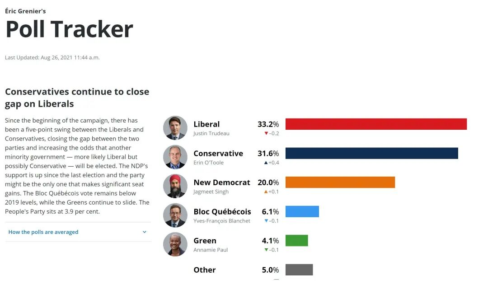
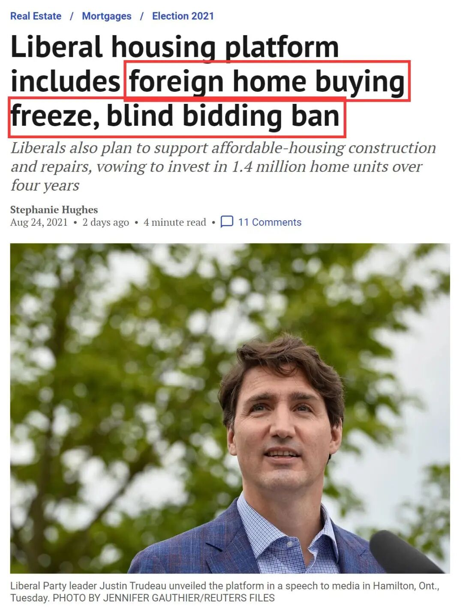
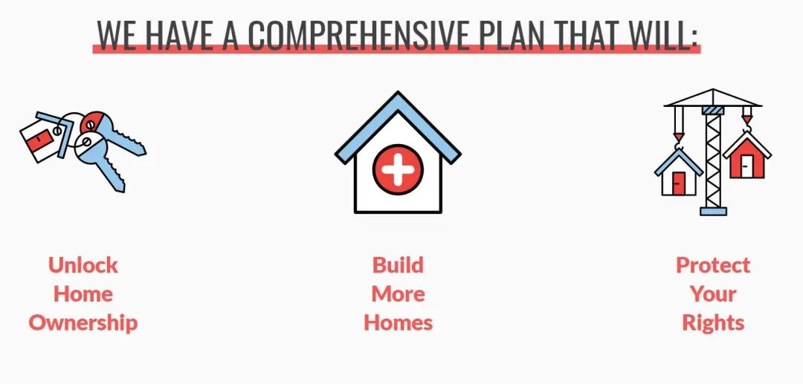
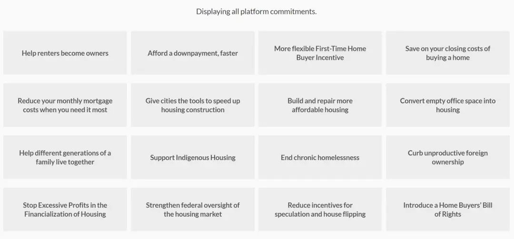
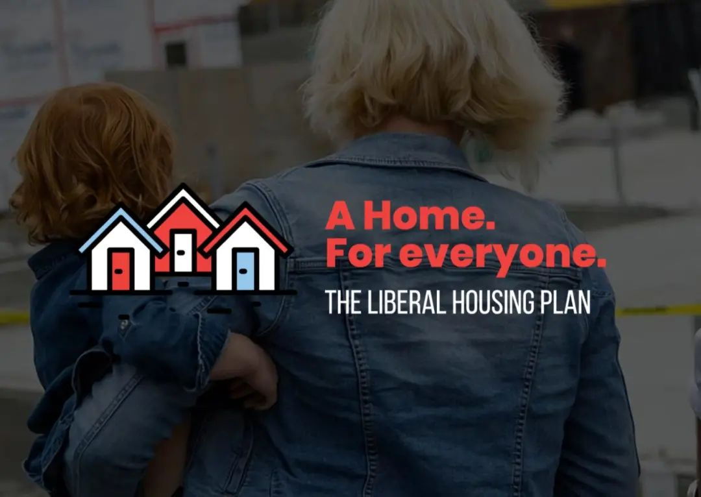
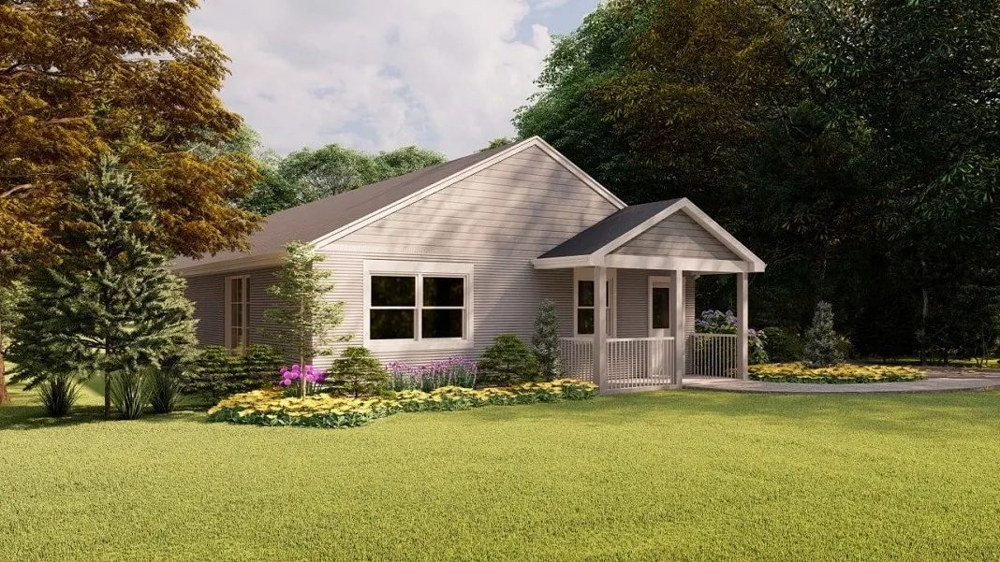
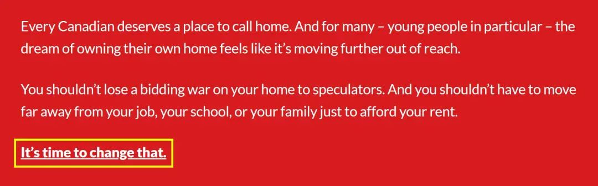
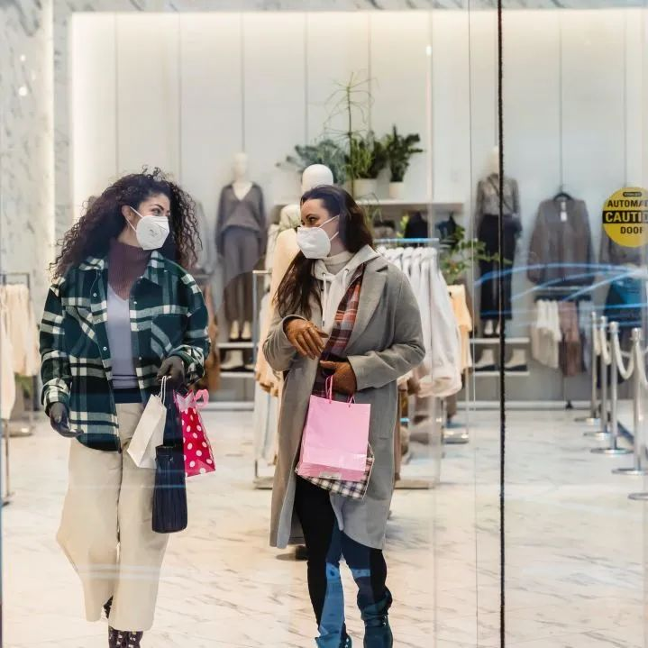

# 无标题

**链接地址:** http://mp.weixin.qq.com/s?__biz=MzU5OTQ2NjAwNw==&mid=2247487889&idx=1&sn=6bbad2e2f3fa74f1c1ac3e8ce3cffc47&chksm=feb5d8e9c9c251ff5294603b19c5363aaa46cb9925962ddf819d2777de1c69d670efaa7daf59&mpshare=1&scene=2&srcid=0827N5fpAS414bDcSISXFXw5&sharer_sharetime=1630046195621&sharer_shareid=be1c8edd6c93eec155a61c876e41d26a#rd
**作者:** 加拿大一站式体验
**获取时间:** 2025/8/28 19:42:08
**图片数量:** 19

---

## 原始HTML内容

<section style="box-sizing: border-box;font-size: 16px;"><section style="text-align: center;margin-top: 10px;margin-bottom: 10px;box-sizing: border-box;" powered-by="xiumi.us"><section style="max-width: 100%;vertical-align: middle;display: inline-block;line-height: 0;box-sizing: border-box;"></section></section><section style="margin-top: 10px;margin-right: 0%;margin-left: 0%;box-sizing: border-box;" powered-by="xiumi.us"><section style="display: inline-block;width: 100%;vertical-align: top;box-sizing: border-box;"><section style="box-sizing: border-box;" powered-by="xiumi.us"><section style="display: flex;flex-flow: row nowrap;margin: 10px 0%;box-sizing: border-box;"><section style="display: inline-block;vertical-align: middle;width: auto;min-width: 10%;max-width: 100%;flex: 0 0 auto;height: auto;align-self: center;box-sizing: border-box;"><section style="margin-top: 10px;margin-bottom: 10px;text-align: center;box-sizing: border-box;" powered-by="xiumi.us"><section style="background-color: rgb(68, 68, 68);display: inline-block;width: 2.5em;height: 2.5em;line-height: 2.5em;border-radius: 100%;margin-left: auto;margin-right: auto;font-size: 18px;color: rgb(255, 255, 255);font-family: Optima-Regular, PingFangTC-light;box-sizing: border-box;">
<strong style="box-sizing: border-box;">01</strong>
</section></section></section><section style="display: inline-block;vertical-align: middle;width: auto;align-self: center;flex: 0 0 auto;min-width: 10%;max-width: 100%;height: auto;box-sizing: border-box;"><section style="transform: translate3d(10px, 0px, 0px);-webkit-transform: translate3d(10px, 0px, 0px);-moz-transform: translate3d(10px, 0px, 0px);-o-transform: translate3d(10px, 0px, 0px);box-sizing: border-box;" powered-by="xiumi.us"><section style="font-family: Optima-Regular, PingFangTC-light;box-sizing: border-box;">
<strong style="box-sizing: border-box;">加国政府向房价狠狠开刀</strong>
</section></section><section style="margin-top: 3px;margin-right: 0%;margin-left: 0%;transform: translate3d(-10px, 0px, 0px);box-sizing: border-box;" powered-by="xiumi.us"><section style="background-color: rgb(68, 68, 68);height: 1px;box-sizing: border-box;"><section><svg viewBox="0 0 1 1" style="float:left;line-height:0;width:0;vertical-align:top;"></svg></section></section></section></section></section></section></section></section><section style="font-size: 14px;padding-right: 15px;padding-left: 15px;letter-spacing: 1px;box-sizing: border-box;" powered-by="xiumi.us">
在这次联邦大选中，<strong style="box-sizing: border-box;">房价可负担性</strong>成为选民重点关心的议题之一。而各政党表示，他们都相应出台了解决高房价的计划和方案。&nbsp;
</section><section style="font-size: 14px;padding-right: 15px;padding-left: 15px;letter-spacing: 1px;box-sizing: border-box;" powered-by="xiumi.us">
 

选民的共识反映出加拿大住房状况日益糟糕，无论是感觉被挤出市场的潜在业主，还是苦苦轮候社保房的低收入家庭，高房价似乎影响着每个群体。&nbsp;

 
</section><section style="text-align: center;margin-top: 10px;margin-bottom: 10px;box-sizing: border-box;" powered-by="xiumi.us"><section style="max-width: 100%;vertical-align: middle;display: inline-block;line-height: 0;width: 90%;height: auto;box-sizing: border-box;"></section></section><section style="font-size: 14px;padding-right: 15px;padding-left: 15px;letter-spacing: 1px;box-sizing: border-box;" powered-by="xiumi.us">
 

房价和人民的福祉紧密联系，也是各党在竞选中<strong style="box-sizing: border-box;">拉选票的重要筹码</strong>。目前支持率最高的自由党近日宣言，将对加拿大房价痛下杀手，对加拿大的房地产市场来一个<em style="box-sizing: border-box;"><strong style="box-sizing: border-box;">翻天覆地的大改革</strong></em>。

 
</section><section style="text-align: center;margin-top: 10px;margin-bottom: 10px;box-sizing: border-box;" powered-by="xiumi.us"><section style="max-width: 100%;vertical-align: middle;display: inline-block;line-height: 0;box-sizing: border-box;"></section></section><section style="font-size: 14px;padding-right: 15px;padding-left: 15px;letter-spacing: 1px;box-sizing: border-box;" powered-by="xiumi.us">
 

加拿大自由党领袖贾斯汀·特鲁多（Justin Trudeau）周二宣布，该党将在<em style="box-sizing: border-box;"><strong style="box-sizing: border-box;">未来四年建造140万套新住房</strong></em>，以帮助解决住房负担问题。 

 

<strong style="box-sizing: border-box;">人人有房的时代，来了吗？</strong>

 

 
</section><section style="box-sizing: border-box;" powered-by="xiumi.us"><section style="display: flex;flex-flow: row nowrap;margin: 10px 0%;box-sizing: border-box;"><section style="display: inline-block;vertical-align: middle;width: auto;min-width: 10%;max-width: 100%;flex: 0 0 auto;height: auto;align-self: center;box-sizing: border-box;"><section style="margin-top: 10px;margin-bottom: 10px;text-align: center;box-sizing: border-box;" powered-by="xiumi.us"><section style="background-color: rgb(68, 68, 68);display: inline-block;width: 2.5em;height: 2.5em;line-height: 2.5em;border-radius: 100%;margin-left: auto;margin-right: auto;font-size: 18px;color: rgb(255, 255, 255);font-family: Optima-Regular, PingFangTC-light;box-sizing: border-box;">
<strong style="box-sizing: border-box;">02</strong>
</section></section></section><section style="display: inline-block;vertical-align: middle;width: auto;align-self: center;flex: 0 0 auto;min-width: 10%;max-width: 100%;height: auto;box-sizing: border-box;"><section style="transform: translate3d(10px, 0px, 0px);-webkit-transform: translate3d(10px, 0px, 0px);-moz-transform: translate3d(10px, 0px, 0px);-o-transform: translate3d(10px, 0px, 0px);box-sizing: border-box;" powered-by="xiumi.us"><section style="font-family: Optima-Regular, PingFangTC-light;box-sizing: border-box;">
<strong style="box-sizing: border-box;">外国买家2年内禁买房！</strong>
</section></section><section style="margin-top: 3px;margin-right: 0%;margin-left: 0%;transform: translate3d(-10px, 0px, 0px);box-sizing: border-box;" powered-by="xiumi.us"><section style="background-color: rgb(68, 68, 68);height: 1px;box-sizing: border-box;"><section><svg viewBox="0 0 1 1" style="float:left;line-height:0;width:0;vertical-align:top;"></svg></section></section></section></section></section></section><section style="font-size: 14px;padding-right: 15px;padding-left: 15px;letter-spacing: 1px;box-sizing: border-box;" powered-by="xiumi.us">
 

自由党的住房计划还包括<strong style="box-sizing: border-box;">禁止外国人拥有住房，为期两年</strong>。这与保守党上周在其住房政纲上做出的承诺相同。

 
</section><section style="text-align: center;margin-top: 10px;margin-bottom: 10px;box-sizing: border-box;" powered-by="xiumi.us"><section style="max-width: 100%;vertical-align: middle;display: inline-block;line-height: 0;box-sizing: border-box;"></section></section><section style="font-size: 14px;padding-right: 15px;padding-left: 15px;letter-spacing: 1px;box-sizing: border-box;" powered-by="xiumi.us">
 

目前年轻人买房的压力与日俱增，如今，光靠爹妈支援首付都不行，成交价动辄比叫价高出几十万，让很多希望能有自己一片栖息之地的年轻人，喘不上来气。

 

在Hamilton举行的新闻发布会上，特鲁多对记者说，房地产市场受到“不稳定”和“不确定性”的影响，例如：<strong style="box-sizing: border-box;">新冠肺炎引发的房屋销量增加导致的价格飙升、竞购战、猖獗的房市投机行为和太多的空置房产</strong>。

 
</section><section style="text-align: center;margin-top: 10px;margin-bottom: 10px;box-sizing: border-box;" powered-by="xiumi.us"><section style="max-width: 100%;vertical-align: middle;display: inline-block;line-height: 0;width: 90%;height: auto;box-sizing: border-box;"></section></section><section style="font-size: 14px;padding-right: 15px;padding-left: 15px;letter-spacing: 1px;box-sizing: border-box;" powered-by="xiumi.us">
 

他说，这种情况需要政府干预，帮助更多的人拥有自己的住房。

 

“你不应该为了房租的多少而远离工作、学校或家庭。你不应该在你的<strong style="box-sizing: border-box;">房子的竞价战中输给投机者</strong>。是时候做出改变了。”他说。

 

 
</section><section style="box-sizing: border-box;" powered-by="xiumi.us"><section style="display: flex;flex-flow: row nowrap;margin: 10px 0%;box-sizing: border-box;"><section style="display: inline-block;vertical-align: middle;width: auto;min-width: 10%;max-width: 100%;flex: 0 0 auto;height: auto;align-self: center;box-sizing: border-box;"><section style="margin-top: 10px;margin-bottom: 10px;text-align: center;box-sizing: border-box;" powered-by="xiumi.us"><section style="background-color: rgb(68, 68, 68);display: inline-block;width: 2.5em;height: 2.5em;line-height: 2.5em;border-radius: 100%;margin-left: auto;margin-right: auto;font-size: 18px;color: rgb(255, 255, 255);font-family: Optima-Regular, PingFangTC-light;box-sizing: border-box;">
<strong style="box-sizing: border-box;">03</strong>
</section></section></section><section style="display: inline-block;vertical-align: middle;width: auto;align-self: center;flex: 0 0 auto;min-width: 10%;max-width: 100%;height: auto;box-sizing: border-box;"><section style="transform: translate3d(10px, 0px, 0px);-webkit-transform: translate3d(10px, 0px, 0px);-moz-transform: translate3d(10px, 0px, 0px);-o-transform: translate3d(10px, 0px, 0px);box-sizing: border-box;" powered-by="xiumi.us"><section style="font-family: Optima-Regular, PingFangTC-light;box-sizing: border-box;">
<strong style="box-sizing: border-box;">“房住不炒”，狠狠加税！</strong>
</section></section><section style="margin-top: 3px;margin-right: 0%;margin-left: 0%;transform: translate3d(-10px, 0px, 0px);box-sizing: border-box;" powered-by="xiumi.us"><section style="background-color: rgb(68, 68, 68);height: 1px;box-sizing: border-box;"><section><svg viewBox="0 0 1 1" style="float:left;line-height:0;width:0;vertical-align:top;"></svg></section></section></section></section></section></section><section style="font-size: 14px;padding-right: 15px;padding-left: 15px;letter-spacing: 1px;box-sizing: border-box;" powered-by="xiumi.us">
 
</section><section style="text-align: center;margin-top: 10px;margin-bottom: 10px;box-sizing: border-box;" powered-by="xiumi.us"><section style="max-width: 100%;vertical-align: middle;display: inline-block;line-height: 0;box-sizing: border-box;"></section></section><section style="font-size: 14px;padding-right: 15px;padding-left: 15px;letter-spacing: 1px;box-sizing: border-box;" powered-by="xiumi.us">
 

同时，特鲁多表示，如果自由党在9月20日再次当选，自由党政府将对住宅房产征收<strong style="box-sizing: border-box;">“炒房税”（anti-flipping tax）</strong>，这就要求买房者在买房后<em style="box-sizing: border-box;"><strong style="box-sizing: border-box;">必须持有房产至少12个月</strong></em>，否则将面临沉重的税收（ burdensome taxes）压力。

 
</section><section style="text-align: center;justify-content: center;margin: 10px 0%;transform: translate3d(1px, 0px, 0px);-webkit-transform: translate3d(1px, 0px, 0px);-moz-transform: translate3d(1px, 0px, 0px);-o-transform: translate3d(1px, 0px, 0px);box-sizing: border-box;" powered-by="xiumi.us"><section style="display: inline-block;vertical-align: bottom;width: auto;min-width: 10%;max-width: 100%;height: auto;align-self: flex-end;line-height: 0;box-sizing: border-box;"><section style="font-size: 19px;margin-right: 0%;margin-left: 0%;box-sizing: border-box;" powered-by="xiumi.us"><section style="display: inline-block;border-width: 1px;border-style: solid;border-color: rgb(29, 14, 14);background-color: rgb(29, 14, 14);width: 1.8em;height: 1.8em;line-height: 1.7;border-radius: 100%;margin-left: auto;margin-right: auto;color: rgb(253, 246, 236);letter-spacing: 1px;box-sizing: border-box;">
1
</section></section></section><section style="display: inline-block;vertical-align: bottom;width: auto;min-width: 10%;max-width: 100%;height: auto;align-self: flex-end;box-sizing: border-box;"><section style="text-align: justify;font-size: 19px;letter-spacing: 0px;line-height: 1.5;padding-right: 2px;padding-left: 2px;box-sizing: border-box;" powered-by="xiumi.us">
<strong style="box-sizing: border-box;">首套房储蓄账户</strong>
</section></section></section><section style="font-size: 14px;padding-right: 15px;padding-left: 15px;letter-spacing: 1px;box-sizing: border-box;" powered-by="xiumi.us">
 

 

如果自由党在9月20日再次当选，特鲁多将推出首套住房储蓄账户（first home savings account），<strong style="box-sizing: border-box;">允许40岁以下的加拿大人为他们的第一套住房储蓄4万元</strong>，并在购买时免税提取。存入账户的钱是免税的，提取时也不需要为可能的投资收益缴纳任何税款。

 
</section><section style="text-align: center;margin-top: 10px;margin-bottom: 10px;box-sizing: border-box;" powered-by="xiumi.us"><section style="max-width: 100%;vertical-align: middle;display: inline-block;line-height: 0;width: 90%;height: auto;box-sizing: border-box;"></section></section><section style="font-size: 14px;padding-right: 15px;padding-left: 15px;letter-spacing: 1px;box-sizing: border-box;" powered-by="xiumi.us">
 

他说，自由党政府将把首次购房者的<em style="box-sizing: border-box;"><strong style="box-sizing: border-box;">税收抵免从5,000元增加一倍</strong></em>，至10,000元，这一激励措施将有助于降低许多购房的收尾成本。

 

 
</section><section style="text-align: center;justify-content: center;margin: 10px 0%;transform: translate3d(1px, 0px, 0px);-webkit-transform: translate3d(1px, 0px, 0px);-moz-transform: translate3d(1px, 0px, 0px);-o-transform: translate3d(1px, 0px, 0px);box-sizing: border-box;" powered-by="xiumi.us"><section style="display: inline-block;vertical-align: bottom;width: auto;min-width: 10%;max-width: 100%;height: auto;align-self: flex-end;line-height: 0;box-sizing: border-box;"><section style="font-size: 19px;margin-right: 0%;margin-left: 0%;box-sizing: border-box;" powered-by="xiumi.us"><section style="display: inline-block;border-width: 1px;border-style: solid;border-color: rgb(29, 14, 14);background-color: rgb(29, 14, 14);width: 1.8em;height: 1.8em;line-height: 1.7;border-radius: 100%;margin-left: auto;margin-right: auto;color: rgb(253, 246, 236);letter-spacing: 1px;box-sizing: border-box;">
2
</section></section></section><section style="display: inline-block;vertical-align: bottom;width: auto;min-width: 10%;max-width: 100%;height: auto;align-self: flex-end;box-sizing: border-box;"><section style="text-align: justify;font-size: 19px;letter-spacing: 0px;line-height: 1.5;padding-right: 2px;padding-left: 2px;box-sizing: border-box;" powered-by="xiumi.us">
<strong style="box-sizing: border-box;">先租后买计划</strong>
</section></section></section><section style="font-size: 14px;padding-right: 15px;padding-left: 15px;letter-spacing: 1px;box-sizing: border-box;" powered-by="xiumi.us">
 

为了降低抵押贷款成本，自由党政府将迫使加拿大抵押贷款和住房公司(Canada mortgage and Housing Corporation)将抵押贷款<strong style="box-sizing: border-box;">保险费率下调25%</strong>，这将为普通民众节省6100元。

 

自由党还提出了一种<strong style="box-sizing: border-box;">“先租后买”（Rent-to-Own）</strong>计划，用10亿元的新资金“在5年或更短的时间内为租房者创造拥有住房的通道”。 

 
</section><section style="text-align: center;margin-top: 10px;margin-bottom: 10px;box-sizing: border-box;" powered-by="xiumi.us"><section style="max-width: 100%;vertical-align: middle;display: inline-block;line-height: 0;box-sizing: border-box;"></section></section><section style="font-size: 14px;padding-right: 15px;padding-left: 15px;letter-spacing: 1px;box-sizing: border-box;" powered-by="xiumi.us">
 
</section><section style="text-align: center;justify-content: center;margin: 10px 0%;transform: translate3d(1px, 0px, 0px);-webkit-transform: translate3d(1px, 0px, 0px);-moz-transform: translate3d(1px, 0px, 0px);-o-transform: translate3d(1px, 0px, 0px);box-sizing: border-box;" powered-by="xiumi.us"><section style="display: inline-block;vertical-align: bottom;width: auto;min-width: 10%;max-width: 100%;height: auto;align-self: flex-end;line-height: 0;box-sizing: border-box;"><section style="font-size: 19px;margin-right: 0%;margin-left: 0%;box-sizing: border-box;" powered-by="xiumi.us"><section style="display: inline-block;border-width: 1px;border-style: solid;border-color: rgb(29, 14, 14);background-color: rgb(29, 14, 14);width: 1.8em;height: 1.8em;line-height: 1.7;border-radius: 100%;margin-left: auto;margin-right: auto;color: rgb(253, 246, 236);letter-spacing: 1px;box-sizing: border-box;">
3
</section></section></section><section style="display: inline-block;vertical-align: bottom;width: auto;min-width: 10%;max-width: 100%;height: auto;align-self: flex-end;box-sizing: border-box;"><section style="text-align: justify;font-size: 19px;letter-spacing: 0px;line-height: 1.5;padding-right: 2px;padding-left: 2px;box-sizing: border-box;" powered-by="xiumi.us">
<strong style="box-sizing: border-box;">四年内建140万套住房</strong>
</section></section></section><section style="font-size: 14px;padding-right: 15px;padding-left: 15px;letter-spacing: 1px;box-sizing: border-box;" powered-by="xiumi.us">
 

“在未来四年里<em style="box-sizing: border-box;"><strong style="box-sizing: border-box;">建造、保留或修复140万套住房”</strong></em>，为城市提供“加快住房建设的新工具”。他说，重新当选的自由党政府将创造一个<strong style="box-sizing: border-box;">40亿元的资金池</strong>，如果城市利用资金池帮助<strong style="box-sizing: border-box;">创建“中产阶级家庭”</strong>。此计划将打击拥有闲置土地的投机者，并将在四年内提供百万套新房。

 

 
</section><section style="text-align: center;justify-content: center;margin: 10px 0%;transform: translate3d(1px, 0px, 0px);-webkit-transform: translate3d(1px, 0px, 0px);-moz-transform: translate3d(1px, 0px, 0px);-o-transform: translate3d(1px, 0px, 0px);box-sizing: border-box;" powered-by="xiumi.us"><section style="display: inline-block;vertical-align: bottom;width: auto;min-width: 10%;max-width: 100%;height: auto;align-self: flex-end;line-height: 0;box-sizing: border-box;"><section style="font-size: 19px;margin-right: 0%;margin-left: 0%;box-sizing: border-box;" powered-by="xiumi.us"><section style="display: inline-block;border-width: 1px;border-style: solid;border-color: rgb(29, 14, 14);background-color: rgb(29, 14, 14);width: 1.8em;height: 1.8em;line-height: 1.7;border-radius: 100%;margin-left: auto;margin-right: auto;color: rgb(253, 246, 236);letter-spacing: 1px;box-sizing: border-box;">
4
</section></section></section><section style="display: inline-block;vertical-align: bottom;width: auto;min-width: 10%;max-width: 100%;height: auto;align-self: flex-end;box-sizing: border-box;"><section style="text-align: justify;font-size: 19px;letter-spacing: 0px;line-height: 1.5;padding-right: 2px;padding-left: 2px;box-sizing: border-box;" powered-by="xiumi.us">
<strong style="box-sizing: border-box;">竞标价格透明</strong>
</section></section></section><section style="font-size: 14px;padding-right: 15px;padding-left: 15px;letter-spacing: 1px;box-sizing: border-box;" powered-by="xiumi.us">
 

一条新的联邦《购房者权利法案》将禁止<strong style="box-sizing: border-box;">“盲目竞购”（blind bidding）</strong>，即那些”抢“同一套房产的购房者常常不知道别人出价多少。

 
</section><section style="text-align: center;margin-top: 10px;margin-bottom: 10px;box-sizing: border-box;" powered-by="xiumi.us"><section style="max-width: 100%;vertical-align: middle;display: inline-block;line-height: 0;width: 90%;height: auto;box-sizing: border-box;"></section></section><section style="font-size: 14px;padding-right: 15px;padding-left: 15px;letter-spacing: 1px;box-sizing: border-box;" powered-by="xiumi.us">
 

将确立对房屋进行检查的合法权利，确保“总价格透明”，方便潜在买家了解近期房屋售价历史，要求代表买卖双方的房地产经纪人<strong style="box-sizing: border-box;">披露更多信息</strong>，并要求银行向失业的人提供6个月的抵押贷款延期。

 

 
</section><section style="text-align: center;justify-content: center;margin: 10px 0%;transform: translate3d(1px, 0px, 0px);-webkit-transform: translate3d(1px, 0px, 0px);-moz-transform: translate3d(1px, 0px, 0px);-o-transform: translate3d(1px, 0px, 0px);box-sizing: border-box;" powered-by="xiumi.us"><section style="display: inline-block;vertical-align: bottom;width: auto;min-width: 10%;max-width: 100%;height: auto;align-self: flex-end;line-height: 0;box-sizing: border-box;"><section style="font-size: 19px;margin-right: 0%;margin-left: 0%;box-sizing: border-box;" powered-by="xiumi.us"><section style="display: inline-block;border-width: 1px;border-style: solid;border-color: rgb(29, 14, 14);background-color: rgb(29, 14, 14);width: 1.8em;height: 1.8em;line-height: 1.7;border-radius: 100%;margin-left: auto;margin-right: auto;color: rgb(253, 246, 236);letter-spacing: 1px;box-sizing: border-box;">
5
</section></section></section><section style="display: inline-block;vertical-align: bottom;width: auto;min-width: 10%;max-width: 100%;height: auto;align-self: flex-end;box-sizing: border-box;"><section style="text-align: justify;font-size: 19px;letter-spacing: 0px;line-height: 1.5;padding-right: 2px;padding-left: 2px;box-sizing: border-box;" powered-by="xiumi.us">
<strong style="box-sizing: border-box;">未来两年禁止外国人买房</strong>
</section></section></section><section style="font-size: 14px;padding-right: 15px;padding-left: 15px;letter-spacing: 1px;box-sizing: border-box;" powered-by="xiumi.us">
 

与保守党相同，自由党政府还将在<strong style="box-sizing: border-box;">未来两年内禁止外国人拥有加拿大住房</strong>，这一措施旨在遏制由离岸资金驱动的猖獗的房地产投机活动。

 
</section><section style="text-align: center;justify-content: center;margin: 10px 0%;transform: translate3d(1px, 0px, 0px);-webkit-transform: translate3d(1px, 0px, 0px);-moz-transform: translate3d(1px, 0px, 0px);-o-transform: translate3d(1px, 0px, 0px);box-sizing: border-box;" powered-by="xiumi.us"><section style="display: inline-block;vertical-align: bottom;width: auto;min-width: 10%;max-width: 100%;height: auto;align-self: flex-end;line-height: 0;box-sizing: border-box;"><section style="font-size: 19px;margin-right: 0%;margin-left: 0%;box-sizing: border-box;" powered-by="xiumi.us"><section style="display: inline-block;border-width: 1px;border-style: solid;border-color: rgb(29, 14, 14);background-color: rgb(29, 14, 14);width: 1.8em;height: 1.8em;line-height: 1.7;border-radius: 100%;margin-left: auto;margin-right: auto;color: rgb(253, 246, 236);letter-spacing: 1px;box-sizing: border-box;">
6
</section></section></section><section style="display: inline-block;vertical-align: bottom;width: auto;min-width: 10%;max-width: 100%;height: auto;align-self: flex-end;box-sizing: border-box;"><section style="text-align: justify;font-size: 19px;letter-spacing: 0px;line-height: 1.5;padding-right: 2px;padding-left: 2px;box-sizing: border-box;" powered-by="xiumi.us">
<strong style="box-sizing: border-box;">非居民的房屋、土地开征空置税</strong>
</section></section></section><section style="font-size: 14px;padding-right: 15px;padding-left: 15px;letter-spacing: 1px;box-sizing: border-box;" powered-by="xiumi.us">
 

除了这项禁令，杜鲁多还表示，他将扩大即将出台的针对非居民和非加拿大人拥有的<strong style="box-sizing: border-box;">空置房屋的税收</strong>，将大城市地区的外国人拥有的空置土地也包括在内。

 
</section><section style="text-align: center;margin-top: 10px;margin-bottom: 10px;box-sizing: border-box;" powered-by="xiumi.us"><section style="max-width: 100%;vertical-align: middle;display: inline-block;line-height: 0;width: 90%;height: auto;box-sizing: border-box;"></section></section><section style="font-size: 14px;padding-right: 15px;padding-left: 15px;letter-spacing: 1px;box-sizing: border-box;" powered-by="xiumi.us">
 
</section><section style="text-align: center;justify-content: center;margin: 10px 0%;transform: translate3d(1px, 0px, 0px);-webkit-transform: translate3d(1px, 0px, 0px);-moz-transform: translate3d(1px, 0px, 0px);-o-transform: translate3d(1px, 0px, 0px);box-sizing: border-box;" powered-by="xiumi.us"><section style="display: inline-block;vertical-align: bottom;width: auto;min-width: 10%;max-width: 100%;height: auto;align-self: flex-end;line-height: 0;box-sizing: border-box;"><section style="font-size: 19px;margin-right: 0%;margin-left: 0%;box-sizing: border-box;" powered-by="xiumi.us"><section style="display: inline-block;border-width: 1px;border-style: solid;border-color: rgb(29, 14, 14);background-color: rgb(29, 14, 14);width: 1.8em;height: 1.8em;line-height: 1.7;border-radius: 100%;margin-left: auto;margin-right: auto;color: rgb(253, 246, 236);letter-spacing: 1px;box-sizing: border-box;">
7
</section></section></section><section style="display: inline-block;vertical-align: bottom;width: auto;min-width: 10%;max-width: 100%;height: auto;align-self: flex-end;box-sizing: border-box;"><section style="text-align: justify;font-size: 19px;letter-spacing: 0px;line-height: 1.5;padding-right: 2px;padding-left: 2px;box-sizing: border-box;" powered-by="xiumi.us">
<strong style="box-sizing: border-box;">开征“炒房税”</strong>
</section></section></section><section style="box-sizing: border-box;" powered-by="xiumi.us">
 
</section><section style="font-size: 14px;padding-right: 15px;padding-left: 15px;letter-spacing: 1px;box-sizing: border-box;" powered-by="xiumi.us">
自由党还将对住宅房产征收<strong style="box-sizing: border-box;">“反炒房税”（anti-flipping tax）</strong>，这将要求房产持有至少12个月，否则将面临重税。

 

 
</section><section style="box-sizing: border-box;" powered-by="xiumi.us"><section style="display: flex;flex-flow: row nowrap;margin: 10px 0%;box-sizing: border-box;"><section style="display: inline-block;vertical-align: middle;width: auto;min-width: 10%;max-width: 100%;flex: 0 0 auto;height: auto;align-self: center;box-sizing: border-box;"><section style="margin-top: 10px;margin-bottom: 10px;text-align: center;box-sizing: border-box;" powered-by="xiumi.us"><section style="background-color: rgb(68, 68, 68);display: inline-block;width: 2.5em;height: 2.5em;line-height: 2.5em;border-radius: 100%;margin-left: auto;margin-right: auto;font-size: 18px;color: rgb(255, 255, 255);font-family: Optima-Regular, PingFangTC-light;box-sizing: border-box;">
<strong style="box-sizing: border-box;">04</strong>
</section></section></section><section style="display: inline-block;vertical-align: middle;width: auto;align-self: center;flex: 0 0 auto;min-width: 10%;max-width: 100%;height: auto;box-sizing: border-box;"><section style="transform: translate3d(10px, 0px, 0px);-webkit-transform: translate3d(10px, 0px, 0px);-moz-transform: translate3d(10px, 0px, 0px);-o-transform: translate3d(10px, 0px, 0px);box-sizing: border-box;" powered-by="xiumi.us"><section style="font-family: Optima-Regular, PingFangTC-light;box-sizing: border-box;">
<strong style="box-sizing: border-box;">外国买家彻底凉凉（了吗）！</strong>
</section></section><section style="margin-top: 3px;margin-right: 0%;margin-left: 0%;transform: translate3d(-10px, 0px, 0px);box-sizing: border-box;" powered-by="xiumi.us"><section style="background-color: rgb(68, 68, 68);height: 1px;box-sizing: border-box;"><section><svg viewBox="0 0 1 1" style="float:left;line-height:0;width:0;vertical-align:top;"></svg></section></section></section></section></section></section><section style="font-size: 14px;padding-right: 15px;padding-left: 15px;letter-spacing: 1px;box-sizing: border-box;" powered-by="xiumi.us">
 

与保守党的承诺相一致的是，自由党将在未来两年内禁止外国人拥有加拿大住房。因此，<strong style="box-sizing: border-box;">不管谁上台，外国买家都要悲剧了。</strong> 

 
</section><section style="text-align: center;margin-top: 10px;margin-bottom: 10px;box-sizing: border-box;" powered-by="xiumi.us"><section style="max-width: 100%;vertical-align: middle;display: inline-block;line-height: 0;width: 90%;height: auto;box-sizing: border-box;"></section></section><section style="font-size: 14px;padding-right: 15px;padding-left: 15px;letter-spacing: 1px;box-sizing: border-box;" powered-by="xiumi.us">
 

特鲁多政府承诺将采取一系列新措施和福利，在限制外国买家买房和征收炒房税的同时，发福利帮助加拿大人买房，大家怎么看呢？

 
<section style="box-sizing: border-box;font-size: 16px;"><section style="transform: rotate(0deg);-webkit-transform: rotate(0deg);-moz-transform: rotate(0deg);-o-transform: rotate(0deg);box-sizing: border-box;" powered-by="xiumi.us"><section style="margin: 10px 0%;box-sizing: border-box;"><section style="display: inline-block;width: 100%;vertical-align: top;box-shadow: rgb(0, 0, 0) 0px 0px 0px;background-color: rgb(241, 241, 241);padding: 10px;box-sizing: border-box;"><section style="text-align: center;justify-content: center;box-sizing: border-box;" powered-by="xiumi.us"><section style="display: inline-block;width: 100%;vertical-align: top;background-color: rgb(255, 255, 255);padding: 20px 10px;height: auto;box-shadow: rgb(198, 198, 198) 0px 0px 2px;border-width: 0px;border-radius: 6px;border-style: none;border-color: rgb(62, 62, 62);overflow: hidden;box-sizing: border-box;"><section style="text-align: justify;color: rgb(189, 189, 189);box-sizing: border-box;" powered-by="xiumi.us"><strong style="box-sizing: border-box;">猜你想看</strong></section><section style="text-align: justify;box-sizing: border-box;" powered-by="xiumi.us">
 
</section><section style="box-sizing: border-box;" powered-by="xiumi.us"><section style="display: flex;flex-flow: row nowrap;box-sizing: border-box;"><section style="display: inline-block;vertical-align: top;width: auto;flex: 100 100 0%;align-self: flex-start;height: auto;box-shadow: rgb(0, 0, 0) 0px 0px 0px;border-bottom: 1px dashed rgba(106, 106, 106, 0.25);border-bottom-right-radius: 0px;margin-right: 10px;box-sizing: border-box;"><section style="text-align: justify;font-size: 14px;box-sizing: border-box;" powered-by="xiumi.us">
<a target="_blank" href="http://mp.weixin.qq.com/s?__biz=MzU5OTQ2NjAwNw==&amp;mid=2247487821&amp;idx=1&amp;sn=18296d816a6bf1db8b8177a91eed3520&amp;chksm=feb5d835c9c251233180e4e4944a4415766082fe8ea4b8749944f86334d2a958ecb6c75ae954&amp;scene=21#wechat_redirect" textvalue="卑诗省恢复口罩强制令！ 去这些地方必须戴！" data-itemshowtype="0" tab="innerlink" data-linktype="2">卑诗省恢复口罩强制令！去这些地方必须戴！</a>
</section></section><section style="display: inline-block;vertical-align: top;width: auto;flex: 20 20 0%;align-self: flex-start;height: auto;border-width: 0px;margin-left: 5px;box-sizing: border-box;"><section style="margin-right: 0%;margin-left: 0%;box-sizing: border-box;" powered-by="xiumi.us"><section style="max-width: 100%;vertical-align: middle;display: inline-block;line-height: 0;box-shadow: rgb(0, 0, 0) 0px 0px 0px;box-sizing: border-box;"><a target="_blank" href="http://mp.weixin.qq.com/s?__biz=MzU5OTQ2NjAwNw==&amp;mid=2247487821&amp;idx=1&amp;sn=18296d816a6bf1db8b8177a91eed3520&amp;chksm=feb5d835c9c251233180e4e4944a4415766082fe8ea4b8749944f86334d2a958ecb6c75ae954&amp;scene=21#wechat_redirect" textvalue="你已选中了添加链接的内容" data-itemshowtype="0" tab="innerlink" data-linktype="1"></a></section></section></section></section></section><section style="text-align: justify;box-sizing: border-box;" powered-by="xiumi.us">
 
</section><section style="box-sizing: border-box;" powered-by="xiumi.us"><section style="display: flex;flex-flow: row nowrap;margin-right: 0%;margin-left: 0%;box-sizing: border-box;"><section style="display: inline-block;vertical-align: top;width: auto;flex: 100 100 0%;align-self: flex-start;height: auto;box-shadow: rgb(0, 0, 0) 0px 0px 0px;border-bottom: 1px dashed rgba(106, 106, 106, 0.25);border-bottom-right-radius: 0px;margin-right: 10px;box-sizing: border-box;"><section style="text-align: justify;font-size: 14px;box-sizing: border-box;" powered-by="xiumi.us">
<a target="_blank" href="http://mp.weixin.qq.com/s?__biz=MzU5OTQ2NjAwNw==&amp;mid=2247487821&amp;idx=2&amp;sn=af213fa119d25d49c2ae651dfd58ea67&amp;chksm=feb5d835c9c2512380f8bc03bcb8933176e09371c13ca8609f771ba8b1aa19955bfab04e9447&amp;scene=21#wechat_redirect" textvalue="只打疫苗不行！加拿大专家：第四波恐还要封城！避免全靠自觉！" data-itemshowtype="0" tab="innerlink" data-linktype="2">只打疫苗不行！加拿大专家：第四波恐还要封城！避免全靠自觉！</a>
</section></section><section style="display: inline-block;vertical-align: top;width: auto;flex: 20 20 0%;align-self: flex-start;height: auto;border-width: 0px;margin-left: 5px;box-sizing: border-box;"><section style="margin-right: 0%;margin-left: 0%;box-sizing: border-box;" powered-by="xiumi.us"><section style="max-width: 100%;vertical-align: middle;display: inline-block;line-height: 0;box-sizing: border-box;"><a target="_blank" href="http://mp.weixin.qq.com/s?__biz=MzU5OTQ2NjAwNw==&amp;mid=2247487821&amp;idx=2&amp;sn=af213fa119d25d49c2ae651dfd58ea67&amp;chksm=feb5d835c9c2512380f8bc03bcb8933176e09371c13ca8609f771ba8b1aa19955bfab04e9447&amp;scene=21#wechat_redirect" textvalue="你已选中了添加链接的内容" data-itemshowtype="0" tab="innerlink" data-linktype="1"></a></section></section></section></section></section><section style="text-align: justify;box-sizing: border-box;" powered-by="xiumi.us">
 
</section><section style="box-sizing: border-box;" powered-by="xiumi.us"><section style="display: flex;flex-flow: row nowrap;margin-right: 0%;margin-left: 0%;box-sizing: border-box;"><section style="display: inline-block;vertical-align: top;width: auto;flex: 100 100 0%;align-self: flex-start;height: auto;box-shadow: rgb(0, 0, 0) 0px 0px 0px;border-bottom: 1px dashed rgba(106, 106, 106, 0.25);border-bottom-right-radius: 0px;margin-right: 10px;box-sizing: border-box;"><section style="text-align: justify;font-size: 14px;box-sizing: border-box;" powered-by="xiumi.us">
<a target="_blank" href="http://mp.weixin.qq.com/s?__biz=MzU5OTQ2NjAwNw==&amp;mid=2247487821&amp;idx=3&amp;sn=28808dd4888a3eac44a5e742098cfc4b&amp;chksm=feb5d835c9c25123c6341e73ceb33d5800c1a07db3b817404aa67ceebafe9bbfa5d2c0396c63&amp;scene=21#wechat_redirect" textvalue="白囤货了！这些口罩不能防COVID-19？！只能过滤10%..." data-itemshowtype="0" tab="innerlink" data-linktype="2">白囤货了！这些口罩不能防COVID-19？！只能过滤10%...</a>
</section></section><section style="display: inline-block;vertical-align: top;width: auto;flex: 20 20 0%;align-self: flex-start;height: auto;border-width: 0px;margin-left: 5px;box-sizing: border-box;"><section style="margin-right: 0%;margin-left: 0%;box-sizing: border-box;" powered-by="xiumi.us"><section style="max-width: 100%;vertical-align: middle;display: inline-block;line-height: 0;box-shadow: rgb(0, 0, 0) 0px 0px 0px;box-sizing: border-box;"><a target="_blank" href="http://mp.weixin.qq.com/s?__biz=MzU5OTQ2NjAwNw==&amp;mid=2247487821&amp;idx=3&amp;sn=28808dd4888a3eac44a5e742098cfc4b&amp;chksm=feb5d835c9c25123c6341e73ceb33d5800c1a07db3b817404aa67ceebafe9bbfa5d2c0396c63&amp;scene=21#wechat_redirect" textvalue="你已选中了添加链接的内容" data-itemshowtype="0" tab="innerlink" data-linktype="1"></a></section></section></section></section></section></section></section></section></section></section></section>
 

 

</section><section style="font-size: 14px;padding-right: 15px;padding-left: 15px;letter-spacing: 1px;box-sizing: border-box;" powered-by="xiumi.us">
<strong style="box-sizing: border-box;">文章信息来源：</strong>

https://liberal.ca/housing/

 

https://financialpost.com/real-estate/mortgages/liberal-housing-platform-includes-foreign-home-buying-freeze-blind-bidding-ban

 

https://www.blogto.com/real-estate-toronto/2021/08/trudeau-housing-ban-foreign-home-buyers-canada/

 

多伦多华人圈

 

 
</section>

<section style="text-align: center;margin-top: 10px;margin-bottom: 10px;box-sizing: border-box;" powered-by="xiumi.us"><section style="max-width: 100%;vertical-align: middle;display: inline-block;line-height: 0;box-sizing: border-box;"></section></section><section style="text-align: center;margin-top: 10px;margin-bottom: 10px;box-sizing: border-box;" powered-by="xiumi.us"><section style="max-width: 100%;vertical-align: middle;display: inline-block;line-height: 0;box-sizing: border-box;"></section></section><section style="text-align: center;margin-top: 10px;margin-bottom: 10px;box-sizing: border-box;" powered-by="xiumi.us"><section style="max-width: 100%;vertical-align: middle;display: inline-block;line-height: 0;box-sizing: border-box;"></section></section><section style="box-sizing: border-box;" powered-by="xiumi.us">
 
</section><section style="text-align: center;font-size: 12px;color: rgb(0, 0, 0);padding-right: 15px;padding-left: 15px;box-sizing: border-box;" powered-by="xiumi.us">
Presented by
</section><section style="box-sizing: border-box;" powered-by="xiumi.us">
 
</section><section style="text-align: center;margin-top: 10px;margin-bottom: 10px;box-sizing: border-box;" powered-by="xiumi.us"><section style="max-width: 100%;vertical-align: middle;display: inline-block;line-height: 0;box-sizing: border-box;"></section></section><section style="box-sizing: border-box;" powered-by="xiumi.us">
👆

<strong style="box-sizing: border-box;">&nbsp;长期招聘小编&nbsp;</strong>

<strong style="box-sizing: border-box;">&nbsp;感兴趣者请扫码应聘&nbsp;</strong>

 

- ABOUT -

 

本地资讯 | 留学移民 | 吃喝玩乐 | 求职宝典

 

一站式平台

 

- SAY HI -

 

商务合作微信: Canadapros

 
</section></section>
 

---

## 纯文本内容

01加国政府向房价狠狠开刀在这次联邦大选中，房价可负担性成为选民重点关心的议题之一。而各政党表示，他们都相应出台了解决高房价的计划和方案。 选民的共识反映出加拿大住房状况日益糟糕，无论是感觉被挤出市场的潜在业主，还是苦苦轮候社保房的低收入家庭，高房价似乎影响着每个群体。 房价和人民的福祉紧密联系，也是各党在竞选中拉选票的重要筹码。目前支持率最高的自由党近日宣言，将对加拿大房价痛下杀手，对加拿大的房地产市场来一个翻天覆地的大改革。加拿大自由党领袖贾斯汀·特鲁多（Justin Trudeau）周二宣布，该党将在未来四年建造140万套新住房，以帮助解决住房负担问题。人人有房的时代，来了吗？02外国买家2年内禁买房！自由党的住房计划还包括禁止外国人拥有住房，为期两年。这与保守党上周在其住房政纲上做出的承诺相同。目前年轻人买房的压力与日俱增，如今，光靠爹妈支援首付都不行，成交价动辄比叫价高出几十万，让很多希望能有自己一片栖息之地的年轻人，喘不上来气。在Hamilton举行的新闻发布会上，特鲁多对记者说，房地产市场受到“不稳定”和“不确定性”的影响，例如：新冠肺炎引发的房屋销量增加导致的价格飙升、竞购战、猖獗的房市投机行为和太多的空置房产。他说，这种情况需要政府干预，帮助更多的人拥有自己的住房。“你不应该为了房租的多少而远离工作、学校或家庭。你不应该在你的房子的竞价战中输给投机者。是时候做出改变了。”他说。03“房住不炒”，狠狠加税！同时，特鲁多表示，如果自由党在9月20日再次当选，自由党政府将对住宅房产征收“炒房税”（anti-flipping tax），这就要求买房者在买房后必须持有房产至少12个月，否则将面临沉重的税收（ burdensome taxes）压力。1首套房储蓄账户如果自由党在9月20日再次当选，特鲁多将推出首套住房储蓄账户（first home savings account），允许40岁以下的加拿大人为他们的第一套住房储蓄4万元，并在购买时免税提取。存入账户的钱是免税的，提取时也不需要为可能的投资收益缴纳任何税款。他说，自由党政府将把首次购房者的税收抵免从5,000元增加一倍，至10,000元，这一激励措施将有助于降低许多购房的收尾成本。2先租后买计划为了降低抵押贷款成本，自由党政府将迫使加拿大抵押贷款和住房公司(Canada mortgage and Housing Corporation)将抵押贷款保险费率下调25%，这将为普通民众节省6100元。自由党还提出了一种“先租后买”（Rent-to-Own）计划，用10亿元的新资金“在5年或更短的时间内为租房者创造拥有住房的通道”。3四年内建140万套住房“在未来四年里建造、保留或修复140万套住房”，为城市提供“加快住房建设的新工具”。他说，重新当选的自由党政府将创造一个40亿元的资金池，如果城市利用资金池帮助创建“中产阶级家庭”。此计划将打击拥有闲置土地的投机者，并将在四年内提供百万套新房。4竞标价格透明一条新的联邦《购房者权利法案》将禁止“盲目竞购”（blind bidding），即那些”抢“同一套房产的购房者常常不知道别人出价多少。将确立对房屋进行检查的合法权利，确保“总价格透明”，方便潜在买家了解近期房屋售价历史，要求代表买卖双方的房地产经纪人披露更多信息，并要求银行向失业的人提供6个月的抵押贷款延期。5未来两年禁止外国人买房与保守党相同，自由党政府还将在未来两年内禁止外国人拥有加拿大住房，这一措施旨在遏制由离岸资金驱动的猖獗的房地产投机活动。6非居民的房屋、土地开征空置税除了这项禁令，杜鲁多还表示，他将扩大即将出台的针对非居民和非加拿大人拥有的空置房屋的税收，将大城市地区的外国人拥有的空置土地也包括在内。7开征“炒房税”自由党还将对住宅房产征收“反炒房税”（anti-flipping tax），这将要求房产持有至少12个月，否则将面临重税。04外国买家彻底凉凉（了吗）！与保守党的承诺相一致的是，自由党将在未来两年内禁止外国人拥有加拿大住房。因此，不管谁上台，外国买家都要悲剧了。特鲁多政府承诺将采取一系列新措施和福利，在限制外国买家买房和征收炒房税的同时，发福利帮助加拿大人买房，大家怎么看呢？猜你想看卑诗省恢复口罩强制令！去这些地方必须戴！只打疫苗不行！加拿大专家：第四波恐还要封城！避免全靠自觉！白囤货了！这些口罩不能防COVID-19？！只能过滤10%...文章信息来源：https://liberal.ca/housing/https://financialpost.com/real-estate/mortgages/liberal-housing-platform-includes-foreign-home-buying-freeze-blind-bidding-banhttps://www.blogto.com/real-estate-toronto/2021/08/trudeau-housing-ban-foreign-home-buyers-canada/多伦多华人圈Presented by👆 长期招聘小编  感兴趣者请扫码应聘 - ABOUT -本地资讯 | 留学移民 | 吃喝玩乐 | 求职宝典一站式平台- SAY HI -商务合作微信: Canadapros

---

## 图片列表

-  (原始链接: https://mmbiz.qpic.cn/mmbiz_jpg/Mvb870zkymhRH4KicWLpYXAvxBuwy75EDvCRSghDVGyrhyAt2Rdtp18zFZ8hiapUGtesnLPTLg02xfvRGPahBw5A/640?wx_fmt=jpeg)
-  (原始链接: https://mmbiz.qpic.cn/mmbiz_jpg/Mvb870zkymhRH4KicWLpYXAvxBuwy75EDg7b3mLRWpDJ6ruM2h7XnBb3ESNg776DZGr7JB7q09tUemZnVFAEemg/640?wx_fmt=jpeg)
-  (原始链接: https://mmbiz.qpic.cn/mmbiz_jpg/Mvb870zkymhRH4KicWLpYXAvxBuwy75EDZicpHYicnmbp1veHqbuMAZH4K9eYXWvpdg1IqxkcVIBZYmLKCbeiavBOA/640?wx_fmt=jpeg)
-  (原始链接: https://mmbiz.qpic.cn/mmbiz_jpg/Mvb870zkymhRH4KicWLpYXAvxBuwy75EDOwIFgQtJ05v3eKI1QAiaicN4Jd9lOiblQTGPI4yGyicOEopYJ422kuh0lg/640?wx_fmt=jpeg)
-  (原始链接: https://mmbiz.qpic.cn/mmbiz_jpg/Mvb870zkymhRH4KicWLpYXAvxBuwy75EDFnOGx1iaLLNdtBGBGuKia3oJ10H3Z2k01JgiasF998lVGpicp4zPDoDrNw/640?wx_fmt=jpeg)
-  (原始链接: https://mmbiz.qpic.cn/mmbiz_jpg/Mvb870zkymhRH4KicWLpYXAvxBuwy75EDgCKW7zQ1u38oGMfS7lwjIvdYNdibyjDXS4AOxfO0N8zHJeiaKSwW6Hlg/640?wx_fmt=jpeg)
-  (原始链接: https://mmbiz.qpic.cn/mmbiz_jpg/Mvb870zkymhRH4KicWLpYXAvxBuwy75EDPibBgQKxlwD027ia3s03T1DfzI481Mial5VYqibsHYfEn1ADibwSg5tNAlA/640?wx_fmt=jpeg)
-  (原始链接: https://mmbiz.qpic.cn/mmbiz_jpg/Mvb870zkymhRH4KicWLpYXAvxBuwy75EDSmrS52uUtrkHRHFmAMegsgcwhRDPIia8xCia8ibIMSIkyuHUoEeFibKLFg/640?wx_fmt=jpeg)
-  (原始链接: https://mmbiz.qpic.cn/mmbiz_jpg/Mvb870zkymhRH4KicWLpYXAvxBuwy75EDSZribFQXSAHY8Bg7CV8kZaicgf1lkc2BuB1Rdic9GiancAWhHWFOUmdCtw/640?wx_fmt=jpeg)
-  (原始链接: https://mmbiz.qpic.cn/mmbiz_jpg/Mvb870zkymhRH4KicWLpYXAvxBuwy75EDCDQHCM5IovQa5rdwbSbD5hKRsnhMA98u7Ox9nibbtUIEtum8WEz3UAA/640?wx_fmt=jpeg)
-  (原始链接: https://mmbiz.qpic.cn/mmbiz_jpg/Mvb870zkymhRH4KicWLpYXAvxBuwy75EDA0hVHysrEP3Vo8BWia9ict1LRICZZce40zibq07eBecaaycNVmD9mHKvw/640?wx_fmt=jpeg)
-  (原始链接: https://mmbiz.qpic.cn/mmbiz_jpg/Mvb870zkymhRH4KicWLpYXAvxBuwy75EDGv9DdxRwncuhl4SEW7t77jDq5boY5JYMas2j2XBer2gXNQQ5kpL20A/640?wx_fmt=jpeg)
-  (原始链接: https://mmbiz.qpic.cn/mmbiz_jpg/Mvb870zkymhRH4KicWLpYXAvxBuwy75ED7Atxa7icXFgxuE41nRibg5JxkIibzohz6N9DKQvkOs9y1W3KZzIR7uFoQ/640?wx_fmt=jpeg)
-  (原始链接: https://mmbiz.qpic.cn/mmbiz_jpg/Mvb870zkymhRH4KicWLpYXAvxBuwy75EDVvr2Pm6r8ydIncv9lKyaG84libbQFgbFQFC6o0aYgwhgSApa6MubxyQ/640?wx_fmt=jpeg)
-  (原始链接: https://mmbiz.qpic.cn/mmbiz_jpg/Mvb870zkymhiaKySYGAuPBO5Cibw9e2r5l3K1QkiarKeIFtibF9P817HmIQu0uA7fUMz3XgdWWib2xPxjOezaVI1nvA/640?wx_fmt=jpeg)
-  (原始链接: https://mmbiz.qpic.cn/mmbiz_jpg/Mvb870zkymhRH4KicWLpYXAvxBuwy75ED4WG85HUxGGwEQhefU3ULPRTLlEB1CWdoib4Om2NL14SbzAr8BpciaIvg/640?wx_fmt=jpeg)
-  (原始链接: https://mmbiz.qpic.cn/mmbiz_png/Mvb870zkymhRH4KicWLpYXAvxBuwy75ED5EFlPwF11ylyfzkTfCb4icIxANDn6OKS9htQ5ONtpPfZB4Ce6d94XBQ/640?wx_fmt=png)
-  (原始链接: https://mmbiz.qpic.cn/mmbiz_png/Mvb870zkymhRH4KicWLpYXAvxBuwy75EDQpJkkAZz2MG3vEHznDjGADDSic83dGJqYpw50W1GytjtYtJwicFQG7gg/640?wx_fmt=png)
-  (原始链接: https://mmbiz.qpic.cn/mmbiz_jpg/Mvb870zkymhRH4KicWLpYXAvxBuwy75EDw7NeAcqiaLyR04yUJm2JgGVOu3t0iaBykib1NVTmxSKrlmBDpcIGiaMUHQ/640?wx_fmt=jpeg)
