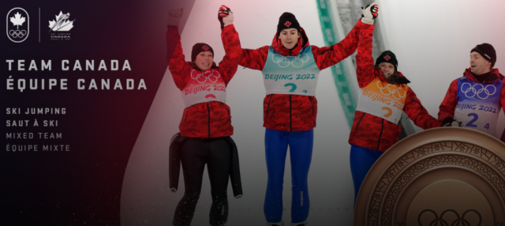
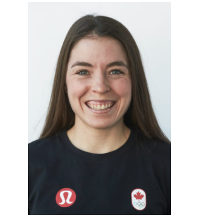
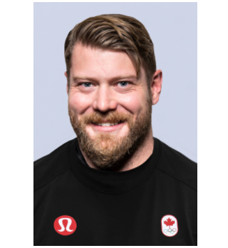
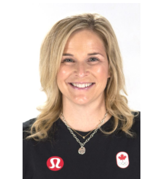
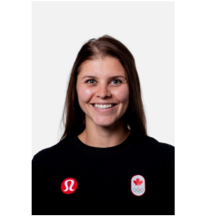
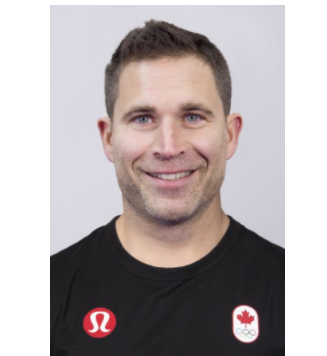
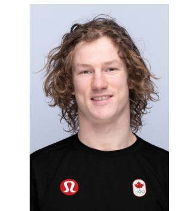
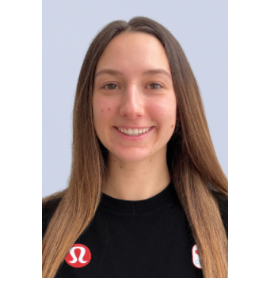

# 无标题

**链接地址:** http://mp.weixin.qq.com/s?__biz=MzAwODY3MTgwMQ==&mid=2652599582&idx=4&sn=4be42a626f3bff533050fb22320bb534&chksm=80849248b7f31b5e7d7d429318c5afdd655f96701ab01e1138273872421672b234b96583f93d&mpshare=1&scene=2&srcid=0209gUnTYB7HBwOiYYN4QgFH&sharer_sharetime=1644359467601&sharer_shareid=be1c8edd6c93eec155a61c876e41d26a#rd
**作者:** S君
**获取时间:** 2025/8/28 19:40:39
**图片数量:** 31

---

## 原始HTML内容

<section data-role="outer" label="Powered by 135editor.com" style="font-size:16px;"><section data-tools="135编辑器" data-id="86032"><section style="text-align: center;"><section style="background-color: rgb(254, 254, 254);padding-right: 15px;padding-left: 15px;display: inline-block;margin-right: auto;margin-left: auto;box-sizing: border-box;">
广告
</section><section style="margin-top: -12px;margin-bottom: 10px;"><section style="border-top: 1px dashed rgb(33, 33, 34);width: 100%;border-right-color: rgb(33, 33, 34);border-bottom-color: rgb(33, 33, 34);border-left-color: rgb(33, 33, 34);height: 1px;overflow: hidden;box-sizing: border-box;" data-width="100%">  </section></section></section></section></section>
<a target="_blank" href="http://mp.weixin.qq.com/s?__biz=MzU4MzY3Nzk4Mg==&amp;mid=2247514477&amp;idx=1&amp;sn=5cb9d16db20847082db147795275159c&amp;chksm=fda7981ccad0110aac92ce72822cec352e164a70669cc2412990fad80a0414f9e91d3da51853&amp;scene=21#wechat_redirect" textvalue="你已选中了添加链接的内容" linktype="text" imgurl="" imgdata="null" data-itemshowtype="0" tab="innerlink" data-linktype="1"></a>
<section data-role="outer" label="Powered by 135editor.com" style="font-size:16px;"><section data-tools="135编辑器" data-id="86032"><section style="text-align: center;"><section style="background-color: rgb(254, 254, 254);padding-right: 15px;padding-left: 15px;display: inline-block;margin-right: auto;margin-left: auto;box-sizing: border-box;">
广告
</section><section style="margin-top: -12px;margin-bottom: 10px;"><section style="border-top: 1px dashed rgb(33, 33, 34);width: 100%;border-right-color: rgb(33, 33, 34);border-bottom-color: rgb(33, 33, 34);border-left-color: rgb(33, 33, 34);height: 1px;overflow: hidden;box-sizing: border-box;" data-width="100%"> </section></section></section></section></section><section><section><section><section><section><section><section><section data-tools="135编辑器" data-id="85975" data-color="rgb(255, 129, 36)"><section><section data-style="font-size: 14px; line-height: 1.75em;text-align:center;"><section data-role="outer" label="Powered by 135editor.com"><section data-tools="135编辑器" data-id="87776"><section><section style="line-height: normal;"> </section><section style="box-sizing: border-box;font-size: 16px;"><section style="box-sizing: border-box;" powered-by="xiumi.us"><section style="display: flex;flex-flow: row nowrap;margin-top: 10px;margin-right: 0%;margin-left: 0%;box-sizing: border-box;"><section style="display: inline-block;vertical-align: bottom;width: auto;background-color: rgb(255, 255, 255);flex: 0 0 auto;align-self: flex-end;min-width: 10%;max-width: 100%;height: auto;border-width: 0px 0px 3px;border-bottom-style: none;border-bottom-right-radius: 0px;border-bottom-color: rgb(62, 62, 62);padding-right: 5px;box-sizing: border-box;"><section style="text-align: center;font-size: 21px;line-height: 1;color: rgb(106, 106, 106);letter-spacing: 2px;box-sizing: border-box;" powered-by="xiumi.us">
摘 要
</section><section style="box-sizing: border-box;" powered-by="xiumi.us"><section style="display: flex;flex-flow: row nowrap;margin-top: 8px;margin-right: 0%;margin-left: 0%;box-sizing: border-box;"><section style="display: inline-block;width: auto;vertical-align: top;line-height: 0;flex: 0 0 auto;align-self: flex-start;min-width: 10%;max-width: 100%;height: auto;box-sizing: border-box;"><section style="text-align: left;justify-content: flex-start;box-sizing: border-box;" powered-by="xiumi.us"><section style="display: inline-block;vertical-align: top;overflow: hidden;height: 3px;width: 40px;border-bottom: 0px solid rgb(62, 62, 62);border-bottom-right-radius: 0px;background-color: rgb(9, 147, 62);box-sizing: border-box;"><section><svg viewBox="0 0 1 1" style="float:left;line-height:0;width:0;vertical-align:top;"></svg></section></section></section></section></section></section></section><section style="display: inline-block;width: auto;vertical-align: bottom;flex: 100 100 0%;align-self: flex-end;height: auto;border-top: 3px solid rgb(9, 147, 62);border-top-left-radius: 0px;border-right: 3px solid rgb(9, 147, 62);border-top-right-radius: 0px;box-sizing: border-box;"><section style="box-sizing: border-box;" powered-by="xiumi.us">
 
</section></section></section></section><section style="margin-right: 0%;margin-bottom: 10px;margin-left: 0%;box-sizing: border-box;line-height: normal;"><section style="display: inline-block;width: 100%;vertical-align: top;border-style: none solid solid;border-width: 3px;border-radius: 0px;border-color: rgb(62, 62, 62) rgb(9, 147, 62) rgb(9, 147, 62);padding: 10px;box-sizing: border-box;"><section style="box-sizing: border-box;" powered-by="xiumi.us"><section style="margin-right: 0%;margin-left: 0%;box-sizing: border-box;"><section style="font-size: 14px;color: rgb(106, 106, 106);line-height: 1.5;letter-spacing: 1.8px;box-sizing: border-box;">
&nbsp; &nbsp;比如长道速滑项目选手Hudey平时是Regina医院的一名物理治疗助理，她曾参加过两届冬奥会，平日还喜欢打高尔夫球、烹饪和钓鱼。
</section></section></section></section></section></section><section powered-by="xiumi.us"><section data-role="paragraph"><section data-role="paragraph"><section><section data-role="paragraph"><section data-role="outer" label="Powered by 135editor.com"><section data-color="#384cb0" data-custom="#384cb0"><section><section><section><section><h2 placeholder="请输入标题"><section label="Copyright © 2015 playhudong All Rights Reserved."><section><section label="小黄人科技"><section>

&nbsp;&nbsp;&nbsp;&nbsp;在2022年北京冬奥会期间，加拿大代表队参赛选手的特长和赛绩备受瞩目。而一些运动员平时在没有训练和比赛的时候，还有另外一份职业或角色。例如这9名运动员平日里就做着和自己的运动项目完全不同的事。 

&nbsp;&nbsp;&nbsp;&nbsp;钢架雪车项目选手Jane Channell

&nbsp; &nbsp; Channell平时在一家环境保护顾问公司的卫生与安全部门工作。同时她也是卡尔加里特殊奥运会垒球项目的志愿教练。而且她还希望能够成为一名电视气象预报员。

&nbsp;&nbsp;&nbsp;&nbsp;越野滑雪项目选手Katherine Stewart-Jones

&nbsp; &nbsp; Stewart-Jones从她会走路时就开始滑雪，平日在没有训练或比赛的时候，她是Fast and Female慈善机构的活动协调员和运动大使，也是Classroom Champions慈善机构的导师。

&nbsp;&nbsp;&nbsp;&nbsp;雪车项目选手Daniel Sunderland

&nbsp;&nbsp;&nbsp;&nbsp;来自阿尔伯塔的32岁选手Sunderland有着阿尔伯塔大学机械工程的工学学士学位，平时他是一位职业的管道应力工程师。他在26岁的时候才开始练习雪车。

&nbsp;&nbsp;&nbsp;&nbsp;冰壶选手Jennifer Jones

&nbsp; &nbsp; Jones在没有参加的比赛的时候，是一名律师。这位曼省出生的运动员从11岁开始练习冰壶项目，曾参加过2014年冬奥会。平时她也喜欢打高尔夫球。

<mpcpc js_editor_cpcad="" class="js_cpc_area cpc_iframe" src="/cgi-bin/readtemplate?t=tmpl/cpc_tmpl#1644343278192" data-category_id_list="1|16|17|2|21|24|28|29|31|35|36|37|39|41|42|43|46|47|48|5|50|51|55|56|57|58|59|6|60|61|62|63|64|65|66|7|8" data-id="1644343278192"></mpcpc>

&nbsp; &nbsp; 比如长道速滑项目选手Marsha Hudey

&nbsp;&nbsp;&nbsp; Hudey平时是Regina医院的一名物理治疗助理，她曾参加过两届冬奥会，平日还喜欢打高尔夫球、烹饪和钓鱼。

&nbsp;&nbsp;&nbsp;&nbsp;冰壶选手John Morris

&nbsp;&nbsp;&nbsp;&nbsp;曾拿过两次金牌的Morris平时是Rocky View County Fire Services的一位消防员，他还有着Laurier大学运动技能学学士学位。

&nbsp;&nbsp;&nbsp;&nbsp;单板滑雪项目选手Darcy Sharpe

&nbsp; &nbsp; 来自BC省的25岁运动员从8岁开始练习单板滑雪，平时他在地产和租车行业工作。工作和训练之余，他还喜欢玩冲浪板。

&nbsp;&nbsp;&nbsp;&nbsp;雪车项目选手Cynthia Appiah

&nbsp; &nbsp; Appiah有着约克大学学士学位，她还打算再进修一个物理学学位或攻读历史学硕士。平时她喜欢针织和钩编工艺。

&nbsp; &nbsp; 单板滑雪项目选手Kaylie Buck

&nbsp;&nbsp;&nbsp; Buck现在正在Queen's大学攻读生命科学学位。在奥运会训练和学业之余，她还是一位专业的爱尔兰舞者

来源：加国无忧
</section></section></section></section></h2></section></section></section></section></section></section></section>

<mpcpc js_editor_cpcad="" class="js_cpc_area cpc_iframe" src="/cgi-bin/readtemplate?t=tmpl/cpc_tmpl#1639172820879" data-category_id_list="1|16|17|2|21|24|28|29|31|35|36|37|39|41|42|43|46|47|48|5|50|51|55|56|57|58|59|6|60|61|62|63|64|65|66|7|8" data-id="1639172820879"></mpcpc>
</section></section></section></section></section></section></section></section></section></section></section></section></section></section></section></section></section><section data-role="outer" label="Powered by 135editor.com"><section data-role="outer" label="Powered by 135editor.com"><section powered-by="xiumi.us" style="max-width: 100%;box-sizing: border-box;color: rgb(62, 62, 62);font-size: 18px;word-wrap: break-word !important;"><section style="margin-top: 0.5em;margin-bottom: 0.5em;max-width: 100%;box-sizing: border-box;word-wrap: break-word !important;"><section style="padding-top: 3px;max-width: 100%;box-sizing: border-box;border-top: 2px solid rgb(37, 169, 218);border-right-color: rgb(37, 169, 218);border-bottom-color: rgb(37, 169, 218);border-left-color: rgb(37, 169, 218);word-wrap: break-word !important;"><section style="padding-right: 0.5em;padding-left: 0.5em;max-width: 100%;box-sizing: border-box;display: inline-block;vertical-align: top;height: 2em;line-height: 2em;color: rgb(255, 255, 255);font-size: 16px;background-color: rgb(37, 169, 218);word-wrap: break-word !important;">
<strong style="max-width: 100%;box-sizing: border-box;word-wrap: break-word !important;">更多文章推荐</strong>
</section></section></section></section>
1.&nbsp;<a href="http://mp.weixin.qq.com/s?__biz=MzAwODY3MTgwMQ==&amp;mid=2652404982&amp;idx=6&amp;sn=d9290249b00ebc1a724bbb34587bce22&amp;chksm=80879ba0b7f012b6269c20ee64044efa025c09addeb47f799938d5b20d98aa5ed5c38722dfa8&amp;scene=21#wechat_redirect" target="_blank" data-linktype="2">【惊爆】温哥华女孩每天吃煮熟的苹果 | 30天后竟然</a>
<section powered-by="xiumi.us" style="color: rgb(62, 62, 62);font-family: 微软雅黑;text-align: justify;background-color: rgb(255, 255, 255);max-width: 100%;box-sizing: border-box;font-size: 18px;word-wrap: break-word !important;"><section style="max-width: 100%;box-sizing: border-box;word-wrap: break-word !important;"><section style="max-width: 100%;box-sizing: border-box;color: rgb(37, 169, 218);line-height: 2;font-size: 15px;word-wrap: break-word !important;">
2.&nbsp;<a href="http://mp.weixin.qq.com/s?__biz=MzAwODY3MTgwMQ==&amp;mid=2652404012&amp;idx=2&amp;sn=fadf63950055a18c251294afc1200c74&amp;chksm=80879e7ab7f0176cf05cdefcacb65be34bca3ed938d913124b8977ae18af61d5023f920ad3aa&amp;scene=21#wechat_redirect" target="_blank" data-linktype="2">【可怕】中国旅行团遭海关集体扣押！竟是带了这...</a>

3.&nbsp;<a href="http://mp.weixin.qq.com/s?__biz=MzAwODY3MTgwMQ==&amp;mid=2652404523&amp;idx=7&amp;sn=a1d241f2b1d7f71f51861b7884a35a4b&amp;chksm=80879c7db7f0156bd75f2e7350eca5e131f678e0ed819bf2f4791ab1852f60ee26c5af6a1617&amp;scene=21#wechat_redirect" target="_blank" data-linktype="2">【教育】失败家长12个坏习惯！没中一条都是好父母</a>

4.&nbsp;<a href="http://mp.weixin.qq.com/s?__biz=MzAwODY3MTgwMQ==&amp;mid=2652402744&amp;idx=1&amp;sn=ea631225efffebd387a25ec50c93b1a8&amp;chksm=8087936eb7f01a78949cbaea951c0d1a667864a6c3d76be837acd820a22ed436ecbe9d159786&amp;scene=21#wechat_redirect" target="_blank" data-linktype="2">【重磅】加拿大十年签证要取消了？中国人又躺枪！</a>

5.&nbsp;<a href="http://mp.weixin.qq.com/s?__biz=MzAwODY3MTgwMQ==&amp;mid=2652400448&amp;idx=8&amp;sn=7704aef39af85de7e1abd05235551b1f&amp;chksm=80878c16b7f0050078860a647093b997cea16c9651a9d50069b78acdd10c5caefa4becf455e7&amp;scene=21#wechat_redirect" target="_blank" data-linktype="2">【健康】跑步伤不伤膝盖？美国权威医学期刊最新结论</a>

6.&nbsp;<a href="http://mp.weixin.qq.com/s?__biz=MzAwODY3MTgwMQ==&amp;mid=2652404982&amp;idx=2&amp;sn=fcbb8cd141ae6c2425b5e865c8354f5d&amp;chksm=80879ba0b7f012b663a6cabef6d68c2927808d8457bdb90ad070cdf4d8bd00e8107514d1fe9f&amp;scene=21#wechat_redirect" target="_blank" data-linktype="2">【震惊】我来了假的加拿大？7700人死于空气污染！</a>

7.&nbsp;<a href="http://mp.weixin.qq.com/s?__biz=MzAwODY3MTgwMQ==&amp;mid=2652404912&amp;idx=6&amp;sn=18fabd2e15b0e9a704d2ef7c5af77498&amp;chksm=80879be6b7f012f0ee28c4ba92ea8bd88a3de5e13ec0e9e75406948b972947c63dd371c536dd&amp;scene=21#wechat_redirect" target="_blank" data-linktype="2">【八卦】美貌女星全裸坠亡死因成谜？当红男星卷案中</a>

8.&nbsp;<a href="http://mp.weixin.qq.com/s?__biz=MzAwODY3MTgwMQ==&amp;mid=2652404852&amp;idx=3&amp;sn=cd0c136984fa499a5bc1468c087a3917&amp;chksm=80879b22b7f012343a1af373d9e317c6cb81cb8af524cf367d40d4f4cc2cbdca435265d773c4&amp;scene=21#wechat_redirect" target="_blank" data-linktype="2">【重磅】空前大反击，刚刚中国出手，美国要傻眼了！</a>

9.&nbsp;<a href="http://mp.weixin.qq.com/s?__biz=MzAwODY3MTgwMQ==&amp;mid=2652404912&amp;idx=1&amp;sn=322fc361c4eae2a61b3d9a0aa7a9fb63&amp;chksm=80879be6b7f012f019448425fa1cbdc94c7ec3dba584da248376c9fb4d09a5e673a4abf6e3d9&amp;scene=21#wechat_redirect" target="_blank" data-linktype="2">【深度】我的前半生追求移民，后半生却拼命想回中国</a>

10.&nbsp;<a href="http://mp.weixin.qq.com/s?__biz=MzAwODY3MTgwMQ==&amp;mid=2652404982&amp;idx=3&amp;sn=3ed8799a5f0c3c309b4056d66ca1e634&amp;chksm=80879ba0b7f012b6145416bf27dba3aa435579f7675d34dd222114d29a0b4250cbaca4dc4453&amp;scene=21#wechat_redirect" target="_blank" data-linktype="2">【观点】加拿大华人社会的小人现象，越想越寒心！</a>
</section></section></section><section data-role="outer" label="Powered by 135editor.com" style="font-size:16px;"><section data-tools="135编辑器" data-id="86032"><section style="text-align: center;"><section style="background-color: rgb(254, 254, 254);padding-right: 15px;padding-left: 15px;display: inline-block;margin-right: auto;margin-left: auto;box-sizing: border-box;">
广告
</section><section style="margin-top: -12px;margin-bottom: 10px;"><section style="border-top: 1px dashed rgb(33, 33, 34);width: 100%;border-right-color: rgb(33, 33, 34);border-bottom-color: rgb(33, 33, 34);border-left-color: rgb(33, 33, 34);height: 1px;overflow: hidden;box-sizing: border-box;" data-width="100%"> </section></section></section></section></section>

<section data-role="outer" label="Powered by 135editor.com" style="font-size:16px;"><section data-tools="135编辑器" data-id="86032"><section style="text-align: center;"><section style="background-color: rgb(254, 254, 254);padding-right: 15px;padding-left: 15px;display: inline-block;margin-right: auto;margin-left: auto;box-sizing: border-box;">
广告
</section><section style="margin-top: -12px;margin-bottom: 10px;"><section style="border-top: 1px dashed rgb(33, 33, 34);width: 100%;border-right-color: rgb(33, 33, 34);border-bottom-color: rgb(33, 33, 34);border-left-color: rgb(33, 33, 34);height: 1px;overflow: hidden;box-sizing: border-box;" data-width="100%"> </section></section></section></section></section></section></section><section data-role="outer" label="Powered by 135editor.com" style="font-size: 16px;white-space: normal;font-family: 微软雅黑;max-width: 100%;color: rgb(62, 62, 62);background-color: rgb(255, 255, 255);box-sizing: border-box !important;overflow-wrap: break-word !important;"><section data-role="outer" label="Powered by 135editor.com" style="max-width: 100%;box-sizing: border-box !important;word-wrap: break-word !important;"><section data-role="outer" label="Powered by 135editor.com" style="max-width: 100%;box-sizing: border-box !important;word-wrap: break-word !important;"><section label="powered by 135editor.com" style="max-width: 100%;box-sizing: border-box !important;word-wrap: break-word !important;"><section data-tools="135编辑器" data-id="88641" style="max-width: 100%;box-sizing: border-box;border-width: 0px;border-style: none;border-color: initial;word-wrap: break-word !important;"><section style="max-width: 100%;box-sizing: border-box;border-width: 0px;border-style: initial;border-color: initial;text-align: center;word-wrap: break-word !important;"><section data-tools="135编辑器" data-id="87450" style="max-width: 100%;box-sizing: border-box;border-width: 0px;border-style: none;border-color: initial;word-wrap: break-word !important;"><section data-role="outer" label="Powered by 135editor.com" style="font-size:16px;"><section data-role="outer" label="Powered by 135editor.com" style="font-family: 微软雅黑;"><section data-tools="135编辑器" data-id="88641" style="border-width: 0px;border-style: none;border-color: initial;box-sizing: border-box;"><section style="border-width: 0px;border-style: initial;border-color: initial;text-align: center;box-sizing: border-box;"><section data-tools="135编辑器" data-id="87450" style="border-width: 0px;border-style: none;border-color: initial;box-sizing: border-box;">

<section style="margin-bottom: 15px;font-family: 微软雅黑;font-size: 16px;text-align: center;overflow-wrap: break-word;-webkit-tap-highlight-color: rgba(0, 0, 0, 0);color: rgb(62, 62, 62);min-height: 1em;white-space: pre-wrap;line-height: 1.6em;">目前100000+人已关注加入我们</section><section style="font-family: 微软雅黑;font-size: 16px;text-align: center;white-space: normal;overflow-wrap: break-word;border-width: 0px;border-style: none;border-color: initial;"><section><section style="overflow-wrap: break-word;width: 320px;display: inline-block;"><section style="margin-right: 5px;margin-bottom: 5px;margin-left: 5px;overflow-wrap: break-word;width: 30px;overflow: hidden;float: left;"></section><section style="margin-right: 5px;margin-bottom: 5px;margin-left: 5px;overflow-wrap: break-word;width: 30px;overflow: hidden;float: left;clear: none;"></section><section style="margin-right: 5px;margin-bottom: 5px;margin-left: 5px;overflow-wrap: break-word;width: 30px;overflow: hidden;float: left;clear: none;"></section><section style="margin-right: 5px;margin-bottom: 5px;margin-left: 5px;overflow-wrap: break-word;width: 30px;overflow: hidden;float: left;"></section><section style="margin-right: 5px;margin-bottom: 5px;margin-left: 5px;overflow-wrap: break-word;width: 30px;overflow: hidden;float: left;clear: none;"></section><section style="margin-right: 5px;margin-bottom: 5px;margin-left: 5px;overflow-wrap: break-word;width: 30px;overflow: hidden;float: left;clear: none;"></section><section style="margin-right: 5px;margin-bottom: 5px;margin-left: 5px;overflow-wrap: break-word;width: 30px;overflow: hidden;float: left;clear: none;"></section><section style="margin-right: 5px;margin-bottom: 5px;margin-left: 5px;overflow-wrap: break-word;width: 30px;overflow: hidden;float: left;"></section></section><section style="overflow-wrap: break-word;width: 320px;display: inline-block;"><section style="margin-right: 5px;margin-bottom: 5px;margin-left: 5px;overflow-wrap: break-word;width: 30px;overflow: hidden;float: left;"></section><section style="margin-right: 5px;margin-bottom: 5px;margin-left: 5px;overflow-wrap: break-word;width: 30px;overflow: hidden;float: left;"></section><section style="margin-right: 5px;margin-bottom: 5px;margin-left: 5px;overflow-wrap: break-word;width: 30px;overflow: hidden;float: left;"></section><section style="margin-right: 5px;margin-bottom: 5px;margin-left: 5px;overflow-wrap: break-word;width: 30px;overflow: hidden;float: left;"></section><section style="margin-right: 5px;margin-bottom: 5px;margin-left: 5px;overflow-wrap: break-word;width: 30px;overflow: hidden;float: left;"></section><section style="margin-right: 5px;margin-bottom: 5px;margin-left: 5px;overflow-wrap: break-word;width: 30px;overflow: hidden;float: left;"></section><section style="margin-right: 5px;margin-bottom: 5px;margin-left: 5px;overflow-wrap: break-word;width: 30px;overflow: hidden;float: left;"></section><section style="margin-right: 5px;margin-bottom: 5px;margin-left: 5px;overflow-wrap: break-word;width: 30px;overflow: hidden;float: left;"></section></section></section></section></section></section></section>

版权声明：若该文章涉及版权问题，请联系我们

电邮：canadanewstoday01@gmail.com

小编微信ID：CanadaTodayMedia
<section data-id="127" data-color="rgb(12, 137, 24)" data-custom="rgb(12, 137, 24)" style="font-size: 18px;color: rgb(62, 62, 62);line-height: 28.8px;white-space: normal;border-width: 0px;border-style: none;border-color: initial;box-sizing: border-box;"><section style="margin: 96px 16px 16px;border-width: 1px;border-style: solid;border-color: rgb(12, 137, 24);text-align: center;border-radius: 8px;font-weight: inherit;text-decoration: inherit;box-sizing: border-box;"><section style="margin-top: -3.3em;margin-right: 5px;margin-left: 5px;color: inherit;box-sizing: border-box;"><section data-width="108px" style="margin-right: auto;margin-left: auto;border-width: 2px;border-style: solid;border-color: rgb(12, 137, 24);width: 108px;clear: both;height: 108px;border-radius: 50%;box-shadow: rgb(201, 201, 201) 0px 2px 2px 2px;box-sizing: border-box;"></section></section><section data-brushtype="text" data-style="text-align: left; font-size: 14px; color: inherit;" style="margin: 8px 15px;line-height: 1.4;color: inherit;box-sizing: border-box;"><section data-brushtype="text" data-style="text-align: left; font-size: 14px; color: inherit;" style="margin: 8px 15px;color: inherit;line-height: 1.4;box-sizing: border-box;">
今日加拿大严谨负责的新媒体
</section><section style="margin: 10px 15px;color: inherit;line-height: 25.2px;border-top: 1px solid rgb(12, 137, 24);border-right-color: rgb(12, 137, 24);border-bottom-color: rgb(12, 137, 24);border-left-color: rgb(12, 137, 24);box-sizing: border-box;">
微信号：今日加拿大

英文ID：CanadaNewsToday
</section>
 

（长按上面二维码可加入关注）
</section></section></section></section></section></section></section></section></section></section></section></section>

---

## 纯文本内容

广告广告摘 要   比如长道速滑项目选手Hudey平时是Regina医院的一名物理治疗助理，她曾参加过两届冬奥会，平日还喜欢打高尔夫球、烹饪和钓鱼。    在2022年北京冬奥会期间，加拿大代表队参赛选手的特长和赛绩备受瞩目。而一些运动员平时在没有训练和比赛的时候，还有另外一份职业或角色。例如这9名运动员平日里就做着和自己的运动项目完全不同的事。    钢架雪车项目选手Jane Channell    Channell平时在一家环境保护顾问公司的卫生与安全部门工作。同时她也是卡尔加里特殊奥运会垒球项目的志愿教练。而且她还希望能够成为一名电视气象预报员。    越野滑雪项目选手Katherine Stewart-Jones    Stewart-Jones从她会走路时就开始滑雪，平日在没有训练或比赛的时候，她是Fast and Female慈善机构的活动协调员和运动大使，也是Classroom Champions慈善机构的导师。    雪车项目选手Daniel Sunderland    来自阿尔伯塔的32岁选手Sunderland有着阿尔伯塔大学机械工程的工学学士学位，平时他是一位职业的管道应力工程师。他在26岁的时候才开始练习雪车。    冰壶选手Jennifer Jones    Jones在没有参加的比赛的时候，是一名律师。这位曼省出生的运动员从11岁开始练习冰壶项目，曾参加过2014年冬奥会。平时她也喜欢打高尔夫球。    比如长道速滑项目选手Marsha Hudey    Hudey平时是Regina医院的一名物理治疗助理，她曾参加过两届冬奥会，平日还喜欢打高尔夫球、烹饪和钓鱼。    冰壶选手John Morris    曾拿过两次金牌的Morris平时是Rocky View County Fire Services的一位消防员，他还有着Laurier大学运动技能学学士学位。    单板滑雪项目选手Darcy Sharpe    来自BC省的25岁运动员从8岁开始练习单板滑雪，平时他在地产和租车行业工作。工作和训练之余，他还喜欢玩冲浪板。    雪车项目选手Cynthia Appiah    Appiah有着约克大学学士学位，她还打算再进修一个物理学学位或攻读历史学硕士。平时她喜欢针织和钩编工艺。    单板滑雪项目选手Kaylie Buck    Buck现在正在Queen's大学攻读生命科学学位。在奥运会训练和学业之余，她还是一位专业的爱尔兰舞者来源：加国无忧更多文章推荐1. 【惊爆】温哥华女孩每天吃煮熟的苹果 | 30天后竟然2. 【可怕】中国旅行团遭海关集体扣押！竟是带了这...3. 【教育】失败家长12个坏习惯！没中一条都是好父母4. 【重磅】加拿大十年签证要取消了？中国人又躺枪！5. 【健康】跑步伤不伤膝盖？美国权威医学期刊最新结论6. 【震惊】我来了假的加拿大？7700人死于空气污染！7. 【八卦】美貌女星全裸坠亡死因成谜？当红男星卷案中8. 【重磅】空前大反击，刚刚中国出手，美国要傻眼了！9. 【深度】我的前半生追求移民，后半生却拼命想回中国10. 【观点】加拿大华人社会的小人现象，越想越寒心！广告广告目前100000+人已关注加入我们版权声明：若该文章涉及版权问题，请联系我们电邮：canadanewstoday01@gmail.com小编微信ID：CanadaTodayMedia今日加拿大严谨负责的新媒体微信号：今日加拿大英文ID：CanadaNewsToday（长按上面二维码可加入关注）

---

## 图片列表

-  (原始链接: https://mmbiz.qpic.cn/mmbiz_jpg/bDSxNITwETyiaMZKWBCCYALibgEiavc3fyoK3xlqhyF35kMPtGAqCxU2mK3Mzlyiaf50h3lL1PBVoCFmlOk1RVqYZw/640?wx_fmt=jpeg)
-  (原始链接: https://mmbiz.qpic.cn/mmbiz_png/bDSxNITwETzgh5U40aN4fAicYlMCTHydhNQVuTsn0FB446rerkfTbkzvics6Yrn1QxsIiaPDLUC8LnQJOcXdWKOlQ/640?wx_fmt=png)
-  (原始链接: https://mmbiz.qpic.cn/mmbiz_png/bDSxNITwETzgh5U40aN4fAicYlMCTHydhPw3ShFMVDicx6rNKDQMOBlVywPcAQrGY2kGTIHMZH1Oia8zIxsmmMZ3g/640?wx_fmt=png)
-  (原始链接: https://mmbiz.qpic.cn/mmbiz_png/bDSxNITwETzgh5U40aN4fAicYlMCTHydhAI8icWIho6ic8OjqBibDaF0RgoausYZCR8IUAYrF4cJ7dOp5SDfXJHDnQ/640?wx_fmt=png)
-  (原始链接: https://mmbiz.qpic.cn/mmbiz_png/bDSxNITwETzgh5U40aN4fAicYlMCTHydhVg9Kz2F3pXDrk0BKl6jIqmcN41Do20sYoduVTauKqQDib8xu1S8Q1ZA/640?wx_fmt=png)
-  (原始链接: https://mmbiz.qpic.cn/mmbiz_png/bDSxNITwETzgh5U40aN4fAicYlMCTHydhuNZRa8NOnpFNIOa6PMlZw6RdhFVw07xfzKwQ5CKxrxUEdZrsrf6txA/640?wx_fmt=png)
-  (原始链接: https://mmbiz.qpic.cn/mmbiz_png/bDSxNITwETzgh5U40aN4fAicYlMCTHydhwXVpIjds3ticf5C1Ilu4ZcvjfW6mibZAKb9euUia6jFnNLzyApUZstmwQ/640?wx_fmt=png)
-  (原始链接: https://mmbiz.qpic.cn/mmbiz_png/bDSxNITwETzgh5U40aN4fAicYlMCTHydh9n7rS1LqkPZnNJsDamaPy2XWI2Av60uk5TcGzSwKaWzWOm401rEAvQ/640?wx_fmt=png)
-  (原始链接: https://mmbiz.qpic.cn/mmbiz_png/bDSxNITwETzgh5U40aN4fAicYlMCTHydhhGSnO4jygaYjYqtCa2p4Kj2ADgNdHgae6BH7aGy9icf9CYJPVw2g68g/640?wx_fmt=png)
-  (原始链接: https://mmbiz.qpic.cn/mmbiz_png/bDSxNITwETzgh5U40aN4fAicYlMCTHydhPEfsOkRD8ysNTSQm2WssSYM1fiaEUgicncFBDqibAUseke76XDGibWUjTA/640?wx_fmt=png)
-  (原始链接: https://mmbiz.qpic.cn/mmbiz_png/bDSxNITwETzgh5U40aN4fAicYlMCTHydhLSibGziaibicPEFO8Bs0wwWRibuLjjjoAVAOtZusPgw3nu0MfbiaIp7gbnCQ/640?wx_fmt=png)
-  (原始链接: https://mmbiz.qpic.cn/mmbiz_jpg/bDSxNITwETzgh5U40aN4fAicYlMCTHydh6q6Yt9jnibWln8Rl8IdFnYlY3tj8z73cPKwcianLZEpBH189RoOLGYWQ/640?wx_fmt=jpeg)
-  (原始链接: https://mmbiz.qpic.cn/mmbiz_jpg/bDSxNITwETzgh5U40aN4fAicYlMCTHydhZ7vV9Hv0Vlwf3SmobWlevkibptR8xicX2NgKYP7ImWwJIZ0NtjCua6gA/640?wx_fmt=jpeg)
-  (原始链接: https://mmbiz.qpic.cn/mmbiz_gif/bDSxNITwETxAXU2qaRtjE2cfQBpPx5MiasCtpl4ynLyIdNuqBrxWUZicYxW4yKBo7ypceTuicROmdV9doDbziahaQg/640?wx_fmt=gif)
-  (原始链接: https://mmbiz.qpic.cn/mmbiz_gif/bDSxNITwETxAXU2qaRtjE2cfQBpPx5MiaiaRraYrIcNlNflEu7ndp2hrUU3osvLYkOVSndqx0V1L8yh79rVQ7IoA/640?wx_fmt=gif)
-  (原始链接: https://mmbiz.qpic.cn/mmbiz_gif/bDSxNITwETxAXU2qaRtjE2cfQBpPx5Mia60ppWYyVsY3Pnx77nnyMQMxJCNWDbx9BXs8Uey09KicUEPECpKO2JIQ/640?wx_fmt=gif)
-  (原始链接: https://mmbiz.qpic.cn/mmbiz_gif/bDSxNITwETxAXU2qaRtjE2cfQBpPx5Miao0A17nYOZFIicaHxHdcPk2YqUmKwm33SLHh3jXkl0WBFyvKnlg4fdJQ/640?wx_fmt=gif)
-  (原始链接: https://mmbiz.qpic.cn/mmbiz_gif/bDSxNITwETxAXU2qaRtjE2cfQBpPx5MiaYNGvry9BSqjpYGQHYknHHRVdToqFZKVVlqre7vTLibEWtXX50cVs8XQ/640?wx_fmt=gif)
-  (原始链接: https://mmbiz.qpic.cn/mmbiz_gif/bDSxNITwETxAXU2qaRtjE2cfQBpPx5Mia8raZTz3xicqgSyBSjqibDicoeAQqicuCa9rk4V2ssQJHB47Xf608GwVIkQ/640?wx_fmt=gif)
-  (原始链接: https://mmbiz.qpic.cn/mmbiz_gif/bDSxNITwETxAXU2qaRtjE2cfQBpPx5MiaIrRsCKyreaMzU8my6sVKPvkys7sRgiaTVkEbyp1xMibHjCyCbrtdmOkA/640?wx_fmt=gif)
-  (原始链接: https://mmbiz.qpic.cn/mmbiz_gif/bDSxNITwETxAXU2qaRtjE2cfQBpPx5Mia78nv7GssIhs85ePPbokxzCJy0AFx28rcsd20aqvThlicXyB23BSeiapA/640?wx_fmt=gif)
-  (原始链接: https://mmbiz.qpic.cn/mmbiz_gif/bDSxNITwETxAXU2qaRtjE2cfQBpPx5MiamHibsd0Yo2JXZuFc2yl2t7cDsJ05nXfElCWE5oRYjgeONMF1yvCqVug/640?wx_fmt=other)
-  (原始链接: https://mmbiz.qpic.cn/mmbiz_gif/bDSxNITwETxAXU2qaRtjE2cfQBpPx5MialAJL4w0XqsBGOWpshBgwLeSQFI7ntYTvurial0zgpbfcBmVKzibGZ3yg/640?wx_fmt=gif)
-  (原始链接: https://mmbiz.qpic.cn/mmbiz_gif/bDSxNITwETxAXU2qaRtjE2cfQBpPx5Mia6LGCqEPN6EF1sd4ibFBBzglzYpkDk9PNF07dt3UZ1icMJRpEI4x58ZGA/640?wx_fmt=gif)
-  (原始链接: https://mmbiz.qpic.cn/mmbiz_gif/bDSxNITwETxAXU2qaRtjE2cfQBpPx5Miag6KibFDzlic1PDicibUSUBz6rv3UKkas0aicCfh0Ym17WibrYkme6wtgmiaIg/640?wx_fmt=gif)
-  (原始链接: https://mmbiz.qpic.cn/mmbiz_gif/bDSxNITwETxAXU2qaRtjE2cfQBpPx5MiaocDKmBrfIu9VWxtNVEvd4BFpxHWInOP2L9p5UDTMPQPS1A8FdmPUtg/640?wx_fmt=gif)
-  (原始链接: https://mmbiz.qpic.cn/mmbiz_gif/bDSxNITwETxAXU2qaRtjE2cfQBpPx5Mia5t05XXRB4d96gcaTic9awficMOzhtx3VpuzorHxCDqVudvMdianYMGXuQ/640?wx_fmt=gif)
-  (原始链接: https://mmbiz.qpic.cn/mmbiz_gif/bDSxNITwETxAXU2qaRtjE2cfQBpPx5Mia8raZTz3xicqgSyBSjqibDicoeAQqicuCa9rk4V2ssQJHB47Xf608GwVIkQ/640?wx_fmt=gif)
-  (原始链接: https://mmbiz.qpic.cn/mmbiz_gif/bDSxNITwETxAXU2qaRtjE2cfQBpPx5MiaBlC76ArPxy6yKL1icA4iacBJzT9NbUnRibHgj8QduCBD4U5ePib6qKCRNQ/640?wx_fmt=gif)
-  (原始链接: https://mmbiz.qpic.cn/mmbiz_jpg/bDSxNITwETx2wUqfFUU21bg3JABqIFXAJUq2Hmj6hnYvbyorjgmybT6qGoYDEXrwwK0ghmRlS7N6TM3teDlnzQ/640?wx_fmt=jpeg)
-  (原始链接: https://mmbiz.qpic.cn/mmbiz_jpg/bDSxNITwETzbSJtvRQtB9RPIGmibEZJtnTcAjdVzVu8oncWa0ALt3Tzfsf4Pqh61E54RUS72GnTbicFJ7wPea5Xw/640?wx_fmt=jpeg)
