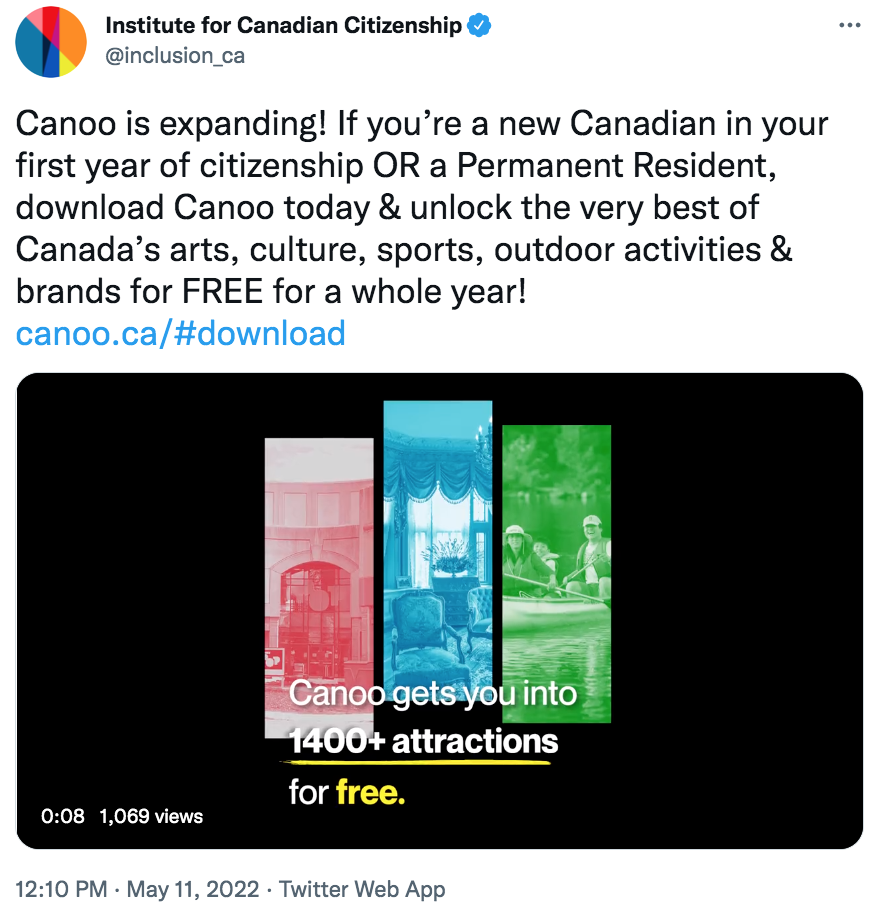
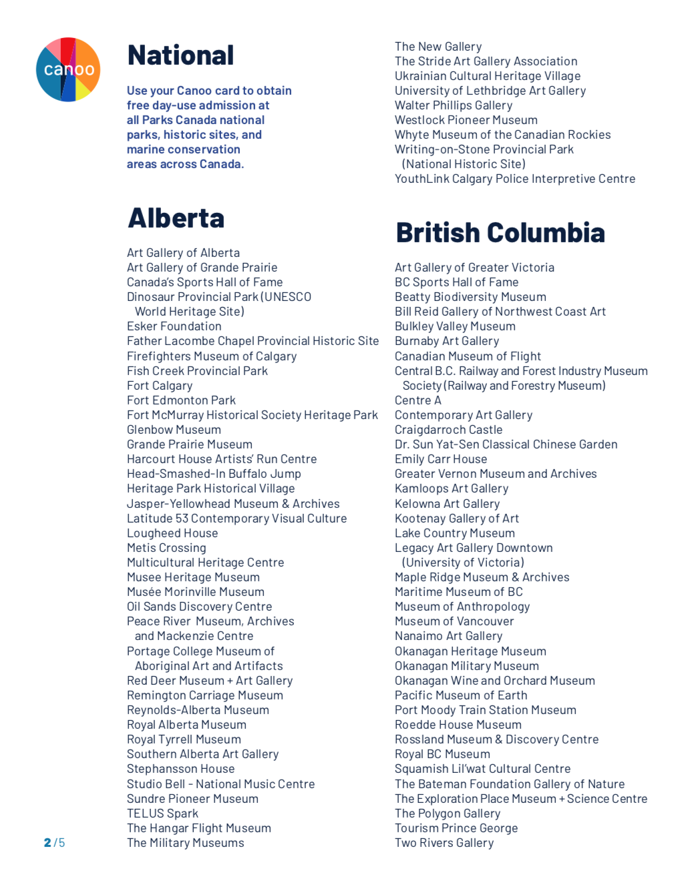
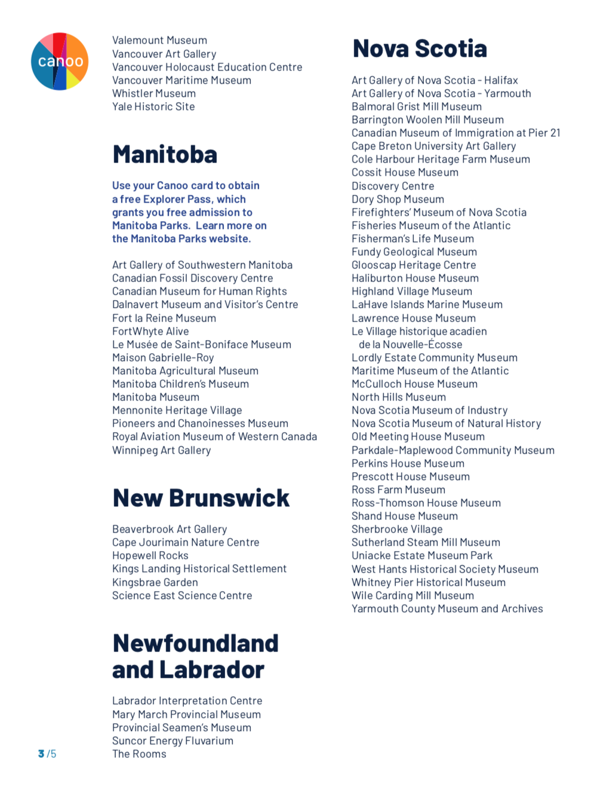
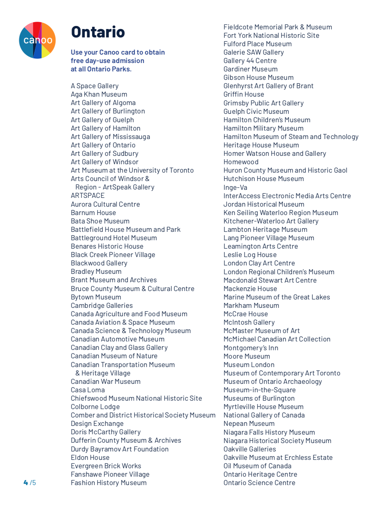
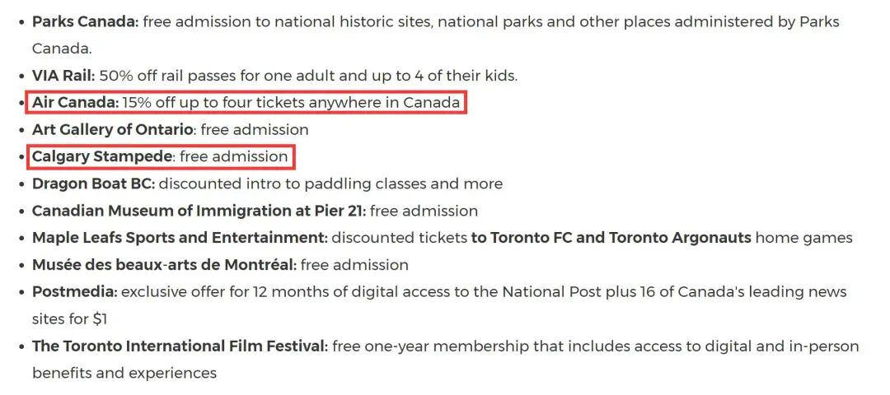
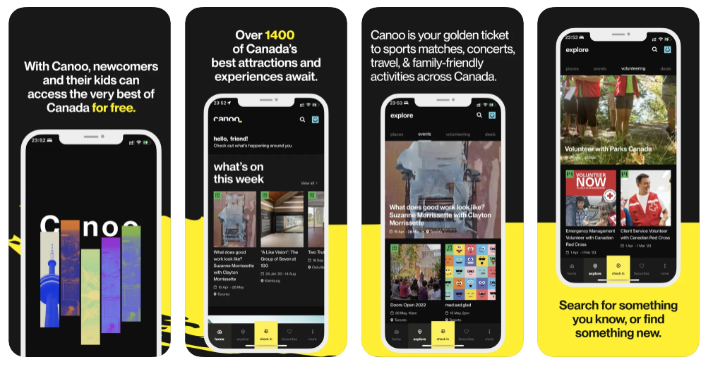

# 无标题

**链接地址:** http://mp.weixin.qq.com/s?__biz=MzUyNzA2NTAwNg==&mid=2247489862&idx=1&sn=a8ca123bf0e967fcc29a09e3f61f4045&chksm=fa041387cd739a91b2b1f79c80f7f795384e245aabed667f932d91742dd8e998b4c180143cbe&mpshare=1&scene=2&srcid=0605hKhHGetNydirJAkmQkDy&sharer_sharetime=1654380401293&sharer_shareid=77848a6b3852ae4dcb6c74ffee84743c#rd
**作者:** 你身边的签证专家
**获取时间:** 2025/8/28 19:39:02
**图片数量:** 24

---

## 原始HTML内容

‍ 
<section style="box-sizing: border-box;font-style: normal;font-weight: 400;text-align: justify;font-size: 16px;"><section style="text-align: center;margin-top: 10px;margin-bottom: 10px;box-sizing: border-box;" powered-by="xiumi.us"><section style="max-width: 100%;vertical-align: middle;display: inline-block;line-height: 0;box-sizing: border-box;"></section></section><section style="text-align: center;margin-top: 10px;margin-bottom: 10px;box-sizing: border-box;" powered-by="xiumi.us"><section style="max-width: 100%;vertical-align: middle;display: inline-block;line-height: 0;box-sizing: border-box;"></section></section><section style="box-sizing: border-box;" powered-by="xiumi.us">
 
</section><section style="margin: 10px 0%;box-sizing: border-box;" powered-by="xiumi.us"><section style="text-align: center;font-size: 18px;color: rgb(250, 91, 71);text-shadow: rgb(255, 255, 255) 0px 1px, rgb(255, 255, 255) 0px -1px, rgb(255, 255, 255) 1px 1px, rgb(255, 255, 255) 1px 0px, rgb(255, 255, 255) 1px -1px, rgb(255, 255, 255) -1px -1px, rgb(255, 255, 255) -1px 0px, rgb(255, 255, 255) -1px 1px, rgb(250, 91, 71) 0px 2px, rgb(250, 91, 71) 0px -2px, rgb(250, 91, 71) 1px -2px, rgb(250, 91, 71) 1px 2px, rgb(250, 91, 71) -1px -2px, rgb(250, 91, 71) -1px 2px, rgb(250, 91, 71) 2px -2px, rgb(250, 91, 71) 2px -1px, rgb(250, 91, 71) 2px 0px, rgb(250, 91, 71) 2px 1px, rgb(250, 91, 71) 2px 2px, rgb(250, 91, 71) -2px -2px, rgb(250, 91, 71) -2px -1px, rgb(250, 91, 71) -2px 0px, rgb(250, 91, 71) -2px 1px, rgb(250, 91, 71) -2px 2px;letter-spacing: 4px;line-height: 1.8;box-sizing: border-box;">
<strong style="box-sizing: border-box;">亲们，薅羊毛的机会来了！</strong>
</section></section><section style="box-sizing: border-box;" powered-by="xiumi.us">
 
</section><section style="font-size: 14px;padding: 0px 15px;letter-spacing: 1px;box-sizing: border-box;" powered-by="xiumi.us">
疫后加拿大的旅游业复苏呈爆发之势。虽然境外游依然受到部分限制因素影响，但趁着这个机会<strong style="box-sizing: border-box;">在加拿大境内好好玩一把</strong>早已被大家提上了日程计划。

 
</section><section style="box-sizing: border-box;" powered-by="xiumi.us"><section style="text-align: center;justify-content: center;margin: 10px 0% 0px;display: flex;flex-flow: row nowrap;box-sizing: border-box;"><section style="display: inline-block;vertical-align: top;width: 50%;flex: 0 0 auto;height: auto;padding: 0px 8px 0px 0px;align-self: flex-start;box-sizing: border-box;"><section style="margin: 0px;box-sizing: border-box;" powered-by="xiumi.us"><section style="max-width: 100%;vertical-align: middle;display: inline-block;line-height: 0;border-style: solid;border-width: 4px;border-radius: 10px;border-color: rgb(232, 245, 233);overflow: hidden;box-sizing: border-box;"></section></section></section><section style="display: inline-block;vertical-align: top;width: 50%;flex: 0 0 auto;height: auto;padding: 0px 0px 0px 8px;align-self: flex-start;box-sizing: border-box;"><section style="margin: 0px;box-sizing: border-box;" powered-by="xiumi.us"><section style="max-width: 100%;vertical-align: middle;display: inline-block;line-height: 0;border-style: solid;border-width: 4px;border-radius: 10px;border-color: rgb(232, 245, 233);overflow: hidden;box-sizing: border-box;"></section></section></section></section></section><section style="box-sizing: border-box;" powered-by="xiumi.us">
 
</section><section style="box-sizing: border-box;" powered-by="xiumi.us"><section style="text-align: center;justify-content: center;margin: 0px 0px 10px;display: flex;flex-flow: row nowrap;box-sizing: border-box;"><section style="display: inline-block;vertical-align: top;width: 50%;flex: 0 0 auto;height: auto;padding: 0px 8px 0px 0px;align-self: flex-start;box-sizing: border-box;"><section style="margin: 0px;box-sizing: border-box;" powered-by="xiumi.us"><section style="max-width: 100%;vertical-align: middle;display: inline-block;line-height: 0;border-style: solid;border-width: 4px;border-radius: 10px;border-color: rgb(232, 245, 233);overflow: hidden;box-sizing: border-box;"></section></section></section><section style="display: inline-block;vertical-align: top;width: 50%;flex: 0 0 auto;height: auto;padding: 0px 0px 0px 8px;align-self: flex-start;box-sizing: border-box;"><section style="margin: 0px;box-sizing: border-box;" powered-by="xiumi.us"><section style="max-width: 100%;vertical-align: middle;display: inline-block;line-height: 0;border-style: solid;border-width: 4px;border-radius: 10px;border-color: rgb(232, 245, 233);overflow: hidden;box-sizing: border-box;"></section></section></section></section></section><section style="font-size: 14px;padding: 0px 15px;letter-spacing: 1px;box-sizing: border-box;" powered-by="xiumi.us">
 

不少新移民朋友们都计划在近期趁着春日好风光外出。除了野营、徒步、泛舟、垂钓等<strong style="box-sizing: border-box;">特别加拿大风情的游玩方式</strong>，带着孩子和爸妈去博物馆科技园逛逛也是很不错的选择。

 
</section><section style="text-align: center;margin-top: 10px;margin-bottom: 10px;box-sizing: border-box;" powered-by="xiumi.us"><section style="max-width: 100%;vertical-align: middle;display: inline-block;line-height: 0;width: 90%;height: auto;box-sizing: border-box;"></section></section><section style="font-size: 14px;padding: 0px 15px;letter-spacing: 1px;box-sizing: border-box;" powered-by="xiumi.us">
 

但是，许多新移民朋友们并不知道在除了养老、医保、牛奶金之外，加拿大提供给新移民朋友们的一大<strong style="box-sizing: border-box;">隐藏福利</strong>——没错！这些由加拿大联邦政府运营的科教普及类游乐项目，对于新移民和新公民来说：<strong style="box-sizing: border-box;">通通都是免费的！！！</strong>

 

<strong style="box-sizing: border-box;">如果硬要给这些福利加上一个期限！</strong>

<strong style="box-sizing: border-box;">那就是“5年”！</strong>

 
</section><section style="text-align: center;margin-top: 10px;margin-bottom: 10px;box-sizing: border-box;" powered-by="xiumi.us"><section style="max-width: 100%;vertical-align: middle;display: inline-block;line-height: 0;box-sizing: border-box;"></section></section><section style="font-size: 14px;padding: 0px 15px;letter-spacing: 1px;box-sizing: border-box;" powered-by="xiumi.us">
 

为了帮助加拿大新移民和新公民了解加拿大的历史发展，自然瑰宝和文化特色，近期，<strong style="box-sizing: border-box;">加拿大公民研究所</strong>（Institute for Canadian Citizenship，ICC）设计并运营的便民App Canoo 拓展了一项<strong style="box-sizing: border-box;">新移民新公民利好项目</strong>——

 
</section><section style="text-align: center;margin-top: 10px;margin-bottom: 10px;box-sizing: border-box;" powered-by="xiumi.us"><section style="max-width: 100%;vertical-align: middle;display: inline-block;line-height: 0;box-sizing: border-box;"></section></section><section style="font-size: 14px;padding: 0px 15px;letter-spacing: 1px;box-sizing: border-box;" powered-by="xiumi.us">
 

刚成为加拿大永久居民的新移民都可以享受免费遍游加拿大联邦监管景点的专属福利。拿到枫叶卡5年以内的18岁以上新移民和入籍一年内的新移民都可以享受。<strong style="box-sizing: border-box;">免费的景点达到1400个！</strong>不用简直是四舍五入错过一个亿啊！

 
</section><section style="text-align: center;margin-top: 10px;margin-bottom: 10px;box-sizing: border-box;" powered-by="xiumi.us"><section style="max-width: 100%;vertical-align: middle;display: inline-block;line-height: 0;width: 90%;height: auto;box-sizing: border-box;"></section></section><section style="font-size: 14px;padding: 0px 15px;letter-spacing: 1px;box-sizing: border-box;" powered-by="xiumi.us">
 

这1400景点包括博物馆、科技馆、美术馆、历史古迹、国家公园在内，每人每次最多可免费带4个未满18岁的孩子入场。

 

 

<strong style="box-sizing: border-box;">包含景点</strong>
</section><section style="text-align: center;margin-top: 10px;margin-bottom: 10px;box-sizing: border-box;" powered-by="xiumi.us"><section style="max-width: 100%;vertical-align: middle;display: inline-block;line-height: 0;box-sizing: border-box;"></section></section><section style="text-align: center;margin-top: 10px;margin-bottom: 10px;box-sizing: border-box;" powered-by="xiumi.us"><section style="max-width: 100%;vertical-align: middle;display: inline-block;line-height: 0;box-sizing: border-box;"></section></section><section style="text-align: center;margin-top: 10px;margin-bottom: 10px;box-sizing: border-box;" powered-by="xiumi.us"><section style="max-width: 100%;vertical-align: middle;display: inline-block;line-height: 0;box-sizing: border-box;"></section></section><section style="font-size: 14px;padding: 0px 15px;letter-spacing: 1px;box-sizing: border-box;" powered-by="xiumi.us">
 

<strong style="box-sizing: border-box;">申请条件</strong>

 

<strong style="box-sizing: border-box;">加拿大公民+入籍未超过365天+18岁以上的成年人</strong>

<strong style="box-sizing: border-box;">加拿大永久居民+拿到身份5年以内+18岁以上</strong>

 

另外，这个App会贴心地帮你自动定位附近有什么免费景点可以去玩。除了各大景点之外，时不时还会有一些<strong style="box-sizing: border-box;">音乐会、艺术展的门票福利</strong>，也十分适合有这些文雅爱好的新移民和新公民朋友们定时上去<strong style="box-sizing: border-box;">“薅羊毛”</strong>哦！

 

不过需要注意的是，部分场馆的特别展览或者游览项目是需要另外付费的，请大家在入园前和管理人员提前进行确认。

 
</section><section style="text-align: center;margin-top: 10px;margin-bottom: 10px;box-sizing: border-box;" powered-by="xiumi.us"><section style="max-width: 100%;vertical-align: middle;display: inline-block;line-height: 0;width: 90%;height: auto;box-sizing: border-box;"></section></section><section style="font-size: 14px;padding: 0px 15px;letter-spacing: 1px;box-sizing: border-box;" powered-by="xiumi.us">
 

等等，你以为福利这就结束了吗？没有！除了<strong style="box-sizing: border-box;">卡尔加里牛仔节Stampede免门票</strong>和<strong style="box-sizing: border-box;">多伦多国际电影节一年免费会员</strong>这种超级给力的项目，<strong style="box-sizing: border-box;">加拿大航空公司（Air Canada）境内机票85%折</strong>的优厚福利总是极其让人心动的吧！

 

加拿大航空公司政府和社区关系副总裁大卫·罗希特（David Rheault）说到：“加拿大航空公司非常自豪能够与ICC合作开展这一利民项目，为新移民群体全面探索该国，以亲身体验加拿大的多样性，是欢迎他们来到并长居加拿大的最佳途径！”

 

 

<strong style="box-sizing: border-box;">如何下载Canoo App？</strong>

 
</section><section style="text-align: center;margin-top: 10px;margin-bottom: 10px;box-sizing: border-box;" powered-by="xiumi.us"><section style="max-width: 100%;vertical-align: middle;display: inline-block;line-height: 0;box-sizing: border-box;"></section></section><section style="font-size: 14px;padding: 0px 15px;letter-spacing: 1px;box-sizing: border-box;" powered-by="xiumi.us">
 
<ol class="list-paddingleft-1" style="list-style-type: decimal;box-sizing: border-box;"><li style="box-sizing: border-box;">
在Google Play、Apple下载Canoo App
</li><li style="box-sizing: border-box;">
确认你符合申请条件
</li><li style="box-sizing: border-box;">
扫描公民证或是枫叶卡
</li><li style="box-sizing: border-box;">
创建个人资料
</li></ol>
 新时代留学移民真没有收这个App广告费啊，单纯是希望新移民朋友们能够在落地加拿大的这一段时间内充分感受加拿大<strong style="box-sizing: border-box;">博爱和多元的文化氛围</strong>，同时享受一些<strong style="box-sizing: border-box;">经济上的折扣和补助</strong>。应薅尽薅，这是加拿大欢迎你来到这里<strong style="box-sizing: border-box;">最直接、最热烈的“爱的证明”</strong>！ 
<section class="mp_profile_iframe_wrp"><mpprofile class="js_uneditable custom_select_card mp_profile_iframe" data-pluginname="mpprofile" data-id="MzUyNzA2NTAwNg==" data-headimg="http://mmbiz.qpic.cn/mmbiz_png/904kUibXm7Y6gq02PdSyzYZvibpBf0icbsnWtqW39AwrqqK8DRQdfwaE8UtUmwOd05nWcoYKrorN7ZuRngiaFhPlibQ/0?wx_fmt=png" data-nickname="新时代留学移民法律事务所" data-alias="" data-signature="加拿大移民顾问监管委员会会员/加拿大注册持牌移民顾问" data-from="0"></mpprofile></section><section> </section><section class="channels_iframe_wrp wxw_wechannel_card_not_horizontal"><mpvideosnap class="js_uneditable custom_select_card channels_iframe videosnap_video_iframe" data-pluginname="videosnap" data-id="export/UzFfAgtgekIEAQAAAAAA4BQp0T97zQAAAAstQy6ubaLX4KHWvLEZgBPEr5I0XhV3NYT6zNPgMIvlPc_JnAdVh7fkN494bw_X" data-url="https://findermp.video.qq.com/251/20350/stodownload?encfilekey=RBfjicXSHKCOONJnTbRmmlBuJCenjJSN3kg0WBn5HxWGsSBS2myofEm473TEuHic7bM9WW8Qp4FeyxZiazxQuHlTWIPs6GDM6KafFMwfROBJhqPe8fUSAhNfT3CR01DtQuqic6MwPT6ia4bp9Pknhjno5azLtWW7ibjEex&amp;bizid=1023&amp;dotrans=0&amp;hy=HK&amp;idx=1&amp;m=6105e819aeaf29408aa8d18804c64ac4&amp;token=AxricY7RBHdUr3oLlRDKvnpkwaCjTGIPqqQiaNIsyCWEL5JDLt90mibaaQo5iaTGicIbpCRTN4Nxx3jc" data-headimgurl="http://wx.qlogo.cn/finderhead/PiajxSqBRaEI4vQJr3aa81ehxKpzshj4t6ZWzDxwztBic5fr9nVMt20g/0" data-username="v2_060000231003b20faec8c7eb811fc3d1ca06ec31b07726617828a16cbc88a282c95def3c7c6d@finder" data-nickname="Zoe说加拿大" data-desc="加拿大永居身份和公民身份，有什么区别呢？#加拿大生活##加拿大签证##加拿大鹅#" data-nonceid="16152736901921150940" data-type="video" data-width="1080" data-height="1248"></mpvideosnap></section>
 

我们将在近期的推文中继续补充成为加拿大<strong style="box-sizing: border-box;">新移民可以享受到的一系列超赞福利政策</strong>，希望感兴趣的朋友们不要错过我们的更新！如果你想要成为享受这些福利的一分子，也欢迎联系我们获取更多信息哦~

 
</section><section style="box-sizing: border-box;" powered-by="xiumi.us"><section style="margin: 10px 0%;text-align: center;justify-content: center;display: flex;flex-flow: row nowrap;box-sizing: border-box;"><section style="display: inline-block;width: 100%;vertical-align: top;box-shadow: rgb(0, 0, 0) 0px 0px 0px;background-color: rgb(241, 241, 241);padding: 10px;align-self: flex-start;flex: 0 0 auto;box-sizing: border-box;"><section style="box-sizing: border-box;" powered-by="xiumi.us"><section style="justify-content: center;display: flex;flex-flow: row nowrap;box-sizing: border-box;"><section style="display: inline-block;width: 100%;vertical-align: top;background-color: rgb(255, 255, 255);padding: 20px 10px;flex: 0 0 auto;height: auto;box-shadow: rgb(198, 198, 198) 0px 0px 2px;border-width: 0px;border-radius: 6px;border-style: none;border-color: rgb(62, 62, 62);overflow: hidden;align-self: flex-start;box-sizing: border-box;"><section style="color: rgb(189, 189, 189);text-align: justify;box-sizing: border-box;" powered-by="xiumi.us">
<strong style="box-sizing: border-box;">阅读更多</strong>
</section><section style="text-align: justify;box-sizing: border-box;" powered-by="xiumi.us">
 
</section><section style="box-sizing: border-box;" powered-by="xiumi.us"><section style="display: flex;flex-flow: row nowrap;margin: 0px 0%;justify-content: center;box-sizing: border-box;"><section style="display: inline-block;vertical-align: top;width: auto;flex: 100 100 0%;align-self: flex-start;height: auto;box-shadow: rgb(0, 0, 0) 0px 0px 0px;border-bottom: 1px dashed rgba(106, 106, 106, 0.25);border-bottom-right-radius: 0px;margin: 0px 10px 0px 0px;box-sizing: border-box;"><section style="font-size: 14px;text-align: justify;box-sizing: border-box;" powered-by="xiumi.us">
<a target="_blank" href="http://mp.weixin.qq.com/s?__biz=MzUyNzA2NTAwNg==&amp;mid=2247489722&amp;idx=1&amp;sn=ba51141cc87fd04612db11928e00d6cc&amp;chksm=fa04127bcd739b6da019097b68ed921baf3a4144738ea129a6343d617424fbce540f61aab056&amp;scene=21#wechat_redirect" textvalue="加拿大移民迎来重大改革：新增16种可移民工作！EE重开内部文件揭露名额！" linktype="text" imgurl="" imgdata="null" data-itemshowtype="0" tab="innerlink" data-linktype="2">加拿大移民迎来重大改革：新增16种可移民工作！EE重开内部文件揭露名额！</a>
</section></section><section style="display: inline-block;vertical-align: top;width: auto;flex: 20 20 0%;align-self: flex-start;height: auto;border-width: 0px;margin: 0px 0px 0px 5px;box-sizing: border-box;"><section style="margin: 0px 0%;box-sizing: border-box;" powered-by="xiumi.us"><section style="max-width: 100%;vertical-align: middle;display: inline-block;line-height: 0;box-shadow: rgb(0, 0, 0) 0px 0px 0px;box-sizing: border-box;"><a target="_blank" href="http://mp.weixin.qq.com/s?__biz=MzUyNzA2NTAwNg==&amp;mid=2247489722&amp;idx=1&amp;sn=ba51141cc87fd04612db11928e00d6cc&amp;chksm=fa04127bcd739b6da019097b68ed921baf3a4144738ea129a6343d617424fbce540f61aab056&amp;scene=21#wechat_redirect" textvalue="你已选中了添加链接的内容" linktype="text" imgurl="" imgdata="null" data-itemshowtype="0" tab="innerlink" data-linktype="1"></a></section></section></section></section></section><section style="color: rgb(189, 189, 189);text-align: justify;box-sizing: border-box;" powered-by="xiumi.us">
 
</section><section style="box-sizing: border-box;" powered-by="xiumi.us"><section style="display: flex;flex-flow: row nowrap;margin: 0px 0%;justify-content: center;box-sizing: border-box;"><section style="display: inline-block;vertical-align: top;width: auto;flex: 100 100 0%;align-self: flex-start;height: auto;box-shadow: rgb(0, 0, 0) 0px 0px 0px;border-bottom: 1px dashed rgba(106, 106, 106, 0.25);border-bottom-right-radius: 0px;margin: 0px 10px 0px 0px;box-sizing: border-box;"><section style="font-size: 14px;text-align: justify;box-sizing: border-box;" powered-by="xiumi.us">
<a target="_blank" href="http://mp.weixin.qq.com/s?__biz=MzUyNzA2NTAwNg==&amp;mid=2247489671&amp;idx=1&amp;sn=2710277de508875e42d5d07de8585243&amp;chksm=fa041246cd739b5031b1ea7c5eada5130af523aaf49def8c0b8538333302e3b9acbc74a2e200&amp;scene=21#wechat_redirect" textvalue="加拿大这里宣布为留学生减免学费，特定专业学费骤降8倍，政府替你出钱！" linktype="text" imgurl="" imgdata="null" data-itemshowtype="0" tab="innerlink" data-linktype="2">加拿大这里宣布为留学生减免学费，特定专业学费骤降8倍，政府替你出钱！</a>
</section></section><section style="display: inline-block;vertical-align: top;width: auto;flex: 20 20 0%;align-self: flex-start;height: auto;border-width: 0px;margin: 0px 0px 0px 5px;box-sizing: border-box;"><section style="margin: 0px 0%;box-sizing: border-box;" powered-by="xiumi.us"><section style="max-width: 100%;vertical-align: middle;display: inline-block;line-height: 0;box-shadow: rgb(0, 0, 0) 0px 0px 0px;box-sizing: border-box;"><a target="_blank" href="http://mp.weixin.qq.com/s?__biz=MzUyNzA2NTAwNg==&amp;mid=2247489671&amp;idx=1&amp;sn=2710277de508875e42d5d07de8585243&amp;chksm=fa041246cd739b5031b1ea7c5eada5130af523aaf49def8c0b8538333302e3b9acbc74a2e200&amp;scene=21#wechat_redirect" textvalue="你已选中了添加链接的内容" linktype="text" imgurl="" imgdata="null" data-itemshowtype="0" tab="innerlink" data-linktype="1"></a></section></section></section></section></section><section style="text-align: justify;box-sizing: border-box;" powered-by="xiumi.us">
 
</section><section style="box-sizing: border-box;" powered-by="xiumi.us"><section style="display: flex;flex-flow: row nowrap;margin: 0px 0%;justify-content: center;box-sizing: border-box;"><section style="display: inline-block;vertical-align: top;width: auto;flex: 100 100 0%;align-self: flex-start;height: auto;box-shadow: rgb(0, 0, 0) 0px 0px 0px;border-bottom: 1px dashed rgba(106, 106, 106, 0.25);border-bottom-right-radius: 0px;margin: 0px 10px 0px 0px;box-sizing: border-box;"><section style="font-size: 14px;text-align: justify;box-sizing: border-box;" powered-by="xiumi.us">
<a target="_blank" href="http://mp.weixin.qq.com/s?__biz=MzUyNzA2NTAwNg==&amp;mid=2247489647&amp;idx=1&amp;sn=d1c66a99d94642a66c7b88a8d8a9a88d&amp;chksm=fa0412aecd739bb82ae06d532aa688129020f19af33bb90ad22c2173af6251faf3e2c88a3487&amp;scene=21#wechat_redirect" textvalue="加拿大移民部将迎来重大改革：快速通道欲指定“优先职业”？！" linktype="text" imgurl="" imgdata="null" data-itemshowtype="0" tab="innerlink" data-linktype="2">加拿大移民部将迎来重大改革：快速通道欲指定“优先职业”？！</a>
</section></section><section style="display: inline-block;vertical-align: top;width: auto;flex: 20 20 0%;align-self: flex-start;height: auto;border-width: 0px;margin: 0px 0px 0px 5px;box-sizing: border-box;"><section style="margin: 0px 0%;box-sizing: border-box;" powered-by="xiumi.us"><section style="max-width: 100%;vertical-align: middle;display: inline-block;line-height: 0;box-shadow: rgb(0, 0, 0) 0px 0px 0px;box-sizing: border-box;"><a target="_blank" href="http://mp.weixin.qq.com/s?__biz=MzUyNzA2NTAwNg==&amp;mid=2247489647&amp;idx=1&amp;sn=d1c66a99d94642a66c7b88a8d8a9a88d&amp;chksm=fa0412aecd739bb82ae06d532aa688129020f19af33bb90ad22c2173af6251faf3e2c88a3487&amp;scene=21#wechat_redirect" textvalue="你已选中了添加链接的内容" linktype="text" imgurl="" imgdata="null" data-itemshowtype="0" tab="innerlink" data-linktype="1"></a></section></section></section></section></section></section></section></section></section></section></section><section style="text-align: center;margin-top: 10px;margin-bottom: 10px;box-sizing: border-box;" powered-by="xiumi.us"><section style="max-width: 100%;vertical-align: middle;display: inline-block;line-height: 0;box-sizing: border-box;"></section></section><section style="text-align: center;margin-top: 10px;margin-bottom: 10px;box-sizing: border-box;" powered-by="xiumi.us"><section style="max-width: 100%;vertical-align: middle;display: inline-block;line-height: 0;box-sizing: border-box;"></section></section><section style="text-align: center;margin-top: 10px;margin-bottom: 10px;box-sizing: border-box;" powered-by="xiumi.us"><section style="max-width: 100%;vertical-align: middle;display: inline-block;line-height: 0;box-sizing: border-box;"></section></section><section style="text-align: center;margin-top: 10px;margin-bottom: 10px;box-sizing: border-box;" powered-by="xiumi.us"><section style="max-width: 100%;vertical-align: middle;display: inline-block;line-height: 0;box-sizing: border-box;"></section></section><section style="padding: 0px 15px;font-size: 12px;color: rgb(121, 121, 121);box-sizing: border-box;" powered-by="xiumi.us">
<strong style="box-sizing: border-box;">参考信息：</strong>

<strong style="box-sizing: border-box;">https://www.newswire.ca/news-releases/meet-canoo-2-0-free-access-to-over-1400-experiences-for-millions-of-newcomers-890535358.html</strong>
</section><section style="text-align: center;margin-top: 10px;margin-bottom: 10px;box-sizing: border-box;" powered-by="xiumi.us"><section style="max-width: 100%;vertical-align: middle;display: inline-block;line-height: 0;box-sizing: border-box;"></section></section><section style="text-align: center;margin-top: 10px;margin-bottom: 10px;box-sizing: border-box;" powered-by="xiumi.us"><section style="max-width: 100%;vertical-align: middle;display: inline-block;line-height: 0;box-sizing: border-box;"></section></section></section>

---

## 纯文本内容

‍亲们，薅羊毛的机会来了！疫后加拿大的旅游业复苏呈爆发之势。虽然境外游依然受到部分限制因素影响，但趁着这个机会在加拿大境内好好玩一把早已被大家提上了日程计划。不少新移民朋友们都计划在近期趁着春日好风光外出。除了野营、徒步、泛舟、垂钓等特别加拿大风情的游玩方式，带着孩子和爸妈去博物馆科技园逛逛也是很不错的选择。但是，许多新移民朋友们并不知道在除了养老、医保、牛奶金之外，加拿大提供给新移民朋友们的一大隐藏福利——没错！这些由加拿大联邦政府运营的科教普及类游乐项目，对于新移民和新公民来说：通通都是免费的！！！如果硬要给这些福利加上一个期限！那就是“5年”！为了帮助加拿大新移民和新公民了解加拿大的历史发展，自然瑰宝和文化特色，近期，加拿大公民研究所（Institute for Canadian Citizenship，ICC）设计并运营的便民App Canoo 拓展了一项新移民新公民利好项目——刚成为加拿大永久居民的新移民都可以享受免费遍游加拿大联邦监管景点的专属福利。拿到枫叶卡5年以内的18岁以上新移民和入籍一年内的新移民都可以享受。免费的景点达到1400个！不用简直是四舍五入错过一个亿啊！这1400景点包括博物馆、科技馆、美术馆、历史古迹、国家公园在内，每人每次最多可免费带4个未满18岁的孩子入场。包含景点申请条件加拿大公民+入籍未超过365天+18岁以上的成年人加拿大永久居民+拿到身份5年以内+18岁以上另外，这个App会贴心地帮你自动定位附近有什么免费景点可以去玩。除了各大景点之外，时不时还会有一些音乐会、艺术展的门票福利，也十分适合有这些文雅爱好的新移民和新公民朋友们定时上去“薅羊毛”哦！不过需要注意的是，部分场馆的特别展览或者游览项目是需要另外付费的，请大家在入园前和管理人员提前进行确认。等等，你以为福利这就结束了吗？没有！除了卡尔加里牛仔节Stampede免门票和多伦多国际电影节一年免费会员这种超级给力的项目，加拿大航空公司（Air Canada）境内机票85%折的优厚福利总是极其让人心动的吧！加拿大航空公司政府和社区关系副总裁大卫·罗希特（David Rheault）说到：“加拿大航空公司非常自豪能够与ICC合作开展这一利民项目，为新移民群体全面探索该国，以亲身体验加拿大的多样性，是欢迎他们来到并长居加拿大的最佳途径！”如何下载Canoo App？在Google Play、Apple下载Canoo App确认你符合申请条件扫描公民证或是枫叶卡创建个人资料新时代留学移民真没有收这个App广告费啊，单纯是希望新移民朋友们能够在落地加拿大的这一段时间内充分感受加拿大博爱和多元的文化氛围，同时享受一些经济上的折扣和补助。应薅尽薅，这是加拿大欢迎你来到这里最直接、最热烈的“爱的证明”！我们将在近期的推文中继续补充成为加拿大新移民可以享受到的一系列超赞福利政策，希望感兴趣的朋友们不要错过我们的更新！如果你想要成为享受这些福利的一分子，也欢迎联系我们获取更多信息哦~阅读更多加拿大移民迎来重大改革：新增16种可移民工作！EE重开内部文件揭露名额！加拿大这里宣布为留学生减免学费，特定专业学费骤降8倍，政府替你出钱！加拿大移民部将迎来重大改革：快速通道欲指定“优先职业”？！参考信息：https://www.newswire.ca/news-releases/meet-canoo-2-0-free-access-to-over-1400-experiences-for-millions-of-newcomers-890535358.html

---

## 图片列表

-  (原始链接: https://mmbiz.qpic.cn/mmbiz_jpg/904kUibXm7Y6iaHUq3Vf0zcQS1gjLa8ysfgtAxj4SMr3KeRsxRR9XKHOL9b4k55DLl7XZ2RyLUuGegYEUHKqF8aw/640?wx_fmt=jpeg)
-  (原始链接: https://mmbiz.qpic.cn/mmbiz_jpg/904kUibXm7Y6iaHUq3Vf0zcQS1gjLa8ysfzxMPm5Hic0ianiar2K3o4bLp5pf9jptMzC696fZsHqJyQAtZ0zffogUfQ/640?wx_fmt=jpeg)
-  (原始链接: https://mmbiz.qpic.cn/mmbiz_jpg/904kUibXm7Y6iaHUq3Vf0zcQS1gjLa8ysfu7Bgg6l6hG0sNWN2qloQV1BDmJ3ibmTkxKF6R2VHSg9IdMA3fBgzbNg/640?wx_fmt=jpeg)
-  (原始链接: https://mmbiz.qpic.cn/mmbiz_jpg/904kUibXm7Y6iaHUq3Vf0zcQS1gjLa8ysfYIsaFQTMEiaVXXVTmOJeicuY3oFu3xB37VbgOvluASKzSermOibQbAGPQ/640?wx_fmt=jpeg)
-  (原始链接: https://mmbiz.qpic.cn/mmbiz_jpg/904kUibXm7Y6iaHUq3Vf0zcQS1gjLa8ysfXU0uy2HClKVFNpQqsMfG1GHD7mHnp8uG9psv0a99gfxQY4EOLcLCIw/640?wx_fmt=jpeg)
-  (原始链接: https://mmbiz.qpic.cn/mmbiz_jpg/904kUibXm7Y6iaHUq3Vf0zcQS1gjLa8ysfXiaMcFKpT6GXlwhMT8rrQQyPyUo5ROXb8vOXaQ8VN49RUeICL5FHp2A/640?wx_fmt=jpeg)
-  (原始链接: https://mmbiz.qpic.cn/mmbiz_png/904kUibXm7Y6iaHUq3Vf0zcQS1gjLa8ysfX39juicQMRrVtEocyoQ4qibMNoy9NkBj0u3RnlqnpCAnLZfX3kIuk0pQ/640?wx_fmt=png)
-  (原始链接: https://mmbiz.qpic.cn/mmbiz_png/904kUibXm7Y6iaHUq3Vf0zcQS1gjLa8ysfveSeceo6LQic4Ustv2DLNac8sgJibo6amjh7XEbD5gQgNOvLQWPIHP2g/640?wx_fmt=png)
-  (原始链接: https://mmbiz.qpic.cn/mmbiz_png/904kUibXm7Y6iaHUq3Vf0zcQS1gjLa8ysfNVeia0icNvbFpRPeqcqSXfPhoegTrWJIzxEdjDcTe8oUv2icjH8RxzNoQ/640?wx_fmt=png)
-  (原始链接: https://mmbiz.qpic.cn/mmbiz_png/904kUibXm7Y6iaHUq3Vf0zcQS1gjLa8ysfb27NibFvfFjjSYTV5XmlflZptqS9Vn3h2COxWu4S20wWDaD5ria5NGtA/640?wx_fmt=png)
-  (原始链接: https://mmbiz.qpic.cn/mmbiz_png/904kUibXm7Y6iaHUq3Vf0zcQS1gjLa8ysfsD0wRu08Mefx2ia9Ww0TY6LRoZwzAo7D6BMgExicSKMwKSQH4sZN0nuw/640?wx_fmt=png)
-  (原始链接: https://mmbiz.qpic.cn/mmbiz_png/904kUibXm7Y6iaHUq3Vf0zcQS1gjLa8ysfGk1GKwL6xgWDFqGx4bqa7bJ1of1rBhU8GPAibvd5eb3cv0a5siaTY7Bg/640?wx_fmt=png)
-  (原始链接: https://mmbiz.qpic.cn/mmbiz_png/904kUibXm7Y6iaHUq3Vf0zcQS1gjLa8ysfOoZqc5gLgbtwI1Eb0yVPrF0Aiab1BxYavFicNB54mm3rNaMr2D9TwiaGg/640?wx_fmt=png)
-  (原始链接: https://mmbiz.qpic.cn/mmbiz_jpg/904kUibXm7Y6iaHUq3Vf0zcQS1gjLa8ysfPb55OjTt6DISo0u34nPLCptDibK7CWflQgySrsyztHIPy0T3EytYwJg/640?wx_fmt=jpeg)
-  (原始链接: https://mmbiz.qpic.cn/mmbiz_png/904kUibXm7Y6iaHUq3Vf0zcQS1gjLa8ysfVicx7iaVpo7uUpHCib9zmrL2L4aF5WzTeEhxG4gSAIWmxBicYpeaiaTslag/640?wx_fmt=png)
-  (原始链接: https://mmbiz.qpic.cn/mmbiz_jpg/904kUibXm7Y6iaHUq3Vf0zcQS1gjLa8ysffg61uzR6mc53ATbsXOY8gMWq4FGyAyp5kXXEBIcq7MelGOMww9axtg/640?wx_fmt=jpeg)
-  (原始链接: https://mmbiz.qpic.cn/mmbiz_jpg/904kUibXm7Y6iaHUq3Vf0zcQS1gjLa8ysfwJgibp9keIyWWsfO7Rm9S6QxRu8wLNu9wMRGy4r8XZxxpTpJV9jZjGQ/640?wx_fmt=jpeg)
-  (原始链接: https://mmbiz.qpic.cn/mmbiz_jpg/904kUibXm7Y6iaHUq3Vf0zcQS1gjLa8ysf0Rc4o3v0CU1oibOib5D7icmkEXibgUlO2qxh90CqzhMlgkpHJYCrJcickpw/640?wx_fmt=jpeg)
-  (原始链接: https://mmbiz.qpic.cn/mmbiz_png/904kUibXm7Y6iaHUq3Vf0zcQS1gjLa8ysff6YuzvpiacpiaLVbyNxTvfjkR57gXgzbuZ8vUREwN0GwltKVhemc1Orw/640?wx_fmt=png)
-  (原始链接: https://mmbiz.qpic.cn/mmbiz_jpg/904kUibXm7Y6iaHUq3Vf0zcQS1gjLa8ysfeUNj5XVicqBMe0kPlWicsaeibGGsu9zDallv5NCayuMK16ib9skE4vW9Vw/640?wx_fmt=jpeg)
-  (原始链接: https://mmbiz.qpic.cn/mmbiz_jpg/904kUibXm7Y6iaHUq3Vf0zcQS1gjLa8ysfaBEQYKHIZJ0GthSjCH15FhKq9iauO0bKZiaYHnXqayfzu1VwPibqCjvmQ/640?wx_fmt=jpeg)
-  (原始链接: https://mmbiz.qpic.cn/mmbiz_jpg/904kUibXm7Y6iaHUq3Vf0zcQS1gjLa8ysfnoXD6FacibJpmc6d4oia2yjYLQGWEQXibnLibggEENekYkV6ibyXNK6Dqxw/640?wx_fmt=jpeg)
-  (原始链接: https://mmbiz.qpic.cn/mmbiz_jpg/904kUibXm7Y6iaHUq3Vf0zcQS1gjLa8ysfZmKDPom9hZQ0BPhj4GanoMw4MfbLGN5AXofNFRbFbhmRhwtq4wzGkg/640?wx_fmt=jpeg)
-  (原始链接: https://mmbiz.qpic.cn/mmbiz_jpg/904kUibXm7Y6iaHUq3Vf0zcQS1gjLa8ysfZ6Bm21U6V9uqDlY73Jiaib5Ax54gch8y9phoe3Wavy5MlGMO9ibkn6Wcw/640?wx_fmt=jpeg)
