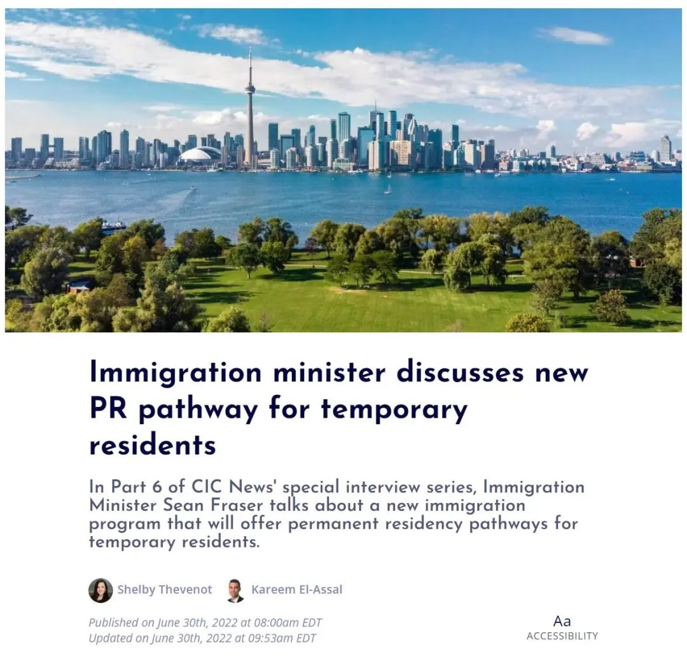
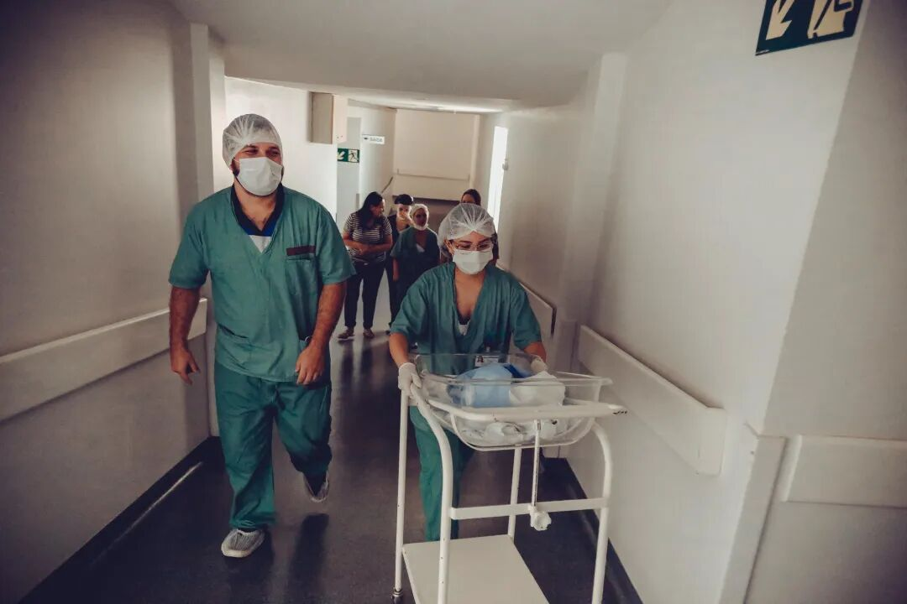
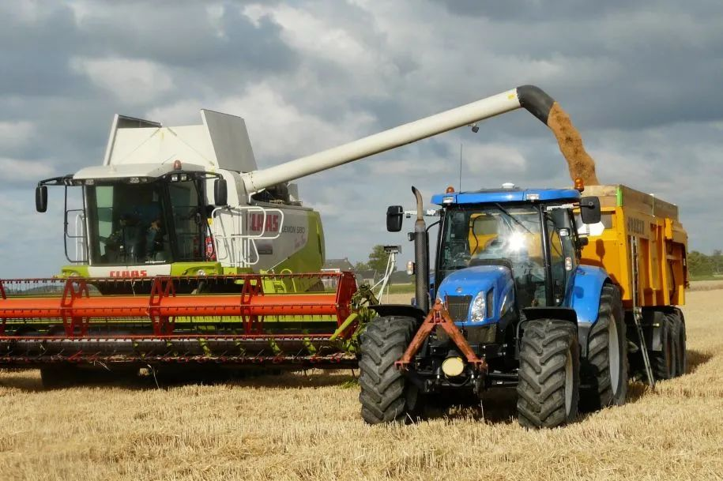
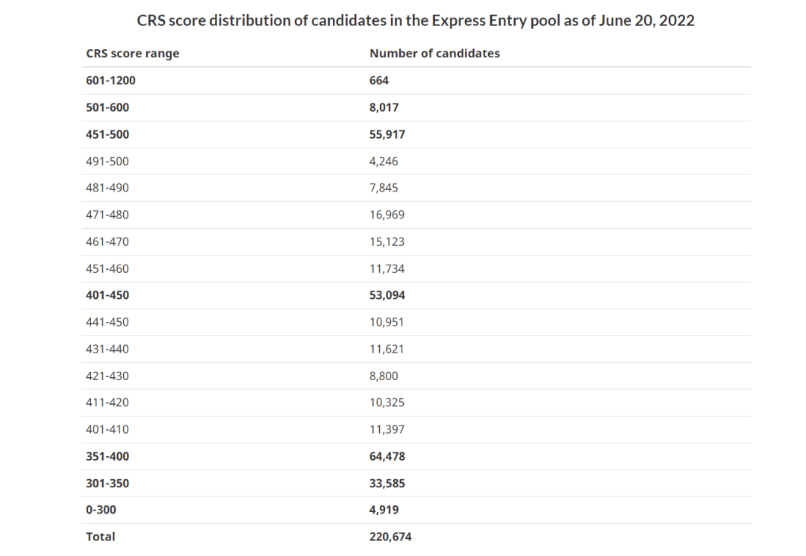

# 无标题

**链接地址:** http://mp.weixin.qq.com/s?__biz=MzUyNzA2NTAwNg==&mid=2247490175&idx=1&sn=f0ef69ea89555eb5247649c0f92885f6&chksm=fa0410becd7399a8c83ba6f1ca55954ffd912f02fe6a2c763bf7ac19e6fd1765729041d9620e&mpshare=1&scene=2&srcid=0704waA9ydY77K1qHuFJilxq&sharer_sharetime=1656894435359&sharer_shareid=77848a6b3852ae4dcb6c74ffee84743c#rd
**作者:** 你身边的签证专家
**获取时间:** 2025/8/28 19:37:44
**图片数量:** 20

---

## 原始HTML内容

<section style="box-sizing: border-box;font-style: normal;font-weight: 400;text-align: justify;font-size: 16px;"><section style="text-align: center;margin-top: 10px;margin-bottom: 10px;box-sizing: border-box;" powered-by="xiumi.us"><section style="max-width: 100%;vertical-align: middle;display: inline-block;line-height: 0;box-sizing: border-box;"></section></section><section style="text-align: center;margin-top: 10px;margin-bottom: 10px;box-sizing: border-box;" powered-by="xiumi.us"></section>
 
<section style="font-size: 14px;padding: 0px 15px;letter-spacing: 1px;box-sizing: border-box;" powered-by="xiumi.us">
去年被称为<strong style="box-sizing: border-box;">“临时居民到永久居民之路”（TR to PR）</strong>的移民<strong style="box-sizing: border-box;">“大赦1.0”</strong>项目，在疫情封锁期间为9万名从事必需服务、医疗护理工作的海外劳工和国际留学毕业生提供了快速移民机会。 

 

整个大赦项目中，我们共帮助客户提交了<strong style="box-sizing: border-box;">近40份申请</strong>。现在<strong style="box-sizing: border-box;">我们已经从移民部收到</strong><strong style="box-sizing: border-box;">全部</strong><strong style="box-sizing: border-box;">申请获得审批的好消息</strong>。

 

然而，“大赦1.0”好是好，但名额太少被一抢而空的遗憾也让没能赶上这波政策的申请者们感到<strong style="box-sizing: border-box;">怨念与不公</strong>。<strong style="box-sizing: border-box;">“大赦新政什么时候重开？”</strong>成为新时代被客户朋友们追问最多的问题之一。

 

不过，好消息来得还挺突然！宣称不会再次“大赦”的移民部近期却松口公开表示：<strong style="box-sizing: border-box;">万众期待的“大赦2.0”正在来的路上</strong>！ 

 

 
</section><section style="font-size: 19px;text-align: center;margin: 10px 0px 3px;box-sizing: border-box;" powered-by="xiumi.us"><section style="display: inline-block;border-width: 1px;border-style: solid;border-color: rgb(188, 65, 65);background-color: rgb(188, 65, 65);width: 1.8em;height: 1.8em;line-height: 1.8em;border-radius: 100%;margin-left: auto;margin-right: auto;font-size: 16px;color: rgb(255, 255, 255);box-sizing: border-box;">
<strong style="box-sizing: border-box;">1</strong>
</section></section><section style="text-align: center;margin: 0px;box-sizing: border-box;" powered-by="xiumi.us"><section style="display: inline-block;width: 0px;height: 0px;vertical-align: top;overflow: hidden;border-style: solid;border-width: 9px 6px 0px;border-color: rgb(188, 65, 65) rgba(255, 255, 255, 0) rgba(255, 255, 255, 0);box-sizing: border-box;"><svg viewBox="0 0 1 1" style="float:left;line-height:0;width:0;vertical-align:top;"></svg></section></section><section style="margin: 0px 0px 10px;text-align: center;justify-content: center;display: flex;flex-flow: row nowrap;box-sizing: border-box;" powered-by="xiumi.us"><section style="display: inline-block;width: auto;vertical-align: middle;background-color: rgba(109, 155, 209, 0.1);min-width: 10%;max-width: 100%;flex: 0 0 auto;height: auto;align-self: center;padding: 12px;margin: 0px;box-sizing: border-box;"><section style="color: rgb(109, 155, 209);text-align: justify;box-sizing: border-box;" powered-by="xiumi.us">
<strong style="box-sizing: border-box;">“大赦2.0”细节首披露，信息量很大！</strong>
</section></section></section>
 
<section style="font-size: 14px;padding: 0px 15px;letter-spacing: 1px;box-sizing: border-box;" powered-by="xiumi.us">
加拿大联邦移民部长肖恩·弗雷泽（Sean Fraser）6月11日在一次重要采访活动中表示，加拿大正准备制定一项新政，令持有临时签证的加拿大新移民，加快速度成为永久居民。

 

不过，这项统筹时间<strong style="box-sizing: border-box;">只有120天</strong>的新政计划最早会在<strong style="box-sizing: border-box;">2022年的秋季</strong>就会颁布实施，因此目前移民部还尚未公开申请的条件和考核细节。

 
</section><section style="text-align: center;margin-top: 10px;margin-bottom: 10px;box-sizing: border-box;" powered-by="xiumi.us"><section style="max-width: 100%;vertical-align: middle;display: inline-block;line-height: 0;width: 90%;height: auto;box-sizing: border-box;"></section></section><section style="font-size: 14px;padding: 0px 15px;letter-spacing: 1px;box-sizing: border-box;" powered-by="xiumi.us">
 

不过，近期弗雷泽在近期接受CIC News采访时，向媒体记者们透露了关于“大赦2.0”新政制定和实施的<strong style="box-sizing: border-box;">6大要点</strong>。信息量不小，<strong style="box-sizing: border-box;">“划重点”的内容很多</strong>，请关心该政策的客户朋友们赶紧和新时代一起来解读一下这其中的门道吧！
</section><section style="font-size: 14px;padding: 0px 15px;letter-spacing: 1px;box-sizing: border-box;" powered-by="xiumi.us">
 
</section><section style="text-align: center;margin-top: 10px;margin-bottom: 10px;box-sizing: border-box;" powered-by="xiumi.us"><section style="max-width: 100%;vertical-align: middle;display: inline-block;line-height: 0;box-sizing: border-box;"></section></section>
 
<section style="font-size: 19px;text-align: center;margin: 10px 0px 3px;box-sizing: border-box;" powered-by="xiumi.us"><section style="display: inline-block;border-width: 1px;border-style: solid;border-color: rgb(188, 65, 65);background-color: rgb(188, 65, 65);width: 1.8em;height: 1.8em;line-height: 1.8em;border-radius: 100%;margin-left: auto;margin-right: auto;font-size: 16px;color: rgb(255, 255, 255);box-sizing: border-box;">
<strong style="box-sizing: border-box;">2</strong>
</section></section><section style="text-align: center;margin: 0px;box-sizing: border-box;" powered-by="xiumi.us"><section style="display: inline-block;width: 0px;height: 0px;vertical-align: top;overflow: hidden;border-style: solid;border-width: 9px 6px 0px;border-color: rgb(188, 65, 65) rgba(255, 255, 255, 0) rgba(255, 255, 255, 0);box-sizing: border-box;"><svg viewBox="0 0 1 1" style="float:left;line-height:0;width:0;vertical-align:top;"></svg></section></section><section style="margin: 0px 0px 10px;text-align: center;justify-content: center;display: flex;flex-flow: row nowrap;box-sizing: border-box;" powered-by="xiumi.us"><section style="display: inline-block;width: auto;vertical-align: middle;background-color: rgba(109, 155, 209, 0.1);min-width: 10%;max-width: 100%;flex: 0 0 auto;height: auto;align-self: center;padding: 12px;margin: 0px;box-sizing: border-box;"><section style="color: rgb(109, 155, 209);text-align: justify;box-sizing: border-box;" powered-by="xiumi.us">
<strong style="box-sizing: border-box;">拿起笔来，和新时代一起划重点吧！</strong>
</section></section></section><section style="font-size: 14px;padding: 0px 15px;letter-spacing: 1px;box-sizing: border-box;" powered-by="xiumi.us">
 

弗雷泽在6月21日的采访中准确点明了该项目推出的deadline，即为<strong style="box-sizing: border-box;">2022年9月8日</strong>。也就是说在这个日期或之前的一段时间内，想要抢名额的申请者们就要根据我们持续更新的<strong style="box-sizing: border-box;">新政预测</strong>来提前准备资料的递交了<strong style="box-sizing: border-box;">（尤其是语言考试的报名！）</strong>。

 

此外，弗雷泽还在采访中提到新政制定所依据的六大要点，我们来逐条进行细节解读：

 
</section><section style="margin: 10px 0px 0px;isolation: isolate;display: flex;flex-flow: row nowrap;text-align: left;justify-content: flex-start;box-sizing: border-box;" powered-by="xiumi.us"><section style="display: inline-block;vertical-align: top;width: auto;background-color: rgb(188, 65, 65);min-width: 10%;max-width: 100%;flex: 0 0 auto;height: auto;padding: 9px 15px;align-self: stretch;box-sizing: border-box;"><section style="color: rgb(255, 255, 255);text-align: justify;box-sizing: border-box;" powered-by="xiumi.us">
<strong style="box-sizing: border-box;">01</strong>
</section></section><section style="display: inline-block;vertical-align: top;width: auto;background-color: rgb(255, 247, 240);flex: 100 100 0%;height: auto;align-self: stretch;padding: 4px 4px 4px 12px;margin: 0px;box-sizing: border-box;"><section style="margin: 5px 0px 0px;box-sizing: border-box;" powered-by="xiumi.us"><section style="color: rgb(188, 65, 65);text-align: justify;font-size: 14px;box-sizing: border-box;">
该经济类移民计划将<strong style="box-sizing: border-box;">更加重视在加拿大的工作经验</strong>，<strong style="box-sizing: border-box;">并扩大符合条件的职业类别</strong>；
</section></section></section></section><section style="text-align: left;transform: translate3d(7px, 0px, 0px);-webkit-transform: translate3d(7px, 0px, 0px);-moz-transform: translate3d(7px, 0px, 0px);-o-transform: translate3d(7px, 0px, 0px);box-sizing: border-box;" powered-by="xiumi.us"><section style="display: inline-block;width: 0px;height: 0px;vertical-align: top;overflow: hidden;border-style: solid;border-width: 4px;border-color: rgb(188, 65, 65) rgba(255, 255, 255, 0) rgba(255, 255, 255, 0) rgb(188, 65, 65);box-sizing: border-box;"><svg viewBox="0 0 1 1" style="float:left;line-height:0;width:0;vertical-align:top;"></svg></section></section><section style="margin: 0px 0px 10px;text-align: left;justify-content: flex-start;display: flex;flex-flow: row nowrap;box-sizing: border-box;" powered-by="xiumi.us"><section style="display: inline-block;width: 100%;vertical-align: top;border-style: solid;border-width: 1px;border-color: rgb(222, 54, 54);padding: 0px;align-self: flex-start;flex: 0 0 auto;box-sizing: border-box;"><section style="display: flex;flex-flow: row nowrap;margin: 0px;text-align: center;justify-content: center;box-sizing: border-box;" powered-by="xiumi.us"><section style="display: inline-block;vertical-align: top;width: auto;min-width: 10%;max-width: 100%;flex: 0 0 auto;height: auto;align-self: flex-start;background-color: rgb(255, 247, 240);margin: 0px;padding: 15px;box-sizing: border-box;"><section style="margin: 0px;box-sizing: border-box;" powered-by="xiumi.us"><section style="color: rgb(188, 65, 65);box-sizing: border-box;">
<strong style="box-sizing: border-box;">解</strong>

<strong style="box-sizing: border-box;">读</strong>
</section></section></section><section style="display: inline-block;vertical-align: top;width: auto;flex: 100 100 0%;align-self: flex-start;height: auto;padding: 20px 30px 20px 16px;box-sizing: border-box;"><section style="text-align: justify;box-sizing: border-box;" powered-by="xiumi.us">
该项新政将会增大<strong style="box-sizing: border-box;">加拿大工作经验</strong>的评分比重。单靠毕业证书或者一张job offer就能拿到枫叶卡的概率……自己体会一下。符合条件的职业类别增加是一个好消息，但是增加的种类大概率会根据加拿大就业市场<strong style="box-sizing: border-box;">短缺程度</strong>定夺，而相对饱和的职位则没有这些优待。 
</section></section></section></section></section><section style="font-size: 14px;padding: 0px 15px;letter-spacing: 1px;box-sizing: border-box;" powered-by="xiumi.us">
 
</section><section style="margin: 10px 0px 0px;isolation: isolate;display: flex;flex-flow: row nowrap;text-align: left;justify-content: flex-start;box-sizing: border-box;" powered-by="xiumi.us"><section style="display: inline-block;vertical-align: top;width: auto;background-color: rgb(188, 65, 65);min-width: 10%;max-width: 100%;flex: 0 0 auto;height: auto;padding: 9px 15px;align-self: stretch;box-sizing: border-box;"><section style="color: rgb(255, 255, 255);text-align: justify;box-sizing: border-box;" powered-by="xiumi.us">
<strong style="box-sizing: border-box;">02</strong>
</section></section><section style="display: inline-block;vertical-align: top;width: auto;background-color: rgb(255, 247, 240);flex: 100 100 0%;height: auto;align-self: stretch;padding: 4px 4px 4px 12px;margin: 0px;box-sizing: border-box;"><section style="margin: 5px 0px 0px;box-sizing: border-box;" powered-by="xiumi.us"><section style="color: rgb(188, 65, 65);text-align: justify;font-size: 14px;box-sizing: border-box;">
<strong style="box-sizing: border-box;">综合检验来自其他联邦移民计划的证据；</strong>
</section></section></section></section><section style="text-align: left;transform: translate3d(7px, 0px, 0px);-webkit-transform: translate3d(7px, 0px, 0px);-moz-transform: translate3d(7px, 0px, 0px);-o-transform: translate3d(7px, 0px, 0px);box-sizing: border-box;" powered-by="xiumi.us"><section style="display: inline-block;width: 0px;height: 0px;vertical-align: top;overflow: hidden;border-style: solid;border-width: 4px;border-color: rgb(188, 65, 65) rgba(255, 255, 255, 0) rgba(255, 255, 255, 0) rgb(188, 65, 65);box-sizing: border-box;"><svg viewBox="0 0 1 1" style="float:left;line-height:0;width:0;vertical-align:top;"></svg></section></section><section style="margin: 0px 0px 10px;text-align: left;justify-content: flex-start;display: flex;flex-flow: row nowrap;box-sizing: border-box;" powered-by="xiumi.us"><section style="display: inline-block;width: 100%;vertical-align: top;border-style: solid;border-width: 1px;border-color: rgb(222, 54, 54);padding: 0px;align-self: flex-start;flex: 0 0 auto;box-sizing: border-box;"><section style="display: flex;flex-flow: row nowrap;margin: 0px;text-align: center;justify-content: center;box-sizing: border-box;" powered-by="xiumi.us"><section style="display: inline-block;vertical-align: top;width: auto;min-width: 10%;max-width: 100%;flex: 0 0 auto;height: auto;align-self: flex-start;background-color: rgb(255, 247, 240);margin: 0px;padding: 15px;box-sizing: border-box;"><section style="margin: 0px;box-sizing: border-box;" powered-by="xiumi.us"><section style="color: rgb(188, 65, 65);box-sizing: border-box;">
<strong style="box-sizing: border-box;">解</strong>

<strong style="box-sizing: border-box;">读</strong>
</section></section></section><section style="display: inline-block;vertical-align: top;width: auto;flex: 100 100 0%;align-self: flex-start;height: auto;padding: 20px 30px 20px 16px;box-sizing: border-box;"><section style="text-align: justify;box-sizing: border-box;" powered-by="xiumi.us">
新政的制定会根据其他的联邦移民计划，如快速通道下的联邦技术移民（FSW）、联邦经验移民（CEC）和联邦技工移民（FST）等项目的实际情况综合制定，有望疏通其他通道堵塞问题。但该项目有其独特的审核标准，预计<strong style="box-sizing: border-box;">邀请方式会和其他联邦项目有着较大差异</strong>。
</section></section></section></section></section>
 
<section style="text-align: center;margin-top: 10px;margin-bottom: 10px;box-sizing: border-box;" powered-by="xiumi.us"><section style="max-width: 100%;vertical-align: middle;display: inline-block;line-height: 0;box-sizing: border-box;"></section></section><section style="font-size: 14px;padding: 0px 15px;letter-spacing: 1px;box-sizing: border-box;" powered-by="xiumi.us">
 
</section><section style="margin: 10px 0px 0px;isolation: isolate;display: flex;flex-flow: row nowrap;text-align: left;justify-content: flex-start;box-sizing: border-box;" powered-by="xiumi.us"><section style="display: inline-block;vertical-align: top;width: auto;background-color: rgb(188, 65, 65);min-width: 10%;max-width: 100%;flex: 0 0 auto;height: auto;padding: 9px 15px;align-self: stretch;box-sizing: border-box;"><section style="color: rgb(255, 255, 255);text-align: justify;box-sizing: border-box;" powered-by="xiumi.us">
<strong style="box-sizing: border-box;">03</strong>
</section></section><section style="display: inline-block;vertical-align: top;width: auto;background-color: rgb(255, 247, 240);flex: 100 100 0%;height: auto;align-self: stretch;padding: 4px 4px 4px 12px;margin: 0px;box-sizing: border-box;"><section style="margin: 5px 0px 0px;box-sizing: border-box;" powered-by="xiumi.us"><section style="color: rgb(188, 65, 65);text-align: justify;font-size: 14px;box-sizing: border-box;">
<strong style="box-sizing: border-box;">结合劳动力市场和技能短缺的数据</strong>，根据持续存在的劳动力差距选择目标移民群体；
</section></section></section></section><section style="text-align: left;transform: translate3d(7px, 0px, 0px);-webkit-transform: translate3d(7px, 0px, 0px);-moz-transform: translate3d(7px, 0px, 0px);-o-transform: translate3d(7px, 0px, 0px);box-sizing: border-box;" powered-by="xiumi.us"><section style="display: inline-block;width: 0px;height: 0px;vertical-align: top;overflow: hidden;border-style: solid;border-width: 4px;border-color: rgb(188, 65, 65) rgba(255, 255, 255, 0) rgba(255, 255, 255, 0) rgb(188, 65, 65);box-sizing: border-box;"><svg viewBox="0 0 1 1" style="float:left;line-height:0;width:0;vertical-align:top;"></svg></section></section><section style="margin: 0px 0px 10px;text-align: left;justify-content: flex-start;display: flex;flex-flow: row nowrap;box-sizing: border-box;" powered-by="xiumi.us"><section style="display: inline-block;width: 100%;vertical-align: top;border-style: solid;border-width: 1px;border-color: rgb(222, 54, 54);padding: 0px;align-self: flex-start;flex: 0 0 auto;box-sizing: border-box;"><section style="display: flex;flex-flow: row nowrap;margin: 0px;text-align: center;justify-content: center;box-sizing: border-box;" powered-by="xiumi.us"><section style="display: inline-block;vertical-align: top;width: auto;min-width: 10%;max-width: 100%;flex: 0 0 auto;height: auto;align-self: flex-start;background-color: rgb(255, 247, 240);margin: 0px;padding: 15px;box-sizing: border-box;"><section style="margin: 0px;box-sizing: border-box;" powered-by="xiumi.us"><section style="color: rgb(188, 65, 65);box-sizing: border-box;">
<strong style="box-sizing: border-box;">解</strong>

<strong style="box-sizing: border-box;">读</strong>
</section></section></section><section style="display: inline-block;vertical-align: top;width: auto;flex: 100 100 0%;align-self: flex-start;height: auto;padding: 20px 30px 20px 16px;box-sizing: border-box;"><section style="text-align: justify;box-sizing: border-box;" powered-by="xiumi.us">
新政的制定将会在筛选条件上提供更具有灵活度的调整空间，尤其是会根据加拿大劳动力市场和技能短缺进行调整。比如BCPNP今年3月改革后会<strong style="box-sizing: border-box;">轮期</strong>向短缺的科技类、幼教类和医护类职业申请者进行邀请，且在<strong style="box-sizing: border-box;">邀请分数上进一步</strong><strong>放宽</strong>以高效吸纳短缺的劳动力人才。 
</section></section></section></section></section><section style="font-size: 14px;padding: 0px 15px;letter-spacing: 1px;box-sizing: border-box;" powered-by="xiumi.us">
 
</section><section style="margin: 10px 0px 0px;isolation: isolate;display: flex;flex-flow: row nowrap;text-align: left;justify-content: flex-start;box-sizing: border-box;" powered-by="xiumi.us"><section style="display: inline-block;vertical-align: top;width: auto;background-color: rgb(188, 65, 65);min-width: 10%;max-width: 100%;flex: 0 0 auto;height: auto;padding: 9px 15px;align-self: stretch;box-sizing: border-box;"><section style="color: rgb(255, 255, 255);text-align: justify;box-sizing: border-box;" powered-by="xiumi.us">
<strong style="box-sizing: border-box;">04</strong>
</section></section><section style="display: inline-block;vertical-align: top;width: auto;background-color: rgb(255, 247, 240);flex: 100 100 0%;height: auto;align-self: stretch;padding: 4px 4px 4px 12px;margin: 0px;box-sizing: border-box;"><section style="margin: 5px 0px 0px;box-sizing: border-box;" powered-by="xiumi.us"><section style="color: rgb(188, 65, 65);text-align: justify;font-size: 14px;box-sizing: border-box;">
鼓励在魁北克省以外<strong style="box-sizing: border-box;">讲法语</strong>的移民和居留在<strong style="box-sizing: border-box;">较小社区</strong>移民的申请；
</section></section></section></section><section style="text-align: left;transform: translate3d(7px, 0px, 0px);-webkit-transform: translate3d(7px, 0px, 0px);-moz-transform: translate3d(7px, 0px, 0px);-o-transform: translate3d(7px, 0px, 0px);box-sizing: border-box;" powered-by="xiumi.us"><section style="display: inline-block;width: 0px;height: 0px;vertical-align: top;overflow: hidden;border-style: solid;border-width: 4px;border-color: rgb(188, 65, 65) rgba(255, 255, 255, 0) rgba(255, 255, 255, 0) rgb(188, 65, 65);box-sizing: border-box;"><svg viewBox="0 0 1 1" style="float:left;line-height:0;width:0;vertical-align:top;"></svg></section></section><section style="margin: 0px 0px 10px;text-align: left;justify-content: flex-start;display: flex;flex-flow: row nowrap;box-sizing: border-box;" powered-by="xiumi.us"><section style="display: inline-block;width: 100%;vertical-align: top;border-style: solid;border-width: 1px;border-color: rgb(222, 54, 54);padding: 0px;align-self: flex-start;flex: 0 0 auto;box-sizing: border-box;"><section style="display: flex;flex-flow: row nowrap;margin: 0px;text-align: center;justify-content: center;box-sizing: border-box;" powered-by="xiumi.us"><section style="display: inline-block;vertical-align: top;width: auto;min-width: 10%;max-width: 100%;flex: 0 0 auto;height: auto;align-self: flex-start;background-color: rgb(255, 247, 240);margin: 0px;padding: 15px;box-sizing: border-box;"><section style="margin: 0px;box-sizing: border-box;" powered-by="xiumi.us"><section style="color: rgb(188, 65, 65);box-sizing: border-box;">
<strong style="box-sizing: border-box;">解</strong>

<strong style="box-sizing: border-box;">读</strong>
</section></section></section><section style="display: inline-block;vertical-align: top;width: auto;flex: 100 100 0%;align-self: flex-start;height: auto;padding: 20px 30px 20px 16px;box-sizing: border-box;"><section style="text-align: justify;box-sizing: border-box;" powered-by="xiumi.us">
非魁北克地区的申请人，如拥有<strong style="box-sizing: border-box;">法语优势</strong>，有望在该项新政中获得额外加分。居留在<strong style="box-sizing: border-box;">偏远乡镇</strong>的申请人，有望在该项新政中获得额外加分。 
</section></section></section></section></section><section style="font-size: 14px;padding: 0px 15px;letter-spacing: 1px;box-sizing: border-box;" powered-by="xiumi.us">
 
</section><section style="margin: 10px 0px 0px;isolation: isolate;display: flex;flex-flow: row nowrap;text-align: left;justify-content: flex-start;box-sizing: border-box;" powered-by="xiumi.us"><section style="display: inline-block;vertical-align: top;width: auto;background-color: rgb(188, 65, 65);min-width: 10%;max-width: 100%;flex: 0 0 auto;height: auto;padding: 9px 15px;align-self: stretch;box-sizing: border-box;"><section style="color: rgb(255, 255, 255);text-align: justify;box-sizing: border-box;" powered-by="xiumi.us">
<strong style="box-sizing: border-box;">05</strong>
</section></section><section style="display: inline-block;vertical-align: top;width: auto;background-color: rgb(255, 247, 240);flex: 100 100 0%;height: auto;align-self: stretch;padding: 4px 4px 4px 12px;margin: 0px;box-sizing: border-box;"><section style="margin: 5px 0px 0px;box-sizing: border-box;" powered-by="xiumi.us"><section style="color: rgb(188, 65, 65);text-align: justify;font-size: 14px;box-sizing: border-box;">
确定一个审核机制<strong style="box-sizing: border-box;">以更快地适应劳动力市场需求</strong>和<strong style="box-sizing: border-box;">区域经济</strong>优先事项的变化；
</section></section></section></section><section style="text-align: left;transform: translate3d(7px, 0px, 0px);-webkit-transform: translate3d(7px, 0px, 0px);-moz-transform: translate3d(7px, 0px, 0px);-o-transform: translate3d(7px, 0px, 0px);box-sizing: border-box;" powered-by="xiumi.us"><section style="display: inline-block;width: 0px;height: 0px;vertical-align: top;overflow: hidden;border-style: solid;border-width: 4px;border-color: rgb(188, 65, 65) rgba(255, 255, 255, 0) rgba(255, 255, 255, 0) rgb(188, 65, 65);box-sizing: border-box;"><svg viewBox="0 0 1 1" style="float:left;line-height:0;width:0;vertical-align:top;"></svg></section></section><section style="margin: 0px 0px 10px;text-align: left;justify-content: flex-start;display: flex;flex-flow: row nowrap;box-sizing: border-box;" powered-by="xiumi.us"><section style="display: inline-block;width: 100%;vertical-align: top;border-style: solid;border-width: 1px;border-color: rgb(222, 54, 54);padding: 0px;align-self: flex-start;flex: 0 0 auto;box-sizing: border-box;"><section style="display: flex;flex-flow: row nowrap;margin: 0px;text-align: center;justify-content: center;box-sizing: border-box;" powered-by="xiumi.us"><section style="display: inline-block;vertical-align: top;width: auto;min-width: 10%;max-width: 100%;flex: 0 0 auto;height: auto;align-self: flex-start;background-color: rgb(255, 247, 240);margin: 0px;padding: 15px;box-sizing: border-box;"><section style="margin: 0px;box-sizing: border-box;" powered-by="xiumi.us"><section style="color: rgb(188, 65, 65);box-sizing: border-box;">
<strong style="box-sizing: border-box;">解</strong>

<strong style="box-sizing: border-box;">读</strong>
</section></section></section><section style="display: inline-block;vertical-align: top;width: auto;flex: 100 100 0%;align-self: flex-start;height: auto;padding: 20px 30px 20px 16px;box-sizing: border-box;"><section style="text-align: justify;box-sizing: border-box;" powered-by="xiumi.us">
根据劳动力市场短缺定向获得邀请的候选人，预计将比普通申请者或其他项目的申请者<strong style="box-sizing: border-box;">更快</strong>获得枫叶卡的审批。且申请人的职位会根据其所<strong style="box-sizing: border-box;">居留的地区</strong>在评定结果上造成影响。 
</section></section></section></section></section>
 
<section style="text-align: left;justify-content: flex-start;display: flex;flex-flow: row nowrap;margin: 10px 0px;box-sizing: border-box;" powered-by="xiumi.us"><section style="display: inline-block;vertical-align: top;width: 50%;align-self: flex-start;flex: 0 0 auto;box-sizing: border-box;"><section style="text-align: center;margin: 0px 0%;box-sizing: border-box;" powered-by="xiumi.us"><section style="max-width: 100%;vertical-align: middle;display: inline-block;line-height: 0;width: 86%;height: auto;box-sizing: border-box;"></section></section><section style="text-align: justify;box-sizing: border-box;" powered-by="xiumi.us">
 
</section><section style="text-align: center;margin: 0px 0%;box-sizing: border-box;" powered-by="xiumi.us"><section style="max-width: 100%;vertical-align: middle;display: inline-block;line-height: 0;width: 86%;height: auto;box-sizing: border-box;"></section></section></section><section style="display: inline-block;vertical-align: top;width: 50%;align-self: flex-start;flex: 0 0 auto;box-sizing: border-box;"><section style="text-align: justify;box-sizing: border-box;" powered-by="xiumi.us">
 
</section><section style="text-align: justify;box-sizing: border-box;" powered-by="xiumi.us">
 
</section><section style="text-align: center;margin: 0px 0%;box-sizing: border-box;" powered-by="xiumi.us"><section style="max-width: 100%;vertical-align: middle;display: inline-block;line-height: 0;width: 86%;height: auto;box-sizing: border-box;"></section></section><section style="text-align: justify;box-sizing: border-box;" powered-by="xiumi.us">
 
</section><section style="text-align: center;margin: 0px 0%;box-sizing: border-box;" powered-by="xiumi.us"><section style="max-width: 100%;vertical-align: middle;display: inline-block;line-height: 0;width: 86%;height: auto;box-sizing: border-box;"></section></section></section></section><section style="font-size: 14px;padding: 0px 15px;letter-spacing: 1px;box-sizing: border-box;" powered-by="xiumi.us">
 
</section><section style="margin: 10px 0px 0px;isolation: isolate;display: flex;flex-flow: row nowrap;text-align: left;justify-content: flex-start;box-sizing: border-box;" powered-by="xiumi.us"><section style="display: inline-block;vertical-align: top;width: auto;background-color: rgb(188, 65, 65);min-width: 10%;max-width: 100%;flex: 0 0 auto;height: auto;padding: 9px 15px;align-self: stretch;box-sizing: border-box;"><section style="color: rgb(255, 255, 255);text-align: justify;box-sizing: border-box;" powered-by="xiumi.us">
<strong style="box-sizing: border-box;">06</strong>
</section></section><section style="display: inline-block;vertical-align: top;width: auto;background-color: rgb(255, 247, 240);flex: 100 100 0%;height: auto;align-self: stretch;padding: 4px 4px 4px 12px;margin: 0px;box-sizing: border-box;"><section style="margin: 5px 0px 0px;box-sizing: border-box;" powered-by="xiumi.us"><section style="color: rgb(188, 65, 65);text-align: justify;font-size: 14px;box-sizing: border-box;">
将根据劳动力市场短缺推出基于职业的定向邀请措施，或增加<strong style="box-sizing: border-box;">额外的加分</strong>。目标职业包括<strong style="box-sizing: border-box;">卫生服务、护理人员、农业、制造业、服务业、贸易和运输</strong>等。
</section></section></section></section><section style="text-align: left;transform: translate3d(7px, 0px, 0px);-webkit-transform: translate3d(7px, 0px, 0px);-moz-transform: translate3d(7px, 0px, 0px);-o-transform: translate3d(7px, 0px, 0px);box-sizing: border-box;" powered-by="xiumi.us"><section style="display: inline-block;width: 0px;height: 0px;vertical-align: top;overflow: hidden;border-style: solid;border-width: 4px;border-color: rgb(188, 65, 65) rgba(255, 255, 255, 0) rgba(255, 255, 255, 0) rgb(188, 65, 65);box-sizing: border-box;"><svg viewBox="0 0 1 1" style="float:left;line-height:0;width:0;vertical-align:top;"></svg></section></section><section style="margin: 0px 0px 10px;text-align: left;justify-content: flex-start;display: flex;flex-flow: row nowrap;box-sizing: border-box;" powered-by="xiumi.us"><section style="display: inline-block;width: 100%;vertical-align: top;border-style: solid;border-width: 1px;border-color: rgb(222, 54, 54);padding: 0px;align-self: flex-start;flex: 0 0 auto;box-sizing: border-box;"><section style="display: flex;flex-flow: row nowrap;margin: 0px;text-align: center;justify-content: center;box-sizing: border-box;" powered-by="xiumi.us"><section style="display: inline-block;vertical-align: top;width: auto;min-width: 10%;max-width: 100%;flex: 0 0 auto;height: auto;align-self: flex-start;background-color: rgb(255, 247, 240);margin: 0px;padding: 15px;box-sizing: border-box;"><section style="margin: 0px;box-sizing: border-box;" powered-by="xiumi.us"><section style="color: rgb(188, 65, 65);box-sizing: border-box;">
<strong style="box-sizing: border-box;">解</strong>

<strong style="box-sizing: border-box;">读</strong>
</section></section></section><section style="display: inline-block;vertical-align: top;width: auto;flex: 100 100 0%;align-self: flex-start;height: auto;padding: 20px 30px 20px 16px;box-sizing: border-box;"><section style="text-align: justify;box-sizing: border-box;" powered-by="xiumi.us">
这条非常浅显易懂。新的移民政策会进一步向加拿大<strong style="box-sizing: border-box;">极度短缺的蓝领工作行业倾斜</strong>。如果你的工作领域已经处于上述被点名的行业中，那么恭喜你！等待你的就是项目颁布后的买票上车啦！ 
</section></section></section></section></section><section style="font-size: 14px;padding: 0px 15px;letter-spacing: 1px;box-sizing: border-box;" powered-by="xiumi.us">
 
</section><section style="font-size: 14px;padding: 0px 15px;letter-spacing: 1px;box-sizing: border-box;" powered-by="xiumi.us">
虽然，移民部长表示该计划仍处于初期开发阶段，但从这些重点信息中我们不难看出移民部想要把新政的制定和加国<strong style="box-sizing: border-box;">部分产业劳动力紧缺问题</strong>紧密联系起来的决心。 

 

弗雷泽在谈话中说到：“我们现在面临的挑战是，<strong style="box-sizing: border-box;">在加拿大拿临时居住许可的人数已经远远超过了我们的移民水平计划中的最大空间</strong>。比如，加拿大每年持学习签证在该国留学的人口已超过50万，但加国每年移民的总配额只有40万。”

 
</section><section style="text-align: center;margin-top: 10px;margin-bottom: 10px;box-sizing: border-box;" powered-by="xiumi.us"><section style="max-width: 100%;vertical-align: middle;display: inline-block;line-height: 0;width: 90%;height: auto;box-sizing: border-box;"></section></section><section style="font-size: 14px;padding: 0px 15px;letter-spacing: 1px;box-sizing: border-box;" powered-by="xiumi.us">
 

因此，所谓的“大赦2.0”不见得相比其他移民通道拥有的更低的门槛。相反，其对于工作职位的把控或许会进一步<strong style="box-sizing: border-box;">增加非紧缺职业申请人的竞争</strong>。

 

所以，赶上2021年“大赦1.0”在<strong style="box-sizing: border-box;">疫情期间冲配额KPI</strong>的幸运鹅，请对着移民部隔空清唱一遍“我想说，谢谢你…”，毕竟<strong style="box-sizing: border-box;">“毕业就送枫叶卡”</strong>这种好事儿，真是很难再在加拿大移民史中重现了。

 
</section><section style="text-align: center;margin-top: 10px;margin-bottom: 10px;box-sizing: border-box;" powered-by="xiumi.us"><section style="max-width: 100%;vertical-align: middle;display: inline-block;line-height: 0;box-sizing: border-box;"></section></section><section style="font-size: 14px;padding: 0px 15px;letter-spacing: 1px;box-sizing: border-box;" powered-by="xiumi.us">
 

另外，一部分群众猜测，“大赦2.0”的制定是为了解决目前快速通道暂停抽签而造成池中<strong style="box-sizing: border-box;">候选人堆积数量超20万</strong>的拥堵情况。那么“大赦2.0”是否会为该类人群提供<strong style="box-sizing: border-box;">额外的加分</strong>呢？

 
</section><section style="text-align: center;margin-top: 10px;margin-bottom: 10px;box-sizing: border-box;" powered-by="xiumi.us"><section style="max-width: 100%;vertical-align: middle;display: inline-block;line-height: 0;width: 90%;height: auto;box-sizing: border-box;"></section></section><section style="font-size: 14px;padding: 0px 15px;letter-spacing: 1px;box-sizing: border-box;" powered-by="xiumi.us">
 

弗雷泽在采访中驳斥了这个美好的想法。他表示作为加拿大目前最主流经济移民申请方式的快速通道，将在7月6日重开后<strong style="box-sizing: border-box;">保持独立运行</strong>。该项目不会和正在制定的“大赦2.0”互相干涉，<strong style="box-sizing: border-box;">“大赦2.0”不会直接从快速通道的池中捞人</strong>！这是一个崭新的，需要重新申请，独立接受考核的项目。 

 
</section><section style="text-align: center;justify-content: center;display: flex;flex-flow: row nowrap;margin: 10px 0%;box-sizing: border-box;" powered-by="xiumi.us"><section style="display: inline-block;vertical-align: middle;width: auto;flex: 100 100 0%;height: auto;align-self: center;box-sizing: border-box;"><section style="margin: 0.5em 0px;box-sizing: border-box;" powered-by="xiumi.us"><section style="background-color: rgb(227, 208, 182);height: 1px;box-sizing: border-box;"><svg viewBox="0 0 1 1" style="float:left;line-height:0;width:0;vertical-align:top;"></svg></section></section></section><section style="display: inline-block;vertical-align: middle;width: auto;min-width: 10%;max-width: 100%;flex: 0 0 auto;height: auto;align-self: center;line-height: 0;box-sizing: border-box;"><section style="box-sizing: border-box;" powered-by="xiumi.us"><section style="display: inline-block;width: 12px;height: 12px;vertical-align: top;overflow: hidden;border-width: 0px;border-radius: 597px;border-style: none;border-color: rgb(62, 62, 62);background-color: rgb(208, 90, 90);box-sizing: border-box;"><svg viewBox="0 0 1 1" style="float:left;line-height:0;width:0;vertical-align:top;"></svg></section></section></section><section style="display: inline-block;vertical-align: middle;width: auto;flex: 100 100 0%;align-self: center;height: auto;box-sizing: border-box;"><section style="margin: 0.5em 0px;box-sizing: border-box;" powered-by="xiumi.us"><section style="background-color: rgb(227, 208, 182);height: 1px;box-sizing: border-box;"><svg viewBox="0 0 1 1" style="float:left;line-height:0;width:0;vertical-align:top;"></svg></section></section></section></section><section style="font-size: 14px;padding: 0px 15px;letter-spacing: 1px;box-sizing: border-box;" powered-by="xiumi.us">
 

如果你想关注该项目的更多最新细节和解读，请关注<strong style="box-sizing: border-box;">新时代留学移民的公众号</strong>。如果你的职业不在紧缺职业列表中，也不要气馁。下周快速通道的荣耀回归将提前为广大申请人们点亮希望的明灯！
<section class="channels_iframe_wrp wxw_wechannel_card_not_horizontal"><mpvideosnap class="js_uneditable custom_select_card channels_iframe videosnap_video_iframe" data-pluginname="videosnap" data-id="export/UzFfAgtgekIEAQAAAAAAwXUu3igtfgAAAAstQy6ubaLX4KHWvLEZgBPE_JMoY0xqSrv_zNPgMItwUNgoeZ7b0IpJDyoeSp1N" data-url="https://findermp.video.qq.com/251/20350/stodownload?encfilekey=XGocBFxVWK5dcyOOqpEU4yzyhTS7AsF7W13woxezqTFIjbbwbmxfK1bTQeLYNbMibg3vPgyvM9HOR39Yxso3URicibfSrstbrb191fGYib4ibCgW8Ehia2CctNicyqWbr4z86SIj8C0AUJVy43AUnKibzXaLyYHoDx6Gicl49vR2iaNEXGiaOjumOShukia4MA&amp;adaptivelytrans=0&amp;bizid=1023&amp;dotrans=0&amp;hy=HK&amp;idx=1&amp;m=1c44125126a0de1b093c28cf80b088a0&amp;token=AxricY7RBHdVhBv1mXiakEq5J7U9k8Jz0LFrG9BniaYPpGSzI134HxK61yfQeX9kKkPOIkz2LwBC0o" data-headimgurl="http://wx.qlogo.cn/finderhead/PiajxSqBRaEI4vQJr3aa81ehxKpzshj4t6ZWzDxwztBic5fr9nVMt20g/0" data-username="v2_060000231003b20faec8c7eb811fc3d1ca06ec31b07726617828a16cbc88a282c95def3c7c6d@finder" data-nickname="Zoe说加拿大" data-desc="机会是留给有准备的人的！#加拿大" data-nonceid="8764591290079353548" data-type="video" data-width="720" data-height="960"></mpvideosnap></section>
留在加拿大的方式千千万，但<strong style="box-sizing: border-box;">机会只留给有准备，有决心的人</strong>。让我们陪你一起完成加国筑梦的理想吧！

 
</section><section style="margin: 10px 0%;text-align: center;justify-content: center;display: flex;flex-flow: row nowrap;box-sizing: border-box;" powered-by="xiumi.us"><section style="display: inline-block;width: 100%;vertical-align: top;box-shadow: rgb(0, 0, 0) 0px 0px 0px;background-color: rgb(241, 241, 241);padding: 10px;align-self: flex-start;flex: 0 0 auto;box-sizing: border-box;"><section style="justify-content: center;display: flex;flex-flow: row nowrap;box-sizing: border-box;" powered-by="xiumi.us"><section style="display: inline-block;width: 100%;vertical-align: top;background-color: rgb(255, 255, 255);padding: 20px 10px;flex: 0 0 auto;height: auto;box-shadow: rgb(198, 198, 198) 0px 0px 2px;border-width: 0px;border-radius: 6px;border-style: none;border-color: rgb(62, 62, 62);overflow: hidden;align-self: flex-start;box-sizing: border-box;"><section style="color: rgb(189, 189, 189);text-align: justify;box-sizing: border-box;" powered-by="xiumi.us">
<strong style="box-sizing: border-box;">阅读更多</strong>
</section><section style="text-align: justify;box-sizing: border-box;" powered-by="xiumi.us">
 
</section><section style="display: flex;flex-flow: row nowrap;margin: 0px 0%;justify-content: center;box-sizing: border-box;" powered-by="xiumi.us"><section style="display: inline-block;vertical-align: top;width: auto;flex: 100 100 0%;align-self: flex-start;height: auto;box-shadow: rgb(0, 0, 0) 0px 0px 0px;border-bottom: 1px dashed rgba(106, 106, 106, 0.25);border-bottom-right-radius: 0px;margin: 0px 10px 0px 0px;box-sizing: border-box;"><section style="font-size: 14px;text-align: justify;box-sizing: border-box;" powered-by="xiumi.us">
<a target="_blank" href="http://mp.weixin.qq.com/s?__biz=MzUyNzA2NTAwNg==&amp;mid=2247490130&amp;idx=1&amp;sn=6d96a3cfe1e376f4bf84ace04167817d&amp;chksm=fa041093cd7399859f62f7e35c7b3973b09e5fd97d9f9bf68683fc68a0edcc9e86641b0ea601&amp;scene=21#wechat_redirect" textvalue="喜大普奔！加拿大移民部长官宣：留学生毕业工签再延18个月！" linktype="text" imgurl="" imgdata="null" data-itemshowtype="0" tab="innerlink" data-linktype="2">喜大普奔！加拿大移民部长官宣：留学生毕业工签再延18个月！ </a>
</section></section><section style="display: inline-block;vertical-align: top;width: auto;flex: 20 20 0%;align-self: flex-start;height: auto;border-width: 0px;margin: 0px 0px 0px 5px;box-sizing: border-box;"><section style="margin: 0px 0%;box-sizing: border-box;" powered-by="xiumi.us"><section style="max-width: 100%;vertical-align: middle;display: inline-block;line-height: 0;box-shadow: rgb(0, 0, 0) 0px 0px 0px;box-sizing: border-box;"><a target="_blank" href="http://mp.weixin.qq.com/s?__biz=MzUyNzA2NTAwNg==&amp;mid=2247490130&amp;idx=1&amp;sn=6d96a3cfe1e376f4bf84ace04167817d&amp;chksm=fa041093cd7399859f62f7e35c7b3973b09e5fd97d9f9bf68683fc68a0edcc9e86641b0ea601&amp;scene=21#wechat_redirect" textvalue="你已选中了添加链接的内容" linktype="text" imgurl="" imgdata="null" data-itemshowtype="0" tab="innerlink" data-linktype="1"></a></section></section></section></section><section style="text-align: justify;box-sizing: border-box;" powered-by="xiumi.us">
 
</section><section style="display: flex;flex-flow: row nowrap;margin: 0px 0%;justify-content: center;box-sizing: border-box;" powered-by="xiumi.us"><section style="display: inline-block;vertical-align: top;width: auto;flex: 100 100 0%;align-self: flex-start;height: auto;box-shadow: rgb(0, 0, 0) 0px 0px 0px;border-bottom: 1px dashed rgba(106, 106, 106, 0.25);border-bottom-right-radius: 0px;margin: 0px 10px 0px 0px;box-sizing: border-box;"><section style="font-size: 14px;text-align: justify;box-sizing: border-box;" powered-by="xiumi.us">
<a target="_blank" href="http://mp.weixin.qq.com/s?__biz=MzUyNzA2NTAwNg==&amp;mid=2247490081&amp;idx=1&amp;sn=0529e05511e2f194f512c124d1d5fcf7&amp;chksm=fa0410e0cd7399f657fd5455c618fe5fe0c82a537b0cf74440eb73ca7e68c67e8d4cd68d499c&amp;scene=21#wechat_redirect" textvalue="终于等到了！加拿大联邦快速通道7月6日重磅回归！" linktype="text" imgurl="" imgdata="null" data-itemshowtype="0" tab="innerlink" data-linktype="2">终于等到了！加拿大联邦快速通道7月6日重磅回归！</a>
</section></section><section style="display: inline-block;vertical-align: top;width: auto;flex: 20 20 0%;align-self: flex-start;height: auto;border-width: 0px;margin: 0px 0px 0px 5px;box-sizing: border-box;"><section style="margin: 0px 0%;box-sizing: border-box;" powered-by="xiumi.us"><section style="max-width: 100%;vertical-align: middle;display: inline-block;line-height: 0;box-shadow: rgb(0, 0, 0) 0px 0px 0px;box-sizing: border-box;"><a target="_blank" href="http://mp.weixin.qq.com/s?__biz=MzUyNzA2NTAwNg==&amp;mid=2247490081&amp;idx=1&amp;sn=0529e05511e2f194f512c124d1d5fcf7&amp;chksm=fa0410e0cd7399f657fd5455c618fe5fe0c82a537b0cf74440eb73ca7e68c67e8d4cd68d499c&amp;scene=21#wechat_redirect" textvalue="你已选中了添加链接的内容" linktype="text" imgurl="" imgdata="null" data-itemshowtype="0" tab="innerlink" data-linktype="1"></a></section></section></section></section><section style="text-align: justify;box-sizing: border-box;" powered-by="xiumi.us">
 
</section><section style="display: flex;flex-flow: row nowrap;margin: 0px 0%;justify-content: center;box-sizing: border-box;" powered-by="xiumi.us"><section style="display: inline-block;vertical-align: top;width: auto;flex: 100 100 0%;align-self: flex-start;height: auto;box-shadow: rgb(0, 0, 0) 0px 0px 0px;border-bottom: 1px dashed rgba(106, 106, 106, 0.25);border-bottom-right-radius: 0px;margin: 0px 10px 0px 0px;box-sizing: border-box;"><section style="font-size: 14px;text-align: justify;box-sizing: border-box;" powered-by="xiumi.us">
<a target="_blank" href="http://mp.weixin.qq.com/s?__biz=MzUyNzA2NTAwNg==&amp;mid=2247489934&amp;idx=1&amp;sn=eac456313a022c5b7eacf88587359005&amp;chksm=fa04134fcd739a5948e04b159af9471f60be85912030496c5afeefb0d84b98df0b060163e689&amp;scene=21#wechat_redirect" textvalue="加拿大“新版大赦”即将重启，或将永久开放！近期加国移民利好新政有点多~" linktype="text" imgurl="" imgdata="null" data-itemshowtype="0" tab="innerlink" data-linktype="2">加拿大“新版大赦”即将重启，或将永久开放！近期加国移民利好新政有点多~</a>
</section></section><section style="display: inline-block;vertical-align: top;width: auto;flex: 20 20 0%;align-self: flex-start;height: auto;border-width: 0px;margin: 0px 0px 0px 5px;box-sizing: border-box;"><section style="margin: 0px 0%;box-sizing: border-box;" powered-by="xiumi.us"><section style="max-width: 100%;vertical-align: middle;display: inline-block;line-height: 0;box-shadow: rgb(0, 0, 0) 0px 0px 0px;box-sizing: border-box;"><a target="_blank" href="http://mp.weixin.qq.com/s?__biz=MzUyNzA2NTAwNg==&amp;mid=2247489934&amp;idx=1&amp;sn=eac456313a022c5b7eacf88587359005&amp;chksm=fa04134fcd739a5948e04b159af9471f60be85912030496c5afeefb0d84b98df0b060163e689&amp;scene=21#wechat_redirect" textvalue="你已选中了添加链接的内容" linktype="text" imgurl="" imgdata="null" data-itemshowtype="0" tab="innerlink" data-linktype="1"></a></section></section></section></section></section></section></section></section><section style="font-size: 14px;padding: 0px 15px;letter-spacing: 1px;box-sizing: border-box;" powered-by="xiumi.us">
 
</section><section style="text-align: center;margin-top: 10px;margin-bottom: 10px;box-sizing: border-box;" powered-by="xiumi.us"><section style="max-width: 100%;vertical-align: middle;display: inline-block;line-height: 0;box-sizing: border-box;"></section></section><section style="text-align: center;margin-top: 10px;margin-bottom: 10px;box-sizing: border-box;" powered-by="xiumi.us"><section style="max-width: 100%;vertical-align: middle;display: inline-block;line-height: 0;box-sizing: border-box;"></section></section><section style="text-align: center;margin-top: 10px;margin-bottom: 10px;box-sizing: border-box;" powered-by="xiumi.us"><section style="max-width: 100%;vertical-align: middle;display: inline-block;line-height: 0;box-sizing: border-box;"></section></section><section style="padding: 0px 15px;font-size: 12px;color: rgb(121, 121, 121);box-sizing: border-box;" powered-by="xiumi.us">
<strong style="box-sizing: border-box;">参考信息：</strong>

https://www.cicnews.com/2022/06/immigration-minister-discusses-new-pr-pathway-for-temporary-residents-0626923.html
</section><section style="text-align: center;margin-top: 10px;margin-bottom: 10px;box-sizing: border-box;" powered-by="xiumi.us"><section style="max-width: 100%;vertical-align: middle;display: inline-block;line-height: 0;box-sizing: border-box;"></section></section><section style="text-align: center;margin-top: 10px;margin-bottom: 10px;box-sizing: border-box;" powered-by="xiumi.us"><section style="max-width: 100%;vertical-align: middle;display: inline-block;line-height: 0;box-sizing: border-box;"></section></section></section>
 

---

## 纯文本内容

去年被称为“临时居民到永久居民之路”（TR to PR）的移民“大赦1.0”项目，在疫情封锁期间为9万名从事必需服务、医疗护理工作的海外劳工和国际留学毕业生提供了快速移民机会。整个大赦项目中，我们共帮助客户提交了近40份申请。现在我们已经从移民部收到全部申请获得审批的好消息。然而，“大赦1.0”好是好，但名额太少被一抢而空的遗憾也让没能赶上这波政策的申请者们感到怨念与不公。“大赦新政什么时候重开？”成为新时代被客户朋友们追问最多的问题之一。不过，好消息来得还挺突然！宣称不会再次“大赦”的移民部近期却松口公开表示：万众期待的“大赦2.0”正在来的路上！1“大赦2.0”细节首披露，信息量很大！加拿大联邦移民部长肖恩·弗雷泽（Sean Fraser）6月11日在一次重要采访活动中表示，加拿大正准备制定一项新政，令持有临时签证的加拿大新移民，加快速度成为永久居民。不过，这项统筹时间只有120天的新政计划最早会在2022年的秋季就会颁布实施，因此目前移民部还尚未公开申请的条件和考核细节。不过，近期弗雷泽在近期接受CIC News采访时，向媒体记者们透露了关于“大赦2.0”新政制定和实施的6大要点。信息量不小，“划重点”的内容很多，请关心该政策的客户朋友们赶紧和新时代一起来解读一下这其中的门道吧！2拿起笔来，和新时代一起划重点吧！弗雷泽在6月21日的采访中准确点明了该项目推出的deadline，即为2022年9月8日。也就是说在这个日期或之前的一段时间内，想要抢名额的申请者们就要根据我们持续更新的新政预测来提前准备资料的递交了（尤其是语言考试的报名！）。此外，弗雷泽还在采访中提到新政制定所依据的六大要点，我们来逐条进行细节解读：01该经济类移民计划将更加重视在加拿大的工作经验，并扩大符合条件的职业类别；解读该项新政将会增大加拿大工作经验的评分比重。单靠毕业证书或者一张job offer就能拿到枫叶卡的概率……自己体会一下。符合条件的职业类别增加是一个好消息，但是增加的种类大概率会根据加拿大就业市场短缺程度定夺，而相对饱和的职位则没有这些优待。02综合检验来自其他联邦移民计划的证据；解读新政的制定会根据其他的联邦移民计划，如快速通道下的联邦技术移民（FSW）、联邦经验移民（CEC）和联邦技工移民（FST）等项目的实际情况综合制定，有望疏通其他通道堵塞问题。但该项目有其独特的审核标准，预计邀请方式会和其他联邦项目有着较大差异。03结合劳动力市场和技能短缺的数据，根据持续存在的劳动力差距选择目标移民群体；解读新政的制定将会在筛选条件上提供更具有灵活度的调整空间，尤其是会根据加拿大劳动力市场和技能短缺进行调整。比如BCPNP今年3月改革后会轮期向短缺的科技类、幼教类和医护类职业申请者进行邀请，且在邀请分数上进一步放宽以高效吸纳短缺的劳动力人才。04鼓励在魁北克省以外讲法语的移民和居留在较小社区移民的申请；解读非魁北克地区的申请人，如拥有法语优势，有望在该项新政中获得额外加分。居留在偏远乡镇的申请人，有望在该项新政中获得额外加分。05确定一个审核机制以更快地适应劳动力市场需求和区域经济优先事项的变化；解读根据劳动力市场短缺定向获得邀请的候选人，预计将比普通申请者或其他项目的申请者更快获得枫叶卡的审批。且申请人的职位会根据其所居留的地区在评定结果上造成影响。06将根据劳动力市场短缺推出基于职业的定向邀请措施，或增加额外的加分。目标职业包括卫生服务、护理人员、农业、制造业、服务业、贸易和运输等。解读这条非常浅显易懂。新的移民政策会进一步向加拿大极度短缺的蓝领工作行业倾斜。如果你的工作领域已经处于上述被点名的行业中，那么恭喜你！等待你的就是项目颁布后的买票上车啦！虽然，移民部长表示该计划仍处于初期开发阶段，但从这些重点信息中我们不难看出移民部想要把新政的制定和加国部分产业劳动力紧缺问题紧密联系起来的决心。弗雷泽在谈话中说到：“我们现在面临的挑战是，在加拿大拿临时居住许可的人数已经远远超过了我们的移民水平计划中的最大空间。比如，加拿大每年持学习签证在该国留学的人口已超过50万，但加国每年移民的总配额只有40万。”因此，所谓的“大赦2.0”不见得相比其他移民通道拥有的更低的门槛。相反，其对于工作职位的把控或许会进一步增加非紧缺职业申请人的竞争。所以，赶上2021年“大赦1.0”在疫情期间冲配额KPI的幸运鹅，请对着移民部隔空清唱一遍“我想说，谢谢你…”，毕竟“毕业就送枫叶卡”这种好事儿，真是很难再在加拿大移民史中重现了。另外，一部分群众猜测，“大赦2.0”的制定是为了解决目前快速通道暂停抽签而造成池中候选人堆积数量超20万的拥堵情况。那么“大赦2.0”是否会为该类人群提供额外的加分呢？弗雷泽在采访中驳斥了这个美好的想法。他表示作为加拿大目前最主流经济移民申请方式的快速通道，将在7月6日重开后保持独立运行。该项目不会和正在制定的“大赦2.0”互相干涉，“大赦2.0”不会直接从快速通道的池中捞人！这是一个崭新的，需要重新申请，独立接受考核的项目。如果你想关注该项目的更多最新细节和解读，请关注新时代留学移民的公众号。如果你的职业不在紧缺职业列表中，也不要气馁。下周快速通道的荣耀回归将提前为广大申请人们点亮希望的明灯！留在加拿大的方式千千万，但机会只留给有准备，有决心的人。让我们陪你一起完成加国筑梦的理想吧！阅读更多喜大普奔！加拿大移民部长官宣：留学生毕业工签再延18个月！终于等到了！加拿大联邦快速通道7月6日重磅回归！加拿大“新版大赦”即将重启，或将永久开放！近期加国移民利好新政有点多~参考信息：https://www.cicnews.com/2022/06/immigration-minister-discusses-new-pr-pathway-for-temporary-residents-0626923.html

---

## 图片列表

-  (原始链接: https://mmbiz.qpic.cn/mmbiz_jpg/904kUibXm7Y7UcVRianPMxiaxmvdE4dRicgSmicsofgAAej4DVXgtPaYAG2ZsQyDtKRqI1sIeebWJuduAzh94HuQpHQ/640?wx_fmt=jpeg)
-  (原始链接: https://mmbiz.qpic.cn/mmbiz_jpg/904kUibXm7Y4EC3q40NfCb7jaWhWbgfxibgpavj9rH4EqdQFpzyVg6N8TNSVOsgAOuvg1OSL9ec8ZyRicEzu8Tib7A/640?wx_fmt=jpeg)
-  (原始链接: https://mmbiz.qpic.cn/mmbiz_jpg/904kUibXm7Y7UcVRianPMxiaxmvdE4dRicgSfkWv8fibKjY5icD5x8YoA5W7c4R6Btq69VO0kYshrVibqfjJujwbevAiaA/640?wx_fmt=jpeg)
-  (原始链接: https://mmbiz.qpic.cn/mmbiz_png/904kUibXm7Y7UcVRianPMxiaxmvdE4dRicgSh8SroyNMp7f1rSGyLgh3fzBfNNDalPKFW6RCewhfG96icicHoL2WwpjQ/640?wx_fmt=png)
-  (原始链接: https://mmbiz.qpic.cn/mmbiz_jpg/904kUibXm7Y7UcVRianPMxiaxmvdE4dRicgSngGVbcY9UGl05Jty325g3hZrSpWehg8ZFov2a8kIkBrIee3SeOicvXA/640?wx_fmt=jpeg)
-  (原始链接: https://mmbiz.qpic.cn/mmbiz_jpg/904kUibXm7Y7UcVRianPMxiaxmvdE4dRicgSFEMJnjgXAhPYAe27dZbfbHfPxmXfVejyadJ1eV2lUvB2zk5tGVw3lA/640?wx_fmt=jpeg)
-  (原始链接: https://mmbiz.qpic.cn/mmbiz_jpg/904kUibXm7Y7UcVRianPMxiaxmvdE4dRicgShCwD4jyaLZEx7ib7t8v61byVDibM1jPbz5nvFkMBY0E9W30yE5yK3fmg/640?wx_fmt=jpeg)
-  (原始链接: https://mmbiz.qpic.cn/mmbiz_jpg/904kUibXm7Y7UcVRianPMxiaxmvdE4dRicgSCvIfuvUYXU7Ac5pDQqib16Cmrh8gOAGKLaGE9JewX49YEqqI1fMP9yw/640?wx_fmt=jpeg)
-  (原始链接: https://mmbiz.qpic.cn/mmbiz_jpg/904kUibXm7Y7UcVRianPMxiaxmvdE4dRicgSzmSpN2KGfZYs6Tvh7OE1v2oHTHgWdXWbJkiaNrCxdBP9RlCdrR9abMA/640?wx_fmt=jpeg)
-  (原始链接: https://mmbiz.qpic.cn/mmbiz_jpg/904kUibXm7Y7UcVRianPMxiaxmvdE4dRicgSibqRRU0ZB0BJAkniabiaklvKwz2WrMlKleUDwxVv5LsorMT3IsaKjWSpw/640?wx_fmt=jpeg)
-  (原始链接: https://mmbiz.qpic.cn/mmbiz_png/904kUibXm7Y7UcVRianPMxiaxmvdE4dRicgSrDkY3jHpkg27w88OViajuakjWZIiccib1YDyUia9ribaknMW3CVk2MJl5Kw/640?wx_fmt=png)
-  (原始链接: https://mmbiz.qpic.cn/mmbiz_png/904kUibXm7Y7UcVRianPMxiaxmvdE4dRicgSkMIN2JbtLtgQZNNa7zicvrALhzmzRTXXHJLsWZiaic4IYCZ3s44QJebuw/640?wx_fmt=png)
-  (原始链接: https://mmbiz.qpic.cn/mmbiz_jpg/904kUibXm7Y7UcVRianPMxiaxmvdE4dRicgSGzTvKV3hiaGm3jGffSknOTOghbfVhhmEoeiaFK2aA4u1CY5RsOmQrbDA/640?wx_fmt=jpeg)
-  (原始链接: https://mmbiz.qpic.cn/mmbiz_jpg/904kUibXm7Y7UcVRianPMxiaxmvdE4dRicgSCRoD1V5VYHxmoPO3ymicYvkbfb2JGOsCsvFMVSO8l9SDZhgia1aDAx2g/640?wx_fmt=jpeg)
-  (原始链接: https://mmbiz.qpic.cn/mmbiz_jpg/904kUibXm7Y7UcVRianPMxiaxmvdE4dRicgSVtfyOOvWYbkDUJPibBgwCK0RAMSTiaM9iaPQPiaOCGlvGKGOoIbDqWK2ibQ/640?wx_fmt=jpeg)
-  (原始链接: https://mmbiz.qpic.cn/mmbiz_jpg/904kUibXm7Y7UcVRianPMxiaxmvdE4dRicgSf9qZ3MRXEkc0AkY2UBY7icW1Fpe5OK8vo7w0kt2hL9ecNRTUKicrt6SA/640?wx_fmt=jpeg)
-  (原始链接: https://mmbiz.qpic.cn/mmbiz_jpg/904kUibXm7Y7UcVRianPMxiaxmvdE4dRicgSybakfCHFMEq9ZacyFyJDNiapkIXvXdowkbynCFF0kMeFnRLEnp1yfwg/640?wx_fmt=jpeg)
-  (原始链接: https://mmbiz.qpic.cn/mmbiz_jpg/904kUibXm7Y7UcVRianPMxiaxmvdE4dRicgSlAt4QjS9piajjMrbzibpNJoxDWmXxYP19KSHjM5qSblPgwaSnDudkooQ/640?wx_fmt=jpeg)
-  (原始链接: https://mmbiz.qpic.cn/mmbiz_jpg/904kUibXm7Y7UcVRianPMxiaxmvdE4dRicgSKJPFVico3ELcMaZnmNN7icu0553Gzk3ntianf73eS05loTuZzaA3V5nSw/640?wx_fmt=jpeg)
-  (原始链接: https://mmbiz.qpic.cn/mmbiz_jpg/904kUibXm7Y7UcVRianPMxiaxmvdE4dRicgScN9PE05zZwJALywULc20Xyebt5ax9yJXiarkSgBWDmRBPHlcnzF46Gg/640?wx_fmt=jpeg)
