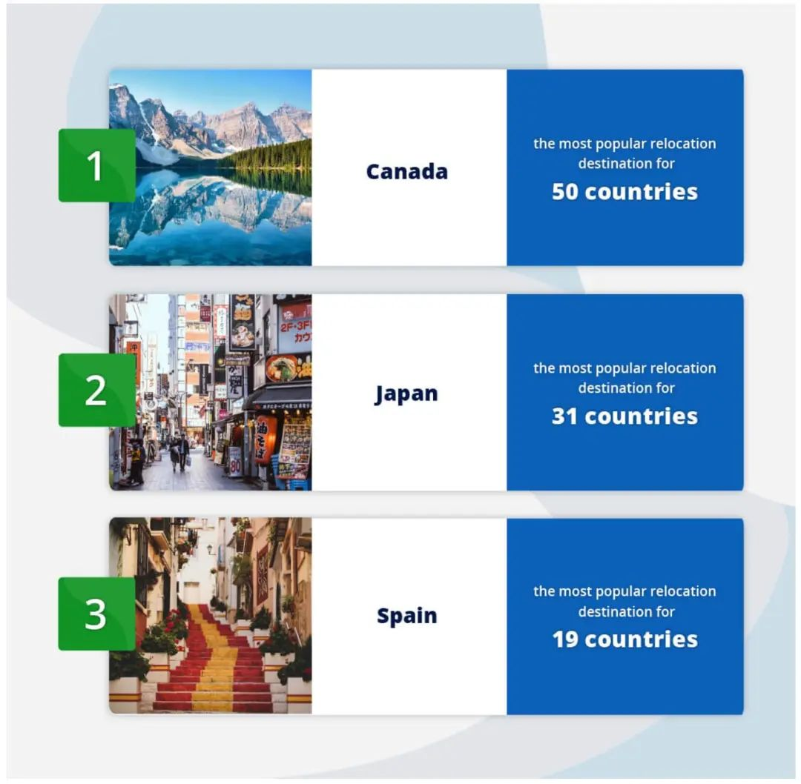
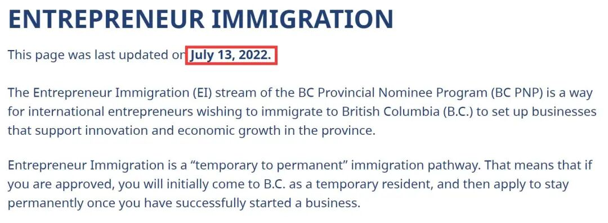
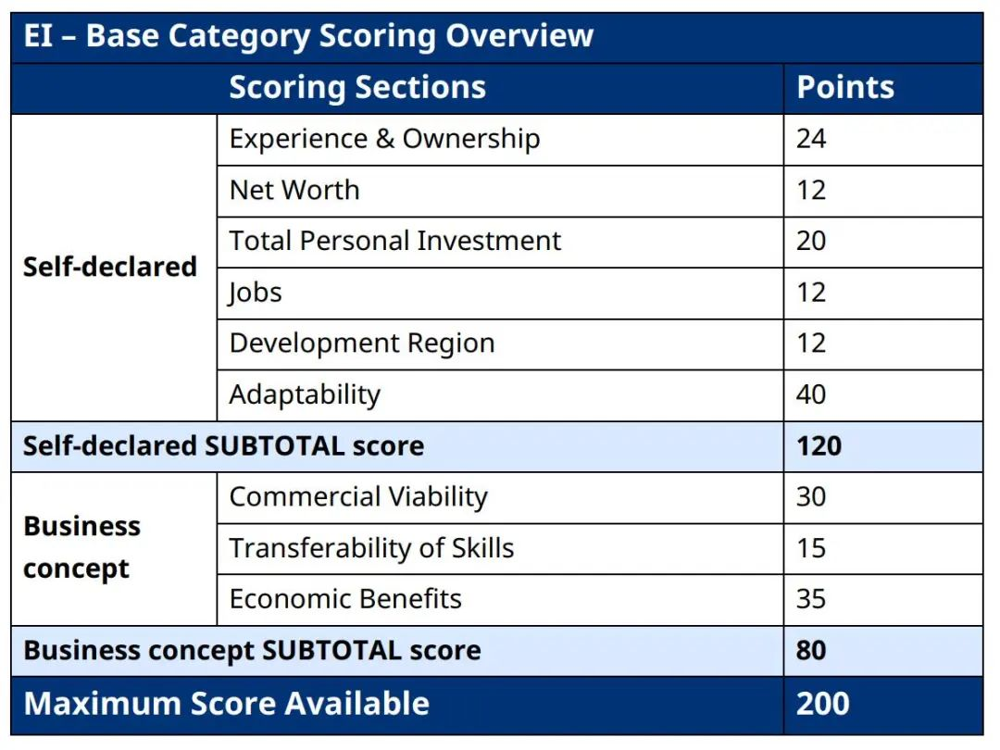
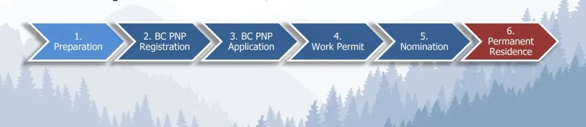
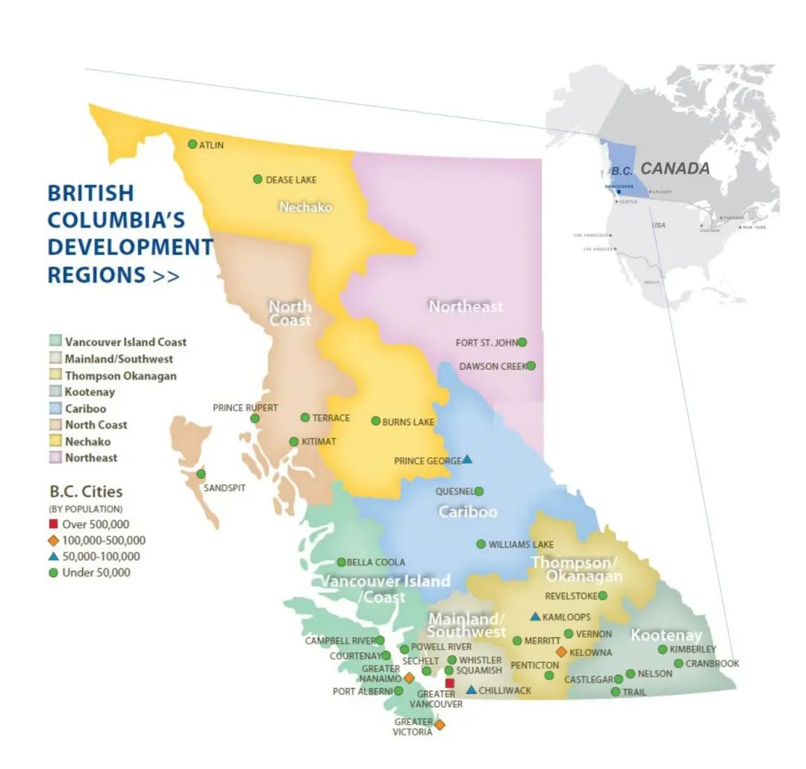
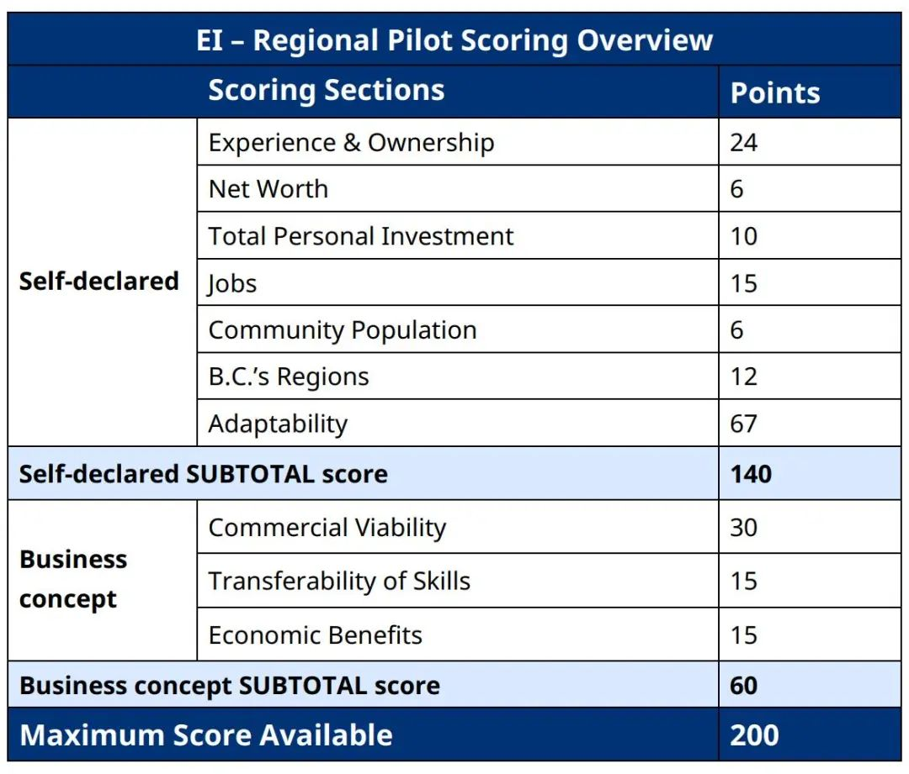
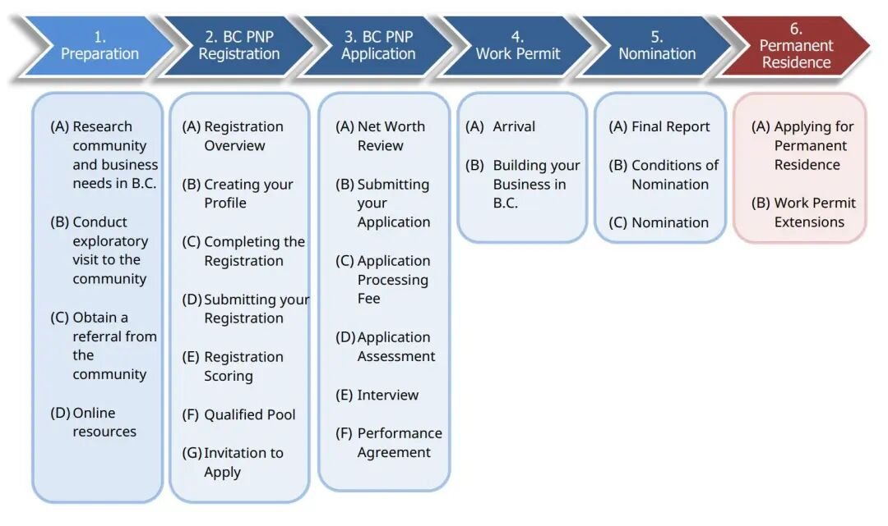
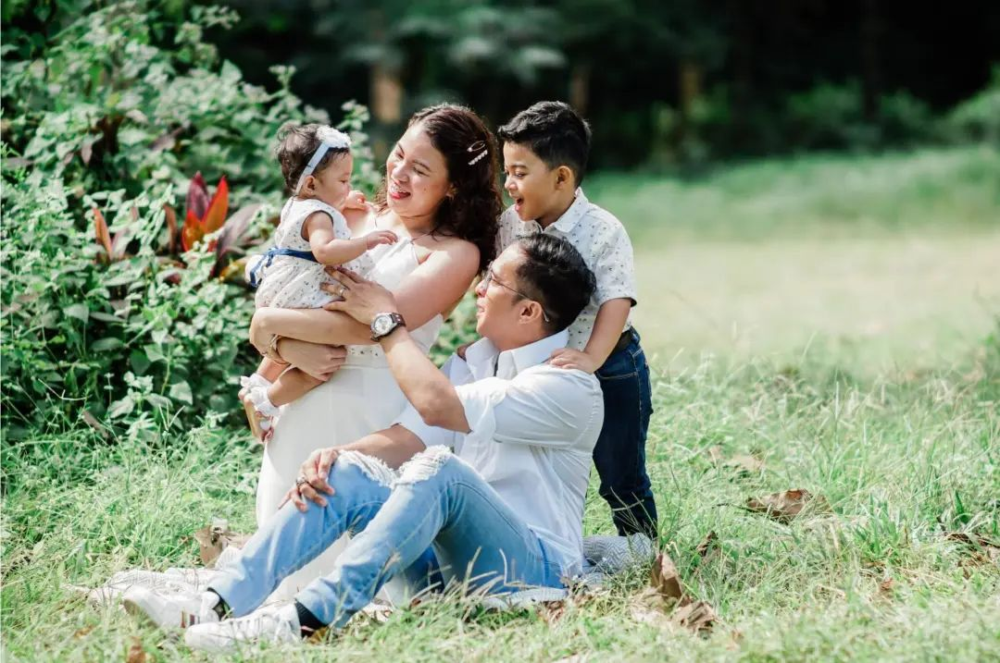
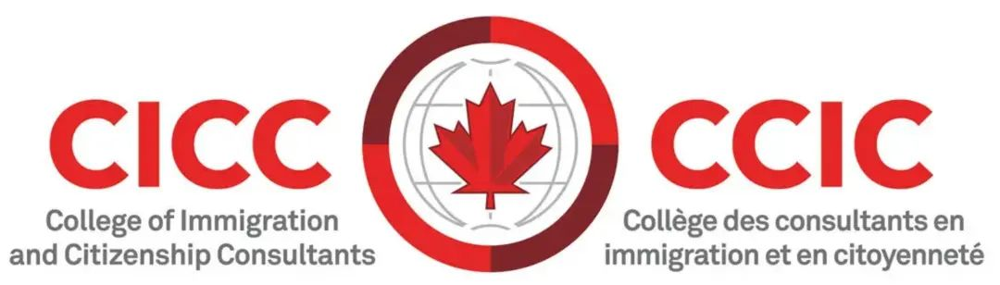

# 无标题

**链接地址:** http://mp.weixin.qq.com/s?__biz=MzUyNzA2NTAwNg==&mid=2247490277&idx=1&sn=4ef634dd6fccc9ff17074e49d0d98b68&chksm=fa041024cd73993221cbd5cefd96fac3079172a1e1c98d1cc18683f2bcc1f66c5053c9b070c0&mpshare=1&scene=2&srcid=0716UXahD4ncpfkLghlcGBtW&sharer_sharetime=1657944936769&sharer_shareid=77848a6b3852ae4dcb6c74ffee84743c#rd
**作者:** 你身边的签证专家
**获取时间:** 2025/8/28 19:36:34
**图片数量:** 25

---

## 原始HTML内容

<section style="box-sizing: border-box;font-style: normal;font-weight: 400;text-align: justify;font-size: 16px;"><section style="text-align: center;margin-top: 10px;margin-bottom: 10px;box-sizing: border-box;" powered-by="xiumi.us"><section style="max-width: 100%;vertical-align: middle;display: inline-block;line-height: 0;box-sizing: border-box;"></section></section><section style="text-align: center;margin-top: 10px;margin-bottom: 10px;box-sizing: border-box;" powered-by="xiumi.us"><section style="max-width: 100%;vertical-align: middle;display: inline-block;line-height: 0;box-sizing: border-box;"></section></section>
 
<section style="font-size: 19px;text-align: center;margin: 10px 0px 3px;box-sizing: border-box;" powered-by="xiumi.us"><section style="display: inline-block;width: 1.8em;height: 1.8em;line-height: 1.8em;border-radius: 100%;margin-left: auto;margin-right: auto;font-size: 16px;color: rgb(255, 255, 255);border-width: 1px;border-style: solid;border-color: rgb(188, 65, 65);background-color: rgb(188, 65, 65);box-sizing: border-box;">
<strong style="box-sizing: border-box;">1</strong>
</section></section><section style="text-align: center;margin: 0px;box-sizing: border-box;" powered-by="xiumi.us"><section style="display: inline-block;vertical-align: top;overflow: hidden;height: 0px;width: 0px;border-style: solid;border-width: 9px 6px 0px;border-color: rgb(188, 65, 65) rgba(255, 255, 255, 0) rgba(255, 255, 255, 0);box-sizing: border-box;"><svg viewBox="0 0 1 1" style="float:left;line-height:0;width:0;vertical-align:top;"></svg></section></section><section style="margin: 0px;box-sizing: border-box;" powered-by="xiumi.us">
<strong style="box-sizing: border-box;">BC省常规企业家移民项目回归！</strong>
</section><section style="text-align: center;justify-content: center;margin: 0px 0px 10px;display: flex;flex-flow: row nowrap;box-sizing: border-box;" powered-by="xiumi.us"><section style="display: inline-block;width: 14%;vertical-align: top;flex: 0 0 auto;height: auto;align-self: flex-start;box-sizing: border-box;"><section style="margin: 0.5em 0px;box-sizing: border-box;" powered-by="xiumi.us"><section style="height: 4px;background-color: rgb(188, 65, 65);box-sizing: border-box;"><svg viewBox="0 0 1 1" style="float:left;line-height:0;width:0;vertical-align:top;"></svg></section></section></section></section>
 
<section style="font-size: 14px;padding: 0px 15px;letter-spacing: 1px;box-sizing: border-box;" powered-by="xiumi.us">
近日，根据英国研究机构Compare the Market出具的一份分析报告显示，在全球50个国家中，<strong style="box-sizing: border-box;">加拿大位列榜首，被评为人们最想移民生活的国家</strong>。

 

该报告显示，居住在<strong style="box-sizing: border-box;">中国</strong>、印度、摩洛哥、西班牙等<strong style="box-sizing: border-box;">50个国家</strong>的人都倾向于移民到加拿大。

 
</section><section style="text-align: center;margin-top: 10px;margin-bottom: 10px;box-sizing: border-box;" powered-by="xiumi.us"><section style="max-width: 100%;vertical-align: middle;display: inline-block;line-height: 0;width: 90%;height: auto;box-sizing: border-box;"></section></section><section style="font-size: 14px;padding: 0px 15px;letter-spacing: 1px;box-sizing: border-box;" powered-by="xiumi.us">
 

他们<strong style="box-sizing: border-box;">选择加拿大的原因有很多</strong>，报告中列举了其中几点：包括加拿大的多样性和多元文化、政府的透明度以及公民自由等。同时加拿大也被认为是一个欢迎外籍人士的国度，在生活质量、经济自由和教育方面的排名通常都很靠前。

 

然而，让许多客户朋友们遗憾的是，备受关注的BC省常规企业家移民项目于2021年7月份<strong style="box-sizing: border-box;">因疫情等多方因素被迫关停</strong>。除了已递交的申请外，想来BC省创业移民的企业家只能通过企业家区域试点项目在<strong style="box-sizing: border-box;">大温地区以外的偏远地点进行投资创业</strong>。

 
</section><section style="text-align: center;margin-top: 10px;margin-bottom: 10px;box-sizing: border-box;" powered-by="xiumi.us"><section style="max-width: 100%;vertical-align: middle;display: inline-block;line-height: 0;width: 90%;height: auto;box-sizing: border-box;"></section></section><section style="font-size: 14px;padding: 0px 15px;letter-spacing: 1px;box-sizing: border-box;" powered-by="xiumi.us">
 

为了吸引更多企业家、高级管理人才，加拿大BC省政府在5月2日宣布，将于2022年7月份重新启动常规企业家移民项目。<strong style="box-sizing: border-box;">2022年7月13日，阔别一年以久的，可以直接落户大温地区的常规企业家移民终于正式强势回归了！</strong>

 

常规项目的重启对那些希望在大温地区创办或购买企业的移民申请人来说，绝对是一个重磅利好！毕竟能够靠投资企业<strong style="box-sizing: border-box;">一步到位落地加西明珠温哥华</strong>，直接让自己和家人享受温哥华和国内无缝接轨的高品质便利生活，是许多客户朋友们的终极目标！ 

 
</section><section style="text-align: center;margin-top: 10px;margin-bottom: 10px;box-sizing: border-box;" powered-by="xiumi.us"><section style="max-width: 100%;vertical-align: middle;display: inline-block;line-height: 0;width: 90%;height: auto;box-sizing: border-box;"></section></section><section style="font-size: 14px;padding: 0px 15px;letter-spacing: 1px;box-sizing: border-box;" powered-by="xiumi.us">
 

今天新时代就来和大家梳理一下申请该项目的条件和流程。重点已经画好，请感兴趣的朋友们赶快咨询我们，<strong style="box-sizing: border-box;">抓住重开后的窗口期</strong>踏上枫叶国的迁徙之旅吧！

 

 

加拿大BC省企业家移民项目下的<strong style="box-sizing: border-box;">两个子类别</strong>：

 

<strong style="box-sizing: border-box;">常规类别&nbsp;</strong>

<strong style="box-sizing: border-box;">(BCPNP Entrepreneur Immigration Base Category)&nbsp;</strong>

 

<strong style="box-sizing: border-box;">区域试点类别&nbsp;</strong>

<strong style="box-sizing: border-box;">(BCPNP Entrepreneur Immigration Regional Pilot)</strong>

 

 
</section><section style="font-size: 19px;text-align: center;margin: 10px 0px 3px;box-sizing: border-box;" powered-by="xiumi.us"><section style="display: inline-block;border-width: 1px;border-style: solid;border-color: rgb(188, 65, 65);background-color: rgb(188, 65, 65);width: 1.8em;height: 1.8em;line-height: 1.8em;border-radius: 100%;margin-left: auto;margin-right: auto;font-size: 16px;color: rgb(255, 255, 255);box-sizing: border-box;">
<strong style="box-sizing: border-box;">2</strong>
</section></section><section style="text-align: center;margin: 0px;box-sizing: border-box;" powered-by="xiumi.us"><section style="display: inline-block;width: 0px;height: 0px;vertical-align: top;overflow: hidden;border-style: solid;border-width: 9px 6px 0px;border-color: rgb(188, 65, 65) rgba(255, 255, 255, 0) rgba(255, 255, 255, 0);box-sizing: border-box;"><svg viewBox="0 0 1 1" style="float:left;line-height:0;width:0;vertical-align:top;"></svg></section></section><section style="margin: 0px;box-sizing: border-box;" powered-by="xiumi.us">
<strong style="box-sizing: border-box;">BC省常规企业家移民项目</strong>
</section><section style="text-align: center;justify-content: center;margin: 0px 0px 10px;display: flex;flex-flow: row nowrap;box-sizing: border-box;" powered-by="xiumi.us"><section style="display: inline-block;width: 14%;vertical-align: top;flex: 0 0 auto;height: auto;align-self: flex-start;box-sizing: border-box;"><section style="margin: 0.5em 0px;box-sizing: border-box;" powered-by="xiumi.us"><section style="background-color: rgb(188, 65, 65);height: 4px;box-sizing: border-box;"><svg viewBox="0 0 1 1" style="float:left;line-height:0;width:0;vertical-align:top;"></svg></section></section></section></section><section style="font-size: 14px;padding: 0px 15px;letter-spacing: 1px;box-sizing: border-box;" powered-by="xiumi.us">
 

<strong style="box-sizing: border-box;">BC省提名计划</strong>（英文简称 “BCPNP” ) 中的企业家移民类别旨在吸引能促进创新和经济发展的有经验的企业家。成功的申请人可投资并管理一个全新的或现有的BC省企业，为BC省创造就业机会。

 
</section><section style="text-align: center;margin-top: 10px;margin-bottom: 10px;box-sizing: border-box;" powered-by="xiumi.us"><section style="max-width: 100%;vertical-align: middle;display: inline-block;line-height: 0;width: 90%;height: auto;box-sizing: border-box;"></section></section><section style="font-size: 14px;padding: 0px 15px;letter-spacing: 1px;box-sizing: border-box;" powered-by="xiumi.us">
 
</section><section style="margin-top: 10px;margin-bottom: 10px;box-sizing: border-box;" powered-by="xiumi.us"><section style="display: inline-block;width: 100%;border-width: 2px;border-style: dashed;border-color: rgb(192, 200, 209);padding: 10px;background-color: rgb(239, 239, 239);box-sizing: border-box;"><section style="margin: 10px 0px;text-align: left;justify-content: flex-start;display: flex;flex-flow: row nowrap;box-sizing: border-box;" powered-by="xiumi.us"><section style="display: inline-block;vertical-align: middle;width: auto;min-width: 10%;max-width: 100%;flex: 0 0 auto;height: auto;align-self: center;box-sizing: border-box;"><svg viewBox="0 0 1 1" style="float:left;line-height:0;width:0;vertical-align:top;"></svg></section><section style="display: inline-block;vertical-align: middle;width: auto;min-width: 10%;max-width: 100%;flex: 0 0 auto;height: auto;align-self: center;box-sizing: border-box;"><section style="transform: translate3d(3px, 0px, 0px);-webkit-transform: translate3d(3px, 0px, 0px);-moz-transform: translate3d(3px, 0px, 0px);-o-transform: translate3d(3px, 0px, 0px);margin: 10px 0px 0px;box-sizing: border-box;" powered-by="xiumi.us"><section style="display: inline-block;width: 0px;height: 0px;vertical-align: top;overflow: hidden;border-style: solid;border-width: 6px 0px 6px 10px;border-color: rgba(255, 255, 255, 0) rgba(255, 255, 255, 0) rgba(255, 255, 255, 0) rgb(188, 65, 65);box-sizing: border-box;"><svg viewBox="0 0 1 1" style="float:left;line-height:0;width:0;vertical-align:top;"></svg></section></section></section><section style="display: inline-block;vertical-align: middle;width: auto;min-width: 10%;max-width: 100%;flex: 0 0 auto;height: auto;align-self: center;box-sizing: border-box;"><section style="color: rgb(0, 0, 0);text-align: justify;box-sizing: border-box;" powered-by="xiumi.us">
<strong style="box-sizing: border-box;">常规项目申请条件</strong>
</section></section></section><section style="font-size: 14px;color: rgb(106, 106, 106);padding: 0px 15px;box-sizing: border-box;" powered-by="xiumi.us">
· 申请人至少具备<strong>60万加币</strong>的个人净资产，并且资产为合法所得且能够被核实；&nbsp;

· 具备3年以上积极运营企业主管理经验，或者4年以上高级管理经验，又或者至少1年积极运营企业主管理经验和至少2年高管经验，企业主管理经验要求在过去的10年中申请人在控股10%以上的企业管理和运营中发挥积极作用，高管经验要求在过去的10年中申请人在企业中担任高级管理人员，至少有3名全职下属，所从事的职业属于NOC 0或A类；

· 提供能够证明完成最高教育水平的信息，包括：高等教育证书；<strong>或</strong>在过去的5年中至少有3年在100%持股的企业中作为企业主从事管理工作。

· 满分200分，分为两个部分：过往情况的自我评估（120分）和商业计划（80分），<strong style="box-sizing: border-box;">商业计划部分至少获得32分</strong>。

 
</section><section style="text-align: center;margin-top: 10px;margin-bottom: 10px;box-sizing: border-box;" powered-by="xiumi.us"><section style="max-width: 100%;vertical-align: middle;display: inline-block;line-height: 0;box-sizing: border-box;"></section></section>
 
<section style="margin: 10px 0px;text-align: left;justify-content: flex-start;display: flex;flex-flow: row nowrap;box-sizing: border-box;" powered-by="xiumi.us"><section style="display: inline-block;vertical-align: middle;width: auto;min-width: 10%;max-width: 100%;flex: 0 0 auto;height: auto;align-self: center;box-sizing: border-box;"><svg viewBox="0 0 1 1" style="float:left;line-height:0;width:0;vertical-align:top;"></svg></section><section style="display: inline-block;vertical-align: middle;width: auto;min-width: 10%;max-width: 100%;flex: 0 0 auto;height: auto;align-self: center;box-sizing: border-box;"><section style="transform: translate3d(3px, 0px, 0px);-webkit-transform: translate3d(3px, 0px, 0px);-moz-transform: translate3d(3px, 0px, 0px);-o-transform: translate3d(3px, 0px, 0px);margin: 10px 0px 0px;box-sizing: border-box;" powered-by="xiumi.us"><section style="display: inline-block;width: 0px;height: 0px;vertical-align: top;overflow: hidden;border-style: solid;border-width: 6px 0px 6px 10px;border-color: rgba(255, 255, 255, 0) rgba(255, 255, 255, 0) rgba(255, 255, 255, 0) rgb(188, 65, 65);box-sizing: border-box;"><svg viewBox="0 0 1 1" style="float:left;line-height:0;width:0;vertical-align:top;"></svg></section></section></section><section style="display: inline-block;vertical-align: middle;width: auto;min-width: 10%;max-width: 100%;flex: 0 0 auto;height: auto;align-self: center;box-sizing: border-box;"><section style="color: rgb(0, 0, 0);text-align: justify;box-sizing: border-box;" powered-by="xiumi.us">
<strong style="box-sizing: border-box;">常规项目申请流程</strong>
</section></section></section><section style="font-size: 14px;color: rgb(106, 106, 106);padding: 0px 15px;box-sizing: border-box;" powered-by="xiumi.us">
– <strong style="box-sizing: border-box;">登记</strong>：申请人建立在线个人信息，提交登记表，登记表六个月内有效，得分最高的登记人可获得申请邀请；

– <strong style="box-sizing: border-box;">邀请</strong>：BC省根据提名配额和审理能力确定发出邀请的数量，申请人有四个月的时间提交在线申请；

– <strong style="box-sizing: border-box;">申请</strong>：必须提供由合资格会计师提供的净资产证明，经过评估后申请人可能获邀参加面谈，预计审理时间为3-4个月；

– <strong style="box-sizing: border-box;">工作签证</strong>：获批准的申请人将签署投资协议并获得工作签证支持函。申请人在登陆后有18-20个月的时间来满足条件，并提交投资报告和接受评估；

– <strong style="box-sizing: border-box;">永久居民</strong>：省提名人及合资格的家庭成员向移民、难民及公民部（IRCC）提出永久居住申请，同时必须继续企业的运营并居住在BC省。如获批准，IRCC将颁发永久居民签证。

 
</section><section style="text-align: center;margin-top: 10px;margin-bottom: 10px;box-sizing: border-box;" powered-by="xiumi.us"><section style="max-width: 100%;vertical-align: middle;display: inline-block;line-height: 0;box-sizing: border-box;"></section></section></section></section><section style="font-size: 14px;padding: 0px 15px;letter-spacing: 1px;box-sizing: border-box;" powered-by="xiumi.us">
 

 
</section><section style="font-size: 19px;text-align: center;margin: 10px 0px 3px;box-sizing: border-box;" powered-by="xiumi.us"><section style="display: inline-block;border-width: 1px;border-style: solid;border-color: rgb(188, 65, 65);background-color: rgb(188, 65, 65);width: 1.8em;height: 1.8em;line-height: 1.8em;border-radius: 100%;margin-left: auto;margin-right: auto;font-size: 16px;color: rgb(255, 255, 255);box-sizing: border-box;">
<strong style="box-sizing: border-box;">2</strong>
</section></section><section style="text-align: center;margin: 0px;box-sizing: border-box;" powered-by="xiumi.us"><section style="display: inline-block;width: 0px;height: 0px;vertical-align: top;overflow: hidden;border-style: solid;border-width: 9px 6px 0px;border-color: rgb(188, 65, 65) rgba(255, 255, 255, 0) rgba(255, 255, 255, 0);box-sizing: border-box;"><svg viewBox="0 0 1 1" style="float:left;line-height:0;width:0;vertical-align:top;"></svg></section></section><section style="margin: 0px;box-sizing: border-box;" powered-by="xiumi.us">
<strong style="box-sizing: border-box;">BC省区域试点企业家移民项目</strong> 
</section><section style="text-align: center;justify-content: center;margin: 0px 0px 10px;display: flex;flex-flow: row nowrap;box-sizing: border-box;" powered-by="xiumi.us"><section style="display: inline-block;width: 14%;vertical-align: top;flex: 0 0 auto;height: auto;align-self: flex-start;box-sizing: border-box;"><section style="margin: 0.5em 0px;box-sizing: border-box;" powered-by="xiumi.us"><section style="background-color: rgb(188, 65, 65);height: 4px;box-sizing: border-box;"><svg viewBox="0 0 1 1" style="float:left;line-height:0;width:0;vertical-align:top;"></svg></section></section></section></section><section style="font-size: 14px;padding: 0px 15px;letter-spacing: 1px;box-sizing: border-box;" powered-by="xiumi.us">
 

BC省企业家移民区域试点计划（BC PNP Entrepreneur Immigration – Regional Pilot）主要针对打算在BC省主要人口以外地区建立和管理新企业的企业家设计的。项目于2019年3月推出，现已延长至2024年3月31日，整个申请流程比BC省普通企业家移民项目相比，<strong style="box-sizing: border-box;">门槛低、</strong><strong style="box-sizing: border-box;">更简洁，更快速</strong>。

 
</section><section style="text-align: center;margin-top: 10px;margin-bottom: 10px;box-sizing: border-box;" powered-by="xiumi.us"><section style="max-width: 100%;vertical-align: middle;display: inline-block;line-height: 0;width: 90%;height: auto;box-sizing: border-box;"></section></section><section style="font-size: 14px;padding: 0px 15px;letter-spacing: 1px;box-sizing: border-box;" powered-by="xiumi.us">
 
</section><section style="margin-top: 10px;margin-bottom: 10px;box-sizing: border-box;" powered-by="xiumi.us"><section style="display: inline-block;width: 100%;border-width: 2px;border-style: dashed;border-color: rgb(192, 200, 209);padding: 10px;background-color: rgb(239, 239, 239);box-sizing: border-box;"><section style="margin: 10px 0px;text-align: left;justify-content: flex-start;display: flex;flex-flow: row nowrap;box-sizing: border-box;" powered-by="xiumi.us"><section style="display: inline-block;vertical-align: middle;width: auto;min-width: 10%;max-width: 100%;flex: 0 0 auto;height: auto;align-self: center;box-sizing: border-box;"><svg viewBox="0 0 1 1" style="float:left;line-height:0;width:0;vertical-align:top;"></svg></section><section style="display: inline-block;vertical-align: middle;width: auto;min-width: 10%;max-width: 100%;flex: 0 0 auto;height: auto;align-self: center;box-sizing: border-box;"><section style="transform: translate3d(3px, 0px, 0px);-webkit-transform: translate3d(3px, 0px, 0px);-moz-transform: translate3d(3px, 0px, 0px);-o-transform: translate3d(3px, 0px, 0px);margin: 10px 0px 0px;box-sizing: border-box;" powered-by="xiumi.us"><section style="display: inline-block;width: 0px;height: 0px;vertical-align: top;overflow: hidden;border-style: solid;border-width: 6px 0px 6px 10px;border-color: rgba(255, 255, 255, 0) rgba(255, 255, 255, 0) rgba(255, 255, 255, 0) rgb(188, 65, 65);box-sizing: border-box;"><svg viewBox="0 0 1 1" style="float:left;line-height:0;width:0;vertical-align:top;"></svg></section></section></section><section style="display: inline-block;vertical-align: middle;width: auto;min-width: 10%;max-width: 100%;flex: 0 0 auto;height: auto;align-self: center;box-sizing: border-box;"><section style="color: rgb(0, 0, 0);text-align: justify;box-sizing: border-box;" powered-by="xiumi.us">
<strong style="box-sizing: border-box;">特定要求</strong>
</section></section></section><section style="font-size: 14px;color: rgb(106, 106, 106);padding: 0px 15px;box-sizing: border-box;" powered-by="xiumi.us">
• 必须在BC省人口不足7.5万人的地区定居和创业；

• 位置距离75000人以上人口市镇30公里以外

• 各市区必须通过已建立的商业支持和安家服务机构证明其具备支持外国企业家的能力

• 目前已超过30个社区参与到该试点项目当中，以下是社区名录，关于社区及当地优势产业的介绍可参考官网。

 
</section><section style="text-align: center;margin-top: 10px;margin-bottom: 10px;box-sizing: border-box;" powered-by="xiumi.us"><section style="max-width: 100%;vertical-align: middle;display: inline-block;line-height: 0;box-sizing: border-box;"></section></section><section style="margin: 10px 0px;text-align: left;justify-content: flex-start;display: flex;flex-flow: row nowrap;box-sizing: border-box;" powered-by="xiumi.us"><section style="display: inline-block;vertical-align: middle;width: auto;min-width: 10%;max-width: 100%;flex: 0 0 auto;height: auto;align-self: center;box-sizing: border-box;"><svg viewBox="0 0 1 1" style="float:left;line-height:0;width:0;vertical-align:top;"></svg></section><section style="display: inline-block;vertical-align: middle;width: auto;min-width: 10%;max-width: 100%;flex: 0 0 auto;height: auto;align-self: center;box-sizing: border-box;"><section style="transform: translate3d(3px, 0px, 0px);-webkit-transform: translate3d(3px, 0px, 0px);-moz-transform: translate3d(3px, 0px, 0px);-o-transform: translate3d(3px, 0px, 0px);margin: 10px 0px 0px;box-sizing: border-box;" powered-by="xiumi.us"><section style="display: inline-block;width: 0px;height: 0px;vertical-align: top;overflow: hidden;border-style: solid;border-width: 6px 0px 6px 10px;border-color: rgba(255, 255, 255, 0) rgba(255, 255, 255, 0) rgba(255, 255, 255, 0) rgb(188, 65, 65);box-sizing: border-box;"><svg viewBox="0 0 1 1" style="float:left;line-height:0;width:0;vertical-align:top;"></svg></section></section></section><section style="display: inline-block;vertical-align: middle;width: auto;min-width: 10%;max-width: 100%;flex: 0 0 auto;height: auto;align-self: center;box-sizing: border-box;"><section style="color: rgb(0, 0, 0);text-align: justify;box-sizing: border-box;" powered-by="xiumi.us">
<strong style="box-sizing: border-box;">试点社区名录</strong>
</section></section></section><section style="font-size: 14px;color: rgb(106, 106, 106);padding: 0px 15px;line-height: 0;box-sizing: border-box;" powered-by="xiumi.us">
Cariboo

100 Mile House

Mackenzie

Prince George

Quesnel

Williams Lake

Kootenay

Castlegar &amp; Central Kootenay (Areas I &amp; J)

Columbia Valley &amp; East Kootenay

Cranbrook

Kimberley

Nelson &amp; Central Kootenay (Areas E &amp; F)

Rossland

Trail

West Boundary (Area E)

Nechako

Burns Lake

North Coast

Terrace

Northeast

Fort St. John

Thompson-Okanagan

Chase

Clinton

Penticton

Salmon Arm

Vernon

Vancouver Island/Coast

Campbell River

Comox

Mount Waddington

Port Alberni

Powell River

 
</section><section style="margin: 10px 0px;text-align: left;justify-content: flex-start;display: flex;flex-flow: row nowrap;box-sizing: border-box;" powered-by="xiumi.us"><section style="display: inline-block;vertical-align: middle;width: auto;min-width: 10%;max-width: 100%;flex: 0 0 auto;height: auto;align-self: center;box-sizing: border-box;"><svg viewBox="0 0 1 1" style="float:left;line-height:0;width:0;vertical-align:top;"></svg></section><section style="display: inline-block;vertical-align: middle;width: auto;min-width: 10%;max-width: 100%;flex: 0 0 auto;height: auto;align-self: center;box-sizing: border-box;"><section style="transform: translate3d(3px, 0px, 0px);-webkit-transform: translate3d(3px, 0px, 0px);-moz-transform: translate3d(3px, 0px, 0px);-o-transform: translate3d(3px, 0px, 0px);margin: 10px 0px 0px;box-sizing: border-box;" powered-by="xiumi.us"><section style="display: inline-block;width: 0px;height: 0px;vertical-align: top;overflow: hidden;border-style: solid;border-width: 6px 0px 6px 10px;border-color: rgba(255, 255, 255, 0) rgba(255, 255, 255, 0) rgba(255, 255, 255, 0) rgb(188, 65, 65);box-sizing: border-box;"><svg viewBox="0 0 1 1" style="float:left;line-height:0;width:0;vertical-align:top;"></svg></section></section></section><section style="display: inline-block;vertical-align: middle;width: auto;min-width: 10%;max-width: 100%;flex: 0 0 auto;height: auto;align-self: center;box-sizing: border-box;"><section style="color: rgb(0, 0, 0);text-align: justify;box-sizing: border-box;" powered-by="xiumi.us">
<strong style="box-sizing: border-box;">区域试点项目申请条件</strong>
</section></section></section><section style="font-size: 14px;color: rgb(106, 106, 106);padding: 0px 15px;box-sizing: border-box;" powered-by="xiumi.us">
– 最低净资产为<strong style="box-sizing: border-box;">30万加元</strong>；

– 最近5年以内有三年以上的企业经营经验，或者四年以上高管经验，或者一年以上企业经营经验加上两年以上高管经验； 

– 高中以上学历；或者是过去五年有超过三年的企业经营经验（100%股权）； 

– 拟定商业计划书，对商业经营的可持续维持性做出说明和获得社区的推荐； 

– 作为商业计划书的一部分，在合资格的支出方面，个人至少计划投入10万加元，并计划于BC省成立的企业中至少创造一个新的就业机会； 

– 在 BC 省参与试点项目的社区新建企业，持股至少达到51%； 

– 英语或法语至少CLB4级； 

– 满分200分，分为两个部分：过往情况的自我评估（140分）和商业计划（60分），<strong style="box-sizing: border-box;">总分至少获得105分</strong>。
</section><section style="text-align: center;margin-top: 10px;margin-bottom: 10px;box-sizing: border-box;" powered-by="xiumi.us"><section style="max-width: 100%;vertical-align: middle;display: inline-block;line-height: 0;box-sizing: border-box;"></section></section><section style="font-size: 14px;color: rgb(106, 106, 106);padding: 0px 15px;box-sizing: border-box;" powered-by="xiumi.us">
 
</section><section style="margin: 10px 0px;text-align: left;justify-content: flex-start;display: flex;flex-flow: row nowrap;box-sizing: border-box;" powered-by="xiumi.us"><section style="display: inline-block;vertical-align: middle;width: auto;min-width: 10%;max-width: 100%;flex: 0 0 auto;height: auto;align-self: center;box-sizing: border-box;"><svg viewBox="0 0 1 1" style="float:left;line-height:0;width:0;vertical-align:top;"></svg></section><section style="display: inline-block;vertical-align: middle;width: auto;min-width: 10%;max-width: 100%;flex: 0 0 auto;height: auto;align-self: center;box-sizing: border-box;"><section style="transform: translate3d(3px, 0px, 0px);-webkit-transform: translate3d(3px, 0px, 0px);-moz-transform: translate3d(3px, 0px, 0px);-o-transform: translate3d(3px, 0px, 0px);margin: 10px 0px 0px;box-sizing: border-box;" powered-by="xiumi.us"><section style="display: inline-block;width: 0px;height: 0px;vertical-align: top;overflow: hidden;border-style: solid;border-width: 6px 0px 6px 10px;border-color: rgba(255, 255, 255, 0) rgba(255, 255, 255, 0) rgba(255, 255, 255, 0) rgb(188, 65, 65);box-sizing: border-box;"><svg viewBox="0 0 1 1" style="float:left;line-height:0;width:0;vertical-align:top;"></svg></section></section></section><section style="display: inline-block;vertical-align: middle;width: auto;min-width: 10%;max-width: 100%;flex: 0 0 auto;height: auto;align-self: center;box-sizing: border-box;"><section style="color: rgb(0, 0, 0);text-align: justify;box-sizing: border-box;" powered-by="xiumi.us">
<strong style="box-sizing: border-box;">区域试点项目申请条件</strong>
</section></section></section><section style="font-size: 14px;color: rgb(106, 106, 106);padding: 0px 15px;box-sizing: border-box;" powered-by="xiumi.us">
– 确定社区，并进行考察访问；

– 获得投资社区推荐，有效期为90天； 

– 注册 BCPNP，提交评分申请； 

– 获得评分，递交意向申请，等待邀请； 

– 获得邀请，提交完整材料； 

– 获得审批，申请工签； 

– 登陆 BC 省，执行商业计划； 

– 提交最终报告，证明满足条件； 

– 获得 BCPNP 提名； 

– 递交永居申请，获得枫叶卡。

 
</section><section style="text-align: center;margin-top: 10px;margin-bottom: 10px;box-sizing: border-box;" powered-by="xiumi.us"><section style="max-width: 100%;vertical-align: middle;display: inline-block;line-height: 0;box-sizing: border-box;"></section></section></section></section>
 
<section style="margin-top: 10px;margin-bottom: 10px;text-align: center;box-sizing: border-box;" powered-by="xiumi.us"><section style="padding-left: 1em;padding-right: 1em;display: inline-block;box-sizing: border-box;">
<strong style="box-sizing: border-box;">适合人群</strong>
 </section><section style="border-width: 1px;border-style: solid;border-color: rgb(192, 200, 209);margin-top: -1em;padding: 20px 10px 10px;background-color: rgb(239, 239, 239);box-sizing: border-box;"><section style="transform: translate3d(-15px, 0px, 0px);-webkit-transform: translate3d(-15px, 0px, 0px);-moz-transform: translate3d(-15px, 0px, 0px);-o-transform: translate3d(-15px, 0px, 0px);box-sizing: border-box;" powered-by="xiumi.us"><section style="text-align: justify;font-size: 14px;color: rgb(106, 106, 106);padding: 0px 15px;box-sizing: border-box;">
 
<ul class="list-paddingleft-1" style="list-style-type: disc;box-sizing: border-box;"><li style="box-sizing: border-box;">
希望<strong style="box-sizing: border-box;">快速</strong>登陆加拿大的移民申请人；
</li><li style="box-sizing: border-box;">
语言<strong style="box-sizing: border-box;">水平不高、无对口职业经验</strong>的移民申请人； 
</li><li style="box-sizing: border-box;">
希望通过<strong style="box-sizing: border-box;">高性价比</strong>实现移民的申请人； 
</li><li style="box-sizing: border-box;">
希望一步到位<strong style="box-sizing: border-box;">全家获批</strong>枫叶卡的申请人； 
</li><li style="box-sizing: border-box;">
希望在工签阶段就能为子女享受加拿大免费公立教育的申请人。
</li></ul></section></section></section></section>
 
<section style="text-align: center;margin-top: 10px;margin-bottom: 10px;box-sizing: border-box;" powered-by="xiumi.us"><section style="max-width: 100%;vertical-align: middle;display: inline-block;line-height: 0;width: 90%;height: auto;box-sizing: border-box;"></section></section>
 
<section style="margin-top: 10px;margin-bottom: 10px;text-align: center;box-sizing: border-box;" powered-by="xiumi.us"><section style="padding-left: 1em;padding-right: 1em;display: inline-block;box-sizing: border-box;">
<strong style="box-sizing: border-box;">BCPNP不符合资格的企业类型</strong>
 </section><section style="border-width: 1px;border-style: solid;border-color: rgb(192, 200, 209);margin-top: -1em;padding: 20px 10px 10px;background-color: rgb(239, 239, 239);box-sizing: border-box;"><section style="text-align: justify;font-size: 14px;color: rgb(106, 106, 106);padding: 0px 15px;box-sizing: border-box;" powered-by="xiumi.us">
 

·&nbsp;&nbsp;&nbsp;与移民咨询、移民服务相关的投资计划；

·&nbsp;&nbsp;&nbsp;家庭住宿，家庭餐饮，娱乐性质的农场和在家经营的企业；

·&nbsp;&nbsp;&nbsp;贷款，支票兑现，货币兑换和ATM业务；

·&nbsp;&nbsp;&nbsp;典当行；

·&nbsp;&nbsp;&nbsp;废金属回收；

·&nbsp;&nbsp;&nbsp;自助(投币式)洗衣店；

·&nbsp;&nbsp;&nbsp;自助洗车；

·&nbsp;&nbsp;&nbsp;销售二手商品的企业(不包括提供增值服务的企业，如维修，翻新或回收)；

·&nbsp;&nbsp;&nbsp;房地产开发/经纪，保险经纪或商业经纪；

·&nbsp;&nbsp;&nbsp;涉及制作，分发或出售色色情内容的企业服务；

 
</section></section></section>
 
<section style="text-align: center;margin-top: 10px;margin-bottom: 10px;box-sizing: border-box;" powered-by="xiumi.us"><section style="max-width: 100%;vertical-align: middle;display: inline-block;line-height: 0;width: 90%;height: auto;box-sizing: border-box;"></section></section>
 
<section style="margin: 10px 0px;text-align: left;justify-content: flex-start;display: flex;flex-flow: row nowrap;box-sizing: border-box;" powered-by="xiumi.us"><section style="display: inline-block;vertical-align: middle;width: auto;min-width: 10%;max-width: 100%;flex: 0 0 auto;height: auto;align-self: center;box-sizing: border-box;"><svg viewBox="0 0 1 1" style="float:left;line-height:0;width:0;vertical-align:top;"></svg></section><section style="display: inline-block;vertical-align: middle;width: auto;min-width: 10%;max-width: 100%;flex: 0 0 auto;height: auto;align-self: center;box-sizing: border-box;"><section style="transform: translate3d(3px, 0px, 0px);-webkit-transform: translate3d(3px, 0px, 0px);-moz-transform: translate3d(3px, 0px, 0px);-o-transform: translate3d(3px, 0px, 0px);margin: 10px 0px 0px;box-sizing: border-box;" powered-by="xiumi.us"><section style="display: inline-block;width: 0px;height: 0px;vertical-align: top;overflow: hidden;border-style: solid;border-width: 6px 0px 6px 10px;border-color: rgba(255, 255, 255, 0) rgba(255, 255, 255, 0) rgba(255, 255, 255, 0) rgb(188, 65, 65);box-sizing: border-box;"><svg viewBox="0 0 1 1" style="float:left;line-height:0;width:0;vertical-align:top;"></svg></section></section></section><section style="display: inline-block;vertical-align: middle;width: auto;min-width: 10%;max-width: 100%;flex: 0 0 auto;height: auto;align-self: center;box-sizing: border-box;"><section style="color: rgb(0, 0, 0);text-align: justify;box-sizing: border-box;" powered-by="xiumi.us">
<strong style="box-sizing: border-box;">邀请情况</strong>
</section></section></section><section style="font-size: 14px;padding: 0px 15px;letter-spacing: 1px;box-sizing: border-box;" powered-by="xiumi.us">
2020年，总计有154位企业家通过BCPNP企业移民项目收到了省提名邀请函。但2021年，在常规项目关停的影响下，仅有不足72名候选人获得邀请。 

 

企业家移民常规项目<strong style="box-sizing: border-box;">重开初期应该是审批最宽松的时刻</strong>，因为BC省也需要加大接纳力度来弥补在项目关停期间造成的配额损失。

 
</section><section style="text-align: center;margin-top: 10px;margin-bottom: 10px;box-sizing: border-box;" powered-by="xiumi.us"><section style="max-width: 100%;vertical-align: middle;display: inline-block;line-height: 0;width: 90%;height: auto;box-sizing: border-box;"></section></section><section style="font-size: 14px;padding: 0px 15px;letter-spacing: 1px;box-sizing: border-box;" powered-by="xiumi.us">
 

因此，现在正是<strong style="box-sizing: border-box;">入局的好时机</strong>！BC省企业家项目是一个<strong style="box-sizing: border-box;">回报丰厚，但申请步骤较多</strong>的项目，有很多需要申请者注意的<strong style="box-sizing: border-box;">细节</strong>！

 
<section class="mp_profile_iframe_wrp"><mpprofile class="js_uneditable custom_select_card mp_profile_iframe" data-pluginname="mpprofile" data-id="MzUyNzA2NTAwNg==" data-headimg="http://mmbiz.qpic.cn/mmbiz_png/904kUibXm7Y6gq02PdSyzYZvibpBf0icbsnWtqW39AwrqqK8DRQdfwaE8UtUmwOd05nWcoYKrorN7ZuRngiaFhPlibQ/0?wx_fmt=png" data-nickname="新时代留学移民法律事务所" data-alias="" data-signature="加拿大移民顾问监管委员会会员/加拿大注册持牌移民顾问" data-from="0"></mpprofile></section>
 

如果你认为自己的条件可以符合申请该项目，对这个项目感兴趣，欢迎联系我们进行评分预估。新时代会秉承<strong style="box-sizing: border-box;">加拿大持牌移民顾问</strong>的专业谨慎的态度，为您提出靠谱的加分建议，让您和您的家人享受一个<strong style="box-sizing: border-box;">快捷高效，又省心放心</strong>的轻松移民之旅！

 
</section><section style="margin: 10px 0%;text-align: center;justify-content: center;display: flex;flex-flow: row nowrap;box-sizing: border-box;" powered-by="xiumi.us"><section style="display: inline-block;width: 100%;vertical-align: top;box-shadow: rgb(0, 0, 0) 0px 0px 0px;background-color: rgb(241, 241, 241);padding: 10px;align-self: flex-start;flex: 0 0 auto;box-sizing: border-box;"><section style="justify-content: center;display: flex;flex-flow: row nowrap;box-sizing: border-box;" powered-by="xiumi.us"><section style="display: inline-block;width: 100%;vertical-align: top;background-color: rgb(255, 255, 255);padding: 20px 10px;flex: 0 0 auto;height: auto;box-shadow: rgb(198, 198, 198) 0px 0px 2px;border-width: 0px;border-radius: 6px;border-style: none;border-color: rgb(62, 62, 62);overflow: hidden;align-self: flex-start;box-sizing: border-box;"><section style="color: rgb(189, 189, 189);text-align: justify;box-sizing: border-box;" powered-by="xiumi.us">
<strong style="box-sizing: border-box;">阅读更多</strong>
</section><section style="text-align: justify;box-sizing: border-box;" powered-by="xiumi.us">
 
</section><section style="display: flex;flex-flow: row nowrap;margin: 0px 0%;justify-content: center;box-sizing: border-box;" powered-by="xiumi.us"><section style="display: inline-block;vertical-align: top;width: auto;flex: 100 100 0%;align-self: flex-start;height: auto;box-shadow: rgb(0, 0, 0) 0px 0px 0px;border-bottom: 1px dashed rgba(106, 106, 106, 0.25);border-bottom-right-radius: 0px;margin: 0px 10px 0px 0px;box-sizing: border-box;"><section style="font-size: 14px;text-align: justify;box-sizing: border-box;" powered-by="xiumi.us">
<a target="_blank" href="http://mp.weixin.qq.com/s?__biz=MzUyNzA2NTAwNg==&amp;mid=2247490221&amp;idx=1&amp;sn=69e79df7bc62e73cd520ac625c73819b&amp;chksm=fa04106ccd73997a1e750a4ea69564fbb23b6254606948e5043f95ba577301f9b5e1d27c4326&amp;scene=21#wechat_redirect" textvalue="“雷声大，雨点稀”，加国快速通道正式重启，史高557分数线，仅1500人上岸！" linktype="text" imgurl="" imgdata="null" data-itemshowtype="0" tab="innerlink" data-linktype="2">“雷声大，雨点稀”，加国快速通道正式重启，史高557分数线，仅1500人上岸！</a>
</section></section><section style="display: inline-block;vertical-align: top;width: auto;flex: 20 20 0%;align-self: flex-start;height: auto;border-width: 0px;margin: 0px 0px 0px 5px;box-sizing: border-box;"><section style="margin: 0px 0%;box-sizing: border-box;" powered-by="xiumi.us"><section style="max-width: 100%;vertical-align: middle;display: inline-block;line-height: 0;box-shadow: rgb(0, 0, 0) 0px 0px 0px;box-sizing: border-box;"><a target="_blank" href="http://mp.weixin.qq.com/s?__biz=MzUyNzA2NTAwNg==&amp;mid=2247490221&amp;idx=1&amp;sn=69e79df7bc62e73cd520ac625c73819b&amp;chksm=fa04106ccd73997a1e750a4ea69564fbb23b6254606948e5043f95ba577301f9b5e1d27c4326&amp;scene=21#wechat_redirect" textvalue="你已选中了添加链接的内容" linktype="text" imgurl="" imgdata="null" data-itemshowtype="0" tab="innerlink" data-linktype="1"></a></section></section></section></section><section style="text-align: justify;box-sizing: border-box;" powered-by="xiumi.us">
 
</section><section style="display: flex;flex-flow: row nowrap;margin: 0px 0%;justify-content: center;box-sizing: border-box;" powered-by="xiumi.us"><section style="display: inline-block;vertical-align: top;width: auto;flex: 100 100 0%;align-self: flex-start;height: auto;box-shadow: rgb(0, 0, 0) 0px 0px 0px;border-bottom: 1px dashed rgba(106, 106, 106, 0.25);border-bottom-right-radius: 0px;margin: 0px 10px 0px 0px;box-sizing: border-box;"><section style="font-size: 14px;text-align: justify;box-sizing: border-box;" powered-by="xiumi.us">
<a target="_blank" href="http://mp.weixin.qq.com/s?__biz=MzUyNzA2NTAwNg==&amp;mid=2247490130&amp;idx=1&amp;sn=6d96a3cfe1e376f4bf84ace04167817d&amp;chksm=fa041093cd7399859f62f7e35c7b3973b09e5fd97d9f9bf68683fc68a0edcc9e86641b0ea601&amp;scene=21#wechat_redirect" textvalue="喜大普奔！加拿大移民部长官宣：留学生毕业工签再延18个月！" linktype="text" imgurl="" imgdata="null" data-itemshowtype="0" tab="innerlink" data-linktype="2">喜大普奔！加拿大移民部长官宣：留学生毕业工签再延18个月！ </a>
</section></section><section style="display: inline-block;vertical-align: top;width: auto;flex: 20 20 0%;align-self: flex-start;height: auto;border-width: 0px;margin: 0px 0px 0px 5px;box-sizing: border-box;"><section style="margin: 0px 0%;box-sizing: border-box;" powered-by="xiumi.us"><section style="max-width: 100%;vertical-align: middle;display: inline-block;line-height: 0;box-shadow: rgb(0, 0, 0) 0px 0px 0px;box-sizing: border-box;"><a target="_blank" href="http://mp.weixin.qq.com/s?__biz=MzUyNzA2NTAwNg==&amp;mid=2247490130&amp;idx=1&amp;sn=6d96a3cfe1e376f4bf84ace04167817d&amp;chksm=fa041093cd7399859f62f7e35c7b3973b09e5fd97d9f9bf68683fc68a0edcc9e86641b0ea601&amp;scene=21#wechat_redirect" textvalue="你已选中了添加链接的内容" linktype="text" imgurl="" imgdata="null" data-itemshowtype="0" tab="innerlink" data-linktype="1"></a></section></section></section></section><section style="text-align: justify;box-sizing: border-box;" powered-by="xiumi.us">
 
</section><section style="display: flex;flex-flow: row nowrap;margin: 0px 0%;justify-content: center;box-sizing: border-box;" powered-by="xiumi.us"><section style="display: inline-block;vertical-align: top;width: auto;flex: 100 100 0%;align-self: flex-start;height: auto;box-shadow: rgb(0, 0, 0) 0px 0px 0px;border-bottom: 1px dashed rgba(106, 106, 106, 0.25);border-bottom-right-radius: 0px;margin: 0px 10px 0px 0px;box-sizing: border-box;"><section style="font-size: 14px;text-align: justify;box-sizing: border-box;" powered-by="xiumi.us">
<a target="_blank" href="http://mp.weixin.qq.com/s?__biz=MzUyNzA2NTAwNg==&amp;mid=2247490081&amp;idx=1&amp;sn=0529e05511e2f194f512c124d1d5fcf7&amp;chksm=fa0410e0cd7399f657fd5455c618fe5fe0c82a537b0cf74440eb73ca7e68c67e8d4cd68d499c&amp;scene=21#wechat_redirect" textvalue="终于等到了！加拿大联邦快速通道7月6日重磅回归！" linktype="text" imgurl="" imgdata="null" data-itemshowtype="0" tab="innerlink" data-linktype="2">终于等到了！加拿大联邦快速通道7月6日重磅回归！</a>
</section></section><section style="display: inline-block;vertical-align: top;width: auto;flex: 20 20 0%;align-self: flex-start;height: auto;border-width: 0px;margin: 0px 0px 0px 5px;box-sizing: border-box;"><section style="margin: 0px 0%;box-sizing: border-box;" powered-by="xiumi.us"><section style="max-width: 100%;vertical-align: middle;display: inline-block;line-height: 0;box-shadow: rgb(0, 0, 0) 0px 0px 0px;box-sizing: border-box;"><a target="_blank" href="http://mp.weixin.qq.com/s?__biz=MzUyNzA2NTAwNg==&amp;mid=2247490081&amp;idx=1&amp;sn=0529e05511e2f194f512c124d1d5fcf7&amp;chksm=fa0410e0cd7399f657fd5455c618fe5fe0c82a537b0cf74440eb73ca7e68c67e8d4cd68d499c&amp;scene=21#wechat_redirect" textvalue="你已选中了添加链接的内容" linktype="text" imgurl="" imgdata="null" data-itemshowtype="0" tab="innerlink" data-linktype="1"></a></section></section></section></section></section></section></section></section>
 
<section style="text-align: center;margin-top: 10px;margin-bottom: 10px;box-sizing: border-box;" powered-by="xiumi.us"><section style="max-width: 100%;vertical-align: middle;display: inline-block;line-height: 0;box-sizing: border-box;"></section></section><section style="text-align: center;margin-top: 10px;margin-bottom: 10px;box-sizing: border-box;" powered-by="xiumi.us"><section style="max-width: 100%;vertical-align: middle;display: inline-block;line-height: 0;box-sizing: border-box;"></section></section><section style="text-align: center;margin-top: 10px;margin-bottom: 10px;box-sizing: border-box;" powered-by="xiumi.us"><section style="max-width: 100%;vertical-align: middle;display: inline-block;line-height: 0;box-sizing: border-box;"></section></section><section style="text-align: center;margin-top: 10px;margin-bottom: 10px;box-sizing: border-box;" powered-by="xiumi.us"><section style="max-width: 100%;vertical-align: middle;display: inline-block;line-height: 0;box-sizing: border-box;"></section></section><section style="text-align: center;margin-top: 10px;margin-bottom: 10px;box-sizing: border-box;" powered-by="xiumi.us"><section style="max-width: 100%;vertical-align: middle;display: inline-block;line-height: 0;box-sizing: border-box;"></section></section><section style="text-align: center;margin-top: 10px;margin-bottom: 10px;box-sizing: border-box;" powered-by="xiumi.us"><section style="max-width: 100%;vertical-align: middle;display: inline-block;line-height: 0;box-sizing: border-box;"></section></section><section style="text-align: center;margin-top: 10px;margin-bottom: 10px;box-sizing: border-box;" powered-by="xiumi.us"><section style="max-width: 100%;vertical-align: middle;display: inline-block;line-height: 0;box-sizing: border-box;"></section></section></section>
 

---

## 纯文本内容

1BC省常规企业家移民项目回归！近日，根据英国研究机构Compare the Market出具的一份分析报告显示，在全球50个国家中，加拿大位列榜首，被评为人们最想移民生活的国家。该报告显示，居住在中国、印度、摩洛哥、西班牙等50个国家的人都倾向于移民到加拿大。他们选择加拿大的原因有很多，报告中列举了其中几点：包括加拿大的多样性和多元文化、政府的透明度以及公民自由等。同时加拿大也被认为是一个欢迎外籍人士的国度，在生活质量、经济自由和教育方面的排名通常都很靠前。然而，让许多客户朋友们遗憾的是，备受关注的BC省常规企业家移民项目于2021年7月份因疫情等多方因素被迫关停。除了已递交的申请外，想来BC省创业移民的企业家只能通过企业家区域试点项目在大温地区以外的偏远地点进行投资创业。为了吸引更多企业家、高级管理人才，加拿大BC省政府在5月2日宣布，将于2022年7月份重新启动常规企业家移民项目。2022年7月13日，阔别一年以久的，可以直接落户大温地区的常规企业家移民终于正式强势回归了！常规项目的重启对那些希望在大温地区创办或购买企业的移民申请人来说，绝对是一个重磅利好！毕竟能够靠投资企业一步到位落地加西明珠温哥华，直接让自己和家人享受温哥华和国内无缝接轨的高品质便利生活，是许多客户朋友们的终极目标！今天新时代就来和大家梳理一下申请该项目的条件和流程。重点已经画好，请感兴趣的朋友们赶快咨询我们，抓住重开后的窗口期踏上枫叶国的迁徙之旅吧！加拿大BC省企业家移民项目下的两个子类别：常规类别 (BCPNP Entrepreneur Immigration Base Category) 区域试点类别 (BCPNP Entrepreneur Immigration Regional Pilot)2BC省常规企业家移民项目BC省提名计划（英文简称 “BCPNP” ) 中的企业家移民类别旨在吸引能促进创新和经济发展的有经验的企业家。成功的申请人可投资并管理一个全新的或现有的BC省企业，为BC省创造就业机会。常规项目申请条件· 申请人至少具备60万加币的个人净资产，并且资产为合法所得且能够被核实； · 具备3年以上积极运营企业主管理经验，或者4年以上高级管理经验，又或者至少1年积极运营企业主管理经验和至少2年高管经验，企业主管理经验要求在过去的10年中申请人在控股10%以上的企业管理和运营中发挥积极作用，高管经验要求在过去的10年中申请人在企业中担任高级管理人员，至少有3名全职下属，所从事的职业属于NOC 0或A类；· 提供能够证明完成最高教育水平的信息，包括：高等教育证书；或在过去的5年中至少有3年在100%持股的企业中作为企业主从事管理工作。· 满分200分，分为两个部分：过往情况的自我评估（120分）和商业计划（80分），商业计划部分至少获得32分。常规项目申请流程– 登记：申请人建立在线个人信息，提交登记表，登记表六个月内有效，得分最高的登记人可获得申请邀请；– 邀请：BC省根据提名配额和审理能力确定发出邀请的数量，申请人有四个月的时间提交在线申请；– 申请：必须提供由合资格会计师提供的净资产证明，经过评估后申请人可能获邀参加面谈，预计审理时间为3-4个月；– 工作签证：获批准的申请人将签署投资协议并获得工作签证支持函。申请人在登陆后有18-20个月的时间来满足条件，并提交投资报告和接受评估；– 永久居民：省提名人及合资格的家庭成员向移民、难民及公民部（IRCC）提出永久居住申请，同时必须继续企业的运营并居住在BC省。如获批准，IRCC将颁发永久居民签证。2BC省区域试点企业家移民项目BC省企业家移民区域试点计划（BC PNP Entrepreneur Immigration – Regional Pilot）主要针对打算在BC省主要人口以外地区建立和管理新企业的企业家设计的。项目于2019年3月推出，现已延长至2024年3月31日，整个申请流程比BC省普通企业家移民项目相比，门槛低、更简洁，更快速。特定要求• 必须在BC省人口不足7.5万人的地区定居和创业；• 位置距离75000人以上人口市镇30公里以外• 各市区必须通过已建立的商业支持和安家服务机构证明其具备支持外国企业家的能力• 目前已超过30个社区参与到该试点项目当中，以下是社区名录，关于社区及当地优势产业的介绍可参考官网。试点社区名录Cariboo100 Mile HouseMackenziePrince GeorgeQuesnelWilliams LakeKootenayCastlegar & Central Kootenay (Areas I & J)Columbia Valley & East KootenayCranbrookKimberleyNelson & Central Kootenay (Areas E & F)RosslandTrailWest Boundary (Area E)NechakoBurns LakeNorth CoastTerraceNortheastFort St. JohnThompson-OkanaganChaseClintonPentictonSalmon ArmVernonVancouver Island/CoastCampbell RiverComoxMount WaddingtonPort AlberniPowell River区域试点项目申请条件– 最低净资产为30万加元；– 最近5年以内有三年以上的企业经营经验，或者四年以上高管经验，或者一年以上企业经营经验加上两年以上高管经验；– 高中以上学历；或者是过去五年有超过三年的企业经营经验（100%股权）；– 拟定商业计划书，对商业经营的可持续维持性做出说明和获得社区的推荐；– 作为商业计划书的一部分，在合资格的支出方面，个人至少计划投入10万加元，并计划于BC省成立的企业中至少创造一个新的就业机会；– 在 BC 省参与试点项目的社区新建企业，持股至少达到51%；– 英语或法语至少CLB4级；– 满分200分，分为两个部分：过往情况的自我评估（140分）和商业计划（60分），总分至少获得105分。区域试点项目申请条件– 确定社区，并进行考察访问；– 获得投资社区推荐，有效期为90天；– 注册 BCPNP，提交评分申请；– 获得评分，递交意向申请，等待邀请；– 获得邀请，提交完整材料；– 获得审批，申请工签；– 登陆 BC 省，执行商业计划；– 提交最终报告，证明满足条件；– 获得 BCPNP 提名；– 递交永居申请，获得枫叶卡。适合人群 希望快速登陆加拿大的移民申请人；语言水平不高、无对口职业经验的移民申请人；希望通过高性价比实现移民的申请人；希望一步到位全家获批枫叶卡的申请人；希望在工签阶段就能为子女享受加拿大免费公立教育的申请人。BCPNP不符合资格的企业类型 ·   与移民咨询、移民服务相关的投资计划；·   家庭住宿，家庭餐饮，娱乐性质的农场和在家经营的企业；·   贷款，支票兑现，货币兑换和ATM业务；·   典当行；·   废金属回收；·   自助(投币式)洗衣店；·   自助洗车；·   销售二手商品的企业(不包括提供增值服务的企业，如维修，翻新或回收)；·   房地产开发/经纪，保险经纪或商业经纪；·   涉及制作，分发或出售色色情内容的企业服务；邀请情况2020年，总计有154位企业家通过BCPNP企业移民项目收到了省提名邀请函。但2021年，在常规项目关停的影响下，仅有不足72名候选人获得邀请。企业家移民常规项目重开初期应该是审批最宽松的时刻，因为BC省也需要加大接纳力度来弥补在项目关停期间造成的配额损失。因此，现在正是入局的好时机！BC省企业家项目是一个回报丰厚，但申请步骤较多的项目，有很多需要申请者注意的细节！如果你认为自己的条件可以符合申请该项目，对这个项目感兴趣，欢迎联系我们进行评分预估。新时代会秉承加拿大持牌移民顾问的专业谨慎的态度，为您提出靠谱的加分建议，让您和您的家人享受一个快捷高效，又省心放心的轻松移民之旅！阅读更多“雷声大，雨点稀”，加国快速通道正式重启，史高557分数线，仅1500人上岸！喜大普奔！加拿大移民部长官宣：留学生毕业工签再延18个月！终于等到了！加拿大联邦快速通道7月6日重磅回归！

---

## 图片列表

-  (原始链接: https://mmbiz.qpic.cn/mmbiz_jpg/904kUibXm7Y4iauFbT0iadia23muyQbVSQ7BGvLI5kCtbbxMNSvg0sjBEb2XVQ6ua9LcNsmdg4zn7RFebEAKSYHLcw/640?wx_fmt=jpeg)
-  (原始链接: https://mmbiz.qpic.cn/mmbiz_jpg/904kUibXm7Y4EC3q40NfCb7jaWhWbgfxibgpavj9rH4EqdQFpzyVg6N8TNSVOsgAOuvg1OSL9ec8ZyRicEzu8Tib7A/640?wx_fmt=jpeg)
-  (原始链接: https://mmbiz.qpic.cn/mmbiz_jpg/904kUibXm7Y4iauFbT0iadia23muyQbVSQ7Bahr6F62shJOqbVI2g2qbzszlVeBicqXribmEuRiau45olexGUbll1I3Kg/640?wx_fmt=jpeg)
-  (原始链接: https://mmbiz.qpic.cn/mmbiz_jpg/904kUibXm7Y4iauFbT0iadia23muyQbVSQ7BEYkaTN4TnIVMe8IrnCXDibgKsW0YDCVUGD6qgf9MnYZ2Hku4yxV1h0w/640?wx_fmt=jpeg)
-  (原始链接: https://mmbiz.qpic.cn/mmbiz_jpg/904kUibXm7Y4iauFbT0iadia23muyQbVSQ7B9JS0FD2F8Pia6iaV9gsgFbNG4EKK88ianN7I8HRbyic8yd7hZ5YADXeByw/640?wx_fmt=jpeg)
-  (原始链接: https://mmbiz.qpic.cn/mmbiz_jpg/904kUibXm7Y4iauFbT0iadia23muyQbVSQ7BB2YsEgoqickOyRELAJs1tLc2yvddMx7gGop4NcaFnCBJia5IqGQC8Q7g/640?wx_fmt=jpeg)
-  (原始链接: https://mmbiz.qpic.cn/mmbiz_jpg/904kUibXm7Y4iauFbT0iadia23muyQbVSQ7BOrvqZqyI8wPXlHibSXxmUOqXK66evZicUoTSGgHXUJ5f3eQh2m47H0pA/640?wx_fmt=jpeg)
-  (原始链接: https://mmbiz.qpic.cn/mmbiz_jpg/904kUibXm7Y4iauFbT0iadia23muyQbVSQ7B48vEIBG87cFeJME0zbXNn7vyy51JG4icTNMnycEUvCXbRZqLuAnUkmw/640?wx_fmt=jpeg)
-  (原始链接: https://mmbiz.qpic.cn/mmbiz_jpg/904kUibXm7Y4iauFbT0iadia23muyQbVSQ7Bf7YH10EK3rib6XxN61YfUT1q2Bz9QH1OvlibnPZuA3LJGWbsucWDR6Jw/640?wx_fmt=jpeg)
-  (原始链接: https://mmbiz.qpic.cn/mmbiz_jpg/904kUibXm7Y4iauFbT0iadia23muyQbVSQ7B0pmicQEPyCIyVyuibVeQoNGPSMpOUo8KicfzHsGwtnQ96m9AO5Aw0I7Iw/640?wx_fmt=jpeg)
-  (原始链接: https://mmbiz.qpic.cn/mmbiz_jpg/904kUibXm7Y4iauFbT0iadia23muyQbVSQ7B2fGcOZCianK3CSMDKFFYdBfIzPickaWCVsiakvicFfvM6r4tGyerQH1FbQ/640?wx_fmt=jpeg)
-  (原始链接: https://mmbiz.qpic.cn/mmbiz_jpg/904kUibXm7Y4iauFbT0iadia23muyQbVSQ7BQbZ6RDlobic6GvJn2zd1wicib6nMQic3IG1dcePofWsD9INA94YkwMpB1w/640?wx_fmt=jpeg)
-  (原始链接: https://mmbiz.qpic.cn/mmbiz_jpg/904kUibXm7Y4iauFbT0iadia23muyQbVSQ7BAJPY9xGicAuO9VAj7UDduGKv3Jy37wHAtZkpw0icnXgTviaypq89qKSnQ/640?wx_fmt=jpeg)
-  (原始链接: https://mmbiz.qpic.cn/mmbiz_jpg/904kUibXm7Y4iauFbT0iadia23muyQbVSQ7BkyweBmcdD6MicuICFlq5cQh8lictX1fwe9GIsPj0GzZWthkWjpxqGFJA/640?wx_fmt=jpeg)
-  (原始链接: https://mmbiz.qpic.cn/mmbiz_jpg/904kUibXm7Y4iauFbT0iadia23muyQbVSQ7BWa4ibkP2rJUY2iaGqDyhAUkN9fPdomtrlF5C0ic5z6Fb7clE2iaichh791Q/640?wx_fmt=jpeg)
-  (原始链接: https://mmbiz.qpic.cn/mmbiz_png/904kUibXm7Y4iauFbT0iadia23muyQbVSQ7ByG12R6f97sjAVHrPu3Nfotib0QfAPu4Oibvs60M6wDtuIpibsOB3mRFYw/640?wx_fmt=png)
-  (原始链接: https://mmbiz.qpic.cn/mmbiz_jpg/904kUibXm7Y4iauFbT0iadia23muyQbVSQ7B6PVaHHoFIjeM8Sfw6FmHh4iafQgX9DmOQjfNogQO8GtjA0a2YKvOpgA/640?wx_fmt=jpeg)
-  (原始链接: https://mmbiz.qpic.cn/mmbiz_jpg/904kUibXm7Y4iauFbT0iadia23muyQbVSQ7BBm0ic9SRu1FY5Y42XbbA5YjEUQVTOohMiaABhMnS10ce0Vyj2C9JY3KA/640?wx_fmt=jpeg)
-  (原始链接: https://mmbiz.qpic.cn/mmbiz_png/904kUibXm7Y4iauFbT0iadia23muyQbVSQ7Bezfn2Irl9B2ou2Tkibs5icPtaq2g2V4CV6HCnL7m5Laq0a2ER2Mvx8ibg/640?wx_fmt=png)
-  (原始链接: https://mmbiz.qpic.cn/mmbiz_png/904kUibXm7Y4iauFbT0iadia23muyQbVSQ7BqoxicFFDVxcU23VvowoZxEoWbMkIBMu6RDNq0TkQcCicmY68GtJ2hrHw/640?wx_fmt=png)
-  (原始链接: https://mmbiz.qpic.cn/mmbiz_jpg/904kUibXm7Y4iauFbT0iadia23muyQbVSQ7BNUibx39Fib3edicwts90vV2bwGOMDuLJV30Cy5hjrgT6Dg4IjVMCkVCibQ/640?wx_fmt=jpeg)
-  (原始链接: https://mmbiz.qpic.cn/mmbiz_jpg/904kUibXm7Y4iauFbT0iadia23muyQbVSQ7BasSeCDTImUbZ9Tys9pThafDl446SjzdrR3wYFHpPSMicqr4nFHnLH8g/640?wx_fmt=jpeg)
-  (原始链接: https://mmbiz.qpic.cn/mmbiz_jpg/904kUibXm7Y4iauFbT0iadia23muyQbVSQ7Bg9Ria79TmyUiar8GKzt8miauo0OrsicXMIetYvjDX6m6qkBGD84clnTjibQ/640?wx_fmt=jpeg)
-  (原始链接: https://mmbiz.qpic.cn/mmbiz_jpg/904kUibXm7Y4iauFbT0iadia23muyQbVSQ7BtbPVicNx9fEzfviaZ6ItytWfZEPt7PQPXveicCNZegxTV7tHIqoFtgtDw/640?wx_fmt=jpeg)
-  (原始链接: https://mmbiz.qpic.cn/mmbiz_jpg/904kUibXm7Y4iauFbT0iadia23muyQbVSQ7BcTmcXQ0DJIYDSJ0SsmzJ3icFKd3C4T7gFAZkJJEEiaFMxUcia6ogknDibw/640?wx_fmt=jpeg)
