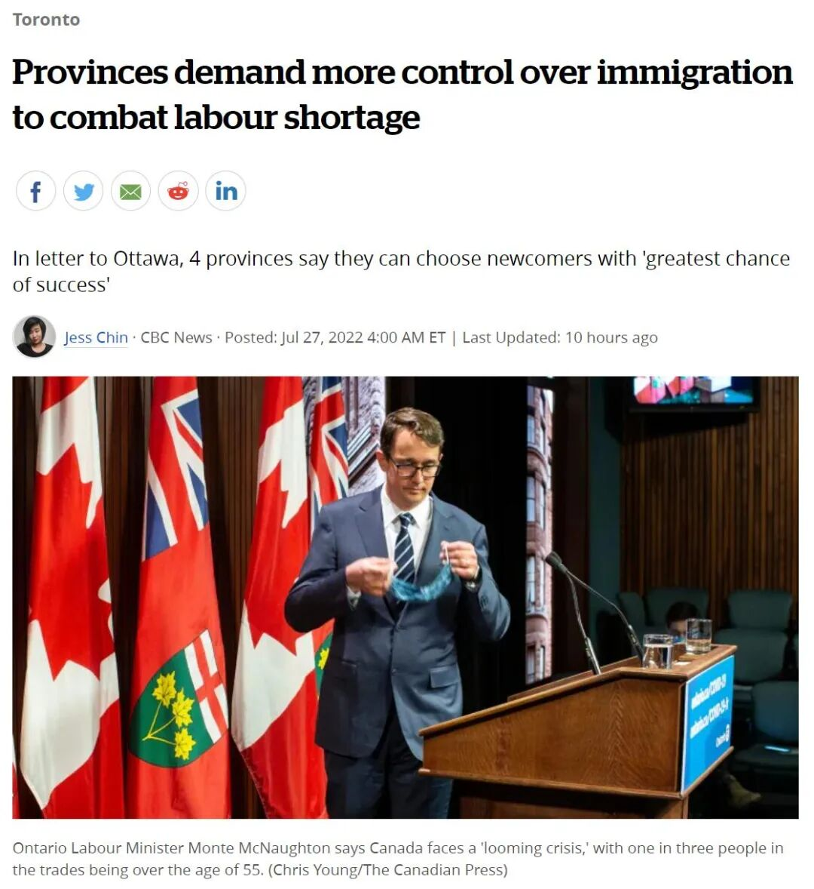
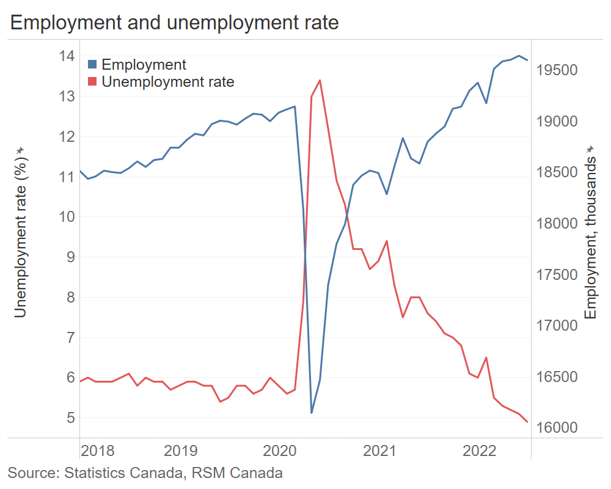
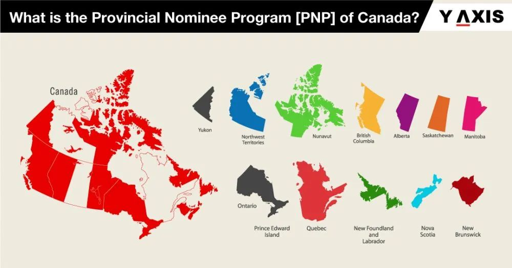

# 无标题

**链接地址:** http://mp.weixin.qq.com/s?__biz=MzUyNzA2NTAwNg==&mid=2247490420&idx=1&sn=9bc87bcb2774fda6e93d291d2c5e8168&chksm=fa0411b5cd7398a36a4b8ee9376cee7c056f910e2b34e753633e95f1e0c3a52a8e9fdda2b5cf&mpshare=1&scene=2&srcid=0729d8y8WbGq9GGGyC1JAcKR&sharer_sharetime=1659086908065&sharer_shareid=77848a6b3852ae4dcb6c74ffee84743c#rd
**作者:** 你身边的签证专家
**获取时间:** 2025/8/28 19:35:32
**图片数量:** 22

---

## 原始HTML内容

<section style="box-sizing: border-box;font-style: normal;font-weight: 400;text-align: justify;font-size: 16px;"><section style="text-align: center;margin-top: 10px;margin-bottom: 10px;box-sizing: border-box;" powered-by="xiumi.us"><section style="max-width: 100%;vertical-align: middle;display: inline-block;line-height: 0;box-sizing: border-box;"></section></section><section style="text-align: center;margin-top: 10px;margin-bottom: 10px;box-sizing: border-box;" powered-by="xiumi.us"></section>
 
<section style="font-size: 19px;text-align: center;margin: 10px 0px 3px;box-sizing: border-box;" powered-by="xiumi.us"><section style="display: inline-block;border-width: 1px;border-style: solid;border-color: rgb(188, 65, 65);background-color: rgb(188, 65, 65);width: 1.8em;height: 1.8em;line-height: 1.8em;border-radius: 100%;margin-left: auto;margin-right: auto;font-size: 16px;color: rgb(255, 255, 255);box-sizing: border-box;">
<strong style="box-sizing: border-box;">1</strong>
</section></section><section style="text-align: center;margin: 0px;box-sizing: border-box;" powered-by="xiumi.us"><section style="display: inline-block;width: 0px;height: 0px;vertical-align: top;overflow: hidden;border-style: solid;border-width: 9px 6px 0px;border-color: rgb(188, 65, 65) rgba(255, 255, 255, 0) rgba(255, 255, 255, 0);box-sizing: border-box;"><svg viewBox="0 0 1 1" style="float:left;line-height:0;width:0;vertical-align:top;"></svg></section></section><section style="margin: 0px;box-sizing: border-box;" powered-by="xiumi.us">
<strong style="box-sizing: border-box;">为了“抢人”，加拿大这四个省，急了！</strong>
</section><section style="text-align: center;justify-content: center;margin: 0px 0px 10px;display: flex;flex-flow: row nowrap;box-sizing: border-box;" powered-by="xiumi.us"><section style="display: inline-block;width: 14%;vertical-align: top;flex: 0 0 auto;height: auto;align-self: flex-start;box-sizing: border-box;"><section style="margin: 0.5em 0px;box-sizing: border-box;" powered-by="xiumi.us"><section style="background-color: rgb(188, 65, 65);height: 4px;box-sizing: border-box;"><svg viewBox="0 0 1 1" style="float:left;line-height:0;width:0;vertical-align:top;"></svg></section></section></section></section><section style="font-size: 14px;padding: 0px 15px;letter-spacing: 1px;box-sizing: border-box;" powered-by="xiumi.us">
 

6月28日，安省移民办公室公布了2022年的全年移民规划：<strong style="box-sizing: border-box;">安省的省提名移民配额</strong>（Ontario Immigrant Nominee Program简称OINP）在2022年为9750人！

 

对比2021年的8,600个，足足多出了1,150个！再加上年底增加几百个名额，今年安省省提名配额将破万，<strong style="box-sizing: border-box;">创下历史新纪录</strong>。

 
</section><section style="text-align: center;margin-top: 10px;margin-bottom: 10px;box-sizing: border-box;" powered-by="xiumi.us"><section style="max-width: 100%;vertical-align: middle;display: inline-block;line-height: 0;width: 90%;height: auto;box-sizing: border-box;"></section></section><section style="font-size: 14px;padding: 0px 15px;letter-spacing: 1px;box-sizing: border-box;" powered-by="xiumi.us">
 

不过，<strong style="box-sizing: border-box;">“贪心”</strong>的安省并没有满足于这8%的年度增长。因为，安省的劳工部长蒙特·麦克诺顿 (Monte McNaughton) 去年年底曾呼吁联邦政府将安省省提名配额<strong style="box-sizing: border-box;">从每年9,000人翻倍到18,000人</strong>解决这一问题。

 
</section><section style="text-align: center;margin-top: 10px;margin-bottom: 10px;box-sizing: border-box;" powered-by="xiumi.us"><section style="max-width: 100%;vertical-align: middle;display: inline-block;line-height: 0;width: 50%;height: auto;box-sizing: border-box;"></section></section><section style="font-size: 14px;padding: 0px 15px;letter-spacing: 1px;box-sizing: border-box;" powered-by="xiumi.us">
 

1,150个额外的省提名名额难道还不够多吗？对比安省目前378,000个工作岗位空缺，就像授予了一次精神支持的安慰奖，这<strong style="box-sizing: border-box;">“杯水车薪”</strong>的劲儿哦，省提名的申请者已经无语到懒得骂咯…

 

但俗话说得好，“会哭的孩子有奶吃。”加拿大的<strong style="box-sizing: border-box;">“抢移民”大战愈演愈烈</strong>，现在已出现<strong style="box-sizing: border-box;">“一哄而上”</strong>的紧张局势！

 
</section><section style="text-align: center;margin-top: 10px;margin-bottom: 10px;box-sizing: border-box;" powered-by="xiumi.us"><section style="max-width: 100%;vertical-align: middle;display: inline-block;line-height: 0;box-sizing: border-box;"></section></section><section style="font-size: 14px;padding: 0px 15px;letter-spacing: 1px;box-sizing: border-box;" powered-by="xiumi.us">
 

随着原油和粮食价格噌噌上涨，疫后经济迅猛复苏，让加国以能源、种植和畜牧为主要产业的<strong style="box-sizing: border-box;">“草原三省”</strong>挺直了腰板儿，也开始正面向加拿大联邦政府<strong style="box-sizing: border-box;">公开叫板：“我们也要人！”</strong>

<strong style="box-sizing: border-box;"> </strong>

 

7月26日晚上，<strong style="box-sizing: border-box;">安大略省、阿尔伯塔省、萨斯喀彻温省和曼尼托巴省</strong>四大省的移民厅长联名写信给特鲁多联邦政府，要求获得更多吸引新移民控制权，希望能够抢到更多更符合当地经济发展需求的人才。

 

 
</section><section style="font-size: 19px;text-align: center;margin: 10px 0px 3px;box-sizing: border-box;" powered-by="xiumi.us"><section style="display: inline-block;border-width: 1px;border-style: solid;border-color: rgb(188, 65, 65);background-color: rgb(188, 65, 65);width: 1.8em;height: 1.8em;line-height: 1.8em;border-radius: 100%;margin-left: auto;margin-right: auto;font-size: 16px;color: rgb(255, 255, 255);box-sizing: border-box;">
<strong style="box-sizing: border-box;">2</strong>
</section></section><section style="text-align: center;margin: 0px;box-sizing: border-box;" powered-by="xiumi.us"><section style="display: inline-block;width: 0px;height: 0px;vertical-align: top;overflow: hidden;border-style: solid;border-width: 9px 6px 0px;border-color: rgb(188, 65, 65) rgba(255, 255, 255, 0) rgba(255, 255, 255, 0);box-sizing: border-box;"><svg viewBox="0 0 1 1" style="float:left;line-height:0;width:0;vertical-align:top;"></svg></section></section><section style="margin: 0px;box-sizing: border-box;" powered-by="xiumi.us">
<strong style="box-sizing: border-box;">省级移民部门要求更多“权限”</strong>
</section><section style="text-align: center;justify-content: center;margin: 0px 0px 10px;display: flex;flex-flow: row nowrap;box-sizing: border-box;" powered-by="xiumi.us"><section style="display: inline-block;width: 14%;vertical-align: top;flex: 0 0 auto;height: auto;align-self: flex-start;box-sizing: border-box;"><section style="margin: 0.5em 0px;box-sizing: border-box;" powered-by="xiumi.us"><section style="background-color: rgb(188, 65, 65);height: 4px;box-sizing: border-box;"><svg viewBox="0 0 1 1" style="float:left;line-height:0;width:0;vertical-align:top;"></svg></section></section></section></section><section style="font-size: 14px;padding: 0px 15px;letter-spacing: 1px;box-sizing: border-box;" powered-by="xiumi.us">
 

他们在信中联合呼吁加拿大移民部长肖恩·弗雷泽（Sean Fraser）<strong style="box-sizing: border-box;">放权</strong>，允许省级政府有更多选择权，引入拥有他们最需要技能的新移民。

 

信中说：“我们需要有能力应对特定地区和社区快速变化的需求，并拥有一个灵活的系统，让我们可以适应不断变化的经济和人道主义需求。”

 
</section><section style="text-align: center;margin-top: 10px;margin-bottom: 10px;box-sizing: border-box;" powered-by="xiumi.us"><section style="max-width: 100%;vertical-align: middle;display: inline-block;line-height: 0;width: 90%;height: auto;box-sizing: border-box;"></section></section><section style="font-size: 14px;padding: 0px 15px;letter-spacing: 1px;box-sizing: border-box;" powered-by="xiumi.us">
 

加拿大统计局上周五发布的劳动力调查报告显示，全国失业率从5月份的5.1%降至<strong style="box-sizing: border-box;">6月份的4.9%</strong>，已经<strong style="box-sizing: border-box;">连续数月创造了失业率统计以来的最低纪录</strong>。

 

而更严重的问题是，婴儿潮一代的加拿大人，即便是在1965年出生的，到2030年结束的时候，也都要<strong style="box-sizing: border-box;">退休</strong>了。婴儿潮一代的老龄化问题早已被视为加拿大在本世纪初经济面临的最重大挑战之一。

 
</section><section style="text-align: center;margin-top: 10px;margin-bottom: 10px;box-sizing: border-box;" powered-by="xiumi.us"><section style="max-width: 100%;vertical-align: middle;display: inline-block;line-height: 0;width: 90%;height: auto;box-sizing: border-box;"></section></section><section style="font-size: 14px;padding: 0px 15px;letter-spacing: 1px;box-sizing: border-box;" powered-by="xiumi.us">
 

目前加拿大全国范围内均出现劳动力短缺，尤其集中在事关国家基础建设效率的<strong style="box-sizing: border-box;">第一产业和第二产业中</strong>。而目前加拿大现有的移民政策在区域性吸纳此类型人才上<strong style="box-sizing: border-box;">并不给力</strong>。因此，一些省级移民厅长表示，他们希望对移民程序进行更多控制，并已致函联邦移民部，<strong style="box-sizing: border-box;">呼吁做出改变</strong>。

 
</section><section style="text-align: center;margin-top: 10px;margin-bottom: 10px;box-sizing: border-box;" powered-by="xiumi.us"><section style="max-width: 100%;vertical-align: middle;display: inline-block;line-height: 0;width: 90%;height: auto;box-sizing: border-box;"></section></section><section style="font-size: 14px;padding: 0px 15px;letter-spacing: 1px;box-sizing: border-box;" powered-by="xiumi.us">
 

在本周与弗雷泽移民部长和其他省份的移民厅长在新不伦瑞克省圣约翰市会面之前，四大省表示，加拿大需要采取更多措施来吸引和留住工人，尤其是在技术行业。他们说，特鲁多政府应该<strong style="box-sizing: border-box;">允许各省有权招聘移民工人并为他们提供良好的当地工作</strong>。

 

信中强调到：各省的移民部门是最了解当地经济的。他们应该在选择人才的<strong style="box-sizing: border-box;">类型和数量上有着更多的决定权</strong>。 

 

 
</section><section style="font-size: 19px;text-align: center;margin: 10px 0px 3px;box-sizing: border-box;" powered-by="xiumi.us"><section style="display: inline-block;border-width: 1px;border-style: solid;border-color: rgb(188, 65, 65);background-color: rgb(188, 65, 65);width: 1.8em;height: 1.8em;line-height: 1.8em;border-radius: 100%;margin-left: auto;margin-right: auto;font-size: 16px;color: rgb(255, 255, 255);box-sizing: border-box;">
<strong style="box-sizing: border-box;">3</strong>
</section></section><section style="text-align: center;margin: 0px;box-sizing: border-box;" powered-by="xiumi.us"><section style="display: inline-block;width: 0px;height: 0px;vertical-align: top;overflow: hidden;border-style: solid;border-width: 9px 6px 0px;border-color: rgb(188, 65, 65) rgba(255, 255, 255, 0) rgba(255, 255, 255, 0);box-sizing: border-box;"><svg viewBox="0 0 1 1" style="float:left;line-height:0;width:0;vertical-align:top;"></svg></section></section><section style="margin: 0px;box-sizing: border-box;" powered-by="xiumi.us">
<strong style="box-sizing: border-box;">加国各省间移民权限严重不均</strong>
</section><section style="text-align: center;justify-content: center;margin: 0px 0px 10px;display: flex;flex-flow: row nowrap;box-sizing: border-box;" powered-by="xiumi.us"><section style="display: inline-block;width: 14%;vertical-align: top;flex: 0 0 auto;height: auto;align-self: flex-start;box-sizing: border-box;"><section style="margin: 0.5em 0px;box-sizing: border-box;" powered-by="xiumi.us"><section style="background-color: rgb(188, 65, 65);height: 4px;box-sizing: border-box;"><svg viewBox="0 0 1 1" style="float:left;line-height:0;width:0;vertical-align:top;"></svg></section></section></section></section><section style="font-size: 14px;padding: 0px 15px;letter-spacing: 1px;box-sizing: border-box;" powered-by="xiumi.us">
 

很多人误以为，加拿大各省的省提名配额是每个省自己根据人口或者经济因素决定的。但<strong style="box-sizing: border-box;">事实完全不是这样</strong>！除了魁北克省外，加拿大各省的移民权限非常少，<strong style="box-sizing: border-box;">基本由联邦政府统一安排</strong>。

 

例如，去年抵达加拿大的405,330名移民中，有<strong style="box-sizing: border-box;">近50%选择到安省定居</strong>。而其中通过安省移民提名计划（OINP）筛选出的只有9,000人（<strong style="box-sizing: border-box;">约占 4.5%</strong>）。

 
</section><section style="text-align: center;margin-top: 10px;margin-bottom: 10px;box-sizing: border-box;" powered-by="xiumi.us"><section style="max-width: 100%;vertical-align: middle;display: inline-block;line-height: 0;width: 90%;height: auto;box-sizing: border-box;"></section></section><section style="font-size: 14px;padding: 0px 15px;letter-spacing: 1px;box-sizing: border-box;" powered-by="xiumi.us">
 

而根据安省劳工移民厅提供的数据，2021年移民人数最多的四个省份中，<strong style="box-sizing: border-box;">大多数省份自己选择移民比例较低</strong>。

 

例如，除了安省外，阿尔伯塔省获得了39,950名移民中的<strong style="box-sizing: border-box;">15%提名权</strong>，卑诗省获得了69,270名新移民中的9.3%。

 

但仗着会讲法语且数次企图“脱加”的魁北克省在省提名移民中的<strong style="box-sizing: border-box;">权限却十分“逆天”</strong>。该<strong style="box-sizing: border-box;">省提名了50,170名新移民中的55.8%</strong>！（看，真正会哭的孩子在这里）然而，魁北克省的劳动力缺口在加拿大远排不进前列。

 
</section><section style="text-align: center;margin-top: 10px;margin-bottom: 10px;box-sizing: border-box;" powered-by="xiumi.us"><section style="max-width: 100%;vertical-align: middle;display: inline-block;line-height: 0;width: 90%;height: auto;box-sizing: border-box;"></section></section><section style="font-size: 14px;padding: 0px 15px;letter-spacing: 1px;box-sizing: border-box;" powered-by="xiumi.us">
 

麦克诺顿厅长表示，其他省在劳动力短缺问题上<strong style="box-sizing: border-box;">“处于同一条船上”</strong>，但最严重的是在安大略省，安省目前有 <strong style="box-sizing: border-box;">378,000个工作岗位空缺</strong>，尤其是<strong style="box-sizing: border-box;">医疗保健和技术行业</strong>的劳动力缺口巨大。

 

 
</section><section style="font-size: 19px;text-align: center;margin: 10px 0px 3px;box-sizing: border-box;" powered-by="xiumi.us"><section style="display: inline-block;border-width: 1px;border-style: solid;border-color: rgb(188, 65, 65);background-color: rgb(188, 65, 65);width: 1.8em;height: 1.8em;line-height: 1.8em;border-radius: 100%;margin-left: auto;margin-right: auto;font-size: 16px;color: rgb(255, 255, 255);box-sizing: border-box;">
<strong style="box-sizing: border-box;">4</strong>
</section></section><section style="text-align: center;margin: 0px;box-sizing: border-box;" powered-by="xiumi.us"><section style="display: inline-block;width: 0px;height: 0px;vertical-align: top;overflow: hidden;border-style: solid;border-width: 9px 6px 0px;border-color: rgb(188, 65, 65) rgba(255, 255, 255, 0) rgba(255, 255, 255, 0);box-sizing: border-box;"><svg viewBox="0 0 1 1" style="float:left;line-height:0;width:0;vertical-align:top;"></svg></section></section><section style="margin: 0px;box-sizing: border-box;" powered-by="xiumi.us">
<strong style="box-sizing: border-box;">联邦移民部：莫催，在加班了！</strong>
</section><section style="text-align: center;justify-content: center;margin: 0px 0px 10px;display: flex;flex-flow: row nowrap;box-sizing: border-box;" powered-by="xiumi.us"><section style="display: inline-block;width: 14%;vertical-align: top;flex: 0 0 auto;height: auto;align-self: flex-start;box-sizing: border-box;"><section style="margin: 0.5em 0px;box-sizing: border-box;" powered-by="xiumi.us"><section style="background-color: rgb(188, 65, 65);height: 4px;box-sizing: border-box;"><svg viewBox="0 0 1 1" style="float:left;line-height:0;width:0;vertical-align:top;"></svg></section></section></section></section><section style="font-size: 14px;padding: 0px 15px;letter-spacing: 1px;box-sizing: border-box;" powered-by="xiumi.us">
 

加拿大各省移民厅<strong style="box-sizing: border-box;">“求才若渴”</strong>，给联邦移民部造成极大压力。那么联邦方面到底是怎么应对的呢？近日，加拿大联邦移民部长弗雷泽宣布将<strong style="box-sizing: border-box;">会对包含省提名在内的快速移民系统EE进行改革</strong>，可以以职业作为目标针对性引入新移民人才。

 

从明年2023年起，EE快速移民系统的抽签将<strong style="box-sizing: border-box;">基于劳动力市场为标准</strong>，而不是目前单凭综合排名系统 (CRS) 分数来决定。

 
</section><section style="text-align: center;margin-top: 10px;margin-bottom: 10px;box-sizing: border-box;" powered-by="xiumi.us"><section style="max-width: 100%;vertical-align: middle;display: inline-block;line-height: 0;width: 90%;height: auto;box-sizing: border-box;"></section></section><section style="font-size: 14px;padding: 0px 15px;letter-spacing: 1px;box-sizing: border-box;" powered-by="xiumi.us">
 

而在近日的全球技术会议（Collision）中，加拿大移民部长肖恩·弗雷泽（Sean Fraser）更是立下了一个看似不可能完成的flag：移民部长在任期间，<strong style="box-sizing: border-box;">必须要将加拿大移民配额提升至每年500,000人</strong>！

 

弗雷泽在会议中信心满满地表示，<strong style="box-sizing: border-box;">移民配额迟早会超过50万人</strong>，但配额增加需要以谨慎的方式进行，以<strong style="box-sizing: border-box;">契合全国各地社区的用人需求</strong>。他认为，自己必须成为首位将加拿大移民配额提升至50万的移民部长。

 

他表示，“成为一个将移民配额提升至50万人的移民部长并不是一件值得骄傲的事。对我来说更重要的是通过<strong style="box-sizing: border-box;">接纳更多移民来满足加拿大各个社区的需求</strong>，并让移民申请人们有更多机会通过我们的移民系统成功来到加拿大。” 

 
</section><section style="text-align: center;margin-top: 10px;margin-bottom: 10px;box-sizing: border-box;" powered-by="xiumi.us"><section style="max-width: 100%;vertical-align: middle;display: inline-block;line-height: 0;width: 90%;height: auto;box-sizing: border-box;"></section></section><section style="font-size: 14px;padding: 0px 15px;letter-spacing: 1px;box-sizing: border-box;" powered-by="xiumi.us">
 

我认为我们迟早会达到这一目标，因为我们<strong style="box-sizing: border-box;">对于新移民的需求是非常大</strong>的，同时这里也有非常多的机会。

 

在<strong style="box-sizing: border-box;">不超过社区接纳能力的范围内</strong>尽可能接纳更多的新移民，这将成为加拿大发展的巨大战略优势。目前加拿大也在为迎接新移民的到来做努力。

 

 
</section><section style="font-size: 19px;text-align: center;margin: 10px 0px 3px;box-sizing: border-box;" powered-by="xiumi.us"><section style="display: inline-block;border-width: 1px;border-style: solid;border-color: rgb(188, 65, 65);background-color: rgb(188, 65, 65);width: 1.8em;height: 1.8em;line-height: 1.8em;border-radius: 100%;margin-left: auto;margin-right: auto;font-size: 16px;color: rgb(255, 255, 255);box-sizing: border-box;">
<strong style="box-sizing: border-box;">5</strong>
</section></section><section style="text-align: center;margin: 0px;box-sizing: border-box;" powered-by="xiumi.us"><section style="display: inline-block;width: 0px;height: 0px;vertical-align: top;overflow: hidden;border-style: solid;border-width: 9px 6px 0px;border-color: rgb(188, 65, 65) rgba(255, 255, 255, 0) rgba(255, 255, 255, 0);box-sizing: border-box;"><svg viewBox="0 0 1 1" style="float:left;line-height:0;width:0;vertical-align:top;"></svg></section></section><section style="margin: 0px;box-sizing: border-box;" powered-by="xiumi.us">
<strong style="box-sizing: border-box;">名额增加多少，还要看各省自己努力</strong>
</section><section style="text-align: center;justify-content: center;margin: 0px 0px 10px;display: flex;flex-flow: row nowrap;box-sizing: border-box;" powered-by="xiumi.us"><section style="display: inline-block;width: 14%;vertical-align: top;flex: 0 0 auto;height: auto;align-self: flex-start;box-sizing: border-box;"><section style="margin: 0.5em 0px;box-sizing: border-box;" powered-by="xiumi.us"><section style="background-color: rgb(188, 65, 65);height: 4px;box-sizing: border-box;"><svg viewBox="0 0 1 1" style="float:left;line-height:0;width:0;vertical-align:top;"></svg></section></section></section></section><section style="font-size: 14px;padding: 0px 15px;letter-spacing: 1px;box-sizing: border-box;" powered-by="xiumi.us">
 

如今加拿大四省联名要求提升省提名移民的配额和自主权，算是给加拿大各省争取更多的配额<strong style="box-sizing: border-box;">开了一个好头</strong>，同时也增加了更省对于配额比例的<strong style="box-sizing: border-box;">竞争</strong>。

 

虽然省提名创立的初衷是为了以更优惠的条件为加拿大<strong style="box-sizing: border-box;">偏远地区吸纳人才</strong>，但疫后加国各地区间分布极端不均的劳动力市场紧缺问题却也在极其现实地推动着这个项目进行配额调整。

 
</section><section style="text-align: center;margin-top: 10px;margin-bottom: 10px;box-sizing: border-box;" powered-by="xiumi.us"><section style="max-width: 100%;vertical-align: middle;display: inline-block;line-height: 0;box-sizing: border-box;"></section></section><section style="font-size: 14px;padding: 0px 15px;letter-spacing: 1px;box-sizing: border-box;" powered-by="xiumi.us">
 

如果移民部长弗雷泽的50万移民配额计划得以顺利实施，那么在人口基数大且劳动力缺口也大省份投递省提名项目的申请者<strong style="box-sizing: border-box;">极有可能是最大受益者</strong>。<strong style="box-sizing: border-box;">根据区域特点按需规划邀请也是移民部长此次改革的重心</strong>，而各省提名移民项目刚好就是实施该计划的最佳渠道。

 

加拿大各省的省提名移民项目，以其<strong style="box-sizing: border-box;">丰富的通道设置和灵活的审核标准</strong>著称。虽然申请方式和周期略有不同，但依然是面向<strong style="box-sizing: border-box;">留学生毕业后顺利拿到加拿大永居最主流的途径之一</strong>。

 
<section class="mp_profile_iframe_wrp"><mpprofile class="js_uneditable custom_select_card mp_profile_iframe" data-pluginname="mpprofile" data-id="MzUyNzA2NTAwNg==" data-headimg="http://mmbiz.qpic.cn/mmbiz_png/904kUibXm7Y6gq02PdSyzYZvibpBf0icbsnWtqW39AwrqqK8DRQdfwaE8UtUmwOd05nWcoYKrorN7ZuRngiaFhPlibQ/0?wx_fmt=png" data-nickname="新时代留学移民法律事务所" data-alias="" data-signature="加拿大移民顾问监管委员会会员/加拿大注册持牌移民顾问" data-from="0"></mpprofile></section>
 

如果你对加拿大各省的省提名项目感兴趣，想要规划一条完整可行的申请道路，欢迎联系<strong style="box-sizing: border-box;">新时代留学移民法律事务所</strong>，预定来自持牌移民顾问的一对一专业咨询！

 
</section><section style="margin: 10px 0%;text-align: center;justify-content: center;display: flex;flex-flow: row nowrap;box-sizing: border-box;" powered-by="xiumi.us"><section style="display: inline-block;width: 100%;vertical-align: top;box-shadow: rgb(0, 0, 0) 0px 0px 0px;background-color: rgb(241, 241, 241);padding: 10px;align-self: flex-start;flex: 0 0 auto;box-sizing: border-box;"><section style="justify-content: center;display: flex;flex-flow: row nowrap;box-sizing: border-box;" powered-by="xiumi.us"><section style="display: inline-block;width: 100%;vertical-align: top;background-color: rgb(255, 255, 255);padding: 20px 10px;flex: 0 0 auto;height: auto;box-shadow: rgb(198, 198, 198) 0px 0px 2px;border-width: 0px;border-radius: 6px;border-style: none;border-color: rgb(62, 62, 62);overflow: hidden;align-self: flex-start;box-sizing: border-box;"><section style="color: rgb(189, 189, 189);text-align: justify;box-sizing: border-box;" powered-by="xiumi.us">
<strong style="box-sizing: border-box;">阅读更多</strong>
</section><section style="text-align: justify;box-sizing: border-box;" powered-by="xiumi.us">
 
</section><section style="display: flex;flex-flow: row nowrap;margin: 0px 0%;justify-content: center;box-sizing: border-box;" powered-by="xiumi.us"><section style="display: inline-block;vertical-align: top;width: auto;flex: 100 100 0%;align-self: flex-start;height: auto;box-shadow: rgb(0, 0, 0) 0px 0px 0px;border-bottom: 1px dashed rgba(106, 106, 106, 0.25);border-bottom-right-radius: 0px;margin: 0px 10px 0px 0px;box-sizing: border-box;"><section style="font-size: 14px;text-align: justify;box-sizing: border-box;" powered-by="xiumi.us">
<a target="_blank" href="http://mp.weixin.qq.com/s?__biz=MzUyNzA2NTAwNg==&amp;mid=2247490371&amp;idx=1&amp;sn=3b43895bd6ae762dd4eb2415e71b6882&amp;chksm=fa041182cd739894384267b3856a73d905083625e5d2f604e082b88395a59be76b720d1b6cca&amp;scene=21#wechat_redirect" textvalue="移民部长：加国新移民以后年年破纪录！超50万配额正在计划中！" linktype="text" imgurl="" imgdata="null" data-itemshowtype="0" tab="innerlink" data-linktype="2">移民部长：加国新移民以后年年破纪录！超50万配额正在计划中！</a>
</section></section><section style="display: inline-block;vertical-align: top;width: auto;flex: 20 20 0%;align-self: flex-start;height: auto;border-width: 0px;margin: 0px 0px 0px 5px;box-sizing: border-box;"><section style="margin: 0px 0%;box-sizing: border-box;" powered-by="xiumi.us"><section style="max-width: 100%;vertical-align: middle;display: inline-block;line-height: 0;box-shadow: rgb(0, 0, 0) 0px 0px 0px;box-sizing: border-box;"><a target="_blank" href="http://mp.weixin.qq.com/s?__biz=MzUyNzA2NTAwNg==&amp;mid=2247490371&amp;idx=1&amp;sn=3b43895bd6ae762dd4eb2415e71b6882&amp;chksm=fa041182cd739894384267b3856a73d905083625e5d2f604e082b88395a59be76b720d1b6cca&amp;scene=21#wechat_redirect" textvalue="你已选中了添加链接的内容" linktype="text" imgurl="" imgdata="null" data-itemshowtype="0" tab="innerlink" data-linktype="1"></a></section></section></section></section><section style="text-align: justify;box-sizing: border-box;" powered-by="xiumi.us">
 
</section><section style="display: flex;flex-flow: row nowrap;margin: 0px 0%;justify-content: center;box-sizing: border-box;" powered-by="xiumi.us"><section style="display: inline-block;vertical-align: top;width: auto;flex: 100 100 0%;align-self: flex-start;height: auto;box-shadow: rgb(0, 0, 0) 0px 0px 0px;border-bottom: 1px dashed rgba(106, 106, 106, 0.25);border-bottom-right-radius: 0px;margin: 0px 10px 0px 0px;box-sizing: border-box;"><section style="font-size: 14px;text-align: justify;box-sizing: border-box;" powered-by="xiumi.us">
<a target="_blank" href="http://mp.weixin.qq.com/s?__biz=MzUyNzA2NTAwNg==&amp;mid=2247490325&amp;idx=1&amp;sn=d3b5867a6319d7e5be04ec65a79e8bc0&amp;chksm=fa0411d4cd7398c268c172efd9d6aabeba1b3c8963ae2c1feffc9bd226b8c4691011311af595&amp;scene=21#wechat_redirect" textvalue="“雷声大，雨点稀”，加国快速通道正式重启，史高557分数线，仅1500人上岸！" linktype="text" imgurl="" imgdata="null" data-itemshowtype="0" tab="innerlink" data-linktype="2">“雷声大，雨点稀”，加国快速通道正式重启，史高557分数线，仅1500人上岸！</a>
</section></section><section style="display: inline-block;vertical-align: top;width: auto;flex: 20 20 0%;align-self: flex-start;height: auto;border-width: 0px;margin: 0px 0px 0px 5px;box-sizing: border-box;"><section style="margin: 0px 0%;box-sizing: border-box;" powered-by="xiumi.us"><section style="max-width: 100%;vertical-align: middle;display: inline-block;line-height: 0;box-shadow: rgb(0, 0, 0) 0px 0px 0px;box-sizing: border-box;"><a target="_blank" href="http://mp.weixin.qq.com/s?__biz=MzUyNzA2NTAwNg==&amp;mid=2247490325&amp;idx=1&amp;sn=d3b5867a6319d7e5be04ec65a79e8bc0&amp;chksm=fa0411d4cd7398c268c172efd9d6aabeba1b3c8963ae2c1feffc9bd226b8c4691011311af595&amp;scene=21#wechat_redirect" textvalue="你已选中了添加链接的内容" linktype="text" imgurl="" imgdata="null" data-itemshowtype="0" tab="innerlink" data-linktype="1"></a></section></section></section></section><section style="text-align: justify;box-sizing: border-box;" powered-by="xiumi.us">
 
</section><section style="display: flex;flex-flow: row nowrap;margin: 0px 0%;justify-content: center;box-sizing: border-box;" powered-by="xiumi.us"><section style="display: inline-block;vertical-align: top;width: auto;flex: 100 100 0%;align-self: flex-start;height: auto;box-shadow: rgb(0, 0, 0) 0px 0px 0px;border-bottom: 1px dashed rgba(106, 106, 106, 0.25);border-bottom-right-radius: 0px;margin: 0px 10px 0px 0px;box-sizing: border-box;"><section style="font-size: 14px;text-align: justify;box-sizing: border-box;" powered-by="xiumi.us">
<a target="_blank" href="http://mp.weixin.qq.com/s?__biz=MzUyNzA2NTAwNg==&amp;mid=2247490277&amp;idx=1&amp;sn=4ef634dd6fccc9ff17074e49d0d98b68&amp;chksm=fa041024cd73993221cbd5cefd96fac3079172a1e1c98d1cc18683f2bcc1f66c5053c9b070c0&amp;scene=21#wechat_redirect" textvalue="快速通道大改革！明年第一季度拟进行职业定向邀请！~" linktype="text" imgurl="" imgdata="null" data-itemshowtype="0" tab="innerlink" data-linktype="2">快速通道大改革！明年第一季度拟进行职业定向邀请！~</a>
</section></section><section style="display: inline-block;vertical-align: top;width: auto;flex: 20 20 0%;align-self: flex-start;height: auto;border-width: 0px;margin: 0px 0px 0px 5px;box-sizing: border-box;"><section style="margin: 0px 0%;box-sizing: border-box;" powered-by="xiumi.us"><section style="max-width: 100%;vertical-align: middle;display: inline-block;line-height: 0;box-shadow: rgb(0, 0, 0) 0px 0px 0px;box-sizing: border-box;"><a target="_blank" href="http://mp.weixin.qq.com/s?__biz=MzUyNzA2NTAwNg==&amp;mid=2247490277&amp;idx=1&amp;sn=4ef634dd6fccc9ff17074e49d0d98b68&amp;chksm=fa041024cd73993221cbd5cefd96fac3079172a1e1c98d1cc18683f2bcc1f66c5053c9b070c0&amp;scene=21#wechat_redirect" textvalue="你已选中了添加链接的内容" linktype="text" imgurl="" imgdata="null" data-itemshowtype="0" tab="innerlink" data-linktype="1"></a></section></section></section></section></section></section></section></section><section style="text-align: center;margin-top: 10px;margin-bottom: 10px;box-sizing: border-box;" powered-by="xiumi.us"><section style="max-width: 100%;vertical-align: middle;display: inline-block;line-height: 0;box-sizing: border-box;"></section></section><section style="text-align: center;margin-top: 10px;margin-bottom: 10px;box-sizing: border-box;" powered-by="xiumi.us"><section style="max-width: 100%;vertical-align: middle;display: inline-block;line-height: 0;box-sizing: border-box;"></section></section><section style="text-align: center;margin-top: 10px;margin-bottom: 10px;box-sizing: border-box;" powered-by="xiumi.us"><section style="max-width: 100%;vertical-align: middle;display: inline-block;line-height: 0;box-sizing: border-box;"></section></section><section style="padding: 0px 15px;font-size: 12px;color: rgb(121, 121, 121);box-sizing: border-box;" powered-by="xiumi.us">
<strong style="box-sizing: border-box;">参考信息：</strong>

https://www.cbc.ca/news/canada/toronto/provincial-immigration-labour-1.6532956

 
</section><section style="text-align: center;margin-top: 10px;margin-bottom: 10px;box-sizing: border-box;" powered-by="xiumi.us"><section style="max-width: 100%;vertical-align: middle;display: inline-block;line-height: 0;box-sizing: border-box;"></section></section><section style="text-align: center;margin-top: 10px;margin-bottom: 10px;box-sizing: border-box;" powered-by="xiumi.us"><section style="max-width: 100%;vertical-align: middle;display: inline-block;line-height: 0;box-sizing: border-box;"></section></section></section>
 

---

## 纯文本内容

1为了“抢人”，加拿大这四个省，急了！6月28日，安省移民办公室公布了2022年的全年移民规划：安省的省提名移民配额（Ontario Immigrant Nominee Program简称OINP）在2022年为9750人！对比2021年的8,600个，足足多出了1,150个！再加上年底增加几百个名额，今年安省省提名配额将破万，创下历史新纪录。不过，“贪心”的安省并没有满足于这8%的年度增长。因为，安省的劳工部长蒙特·麦克诺顿 (Monte McNaughton) 去年年底曾呼吁联邦政府将安省省提名配额从每年9,000人翻倍到18,000人解决这一问题。1,150个额外的省提名名额难道还不够多吗？对比安省目前378,000个工作岗位空缺，就像授予了一次精神支持的安慰奖，这“杯水车薪”的劲儿哦，省提名的申请者已经无语到懒得骂咯…但俗话说得好，“会哭的孩子有奶吃。”加拿大的“抢移民”大战愈演愈烈，现在已出现“一哄而上”的紧张局势！随着原油和粮食价格噌噌上涨，疫后经济迅猛复苏，让加国以能源、种植和畜牧为主要产业的“草原三省”挺直了腰板儿，也开始正面向加拿大联邦政府公开叫板：“我们也要人！”7月26日晚上，安大略省、阿尔伯塔省、萨斯喀彻温省和曼尼托巴省四大省的移民厅长联名写信给特鲁多联邦政府，要求获得更多吸引新移民控制权，希望能够抢到更多更符合当地经济发展需求的人才。2省级移民部门要求更多“权限”他们在信中联合呼吁加拿大移民部长肖恩·弗雷泽（Sean Fraser）放权，允许省级政府有更多选择权，引入拥有他们最需要技能的新移民。信中说：“我们需要有能力应对特定地区和社区快速变化的需求，并拥有一个灵活的系统，让我们可以适应不断变化的经济和人道主义需求。”加拿大统计局上周五发布的劳动力调查报告显示，全国失业率从5月份的5.1%降至6月份的4.9%，已经连续数月创造了失业率统计以来的最低纪录。而更严重的问题是，婴儿潮一代的加拿大人，即便是在1965年出生的，到2030年结束的时候，也都要退休了。婴儿潮一代的老龄化问题早已被视为加拿大在本世纪初经济面临的最重大挑战之一。目前加拿大全国范围内均出现劳动力短缺，尤其集中在事关国家基础建设效率的第一产业和第二产业中。而目前加拿大现有的移民政策在区域性吸纳此类型人才上并不给力。因此，一些省级移民厅长表示，他们希望对移民程序进行更多控制，并已致函联邦移民部，呼吁做出改变。在本周与弗雷泽移民部长和其他省份的移民厅长在新不伦瑞克省圣约翰市会面之前，四大省表示，加拿大需要采取更多措施来吸引和留住工人，尤其是在技术行业。他们说，特鲁多政府应该允许各省有权招聘移民工人并为他们提供良好的当地工作。信中强调到：各省的移民部门是最了解当地经济的。他们应该在选择人才的类型和数量上有着更多的决定权。3加国各省间移民权限严重不均很多人误以为，加拿大各省的省提名配额是每个省自己根据人口或者经济因素决定的。但事实完全不是这样！除了魁北克省外，加拿大各省的移民权限非常少，基本由联邦政府统一安排。例如，去年抵达加拿大的405,330名移民中，有近50%选择到安省定居。而其中通过安省移民提名计划（OINP）筛选出的只有9,000人（约占 4.5%）。而根据安省劳工移民厅提供的数据，2021年移民人数最多的四个省份中，大多数省份自己选择移民比例较低。例如，除了安省外，阿尔伯塔省获得了39,950名移民中的15%提名权，卑诗省获得了69,270名新移民中的9.3%。但仗着会讲法语且数次企图“脱加”的魁北克省在省提名移民中的权限却十分“逆天”。该省提名了50,170名新移民中的55.8%！（看，真正会哭的孩子在这里）然而，魁北克省的劳动力缺口在加拿大远排不进前列。麦克诺顿厅长表示，其他省在劳动力短缺问题上“处于同一条船上”，但最严重的是在安大略省，安省目前有 378,000个工作岗位空缺，尤其是医疗保健和技术行业的劳动力缺口巨大。4联邦移民部：莫催，在加班了！加拿大各省移民厅“求才若渴”，给联邦移民部造成极大压力。那么联邦方面到底是怎么应对的呢？近日，加拿大联邦移民部长弗雷泽宣布将会对包含省提名在内的快速移民系统EE进行改革，可以以职业作为目标针对性引入新移民人才。从明年2023年起，EE快速移民系统的抽签将基于劳动力市场为标准，而不是目前单凭综合排名系统 (CRS) 分数来决定。而在近日的全球技术会议（Collision）中，加拿大移民部长肖恩·弗雷泽（Sean Fraser）更是立下了一个看似不可能完成的flag：移民部长在任期间，必须要将加拿大移民配额提升至每年500,000人！弗雷泽在会议中信心满满地表示，移民配额迟早会超过50万人，但配额增加需要以谨慎的方式进行，以契合全国各地社区的用人需求。他认为，自己必须成为首位将加拿大移民配额提升至50万的移民部长。他表示，“成为一个将移民配额提升至50万人的移民部长并不是一件值得骄傲的事。对我来说更重要的是通过接纳更多移民来满足加拿大各个社区的需求，并让移民申请人们有更多机会通过我们的移民系统成功来到加拿大。”我认为我们迟早会达到这一目标，因为我们对于新移民的需求是非常大的，同时这里也有非常多的机会。在不超过社区接纳能力的范围内尽可能接纳更多的新移民，这将成为加拿大发展的巨大战略优势。目前加拿大也在为迎接新移民的到来做努力。5名额增加多少，还要看各省自己努力如今加拿大四省联名要求提升省提名移民的配额和自主权，算是给加拿大各省争取更多的配额开了一个好头，同时也增加了更省对于配额比例的竞争。虽然省提名创立的初衷是为了以更优惠的条件为加拿大偏远地区吸纳人才，但疫后加国各地区间分布极端不均的劳动力市场紧缺问题却也在极其现实地推动着这个项目进行配额调整。如果移民部长弗雷泽的50万移民配额计划得以顺利实施，那么在人口基数大且劳动力缺口也大省份投递省提名项目的申请者极有可能是最大受益者。根据区域特点按需规划邀请也是移民部长此次改革的重心，而各省提名移民项目刚好就是实施该计划的最佳渠道。加拿大各省的省提名移民项目，以其丰富的通道设置和灵活的审核标准著称。虽然申请方式和周期略有不同，但依然是面向留学生毕业后顺利拿到加拿大永居最主流的途径之一。如果你对加拿大各省的省提名项目感兴趣，想要规划一条完整可行的申请道路，欢迎联系新时代留学移民法律事务所，预定来自持牌移民顾问的一对一专业咨询！阅读更多移民部长：加国新移民以后年年破纪录！超50万配额正在计划中！“雷声大，雨点稀”，加国快速通道正式重启，史高557分数线，仅1500人上岸！快速通道大改革！明年第一季度拟进行职业定向邀请！~参考信息：https://www.cbc.ca/news/canada/toronto/provincial-immigration-labour-1.6532956

---

## 图片列表

-  (原始链接: https://mmbiz.qpic.cn/mmbiz_jpg/904kUibXm7Y5qs7qGod3LoLQ2c7OJcicMpkJ2pDrNNQL3wRSnRaIcRhSEGxYLeTZgjh3k0dK5KrfwI5Myv17DMog/640?wx_fmt=jpeg)
-  (原始链接: https://mmbiz.qpic.cn/mmbiz_jpg/904kUibXm7Y4EC3q40NfCb7jaWhWbgfxibgpavj9rH4EqdQFpzyVg6N8TNSVOsgAOuvg1OSL9ec8ZyRicEzu8Tib7A/640?wx_fmt=jpeg)
-  (原始链接: https://mmbiz.qpic.cn/mmbiz_jpg/904kUibXm7Y5qs7qGod3LoLQ2c7OJcicMpfAHhjQJVmeatAgic3Ntl4TWXFo4ibP2cGaX3jJ1HqBdeAXkItHXyqnww/640?wx_fmt=jpeg)
-  (原始链接: https://mmbiz.qpic.cn/mmbiz_jpg/904kUibXm7Y5qs7qGod3LoLQ2c7OJcicMpV8eS6GAHlaChn4geGuGQFHLVcqOn1Z5Mxiaqm8pnBWfUHSegKGCdXCw/640?wx_fmt=jpeg)
-  (原始链接: https://mmbiz.qpic.cn/mmbiz_png/904kUibXm7Y5qs7qGod3LoLQ2c7OJcicMpZAmERHMQ7Ba1BC1ocolt99Niadm2JXZAFYAcSsgtNgZUW2XvdYFk1dw/640?wx_fmt=png)
-  (原始链接: https://mmbiz.qpic.cn/mmbiz_jpg/904kUibXm7Y5qs7qGod3LoLQ2c7OJcicMpL2rOIdAgrR8whudg66oO4EyjibibWJ96ibzPAWic7YbcXwUZnpQt5DEjHw/640?wx_fmt=jpeg)
-  (原始链接: https://mmbiz.qpic.cn/mmbiz_png/904kUibXm7Y5qs7qGod3LoLQ2c7OJcicMp9Aj4SkuMhAV6VsiaQiaXeWI9GXTRMQmUXicoNnFRMmwHhGv8NvgibAAHicw/640?wx_fmt=png)
-  (原始链接: https://mmbiz.qpic.cn/mmbiz_png/904kUibXm7Y5qs7qGod3LoLQ2c7OJcicMpCdO9ggNXhiaSsUH4WDmgklltevAQC4Qrm44Rha4Ft2BUYpnPq8Dx2jA/640?wx_fmt=png)
-  (原始链接: https://mmbiz.qpic.cn/mmbiz_jpg/904kUibXm7Y5qs7qGod3LoLQ2c7OJcicMp7latC8EDFUKFjOcia4GyEaLFtZEyqHkGy0xMdmcAKOdzUGe6sEz9RcQ/640?wx_fmt=jpeg)
-  (原始链接: https://mmbiz.qpic.cn/mmbiz_jpg/904kUibXm7Y5qs7qGod3LoLQ2c7OJcicMpP3a0kRqeyDXX2ebG2sJZEZOGL2cPLpVCUQ3ichR5mWIlia9edibIM1WFg/640?wx_fmt=jpeg)
-  (原始链接: https://mmbiz.qpic.cn/mmbiz_jpg/904kUibXm7Y5qs7qGod3LoLQ2c7OJcicMp090JXI2icibibEE4O6WnVLJ5gfFTibP7Qk3ldW9pSQHYF2F1VLXFpVlAYQ/640?wx_fmt=jpeg)
-  (原始链接: https://mmbiz.qpic.cn/mmbiz_jpg/904kUibXm7Y5qs7qGod3LoLQ2c7OJcicMpy7qmicSAibv4ic2GibBSib5MM7z7tyAerjpibuGZM8TR8ejREq1eY2qSSKbg/640?wx_fmt=jpeg)
-  (原始链接: https://mmbiz.qpic.cn/mmbiz_png/904kUibXm7Y5qs7qGod3LoLQ2c7OJcicMpMVOYON4mk1FKPcAc3qpFG6Y2xB0xDrJEzKeEKzIMHWl7UMTcAnAbtA/640?wx_fmt=png)
-  (原始链接: https://mmbiz.qpic.cn/mmbiz_png/904kUibXm7Y5qs7qGod3LoLQ2c7OJcicMpAzF9opXDWNehu0aaMjlsicQicddG445cqTISJtZ7PJibXV84423DA8zqQ/640?wx_fmt=png)
-  (原始链接: https://mmbiz.qpic.cn/mmbiz_jpg/904kUibXm7Y5qs7qGod3LoLQ2c7OJcicMpE3JiaLMJYPEjLLdNsGHq4thWDmGeWbyo0ic8TebQasCTMDpzhqvP0UJg/640?wx_fmt=jpeg)
-  (原始链接: https://mmbiz.qpic.cn/mmbiz_jpg/904kUibXm7Y5qs7qGod3LoLQ2c7OJcicMpKUqggLydc5wCNjphFWbckDsZAYOsRoAGDia9Z2icn0d10yWLsoJ3qFaA/640?wx_fmt=jpeg)
-  (原始链接: https://mmbiz.qpic.cn/mmbiz_jpg/904kUibXm7Y5qs7qGod3LoLQ2c7OJcicMpZjUKSzz9TjVqaQO9Fv3JGZKtykTt1ial6HnhkYcibu22Qzx3AtIpGeaQ/640?wx_fmt=jpeg)
-  (原始链接: https://mmbiz.qpic.cn/mmbiz_jpg/904kUibXm7Y5qs7qGod3LoLQ2c7OJcicMp3hQGsyDQ1D07jQicyBBAvj0rpAwCNcQZBkEcicdTc1jXVL38eNwQEd8g/640?wx_fmt=jpeg)
-  (原始链接: https://mmbiz.qpic.cn/mmbiz_jpg/904kUibXm7Y5qs7qGod3LoLQ2c7OJcicMppDvdLGzmg7VejlMsvddibZ7mu6d6NDREPicDgPqGMxFYficLeeTmicyARw/640?wx_fmt=jpeg)
-  (原始链接: https://mmbiz.qpic.cn/mmbiz_jpg/904kUibXm7Y5qs7qGod3LoLQ2c7OJcicMpjQy4G4yKbV3OL89icicVCxqQGtOfUFEGsFianUGCo1qSMwq97UQWZNrWQ/640?wx_fmt=jpeg)
-  (原始链接: https://mmbiz.qpic.cn/mmbiz_jpg/904kUibXm7Y5qs7qGod3LoLQ2c7OJcicMpOXG7veO3Cib5pA2WtgKUBRKbFP3ic8TYyZZRK1Vm2CgFf9ZNZDGaPPicw/640?wx_fmt=jpeg)
-  (原始链接: https://mmbiz.qpic.cn/mmbiz_jpg/904kUibXm7Y5qs7qGod3LoLQ2c7OJcicMpeqkfY70rA98cm1B816LIPhgwhjp9I1elroSRIdQyvsaMv1NicvnDzuw/640?wx_fmt=jpeg)
