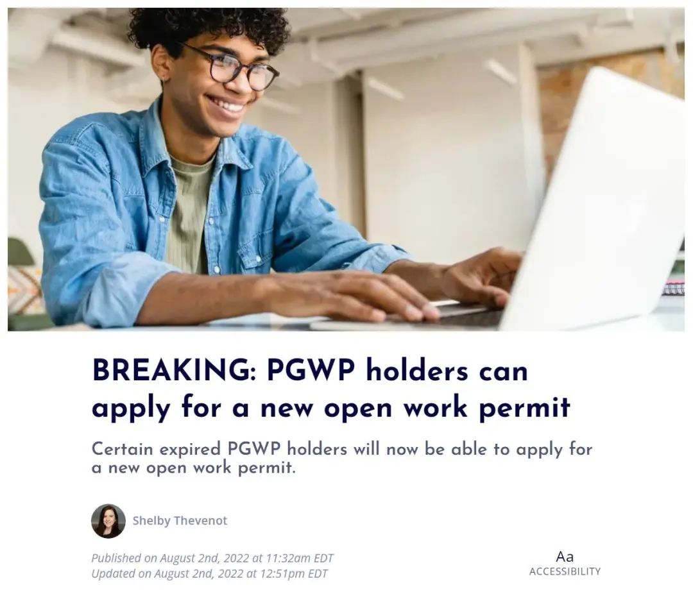
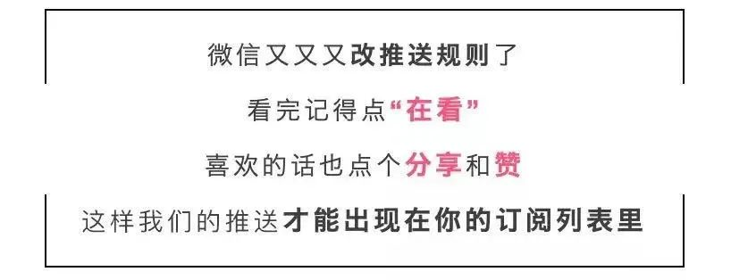

# 无标题

**链接地址:** http://mp.weixin.qq.com/s?__biz=MzUyNzA2NTAwNg==&mid=2247490457&idx=1&sn=16f7c882170fb381a747f3cb968dd8e0&chksm=fa041158cd73984e609273268f9507c4a8b592cb13594976a230a00e47744cee19c09922db60&mpshare=1&scene=2&srcid=0803TbCvMBomN77gJNR3keyB&sharer_sharetime=1659487914905&sharer_shareid=77848a6b3852ae4dcb6c74ffee84743c#rd
**作者:** 你身边的签证专家
**获取时间:** 2025/8/28 19:34:58
**图片数量:** 16

---

## 原始HTML内容

<section style="box-sizing: border-box;font-style: normal;font-weight: 400;text-align: justify;font-size: 16px;"><section style="text-align: center;margin-top: 10px;margin-bottom: 10px;box-sizing: border-box;" powered-by="xiumi.us"><section style="max-width: 100%;vertical-align: middle;display: inline-block;line-height: 0;box-sizing: border-box;"></section></section><section style="text-align: center;margin-top: 10px;margin-bottom: 10px;box-sizing: border-box;" powered-by="xiumi.us"></section>
 
<section style="font-size: 19px;text-align: center;margin: 10px 0px 3px;box-sizing: border-box;" powered-by="xiumi.us"><section style="display: inline-block;border-width: 1px;border-style: solid;border-color: rgb(188, 65, 65);background-color: rgb(188, 65, 65);width: 1.8em;height: 1.8em;line-height: 1.8em;border-radius: 100%;margin-left: auto;margin-right: auto;font-size: 16px;color: rgb(255, 255, 255);box-sizing: border-box;">
<strong style="box-sizing: border-box;">1</strong>
</section></section><section style="text-align: center;margin: 0px;box-sizing: border-box;" powered-by="xiumi.us"><section style="display: inline-block;width: 0px;height: 0px;vertical-align: top;overflow: hidden;border-style: solid;border-width: 9px 6px 0px;border-color: rgb(188, 65, 65) rgba(255, 255, 255, 0) rgba(255, 255, 255, 0);box-sizing: border-box;"><svg viewBox="0 0 1 1" style="float:left;line-height:0;width:0;vertical-align:top;"></svg></section></section><section style="margin: 0px;box-sizing: border-box;" powered-by="xiumi.us">
<strong style="box-sizing: border-box;">毕业工签续签18个月政策正式出台</strong>
</section><section style="text-align: center;justify-content: center;margin: 0px 0px 10px;display: flex;flex-flow: row nowrap;box-sizing: border-box;" powered-by="xiumi.us"><section style="display: inline-block;width: 14%;vertical-align: top;flex: 0 0 auto;height: auto;align-self: flex-start;box-sizing: border-box;"><section style="margin: 0.5em 0px;box-sizing: border-box;" powered-by="xiumi.us"><section style="background-color: rgb(188, 65, 65);height: 4px;box-sizing: border-box;"><svg viewBox="0 0 1 1" style="float:left;line-height:0;width:0;vertical-align:top;"></svg></section></section></section></section><section style="font-size: 14px;padding: 0px 15px;letter-spacing: 1px;box-sizing: border-box;" powered-by="xiumi.us">
 

加国联邦政府在今年五月曾放出信号，说2022年毕业工签到期或及即将到期的国际毕业生们可以有续签的机会。

 
</section><section style="text-align: center;margin-top: 10px;margin-bottom: 10px;box-sizing: border-box;" powered-by="xiumi.us"><section style="max-width: 100%;vertical-align: middle;display: inline-block;line-height: 0;width: 90%;height: auto;box-sizing: border-box;"></section></section><section style="font-size: 14px;padding: 0px 15px;letter-spacing: 1px;box-sizing: border-box;" powered-by="xiumi.us">
 

今天 (2022年8月2日) 政府终于出台具体操作细则，并且同时开放续签的网申。这项新措施<strong style="box-sizing: border-box;">豁免了CAN$100的 work permit holder fee</strong>。符合要求的毕业生可以从加拿大境内或境外递交续签申请。注意: 这项新措施<strong style="box-sizing: border-box;">不支持在边境换工签 (apply at a port of entry)</strong>，<strong style="box-sizing: border-box;">只支持在线续签申请</strong>。 

 
</section><section style="text-align: center;margin-top: 10px;margin-bottom: 10px;box-sizing: border-box;" powered-by="xiumi.us"><section style="max-width: 100%;vertical-align: middle;display: inline-block;line-height: 0;box-sizing: border-box;"></section></section><section style="font-size: 14px;padding: 0px 15px;letter-spacing: 1px;box-sizing: border-box;" powered-by="xiumi.us">
 
</section><section style="font-size: 19px;text-align: center;margin: 10px 0px 3px;box-sizing: border-box;" powered-by="xiumi.us"><section style="display: inline-block;border-width: 1px;border-style: solid;border-color: rgb(188, 65, 65);background-color: rgb(188, 65, 65);width: 1.8em;height: 1.8em;line-height: 1.8em;border-radius: 100%;margin-left: auto;margin-right: auto;font-size: 16px;color: rgb(255, 255, 255);box-sizing: border-box;">
<strong style="box-sizing: border-box;">2</strong>
</section></section><section style="text-align: center;margin: 0px;box-sizing: border-box;" powered-by="xiumi.us"><section style="display: inline-block;width: 0px;height: 0px;vertical-align: top;overflow: hidden;border-style: solid;border-width: 9px 6px 0px;border-color: rgb(188, 65, 65) rgba(255, 255, 255, 0) rgba(255, 255, 255, 0);box-sizing: border-box;"><svg viewBox="0 0 1 1" style="float:left;line-height:0;width:0;vertical-align:top;"></svg></section></section><section style="margin: 0px;box-sizing: border-box;" powered-by="xiumi.us"><section style="text-align: center;box-sizing: border-box;">
<strong style="box-sizing: border-box;">五种情况，请大家对号入座</strong>
</section></section><section style="text-align: center;justify-content: center;margin: 0px 0px 10px;display: flex;flex-flow: row nowrap;box-sizing: border-box;" powered-by="xiumi.us"><section style="display: inline-block;width: 14%;vertical-align: top;flex: 0 0 auto;height: auto;align-self: flex-start;box-sizing: border-box;"><section style="margin: 0.5em 0px;box-sizing: border-box;" powered-by="xiumi.us"><section style="background-color: rgb(188, 65, 65);height: 4px;box-sizing: border-box;"><svg viewBox="0 0 1 1" style="float:left;line-height:0;width:0;vertical-align:top;"></svg></section></section></section></section><section style="font-size: 14px;padding: 0px 15px;letter-spacing: 1px;box-sizing: border-box;" powered-by="xiumi.us">
 

<strong style="box-sizing: border-box;">1. 我的毕业工签在2022年10月2日到2022年12月31日之间过期，我的地址是最新的，我的护照有效期也超过2024年4月。我该怎么做？</strong>

 

您啥也不用做，<strong style="box-sizing: border-box;">躺着就行</strong>。移民局会自动给您发邮件确认地址，您千！万！别！回！复！（OS：请不要增加我们的工作量，别催，已经很忙了！）他们会在十月中旬前给您寄工签。

 

<strong style="box-sizing: border-box;">2. 如果您的地址需要更新，或您的护照有有效期不够移民局给您续18个月工签。</strong>

 

移民局会通过邮件告诉您怎么处理。如果您的护照有效期不到18个月，您不会收到移民局的第一封<strong style="box-sizing: border-box;">确认地址的邮件</strong>。然而，在九月份的时候，移民局会给您单独发一封邮件来指导您如何更新地址和护照有效期。政府会给您2个礼拜来完成此项操作。政府会在11月中旬前将工签寄到您的地址。如果您的护照有效期在2024年4月2日之前过期，<strong style="box-sizing: border-box;">请尽快更新您的护照</strong>。

 
</section><section style="text-align: center;margin-top: 10px;margin-bottom: 10px;box-sizing: border-box;" powered-by="xiumi.us"><section style="max-width: 100%;vertical-align: middle;display: inline-block;line-height: 0;width: 90%;height: auto;box-sizing: border-box;"></section></section><section style="font-size: 14px;padding: 0px 15px;letter-spacing: 1px;box-sizing: border-box;" powered-by="xiumi.us">
 

<strong style="box-sizing: border-box;">3. 如果我的毕业工签在2022年10月2日到2022年12月31日之间过期，但是我不能更新我的地址或更新我的护照怎么办？</strong>

 

您需要<strong style="box-sizing: border-box;">自行去网申申请续签</strong>， 政府会给您一个有效期到您的护照有效期的工签。

 

<strong style="box-sizing: border-box;">4. 如果我的毕业工签在2022年10月2日到2022年12月31日之间过期，但是移民局没有联系我怎么办？&nbsp;</strong>

 

如果移民局没有联系您，那么大概率您的背景和之前的签证情况导致您不能享受这次的自动续签。但是，您依然可以<strong style="box-sizing: border-box;">自行到移民局官网去申请续签</strong>。

 

<strong style="box-sizing: border-box;">5. 如果我的毕业工签在2021年9月20日到2022年10月1日之间过期呢？</strong>

 

这个类别的申请人<strong style="box-sizing: border-box;">需要到移民局官网去申请</strong>。身份过期的需要恢复身份。如果满足该类别的续签要求，<strong style="box-sizing: border-box;">即使身份过期九十天也是可以续的</strong>。

 

 
</section><section style="font-size: 19px;text-align: center;margin: 10px 0px 3px;box-sizing: border-box;" powered-by="xiumi.us"><section style="display: inline-block;border-width: 1px;border-style: solid;border-color: rgb(188, 65, 65);background-color: rgb(188, 65, 65);width: 1.8em;height: 1.8em;line-height: 1.8em;border-radius: 100%;margin-left: auto;margin-right: auto;font-size: 16px;color: rgb(255, 255, 255);box-sizing: border-box;">
<strong style="box-sizing: border-box;">3</strong>
</section></section><section style="text-align: center;margin: 0px;box-sizing: border-box;" powered-by="xiumi.us"><section style="display: inline-block;width: 0px;height: 0px;vertical-align: top;overflow: hidden;border-style: solid;border-width: 9px 6px 0px;border-color: rgb(188, 65, 65) rgba(255, 255, 255, 0) rgba(255, 255, 255, 0);box-sizing: border-box;"><svg viewBox="0 0 1 1" style="float:left;line-height:0;width:0;vertical-align:top;"></svg></section></section><section style="margin: 0px;box-sizing: border-box;" powered-by="xiumi.us"><section style="text-align: center;box-sizing: border-box;">
<strong style="box-sizing: border-box;">对于能否继续工作的说明</strong>
</section></section><section style="text-align: center;justify-content: center;margin: 0px 0px 10px;display: flex;flex-flow: row nowrap;box-sizing: border-box;" powered-by="xiumi.us"><section style="display: inline-block;width: 14%;vertical-align: top;flex: 0 0 auto;height: auto;align-self: flex-start;box-sizing: border-box;"><section style="margin: 0.5em 0px;box-sizing: border-box;" powered-by="xiumi.us"><section style="background-color: rgb(188, 65, 65);height: 4px;box-sizing: border-box;"><svg viewBox="0 0 1 1" style="float:left;line-height:0;width:0;vertical-align:top;"></svg></section></section></section></section><section style="font-size: 14px;padding: 0px 15px;letter-spacing: 1px;box-sizing: border-box;" powered-by="xiumi.us">
 

从2022年8月8日开始，如果您持有的毕业工签在2021年9月20日至2022年12月31日期间已过期或将要过期，您将收到一封电子邮件，表明您可以在此期间工作。收件人可以将此电子邮件附加到他们的毕业工签中，以向雇主证明他们被授权在加拿大临时工作。<strong style="box-sizing: border-box;">该临时工作期将持续到2023年5月31日</strong>。

 

如果您持有有效的临时居民签证，但目前在加拿大境外，则可以返回加拿大并获得工作授权。但是，<strong style="box-sizing: border-box;">临时工作授权电子邮件通知本身不能用于返回加拿大</strong>。

 
</section><section style="text-align: center;margin-top: 10px;margin-bottom: 10px;box-sizing: border-box;" powered-by="xiumi.us"><section style="max-width: 100%;vertical-align: middle;display: inline-block;line-height: 0;box-sizing: border-box;"></section></section><section style="font-size: 14px;padding: 0px 15px;letter-spacing: 1px;box-sizing: border-box;" powered-by="xiumi.us">
 
</section><section style="font-size: 19px;text-align: center;margin: 10px 0px 3px;box-sizing: border-box;" powered-by="xiumi.us"><section style="display: inline-block;border-width: 1px;border-style: solid;border-color: rgb(188, 65, 65);background-color: rgb(188, 65, 65);width: 1.8em;height: 1.8em;line-height: 1.8em;border-radius: 100%;margin-left: auto;margin-right: auto;font-size: 16px;color: rgb(255, 255, 255);box-sizing: border-box;">
<strong style="box-sizing: border-box;">4</strong>
</section></section><section style="text-align: center;margin: 0px;box-sizing: border-box;" powered-by="xiumi.us"><section style="display: inline-block;width: 0px;height: 0px;vertical-align: top;overflow: hidden;border-style: solid;border-width: 9px 6px 0px;border-color: rgb(188, 65, 65) rgba(255, 255, 255, 0) rgba(255, 255, 255, 0);box-sizing: border-box;"><svg viewBox="0 0 1 1" style="float:left;line-height:0;width:0;vertical-align:top;"></svg></section></section><section style="margin: 0px;box-sizing: border-box;" powered-by="xiumi.us">
<strong style="box-sizing: border-box;">针对TR-PR申请人</strong>
</section><section style="text-align: center;justify-content: center;margin: 0px 0px 10px;display: flex;flex-flow: row nowrap;box-sizing: border-box;" powered-by="xiumi.us"><section style="display: inline-block;width: 14%;vertical-align: top;flex: 0 0 auto;height: auto;align-self: flex-start;box-sizing: border-box;"><section style="margin: 0.5em 0px;box-sizing: border-box;" powered-by="xiumi.us"><section style="background-color: rgb(188, 65, 65);height: 4px;box-sizing: border-box;"><svg viewBox="0 0 1 1" style="float:left;line-height:0;width:0;vertical-align:top;"></svg></section></section></section></section>
 
<section style="font-size: 14px;padding: 0px 15px;letter-spacing: 1px;box-sizing: border-box;" powered-by="xiumi.us">
属于临时居民到永久居民(TRtoPR)过程中的申请人，其PR申请尚未完成的，也有资格申请开放工签。

 

考虑到入境转PR申请的处理将持续一段时间，那些申请开放工签的人现在可以<strong style="box-sizing: border-box;">收到一个截止日期为2024年12月31日的开放工签</strong>，前提是他们的护照在该日期之前有效。

 
</section><section style="text-align: center;margin-top: 10px;margin-bottom: 10px;box-sizing: border-box;" powered-by="xiumi.us"><section style="max-width: 100%;vertical-align: middle;display: inline-block;line-height: 0;width: 90%;height: auto;box-sizing: border-box;"></section></section><section style="font-size: 14px;padding: 0px 15px;letter-spacing: 1px;box-sizing: border-box;" powered-by="xiumi.us">
 

对于此前申请TRtoPR工签的申请人，他们也很快就会收到一封电子邮件，告诉他们可能可以获得有效期更长的工作签证更新。如果他们的邮寄地址是最新的，并仍然在加拿大，<strong style="box-sizing: border-box;">则不需要做任何事情</strong>。更新后的有效期为2024年12月31日的工签将会被邮寄给他们。该类人群将在10月中旬收到这份工签。

 

护照在2024年12月31日前到期的申请人<strong style="box-sizing: border-box;">将不会收到此邮件</strong>，也没有资格通过特别措施更改当前工签的有效期。他们仍然有资格申请和寻求更长的工作许可，要么在护照到期当天申请工作签证，要么在更新护照后申请。

 

如果个人需要更新他们的邮寄地址，或者如果他们选择不通过这一过程获得开放工作签证，他们将不再有资格自动享受此项特别措施。他们<strong style="box-sizing: border-box;">需要在网上单独申请</strong>。

 

 
</section><section style="text-align: center;justify-content: center;margin: 10px 0%;display: flex;flex-flow: row nowrap;box-sizing: border-box;" powered-by="xiumi.us"><section style="display: inline-block;vertical-align: middle;width: auto;flex: 100 100 0%;height: auto;align-self: center;margin: 0px 10px 0px 0px;box-sizing: border-box;"><section style="transform: scale(0.7);-webkit-transform: scale(0.7);-moz-transform: scale(0.7);-o-transform: scale(0.7);transform-origin: center center;-webkit-transform-origin: center center;-moz-transform-origin: center center;-o-transform-origin: center center;margin: 0px -24px;max-width: unset !important;box-sizing: border-box;" powered-by="xiumi.us"><section style="margin: 0.5em 0px;box-sizing: border-box;"><section style="background-color: rgb(188, 65, 65);height: 2px;box-sizing: border-box;"><svg viewBox="0 0 1 1" style="float:left;line-height:0;width:0;vertical-align:top;"></svg></section></section></section></section><section style="display: inline-block;vertical-align: top;width: auto;line-height: 0;flex: 0 0 0%;height: auto;align-self: flex-start;box-sizing: border-box;"><section style="text-align: right;justify-content: flex-end;display: flex;flex-flow: row nowrap;box-sizing: border-box;" powered-by="xiumi.us"><section style="display: inline-block;width: 10px;vertical-align: top;border-bottom: 2px solid rgb(130, 127, 196);border-bottom-right-radius: 0px;flex: 0 0 auto;height: auto;align-self: flex-start;box-sizing: border-box;"><section style="transform: rotateZ(24deg);-webkit-transform: rotateZ(24deg);-moz-transform: rotateZ(24deg);-o-transform: rotateZ(24deg);box-sizing: border-box;" powered-by="xiumi.us"><section style="margin: 0px 0% 8px;box-sizing: border-box;"><section style="background-color: rgb(130, 127, 196);height: 2px;box-sizing: border-box;"><svg viewBox="0 0 1 1" style="float:left;line-height:0;width:0;vertical-align:top;"></svg></section></section></section></section></section></section><section style="display: inline-block;vertical-align: middle;width: auto;min-width: 10%;max-width: 100%;flex: 0 0 auto;height: auto;line-height: 0;align-self: center;box-sizing: border-box;"><section style="transform: rotateZ(328deg) scale(0.6);-webkit-transform: rotateZ(328deg) scale(0.6);-moz-transform: rotateZ(328deg) scale(0.6);-o-transform: rotateZ(328deg) scale(0.6);transform-origin: center center;-webkit-transform-origin: center center;-moz-transform-origin: center center;-o-transform-origin: center center;margin: -20px -19px;max-width: unset !important;box-sizing: border-box;" powered-by="xiumi.us"><section style="justify-content: center;margin: 14px 0% 11px;transform: translate3d(5px, 0px, 0px);-webkit-transform: translate3d(5px, 0px, 0px);-moz-transform: translate3d(5px, 0px, 0px);-o-transform: translate3d(5px, 0px, 0px);display: flex;flex-flow: row nowrap;box-sizing: border-box;"><section style="display: inline-block;width: auto;vertical-align: top;min-width: 10%;max-width: 100%;flex: 0 0 auto;height: auto;line-height: 0;border-width: 0px;align-self: flex-start;box-sizing: border-box;"><section style="box-sizing: border-box;" powered-by="xiumi.us"><section style="display: inline-block;width: 51px;height: 47px;vertical-align: top;overflow: hidden;border-style: solid;border-width: 3px;border-radius: 100%;border-color: rgb(188, 65, 65) rgba(255, 255, 255, 0) rgb(188, 65, 65) rgb(188, 65, 65);box-sizing: border-box;"><svg viewBox="0 0 1 1" style="float:left;line-height:0;width:0;vertical-align:top;"></svg></section></section><section style="transform: rotateZ(348deg);-webkit-transform: rotateZ(348deg);-moz-transform: rotateZ(348deg);-o-transform: rotateZ(348deg);box-sizing: border-box;" powered-by="xiumi.us"><section style="margin: -37px 0% 0px;transform: translate3d(-12px, 0px, 0px);-webkit-transform: translate3d(-12px, 0px, 0px);-moz-transform: translate3d(-12px, 0px, 0px);-o-transform: translate3d(-12px, 0px, 0px);box-sizing: border-box;"><section style="display: inline-block;width: 71px;height: 42px;vertical-align: top;overflow: hidden;border-style: solid;border-width: 3px;border-radius: 100%;border-color: rgb(188, 65, 65) rgb(188, 65, 65) rgba(255, 255, 255, 0) rgba(255, 255, 255, 0);box-sizing: border-box;"><svg viewBox="0 0 1 1" style="float:left;line-height:0;width:0;vertical-align:top;"></svg></section></section></section></section></section></section></section><section style="display: inline-block;vertical-align: middle;width: auto;flex: 100 100 0%;height: auto;align-self: center;margin: 0px 0px 0px 10px;box-sizing: border-box;"><section style="transform: scale(0.7);-webkit-transform: scale(0.7);-moz-transform: scale(0.7);-o-transform: scale(0.7);transform-origin: center center;-webkit-transform-origin: center center;-moz-transform-origin: center center;-o-transform-origin: center center;margin: 0px -24px;max-width: unset !important;box-sizing: border-box;" powered-by="xiumi.us"><section style="margin: 0.5em 0px;box-sizing: border-box;"><section style="background-color: rgb(188, 65, 65);height: 2px;box-sizing: border-box;"><svg viewBox="0 0 1 1" style="float:left;line-height:0;width:0;vertical-align:top;"></svg></section></section></section></section></section><section style="font-size: 14px;padding: 0px 15px;letter-spacing: 1px;box-sizing: border-box;" powered-by="xiumi.us"><section class="mp_profile_iframe_wrp"><mp-common-profile class="js_uneditable custom_select_card mp_profile_iframe" data-pluginname="mpprofile" data-id="MzUyNzA2NTAwNg==" data-alias="" data-from="0" data-headimg="http://mmbiz.qpic.cn/mmbiz_png/904kUibXm7Y6gq02PdSyzYZvibpBf0icbsnWtqW39AwrqqK8DRQdfwaE8UtUmwOd05nWcoYKrorN7ZuRngiaFhPlibQ/0?wx_fmt=png" data-nickname="新时代留学移民法律事务所" data-signature="加拿大移民顾问监管委员会会员/加拿大注册持牌移民顾问"></mp-common-profile></section>
 

如果您对毕业工签续签政策<strong style="box-sizing: border-box;">尚有疑问</strong>，或者<strong style="box-sizing: border-box;">情况特殊</strong>需要帮助，欢迎尽快联系我们<strong style="box-sizing: border-box;">新时代留学移民法律事务所</strong>寻求最专业，最高效，最省心的顾问服务！

 
</section><section style="margin: 10px 0%;text-align: center;justify-content: center;display: flex;flex-flow: row nowrap;box-sizing: border-box;" powered-by="xiumi.us"><section style="display: inline-block;width: 100%;vertical-align: top;box-shadow: rgb(0, 0, 0) 0px 0px 0px;background-color: rgb(241, 241, 241);padding: 10px;align-self: flex-start;flex: 0 0 auto;box-sizing: border-box;"><section style="justify-content: center;display: flex;flex-flow: row nowrap;box-sizing: border-box;" powered-by="xiumi.us"><section style="display: inline-block;width: 100%;vertical-align: top;background-color: rgb(255, 255, 255);padding: 20px 10px;flex: 0 0 auto;height: auto;box-shadow: rgb(198, 198, 198) 0px 0px 2px;border-width: 0px;border-radius: 6px;border-style: none;border-color: rgb(62, 62, 62);overflow: hidden;align-self: flex-start;box-sizing: border-box;"><section style="color: rgb(189, 189, 189);text-align: justify;box-sizing: border-box;" powered-by="xiumi.us">
<strong style="box-sizing: border-box;">阅读更多</strong>
</section><section style="text-align: justify;box-sizing: border-box;" powered-by="xiumi.us">
 
</section><section style="display: flex;flex-flow: row nowrap;margin: 0px 0%;justify-content: center;box-sizing: border-box;" powered-by="xiumi.us"><section style="display: inline-block;vertical-align: top;width: auto;flex: 100 100 0%;align-self: flex-start;height: auto;box-shadow: rgb(0, 0, 0) 0px 0px 0px;border-bottom: 1px dashed rgba(106, 106, 106, 0.25);border-bottom-right-radius: 0px;margin: 0px 10px 0px 0px;box-sizing: border-box;"><section style="font-size: 14px;text-align: justify;box-sizing: border-box;" powered-by="xiumi.us">
<a target="_blank" href="http://mp.weixin.qq.com/s?__biz=MzUyNzA2NTAwNg==&amp;mid=2247490420&amp;idx=1&amp;sn=9bc87bcb2774fda6e93d291d2c5e8168&amp;chksm=fa0411b5cd7398a36a4b8ee9376cee7c056f910e2b34e753633e95f1e0c3a52a8e9fdda2b5cf&amp;scene=21#wechat_redirect" textvalue="阿省也加入“抢移民”大战！加国四省联名上书联邦政府要求增加移民名额！" linktype="text" imgurl="" imgdata="null" data-itemshowtype="0" tab="innerlink" data-linktype="2">阿省也加入“抢移民”大战！加国四省联名上书联邦政府要求增加移民名额！</a>
</section></section><section style="display: inline-block;vertical-align: top;width: auto;flex: 20 20 0%;align-self: flex-start;height: auto;border-width: 0px;margin: 0px 0px 0px 5px;box-sizing: border-box;"><section style="margin: 0px 0%;box-sizing: border-box;" powered-by="xiumi.us"><section style="max-width: 100%;vertical-align: middle;display: inline-block;line-height: 0;box-shadow: rgb(0, 0, 0) 0px 0px 0px;box-sizing: border-box;"><a target="_blank" href="http://mp.weixin.qq.com/s?__biz=MzUyNzA2NTAwNg==&amp;mid=2247490420&amp;idx=1&amp;sn=9bc87bcb2774fda6e93d291d2c5e8168&amp;chksm=fa0411b5cd7398a36a4b8ee9376cee7c056f910e2b34e753633e95f1e0c3a52a8e9fdda2b5cf&amp;scene=21#wechat_redirect" textvalue="你已选中了添加链接的内容" linktype="text" imgurl="" imgdata="null" data-itemshowtype="0" tab="innerlink" data-linktype="1"></a></section></section></section></section><section style="text-align: justify;box-sizing: border-box;" powered-by="xiumi.us">
 
</section><section style="display: flex;flex-flow: row nowrap;margin: 0px 0%;justify-content: center;box-sizing: border-box;" powered-by="xiumi.us"><section style="display: inline-block;vertical-align: top;width: auto;flex: 100 100 0%;align-self: flex-start;height: auto;box-shadow: rgb(0, 0, 0) 0px 0px 0px;border-bottom: 1px dashed rgba(106, 106, 106, 0.25);border-bottom-right-radius: 0px;margin: 0px 10px 0px 0px;box-sizing: border-box;"><section style="font-size: 14px;text-align: justify;box-sizing: border-box;" powered-by="xiumi.us">
<a target="_blank" href="http://mp.weixin.qq.com/s?__biz=MzUyNzA2NTAwNg==&amp;mid=2247490371&amp;idx=1&amp;sn=3b43895bd6ae762dd4eb2415e71b6882&amp;chksm=fa041182cd739894384267b3856a73d905083625e5d2f604e082b88395a59be76b720d1b6cca&amp;scene=21#wechat_redirect" textvalue="移民部长：加国新移民以后年年破纪录！超50万配额正在计划中！" linktype="text" imgurl="" imgdata="null" data-itemshowtype="0" tab="innerlink" data-linktype="2">移民部长：加国新移民以后年年破纪录！超50万配额正在计划中！</a>
</section></section><section style="display: inline-block;vertical-align: top;width: auto;flex: 20 20 0%;align-self: flex-start;height: auto;border-width: 0px;margin: 0px 0px 0px 5px;box-sizing: border-box;"><section style="margin: 0px 0%;box-sizing: border-box;" powered-by="xiumi.us"><section style="max-width: 100%;vertical-align: middle;display: inline-block;line-height: 0;box-shadow: rgb(0, 0, 0) 0px 0px 0px;box-sizing: border-box;"><a target="_blank" href="http://mp.weixin.qq.com/s?__biz=MzUyNzA2NTAwNg==&amp;mid=2247490371&amp;idx=1&amp;sn=3b43895bd6ae762dd4eb2415e71b6882&amp;chksm=fa041182cd739894384267b3856a73d905083625e5d2f604e082b88395a59be76b720d1b6cca&amp;scene=21#wechat_redirect" textvalue="你已选中了添加链接的内容" linktype="text" imgurl="" imgdata="null" data-itemshowtype="0" tab="innerlink" data-linktype="1"></a></section></section></section></section><section style="text-align: justify;box-sizing: border-box;" powered-by="xiumi.us">
 
</section><section style="display: flex;flex-flow: row nowrap;margin: 0px 0%;justify-content: center;box-sizing: border-box;" powered-by="xiumi.us"><section style="display: inline-block;vertical-align: top;width: auto;flex: 100 100 0%;align-self: flex-start;height: auto;box-shadow: rgb(0, 0, 0) 0px 0px 0px;border-bottom: 1px dashed rgba(106, 106, 106, 0.25);border-bottom-right-radius: 0px;margin: 0px 10px 0px 0px;box-sizing: border-box;"><section style="font-size: 14px;text-align: justify;box-sizing: border-box;" powered-by="xiumi.us">
<a target="_blank" href="http://mp.weixin.qq.com/s?__biz=MzUyNzA2NTAwNg==&amp;mid=2247490221&amp;idx=1&amp;sn=69e79df7bc62e73cd520ac625c73819b&amp;chksm=fa04106ccd73997a1e750a4ea69564fbb23b6254606948e5043f95ba577301f9b5e1d27c4326&amp;scene=21#wechat_redirect" textvalue="“雷声大，雨点稀”，加国快速通道正式重启，史高557分数线，仅1500人上岸！" linktype="text" imgurl="" imgdata="null" data-itemshowtype="0" tab="innerlink" data-linktype="2">“雷声大，雨点稀”，加国快速通道正式重启，史高557分数线，仅1500人上岸！</a>
</section></section><section style="display: inline-block;vertical-align: top;width: auto;flex: 20 20 0%;align-self: flex-start;height: auto;border-width: 0px;margin: 0px 0px 0px 5px;box-sizing: border-box;"><section style="margin: 0px 0%;box-sizing: border-box;" powered-by="xiumi.us"><section style="max-width: 100%;vertical-align: middle;display: inline-block;line-height: 0;box-shadow: rgb(0, 0, 0) 0px 0px 0px;box-sizing: border-box;"><a target="_blank" href="http://mp.weixin.qq.com/s?__biz=MzUyNzA2NTAwNg==&amp;mid=2247490221&amp;idx=1&amp;sn=69e79df7bc62e73cd520ac625c73819b&amp;chksm=fa04106ccd73997a1e750a4ea69564fbb23b6254606948e5043f95ba577301f9b5e1d27c4326&amp;scene=21#wechat_redirect" textvalue="你已选中了添加链接的内容" linktype="text" imgurl="" imgdata="null" data-itemshowtype="0" tab="innerlink" data-linktype="1"></a></section></section></section></section></section></section></section></section><section style="text-align: center;margin-top: 10px;margin-bottom: 10px;box-sizing: border-box;" powered-by="xiumi.us"><section style="max-width: 100%;vertical-align: middle;display: inline-block;line-height: 0;box-sizing: border-box;"></section></section><section style="text-align: center;margin-top: 10px;margin-bottom: 10px;box-sizing: border-box;" powered-by="xiumi.us"><section style="max-width: 100%;vertical-align: middle;display: inline-block;line-height: 0;box-sizing: border-box;"></section></section><section style="text-align: center;margin-top: 10px;margin-bottom: 10px;box-sizing: border-box;" powered-by="xiumi.us"><section style="max-width: 100%;vertical-align: middle;display: inline-block;line-height: 0;box-sizing: border-box;"></section></section><section style="text-align: center;margin-top: 10px;margin-bottom: 10px;box-sizing: border-box;" powered-by="xiumi.us"><section style="max-width: 100%;vertical-align: middle;display: inline-block;line-height: 0;box-sizing: border-box;"></section></section><section style="padding: 0px 15px;font-size: 12px;color: rgb(121, 121, 121);box-sizing: border-box;" powered-by="xiumi.us">
<strong style="box-sizing: border-box;">参考信息：</strong>

https://www.canada.ca/en/immigration-refugees-citizenship/news/notices/measures-post-graduation-work-permits-temporary-resident-permanent-resident-pathways.html
</section><section style="text-align: center;margin-top: 10px;margin-bottom: 10px;box-sizing: border-box;" powered-by="xiumi.us"><section style="max-width: 100%;vertical-align: middle;display: inline-block;line-height: 0;box-sizing: border-box;"></section></section><section style="text-align: center;margin-top: 10px;margin-bottom: 10px;box-sizing: border-box;" powered-by="xiumi.us"><section style="max-width: 100%;vertical-align: middle;display: inline-block;line-height: 0;box-sizing: border-box;"></section></section></section>
 

---

## 纯文本内容

1毕业工签续签18个月政策正式出台加国联邦政府在今年五月曾放出信号，说2022年毕业工签到期或及即将到期的国际毕业生们可以有续签的机会。今天 (2022年8月2日) 政府终于出台具体操作细则，并且同时开放续签的网申。这项新措施豁免了CAN$100的 work permit holder fee。符合要求的毕业生可以从加拿大境内或境外递交续签申请。注意: 这项新措施不支持在边境换工签 (apply at a port of entry)，只支持在线续签申请。2五种情况，请大家对号入座1. 我的毕业工签在2022年10月2日到2022年12月31日之间过期，我的地址是最新的，我的护照有效期也超过2024年4月。我该怎么做？您啥也不用做，躺着就行。移民局会自动给您发邮件确认地址，您千！万！别！回！复！（OS：请不要增加我们的工作量，别催，已经很忙了！）他们会在十月中旬前给您寄工签。2. 如果您的地址需要更新，或您的护照有有效期不够移民局给您续18个月工签。移民局会通过邮件告诉您怎么处理。如果您的护照有效期不到18个月，您不会收到移民局的第一封确认地址的邮件。然而，在九月份的时候，移民局会给您单独发一封邮件来指导您如何更新地址和护照有效期。政府会给您2个礼拜来完成此项操作。政府会在11月中旬前将工签寄到您的地址。如果您的护照有效期在2024年4月2日之前过期，请尽快更新您的护照。3. 如果我的毕业工签在2022年10月2日到2022年12月31日之间过期，但是我不能更新我的地址或更新我的护照怎么办？您需要自行去网申申请续签， 政府会给您一个有效期到您的护照有效期的工签。4. 如果我的毕业工签在2022年10月2日到2022年12月31日之间过期，但是移民局没有联系我怎么办？ 如果移民局没有联系您，那么大概率您的背景和之前的签证情况导致您不能享受这次的自动续签。但是，您依然可以自行到移民局官网去申请续签。5. 如果我的毕业工签在2021年9月20日到2022年10月1日之间过期呢？这个类别的申请人需要到移民局官网去申请。身份过期的需要恢复身份。如果满足该类别的续签要求，即使身份过期九十天也是可以续的。3对于能否继续工作的说明从2022年8月8日开始，如果您持有的毕业工签在2021年9月20日至2022年12月31日期间已过期或将要过期，您将收到一封电子邮件，表明您可以在此期间工作。收件人可以将此电子邮件附加到他们的毕业工签中，以向雇主证明他们被授权在加拿大临时工作。该临时工作期将持续到2023年5月31日。如果您持有有效的临时居民签证，但目前在加拿大境外，则可以返回加拿大并获得工作授权。但是，临时工作授权电子邮件通知本身不能用于返回加拿大。4针对TR-PR申请人属于临时居民到永久居民(TRtoPR)过程中的申请人，其PR申请尚未完成的，也有资格申请开放工签。考虑到入境转PR申请的处理将持续一段时间，那些申请开放工签的人现在可以收到一个截止日期为2024年12月31日的开放工签，前提是他们的护照在该日期之前有效。对于此前申请TRtoPR工签的申请人，他们也很快就会收到一封电子邮件，告诉他们可能可以获得有效期更长的工作签证更新。如果他们的邮寄地址是最新的，并仍然在加拿大，则不需要做任何事情。更新后的有效期为2024年12月31日的工签将会被邮寄给他们。该类人群将在10月中旬收到这份工签。护照在2024年12月31日前到期的申请人将不会收到此邮件，也没有资格通过特别措施更改当前工签的有效期。他们仍然有资格申请和寻求更长的工作许可，要么在护照到期当天申请工作签证，要么在更新护照后申请。如果个人需要更新他们的邮寄地址，或者如果他们选择不通过这一过程获得开放工作签证，他们将不再有资格自动享受此项特别措施。他们需要在网上单独申请。如果您对毕业工签续签政策尚有疑问，或者情况特殊需要帮助，欢迎尽快联系我们新时代留学移民法律事务所寻求最专业，最高效，最省心的顾问服务！阅读更多阿省也加入“抢移民”大战！加国四省联名上书联邦政府要求增加移民名额！移民部长：加国新移民以后年年破纪录！超50万配额正在计划中！“雷声大，雨点稀”，加国快速通道正式重启，史高557分数线，仅1500人上岸！参考信息：https://www.canada.ca/en/immigration-refugees-citizenship/news/notices/measures-post-graduation-work-permits-temporary-resident-permanent-resident-pathways.html

---

## 图片列表

-  (原始链接: https://mmbiz.qpic.cn/mmbiz_jpg/904kUibXm7Y6qBwNh6AZzwKedgvaictPqm0UtQQBMZXL7zNlPob1SmpL3yicg4pvvkE4j6QwGichxAUc1o5QEwYXjw/640?wx_fmt=jpeg)
-  (原始链接: https://mmbiz.qpic.cn/mmbiz_jpg/904kUibXm7Y4EC3q40NfCb7jaWhWbgfxibgpavj9rH4EqdQFpzyVg6N8TNSVOsgAOuvg1OSL9ec8ZyRicEzu8Tib7A/640?wx_fmt=jpeg)
-  (原始链接: https://mmbiz.qpic.cn/mmbiz_jpg/904kUibXm7Y6qBwNh6AZzwKedgvaictPqm4l3DVw93r6VDW34xxmDqPOzyic2WtpGWv8AN5Na4Qj6oIcFDibmrIrpQ/640?wx_fmt=jpeg)
-  (原始链接: https://mmbiz.qpic.cn/mmbiz_png/904kUibXm7Y6qBwNh6AZzwKedgvaictPqmcBnpXXz3Jus9dHiaWTmDWAMobFBsEWUnycTUzqJ0P6sVbuGVRpwkeQQ/640?wx_fmt=png)
-  (原始链接: https://mmbiz.qpic.cn/mmbiz_jpg/904kUibXm7Y6qBwNh6AZzwKedgvaictPqm362glbEMrK5Em3v168fu2icpz8xItnstRO8NNiaSxQqnsVy8j2iasBQag/640?wx_fmt=jpeg)
-  (原始链接: https://mmbiz.qpic.cn/mmbiz_png/904kUibXm7Y6qBwNh6AZzwKedgvaictPqmWTy8iasCmS4XEhsiaOf8pZDKuhdnN0EtpTIHkux9ibrNRKWiaYJfCLxhsA/640?wx_fmt=png)
-  (原始链接: https://mmbiz.qpic.cn/mmbiz_jpg/904kUibXm7Y6qBwNh6AZzwKedgvaictPqmWBqdrcLIceicekMVazPwJJ39WIBBQRCniaL04ibFDwWGO29gUgE48ZQdQ/640?wx_fmt=jpeg)
-  (原始链接: https://mmbiz.qpic.cn/mmbiz_jpg/904kUibXm7Y6qBwNh6AZzwKedgvaictPqmajxGswqKrGGqKziaib0MYKSH7pQF0pqBqhztSiaGlbDG76w0W7hAHDAPQ/640?wx_fmt=jpeg)
-  (原始链接: https://mmbiz.qpic.cn/mmbiz_jpg/904kUibXm7Y6qBwNh6AZzwKedgvaictPqmNKxwcvzO0JdPZzq83hXIkvTQvgkrhFibG31ynW198d9jQTNNVD3WIHw/640?wx_fmt=jpeg)
-  (原始链接: https://mmbiz.qpic.cn/mmbiz_jpg/904kUibXm7Y6qBwNh6AZzwKedgvaictPqmhjpVBaB7IicKv1BJho5T2qdicbib2RvFxD9P3ibDVlia8ib7VxelkgqbBzWw/640?wx_fmt=jpeg)
-  (原始链接: https://mmbiz.qpic.cn/mmbiz_png/904kUibXm7Y6qBwNh6AZzwKedgvaictPqmNSxwOvwqicQy17H9bRjRh1q0oA8v8Hv6Pxbb9P2IibzbdVtB9R80c9Vw/640?wx_fmt=png)
-  (原始链接: https://mmbiz.qpic.cn/mmbiz_jpg/904kUibXm7Y6qBwNh6AZzwKedgvaictPqmicaic6Wp2ItIzmwiaexKLTibrHzeMIXhtSibI4ejNAMoWObwY517YZYZprA/640?wx_fmt=jpeg)
-  (原始链接: https://mmbiz.qpic.cn/mmbiz_jpg/904kUibXm7Y6qBwNh6AZzwKedgvaictPqmnibXTQonyDia0HmnKUCXwh8rHQSyWNicfGKgD0ibtxmgbsIpQSZ2xCeAzw/640?wx_fmt=jpeg)
-  (原始链接: https://mmbiz.qpic.cn/mmbiz_jpg/904kUibXm7Y6qBwNh6AZzwKedgvaictPqmGLXF9rkBBicmLR8m1cT4ylTNXRlITc8AstjruqEzibAibXkjBVzwuPe2A/640?wx_fmt=jpeg)
-  (原始链接: https://mmbiz.qpic.cn/mmbiz_jpg/904kUibXm7Y6qBwNh6AZzwKedgvaictPqmNKd5l1IKvQS20wJwkgkW6sKbiaa8A8499bhgzaA8FhicQe628ialLJaXA/640?wx_fmt=jpeg)
-  (原始链接: https://mmbiz.qpic.cn/mmbiz_jpg/904kUibXm7Y6qBwNh6AZzwKedgvaictPqmkVu69MxxXdV7NjOeHtmxbTxk21l1qmZ9fMiaLMQsTCupTgHkzklaVTA/640?wx_fmt=jpeg)
