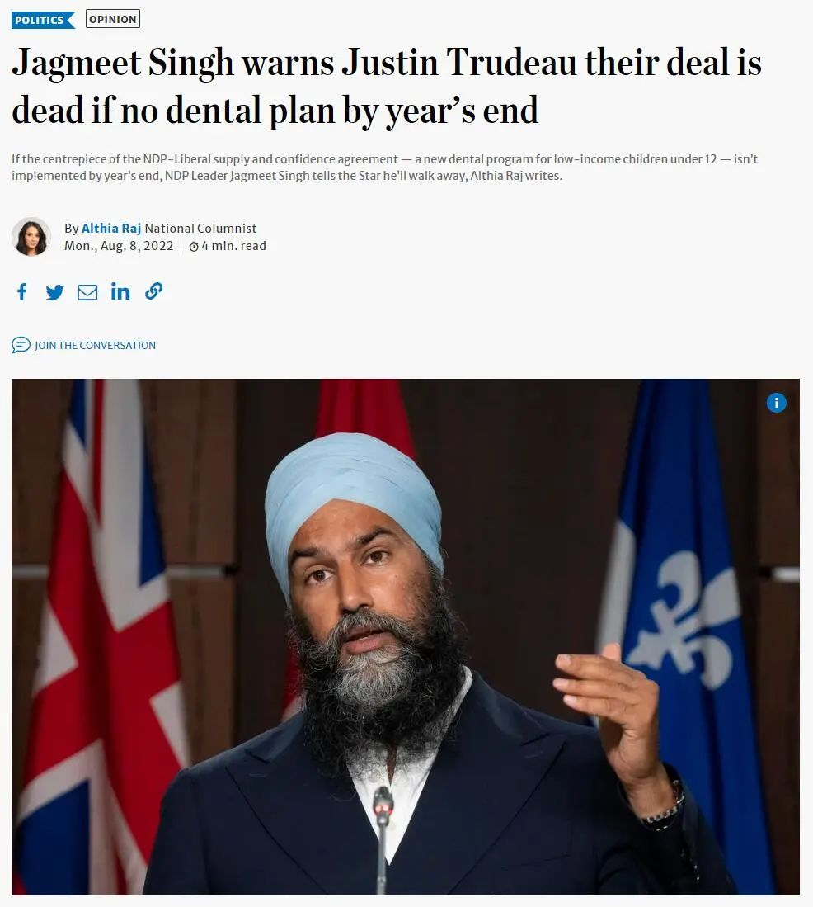
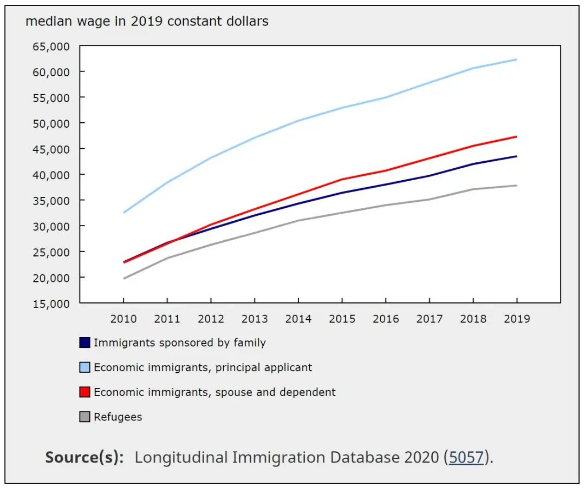
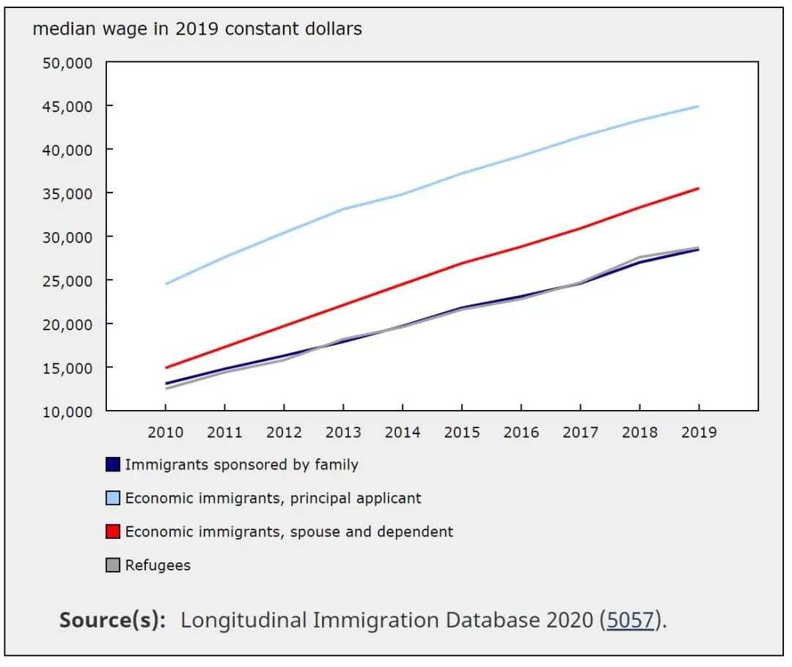
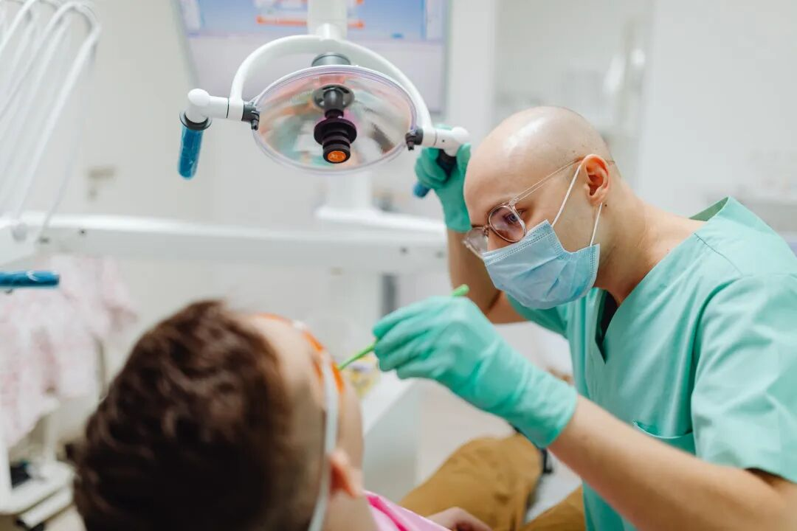
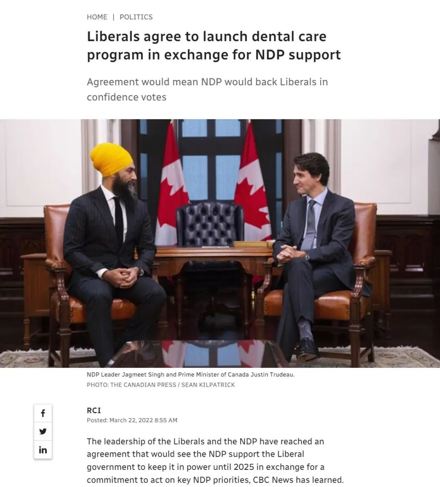
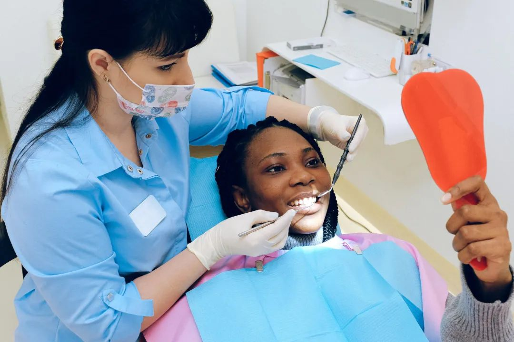
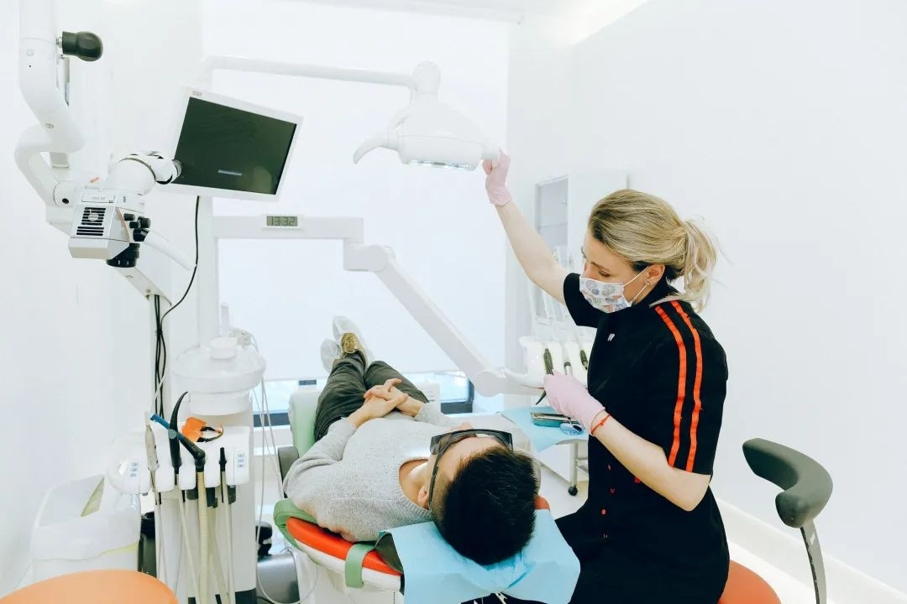

# 无标题

**链接地址:** http://mp.weixin.qq.com/s?__biz=MzUyNzA2NTAwNg==&mid=2247490560&idx=1&sn=34968551e3c692e30afa7c9a1c01fb0b&chksm=fa0416c1cd739fd7a338882014ab67d0a3b98fcd59a41a146f4b93eb216aa70d31da0698c540&mpshare=1&scene=2&srcid=0818VbTGfvLq304bldaYY94B&sharer_sharetime=1660777460259&sharer_shareid=77848a6b3852ae4dcb6c74ffee84743c#rd
**作者:** 你身边的签证专家
**获取时间:** 2025/8/28 19:34:37
**图片数量:** 24

---

## 原始HTML内容

<section style="box-sizing: border-box;font-style: normal;font-weight: 400;text-align: justify;font-size: 16px;"><section style="text-align: center;margin-top: 10px;margin-bottom: 10px;box-sizing: border-box;" powered-by="xiumi.us"><section style="max-width: 100%;vertical-align: middle;display: inline-block;line-height: 0;box-sizing: border-box;"></section></section><section style="text-align: center;margin-top: 10px;margin-bottom: 10px;box-sizing: border-box;" powered-by="xiumi.us"></section>
 
<section style="font-size: 19px;text-align: center;margin: 10px 0px 3px;box-sizing: border-box;" powered-by="xiumi.us"><section style="display: inline-block;border-width: 1px;border-style: solid;border-color: rgb(188, 65, 65);background-color: rgb(188, 65, 65);width: 1.8em;height: 1.8em;line-height: 1.8em;border-radius: 100%;margin-left: auto;margin-right: auto;font-size: 16px;color: rgb(255, 255, 255);box-sizing: border-box;">
<strong style="box-sizing: border-box;">1</strong>
</section></section><section style="text-align: center;margin: 0px;box-sizing: border-box;" powered-by="xiumi.us"><section style="display: inline-block;width: 0px;height: 0px;vertical-align: top;overflow: hidden;border-style: solid;border-width: 9px 6px 0px;border-color: rgb(188, 65, 65) rgba(255, 255, 255, 0) rgba(255, 255, 255, 0);box-sizing: border-box;"><svg viewBox="0 0 1 1" style="float:left;line-height:0;width:0;vertical-align:top;"></svg></section></section><section style="margin: 0px;box-sizing: border-box;" powered-by="xiumi.us">
<strong style="box-sizing: border-box;">加拿大牙保计划年底启动！</strong>
</section><section style="text-align: center;justify-content: center;margin: 0px 0px 10px;display: flex;flex-flow: row nowrap;box-sizing: border-box;" powered-by="xiumi.us"><section style="display: inline-block;width: 14%;vertical-align: top;flex: 0 0 auto;height: auto;align-self: flex-start;box-sizing: border-box;"><section style="margin: 0.5em 0px;box-sizing: border-box;" powered-by="xiumi.us"><section style="background-color: rgb(188, 65, 65);height: 4px;box-sizing: border-box;"><svg viewBox="0 0 1 1" style="float:left;line-height:0;width:0;vertical-align:top;"></svg></section></section></section></section>
 
<section style="font-size: 14px;padding: 0px 15px;letter-spacing: 1px;box-sizing: border-box;" powered-by="xiumi.us">
加拿大福利制度完善，且覆盖广是众所周知的，尤其是在疫情期间，很多加拿大人不用工作每月都有<strong style="box-sizing: border-box;">接近2000加元的补贴</strong>，着实让人羡慕。

 

同时，加拿大每个省都有免费或低廉的医疗保险计划以提供高覆盖面高治疗的医疗服务。病人的住院费用，甚至手术，不论大小，一切费用全部由医疗保险计划负责。甚至住院期间病人的伙食、药费等<strong style="box-sizing: border-box;">都不用自己支付分文</strong>！

 
</section><section style="text-align: center;margin-top: 10px;margin-bottom: 10px;box-sizing: border-box;" powered-by="xiumi.us"><section style="max-width: 100%;vertical-align: middle;display: inline-block;line-height: 0;box-sizing: border-box;"></section></section>
 
<section style="font-size: 14px;padding: 0px 15px;letter-spacing: 1px;box-sizing: border-box;" powered-by="xiumi.us">
 

这样的优厚福利简直<strong style="box-sizing: border-box;">馋坏了</strong>计划移民加拿大的朋友们。然而，加国各省的医疗保险计划过去是<strong style="box-sizing: border-box;">不包含牙医</strong>的，而在加拿大看牙医的费用是众所周知的<strong style="box-sizing: border-box;">贵</strong>！这样昂贵的费用让许多人对口腔保健望而却步，更别说有孩子的家庭了。

 

但好消息是，<strong style="box-sizing: border-box;">加拿大全民牙科保健计划真的要来</strong>了！

 
</section><section style="text-align: center;margin-top: 10px;margin-bottom: 10px;box-sizing: border-box;" powered-by="xiumi.us"><section style="max-width: 100%;vertical-align: middle;display: inline-block;line-height: 0;width: 90%;height: auto;box-sizing: border-box;"></section></section><section style="font-size: 14px;padding: 0px 15px;letter-spacing: 1px;box-sizing: border-box;" powered-by="xiumi.us">
 

加国执政党自由党在今年3月时曾向新民主党许诺，为<strong style="box-sizing: border-box;">中低收入家庭</strong>提供一项新的牙科保健计划，作为“供应与信任协议”的一部分，以防止在2025年之前要举行大选。

 

较早前联邦自由党政府提议<strong style="box-sizing: border-box;">53亿元牙科保健计划</strong>。接近政府的消息人士周一称，自由党正在计划一个临时解决方案，包括<strong style="box-sizing: border-box;">直接向病人提供金钱</strong>，以便在政府致力于推出更永久的解决方案前，履行向新民主党作出的有关承诺。

 

联邦政府必须在年底前为家庭年收入<strong style="box-sizing: border-box;">低于9万元的12岁以下儿童</strong>，提供某种牙科保健覆盖。

 
</section><section style="text-align: center;margin-top: 10px;margin-bottom: 10px;box-sizing: border-box;" powered-by="xiumi.us"><section style="max-width: 100%;vertical-align: middle;display: inline-block;line-height: 0;width: 90%;height: auto;box-sizing: border-box;"></section></section><section style="text-align: center;margin-top: 10px;margin-bottom: 10px;box-sizing: border-box;" powered-by="xiumi.us"><section style="max-width: 100%;vertical-align: middle;display: inline-block;line-height: 0;width: 90%;height: auto;box-sizing: border-box;"></section></section><section style="font-size: 14px;padding: 0px 15px;letter-spacing: 1px;box-sizing: border-box;" powered-by="xiumi.us">
 

那么，家庭年收入9万加元到底是怎样的概念呢？

 

根据加拿大统计局的数据表明，2019年加国新移民的税前年收入<strong style="box-sizing: border-box;">中位数为31,900加元</strong>，就算对于双职工家庭来说，这个享受免费牙科保险的资格也<strong style="box-sizing: border-box;">面向绝大多数的新移民群体</strong>，是带有孩子的家庭<strong style="box-sizing: border-box;">一经登陆就可以直接享受到的利好</strong>！

 
</section><section style="text-align: center;margin-top: 10px;margin-bottom: 10px;box-sizing: border-box;" powered-by="xiumi.us"><section style="max-width: 100%;vertical-align: middle;display: inline-block;line-height: 0;box-sizing: border-box;"></section></section>
 
<section style="font-size: 19px;text-align: center;margin: 10px 0px 3px;box-sizing: border-box;" powered-by="xiumi.us"><section style="display: inline-block;border-width: 1px;border-style: solid;border-color: rgb(188, 65, 65);background-color: rgb(188, 65, 65);width: 1.8em;height: 1.8em;line-height: 1.8em;border-radius: 100%;margin-left: auto;margin-right: auto;font-size: 16px;color: rgb(255, 255, 255);box-sizing: border-box;">
<strong style="box-sizing: border-box;">2</strong>
</section></section><section style="text-align: center;margin: 0px;box-sizing: border-box;" powered-by="xiumi.us"><section style="display: inline-block;width: 0px;height: 0px;vertical-align: top;overflow: hidden;border-style: solid;border-width: 9px 6px 0px;border-color: rgb(188, 65, 65) rgba(255, 255, 255, 0) rgba(255, 255, 255, 0);box-sizing: border-box;"><svg viewBox="0 0 1 1" style="float:left;line-height:0;width:0;vertical-align:top;"></svg></section></section><section style="margin: 0px;box-sizing: border-box;" powered-by="xiumi.us">
<strong style="box-sizing: border-box;">政府预直接向符合标准的家庭发钱</strong>
</section><section style="text-align: center;justify-content: center;margin: 0px 0px 10px;display: flex;flex-flow: row nowrap;box-sizing: border-box;" powered-by="xiumi.us"><section style="display: inline-block;width: 14%;vertical-align: top;flex: 0 0 auto;height: auto;align-self: flex-start;box-sizing: border-box;"><section style="margin: 0.5em 0px;box-sizing: border-box;" powered-by="xiumi.us"><section style="background-color: rgb(188, 65, 65);height: 4px;box-sizing: border-box;"><svg viewBox="0 0 1 1" style="float:left;line-height:0;width:0;vertical-align:top;"></svg></section></section></section></section>
 
<section style="font-size: 14px;padding: 0px 15px;letter-spacing: 1px;box-sizing: border-box;" powered-by="xiumi.us">
但四个了解政府计划但不具名的消息人士表示，政府不太可能在最后期限之前完成，因此正在计划一个权宜之计的<strong style="box-sizing: border-box;">临时解决方案</strong>，直到该永久计划到位。 

 

尽管细节很少，但是消息人士称，临时解决方案将包括向符合条件的家庭<strong style="box-sizing: border-box;">直</strong><strong style="box-sizing: border-box;">接提供现金补助</strong>，以资助他们接受牙科保健服务，而政府则致力于一项更长期、更广泛的计划。
</section><section style="text-align: center;margin-top: 10px;margin-bottom: 10px;box-sizing: border-box;" powered-by="xiumi.us"><section style="max-width: 100%;vertical-align: middle;display: inline-block;line-height: 0;width: 90%;height: auto;box-sizing: border-box;"></section></section><section style="font-size: 14px;padding: 0px 15px;letter-spacing: 1px;box-sizing: border-box;" powered-by="xiumi.us">
 

加拿大国家牙科保健计划表明：

 
<ul class="list-paddingleft-1" style="list-style-type: disc;box-sizing: border-box;"><li style="box-sizing: border-box;">
只要家庭年收入<strong style="box-sizing: border-box;">低于9万且没有牙科保险</strong>，都有资格获得该牙科保健。 

 
</li><li style="box-sizing: border-box;">
<strong style="box-sizing: border-box;">年收入为7到9万加元</strong>且没有牙科保险的个人或家庭，也有资格获得保险，在享受牙科门诊就医和取药时，无需支付分摊付款额（CO-PAY）。 

 
</li><li style="box-sizing: border-box;">
<strong style="box-sizing: border-box;">收入低于7万的个人或家庭，牙科费用将由政府全额支付。</strong>
</li></ul>
 

据国会预算官2020年一项分析预测，该类计划在公布后首年，将耗费13亿元，在付诸落实的首年则耗费43亿元。首年高出的金额将是为合资格且从未获牙科保健者承保的费用。不过如今在新政策下，有关计划将<strong style="box-sizing: border-box;">在3年内分阶段实施</strong>，或令最终成本与先前预测有所不同。

 
</section><section style="text-align: center;margin-top: 10px;margin-bottom: 10px;box-sizing: border-box;" powered-by="xiumi.us"><section style="max-width: 100%;vertical-align: middle;display: inline-block;line-height: 0;width: 90%;height: auto;box-sizing: border-box;"></section></section><section style="font-size: 14px;padding: 0px 15px;letter-spacing: 1px;box-sizing: border-box;" powered-by="xiumi.us">
 

CanAge行政总监沃茨（Laura Tamblyn Watts）则表示，从前没有牙保且负担不起牙科护理费用的长者在患上牙疾时总是要到急症室求诊，有关计划将造福此一人群。 

 

新民主党党领驵勉诚(Jagmeet Singh)表示，该计划关乎国民生活尊严，并将<strong style="box-sizing: border-box;">对公众的健康和生活质量带来重大转变</strong>。

 
</section>
 
<section style="font-size: 19px;text-align: center;margin: 10px 0px 3px;box-sizing: border-box;" powered-by="xiumi.us"><section style="display: inline-block;border-width: 1px;border-style: solid;border-color: rgb(188, 65, 65);background-color: rgb(188, 65, 65);width: 1.8em;height: 1.8em;line-height: 1.8em;border-radius: 100%;margin-left: auto;margin-right: auto;font-size: 16px;color: rgb(255, 255, 255);box-sizing: border-box;">
<strong style="box-sizing: border-box;">3</strong>
</section></section><section style="text-align: center;margin: 0px;box-sizing: border-box;" powered-by="xiumi.us"><section style="display: inline-block;width: 0px;height: 0px;vertical-align: top;overflow: hidden;border-style: solid;border-width: 9px 6px 0px;border-color: rgb(188, 65, 65) rgba(255, 255, 255, 0) rgba(255, 255, 255, 0);box-sizing: border-box;"><svg viewBox="0 0 1 1" style="float:left;line-height:0;width:0;vertical-align:top;"></svg></section></section><section style="margin: 0px;box-sizing: border-box;" powered-by="xiumi.us">
<strong style="box-sizing: border-box;">全民牙保预计在2025年实施</strong>
</section><section style="text-align: center;justify-content: center;margin: 0px 0px 10px;display: flex;flex-flow: row nowrap;box-sizing: border-box;" powered-by="xiumi.us"><section style="display: inline-block;width: 14%;vertical-align: top;flex: 0 0 auto;height: auto;align-self: flex-start;box-sizing: border-box;"><section style="margin: 0.5em 0px;box-sizing: border-box;" powered-by="xiumi.us"><section style="background-color: rgb(188, 65, 65);height: 4px;box-sizing: border-box;"><svg viewBox="0 0 1 1" style="float:left;line-height:0;width:0;vertical-align:top;"></svg></section></section></section></section><section style="font-size: 14px;padding: 0px 15px;letter-spacing: 1px;box-sizing: border-box;" powered-by="xiumi.us">
 牙科福利承诺有明确的实施时间表：

 

1、2022年：12岁以下儿童将优先享受到这一便利 2、2023年：扩大到18岁以下、老年人和残疾人。 <strong style="box-sizing: border-box;">3、2025年：实现全民牙科保健</strong>

 也就是说，这项计划实施是循序渐进的，要惠及全民<strong style="box-sizing: border-box;">仍需3年时间</strong>，在此之前部分人如果有就诊需求，<strong style="box-sizing: border-box;">仍有必要考虑购买牙科保险</strong>。

 
</section><section style="text-align: center;margin-top: 10px;margin-bottom: 10px;box-sizing: border-box;" powered-by="xiumi.us"><section style="max-width: 100%;vertical-align: middle;display: inline-block;line-height: 0;width: 90%;height: auto;box-sizing: border-box;"></section></section><section style="font-size: 14px;padding: 0px 15px;letter-spacing: 1px;box-sizing: border-box;" powered-by="xiumi.us">
 为了实施国家牙科保健计划，加拿大政府承诺在5年内投入53亿加元，惠及<strong style="box-sizing: border-box;">大约7至9百万加拿大人</strong>！

 

全民牙科保健这样的优厚福利，放眼全球都是极其罕见的。新政策的逐步实施无疑增加了加拿大<strong style="box-sizing: border-box;">对于新移民群体的吸引力</strong>。再搭配已经稳定实施了几十年的全民医保政策，作为加拿大居民在医疗健康方面的财务顾虑更是被大大减少。

 
</section>
 
<section style="font-size: 19px;text-align: center;margin: 10px 0px 3px;box-sizing: border-box;" powered-by="xiumi.us"><section style="display: inline-block;border-width: 1px;border-style: solid;border-color: rgb(188, 65, 65);background-color: rgb(188, 65, 65);width: 1.8em;height: 1.8em;line-height: 1.8em;border-radius: 100%;margin-left: auto;margin-right: auto;font-size: 16px;color: rgb(255, 255, 255);box-sizing: border-box;">
<strong style="box-sizing: border-box;">4</strong>
</section></section><section style="text-align: center;margin: 0px;box-sizing: border-box;" powered-by="xiumi.us"><section style="display: inline-block;width: 0px;height: 0px;vertical-align: top;overflow: hidden;border-style: solid;border-width: 9px 6px 0px;border-color: rgb(188, 65, 65) rgba(255, 255, 255, 0) rgba(255, 255, 255, 0);box-sizing: border-box;"><svg viewBox="0 0 1 1" style="float:left;line-height:0;width:0;vertical-align:top;"></svg></section></section><section style="margin: 0px;box-sizing: border-box;" powered-by="xiumi.us">
<strong style="box-sizing: border-box;">加拿大医保体系知多少？</strong>
</section><section style="text-align: center;justify-content: center;margin: 0px 0px 10px;display: flex;flex-flow: row nowrap;box-sizing: border-box;" powered-by="xiumi.us"><section style="display: inline-block;width: 14%;vertical-align: top;flex: 0 0 auto;height: auto;align-self: flex-start;box-sizing: border-box;"><section style="margin: 0.5em 0px;box-sizing: border-box;" powered-by="xiumi.us"><section style="background-color: rgb(188, 65, 65);height: 4px;box-sizing: border-box;"><svg viewBox="0 0 1 1" style="float:left;line-height:0;width:0;vertical-align:top;"></svg></section></section></section></section>
 
<section style="font-size: 14px;padding: 0px 15px;letter-spacing: 1px;box-sizing: border-box;" powered-by="xiumi.us">
如果你对加拿大的全民医保计划不熟悉，这里不妨让我们再来复习一下，<strong style="box-sizing: border-box;">每个省的医保项目都有着不同的规定</strong>，尤其是对于签证持有者和新移民群体有着较大区别。欢迎大家也以此作为自己<strong style="box-sizing: border-box;">选择定居目的地的参考条件</strong>： 

 
</section><section style="text-align: center;margin-top: 10px;margin-bottom: 10px;box-sizing: border-box;" powered-by="xiumi.us"><section style="max-width: 100%;vertical-align: middle;display: inline-block;line-height: 0;width: 90%;height: auto;box-sizing: border-box;"></section></section><section style="font-size: 14px;padding: 0px 15px;letter-spacing: 1px;box-sizing: border-box;" powered-by="xiumi.us">
 

<strong style="box-sizing: border-box;">安大略省</strong>政府的OHIP医疗保险计划，政府不要求低收入家庭和个人缴纳任何保费，但非公民和移民不能享受该省政府健康保险，自加拿大境外新入境者要等候90天后才能享受该医疗保险；

 

<strong style="box-sizing: border-box;">阿尔伯达省</strong>的AHCIP医疗保险计划，要求受保人每月支付一定保费，但新移民入境没有医疗保险等待期，能证明自己将会在该省居住12月以上的外国 人士也可以享受保险；

 
</section><section style="text-align: center;margin-top: 10px;margin-bottom: 10px;box-sizing: border-box;" powered-by="xiumi.us"><section style="max-width: 100%;vertical-align: middle;display: inline-block;line-height: 0;box-sizing: border-box;"></section></section><section style="font-size: 14px;padding: 0px 15px;letter-spacing: 1px;box-sizing: border-box;" powered-by="xiumi.us">
 

<strong style="box-sizing: border-box;">卑诗省</strong>MSP健康保险计划，需要缴纳一定保费，受保人一般要求必须是每年至少在卑诗省6个月以上的加拿大公民或永久居民，自加拿大境外新入境者在抵达当月和随后的两个月不享受保险；

 

在<strong style="box-sizing: border-box;">魁北克省</strong>，也有最长不超过3个月的等待期，受保人一般要求是加拿大永久居民或公民，非居民和公民只有将在魁省工作六个月以上人士和受省政府奖学金资助的学生学者才可享受省政府医疗保险。

 
</section><section style="text-align: center;margin-top: 10px;margin-bottom: 10px;box-sizing: border-box;" powered-by="xiumi.us"><section style="max-width: 100%;vertical-align: middle;display: inline-block;line-height: 0;width: 90%;height: auto;box-sizing: border-box;"></section></section><section style="font-size: 14px;padding: 0px 15px;letter-spacing: 1px;box-sizing: border-box;" powered-by="xiumi.us">
 

加拿大政府的公费医疗对有些医疗费用一般<strong style="box-sizing: border-box;">并不包括，如眼睛的验光配镜，牙科治疗费用，以及非住院的处方药费用等</strong>。这些费用是由一种叫<strong style="box-sizing: border-box;">延伸医疗保险(Extension health insurance)</strong>的计划来提供保障。

 

许多公司为其雇员购买了<strong style="box-sizing: border-box;">延伸医疗保险计划</strong>。个人也可以为自己和家人购买延伸医疗保险计划。但这类计划是由商业性公司提供，不属于政府全民免费医疗体系范畴。非政府的商业性医疗保险计划，主要是围绕着对政府的免费医疗保险的补充或是针对不能享受政府免费医疗保险人士的需要而设立。这些计划大致还分以下几种，不同计划提供不同的医疗保险需要。

 
</section><section style="text-align: center;margin-top: 10px;margin-bottom: 10px;box-sizing: border-box;" powered-by="xiumi.us"><section style="max-width: 100%;vertical-align: middle;display: inline-block;line-height: 0;width: 90%;height: auto;box-sizing: border-box;"></section></section><section style="font-size: 14px;padding: 0px 15px;letter-spacing: 1px;box-sizing: border-box;" powered-by="xiumi.us">
 

如加拿大公民或永久居民前往海外<strong style="box-sizing: border-box;">旅行、探亲、短期定居</strong>，一般也不能享受加拿大政府公费医疗保险。有时甚至短期前往加拿大其他省份所发生的医疗费用，本省政府医疗保险的医疗保险也有可能不能全部支付。这方面的需要是由<strong style="box-sizing: border-box;">私营的旅游医疗保险计划</strong>提供保障。

 

如果发生<strong style="box-sizing: border-box;">重病</strong>，尽管政府的医疗保险为医疗费用提供了基本保障，但若因重病失去收入和需要政府医疗保险范围之外的治疗费用或护理而可能带来的经济困难，或因某些原因个人希望去境外就医需要资金， 则需要个人有所准备。<strong style="box-sizing: border-box;">重病保险(Critical Illness Insurance)</strong>即为此而设。

 
</section><section style="text-align: center;margin-top: 10px;margin-bottom: 10px;box-sizing: border-box;" powered-by="xiumi.us"><section style="max-width: 100%;vertical-align: middle;display: inline-block;line-height: 0;width: 90%;height: auto;box-sizing: border-box;"></section></section><section style="font-size: 14px;padding: 0px 15px;letter-spacing: 1px;box-sizing: border-box;" powered-by="xiumi.us">
 

此外，还有针对前往加拿大旅游访问、留学工作、以及新移民群体的入境加拿大<strong style="box-sizing: border-box;">临时医疗保险</strong>等短期保险计划。对于暂时不能受到加拿大医疗保险系统保护的人群，是十分必要，甚至强制要求的！如有需求请拨打下方电话咨询<strong style="box-sizing: border-box;">如何办理居住加拿大期间必要的各项保险</strong>。

 
</section><section style="text-align: center;margin-top: 10px;margin-bottom: 10px;box-sizing: border-box;" powered-by="xiumi.us"><section style="max-width: 100%;vertical-align: middle;display: inline-block;line-height: 0;width: 90%;height: auto;box-sizing: border-box;"></section></section><section style="margin: 10px 0%;text-align: left;justify-content: flex-start;display: flex;flex-flow: row nowrap;box-sizing: border-box;" powered-by="xiumi.us"><section style="display: inline-block;width: 100%;vertical-align: top;background-color: rgb(216, 202, 160);line-height: 0;align-self: flex-start;flex: 0 0 auto;box-sizing: border-box;"><section style="text-align: justify;justify-content: flex-start;display: flex;flex-flow: row nowrap;box-sizing: border-box;" powered-by="xiumi.us"><section style="display: inline-block;width: 100%;vertical-align: top;background-position: 0% 0%;background-repeat: repeat;background-size: 1.56658%;background-attachment: scroll;padding: 0px;align-self: flex-start;flex: 0 0 auto;background-image: url(&quot;https://mmbiz.qpic.cn/mmbiz_png/904kUibXm7Y7wuoTPr9sHQHY4qiapY1aaaHarGNMkxSrFrl3ZGSEcnInx9bsnNEhbSR5dT6TicMfVzfGP8PwiaQjMA/640?wx_fmt=png&quot;);box-sizing: border-box;"><section style="text-align: center;box-sizing: border-box;" powered-by="xiumi.us"><section style="display: inline-block;width: 100%;height: 11px;vertical-align: top;overflow: hidden;background-color: rgba(255, 255, 255, 0);box-sizing: border-box;"><svg viewBox="0 0 1 1" style="float:left;line-height:0;width:0;vertical-align:top;"></svg></section></section></section></section></section></section><section style="font-size: 14px;padding: 0px 15px;letter-spacing: 1px;box-sizing: border-box;" powered-by="xiumi.us">
 

看到这里，你是否对加拿大的医疗保障体系有所了解呢？总体来说，加拿大是世界上少数拥有<strong style="box-sizing: border-box;">全面医保的高福利国家</strong>，政府兜底的健全医疗设施为中低收入群体省去了许多医疗健康方面的财务支出。这对于手头不太宽裕的加拿大新移民群体来说是<strong style="box-sizing: border-box;">非常直观且实用的福利</strong>。

 

但在此基础上，政府依然欢迎各位购买<strong style="box-sizing: border-box;">更健全的私人医疗保险</strong>为自己的医疗保健增加保障措施。另外每个省针对不同人群的医疗保险规章制度有着较大差异，如果您拿不准到底该为自己和家人该购买怎样的保险作为补充，也欢迎咨询专业的保险持牌人士为你提供<strong style="box-sizing: border-box;">最专业，也是最符合您自身情况的建议</strong>。
</section>
 
<section style="margin: 10px 0%;text-align: center;justify-content: center;display: flex;flex-flow: row nowrap;box-sizing: border-box;" powered-by="xiumi.us"><section style="display: inline-block;width: 100%;vertical-align: top;box-shadow: rgb(0, 0, 0) 0px 0px 0px;background-color: rgb(241, 241, 241);padding: 10px;align-self: flex-start;flex: 0 0 auto;box-sizing: border-box;"><section style="justify-content: center;display: flex;flex-flow: row nowrap;box-sizing: border-box;" powered-by="xiumi.us"><section style="display: inline-block;width: 100%;vertical-align: top;background-color: rgb(255, 255, 255);padding: 20px 10px;flex: 0 0 auto;height: auto;box-shadow: rgb(198, 198, 198) 0px 0px 2px;border-width: 0px;border-radius: 6px;border-style: none;border-color: rgb(62, 62, 62);overflow: hidden;align-self: flex-start;box-sizing: border-box;"><section style="color: rgb(189, 189, 189);text-align: justify;box-sizing: border-box;" powered-by="xiumi.us">
<strong style="box-sizing: border-box;">阅读更多</strong>
</section><section style="text-align: justify;box-sizing: border-box;" powered-by="xiumi.us">
 
</section><section style="display: flex;flex-flow: row nowrap;margin: 0px 0%;justify-content: center;box-sizing: border-box;" powered-by="xiumi.us"><section style="display: inline-block;vertical-align: top;width: auto;flex: 100 100 0%;align-self: flex-start;height: auto;box-shadow: rgb(0, 0, 0) 0px 0px 0px;border-bottom: 1px dashed rgba(106, 106, 106, 0.25);border-bottom-right-radius: 0px;margin: 0px 10px 0px 0px;box-sizing: border-box;"><section style="font-size: 14px;text-align: justify;box-sizing: border-box;" powered-by="xiumi.us">
<a target="_blank" href="http://mp.weixin.qq.com/s?__biz=MzUyNzA2NTAwNg==&amp;mid=2247490457&amp;idx=1&amp;sn=16f7c882170fb381a747f3cb968dd8e0&amp;chksm=fa041158cd73984e609273268f9507c4a8b592cb13594976a230a00e47744cee19c09922db60&amp;scene=21#wechat_redirect" textvalue="喜大普奔！加国毕业工签续签18个月政策正式出台！全套攻略赶快收藏！" linktype="text" imgurl="" imgdata="null" data-itemshowtype="0" tab="innerlink" data-linktype="2">喜大普奔！加国毕业工签续签18个月政策正式出台！全套攻略赶快收藏！</a>
</section></section><section style="display: inline-block;vertical-align: top;width: auto;flex: 20 20 0%;align-self: flex-start;height: auto;border-width: 0px;margin: 0px 0px 0px 5px;box-sizing: border-box;"><section style="margin: 0px 0%;box-sizing: border-box;" powered-by="xiumi.us"><section style="max-width: 100%;vertical-align: middle;display: inline-block;line-height: 0;box-shadow: rgb(0, 0, 0) 0px 0px 0px;box-sizing: border-box;"><a target="_blank" href="http://mp.weixin.qq.com/s?__biz=MzUyNzA2NTAwNg==&amp;mid=2247490457&amp;idx=1&amp;sn=16f7c882170fb381a747f3cb968dd8e0&amp;chksm=fa041158cd73984e609273268f9507c4a8b592cb13594976a230a00e47744cee19c09922db60&amp;scene=21#wechat_redirect" textvalue="你已选中了添加链接的内容" linktype="text" imgurl="" imgdata="null" data-itemshowtype="0" tab="innerlink" data-linktype="1"></a></section></section></section></section><section style="text-align: justify;box-sizing: border-box;" powered-by="xiumi.us">
 
</section><section style="display: flex;flex-flow: row nowrap;margin: 0px 0%;justify-content: center;box-sizing: border-box;" powered-by="xiumi.us"><section style="display: inline-block;vertical-align: top;width: auto;flex: 100 100 0%;align-self: flex-start;height: auto;box-shadow: rgb(0, 0, 0) 0px 0px 0px;border-bottom: 1px dashed rgba(106, 106, 106, 0.25);border-bottom-right-radius: 0px;margin: 0px 10px 0px 0px;box-sizing: border-box;"><section style="font-size: 14px;text-align: justify;box-sizing: border-box;" powered-by="xiumi.us">
<a target="_blank" href="http://mp.weixin.qq.com/s?__biz=MzUyNzA2NTAwNg==&amp;mid=2247490420&amp;idx=1&amp;sn=9bc87bcb2774fda6e93d291d2c5e8168&amp;chksm=fa0411b5cd7398a36a4b8ee9376cee7c056f910e2b34e753633e95f1e0c3a52a8e9fdda2b5cf&amp;scene=21#wechat_redirect" textvalue="阿省也加入“抢移民”大战！加国四省联名上书联邦政府要求增加移民名额！" linktype="text" imgurl="" imgdata="null" data-itemshowtype="0" tab="innerlink" data-linktype="2">阿省也加入“抢移民”大战！加国四省联名上书联邦政府要求增加移民名额！</a>
</section></section><section style="display: inline-block;vertical-align: top;width: auto;flex: 20 20 0%;align-self: flex-start;height: auto;border-width: 0px;margin: 0px 0px 0px 5px;box-sizing: border-box;"><section style="margin: 0px 0%;box-sizing: border-box;" powered-by="xiumi.us"><section style="max-width: 100%;vertical-align: middle;display: inline-block;line-height: 0;box-shadow: rgb(0, 0, 0) 0px 0px 0px;box-sizing: border-box;"><a target="_blank" href="http://mp.weixin.qq.com/s?__biz=MzUyNzA2NTAwNg==&amp;mid=2247490420&amp;idx=1&amp;sn=9bc87bcb2774fda6e93d291d2c5e8168&amp;chksm=fa0411b5cd7398a36a4b8ee9376cee7c056f910e2b34e753633e95f1e0c3a52a8e9fdda2b5cf&amp;scene=21#wechat_redirect" textvalue="你已选中了添加链接的内容" linktype="text" imgurl="" imgdata="null" data-itemshowtype="0" tab="innerlink" data-linktype="1"></a></section></section></section></section><section style="text-align: justify;box-sizing: border-box;" powered-by="xiumi.us">
 
</section><section style="display: flex;flex-flow: row nowrap;margin: 0px 0%;justify-content: center;box-sizing: border-box;" powered-by="xiumi.us"><section style="display: inline-block;vertical-align: top;width: auto;flex: 100 100 0%;align-self: flex-start;height: auto;box-shadow: rgb(0, 0, 0) 0px 0px 0px;border-bottom: 1px dashed rgba(106, 106, 106, 0.25);border-bottom-right-radius: 0px;margin: 0px 10px 0px 0px;box-sizing: border-box;"><section style="font-size: 14px;text-align: justify;box-sizing: border-box;" powered-by="xiumi.us">
<a target="_blank" href="http://mp.weixin.qq.com/s?__biz=MzUyNzA2NTAwNg==&amp;mid=2247490371&amp;idx=1&amp;sn=3b43895bd6ae762dd4eb2415e71b6882&amp;chksm=fa041182cd739894384267b3856a73d905083625e5d2f604e082b88395a59be76b720d1b6cca&amp;scene=21#wechat_redirect" textvalue="移民部长：加国新移民以后年年破纪录！超50万配额正在计划中！" linktype="text" imgurl="" imgdata="null" data-itemshowtype="0" tab="innerlink" data-linktype="2">移民部长：加国新移民以后年年破纪录！超50万配额正在计划中！</a>
</section></section><section style="display: inline-block;vertical-align: top;width: auto;flex: 20 20 0%;align-self: flex-start;height: auto;border-width: 0px;margin: 0px 0px 0px 5px;box-sizing: border-box;"><section style="margin: 0px 0%;box-sizing: border-box;" powered-by="xiumi.us"><section style="max-width: 100%;vertical-align: middle;display: inline-block;line-height: 0;box-shadow: rgb(0, 0, 0) 0px 0px 0px;box-sizing: border-box;"><a target="_blank" href="http://mp.weixin.qq.com/s?__biz=MzUyNzA2NTAwNg==&amp;mid=2247490371&amp;idx=1&amp;sn=3b43895bd6ae762dd4eb2415e71b6882&amp;chksm=fa041182cd739894384267b3856a73d905083625e5d2f604e082b88395a59be76b720d1b6cca&amp;scene=21#wechat_redirect" textvalue="你已选中了添加链接的内容" linktype="text" imgurl="" imgdata="null" data-itemshowtype="0" tab="innerlink" data-linktype="1"></a></section></section></section></section></section></section></section></section><section style="text-align: center;margin-top: 10px;margin-bottom: 10px;box-sizing: border-box;" powered-by="xiumi.us"><section style="max-width: 100%;vertical-align: middle;display: inline-block;line-height: 0;box-sizing: border-box;"></section></section><section style="text-align: center;margin-top: 10px;margin-bottom: 10px;box-sizing: border-box;" powered-by="xiumi.us"><section style="max-width: 100%;vertical-align: middle;display: inline-block;line-height: 0;box-sizing: border-box;"></section></section><section style="text-align: center;margin-top: 10px;margin-bottom: 10px;box-sizing: border-box;" powered-by="xiumi.us"><section style="max-width: 100%;vertical-align: middle;display: inline-block;line-height: 0;box-sizing: border-box;"></section></section><section style="padding: 0px 15px;font-size: 12px;color: rgb(121, 121, 121);box-sizing: border-box;" powered-by="xiumi.us">
<strong style="box-sizing: border-box;">参考信息：</strong>

<strong style="box-sizing: border-box;">加拿大都市网</strong>
</section><section style="text-align: center;margin-top: 10px;margin-bottom: 10px;box-sizing: border-box;" powered-by="xiumi.us"><section style="max-width: 100%;vertical-align: middle;display: inline-block;line-height: 0;box-sizing: border-box;"></section></section><section style="text-align: center;margin-top: 10px;margin-bottom: 10px;box-sizing: border-box;" powered-by="xiumi.us"><section style="max-width: 100%;vertical-align: middle;display: inline-block;line-height: 0;box-sizing: border-box;"></section></section></section>
 

---

## 纯文本内容

1加拿大牙保计划年底启动！加拿大福利制度完善，且覆盖广是众所周知的，尤其是在疫情期间，很多加拿大人不用工作每月都有接近2000加元的补贴，着实让人羡慕。同时，加拿大每个省都有免费或低廉的医疗保险计划以提供高覆盖面高治疗的医疗服务。病人的住院费用，甚至手术，不论大小，一切费用全部由医疗保险计划负责。甚至住院期间病人的伙食、药费等都不用自己支付分文！这样的优厚福利简直馋坏了计划移民加拿大的朋友们。然而，加国各省的医疗保险计划过去是不包含牙医的，而在加拿大看牙医的费用是众所周知的贵！这样昂贵的费用让许多人对口腔保健望而却步，更别说有孩子的家庭了。但好消息是，加拿大全民牙科保健计划真的要来了！加国执政党自由党在今年3月时曾向新民主党许诺，为中低收入家庭提供一项新的牙科保健计划，作为“供应与信任协议”的一部分，以防止在2025年之前要举行大选。较早前联邦自由党政府提议53亿元牙科保健计划。接近政府的消息人士周一称，自由党正在计划一个临时解决方案，包括直接向病人提供金钱，以便在政府致力于推出更永久的解决方案前，履行向新民主党作出的有关承诺。联邦政府必须在年底前为家庭年收入低于9万元的12岁以下儿童，提供某种牙科保健覆盖。那么，家庭年收入9万加元到底是怎样的概念呢？根据加拿大统计局的数据表明，2019年加国新移民的税前年收入中位数为31,900加元，就算对于双职工家庭来说，这个享受免费牙科保险的资格也面向绝大多数的新移民群体，是带有孩子的家庭一经登陆就可以直接享受到的利好！2政府预直接向符合标准的家庭发钱但四个了解政府计划但不具名的消息人士表示，政府不太可能在最后期限之前完成，因此正在计划一个权宜之计的临时解决方案，直到该永久计划到位。尽管细节很少，但是消息人士称，临时解决方案将包括向符合条件的家庭直接提供现金补助，以资助他们接受牙科保健服务，而政府则致力于一项更长期、更广泛的计划。加拿大国家牙科保健计划表明：只要家庭年收入低于9万且没有牙科保险，都有资格获得该牙科保健。年收入为7到9万加元且没有牙科保险的个人或家庭，也有资格获得保险，在享受牙科门诊就医和取药时，无需支付分摊付款额（CO-PAY）。收入低于7万的个人或家庭，牙科费用将由政府全额支付。据国会预算官2020年一项分析预测，该类计划在公布后首年，将耗费13亿元，在付诸落实的首年则耗费43亿元。首年高出的金额将是为合资格且从未获牙科保健者承保的费用。不过如今在新政策下，有关计划将在3年内分阶段实施，或令最终成本与先前预测有所不同。CanAge行政总监沃茨（Laura Tamblyn Watts）则表示，从前没有牙保且负担不起牙科护理费用的长者在患上牙疾时总是要到急症室求诊，有关计划将造福此一人群。新民主党党领驵勉诚(Jagmeet Singh)表示，该计划关乎国民生活尊严，并将对公众的健康和生活质量带来重大转变。3全民牙保预计在2025年实施牙科福利承诺有明确的实施时间表：1、2022年：12岁以下儿童将优先享受到这一便利2、2023年：扩大到18岁以下、老年人和残疾人。3、2025年：实现全民牙科保健也就是说，这项计划实施是循序渐进的，要惠及全民仍需3年时间，在此之前部分人如果有就诊需求，仍有必要考虑购买牙科保险。为了实施国家牙科保健计划，加拿大政府承诺在5年内投入53亿加元，惠及大约7至9百万加拿大人！全民牙科保健这样的优厚福利，放眼全球都是极其罕见的。新政策的逐步实施无疑增加了加拿大对于新移民群体的吸引力。再搭配已经稳定实施了几十年的全民医保政策，作为加拿大居民在医疗健康方面的财务顾虑更是被大大减少。4加拿大医保体系知多少？如果你对加拿大的全民医保计划不熟悉，这里不妨让我们再来复习一下，每个省的医保项目都有着不同的规定，尤其是对于签证持有者和新移民群体有着较大区别。欢迎大家也以此作为自己选择定居目的地的参考条件：安大略省政府的OHIP医疗保险计划，政府不要求低收入家庭和个人缴纳任何保费，但非公民和移民不能享受该省政府健康保险，自加拿大境外新入境者要等候90天后才能享受该医疗保险；阿尔伯达省的AHCIP医疗保险计划，要求受保人每月支付一定保费，但新移民入境没有医疗保险等待期，能证明自己将会在该省居住12月以上的外国 人士也可以享受保险；卑诗省MSP健康保险计划，需要缴纳一定保费，受保人一般要求必须是每年至少在卑诗省6个月以上的加拿大公民或永久居民，自加拿大境外新入境者在抵达当月和随后的两个月不享受保险；在魁北克省，也有最长不超过3个月的等待期，受保人一般要求是加拿大永久居民或公民，非居民和公民只有将在魁省工作六个月以上人士和受省政府奖学金资助的学生学者才可享受省政府医疗保险。加拿大政府的公费医疗对有些医疗费用一般并不包括，如眼睛的验光配镜，牙科治疗费用，以及非住院的处方药费用等。这些费用是由一种叫延伸医疗保险(Extension health insurance)的计划来提供保障。许多公司为其雇员购买了延伸医疗保险计划。个人也可以为自己和家人购买延伸医疗保险计划。但这类计划是由商业性公司提供，不属于政府全民免费医疗体系范畴。非政府的商业性医疗保险计划，主要是围绕着对政府的免费医疗保险的补充或是针对不能享受政府免费医疗保险人士的需要而设立。这些计划大致还分以下几种，不同计划提供不同的医疗保险需要。如加拿大公民或永久居民前往海外旅行、探亲、短期定居，一般也不能享受加拿大政府公费医疗保险。有时甚至短期前往加拿大其他省份所发生的医疗费用，本省政府医疗保险的医疗保险也有可能不能全部支付。这方面的需要是由私营的旅游医疗保险计划提供保障。如果发生重病，尽管政府的医疗保险为医疗费用提供了基本保障，但若因重病失去收入和需要政府医疗保险范围之外的治疗费用或护理而可能带来的经济困难，或因某些原因个人希望去境外就医需要资金， 则需要个人有所准备。重病保险(Critical Illness Insurance)即为此而设。此外，还有针对前往加拿大旅游访问、留学工作、以及新移民群体的入境加拿大临时医疗保险等短期保险计划。对于暂时不能受到加拿大医疗保险系统保护的人群，是十分必要，甚至强制要求的！如有需求请拨打下方电话咨询如何办理居住加拿大期间必要的各项保险。看到这里，你是否对加拿大的医疗保障体系有所了解呢？总体来说，加拿大是世界上少数拥有全面医保的高福利国家，政府兜底的健全医疗设施为中低收入群体省去了许多医疗健康方面的财务支出。这对于手头不太宽裕的加拿大新移民群体来说是非常直观且实用的福利。但在此基础上，政府依然欢迎各位购买更健全的私人医疗保险为自己的医疗保健增加保障措施。另外每个省针对不同人群的医疗保险规章制度有着较大差异，如果您拿不准到底该为自己和家人该购买怎样的保险作为补充，也欢迎咨询专业的保险持牌人士为你提供最专业，也是最符合您自身情况的建议。阅读更多喜大普奔！加国毕业工签续签18个月政策正式出台！全套攻略赶快收藏！阿省也加入“抢移民”大战！加国四省联名上书联邦政府要求增加移民名额！移民部长：加国新移民以后年年破纪录！超50万配额正在计划中！参考信息：加拿大都市网

---

## 图片列表

-  (原始链接: https://mmbiz.qpic.cn/mmbiz_jpg/904kUibXm7Y7wuoTPr9sHQHY4qiapY1aaaV5Cd7RTicSh6B7azDZ9ANVS7Hp4Dgony0q8IeibQfHlKdAGBUnIzib4qQ/640?wx_fmt=jpeg)
-  (原始链接: https://mmbiz.qpic.cn/mmbiz_jpg/904kUibXm7Y4EC3q40NfCb7jaWhWbgfxibgpavj9rH4EqdQFpzyVg6N8TNSVOsgAOuvg1OSL9ec8ZyRicEzu8Tib7A/640?wx_fmt=jpeg)
-  (原始链接: https://mmbiz.qpic.cn/mmbiz_gif/904kUibXm7Y7wuoTPr9sHQHY4qiapY1aaaQND0G1QfyGYibJQZyTSkcqFpG89ZC6BjuZXicLrAk5mfAIsHlMxpPSrg/640?wx_fmt=gif)
-  (原始链接: https://mmbiz.qpic.cn/mmbiz_jpg/904kUibXm7Y7wuoTPr9sHQHY4qiapY1aaar5Pwsk0GMvDk4SQMI8hwCiaLlRKBOIOtqztK2W2vwMpb9cv4WtbU27Q/640?wx_fmt=jpeg)
-  (原始链接: https://mmbiz.qpic.cn/mmbiz_jpg/904kUibXm7Y7wuoTPr9sHQHY4qiapY1aaabD7a8XBSh1QS48jfuHicEmXepwF6LiaqzOl1mu7a0fHibU6jQBcyEjaTw/640?wx_fmt=jpeg)
-  (原始链接: https://mmbiz.qpic.cn/mmbiz_jpg/904kUibXm7Y7wuoTPr9sHQHY4qiapY1aaasars1PwiaommoMRicLcbclORearNicgjJOrP4CSPN4QIM6uGx4mJX4STA/640?wx_fmt=jpeg)
-  (原始链接: https://mmbiz.qpic.cn/mmbiz_png/904kUibXm7Y7wuoTPr9sHQHY4qiapY1aaahcicepyziaCNyDhpcZJyVwbGBagfyGrGTTgNJb4HgPS3ZWf52GLkhicxg/640?wx_fmt=png)
-  (原始链接: https://mmbiz.qpic.cn/mmbiz_jpg/904kUibXm7Y7wuoTPr9sHQHY4qiapY1aaa01W2WX88Wibrma3XokEUtyibKjZPmic2OJsicsUpOcQOFGWLNHcic4VhlLw/640?wx_fmt=jpeg)
-  (原始链接: https://mmbiz.qpic.cn/mmbiz_jpg/904kUibXm7Y7wuoTPr9sHQHY4qiapY1aaagpWk5ljf8UnR32JjQHcBrvU4Mia6cvXf3kU31T05rGXTxibNHMcusTEQ/640?wx_fmt=jpeg)
-  (原始链接: https://mmbiz.qpic.cn/mmbiz_jpg/904kUibXm7Y7wuoTPr9sHQHY4qiapY1aaaKgwHRcP9lVPh73m30lVpzlvxuGRRRhtNvwcK3hJDC3426vgfCiavUfA/640?wx_fmt=jpeg)
-  (原始链接: https://mmbiz.qpic.cn/mmbiz_jpg/904kUibXm7Y7wuoTPr9sHQHY4qiapY1aaaDbfcAcq25WmnWrW6kQIRdt8ZTjwVBia9TIcea99Zgh9QCsLZ28OOic9A/640?wx_fmt=jpeg)
-  (原始链接: https://mmbiz.qpic.cn/mmbiz_png/904kUibXm7Y7wuoTPr9sHQHY4qiapY1aaaPjc2JOtt9wRleg3RGjol1vPxRrL2d74RgSicEmy9SwErGqDnhnN5vKg/640?wx_fmt=png)
-  (原始链接: https://mmbiz.qpic.cn/mmbiz_jpg/904kUibXm7Y7wuoTPr9sHQHY4qiapY1aaal5XWCXOAz2yBK3BNu60fOxFiaVFMrTAma2NFNiaZiaFG8VnUELicGDonpQ/640?wx_fmt=jpeg)
-  (原始链接: https://mmbiz.qpic.cn/mmbiz_jpg/904kUibXm7Y7wuoTPr9sHQHY4qiapY1aaa5xOV6LtYGn1I87hTVpyrL9iaibhhRujljic4y98Ulia2ntBuk3J08SiaiahA/640?wx_fmt=jpeg)
-  (原始链接: https://mmbiz.qpic.cn/mmbiz_jpg/904kUibXm7Y7wuoTPr9sHQHY4qiapY1aaaXUp8Slwm9qtwajzG4yoI2YzxkLF9BUqXKc65Z79JpOL1hjsnciaBabQ/640?wx_fmt=jpeg)
-  (原始链接: https://mmbiz.qpic.cn/mmbiz_png/904kUibXm7Y7wuoTPr9sHQHY4qiapY1aaa8fokoia7Mmc3hnGPHfSWYB9dUYRqULSHoJC5jsS5dYq86B5rKycHW3g/640?wx_fmt=png)
-  (原始链接: https://mmbiz.qpic.cn/mmbiz_jpg/904kUibXm7Y7wuoTPr9sHQHY4qiapY1aaaw2oCd7ic7G80NThgmqzRrZAYUBibUytNma7fERP8MQqYkb5ssg9sYnmQ/640?wx_fmt=jpeg)
-  (原始链接: https://mmbiz.qpic.cn/mmbiz_jpg/904kUibXm7Y7wuoTPr9sHQHY4qiapY1aaaj7gfXMJxneZSja8SbyVkYmzTFPlc6tODbmKyIE4x6OS25JVnO8I9LA/640?wx_fmt=jpeg)
-  (原始链接: https://mmbiz.qpic.cn/mmbiz_jpg/904kUibXm7Y7wuoTPr9sHQHY4qiapY1aaaTZr6vcWicAqK2vmtvfW3zqndyjee4oQicRmnBBgauQgJJGnRhHllDGbw/640?wx_fmt=jpeg)
-  (原始链接: https://mmbiz.qpic.cn/mmbiz_jpg/904kUibXm7Y7wuoTPr9sHQHY4qiapY1aaalvOEpF8l1ta12huTZo6MqibVET3ibjyiaEsliamEzlwMbahaEE5icua8duQ/640?wx_fmt=jpeg)
-  (原始链接: https://mmbiz.qpic.cn/mmbiz_jpg/904kUibXm7Y7wuoTPr9sHQHY4qiapY1aaavYohlQQDa93TcVVzMQoZ9y9aVer0YuTibnd4T36vp4B3eRCY2bDvB4g/640?wx_fmt=jpeg)
-  (原始链接: https://mmbiz.qpic.cn/mmbiz_jpg/904kUibXm7Y7wuoTPr9sHQHY4qiapY1aaaFLqPhSLKibcDCQYn0zHJOvf2eHBvl4Iv14FfNZ8UtYN5icXNT4w0dICg/640?wx_fmt=jpeg)
-  (原始链接: https://mmbiz.qpic.cn/mmbiz_jpg/904kUibXm7Y7wuoTPr9sHQHY4qiapY1aaa8fA6tUWJ4IbqxmgX924mPxnbHtvXoMzgbvt0XJEWWJjYOdrBeA2hOQ/640?wx_fmt=jpeg)
-  (原始链接: https://mmbiz.qpic.cn/mmbiz_jpg/904kUibXm7Y7wuoTPr9sHQHY4qiapY1aaa9cevHt1Y85TmqGpJC59icgCCHoBhtPONeBK4zMfpz2dw4YLjg26Vciaw/640?wx_fmt=jpeg)
