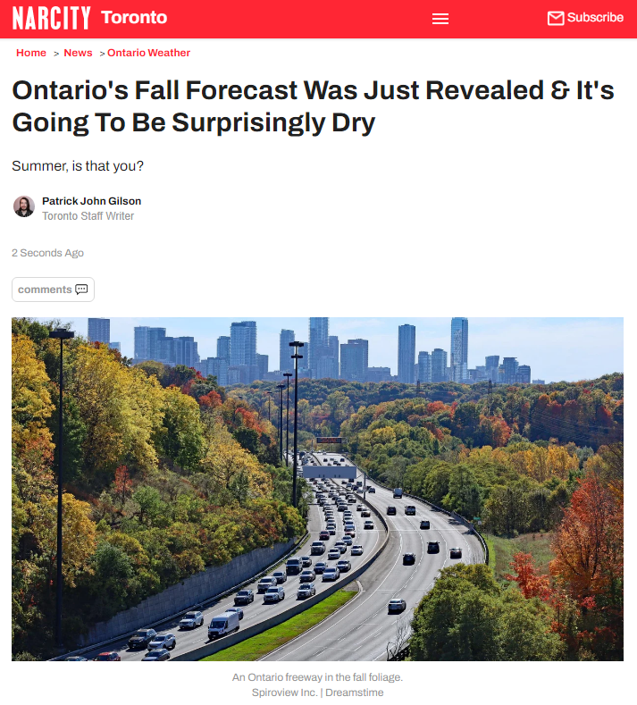
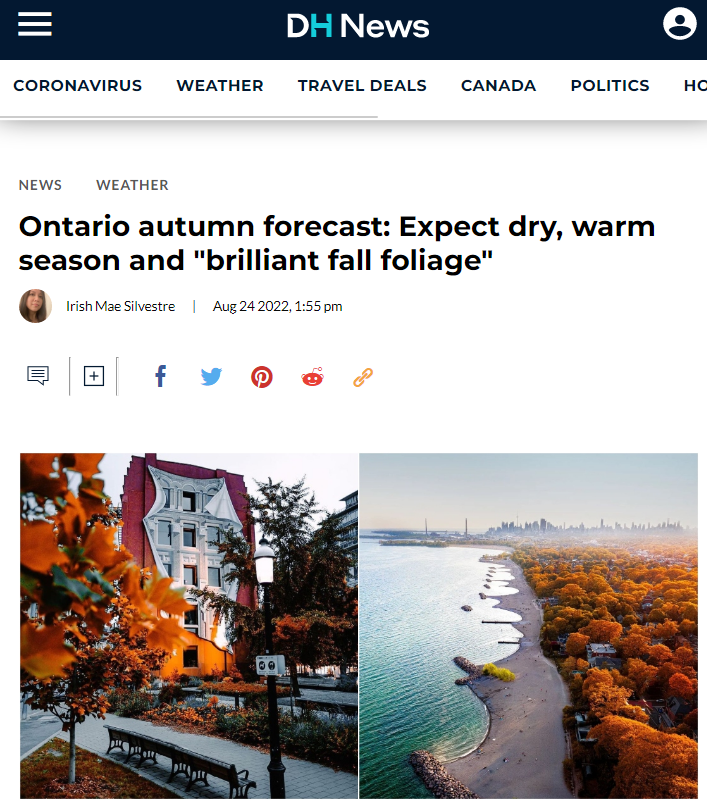
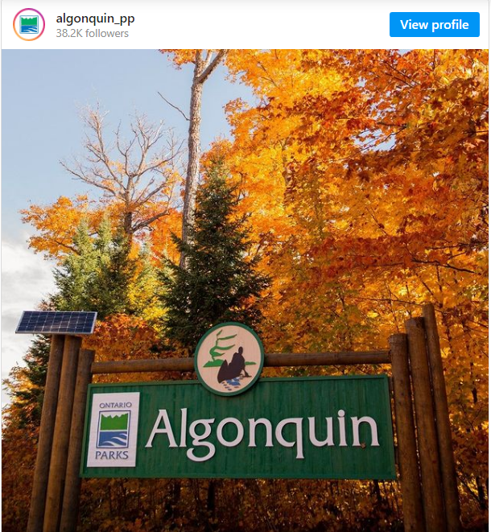
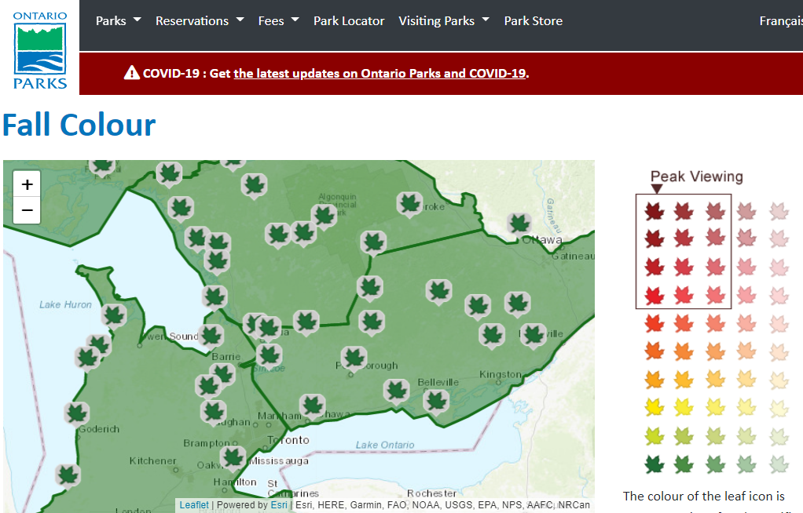

# 无标题

**链接地址:** http://mp.weixin.qq.com/s?__biz=MjM5MDEzNzY2NQ==&mid=2652846673&idx=1&sn=73c1fc166811b829c082be275d2012a1&chksm=bda2f67f8ad57f69fe1d5aeebfab9639a9f0bdd04750624e11d64b55e352531e9091ddaa3b78&mpshare=1&scene=2&srcid=0825u4yGa67buEy878ZqR2V2&sharer_sharetime=1661379711959&sharer_shareid=77848a6b3852ae4dcb6c74ffee84743c#rd
**作者:** 
**获取时间:** 2025/8/28 19:33:19
**图片数量:** 18

---

## 原始HTML内容

<strong style="margin: 0px;padding: 0px;outline: 0px;max-width: 100%;letter-spacing: 0.544px;color: rgb(217, 33, 66);font-family: system-ui, -apple-system, BlinkMacSystemFont, &quot;Helvetica Neue&quot;, &quot;PingFang SC&quot;, &quot;Hiragino Sans GB&quot;, &quot;Microsoft YaHei UI&quot;, &quot;Microsoft YaHei&quot;, Arial, sans-serif;font-size: 16px;visibility: visible;box-sizing: border-box !important;overflow-wrap: break-word !important;"></strong>
<section style="margin: 0px 16px;padding: 0px;font-size: 17px;font-style: normal;font-variant-ligatures: normal;font-variant-caps: normal;font-weight: 400;orphans: 2;text-indent: 0px;text-transform: none;white-space: normal;widows: 2;word-spacing: 0px;-webkit-text-stroke-width: 0px;text-decoration-thickness: initial;text-decoration-style: initial;text-decoration-color: initial;outline: 0px;max-width: 100%;color: rgb(34, 34, 34);letter-spacing: 0.544px;font-family: system-ui, -apple-system, &quot;system-ui&quot;, &quot;Helvetica Neue&quot;, &quot;PingFang SC&quot;, &quot;Hiragino Sans GB&quot;, &quot;Microsoft YaHei UI&quot;, &quot;Microsoft YaHei&quot;, Arial, sans-serif;clear: both;min-height: 1em;background-color: rgb(255, 255, 255);text-align: center;visibility: visible;line-height: 2em;box-sizing: border-box !important;overflow-wrap: break-word !important;"><strong style="margin: 0px;padding: 0px;outline: 0px;max-width: 100%;color: rgb(217, 33, 66);font-family: system-ui, -apple-system, BlinkMacSystemFont, &quot;Helvetica Neue&quot;, &quot;PingFang SC&quot;, &quot;Hiragino Sans GB&quot;, &quot;Microsoft YaHei UI&quot;, &quot;Microsoft YaHei&quot;, Arial, sans-serif;font-size: 16px;font-style: normal;font-variant-ligatures: normal;font-variant-caps: normal;letter-spacing: 0.544px;orphans: 2;text-align: center;text-indent: 0px;text-transform: none;white-space: normal;widows: 2;word-spacing: 0px;-webkit-text-stroke-width: 0px;background-color: rgb(255, 255, 255);text-decoration-thickness: initial;text-decoration-style: initial;text-decoration-color: initial;visibility: visible;box-sizing: border-box !important;overflow-wrap: break-word !important;">+++上方是广告+++</strong></section><section style="margin: 0px 16px 0em;padding: 0px;font-size: 17px;font-style: normal;font-variant-ligatures: normal;font-variant-caps: normal;font-weight: 400;orphans: 2;text-indent: 0px;text-transform: none;white-space: normal;widows: 2;word-spacing: 0px;-webkit-text-stroke-width: 0px;text-decoration-thickness: initial;text-decoration-style: initial;text-decoration-color: initial;outline: 0px;max-width: 100%;color: rgb(34, 34, 34);letter-spacing: 0.544px;font-family: system-ui, -apple-system, &quot;system-ui&quot;, &quot;Helvetica Neue&quot;, &quot;PingFang SC&quot;, &quot;Hiragino Sans GB&quot;, &quot;Microsoft YaHei UI&quot;, &quot;Microsoft YaHei&quot;, Arial, sans-serif;clear: both;min-height: 1em;background-color: rgb(255, 255, 255);text-align: center;visibility: visible;line-height: 2em;box-sizing: border-box !important;overflow-wrap: break-word !important;"> </section><section style="margin: 0px 16px;padding: 0px;font-size: 17px;font-style: normal;font-variant-ligatures: normal;font-variant-caps: normal;font-weight: 400;orphans: 2;text-indent: 0px;text-transform: none;white-space: normal;widows: 2;word-spacing: 0px;-webkit-text-stroke-width: 0px;text-decoration-thickness: initial;text-decoration-style: initial;text-decoration-color: initial;outline: 0px;max-width: 100%;color: rgb(34, 34, 34);letter-spacing: 0.544px;font-family: system-ui, -apple-system, &quot;system-ui&quot;, &quot;Helvetica Neue&quot;, &quot;PingFang SC&quot;, &quot;Hiragino Sans GB&quot;, &quot;Microsoft YaHei UI&quot;, &quot;Microsoft YaHei&quot;, Arial, sans-serif;clear: both;min-height: 1em;background-color: rgb(255, 255, 255);text-align: center;visibility: visible;line-height: 2em;box-sizing: border-box !important;overflow-wrap: break-word !important;"><strong style="margin: 0px;padding: 0px;outline: 0px;max-width: 100%;font-size: 16px;font-style: normal;font-variant-ligatures: normal;font-variant-caps: normal;letter-spacing: 0.544px;orphans: 2;text-align: center;text-indent: 0px;text-transform: none;white-space: normal;widows: 2;word-spacing: 0px;-webkit-text-stroke-width: 0px;text-decoration-thickness: initial;text-decoration-style: initial;text-decoration-color: initial;color: rgb(217, 33, 66);font-family: system-ui, -apple-system, BlinkMacSystemFont, &quot;Helvetica Neue&quot;, &quot;PingFang SC&quot;, &quot;Hiragino Sans GB&quot;, &quot;Microsoft YaHei UI&quot;, &quot;Microsoft YaHei&quot;, Arial, sans-serif;background-color: rgb(255, 255, 255);visibility: visible;box-sizing: border-box !important;overflow-wrap: break-word !important;">+++上方是广告+++</strong></section><section style="margin: 0px 16px;padding: 0px;font-size: 17px;font-style: normal;font-variant-ligatures: normal;font-variant-caps: normal;font-weight: 400;orphans: 2;text-indent: 0px;text-transform: none;white-space: normal;widows: 2;word-spacing: 0px;-webkit-text-stroke-width: 0px;text-decoration-thickness: initial;text-decoration-style: initial;text-decoration-color: initial;outline: 0px;max-width: 100%;color: rgb(34, 34, 34);letter-spacing: 0.544px;font-family: system-ui, -apple-system, &quot;system-ui&quot;, &quot;Helvetica Neue&quot;, &quot;PingFang SC&quot;, &quot;Hiragino Sans GB&quot;, &quot;Microsoft YaHei UI&quot;, &quot;Microsoft YaHei&quot;, Arial, sans-serif;clear: both;min-height: 1em;background-color: rgb(255, 255, 255);text-align: center;visibility: visible;line-height: 2em;box-sizing: border-box !important;overflow-wrap: break-word !important;"><strong style="margin: 0px;padding: 0px;outline: 0px;max-width: 100%;font-size: 16px;letter-spacing: 0.544px;color: rgb(217, 33, 66);font-family: system-ui, -apple-system, BlinkMacSystemFont, &quot;Helvetica Neue&quot;, &quot;PingFang SC&quot;, &quot;Hiragino Sans GB&quot;, &quot;Microsoft YaHei UI&quot;, &quot;Microsoft YaHei&quot;, Arial, sans-serif;visibility: visible;box-sizing: border-box !important;overflow-wrap: break-word !important;"><strong style="margin: 0px;padding: 0px;outline: 0px;max-width: 100%;font-size: 16px;font-style: normal;font-variant-ligatures: normal;font-variant-caps: normal;letter-spacing: 0.544px;orphans: 2;text-align: center;text-indent: 0px;text-transform: none;white-space: normal;widows: 2;word-spacing: 0px;-webkit-text-stroke-width: 0px;text-decoration-thickness: initial;text-decoration-style: initial;text-decoration-color: initial;color: rgb(217, 33, 66);font-family: system-ui, -apple-system, BlinkMacSystemFont, &quot;Helvetica Neue&quot;, &quot;PingFang SC&quot;, &quot;Hiragino Sans GB&quot;, &quot;Microsoft YaHei UI&quot;, &quot;Microsoft YaHei&quot;, Arial, sans-serif;background-color: rgb(255, 255, 255);visibility: visible;box-sizing: border-box !important;overflow-wrap: break-word !important;"></strong></strong></section><section style="margin: 0px 16px;padding: 0px;font-size: 17px;font-style: normal;font-variant-ligatures: normal;font-variant-caps: normal;font-weight: 400;orphans: 2;text-indent: 0px;text-transform: none;white-space: normal;widows: 2;word-spacing: 0px;-webkit-text-stroke-width: 0px;text-decoration-thickness: initial;text-decoration-style: initial;text-decoration-color: initial;outline: 0px;max-width: 100%;color: rgb(34, 34, 34);letter-spacing: 0.544px;font-family: system-ui, -apple-system, &quot;system-ui&quot;, &quot;Helvetica Neue&quot;, &quot;PingFang SC&quot;, &quot;Hiragino Sans GB&quot;, &quot;Microsoft YaHei UI&quot;, &quot;Microsoft YaHei&quot;, Arial, sans-serif;clear: both;min-height: 1em;background-color: rgb(255, 255, 255);text-align: center;visibility: visible;line-height: 2em;box-sizing: border-box !important;overflow-wrap: break-word !important;"><strong style="margin: 0px;padding: 0px;outline: 0px;max-width: 100%;font-size: 16px;letter-spacing: 0.544px;color: rgb(217, 33, 66);font-family: system-ui, -apple-system, BlinkMacSystemFont, &quot;Helvetica Neue&quot;, &quot;PingFang SC&quot;, &quot;Hiragino Sans GB&quot;, &quot;Microsoft YaHei UI&quot;, &quot;Microsoft YaHei&quot;, Arial, sans-serif;visibility: visible;box-sizing: border-box !important;overflow-wrap: break-word !important;"> </strong></section><section style="text-align: center;line-height: 2em;">一眨眼功夫，暑假将进入尾声</section><section style="text-align: center;line-height: 2em;">夏天虽然弥足珍贵</section>
但加拿大的&nbsp;<strong>秋天</strong>
<section style="text-align: center;line-height: 2em;"><strong>才是全世界最美艳的地方！</strong></section><section style="text-align: center;line-height: 2em;"><strong> </strong></section>

<section style="text-align: center;line-height: 2em;"> </section><section style="text-align: center;line-height: 2em;"><strong> </strong></section><section style="text-align: center;line-height: 2em;">大家都很期待空气的清脆凉爽</section><section style="text-align: center;line-height: 2em;">和满山遍野的金色枫景！</section><section style="text-align: center;line-height: 2em;"> </section>

<section style="text-align: center;line-height: 2em;">&nbsp;</section><section style="text-align: center;line-height: 2em;">好消息来了～</section><section style="text-align: center;line-height: 2em;"><strong>据AccuWeather最新出炉的秋季预报</strong></section><section style="text-align: center;line-height: 2em;">虽然西海岸将有凉爽潮湿的季节</section><section style="text-align: center;line-height: 2em;">加拿大东部的情况却相反，</section><section style="text-align: center;line-height: 2em;">进入秋天会迎来几周的阳光普照。</section><section style="text-align: center;line-height: 2em;"> </section>

<section style="text-align: center;line-height: 2em;"> </section><section style="text-align: center;line-height: 2em;">高级气象学家Brett Anderson说：</section><section style="text-align: center;line-height: 2em;">“预计加拿大东部大部分地区，</section><section style="text-align: center;line-height: 2em;">包括魁北克以及安省北部和中部</section><section style="text-align: center;line-height: 2em;">今年秋季会更加<strong>干燥和温暖</strong>。”</section><section style="text-align: center;line-height: 2em;"> </section><section style="text-align: center;line-height: 2em;">这意味着今年这些地方的</section><section style="text-align: center;line-height: 2em;"><strong>&nbsp;秋色会特别美！</strong></section><section style="text-align: center;line-height: 2em;"> </section>

<section style="text-align: center;line-height: 2em;"> </section><section style="text-align: center;line-height: 2em;">Anderson补充，</section><section style="text-align: center;line-height: 2em;">“尽管这个季节看起来很温暖，</section><section style="text-align: center;line-height: 2em;">但由于地面干燥，</section><section style="text-align: center;line-height: 2em;">夜晚很快就会变冷，</section><section style="text-align: center;line-height: 2em;"><strong>寒冷的夜晚也可能意味着</strong></section><section style="text-align: center;line-height: 2em;"><strong>早季的霜冻或冰冻。”</strong></section><section style="text-align: center;line-height: 2em;"><strong> </strong></section>

<section style="text-align: center;line-height: 2em;"> </section><section style="text-align: center;line-height: 2em;"> </section><section style="text-align: center;line-height: 2em;">而这样的天气最能让<strong>秋叶变色</strong></section><section style="text-align: center;line-height: 2em;">预计安省今年会出现</section><section style="text-align: center;line-height: 2em;">不多见的晴朗暖秋，</section><section style="text-align: center;line-height: 2em;">不仅有利于<strong>出现“绚丽的秋叶”</strong></section><section style="text-align: center;line-height: 2em;">而且赏枫叶也<strong>不用担心下雨（雪）。</strong></section><section style="text-align: center;line-height: 2em;"><strong> </strong></section>

<section style="text-align: center;line-height: 2em;"> </section><section style="text-align: center;line-height: 2em;">对于想赏枫的小伙伴</section><section style="text-align: center;line-height: 2em;"><strong>这绝对是好消息！</strong></section><section style="text-align: center;line-height: 2em;"><strong> </strong></section><section style="margin: 0px 16px 0em;padding: 0px;font-size: 17px;font-style: normal;font-variant-ligatures: normal;font-variant-caps: normal;font-weight: 400;orphans: 2;text-indent: 0px;text-transform: none;white-space: normal;widows: 2;word-spacing: 0px;-webkit-text-stroke-width: 0px;text-decoration-thickness: initial;text-decoration-style: initial;text-decoration-color: initial;outline: 0px;max-width: 100%;color: rgb(34, 34, 34);letter-spacing: 0.544px;font-family: system-ui, -apple-system, &quot;system-ui&quot;, &quot;Helvetica Neue&quot;, &quot;PingFang SC&quot;, &quot;Hiragino Sans GB&quot;, &quot;Microsoft YaHei UI&quot;, &quot;Microsoft YaHei&quot;, Arial, sans-serif;clear: both;min-height: 1em;background-color: rgb(255, 255, 255);text-align: center;visibility: visible;line-height: 2em;box-sizing: border-box !important;overflow-wrap: break-word !important;"></section><section style="margin: 0px 16px;padding: 0px;font-size: 17px;font-style: normal;font-variant-ligatures: normal;font-variant-caps: normal;font-weight: 400;orphans: 2;text-indent: 0px;text-transform: none;white-space: normal;widows: 2;word-spacing: 0px;-webkit-text-stroke-width: 0px;text-decoration-thickness: initial;text-decoration-style: initial;text-decoration-color: initial;outline: 0px;max-width: 100%;color: rgb(34, 34, 34);letter-spacing: 0.544px;font-family: system-ui, -apple-system, &quot;system-ui&quot;, &quot;Helvetica Neue&quot;, &quot;PingFang SC&quot;, &quot;Hiragino Sans GB&quot;, &quot;Microsoft YaHei UI&quot;, &quot;Microsoft YaHei&quot;, Arial, sans-serif;clear: both;min-height: 1em;background-color: rgb(255, 255, 255);text-align: center;visibility: visible;line-height: 2em;box-sizing: border-box !important;overflow-wrap: break-word !important;"><strong style="margin: 0px;padding: 0px;outline: 0px;max-width: 100%;font-size: 16px;letter-spacing: 0.544px;color: rgb(217, 33, 66);font-family: system-ui, -apple-system, BlinkMacSystemFont, &quot;Helvetica Neue&quot;, &quot;PingFang SC&quot;, &quot;Hiragino Sans GB&quot;, &quot;Microsoft YaHei UI&quot;, &quot;Microsoft YaHei&quot;, Arial, sans-serif;visibility: visible;box-sizing: border-box !important;overflow-wrap: break-word !important;"><strong style="margin: 0px;padding: 0px;outline: 0px;max-width: 100%;font-size: 16px;font-style: normal;font-variant-ligatures: normal;font-variant-caps: normal;letter-spacing: 0.544px;orphans: 2;text-align: center;text-indent: 0px;text-transform: none;white-space: normal;widows: 2;word-spacing: 0px;-webkit-text-stroke-width: 0px;text-decoration-thickness: initial;text-decoration-style: initial;text-decoration-color: initial;color: rgb(217, 33, 66);font-family: system-ui, -apple-system, BlinkMacSystemFont, &quot;Helvetica Neue&quot;, &quot;PingFang SC&quot;, &quot;Hiragino Sans GB&quot;, &quot;Microsoft YaHei UI&quot;, &quot;Microsoft YaHei&quot;, Arial, sans-serif;background-color: rgb(255, 255, 255);visibility: visible;box-sizing: border-box !important;overflow-wrap: break-word !important;">+++上方是广告+++</strong></strong></section>
 
<section style="text-align: center;line-height: 2em;">不过，干旱温暖的天气</section><section style="text-align: center;line-height: 2em;">实际上是一把双刃剑</section><section style="text-align: center;line-height: 2em;">安省南部其实在今年夏天</section><section style="text-align: center;line-height: 2em;">就经历了“异常干燥”的夏季，</section><section style="text-align: center;line-height: 2em;">这使该地区面临“严重干旱”的风险。</section><section style="text-align: center;line-height: 2em;">尽管该省最大的人口中心</section><section style="text-align: center;line-height: 2em;">将享受温和、少雨的秋季，</section><section style="text-align: center;line-height: 2em;">但缺乏潮湿的天气会</section><section style="text-align: center;line-height: 2em;"><strong>也会使地面变干并造成大范围野火风险。</strong></section><section style="text-align: center;line-height: 2em;"> </section><section style="text-align: center;line-height: 2em;">今年多伦多等地的秋季会</section>
又暖，又干，又长......
<section style="text-align: center;line-height: 2em;">而这些预期的条件和降水量</section><section style="text-align: center;line-height: 2em;"><strong>将为绚丽的秋叶奠定美好基础！</strong></section><section style="text-align: center;line-height: 2em;"><strong> </strong></section><section style="text-align: center;line-height: 2em;"><strong></strong></section><section style="text-align: center;line-height: 2em;"><strong> </strong></section><section style="text-align: center;line-height: 2em;">届时，我们又会迎来 </section><section style="text-align: center;line-height: 2em;">全世界都羡慕的风景！</section><section style="text-align: center;line-height: 2em;">这样的↓</section>
 

<section style="text-align: center;line-height: 2em;"> </section><section style="text-align: center;line-height: 2em;">这样的↓</section><section style="text-align: center;line-height: 2em;"> </section><section style="text-align: center;line-height: 2em;"></section><section style="text-align: center;line-height: 2em;"> </section><section style="text-align: center;line-height: 2em;">还有这样的↓</section><section style="text-align: center;line-height: 2em;"> </section><section style="text-align: center;line-height: 2em;"></section><section style="text-align: center;line-height: 2em;"><strong> </strong></section><section style="text-align: center;line-height: 2em;">Anderson说：</section><section style="text-align: center;line-height: 2em;">“从安大略省到新不伦瑞克省，</section><section style="text-align: center;line-height: 2em;">预计都会出现<strong>延长的有利秋叶天气</strong>。”</section><section style="text-align: center;line-height: 2em;"> </section><section style="text-align: center;line-height: 2em;">但今年秋色可能会比往年来得迟~</section><section style="text-align: center;line-height: 2em;"> </section><section style="text-align: center;line-height: 2em;">Anderson补充说，</section><section style="text-align: center;line-height: 2em;">枫叶峰值变色的日子</section><section style="text-align: center;line-height: 2em;"><strong>可能会比正常情况延迟一周。</strong></section><section style="text-align: center;line-height: 2em;"> </section><section style="text-align: center;line-height: 2em;">枫叶变红取决于各地不同的早晚温度</section><section style="text-align: center;line-height: 2em;">以及秋夜是否会保持凉爽气温</section><section style="text-align: center;line-height: 2em;">以促叶子变色。</section><section style="text-align: center;line-height: 2em;">虽然目前很难确定枫叶变红的顶峰日期</section><section style="text-align: center;line-height: 2em;">但一般阿冈昆公园最佳的赏枫时节</section><section style="text-align: center;line-height: 2em;"><strong>是十月中，而多伦多一般在十月底</strong></section><section style="text-align: center;line-height: 2em;">所以今年可能会十月底至十一月初。</section><section style="text-align: center;line-height: 2em;"> </section>

<section style="text-align: center;line-height: 2em;"> </section><section style="text-align: center;line-height: 2em;"> </section><section style="text-align: center;line-height: 2em;">如果想掌握最佳时机赏枫</section><section style="text-align: center;line-height: 2em;">记得查看安大略公园秋色报告。</section><section style="text-align: center;line-height: 2em;">网址：</section><section style="text-align: center;line-height: 2em;">www.ontarioparks.com/fallcolour</section><section style="text-align: center;line-height: 2em;"> </section>

<section style="text-align: center;line-height: 2em;"> </section>
天涼好个秋

再过几周，枫叶就会开始变色啦
<section style="text-align: center;line-height: 2em;"> </section><section style="text-align: center;line-height: 2em;">漫山红叶，层林尽染的日子又要来了~</section><section style="text-align: center;line-height: 2em;"> </section>

<section style="text-align: center;line-height: 2em;"> </section><section style="text-align: center;line-height: 2em;">准备好了吗？</section><section style="text-align: center;line-height: 2em;"><strong>“枫情”万种的加拿大</strong></section><section style="text-align: center;line-height: 2em;">将再次美爆全世界！</section><section style="text-align: center;line-height: 2em;"> </section>
+++全加拿大华人都在关注超级生活，就差你了+++

&nbsp; &nbsp; &nbsp; &nbsp; &nbsp; &nbsp; &nbsp; &nbsp; &nbsp; &nbsp; &nbsp; &nbsp; &nbsp; &nbsp; &nbsp; &nbsp; &nbsp; &nbsp; &nbsp; &nbsp; &nbsp;&nbsp;&nbsp;&nbsp;&nbsp;&nbsp;&nbsp;喜欢就狠点下吧‍
<section style="text-align: center;line-height: 2em;"> </section>

---

## 纯文本内容

+++上方是广告++++++上方是广告+++一眨眼功夫，暑假将进入尾声夏天虽然弥足珍贵但加拿大的 秋天才是全世界最美艳的地方！大家都很期待空气的清脆凉爽和满山遍野的金色枫景！ 好消息来了～据AccuWeather最新出炉的秋季预报虽然西海岸将有凉爽潮湿的季节加拿大东部的情况却相反，进入秋天会迎来几周的阳光普照。高级气象学家Brett Anderson说：“预计加拿大东部大部分地区，包括魁北克以及安省北部和中部今年秋季会更加干燥和温暖。”这意味着今年这些地方的 秋色会特别美！Anderson补充，“尽管这个季节看起来很温暖，但由于地面干燥，夜晚很快就会变冷，寒冷的夜晚也可能意味着早季的霜冻或冰冻。”而这样的天气最能让秋叶变色预计安省今年会出现不多见的晴朗暖秋，不仅有利于出现“绚丽的秋叶”而且赏枫叶也不用担心下雨（雪）。对于想赏枫的小伙伴这绝对是好消息！+++上方是广告+++不过，干旱温暖的天气实际上是一把双刃剑安省南部其实在今年夏天就经历了“异常干燥”的夏季，这使该地区面临“严重干旱”的风险。尽管该省最大的人口中心将享受温和、少雨的秋季，但缺乏潮湿的天气会也会使地面变干并造成大范围野火风险。今年多伦多等地的秋季会又暖，又干，又长......而这些预期的条件和降水量将为绚丽的秋叶奠定美好基础！届时，我们又会迎来全世界都羡慕的风景！这样的↓这样的↓还有这样的↓Anderson说：“从安大略省到新不伦瑞克省，预计都会出现延长的有利秋叶天气。”但今年秋色可能会比往年来得迟~Anderson补充说，枫叶峰值变色的日子可能会比正常情况延迟一周。枫叶变红取决于各地不同的早晚温度以及秋夜是否会保持凉爽气温以促叶子变色。虽然目前很难确定枫叶变红的顶峰日期但一般阿冈昆公园最佳的赏枫时节是十月中，而多伦多一般在十月底所以今年可能会十月底至十一月初。如果想掌握最佳时机赏枫记得查看安大略公园秋色报告。网址：www.ontarioparks.com/fallcolour天涼好个秋再过几周，枫叶就会开始变色啦漫山红叶，层林尽染的日子又要来了~准备好了吗？“枫情”万种的加拿大将再次美爆全世界！+++全加拿大华人都在关注超级生活，就差你了+++                                               喜欢就狠点下吧‍

---

## 图片列表

-  (原始链接: https://mmbiz.qpic.cn/mmbiz_gif/szJas1pFaJcK7VtGpQsnBz3DlbJZ0bJktxGpMyxY7MvkCib6OquiaHpGMPiau7Uhqu2Wicn84uErIgTut3VMZiciaHRQ/640?wx_fmt=gif&wxfrom=5&wx_lazy=1)
-  (原始链接: https://mmbiz.qpic.cn/mmbiz_jpg/szJas1pFaJeG66Q3zpw0h39aiaia9J4N2wEFv7e572pXKibU1X2guCBwLYdpTbKgXtqSCe5PnjibFcvjNy5kvIs8vQ/640?wx_fmt=jpeg&wxfrom=5&wx_lazy=1&wx_co=1)
-  (原始链接: https://mmbiz.qpic.cn/mmbiz_gif/4kibCXA1QiblQJO8C2iacwQFIlW39vPlPGsBzc90t6fshGkszCQJmxwTOCzVU7Bff5CuEP3iaDSwicU7chD7JI67ZLA/640?wx_fmt=gif)
-  (原始链接: https://mmbiz.qpic.cn/mmbiz_gif/4kibCXA1QiblQJO8C2iacwQFIlW39vPlPGsYQCJH1tseD3dJOYZCsIjoAe4icULx7wXficTWYq9cFib0PbKacyzZmYsA/640?wx_fmt=gif)
-  (原始链接: https://mmbiz.qpic.cn/mmbiz_png/4kibCXA1QiblQJO8C2iacwQFIlW39vPlPGsKqjKuibrpCu7KmPX9C7Y6kz8T4YVpaBcpdSickk5etqe59Nw8o7coD3g/640?wx_fmt=png)
-  (原始链接: https://mmbiz.qpic.cn/mmbiz_png/4kibCXA1QiblQJO8C2iacwQFIlW39vPlPGsQLa0rIHVw1d5doo7eZUuydlDn2iaJtBKUTvRoJEpCMPgGEbjQOwYmbg/640?wx_fmt=png)
-  (原始链接: https://mmbiz.qpic.cn/mmbiz_png/4kibCXA1QiblQJO8C2iacwQFIlW39vPlPGspCQfWF6HdYL1Fxicb3aEn88HhuI2dNxrCPwqXlPBkJt3Uhl5ibDkAeeA/640?wx_fmt=png)
-  (原始链接: https://mmbiz.qpic.cn/mmbiz_png/4kibCXA1QiblQJO8C2iacwQFIlW39vPlPGs2JeBTp0LbR6yy4fxCB5MsK7fU0wps5ibg3fjQ1S2tjSLauHt2K4GLDQ/640?wx_fmt=png)
-  (原始链接: https://mmbiz.qpic.cn/mmbiz_jpg/szJas1pFaJd8zibIvMwSqsFf0ceXLGcic9XGicl0KMYWwTUArBQxfUF93aZoysGceaiatCf7VazicLMIVUslTD0B9IQ/640?wx_fmt=jpeg&wxfrom=5&wx_lazy=1&wx_co=1)
-  (原始链接: https://mmbiz.qpic.cn/mmbiz_png/4kibCXA1QiblQJO8C2iacwQFIlW39vPlPGsw5093KGvwslLvQd2BBfkEB7icqAchCZ3odhl3JWmicFv1UOpkWjMdh9Q/640?wx_fmt=png)
-  (原始链接: https://mmbiz.qpic.cn/mmbiz_png/4kibCXA1QiblQJO8C2iacwQFIlW39vPlPGszEGE3nZASuXynpNYeB8vM4DibzGc902zjicfibokksJoVTBM9rRcuksFQ/640?wx_fmt=png)
-  (原始链接: https://mmbiz.qpic.cn/mmbiz_png/4kibCXA1QiblQJO8C2iacwQFIlW39vPlPGsJR2DMguWHV34hSLW6KSiaC7URAGkuyTHuaoiaMicVvAPWbp4uriaG8WbNw/640?wx_fmt=png)
-  (原始链接: https://mmbiz.qpic.cn/mmbiz_png/4kibCXA1QiblQJO8C2iacwQFIlW39vPlPGsXdlDMjN33ibMw3Ily9S8zPW0l36HUe0vujTwCfghp6icTd9bI99icSAOA/640?wx_fmt=png)
-  (原始链接: https://mmbiz.qpic.cn/mmbiz_png/4kibCXA1QiblQJO8C2iacwQFIlW39vPlPGs1ZA3pP48vYibRkAYGX3cGZQWh9YF4624IPQPibicY6tMB4dsNMd7VB91Q/640?wx_fmt=png)
-  (原始链接: https://mmbiz.qpic.cn/mmbiz_png/4kibCXA1QiblQJO8C2iacwQFIlW39vPlPGsic2aqJphiaJ1al8el1J4xRI7b2q4novUcuIn6Pkpyjn2Yh0WThbwpQmA/640?wx_fmt=png)
-  (原始链接: https://mmbiz.qpic.cn/mmbiz_gif/4kibCXA1QiblQJO8C2iacwQFIlW39vPlPGszcnzK75GdUtYdrwibpNGRCleIECT7SfNKEQvPib1micZ6yTnE4M8W0vSg/640?wx_fmt=gif)
-  (原始链接: https://mmbiz.qpic.cn/mmbiz_gif/szJas1pFaJciafpfjOBz8frgHmpJ4qlKKk76KbuUlPOdJ89eVxMjeudj7VjeoS5xib6sXYhPHnwP6PiadxYVypibQg/640?wx_fmt=gif&wxfrom=5&wx_lazy=1)
-  (原始链接: https://mmbiz.qpic.cn/mmbiz_png/szJas1pFaJfrIIC5IeLhV2hKgkibia8ngvEb0uN9pIZicxAmlh1SkrSb7rJ7Xn9AT7ynNHlh2XLI8MchrVF5W1N2w/640?wx_fmt=png&wxfrom=5&wx_lazy=1&wx_co=1)
