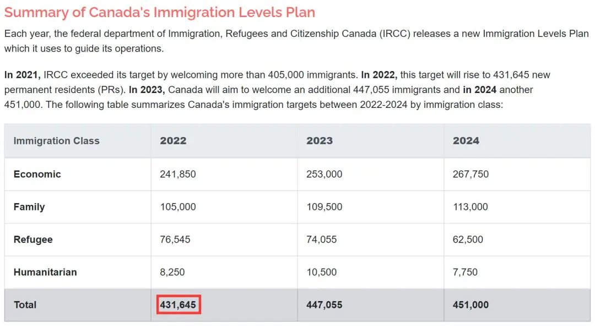
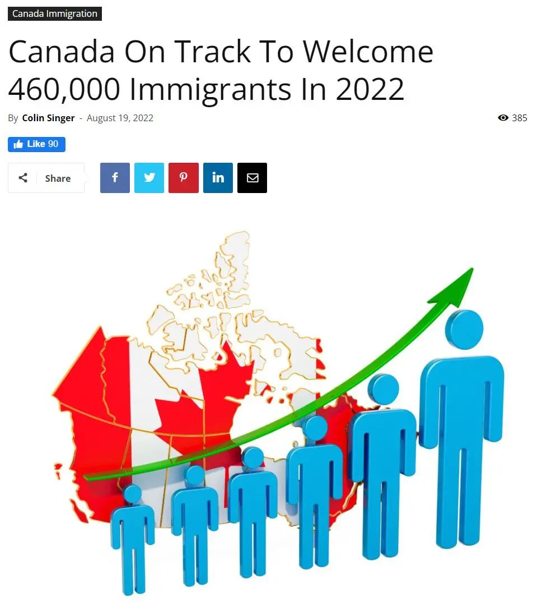
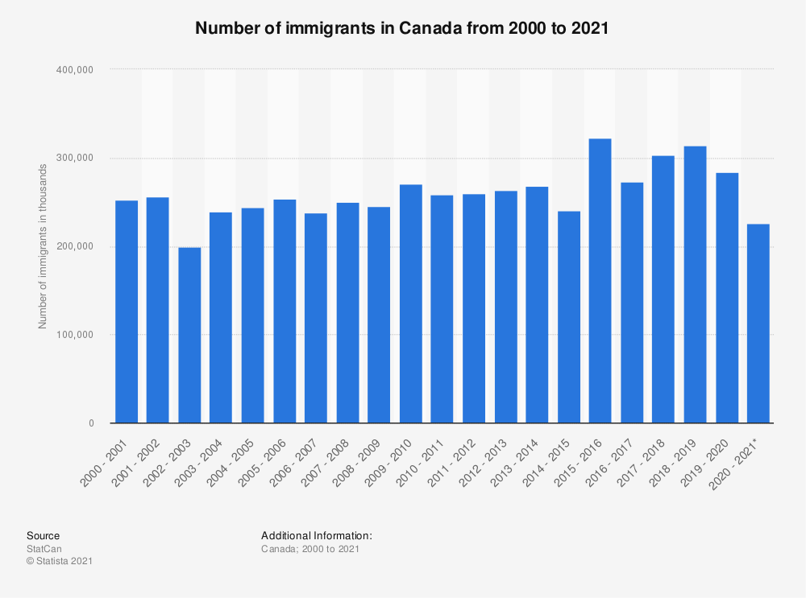
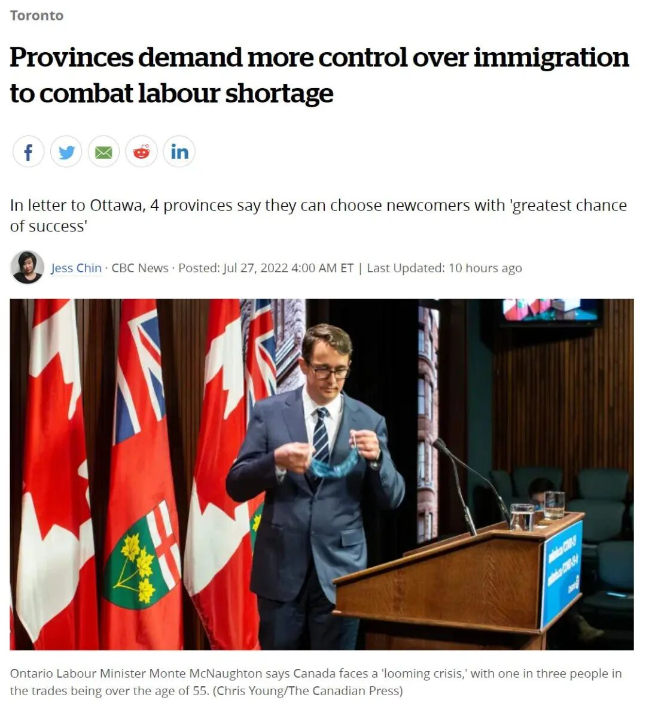

# 无标题

**链接地址:** http://mp.weixin.qq.com/s?__biz=MzUyNzA2NTAwNg==&mid=2247490717&idx=1&sn=981c06a19aebffb1f9bef92484c7d6f9&chksm=fa04165ccd739f4a676945fc2a98f7da8cd8e27c9f6798e4c25b421b54d9094daf8f8d851997&mpshare=1&scene=2&srcid=08277svC6RoKi7fh72SjAKQM&sharer_sharetime=1661548693811&sharer_shareid=77848a6b3852ae4dcb6c74ffee84743c#rd
**作者:** 你身边的签证专家
**获取时间:** 2025/8/28 19:32:10
**图片数量:** 20

---

## 原始HTML内容

<section style="box-sizing: border-box;font-style: normal;font-weight: 400;text-align: justify;font-size: 16px;"><section style="text-align: center;margin-top: 10px;margin-bottom: 10px;box-sizing: border-box;" powered-by="xiumi.us"><section style="max-width: 100%;vertical-align: middle;display: inline-block;line-height: 0;box-sizing: border-box;"></section></section><section style="text-align: center;margin-top: 10px;margin-bottom: 10px;box-sizing: border-box;" powered-by="xiumi.us"></section>
 
<section style="font-size: 19px;text-align: center;margin: 10px 0px 3px;box-sizing: border-box;" powered-by="xiumi.us"><section style="display: inline-block;width: 1.8em;height: 1.8em;line-height: 1.8em;border-radius: 100%;margin-left: auto;margin-right: auto;font-size: 16px;color: rgb(255, 255, 255);border-width: 1px;border-style: solid;border-color: rgb(188, 65, 65);background-color: rgb(188, 65, 65);box-sizing: border-box;">
<strong style="box-sizing: border-box;">1</strong>
</section></section><section style="text-align: center;margin: 0px;box-sizing: border-box;" powered-by="xiumi.us"><section style="display: inline-block;vertical-align: top;overflow: hidden;height: 0px;width: 0px;border-style: solid;border-width: 9px 6px 0px;border-color: rgb(188, 65, 65) rgba(255, 255, 255, 0) rgba(255, 255, 255, 0);box-sizing: border-box;"><svg viewBox="0 0 1 1" style="float:left;line-height:0;width:0;vertical-align:top;"></svg></section></section><section style="margin: 0px 0px 10px;text-align: center;justify-content: center;display: flex;flex-flow: row nowrap;box-sizing: border-box;" powered-by="xiumi.us"><section style="display: inline-block;width: auto;vertical-align: middle;background-color: rgba(109, 155, 209, 0.1);min-width: 10%;max-width: 100%;flex: 0 0 auto;height: auto;align-self: center;padding: 12px;margin: 0px;box-sizing: border-box;"><section style="color: rgb(109, 155, 209);text-align: justify;box-sizing: border-box;" powered-by="xiumi.us">
<strong style="box-sizing: border-box;">劳动力紧缺加速加国移民审批</strong>
</section></section></section>
 
<section style="font-size: 14px;padding: 0px 15px;letter-spacing: 1px;box-sizing: border-box;" powered-by="xiumi.us">
劳动力的紧缺正严重掣肘着加拿大经济和社会发展。根据加拿大统计局报告，2022年7月全国失业率已经连续第二个月达到<strong style="box-sizing: border-box;">4.9%的历史最低水平</strong>，为1970年有纪录以来的最低值。这样的数据佐证了加拿大劳动力市场的紧张程度。

 

7月26日晚上，安大略省、阿尔伯塔省、萨斯喀彻温省和曼尼托巴省四大省的移民厅长联名写信给特鲁多联邦政府，要求获得更多<strong style="box-sizing: border-box;">吸引新移民的控制权</strong>，希望能够抢到更多更符合当地经济发展需求的人才。

 
</section><section style="text-align: center;margin-top: 10px;margin-bottom: 10px;box-sizing: border-box;" powered-by="xiumi.us"><section style="max-width: 100%;vertical-align: middle;display: inline-block;line-height: 0;width: 90%;height: auto;box-sizing: border-box;"></section></section><section style="text-align: center;margin-top: 10px;margin-bottom: 10px;box-sizing: border-box;" powered-by="xiumi.us"><section style="max-width: 100%;vertical-align: middle;display: inline-block;line-height: 0;width: 90%;height: auto;box-sizing: border-box;"></section></section><section style="font-size: 14px;padding: 0px 15px;letter-spacing: 1px;box-sizing: border-box;" powered-by="xiumi.us">
 

根据加拿大移民部2022-2024年期间的移民水平计划，加拿大今年、明年和后年接纳的永久居民人数目标分别为<strong style="box-sizing: border-box;">431645、447055和451000人</strong>。

 

对于一个总人口数仅不到4000万的“大国”，每年吸引<strong style="box-sizing: border-box;">超过总人口数1%的新移民</strong>已经是非常<strong style="box-sizing: border-box;">“疯狂”</strong>的举措。但这对于加拿大目前<strong style="box-sizing: border-box;">超百万的劳动力岗位空缺</strong>还远远不够。

 

在后疫情时代经济高速复苏、“Baby Boomer退休潮”和移民申请大批积压的多重夹击下，加拿大移民部门也只好<strong style="box-sizing: border-box;">铆足了劲儿地加班进行申请的审批</strong>。

 

 
</section><section style="font-size: 19px;text-align: center;margin: 10px 0px 3px;box-sizing: border-box;" powered-by="xiumi.us"><section style="display: inline-block;border-width: 1px;border-style: solid;border-color: rgb(188, 65, 65);background-color: rgb(188, 65, 65);width: 1.8em;height: 1.8em;line-height: 1.8em;border-radius: 100%;margin-left: auto;margin-right: auto;font-size: 16px;color: rgb(255, 255, 255);box-sizing: border-box;">
<strong style="box-sizing: border-box;">2</strong>
</section></section><section style="text-align: center;margin: 0px;box-sizing: border-box;" powered-by="xiumi.us"><section style="display: inline-block;width: 0px;height: 0px;vertical-align: top;overflow: hidden;border-style: solid;border-width: 9px 6px 0px;border-color: rgb(188, 65, 65) rgba(255, 255, 255, 0) rgba(255, 255, 255, 0);box-sizing: border-box;"><svg viewBox="0 0 1 1" style="float:left;line-height:0;width:0;vertical-align:top;"></svg></section></section><section style="margin: 0px 0px 10px;text-align: center;justify-content: center;display: flex;flex-flow: row nowrap;box-sizing: border-box;" powered-by="xiumi.us"><section style="display: inline-block;width: auto;vertical-align: middle;background-color: rgba(109, 155, 209, 0.1);min-width: 10%;max-width: 100%;flex: 0 0 auto;height: auto;align-self: center;padding: 12px;margin: 0px;box-sizing: border-box;"><section style="color: rgb(109, 155, 209);text-align: justify;box-sizing: border-box;" powered-by="xiumi.us">
<strong style="box-sizing: border-box;">2022年加国将迎来46万新移民</strong>
</section></section></section>
 
<section style="font-size: 14px;padding: 0px 15px;letter-spacing: 1px;box-sizing: border-box;" powered-by="xiumi.us">
 
</section><section style="text-align: center;margin-top: 10px;margin-bottom: 10px;box-sizing: border-box;" powered-by="xiumi.us"><section style="max-width: 100%;vertical-align: middle;display: inline-block;line-height: 0;width: 90%;height: auto;box-sizing: border-box;"></section></section><section style="font-size: 14px;padding: 0px 15px;letter-spacing: 1px;box-sizing: border-box;" powered-by="xiumi.us">
 

终于功夫不负有心人，焦急等待移民审批的申请者们近日接连得到好消息：根据加拿大移民网站报道，2022年上半年<strong style="box-sizing: border-box;">加拿大移民人数飙升至231625人</strong>，<strong style="box-sizing: border-box;">比去年同期增长59.8%</strong>！

 

今年截至6月底的移民数量暴涨，甚至<strong style="box-sizing: border-box;">远远超过新冠疫情</strong><strong style="box-sizing: border-box;">爆发</strong><strong style="box-sizing: border-box;">前的水平</strong>。

 

要知道在2019年，即疫情爆发前的最后一年，前六个月加拿大仅新增了160235名永久居民。

 
</section><section style="text-align: center;margin-top: 10px;margin-bottom: 10px;box-sizing: border-box;" powered-by="xiumi.us"><section style="max-width: 100%;vertical-align: middle;display: inline-block;line-height: 0;width: 90%;height: auto;box-sizing: border-box;"></section></section><section style="font-size: 14px;padding: 0px 15px;letter-spacing: 1px;box-sizing: border-box;" powered-by="xiumi.us">
 

这意味着今年上半年加拿大的移民人数，<strong style="box-sizing: border-box;">比2019年同期增加了45.5%</strong>。2019年同期，疫情还未出现，边境也未关闭，更没有实行公共卫生限制。

 

今年上半年开始的这一趋势，如果能持续到2022年的剩余时间，今年将会有<strong style="box-sizing: border-box;">463250名新的永久居民来到加拿大</strong>。这将使2022年的加拿大移民人数，比去年的406025名新永久居民增加近14.1%，甚至比政府今年雄心勃勃的<strong style="box-sizing: border-box;">移民目标高出7.3%</strong>。

 
</section><section style="text-align: center;margin-top: 10px;margin-bottom: 10px;box-sizing: border-box;" powered-by="xiumi.us"><section style="max-width: 100%;vertical-align: middle;display: inline-block;line-height: 0;width: 90%;height: auto;box-sizing: border-box;"></section></section><section style="font-size: 14px;padding: 0px 15px;letter-spacing: 1px;box-sizing: border-box;" powered-by="xiumi.us">
 

按目前趋势发展下去，预计移民水平将<strong style="box-sizing: border-box;">轻松超过这三年所有逐渐提高的目标</strong>！

 

 
</section><section style="font-size: 19px;text-align: center;margin: 10px 0px 3px;box-sizing: border-box;" powered-by="xiumi.us"><section style="display: inline-block;border-width: 1px;border-style: solid;border-color: rgb(188, 65, 65);background-color: rgb(188, 65, 65);width: 1.8em;height: 1.8em;line-height: 1.8em;border-radius: 100%;margin-left: auto;margin-right: auto;font-size: 16px;color: rgb(255, 255, 255);box-sizing: border-box;">
<strong style="box-sizing: border-box;">3</strong>
</section></section><section style="text-align: center;margin: 0px;box-sizing: border-box;" powered-by="xiumi.us"><section style="display: inline-block;width: 0px;height: 0px;vertical-align: top;overflow: hidden;border-style: solid;border-width: 9px 6px 0px;border-color: rgb(188, 65, 65) rgba(255, 255, 255, 0) rgba(255, 255, 255, 0);box-sizing: border-box;"><svg viewBox="0 0 1 1" style="float:left;line-height:0;width:0;vertical-align:top;"></svg></section></section><section style="margin: 0px 0px 10px;text-align: center;justify-content: center;display: flex;flex-flow: row nowrap;box-sizing: border-box;" powered-by="xiumi.us"><section style="display: inline-block;width: auto;vertical-align: middle;background-color: rgba(109, 155, 209, 0.1);min-width: 10%;max-width: 100%;flex: 0 0 auto;height: auto;align-self: center;padding: 12px;margin: 0px;box-sizing: border-box;"><section style="color: rgb(109, 155, 209);text-align: justify;box-sizing: border-box;" powered-by="xiumi.us">
<strong style="box-sizing: border-box;">加国移民政策将和职位空缺挂钩</strong>
</section></section></section><section style="font-size: 14px;padding: 0px 15px;letter-spacing: 1px;box-sizing: border-box;" powered-by="xiumi.us">
 

尽管目前加拿大移民增长的速度非常快，但各省的政治家和商业领袖坚持认为需要做更多的名额，以允许优秀的外国公民来到加拿大，<strong style="box-sizing: border-box;">填补部分对员工能力有要求的工作岗位</strong>。

 

在过去的一个月里，各省政治家呼吁加拿大政府增加移民项目省级提名计划（PNP）的控制，以便企业能够雇佣更多的移民。

 
</section><section style="text-align: center;margin-top: 10px;margin-bottom: 10px;box-sizing: border-box;" powered-by="xiumi.us"><section style="max-width: 100%;vertical-align: middle;display: inline-block;line-height: 0;width: 90%;height: auto;box-sizing: border-box;"></section></section><section style="font-size: 14px;padding: 0px 15px;letter-spacing: 1px;box-sizing: border-box;" powered-by="xiumi.us">
 

安大略省移民部长蒙特·麦克诺顿（Monte McNaughton）在推特上表示：“新移民对于填补需求岗位、发展经济以及建设一个更强大的加拿大来说至关重要。我们的工作场地和工厂车间需要更多的人力。”

 

他补充：“这就是我们呼吁联邦政府达成更多协议的原因。”

 

 
</section><section style="font-size: 19px;text-align: center;margin: 10px 0px 3px;box-sizing: border-box;" powered-by="xiumi.us"><section style="display: inline-block;border-width: 1px;border-style: solid;border-color: rgb(188, 65, 65);background-color: rgb(188, 65, 65);width: 1.8em;height: 1.8em;line-height: 1.8em;border-radius: 100%;margin-left: auto;margin-right: auto;font-size: 16px;color: rgb(255, 255, 255);box-sizing: border-box;">
<strong style="box-sizing: border-box;">4</strong>
</section></section><section style="text-align: center;margin: 0px;box-sizing: border-box;" powered-by="xiumi.us"><section style="display: inline-block;width: 0px;height: 0px;vertical-align: top;overflow: hidden;border-style: solid;border-width: 9px 6px 0px;border-color: rgb(188, 65, 65) rgba(255, 255, 255, 0) rgba(255, 255, 255, 0);box-sizing: border-box;"><svg viewBox="0 0 1 1" style="float:left;line-height:0;width:0;vertical-align:top;"></svg></section></section><section style="margin: 0px 0px 10px;text-align: center;justify-content: center;display: flex;flex-flow: row nowrap;box-sizing: border-box;" powered-by="xiumi.us"><section style="display: inline-block;width: auto;vertical-align: middle;background-color: rgba(109, 155, 209, 0.1);min-width: 10%;max-width: 100%;flex: 0 0 auto;height: auto;align-self: center;padding: 12px;margin: 0px;box-sizing: border-box;"><section style="color: rgb(109, 155, 209);text-align: justify;box-sizing: border-box;" powered-by="xiumi.us">
<strong style="box-sizing: border-box;">加国“技术工人荒”严峻</strong>
</section></section></section>
 
<section style="font-size: 14px;padding: 0px 15px;letter-spacing: 1px;box-sizing: border-box;" powered-by="xiumi.us">
在6月发布的<strong style="box-sizing: border-box;">《加拿大的移民优势：主要雇主调查》</strong>报告显示，加拿大商业理事会强调了缺乏合格的工人来填补工作岗位的严重现况。 

 

报告中指出：“80%接受调查的雇主表示，<strong style="box-sizing: border-box;">在寻找技术工人方面有困难</strong>。每个省和地区都存在人工短缺，但在安大略省、魁北克省和不列颠哥伦比亚省最为明显。”

 

“雇主们正在努力填补<strong style="box-sizing: border-box;">技术岗位</strong>。技能短缺在计算机科学、工程和信息技术等领域最为普遍。雇主们也在努力寻找建筑工人、水管工、电工和其他技术行业工人。”

 
</section><section style="text-align: center;margin-top: 10px;margin-bottom: 10px;box-sizing: border-box;" powered-by="xiumi.us"><section style="max-width: 100%;vertical-align: middle;display: inline-block;line-height: 0;width: 90%;height: auto;box-sizing: border-box;"></section></section><section style="font-size: 14px;padding: 0px 15px;letter-spacing: 1px;box-sizing: border-box;" powered-by="xiumi.us">
 

商业理事会主席兼首席执行官戈尔迪·海德（Goldy Hyder）称，加拿大的低失业率和劳动力短缺正在阻碍国家的经济复苏，并<strong style="box-sizing: border-box;">加剧了通货膨胀</strong>。

 

然而，永久居民涌入加拿大只是现况的一部分。

 

加拿大的临时签证申请数量也出现了激增，包括临时工人、国际学生和通过3月17日启动的“加拿大-乌克兰紧急旅行授权计划”（CUAET）逃离战乱国家的乌克兰人。

 

移民部官员在7月中旬透露，这些临时签证申请的积压量已经<strong>超过172万份</strong>，还有近90.4万份临时居民签证的申请。

 
</section><section style="text-align: center;margin-top: 10px;margin-bottom: 10px;box-sizing: border-box;" powered-by="xiumi.us"><section style="max-width: 100%;vertical-align: middle;display: inline-block;line-height: 0;width: 90%;height: auto;box-sizing: border-box;"></section></section><section style="font-size: 14px;padding: 0px 15px;letter-spacing: 1px;box-sizing: border-box;" powered-by="xiumi.us">
 

移民部官员正在尽力处理越来越多的临时签证申请，这些积压的申请总数已达到<strong style="box-sizing: border-box;">262万份</strong>。

 

但是，省级政治家坚持认为，即使是目前破纪录的移民水平也<strong style="box-sizing: border-box;">不足以解决国家的劳动力短缺问题</strong>。

 

麦克诺顿在推特上表示：“在加拿大各地，工作岗位没有得到填补，薪水也无人认领。加国联邦政府必须让各省选择他们社区所需要的更多有技能的新移民。”

 

 
</section><section style="font-size: 19px;text-align: center;margin: 10px 0px 3px;box-sizing: border-box;" powered-by="xiumi.us"><section style="display: inline-block;border-width: 1px;border-style: solid;border-color: rgb(188, 65, 65);background-color: rgb(188, 65, 65);width: 1.8em;height: 1.8em;line-height: 1.8em;border-radius: 100%;margin-left: auto;margin-right: auto;font-size: 16px;color: rgb(255, 255, 255);box-sizing: border-box;">
<strong style="box-sizing: border-box;">5</strong>
</section></section><section style="text-align: center;margin: 0px;box-sizing: border-box;" powered-by="xiumi.us"><section style="display: inline-block;width: 0px;height: 0px;vertical-align: top;overflow: hidden;border-style: solid;border-width: 9px 6px 0px;border-color: rgb(188, 65, 65) rgba(255, 255, 255, 0) rgba(255, 255, 255, 0);box-sizing: border-box;"><svg viewBox="0 0 1 1" style="float:left;line-height:0;width:0;vertical-align:top;"></svg></section></section><section style="margin: 0px 0px 10px;text-align: center;justify-content: center;display: flex;flex-flow: row nowrap;box-sizing: border-box;" powered-by="xiumi.us"><section style="display: inline-block;width: auto;vertical-align: middle;background-color: rgba(109, 155, 209, 0.1);min-width: 10%;max-width: 100%;flex: 0 0 auto;height: auto;align-self: center;padding: 12px;margin: 0px;box-sizing: border-box;"><section style="color: rgb(109, 155, 209);text-align: justify;box-sizing: border-box;" powered-by="xiumi.us">
<strong style="box-sizing: border-box;">加国移民政策深度转型</strong>
</section></section></section>
 
<section style="font-size: 14px;padding: 0px 15px;letter-spacing: 1px;box-sizing: border-box;" powered-by="xiumi.us">
为了更好地调节加拿大本地就业市场环境，加拿大移民部于六月释放出信息表示他们将于今年秋天推出<strong style="box-sizing: border-box;">“大赦2.0”版本的移民新政</strong>。

 

该审核机制将更快地适应劳动力市场需求和区域经济优先事项的变化。将根据劳动力市场短缺推出<strong style="box-sizing: border-box;">基于职业的定向邀请措施，或增加额外的加分</strong>。目标职业包括卫生服务、护理人员、农业、制造业、服务业、贸易和运输等。 

 
</section><section style="text-align: center;margin-top: 10px;margin-bottom: 10px;box-sizing: border-box;" powered-by="xiumi.us"><section style="max-width: 100%;vertical-align: middle;display: inline-block;line-height: 0;width: 90%;height: auto;box-sizing: border-box;"></section></section><section style="font-size: 14px;padding: 0px 15px;letter-spacing: 1px;box-sizing: border-box;" powered-by="xiumi.us">
 

同时，移民部也计划在2023年第一季度根据劳动市场目标开始为候选人举行<strong style="box-sizing: border-box;">定向快速通道抽签</strong>。未来快速通道可能不再以综合排名系统（CRS）分数为衡量申请者的唯一标准，也要看申请者的<strong style="box-sizing: border-box;">工作领域和技能是否是加拿大的当下之需</strong>。

 
</section><section style="text-align: center;margin-top: 10px;margin-bottom: 10px;box-sizing: border-box;" powered-by="xiumi.us"><section style="max-width: 100%;vertical-align: middle;display: inline-block;line-height: 0;box-sizing: border-box;"></section></section><section style="font-size: 14px;padding: 0px 15px;letter-spacing: 1px;box-sizing: border-box;" powered-by="xiumi.us">
 

加拿大移民部愿意为了配合加国劳动力紧缺的状态逐步升高移民配额，这对于广大申请者们来说无疑是一个好消息。但年内即将推出的政策改革也将加国移民的大方向<strong style="box-sizing: border-box;">和劳动力市场的紧缺深度绑定在一起</strong>，这对于部分申请者来说或许需要<strong style="box-sizing: border-box;">在项目选择和申请策略上需要做出及时调整</strong>。

 
<section class="channels_iframe_wrp wxw_wechannel_card_not_horizontal"><mpvideosnap class="js_uneditable custom_select_card channels_iframe videosnap_video_iframe" data-pluginname="videosnap" data-id="export/UzFfAgtgekIEAQAAAAAArSw3GbYyxAAAAAstQy6ubaLX4KHWvLEZgBPElZJsf15YQpCDzNPgMIuyepNzUMfBOT1nbV5tJQKh" data-url="https://findermp.video.qq.com/251/20304/stodownload?encfilekey=oibeqyX228riaCwo9STVsGLM5YtWluFOonDK7RIb69qhYQgpAgDWIH4EAyg5FHHMyDxxbcicwVylzV5hoE4lMqicIsjORtURFSJHNXDL0JQia5ic7q63WBtaYcU5t0ql5Wc7gLtey5awMV8SQ&amp;adaptivelytrans=0&amp;bizid=1023&amp;dotrans=0&amp;hy=HK&amp;idx=1&amp;m=ef3ff5f6d490e2041668a9817a4e6bc7&amp;token=AxricY7RBHdU44ePg9eDyjV5BKZhZXViavOKpnJu9icYkxzDyqQvVS8R9Wu6QNQ64RmoDnm4bbXKvc" data-headimgurl="http://wx.qlogo.cn/finderhead/PiajxSqBRaEI4vQJr3aa81ehxKpzshj4t6ZWzDxwztBic5fr9nVMt20g/0" data-username="v2_060000231003b20faec8c7eb811fc3d1ca06ec31b07726617828a16cbc88a282c95def3c7c6d@finder" data-nickname="Zoe说加拿大" data-desc="快速通道终于抽签了！557分，1500人上岸" data-nonceid="6470501331883808268" data-type="video" data-width="1080" data-height="1440"></mpvideosnap></section>
 

我们会在今后的文章中第一时间为广大客户朋友们进行权威的政策分析，帮助你掌握加国移民的最新动态。欢迎关注新时代留学移民的<strong style="box-sizing: border-box;">公众号和视频号</strong>，扫码联系我们的加拿大<strong style="box-sizing: border-box;">持牌移民顾问</strong>，为您一对一量身定做<strong style="box-sizing: border-box;">最稳妥、最高效</strong>的留学移民计划！

 
</section><section style="margin: 10px 0%;text-align: center;justify-content: center;display: flex;flex-flow: row nowrap;box-sizing: border-box;" powered-by="xiumi.us"><section style="display: inline-block;width: 100%;vertical-align: top;box-shadow: rgb(0, 0, 0) 0px 0px 0px;background-color: rgb(241, 241, 241);padding: 10px;align-self: flex-start;flex: 0 0 auto;box-sizing: border-box;"><section style="justify-content: center;display: flex;flex-flow: row nowrap;box-sizing: border-box;" powered-by="xiumi.us"><section style="display: inline-block;width: 100%;vertical-align: top;background-color: rgb(255, 255, 255);padding: 20px 10px;flex: 0 0 auto;height: auto;box-shadow: rgb(198, 198, 198) 0px 0px 2px;border-width: 0px;border-radius: 6px;border-style: none;border-color: rgb(62, 62, 62);overflow: hidden;align-self: flex-start;box-sizing: border-box;"><section style="color: rgb(189, 189, 189);text-align: justify;box-sizing: border-box;" powered-by="xiumi.us">
<strong style="box-sizing: border-box;">阅读更多</strong>
</section><section style="text-align: justify;box-sizing: border-box;" powered-by="xiumi.us">
 
</section><section style="display: flex;flex-flow: row nowrap;margin: 0px 0%;justify-content: center;box-sizing: border-box;" powered-by="xiumi.us"><section style="display: inline-block;vertical-align: top;width: auto;flex: 100 100 0%;align-self: flex-start;height: auto;box-shadow: rgb(0, 0, 0) 0px 0px 0px;border-bottom: 1px dashed rgba(106, 106, 106, 0.25);border-bottom-right-radius: 0px;margin: 0px 10px 0px 0px;box-sizing: border-box;"><section style="font-size: 14px;text-align: justify;box-sizing: border-box;" powered-by="xiumi.us">
<a target="_blank" href="http://mp.weixin.qq.com/s?__biz=MzUyNzA2NTAwNg==&amp;mid=2247490610&amp;idx=1&amp;sn=78c1c26ba988dbfbe74ccd955b329e53&amp;chksm=fa0416f3cd739fe58bb1f65a84105a12ae0eab642c7410be7c0a2ffffd48477def6eadef4365&amp;scene=21#wechat_redirect" textvalue="重大利好！外籍华人博士可直接申请中国绿卡！申请条件？利好政策？全攻略看过来！" linktype="text" imgurl="" imgdata="null" data-itemshowtype="0" tab="innerlink" data-linktype="2">重大利好！外籍华人博士可直接申请中国绿卡！申请条件？利好政策？全攻略看过来！</a>
</section></section><section style="display: inline-block;vertical-align: top;width: auto;flex: 20 20 0%;align-self: flex-start;height: auto;border-width: 0px;margin: 0px 0px 0px 5px;box-sizing: border-box;"><section style="margin: 0px 0%;box-sizing: border-box;" powered-by="xiumi.us"><section style="max-width: 100%;vertical-align: middle;display: inline-block;line-height: 0;box-shadow: rgb(0, 0, 0) 0px 0px 0px;box-sizing: border-box;"><a target="_blank" href="http://mp.weixin.qq.com/s?__biz=MzUyNzA2NTAwNg==&amp;mid=2247490610&amp;idx=1&amp;sn=78c1c26ba988dbfbe74ccd955b329e53&amp;chksm=fa0416f3cd739fe58bb1f65a84105a12ae0eab642c7410be7c0a2ffffd48477def6eadef4365&amp;scene=21#wechat_redirect" textvalue="你已选中了添加链接的内容" linktype="text" imgurl="" imgdata="null" data-itemshowtype="0" tab="innerlink" data-linktype="1"></a></section></section></section></section><section style="text-align: justify;box-sizing: border-box;" powered-by="xiumi.us">
 
</section><section style="display: flex;flex-flow: row nowrap;margin: 0px 0%;justify-content: center;box-sizing: border-box;" powered-by="xiumi.us"><section style="display: inline-block;vertical-align: top;width: auto;flex: 100 100 0%;align-self: flex-start;height: auto;box-shadow: rgb(0, 0, 0) 0px 0px 0px;border-bottom: 1px dashed rgba(106, 106, 106, 0.25);border-bottom-right-radius: 0px;margin: 0px 10px 0px 0px;box-sizing: border-box;"><section style="font-size: 14px;text-align: justify;box-sizing: border-box;" powered-by="xiumi.us">
<a target="_blank" href="http://mp.weixin.qq.com/s?__biz=MzUyNzA2NTAwNg==&amp;mid=2247490560&amp;idx=1&amp;sn=34968551e3c692e30afa7c9a1c01fb0b&amp;chksm=fa0416c1cd739fd7a338882014ab67d0a3b98fcd59a41a146f4b93eb216aa70d31da0698c540&amp;scene=21#wechat_redirect" textvalue="好消息！加拿大全民牙科保健计划终于来了！直接发钱，年底实施！" linktype="text" imgurl="" imgdata="null" data-itemshowtype="0" tab="innerlink" data-linktype="2">好消息！加拿大全民牙科保健计划终于来了！直接发钱，年底实施！</a>
</section></section><section style="display: inline-block;vertical-align: top;width: auto;flex: 20 20 0%;align-self: flex-start;height: auto;border-width: 0px;margin: 0px 0px 0px 5px;box-sizing: border-box;"><section style="margin: 0px 0%;box-sizing: border-box;" powered-by="xiumi.us"><section style="max-width: 100%;vertical-align: middle;display: inline-block;line-height: 0;box-shadow: rgb(0, 0, 0) 0px 0px 0px;box-sizing: border-box;"><a target="_blank" href="http://mp.weixin.qq.com/s?__biz=MzUyNzA2NTAwNg==&amp;mid=2247490560&amp;idx=1&amp;sn=34968551e3c692e30afa7c9a1c01fb0b&amp;chksm=fa0416c1cd739fd7a338882014ab67d0a3b98fcd59a41a146f4b93eb216aa70d31da0698c540&amp;scene=21#wechat_redirect" textvalue="你已选中了添加链接的内容" linktype="text" imgurl="" imgdata="null" data-itemshowtype="0" tab="innerlink" data-linktype="1"></a></section></section></section></section><section style="text-align: justify;box-sizing: border-box;" powered-by="xiumi.us">
 
</section><section style="display: flex;flex-flow: row nowrap;margin: 0px 0%;justify-content: center;box-sizing: border-box;" powered-by="xiumi.us"><section style="display: inline-block;vertical-align: top;width: auto;flex: 100 100 0%;align-self: flex-start;height: auto;box-shadow: rgb(0, 0, 0) 0px 0px 0px;border-bottom: 1px dashed rgba(106, 106, 106, 0.25);border-bottom-right-radius: 0px;margin: 0px 10px 0px 0px;box-sizing: border-box;"><section style="font-size: 14px;text-align: justify;box-sizing: border-box;" powered-by="xiumi.us">
<a target="_blank" href="http://mp.weixin.qq.com/s?__biz=MzUyNzA2NTAwNg==&amp;mid=2247490457&amp;idx=1&amp;sn=16f7c882170fb381a747f3cb968dd8e0&amp;chksm=fa041158cd73984e609273268f9507c4a8b592cb13594976a230a00e47744cee19c09922db60&amp;scene=21#wechat_redirect" textvalue="喜大普奔！加国毕业工签续签18个月政策正式出台！全套攻略赶快收藏！" linktype="text" imgurl="" imgdata="null" data-itemshowtype="0" tab="innerlink" data-linktype="2">喜大普奔！加国毕业工签续签18个月政策正式出台！全套攻略赶快收藏！</a>
</section></section><section style="display: inline-block;vertical-align: top;width: auto;flex: 20 20 0%;align-self: flex-start;height: auto;border-width: 0px;margin: 0px 0px 0px 5px;box-sizing: border-box;"><section style="margin: 0px 0%;box-sizing: border-box;" powered-by="xiumi.us"><section style="max-width: 100%;vertical-align: middle;display: inline-block;line-height: 0;box-shadow: rgb(0, 0, 0) 0px 0px 0px;box-sizing: border-box;"><a target="_blank" href="http://mp.weixin.qq.com/s?__biz=MzUyNzA2NTAwNg==&amp;mid=2247490457&amp;idx=1&amp;sn=16f7c882170fb381a747f3cb968dd8e0&amp;chksm=fa041158cd73984e609273268f9507c4a8b592cb13594976a230a00e47744cee19c09922db60&amp;scene=21#wechat_redirect" textvalue="你已选中了添加链接的内容" linktype="text" imgurl="" imgdata="null" data-itemshowtype="0" tab="innerlink" data-linktype="1"></a></section></section></section></section></section></section></section></section><section style="text-align: center;margin-top: 10px;margin-bottom: 10px;box-sizing: border-box;" powered-by="xiumi.us"><section style="max-width: 100%;vertical-align: middle;display: inline-block;line-height: 0;box-sizing: border-box;"></section></section><section style="text-align: center;margin-top: 10px;margin-bottom: 10px;box-sizing: border-box;" powered-by="xiumi.us"><section style="max-width: 100%;vertical-align: middle;display: inline-block;line-height: 0;box-sizing: border-box;"></section></section><section style="text-align: center;margin-top: 10px;margin-bottom: 10px;box-sizing: border-box;" powered-by="xiumi.us"><section style="max-width: 100%;vertical-align: middle;display: inline-block;line-height: 0;box-sizing: border-box;"></section></section><section style="padding: 0px 15px;font-size: 12px;color: rgb(121, 121, 121);box-sizing: border-box;" powered-by="xiumi.us">
<strong style="box-sizing: border-box;">参考信息：</strong>

<strong style="box-sizing: border-box;">https://www.cimmigrationnews.com/canada-on-track-to-welcome-460000-immigrants-in-2022/</strong>
</section><section style="text-align: center;margin-top: 10px;margin-bottom: 10px;box-sizing: border-box;" powered-by="xiumi.us"><section style="max-width: 100%;vertical-align: middle;display: inline-block;line-height: 0;box-sizing: border-box;"></section></section><section style="text-align: center;margin-top: 10px;margin-bottom: 10px;box-sizing: border-box;" powered-by="xiumi.us"><section style="max-width: 100%;vertical-align: middle;display: inline-block;line-height: 0;box-sizing: border-box;"></section></section></section>
 

---

## 纯文本内容

1劳动力紧缺加速加国移民审批劳动力的紧缺正严重掣肘着加拿大经济和社会发展。根据加拿大统计局报告，2022年7月全国失业率已经连续第二个月达到4.9%的历史最低水平，为1970年有纪录以来的最低值。这样的数据佐证了加拿大劳动力市场的紧张程度。7月26日晚上，安大略省、阿尔伯塔省、萨斯喀彻温省和曼尼托巴省四大省的移民厅长联名写信给特鲁多联邦政府，要求获得更多吸引新移民的控制权，希望能够抢到更多更符合当地经济发展需求的人才。根据加拿大移民部2022-2024年期间的移民水平计划，加拿大今年、明年和后年接纳的永久居民人数目标分别为431645、447055和451000人。对于一个总人口数仅不到4000万的“大国”，每年吸引超过总人口数1%的新移民已经是非常“疯狂”的举措。但这对于加拿大目前超百万的劳动力岗位空缺还远远不够。在后疫情时代经济高速复苏、“Baby Boomer退休潮”和移民申请大批积压的多重夹击下，加拿大移民部门也只好铆足了劲儿地加班进行申请的审批。22022年加国将迎来46万新移民终于功夫不负有心人，焦急等待移民审批的申请者们近日接连得到好消息：根据加拿大移民网站报道，2022年上半年加拿大移民人数飙升至231625人，比去年同期增长59.8%！今年截至6月底的移民数量暴涨，甚至远远超过新冠疫情爆发前的水平。要知道在2019年，即疫情爆发前的最后一年，前六个月加拿大仅新增了160235名永久居民。这意味着今年上半年加拿大的移民人数，比2019年同期增加了45.5%。2019年同期，疫情还未出现，边境也未关闭，更没有实行公共卫生限制。今年上半年开始的这一趋势，如果能持续到2022年的剩余时间，今年将会有463250名新的永久居民来到加拿大。这将使2022年的加拿大移民人数，比去年的406025名新永久居民增加近14.1%，甚至比政府今年雄心勃勃的移民目标高出7.3%。按目前趋势发展下去，预计移民水平将轻松超过这三年所有逐渐提高的目标！3加国移民政策将和职位空缺挂钩尽管目前加拿大移民增长的速度非常快，但各省的政治家和商业领袖坚持认为需要做更多的名额，以允许优秀的外国公民来到加拿大，填补部分对员工能力有要求的工作岗位。在过去的一个月里，各省政治家呼吁加拿大政府增加移民项目省级提名计划（PNP）的控制，以便企业能够雇佣更多的移民。安大略省移民部长蒙特·麦克诺顿（Monte McNaughton）在推特上表示：“新移民对于填补需求岗位、发展经济以及建设一个更强大的加拿大来说至关重要。我们的工作场地和工厂车间需要更多的人力。”他补充：“这就是我们呼吁联邦政府达成更多协议的原因。”4加国“技术工人荒”严峻在6月发布的《加拿大的移民优势：主要雇主调查》报告显示，加拿大商业理事会强调了缺乏合格的工人来填补工作岗位的严重现况。报告中指出：“80%接受调查的雇主表示，在寻找技术工人方面有困难。每个省和地区都存在人工短缺，但在安大略省、魁北克省和不列颠哥伦比亚省最为明显。”“雇主们正在努力填补技术岗位。技能短缺在计算机科学、工程和信息技术等领域最为普遍。雇主们也在努力寻找建筑工人、水管工、电工和其他技术行业工人。”商业理事会主席兼首席执行官戈尔迪·海德（Goldy Hyder）称，加拿大的低失业率和劳动力短缺正在阻碍国家的经济复苏，并加剧了通货膨胀。然而，永久居民涌入加拿大只是现况的一部分。加拿大的临时签证申请数量也出现了激增，包括临时工人、国际学生和通过3月17日启动的“加拿大-乌克兰紧急旅行授权计划”（CUAET）逃离战乱国家的乌克兰人。移民部官员在7月中旬透露，这些临时签证申请的积压量已经超过172万份，还有近90.4万份临时居民签证的申请。移民部官员正在尽力处理越来越多的临时签证申请，这些积压的申请总数已达到262万份。但是，省级政治家坚持认为，即使是目前破纪录的移民水平也不足以解决国家的劳动力短缺问题。麦克诺顿在推特上表示：“在加拿大各地，工作岗位没有得到填补，薪水也无人认领。加国联邦政府必须让各省选择他们社区所需要的更多有技能的新移民。”5加国移民政策深度转型为了更好地调节加拿大本地就业市场环境，加拿大移民部于六月释放出信息表示他们将于今年秋天推出“大赦2.0”版本的移民新政。该审核机制将更快地适应劳动力市场需求和区域经济优先事项的变化。将根据劳动力市场短缺推出基于职业的定向邀请措施，或增加额外的加分。目标职业包括卫生服务、护理人员、农业、制造业、服务业、贸易和运输等。同时，移民部也计划在2023年第一季度根据劳动市场目标开始为候选人举行定向快速通道抽签。未来快速通道可能不再以综合排名系统（CRS）分数为衡量申请者的唯一标准，也要看申请者的工作领域和技能是否是加拿大的当下之需。加拿大移民部愿意为了配合加国劳动力紧缺的状态逐步升高移民配额，这对于广大申请者们来说无疑是一个好消息。但年内即将推出的政策改革也将加国移民的大方向和劳动力市场的紧缺深度绑定在一起，这对于部分申请者来说或许需要在项目选择和申请策略上需要做出及时调整。我们会在今后的文章中第一时间为广大客户朋友们进行权威的政策分析，帮助你掌握加国移民的最新动态。欢迎关注新时代留学移民的公众号和视频号，扫码联系我们的加拿大持牌移民顾问，为您一对一量身定做最稳妥、最高效的留学移民计划！阅读更多重大利好！外籍华人博士可直接申请中国绿卡！申请条件？利好政策？全攻略看过来！好消息！加拿大全民牙科保健计划终于来了！直接发钱，年底实施！喜大普奔！加国毕业工签续签18个月政策正式出台！全套攻略赶快收藏！参考信息：https://www.cimmigrationnews.com/canada-on-track-to-welcome-460000-immigrants-in-2022/

---

## 图片列表

-  (原始链接: https://mmbiz.qpic.cn/mmbiz_jpg/904kUibXm7Y5Yhk8CaH4sjjPmZOnKJrZr3BZeTrqmhPB11psPESje2HWriaoGCibgZ36THk4FSHBPP9QzMakeXRqQ/640?wx_fmt=jpeg)
-  (原始链接: https://mmbiz.qpic.cn/mmbiz_jpg/904kUibXm7Y4EC3q40NfCb7jaWhWbgfxibgpavj9rH4EqdQFpzyVg6N8TNSVOsgAOuvg1OSL9ec8ZyRicEzu8Tib7A/640?wx_fmt=jpeg)
-  (原始链接: https://mmbiz.qpic.cn/mmbiz_jpg/904kUibXm7Y5Yhk8CaH4sjjPmZOnKJrZrvviaDAZJqxLSTNRtOZXCN2lA3y7qibgrcvgzjPkia3PTuia1FiaKrC0HzRw/640?wx_fmt=jpeg)
-  (原始链接: https://mmbiz.qpic.cn/mmbiz_jpg/904kUibXm7Y5Yhk8CaH4sjjPmZOnKJrZr7IQiaPFbhNKYKzEn6d3z7qsnPPg53skBaIdEEPMzicVnyGJOtK9Fxa1g/640?wx_fmt=jpeg)
-  (原始链接: https://mmbiz.qpic.cn/mmbiz_jpg/904kUibXm7Y5Yhk8CaH4sjjPmZOnKJrZrrUTQGThz06Rskg5lia3SnA7chDqv9tJWEkwhvXQZqq9FVkcGp3FwibUA/640?wx_fmt=jpeg)
-  (原始链接: https://mmbiz.qpic.cn/mmbiz_png/904kUibXm7Y5Yhk8CaH4sjjPmZOnKJrZrxPmKFbMfJlCibbicoPibfa5j9zNSgD7cTbtmGKQzAVibf4cARI3f3ibicIwQ/640?wx_fmt=png)
-  (原始链接: https://mmbiz.qpic.cn/mmbiz_jpg/904kUibXm7Y5Yhk8CaH4sjjPmZOnKJrZrnx3FOPgRLYOvaClooGibSLibzwgicwic36czT8rMpykzfXcialQwznLr8iaQ/640?wx_fmt=jpeg)
-  (原始链接: https://mmbiz.qpic.cn/mmbiz_jpg/904kUibXm7Y5Yhk8CaH4sjjPmZOnKJrZrfyjYKgzRm2zjE1wqyuwOAbYSN43tribcF4ic2q3NibRKp5WLG0Im5yT2A/640?wx_fmt=jpeg)
-  (原始链接: https://mmbiz.qpic.cn/mmbiz_jpg/904kUibXm7Y5Yhk8CaH4sjjPmZOnKJrZricRoYBP57jce3tWsXfg7O2VvtxcdiaGe4NDTLibWVHpdvXLAVpzZAxEqQ/640?wx_fmt=jpeg)
-  (原始链接: https://mmbiz.qpic.cn/mmbiz_jpg/904kUibXm7Y5Yhk8CaH4sjjPmZOnKJrZrZCLXLVenqEeLeeb9XBL6ibtRjecJliaVJbWUBIaNNpia5mEI3mEPLhHKQ/640?wx_fmt=jpeg)
-  (原始链接: https://mmbiz.qpic.cn/mmbiz_jpg/904kUibXm7Y5Yhk8CaH4sjjPmZOnKJrZrymbouPUJGuRVHTztG3SCooXohXYD2o90icPLWUjX7LkebPiczBpMnqZA/640?wx_fmt=jpeg)
-  (原始链接: https://mmbiz.qpic.cn/mmbiz_png/904kUibXm7Y5Yhk8CaH4sjjPmZOnKJrZrntQTvqWOUpeyLULjvNS42EeLicOnBeO0nbhUq1rkb8E9NwZ6X37pzkw/640?wx_fmt=png)
-  (原始链接: https://mmbiz.qpic.cn/mmbiz_jpg/904kUibXm7Y5Yhk8CaH4sjjPmZOnKJrZrJ9DicyH7pvliaP7FWqWD2y7xOO8tmNmrWKLnOse4a93Bk7suoczsO04w/640?wx_fmt=jpeg)
-  (原始链接: https://mmbiz.qpic.cn/mmbiz_jpg/904kUibXm7Y5Yhk8CaH4sjjPmZOnKJrZrp3wAUnfugGKvSY2YZM2Z7vg1mzvNUdQrT2hoRUicQicGxyMKOs4ABF6w/640?wx_fmt=jpeg)
-  (原始链接: https://mmbiz.qpic.cn/mmbiz_jpg/904kUibXm7Y5Yhk8CaH4sjjPmZOnKJrZrczaywEsLnjmBsubCjTw3l0bH52zOlfwuU2puVBPGicwWSfia9lIBXTMQ/640?wx_fmt=jpeg)
-  (原始链接: https://mmbiz.qpic.cn/mmbiz_jpg/904kUibXm7Y5Yhk8CaH4sjjPmZOnKJrZr6GiaVGrSBh2jnVZoN1smyowoibtQwyxENWbqkkicen0S8PyMTXiaNpGEyQ/640?wx_fmt=jpeg)
-  (原始链接: https://mmbiz.qpic.cn/mmbiz_jpg/904kUibXm7Y5Yhk8CaH4sjjPmZOnKJrZrsrLrflP9FtfV5Dre0EDZib6DPa2hU3qGBSYhfmfRZ6iaB5rDxuvTMCjg/640?wx_fmt=jpeg)
-  (原始链接: https://mmbiz.qpic.cn/mmbiz_jpg/904kUibXm7Y5Yhk8CaH4sjjPmZOnKJrZrwo5CnxknHtIH120VDu9IxShp4OKicNDYgQdCVDGOEicQQNAIVP1IDCxA/640?wx_fmt=jpeg)
-  (原始链接: https://mmbiz.qpic.cn/mmbiz_jpg/904kUibXm7Y5Yhk8CaH4sjjPmZOnKJrZr2ErF08osU2icjGMhBb4C7xwYBHMicVrMibjwicQUZaYXuFQ0HXC12esR3A/640?wx_fmt=jpeg)
-  (原始链接: https://mmbiz.qpic.cn/mmbiz_jpg/904kUibXm7Y5Yhk8CaH4sjjPmZOnKJrZraG7S5XfuFiaFId633A7TibeRJtT8L8FPFbE86Myc7sbibHGqQtBAVp31g/640?wx_fmt=jpeg)
