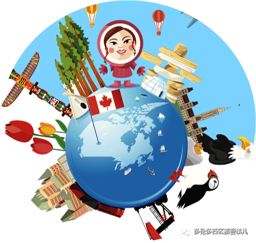
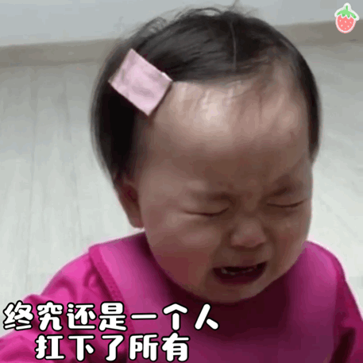
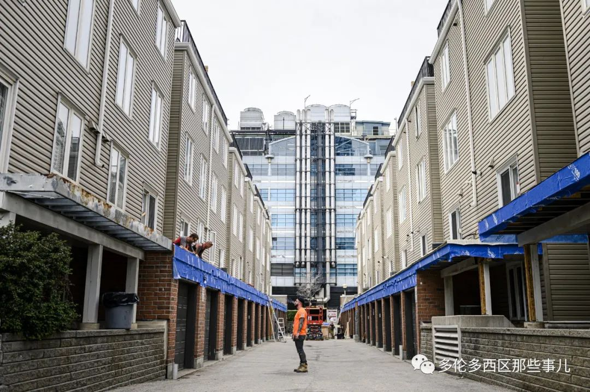
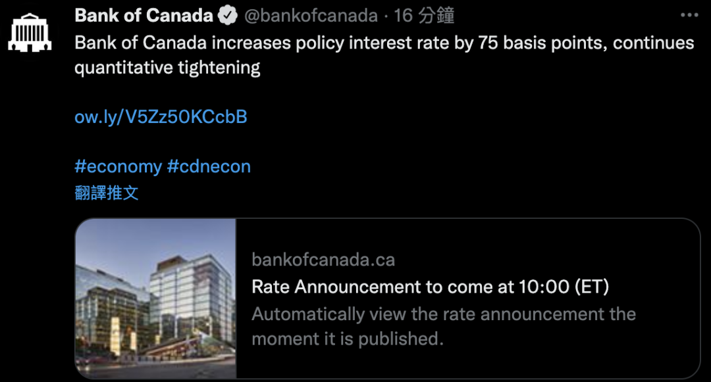
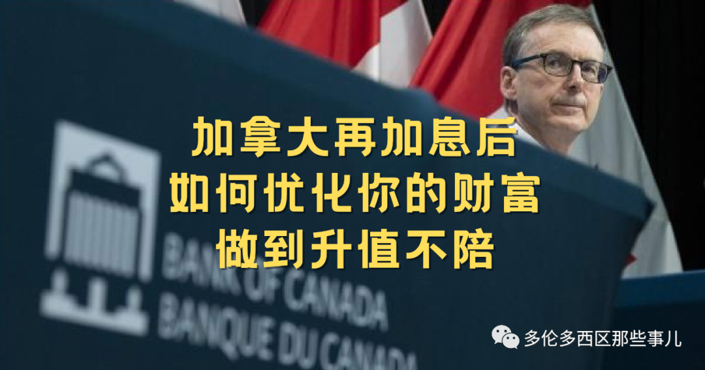
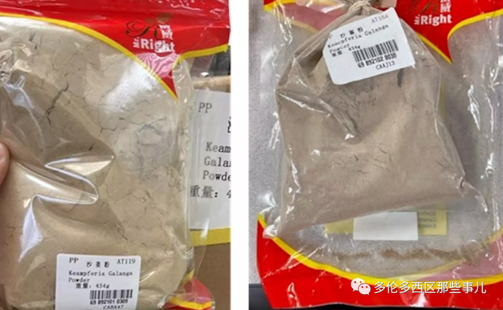
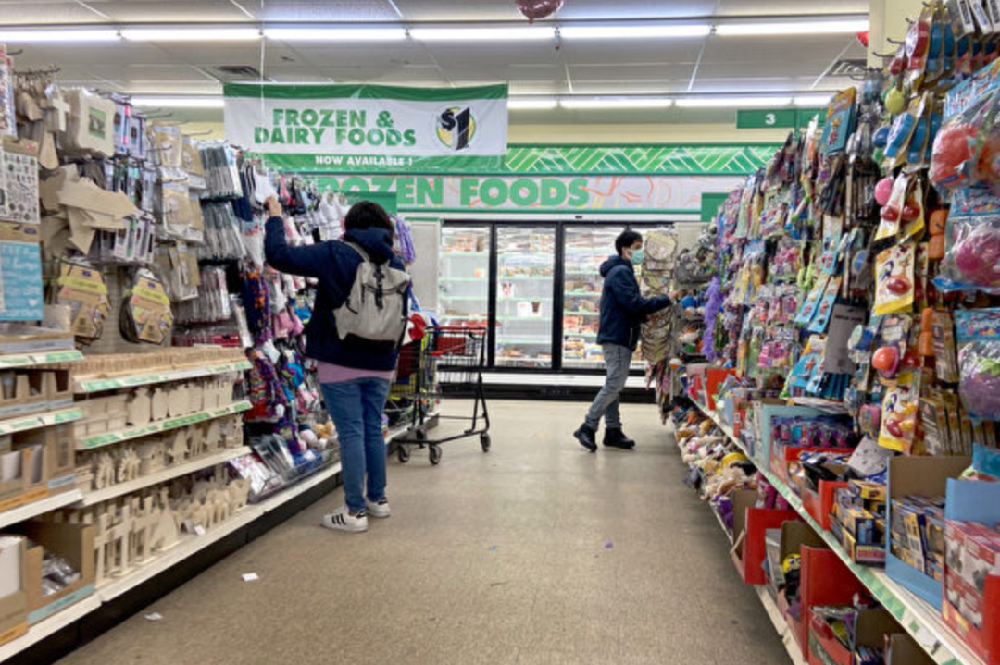

# 无标题

**链接地址:** http://mp.weixin.qq.com/s?__biz=MjM5NTYxODE3NQ==&mid=2650741548&idx=2&sn=503464c85b04919935a7fac88d14c750&chksm=befe773c8989fe2a941bfdfb2f8d6623ce27e47626fa197003e525d48c1db5342d1de234f80f&mpshare=1&scene=2&srcid=09088iSBeVJxgaRUY3zFwKKI&sharer_sharetime=1662598877202&sharer_shareid=77848a6b3852ae4dcb6c74ffee84743c#rd
**作者:** C
**获取时间:** 2025/8/28 19:31:12
**图片数量:** 21

---

## 原始HTML内容

<section powered-by="xiumi.us" style="outline: 0px;max-width: 100%;box-sizing: border-box;color: rgb(34, 34, 34);font-family: system-ui, -apple-system, &quot;system-ui&quot;, &quot;Helvetica Neue&quot;, &quot;PingFang SC&quot;, &quot;Hiragino Sans GB&quot;, &quot;Microsoft YaHei UI&quot;, &quot;Microsoft YaHei&quot;, Arial, sans-serif;font-size: 16px;letter-spacing: 0.544px;white-space: normal;background-color: rgb(255, 255, 255);line-height: 2;visibility: visible;overflow-wrap: break-word !important;"><section style="margin-bottom: 10px;outline: 0px;max-width: 100%;letter-spacing: 0.544px;white-space: normal;font-family: -apple-system, &quot;system-ui&quot;, &quot;Helvetica Neue&quot;, &quot;PingFang SC&quot;, &quot;Hiragino Sans GB&quot;, &quot;Microsoft YaHei UI&quot;, &quot;Microsoft YaHei&quot;, Arial, sans-serif;background-color: rgb(255, 255, 255);text-align: center;box-sizing: border-box !important;overflow-wrap: break-word !important;">，</section><section style="margin-bottom: 10px;outline: 0px;max-width: 100%;letter-spacing: 0.544px;white-space: normal;font-family: -apple-system, &quot;system-ui&quot;, &quot;Helvetica Neue&quot;, &quot;PingFang SC&quot;, &quot;Hiragino Sans GB&quot;, &quot;Microsoft YaHei UI&quot;, &quot;Microsoft YaHei&quot;, Arial, sans-serif;background-color: rgb(255, 255, 255);text-align: center;box-sizing: border-box !important;overflow-wrap: break-word !important;">“生活娱乐资讯，尽在多伦多西区那些事儿”</section><section style="font-size: 16px;letter-spacing: 0.544px;text-align: center;white-space: normal;outline: 0px;max-width: 100%;color: rgb(34, 34, 34);font-family: -apple-system, &quot;system-ui&quot;, &quot;Helvetica Neue&quot;, &quot;PingFang SC&quot;, &quot;Hiragino Sans GB&quot;, &quot;Microsoft YaHei UI&quot;, &quot;Microsoft YaHei&quot;, Arial, sans-serif;background-color: rgb(255, 255, 255);visibility: visible;box-sizing: border-box !important;overflow-wrap: break-word !important;margin-bottom: 0px;"><section style="outline: 0px;max-width: 100%;visibility: visible;box-sizing: border-box !important;overflow-wrap: break-word !important;"><section style="padding: 1px 5px;outline: 0px;max-width: 100%;visibility: visible;box-sizing: border-box !important;overflow-wrap: break-word !important;"><section style="outline: 0px;max-width: 100%;box-sizing: border-box;border-width: 0px;border-style: none;border-color: initial;font-family: 微软雅黑;visibility: visible;overflow-wrap: break-word !important;"><section style="margin-bottom: 0.3em;outline: 0px;max-width: 100%;box-sizing: border-box;border-width: initial;border-style: none;border-color: initial;visibility: visible;overflow-wrap: break-word !important;"><section style="outline: 0px;max-width: 100%;box-sizing: border-box;text-decoration: inherit;border-color: rgb(255, 129, 36);visibility: visible;overflow-wrap: break-word !important;"><section style="outline: 0px;max-width: 100%;visibility: visible;box-sizing: border-box !important;overflow-wrap: break-word !important;"><section style="outline: 0px;max-width: 100%;visibility: visible;box-sizing: border-box !important;overflow-wrap: break-word !important;"><section style="outline: 0px;max-width: 100%;visibility: visible;box-sizing: border-box !important;overflow-wrap: break-word !important;"><section style="outline: 0px;max-width: 100%;box-sizing: border-box;visibility: visible;overflow-wrap: break-word !important;"><section style="outline: 0px;max-width: 100%;box-sizing: border-box;visibility: visible;overflow-wrap: break-word !important;"><section data-tools="135编辑器" data-id="92775" style="outline: 0px;max-width: 100%;letter-spacing: 0.544px;visibility: visible;box-sizing: border-box !important;overflow-wrap: break-word !important;"><section style="outline: 0px;max-width: 100%;visibility: visible;box-sizing: border-box !important;overflow-wrap: break-word !important;">
<a target="_blank" href="http://mp.weixin.qq.com/s?__biz=MzU5MTM4MzY4Mg==&amp;mid=2247513210&amp;idx=2&amp;sn=20a2ed939c0708d7fb5d143389af0048&amp;chksm=fe2d2997c95aa081c9cd7438782c26d38d2543651f7afeeff8875a53ff8ae8021055291eee27&amp;scene=21#wechat_redirect" textvalue="你已选中了添加链接的内容" linktype="text" imgurl="" imgdata="null" data-itemshowtype="0" tab="innerlink" data-linktype="1"></a>

<a target="_blank" href="http://mp.weixin.qq.com/s?__biz=MzU5MTM4MzY4Mg==&amp;mid=2247513210&amp;idx=2&amp;sn=20a2ed939c0708d7fb5d143389af0048&amp;chksm=fe2d2997c95aa081c9cd7438782c26d38d2543651f7afeeff8875a53ff8ae8021055291eee27&amp;scene=21#wechat_redirect" textvalue="华人投资新招！加拿大拨款$2亿支持“先租后买”计划，租金还能抵首付" linktype="text" imgurl="" imgdata="null" data-itemshowtype="0" tab="innerlink" data-linktype="2"><strong>华人投资新招！加拿大拨款$2亿支持“先租后买”计划，租金还能抵首付</strong></a>
</section></section></section></section></section></section></section></section></section></section></section></section></section><section powered-by="xiumi.us" style="margin-bottom: 24px;outline: 0px;max-width: 100%;box-sizing: border-box;color: rgb(34, 34, 34);font-family: system-ui, -apple-system, &quot;system-ui&quot;, &quot;Helvetica Neue&quot;, &quot;PingFang SC&quot;, &quot;Hiragino Sans GB&quot;, &quot;Microsoft YaHei UI&quot;, &quot;Microsoft YaHei&quot;, Arial, sans-serif;font-size: 16px;letter-spacing: 0.544px;white-space: normal;background-color: rgb(255, 255, 255);line-height: 2;visibility: visible;overflow-wrap: break-word !important;">
 

家人们，在加拿大生活太难了

今天（9月7日）加拿大央行

将<strong style="outline: 0px;max-width: 100%;box-sizing: border-box;visibility: visible;overflow-wrap: break-word !important;">再次提高</strong>其基准利率

这是今年的<strong style="outline: 0px;max-width: 100%;box-sizing: border-box;visibility: visible;overflow-wrap: break-word !important;">第五次加息了！！！</strong>

 

 

加息美其名曰抗高通胀

但加拿大信用评级机构

Equifax Canada表示

<strong style="outline: 0px;max-width: 100%;box-sizing: border-box;visibility: visible;overflow-wrap: break-word !important;">在加息和通胀双重夹杀下</strong>

第2季度加拿大人的<strong style="outline: 0px;max-width: 100%;box-sizing: border-box;visibility: visible;overflow-wrap: break-word !important;">债务狂飙……&nbsp;</strong>

 
<section powered-by="xiumi.us" style="outline: 0px;max-width: 100%;box-sizing: border-box;letter-spacing: 0.544px;line-height: 2;overflow-wrap: break-word !important;">
 
</section><section powered-by="xiumi.us" style="outline: 0px;max-width: 100%;box-sizing: border-box;letter-spacing: 0.544px;text-align: center;justify-content: center;display: flex;flex-flow: row nowrap;overflow-wrap: break-word !important;"><section style="outline: 0px;max-width: 100%;box-sizing: border-box;display: inline-block;width: auto;vertical-align: top;min-width: 10%;flex: 0 0 auto;height: auto;align-self: flex-start;overflow-wrap: break-word !important;"><section powered-by="xiumi.us" style="margin-top: 10px;outline: 0px;max-width: 100%;box-sizing: border-box;isolation: isolate;justify-content: center;display: flex;flex-flow: row nowrap;overflow-wrap: break-word !important;"><section style="padding: 12px 23px;outline: 0px;max-width: 100%;box-sizing: border-box;display: inline-block;width: auto;vertical-align: top;background-color: rgb(222, 54, 54);min-width: 10%;flex: 0 0 auto;height: auto;align-self: flex-start;overflow-wrap: break-word !important;"><section powered-by="xiumi.us" style="outline: 0px;max-width: 100%;box-sizing: border-box;color: rgb(255, 255, 255);text-align: justify;font-size: 20px;overflow-wrap: break-word !important;">
<strong style="outline: 0px;max-width: 100%;box-sizing: border-box;overflow-wrap: break-word !important;">房贷还不起房子面临被拍卖</strong>
</section></section></section><section powered-by="xiumi.us" style="margin-bottom: 10px;outline: 0px;max-width: 100%;box-sizing: border-box;display: flex;flex-flow: row nowrap;justify-content: center;overflow-wrap: break-word !important;"><section style="outline: 0px;max-width: 100%;box-sizing: border-box;display: inline-block;vertical-align: top;width: auto;flex: 0 0 0%;height: auto;align-self: flex-start;overflow-wrap: break-word !important;"><section powered-by="xiumi.us" style="outline: 0px;max-width: 100%;box-sizing: border-box;text-align: left;overflow-wrap: break-word !important;"><section style="outline: 0px;max-width: 100%;box-sizing: border-box;display: inline-block;width: 0px;height: 0px;vertical-align: top;overflow: hidden;border-style: solid;border-width: 4px;border-color: rgb(222, 54, 54) rgb(222, 54, 54) rgba(255, 255, 255, 0) rgba(255, 255, 255, 0);overflow-wrap: break-word !important;"><svg viewBox="0 0 1 1" style="float:left;line-height:0;width:0;vertical-align:top;"></svg></section></section></section><section style="outline: 0px;max-width: 100%;box-sizing: border-box;display: inline-block;vertical-align: top;width: auto;flex: 100 100 0%;align-self: flex-start;height: auto;background-color: rgb(255, 247, 240);overflow-wrap: break-word !important;"><section powered-by="xiumi.us" style="margin-top: -8px;outline: 0px;max-width: 100%;box-sizing: border-box;overflow-wrap: break-word !important;"><section style="outline: 0px;max-width: 100%;box-sizing: border-box;color: rgb(255, 247, 240);text-align: justify;overflow-wrap: break-word !important;">
 
</section></section></section><section style="outline: 0px;max-width: 100%;box-sizing: border-box;display: inline-block;vertical-align: top;width: auto;flex: 0 0 0%;height: auto;overflow-wrap: break-word !important;"><section powered-by="xiumi.us" style="outline: 0px;max-width: 100%;box-sizing: border-box;transform: perspective(0px);transform-style: flat;overflow-wrap: break-word !important;"><section style="outline: 0px;max-width: 100%;box-sizing: border-box;text-align: left;transform: rotateY(180deg);overflow-wrap: break-word !important;"><section style="outline: 0px;max-width: 100%;box-sizing: border-box;display: inline-block;width: 0px;height: 0px;vertical-align: top;overflow: hidden;border-style: solid;border-width: 4px;border-color: rgb(222, 54, 54) rgb(222, 54, 54) rgba(255, 255, 255, 0) rgba(255, 255, 255, 0);overflow-wrap: break-word !important;"><svg viewBox="0 0 1 1" style="float:left;line-height:0;width:0;vertical-align:top;"></svg></section></section></section></section></section></section></section>
 
<section powered-by="xiumi.us" style="margin-bottom: 24px;outline: 0px;max-width: 100%;box-sizing: border-box;letter-spacing: 0.544px;line-height: 2;visibility: visible;overflow-wrap: break-word !important;">
 
</section><section style="margin-top: 10px;margin-bottom: 8px;outline: 0px;max-width: 100%;box-sizing: border-box;letter-spacing: 0.544px;text-align: center;overflow-wrap: break-word !important;"><section style="outline: 0px;max-width: 100%;box-sizing: border-box;vertical-align: middle;display: inline-block;line-height: 0;overflow-wrap: break-word !important;"></section></section><section powered-by="xiumi.us" style="margin-bottom: 24px;outline: 0px;max-width: 100%;box-sizing: border-box;letter-spacing: 0.544px;line-height: 2;color: rgb(62, 62, 62);overflow-wrap: break-word !important;"><section style="margin-bottom: 8px;outline: 0px;max-width: 100%;box-sizing: border-box;overflow-wrap: break-word !important;"> </section><section style="margin-bottom: 8px;outline: 0px;max-width: 100%;box-sizing: border-box;overflow-wrap: break-word !important;">目前的房贷基准利率prime rate已经是5.45%，压力测试利率已经来到7%以上。<strong>预计这次加息后安省预计会有85万人触发trigger rate</strong>。绝对会有人扛不住压力被迫卖房，而有多少房子会被银行拍卖犹未可知，但肯定不是一个小数字。</section><section style="margin-bottom: 8px;outline: 0px;max-width: 100%;box-sizing: border-box;overflow-wrap: break-word !important;"> </section><section style="margin-bottom: 8px;outline: 0px;max-width: 100%;box-sizing: border-box;overflow-wrap: break-word !important;">这个<strong>trigger rate</strong>&nbsp;到底是什么呢？为什么会让人那么崩溃。</section><section style="margin-bottom: 8px;outline: 0px;max-width: 100%;box-sizing: border-box;overflow-wrap: break-word !important;"> </section><section style="margin-bottom: 8px;outline: 0px;max-width: 100%;box-sizing: border-box;overflow-wrap: break-word !important;"></section><main data-v-54b658d2="" style="margin-bottom: 8px;outline: 0px;max-width: 100%;box-sizing: border-box;letter-spacing: 0.544px;line-height: 2;visibility: visible;overflow-wrap: break-word !important;">
 

Trigger Rate是浮动利率贷款的触发利率，是因为Prime Rate基础利率提高而可能触发的一个利率。该利率会写在贷款合约中，但因为每月还款减少本金的缘故，导致该利率会逐渐提高，因此Trigger Rate其实每个月都会提高一点。

 

所以Trigger Rate绝不是少吃一两顿饭就能攒下来的，而是月供可能会增加50%或更多。也就是说很多人供了房子就不够钱吃饭，吃了饭就供不了房子了。

 
<section powered-by="xiumi.us" style="color: rgb(34, 34, 34);letter-spacing: 0.544px;outline: 0px;max-width: 100%;box-sizing: border-box;text-align: center;justify-content: center;display: flex;flex-flow: row nowrap;overflow-wrap: break-word !important;"><section style="outline: 0px;max-width: 100%;box-sizing: border-box;display: inline-block;width: auto;vertical-align: top;min-width: 10%;flex: 0 0 auto;height: auto;align-self: flex-start;overflow-wrap: break-word !important;"><section powered-by="xiumi.us" style="margin-top: 10px;outline: 0px;max-width: 100%;box-sizing: border-box;isolation: isolate;justify-content: center;display: flex;flex-flow: row nowrap;overflow-wrap: break-word !important;"><section style="padding: 12px 23px;outline: 0px;max-width: 100%;box-sizing: border-box;display: inline-block;width: auto;vertical-align: top;background-color: rgb(222, 54, 54);min-width: 10%;flex: 0 0 auto;height: auto;align-self: flex-start;overflow-wrap: break-word !important;"><section powered-by="xiumi.us" style="outline: 0px;max-width: 100%;box-sizing: border-box;color: rgb(255, 255, 255);text-align: justify;font-size: 20px;overflow-wrap: break-word !important;">
<strong style="outline: 0px;max-width: 100%;box-sizing: border-box;overflow-wrap: break-word !important;">买家毁约增加</strong>
</section></section></section><section powered-by="xiumi.us" style="margin-bottom: 10px;outline: 0px;max-width: 100%;box-sizing: border-box;display: flex;flex-flow: row nowrap;justify-content: center;overflow-wrap: break-word !important;"><section style="outline: 0px;max-width: 100%;box-sizing: border-box;display: inline-block;vertical-align: top;width: auto;flex: 0 0 0%;height: auto;align-self: flex-start;overflow-wrap: break-word !important;"><section powered-by="xiumi.us" style="outline: 0px;max-width: 100%;box-sizing: border-box;text-align: left;overflow-wrap: break-word !important;"><section style="outline: 0px;max-width: 100%;box-sizing: border-box;display: inline-block;width: 0px;height: 0px;vertical-align: top;overflow: hidden;border-style: solid;border-width: 4px;border-color: rgb(222, 54, 54) rgb(222, 54, 54) rgba(255, 255, 255, 0) rgba(255, 255, 255, 0);overflow-wrap: break-word !important;"><svg viewBox="0 0 1 1" style="float:left;line-height:0;width:0;vertical-align:top;"></svg></section></section></section><section style="outline: 0px;max-width: 100%;box-sizing: border-box;display: inline-block;vertical-align: top;width: auto;flex: 100 100 0%;align-self: flex-start;height: auto;background-color: rgb(255, 247, 240);overflow-wrap: break-word !important;"><section powered-by="xiumi.us" style="margin-top: -8px;outline: 0px;max-width: 100%;box-sizing: border-box;overflow-wrap: break-word !important;"><section style="outline: 0px;max-width: 100%;box-sizing: border-box;color: rgb(255, 247, 240);text-align: justify;overflow-wrap: break-word !important;">
 
</section></section></section><section style="outline: 0px;max-width: 100%;box-sizing: border-box;display: inline-block;vertical-align: top;width: auto;flex: 0 0 0%;height: auto;overflow-wrap: break-word !important;"><section powered-by="xiumi.us" style="outline: 0px;max-width: 100%;box-sizing: border-box;transform: perspective(0px);transform-style: flat;overflow-wrap: break-word !important;"><section style="outline: 0px;max-width: 100%;box-sizing: border-box;text-align: left;transform: rotateY(180deg);overflow-wrap: break-word !important;"><section style="outline: 0px;max-width: 100%;box-sizing: border-box;display: inline-block;width: 0px;height: 0px;vertical-align: top;overflow: hidden;border-style: solid;border-width: 4px;border-color: rgb(222, 54, 54) rgb(222, 54, 54) rgba(255, 255, 255, 0) rgba(255, 255, 255, 0);overflow-wrap: break-word !important;"><svg viewBox="0 0 1 1" style="float:left;line-height:0;width:0;vertical-align:top;"></svg></section></section></section></section></section></section></section>
 
<section powered-by="xiumi.us" style="margin-bottom: 24px;color: rgb(34, 34, 34);letter-spacing: 0.544px;outline: 0px;max-width: 100%;box-sizing: border-box;line-height: 2;visibility: visible;overflow-wrap: break-word !important;">
加拿大央行加息后，房市迅速降温，越来越多买房人中途悔约，却发现想要拿回买房订金并非易事；卖家也发现买家悔约后，没法立即拿到买家订金。 

 

安省地产律师威尔逊（Matthew Wilson）表示，房屋买卖交易泡汤后，地产经纪可锁死订金，许多人都不知道这一规则。安省地产协会（OREA）房屋买卖标准合同，并未说明交易中途毁约时的订金处理办法，因此最后责任落到地产经纪身上，尤其是挂牌经纪得向卖家说明。

 

 

地产律师们透露，最近收到的房屋买卖交易毁约咨询，是过去多年来最高的。多伦多商业诉讼律师沃尔克（Tanya Walker）透露，央行每加一次息，她的律所收到的毁约咨询就上升一次，每天都能收到买家或卖家咨询电话，估计比1年前增加30%，而且涉及的订金金额也比过去高许多，损失风险也随之升高。

今年年初，大多区独立屋平均售价创170万加币峰值，10%买房订金相当于17万加币。存入地产经纪信托的订金，只有在3种情况下放款：房子成功交割；买卖双方均书面授权许可；法庭放款令。

疫情爆发前，买家毁约通常会走法律程序；疫情爆发后，打官司等法庭开审至少要等12个月。律师们发现，许多买家在订金问题上及时配合，作为一种协商手段，但作为毁约方，谈判筹码和选择非常有限，律师们都会告诉买家官司可能会输，除非能拿出卖家欺诈证据，否则很难脱身。

另外，双方以书面形式太快达成放款协议，会对被毁约一方不利，损失法律追索权利。威尔逊表示，有时一些卖家在寻求法律咨询情况下，被催着签署放款许可，如此一来，卖家今后房子即使低价出售，也没法索赔差价损失。
<h2 style="margin-bottom: 24px;outline: 0px;max-width: 100%;letter-spacing: 0.544px;text-align: left;line-height: 2em;visibility: visible;box-sizing: border-box !important;overflow-wrap: break-word !important;"><strong>不过在这里小编提醒大家，千万别毁约，否则生活会被摧毁。</strong>买家中途悔约，原因众多，有的是因为贷款拿不下来，有的是看到房价暴跌。</h2>
但毁约会造成生活整个会被打乱，不断被巨额罚款，官司还可能缠身几年。地产市场就是市场，价格肯定会有波动。
</section></main></section><section powered-by="xiumi.us" style="outline: 0px;max-width: 100%;box-sizing: border-box;letter-spacing: 0.544px;line-height: 2;overflow-wrap: break-word !important;">
 
</section><section powered-by="xiumi.us" style="outline: 0px;max-width: 100%;box-sizing: border-box;letter-spacing: 0.544px;text-align: center;justify-content: center;display: flex;flex-flow: row nowrap;overflow-wrap: break-word !important;"><section style="outline: 0px;max-width: 100%;box-sizing: border-box;display: inline-block;width: auto;vertical-align: top;min-width: 10%;flex: 0 0 auto;height: auto;align-self: flex-start;overflow-wrap: break-word !important;"><section powered-by="xiumi.us" style="margin-top: 10px;outline: 0px;max-width: 100%;box-sizing: border-box;isolation: isolate;justify-content: center;display: flex;flex-flow: row nowrap;overflow-wrap: break-word !important;"><section style="padding: 12px 23px;outline: 0px;max-width: 100%;box-sizing: border-box;display: inline-block;width: auto;vertical-align: top;background-color: rgb(222, 54, 54);min-width: 10%;flex: 0 0 auto;height: auto;align-self: flex-start;overflow-wrap: break-word !important;"><section powered-by="xiumi.us" style="outline: 0px;max-width: 100%;box-sizing: border-box;color: rgb(255, 255, 255);text-align: justify;font-size: 20px;overflow-wrap: break-word !important;">
<strong style="outline: 0px;max-width: 100%;box-sizing: border-box;overflow-wrap: break-word !important;">加拿大人“债务危机”</strong>
</section></section></section><section powered-by="xiumi.us" style="margin-bottom: 10px;outline: 0px;max-width: 100%;box-sizing: border-box;display: flex;flex-flow: row nowrap;justify-content: center;overflow-wrap: break-word !important;"><section style="outline: 0px;max-width: 100%;box-sizing: border-box;display: inline-block;vertical-align: top;width: auto;flex: 0 0 0%;height: auto;align-self: flex-start;overflow-wrap: break-word !important;"><section powered-by="xiumi.us" style="outline: 0px;max-width: 100%;box-sizing: border-box;text-align: left;overflow-wrap: break-word !important;"><section style="outline: 0px;max-width: 100%;box-sizing: border-box;display: inline-block;width: 0px;height: 0px;vertical-align: top;overflow: hidden;border-style: solid;border-width: 4px;border-color: rgb(222, 54, 54) rgb(222, 54, 54) rgba(255, 255, 255, 0) rgba(255, 255, 255, 0);overflow-wrap: break-word !important;"><svg viewBox="0 0 1 1" style="float:left;line-height:0;width:0;vertical-align:top;"></svg></section></section></section><section style="outline: 0px;max-width: 100%;box-sizing: border-box;display: inline-block;vertical-align: top;width: auto;flex: 100 100 0%;align-self: flex-start;height: auto;background-color: rgb(255, 247, 240);overflow-wrap: break-word !important;"><section powered-by="xiumi.us" style="margin-top: -8px;outline: 0px;max-width: 100%;box-sizing: border-box;overflow-wrap: break-word !important;"><section style="outline: 0px;max-width: 100%;box-sizing: border-box;color: rgb(255, 247, 240);text-align: justify;overflow-wrap: break-word !important;">
 
</section></section></section><section style="outline: 0px;max-width: 100%;box-sizing: border-box;display: inline-block;vertical-align: top;width: auto;flex: 0 0 0%;height: auto;overflow-wrap: break-word !important;"><section powered-by="xiumi.us" style="outline: 0px;max-width: 100%;box-sizing: border-box;transform: perspective(0px);transform-style: flat;overflow-wrap: break-word !important;"><section style="outline: 0px;max-width: 100%;box-sizing: border-box;text-align: left;transform: rotateY(180deg);overflow-wrap: break-word !important;"><section style="outline: 0px;max-width: 100%;box-sizing: border-box;display: inline-block;width: 0px;height: 0px;vertical-align: top;overflow: hidden;border-style: solid;border-width: 4px;border-color: rgb(222, 54, 54) rgb(222, 54, 54) rgba(255, 255, 255, 0) rgba(255, 255, 255, 0);overflow-wrap: break-word !important;"><svg viewBox="0 0 1 1" style="float:left;line-height:0;width:0;vertical-align:top;"></svg></section></section></section></section></section></section></section>
除了利率增加，不少人供不起房买不起车，加拿大央行在利率公告中表示，全球通胀仍然居高不下，而加拿大经济继续在“需求过剩”中运行。
</section><section style="margin-top: 10px;margin-bottom: 8px;outline: 0px;max-width: 100%;box-sizing: border-box;color: rgb(34, 34, 34);font-family: system-ui, -apple-system, &quot;system-ui&quot;, &quot;Helvetica Neue&quot;, &quot;PingFang SC&quot;, &quot;Hiragino Sans GB&quot;, &quot;Microsoft YaHei UI&quot;, &quot;Microsoft YaHei&quot;, Arial, sans-serif;font-size: 16px;letter-spacing: 0.544px;white-space: normal;background-color: rgb(255, 255, 255);text-align: center;overflow-wrap: break-word !important;"><section style="outline: 0px;max-width: 100%;box-sizing: border-box;vertical-align: middle;display: inline-block;line-height: 0;overflow-wrap: break-word !important;"></section></section><section powered-by="xiumi.us" style="margin-bottom: 24px;outline: 0px;max-width: 100%;box-sizing: border-box;font-family: system-ui, -apple-system, &quot;system-ui&quot;, &quot;Helvetica Neue&quot;, &quot;PingFang SC&quot;, &quot;Hiragino Sans GB&quot;, &quot;Microsoft YaHei UI&quot;, &quot;Microsoft YaHei&quot;, Arial, sans-serif;font-size: 16px;letter-spacing: 0.544px;white-space: normal;background-color: rgb(255, 255, 255);line-height: 2;color: rgb(62, 62, 62);overflow-wrap: break-word !important;"><section style="margin-bottom: 8px;outline: 0px;max-width: 100%;box-sizing: border-box;overflow-wrap: break-word !important;"> </section><section style="margin-bottom: 8px;outline: 0px;max-width: 100%;box-sizing: border-box;overflow-wrap: break-word !important;">虽然由于天然气价格下跌，加拿大 7 月份的同比通胀率7.6%，低于 6 月份的 8.1%。但按照历史标准，这个数值仍然很高啊。而其波动性往往较小的核心通胀指标继续上升表明：<strong style="outline: 0px;max-width: 100%;box-sizing: border-box;overflow-wrap: break-word !important;">短期通胀预期仍然很高</strong>。</section><section style="margin-bottom: 8px;outline: 0px;max-width: 100%;box-sizing: border-box;overflow-wrap: break-word !important;text-align: center;"> </section>
<a target="_blank" href="http://mp.weixin.qq.com/s?__biz=MjM5NTYxODE3NQ==&amp;mid=2650741134&amp;idx=3&amp;sn=5ec06fbb9cc219243b67f6c60cd74473&amp;chksm=befe759e8989fc88021cba20edb3f471b3072b3b0a6b28dae49ac0802ed977c9eda1ddd390b5&amp;scene=21#wechat_redirect" textvalue="你已选中了添加链接的内容" linktype="text" imgurl="" imgdata="null" data-itemshowtype="0" tab="innerlink" data-linktype="1"></a>

<a target="_blank" href="http://mp.weixin.qq.com/s?__biz=MjM5NTYxODE3NQ==&amp;mid=2650741134&amp;idx=3&amp;sn=5ec06fbb9cc219243b67f6c60cd74473&amp;chksm=befe759e8989fc88021cba20edb3f471b3072b3b0a6b28dae49ac0802ed977c9eda1ddd390b5&amp;scene=21#wechat_redirect" textvalue="你已选中了添加链接的内容" linktype="text" imgurl="" imgdata="null" data-itemshowtype="0" tab="innerlink" data-linktype="2"><strong></strong></a><strong><a target="_blank" href="http://mp.weixin.qq.com/s?__biz=MjM5NTYxODE3NQ==&amp;mid=2650741134&amp;idx=3&amp;sn=5ec06fbb9cc219243b67f6c60cd74473&amp;chksm=befe759e8989fc88021cba20edb3f471b3072b3b0a6b28dae49ac0802ed977c9eda1ddd390b5&amp;scene=21#wechat_redirect" textvalue="你已选中了添加链接的内容" linktype="text" imgurl="" imgdata="null" data-itemshowtype="0" tab="innerlink" data-linktype="2" style="text-align: center;white-space: normal;"><strong>加拿大第5次加息后，房市后市大胆预测曝光! 一切被“税”的生活下我们得这么做……</strong></a></strong>
<section style="margin-bottom: 8px;outline: 0px;max-width: 100%;box-sizing: border-box;overflow-wrap: break-word !important;"> </section><section style="margin-bottom: 8px;outline: 0px;max-width: 100%;box-sizing: border-box;overflow-wrap: break-word !important;">央行决定再加息也是认为需要进一步提高利率，才能将通胀率降至 2% 的目标。不过今日加息后，其基准利率已达<strong style="outline: 0px;max-width: 100%;box-sizing: border-box;overflow-wrap: break-word !important;">加拿大2008年以来的最高值。</strong></section></section><section style="margin-top: 10px;margin-bottom: 8px;outline: 0px;max-width: 100%;box-sizing: border-box;color: rgb(34, 34, 34);font-family: system-ui, -apple-system, &quot;system-ui&quot;, &quot;Helvetica Neue&quot;, &quot;PingFang SC&quot;, &quot;Hiragino Sans GB&quot;, &quot;Microsoft YaHei UI&quot;, &quot;Microsoft YaHei&quot;, Arial, sans-serif;font-size: 16px;letter-spacing: 0.544px;white-space: normal;background-color: rgb(255, 255, 255);text-align: center;overflow-wrap: break-word !important;"><section style="outline: 0px;max-width: 100%;box-sizing: border-box;vertical-align: middle;display: inline-block;line-height: 0;overflow-wrap: break-word !important;"></section></section><section powered-by="xiumi.us" style="margin-bottom: 24px;outline: 0px;max-width: 100%;box-sizing: border-box;font-family: system-ui, -apple-system, &quot;system-ui&quot;, &quot;Helvetica Neue&quot;, &quot;PingFang SC&quot;, &quot;Hiragino Sans GB&quot;, &quot;Microsoft YaHei UI&quot;, &quot;Microsoft YaHei&quot;, Arial, sans-serif;font-size: 16px;letter-spacing: 0.544px;white-space: normal;background-color: rgb(255, 255, 255);line-height: 2;color: rgb(62, 62, 62);overflow-wrap: break-word !important;"><section style="margin-bottom: 8px;outline: 0px;max-width: 100%;box-sizing: border-box;overflow-wrap: break-word !important;"> </section><section style="margin-bottom: 8px;outline: 0px;max-width: 100%;box-sizing: border-box;overflow-wrap: break-word !important;">从今年3月2日起，加拿大银行连续加息，以应对持续性通胀，3月宣布加息25个基点，4月及6月分别宣布加息50个基点后将基准利率上调至1.5%。7月宣布加息100个基点将基准利率上调至2.5%。</section><section style="margin-bottom: 8px;outline: 0px;max-width: 100%;box-sizing: border-box;overflow-wrap: break-word !important;"> </section><section style="margin-bottom: 8px;outline: 0px;max-width: 100%;box-sizing: border-box;overflow-wrap: break-word !important;">加拿大信用评级机构Equifax Canada表示，<strong style="outline: 0px;max-width: 100%;box-sizing: border-box;overflow-wrap: break-word !important;">新贷款的增加以及与通胀相关的支出增加</strong>，将非抵押债务推高至5,914亿元，比一年前增长5.2%；</section><section style="margin-bottom: 8px;outline: 0px;max-width: 100%;box-sizing: border-box;overflow-wrap: break-word !important;"> </section></section><section style="margin-top: 10px;margin-bottom: 8px;outline: 0px;max-width: 100%;box-sizing: border-box;color: rgb(34, 34, 34);font-family: system-ui, -apple-system, &quot;system-ui&quot;, &quot;Helvetica Neue&quot;, &quot;PingFang SC&quot;, &quot;Hiragino Sans GB&quot;, &quot;Microsoft YaHei UI&quot;, &quot;Microsoft YaHei&quot;, Arial, sans-serif;font-size: 16px;letter-spacing: 0.544px;white-space: normal;background-color: rgb(255, 255, 255);text-align: center;overflow-wrap: break-word !important;"><section style="outline: 0px;max-width: 100%;box-sizing: border-box;vertical-align: middle;display: inline-block;line-height: 0;overflow-wrap: break-word !important;"></section></section><section powered-by="xiumi.us" style="margin-bottom: 24px;outline: 0px;max-width: 100%;box-sizing: border-box;font-family: system-ui, -apple-system, &quot;system-ui&quot;, &quot;Helvetica Neue&quot;, &quot;PingFang SC&quot;, &quot;Hiragino Sans GB&quot;, &quot;Microsoft YaHei UI&quot;, &quot;Microsoft YaHei&quot;, Arial, sans-serif;font-size: 16px;letter-spacing: 0.544px;white-space: normal;background-color: rgb(255, 255, 255);line-height: 2;color: rgb(62, 62, 62);overflow-wrap: break-word !important;"><section style="margin-bottom: 8px;outline: 0px;max-width: 100%;box-sizing: border-box;overflow-wrap: break-word !important;"> </section></section><section style="margin-top: 10px;margin-bottom: 8px;outline: 0px;max-width: 100%;box-sizing: border-box;color: rgb(34, 34, 34);font-family: system-ui, -apple-system, &quot;system-ui&quot;, &quot;Helvetica Neue&quot;, &quot;PingFang SC&quot;, &quot;Hiragino Sans GB&quot;, &quot;Microsoft YaHei UI&quot;, &quot;Microsoft YaHei&quot;, Arial, sans-serif;font-size: 16px;letter-spacing: 0.544px;white-space: normal;background-color: rgb(255, 255, 255);text-align: left;overflow-wrap: break-word !important;">每位消费者的平均非抵押贷款债务为21,128加币，比去年同期增长2.4%。</section><section powered-by="xiumi.us" style="margin-bottom: 24px;outline: 0px;max-width: 100%;box-sizing: border-box;font-family: system-ui, -apple-system, &quot;system-ui&quot;, &quot;Helvetica Neue&quot;, &quot;PingFang SC&quot;, &quot;Hiragino Sans GB&quot;, &quot;Microsoft YaHei UI&quot;, &quot;Microsoft YaHei&quot;, Arial, sans-serif;font-size: 16px;letter-spacing: 0.544px;white-space: normal;background-color: rgb(255, 255, 255);line-height: 2;color: rgb(62, 62, 62);overflow-wrap: break-word !important;"><section style="margin-bottom: 8px;outline: 0px;max-width: 100%;box-sizing: border-box;overflow-wrap: break-word !important;"> </section><section style="margin-bottom: 8px;outline: 0px;max-width: 100%;box-sizing: border-box;overflow-wrap: break-word !important;">Equifax Canada高级分析副总裁奥克斯（Rebecca Oakes）表示，更多加拿大人面临财务压力，<strong style="outline: 0px;max-width: 100%;box-sizing: border-box;overflow-wrap: break-word !important;">不仅体现在日常信用卡支出中，还体现在其它非抵押债务中。</strong></section><section style="margin-bottom: 8px;outline: 0px;max-width: 100%;box-sizing: border-box;overflow-wrap: break-word !important;"> </section><section style="margin-bottom: 8px;outline: 0px;max-width: 100%;box-sizing: border-box;overflow-wrap: break-word !important;">如汽车贷款和信贷额度借款，这些借贷领域的余额都在增加。Equifax表示，信用卡余额升至2019年4季度以来的最高水平。</section></section><section style="margin-top: 10px;margin-bottom: 8px;outline: 0px;max-width: 100%;box-sizing: border-box;color: rgb(34, 34, 34);font-family: system-ui, -apple-system, &quot;system-ui&quot;, &quot;Helvetica Neue&quot;, &quot;PingFang SC&quot;, &quot;Hiragino Sans GB&quot;, &quot;Microsoft YaHei UI&quot;, &quot;Microsoft YaHei&quot;, Arial, sans-serif;font-size: 16px;letter-spacing: 0.544px;white-space: normal;background-color: rgb(255, 255, 255);text-align: center;overflow-wrap: break-word !important;"> </section><section powered-by="xiumi.us" style="margin-bottom: 24px;color: rgb(34, 34, 34);font-family: system-ui, -apple-system, &quot;system-ui&quot;, &quot;Helvetica Neue&quot;, &quot;PingFang SC&quot;, &quot;Hiragino Sans GB&quot;, &quot;Microsoft YaHei UI&quot;, &quot;Microsoft YaHei&quot;, Arial, sans-serif;font-size: 16px;letter-spacing: 0.544px;white-space: normal;background-color: rgb(255, 255, 255);outline: 0px;max-width: 100%;box-sizing: border-box;text-align: center;justify-content: center;display: flex;flex-flow: row nowrap;overflow-wrap: break-word !important;"><section style="outline: 0px;max-width: 100%;box-sizing: border-box;display: inline-block;width: auto;vertical-align: top;min-width: 10%;flex: 0 0 auto;height: auto;align-self: flex-start;overflow-wrap: break-word !important;"><section powered-by="xiumi.us" style="margin-top: 10px;outline: 0px;max-width: 100%;box-sizing: border-box;isolation: isolate;justify-content: center;display: flex;flex-flow: row nowrap;overflow-wrap: break-word !important;"><section style="padding: 12px 23px;outline: 0px;max-width: 100%;box-sizing: border-box;display: inline-block;width: auto;vertical-align: top;background-color: rgb(222, 54, 54);min-width: 10%;flex: 0 0 auto;height: auto;align-self: flex-start;overflow-wrap: break-word !important;"><section powered-by="xiumi.us" style="outline: 0px;max-width: 100%;box-sizing: border-box;color: rgb(255, 255, 255);text-align: justify;font-size: 20px;overflow-wrap: break-word !important;">
<strong style="outline: 0px;max-width: 100%;box-sizing: border-box;overflow-wrap: break-word !important;">此次加息还会有什么影响</strong>
</section></section></section><section powered-by="xiumi.us" style="margin-bottom: 10px;outline: 0px;max-width: 100%;box-sizing: border-box;display: flex;flex-flow: row nowrap;justify-content: center;overflow-wrap: break-word !important;"><section style="outline: 0px;max-width: 100%;box-sizing: border-box;display: inline-block;vertical-align: top;width: auto;flex: 0 0 0%;height: auto;align-self: flex-start;overflow-wrap: break-word !important;"><section powered-by="xiumi.us" style="outline: 0px;max-width: 100%;box-sizing: border-box;text-align: left;overflow-wrap: break-word !important;"><section style="outline: 0px;max-width: 100%;box-sizing: border-box;display: inline-block;width: 0px;height: 0px;vertical-align: top;overflow: hidden;border-style: solid;border-width: 4px;border-color: rgb(222, 54, 54) rgb(222, 54, 54) rgba(255, 255, 255, 0) rgba(255, 255, 255, 0);overflow-wrap: break-word !important;"><svg viewBox="0 0 1 1" style="float:left;line-height:0;width:0;vertical-align:top;"></svg></section></section></section><section style="outline: 0px;max-width: 100%;box-sizing: border-box;display: inline-block;vertical-align: top;width: auto;flex: 100 100 0%;align-self: flex-start;height: auto;background-color: rgb(255, 247, 240);overflow-wrap: break-word !important;"><section powered-by="xiumi.us" style="margin-top: -8px;outline: 0px;max-width: 100%;box-sizing: border-box;overflow-wrap: break-word !important;"><section style="outline: 0px;max-width: 100%;box-sizing: border-box;color: rgb(255, 247, 240);text-align: justify;overflow-wrap: break-word !important;">
 
</section></section></section><section style="outline: 0px;max-width: 100%;box-sizing: border-box;display: inline-block;vertical-align: top;width: auto;flex: 0 0 0%;height: auto;overflow-wrap: break-word !important;"><section powered-by="xiumi.us" style="outline: 0px;max-width: 100%;box-sizing: border-box;transform: perspective(0px);transform-style: flat;overflow-wrap: break-word !important;"><section style="outline: 0px;max-width: 100%;box-sizing: border-box;text-align: left;transform: rotateY(180deg);overflow-wrap: break-word !important;"><section style="outline: 0px;max-width: 100%;box-sizing: border-box;display: inline-block;width: 0px;height: 0px;vertical-align: top;overflow: hidden;border-style: solid;border-width: 4px;border-color: rgb(222, 54, 54) rgb(222, 54, 54) rgba(255, 255, 255, 0) rgba(255, 255, 255, 0);overflow-wrap: break-word !important;"><svg viewBox="0 0 1 1" style="float:left;line-height:0;width:0;vertical-align:top;"></svg></section></section></section></section></section></section></section>
那么这次加息后，还会对加拿大生活的人造成什么影响呢？
<section style="margin-bottom: 24px;color: rgb(34, 34, 34);font-family: system-ui, -apple-system, &quot;system-ui&quot;, &quot;Helvetica Neue&quot;, &quot;PingFang SC&quot;, &quot;Hiragino Sans GB&quot;, &quot;Microsoft YaHei UI&quot;, &quot;Microsoft YaHei&quot;, Arial, sans-serif;font-size: 16px;letter-spacing: 0.544px;white-space: normal;background-color: rgb(255, 255, 255);outline: 0px;max-width: 100%;text-align: left;line-height: 2em;visibility: visible;box-sizing: border-box !important;overflow-wrap: break-word !important;">1）车贷，房贷，HELOC，二贷，私贷，信用卡，商业贷款refinance所有利率全部都会提高。借钱的成本越来越高，房贷的利率已经5%，其他这些产品利率已经是7%-10%。</section><section style="margin-bottom: 24px;color: rgb(34, 34, 34);font-family: system-ui, -apple-system, &quot;system-ui&quot;, &quot;Helvetica Neue&quot;, &quot;PingFang SC&quot;, &quot;Hiragino Sans GB&quot;, &quot;Microsoft YaHei UI&quot;, &quot;Microsoft YaHei&quot;, Arial, sans-serif;font-size: 16px;letter-spacing: 0.544px;white-space: normal;background-color: rgb(255, 255, 255);outline: 0px;max-width: 100%;text-align: left;line-height: 2em;visibility: visible;box-sizing: border-box !important;overflow-wrap: break-word !important;">2）平时的衣食住行核心生活物价并没有下降！</section><section style="margin-bottom: 24px;color: rgb(34, 34, 34);font-family: system-ui, -apple-system, &quot;system-ui&quot;, &quot;Helvetica Neue&quot;, &quot;PingFang SC&quot;, &quot;Hiragino Sans GB&quot;, &quot;Microsoft YaHei UI&quot;, &quot;Microsoft YaHei&quot;, Arial, sans-serif;font-size: 16px;letter-spacing: 0.544px;white-space: normal;background-color: rgb(255, 255, 255);outline: 0px;max-width: 100%;text-align: left;line-height: 2em;visibility: visible;box-sizing: border-box !important;overflow-wrap: break-word !important;">3）劳动力市场，招人还是很难，房屋价格全都保持在高位，不降价，不缺人买，租房越来越难！</section>
 
<main data-v-54b658d2="" style="color: rgb(34, 34, 34);font-family: system-ui, -apple-system, &quot;system-ui&quot;, &quot;Helvetica Neue&quot;, &quot;PingFang SC&quot;, &quot;Hiragino Sans GB&quot;, &quot;Microsoft YaHei UI&quot;, &quot;Microsoft YaHei&quot;, Arial, sans-serif;font-size: 16px;letter-spacing: 0.544px;white-space: normal;background-color: rgb(255, 255, 255);outline: 0px;max-width: 100%;text-align: left;line-height: 2em;visibility: visible;box-sizing: border-box !important;overflow-wrap: break-word !important;">
4）为了控制通胀，加拿大的GDP增长会过猛。目前数据来看，第二季度GDP增长3.3%，消费增长9.5%，商业投资增长12%。

 

 

另外，虽然CIBC预测，加拿大央行这次加息之后可能会<strong>暂停加息。</strong>但专业人士表示，大家不要期待会很快降息，这个利率应该会保持在高位很长一段时间。毕竟通胀根本还没控制住，经济也没什么衰退的迹象。加拿大央行管委会甚至认为利率还需要进一步上调……&nbsp;

 

 

哎，现在在加拿大生活真的太难了呀……
</main><section style="margin-top: 10px;margin-bottom: 8px;outline: 0px;max-width: 100%;box-sizing: border-box;color: rgb(34, 34, 34);font-family: system-ui, -apple-system, &quot;system-ui&quot;, &quot;Helvetica Neue&quot;, &quot;PingFang SC&quot;, &quot;Hiragino Sans GB&quot;, &quot;Microsoft YaHei UI&quot;, &quot;Microsoft YaHei&quot;, Arial, sans-serif;font-size: 16px;letter-spacing: 0.544px;white-space: normal;background-color: rgb(255, 255, 255);text-align: center;overflow-wrap: break-word !important;"> </section><section style="margin-bottom: 10px;text-align: center;">为了更好的服务大家</section><section style="margin-bottom: 10px;text-align: center;">让大家更及时了解GTA咨询</section><section style="margin-bottom: 10px;text-align: center;">更多多伦多新闻+吃喝玩乐</section><section style="margin-bottom: 10px;text-align: center;">尽情关注「多伦多那些事儿」</section><section style="margin-bottom: 10px;text-align: center;">👇 👇 👇</section><section class="mp_profile_iframe_wrp"><mp-common-profile class="js_uneditable custom_select_card mp_profile_iframe" data-id="MzU5MTM4MzY4Mg==" data-pluginname="mpprofile" data-headimg="http://mmbiz.qpic.cn/mmbiz_png/aN1xGcMLe6p69rMtxB5PDyJtYSTVdibw18CQ5j30UVjF9x5B71bhsYicv0R6p7t5iaTrKaiapvy4SUhibXFjzRTj9IQ/0?wx_fmt=png" data-nickname="多伦多那些事儿" data-alias="TorontoMystery" data-signature="全多伦多西区那些事儿的姊妹号。小叮当会尽量拿出百宝袋里你要的宝贝，帮你解决问题，实现梦想和愿望。第一时间告诉你多伦多乃至加拿大🇨🇦发生的各种生活资讯。" data-from="0" data-is_biz_ban="0"></mp-common-profile></section><section style="max-width: 100%;white-space: normal;overflow-wrap: break-word !important;box-sizing: border-box !important;margin-bottom: 0px;"><section style="max-width: 100%;overflow-wrap: break-word !important;box-sizing: border-box !important;"><section data-mpa-template-id="1225" data-mpa-color="#ffffff" data-mpa-category="divider" style="max-width: 100%;overflow-wrap: break-word !important;box-sizing: border-box !important;word-break: normal !important;"><section style="max-width: 100%;overflow-wrap: break-word !important;box-sizing: border-box !important;word-break: normal !important;"><section style="max-width: 100%;text-align: center;margin-bottom: 10px;overflow-wrap: break-word !important;box-sizing: border-box !important;word-break: normal !important;"><section style="margin-right: auto;margin-left: auto;padding-right: 15px;padding-left: 15px;max-width: 100%;background-color: rgb(254, 254, 254);display: inline-block;overflow-wrap: break-word !important;box-sizing: border-box !important;word-break: normal !important;">
END
</section></section><section style="margin-top: -12px;margin-bottom: 10px;max-width: 100%;overflow-wrap: break-word !important;box-sizing: border-box !important;word-break: normal !important;"><section style="max-width: 100%;border-top: 1px dashed rgb(33, 33, 34);width: 558px;border-right-color: rgb(33, 33, 34);border-bottom-color: rgb(33, 33, 34);border-left-color: rgb(33, 33, 34);margin-bottom: 10px;overflow-wrap: break-word !important;box-sizing: border-box !important;word-break: normal !important;"> </section></section></section></section></section></section>

 

<a target="_blank" href="http://mp.weixin.qq.com/s?__biz=MjM5NTYxODE3NQ==&amp;mid=2650740511&amp;idx=1&amp;sn=55dc28d4d72d923506a77432444baaff&amp;chksm=befe7b0f8989f219a86d63c0d4f34cf4b219ae533ef2cab4388d0def1b9f781f91f3cf7f62df&amp;scene=21#wechat_redirect" textvalue="‍‍" linktype="text" imgurl="" imgdata="null" data-itemshowtype="0" tab="innerlink" data-linktype="1"></a>
<section data-mid="" style="margin: 0px;padding: 0px;font-size: 17px;font-style: normal;font-variant-ligatures: normal;font-variant-caps: normal;font-weight: 400;orphans: 2;text-align: justify;text-indent: 0px;text-transform: none;white-space: normal;widows: 2;word-spacing: 0px;-webkit-text-stroke-width: 0px;text-decoration-thickness: initial;text-decoration-style: initial;text-decoration-color: initial;outline: 0px;max-width: 100%;color: rgb(34, 34, 34);font-family: -apple-system, &quot;system-ui&quot;, &quot;Helvetica Neue&quot;, &quot;PingFang SC&quot;, &quot;Hiragino Sans GB&quot;, &quot;Microsoft YaHei UI&quot;, &quot;Microsoft YaHei&quot;, Arial, sans-serif;letter-spacing: 0.544px;background-color: rgb(255, 255, 255);width: 578px;display: flex;justify-content: center;align-items: center;box-sizing: border-box !important;overflow-wrap: break-word !important;">
 

 

 
</section><section data-mid="" style="margin: -35px 0px 0em;padding: 9px 7px 8px;font-style: normal;font-variant-ligatures: normal;font-variant-caps: normal;font-weight: 400;orphans: 2;text-align: justify;text-indent: 0px;text-transform: none;white-space: normal;widows: 2;word-spacing: 0px;-webkit-text-stroke-width: 0px;text-decoration-thickness: initial;text-decoration-style: initial;text-decoration-color: initial;outline: 0px;max-width: 100%;font-family: -apple-system, &quot;system-ui&quot;, &quot;Helvetica Neue&quot;, &quot;PingFang SC&quot;, &quot;Hiragino Sans GB&quot;, &quot;Microsoft YaHei UI&quot;, &quot;Microsoft YaHei&quot;, Arial, sans-serif;letter-spacing: 0.544px;width: 578px;background: rgba(0, 0, 0, 0.65);font-size: 13px;color: rgb(255, 255, 255);line-height: 18px;z-index: 20;box-sizing: border-box !important;overflow-wrap: break-word !important;">
<a target="_blank" href="http://mp.weixin.qq.com/s?__biz=MjM5NTYxODE3NQ==&amp;mid=2650740511&amp;idx=1&amp;sn=55dc28d4d72d923506a77432444baaff&amp;chksm=befe7b0f8989f219a86d63c0d4f34cf4b219ae533ef2cab4388d0def1b9f781f91f3cf7f62df&amp;scene=21#wechat_redirect" textvalue="快扔掉! 加拿大华人家里常备的这2包调料太危险! GTA中餐厅致毒元凶到底什么来头？" linktype="text" imgurl="" imgdata="null" data-itemshowtype="0" tab="innerlink" data-linktype="2">快扔掉! 加拿大华人家里常备的这2包调料太危险! GTA中餐厅致毒元凶到底什么来头？</a>
</section>
 

<a target="_blank" href="http://mp.weixin.qq.com/s?__biz=MjM5NTYxODE3NQ==&amp;mid=2650740511&amp;idx=3&amp;sn=916dcd4044f6eeea88b7136f2774645b&amp;chksm=befe7b0f8989f2192f9a9e7bcf623dd3ee1649a72b119e4b5d4cad103f92a16679deb2cb232c&amp;scene=21#wechat_redirect" textvalue="‍‍" linktype="text" imgurl="" imgdata="null" data-itemshowtype="11" tab="innerlink" data-linktype="1"></a>
<section data-mid="" style="margin: 0px;padding: 0px;font-size: 17px;font-style: normal;font-variant-ligatures: normal;font-variant-caps: normal;font-weight: 400;orphans: 2;text-align: justify;text-indent: 0px;text-transform: none;white-space: normal;widows: 2;word-spacing: 0px;-webkit-text-stroke-width: 0px;text-decoration-thickness: initial;text-decoration-style: initial;text-decoration-color: initial;outline: 0px;max-width: 100%;color: rgb(34, 34, 34);font-family: -apple-system, &quot;system-ui&quot;, &quot;Helvetica Neue&quot;, &quot;PingFang SC&quot;, &quot;Hiragino Sans GB&quot;, &quot;Microsoft YaHei UI&quot;, &quot;Microsoft YaHei&quot;, Arial, sans-serif;letter-spacing: 0.544px;background-color: rgb(255, 255, 255);width: 578px;display: flex;justify-content: center;align-items: center;box-sizing: border-box !important;overflow-wrap: break-word !important;">
 

 

 
</section><section data-mid="" style="margin: -35px 0px 0em;padding: 9px 7px 8px;font-style: normal;font-variant-ligatures: normal;font-variant-caps: normal;font-weight: 400;orphans: 2;text-align: justify;text-indent: 0px;text-transform: none;white-space: normal;widows: 2;word-spacing: 0px;-webkit-text-stroke-width: 0px;text-decoration-thickness: initial;text-decoration-style: initial;text-decoration-color: initial;outline: 0px;max-width: 100%;font-family: -apple-system, &quot;system-ui&quot;, &quot;Helvetica Neue&quot;, &quot;PingFang SC&quot;, &quot;Hiragino Sans GB&quot;, &quot;Microsoft YaHei UI&quot;, &quot;Microsoft YaHei&quot;, Arial, sans-serif;letter-spacing: 0.544px;width: 578px;background: rgba(0, 0, 0, 0.65);font-size: 13px;color: rgb(255, 255, 255);line-height: 18px;z-index: 20;box-sizing: border-box !important;overflow-wrap: break-word !important;">
<a target="_blank" href="http://mp.weixin.qq.com/s?__biz=MjM5NTYxODE3NQ==&amp;mid=2650740511&amp;idx=3&amp;sn=916dcd4044f6eeea88b7136f2774645b&amp;chksm=befe7b0f8989f2192f9a9e7bcf623dd3ee1649a72b119e4b5d4cad103f92a16679deb2cb232c&amp;scene=21#wechat_redirect" textvalue="别贪便宜！加拿大一元店超1/4产品含有毒物质！超出规定含量8000倍！" linktype="text" imgurl="" imgdata="null" data-itemshowtype="11" tab="innerlink" data-linktype="2">别贪便宜！加拿大一元店超1/4产品含有毒物质！超出规定含量8000倍！</a>
</section>
 

<a target="_blank" href="http://mp.weixin.qq.com/s?__biz=MjM5NTYxODE3NQ==&amp;mid=2650740511&amp;idx=6&amp;sn=14cd52c68992071dd54fc3305b9e3500&amp;chksm=befe7b0f8989f2199f98bdbc927d5a0783e244c9815fb002b22b74174d7cc4c5d2b72c9e43f6&amp;scene=21#wechat_redirect" textvalue="‍‍" linktype="text" imgurl="" imgdata="null" data-itemshowtype="0" tab="innerlink" data-linktype="1"></a>
<section data-mid="" style="margin: 0px;padding: 0px;font-size: 17px;font-style: normal;font-variant-ligatures: normal;font-variant-caps: normal;font-weight: 400;orphans: 2;text-align: justify;text-indent: 0px;text-transform: none;white-space: normal;widows: 2;word-spacing: 0px;-webkit-text-stroke-width: 0px;text-decoration-thickness: initial;text-decoration-style: initial;text-decoration-color: initial;outline: 0px;max-width: 100%;color: rgb(34, 34, 34);font-family: -apple-system, &quot;system-ui&quot;, &quot;Helvetica Neue&quot;, &quot;PingFang SC&quot;, &quot;Hiragino Sans GB&quot;, &quot;Microsoft YaHei UI&quot;, &quot;Microsoft YaHei&quot;, Arial, sans-serif;letter-spacing: 0.544px;background-color: rgb(255, 255, 255);width: 578px;display: flex;justify-content: center;align-items: center;box-sizing: border-box !important;overflow-wrap: break-word !important;">
 

 

 
</section><section data-mid="" style="margin: -35px 0px 0em;padding: 9px 7px 8px;font-style: normal;font-variant-ligatures: normal;font-variant-caps: normal;font-weight: 400;orphans: 2;text-align: justify;text-indent: 0px;text-transform: none;white-space: normal;widows: 2;word-spacing: 0px;-webkit-text-stroke-width: 0px;text-decoration-thickness: initial;text-decoration-style: initial;text-decoration-color: initial;outline: 0px;max-width: 100%;font-family: -apple-system, &quot;system-ui&quot;, &quot;Helvetica Neue&quot;, &quot;PingFang SC&quot;, &quot;Hiragino Sans GB&quot;, &quot;Microsoft YaHei UI&quot;, &quot;Microsoft YaHei&quot;, Arial, sans-serif;letter-spacing: 0.544px;width: 578px;background: rgba(0, 0, 0, 0.65);font-size: 13px;color: rgb(255, 255, 255);line-height: 18px;z-index: 20;box-sizing: border-box !important;overflow-wrap: break-word !important;">
<a target="_blank" href="http://mp.weixin.qq.com/s?__biz=MjM5NTYxODE3NQ==&amp;mid=2650740511&amp;idx=6&amp;sn=14cd52c68992071dd54fc3305b9e3500&amp;chksm=befe7b0f8989f2199f98bdbc927d5a0783e244c9815fb002b22b74174d7cc4c5d2b72c9e43f6&amp;scene=21#wechat_redirect" textvalue="‍免费吃! 密西沙加新餐厅玩大了, 老板: 大家吃爽才是硬道理" linktype="text" imgurl="" imgdata="null" data-itemshowtype="0" tab="innerlink" data-linktype="2">免费吃! 密西沙加新餐厅玩大了, 老板: 大家吃爽才是硬道理</a>
</section>
 

<a target="_blank" href="http://mp.weixin.qq.com/s?__biz=MjM5NTYxODE3NQ==&amp;mid=2650740511&amp;idx=7&amp;sn=6ae8789f662e85ce1e172925d8eeaed4&amp;chksm=befe7b0f8989f2197a0f6f2915b36882e8ed4a54fbebd3661870f431cd932eeb13ea7153c6a3&amp;scene=21#wechat_redirect" textvalue="‍‍" linktype="text" imgurl="" imgdata="null" data-itemshowtype="0" tab="innerlink" data-linktype="1"></a>
<section data-mid="" style="outline: 0px;max-width: 100%;color: rgb(34, 34, 34);font-family: -apple-system, &quot;system-ui&quot;, &quot;Helvetica Neue&quot;, &quot;PingFang SC&quot;, &quot;Hiragino Sans GB&quot;, &quot;Microsoft YaHei UI&quot;, &quot;Microsoft YaHei&quot;, Arial, sans-serif;letter-spacing: 0.544px;white-space: normal;background-color: rgb(255, 255, 255);width: 578px;display: flex;justify-content: center;align-items: center;box-sizing: border-box !important;overflow-wrap: break-word !important;margin-bottom: 0px;">
 

 

 
</section><section data-mid="" style="margin-top: -35px;margin-bottom: 0em;padding: 9px 7px 8px;outline: 0px;max-width: 100%;font-family: -apple-system, &quot;system-ui&quot;, &quot;Helvetica Neue&quot;, &quot;PingFang SC&quot;, &quot;Hiragino Sans GB&quot;, &quot;Microsoft YaHei UI&quot;, &quot;Microsoft YaHei&quot;, Arial, sans-serif;letter-spacing: 0.544px;white-space: normal;width: 578px;background: rgba(0, 0, 0, 0.65);font-size: 13px;color: rgb(255, 255, 255);line-height: 18px;z-index: 20;box-sizing: border-box !important;overflow-wrap: break-word !important;">
<a target="_blank" href="http://mp.weixin.qq.com/s?__biz=MjM5NTYxODE3NQ==&amp;mid=2650740511&amp;idx=7&amp;sn=6ae8789f662e85ce1e172925d8eeaed4&amp;chksm=befe7b0f8989f2197a0f6f2915b36882e8ed4a54fbebd3661870f431cd932eeb13ea7153c6a3&amp;scene=21#wechat_redirect" textvalue="安省6大秋日限定活动! 光看枫叶Out了, 现在流行这么‍玩……" linktype="text" imgurl="" imgdata="null" data-itemshowtype="0" tab="innerlink" data-linktype="2">安省6大秋日限定活动! 光看枫叶Out了, 现在流行这么玩……</a>
</section>
 

<a target="_blank" href="http://mp.weixin.qq.com/s?__biz=MjM5NTYxODE3NQ==&amp;mid=2650740295&amp;idx=5&amp;sn=d57473642603fa0e7d774ed4d0b88fa9&amp;chksm=befe7a578989f34114acf2a9779c7ed9e80a6a69be8cd7c1a91d25f3fc75932c1b8519bb03f9&amp;scene=21#wechat_redirect" textvalue="‍‍" linktype="text" imgurl="" imgdata="null" data-itemshowtype="0" tab="innerlink" data-linktype="1"></a>
<section data-mid="" style="outline: 0px;max-width: 100%;color: rgb(34, 34, 34);font-family: -apple-system, &quot;system-ui&quot;, &quot;Helvetica Neue&quot;, &quot;PingFang SC&quot;, &quot;Hiragino Sans GB&quot;, &quot;Microsoft YaHei UI&quot;, &quot;Microsoft YaHei&quot;, Arial, sans-serif;letter-spacing: 0.544px;white-space: normal;background-color: rgb(255, 255, 255);width: 578px;display: flex;justify-content: center;align-items: center;box-sizing: border-box !important;overflow-wrap: break-word !important;margin-bottom: 0px;">
 

 

 
</section><section data-mid="" style="margin-top: -35px;margin-bottom: 0em;padding: 9px 7px 8px;outline: 0px;max-width: 100%;font-family: -apple-system, &quot;system-ui&quot;, &quot;Helvetica Neue&quot;, &quot;PingFang SC&quot;, &quot;Hiragino Sans GB&quot;, &quot;Microsoft YaHei UI&quot;, &quot;Microsoft YaHei&quot;, Arial, sans-serif;letter-spacing: 0.544px;white-space: normal;width: 578px;background: rgba(0, 0, 0, 0.65);font-size: 13px;color: rgb(255, 255, 255);line-height: 18px;z-index: 20;box-sizing: border-box !important;overflow-wrap: break-word !important;">
<a target="_blank" href="http://mp.weixin.qq.com/s?__biz=MjM5NTYxODE3NQ==&amp;mid=2650740295&amp;idx=5&amp;sn=d57473642603fa0e7d774ed4d0b88fa9&amp;chksm=befe7a578989f34114acf2a9779c7ed9e80a6a69be8cd7c1a91d25f3fc75932c1b8519bb03f9&amp;scene=21#wechat_redirect" textvalue="仅1天! 安省本周末$3就能看电影, Cineplex所有场次随便挑" linktype="text" imgurl="" imgdata="null" data-itemshowtype="0" tab="innerlink" data-linktype="2">‍</a>仅1天! 安省本周末$3就能看电影, Cineplex所有场次随便挑
</section>
 
<section style="padding: 1px 5px;outline: 0px;max-width: 100%;color: rgb(34, 34, 34);font-family: -apple-system, &quot;system-ui&quot;, &quot;Helvetica Neue&quot;, &quot;PingFang SC&quot;, &quot;Hiragino Sans GB&quot;, &quot;Microsoft YaHei UI&quot;, &quot;Microsoft YaHei&quot;, Arial, sans-serif;letter-spacing: 0.544px;white-space: normal;background-color: rgb(255, 255, 255);box-sizing: border-box !important;overflow-wrap: break-word !important;margin-bottom: 0px;"><section style="margin: 60px 5px 16px;outline: 0px;max-width: 100%;border-width: 3px;border-style: solid;border-color: rgb(255, 129, 36);text-align: center;border-radius: 2px;font-size: 18px;font-weight: inherit;text-decoration: inherit;box-sizing: border-box !important;overflow-wrap: break-word !important;"><section style="margin-top: -3.3em;margin-right: 5px;margin-left: 5px;outline: 0px;max-width: 100%;color: inherit;box-sizing: border-box !important;overflow-wrap: break-word !important;"><section style="margin-right: auto;margin-bottom: 10px;margin-left: auto;outline: 0px;max-width: 100%;width: 100px;height: 100px;border-radius: 50%;box-sizing: border-box !important;overflow-wrap: break-word !important;"></section></section><section style="margin: 8px 15px;outline: 0px;max-width: 100%;line-height: 1.4;box-sizing: border-box !important;overflow-wrap: break-word !important;"><section style="margin-right: auto;margin-bottom: 20px;margin-left: auto;outline: 0px;max-width: 100%;width: 266.391px;box-sizing: border-box !important;overflow-wrap: break-word !important;"><section style="margin-bottom: 10px;outline: 0px;max-width: 100%;box-sizing: border-box !important;overflow-wrap: break-word !important;"><strong style="outline: 0px;max-width: 100%;box-sizing: border-box !important;overflow-wrap: break-word !important;">多伦多西区那些事儿</strong></section><section style="margin-top: -28px;outline: 0px;max-width: 100%;color: rgb(254, 254, 254);text-decoration: inherit;border-color: rgb(255, 129, 36);width: 266.391px;box-sizing: border-box !important;overflow-wrap: break-word !important;"><section style="margin-top: 15px;outline: 0px;max-width: 100%;color: inherit;text-align: left;box-sizing: border-box !important;overflow-wrap: break-word !important;"><section style="margin-bottom: 10px;outline: 0px;max-width: 100%;border-bottom: 1px solid rgb(255, 129, 36);width: 266.391px;border-top-color: rgb(255, 129, 36);border-right-color: rgb(255, 129, 36);border-left-color: rgb(255, 129, 36);color: inherit;box-sizing: border-box !important;overflow-wrap: break-word !important;"> </section></section></section></section><section style="margin-right: 8px;margin-bottom: 10px;margin-left: 8px;outline: 0px;max-width: 100%;min-height: 1em;white-space: pre-wrap;color: inherit;text-align: left;font-size: 14px;box-sizing: border-box !important;overflow-wrap: break-word !important;">是一个服务于新移民以及多伦多西区本地生活的微信公众号，我们会发布关于加拿大多伦多西区（<strong style="outline: 0px;max-width: 100%;border-color: rgb(255, 129, 36);box-sizing: border-box !important;overflow-wrap: break-word !important;">密西沙加，奥克维尔，米尔顿，伯林顿，哈密尔顿</strong>）的最新最快的本地资讯。请点击标题下“多伦多地区那些事儿”关注我们，引用本号稿件必须经过允许，并醒目注明出处。</section></section><section style="margin-top: 10px;margin-bottom: 10px;outline: 0px;max-width: 100%;border-top: 3px solid rgb(255, 129, 36);border-right-color: rgb(255, 129, 36);border-bottom-color: rgb(255, 129, 36);border-left-color: rgb(255, 129, 36);box-sizing: border-box !important;overflow-wrap: break-word !important;"><section style="margin-bottom: 10px;outline: 0px;max-width: 100%;min-height: 1em;white-space: pre-wrap;color: inherit;box-sizing: border-box !important;overflow-wrap: break-word !important;"> </section><section style="margin-bottom: 10px;outline: 0px;max-width: 100%;min-height: 1em;white-space: pre-wrap;color: inherit;box-sizing: border-box !important;overflow-wrap: break-word !important;"></section></section><section style="margin: 10px 8px;outline: 0px;max-width: 100%;box-sizing: border-box !important;overflow-wrap: break-word !important;"><section style="margin-top: 0.8em;margin-bottom: 0.3em;outline: 0px;max-width: 100%;box-sizing: border-box !important;overflow-wrap: break-word !important;"><section style="outline: 0px;max-width: 100%;text-decoration: inherit;color: rgb(254, 254, 254);border-color: rgb(255, 129, 36);box-sizing: border-box !important;overflow-wrap: break-word !important;"><section style="margin-bottom: 10px;padding: 0.5em;outline: 0px;max-width: 100%;line-height: 1.2em;font-size: 1em;border-radius: 4px;background-color: rgb(255, 129, 36);color: rgb(255, 255, 255);box-sizing: border-box !important;overflow-wrap: break-word !important;"><strong style="outline: 0px;max-width: 100%;color: inherit;box-sizing: border-box !important;overflow-wrap: break-word !important;">长按指纹 &gt; 识别图中二维码 &gt; 添加关注</strong></section></section></section><section style="margin-bottom: 10px;outline: 0px;max-width: 100%;min-height: 1em;white-space: pre-wrap;box-sizing: border-box !important;overflow-wrap: break-word !important;"><strong style="outline: 0px;max-width: 100%;box-sizing: border-box !important;overflow-wrap: break-word !important;">多伦多西区那些事儿，每天等着你</strong></section></section></section></section>
 
</section><section style="outline: 0px;max-width: 100%;box-sizing: inherit;color: rgb(34, 34, 34);font-family: system-ui, -apple-system, &quot;system-ui&quot;, &quot;Helvetica Neue&quot;, &quot;PingFang SC&quot;, &quot;Hiragino Sans GB&quot;, &quot;Microsoft YaHei UI&quot;, &quot;Microsoft YaHei&quot;, Arial, sans-serif;letter-spacing: 0.544px;white-space: normal;background-color: rgb(255, 255, 255);text-align: center;margin-bottom: 8px;overflow-wrap: break-word !important;"></section>

---

## 纯文本内容

，“生活娱乐资讯，尽在多伦多西区那些事儿”华人投资新招！加拿大拨款$2亿支持“先租后买”计划，租金还能抵首付家人们，在加拿大生活太难了今天（9月7日）加拿大央行将再次提高其基准利率这是今年的第五次加息了！！！加息美其名曰抗高通胀但加拿大信用评级机构Equifax Canada表示在加息和通胀双重夹杀下第2季度加拿大人的债务狂飙…… 房贷还不起房子面临被拍卖目前的房贷基准利率prime rate已经是5.45%，压力测试利率已经来到7%以上。预计这次加息后安省预计会有85万人触发trigger rate。绝对会有人扛不住压力被迫卖房，而有多少房子会被银行拍卖犹未可知，但肯定不是一个小数字。这个trigger rate 到底是什么呢？为什么会让人那么崩溃。Trigger Rate是浮动利率贷款的触发利率，是因为Prime Rate基础利率提高而可能触发的一个利率。该利率会写在贷款合约中，但因为每月还款减少本金的缘故，导致该利率会逐渐提高，因此Trigger Rate其实每个月都会提高一点。所以Trigger Rate绝不是少吃一两顿饭就能攒下来的，而是月供可能会增加50%或更多。也就是说很多人供了房子就不够钱吃饭，吃了饭就供不了房子了。买家毁约增加加拿大央行加息后，房市迅速降温，越来越多买房人中途悔约，却发现想要拿回买房订金并非易事；卖家也发现买家悔约后，没法立即拿到买家订金。安省地产律师威尔逊（Matthew Wilson）表示，房屋买卖交易泡汤后，地产经纪可锁死订金，许多人都不知道这一规则。安省地产协会（OREA）房屋买卖标准合同，并未说明交易中途毁约时的订金处理办法，因此最后责任落到地产经纪身上，尤其是挂牌经纪得向卖家说明。地产律师们透露，最近收到的房屋买卖交易毁约咨询，是过去多年来最高的。多伦多商业诉讼律师沃尔克（Tanya Walker）透露，央行每加一次息，她的律所收到的毁约咨询就上升一次，每天都能收到买家或卖家咨询电话，估计比1年前增加30%，而且涉及的订金金额也比过去高许多，损失风险也随之升高。今年年初，大多区独立屋平均售价创170万加币峰值，10%买房订金相当于17万加币。存入地产经纪信托的订金，只有在3种情况下放款：房子成功交割；买卖双方均书面授权许可；法庭放款令。疫情爆发前，买家毁约通常会走法律程序；疫情爆发后，打官司等法庭开审至少要等12个月。律师们发现，许多买家在订金问题上及时配合，作为一种协商手段，但作为毁约方，谈判筹码和选择非常有限，律师们都会告诉买家官司可能会输，除非能拿出卖家欺诈证据，否则很难脱身。另外，双方以书面形式太快达成放款协议，会对被毁约一方不利，损失法律追索权利。威尔逊表示，有时一些卖家在寻求法律咨询情况下，被催着签署放款许可，如此一来，卖家今后房子即使低价出售，也没法索赔差价损失。不过在这里小编提醒大家，千万别毁约，否则生活会被摧毁。买家中途悔约，原因众多，有的是因为贷款拿不下来，有的是看到房价暴跌。但毁约会造成生活整个会被打乱，不断被巨额罚款，官司还可能缠身几年。地产市场就是市场，价格肯定会有波动。加拿大人“债务危机”除了利率增加，不少人供不起房买不起车，加拿大央行在利率公告中表示，全球通胀仍然居高不下，而加拿大经济继续在“需求过剩”中运行。虽然由于天然气价格下跌，加拿大 7 月份的同比通胀率7.6%，低于 6 月份的 8.1%。但按照历史标准，这个数值仍然很高啊。而其波动性往往较小的核心通胀指标继续上升表明：短期通胀预期仍然很高。加拿大第5次加息后，房市后市大胆预测曝光! 一切被“税”的生活下我们得这么做……央行决定再加息也是认为需要进一步提高利率，才能将通胀率降至 2% 的目标。不过今日加息后，其基准利率已达加拿大2008年以来的最高值。从今年3月2日起，加拿大银行连续加息，以应对持续性通胀，3月宣布加息25个基点，4月及6月分别宣布加息50个基点后将基准利率上调至1.5%。7月宣布加息100个基点将基准利率上调至2.5%。加拿大信用评级机构Equifax Canada表示，新贷款的增加以及与通胀相关的支出增加，将非抵押债务推高至5,914亿元，比一年前增长5.2%；每位消费者的平均非抵押贷款债务为21,128加币，比去年同期增长2.4%。Equifax Canada高级分析副总裁奥克斯（Rebecca Oakes）表示，更多加拿大人面临财务压力，不仅体现在日常信用卡支出中，还体现在其它非抵押债务中。如汽车贷款和信贷额度借款，这些借贷领域的余额都在增加。Equifax表示，信用卡余额升至2019年4季度以来的最高水平。此次加息还会有什么影响那么这次加息后，还会对加拿大生活的人造成什么影响呢？1）车贷，房贷，HELOC，二贷，私贷，信用卡，商业贷款refinance所有利率全部都会提高。借钱的成本越来越高，房贷的利率已经5%，其他这些产品利率已经是7%-10%。2）平时的衣食住行核心生活物价并没有下降！3）劳动力市场，招人还是很难，房屋价格全都保持在高位，不降价，不缺人买，租房越来越难！4）为了控制通胀，加拿大的GDP增长会过猛。目前数据来看，第二季度GDP增长3.3%，消费增长9.5%，商业投资增长12%。另外，虽然CIBC预测，加拿大央行这次加息之后可能会暂停加息。但专业人士表示，大家不要期待会很快降息，这个利率应该会保持在高位很长一段时间。毕竟通胀根本还没控制住，经济也没什么衰退的迹象。加拿大央行管委会甚至认为利率还需要进一步上调…… 哎，现在在加拿大生活真的太难了呀……为了更好的服务大家让大家更及时了解GTA咨询更多多伦多新闻+吃喝玩乐尽情关注「多伦多那些事儿」👇 👇 👇END快扔掉! 加拿大华人家里常备的这2包调料太危险! GTA中餐厅致毒元凶到底什么来头？别贪便宜！加拿大一元店超1/4产品含有毒物质！超出规定含量8000倍！免费吃! 密西沙加新餐厅玩大了, 老板: 大家吃爽才是硬道理安省6大秋日限定活动! 光看枫叶Out了, 现在流行这么玩……‍仅1天! 安省本周末$3就能看电影, Cineplex所有场次随便挑多伦多西区那些事儿是一个服务于新移民以及多伦多西区本地生活的微信公众号，我们会发布关于加拿大多伦多西区（密西沙加，奥克维尔，米尔顿，伯林顿，哈密尔顿）的最新最快的本地资讯。请点击标题下“多伦多地区那些事儿”关注我们，引用本号稿件必须经过允许，并醒目注明出处。长按指纹 > 识别图中二维码 > 添加关注多伦多西区那些事儿，每天等着你

---

## 图片列表

-  (原始链接: https://mmbiz.qpic.cn/mmbiz_png/jvu6Oec7PBUrXPQyyAFggGhQG1OjzSkS956MbqHNsR4PMcEicnhyRRxkod1kWaf17NichCRfS5upbYugj9uXrbpA/640?wx_fmt=png)
-  (原始链接: https://mmbiz.qpic.cn/mmbiz_jpg/jvu6Oec7PBWnvcia67LBTe5dEynRLzaO3V4Iibe6pxn0miaxiaicxMtHVfZrRxZicbqOniasTKQ3neKL3iajuxVQNzryhA/640?wx_fmt=jpeg)
-  (原始链接: https://mmbiz.qpic.cn/mmbiz_gif/jvu6Oec7PBWnvcia67LBTe5dEynRLzaO3foqW1TN85NvRIufmoPs3UuSGV2DqCWHq4fpkrdBmeibHYfQDcl0Kekg/640?wx_fmt=gif)
-  (原始链接: https://mmbiz.qpic.cn/mmbiz_png/aN1xGcMLe6pGnUNe4pruMcickZHOuEGMoFJnKaibuGJJsHBy8RscV7icws6ANibBVhxH0cloBwO4hOdE4MibwYFicdrA/640?wx_fmt=png&wxfrom=5&wx_lazy=1&wx_co=1)
-  (原始链接: https://mmbiz.qpic.cn/mmbiz_png/aN1xGcMLe6pGnUNe4pruMcickZHOuEGMon9bgk0zepOasubQjPHTsWExftXbGdYJqbh2HRGlUBj30M7l6909RgQ/640?wx_fmt=png&wxfrom=5&wx_lazy=1&wx_co=1)
-  (原始链接: https://mmbiz.qpic.cn/mmbiz_jpg/jvu6Oec7PBWnvcia67LBTe5dEynRLzaO3HZvkjWmTzoZdEO7zgo4UHHzS6TQ0DyEicIH883e09L0oLfmXXqDyneA/640?wx_fmt=jpeg)
-  (原始链接: https://mmbiz.qpic.cn/mmbiz_jpg/jvu6Oec7PBWnvcia67LBTe5dEynRLzaO3bmOhrHA2Bia9qOj9ylDkcvgRibUxxlPPyz788KtibiaIoxYics8qhISWbLg/640?wx_fmt=jpeg)
-  (原始链接: https://mmbiz.qpic.cn/mmbiz_jpg/jvu6Oec7PBWnvcia67LBTe5dEynRLzaO3xSGXylxbedDvRKjtxkUyzBRiaXmdibkYJibnSp4knsqfTALMicwwWciaiaibw/640?wx_fmt=jpeg)
-  (原始链接: https://mmbiz.qpic.cn/mmbiz_png/aN1xGcMLe6pGnUNe4pruMcickZHOuEGMolySEyT3WHtoKiaDmUuH1kVF2jayKUalI2wOkdMQymPlhfdV9qvZxrag/640?wx_fmt=png&wxfrom=5&wx_lazy=1&wx_co=1)
-  (原始链接: https://mmbiz.qpic.cn/mmbiz_png/jvu6Oec7PBWnvcia67LBTe5dEynRLzaO3SDG43oJDkdVsc9OViad41Kic0UdBKMicKqaK1I0xb3u5yqYxg0A5DdJjg/640?wx_fmt=png)
-  (原始链接: https://mmbiz.qpic.cn/mmbiz_png/aN1xGcMLe6pGnUNe4pruMcickZHOuEGMoAKhxugQMs0aavssG3C1B1h988j54JId5icBwTdgyQdEL4VqbRiaTSkOw/640?wx_fmt=png&wxfrom=5&wx_lazy=1&wx_co=1)
-  (原始链接: https://mmbiz.qpic.cn/mmbiz_png/aN1xGcMLe6pGnUNe4pruMcickZHOuEGMoyLLjTmGKq6l1AKFuKiccT9xd3GYwU544CIicicoPTJqtWgeaoc0flWnog/640?wx_fmt=png&wxfrom=5&wx_lazy=1&wx_co=1)
-  (原始链接: https://mmbiz.qpic.cn/mmbiz_png/aN1xGcMLe6pGnUNe4pruMcickZHOuEGMoabraibKwjP9iaLe29xIGwDc42PQ7YxUuicVeBh8Vpsz8lYMPHpdLvxqug/640?wx_fmt=png&wxfrom=5&wx_lazy=1&wx_co=1)
-  (原始链接: https://mmbiz.qpic.cn/mmbiz_jpg/jvu6Oec7PBWOo91KfoxIibibUnmLIslTyfEuHvdjlVN28xxfkIO8iaH7YOqUhbTfXmhhXp5N6lSq79leIufy9dNsg/640?wx_fmt=jpeg)
-  (原始链接: https://mmbiz.qpic.cn/mmbiz_png/jvu6Oec7PBVVBHsJLQXAHBVUZfSadecPVKluzvYLEFrwnr7P3tQZI2zuehXF6Z3LGjqo83yCBU4MEqKhK6M1Hw/640?wx_fmt=png&wxfrom=5&wx_lazy=1&wx_co=1)
-  (原始链接: https://mmbiz.qpic.cn/mmbiz_png/aN1xGcMLe6onIHI28BJwRfPUtzhvkFYDtgoWU3hMicibHXNBYdcllsaiaxHf1F2hzod7fMmklUN478hC1w7VsWozQ/640?wx_fmt=png&wxfrom=5&wx_lazy=1&wx_co=1)
-  (原始链接: https://mmbiz.qpic.cn/mmbiz_png/jvu6Oec7PBVVBHsJLQXAHBVUZfSadecP8dWF0G9RBEZ67EiaicTncmCFFU4EAM3iaOnfHdPa0icXJOp2akcic3Evylw/640?wx_fmt=png&wxfrom=5&wx_lazy=1&wx_co=1)
-  (原始链接: https://mmbiz.qpic.cn/mmbiz_png/jvu6Oec7PBVVBHsJLQXAHBVUZfSadecPga3QBkPqaCTVcTibZY6Ksc4aanMjZiaF9x3lppZJy0qo24pQQfVReyTw/640?wx_fmt=png&wxfrom=5&wx_lazy=1&wx_co=1)
-  (原始链接: https://mmbiz.qpic.cn/mmbiz_png/jvu6Oec7PBUHjxznzHPOjefDlpYJkdJiceDjupzcjia77d3TVZoxSI6jjxsukvLOibOsv9ic8hQHj6eHmh8zqJoj1A/640?wx_fmt=png&wxfrom=5&wx_lazy=1&wx_co=1)
-  (原始链接: https://mmbiz.qpic.cn/mmbiz_png/jvu6Oec7PBUrXPQyyAFggGhQG1OjzSkS956MbqHNsR4PMcEicnhyRRxkod1kWaf17NichCRfS5upbYugj9uXrbpA/640?wx_fmt=png)
-  (原始链接: https://mmbiz.qpic.cn/mmbiz_jpg/jvu6Oec7PBXZbyiaaSGMA3ZfzCn85g0MMqXvsRJYW38lYQJSwcbEUB2MaQ0kq3cFGqNMbpdvquUD77CqmcicfBUA/640?wx_fmt=jpeg)
