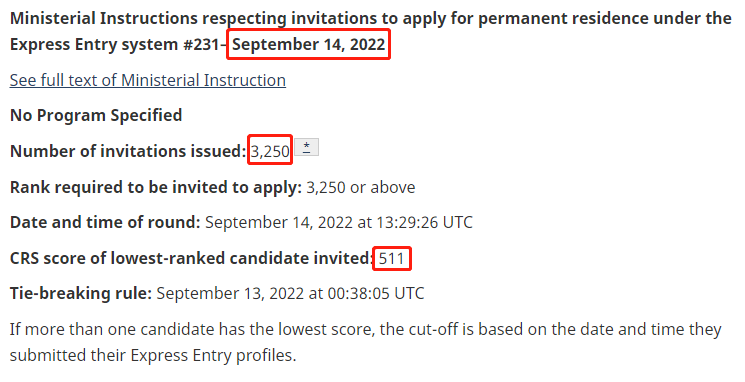
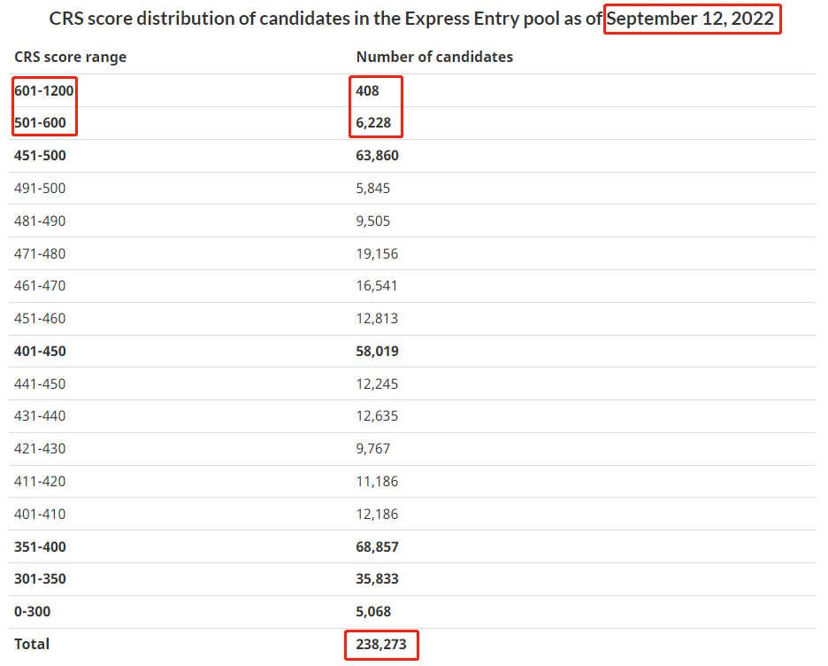
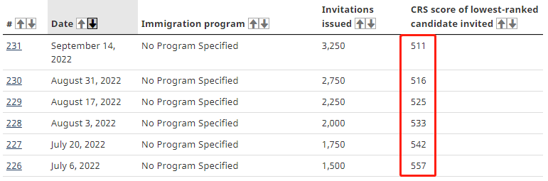
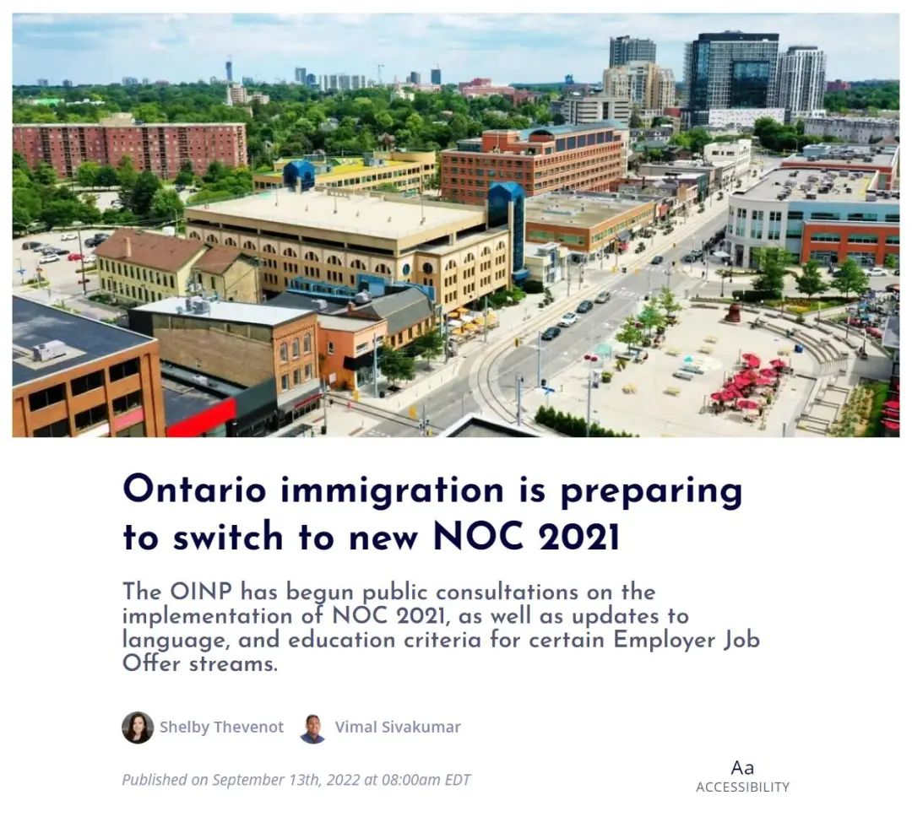
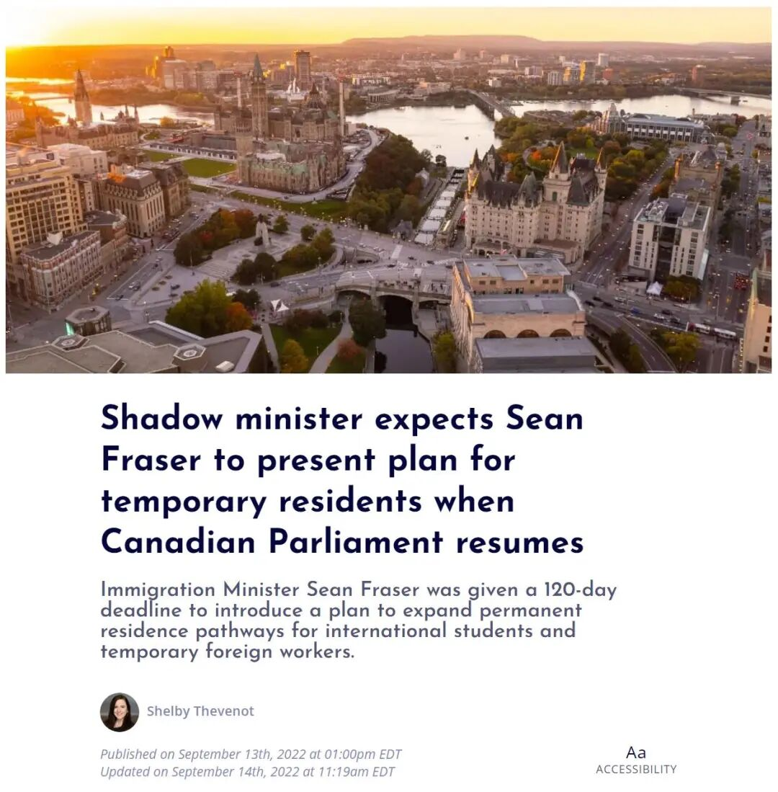
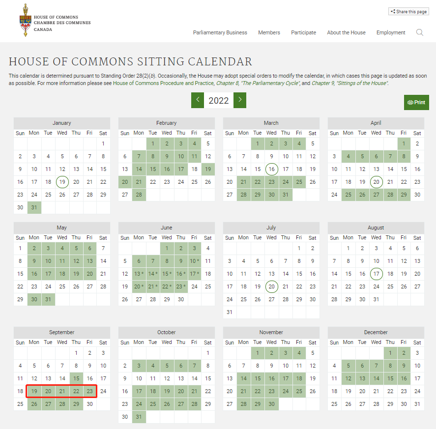
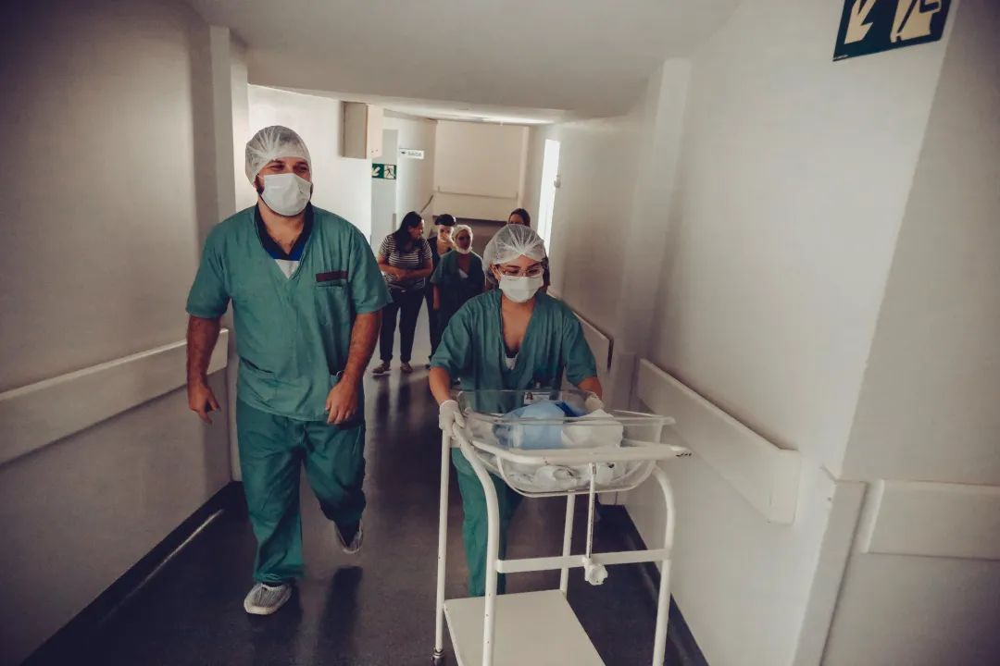
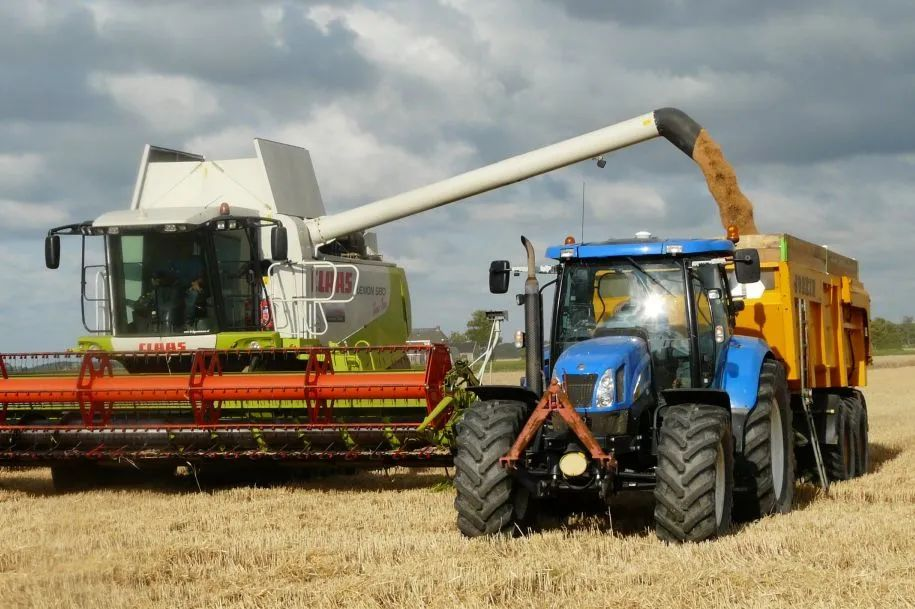
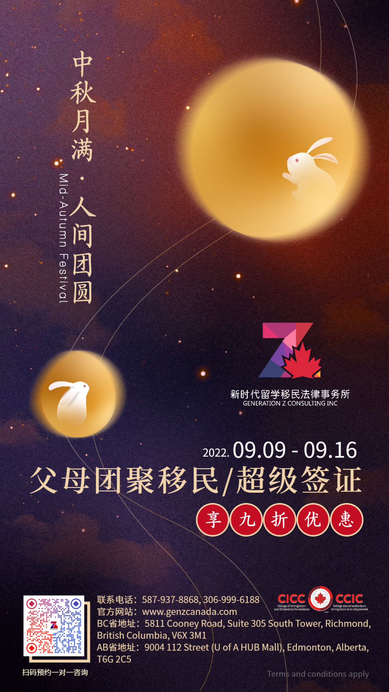

# 无标题

**链接地址:** http://mp.weixin.qq.com/s?__biz=MzUyNzA2NTAwNg==&mid=2247491062&idx=1&sn=34102ac43c2f13d479077c0051812676&chksm=fa041737cd739e2163e5c03027a938b61dc015fd5be8ca5af00b8fd02cd83c2dab66d6d70a49&mpshare=1&scene=2&srcid=0924gOYtcyNtxAAVqgCNadMQ&sharer_sharetime=1663985845640&sharer_shareid=77848a6b3852ae4dcb6c74ffee84743c#rd
**作者:** 你身边的签证专家
**获取时间:** 2025/8/28 19:29:46
**图片数量:** 24

---

## 原始HTML内容

<section style="box-sizing: border-box;font-size: 16px;"><section style="text-align: center;margin-top: 10px;margin-bottom: 10px;box-sizing: border-box;" powered-by="xiumi.us"><section style="max-width: 100%;vertical-align: middle;display: inline-block;line-height: 0;box-sizing: border-box;"></section></section><section style="text-align: center;margin-top: 10px;margin-bottom: 10px;box-sizing: border-box;" powered-by="xiumi.us"></section>
 
<section style="font-size: 19px;text-align: center;margin-top: 10px;margin-bottom: 3px;box-sizing: border-box;" powered-by="xiumi.us"><section style="display: inline-block;border-width: 1px;border-style: solid;border-color: rgb(188, 65, 65);background-color: rgb(188, 65, 65);width: 1.8em;height: 1.8em;line-height: 1.8em;border-radius: 100%;margin-left: auto;margin-right: auto;font-size: 16px;color: rgb(255, 255, 255);box-sizing: border-box;">
<strong style="box-sizing: border-box;">1</strong>
</section></section><section style="text-align: center;box-sizing: border-box;" powered-by="xiumi.us"><section style="display: inline-block;width: 0px;height: 0px;vertical-align: top;overflow: hidden;border-style: solid;border-width: 9px 6px 0px;border-color: rgb(188, 65, 65) rgba(255, 255, 255, 0) rgba(255, 255, 255, 0);box-sizing: border-box;"><svg viewBox="0 0 1 1" style="float:left;line-height:0;width:0;vertical-align:top;"></svg></section></section><section style="margin-bottom: 10px;text-align: center;justify-content: center;display: flex;flex-flow: row nowrap;box-sizing: border-box;" powered-by="xiumi.us"><section style="display: inline-block;width: auto;vertical-align: middle;background-color: rgba(109, 155, 209, 0.1);min-width: 10%;max-width: 100%;flex: 0 0 auto;height: auto;align-self: center;padding: 12px;box-sizing: border-box;"><section style="color: rgb(109, 155, 209);text-align: justify;box-sizing: border-box;" powered-by="xiumi.us">
<strong style="box-sizing: border-box;">快速通道的最低邀请分数迎来五连降</strong>
</section></section></section><section style="font-size: 14px;padding-right: 15px;padding-left: 15px;letter-spacing: 1px;box-sizing: border-box;" powered-by="xiumi.us">
 

2022年9月14日，加拿大联邦移民部进行了EE快速通道全项目抽签。这是自2022年7月6日恢复EE全项目抽签以来的<strong style="box-sizing: border-box;">第六次抽签</strong>，好消息是：<strong style="box-sizing: border-box;">受邀人数持续增加，邀请分数再次降低！</strong>

 
</section><section style="text-align: center;margin-top: 10px;margin-bottom: 10px;box-sizing: border-box;" powered-by="xiumi.us"><section style="max-width: 100%;vertical-align: middle;display: inline-block;line-height: 0;width: 90%;height: auto;box-sizing: border-box;"></section></section><section style="font-size: 14px;padding-right: 15px;padding-left: 15px;letter-spacing: 1px;box-sizing: border-box;" powered-by="xiumi.us">
 

此次邀请了<strong style="box-sizing: border-box;">3个类别的候选人</strong>，包括加拿大经验类移民（CEC），联邦技术移民（FSWP），联邦技工移民（FSTP）的候选人，<strong style="box-sizing: border-box;">共有3250人获得邀请，最低邀请分数511分，比上一轮降低5分</strong>。

 
</section><section style="text-align: center;margin-top: 10px;margin-bottom: 10px;box-sizing: border-box;" powered-by="xiumi.us"><section style="max-width: 100%;vertical-align: middle;display: inline-block;line-height: 0;width: 90%;height: auto;box-sizing: border-box;"></section></section><section style="font-size: 14px;padding-right: 15px;padding-left: 15px;letter-spacing: 1px;box-sizing: border-box;" powered-by="xiumi.us">
 

截至9月12日，EE候选库中约有238,273名候选人。达到500分或以上的候选人有6636人，仍然超过此次的3250名邀请人数 。如果EE继续保持或增大邀请规模，我们将很快看到最低邀请分数<strong style="box-sizing: border-box;">下降至500分以下</strong>。

 
</section><section style="text-align: center;margin-top: 10px;margin-bottom: 10px;box-sizing: border-box;" powered-by="xiumi.us"><section style="max-width: 100%;vertical-align: middle;display: inline-block;line-height: 0;width: 90%;height: auto;box-sizing: border-box;"></section></section><section style="font-size: 14px;padding-right: 15px;padding-left: 15px;letter-spacing: 1px;box-sizing: border-box;" powered-by="xiumi.us">
 

从七月份恢复全类别邀请至今，快速通道的最低邀请分数已经迎来了<strong style="box-sizing: border-box;">五连降</strong>。分数从一开始的557分下降至了现在的511分。其邀请规模也从刚开始的1500人扩大到了现在的3250人。

 
</section><section style="font-size: 19px;text-align: center;margin-top: 10px;margin-bottom: 3px;box-sizing: border-box;" powered-by="xiumi.us"><section style="display: inline-block;border-width: 1px;border-style: solid;border-color: rgb(188, 65, 65);background-color: rgb(188, 65, 65);width: 1.8em;height: 1.8em;line-height: 1.8em;border-radius: 100%;margin-left: auto;margin-right: auto;font-size: 16px;color: rgb(255, 255, 255);box-sizing: border-box;">
<strong style="box-sizing: border-box;">2</strong>
</section></section><section style="text-align: center;box-sizing: border-box;" powered-by="xiumi.us"><section style="display: inline-block;width: 0px;height: 0px;vertical-align: top;overflow: hidden;border-style: solid;border-width: 9px 6px 0px;border-color: rgb(188, 65, 65) rgba(255, 255, 255, 0) rgba(255, 255, 255, 0);box-sizing: border-box;"><svg viewBox="0 0 1 1" style="float:left;line-height:0;width:0;vertical-align:top;"></svg></section></section><section style="margin-bottom: 10px;text-align: center;justify-content: center;display: flex;flex-flow: row nowrap;box-sizing: border-box;" powered-by="xiumi.us"><section style="display: inline-block;width: auto;vertical-align: middle;background-color: rgba(109, 155, 209, 0.1);min-width: 10%;max-width: 100%;flex: 0 0 auto;height: auto;align-self: center;padding: 12px;box-sizing: border-box;"><section style="color: rgb(109, 155, 209);text-align: justify;box-sizing: border-box;" powered-by="xiumi.us">
<strong style="box-sizing: border-box;">新增符合EE申请的16种职业</strong>
</section></section></section><section style="font-size: 14px;padding-right: 15px;padding-left: 15px;letter-spacing: 1px;box-sizing: border-box;" powered-by="xiumi.us">
目前，加拿大移民、难民和公民事务部（IRCC）还在使用NOC 2016版本来确定临时和永久居留项目中的职业资格，但新的NOC 2021版本<strong style="box-sizing: border-box;">将在2022年11月生效</strong>。

 
</section><section style="text-align: center;margin-top: 10px;margin-bottom: 10px;box-sizing: border-box;" powered-by="xiumi.us"><section style="max-width: 100%;vertical-align: middle;display: inline-block;line-height: 0;width: 90%;height: auto;box-sizing: border-box;"></section></section><section style="font-size: 14px;padding-right: 15px;padding-left: 15px;letter-spacing: 1px;box-sizing: border-box;" powered-by="xiumi.us">
 

NOC 2021版本将引入新的术语和分类结构，这将影响移民局的许多项目。新版本<strong style="box-sizing: border-box;">增设符合EE申请的16种职业</strong>

 

<em style="box-sizing: border-box;">工资管理人员</em>

<em style="box-sizing: border-box;">牙科助理和牙科实验室助理</em>

<em style="box-sizing: border-box;">护士助理、护理员和病人服务助理</em>

<em style="box-sizing: border-box;">药房技术助理和药房助理</em>

<em style="box-sizing: border-box;">小学和中学教师助理</em>

<em style="box-sizing: border-box;">治安官和法警</em>

<em style="box-sizing: border-box;">惩教服务人员</em>

<em style="box-sizing: border-box;">执法和其他监管人员</em>

<em style="box-sizing: border-box;">美容师、（用电针给人去除多余毛发或痣、疣等的）电蚀医师和相关职业</em>

<em style="box-sizing: border-box;">住宅和商业安装人员和服务人员</em>

<em style="box-sizing: border-box;">虫害控制者和熏蒸者</em>

<em style="box-sizing: border-box;">其他维修人员和服务人员</em>

<em style="box-sizing: border-box;">运输卡车司机</em>

<em style="box-sizing: border-box;">公共汽车司机、地铁操作员和其他运输操作员</em>

<em style="box-sizing: border-box;">重型设备操作员</em>

<em style="box-sizing: border-box;">飞机装配工和飞机装配检查员</em>

 

 

<strong style="box-sizing: border-box;">不再符合条件的3种职业</strong>

 

<em style="box-sizing: border-box;">其他表演者</em>

<em style="box-sizing: border-box;">娱乐、体育和健身的项目负责人和指导员</em>

<em style="box-sizing: border-box;">裁缝师、制衣师、毛皮匠和磨坊主</em>

 

这三种职业的申请人仍有资格申请其他类别的移民项目，如<strong style="box-sizing: border-box;">部分省提名项目</strong>。

 
</section><section style="text-align: center;margin-top: 10px;margin-bottom: 10px;box-sizing: border-box;" powered-by="xiumi.us"><section style="max-width: 100%;vertical-align: middle;display: inline-block;line-height: 0;box-sizing: border-box;"></section></section>
 

 
<section style="font-size: 19px;text-align: center;margin-top: 10px;margin-bottom: 3px;box-sizing: border-box;" powered-by="xiumi.us"><section style="display: inline-block;border-width: 1px;border-style: solid;border-color: rgb(188, 65, 65);background-color: rgb(188, 65, 65);width: 1.8em;height: 1.8em;line-height: 1.8em;border-radius: 100%;margin-left: auto;margin-right: auto;font-size: 16px;color: rgb(255, 255, 255);box-sizing: border-box;">
<strong style="box-sizing: border-box;">3</strong>
</section></section><section style="text-align: center;box-sizing: border-box;" powered-by="xiumi.us"><section style="display: inline-block;width: 0px;height: 0px;vertical-align: top;overflow: hidden;border-style: solid;border-width: 9px 6px 0px;border-color: rgb(188, 65, 65) rgba(255, 255, 255, 0) rgba(255, 255, 255, 0);box-sizing: border-box;"><svg viewBox="0 0 1 1" style="float:left;line-height:0;width:0;vertical-align:top;"></svg></section></section><section style="margin-bottom: 10px;text-align: center;justify-content: center;display: flex;flex-flow: row nowrap;box-sizing: border-box;" powered-by="xiumi.us"><section style="display: inline-block;width: auto;vertical-align: middle;background-color: rgba(109, 155, 209, 0.1);min-width: 10%;max-width: 100%;flex: 0 0 auto;height: auto;align-self: center;padding: 12px;box-sizing: border-box;"><section style="color: rgb(109, 155, 209);text-align: justify;box-sizing: border-box;" powered-by="xiumi.us">
<strong style="box-sizing: border-box;">加拿大移民“大赦2.0”新政预下周公布</strong>
</section></section></section><section style="font-size: 14px;padding-right: 15px;padding-left: 15px;letter-spacing: 1px;box-sizing: border-box;" powered-by="xiumi.us">
 

今年五月份，加拿大移民部长Sean Fraser被议会要求在120天内公布为临时居民扩大申请永久居留权途径<strong style="box-sizing: border-box;">“大赦2.0”（New TR to PR Pathway）</strong>的相关计划。

 

时间一转眼来到了九月，关于加拿大移民大赦永久化何时公布终于传来了最新消息。

 
</section><section style="text-align: center;margin-top: 10px;margin-bottom: 10px;box-sizing: border-box;" powered-by="xiumi.us"><section style="max-width: 100%;vertical-align: middle;display: inline-block;line-height: 0;width: 90%;height: auto;box-sizing: border-box;"></section></section><section style="font-size: 14px;padding-right: 15px;padding-left: 15px;letter-spacing: 1px;box-sizing: border-box;" powered-by="xiumi.us">
 

来自移民部的加拿大保守党影子部长Jasraj Singh Hallan在接受CIC NEWs电话访问中透露：“移民部计划在众议院会议第一天<strong style="box-sizing: border-box;">提交移民大赦永久化的相关计划</strong>。”

 

根据众议院原本的会议日程安排来看，9月份的众议院会议将于9月19日举行。

 

来自新民主党移民评论家、国会议员Jenny Kwan认为，他们预计移民部长对于移民大赦的回应将在9月20日的例行程序中提出。

 
</section><section style="text-align: center;margin-top: 10px;margin-bottom: 10px;box-sizing: border-box;" powered-by="xiumi.us"><section style="max-width: 100%;vertical-align: middle;display: inline-block;line-height: 0;width: 90%;height: auto;box-sizing: border-box;"></section></section><section style="font-size: 14px;padding-right: 15px;padding-left: 15px;letter-spacing: 1px;box-sizing: border-box;" powered-by="xiumi.us">
 

但鉴于加拿大总理特鲁多刚刚宣布将在9月19日设立新的联邦假日，复会时间会推迟到9月20日。

 

因此，小编推测移民部在<strong style="box-sizing: border-box;">9月21日（下周三）</strong>的议会会议中宣布计划的可能性会更大。

 

 
</section><section style="font-size: 19px;text-align: center;margin-top: 10px;margin-bottom: 3px;box-sizing: border-box;" powered-by="xiumi.us"><section style="display: inline-block;border-width: 1px;border-style: solid;border-color: rgb(188, 65, 65);background-color: rgb(188, 65, 65);width: 1.8em;height: 1.8em;line-height: 1.8em;border-radius: 100%;margin-left: auto;margin-right: auto;font-size: 16px;color: rgb(255, 255, 255);box-sizing: border-box;">
<strong style="box-sizing: border-box;">4</strong>
</section></section><section style="text-align: center;box-sizing: border-box;" powered-by="xiumi.us"><section style="display: inline-block;width: 0px;height: 0px;vertical-align: top;overflow: hidden;border-style: solid;border-width: 9px 6px 0px;border-color: rgb(188, 65, 65) rgba(255, 255, 255, 0) rgba(255, 255, 255, 0);box-sizing: border-box;"><svg viewBox="0 0 1 1" style="float:left;line-height:0;width:0;vertical-align:top;"></svg></section></section><section style="margin-bottom: 10px;text-align: center;justify-content: center;display: flex;flex-flow: row nowrap;box-sizing: border-box;" powered-by="xiumi.us"><section style="display: inline-block;width: auto;vertical-align: middle;background-color: rgba(109, 155, 209, 0.1);min-width: 10%;max-width: 100%;flex: 0 0 auto;height: auto;align-self: center;padding: 12px;box-sizing: border-box;"><section style="color: rgb(109, 155, 209);text-align: justify;box-sizing: border-box;" powered-by="xiumi.us">
<strong style="box-sizing: border-box;">“大赦2.0”新政展望</strong>
</section></section></section>
 
<section style="font-size: 14px;padding-right: 15px;padding-left: 15px;letter-spacing: 1px;box-sizing: border-box;" powered-by="xiumi.us">
虽然目前加拿大移民部还尚未透露关于大赦新政的细节，但从移民部长肖恩·弗雷泽（Sean Fraser）于6月接受采访时提到新政制定所依据的<strong style="box-sizing: border-box;">六大要点</strong>，我们不难看出一些关于该新政的端倪：
</section>
 
<section style="margin-top: 10px;isolation: isolate;display: flex;flex-flow: row nowrap;text-align: left;justify-content: flex-start;box-sizing: border-box;" powered-by="xiumi.us"><section style="display: inline-block;vertical-align: top;width: auto;background-color: rgb(188, 65, 65);min-width: 10%;max-width: 100%;flex: 0 0 auto;height: auto;padding: 9px 15px;align-self: stretch;box-sizing: border-box;"><section style="color: rgb(255, 255, 255);text-align: justify;box-sizing: border-box;" powered-by="xiumi.us">
<strong style="box-sizing: border-box;">01</strong>
</section></section><section style="display: inline-block;vertical-align: top;width: auto;background-color: rgb(255, 247, 240);flex: 100 100 0%;height: auto;align-self: stretch;padding: 4px 4px 4px 12px;box-sizing: border-box;"><section style="margin-top: 5px;box-sizing: border-box;" powered-by="xiumi.us"><section style="color: rgb(188, 65, 65);text-align: justify;font-size: 14px;box-sizing: border-box;">
该经济类移民计划将<strong style="box-sizing: border-box;">更加重视在加拿大的工作经验</strong>，<strong style="box-sizing: border-box;">并扩大符合条件的职业类别</strong>；
</section></section></section></section><section style="text-align: left;transform: translate3d(7px, 0px, 0px);-webkit-transform: translate3d(7px, 0px, 0px);-moz-transform: translate3d(7px, 0px, 0px);-o-transform: translate3d(7px, 0px, 0px);box-sizing: border-box;" powered-by="xiumi.us"><section style="display: inline-block;width: 0px;height: 0px;vertical-align: top;overflow: hidden;border-style: solid;border-width: 4px;border-color: rgb(188, 65, 65) rgba(255, 255, 255, 0) rgba(255, 255, 255, 0) rgb(188, 65, 65);box-sizing: border-box;"><svg viewBox="0 0 1 1" style="float:left;line-height:0;width:0;vertical-align:top;"></svg></section></section><section style="margin-bottom: 10px;text-align: left;justify-content: flex-start;display: flex;flex-flow: row nowrap;box-sizing: border-box;" powered-by="xiumi.us"><section style="display: inline-block;width: 100%;vertical-align: top;border-style: solid;border-width: 1px;border-color: rgb(222, 54, 54);align-self: flex-start;flex: 0 0 auto;box-sizing: border-box;"><section style="display: flex;flex-flow: row nowrap;text-align: center;justify-content: center;box-sizing: border-box;" powered-by="xiumi.us"><section style="display: inline-block;vertical-align: top;width: auto;min-width: 10%;max-width: 100%;flex: 0 0 auto;height: auto;align-self: flex-start;background-color: rgb(255, 247, 240);padding: 15px;box-sizing: border-box;"><section style="box-sizing: border-box;" powered-by="xiumi.us"><section style="color: rgb(188, 65, 65);box-sizing: border-box;">
<strong style="box-sizing: border-box;">解</strong>

<strong style="box-sizing: border-box;">读</strong>
</section></section></section><section style="display: inline-block;vertical-align: top;width: auto;flex: 100 100 0%;align-self: flex-start;height: auto;padding: 20px 30px 20px 16px;box-sizing: border-box;"><section style="text-align: justify;box-sizing: border-box;" powered-by="xiumi.us">
该项新政将会增大<strong style="box-sizing: border-box;">加拿大工作经验</strong>的评分比重。单靠毕业证书或者一张job offer就能拿到枫叶卡的概率……自己体会一下。符合条件的职业类别增加是一个好消息，但是增加的种类大概率会根据加拿大就业市场<strong style="box-sizing: border-box;">短缺程度</strong>定夺，而相对饱和的职位则没有这些优待。 
</section></section></section></section></section><section style="font-size: 14px;padding-right: 15px;padding-left: 15px;letter-spacing: 1px;box-sizing: border-box;" powered-by="xiumi.us">
 
</section><section style="margin-top: 10px;isolation: isolate;display: flex;flex-flow: row nowrap;text-align: left;justify-content: flex-start;box-sizing: border-box;" powered-by="xiumi.us"><section style="display: inline-block;vertical-align: top;width: auto;background-color: rgb(188, 65, 65);min-width: 10%;max-width: 100%;flex: 0 0 auto;height: auto;padding: 9px 15px;align-self: stretch;box-sizing: border-box;"><section style="color: rgb(255, 255, 255);text-align: justify;box-sizing: border-box;" powered-by="xiumi.us">
<strong style="box-sizing: border-box;">02</strong>
</section></section><section style="display: inline-block;vertical-align: top;width: auto;background-color: rgb(255, 247, 240);flex: 100 100 0%;height: auto;align-self: stretch;padding: 4px 4px 4px 12px;box-sizing: border-box;"><section style="margin-top: 5px;box-sizing: border-box;" powered-by="xiumi.us"><section style="color: rgb(188, 65, 65);text-align: justify;font-size: 14px;box-sizing: border-box;">
<strong style="box-sizing: border-box;">综合检验来自其他联邦移民计划的证据；</strong>
</section></section></section></section><section style="text-align: left;transform: translate3d(7px, 0px, 0px);-webkit-transform: translate3d(7px, 0px, 0px);-moz-transform: translate3d(7px, 0px, 0px);-o-transform: translate3d(7px, 0px, 0px);box-sizing: border-box;" powered-by="xiumi.us"><section style="display: inline-block;width: 0px;height: 0px;vertical-align: top;overflow: hidden;border-style: solid;border-width: 4px;border-color: rgb(188, 65, 65) rgba(255, 255, 255, 0) rgba(255, 255, 255, 0) rgb(188, 65, 65);box-sizing: border-box;"><svg viewBox="0 0 1 1" style="float:left;line-height:0;width:0;vertical-align:top;"></svg></section></section><section style="margin-bottom: 10px;text-align: left;justify-content: flex-start;display: flex;flex-flow: row nowrap;box-sizing: border-box;" powered-by="xiumi.us"><section style="display: inline-block;width: 100%;vertical-align: top;border-style: solid;border-width: 1px;border-color: rgb(222, 54, 54);align-self: flex-start;flex: 0 0 auto;box-sizing: border-box;"><section style="display: flex;flex-flow: row nowrap;text-align: center;justify-content: center;box-sizing: border-box;" powered-by="xiumi.us"><section style="display: inline-block;vertical-align: top;width: auto;min-width: 10%;max-width: 100%;flex: 0 0 auto;height: auto;align-self: flex-start;background-color: rgb(255, 247, 240);padding: 15px;box-sizing: border-box;"><section style="box-sizing: border-box;" powered-by="xiumi.us"><section style="color: rgb(188, 65, 65);box-sizing: border-box;">
<strong style="box-sizing: border-box;">解</strong>

<strong style="box-sizing: border-box;">读</strong>
</section></section></section><section style="display: inline-block;vertical-align: top;width: auto;flex: 100 100 0%;align-self: flex-start;height: auto;padding: 20px 30px 20px 16px;box-sizing: border-box;"><section style="text-align: justify;box-sizing: border-box;" powered-by="xiumi.us">
新政的制定会根据其他的联邦移民计划，如快速通道下的联邦技术移民（FSW）、联邦经验移民（CEC）和联邦技工移民（FST）等项目的实际情况综合制定，有望疏通其他通道堵塞问题。但该项目有其独特的审核标准，预计<strong style="box-sizing: border-box;">邀请方式会和其他联邦项目有着较大差异</strong>。
</section></section></section></section></section>
 
<section style="text-align: center;margin-top: 10px;margin-bottom: 10px;box-sizing: border-box;" powered-by="xiumi.us"><section style="max-width: 100%;vertical-align: middle;display: inline-block;line-height: 0;box-sizing: border-box;"></section></section><section style="font-size: 14px;padding-right: 15px;padding-left: 15px;letter-spacing: 1px;box-sizing: border-box;" powered-by="xiumi.us">
 
</section><section style="margin-top: 10px;isolation: isolate;display: flex;flex-flow: row nowrap;text-align: left;justify-content: flex-start;box-sizing: border-box;" powered-by="xiumi.us"><section style="display: inline-block;vertical-align: top;width: auto;background-color: rgb(188, 65, 65);min-width: 10%;max-width: 100%;flex: 0 0 auto;height: auto;padding: 9px 15px;align-self: stretch;box-sizing: border-box;"><section style="color: rgb(255, 255, 255);text-align: justify;box-sizing: border-box;" powered-by="xiumi.us">
<strong style="box-sizing: border-box;">03</strong>
</section></section><section style="display: inline-block;vertical-align: top;width: auto;background-color: rgb(255, 247, 240);flex: 100 100 0%;height: auto;align-self: stretch;padding: 4px 4px 4px 12px;box-sizing: border-box;"><section style="margin-top: 5px;box-sizing: border-box;" powered-by="xiumi.us"><section style="color: rgb(188, 65, 65);text-align: justify;font-size: 14px;box-sizing: border-box;">
<strong style="box-sizing: border-box;">结合劳动力市场和技能短缺的数据</strong>，根据持续存在的劳动力差距选择目标移民群体；
</section></section></section></section><section style="text-align: left;transform: translate3d(7px, 0px, 0px);-webkit-transform: translate3d(7px, 0px, 0px);-moz-transform: translate3d(7px, 0px, 0px);-o-transform: translate3d(7px, 0px, 0px);box-sizing: border-box;" powered-by="xiumi.us"><section style="display: inline-block;width: 0px;height: 0px;vertical-align: top;overflow: hidden;border-style: solid;border-width: 4px;border-color: rgb(188, 65, 65) rgba(255, 255, 255, 0) rgba(255, 255, 255, 0) rgb(188, 65, 65);box-sizing: border-box;"><svg viewBox="0 0 1 1" style="float:left;line-height:0;width:0;vertical-align:top;"></svg></section></section><section style="margin-bottom: 10px;text-align: left;justify-content: flex-start;display: flex;flex-flow: row nowrap;box-sizing: border-box;" powered-by="xiumi.us"><section style="display: inline-block;width: 100%;vertical-align: top;border-style: solid;border-width: 1px;border-color: rgb(222, 54, 54);align-self: flex-start;flex: 0 0 auto;box-sizing: border-box;"><section style="display: flex;flex-flow: row nowrap;text-align: center;justify-content: center;box-sizing: border-box;" powered-by="xiumi.us"><section style="display: inline-block;vertical-align: top;width: auto;min-width: 10%;max-width: 100%;flex: 0 0 auto;height: auto;align-self: flex-start;background-color: rgb(255, 247, 240);padding: 15px;box-sizing: border-box;"><section style="box-sizing: border-box;" powered-by="xiumi.us"><section style="color: rgb(188, 65, 65);box-sizing: border-box;">
<strong style="box-sizing: border-box;">解</strong>

<strong style="box-sizing: border-box;">读</strong>
</section></section></section><section style="display: inline-block;vertical-align: top;width: auto;flex: 100 100 0%;align-self: flex-start;height: auto;padding: 20px 30px 20px 16px;box-sizing: border-box;"><section style="text-align: justify;box-sizing: border-box;" powered-by="xiumi.us">
新政的制定将会在筛选条件上提供更具有灵活度的调整空间，尤其是会根据加拿大劳动力市场和技能短缺进行调整。比如BCPNP今年3月改革后会<strong style="box-sizing: border-box;">轮期</strong>向短缺的科技类、幼教类和医护类职业申请者进行邀请，且在<strong style="box-sizing: border-box;">邀请分数上进一步</strong>放宽以高效吸纳短缺的劳动力人才。 
</section></section></section></section></section><section style="font-size: 14px;padding-right: 15px;padding-left: 15px;letter-spacing: 1px;box-sizing: border-box;" powered-by="xiumi.us">
 
</section><section style="margin-top: 10px;isolation: isolate;display: flex;flex-flow: row nowrap;text-align: left;justify-content: flex-start;box-sizing: border-box;" powered-by="xiumi.us"><section style="display: inline-block;vertical-align: top;width: auto;background-color: rgb(188, 65, 65);min-width: 10%;max-width: 100%;flex: 0 0 auto;height: auto;padding: 9px 15px;align-self: stretch;box-sizing: border-box;"><section style="color: rgb(255, 255, 255);text-align: justify;box-sizing: border-box;" powered-by="xiumi.us">
<strong style="box-sizing: border-box;">04</strong>
</section></section><section style="display: inline-block;vertical-align: top;width: auto;background-color: rgb(255, 247, 240);flex: 100 100 0%;height: auto;align-self: stretch;padding: 4px 4px 4px 12px;box-sizing: border-box;"><section style="margin-top: 5px;box-sizing: border-box;" powered-by="xiumi.us"><section style="color: rgb(188, 65, 65);text-align: justify;font-size: 14px;box-sizing: border-box;">
鼓励在魁北克省以外<strong style="box-sizing: border-box;">讲法语</strong>的移民和居留在<strong style="box-sizing: border-box;">较小社区</strong>移民的申请；
</section></section></section></section><section style="text-align: left;transform: translate3d(7px, 0px, 0px);-webkit-transform: translate3d(7px, 0px, 0px);-moz-transform: translate3d(7px, 0px, 0px);-o-transform: translate3d(7px, 0px, 0px);box-sizing: border-box;" powered-by="xiumi.us"><section style="display: inline-block;width: 0px;height: 0px;vertical-align: top;overflow: hidden;border-style: solid;border-width: 4px;border-color: rgb(188, 65, 65) rgba(255, 255, 255, 0) rgba(255, 255, 255, 0) rgb(188, 65, 65);box-sizing: border-box;"><svg viewBox="0 0 1 1" style="float:left;line-height:0;width:0;vertical-align:top;"></svg></section></section><section style="margin-bottom: 10px;text-align: left;justify-content: flex-start;display: flex;flex-flow: row nowrap;box-sizing: border-box;" powered-by="xiumi.us"><section style="display: inline-block;width: 100%;vertical-align: top;border-style: solid;border-width: 1px;border-color: rgb(222, 54, 54);align-self: flex-start;flex: 0 0 auto;box-sizing: border-box;"><section style="display: flex;flex-flow: row nowrap;text-align: center;justify-content: center;box-sizing: border-box;" powered-by="xiumi.us"><section style="display: inline-block;vertical-align: top;width: auto;min-width: 10%;max-width: 100%;flex: 0 0 auto;height: auto;align-self: flex-start;background-color: rgb(255, 247, 240);padding: 15px;box-sizing: border-box;"><section style="box-sizing: border-box;" powered-by="xiumi.us"><section style="color: rgb(188, 65, 65);box-sizing: border-box;">
<strong style="box-sizing: border-box;">解</strong>

<strong style="box-sizing: border-box;">读</strong>
</section></section></section><section style="display: inline-block;vertical-align: top;width: auto;flex: 100 100 0%;align-self: flex-start;height: auto;padding: 20px 30px 20px 16px;box-sizing: border-box;"><section style="text-align: justify;box-sizing: border-box;" powered-by="xiumi.us">
非魁北克地区的申请人，如拥有<strong style="box-sizing: border-box;">法语优势</strong>，有望在该项新政中获得额外加分。居留在<strong style="box-sizing: border-box;">偏远乡镇</strong>的申请人，有望在该项新政中获得额外加分。 
</section></section></section></section></section><section style="font-size: 14px;padding-right: 15px;padding-left: 15px;letter-spacing: 1px;box-sizing: border-box;" powered-by="xiumi.us">
 
</section><section style="margin-top: 10px;isolation: isolate;display: flex;flex-flow: row nowrap;text-align: left;justify-content: flex-start;box-sizing: border-box;" powered-by="xiumi.us"><section style="display: inline-block;vertical-align: top;width: auto;background-color: rgb(188, 65, 65);min-width: 10%;max-width: 100%;flex: 0 0 auto;height: auto;padding: 9px 15px;align-self: stretch;box-sizing: border-box;"><section style="color: rgb(255, 255, 255);text-align: justify;box-sizing: border-box;" powered-by="xiumi.us">
<strong style="box-sizing: border-box;">05</strong>
</section></section><section style="display: inline-block;vertical-align: top;width: auto;background-color: rgb(255, 247, 240);flex: 100 100 0%;height: auto;align-self: stretch;padding: 4px 4px 4px 12px;box-sizing: border-box;"><section style="margin-top: 5px;box-sizing: border-box;" powered-by="xiumi.us"><section style="color: rgb(188, 65, 65);text-align: justify;font-size: 14px;box-sizing: border-box;">
确定一个审核机制<strong style="box-sizing: border-box;">以更快地适应劳动力市场需求</strong>和<strong style="box-sizing: border-box;">区域经济</strong>优先事项的变化；
</section></section></section></section><section style="text-align: left;transform: translate3d(7px, 0px, 0px);-webkit-transform: translate3d(7px, 0px, 0px);-moz-transform: translate3d(7px, 0px, 0px);-o-transform: translate3d(7px, 0px, 0px);box-sizing: border-box;" powered-by="xiumi.us"><section style="display: inline-block;width: 0px;height: 0px;vertical-align: top;overflow: hidden;border-style: solid;border-width: 4px;border-color: rgb(188, 65, 65) rgba(255, 255, 255, 0) rgba(255, 255, 255, 0) rgb(188, 65, 65);box-sizing: border-box;"><svg viewBox="0 0 1 1" style="float:left;line-height:0;width:0;vertical-align:top;"></svg></section></section><section style="margin-bottom: 10px;text-align: left;justify-content: flex-start;display: flex;flex-flow: row nowrap;box-sizing: border-box;" powered-by="xiumi.us"><section style="display: inline-block;width: 100%;vertical-align: top;border-style: solid;border-width: 1px;border-color: rgb(222, 54, 54);align-self: flex-start;flex: 0 0 auto;box-sizing: border-box;"><section style="display: flex;flex-flow: row nowrap;text-align: center;justify-content: center;box-sizing: border-box;" powered-by="xiumi.us"><section style="display: inline-block;vertical-align: top;width: auto;min-width: 10%;max-width: 100%;flex: 0 0 auto;height: auto;align-self: flex-start;background-color: rgb(255, 247, 240);padding: 15px;box-sizing: border-box;"><section style="box-sizing: border-box;" powered-by="xiumi.us"><section style="color: rgb(188, 65, 65);box-sizing: border-box;">
<strong style="box-sizing: border-box;">解</strong>

<strong style="box-sizing: border-box;">读</strong>
</section></section></section><section style="display: inline-block;vertical-align: top;width: auto;flex: 100 100 0%;align-self: flex-start;height: auto;padding: 20px 30px 20px 16px;box-sizing: border-box;"><section style="text-align: justify;box-sizing: border-box;" powered-by="xiumi.us">
根据劳动力市场短缺定向获得邀请的候选人，预计将比普通申请者或其他项目的申请者<strong style="box-sizing: border-box;">更快</strong>获得枫叶卡的审批。且申请人的职位会根据其所<strong style="box-sizing: border-box;">居留的地区</strong>在评定结果上造成影响。 
</section></section></section></section></section>
 
<section style="text-align: left;justify-content: flex-start;display: flex;flex-flow: row nowrap;margin-top: 10px;margin-bottom: 10px;box-sizing: border-box;" powered-by="xiumi.us"><section style="display: inline-block;vertical-align: top;width: 50%;align-self: flex-start;flex: 0 0 auto;box-sizing: border-box;"><section style="text-align: center;margin-right: 0%;margin-left: 0%;box-sizing: border-box;" powered-by="xiumi.us"><section style="max-width: 100%;vertical-align: middle;display: inline-block;line-height: 0;width: 86%;height: auto;box-sizing: border-box;"></section></section><section style="text-align: justify;box-sizing: border-box;" powered-by="xiumi.us">
 
</section><section style="text-align: center;margin-right: 0%;margin-left: 0%;box-sizing: border-box;" powered-by="xiumi.us"><section style="max-width: 100%;vertical-align: middle;display: inline-block;line-height: 0;width: 86%;height: auto;box-sizing: border-box;"></section></section></section><section style="display: inline-block;vertical-align: top;width: 50%;align-self: flex-start;flex: 0 0 auto;box-sizing: border-box;"><section style="text-align: justify;box-sizing: border-box;" powered-by="xiumi.us">
 
</section><section style="text-align: justify;box-sizing: border-box;" powered-by="xiumi.us">
 
</section><section style="text-align: center;margin-right: 0%;margin-left: 0%;box-sizing: border-box;" powered-by="xiumi.us"><section style="max-width: 100%;vertical-align: middle;display: inline-block;line-height: 0;width: 86%;height: auto;box-sizing: border-box;"></section></section><section style="text-align: justify;box-sizing: border-box;" powered-by="xiumi.us">
 
</section><section style="text-align: center;margin-right: 0%;margin-left: 0%;box-sizing: border-box;" powered-by="xiumi.us"><section style="max-width: 100%;vertical-align: middle;display: inline-block;line-height: 0;width: 86%;height: auto;box-sizing: border-box;"></section></section></section></section><section style="font-size: 14px;padding-right: 15px;padding-left: 15px;letter-spacing: 1px;box-sizing: border-box;" powered-by="xiumi.us">
 
</section><section style="margin-top: 10px;isolation: isolate;display: flex;flex-flow: row nowrap;text-align: left;justify-content: flex-start;box-sizing: border-box;" powered-by="xiumi.us"><section style="display: inline-block;vertical-align: top;width: auto;background-color: rgb(188, 65, 65);min-width: 10%;max-width: 100%;flex: 0 0 auto;height: auto;padding: 9px 15px;align-self: stretch;box-sizing: border-box;"><section style="color: rgb(255, 255, 255);text-align: justify;box-sizing: border-box;" powered-by="xiumi.us">
<strong style="box-sizing: border-box;">06</strong>
</section></section><section style="display: inline-block;vertical-align: top;width: auto;background-color: rgb(255, 247, 240);flex: 100 100 0%;height: auto;align-self: stretch;padding: 4px 4px 4px 12px;box-sizing: border-box;"><section style="margin-top: 5px;box-sizing: border-box;" powered-by="xiumi.us"><section style="color: rgb(188, 65, 65);text-align: justify;font-size: 14px;box-sizing: border-box;">
将根据劳动力市场短缺推出基于职业的定向邀请措施，或增加<strong style="box-sizing: border-box;">额外的加分</strong>。目标职业包括<strong style="box-sizing: border-box;">卫生服务、护理人员、农业、制造业、服务业、贸易和运输</strong>等。
</section></section></section></section><section style="text-align: left;transform: translate3d(7px, 0px, 0px);-webkit-transform: translate3d(7px, 0px, 0px);-moz-transform: translate3d(7px, 0px, 0px);-o-transform: translate3d(7px, 0px, 0px);box-sizing: border-box;" powered-by="xiumi.us"><section style="display: inline-block;width: 0px;height: 0px;vertical-align: top;overflow: hidden;border-style: solid;border-width: 4px;border-color: rgb(188, 65, 65) rgba(255, 255, 255, 0) rgba(255, 255, 255, 0) rgb(188, 65, 65);box-sizing: border-box;"><svg viewBox="0 0 1 1" style="float:left;line-height:0;width:0;vertical-align:top;"></svg></section></section><section style="margin-bottom: 10px;text-align: left;justify-content: flex-start;display: flex;flex-flow: row nowrap;box-sizing: border-box;" powered-by="xiumi.us"><section style="display: inline-block;width: 100%;vertical-align: top;border-style: solid;border-width: 1px;border-color: rgb(222, 54, 54);align-self: flex-start;flex: 0 0 auto;box-sizing: border-box;"><section style="display: flex;flex-flow: row nowrap;text-align: center;justify-content: center;box-sizing: border-box;" powered-by="xiumi.us"><section style="display: inline-block;vertical-align: top;width: auto;min-width: 10%;max-width: 100%;flex: 0 0 auto;height: auto;align-self: flex-start;background-color: rgb(255, 247, 240);padding: 15px;box-sizing: border-box;"><section style="box-sizing: border-box;" powered-by="xiumi.us"><section style="color: rgb(188, 65, 65);box-sizing: border-box;">
<strong style="box-sizing: border-box;">解</strong>

<strong style="box-sizing: border-box;">读</strong>
</section></section></section><section style="display: inline-block;vertical-align: top;width: auto;flex: 100 100 0%;align-self: flex-start;height: auto;padding: 20px 30px 20px 16px;box-sizing: border-box;"><section style="text-align: justify;box-sizing: border-box;" powered-by="xiumi.us">
这条非常浅显易懂。新的移民政策会进一步向加拿大<strong style="box-sizing: border-box;">极度短缺的蓝领工作行业倾斜</strong>。如果你的工作领域已经处于上述被点名的行业中，那么恭喜你！等待你的就是项目颁布后的买票上车啦！ 
</section></section></section></section></section><section style="text-align: center;margin-top: 10px;margin-bottom: 10px;box-sizing: border-box;" powered-by="xiumi.us"><section style="max-width: 100%;vertical-align: middle;display: inline-block;line-height: 0;box-sizing: border-box;"></section></section><section style="font-size: 14px;padding-right: 15px;padding-left: 15px;letter-spacing: 1px;box-sizing: border-box;" powered-by="xiumi.us">
 
</section><section style="font-size: 14px;padding-right: 15px;padding-left: 15px;letter-spacing: 1px;box-sizing: border-box;" powered-by="xiumi.us">
虽然，移民部长表示该计划仍处于初期开发阶段，但从这些重点信息中我们不难看出移民部想要把新政的制定和加国<strong style="box-sizing: border-box;">部分产业劳动力紧缺问题</strong>紧密联系起来的决心。 

 

弗雷泽在谈话中说到：“我们现在面临的挑战是，<strong style="box-sizing: border-box;">在加拿大拿临时居住许可的人数已经远远超过了我们的移民水平计划中的最大空间</strong>。比如，加拿大每年持学习签证在该国留学的人口已超过50万，但加国每年移民的总配额只有40万。”

 
</section><section style="text-align: center;margin-top: 10px;margin-bottom: 10px;box-sizing: border-box;" powered-by="xiumi.us"><section style="max-width: 100%;vertical-align: middle;display: inline-block;line-height: 0;width: 90%;height: auto;box-sizing: border-box;"></section></section><section style="font-size: 14px;padding-right: 15px;padding-left: 15px;letter-spacing: 1px;box-sizing: border-box;" powered-by="xiumi.us">
 

因此，所谓的“大赦2.0”不见得相比其他移民通道拥有的更低的门槛。相反，其对于工作职位的把控或许会进一步<strong style="box-sizing: border-box;">增加非紧缺职业申请人的竞争</strong>。

 

所以，赶上2021年“大赦1.0”在<strong style="box-sizing: border-box;">疫情期间冲配额KPI</strong>的幸运鹅，请对着移民部隔空清唱一遍“我想说，谢谢你…”，毕竟<strong style="box-sizing: border-box;">“毕业就送枫叶卡”</strong>这种好事儿，真是很难再在加拿大移民史中重现了。
</section><section style="margin: 10px 0%;text-align: left;justify-content: flex-start;display: flex;flex-flow: row nowrap;box-sizing: border-box;" powered-by="xiumi.us"><section style="display: inline-block;width: 100%;vertical-align: top;background-color: rgb(216, 202, 160);line-height: 0;align-self: flex-start;flex: 0 0 auto;box-sizing: border-box;"><section style="text-align: justify;justify-content: flex-start;display: flex;flex-flow: row nowrap;box-sizing: border-box;" powered-by="xiumi.us"><section style="display: inline-block;width: 100%;vertical-align: top;background-position: 0% 0%;background-repeat: repeat;background-size: 1.56658%;background-attachment: scroll;align-self: flex-start;flex: 0 0 auto;background-image: url(&quot;https://mmbiz.qpic.cn/mmbiz_png/904kUibXm7Y41HbyE4IYuKPPFFlCIBzenB0cvgAPevBNYSqQBLUxSBVNxdke1iaW2mGC11kYPiaVb3HFA4WHC7BCQ/640?wx_fmt=png&quot;);box-sizing: border-box;"><section style="text-align: center;box-sizing: border-box;" powered-by="xiumi.us"><section style="display: inline-block;width: 100%;height: 11px;vertical-align: top;overflow: hidden;background-color: rgba(255, 255, 255, 0);box-sizing: border-box;"><svg viewBox="0 0 1 1" style="float:left;line-height:0;width:0;vertical-align:top;"></svg></section></section></section></section></section></section><section style="font-size: 14px;padding-right: 15px;padding-left: 15px;letter-spacing: 1px;box-sizing: border-box;" powered-by="xiumi.us">
 
</section><section style="font-size: 14px;padding-right: 15px;padding-left: 15px;letter-spacing: 1px;box-sizing: border-box;" powered-by="xiumi.us">
 

从目前的新政展望中，大家不难发现无论政策如何偏向，申请者们的<strong style="box-sizing: border-box;">在职工作证明和语言成绩</strong>都必不可少的申请条件。作为新政的守望者，新时代留学移民法律事务所建议各位<strong style="box-sizing: border-box;">及时关注新政的实施，提前准备需递交的材料，和我们的持牌移民顾问保持沟通，让我们随时为您调整最佳申请策略，完善您的枫叶之国登陆体验！</strong>

<strong style="box-sizing: border-box;"> </strong>
<section class="mp_profile_iframe_wrp"><mp-common-profile class="js_uneditable custom_select_card mp_profile_iframe" data-pluginname="mpprofile" data-id="MzUyNzA2NTAwNg==" data-headimg="http://mmbiz.qpic.cn/mmbiz_png/904kUibXm7Y6gq02PdSyzYZvibpBf0icbsnWtqW39AwrqqK8DRQdfwaE8UtUmwOd05nWcoYKrorN7ZuRngiaFhPlibQ/0?wx_fmt=png" data-nickname="新时代留学移民法律事务所" data-alias="" data-signature="加拿大移民顾问监管委员会会员/加拿大注册持牌移民顾问" data-from="0" data-is_biz_ban="0"></mp-common-profile></section>
 

机会只留给有准备的人，下一个被“捞起”的幸运儿会是屏幕前的你吗？

 
</section><section style="margin: 10px 0%;text-align: center;justify-content: center;display: flex;flex-flow: row nowrap;box-sizing: border-box;" powered-by="xiumi.us"><section style="display: inline-block;width: 100%;vertical-align: top;box-shadow: rgb(0, 0, 0) 0px 0px 0px;background-color: rgb(241, 241, 241);padding: 10px;align-self: flex-start;flex: 0 0 auto;box-sizing: border-box;"><section style="justify-content: center;display: flex;flex-flow: row nowrap;box-sizing: border-box;" powered-by="xiumi.us"><section style="display: inline-block;width: 100%;vertical-align: top;background-color: rgb(255, 255, 255);padding: 20px 10px;flex: 0 0 auto;height: auto;box-shadow: rgb(198, 198, 198) 0px 0px 2px;border-width: 0px;border-radius: 6px;border-style: none;border-color: rgb(62, 62, 62);overflow: hidden;align-self: flex-start;box-sizing: border-box;"><section style="color: rgb(189, 189, 189);text-align: justify;box-sizing: border-box;" powered-by="xiumi.us">
<strong style="box-sizing: border-box;">阅读更多</strong>
</section><section style="text-align: justify;box-sizing: border-box;" powered-by="xiumi.us">
 
</section><section style="display: flex;flex-flow: row nowrap;margin-right: 0%;margin-left: 0%;justify-content: center;box-sizing: border-box;" powered-by="xiumi.us"><section style="display: inline-block;vertical-align: top;width: auto;flex: 100 100 0%;align-self: flex-start;height: auto;box-shadow: rgb(0, 0, 0) 0px 0px 0px;border-bottom: 1px dashed rgba(106, 106, 106, 0.25);border-bottom-right-radius: 0px;margin-right: 10px;box-sizing: border-box;"><section style="font-size: 14px;text-align: justify;box-sizing: border-box;" powered-by="xiumi.us">
<a target="_blank" href="http://mp.weixin.qq.com/s?__biz=MzUyNzA2NTAwNg==&amp;mid=2247491032&amp;idx=1&amp;sn=cadf9b7e3d97c6c9d3efbfc7d78e829e&amp;chksm=fa041719cd739e0fec78c6f869a74ac847155b228331def695968ccc3fe42d7b931e27cf1d35&amp;scene=21#wechat_redirect" textvalue="【收藏】加拿大留学高中申请那些事儿！学制+留学方案+学费估算" linktype="text" imgurl="" imgdata="null" data-itemshowtype="0" tab="innerlink" data-linktype="2">【收藏】加拿大留学高中申请那些事儿！学制+留学方案+学费估算</a>
</section></section><section style="display: inline-block;vertical-align: top;width: auto;flex: 20 20 0%;align-self: flex-start;height: auto;border-width: 0px;margin-left: 5px;box-sizing: border-box;"><section style="margin-right: 0%;margin-left: 0%;box-sizing: border-box;" powered-by="xiumi.us"><section style="max-width: 100%;vertical-align: middle;display: inline-block;line-height: 0;box-shadow: rgb(0, 0, 0) 0px 0px 0px;box-sizing: border-box;"><a target="_blank" href="http://mp.weixin.qq.com/s?__biz=MzUyNzA2NTAwNg==&amp;mid=2247491032&amp;idx=1&amp;sn=cadf9b7e3d97c6c9d3efbfc7d78e829e&amp;chksm=fa041719cd739e0fec78c6f869a74ac847155b228331def695968ccc3fe42d7b931e27cf1d35&amp;scene=21#wechat_redirect" textvalue="你已选中了添加链接的内容" linktype="text" imgurl="" imgdata="null" data-itemshowtype="0" tab="innerlink" data-linktype="1"></a></section></section></section></section><section style="text-align: justify;box-sizing: border-box;" powered-by="xiumi.us">
 
</section><section style="display: flex;flex-flow: row nowrap;margin-right: 0%;margin-left: 0%;justify-content: center;box-sizing: border-box;" powered-by="xiumi.us"><section style="display: inline-block;vertical-align: top;width: auto;flex: 100 100 0%;align-self: flex-start;height: auto;box-shadow: rgb(0, 0, 0) 0px 0px 0px;border-bottom: 1px dashed rgba(106, 106, 106, 0.25);border-bottom-right-radius: 0px;margin-right: 10px;box-sizing: border-box;"><section style="font-size: 14px;text-align: justify;box-sizing: border-box;" powered-by="xiumi.us">
<a target="_blank" href="http://mp.weixin.qq.com/s?__biz=MzUyNzA2NTAwNg==&amp;mid=2247490976&amp;idx=1&amp;sn=69ae270e737cab1f8ab20f1c47ca60e0&amp;chksm=fa041761cd739e77abbb95b06fc007029bc62acff00dfc65283a93531138dec40a403df2632b&amp;scene=21#wechat_redirect" textvalue="加拿大高中留学热度爆表，中国学生人数上涨300%！留学加拿大高中其实很简单！" linktype="text" imgurl="" imgdata="null" data-itemshowtype="0" tab="innerlink" data-linktype="2">加拿大高中留学热度爆表，中国学生人数上涨300%！留学加拿大高中其实很简单！</a>
</section></section><section style="display: inline-block;vertical-align: top;width: auto;flex: 20 20 0%;align-self: flex-start;height: auto;border-width: 0px;margin-left: 5px;box-sizing: border-box;"><section style="margin-right: 0%;margin-left: 0%;box-sizing: border-box;" powered-by="xiumi.us"><section style="max-width: 100%;vertical-align: middle;display: inline-block;line-height: 0;box-shadow: rgb(0, 0, 0) 0px 0px 0px;box-sizing: border-box;"><a target="_blank" href="http://mp.weixin.qq.com/s?__biz=MzUyNzA2NTAwNg==&amp;mid=2247490976&amp;idx=1&amp;sn=69ae270e737cab1f8ab20f1c47ca60e0&amp;chksm=fa041761cd739e77abbb95b06fc007029bc62acff00dfc65283a93531138dec40a403df2632b&amp;scene=21#wechat_redirect" textvalue="你已选中了添加链接的内容" linktype="text" imgurl="" imgdata="null" data-itemshowtype="0" tab="innerlink" data-linktype="1"></a></section></section></section></section><section style="text-align: justify;box-sizing: border-box;" powered-by="xiumi.us">
 
</section><section style="display: flex;flex-flow: row nowrap;margin-right: 0%;margin-left: 0%;justify-content: center;box-sizing: border-box;" powered-by="xiumi.us"><section style="display: inline-block;vertical-align: top;width: auto;flex: 100 100 0%;align-self: flex-start;height: auto;box-shadow: rgb(0, 0, 0) 0px 0px 0px;border-bottom: 1px dashed rgba(106, 106, 106, 0.25);border-bottom-right-radius: 0px;margin-right: 10px;box-sizing: border-box;"><section style="font-size: 14px;text-align: justify;box-sizing: border-box;" powered-by="xiumi.us">
<a target="_blank" href="http://mp.weixin.qq.com/s?__biz=MzUyNzA2NTAwNg==&amp;mid=2247490951&amp;idx=1&amp;sn=17057576b2f58d927565b77a57b2b753&amp;chksm=fa041746cd739e50496a1f35b844ac70e9b8a24d93c539cb30a06dac1d569b2abece7d0a9e5a&amp;scene=21#wechat_redirect" textvalue="2023年还要来加国留学吗？教育部：“支持留学，鼓励回国，来去自由，发挥作用！”" linktype="text" imgurl="" imgdata="null" data-itemshowtype="0" tab="innerlink" data-linktype="2">2023年还要来加国留学吗？教育部：“支持留学，鼓励回国，来去自由，发挥作用！”</a>
</section></section><section style="display: inline-block;vertical-align: top;width: auto;flex: 20 20 0%;align-self: flex-start;height: auto;border-width: 0px;margin-left: 5px;box-sizing: border-box;"><section style="margin-right: 0%;margin-left: 0%;box-sizing: border-box;" powered-by="xiumi.us"><section style="max-width: 100%;vertical-align: middle;display: inline-block;line-height: 0;box-shadow: rgb(0, 0, 0) 0px 0px 0px;box-sizing: border-box;"><a target="_blank" href="http://mp.weixin.qq.com/s?__biz=MzUyNzA2NTAwNg==&amp;mid=2247490976&amp;idx=1&amp;sn=69ae270e737cab1f8ab20f1c47ca60e0&amp;chksm=fa041761cd739e77abbb95b06fc007029bc62acff00dfc65283a93531138dec40a403df2632b&amp;scene=21#wechat_redirect" textvalue="你已选中了添加链接的内容" linktype="text" imgurl="" imgdata="null" data-itemshowtype="0" tab="innerlink" data-linktype="1"></a></section></section></section></section></section></section></section></section><section style="text-align: center;margin-top: 10px;margin-bottom: 10px;box-sizing: border-box;" powered-by="xiumi.us"><section style="max-width: 100%;vertical-align: middle;display: inline-block;line-height: 0;box-sizing: border-box;"></section></section><section style="text-align: center;margin-top: 10px;margin-bottom: 10px;box-sizing: border-box;" powered-by="xiumi.us"><section style="max-width: 100%;vertical-align: middle;display: inline-block;line-height: 0;box-sizing: border-box;"></section></section><section style="text-align: center;margin-top: 10px;margin-bottom: 10px;box-sizing: border-box;" powered-by="xiumi.us"><section style="max-width: 100%;vertical-align: middle;display: inline-block;line-height: 0;box-sizing: border-box;"></section></section><section style="padding-right: 15px;padding-left: 15px;font-size: 12px;color: rgb(121, 121, 121);box-sizing: border-box;" powered-by="xiumi.us">
<strong style="box-sizing: border-box;">参考信息：</strong>

<strong style="box-sizing: border-box;">https://www.cicnews.com/2022/09/canada-holds-sixth-all-program-express-entry-draw-since-july-0930714.html?utm_source=newsletter&amp;utm_medium=email&amp;utm_campaign=newsletter-20220914#gs.buap4b</strong>
</section><section style="text-align: center;margin-top: 10px;margin-bottom: 10px;box-sizing: border-box;" powered-by="xiumi.us"><section style="max-width: 100%;vertical-align: middle;display: inline-block;line-height: 0;box-sizing: border-box;"></section></section><section style="text-align: center;margin-top: 10px;margin-bottom: 10px;box-sizing: border-box;" powered-by="xiumi.us"><section style="max-width: 100%;vertical-align: middle;display: inline-block;line-height: 0;box-sizing: border-box;"></section></section></section>
 

---

## 纯文本内容

1快速通道的最低邀请分数迎来五连降2022年9月14日，加拿大联邦移民部进行了EE快速通道全项目抽签。这是自2022年7月6日恢复EE全项目抽签以来的第六次抽签，好消息是：受邀人数持续增加，邀请分数再次降低！此次邀请了3个类别的候选人，包括加拿大经验类移民（CEC），联邦技术移民（FSWP），联邦技工移民（FSTP）的候选人，共有3250人获得邀请，最低邀请分数511分，比上一轮降低5分。截至9月12日，EE候选库中约有238,273名候选人。达到500分或以上的候选人有6636人，仍然超过此次的3250名邀请人数 。如果EE继续保持或增大邀请规模，我们将很快看到最低邀请分数下降至500分以下。从七月份恢复全类别邀请至今，快速通道的最低邀请分数已经迎来了五连降。分数从一开始的557分下降至了现在的511分。其邀请规模也从刚开始的1500人扩大到了现在的3250人。2新增符合EE申请的16种职业目前，加拿大移民、难民和公民事务部（IRCC）还在使用NOC 2016版本来确定临时和永久居留项目中的职业资格，但新的NOC 2021版本将在2022年11月生效。NOC 2021版本将引入新的术语和分类结构，这将影响移民局的许多项目。新版本增设符合EE申请的16种职业工资管理人员牙科助理和牙科实验室助理护士助理、护理员和病人服务助理药房技术助理和药房助理小学和中学教师助理治安官和法警惩教服务人员执法和其他监管人员美容师、（用电针给人去除多余毛发或痣、疣等的）电蚀医师和相关职业住宅和商业安装人员和服务人员虫害控制者和熏蒸者其他维修人员和服务人员运输卡车司机公共汽车司机、地铁操作员和其他运输操作员重型设备操作员飞机装配工和飞机装配检查员不再符合条件的3种职业其他表演者娱乐、体育和健身的项目负责人和指导员裁缝师、制衣师、毛皮匠和磨坊主这三种职业的申请人仍有资格申请其他类别的移民项目，如部分省提名项目。3加拿大移民“大赦2.0”新政预下周公布今年五月份，加拿大移民部长Sean Fraser被议会要求在120天内公布为临时居民扩大申请永久居留权途径“大赦2.0”（New TR to PR Pathway）的相关计划。时间一转眼来到了九月，关于加拿大移民大赦永久化何时公布终于传来了最新消息。来自移民部的加拿大保守党影子部长Jasraj Singh Hallan在接受CIC NEWs电话访问中透露：“移民部计划在众议院会议第一天提交移民大赦永久化的相关计划。”根据众议院原本的会议日程安排来看，9月份的众议院会议将于9月19日举行。来自新民主党移民评论家、国会议员Jenny Kwan认为，他们预计移民部长对于移民大赦的回应将在9月20日的例行程序中提出。但鉴于加拿大总理特鲁多刚刚宣布将在9月19日设立新的联邦假日，复会时间会推迟到9月20日。因此，小编推测移民部在9月21日（下周三）的议会会议中宣布计划的可能性会更大。4“大赦2.0”新政展望虽然目前加拿大移民部还尚未透露关于大赦新政的细节，但从移民部长肖恩·弗雷泽（Sean Fraser）于6月接受采访时提到新政制定所依据的六大要点，我们不难看出一些关于该新政的端倪：01该经济类移民计划将更加重视在加拿大的工作经验，并扩大符合条件的职业类别；解读该项新政将会增大加拿大工作经验的评分比重。单靠毕业证书或者一张job offer就能拿到枫叶卡的概率……自己体会一下。符合条件的职业类别增加是一个好消息，但是增加的种类大概率会根据加拿大就业市场短缺程度定夺，而相对饱和的职位则没有这些优待。02综合检验来自其他联邦移民计划的证据；解读新政的制定会根据其他的联邦移民计划，如快速通道下的联邦技术移民（FSW）、联邦经验移民（CEC）和联邦技工移民（FST）等项目的实际情况综合制定，有望疏通其他通道堵塞问题。但该项目有其独特的审核标准，预计邀请方式会和其他联邦项目有着较大差异。03结合劳动力市场和技能短缺的数据，根据持续存在的劳动力差距选择目标移民群体；解读新政的制定将会在筛选条件上提供更具有灵活度的调整空间，尤其是会根据加拿大劳动力市场和技能短缺进行调整。比如BCPNP今年3月改革后会轮期向短缺的科技类、幼教类和医护类职业申请者进行邀请，且在邀请分数上进一步放宽以高效吸纳短缺的劳动力人才。04鼓励在魁北克省以外讲法语的移民和居留在较小社区移民的申请；解读非魁北克地区的申请人，如拥有法语优势，有望在该项新政中获得额外加分。居留在偏远乡镇的申请人，有望在该项新政中获得额外加分。05确定一个审核机制以更快地适应劳动力市场需求和区域经济优先事项的变化；解读根据劳动力市场短缺定向获得邀请的候选人，预计将比普通申请者或其他项目的申请者更快获得枫叶卡的审批。且申请人的职位会根据其所居留的地区在评定结果上造成影响。06将根据劳动力市场短缺推出基于职业的定向邀请措施，或增加额外的加分。目标职业包括卫生服务、护理人员、农业、制造业、服务业、贸易和运输等。解读这条非常浅显易懂。新的移民政策会进一步向加拿大极度短缺的蓝领工作行业倾斜。如果你的工作领域已经处于上述被点名的行业中，那么恭喜你！等待你的就是项目颁布后的买票上车啦！虽然，移民部长表示该计划仍处于初期开发阶段，但从这些重点信息中我们不难看出移民部想要把新政的制定和加国部分产业劳动力紧缺问题紧密联系起来的决心。弗雷泽在谈话中说到：“我们现在面临的挑战是，在加拿大拿临时居住许可的人数已经远远超过了我们的移民水平计划中的最大空间。比如，加拿大每年持学习签证在该国留学的人口已超过50万，但加国每年移民的总配额只有40万。”因此，所谓的“大赦2.0”不见得相比其他移民通道拥有的更低的门槛。相反，其对于工作职位的把控或许会进一步增加非紧缺职业申请人的竞争。所以，赶上2021年“大赦1.0”在疫情期间冲配额KPI的幸运鹅，请对着移民部隔空清唱一遍“我想说，谢谢你…”，毕竟“毕业就送枫叶卡”这种好事儿，真是很难再在加拿大移民史中重现了。从目前的新政展望中，大家不难发现无论政策如何偏向，申请者们的在职工作证明和语言成绩都必不可少的申请条件。作为新政的守望者，新时代留学移民法律事务所建议各位及时关注新政的实施，提前准备需递交的材料，和我们的持牌移民顾问保持沟通，让我们随时为您调整最佳申请策略，完善您的枫叶之国登陆体验！机会只留给有准备的人，下一个被“捞起”的幸运儿会是屏幕前的你吗？阅读更多【收藏】加拿大留学高中申请那些事儿！学制+留学方案+学费估算加拿大高中留学热度爆表，中国学生人数上涨300%！留学加拿大高中其实很简单！2023年还要来加国留学吗？教育部：“支持留学，鼓励回国，来去自由，发挥作用！”参考信息：https://www.cicnews.com/2022/09/canada-holds-sixth-all-program-express-entry-draw-since-july-0930714.html?utm_source=newsletter&utm_medium=email&utm_campaign=newsletter-20220914#gs.buap4b

---

## 图片列表

-  (原始链接: https://mmbiz.qpic.cn/mmbiz_jpg/904kUibXm7Y41HbyE4IYuKPPFFlCIBzenXibHjUMNSc5n9TCXyZiatdEq63aS7kSSmCyhGPBhK6ufuN2uvfSVvic6Q/640?wx_fmt=jpeg)
-  (原始链接: https://mmbiz.qpic.cn/mmbiz_jpg/904kUibXm7Y4EC3q40NfCb7jaWhWbgfxibgpavj9rH4EqdQFpzyVg6N8TNSVOsgAOuvg1OSL9ec8ZyRicEzu8Tib7A/640?wx_fmt=jpeg)
-  (原始链接: https://mmbiz.qpic.cn/mmbiz_png/904kUibXm7Y41HbyE4IYuKPPFFlCIBzen6aKYsCgpGZySXaOYDplh660jNFFSKjbUoml4p4VNGjCVUzeYy2q4iaA/640?wx_fmt=png)
-  (原始链接: https://mmbiz.qpic.cn/mmbiz_png/904kUibXm7Y41HbyE4IYuKPPFFlCIBzenzcicib6amGxPlxt8k8SpMalKw9TkM7O5Ore3lI0X74AjBLx8ouic3lEibg/640?wx_fmt=png)
-  (原始链接: https://mmbiz.qpic.cn/mmbiz_png/904kUibXm7Y41HbyE4IYuKPPFFlCIBzenRclAqgDiavHe6E88b6r9ZFegSn2oibGdMCiaX1MwGbWINlUtF2epzhzFw/640?wx_fmt=png)
-  (原始链接: https://mmbiz.qpic.cn/mmbiz_jpg/904kUibXm7Y41HbyE4IYuKPPFFlCIBzenzMhKpRRHARib9YTvrlKLTFSuPHt0FHnRpT32mBRe8bUImRlibtuzeaUg/640?wx_fmt=jpeg)
-  (原始链接: https://mmbiz.qpic.cn/mmbiz_png/904kUibXm7Y41HbyE4IYuKPPFFlCIBzenY28ahoLZqQM2odGU1H5bmtZsSGu8LMw4BZTLoyHeNkuS7H0CNT2Ubg/640?wx_fmt=png)
-  (原始链接: https://mmbiz.qpic.cn/mmbiz_jpg/904kUibXm7Y41HbyE4IYuKPPFFlCIBzen3ITU9G9KWL7Oleup42Gv8ApiayWAQ0ib9HcV8YduNtDvKibnQ09czBdZg/640?wx_fmt=jpeg)
-  (原始链接: https://mmbiz.qpic.cn/mmbiz_png/904kUibXm7Y41HbyE4IYuKPPFFlCIBzenvBibcRYY788nKrs7RQ0VNIIW5lPWy3ticdnvRg2pua07JOAAHqJfrWhw/640?wx_fmt=png)
-  (原始链接: https://mmbiz.qpic.cn/mmbiz_jpg/904kUibXm7Y41HbyE4IYuKPPFFlCIBzenrGbRITCXBSnKRdagEibYibVLlAmiagHCYKl7rKB8hfk0AJCCFLcD45PdA/640?wx_fmt=jpeg)
-  (原始链接: https://mmbiz.qpic.cn/mmbiz_jpg/904kUibXm7Y41HbyE4IYuKPPFFlCIBzengV7WQTZWU4LTKvGicOTia2iagKl73h4PYC2Cx4pNZlN0zgUUQuQEj0Keg/640?wx_fmt=jpeg)
-  (原始链接: https://mmbiz.qpic.cn/mmbiz_jpg/904kUibXm7Y41HbyE4IYuKPPFFlCIBzenBmsVic0iamdEOcu8EzZOkZBHjoWXwMvOv6kgvmgiaL2jZOtN5ZEW35kfw/640?wx_fmt=jpeg)
-  (原始链接: https://mmbiz.qpic.cn/mmbiz_jpg/904kUibXm7Y41HbyE4IYuKPPFFlCIBzenq0ictqz0byFnXwtM0hiazt8zgsIt6VpmX3PbXWWVQwLiboEibqBQAv9Eicw/640?wx_fmt=jpeg)
-  (原始链接: https://mmbiz.qpic.cn/mmbiz_jpg/904kUibXm7Y41HbyE4IYuKPPFFlCIBzenK5eedu5icuykAYAJxnKEMQL6ZRl34Dre99YwmZyIGSyvLtKIxu5xYfg/640?wx_fmt=jpeg)
-  (原始链接: https://mmbiz.qpic.cn/mmbiz_png/904kUibXm7Y41HbyE4IYuKPPFFlCIBzenH0DoaK0HZcGqxnCPqajfKGsp5148y7eR0iazmGrzu89QNcoo0XUqbXw/640?wx_fmt=png)
-  (原始链接: https://mmbiz.qpic.cn/mmbiz_jpg/904kUibXm7Y41HbyE4IYuKPPFFlCIBzenWWTYVUsPCzGlzTpbDP36ZaDT0sb3FVHUNGE0xiafEqwks0k6n8yVGyA/640?wx_fmt=jpeg)
-  (原始链接: https://mmbiz.qpic.cn/mmbiz_jpg/904kUibXm7Y41HbyE4IYuKPPFFlCIBzen8icZCUP2z0FsBmadFcMWoMYuypeDNiaTd7WlY49xtxKTOw0ZedNXmmDA/640?wx_fmt=jpeg)
-  (原始链接: https://mmbiz.qpic.cn/mmbiz_jpg/904kUibXm7Y41HbyE4IYuKPPFFlCIBzenQRMl4QbBhslCVahEuBspNgzeKQQcmtericiaPE73zNJdxicegMJc02VLw/640?wx_fmt=jpeg)
-  (原始链接: https://mmbiz.qpic.cn/mmbiz_jpg/904kUibXm7Y41HbyE4IYuKPPFFlCIBzenerpTtkLrntqMm066w0HLA6wKWqTDvShsGGWo0pWCsUbUnpUGqbu9Rg/640?wx_fmt=jpeg)
-  (原始链接: https://mmbiz.qpic.cn/mmbiz_jpg/904kUibXm7Y41HbyE4IYuKPPFFlCIBzenoXLibedwIm3Zb8QOVU9iaXsb6Mr6S97h63eItOibYlpw7blM3vcsSBuibA/640?wx_fmt=jpeg)
-  (原始链接: https://mmbiz.qpic.cn/mmbiz_png/904kUibXm7Y41HbyE4IYuKPPFFlCIBzen2Vm1Sle6avU1H8Qoj2H8rbVJM9gLSW2peKYahVbBe3Kib8KFVhsuayw/640?wx_fmt=png)
-  (原始链接: https://mmbiz.qpic.cn/mmbiz_jpg/904kUibXm7Y41HbyE4IYuKPPFFlCIBzenTAlgRZURFV7Sw7BVHAWib2TLO7D0emyyswaRoNnQibRVQRIOCP00TuRQ/640?wx_fmt=jpeg)
-  (原始链接: https://mmbiz.qpic.cn/mmbiz_jpg/904kUibXm7Y41HbyE4IYuKPPFFlCIBzenABNLQo4AuFxRdc4PDU8zJL0V3nP9OmdYCXuUYRzXPwiawKrKZZbiaRiaA/640?wx_fmt=jpeg)
-  (原始链接: https://mmbiz.qpic.cn/mmbiz_jpg/904kUibXm7Y41HbyE4IYuKPPFFlCIBzentM66gGVIg08lFsIQOsiaJiahKPqyhib93do3tYMKmmPSZyQrDCicYj81Eg/640?wx_fmt=jpeg)
