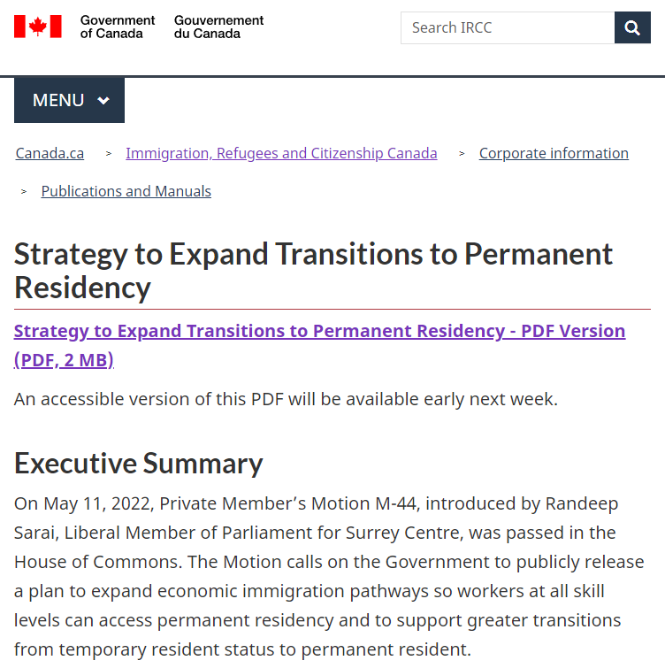
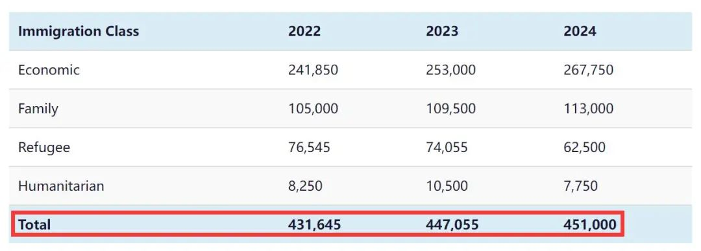
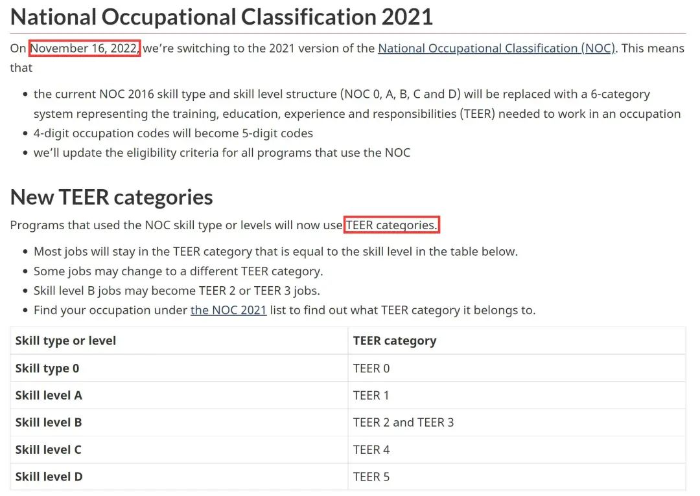
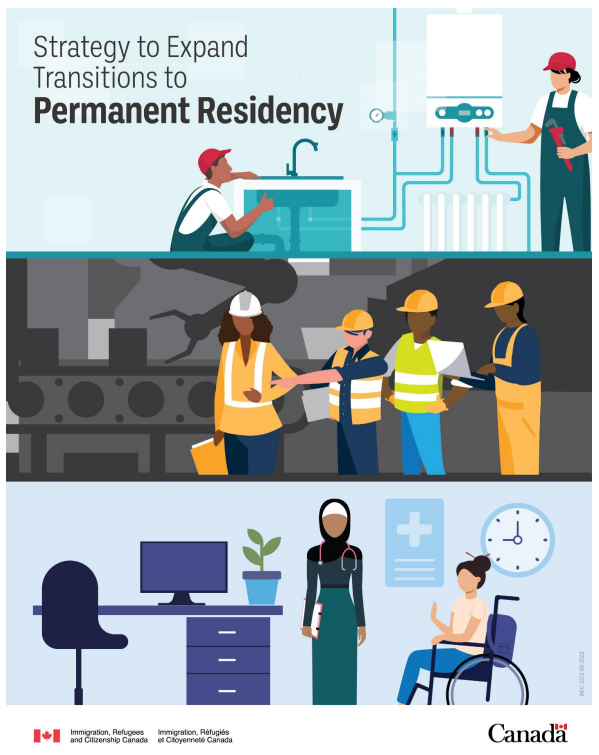

# 无标题

**链接地址:** http://mp.weixin.qq.com/s?__biz=MzUyNzA2NTAwNg==&mid=2247491143&idx=1&sn=4ca11c9de33c723724402544dc67615f&chksm=fa041486cd739d902552aefff7197aeab64828ff536e1ca98505f762ff575113baf485882913&mpshare=1&scene=2&srcid=0924WFZl6PrjfngNr9t3apQw&sharer_sharetime=1663985815625&sharer_shareid=77848a6b3852ae4dcb6c74ffee84743c#rd
**作者:** 你身边的签证专家
**获取时间:** 2025/8/28 19:30:11
**图片数量:** 21

---

## 原始HTML内容

<section style="box-sizing: border-box;font-size: 16px;"><section style="text-align: center;margin-top: 10px;margin-bottom: 10px;box-sizing: border-box;" powered-by="xiumi.us"><section style="max-width: 100%;vertical-align: middle;display: inline-block;line-height: 0;box-sizing: border-box;"></section></section><section style="text-align: center;margin-top: 10px;margin-bottom: 10px;box-sizing: border-box;" powered-by="xiumi.us"></section>
 
<section style="font-size: 19px;text-align: center;margin-top: 10px;margin-bottom: 3px;box-sizing: border-box;" powered-by="xiumi.us"><section style="display: inline-block;border-width: 1px;border-style: solid;border-color: rgb(188, 65, 65);background-color: rgb(188, 65, 65);width: 1.8em;height: 1.8em;line-height: 1.8em;border-radius: 100%;margin-left: auto;margin-right: auto;font-size: 16px;color: rgb(255, 255, 255);box-sizing: border-box;">
<strong style="box-sizing: border-box;">1</strong>
</section></section><section style="text-align: center;box-sizing: border-box;" powered-by="xiumi.us"><section style="display: inline-block;width: 0px;height: 0px;vertical-align: top;overflow: hidden;border-style: solid;border-width: 9px 6px 0px;border-color: rgb(188, 65, 65) rgba(255, 255, 255, 0) rgba(255, 255, 255, 0);box-sizing: border-box;"><svg viewBox="0 0 1 1" style="float:left;line-height:0;width:0;vertical-align:top;"></svg></section></section><section style="margin-bottom: 10px;text-align: center;justify-content: center;display: flex;flex-flow: row nowrap;box-sizing: border-box;" powered-by="xiumi.us"><section style="display: inline-block;width: auto;vertical-align: middle;background-color: rgba(109, 155, 209, 0.1);min-width: 10%;max-width: 100%;flex: 0 0 auto;height: auto;align-self: center;padding: 12px;box-sizing: border-box;"><section style="color: rgb(109, 155, 209);text-align: justify;box-sizing: border-box;" powered-by="xiumi.us">
<strong style="box-sizing: border-box;">“千呼万唤使出来”</strong>
</section></section></section><section style="font-size: 14px;padding-right: 15px;padding-left: 15px;letter-spacing: 1px;box-sizing: border-box;" powered-by="xiumi.us">
 

今年五月，加拿大移民部长肖恩·弗雷泽（Sean Fraser）被议会要求在120天内公布为临时居民<strong style="box-sizing: border-box;">扩大申请永久居留权途径</strong>（即“移民大赦”）的相关计划。转眼到9月，又因女王去世推迟了公布。

 

今天（9月21日），这位移民部长<strong style="box-sizing: border-box;">终于公开了新移民计划的实施方针</strong>！该计划将大大促进国际学生和临时居民获得永久居留权，以解决加拿大持续的劳动力短缺问题。

 
</section><section style="text-align: center;margin-top: 10px;margin-bottom: 10px;box-sizing: border-box;" powered-by="xiumi.us"><section style="max-width: 100%;vertical-align: middle;display: inline-block;line-height: 0;width: 90%;height: auto;box-sizing: border-box;"></section></section><section style="font-size: 14px;padding-right: 15px;padding-left: 15px;letter-spacing: 1px;box-sizing: border-box;" powered-by="xiumi.us">
 

该计划遵循了5月提出的一项动议，敦促政府“公开发布扩大经济移民途径的计划，以便<strong style="box-sizing: border-box;">所有技能水平的工人</strong>都能获得永久居留权，并支持从临时居民身份到永久居民身份的更大转变”。

 
</section><section style="text-align: center;margin-top: 10px;margin-bottom: 10px;box-sizing: border-box;" powered-by="xiumi.us"><section style="max-width: 100%;vertical-align: middle;display: inline-block;line-height: 0;width: 90%;height: auto;box-sizing: border-box;"></section></section><section style="font-size: 14px;padding-right: 15px;padding-left: 15px;letter-spacing: 1px;box-sizing: border-box;" powered-by="xiumi.us">
 

移民部长Sean Fraser在昨日的加拿大议会例行会议上，兴奋地介绍<strong style="box-sizing: border-box;">了5项措施细节</strong>，将使加拿大临时居民和国际学生大大受益。

 
</section><section style="text-align: center;margin-top: 10px;margin-bottom: 10px;box-sizing: border-box;" powered-by="xiumi.us"><section style="max-width: 100%;vertical-align: middle;display: inline-block;line-height: 0;box-sizing: border-box;"></section></section><section style="font-size: 14px;padding-right: 15px;padding-left: 15px;letter-spacing: 1px;box-sizing: border-box;" powered-by="xiumi.us">
 
</section><section style="font-size: 19px;text-align: center;margin-top: 10px;margin-bottom: 3px;box-sizing: border-box;" powered-by="xiumi.us"><section style="display: inline-block;border-width: 1px;border-style: solid;border-color: rgb(188, 65, 65);background-color: rgb(188, 65, 65);width: 1.8em;height: 1.8em;line-height: 1.8em;border-radius: 100%;margin-left: auto;margin-right: auto;font-size: 16px;color: rgb(255, 255, 255);box-sizing: border-box;">
<strong style="box-sizing: border-box;">2</strong>
</section></section><section style="text-align: center;box-sizing: border-box;" powered-by="xiumi.us"><section style="display: inline-block;width: 0px;height: 0px;vertical-align: top;overflow: hidden;border-style: solid;border-width: 9px 6px 0px;border-color: rgb(188, 65, 65) rgba(255, 255, 255, 0) rgba(255, 255, 255, 0);box-sizing: border-box;"><svg viewBox="0 0 1 1" style="float:left;line-height:0;width:0;vertical-align:top;"></svg></section></section><section style="margin-bottom: 10px;text-align: center;justify-content: center;display: flex;flex-flow: row nowrap;box-sizing: border-box;" powered-by="xiumi.us"><section style="display: inline-block;width: auto;vertical-align: middle;background-color: rgba(109, 155, 209, 0.1);min-width: 10%;max-width: 100%;flex: 0 0 auto;height: auto;align-self: center;padding: 12px;box-sizing: border-box;"><section style="color: rgb(109, 155, 209);text-align: justify;box-sizing: border-box;" powered-by="xiumi.us">
<strong style="box-sizing: border-box;">五项措施总结</strong>
</section></section></section><section style="font-size: 14px;padding-right: 15px;padding-left: 15px;letter-spacing: 1px;box-sizing: border-box;" powered-by="xiumi.us">
 
</section><section style="margin-top: 10px;margin-bottom: 10px;text-align: left;justify-content: flex-start;display: flex;flex-flow: row nowrap;box-sizing: border-box;" powered-by="xiumi.us"><section style="display: inline-block;width: auto;vertical-align: top;min-width: 10%;max-width: 100%;flex: 0 0 auto;height: auto;border-width: 0px;border-style: none;border-color: rgb(62, 62, 62);overflow: hidden;align-self: flex-start;box-sizing: border-box;"><section style="margin-top: 10px;margin-bottom: 10px;text-align: justify;justify-content: flex-start;display: flex;flex-flow: row nowrap;box-sizing: border-box;" powered-by="xiumi.us"><section style="display: inline-block;width: auto;vertical-align: top;min-width: 10%;max-width: 100%;flex: 0 0 auto;height: auto;background-color: rgba(0, 0, 0, 0.04);border-width: 0px;border-style: none;border-color: rgb(62, 62, 62);align-self: flex-start;box-sizing: border-box;"><section style="justify-content: flex-start;display: flex;flex-flow: row nowrap;box-sizing: border-box;" powered-by="xiumi.us"><section style="display: inline-block;vertical-align: middle;width: auto;min-width: 10%;max-width: 100%;flex: 0 0 auto;height: auto;align-self: center;padding-right: 13px;padding-left: 13px;box-sizing: border-box;"><section style="transform: rotateZ(12deg);-webkit-transform: rotateZ(12deg);-moz-transform: rotateZ(12deg);-o-transform: rotateZ(12deg);box-sizing: border-box;" powered-by="xiumi.us"><section style="text-align: center;justify-content: center;margin-top: -20px;margin-bottom: -20px;display: flex;flex-flow: row nowrap;box-sizing: border-box;"><section style="display: inline-block;width: auto;vertical-align: top;background-color: rgb(109, 155, 209);padding: 20px 13px;min-width: 10%;max-width: 100%;flex: 0 0 auto;height: auto;align-self: flex-start;box-sizing: border-box;"><section style="transform: rotateZ(348deg);-webkit-transform: rotateZ(348deg);-moz-transform: rotateZ(348deg);-o-transform: rotateZ(348deg);box-sizing: border-box;" powered-by="xiumi.us"><section style="color: rgb(255, 255, 255);text-align: justify;box-sizing: border-box;">
<strong style="box-sizing: border-box;">1</strong>
</section></section></section></section></section></section><section style="display: inline-block;vertical-align: middle;width: auto;min-width: 10%;max-width: 100%;flex: 0 0 auto;height: auto;align-self: center;padding: 6px 15px 6px 6px;box-sizing: border-box;"><section style="color: rgb(62, 62, 62);box-sizing: border-box;" powered-by="xiumi.us">
<strong style="box-sizing: border-box;">三年内激增新移民数量</strong>

<strong style="box-sizing: border-box;">重新制定2023-2025具体措施</strong>
</section></section></section></section></section></section></section><section style="font-size: 14px;padding-right: 15px;padding-left: 15px;letter-spacing: 1px;box-sizing: border-box;" powered-by="xiumi.us">
 

使用2022-2024年移民水平计划中列出的新增移民水平目标，为加拿大提供更大的永久劳动力供应。该计划要求今年新增431,645名永久居民，明年为447,055人，2024年为 451,000人，为加拿大移民部 (IRCC) 提供充足的新移民配额。

 
</section><section style="text-align: center;margin-top: 10px;margin-bottom: 10px;box-sizing: border-box;" powered-by="xiumi.us"><section style="max-width: 100%;vertical-align: middle;display: inline-block;line-height: 0;width: 90%;height: auto;box-sizing: border-box;"></section></section><section style="text-align: center;color: rgb(180, 180, 180);font-size: 12px;box-sizing: border-box;" powered-by="xiumi.us">
（目前的加拿大2022-2024年移民计划）
</section><section style="font-size: 14px;padding-right: 15px;padding-left: 15px;letter-spacing: 1px;box-sizing: border-box;" powered-by="xiumi.us">
 

为确保新移民计划顺利实施，弗雷泽<strong style="box-sizing: border-box;">将在11月1日之前，重新制定2023-2025年移民计划目标</strong>，来接纳更多的新移民。届时，新的移民计划的具体配额等细节也可能被公布。

 

 
</section><section style="margin-top: 10px;margin-bottom: 10px;text-align: left;justify-content: flex-start;display: flex;flex-flow: row nowrap;box-sizing: border-box;" powered-by="xiumi.us"><section style="display: inline-block;width: auto;vertical-align: top;min-width: 10%;max-width: 100%;flex: 0 0 auto;height: auto;border-width: 0px;border-style: none;border-color: rgb(62, 62, 62);overflow: hidden;align-self: flex-start;box-sizing: border-box;"><section style="margin-top: 10px;margin-bottom: 10px;text-align: justify;justify-content: flex-start;display: flex;flex-flow: row nowrap;box-sizing: border-box;" powered-by="xiumi.us"><section style="display: inline-block;width: auto;vertical-align: top;min-width: 10%;max-width: 100%;flex: 0 0 auto;height: auto;background-color: rgba(0, 0, 0, 0.04);border-width: 0px;border-style: none;border-color: rgb(62, 62, 62);align-self: flex-start;box-sizing: border-box;"><section style="justify-content: flex-start;display: flex;flex-flow: row nowrap;box-sizing: border-box;" powered-by="xiumi.us"><section style="display: inline-block;vertical-align: middle;width: auto;min-width: 10%;max-width: 100%;flex: 0 0 auto;height: auto;align-self: center;padding-right: 13px;padding-left: 13px;box-sizing: border-box;"><section style="transform: rotateZ(12deg);-webkit-transform: rotateZ(12deg);-moz-transform: rotateZ(12deg);-o-transform: rotateZ(12deg);box-sizing: border-box;" powered-by="xiumi.us"><section style="text-align: center;justify-content: center;margin-top: -20px;margin-bottom: -20px;display: flex;flex-flow: row nowrap;box-sizing: border-box;"><section style="display: inline-block;width: auto;vertical-align: top;background-color: rgb(109, 155, 209);padding: 20px 13px;min-width: 10%;max-width: 100%;flex: 0 0 auto;height: auto;align-self: flex-start;box-sizing: border-box;"><section style="transform: rotateZ(348deg);-webkit-transform: rotateZ(348deg);-moz-transform: rotateZ(348deg);-o-transform: rotateZ(348deg);box-sizing: border-box;" powered-by="xiumi.us"><section style="color: rgb(255, 255, 255);text-align: justify;box-sizing: border-box;">
<strong style="box-sizing: border-box;">2</strong>
</section></section></section></section></section></section><section style="display: inline-block;vertical-align: middle;width: auto;min-width: 10%;max-width: 100%;flex: 0 0 auto;height: auto;align-self: center;padding: 6px 15px 6px 6px;box-sizing: border-box;"><section style="color: rgb(62, 62, 62);box-sizing: border-box;" powered-by="xiumi.us">
<strong style="box-sizing: border-box;"></strong><strong style="box-sizing: border-box;">改革Express Entry系统</strong>

<strong style="box-sizing: border-box;">开放新的移民快速通道</strong><strong style="box-sizing: border-box;"></strong>
</section></section></section></section></section></section></section><section style="font-size: 14px;padding-right: 15px;padding-left: 15px;letter-spacing: 1px;box-sizing: border-box;" powered-by="xiumi.us">
 

据报道，加拿大将于2023年初通过Express Entry开始实行<strong style="box-sizing: border-box;">针对特定职业的抽签邀请</strong>。

 
</section><section style="text-align: center;margin-top: 10px;margin-bottom: 10px;box-sizing: border-box;" powered-by="xiumi.us"><section style="max-width: 100%;vertical-align: middle;display: inline-block;line-height: 0;width: 90%;height: auto;box-sizing: border-box;"></section></section><section style="font-size: 14px;padding-right: 15px;padding-left: 15px;letter-spacing: 1px;box-sizing: border-box;" powered-by="xiumi.us">
 

Express Entry的<strong style="box-sizing: border-box;">综合排名系统 (CRS) 将被审查</strong>，<strong style="box-sizing: border-box;">重点关注加拿大工作经验和教育、语言技能和工作机会的分数</strong>。政府将允许IRCC根据劳动力市场需求和区域经济优先事项来邀请PR候选人。

 

这也是为下一版Express Entry系统奠定基础，让各技能水平的工人<strong style="box-sizing: border-box;">更大几率转为永居</strong>。

 

 

 
</section><section style="margin-top: 10px;margin-bottom: 10px;text-align: left;justify-content: flex-start;display: flex;flex-flow: row nowrap;box-sizing: border-box;" powered-by="xiumi.us"><section style="display: inline-block;width: auto;vertical-align: top;min-width: 10%;max-width: 100%;flex: 0 0 auto;height: auto;border-width: 0px;border-style: none;border-color: rgb(62, 62, 62);overflow: hidden;align-self: flex-start;box-sizing: border-box;"><section style="margin-top: 10px;margin-bottom: 10px;text-align: justify;justify-content: flex-start;display: flex;flex-flow: row nowrap;box-sizing: border-box;" powered-by="xiumi.us"><section style="display: inline-block;width: auto;vertical-align: top;min-width: 10%;max-width: 100%;flex: 0 0 auto;height: auto;background-color: rgba(0, 0, 0, 0.04);border-width: 0px;border-style: none;border-color: rgb(62, 62, 62);align-self: flex-start;box-sizing: border-box;"><section style="justify-content: flex-start;display: flex;flex-flow: row nowrap;box-sizing: border-box;" powered-by="xiumi.us"><section style="display: inline-block;vertical-align: middle;width: auto;min-width: 10%;max-width: 100%;flex: 0 0 auto;height: auto;align-self: center;padding-right: 13px;padding-left: 13px;box-sizing: border-box;"><section style="transform: rotateZ(12deg);-webkit-transform: rotateZ(12deg);-moz-transform: rotateZ(12deg);-o-transform: rotateZ(12deg);box-sizing: border-box;" powered-by="xiumi.us"><section style="text-align: center;justify-content: center;margin-top: -20px;margin-bottom: -20px;display: flex;flex-flow: row nowrap;box-sizing: border-box;"><section style="display: inline-block;width: auto;vertical-align: top;background-color: rgb(109, 155, 209);padding: 20px 13px;min-width: 10%;max-width: 100%;flex: 0 0 auto;height: auto;align-self: flex-start;box-sizing: border-box;"><section style="transform: rotateZ(348deg);-webkit-transform: rotateZ(348deg);-moz-transform: rotateZ(348deg);-o-transform: rotateZ(348deg);box-sizing: border-box;" powered-by="xiumi.us"><section style="color: rgb(255, 255, 255);text-align: justify;box-sizing: border-box;">
<strong style="box-sizing: border-box;">3</strong>
</section></section></section></section></section></section><section style="display: inline-block;vertical-align: middle;width: auto;min-width: 10%;max-width: 100%;flex: 0 0 auto;height: auto;align-self: center;padding: 6px 15px 6px 6px;box-sizing: border-box;"><section style="color: rgb(62, 62, 62);box-sizing: border-box;" powered-by="xiumi.us">
<strong style="box-sizing: border-box;"></strong><strong>改进经济移民计划<strong style="box-sizing: border-box;"></strong></strong>
</section></section></section></section></section></section></section><section style="font-size: 14px;padding-right: 15px;padding-left: 15px;letter-spacing: 1px;box-sizing: border-box;" powered-by="xiumi.us">
 

改进经济移民计划，例如改进用于评估移民资格的<strong style="box-sizing: border-box;">国家职业分类 (NOC</strong>)；提高外国证书的认可度；支持卫生专业的国际学生和移民向永久居民过渡等…

 

该计划旨在帮助高需求职业中的工作人员从临时居民身份过渡到永久居民。这些变化包括：

 
</section><section style="text-align: center;margin-top: 10px;margin-bottom: 10px;box-sizing: border-box;" powered-by="xiumi.us"><section style="max-width: 100%;vertical-align: middle;display: inline-block;line-height: 0;width: 90%;height: auto;box-sizing: border-box;"></section></section><section style="font-size: 14px;padding-right: 15px;padding-left: 15px;letter-spacing: 1px;box-sizing: border-box;" powered-by="xiumi.us">
 

将于11月发布新的<strong style="box-sizing: border-box;">2021年国家职业分类 (NOC)</strong> 。移民部表示，这将把资格扩大到一些项目中的某些高需求职业。

 
</section><section style="text-align: center;margin-top: 10px;margin-bottom: 10px;box-sizing: border-box;" powered-by="xiumi.us"><section style="max-width: 100%;vertical-align: middle;display: inline-block;line-height: 0;width: 90%;height: auto;box-sizing: border-box;"></section></section><section style="font-size: 14px;padding-right: 15px;padding-left: 15px;letter-spacing: 1px;box-sizing: border-box;" powered-by="xiumi.us">
 

改善对区域劳工短缺信息的访问，以确保新移民符合本地经济发展的需求，并将他们与联邦和省级计划联系起来。为<strong style="box-sizing: border-box;">高需求的基本工作人员</strong>（例如医生），提供更好更快的移民方式。

 

同时改进试点项目，包括<strong style="box-sizing: border-box;">护理人员和农业食品移民</strong>试点项目。

 

 
</section><section style="margin-top: 10px;margin-bottom: 10px;text-align: left;justify-content: flex-start;display: flex;flex-flow: row nowrap;box-sizing: border-box;" powered-by="xiumi.us"><section style="display: inline-block;width: auto;vertical-align: top;min-width: 10%;max-width: 100%;flex: 0 0 auto;height: auto;border-width: 0px;border-style: none;border-color: rgb(62, 62, 62);overflow: hidden;align-self: flex-start;box-sizing: border-box;"><section style="margin-top: 10px;margin-bottom: 10px;text-align: justify;justify-content: flex-start;display: flex;flex-flow: row nowrap;box-sizing: border-box;" powered-by="xiumi.us"><section style="display: inline-block;width: auto;vertical-align: top;min-width: 10%;max-width: 100%;flex: 0 0 auto;height: auto;background-color: rgba(0, 0, 0, 0.04);border-width: 0px;border-style: none;border-color: rgb(62, 62, 62);align-self: flex-start;box-sizing: border-box;"><section style="justify-content: flex-start;display: flex;flex-flow: row nowrap;box-sizing: border-box;" powered-by="xiumi.us"><section style="display: inline-block;vertical-align: middle;width: auto;min-width: 10%;max-width: 100%;flex: 0 0 auto;height: auto;align-self: center;padding-right: 13px;padding-left: 13px;box-sizing: border-box;"><section style="transform: rotateZ(12deg);-webkit-transform: rotateZ(12deg);-moz-transform: rotateZ(12deg);-o-transform: rotateZ(12deg);box-sizing: border-box;" powered-by="xiumi.us"><section style="text-align: center;justify-content: center;margin-top: -20px;margin-bottom: -20px;display: flex;flex-flow: row nowrap;box-sizing: border-box;"><section style="display: inline-block;width: auto;vertical-align: top;background-color: rgb(109, 155, 209);padding: 20px 13px;min-width: 10%;max-width: 100%;flex: 0 0 auto;height: auto;align-self: flex-start;box-sizing: border-box;"><section style="transform: rotateZ(348deg);-webkit-transform: rotateZ(348deg);-moz-transform: rotateZ(348deg);-o-transform: rotateZ(348deg);box-sizing: border-box;" powered-by="xiumi.us"><section style="color: rgb(255, 255, 255);text-align: justify;box-sizing: border-box;">
<strong style="box-sizing: border-box;">4</strong>
</section></section></section></section></section></section><section style="display: inline-block;vertical-align: middle;width: auto;min-width: 10%;max-width: 100%;flex: 0 0 auto;height: auto;align-self: center;padding: 6px 15px 6px 6px;box-sizing: border-box;"><section style="color: rgb(62, 62, 62);box-sizing: border-box;" powered-by="xiumi.us">
<strong style="box-sizing: border-box;">新的市政提名计划 + 省提名</strong>
</section></section></section></section></section></section></section><section style="font-size: 14px;padding-right: 15px;padding-left: 15px;letter-spacing: 1px;box-sizing: border-box;" powered-by="xiumi.us">
 

加拿大计划帮助魁北克以外的法语少数族裔社区，到2023年实现<strong style="box-sizing: border-box;">4.4%的法语移民目标</strong>。 

 

此外，移民局正在制定一项新的<strong style="box-sizing: border-box;">市政提名计划</strong>，以帮助市政吸引和留住新移民，以解决当地劳动力问题需要。

 

 
</section><section style="margin-top: 10px;margin-bottom: 10px;text-align: left;justify-content: flex-start;display: flex;flex-flow: row nowrap;box-sizing: border-box;" powered-by="xiumi.us"><section style="display: inline-block;width: auto;vertical-align: top;min-width: 10%;max-width: 100%;flex: 0 0 auto;height: auto;border-width: 0px;border-style: none;border-color: rgb(62, 62, 62);overflow: hidden;align-self: flex-start;box-sizing: border-box;"><section style="margin-top: 10px;margin-bottom: 10px;text-align: justify;justify-content: flex-start;display: flex;flex-flow: row nowrap;box-sizing: border-box;" powered-by="xiumi.us"><section style="display: inline-block;width: auto;vertical-align: top;min-width: 10%;max-width: 100%;flex: 0 0 auto;height: auto;background-color: rgba(0, 0, 0, 0.04);border-width: 0px;border-style: none;border-color: rgb(62, 62, 62);align-self: flex-start;box-sizing: border-box;"><section style="justify-content: flex-start;display: flex;flex-flow: row nowrap;box-sizing: border-box;" powered-by="xiumi.us"><section style="display: inline-block;vertical-align: middle;width: auto;min-width: 10%;max-width: 100%;flex: 0 0 auto;height: auto;align-self: center;padding-right: 13px;padding-left: 13px;box-sizing: border-box;"><section style="transform: rotateZ(12deg);-webkit-transform: rotateZ(12deg);-moz-transform: rotateZ(12deg);-o-transform: rotateZ(12deg);box-sizing: border-box;" powered-by="xiumi.us"><section style="text-align: center;justify-content: center;margin-top: -20px;margin-bottom: -20px;display: flex;flex-flow: row nowrap;box-sizing: border-box;"><section style="display: inline-block;width: auto;vertical-align: top;background-color: rgb(109, 155, 209);padding: 20px 13px;min-width: 10%;max-width: 100%;flex: 0 0 auto;height: auto;align-self: flex-start;box-sizing: border-box;"><section style="transform: rotateZ(348deg);-webkit-transform: rotateZ(348deg);-moz-transform: rotateZ(348deg);-o-transform: rotateZ(348deg);box-sizing: border-box;" powered-by="xiumi.us"><section style="color: rgb(255, 255, 255);text-align: justify;box-sizing: border-box;">
<strong style="box-sizing: border-box;">5</strong>
</section></section></section></section></section></section><section style="display: inline-block;vertical-align: middle;width: auto;min-width: 10%;max-width: 100%;flex: 0 0 auto;height: auto;align-self: center;padding: 6px 15px 6px 6px;box-sizing: border-box;"><section style="color: rgb(62, 62, 62);box-sizing: border-box;" powered-by="xiumi.us">
<strong style="box-sizing: border-box;">移民系统转型现代化和数字化</strong>

<strong style="box-sizing: border-box;">以加快处理速度。</strong>
</section></section></section></section></section></section></section><section style="font-size: 14px;padding-right: 15px;padding-left: 15px;letter-spacing: 1px;box-sizing: border-box;" powered-by="xiumi.us">
 

移民部目前已积压超过200万份申请。希望<strong style="box-sizing: border-box;">通过技术改进提高处理能力</strong>，同时<strong style="box-sizing: border-box;">改善“客户体验和移民系统现代化”</strong>。

 

报告称，<strong style="box-sizing: border-box;">将工人和学生过渡到永久居留权的两步移民制度</strong>，改善了由劳动力需求驱动的工作技能匹配，但承认这些临时居民可能面临剥削和恶劣的工作条件。

 
</section><section style="text-align: center;margin-top: 10px;margin-bottom: 10px;box-sizing: border-box;" powered-by="xiumi.us"><section style="max-width: 100%;vertical-align: middle;display: inline-block;line-height: 0;box-sizing: border-box;"></section></section><section style="margin: 10px 0%;text-align: left;justify-content: flex-start;display: flex;flex-flow: row nowrap;box-sizing: border-box;" powered-by="xiumi.us"><section style="display: inline-block;width: 100%;vertical-align: top;background-color: rgb(216, 202, 160);line-height: 0;align-self: flex-start;flex: 0 0 auto;box-sizing: border-box;"><section style="text-align: justify;justify-content: flex-start;display: flex;flex-flow: row nowrap;box-sizing: border-box;" powered-by="xiumi.us"><section style="display: inline-block;width: 100%;vertical-align: top;background-position: 0% 0%;background-repeat: repeat;background-size: 1.56658%;background-attachment: scroll;align-self: flex-start;flex: 0 0 auto;background-image: url(&quot;https://mmbiz.qpic.cn/mmbiz_png/904kUibXm7Y5HBdmr3xbZVRW0ZzqyicEswdmmWqHkx5wcIicuANMnkQHicGlJ4jLIbgaheiaggSExz8zmxM1lKBmZAg/640?wx_fmt=png&quot;);box-sizing: border-box;"><section style="text-align: center;box-sizing: border-box;" powered-by="xiumi.us"><section style="display: inline-block;width: 100%;height: 11px;vertical-align: top;overflow: hidden;background-color: rgba(255, 255, 255, 0);box-sizing: border-box;"><svg viewBox="0 0 1 1" style="float:left;line-height:0;width:0;vertical-align:top;"></svg></section></section></section></section></section></section><section style="text-align: center;margin-top: 10px;margin-bottom: 10px;box-sizing: border-box;" powered-by="xiumi.us"><section style="max-width: 100%;vertical-align: middle;display: inline-block;line-height: 0;box-sizing: border-box;"></section></section><section style="font-size: 14px;padding-right: 15px;padding-left: 15px;letter-spacing: 1px;box-sizing: border-box;" powered-by="xiumi.us">
 
</section><section style="font-size: 19px;text-align: center;margin-top: 10px;margin-bottom: 3px;box-sizing: border-box;" powered-by="xiumi.us"><section style="display: inline-block;border-width: 1px;border-style: solid;border-color: rgb(188, 65, 65);background-color: rgb(188, 65, 65);width: 1.8em;height: 1.8em;line-height: 1.8em;border-radius: 100%;margin-left: auto;margin-right: auto;font-size: 16px;color: rgb(255, 255, 255);box-sizing: border-box;">
<strong style="box-sizing: border-box;">3</strong>
</section></section><section style="text-align: center;box-sizing: border-box;" powered-by="xiumi.us"><section style="display: inline-block;width: 0px;height: 0px;vertical-align: top;overflow: hidden;border-style: solid;border-width: 9px 6px 0px;border-color: rgb(188, 65, 65) rgba(255, 255, 255, 0) rgba(255, 255, 255, 0);box-sizing: border-box;"><svg viewBox="0 0 1 1" style="float:left;line-height:0;width:0;vertical-align:top;"></svg></section></section><section style="margin-bottom: 10px;text-align: center;justify-content: center;display: flex;flex-flow: row nowrap;box-sizing: border-box;" powered-by="xiumi.us"><section style="display: inline-block;width: auto;vertical-align: middle;background-color: rgba(109, 155, 209, 0.1);min-width: 10%;max-width: 100%;flex: 0 0 auto;height: auto;align-self: center;padding: 12px;box-sizing: border-box;"><section style="color: rgb(109, 155, 209);text-align: justify;box-sizing: border-box;" powered-by="xiumi.us">
<strong style="box-sizing: border-box;">令人失望的“新政”</strong>
</section></section></section><section style="font-size: 14px;padding-right: 15px;padding-left: 15px;letter-spacing: 1px;box-sizing: border-box;" powered-by="xiumi.us">
 

在等待了120多天后，移民部公布了这份报告只粗略透露出几个未来移民改革的方向，尚未提出细节的执行指导方案，导致社会各界怨声载道。

 移民工人变革联盟赛义德·胡桑（Syed Hussan）批评说：“<strong style="box-sizing: border-box;">这份战略报告只是对现有政策的重新演绎</strong>。虽然政府再次承认临时工人被剥削，但这里没有真正的策略来解决问题。”

 
</section><section style="text-align: center;margin-top: 10px;margin-bottom: 10px;box-sizing: border-box;" powered-by="xiumi.us"><section style="max-width: 100%;vertical-align: middle;display: inline-block;line-height: 0;width: 90%;height: auto;box-sizing: border-box;"></section></section><section style="padding-right: 15px;padding-left: 15px;box-sizing: border-box;" powered-by="xiumi.us">
【新闻故事】9月18日星期日，数千名移民及其支持者在加拿大各城市举行集会，呼吁渥太华为无身份人士开方便之门，让他们能获得永久居留的身份。移民工人变革联盟执行董事德·胡桑(Syed Hussan)表示，现在轮到渥太华解决这个很多年的错误。

 
</section><section style="font-size: 14px;padding-right: 15px;padding-left: 15px;letter-spacing: 1px;box-sizing: border-box;" powered-by="xiumi.us">
“每个人都知道需要改变什么：我们需要为所有人提供完整和永久的移民身份，没有例外或延误。”

 移民部长对国会动议的这份回应，新民主党NDP华裔国会议员关慧贞（Jenny Kwan）也表示<strong style="box-sizing: border-box;">失望</strong>。

 关在一份声明中说：“特鲁多政府提供的无非是对已有的东西<strong style="box-sizing: border-box;">进行回收利用</strong>。移民部长没有提出任何新的建议来支持第<strong style="box-sizing: border-box;">44号议案中设定的目标</strong>。这种所谓的战略缺乏任何真正的全面计划所需要的真实信息或细节。”

 “人们会期望政府将收集到的有关劳动力市场需求和技能短缺的任何数据纳入移民政策，加拿大就期待这个。”
</section><section style="margin: 10px 0%;text-align: left;justify-content: flex-start;display: flex;flex-flow: row nowrap;box-sizing: border-box;" powered-by="xiumi.us"><section style="display: inline-block;width: 100%;vertical-align: top;background-color: rgb(216, 202, 160);line-height: 0;align-self: flex-start;flex: 0 0 auto;box-sizing: border-box;"><section style="text-align: justify;justify-content: flex-start;display: flex;flex-flow: row nowrap;box-sizing: border-box;" powered-by="xiumi.us"><section style="display: inline-block;width: 100%;vertical-align: top;background-position: 0% 0%;background-repeat: repeat;background-size: 1.56658%;background-attachment: scroll;align-self: flex-start;flex: 0 0 auto;background-image: url(&quot;https://mmbiz.qpic.cn/mmbiz_png/904kUibXm7Y5HBdmr3xbZVRW0ZzqyicEswdmmWqHkx5wcIicuANMnkQHicGlJ4jLIbgaheiaggSExz8zmxM1lKBmZAg/640?wx_fmt=png&quot;);box-sizing: border-box;"><section style="text-align: center;box-sizing: border-box;" powered-by="xiumi.us"><section style="display: inline-block;width: 100%;height: 11px;vertical-align: top;overflow: hidden;background-color: rgba(255, 255, 255, 0);box-sizing: border-box;"><svg viewBox="0 0 1 1" style="float:left;line-height:0;width:0;vertical-align:top;"></svg></section></section></section></section></section></section><section style="font-size: 14px;padding-right: 15px;padding-left: 15px;letter-spacing: 1px;box-sizing: border-box;" powered-by="xiumi.us">
 

相信屏幕前和新时代一同期待这个<strong style="box-sizing: border-box;">“大赦新政2.0”</strong>超过120天之久的客户朋友们心中也<strong style="box-sizing: border-box;">难免感到失落</strong>。虽然近月来加拿大移民部的审批效率有所增加，但<strong style="box-sizing: border-box;">总积压申请数超过200万份的</strong>各类签证移民申请通道对于绝大部分申请者们来说依然是痛苦且漫长的等待。

 
</section><section style="text-align: center;margin-top: 10px;margin-bottom: 10px;box-sizing: border-box;" powered-by="xiumi.us"><section style="max-width: 100%;vertical-align: middle;display: inline-block;line-height: 0;width: 50%;height: auto;box-sizing: border-box;"></section></section><section style="font-size: 14px;padding-right: 15px;padding-left: 15px;letter-spacing: 1px;box-sizing: border-box;" powered-by="xiumi.us">
 

再加上加拿大屡创新高的职位空缺数量和“退休潮”带来的劳动力短缺，加拿大就业市场的不稳定性已经对疫情经济复苏发展造成了不可忽视的冲击。本以为移民部会铆足马力地为填充劳动力缺口的中坚移民力量制定更便捷快速的政策，没想到他们在拖了四个多月以后不过是<strong style="box-sizing: border-box;">把现有的移民方针缝缝补补又扯出来</strong>宣讲了一通。

 
<section class="mp_profile_iframe_wrp"><mp-common-profile class="js_uneditable custom_select_card mp_profile_iframe" data-pluginname="mpprofile" data-id="MzUyNzA2NTAwNg==" data-headimg="http://mmbiz.qpic.cn/mmbiz_png/904kUibXm7Y6gq02PdSyzYZvibpBf0icbsnWtqW39AwrqqK8DRQdfwaE8UtUmwOd05nWcoYKrorN7ZuRngiaFhPlibQ/0?wx_fmt=png" data-nickname="新时代留学移民法律事务所" data-alias="" data-signature="加拿大移民顾问监管委员会会员/加拿大注册持牌移民顾问" data-from="0" data-is_biz_ban="0"></mp-common-profile></section>
 

不过，本次政策的提出并非终点，部分项目执行细节将<strong style="box-sizing: border-box;">在今后几个月内陆续补足</strong>。<strong style="box-sizing: border-box;">2022年年底至2023年年初将会是加国移民政策的变更关键期</strong>，<strong style="box-sizing: border-box;">几项主流的移民申请通道都会受到影响</strong>。因此请客户朋友们一定要及时关注<strong style="box-sizing: border-box;">新时代留学移民法律事务所</strong>第一时间推出的权威政策解读，让我们帮助你及时调整出<strong style="box-sizing: border-box;">最稳妥也是最便捷的移民方案</strong>！
</section><section style="margin: 10px 0%;text-align: left;justify-content: flex-start;display: flex;flex-flow: row nowrap;box-sizing: border-box;" powered-by="xiumi.us"><section style="display: inline-block;width: 100%;vertical-align: top;background-color: rgb(216, 202, 160);line-height: 0;align-self: flex-start;flex: 0 0 auto;box-sizing: border-box;"><section style="text-align: justify;justify-content: flex-start;display: flex;flex-flow: row nowrap;box-sizing: border-box;" powered-by="xiumi.us"><section style="display: inline-block;width: 100%;vertical-align: top;background-position: 0% 0%;background-repeat: repeat;background-size: 1.56658%;background-attachment: scroll;align-self: flex-start;flex: 0 0 auto;background-image: url(&quot;https://mmbiz.qpic.cn/mmbiz_png/904kUibXm7Y5HBdmr3xbZVRW0ZzqyicEswdmmWqHkx5wcIicuANMnkQHicGlJ4jLIbgaheiaggSExz8zmxM1lKBmZAg/640?wx_fmt=png&quot;);box-sizing: border-box;"><section style="text-align: center;box-sizing: border-box;" powered-by="xiumi.us"><section style="display: inline-block;width: 100%;height: 11px;vertical-align: top;overflow: hidden;background-color: rgba(255, 255, 255, 0);box-sizing: border-box;"><svg viewBox="0 0 1 1" style="float:left;line-height:0;width:0;vertical-align:top;"></svg></section></section></section></section></section></section><section style="font-size: 14px;padding-right: 15px;padding-left: 15px;letter-spacing: 1px;box-sizing: border-box;" powered-by="xiumi.us">
 

你对移民部近来的<strong style="box-sizing: border-box;">“骚操作”</strong>是否也感到不满？偷奸耍滑，骗取我120多天真情实感的渣部……哼！咱们<strong style="box-sizing: border-box;">留言栏</strong>里见！

 
</section><section style="margin: 10px 0%;text-align: center;justify-content: center;display: flex;flex-flow: row nowrap;box-sizing: border-box;" powered-by="xiumi.us"><section style="display: inline-block;width: 100%;vertical-align: top;box-shadow: rgb(0, 0, 0) 0px 0px 0px;background-color: rgb(241, 241, 241);padding: 10px;align-self: flex-start;flex: 0 0 auto;box-sizing: border-box;"><section style="justify-content: center;display: flex;flex-flow: row nowrap;box-sizing: border-box;" powered-by="xiumi.us"><section style="display: inline-block;width: 100%;vertical-align: top;background-color: rgb(255, 255, 255);padding: 20px 10px;flex: 0 0 auto;height: auto;box-shadow: rgb(198, 198, 198) 0px 0px 2px;border-width: 0px;border-radius: 6px;border-style: none;border-color: rgb(62, 62, 62);overflow: hidden;align-self: flex-start;box-sizing: border-box;"><section style="color: rgb(189, 189, 189);text-align: justify;box-sizing: border-box;" powered-by="xiumi.us">
<strong style="box-sizing: border-box;">阅读更多</strong>
</section><section style="text-align: justify;box-sizing: border-box;" powered-by="xiumi.us">
 
</section><section style="display: flex;flex-flow: row nowrap;margin-right: 0%;margin-left: 0%;justify-content: center;box-sizing: border-box;" powered-by="xiumi.us"><section style="display: inline-block;vertical-align: top;width: auto;flex: 100 100 0%;align-self: flex-start;height: auto;box-shadow: rgb(0, 0, 0) 0px 0px 0px;border-bottom: 1px dashed rgba(106, 106, 106, 0.25);border-bottom-right-radius: 0px;margin-right: 10px;box-sizing: border-box;"><section style="font-size: 14px;text-align: justify;box-sizing: border-box;" powered-by="xiumi.us">
<a target="_blank" href="http://mp.weixin.qq.com/s?__biz=MzUyNzA2NTAwNg==&amp;mid=2247491032&amp;idx=1&amp;sn=cadf9b7e3d97c6c9d3efbfc7d78e829e&amp;chksm=fa041719cd739e0fec78c6f869a74ac847155b228331def695968ccc3fe42d7b931e27cf1d35&amp;scene=21#wechat_redirect" textvalue="【收藏】加拿大留学高中申请那些事儿！学制+留学方案+学费估算" linktype="text" imgurl="" imgdata="null" data-itemshowtype="0" tab="innerlink" data-linktype="2">【收藏】加拿大留学高中申请那些事儿！学制+留学方案+学费估算</a>
</section></section><section style="display: inline-block;vertical-align: top;width: auto;flex: 20 20 0%;align-self: flex-start;height: auto;border-width: 0px;margin-left: 5px;box-sizing: border-box;"><section style="margin-right: 0%;margin-left: 0%;box-sizing: border-box;" powered-by="xiumi.us"><section style="max-width: 100%;vertical-align: middle;display: inline-block;line-height: 0;box-shadow: rgb(0, 0, 0) 0px 0px 0px;box-sizing: border-box;"><a target="_blank" href="http://mp.weixin.qq.com/s?__biz=MzUyNzA2NTAwNg==&amp;mid=2247491032&amp;idx=1&amp;sn=cadf9b7e3d97c6c9d3efbfc7d78e829e&amp;chksm=fa041719cd739e0fec78c6f869a74ac847155b228331def695968ccc3fe42d7b931e27cf1d35&amp;scene=21#wechat_redirect" textvalue="你已选中了添加链接的内容" linktype="text" imgurl="" imgdata="null" data-itemshowtype="0" tab="innerlink" data-linktype="1"></a></section></section></section></section><section style="text-align: justify;box-sizing: border-box;" powered-by="xiumi.us">
 
</section><section style="display: flex;flex-flow: row nowrap;margin-right: 0%;margin-left: 0%;justify-content: center;box-sizing: border-box;" powered-by="xiumi.us"><section style="display: inline-block;vertical-align: top;width: auto;flex: 100 100 0%;align-self: flex-start;height: auto;box-shadow: rgb(0, 0, 0) 0px 0px 0px;border-bottom: 1px dashed rgba(106, 106, 106, 0.25);border-bottom-right-radius: 0px;margin-right: 10px;box-sizing: border-box;"><section style="font-size: 14px;text-align: justify;box-sizing: border-box;" powered-by="xiumi.us">
<a target="_blank" href="http://mp.weixin.qq.com/s?__biz=MzUyNzA2NTAwNg==&amp;mid=2247490976&amp;idx=1&amp;sn=69ae270e737cab1f8ab20f1c47ca60e0&amp;chksm=fa041761cd739e77abbb95b06fc007029bc62acff00dfc65283a93531138dec40a403df2632b&amp;scene=21#wechat_redirect" textvalue="加拿大高中留学热度爆表，中国学生人数上涨300%！留学加拿大高中其实很简单！" linktype="text" imgurl="" imgdata="null" data-itemshowtype="0" tab="innerlink" data-linktype="2">加拿大高中留学热度爆表，中国学生人数上涨300%！留学加拿大高中其实很简单！</a>
</section></section><section style="display: inline-block;vertical-align: top;width: auto;flex: 20 20 0%;align-self: flex-start;height: auto;border-width: 0px;margin-left: 5px;box-sizing: border-box;"><section style="margin-right: 0%;margin-left: 0%;box-sizing: border-box;" powered-by="xiumi.us"><section style="max-width: 100%;vertical-align: middle;display: inline-block;line-height: 0;box-shadow: rgb(0, 0, 0) 0px 0px 0px;box-sizing: border-box;"><a target="_blank" href="http://mp.weixin.qq.com/s?__biz=MzUyNzA2NTAwNg==&amp;mid=2247490976&amp;idx=1&amp;sn=69ae270e737cab1f8ab20f1c47ca60e0&amp;chksm=fa041761cd739e77abbb95b06fc007029bc62acff00dfc65283a93531138dec40a403df2632b&amp;scene=21#wechat_redirect" textvalue="你已选中了添加链接的内容" linktype="text" imgurl="" imgdata="null" data-itemshowtype="0" tab="innerlink" data-linktype="1"></a></section></section></section></section><section style="text-align: justify;box-sizing: border-box;" powered-by="xiumi.us">
 
</section><section style="display: flex;flex-flow: row nowrap;margin-right: 0%;margin-left: 0%;justify-content: center;box-sizing: border-box;" powered-by="xiumi.us"><section style="display: inline-block;vertical-align: top;width: auto;flex: 100 100 0%;align-self: flex-start;height: auto;box-shadow: rgb(0, 0, 0) 0px 0px 0px;border-bottom: 1px dashed rgba(106, 106, 106, 0.25);border-bottom-right-radius: 0px;margin-right: 10px;box-sizing: border-box;"><section style="font-size: 14px;text-align: justify;box-sizing: border-box;" powered-by="xiumi.us">
<a target="_blank" href="http://mp.weixin.qq.com/s?__biz=MzUyNzA2NTAwNg==&amp;mid=2247490951&amp;idx=1&amp;sn=17057576b2f58d927565b77a57b2b753&amp;chksm=fa041746cd739e50496a1f35b844ac70e9b8a24d93c539cb30a06dac1d569b2abece7d0a9e5a&amp;scene=21#wechat_redirect" textvalue="2023年还要来加国留学吗？教育部：“支持留学，鼓励回国，来去自由，发挥作用！”" linktype="text" imgurl="" imgdata="null" data-itemshowtype="0" tab="innerlink" data-linktype="2">2023年还要来加国留学吗？教育部：“支持留学，鼓励回国，来去自由，发挥作用！”</a>
</section></section><section style="display: inline-block;vertical-align: top;width: auto;flex: 20 20 0%;align-self: flex-start;height: auto;border-width: 0px;margin-left: 5px;box-sizing: border-box;"><section style="margin-right: 0%;margin-left: 0%;box-sizing: border-box;" powered-by="xiumi.us"><section style="max-width: 100%;vertical-align: middle;display: inline-block;line-height: 0;box-shadow: rgb(0, 0, 0) 0px 0px 0px;box-sizing: border-box;"><a target="_blank" href="http://mp.weixin.qq.com/s?__biz=MzUyNzA2NTAwNg==&amp;mid=2247490951&amp;idx=1&amp;sn=17057576b2f58d927565b77a57b2b753&amp;chksm=fa041746cd739e50496a1f35b844ac70e9b8a24d93c539cb30a06dac1d569b2abece7d0a9e5a&amp;scene=21#wechat_redirect" textvalue="你已选中了添加链接的内容" linktype="text" imgurl="" imgdata="null" data-itemshowtype="0" tab="innerlink" data-linktype="1"></a></section></section></section></section></section></section></section></section><section style="text-align: center;margin-top: 10px;margin-bottom: 10px;box-sizing: border-box;" powered-by="xiumi.us"><section style="max-width: 100%;vertical-align: middle;display: inline-block;line-height: 0;box-sizing: border-box;"></section></section><section style="text-align: center;margin-top: 10px;margin-bottom: 10px;box-sizing: border-box;" powered-by="xiumi.us"><section style="max-width: 100%;vertical-align: middle;display: inline-block;line-height: 0;box-sizing: border-box;"></section></section><section style="text-align: center;margin-top: 10px;margin-bottom: 10px;box-sizing: border-box;" powered-by="xiumi.us"><section style="max-width: 100%;vertical-align: middle;display: inline-block;line-height: 0;box-sizing: border-box;"></section></section><section style="padding-right: 15px;padding-left: 15px;font-size: 12px;color: rgb(121, 121, 121);box-sizing: border-box;" powered-by="xiumi.us">
<strong style="box-sizing: border-box;">参考信息：</strong>

<strong style="box-sizing: border-box;">https://www.canada.ca/en/immigration-refugees-citizenship/corporate/publications-manuals/motion-44-response.html</strong>
</section><section style="text-align: center;margin-top: 10px;margin-bottom: 10px;box-sizing: border-box;" powered-by="xiumi.us"><section style="max-width: 100%;vertical-align: middle;display: inline-block;line-height: 0;box-sizing: border-box;"></section></section><section style="text-align: center;margin-top: 10px;margin-bottom: 10px;box-sizing: border-box;" powered-by="xiumi.us"><section style="max-width: 100%;vertical-align: middle;display: inline-block;line-height: 0;box-sizing: border-box;"></section></section></section>
 

---

## 纯文本内容

1“千呼万唤使出来”今年五月，加拿大移民部长肖恩·弗雷泽（Sean Fraser）被议会要求在120天内公布为临时居民扩大申请永久居留权途径（即“移民大赦”）的相关计划。转眼到9月，又因女王去世推迟了公布。今天（9月21日），这位移民部长终于公开了新移民计划的实施方针！该计划将大大促进国际学生和临时居民获得永久居留权，以解决加拿大持续的劳动力短缺问题。该计划遵循了5月提出的一项动议，敦促政府“公开发布扩大经济移民途径的计划，以便所有技能水平的工人都能获得永久居留权，并支持从临时居民身份到永久居民身份的更大转变”。移民部长Sean Fraser在昨日的加拿大议会例行会议上，兴奋地介绍了5项措施细节，将使加拿大临时居民和国际学生大大受益。2五项措施总结1三年内激增新移民数量重新制定2023-2025具体措施使用2022-2024年移民水平计划中列出的新增移民水平目标，为加拿大提供更大的永久劳动力供应。该计划要求今年新增431,645名永久居民，明年为447,055人，2024年为 451,000人，为加拿大移民部 (IRCC) 提供充足的新移民配额。（目前的加拿大2022-2024年移民计划）为确保新移民计划顺利实施，弗雷泽将在11月1日之前，重新制定2023-2025年移民计划目标，来接纳更多的新移民。届时，新的移民计划的具体配额等细节也可能被公布。2改革Express Entry系统开放新的移民快速通道据报道，加拿大将于2023年初通过Express Entry开始实行针对特定职业的抽签邀请。Express Entry的综合排名系统 (CRS) 将被审查，重点关注加拿大工作经验和教育、语言技能和工作机会的分数。政府将允许IRCC根据劳动力市场需求和区域经济优先事项来邀请PR候选人。这也是为下一版Express Entry系统奠定基础，让各技能水平的工人更大几率转为永居。3改进经济移民计划改进经济移民计划，例如改进用于评估移民资格的国家职业分类 (NOC)；提高外国证书的认可度；支持卫生专业的国际学生和移民向永久居民过渡等…该计划旨在帮助高需求职业中的工作人员从临时居民身份过渡到永久居民。这些变化包括：将于11月发布新的2021年国家职业分类 (NOC) 。移民部表示，这将把资格扩大到一些项目中的某些高需求职业。改善对区域劳工短缺信息的访问，以确保新移民符合本地经济发展的需求，并将他们与联邦和省级计划联系起来。为高需求的基本工作人员（例如医生），提供更好更快的移民方式。同时改进试点项目，包括护理人员和农业食品移民试点项目。4新的市政提名计划 + 省提名加拿大计划帮助魁北克以外的法语少数族裔社区，到2023年实现4.4%的法语移民目标。此外，移民局正在制定一项新的市政提名计划，以帮助市政吸引和留住新移民，以解决当地劳动力问题需要。5移民系统转型现代化和数字化以加快处理速度。移民部目前已积压超过200万份申请。希望通过技术改进提高处理能力，同时改善“客户体验和移民系统现代化”。报告称，将工人和学生过渡到永久居留权的两步移民制度，改善了由劳动力需求驱动的工作技能匹配，但承认这些临时居民可能面临剥削和恶劣的工作条件。3令人失望的“新政”在等待了120多天后，移民部公布了这份报告只粗略透露出几个未来移民改革的方向，尚未提出细节的执行指导方案，导致社会各界怨声载道。移民工人变革联盟赛义德·胡桑（Syed Hussan）批评说：“这份战略报告只是对现有政策的重新演绎。虽然政府再次承认临时工人被剥削，但这里没有真正的策略来解决问题。”【新闻故事】9月18日星期日，数千名移民及其支持者在加拿大各城市举行集会，呼吁渥太华为无身份人士开方便之门，让他们能获得永久居留的身份。移民工人变革联盟执行董事德·胡桑(Syed Hussan)表示，现在轮到渥太华解决这个很多年的错误。“每个人都知道需要改变什么：我们需要为所有人提供完整和永久的移民身份，没有例外或延误。”移民部长对国会动议的这份回应，新民主党NDP华裔国会议员关慧贞（Jenny Kwan）也表示失望。关在一份声明中说：“特鲁多政府提供的无非是对已有的东西进行回收利用。移民部长没有提出任何新的建议来支持第44号议案中设定的目标。这种所谓的战略缺乏任何真正的全面计划所需要的真实信息或细节。”“人们会期望政府将收集到的有关劳动力市场需求和技能短缺的任何数据纳入移民政策，加拿大就期待这个。”相信屏幕前和新时代一同期待这个“大赦新政2.0”超过120天之久的客户朋友们心中也难免感到失落。虽然近月来加拿大移民部的审批效率有所增加，但总积压申请数超过200万份的各类签证移民申请通道对于绝大部分申请者们来说依然是痛苦且漫长的等待。再加上加拿大屡创新高的职位空缺数量和“退休潮”带来的劳动力短缺，加拿大就业市场的不稳定性已经对疫情经济复苏发展造成了不可忽视的冲击。本以为移民部会铆足马力地为填充劳动力缺口的中坚移民力量制定更便捷快速的政策，没想到他们在拖了四个多月以后不过是把现有的移民方针缝缝补补又扯出来宣讲了一通。不过，本次政策的提出并非终点，部分项目执行细节将在今后几个月内陆续补足。2022年年底至2023年年初将会是加国移民政策的变更关键期，几项主流的移民申请通道都会受到影响。因此请客户朋友们一定要及时关注新时代留学移民法律事务所第一时间推出的权威政策解读，让我们帮助你及时调整出最稳妥也是最便捷的移民方案！你对移民部近来的“骚操作”是否也感到不满？偷奸耍滑，骗取我120多天真情实感的渣部……哼！咱们留言栏里见！阅读更多【收藏】加拿大留学高中申请那些事儿！学制+留学方案+学费估算加拿大高中留学热度爆表，中国学生人数上涨300%！留学加拿大高中其实很简单！2023年还要来加国留学吗？教育部：“支持留学，鼓励回国，来去自由，发挥作用！”参考信息：https://www.canada.ca/en/immigration-refugees-citizenship/corporate/publications-manuals/motion-44-response.html

---

## 图片列表

-  (原始链接: https://mmbiz.qpic.cn/mmbiz_jpg/904kUibXm7Y5HBdmr3xbZVRW0ZzqyicEswEicvYknm0hUIR91ib3gZpeiaiahUcesjaFUpQO3Gib9P0QcVSG02vrngluA/640?wx_fmt=jpeg)
-  (原始链接: https://mmbiz.qpic.cn/mmbiz_jpg/904kUibXm7Y4EC3q40NfCb7jaWhWbgfxibgpavj9rH4EqdQFpzyVg6N8TNSVOsgAOuvg1OSL9ec8ZyRicEzu8Tib7A/640?wx_fmt=jpeg)
-  (原始链接: https://mmbiz.qpic.cn/mmbiz_jpg/904kUibXm7Y5HBdmr3xbZVRW0ZzqyicEswRsAaOZlwHJpOXChlJSxuSq1OqJ22NXjgLEdmw6V7l8pIzOfxTlyu5A/640?wx_fmt=jpeg)
-  (原始链接: https://mmbiz.qpic.cn/mmbiz_png/904kUibXm7Y5HBdmr3xbZVRW0ZzqyicEswHSmCgS4GYG2VFle0OSuKnS8QyiacElmsHGqeLeephrQfh0a3XppRBicA/640?wx_fmt=png)
-  (原始链接: https://mmbiz.qpic.cn/mmbiz_png/904kUibXm7Y5HBdmr3xbZVRW0ZzqyicEswE3KXbm2vfPoNsMxdjjdCWicm3uYejfHeEOPbU2MWt8elqcvCW8CMddA/640?wx_fmt=png)
-  (原始链接: https://mmbiz.qpic.cn/mmbiz_jpg/904kUibXm7Y5HBdmr3xbZVRW0ZzqyicEswla5WhMsyrOHqgjefc6lH1Fib3jMvCv5H11Rwu0gNjoqUzmSyWUaSpng/640?wx_fmt=jpeg)
-  (原始链接: https://mmbiz.qpic.cn/mmbiz_jpg/904kUibXm7Y5HBdmr3xbZVRW0ZzqyicEswSJx8bDBIQZaPQw4CmkQvsO3icanWeLlPKwxlGlrdPMIFRb0u5byaNUA/640?wx_fmt=jpeg)
-  (原始链接: https://mmbiz.qpic.cn/mmbiz_jpg/904kUibXm7Y5HBdmr3xbZVRW0ZzqyicEswice5aaSEavo07cb44Hib4gcKQ7uNsWItUrlQBqcNZIpmMc23WCk0amRw/640?wx_fmt=jpeg)
-  (原始链接: https://mmbiz.qpic.cn/mmbiz_png/904kUibXm7Y5HBdmr3xbZVRW0ZzqyicEswwX43SCXWxKssUEQtkQO68VOfhXmSVRoMOoXwoX8Eiba54WyiboIYKZOg/640?wx_fmt=png)
-  (原始链接: https://mmbiz.qpic.cn/mmbiz_png/904kUibXm7Y5HBdmr3xbZVRW0ZzqyicEsw2Jgspmelpibfj4YdQvUtZXwZh4hRwN02ibibrw6TtzFQCuyyK8HoibovSA/640?wx_fmt=png)
-  (原始链接: https://mmbiz.qpic.cn/mmbiz_png/904kUibXm7Y5HBdmr3xbZVRW0ZzqyicEswoE9ibHu4TLSQOIZWyWDibfuCuhrlh5A20h1sKEUG5ngXfLvBDUo274Xw/640?wx_fmt=png)
-  (原始链接: https://mmbiz.qpic.cn/mmbiz_jpg/904kUibXm7Y5HBdmr3xbZVRW0ZzqyicEswoficSRatVbxaianUXPCmTUia8Jbu4FjO46Mjh5lb3SfzGtqibKXqWQ3Rjg/640?wx_fmt=jpeg)
-  (原始链接: https://mmbiz.qpic.cn/mmbiz_jpg/904kUibXm7Y5HBdmr3xbZVRW0ZzqyicEswWj9wkTold2w6ruTG1H0tcgB4eo72Dj8xk3tgtDoVuTHibstOor4ZlGg/640?wx_fmt=jpeg)
-  (原始链接: https://mmbiz.qpic.cn/mmbiz_jpg/904kUibXm7Y5HBdmr3xbZVRW0ZzqyicEswNpfSFfmoK1Kjldpr8LAyV7PEbw3EFkBeEayrbENuoTVwKic5aVFfIpQ/640?wx_fmt=jpeg)
-  (原始链接: https://mmbiz.qpic.cn/mmbiz_jpg/904kUibXm7Y5HBdmr3xbZVRW0ZzqyicEswpBIcLU7LCIrmnjibZ8ZBYZbBovialDrELYzUD8C2K4sd0p93Nbpc1TZg/640?wx_fmt=jpeg)
-  (原始链接: https://mmbiz.qpic.cn/mmbiz_jpg/904kUibXm7Y5HBdmr3xbZVRW0ZzqyicEswc6ElVKeZVCeq1icKiaeSxFbuFnrRZ4E71qkbbIqsFLfKrXfZos1INGFQ/640?wx_fmt=jpeg)
-  (原始链接: https://mmbiz.qpic.cn/mmbiz_jpg/904kUibXm7Y5HBdmr3xbZVRW0ZzqyicEsw823TIaqoMzSVQE2yOqibDNgKorexyGmIaMKGquDQ7ckN0rJfwCma38w/640?wx_fmt=jpeg)
-  (原始链接: https://mmbiz.qpic.cn/mmbiz_png/904kUibXm7Y5HBdmr3xbZVRW0ZzqyicEswYJmDxibricS2r43Ace3g2WzbWZ9Og2PzWOlRVUmGRtLZz1rDD4T8RfYg/640?wx_fmt=png)
-  (原始链接: https://mmbiz.qpic.cn/mmbiz_jpg/904kUibXm7Y5HBdmr3xbZVRW0ZzqyicEswV8zD3N9vSPib55a5vDrKKMOhHYgUz19IwW2WVHiazTHVan83gBLDOb8Q/640?wx_fmt=jpeg)
-  (原始链接: https://mmbiz.qpic.cn/mmbiz_jpg/904kUibXm7Y5HBdmr3xbZVRW0ZzqyicEswuDJc5bRH6fXC60liaOkGfico3KuWXQdMNgYtFRz50icvgIicVX9yHY5Z1g/640?wx_fmt=jpeg)
-  (原始链接: https://mmbiz.qpic.cn/mmbiz_jpg/904kUibXm7Y5HBdmr3xbZVRW0ZzqyicEswmqS5VeAhkLafYhj7ibYlicK1bZe0ibcMF69zVfkGOQLM489of49xuuERA/640?wx_fmt=jpeg)
