# 无标题

**链接地址:** http://mp.weixin.qq.com/s?__biz=MzUyNzA2NTAwNg==&mid=2247491184&idx=1&sn=6d5dfb027ed37771e10067709a4f7349&chksm=fa0414b1cd739da7a2e4529761de0018f15807d356fd9f6e0fcf5f1513e3f42abec7e5b8806d&mpshare=1&scene=2&srcid=0924llwtCDCS3MtFrPdVrjGH&sharer_sharetime=1663985777442&sharer_shareid=77848a6b3852ae4dcb6c74ffee84743c#rd
**作者:** 你身边的签证专家
**获取时间:** 2025/8/28 19:30:44
**图片数量:** 35

---

## 原始HTML内容

<section style="box-sizing: border-box;font-size: 16px;"><section style="text-align: center;margin-top: 10px;margin-bottom: 10px;box-sizing: border-box;" powered-by="xiumi.us"><section style="max-width: 100%;vertical-align: middle;display: inline-block;line-height: 0;box-sizing: border-box;"></section></section><section style="text-align: center;margin-top: 10px;margin-bottom: 10px;box-sizing: border-box;" powered-by="xiumi.us"></section>
 
<section style="font-size: 19px;text-align: center;margin-top: 10px;margin-bottom: 3px;box-sizing: border-box;" powered-by="xiumi.us"><section style="display: inline-block;border-width: 1px;border-style: solid;border-color: rgb(188, 65, 65);background-color: rgb(188, 65, 65);width: 1.8em;height: 1.8em;line-height: 1.8em;border-radius: 100%;margin-left: auto;margin-right: auto;font-size: 16px;color: rgb(255, 255, 255);box-sizing: border-box;">
<strong style="box-sizing: border-box;">1</strong>
</section></section><section style="text-align: center;box-sizing: border-box;" powered-by="xiumi.us"><section style="display: inline-block;width: 0px;height: 0px;vertical-align: top;overflow: hidden;border-style: solid;border-width: 9px 6px 0px;border-color: rgb(188, 65, 65) rgba(255, 255, 255, 0) rgba(255, 255, 255, 0);box-sizing: border-box;"><svg viewBox="0 0 1 1" style="float:left;line-height:0;width:0;vertical-align:top;"></svg></section></section><section style="margin-bottom: 10px;text-align: center;justify-content: center;display: flex;flex-flow: row nowrap;box-sizing: border-box;" powered-by="xiumi.us"><section style="display: inline-block;width: auto;vertical-align: middle;background-color: rgba(109, 155, 209, 0.1);min-width: 10%;max-width: 100%;flex: 0 0 auto;height: auto;align-self: center;padding: 12px;box-sizing: border-box;"><section style="color: rgb(109, 155, 209);text-align: justify;box-sizing: border-box;" powered-by="xiumi.us">
<strong style="box-sizing: border-box;">世卫组织：战胜新冠疫情的“终点线”已在眼前</strong>
</section></section></section><section style="font-size: 14px;padding-right: 15px;padding-left: 15px;letter-spacing: 1px;box-sizing: border-box;" powered-by="xiumi.us">
 

世界卫生组织WHO总干事谭德塞于2022年9月14日在例行疫情发布会上表示，上周全球报告的Covid-19死亡病例数已降至<strong style="box-sizing: border-box;">2020年3月以来的同比最低水平</strong>，这让人们看到了战胜新冠疫情的<strong style="box-sizing: border-box;">“终点线”</strong>。

 
</section><section style="text-align: center;margin-top: 10px;margin-bottom: 10px;box-sizing: border-box;" powered-by="xiumi.us"><section style="max-width: 100%;vertical-align: middle;display: inline-block;line-height: 0;width: 90%;height: auto;box-sizing: border-box;"></section></section><section style="font-size: 14px;padding-right: 15px;padding-left: 15px;letter-spacing: 1px;box-sizing: border-box;" powered-by="xiumi.us">
 

这对于被新冠疫情侵扰超过两年半的世界各国来说无疑是打了一剂<strong style="box-sizing: border-box;">“强心针”</strong>。由于严苛防疫措施不得不滞留海外的华人华侨群体终于也等来了这<strong style="box-sizing: border-box;">胜利的曙光</strong>。

 

上周末，香港特区医务卫生局局长卢宠茂在接受香港商台访问时表示，政府正积极考虑将入境检疫措施调整至“0+7”，即零天强制酒店检疫，全程7天居家医学监测，<strong style="box-sizing: border-box;">方向是与国际接轨</strong>。 

 
</section><section style="text-align: center;margin-top: 10px;margin-bottom: 10px;box-sizing: border-box;" powered-by="xiumi.us"><section style="max-width: 100%;vertical-align: middle;display: inline-block;line-height: 0;width: 90%;height: auto;box-sizing: border-box;"></section></section><section style="text-align: center;margin-top: 10px;margin-bottom: 10px;box-sizing: border-box;" powered-by="xiumi.us"><section style="max-width: 100%;vertical-align: middle;display: inline-block;line-height: 0;width: 90%;height: auto;box-sizing: border-box;"></section></section><section style="font-size: 14px;padding-right: 15px;padding-left: 15px;letter-spacing: 1px;box-sizing: border-box;" powered-by="xiumi.us">
 

没想到，<strong style="box-sizing: border-box;">出乎意料的“好消息”来得如此之快</strong>！本地时间9月23日，香港政府正式公布放宽入境检疫措施，由下周一（26日）起，从海外或台湾经机场回港的人士的检疫安排<strong style="box-sizing: border-box;">直接放宽为“0+3”</strong>，并<strong>取消旅客在登机前要提交核酸检测阴性的要求改以快测取代</strong>。

 

行政长官李家超在记者会上提到，放宽入境检疫措施与国家防疫目标一致，精准抗疫。他又指，政府经过全面考虑作出决定，难以预测新变种病毒或疫情新变化，但若目前的疫情没有出现变化，有信心可将确诊数字维持在可控范围，不希望检疫措施<strong style="box-sizing: border-box;">“走回头路”</strong>。他亦指，希望新安排可增加经济动力及竞争力，<strong style="box-sizing: border-box;">与世界接轨</strong>。 

 
</section><section style="text-align: center;margin-top: 10px;margin-bottom: 10px;box-sizing: border-box;" powered-by="xiumi.us"><section style="max-width: 100%;vertical-align: middle;display: inline-block;line-height: 0;width: 90%;height: auto;box-sizing: border-box;"></section></section><section style="font-size: 14px;padding-right: 15px;padding-left: 15px;letter-spacing: 1px;box-sizing: border-box;" powered-by="xiumi.us">
 

他表示，希望落实好“0+3”后，可有序放宽更多防疫限制，并指<strong style="box-sizing: border-box;">与世界接轨及与内地通关并无抵触</strong>，均在积极争取，而且两者对香港整体均甚为重要。目前仍在与内地当局讨论<strong style="box-sizing: border-box;">“逆隔离”安排。</strong>在有共同理念下，虽然可能需要时间讨论实际操作方案，但相信达到目标的可能性存在。

 
</section><section style="text-align: center;margin-top: 10px;margin-bottom: 10px;box-sizing: border-box;" powered-by="xiumi.us"><section style="max-width: 100%;vertical-align: middle;display: inline-block;line-height: 0;box-sizing: border-box;"></section></section><section style="font-size: 14px;padding-right: 15px;padding-left: 15px;letter-spacing: 1px;box-sizing: border-box;" powered-by="xiumi.us">
 
</section><section style="font-size: 19px;text-align: center;margin-top: 10px;margin-bottom: 3px;box-sizing: border-box;" powered-by="xiumi.us"><section style="display: inline-block;border-width: 1px;border-style: solid;border-color: rgb(188, 65, 65);background-color: rgb(188, 65, 65);width: 1.8em;height: 1.8em;line-height: 1.8em;border-radius: 100%;margin-left: auto;margin-right: auto;font-size: 16px;color: rgb(255, 255, 255);box-sizing: border-box;">
<strong style="box-sizing: border-box;">2</strong>
</section></section><section style="text-align: center;box-sizing: border-box;" powered-by="xiumi.us"><section style="display: inline-block;width: 0px;height: 0px;vertical-align: top;overflow: hidden;border-style: solid;border-width: 9px 6px 0px;border-color: rgb(188, 65, 65) rgba(255, 255, 255, 0) rgba(255, 255, 255, 0);box-sizing: border-box;"><svg viewBox="0 0 1 1" style="float:left;line-height:0;width:0;vertical-align:top;"></svg></section></section><section style="margin-bottom: 10px;text-align: center;justify-content: center;display: flex;flex-flow: row nowrap;box-sizing: border-box;" powered-by="xiumi.us"><section style="display: inline-block;width: auto;vertical-align: middle;background-color: rgba(109, 155, 209, 0.1);min-width: 10%;max-width: 100%;flex: 0 0 auto;height: auto;align-self: center;padding: 12px;box-sizing: border-box;"><section style="color: rgb(109, 155, 209);text-align: justify;box-sizing: border-box;" powered-by="xiumi.us">
<strong style="box-sizing: border-box;">香港政府公布4项入境检疫新措施详情</strong>
</section></section></section><section style="font-size: 14px;padding-right: 15px;padding-left: 15px;letter-spacing: 1px;box-sizing: border-box;" powered-by="xiumi.us">
 

<strong style="box-sizing: border-box;">1. 入境检疫由“3+4”改为“0+3”</strong>

 

政府宣布完全取消检疫酒店的强制检疫安排，市民从海外或台湾经机场回港，抵港后在机场接受核酸检测，毋须等待结果即可回家或到自选酒店，更可自选交通工具<strong>包括公共交通</strong>。抵港人士在回港后会获派<strong style="box-sizing: border-box;">“黄码”3天</strong>。

 

在第1至3日的居家医学监察期间，容许外出上班上学，但不得进入公共处所，如食肆、酒吧等，第3日会收到核酸检测结果，<strong style="box-sizing: border-box;">阴性者便可获派“蓝码”</strong>，并开始自行监测。在第4至7天的自行监测期间，只需进行指定核酸检测及快测并获得阴性结果，便可进入食肆等表列处所。

 
</section><section style="text-align: center;margin-top: 10px;margin-bottom: 10px;box-sizing: border-box;" powered-by="xiumi.us"><section style="max-width: 100%;vertical-align: middle;display: inline-block;line-height: 0;width: 90%;height: auto;box-sizing: border-box;"></section></section><section style="font-size: 14px;padding-right: 15px;padding-left: 15px;letter-spacing: 1px;box-sizing: border-box;" powered-by="xiumi.us">
 

<strong style="box-sizing: border-box;">2. 上机前毋须进行核酸检测，改以快速抗原测试代替</strong>

 

政府宣布，登机前48小时的核酸测试以快速测试取代，需提交24小时内的快测阴性证明。

 

<strong style="box-sizing: border-box;">3. 未完成疫苗接种的香港居民可以登机回港</strong>

 

政府容许未完成接种疫苗的香港居民登机回港，但在回港后需按照现行程序以取得疫苗通行证。

 

<strong style="box-sizing: border-box;">4. “来港易”及“回港易”计划将不设限额，并适用于内地所有地方及澳门来港人士！！！</strong>

 

李家超重申特区政府防疫政策，要控制确诊数量，确保医疗系统的负荷能力；保护高风险人士，包括一老一幼及长期疾病患者；以科学系统的方法区别不同风险的人士，降低管控人数与管控范围，容许最多的日常活动及涉及的人数；平衡风险与经济的动力，在风险可控的情况下，维护民生活动和香港的竞争力，尽量给社会最大的动能和经济活力。

 
</section><section style="font-size: 19px;text-align: center;margin-top: 10px;margin-bottom: 3px;box-sizing: border-box;" powered-by="xiumi.us"><section style="display: inline-block;border-width: 1px;border-style: solid;border-color: rgb(188, 65, 65);background-color: rgb(188, 65, 65);width: 1.8em;height: 1.8em;line-height: 1.8em;border-radius: 100%;margin-left: auto;margin-right: auto;font-size: 16px;color: rgb(255, 255, 255);box-sizing: border-box;">
<strong style="box-sizing: border-box;">3</strong>
</section></section><section style="text-align: center;box-sizing: border-box;" powered-by="xiumi.us"><section style="display: inline-block;width: 0px;height: 0px;vertical-align: top;overflow: hidden;border-style: solid;border-width: 9px 6px 0px;border-color: rgb(188, 65, 65) rgba(255, 255, 255, 0) rgba(255, 255, 255, 0);box-sizing: border-box;"><svg viewBox="0 0 1 1" style="float:left;line-height:0;width:0;vertical-align:top;"></svg></section></section><section style="margin-bottom: 10px;text-align: center;justify-content: center;display: flex;flex-flow: row nowrap;box-sizing: border-box;" powered-by="xiumi.us"><section style="display: inline-block;width: auto;vertical-align: middle;background-color: rgba(109, 155, 209, 0.1);min-width: 10%;max-width: 100%;flex: 0 0 auto;height: auto;align-self: center;padding: 12px;box-sizing: border-box;"><section style="color: rgb(109, 155, 209);text-align: justify;box-sizing: border-box;" powered-by="xiumi.us">
<strong style="box-sizing: border-box;">加拿大入境防疫措施拟全取消&nbsp;</strong>
</section></section></section><section style="font-size: 14px;padding-right: 15px;padding-left: 15px;letter-spacing: 1px;box-sizing: border-box;" powered-by="xiumi.us">
 

同时，据加拿大政府高层消息人士透露，加国总理杜鲁多今日已同意，入境加拿大旅客的疫苗接种强制措施<strong style="box-sizing: border-box;">在这个月底(30日)到期后</strong>，便不会继续执行，机场的随机新冠检测亦会取消，<strong style="box-sizing: border-box;">ArriveCan应用程式则可用可不用</strong>。

 

预计政府将在下周一正式宣布有关决定。消息已得到两名高级政府官员证实。但至于是否继续要求乘坐火车及飞机的旅客强制戴口罩的措施则仍未有最终定案。

 
</section><section style="text-align: center;margin-top: 10px;margin-bottom: 10px;box-sizing: border-box;" powered-by="xiumi.us"><section style="max-width: 100%;vertical-align: middle;display: inline-block;line-height: 0;width: 90%;height: auto;box-sizing: border-box;"></section></section><section style="font-size: 14px;padding-right: 15px;padding-left: 15px;letter-spacing: 1px;box-sizing: border-box;" powered-by="xiumi.us">
 

9月16日，据加拿大媒体Toronto Star报道，加拿大联邦政府正在考虑<strong style="box-sizing: border-box;">彻底放开边境，取消疫苗要求和入境随机检测</strong>。

 

一旦这一举措生效，<strong style="box-sizing: border-box;">没有接种疫苗的外国人也将被允许进入加拿大</strong>。

 
</section><section style="text-align: center;margin-top: 10px;margin-bottom: 10px;box-sizing: border-box;" powered-by="xiumi.us"><section style="max-width: 100%;vertical-align: middle;display: inline-block;line-height: 0;width: 90%;height: auto;box-sizing: border-box;"></section></section><section style="font-size: 14px;padding-right: 15px;padding-left: 15px;letter-spacing: 1px;box-sizing: border-box;" powered-by="xiumi.us">
 

同时，如果没有接种的加拿大人在入境之前，无法证明新冠检测呈阴性或以前感染过，也将不再面临高达5,000加币的罚款，并且<strong style="box-sizing: border-box;">不再需要在家隔离14天并接受到达测试</strong>。

 

联邦政府还在考虑结束对已接种疫苗旅行者的强制性随机测试。<strong style="box-sizing: border-box;">去年6月11日，入境随机检测曾暂停过一段时间，然后在7月19日再次恢复</strong>。

 
</section><section style="text-align: center;margin-top: 10px;margin-bottom: 10px;box-sizing: border-box;" powered-by="xiumi.us"><section style="max-width: 100%;vertical-align: middle;display: inline-block;line-height: 0;width: 90%;height: auto;box-sizing: border-box;"></section></section><section style="font-size: 14px;padding-right: 15px;padding-left: 15px;letter-spacing: 1px;box-sizing: border-box;" powered-by="xiumi.us">
 

整个夏天，加拿大政府收到了很多旅行加拿大人的抱怨，他们对将疫苗接种证明、旅行细节和隔离计划上传到<strong style="box-sizing: border-box;">强制性 ArriveCAN 应用程序感到沮丧</strong>，认为这加重了大家的负担。

 

代表加拿大边境服务局的工会呼吁废除该应用程序，称工作人员花太多时间帮助人们填写表格，而不是专注于海关工作。

 
</section><section style="font-size: 19px;text-align: center;margin-top: 10px;margin-bottom: 3px;box-sizing: border-box;" powered-by="xiumi.us"><section style="display: inline-block;border-width: 1px;border-style: solid;border-color: rgb(188, 65, 65);background-color: rgb(188, 65, 65);width: 1.8em;height: 1.8em;line-height: 1.8em;border-radius: 100%;margin-left: auto;margin-right: auto;font-size: 16px;color: rgb(255, 255, 255);box-sizing: border-box;">
<strong style="box-sizing: border-box;">4</strong>
</section></section><section style="text-align: center;box-sizing: border-box;" powered-by="xiumi.us"><section style="display: inline-block;width: 0px;height: 0px;vertical-align: top;overflow: hidden;border-style: solid;border-width: 9px 6px 0px;border-color: rgb(188, 65, 65) rgba(255, 255, 255, 0) rgba(255, 255, 255, 0);box-sizing: border-box;"><svg viewBox="0 0 1 1" style="float:left;line-height:0;width:0;vertical-align:top;"></svg></section></section><section style="margin-bottom: 10px;text-align: center;justify-content: center;display: flex;flex-flow: row nowrap;box-sizing: border-box;" powered-by="xiumi.us"><section style="display: inline-block;width: auto;vertical-align: middle;background-color: rgba(109, 155, 209, 0.1);min-width: 10%;max-width: 100%;flex: 0 0 auto;height: auto;align-self: center;padding: 12px;box-sizing: border-box;"><section style="color: rgb(109, 155, 209);text-align: justify;box-sizing: border-box;" powered-by="xiumi.us">
<strong style="box-sizing: border-box;">移民部申请积压数量降低了！</strong>
</section></section></section><section style="font-size: 14px;padding-right: 15px;padding-left: 15px;letter-spacing: 1px;box-sizing: border-box;" powered-by="xiumi.us">
 

加拿大彻底放松出入境的新冠检测政策势在必行，预期正式政策将<strong style="box-sizing: border-box;">在未来几日内官宣公布</strong>。因疫情和家人朋友被迫相隔两岸的华人华侨留学生群体终于能够在近期内团聚，对于等待这一天<strong style="box-sizing: border-box;">超过数年之久</strong>的大家来说是一个值得庆祝的好消息！

 

随着疫情的平息和防疫政策的放宽，加拿大移民部在近期也<strong style="box-sizing: border-box;">大力提高了申请审批的速度</strong>。根据该部门近期报告称，其截止到2022年8月31日的申请积压数量已有所减少。

 
</section><section style="text-align: center;margin-top: 10px;margin-bottom: 10px;box-sizing: border-box;" powered-by="xiumi.us"><section style="max-width: 100%;vertical-align: middle;display: inline-block;line-height: 0;width: 90%;height: auto;box-sizing: border-box;"></section></section><section style="font-size: 14px;padding-right: 15px;padding-left: 15px;letter-spacing: 1px;box-sizing: border-box;" powered-by="xiumi.us">
 

移民部的一位发言人提供了相关数据，表明积压的数量在六周内减少了95,204件。 

 
</section><section style="text-align: center;margin-top: 10px;margin-bottom: 10px;box-sizing: border-box;" powered-by="xiumi.us"><section style="max-width: 100%;vertical-align: middle;display: inline-block;line-height: 0;width: 90%;height: auto;box-sizing: border-box;"></section></section><section style="text-align: center;margin-top: 10px;margin-bottom: 10px;box-sizing: border-box;" powered-by="xiumi.us"><section style="max-width: 100%;vertical-align: middle;display: inline-block;line-height: 0;width: 90%;height: auto;box-sizing: border-box;"></section></section><section style="font-size: 14px;padding-right: 15px;padding-left: 15px;letter-spacing: 1px;box-sizing: border-box;" powered-by="xiumi.us">
 

2022年8月29日，加拿大移民部长肖恩·弗雷泽（Sean Fraser）在新闻发布会上强调了加拿大将通过在秋季末<strong style="box-sizing: border-box;">雇佣1250名新员工</strong>、<strong style="box-sizing: border-box;">实现部门运营现代化</strong>、引入申请状态跟踪程序以及在官方网站上发布月度数据来解决积压问题并改进移民系统。

 

近期给力的审批速度也给新时代留学移民法律事务所的客户朋友们带来了<strong style="box-sizing: border-box;">大批好消息</strong>：

 

 
</section><section style="box-sizing: border-box;" powered-by="xiumi.us"><section style="background-color: rgb(226, 91, 91);height: 3px;box-sizing: border-box;"><svg viewBox="0 0 1 1" style="float:left;line-height:0;width:0;vertical-align:top;"></svg></section></section><section style="margin: 10px 0%;box-sizing: border-box;" powered-by="xiumi.us"><section style="text-align: center;font-size: 18px;color: rgb(0, 0, 0);text-shadow: rgb(255, 254, 127) 1.53209px 1.28558px;letter-spacing: 3px;line-height: 1.8;box-sizing: border-box;">
<strong style="box-sizing: border-box;">部分近期成功案例赏析</strong>
</section></section><section style="text-align: left;justify-content: flex-start;display: flex;flex-flow: row nowrap;box-sizing: border-box;" powered-by="xiumi.us"><section style="display: inline-block;vertical-align: top;width: 50%;align-self: flex-start;flex: 0 0 auto;box-sizing: border-box;"><section style="text-align: center;box-sizing: border-box;" powered-by="xiumi.us"><section style="max-width: 100%;vertical-align: middle;display: inline-block;line-height: 0;width: 87%;height: auto;box-sizing: border-box;"></section></section></section><section style="display: inline-block;vertical-align: top;width: 50%;align-self: flex-start;flex: 0 0 auto;box-sizing: border-box;"><section style="text-align: center;box-sizing: border-box;" powered-by="xiumi.us"><section style="max-width: 100%;vertical-align: middle;display: inline-block;line-height: 0;width: 87%;height: auto;box-sizing: border-box;"></section></section></section></section>
 
<section style="text-align: left;justify-content: flex-start;display: flex;flex-flow: row nowrap;margin-bottom: 20px;box-sizing: border-box;" powered-by="xiumi.us"><section style="display: inline-block;vertical-align: top;width: 50%;align-self: flex-start;flex: 0 0 auto;box-sizing: border-box;"><section style="text-align: center;box-sizing: border-box;" powered-by="xiumi.us"><section style="max-width: 100%;vertical-align: middle;display: inline-block;line-height: 0;width: 87%;height: auto;box-sizing: border-box;"></section></section></section><section style="display: inline-block;vertical-align: top;width: 50%;align-self: flex-start;flex: 0 0 auto;box-sizing: border-box;"><section style="text-align: center;box-sizing: border-box;" powered-by="xiumi.us"><section style="max-width: 100%;vertical-align: middle;display: inline-block;line-height: 0;width: 87%;height: auto;box-sizing: border-box;"></section></section></section></section><section style="text-align: left;justify-content: flex-start;display: flex;flex-flow: row nowrap;box-sizing: border-box;" powered-by="xiumi.us"><section style="display: inline-block;vertical-align: top;width: 50%;align-self: flex-start;flex: 0 0 auto;box-sizing: border-box;"><section style="text-align: center;box-sizing: border-box;" powered-by="xiumi.us"><section style="max-width: 100%;vertical-align: middle;display: inline-block;line-height: 0;width: 87%;height: auto;box-sizing: border-box;"></section></section></section><section style="display: inline-block;vertical-align: top;width: 50%;align-self: flex-start;flex: 0 0 auto;box-sizing: border-box;"><section style="text-align: center;box-sizing: border-box;" powered-by="xiumi.us"><section style="max-width: 100%;vertical-align: middle;display: inline-block;line-height: 0;width: 87%;height: auto;box-sizing: border-box;"></section></section></section></section>
 
<section style="text-align: left;justify-content: flex-start;display: flex;flex-flow: row nowrap;margin-bottom: 20px;box-sizing: border-box;" powered-by="xiumi.us"><section style="display: inline-block;vertical-align: top;width: 50%;align-self: flex-start;flex: 0 0 auto;box-sizing: border-box;"><section style="text-align: center;box-sizing: border-box;" powered-by="xiumi.us"><section style="max-width: 100%;vertical-align: middle;display: inline-block;line-height: 0;width: 87%;height: auto;box-sizing: border-box;"></section></section></section><section style="display: inline-block;vertical-align: top;width: 50%;align-self: flex-start;flex: 0 0 auto;box-sizing: border-box;"><section style="text-align: center;box-sizing: border-box;" powered-by="xiumi.us"><section style="max-width: 100%;vertical-align: middle;display: inline-block;line-height: 0;width: 87%;height: auto;box-sizing: border-box;"></section></section></section></section><section style="text-align: left;justify-content: flex-start;display: flex;flex-flow: row nowrap;box-sizing: border-box;" powered-by="xiumi.us"><section style="display: inline-block;vertical-align: top;width: 50%;align-self: flex-start;flex: 0 0 auto;box-sizing: border-box;"><section style="text-align: center;box-sizing: border-box;" powered-by="xiumi.us"><section style="max-width: 100%;vertical-align: middle;display: inline-block;line-height: 0;width: 87%;height: auto;box-sizing: border-box;"></section></section></section><section style="display: inline-block;vertical-align: top;width: 50%;align-self: flex-start;flex: 0 0 auto;box-sizing: border-box;"><section style="text-align: center;box-sizing: border-box;" powered-by="xiumi.us"><section style="max-width: 100%;vertical-align: middle;display: inline-block;line-height: 0;width: 87%;height: auto;box-sizing: border-box;"></section></section></section></section>
 
<section style="text-align: left;justify-content: flex-start;display: flex;flex-flow: row nowrap;margin-bottom: 20px;box-sizing: border-box;" powered-by="xiumi.us"><section style="display: inline-block;vertical-align: top;width: 50%;align-self: flex-start;flex: 0 0 auto;box-sizing: border-box;"><section style="text-align: center;box-sizing: border-box;" powered-by="xiumi.us"><section style="max-width: 100%;vertical-align: middle;display: inline-block;line-height: 0;width: 87%;height: auto;box-sizing: border-box;"></section></section></section><section style="display: inline-block;vertical-align: top;width: 50%;align-self: flex-start;flex: 0 0 auto;box-sizing: border-box;"><section style="text-align: center;box-sizing: border-box;" powered-by="xiumi.us"><section style="max-width: 100%;vertical-align: middle;display: inline-block;line-height: 0;width: 87%;height: auto;box-sizing: border-box;"></section></section></section></section><section style="text-align: center;box-sizing: border-box;" powered-by="xiumi.us">
<strong style="box-sizing: border-box;">更多成功案例分析</strong>

<strong style="box-sizing: border-box;">请添加我们的持牌留学移民顾问查询</strong>
</section><section style="text-align: center;margin-top: 10px;margin-bottom: 10px;box-sizing: border-box;" powered-by="xiumi.us"><section style="max-width: 100%;vertical-align: middle;display: inline-block;line-height: 0;box-sizing: border-box;"></section></section><section style="box-sizing: border-box;" powered-by="xiumi.us"><section style="background-color: rgb(226, 91, 91);height: 3px;box-sizing: border-box;"><svg viewBox="0 0 1 1" style="float:left;line-height:0;width:0;vertical-align:top;"></svg></section></section>
 
<section style="font-size: 14px;padding-right: 15px;padding-left: 15px;letter-spacing: 1px;box-sizing: border-box;" powered-by="xiumi.us">
 

2022年9月21日，加国移民部一口气公布了五项新移民计划的实施方针。这些改革将深刻地影响着各位申请人的移民规划和策略。<strong style="box-sizing: border-box;">2022年年底至2023年年初将会是加国移民政策的变更关键期</strong>，<strong style="box-sizing: border-box;">几项主流的移民申请通道都会受到影响</strong>。因此请客户朋友们一定要及时关注<strong style="box-sizing: border-box;">新时代留学移民法律事务所</strong>第一时间推出的权威政策解读，和我们随时取得沟通，帮助你及时调整出<strong style="box-sizing: border-box;">最稳妥也是最便捷的移民方案</strong>！

 
</section><section style="margin: 10px 0%;text-align: center;justify-content: center;display: flex;flex-flow: row nowrap;box-sizing: border-box;" powered-by="xiumi.us"><section style="display: inline-block;width: 100%;vertical-align: top;box-shadow: rgb(0, 0, 0) 0px 0px 0px;background-color: rgb(241, 241, 241);padding: 10px;align-self: flex-start;flex: 0 0 auto;box-sizing: border-box;"><section style="justify-content: center;display: flex;flex-flow: row nowrap;box-sizing: border-box;" powered-by="xiumi.us"><section style="display: inline-block;width: 100%;vertical-align: top;background-color: rgb(255, 255, 255);padding: 20px 10px;flex: 0 0 auto;height: auto;box-shadow: rgb(198, 198, 198) 0px 0px 2px;border-width: 0px;border-radius: 6px;border-style: none;border-color: rgb(62, 62, 62);overflow: hidden;align-self: flex-start;box-sizing: border-box;"><section style="color: rgb(189, 189, 189);text-align: justify;box-sizing: border-box;" powered-by="xiumi.us">
<strong style="box-sizing: border-box;">阅读更多</strong>
</section><section style="text-align: justify;box-sizing: border-box;" powered-by="xiumi.us">
 
</section><section style="display: flex;flex-flow: row nowrap;margin-right: 0%;margin-left: 0%;justify-content: center;box-sizing: border-box;" powered-by="xiumi.us"><section style="display: inline-block;vertical-align: top;width: auto;flex: 100 100 0%;align-self: flex-start;height: auto;box-shadow: rgb(0, 0, 0) 0px 0px 0px;border-bottom: 1px dashed rgba(106, 106, 106, 0.25);border-bottom-right-radius: 0px;margin-right: 10px;box-sizing: border-box;"><section style="font-size: 14px;text-align: justify;box-sizing: border-box;" powered-by="xiumi.us">
<a target="_blank" href="http://mp.weixin.qq.com/s?__biz=MzUyNzA2NTAwNg==&amp;mid=2247491143&amp;idx=1&amp;sn=4ca11c9de33c723724402544dc67615f&amp;chksm=fa041486cd739d902552aefff7197aeab64828ff536e1ca98505f762ff575113baf485882913&amp;scene=21#wechat_redirect" textvalue="加拿大官宣&quot;移民大赦&quot; 5项政策即将实施！但…移民部又双叒叕被喷惨了！" linktype="text" imgurl="" imgdata="null" data-itemshowtype="0" tab="innerlink" data-linktype="2">加拿大官宣"移民大赦" 5项政策即将实施！但…移民部又双叒叕被喷惨了！</a>
</section></section><section style="display: inline-block;vertical-align: top;width: auto;flex: 20 20 0%;align-self: flex-start;height: auto;border-width: 0px;margin-left: 5px;box-sizing: border-box;"><section style="margin-right: 0%;margin-left: 0%;box-sizing: border-box;" powered-by="xiumi.us"><section style="max-width: 100%;vertical-align: middle;display: inline-block;line-height: 0;box-shadow: rgb(0, 0, 0) 0px 0px 0px;box-sizing: border-box;"><a target="_blank" href="http://mp.weixin.qq.com/s?__biz=MzUyNzA2NTAwNg==&amp;mid=2247491143&amp;idx=1&amp;sn=4ca11c9de33c723724402544dc67615f&amp;chksm=fa041486cd739d902552aefff7197aeab64828ff536e1ca98505f762ff575113baf485882913&amp;scene=21#wechat_redirect" textvalue="你已选中了添加链接的内容" linktype="text" imgurl="" imgdata="null" data-itemshowtype="0" tab="innerlink" data-linktype="1"></a></section></section></section></section><section style="text-align: justify;box-sizing: border-box;" powered-by="xiumi.us">
 
</section><section style="display: flex;flex-flow: row nowrap;margin-right: 0%;margin-left: 0%;justify-content: center;box-sizing: border-box;" powered-by="xiumi.us"><section style="display: inline-block;vertical-align: top;width: auto;flex: 100 100 0%;align-self: flex-start;height: auto;box-shadow: rgb(0, 0, 0) 0px 0px 0px;border-bottom: 1px dashed rgba(106, 106, 106, 0.25);border-bottom-right-radius: 0px;margin-right: 10px;box-sizing: border-box;"><section style="font-size: 14px;text-align: justify;box-sizing: border-box;" powered-by="xiumi.us">
<a target="_blank" href="http://mp.weixin.qq.com/s?__biz=MzUyNzA2NTAwNg==&amp;mid=2247491032&amp;idx=1&amp;sn=cadf9b7e3d97c6c9d3efbfc7d78e829e&amp;chksm=fa041719cd739e0fec78c6f869a74ac847155b228331def695968ccc3fe42d7b931e27cf1d35&amp;scene=21#wechat_redirect" textvalue="【收藏】加拿大留学高中申请那些事儿！学制+留学方案+学费估算" linktype="text" imgurl="" imgdata="null" data-itemshowtype="0" tab="innerlink" data-linktype="2">【收藏】加拿大留学高中申请那些事儿！学制+留学方案+学费估算</a>
</section></section><section style="display: inline-block;vertical-align: top;width: auto;flex: 20 20 0%;align-self: flex-start;height: auto;border-width: 0px;margin-left: 5px;box-sizing: border-box;"><section style="margin-right: 0%;margin-left: 0%;box-sizing: border-box;" powered-by="xiumi.us"><section style="max-width: 100%;vertical-align: middle;display: inline-block;line-height: 0;box-shadow: rgb(0, 0, 0) 0px 0px 0px;box-sizing: border-box;"><a target="_blank" href="http://mp.weixin.qq.com/s?__biz=MzUyNzA2NTAwNg==&amp;mid=2247491032&amp;idx=1&amp;sn=cadf9b7e3d97c6c9d3efbfc7d78e829e&amp;chksm=fa041719cd739e0fec78c6f869a74ac847155b228331def695968ccc3fe42d7b931e27cf1d35&amp;scene=21#wechat_redirect" textvalue="你已选中了添加链接的内容" linktype="text" imgurl="" imgdata="null" data-itemshowtype="0" tab="innerlink" data-linktype="1"></a></section></section></section></section><section style="text-align: justify;box-sizing: border-box;" powered-by="xiumi.us">
 
</section><section style="display: flex;flex-flow: row nowrap;margin-right: 0%;margin-left: 0%;justify-content: center;box-sizing: border-box;" powered-by="xiumi.us"><section style="display: inline-block;vertical-align: top;width: auto;flex: 100 100 0%;align-self: flex-start;height: auto;box-shadow: rgb(0, 0, 0) 0px 0px 0px;border-bottom: 1px dashed rgba(106, 106, 106, 0.25);border-bottom-right-radius: 0px;margin-right: 10px;box-sizing: border-box;"><section style="font-size: 14px;text-align: justify;box-sizing: border-box;" powered-by="xiumi.us">
<a target="_blank" href="http://mp.weixin.qq.com/s?__biz=MzUyNzA2NTAwNg==&amp;mid=2247490976&amp;idx=1&amp;sn=69ae270e737cab1f8ab20f1c47ca60e0&amp;chksm=fa041761cd739e77abbb95b06fc007029bc62acff00dfc65283a93531138dec40a403df2632b&amp;scene=21#wechat_redirect" textvalue="加拿大高中留学热度爆表，中国学生人数上涨300%！留学加拿大高中其实很简单！" linktype="text" imgurl="" imgdata="null" data-itemshowtype="0" tab="innerlink" data-linktype="2">加拿大高中留学热度爆表，中国学生人数上涨300%！留学加拿大高中其实很简单！</a>
</section></section><section style="display: inline-block;vertical-align: top;width: auto;flex: 20 20 0%;align-self: flex-start;height: auto;border-width: 0px;margin-left: 5px;box-sizing: border-box;"><section style="margin-right: 0%;margin-left: 0%;box-sizing: border-box;" powered-by="xiumi.us"><section style="max-width: 100%;vertical-align: middle;display: inline-block;line-height: 0;box-shadow: rgb(0, 0, 0) 0px 0px 0px;box-sizing: border-box;"><a target="_blank" href="http://mp.weixin.qq.com/s?__biz=MzUyNzA2NTAwNg==&amp;mid=2247490976&amp;idx=1&amp;sn=69ae270e737cab1f8ab20f1c47ca60e0&amp;chksm=fa041761cd739e77abbb95b06fc007029bc62acff00dfc65283a93531138dec40a403df2632b&amp;scene=21#wechat_redirect" textvalue="你已选中了添加链接的内容" linktype="text" imgurl="" imgdata="null" data-itemshowtype="0" tab="innerlink" data-linktype="1"></a></section></section></section></section></section></section></section></section><section style="text-align: center;margin-top: 10px;margin-bottom: 10px;box-sizing: border-box;" powered-by="xiumi.us"><section style="max-width: 100%;vertical-align: middle;display: inline-block;line-height: 0;box-sizing: border-box;"></section></section><section style="text-align: center;margin-top: 10px;margin-bottom: 10px;box-sizing: border-box;" powered-by="xiumi.us"><section style="max-width: 100%;vertical-align: middle;display: inline-block;line-height: 0;box-sizing: border-box;"></section></section><section style="text-align: center;margin-top: 10px;margin-bottom: 10px;box-sizing: border-box;" powered-by="xiumi.us"><section style="max-width: 100%;vertical-align: middle;display: inline-block;line-height: 0;box-sizing: border-box;"></section></section><section style="padding-right: 15px;padding-left: 15px;font-size: 12px;color: rgb(121, 121, 121);box-sizing: border-box;" powered-by="xiumi.us">
<strong style="box-sizing: border-box;">参考信息：今日加拿大</strong>
</section><section style="text-align: center;margin-top: 10px;margin-bottom: 10px;box-sizing: border-box;" powered-by="xiumi.us"><section style="max-width: 100%;vertical-align: middle;display: inline-block;line-height: 0;box-sizing: border-box;"></section></section><section style="text-align: center;margin-top: 10px;margin-bottom: 10px;box-sizing: border-box;" powered-by="xiumi.us"><section style="max-width: 100%;vertical-align: middle;display: inline-block;line-height: 0;box-sizing: border-box;"></section></section></section>
 

---

## 纯文本内容

1世卫组织：战胜新冠疫情的“终点线”已在眼前世界卫生组织WHO总干事谭德塞于2022年9月14日在例行疫情发布会上表示，上周全球报告的Covid-19死亡病例数已降至2020年3月以来的同比最低水平，这让人们看到了战胜新冠疫情的“终点线”。这对于被新冠疫情侵扰超过两年半的世界各国来说无疑是打了一剂“强心针”。由于严苛防疫措施不得不滞留海外的华人华侨群体终于也等来了这胜利的曙光。上周末，香港特区医务卫生局局长卢宠茂在接受香港商台访问时表示，政府正积极考虑将入境检疫措施调整至“0+7”，即零天强制酒店检疫，全程7天居家医学监测，方向是与国际接轨。没想到，出乎意料的“好消息”来得如此之快！本地时间9月23日，香港政府正式公布放宽入境检疫措施，由下周一（26日）起，从海外或台湾经机场回港的人士的检疫安排直接放宽为“0+3”，并取消旅客在登机前要提交核酸检测阴性的要求改以快测取代。行政长官李家超在记者会上提到，放宽入境检疫措施与国家防疫目标一致，精准抗疫。他又指，政府经过全面考虑作出决定，难以预测新变种病毒或疫情新变化，但若目前的疫情没有出现变化，有信心可将确诊数字维持在可控范围，不希望检疫措施“走回头路”。他亦指，希望新安排可增加经济动力及竞争力，与世界接轨。他表示，希望落实好“0+3”后，可有序放宽更多防疫限制，并指与世界接轨及与内地通关并无抵触，均在积极争取，而且两者对香港整体均甚为重要。目前仍在与内地当局讨论“逆隔离”安排。在有共同理念下，虽然可能需要时间讨论实际操作方案，但相信达到目标的可能性存在。2香港政府公布4项入境检疫新措施详情1. 入境检疫由“3+4”改为“0+3”政府宣布完全取消检疫酒店的强制检疫安排，市民从海外或台湾经机场回港，抵港后在机场接受核酸检测，毋须等待结果即可回家或到自选酒店，更可自选交通工具包括公共交通。抵港人士在回港后会获派“黄码”3天。在第1至3日的居家医学监察期间，容许外出上班上学，但不得进入公共处所，如食肆、酒吧等，第3日会收到核酸检测结果，阴性者便可获派“蓝码”，并开始自行监测。在第4至7天的自行监测期间，只需进行指定核酸检测及快测并获得阴性结果，便可进入食肆等表列处所。2. 上机前毋须进行核酸检测，改以快速抗原测试代替政府宣布，登机前48小时的核酸测试以快速测试取代，需提交24小时内的快测阴性证明。3. 未完成疫苗接种的香港居民可以登机回港政府容许未完成接种疫苗的香港居民登机回港，但在回港后需按照现行程序以取得疫苗通行证。4. “来港易”及“回港易”计划将不设限额，并适用于内地所有地方及澳门来港人士！！！李家超重申特区政府防疫政策，要控制确诊数量，确保医疗系统的负荷能力；保护高风险人士，包括一老一幼及长期疾病患者；以科学系统的方法区别不同风险的人士，降低管控人数与管控范围，容许最多的日常活动及涉及的人数；平衡风险与经济的动力，在风险可控的情况下，维护民生活动和香港的竞争力，尽量给社会最大的动能和经济活力。3加拿大入境防疫措施拟全取消 同时，据加拿大政府高层消息人士透露，加国总理杜鲁多今日已同意，入境加拿大旅客的疫苗接种强制措施在这个月底(30日)到期后，便不会继续执行，机场的随机新冠检测亦会取消，ArriveCan应用程式则可用可不用。预计政府将在下周一正式宣布有关决定。消息已得到两名高级政府官员证实。但至于是否继续要求乘坐火车及飞机的旅客强制戴口罩的措施则仍未有最终定案。9月16日，据加拿大媒体Toronto Star报道，加拿大联邦政府正在考虑彻底放开边境，取消疫苗要求和入境随机检测。一旦这一举措生效，没有接种疫苗的外国人也将被允许进入加拿大。同时，如果没有接种的加拿大人在入境之前，无法证明新冠检测呈阴性或以前感染过，也将不再面临高达5,000加币的罚款，并且不再需要在家隔离14天并接受到达测试。联邦政府还在考虑结束对已接种疫苗旅行者的强制性随机测试。去年6月11日，入境随机检测曾暂停过一段时间，然后在7月19日再次恢复。整个夏天，加拿大政府收到了很多旅行加拿大人的抱怨，他们对将疫苗接种证明、旅行细节和隔离计划上传到强制性 ArriveCAN 应用程序感到沮丧，认为这加重了大家的负担。代表加拿大边境服务局的工会呼吁废除该应用程序，称工作人员花太多时间帮助人们填写表格，而不是专注于海关工作。4移民部申请积压数量降低了！加拿大彻底放松出入境的新冠检测政策势在必行，预期正式政策将在未来几日内官宣公布。因疫情和家人朋友被迫相隔两岸的华人华侨留学生群体终于能够在近期内团聚，对于等待这一天超过数年之久的大家来说是一个值得庆祝的好消息！随着疫情的平息和防疫政策的放宽，加拿大移民部在近期也大力提高了申请审批的速度。根据该部门近期报告称，其截止到2022年8月31日的申请积压数量已有所减少。移民部的一位发言人提供了相关数据，表明积压的数量在六周内减少了95,204件。2022年8月29日，加拿大移民部长肖恩·弗雷泽（Sean Fraser）在新闻发布会上强调了加拿大将通过在秋季末雇佣1250名新员工、实现部门运营现代化、引入申请状态跟踪程序以及在官方网站上发布月度数据来解决积压问题并改进移民系统。近期给力的审批速度也给新时代留学移民法律事务所的客户朋友们带来了大批好消息：部分近期成功案例赏析更多成功案例分析请添加我们的持牌留学移民顾问查询2022年9月21日，加国移民部一口气公布了五项新移民计划的实施方针。这些改革将深刻地影响着各位申请人的移民规划和策略。2022年年底至2023年年初将会是加国移民政策的变更关键期，几项主流的移民申请通道都会受到影响。因此请客户朋友们一定要及时关注新时代留学移民法律事务所第一时间推出的权威政策解读，和我们随时取得沟通，帮助你及时调整出最稳妥也是最便捷的移民方案！阅读更多加拿大官宣"移民大赦" 5项政策即将实施！但…移民部又双叒叕被喷惨了！【收藏】加拿大留学高中申请那些事儿！学制+留学方案+学费估算加拿大高中留学热度爆表，中国学生人数上涨300%！留学加拿大高中其实很简单！参考信息：今日加拿大

---

## 图片列表

-  (原始链接: https://mmbiz.qpic.cn/mmbiz_jpg/904kUibXm7Y6jicibGvHH6oDlHiaicRlfNqqicZEibea2kt5PqAiah4KM4I9MfuVSiaBhFPGwCxPHtXviaRPHOzWfa9Ouiclg/640?wx_fmt=jpeg)
-  (原始链接: https://mmbiz.qpic.cn/mmbiz_jpg/904kUibXm7Y4EC3q40NfCb7jaWhWbgfxibgpavj9rH4EqdQFpzyVg6N8TNSVOsgAOuvg1OSL9ec8ZyRicEzu8Tib7A/640?wx_fmt=jpeg)
- 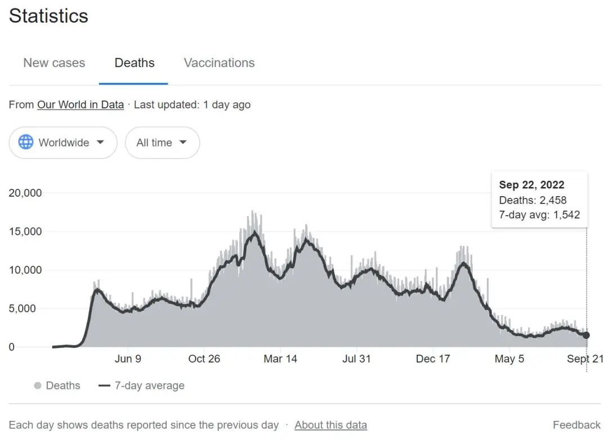 (原始链接: https://mmbiz.qpic.cn/mmbiz_jpg/904kUibXm7Y6jicibGvHH6oDlHiaicRlfNqqic1OGWl2QCs73ZuZOicZNHHITQ7QhXkZ4lopI4L5iaDK4eAR4ibObgibLdAQ/640?wx_fmt=jpeg)
- 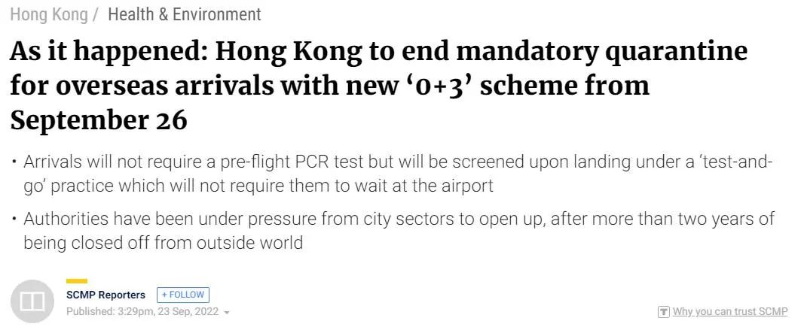 (原始链接: https://mmbiz.qpic.cn/mmbiz_jpg/904kUibXm7Y6jicibGvHH6oDlHiaicRlfNqqicD0ebLmLItUHx0YIzucpibwtPia4M0yRm3tE7lJvnHQ92TuicNqLm48nSA/640?wx_fmt=jpeg)
-  (原始链接: https://mmbiz.qpic.cn/mmbiz_jpg/904kUibXm7Y6jicibGvHH6oDlHiaicRlfNqqicTPVa6r0UMicicHxjP2QOBvX7uamlGBRGNtm6WSMRJptwYFBdFzyFpUlg/640?wx_fmt=jpeg)
-  (原始链接: https://mmbiz.qpic.cn/mmbiz_jpg/904kUibXm7Y6jicibGvHH6oDlHiaicRlfNqqicasIRVFADUQTGJISlxStJzrQ49ibHnicP1m9FwIbCIQlwhSsQarcHSrUg/640?wx_fmt=jpeg)
-  (原始链接: https://mmbiz.qpic.cn/mmbiz_png/904kUibXm7Y6jicibGvHH6oDlHiaicRlfNqqiclSkX6hjuPpGoDKNCVQA3CohGhfZQQxtdOUONXIOqGBYCXAtRVeyN0w/640?wx_fmt=png)
-  (原始链接: https://mmbiz.qpic.cn/mmbiz_jpg/904kUibXm7Y6jicibGvHH6oDlHiaicRlfNqqicTTN2AZ0hoFb6egiahrnsRlzYYbEib7Wk7qk3wOOcFjTXCibxOubbbWH1Q/640?wx_fmt=jpeg)
- 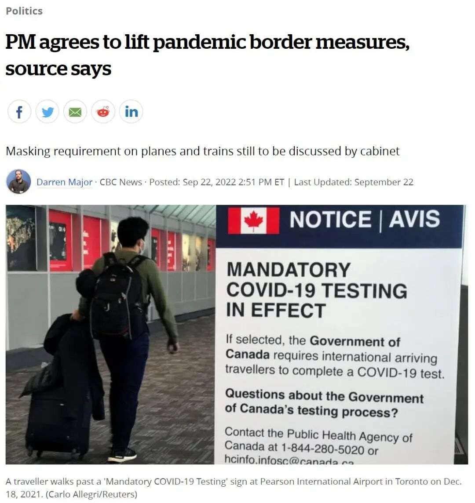 (原始链接: https://mmbiz.qpic.cn/mmbiz_jpg/904kUibXm7Y6jicibGvHH6oDlHiaicRlfNqqicD040vxNDcFiahmyl3hOFUylLVnrJGOPCIhlyg0kTUWjm6ibK7GjWYMKg/640?wx_fmt=jpeg)
- 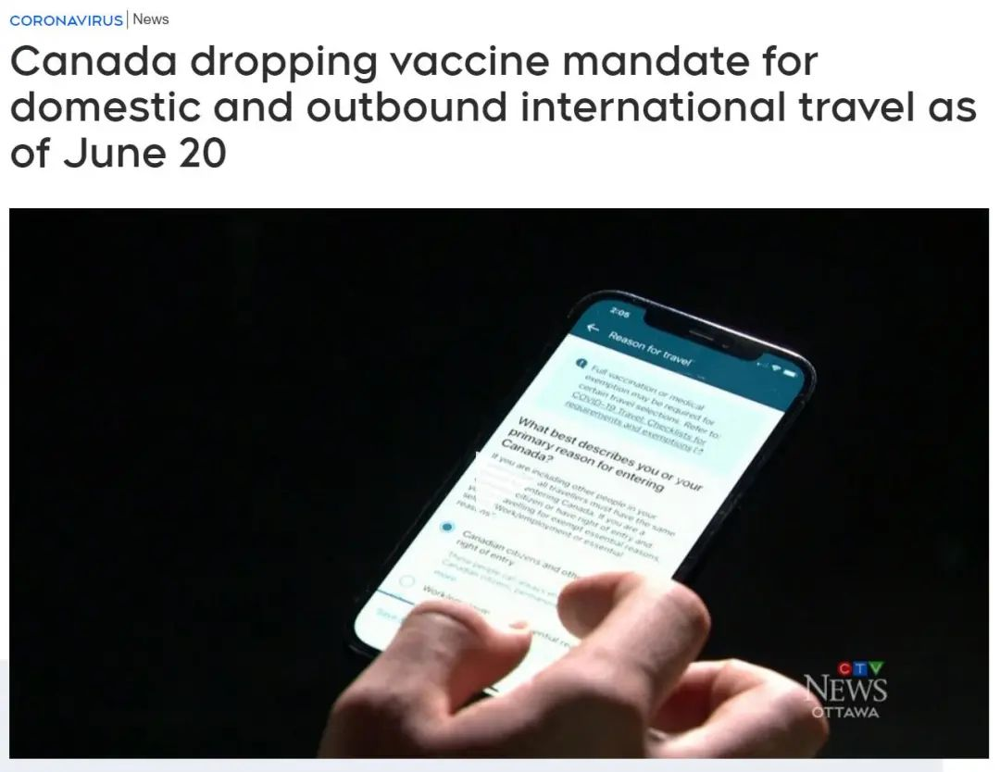 (原始链接: https://mmbiz.qpic.cn/mmbiz_jpg/904kUibXm7Y6jicibGvHH6oDlHiaicRlfNqqicONf7L0icu6uicGicKxL6ia3Akibiaqk6icIY4xlev1ksGB0ZMllH4aeYz0KUw/640?wx_fmt=jpeg)
-  (原始链接: https://mmbiz.qpic.cn/mmbiz_jpg/904kUibXm7Y6jicibGvHH6oDlHiaicRlfNqqic2BIBWeuguDT6x0MF3O9HjHvXPc95adVHpiaoT1mZBTOEmoVYpJjic3icw/640?wx_fmt=jpeg)
- 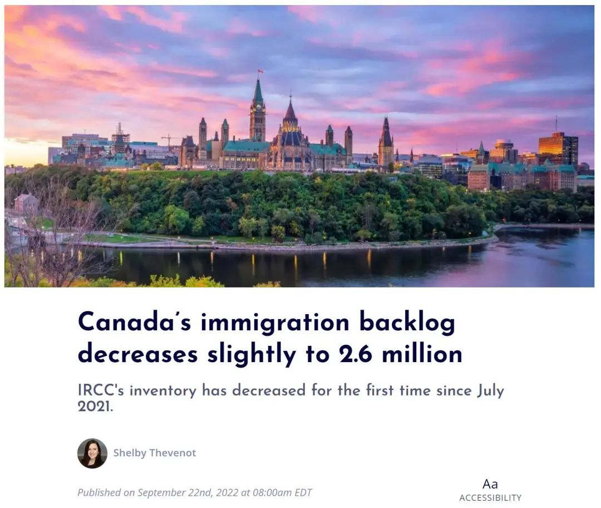 (原始链接: https://mmbiz.qpic.cn/mmbiz_jpg/904kUibXm7Y6jicibGvHH6oDlHiaicRlfNqqic563qke50nWoN383AxZJvwQ0NoichWYwczxoSHwRu2iaUquk0H7DykkpQ/640?wx_fmt=jpeg)
- 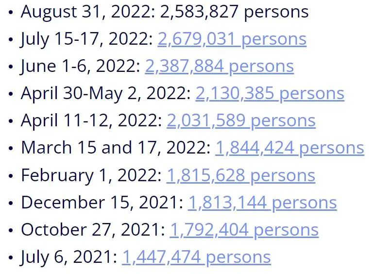 (原始链接: https://mmbiz.qpic.cn/mmbiz_jpg/904kUibXm7Y6jicibGvHH6oDlHiaicRlfNqqicMhVJ4X7bibt4FP8Zj5ChSeuvp02ic6lDYACMM3x8SIEkNWiby7db1J9Ww/640?wx_fmt=jpeg)
- 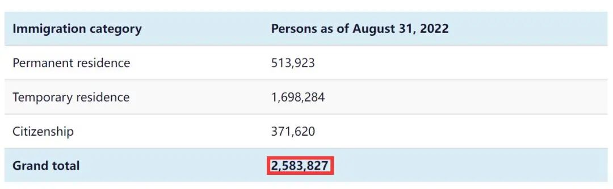 (原始链接: https://mmbiz.qpic.cn/mmbiz_jpg/904kUibXm7Y6jicibGvHH6oDlHiaicRlfNqqicoibIDakiciazeOibOYFEjPYpaPSTQOaX5p7pgQkRSYtp4OSPUibNsvfP9wg/640?wx_fmt=jpeg)
- 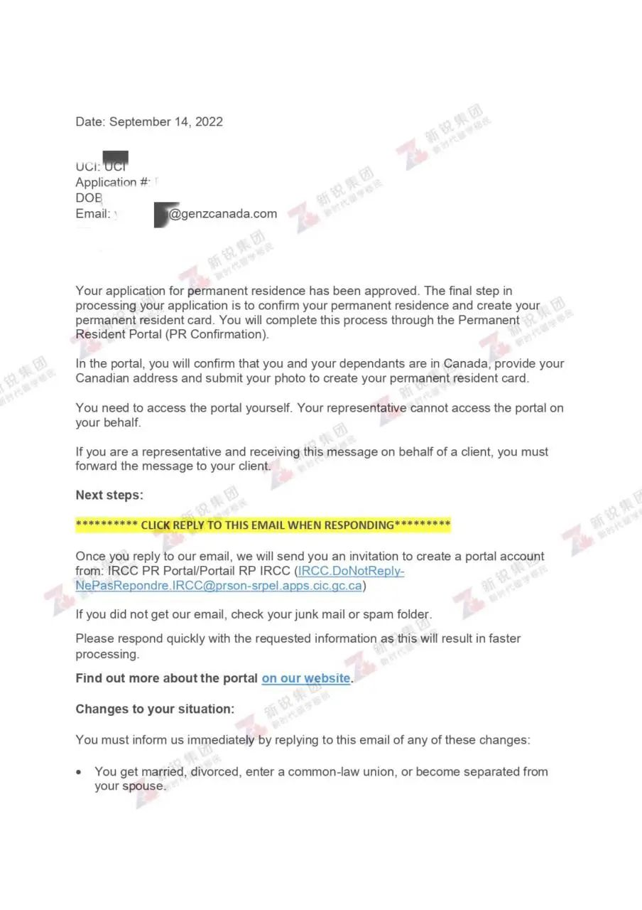 (原始链接: https://mmbiz.qpic.cn/mmbiz_jpg/904kUibXm7Y6jicibGvHH6oDlHiaicRlfNqqictpe2cgCpln8wohX2f3TJoe8iab16ibicO2ag6rxMHZjEv2Tog6pfCkDmg/640?wx_fmt=jpeg)
- 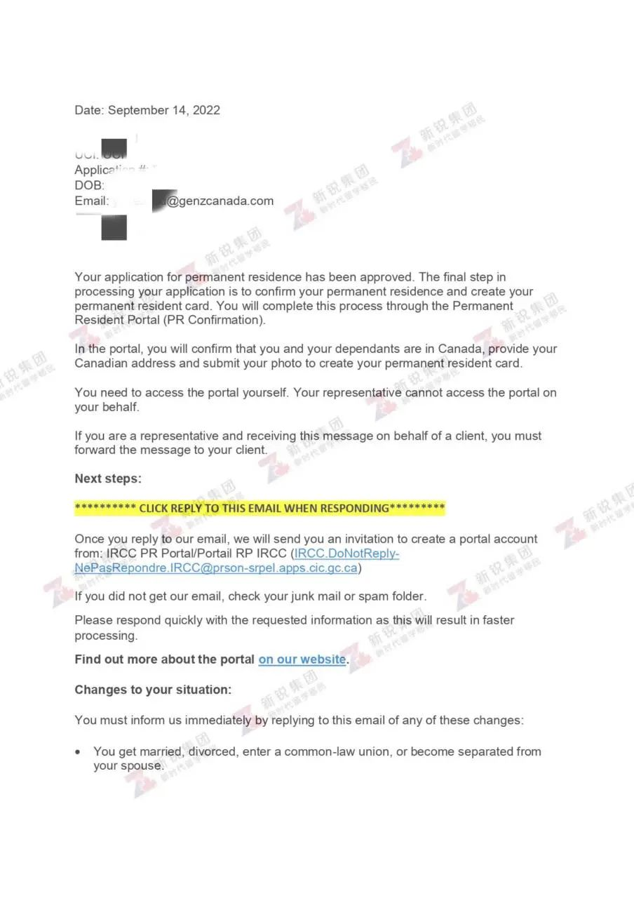 (原始链接: https://mmbiz.qpic.cn/mmbiz_jpg/904kUibXm7Y6jicibGvHH6oDlHiaicRlfNqqicT1yUeLHOb64ls4iaULz3cUPr1eG69iayibkyIdyHadZf6q5ESMUYArkMw/640?wx_fmt=jpeg)
- 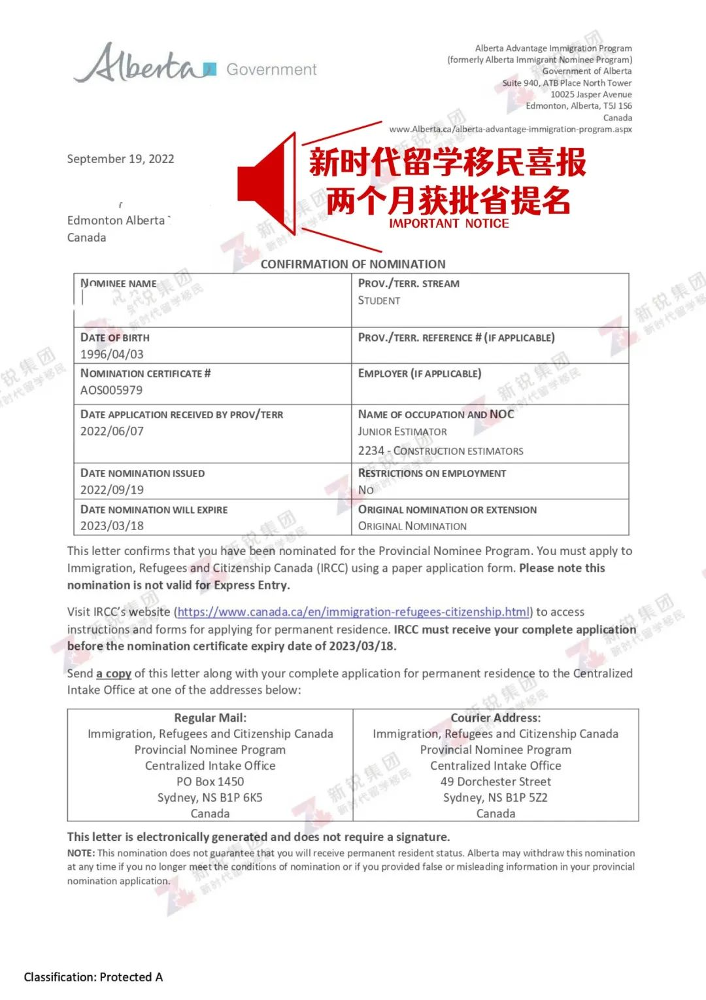 (原始链接: https://mmbiz.qpic.cn/mmbiz_jpg/904kUibXm7Y6jicibGvHH6oDlHiaicRlfNqqicF1rOgzia8Bvv7VVe9L7s3LvABZnVey0rXG3W9ty7mAEAB8Sibq3oaUzQ/640?wx_fmt=jpeg)
- 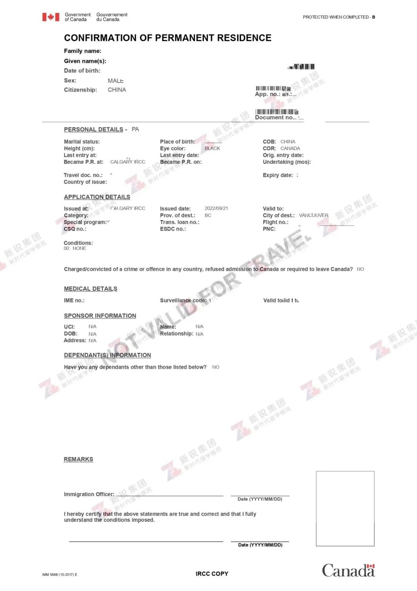 (原始链接: https://mmbiz.qpic.cn/mmbiz_jpg/904kUibXm7Y6jicibGvHH6oDlHiaicRlfNqqicsQCu7iaQCiaG2iafGoIibJhdYM9kolbVBnGSNPQxMQUUHftsCtsj5M4gKA/640?wx_fmt=jpeg)
- 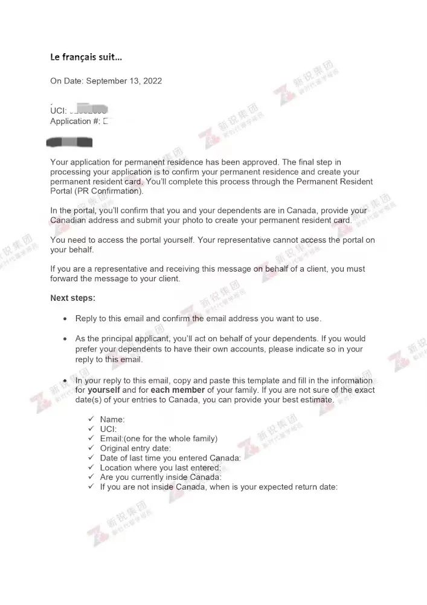 (原始链接: https://mmbiz.qpic.cn/mmbiz_jpg/904kUibXm7Y6jicibGvHH6oDlHiaicRlfNqqicgVmTOz0NSL8CMT9bEEfZgicRe9ZiccfUGDhSBW4qaRrVWhicWqL7x8dsA/640?wx_fmt=jpeg)
- 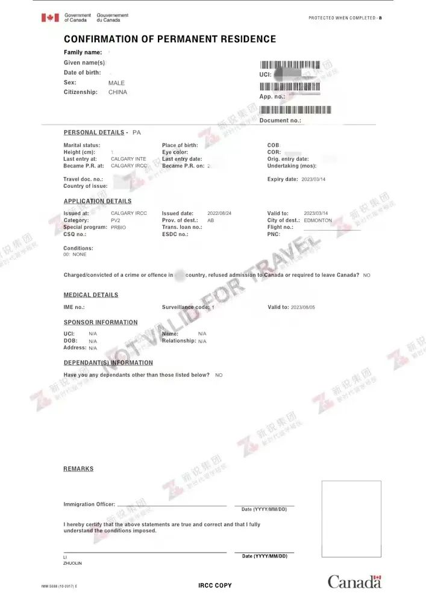 (原始链接: https://mmbiz.qpic.cn/mmbiz_jpg/904kUibXm7Y6jicibGvHH6oDlHiaicRlfNqqicYG1P3PKbETXqMeVG8YHSmVbRMAdlvIMoMAtPFPxibjopRMItibKzTWaw/640?wx_fmt=jpeg)
- 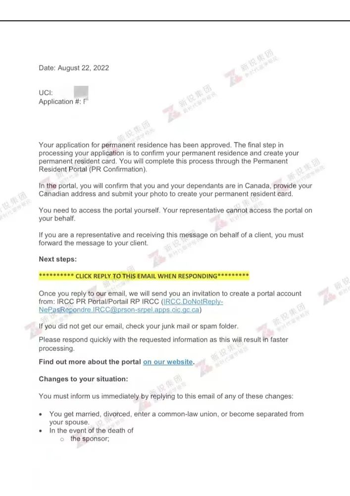 (原始链接: https://mmbiz.qpic.cn/mmbiz_jpg/904kUibXm7Y6jicibGvHH6oDlHiaicRlfNqqiceGYOwicH9oZwmp2GLBzU9hQG7VLJAvhug1TCQO5HAbMRZyVukJR5krQ/640?wx_fmt=jpeg)
- 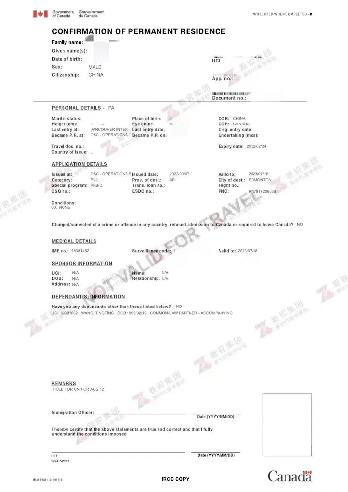 (原始链接: https://mmbiz.qpic.cn/mmbiz_jpg/904kUibXm7Y6jicibGvHH6oDlHiaicRlfNqqicdxBY127IdkXtESehiaBUIv6ZWkTaoQwXqYub9MAo53TIsLJmrqXukiaw/640?wx_fmt=jpeg)
- 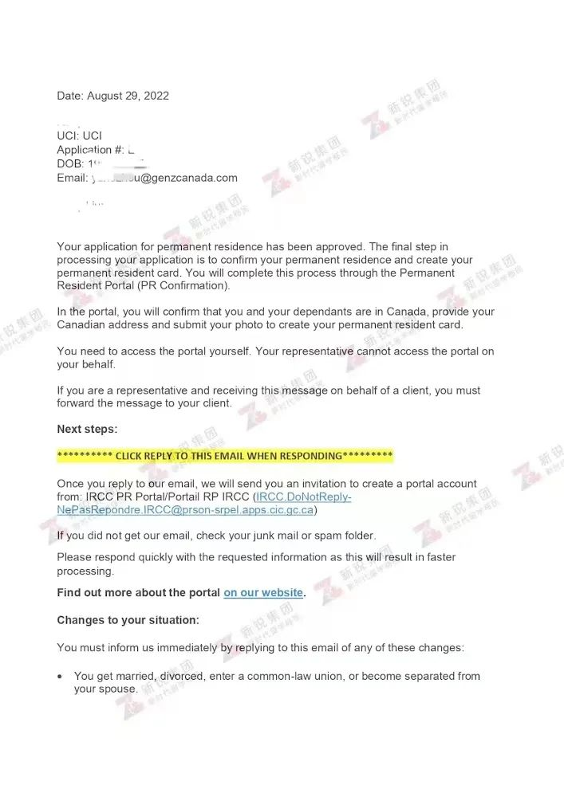 (原始链接: https://mmbiz.qpic.cn/mmbiz_jpg/904kUibXm7Y6jicibGvHH6oDlHiaicRlfNqqicdpaHEgy7XicamyfVavecia1mmtiaGibofwlRJFD3NxIKTRLibSdRAmo1apQ/640?wx_fmt=jpeg)
- 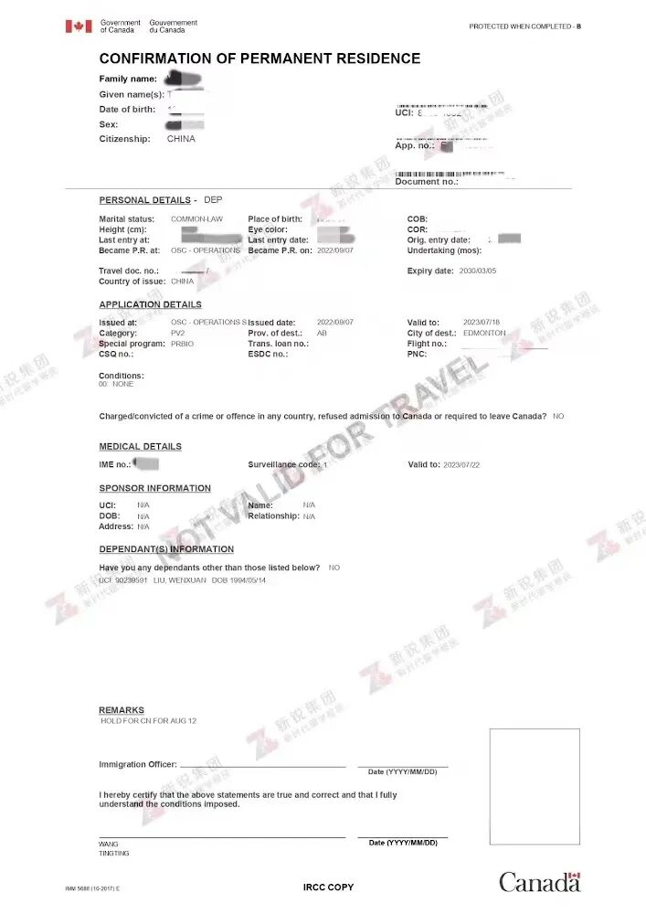 (原始链接: https://mmbiz.qpic.cn/mmbiz_jpg/904kUibXm7Y6jicibGvHH6oDlHiaicRlfNqqicEfklLen3IRKu9vdeib0H5iciarY9REntc7DQLOkBqYtBM0H8XqXibn03Lw/640?wx_fmt=jpeg)
- 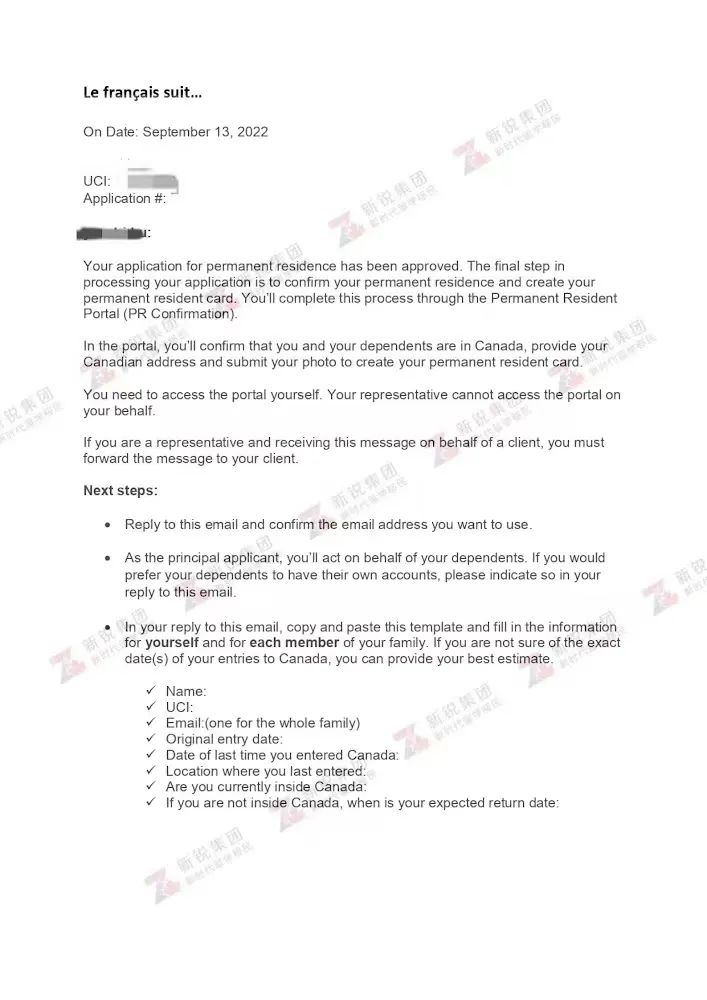 (原始链接: https://mmbiz.qpic.cn/mmbiz_jpg/904kUibXm7Y6jicibGvHH6oDlHiaicRlfNqqicEvOfjia9cGKDCmqaZ7zncqibtRaYqLpY0ztMb45nFqtdpWZJ4tFgffwA/640?wx_fmt=jpeg)
- 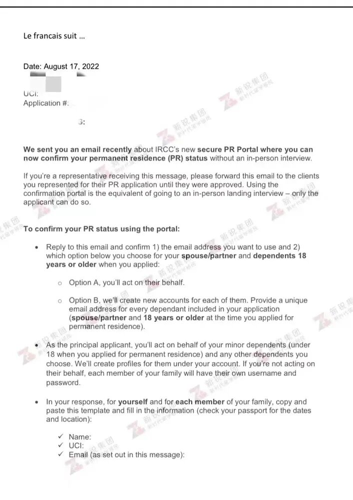 (原始链接: https://mmbiz.qpic.cn/mmbiz_jpg/904kUibXm7Y6jicibGvHH6oDlHiaicRlfNqqichJKS6vZmKum2mYzlnFa2HoFaiaAdoAwNZicApRvwAjEMZvKtbJ3BQibeA/640?wx_fmt=jpeg)
-  (原始链接: https://mmbiz.qpic.cn/mmbiz_png/904kUibXm7Y6jicibGvHH6oDlHiaicRlfNqqicSHnJ9Xiaj5fA8krgzsDtcPvle3R6M3fQibyOKSX3Fqv39dQhZVYSoqPA/640?wx_fmt=png)
-  (原始链接: https://mmbiz.qpic.cn/mmbiz_jpg/904kUibXm7Y6jicibGvHH6oDlHiaicRlfNqqic59c6IWycVvFsnYpHNSic0qoJgNM7XVlzXDI1icYbrrdkvGicNAJbcrZ6Q/640?wx_fmt=jpeg)
-  (原始链接: https://mmbiz.qpic.cn/mmbiz_jpg/904kUibXm7Y6jicibGvHH6oDlHiaicRlfNqqick5NKPsTUVzPLm6icbCnmgz3XLpLj1fvNcHrRJKlXBKzpicsW0oKqRDRw/640?wx_fmt=jpeg)
-  (原始链接: https://mmbiz.qpic.cn/mmbiz_jpg/904kUibXm7Y6jicibGvHH6oDlHiaicRlfNqqic86eGZ5xOPSVmgQhGJE4vBc2bIBFPOHIUKib23X12g3z4A4HaiagEfFIg/640?wx_fmt=jpeg)
-  (原始链接: https://mmbiz.qpic.cn/mmbiz_jpg/904kUibXm7Y6jicibGvHH6oDlHiaicRlfNqqicVCdWR6iaGXfvXmdyAgLbvR9ODcF6lwrJf9fTdQCmFOPia00V9Rbtiaswg/640?wx_fmt=jpeg)
-  (原始链接: https://mmbiz.qpic.cn/mmbiz_png/904kUibXm7Y6jicibGvHH6oDlHiaicRlfNqqicbvhDm55jHrkiaS62PDFZHkXQhSGXTzwHy9iaWKB5RpP8opZYfibreIDEA/640?wx_fmt=png)
-  (原始链接: https://mmbiz.qpic.cn/mmbiz_jpg/904kUibXm7Y6jicibGvHH6oDlHiaicRlfNqqicrYMVN2tmtWKZvicYAyiaVSiaNFj1LDe5HWKxzvYnaPVXFp2v7APwibmNhg/640?wx_fmt=jpeg)
-  (原始链接: https://mmbiz.qpic.cn/mmbiz_jpg/904kUibXm7Y6jicibGvHH6oDlHiaicRlfNqqicMZ552HX2QAprqCNmJ3u2MEKM5Pn5tqSYWPfB6w1q3NqYqpvo9CP5EQ/640?wx_fmt=jpeg)
-  (原始链接: https://mmbiz.qpic.cn/mmbiz_jpg/904kUibXm7Y6jicibGvHH6oDlHiaicRlfNqqic5UjFAiaL6AcwerGQoEIlGhh4N8a3VMH26K6M1sXo8hFFVNf2OiaGWgicQ/640?wx_fmt=jpeg)
