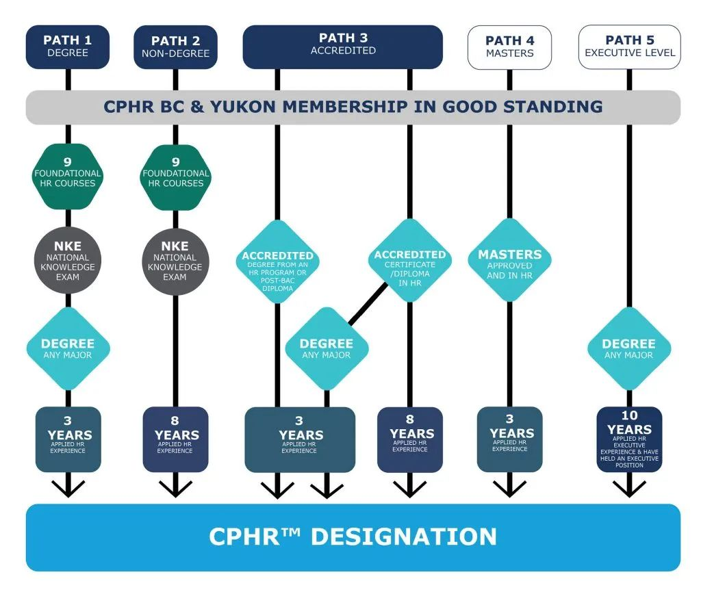

# 无标题

**链接地址:** http://mp.weixin.qq.com/s?__biz=MzI4NDYyNjAwNw==&mid=2247486557&idx=1&sn=61345e53fe2636262cbfde9977e1e4cc&chksm=ebf9d165dc8e587310a35fb4103b0aebeaa438f5ab464e839fdf8a9e056b5cd9984c1e1f54a2&mpshare=1&scene=2&srcid=1017TQobWVk7pXY8QuF15jsW&sharer_sharetime=1665964691467&sharer_shareid=77848a6b3852ae4dcb6c74ffee84743c#rd
**作者:** 关注我们
**获取时间:** 2025/8/28 19:28:58
**图片数量:** 19

---

## 原始HTML内容

<section style="box-sizing: border-box;font-size: 16px;"><section style="text-align: left;justify-content: flex-start;display: flex;flex-flow: row nowrap;margin-top: 20px;margin-bottom: 10px;box-sizing: border-box;" powered-by="xiumi.us"><section style="display: inline-block;vertical-align: top;width: auto;min-width: 5%;max-width: 100%;flex: 0 0 auto;height: auto;box-sizing: border-box;"><section style="text-align: right;transform: translate3d(6px, 0px, 0px);margin-top: -5px;box-sizing: border-box;" powered-by="xiumi.us"><section style="display: inline-block;width: 11px;height: 11px;vertical-align: top;overflow: hidden;border-style: solid;border-width: 2px 0px 0px 2px;border-color: rgb(166, 125, 69) rgb(62, 62, 62) rgb(62, 62, 62) rgb(166, 125, 69);box-sizing: border-box;"><section style="text-align: justify;box-sizing: border-box;" powered-by="xiumi.us">
 
</section></section></section></section><section style="display: inline-block;vertical-align: top;width: auto;align-self: flex-start;flex: 0 0 auto;min-width: 5%;max-width: 100%;height: auto;background-color: rgba(237, 146, 15, 0.1);padding: 7px;box-sizing: border-box;"><section style="text-align: justify;color: rgb(62, 62, 62);box-sizing: border-box;" powered-by="xiumi.us">
<strong style="box-sizing: border-box;">点击蓝字 </strong>
</section></section><section style="display: inline-block;vertical-align: top;width: auto;align-self: flex-start;flex: 0 0 auto;min-width: 5%;max-width: 100%;height: auto;padding: 7px;box-sizing: border-box;"><section style="text-align: justify;color: rgb(237, 128, 15);box-sizing: border-box;" powered-by="xiumi.us">
<strong style="box-sizing: border-box;">关注我们</strong>
</section></section></section>
 
<section style="text-align: left;justify-content: flex-start;display: flex;flex-flow: row nowrap;margin-top: 10px;margin-bottom: 10px;box-sizing: border-box;" powered-by="xiumi.us"><section style="display: inline-block;width: 100%;vertical-align: top;align-self: flex-start;flex: 0 0 auto;background-color: rgba(237, 146, 15, 0.1);padding: 25px;box-sizing: border-box;"><section style="text-align: center;margin-top: 10px;box-sizing: border-box;" powered-by="xiumi.us"><section style="max-width: 100%;vertical-align: middle;display: inline-block;line-height: 0;width: 100%;height: auto;box-sizing: border-box;"></section></section><section style="text-align: justify;box-sizing: border-box;" powered-by="xiumi.us">
 
</section><section style="margin-top: 10px;margin-bottom: 10px;text-align: center;box-sizing: border-box;" powered-by="xiumi.us"><section style="padding: 3px;display: inline-block;border-bottom: 5px solid rgb(218, 87, 12);box-sizing: border-box;">
<strong style="box-sizing: border-box;">在加拿大做HR是怎样一种体验？</strong>
</section></section><section style="text-align: justify;box-sizing: border-box;" powered-by="xiumi.us">
 
</section><section style="text-align: justify;font-size: 14px;color: rgb(84, 82, 82);line-height: 2;letter-spacing: 2px;box-sizing: border-box;" powered-by="xiumi.us">
<strong style="box-sizing: border-box;">Human Resource Management（HRM，人力资源管理）</strong>作为加国高校商学院的一个热门专业，一直以来是不少留学生求学的心仪目标。同时，人力资源是近几年国内最火的就业方向之一，在加拿大也是炙手可热的一个行业。然而，你或许也会惊奇地发现一个事实，那就是北美职场中真正在人力资源部门从事人事岗位工作的<strong style="box-sizing: border-box;">华人面孔却并不是很多</strong>。

 

<strong style="box-sizing: border-box;">到底是什么原因阻碍了HR专业的毕业生们从事这个行业的工作呢？到底是什么原因让HR这个留学的“热门专业”变成了拥有隐形高门槛的“冷门职业”？</strong>

 

<strong style="box-sizing: border-box;">语言障碍？</strong>

<strong style="box-sizing: border-box;">人情世故？</strong>

<strong style="box-sizing: border-box;">文化差异？</strong>

还是……

 
</section><section style="text-align: center;margin-top: 10px;margin-bottom: 10px;box-sizing: border-box;" powered-by="xiumi.us"><section style="max-width: 100%;vertical-align: middle;display: inline-block;line-height: 0;box-sizing: border-box;"></section></section><section style="text-align: justify;font-size: 14px;color: rgb(84, 82, 82);line-height: 2;letter-spacing: 2px;box-sizing: border-box;" powered-by="xiumi.us">
 

在过去的专栏文章中，我们曾邀请嘉宾向加国的工作者们介绍了许多热门职业的从业心得。然而作为帮助大家求职就业的<strong style="box-sizing: border-box;">人力资源顾问</strong>，却从未真正揭秘过自己<strong style="box-sizing: border-box;">“老本行”</strong>的那些故事。

 

今天，我们荣幸邀请到BadaB Consulting的资深人力资源顾问Ada Tai女士为大家讲述这个令许多人好奇的话题：

 

<em style="box-sizing: border-box;"><strong style="box-sizing: border-box;">“在加拿大做HR是怎样一种体验？”</strong></em>

 

同时，也从资深HR的角度帮助大家回答关于<strong style="box-sizing: border-box;">华人在加国职场生存之道</strong>的一些高询问度话题。让我们开始吧！
</section></section></section>
 
<section style="display: flex;flex-flow: row nowrap;margin: 10px 0%;text-align: left;justify-content: flex-start;box-sizing: border-box;" powered-by="xiumi.us"><section style="display: inline-block;vertical-align: bottom;width: auto;flex: 100 100 0%;align-self: flex-end;height: auto;margin-right: -15px;z-index: 2;box-sizing: border-box;"><section style="font-size: 32px;color: rgb(237, 128, 15);text-align: right;line-height: 1;letter-spacing: 0px;box-sizing: border-box;" powered-by="xiumi.us">
<strong style="box-sizing: border-box;">提问</strong>
</section><section style="text-align: right;color: rgb(237, 128, 15);line-height: 1.6;letter-spacing: 0px;box-sizing: border-box;" powered-by="xiumi.us">
<strong style="box-sizing: border-box;">Qustions</strong>
</section></section><section style="display: inline-block;vertical-align: bottom;width: auto;flex: 0 0 auto;align-self: flex-end;margin-bottom: 10px;min-width: 10%;max-width: 100%;height: auto;z-index: 3;box-sizing: border-box;"><section style="opacity: 0.2;box-sizing: border-box;" powered-by="xiumi.us"><section style="color: rgb(255, 226, 196);font-size: 96px;text-align: center;line-height: 1;box-sizing: border-box;">
<strong style="box-sizing: border-box;">&amp;</strong>
</section></section></section><section style="display: inline-block;vertical-align: bottom;width: auto;flex: 97.0494 97.0494 0%;align-self: flex-end;height: auto;z-index: 2;margin-left: -15px;box-sizing: border-box;"><section style="font-size: 32px;color: rgb(84, 82, 82);line-height: 1;letter-spacing: 0px;box-sizing: border-box;" powered-by="xiumi.us">
<strong style="box-sizing: border-box;">解答</strong>
</section><section style="color: rgb(84, 82, 82);line-height: 1.6;letter-spacing: 0px;box-sizing: border-box;" powered-by="xiumi.us">
<strong style="box-sizing: border-box;">Answers</strong>
</section></section></section><section style="text-align: center;margin: 10px 0%;justify-content: center;display: flex;flex-flow: row nowrap;box-sizing: border-box;" powered-by="xiumi.us"><section style="display: inline-block;width: 90%;vertical-align: top;border-style: solid;border-width: 2px;border-color: rgb(237, 128, 15);letter-spacing: 0px;padding: 10px;align-self: flex-start;flex: 0 0 auto;box-sizing: border-box;"><section style="justify-content: center;display: flex;flex-flow: row nowrap;box-sizing: border-box;" powered-by="xiumi.us"><section style="display: inline-block;vertical-align: middle;width: 40%;align-self: center;flex: 0 0 auto;box-sizing: border-box;"><section style="margin-right: 0%;margin-left: 0%;box-sizing: border-box;" powered-by="xiumi.us"><section style="max-width: 100%;vertical-align: middle;display: inline-block;line-height: 0;border-width: 0px;width: 100%;box-sizing: border-box;"></section></section></section><section style="display: inline-block;vertical-align: middle;width: 60%;padding-left: 10px;align-self: center;flex: 0 0 auto;box-sizing: border-box;"><section style="margin-right: 0%;margin-bottom: 5px;margin-left: 0%;box-sizing: border-box;" powered-by="xiumi.us"><section style="display: inline-block;border-width: 2px;border-style: solid;border-color: rgb(237, 128, 15);padding: 0.1em 0.3em;background-color: rgb(237, 128, 15);color: rgb(255, 255, 255);font-size: 18px;box-sizing: border-box;">
<strong style="box-sizing: border-box;">Ada&nbsp; Tai</strong>
</section></section><section style="margin-right: 0%;margin-left: 0%;box-sizing: border-box;" powered-by="xiumi.us"><section style="font-size: 13px;box-sizing: border-box;">
<strong style="box-sizing: border-box;">MBA, CPHR, SHRM-SCP</strong>
</section></section><section style="text-align: justify;font-size: 12px;box-sizing: border-box;" powered-by="xiumi.us">
 

毕业于埃尔伯塔大学工商管理硕士学位，并拥有加拿大和美国“注册人力资源管理师”资格证。十几年来 Ada 一直在不同的领域从事人力资源的管理工作。
</section></section></section></section></section>
 

 
<section style="margin-top: 10px;isolation: isolate;display: flex;flex-flow: row nowrap;text-align: left;justify-content: flex-start;box-sizing: border-box;" powered-by="xiumi.us"><section style="display: inline-block;vertical-align: top;width: auto;background-color: rgb(237, 128, 15);min-width: 10%;max-width: 100%;flex: 0 0 auto;height: auto;padding: 9px 15px;align-self: stretch;box-sizing: border-box;"><section style="color: rgb(255, 255, 255);text-align: justify;box-sizing: border-box;" powered-by="xiumi.us">
<strong style="box-sizing: border-box;">Q</strong>
</section></section><section style="display: inline-block;vertical-align: top;width: auto;background-color: rgb(255, 247, 240);flex: 100 100 0%;height: auto;align-self: stretch;padding: 4px 4px 4px 12px;box-sizing: border-box;"><section style="margin-top: 5px;box-sizing: border-box;" powered-by="xiumi.us"><section style="color: rgb(237, 128, 15);text-align: justify;box-sizing: border-box;">
<strong style="box-sizing: border-box;">在加拿大做HR需要什么学历和证书？</strong>
</section></section></section></section><section style="text-align: left;transform: translate3d(7px, 0px, 0px);-webkit-transform: translate3d(7px, 0px, 0px);-moz-transform: translate3d(7px, 0px, 0px);-o-transform: translate3d(7px, 0px, 0px);box-sizing: border-box;" powered-by="xiumi.us"><section style="display: inline-block;width: 0px;height: 0px;vertical-align: top;overflow: hidden;border-style: solid;border-width: 4px;border-color: rgb(237, 128, 15) rgba(255, 255, 255, 0) rgba(255, 255, 255, 0) rgb(237, 128, 15);box-sizing: border-box;"><svg viewBox="0 0 1 1" style="float:left;line-height:0;width:0;vertical-align:top;"></svg></section></section><section style="margin-bottom: 10px;text-align: left;justify-content: flex-start;display: flex;flex-flow: row nowrap;box-sizing: border-box;" powered-by="xiumi.us"><section style="display: inline-block;width: 100%;vertical-align: top;border-style: solid;border-width: 1px;border-color: rgb(237, 128, 15);align-self: flex-start;flex: 0 0 auto;box-sizing: border-box;"><section style="display: flex;flex-flow: row nowrap;text-align: center;justify-content: center;box-sizing: border-box;" powered-by="xiumi.us"><section style="display: inline-block;vertical-align: top;width: auto;min-width: 10%;max-width: 100%;flex: 0 0 auto;height: auto;align-self: flex-start;background-color: rgb(255, 247, 240);padding: 15px;box-sizing: border-box;"><section style="box-sizing: border-box;" powered-by="xiumi.us"><section style="color: rgb(218, 87, 12);box-sizing: border-box;">
<strong style="box-sizing: border-box;">A</strong>
</section></section></section><section style="display: inline-block;vertical-align: top;width: auto;flex: 100 100 0%;align-self: flex-start;height: auto;padding: 20px 30px 20px 16px;box-sizing: border-box;"><section style="text-align: justify;font-size: 14px;color: rgb(106, 106, 106);box-sizing: border-box;" powered-by="xiumi.us">
通常来说，加拿大HR的学历要求基本上就是HR的本科学历。不过在加拿大做HR还要考一个<strong style="box-sizing: border-box;">人力资源职业资格认证，CPHR&nbsp;</strong>(Chartered Professional in Human Resources)。这个证件要求是本科是HR毕业就可以参加国家的考试；如果本科不是HR毕业的话，需要三年的全职的HR的经验才允许你参考，考试通过就可以拿到证书了。
</section></section></section></section></section>
 
<section style="margin-top: 10px;margin-bottom: 10px;text-align: center;box-sizing: border-box;" powered-by="xiumi.us"><section style="padding-left: 1em;padding-right: 1em;display: inline-block;box-sizing: border-box;">
<strong style="box-sizing: border-box;">“CPHR”是什么？</strong>
 </section><section style="border-width: 1px;border-style: solid;border-color: rgb(192, 200, 209);margin-top: -1em;padding: 20px 10px 10px;background-color: rgb(239, 239, 239);box-sizing: border-box;"><section style="text-align: justify;font-size: 14px;padding-right: 15px;padding-left: 15px;box-sizing: border-box;" powered-by="xiumi.us">
 

CPHR (Chartered Professional in Human Resources) 加拿大特许人力资源专家资格认证，是全加拿大<strong style="box-sizing: border-box;">人力资源专业人士唯一认可的国家级认证</strong>，也是唯一被国际上认可的加拿大人力资源职业资格认证。该资格认证代表了对持证人专业性的持续认可。

 
</section><section style="margin-top: 10px;margin-bottom: 10px;box-sizing: border-box;" powered-by="xiumi.us"><section style="max-width: 100%;vertical-align: middle;display: inline-block;line-height: 0;box-sizing: border-box;"></section></section><section style="text-align: justify;font-size: 14px;padding-right: 15px;padding-left: 15px;box-sizing: border-box;" powered-by="xiumi.us">
 

除了取得CPHR认证的学位和证书课程以外，还可以进行<strong style="box-sizing: border-box;">“National Knowledge Exam（NKE）”考试</strong>。通过专业知识考试，并在积累3年的相关行业经验后，就可以申请第二部分的实际问题处理考试，考察人力资源师对工作中可能遇到的实际情景状况的解决能力。

 
</section></section></section><section style="text-align: center;margin-top: 10px;margin-bottom: 10px;box-sizing: border-box;" powered-by="xiumi.us"><section style="max-width: 100%;vertical-align: middle;display: inline-block;line-height: 0;box-sizing: border-box;"></section></section>
 
<section style="margin-top: 10px;isolation: isolate;display: flex;flex-flow: row nowrap;text-align: left;justify-content: flex-start;box-sizing: border-box;" powered-by="xiumi.us"><section style="display: inline-block;vertical-align: top;width: auto;background-color: rgb(237, 128, 15);min-width: 10%;max-width: 100%;flex: 0 0 auto;height: auto;padding: 9px 15px;align-self: stretch;box-sizing: border-box;"><section style="color: rgb(255, 255, 255);text-align: justify;box-sizing: border-box;" powered-by="xiumi.us">
<strong style="box-sizing: border-box;">Q</strong>
</section></section><section style="display: inline-block;vertical-align: top;width: auto;background-color: rgb(255, 247, 240);flex: 100 100 0%;height: auto;align-self: stretch;padding: 4px 4px 4px 12px;box-sizing: border-box;"><section style="margin-top: 5px;box-sizing: border-box;" powered-by="xiumi.us"><section style="color: rgb(237, 128, 15);text-align: justify;box-sizing: border-box;">
<strong style="box-sizing: border-box;">为什么加拿大的华人HR数量偏少？</strong>
</section></section></section></section><section style="text-align: left;transform: translate3d(7px, 0px, 0px);-webkit-transform: translate3d(7px, 0px, 0px);-moz-transform: translate3d(7px, 0px, 0px);-o-transform: translate3d(7px, 0px, 0px);box-sizing: border-box;" powered-by="xiumi.us"><section style="display: inline-block;width: 0px;height: 0px;vertical-align: top;overflow: hidden;border-style: solid;border-width: 4px;border-color: rgb(237, 128, 15) rgba(255, 255, 255, 0) rgba(255, 255, 255, 0) rgb(237, 128, 15);box-sizing: border-box;"><svg viewBox="0 0 1 1" style="float:left;line-height:0;width:0;vertical-align:top;"></svg></section></section><section style="margin-bottom: 10px;text-align: left;justify-content: flex-start;display: flex;flex-flow: row nowrap;box-sizing: border-box;" powered-by="xiumi.us"><section style="display: inline-block;width: 100%;vertical-align: top;border-style: solid;border-width: 1px;border-color: rgb(237, 128, 15);align-self: flex-start;flex: 0 0 auto;box-sizing: border-box;"><section style="display: flex;flex-flow: row nowrap;text-align: center;justify-content: center;box-sizing: border-box;" powered-by="xiumi.us"><section style="display: inline-block;vertical-align: top;width: auto;min-width: 10%;max-width: 100%;flex: 0 0 auto;height: auto;align-self: flex-start;background-color: rgb(255, 247, 240);padding: 15px;box-sizing: border-box;"><section style="box-sizing: border-box;" powered-by="xiumi.us"><section style="color: rgb(218, 87, 12);box-sizing: border-box;">
<strong style="box-sizing: border-box;">A</strong>
</section></section></section><section style="display: inline-block;vertical-align: top;width: auto;flex: 100 100 0%;align-self: flex-start;height: auto;padding: 20px 30px 20px 16px;box-sizing: border-box;"><section style="text-align: justify;font-size: 14px;color: rgb(106, 106, 106);box-sizing: border-box;" powered-by="xiumi.us">
HR在加拿大就业对<strong style="box-sizing: border-box;">英语和文化背景的要求非常的高</strong>。英语不仅仅是口语说得好就行，英语听说读写都需要十分的娴熟才能保证你的职场竞争力。

 

另外，还需要非常理解当地<strong style="box-sizing: border-box;">职场文化</strong>，也需要对<strong style="box-sizing: border-box;">劳工法</strong>有很深刻的了解。这样的要求对刚来加拿大时间不长的留学生和新移民群体显得<strong style="box-sizing: border-box;">十分苛刻</strong>——纵使你在国内已经是一位经验丰富功成名就的HR，想要来到加大无缝对接本职工作也十分不易。

 

最后就是入门的<strong style="box-sizing: border-box;">“起点低”</strong>，没有经验的从业者大部分都需要从办公室中最基础的文职工作开始<strong style="box-sizing: border-box;">“熬”</strong>，这对于许多应届毕业生来说也是一个不小的挑战。
</section></section></section></section></section><section style="text-align: center;margin-top: 10px;margin-bottom: 10px;box-sizing: border-box;" powered-by="xiumi.us"><section style="max-width: 100%;vertical-align: middle;display: inline-block;line-height: 0;box-sizing: border-box;"></section></section>
 
<section style="margin-top: 10px;isolation: isolate;display: flex;flex-flow: row nowrap;text-align: left;justify-content: flex-start;box-sizing: border-box;" powered-by="xiumi.us"><section style="display: inline-block;vertical-align: top;width: auto;background-color: rgb(237, 128, 15);min-width: 10%;max-width: 100%;flex: 0 0 auto;height: auto;padding: 9px 15px;align-self: stretch;box-sizing: border-box;"><section style="color: rgb(255, 255, 255);text-align: justify;box-sizing: border-box;" powered-by="xiumi.us">
<strong style="box-sizing: border-box;">Q</strong>
</section></section><section style="display: inline-block;vertical-align: top;width: auto;background-color: rgb(255, 247, 240);flex: 100 100 0%;height: auto;align-self: stretch;padding: 4px 4px 4px 12px;box-sizing: border-box;"><section style="margin-top: 5px;box-sizing: border-box;" powered-by="xiumi.us"><section style="color: rgb(237, 128, 15);text-align: justify;box-sizing: border-box;">
<strong style="box-sizing: border-box;">加拿大的HR到底是做什么的？</strong>
</section></section></section></section><section style="text-align: left;transform: translate3d(7px, 0px, 0px);-webkit-transform: translate3d(7px, 0px, 0px);-moz-transform: translate3d(7px, 0px, 0px);-o-transform: translate3d(7px, 0px, 0px);box-sizing: border-box;" powered-by="xiumi.us"><section style="display: inline-block;width: 0px;height: 0px;vertical-align: top;overflow: hidden;border-style: solid;border-width: 4px;border-color: rgb(237, 128, 15) rgba(255, 255, 255, 0) rgba(255, 255, 255, 0) rgb(237, 128, 15);box-sizing: border-box;"><svg viewBox="0 0 1 1" style="float:left;line-height:0;width:0;vertical-align:top;"></svg></section></section><section style="margin-bottom: 10px;text-align: left;justify-content: flex-start;display: flex;flex-flow: row nowrap;box-sizing: border-box;" powered-by="xiumi.us"><section style="display: inline-block;width: 100%;vertical-align: top;border-style: solid;border-width: 1px;border-color: rgb(237, 128, 15);align-self: flex-start;flex: 0 0 auto;box-sizing: border-box;"><section style="display: flex;flex-flow: row nowrap;text-align: center;justify-content: center;box-sizing: border-box;" powered-by="xiumi.us"><section style="display: inline-block;vertical-align: top;width: auto;min-width: 10%;max-width: 100%;flex: 0 0 auto;height: auto;align-self: flex-start;background-color: rgb(255, 247, 240);padding: 15px;box-sizing: border-box;"><section style="box-sizing: border-box;" powered-by="xiumi.us"><section style="color: rgb(218, 87, 12);box-sizing: border-box;">
<strong style="box-sizing: border-box;">A</strong>
</section></section></section><section style="display: inline-block;vertical-align: top;width: auto;flex: 100 100 0%;align-self: flex-start;height: auto;padding: 20px 30px 20px 16px;box-sizing: border-box;"><section style="text-align: justify;font-size: 14px;color: rgb(106, 106, 106);box-sizing: border-box;" powered-by="xiumi.us">
一提到HR，很多人的第一反应是，你们不就是<strong style="box-sizing: border-box;">招人、炒人、整人和发工资</strong>的部门吗？其实这是对这个行业比较<strong style="box-sizing: border-box;">片面</strong>的认识。

 

HR是一个企业中<strong style="box-sizing: border-box;">最重要的职能之一</strong>，它是一个企业在任何发展阶段都不可或缺的战略合作伙伴。比如一个企业需要完成它的业务就不能只有一个CEO或者OWNER做光杆司令。

 

HR帮助企业的领导者策划这家企业在什么时候需要什么样的<strong style="box-sizing: border-box;">人才</strong>、需要多少人、安排在什么职位、制定企业的架构、薪酬福利待遇、计划如何吸引人才等等。招募人才后，还需要考虑如何能够让这些人在最短的时间内融入到企业文化中、完成工作并体现自己的价值。这中间又包括了对员工的入职培训、职位讲解、绩效考核、根据业绩来加薪、提升能力的各种再培训、员工关系的梳理、对各部门经理的业务支持以及开除表现有问题的员工等等。

 

从职能分配的角度，人力资源大概分成六大块，即<strong style="box-sizing: border-box;">人力资源规划</strong>、<strong style="box-sizing: border-box;">招聘与配置</strong>、<strong style="box-sizing: border-box;">培训与开发</strong>、<strong style="box-sizing: border-box;">绩效管理</strong>、<strong style="box-sizing: border-box;">薪酬福利管理</strong>、<strong style="box-sizing: border-box;">劳工关系管理</strong>。学问多多，是一个<strong style="box-sizing: border-box;">综合素质要求很高</strong>的岗位哦！
</section></section></section></section></section><section style="text-align: center;margin-top: 10px;margin-bottom: 10px;box-sizing: border-box;" powered-by="xiumi.us"><section style="max-width: 100%;vertical-align: middle;display: inline-block;line-height: 0;box-sizing: border-box;"></section></section>
 
<section style="margin-top: 10px;isolation: isolate;display: flex;flex-flow: row nowrap;text-align: left;justify-content: flex-start;box-sizing: border-box;" powered-by="xiumi.us"><section style="display: inline-block;vertical-align: top;width: auto;background-color: rgb(237, 128, 15);min-width: 10%;max-width: 100%;flex: 0 0 auto;height: auto;padding: 9px 15px;align-self: stretch;box-sizing: border-box;"><section style="color: rgb(255, 255, 255);text-align: justify;box-sizing: border-box;" powered-by="xiumi.us">
<strong style="box-sizing: border-box;">Q</strong>
</section></section><section style="display: inline-block;vertical-align: top;width: auto;background-color: rgb(255, 247, 240);flex: 100 100 0%;height: auto;align-self: stretch;padding: 4px 4px 4px 12px;box-sizing: border-box;"><section style="margin-top: 5px;box-sizing: border-box;" powered-by="xiumi.us"><section style="color: rgb(237, 128, 15);text-align: justify;box-sizing: border-box;">
<strong style="box-sizing: border-box;">华人会遇到招聘歧视或者优待吗？</strong>
</section></section></section></section><section style="text-align: left;transform: translate3d(7px, 0px, 0px);-webkit-transform: translate3d(7px, 0px, 0px);-moz-transform: translate3d(7px, 0px, 0px);-o-transform: translate3d(7px, 0px, 0px);box-sizing: border-box;" powered-by="xiumi.us"><section style="display: inline-block;width: 0px;height: 0px;vertical-align: top;overflow: hidden;border-style: solid;border-width: 4px;border-color: rgb(237, 128, 15) rgba(255, 255, 255, 0) rgba(255, 255, 255, 0) rgb(237, 128, 15);box-sizing: border-box;"><svg viewBox="0 0 1 1" style="float:left;line-height:0;width:0;vertical-align:top;"></svg></section></section><section style="margin-bottom: 10px;text-align: left;justify-content: flex-start;display: flex;flex-flow: row nowrap;box-sizing: border-box;" powered-by="xiumi.us"><section style="display: inline-block;width: 100%;vertical-align: top;border-style: solid;border-width: 1px;border-color: rgb(237, 128, 15);align-self: flex-start;flex: 0 0 auto;box-sizing: border-box;"><section style="display: flex;flex-flow: row nowrap;text-align: center;justify-content: center;box-sizing: border-box;" powered-by="xiumi.us"><section style="display: inline-block;vertical-align: top;width: auto;min-width: 10%;max-width: 100%;flex: 0 0 auto;height: auto;align-self: flex-start;background-color: rgb(255, 247, 240);padding: 15px;box-sizing: border-box;"><section style="box-sizing: border-box;" powered-by="xiumi.us"><section style="color: rgb(218, 87, 12);box-sizing: border-box;">
<strong style="box-sizing: border-box;">A</strong>
</section></section></section><section style="display: inline-block;vertical-align: top;width: auto;flex: 100 100 0%;align-self: flex-start;height: auto;padding: 20px 30px 20px 16px;box-sizing: border-box;"><section style="text-align: justify;font-size: 14px;color: rgb(106, 106, 106);box-sizing: border-box;" powered-by="xiumi.us">
加拿大对有色人种的尊重在世界范围内可以说是<strong style="box-sizing: border-box;">最高等级</strong>，因此种族歧视的情况非<strong style="box-sizing: border-box;">常个人且罕见</strong>。由于加拿大法律的要求，简历上不能提供个人的照片、国籍、年龄等私人信息，因此HR在招聘时只能通过你简历的内容和关键词来决定是否要面试你。

 

如果你发现你投递完的简历经常收不到面试通知，请多检查一下是不是自己的职业技能不符合申请岗位的要求？如果你多次面试后依然无法获得 job offer，还是要多检讨一下自己的面试技巧和表现是否还有可以提升的空间？

 

相应的，HR也<strong style="box-sizing: border-box;">不会因为你的华人身份就对你网开一面。</strong>达标的<strong style="box-sizing: border-box;">英语能力，面试表现和业务水准</strong>是获得offer并顺利在一家企业就职的基础。

 
</section></section></section></section></section><section style="text-align: center;margin-top: 10px;margin-bottom: 10px;box-sizing: border-box;" powered-by="xiumi.us"><section style="max-width: 100%;vertical-align: middle;display: inline-block;line-height: 0;box-sizing: border-box;"></section></section>
 
<section style="margin-top: 10px;isolation: isolate;display: flex;flex-flow: row nowrap;text-align: left;justify-content: flex-start;box-sizing: border-box;" powered-by="xiumi.us"><section style="display: inline-block;vertical-align: top;width: auto;background-color: rgb(237, 128, 15);min-width: 10%;max-width: 100%;flex: 0 0 auto;height: auto;padding: 9px 15px;align-self: stretch;box-sizing: border-box;"><section style="color: rgb(255, 255, 255);text-align: justify;box-sizing: border-box;" powered-by="xiumi.us">
<strong style="box-sizing: border-box;">Q</strong>
</section></section><section style="display: inline-block;vertical-align: top;width: auto;background-color: rgb(255, 247, 240);flex: 100 100 0%;height: auto;align-self: stretch;padding: 4px 4px 4px 12px;box-sizing: border-box;"><section style="margin-top: 5px;box-sizing: border-box;" powered-by="xiumi.us"><section style="color: rgb(237, 128, 15);text-align: justify;box-sizing: border-box;">
<strong style="box-sizing: border-box;">是否存在华人在职场中的“玻璃天花板”？</strong>
</section></section></section></section><section style="text-align: left;transform: translate3d(7px, 0px, 0px);-webkit-transform: translate3d(7px, 0px, 0px);-moz-transform: translate3d(7px, 0px, 0px);-o-transform: translate3d(7px, 0px, 0px);box-sizing: border-box;" powered-by="xiumi.us"><section style="display: inline-block;width: 0px;height: 0px;vertical-align: top;overflow: hidden;border-style: solid;border-width: 4px;border-color: rgb(237, 128, 15) rgba(255, 255, 255, 0) rgba(255, 255, 255, 0) rgb(237, 128, 15);box-sizing: border-box;"><svg viewBox="0 0 1 1" style="float:left;line-height:0;width:0;vertical-align:top;"></svg></section></section><section style="margin-bottom: 10px;text-align: left;justify-content: flex-start;display: flex;flex-flow: row nowrap;box-sizing: border-box;" powered-by="xiumi.us"><section style="display: inline-block;width: 100%;vertical-align: top;border-style: solid;border-width: 1px;border-color: rgb(237, 128, 15);align-self: flex-start;flex: 0 0 auto;box-sizing: border-box;"><section style="display: flex;flex-flow: row nowrap;text-align: center;justify-content: center;box-sizing: border-box;" powered-by="xiumi.us"><section style="display: inline-block;vertical-align: top;width: auto;min-width: 10%;max-width: 100%;flex: 0 0 auto;height: auto;align-self: flex-start;background-color: rgb(255, 247, 240);padding: 15px;box-sizing: border-box;"><section style="box-sizing: border-box;" powered-by="xiumi.us"><section style="color: rgb(218, 87, 12);box-sizing: border-box;">
<strong style="box-sizing: border-box;">A</strong>
</section></section></section><section style="display: inline-block;vertical-align: top;width: auto;flex: 100 100 0%;align-self: flex-start;height: auto;padding: 20px 30px 20px 16px;box-sizing: border-box;"><section style="text-align: justify;font-size: 14px;color: rgb(106, 106, 106);box-sizing: border-box;" powered-by="xiumi.us">
纵观华人在加国职场的职业发展进程，能够跻身高位的华人在本地人占绝大多数的企业中确实少见，但所谓的“玻璃天花板”<strong style="box-sizing: border-box;">并不是由于华人的种族身份造成的</strong>。

 

首先，这种现象和华人群体<strong style="box-sizing: border-box;">从小普遍受到的教育和文化相关</strong>。我们接收的传统文化“中庸之道”教导我们要为人谦逊，低调做人。许多人把这种羞于表现自己的<strong style="box-sizing: border-box;">内敛性格</strong>带到了工作中。这也让他们羞于展现和锻炼自己的领导才能。

 

其次，许多华人并不是在本地生活环境中长大的。英语非母语的他们对英语的使用<strong style="box-sizing: border-box;">不自信</strong>。而已经固化的生活和社交习惯更是让他们难以融入本地群体。

 

再次，刻板印象中的华人群体在理工学科拥有较优秀的成绩表现，因此在社会舆论的压迫下，不少人在就业时也倾向竞聘<strong style="box-sizing: border-box;">技术岗位</strong>的工作。即使拥有不俗工作表现，也总是<strong style="box-sizing: border-box;">避免竞争进行更多人际沟通的管理岗位</strong>。

 

<strong style="box-sizing: border-box;">但是，千万不要一遇到职业瓶颈就想要为自己的懈怠找借口，把事业的停滞推锅给“玻璃天花板”。大部分人努力的程度还根本够不到自己的”天花板”呢，充其量只是给自己的奋斗进程提前划定了舒适区的范围。</strong>

 

当然，这么说的意思不代表每个在加国职场奋斗的华人朋友们都要打足鸡血地去“卷”一个职场高位。对于加国这个贫富差距并不算悬殊的国家，即使“佛系”地在自己的小岗位上敬业地工作，也可以享受安稳富足的小日子。 

 

要记住，<strong style="box-sizing: border-box;">职场天花板不是别人给你设定的</strong>，而要突破这层限制，需要的是各位打工人们一次又一次勇迎挑战，<strong style="box-sizing: border-box;">不惧失败的魄力和努力</strong>！

 
</section></section></section></section></section><section style="text-align: center;margin-top: 10px;margin-bottom: 10px;box-sizing: border-box;" powered-by="xiumi.us"><section style="max-width: 100%;vertical-align: middle;display: inline-block;line-height: 0;box-sizing: border-box;"></section></section>
 
<section style="margin-top: 10px;isolation: isolate;display: flex;flex-flow: row nowrap;text-align: left;justify-content: flex-start;box-sizing: border-box;" powered-by="xiumi.us"><section style="display: inline-block;vertical-align: top;width: auto;background-color: rgb(237, 128, 15);min-width: 10%;max-width: 100%;flex: 0 0 auto;height: auto;padding: 9px 15px;align-self: stretch;box-sizing: border-box;"><section style="color: rgb(255, 255, 255);text-align: justify;box-sizing: border-box;" powered-by="xiumi.us">
<strong style="box-sizing: border-box;">Q</strong>
</section></section><section style="display: inline-block;vertical-align: top;width: auto;background-color: rgb(255, 247, 240);flex: 100 100 0%;height: auto;align-self: stretch;padding: 4px 4px 4px 12px;box-sizing: border-box;"><section style="margin-top: 5px;box-sizing: border-box;" powered-by="xiumi.us"><section style="color: rgb(237, 128, 15);text-align: justify;box-sizing: border-box;">
<strong style="box-sizing: border-box;">华人要怎样做才能增强自己的职场表现？</strong>
</section></section></section></section><section style="text-align: left;transform: translate3d(7px, 0px, 0px);-webkit-transform: translate3d(7px, 0px, 0px);-moz-transform: translate3d(7px, 0px, 0px);-o-transform: translate3d(7px, 0px, 0px);box-sizing: border-box;" powered-by="xiumi.us"><section style="display: inline-block;width: 0px;height: 0px;vertical-align: top;overflow: hidden;border-style: solid;border-width: 4px;border-color: rgb(237, 128, 15) rgba(255, 255, 255, 0) rgba(255, 255, 255, 0) rgb(237, 128, 15);box-sizing: border-box;"><svg viewBox="0 0 1 1" style="float:left;line-height:0;width:0;vertical-align:top;"></svg></section></section><section style="text-align: left;justify-content: flex-start;display: flex;flex-flow: row nowrap;box-sizing: border-box;" powered-by="xiumi.us"><section style="display: inline-block;width: 100%;vertical-align: top;border-style: solid;border-width: 1px;border-color: rgb(237, 128, 15);align-self: flex-start;flex: 0 0 auto;box-sizing: border-box;"><section style="display: flex;flex-flow: row nowrap;text-align: center;justify-content: center;box-sizing: border-box;" powered-by="xiumi.us"><section style="display: inline-block;vertical-align: top;width: auto;min-width: 10%;max-width: 100%;flex: 0 0 auto;height: auto;align-self: flex-start;background-color: rgb(255, 247, 240);padding: 15px;box-sizing: border-box;"><section style="box-sizing: border-box;" powered-by="xiumi.us"><section style="color: rgb(218, 87, 12);box-sizing: border-box;">
<strong style="box-sizing: border-box;">A</strong>
</section></section></section><section style="display: inline-block;vertical-align: top;width: auto;flex: 100 100 0%;align-self: flex-start;height: auto;padding: 20px 30px 20px 16px;box-sizing: border-box;"><section style="text-align: justify;font-size: 14px;color: rgb(106, 106, 106);box-sizing: border-box;" powered-by="xiumi.us">
许多华人员工业务能力不错，但在公司中没有什么存在感，似乎<strong style="box-sizing: border-box;">无法融入到公司的核心团队</strong>当中。这到底是为什么？华人要怎样做才能在众多表现优异的本地人种<strong style="box-sizing: border-box;">“杀”出重围</strong>？

 

许多华人在职场中表现地过于安静本分，不会也不好意思突出自己的业绩表现。在需要竞争的时候也总是感到畏手畏脚，似乎这不是自己的主场。

 

其实，加拿大作为一个移民比例超过1/4，拥有<strong style="box-sizing: border-box;">丰富多元文化背景的国家</strong>，其职场的文化包容性超乎你的想象。绝大多数职场人士已经对其他国家的口音和不同的工作习惯有了一定心理准备。

 

当然，<strong style="box-sizing: border-box;">主动多了解一点加国本地文化</strong>对职场人士当然十分必要。<strong style="box-sizing: border-box;">脸皮厚一些，胆子大一些！</strong>不要为自己在公司聚餐时吃不惯西餐而感到羞愧，也不要因为看不懂冰球比赛而不敢参与同事们之间的对话。

 

或许在公司中能遇到几个和自己说着相同母语的同事让你感到有安全感，但千万<strong style="box-sizing: border-box;">不要一有空就和他们抱团说中文</strong>，无形中固化出一个无法再融入他人的<strong style="box-sizing: border-box;">小团体</strong>，这对于你拥抱整个企业团队并无益处。 

 

无论你在哪个行业工作，面对怎样的同事群体，在保证自身业务能力过硬的同时，<strong style="box-sizing: border-box;">努力全方位提高你的英语水平</strong>，不仅是口语交流，还包括书面表达，都是奠定你迈向<strong style="box-sizing: border-box;">更高职位台阶的基础</strong>。

 
</section></section></section></section></section><section style="text-align: left;justify-content: flex-start;display: flex;flex-flow: row nowrap;margin-bottom: 10px;box-sizing: border-box;" powered-by="xiumi.us"><section style="display: inline-block;width: 100%;vertical-align: top;align-self: flex-start;flex: 0 0 auto;background-color: rgba(237, 146, 15, 0.1);padding: 25px;box-sizing: border-box;"><section style="text-align: center;margin-top: 10px;box-sizing: border-box;" powered-by="xiumi.us"><section style="max-width: 100%;vertical-align: middle;display: inline-block;line-height: 0;width: 100%;height: auto;box-sizing: border-box;"></section></section><section style="text-align: justify;box-sizing: border-box;" powered-by="xiumi.us">
 
</section><section style="margin-top: 10px;margin-bottom: 10px;text-align: center;box-sizing: border-box;" powered-by="xiumi.us"><section style="padding: 3px;display: inline-block;border-bottom: 5px solid rgb(218, 87, 12);box-sizing: border-box;">
<strong style="box-sizing: border-box;">我想在加拿大做HR！</strong>
</section></section><section style="text-align: justify;box-sizing: border-box;" powered-by="xiumi.us">
 
</section><section style="text-align: justify;font-size: 14px;color: rgb(84, 82, 82);line-height: 2;letter-spacing: 2px;box-sizing: border-box;" powered-by="xiumi.us">
虽然在加拿大从事人力资源管理行业对于华人群体来说并非易事，但其拥有<strong style="box-sizing: border-box;">广阔的就业前景，多样化的职业发展路线和高成长高回报职业规划的特点</strong>，依然吸引着大批国际留学生远渡重洋，前往加国进行该专业的学习深造。

 

看完今天的文章，你是否对在加拿大成为一名HR感兴趣？亦或在HR的就业道路中需要更专业的指点帮助？欢迎联系我们，预约<strong style="box-sizing: border-box;">一对一的就业规划咨询</strong>，和Ada面对面了解如何以最正确的姿势在加国HR行业扬帆起航吧！
</section></section></section>
 
<section style="margin-top: 10px;margin-bottom: 10px;box-sizing: border-box;" powered-by="xiumi.us"><section style="width: 100%;text-align: left;box-sizing: border-box;"><section style="display: inline-block;vertical-align: top;max-width: 100%;border-radius: 3px 3px 0px 0px;margin-right: 3px;background-color: rgb(237, 128, 15);color: rgb(255, 255, 255);font-size: 18px;padding-left: 6px;padding-right: 6px;box-sizing: border-box;">
<strong style="box-sizing: border-box;">往期精选</strong>
</section> </section><section style="width: 100%;font-size: 0px;margin-top: -2px;box-sizing: border-box;"><section style="display: inline-block;vertical-align: top;width: 100%;margin-right: -6px;border-bottom: 2px solid rgb(237, 128, 15);box-sizing: border-box;"><svg viewBox="0 0 1 1" style="float:left;line-height:0;width:0;vertical-align:top;"></svg></section><section style="display: inline-block;vertical-align: top;margin-top: -2px;width: 6px;height: 6px;border-radius: 50%;background-color: rgb(237, 128, 15);box-sizing: border-box;"><svg viewBox="0 0 1 1" style="float:left;line-height:0;width:0;vertical-align:top;"></svg></section></section></section><section style="margin: 10px 0%;text-align: left;justify-content: flex-start;display: flex;flex-flow: row nowrap;box-sizing: border-box;" powered-by="xiumi.us"><section style="display: inline-block;width: 100%;vertical-align: top;background-position: 55.6015% 33.1154%;background-repeat: repeat;background-size: 100.637%;background-attachment: scroll;padding: 30px;align-self: flex-start;flex: 0 0 auto;background-image: url(&quot;https://mmbiz.qpic.cn/mmbiz_jpg/cY0qSDjdkFeAjDVKoF9HVq16pWU0ZlCprPqIe58KwqVGrwTpHzKBYpmzG2mcF6fPHtenmtSWB0YptJOjticZnPQ/640?wx_fmt=jpeg&quot;);box-sizing: border-box;"><section style="text-align: justify;justify-content: flex-start;display: flex;flex-flow: row nowrap;box-sizing: border-box;" powered-by="xiumi.us"><section style="display: inline-block;width: 100%;vertical-align: top;background-color: rgba(188, 65, 65, 0.22);padding: 10px;border-width: 0px;border-style: none;border-color: rgb(62, 62, 62);align-self: flex-start;flex: 0 0 auto;box-sizing: border-box;"><section style="text-align: center;color: rgb(255, 255, 255);font-size: 14px;box-sizing: border-box;" powered-by="xiumi.us">
<a target="_blank" href="http://mp.weixin.qq.com/s?__biz=MzI4NDYyNjAwNw==&amp;mid=2247486473&amp;idx=1&amp;sn=b25968860c5cb4fdac1fd890044fd1b9&amp;chksm=ebf9d131dc8e5827a037157d4642a66acf0cb0b7e351cecc767b5ed1fd1b9409b70614c75d4b&amp;scene=21#wechat_redirect" textvalue="解除尴尬和焦虑！北美职场新手入职后必做8件事：" linktype="text" imgurl="" imgdata="null" data-itemshowtype="0" tab="innerlink" style="color: rgb(255, 255, 255);" data-linktype="2"><strong style="box-sizing: border-box;">解除尴尬和焦虑！</strong></a>

<a target="_blank" href="http://mp.weixin.qq.com/s?__biz=MzI4NDYyNjAwNw==&amp;mid=2247486473&amp;idx=1&amp;sn=b25968860c5cb4fdac1fd890044fd1b9&amp;chksm=ebf9d131dc8e5827a037157d4642a66acf0cb0b7e351cecc767b5ed1fd1b9409b70614c75d4b&amp;scene=21#wechat_redirect" textvalue="解除尴尬和焦虑！北美职场新手入职后必做8件事：" linktype="text" imgurl="" imgdata="null" data-itemshowtype="0" tab="innerlink" style="color: rgb(255, 255, 255);" data-linktype="2"><strong style="box-sizing: border-box;">北美职场新手入职后必做8件事：</strong></a>
</section></section></section></section></section><section style="margin: 10px 0%;text-align: left;justify-content: flex-start;display: flex;flex-flow: row nowrap;box-sizing: border-box;" powered-by="xiumi.us"><section style="display: inline-block;width: 100%;vertical-align: top;background-position: 55.6015% 33.1154%;background-repeat: repeat;background-size: 100.637%;background-attachment: scroll;padding: 30px;align-self: flex-start;flex: 0 0 auto;background-image: url(&quot;https://mmbiz.qpic.cn/mmbiz_jpg/cY0qSDjdkFeAjDVKoF9HVq16pWU0ZlCpx7UmxofYdUVMaicaER4Evk6HdcXvgAVUhUSSYUib9EzBfayrqN3F2SPQ/640?wx_fmt=jpeg&quot;);box-sizing: border-box;"><section style="text-align: justify;justify-content: flex-start;display: flex;flex-flow: row nowrap;box-sizing: border-box;" powered-by="xiumi.us"><section style="display: inline-block;width: 100%;vertical-align: top;background-color: rgba(188, 65, 65, 0.22);padding: 10px;border-width: 0px;border-style: none;border-color: rgb(62, 62, 62);align-self: flex-start;flex: 0 0 auto;box-sizing: border-box;"><section style="text-align: center;color: rgb(255, 255, 255);font-size: 14px;box-sizing: border-box;" powered-by="xiumi.us">
<a target="_blank" href="http://mp.weixin.qq.com/s?__biz=MzI4NDYyNjAwNw==&amp;mid=2247486117&amp;idx=1&amp;sn=728a5644a917bf5f7e1f4ec0776246fc&amp;chksm=ebf9d79ddc8e5e8b25ba1c5f0f3625a43029b72eb72117f55c4d6183e9ce71e9e0c6818989e9&amp;scene=21#wechat_redirect" textvalue="没进“大厂”就一定输在起跑线上？进入中小企业的你也可以这样“逆风翻盘”！" linktype="text" imgurl="" imgdata="null" data-itemshowtype="0" tab="innerlink" style="color: rgb(255, 255, 255);" data-linktype="2"><strong style="box-sizing: border-box;">没进“大厂”就一定输在起跑线上？进入中小企业的你也可以这样“逆风翻盘”！</strong></a>
</section></section></section></section></section><section style="margin: 10px 0%;text-align: left;justify-content: flex-start;display: flex;flex-flow: row nowrap;box-sizing: border-box;" powered-by="xiumi.us"><section style="display: inline-block;width: 100%;vertical-align: top;background-position: 55.6015% 33.1154%;background-repeat: repeat;background-size: 100.637%;background-attachment: scroll;padding: 30px;align-self: flex-start;flex: 0 0 auto;background-image: url(&quot;https://mmbiz.qpic.cn/mmbiz_jpg/cY0qSDjdkFeAjDVKoF9HVq16pWU0ZlCp1Tcqfv4Jl5WNzIxy6JJQg5ic81JtSB3Ud7fxBEdiaS5sZOwHzIoDk3bw/640?wx_fmt=jpeg&quot;);box-sizing: border-box;"><section style="text-align: justify;justify-content: flex-start;display: flex;flex-flow: row nowrap;box-sizing: border-box;" powered-by="xiumi.us"><section style="display: inline-block;width: 100%;vertical-align: top;background-color: rgba(188, 65, 65, 0.22);padding: 10px;border-width: 0px;border-style: none;border-color: rgb(62, 62, 62);align-self: flex-start;flex: 0 0 auto;box-sizing: border-box;"><section style="text-align: center;color: rgb(255, 255, 255);font-size: 14px;box-sizing: border-box;" powered-by="xiumi.us">
<a target="_blank" href="http://mp.weixin.qq.com/s?__biz=MzI4NDYyNjAwNw==&amp;mid=2247485987&amp;idx=1&amp;sn=15a549094265e02d66d5ff972b6352a3&amp;chksm=ebf9d71bdc8e5e0d21f43a162ab819dea01ee12bb0b5355b2f3abacf5adee5a288b9aa4a66cb&amp;scene=21#wechat_redirect" textvalue="“大城市 vs. 小城市”？刚毕业的我该怎么选？" linktype="text" imgurl="" imgdata="null" data-itemshowtype="0" tab="innerlink" data-linktype="2"><strong style="box-sizing: border-box;">“大城市 vs. 小城市”？</strong></a>

<a target="_blank" href="http://mp.weixin.qq.com/s?__biz=MzI4NDYyNjAwNw==&amp;mid=2247485987&amp;idx=1&amp;sn=15a549094265e02d66d5ff972b6352a3&amp;chksm=ebf9d71bdc8e5e0d21f43a162ab819dea01ee12bb0b5355b2f3abacf5adee5a288b9aa4a66cb&amp;scene=21#wechat_redirect" textvalue="“大城市 vs. 小城市”？刚毕业的我该怎么选？" linktype="text" imgurl="" imgdata="null" data-itemshowtype="0" tab="innerlink" style="color: rgb(255, 255, 255);" data-linktype="2"><strong style="box-sizing: border-box;">刚毕业的我该怎么选？</strong></a>
</section></section></section></section></section>
 
<section style="margin: 10px 0%;text-align: left;justify-content: flex-start;display: flex;flex-flow: row nowrap;box-sizing: border-box;" powered-by="xiumi.us"><section style="display: inline-block;width: 100%;vertical-align: top;background-color: rgb(249, 245, 239);padding: 8px;box-shadow: rgb(207, 207, 207) 0.707107px 0.707107px 2px;align-self: flex-start;flex: 0 0 auto;box-sizing: border-box;"><section style="text-align: justify;box-sizing: border-box;" powered-by="xiumi.us">
 
</section><section style="text-align: center;margin-right: 0%;margin-bottom: 20px;margin-left: 0%;justify-content: center;display: flex;flex-flow: row nowrap;box-sizing: border-box;" powered-by="xiumi.us"><section style="display: inline-block;vertical-align: middle;width: 41%;align-self: center;flex: 0 0 auto;box-sizing: border-box;"><section style="justify-content: center;display: flex;flex-flow: row nowrap;box-sizing: border-box;" powered-by="xiumi.us"><section style="display: inline-block;vertical-align: top;width: 50%;box-shadow: rgb(0, 0, 0) 0px 0px 0px;align-self: flex-start;flex: 0 0 auto;box-sizing: border-box;"><section style="margin-right: 0%;margin-left: 0%;box-sizing: border-box;" powered-by="xiumi.us"><section style="padding: 4px;display: inline-block;background-color: rgb(237, 128, 15);box-sizing: border-box;"><section style="border-color: rgb(255, 255, 255);width: 1.6em;height: 1.6em;border-style: solid;border-width: 1px;font-size: 28px;line-height: 1.5em;color: rgb(255, 255, 255);box-sizing: border-box;">
號
</section></section></section></section><section style="display: inline-block;vertical-align: top;width: 50%;align-self: flex-start;flex: 0 0 auto;box-sizing: border-box;"><section style="margin-right: 0%;margin-left: 0%;box-sizing: border-box;" powered-by="xiumi.us"><section style="padding: 4px;display: inline-block;background-color: rgb(237, 128, 15);box-sizing: border-box;"><section style="border-color: white;width: 1.6em;height: 1.6em;border-style: solid;border-width: 1px;font-size: 28px;line-height: 1.5em;color: rgb(255, 255, 255);box-sizing: border-box;">
外
</section></section></section></section></section></section><section style="display: inline-block;vertical-align: middle;width: 59%;align-self: center;flex: 0 0 auto;box-sizing: border-box;"><section style="line-height: 1.4;box-sizing: border-box;" powered-by="xiumi.us">
<strong style="box-sizing: border-box;">小红书，</strong><strong style="font-size: 18px;color: rgb(180, 38, 30);box-sizing: border-box;">我们来啦！</strong>
</section></section></section><section style="text-align: justify;box-sizing: border-box;" powered-by="xiumi.us">
 
</section><section style="text-align: justify;padding-right: 15px;padding-left: 15px;box-sizing: border-box;" powered-by="xiumi.us">
久等了，加拿大的朋友们！BadaB Consulting Inc. 终于入驻小红书啦！<strong style="box-sizing: border-box;">（小红书ID：5288561530）</strong>
</section><section style="text-align: center;margin-top: 10px;margin-bottom: 10px;box-sizing: border-box;" powered-by="xiumi.us"><section style="max-width: 100%;vertical-align: middle;display: inline-block;line-height: 0;box-shadow: rgb(0, 0, 0) 0px 0px 0px;box-sizing: border-box;"></section></section><section style="text-align: center;font-size: 12px;color: rgb(180, 180, 180);box-sizing: border-box;" powered-by="xiumi.us">
扫描二维码即刻关注我们吧！
</section><section style="color: rgb(62, 62, 62);text-align: center;box-sizing: border-box;" powered-by="xiumi.us">
<strong style="box-sizing: border-box;"> </strong>

<strong style="box-sizing: border-box;">如果你需要一对一</strong>

<strong style="box-sizing: border-box;">职业规划和系统的建议，</strong>

<strong style="box-sizing: border-box;">请找我们！</strong>

<strong style="box-sizing: border-box;"> </strong>

<strong style="box-sizing: border-box;"></strong><strong style="box-sizing: border-box;">如果你需要修改简历和cover letter，</strong>

<strong style="box-sizing: border-box;">培训面试，建立LinkedIn主页</strong><strong style="box-sizing: border-box;"></strong>

<strong style="box-sizing: border-box;">请找我们！</strong>

<strong style="box-sizing: border-box;"> </strong>

<strong style="box-sizing: border-box;">如果你需要来自</strong>

<strong style="box-sizing: border-box;">人力资源顾问的</strong><strong style="box-sizing: border-box;">模拟面试，</strong>

<strong style="box-sizing: border-box;">请找我们！</strong>

<strong style="box-sizing: border-box;"> </strong>
</section><section style="justify-content: flex-start;display: flex;flex-flow: row nowrap;margin-top: 10px;margin-bottom: 10px;box-sizing: border-box;" powered-by="xiumi.us"><section style="display: inline-block;vertical-align: middle;width: auto;align-self: center;flex: 100 100 0%;padding-left: 10px;height: auto;box-sizing: border-box;"><section style="transform: rotateZ(357deg);-webkit-transform: rotateZ(357deg);-moz-transform: rotateZ(357deg);-o-transform: rotateZ(357deg);box-sizing: border-box;" powered-by="xiumi.us"><section style="justify-content: flex-start;display: flex;flex-flow: row nowrap;box-sizing: border-box;"><section style="display: inline-block;width: 100%;vertical-align: top;align-self: flex-start;flex: 0 0 auto;box-sizing: border-box;"><section style="text-align: center;margin-top: 10px;margin-bottom: -10px;isolation: isolate;box-sizing: border-box;" powered-by="xiumi.us"><section style="max-width: 100%;vertical-align: middle;display: inline-block;line-height: 0;width: 23px;height: auto;box-sizing: border-box;"></section></section><section style="text-align: center;justify-content: center;display: flex;flex-flow: row nowrap;margin-bottom: 10px;box-sizing: border-box;" powered-by="xiumi.us"><section style="display: inline-block;width: 100%;vertical-align: top;align-self: flex-start;flex: 0 0 auto;background-color: rgb(255, 255, 255);padding: 15px 15px 20px;height: auto;box-shadow: rgb(147, 147, 147) 0px 0px 5px;box-sizing: border-box;"><section style="margin-bottom: 20px;box-sizing: border-box;" powered-by="xiumi.us"><section style="max-width: 100%;vertical-align: middle;display: inline-block;line-height: 0;box-sizing: border-box;"></section></section></section></section></section></section></section></section><section style="display: inline-block;vertical-align: middle;width: 45%;align-self: center;flex: 0 0 auto;height: auto;margin-right: -15px;margin-left: -15px;z-index: 3;box-sizing: border-box;"><section style="transform: rotateZ(5deg);-webkit-transform: rotateZ(5deg);-moz-transform: rotateZ(5deg);-o-transform: rotateZ(5deg);box-sizing: border-box;" powered-by="xiumi.us"><section style="justify-content: flex-start;display: flex;flex-flow: row nowrap;box-sizing: border-box;"><section style="display: inline-block;width: 100%;vertical-align: top;align-self: flex-start;flex: 0 0 auto;box-sizing: border-box;"><section style="text-align: center;margin-top: 10px;margin-bottom: -10px;isolation: isolate;box-sizing: border-box;" powered-by="xiumi.us"><section style="max-width: 100%;vertical-align: middle;display: inline-block;line-height: 0;width: 23px;height: auto;box-sizing: border-box;"></section></section><section style="text-align: center;justify-content: center;display: flex;flex-flow: row nowrap;margin-bottom: 10px;box-sizing: border-box;" powered-by="xiumi.us"><section style="display: inline-block;width: 100%;vertical-align: top;align-self: flex-start;flex: 0 0 auto;background-color: rgb(255, 255, 255);padding: 17px 17px 20px;height: auto;box-shadow: rgb(147, 147, 147) 0px 0px 5px;box-sizing: border-box;"><section style="margin-bottom: 20px;box-sizing: border-box;" powered-by="xiumi.us"><section style="max-width: 100%;vertical-align: middle;display: inline-block;line-height: 0;box-sizing: border-box;"></section></section></section></section></section></section></section></section><section style="display: inline-block;vertical-align: middle;width: auto;align-self: center;flex: 100 100 0%;height: auto;padding-right: 10px;box-sizing: border-box;"><section style="transform: rotateZ(357deg);-webkit-transform: rotateZ(357deg);-moz-transform: rotateZ(357deg);-o-transform: rotateZ(357deg);box-sizing: border-box;" powered-by="xiumi.us"><section style="justify-content: flex-start;display: flex;flex-flow: row nowrap;box-sizing: border-box;"><section style="display: inline-block;width: 100%;vertical-align: top;align-self: flex-start;flex: 0 0 auto;box-sizing: border-box;"><section style="text-align: center;margin-top: 10px;margin-bottom: -10px;isolation: isolate;box-sizing: border-box;" powered-by="xiumi.us"><section style="max-width: 100%;vertical-align: middle;display: inline-block;line-height: 0;width: 23px;height: auto;box-sizing: border-box;"></section></section><section style="text-align: center;justify-content: center;display: flex;flex-flow: row nowrap;margin-bottom: 10px;box-sizing: border-box;" powered-by="xiumi.us"><section style="display: inline-block;width: 100%;vertical-align: top;align-self: flex-start;flex: 0 0 auto;background-color: rgb(255, 255, 255);padding: 15px 15px 20px;height: auto;box-shadow: rgb(147, 147, 147) 0px 0px 5px;box-sizing: border-box;"><section style="margin-bottom: 20px;box-sizing: border-box;" powered-by="xiumi.us"><section style="max-width: 100%;vertical-align: middle;display: inline-block;line-height: 0;box-sizing: border-box;"></section></section></section></section></section></section></section></section></section><section style="color: rgb(62, 62, 62);text-align: center;box-sizing: border-box;" powered-by="xiumi.us">
 
</section><section style="text-align: justify;padding-right: 15px;padding-left: 15px;box-sizing: border-box;" powered-by="xiumi.us">
BadaB会不定期地在小红书主页上更新大家最想了解的<strong style="box-sizing: border-box;">北美职场经验和建议</strong>，还有一些<strong style="box-sizing: border-box;">内部的岗位招聘信</strong>息哦~希望找工作和就业中的打工人们关注我学起来！<strong style="box-sizing: border-box;">让我们一起在职场中乘风破浪，披荆斩棘吧！</strong>
</section><section style="text-align: justify;box-sizing: border-box;" powered-by="xiumi.us">
 
</section></section></section>
 
<section style="display: flex;flex-flow: row nowrap;margin: 10px 0%;text-align: center;justify-content: center;box-sizing: border-box;" powered-by="xiumi.us"><section style="display: inline-block;vertical-align: middle;width: auto;flex: 0 0 0%;align-self: center;height: auto;box-sizing: border-box;"><section style="box-sizing: border-box;" powered-by="xiumi.us"><section style="display: inline-block;width: 90px;height: 150px;vertical-align: top;overflow: hidden;border-style: solid;border-width: 4px;border-color: rgb(255, 226, 196);box-sizing: border-box;"><svg viewBox="0 0 1 1" style="float:left;line-height:0;width:0;vertical-align:top;"></svg></section></section></section><section style="display: inline-block;vertical-align: middle;width: auto;flex: 89.2857 89.2857 0%;align-self: center;height: auto;background-color: rgb(255, 255, 255);margin-left: -65px;box-sizing: border-box;"><section style="display: flex;flex-flow: row nowrap;justify-content: center;box-sizing: border-box;" powered-by="xiumi.us"><section style="display: inline-block;vertical-align: middle;width: auto;padding-right: 5px;flex: 0 0 0%;height: auto;align-self: center;box-sizing: border-box;"><section style="display: flex;flex-flow: row nowrap;justify-content: center;box-sizing: border-box;" powered-by="xiumi.us"><section style="display: inline-block;width: 120px;vertical-align: top;flex: 0 0 auto;height: auto;align-self: flex-start;box-sizing: border-box;"><section style="margin-right: 0%;margin-left: 0%;box-sizing: border-box;" powered-by="xiumi.us"><section style="max-width: 100%;vertical-align: middle;display: inline-block;line-height: 0;width: 100%;border-color: rgba(118, 178, 124, 0);border-width: 5px;border-style: solid;box-shadow: rgb(0, 0, 0) 0px 0px 0px;box-sizing: border-box;"></section></section></section></section></section><section style="display: inline-block;vertical-align: middle;width: auto;padding-left: 5px;flex: 100 100 0%;height: auto;align-self: center;box-sizing: border-box;"><section style="margin-right: 0%;margin-left: 0%;box-sizing: border-box;" powered-by="xiumi.us"><section style="color: rgb(121, 121, 121);font-size: 12px;text-align: justify;box-sizing: border-box;">
微信号 : badab101

新浪微博：BadaB_Consulting

小红书：5288561530

LinkedIn：BadaB Consulting Inc.

Facebook：BadaB Consulting Inc.

YouTube:&nbsp;BadaB Consulting Inc.

Website：www.badab101.com
</section></section></section></section></section></section>
 
</section>
 

<mp-style-type data-value="3"></mp-style-type>

---

## 纯文本内容

点击蓝字关注我们在加拿大做HR是怎样一种体验？Human Resource Management（HRM，人力资源管理）作为加国高校商学院的一个热门专业，一直以来是不少留学生求学的心仪目标。同时，人力资源是近几年国内最火的就业方向之一，在加拿大也是炙手可热的一个行业。然而，你或许也会惊奇地发现一个事实，那就是北美职场中真正在人力资源部门从事人事岗位工作的华人面孔却并不是很多。到底是什么原因阻碍了HR专业的毕业生们从事这个行业的工作呢？到底是什么原因让HR这个留学的“热门专业”变成了拥有隐形高门槛的“冷门职业”？语言障碍？人情世故？文化差异？还是……在过去的专栏文章中，我们曾邀请嘉宾向加国的工作者们介绍了许多热门职业的从业心得。然而作为帮助大家求职就业的人力资源顾问，却从未真正揭秘过自己“老本行”的那些故事。今天，我们荣幸邀请到BadaB Consulting的资深人力资源顾问Ada Tai女士为大家讲述这个令许多人好奇的话题：“在加拿大做HR是怎样一种体验？”同时，也从资深HR的角度帮助大家回答关于华人在加国职场生存之道的一些高询问度话题。让我们开始吧！提问Qustions&解答AnswersAda  TaiMBA, CPHR, SHRM-SCP毕业于埃尔伯塔大学工商管理硕士学位，并拥有加拿大和美国“注册人力资源管理师”资格证。十几年来 Ada 一直在不同的领域从事人力资源的管理工作。Q在加拿大做HR需要什么学历和证书？A通常来说，加拿大HR的学历要求基本上就是HR的本科学历。不过在加拿大做HR还要考一个人力资源职业资格认证，CPHR (Chartered Professional in Human Resources)。这个证件要求是本科是HR毕业就可以参加国家的考试；如果本科不是HR毕业的话，需要三年的全职的HR的经验才允许你参考，考试通过就可以拿到证书了。“CPHR”是什么？ CPHR (Chartered Professional in Human Resources) 加拿大特许人力资源专家资格认证，是全加拿大人力资源专业人士唯一认可的国家级认证，也是唯一被国际上认可的加拿大人力资源职业资格认证。该资格认证代表了对持证人专业性的持续认可。除了取得CPHR认证的学位和证书课程以外，还可以进行“National Knowledge Exam（NKE）”考试。通过专业知识考试，并在积累3年的相关行业经验后，就可以申请第二部分的实际问题处理考试，考察人力资源师对工作中可能遇到的实际情景状况的解决能力。Q为什么加拿大的华人HR数量偏少？AHR在加拿大就业对英语和文化背景的要求非常的高。英语不仅仅是口语说得好就行，英语听说读写都需要十分的娴熟才能保证你的职场竞争力。另外，还需要非常理解当地职场文化，也需要对劳工法有很深刻的了解。这样的要求对刚来加拿大时间不长的留学生和新移民群体显得十分苛刻——纵使你在国内已经是一位经验丰富功成名就的HR，想要来到加大无缝对接本职工作也十分不易。最后就是入门的“起点低”，没有经验的从业者大部分都需要从办公室中最基础的文职工作开始“熬”，这对于许多应届毕业生来说也是一个不小的挑战。Q加拿大的HR到底是做什么的？A一提到HR，很多人的第一反应是，你们不就是招人、炒人、整人和发工资的部门吗？其实这是对这个行业比较片面的认识。HR是一个企业中最重要的职能之一，它是一个企业在任何发展阶段都不可或缺的战略合作伙伴。比如一个企业需要完成它的业务就不能只有一个CEO或者OWNER做光杆司令。HR帮助企业的领导者策划这家企业在什么时候需要什么样的人才、需要多少人、安排在什么职位、制定企业的架构、薪酬福利待遇、计划如何吸引人才等等。招募人才后，还需要考虑如何能够让这些人在最短的时间内融入到企业文化中、完成工作并体现自己的价值。这中间又包括了对员工的入职培训、职位讲解、绩效考核、根据业绩来加薪、提升能力的各种再培训、员工关系的梳理、对各部门经理的业务支持以及开除表现有问题的员工等等。从职能分配的角度，人力资源大概分成六大块，即人力资源规划、招聘与配置、培训与开发、绩效管理、薪酬福利管理、劳工关系管理。学问多多，是一个综合素质要求很高的岗位哦！Q华人会遇到招聘歧视或者优待吗？A加拿大对有色人种的尊重在世界范围内可以说是最高等级，因此种族歧视的情况非常个人且罕见。由于加拿大法律的要求，简历上不能提供个人的照片、国籍、年龄等私人信息，因此HR在招聘时只能通过你简历的内容和关键词来决定是否要面试你。如果你发现你投递完的简历经常收不到面试通知，请多检查一下是不是自己的职业技能不符合申请岗位的要求？如果你多次面试后依然无法获得 job offer，还是要多检讨一下自己的面试技巧和表现是否还有可以提升的空间？相应的，HR也不会因为你的华人身份就对你网开一面。达标的英语能力，面试表现和业务水准是获得offer并顺利在一家企业就职的基础。Q是否存在华人在职场中的“玻璃天花板”？A纵观华人在加国职场的职业发展进程，能够跻身高位的华人在本地人占绝大多数的企业中确实少见，但所谓的“玻璃天花板”并不是由于华人的种族身份造成的。首先，这种现象和华人群体从小普遍受到的教育和文化相关。我们接收的传统文化“中庸之道”教导我们要为人谦逊，低调做人。许多人把这种羞于表现自己的内敛性格带到了工作中。这也让他们羞于展现和锻炼自己的领导才能。其次，许多华人并不是在本地生活环境中长大的。英语非母语的他们对英语的使用不自信。而已经固化的生活和社交习惯更是让他们难以融入本地群体。再次，刻板印象中的华人群体在理工学科拥有较优秀的成绩表现，因此在社会舆论的压迫下，不少人在就业时也倾向竞聘技术岗位的工作。即使拥有不俗工作表现，也总是避免竞争进行更多人际沟通的管理岗位。但是，千万不要一遇到职业瓶颈就想要为自己的懈怠找借口，把事业的停滞推锅给“玻璃天花板”。大部分人努力的程度还根本够不到自己的”天花板”呢，充其量只是给自己的奋斗进程提前划定了舒适区的范围。当然，这么说的意思不代表每个在加国职场奋斗的华人朋友们都要打足鸡血地去“卷”一个职场高位。对于加国这个贫富差距并不算悬殊的国家，即使“佛系”地在自己的小岗位上敬业地工作，也可以享受安稳富足的小日子。要记住，职场天花板不是别人给你设定的，而要突破这层限制，需要的是各位打工人们一次又一次勇迎挑战，不惧失败的魄力和努力！Q华人要怎样做才能增强自己的职场表现？A许多华人员工业务能力不错，但在公司中没有什么存在感，似乎无法融入到公司的核心团队当中。这到底是为什么？华人要怎样做才能在众多表现优异的本地人种“杀”出重围？许多华人在职场中表现地过于安静本分，不会也不好意思突出自己的业绩表现。在需要竞争的时候也总是感到畏手畏脚，似乎这不是自己的主场。其实，加拿大作为一个移民比例超过1/4，拥有丰富多元文化背景的国家，其职场的文化包容性超乎你的想象。绝大多数职场人士已经对其他国家的口音和不同的工作习惯有了一定心理准备。当然，主动多了解一点加国本地文化对职场人士当然十分必要。脸皮厚一些，胆子大一些！不要为自己在公司聚餐时吃不惯西餐而感到羞愧，也不要因为看不懂冰球比赛而不敢参与同事们之间的对话。或许在公司中能遇到几个和自己说着相同母语的同事让你感到有安全感，但千万不要一有空就和他们抱团说中文，无形中固化出一个无法再融入他人的小团体，这对于你拥抱整个企业团队并无益处。无论你在哪个行业工作，面对怎样的同事群体，在保证自身业务能力过硬的同时，努力全方位提高你的英语水平，不仅是口语交流，还包括书面表达，都是奠定你迈向更高职位台阶的基础。我想在加拿大做HR！虽然在加拿大从事人力资源管理行业对于华人群体来说并非易事，但其拥有广阔的就业前景，多样化的职业发展路线和高成长高回报职业规划的特点，依然吸引着大批国际留学生远渡重洋，前往加国进行该专业的学习深造。看完今天的文章，你是否对在加拿大成为一名HR感兴趣？亦或在HR的就业道路中需要更专业的指点帮助？欢迎联系我们，预约一对一的就业规划咨询，和Ada面对面了解如何以最正确的姿势在加国HR行业扬帆起航吧！往期精选 解除尴尬和焦虑！北美职场新手入职后必做8件事：没进“大厂”就一定输在起跑线上？进入中小企业的你也可以这样“逆风翻盘”！“大城市 vs. 小城市”？刚毕业的我该怎么选？號外小红书，我们来啦！久等了，加拿大的朋友们！BadaB Consulting Inc. 终于入驻小红书啦！（小红书ID：5288561530）扫描二维码即刻关注我们吧！如果你需要一对一职业规划和系统的建议，请找我们！如果你需要修改简历和cover letter，培训面试，建立LinkedIn主页请找我们！如果你需要来自人力资源顾问的模拟面试，请找我们！BadaB会不定期地在小红书主页上更新大家最想了解的北美职场经验和建议，还有一些内部的岗位招聘信息哦~希望找工作和就业中的打工人们关注我学起来！让我们一起在职场中乘风破浪，披荆斩棘吧！微信号 : badab101新浪微博：BadaB_Consulting小红书：5288561530LinkedIn：BadaB Consulting Inc.Facebook：BadaB Consulting Inc.YouTube: BadaB Consulting Inc.Website：www.badab101.com

---

## 图片列表

-  (原始链接: https://mmbiz.qpic.cn/mmbiz_jpg/cY0qSDjdkFeAjDVKoF9HVq16pWU0ZlCpNMGXhLnP03l1QLEicpL8GWsFjWTkK5J1HaykcoEWr6nau6Qz8cUicTnA/640?wx_fmt=jpeg)
-  (原始链接: https://mmbiz.qpic.cn/mmbiz_jpg/cY0qSDjdkFeAjDVKoF9HVq16pWU0ZlCphJVNg12rSR23WQI3nyNyMmQPcZxGN5QPGUBsNOicicPfxGY2zDXHnaVQ/640?wx_fmt=jpeg)
-  (原始链接: https://mmbiz.qpic.cn/mmbiz_jpg/cY0qSDjdkFeAjDVKoF9HVq16pWU0ZlCpaDCAtIoZvVBknlMGCcPXAUiby7mByWiaBX1icZS1LPsQ0F4hhP67NLcOg/640?wx_fmt=jpeg)
-  (原始链接: https://mmbiz.qpic.cn/mmbiz_jpg/cY0qSDjdkFeAjDVKoF9HVq16pWU0ZlCptEIPYC3DvFCL6iaoicLAumyhImU3icUMVjWiaJmnzJ4QalBGg0dsXBKgXw/640?wx_fmt=jpeg)
-  (原始链接: https://mmbiz.qpic.cn/mmbiz_jpg/cY0qSDjdkFeAjDVKoF9HVq16pWU0ZlCpEGWgxZqLQ4uRo3SrTYsccQQ944GAjUXz4b0LibNT4sTiaE3eE3gkpKRQ/640?wx_fmt=jpeg)
-  (原始链接: https://mmbiz.qpic.cn/mmbiz_jpg/cY0qSDjdkFeAjDVKoF9HVq16pWU0ZlCpDUIWqWBp9spQvrpAsRZQCMgOj99WDBP5M20vZRG2o8sR397f6uanxg/640?wx_fmt=jpeg)
-  (原始链接: https://mmbiz.qpic.cn/mmbiz_jpg/cY0qSDjdkFeAjDVKoF9HVq16pWU0ZlCphLFUn88Dovxw9qGvechKY7Gm4Q4rAL40nCoOFODSXORSVTbHjBte6g/640?wx_fmt=jpeg)
-  (原始链接: https://mmbiz.qpic.cn/mmbiz_jpg/cY0qSDjdkFeAjDVKoF9HVq16pWU0ZlCp2Y369nIiagibR9GxG6tLeodpoUaIYy0fce9ltNBFEgkmXGE8ZxaZbUfA/640?wx_fmt=jpeg)
-  (原始链接: https://mmbiz.qpic.cn/mmbiz_jpg/cY0qSDjdkFeAjDVKoF9HVq16pWU0ZlCpxh9HNcbzlcD2dq44ROoddYvGfOoibpY1ldL7NMAFciaH33rTEiabwOA7g/640?wx_fmt=jpeg)
-  (原始链接: https://mmbiz.qpic.cn/mmbiz_jpg/cY0qSDjdkFeAjDVKoF9HVq16pWU0ZlCpH93aiaYrGvWSfoxBk61Ev7ACg0zCUAutSekbXx63XP4jFXRiab4BXBNw/640?wx_fmt=jpeg)
-  (原始链接: https://mmbiz.qpic.cn/mmbiz_png/cY0qSDjdkFeAjDVKoF9HVq16pWU0ZlCpM5VJMvU3xlFN0pklaUPNHK1SQwejkIZ3kn1oForFWLEPC7FaMficmJg/640?wx_fmt=png)
-  (原始链接: https://mmbiz.qpic.cn/mmbiz_png/cY0qSDjdkFeAjDVKoF9HVq16pWU0ZlCpWhT1ic7OmDSmAqe4fLNkibZUK3GTNEqPV1sOsXq9qNfS9yOBSyqoLeiaw/640?wx_fmt=png)
-  (原始链接: https://mmbiz.qpic.cn/mmbiz_png/cY0qSDjdkFeAjDVKoF9HVq16pWU0ZlCpbnzmI9MImia3MsVm1Iw6U5QEGepc3RZaIvGtvgoss25RHbpbcLCdaow/640?wx_fmt=png)
-  (原始链接: https://mmbiz.qpic.cn/mmbiz_jpg/cY0qSDjdkFeAjDVKoF9HVq16pWU0ZlCpGJj9SuueEHAXY05R9c2TSI6dL2BYz6RsJX9TrX8nJbUxESgl29ibMwg/640?wx_fmt=jpeg)
-  (原始链接: https://mmbiz.qpic.cn/mmbiz_png/cY0qSDjdkFeAjDVKoF9HVq16pWU0ZlCpbnzmI9MImia3MsVm1Iw6U5QEGepc3RZaIvGtvgoss25RHbpbcLCdaow/640?wx_fmt=png)
-  (原始链接: https://mmbiz.qpic.cn/mmbiz_jpg/cY0qSDjdkFeAjDVKoF9HVq16pWU0ZlCpBZ5xwia4jKXkC0gIyChlibZrwWlia7L9soXF3c50L2ibFzleGicAhqnwlHA/640?wx_fmt=jpeg)
-  (原始链接: https://mmbiz.qpic.cn/mmbiz_png/cY0qSDjdkFeAjDVKoF9HVq16pWU0ZlCpbnzmI9MImia3MsVm1Iw6U5QEGepc3RZaIvGtvgoss25RHbpbcLCdaow/640?wx_fmt=png)
-  (原始链接: https://mmbiz.qpic.cn/mmbiz_jpg/cY0qSDjdkFeAjDVKoF9HVq16pWU0ZlCpuI342D1BpqccesI4UyabSaiayAJibziajZo9eU3icK5bP8pz9UOEHMfs5A/640?wx_fmt=jpeg)
-  (原始链接: https://mmbiz.qpic.cn/mmbiz_jpg/cY0qSDjdkFeAjDVKoF9HVq16pWU0ZlCpkutlib76sgeGwMQdJuWoq2NpL2IGMHUphGyeiaHlf9Yv1qZsg2SZvaBw/640?wx_fmt=jpeg)
