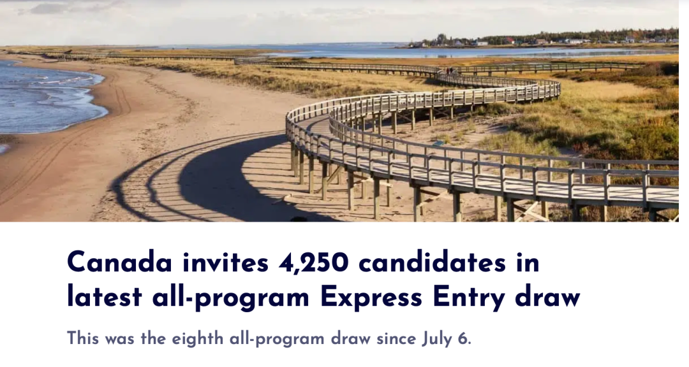
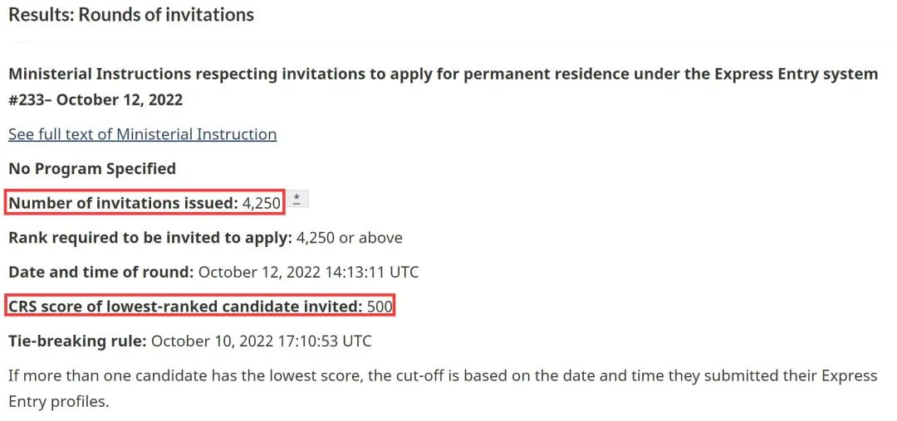
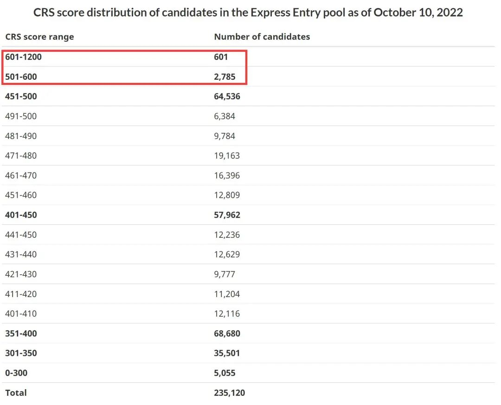
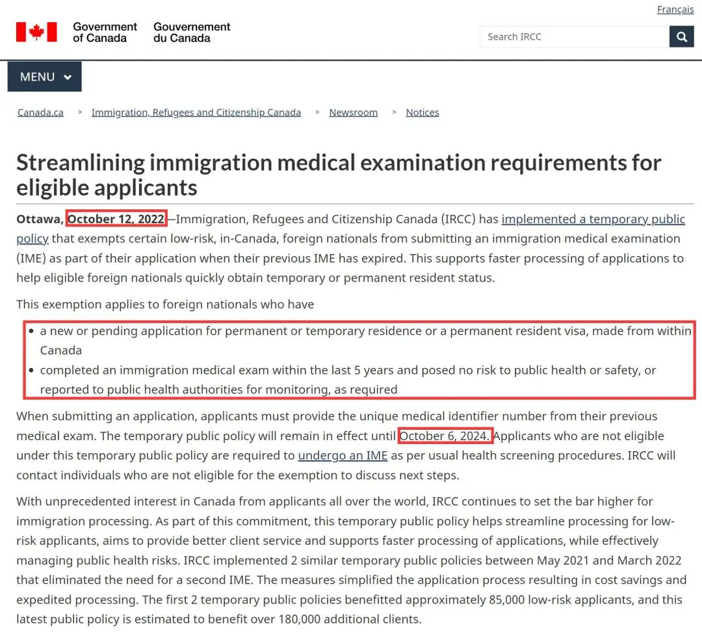
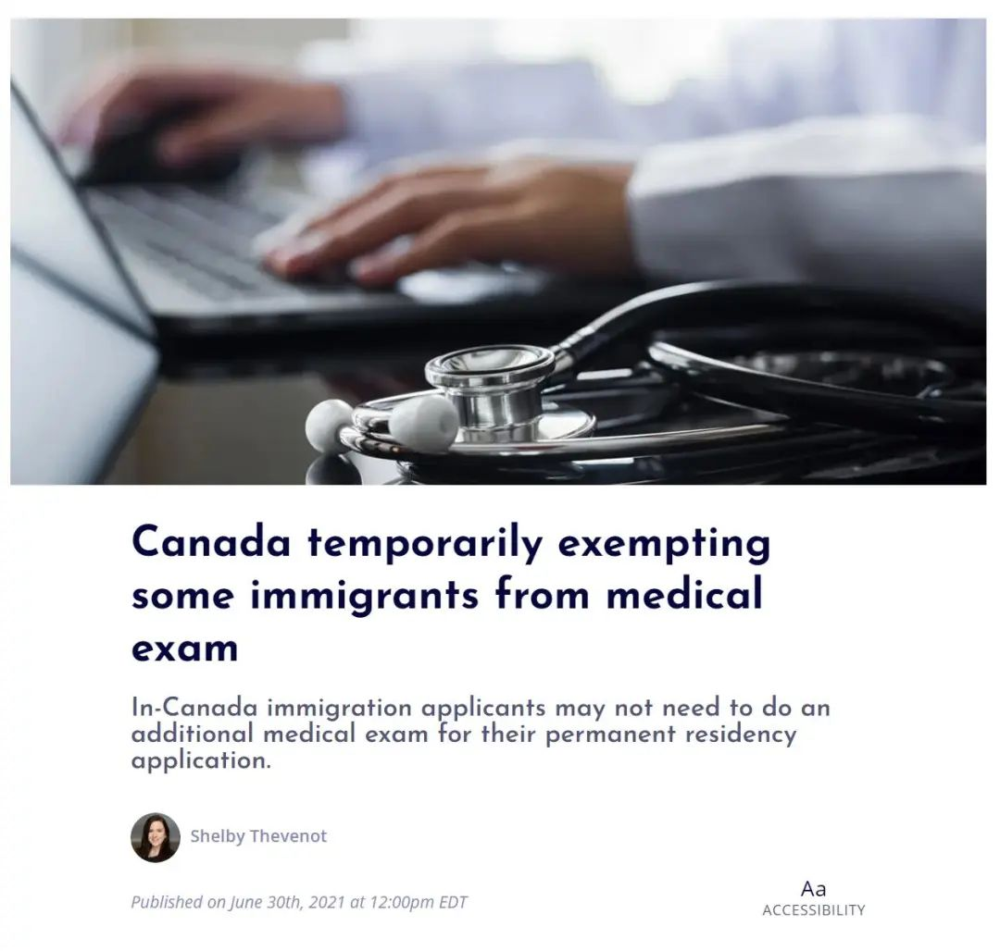
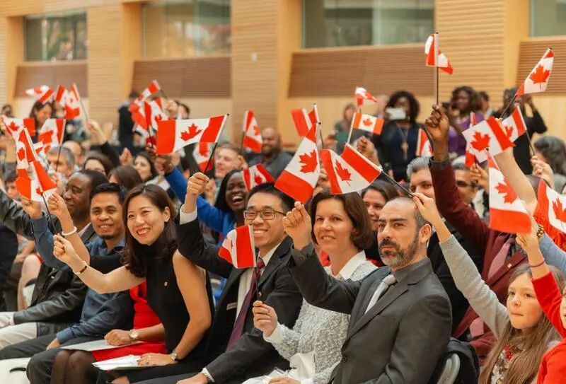
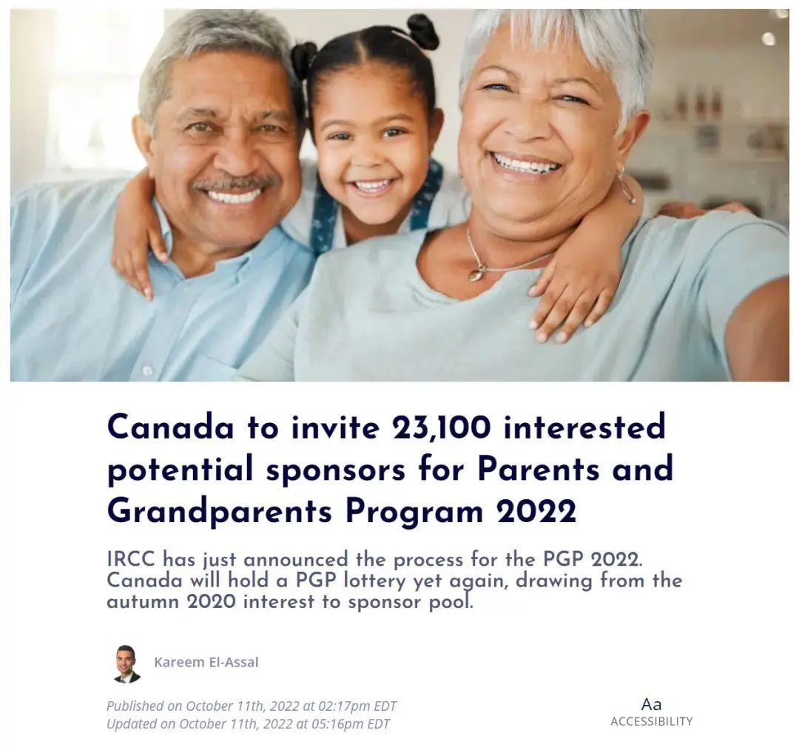
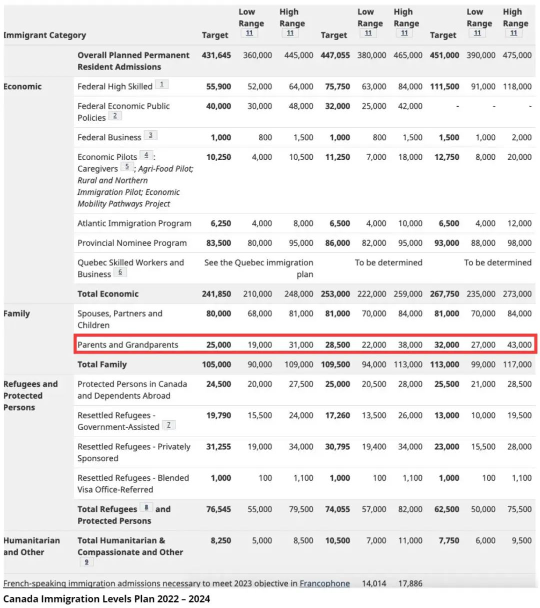
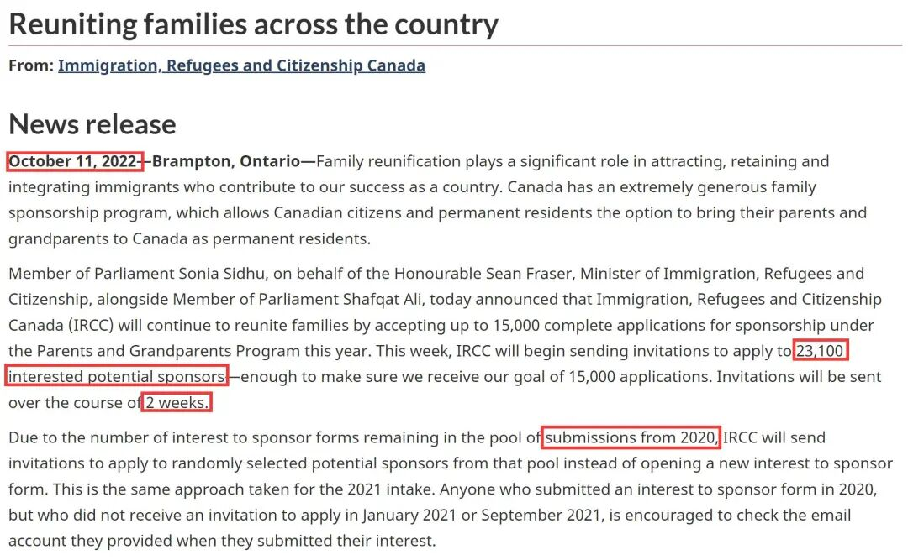

# 无标题

**链接地址:** http://mp.weixin.qq.com/s?__biz=MzUyNzA2NTAwNg==&mid=2247491433&idx=1&sn=f99245eb8ade35c3587573ca2e29e4c4&chksm=fa0415a8cd739cbec3b341828216df0d879631d1e3cf22f28689b46e1c60732f2277997e9071&mpshare=1&scene=2&srcid=1017jGMVTNtxMx7433bhhLfH&sharer_sharetime=1665964911772&sharer_shareid=77848a6b3852ae4dcb6c74ffee84743c#rd
**作者:** 你身边的签证专家
**获取时间:** 2025/8/28 19:28:10
**图片数量:** 19

---

## 原始HTML内容

<section style="box-sizing: border-box;font-size: 16px;"><section style="text-align: center;margin-top: 10px;margin-bottom: 10px;box-sizing: border-box;" powered-by="xiumi.us"><section style="max-width: 100%;vertical-align: middle;display: inline-block;line-height: 0;box-sizing: border-box;"></section></section><section style="text-align: center;margin-top: 10px;margin-bottom: 10px;box-sizing: border-box;" powered-by="xiumi.us"></section>
 
<section style="font-size: 19px;text-align: center;margin-top: 10px;margin-bottom: 3px;box-sizing: border-box;" powered-by="xiumi.us"><section style="display: inline-block;border-width: 1px;border-style: solid;border-color: rgb(188, 65, 65);background-color: rgb(188, 65, 65);width: 1.8em;height: 1.8em;line-height: 1.8em;border-radius: 100%;margin-left: auto;margin-right: auto;font-size: 16px;color: rgb(255, 255, 255);box-sizing: border-box;">
<strong style="box-sizing: border-box;">1</strong>
</section></section><section style="text-align: center;box-sizing: border-box;" powered-by="xiumi.us"><section style="display: inline-block;width: 0px;height: 0px;vertical-align: top;overflow: hidden;border-style: solid;border-width: 9px 6px 0px;border-color: rgb(188, 65, 65) rgba(255, 255, 255, 0) rgba(255, 255, 255, 0);box-sizing: border-box;"><svg viewBox="0 0 1 1" style="float:left;line-height:0;width:0;vertical-align:top;"></svg></section></section><section style="margin-bottom: 10px;text-align: center;justify-content: center;display: flex;flex-flow: row nowrap;box-sizing: border-box;" powered-by="xiumi.us"><section style="display: inline-block;width: auto;vertical-align: middle;background-color: rgba(109, 155, 209, 0.1);min-width: 10%;max-width: 100%;flex: 0 0 auto;height: auto;align-self: center;padding: 12px;box-sizing: border-box;"><section style="color: rgb(109, 155, 209);text-align: justify;box-sizing: border-box;" powered-by="xiumi.us">
<strong style="box-sizing: border-box;">快速通道第八次邀请，分数再降！</strong> 
</section></section></section>
 
<section style="text-align: center;margin-top: 10px;margin-bottom: 10px;box-sizing: border-box;" powered-by="xiumi.us"><section style="max-width: 100%;vertical-align: middle;display: inline-block;line-height: 0;width: 90%;height: auto;box-sizing: border-box;"></section></section><section style="font-size: 14px;padding-right: 15px;padding-left: 15px;letter-spacing: 1px;box-sizing: border-box;" powered-by="xiumi.us">
2022年10月12日，加拿大联邦EE快速通道全类别抽签结果出炉：共有<strong style="box-sizing: border-box;">4250人被邀请</strong>，最低<strong style="box-sizing: border-box;">邀请分数为500分</strong>！ 

 
</section><section style="text-align: center;margin-top: 10px;margin-bottom: 10px;box-sizing: border-box;" powered-by="xiumi.us"><section style="max-width: 100%;vertical-align: middle;display: inline-block;line-height: 0;width: 90%;height: auto;box-sizing: border-box;"></section></section><section style="font-size: 14px;padding-right: 15px;padding-left: 15px;letter-spacing: 1px;box-sizing: border-box;" powered-by="xiumi.us">
 

加拿大最新一次的Express Entry快速通道全类别抽签于昨日正式公布结果。这是自7月6日恢复抽签以来的<strong style="box-sizing: border-box;">第八次全类别抽签</strong>。 

 

候选人将有资格获得在 Express Entry 系统下运行的所有程序，包括加拿大经验类 (CEC)、联邦技术工人计划 (FSWP) 和联邦技术贸易计划 (FSTP) 的邀请。 

 

从2020年12月开始，Express Entry所有计划的抽签暂停了超过18个月。这导致池中积攒了20多万的申请人。为了赶上发放邀请的进度，恢复抽签以来，<strong style="box-sizing: border-box;">邀请人数稳定增加</strong>，<strong style="box-sizing: border-box;">邀请分数也逐渐降低</strong>。 

 
</section><section style="text-align: center;margin-top: 10px;margin-bottom: 10px;box-sizing: border-box;" powered-by="xiumi.us"><section style="max-width: 100%;vertical-align: middle;display: inline-block;line-height: 0;width: 90%;height: auto;box-sizing: border-box;"></section></section><section style="font-size: 14px;padding-right: 15px;padding-left: 15px;letter-spacing: 1px;box-sizing: border-box;" powered-by="xiumi.us">
 

今天的抽签是这一现状的延续。自7月6日恢复抽签以来，最低邀请分数<strong style="box-sizing: border-box;">从557分降低到今天的500分</strong>。邀请人数更增加到4250人。<strong style="box-sizing: border-box;">恭喜这批申请人</strong>！希望听到更多来自客户朋友们的好消息！ 

 

 
</section><section style="font-size: 19px;text-align: center;margin-top: 10px;margin-bottom: 3px;box-sizing: border-box;" powered-by="xiumi.us"><section style="display: inline-block;border-width: 1px;border-style: solid;border-color: rgb(188, 65, 65);background-color: rgb(188, 65, 65);width: 1.8em;height: 1.8em;line-height: 1.8em;border-radius: 100%;margin-left: auto;margin-right: auto;font-size: 16px;color: rgb(255, 255, 255);box-sizing: border-box;">
<strong style="box-sizing: border-box;">2</strong>
</section></section><section style="text-align: center;box-sizing: border-box;" powered-by="xiumi.us"><section style="display: inline-block;width: 0px;height: 0px;vertical-align: top;overflow: hidden;border-style: solid;border-width: 9px 6px 0px;border-color: rgb(188, 65, 65) rgba(255, 255, 255, 0) rgba(255, 255, 255, 0);box-sizing: border-box;"><svg viewBox="0 0 1 1" style="float:left;line-height:0;width:0;vertical-align:top;"></svg></section></section><section style="margin-bottom: 10px;text-align: center;justify-content: center;display: flex;flex-flow: row nowrap;box-sizing: border-box;" powered-by="xiumi.us"><section style="display: inline-block;width: auto;vertical-align: middle;background-color: rgba(109, 155, 209, 0.1);min-width: 10%;max-width: 100%;flex: 0 0 auto;height: auto;align-self: center;padding: 12px;box-sizing: border-box;"><section style="color: rgb(109, 155, 209);text-align: justify;box-sizing: border-box;" powered-by="xiumi.us">
<strong style="box-sizing: border-box;">新移民申请延长体检有效期！</strong> 
</section></section></section>
 
<section style="font-size: 14px;padding-right: 15px;padding-left: 15px;letter-spacing: 1px;box-sizing: border-box;" powered-by="xiumi.us">
另外，近期加拿大移民、难民和公民部实施了一项临时公共政策，豁免某些低风险、在加拿大境内的外国人在之前的IME过期时<strong style="box-sizing: border-box;">提交移民体检(IME)</strong> 作为更新的要求。这有助于移民部更快地处理申请，以帮助符合条件的外国人快速获得临时或永久居民身份。

 
</section><section style="text-align: center;margin-top: 10px;margin-bottom: 10px;box-sizing: border-box;" powered-by="xiumi.us"><section style="max-width: 100%;vertical-align: middle;display: inline-block;line-height: 0;width: 90%;height: auto;box-sizing: border-box;"></section></section><section style="font-size: 14px;padding-right: 15px;padding-left: 15px;letter-spacing: 1px;box-sizing: border-box;" powered-by="xiumi.us">
 

<strong style="box-sizing: border-box;">此豁免适用于：</strong>

 

<em style="box-sizing: border-box;">1. 拥有在加拿大境内签发的永久或临时居留或永久居民签证申请；</em>

 

<em style="box-sizing: border-box;">2. 在过去<strong style="box-sizing: border-box;">5年内</strong>曾完成移民体检并且对公共卫生或安全没有构成风险，或需按要求向公共卫生当局报告以进行监测。</em>

 

<strong style="box-sizing: border-box;">政策截止日期：2024年10月6日</strong>

<strong style="box-sizing: border-box;"> </strong>
</section><section style="text-align: center;margin-top: 10px;margin-bottom: 10px;box-sizing: border-box;" powered-by="xiumi.us"><section style="max-width: 100%;vertical-align: middle;display: inline-block;line-height: 0;width: 90%;height: auto;box-sizing: border-box;"></section></section><section style="font-size: 14px;padding-right: 15px;padding-left: 15px;letter-spacing: 1px;box-sizing: border-box;" powered-by="xiumi.us">
 

提交申请时，申请人必须提供之前体检的<strong style="box-sizing: border-box;">唯一医疗识别号</strong>。根据该临时公共政策不符合资格的申请人必须按照通常的健康检查程序再次进行体检IME。移民部<strong style="box-sizing: border-box;">将联系不符合豁免条件的个人</strong>，讨论后续步骤。

 

由于世界各地的申请人对加拿大产生了前所未有的兴趣，大批申请的涌入造成了移民部审批的严重积压。移民部继续为移民处理设定更高的标准。作为这一承诺的一部分，这项临时公共政策有助于简化低风险申请人的处理流程，旨在提供更好的客户服务并支持更快地处理申请，同时有效管理公共卫生风险。

 
</section><section style="text-align: center;margin-top: 10px;margin-bottom: 10px;box-sizing: border-box;" powered-by="xiumi.us"><section style="max-width: 100%;vertical-align: middle;display: inline-block;line-height: 0;width: 90%;height: auto;box-sizing: border-box;"></section></section><section style="font-size: 14px;padding-right: 15px;padding-left: 15px;letter-spacing: 1px;box-sizing: border-box;" powered-by="xiumi.us">
 

加拿大移民部曾在2021年5月至2022年3月期间实施了<strong style="box-sizing: border-box;">2项类似的临时公共政策</strong>，消除了对第二次移民体检IME的要求。这些措施<strong style="box-sizing: border-box;">简化了申请流程</strong>，从而节省了成本并加快了处理速度。前两项临时公共政策使大约<strong style="box-sizing: border-box;">85,000名低风险申请人受益</strong>，而这项最新的公共政策预计将使<strong style="box-sizing: border-box;">超过180,000名额外申请人受益</strong>。

 

加拿大移民部致力于实现其对永久居民大批引入的长远目标，并保持竞争环境以吸引和留住临时居民，简化申请和审批步骤是行之有效的办法。

 
</section><section style="text-align: center;margin-top: 10px;margin-bottom: 10px;box-sizing: border-box;" powered-by="xiumi.us"><section style="max-width: 100%;vertical-align: middle;display: inline-block;line-height: 0;width: 90%;height: auto;box-sizing: border-box;"></section></section><section style="font-size: 14px;padding-right: 15px;padding-left: 15px;letter-spacing: 1px;box-sizing: border-box;" powered-by="xiumi.us">
 

目前的计划有效地<strong style="box-sizing: border-box;">加快处理速度</strong>、<strong style="box-sizing: border-box;">减少库存并防止新的库存增长</strong>。这些政策的颁布将使加拿大人和申请人对加拿大的移民系统充满信心，减少等待时间，改善申请体验，并使移民部能够更好地利用移民来解决关键的劳动力市场短缺问题。

 

 
</section><section style="font-size: 19px;text-align: center;margin-top: 10px;margin-bottom: 3px;box-sizing: border-box;" powered-by="xiumi.us"><section style="display: inline-block;border-width: 1px;border-style: solid;border-color: rgb(188, 65, 65);background-color: rgb(188, 65, 65);width: 1.8em;height: 1.8em;line-height: 1.8em;border-radius: 100%;margin-left: auto;margin-right: auto;font-size: 16px;color: rgb(255, 255, 255);box-sizing: border-box;">
<strong style="box-sizing: border-box;">3</strong>
</section></section><section style="text-align: center;box-sizing: border-box;" powered-by="xiumi.us"><section style="display: inline-block;width: 0px;height: 0px;vertical-align: top;overflow: hidden;border-style: solid;border-width: 9px 6px 0px;border-color: rgb(188, 65, 65) rgba(255, 255, 255, 0) rgba(255, 255, 255, 0);box-sizing: border-box;"><svg viewBox="0 0 1 1" style="float:left;line-height:0;width:0;vertical-align:top;"></svg></section></section><section style="margin-bottom: 10px;text-align: center;justify-content: center;display: flex;flex-flow: row nowrap;box-sizing: border-box;" powered-by="xiumi.us"><section style="display: inline-block;width: auto;vertical-align: middle;background-color: rgba(109, 155, 209, 0.1);min-width: 10%;max-width: 100%;flex: 0 0 auto;height: auto;align-self: center;padding: 12px;box-sizing: border-box;"><section style="color: rgb(109, 155, 209);text-align: justify;box-sizing: border-box;" powered-by="xiumi.us">
<strong style="box-sizing: border-box;">父母担保移民已开始发送邀请</strong> 
</section></section></section><section style="font-size: 14px;padding-right: 15px;padding-left: 15px;letter-spacing: 1px;box-sizing: border-box;" powered-by="xiumi.us">
 
<section class="channels_iframe_wrp wxw_wechannel_card_not_horizontal"><mpvideosnap class="js_uneditable custom_select_card channels_iframe videosnap_video_iframe" data-pluginname="videosnap" data-id="export/UzFfAgtgekIEAQAAAAAAdY04QxpCjAAAAAstQy6ubaLX4KHWvLEZgBPEuZFgemlWdJeCzNPgMIuG5Pr5khCmizaxpDOZ5Kq2" data-url="https://findermp.video.qq.com/251/20350/stodownload?encfilekey=Cvvj5Ix3eexKX1zo1IZZBrQomawdVfSQBkYiaDuXtpMA9ZZZCicYd54l2V5Slf0U2erofLmlYq203o7aNf9mSMORQMNc2CNnNU63qe3mdoEXnqNyib7C2ria6iam3gt5MumCxD9V7rZ6mo1dGeknnDR2wnB3Fa81lkCOOV95jdvkEsCY&amp;adaptivelytrans=0&amp;bizid=1023&amp;dotrans=0&amp;hy=HK&amp;idx=1&amp;m=8d18abdc089797039fa6d5d81525f084&amp;token=cztXnd9GyrHgw0WZPT8iagRBs1Ecu4Lrn96F0BjWcnxvt6gibrPDEZVu7YTz05uFPIj9MTF6uZd4Q" data-headimgurl="http://wx.qlogo.cn/finderhead/PiajxSqBRaEI4vQJr3aa81ehxKpzshj4t6ZWzDxwztBic5fr9nVMt20g/0" data-username="v2_060000231003b20faec8c7eb811fc3d1ca06ec31b07726617828a16cbc88a282c95def3c7c6d@finder" data-nickname="Zoe说加拿大" data-desc="2022加拿大父母团聚移民开始啦！" data-nonceid="16829050404049217685" data-type="video" data-width="1072" data-height="1440"></mpvideosnap></section>
 

近期好消息不断。加拿大移民部于10月11日在推特上宣布<strong style="box-sizing: border-box;">父母祖父母移民项目（PGP）</strong>的最新消息，表示<strong style="box-sizing: border-box;">本周移民部将发出邀请信</strong>给申请担保父母祖父母移民的人士，这些担保人早在2020年已经提交了有意担保的表格。&nbsp; &nbsp;

 
</section><section style="text-align: center;margin-top: 10px;margin-bottom: 10px;box-sizing: border-box;" powered-by="xiumi.us"><section style="max-width: 100%;vertical-align: middle;display: inline-block;line-height: 0;width: 90%;height: auto;box-sizing: border-box;"></section></section><section style="font-size: 14px;padding-right: 15px;padding-left: 15px;letter-spacing: 1px;box-sizing: border-box;" powered-by="xiumi.us">
 

移民部在今天的新闻稿中说，家庭团聚在吸引、留住和融合移民方面发挥着重要作用。加拿大有一个非常慷慨的家庭担保移民项目，允许加拿大公民和永久居民选择将他们的父母和祖父母作为<strong style="box-sizing: border-box;">永久居民</strong>来到加拿大。

 
</section><section style="text-align: center;margin-top: 10px;margin-bottom: 10px;box-sizing: border-box;" powered-by="xiumi.us"><section style="max-width: 100%;vertical-align: middle;display: inline-block;line-height: 0;width: 90%;height: auto;box-sizing: border-box;"></section></section><section style="font-size: 14px;padding-right: 15px;padding-left: 15px;letter-spacing: 1px;box-sizing: border-box;" powered-by="xiumi.us">
 

国会议员Sonia Sidhu代表移民部部长Sean Fraser，与国会议员Shafqat Ali在安省宾顿市宣布，今年将继续接受<strong style="box-sizing: border-box;">多达1.5万份父母和祖父母项目的完整申请</strong>，让家庭团聚。本周，移民部将开始<strong style="box-sizing: border-box;">向23,100名感兴趣的担保人发出申请邀请</strong>（比目标邀请人数25,000名略低），这足以确保我们收到1.5万份申请的目标。邀请信将在<strong style="box-sizing: border-box;">这两周寄出</strong>。

 
</section><section style="text-align: center;margin-top: 10px;margin-bottom: 10px;box-sizing: border-box;" powered-by="xiumi.us"><section style="max-width: 100%;vertical-align: middle;display: inline-block;line-height: 0;width: 90%;height: auto;box-sizing: border-box;"></section></section><section style="font-size: 14px;padding-right: 15px;padding-left: 15px;letter-spacing: 1px;box-sizing: border-box;" powered-by="xiumi.us">
 

政府表示，由于还有2020年提交意向表格的人仍在待邀请的池中，移民部将从中<strong style="box-sizing: border-box;">随机选择发出申请邀请</strong>，而不是新开意向表格。

 

2021年也采用了同样的方法。任何在2020年提交了意向表格，但在2021年1月或2021年9月没有收到邀请的人，建议<strong style="box-sizing: border-box;">查看所提供的电子邮件账户</strong>。

 

 
</section><section style="margin-top: 10px;margin-bottom: 10px;text-align: center;box-sizing: border-box;" powered-by="xiumi.us"><section style="padding-left: 1em;padding-right: 1em;display: inline-block;box-sizing: border-box;">
<strong style="box-sizing: border-box;">&nbsp;好 消 息&nbsp;</strong>
 </section><section style="border-width: 1px;border-style: solid;border-color: rgb(192, 200, 209);margin-top: -1em;padding: 20px 10px 10px;background-color: rgb(239, 239, 239);box-sizing: border-box;"><section style="font-size: 14px;box-sizing: border-box;" powered-by="xiumi.us">
 

<strong style="box-sizing: border-box;">今天我们有2位客人收到邀请了！</strong>

<strong style="box-sizing: border-box;">大家请多留意邮箱</strong>

<strong style="box-sizing: border-box;">但也不要太过焦虑</strong>

<strong style="box-sizing: border-box;">下周抽签完成后还可以通过当时抓签的序列号查询</strong>

 

<strong style="box-sizing: border-box;">如果您已经幸运中签</strong>

<strong style="box-sizing: border-box;">在提交材料时需要专业的帮助</strong>

<strong style="box-sizing: border-box;">或是需要协助办理父母的超级签证</strong>

<strong style="box-sizing: border-box;">也请及时联系我们获取最贴心最省心的移民签证服务</strong>

<strong style="box-sizing: border-box;"> </strong>
<section class="mp_profile_iframe_wrp"><mp-common-profile class="js_uneditable custom_select_card mp_profile_iframe" data-pluginname="mpprofile" data-id="MzUyNzA2NTAwNg==" data-headimg="http://mmbiz.qpic.cn/mmbiz_png/904kUibXm7Y6gq02PdSyzYZvibpBf0icbsnWtqW39AwrqqK8DRQdfwaE8UtUmwOd05nWcoYKrorN7ZuRngiaFhPlibQ/0?wx_fmt=png" data-nickname="新时代留学移民法律事务所" data-alias="" data-signature="加拿大移民顾问监管委员会会员/加拿大注册持牌移民顾问" data-from="0" data-is_biz_ban="0"></mp-common-profile></section>
<strong style="box-sizing: border-box;">新时代留学移民法律事务所</strong>

<strong style="box-sizing: border-box;">相伴左右，移路同行！</strong>

<strong style="box-sizing: border-box;"> </strong>
</section></section></section>
 
<section style="text-align: left;justify-content: flex-start;display: flex;flex-flow: row nowrap;margin-top: 10px;box-sizing: border-box;" powered-by="xiumi.us"><section style="display: inline-block;vertical-align: top;width: auto;align-self: stretch;flex: 0 0 auto;background-color: rgb(188, 65, 65);min-width: 5%;max-width: 100%;height: auto;padding-top: 9px;padding-right: 9px;padding-left: 20px;box-sizing: border-box;"><section style="text-align: justify;font-size: 18px;color: rgb(252, 252, 252);box-sizing: border-box;" powered-by="xiumi.us">
<strong style="box-sizing: border-box;">阅读更多</strong>
</section></section><section style="display: inline-block;vertical-align: top;width: auto;min-width: 5%;max-width: 100%;flex: 0 0 auto;height: auto;align-self: stretch;box-sizing: border-box;"><section style="box-sizing: border-box;" powered-by="xiumi.us"><section style="display: inline-block;width: 0px;height: 0px;vertical-align: top;overflow: hidden;border-style: solid;border-width: 45px 0px 0px 19px;border-color: rgba(255, 255, 255, 0) rgba(255, 255, 255, 0) rgba(255, 255, 255, 0) rgb(188, 65, 65);box-sizing: border-box;"><svg viewBox="0 0 1 1" style="float:left;line-height:0;width:0;vertical-align:top;"></svg></section></section></section></section><section style="margin-bottom: 10px;box-sizing: border-box;" powered-by="xiumi.us"><section style="background-color: rgb(188, 65, 65);height: 3px;box-sizing: border-box;"><svg viewBox="0 0 1 1" style="float:left;line-height:0;width:0;vertical-align:top;"></svg></section></section><section style="margin: 10px 0%;text-align: left;justify-content: flex-start;display: flex;flex-flow: row nowrap;box-sizing: border-box;" powered-by="xiumi.us"><section style="display: inline-block;width: 100%;vertical-align: top;background-position: 55.6015% 14.0672%;background-repeat: repeat;background-size: 100.637%;background-attachment: scroll;padding: 30px;align-self: flex-start;flex: 0 0 auto;background-image: url(&quot;https://mmbiz.qpic.cn/mmbiz_jpg/904kUibXm7Y46EUeK8aO3aDJ3VbhgAeJok0bSpd0VDhQCTA2N7prBkiaTUlwaFI4f1ksOdhagjxBOfA8oflQz9Gw/640?wx_fmt=jpeg&quot;);box-sizing: border-box;"><section style="text-align: justify;justify-content: flex-start;display: flex;flex-flow: row nowrap;box-sizing: border-box;" powered-by="xiumi.us"><section style="display: inline-block;width: 100%;vertical-align: top;background-color: rgba(188, 65, 65, 0.22);padding: 10px;border-width: 0px;border-style: none;border-color: rgb(62, 62, 62);align-self: flex-start;flex: 0 0 auto;box-sizing: border-box;"><section style="text-align: center;color: rgb(255, 255, 255);font-size: 14px;box-sizing: border-box;" powered-by="xiumi.us">
<a target="_blank" href="http://mp.weixin.qq.com/s?__biz=MzUyNzA2NTAwNg==&amp;mid=2247491372&amp;idx=1&amp;sn=8a3b90ad3b9ab5191526659d93a443d6&amp;chksm=fa0415edcd739cfb9ee8927f6bdac778385631135aa49c1c3c95140bac0df03b225d8f419e60&amp;scene=21#wechat_redirect" textvalue="加拿大移民部本月忙翻，4大新政即将公布！EE猛降分，父母团聚，狂吸移民新配额正在路上！" linktype="text" imgurl="" imgdata="null" data-itemshowtype="0" tab="innerlink" data-linktype="2"><strong style="box-sizing: border-box;">加拿大移民部本月忙翻，4大新政即将公布！EE猛降分，父母团聚，狂吸移民新配额正在路上！</strong></a>
</section></section></section></section></section><section style="margin: 10px 0%;text-align: left;justify-content: flex-start;display: flex;flex-flow: row nowrap;box-sizing: border-box;" powered-by="xiumi.us"><section style="display: inline-block;width: 100%;vertical-align: top;background-position: 55.6015% 33.1154%;background-repeat: repeat;background-size: 100.637%;background-attachment: scroll;padding: 30px;align-self: flex-start;flex: 0 0 auto;background-image: url(&quot;https://mmbiz.qpic.cn/mmbiz_jpg/904kUibXm7Y46EUeK8aO3aDJ3VbhgAeJoASGy5hrCeubxf1YxYlMfQLUY1tUxfhovY58vzR4P0xRaufibjacamaw/640?wx_fmt=jpeg&quot;);box-sizing: border-box;"><section style="text-align: justify;justify-content: flex-start;display: flex;flex-flow: row nowrap;box-sizing: border-box;" powered-by="xiumi.us"><section style="display: inline-block;width: 100%;vertical-align: top;background-color: rgba(188, 65, 65, 0.22);padding: 10px;border-width: 0px;border-style: none;border-color: rgb(62, 62, 62);align-self: flex-start;flex: 0 0 auto;box-sizing: border-box;"><section style="text-align: center;color: rgb(255, 255, 255);font-size: 14px;box-sizing: border-box;" powered-by="xiumi.us">
<a target="_blank" href="http://mp.weixin.qq.com/s?__biz=MzUyNzA2NTAwNg==&amp;mid=2247491343&amp;idx=1&amp;sn=7ce2a9d39456b1db6e9ccddfa04c6760&amp;chksm=fa0415cecd739cd842e49e462f9e7a901efff3d217a35322241c8453a597cf831c7498bc28a2&amp;scene=21#wechat_redirect" textvalue="加国留学生大型福利现场，读书打工两不误，学签还能自动续？" linktype="text" imgurl="" imgdata="null" data-itemshowtype="0" tab="innerlink" style="color: rgb(255, 255, 255);" data-linktype="2"><strong style="box-sizing: border-box;">加国留学生大型福利现场，读书打工两不误，学签还能自动续？</strong></a>
</section></section></section></section></section><section style="margin: 10px 0%;text-align: left;justify-content: flex-start;display: flex;flex-flow: row nowrap;box-sizing: border-box;" powered-by="xiumi.us"><section style="display: inline-block;width: 100%;vertical-align: top;background-position: 55.6015% 33.1154%;background-repeat: repeat;background-size: 100.637%;background-attachment: scroll;padding: 30px;align-self: flex-start;flex: 0 0 auto;background-image: url(&quot;https://mmbiz.qpic.cn/mmbiz_jpg/904kUibXm7Y46EUeK8aO3aDJ3VbhgAeJoMLuAk4tv6qwjiaC6lX9xxmVznW9fcGzBxr9sEI3qhsGmxd5JQeIVqTA/640?wx_fmt=jpeg&quot;);box-sizing: border-box;"><section style="text-align: justify;justify-content: flex-start;display: flex;flex-flow: row nowrap;box-sizing: border-box;" powered-by="xiumi.us"><section style="display: inline-block;width: 100%;vertical-align: top;background-color: rgba(188, 65, 65, 0.22);padding: 10px;border-width: 0px;border-style: none;border-color: rgb(62, 62, 62);align-self: flex-start;flex: 0 0 auto;box-sizing: border-box;"><section style="text-align: center;color: rgb(255, 255, 255);font-size: 14px;box-sizing: border-box;" powered-by="xiumi.us">
<a target="_blank" href="http://mp.weixin.qq.com/s?__biz=MzUyNzA2NTAwNg==&amp;mid=2247491313&amp;idx=1&amp;sn=a76a90fc720b6b97ae3d274c93b8741e&amp;chksm=fa041430cd739d26563705629436855c3121a1d7f65de08f72b8544064db1398c7c69035692a&amp;scene=21#wechat_redirect" textvalue="加国移民主流目的地大洗牌？！阿尔伯塔省成热门选择，“抢”收25%安省移民！" linktype="text" imgurl="" imgdata="null" data-itemshowtype="0" tab="innerlink" style="color: rgb(255, 255, 255);" data-linktype="2"><strong style="box-sizing: border-box;">加国移民主流目的地大洗牌？！阿尔伯塔省成热门选择，“抢”收25%安省移民！</strong></a>
</section></section></section></section></section><section style="margin: 10px 0%;text-align: left;justify-content: flex-start;display: flex;flex-flow: row nowrap;box-sizing: border-box;" powered-by="xiumi.us"><section style="display: inline-block;width: 100%;vertical-align: top;background-position: 55.6015% 14.0672%;background-repeat: repeat;background-size: 100.637%;background-attachment: scroll;padding: 30px;align-self: flex-start;flex: 0 0 auto;background-image: url(&quot;https://mmbiz.qpic.cn/mmbiz_jpg/904kUibXm7Y46EUeK8aO3aDJ3VbhgAeJogs6tquib8LKkV9kKeq8ib77Tl7iak1ZFbyHibRwVdcL1X3QN4nOibrFO8JA/640?wx_fmt=jpeg&quot;);box-sizing: border-box;"><section style="text-align: justify;justify-content: flex-start;display: flex;flex-flow: row nowrap;box-sizing: border-box;" powered-by="xiumi.us"><section style="display: inline-block;width: 100%;vertical-align: top;background-color: rgba(188, 65, 65, 0.22);padding: 10px;border-width: 0px;border-style: none;border-color: rgb(62, 62, 62);align-self: flex-start;flex: 0 0 auto;box-sizing: border-box;"><section style="text-align: center;color: rgb(255, 255, 255);font-size: 14px;box-sizing: border-box;" powered-by="xiumi.us">
<a target="_blank" href="http://mp.weixin.qq.com/s?__biz=MzUyNzA2NTAwNg==&amp;mid=2247491274&amp;idx=1&amp;sn=9f5e27f12b17f8ea153e10701a9e45eb&amp;chksm=fa04140bcd739d1d3ca0e71489da99ff48a27e72f1a1e8340eb73d2e5570a32030eeb3174088&amp;scene=21#wechat_redirect" textvalue="加拿大BC&nbsp;PNP邀请暂停一个月，新版NOC系统将在11月16日重启！需要重新注册申请！" linktype="text" imgurl="" imgdata="null" data-itemshowtype="0" tab="innerlink" style="color: rgb(255, 255, 255);" data-linktype="2"><strong style="box-sizing: border-box;">加拿大BC PNP邀请暂停一个月，新版NOC系统将在11月16日重启！需要重新注册申请！</strong></a>
</section></section></section></section></section><section style="text-align: center;font-size: 12px;color: rgb(180, 180, 180);box-sizing: border-box;" powered-by="xiumi.us">
（点击文字阅读）
</section><section style="margin: 10px 0%;text-align: left;justify-content: flex-start;display: flex;flex-flow: row nowrap;box-sizing: border-box;" powered-by="xiumi.us"><section style="display: inline-block;width: 100%;vertical-align: top;background-color: rgb(216, 202, 160);line-height: 0;align-self: flex-start;flex: 0 0 auto;box-sizing: border-box;"><section style="text-align: justify;justify-content: flex-start;display: flex;flex-flow: row nowrap;box-sizing: border-box;" powered-by="xiumi.us"><section style="display: inline-block;width: 100%;vertical-align: top;background-position: 0% 0%;background-repeat: repeat;background-size: 1.56658%;background-attachment: scroll;align-self: flex-start;flex: 0 0 auto;background-image: url(&quot;https://mmbiz.qpic.cn/mmbiz_png/904kUibXm7Y46EUeK8aO3aDJ3VbhgAeJo7TRU0F6zYST82QibBiacwbXkWIKDzaDqfTgL5ygs0EJ8YicDUWj6HLKfg/640?wx_fmt=png&quot;);box-sizing: border-box;"><section style="text-align: center;box-sizing: border-box;" powered-by="xiumi.us"><section style="display: inline-block;width: 100%;height: 11px;vertical-align: top;overflow: hidden;background-color: rgba(255, 255, 255, 0);box-sizing: border-box;"><svg viewBox="0 0 1 1" style="float:left;line-height:0;width:0;vertical-align:top;"></svg></section></section></section></section></section></section><section style="text-align: center;margin-top: 10px;margin-bottom: 10px;box-sizing: border-box;" powered-by="xiumi.us"><section style="max-width: 100%;vertical-align: middle;display: inline-block;line-height: 0;box-sizing: border-box;"></section></section><section style="text-align: center;margin-top: 10px;margin-bottom: 10px;box-sizing: border-box;" powered-by="xiumi.us"><section style="max-width: 100%;vertical-align: middle;display: inline-block;line-height: 0;box-sizing: border-box;"></section></section><section style="text-align: center;margin-top: 10px;margin-bottom: 10px;box-sizing: border-box;" powered-by="xiumi.us"><section style="max-width: 100%;vertical-align: middle;display: inline-block;line-height: 0;box-sizing: border-box;"></section></section><section style="text-align: center;margin-top: 10px;margin-bottom: 10px;box-sizing: border-box;" powered-by="xiumi.us"><section style="max-width: 100%;vertical-align: middle;display: inline-block;line-height: 0;box-sizing: border-box;"></section></section><section style="text-align: center;margin-top: 10px;margin-bottom: 10px;box-sizing: border-box;" powered-by="xiumi.us"><section style="max-width: 100%;vertical-align: middle;display: inline-block;line-height: 0;box-sizing: border-box;"></section></section><section style="padding-right: 15px;padding-left: 15px;font-size: 12px;color: rgb(121, 121, 121);box-sizing: border-box;" powered-by="xiumi.us">
<strong style="box-sizing: border-box;">参考信息：</strong>

<strong style="box-sizing: border-box;"> </strong>

https://www.cicnews.com/2022/10/canada-invites-4250-candidates-in-latest-all-program-express-entry-draw-1031378.html#gs.f0vh15

 

https://www.canada.ca/en/immigration-refugees-citizenship/services/immigrate-canada/express-entry/submit-profile/rounds-invitations.html

 

https://www.canada.ca/en/immigration-refugees-citizenship/news/notices/2022-foreign-exempt-ime.html
</section><section style="text-align: center;margin-top: 10px;margin-bottom: 10px;box-sizing: border-box;" powered-by="xiumi.us"><section style="max-width: 100%;vertical-align: middle;display: inline-block;line-height: 0;box-sizing: border-box;"></section></section><section style="text-align: center;margin-top: 10px;margin-bottom: 10px;box-sizing: border-box;" powered-by="xiumi.us"><section style="max-width: 100%;vertical-align: middle;display: inline-block;line-height: 0;box-sizing: border-box;"></section></section></section>
 

<mp-style-type data-value="3"></mp-style-type>

---

## 纯文本内容

1快速通道第八次邀请，分数再降！2022年10月12日，加拿大联邦EE快速通道全类别抽签结果出炉：共有4250人被邀请，最低邀请分数为500分！加拿大最新一次的Express Entry快速通道全类别抽签于昨日正式公布结果。这是自7月6日恢复抽签以来的第八次全类别抽签。候选人将有资格获得在 Express Entry 系统下运行的所有程序，包括加拿大经验类 (CEC)、联邦技术工人计划 (FSWP) 和联邦技术贸易计划 (FSTP) 的邀请。从2020年12月开始，Express Entry所有计划的抽签暂停了超过18个月。这导致池中积攒了20多万的申请人。为了赶上发放邀请的进度，恢复抽签以来，邀请人数稳定增加，邀请分数也逐渐降低。今天的抽签是这一现状的延续。自7月6日恢复抽签以来，最低邀请分数从557分降低到今天的500分。邀请人数更增加到4250人。恭喜这批申请人！希望听到更多来自客户朋友们的好消息！2新移民申请延长体检有效期！另外，近期加拿大移民、难民和公民部实施了一项临时公共政策，豁免某些低风险、在加拿大境内的外国人在之前的IME过期时提交移民体检(IME) 作为更新的要求。这有助于移民部更快地处理申请，以帮助符合条件的外国人快速获得临时或永久居民身份。此豁免适用于：1. 拥有在加拿大境内签发的永久或临时居留或永久居民签证申请；2. 在过去5年内曾完成移民体检并且对公共卫生或安全没有构成风险，或需按要求向公共卫生当局报告以进行监测。政策截止日期：2024年10月6日提交申请时，申请人必须提供之前体检的唯一医疗识别号。根据该临时公共政策不符合资格的申请人必须按照通常的健康检查程序再次进行体检IME。移民部将联系不符合豁免条件的个人，讨论后续步骤。由于世界各地的申请人对加拿大产生了前所未有的兴趣，大批申请的涌入造成了移民部审批的严重积压。移民部继续为移民处理设定更高的标准。作为这一承诺的一部分，这项临时公共政策有助于简化低风险申请人的处理流程，旨在提供更好的客户服务并支持更快地处理申请，同时有效管理公共卫生风险。加拿大移民部曾在2021年5月至2022年3月期间实施了2项类似的临时公共政策，消除了对第二次移民体检IME的要求。这些措施简化了申请流程，从而节省了成本并加快了处理速度。前两项临时公共政策使大约85,000名低风险申请人受益，而这项最新的公共政策预计将使超过180,000名额外申请人受益。加拿大移民部致力于实现其对永久居民大批引入的长远目标，并保持竞争环境以吸引和留住临时居民，简化申请和审批步骤是行之有效的办法。目前的计划有效地加快处理速度、减少库存并防止新的库存增长。这些政策的颁布将使加拿大人和申请人对加拿大的移民系统充满信心，减少等待时间，改善申请体验，并使移民部能够更好地利用移民来解决关键的劳动力市场短缺问题。3父母担保移民已开始发送邀请近期好消息不断。加拿大移民部于10月11日在推特上宣布父母祖父母移民项目（PGP）的最新消息，表示本周移民部将发出邀请信给申请担保父母祖父母移民的人士，这些担保人早在2020年已经提交了有意担保的表格。   移民部在今天的新闻稿中说，家庭团聚在吸引、留住和融合移民方面发挥着重要作用。加拿大有一个非常慷慨的家庭担保移民项目，允许加拿大公民和永久居民选择将他们的父母和祖父母作为永久居民来到加拿大。国会议员Sonia Sidhu代表移民部部长Sean Fraser，与国会议员Shafqat Ali在安省宾顿市宣布，今年将继续接受多达1.5万份父母和祖父母项目的完整申请，让家庭团聚。本周，移民部将开始向23,100名感兴趣的担保人发出申请邀请（比目标邀请人数25,000名略低），这足以确保我们收到1.5万份申请的目标。邀请信将在这两周寄出。政府表示，由于还有2020年提交意向表格的人仍在待邀请的池中，移民部将从中随机选择发出申请邀请，而不是新开意向表格。2021年也采用了同样的方法。任何在2020年提交了意向表格，但在2021年1月或2021年9月没有收到邀请的人，建议查看所提供的电子邮件账户。 好 消 息  今天我们有2位客人收到邀请了！大家请多留意邮箱但也不要太过焦虑下周抽签完成后还可以通过当时抓签的序列号查询如果您已经幸运中签在提交材料时需要专业的帮助或是需要协助办理父母的超级签证也请及时联系我们获取最贴心最省心的移民签证服务新时代留学移民法律事务所相伴左右，移路同行！阅读更多加拿大移民部本月忙翻，4大新政即将公布！EE猛降分，父母团聚，狂吸移民新配额正在路上！加国留学生大型福利现场，读书打工两不误，学签还能自动续？加国移民主流目的地大洗牌？！阿尔伯塔省成热门选择，“抢”收25%安省移民！加拿大BC PNP邀请暂停一个月，新版NOC系统将在11月16日重启！需要重新注册申请！（点击文字阅读）参考信息：https://www.cicnews.com/2022/10/canada-invites-4250-candidates-in-latest-all-program-express-entry-draw-1031378.html#gs.f0vh15https://www.canada.ca/en/immigration-refugees-citizenship/services/immigrate-canada/express-entry/submit-profile/rounds-invitations.htmlhttps://www.canada.ca/en/immigration-refugees-citizenship/news/notices/2022-foreign-exempt-ime.html

---

## 图片列表

-  (原始链接: https://mmbiz.qpic.cn/mmbiz_jpg/904kUibXm7Y46EUeK8aO3aDJ3VbhgAeJoaEtj4cjticHAlpdpe4ZDqpXDTicFHryeougibovBCxjMRAwPbUJCqz7rg/640?wx_fmt=jpeg)
-  (原始链接: https://mmbiz.qpic.cn/mmbiz_jpg/904kUibXm7Y4EC3q40NfCb7jaWhWbgfxibgpavj9rH4EqdQFpzyVg6N8TNSVOsgAOuvg1OSL9ec8ZyRicEzu8Tib7A/640?wx_fmt=jpeg)
-  (原始链接: https://mmbiz.qpic.cn/mmbiz_png/904kUibXm7Y46EUeK8aO3aDJ3VbhgAeJozcE6JbicdFuXnXGnLnSSRiamYPKeaj7BcAPSzgyzEicazT41Sx6PGmZ6Q/640?wx_fmt=png)
-  (原始链接: https://mmbiz.qpic.cn/mmbiz_jpg/904kUibXm7Y46EUeK8aO3aDJ3VbhgAeJohzsqaPmq3I9dZZzwUM6JKibBbIS5ITXh58WGpFCLKSDf4pOhoSfYerw/640?wx_fmt=jpeg)
-  (原始链接: https://mmbiz.qpic.cn/mmbiz_jpg/904kUibXm7Y46EUeK8aO3aDJ3VbhgAeJoLNNG44JUPwBIVn0RJQOiagLaN7JKcr1ybrtC27AaO6Tc5vYBQVhVERA/640?wx_fmt=jpeg)
-  (原始链接: https://mmbiz.qpic.cn/mmbiz_jpg/904kUibXm7Y46EUeK8aO3aDJ3VbhgAeJo8Y3TcjKYGu2pBxibMoeOSflwaTwkFOh3qw4J4shCebVYpZIv6tVRd7w/640?wx_fmt=jpeg)
-  (原始链接: https://mmbiz.qpic.cn/mmbiz_jpg/904kUibXm7Y46EUeK8aO3aDJ3VbhgAeJokdgpkKR0Biap9sSn9KqADDLtJEUzuB1AicoWfmQuZ60btfxFtwhQwibYA/640?wx_fmt=jpeg)
-  (原始链接: https://mmbiz.qpic.cn/mmbiz_jpg/904kUibXm7Y46EUeK8aO3aDJ3VbhgAeJoARKv2yulFIpxPxFRcIIF2mE0ujxX4KYAe4FbkZmyIJicLjVEdvkBZFw/640?wx_fmt=jpeg)
-  (原始链接: https://mmbiz.qpic.cn/mmbiz_jpg/904kUibXm7Y46EUeK8aO3aDJ3VbhgAeJoiaFP23nBcHiadaricTMGjIpicBZsLjAS4b1qjx9SgJ8STzEjxiayhM4f1NQ/640?wx_fmt=jpeg)
-  (原始链接: https://mmbiz.qpic.cn/mmbiz_jpg/904kUibXm7Y46EUeK8aO3aDJ3VbhgAeJorUMJNdrP1APoTKoCHl8ibLKoDffjoa6UJhjiazCoVZzOnSHAQbkTVv4g/640?wx_fmt=jpeg)
-  (原始链接: https://mmbiz.qpic.cn/mmbiz_jpg/904kUibXm7Y46EUeK8aO3aDJ3VbhgAeJoFCOGzHY5qnp5shbSsZt98fibRwVriaMm1YQokUSZAiao4hPZiaX4rttOqQ/640?wx_fmt=jpeg)
-  (原始链接: https://mmbiz.qpic.cn/mmbiz_jpg/904kUibXm7Y46EUeK8aO3aDJ3VbhgAeJoEicJYuctGhiaFB0YRp0UvHQa5kQmv4sQvA6DXYickKtdWTsvDw63vfnrA/640?wx_fmt=jpeg)
-  (原始链接: https://mmbiz.qpic.cn/mmbiz_png/904kUibXm7Y46EUeK8aO3aDJ3VbhgAeJochuH6oOuFnKGfLv1rPAbT7pia4qblv0ibmps6PiaYTLPG5jwODWn101RQ/640?wx_fmt=png)
-  (原始链接: https://mmbiz.qpic.cn/mmbiz_png/904kUibXm7Y46EUeK8aO3aDJ3VbhgAeJoOVbIJmBGf0EJ3ZnhDEgdvyc3Grt7EDjJ5uxus8mUj8dQ3RThM1zt2w/640?wx_fmt=png)
-  (原始链接: https://mmbiz.qpic.cn/mmbiz_jpg/904kUibXm7Y46EUeK8aO3aDJ3VbhgAeJo3nlwz2dVjmxaXPVUxaODk6bCsLdr9stdEh0zcS2eiaOgSQzGToPrUtQ/640?wx_fmt=jpeg)
-  (原始链接: https://mmbiz.qpic.cn/mmbiz_png/904kUibXm7Y46EUeK8aO3aDJ3VbhgAeJosP0hoGaY0yctAQHA0Z9NAr1YpnmicghD19nU1yE7e6YVRia18u1d6O0Q/640?wx_fmt=png)
-  (原始链接: https://mmbiz.qpic.cn/mmbiz_jpg/904kUibXm7Y46EUeK8aO3aDJ3VbhgAeJoOL7ibM4rQv1lIYB29CO9QL7cfKCASwCueiaJP62bewIZf2Gq5oolTdibg/640?wx_fmt=jpeg)
-  (原始链接: https://mmbiz.qpic.cn/mmbiz_jpg/904kUibXm7Y46EUeK8aO3aDJ3VbhgAeJogHD5yBwsgJwjgVrxIsLZL8N82f4uVxSibpclAp0L8xPkH5Yc3zymqQQ/640?wx_fmt=jpeg)
-  (原始链接: https://mmbiz.qpic.cn/mmbiz_jpg/904kUibXm7Y46EUeK8aO3aDJ3VbhgAeJoWr2vATic7lDicHaYkFx7rib35JNS6CvHDIH99DXT4SzagRtLOd9Z5S2Pw/640?wx_fmt=jpeg)
