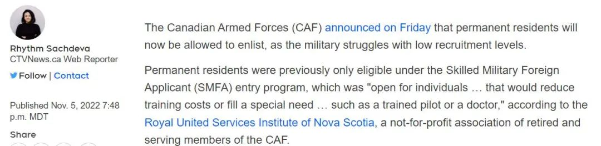
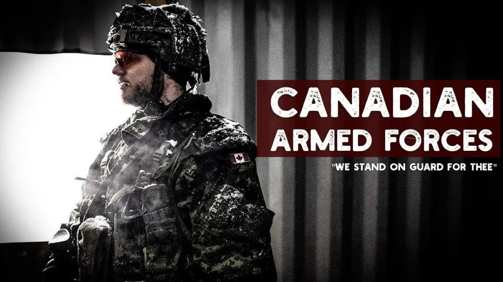
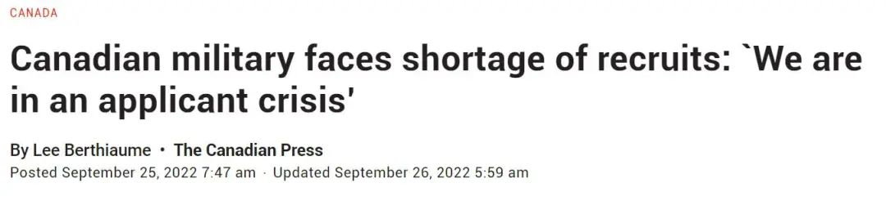
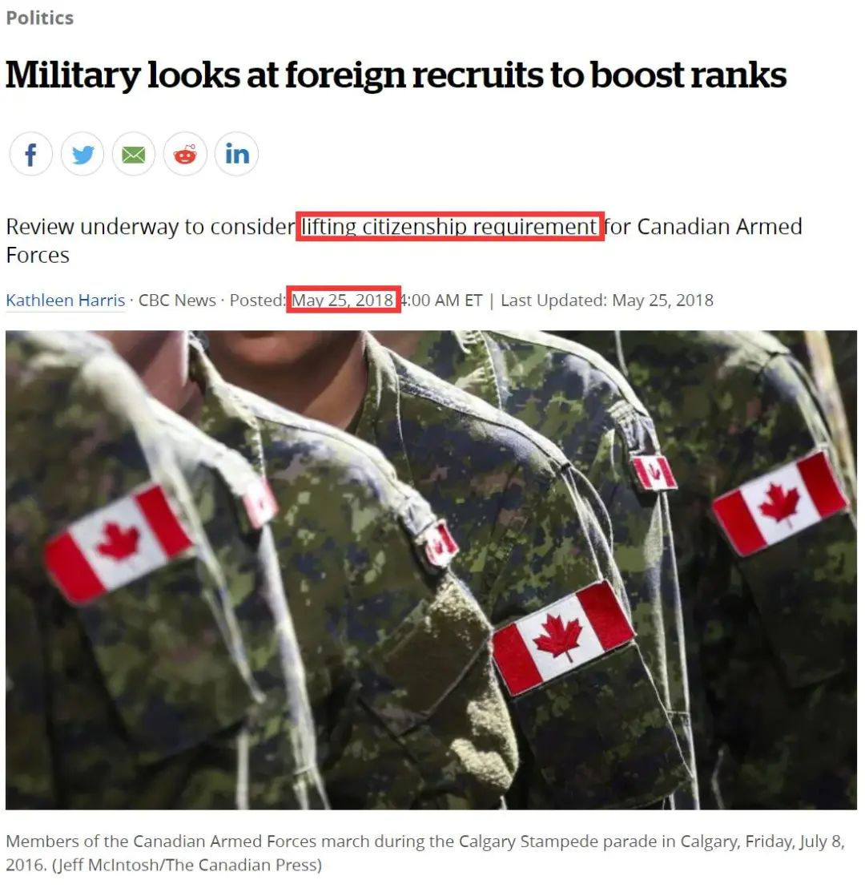
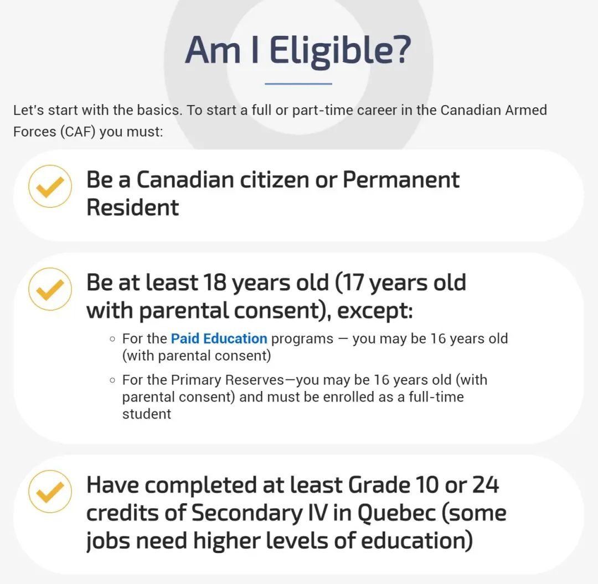

# 无标题

**链接地址:** http://mp.weixin.qq.com/s?__biz=MzUyNzA2NTAwNg==&mid=2247491674&idx=1&sn=a8da94523a70a1721034b273354cec37&chksm=fa07ea9bcd70638df523cc586291f879b55bbcc6e4572f6b74ffedc3ac315bfdadb8ec7b239e&mpshare=1&scene=2&srcid=1109F1qk8L0Yoy1NbTjWQPUc&sharer_sharetime=1667954459345&sharer_shareid=77848a6b3852ae4dcb6c74ffee84743c#rd
**作者:** 你身边的签证专家
**获取时间:** 2025/8/28 19:27:39
**图片数量:** 17

---

## 原始HTML内容

<section style="box-sizing: border-box;font-size: 16px;"><section style="text-align: center;margin-top: 10px;margin-bottom: 10px;box-sizing: border-box;" powered-by="xiumi.us"><section style="max-width: 100%;vertical-align: middle;display: inline-block;line-height: 0;box-sizing: border-box;"></section></section><section style="text-align: center;margin-top: 10px;margin-bottom: 10px;box-sizing: border-box;" powered-by="xiumi.us"></section>
 
<section style="font-size: 19px;text-align: center;margin-top: 10px;margin-bottom: 3px;box-sizing: border-box;" powered-by="xiumi.us"><section style="display: inline-block;border-width: 1px;border-style: solid;border-color: rgb(188, 65, 65);background-color: rgb(188, 65, 65);width: 1.8em;height: 1.8em;line-height: 1.8em;border-radius: 100%;margin-left: auto;margin-right: auto;font-size: 16px;color: rgb(255, 255, 255);box-sizing: border-box;">
<strong style="box-sizing: border-box;">1</strong>
</section></section><section style="text-align: center;box-sizing: border-box;" powered-by="xiumi.us"><section style="display: inline-block;width: 0px;height: 0px;vertical-align: top;overflow: hidden;border-style: solid;border-width: 9px 6px 0px;border-color: rgb(188, 65, 65) rgba(255, 255, 255, 0) rgba(255, 255, 255, 0);box-sizing: border-box;"><svg viewBox="0 0 1 1" style="float:left;line-height:0;width:0;vertical-align:top;"></svg></section></section><section style="margin-bottom: 10px;text-align: center;justify-content: center;display: flex;flex-flow: row nowrap;box-sizing: border-box;" powered-by="xiumi.us"><section style="display: inline-block;width: auto;vertical-align: middle;background-color: rgba(109, 155, 209, 0.1);min-width: 10%;max-width: 100%;flex: 0 0 auto;height: auto;align-self: center;padding: 12px;box-sizing: border-box;"><section style="color: rgb(109, 155, 209);text-align: justify;box-sizing: border-box;" powered-by="xiumi.us">
<strong style="box-sizing: border-box;">加拿大军队开始招收永久居民入伍</strong>
</section></section></section><section style="font-size: 14px;padding-right: 15px;padding-left: 15px;letter-spacing: 1px;box-sizing: border-box;" powered-by="xiumi.us">
 

加拿大的军人是一个出了名的<strong style="box-sizing: border-box;">高薪高福利职业</strong>。但是随着本国退休潮和劳动力短缺问题的日益加剧，加国军队近年来出现<strong style="box-sizing: border-box;">严重征兵不足的问题</strong>。

 

过去，加国军队通常<strong style="box-sizing: border-box;">只允许加拿大公民申请入伍</strong>，但随着新兵补充入伍的数量远远不及老兵退伍的数量，加拿大军队逼不得已，破天荒地决定开始把入伍资格扩充到<strong style="box-sizing: border-box;">拿着他国护照的永久居民</strong>身上！

 
</section><section style="text-align: center;margin-top: 10px;margin-bottom: 10px;box-sizing: border-box;" powered-by="xiumi.us"><section style="max-width: 100%;vertical-align: middle;display: inline-block;line-height: 0;width: 90%;height: auto;box-sizing: border-box;"></section></section><section style="text-align: center;margin-top: 10px;margin-bottom: 10px;box-sizing: border-box;" powered-by="xiumi.us"><section style="max-width: 100%;vertical-align: middle;display: inline-block;line-height: 0;width: 90%;height: auto;box-sizing: border-box;"></section></section><section style="text-align: center;margin-top: 10px;margin-bottom: 10px;box-sizing: border-box;" powered-by="xiumi.us"><section style="max-width: 100%;vertical-align: middle;display: inline-block;line-height: 0;width: 90%;height: auto;box-sizing: border-box;"></section></section><section style="font-size: 14px;padding-right: 15px;padding-left: 15px;letter-spacing: 1px;box-sizing: border-box;" powered-by="xiumi.us">
 
</section><section style="font-size: 14px;padding-right: 15px;padding-left: 15px;letter-spacing: 1px;box-sizing: border-box;" powered-by="xiumi.us">
加拿大军队（CAF）上周五（4日）宣布，现在将允许永久居民入伍申请，以应对<strong style="box-sizing: border-box;">加拿大征兵率低的问题</strong>。 

 

加拿大永久居民以往仅符合<strong style="box-sizing: border-box;">技术军事外国申请人（SMFA）入境计划</strong>的资格，该计划对个人开放，有助降低培训成本或满足特殊需求，例如训练有素的飞行员或医生。

 
</section><section style="text-align: center;margin-top: 10px;margin-bottom: 10px;box-sizing: border-box;" powered-by="xiumi.us"><section style="max-width: 100%;vertical-align: middle;display: inline-block;line-height: 0;box-sizing: border-box;"></section></section><section style="font-size: 14px;padding-right: 15px;padding-left: 15px;letter-spacing: 1px;box-sizing: border-box;" powered-by="xiumi.us">
 

虽然CAF尚未说明是否为了增加征兵所作决定，但加拿大皇家军事学院（Royal Military College）鲁佩特（Christian Leuprecht）表示，加拿大军队在过去限制非公民申请，因为有足够多的申请人，但目前的情况不再，他认为这是有道理的。 

 
</section><section style="text-align: center;margin-top: 10px;margin-bottom: 10px;box-sizing: border-box;" powered-by="xiumi.us"><section style="max-width: 100%;vertical-align: middle;display: inline-block;line-height: 0;width: 90%;height: auto;box-sizing: border-box;"></section></section><section style="font-size: 14px;padding-right: 15px;padding-left: 15px;letter-spacing: 1px;box-sizing: border-box;" powered-by="xiumi.us">
 

他说：“CAF过去拒绝向永久居民开放入伍，是担心带来额外的负担及风险，例如在<strong style="box-sizing: border-box;">安全许可</strong>方面。不过，有些国家已经这样做了多年。”

 

“像法国将服兵役作为获得公民的加速途径，但由于<strong style="box-sizing: border-box;">加拿大的永久居民容易获得公民身份，所以暂时未能清楚在加拿大是否产生激励作用</strong>。”

 
</section><section style="text-align: center;margin-top: 10px;margin-bottom: 10px;box-sizing: border-box;" powered-by="xiumi.us"><section style="max-width: 100%;vertical-align: middle;display: inline-block;line-height: 0;width: 90%;height: auto;box-sizing: border-box;"></section></section><section style="text-align: center;margin-top: 10px;margin-bottom: 10px;box-sizing: border-box;" powered-by="xiumi.us"><section style="max-width: 100%;vertical-align: middle;display: inline-block;line-height: 0;width: 90%;height: auto;box-sizing: border-box;"></section></section><section style="font-size: 14px;padding-right: 15px;padding-left: 15px;letter-spacing: 1px;box-sizing: border-box;" powered-by="xiumi.us">
 

国防部长阿南德（Anita Anand）在今年3月曾表示，加拿大和世界正面临二战结束以来，对<strong style="box-sizing: border-box;">国际和平的最大威胁</strong>。因此，<strong style="box-sizing: border-box;">CAF需要扩大发展</strong>。

 

此外，<strong style="box-sizing: border-box;">加拿大皇家骑警（RCMP）</strong>在5年前亦宣布，<strong style="box-sizing: border-box;">允许在加拿大生活超过10年的永久居民申请</strong>。

 

 
</section><section style="font-size: 19px;text-align: center;margin-top: 10px;margin-bottom: 3px;box-sizing: border-box;" powered-by="xiumi.us"><section style="display: inline-block;border-width: 1px;border-style: solid;border-color: rgb(188, 65, 65);background-color: rgb(188, 65, 65);width: 1.8em;height: 1.8em;line-height: 1.8em;border-radius: 100%;margin-left: auto;margin-right: auto;font-size: 16px;color: rgb(255, 255, 255);box-sizing: border-box;">
<strong style="box-sizing: border-box;">2</strong>
</section></section><section style="text-align: center;box-sizing: border-box;" powered-by="xiumi.us"><section style="display: inline-block;width: 0px;height: 0px;vertical-align: top;overflow: hidden;border-style: solid;border-width: 9px 6px 0px;border-color: rgb(188, 65, 65) rgba(255, 255, 255, 0) rgba(255, 255, 255, 0);box-sizing: border-box;"><svg viewBox="0 0 1 1" style="float:left;line-height:0;width:0;vertical-align:top;"></svg></section></section><section style="margin-bottom: 10px;text-align: center;justify-content: center;display: flex;flex-flow: row nowrap;box-sizing: border-box;" powered-by="xiumi.us"><section style="display: inline-block;width: auto;vertical-align: middle;background-color: rgba(109, 155, 209, 0.1);min-width: 10%;max-width: 100%;flex: 0 0 auto;height: auto;align-self: center;padding: 12px;box-sizing: border-box;"><section style="color: rgb(109, 155, 209);text-align: justify;box-sizing: border-box;" powered-by="xiumi.us">
<strong style="box-sizing: border-box;">过去一年仅2名特种兵应征入伍</strong>
</section></section></section><section style="font-size: 14px;padding-right: 15px;padding-left: 15px;letter-spacing: 1px;box-sizing: border-box;" powered-by="xiumi.us">
 

过去，加拿大国防部曾经花费很长时间考虑改变多年来只让加拿大公民参军的做法，以决定是否应该对非加拿大公民加入加拿大军队敞开大门。

 

据加拿大广播公司报道，过去加拿大军队招兵的一个条件是<strong style="box-sizing: border-box;">必须要有加拿大公民身份</strong>，只有在<strong style="box-sizing: border-box;">特别需要紧缺人才</strong>的情况下才能例外的招收外国人加入加拿大军队。

 
</section><section style="text-align: center;margin-top: 10px;margin-bottom: 10px;box-sizing: border-box;" powered-by="xiumi.us"><section style="max-width: 100%;vertical-align: middle;display: inline-block;line-height: 0;width: 90%;height: auto;box-sizing: border-box;"></section></section><section style="font-size: 14px;padding-right: 15px;padding-left: 15px;letter-spacing: 1px;box-sizing: border-box;" powered-by="xiumi.us">
 

加拿大国防部发言人Alexandre Munoz少校表示，招收具有<strong style="box-sizing: border-box;">特殊技能的外国人才</strong>，比如空军飞行员、医生这样具有高度专业技能的人参加加拿大军队不但可以缓解人才短缺的问题，而且节省了大笔的培训经费。

 

不过，招聘外籍身份的人加入加拿大军队也不是件容易事，2017财政年度加拿大<strong style="box-sizing: border-box;">只招收了两名外籍人士参加加拿大军队</strong>；这倒不是没有外国人报名，而是因为大部分报名参军的外国人<strong style="box-sizing: border-box;">不具有加拿大军队所需要的特殊技能</strong>。

 
</section><section style="font-size: 19px;text-align: center;margin-top: 10px;margin-bottom: 3px;box-sizing: border-box;" powered-by="xiumi.us"><section style="display: inline-block;border-width: 1px;border-style: solid;border-color: rgb(188, 65, 65);background-color: rgb(188, 65, 65);width: 1.8em;height: 1.8em;line-height: 1.8em;border-radius: 100%;margin-left: auto;margin-right: auto;font-size: 16px;color: rgb(255, 255, 255);box-sizing: border-box;">
<strong style="box-sizing: border-box;">3</strong>
</section></section><section style="text-align: center;box-sizing: border-box;" powered-by="xiumi.us"><section style="display: inline-block;width: 0px;height: 0px;vertical-align: top;overflow: hidden;border-style: solid;border-width: 9px 6px 0px;border-color: rgb(188, 65, 65) rgba(255, 255, 255, 0) rgba(255, 255, 255, 0);box-sizing: border-box;"><svg viewBox="0 0 1 1" style="float:left;line-height:0;width:0;vertical-align:top;"></svg></section></section><section style="margin-bottom: 10px;text-align: center;justify-content: center;display: flex;flex-flow: row nowrap;box-sizing: border-box;" powered-by="xiumi.us"><section style="display: inline-block;width: auto;vertical-align: middle;background-color: rgba(109, 155, 209, 0.1);min-width: 10%;max-width: 100%;flex: 0 0 auto;height: auto;align-self: center;padding: 12px;box-sizing: border-box;"><section style="color: rgb(109, 155, 209);text-align: justify;box-sizing: border-box;" powered-by="xiumi.us">
<strong style="box-sizing: border-box;">加拿大入伍要求</strong>
</section></section></section>
 
<section style="text-align: center;margin-top: 10px;margin-bottom: 10px;box-sizing: border-box;" powered-by="xiumi.us"><section style="max-width: 100%;vertical-align: middle;display: inline-block;line-height: 0;width: 90%;height: auto;box-sizing: border-box;"></section></section><section style="font-size: 14px;padding-right: 15px;padding-left: 15px;letter-spacing: 1px;box-sizing: border-box;" powered-by="xiumi.us">
 

现在永久居民也可以申请入伍参军，对于不少人的职业规划和发展是一个<strong style="box-sizing: border-box;">好消息</strong>。想在加拿大入伍从军的要求其实并不复杂，但是步骤比较多。在加入加拿大军队之前，您<strong style="box-sizing: border-box;">必须满足特定的教育要求</strong>才能进行申请。

 
<ol class="list-paddingleft-1"><li style="box-sizing: border-box;">
必须是加拿大公民或永久居民。
</li><li style="box-sizing: border-box;">
必须至少年满18岁（或17岁并获得父母同意）。
</li><li style="box-sizing: border-box;">
对于加拿大其他地区，您必须在魁北克完成至少10年级或中学IV或10年级教育。如果您想以军官身份加入部队，您必须拥有或正在攻读学士学位。
</li><li style="box-sizing: border-box;">
填写可靠性筛选表（背景调查）
</li><li style="box-sizing: border-box;">
完成能力倾向测试
</li><li style="box-sizing: border-box;">
完成体检
</li><li style="box-sizing: border-box;">
接受军事职业顾问面试。

 
</li></ol></section><section style="margin-top: 10px;margin-bottom: 10px;text-align: center;box-sizing: border-box;" powered-by="xiumi.us"><section style="padding-left: 1em;padding-right: 1em;display: inline-block;box-sizing: border-box;">
<strong style="box-sizing: border-box;">&nbsp;现 在 申 请&nbsp;</strong>
 </section><section style="border-width: 1px;border-style: solid;border-color: rgb(192, 200, 209);margin-top: -1em;padding: 20px 10px 10px;background-color: rgb(239, 239, 239);box-sizing: border-box;"><section style="text-align: justify;box-sizing: border-box;" powered-by="xiumi.us">
 

<em style="box-sizing: border-box;">https://forces.ca/en/apply-now/</em> 

 
</section></section></section><section style="font-size: 14px;padding-right: 15px;padding-left: 15px;letter-spacing: 1px;box-sizing: border-box;" powered-by="xiumi.us">
 
</section><section style="font-size: 19px;text-align: center;margin-top: 10px;margin-bottom: 3px;box-sizing: border-box;" powered-by="xiumi.us"><section style="display: inline-block;border-width: 1px;border-style: solid;border-color: rgb(188, 65, 65);background-color: rgb(188, 65, 65);width: 1.8em;height: 1.8em;line-height: 1.8em;border-radius: 100%;margin-left: auto;margin-right: auto;font-size: 16px;color: rgb(255, 255, 255);box-sizing: border-box;">
<strong style="box-sizing: border-box;">4</strong>
</section></section><section style="text-align: center;box-sizing: border-box;" powered-by="xiumi.us"><section style="display: inline-block;width: 0px;height: 0px;vertical-align: top;overflow: hidden;border-style: solid;border-width: 9px 6px 0px;border-color: rgb(188, 65, 65) rgba(255, 255, 255, 0) rgba(255, 255, 255, 0);box-sizing: border-box;"><svg viewBox="0 0 1 1" style="float:left;line-height:0;width:0;vertical-align:top;"></svg></section></section><section style="margin-bottom: 10px;text-align: center;justify-content: center;display: flex;flex-flow: row nowrap;box-sizing: border-box;" powered-by="xiumi.us"><section style="display: inline-block;width: auto;vertical-align: middle;background-color: rgba(109, 155, 209, 0.1);min-width: 10%;max-width: 100%;flex: 0 0 auto;height: auto;align-self: center;padding: 12px;box-sizing: border-box;"><section style="color: rgb(109, 155, 209);text-align: justify;box-sizing: border-box;" powered-by="xiumi.us">
<strong style="box-sizing: border-box;">加入加拿大军队有什么好处？ </strong>
</section></section></section>
 
<section style="font-size: 14px;padding-right: 15px;padding-left: 15px;letter-spacing: 1px;box-sizing: border-box;" powered-by="xiumi.us">
我们都知道加拿大的军人拥有较为<strong style="box-sizing: border-box;">优厚的资薪和福利待遇</strong>。但是过去由于永久居民几乎没有申请的权利，许多人没有机会去进行详细了解。今天，我们综合了官方网站的信息，为大家将这些诱人的福利一一列出：

 
</section><section style="text-align: center;margin-top: 10px;margin-bottom: 10px;box-sizing: border-box;" powered-by="xiumi.us"><section style="max-width: 100%;vertical-align: middle;display: inline-block;line-height: 0;box-sizing: border-box;"></section></section><section style="font-size: 14px;padding-right: 15px;padding-left: 15px;letter-spacing: 1px;box-sizing: border-box;" powered-by="xiumi.us">
 
</section><section style="margin: 20px 0% 10px;text-align: center;box-sizing: border-box;" powered-by="xiumi.us"><section style="padding: 3px;display: inline-block;border-bottom: 5px solid rgb(147, 122, 122);color: rgb(147, 122, 122);box-sizing: border-box;">
<strong style="box-sizing: border-box;">#1. 医疗、牙科和视力保健福利</strong>
</section></section>
 
<section style="font-size: 14px;padding-right: 15px;padding-left: 15px;letter-spacing: 1px;box-sizing: border-box;" powered-by="xiumi.us">
<strong style="box-sizing: border-box;">您和您的家人将在您的整个职业生涯中获得健康和牙科保险。</strong> 此外，如果您注册为兼职会员，您还可以在指定期间享受医疗和牙科护理，具体取决于您的工作状态。

 
</section><section style="margin: 20px 0% 10px;text-align: center;box-sizing: border-box;" powered-by="xiumi.us"><section style="padding: 3px;display: inline-block;border-bottom: 5px solid rgb(147, 122, 122);color: rgb(147, 122, 122);box-sizing: border-box;">
<strong style="box-sizing: border-box;">#2. 带薪假期</strong>
</section></section><section style="font-size: 14px;padding-right: 15px;padding-left: 15px;letter-spacing: 1px;box-sizing: border-box;" powered-by="xiumi.us">
作为全职会员，您将获得至少每年20天的带薪假期。这些通常可以围绕培训和军队运营要求进行安排。此外，在您进阶的职业生涯中，休假时间将增加到最多每年30天。如果您注册为兼职会员，您将在每15个连续的工作日后获得一个带薪假期。

 
</section><section style="margin: 20px 0% 10px;text-align: center;box-sizing: border-box;" powered-by="xiumi.us"><section style="padding: 3px;display: inline-block;border-bottom: 5px solid rgb(147, 122, 122);color: rgb(147, 122, 122);box-sizing: border-box;">
<strong style="box-sizing: border-box;">#3. 产假和育儿假</strong>
</section></section><section style="font-size: 14px;padding-right: 15px;padding-left: 15px;letter-spacing: 1px;box-sizing: border-box;" powered-by="xiumi.us">
加拿大武装部队 (CAF) 提供产假和育儿假福利，让您在休产假期间获得正常工资93%的薪酬，与您的家庭成员共度幸福时光。

 
</section><section style="margin: 20px 0% 10px;text-align: center;box-sizing: border-box;" powered-by="xiumi.us"><section style="padding: 3px;display: inline-block;border-bottom: 5px solid rgb(147, 122, 122);color: rgb(147, 122, 122);box-sizing: border-box;">
<strong style="box-sizing: border-box;">#4. 退休</strong>
</section></section><section style="font-size: 14px;padding-right: 15px;padding-left: 15px;letter-spacing: 1px;box-sizing: border-box;" powered-by="xiumi.us">
加拿大武装部队的养老金计划让您未来的生活高枕无忧。无论您是全职加入还是兼职加入，您都可以放心得带着养老金退休。

 

您可以在加拿大武装部队工作25年后以全额养老金退休。对于一个20岁的人来说，这意味着你可以<strong style="box-sizing: border-box;">在45岁退休</strong>！拥有充分的时间和精力去开启新的职业进程或者早早享受快乐休闲的退休时光。

 
</section><section style="margin: 20px 0% 10px;text-align: center;box-sizing: border-box;" powered-by="xiumi.us"><section style="padding: 3px;display: inline-block;border-bottom: 5px solid rgb(147, 122, 122);color: rgb(147, 122, 122);box-sizing: border-box;">
<strong style="box-sizing: border-box;">#5. 有竞争力的薪酬</strong>
</section></section><section style="font-size: 14px;padding-right: 15px;padding-left: 15px;letter-spacing: 1px;box-sizing: border-box;" powered-by="xiumi.us">
您的技能、知识、经验和培训会影响您的起薪。作为新的直接入职人员，年薪起薪标准<strong style="box-sizing: border-box;">为$35,820至$62,424</strong>之间。

 

一旦您为所选职业接受了全面培训，您的薪水将根据您在军队中的时间、军衔和获得的技能而继续增加。起薪基于私营部门入门级职位的同等职业。&nbsp;
</section>
 

 
<section style="text-align: left;justify-content: flex-start;display: flex;flex-flow: row nowrap;margin-top: 10px;box-sizing: border-box;" powered-by="xiumi.us"><section style="display: inline-block;vertical-align: top;width: auto;align-self: stretch;flex: 0 0 auto;background-color: rgb(188, 65, 65);min-width: 5%;max-width: 100%;height: auto;padding-top: 9px;padding-right: 9px;padding-left: 20px;box-sizing: border-box;"><section style="text-align: justify;font-size: 18px;color: rgb(252, 252, 252);box-sizing: border-box;" powered-by="xiumi.us">
<strong style="box-sizing: border-box;">阅读更多</strong>
</section></section><section style="display: inline-block;vertical-align: top;width: auto;min-width: 5%;max-width: 100%;flex: 0 0 auto;height: auto;align-self: stretch;box-sizing: border-box;"><section style="box-sizing: border-box;" powered-by="xiumi.us"><section style="display: inline-block;width: 0px;height: 0px;vertical-align: top;overflow: hidden;border-style: solid;border-width: 45px 0px 0px 19px;border-color: rgba(255, 255, 255, 0) rgba(255, 255, 255, 0) rgba(255, 255, 255, 0) rgb(188, 65, 65);box-sizing: border-box;"><svg viewBox="0 0 1 1" style="float:left;line-height:0;width:0;vertical-align:top;"></svg></section></section></section></section><section style="margin-bottom: 10px;box-sizing: border-box;" powered-by="xiumi.us"><section style="background-color: rgb(188, 65, 65);height: 3px;box-sizing: border-box;"><svg viewBox="0 0 1 1" style="float:left;line-height:0;width:0;vertical-align:top;"></svg></section></section><section style="margin: 10px 0%;text-align: left;justify-content: flex-start;display: flex;flex-flow: row nowrap;box-sizing: border-box;" powered-by="xiumi.us"><section style="display: inline-block;width: 100%;vertical-align: top;background-position: 55.6015% 33.1154%;background-repeat: repeat;background-size: 100.637%;background-attachment: scroll;padding: 30px;align-self: flex-start;flex: 0 0 auto;background-image: url(&quot;https://mmbiz.qpic.cn/mmbiz_jpg/904kUibXm7Y4FOK78ZQP5dVCywq6c5YjeDqeXFUd1GSibAgaZj8ecaXibicZEFXRAA0xnbicf8h7ibOicINP1Gbtw78UQ/640?wx_fmt=jpeg&quot;);box-sizing: border-box;"><section style="text-align: justify;justify-content: flex-start;display: flex;flex-flow: row nowrap;box-sizing: border-box;" powered-by="xiumi.us"><section style="display: inline-block;width: 100%;vertical-align: top;background-color: rgba(188, 65, 65, 0.22);padding: 10px;border-width: 0px;border-style: none;border-color: rgb(62, 62, 62);align-self: flex-start;flex: 0 0 auto;box-sizing: border-box;"><section style="text-align: center;color: rgb(255, 255, 255);font-size: 14px;box-sizing: border-box;" powered-by="xiumi.us">
<a target="_blank" href="http://mp.weixin.qq.com/s?__biz=MzUyNzA2NTAwNg==&amp;mid=2247491647&amp;idx=1&amp;sn=5a46dec5bc0e903ed9b62691370e5c7e&amp;chksm=fa07eafecd7063e82f7b31da6c13d6007238fa5e60f00321c78c10f566833bd81ed0ab8af4fd&amp;scene=21#wechat_redirect" textvalue="移民申请神助攻，加拿大最抢手10个职位揭秘，薪水一年暴涨25%！" linktype="text" imgurl="" imgdata="null" data-itemshowtype="0" tab="innerlink" style="color: rgb(255, 255, 255);" data-linktype="2"><strong style="box-sizing: border-box;">移民申请神助攻，加拿大最抢手10个职位揭秘，薪水一年暴涨25%！</strong></a>
</section></section></section></section></section><section style="margin: 10px 0%;text-align: left;justify-content: flex-start;display: flex;flex-flow: row nowrap;box-sizing: border-box;" powered-by="xiumi.us"><section style="display: inline-block;width: 100%;vertical-align: top;background-position: -26.3755% 52.8617%;background-repeat: repeat;background-size: 100.637%;background-attachment: scroll;padding: 30px;align-self: flex-start;flex: 0 0 auto;background-image: url(&quot;https://mmbiz.qpic.cn/mmbiz_jpg/904kUibXm7Y4FOK78ZQP5dVCywq6c5Yjejibtcdib9PpBALlzUXQcQ1MbD39YicYvkN1HMCqFxic4IPNIG2s7mxviaWA/640?wx_fmt=jpeg&quot;);box-sizing: border-box;"><section style="text-align: justify;justify-content: flex-start;display: flex;flex-flow: row nowrap;box-sizing: border-box;" powered-by="xiumi.us"><section style="display: inline-block;width: 100%;vertical-align: top;background-color: rgba(188, 65, 65, 0.22);padding: 10px;border-width: 0px;border-style: none;border-color: rgb(62, 62, 62);align-self: flex-start;flex: 0 0 auto;box-sizing: border-box;"><section style="text-align: center;color: rgb(255, 255, 255);font-size: 14px;box-sizing: border-box;" powered-by="xiumi.us">
<a target="_blank" href="http://mp.weixin.qq.com/s?__biz=MzUyNzA2NTAwNg==&amp;mid=2247491614&amp;idx=1&amp;sn=401654707168a3867cc616caefa06926&amp;chksm=fa07eadfcd7063c94a8a674a1c571c9decf986df493983aa936d4a642e90ef2d4503d77fd8d6&amp;scene=21#wechat_redirect" textvalue="最新三年移民配额出炉！加拿大联邦官宣2025年狂收50万新移民！每年都是新纪录！" linktype="text" imgurl="" imgdata="null" data-itemshowtype="0" tab="innerlink" style="color: rgb(255, 255, 255);" data-linktype="2"><strong style="box-sizing: border-box;">最新三年移民配额出炉！加拿大联邦官宣2025年狂收50万新移民！每年都是新纪录！</strong></a>
</section></section></section></section></section><section style="margin: 10px 0%;text-align: left;justify-content: flex-start;display: flex;flex-flow: row nowrap;box-sizing: border-box;" powered-by="xiumi.us"><section style="display: inline-block;width: 100%;vertical-align: top;background-position: 137.578% 27.8193%;background-repeat: repeat;background-size: 100.637%;background-attachment: scroll;padding: 30px;align-self: flex-start;flex: 0 0 auto;background-image: url(&quot;https://mmbiz.qpic.cn/mmbiz_jpg/904kUibXm7Y4FOK78ZQP5dVCywq6c5YjeMjUhgcHaS9vWBKp6KgSbem8Aia57NgdpxyRK3bEvic4pPy7mwmKvu5Yg/640?wx_fmt=jpeg&quot;);box-sizing: border-box;"><section style="text-align: justify;justify-content: flex-start;display: flex;flex-flow: row nowrap;box-sizing: border-box;" powered-by="xiumi.us"><section style="display: inline-block;width: 100%;vertical-align: top;background-color: rgba(188, 65, 65, 0.22);padding: 10px;border-width: 0px;border-style: none;border-color: rgb(62, 62, 62);align-self: flex-start;flex: 0 0 auto;box-sizing: border-box;"><section style="text-align: center;color: rgb(255, 255, 255);font-size: 14px;box-sizing: border-box;" powered-by="xiumi.us">
<a target="_blank" href="http://mp.weixin.qq.com/s?__biz=MzUyNzA2NTAwNg==&amp;mid=2247491587&amp;idx=1&amp;sn=22f444e0add9405579df662d12acf969&amp;chksm=fa07eac2cd7063d4c3cc3ea544782b9420f7d2054273cee63b214f7b107817bf7c47404068ea&amp;scene=21#wechat_redirect" textvalue="加国移民数据揭露：62%移民来自亚洲，今年中国移民将超4万！小城市移民受欢迎！" linktype="text" imgurl="" imgdata="null" data-itemshowtype="0" tab="innerlink" style="color: rgb(255, 255, 255);" data-linktype="2"><strong style="box-sizing: border-box;">加国移民数据揭露：62%移民来自亚洲，今年中国移民将超4万！小城市移民受欢迎！</strong></a>
</section></section></section></section></section><section style="margin: 10px 0%;text-align: left;justify-content: flex-start;display: flex;flex-flow: row nowrap;box-sizing: border-box;" powered-by="xiumi.us"><section style="display: inline-block;width: 100%;vertical-align: top;background-position: 55.6015% 33.1154%;background-repeat: repeat;background-size: 100.637%;background-attachment: scroll;padding: 30px;align-self: flex-start;flex: 0 0 auto;background-image: url(&quot;https://mmbiz.qpic.cn/mmbiz_jpg/904kUibXm7Y4FOK78ZQP5dVCywq6c5YjeLxICGicuBrKrVxvJeTg0jDRJBEyF01BLreoxym1ZXiaQ2mbVeiaXbQibgA/640?wx_fmt=jpeg&quot;);box-sizing: border-box;"><section style="text-align: justify;justify-content: flex-start;display: flex;flex-flow: row nowrap;box-sizing: border-box;" powered-by="xiumi.us"><section style="display: inline-block;width: 100%;vertical-align: top;background-color: rgba(188, 65, 65, 0.22);padding: 10px;border-width: 0px;border-style: none;border-color: rgb(62, 62, 62);align-self: flex-start;flex: 0 0 auto;box-sizing: border-box;"><section style="text-align: center;color: rgb(255, 255, 255);font-size: 14px;box-sizing: border-box;" powered-by="xiumi.us">
<a target="_blank" href="http://mp.weixin.qq.com/s?__biz=MzUyNzA2NTAwNg==&amp;mid=2247491555&amp;idx=1&amp;sn=d9caefb2071ed6b47b58c76a82c3f00d&amp;chksm=fa041522cd739c3464ece981312c85aba40f12041adbdbc7102f891ae6dcc42d15be0851e9c3&amp;scene=21#wechat_redirect" textvalue="留学生苦，家长更苦！加拿大天价大学学费，一节课几千刀！至少准备200万！" linktype="text" imgurl="" imgdata="null" data-itemshowtype="0" tab="innerlink" style="color: rgb(255, 255, 255);" data-linktype="2"><strong style="box-sizing: border-box;">留学生苦，家长更苦！加拿大天价大学学费，一节课几千刀！至少准备200万！</strong></a>
</section></section></section></section></section><section style="text-align: center;font-size: 12px;color: rgb(180, 180, 180);box-sizing: border-box;" powered-by="xiumi.us">
（点击文字阅读）
</section><section style="margin: 10px 0%;text-align: left;justify-content: flex-start;display: flex;flex-flow: row nowrap;box-sizing: border-box;" powered-by="xiumi.us"><section style="display: inline-block;width: 100%;vertical-align: top;background-color: rgb(216, 202, 160);line-height: 0;align-self: flex-start;flex: 0 0 auto;box-sizing: border-box;"><section style="text-align: justify;justify-content: flex-start;display: flex;flex-flow: row nowrap;box-sizing: border-box;" powered-by="xiumi.us"><section style="display: inline-block;width: 100%;vertical-align: top;background-position: 0% 0%;background-repeat: repeat;background-size: 1.56658%;background-attachment: scroll;align-self: flex-start;flex: 0 0 auto;background-image: url(&quot;https://mmbiz.qpic.cn/mmbiz_png/904kUibXm7Y4FOK78ZQP5dVCywq6c5YjeCOqdtRSXlo3WGicfqzCiaQAFyhrzUon2n9lbIg4UsPicib4rFAdtrIgiaqg/640?wx_fmt=png&quot;);box-sizing: border-box;"><section style="text-align: center;box-sizing: border-box;" powered-by="xiumi.us"><section style="display: inline-block;width: 100%;height: 11px;vertical-align: top;overflow: hidden;background-color: rgba(255, 255, 255, 0);box-sizing: border-box;"><svg viewBox="0 0 1 1" style="float:left;line-height:0;width:0;vertical-align:top;"></svg></section></section></section></section></section></section><section style="text-align: center;margin-top: 10px;margin-bottom: 10px;box-sizing: border-box;" powered-by="xiumi.us"><section style="max-width: 100%;vertical-align: middle;display: inline-block;line-height: 0;box-sizing: border-box;"></section></section><section style="text-align: center;margin-top: 10px;margin-bottom: 10px;box-sizing: border-box;" powered-by="xiumi.us"><section style="max-width: 100%;vertical-align: middle;display: inline-block;line-height: 0;box-sizing: border-box;"></section></section><section style="text-align: center;margin-top: 10px;margin-bottom: 10px;box-sizing: border-box;" powered-by="xiumi.us"><section style="max-width: 100%;vertical-align: middle;display: inline-block;line-height: 0;box-sizing: border-box;"></section></section><section style="padding-right: 15px;padding-left: 15px;font-size: 12px;color: rgb(121, 121, 121);box-sizing: border-box;" powered-by="xiumi.us">
<strong style="box-sizing: border-box;">参考信息：</strong>

<strong style="box-sizing: border-box;">https://www.ctvnews.ca/canada/canadian-armed-forces-now-allowing-permanent-residents-to-enlist-amid-low-recruitment-1.6140993</strong>

 
</section><section style="text-align: center;margin-top: 10px;margin-bottom: 10px;box-sizing: border-box;" powered-by="xiumi.us"><section style="max-width: 100%;vertical-align: middle;display: inline-block;line-height: 0;box-sizing: border-box;"></section></section><section style="text-align: center;margin-top: 10px;margin-bottom: 10px;box-sizing: border-box;" powered-by="xiumi.us"><section style="max-width: 100%;vertical-align: middle;display: inline-block;line-height: 0;box-sizing: border-box;"></section></section></section>
 

<mp-style-type data-value="3"></mp-style-type>

---

## 纯文本内容

1加拿大军队开始招收永久居民入伍加拿大的军人是一个出了名的高薪高福利职业。但是随着本国退休潮和劳动力短缺问题的日益加剧，加国军队近年来出现严重征兵不足的问题。过去，加国军队通常只允许加拿大公民申请入伍，但随着新兵补充入伍的数量远远不及老兵退伍的数量，加拿大军队逼不得已，破天荒地决定开始把入伍资格扩充到拿着他国护照的永久居民身上！加拿大军队（CAF）上周五（4日）宣布，现在将允许永久居民入伍申请，以应对加拿大征兵率低的问题。加拿大永久居民以往仅符合技术军事外国申请人（SMFA）入境计划的资格，该计划对个人开放，有助降低培训成本或满足特殊需求，例如训练有素的飞行员或医生。虽然CAF尚未说明是否为了增加征兵所作决定，但加拿大皇家军事学院（Royal Military College）鲁佩特（Christian Leuprecht）表示，加拿大军队在过去限制非公民申请，因为有足够多的申请人，但目前的情况不再，他认为这是有道理的。他说：“CAF过去拒绝向永久居民开放入伍，是担心带来额外的负担及风险，例如在安全许可方面。不过，有些国家已经这样做了多年。”“像法国将服兵役作为获得公民的加速途径，但由于加拿大的永久居民容易获得公民身份，所以暂时未能清楚在加拿大是否产生激励作用。”国防部长阿南德（Anita Anand）在今年3月曾表示，加拿大和世界正面临二战结束以来，对国际和平的最大威胁。因此，CAF需要扩大发展。此外，加拿大皇家骑警（RCMP）在5年前亦宣布，允许在加拿大生活超过10年的永久居民申请。2过去一年仅2名特种兵应征入伍过去，加拿大国防部曾经花费很长时间考虑改变多年来只让加拿大公民参军的做法，以决定是否应该对非加拿大公民加入加拿大军队敞开大门。据加拿大广播公司报道，过去加拿大军队招兵的一个条件是必须要有加拿大公民身份，只有在特别需要紧缺人才的情况下才能例外的招收外国人加入加拿大军队。加拿大国防部发言人Alexandre Munoz少校表示，招收具有特殊技能的外国人才，比如空军飞行员、医生这样具有高度专业技能的人参加加拿大军队不但可以缓解人才短缺的问题，而且节省了大笔的培训经费。不过，招聘外籍身份的人加入加拿大军队也不是件容易事，2017财政年度加拿大只招收了两名外籍人士参加加拿大军队；这倒不是没有外国人报名，而是因为大部分报名参军的外国人不具有加拿大军队所需要的特殊技能。3加拿大入伍要求现在永久居民也可以申请入伍参军，对于不少人的职业规划和发展是一个好消息。想在加拿大入伍从军的要求其实并不复杂，但是步骤比较多。在加入加拿大军队之前，您必须满足特定的教育要求才能进行申请。必须是加拿大公民或永久居民。必须至少年满18岁（或17岁并获得父母同意）。对于加拿大其他地区，您必须在魁北克完成至少10年级或中学IV或10年级教育。如果您想以军官身份加入部队，您必须拥有或正在攻读学士学位。填写可靠性筛选表（背景调查）完成能力倾向测试完成体检接受军事职业顾问面试。 现 在 申 请  https://forces.ca/en/apply-now/ 4加入加拿大军队有什么好处？我们都知道加拿大的军人拥有较为优厚的资薪和福利待遇。但是过去由于永久居民几乎没有申请的权利，许多人没有机会去进行详细了解。今天，我们综合了官方网站的信息，为大家将这些诱人的福利一一列出：#1. 医疗、牙科和视力保健福利您和您的家人将在您的整个职业生涯中获得健康和牙科保险。 此外，如果您注册为兼职会员，您还可以在指定期间享受医疗和牙科护理，具体取决于您的工作状态。#2. 带薪假期作为全职会员，您将获得至少每年20天的带薪假期。这些通常可以围绕培训和军队运营要求进行安排。此外，在您进阶的职业生涯中，休假时间将增加到最多每年30天。如果您注册为兼职会员，您将在每15个连续的工作日后获得一个带薪假期。#3. 产假和育儿假加拿大武装部队 (CAF) 提供产假和育儿假福利，让您在休产假期间获得正常工资93%的薪酬，与您的家庭成员共度幸福时光。#4. 退休加拿大武装部队的养老金计划让您未来的生活高枕无忧。无论您是全职加入还是兼职加入，您都可以放心得带着养老金退休。您可以在加拿大武装部队工作25年后以全额养老金退休。对于一个20岁的人来说，这意味着你可以在45岁退休！拥有充分的时间和精力去开启新的职业进程或者早早享受快乐休闲的退休时光。#5. 有竞争力的薪酬您的技能、知识、经验和培训会影响您的起薪。作为新的直接入职人员，年薪起薪标准为$35,820至$62,424之间。一旦您为所选职业接受了全面培训，您的薪水将根据您在军队中的时间、军衔和获得的技能而继续增加。起薪基于私营部门入门级职位的同等职业。 阅读更多移民申请神助攻，加拿大最抢手10个职位揭秘，薪水一年暴涨25%！最新三年移民配额出炉！加拿大联邦官宣2025年狂收50万新移民！每年都是新纪录！加国移民数据揭露：62%移民来自亚洲，今年中国移民将超4万！小城市移民受欢迎！留学生苦，家长更苦！加拿大天价大学学费，一节课几千刀！至少准备200万！（点击文字阅读）参考信息：https://www.ctvnews.ca/canada/canadian-armed-forces-now-allowing-permanent-residents-to-enlist-amid-low-recruitment-1.6140993

---

## 图片列表

-  (原始链接: https://mmbiz.qpic.cn/mmbiz_jpg/904kUibXm7Y4FOK78ZQP5dVCywq6c5YjeYSFY9e1AYgzBE2M87icIeicicn03GGicZHZ2m8vHZBoibW16NlOicUk4ndtA/640?wx_fmt=jpeg)
-  (原始链接: https://mmbiz.qpic.cn/mmbiz_jpg/904kUibXm7Y4EC3q40NfCb7jaWhWbgfxibgpavj9rH4EqdQFpzyVg6N8TNSVOsgAOuvg1OSL9ec8ZyRicEzu8Tib7A/640?wx_fmt=jpeg)
-  (原始链接: https://mmbiz.qpic.cn/mmbiz_jpg/904kUibXm7Y4FOK78ZQP5dVCywq6c5Yje5eoktK12JvZcDJUan6MuALfBibsyNOm4fcNlmHqDvRBDarib2KiaESUDQ/640?wx_fmt=jpeg)
-  (原始链接: https://mmbiz.qpic.cn/mmbiz_jpg/904kUibXm7Y4FOK78ZQP5dVCywq6c5YjebBmgcz4mCFFrFwBe6BkOVJiaD8d9zUvQfbot4MBB8fcibX3brfUXSUsA/640?wx_fmt=jpeg)
-  (原始链接: https://mmbiz.qpic.cn/mmbiz_jpg/904kUibXm7Y4FOK78ZQP5dVCywq6c5YjeVn5DACBZJ4ib8ACU7KYsIIfdLNVZSBCia4Dan7JnpoZegCj09XoO6DuQ/640?wx_fmt=jpeg)
-  (原始链接: https://mmbiz.qpic.cn/mmbiz_png/904kUibXm7Y4FOK78ZQP5dVCywq6c5YjeT5dRnneuu0Q03XEjfEtOSlCMPEArxicIVcHTBCn3ia0btPgnFVttXKqA/640?wx_fmt=png)
-  (原始链接: https://mmbiz.qpic.cn/mmbiz_jpg/904kUibXm7Y4FOK78ZQP5dVCywq6c5YjeMPUiaAn5tk9d7JOib4wpqKtzIDXMQS4V0TYFGxafibnDYUSd6KAoZFRBg/640?wx_fmt=jpeg)
-  (原始链接: https://mmbiz.qpic.cn/mmbiz_jpg/904kUibXm7Y4FOK78ZQP5dVCywq6c5YjeZZZTkRkP8vuObWHW8jGzeMLH4l3EGOHPaHMqiaMwKDZjOy5PlcUlxQg/640?wx_fmt=jpeg)
-  (原始链接: https://mmbiz.qpic.cn/mmbiz_jpg/904kUibXm7Y4FOK78ZQP5dVCywq6c5YjeSYWpZSV8t3g30oxFxM4QPIR65SicYx0WD05VxJ45icuCQgD9A2ibCWmRQ/640?wx_fmt=jpeg)
-  (原始链接: https://mmbiz.qpic.cn/mmbiz_jpg/904kUibXm7Y4FOK78ZQP5dVCywq6c5YjeFO2PZMnRu1zZDOVqGdopTFDNMnuMVoj0lKibZjAic9koZskScsfsV0ug/640?wx_fmt=jpeg)
-  (原始链接: https://mmbiz.qpic.cn/mmbiz_jpg/904kUibXm7Y4FOK78ZQP5dVCywq6c5Yje5JGic9k1FEAO1pPkKIIGXb9UQxtjNmD2mJtapiaMYZ6IF0JcdbPiagV6g/640?wx_fmt=jpeg)
-  (原始链接: https://mmbiz.qpic.cn/mmbiz_png/904kUibXm7Y4FOK78ZQP5dVCywq6c5YjeXnZLQBYQibGxVsef3KRuabZyJGhehibXia5ictUWINtTWD6EBuH4UPge0Q/640?wx_fmt=png)
-  (原始链接: https://mmbiz.qpic.cn/mmbiz_jpg/904kUibXm7Y4FOK78ZQP5dVCywq6c5YjeIEeFfbzgU1QTa5xQSTyYlCydf0Rto5wgZvniaOwKEW4Hm1ibcYpr6d1A/640?wx_fmt=jpeg)
-  (原始链接: https://mmbiz.qpic.cn/mmbiz_png/904kUibXm7Y4FOK78ZQP5dVCywq6c5YjedcYuMBRvicJ7vjOwKD4kNSPYYwibR0RJ7ian6K0ic3JR6qibN3WiaQIrF4FA/640?wx_fmt=png)
-  (原始链接: https://mmbiz.qpic.cn/mmbiz_jpg/904kUibXm7Y4FOK78ZQP5dVCywq6c5Yjex65mSGDpPlA2wpPnStdib4YEdnVc3LQ7n4q4LbZXpb1YyGp81D4XGyg/640?wx_fmt=jpeg)
-  (原始链接: https://mmbiz.qpic.cn/mmbiz_jpg/904kUibXm7Y4FOK78ZQP5dVCywq6c5YjeBGeNiahyVtkrZ7ZchhYbCSNN27dCfYcdy6YwCGCeQTKkulGjG6QOYbw/640?wx_fmt=jpeg)
-  (原始链接: https://mmbiz.qpic.cn/mmbiz_jpg/904kUibXm7Y4FOK78ZQP5dVCywq6c5Yjext1emhKOPBpjY9LwhqBO31PHWuhojf5tccpIo7ibvhbUL1Ou5eOmJPg/640?wx_fmt=jpeg)
