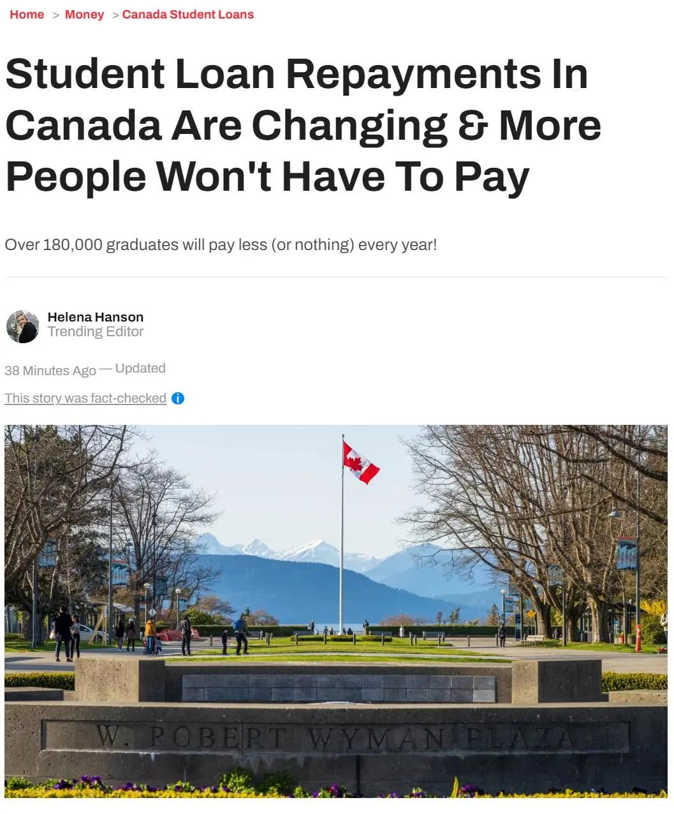
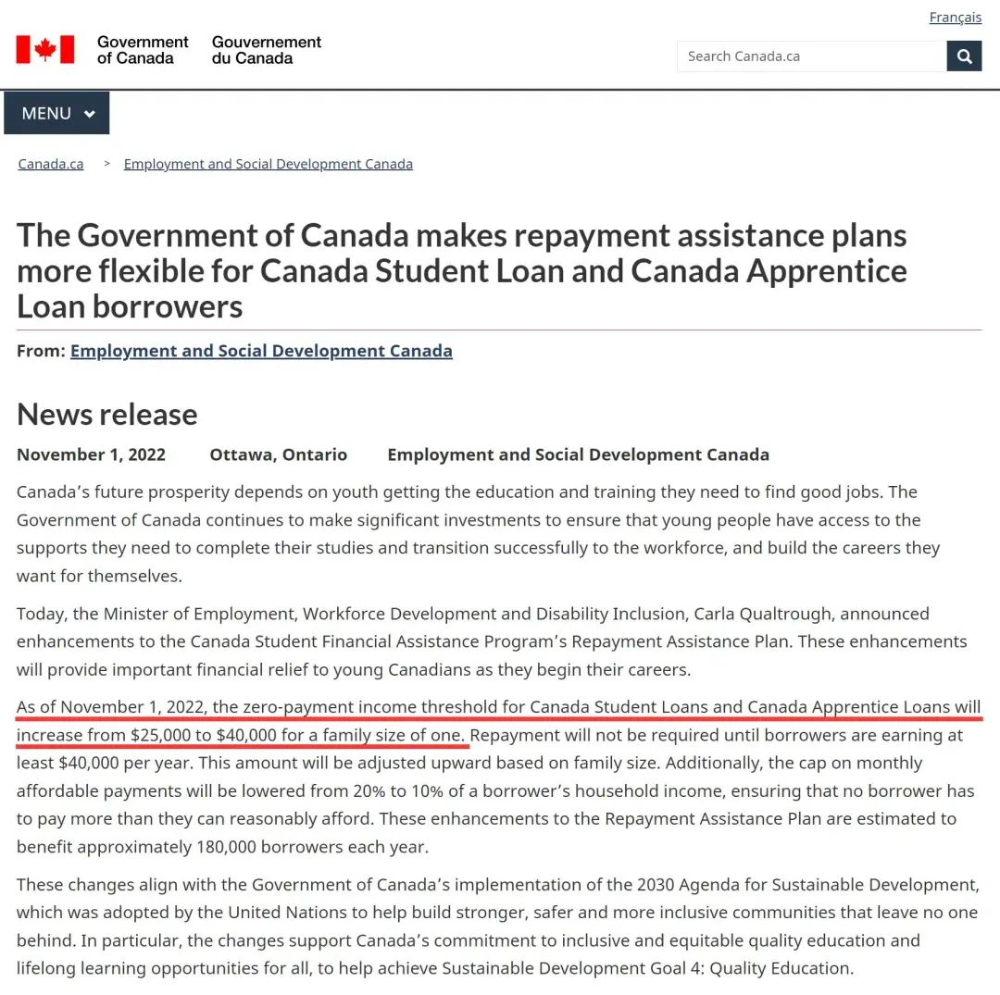
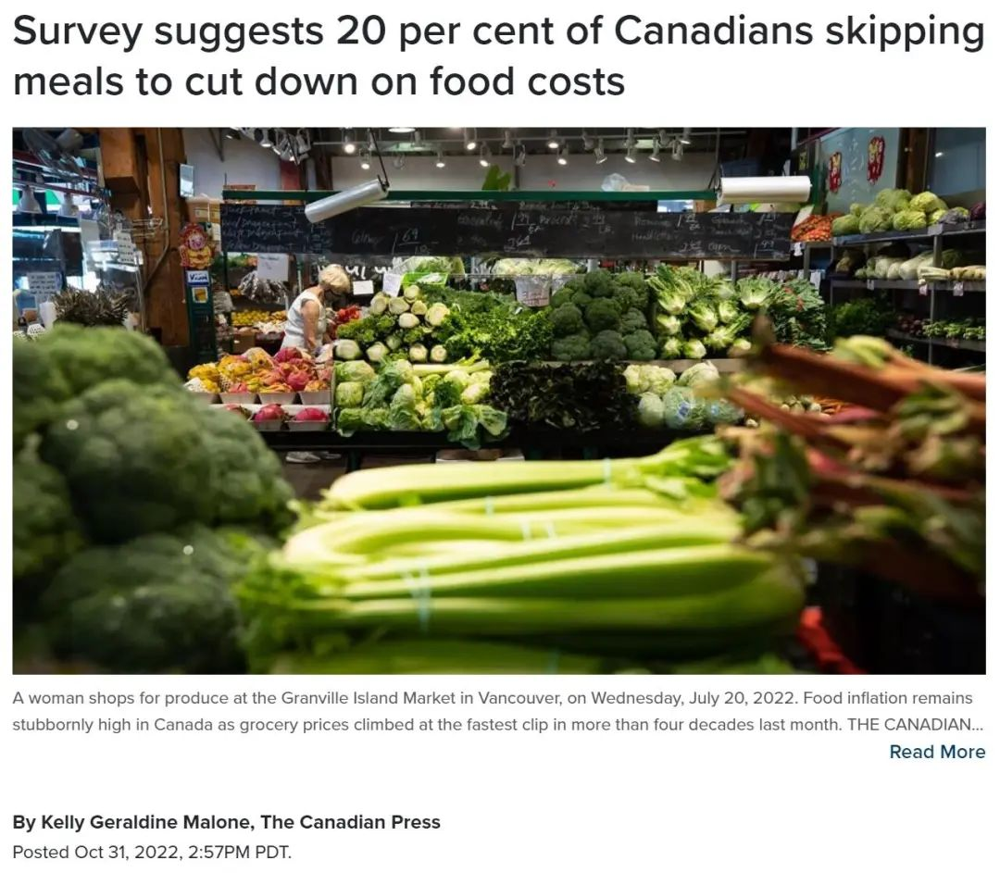
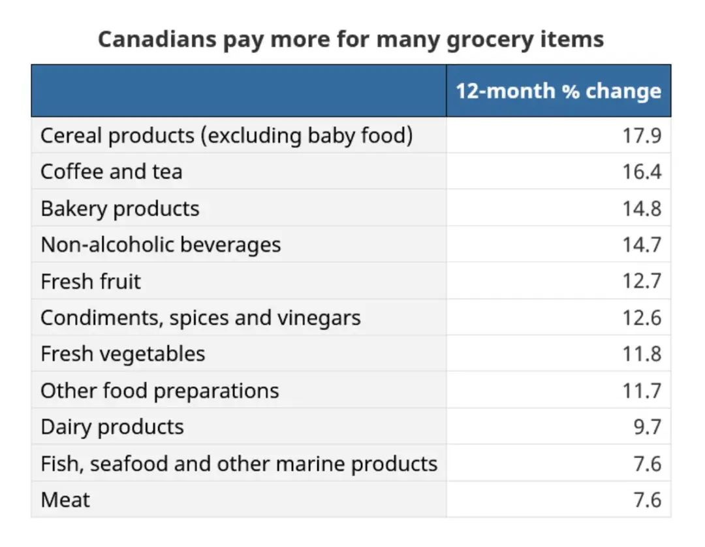
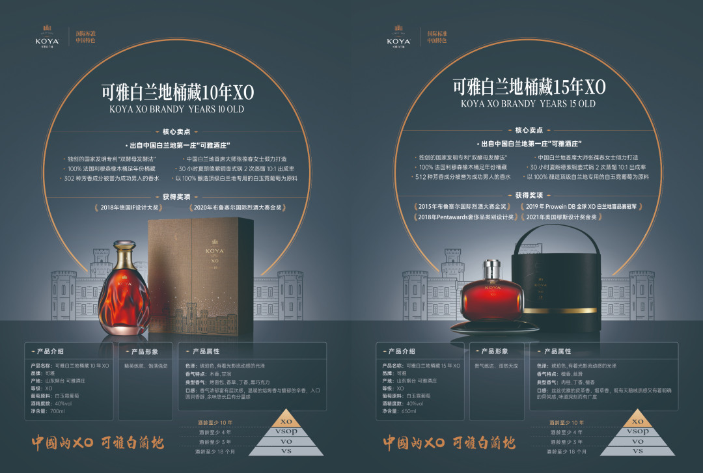
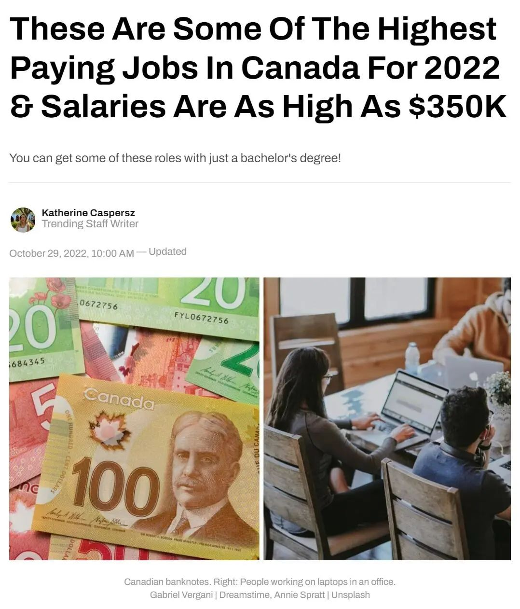

# 无标题

**链接地址:** http://mp.weixin.qq.com/s?__biz=MzU5OTQ2NjAwNw==&mid=2247507849&idx=1&sn=d329acfd612607bf456d039bbe837b75&chksm=feb616f1c9c19fe7e619fefd2b737b44bb0a4333932544d9dd9f804de279c4b15f36673e2a2a&mpshare=1&scene=2&srcid=110912yL6iqK116t17XsG2z8&sharer_sharetime=1667954530539&sharer_shareid=77848a6b3852ae4dcb6c74ffee84743c#rd
**作者:** 加拿大一站式体验
**获取时间:** 2025/8/28 19:27:17
**图片数量:** 34

---

## 原始HTML内容

<section style="box-sizing: border-box;font-size: 16px;"><section style="text-align: center;margin-top: 10px;margin-bottom: 10px;box-sizing: border-box;" powered-by="xiumi.us"><section style="max-width: 100%;vertical-align: middle;display: inline-block;line-height: 0;box-sizing: border-box;"></section></section><section style="text-align: center;margin-top: 10px;margin-bottom: 10px;box-sizing: border-box;" powered-by="xiumi.us"></section><section style="margin-top: 10px;margin-bottom: 10px;box-sizing: border-box;" powered-by="xiumi.us"><section style="display: inline-block;width: 100%;border-width: 2px;border-style: dotted;border-color: rgba(160, 123, 249, 0);padding: 10px;background-color: rgba(116, 159, 238, 0.1);box-sizing: border-box;"><section style="margin: 10px 0%;text-align: left;justify-content: flex-start;display: flex;flex-flow: row nowrap;box-sizing: border-box;" powered-by="xiumi.us"><section style="display: inline-block;width: 100%;vertical-align: top;background-color: rgb(255, 216, 129);border-width: 0px;border-radius: 20px;border-style: none;border-color: rgb(62, 62, 62);overflow: hidden;align-self: flex-start;flex: 0 0 auto;box-sizing: border-box;"><section style="display: flex;flex-flow: row nowrap;text-align: justify;justify-content: flex-start;box-sizing: border-box;" powered-by="xiumi.us"><section style="display: inline-block;vertical-align: top;width: auto;flex: 10 10 0%;align-self: flex-start;height: auto;padding-top: 10px;padding-right: 4px;padding-bottom: 10px;box-sizing: border-box;"><section style="margin-right: 0%;margin-left: 0%;text-align: center;transform: translate3d(2px, 0px, 0px);box-sizing: border-box;" powered-by="xiumi.us"><section style="display: inline-block;border-width: 2px;border-style: solid;border-color: transparent;padding: 0.1em 0.3em;color: rgb(0, 0, 0);font-size: 12px;box-sizing: border-box;">
<strong style="box-sizing: border-box;">精品推荐</strong>

<strong style="box-sizing: border-box;"> </strong>

向上滑动查看

 
</section></section></section><section style="display: inline-block;vertical-align: top;width: 91.649%;background-color: rgba(188, 65, 65, 0.22);flex: 0 0 auto;align-self: stretch;height: auto;padding: 10px;border-width: 0px;border-radius: 16px;border-style: solid;border-color: rgb(62, 62, 62);overflow: hidden;box-sizing: border-box;"><section style="text-align: center;box-sizing: border-box;" powered-by="xiumi.us"><section style="display: inline-block;width: 100%;height: 230px;vertical-align: top;overflow-y: auto;border-width: 0px;border-radius: 6px;border-style: none;border-color: rgb(62, 62, 62);box-sizing: border-box;"><section style="overflow-x: hidden;box-sizing: border-box;"><section style="margin-right: 0%;margin-left: 0%;box-sizing: border-box;" powered-by="xiumi.us"><section style="max-width: 100%;vertical-align: middle;display: inline-block;line-height: 0;width: 100%;height: auto;box-sizing: border-box;"></section></section><section style="box-sizing: border-box;" powered-by="xiumi.us"><section style="max-width: 100%;vertical-align: middle;display: inline-block;line-height: 0;box-sizing: border-box;"></section></section><section style="margin-right: 0%;margin-left: 0%;box-sizing: border-box;" powered-by="xiumi.us"><section style="max-width: 100%;vertical-align: middle;display: inline-block;line-height: 0;width: 100%;height: auto;box-sizing: border-box;"></section></section><section style="margin-right: 0%;margin-left: 0%;box-sizing: border-box;" powered-by="xiumi.us"><section style="max-width: 100%;vertical-align: middle;display: inline-block;line-height: 0;width: 100%;height: auto;box-sizing: border-box;"></section></section><section style="box-sizing: border-box;" powered-by="xiumi.us"><section style="max-width: 100%;vertical-align: middle;display: inline-block;line-height: 0;box-sizing: border-box;"></section></section></section></section></section></section></section></section></section><section style="text-align: right;justify-content: flex-end;display: flex;flex-flow: row nowrap;margin-bottom: 10px;box-sizing: border-box;" powered-by="xiumi.us"><section style="display: inline-block;vertical-align: bottom;width: auto;min-width: 5%;max-width: 100%;flex: 0 0 auto;height: auto;align-self: flex-end;box-sizing: border-box;"><section style="text-align: center;transform: translate3d(1px, 0px, 0px);box-sizing: border-box;" powered-by="xiumi.us"><section style="max-width: 100%;vertical-align: middle;display: inline-block;line-height: 0;width: 100px;height: auto;box-sizing: border-box;"></section></section></section><section style="display: inline-block;vertical-align: bottom;width: auto;min-width: 10%;max-width: 100%;flex: 0 0 auto;height: auto;align-self: flex-end;margin-left: -20px;background-color: rgba(188, 65, 65, 0.22);padding: 7px 20px 7px 29px;box-sizing: border-box;"><section style="text-align: justify;color: rgb(0, 0, 0);letter-spacing: 2px;line-height: 2;font-size: 18px;box-sizing: border-box;" powered-by="xiumi.us">
<strong style="box-sizing: border-box;">赤水河左岸，庄园酱酒</strong>
</section><section style="font-size: 12px;color: rgb(106, 106, 106);box-sizing: border-box;" powered-by="xiumi.us">
本广告位由郎酒品牌倾情赞助
</section></section></section></section></section>
 
<section style="margin-top: 10px;margin-right: 0%;margin-left: 0%;text-align: left;justify-content: flex-start;display: flex;flex-flow: row nowrap;box-sizing: border-box;" powered-by="xiumi.us"><section style="display: inline-block;width: 100%;vertical-align: top;align-self: flex-start;flex: 0 0 auto;box-sizing: border-box;"><section style="display: flex;flex-flow: row nowrap;margin: 10px 0%;text-align: justify;justify-content: flex-start;box-sizing: border-box;" powered-by="xiumi.us"><section style="display: inline-block;vertical-align: middle;width: auto;min-width: 10%;max-width: 100%;flex: 0 0 auto;height: auto;align-self: center;box-sizing: border-box;"><section style="margin-top: 10px;margin-bottom: 10px;text-align: center;box-sizing: border-box;" powered-by="xiumi.us"><section style="background-color: rgb(68, 68, 68);display: inline-block;width: 2.5em;height: 2.5em;line-height: 2.5em;border-radius: 100%;margin-left: auto;margin-right: auto;font-size: 18px;color: rgb(255, 255, 255);font-family: Optima-Regular, PingFangTC-light;box-sizing: border-box;">
<strong style="box-sizing: border-box;">01</strong>
</section></section></section><section style="display: inline-block;vertical-align: middle;width: auto;align-self: center;flex: 0 0 auto;min-width: 10%;max-width: 100%;height: auto;box-sizing: border-box;"><section style="transform: translate3d(10px, 0px, 0px);-webkit-transform: translate3d(10px, 0px, 0px);-moz-transform: translate3d(10px, 0px, 0px);-o-transform: translate3d(10px, 0px, 0px);box-sizing: border-box;" powered-by="xiumi.us"><section style="font-family: Optima-Regular, PingFangTC-light;box-sizing: border-box;">
<strong style="box-sizing: border-box;">重磅利好！联邦官宣这些人不用还贷款了</strong>
</section></section><section style="margin-top: 3px;margin-right: 0%;margin-left: 0%;transform: translate3d(-10px, 0px, 0px);box-sizing: border-box;" powered-by="xiumi.us"><section style="background-color: rgb(68, 68, 68);height: 1px;box-sizing: border-box;"><svg viewBox="0 0 1 1" style="float:left;line-height:0;width:0;vertical-align:top;"></svg></section></section></section></section></section></section><section style="font-size: 14px;padding-right: 15px;padding-left: 15px;letter-spacing: 1px;box-sizing: border-box;" powered-by="xiumi.us">
联邦官宣！<strong style="box-sizing: border-box;">学生贷款政策迎来巨变</strong>！

 

联邦政府已宣布对加拿大学生贷款做出变革——这意味着更多的毕业生将能够<strong style="box-sizing: border-box;">在更长的时间内避免偿还贷款</strong>，有些人甚至可以不用还。

 

在一个布告周二，加拿大就业和社会发展部证实了对学生资助贷款还款计划的修改，该计划将<strong style="box-sizing: border-box;">“为刚开始职业生涯的加拿大年轻人提供重要的资助”</strong>。

 
</section><section style="text-align: center;margin-top: 10px;margin-bottom: 10px;box-sizing: border-box;" powered-by="xiumi.us"><section style="max-width: 100%;vertical-align: middle;display: inline-block;line-height: 0;width: 90%;height: auto;box-sizing: border-box;"></section></section><section style="font-size: 14px;padding-right: 15px;padding-left: 15px;letter-spacing: 1px;box-sizing: border-box;" powered-by="xiumi.us">
 

11月1日起，零还贷年收入门槛（适用于加拿大学生贷款和加拿大学徒贷款）将增加到4万加元，以前是25000加元。

 

这意味着，<strong style="box-sizing: border-box;">年收入在4万加元以下的借款人将不再需要从偿还学生贷款——直到他们能赚更多钱</strong>。

 

以前，毕业生<strong style="box-sizing: border-box;">一旦年薪达到25000加元</strong>，就必须开始偿还学生和学徒贷款。

 
</section><section style="text-align: center;margin-top: 10px;margin-bottom: 10px;box-sizing: border-box;" powered-by="xiumi.us"><section style="max-width: 100%;vertical-align: middle;display: inline-block;line-height: 0;width: 90%;height: auto;box-sizing: border-box;"></section></section><section style="font-size: 14px;padding-right: 15px;padding-left: 15px;letter-spacing: 1px;box-sizing: border-box;" powered-by="xiumi.us">
 

更重要的是，政府承诺今后每年都将零<strong style="box-sizing: border-box;">还款年收入门槛与通胀挂钩</strong>——这样未来的借款人也可以避免无法支付的还款。

 

对于那些仍然要还清贷款的人来说，也有一些好消息。自11月1日起，负担得起的月供上限将<strong style="box-sizing: border-box;">从个人家庭收入的20%下调至10%</strong>。

 

这意味着毕业生每月偿还贷款的<strong style="box-sizing: border-box;">最高限额只能达到家庭收入的10%</strong>，不能超过。

 
</section><section style="text-align: center;margin-top: 10px;margin-bottom: 10px;box-sizing: border-box;" powered-by="xiumi.us"><section style="max-width: 100%;vertical-align: middle;display: inline-block;line-height: 0;width: 90%;height: auto;box-sizing: border-box;"></section></section><section style="font-size: 14px;padding-right: 15px;padding-left: 15px;letter-spacing: 1px;box-sizing: border-box;" powered-by="xiumi.us">
 

联邦政府表示，这一变化将确保“借款人不必支付超出其合理承受能力的费用”。这些变化预计每年将<strong style="box-sizing: border-box;">使18万加拿大人受益</strong>。

 

在周二的讲话中，就业部长卡拉·夸尔考克解释道：“从今天开始，更多的毕业生可以<strong style="box-sizing: border-box;">专注于建立自己的职业生涯</strong>，而不是担心学生贷款。这太重要了。”

 

根据加拿大学生联合会和道明银行.在11月1日宣布改变之前，毕业生一旦开始每年挣25,000加元或以上，就开始支付这笔钱。

 
</section><section style="text-align: center;margin-top: 10px;margin-bottom: 10px;box-sizing: border-box;" powered-by="xiumi.us"><section style="max-width: 100%;vertical-align: middle;display: inline-block;line-height: 0;width: 90%;height: auto;box-sizing: border-box;"></section></section><section style="font-size: 14px;padding-right: 15px;padding-left: 15px;letter-spacing: 1px;box-sizing: border-box;" powered-by="xiumi.us">
 

据加拿大学生联合会和道明银行，平均每个学生要<strong style="box-sizing: border-box;">花10年以上的时间才能还清助学贷款</strong>。 

 

加拿大的<strong style="box-sizing: border-box;">平均学生债务高达2.8万加元</strong>，所以不难理解为什么这么多人需要这么长的时间才能还清。 

 
</section><section style="text-align: center;margin-top: 10px;margin-bottom: 10px;box-sizing: border-box;" powered-by="xiumi.us"><section style="max-width: 100%;vertical-align: middle;display: inline-block;line-height: 0;box-sizing: border-box;"></section></section><section style="text-align: center;margin-top: 10px;margin-bottom: 10px;box-sizing: border-box;" powered-by="xiumi.us"><section style="max-width: 100%;vertical-align: middle;display: inline-block;line-height: 0;box-sizing: border-box;"></section></section><section style="font-size: 14px;padding-right: 15px;padding-left: 15px;letter-spacing: 1px;box-sizing: border-box;" powered-by="xiumi.us">
 

在加拿大，如果我不能偿还学生贷款怎么办？那些正在努力偿还学生贷款的人有几种选择，包括获得还款援助或减少他们的月供。

 

没有按时还钱可能会<strong style="box-sizing: border-box;">影响您的信用评分</strong>，因此，如果您需要支持，请联系相关机构。

 

如果你<strong style="box-sizing: border-box;">拖欠还款超过9个月或更长时间，你的贷款一部分将由CRA收取</strong>。

 
</section><section style="margin-top: 10px;margin-right: 0%;margin-left: 0%;text-align: left;justify-content: flex-start;display: flex;flex-flow: row nowrap;box-sizing: border-box;" powered-by="xiumi.us"><section style="display: inline-block;width: 100%;vertical-align: top;align-self: flex-start;flex: 0 0 auto;box-sizing: border-box;"><section style="display: flex;flex-flow: row nowrap;margin: 10px 0%;text-align: justify;justify-content: flex-start;box-sizing: border-box;" powered-by="xiumi.us"><section style="display: inline-block;vertical-align: middle;width: auto;min-width: 10%;max-width: 100%;flex: 0 0 auto;height: auto;align-self: center;box-sizing: border-box;"><section style="margin-top: 10px;margin-bottom: 10px;text-align: center;box-sizing: border-box;" powered-by="xiumi.us"><section style="background-color: rgb(68, 68, 68);display: inline-block;width: 2.5em;height: 2.5em;line-height: 2.5em;border-radius: 100%;margin-left: auto;margin-right: auto;font-size: 18px;color: rgb(255, 255, 255);font-family: Optima-Regular, PingFangTC-light;box-sizing: border-box;">
<strong style="box-sizing: border-box;">02</strong>
</section></section></section><section style="display: inline-block;vertical-align: middle;width: auto;align-self: center;flex: 0 0 auto;min-width: 10%;max-width: 100%;height: auto;box-sizing: border-box;"><section style="transform: translate3d(10px, 0px, 0px);-webkit-transform: translate3d(10px, 0px, 0px);-moz-transform: translate3d(10px, 0px, 0px);-o-transform: translate3d(10px, 0px, 0px);box-sizing: border-box;" powered-by="xiumi.us"><section style="font-family: Optima-Regular, PingFangTC-light;box-sizing: border-box;">
<strong style="box-sizing: border-box;">为了省钱20%的加拿大人少吃饭</strong>
</section></section><section style="margin-top: 3px;margin-right: 0%;margin-left: 0%;transform: translate3d(-10px, 0px, 0px);box-sizing: border-box;" powered-by="xiumi.us"><section style="background-color: rgb(68, 68, 68);height: 1px;box-sizing: border-box;"><svg viewBox="0 0 1 1" style="float:left;line-height:0;width:0;vertical-align:top;"></svg></section></section></section></section></section></section><section style="font-size: 14px;padding-right: 15px;padding-left: 15px;letter-spacing: 1px;box-sizing: border-box;" powered-by="xiumi.us">
萨斯卡通食品银行和学习中心的执行董事Laurie O'Connor说，随着杂货店价格上涨，越来越多的萨斯卡通人正在努力为自己和家人获取食物。自一月份以来到食品银行领取食物的人不断增长。

 

在周一公布的一项加拿大范围内的调查中，大多数受访者表示，他们正在使用优惠券或寻求打折来应对不断上涨的食品成本。为了省钱，<strong style="box-sizing: border-box;">近20%的人减少了食量或完全不用餐</strong>。

 
</section><section style="text-align: center;margin-top: 10px;margin-bottom: 10px;box-sizing: border-box;" powered-by="xiumi.us"><section style="max-width: 100%;vertical-align: middle;display: inline-block;line-height: 0;width: 90%;height: auto;box-sizing: border-box;"></section></section><section style="font-size: 14px;padding-right: 15px;padding-left: 15px;letter-spacing: 1px;box-sizing: border-box;" powered-by="xiumi.us">
 

萨斯喀彻温大学加拿大应用与社会研究中心（Canadian Hub for Applied and Social Research ）于9月6日至10月17日进行了这项调查。调查询问了<strong style="box-sizing: border-box;">1,001人有关应对食品成本上涨的策略</strong>。

 

加拿大统计局的消费者价格指数报告称，虽然加拿大9月份的年通货膨胀率小幅下降至6.9%，但食品杂货成本仍继续攀升。杂货价格以1981年8月以来的最快速度增长，<strong style="box-sizing: border-box;">与一年前相比上涨了11.4%</strong>。

 
</section><section style="text-align: center;margin-top: 10px;margin-bottom: 10px;box-sizing: border-box;" powered-by="xiumi.us"><section style="max-width: 100%;vertical-align: middle;display: inline-block;line-height: 0;box-sizing: border-box;"></section></section><section style="font-size: 14px;padding-right: 15px;padding-left: 15px;letter-spacing: 1px;box-sizing: border-box;" powered-by="xiumi.us">
 

为了适应飙升的成本，调查中的大多数受访者表示他们一直在<strong style="box-sizing: border-box;">使用优惠券削减支出</strong>。大多数人（近 59%）也在减少家庭食物浪费。

 

<strong style="box-sizing: border-box;">54%的人还制定了食品支出计划</strong>，以确保他们有足够的资金购买食物。

 

研究中心副主任Jessica McCutcheon说，<strong style="box-sizing: border-box;">令人不安的节食方式不太常见，但仍然过于普遍</strong>。

 
</section><section style="text-align: center;margin-top: 10px;margin-bottom: 10px;box-sizing: border-box;" powered-by="xiumi.us"><section style="max-width: 100%;vertical-align: middle;display: inline-block;line-height: 0;width: 90%;height: auto;box-sizing: border-box;"></section></section><section style="font-size: 14px;padding-right: 15px;padding-left: 15px;letter-spacing: 1px;box-sizing: border-box;" powered-by="xiumi.us">
 

超过30%的受访者表示，为了更便宜的食物他们吃的健康食品较少，近5%的人出于需要“偷拿”食物，<strong style="box-sizing: border-box;">约5%的人使用过食物银行或社区冰箱</strong>。

 

加拿大食品银行最近的一份报告称，<strong style="box-sizing: border-box;">3月份有近150万人次访问了食品银行</strong>，这一数字比去年同月的访问次数<strong style="box-sizing: border-box;">高出15%</strong>，比COVID-19大流行爆发之前的<strong style="box-sizing: border-box;">2019年3月的访问次数高出35%</strong> 。

 

调查显示，草原省的人们更有可能使用紧急措施来获取食物。<strong style="box-sizing: border-box;">阿尔伯塔省和萨斯喀彻温省的食品银行使用率是加拿大最高的</strong>。

 
</section><section style="text-align: center;margin-top: 10px;margin-bottom: 10px;box-sizing: border-box;" powered-by="xiumi.us"><section style="max-width: 100%;vertical-align: middle;display: inline-block;line-height: 0;width: 90%;height: auto;box-sizing: border-box;"></section></section><section style="font-size: 14px;padding-right: 15px;padding-left: 15px;letter-spacing: 1px;box-sizing: border-box;" powered-by="xiumi.us">
 

O'Connor说，在萨斯卡通，使用食物银行的人数是见过的最高的。她说，<strong style="box-sizing: border-box;">进来的学生和老年人的数量也在增加</strong>，这令人担忧。

 

调查发现，18至34岁的年轻人更有可能使用食品银行或社区冰箱。他们也不太可能觉得自己有能力吃均衡的饮食。那些35到54的人更有可能使用优惠券或购买特价商品。

 

魁北克与草原省的差异最为明显，魁北克95%的受访者表示他们可以负担得起均衡饮食。McCutcheon 说，这可能是因为<strong style="box-sizing: border-box;">魁北克的政策拥有更强大的社会保障网络</strong>。

 

该调查询问了政府应对粮食不安全的战略。大多数人支持增加对社区菜园、食品银行和实施普遍的健康食品计划学校的资金。还有对低收入家庭的杂货补贴和政府对农民和生产者的支持。

 
</section><section style="text-align: center;margin-top: 10px;margin-bottom: 10px;box-sizing: border-box;" powered-by="xiumi.us"><section style="max-width: 100%;vertical-align: middle;display: inline-block;line-height: 0;box-sizing: border-box;"></section></section><section style="text-align: center;margin-top: 10px;margin-bottom: 10px;box-sizing: border-box;" powered-by="xiumi.us"><section style="max-width: 100%;vertical-align: middle;display: inline-block;line-height: 0;box-sizing: border-box;"></section></section><section style="font-size: 14px;padding-right: 15px;padding-left: 15px;letter-spacing: 1px;box-sizing: border-box;" powered-by="xiumi.us">
 

大多数受访者——略高于79%——支持提高他们所在省份的最低工资。然而，有人反对增加或创造新税收的策略。

 

魁北克人表示，他们支持提高最低工资、征收糖税和增加碳排放罚款。但是草原省的人更有可能反对这些税收。

 

 
</section><section style="margin-top: 10px;margin-right: 0%;margin-left: 0%;text-align: left;justify-content: flex-start;display: flex;flex-flow: row nowrap;box-sizing: border-box;" powered-by="xiumi.us"><section style="display: inline-block;width: 100%;vertical-align: top;align-self: flex-start;flex: 0 0 auto;box-sizing: border-box;"><section style="display: flex;flex-flow: row nowrap;margin: 10px 0%;text-align: justify;justify-content: flex-start;box-sizing: border-box;" powered-by="xiumi.us"><section style="display: inline-block;vertical-align: middle;width: auto;min-width: 10%;max-width: 100%;flex: 0 0 auto;height: auto;align-self: center;box-sizing: border-box;"><section style="margin-top: 10px;margin-bottom: 10px;text-align: center;box-sizing: border-box;" powered-by="xiumi.us"><section style="background-color: rgb(68, 68, 68);display: inline-block;width: 2.5em;height: 2.5em;line-height: 2.5em;border-radius: 100%;margin-left: auto;margin-right: auto;font-size: 18px;color: rgb(255, 255, 255);font-family: Optima-Regular, PingFangTC-light;box-sizing: border-box;">
<strong style="box-sizing: border-box;">03</strong>
</section></section></section><section style="display: inline-block;vertical-align: middle;width: auto;align-self: center;flex: 0 0 auto;min-width: 10%;max-width: 100%;height: auto;box-sizing: border-box;"><section style="transform: translate3d(10px, 0px, 0px);-webkit-transform: translate3d(10px, 0px, 0px);-moz-transform: translate3d(10px, 0px, 0px);-o-transform: translate3d(10px, 0px, 0px);box-sizing: border-box;" powered-by="xiumi.us"><section style="font-family: Optima-Regular, PingFangTC-light;box-sizing: border-box;">
<strong style="box-sizing: border-box;">2022年加拿大收入最高的14大职业出炉</strong>
</section></section><section style="margin-top: 3px;margin-right: 0%;margin-left: 0%;transform: translate3d(-10px, 0px, 0px);box-sizing: border-box;" powered-by="xiumi.us"><section style="background-color: rgb(68, 68, 68);height: 1px;box-sizing: border-box;"><svg viewBox="0 0 1 1" style="float:left;line-height:0;width:0;vertical-align:top;"></svg></section></section></section></section></section></section><section style="font-size: 14px;padding-right: 15px;padding-left: 15px;letter-spacing: 1px;box-sizing: border-box;" powered-by="xiumi.us">
最近这两年，加拿大物价快速飙升，很多小伙伴们都开始感觉自己的收入有些难以负担生活，想要重新考虑职业方向。

 

那么你知道，<strong style="box-sizing: border-box;">加拿大工资收入最高的职业是什么</strong>吗？

近日，Indeed公布了一份最新的加拿大收入报告，揭露了目前<strong style="box-sizing: border-box;">全加拿大工资收入最高的14个岗位</strong>。

 
</section><section style="text-align: center;margin-top: 10px;margin-bottom: 10px;box-sizing: border-box;" powered-by="xiumi.us"><section style="max-width: 100%;vertical-align: middle;display: inline-block;line-height: 0;width: 90%;height: auto;box-sizing: border-box;"></section></section><section style="font-size: 14px;padding-right: 15px;padding-left: 15px;letter-spacing: 1px;box-sizing: border-box;" powered-by="xiumi.us">
 

这份报告指出，这些高薪岗位的<strong style="box-sizing: border-box;">年薪在$10万~35万之间</strong>，其中一些行业的收入水平可能高到令人咋舌的地步！

 

例如加拿大麻醉师的平均年薪，就达到了整整<strong style="box-sizing: border-box;">$358,908</strong>。

 

小编这就带大家一起来柠檬一下。

 
</section><section style="text-align: center;margin-top: 10px;margin-bottom: 10px;box-sizing: border-box;" powered-by="xiumi.us"><section style="max-width: 100%;vertical-align: middle;display: inline-block;line-height: 0;width: 90%;height: auto;box-sizing: border-box;"></section></section><section style="font-size: 14px;padding-right: 15px;padding-left: 15px;letter-spacing: 1px;box-sizing: border-box;" powered-by="xiumi.us">
 

据悉，加拿大很多收入较高的岗位<strong style="box-sizing: border-box;">都和医疗领域有关</strong>，例如<strong style="box-sizing: border-box;">心脏病专家</strong>，全国平均年薪$280,591；精神科医生$298,065；外科医生$276,646。

 

当然了，这些医疗行业方面的岗位<strong style="box-sizing: border-box;">需要多年的学习和培训经验</strong>，高薪也是可以理解，不过同样也有另外的一部分高薪岗位，对从业者的学历培训经验要求并不算高。

 
</section><section style="text-align: center;margin-top: 10px;margin-bottom: 10px;box-sizing: border-box;" powered-by="xiumi.us"><section style="max-width: 100%;vertical-align: middle;display: inline-block;line-height: 0;width: 90%;height: auto;box-sizing: border-box;"></section></section><section style="font-size: 14px;padding-right: 15px;padding-left: 15px;letter-spacing: 1px;box-sizing: border-box;" powered-by="xiumi.us">
 

其中最为典型的软件架构师、公司财务总监等等，这些岗位的<strong style="box-sizing: border-box;">年薪也超过10万</strong>。

 

Indeed解释称，这些岗位薪资高的原因是它们能够帮助公司作出有利的决策，获取更大成都的收益。

 
</section><section style="text-align: center;margin-top: 10px;margin-bottom: 10px;box-sizing: border-box;" powered-by="xiumi.us"><section style="max-width: 100%;vertical-align: middle;display: inline-block;line-height: 0;box-sizing: border-box;"></section></section><section style="text-align: center;margin-top: 10px;margin-bottom: 10px;box-sizing: border-box;" powered-by="xiumi.us"><section style="max-width: 100%;vertical-align: middle;display: inline-block;line-height: 0;box-sizing: border-box;"></section></section><section style="font-size: 14px;padding-right: 15px;padding-left: 15px;letter-spacing: 1px;box-sizing: border-box;" powered-by="xiumi.us">
 

具体来说，这次评出的全国<strong style="box-sizing: border-box;">14大高薪行</strong><strong style="box-sizing: border-box;">业</strong>以及他们的平均年薪分别是：

 

<strong style="box-sizing: border-box;">Cardiologist -&nbsp; 280,591&nbsp;</strong>

<strong style="box-sizing: border-box;">Anesthesiologist- 358,908&nbsp;</strong>

<strong style="box-sizing: border-box;">Psychiatrist - 298,065&nbsp;</strong>

<strong style="box-sizing: border-box;">Physician- 254,847&nbsp;</strong>

<strong style="box-sizing: border-box;">Surgeon - 279,646&nbsp;</strong>

<strong style="box-sizing: border-box;">Orthodontist - 209,373&nbsp;</strong>

<strong style="box-sizing: border-box;">Chief Marketing Officer- 109,196&nbsp;</strong>

<strong style="box-sizing: border-box;">Vice President- 135,578&nbsp;</strong>

<strong style="box-sizing: border-box;">Software Engineering Manager- 143,044&nbsp;</strong>

<strong style="box-sizing: border-box;">Director of Information Technology - 117,890&nbsp;</strong>

<strong style="box-sizing: border-box;">Software Architect - 109,021&nbsp;</strong>

<strong style="box-sizing: border-box;">Enterprise Architect - 110,083&nbsp;</strong>

<strong style="box-sizing: border-box;">Pharmacist - 105,088&nbsp;</strong>

<strong style="box-sizing: border-box;">Corporate Controller - 103,056&nbsp;</strong>

 

所以，各位小伙伴们的行业都上榜了吗？你的收入水平如何呢？

 

 
</section><section style="text-align: left;justify-content: flex-start;display: flex;flex-flow: row nowrap;margin-top: 10px;box-sizing: border-box;" powered-by="xiumi.us"><section style="display: inline-block;vertical-align: top;width: auto;align-self: stretch;flex: 0 0 auto;background-color: rgb(188, 65, 65);min-width: 5%;max-width: 100%;height: auto;padding-top: 9px;padding-right: 9px;padding-left: 20px;box-sizing: border-box;"><section style="text-align: justify;font-size: 18px;color: rgb(252, 252, 252);box-sizing: border-box;" powered-by="xiumi.us">
<strong style="box-sizing: border-box;">阅读更多</strong>
</section></section><section style="display: inline-block;vertical-align: top;width: auto;min-width: 5%;max-width: 100%;flex: 0 0 auto;height: auto;align-self: stretch;box-sizing: border-box;"><section style="box-sizing: border-box;" powered-by="xiumi.us"><section style="display: inline-block;width: 0px;height: 0px;vertical-align: top;overflow: hidden;border-style: solid;border-width: 45px 0px 0px 19px;border-color: rgba(255, 255, 255, 0) rgba(255, 255, 255, 0) rgba(255, 255, 255, 0) rgb(188, 65, 65);box-sizing: border-box;"><svg viewBox="0 0 1 1" style="float:left;line-height:0;width:0;vertical-align:top;"></svg></section></section></section></section><section style="margin-bottom: 10px;box-sizing: border-box;" powered-by="xiumi.us"><section style="background-color: rgb(188, 65, 65);height: 3px;box-sizing: border-box;"><svg viewBox="0 0 1 1" style="float:left;line-height:0;width:0;vertical-align:top;"></svg></section></section><section style="margin: 10px 0%;text-align: left;justify-content: flex-start;display: flex;flex-flow: row nowrap;box-sizing: border-box;" powered-by="xiumi.us"><section style="display: inline-block;width: 100%;vertical-align: top;background-position: 55.6015% 33.1154%;background-repeat: repeat;background-size: 100.637%;background-attachment: scroll;padding: 30px;align-self: flex-start;flex: 0 0 auto;box-shadow: rgb(0, 0, 0) 0px 0px 0px;background-image: url(&quot;https://mmbiz.qpic.cn/mmbiz_jpg/Mvb870zkymhqIFpvGMSmubeaBJCuPDnJ9ROtwR18w793dW6174yKydgovjR6FQHzFJtsOOAft71FpTDzuR2yuA/640?wx_fmt=jpeg&quot;);box-sizing: border-box;"><section style="text-align: justify;justify-content: flex-start;display: flex;flex-flow: row nowrap;box-sizing: border-box;" powered-by="xiumi.us"><section style="display: inline-block;width: 100%;vertical-align: top;background-color: rgba(121, 121, 121, 0.41);padding: 10px;border-width: 0px;border-style: none;border-color: rgb(62, 62, 62);align-self: flex-start;flex: 0 0 auto;box-sizing: border-box;"><section style="text-align: center;color: rgb(255, 255, 255);font-size: 14px;box-sizing: border-box;" powered-by="xiumi.us">
<a target="_blank" href="http://mp.weixin.qq.com/s?__biz=MzU5OTQ2NjAwNw==&amp;mid=2247507800&amp;idx=1&amp;sn=26414322f3f4431bbaa06bb4518d55a5&amp;chksm=feb61620c9c19f361548534faee6e22c3a525b953df7eb861640dea02b53caa76b3c632adb56&amp;scene=21#wechat_redirect" textvalue="加拿大富人喊冤！20%的高收入家庭扛起61%的个税 | 加拿大未来货币长这样：查尔斯国王硬币曝光 | 最新人口普查揭秘加……" linktype="text" imgurl="" imgdata="null" data-itemshowtype="0" tab="innerlink" style="color: rgb(255, 255, 255);" data-linktype="2"><strong style="box-sizing: border-box;">加拿大富人喊冤！20%的高收入家庭扛起61%的个税 | 加拿大未来货币长这样：查尔斯国王硬币曝光 | 最新人口普查揭秘加……</strong></a>
</section></section></section></section></section><section style="margin: 10px 0%;text-align: left;justify-content: flex-start;display: flex;flex-flow: row nowrap;box-sizing: border-box;" powered-by="xiumi.us"><section style="display: inline-block;width: 100%;vertical-align: top;background-position: -26.3755% 52.8617%;background-repeat: repeat;background-size: 100.637%;background-attachment: scroll;padding: 30px;align-self: flex-start;flex: 0 0 auto;background-image: url(&quot;https://mmbiz.qpic.cn/mmbiz_jpg/Mvb870zkymhqIFpvGMSmubeaBJCuPDnJkPslyadRswT6p5e7HhbcV1I1W2xvdRfJyZ50u0WkvZd29EicjRcTA0w/640?wx_fmt=jpeg&quot;);box-sizing: border-box;"><section style="text-align: justify;justify-content: flex-start;display: flex;flex-flow: row nowrap;box-sizing: border-box;" powered-by="xiumi.us"><section style="display: inline-block;width: 100%;vertical-align: top;background-color: rgba(121, 121, 121, 0.41);padding: 10px;border-width: 0px;border-style: none;border-color: rgb(62, 62, 62);align-self: flex-start;flex: 0 0 auto;box-sizing: border-box;"><section style="text-align: center;color: rgb(255, 255, 255);font-size: 14px;box-sizing: border-box;" powered-by="xiumi.us">
<a target="_blank" href="http://mp.weixin.qq.com/s?__biz=MzU5OTQ2NjAwNw==&amp;mid=2247507749&amp;idx=1&amp;sn=8e887e1e7b14f35d5e13fe611ccb1103&amp;chksm=feb6165dc9c19f4be677198ee1e01e4cd7e246336c587d0e37b5966aef0362af73ffd3cbc37d&amp;scene=21#wechat_redirect" textvalue="加拿大降息有望, 最大的“救命稻草”竟然是新移民 | 经济专家道出事实，加国租房者深受加息其害 |&nbsp; 政府呼吁家长注意小孩拿……" linktype="text" imgurl="" imgdata="null" data-itemshowtype="0" tab="innerlink" style="color: rgb(255, 255, 255);" data-linktype="2"><strong style="box-sizing: border-box;">加拿大降息有望, 最大的“救命稻草”竟然是新移民 | 经济专家道出事实，加国租房者深受加息其害 |&nbsp; 政府呼吁家长注意小孩拿……</strong></a>
</section></section></section></section></section><section style="margin: 10px 0%;text-align: left;justify-content: flex-start;display: flex;flex-flow: row nowrap;box-sizing: border-box;" powered-by="xiumi.us"><section style="display: inline-block;width: 100%;vertical-align: top;background-position: -26.3754% 16.8974%;background-repeat: repeat;background-size: 100.637%;background-attachment: scroll;padding: 30px;align-self: flex-start;flex: 0 0 auto;background-image: url(&quot;https://mmbiz.qpic.cn/mmbiz_jpg/Mvb870zkymhqIFpvGMSmubeaBJCuPDnJA1DYBK3ycHWLpCtykmibKE0q0PdoDkOHTdB2RZ1zwayzs65byZxzAIw/640?wx_fmt=jpeg&quot;);box-sizing: border-box;"><section style="text-align: justify;justify-content: flex-start;display: flex;flex-flow: row nowrap;box-sizing: border-box;" powered-by="xiumi.us"><section style="display: inline-block;width: 100%;vertical-align: top;background-color: rgba(121, 121, 121, 0.41);padding: 10px;border-width: 0px;border-style: none;border-color: rgb(62, 62, 62);align-self: flex-start;flex: 0 0 auto;box-sizing: border-box;"><section style="text-align: center;color: rgb(255, 255, 255);font-size: 14px;box-sizing: border-box;" powered-by="xiumi.us">
<a target="_blank" href="http://mp.weixin.qq.com/s?__biz=MzU5OTQ2NjAwNw==&amp;mid=2247507701&amp;idx=1&amp;sn=51000c1019d85c1f316dcdc19870ddba&amp;chksm=feb6178dc9c19e9bd76a959b02a9daa29b56dab4ddd569982451a0eaa29479524073275e2858&amp;scene=21#wechat_redirect" textvalue="加拿大人财富急速缩水，降幅为有纪录以来最大 | 民航局官宣：10月30日起大幅增加国际航班 | 这个加拿大岛屿被评为 “世界上最好的……" linktype="text" imgurl="" imgdata="null" data-itemshowtype="0" tab="innerlink" style="color: rgb(255, 255, 255);" data-linktype="2"><strong style="box-sizing: border-box;">加拿大人财富急速缩水，降幅为有纪录以来最大 | 民航局官宣：10月30日起大幅增加国际航班 | 这个加拿大岛屿被评为 “世界上最好的……</strong></a>
</section></section></section></section></section><section style="text-align: center;font-size: 12px;color: rgb(180, 180, 180);box-sizing: border-box;" powered-by="xiumi.us">
（点击文字阅读）
</section><section style="margin: 10px 0%;text-align: left;justify-content: flex-start;display: flex;flex-flow: row nowrap;box-sizing: border-box;" powered-by="xiumi.us"><section style="display: inline-block;width: 100%;vertical-align: top;background-color: rgb(216, 202, 160);line-height: 0;align-self: flex-start;flex: 0 0 auto;box-sizing: border-box;"><section style="text-align: justify;justify-content: flex-start;display: flex;flex-flow: row nowrap;box-sizing: border-box;" powered-by="xiumi.us"><section style="display: inline-block;width: 100%;vertical-align: top;background-position: 0% 0%;background-repeat: repeat;background-size: 1.56658%;background-attachment: scroll;align-self: flex-start;flex: 0 0 auto;background-image: url(&quot;https://mmbiz.qpic.cn/mmbiz_png/Mvb870zkymhqIFpvGMSmubeaBJCuPDnJ4q27Cl4OUs5yqX85Gg2XiaZbrZKkyY504K063WDKKjfABqxkpfyu8pw/640?wx_fmt=png&quot;);box-sizing: border-box;"><section style="text-align: center;box-sizing: border-box;" powered-by="xiumi.us"><section style="display: inline-block;width: 100%;height: 11px;vertical-align: top;overflow: hidden;background-color: rgba(255, 255, 255, 0);box-sizing: border-box;"><svg viewBox="0 0 1 1" style="float:left;line-height:0;width:0;vertical-align:top;"></svg></section></section></section></section></section></section><section style="text-align: center;margin-top: 10px;margin-bottom: 10px;box-sizing: border-box;" powered-by="xiumi.us"><section style="max-width: 100%;vertical-align: middle;display: inline-block;line-height: 0;box-sizing: border-box;"></section></section><section style="text-align: center;margin-top: 10px;margin-bottom: 10px;box-sizing: border-box;" powered-by="xiumi.us"><section style="max-width: 100%;vertical-align: middle;display: inline-block;line-height: 0;box-sizing: border-box;"></section></section><section style="text-align: center;margin-top: 10px;margin-bottom: 10px;box-sizing: border-box;" powered-by="xiumi.us"><section style="max-width: 100%;vertical-align: middle;display: inline-block;line-height: 0;box-sizing: border-box;"></section></section><section style="font-size: 14px;padding-right: 15px;padding-left: 15px;letter-spacing: 1px;box-sizing: border-box;" powered-by="xiumi.us">
 

<strong style="box-sizing: border-box;">文章信息来源：</strong>

<strong style="box-sizing: border-box;"> </strong>

https://www.narcity.com/student-loan-repayments-canada-changing-more-people-wont-pay

 

https://www.narcity.com/how-much-it-cost-the-federal-government-to-forgive-student-loans-in-canada

 

https://vancouver.citynews.ca/2022/10/31/canadians-skipping-meals-food-costs/

 

https://www.todocanada.ca/statistics-canada-food-inflation-rises-by-11-4-in-september-the-highest-in-over-40-years/

 

https://www.narcity.com/highest-paying-jobs-in-canada-include-salaries-as-high-as-350k

 

https://ca.indeed.com/career-advice/career-development/highest-paying-jobs

 

多伦多华人圈、多伦多华人资讯、加国无忧、乐活蒙城、加国第一生活

 
</section><section style="text-align: center;margin-top: 10px;margin-bottom: 10px;box-sizing: border-box;" powered-by="xiumi.us"><section style="max-width: 100%;vertical-align: middle;display: inline-block;line-height: 0;box-sizing: border-box;"></section></section><section style="text-align: center;margin-top: 10px;margin-bottom: 10px;box-sizing: border-box;" powered-by="xiumi.us"><section style="max-width: 100%;vertical-align: middle;display: inline-block;line-height: 0;box-sizing: border-box;"></section></section><section style="text-align: center;margin-top: 10px;margin-bottom: 10px;box-sizing: border-box;" powered-by="xiumi.us"><section style="max-width: 100%;vertical-align: middle;display: inline-block;line-height: 0;box-sizing: border-box;"></section></section><section style="text-align: center;margin-top: 10px;margin-bottom: 10px;box-sizing: border-box;" powered-by="xiumi.us"><section style="max-width: 100%;vertical-align: middle;display: inline-block;line-height: 0;box-sizing: border-box;"></section></section>
 
<section style="font-size: 12px;color: rgb(0, 0, 0);text-align: center;padding-right: 15px;padding-left: 15px;box-sizing: border-box;" powered-by="xiumi.us">
Presented by
</section>
 
<section style="text-align: center;margin-top: 10px;margin-bottom: 10px;box-sizing: border-box;" powered-by="xiumi.us"><section style="max-width: 100%;vertical-align: middle;display: inline-block;line-height: 0;box-sizing: border-box;"></section></section><section style="box-sizing: border-box;" powered-by="xiumi.us">
👆

<strong style="box-sizing: border-box;">&nbsp;长期招聘小编&nbsp;</strong>

<strong style="box-sizing: border-box;">&nbsp;感兴趣者请扫码应聘&nbsp;</strong>

 

- ABOUT -

 

本地资讯 | 留学移民 | 吃喝玩乐 | 求职宝典

 

一站式平台

 

- SAY HI -

 

商务合作微信: Kaixintiger1986

 
</section><section style="text-align: center;margin-top: 10px;margin-bottom: 10px;box-sizing: border-box;" powered-by="xiumi.us"><section style="max-width: 100%;vertical-align: middle;display: inline-block;line-height: 0;box-sizing: border-box;"></section></section>
 
</section>
 

<mp-style-type data-value="3"></mp-style-type>

---

## 纯文本内容

精品推荐向上滑动查看赤水河左岸，庄园酱酒本广告位由郎酒品牌倾情赞助01重磅利好！联邦官宣这些人不用还贷款了联邦官宣！学生贷款政策迎来巨变！联邦政府已宣布对加拿大学生贷款做出变革——这意味着更多的毕业生将能够在更长的时间内避免偿还贷款，有些人甚至可以不用还。在一个布告周二，加拿大就业和社会发展部证实了对学生资助贷款还款计划的修改，该计划将“为刚开始职业生涯的加拿大年轻人提供重要的资助”。11月1日起，零还贷年收入门槛（适用于加拿大学生贷款和加拿大学徒贷款）将增加到4万加元，以前是25000加元。这意味着，年收入在4万加元以下的借款人将不再需要从偿还学生贷款——直到他们能赚更多钱。以前，毕业生一旦年薪达到25000加元，就必须开始偿还学生和学徒贷款。更重要的是，政府承诺今后每年都将零还款年收入门槛与通胀挂钩——这样未来的借款人也可以避免无法支付的还款。对于那些仍然要还清贷款的人来说，也有一些好消息。自11月1日起，负担得起的月供上限将从个人家庭收入的20%下调至10%。这意味着毕业生每月偿还贷款的最高限额只能达到家庭收入的10%，不能超过。联邦政府表示，这一变化将确保“借款人不必支付超出其合理承受能力的费用”。这些变化预计每年将使18万加拿大人受益。在周二的讲话中，就业部长卡拉·夸尔考克解释道：“从今天开始，更多的毕业生可以专注于建立自己的职业生涯，而不是担心学生贷款。这太重要了。”根据加拿大学生联合会和道明银行.在11月1日宣布改变之前，毕业生一旦开始每年挣25,000加元或以上，就开始支付这笔钱。据加拿大学生联合会和道明银行，平均每个学生要花10年以上的时间才能还清助学贷款。加拿大的平均学生债务高达2.8万加元，所以不难理解为什么这么多人需要这么长的时间才能还清。在加拿大，如果我不能偿还学生贷款怎么办？那些正在努力偿还学生贷款的人有几种选择，包括获得还款援助或减少他们的月供。没有按时还钱可能会影响您的信用评分，因此，如果您需要支持，请联系相关机构。如果你拖欠还款超过9个月或更长时间，你的贷款一部分将由CRA收取。02为了省钱20%的加拿大人少吃饭萨斯卡通食品银行和学习中心的执行董事Laurie O'Connor说，随着杂货店价格上涨，越来越多的萨斯卡通人正在努力为自己和家人获取食物。自一月份以来到食品银行领取食物的人不断增长。在周一公布的一项加拿大范围内的调查中，大多数受访者表示，他们正在使用优惠券或寻求打折来应对不断上涨的食品成本。为了省钱，近20%的人减少了食量或完全不用餐。萨斯喀彻温大学加拿大应用与社会研究中心（Canadian Hub for Applied and Social Research ）于9月6日至10月17日进行了这项调查。调查询问了1,001人有关应对食品成本上涨的策略。加拿大统计局的消费者价格指数报告称，虽然加拿大9月份的年通货膨胀率小幅下降至6.9%，但食品杂货成本仍继续攀升。杂货价格以1981年8月以来的最快速度增长，与一年前相比上涨了11.4%。为了适应飙升的成本，调查中的大多数受访者表示他们一直在使用优惠券削减支出。大多数人（近 59%）也在减少家庭食物浪费。54%的人还制定了食品支出计划，以确保他们有足够的资金购买食物。研究中心副主任Jessica McCutcheon说，令人不安的节食方式不太常见，但仍然过于普遍。超过30%的受访者表示，为了更便宜的食物他们吃的健康食品较少，近5%的人出于需要“偷拿”食物，约5%的人使用过食物银行或社区冰箱。加拿大食品银行最近的一份报告称，3月份有近150万人次访问了食品银行，这一数字比去年同月的访问次数高出15%，比COVID-19大流行爆发之前的2019年3月的访问次数高出35% 。调查显示，草原省的人们更有可能使用紧急措施来获取食物。阿尔伯塔省和萨斯喀彻温省的食品银行使用率是加拿大最高的。O'Connor说，在萨斯卡通，使用食物银行的人数是见过的最高的。她说，进来的学生和老年人的数量也在增加，这令人担忧。调查发现，18至34岁的年轻人更有可能使用食品银行或社区冰箱。他们也不太可能觉得自己有能力吃均衡的饮食。那些35到54的人更有可能使用优惠券或购买特价商品。魁北克与草原省的差异最为明显，魁北克95%的受访者表示他们可以负担得起均衡饮食。McCutcheon 说，这可能是因为魁北克的政策拥有更强大的社会保障网络。该调查询问了政府应对粮食不安全的战略。大多数人支持增加对社区菜园、食品银行和实施普遍的健康食品计划学校的资金。还有对低收入家庭的杂货补贴和政府对农民和生产者的支持。大多数受访者——略高于79%——支持提高他们所在省份的最低工资。然而，有人反对增加或创造新税收的策略。魁北克人表示，他们支持提高最低工资、征收糖税和增加碳排放罚款。但是草原省的人更有可能反对这些税收。032022年加拿大收入最高的14大职业出炉最近这两年，加拿大物价快速飙升，很多小伙伴们都开始感觉自己的收入有些难以负担生活，想要重新考虑职业方向。那么你知道，加拿大工资收入最高的职业是什么吗？近日，Indeed公布了一份最新的加拿大收入报告，揭露了目前全加拿大工资收入最高的14个岗位。这份报告指出，这些高薪岗位的年薪在$10万~35万之间，其中一些行业的收入水平可能高到令人咋舌的地步！例如加拿大麻醉师的平均年薪，就达到了整整$358,908。小编这就带大家一起来柠檬一下。据悉，加拿大很多收入较高的岗位都和医疗领域有关，例如心脏病专家，全国平均年薪$280,591；精神科医生$298,065；外科医生$276,646。当然了，这些医疗行业方面的岗位需要多年的学习和培训经验，高薪也是可以理解，不过同样也有另外的一部分高薪岗位，对从业者的学历培训经验要求并不算高。其中最为典型的软件架构师、公司财务总监等等，这些岗位的年薪也超过10万。Indeed解释称，这些岗位薪资高的原因是它们能够帮助公司作出有利的决策，获取更大成都的收益。具体来说，这次评出的全国14大高薪行业以及他们的平均年薪分别是：Cardiologist -  280,591 Anesthesiologist- 358,908 Psychiatrist - 298,065 Physician- 254,847 Surgeon - 279,646 Orthodontist - 209,373 Chief Marketing Officer- 109,196 Vice President- 135,578 Software Engineering Manager- 143,044 Director of Information Technology - 117,890 Software Architect - 109,021 Enterprise Architect - 110,083 Pharmacist - 105,088 Corporate Controller - 103,056 所以，各位小伙伴们的行业都上榜了吗？你的收入水平如何呢？阅读更多加拿大富人喊冤！20%的高收入家庭扛起61%的个税 | 加拿大未来货币长这样：查尔斯国王硬币曝光 | 最新人口普查揭秘加……加拿大降息有望, 最大的“救命稻草”竟然是新移民 | 经济专家道出事实，加国租房者深受加息其害 |  政府呼吁家长注意小孩拿……加拿大人财富急速缩水，降幅为有纪录以来最大 | 民航局官宣：10月30日起大幅增加国际航班 | 这个加拿大岛屿被评为 “世界上最好的……（点击文字阅读）文章信息来源：https://www.narcity.com/student-loan-repayments-canada-changing-more-people-wont-payhttps://www.narcity.com/how-much-it-cost-the-federal-government-to-forgive-student-loans-in-canadahttps://vancouver.citynews.ca/2022/10/31/canadians-skipping-meals-food-costs/https://www.todocanada.ca/statistics-canada-food-inflation-rises-by-11-4-in-september-the-highest-in-over-40-years/https://www.narcity.com/highest-paying-jobs-in-canada-include-salaries-as-high-as-350khttps://ca.indeed.com/career-advice/career-development/highest-paying-jobs多伦多华人圈、多伦多华人资讯、加国无忧、乐活蒙城、加国第一生活Presented by👆 长期招聘小编  感兴趣者请扫码应聘 - ABOUT -本地资讯 | 留学移民 | 吃喝玩乐 | 求职宝典一站式平台- SAY HI -商务合作微信: Kaixintiger1986

---

## 图片列表

-  (原始链接: https://mmbiz.qpic.cn/mmbiz_jpg/Mvb870zkymhqIFpvGMSmubeaBJCuPDnJY6WZiaWdkYC66Rb01zPQia143xDZb20YOu7ZhUf0uS4OdnDAfMcvEhxw/640?wx_fmt=jpeg)
-  (原始链接: https://mmbiz.qpic.cn/mmbiz_jpg/Mvb870zkymhec5KozfD2NKqLxYIoGDgib6nITPib7Wj9PJnCwiaCqQOrcVjCnpYmFyO83pPF4HXDwPzXAGeIj9oSA/640?wx_fmt=jpeg)
-  (原始链接: https://mmbiz.qpic.cn/mmbiz_jpg/Mvb870zkymhqIFpvGMSmubeaBJCuPDnJ52dwvS8afZIyXZcroLiciaglS6WQUiaqxrqgiarJF0IzqSRgh1f6hzB81g/640?wx_fmt=jpeg)
-  (原始链接: https://mmbiz.qpic.cn/mmbiz_jpg/Mvb870zkymhqIFpvGMSmubeaBJCuPDnJzHHibkicqzgT7IWazwT3ztXmBicPcapwAhD8Og8Y7lENw00SAGNubU2bw/640?wx_fmt=jpeg)
-  (原始链接: https://mmbiz.qpic.cn/mmbiz_jpg/Mvb870zkymhqIFpvGMSmubeaBJCuPDnJamciah0QhnibyK288GWKtWDels828GD1xibuJmyhnubKN28Iial1sNspow/640?wx_fmt=jpeg)
-  (原始链接: https://mmbiz.qpic.cn/mmbiz_jpg/Mvb870zkymhqIFpvGMSmubeaBJCuPDnJGicXfkmbCQyGQvWHWkqt1cqKpdxkSjt1hzxap7sOItjypicGyYJksIwg/640?wx_fmt=jpeg)
-  (原始链接: https://mmbiz.qpic.cn/mmbiz_jpg/Mvb870zkymhqIFpvGMSmubeaBJCuPDnJ70laZYOgxsmyvGCoOG8UReBjC4Fkh0y8s5q8NobEwtsd0jv6m6ldDg/640?wx_fmt=jpeg)
-  (原始链接: https://mmbiz.qpic.cn/mmbiz_png/Mvb870zkymhqIFpvGMSmubeaBJCuPDnJfEqfWln8VxD5HYrmo0iavO5IgjoFlZcseHq5K9BMgrj7pu0IaHicnOvw/640?wx_fmt=png)
-  (原始链接: https://mmbiz.qpic.cn/mmbiz_jpg/Mvb870zkymhqIFpvGMSmubeaBJCuPDnJpiaTwxuVwULx0mMbaeFJ52yrherBBaN3eRg2HnlhnkibCiczg7LRIXPPA/640?wx_fmt=jpeg)
-  (原始链接: https://mmbiz.qpic.cn/mmbiz_jpg/Mvb870zkymhqIFpvGMSmubeaBJCuPDnJ5hY5Ib2OEVpRaCLYCAXTM0Gjteicn0dV7O1uxicZYXKVQAVC8wjhSeLQ/640?wx_fmt=jpeg)
-  (原始链接: https://mmbiz.qpic.cn/mmbiz_jpg/Mvb870zkymhqIFpvGMSmubeaBJCuPDnJuc8dIptx7wW6GrO6wTqZwNiaz6YiaiavszsMSQOZ5Cqy6SbN51lC7Ric1g/640?wx_fmt=jpeg)
-  (原始链接: https://mmbiz.qpic.cn/mmbiz_jpg/Mvb870zkymhqIFpvGMSmubeaBJCuPDnJ6HIt0seweMC008OVjwD7mGriazgROxy5n3LgEom8Q4VeibyCFp2qXZ2w/640?wx_fmt=jpeg)
-  (原始链接: https://mmbiz.qpic.cn/mmbiz_png/Mvb870zkymhqIFpvGMSmubeaBJCuPDnJViaoibvP4vEKyqZwMMb4OicWgpqtwOWYl7AerwrVKcnunv7djOg5Jq4Kw/640?wx_fmt=png)
-  (原始链接: https://mmbiz.qpic.cn/mmbiz_gif/Mvb870zkymhqIFpvGMSmubeaBJCuPDnJJyBiakCdiaRGunCEemuJyjkzT1zkUtibqlibdv1ZCuaEDmooXjhnZv2c3A/640?wx_fmt=gif)
-  (原始链接: https://mmbiz.qpic.cn/mmbiz_jpg/Mvb870zkymhqIFpvGMSmubeaBJCuPDnJ72H0ZN62bS2aGMY0fQEuKA5qSHnwy07qQqiavgJOMYozEnALEgMicPKQ/640?wx_fmt=jpeg)
-  (原始链接: https://mmbiz.qpic.cn/mmbiz_jpg/Mvb870zkymhqIFpvGMSmubeaBJCuPDnJP8VeTFZLlXcGvo1FUdb6q74c904iaxFibOGknaNN6Uf7CMTOWIStsZaw/640?wx_fmt=jpeg)
-  (原始链接: https://mmbiz.qpic.cn/mmbiz_jpg/Mvb870zkymhqIFpvGMSmubeaBJCuPDnJ4LeaG0l3Y09DPiaxuTsuiaSTXCibRciaZgPxcTWjCvl4Z5rchlwZ85czMA/640?wx_fmt=jpeg)
-  (原始链接: https://mmbiz.qpic.cn/mmbiz_jpg/Mvb870zkymhqIFpvGMSmubeaBJCuPDnJItgIiavd10shSE9aLuGQdhOpIK3YvU2VrShKKTqdewHRK51QOH8eKqA/640?wx_fmt=jpeg)
-  (原始链接: https://mmbiz.qpic.cn/mmbiz_png/Mvb870zkymhqIFpvGMSmubeaBJCuPDnJialVYvMMXgLBqwOZNcIqvEqyESricW6w8MfTCYI6iaOlqDW1ecx7d5LcA/640?wx_fmt=png)
-  (原始链接: https://mmbiz.qpic.cn/mmbiz_jpg/Mvb870zkymhqIFpvGMSmubeaBJCuPDnJz3hYHL5VE8uwbSBIl7gEVmO3EPSOicSJ2EDJPhg8QwnBibbicWWBUSLFw/640?wx_fmt=jpeg)
-  (原始链接: https://mmbiz.qpic.cn/mmbiz_jpg/Mvb870zkymhqIFpvGMSmubeaBJCuPDnJ9OtMicNl9w1CTshOJpd68m1FdzibE4fLHibajFWVPLYcFLjB8sNVeylxw/640?wx_fmt=jpeg)
-  (原始链接: https://mmbiz.qpic.cn/mmbiz_jpg/Mvb870zkymhqIFpvGMSmubeaBJCuPDnJQka2ZAW1lBYZABsa0BKvmPt6yzKaPPeWhrFevvMzGNKmicyhBQI9ebQ/640?wx_fmt=jpeg)
-  (原始链接: https://mmbiz.qpic.cn/mmbiz_jpg/Mvb870zkymhqIFpvGMSmubeaBJCuPDnJzmcianFXialvCSZywThEYH4voFkvxc4eItH78Jg4I2O0tGEpRYuHsyVQ/640?wx_fmt=jpeg)
-  (原始链接: https://mmbiz.qpic.cn/mmbiz_jpg/Mvb870zkymhqIFpvGMSmubeaBJCuPDnJk7BbEs97u7TfCDSqKZ9zleDUNFZjE0KKWoUSokiaevwZ7iboQLnkcibNA/640?wx_fmt=jpeg)
-  (原始链接: https://mmbiz.qpic.cn/mmbiz_png/Mvb870zkymhqIFpvGMSmubeaBJCuPDnJdicBII02kGujicX0ial1zN4dY5LM47xwfC5rJI2TicAvLibMOHtKDvdnKHg/640?wx_fmt=png)
-  (原始链接: https://mmbiz.qpic.cn/mmbiz_png/Mvb870zkymhqIFpvGMSmubeaBJCuPDnJI8icwiavYXdLV2ETzxpHq1Nhfs1IMw51rbgZVYCYHqcBgu4grZdY1FTA/640?wx_fmt=png)
-  (原始链接: https://mmbiz.qpic.cn/mmbiz_png/Mvb870zkymhqIFpvGMSmubeaBJCuPDnJ6u6a8z5vFw5JaAJUAia5bLjMmy1NCd0etkKryvMJAia90RnJWXnXxXHw/640?wx_fmt=png)
-  (原始链接: https://mmbiz.qpic.cn/mmbiz_png/Mvb870zkymhqIFpvGMSmubeaBJCuPDnJicB2GozPPR0myyg6OCQy4SJ9oHdXV6IZmmCHfjaFXQbWrhnYbTpQIGg/640?wx_fmt=png)
-  (原始链接: https://mmbiz.qpic.cn/mmbiz_jpg/Mvb870zkymhqIFpvGMSmubeaBJCuPDnJRsjl9ibV2cmZobvrzK0EJ0iclMeicjOqdAPia7XdGWzGiaDE9y8tibWLKdqg/640?wx_fmt=jpeg)
-  (原始链接: https://mmbiz.qpic.cn/mmbiz_jpg/Mvb870zkymhqIFpvGMSmubeaBJCuPDnJ5hNaKU2zf76hczXMmWpUk3icH7zkbjRvlpoRNZU9lZGH6NELrcx0A0g/640?wx_fmt=jpeg)
-  (原始链接: https://mmbiz.qpic.cn/mmbiz_jpg/Mvb870zkymhqIFpvGMSmubeaBJCuPDnJiaVCm2IOiakib1oia0Q67FKGPzonBjPiabdv9121fo24q2zYR7r69gjGYVg/640?wx_fmt=jpeg)
-  (原始链接: https://mmbiz.qpic.cn/mmbiz_png/Mvb870zkymhqIFpvGMSmubeaBJCuPDnJbTCfjbwOWRLibekelmjoG1mn0yTqrMCiaOhcCSsEkQXK7uevYq8biaM1Q/640?wx_fmt=png)
-  (原始链接: https://mmbiz.qpic.cn/mmbiz_jpg/Mvb870zkymhqIFpvGMSmubeaBJCuPDnJAz1G5eAVibiaTMecNqPnRORavawoqJtN9EMet8oIHQV2nvhqkMnvPGqw/640?wx_fmt=jpeg)
-  (原始链接: https://mmbiz.qpic.cn/mmbiz_jpg/Mvb870zkymhqIFpvGMSmubeaBJCuPDnJoib1NKsPuDG7HhdyoAJuyaRWBOTHv4NLic3LlegFnj4pTxwXlLLCwdew/640?wx_fmt=jpeg)
