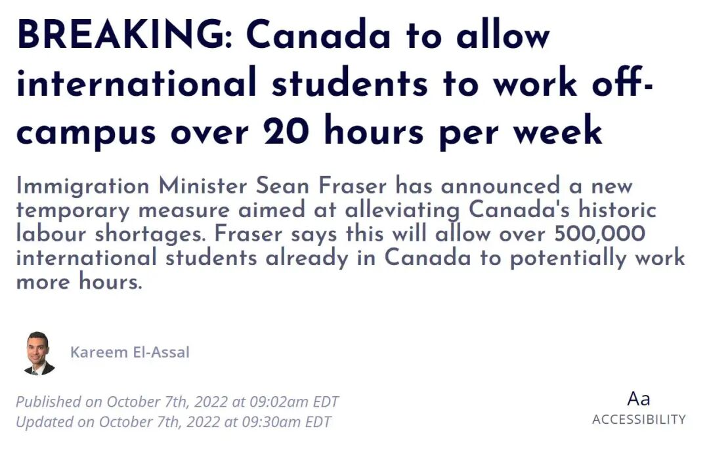
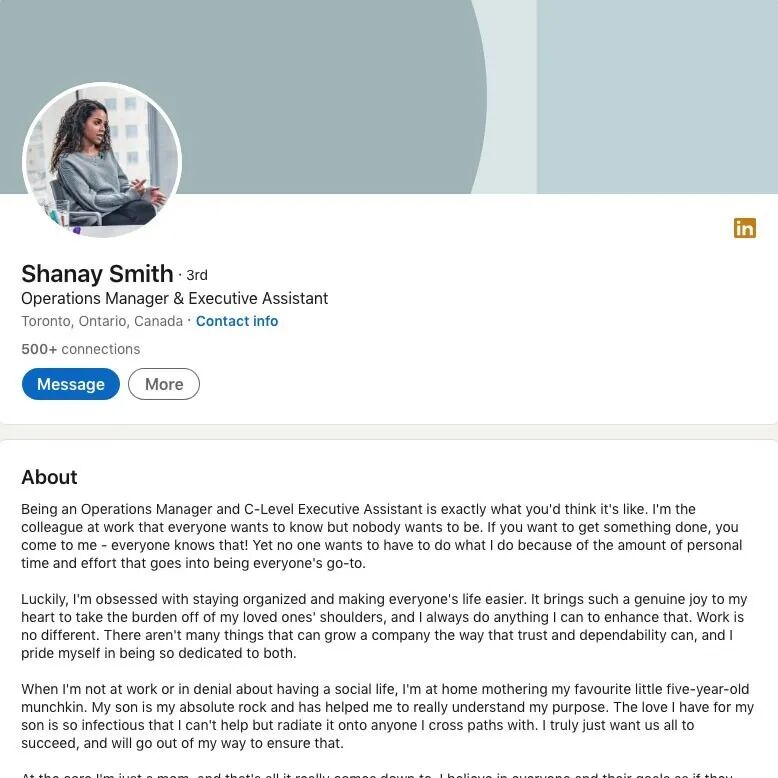

# 无标题

**链接地址:** http://mp.weixin.qq.com/s?__biz=MzI4NDYyNjAwNw==&mid=2247486652&idx=1&sn=ec7f3f523b6e5b6f11cc29d7fe313fcd&chksm=ebf9d184dc8e5892d2a970f4bdbde50d6de039167080d2498ede6b38b9cea3fc6c7c35d7d841&mpshare=1&scene=2&srcid=1117nqcpSzgTMAaCZZCbWB7B&sharer_sharetime=1668648924193&sharer_shareid=77848a6b3852ae4dcb6c74ffee84743c#rd
**作者:** 关注我们
**获取时间:** 2025/8/28 19:26:38
**图片数量:** 28

---

## 原始HTML内容

<section style="box-sizing: border-box;font-size: 16px;"><section style="text-align: left;justify-content: flex-start;display: flex;flex-flow: row nowrap;margin-top: 10px;box-sizing: border-box;" powered-by="xiumi.us"><section style="display: inline-block;vertical-align: middle;width: auto;align-self: center;flex: 0 0 auto;background-color: rgb(237, 102, 15);min-width: 5%;max-width: 100%;height: auto;padding: 8px 15px;box-sizing: border-box;"><section style="text-align: justify;color: rgb(255, 255, 255);font-size: 17px;box-sizing: border-box;" powered-by="xiumi.us">
<strong style="box-sizing: border-box;">点击蓝字</strong>
</section></section><section style="display: inline-block;vertical-align: middle;width: auto;align-self: center;min-width: 5%;max-width: 100%;flex: 0 0 auto;height: auto;box-sizing: border-box;"><section style="transform: translate3d(14px, 0px, 0px);-webkit-transform: translate3d(14px, 0px, 0px);-moz-transform: translate3d(14px, 0px, 0px);-o-transform: translate3d(14px, 0px, 0px);box-sizing: border-box;" powered-by="xiumi.us"><section style="font-size: 17px;color: rgb(237, 102, 15);box-sizing: border-box;">
<strong style="box-sizing: border-box;">关注我们</strong>
</section></section></section></section><section style="margin-bottom: 10px;box-sizing: border-box;" powered-by="xiumi.us"><section style="width: 100%;height: 5px;background-color: rgb(255, 212, 168);box-sizing: border-box;"><svg viewBox="0 0 1 1" style="float:left;line-height:0;width:0;vertical-align:top;"></svg></section></section>
 
<section style="text-align: right;justify-content: flex-end;display: flex;flex-flow: row nowrap;margin-top: 10px;box-sizing: border-box;" powered-by="xiumi.us"><section style="display: inline-block;width: 89%;vertical-align: top;align-self: flex-start;flex: 0 0 auto;background-color: rgb(242, 246, 252);height: auto;box-sizing: border-box;"><section style="text-align: justify;box-sizing: border-box;" powered-by="xiumi.us">
 
</section><section style="text-align: left;justify-content: flex-start;display: flex;flex-flow: row nowrap;box-sizing: border-box;" powered-by="xiumi.us"><section style="display: inline-block;width: 92%;vertical-align: top;align-self: flex-start;flex: 0 0 auto;height: auto;border-right: 3px solid rgb(237, 193, 193);border-top-right-radius: 0px;padding-right: 17px;box-sizing: border-box;"><section style="margin-bottom: 4px;text-align: right;box-sizing: border-box;" powered-by="xiumi.us"><section style="font-size: 14px;color: rgb(240, 244, 250);text-align: justify;box-sizing: border-box;">
<strong style="box-sizing: border-box;">加拿大的留学生朋友们，</strong>
</section></section><section style="text-align: right;box-sizing: border-box;" powered-by="xiumi.us"><section style="text-align: justify;font-size: 18px;box-sizing: border-box;">
<strong style="box-sizing: border-box;">大家还好吗？</strong>
</section></section></section></section><section style="text-align: justify;box-sizing: border-box;" powered-by="xiumi.us">
 
</section><section style="text-align: left;transform: translate3d(-28px, 0px, 0px);line-height: 0;box-sizing: border-box;" powered-by="xiumi.us"><section style="max-width: 100%;vertical-align: middle;display: inline-block;line-height: 0;border-style: solid;border-width: 0px;border-color: rgb(255, 255, 255);box-sizing: border-box;"></section></section><section style="text-align: left;justify-content: flex-start;display: flex;flex-flow: row nowrap;margin-bottom: 10px;box-sizing: border-box;" powered-by="xiumi.us"><section style="display: inline-block;width: 91%;vertical-align: top;align-self: flex-start;flex: 0 0 auto;height: auto;padding-left: 32px;box-sizing: border-box;"><section style="text-align: justify;color: rgb(93, 93, 93);font-size: 14px;line-height: 2;letter-spacing: 2px;box-sizing: border-box;" powered-by="xiumi.us">
 
</section></section></section></section></section><section style="text-align: right;justify-content: flex-end;display: flex;flex-flow: row nowrap;margin-bottom: 10px;box-sizing: border-box;" powered-by="xiumi.us"><section style="display: inline-block;width: 89%;vertical-align: top;align-self: flex-start;flex: 0 0 auto;background-color: rgb(242, 246, 252);height: auto;box-sizing: border-box;"><section style="text-align: left;justify-content: flex-start;display: flex;flex-flow: row nowrap;box-sizing: border-box;" powered-by="xiumi.us"><section style="display: inline-block;width: 92%;vertical-align: top;align-self: flex-start;flex: 0 0 auto;height: auto;border-right: 3px solid rgb(237, 193, 193);border-top-right-radius: 0px;padding-right: 23px;padding-left: 33px;box-sizing: border-box;"><section style="text-align: justify;color: rgb(93, 93, 93);font-size: 14px;line-height: 2;letter-spacing: 2px;box-sizing: border-box;" powered-by="xiumi.us">
在<strong style="box-sizing: border-box;">疫情加剧、学费暴涨、通货膨胀和汇率飙升</strong>的多重夹击下，2022年的加国留学之路似乎<strong style="box-sizing: border-box;">开启了高难度副本</strong>。留学生和家长们比以往背负了<strong style="box-sizing: border-box;">更高的财务压力</strong>，于是一些同学开始考虑增加在校外兼职打工的时间以赚取更多的生活费。
</section><section style="text-align: justify;box-sizing: border-box;" powered-by="xiumi.us">
 
</section></section></section><section style="text-align: justify;box-sizing: border-box;" powered-by="xiumi.us">
 
</section><section style="text-align: left;transform: translate3d(-28px, 0px, 0px);line-height: 0;box-sizing: border-box;" powered-by="xiumi.us"><section style="max-width: 100%;vertical-align: middle;display: inline-block;line-height: 0;border-style: solid;border-width: 0px;border-color: rgb(255, 255, 255);box-sizing: border-box;"></section></section><section style="text-align: justify;box-sizing: border-box;" powered-by="xiumi.us">
 
</section><section style="text-align: left;justify-content: flex-start;display: flex;flex-flow: row nowrap;box-sizing: border-box;" powered-by="xiumi.us"><section style="display: inline-block;width: 92%;vertical-align: top;align-self: flex-start;flex: 0 0 auto;height: auto;border-right: 3px solid rgb(237, 193, 193);border-top-right-radius: 0px;padding-right: 23px;padding-left: 33px;box-sizing: border-box;"><section style="justify-content: flex-start;display: flex;flex-flow: row nowrap;margin-bottom: 10px;box-sizing: border-box;" powered-by="xiumi.us"><section style="display: inline-block;vertical-align: top;width: 50%;box-sizing: border-box;"><section style="margin-bottom: 10px;box-sizing: border-box;" powered-by="xiumi.us"><section style="color: rgb(153, 207, 234);box-sizing: border-box;">
<strong style="box-sizing: border-box;">留学生打工时长限制取消</strong>
</section></section></section><section style="display: inline-block;vertical-align: top;width: 50%;align-self: flex-start;flex: 0 0 auto;box-sizing: border-box;"><svg viewBox="0 0 1 1" style="float:left;line-height:0;width:0;vertical-align:top;"></svg></section></section><section style="text-align: justify;color: rgb(93, 93, 93);font-size: 14px;line-height: 2;letter-spacing: 2px;box-sizing: border-box;" powered-by="xiumi.us">
过去，加拿大的留学生在全职上学的秋冬学期，只允许每周工作不超过20个小时。不过，近期加拿大移民部长肖恩·弗雷泽（Sean Fraser）宣布了一项新的临时措施，使在加拿大上学的50多万名国际留学生可以合法地工作更多时间。

 
</section><section style="text-align: center;margin-top: 10px;margin-bottom: 10px;line-height: 0;box-sizing: border-box;" powered-by="xiumi.us"><section style="max-width: 100%;vertical-align: middle;display: inline-block;line-height: 0;box-sizing: border-box;"></section></section><section style="text-align: justify;color: rgb(93, 93, 93);font-size: 14px;line-height: 2;letter-spacing: 2px;box-sizing: border-box;" powered-by="xiumi.us">
 

该政策规定，<strong style="box-sizing: border-box;">从2022年11月15日到2023年12月31日</strong>，加拿大的国际留学生被允许在全职上学的期间内<strong style="box-sizing: border-box;">在校外工作超过20小时</strong>！

 

很多没有太多工作经验的留学生朋友们听到这个消息表示十分期待，希望通过这个机会能好好历练一下自己的工作技能，在打工赚钱的同时积极融入本地社会。

 
</section><section style="text-align: center;margin-top: 10px;margin-bottom: 10px;line-height: 0;box-sizing: border-box;" powered-by="xiumi.us"><section style="max-width: 100%;vertical-align: middle;display: inline-block;line-height: 0;box-sizing: border-box;"></section></section><section style="text-align: justify;color: rgb(93, 93, 93);font-size: 14px;line-height: 2;letter-spacing: 2px;box-sizing: border-box;" powered-by="xiumi.us">
 

不过<strong style="box-sizing: border-box;">BadaB</strong>在这里可要先给大家提个醒：取消打工时间的限制并不意味着加拿大联邦政府鼓励大家无休止的工作。虽然留学生<strong style="box-sizing: border-box;">不需要额外申请工作签证</strong>就可以在加拿大打工，但为了保证各位在赚钱的同时能够积极地<strong style="box-sizing: border-box;">学知识，攒经验，积人脉</strong>，还是有一些需要注意的事项哦！

 

一些所谓“钱多事少”的“神仙工作”并没有看上去那么香！今天，就请跟着BadaB一起来了解一下，到底加拿大留学生们应该怎样选择<strong style="box-sizing: border-box;">适合自己且“有用”的兼职工作</strong>。
</section><section style="text-align: justify;box-sizing: border-box;" powered-by="xiumi.us">
 
</section><section style="text-align: justify;box-sizing: border-box;" powered-by="xiumi.us">
 
</section></section></section><section style="margin: 10px 0%;text-align: left;justify-content: flex-start;display: flex;flex-flow: row nowrap;box-sizing: border-box;" powered-by="xiumi.us"><section style="display: inline-block;vertical-align: middle;width: 50%;padding-right: 5px;align-self: center;flex: 0 0 auto;box-sizing: border-box;"><section style="text-align: center;margin-right: 0%;margin-left: 0%;line-height: 0;box-sizing: border-box;" powered-by="xiumi.us"><section style="max-width: 100%;vertical-align: middle;display: inline-block;line-height: 0;box-sizing: border-box;"></section></section></section><section style="display: inline-block;vertical-align: middle;width: 50%;padding-left: 5px;align-self: center;flex: 0 0 auto;box-sizing: border-box;"><section style="text-align: center;margin-right: 0%;margin-left: 0%;line-height: 0;box-sizing: border-box;" powered-by="xiumi.us"><section style="max-width: 100%;vertical-align: middle;display: inline-block;line-height: 0;box-sizing: border-box;"></section></section></section></section></section></section>
 

 
<section style="text-align: left;justify-content: flex-start;display: flex;flex-flow: row nowrap;margin-top: 10px;box-sizing: border-box;" powered-by="xiumi.us"><section style="display: inline-block;vertical-align: middle;width: auto;align-self: center;flex: 0 0 auto;background-color: rgb(237, 102, 15);min-width: 5%;max-width: 100%;height: auto;padding: 8px 15px;box-sizing: border-box;"><section style="text-align: justify;color: rgb(255, 255, 255);font-size: 17px;box-sizing: border-box;" powered-by="xiumi.us">
<strong style="box-sizing: border-box;">1.&nbsp;锻炼语言</strong>
</section></section><section style="display: inline-block;vertical-align: middle;width: auto;align-self: center;min-width: 5%;max-width: 100%;flex: 0 0 auto;height: auto;box-sizing: border-box;"><section style="transform: translate3d(14px, 0px, 0px);-webkit-transform: translate3d(14px, 0px, 0px);-moz-transform: translate3d(14px, 0px, 0px);-o-transform: translate3d(14px, 0px, 0px);box-sizing: border-box;" powered-by="xiumi.us"><section style="font-size: 14px;color: rgb(153, 207, 234);box-sizing: border-box;">
 
</section></section></section></section><section style="text-align: left;justify-content: flex-start;display: flex;flex-flow: row nowrap;margin-bottom: 10px;box-sizing: border-box;" powered-by="xiumi.us"><section style="display: inline-block;width: 100%;vertical-align: top;align-self: flex-start;flex: 0 0 auto;border-style: solid;border-width: 8px 0px 0px;border-color: rgb(237, 193, 193) rgb(62, 62, 62) rgb(62, 62, 62);background-color: rgb(242, 246, 252);padding: 24px;box-sizing: border-box;"><section style="text-align: justify;color: rgb(93, 93, 93);font-size: 14px;letter-spacing: 2px;line-height: 2;box-sizing: border-box;" powered-by="xiumi.us">
很多留学生朋友的第一份工作总喜欢从华人运营或者华人扎堆的企业找起，因为一个<strong style="box-sizing: border-box;">相对熟悉的语言环境</strong>可以帮助他们克服一部分初入职场带来的不安全感。但其实这样的选择对需要在加拿大锻炼第二语言的大家没有任何好处。

 

英语（或法语）是大家在加拿大学习和工作的基础。逼自己一把，把自己塞到一个<strong style="box-sizing: border-box;">工作语言为第二语言的环境中</strong>将有利于自己迅速提高语言能力的哦！
</section></section></section><section style="text-align: center;margin-top: 10px;margin-bottom: 10px;line-height: 0;box-sizing: border-box;" powered-by="xiumi.us"><section style="max-width: 100%;vertical-align: middle;display: inline-block;line-height: 0;box-sizing: border-box;"></section></section><section style="text-align: left;justify-content: flex-start;display: flex;flex-flow: row nowrap;margin-top: 10px;box-sizing: border-box;" powered-by="xiumi.us"><section style="display: inline-block;vertical-align: middle;width: auto;align-self: center;flex: 0 0 auto;background-color: rgb(237, 102, 15);min-width: 5%;max-width: 100%;height: auto;padding: 8px 15px;box-sizing: border-box;"><section style="text-align: justify;color: rgb(255, 255, 255);font-size: 17px;box-sizing: border-box;" powered-by="xiumi.us">
<strong style="box-sizing: border-box;">2.&nbsp;融入本地社会，不要和说中文的小伙伴抱团</strong>
</section></section><section style="display: inline-block;vertical-align: middle;width: auto;align-self: center;min-width: 5%;max-width: 100%;flex: 0 0 auto;height: auto;box-sizing: border-box;"><section style="transform: translate3d(14px, 0px, 0px);-webkit-transform: translate3d(14px, 0px, 0px);-moz-transform: translate3d(14px, 0px, 0px);-o-transform: translate3d(14px, 0px, 0px);box-sizing: border-box;" powered-by="xiumi.us"><section style="font-size: 14px;color: rgb(153, 207, 234);box-sizing: border-box;">
 
</section></section></section></section><section style="text-align: left;justify-content: flex-start;display: flex;flex-flow: row nowrap;margin-bottom: 10px;box-sizing: border-box;" powered-by="xiumi.us"><section style="display: inline-block;width: 100%;vertical-align: top;align-self: flex-start;flex: 0 0 auto;border-style: solid;border-width: 8px 0px 0px;border-color: rgb(237, 193, 193) rgb(62, 62, 62) rgb(62, 62, 62);background-color: rgb(242, 246, 252);padding: 24px;box-sizing: border-box;"><section style="text-align: justify;color: rgb(93, 93, 93);font-size: 14px;letter-spacing: 2px;line-height: 2;box-sizing: border-box;" powered-by="xiumi.us">
加拿大的华人华侨和留学生群体数量众多，想要寻找一个完全没有同胞的工作环境是一件难事。但遇到和自己拥有相同文化背景的同事也不要胆怯地和他们<strong style="box-sizing: border-box;">终日抱团在一起</strong>。

 

应该好好利用兼职的机会，<strong style="box-sizing: border-box;">多融入本地人的圈子，结交人脉，熟悉本国的职场文化，接触多元化的工作环境</strong>，为毕业后第一份正式工作的职场启航做好准备。
</section></section></section><section style="text-align: center;margin-top: 10px;margin-bottom: 10px;line-height: 0;box-sizing: border-box;" powered-by="xiumi.us"><section style="max-width: 100%;vertical-align: middle;display: inline-block;line-height: 0;box-sizing: border-box;"></section></section><section style="text-align: left;justify-content: flex-start;display: flex;flex-flow: row nowrap;margin-top: 10px;box-sizing: border-box;" powered-by="xiumi.us"><section style="display: inline-block;vertical-align: middle;width: auto;align-self: center;flex: 0 0 auto;background-color: rgb(237, 102, 15);min-width: 5%;max-width: 100%;height: auto;padding: 8px 15px;box-sizing: border-box;"><section style="text-align: justify;color: rgb(255, 255, 255);font-size: 17px;box-sizing: border-box;" powered-by="xiumi.us">
<strong style="box-sizing: border-box;">3. 找和自己专业对口的兼职工作</strong>
</section></section><section style="display: inline-block;vertical-align: middle;width: auto;align-self: center;min-width: 5%;max-width: 100%;flex: 0 0 auto;height: auto;box-sizing: border-box;"><section style="transform: translate3d(14px, 0px, 0px);-webkit-transform: translate3d(14px, 0px, 0px);-moz-transform: translate3d(14px, 0px, 0px);-o-transform: translate3d(14px, 0px, 0px);box-sizing: border-box;" powered-by="xiumi.us"><section style="font-size: 14px;color: rgb(153, 207, 234);box-sizing: border-box;">
 
</section></section></section></section><section style="text-align: left;justify-content: flex-start;display: flex;flex-flow: row nowrap;margin-bottom: 10px;box-sizing: border-box;" powered-by="xiumi.us"><section style="display: inline-block;width: 100%;vertical-align: top;align-self: flex-start;flex: 0 0 auto;border-style: solid;border-width: 8px 0px 0px;border-color: rgb(237, 193, 193) rgb(62, 62, 62) rgb(62, 62, 62);background-color: rgb(242, 246, 252);padding: 24px;box-sizing: border-box;"><section style="text-align: justify;color: rgb(93, 93, 93);font-size: 14px;letter-spacing: 2px;line-height: 2;box-sizing: border-box;" powered-by="xiumi.us">
许多留学生的第一份工作，都是从餐厅的外卖员或者服务员做起，因为这些职位<strong style="box-sizing: border-box;">需求量大，门槛低，轮换度也高</strong>。但这些工作经验只能给你带来少许的零用钱收入。真正等到毕业求职时，你甚至不好意思把他们写到你的求职简历上。

 

如果条件允许的话，请各位留学生能够选择<strong style="box-sizing: border-box;">和自己专业对口，或者拥有通用性高“Transferable Skills”（可转换技能）的工作</strong>，这样会更有利于累积有效职场经验，给你毕业后第一份工作的起点更多助推。
</section></section></section><section style="margin-top: 10px;margin-bottom: 10px;text-align: center;box-sizing: border-box;" powered-by="xiumi.us"><section style="padding-left: 1em;padding-right: 1em;display: inline-block;box-sizing: border-box;">
<strong style="box-sizing: border-box;">常见的Transferable Skills有哪些？</strong>
 </section><section style="border-width: 1px;border-style: solid;border-color: rgba(187, 222, 251, 0);margin-top: -1em;padding: 20px 10px 10px;background-color: rgba(237, 146, 15, 0.1);box-sizing: border-box;"><section style="text-align: justify;box-sizing: border-box;" powered-by="xiumi.us">
 
</section><section style="text-align: left;justify-content: flex-start;display: flex;flex-flow: row nowrap;box-sizing: border-box;" powered-by="xiumi.us"><section style="display: inline-block;vertical-align: top;width: 50%;align-self: flex-start;flex: 0 0 auto;box-sizing: border-box;"><section style="text-align: center;margin-top: 10px;margin-bottom: 10px;line-height: 0;box-sizing: border-box;" powered-by="xiumi.us"><section style="max-width: 100%;vertical-align: middle;display: inline-block;line-height: 0;width: 78%;height: auto;box-sizing: border-box;"></section></section><section style="text-align: justify;box-sizing: border-box;" powered-by="xiumi.us">
 
</section></section><section style="display: inline-block;vertical-align: top;width: 50%;align-self: flex-start;flex: 0 0 auto;box-sizing: border-box;"><section style="font-size: 14px;box-sizing: border-box;" powered-by="xiumi.us">
<strong style="box-sizing: border-box;">1. 商业战略</strong>

<strong style="box-sizing: border-box;">2. 领导力和团队管理</strong>

<strong style="box-sizing: border-box;">3. 解决问题</strong>

<strong style="box-sizing: border-box;">4. 团队合作能力</strong>

<strong style="box-sizing: border-box;">5. 数据分析</strong>

<strong style="box-sizing: border-box;">6. 沟通技巧</strong>

<strong style="box-sizing: border-box;">7. 时间管理</strong>

<strong style="box-sizing: border-box;">8. 职业道德</strong>

<strong style="box-sizing: border-box;">9. 商业意识</strong>

<strong style="box-sizing: border-box;">10. 倾听和提供反馈</strong>
</section><section style="text-align: justify;box-sizing: border-box;" powered-by="xiumi.us">
 
</section></section></section></section></section><section style="text-align: left;justify-content: flex-start;display: flex;flex-flow: row nowrap;margin-top: 10px;box-sizing: border-box;" powered-by="xiumi.us"><section style="display: inline-block;vertical-align: middle;width: auto;align-self: center;flex: 0 0 auto;background-color: rgb(237, 102, 15);min-width: 5%;max-width: 100%;height: auto;padding: 8px 15px;box-sizing: border-box;"><section style="text-align: justify;color: rgb(255, 255, 255);font-size: 17px;box-sizing: border-box;" powered-by="xiumi.us">
<strong style="box-sizing: border-box;">4.&nbsp;避免从事简单重复的体力劳动</strong>
</section></section><section style="display: inline-block;vertical-align: middle;width: auto;align-self: center;min-width: 5%;max-width: 100%;flex: 0 0 auto;height: auto;box-sizing: border-box;"><section style="transform: translate3d(14px, 0px, 0px);-webkit-transform: translate3d(14px, 0px, 0px);-moz-transform: translate3d(14px, 0px, 0px);-o-transform: translate3d(14px, 0px, 0px);box-sizing: border-box;" powered-by="xiumi.us"><section style="font-size: 14px;color: rgb(153, 207, 234);box-sizing: border-box;">
 
</section></section></section></section><section style="text-align: left;justify-content: flex-start;display: flex;flex-flow: row nowrap;margin-bottom: 10px;box-sizing: border-box;" powered-by="xiumi.us"><section style="display: inline-block;width: 100%;vertical-align: top;align-self: flex-start;flex: 0 0 auto;border-style: solid;border-width: 8px 0px 0px;border-color: rgb(237, 193, 193) rgb(62, 62, 62) rgb(62, 62, 62);background-color: rgb(242, 246, 252);padding: 24px;box-sizing: border-box;"><section style="text-align: justify;color: rgb(93, 93, 93);font-size: 14px;letter-spacing: 2px;line-height: 2;box-sizing: border-box;" powered-by="xiumi.us">
阿尔伯塔大学的小L即将在明年春天本科毕业，但开学初投递了上百份简历的他几乎没有收到任何靠谱的面试。情急之下小L找到我们诉苦：我工作经验这么<strong style="box-sizing: border-box;">“丰富”，</strong>怎么会没有面试呢？

 

了解完情况才发现，上学期间极其热爱打零工的小L零花钱真没少赚，但从事的都是<strong style="box-sizing: border-box;">简单重复的体力劳作</strong>，在工作过程中没有培养到招聘企业希望求职者拥有的技能。

 

寻找一个可以学以致用的兼职工作，而<strong style="box-sizing: border-box;">不是单纯地出卖自己的时间和体力</strong>，这样才可以最大限度的提升自己的专业能力哦！
</section></section></section><section style="margin: 10px 0%;text-align: left;justify-content: flex-start;display: flex;flex-flow: row nowrap;box-sizing: border-box;" powered-by="xiumi.us"><section style="display: inline-block;vertical-align: middle;width: 50%;padding-right: 5px;align-self: center;flex: 0 0 auto;box-sizing: border-box;"><section style="text-align: center;margin-right: 0%;margin-left: 0%;line-height: 0;box-sizing: border-box;" powered-by="xiumi.us"><section style="max-width: 100%;vertical-align: middle;display: inline-block;line-height: 0;box-sizing: border-box;"></section></section></section><section style="display: inline-block;vertical-align: middle;width: 50%;padding-left: 5px;align-self: center;flex: 0 0 auto;box-sizing: border-box;"><section style="text-align: center;margin-right: 0%;margin-left: 0%;line-height: 0;box-sizing: border-box;" powered-by="xiumi.us"><section style="max-width: 100%;vertical-align: middle;display: inline-block;line-height: 0;box-sizing: border-box;"></section></section></section></section><section style="text-align: left;justify-content: flex-start;display: flex;flex-flow: row nowrap;margin-top: 10px;box-sizing: border-box;" powered-by="xiumi.us"><section style="display: inline-block;vertical-align: middle;width: auto;align-self: center;flex: 0 0 auto;background-color: rgb(237, 102, 15);min-width: 5%;max-width: 100%;height: auto;padding: 8px 15px;box-sizing: border-box;"><section style="text-align: justify;color: rgb(255, 255, 255);font-size: 17px;box-sizing: border-box;" powered-by="xiumi.us">
<strong style="box-sizing: border-box;">5. 重新定义“神仙工作”，警惕诈骗！</strong>
</section></section><section style="display: inline-block;vertical-align: middle;width: auto;align-self: center;min-width: 5%;max-width: 100%;flex: 0 0 auto;height: auto;box-sizing: border-box;"><section style="transform: translate3d(14px, 0px, 0px);-webkit-transform: translate3d(14px, 0px, 0px);-moz-transform: translate3d(14px, 0px, 0px);-o-transform: translate3d(14px, 0px, 0px);box-sizing: border-box;" powered-by="xiumi.us"><section style="font-size: 14px;color: rgb(153, 207, 234);box-sizing: border-box;">
 
</section></section></section></section><section style="text-align: left;justify-content: flex-start;display: flex;flex-flow: row nowrap;margin-bottom: 10px;box-sizing: border-box;" powered-by="xiumi.us"><section style="display: inline-block;width: 100%;vertical-align: top;align-self: flex-start;flex: 0 0 auto;border-style: solid;border-width: 8px 0px 0px;border-color: rgb(237, 193, 193) rgb(62, 62, 62) rgb(62, 62, 62);background-color: rgb(242, 246, 252);padding: 24px;box-sizing: border-box;"><section style="text-align: justify;color: rgb(93, 93, 93);font-size: 14px;letter-spacing: 2px;line-height: 2;box-sizing: border-box;" powered-by="xiumi.us">
一些留学生朋友总期待能够幸运地找到所谓的<strong style="box-sizing: border-box;">“神仙工作”</strong>——即<strong style="box-sizing: border-box;">钱多事少型的兼职</strong>。先不说这样的工作存不存在，能不能轮到你，咱们得先摆正工作态度。

 

打工兼职的目的除了赚点零花钱，更重要的是学习技能和积攒工作经验。而且，那些传说中<strong style="box-sizing: border-box;">“躺在家中动动手指就能赚钱”的兼职，十有八九都是诈骗</strong>！还请各位留学生们在投递简历前仔细甄别，千万不要掉坑！

 

这里也给各位找工作中的小留们提个醒：求职简历往往包含大量个人信息，<strong style="box-sizing: border-box;">请不要把自己的简历发送给可疑的人员或组织，以免泄露个人隐私</strong>。
</section></section></section><section style="margin-top: 10px;margin-bottom: 10px;text-align: center;box-sizing: border-box;" powered-by="xiumi.us"><section style="padding-left: 1em;padding-right: 1em;display: inline-block;box-sizing: border-box;">
<strong style="box-sizing: border-box;">遇到诈骗怎么办？</strong>
 </section><section style="border-width: 1px;border-style: solid;border-color: rgba(187, 222, 251, 0);margin-top: -1em;padding: 20px 10px 10px;background-color: rgba(237, 146, 15, 0.1);box-sizing: border-box;"><section style="text-align: justify;box-sizing: border-box;" powered-by="xiumi.us">
 
</section><section style="text-align: left;justify-content: flex-start;display: flex;flex-flow: row nowrap;box-sizing: border-box;" powered-by="xiumi.us"><section style="display: inline-block;vertical-align: bottom;width: 50%;align-self: flex-end;flex: 0 0 auto;box-sizing: border-box;"><section style="text-align: center;margin-top: 10px;margin-bottom: 10px;line-height: 0;box-sizing: border-box;" powered-by="xiumi.us"><section style="max-width: 100%;vertical-align: middle;display: inline-block;line-height: 0;width: 80%;height: auto;box-sizing: border-box;"></section></section><section style="text-align: justify;box-sizing: border-box;" powered-by="xiumi.us">
 
</section></section><section style="display: inline-block;vertical-align: top;width: 50%;align-self: flex-start;flex: 0 0 auto;box-sizing: border-box;"><section style="font-size: 14px;box-sizing: border-box;" powered-by="xiumi.us">
<strong style="box-sizing: border-box;">加拿大反诈骗中心 </strong>

<strong style="box-sizing: border-box;"> </strong>

<strong style="box-sizing: border-box;">网址：</strong> 

https://antifraudcentre-centreantifraude.ca/report-signalez-eng.htm

<strong style="box-sizing: border-box;">电话：</strong> 

1-888-495-8501

 
</section></section></section></section></section><section style="text-align: left;justify-content: flex-start;display: flex;flex-flow: row nowrap;margin-top: 10px;box-sizing: border-box;" powered-by="xiumi.us"><section style="display: inline-block;vertical-align: middle;width: auto;align-self: center;flex: 0 0 auto;background-color: rgb(237, 102, 15);min-width: 5%;max-width: 100%;height: auto;padding: 8px 15px;box-sizing: border-box;"><section style="text-align: justify;color: rgb(255, 255, 255);font-size: 17px;box-sizing: border-box;" powered-by="xiumi.us">
<strong style="box-sizing: border-box;">6.&nbsp;不要把时间浪费在赶路上</strong>
</section></section><section style="display: inline-block;vertical-align: middle;width: auto;align-self: center;min-width: 5%;max-width: 100%;flex: 0 0 auto;height: auto;box-sizing: border-box;"><section style="transform: translate3d(14px, 0px, 0px);-webkit-transform: translate3d(14px, 0px, 0px);-moz-transform: translate3d(14px, 0px, 0px);-o-transform: translate3d(14px, 0px, 0px);box-sizing: border-box;" powered-by="xiumi.us"><section style="font-size: 14px;color: rgb(153, 207, 234);box-sizing: border-box;">
 
</section></section></section></section><section style="text-align: left;justify-content: flex-start;display: flex;flex-flow: row nowrap;margin-bottom: 10px;box-sizing: border-box;" powered-by="xiumi.us"><section style="display: inline-block;width: 100%;vertical-align: top;align-self: flex-start;flex: 0 0 auto;border-style: solid;border-width: 8px 0px 0px;border-color: rgb(237, 193, 193) rgb(62, 62, 62) rgb(62, 62, 62);background-color: rgb(242, 246, 252);padding: 24px;box-sizing: border-box;"><section style="text-align: justify;color: rgb(93, 93, 93);font-size: 14px;letter-spacing: 2px;line-height: 2;box-sizing: border-box;" powered-by="xiumi.us">
对于留学生来说，一边读书一边兼职打工的时间是十分宝贵的，因此能够<strong style="box-sizing: border-box;">在校内或者学校周边找到工作是最好的</strong>。

 

如果你兼职的地点离学校和住所都距离遥远，那么请好好核算一下这些浪费在路途上的时间和金钱是否配得上你工作带来的收获。

 

不少的<strong style="box-sizing: border-box;">学校都拥有大量内部的校内招聘职位</strong>。在院校里做<strong style="box-sizing: border-box;">课堂助教、实验助理、管理接待和协调员等入门职位</strong>，都是能够同时在学业和事业上帮助留学生们有所提高的好选择。
</section></section></section><section style="margin: 10px 0%;text-align: left;justify-content: flex-start;display: flex;flex-flow: row nowrap;box-sizing: border-box;" powered-by="xiumi.us"><section style="display: inline-block;vertical-align: middle;width: 50%;padding-right: 5px;align-self: center;flex: 0 0 auto;box-sizing: border-box;"><section style="text-align: center;margin-right: 0%;margin-left: 0%;line-height: 0;box-sizing: border-box;" powered-by="xiumi.us"><section style="max-width: 100%;vertical-align: middle;display: inline-block;line-height: 0;box-sizing: border-box;"></section></section></section><section style="display: inline-block;vertical-align: middle;width: 50%;padding-left: 5px;align-self: center;flex: 0 0 auto;box-sizing: border-box;"><section style="text-align: center;margin-right: 0%;margin-left: 0%;line-height: 0;box-sizing: border-box;" powered-by="xiumi.us"><section style="max-width: 100%;vertical-align: middle;display: inline-block;line-height: 0;box-sizing: border-box;"></section></section></section></section><section style="margin-top: 10px;margin-bottom: 10px;text-align: center;box-sizing: border-box;" powered-by="xiumi.us"><section style="padding-left: 1em;padding-right: 1em;display: inline-block;box-sizing: border-box;">
<strong style="box-sizing: border-box;">&nbsp;校内职位招聘中心&nbsp;</strong>
 </section><section style="border-width: 1px;border-style: solid;border-color: rgba(187, 222, 251, 0);margin-top: -1em;padding: 20px 10px 10px;background-color: rgba(237, 146, 15, 0.1);box-sizing: border-box;"><section style="text-align: justify;box-sizing: border-box;" powered-by="xiumi.us">
 
</section><section style="text-align: left;font-size: 14px;padding-right: 15px;padding-left: 15px;box-sizing: border-box;" powered-by="xiumi.us">
<strong style="box-sizing: border-box;">University of Alberta&nbsp; </strong>

<em style="box-sizing: border-box;">https://www.careers.ualberta.ca/Index.aspx</em>

 

<strong style="box-sizing: border-box;">MacEwan University</strong>

<em style="box-sizing: border-box;">https://www.macewan.ca/about-macewan/careers/opportunities/</em>

 

<strong style="box-sizing: border-box;">Northern Alberta Institute of Technology (NAIT)</strong>

<em style="box-sizing: border-box;">https://nait.startdate.ca/#/</em>

 
</section></section></section><section style="margin: 10px 0%;text-align: left;justify-content: flex-start;display: flex;flex-flow: row nowrap;box-sizing: border-box;" powered-by="xiumi.us"><section style="display: inline-block;vertical-align: middle;width: 50%;padding-right: 5px;align-self: center;flex: 0 0 auto;box-sizing: border-box;"><section style="text-align: center;margin-right: 0%;margin-left: 0%;line-height: 0;box-sizing: border-box;" powered-by="xiumi.us"><section style="max-width: 100%;vertical-align: middle;display: inline-block;line-height: 0;box-sizing: border-box;"></section></section></section><section style="display: inline-block;vertical-align: middle;width: 50%;padding-left: 5px;align-self: center;flex: 0 0 auto;box-sizing: border-box;"><section style="text-align: center;margin-right: 0%;margin-left: 0%;line-height: 0;box-sizing: border-box;" powered-by="xiumi.us"><section style="max-width: 100%;vertical-align: middle;display: inline-block;line-height: 0;box-sizing: border-box;"></section></section></section></section><section style="text-align: left;justify-content: flex-start;display: flex;flex-flow: row nowrap;margin-top: 10px;box-sizing: border-box;" powered-by="xiumi.us"><section style="display: inline-block;vertical-align: middle;width: auto;align-self: center;flex: 0 0 auto;background-color: rgb(237, 102, 15);min-width: 5%;max-width: 100%;height: auto;padding: 8px 15px;box-sizing: border-box;"><section style="text-align: justify;color: rgb(255, 255, 255);font-size: 17px;box-sizing: border-box;" powered-by="xiumi.us">
<strong style="box-sizing: border-box;">7.&nbsp;以学业为重</strong>
</section></section><section style="display: inline-block;vertical-align: middle;width: auto;align-self: center;min-width: 5%;max-width: 100%;flex: 0 0 auto;height: auto;box-sizing: border-box;"><section style="transform: translate3d(14px, 0px, 0px);-webkit-transform: translate3d(14px, 0px, 0px);-moz-transform: translate3d(14px, 0px, 0px);-o-transform: translate3d(14px, 0px, 0px);box-sizing: border-box;" powered-by="xiumi.us"><section style="font-size: 14px;color: rgb(153, 207, 234);box-sizing: border-box;">
 
</section></section></section></section><section style="text-align: left;justify-content: flex-start;display: flex;flex-flow: row nowrap;margin-bottom: 10px;box-sizing: border-box;" powered-by="xiumi.us"><section style="display: inline-block;width: 100%;vertical-align: top;align-self: flex-start;flex: 0 0 auto;border-style: solid;border-width: 8px 0px 0px;border-color: rgb(237, 193, 193) rgb(62, 62, 62) rgb(62, 62, 62);background-color: rgb(242, 246, 252);padding: 24px;box-sizing: border-box;"><section style="text-align: justify;color: rgb(93, 93, 93);font-size: 14px;letter-spacing: 2px;line-height: 2;box-sizing: border-box;" powered-by="xiumi.us">
虽然 BadaB 推荐大家在留学的过程中通过兼职打工的方式更好地体会加国本地职场文化，为自己未来的就业打好基础，但 BadaB 并不推荐留学生为了赚钱或者积攒职场经验和人脉而无休止的工作。<strong style="box-sizing: border-box;">留学生还是要以学业为重！</strong>

 

曾经加拿大政府为学生们设定的每周20小时工作上限也是充分考虑过加国留学生们学习强度和作息安排的。如果你担心打工影响到自己的学业表现，可以<strong style="box-sizing: border-box;">在学习压力较小的春季和夏季小学期进行全职工作</strong>。 

 
</section><section style="text-align: center;margin-top: 10px;margin-bottom: 10px;line-height: 0;box-sizing: border-box;" powered-by="xiumi.us"><section style="max-width: 100%;vertical-align: middle;display: inline-block;line-height: 0;box-sizing: border-box;"></section></section><section style="text-align: justify;color: rgb(93, 93, 93);font-size: 14px;letter-spacing: 2px;line-height: 2;box-sizing: border-box;" powered-by="xiumi.us">
 

留学生的首要任务还是保证自己优先完成学业。如果持续因为打工而耽误学习成绩，<strong style="box-sizing: border-box;">过低的GPA不仅影响毕业后第一份正式工作的申请，甚至没有办法续签学签，无法按时毕业获得工作签证</strong>，大大影响留学生的人生和就业的规划！

 
</section><section style="text-align: center;margin-top: 10px;margin-bottom: 10px;line-height: 0;box-sizing: border-box;" powered-by="xiumi.us"><section style="max-width: 100%;vertical-align: middle;display: inline-block;line-height: 0;width: 50%;height: auto;box-sizing: border-box;"></section></section><section style="text-align: justify;color: rgb(93, 93, 93);font-size: 14px;letter-spacing: 2px;line-height: 2;box-sizing: border-box;" powered-by="xiumi.us">
 

希望留学生们都能有效地利用好加国留学期间的打工机会，充分体验到加拿大开放包容又积极向上的职场氛围。学习技能的同时，积攒宝贵的工作经验和职场人脉，为自己今后的就业道路奠定良好的基础。<strong style="box-sizing: border-box;">未来可期，一起加油！</strong>
</section></section></section>
 

 
<section style="margin-top: 10px;margin-bottom: 10px;box-sizing: border-box;" powered-by="xiumi.us"><section style="width: 100%;text-align: left;box-sizing: border-box;"><section style="display: inline-block;vertical-align: top;max-width: 100%;border-radius: 3px 3px 0px 0px;margin-right: 3px;background-color: rgb(237, 128, 15);color: rgb(255, 255, 255);font-size: 18px;padding-left: 6px;padding-right: 6px;box-sizing: border-box;">
<strong style="box-sizing: border-box;">往期精选</strong>
</section> </section><section style="width: 100%;font-size: 0px;margin-top: -2px;box-sizing: border-box;"><section style="display: inline-block;vertical-align: top;width: 100%;margin-right: -6px;border-bottom: 2px solid rgb(237, 128, 15);box-sizing: border-box;"><svg viewBox="0 0 1 1" style="float:left;line-height:0;width:0;vertical-align:top;"></svg></section><section style="display: inline-block;vertical-align: top;margin-top: -2px;width: 6px;height: 6px;border-radius: 50%;background-color: rgb(237, 128, 15);box-sizing: border-box;"><svg viewBox="0 0 1 1" style="float:left;line-height:0;width:0;vertical-align:top;"></svg></section></section></section><section style="margin: 10px 0%;text-align: left;justify-content: flex-start;display: flex;flex-flow: row nowrap;box-sizing: border-box;" powered-by="xiumi.us"><section style="display: inline-block;width: 100%;vertical-align: top;background-position: 55.6015% 33.1154%;background-repeat: repeat;background-size: 100.637%;background-attachment: scroll;padding: 30px;align-self: flex-start;flex: 0 0 auto;background-image: url(&quot;https://mmbiz.qpic.cn/mmbiz_jpg/cY0qSDjdkFejXCu7X5vib7IkrhFfiaia3D1hpfWkibEZ2R2DNJwEZsQSFVhAiace8h1GBqZUFAE1JTOdxthyNTHAibGA/640?wx_fmt=jpeg&quot;);box-sizing: border-box;"><section style="text-align: justify;justify-content: flex-start;display: flex;flex-flow: row nowrap;box-sizing: border-box;" powered-by="xiumi.us"><section style="display: inline-block;width: 100%;vertical-align: top;background-color: rgba(188, 65, 65, 0.22);padding: 10px;border-width: 0px;border-style: none;border-color: rgb(62, 62, 62);align-self: flex-start;flex: 0 0 auto;box-sizing: border-box;"><section style="text-align: center;color: rgb(255, 255, 255);font-size: 14px;box-sizing: border-box;" powered-by="xiumi.us">
<a target="_blank" href="http://mp.weixin.qq.com/s?__biz=MzI4NDYyNjAwNw==&amp;mid=2247486557&amp;idx=1&amp;sn=61345e53fe2636262cbfde9977e1e4cc&amp;chksm=ebf9d165dc8e587310a35fb4103b0aebeaa438f5ab464e839fdf8a9e056b5cd9984c1e1f54a2&amp;scene=21#wechat_redirect" textvalue="“冷门职业”分享：在加拿大做HR是怎样一种体验？华人的职场天花板到底在哪？" linktype="text" imgurl="" imgdata="null" data-itemshowtype="0" tab="innerlink" style="color: rgb(255, 255, 255);" data-linktype="2"><strong style="box-sizing: border-box;">“冷门职业”分享：在加拿大做HR是怎样一种体验？华人的职场天花板到底在哪？</strong></a>
</section></section></section></section></section><section style="margin: 10px 0%;text-align: left;justify-content: flex-start;display: flex;flex-flow: row nowrap;box-sizing: border-box;" powered-by="xiumi.us"><section style="display: inline-block;width: 100%;vertical-align: top;background-position: 55.6015% 33.1154%;background-repeat: repeat;background-size: 100.637%;background-attachment: scroll;padding: 30px;align-self: flex-start;flex: 0 0 auto;background-image: url(&quot;https://mmbiz.qpic.cn/mmbiz_jpg/cY0qSDjdkFejXCu7X5vib7IkrhFfiaia3D1Hia6mbI5DM2ht35ZI5bBBJKibzibO1P8E71q7I5Y5kpX8Px45WMGtJJDg/640?wx_fmt=jpeg&quot;);box-sizing: border-box;"><section style="text-align: justify;justify-content: flex-start;display: flex;flex-flow: row nowrap;box-sizing: border-box;" powered-by="xiumi.us"><section style="display: inline-block;width: 100%;vertical-align: top;background-color: rgba(188, 65, 65, 0.22);padding: 10px;border-width: 0px;border-style: none;border-color: rgb(62, 62, 62);align-self: flex-start;flex: 0 0 auto;box-sizing: border-box;"><section style="text-align: center;color: rgb(255, 255, 255);font-size: 14px;box-sizing: border-box;" powered-by="xiumi.us">
<a target="_blank" href="http://mp.weixin.qq.com/s?__biz=MzI4NDYyNjAwNw==&amp;mid=2247486473&amp;idx=1&amp;sn=b25968860c5cb4fdac1fd890044fd1b9&amp;chksm=ebf9d131dc8e5827a037157d4642a66acf0cb0b7e351cecc767b5ed1fd1b9409b70614c75d4b&amp;scene=21#wechat_redirect" textvalue="解除尴尬和焦虑！北美职场新手入职后必做8件事：" linktype="text" imgurl="" imgdata="null" data-itemshowtype="0" tab="innerlink" style="color: rgb(255, 255, 255);" data-linktype="2"><strong style="box-sizing: border-box;">解除尴尬和焦虑！</strong></a>

<a target="_blank" href="http://mp.weixin.qq.com/s?__biz=MzI4NDYyNjAwNw==&amp;mid=2247486473&amp;idx=1&amp;sn=b25968860c5cb4fdac1fd890044fd1b9&amp;chksm=ebf9d131dc8e5827a037157d4642a66acf0cb0b7e351cecc767b5ed1fd1b9409b70614c75d4b&amp;scene=21#wechat_redirect" textvalue="解除尴尬和焦虑！北美职场新手入职后必做8件事：" linktype="text" imgurl="" imgdata="null" data-itemshowtype="0" tab="innerlink" style="color: rgb(255, 255, 255);" data-linktype="2"><strong style="box-sizing: border-box;">北美职场新手入职后必做8件事：</strong></a><strong style="box-sizing: border-box;"></strong>
</section></section></section></section></section><section style="margin: 10px 0%;text-align: left;justify-content: flex-start;display: flex;flex-flow: row nowrap;box-sizing: border-box;" powered-by="xiumi.us"><section style="display: inline-block;width: 100%;vertical-align: top;background-position: 55.6015% 33.1154%;background-repeat: repeat;background-size: 100.637%;background-attachment: scroll;padding: 30px;align-self: flex-start;flex: 0 0 auto;background-image: url(&quot;https://mmbiz.qpic.cn/mmbiz_jpg/cY0qSDjdkFejXCu7X5vib7IkrhFfiaia3D1riaiassqzZc9YDAHib7UfkSErGIfLYzmE9xJr1WSbdGBayQRSILBOJ6bQ/640?wx_fmt=jpeg&quot;);box-sizing: border-box;"><section style="text-align: justify;justify-content: flex-start;display: flex;flex-flow: row nowrap;box-sizing: border-box;" powered-by="xiumi.us"><section style="display: inline-block;width: 100%;vertical-align: top;background-color: rgba(188, 65, 65, 0.22);padding: 10px;border-width: 0px;border-style: none;border-color: rgb(62, 62, 62);align-self: flex-start;flex: 0 0 auto;box-sizing: border-box;"><section style="text-align: center;color: rgb(255, 255, 255);font-size: 14px;box-sizing: border-box;" powered-by="xiumi.us">
<a target="_blank" href="http://mp.weixin.qq.com/s?__biz=MzI4NDYyNjAwNw==&amp;mid=2247486117&amp;idx=1&amp;sn=728a5644a917bf5f7e1f4ec0776246fc&amp;chksm=ebf9d79ddc8e5e8b25ba1c5f0f3625a43029b72eb72117f55c4d6183e9ce71e9e0c6818989e9&amp;scene=21#wechat_redirect" textvalue="没进“大厂”就一定输在起跑线上？进入中小企业的你也可以这样“逆风翻盘”！" linktype="text" imgurl="" imgdata="null" data-itemshowtype="0" tab="innerlink" style="color: rgb(255, 255, 255);" data-linktype="2"><strong style="box-sizing: border-box;">没进“大厂”就一定输在起跑线上？进入中小企业的你也可以这样“逆风翻盘”！</strong></a>
</section></section></section></section></section><section style="margin: 10px 0%;text-align: left;justify-content: flex-start;display: flex;flex-flow: row nowrap;box-sizing: border-box;" powered-by="xiumi.us"><section style="display: inline-block;width: 100%;vertical-align: top;background-color: rgb(216, 202, 160);line-height: 0;align-self: flex-start;flex: 0 0 auto;box-sizing: border-box;"><section style="text-align: justify;justify-content: flex-start;display: flex;flex-flow: row nowrap;box-sizing: border-box;" powered-by="xiumi.us"><section style="display: inline-block;width: 100%;vertical-align: top;background-position: 0% 0%;background-repeat: repeat;background-size: 1.56658%;background-attachment: scroll;align-self: flex-start;flex: 0 0 auto;background-image: url(&quot;https://mmbiz.qpic.cn/mmbiz_png/cY0qSDjdkFejXCu7X5vib7IkrhFfiaia3D18g7gXiaA7JHia7KpzszAkTPrNC74flgc6TkAuKiaSMuETlZic8Y4rCvvYQ/640?wx_fmt=png&quot;);box-sizing: border-box;"><section style="text-align: center;box-sizing: border-box;" powered-by="xiumi.us"><section style="display: inline-block;width: 100%;height: 11px;vertical-align: top;overflow: hidden;background-color: rgba(255, 255, 255, 0);box-sizing: border-box;"><svg viewBox="0 0 1 1" style="float:left;line-height:0;width:0;vertical-align:top;"></svg></section></section></section></section></section></section><section style="margin: 10px 0%;text-align: left;justify-content: flex-start;display: flex;flex-flow: row nowrap;box-sizing: border-box;" powered-by="xiumi.us"><section style="display: inline-block;width: 100%;vertical-align: top;background-color: rgb(249, 245, 239);padding: 8px;box-shadow: rgb(207, 207, 207) 0.707107px 0.707107px 2px;align-self: flex-start;flex: 0 0 auto;box-sizing: border-box;"><section style="text-align: justify;box-sizing: border-box;" powered-by="xiumi.us">
 
</section><section style="text-align: center;margin-right: 0%;margin-bottom: 20px;margin-left: 0%;justify-content: center;display: flex;flex-flow: row nowrap;box-sizing: border-box;" powered-by="xiumi.us"><section style="display: inline-block;vertical-align: middle;width: 41%;align-self: center;flex: 0 0 auto;box-sizing: border-box;"><section style="justify-content: center;display: flex;flex-flow: row nowrap;box-sizing: border-box;" powered-by="xiumi.us"><section style="display: inline-block;vertical-align: top;width: 50%;box-shadow: rgb(0, 0, 0) 0px 0px 0px;align-self: flex-start;flex: 0 0 auto;box-sizing: border-box;"><section style="margin-right: 0%;margin-left: 0%;box-sizing: border-box;" powered-by="xiumi.us"><section style="padding: 4px;display: inline-block;background-color: rgb(237, 128, 15);box-sizing: border-box;"><section style="border-color: rgb(255, 255, 255);width: 1.6em;height: 1.6em;border-style: solid;border-width: 1px;font-size: 28px;line-height: 1.5em;color: rgb(255, 255, 255);box-sizing: border-box;">
號
</section></section></section></section><section style="display: inline-block;vertical-align: top;width: 50%;align-self: flex-start;flex: 0 0 auto;box-sizing: border-box;"><section style="margin-right: 0%;margin-left: 0%;box-sizing: border-box;" powered-by="xiumi.us"><section style="padding: 4px;display: inline-block;background-color: rgb(237, 128, 15);box-sizing: border-box;"><section style="border-color: white;width: 1.6em;height: 1.6em;border-style: solid;border-width: 1px;font-size: 28px;line-height: 1.5em;color: rgb(255, 255, 255);box-sizing: border-box;">
外
</section></section></section></section></section></section><section style="display: inline-block;vertical-align: middle;width: 59%;align-self: center;flex: 0 0 auto;box-sizing: border-box;"><section style="line-height: 1.4;box-sizing: border-box;" powered-by="xiumi.us">
<strong style="box-sizing: border-box;">小红书，</strong><strong style="font-size: 18px;color: rgb(180, 38, 30);box-sizing: border-box;">我们来啦！</strong>
</section></section></section><section style="text-align: justify;box-sizing: border-box;" powered-by="xiumi.us">
 
</section><section style="text-align: justify;padding-right: 15px;padding-left: 15px;box-sizing: border-box;" powered-by="xiumi.us">
久等了，加拿大的朋友们！BadaB Consulting Inc. 终于入驻小红书啦！<strong style="box-sizing: border-box;">（小红书ID：5288561530）</strong>
</section><section style="text-align: center;margin-top: 10px;margin-bottom: 10px;line-height: 0;box-sizing: border-box;" powered-by="xiumi.us"><section style="max-width: 100%;vertical-align: middle;display: inline-block;line-height: 0;box-shadow: rgb(0, 0, 0) 0px 0px 0px;box-sizing: border-box;"></section></section><section style="text-align: center;font-size: 12px;color: rgb(180, 180, 180);box-sizing: border-box;" powered-by="xiumi.us">
扫描二维码即刻关注我们吧！
</section><section style="color: rgb(62, 62, 62);text-align: center;box-sizing: border-box;" powered-by="xiumi.us">
<strong style="box-sizing: border-box;"> </strong>

<strong style="box-sizing: border-box;">如果你需要一对一</strong>

<strong style="box-sizing: border-box;">职业规划和系统的建议，</strong>

<strong style="box-sizing: border-box;">请找我们！</strong>

<strong style="box-sizing: border-box;"> </strong>

<strong style="box-sizing: border-box;"></strong><strong style="box-sizing: border-box;">如果你需要修改简历和cover letter，</strong>

<strong style="box-sizing: border-box;">培训面试，建立LinkedIn主页</strong><strong style="box-sizing: border-box;"></strong>

<strong style="box-sizing: border-box;">请找我们！</strong>

<strong style="box-sizing: border-box;"> </strong>

<strong style="box-sizing: border-box;">如果你需要来自</strong>

<strong style="box-sizing: border-box;">人力资源顾问的</strong><strong style="box-sizing: border-box;">模拟面试，</strong>

<strong style="box-sizing: border-box;">请找我们！</strong>

<strong style="box-sizing: border-box;"> </strong>
</section><section style="justify-content: flex-start;display: flex;flex-flow: row nowrap;margin-top: 10px;margin-bottom: 10px;box-sizing: border-box;" powered-by="xiumi.us"><section style="display: inline-block;vertical-align: middle;width: auto;align-self: center;flex: 100 100 0%;padding-left: 10px;height: auto;box-sizing: border-box;"><section style="transform: rotateZ(357deg);-webkit-transform: rotateZ(357deg);-moz-transform: rotateZ(357deg);-o-transform: rotateZ(357deg);box-sizing: border-box;" powered-by="xiumi.us"><section style="justify-content: flex-start;display: flex;flex-flow: row nowrap;box-sizing: border-box;"><section style="display: inline-block;width: 100%;vertical-align: top;align-self: flex-start;flex: 0 0 auto;box-sizing: border-box;"><section style="text-align: center;margin-top: 10px;margin-bottom: -10px;isolation: isolate;line-height: 0;box-sizing: border-box;" powered-by="xiumi.us"><section style="max-width: 100%;vertical-align: middle;display: inline-block;line-height: 0;width: 23px;height: auto;box-sizing: border-box;"></section></section><section style="text-align: center;justify-content: center;display: flex;flex-flow: row nowrap;margin-bottom: 10px;box-sizing: border-box;" powered-by="xiumi.us"><section style="display: inline-block;width: 100%;vertical-align: top;align-self: flex-start;flex: 0 0 auto;background-color: rgb(255, 255, 255);padding: 15px 15px 20px;height: auto;box-shadow: rgb(147, 147, 147) 0px 0px 5px;box-sizing: border-box;"><section style="margin-bottom: 20px;line-height: 0;box-sizing: border-box;" powered-by="xiumi.us"><section style="max-width: 100%;vertical-align: middle;display: inline-block;line-height: 0;box-sizing: border-box;"></section></section></section></section></section></section></section></section><section style="display: inline-block;vertical-align: middle;width: 45%;align-self: center;flex: 0 0 auto;height: auto;margin-right: -15px;margin-left: -15px;z-index: 3;box-sizing: border-box;"><section style="transform: rotateZ(5deg);-webkit-transform: rotateZ(5deg);-moz-transform: rotateZ(5deg);-o-transform: rotateZ(5deg);box-sizing: border-box;" powered-by="xiumi.us"><section style="justify-content: flex-start;display: flex;flex-flow: row nowrap;box-sizing: border-box;"><section style="display: inline-block;width: 100%;vertical-align: top;align-self: flex-start;flex: 0 0 auto;box-sizing: border-box;"><section style="text-align: center;margin-top: 10px;margin-bottom: -10px;isolation: isolate;line-height: 0;box-sizing: border-box;" powered-by="xiumi.us"><section style="max-width: 100%;vertical-align: middle;display: inline-block;line-height: 0;width: 23px;height: auto;box-sizing: border-box;"></section></section><section style="text-align: center;justify-content: center;display: flex;flex-flow: row nowrap;margin-bottom: 10px;box-sizing: border-box;" powered-by="xiumi.us"><section style="display: inline-block;width: 100%;vertical-align: top;align-self: flex-start;flex: 0 0 auto;background-color: rgb(255, 255, 255);padding: 17px 17px 20px;height: auto;box-shadow: rgb(147, 147, 147) 0px 0px 5px;box-sizing: border-box;"><section style="margin-bottom: 20px;line-height: 0;box-sizing: border-box;" powered-by="xiumi.us"><section style="max-width: 100%;vertical-align: middle;display: inline-block;line-height: 0;box-sizing: border-box;"></section></section></section></section></section></section></section></section><section style="display: inline-block;vertical-align: middle;width: auto;align-self: center;flex: 100 100 0%;height: auto;padding-right: 10px;box-sizing: border-box;"><section style="transform: rotateZ(357deg);-webkit-transform: rotateZ(357deg);-moz-transform: rotateZ(357deg);-o-transform: rotateZ(357deg);box-sizing: border-box;" powered-by="xiumi.us"><section style="justify-content: flex-start;display: flex;flex-flow: row nowrap;box-sizing: border-box;"><section style="display: inline-block;width: 100%;vertical-align: top;align-self: flex-start;flex: 0 0 auto;box-sizing: border-box;"><section style="text-align: center;margin-top: 10px;margin-bottom: -10px;isolation: isolate;line-height: 0;box-sizing: border-box;" powered-by="xiumi.us"><section style="max-width: 100%;vertical-align: middle;display: inline-block;line-height: 0;width: 23px;height: auto;box-sizing: border-box;"></section></section><section style="text-align: center;justify-content: center;display: flex;flex-flow: row nowrap;margin-bottom: 10px;box-sizing: border-box;" powered-by="xiumi.us"><section style="display: inline-block;width: 100%;vertical-align: top;align-self: flex-start;flex: 0 0 auto;background-color: rgb(255, 255, 255);padding: 15px 15px 20px;height: auto;box-shadow: rgb(147, 147, 147) 0px 0px 5px;box-sizing: border-box;"><section style="margin-bottom: 20px;line-height: 0;box-sizing: border-box;" powered-by="xiumi.us"><section style="max-width: 100%;vertical-align: middle;display: inline-block;line-height: 0;box-sizing: border-box;"></section></section></section></section></section></section></section></section></section><section style="color: rgb(62, 62, 62);text-align: center;box-sizing: border-box;" powered-by="xiumi.us">
 
</section><section style="text-align: justify;padding-right: 15px;padding-left: 15px;box-sizing: border-box;" powered-by="xiumi.us">
BadaB会不定期地在小红书主页上更新大家最想了解的<strong style="box-sizing: border-box;">北美职场经验和建议</strong>，还有一些<strong style="box-sizing: border-box;">内部的岗位招聘信</strong>息哦~希望找工作和就业中的打工人们关注我学起来！<strong style="box-sizing: border-box;">让我们一起在职场中乘风破浪，披荆斩棘吧！</strong>
</section><section style="text-align: justify;box-sizing: border-box;" powered-by="xiumi.us">
 
</section></section></section>
 
<section style="margin: 10px 0%;text-align: center;justify-content: center;display: flex;flex-flow: row nowrap;box-sizing: border-box;" powered-by="xiumi.us"><section style="display: inline-block;width: 100%;vertical-align: top;background-color: rgba(255, 174, 174, 0.13);padding-right: 10px;padding-left: 10px;align-self: flex-start;flex: 0 0 auto;box-sizing: border-box;"><section style="display: flex;flex-flow: row nowrap;margin: -5px 0%;justify-content: center;box-sizing: border-box;" powered-by="xiumi.us"><section style="display: inline-block;width: auto;vertical-align: middle;min-width: 10%;max-width: 100%;flex: 0 0 auto;height: auto;border-style: solid;border-width: 1px;border-color: rgb(237, 128, 15);padding: 4px;background-color: rgb(255, 255, 255);box-shadow: rgb(255, 255, 255) 0px 0px 0px inset;align-self: center;box-sizing: border-box;"><section style="justify-content: center;display: flex;flex-flow: row nowrap;box-sizing: border-box;" powered-by="xiumi.us"><section style="display: inline-block;width: 100%;vertical-align: top;border-width: 0px;background-color: rgba(255, 174, 174, 0.13);padding-right: 10px;padding-left: 10px;align-self: flex-start;flex: 0 0 auto;box-sizing: border-box;"><section style="color: rgb(106, 106, 106);letter-spacing: 1px;text-align: justify;box-sizing: border-box;" powered-by="xiumi.us">
<strong style="box-sizing: border-box;">关于我们</strong>
</section></section></section></section></section></section></section>
 
<section style="text-align: center;margin: 10px 0%;justify-content: center;display: flex;flex-flow: row nowrap;box-sizing: border-box;" powered-by="xiumi.us"><section style="display: inline-block;width: 90%;vertical-align: top;border-style: solid;border-width: 2px;border-color: rgb(237, 128, 15);letter-spacing: 0px;padding: 10px;align-self: flex-start;flex: 0 0 auto;box-sizing: border-box;"><section style="justify-content: center;display: flex;flex-flow: row nowrap;box-sizing: border-box;" powered-by="xiumi.us"><section style="display: inline-block;vertical-align: middle;width: 40%;align-self: center;flex: 0 0 auto;box-sizing: border-box;"><section style="margin-right: 0%;margin-left: 0%;line-height: 0;box-sizing: border-box;" powered-by="xiumi.us"><section style="max-width: 100%;vertical-align: middle;display: inline-block;line-height: 0;border-width: 0px;width: 100%;box-sizing: border-box;"></section></section></section><section style="display: inline-block;vertical-align: middle;width: 60%;padding-left: 10px;align-self: center;flex: 0 0 auto;box-sizing: border-box;"><section style="margin-right: 0%;margin-bottom: 5px;margin-left: 0%;box-sizing: border-box;" powered-by="xiumi.us"><section style="display: inline-block;border-width: 2px;border-style: solid;border-color: rgb(237, 128, 15);padding: 0.1em 0.3em;background-color: rgb(237, 128, 15);color: rgb(255, 255, 255);font-size: 12px;box-sizing: border-box;">
<strong style="box-sizing: border-box;">Ada&nbsp; Tai</strong>
</section></section><section style="margin-right: 0%;margin-left: 0%;box-sizing: border-box;" powered-by="xiumi.us"><section style="font-size: 13px;box-sizing: border-box;">
<strong style="box-sizing: border-box;">MBA, CPHR, SHRM-SCP</strong>
</section></section><section style="justify-content: center;display: flex;flex-flow: row nowrap;box-sizing: border-box;" powered-by="xiumi.us"><section style="display: inline-block;vertical-align: middle;width: 10%;border-width: 0px;align-self: center;flex: 0 0 auto;box-sizing: border-box;"><section style="margin: 5px 0%;text-align: left;font-size: 0px;box-sizing: border-box;" powered-by="xiumi.us"><section style="padding: 4px;display: inline-block;background-color: rgb(237, 128, 15);box-sizing: border-box;"><section style="border-color: rgba(255, 255, 255, 0);width: 1.6em;height: 1.6em;border-style: solid;border-width: 1px;text-align: center;line-height: 1.5em;color: rgb(255, 255, 255);box-sizing: border-box;">
 
</section></section></section></section><section style="display: inline-block;vertical-align: middle;width: 90%;align-self: center;flex: 0 0 auto;box-sizing: border-box;"><section style="font-size: 12px;text-align: justify;box-sizing: border-box;" powered-by="xiumi.us">
修改简历与求职信
</section></section></section><section style="justify-content: center;display: flex;flex-flow: row nowrap;box-sizing: border-box;" powered-by="xiumi.us"><section style="display: inline-block;vertical-align: middle;width: 10%;align-self: center;flex: 0 0 auto;box-sizing: border-box;"><section style="margin: 5px 0%;text-align: left;font-size: 0px;box-sizing: border-box;" powered-by="xiumi.us"><section style="padding: 4px;display: inline-block;background-color: rgb(237, 128, 15);box-sizing: border-box;"><section style="border-color: rgba(255, 255, 255, 0);width: 1.6em;height: 1.6em;border-style: solid;border-width: 1px;text-align: center;line-height: 1.5em;color: rgb(255, 255, 255);box-sizing: border-box;">
 
</section></section></section></section><section style="display: inline-block;vertical-align: middle;width: 90%;align-self: center;flex: 0 0 auto;box-sizing: border-box;"><section style="font-size: 12px;text-align: justify;box-sizing: border-box;" powered-by="xiumi.us">
培训面试
</section></section></section><section style="justify-content: center;display: flex;flex-flow: row nowrap;box-sizing: border-box;" powered-by="xiumi.us"><section style="display: inline-block;vertical-align: middle;width: 10%;border-width: 0px;align-self: center;flex: 0 0 auto;box-sizing: border-box;"><section style="margin: 5px 0%;text-align: left;font-size: 0px;box-sizing: border-box;" powered-by="xiumi.us"><section style="padding: 4px;display: inline-block;background-color: rgb(237, 128, 15);box-sizing: border-box;"><section style="border-color: rgba(255, 255, 255, 0);width: 1.6em;height: 1.6em;border-style: solid;border-width: 1px;text-align: center;line-height: 1.5em;color: rgb(255, 255, 255);box-sizing: border-box;">
 
</section></section></section></section><section style="display: inline-block;vertical-align: middle;width: 90%;align-self: center;flex: 0 0 auto;box-sizing: border-box;"><section style="font-size: 12px;text-align: justify;box-sizing: border-box;" powered-by="xiumi.us">
建立LinkedIn Profile
</section></section></section><section style="justify-content: center;display: flex;flex-flow: row nowrap;box-sizing: border-box;" powered-by="xiumi.us"><section style="display: inline-block;vertical-align: middle;width: 10%;align-self: center;flex: 0 0 auto;box-sizing: border-box;"><section style="margin: 5px 0%;text-align: left;font-size: 0px;box-sizing: border-box;" powered-by="xiumi.us"><section style="padding: 4px;display: inline-block;background-color: rgb(237, 128, 15);box-sizing: border-box;"><section style="border-color: rgba(255, 255, 255, 0);width: 1.6em;height: 1.6em;border-style: solid;border-width: 1px;text-align: center;line-height: 1.5em;color: rgb(255, 255, 255);box-sizing: border-box;">
 
</section></section></section></section><section style="display: inline-block;vertical-align: middle;width: 90%;align-self: center;flex: 0 0 auto;box-sizing: border-box;"><section style="font-size: 12px;text-align: justify;box-sizing: border-box;" powered-by="xiumi.us">
职业评估与规划、社交培训
</section></section></section><section style="justify-content: center;display: flex;flex-flow: row nowrap;box-sizing: border-box;" powered-by="xiumi.us"><section style="display: inline-block;vertical-align: middle;width: 10%;align-self: center;flex: 0 0 auto;box-sizing: border-box;"><section style="margin: 5px 0%;text-align: left;font-size: 0px;box-sizing: border-box;" powered-by="xiumi.us"><section style="padding: 4px;display: inline-block;background-color: rgb(237, 128, 15);box-sizing: border-box;"><section style="border-color: rgba(255, 255, 255, 0);width: 1.6em;height: 1.6em;border-style: solid;border-width: 1px;text-align: center;line-height: 1.5em;color: rgb(255, 255, 255);box-sizing: border-box;">
 
</section></section></section></section><section style="display: inline-block;vertical-align: middle;width: 90%;align-self: center;flex: 0 0 auto;box-sizing: border-box;"><section style="font-size: 12px;text-align: justify;box-sizing: border-box;" powered-by="xiumi.us">
求职、职场文化等多种讲座
</section></section></section></section></section></section></section><section style="margin: 20px 0%;box-sizing: border-box;" powered-by="xiumi.us"><section style="letter-spacing: 2px;font-size: 14px;color: rgba(51, 51, 51, 0.61);padding-right: 20px;padding-left: 20px;line-height: 2;box-sizing: border-box;">
 

Ada Tai 毕业于埃尔伯塔大学工商管理硕士学位,并拥有加拿大和美国“注册人力资源管理师”资格证。十几年来 Ada 一直在不同的领域从事人力资源的管理工作。在最近的几年时间里，Ada与她的团队BadaB Consulting Inc. 已成功帮助超过500名不同年龄和职业背景的求职者找到心仪的工作，并帮助他们克服职场困难，向理想的职业成长方向稳步前进。
</section></section>
 
<section style="display: flex;flex-flow: row nowrap;margin: 10px 0%;text-align: center;justify-content: center;box-sizing: border-box;" powered-by="xiumi.us"><section style="display: inline-block;vertical-align: middle;width: auto;flex: 0 0 0%;align-self: center;height: auto;box-sizing: border-box;"><section style="box-sizing: border-box;" powered-by="xiumi.us"><section style="display: inline-block;width: 90px;height: 150px;vertical-align: top;overflow: hidden;border-style: solid;border-width: 4px;border-color: rgb(255, 226, 196);box-sizing: border-box;"><svg viewBox="0 0 1 1" style="float:left;line-height:0;width:0;vertical-align:top;"></svg></section></section></section><section style="display: inline-block;vertical-align: middle;width: auto;flex: 89.2857 89.2857 0%;align-self: center;height: auto;background-color: rgb(255, 255, 255);margin-left: -65px;box-sizing: border-box;"><section style="display: flex;flex-flow: row nowrap;justify-content: center;box-sizing: border-box;" powered-by="xiumi.us"><section style="display: inline-block;vertical-align: middle;width: auto;padding-right: 5px;flex: 0 0 0%;height: auto;align-self: center;box-sizing: border-box;"><section style="display: flex;flex-flow: row nowrap;justify-content: center;box-sizing: border-box;" powered-by="xiumi.us"><section style="display: inline-block;width: 120px;vertical-align: top;flex: 0 0 auto;height: auto;align-self: flex-start;box-sizing: border-box;"><section style="margin-right: 0%;margin-left: 0%;line-height: 0;box-sizing: border-box;" powered-by="xiumi.us"><section style="max-width: 100%;vertical-align: middle;display: inline-block;line-height: 0;width: 100%;border-color: rgba(118, 178, 124, 0);border-width: 5px;border-style: solid;box-shadow: rgb(0, 0, 0) 0px 0px 0px;box-sizing: border-box;"></section></section></section></section></section><section style="display: inline-block;vertical-align: middle;width: auto;padding-left: 5px;flex: 100 100 0%;height: auto;align-self: center;box-sizing: border-box;"><section style="margin-right: 0%;margin-left: 0%;box-sizing: border-box;" powered-by="xiumi.us"><section style="color: rgb(121, 121, 121);font-size: 12px;text-align: justify;box-sizing: border-box;">
微信号 : badab101

新浪微博：BadaB_Consulting

小红书：5288561530

LinkedIn：BadaB Consulting Inc.

Facebook：BadaB Consulting Inc.

YouTube:&nbsp;BadaB Consulting Inc.

Website：www.badab101.com
</section></section></section></section></section></section></section>
 

<mp-style-type data-value="3"></mp-style-type>

---

## 纯文本内容

点击蓝字关注我们加拿大的留学生朋友们，大家还好吗？在疫情加剧、学费暴涨、通货膨胀和汇率飙升的多重夹击下，2022年的加国留学之路似乎开启了高难度副本。留学生和家长们比以往背负了更高的财务压力，于是一些同学开始考虑增加在校外兼职打工的时间以赚取更多的生活费。留学生打工时长限制取消过去，加拿大的留学生在全职上学的秋冬学期，只允许每周工作不超过20个小时。不过，近期加拿大移民部长肖恩·弗雷泽（Sean Fraser）宣布了一项新的临时措施，使在加拿大上学的50多万名国际留学生可以合法地工作更多时间。该政策规定，从2022年11月15日到2023年12月31日，加拿大的国际留学生被允许在全职上学的期间内在校外工作超过20小时！很多没有太多工作经验的留学生朋友们听到这个消息表示十分期待，希望通过这个机会能好好历练一下自己的工作技能，在打工赚钱的同时积极融入本地社会。不过BadaB在这里可要先给大家提个醒：取消打工时间的限制并不意味着加拿大联邦政府鼓励大家无休止的工作。虽然留学生不需要额外申请工作签证就可以在加拿大打工，但为了保证各位在赚钱的同时能够积极地学知识，攒经验，积人脉，还是有一些需要注意的事项哦！一些所谓“钱多事少”的“神仙工作”并没有看上去那么香！今天，就请跟着BadaB一起来了解一下，到底加拿大留学生们应该怎样选择适合自己且“有用”的兼职工作。1. 锻炼语言很多留学生朋友的第一份工作总喜欢从华人运营或者华人扎堆的企业找起，因为一个相对熟悉的语言环境可以帮助他们克服一部分初入职场带来的不安全感。但其实这样的选择对需要在加拿大锻炼第二语言的大家没有任何好处。英语（或法语）是大家在加拿大学习和工作的基础。逼自己一把，把自己塞到一个工作语言为第二语言的环境中将有利于自己迅速提高语言能力的哦！2. 融入本地社会，不要和说中文的小伙伴抱团加拿大的华人华侨和留学生群体数量众多，想要寻找一个完全没有同胞的工作环境是一件难事。但遇到和自己拥有相同文化背景的同事也不要胆怯地和他们终日抱团在一起。应该好好利用兼职的机会，多融入本地人的圈子，结交人脉，熟悉本国的职场文化，接触多元化的工作环境，为毕业后第一份正式工作的职场启航做好准备。3. 找和自己专业对口的兼职工作许多留学生的第一份工作，都是从餐厅的外卖员或者服务员做起，因为这些职位需求量大，门槛低，轮换度也高。但这些工作经验只能给你带来少许的零用钱收入。真正等到毕业求职时，你甚至不好意思把他们写到你的求职简历上。如果条件允许的话，请各位留学生能够选择和自己专业对口，或者拥有通用性高“Transferable Skills”（可转换技能）的工作，这样会更有利于累积有效职场经验，给你毕业后第一份工作的起点更多助推。常见的Transferable Skills有哪些？ 1. 商业战略2. 领导力和团队管理3. 解决问题4. 团队合作能力5. 数据分析6. 沟通技巧7. 时间管理8. 职业道德9. 商业意识10. 倾听和提供反馈4. 避免从事简单重复的体力劳动阿尔伯塔大学的小L即将在明年春天本科毕业，但开学初投递了上百份简历的他几乎没有收到任何靠谱的面试。情急之下小L找到我们诉苦：我工作经验这么“丰富”，怎么会没有面试呢？了解完情况才发现，上学期间极其热爱打零工的小L零花钱真没少赚，但从事的都是简单重复的体力劳作，在工作过程中没有培养到招聘企业希望求职者拥有的技能。寻找一个可以学以致用的兼职工作，而不是单纯地出卖自己的时间和体力，这样才可以最大限度的提升自己的专业能力哦！5. 重新定义“神仙工作”，警惕诈骗！一些留学生朋友总期待能够幸运地找到所谓的“神仙工作”——即钱多事少型的兼职。先不说这样的工作存不存在，能不能轮到你，咱们得先摆正工作态度。打工兼职的目的除了赚点零花钱，更重要的是学习技能和积攒工作经验。而且，那些传说中“躺在家中动动手指就能赚钱”的兼职，十有八九都是诈骗！还请各位留学生们在投递简历前仔细甄别，千万不要掉坑！这里也给各位找工作中的小留们提个醒：求职简历往往包含大量个人信息，请不要把自己的简历发送给可疑的人员或组织，以免泄露个人隐私。遇到诈骗怎么办？ 加拿大反诈骗中心网址：https://antifraudcentre-centreantifraude.ca/report-signalez-eng.htm电话：1-888-495-85016. 不要把时间浪费在赶路上对于留学生来说，一边读书一边兼职打工的时间是十分宝贵的，因此能够在校内或者学校周边找到工作是最好的。如果你兼职的地点离学校和住所都距离遥远，那么请好好核算一下这些浪费在路途上的时间和金钱是否配得上你工作带来的收获。不少的学校都拥有大量内部的校内招聘职位。在院校里做课堂助教、实验助理、管理接待和协调员等入门职位，都是能够同时在学业和事业上帮助留学生们有所提高的好选择。 校内职位招聘中心  University of Alberta https://www.careers.ualberta.ca/Index.aspxMacEwan Universityhttps://www.macewan.ca/about-macewan/careers/opportunities/Northern Alberta Institute of Technology (NAIT)https://nait.startdate.ca/#/7. 以学业为重虽然 BadaB 推荐大家在留学的过程中通过兼职打工的方式更好地体会加国本地职场文化，为自己未来的就业打好基础，但 BadaB 并不推荐留学生为了赚钱或者积攒职场经验和人脉而无休止的工作。留学生还是要以学业为重！曾经加拿大政府为学生们设定的每周20小时工作上限也是充分考虑过加国留学生们学习强度和作息安排的。如果你担心打工影响到自己的学业表现，可以在学习压力较小的春季和夏季小学期进行全职工作。留学生的首要任务还是保证自己优先完成学业。如果持续因为打工而耽误学习成绩，过低的GPA不仅影响毕业后第一份正式工作的申请，甚至没有办法续签学签，无法按时毕业获得工作签证，大大影响留学生的人生和就业的规划！希望留学生们都能有效地利用好加国留学期间的打工机会，充分体验到加拿大开放包容又积极向上的职场氛围。学习技能的同时，积攒宝贵的工作经验和职场人脉，为自己今后的就业道路奠定良好的基础。未来可期，一起加油！往期精选 “冷门职业”分享：在加拿大做HR是怎样一种体验？华人的职场天花板到底在哪？解除尴尬和焦虑！北美职场新手入职后必做8件事：没进“大厂”就一定输在起跑线上？进入中小企业的你也可以这样“逆风翻盘”！號外小红书，我们来啦！久等了，加拿大的朋友们！BadaB Consulting Inc. 终于入驻小红书啦！（小红书ID：5288561530）扫描二维码即刻关注我们吧！如果你需要一对一职业规划和系统的建议，请找我们！如果你需要修改简历和cover letter，培训面试，建立LinkedIn主页请找我们！如果你需要来自人力资源顾问的模拟面试，请找我们！BadaB会不定期地在小红书主页上更新大家最想了解的北美职场经验和建议，还有一些内部的岗位招聘信息哦~希望找工作和就业中的打工人们关注我学起来！让我们一起在职场中乘风破浪，披荆斩棘吧！关于我们Ada  TaiMBA, CPHR, SHRM-SCP修改简历与求职信培训面试建立LinkedIn Profile职业评估与规划、社交培训求职、职场文化等多种讲座Ada Tai 毕业于埃尔伯塔大学工商管理硕士学位,并拥有加拿大和美国“注册人力资源管理师”资格证。十几年来 Ada 一直在不同的领域从事人力资源的管理工作。在最近的几年时间里，Ada与她的团队BadaB Consulting Inc. 已成功帮助超过500名不同年龄和职业背景的求职者找到心仪的工作，并帮助他们克服职场困难，向理想的职业成长方向稳步前进。微信号 : badab101新浪微博：BadaB_Consulting小红书：5288561530LinkedIn：BadaB Consulting Inc.Facebook：BadaB Consulting Inc.YouTube: BadaB Consulting Inc.Website：www.badab101.com

---

## 图片列表

-  (原始链接: https://mmbiz.qpic.cn/mmbiz_jpg/cY0qSDjdkFejXCu7X5vib7IkrhFfiaia3D1ziaicYzUKzjKyMu3g7nWjSYHjfUSd56lXuAjVZaMmtFOY9V6pqze86GA/640?wx_fmt=jpeg)
-  (原始链接: https://mmbiz.qpic.cn/mmbiz_jpg/cY0qSDjdkFejXCu7X5vib7IkrhFfiaia3D1iccW89gGFfGUnjNzNUL0tTLU4jhTfTQoskfib3XxmwJ5ibQnibpkXNpslg/640?wx_fmt=jpeg)
-  (原始链接: https://mmbiz.qpic.cn/mmbiz_jpg/cY0qSDjdkFejXCu7X5vib7IkrhFfiaia3D1XLia9PsHZx8QvQ4RA3OYwqxdtbcwjlIdPdv8P2b8zbxaibGxIeloTX7w/640?wx_fmt=jpeg)
-  (原始链接: https://mmbiz.qpic.cn/mmbiz_jpg/cY0qSDjdkFejXCu7X5vib7IkrhFfiaia3D1RagkVxltTqK9iayFBupHU4UboRwbr4FSBT39Cg2M7r6vy7KX2pAYyIQ/640?wx_fmt=jpeg)
-  (原始链接: https://mmbiz.qpic.cn/mmbiz_jpg/cY0qSDjdkFejXCu7X5vib7IkrhFfiaia3D1gGUEHx7LmTyMNH5fz8JXvXYuCwIJ2GY77DVXH3gZ6NCCibWTIeolqFw/640?wx_fmt=jpeg)
-  (原始链接: https://mmbiz.qpic.cn/mmbiz_jpg/cY0qSDjdkFejXCu7X5vib7IkrhFfiaia3D1O2FXBZ02SwMDMHX9wKqv1Inoz7pm6ZSU4jATOLt8hXrfdZuo5iaGhiaw/640?wx_fmt=jpeg)
-  (原始链接: https://mmbiz.qpic.cn/mmbiz_jpg/cY0qSDjdkFejXCu7X5vib7IkrhFfiaia3D1DoVym3rYaSYAx7mzHAhtuj58Njphj9QIpw8oNia9saCjYiae8NR0BFcA/640?wx_fmt=jpeg)
-  (原始链接: https://mmbiz.qpic.cn/mmbiz_jpg/cY0qSDjdkFejXCu7X5vib7IkrhFfiaia3D1LpKzEBsJpZXWDchujVbBd8addxvDSrZHTKtiagB6lnouDFkM8QnxHQw/640?wx_fmt=jpeg)
-  (原始链接: https://mmbiz.qpic.cn/mmbiz_jpg/cY0qSDjdkFejXCu7X5vib7IkrhFfiaia3D1hAibIJibHB27VdxmcWYs1uu9sWmY18Qa8ccKutDuw1tJ5DmOPPxNVe9A/640?wx_fmt=jpeg)
-  (原始链接: https://mmbiz.qpic.cn/mmbiz_jpg/cY0qSDjdkFejXCu7X5vib7IkrhFfiaia3D1nZibB8ZJjGmzOAU9OOLEhUHkDoljvKicwTAtHxj2rowLlPk89rzq8D3w/640?wx_fmt=jpeg)
-  (原始链接: https://mmbiz.qpic.cn/mmbiz_jpg/cY0qSDjdkFejXCu7X5vib7IkrhFfiaia3D1HUibviao551b3YYvMic8tekuUgrxXibxAbgjPgMXTfGiacsyuGIicYk4PX3A/640?wx_fmt=jpeg)
-  (原始链接: https://mmbiz.qpic.cn/mmbiz_jpg/cY0qSDjdkFejXCu7X5vib7IkrhFfiaia3D1w3tcTF4mbDrkjictuEJTeD1icdyoCVTMYGTFY2ZYTh6arAeeTsRib2JJw/640?wx_fmt=jpeg)
-  (原始链接: https://mmbiz.qpic.cn/mmbiz_jpg/cY0qSDjdkFejXCu7X5vib7IkrhFfiaia3D1xfgGQ3tP8YWQXq0Sb7qIcP0O5PwoE5G3jkvBxMdJlRGGSWZkXcNSGw/640?wx_fmt=jpeg)
-  (原始链接: https://mmbiz.qpic.cn/mmbiz_jpg/cY0qSDjdkFejXCu7X5vib7IkrhFfiaia3D1hwJbmKTKFLocHhIaahuHibIDN313JaMU6OgzjwUE6uDjxEGPEUib2AJA/640?wx_fmt=jpeg)
-  (原始链接: https://mmbiz.qpic.cn/mmbiz_jpg/cY0qSDjdkFejXCu7X5vib7IkrhFfiaia3D1AXtukGtDWBqbGUmycRRX6npJFvWefiaP0K44q9Mqicic2bicneZHdsp1tQ/640?wx_fmt=jpeg)
-  (原始链接: https://mmbiz.qpic.cn/mmbiz_jpg/cY0qSDjdkFejXCu7X5vib7IkrhFfiaia3D1JP5Fcebv3CRoxTsWiaqWQLloq4Lac6JNdEpCYwSbGjwIFEQTzhZLCtw/640?wx_fmt=jpeg)
-  (原始链接: https://mmbiz.qpic.cn/mmbiz_jpg/cY0qSDjdkFejXCu7X5vib7IkrhFfiaia3D1toYnMKjicWOqTpPibbVv1ONcCpotX0WD1iaREm2zzQFMicasFmAK5CWDfA/640?wx_fmt=jpeg)
-  (原始链接: https://mmbiz.qpic.cn/mmbiz_gif/cY0qSDjdkFejXCu7X5vib7IkrhFfiaia3D1Vn65Q6aZrjDyzEWKUlib7BbqESFFf9xy3aR6Bw6PwrugUB0ShZpSjsQ/640?wx_fmt=gif)
-  (原始链接: https://mmbiz.qpic.cn/mmbiz_png/cY0qSDjdkFejXCu7X5vib7IkrhFfiaia3D1EswRJ0kws1vDmzSWGfpRLqw0GsHdDDOejVGTpT07jH2VQexkrFZnyA/640?wx_fmt=png)
-  (原始链接: https://mmbiz.qpic.cn/mmbiz_png/cY0qSDjdkFejXCu7X5vib7IkrhFfiaia3D1t5owvTUOecjLvdT54TjQeyC21L3wDwv5dpzIGajbEu80QADF8DlPHg/640?wx_fmt=png)
-  (原始链接: https://mmbiz.qpic.cn/mmbiz_png/cY0qSDjdkFejXCu7X5vib7IkrhFfiaia3D1D636as8ERkia0TQDsOPsjiaRrg2BR9vmRSMuZLaSWLnLbRh7J6BDCcOw/640?wx_fmt=png)
-  (原始链接: https://mmbiz.qpic.cn/mmbiz_jpg/cY0qSDjdkFejXCu7X5vib7IkrhFfiaia3D1tGrxMcQjW2L16Zb0dOOohOJBz4ia6J7Cw49IW4PyPamPQIyJJRFEN6Q/640?wx_fmt=jpeg)
-  (原始链接: https://mmbiz.qpic.cn/mmbiz_png/cY0qSDjdkFejXCu7X5vib7IkrhFfiaia3D1D636as8ERkia0TQDsOPsjiaRrg2BR9vmRSMuZLaSWLnLbRh7J6BDCcOw/640?wx_fmt=png)
-  (原始链接: https://mmbiz.qpic.cn/mmbiz_jpg/cY0qSDjdkFejXCu7X5vib7IkrhFfiaia3D1t75RCnvafWw2kktnhMzQ1lWxodedbLh8gGNDb9vMibWQBK29U7RE2Hw/640?wx_fmt=jpeg)
-  (原始链接: https://mmbiz.qpic.cn/mmbiz_png/cY0qSDjdkFejXCu7X5vib7IkrhFfiaia3D1D636as8ERkia0TQDsOPsjiaRrg2BR9vmRSMuZLaSWLnLbRh7J6BDCcOw/640?wx_fmt=png)
-  (原始链接: https://mmbiz.qpic.cn/mmbiz_jpg/cY0qSDjdkFejXCu7X5vib7IkrhFfiaia3D1XrnxZ3IdoZYbpzuKyA9mibQPAVAJw1efQL9VRI8f2YTLdNsqRaCa30A/640?wx_fmt=jpeg)
-  (原始链接: https://mmbiz.qpic.cn/mmbiz_jpg/cY0qSDjdkFejXCu7X5vib7IkrhFfiaia3D1NPR7kpU6yUEmypOibrJz7f0Y97m4aibI85lSXALWS3JcXNzBmj3GCzXw/640?wx_fmt=jpeg)
-  (原始链接: https://mmbiz.qpic.cn/mmbiz_jpg/cY0qSDjdkFejXCu7X5vib7IkrhFfiaia3D1icicV0YORuic0kY6x4NagiaQvZCcicRMQGBTUNQuYrQjCufZQgiaicq8iccYIg/640?wx_fmt=jpeg)
