# 无标题

**链接地址:** http://mp.weixin.qq.com/s?__biz=MzIyMzU4OTc0MQ==&mid=2247489322&idx=1&sn=9b2fd69957a09e241aab2245e91de667&chksm=e81ab328df6d3a3e71d56a5d3e2d68d4cedc70abf926a5e06542ecbcdff6781be48ddfe505de&mpshare=1&scene=2&srcid=1119o2fbDYYGhnfeqh8ob9QM&sharer_sharetime=1668817160448&sharer_shareid=77848a6b3852ae4dcb6c74ffee84743c#rd
**作者:** 关注我们
**获取时间:** 2025/8/28 19:24:40
**图片数量:** 23

---

## 原始HTML内容

<section style="box-sizing: border-box;font-size: 16px;"><section style="text-align: center;margin-top: 10px;box-sizing: border-box;" powered-by="xiumi.us"><section style="text-align: justify;font-size: 18px;color: rgb(76, 2, 24);box-sizing: border-box;">
<strong style="box-sizing: border-box;">点击蓝字 关注我们</strong>
</section></section><section style="margin: 10px 0%;text-align: left;justify-content: flex-start;display: flex;flex-flow: row nowrap;box-sizing: border-box;" powered-by="xiumi.us"><section style="display: inline-block;width: 100%;vertical-align: top;background-color: rgb(216, 202, 160);line-height: 0;align-self: flex-start;flex: 0 0 auto;box-sizing: border-box;"><section style="text-align: justify;justify-content: flex-start;display: flex;flex-flow: row nowrap;box-sizing: border-box;" powered-by="xiumi.us"><section style="display: inline-block;width: 100%;vertical-align: top;background-position: 0% 0%;background-repeat: repeat;background-size: 1.56658%;background-attachment: scroll;align-self: flex-start;flex: 0 0 auto;background-image: url(&quot;https://mmbiz.qpic.cn/mmbiz_png/7CNdqYbqvBLcrnicvsQibjctFUibyDg791N1kw7qD3HrkHn4W9oBoa1ogD23Cq5MVTPWBWwL3Pzng2RE2A1fCyT3g/640?wx_fmt=png&quot;);box-sizing: border-box;"><section style="text-align: center;box-sizing: border-box;" powered-by="xiumi.us"><section style="display: inline-block;width: 100%;height: 11px;vertical-align: top;overflow: hidden;background-color: rgba(255, 255, 255, 0);box-sizing: border-box;"><svg viewBox="0 0 1 1" style="float:left;line-height:0;width:0;vertical-align:top;"></svg></section></section></section></section></section></section>
 
<section style="box-sizing: border-box;font-size: 16px;">
 
<section style="text-align: center;justify-content: center;display: flex;flex-flow: row nowrap;margin-top: -12px;box-sizing: border-box;" powered-by="xiumi.us"><section style="display: inline-block;vertical-align: middle;width: 20%;align-self: center;box-sizing: border-box;"><section style="box-sizing: border-box;" powered-by="xiumi.us"><section style="background-color: rgb(115, 115, 114);height: 1px;box-sizing: border-box;"><svg viewBox="0 0 1 1" style="float:left;line-height:0;width:0;vertical-align:top;"></svg></section></section></section><section style="display: inline-block;vertical-align: middle;width: auto;align-self: center;flex: 0 0 auto;min-width: 5%;max-width: 100%;height: auto;box-sizing: border-box;"><section style="margin-top: 15px;box-sizing: border-box;" powered-by="xiumi.us"><section style="display: inline-block;width: 7px;height: 7px;vertical-align: top;overflow: hidden;border-width: 0px;border-radius: 217px;border-style: none;border-color: rgb(62, 62, 62);background-color: rgb(115, 115, 114);box-sizing: border-box;"><section style="text-align: justify;box-sizing: border-box;" powered-by="xiumi.us">
 
</section></section></section></section><section style="display: inline-block;vertical-align: middle;width: auto;align-self: center;flex: 0 0 auto;min-width: 5%;max-width: 100%;height: auto;margin-right: 10px;margin-left: 10px;box-sizing: border-box;"><section style="text-align: justify;font-size: 12px;color: rgb(115, 115, 114);box-sizing: border-box;" powered-by="xiumi.us">
加拿大汉嘉酒业
</section></section><section style="display: inline-block;vertical-align: middle;width: auto;align-self: center;flex: 0 0 auto;min-width: 5%;max-width: 100%;height: auto;box-sizing: border-box;"><section style="margin-top: 15px;box-sizing: border-box;" powered-by="xiumi.us"><section style="display: inline-block;width: 7px;height: 7px;vertical-align: top;overflow: hidden;border-width: 0px;border-radius: 217px;border-style: none;border-color: rgb(62, 62, 62);background-color: rgb(115, 115, 114);box-sizing: border-box;"><section style="text-align: justify;box-sizing: border-box;" powered-by="xiumi.us">
 
</section></section></section></section><section style="display: inline-block;vertical-align: middle;width: 20%;align-self: center;box-sizing: border-box;"><section style="box-sizing: border-box;" powered-by="xiumi.us"><section style="background-color: rgb(115, 115, 114);height: 1px;box-sizing: border-box;"><svg viewBox="0 0 1 1" style="float:left;line-height:0;width:0;vertical-align:top;"></svg></section></section></section></section><section style="text-align: center;margin-top: 10px;margin-bottom: 10px;line-height: 0;box-sizing: border-box;" powered-by="xiumi.us"><section style="max-width: 100%;vertical-align: middle;display: inline-block;line-height: 0;box-sizing: border-box;"></section></section><section style="text-align: left;justify-content: flex-start;display: flex;flex-flow: row nowrap;margin-top: 10px;margin-bottom: 10px;box-sizing: border-box;" powered-by="xiumi.us"><section style="display: inline-block;width: auto;vertical-align: top;align-self: flex-start;flex: 0 0 auto;min-width: 5%;max-width: 100%;height: auto;border-bottom: 1px solid rgb(171, 186, 206);border-bottom-right-radius: 0px;box-sizing: border-box;"><section style="justify-content: flex-start;display: flex;flex-flow: row nowrap;margin-bottom: 4px;box-sizing: border-box;" powered-by="xiumi.us"><section style="display: inline-block;vertical-align: bottom;width: auto;align-self: flex-end;flex: 0 0 auto;background-color: rgb(76, 2, 24);min-width: 5%;max-width: 100%;height: auto;padding-right: 11px;padding-left: 11px;box-sizing: border-box;"><section style="text-align: justify;font-size: 14px;color: rgb(255, 255, 255);box-sizing: border-box;" powered-by="xiumi.us">
<strong style="box-sizing: border-box;">专题</strong>
</section></section><section style="display: inline-block;vertical-align: bottom;width: auto;align-self: flex-end;min-width: 5%;max-width: 100%;flex: 0 0 auto;height: auto;margin-left: 10px;box-sizing: border-box;"><section style="text-align: center;box-sizing: border-box;" powered-by="xiumi.us"><section style="text-align: justify;font-size: 14px;color: rgb(115, 115, 114);box-sizing: border-box;">
<strong style="box-sizing: border-box;">中国白酒飘香加拿大落基山美酒节！</strong>
</section></section></section></section></section></section><section style="text-align: left;justify-content: flex-start;display: flex;flex-flow: row nowrap;margin-top: 10px;margin-bottom: 10px;box-sizing: border-box;" powered-by="xiumi.us"> </section></section><section style="text-align: left;justify-content: flex-start;display: flex;flex-flow: row nowrap;margin-bottom: 10px;box-sizing: border-box;" powered-by="xiumi.us"><section style="display: inline-block;width: 100%;vertical-align: top;align-self: flex-start;flex: 0 0 auto;background-color: rgba(171, 186, 206, 0.07);padding: 20px;box-sizing: border-box;"><section style="margin: 10px 0%;justify-content: flex-start;display: flex;flex-flow: row nowrap;box-sizing: border-box;" powered-by="xiumi.us"><section style="display: inline-block;vertical-align: middle;width: 50%;padding-right: 5px;align-self: center;flex: 0 0 auto;box-sizing: border-box;"><section style="text-align: center;margin-top: 20px;margin-bottom: 10px;line-height: 0;box-sizing: border-box;" powered-by="xiumi.us"><section style="vertical-align: middle;display: inline-block;line-height: 0;border-width: 0px;border-radius: 580px;border-style: none;border-color: rgb(62, 62, 62);overflow: hidden;width: 75%;height: auto;box-sizing: border-box;"></section></section><section style="text-align: justify;font-size: 14px;line-height: 2;letter-spacing: 2px;box-sizing: border-box;" powered-by="xiumi.us">
<strong style="box-sizing: border-box;">卡尔加里站</strong>
</section></section><section style="display: inline-block;vertical-align: middle;width: 50%;padding-left: 5px;align-self: center;flex: 0 0 auto;box-sizing: border-box;"><section style="text-align: center;margin-top: 20px;margin-bottom: 10px;line-height: 0;box-sizing: border-box;" powered-by="xiumi.us"><section style="vertical-align: middle;display: inline-block;line-height: 0;border-width: 0px;border-radius: 580px;border-style: none;border-color: rgb(62, 62, 62);overflow: hidden;width: 75%;height: auto;box-sizing: border-box;"></section></section><section style="text-align: justify;font-size: 14px;line-height: 2;letter-spacing: 2px;box-sizing: border-box;" powered-by="xiumi.us">
<strong style="box-sizing: border-box;">埃德蒙顿站</strong>
</section></section></section><section style="text-align: justify;font-size: 15px;letter-spacing: 2px;line-height: 2;box-sizing: border-box;" powered-by="xiumi.us">
 

近期，阿尔伯塔省规模最大、最受欢迎的Rocky Mountain Wine &amp; Food Festival 落基山美酒与美食节<strong style="box-sizing: border-box;">分别在卡尔加里和埃德蒙顿圆满落下帷幕</strong>！

 
</section><section style="text-align: center;margin-top: 10px;margin-bottom: 10px;line-height: 0;box-sizing: border-box;" powered-by="xiumi.us"><section style="max-width: 100%;vertical-align: middle;display: inline-block;line-height: 0;box-sizing: border-box;"></section></section><section style="text-align: justify;font-size: 15px;letter-spacing: 2px;line-height: 2;box-sizing: border-box;" powered-by="xiumi.us">
 

此活动作为疫情后回归的第一场展会，宾客接踵而至、络绎不绝。现场酒商云集，光是烈酒就聚集了包含威士忌、金酒、伏特加、朗姆等<strong style="box-sizing: border-box;">一百多家厂商</strong>，来往宾客更是达到了<strong style="box-sizing: border-box;">数万人</strong>！
</section><section style="margin: 10px 0%;justify-content: flex-start;display: flex;flex-flow: row nowrap;box-sizing: border-box;text-align: right;" powered-by="xiumi.us"><section style="display: inline-block;vertical-align: middle;width: 50%;padding-right: 5px;align-self: center;flex: 0 0 auto;box-sizing: border-box;"><section style="text-align: center;margin-top: 10px;margin-bottom: 10px;line-height: 0;box-sizing: border-box;" powered-by="xiumi.us"><section style="max-width: 100%;vertical-align: middle;display: inline-block;line-height: 0;box-sizing: border-box;"></section></section></section><section style="display: inline-block;vertical-align: middle;width: 50%;padding-left: 5px;align-self: center;flex: 0 0 auto;box-sizing: border-box;"><section style="text-align: center;margin-top: 10px;margin-bottom: 10px;line-height: 0;box-sizing: border-box;" powered-by="xiumi.us"><section style="max-width: 100%;vertical-align: middle;display: inline-block;line-height: 0;width: 80%;height: auto;box-sizing: border-box;"></section></section></section></section><section style="text-align: justify;font-size: 15px;letter-spacing: 2px;line-height: 2;box-sizing: border-box;" powered-by="xiumi.us">
其中，由<strong style="box-sizing: border-box;">加拿大阿省加中工商联合会发起，汉嘉酒业</strong>受邀联合<strong style="box-sizing: border-box;">五粮液，洋河，国窖1573</strong>等知名白酒品牌共同举办的中国白酒展区在众多展区中脱颖而出，四个品牌相互合作，彼此都只有一个宗旨，那就是增强中国白酒在海外的影响力，<strong style="box-sizing: border-box;">一起把中国白酒及白酒文化推向世界</strong>！这场景，无疑是现场最独特的一道风景线。 

 
</section><section style="display: flex;flex-flow: row nowrap;justify-content: flex-start;box-sizing: border-box;" powered-by="xiumi.us"><section style="display: inline-block;vertical-align: top;width: auto;flex: 100 100 0%;align-self: flex-start;height: auto;box-sizing: border-box;"><section style="text-align: center;margin-top: 10px;margin-bottom: 10px;line-height: 0;box-sizing: border-box;" powered-by="xiumi.us"><section style="max-width: 100%;vertical-align: middle;display: inline-block;line-height: 0;box-sizing: border-box;"></section></section></section><section style="display: inline-block;vertical-align: top;width: auto;flex: 100 100 0%;align-self: flex-start;height: auto;margin-left: 10px;box-sizing: border-box;"><section style="text-align: center;margin-top: 10px;margin-bottom: 10px;line-height: 0;box-sizing: border-box;" powered-by="xiumi.us"><section style="max-width: 100%;vertical-align: middle;display: inline-block;line-height: 0;box-sizing: border-box;"></section></section></section><section style="display: inline-block;vertical-align: top;width: auto;flex: 100 100 0%;align-self: flex-start;height: auto;margin-left: 10px;box-sizing: border-box;"><section style="text-align: center;margin-top: 10px;margin-bottom: 10px;line-height: 0;box-sizing: border-box;" powered-by="xiumi.us"><section style="max-width: 100%;vertical-align: middle;display: inline-block;line-height: 0;box-sizing: border-box;"></section></section></section></section><section style="text-align: justify;font-size: 15px;letter-spacing: 2px;line-height: 2;box-sizing: border-box;" powered-by="xiumi.us">
 

白酒以其<strong style="box-sizing: border-box;">醇香浓厚、回味绵长</strong>的口感深受中国人民喜爱。“酒不醉人人自醉”；“酒香不怕巷子深”……酒以及酒文化在中华传统文化中也留有浓墨重彩的一笔。

 

慢慢靠近中国白酒展区，多种浓香交织融合，吸引往来嘉宾驻足停留，嘉宾们都迫不及待的想要一品<strong style="box-sizing: border-box;">中国白酒的魅力</strong>。现场很多嘉宾都是第一次尝试中国白酒，却无一不被其独特浓厚饱满的口感所折服：

 
</section><section style="text-align: center;margin-top: 10px;margin-bottom: 10px;line-height: 0;box-sizing: border-box;" powered-by="xiumi.us"><section style="max-width: 100%;vertical-align: middle;display: inline-block;line-height: 0;box-sizing: border-box;"></section></section><section style="text-align: justify;font-size: 15px;letter-spacing: 2px;line-height: 2;box-sizing: border-box;" powered-by="xiumi.us">
 
</section><section style="margin-top: 10px;margin-bottom: 10px;box-sizing: border-box;" powered-by="xiumi.us"><section style="display: inline-block;width: 100%;border-width: 2px;border-style: dotted;border-color: rgb(192, 200, 209);padding: 10px;background-color: rgb(252, 252, 252);box-sizing: border-box;"><section style="color: rgb(84, 108, 144);text-align: justify;font-size: 14px;padding-right: 15px;padding-left: 15px;box-sizing: border-box;" powered-by="xiumi.us">
<em style="box-sizing: border-box;"> </em>

<em style="box-sizing: border-box;">“第一次尝试中国白酒，口感和之前喝过的烈酒都不一样。”；</em>

 

<em style="box-sizing: border-box;">“五粮液味道醇厚，入喉却很净爽，会想要推荐给自己的朋友们。”；</em>

 

<em style="box-sizing: border-box;">“洋河品起来既有厚度又很绵润，很独特，想要把每一款都尝试一下。”</em>

<em style="box-sizing: border-box;"> </em>
</section></section></section><section style="text-align: justify;box-sizing: border-box;" powered-by="xiumi.us">
 
</section><section style="text-align: center;margin-top: 10px;margin-bottom: 10px;line-height: 0;box-sizing: border-box;" powered-by="xiumi.us"><section style="max-width: 100%;vertical-align: middle;display: inline-block;line-height: 0;box-sizing: border-box;"></section></section><section style="text-align: justify;font-size: 15px;letter-spacing: 2px;line-height: 2;box-sizing: border-box;" powered-by="xiumi.us">
 

 

<strong style="box-sizing: border-box;">把中国白酒推向世界</strong>
</section><section style="text-align: justify;font-size: 15px;letter-spacing: 2px;line-height: 2;box-sizing: border-box;" powered-by="xiumi.us">
 

酒里乾坤大，杯中日月长。中国白酒凝结着数千年的中华文明，既是<strong style="box-sizing: border-box;">中国文化的典型代表</strong>，也是中国人生活方式的符号象征，品一杯中国白酒，便是<strong style="box-sizing: border-box;">品味中国的历史与文化</strong>，其意境深远，回味绵长。

 
</section><section style="text-align: center;margin-top: 10px;margin-bottom: 10px;line-height: 0;box-sizing: border-box;" powered-by="xiumi.us"><section style="max-width: 100%;vertical-align: middle;display: inline-block;line-height: 0;box-sizing: border-box;"></section></section><section style="text-align: justify;box-sizing: border-box;" powered-by="xiumi.us">
 
</section><section style="text-align: justify;font-size: 15px;letter-spacing: 2px;line-height: 2;box-sizing: border-box;" powered-by="xiumi.us">
展会期间，整个<strong style="box-sizing: border-box;">中国白酒展区门庭若市</strong>，前来享受美酒的嘉宾们一边品鉴中国佳酿带给味蕾的绝妙体验，一边聆听工作人员对中国白酒酿造流程和背后所蕴含的文化底蕴的讲解。这史无前例的中国白酒展区，让海外华人华侨、加拿大的本土人民群众都能<strong style="box-sizing: border-box;">感受到中国白酒品牌的魅力和担当</strong>。

 

中国白酒要想在全球化市场中夺得一席之地，需要将优秀的中华民族传统文化弘扬出去。只有中国文化在世界广为传播并被广泛接受<strong style="box-sizing: border-box;">，中国白酒才能真正融入世界</strong>。

 
</section><section style="text-align: center;margin-top: 10px;margin-bottom: 10px;line-height: 0;box-sizing: border-box;" powered-by="xiumi.us"><section style="max-width: 100%;vertical-align: middle;display: inline-block;line-height: 0;box-sizing: border-box;"></section></section><section style="text-align: justify;box-sizing: border-box;" powered-by="xiumi.us">
 
</section><section style="text-align: justify;font-size: 15px;letter-spacing: 2px;line-height: 2;box-sizing: border-box;" powered-by="xiumi.us">
此次落基山美酒与美食节埃德蒙顿场次很荣幸还邀请到了埃德蒙顿市议员Jennifer Rice、埃德蒙顿市议员Keren Tang、埃德蒙顿警察局长Dale McFee、City Manager市政府城市行政官 Andre Corbould 等贵宾，阿省加中工商联合会会长马君强和汉嘉酒业总经理马麟为大家<strong style="box-sizing: border-box;">详细介绍了中国白酒的历史、文化、制作工艺、品鉴知识，以及他们近十年来作为众多中国白酒品牌的海外经销商是如何向加拿大本土推广中国白酒</strong>的——<strong style="box-sizing: border-box;">以酒为媒</strong>，<strong style="box-sizing: border-box;">讲述中国故事、传播中国文化，推动中国文化融入世界</strong>。

 
</section><section style="text-align: center;margin-top: 10px;margin-bottom: 10px;line-height: 0;box-sizing: border-box;" powered-by="xiumi.us"><section style="max-width: 100%;vertical-align: middle;display: inline-block;line-height: 0;box-sizing: border-box;"></section></section><section style="text-align: justify;font-size: 12px;box-sizing: border-box;" powered-by="xiumi.us">
北仔记餐厅集团总裁、加拿大亚洲旅游餐饮协会主席 Jack Szeto（左一）、City Manager市政府城市行政官 Andre Corbould（左四）、上市公司TrustBIX CEO 劉秉堃（左五）、埃德蒙顿警察局长Dale McFee（右五）

 
</section><section style="text-align: center;margin-top: 10px;margin-bottom: 10px;line-height: 0;box-sizing: border-box;" powered-by="xiumi.us"><section style="max-width: 100%;vertical-align: middle;display: inline-block;line-height: 0;box-sizing: border-box;"></section></section><section style="text-align: justify;font-size: 12px;box-sizing: border-box;" powered-by="xiumi.us">
阿省加中工商联合会会长马君强与埃德蒙顿市议员Keren Tang
</section><section style="text-align: justify;font-size: 15px;letter-spacing: 2px;line-height: 2;box-sizing: border-box;" powered-by="xiumi.us">
 

市议员Jennifer Rice也表示会持续<strong style="box-sizing: border-box;">关注中国白酒在加拿大的发展</strong>，她很乐意看到中国白酒文化与加拿大文化融合的过程。
</section><section style="text-align: justify;box-sizing: border-box;" powered-by="xiumi.us">
 
</section><section style="text-align: center;margin-top: 10px;margin-bottom: 10px;line-height: 0;box-sizing: border-box;" powered-by="xiumi.us"><section style="max-width: 100%;vertical-align: middle;display: inline-block;line-height: 0;box-sizing: border-box;"></section></section><section style="text-align: justify;font-size: 12px;box-sizing: border-box;" powered-by="xiumi.us">
从左到右依次为：汉嘉酒业总经理马麟、埃德蒙顿市议员Jennifer Rice、阿省加中工商联合会会长马君强
</section><section style="text-align: justify;box-sizing: border-box;" powered-by="xiumi.us">
 
</section><section style="text-align: justify;font-size: 15px;letter-spacing: 2px;line-height: 2;box-sizing: border-box;" powered-by="xiumi.us">
海外市场的拓展是一个<strong style="box-sizing: border-box;">长期的、循序渐进的过程</strong>，显然这个过程并不容易，除了文化认同、品牌力外，白酒市场还<strong style="box-sizing: border-box;">受到品鉴习惯的影响</strong>。更为艰难的是，近一年多以来海外市场受到疫情的影响，导致品鉴、展示活动的大量减少，对当地市场的渗透造成了阻碍。

 

对于海外市场来说，我们作为外来的进口品牌，更需要<strong style="box-sizing: border-box;">根据当地习惯和市场需求创新不同的形式，团结起来把白酒市场做大</strong>。
</section><section style="text-align: center;font-size: 12px;box-sizing: border-box;" powered-by="xiumi.us">
 
</section><section style="text-align: justify;font-size: 15px;letter-spacing: 2px;line-height: 2;box-sizing: border-box;" powered-by="xiumi.us">
 

正所谓“酒逢知己千杯少”，中国的热情好客是千百年来的优良传统，<strong style="box-sizing: border-box;">汉嘉酒业一直致力于在海外推广中国白酒文化</strong>，希望通过参展此次落基山美酒与美食节向世界传递中国友好的心声，借由通过中国白酒和各类西方酒品的同框，<strong style="box-sizing: border-box;">提升中国白酒在本地的认知度，各国友人能够品尝到更多中国的美酒，品味更深厚的中国文化，把中国白酒文化传播到西方国家的每个角落！</strong>
</section><section style="justify-content: flex-start;display: flex;flex-flow: row nowrap;margin-bottom: 10px;isolation: isolate;box-sizing: border-box;" powered-by="xiumi.us"><section style="display: inline-block;vertical-align: middle;width: auto;align-self: center;flex: 100 100 0%;height: auto;box-sizing: border-box;"><section style="transform: perspective(0px);-webkit-transform: perspective(0px);-moz-transform: perspective(0px);-o-transform: perspective(0px);transform-style: flat;box-sizing: border-box;" powered-by="xiumi.us"><section style="opacity: 0.2;transform: rotateY(180deg);box-sizing: border-box;"><section style="background-image: linear-gradient(90deg, rgb(2, 50, 112) 0%, rgba(2, 50, 112, 0) 100%);height: 2px;box-sizing: border-box;"><svg viewBox="0 0 1 1" style="float:left;line-height:0;width:0;vertical-align:top;"></svg></section></section></section></section><section style="display: inline-block;vertical-align: top;width: auto;align-self: flex-start;flex: 0 0 auto;min-width: 5%;max-width: 100%;height: auto;padding-right: 10px;padding-left: 10px;box-sizing: border-box;"><section style="transform-origin: left top;box-sizing: border-box;" powered-by="xiumi.us"><section style="text-align: center;margin-top: 20px;line-height: 0;box-sizing: border-box;"><section style="max-width: 100%;vertical-align: middle;display: inline-block;line-height: 0;width: 100px;height: auto;box-sizing: border-box;"></section></section></section></section><section style="display: inline-block;vertical-align: middle;width: auto;align-self: center;flex: 100 100 0%;height: auto;box-sizing: border-box;"><section style="opacity: 0.2;box-sizing: border-box;" powered-by="xiumi.us"><section style="background-image: linear-gradient(90deg, rgb(2, 50, 112) 0%, rgba(2, 50, 112, 0) 100%);height: 2px;box-sizing: border-box;"><svg viewBox="0 0 1 1" style="float:left;line-height:0;width:0;vertical-align:top;"></svg></section></section></section></section><section style="text-align: justify;box-sizing: border-box;" powered-by="xiumi.us">
 
</section><section style="margin: 10px 0%;box-sizing: border-box;" powered-by="xiumi.us"><section style="text-align: center;font-size: 18px;color: rgb(80, 65, 158);text-shadow: rgb(242, 214, 153) 1px 1px, rgb(242, 214, 153) 1px -1px, rgb(242, 214, 153) -1px 1px, rgb(242, 214, 153) -1px -1px, rgb(242, 214, 153) 0px 1.4px, rgb(242, 214, 153) 0px -1.4px, rgb(242, 214, 153) -1.4px 0px, rgb(242, 214, 153) 1.4px 0px;letter-spacing: 3px;line-height: 1.8;box-sizing: border-box;">
<strong style="box-sizing: border-box;">精彩活动现场回顾</strong>
</section></section><section style="text-align: center;margin-top: 10px;margin-bottom: 10px;line-height: 0;box-sizing: border-box;" powered-by="xiumi.us"><section style="max-width: 100%;vertical-align: middle;display: inline-block;line-height: 0;box-sizing: border-box;"></section></section><section style="margin: 10px 0%;justify-content: flex-start;display: flex;flex-flow: row nowrap;box-sizing: border-box;" powered-by="xiumi.us"><section style="display: inline-block;vertical-align: middle;width: 50%;padding-right: 5px;align-self: center;flex: 0 0 auto;box-sizing: border-box;"><section style="text-align: center;margin-right: 0%;margin-left: 0%;line-height: 0;box-sizing: border-box;" powered-by="xiumi.us"><section style="max-width: 100%;vertical-align: middle;display: inline-block;line-height: 0;box-sizing: border-box;"></section></section></section><section style="display: inline-block;vertical-align: middle;width: 50%;padding-left: 5px;align-self: center;flex: 0 0 auto;box-sizing: border-box;"><section style="text-align: center;margin-top: 10px;margin-bottom: 10px;line-height: 0;box-sizing: border-box;" powered-by="xiumi.us"><section style="max-width: 100%;vertical-align: middle;display: inline-block;line-height: 0;box-sizing: border-box;"></section></section></section></section><section style="text-align: center;margin-top: 10px;margin-bottom: 10px;line-height: 0;box-sizing: border-box;" powered-by="xiumi.us"><section style="max-width: 100%;vertical-align: middle;display: inline-block;line-height: 0;box-sizing: border-box;"></section></section><section style="text-align: center;margin-top: 10px;margin-bottom: 10px;line-height: 0;box-sizing: border-box;" powered-by="xiumi.us"><section style="max-width: 100%;vertical-align: middle;display: inline-block;line-height: 0;box-sizing: border-box;"> </section></section><section style="box-sizing: border-box;font-size: 16px;"><section style="will-change: transform;box-sizing: border-box;" powered-by="xiumi.us"><section style="margin: 10px 0%;box-sizing: border-box;"><section style="text-align: center;font-size: 18px;color: rgb(80, 65, 158);text-shadow: rgb(242, 214, 153) 1px 1px, rgb(242, 214, 153) 1px -1px, rgb(242, 214, 153) -1px 1px, rgb(242, 214, 153) -1px -1px, rgb(242, 214, 153) 0px 1.4px, rgb(242, 214, 153) 0px -1.4px, rgb(242, 214, 153) -1.4px 0px, rgb(242, 214, 153) 1.4px 0px;letter-spacing: 3px;line-height: 1.8;box-sizing: border-box;">
<strong style="box-sizing: border-box;">五粮液展台区</strong>
<section><iframe class="video_iframe rich_pages" data-vidtype="2" data-mpvid="wxv_2669814033331601410" data-cover="http%3A%2F%2Fmmbiz.qpic.cn%2Fmmbiz_jpg%2F7CNdqYbqvBLcrnicvsQibjctFUibyDg791Np7QeZLppS9Koiahx7ejHWZGEYnd3MNTfy3g1pkGAfv0CbicK9icfFpR2A%2F0%3Fwx_fmt%3Djpeg" allowfullscreen="" frameborder="0" data-ratio="1.7777777777777777" data-w="1920" style="border-radius: 4px;" data-src="https://mp.weixin.qq.com/mp/readtemplate?t=pages/video_player_tmpl&amp;action=mpvideo&amp;auto=0&amp;vid=wxv_2669814033331601410"></iframe></section>
<strong style="box-sizing: border-box;"></strong>

<strong style="box-sizing: border-box;">洋河展台区</strong>
<section><iframe class="video_iframe rich_pages" data-vidtype="2" data-mpvid="wxv_2669815586281046017" data-cover="http%3A%2F%2Fmmbiz.qpic.cn%2Fmmbiz_jpg%2F7CNdqYbqvBLcrnicvsQibjctFUibyDg791N30Qpl4ibkEVASKk6oYWHqB2pvaWYGiaPGzdI4OWD4Qb9FibegibbCb9JzQ%2F0%3Fwx_fmt%3Djpeg" allowfullscreen="" frameborder="0" data-ratio="1.7777777777777777" data-w="1920" style="border-radius: 4px;" data-src="https://mp.weixin.qq.com/mp/readtemplate?t=pages/video_player_tmpl&amp;action=mpvideo&amp;auto=0&amp;vid=wxv_2669815586281046017"></iframe></section>
<strong style="box-sizing: border-box;"></strong>

<strong style="box-sizing: border-box;">泸州老窖展台区</strong>
<section><iframe class="video_iframe rich_pages" data-vidtype="2" data-mpvid="wxv_2669816645275697152" data-cover="http%3A%2F%2Fmmbiz.qpic.cn%2Fmmbiz_jpg%2F7CNdqYbqvBLcrnicvsQibjctFUibyDg791NF9NzjaUl97Ursh3iapagmN62G5gKrDNNRHeQEJHG3bQzcnfm1MEoo3w%2F0%3Fwx_fmt%3Djpeg" allowfullscreen="" frameborder="0" data-ratio="1.7777777777777777" data-w="1920" style="border-radius: 4px;" data-src="https://mp.weixin.qq.com/mp/readtemplate?t=pages/video_player_tmpl&amp;action=mpvideo&amp;auto=0&amp;vid=wxv_2669816645275697152"></iframe></section></section></section></section></section><section style="text-align: center;margin-top: 10px;margin-bottom: 10px;line-height: 0;box-sizing: border-box;" powered-by="xiumi.us"><section style="max-width: 100%;vertical-align: middle;display: inline-block;line-height: 0;box-sizing: border-box;"> </section></section><section style="text-align: center;margin-top: 10px;margin-bottom: 10px;line-height: 0;box-sizing: border-box;" powered-by="xiumi.us"><section style="max-width: 100%;vertical-align: middle;display: inline-block;line-height: 0;box-sizing: border-box;"> </section></section></section></section>
 
<section style="margin-top: 10px;margin-bottom: 10px;box-sizing: border-box;" powered-by="xiumi.us"><section style="width: 100%;text-align: left;box-sizing: border-box;"><section style="display: inline-block;vertical-align: top;max-width: 100%;border-radius: 3px 3px 0px 0px;margin-right: 3px;background-color: rgb(203, 78, 54);color: rgb(255, 255, 255);font-size: 18px;padding-left: 6px;padding-right: 6px;box-sizing: border-box;">
<strong style="box-sizing: border-box;">往期精选</strong>
</section> </section><section style="width: 100%;font-size: 0px;margin-top: -2px;box-sizing: border-box;"><section style="display: inline-block;vertical-align: top;width: 100%;margin-right: -6px;border-bottom: 2px solid rgb(203, 78, 54);box-sizing: border-box;"><svg viewBox="0 0 1 1" style="float:left;line-height:0;width:0;vertical-align:top;"></svg></section><section style="display: inline-block;vertical-align: top;margin-top: -2px;width: 6px;height: 6px;border-radius: 50%;background-color: rgb(203, 78, 54);box-sizing: border-box;"><svg viewBox="0 0 1 1" style="float:left;line-height:0;width:0;vertical-align:top;"></svg></section></section></section><section style="margin: 10px 0%;text-align: left;justify-content: flex-start;display: flex;flex-flow: row nowrap;box-sizing: border-box;" powered-by="xiumi.us"><section style="display: inline-block;width: 100%;vertical-align: top;background-position: 96.59% 84.9979%;background-repeat: repeat;background-size: 100.637%;background-attachment: scroll;padding: 30px;align-self: flex-start;flex: 0 0 auto;background-image: url(&quot;https://mmbiz.qpic.cn/mmbiz_jpg/7CNdqYbqvBLcrnicvsQibjctFUibyDg791NMLg9RMu9vdYK9WOjyNZXHQWGAQSkRAHd9ibVpE1MSey5ibgotyK80gYA/640?wx_fmt=jpeg&quot;);box-sizing: border-box;"><section style="text-align: justify;justify-content: flex-start;display: flex;flex-flow: row nowrap;box-sizing: border-box;" powered-by="xiumi.us"><section style="display: inline-block;width: 100%;vertical-align: top;background-color: rgba(188, 65, 65, 0.22);padding: 10px;border-width: 0px;border-style: none;border-color: rgb(62, 62, 62);align-self: flex-start;flex: 0 0 auto;box-sizing: border-box;"><section style="text-align: center;color: rgb(255, 255, 255);font-size: 14px;box-sizing: border-box;" powered-by="xiumi.us">
<a target="_blank" href="http://mp.weixin.qq.com/s?__biz=MzIyMzU4OTc0MQ==&amp;mid=2247489053&amp;idx=1&amp;sn=26bbd25642aa80211058c8d9859f421b&amp;chksm=e81ab21fdf6d3b091fd7e45e33cbe7a3c88a1e99fe8e902e00a4267e5cd35a54aaa03eba709f&amp;scene=21#wechat_redirect" textvalue="中国白酒展区首次亮相！我们在落基山美酒与美食节等您！" linktype="text" imgurl="" imgdata="null" data-itemshowtype="0" tab="innerlink" style="color: rgb(255, 255, 255);" data-linktype="2"><strong style="box-sizing: border-box;">中国白酒展区首次亮相！</strong></a>

<a target="_blank" href="http://mp.weixin.qq.com/s?__biz=MzIyMzU4OTc0MQ==&amp;mid=2247489053&amp;idx=1&amp;sn=26bbd25642aa80211058c8d9859f421b&amp;chksm=e81ab21fdf6d3b091fd7e45e33cbe7a3c88a1e99fe8e902e00a4267e5cd35a54aaa03eba709f&amp;scene=21#wechat_redirect" textvalue="中国白酒展区首次亮相！我们在落基山美酒与美食节等您！" linktype="text" imgurl="" imgdata="null" data-itemshowtype="0" tab="innerlink" style="color: rgb(255, 255, 255);" data-linktype="2"><strong style="box-sizing: border-box;">我们在落基山美酒与美食节等您！</strong></a>
</section></section></section></section></section><section style="margin: 10px 0%;text-align: left;justify-content: flex-start;display: flex;flex-flow: row nowrap;box-sizing: border-box;" powered-by="xiumi.us"><section style="display: inline-block;width: 100%;vertical-align: top;background-position: 137.578% 84.2087%;background-repeat: repeat;background-size: 100.637%;background-attachment: scroll;padding: 30px;align-self: flex-start;flex: 0 0 auto;background-image: url(&quot;https://mmbiz.qpic.cn/mmbiz_jpg/7CNdqYbqvBLcrnicvsQibjctFUibyDg791NLmISln96zlVEicmhECbkDmxgwEGqKwehFYrUAjxtSjebqqMOyuYV4oA/640?wx_fmt=jpeg&quot;);box-sizing: border-box;"><section style="text-align: justify;justify-content: flex-start;display: flex;flex-flow: row nowrap;box-sizing: border-box;" powered-by="xiumi.us"><section style="display: inline-block;width: 100%;vertical-align: top;background-color: rgba(188, 65, 65, 0.22);padding: 10px;border-width: 0px;border-style: none;border-color: rgb(62, 62, 62);align-self: flex-start;flex: 0 0 auto;box-sizing: border-box;"><section style="text-align: center;color: rgb(255, 255, 255);font-size: 14px;box-sizing: border-box;" powered-by="xiumi.us">
<a target="_blank" href="http://mp.weixin.qq.com/s?__biz=MzIyMzU4OTc0MQ==&amp;mid=2247489002&amp;idx=1&amp;sn=84f35eab7c46566c2ba7477bc93777b6&amp;chksm=e81ab1e8df6d38fe257c5b854d729644f3dd4e8761b3f92b97aa7299a03e59aaabd5bcf281d7&amp;scene=21#wechat_redirect" textvalue="干一杯茅台醇星座酒，" linktype="text" imgurl="" imgdata="null" data-itemshowtype="0" tab="innerlink" style="color: rgb(255, 255, 255);" data-linktype="2"><strong style="box-sizing: border-box;">干一杯茅台醇星座酒，</strong></a>

<a target="_blank" href="http://mp.weixin.qq.com/s?__biz=MzIyMzU4OTc0MQ==&amp;mid=2247489002&amp;idx=1&amp;sn=84f35eab7c46566c2ba7477bc93777b6&amp;chksm=e81ab1e8df6d38fe257c5b854d729644f3dd4e8761b3f92b97aa7299a03e59aaabd5bcf281d7&amp;scene=21#wechat_redirect" textvalue="干一杯茅台醇星座酒，" linktype="text" imgurl="" imgdata="null" data-itemshowtype="0" tab="innerlink" style="color: rgb(255, 255, 255);" data-linktype="2"><strong style="box-sizing: border-box;">点亮你心目中最亮的那颗星！</strong></a>
</section></section></section></section></section><section style="margin: 10px 0%;text-align: left;justify-content: flex-start;display: flex;flex-flow: row nowrap;box-sizing: border-box;" powered-by="xiumi.us"><section style="display: inline-block;width: 100%;vertical-align: top;background-position: 178.567% 71.2918%;background-repeat: repeat;background-size: 100.637%;background-attachment: scroll;padding: 30px;align-self: flex-start;flex: 0 0 auto;background-image: url(&quot;https://mmbiz.qpic.cn/mmbiz_png/7CNdqYbqvBLcrnicvsQibjctFUibyDg791NmJw8nTsc0PzHK4YM5qnaj0z5PuzYhukTRrkfzdEibDAN206FcwrN9UA/640?wx_fmt=png&quot;);box-sizing: border-box;"><section style="text-align: justify;justify-content: flex-start;display: flex;flex-flow: row nowrap;box-sizing: border-box;" powered-by="xiumi.us"><section style="display: inline-block;width: 100%;vertical-align: top;background-color: rgba(188, 65, 65, 0.22);padding: 10px;border-width: 0px;border-style: none;border-color: rgb(62, 62, 62);align-self: flex-start;flex: 0 0 auto;box-sizing: border-box;"><section style="text-align: center;color: rgb(255, 255, 255);font-size: 14px;box-sizing: border-box;" powered-by="xiumi.us">
<a target="_blank" href="http://mp.weixin.qq.com/s?__biz=MzIyMzU4OTc0MQ==&amp;mid=2247488898&amp;idx=1&amp;sn=ca73f50baa03173f8e5ea85ace069a38&amp;chksm=e81ab180df6d3896e5c6ab1b248256c2fee80566591c971d351b259f0f266b2f3344e3d3c11a&amp;scene=21#wechat_redirect" textvalue="在加拿大大放异彩，中国洋河实现与西餐和鸡尾酒的碰撞！" linktype="text" imgurl="" imgdata="null" data-itemshowtype="0" tab="innerlink" style="color: rgb(255, 255, 255);" data-linktype="2"><strong style="box-sizing: border-box;">在加拿大大放异彩，</strong></a>

<a target="_blank" href="http://mp.weixin.qq.com/s?__biz=MzIyMzU4OTc0MQ==&amp;mid=2247488898&amp;idx=1&amp;sn=ca73f50baa03173f8e5ea85ace069a38&amp;chksm=e81ab180df6d3896e5c6ab1b248256c2fee80566591c971d351b259f0f266b2f3344e3d3c11a&amp;scene=21#wechat_redirect" textvalue="在加拿大大放异彩，中国洋河实现与西餐和鸡尾酒的碰撞！" linktype="text" imgurl="" imgdata="null" data-itemshowtype="0" tab="innerlink" style="color: rgb(255, 255, 255);" data-linktype="2"><strong style="box-sizing: border-box;">中国洋河实现与西餐和鸡尾酒的碰撞！</strong></a>
</section></section></section></section></section><section style="text-align: left;justify-content: flex-start;display: flex;flex-flow: row nowrap;box-sizing: border-box;" powered-by="xiumi.us"><section style="display: inline-block;vertical-align: middle;width: 33%;align-self: center;flex: 0 0 auto;height: auto;box-shadow: rgba(177, 192, 210, 0.09) 0px 0px 0px;box-sizing: border-box;"><section style="text-align: justify;box-sizing: border-box;" powered-by="xiumi.us">
 
</section><section style="text-align: center;margin-top: 10px;margin-bottom: 10px;line-height: 0;box-sizing: border-box;" powered-by="xiumi.us"><section style="max-width: 100%;vertical-align: middle;display: inline-block;line-height: 0;box-sizing: border-box;"></section></section><section style="text-align: justify;box-sizing: border-box;" powered-by="xiumi.us">
 
</section></section><section style="display: inline-block;vertical-align: middle;width: 66%;flex: 0 0 auto;height: auto;align-self: center;box-sizing: border-box;"><section style="margin-right: 0%;margin-left: 0%;box-sizing: border-box;" powered-by="xiumi.us"><section style="font-size: 14px;color: rgb(124, 119, 219);text-align: center;letter-spacing: 0px;line-height: 1.6;padding-right: 20px;padding-left: 20px;box-sizing: border-box;">
<strong style="box-sizing: border-box;">汉嘉酒业</strong>

<strong style="box-sizing: border-box;">扫描二维码</strong><strong style="letter-spacing: 0px;box-sizing: border-box;">关注我们</strong>

http://www.sinocansupply.com/

Email: info@sinocansupply.com

Instagram:&nbsp;scwineimport

Facebook:&nbsp;S.C.Wine
</section></section></section></section></section>
 

<mp-style-type data-value="3"></mp-style-type>

---

## 纯文本内容

点击蓝字 关注我们加拿大汉嘉酒业专题中国白酒飘香加拿大落基山美酒节！卡尔加里站埃德蒙顿站近期，阿尔伯塔省规模最大、最受欢迎的Rocky Mountain Wine & Food Festival 落基山美酒与美食节分别在卡尔加里和埃德蒙顿圆满落下帷幕！此活动作为疫情后回归的第一场展会，宾客接踵而至、络绎不绝。现场酒商云集，光是烈酒就聚集了包含威士忌、金酒、伏特加、朗姆等一百多家厂商，来往宾客更是达到了数万人！其中，由加拿大阿省加中工商联合会发起，汉嘉酒业受邀联合五粮液，洋河，国窖1573等知名白酒品牌共同举办的中国白酒展区在众多展区中脱颖而出，四个品牌相互合作，彼此都只有一个宗旨，那就是增强中国白酒在海外的影响力，一起把中国白酒及白酒文化推向世界！这场景，无疑是现场最独特的一道风景线。白酒以其醇香浓厚、回味绵长的口感深受中国人民喜爱。“酒不醉人人自醉”；“酒香不怕巷子深”……酒以及酒文化在中华传统文化中也留有浓墨重彩的一笔。慢慢靠近中国白酒展区，多种浓香交织融合，吸引往来嘉宾驻足停留，嘉宾们都迫不及待的想要一品中国白酒的魅力。现场很多嘉宾都是第一次尝试中国白酒，却无一不被其独特浓厚饱满的口感所折服：“第一次尝试中国白酒，口感和之前喝过的烈酒都不一样。”；“五粮液味道醇厚，入喉却很净爽，会想要推荐给自己的朋友们。”；“洋河品起来既有厚度又很绵润，很独特，想要把每一款都尝试一下。”把中国白酒推向世界酒里乾坤大，杯中日月长。中国白酒凝结着数千年的中华文明，既是中国文化的典型代表，也是中国人生活方式的符号象征，品一杯中国白酒，便是品味中国的历史与文化，其意境深远，回味绵长。展会期间，整个中国白酒展区门庭若市，前来享受美酒的嘉宾们一边品鉴中国佳酿带给味蕾的绝妙体验，一边聆听工作人员对中国白酒酿造流程和背后所蕴含的文化底蕴的讲解。这史无前例的中国白酒展区，让海外华人华侨、加拿大的本土人民群众都能感受到中国白酒品牌的魅力和担当。中国白酒要想在全球化市场中夺得一席之地，需要将优秀的中华民族传统文化弘扬出去。只有中国文化在世界广为传播并被广泛接受，中国白酒才能真正融入世界。此次落基山美酒与美食节埃德蒙顿场次很荣幸还邀请到了埃德蒙顿市议员Jennifer Rice、埃德蒙顿市议员Keren Tang、埃德蒙顿警察局长Dale McFee、City Manager市政府城市行政官 Andre Corbould 等贵宾，阿省加中工商联合会会长马君强和汉嘉酒业总经理马麟为大家详细介绍了中国白酒的历史、文化、制作工艺、品鉴知识，以及他们近十年来作为众多中国白酒品牌的海外经销商是如何向加拿大本土推广中国白酒的——以酒为媒，讲述中国故事、传播中国文化，推动中国文化融入世界。北仔记餐厅集团总裁、加拿大亚洲旅游餐饮协会主席 Jack Szeto（左一）、City Manager市政府城市行政官 Andre Corbould（左四）、上市公司TrustBIX CEO 劉秉堃（左五）、埃德蒙顿警察局长Dale McFee（右五）阿省加中工商联合会会长马君强与埃德蒙顿市议员Keren Tang市议员Jennifer Rice也表示会持续关注中国白酒在加拿大的发展，她很乐意看到中国白酒文化与加拿大文化融合的过程。从左到右依次为：汉嘉酒业总经理马麟、埃德蒙顿市议员Jennifer Rice、阿省加中工商联合会会长马君强海外市场的拓展是一个长期的、循序渐进的过程，显然这个过程并不容易，除了文化认同、品牌力外，白酒市场还受到品鉴习惯的影响。更为艰难的是，近一年多以来海外市场受到疫情的影响，导致品鉴、展示活动的大量减少，对当地市场的渗透造成了阻碍。对于海外市场来说，我们作为外来的进口品牌，更需要根据当地习惯和市场需求创新不同的形式，团结起来把白酒市场做大。正所谓“酒逢知己千杯少”，中国的热情好客是千百年来的优良传统，汉嘉酒业一直致力于在海外推广中国白酒文化，希望通过参展此次落基山美酒与美食节向世界传递中国友好的心声，借由通过中国白酒和各类西方酒品的同框，提升中国白酒在本地的认知度，各国友人能够品尝到更多中国的美酒，品味更深厚的中国文化，把中国白酒文化传播到西方国家的每个角落！精彩活动现场回顾五粮液展台区洋河展台区泸州老窖展台区往期精选 中国白酒展区首次亮相！我们在落基山美酒与美食节等您！干一杯茅台醇星座酒，点亮你心目中最亮的那颗星！在加拿大大放异彩，中国洋河实现与西餐和鸡尾酒的碰撞！汉嘉酒业扫描二维码关注我们http://www.sinocansupply.com/Email: info@sinocansupply.comInstagram: scwineimportFacebook: S.C.Wine

---

## 图片列表

- 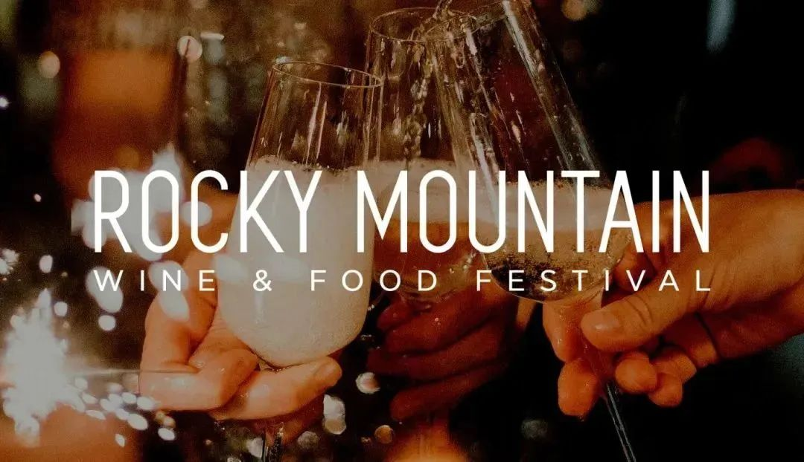 (原始链接: https://mmbiz.qpic.cn/mmbiz_jpg/7CNdqYbqvBLcrnicvsQibjctFUibyDg791NrtuKL6NqxY3X26vJlbibdLuXqebxso760Fd5ic4ZdzJibG50PB3CqhRDA/640?wx_fmt=jpeg)
-  (原始链接: https://mmbiz.qpic.cn/mmbiz_jpg/7CNdqYbqvBLcrnicvsQibjctFUibyDg791NQZoGicHI7uiaDXNJ3ibic2BhERSrMfpnicBIDfWVkf7gI9H7gZ0Cicibaic1Ug/640?wx_fmt=jpeg)
-  (原始链接: https://mmbiz.qpic.cn/mmbiz_jpg/7CNdqYbqvBLcrnicvsQibjctFUibyDg791NK2zKvlicZvzwTMJlnbs8T4WvGF20HjZU6JA4Kicdq3ictrYl2Gcm9gpJw/640?wx_fmt=jpeg)
-  (原始链接: https://mmbiz.qpic.cn/mmbiz_jpg/7CNdqYbqvBLcrnicvsQibjctFUibyDg791NrtuKL6NqxY3X26vJlbibdLuXqebxso760Fd5ic4ZdzJibG50PB3CqhRDA/640?wx_fmt=jpeg)
-  (原始链接: https://mmbiz.qpic.cn/mmbiz_png/7CNdqYbqvBLcrnicvsQibjctFUibyDg791N3OSSA7HFicsXKHV7YciaHibJib0VlyndvqnsF1KA3WNub6GzPbxbib7wQmQ/640?wx_fmt=png)
-  (原始链接: https://mmbiz.qpic.cn/mmbiz_png/7CNdqYbqvBLcrnicvsQibjctFUibyDg791NXazmYGmLrAUKP7jt9vo2KwUFUsOh0ZRYysNbUyiaNogT0EqiaGiaT7Yaw/640?wx_fmt=png)
- 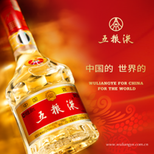 (原始链接: https://mmbiz.qpic.cn/mmbiz_png/7CNdqYbqvBLcrnicvsQibjctFUibyDg791NC83LpjmaVgooQmptvXqhBQWKib1OK2dXyc1SjF0pw3w0uaY2ZI6lzeg/640?wx_fmt=png)
- 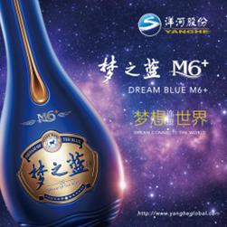 (原始链接: https://mmbiz.qpic.cn/mmbiz_png/7CNdqYbqvBLcrnicvsQibjctFUibyDg791NGgY9jQCDW9x29npWzfhR0iaTwBgS6icERWrrMFhnT360lu6TpB8OarOg/640?wx_fmt=png)
- 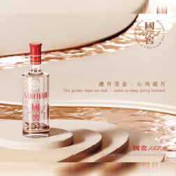 (原始链接: https://mmbiz.qpic.cn/mmbiz_png/7CNdqYbqvBLcrnicvsQibjctFUibyDg791N3QZOiaEIDW6yKic1DMT8qp5EezZJEGrgycJtvibBdQGs1QHm0HFlDlILg/640?wx_fmt=png)
- 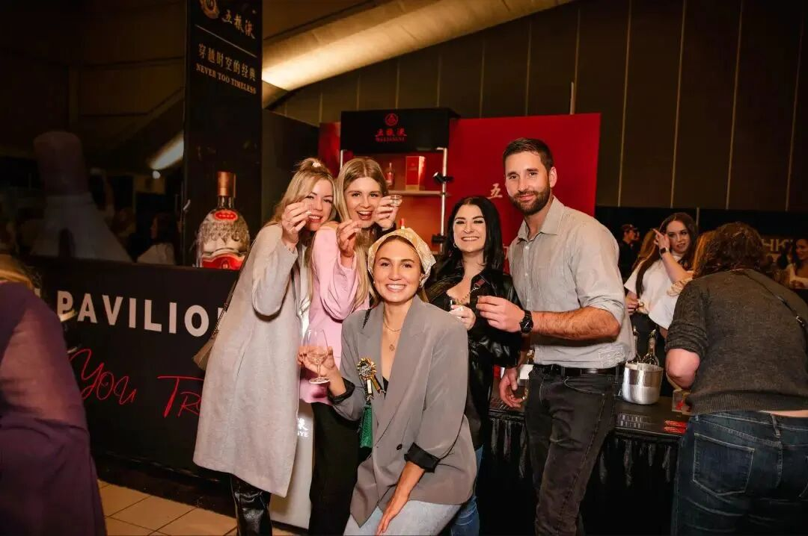 (原始链接: https://mmbiz.qpic.cn/mmbiz_jpg/7CNdqYbqvBLcrnicvsQibjctFUibyDg791N09wHnb3OBd8eP0SeWhziak57M1Iq77gf1kPo8Nnla7ibGiadLH6fhk80Q/640?wx_fmt=jpeg)
- 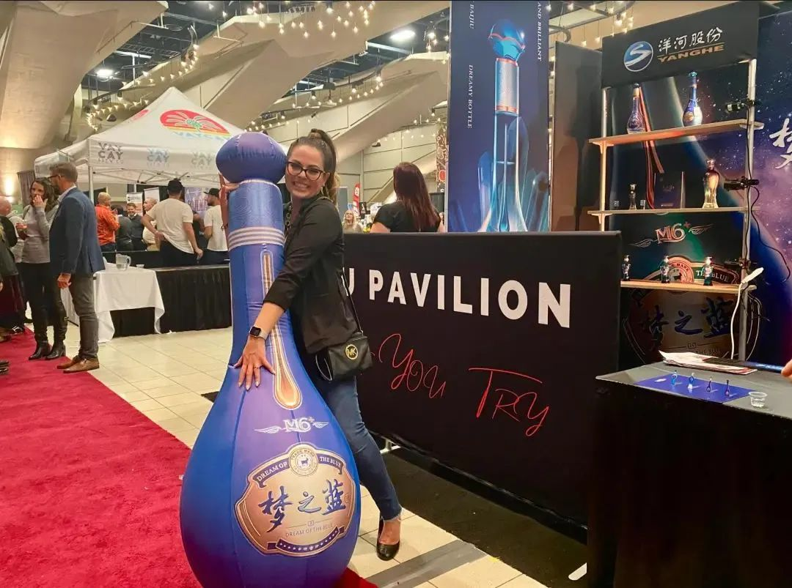 (原始链接: https://mmbiz.qpic.cn/mmbiz_jpg/7CNdqYbqvBLcrnicvsQibjctFUibyDg791N81VXptlFdicOeVTvy8B1ggQibNFqD7vffUoo5kL7PoarY0LibSYA6RXAw/640?wx_fmt=jpeg)
- 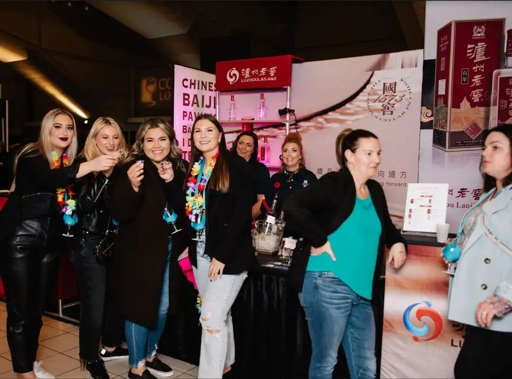 (原始链接: https://mmbiz.qpic.cn/mmbiz_jpg/7CNdqYbqvBLcrnicvsQibjctFUibyDg791NGezonKiclZvzIdOiaS4zIiaNrP1cLl4wVicGa5upu1fdMX4JbveJ0Zm7icw/640?wx_fmt=jpeg)
- 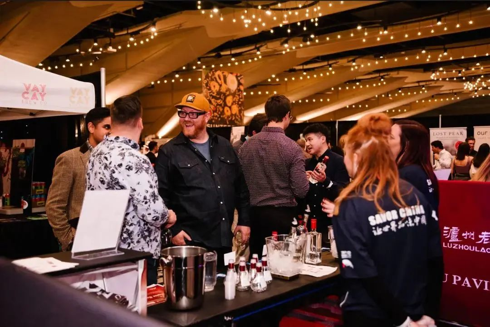 (原始链接: https://mmbiz.qpic.cn/mmbiz_jpg/7CNdqYbqvBLcrnicvsQibjctFUibyDg791NldHAYdTa8NDwZB23JBRW1GDFrKrCaaH1nSHoDdGvnnBUk5Y1tiaBicIg/640?wx_fmt=jpeg)
- 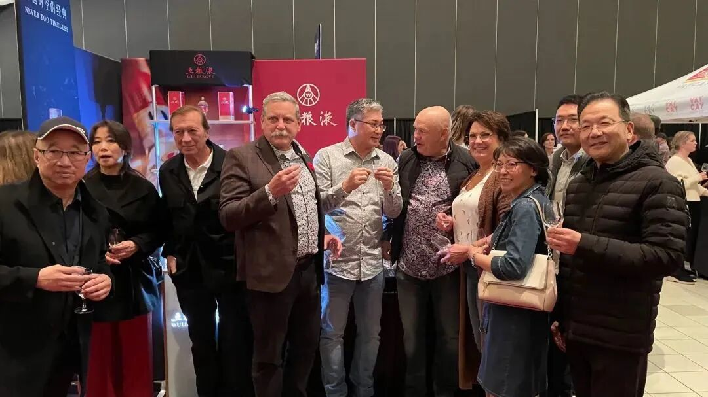 (原始链接: https://mmbiz.qpic.cn/mmbiz_jpg/7CNdqYbqvBLcrnicvsQibjctFUibyDg791Nuv7GGR5gnfr1aUuNPldKKr1FlXjxn1HESbPXnz4jo8QNBS6uyjNOnA/640?wx_fmt=jpeg)
- 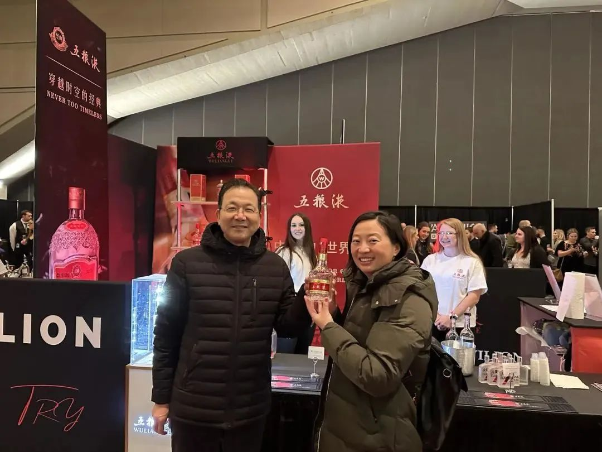 (原始链接: https://mmbiz.qpic.cn/mmbiz_jpg/7CNdqYbqvBLcrnicvsQibjctFUibyDg791NebibqqYqW3VeUIwP876FUobOkgkfNUibFG8vHwtsIicLH6LSEkmIuib4Hw/640?wx_fmt=jpeg)
- 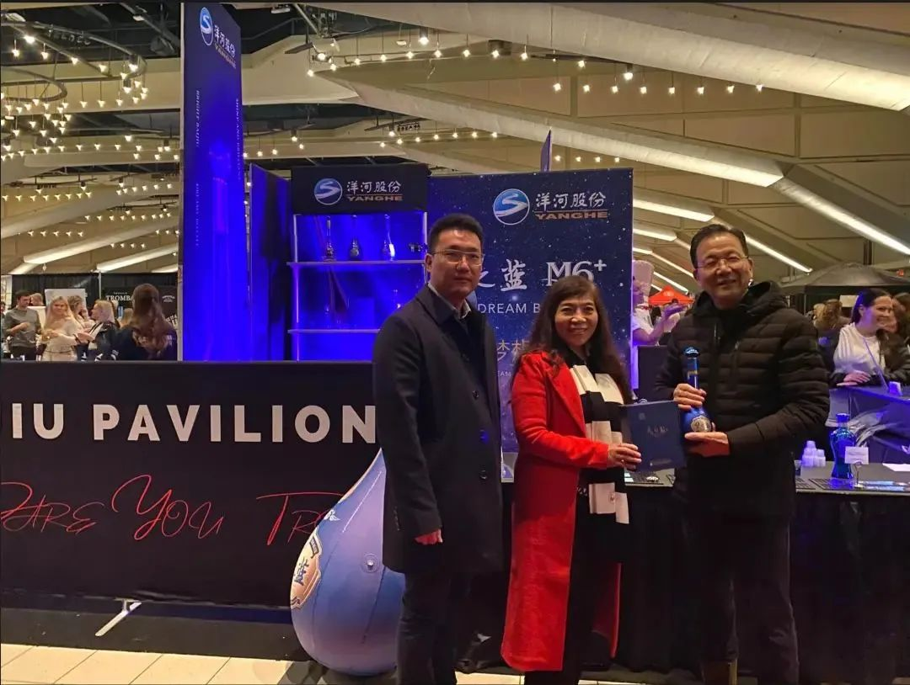 (原始链接: https://mmbiz.qpic.cn/mmbiz_jpg/7CNdqYbqvBLcrnicvsQibjctFUibyDg791NGmkAqbuVicnLyqPoGxia275YI9E04eZfY3xBVJicgib2cfxRUsqACyEFeQ/640?wx_fmt=jpeg)
-  (原始链接: https://mmbiz.qpic.cn/mmbiz_png/7CNdqYbqvBLcrnicvsQibjctFUibyDg791NXazmYGmLrAUKP7jt9vo2KwUFUsOh0ZRYysNbUyiaNogT0EqiaGiaT7Yaw/640?wx_fmt=png)
- 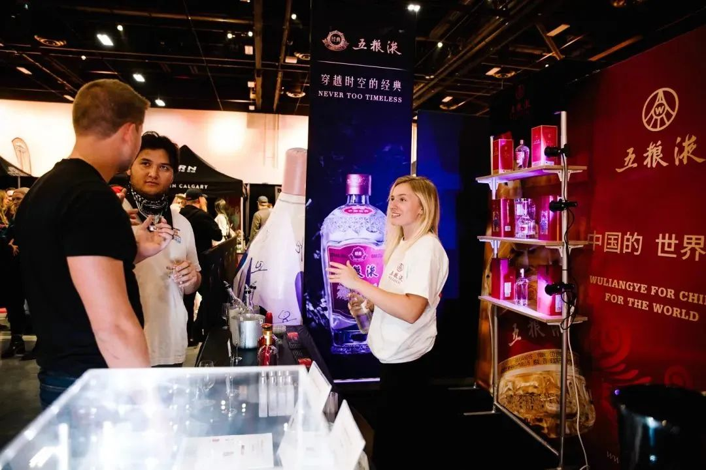 (原始链接: https://mmbiz.qpic.cn/mmbiz_jpg/7CNdqYbqvBLcrnicvsQibjctFUibyDg791Nibu4wAzicV6SrEESNicUnumD5yTiaTtDAvsGhElbibBicsviabp5JpaSAy1jA/640?wx_fmt=jpeg)
- 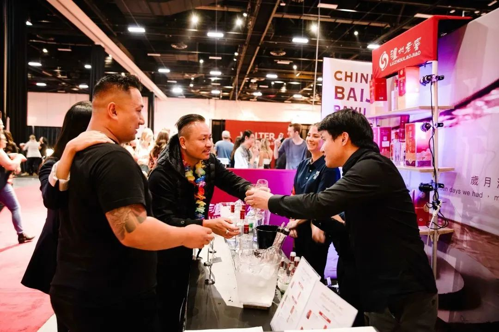 (原始链接: https://mmbiz.qpic.cn/mmbiz_jpg/7CNdqYbqvBLcrnicvsQibjctFUibyDg791N0sfaLm4OvicnewSY8K2cckIIYbj9p7ibIkzJDImzhop8Ie9uLdg1WLMw/640?wx_fmt=jpeg)
- 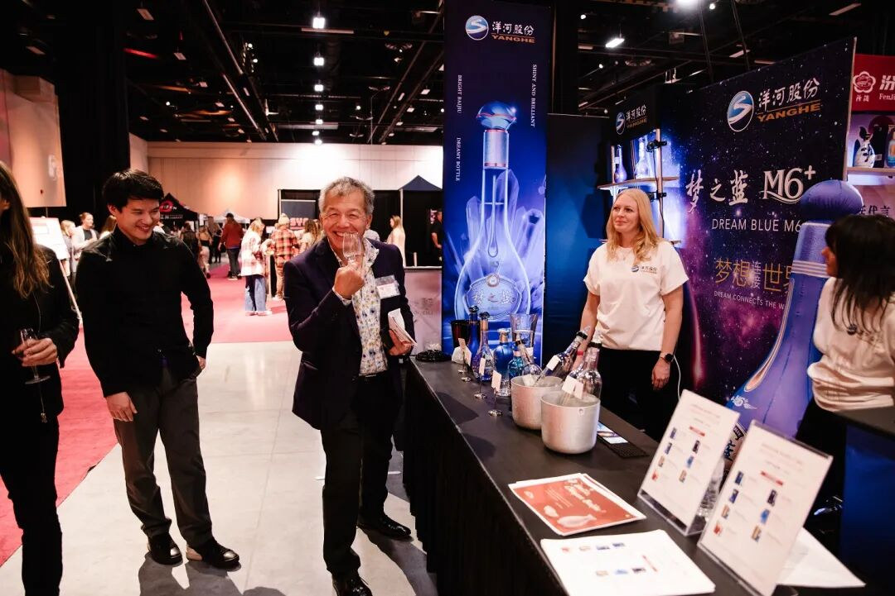 (原始链接: https://mmbiz.qpic.cn/mmbiz_jpg/7CNdqYbqvBLcrnicvsQibjctFUibyDg791N5sibQ4HCR6biajh1iab87mHANVFjXwZ6t0ibb5dWFY4IqwVbPzXdicv693Q/640?wx_fmt=jpeg)
- 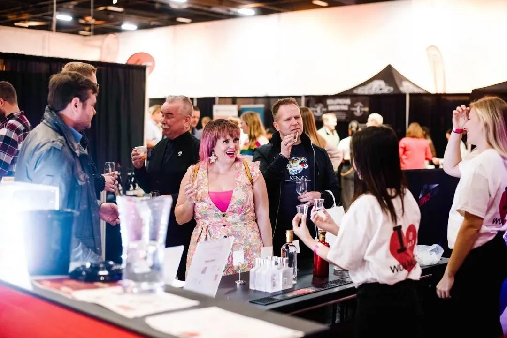 (原始链接: https://mmbiz.qpic.cn/mmbiz_jpg/7CNdqYbqvBLcrnicvsQibjctFUibyDg791NaFkibOkTrE8JsxjHXCNY9cGF67ic0Nl0IFmzYZnZfYmhDQXmADRDIXNQ/640?wx_fmt=jpeg)
-  (原始链接: https://mmbiz.qpic.cn/mmbiz_png/7CNdqYbqvBLcrnicvsQibjctFUibyDg791N0hS9jznicKgQQoibVt6Gfrtic8pZXtoY12kcZGFnDwn2Yib16yjpK6zBLg/640?wx_fmt=png)
- 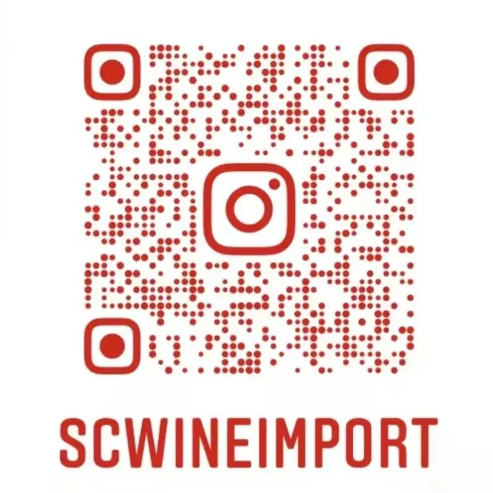 (原始链接: https://mmbiz.qpic.cn/mmbiz_jpg/7CNdqYbqvBLcrnicvsQibjctFUibyDg791NJu3iaVo1ZTOVHmtYQTyUeF7wZhOm3DqiaVQ467Kt0Sb34tQIWrSCw3ibg/640?wx_fmt=jpeg)
