# 无标题

**链接地址:** http://mp.weixin.qq.com/s?__biz=MzU5OTQ2NjAwNw==&mid=2247509114&idx=1&sn=70cff5e67e6e9d1c648a26d9ba93da13&chksm=feb66d02c9c1e4148ba02d5cc8332b0a755d84f9d2a1a23252fe251ecc321cd5aa9b7d1379b3&mpshare=1&scene=2&srcid=1126McEQd9QpQPIrnahf7k1v&sharer_sharetime=1669417150090&sharer_shareid=77848a6b3852ae4dcb6c74ffee84743c#rd
**作者:** 加拿大一站式体验
**获取时间:** 2025/8/28 19:24:10
**图片数量:** 38

---

## 原始HTML内容

<section style="box-sizing: border-box;font-size: 16px;"><section style="text-align: center;margin-top: 10px;margin-bottom: 10px;line-height: 0;box-sizing: border-box;" powered-by="xiumi.us"><section style="max-width: 100%;vertical-align: middle;display: inline-block;line-height: 0;box-sizing: border-box;"></section></section><section style="text-align: center;margin-top: 10px;margin-bottom: 10px;line-height: 0;box-sizing: border-box;" powered-by="xiumi.us"><section style="max-width: 100%;vertical-align: middle;display: inline-block;line-height: 0;width: 100%;height: auto;box-sizing: border-box;"></section></section><section style="margin-top: 10px;margin-bottom: 10px;box-sizing: border-box;" powered-by="xiumi.us"><section style="display: inline-block;width: 100%;border-width: 2px;border-style: dotted;border-color: rgba(160, 123, 249, 0);padding: 10px;background-color: rgba(116, 159, 238, 0.1);box-sizing: border-box;"><section style="margin: 10px 0%;text-align: left;justify-content: flex-start;display: flex;flex-flow: row nowrap;box-sizing: border-box;" powered-by="xiumi.us"><section style="display: inline-block;width: 100%;vertical-align: top;background-color: rgb(255, 216, 129);border-width: 0px;border-radius: 20px;border-style: none;border-color: rgb(62, 62, 62);overflow: hidden;align-self: flex-start;flex: 0 0 auto;box-sizing: border-box;"><section style="display: flex;flex-flow: row nowrap;text-align: justify;justify-content: flex-start;box-sizing: border-box;" powered-by="xiumi.us"><section style="display: inline-block;vertical-align: top;width: auto;flex: 10 10 0%;align-self: flex-start;height: auto;padding-top: 10px;padding-right: 4px;padding-bottom: 10px;box-sizing: border-box;"><section style="margin-right: 0%;margin-left: 0%;text-align: center;transform: translate3d(2px, 0px, 0px);box-sizing: border-box;" powered-by="xiumi.us"><section style="display: inline-block;border-width: 2px;border-style: solid;border-color: transparent;padding: 0.1em 0.3em;color: rgb(0, 0, 0);font-size: 12px;box-sizing: border-box;">
<strong style="box-sizing: border-box;">精品推荐</strong>

<strong style="box-sizing: border-box;"> </strong>

向上滑动查看

 
</section></section></section><section style="display: inline-block;vertical-align: top;width: 91.649%;background-color: rgba(188, 65, 65, 0.22);flex: 0 0 auto;align-self: stretch;height: auto;padding: 10px;border-width: 0px;border-radius: 16px;border-style: solid;border-color: rgb(62, 62, 62);overflow: hidden;box-sizing: border-box;"><section style="text-align: center;box-sizing: border-box;" powered-by="xiumi.us"><section style="display: inline-block;width: 100%;height: 230px;vertical-align: top;overflow-y: auto;border-width: 0px;border-radius: 6px;border-style: none;border-color: rgb(62, 62, 62);box-sizing: border-box;"><section style="overflow-x: hidden;box-sizing: border-box;"><section style="margin-right: 0%;margin-left: 0%;line-height: 0;box-sizing: border-box;" powered-by="xiumi.us"><section style="max-width: 100%;vertical-align: middle;display: inline-block;line-height: 0;width: 100%;height: auto;box-sizing: border-box;"></section></section><section style="line-height: 0;box-sizing: border-box;" powered-by="xiumi.us"><section style="max-width: 100%;vertical-align: middle;display: inline-block;line-height: 0;box-sizing: border-box;"></section></section><section style="margin-right: 0%;margin-left: 0%;line-height: 0;box-sizing: border-box;" powered-by="xiumi.us"><section style="max-width: 100%;vertical-align: middle;display: inline-block;line-height: 0;width: 100%;height: auto;box-sizing: border-box;"></section></section><section style="margin-right: 0%;margin-left: 0%;line-height: 0;box-sizing: border-box;" powered-by="xiumi.us"><section style="max-width: 100%;vertical-align: middle;display: inline-block;line-height: 0;width: 100%;height: auto;box-sizing: border-box;"></section></section><section style="line-height: 0;box-sizing: border-box;" powered-by="xiumi.us"><section style="max-width: 100%;vertical-align: middle;display: inline-block;line-height: 0;box-sizing: border-box;"></section></section></section></section></section></section></section></section></section><section style="text-align: right;justify-content: flex-end;display: flex;flex-flow: row nowrap;margin-bottom: 10px;box-sizing: border-box;" powered-by="xiumi.us"><section style="display: inline-block;vertical-align: bottom;width: auto;min-width: 5%;max-width: 100%;flex: 0 0 auto;height: auto;align-self: flex-end;box-sizing: border-box;"><section style="text-align: center;transform: translate3d(1px, 0px, 0px);line-height: 0;box-sizing: border-box;" powered-by="xiumi.us"><section style="max-width: 100%;vertical-align: middle;display: inline-block;line-height: 0;width: 100px;height: auto;box-sizing: border-box;"></section></section></section><section style="display: inline-block;vertical-align: bottom;width: auto;min-width: 10%;max-width: 100%;flex: 0 0 auto;height: auto;align-self: flex-end;margin-left: -20px;background-color: rgba(188, 65, 65, 0.22);padding: 7px 20px 7px 29px;box-sizing: border-box;"><section style="text-align: justify;color: rgb(0, 0, 0);letter-spacing: 2px;line-height: 2;font-size: 18px;box-sizing: border-box;" powered-by="xiumi.us">
<strong style="box-sizing: border-box;">赤水河左岸，庄园酱酒</strong>
</section><section style="font-size: 12px;color: rgb(106, 106, 106);box-sizing: border-box;" powered-by="xiumi.us">
本广告位由郎酒品牌倾情赞助
</section></section></section></section></section>
 
<section style="margin-top: 10px;margin-right: 0%;margin-left: 0%;text-align: left;justify-content: flex-start;display: flex;flex-flow: row nowrap;box-sizing: border-box;" powered-by="xiumi.us"><section style="display: inline-block;width: 100%;vertical-align: top;align-self: flex-start;flex: 0 0 auto;box-sizing: border-box;"><section style="display: flex;flex-flow: row nowrap;margin: 10px 0%;text-align: justify;justify-content: flex-start;box-sizing: border-box;" powered-by="xiumi.us"><section style="display: inline-block;vertical-align: middle;width: auto;min-width: 10%;max-width: 100%;flex: 0 0 auto;height: auto;align-self: center;box-sizing: border-box;"><section style="margin-top: 10px;margin-bottom: 10px;text-align: center;box-sizing: border-box;" powered-by="xiumi.us"><section style="background-color: rgb(68, 68, 68);display: inline-block;width: 2.5em;height: 2.5em;line-height: 2.5em;border-radius: 100%;margin-left: auto;margin-right: auto;font-size: 18px;color: rgb(255, 255, 255);font-family: Optima-Regular, PingFangTC-light;box-sizing: border-box;">
<strong style="box-sizing: border-box;">01</strong>
</section></section></section><section style="display: inline-block;vertical-align: middle;width: auto;align-self: center;flex: 0 0 auto;min-width: 10%;max-width: 100%;height: auto;box-sizing: border-box;"><section style="transform: translate3d(10px, 0px, 0px);-webkit-transform: translate3d(10px, 0px, 0px);-moz-transform: translate3d(10px, 0px, 0px);-o-transform: translate3d(10px, 0px, 0px);box-sizing: border-box;" powered-by="xiumi.us"><section style="font-family: Optima-Regular, PingFangTC-light;box-sizing: border-box;">
<strong style="box-sizing: border-box;">中国雅思考试大规模取消</strong>
</section></section><section style="margin-top: 3px;margin-right: 0%;margin-left: 0%;transform: translate3d(-10px, 0px, 0px);box-sizing: border-box;" powered-by="xiumi.us"><section style="background-color: rgb(68, 68, 68);height: 1px;box-sizing: border-box;"><svg viewBox="0 0 1 1" style="float:left;line-height:0;width:0;vertical-align:top;"></svg></section></section></section></section></section></section><section style="font-size: 14px;padding-right: 15px;padding-left: 15px;letter-spacing: 1px;box-sizing: border-box;" powered-by="xiumi.us">
疫情反复，不少人往返海内外学习、工作以及探亲的计划都被耽误。

 

最近，又有人因<strong style="box-sizing: border-box;">为雅思考试取消伤透了心</strong>。甚至有人走到了考场，被考官拒考了。

 
</section><section style="text-align: center;box-sizing: border-box;" powered-by="xiumi.us"><section style="max-width: 100%;vertical-align: middle;display: inline-block;line-height: 0;width: 90%;height: auto;box-sizing: border-box;"></section></section><section style="font-size: 14px;padding-right: 15px;padding-left: 15px;letter-spacing: 1px;box-sizing: border-box;" powered-by="xiumi.us">
 

11月25日，中国大陆多个雅思考点发出通知，<strong style="box-sizing: border-box;">取消雅思考试</strong>。取消考试的地区范围非常大，包括北京、上海、山东、陕西、吉林、广东、沈阳、郑州、黑龙江、河北、成都、武汉、内蒙古等地。各地雅思考试地点基本都设在大学里面，经查询，11月至12月，<strong style="box-sizing: border-box;">全国大多数大学基本都有取消雅思考试的通知</strong>。

 

不过大家可以清晰看到，取消考试的地区都是有疫情出现的地方。因为考点多在校园里。所以<strong style="box-sizing: border-box;">对于疫情的防控只会更严</strong>。
</section><section style="text-align: center;box-sizing: border-box;" powered-by="xiumi.us"><section style="max-width: 100%;vertical-align: middle;display: inline-block;line-height: 0;width: 90%;height: auto;box-sizing: border-box;"></section></section><section style="font-size: 14px;padding-right: 15px;padding-left: 15px;letter-spacing: 1px;box-sizing: border-box;" powered-by="xiumi.us">
 

人民大学考点发出通告，从11月25-30日雅思考试全部取消。

 

北京理工大学考点宣布，11月27日的考试也取消了。

 
</section><section style="text-align: center;box-sizing: border-box;" powered-by="xiumi.us"><section style="max-width: 100%;vertical-align: middle;display: inline-block;line-height: 0;width: 90%;height: auto;box-sizing: border-box;"></section></section>
 
<section style="font-size: 14px;padding-right: 15px;padding-left: 15px;letter-spacing: 1px;box-sizing: border-box;" powered-by="xiumi.us">
 

山东大学宣布的纸笔考点11月26日场也已取消。

 

山东青岛大学，11月27日的雅思机考也已取消考试。

 

上海 BritishCouncil （南丰城）雅思机考考点11月28-12月31日场次都已取消。

 
</section><section style="text-align: center;box-sizing: border-box;" powered-by="xiumi.us"><section style="max-width: 100%;vertical-align: middle;display: inline-block;line-height: 0;width: 90%;height: auto;box-sizing: border-box;"></section></section><section style="font-size: 14px;padding-right: 15px;padding-left: 15px;letter-spacing: 1px;box-sizing: border-box;" powered-by="xiumi.us">
 

吉林大学12月3日、12月10日雅思考试也已取消。

 

除了以上几个考场外，以下这些考点也取消了考试： 

 
<ul class="list-paddingleft-1"><li style="box-sizing: border-box;">
对外经济贸易大学雅思机考考点取消11/02、11/05、11/09、11/13考试。 
</li><li style="box-sizing: border-box;">
西北工业大学纸笔考点取消 11/26场次考试。 
</li><li style="box-sizing: border-box;">
沈阳师范大学取消12/30雅思机考场次。 
</li><li style="box-sizing: border-box;">
福建师范大学雅思纸笔考点取消11/26、12/3场次考试。 
</li><li style="box-sizing: border-box;">
山东大学海外考试中心暂时取消12/2之前的所有海外考试。 
</li><li style="box-sizing: border-box;">
中国海洋大学浮山校区雅思纸笔考点取消 11/26、12/10场次考试。 
</li><li style="box-sizing: border-box;">
西北师范大学雅思纸笔考点取消12/3场次考试。 
</li><li style="box-sizing: border-box;">
郑州轻工业大学雅思纸笔考点取消12/17场次考试。 
</li><li style="box-sizing: border-box;">
齐鲁工业大学雅思纸笔考点取消11/26场次考试。 
</li><li style="box-sizing: border-box;">
郑州航空工业管理学院雅思纸笔考点取消12/03场次考试。 
</li><li style="box-sizing: border-box;">
黑龙江大学雅思纸笔考点取消11/26场次考试。 
</li><li style="box-sizing: border-box;">
陕西师范大学取消11/24雅思机考。 
</li><li style="box-sizing: border-box;">
河北工业职业技术大学雅思纸笔考点取消11/26场次考试。 
</li><li style="box-sizing: border-box;">
郑州航院雅思考点取消11月份所有形式的雅思考试。 
</li><li style="box-sizing: border-box;">
电子科技大学（成都）取消11/26纸笔考试。 
</li><li style="box-sizing: border-box;">
西安交通大学纸笔考点取消12/03考试 。 
</li><li style="box-sizing: border-box;">
中国地质大学（武汉）雅思纸笔考点取消11/26、12/3场次的相关雅思考试。 
</li><li style="box-sizing: border-box;">
广东外语外贸大学雅思纸笔考点取消12/17场次的考试。 
</li><li style="box-sizing: border-box;">
仲恺农业工程学院雅思机考考点取消12/03场次的考试。 
</li><li style="box-sizing: border-box;">
内蒙古农业大学雅思机考考点取消12/13场次的考试。 
</li><li style="box-sizing: border-box;">
陕西师范大学雅思考点11/28的雅思机考考试、雅思纸笔考试。&nbsp; 
</li></ul>
 

考点取消可谓<strong style="box-sizing: border-box;">遍地开花，防不胜防</strong>。
</section>
 
<section style="text-align: center;margin-top: 10px;margin-bottom: 10px;line-height: 0;box-sizing: border-box;" powered-by="xiumi.us"><section style="max-width: 100%;vertical-align: middle;display: inline-block;line-height: 0;box-sizing: border-box;"></section></section><section style="text-align: center;margin-top: 10px;margin-bottom: 10px;line-height: 0;box-sizing: border-box;" powered-by="xiumi.us"><section style="max-width: 100%;vertical-align: middle;display: inline-block;line-height: 0;box-sizing: border-box;"></section></section><section style="font-size: 14px;padding-right: 15px;padding-left: 15px;letter-spacing: 1px;box-sizing: border-box;" powered-by="xiumi.us">
 

再加上接近年末，各种考试也是接踵而至。这样一来，<strong style="box-sizing: border-box;">留给雅思考场的时间就会更少</strong>。

 

不少考生不得不到其他城市安排考试，也可能出现反而被困在其他城市的情况，建议准备留学，着急出成绩的同学，<strong style="box-sizing: border-box;">提前查好当地疫情防疫要求，避免影响考试</strong>。

 
</section><section style="margin-top: 10px;margin-right: 0%;margin-left: 0%;text-align: left;justify-content: flex-start;display: flex;flex-flow: row nowrap;box-sizing: border-box;" powered-by="xiumi.us"><section style="display: inline-block;width: 100%;vertical-align: top;align-self: flex-start;flex: 0 0 auto;box-sizing: border-box;"><section style="display: flex;flex-flow: row nowrap;margin: 10px 0%;text-align: justify;justify-content: flex-start;box-sizing: border-box;" powered-by="xiumi.us"><section style="display: inline-block;vertical-align: middle;width: auto;min-width: 10%;max-width: 100%;flex: 0 0 auto;height: auto;align-self: center;box-sizing: border-box;"><section style="margin-top: 10px;margin-bottom: 10px;text-align: center;box-sizing: border-box;" powered-by="xiumi.us"><section style="background-color: rgb(68, 68, 68);display: inline-block;width: 2.5em;height: 2.5em;line-height: 2.5em;border-radius: 100%;margin-left: auto;margin-right: auto;font-size: 18px;color: rgb(255, 255, 255);font-family: Optima-Regular, PingFangTC-light;box-sizing: border-box;">
<strong style="box-sizing: border-box;">02</strong>
</section></section></section><section style="display: inline-block;vertical-align: middle;width: auto;align-self: center;flex: 0 0 auto;min-width: 10%;max-width: 100%;height: auto;box-sizing: border-box;"><section style="transform: translate3d(10px, 0px, 0px);-webkit-transform: translate3d(10px, 0px, 0px);-moz-transform: translate3d(10px, 0px, 0px);-o-transform: translate3d(10px, 0px, 0px);box-sizing: border-box;" powered-by="xiumi.us"><section style="font-family: Optima-Regular, PingFangTC-light;box-sizing: border-box;">
<strong style="box-sizing: border-box;">加拿大居民旅行热情高涨！</strong>
</section></section><section style="margin-top: 3px;margin-right: 0%;margin-left: 0%;transform: translate3d(-10px, 0px, 0px);box-sizing: border-box;" powered-by="xiumi.us"><section style="background-color: rgb(68, 68, 68);height: 1px;box-sizing: border-box;"><svg viewBox="0 0 1 1" style="float:left;line-height:0;width:0;vertical-align:top;"></svg></section></section></section></section></section></section><section style="font-size: 14px;padding-right: 15px;padding-left: 15px;letter-spacing: 1px;box-sizing: border-box;" powered-by="xiumi.us">
 

加拿大居民在第二季度在加拿大境内或国外进行了 7060 万次旅行，比 2021 年第二季度增加了 3180 万次，<strong style="box-sizing: border-box;">是 COVID-19 之前 2019 年同期的十分之九（91.8%）</strong>。

 

从 2022 年 4 月到 6 月，大部分 (92.0%) 的旅行是国内旅行，5.7% 的目的地是美国，2.4% 是海外。这标志着<strong style="box-sizing: border-box;">加拿大人的国际旅行明显增加</strong>，因为<strong style="box-sizing: border-box;"> 2021 年同一季度 99.1% 的旅行是国内旅行</strong>。 

 
</section><section style="text-align: center;margin-top: 10px;margin-bottom: 10px;line-height: 0;box-sizing: border-box;" powered-by="xiumi.us"><section style="max-width: 100%;vertical-align: middle;display: inline-block;line-height: 0;width: 90%;height: auto;box-sizing: border-box;"></section></section><section style="text-align: center;margin-top: 10px;margin-bottom: 10px;line-height: 0;box-sizing: border-box;" powered-by="xiumi.us"><section style="max-width: 100%;vertical-align: middle;display: inline-block;line-height: 0;width: 90%;height: auto;box-sizing: border-box;"></section></section><section style="font-size: 14px;padding-right: 15px;padding-left: 15px;letter-spacing: 1px;box-sizing: border-box;" powered-by="xiumi.us">
 

第二季度，加拿大人在国内旅行（172 亿加元）上的花费是国际旅行（82 亿加元）的两倍多。国内旅游支出<strong style="box-sizing: border-box;">是 2021 年第二季度的三倍多</strong>，比 2019 年同期的支出高出 25.8%。

 
</section><section style="margin: 20px 0% 10px;text-align: center;box-sizing: border-box;" powered-by="xiumi.us"><section style="padding: 3px;display: inline-block;border-bottom: 5px solid rgb(147, 122, 122);color: rgb(147, 122, 122);box-sizing: border-box;">
<strong style="box-sizing: border-box;">边境限制消退</strong>
</section></section><section style="font-size: 14px;padding-right: 15px;padding-left: 15px;letter-spacing: 1px;box-sizing: border-box;" powered-by="xiumi.us">
 

在第二季度，随着边境限制的放宽，加拿大人的旅行变得越来越容易。4 月初，已完全接种疫苗的加拿大人在乘飞机、陆路或水路返回加拿大时不再需要提供阴性的 COVID-19 测试，也不需要在月底之前提供隔离计划。

 
</section><section style="text-align: center;margin-top: 10px;margin-bottom: 10px;line-height: 0;box-sizing: border-box;" powered-by="xiumi.us"><section style="max-width: 100%;vertical-align: middle;display: inline-block;line-height: 0;width: 90%;height: auto;box-sizing: border-box;"></section></section><section style="font-size: 14px;padding-right: 15px;padding-left: 15px;letter-spacing: 1px;box-sizing: border-box;" powered-by="xiumi.us">
 

随着六月的临近，<strong style="box-sizing: border-box;">加拿大机场的拥堵给寻求国内外旅行的乘客带来了挑战</strong>。加拿大所有机场的 COVID-19 随机测试于 2022 年 6 月 11 日暂停，针对完全接种疫苗的旅客，使机场能够在繁忙的夏季旅行季节开始时简化运营。

 

到第二季度末，<strong style="box-sizing: border-box;">加拿大的旅游活动正在进一步复苏</strong>，许多旅行限制被取消，例如要求提供疫苗接种证明才能乘坐飞机或火车在国内旅行，或登上国际航班。

 
</section><section style="margin: 20px 0% 10px;text-align: center;box-sizing: border-box;" powered-by="xiumi.us"><section style="padding: 3px;display: inline-block;border-bottom: 5px solid rgb(147, 122, 122);color: rgb(147, 122, 122);box-sizing: border-box;">
<strong style="box-sizing: border-box;">国内旅游飙升</strong>
</section></section><section style="font-size: 14px;padding-right: 15px;padding-left: 15px;letter-spacing: 1px;box-sizing: border-box;" powered-by="xiumi.us">
 

第二季度，加拿大居民进行了 6490 万次国内旅行，<strong style="box-sizing: border-box;">比 2021 年增加了三分之二以上</strong>（69.0%），达到 2019 年同期水平的 96.9%。国内过夜旅行的数量增加了一倍多，达到从 2021 年起 2310 万，比 2019 年大流行前的水平高 4.9%。在第二季度，当日旅行也恢复到 4180 万人次，尽管速度低于过夜旅行。

 
</section><section style="text-align: center;margin-top: 10px;margin-bottom: 10px;line-height: 0;box-sizing: border-box;" powered-by="xiumi.us"><section style="max-width: 100%;vertical-align: middle;display: inline-block;line-height: 0;width: 90%;height: auto;box-sizing: border-box;"></section></section><section style="font-size: 14px;padding-right: 15px;padding-left: 15px;letter-spacing: 1px;box-sizing: border-box;" powered-by="xiumi.us">
 

加拿大人第二季度的国内旅行支出为 172 亿加元，是 2021 年第二季度的三倍多，比 2019 年的 137 亿加元高出 25.8%。平均每次旅行的支出为 265 美元（当日旅行为 126 加元，过夜旅行 517加元），而 2019 年为 204 加元<strong style="box-sizing: border-box;">。这一变化在一定程度上反映了价格上涨</strong>。

 
</section><section style="text-align: center;margin-top: 10px;margin-bottom: 10px;line-height: 0;box-sizing: border-box;" powered-by="xiumi.us"><section style="max-width: 100%;vertical-align: middle;display: inline-block;line-height: 0;width: 90%;height: auto;box-sizing: border-box;"></section></section><section style="font-size: 14px;padding-right: 15px;padding-left: 15px;letter-spacing: 1px;box-sizing: border-box;" powered-by="xiumi.us">
 

例如，6 月份的消费者价格指数表明，旅行者住宿、<strong style="box-sizing: border-box;">航空运输和汽油的成本急剧上升</strong>。第二季度最大的支出类别是汽车运营（37 亿加元），紧随其后的是住宿（36 亿加元），然后是餐厅和酒吧（29 亿加元）。

 

第二季度，加拿大人<strong style="box-sizing: border-box;">在商业交通上的支出为 17 亿加元</strong>，低于 2019 年同一季度的 18 亿加元。但是，娱乐（7.94 亿加元）和娱乐（5.756 亿加元）的支出均高于大流行前的水平。2019 年（分别为 6.132 亿美元和 5.53 亿加元）。

 
</section><section style="text-align: center;margin-top: 10px;margin-bottom: 10px;line-height: 0;box-sizing: border-box;" powered-by="xiumi.us"><section style="max-width: 100%;vertical-align: middle;display: inline-block;line-height: 0;box-sizing: border-box;"></section></section><section style="text-align: center;margin-top: 10px;margin-bottom: 10px;line-height: 0;box-sizing: border-box;" powered-by="xiumi.us"><section style="max-width: 100%;vertical-align: middle;display: inline-block;line-height: 0;box-sizing: border-box;"></section></section><section style="font-size: 14px;padding-right: 15px;padding-left: 15px;letter-spacing: 1px;box-sizing: border-box;" powered-by="xiumi.us">
 

第二季度的旅行活动<strong style="box-sizing: border-box;">反映了限制的放松</strong>，允许更多的活动参加。尽管与 2021 年第二季度相比，此类活动的参与度有所增加，但<strong style="box-sizing: border-box;">仍低于 2019 年的水平</strong>。例如，与 2019 年观察到的水平相比，参加节日或集市 (-43.0%) 和看电影 (-25.6%) 仍然较低。

 
</section><section style="text-align: center;margin-top: 10px;margin-bottom: 10px;line-height: 0;box-sizing: border-box;" powered-by="xiumi.us"><section style="max-width: 100%;vertical-align: middle;display: inline-block;line-height: 0;width: 90%;height: auto;box-sizing: border-box;"></section></section><section style="font-size: 14px;padding-right: 15px;padding-left: 15px;letter-spacing: 1px;box-sizing: border-box;" powered-by="xiumi.us">
 

与整个大流行期间的情况一样，<strong style="box-sizing: border-box;">个人或小组户外活动在第二季度仍然很受欢迎</strong>。例如，加拿大人报告露营 (+49.0%) 和徒步旅行或背包旅行 (+42.1%) 的比率远高于 2019 年同一季度的比率。

 
</section><section style="margin: 20px 0% 10px;text-align: center;box-sizing: border-box;" powered-by="xiumi.us"><section style="padding: 3px;display: inline-block;border-bottom: 5px solid rgb(147, 122, 122);color: rgb(147, 122, 122);box-sizing: border-box;">
<strong style="box-sizing: border-box;">赴美旅游增长</strong>
</section></section><section style="font-size: 14px;padding-right: 15px;padding-left: 15px;letter-spacing: 1px;box-sizing: border-box;" powered-by="xiumi.us">
 

随着边境旅行限制的放松，加拿大居民在第二季度<strong style="box-sizing: border-box;">前往美国进行了近 400 万次旅行</strong>。虽然这一数字与 2021 年同期相比大幅上升，但在 2019 年同期的 730 万次旅行中占了一半以上（54.7%）。
</section><section style="font-size: 14px;padding-right: 15px;padding-left: 15px;letter-spacing: 1px;box-sizing: border-box;" powered-by="xiumi.us">
 

第二季度加拿大人每次前往美国的平均花费为 1,162 加元，而 2021 年同期为 923 加元。随着旅行次数的增加，加拿大居民访问美国的总支出为 46 亿加元，<strong style="box-sizing: border-box;">明显高于2021 年花费了 2.245 亿加元</strong>。

 
</section><section style="margin-top: 10px;margin-right: 0%;margin-left: 0%;text-align: left;justify-content: flex-start;display: flex;flex-flow: row nowrap;box-sizing: border-box;" powered-by="xiumi.us"><section style="display: inline-block;width: 100%;vertical-align: top;align-self: flex-start;flex: 0 0 auto;box-sizing: border-box;"><section style="display: flex;flex-flow: row nowrap;margin: 10px 0%;text-align: justify;justify-content: flex-start;box-sizing: border-box;" powered-by="xiumi.us"><section style="display: inline-block;vertical-align: middle;width: auto;min-width: 10%;max-width: 100%;flex: 0 0 auto;height: auto;align-self: center;box-sizing: border-box;"><section style="margin-top: 10px;margin-bottom: 10px;text-align: center;box-sizing: border-box;" powered-by="xiumi.us"><section style="background-color: rgb(68, 68, 68);display: inline-block;width: 2.5em;height: 2.5em;line-height: 2.5em;border-radius: 100%;margin-left: auto;margin-right: auto;font-size: 18px;color: rgb(255, 255, 255);font-family: Optima-Regular, PingFangTC-light;box-sizing: border-box;">
<strong style="box-sizing: border-box;">03</strong>
</section></section></section><section style="display: inline-block;vertical-align: middle;width: auto;align-self: center;flex: 0 0 auto;min-width: 10%;max-width: 100%;height: auto;box-sizing: border-box;"><section style="transform: translate3d(10px, 0px, 0px);-webkit-transform: translate3d(10px, 0px, 0px);-moz-transform: translate3d(10px, 0px, 0px);-o-transform: translate3d(10px, 0px, 0px);box-sizing: border-box;" powered-by="xiumi.us"><section style="font-family: Optima-Regular, PingFangTC-light;box-sizing: border-box;">
<strong style="box-sizing: border-box;">加拿大出重拳打击炒房客</strong>
</section></section><section style="margin-top: 3px;margin-right: 0%;margin-left: 0%;transform: translate3d(-10px, 0px, 0px);box-sizing: border-box;" powered-by="xiumi.us"><section style="background-color: rgb(68, 68, 68);height: 1px;box-sizing: border-box;"><svg viewBox="0 0 1 1" style="float:left;line-height:0;width:0;vertical-align:top;"></svg></section></section></section></section></section></section><section style="font-size: 14px;padding-right: 15px;padding-left: 15px;letter-spacing: 1px;box-sizing: border-box;" powered-by="xiumi.us">
加拿大新的<strong style="box-sizing: border-box;">打房政策将于2023年1月1日生效</strong>，旨在"减少市场上的投机性需求，帮助冷却过度的价格增长"。

 

新税法规定，如果<strong style="box-sizing: border-box;">房主拥有房屋的时间少于12个月</strong>，不允许使用主要住宅豁免权来规避出售房屋时实现的资本收益，但其中有某些例外情况，如死亡、残疾、离职和工作搬迁。如果在12个月内出售，<strong style="box-sizing: border-box;">房价获利部分将作为商业收入100%纳税</strong>。

 
</section><section style="text-align: center;margin-top: 10px;margin-bottom: 10px;line-height: 0;box-sizing: border-box;" powered-by="xiumi.us"><section style="max-width: 100%;vertical-align: middle;display: inline-block;line-height: 0;width: 90%;height: auto;box-sizing: border-box;"></section></section><section style="font-size: 14px;padding-right: 15px;padding-left: 15px;letter-spacing: 1px;box-sizing: border-box;" powered-by="xiumi.us">
 

但是，加拿大税务局（CRA）并没有在等待这项新的立法生效。他们正在通过法院系统，<strong style="box-sizing: border-box;">挑战被认为的房地产"炒房"</strong>。其中有成功追讨的，也有挑战失败的案例。

 

最近的一个例子是一个多伦多的房主，她到税务法院挑战CRA对其的卖房获利追讨。

 
</section><section style="text-align: center;margin-top: 10px;margin-bottom: 10px;line-height: 0;box-sizing: border-box;" powered-by="xiumi.us"><section style="max-width: 100%;vertical-align: middle;display: inline-block;line-height: 0;width: 90%;height: auto;box-sizing: border-box;"></section></section><section style="font-size: 14px;padding-right: 15px;padding-left: 15px;letter-spacing: 1px;box-sizing: border-box;" powered-by="xiumi.us">
 

该纳税人在2011年、2015年和2016年的年度纳税被CRA进行重新评估，她在上述3年时间内，<strong style="box-sizing: border-box;">在不同时期分别出售了四处房产</strong>。但最有争议的是2011年她在多伦多的房产出售，因为<strong style="box-sizing: border-box;">CRA对纳税人的评估超过了正常的三年期限</strong>，并对该年进行了严重的处罚。

 

在法庭上，该纳税人解释说，从2010年到2014年，她与前夫经历了"动荡的关系"。她说这导致了断断续续的同居关系，并最终在2015年分居并离婚。纳税人作证说，在2010年和2011年期间，她经常在被追讨的出售房产里，"作为躲避与她前夫激烈和虐待关系的避难所"。她认为这所房子是她的主要住所，所以当她在2011年卖掉它时，应该免征资本利得税。

 
</section><section style="text-align: center;margin-top: 10px;margin-bottom: 10px;line-height: 0;box-sizing: border-box;" powered-by="xiumi.us"><section style="max-width: 100%;vertical-align: middle;display: inline-block;line-height: 0;width: 90%;height: auto;box-sizing: border-box;"></section></section><section style="font-size: 14px;padding-right: 15px;padding-left: 15px;letter-spacing: 1px;box-sizing: border-box;" powered-by="xiumi.us">
 

CRA不同意，认为该房产是作为<strong style="box-sizing: border-box;">"贸易性质的冒险（adventure in the nature of trade）"</strong>而获得和处置的，因此其出售应被列为100%的应税商业收入。

 

CRA认为，纳税人从未将她的主要地址、雇主T4地址或其他邮寄地址改为该房产，因此该局的立场是，她在相对较短的时间内将<strong style="box-sizing: border-box;">该房产完全重建后"炒房"</strong>，获得了巨额利润。

 

税务法院最终的任务是对2011年处置该房屋的四个基本问题进行裁决。

 
</section><section style="text-align: center;margin-top: 10px;margin-bottom: 10px;line-height: 0;box-sizing: border-box;" powered-by="xiumi.us"><section style="max-width: 100%;vertical-align: middle;display: inline-block;line-height: 0;width: 90%;height: auto;box-sizing: border-box;"></section></section><section style="font-size: 14px;padding-right: 15px;padding-left: 15px;letter-spacing: 1px;box-sizing: border-box;" powered-by="xiumi.us">
 

该销售应被正确地归类为<strong style="box-sizing: border-box;">“贸易性质的冒险”</strong>，因此应作为商业收入征税，还是作为资本财产征税，从而使其获得资本收益？如果是资本财产，它是否是纳税人的主要住所，从而使收益免税？纳税人在2011年的报税表上是否作出虚假陈述（即没有报告该房产的出售），甚至是否允许CRA重开2011年的纳税年度，并超过正常的三年重新评估期？最后，纳税人在提交2011年的报税表时是否有严重的疏忽，从而要受到严重疏忽的处罚？

 

在分析了本案的事实和情况后，法官认为纳税人<strong style="box-sizing: border-box;">"几乎不符合通常的不动产'炒房客'的事实模式"</strong>。她是一名教师，而不是一名房地产经纪人，而且她有其他情况可以解释"所有权期限的糟糕经历"，即她的虐待性、时好时坏的婚姻，她当时正试图躲避前夫，而且从法律上分开。

 
</section><section style="text-align: center;margin-top: 10px;margin-bottom: 10px;line-height: 0;box-sizing: border-box;" powered-by="xiumi.us"><section style="max-width: 100%;vertical-align: middle;display: inline-block;line-height: 0;width: 90%;height: auto;box-sizing: border-box;"></section></section><section style="font-size: 14px;padding-right: 15px;padding-left: 15px;letter-spacing: 1px;box-sizing: border-box;" powered-by="xiumi.us">
 

最终，法官评估了该房产的性质、所持有的时间、纳税人到那时为止在房地产方面的有限使用、所花费的工作、动机，以及最重要的、决定该房产出售的情况作出结论：<strong style="box-sizing: border-box;">该房产是作为资本财产而获得的，而不是为了炒房转卖</strong>。

 

一旦法官确定该房屋是资本财产，下一个问题是它是否可以被视为她当时的主要住所，从而在出售时免于纳税。法官注意到该房产<strong style="box-sizing: border-box;">从未被长期居住</strong>，而且"除了强制性的水电费之外，没有作为可识别的地址、永久居住的证据或其他家庭开支"。

 

法官的结论是："虽然她（房主）可能认为（该房产）是她的永久住所，但如果没有一些额外的证据，她现在的<strong style="box-sizing: border-box;">证据不能释疑（CRA）的假设</strong>。"

 
</section><section style="text-align: center;margin-top: 10px;margin-bottom: 10px;line-height: 0;box-sizing: border-box;" powered-by="xiumi.us"><section style="max-width: 100%;vertical-align: middle;display: inline-block;line-height: 0;box-sizing: border-box;"></section></section><section style="text-align: center;margin-top: 10px;margin-bottom: 10px;line-height: 0;box-sizing: border-box;" powered-by="xiumi.us"><section style="max-width: 100%;vertical-align: middle;display: inline-block;line-height: 0;box-sizing: border-box;"></section></section><section style="font-size: 14px;padding-right: 15px;padding-left: 15px;letter-spacing: 1px;box-sizing: border-box;" powered-by="xiumi.us">
 

然后法官转向了一个问题——她在2011年的申报中是否存在虚假陈述，因为由于"疏忽、大意或故意失职"<strong style="box-sizing: border-box;">没有报告房屋出售</strong>。法官认为，纳税人缺乏任何"细节和材料来证明她的申报情况可能是正确的"，因此CRA有权重开和重新评估她2011年的税收，即使超过正常的重新评估期。

 

最后，法官谈到了严重疏忽的问题，并得出结论认为，纳税人的申报立场，认为房屋是她的主要住所，所以她认为<strong style="box-sizing: border-box;">收益不需要在2011年的申报中报告</strong>，不应该被认为是严重疏忽。

 

他取消了对严重过失的处罚，指出"（纳税人）虽然受过教育，但显然不熟悉商业和税收的方式。她认为她可以自己报税。然而，根据所有的事实，这并不等同于故意的行为，而是<strong style="box-sizing: border-box;">对遵守法律的漠不关心"</strong>。

 
</section>
 
<section style="text-align: left;justify-content: flex-start;display: flex;flex-flow: row nowrap;margin-top: 10px;box-sizing: border-box;" powered-by="xiumi.us"><section style="display: inline-block;vertical-align: top;width: auto;align-self: stretch;flex: 0 0 auto;background-color: rgb(188, 65, 65);min-width: 5%;max-width: 100%;height: auto;padding-top: 9px;padding-right: 9px;padding-left: 20px;box-sizing: border-box;"><section style="text-align: justify;font-size: 18px;color: rgb(252, 252, 252);box-sizing: border-box;" powered-by="xiumi.us">
<strong style="box-sizing: border-box;">阅读更多</strong>
</section></section><section style="display: inline-block;vertical-align: top;width: auto;min-width: 5%;max-width: 100%;flex: 0 0 auto;height: auto;align-self: stretch;box-sizing: border-box;"><section style="box-sizing: border-box;" powered-by="xiumi.us"><section style="display: inline-block;width: 0px;height: 0px;vertical-align: top;overflow: hidden;border-style: solid;border-width: 45px 0px 0px 19px;border-color: rgba(255, 255, 255, 0) rgba(255, 255, 255, 0) rgba(255, 255, 255, 0) rgb(188, 65, 65);box-sizing: border-box;"><svg viewBox="0 0 1 1" style="float:left;line-height:0;width:0;vertical-align:top;"></svg></section></section></section></section><section style="margin-bottom: 10px;box-sizing: border-box;" powered-by="xiumi.us"><section style="background-color: rgb(188, 65, 65);height: 3px;box-sizing: border-box;"><svg viewBox="0 0 1 1" style="float:left;line-height:0;width:0;vertical-align:top;"></svg></section></section><section style="margin: 10px 0%;text-align: left;justify-content: flex-start;display: flex;flex-flow: row nowrap;box-sizing: border-box;" powered-by="xiumi.us"><section style="display: inline-block;width: 100%;vertical-align: top;background-position: 45.3679% 16.5664%;background-repeat: repeat;background-size: 107.686%;background-attachment: scroll;padding: 30px;align-self: flex-start;flex: 0 0 auto;background-image: url(&quot;https://mmbiz.qpic.cn/mmbiz_jpg/Mvb870zkymhTRW78qzmhFibRH9ftfpwt6KIn6picJb33R5wiajQ853xeRYkiaoE23rgZicRRZOW9kQDianibwjNSdEfuA/640?wx_fmt=jpeg&quot;);box-sizing: border-box;"><section style="text-align: justify;justify-content: flex-start;display: flex;flex-flow: row nowrap;box-sizing: border-box;" powered-by="xiumi.us"><section style="display: inline-block;width: 100%;vertical-align: top;background-color: rgba(121, 121, 121, 0.41);padding: 10px;border-width: 0px;border-style: none;border-color: rgb(62, 62, 62);align-self: flex-start;flex: 0 0 auto;box-sizing: border-box;"><section style="text-align: center;color: rgb(255, 255, 255);font-size: 14px;box-sizing: border-box;" powered-by="xiumi.us">
<a target="_blank" href="http://mp.weixin.qq.com/s?__biz=MzU5OTQ2NjAwNw==&amp;mid=2247509062&amp;idx=1&amp;sn=9b8e3a23a81254cf54bfa3faaaf39621&amp;chksm=feb66d3ec9c1e428a9c906b84dfb583472768f15b4bde791b5f9aa583a74ab63aef43f604da4&amp;scene=21#wechat_redirect" textvalue="既无疫苗也无药物！加拿大RSV病毒感染激增 | 返加难！中国多个加拿大签证中心突然关闭 | 加拿大各省外卖排行榜，超贵外……" linktype="text" imgurl="" imgdata="null" data-itemshowtype="0" tab="innerlink" style="color: rgb(255, 255, 255);" data-linktype="2"><strong style="box-sizing: border-box;">既无疫苗也无药物！加拿大RSV病毒感染激增 | 返加难！中国多个加拿大签证中心突然关闭 | 加拿大各省外卖排行榜，超贵外……</strong></a>
</section></section></section></section></section><section style="margin: 10px 0%;text-align: left;justify-content: flex-start;display: flex;flex-flow: row nowrap;box-sizing: border-box;" powered-by="xiumi.us"><section style="display: inline-block;width: 100%;vertical-align: top;background-position: 1546.92% 24.0366%;background-repeat: repeat;background-size: 107.129%;background-attachment: scroll;padding: 30px;align-self: flex-start;flex: 0 0 auto;box-shadow: rgb(0, 0, 0) 0px 0px 0px;background-image: url(&quot;https://mmbiz.qpic.cn/mmbiz_jpg/Mvb870zkymhTRW78qzmhFibRH9ftfpwt6JZAWGklMria9yia2xZnj69QnEp9JGqicxskF2B7ibS5M4cfoVGMKLLKFow/640?wx_fmt=jpeg&quot;);box-sizing: border-box;"><section style="text-align: justify;justify-content: flex-start;display: flex;flex-flow: row nowrap;box-sizing: border-box;" powered-by="xiumi.us"><section style="display: inline-block;width: 100%;vertical-align: top;background-color: rgba(121, 121, 121, 0.41);padding: 10px;border-width: 0px;border-style: none;border-color: rgb(62, 62, 62);align-self: flex-start;flex: 0 0 auto;box-sizing: border-box;"><section style="text-align: center;color: rgb(255, 255, 255);font-size: 14px;box-sizing: border-box;" powered-by="xiumi.us">
<a target="_blank" href="http://mp.weixin.qq.com/s?__biz=MzU5OTQ2NjAwNw==&amp;mid=2247508964&amp;idx=1&amp;sn=46ef808bd0e0578406a26afcea8f0285&amp;chksm=feb66a9cc9c1e38abc349f168d05e55b871a635db68a19a8fe6a9e0aa54250e1481ef9096826&amp;scene=21#wechat_redirect" textvalue="冻结财产+没收房子！加拿大政府催24万民众还钱 | BC省取消房屋出租限制 | 加拿大人希望向100万加元的房屋征收附加……" linktype="text" imgurl="" imgdata="null" data-itemshowtype="0" tab="innerlink" style="color: rgb(255, 255, 255);" data-linktype="2"><strong style="box-sizing: border-box;">冻结财产+没收房子！加拿大政府催24万民众还钱 | BC省取消房屋出租限制 | 加拿大人希望向100万加元的房屋征收附加……</strong></a>
</section></section></section></section></section><section style="margin: 10px 0%;text-align: left;justify-content: flex-start;display: flex;flex-flow: row nowrap;box-sizing: border-box;" powered-by="xiumi.us"><section style="display: inline-block;width: 100%;vertical-align: top;background-position: 55.6015% 29.2167%;background-repeat: repeat;background-size: 100.637%;background-attachment: scroll;padding: 30px;align-self: flex-start;flex: 0 0 auto;background-image: url(&quot;https://mmbiz.qpic.cn/mmbiz_jpg/Mvb870zkymhTRW78qzmhFibRH9ftfpwt61ER7VZwXb5ZdvPE5Et3B1tUlmQhdV8s9xHciasqgEYpsNdrY1GZfd5Q/640?wx_fmt=jpeg&quot;);box-sizing: border-box;"><section style="text-align: justify;justify-content: flex-start;display: flex;flex-flow: row nowrap;box-sizing: border-box;" powered-by="xiumi.us"><section style="display: inline-block;width: 100%;vertical-align: top;background-color: rgba(121, 121, 121, 0.41);padding: 10px;border-width: 0px;border-style: none;border-color: rgb(62, 62, 62);align-self: flex-start;flex: 0 0 auto;box-sizing: border-box;"><section style="text-align: center;color: rgb(255, 255, 255);font-size: 14px;box-sizing: border-box;" powered-by="xiumi.us">
<a target="_blank" href="http://mp.weixin.qq.com/s?__biz=MzU5OTQ2NjAwNw==&amp;mid=2247508860&amp;idx=1&amp;sn=44b87a0bf7f685b68f4e0973c1b661e5&amp;chksm=feb66a04c9c1e312e72b874b95a6f417726a2a82d7f0ba55246065d2b7709ed38e487dce574f&amp;scene=21#wechat_redirect" textvalue="BC省修改指南：新冠阳性不用隔离 | 加拿大全国大福利生效！符合条件家庭一年拿千刀 | 加拿大包租婆大比拼！……" linktype="text" imgurl="" imgdata="null" data-itemshowtype="0" tab="innerlink" style="color: rgb(255, 255, 255);" data-linktype="2"><strong style="box-sizing: border-box;">BC省修改指南：新冠阳性不用隔离 | 加拿大全国大福利生效！符合条件家庭一年拿千刀 | 加拿大包租婆大比拼！……</strong></a>
</section></section></section></section></section><section style="text-align: center;font-size: 12px;color: rgb(180, 180, 180);box-sizing: border-box;" powered-by="xiumi.us">
（点击文字阅读）
</section><section style="margin: 10px 0%;text-align: left;justify-content: flex-start;display: flex;flex-flow: row nowrap;box-sizing: border-box;" powered-by="xiumi.us"><section style="display: inline-block;width: 100%;vertical-align: top;background-color: rgb(216, 202, 160);line-height: 0;align-self: flex-start;flex: 0 0 auto;box-sizing: border-box;"><section style="text-align: justify;justify-content: flex-start;display: flex;flex-flow: row nowrap;box-sizing: border-box;" powered-by="xiumi.us"><section style="display: inline-block;width: 100%;vertical-align: top;background-position: 0% 0%;background-repeat: repeat;background-size: 1.56658%;background-attachment: scroll;align-self: flex-start;flex: 0 0 auto;background-image: url(&quot;https://mmbiz.qpic.cn/mmbiz_png/Mvb870zkymhTRW78qzmhFibRH9ftfpwt6QncNbg6AozrPibYTHBof83hxIEoVGnia1uwUr9vG48FALycXBw78Rk5w/640?wx_fmt=png&quot;);box-sizing: border-box;"><section style="text-align: center;box-sizing: border-box;" powered-by="xiumi.us"><section style="display: inline-block;width: 100%;height: 11px;vertical-align: top;overflow: hidden;background-color: rgba(255, 255, 255, 0);box-sizing: border-box;"><svg viewBox="0 0 1 1" style="float:left;line-height:0;width:0;vertical-align:top;"></svg></section></section></section></section></section></section><section style="text-align: center;margin-top: 10px;margin-bottom: 10px;line-height: 0;box-sizing: border-box;" powered-by="xiumi.us"><section style="max-width: 100%;vertical-align: middle;display: inline-block;line-height: 0;box-sizing: border-box;"></section></section><section style="text-align: center;margin-top: 10px;margin-bottom: 10px;line-height: 0;box-sizing: border-box;" powered-by="xiumi.us"><section style="max-width: 100%;vertical-align: middle;display: inline-block;line-height: 0;box-sizing: border-box;"></section></section><section style="text-align: center;margin-top: 10px;margin-bottom: 10px;line-height: 0;box-sizing: border-box;" powered-by="xiumi.us"><section style="max-width: 100%;vertical-align: middle;display: inline-block;line-height: 0;box-sizing: border-box;"></section></section><section style="font-size: 14px;padding-right: 15px;padding-left: 15px;letter-spacing: 1px;box-sizing: border-box;" powered-by="xiumi.us">
 

<strong style="box-sizing: border-box;">文章信息来源：</strong>

<strong style="box-sizing: border-box;"> </strong>

https://financialpost.com/personal-finance/taxes/cra-anti-flipping-rules-challenging-transactions

 

https://torontosun.com/news/national/survey-inflation-affected-holiday-plans-of-70-of-canadian-travellers

 

https://www150.statcan.gc.ca/n1/en/daily-quotidien/221125/dq221125c-eng.pdf

 

https://www150.statcan.gc.ca/n1/daily-quotidien/221125/dq221125c-eng.htm

 

温哥华港湾、加美移民、加国无忧、今日加拿大

 
</section><section style="text-align: center;margin-top: 10px;margin-bottom: 10px;line-height: 0;box-sizing: border-box;" powered-by="xiumi.us"><section style="max-width: 100%;vertical-align: middle;display: inline-block;line-height: 0;box-sizing: border-box;"></section></section><section style="text-align: center;margin-top: 10px;margin-bottom: 10px;line-height: 0;box-sizing: border-box;" powered-by="xiumi.us"><section style="max-width: 100%;vertical-align: middle;display: inline-block;line-height: 0;box-sizing: border-box;"></section></section><section style="text-align: center;margin-top: 10px;margin-bottom: 10px;line-height: 0;box-sizing: border-box;" powered-by="xiumi.us"><section style="max-width: 100%;vertical-align: middle;display: inline-block;line-height: 0;box-sizing: border-box;"></section></section><section style="text-align: center;margin-top: 10px;margin-bottom: 10px;line-height: 0;box-sizing: border-box;" powered-by="xiumi.us"><section style="max-width: 100%;vertical-align: middle;display: inline-block;line-height: 0;box-sizing: border-box;"></section></section>
 
<section style="font-size: 12px;color: rgb(0, 0, 0);text-align: center;padding-right: 15px;padding-left: 15px;box-sizing: border-box;" powered-by="xiumi.us">
Presented by
</section>
 
<section style="text-align: center;margin-top: 10px;margin-bottom: 10px;line-height: 0;box-sizing: border-box;" powered-by="xiumi.us"><section style="max-width: 100%;vertical-align: middle;display: inline-block;line-height: 0;box-sizing: border-box;"></section></section><section style="box-sizing: border-box;" powered-by="xiumi.us">
👆

<strong style="box-sizing: border-box;">&nbsp;长期招聘小编&nbsp;</strong>

<strong style="box-sizing: border-box;">&nbsp;感兴趣者请扫码应聘&nbsp;</strong>

 

- ABOUT -

 

本地资讯 | 留学移民 | 吃喝玩乐 | 求职宝典

 

一站式平台

 

- SAY HI -

 

商务合作微信: Kaixintiger1986

 
</section><section style="text-align: center;margin-top: 10px;margin-bottom: 10px;line-height: 0;box-sizing: border-box;" powered-by="xiumi.us"><section style="max-width: 100%;vertical-align: middle;display: inline-block;line-height: 0;box-sizing: border-box;"></section></section>
 
</section>
 

<mp-style-type data-value="3"></mp-style-type>

---

## 纯文本内容

精品推荐向上滑动查看赤水河左岸，庄园酱酒本广告位由郎酒品牌倾情赞助01中国雅思考试大规模取消疫情反复，不少人往返海内外学习、工作以及探亲的计划都被耽误。最近，又有人因为雅思考试取消伤透了心。甚至有人走到了考场，被考官拒考了。11月25日，中国大陆多个雅思考点发出通知，取消雅思考试。取消考试的地区范围非常大，包括北京、上海、山东、陕西、吉林、广东、沈阳、郑州、黑龙江、河北、成都、武汉、内蒙古等地。各地雅思考试地点基本都设在大学里面，经查询，11月至12月，全国大多数大学基本都有取消雅思考试的通知。不过大家可以清晰看到，取消考试的地区都是有疫情出现的地方。因为考点多在校园里。所以对于疫情的防控只会更严。人民大学考点发出通告，从11月25-30日雅思考试全部取消。北京理工大学考点宣布，11月27日的考试也取消了。山东大学宣布的纸笔考点11月26日场也已取消。山东青岛大学，11月27日的雅思机考也已取消考试。上海 BritishCouncil （南丰城）雅思机考考点11月28-12月31日场次都已取消。吉林大学12月3日、12月10日雅思考试也已取消。除了以上几个考场外，以下这些考点也取消了考试：对外经济贸易大学雅思机考考点取消11/02、11/05、11/09、11/13考试。西北工业大学纸笔考点取消 11/26场次考试。沈阳师范大学取消12/30雅思机考场次。福建师范大学雅思纸笔考点取消11/26、12/3场次考试。山东大学海外考试中心暂时取消12/2之前的所有海外考试。中国海洋大学浮山校区雅思纸笔考点取消 11/26、12/10场次考试。西北师范大学雅思纸笔考点取消12/3场次考试。郑州轻工业大学雅思纸笔考点取消12/17场次考试。齐鲁工业大学雅思纸笔考点取消11/26场次考试。郑州航空工业管理学院雅思纸笔考点取消12/03场次考试。黑龙江大学雅思纸笔考点取消11/26场次考试。陕西师范大学取消11/24雅思机考。河北工业职业技术大学雅思纸笔考点取消11/26场次考试。郑州航院雅思考点取消11月份所有形式的雅思考试。电子科技大学（成都）取消11/26纸笔考试。西安交通大学纸笔考点取消12/03考试 。中国地质大学（武汉）雅思纸笔考点取消11/26、12/3场次的相关雅思考试。广东外语外贸大学雅思纸笔考点取消12/17场次的考试。仲恺农业工程学院雅思机考考点取消12/03场次的考试。内蒙古农业大学雅思机考考点取消12/13场次的考试。陕西师范大学雅思考点11/28的雅思机考考试、雅思纸笔考试。 考点取消可谓遍地开花，防不胜防。再加上接近年末，各种考试也是接踵而至。这样一来，留给雅思考场的时间就会更少。不少考生不得不到其他城市安排考试，也可能出现反而被困在其他城市的情况，建议准备留学，着急出成绩的同学，提前查好当地疫情防疫要求，避免影响考试。02加拿大居民旅行热情高涨！加拿大居民在第二季度在加拿大境内或国外进行了 7060 万次旅行，比 2021 年第二季度增加了 3180 万次，是 COVID-19 之前 2019 年同期的十分之九（91.8%）。从 2022 年 4 月到 6 月，大部分 (92.0%) 的旅行是国内旅行，5.7% 的目的地是美国，2.4% 是海外。这标志着加拿大人的国际旅行明显增加，因为 2021 年同一季度 99.1% 的旅行是国内旅行。第二季度，加拿大人在国内旅行（172 亿加元）上的花费是国际旅行（82 亿加元）的两倍多。国内旅游支出是 2021 年第二季度的三倍多，比 2019 年同期的支出高出 25.8%。边境限制消退在第二季度，随着边境限制的放宽，加拿大人的旅行变得越来越容易。4 月初，已完全接种疫苗的加拿大人在乘飞机、陆路或水路返回加拿大时不再需要提供阴性的 COVID-19 测试，也不需要在月底之前提供隔离计划。随着六月的临近，加拿大机场的拥堵给寻求国内外旅行的乘客带来了挑战。加拿大所有机场的 COVID-19 随机测试于 2022 年 6 月 11 日暂停，针对完全接种疫苗的旅客，使机场能够在繁忙的夏季旅行季节开始时简化运营。到第二季度末，加拿大的旅游活动正在进一步复苏，许多旅行限制被取消，例如要求提供疫苗接种证明才能乘坐飞机或火车在国内旅行，或登上国际航班。国内旅游飙升第二季度，加拿大居民进行了 6490 万次国内旅行，比 2021 年增加了三分之二以上（69.0%），达到 2019 年同期水平的 96.9%。国内过夜旅行的数量增加了一倍多，达到从 2021 年起 2310 万，比 2019 年大流行前的水平高 4.9%。在第二季度，当日旅行也恢复到 4180 万人次，尽管速度低于过夜旅行。加拿大人第二季度的国内旅行支出为 172 亿加元，是 2021 年第二季度的三倍多，比 2019 年的 137 亿加元高出 25.8%。平均每次旅行的支出为 265 美元（当日旅行为 126 加元，过夜旅行 517加元），而 2019 年为 204 加元。这一变化在一定程度上反映了价格上涨。例如，6 月份的消费者价格指数表明，旅行者住宿、航空运输和汽油的成本急剧上升。第二季度最大的支出类别是汽车运营（37 亿加元），紧随其后的是住宿（36 亿加元），然后是餐厅和酒吧（29 亿加元）。第二季度，加拿大人在商业交通上的支出为 17 亿加元，低于 2019 年同一季度的 18 亿加元。但是，娱乐（7.94 亿加元）和娱乐（5.756 亿加元）的支出均高于大流行前的水平。2019 年（分别为 6.132 亿美元和 5.53 亿加元）。第二季度的旅行活动反映了限制的放松，允许更多的活动参加。尽管与 2021 年第二季度相比，此类活动的参与度有所增加，但仍低于 2019 年的水平。例如，与 2019 年观察到的水平相比，参加节日或集市 (-43.0%) 和看电影 (-25.6%) 仍然较低。与整个大流行期间的情况一样，个人或小组户外活动在第二季度仍然很受欢迎。例如，加拿大人报告露营 (+49.0%) 和徒步旅行或背包旅行 (+42.1%) 的比率远高于 2019 年同一季度的比率。赴美旅游增长随着边境旅行限制的放松，加拿大居民在第二季度前往美国进行了近 400 万次旅行。虽然这一数字与 2021 年同期相比大幅上升，但在 2019 年同期的 730 万次旅行中占了一半以上（54.7%）。第二季度加拿大人每次前往美国的平均花费为 1,162 加元，而 2021 年同期为 923 加元。随着旅行次数的增加，加拿大居民访问美国的总支出为 46 亿加元，明显高于2021 年花费了 2.245 亿加元。03加拿大出重拳打击炒房客加拿大新的打房政策将于2023年1月1日生效，旨在"减少市场上的投机性需求，帮助冷却过度的价格增长"。新税法规定，如果房主拥有房屋的时间少于12个月，不允许使用主要住宅豁免权来规避出售房屋时实现的资本收益，但其中有某些例外情况，如死亡、残疾、离职和工作搬迁。如果在12个月内出售，房价获利部分将作为商业收入100%纳税。但是，加拿大税务局（CRA）并没有在等待这项新的立法生效。他们正在通过法院系统，挑战被认为的房地产"炒房"。其中有成功追讨的，也有挑战失败的案例。最近的一个例子是一个多伦多的房主，她到税务法院挑战CRA对其的卖房获利追讨。该纳税人在2011年、2015年和2016年的年度纳税被CRA进行重新评估，她在上述3年时间内，在不同时期分别出售了四处房产。但最有争议的是2011年她在多伦多的房产出售，因为CRA对纳税人的评估超过了正常的三年期限，并对该年进行了严重的处罚。在法庭上，该纳税人解释说，从2010年到2014年，她与前夫经历了"动荡的关系"。她说这导致了断断续续的同居关系，并最终在2015年分居并离婚。纳税人作证说，在2010年和2011年期间，她经常在被追讨的出售房产里，"作为躲避与她前夫激烈和虐待关系的避难所"。她认为这所房子是她的主要住所，所以当她在2011年卖掉它时，应该免征资本利得税。CRA不同意，认为该房产是作为"贸易性质的冒险（adventure in the nature of trade）"而获得和处置的，因此其出售应被列为100%的应税商业收入。CRA认为，纳税人从未将她的主要地址、雇主T4地址或其他邮寄地址改为该房产，因此该局的立场是，她在相对较短的时间内将该房产完全重建后"炒房"，获得了巨额利润。税务法院最终的任务是对2011年处置该房屋的四个基本问题进行裁决。该销售应被正确地归类为“贸易性质的冒险”，因此应作为商业收入征税，还是作为资本财产征税，从而使其获得资本收益？如果是资本财产，它是否是纳税人的主要住所，从而使收益免税？纳税人在2011年的报税表上是否作出虚假陈述（即没有报告该房产的出售），甚至是否允许CRA重开2011年的纳税年度，并超过正常的三年重新评估期？最后，纳税人在提交2011年的报税表时是否有严重的疏忽，从而要受到严重疏忽的处罚？在分析了本案的事实和情况后，法官认为纳税人"几乎不符合通常的不动产'炒房客'的事实模式"。她是一名教师，而不是一名房地产经纪人，而且她有其他情况可以解释"所有权期限的糟糕经历"，即她的虐待性、时好时坏的婚姻，她当时正试图躲避前夫，而且从法律上分开。最终，法官评估了该房产的性质、所持有的时间、纳税人到那时为止在房地产方面的有限使用、所花费的工作、动机，以及最重要的、决定该房产出售的情况作出结论：该房产是作为资本财产而获得的，而不是为了炒房转卖。一旦法官确定该房屋是资本财产，下一个问题是它是否可以被视为她当时的主要住所，从而在出售时免于纳税。法官注意到该房产从未被长期居住，而且"除了强制性的水电费之外，没有作为可识别的地址、永久居住的证据或其他家庭开支"。法官的结论是："虽然她（房主）可能认为（该房产）是她的永久住所，但如果没有一些额外的证据，她现在的证据不能释疑（CRA）的假设。"然后法官转向了一个问题——她在2011年的申报中是否存在虚假陈述，因为由于"疏忽、大意或故意失职"没有报告房屋出售。法官认为，纳税人缺乏任何"细节和材料来证明她的申报情况可能是正确的"，因此CRA有权重开和重新评估她2011年的税收，即使超过正常的重新评估期。最后，法官谈到了严重疏忽的问题，并得出结论认为，纳税人的申报立场，认为房屋是她的主要住所，所以她认为收益不需要在2011年的申报中报告，不应该被认为是严重疏忽。他取消了对严重过失的处罚，指出"（纳税人）虽然受过教育，但显然不熟悉商业和税收的方式。她认为她可以自己报税。然而，根据所有的事实，这并不等同于故意的行为，而是对遵守法律的漠不关心"。阅读更多既无疫苗也无药物！加拿大RSV病毒感染激增 | 返加难！中国多个加拿大签证中心突然关闭 | 加拿大各省外卖排行榜，超贵外……冻结财产+没收房子！加拿大政府催24万民众还钱 | BC省取消房屋出租限制 | 加拿大人希望向100万加元的房屋征收附加……BC省修改指南：新冠阳性不用隔离 | 加拿大全国大福利生效！符合条件家庭一年拿千刀 | 加拿大包租婆大比拼！……（点击文字阅读）文章信息来源：https://financialpost.com/personal-finance/taxes/cra-anti-flipping-rules-challenging-transactionshttps://torontosun.com/news/national/survey-inflation-affected-holiday-plans-of-70-of-canadian-travellershttps://www150.statcan.gc.ca/n1/en/daily-quotidien/221125/dq221125c-eng.pdfhttps://www150.statcan.gc.ca/n1/daily-quotidien/221125/dq221125c-eng.htm温哥华港湾、加美移民、加国无忧、今日加拿大Presented by👆 长期招聘小编  感兴趣者请扫码应聘 - ABOUT -本地资讯 | 留学移民 | 吃喝玩乐 | 求职宝典一站式平台- SAY HI -商务合作微信: Kaixintiger1986

---

## 图片列表

-  (原始链接: https://mmbiz.qpic.cn/mmbiz_jpg/Mvb870zkymhTRW78qzmhFibRH9ftfpwt6iavPy3EDy4MydcOVXEpCsOK6dzsESbziceDROOxODKAEAR9iaGU6erJww/640?wx_fmt=jpeg)
-  (原始链接: https://mmbiz.qpic.cn/mmbiz_jpg/Mvb870zkymhTRW78qzmhFibRH9ftfpwt6trPVcMV42p3S8oqvkQGnqLhN12ibPGO3wJxcyWXBEWYhWKEeQPgrAWA/640?wx_fmt=jpeg)
-  (原始链接: https://mmbiz.qpic.cn/mmbiz_jpg/Mvb870zkymhTRW78qzmhFibRH9ftfpwt6S6lbmFfcbgp11sVHmwicaDKFPLssd0LNicPh8rygMsgpnYMcia5UicGvtA/640?wx_fmt=jpeg)
-  (原始链接: https://mmbiz.qpic.cn/mmbiz_jpg/Mvb870zkymhTRW78qzmhFibRH9ftfpwt6v0qGiaibicBDx6oibomx6ibfwEU6zwTkgDRiaAhYGqepWkU7oQT4ibsh92PAA/640?wx_fmt=jpeg)
-  (原始链接: https://mmbiz.qpic.cn/mmbiz_jpg/Mvb870zkymhTRW78qzmhFibRH9ftfpwt6MulhCzhu67Lrsv3CaWxMp1MiaHFOTPkUpl8YicooaJhN0lga7hhZBZMg/640?wx_fmt=jpeg)
-  (原始链接: https://mmbiz.qpic.cn/mmbiz_jpg/Mvb870zkymhTRW78qzmhFibRH9ftfpwt60D6KdCviaaD32N6Vn0hWl0ZibUFgibAIicCFGU6HnQ0pK91JIypOBNWIAg/640?wx_fmt=jpeg)
-  (原始链接: https://mmbiz.qpic.cn/mmbiz_jpg/Mvb870zkymhTRW78qzmhFibRH9ftfpwt6pwfibdqhJrsF9t2wGT6J6F3mHyCLKKj2NxXEQYvYFtV01tq61LsRXaw/640?wx_fmt=jpeg)
-  (原始链接: https://mmbiz.qpic.cn/mmbiz_png/Mvb870zkymhTRW78qzmhFibRH9ftfpwt6DJfeBnalM9uuAQnFnoulhcVFImpwFjU1s4RZ3qU42zzFIVCcy74FEQ/640?wx_fmt=png)
- 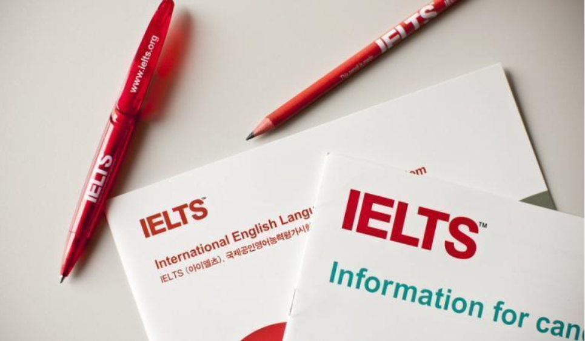 (原始链接: https://mmbiz.qpic.cn/mmbiz_png/Mvb870zkymhTRW78qzmhFibRH9ftfpwt6CqibafO7jhaOQDQpyfwTUibNUfzFTrre2qPfLG9A2iaAZN8wMibdGfmhow/640?wx_fmt=png)
- 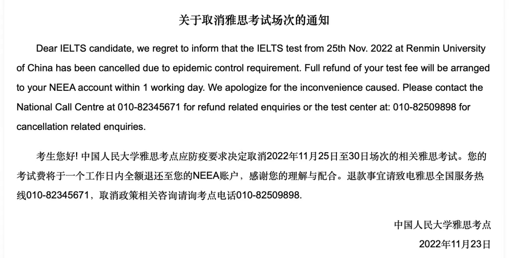 (原始链接: https://mmbiz.qpic.cn/mmbiz_png/Mvb870zkymhTRW78qzmhFibRH9ftfpwt6uhNBhQGpSMNOJJVklv8OGyJcQUqE8dUHtpicYMV77K8nSobzGUR7iawQ/640?wx_fmt=png)
- 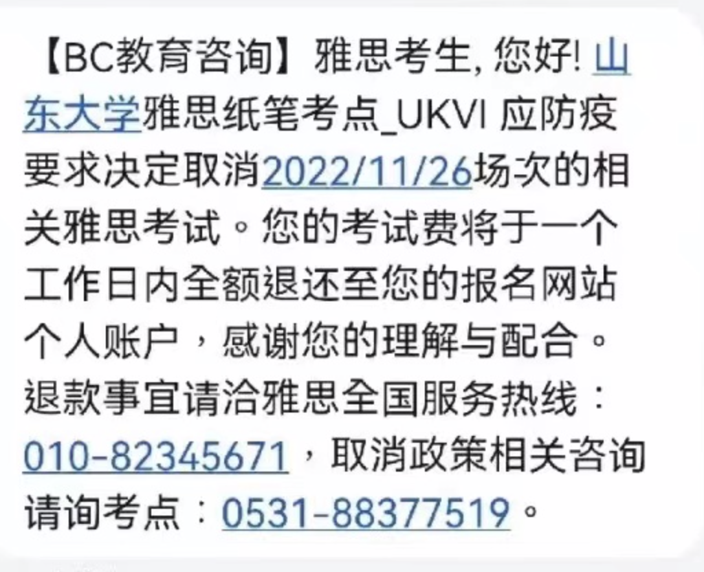 (原始链接: https://mmbiz.qpic.cn/mmbiz_png/Mvb870zkymhTRW78qzmhFibRH9ftfpwt6xiaAu2UF4mQrT4yLHwfeEPzKiaBLXjb0atOQRc8EicpiaxaauQ4MYFewcA/640?wx_fmt=png)
- 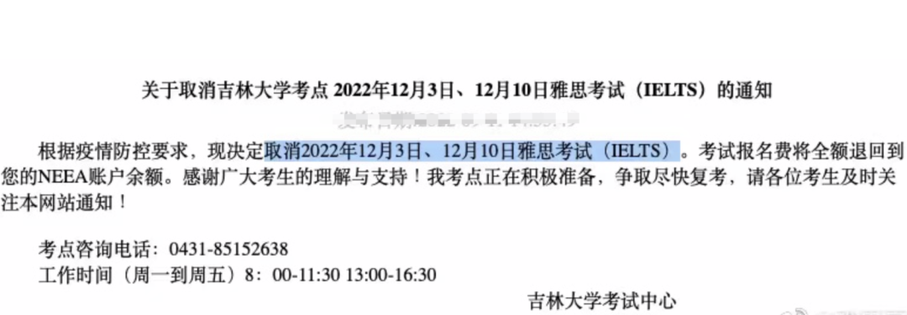 (原始链接: https://mmbiz.qpic.cn/mmbiz_png/Mvb870zkymhTRW78qzmhFibRH9ftfpwt6YLyMiauFkiczVjIwoa3sQLUibyqNAtF2uAPrffR2RibIucI23TDOtLFAoA/640?wx_fmt=png)
-  (原始链接: https://mmbiz.qpic.cn/mmbiz_png/Mvb870zkymhTRW78qzmhFibRH9ftfpwt6L1pGHhRpwfgYgcwssr9VeQqnqWPUdDo0Z3rHNJ5wK02oJHuhltUdEQ/640?wx_fmt=png)
-  (原始链接: https://mmbiz.qpic.cn/mmbiz_gif/Mvb870zkymhTRW78qzmhFibRH9ftfpwt6UJQpBWGH1H6rCv1pEYm8ibCNSjof2GunTk2jzY6iczsRD4YPFib7crULQ/640?wx_fmt=gif)
- 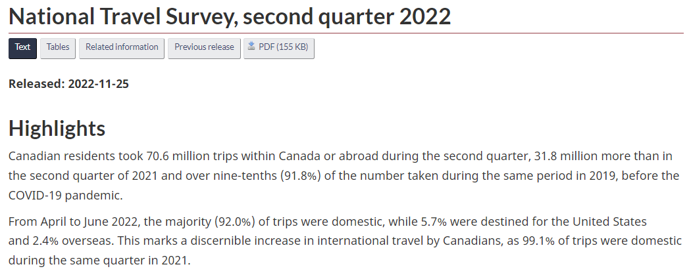 (原始链接: https://mmbiz.qpic.cn/mmbiz_png/Mvb870zkymhTRW78qzmhFibRH9ftfpwt6OYicf7hicCoMULhoUicibTHrGfDOHxIvAyphGSwTFLvTCRA2D8S4OL0wjA/640?wx_fmt=png)
-  (原始链接: https://mmbiz.qpic.cn/mmbiz_jpg/Mvb870zkymhTRW78qzmhFibRH9ftfpwt6KVwHImmZtLq1sYVI11Bw1AicvGUbwuw4JicN0Tfib7v9Kzom9CJfVPbSw/640?wx_fmt=jpeg)
- 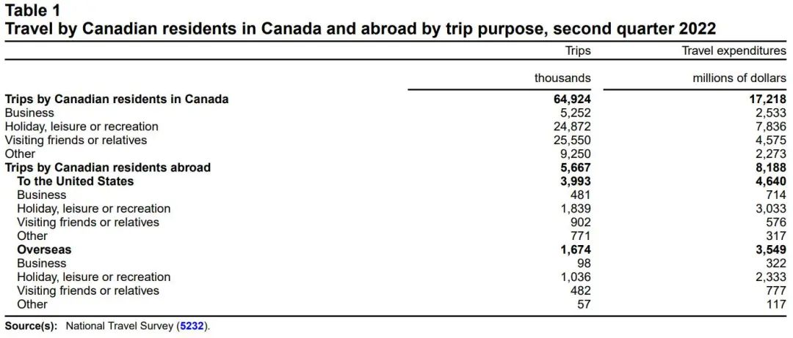 (原始链接: https://mmbiz.qpic.cn/mmbiz_jpg/Mvb870zkymhTRW78qzmhFibRH9ftfpwt6B5aX9p4dHYAyeqn4jYMBAlmVB7ZhmXkfibxlzhsLcOvb4yNCDdfeHtw/640?wx_fmt=jpeg)
- 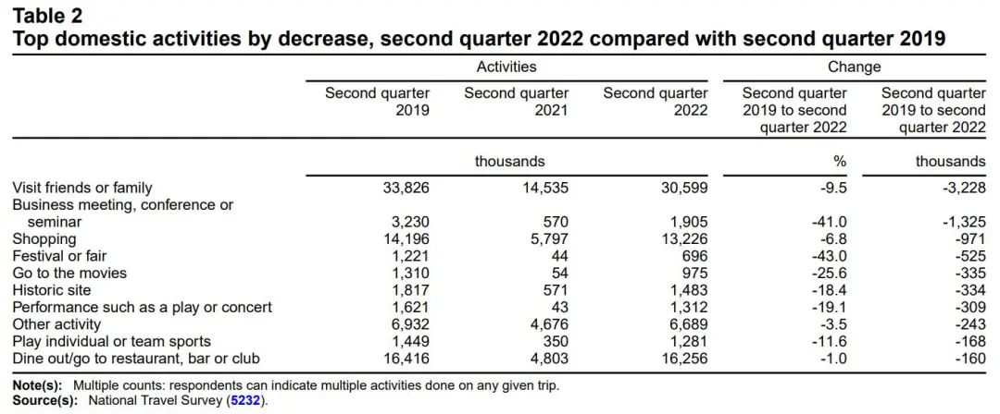 (原始链接: https://mmbiz.qpic.cn/mmbiz_jpg/Mvb870zkymhTRW78qzmhFibRH9ftfpwt6tb1XsXBNJxHELtZEJOgmnJMP0KAwsRxnfjHPWnx1I1b3Jiaiad9q4Q9A/640?wx_fmt=jpeg)
- 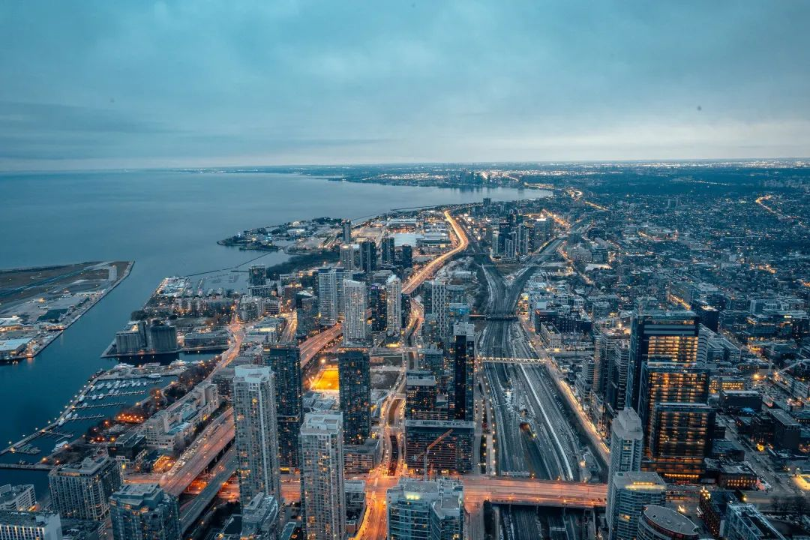 (原始链接: https://mmbiz.qpic.cn/mmbiz_jpg/Mvb870zkymhTRW78qzmhFibRH9ftfpwt6iabDk3BtgZibDyQpBIibKDlCEwNWhCRBUt5qGM2BqporQPEZOMTG3KtLA/640?wx_fmt=jpeg)
- 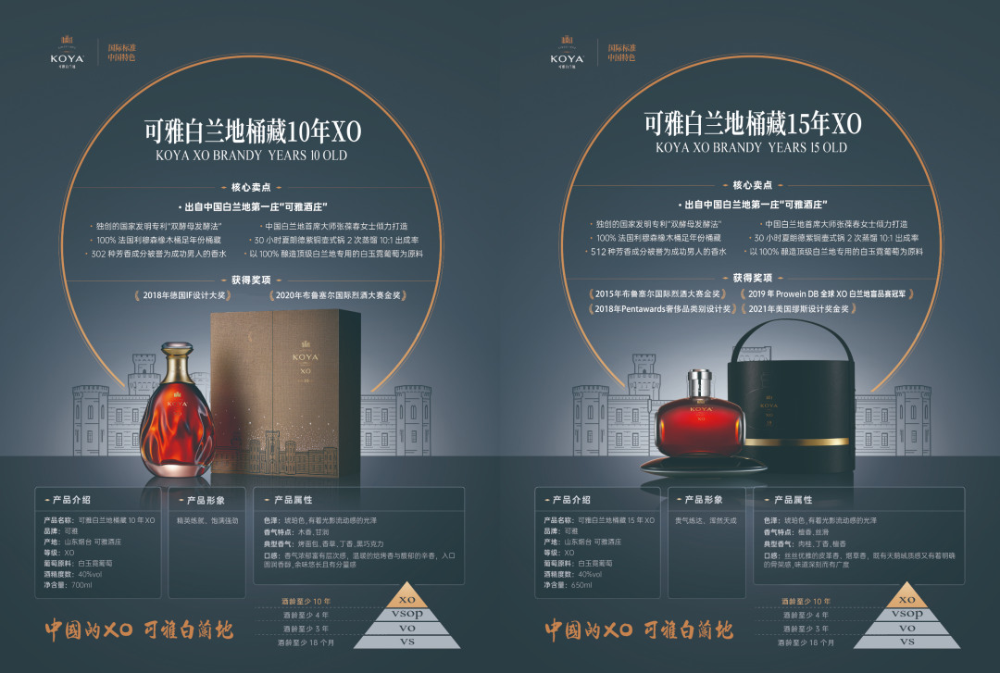 (原始链接: https://mmbiz.qpic.cn/mmbiz_png/Mvb870zkymhTRW78qzmhFibRH9ftfpwt6kLdE85eZz54ObnkAHySBInaf4blTDMjupCj2yyWo1gAgrkNosiab45Q/640?wx_fmt=png)
-  (原始链接: https://mmbiz.qpic.cn/mmbiz_jpg/Mvb870zkymhTRW78qzmhFibRH9ftfpwt6hwLe4565icJib4jrcnU7mCepNKgKwod9rcn3yJLXaAxPf7uDic85eFozQ/640?wx_fmt=jpeg)
- 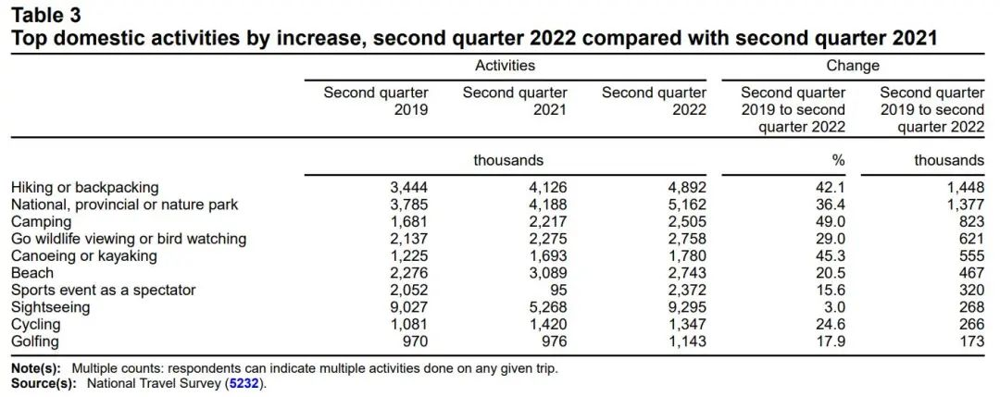 (原始链接: https://mmbiz.qpic.cn/mmbiz_jpg/Mvb870zkymhTRW78qzmhFibRH9ftfpwt6W1wcW1skL0vSfgYUiafHOHngdsmVBfwYa3pkEiatl2ycPAHx63iaRQSFQ/640?wx_fmt=jpeg)
-  (原始链接: https://mmbiz.qpic.cn/mmbiz_jpg/Mvb870zkymhTRW78qzmhFibRH9ftfpwt6hQuxy0icj3suFs2XBw8YOo9Doz5t5CPddI8aAcQcjgfKBGpFGHhWibwA/640?wx_fmt=jpeg)
- 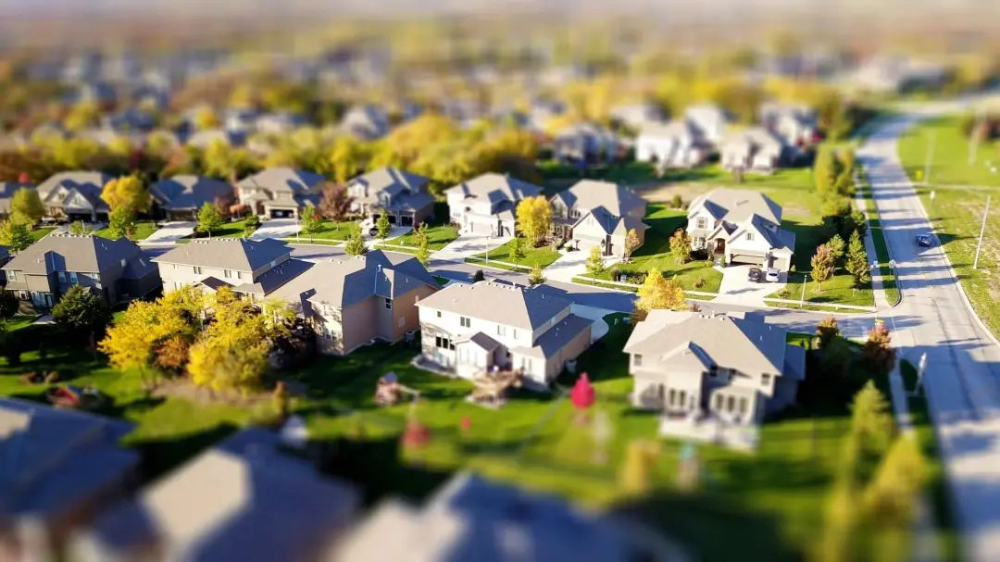 (原始链接: https://mmbiz.qpic.cn/mmbiz_jpg/Mvb870zkymhTRW78qzmhFibRH9ftfpwt66zLhcfQXDlCMOAH3FIdaHao2yIq5c1kf2B9HIZJv3fH7uEibOTBsS6w/640?wx_fmt=jpeg)
-  (原始链接: https://mmbiz.qpic.cn/mmbiz_jpg/Mvb870zkymhTRW78qzmhFibRH9ftfpwt6lImUKvHgRt6JzaTyJCupaWG5WH6GnBQH0OsLIsm86rsYic8Jrhhoibxw/640?wx_fmt=jpeg)
-  (原始链接: https://mmbiz.qpic.cn/mmbiz_jpg/Mvb870zkymhTRW78qzmhFibRH9ftfpwt6juOr3tFTqrBFlzJCcGZIgWCQBddwnYzoIUC8gcib48a18jWCQ5XB3Vw/640?wx_fmt=jpeg)
-  (原始链接: https://mmbiz.qpic.cn/mmbiz_jpg/Mvb870zkymhTRW78qzmhFibRH9ftfpwt6OaP08SyqSpqTfAo5RGngiaWZTptnUtaEWzFWAyyzXfRN5gQsvKdpPbw/640?wx_fmt=jpeg)
-  (原始链接: https://mmbiz.qpic.cn/mmbiz_jpg/Mvb870zkymhTRW78qzmhFibRH9ftfpwt6ePv3PmyQ4b5NQD41oRGCWR6icS0v2TuIYHxhbyXAicYp8ZnZkdy3zia0g/640?wx_fmt=jpeg)
-  (原始链接: https://mmbiz.qpic.cn/mmbiz_png/Mvb870zkymhTRW78qzmhFibRH9ftfpwt66uKwicFXtU7alnTz12BJ7vO2AxD7CibvW1wEOrMGNN51KbnFYJQzgwAg/640?wx_fmt=png)
-  (原始链接: https://mmbiz.qpic.cn/mmbiz_png/Mvb870zkymhTRW78qzmhFibRH9ftfpwt6Lyiasq85jydMEz5uMJ7OGKeMSeicKfxA9p6IrALO4h6xZQFlVtaibnzmA/640?wx_fmt=png)
-  (原始链接: https://mmbiz.qpic.cn/mmbiz_png/Mvb870zkymhTRW78qzmhFibRH9ftfpwt6IEq79bvUkj6kRun788OfFvib1faNslk3KuyJdWlZCZibGa6YTnDkZu8w/640?wx_fmt=png)
-  (原始链接: https://mmbiz.qpic.cn/mmbiz_png/Mvb870zkymhTRW78qzmhFibRH9ftfpwt6DpuniaPBLiboiaFqBfqhIMqsibvMZoywQXrjHxGfFzNzlvjtjib2yqgv0eQ/640?wx_fmt=png)
-  (原始链接: https://mmbiz.qpic.cn/mmbiz_jpg/Mvb870zkymhTRW78qzmhFibRH9ftfpwt6jEI6icHCZZykwFTSAJqn5qbM8gE2ZKnoaaWWwQ8ibjExcOEbtlNpBFLA/640?wx_fmt=jpeg)
-  (原始链接: https://mmbiz.qpic.cn/mmbiz_jpg/Mvb870zkymhTRW78qzmhFibRH9ftfpwt6sKdWEGlRspkBlfz4epLGyQ5FPtq5HmaZXWf7tJ8HqfEaUSVgpTx15A/640?wx_fmt=jpeg)
-  (原始链接: https://mmbiz.qpic.cn/mmbiz_jpg/Mvb870zkymhTRW78qzmhFibRH9ftfpwt6JWSJb8sg6rRLgZJcTEmeFTZibG0oORQWC0ZkYL9el3XDYbJOqm2zNJQ/640?wx_fmt=jpeg)
-  (原始链接: https://mmbiz.qpic.cn/mmbiz_png/Mvb870zkymhTRW78qzmhFibRH9ftfpwt6gEib1jG4mZhhxuiaOB0QnDyDhb2lhTfPR5RuAAn7tAluL4ynfdFbGahw/640?wx_fmt=png)
-  (原始链接: https://mmbiz.qpic.cn/mmbiz_jpg/Mvb870zkymhTRW78qzmhFibRH9ftfpwt6NBZmWcr8icrAdLQJe3FnUabl19XZvQjrUlwKm51AmqMe6UMweB69AYA/640?wx_fmt=jpeg)
-  (原始链接: https://mmbiz.qpic.cn/mmbiz_jpg/Mvb870zkymhTRW78qzmhFibRH9ftfpwt6qADcE3RsGl9B3DdYuhtKffC7wOTIzyCguhJZrsMCiaRAic1QmyBjn26g/640?wx_fmt=jpeg)
